---
jupyter:
  jupytext:
    text_representation:
      extension: .md
      format_name: markdown
      format_version: '1.3'
      jupytext_version: 1.19.1
  kernelspec:
    display_name: Python 3 (ipykernel)
    language: python
    name: python3
---

<!-- #region tags=["title"] -->
# Leveraging Open Source LLMs for Historical Databases of Agricultural Science Research
<!-- #endregion -->

<!-- #region tags=["contributor"] -->
 ### William Blakemore  Lyon [](https://orcid.org/0000-0002-7558-1095) 
University of Zurich
<!-- #endregion -->

<!-- #region tags=["contributor"] -->
### Petra  Gerber [](https://orcid.org/0000-0002-1471-2098) 
University of Zurich
<!-- #endregion -->

<!-- #region tags=["contributor"] -->
### Devin  Routh [](https://orcid.org/0000-0002-5910-8847) 
University of Zurich
<!-- #endregion -->

<!-- #region tags=["contributor"] -->
### Yi-Tang  Lin [](https://orcid.org/0000-0003-2688-9445) 
University of Zurich
<!-- #endregion -->

<!-- #region tags=["contributor"] -->
### Scott  Ma [](https://orcid.org/0000-0002-1511-1972) 
University of Zurich
<!-- #endregion -->

<!-- #region tags=["copyright"] -->
[](https://creativecommons.org/licenses/by-nc-nd/4.0/) 
© William Blakemore Lyon, Petra Gerber, Devin Routh, Yi-Tang Lin, Scott Ma. Published by De Gruyter in cooperation with the University of Luxembourg Centre for Contemporary and Digital History. This is an Open Access article distributed under the terms of the [Creative Commons Attribution License CC-BY-NC-ND](https://creativecommons.org/licenses/by-nc-nd/4.0/)

<!-- #endregion -->

<!-- #region tags=["disclaimer"] -->
1. This work was supported by the Swiss National Science Foundation (SNSF) under the PRIMA grant “Rice Knowledge and Practices between Pacific Asia and West Africa: International Development Meets Local Farming (1960–1991)” (Grant No. 208475).

2. As of today, the staff publication webpage remains accessible; however, the publication listing functionality is no longer active, and no publications are displayed. Instead, a publications and databases webpage is available, which lists only publications dated from 2010 onward (https://www.irri.org/publications). We have contacted the organization for clarification.
 
<!-- #endregion -->

<!-- #region tags=["keywords"] -->
H2OGPT, open History, open Science, LLM, International Rice Research Institute, Green Revolution, gender, market
<!-- #endregion -->

<!-- #region tags=["abstract"] -->
If historians’ tasks include identifying relevant information, discerning recurring themes across records, analysing the evolution of ideas or institutions over time, and contextualizing these within their broader contexts—all while maintaining interpretive and scholarly rigour—how can we effectively work with digital corpora that are too large to tackle manually? Large language models (LLMs) appear to be a possible solution.  

The modus operandi we propose here is using an open-source LLM framework (H2OGPT), through which historians can control text input and the source citations used to generate every response are specified via the retrieval-augmented generation (RAG) capability. Using a case that emerged from our research on rice science of the International Rice Research Institute (IRRI) in West Africa, our corpus was intended to audit organizations’ perspectives by reading the documents that IRRI uploaded online as part of the Staff Publications. As IRRI became globally known for its scientific and technological interventions in rice farming in Asia, how would this research institute interpret West African rice cultures and landscapes when asked to recreate the miracle in that region in the 1970s and ’80s?  

Two crucial insights emerged from our interactions with the corpus. First, we argue that LLMs are best used not as replacements for analysis but as “sparring partners” for reasoning. Second, after reviewing source citations, it becomes clear that the LLM often favours specific sources without an immediately human-interpretable reason. The selected excerpts do not always appear relevant or meaningful to a human reader. We therefore defend the necessity of using AI within an Open History framework, where researchers retain control over the corpus they upload, and verify the cited sources, thereby enhancing the transparency of research processes.
<!-- #endregion -->

## Introduction


With the recent wave of digitization of historical records, historians are increasingly faced with large yet uneven online corpora. Our tasks include identifying relevant information, discerning themes across records, analysing changes in ideas or institutions over time, and contextualizing these more broadly. How do historians handle corpora that are too large to tackle manually? Artificial Intelligence (AI), in particular large language models (LLMs), appears to be a possible solution. Students and specialists have come to use AI for purposes including question framing, source reading and analysis, writing, editing, and exploring large sets of texts. The results, however, are mixed, as AI can and does return seemingly realistic but factually incorrect outputs. This paper proposes a modus operandi, making LLMs’ reasoning process more transparent by controlling the input texts that form a corpus, as well as returning the source citations used to generate every response via its retrieval-augmented generation (RAG) capability. With such a mechanism, LLMs could be leveraged in historical research as supplementary reading, complementing the close reading of each text.

<!-- #region citation-manager={"citations": {"1xmsh": [{"id": "15179470/RH6WGHHH", "source": "zotero"}], "57z4o": [{"id": "15179470/EUKTXM8Z", "source": "zotero"}], "6meog": [{"id": "15179470/PFW883VU", "source": "zotero"}], "7w46f": [{"id": "15179470/8G7XKE5G", "source": "zotero"}], "dmm8i": [{"id": "15179470/622QZPUC", "source": "zotero"}], "f1eyl": [{"id": "15179470/Z8YLX5YA", "source": "zotero"}], "hgx29": [{"id": "15179470/FG8YQ6ER", "source": "zotero"}], "ii3vs": [{"id": "15179470/5YNVKRXE", "source": "zotero"}], "j15ym": [{"id": "15179470/LAKDK55C", "source": "zotero"}], "k6zya": [{"id": "15179470/NMA3XEXL", "source": "zotero"}], "ld24g": [{"id": "15179470/JPQH8RVL", "source": "zotero"}], "lwviy": [{"id": "15179470/BZKUZFGG", "source": "zotero"}], "orvda": [{"id": "15179470/YNRXNCGK", "source": "zotero"}], "wymdy": [{"id": "15179470/XI2MR9FZ", "source": "zotero"}]}} -->
Professional associations of historians, as well as journals, have not ceased to recommend and discuss various use cases with AI (<cite id="lwviy"><a href="#zotero%7C15179470%2FBZKUZFGG">(Baxter, Mandur, and Stroyan 2024)</a></cite>, <cite id="ld24g"><a href="#zotero%7C15179470%2FJPQH8RVL">(Hewage 2025)</a></cite>, <cite id="ii3vs"><a href="#zotero%7C15179470%2F5YNVKRXE">(Broad 2025)</a></cite>). The American Historical Association (AHA), for instance, released its first guiding principles on history education and AI in August 2025, emphasizing transparency in usage, AI literacy, and the value of historical expertise over LLM outputs. The recommendations illustrated the general trend of integrating LLMs into historical research, yet provided little in the way of a concrete protocol with which to engage with LLMs (<cite id="k6zya"><a href="#zotero%7C15179470%2FNMA3XEXL">(AHA Ad Hoc Committee on AI in History Education 2025)</a></cite>). Meanwhile, research with LLMs continues at a rapid pace. Wulf Kansteiner has recommended the implementation of AI within historical theory, arguing that it can help test basic hypotheses about the nature of historical writing (<cite id="57z4o"><a href="#zotero%7C15179470%2FEUKTXM8Z">(Kansteiner 2022)</a></cite>) and Jan Burzlaff has demonstrated AI’s limited ability to imitate historical writing in interpreting Holocaust testimonies (<cite id="orvda"><a href="#zotero%7C15179470%2FYNRXNCGK">(Burzlaff 2025)</a></cite>). Other use-cases are more expansive, recommending the use of LLMs to replicate historical individuals’ ways of thinking: Varnum, Baumard, Atari and Gray trained AI on the corpora of past societies, from ancient Romans to the early modern Japanese (<cite id="hgx29"><a href="#zotero%7C15179470%2FFG8YQ6ER">(Varnum et al. 2024)</a></cite>). Li, Hu and Wang have developed LLMs specifically for text analysis, in their case for classical Chinese, by tuning the LLM to enhance factual accuracy and the capacity for deep reasoning (<cite id="7w46f"><a href="#zotero%7C15179470%2F8G7XKE5G">(Li, Hu, and Wang 2025)</a></cite>, for similar forms of LLM research, see: <cite id="dmm8i"><a href="#zotero%7C15179470%2F622QZPUC">(Zeng 2024)</a></cite>, <cite id="1xmsh"><a href="#zotero%7C15179470%2FRH6WGHHH">(Yang et al. 2025)</a></cite>). Others still, like Celli and Mingazov, have laid out LLMs’ capacity to analyse and interpret datasets, to which our case study adds (<cite id="j15ym"><a href="#zotero%7C15179470%2FLAKDK55C">(Celli and Mingazov 2024)</a></cite>, for additional recent work on History and AI, see: <cite id="6meog"><a href="#zotero%7C15179470%2FPFW883VU">(Garcia and Weilbach 2023)</a></cite>, <cite id="wymdy"><a href="#zotero%7C15179470%2FXI2MR9FZ">(Liu et al. 2024)</a></cite>, <cite id="f1eyl"><a href="#zotero%7C15179470%2FZ8YLX5YA">(Klein et al. 2025)</a></cite>).  
<!-- #endregion -->

<!-- #region citation-manager={"citations": {"98tpd": [{"id": "15179470/29AC2A2Q", "source": "zotero"}], "ay3d7": [{"id": "15179470/WUGG5TU7", "source": "zotero"}], "clzta": [{"id": "15179470/KPUJQE9Z", "source": "zotero"}], "l3qy8": [{"id": "15179470/MB5DWSRX", "source": "zotero"}], "m5s4p": [{"id": "15179470/P3QQF32D", "source": "zotero"}], "qw138": [{"id": "15179470/D8V63RSW", "source": "zotero"}], "xq75r": [{"id": "15179470/3SMRY2TQ", "source": "zotero"}]}} -->
This article contributes to the expanding body of scholarship by placing a distinct emphasis on making LLMs and their reading more transparent to users. We use an open-source LLM framework (H2OGPT) (<cite id="clzta"><a href="#zotero%7C15179470%2FKPUJQE9Z">(Candel et al. 2023)</a></cite>) to analyse a large corpus, digitized and uploaded by the International Rice Research Institute (IRRI), which later became part of the renowned Consultative Group of International Agricultural Research (CGIAR), the flagship structure for agricultural research at a global level. These organizations fit our research in terms of their recognized centrality in international organization historiography yet pose a barrier to scholarly research due to their global scope. Often described as the drivers of the “Green Revolution”, denoting significant crop yield increases in the late 1960s, IRRI and, later, CGIAR attracted much scholarly attention (<cite id="xq75r"><a href="#zotero%7C15179470%2F3SMRY2TQ">(Bray 1979)</a></cite>, <cite id="l3qy8"><a href="#zotero%7C15179470%2FMB5DWSRX">(Anderson, Levy, and Morrison 1991)</a></cite>, <cite id="98tpd"><a href="#zotero%7C15179470%2F29AC2A2Q">(Chandler 1992)</a></cite>, <cite id="ay3d7"><a href="#zotero%7C15179470%2FWUGG5TU7">(Baranski 2022)</a></cite>, <cite id="m5s4p"><a href="#zotero%7C15179470%2FP3QQF32D">(Lorek 2023)</a></cite>). Nonetheless, due to the organizations’ complexity, with 10-20 institutes across the globe that were part of the CGIAR successively, the first historiography dedicated to the CGIAR was published only very recently (<cite id="qw138"><a href="#zotero%7C15179470%2FD8V63RSW">(Curry and Lorek 2024)</a></cite>).  
<!-- #endregion -->

<!-- #region citation-manager={"citations": {"kmq7k": [{"id": "15179470/ZG62HPYR", "source": "zotero"}]}} -->
Our corpus was intended to audit organizations’ perspectives by reading the documents that IRRI uploaded online as Staff Publications (<cite id="kmq7k"><a href="#zotero%7C15179470%2FZG62HPYR">(IRRI 2023)</a></cite>). The website categorized documents as journal articles, books and chapters, proceedings, reports, and seminar papers. Some internal documents, such as trip reports, were also uploaded. We began with thousands of files, which were eventually winnowed down to a selection that best aligned with our research questions, focusing on IRRI’s perspective on West African rice culture. As IRRI became globally known for its scientific and technological interventions in rice farming in Asia, how would this research institute interpret West African rice cultures and landscapes when asked to recreate the miracle in that region in the 1970s and ’80s?
<!-- #endregion -->

Two crucial insights emerged from our interactions with the corpus, facilitated by our chosen open-source framework that returns source citations. First, we argue that LLMs are best used not as replacements for analysis but as “sparring partners” for reasoning. LLMs could offer alternative perspectives on a complex corpus, e.g., indicating potential normative biases in the corpus based on each document’s metadata. They cannot substitute for a researcher’s capacity for inferring an implied meaning without explicit mention, nor can they contextualize or offer any original contemplations. When communicating with the LLMs, specific questions guided by our subject-matter expertise and back-and-forth dialogue were necessary. The process of refining questions could yield interesting and valuable insights from the LLM. Still, it requires a historian’s expertise and prior knowledge of the subject matter to deepen the conversations with the LLMs. Otherwise, we would receive overgeneralized, misleading, or factually wrong answers.


Second, after reviewing source citations, it becomes clear that the LLM often favours specific sources without an immediately human-interpretable reason. The selected excerpts do not always appear relevant or meaningful to a human reader. We therefore defend the necessity of using AI within an Open History framework, where researchers can control the corpus they upload and verify the cited sources, thereby enhancing the transparency of research processes. Inspired by Open Science, Open History seeks to make research workflows and outputs openly accessible to improve transparency, collaboration, reproducibility, and impact, following the FAIR data guidelines: Findable, Accessible, Interoperable, and Reusable. 


## Setting the Stage: Historiographies of the Green Revolution 

<!-- #region citation-manager={"citations": {"6xkxx": [{"id": "15179470/4C75QLJV", "source": "zotero"}], "8f88a": [{"id": "15179470/PNNF7TAQ", "source": "zotero"}], "wqnld": [{"id": "15179470/PAYDIMGQ", "source": "zotero"}]}} -->
Scholars have debated the Green Revolution since the term was first coined in the 1960s. The US official development assistance (ODA) officer William Gaud used the term to explain the surge in crop yields in countries such as India and Mexico during that period. Gaud’s terminology implied that such increases were driven by improved seeds and mechanized farming technologies supplied by US official development assistance and philanthropic foundations such as the Rockefeller and Ford Foundations that earmarked international agricultural research institutes such as the International Maize and Wheat Improvement Centre (CIMMYT) in Mexico and the IRRI in the Philippines. Experts have since debated whether these capital-intensive technical artifacts truly improved farmers’ lives or simply plunged them into debt, as crop prices dropped when yields rose. Conversely, countries without US support also experienced crop increases around the same time, with yield declines in India and Mexico in some years of the 1970s (<cite id="wqnld"><a href="#zotero%7C15179470%2FPAYDIMGQ">(Shiva 1991)</a></cite>, <cite id="8f88a"><a href="#zotero%7C15179470%2FPNNF7TAQ">(Byerlee and Siddiq 1994)</a></cite>, <cite id="6xkxx"><a href="#zotero%7C15179470%2F4C75QLJV">(Patel 2013)</a></cite>).
<!-- #endregion -->

<!-- #region citation-manager={"citations": {"0cabq": [{"id": "15179470/RLPY22RS", "source": "zotero"}], "r8gik": [{"id": "15179470/MB5DWSRX", "source": "zotero"}], "x0zs2": [{"id": "15179470/D8V63RSW", "source": "zotero"}]}} -->
These debates placed international agricultural research centres in the spotlight and concluded that they had concentrated on promoting technical packages focused on high-yielding seeds, overlooking socio-economic contexts. However, international agricultural research centres were diverse, comprising a broad range of research fields and scientists. Publications, authored mainly by the involved actors, testified to the existence of various research approaches beyond the technological packages (<cite id="r8gik"><a href="#zotero%7C15179470%2FMB5DWSRX">(Anderson, Levy, and Morrison 1991)</a></cite>, <cite id="0cabq"><a href="#zotero%7C15179470%2FRLPY22RS">(Byerlee and Lynam 2020)</a></cite>, <cite id="x0zs2"><a href="#zotero%7C15179470%2FD8V63RSW">(Curry and Lorek 2024)</a></cite>). To what extent did these international agricultural research centres research and conceive socio-economic contexts?
<!-- #endregion -->

<!-- #region citation-manager={"citations": {"cdbtj": [{"id": "15179470/CMPZT4WI", "source": "zotero"}], "k21ej": [{"id": "15179470/D8V63RSW", "source": "zotero"}], "opmmj": [{"id": "15179470/CWRKW5TA", "source": "zotero"}], "wz5pw": [{"id": "15179470/CTUQT3WG", "source": "zotero"}]}} -->
Our research examines this question through analysing the perspectives expressed in the historical publications and documents of the IRRI. Specifically, we focus on an often-overlooked episode in IRRI’s history, when the institute was asked to address rice farming in West Africa, supporting the West Africa Rice Development Association, an organization founded in 1971 with the support of eleven West African countries, and was admitted to the CGIAR shortly afterwards (<cite id="wz5pw"><a href="#zotero%7C15179470%2FCTUQT3WG">(Walsh 2001)</a></cite>, <cite id="opmmj"><a href="#zotero%7C15179470%2FCWRKW5TA">(Eugene Terry 2014)</a></cite>, <cite id="cdbtj"><a href="#zotero%7C15179470%2FCMPZT4WI">(Harro Maat 2024)</a></cite>, <cite id="k21ej"><a href="#zotero%7C15179470%2FD8V63RSW">(Curry and Lorek 2024)</a></cite>). The rice-farming practices of the two regions seemed perfectly opposed. Upland cultivation dominated rice cultivation in West Africa. Farmers relied on natural water sources, requiring minimal labour and no chemical inputs. This was the opposite of rice farming in Asia, which the IRRI promoted. Through chemical inputs, irrigation infrastructure, and high-yielding seeds, technology intervened at all stages of rice farming. How did the IRRI read the socio-economic contexts of rice farming in West Africa? To what extent did the IRRI focus its efforts on rice production instead of consumption? To answer these questions, we started by building the corpus. 
<!-- #endregion -->

<!-- #region tags=["hermeneutics"] -->
## Method
<!-- #endregion -->

<!-- #region tags=["hermeneutics"] -->
### Step 1: Building the Corpus 
<!-- #endregion -->

<!-- #region citation-manager={"citations": {"f598o": [{"id": "15179470/RIZV9KSE", "source": "zotero"}], "xllvf": [{"id": "15179470/ZG62HPYR", "source": "zotero"}]}} tags=["hermeneutics"] -->
We obtained our corpus from the IRRI Staff Publications online database (<cite id="xllvf"><a href="#zotero%7C15179470%2FZG62HPYR">(IRRI 2023)</a></cite>), which contains publications written by IRRI researchers ([Table 1](#anchor-tableall)). The database of approximately 13,000 files could also be downloaded as a single CSV file. Because this CSV did not include data on the type of publication (journal article, book etc.), we manually edited this single file to include type metadata (<cite id="f598o"><a href="#zotero%7C15179470%2FRIZV9KSE">(Gerber and Routh 2025)</a></cite>). We also did some light data processing to correct for missing data, e.g. some literature for which we didn’t have a publication year. Next, we narrowed the data of interest to documents published between 1960 and 1991, and those available via open access.
<!-- #endregion -->

<!-- #region jdh={"module": "object", "object": {"source": ["IRRI Database overview with published years and article titles per accession point of 28th August 2023."]}} tags=["data-table", "table-all-*", "anchor-tableall", "hermeneutics"] -->
| Year | Article |
|---|---|
| 2023 | A. Valera, Harold Glenn, Mark J. Holmes, Valerien O. Pede, and Jean Balié How convergent are rice export prices in the international market? Agricultural Economics 54, no. 1 (2023): 127-141. doi:10.1111/agec.12758 Altmetrics score 1 |
| 2023 | Ajay, Anurag, Madhulika Singh, Subhajit Patra, Harshit Ranjan, Ajay Pundir, Shishpal Poonia, Anurag Kumar, Deepak K. Singh, Pankaj Kumar, Moben Ignatius, Prabhat Kumar, Sonam R. Sherpa, Ram K. Malik, Virender Kumar, Sudhanshu Singh, Peter Craufurd, and Andrew J. McDonald Multi-year on-farm trial data on the performance of long- and short-duration wheat varieties against sowing dates in the Eastern Indo-Gangetic Plain of India Data 8, no. 39 (2023): 1-7. doi:10.3390/data8020039 Altmetrics score 16 |
| 2023 | Alam, G. M. Monirul, Md Nazirul Islam Sarker, Md Abdus Samad Kamal, Most Nilufa Khatun, and Humnath Bhandari Impact of covid-19 on smallholder aquaculture farmers and their response strategies: empirical evidence from Bangladesh Sustainability 15, no. 3 (2023): p. 2638 doi:10.3390/su15032638 |
| 2023 | Alam, GM Monirul, Most Nilufa Khatun, Md Nazirul Islam Sarker, Niraj Prakash Joshi, and Humnath Bhandari Promoting agri-food systems resilience through ICT in developing countries amid COVID-19 Frontiers in Sustainable Food Systems 6, no. 972667 (2023): 1-14. doi:10.3389/fsufs.2022.972667 Altmetrics score 1 |
| 2023 | Andreo-Jimenez, Beatriz, Dennis E. te Beest, Willem Kruijer, Nathan Vannier, Niteen N. Kadam, Giovanni Melandri, S. V. Krishna Jagadish, Gerard van der Linden, Carolien Ruyter-Spira, Philippe Vandenkoornhuyse, and Harro J. Bouwmeester Genetic mapping of the root mycobiota in rice and its role in drought tolerance Rice 16, no. 26 (2023): 16 p. doi:10.1186/s12284-023-00641-4 Altmetrics score 6 |
| 2023 | Andriatsiorimanana, Aina, Joseph Bigirimana, Kalimuthu Senthilkumar Understanding rice farming practices through SRP (Sustainable Rice Platform) survey in Burundi Report on Transforming Agri-Food Systems in West and Central Africa, 22 p. CGIAR | Africa Rice, IRRI: 2023. |
| 2023 | Anumalla, Mahender, Margaret Catolos1, Joie Ramos, Ma Teresa Sta. Cruz, Apurva Khanna, Teodoro Cuevas, Alma Fuentes, Evangeline Angeles, Cesar Caspillo, Nicca Muñes, Waseem Hussain A review of a great admin support: A case study by LMG Late Maturity Group 15, no. 12 (2023): 1. |
| 2023 | Asante, Bright Owusu, Ranjitha Puskur, Elizabeth Garner, Margaret Najjingo Mangheni, Richard Adabah, Maxwell Darko Asante, Benedicta Nsiah Frimpong, and Stephen Prah Access and control of resources and participation in rice-breeding activities among men and women farmers in southern Ghana Sustainability 15, no. 7069 (2023): 1-28. doi:10.3390/su15097069 |
| 2023 | Asch, F., K. Johnson, T. B. T. Vo, B. O. Sander, V. N. Duong, and R. Wassmann Varietal effects on methane intensity of paddy fields under different irrigation management Journal of Agronomy and Crop Science (2023): 1-11. doi:10.1111/jac.12662 |
| 2023 | Ayyenar, Bharathi, Rohit Kambale, Sudhakar Duraialagaraja, Sudha Manickam, Vignesh Mohanavel, Priyanka Shanmugavel, Senthil Alagarsamy, Tsutomu Ishimaru, S.V. Krishna Jagadish, Geethalakshmi Vellingiri, and Raveendran Muthurajan Developing early morning flowering version of rice variety CO 51 to mitigate the heat-induced yield loss Agriculture 13, no. 553 (2023): 1-13. doi:10.3390/agriculture13030553 |
| 2023 | Barnard, Jennifer, One Quoc Cuong, Trang H. Vu, K. M. Nelson Use of digital tools in sustainable rice production in the Mekong Delta, Vietnam Agroecological TRANSITIONS: Inclusive Digital Tools to Enable Climate-informed Agroecological Transitions (ATDT). Hanoi, Vietnam: International Rice Research Institute (IRRI), 2023. 26 p. |
| 2023 | Bashyal, Bishnu Maya, Gaurav Kumar Yadav, Pooja Parmar, Sunil Kumar Sunani, Shweta Aggarwal, S. Gopala Krishnan, Atul Kumar, Najam Waris Zaidi, and Rashmi Aggarwal High-quality genome resource of Ustilaginoidea virens (UV2_4G), causal agent of an emerging false smut disease in rice Plant Disease (2023): 1-3. doi:10.1094/pdis-05-22-1193-a Altmetrics score 2 |
| 2023 | Bautista, Aerone Philippe G., Alice B. Mataia, Chona P. Austria, Marites M. Tiongco, and Alice G. Laborte Adoption and performance of direct-seeded rice (DSR) technology in the Philippines Philippine Journal of Science 152 , no. 1 (2023): 459-484. |
| 2023 | Beye, Abdoulaye, Claire Billot, Joëlle Ronfort, Kenneth L. McNally, Diaga Diouf, and Jean Christophe Glaszmann Traces of introgression from cAus into tropical japonica observed in African upland rice varieties Rice 16, no. 12 (2023): 1-20. doi:10.1186/s12284-023-00625-4 |
| 2023 | Biswas, Amlan, Md. Safiul Islam Afrad, Muhammad Ziaul Hoque, Md. Abdullah Al Mamun, Muhammad Ashraful Habib, Swati Nayak, Saidul Islam, Nuruzzaman, and Stefan Mann Rice variety preferences in Bangladesh – What is the role of public breeders? Asian Journal of Agricultural Extension, Economics & Sociology  41, no. 5 (2023): 152-164. doi:10.9734/ajaees/2023/v41i51913 |
| 2023 | Biswas, Partha S., M. M. Emam Ahmed, Wazifa Afrin, Anisar Rahman, A. K. M. Shalahuddin, Rafiqul Islam, Fahamida Akter, Md Abu Syed, Md Ruhul Amin Sarker, K. M. Ifterkharuddaula, and Mohammad Rafiqul Islam Enhancing genetic gain through the application of genomic selection in developing irrigated rice for the favorable ecosystem in Bangladesh Frontiers in Genetics 14, no. 1083221 (2023): 1-10. doi:10.3389/fgene.2023.1083221 Altmetrics score 1 |
| 2023 | Bravo-Vázquez, Luis Alberto, Erick Octavio Mora-Hernández, Alma L. Rodríguez, Padmavati Sahare, Anindya Bandyopadhyay, Asim K. Duttaroy, and Sujay Paul Current advances of plant-based vaccines for neurodegenerative diseases Pharmaceutics 15, no. 711 (2023): 1-24. doi:10.3390/pharmaceutics15020711 |
| 2023 | Bravo-Vázquez, Luis Alberto, Natalia Frías-Reid, Ana Gabriela Ramos-Delgado, Sofía Madeline Osorio-Pérez, Hania Ruth Zlotnik-Chávez, Surajit Pathak, Antara Banerjee, Anindya Bandyopadhyay, Asim K. Duttaroy, and Sujay Paul MicroRNAs and long non-coding RNAs in pancreatic cancer: From epigenetics to potential clinical applications Translational Oncology 27 (2023): 101579. doi:10.1016/j.tranon.2022.101579 Altmetrics score 1 |
| 2023 | Bravo-Vázquez, Luis Alberto, Paola Isabel Angulo‑Bejarano, Anindya Bandyopadhyay, Ashutosh Sharma, Sujay Paul Regulatory roles of noncoding RNAs in callus induction and plant cell dedifferentiation Plant Cell Reports (2023). doi:10.1007/s00299-023-02992-0 |
| 2023 | Britwum, Kofi and Matty Demont What is in a label? Examining the influence of cultural and colonial heritage on preferences and willingness to pay for local and international rice labels in Senegal Selected Paper prepared for presentation at the 2023 Agricultural & Applied Economics Association Annual Meeting, Washington DC; July 23-25, 2023. 38 p. |
| 2023 | Chaudhary, Abed Development and NDVI based satellite monitoring of multiharvest rice in Kanihati, Bangladesh; a pathway to food security and climate mitigation RBI Science Webinar: Presented at the IRRI Thursday Seminar, January 19, 2023. International Rice Research Institute, Los Banos, Laguna, Philippines. |
| 2023 | Chen, Dandan, Wenli Zou, Mingpei Zhang, Jindong Liu, Liang Chen, Ting Peng, and Guoyou Ye Genome-wide association study for seed dormancy using re-sequenced germplasm under multiple conditions in rice International Journal of Molecular Sciences 24, no. 6117 (2023): 1-25. doi:10.3390/ijms24076117 |
| 2023 | Chen, Liang, Jindong Liu, Sang He, Liyong Cao, and Guoyou Ye Genomic prediction of rice mesocotyl length indicative of directing seeding suitability using a half-sib hybrid population PLoS ONE 18, no. 4 (2023): e0283989 [20 p.]. doi:10.1371/journal.pone.0283989 Altmetrics score 8 |
| 2023 | Datta, D., A. K. Senapati, L. Behera, N. W. Zaidi, S. Kumar, P. Dey, S. Kumar Alleviating drought stress in rice plant through intervention of Trichoderma spp. Journal of Environmental Biology 44, no. 3 (2023): 373-379. doi:10.22438/jeb/44/3/mrn-4084 |
| 2023 | de Guzman, Renen Szilardo C., Jewel Joanna S. Cabardo, Dong-Soo Park, and Jung-Pil Suh The acceptability of locally-adapted japonica rice variety in the Philippine market: A product market test approach Journal of the Korean Society of International Agriculture 35, no. 1 (2023): 18~30. doi:10.12719/KSIA.2023.35.1.18 |
| 2023 | Du, Linlin, Bo Zeng, Xuejuan Li, Ying Lan, Wei Guo, Zhaoyun Wang, Zhiyang Liu, Yijun Zhou, Kumar Kunda Jiban, and Tong Zhou An improved method to efficiently acquire rice black-streaked dwarf virus viruliferous small brown planthoppers Frontiers in Genetics 14, no. 1111030 (2023): 1-6. doi:10.3389/fgene.2023.1111030 Altmetrics score 1 |
| 2023 | Dwivedi, Sharad K., Santosh Kumar, Mignon A. Natividad, Marinell R. Quintana, Viswanathan Chinnusamy, and Amelia Henry Disentangling the roles of plant water status and stem carbohydrate remobilization on rice harvest index under drought Rice 16, no. 14 (2023): 1-13. doi:10.1186/s12284-023-00631-6 |
| 2023 | Eckardt, Nancy A, Elizabeth A Ainsworth, Rajeev N Bahuguna, Martin R Broadley, Wolfgang Busch, Nicholas C Carpita, Gabriel Castrillo, Joanne Chory, Lee R DeHaan, Carlos M Duarte, Amelia Henry, S V Krishna Jagadish, Jane Langdale, Andrew D B Leakey, James C Liao, Kuan-Jen Lu, Maureen C McCann, John K McKay, Damaris A Odeny, Eder Olivieira, J Damien Platten, Ismail Rabbi, Ellen Youngsoo Rim, Pamela C Ronald, David E Salt, Alexandra M Shigenaga, Ertao Wang, Marnin Wolfe, and Xiaowei Zhang Climate change challenges, plant science solutions Plant Cell 35, no. 1 (2023): 24-66. doi:10.1093/plcell/koac303 Altmetrics score 41 |
| 2023 | Emelin, Mwenda, Xianjin Qiu, Fangjun Fan, Md. Alami, Muhiuddin Faruquee, Hui Hu, Junying Xu, Jie Yang, Haiming Xu, Jauhar Ali, Bailong Liu, Yumin Shi, Zhikang Li, Luyan Zhang, Tianqing Zheng, and Jianlong Xu Identification and designed QTL breeding of reliable QTLs for milling quality and grain shape in the reciprocal introgression lines in rice Research Square Platform LLC (2023): [preprint] 45 p. doi:10.21203/rs.3.rs-3145369/v1 |
| 2023 | Essenberg, Margaret, Kenneth L. McNally, Melanie B. Bayles, Margaret L. Pierce, Judy A. Hall, Christine R. Kuss, Judith L. Shevell, and Laval M. Verhalen Gene B-5 in cotton confers high and broad resistance to bacterial blight and conditions high amounts of sesquiterpenoid phytoalexin Phytopathology (2023). doi:10.1094/phyto-08-22-0310-fi Altmetrics score 1 |
| 2023 | Flor, Rica Joy, Harro Maat, Alexander Stuart, Rathmuny Then, Saban Choun, Sokunroth Chhun, and Buyung Asmara Ratna Hadi Introducing an ecologically-based pest management approach in Cambodia through adaptive learning networks Outlook on Agriculture (2023). doi:10.1177/00307270231177721 |
| 2023 | Fritsche-Neto, Roberto, Jauhar Ali, Erik Jon De Asis, Mehrzad Allahgholipour, and Marlee Rose Labroo Improving hybrid rice breeding programs via stochastic simulations: number of parents, number of hybrids, tester update, and genomic prediction of hybrid performance Research Square Platform LLC (2023): [pre-prints] 16 p. doi:10.21203/rs.3.rs-2860585/v1 Altmetrics score 2 |
| 2023 | Goyal, Chhaya, Priya Dhyani, Dinesh Chandra Rai, Swati Tyagi, Sanju Bala Dhull, Pardeep Kumar Sadh, Joginder Singh Duhan, and Baljeet Singh Saharan Emerging trends and advancements in the processing of dairy whey for sustainable biorefining Journal of Food Processing and Preservation (2023): 6626513 [24 p.]. doi:10.1155/2023/6626513 |
| 2023 | Greenwood, Julian, Vanica Lacorte-Apostol, Thomas Kroj, Jonas Padilla, Mary Telebano-Yanoria, Anna Glaus, Anne Roulin, Andre Padilla, Bo Zhou, Beat Keller, and Simon Krattinger Genome-wide association analysis uncovers novel rice blast resistance alleles Research Square Platform LLC (2023): 1-20. doi:10.21203/rs.3.rs-2580055/v1 Altmetrics |
| 2023 | Habib, Muhammad Ashraful, S. M. Mofijul Islam, Md. Ashraful Haque, Lutful Hassan, Md. Zulfiker Ali, Swati Nayak, Manzoor Hussain Dar, and Yam Kanta Gaihre Effects of irrigation regimes and rice varieties on methane emissions and yield of dry season rice in Bangladesh Soil Systems 7, no. 2 (2023): 41. doi:10.3390/soilsystems7020041 |
| 2023 | Han, Zhenyun, Fei Li, Weihua Qiao, Xiaoming Zheng, Yunlian Cheng, Lifang Zhang, Jingfen Huang, Yanyan Wang, Danjing Lou, Meng Xing, Weiya Fan, Yamin Nie, Wenlong Guo, Shizhuang Wang, Ziran Liu, and Qingwen Yang Global whole-genome comparison and analysis to classify subpopulations and identify resistance genes in weedy rice relevant for improving crops Frontiers in Plant Science 13, no. 1089445 (2023): 1-11. doi:10.3389/fpls.2022.1089445 Altmetrics score 2 |
| 2023 | He, Sang, Shanshan Liang, Lijun Meng, Liyong Cao, and Guoyou Ye Sparse phenotyping and haplotype-based models for genomic prediction in rice Rice 16, no. 27 (2023): 1-12. doi:10.1186/s12284-023-00643-2 Altmetrics score 1 |
| 2023 | Henry, Amelia and Daniel Menge Rice ratooning and perenniality as climate resilient farming strategies Presented at the IRRI Science Days: Research Flagships, 3 July, 2023. IRRI Headquarters, Umali Hall, Los Banos, Philippines, 2023. 11 slides |
| 2023 | Hossain, Md. Kamal, Mohammad Rafiqul Islam, Raman Meenakshi Sundaram, Md. Atiqur Rahman Bhuiyan, and Ratnam Wickneswari Introgression of the QTL qSB11-1(TT) conferring sheath blight resistance in rice (Oryza sativa) into an elite variety, UKMRC 2, and evaluation of its backcross-derived plants Frontiers in Plant Science 13, no. 981345 (2023): 1-14. doi:10.3389/fpls.2022.981345 Altmetrics score 1 |
| 2023 | Howlader, Md. Mohsin, Md. Jahangir Alam, Abdullah-Al-Mahmud, Ahmed Gaber, Sharif Ahmed, and Akbar Hossain Sowing date-induced salinity stress impacts the performance of mustard genotypes grown in the coastal saline areas of Bangladesh Arabian Journal of Geosciences 16, no. 3 (2023): 202. doi:10.1007/s12517-023-11298-0 |
| 2023 | Hu, Fengyi and Shilai Zhang Perennial Rice RBI Science Webinar: Presented at the IRRI Thursday Seminar, February 23, 2023. International Rice Research Institute, Los Banos, Laguna, Philippines. |
| 2023 | Islam, A. K. M. Mominul, Md. Nasir Uddin, Sabina Yeasmin, Sinthia Afsana Kheya, Md. Shafiqul Islam, Sharif Ahmed, Akbar Hossain, and Md. Parvez Anwar Preliminary report on the comparative weed suppressibility of Bangladeshi Wheat varieties Heliyon 9, no. 4 (2023): e14942 [12p.]. doi:10.1016/j.heliyon.2023.e14942 |
| 2023 | Islam, Md. Rafiqul, Md. Abiar Rahman, Asif Reza Anik, Jiban Krishna Biswas, Shahrina Akhtar, Md. Nasir Uddin, and Sharif Ahmed The role of minor cereals in food and nutrition security in Bangladesh: constraints to sustainable production Food Security (2023). doi:10.1007/s12571-023-01364-6 |
| 2023 | Itagi, Hameeda, Kristel June D. Sartagoda, Vipin Pratap, Priyabrata Roy, Rhowell N. Tiozon, Ahmed Regina, and Nese Sreenivasulu Popped rice with distinct nutraceutical properties LWT - Food Science and Technology 173 (2023): 114346. doi:10.1016/j.lwt.2022.114346 |
| 2023 | Jayasiri, M.M.J.G.C.N., N.D.K. Dayawansa, and Sudhir Yadav Assessing the roles of farmer organizations for effective agricultural water management in Sri Lanka Agricultural Systems 205, no. 103587 (2023). doi:10.1016/j.agsy.2022.103587 Altmetrics score 3 |
| 2023 | Joshi, Gaurav, Yan Paing Soe, Alvin Palanog, Tapas Kumer Hore, Chau Thanh Nha, Mark Ian Calayugan, Mary Ann Inabangan‐Asilo, Amery Amparado, Indra Deo Pandey, Pompe C. Sta Cruz, Jose E. Hernandez, and B. P. Mallikarjuna Swamy Meta-QTL s and haplotypes for efficient zinc biofortification of rice The Plant Genome (2023): e20315 (22 p.). doi:10.1002/tpg2.20315 |
| 2023 | Joshi, Krishna Dev, Krishna Bahadur Rawal, Govind Raj Joshi, Nabraj Khanal, Santosh Upadhyay, Krishna Devkota, and John Reginald Witcombe Methods for assessing the adoption of rice varieties and land use change in Chitwan, Nepal using global positioning system (GPS) transects and focus-group discussions (FGDs) Frontiers in Sustainable Food Systems 7 (2023): 1180520. doi:10.3389/fsufs.2023.1180520 |
| 2023 | Kabir, A.N.M. Faijul, Mohammad Jahangir Alam, Ismat Ara Begum, and Andrew M. McKenzie Consumers' interest and willingness to pay for traceable vegetables- An empirical evidence from Bangladesh Future Foods 7 (2023): p. 100214. doi:10.1016/j.fufo.2022.100214 |
| 2023 | Kajisa, Kei, Piedad Moya, and Fe Gascon The Central Luzon loop survey: Rice farming in the Philippines from 1966 to 2021 In: Agricultural Development in Asia and Africa, p. 33-47. Emerging-Economy State and International Policy Studies. Springer, Singapore. 2023. doi:10.1007/978-981-19-5542-6_3 |
| 2023 | Kamruzzaman, Mohammad, H. M. Touhidul Islam, Sharif Ahmed, Debu Kumar Bhattacharjya, Md. Shah Kamal Khan, Golam Iftekhar Mahmud, and Shamsuddin Shahid Assessment of climate change impact on thermal bioclimatic indicators in a tropical region with the climate projections from CMIP6 modele dynamics Research Square Platform LLC (2023): [pre-print] 34 p. doi:10.21203/rs.3.rs-2895116/v1 Altmetrics |
| 2023 | Kanno, Noriko, Ricardo Garcia, Roel R. Suralta, Aurora M. Corales, Crisanta S. Bueno, Niño P. Banayo, Pompe C. Sta. Cruz, Virender Kumar, and Yoichiro Kato Deep sowing of dry direct-seeded rice: cultivar differences in seedling establishment and grain yield Plant Production Science (2023): [accepted manuscript] 38 p. doi:10.1080/1343943X.2023.2211277 |
| 2023 | Kohli, Ajay Uncommon science and common sense: shall the twain ever meet? In: Life in Science: Stories, opinions and advice for a new generation of scientists, p. 89-110. Springer, Cham. 2023. doi:10.1007/978-3-031-23717-1_7 |
| 2023 | Kota, Suneetha, Naireen Aiza Vispo, Marinell R. Quintana, Carlo L. U. Cabral, C. Arloo Centeno, James Egdane, Frans J. M. Maathuis, Ajay Kohli, Amelia Henry and Rakesh Kumar Singh Development of a phenotyping protocol for combined drought and salinity stress at seedling stage in rice Frontiers in Plant Science 14, no. 1173012 (2023): 1-10. doi:10.3389/fpls.2023.1173012 |
| 2023 | Kumar, Rakesh, Jaipal Singh Choudhary, Sushanta Kumar Naik, Surajit Mondal, Janki Sharan Mishra, Shish Pal Poonia, Saurabh Kumar, Hansraj Hans, Sanjeev Kumar, Anup Das, Virender Kumar, Bhagwati Prasad Bhatt, Suresh Kumar Chaudhari, Ram Kanwar Malik, Peter Craufurd, Andrew McDonald, and Sonam Rinchen Sherpa Influence of conservation agriculture-based production systems on bacterial diversity and soil quality in rice-wheat-greengram cropping system in eastern Indo-Gangetic Plains of India Frontiers in Microbiology 14 (2023): 1-17. doi:10.3389/fmicb.2023.1181317 Altmetrics score 2 |
| 2023 | Kumar, Santosh, Sahana Basu, A.K. Choudhary, J.S. Mishra, Surajit Mondal, Shashi Shekhar, S.K. Dwivedi, Rakesh Kumar, Surbhi Kumari, Narayan Bhakta, Sanjeev Kumar, Ujjwal Kumar, Arvind Kumar, and Gautam Kumar Redox imbalance disrupts spikelet fertility in rice: A study under stage-specific and multi-stage drought in eastern Indo-Gangetic plain Environmental and Experimental Botany 205, no. 105121 (2023). doi:10.1016/j.envexpbot.2022.105121 |
| 2023 | Lantos, Csaba, Mihály Jancsó, Árpád Székely, Tímea Szalóki, Shoba Venkatanagappa, and János Pauk Development of in vitro anther culture for doubled haploid plant production in indica rice (Oryza sativa L.) genotypes Plants 12, no. 1774 (2023): 1-16. doi:10.3390/plants12091774 |
| 2023 | Li, Charng-Pei, Dong-Hong Wu, Shou-Horng Huang, Menghsiao Meng, Hsien-Tzung Shih, Ming-Hsin Lai, Liang-Jwu Chen, Kshirod K. Jena, Sherry Lou Hechanova, Ting-Jyun Ke, Tai-Yuan Chiu, Zong-Yuan Tsai, Guo-Kai Chen, Kuan-Chieh Tsai, and Wei-Ming Leu The Bph45 gene confers resistance against brown planthopper in rice by reducing the production of limonene International Journal of Molecular Sciences 24 no. 2 (2023): 1798[17 p.]. doi:10.3390/ijms24021798 Altmetrics score 1 |
| 2023 | Li, Tao and Ando Radanielson REMET and ORYZA/DNDC developments : DNDC-ORYZA for GHG reduction Presented at the IRRI Science Days: Research Flagships, 3-4 July, 2023. IRRI Headquarters, Umali Hall, Los Banos, Philippines, 2023. 12 slides |
| 2023 | Li, Xiaoxuan, Konrad Wessels, John Armston, Steven Hancock, Renaud Mathieu, Russell Main, Laven Naidoo, Barend Erasmus, and Robert Scholes First validation of GEDI canopy heights in African savannas Remote Sensing of Environment 285 (2023): p. 113402. doi:10.1016/j.rse.2022.113402 |
| 2023 | Liu, Qiming, Shouzhen Teng, Chen Deng, Suting Wu, Haoshu Li, Yanwei Wang, Jinxia Wu, Xuean Cui, Zhiguo Zhang, William Paul Quick, Thomas P Brutnell, Xuehui Sun, and Tiegang Lu Short root and indeterminate domain family members govern pin-formed expression to regulate minor vein differentiation in rice The Plant Cell (2023): koad125. doi:10.1093/plcell/koad125 Altmetrics score 2 |
| 2023 | Lu, Jiawen, Sihan Zhen, Jie Zhang, Yuxin Xie, Cheng He, Xiaoli Wang, Zheyuan Wang, Song Zhang, Yongxiang Li, Yu Cui, Guoying Wang, Jianhua Wang, Jun Liu, Lin Li, Riliang Gu, Xiaoming Zheng, and Junjie Fu Combined population transcriptomic and genomic analysis reveals cis-regulatory differentiation of non-coding RNAS in maize Theoretical and Applied Genetics 136, no. 16 (2023). doi:10.1007/s00122-023-04293-2 Altmetrics score 2 |
| 2023 | Malabanan-Bauan, Katrina B., Sherry Lou Hechanova, Eok-Keun Ahn, Charng-Pei Li, Il-Ryong Choi, Jose E. Hernandez, Kshirod K. Jena, and Sung-Ryul Kim Development and validation of a genome-wide InDel marker set discriminating the alleles between the BB-genome Oryza species and rice (O. sativa) Current Plant Biology 34 (2023): 100285 [6p.]. doi:10.1016/j.cpb.2023.100285 |
| 2023 | Malhotra, Suchi Kapoor, Ashrita Saran, Sabina Singh, Swati Mantri, Neha Gupta, Ratika Bhandari, Howard White, Ranjitha Puskur, Sarah Young, Hugh Waddington, and Edoardo Masset PROTOCOL: Value chain interventions for improving women's economic empowerment: A mixed‐method systematic review Campbell Systematic Reviews 19, no. 3 (2023): e1331 [15 p.]. doi:10.1002/cl2.1331 |
| 2023 | Manjunath Prasad, C. T., Jan Kodde, Gerco C. Angenent, Fiona R. Hay, Kenneth L. McNally, and Steven P. C. Groot Identification of the rice Rc gene as a main regulator of seed survival under dry storage conditions Plant Cell and Environment (2023): [accepted article] 25 p. doi:10.1111/pce.14581 |
| 2023 | Massahiro Yassue, Rafael, Giovanni Galli, Chun‐Peng James Chen, Roberto Fritsche‐Neto, and Gota Morota Genome-wide association analysis of hyperspectral reflectance data to dissect the genetic architecture of growth-related traits in maize under plant growth-promoting bacteria inoculation Plant Direct 7, no. 4 (2023): e492 [12 p.]. doi:10.1002/pld3.492 Altmetrics score 4 |
| 2023 | Masset, Edoardo, Suchi Kapoor Malhotra, Neha Gupta, Ratika Bhandari, Howard White, Heather MacDonald, Ranjitha Puskur, Niyati Singaraju, and Hugh Sharma Waddington PROTOCOL: The impact of agricultural mechanisation on women's economic empowerment: A mixed‐methods systematic review Campbell Systematic Reviews 19, no. 3 (2023): 1-13. doi:10.1002/cl2.1334 |
| 2023 | Mathieu, Renaud Mapping of rice areas in Egypt using SAR imagery Technical Report, CGIAR Initiative on Digital Innovation, 2023. 27 p. doi:10.5281/zenodo.7539805 |
| 2023 | McNally, Kenneth L., and Amelia Henry Tools for using the International Rice Genebank to breed for climate-resilient varieties PLoS Biology 21, no. 7e3002215 (2023): 1-8. doi:10.1371/journal.pbio.3002215 Altmetrics score 22 |
| 2023 | Meng, Yun, Junhui Zhan, Hongyan Liu, Jindong Liu, Yamei Wang, Zhan Guo, Sang He, Lixiao Nie, Ajay Kohli, and Guoyou Ye Natural variation of OsML1, a mitochondrial transcription termination factor, contributes to mesocotyl length variation in rice The Plant Journal (2023). doi:10.1111/tpj.16267 |
| 2023 | Mishra, Ajay Kumar, Rajeswari Das, Rout George Kerry, Bisworanjita Biswal, Trisha Sinha, Sheetal Sharma, Pooja Arora, and Mukesh Kumar Promising management strategies to improve crop sustainability and to amend soil salinity Frontiers in Environmental Science 10 (2023): 1-19. doi:10.3389/fenvs.2022.962581 |
| 2023 | Mohapatra, Suchismita, Kumbha Karna Rout, Chandramani Khanda, Amit Mishra, Sudhir Yadav, Rajeev Padbhushan, Ajay Kumar Mishra, and Sheetal Sharma Evaluation of different potassium management options under prevailing dry and wet seasons in puddled, transplanted rice Sustainability 15, no. 5819 (2023): 1-17. doi:10.3390/su15075819 |
| 2023 | Mubarak, A. N. M., A. J. Burgess, K. Pyke, W. P. Quick, and E. H. Murchie Mass screening of rice mutant populations at low CO2 for identification of lowered photorespiration and respiration rates Frontiers in Plant Science 14 (2023): 1-13. doi:10.3389/fpls.2023.1125770 Altmetrics |
| 2023 | Munshi, Sugandha Mainstreaming women farmers: Innovations and approach In: Women farmers: Unheard being heard, p. 11-24. Sustainable Agriculture and Food Security. Springer Nature Singapore, Pte Ltd., 2023. doi:10.1007/978-981-19-6978-2_2 |
| 2023 | Munshi, Sugandha and Madhulika Singh Unheard being heard: Women farmers: An introduction In: Women farmers: Unheard being heard, p. 1-10. Sustainable Agriculture and Food Security. Springer Nature Singapore, Pte Ltd., 2023. doi:10.1007/978-981-19-6978-2_1 |
| 2023 | Mutiga, Samuel Kilonzo, Philemon Orwa, Everlyne M. Nganga, Martina M. Kyallo, Felix Rotich, Emily Gichuhi, John M. Kimani, David T. Mwongera, Vincent M. Were, Mary Jeanie Yanoria, Rosemary Murori, Emmanuel Mgonja, Cathrine Ziyomo, Lusike Wasilwa, Famata Bachabi, Marie-Noëlle Ndjiondjop, Ibrahima Ouedraogo, James C. Correll, and Nick Talbot Characterization of blast resistance in a diverse rice panel from sub-Saharan Africa Phytopathology (2023). doi:10.1094/phyto-10-22-0379-r Altmetrics score 5 |
| 2023 | Nalley, Lawton Lanier and Alvaro Durand-Morat, Estimating the benefits of public rice breeding: Beyond benefits SIRS-RBI Hybrid Seminar: Presented at the IRRI Special Seminar, February 27, 2023. International Rice Research Institute, Los Banos, Laguna, Philippines. |
| 2023 | Nayak, Hari Sankar, Chiter Mal Parihar, Sreejith Aravindakshan, ‪João Vasco Silva, Timothy J. Krupnik, Andrew J. McDonald, Suresh K. Kakraliya, Dipaka R. Sena, Virender Kumar, Sonam R. Sherpa, Deepak Bijarniya, Love K. Singh, M. Kumar, Kajod M. Choudhary, S. Kumar, Y. Kumar, Hanuman S. Jat, Harminder S. Sidhu, Mangi L. Jat, and Tek B. Sapkota Pathways and determinants of sustainable energy use for rice farms in India Energy 272 (2023): 126986 [13p.]. doi:10.1016/j.energy.2023.126986 Altmetrics score 15 |
| 2023 | Ndikuryayo, Cyprien, Alexis Ndayiragije, Newton Lwiyiso Kilasi and Paul Kusolwa Identification of drought tolerant rice (Oryza Sativa L.) genotypes with Asian and African backgrounds Plants 12, no. 4 (2023): 922. doi:10.3390/plants12040922 |
| 2023 | Nelson, Katherine, Tran Van The, Le Hoang Anh, Bui Tan Yen, Eva Wollenberg, Bjoern Ole Sander Investment guide for low-emission rice in the Mekong Delta, Vietnam. CGIAR-CCAFS, Initiative on Asian Mega Deltas | Hanoi, Vietnam: International Rice Research Institute, 2023. 12 p. |
| 2023 | Nguyen, Ngoc B., Nguyet T. M. Nguyen, Nhai T. Nguyen, Linh H. Le, Nghia T. La, Thuy T. T. Nguyen, Mary Jeany Yanoria, Nagao Hayashi, Hiroki Saito, Mitsuhiro Obara, Tadashi Sato, and Yoshimichi Fukuta A unique genetic variation with respect to blast (Pyricularia oryzae Cavara) resistance in rice (Oryza sativa L.) varieties in Vietnam Breeding Science (2023): 1-11. doi:10.1270/jsbbs.22073 |
| 2023 | Nguyen, Van Hieu, Rose Imee Zhella Morantte, Vitaliano Lopena, Holden Verdeprado, Rosemary Murori, Alexis Ndayiragije, Sanjay Kumar Katiyar, Md Rafiqul Islam, Roselyne Uside Juma, Hayde Flandez-Galvez, Jean-Christophe Glaszmann, Joshua N. Cobb, and Jérôme Bartholomé Multi-environment genomic selection in rice elite breeding lines Rice 16, no. 7 (2023): 1-17. doi:10.1186/s12284-023-00623-6 Altmetrics score 2 |
| 2023 | Oluyemi, Akintayo Titilola, Daniel Isaac Oludayo, Shittu Afeez Oluniyi, Jolayemi Okanlawon Lekan, Vimal Kumar Semwal, and Ramaiah Venuprasad qSUB2: A novel QTL with positive epistasis with SUB1 locus enhances submergence tolerance in rice Crop Science (2023): [accepted article] 29 p. doi:10.1002/csc2.20941 |
| 2023 | Ouyang, Zutao, Robert B. Jackson, Gavin McNicol, Etienne Fluet-Chouinard, Benjamin R.K. Runkle, Dario Papale, Sara H. Knox, Sarah Cooley, Kyle B. Delwiche, Sarah Feron, Jeremy Andrew Irvin, Avni Malhotra, Muhammad Muddasir, Simone Sabbatini, Ma. Carmelita R. Alberto, Alessandro Cescatti, Chi-Ling Chen, Jinwei Dong, Bryant N. Fong, Haiqiang Guo, Lu Hao, Hiroki Iwata, Qingyu Jia, Weimin Ju, Minseok Kang, Hong Li, Joon Kim, Michele L. Reba, Amaresh Kumar Nayak, Debora Regina Roberti, Youngryel Ryu, Chinmaya Kumar Swain, Benjei Tsuang, Xiangming Xiao, Wenping Yuan, Geli Zhang, and Yongguang Zhang Paddy rice methane emissions across Monsoon Asia Remote Sensing of Environment 284, (2023):  p. 113335. doi:10.1016/j.rse.2022.113335 Altmetrics score 14 |
| 2023 | Padhan, Birendra K., Lekshmy Sathee, Santosh Kumar, Viswanathan Chinnusamy, and Arvind Kumar Variation in nitrogen partitioning and reproductive stage nitrogen remobilization determines nitrogen grain production efficiency (NUEg) in diverse rice genotypes under varying nitrogen supply Frontiers in Plant Science 14 (2023): 1-16. doi:10.3389/fpls.2023.1093581 Altmetrics score 2 |
| 2023 | Palanog, Alvin D., Chau Thanh Nha, Gwen Iris L. Descalsota-Empleo, Mark Ian Calayugan, Zin Mar Swe, Amery Amparado, Mary Ann Inabangan-Asilo, Jose E. Hernandez, Pompe C. Sta. Cruz, Teresita H. Borromeo, Antonio G. Lalusin, Ramil Mauleon, Kenneth L. McNally, and B. P. Mallikarjuna Swamy Molecular dissection of connected rice populations revealed important genomic regions for agronomic and biofortification traits Frontiers in Plant Science 14 (2023): 1-20. doi:10.3389/fpls.2023.1157507 Altmetrics score 1 |
| 2023 | Pame, Anny Ruth P., Duangporn Vithoonjit, Nisa Meesang, Carlito Balingbing, Martin Gummert, Nguyen Van Hung, Grant R. Singleton, and Alexander M. Stuart Improving the sustainability of rice cultivation in central Thailand with biofertilizers and laser land leveling Agronomy 13, no. 2 (2023): 587. doi:10.3390/agronomy13020587 |
| 2023 | Pasion, Erstelle A., Gopal Misra, Ajay Kohli, and Nese Sreenivasulu Unraveling the genetics underlying micronutrient signatures of diversity panel present in brown rice through genome–ionome linkages The Plant Journal (2023): 1-23. doi:10.1111/tpj.16080 Altmetrics score 1 |
| 2023 | Peng, Shaobeng Development of mechanized rice ratooning technology in China Presented at the IRRI Thursday Seminar, January 26, 2023. International Rice Research Institute, Los Banos, Laguna, Philippines. |
| 2023 | Peramaiyan, Panneerselvam and Sheetal Sharma Regenerative agriculture and improved fertilizer recommendation Presented at the IRRI Science Days: Research Flagships, 3 July, 2023. IRRI Headquarters, Umali Hall, Los Banos, Philippines, 2023. 10 slides |
| 2023 | Platten, John Damien, and Roberto Fritsche‐Neto Optimizing quantitative trait loci introgression in elite rice germplasms: Comparing methods and population sizes to develop new recipients via stochastic simulations Plant Breeding (2023): 1-10. doi:10.1111/pbr.13118 |
| 2023 | Puskur, Ranjitha, Humphrey Jumba, Bhim Reddy, Catherine Ragasa, Linda Etale, Steven Cole, Avni Mishra, Margaret Najjingo Mangheni and Eileen Nchanji Closing gender gaps in productivity to advance gender equality and women's empowerment CGIAR Gender Impact Platform Working Paper No. 014, Nairobi, Kenya: CGIAR, April 2023. 33 p. doi:10.5281/zenodo.7894749 |
| 2023 | Rahman, Niaz Md. Farhat, Waqas Ahmed Malik, Md. Shahjahan Kabir, Md. Azizul Baten, Md. Ismail Hossain, Debi Narayan Rudra Paul, Rokib Ahmed, Partha Sarathi Biswas, Md. Chhiddikur Rahman, Md. Sazzadur Rahman, Khandakar Md. Iftekharuddaula, Steffen Hadasch, Paul Schmidt, Md. Rafiqul Islam, Md. Akhlasur Rahman, Gary N. Atlin, and Hans-Peter Piepho 50 years of rice breeding in Bangladesh: genetic yield trends Theoretical and Applied Genetics 136, no. 1 (2023); 1-13. doi:10.1007/s00122-023-04260-x |
| 2023 | Sakhale, Sandeep A., Shailesh Yadav, Lindsay V. Clark, Alexander E. Lipka, Arvind Kumar, and Erik J. Sacks Genome-wide association analysis for emergence of deeply sown rice (Oryza sativa) reveals novel aus-specific phytohormone candidate genes for adaptation to dry-direct seeding in the field Frontiers in Plant Science 14, no. 1172816 (2023): 1-17. doi:10.3389/fpls.2023.1172816 Altmetrics score 4 |
| 2023 | Sakhale, Sandeep, Shailesh Yadav, Lindsay Clark, Alexander Lipka, Arvind Kumar, and Erik Sacks Genome-wide association analysis for emergence of deeply sown rice (Oryza sativa) reveals novel aus-specific phytohormone candidate genes that conferred adaption to dry-direct seeding in the field ESS Open Archive (2023): [pre-prints] 1-16. doi:10.22541/essoar.167407907.78496270/v1 |
| 2023 | Sander, Bjoern Ole Introduction and update on IRRI’s climate change mitigation strategy Presented at the IRRI Science Days: Research Flagships, 3-4 July, 2023. IRRI Headquarters, Umali Hall, Los Banos, Philippines, 2023. 9 slides |
| 2023 | Sarker, Mou Rani, Md Abdur Rouf Sarkar, Mohammad Jahangir Alam, Ismat Ara Begum, and Humnath Bhandari Systems thinking on the gendered impacts of COVID-19 in Bangladesh: A systematic review Heliyon 9, no. 2e13773 (2023): 1-18. doi:10.1016/j.heliyon.2023.e13773 Altmetrics score 2 |
| 2023 | Schepler-Luu, Van Plant and microbiome engineering toward reduced methane emissions Presented at the IRRI Science Days: Research Flagships, 3 July, 2023. IRRI Headquarters, Umali Hall, Los Banos, Philippines, 2023. 21 slides |
| 2023 | Sedeek, Khalid, Andrea Zuccolo, Alice Fornasiero, Annika M. Weber, Krishnaveni Sanikommu, Sangeetha Sampathkumar, Luis F. Rivera, Haroon Butt, Saule Mussurova, Abdulrahman Alhabsi, Nurmansyah Nurmansyah, Elizabeth P. Ryan, Rod A. Wing, and Magdy M. Mahfouz Multi-omics resources for targeted agronomic improvement of pigmented rice Nature Food (2023): 1-8. doi:10.1038/s43016-023-00742-9 Altmetrics score 47 |
| 2023 | Shi, Wanju, Xinzhen Zhang, Juan Yang, Somayanda M. Impa, De Wang, Yusha Lai, Zijin Yang, Hang Xu, Jinshui Wu, Jianhua Zhang, and S.V. Krishna Jagadish Irrigating with cooler water does not reverse high temperature impact on grain yield and quality in hybrid rice The Crop Journal 11, no. 3 (2023): 904-913. doi:10.1016/j.cj.2022.09.006 |
| 2023 | Shreya, Singh, Deepak Kasote, Debadatta Mohapatra, Gaurav Gopal Naik, Santosh Kumar Guru, Nese Sreenivasulu, Yashpal Sharma, and Alakh N. Sahu Chemometric-based analysis of metabolomics studies of bioactive fractions of Pleurotus osteratus and their correlation with in vitro anti-cancer activity Applied Biochemistry and Biotechnology (2023). doi:10.1007/s12010-023-04325-z Altmetrics score 2 |
| 2023 | Singaraju, Niyati and Mou Reni Sarker What influences women's participation in water governance? Findings from Bangladesh SIRS Seminar: Presented at the IRRI Thursday Seminar, March 9, 2023. International Rice Research Institute, Los Banos, Laguna, Philippines. |
| 2023 | Sreenivasulu, Nese, Saleh Alseekh, Rhowell N. Tiozon, Andreas Graner, Cathie Martin, and Alisdair R. Fernie Metabolic signatures from genebank collections: An underexploited resource for human health? Annual Review of Food Science and Technolology 14, no. 1 (2023). doi:10.1146/annurev-food-060822-113022 |
| 2023 | Sultana, Sharmin, Husne Ara Khatun, Muhiuddin Faruquee, Md Mizan Ul Islam, Hosna Jannat Tonny, and Md Rafiqul Islam Comparison between acid digestion (ICP-OES) and x-ray fluorescence (XRF) spectrometry for zinc concentration determination in rice (Oryza sativa L.) Foods 12, no. 1044 (2023): 1-10. doi:10.3390/foods12051044 Altmetrics score 1 |
| 2023 | Suri, Bhavya, and Hom Nath Gartaula Examining the wheat seed delivery system in Bihar, India, using a gender lens Gender, Technology and Development (2023): 1-22. doi:10.1080/09718524.2023.2219014 Altmetrics score 3 |
| 2023 | Thanh, Phong Nguyen, Thinh Le Van, Tuan Tran Minh, Tuyen Huynh Ngoc, Worapong Lohpaisankrit, Quoc Bao Pham, Alexandre S. Gagnon, Proloy Deb, Nhat Truong Pham, Duong Tran Anh, and Vuong Nguyen Dinh Adapting to climate-change-induced drought stress to improve water management in southeast Vietnam Sustainability 15, no. 11 (2023): 9021. doi:10.3390/su15119021 Altmetrics score 1 |
| 2023 | Timsina, Krishna Prasad, Devendra Gauchan, Samaya Gairhe, Sushil Raj Subedi, Bhanu Bhakta Pokhrel, Santosh Upadhyay, Krishna Dev Joshi, Sunita Pandey, and Jiban Shrestha Rice demand and production projections for 2050: Opportunities for achieving self-sufficiency in Nepal Nepal Agriculture Research Journal 15, no. 1 (2023): 163-180. doi:10.3126/narj.v15i1.51926 |
| 2023 | Tiozon, Rhowell Jr.N., Joerg Fettke, Nese Sreenivasulu, and Alisdair R. Fernie More than the main structural genes: Regulation of resistant starch formation in rice endosperm and its potential application Journal of Plant Physiology 285, no. 153980 (2023): 1-11. doi:10.1016/j.jplph.2023.153980 Altmetrics score 1 |
| 2023 | Tsakirpaloglou, Nikolaos, Gela Myan Bueno-Mota, Jessica Candace Soriano, Erwin Arcillas, Felichi Mae Arines, Su-May Yu, James Stangoulis, Kurniawan Rudi Trijatmiko, Russell Reinke, Joseph Tohme, Howarth Bouis and Inez H. Slamet-Loedin Proof of concept and early development stage of market-oriented high iron and zinc rice expressing dicot ferritin and rice nicotianamine synthase genes Scientific Reports 13, no. 676 (2023): 1-16. doi:10.1038/s41598-022-26854-z |
| 2023 | Tyagi, Swati, Pramod Gorakhanath Kabade, Niranjani Gnanapragasam, Uma Maheshwar Singh, Anoop Kishor Singh Gurjar, Ashutosh Rai, Pallavi Sinha, Arvind Kumar, and Vikas Kumar Singh Codon usage provide insights into the adaptation of rice genes under stress condition International Journal of Molecular Sciences  24, no. 2 (2023): 1098 [1-18 p]. doi:10.3390/ijms24021098 |
| 2023 | Valera, Harold and Valerien Pede What do we know about the future of rice in relation to food system transformation? CGIAR News (2023): 9 p. |
| 2023 | Valera, Harold Glenn A., Badri Narayanan Gopalakrishnan, Sumathi Chakravarthy, Sindhu Bharathi, Jean Balié, and Valerien Olivier Pede The impacts of reforming agricultural policy support on cereal prices: a CGE modeling approach Journal of Economic Studies (2023). doi:10.1108/jes-06-2022-0362 |
| 2023 | Vergara, Georgina V., Sinath Srey, Rica Joy Flor, Akhara Ouk, Sokheng Keo, Sem Seyla, Layhout Leng, Chanthol Uch, Lourdes Velasco, Shiela Valencia, Alice Laborte, Valerien Pede, Buyung A. Hadi, Abdelbagi M. Ismail Enabling adoption of stress-tolerant rice varieties and associated production management technologies by smallholder farmers in Cambodia Asian Journal of Agriculture and Development 20, no. 1 (2023): 53-70. doi:10.37801/ajad2023.20.1.4 |
| 2023 | Waheed, Raheela, Farah Deeba, Faisal Zulfiqar, Anam Moosa, Muhammad Nafees, Muhammad Ahsan Altaf, Muhammad Arif, and Kadambot H. M. Siddique Physiology and growth of newly bred Basmati rice lines in response to vegetative-stage drought stress Frontiers in Plant Science 14 (2023): 14 p. doi:10.3389/fpls.2023.1172255 Altmetrics score 3 |
| 2023 | Wang, Diane R., Michael B. Kantar, Varunseelan Murugaiyan, and Jeffrey Neyhart Where the wild things are: genetic associations of environmental adaptation in the Oryza rufipogon species complex Genes, Genomes, Genetics (2023): jkad128. doi:10.1093/g3journal/jkad128 |
| 2023 | Wang, Yamei, Hongyan Liu, Yun Meng, Jindong Liu, and Guoyou Ye Validation of genes affecting rice mesocotyl length through candidate association analysis and identification of the superior haplotypes Frontiers in Plant Science 14 (2023): 1-11. doi:10.3389/fpls.2023.1194119 |
| 2023 | Ward, Anastasia, Ramil Mauleon, Jacinta Arellano, Chee Y. Ooi, and Nedeljka Rosic Critical disease burdens of Australian adults with cystic fibrosis: Results from an online survey Pediatric Pulmonology (2023): 1-11. doi:10.1002/ppul.26413 Altmetrics score 15 |
| 2023 | Wassmann, Reiner, Katherine M. Nelson, Yen Tan Bui, Nguyen-Van-Hung, Martin Gummert, Folkard Asch, Thi Bach Thuong Vo, Klaus Butterbach-Bahl, Ralf Kiese, Baldur Janz, Van Trinh Mai and Bjoern Ole Sander Context-specific assessments of carbon footprints of the rice value chain: from product labeling to potential mitigation impacts International Journal of Life Cycle Assessment (2023). doi:10.1007/s11367-023-02176-8 |
| 2023 | Wessels, Konrad, Xiaoxuan Li, Alexandre Bouvet, Renaud Mathieu, Russell Main, Laven Naidoo, Barend Erasmus, and Gregory P. Asner Quantifying the sensitivity of L-Band SAR to a decade of vegetation structure changes in savannas Remote Sensing of Environment 284 (2023): p. 113369. doi:10.1016/j.rse.2022.113369 |
| 2023 | Yassue, Rafael Massahiro, Giovanni Galli, Roberto Fritsche‐Neto, and Gota Morota Classification of plant growth‐promoting bacteria inoculation status and prediction of growth‐related traits in tropical maize using hyperspectral image and genomic data Crop Science 63, no. 1 (2023): 88-100. doi:10.1002/csc2.20836 Altmetrics score 1 |
| 2023 | Yu, Zhichao, Yongming Chen, Yong Zhou, Yulu Zhang, Mengyuan Li, Yidan Ouyang, Dmytro Chebotarov, Ramil Mauleon, Hu Zhao, Weibo Xie, Kenneth L. McNally, Rod A. Wing, Weilong Guo, and Jianwei Zhang Rice Gene Index: A comprehensive pan-genome database for comparative and functional genomics of Asian rice Molecular Plant 16, no. 5 (2023): 798-801. doi:10.1016/j.molp.2023.03.012 Altmetrics score 24 |
| 2023 | Zhang, Chaopu, Min Li, Jessica Domingo Rey, Ting Feng, Renee Lafitte, Tianqing Zheng, Yamei Lv, Fengcai Wu, Binying Fu, Jianlong Xu, Fan Zhang, Erbao Liu, Jauhar Ali, Wensheng Wang, Zhikang Li. Simultaneous improvement and genetic dissection of drought and submergence tolerances in rice (Oryza sativa L.) by selective introgression Frontiers in Plant Science 14 (2023): 1-11. doi:10.3389/fpls.2023.1134450 |
| 2023 | Zheng, Xiaoming, Limei Zhong, Hongbo Pang, Siyu Wen, Fei Li, Danjing Lou, Jinyue Ge, Weiya Fan, Tianyi Wang, Zhenyun Han, Weihua Qiao, Xiaowu Pan, Yebao Zhu, Jilin Wang, Cuifeng Tang, Xinhua Wang, Jing Zhang, Zhijian Xu, Sung Ryul Kim, Ajay Kohli, Guoyou Ye, Kenneth M. Olsen, Wei Fang, and Qingwen Yang Lost genome segments associate with trait diversity during rice domestication BMC Biology 21, no. 20 (2023): 1-15. doi:10.1186/s12915-023-01512-6 |
| 2023 | Zhi, Shuai, Wenli Zou, Jinyan Li, Lijun Meng, Jindong Liu, Jingguang Chen, and Guoyou Ye Mapping QTLs and gene validation studies for Mg2+ uptake and translocation using a MAGIC population in rice Frontiers in Plant Science 14 (2023): 1-12. doi:10.3389/fpls.2023.1131064 |
| 2023 | Zhou, Yong, Zhichao Yu, Dmytro Chebotarov, Kapeel Chougule, Zhenyuan Lu, Luis F. Rivera, Nagarajan Kathiresan, Noor Al-Bader, Nahed Mohammed, Aseel Alsantely, Saule Mussurova, João Santos, Manjula Thimma, Maxim Troukhan, Alice Fornasiero, Carl D. Green, Dario Copetti, David Kudrna, Victor Llaca, Mathias Lorieux, Andrea Zuccolo , Doreen Ware, Kenneth McNally, Jianwei Zhang, and Rod A. Wing Pan-genome inversion index reveals evolutionary insights into the subpopulation structure of Asian rice Nature Communications 14, no. 1 (2023): 1-14. doi:10.1038/s41467-023-37004-y |
| 2023 | Zhu, Guanglong, Hao Wu, Yutiao Chen, Satyen Mondal, and Abdelbagi M. Ismail Growth characteristics and yield of contrasting rice genotypes under long-term stagnant flooding Field Crops Research 301 (2023): 109020. doi:10.1016/j.fcr.2023.109020 |
| 2022 | Ahmed, Zobaer, Aaron M. Shew, Manoranjan K. Mondal, Sudhir Yadav, S.V.Krishna Jagadish, P.V.Vara Prasad, Marie-Charlotte Buisson, Mahanambrota Das, and Mustafa Bakuluzzaman Climate risk perceptions and perceived yield loss increases agricultural technology adoption in the polder areas of Bangladesh Journal of Rural Studies 94 (2022): 274-286. doi:10.1016/j.jrurstud.2022.06.008 Altmetrics score 6 |
| 2022 | Ajay, Anurag, Peter Craufurd, Virender Kumar, Arindam Samaddar, RK Malik, Sachin Sharma, Harshit Ranjan, AK Singh, Gokul Paudel, Ajay Kumar Pundir, Shishpal Poonia, Anurag Kumar, Pankaj Kumar, Deepak Kumar Singh, Madhulika Singh, Wasim Iftikar, Moben Ignatius, Narayan Banik, Bidhan Mohapatra, Pradeep Sagwal, Ashok Kumar Yadav, Sugandha Munshi, Peramaiyan Panneerselvam, Andrew McDonald Large survey dataset of rice production practices applied by farmers on their largest farm plot during 2018 in India Data in Brief 45, no. 108625 (2022): 1-10. doi:10.1016/j.dib.2022.108625 |
| 2022 | Ajmera, Ishan, Amelia Henry, Ando M. Radanielson, Stephanie P. Klein, Aleksandr Ianevski, Malcolm J. Bennett, Leah R. Band, and Jonathan P. Lynch Integrated root phenotypes for improved rice performance under low nitrogen availability. Plant Cell and Environment 45 (2022): 805-832. doi:10.1111/pce.14284 |
| 2022 | Al Mamun, Abdullah, Abu Reza Md. Towfiqul Islam, G. M. Monirul Alam, Md Nazirul Islam Sarker, Michael Odei Erdiaw-Kwasie, Humnath Bhandari, and Javed Mallick Livelihood vulnerability of char land communities to climate change and natural hazards in Bangladesh: an application of livelihood vulnerability index Natural Hazards (2022). doi:10.1007/s11069-022-05599-y Altmetrics score 12 |
| 2022 | Alam, G. M. Monirul, Md Nazirul Islam Sarker, Marcel Gatto, Humnath Bhandari, and Diego Naziri Impacts of COVID-19 on the fisheries and aquaculture sector in developing countries and ways forward Sustainability 14, no. 1071 (2022): 1-13. doi:10.3390/su14031071 |
| 2022 | Alice Laborte PRIME Digital tools webinar: Presented at the IRRI Thursday Seminar, August 4, 2022. International Rice Research Institute, Los Banos, Laguna, Philippines. |
| 2022 | Amin, Md. Nurul, Md. Mushfiqur Rahman, Mosaddiqur Rahman, Abdullah Al Mahmud, Afroz Naznin, Md. Mazadul Islam, Bimal Chandra Kundu, Amnah Mohammed Alsuhaibani, Ahmed Gaber, and Sharif Ahmed Flowering behavior and selection of hybrid potato clones through LXT breeding approaches Agriculture 12, no. 501 (2022): 1-12. doi:10.3390/agriculture12040501 |
| 2022 | Amtmann, Anna, Malcolm J. Bennett, and Amelia Henry Root phenotypes for the future Plant Cell and Environment 45, no. 3 (2022): 595-601. doi:10.1111/pce.14269 Altmetrics score 32 |
| 2022 | Anandan, Annamalai, Ranjitkumar Nagireddy, Selvaraj Sabarinathan, Bishal Binaya Bhatta, Anumalla Mahender, Murugapandiyan Vinothkumar, Chidambaranathan Parameswaran, Periyasamy Panneerselvam, Hatanath Subudhi, Jitendriya Meher, Lotan Kumar, Bose and Jauhar Ali Multi-trait association study identifies loci associated with tolerance of low phosphorus in Oryza sativa and its wild relatives Scientific reports 12, no. 4089 (2022): 1-24. doi:10.1038/s41598-022-07781-5 |
| 2022 | Angeles, Olivyn and Sudhir Yadav IRRI’s Long Term Experiments: Can this treasure contribute to Climate Change Transformation? Presented at the IRRI Thursday Seminar, May 5, 2022. International Rice Research Institute, Los Banos, Laguna, Philippines. |
| 2022 | Arai, Hironori, Mehrez Zribi, Kei Oyoshi, Karin Dassas, Mireille Huc, Shinichi Sobue, and Thuy Le Toan Quality control of CyGNSS reflectivity for robust spatiotemporal detection of tropical wetlands Remote Sensing 14, no. 22 (2022): 5903. doi:10.3390/rs14225903 |
| 2022 | Areal, Francisco J., and Valerien O. Pede Editorial: Spatial dependency, spillovers and farm efficiency Frontiers in Sustainable Food Systems 6, no. 850806 (2022): 1-2. doi:10.3389/fsufs.2022.850806 Altmetrics score 1 |
| 2022 | Ata-Ul-Karim, Syed Tahir, Hasina Begum, Vitaliano Lopena, Teresita Borromeo, Perminder Virk, Jose E. Hernandez, Glenn B. Gregorio, Bertrand C.Y. Collard, and Yoichiro Kato Genotypic variation of yield-related traits in an irrigated rice breeding program for tropical Asia Crop and Environment (2022): [pre-proof] 35 p. doi:10.1016/j.crope.2022.08.004 |
| 2022 | Awan, Tahir Hussain, Hafiz Haider Ali, and Bhagirath Singh Chauhan Cyperus iria weed growth, survival, and fecundity in response to varying weed emergence times and densities in dry-seeded rice systems Agronomy 12, no. 1006 (2022): 1-15. doi:10.3390/agronomy12051006 |
| 2022 | Azlan, Azrina, Sharmin Sultana, Chan Suk Huei, and Muhammad Rizal Razman Antioxidant, anti-obesity, nutritional and other beneficial effects of different chili pepper: A review Molecules 27, no. 898 (2022): 1-11. doi:10.3390/molecules27030898 Altmetrics score 13 |
| 2022 | Babar, Allah Ditta, Abha Zaka, Shahzad Amir Naveed, Niaz Ahmad, Kashif Aslam, Muhammad Asif, Umer Maqsood, Casiana M. Vera Cruz, and Muhammad Arif Development of Basmati lines by the introgression of three bacterial blight resistant genes through marker-assisted breeding Euphytica 218, no. 5 (2022). doi:10.1007/s10681-022-03013-z |
| 2022 | Badoni, Saurabh, Sabiha Parween, Robert J. Henry, and Nese Sreenivasulu Systems seed biology to understand and manipulate rice grain quality and nutrition Critical Reviews in Biotechnology (2022). doi:10.1080/07388551.2022.2058460 Altmetrics score 1 |
| 2022 | Badri, Jyothi, Gandhudi Lakshmidevi, L. R. K. JaiVidhya, Madamsetty Srinivasa Prasad, Gouri Shankar Laha, Vattikutti Jhansi Lakshmi, Subhakara Rao Isetty, Revadi Padmashree, Divya Balakrishnan, Yasaswini Vishnu Priya Varanasi, Aravind Kumar Jukanti, Uma Maheshwar Singh, Vikas Kumar Singh, Arvind Kumar, T. Ram, Lella Venkata Subba Rao, and Raman Meenakshi Sundaram Multiparent-derived, marker-assisted introgression lines of the elite Indian rice cultivar, ‘Krishna Hamsa’ show resistance against bacterial blight and blast and tolerance to drought Plants 11, no. 622 (2022): 1-21. doi:10.3390/plants11050622 Altmetrics score 2 |
| 2022 | Balié, Jean Overview: Nexus gains to the environment and sustainability In: Proceedings of the Crawford Fund 2022 Annual Conference. Celebrating agriculture for development: outcomes, impacts and the way ahead, p. 49-61. Parliament House Canberra ACT Australia and online, 15-16 August, 2022. |
| 2022 | Banaticla-Hilario, Maria Celeste N., and Andres Godwin Sajise Recent developments in wild rice conservation, research, and use In: Plant Genetic Resources, Inventory, Collection and Conservation, p. 43-76. Springer, Singapore, 2022. doi:10.1007/978-981-16-7699-4_3 |
| 2022 | Banayo, Niño PMC, Noriko Kanno, Raymond E. Rahon, Pompe C. Sta Cruz, Crisanta S. Bueno, Roel S. Suralta, and Yoichiro Kato Nitrogen fertilizer response of dry direct-seeded rice in rainfed lowlands of the Philippines European Journal of Agronomy 139 (2022): 126553. doi:10.1016/j.eja.2022.126553 |
| 2022 | Bartholomé, Jérôme, Parthiban Thathapalli Prakash, and Joshua N. Cobb Genomic prediction: progress and perspectives for rice improvement In: Genomic Prediction of Complex Traits p. 569-617. Methods in Molecular Biology, Vol. 2467. Humana, New York, NY. 2022. doi:10.1007/978-1-0716-2205-6_21 Altmetrics score 33 |
| 2022 | Bertolino, Lígia T, Robert S Caine, Nicholas Zoulias, Xiaojia Yin, Caspar C C Chater, Akshaya Biswal, William P Quick, and Julie E Gray Stomatal development and gene expression in rice florets Plant and Cell Physiology (2022). doi:10.1093/pcp/pcac120 Altmetrics score 24 |
| 2022 | Bravo Vázquez, Luis Alberto, Mariana Yunuen Moreno Becerril, Erick Octavio Mora Hernández, Gabriela García de León Carmona, María Emilia Aguirre Padilla, Samik Chakraborty, Anindya Bandyopadhyay, and Sujay Paul The emerging role of microRNAs in bone diseases and their therapeutic potential Molecules 27, no. 211 (2022): 1-28. doi:10.3390/molecules27010211 Altmetrics score 1 |
| 2022 | Bravo-Vázquez, Luis Alberto, Aashish Srivastava, Anindya Bandyopadhyay, and Sujay Paul The elusive roles of chloroplast microRNAs: an unexplored facet of the plant transcriptome Plant Molecular Biology (2022). doi:10.1007/s11103-022-01279-4 Altmetrics score 2 |
| 2022 | Bravo-Vázquez, Luis Alberto, Ixchel Medina-Ríos, Luis David Márquez-Gallardo, Josué Reyes-Muñoz, Francisco I. Serrano-Cano, Surajit Pathak, Antara Banerjee, Anindya Bandyopadhyay, Asim K. Duttaroy, and Sujay Paul Functional implications and clinical potential of MicroRNAs in irritable bowel syndrome: A concise review Digestive Diseases and Sciences (2022): 1-16. doi:10.1007/s10620-022-07516-6 Altmetrics score 1 |
| 2022 | Britwum, Kofi, and Matty Demont Food security and the cultural heritage missing link Global Food Security 35 (2022): p. 100660. doi:10.1016/j.gfs.2022.100660 Altmetrics score 10 |
| 2022 | Britwum, Kofi, and Matty Demont How does colonial heritage segment food markets? Evidence from rice consumers in Mauritania Q Open (2022): [unedited manuscript] qoac026 (39 p.). doi:10.1093/qopen/qoac026 |
| 2022 | Buenafe, Reuben James, Rhowell Tiozon, Lesley A. Boyd, Kristel June Sartagoda, and Nese Sreenivasulu Mathematical modeling to predict rice's phenolic and mineral content through multispectral imaging Food Chemistry Advances (2022): [pre-proof] p. 100141. doi:10.1016/j.focha.2022.100141 |
| 2022 | Bugayong, Iris and Lizzel Llorca WeRise Digital tools webinar: Presented at the IRRI Thursday Seminar, October 27, 2022. International Rice Research Institute, Los Banos, Laguna, Philippines. |
| 2022 | Bugayong, Iris D., Keiichi Hayashi, Ma Excelsis M. Orden, Lizzida Llorca, Nurwulan Agustiani, Lia Hadiawati, Idri Hastuty Siregar, and Fennie Lyn A. Pantin Technology transfer in the agriculture sector: Implementation experiences of WeRise in Indonesia and the Philippines FFTC Journal of Agricultural Policy 3 (2022): 1-13. |
| 2022 | Butterbach‐Bahl, Klaus, David Kraus, Ralf Kiese, Van Trinh Mai, Tanh Nguyen, Björn Ole Sander, Reiner Wassmann, and Christian Werner Activity data on crop management define uncertainty of CH4 and N2O emission estimates from rice: A case study of Vietnam Journal of Plant Nutrition and Soil Science (2022): 1-14. doi:10.1002/jpln.202200382 Altmetrics score 2 |
| 2022 | Carcedo, Ana J.P., Leonardo M. Bastos, Sudhir Yadav, Manoranjan K. Mondal, S.V. Krishna Jagadish, Farhana A. Kamal, Asish Sutradhar, P.V. Vara Prasad, and Ignacio Ciampitti Assessing impact of salinity and climate scenarios on dry season field crops in the coastal region of Bangladesh Agricultural Systems 200, no. 103428 (2022). doi:10.1016/j.agsy.2022.103428 Altmetrics score 4 |
| 2022 | Carvalho, Renata Flávia, Margarida Lopes Rodrigues Aguiar-Perecin, Wellington Ronildo Clarindo, Roberto Fritsche-Neto, and Mateus Mondin A heterochromatic knob reducing the flowering time in maize Frontiers in Genetics 12, no. 799681 (2022): 1-13. doi:10.3389/fgene.2021.799681 Altmetrics score 6 |
| 2022 | Casimero, Madonna, Mary Joy Abit, Analiza Henedina Ramirez, Niña Gracel Dimaano, Johannes Mendoza Herbicide use history and weed management in Southeast Asia Advances in Weed Science 40, no. e020220054 (2022): 1-18. doi:10.51694/AdvWeedSci/2022;40:seventy-five013 |
| 2022 | Castillo-Israel, Katherine Ann, Bince Russo A. Crieta, Kristel June D. Sartagoda, Lloyd Earl L. Flandez, Diane B. Morales, Alangelico O. San Pascual, and Pablito M. Magdalita. Morphological, physicochemical and proximate composition of two Philippine bignay (Antidesma bunius (L.) Spreng) cultivars at different maturity stages Tropical Agriculture 99, no. 4 (2022): 308-321. |
| 2022 | Chadalavada, Keerthi, Sridhar Gummadi, Koteswara Rao Kundeti, Dakshina Murthy Kadiyala, Kumara Charyulu Deevi, Kailas Kamaji Dakhore, Ranjitha Kumari Bollipo Diana, and Senthil Kumar Thiruppathi Simulating potential impacts of future climate change on post-rainy season sorghum yields in India Sustainability 14, no. 334 (2022): 1-24. doi:10.3390/su14010334 |
| 2022 | Chandran, Anil Kumar Nalini, Jaspreet Sandhu, Larissa Irvin, Puneet Paul, Balpreet K. Dhatt, Waseem Hussain, Tian Gao, Paul Staswick, Hongfeng Yu, Gota Morota, and Harkamal Walia Rice Chalky Grain 5 regulates natural variation for grain quality under heat stress Frontiers in Plant Science 13, no. 1026472 (2022): 1-15. doi:10.3389/fpls.2022.1026472 Altmetrics score 16 |
| 2022 | Chaudhary, Anjali, V. Venkatramanan, Ajay Kumar Mishra, and Sheetal Sharma Agronomic and environmental determinants of direct seeded rice in South Asia Circular Economy and Sustainability (2022): 1-38. doi:10.1007/s43615-022-00173-x |
| 2022 | Chaudhary, Shikha, Uday Chand Jha, Pronob J. Paul, P. V. Vara Prasad, Kamal Dev Sharma, Sanjeev Kumar, Debjyoti Sen Gupta, Parul Sharma, Sarvjeet Singh, Kadambot H. M. Siddique, and Harsh Nayyar Assessing the heat sensitivity of Urdbean (Vigna mungo L. Hepper) genotypes involving physiological, reproductive and yield traits under field and controlled environment Frontiers in Plant Science 13, no. 1042999 (2022): 1-18. doi:10.3389/fpls.2022.1042999 Altmetrics score 1 |
| 2022 | Cho, Lae‐Hyeon, Jinmi Yoon, Win Tun, Gibeom Baek, Xin Peng, Woo‐Jong Hong, Izumi C. Mori, Yuko Hojo, Takakazu Matsuura, Sung‐Ryul Kim, Sun‐Tae Kim, Soon‐Wook Kwon, Ki‐Hong Jung, Jong‐Seong Jeon, and Gynheung An Cytokinin increases vegetative growth period by suppressing florigen expression in rice and maize The Plant Journal (2022). doi:10.1111/tpj.15760 Altmetrics score 1 |
| 2022 | Chou, Cheythyrith, Buyung A.R. Hadi, Sotaro Chiba, Ikuo Sato, Il-Ryong Choi, and Toshiharu Tanaka An entomopathogenic fungus and a natural extract benefit rice (Oryza sativa) by suppressing populations of insect pests while keeping high populations of their natural enemies Biological Control 165 (2022): 104793. doi:10.1016/j.biocontrol.2021.104793 |
| 2022 | Connor, Melanie, Ong Quoc Cuong, Matty Demont, Bjoern Ole Sander, and Katherine Nelson The influence of climate change knowledge on consumer valuation of sustainably produced rice in Vietnam Sustainable Production and Consumption 31 (2022): 1-12. doi:10.1016/j.spc.2022.01.034 |
| 2022 | Cuong, Ong Quoc, Melanie Connor, Matty Demont, Bjoern Ole Sander, and Katherine Nelson How do rice consumers trade off sustainability and health labels? Evidence from Vietnam Frontiers in Sustainable Food Systems 6, no. 1010161 (2022): 1-14. doi:10.3389/fsufs.2022.1010161 Altmetrics score 3 |
| 2022 | D'Souza, Craig Growing plants with artificial light Webinar: Presented at the IRRI Thursday Seminar, October 13, 2022. International Rice Research Institute, Los Banos, Laguna, Philippines. |
| 2022 | Das, Subha, Sakae Hisano, Ana Eusebio-Cope, Hideki Kondo, and Nobuhiro Suzuki A transfectable Fusagravirus from a Japanese strain of Cryphonectria carpinicola with spherical particles Viruses 14, no. 1722 (2022): 1-15. doi:10.3390/v14081722 Altmetrics score 2 |
| 2022 | de Ocampo, Marjorie and Abubakar Siddique Reproductive stage salinity and seedling stage salinity recovery RBI Science Webinar: Presented at the IRRI Thursday Seminar, November 17, 2022. International Rice Research Institute, Los Banos, Laguna, Philippines. |
| 2022 | de Ocampo, Marjorie P., Viet The Ho, Michael J. Thomson, Shiro Mitsuya, Akira Yamauchi, and Abdelbagi M. Ismail QTL mapping under salt stress in rice using a Kalarata–Azucena population Euphytica 218, no. 74 (2022): 1-15. doi:10.1007/s10681-022-03026-8 |
| 2022 | De Steur, Hans, Alexander J. Stein, and Matty Demont From golden rice to golden diets: How to turn its recent approval into practice Global Food Security 32, no. 100596 (2022): 1-4. doi:10.1016/j.gfs.2021.100596 Altmetrics score 49 |
| 2022 | Debsharma, Sanjoy K., Mohammad Akhlasur Rahman, Mohammad Ruhul Quddus, Hasina Khatun, Ribed F. Disha, Popy R. Roy, Sharif Ahmed, Mohamed El-Sharnouby, Khandakar Md. Iftekharuddaula, Salman Aloufi, Fahad M. Alzuaibr, Mohammed Alqurashi, Mohamed I. Sakran, and Mohammad Shahjahan Kabir SNP based trait characterization detects genetically important and stable multiple stress tolerance rice genotypes in salt-stress environments Plants 11, no. 1150 (2022): 1-25. doi:10.3390/plants11091150 |
| 2022 | Devi, Poonam, Uday Chand Jha, Vijay Prakash, Sanjeev Kumar, Swarup Kumar Parida, Pronob J. Paul, P. V. Vara Prasad, Kamal Dev Sharma, Kadambot H. M. Siddique, and Harsh Nayyar Response of physiological, reproductive function and yield traits in cultivated chickpea (Cicer arietinum L.) under heat stress Frontiers in Plant Science 13 (2022). doi:10.3389/fpls.2022.880519 Altmetrics score 4 |
| 2022 | Devkota, Krishna Prasad, Sarah E.J. Beebout, Sudhir-Yadav, and Michelle Anne Bunquin Setting sustainability targets for irrigated rice production and application of the Sustainable Rice Platform performance indicators Environmental Impact Assessment Review 92 (2022): 106697. doi:10.1016/j.eiar.2021.106697 |
| 2022 | Dikitanan, Rowell C., Valerien O. Pede, Roderick M. Rejesus, Humnath Bhandari, G.M. Monirul Alam, and Robert S. Andrade Assessing returns to research investments in rice varietal development: Evidence from the Philippines and Bangladesh Global Food Security 33 (2022): 100646. doi:10.1016/j.gfs.2022.100646 |
| 2022 | Duncanson, Laura, James R. Kellner, John Armston, Ralph Dubayah, David M. Minor, Steven Hancock, Sean P. Healey, Paul L. Patterson, Svetlana Saarela, Suzanne Marselis, Carlos E. Silva, Jamis Bruening, Scott J. Goetz, Hao Tang, Michelle Hofton, Bryan Blair, Scott Luthcke, Lola Fatoyinbo, Katharine Abernethy, Alfonso Alonso, Hans-Erik Andersen, Paul Aplin, Timothy R. Baker, Nicolas Barbier, Jean Francois Bastin, Peter Biber, Pascal Boeckx, Jan Bogaert, Luigi Boschetti, Peter Brehm Boucher, Doreen S. Boyd, David F.R.P. Burslem, Sofia Calvo-Rodriguez, Jérôme Chave, Robin L. Chazdon, David B. Clark, Deborah A. Clark, Warren B. Cohen, David A. Coomes, Piermaria Corona, K.C. Cushman, Mark E.J. Cutler, James W. Dalling, Michele Dalponte, Jonathan Dash, Sergio de-Miguel, Songqiu Deng, Peter Woods Ellis, Barend Erasmus, Patrick A. Fekety, Alfredo Fernandez-Landa, Antonio Ferraz, Rico Fischer, Adrian G. Fisher, Antonio García-Abril, Terje Gobakken, Jorg M. Hacker, Marco Heurich, Ross A. Hill, Chris Hopkinson, Huabing Huang, Stephen P. Hubbell, Andrew T. Hudak, Andreas Huth, Benedikt Imbach, Kathryn J. Jeffery, Masato Katoh, Elizabeth Kearsley, David Kenfack, Natascha Kljun, Nikolai Knapp, Kamil Král, Martin Krůček, Nicolas Labrière, Simon L. Lewis, Marcos Longo, Richard M. Lucas, Russell Main, Jose A. Manzanera, Rodolfo Vásquez Martínez, Renaud Mathieu, Herve Memiaghe, Victoria Meyer, Abel Monteagudo Mendoza, Alessandra Monerris, Paul Montesano, Felix Morsdorf, Erik Næsset, Laven Naidoo, Reuben Nilus, Michael O’Brien, David A. Orwig, Konstantinos Papathanassiou, Geoffrey Parker, Christopher Philipson, Oliver L. Phillips, Jan Pisek, John R. Poulsen, Hans Pretzsch, Christoph Rüdiger, Sassan Saatchi, Arturo Sanchez-Azofeifa, Nuria Sanchez-Lopez, Robert Scholes, Carlos A. Silva, Marc Simard, Andrew Skidmore, Krzysztof Stereńczak, Mihai Tanase, Chiara Torresan, Ruben Valbuena, Hans Verbeeck, Tomas Vrska, Konrad Wessels, Joanne C. White, Lee J.T. White, Eliakimu Zahabu, and Carlo Zgraggen Aboveground biomass density models for NASA's Global Ecosystem Dynamics Investigation (GEDI) lidar mission Remote Sensing of Environment 270, no. 112845 (2022): 1-20. doi:10.1016/j.rse.2021.112845 Altmetrics score 78 |
| 2022 | Dwivedi, Sharad K., Santosh Kumar, Janki S. Mishra, Ved Prakash, Karnena K. Rao, Bhagwati P. Bhatt, and Ashish K. Srivastava Interactive effect of elevated [CO2] and temperature on the photosynthetic process, anti-oxidative properties, and grain yield of rice Journal of Agronomy Crop and Science (2022). doi:10.1111/jac.12579 |
| 2022 | Eizenga, Georgia C., HyunJung Kim, Janelle K. H. Jung, Anthony J. Greenberg, Jeremy D. Edwards, Maria Elizabeth B. Naredo, Maria Celeste N. Banaticla-Hilario, Sandra E. Harrington, Yuxin Shi, Jennifer A. Kimball, Lisa A. Harper, Kenneth L. McNally, and Susan R. McCouch Phenotypic Variation and the Impact of Admixture in the Oryza rufipogon Species Complex (ORSC) Frontiers in Plant Science 13, no. 787703 (2022): 1-15. doi:10.3389/fpls.2022.787703 Altmetrics score 12 |
| 2022 | Ejaz, Khansa, Ali Faiq, M. Asif, M. Asif, Abha Zaka, Marian Hanna Nguyen, C.M. Vera Cruz, Ricardo Oliva, M. Arif, and Sumera Yasmin Molecular characterization and screening of Xanthomonas oryzae pv. oryzae, isolated from Pakistan for prediction of bacterial leaf blight-resistant basmati rice Physiological and Molecular Plant Pathology 121 (2022):  p. 101858. doi:10.1016/j.pmpp.2022.101858 |
| 2022 | Emran, Shah-Al, Timothy J. Krupnik, Sreejith Aravindakshan, Virender Kumar, and Cameron M. Pittelkow Impact of cropping system diversification on productivity and resource use efficiencies of smallholder farmers in south-central Bangladesh: a multi-criteria analysis Agronomy for Sustainable Development 42, no. 4 (2022): 1-16. doi:10.1007/s13593-022-00795-3 Altmetrics score 5 |
| 2022 | Enriquez, Yuji, Melinda Smale, Nelissa Jamora, Mohammod Hossain, and Lava Kumar The role of CGIAR Germplasm Health Units in averting endemic crop diseases: the example of rice blast in Bangladesh CABI Agriculture and Bioscience 3, no. 15 (2022): 1-13. doi:10.1186/s43170-022-00084-9 Altmetrics score 32 |
| 2022 | Erythrina, Erythrina, Susilawati Susilawati, Slameto Slameto, Ni Made Delly Resiani, Forita Dyah Arianti, Jumakir Jumakir, Anis Fahri, Andy Bhermana, Asmanur Jannah, and Hasil Sembiring Yield advantage and economic performance of rice-maize, rice-soybean, and maize-soybean intercropping in rainfed areas of western Indonesia with a wet climate Agronomy, 12 no. 102326 (2022): 1-18. doi:10.3390/agronomy12102326 |
| 2022 | Erythrina, Erythrina, Susilawati Susilawati, Slameto Slameto, Ni Made Delly Resiani, Forita Dyah Arianti, Jumakir Jumakir, Anis Fahri, Andy Bhermana, Asmanur Jannah, and Hasil Sembiring Yield advantage and economic performance of rice–maize, rice–soybean, and maize–soybean intercropping in rainfed areas of western Indonesia with a wet climate Agronomy 12, no. 2326 (2022): 1-18. doi:10.3390/agronomy12102326 |
| 2022 | Fisher, E., J. Hellin Social equity in climate-resilient agriculture ClimBeR Briefing Note. CGIAR & Nordic Africa Institute, 2022. 7 p. |
| 2022 | Fonta, Jenna E., Phanchita Vejchasarn, Amelia Henry, Jonathan Lynch, and Kathleen M. Brown Many paths to one goal: Identifying integrated rice root phenotypes for diverse drought environments Frontiers in Plant Science (2022): 2979 (17 p.). doi:10.3389/fpls.2022.959629 |
| 2022 | Fornasiero, Alice, Rod A. Wing, and Pamela Ronald Rice domestication Current Biology 32, no. 1 (2022): R20-R24. doi:10.1016/j.cub.2021.11.025 Altmetrics score 7 |
| 2022 | Foudjio, Michael Mekontchou, Frank Thomas Ndjomatchoua, Carlos Lawrence Gninzanlong, and Clément Tchawoua Collective escape and homoclinic bifurcation phenomena in a nonlinear oscillators chain Communications in Nonlinear Science and Numerical Simulation 114, no. 106690 (2022). doi:10.1016/j.cnsns.2022.106690 Altmetrics score 1 |
| 2022 | Fujita, Daisuke, Analiza G. Tagle, Yohei Koide, Eliza V. Simon, Yoshimichi Fukuta, Tsutomu Ishimaru, and Nobuya Kobayashi Characterization of QTLs for grain weight from New Plant Type rice cultivars through the development of near-isogenic lines with an IR 64 background Euphytica 218, no. 50 (2022). doi:10.1007/s10681-022-03008-w |
| 2022 | Fukuta, Yoshimichi, Mary Jeanie Telebanco-Yanoria, Yohei Koide, Hiroki Saito, Nobuya Kobayashi, Mitsuhiro Obara, and Seiji Yanagihara Near-isogenic lines for resistance to blast disease, in the genetic background of the Indica Group rice (Oryza sativa L.) cultivar IR64 Field Crops Research 282 (2022): p. 108506. doi:10.1016/j.fcr.2022.108506 |
| 2022 | Fukuta, Yoshimichi, Yohei Koide, Nobuya Kobayashi, Hiroshi Kato, Hiroki Saito, Mary Jeanie Telebanco‐Yanoria, Leodegario A. Ebron, Doris Mercado‐Escueta, Hiroshi Tsunematsu, Ikuo Ando, Daisuke Fujita, Mitsuhiro Obara, Asami Tomita, Nagao Hayashi, and Tokio Imbe Lines for blast resistance genes with genetic background of Indica Group rice as international differential variety set Plant Breeding (2022). doi:10.1111/pbr.13040 |
| 2022 | Fusacchia, Ilaria, Jean Balié, and Luca Salvatici The AfCFTA impact on agricultural and food trade: a value added perspective European Review of Agricultural Economics 49, no. 1 (2022): 237-284. doi:10.1093/erae/jbab046 Altmetrics score 24 |
| 2022 | Galli, Giovanni, Felipe Sabadin, Rafael Massahiro Yassue, Cassia Galves, Humberto Fanelli Carvalho, Jose Crossa, Osval Antonio Montesinos-López, and Roberto Fritsche-Neto Automated machine learning: A case study of genomic "image-based" prediction in maize hybrids Frontiers in Plant Science 13, no. 845524 (2022): 1-13. doi:10.3389/fpls.2022.845524 Altmetrics score 4 |
| 2022 | Gashaw, Demisachew Yilma, Karuturi Venkata Suryabhagavan, Dessie Nedaw, and Sridhar Gummadi Rainwater harvesting in Modjo watershed, upper Awash River Basin, Ethiopia through remote sensing and fuzzy AHP Geocarto International (2022). doi:10.1080/10106049.2022.2091158 |
| 2022 | Gauchan, Devendra, Krishna P. Timsina, Samaya Gairhe, Jagadish Timsina, and Krishna D. Joshi Cereal demand and production projections for 2050: Opportunities for achieving food self-sufficiency in Nepal In: Agriculture, Natural Resources and Food Security, p. 19-35. Sustainable Development Goals Series. Springer, Cham, 2022. doi:10.1007/978-3-031-09555-9_2 |
| 2022 | Ge, Jinyue, Junrui Wang, Hongbo Pang, Fei Li, Danjing Lou, Weiya Fan, Ziran Liu, Jiaqi Li, Danting Li, Baoxuan Nong, Zongqiong Zhang, Yanyan Wang, Jingfen Huang, Meng Xing, Yamin Nie, Xiaorong Xiao, Fan Zhang, Wensheng Wang, Jianlong Xu, Sung Ryul Kim, Ajay Kohli, Guoyou Ye, Weihua Qiao, Qingwen Yang, and Xiaoming Zheng Genome-wide selection and introgression of Chinese rice varieties during breeding Journal of Genetics and Genomics 49, no. 5 (2022): 492-501. doi:10.1016/j.jgg.2022.02.025 Altmetrics score 1 |
| 2022 | Gho, Yun-Shil, Heebak Choi, Sunok Moon, Sung-Ryul Kim, Sun-Hwa Ha, and Ki-Hong Jung Tissue-specific enhancement of OsRNS1 with root-preferred expression is required for the increase of crop yield Journal of Advanced Research (2022): 1-13. doi:10.1016/j.jare.2022.05.007 Altmetrics score 2 |
| 2022 | Ghosh, Ranjan Kumar, Vikram Patil, and Nikita Tank Participation dynamics in multiple-peril agricultural insurance: Insights from India International Journal of Disaster Risk Reduction 70 (2022): p. 102781 doi:10.1016/j.ijdrr.2021.102781 Altmetrics score 1 |
| 2022 | Gobu, Ramasamy, Goutam Kumar Dash, Jai Prakash Lal, Padmini Swain, Anumalla Mahender, Annamalai Anandan, and Jauhar Ali Unlocking the nexus between leaf-level water use efficiency and root traits together with gas exchange measurements in rice (Oryza sativa L.) Plants 11, no. 1270 (2022): 1-15. doi:10.3390/plants11091270 |
| 2022 | Golgeri M., Dilshad Begum, Sikandar I. Mulla, Zabin K. Bagewadi, Swati Tyagi, Anyi Hu, Swati Sharma, Muhammad Bilal, Ram Naresh Bharagava, Luiz Fernando R. Ferreira, Dummi Mahadevan Gurumurthy, and Ashok Kumar Nadda A systematic review on potential microbial carbohydrases: current and future perspectives Critical Reviews in Food Science and Nutrition (2022). doi:10.1080/10408398.2022.2106545 Altmetrics score 1 |
| 2022 | Groen, Simon C, Zoé Joly-Lopez, Adrian E Platts, Mignon Natividad, Zoë Fresquez, William M Mauck, Marinell R Quintana, Carlo Leo U Cabral, Rolando O Torres, Rahul Satija, Michael D Purugganan, and Amelia Henry Evolutionary systems biology reveals patterns of rice adaptation to drought-prone agro-ecosystems The Plant Cell 34, no. 2 (2022): 759-783. doi:10.1093/plcell/koab275 Altmetrics score 92 |
| 2022 | Gummadi, Sridhar, Tufa Dinku, Paresh B. Shirsath, and M. D. M. Kadiyala Evaluation of multiple satellite precipitation products for rainfed maize production systems over Vietnam Scientific Reports 12, no. 485 (2022): 1-18. doi:10.1038/s41598-021-04380-8 Altmetrics score 3 |
| 2022 | Guo, Wei, Chenyang Li, Bo Zeng, Jie Li, Zhaoyun Wang, Shuhui Ma, Linlin Du, Ying Lan, Feng Sun, Chengye Lu, Shuo Li, Yijun Zhou, Yunyue Wang, and Tong Zhou Analyses on the infection process of rice virus and the spatiotemporal expression pattern of host defense genes based on a determined-part inoculation approach Pathogens 11, no. 2 (2022): 144 doi:10.3390/pathogens11020144 |
| 2022 | Guo, Wei, Linlin Du, Chenyang Li, Shuhui Ma, Zhaoyun Wang, Ying Lan, Feng Lin, Yijun Zhou, Yunyue Wang, and Tong Zhou Rice stripe virus modulates the feeding preference of small brown planthopper from the stems to leaves of rice plants to promote virus infection Phytopathology (2022). doi:10.1094/phyto-01-22-0040-r Altmetrics score 1 |
| 2022 | Gupta, R., M. Faruquee, and M. J. Sarkar Performance of high yielding boro rice varieties in Khagrachhari district of Bangladesh International Journal of Agricultural Technology 18, no. 5 (2022): 1961-1972. |
| 2022 | Guru, Prabhat Kumar, Sanjoy Saha, Priyanka Tiwari, Atul Kumar Shrivastava, Suryakanta Khandai Advances in rice mechanization in India SATSA Mukhapatra - Annual Technical Issue 26 (2022): 101-112. |
| 2022 | Han, Zhenyun, Fei Li, Weihua Qiao, Baoxuan Nong, Yunlian Cheng, Lifang Zhang, Jingfen Huang, Yanyan Wang, Danjing Lou, Jinyue Ge, Meng Xing, Weiya Fan, Yamin Nie, Wenlong Guo, Shizhuang Wang, Ziran Liu, Danting Li, Xiaoming Zheng, and Qingwen Yang Identification of candidate genes and clarification of the maintenance of the green pericarp of weedy rice grains Frontiers in Plant Science 13 (2022): 1-16. doi:10.3389/fpls.2022.930062 Altmetrics score 1 |
| 2022 | He, Sang, Hongyan Liu, Junhui Zhan, Yun Meng, Yamei Wang, Feng Wang, and Guoyou Ye Genomic prediction using composite training sets is an effective method for exploiting germplasm conserved in rice gene banks The Crop Journal 10, no. 4 (2022): 1073-1082. doi:10.1016/j.cj.2021.11.011 |
| 2022 | Heinemann, Alexandre Bryan, Germano Costa-Neto, Roberto Fritsche-Neto, David Henriques da Matta, and Igor Kuivjogi Fernandes Enviromic prediction is useful to define the limits of climate adaptation: A case study of common bean in Brazil Field Crops Research 286 (2022):  p. 108628. doi:10.1016/j.fcr.2022.108628 |
| 2022 | Hellin, Jon and Adam Savelli ClimBer SIRS Seminar: Presented at the IRRI Special Seminar, December 7, 2022. International Rice Research Institute, Los Banos, Laguna, Philippines. |
| 2022 | Hoque, Muhammad Ziaul, Minhaz Ahmed, Imranul Islam, Shenghui Cui, Lilai Xu, Foyez Ahmed Prodhan, Sharif Ahmed, Md. Atikur Rahman, and Jahid Hasan Monitoring changes in land use land cover and ecosystem service values of dynamic saltwater and freshwater systems in coastal Bangladesh by geospatial techniques Water 14, no. 15 (2022): 2293. doi:10.3390/w14152293 |
| 2022 | Hore, Tapas Kumer, Mary Ann Inabangan-asilo, Ratna Wulandari, Mohammad Abdul Latif, Sheikh Arafat Islam Nihad, Jose E. Hernandez, Glenn B. Gregorio, Teresita U. Dalisay, Maria Genaleen Q. Diaz, Balachiranjeevi Ch., and B. P. Mallikarjuna Swamy Introgression of tsv1 improves tungro disease resistance of a rice variety BRRI dhan71 Scientific Reports 12, no. 18820 (2022): 1-14. doi:10.1038/s41598-022-23413-4 Altmetrics score 1 |
| 2022 | Horgan, Finbarr G., and Ainara Peñalver-Cruz Compatibility of insecticides with rice resistance to planthoppers as influenced by the timing and frequency of applications Insects 13, no. 106 (2022): 1-25. doi:10.3390/insects13020106 Altmetrics score 2 |
| 2022 | Horgan, Finbarr G., Eduardo Crisol-Martínez, Alexander M. Stuart, James M. Villegas, Ainara Peñalver-Cruz, Enrique A. Mundaca, Marivic O. Perez, Carmencita C. Bernal, Maria Liberty P. Almazan, and Angelee F. Ramal Direct and indirect effects of planting density, nitrogenous fertilizer and host plant resistance on rice herbivores and their natural enemies Agriculture 12, no. 2053 (2022): 1-27. doi:10.3390/agriculture12122053 |
| 2022 | Horgan, Finbarr G., Quynh Vu, Enrique A. Mundaca, and Eduardo Crisol-Martínez. Restoration of rice ecosystem services: ‘ecological engineering for pest management’ incentives and practices in the Mekong Delta Region of Vietnam Agronomy 12, no. 5 (2022): 1042. doi:10.3390/agronomy12051042 |
| 2022 | Hossain, Mohammad Mobarak, and Mohammad Rafiqul Islam Farmers' participatory alternate wetting and drying irrigation method reduces greenhouse gas emission and improves water productivity and paddy yield in Bangladesh Water 14, no. 1056 (2022): 1-14. doi:10.3390/w14071056 |
| 2022 | Hossain, Mohammad Mobarak, and Mohammad Rafiqul Islam Farmers’ participatory evaluation of alternate wetting and drying irrigation method on the greenhouse gas emission, water productivity and paddy yield in Bangladesh Preprints (2022): 1-15. doi:10.20944/preprints202202.0064.v1 Altmetrics |
| 2022 | Hossain, Mohammad, Mohammad Islam and Partha Biswas Participatory variety testing to replace old mega rice varieties with newly developed superior varieties in Bangladesh International Journal of Plant Biology 13 (2022): 356–367. doi:10.3390/ijpb13030030 |
| 2022 | Hu, Jiexiong, Muxing Liu, Ao Zhang, Ying Dai, Weizhong Chen, Fang Chen, Wenya Wang, Danyu Shen, Mary Jeanie Telebanco-Yanoria, Bin Ren, Haifeng Zhang, Huanbin Zhou, Bo Zhou, Ping Wang, and Zhengguang Zhang Co-evolved plant and blast fungus ascorbate oxidases orchestrate the redox state of host apoplast to modulate rice immunity Molecular Plant 15, no. 8 (2022): 1347-1366. doi:10.1016/j.molp.2022.07.001 Altmetrics score 11 |
| 2022 | Hunjan, Mandeep Singh, Sanjay Kumar, Jagjeet Singh Lore, and Casiana M Vera Cruz Efficiency of different Rhizoctonia solani inoculum source against sheath blight screening in rice under field conditions Tropical Plant Pathology (2022). doi:10.1007/s40858-021-00489-3 |
| 2022 | Hussain, Waseem, Mahender Anumalla, Margaret Catolos, Apurva Khanna, Ma. Teresa Sta. Cruz, Joie Ramos, and Sankalp Bhosale Open-source analytical pipeline for robust data analysis, visualizations and sharing in crop breeding Plant Methods 18, no. 14 (2022): 1-12. doi:10.1186/s13007-022-00845-7 Altmetrics score 28 |
| 2022 | International Rice Research Institute IRRI Annual Report 2021: The drive to thrive International Rice Research Institute, Los Banos, Laguna, Philippines. 2022, 25 p. |
| 2022 | International Rice Research Institute, & Bangladesh Rice Research Institute Workshop report : national level result sharing and planning of head-to-head adaptive trials in Bangladesh Workshop Report, ed. by S. Nayak, et al. International Rice Research Institute | Bangladesh Rice Research Institute, Gazipur, Bangladesh, 2022. 60 p. doi:10.5281/zenodo.7179730 |
| 2022 | Ishimaru, Tsutomu, Kazuhiro Sasaki, Patrick D. Lumanglas, Leo U. Cabral Carlo, Changrong Ye, Mayumi Yoshimoto, Arvind Kumar, and Amelia Henry Effect of drought stress on flowering characteristics in rice (Oryza sativa L.): A study using genotypes contrasting in drought tolerance and flower opening time Plant Production Science (2022): 1-13. doi:10.1080/1343943X.2022.2085589 |
| 2022 | Ishimaru, Tsutomu, Khin Thandar Hlaing, Ye Min Oo, Tin Mg Lwin, Kazuhiro Sasaki, Patrick D. Lumanglas, Eliza-Vie M. Simon, Tin Tin Myint, Aris Hairmansis, Untung Susanto, Bharathi Ayyenar, Raveendran Muthurajan, Hideyuki Hirabayashi, Yoshimichi Fukuta, Kazuhiro Kobayasi, Tsutomu Matsui, Mayumi Yoshimoto, and Than Myint Htun An early-morning flowering trait in rice can enhance grain yield under heat stress field conditions at flowering stage Field Crops Research 277 (2022): p. 108400. doi:10.1016/j.fcr.2021.108400 |
| 2022 | Ishimaru, Tsutomu, Sabiha Parween, Yuhi Saito, Takehiro Masumura, Motohiko Kondo, and Nese Sreenivasulu Laser microdissection transcriptome data derived gene regulatory networks of developing rice endosperm revealed tissue- and stage-specific regulators modulating starch metabolism Plant Molecular Biology (2022): 1-25. doi:10.1007/s11103-021-01225-w Altmetrics score 1 |
| 2022 | Islam, Faijul, G. M. Monirul Alam, Rokeya Begum, Md Nazirul Islam Sarker, and Humnath Bhandari Farm level adaptation to climate change: insight from rice farmers in the coastal region of Bangladesh Local Environment (2022): 1-11. doi:10.1080/13549839.2022.2068139 |
| 2022 | Islam, Md Mazadul, Sauda Naznin, Afroz Naznin, Md Nasir Uddin, Md Nurul Amin, Md Mushfiqur Rahman, Mohammad Monirul Hasan Tipu, Amnah Mohammed Alsuhaibani, Ahmed Gaber, and Sharif Ahmed Dry matter, starch content, reducing sugar, color and crispiness are key parameters of potatoes required for chip processing Horticulturae 8, no. 362 (2022): 1-12. doi:10.3390/horticulturae8050362 |
| 2022 | Islam, S.M. Mofijul, Yam Kanta Gaihre, Md. Rafiqul Islam, Md. Nayeem Ahmed, Mahmuda Akter, Upendra Singh, and Bjoern Ole Sander Mitigating greenhouse gas emissions from irrigated rice cultivation through improved fertilizer and water management Journal of Environmental Management 307, no. 114520 (2022): 1-10. doi:10.1016/j.jenvman.2022.114520 |
| 2022 | Ismail, Abdelbagi M., Sudhanshu Singh, Sukanta Kumar Sarangi, Ashish K. Srivastava, and Malay K. Bhowmick Agricultural system transformation for food and income security in coastal zones In: Transforming Coastal Zone for Sustainable Food and Income Security p. 3-22. Springer Cham, 2022. doi:10.1007/978-3-030-95618-9_1 |
| 2022 | Jamora, Nelissa and Venuprasad Ramaiah Global demand for rice genetic resources CABI Agriculture and Bioscience 3, no. 26 (2022): 1-15. doi:10.1186/s43170-022-00095-6 |
| 2022 | Jayasiri, M.M.J.G.C.N., Sudhir Yadav, N.D.K. Dayawansa, Catherine R. Propper, Virender Kumar, and Grant R. Singleton Spatio-temporal analysis of water quality for pesticides and other agricultural pollutants in Deduru Oya river basin of Sri Lanka Journal of Cleaner Production 330 (2022):  p. 129897. doi:10.1016/j.jclepro.2021.129897 Altmetrics score 3 |
| 2022 | Jayasiri, Maveekumbure Manthreethilaka Jayasiri Gamaralalage Chathuri Nishanka, Sudhir Yadav, Catherine R Propper, Virender Kumar, Nandani Dhammika Kumari Dayawansa, and Grant R Singleton Assessing potential environmental impacts of pesticide usage in paddy ecosystems: A case study in the Deduru Oya River Basin, Sri Lanka Environmental Toxicology and Chemistry (2022: 1-13. doi:10.1002/etc.5261 |
| 2022 | Jayasiri, Maveekumbure Manthreethilaka Jayasiri Gamaralalage Chathuri, Sudhir Yadav, Nandani Dhammika Kumari Dayawansa, and Karin Ingold Managing agricultural water resources: Addressing the complexity of innovation, social perspectives, and water governance in Sri Lanka Irrigation and Drainage (2022): 1-15. doi:10.1002/ird.2693 Altmetrics score 5 |
| 2022 | Jha, Uday C, Harsh Nayyar, Rintu Jha, Prasant Kumar Singh, Girish Prasad Dixit, Yogesh Kumar, Biswajit Mondal, Avinash Kumar Srivastava, Eric J. B. von Wettberg, Pronob J. Paul, Ajaz A. Lone, Srinivasan Samineni, Sailesh K. Tripathi, and Kadambot H. M. Siddique Improving chickpea genetic gain under rising drought and heat stress using breeding approaches and modern technologies In: Developing Climate Resilient Grain and Forage Legumes, p. 1-25. Springer, Singapore, 2022. doi:10.1007/978-981-16-9848-4_1 |
| 2022 | Kadaru, Suresh and Parthiban Prakash Accelerating medium maturity rice breeding program using Genomic Selection approaches RBI Science Webinar: Presented at the IRRI Thursday Seminar, December 15, 2022. International Rice Research Institute, Los Banos, Laguna, Philippines. |
| 2022 | Kamga, A. S. Foualeng, G. Fongang Achu, F. M. Moukam Kakmeni, P. Guemkam Ghomsi, Frank T. Ndjomatchoua, and Clément Tchawoua Continuous signaling pathways instability in an electromechanical coupled model for biomembranes and nerves European Physical Journal B 95, no. 1 (2022). doi:10.1140/epjb/s10051-021-00264-y |
| 2022 | Kamga, Samuel F., Frank T. Ndjomatchoua, Ritter A. Guimapi, Ingeborg Klingen, Clément Tchawoua, Anne-Grete Roer Hjelkrem, Karl H. Thunes, and Francois M. Kakmeni The effect of climate variability in the efficacy of the entomopathogenic fungus Metarhizium acridum against the desert locust Schistocerca gregaria Scientific Reports 12, no. 7535 (2022): 1-15. doi:10.1038/s41598-022-11424-0 Altmetrics score 33 |
| 2022 | Kavi Kishor, P. B., Prashanth Suravajhala, P. Rathnagiri, and Nese Sreenivasulu Intriguing role of proline in redox potential conferring high temperature stress tolerance Frontiers in Plant Science 13, no. 867531 (2022): 1-16. doi:10.3389/fpls.2022.867531 Altmetrics score 4 |
| 2022 | Kavi Kishor, Polavarapu B., Rhowell N. Tiozon, Alisdair R. Fernie, and Nese Sreenivasulu Abscisic acid and its role in the modulation of plant growth, development, and yield stability Trends in Plant Science (2022): [e-first copy] 13 p. doi:10.1016/j.tplants.2022.08.013 Altmetrics score 11 |
| 2022 | Khanna, Apurva, Mahender Anumalla, Margaret Catolos, Jérôme Bartholomé, Roberto Fritsche-Neto, John Damien Platten, Daniel Joseph Pisano, Alaine Gulles, Ma Teresa Sta. Cruz, Joie Ramos, Gem Faustino, Sankalp Bhosale, and Waseem Hussain Genetic trends estimation in IRRIs rice drought breeding program and identification of high yielding drought-tolerant lines Rice 15, no. 14 (2022): 1-14. doi:10.1186/s12284-022-00559-3 Altmetrics score 24 |
| 2022 | Khanna, Apurva, Mahender Anumalla, Margaret Catolos, Sankalp Bhosale, Diego Jarquin, and Waseem Hussain Optimizing predictions in IRRI's rice drought breeding program by leveraging 17 years of historical data and pedigree information Frontiers in Plant Science 13, no. 983818 (2022): 1-15. doi:10.3389/fpls.2022.983818 Altmetrics score 4 |
| 2022 | Kodama, Wataru, Valerien O. Pede, Ashok K. Mishra, Rosa Paula O. Cuevas, Alexis Ndayiragije, Ellanie R. Cabrera, Marcos Langa, and Jauhar Ali. Assessing the benefits of green super rice in Sub-Saharan Africa: Evidence from Mozambique Q Open 2, no. 1 (2022): qoac006. doi:10.1093/qopen/qoac006 |
| 2022 | Koide, Yohei, Kazuki Matsubara, Dayun Tao, and Kenneth L. McNally Editorial: Reproductive barriers and gene introgression in rice species, volume II Frontiers in Plant Science 13, no. 974613 (2022): 1-3. doi:10.3389/fpls.2022.974613 Altmetrics score 1 |
| 2022 | Kraus, David, Christian Werner, Baldur Janz, Steffen Klatt, Björn Ole Sander, Reiner Wassmann, Ralf Kiese, and Klaus Butterbach‐Bahl Greenhouse gas mitigation potential of alternate wetting and drying for rice production at national scale—a modeling case study for the Philippines Journal of Geophysical Research: Biogeosciences 127, no. e2022JG006848 (2022): 1-20. doi:10.1029/2022jg006848 |
| 2022 | Krishna, Vijesh V., and Prakashan C. Veettil Gender, caste, and heterogeneous farmer preferences for wheat varietal traits in rural India PLoS ONE 17, no. 8e0272126 (2022): 1-24. doi:10.1371/journal.pone.0272126 Altmetrics score 1 |
| 2022 | Krishnamurthy, S. L., P. C. Sharma, D. Dewan, B. M. Lokeshkumar, Suman Rathor, A. S. Warraich, N. M. Vinaykumar, Hei Leung, and R. K. Singh Genome wide association study of MAGIC population reveals a novel QTL for salinity and sodicity tolerance in rice Physiology and Molecular Biology of Plants (2022). doi:10.1007/s12298-022-01174-8 |
| 2022 | Kuhn, Jens H., Scott Adkins, Sergey V. Alkhovsky, Tatjana Avšič-Županc, María A. Ayllón, Justin Bahl, Anne Balkema-Buschmann, Matthew J. Ballinger, Martina Bandte, Martin Beer, Nicolas Bejerman, Éric Bergeron, Nadine Biedenkopf, Laurent Bigarré, Carol D. Blair, Kim R. Blasdell, Steven B. Bradfute, Thomas Briese, Paul A. Brown, Rémy Bruggmann, Ursula J. Buchholz, Michael J. Buchmeier, Alexander Bukreyev, Felicity Burt, Carmen Büttner, Charles H. Calisher, Thierry Candresse, Jeremy Carson, Inmaculada Casas, Kartik Chandran, Rémi N. Charrel, Yuya Chiaki, Anya Crane, Mark Crane, Laurent Dacheux, Elena Dal Bó, Juan Carlos de la Torre, Xavier de Lamballerie, William M. de Souza, Rik L. de Swart, Nolwenn M. Dheilly, Nicholas Di Paola, Francesco Di Serio, Ralf G. Dietzgen, Michele Digiaro, J. Felix Drexler, W. Paul Duprex, Ralf Dürrwald, Andrew J. Easton, Toufic Elbeaino, Koray Ergünay, Guozhong Feng, Claudette Feuvrier, Andrew E. Firth, Anthony R. Fooks, Pierre B. H. Formenty, Juliana Freitas-Astúa, Selma Gago-Zachert, María Laura García, Adolfo García-Sastre, Aura R. Garrison, Scott E. Godwin, Jean-Paul J. Gonzalez, Joëlle Goüy de Bellocq, Anthony Griffiths, Martin H. Groschup, Stephan Günther, John Hammond, Jussi Hepojoki, Melanie M. Hierweger, Seiji Hongō, Masayuki Horie, Hidenori Horikawa, Holly R. Hughes, Adam J. Hume, Timothy H. Hyndman, Dàohóng Jiāng, Gilda B. Jonson, Sandra Junglen, Fujio Kadono, David G. Karlin, Boris Klempa, Jonas Klingström, Michel C. Koch, Hideki Kondō, Eugene V. Koonin, Jarmila Krásová, Mart Krupovic, Kenji Kubota, Ivan V. Kuzmin, Lies Laenen, Amy J. Lambert, Jiànróng Lǐ, Jun-Min Li, François Lieffrig, Igor S. Lukashevich, Dongsheng Luo, Piet Maes, Marco Marklewitz, Sergio H. Marshall, Shin-Yi L. Marzano, John W. McCauley, Ali Mirazimi, Peter G. Mohr, Nick J. G. Moody, Yasuaki Morita, Richard N. Morrison, Elke Mühlberger, Rayapati Naidu, Tomohide Natsuaki, José A. Navarro, Yutaro Neriya, Sergey V. Netesov, Gabriele Neumann, Norbert Nowotny, Francisco M. Ochoa-Corona, Gustavo Palacios, Laurane Pallandre, Vicente Pallás, Anna Papa, Sofia Paraskevopoulou, Colin R. Parrish, Alex Pauvolid-Corrêa, Janusz T. Pawęska, Daniel R. Pérez, Florian Pfaff, Richard K. Plemper, Thomas S. Postler, Françoise Pozet, Sheli R. Radoshitzky, Pedro L. Ramos-González, Marius Rehanek, Renato O. Resende, Carina A. Reyes, Víctor Romanowski, Dennis Rubbenstroth, Luisa Rubino, Artemis Rumbou, Jonathan A. Runstadler, Melanie Rupp, Sead Sabanadzovic, Takahide Sasaya, Heike Schmidt-Posthaus, Martin Schwemmle, Torsten Seuberlich, Stephen R. Sharpe, Mang Shi, Manuela Sironi, Sophie Smither, Jin-Won Song, Kirsten M. Spann, Jessica R. Spengler, Mark D. Stenglein, Ayato Takada, Robert B. Tesh, Jana Těšíková, Natalie J. Thornburg, Nicole D. Tischler, Yasuhiro Tomitaka, Keizō Tomonaga, Noël Tordo, Kenta Tsunekawa, Massimo Turina, Ioannis E. Tzanetakis, Anna Maria Vaira, Bernadette van den Hoogen, Bert Vanmechelen, Nikos Vasilakis, Martin Verbeek, Susanne von Bargen, Jiro Wada, Victoria Wahl, Peter J. Walker, Anna E. Whitfield, John V. Williams, Yuri I. Wolf, Junki Yamasaki, Hironobu Yanagisawa, Gongyin Ye, Yong-Zhen Zhang, and Arnfinn Lodden Økland 2022 taxonomic update of phylum Negarnaviricota (Riboviria: Orthornavirae), including the large orders Bunyavirales and Mononegavirales Archives of Virology 167, no. 12 (2022): 2857-2906. doi:10.1007/s00705-022-05546-z Altmetrics score 4 |
| 2022 | Kumar, Parveen, Ajay Kumar Mishra, Suresh Kumar Chaudhari, Rakesh Singh, Kailash Yadav, Poornima Rai, and Dinesh Kumar Sharma Conservation agriculture influences crop yield, soil carbon content and nutrient availability in the rice–wheat system of north-west India Soil Research (2022). doi:10.1071/sr21121 |
| 2022 | Kumar, Rakesh, Jaipal Singh Choudhary, Janki Sharan Mishra, Surajit Mondal, Shishpal Poonia, Mohammad Monobrullah, Hansraj Hans, Mausam Verma, Ujjwal Kumar, Bhagwati Prasad Bhatt, Ram Kanwar Malik, Virender Kumar, and Andrew McDonald Outburst of pest populations in rice-based cropping systems under conservation agricultural practices in the middle Indo-Gangetic Plains of South Asia Scientific reports 12, no. 3753 (2022): 1-11. doi:10.1038/s41598-022-07760-w |
| 2022 | Kumar, Sunil Rice Doctor Digital tools webinar: Presented at the IRRI Thursday Seminar, April 28, 2022. International Rice Research Institute, Los Banos, Laguna, Philippines. |
| 2022 | Li, Xuejuan, Feng Lin, Chenyang Li, Linlin Du, Zhiyang Liu, Wenjuan Shi, Jianying Lv, Xiaoyan Cao, Ying Lan, Yongjian Fan, Yijun Zhou, and Tong Zhou Golden 2-like transcription factor contributes to the major QTL against rice black-streaked dwarf virus disease Theoretical and Applied Genetics (2022). doi:10.1007/s00122-022-04214-9 Altmetrics score 4 |
| 2022 | Liao, Qiong, Dmytro Chebotarov, Mohammad Sayedul Islam, Marinell R. Quintana, Mignon A. Natividad, Marjorie De Ocampo, Joseph C. Beredo, Rolando O. Torres, Zhenhua Zhang, Haixing Song, Adam H. Price, Kenneth L. McNally, and Amelia Henry Aus rice root architecture variation contributing to grain yield under drought suggests a key role of nodal root diameter class Plant, Cell and Environment 45 (2022): 854-870. doi:10.1111/pce.14272 Altmetrics score 2 |
| 2022 | Lin, Shau-Ching, Yi Li, Fang-Yu Hu, Chih-Lu Wang, Yun-Hung Kuang, Chang-Lin Sung, Shin-Fu Tsai, Zhi-Wei Yang, Charng-Pei Li, Shou-Horng Huang, Chung-Ta Liao, Sherry Lou Hechanova, Kshirod K. Jena, and Wen-Po Chuang Effect of nitrogen fertilizer on the resistance of rice near-isogenic lines with BPH resistance genes Botanical Studies 63, no. 16 (2022): 1-16. doi:10.1186/s40529-022-00347-8 |
| 2022 | Lorica, Renee P., Alexander M. Stuart, Grant R. Singleton, Sudarmaji, and Steven R. Belmain Optimizing the capture of neophobic rice field rats in lowland Asian rice ecosystems Pest Management Science (2022): 1-9. doi:10.1002/ps.7043 Altmetrics score 1 |
| 2022 | Lou, Danjing, Fei Li, Jinyue Ge, Weiya Fan, Ziran Liu, Yanyan Wang, Jingfen Huang, Meng Xing, Wenlong Guo, Shizhuang Wang, Weihua Qiao, Zhenyun Han, Qian Qian, Qingwen Yang, and Xiaoming Zheng LncPheDB: a genome-wide lncRNAs regulated phenotypes database in plants aBIOTECH (2022): 1-9. doi:10.1007/s42994-022-00084-3 |
| 2022 | Mabalay, Mary Rose, Jeny Raviz, Elmer Alosnos, Massimo Barbieri, Emma Quicho, Jesiree Elena Ann Bibar, Mabel Barroga, Meriam Coñado, Pristine Mabalot, Jean Rochielle Mirandilla, Arturo Arocena, Juanito Maloom, Gerald Bello, Ederlina Cariño, Gina de Mesa, Norlyn Detoito, Harvey Gonzaga, Nonilon Martin, Mitzi Philline Tejada, Mary Jane Vives, Marjie Lastimoso, Darlynne Kaye Bumagat, Henry Cayaban, Michael Barroga, Ruvicyn Bayot, Abel Melquiades Callejo, Neale Marvin Paguirigan, Mary Anne Gutierrez, Gene Christhopher Romuga, Frances Grace Amanquiton, Janica Gan, Ethel Princess Banasihan, Creigton Czar Guevarra, Arnel Rala, Hilario Yonson, Michael Malonzo, Glorie Belle Berja, Consolacion Diaz, Luis Alejandre Tamani, Ronald Gregory Roces, Sonia Asilo, Jovino de Dios, Tri Deri Setiyono, Francesco Holecz, Eduardo Jimmy Quilang, and Alice Laborte The Philippine Rice Information System (PRiSM): An operational monitoring and information system on rice In: Remote Sensing of Agriculture and Land Cover/Land Use Changes in South and Southeast Asian Countries, p. 133-150. Springer, Cham, 2022. doi:10.1007/978-3-030-92365-5_7 Altmetrics score 1 |
| 2022 | Mahbub, Md Mostafa, Iftekhar Mahmud Akhand, Khairul Alam Bhuiyan Weed management in dry direct seeded rice for enhancement of production Journal of Basic and Applied Scientific Research 12, no. 1 (2022): 7-12. |
| 2022 | Maqsood, Umer, Jauhar Ali, Allah Ditta Babar, Ma. Anna Lynn Sevilla, Shahid Masood Shah, and Muhammad Arif Basmati genome recovery and functional annotation using tunable-genotyping by sequencing Pakistan Journal of Agricultural Science 59, no. 3 (2022): 405-413. doi:10.21162/PAKJAS/22.06 |
| 2022 | Mathieu, Renaud RIICE Digital tools webinar: Presented at the IRRI Thursday Seminar, June 30, 2022. International Rice Research Institute, Los Banos, Laguna, Philippines. |
| 2022 | McDonald, Andrew J., Balwinder-Singh, Alwin Keil, Amit Srivastava, Peter Craufurd, Avinash Kishore, Virender Kumar, Gokul Paudel, Sudhanshu Singh, A. K. Singh, R. K. Sohane, and R. K. Malik Time management governs climate resilience and productivity in the coupled rice–wheat cropping systems of eastern India Nature Food 3, no. 7 (2022): 542-551. doi:10.1038/s43016-022-00549-0 Altmetrics score 128 |
| 2022 | Mishra, Ashok K., Valerien O. Pede, Aminou Arouna, Ricardo Labarta, Robert Andrade, Prakash C. Veettil, Humnath Bhandari, Alice G. Laborte, Jean Balie, and Bas Bouman Helping feed the world with rice innovations: CGIAR research adoption and socioeconomic impact on farmers Global Food Security 33 (2022): 100628. doi:10.1016/j.gfs.2022.100628 Altmetrics score 16 |
| 2022 | Mishra, J.S., Rakesh Kumar, Surajit Mondal, S.P. Poonia, K.K. Rao, Rachana Dubey, Rohan Kumar Raman, S.K. Dwivedi, Rahul Kumar, Kirti Saurabh, Md Monobrullah, Santosh Kumar, B.P. Bhatt, R.K. Malik, Virender Kumar, Andrew McDonald, and S. Bhaskar Tillage and crop establishment effects on weeds and productivity of a rice-wheat-mungbean rotation Field Crops Research 284, no. 108577 (2022): 1-12. doi:10.1016/j.fcr.2022.108577 Altmetrics score 1 |
| 2022 | Mohapatra, Bidhan K., Prakashan Chellattan Veettil, Ashok Kumar and Virender Kumar Rice-fallow management in eastern India: Challenges and opportunities for enhancing system productivity and profitability Economic Affairs 67, no. 5 (2022): 859-867. doi:10.46852/0424-2513.5.2022.21 Altmetrics score 1 |
| 2022 | Mondal, Manoranjan K., Sudhir Yadav, Bishwajit Baidya, Zahirul H. Khan, Asish Sutradhar, Elizabeth Humphreys, Farhana A. Kamal, and S. V. Krishna Jagadish Evaluation of gravity-led and energy-fed drainage for sustaining food security in the polders of the coastal zone of Bangladesh Irrigation and Drainage (2022): 1-14. doi:10.1002/ird.2698 |
| 2022 | Monsur, Mahmuda Binte, Juel Datta, Md Rohman, Mirza Hasanuzzaman, Akbar Hossain, Mohammad Sohidul Islam, Maham Asif Bukhari, Tasmiya Jabeen, Muhammad Mubeen, Wajid Nasim, Abdul Rehman, Disna Ratnasekera, Analía Llanes, Habib-ur-Rehman Athar, Muhammad Aamir Iqba, Sharif Ahmed, Rafaqat Ali Gill, Adel Hadifa, Akihiro Ueda, Liu Liyun, Milan Skalicky, Marian Brestic, Murat Erman, Yüksel Kaya, Ayman E. L. Sabagh Salt-induced toxicity and antioxidant response in Oryza sativa: An updated review In: Managing Plant Production Under Changing Environment, p. 79-102. Springer, Singapore. 2022. doi:10.1007/978-981-16-5059-8_4 |
| 2022 | Moyers, Brook T., Amelia Henry, Chitra Raghavan, Hein Zaw, Annarita Marrano, Hei Leung, and John McKay Strong genotype by environment interactions in the rice Global MAGIC population across seedling stage drought bioRxiv preprint (2022): 34 p. doi:10.1101/2022.02.07.479433 Altmetrics score 1 |
| 2022 | Muvunyi, Blaise Pascal, Lu Xiang, Zhan Junhui, He Sang, and Ye Guoyou Identification of potential zinc deficiency responsive genes and regulatory pathways in rice by weighted gene co-expression network analysis Rice Science, 29 no. 6 (2022): 545-558. doi:10.1016/j.rsci.2022.04.002 |
| 2022 | Muvunyi, Blaise Pascal, Wenli Zou, Junhui Zhan, Sang He, and Guoyou Ye Multi-trait genomic prediction models enhance the predictive ability of grain trace elements in rice Frontiers in Genetics 13, no. 883853 (2022): 1-17. doi:10.3389/fgene.2022.883853 Altmetrics score 1 |
| 2022 | Naeem, Muhammad Kashif, Madiha Habib, Syed Adeel Zafar, Muhammad Uzair, Shehzad Amir Naveed, Jianlong Xu, Jauhar Ali, Zhikang Li, and M. Ramzan Khan Unraveling the stable green super rice lines across the multi-environment yield trials Pakistan Journal of Agricultural Sciences 59, no. 6 (2022): 953-963. doi:10.21162/PAKJAS/22.96 |
| 2022 | Nair, Minu M., S. Hari Krishna Kumar, S. Jyothsna, Krishna T. Sundaram, C. Manjunatha, M. Sivasamy, and Manickavelu Alagu Stem and leaf rust–induced miRNAome in bread wheat near-isogenic lines and their comparative analysis Applied Microbiology and Biotechnology (2022). doi:10.1007/s00253-022-12268-4 |
| 2022 | Navea, Ian Paul, Jae-Hyuk Han, Na-Hyun Shin, O New Lee, Soon-Wook Kwon, Il-Ryong Choi, and Joong Hyoun Chin Assessing the effect of a major quantitative locus for phosphorus uptake (Pup1) in rice (O. sativa L.) grown under a temperate region Agriculture 12, no. 2056 (2022): 1-22. doi:10.3390/agriculture12122056 |
| 2022 | Naveenkumar, R., A. Anandan, Vineeta Singh, S.R. Prabhukarthikeyan, C. Parameswaran, G. Sangeetha, A. Mahender, U. Keerthana, P.K. Singh, B.C. Patra, and Jauhar Ali Deciphering environmental factors and defense response of rice genotypes against sheath blight disease Physiological and Molecular Plant Pathology (2022): [pre-proof] p. 101916. doi:10.1016/j.pmpp.2022.101916 Altmetrics score 2 |
| 2022 | Nayak, Swati, Kuntal Das, Malay K. Bhowmick, Sk Mosharaf Hossain, Sudhanshu Singh, Uma Maheshwar Singh, and Vikas Kumar Singh Flood stress prevalence and assessment of farmers' preparedness with resilient rice varieties: A review in context of Eastern India In: Response of field crops to abiotic stress: Current status and future prospects, p. 277-296. Boca Raton, CRC Press, 2022. doi:10.1201/9781003258063-23 |
| 2022 | Nayak, Swati, Muhammad Ashraful Habib, Kuntal Das, Saidul Islam, Sk Mosharaf Hossain, Biswajit Karmakar, Roberto Fritsche Neto, Sankalp Bhosale, Hans Bhardwaj, Sudhanshu Singh, Mohammad Rafiqul Islam, Vikas Kumar Singh, Ajay Kohli, Uma S. Singh, and Lutful Hassan Adoption trend of climate-resilient rice varieties in Bangladesh Sustainability 14, no. 9 (2022): 5156. doi:10.3390/su14095156 Altmetrics score 7 |
| 2022 | Nayak, Swati, Ritesh Dwivedi, Sk Mosharaf Hossain, Kuntal Das, and Monika Saxena Varietal diversity, seed security and adoption dynamics of rice farmers in Eastern India Universal Journal of Agricultural Research 10, no. 2 (2022): 145-155. doi:10.13189/ujar.2022.100206 |
| 2022 | Ndikuryayo, Cyprien, Alexis Ndayiragije, Newton Kilasi nd Paul Kusolwa Breeding for rice aroma and drought tolerance: A review Agronomy 12 (2022): 1-12. doi:10.3390/agronomy12070000 |
| 2022 | Ndjomatchoua, Frank T., Thierry L. M. Djomo, Florent F. Kemwoue, Carlos L. Gninzanlong, Maxime P. Kepnang, Martin S. Siewe, Clément Tchawoua, Sansao A. Pedro, and Timoleon C. Kofane Amplitude response, Melnikov's criteria, and chaos occurrence in a Duffing's system subjected to an external periodic excitation with a variable shape Chaos 32, no. 083144 (2022): 1-14. doi:10.1063/5.0082235 |
| 2022 | Nelson, Katherine M., B.T. Yen, and B.O. Sander Achieving ambitions: roadmap to implementing nationally determined contributions for agriculture emission reduction in Vietnam Development in Practice (2022): 1-12. doi:10.1080/09614524.2022.2144140 Altmetrics score 3 |
| 2022 | Nelson, Katherine M., Bjoern Ole Sander, Bui Tan Yen, Sudhir Yadav, Alice Laborte Monitoring, reporting, and verification system for rice production aligned with Paris Agreement transparency guidelines IRRI, Los Baños, Philippines: International Rice Research Institute (IRRI). 2022. 43 p. doi:10.5281/zenodo.7523543 |
| 2022 | Ng'endo, Mary, and Melanie Connor One size does not fit all—addressing the complexity of food system Frontiers in Sustainable Food Systems 6, no. 816936 (2022) 1-5. doi:10.3389/fsufs.2022.816936 Altmetrics score 3 |
| 2022 | Nganga, Everlyne M., Martina Kyallo, Philemon Orwa, Felix Rotich, Emily Gichuhi, John M. Kimani, David Mwongera, Bernice Waweru, Phoebe Sikuku, David M. Musyimi, Samuel K. Mutiga, Cathrine Ziyomo, Rosemary Murori, Lusike Wasilwa, James C. Correll, and Nicholas J. Talbot Foliar diseases and the associated fungi in rice cultivated in Kenya Plants 11, no. 1264 (2022): 1-21. doi:10.3390/plants11091264 Altmetrics score 2 |
| 2022 | Nguyen, Van Hieu, Rose Imee Zhella Morantte, Vitaliano Lopena, Holden Verdeprado, Rosemary Murori, Alexis Ndayiragije, Sanjay Katiyar, Md Rafiqul Islam, Roselyne U. Juma, Hayde Galvez, Jean-Christophe Glaszmann, Joshua N. Cobb, and Jérôme Bartholomé Multi-environment genomic selection in rice elite breeding lines Research Square Platform LLC (2022): [preprints] 21 p. doi:10.21203/rs.3.rs-2133066/v1 Altmetrics |
| 2022 | Nguyen, Van-Hung, Alexander M. Stuart, Thi-My-Phung Nguyen, Thi-Minh-Hieu Pham, Ngoc-Phuong-Thanh Nguyen, Anny Ruth P. Pame, Bjoern Ole Sander, Martin Gummert, and Grant Robert Singleton An assessment of irrigated rice cultivation with different crop establishment practices in Vietnam Scientific Reports 12, no. 401 (2022): 1-11. doi:10.1038/s41598-021-04362-w Altmetrics score 5 |
| 2022 | Nguyen-Van-Hung, Carlito Balingbing, Joseph Sandro, Suryakanta Khandai, Hong Chea, Thanach Songmethakrit, Pyseth Meas, Gerald Hitzler, Walter Zwick, Ladda Viriyangkura, Elmer Bautista, and Martin Gummert Precision land leveling for sustainable rice production: case studies in Cambodia, Thailand, Philippines, Vietnam, and India Precision Agriculture (2022): 1-20. doi:10.1007/s11119-022-09900-8 Altmetrics score 6 |
| 2022 | Ng’endo, Mary, MaryLiza Kinyua, Lourine Chebet, Samuel Mutiga, Joseph Ndung’u, Oliver Nyongesa, Simon Njau, Ajay Panchbhai, Ruth Musila, and Rosemary Murori The importance of market signals in crop varietal development: lessons from Komboka rice variety CABI Agriculture and Bioscience 3, no. 57 (2022): 1-21. doi:10.1186/s43170-022-00122-6 |
| 2022 | Niones, Jennifer T., Ryan T. Sharp, Dindo King M. Donayre, Eula Gems M. Oreiro, Alice E. Milne, and Ricardo Oliva Dynamics of bacterial blight disease in resistant and susceptible rice varieties European Journal of Plant Pathology (2022): 1-17. doi:10.1007/s10658-021-02452-z |
| 2022 | Niyonkuru, E., R. R. Madege, J. Bigirimana and G. Habarugira Pathogenicity of Pyricularia oryzae isolates obtained from cultivars grown in middle and high altitudes zones of Burundi Tanzania Journal of Agricultural Sciences 21, no. 2 (2022): 182-193. |
| 2022 | Nugroho, Cipto, Christian Joseph R. Cumagun, and Ricardo Oliva Diversity of Xanthomonas oryzae pv. Oryzae on susceptible and resistant rice lines in bacterial blight hot spot areas of the Philippines European Journal of Plant Pathology (2022). doi:10.1007/s10658-022-02531-9 |
| 2022 | Organo, Nolissa D., Shaira Mhel Joy M. Granada, Honey Grace S. Pineda, Joseph M. Sandro, Van Hung Nguyen, and Martin Gummert Assessing the potential of a Trichoderma-based compost activator to hasten the decomposition of incorporated rice straw Scientific Reports 12, no. 448 (2022): 1-12. doi:10.1038/s41598-021-03828-1 |
| 2022 | Pabuayon, Isaiah Catalino M., Irish Lorraine B. Pabuayon, Rakesh Kumar Singh, Glen L. Ritchie, and Benildo G. de los Reyes Applicability of hyperspectral imaging during salinity stress in rice for tracking Na+ and K+ levels in planta PLoS ONE 17, no. 7e0270931 (2022): doi:10.1371/journal.pone.0270931 Altmetrics score 8 |
| 2022 | Padbhushan, Rajeev, Upendra Kumar, Sheetal Sharma, D. S. Rana, Rajkishore Kumar, Anshuman Kohli, Priyanka Kumari, Brajendra Parmar, Megha Kaviraj, Abhas Kumar Sinha, K. Annapurna, and Vadakattu V. S. R. Gupta Impact of land-use changes on soil properties and carbon pools in India: A meta-analysis Frontiers in Environmental Science 9, no. 794866 (2022): 1-15. doi:10.3389/fenvs.2021.794866 Altmetrics score 1 |
| 2022 | Paet, Joseph Martin Q. , Bo Zhou , Mary Jeanie Telebanco-Yanoria, and Rina B. Opulencia Rice lesion mimic mutant (LMM) 6321-2 exhibits resistance against rice blast (Magnaporthe oryzae) via increased hypersensitive response Bicol University R&D Journal 25, no. 1 (2022): 40-50. doi:10.47789/burdj.mbtcbbgs.20222501.04 |
| 2022 | Paul, Sujay, Erika Salavarría, Katherine García, Alonso Reyes-Calderón, Patricia Gil-Kodaka, Ilanit Samolski, Aashish Srivastava, Anindya Bandyopadhyay, and Gretty K. Villena Insight into the genome data of commercially important giant kelp Macrocystis pyrifera Data in Brief 42, no. 108068 (2022): 1-6. doi:10.1016/j.dib.2022.108068 Altmetrics score 4 |
| 2022 | Paul, Sujay, Luis Alberto Bravo Vázquez, Paula Roxana Reyes-Pérez, Carolina Estrada-Meza, Rafael Arturo Aponte Alburquerque, Surajit Pathak, Antara Banerjee, Anindya Bandyopadhyay, Samik Chakraborty, and Aashish Srivastava The role of microRNAs in solving COVID-19 puzzle from infection to therapeutics: A mini-review Virus Research 308 (2022): p. 198631 doi:10.1016/j.virusres.2021.198631 Altmetrics score 3 |
| 2022 | Pautong, Adzra, Saurabh Badoni and Nese Sreenivaulu Center of Excellence for Rice Value Addition (CERVA): A platform to phenotype grainquality and nutritional traits and product prototyping of value-added rice products RBI Science Webinar: Presented at the IRRI Thursday Seminar, September 15, 2022. International Rice Research Institute, Los Banos, Laguna, Philippines. |
| 2022 | Pautong, Putlih Adzra, Joanne Jerenice Añonuevo, Maria Krishna de Guzman, Rodolfo Sumayao, Christiani Jeyakumar Henry, and Nese Sreenivasulu Evaluation of in vitro digestion methods and starch structure components as determinants for predicting the glycemic index of rice LWT-Food Science and Technology 168 (2022): 113929 (13 p.). doi:10.1016/j.lwt.2022.113929 |
| 2022 | Pazhanivelan, Sellaperumal, Vellingiri Geethalakshmi, R. Tamilmounika, N. S. Sudarmanian, Ragunath Kaliaperumal, Kumaraperumal Ramalingam, A. P. Sivamurugan, Kancheti Mrunalini, Manoj Yadav, and Emma Quicho Spatial rice yield estimation using multiple linear regression analysis, semi-physical approach and assimilating SAR satellite derived products with DSSAT crop simulation model Agronomy 12, no. 2008 (2022): 1-21. doi:10.3390/agronomy12092008 |
| 2022 | Peramaiyan, Panneerselvam, Andrew J. McDonald, Virender Kumar, Peter Craufurd, Iftikar Wasim, Nabakishore Parida, Sanghamitra Pattnaik, Balwinder Singh, Ashok Yadav, Anurag Ajay, Sudhanshu Singh, and Ram K. Malik Narrowing maize yield gaps in the rainfed plateau region of Odisha Experimental Agriculture 58 (2022): 1-16. doi:10.1017/s0014479722000187 Altmetrics score 5 |
| 2022 | Peramaiyan, Panneerselvam, Peter Craufurd, Virender Kumar, Lavanya P. Seelan, Andrew J. McDonald, Balwinder-Singh, Avinash Kishore, and Sudhanshu Singh Agronomic biofortification of zinc in rice for diminishing malnutrition in South Asia Sustainability 14, no. 7747 (2022): 1-20. doi:10.3390/su14137747 |
| 2022 | Peñalver-Cruz, Ainara, and Finbarr G. Horgan Interactions between rice resistance to planthoppers and honeydew-related egg parasitism under varying levels of nitrogenous fertilizer Insects 13, no. 251 (2022): 1-19. doi:10.3390/insects13030251 |
| 2022 | Pixley, Kevin V., Jose B. Falck-Zepeda, Robert L. Paarlberg, Peter W. B. Phillips, Inez H. Slamet-Loedin, Kanwarpal S. Dhugga, Hugo Campos, and Neal Gutterson Genome-edited crops for improved food security of smallholder farmers Nature Genetics 54, no. 4 (2022): 364-367. doi:10.1038/s41588-022-01046-7 Altmetrics score 348 |
| 2022 | Platten, John Damien, Roberto Fritsche-Neto Optimizing QTL introgression via stochastic simulations: an example of the IRRI rice breeding program Research Square Platform LLC (2022): [preprints] 22 p. doi:10.21203/rs.3.rs-1780978/v1 |
| 2022 | Polar, Vivian, Matty Demont Designer crops of the future must be better tailored for women in agriculture: Nutrition levels and taste should be considered along with traits such as higher yields Scientific American July (2022): 4 p. |
| 2022 | Prasanna, Boddupalli M., Monica Carvajal-Yepes, P. Lava Kumar, Nozomi Kawarazuka, Yanyan Liu, Annet Abenakyo Mulema, Steven McCutcheon, and Xenina Ibabao Sustainable management of transboundary pests requires holistic and inclusive solutions Food Security (2022): 1-9. doi:10.1007/s12571-022-01301-z Altmetrics score 16 |
| 2022 | Qi, Zhongqiang, Yan Du, Muxing Liu, Junjie Yu, Rongsheng Zhang, Mingna Yu, Huijuan Cao, Tianqiao Song, Xiayan Pan, Dong Liang, and Yongfeng Liu Dynamics of Pyricularia oryzae population race structures from 2003 to 2017 in Jiangsu province, China Agronomy 12, no. 956 (2022): 1-10. doi:10.3390/agronomy12040956 |
| 2022 | Quddus, Md. Abdul, Md. Babul Anwar, Md. Khairul Alam, Razu Ahmed, Khokan Kumer Sarker, Md. Anarul Islam, Md. Torikul Islam, Mohamed I. Kobeasy, Ahmed Gaber, and Sharif Ahmed Modification of nutrient requirements for a four crop-based cropping system to increase system productivity, maintain soil fertility, and achieve sustainable intensification Sustainability 14 no. 7194 (2022): 1-23. doi:10.3390/su14127194 |
| 2022 | Raheem, Abdulkareem, Tianshu Wang, Jing Huang, Frederick Danso, Oluwaseyi Oyewale Bankole, Aixing Deng, Jusheng Gao, Jun Zhang, and Weijian Zhang Leguminous green manure mitigates methane emissions in paddy field by regulating acetoclastic and hydrogenotrophic methanogens European Journal of Soil Biology 108 (2022): 103380. doi:10.1016/j.ejsobi.2021.103380 Altmetrics score 1 |
| 2022 | Rahman, Mohammad Chhiddikur, Valerien O. Pede, and Jean Balié Welfare impact of asymmetric price transmission on rice consumers in Bangladesh Review of Development Economics (2022). doi:10.1111/rode.12882 |
| 2022 | Rajagopal, Shalini, Ayam Gupta, Rabia Parveen, Nidhi Shukla, Sanghati Bhattacharya, Jalaja Naravula, Anil Kumar S, Praveen Mathur, Anita Simlot, Sudhir Mehta, Chhagan Bihari, Sumita Mehta, Ashwani Kumar Mishra, Bipin G. Nair, Krishna Mohan Medicherla, G. Bhanuprakash Reddy, Nese Sreenivasulu, P.B. Kavi Kishor, and Prashanth Suravajhala Vitamin K in human health and metabolism: A nutri-genomics review Trends in Food Science & Technology 119 (2022):  412-427. doi:10.1016/j.tifs.2021.12.012 Altmetrics score 4 |
| 2022 | Rajasheker, Guddimalli, Marka Nagaraju, Rinku Polachirakkal Varghese, Naravula Jalaja, Anil Kumar Somanaboina, Prashant Singam, Chintala Ramakrishna, Suprasanna Penna, Nese Sreenivasulu, and P. B. Kavi Kishor Identification and analysis of proline-rich proteins and hybrid proline-rich proteins super family genes from Sorghum bicolor and their expression patterns to abiotic stress and zinc stimuli Frontiers in Plant Science 13, no. 952732 (2022): 1-23. doi:10.3389/fpls.2022.952732 Altmetrics score 2 |
| 2022 | Ram Mohan, Rohini, Ranjitha Puskur, Chandrasekar D., and Harold Glenn A. Valera Do gender dynamics in intra-household decision making shift with male migration? Evidence from rice-farming households in Eastern India Gender, Technology and Development (2022): 1-27. doi:10.1080/09718524.2022.2140381 |
| 2022 | Ramirez-Villegas, Julian, Colin K. Khoury, Harold A. Achicanoy, Maria Victoria Diaz, Andres C. Mendez, Chrystian C. Sosa, Zakaria Kehel, Luigi Guarino, Michael Abberton, Jorrel Aunario, Bashir Al Awar, Juan Carlos Alarcon, Ahmed Amri, Noelle L. Anglin, Vania Azevedo, Khadija Aziz, Grace Lee Capilit, Oswaldo Chavez, Dmytro Chebotarov, Denise E. Costich, Daniel G. Debouck, David Ellis, Hamidou Falalou, Albert Fiu, Michel Edmond Ghanem, Peter Giovannini, Alphonse J. Goungoulou, Badara Gueye, Amal Ibn El Hobyb, Ramni Jamnadass, Chris S. Jones, Bienvenu Kpeki, Jae-Sung Lee, Kenneth L. McNally, Alice Muchugi, Marie-Noelle Ndjiondjop, Olaniyi Oyatomi, Thomas S. Payne, Senthil Ramachandran, Genoveva Rossel, Nicolas Roux, Max Ruas, Carolina Sansaloni, Julie Sardos, Tri Deri Setiyono, Marimagne Tchamba, Ines van den Houwe, J. Alejandro Velazquez, Ramaiah Venuprasad, Peter Wenzl, Mariana Yazbek, and Cristian Zavala State of ex situ conservation of landrace groups of 25 major crops Nature Plants (2022): 1-22. doi:10.1038/s41477-022-01144-8 Altmetrics score 127 |
| 2022 | Rana, Nitika, Surbhi Kumawat, Uma Maheshwar Singh , Vikas Kumar Singh, Rupesh Deshmukh, Tilak Raj Sharma and Humira Sonah Identification of genomic loci governing pericarp colour through GWAS in rice (Oryza sativa L.) Indian Journal of Genetics and Plant Breeding 82, no. 1 (2022): 1-16. doi:10.31742/IJGPB.82.1.1 |
| 2022 | Resende, Rafael Tassinari, Karine Chenu, Soren K. Rasmussen, Alexandre Bryan Heinemann, and Roberto Fritsche-Neto Editorial: Enviromics in plant breeding Frontiers in Plant Science 13, no. 935380 (2022): 1-3. doi:10.3389/fpls.2022.935380 Altmetrics score 2 |
| 2022 | Ruiz-Manriquez, Luis M., Oscar Carrasco-Morales, E. Adrian Sanchez Z, Sofía Madeline Osorio-Perez, Carolina Estrada-Meza, Surajit Pathak, Antara Banerjee, Anindya Bandyopadhyay, Asim K. Duttaroy, and Sujay Paul MicroRNA-mediated regulation of key signaling pathways in hepatocellular carcinoma: A mechanistic insight Frontiers in Genetics 13, no. 910733 (2022): 1-8. doi:10.3389/fgene.2022.910733 |
| 2022 | Sabadin, Felipe, Julio César DoVale, John Damien Platten, and Roberto Fritsche-Neto Optimizing self-pollinated crop breeding employing genomic selection: From schemes to updating training sets Fronties in Plant Science 13, no. 935885 (2022): 1-12. doi:10.3389/fpls.2022.935885 Altmetrics score 5 |
| 2022 | Salahin, Nazmus, Md. Khairul Alam, Nirmal Chandra Shil, Abu Taher Mohammad Anwarul Islam Mondol, Md. Jahangir Alam, Mohamed I. Kobeasy, Ahmed Gaber, and Sharif Ahmed Interactive effects of tillage systems and nitrogen fertilizer rates on the performance of mustard-boro-aman rice cropping systems under conservation agriculture practices Agronomy 12, no. 7 (2022): 1671. doi:10.3390/agronomy12071671 |
| 2022 | Samoy-Pascual, Kristine, Sudhir Yadav, Gio Evangelista, Mary Ann Burac, Marvelin Rafael, Romeo Cabangon, Takeshi Tokida, Masaru Mizoguchi, and Manuel Jose Regalado Determinants in the adoption of alternate wetting and drying technique for rice production in a gravity surface irrigation system in the Philippines Water 14, no. 5 (2022): 1-15. doi:10.3390/w14010005 |
| 2022 | Sander, Bjoern Ole and Katie Nelson CORRA Science Webinar Presented at the IRRI Thursday Seminar, September 22, 2022. International Rice Research Institute, Los Banos, Laguna, Philippines. |
| 2022 | Sandhu, Nitika, Jasneet Singh, Gursewak Singh, Mehak Sethi, Mohini Prabha Singh, Gomsie Pruthi, Om Prakash Raigar, Rupinder Kaur, Rupinder Kaur, Preetinder Singh Sarao, Jagjeet Singh Lore, Uma Maheshwar Singh, Shilpi Dixit, Deepti B. Sagare, S.P. Singh, Vanisri Satturu, Vikas Kumar Singh, and Arvind Kumar Development and validation of a novel core set of KASP markers for the traits improving grain yield and adaptability of rice under direct-seeded cultivation conditions Genomics 114 no. 2 (2022): 110269 [18 p.]. doi:10.1016/j.ygeno.2022.110269 Altmetrics score 2 |
| 2022 | Saran, Ashrita, Sabina Singh, Neha Gupta, Sujata Chodankar Walke, Ranjana Rao, Christine Simiyu, Suchi Malhotra, Avni Mishra, Ranjitha Puskur, Edoardo Masset, Howard White, and Hugh Sharma Waddington PROTOCOL: Interventions promoting resilience through climate-smart agricultural practices for women farmers: A systematic review Campbell Systematic Reviews 18, no. 3 (2022): 1-12. doi:10.1002/cl2.1274 |
| 2022 | Sarkar, Md. Abdur Rouf, Mohammad Chhiddikur Rahman, Md. Shajedur Rahaman, Mou Rani Sarker, Mohammad Ariful Islam, Jean Balie, and Md. Shahjahan Kabir Adoption determinants of exotic rice cultivars in Bangladesh Frontiers in Sustainable Food Systems 6, no. 813933 (2022): 1-16. doi:10.3389/fsufs.2022.813933 Altmetrics score 1 |
| 2022 | Sengxua, P., S. Inthavong, V. Sihatep, B.K. Samson, J. Newby, T.M. Jackson, D. Harnpichitvitaya, and L.J. Wade Nutrients enhance genotype and water responses in rainfed lowland rice in southern Lao PDR Crop and Environment (2022): [pre-proof] 35 p. doi:10.1016/j.crope.2022.03.004 Altmetrics score 1 |
| 2022 | Shanks, Carly M., Ji Huang, Chia-Yi Cheng, Hung-Jui S. Shih, Matthew D. Brooks, José M. Alvarez, Viviana Araus, Joseph Swift, Amelia Henry, and Gloria M. Coruzzi Validation of a high-confidence regulatory network for gene-to-NUE phenotype in field-grown rice Frontiers in Plant Science 13 (2022): 1-18. doi:10.3389/fpls.2022.1006044 Altmetrics score 3 |
| 2022 | Sharma, Sheetal RCM India Digital tools webinar: Presented at the IRRI Thursday Seminar, November 24, 2022. International Rice Research Institute, Los Banos, Laguna, Philippines. |
| 2022 | Sharwood, Robert E, W Paul Quick, Demi Sargent, Gonzalo M Estavillo, Viridiana Silva-Perez, and Robert T Furbank Mining for allelic gold: finding genetic variation in photosynthetic traits in crops and wild relatives Journal of Experimental Botany (2022): erac081. doi:10.1093/jxb/erac081 Altmetrics score 21 |
| 2022 | Shi, Wanju, Juan Yang, Ritesh Kumar, Xinzheng Zhang, Somayanda M. Impa, Gui Xiao, and S. V. Krishna Jagadish Heat stress during gametogenesis irreversibly damages female reproductive organ in rice Rice 15, no. 1 doi:10.1186/s12284-022-00578-0 Altmetrics score 13 |
| 2022 | Shin, Na-Hyun, Jae-Hyuk Han, Kieu Thi Xuan Vo, Jeonghwan Seo, Ian Paul Navea, Soo-Cheul Yoo, Jong-Seong Jeon, and Joong Hyoun Chin Development of a temperate climate-adapted indica multi-stress tolerant rice variety by pyramiding quantitative trait loci Rice 15, no. 22 (2022): 1-18. doi:10.1186/s12284-022-00568-2 Altmetrics score 1 |
| 2022 | Shingote, Prashant Raghunath, Dhananjay Narayanrao Gotarkar, Ravindra Ramrao Kale, Omkar Maharudra Limbalkar, and Dhiraj Lalji Wasule Recent advances and applicability of GBS, GWAS, and GS in soybean In: Genotyping by Sequencing for Crop Improvement, p. 218-249. John Wiley & Sons Ltd., 2022. doi:10.1002/9781119745686.ch10 |
| 2022 | Shrestha, Rudra Bahadur, Humnath Bhandari, and Sushil Pandey Profit efficiency of smallholder vegetable farms in Nepal: Implications for improving household income Frontiers in Sustainable Food Systems 5, no. 691350 (2022): 1-12. doi:10.3389/fsufs.2021.691350 Altmetrics score 1 |
| 2022 | Siangliw, Jonaliza Lanceras, Burin Thunnom, Mignon A. Natividad, Marinell R. Quintana, Dmytro Chebotarov, Kenneth Lee McNally, Jonathan P. Lynch, Kathleen M. Brown, and Amelia Henry Response of Southeast Asian rice root architecture and anatomy phenotypes to drought stress Frontiers in Plant Science (2022): 4086 (18 p.) doi:10.3389/fpls.2022.1008954 |
| 2022 | Siddique, Md Nur Alam, Susmita Banik, Muhammad Ashraful Habib, Kuntal Das, Lutful Hassan, Sheikh Farah Diba, and Umakanta Sarker Effect of land fertility gradient on yield of rice International Journal of Innovative Research in Technology 9. No. 5 (2022): 162-165. |
| 2022 | Silva, João Vasco, Valerien O. Pede, Ando M. Radanielson, Wataru Kodama, Ary Duarte, Annalyn H. de Guia, Arelene Julia B. Malabayabas, Arlyna Budi Pustika, Nuning Argosubekti, Duangporn Vithoonjit, Pham Thi Minh Hieu, Anny Ruth P. Pame, Grant R. Singleton, and Alexander M. Stuart Revisiting yield gaps and the scope for sustainable intensification for irrigated lowland rice in Southeast Asia Agricultural Systems 198 (2022): 103383. doi:10.1016/j.agsy.2022.103383 |
| 2022 | Singaraju, Niyati, Mou Rani Sarker, Mary Ann Batas, Rima Akther, Mahanam Dash, Manoranjan Mondal, Ranjitha Puskur, and Sudhir Yadav What influences women's participation in water governance? Preliminary findings from Bangladesh Presented at the CGIAR GENDER Science Exchange, Nairobi, 12-14 October 2022. Los Banos: International Rice Research Institute, 2022. |
| 2022 | Singh, Roshan Kumar, Nese Sreenivasulu, and Manoj Prasad Potential of underutilized crops to introduce the nutritional diversity and achieve zero hunger Functional & Integrative Genomics (2022): 1-7. doi:10.1007/s10142-022-00898-w Altmetrics score 6 |
| 2022 | Singh, Sabina, Ashima Mohan, Ashrita Saran, Ranjitha Puskur, Avni Mishra, Linda Etale, Steven Michael Cole, Edoardo Masset, Hugh Sharma Waddington, Heather MacDonald, and Howard White PROTOCOL: Gender transformative approaches in agriculture for women's empowerment: A systematic review Campbell Systematic Reviews 18, no. 3 (2022): 1-13. doi:10.1002/cl2.1265 |
| 2022 | Singh, Sudhanshu, Malay Bhowmick K., Ashish K. Srivastava, and Panneerselvam Peramaiyan Precision agriculture for transforming rice-based food systems under stress-prone environments Journal of Rice Research 15, Special Issue (2022): 98-101. doi:10.58297/tzhw8147 |
| 2022 | Singh, Vikas, Pallavi Sinha, Jimmy Obala, Aamir W. Khan, Annapurna Chitikineni, Rachit K. Saxena, and Rajeev K. Varshney QTL-seq for the identification of candidate genes for days to flowering and leaf shape in pigeonpea Heredity (2022): 1-9. doi:10.1038/s41437-021-00486-x Altmetrics score 14 |
| 2022 | Sreenivasulu, Nese, and Alisdair R Fernie Diversity: current and prospective secondary metabolites for nutrition and medicine Current Opinion in Biotechnology 74 (2022): 164-170. doi:10.1016/j.copbio.2021.11.010 Altmetrics score 1 |
| 2022 | Sreenivasulu, Nese, Changquan Zhang, Rhowell Jr.N. Tiozon, and Qiaoquan Liu Post-genomics revolution in designing premium quality rice in the high yielding background to address the demands of consumers from the 21st Century Plant Communications (2022): [Pre-proof copy] p. 100271. doi:10.1016/j.xplc.2021.100271 Altmetrics score 5 |
| 2022 | Stewart, Ruth, Andile Madonsela, Nkululeko Tshabalala, Linda Etale, and Nicola Theunissen The importance of social media users' responses in tackling digital COVID-19 misinformation in Africa Digital Health 8 (2022):  1-15. doi:10.1177/20552076221085070 Altmetrics score 9 |
| 2022 | Suharto, Aditya R., Jiraporn Jirakkakul, Ana Eusebio-Cope, and Lakha Salaipeth Hypovirulence of Colletotrichum gloesporioides associated with dsRNA mycovirus isolated from a mango orchard in Thailand Viruses 14, no. 9 (2022): 1921. doi:10.3390/v14091921 |
| 2022 | Sultana, Sharmin, Muhiuddin Faruque, and Md Rafiqul Islam Rice grain quality parameters and determination tools: a review on the current developments and future prospects International Journal of Food Properties 25, no. 1 (2022): 1063-1078. doi:10.1080/10942912.2022.2071295 Altmetrics score 1 |
| 2022 | Székely, Árpád, Tímea Szalóki, Csaba Lantos, János Pauk, Shoba Venkatanagappa, and Mihály Jancsó Data of selected set of rice accessions at the germination stage under cold stress Data in Brief (2022): [pre-proof] p. 107929. doi:10.1016/j.dib.2022.107929 |
| 2022 | Tasliah, Kurniawan Rudi Trijatmiko, and Joko Prasetiyono Field adaptation and molecular characterization of Code-qTSN4 and Code-qDTH8 rice lines at two different locations AIP Conference Proceedings: The Second International Conference on Genetic Resources and Biotechnology, No. 2462, p. 030006 (1-8). AIP Publishing, 2022. doi:10.1063/5.0075661 |
| 2022 | Tiozon, Rhowell Jr. N., Kristel June D. Sartagoda, Luster May N. Serrano, Alisdair R. Fernie, and Nese Sreenivasulu Metabolomics based inferences to unravel phenolic compound diversity in cereals and its implications for human gut health Trends in Food Science & Technology 127 (2022): 14-25. doi:10.1016/j.tifs.2022.06.011 |
| 2022 | Trang, Vu Hong, Katherine M. Nelson, Syed Samsuzzaman, Saidur M. Rahman, Mamunur Rashid, Ahmad Salahuddin, and Bjoern Ole Sander Institutional analysis for scaling alternate wetting and drying for low-emissions rice production: evidence from Bangladesh Climate and Development (2022): 1-12. doi:10.1080/17565529.2022.2036088 Altmetrics score 12 |
| 2022 | Van Hung Nguyen EasyHarvest Digital tools webinar: Presented at the IRRI Thursday Seminar, September 29, 2022. International Rice Research Institute, Los Banos, Laguna, Philippines. |
| 2022 | Venegas, Jorge, Mary J. Guttieri, Jeffrey D. Boehm, Robert Graybosch, Guihua Bai, Paul Craig St. Amand, Nathan Palmer, Waseem Hussain, Sarah Blecha, and P. Stephen Baenziger Genetic architecture of the high-inorganic phosphate phenotype derived from a low-phytate mutant in winter wheat Crop Science (2022): 1-14. doi:10.1002/csc2.20738 Altmetrics score 5 |
| 2022 | Venkateshwarlu, Challa, Paresh Chandra Kole, Pronob J. Paul, Arun Kumar Singh, Vikas Kumar Singh, and Arvind Kumar Capturing genetic variability and identification of promising drought-tolerant lines in exotic landrace derived population under reproductive drought stress in rice Frontiers in Plant Science 13, no. 814774 (2022): 1-12. doi:10.3389/fpls.2022.814774 Altmetrics score 1 |
| 2022 | Villanueva, Donald, Yuji Enriquez, and Grace Lee Capilit The impact of the international rice genebank’s (IRG) on rice farming in Bangladesh CABI Agriculture and Bioscience 3, no. 45 (2022): 1-14. doi:10.1186/s43170-022-00113-7 |
| 2022 | Vu, Quynh, Gerbert Sylvestre Dossa, Enrique A. Mundaca, Josef Settele, Eduardo Crisol-Martínez, and Finbarr G. Horgan Combined effects of soil silicon and host plant resistance on planthoppers, blast and bacterial blight in tropical rice Insects, 13 no. 604 (2022): 1-22. doi:10.3390/insects13070604 Altmetrics score 2 |
| 2022 | Wang, Zhaoyun, Lian Zhou, Ying Lan, Xuejuan Li, Jian Wang, Jingfang Dong, Wei Guo, Dedao Jing, Qing Liu, Shaohong Zhang, Zhiyang Liu, Wenjuan Shi, Wu Yang, Tifeng Yang, Feng Sun, Linlin Du, Hua Fu, Yamei Ma, Yudong Shao, Luo Chen, Jitong Li, Shuo Li, Yongjian Fan, Yunyue Wang, Hei Leung, Bin Liu, Yijun Zhou, Junliang Zhao, and Tong Zhou An aspartic protease 47 causes quantitative recessive resistance to rice black‐streaked dwarf virus disease and southern rice black‐streaked dwarf virus disease New Phytologist (2022). doi:10.1111/nph.17961 Altmetrics score 4 |
| 2022 | Wassmann, Reiner, Julian Gonsalves, Peter Sprang, Bui Tan Yen, Jerome Villanueva, Phalida Nelakhom, Bernard Okumu. Climate-smart villages in southeast Asia: The pivotal role of seed systems in rice-based landscapes Asian Journal of Agriculture and Development 19,  no. 1 (2022): 1-24. doi:10.37801/ajad2022.19.1.p2 |
| 2022 | Wassmann, Reiner, Nguyen Van-Hung, Bui Tan Yen, Martin Gummert, Katherine M. Nelson, Shabbir H. Gheewala, and Bjoern Ole Sander Carbon footprint calculator customized for rice products: Concept and characterization of rice value chains in southeast Asia Sustainability 14, no. 315 (2022): 1-21. doi:10.3390/su14010315 |
| 2022 | Wehmeyer, Helena, Arelene Malabayabas, Su Su San, Aung Myat Thu, Myat Su Tun, Aye Aye Thant, and Melanie Connor Rural development and transformation of the rice sector in Myanmar: Introduction of best management practices for sustainable rice agriculture Outlook on Agriculture (2022). doi:10.1177/00307270221086008 Altmetrics score 1 |
| 2022 | Wing, Rod A. Harvesting 15MY of evolutionary innovation to help solve the 10-billion people question – “How can we feed our world without destroying our planet? KOICA-UPLB-IRRI Seminar Series : Presented at the IRRI Thursday Seminar, July 28, 2022. International Rice Research Institute, Los Banos, Laguna, Philippines. |
| 2022 | Won, Phyo L.P., Noriko Kanno, Niño P.M. Banayo, Crisanta S. Bueno, Pompe Sta. Cruz, and Yoichiro Kato Source-sink relationships in short-duration and hybrid rice cultivars in tropical Asia Field Crops Research 282 (2022): 108485. doi:10.1016/j.fcr.2022.108485 |
| 2022 | Wyckhuys, Kris AG, Wei Zhang, Yelitza C Colmenarez, Elisabeth Simelton, Bjorn O Sander, and Yanhui Lu Tritrophic defenses as a central pivot of low-emission, pest-suppressive farming systems Current Opinion in Environmental Sustainability 58 (2022): p. 101208. doi:10.1016/j.cosust.2022.101208 |
| 2022 | Xiao, Gui, Wenjuan Wang, Muxing Liu, Ya Li, Jianbin Liu, Marina Franceschetti, Zhaofeng Yi, Xiaoyuan Zhu, Zhengguang Zhang, Guodong Lu, Mark J. Banfield, Jun Wu, and Bo Zhou The Piks allele of the NLR immune receptor Pik breaks the recognition of AvrPik effectors of the rice blast fungus Journal of Integrative Plant Biology (2022). doi:10.1111/jipb.13375 Altmetrics score 4 |
| 2022 | Yang, Qingqing, Dongsheng Zhao, Chuangquan Zhang, Nese Sreenivasulu, Samuel Sai-Ming Sun, and Qiaoquan Liu Lysine biofortification of crops to promote sustained human health in the 21st century Journal of Experimental Botany 73, no. 5 (2022): 1258-1267. doi:10.1093/jxb/erab482 Altmetrics score 16 |
| 2022 | Yassue, Rafael Massahiro, Giovanni Galli, Roberto Fritsche‐Neto, and Gota Morota Classification of plant growth‐promoting bacteria inoculation status and prediction of growth‐related traits in tropical maize using hyperspectral image and genomic data Crop Science (2022): 1-13. doi:10.1002/csc2.20836 |
| 2022 | Ye, Changrong, Tsutomu Ishimaru, Leslie Lambio, Le Li, Yu Long, Zhizhou He, Than Myint Htun, Shunxue Tang, and Zhenxi Su Marker-assisted pyramiding of QTLs for heat tolerance and escape upgrades heat resilience in rice (Oryza sativa L.) Theoretical and Applied Genetics (2022). doi:10.1007/s00122-022-04035-w |
| 2022 | Ye, Guoyou The CAAS-IRRI Joint Lab at AGIS RBI Science Webinar: Presented at the IRRI Thursday Seminar, October 20, 2022. International Rice Research Institute, Los Banos, Laguna, Philippines. |
| 2022 | Yin, Dameng Crop phenotyping using drones IRRI-CAAS Webinar: Presented at the IRRI Special Seminar, May 25, 2022. International Rice Research Institute, Los Banos, Laguna, Philippines. |
| 2022 | Yu, Huiyun, Leiyun Yang, Zhan Li, Feng Sun, Bo Li, Shengsong Guo, Yong‐Fei Wang, Tong Zhou, and Jian Hua In situ deletions reveal regulatory components for expression of an intracellular immune receptor gene and its co‐expressed genes in Arabidopsis Plant Cell and Environment (2022). doi:10.1111/pce.14293 Altmetrics score 2 |
| 2022 | Yu, Sibin, Jauhar Ali, Shaochuan Zhou, Guangjun Ren, Huaan Xie, Jianlong Xu, Xinqiao Yu, Fasong Zhou, Shaobing Peng, Liangyong Ma, Dingyang Yuan, Zefu Li, Dazhou Chen, Ruifeng Zheng, Zhigang Zhao, Chengcai Chu, Aiqing You, Yu Wei, Susong Zhu, Qiongyao Gu, Guangcun He, Shigui Li, Guifu Liu, Changhua Liu, Chaopu Zhang, Jinghua Xiao, Lijun Luo, Zhikang Li, and Qifa Zhang From Green Super Rice to green agriculture: Reaping the promise of functional genomics research Molecular Plant 15, no. 1 (2022): 9-26. doi:10.1016/j.molp.2021.12.001 Altmetrics score 10 |
| 2022 | Yuan, Shen, Alexander M. Stuart, Alice G. Laborte, Juan I. Rattalino Edreira, Achim Dobermann, Le Vu Ngoc Kien, Lưu Thị Thúy, Kritkamol Paothong, Prachya Traesang, Khin Myo Tint, Su Su San, Marcelino Q. Villafuerte II, Emma D. Quicho, Anny Ruth P. Pame, Rathmuny Then, Rica Joy Flor, Neak Thon, Fahmuddin Agus, Nurwulan Agustiani, Nanyan Deng, Tao Li, and Patricio Grassini Southeast Asia must narrow down the yield gap to continue to be a major rice bowl Nature Food 3 (2022): 217-226. doi:10.1038/s43016-022-00477-z |
| 2022 | Zafar, Syed Adeel, Muhammad Hamza Arif, Muhammad Uzair, Umer Rashid, Muhammad Kashif Naeem, Obaid Ur Rehman, Nazia Rehman, Imdad Ullah Zaid, Muhammad Shahbaz Farooq, Nageen Zahra, Bilal Saleem, Jianlong Xu, Zhikang Li, Jauhar Ali, Ghulam Muhammad Ali, Seung Hwan Yang, and Muhammad Ramzan Khan Agronomic and physiological indices for reproductive stage heat stress tolerance in green super rice Agronomy 12, no. 8 (2022): 1907[17 p.]. doi:10.3390/agronomy12081907 |
| 2022 | Zeigler, Robert S. In Memory of Dr Hei Leung Rice 15, no. 70 (2022): 1-3. doi:10.1186/s12284-022-00611-2 |
| 2022 | Zhan, Junhui, Wenli Zou, Shuangyuyan Li, Jichun Tang, Xiang Lu, Lijun Meng, and Guoyou Ye OsNAC15 regulates tolerance to zinc deficiency and cadmium by binding to OsZIP7 and OsZIP10 in rice International Journal of Molecular Sciences 23, no. 19 (2022): 11771 (19 p.). doi:10.3390/ijms231911771 |
| 2022 | Zhang, Xin, Haoyu Qian, Keke Hua, Huan Chen, Aixing Deng, Zhenwei Song, Jun Zhang, Abdulkareem Raheem, Frederick Danso, Daozhong Wang, Chengyan Zheng, and Weijian Zhang Organic amendments increase crop yield while mitigating greenhouse gas emissions from the perspective of carbon fees in a soybean-wheat system Agriculture, Ecosystems & Environment 325 (2022): 107736. doi:10.1016/j.agee.2021.107736 |
| 2022 | Zheng, Tianqing, Yinghui Li, Yanfei Li, Shengrui Zhang, Tianli Ge, Chunchao Wang, Fan Zhang, Muhiuddin Faruquee, Lina Zhang, Xiangyun Wu, Yu Tian, Shan Jiang, Jianlong Xu, and Lijuan Qiu A general model for "germplasm-omics" data sharing and mining: a case study of SoyFGB v2.0 Science Bulletin 67, no. 17 (2022): 1716-1719. doi:10.1016/j.scib.2022.08.001 |
| 2022 | Zossou, Espérance, Rose Fiamohe, Simple Davo Vodouhe, and Matty Demont. Experimental auctions with exogenous and endogenous information treatment: Willingness to pay for improved parboiled rice in Benin Journal of Agricultural Economics (2022): 1-20. doi:10.1111/1477-9552.12482 |
| 2022 | Ćalić, Irina, Simon C. Groen, Jae Young Choi, Zoé Joly‐Lopez, Elena Hamann, Mignon A. Natividad, Katherine Dorph, Carlo Leo U. Cabral, Rolando O. Torres, Georgina V. Vergara, Amelia Henry, Michael D. Purugganan, and Steven J. Franks The influence of genetic architecture on responses to selection under drought in rice Evolutionary Applications (2022): [accepted article] 60 p. doi:10.1111/eva.13419 |
| 2021 | Acevedo-Siaca, Liana G, Robert Coe, W Paul Quick, and Stephen P Long Variation between rice accessions in photosynthetic induction in flag leaves and underlying mechanisms Journal of Experimental Botany 72, no. 4 (2021): 1282-1294. doi:10.1093/jxb/eraa520 Altmetrics score 36 |
| 2021 | Acevedo‐Siaca, Liana G., Jacqueline Dionora, Rebecca Laza, William Paul Quick, and Stephen P. Long Dynamics of photosynthetic induction and relaxation within the canopy of rice and two wild relatives Food and Energy Security (2021): e286 (17 p.). doi:10.1002/fes3.286 Altmetrics score 71 |
| 2021 | Acevedo‐Siaca, Liana G., Robert Coe, W. Paul Quick, and Stephen P. Long Evaluating natural variation, heritability, and genetic advance of photosynthetic traits in rice (Oryza sativa) Plant Breeding (2021). doi:10.1111/pbr.12965 Altmetrics score 12 |
| 2021 | Ahmadizadeh, Mostafa, Nadali Babaeian-Jelodar, Ghasem Mohammadi-Nejad, Nadali Bagheri, and Rakesh Kumar Singh High-density linkage mapping for agronomic and physiological traits of rice (Oryza sativa L.) under reproductive-stage salt stress Journal of Genetics 100, no. 2 (2021): 1-12. doi:10.1007/s12041-021-01301-6 |
| 2021 | Ahmed, Sharif, M. Jahangir Alam, Akbar Hossain, A. K. M. Mominul Islam, Tahir H. Awan, Walid Soufan, Ahmed Ali Qahtan, Mohmmad K. Okla, and Ayman El Sabagh Interactive effect of weeding regimes, rice cultivars, and seeding rates influence the rice-weed competition under dry direct-seeded condition Sustainability 13, no. 317 (2021): 1-15. doi:10.3390/su13010317 |
| 2021 | Ahmed, Sharif, Virender Kumar, Murshedul Alam, Mahbubur Rahman Dewan, Khairul Alam Bhuiyan, Abu Abdullah Miajy, Abhijit Saha, Sudhanshu Singh, Jagadish Timsina, and Timothy J. Krupnik Integrated weed management in transplanted rice: Options for addressing labor constraints and improving farmers’ income in Bangladesh Weed Technology 35 (2021): 697-709. doi:10.1017/wet.2021.50 |
| 2021 | Alejos, Shan Faye, Marivic Pajaro, Mark Raquino, Alex Stuart, Paul Watts Agricultural biodiversity and coastal food systems: A socio-ecological and trans-ecosystem case study in Aurora province, Philippines Asian Journal of Agriculture and Development (AJAD) 18, no. 2 (2021): 73-84. doi:10.37801/ajad2021.18.2.5 |
| 2021 | Ali, Jauhar, Katrina Leslie C. Nicolas, Shahana Akther, Azerkhsh Torabi, Ali Akbar Ebadi, Corinne M. Marfori-Nazarea, and Anumalla Mahender Improved anther culture media for enhanced callus formation and plant regeneration in rice (Oryza sativa L.) Plants 10, no. 839 (2021): 1-16. doi:10.3390/plants10050839 |
| 2021 | Ali, Jauhar, Madonna Dela Paz, and Christian John Robiso Advances in two-line heterosis breeding in rice via the temperature-sensitive genetic male sterility system In: Rice Improvement, p. 99-145. Springer, Cham, 2021. doi:10.1007/978-3-030-66530-2_4 |
| 2021 | Ali, Jauhar, Mahender Anumalla, Varunseelan Murugaiyan, and Zhikang Li Green Super Rice (GSR) traits: Breeding and genetics for multiple biotic and abiotic stress tolerance in rice In: Rice Improvement, p. 59-97. Springer, Cham, 2021. doi:10.1007/978-3-030-66530-2_3 |
| 2021 | Anandan, Annamalai, Chidambaranathan Parameswaran, Anumalla  Mahender, Amaresh Kumar Nayak, Sampthamprajan Vellaikumar, Cayalvizhi Balasubramaniasai and Jauhar Ali Trait variations and expression profiling of OsPHT1 gene family at the early growth-stages under phosphorus-limited conditions Scientific Reports 11, no. 13563 (2021): 1-19. doi:10.1038/s41598-021-92580-7 |
| 2021 | Anusha, G., D. Sanjeeva Rao, V. Jaldhani, P. Beulah, C. N. Neeraja, C. Gireesh, M. S. Anantha, K. Suneetha, R. Santhosha, A. S. Hari Prasad, R. M. Sundaram, M. Sheshu Madhav, A. Fiyaz, P. Brajendra, M. D. Tuti, M. H. V. Bhave, K. V. Radha Krishna, J. Ali, D. Subrahmanyam, and P. Senguttuvel Grain Fe and Zn content, heterosis, combining ability and its association with grain yield in irrigated and aerobic rice Scientific Reports 11, no. 10579 (2021): 1-12. doi:10.1038/s41598-021-90038-4 |
| 2021 | Anwar, Md. Parvez, A. K. M. Mominul Islam, Sabina Yeasmin, Md. Harun Rashid, Abdul Shukor Juraimi, Sharif Ahmed, and Anil Shrestha Weeds and their responses to management efforts in a changing climate Agronomy 11, no. 1921 (2021): 1-20. doi:10.3390/agronomy11101921 Altmetrics score 1 |
| 2021 | Areal, Francisco J., and Valerien O. Pede Modeling spatial interaction in stochastic frontier analysis Frontiers in Sustainable Food Systems 5 (2021): 673039. doi:10.3389/fsufs.2021.673039 Altmetrics score 2 |
| 2021 | Assefa, Yared, Sudhir Yadav, Manoranjan K. Mondal, Jayanta Bhattacharya, Rokhsana Parvin, Shilpi R. Sarker, Mahabubur Rahman, Asish Sutradhar, P.V. Vara Prasad, Humnath Bhandari, Aaron M. Shew, and S.V. Krishna Jagadish Crop diversification in rice-based systems in the polders of Bangladesh: Yield stability, profitability, and associated risk Agricultural Systems 187 (2020): 102986. doi:10.1016/j.agsy.2020.102986 Altmetrics score 7 |
| 2021 | Awan, Tahir Hussain, Pompe C. Sta Cruz, and Bhagirath Singh Chauhan Influence of Echinochloa crus-galli density and emergence time on growth, productivity and critical period of competition with dry-seeded rice International Journal of Pest Management (2021): 1-13. doi:10.1080/09670874.2021.1969469 |
| 2021 | Awan, Tahir Hussain, Pompe C. Sta. Cruz, Muhammad Farooq & Bhagirath Singh Chauhan Influence of seeding rate, nitrogen rate and weed regimes on productivity and nitrogen efficiency of dry direct-seeded rice International Journal of Plant Production (2021). doi:10.1007/s42106-021-00171-3 |
| 2021 | Baertschi, Cedric, Tuong-Vi Cao, Jerome Bartholome, Yolima Ospina, Constanza Quintero, Julien Frouin, Jean-Marc Bouvet, and Cecile Grenier Impact of early genomic prediction for recurrent selection in an upland rice synthetic population G3-Genes Genomes Genetics 11, no. 12 (2021): jkab320 (16 p.). doi:10.1093/g3journal/jkab320 |
| 2021 | Bairagi, Subir, Christopher R. Gustafson, Marie Claire Custodio, Jhoanne Ynion, and Matty Demont What drives consumer demand for packaged rice? Evidence from South and Southeast Asia Food Control 129 (2021): 108261. doi:10.1016/j.foodcont.2021.108261 Altmetrics score 6 |
| 2021 | Bairagi, Subir, Humnath Bhandari, Subrata Kumar Das, and Samarendu Mohanty Flood-tolerant rice improves climate resilience, profitability, and household consumption in Bangladesh Food Policy 105 (2021): 102183. doi:10.1016/j.foodpol.2021.102183 |
| 2021 | Bairagi, Subir, Marie Claire Custodio, Alvaro Durand‑Morat, Matty Demont Preserving cultural heritage through the valorization of Cordillera heirloom rice in the Philippines Agriculture and Human Values 38 (2021): 257-270. doi:10.1007/s10460-020-10159-w |
| 2021 | Balié, Jean, Nicholas Minot, and Harold Glenn Valera Distributional impacts of the rice tariffication policy in the Philippines Economic Analysis and Policy 69 (2021): 289-306. doi:10.1016/j.eap.2020.12.005 |
| 2021 | Bashyal, Bishnu Maya, Pooja Parmar, Najam Waris Zaidi, and Rashmi Aggarwal Molecular programming of drought-challenged Trichoderma harzianum-bioprimed rice (Oryza sativa L.) Frontiers in Microbiology 12, no. 655165 (2021): 1-14. doi:10.3389/fmicb.2021.655165 Altmetrics score 2 |
| 2021 | Basumatary, Himolin, Haobam Suchitra Devi, Suranjana Bhaswati Borah, and Apurba Kumar Das Land cover dynamics and their driving factors in a protected floodplain ecosystem River Research and Applications (2021). doi:10.1002/rra.3775 |
| 2021 | Begum, M., R. Hasan, and M. M. Hossain Optimizing the seed rate for maximized yield and benefits of wheat under strip tillage in Bangladesh SAARC Journal of Agriculture 19, no. 1 (2021): 45-56. doi:10.3329/sja.v19i1.54777 |
| 2021 | Beltran, Jesusa C., Kristine Marie A. Daplin, Rhemilyn Z. Relado-Sevilla, Flordeliza H. Bordey, Rowena G. Manalili, Imelda A. Arida, Ralph Homer L. Ante, Marissa V. Romero, Teresa Joi P. De Leon, James D. Chua, Marco Antonio M. Baltazar, Maria Shiela D. Valencia, Piedad F. Moya Productivity and profitability of aromatic rice production in the Philippines International Journal of Sustainable Agricultural Research 8, no. 4 (2021): 209-221. doi:10.18488/journal.70.2021.84.209.221 |
| 2021 | Bhatta, Bishal Binaya, Rajendra Kumar Panda, Annamalai Anandan, Nirakar Susanta Narayan Pradhan, Anumalla Mahender, Kumbha Karna Rout, Bhaskar Chandra Patra, and Jauhar Ali Improvement of phosphorus use efficiency in rice by adopting image-based phenotyping and tolerant indices Frontiers in Plant Science 12, no. 717107 (2021): 1-16. doi:10.3389/fpls.2021.717107 Altmetrics score 1 |
| 2021 | Bheemanahalli, Raju, Montana Knight, Cherryl Quinones, Colleen J. Doherty, and S. V. Krishna Jagadish Genome-wide association study and gene network analyses reveal potential candidate genes for high night temperature tolerance in rice Scientific Reports 11, no. 6747 (2021): 1-17. doi:10.1038/s41598-021-85921-z Altmetrics score 7 |
| 2021 | Biswas, Partha S., B. P. Mallikarjuna Swamy, Md. Abdul Kader, Md. Alamgir Hossain, Raul Boncodin, Mercy Samia, Md. Lutful Hassan, M. Wazuddin, Donald MacKenzie, and Russell Reinke Development and field evaluation of near-isogenic lines of GR2-EBRRI dhan29 golden rice Frontiers in Plant Science 12, no. 619739 (2021): 1-15. doi:10.3389/fpls.2021.619739 Altmetrics score 31 |
| 2021 | Bombay, Maurene, Sais-Beul Lee, Myrish Pacleb, Sumin Jo, Ji-Youn Lee, Jun-Hyeon Cho, Jong-Hee Lee, Ju-Won Kang, Sung-Ryul Kim, Jae-Sung Lee, Il-Ryong Choi, Jeom-Ho Lee, Jong-Min Ko and Dong-Soo Park Mapping of a major QTL, qHD6-SD responsible for days to heading under natural short day conditions to develop rice varieties adaptable to tropical regions Journal of the Korean Society of International Agriculture 33, no. 2 (2021): 161-169. doi:10.12719/KSIA.2021.33.2.161 |
| 2021 | Bonto, Aldrin P., Rhowell N. Tiozon, Nese Sreenivasulu, and Drexel H. Camacho Impact of ultrasonic treatment on rice starch and grain functional properties: A review Ultrasonics Sonochemistry 71 (2021): 105383 (13p.). doi:10.1016/j.ultsonch.2020.105383 Altmetrics score 2 |
| 2021 | Britwum, Kofi, and Matty Demont Tailoring rice varieties to consumer preferences induced by cultural and colonial heritage: Lessons from New Rice for Africa (NERICA) in The Gambia Outlook on Agriculture (2021): 1-10. doi:10.1177/00307270211019758 |
| 2021 | Brotman, Yariv, Cindy Llorente-Wiegand, Glenn Oyong, Saurabh Badoni, Gopal Misra, Roslen Anacleto, Sabiha Parween, Erstelle Pasion, Rhowell N. Tiozon Jr., Joanne J. Anonuevo, Maria Krishna deGuzman, Saleh Alseekh, Edwige G. N. Mbanjo, Lesley A. Boyd, Alisdair R. Fernie, Nese Sreenivasulu The genetics underlying metabolic signatures in a brown rice diversity panel and their vital role in human nutrition Plant Journal (2021): [accepted article]. doi:10.1111/tpj.15182 |
| 2021 | Brown, Brendan, Arindam Samaddar, Kamaljeet Singh, Ava Leipzig, Anurag Kumar, Pankaj Kumar, Deepak Kumar Singh, Ram Malik, Peter Craufurd, Virender Kumar, and Andrew McDonald Understanding decision processes in becoming a fee-for-hire service provider: A case study on direct seeded rice in Bihar, India Journal of Rural Studies 87 (2021): 254-266. doi:10.1016/j.jrurstud.2021.09.025 Altmetrics score 1 |
| 2021 | Buenafe, Reuben James Q., Vasudev Kumanduri, and Nese Sreenivasulu Dataset on viscosity and starch polymer properties to predict texture through modeling Data in Brief (2021): [pre-proof] p. 107038. doi:10.1016/j.dib.2021.107038 Altmetrics score 2 |
| 2021 | Buenafe, Reuben James Q., Vasudev Kumanduri, and Nese Sreenivasulu Deploying viscosity and starch polymer properties to predict cooking and eating quality models: A novel breeding tool to predict texture Carbohydrate Polymers 260 (2021): 117766. doi:10.1016/j.carbpol.2021.117766 Altmetrics score 5 |
| 2021 | Buenafe, Reuben James, Anjana Rathnam, Joanne Jerenice Añonuevo, Shanmugasundram Sundar, and Nese Sreenivasulu Application of classification models in screening superior rice grain quality in male sterile and pollen parents Journal of Food Composition and Analysis 104 (2021): 104137. doi:10.1016/j.jfca.2021.104137 |
| 2021 | Buresh, Roland J., Teodoro Q. Correa, Irish Lorraine B. Pabuayon, Eufrocino V. Laureles, and Il-Ryong Choi Yield of irrigated rice affected by asymptomatic disease in a long-term intensive monocropping experiment Field Crops Research 265 (2021): 108121. doi:10.1016/j.fcr.2021.108121 |
| 2021 | Calayugan, Mark Ian C., B. P. Mallikarjuna Swamy, Chau Thanh Nha, Alvin D. Palanog, Partha S. Biswas, Gwen Iris Descalsota-Empleo, Yin Myat Myat Min, and Mary Ann Inabangan-Asilo Zinc-biofortifed rice: A sustainable food-based product for fighting zinc malnutrition In: Rice Improvement, p. 449-470. Springer, Cham, 2021. doi:10.1007/978-3-030-66530-2_13 Altmetrics score 39 |
| 2021 | Carrillo, Maria Gay C., Federico Martin, Mukund Variar, J. C. Bhatt, Alvaro L. Perez-Quintero, Hei Leung, Jan E. Leach, and Casiana M. Vera Cruz Accumulating candidate genes for broad-spectrum resistance to rice blast in a drought-tolerant rice cultivar Scientific Reports 11, no. 21502 (2021): 1-11. doi:10.1038/s41598-021-00759-9 Altmetrics score 6 |
| 2021 | Castano-Duque, Lina, Sharmistha Ghosal, Fergie A Quilloy, Thomas Mitchell-Olds, and Shalabh Dixit An epigenetic pathway in rice connects genetic variation to anaerobic germination and seedling establishment Plant Physiology 186, no. 2 (2021): 1042-1059. doi:10.1093/plphys/kiab100 Altmetrics score 23 |
| 2021 | Castilla, Nancy P., Ulysses G. Duque, Leonardo V. Marquez, Edwin C. Martin, Abel Melquiades L. Callejo, James D. Montecillo and Alice G. Laborte Pest surveillance system for food security: A case study in the Philippines In: Souvenir – International Web Conference on Ensuring Food Safety, Security and Sustainability through Crop Protection, August 5 & 6 2020, Bihar Agricultural University, Sabour, Bhagalpur, India. Pp. 43-49, 2021. |
| 2021 | Chatterjee, Jolly, Robert A Coe, Kelvin Acebron, Vivek Thakur, Ragothaman M Yennamalli, Florence Danila, Hsiang-Chun Lin, Christian Paolo Balahadia, Efren Bagunu, Preiya P O S Padhma, Soumi Bala, Xiaojia Yin, Govinda Rizal, Jacqueline Dionora, Robert T Furbank, Susanne von Caemmerer, and William Paul Quick A low CO2-responsive mutant of Setaria viridis reveals that reduced carbonic anhydrase limits C-4 photosynthesis Journal of Experimental Botany 72, no. 8 (2021): 3122-3136. doi:10.1093/jxb/erab039 Altmetrics score 4 |
| 2021 | Chattopadhyay, Arghya, Anand Prakash Singh, Deepak Kasote, Indrajit Sen, and Ahmed Regina Effect of phosphorus application on arsenic species accumulation and co-deposition of polyphenols in rice grain: Phyto and food safety evaluation Plants 10, no. 281 (2021): 1-14. doi:10.3390/plants10020281 |
| 2021 | Chen, Haifei, Quan Zhang, Xueru Wang, Jianhua Zhang, Abdelbagi M. Ismail, and Zhenhua Zhang Nitrogen form-mediated ethylene signal regulates root-to-shoot K+ translocation via NRT1.5 Plant, Cell & Environment (2021): [accepted article] 30 p. doi:10.1111/pce.14182 |
| 2021 | Chivenge, Pauline, Kazuki Saito, Michelle Anne Bunquin, Sheetal Sharma, and Achim Dobermann Co-benefits of nutrient management tailored to smallholder agriculture Global Food Security 30 (2021): 100570. doi:10.1016/j.gfs.2021.100570 Altmetrics score 30 |
| 2021 | Chivenge, Pauline, Sheetal Sharma, Michelle Anne Bunquin, and Jon Hellin Improving nitrogen use efficiency-A key for sustainable rice production systems Frontiers in Sustainable Food Systems 5 (2021): 1-10. doi:10.3389/fsufs.2021.737412 Altmetrics score 18 |
| 2021 | Christou, Paul, Amit Dhingra, Inez H. Slamet-Loedin, Margarida Oliveira, Supriya Chakraborty, Johannes Buyel, Eva Stoger, Stefan Schillberg, Diego Orzaez, and Hector Quemada Preface: Genome editing in plants Transgenic Research 30 no. 4 (2021): 317-320. doi:10.1007/s11248-021-00268-5 Altmetrics score 2 |
| 2021 | Clerget, B, M Sidibe, C S Bueno, C Grenier, T Kawakata, A J Domingo, H L Layaoen, N D Gutiérrez-Palacios, J H Bernal, G Trouche, and J Chantereau Crop photoperiodism model 2.0 for the flowering time of sorghum and rice that includes daily changes in sunrise and sunset times and temperature acclimation Annals of Botany128, no. 1 (2021): 97-113. doi:10.1093/aob/mcab048 Altmetrics score 5 |
| 2021 | Clerget, Benoit, Estela Pasuquin, Rene Carandang, Abigail J. Domingo, Heathel L. Layaoen, and Crisanta Bueno Transplanting increases the leaf production rate in rice, consequently modifying plant development and growth bioRxiv preprint (2021): 1-21. doi:10.1101/2021.03.08.434354 Altmetrics score 2 |
| 2021 | Connor, Melanie Adoption studies, what they tell you and what they don't INCITE webinar: Presented at the IRRI Special Seminar, October 27, 2021. International Rice Research Institute, Los Banos, Laguna, Philippines. |
| 2021 | Connor, Melanie, Annalyn H. de Guia, Arlyna Budi Pustika, Sudarmaji, Mahargono Kobarsih, and Jon Hellin Rice farming in central Java, Indonesia-Adoption of sustainable farming practices, impacts and implications Agronomy 11, no. 881 (2021): 1-14. doi:10.3390/agronomy11050881 Altmetrics score 7 |
| 2021 | Connor, Melanie, Reianne Quilloy, Annalyn H. de Guia, and Grant Singleton Sustainable rice production in Myanmar impacts on food security and livelihood changes International Journal of Agricultural Sustainability (2021): 1-15. doi:10.1080/14735903.2021.1918471 Altmetrics score 4 |
| 2021 | Costa-Neto, Germano, and Roberto Fritsche-Neto Enviromics: bridging different sources of data, building one framework Crop Breeding and Applied Biotechnology 21, no. Special issue (2021): e393521S12 [14 p.]. doi:10.1590/1984-70332021v21sa25 |
| 2021 | Costa-Neto, Germano, Giovanni Galli, Humberto Fanelli Carvalho, Jose´ Crossa and Roberto Fritsche-Neto EnvRtype: a software to interplay enviromics and quantitative genomics in agriculture G3-Genes Genomes Genetics 11, no. 4 (2021): jkab040 (20 p.). doi:10.1093/g3journal/jkab040 |
| 2021 | Costa-Neto, Germano, Jose Crossa, and Roberto Fritsche-Neto Enviromic assembly increases accuracy and reduces costs of the genomic prediction for yield plasticity in maize Frontiers in Plant Science 12, no. 717552 (2021): 1-21. doi:10.3389/fpls.2021.717552 Altmetrics score 6 |
| 2021 | Cu, Suong T., Nicholas I. Warnock, Julie Pasuquin, Michael Dingkuhn, and James Stangoulis A high-resolution genome-wide association study of the grain ionome and agronomic traits in rice Oryza sativa subsp. indica Scientific Reports 11, no. 19230 (2021): 1-17. doi:10.1038/s41598-021-98573-w Altmetrics score 3 |
| 2021 | Cuevas, Rosa Paula, Marie Claire Custodio, Jhoanne Ynion, Arindam Samaddar, and Matty Demont Gastronomic systems research In: Gastronomy and Food Science, p. 55-74. Academic Press, Elsevier Inc., 2021. doi:10.1016/b978-0-12-820057-5.00004-2 |
| 2021 | Custodio, Marie Claire, Jhoanne Ynion, Arindam Samaddar, Rosa Paula Cuevas, Suva Kanta Mohanty, Anindita Ray (Chakravarti), and Matty Demont Unraveling heterogeneity of consumers’ food choice: Implications for nutrition interventions in eastern India Global Food Security 28 (2021):  100497 [14 p.]. doi:10.1016/j.gfs.2021.100497 Altmetrics score 4 |
| 2021 | Danila, Florence R., Vivek Thakur, Jolly Chatterjee, Soumi Bala, Robert A. Coe, Kelvin Acebron, Robert T. Furbank, Susanne von Caemmerer, and William Paul Quick Bundle sheath suberisation is required for C-4 photosynthesis in a Setaria viridis mutant Communications Biology 4, no. 284 (2021): 1-10. doi:10.1038/s42003-021-01772-4 Altmetrics score 82 |
| 2021 | Dar, Manzoor H., Dilruba A. Bano, Showkat A. Waza, Najam W. Zaidi, Asma Majid, Asif B. Shikari, M. Ashraf Ahangar, Mosharaf Hossain, Arvind Kumar, and Uma S. Singh Abiotic stress tolerance-progress and pathways of sustainable rice production Sustainability 13, no. 2078 (2021): 1-19. doi:10.3390/su13042078 |
| 2021 | De la Concepcion, Juan Carlos, Josephine H. R. Maidment, Apinya Longya, Gui Xiao, Marina Franceschetti, and Mark J. Banfield The allelic rice immune receptor Pikh confers extended resistance to strains of the blast fungus through a single polymorphism in the effector binding interface PLoS Pathogens 17, no. 3 (2021): e1009368. doi:10.1371/journal.ppat.1009368 Altmetrics score 36 |
| 2021 | Deguine, Jean-Philippe, Jean-Noël Aubertot, Rica Joy Flor, Françoise Lescourret, Kris A.G. Wyckhuys, and Alain Ratnadass Integrated pest management: good intentions, hard realities. A review Agronomy for Sustainable Development 41, no. 38 (2021): 1-35. doi:10.1007/s13593-021-00689-w Altmetrics score 38 |
| 2021 | Delwiche, Kyle B., Sara Helen Knox, Avni Malhotra, Etienne Fluet-Chouinard, Gavin McNicol, Sarah Feron, Zutao Ouyang, Dario Papale, Carlo Trotta, Eleonora Canfora, You-Wei Cheah, Danielle Christianson, Ma. Carmelita R. Alberto, Pavel Alekseychik, Mika Aurela, Dennis Baldocchi, Sheel Bansal, David P. Billesbach, Gil Bohrer, Rosvel Bracho, Nina Buchmann, David I. Campbell, Gerardo Celis, Jiquan Chen, Weinan Chen, Housen Chu, Higo J. Dalmagro, Sigrid Dengel, Ankur R. Desai, Matteo Detto, Han Dolman, Elke Eichelmann, Eugenie Euskirchen, Daniela Famulari, Kathrin Fuchs, Mathias Goeckede, Sébastien Gogo, Mangaliso J. Gondwe, Jordan P. Goodrich, Pia Gottschalk, Scott L. Graham, Martin Heimann, Manuel Helbig, Carole Helfter, Kyle S. Hemes, Takashi Hirano, David Hollinger, Lukas Hörtnagl, Hiroki Iwata, Adrien Jacotot, Gerald Jurasinski, Minseok Kang, Kuno Kasak, John King, Janina Klatt, Franziska Koebsch, Ken W. Krauss, Derrick Y. F. Lai, Annalea Lohila, Ivan Mammarella, Luca Belelli Marchesini, Giovanni Manca, Jaclyn Hatala Matthes, Trofim Maximov, Lutz Merbold, Bhaskar Mitra, Timothy H. Morin, Eiko Nemitz, Mats B. Nilsson, Shuli Niu, Walter C. Oechel, Patricia Y. Oikawa, Keisuke Ono, Matthias Peichl, Olli Peltola, Michele L. Reba, Andrew D. Richardson, William Riley, Benjamin R. K. Runkle, Youngryel Ryu, Torsten Sachs, Ayaka Sakabe, Camilo Rey Sanchez, Edward A. Schuur, Karina V. R. Schäfer, Oliver Sonnentag, Jed P. Sparks, Ellen Stuart-Haëntjens, Cove Sturtevant, Ryan C. Sullivan, Daphne J. Szutu, Jonathan E. Thom, Margaret S. Torn, Eeva-Stiina Tuittila, Jessica Turner, Masahito Ueyama, Alex C. Valach, Rodrigo Vargas, Andrej Varlagin, Alma Vazquez-Lule, Joseph G. Verfaillie, Timo Vesala, George L. Vourlitis, Eric J. Ward, Christian Wille, Georg Wohlfahrt, Guan Xhuan Wong, Zhen Zhang, Donatella Zona, Lisamarie Windham-Myers, Benjamin Poulter, and Robert B. Jackson FLUXNET-CH4: a global, multi-ecosystem dataset and analysis of methane seasonality from freshwater wetlands Earth System Science Data 13, no. 7 (2021): 3607-3689. doi:10.5194/essd-13-3607-2021 Altmetrics score 10 |
| 2021 | Desai, Jigar S., Lovely Mae F. Lawas, Ashlee M. Valente, Adam R. Leman, Dmitry O. Grinevich, S. V. Krishna Jagadish, and Colleen J. Doherty Warm nights disrupt transcriptome rhythms in field-grown rice panicles Proceedings of the National Academy of Sciences of the United States of America 118, no. 25 (2021): e2025899118. doi:10.1073/pnas.2025899118 Altmetrics score 143 |
| 2021 | Devkota, Krishna Prasad, Sudhir Yadav, E. Humphreys, Akhilesh Kumar, Pankaj Kumar, Virender Kumar, R.K. Malik, and Amit K. Srivastava Land gradient and configuration effects on yield, irrigation amount and irrigation water productivity in rice-wheat and maize-wheat cropping systems in Eastern India Agricultural Water Management 255 (2021): p. 107036 doi:10.1016/j.agwat.2021.107036 Altmetrics score 5 |
| 2021 | Dhillon, Buta Singh, Virender Kumar, Pardeep Sagwal, Navjyot Kaur, Gurjit Singh Mangat, and Sudhanshu Singh Seed priming with potassium nitrate and gibberellic acid enhances the performance of dry direct seeded rice (Oryza sativa L.) in north-western India Agronomy 11, no. 849 (2021): 1-20. doi:10.3390/agronomy11050849 Altmetrics score 5 |
| 2021 | Dixit, Shalabh DSR basics: Trait and breeding requirements RBI Science Webinar: Presented at the IRRI Thursday Seminar, July 22, 2021. International Rice Research Institute, Los Banos, Laguna, Philippines. |
| 2021 | Dixon, John M., Jeevika Weerahewa, Jon Hellin, Maria Fay Rola-Rubzen, Jikun Huang, Shalander Kumar, Anup Das, Muhammad Ejaz Qureshi, Timothy J. Krupnik, Kamil Shideed, Mangi L. Jat, P.V. Vara Prasad, Sudhir Yadav, Aamer Irshad, Abdybek Asanaliev, Aigul Abugalieva, Aziz Karimov, Basundhara Bhattarai, Carol Q. Balgos, Fred Benu, Hiroshi Ehara, Jharendu Pant, Jon M.P. Sarmiento, Jonathan C. Newby, Jules Pretty, Hiromi Tokuda, Horst Weyerhaeuser, Larry N. Digal, Lingling Li, Md. Abdur Rouf Sarkar, Md. Zihadul Abedin, Pepijn Schreinemachers, Quentin Grafton, Ram C. Sharma, Saidjamol Saidzoda, Santiago Lopez-Ridaura, Shuan Coffey, Suan Pheng Kam, Su Su Win, Suwanna Praneetvatakul, Tek Maraseni, Van Touch, Wei-li Liang, Yashpal Singh Saharawat, and Jagadish Timsina Response and resilience of Asian agrifood systems to COVID-19: An assessment across twenty-five countries and four regional farming and food systems Agricultural Systems 193 (2021): 103168. doi:10.1016/j.agsy.2021.103168 Altmetrics score 19 |
| 2021 | Djouda, Byliole S., Frank T. Ndjomatchoua, F. M. Moukam Kakmeni, Clément Tchawoua, and Henri E. Z. Tonnang Understanding biological control with entomopathogenic fungi-Insights from a stochastic pest-pathogen model Chaos 31, no. 2(2021): 023126. doi:10.1063/5.0019971 |
| 2021 | Donovan, Jason, Pieter Rutsaert, David Spielman, Kelvin Mashisia Shikuku, and Matty Demont Seed value chain development in the Global South: Key issues and new directions for public breeding programs Outlook on Agriculture (2021). doi:10.1177/00307270211059551 |
| 2021 | Du, Yan, Zhongqiang Qi, Dong Liang, Junjie Yu, Mina Yu, Rongsheng Zhang, Huijuan Cao, Mingli Yong, Xiayan Pan, Xiaole Yin, Junqing Qiao, Youzhou Liu, Zhiyi Chen, Tianqiao Song, Wende Liu, Zhengguang Zhang, and Yongfeng Liu Pyricularia sp. jiangsuensis, a new cryptic rice panicle blast pathogen from rice fields in Jiangsu Province, China Environmental Microbiology (2021). doi:10.1111/1462-2920.15678 |
| 2021 | Duante, Charmaine A., Rovea Ernazelle G. Austria, John Michael E. Borigas, and Cecilia S. Acuin Assessment of socioeconomic and climate change-related factors to meeting recommended energy intake (REI) of Filipino households Philippine Journal of Science 150, no. 3 (2021): 575-605. |
| 2021 | Dueñas, Conrado Jr., Gela Myan B. Mota, Norman Oliva, Inez H. Slamet‐Loedin Genome Engineering for Enriching Fe and Zn in Rice Grain and Increasing Micronutrient Bioavailability In: Genome Engineering for Crop Improvement, Chapter 4, pages 69-82. John Wiley & Sons Ltd., 2021. doi:10.1002/9781119672425.ch4 |
| 2021 | Dueñas, Conrado Jr., Inez Slamet-Loedin, and Anca Macovei Transcriptomics view over the germination landscape in biofortified rice Genes 12, no. 2013 (2021): 1-16. doi:10.3390/genes12122013 Altmetrics score 1 |
| 2021 | Emran, Shah-Al, Timothy J. Krupnik, Sreejith Aravindakshan, Virender Kumar, and Cameron M. Pittelkow Factors contributing to farm-level productivity and household income generation in coastal Bangladesh’s rice-based farming systems PLoS ONE 16, no. 9 (2021): e0256694 (27 p.). doi:10.1371/journal.pone.0256694 Altmetrics score 2 |
| 2021 | Enriquez, Yuji, Melinda Smale, Nelissa Jamora, Mohammod Hossain, Lava Kumar The economic contribution of CGIAR germplasm health units to international agricultural research: the example of rice blast disease in Bangladesh Genebank Impacts Fellowship. Working Paper No. 15. September 2021. 52 p. doi:10.5281/zenodo.7016122 |
| 2021 | Enriquez, Yuji, Sudhir Yadav, Gio Karlo Evangelista, Donald Villanueva, Mary Ann Burac, and Valerein Pede Disentangling challenges to scaling alternate wetting and drying technology for rice cultivation: Distilling lessons from 20 years of experience in the Philippines Frontiers in Sustainable Food Systems 5, no. 675818 (2021): 16 p. doi:10.3389/fsufs.2021.675818 |
| 2021 | Entine, Jon, Maria Sueli S. Felipe, Jan-Hendrik Groenewald, Drew L. Kershen, Martin Lema, Alan McHughen, Alexandre Lima Nepomuceno, Ryo Ohsawa, Reynante L. Ordonio, Wayne A. Parrott, Hector Quemada, Carl Ramage, Inez Slamet-Loedin, Stuart J. Smyth, and Diane Wray-Cahen Regulatory approaches for genome edited agricultural plants in select countries and jurisdictions around the world Transgenic Research (2021): 1-34. doi:10.1007/s11248-021-00257-8 Altmetrics score 66 |
| 2021 | Ereful, Nelzo C., Antonio Laurena, Li-Yu Liu, Shu-Min Kao, Eric Tsai, Andy Greenland, Wayne Powell, Ian Mackay, and Hei Leung Unraveling regulatory divergence, heterotic malleability, and allelic imbalance switching in rice due to drought stress Scientific Reports 11, no. 13849 (2021): 1-13. doi:10.1038/s41598-021-92938-x Altmetrics score 11 |
| 2021 | Ezeokoli, Obinna T., Valter N. A. Nuaila, Chinedu C. Obieze, Belo A. Muetanene, Irene Fraga, Maria Natalia Tesinde, Alexis Ndayiragije, João Coutinho, Ana M. P. Melo, Rasheed A. Adeleke, Ana I. Ribeiro-Barros, and David Fangueiro Assessing the impact of rice cultivation and off-season period on dynamics of soil enzyme activities and bacterial communities in two agro-ecological regions of Mozambique Agronomy 11, no. 694 (2021): 1-29. doi:10.3390/agronomy11040694 Altmetrics score 3 |
| 2021 | Flor, Rica Joy and Jon Hellin Setting realistic expectations: Why IRRI researchers should embrace theories of change INCITE webinar: Presented at the IRRI Special Seminar, February 3, 2021. International Rice Research Institute, Los Banos, Laguna, Philippines. |
| 2021 | Flor, Rica Joy, Le Anh Tuan, Nguyen Van Hung, Nguyen Thi My Phung, Melanie Connor, Alexander M. Stuart, Bjoern Ole Sander, Helena Wehmeyer, Binh Thang Cao, Hardwick Tchale, and Grant R. Singleton Unpacking the processes that catalyzed the adoption of best management practices for lowland irrigated rice in the Mekong Delta Agronomy 11, no. 1707 (2021): 1-17. doi:10.3390/agronomy11091707 Altmetrics score 3 |
| 2021 | Gaballah, Mahmoud, Hassan Hamad, Atif Bamagoos, Hesham Alharby, Sharif Ahmed, Ismail A. Ismail, Md Sohidul Islam, and Ayman EL Sabagh Flowering synchronization in hybrid rice parental lines at different sowing dates Sustainability 13, no. 3229 (2021): 1-15. doi:10.3390/su13063229 |
| 2021 | Gardeazabal, Andrea, Tobias Lunt, Molly M. Jahn, Nele Verhulst, Jon Hellin, and Bram Govaerts Knowledge management for innovation in agri-food systems: a conceptual framework Knowledge Management Research & Practice (2021): 1-13. doi:10.1080/14778238.2021.1884010 |
| 2021 | Gatto, Marcel, Stef de Haan, Alice Laborte, Merideth Bonierbale, Ricardo Labarta, and Guy Hareau Trends in varietal diversity of main staple crops in Asia and Africa and implications for sustainable food systems Frontiers in Sustainable Food Systems 5, no. 626714 (2021): 1-15. doi:10.3389/fsufs.2021.626714 Altmetrics score 10 |
| 2021 | Gaydon, D. S., A. M. Radanielson, A. K. Chaki, M. M. R. Sarker, M. A. Rahman, M. H. Rashid, Md. J. Kabir, A. S. M. M. R. Khan, E. R. Gaydon, and C. H. Roth Options for increasing Boro rice production in the saline coastal zone of Bangladesh Field Crops Research 264 (2021): 108089. doi:10.1016/j.fcr.2021.108089 |
| 2021 | Ghogare, Rishikesh, Yvonne Ludwig, Gela Myan Bueno, Inez H. Slamet-Loedin, and Amit Dhingra Genome editing reagent delivery in plants Transgenic Research (2021). doi:10.1007/s11248-021-00239-w |
| 2021 | Gireesh, Channappa, Raman. M. Sundaram, Siddaiah M. Anantha, Manish K. Pandey, Maganti S. Madhav, Santosha Rathod, Kondajji R. Yathish, Ponnuvel Senguttuvel, Barbadikar M. Kalyani, Ellur Ranjith, Lella Venkata Subbarao, Tapan Kumar Mondal, Mallikarjuna Swamy, and Sujay Rakshit Nested Association Mapping (NAM) Populations: Present status and future prospects in the genomics era Critical Reviews in Plant Sciences (2021). doi:10.1080/07352689.2021.1880019 |
| 2021 | Gotarkar, Dhananjay, Toshisangba Longkumer, Naoki Yamamoto, Amrit Kaur Nanda, Tamara Iglesias, Lin‐Feng Li, Berta Miro, Elisa Blanco Gonzalez, Maria Montes Bayon, Kenneth M. Olsen, Yue‐Ie Caroline Hsing, and Ajay Kohli A drought‐responsive rice amidohydrolase is the elusive plant guanine deaminase with the potential to modulate the epigenome Physiologia Plantarum (2021): 1-14. doi:10.1111/ppl.13392 Altmetrics score 5 |
| 2021 | Gullotta, G., M. Halewood, R. Sackville Hamilton, A. Drews, K. Garforth, K. Nnadozie South and Southeast Asia Workshop for Nagoya Protocol and Plant Treaty National Focal Points Report on the South and Southeast Asia Workshop for Nagoya Protocol and Plant Treaty National Focal Points, 27-30 March 2017, International Rice Research Institute, Los Baños, the Philippines. Rome, Italy: Alliance of Bioversity International and CIAT, 2021. 20 p. |
| 2021 | Haque, Md Mahamudul, Juel Datta, Tareq Ahmed, Md Ehsanullah, Md Neaul Karim, Mt. Samima Akter, Muhammad Aamir Iqbal, Alaa Baazeem, Adel Hadifa, Sharif Ahmed, and Ayman EL Sabagh Organic amendments boost soil fertility and rice productivity and reduce methane emissions from paddy fields under sub-tropical conditions Sustainability 13, no. 3103 (2021): 1-12. doi:10.3390/su13063103 Altmetrics score 2 |
| 2021 | Hay, Fiona R., Katherine J. Whitehouse, Richard H. Ellis, N. Ruaraidh Sackville Hamilton, Charlotte Lusty, Marie Noelle Ndjiondjop, Daniel Tia, Peter Wenzl, Luis G. Santos, Mariana Yazbek, Vania C.R. Azevedo, Ovais H. Peerzada, Michael Abberton, Olaniyi Oyatomi, Flora de Guzman, Grace Capilit, Alice Muchugi, and Zakayo Kinyanjui CGIAR genebank viability data reveal inconsistencies in seed collection management Global Food Security 30 (2021): 100557. doi:10.1016/j.gfs.2021.100557 Altmetrics score 22 |
| 2021 | Hayashi, Keiichi, Lizzida P. Llorca, Iris D. Bugayong, Nurwulan Agustiani, and Ailon Oliver V. Capistrano Evaluating the predictive accuracy of the Weather-Rice-Nutrient Integrated Decision Support System (WeRise) to improve rainfed rice productivity in Southeast Asia Agriculture 11, no. 346 (2021): 1-13. doi:10.3390/agriculture11040346 |
| 2021 | He, Sang, Yong Jiang, Rebecca Thistlethwaite, Matthew J. Hayden, Richard Trethowan, and Hans D. Daetwyler Improving selection efficiency of crop breeding with genomic prediction aided sparse phenotyping Frontiers in Plant Science 12, no. 735285 (2021): 1-10. doi:10.3389/fpls.2021.735285 Altmetrics score 1 |
| 2021 | Hechanova, Sherry Lou, Kamal Bhattarai, Eliza Vie Simon, Graciana Clave, Pathmasiri Karunarathne, Eok-Keun Ahn, Charng-Pei Li, Jeom-Sig Lee, Ajay Kohli, N. Ruaraidh Sackville Hamilton, Jose E. Hernandez, Glenn B. Gregorio, Kshirod K. Jena, Gynheung An and Sung-Ryul Kim Development of a genome-wide InDel marker set for allele discrimination between rice (Oryza sativa) and the other seven AA-genome Oryza species Scientific Reports 11, no. 8962 (2021): 1-11. doi:10.1038/s41598-021-88533-9 |
| 2021 | Heredia, Maria Cristina, Josefine Kant, M. Asaduzzaman Prodhan, Shalabh Dixit, and Matthias Wissuwa Breeding rice for a changing climate by improving adaptations to water saving technologies Theoretical and Applied Genetics (2021): 1-17. doi:10.1007/s00122-021-03899-8 |
| 2021 | Horgan, Finbarr G, Angelita M Romena, Carmencita C Bernal, Maria Liberty P Almazan, and Angelee Fame Ramal Differences between the strength of preference-performance coupling in two rice stemborers (Lepidoptera: Pyralidae, Crambidae) promotes coexistence at field-plot scales Environmental Entomology (2021): 1-11. doi:10.1093/ee/nvab034 Altmetrics score 2 |
| 2021 | Horgan, Finbarr G., Ainara Peñalver Cruz, Arriza Arida, Jedeliza B. Ferrater, and Carmencita C. Bernal Adaptation by the brown planthopper to resistant rice: A test of female-derived virulence and the role of yeast-like symbionts Insects 12, no. 908 (2021): 1-18. doi:10.3390/insects12100908 |
| 2021 | Horgan, Finbarr G., Ainara Peñalver-Cruz, and Maria Liberty P. Almazan Rice resistance buffers against the induced enhancement of brown planthopper fitness by some insecticides Crops 1, no. 3 (2021): 166-184. doi:10.3390/crops1030016 |
| 2021 | Horgan, Finbarr G., Angelita M. Romena, Carmencita C. Bernal, Maria Liberty P. Almazan, and Angelee Fame Ramal Stem borers revisited: Host resistance, tolerance, and vulnerability determine levels of field damage from a complex of Asian rice stemborers Crop Protection 142 (2021): 105513. doi:10.1016/j.cropro.2020.105513 Altmetrics score 2 |
| 2021 | Horgan, Finbarr G., Arriza Arida, Goli Ardestani, and Maria Liberty P. Almazan Elevated temperatures diminish the effects of a highly resistant rice variety on the brown planthopper Scientific Reports 11, no. 262 (2021): 1-13. doi:10.1038/s41598-020-80704-4 Altmetrics score 2 |
| 2021 | Horgan, Finbarr G., Arriza Arida, Goli Ardestani, and Maria Liberty P. Almazan Positive and negative interspecific interactions between coexisting rice planthoppers neutralise the effects of elevated temperatures Functional Ecology 35 (2021): 181-192. doi:10.1111/1365-2435.13683 |
| 2021 | Horgan, Finbarr G., Enrique A. Mundaca, Reyeul Quintana, Alberto I. Naredo, Maria Liberty P. Almazan, and Carmencita C. Bernal Efficacy and cost-effectiveness of phenotyping for rice resistance and tolerance to planthoppers Insects 12, no. 847 (2021): 1-124. doi:10.3390/insects12100847 |
| 2021 | Horgan, Finbarr G., Thais Fernanda S. de Freitas, Eduardo Crisol-Martínez, Enrique A. Mundaca, and Carmencita C. Bernal Nitrogenous fertilizer reduces resistance but enhances tolerance to the brown planthopper in fast-growing, moderately resistant rice Insects 12, no. 989 (2021): 1-20. doi:10.3390/insects12110989 |
| 2021 | Hossain, Akbar, Khondoker Abdul Mottaleb, Sagar Maitra, Biplab Mitra, Md. Khairul Alam, Sharif Ahmed, Mst. Tanjina Islam, Khokan Kumer Sarker, Sukamal Sarker, Apurbo K. Chaki, Muhammad Arshadul Hoque, Milan Skalicky, Marian Brestic, and Alison M. Laing Conservation agriculture improves soil health: Major research findings from Bangladesh In: Conservation Agriculture: A Sustainable Approach for Soil Health and Food Security, p. 511-561. Springer, Singapore, 2021. doi:10.1007/978-981-16-0827-8_26 |
| 2021 | Hossain, Akbar, Khondoker Abdul Mottaleb, Sagar Maitra, Biplab Mitra, Sharif Ahmed, Sukamal Sarker, Apurbo K. Chaki, and Alison M. Laing Conservation agriculture: Next-generation, climate resilient crop management practices for food security and environmental health In: Conservation Agriculture: A Sustainable Approach for Soil Health and Food Security, p. 585-609. Springer, Singapore, 2021. doi:10.1007/978-981-16-0827-8_28 |
| 2021 | Hossain, Mohammad Mobarak, Begum, Mahfuza, Moshiur Rahman, Md., Hashem, Abul, Bell, Richard W., and Haque, Enamul Influence of non-puddled transplanting and residues of previous mustard on rice (Oryza sativa L.) International Journal of Agricultural Science and Technology 1, no.1 (2021): 8-14. doi:10.51483/ijagst.1.1.2021.8-14 |
| 2021 | Hossain, Mohammad Mobarak, Mahfuza Begum, Abul Hashem, Md. Moshiur Rahman, Md. Enamul Haque, and Richard W. Bell Continuous practice of conservation agriculture for 3-5 years in intensive rice-based cropping patterns reduces soil weed seedbank Agriculture 11, no. 895 (2021): 1-16. doi:10.3390/agriculture11090895 Altmetrics score 2 |
| 2021 | Hossain, Mohammad Mobarak, Mahfuza Begum, Abul Hashem, Md. Moshiur Rahman, Sharif Ahmed, Montaser M. Hassan, Talha Javed, Rubab Shabbir, Adel Hadifa, Ayman EL Sabagh, and Richard W. Bell Strip tillage and crop residue retention decrease the size but increase the diversity of the weed seed bank under intensive rice-based crop rotations in Bangladesh Agronomy 11, no. 1164 (2021): 1-19. doi:10.3390/agronomy11061164 |
| 2021 | Hossain, Sk Mosharaf, Devi Dayal Sinha, and Swati Nayak Characterization of stress-prone areas for dissemination of suitable rice varieties and their adoption in Eastern India In: Climate Impacts on Sustainable Natural Resource Management, p. 109-131. John Wiley & Sons Ltd., 2021. doi:10.1002/9781119793403.ch7 |
| 2021 | Htwe, Nyo Me, Siriwardana Rampalage Sarathchandra, Vincent Sluydts, Lionel Nugaliyadde, Grant R. Singleton, and Jens Jacob Small mammal communities, associated damage to rice and damage prevention in smallholder rice storage facilities in Sri Lanka Crop Protection 145 (2021): 105638. doi:10.1016/j.cropro.2021.105638 |
| 2021 | Ignacio, John Carlos I., Maricris Zaidem, Carlos Casal, Shalabh Dixit, Tobias Kretzschmar, Jaime M. Samaniego, Merlyn S. Mendioro, Detlef Weigel, and Endang M. Septiningsih Genetic mapping by sequencing more precisely detects loci responsible for anaerobic germination tolerance in rice Plants 10, no. 705 (2021): 1-12. doi:10.3390/plants10040705 |
| 2021 | Impa, Somayanda M., Raju Bheemanahalli, Nathan T. Hein, Jaspreet Sandhu, P.V. Vara Prasad, Harkamal Walia, and S.V. Krishna Jagadish High night temperature effects on wheat and rice: Current status and way forward Plant, Cell and Environment (2021). doi:10.1111/pce.14028 Altmetrics score 36 |
| 2021 | Irakoze, Willy, Hermann Prodjinoto, Séverin Nijimbere, Jean Berchmans Bizimana, Joseph Bigirimana, Gervais Rufyikiri, and Stanley Lutts NaCl- and Na2SO4-induced salinity differentially affect clay soil chemical properties and yield components of two rice cultivars (Oryza sativa L.) in Burundi Agronomy 11, no. 571 (2021): 1-15. doi:10.3390/agronomy11030571 Altmetrics score 2 |
| 2021 | IRRI RICE CRP RICE CRP: celebrating accomplishments RICE CRP close-out webinar: Presented at the IRRI Special Seminar, November 16, 2021. International Rice Research Institute, Los Banos, Laguna, Philippines. |
| 2021 | Irvin, Jeremy, Sharon Zhou, Gavin McNicol, Fred Lu, Vincent Liu, Etienne Fluet-Chouinard, Zutao Ouyang, Sara Helen Knox, Antje Lucas-Moffat, Carlo Trotta, Dario Papale, Domenico Vitale, Ivan Mammarella, Pavel Alekseychik, Mika Aurela, Anand Avati, Dennis Baldocchi, Sheel Bansal, Gil Bohrer, David I Campbell, Jiquan Chen, Housen Chu, Higo J Dalmagro, Kyle B Delwiche, Ankur R Desai, Eugenie Euskirchen, Sarah Feron, Mathias Goeckede, Martin Heimann, Manuel Helbig, Carole Helfter, Kyle S Hemes, Takashi Hirano, Hiroki Iwata, Gerald Jurasinski, Aram Kalhori, Andrew Kondrich, Derrick YF Lai, Annalea Lohila, Avni Malhotra, Lutz Merbold, Bhaskar Mitra, Andrew Ng, Mats B Nilsson, Asko Noormets, Matthias Peichl, A. Camilo Rey-Sanchez, Andrew D Richardson, Benjamin RK Runkle, Karina VR Schäfer, Oliver Sonnentag, Ellen Stuart-Haëntjens, Cove Sturtevant, Masahito Ueyama, Alex C Valach, Rodrigo Vargas, George L Vourlitis, Eric J Ward, Guan Xhuan Wong, Donatella Zona, Ma. Carmelita R Alberto, David P Billesbach, Gerardo Celis, Han Dolman, Thomas Friborg, Kathrin Fuchs, Sébastien Gogo, Mangaliso J Gondwe, Jordan P Goodrich, Pia Gottschalk, Lukas Hörtnagl, Adrien Jacotot, Franziska Koebsch, Kuno Kasak, Regine Maier, Timothy H Morin, Eiko Nemitz, Walter C Oechel, Patricia Y Oikawa, Keisuke Ono, Torsten Sachs, Ayaka Sakabe, Edward A Schuur, Robert Shortt, Ryan C Sullivan, Daphne J Szutu, Eeva-Stiina Tuittila, Andrej Varlagin, Joeseph G Verfaillie, Christian Wille, Lisamarie Windham-Myers, Benjamin Poulter, and Robert B Jackson Gap-filling eddy covariance methane fluxes: Comparison of machine learning model predictions and uncertainties at FLUXNET-CH4 wetlands Agricultural and Forest Meteorology 308 (2021): 108528. doi:10.1016/j.agrformet.2021.108528 Altmetrics score 22 |
| 2021 | Islam, A. K. M. Mominul, Mohammad Nasir, Mahmuda Akter Mou, Sabina Yeasmin, Md. Shafiqul Islam, Sharif Ahmed, Md. Parvez Anwar, Adel Hadifa, Alaa Baazeem, Muhammad Aamir Iqbal, Abdul Shukor Juraimi, and Ayman EL Sabagh Preliminary reports on comparative weed competitiveness of Bangladeshi monsoon and winter rice varieties under puddled transplanted conditions Sustainability 13, no. 5091 (2021): 1-15. doi:10.3390/su13095091 |
| 2021 | Islam, Faijul, G. M. Monirul Alam, Rokeya Begum, Md Nazirul Islam Sarker, and Humnath Bhandari Vulnerability, food security and adaptation to climate change of coastal rice farmers in Bangladesh In: Climate Vulnerability and Resilience in the Global South. Climate Change Management, p. 187-197. Springer, Cham, 2021. doi:10.1007/978-3-030-77259-8_9 |
| 2021 | Ismael, Fátima, Aires A. Mbanze, Alexis Ndayiragije, and David Fangueiro Understanding the dynamic of rice farming systems in southern Mozambique to improve production and benefits to smallholders Agronomy 11, no. 1018 (2021):  1-15. doi:10.3390/agronomy11051018 |
| 2021 | Ismael, Fátima, Alexis Ndayiragije, and David Fangueiro New fertilizer strategies combining manure and urea for improved rice growth in Mozambique Agronomy 11, no. 783 (2021): 1-18. doi:10.3390/agronomy11040783 |
| 2021 | Jamaloddin, Mohammed, Anumalla Mahender, C. Guru Gokulan, Chintavaram Balachiranjeevi, A. Maliha, Hitendra Kumar Patel, and Jauhar Ali Molecular approaches for disease resistance in rice In: Rice Improvement, p. 315-378. Springer, Cham, 2021. doi:10.1007/978-3-030-66530-2_10 |
| 2021 | Janaki Ramayya, Perumalla, Vishnu Prasanth Vinukonda, Uma Maheshwar Singh, Shamshad Alam, Challa Venkateshwarlu, Abhilash Kumar Vipparla, Shilpi Dixit, Shailesh Yadav, Ragavendran Abbai, Jyothi Badri, Ram T., Ayyagari Phani Padmakumari, Vikas Kumar Singh, and Arvind Kumar Marker-assisted forward and backcross breeding for improvement of elite Indian rice variety Naveen for multiple biotic and abiotic stress tolerance PLoS ONE, 16 no. 9 (2021): e0256721 [22 p.]. doi:10.1371/journal.pone.0256721 Altmetrics score 2 |
| 2021 | Jat, Hanuman S., Virender Kumar, Suresh K. Kakraliya, Ahmed M. Abdallah, Ashim Datta, Madhu Choudhary, Mahesh K. Gathala, Andrew J. McDonald, Mangi L. Jat, and Parbodh C. Sharma Climate-smart agriculture practices influence weed density and diversity in cereal-based agri-food systems of western Indo-Gangetic plains Scientific Reports 11, no. 1 (2021): 15901 (15 p.). doi:10.1038/s41598-021-95445-1 Altmetrics score 10 |
| 2021 | Jeong, O-Young, , Jeom-Sig Lee, Maurene Bombay, Gideon Torollo, Thelma Padolina, Rustum Braceros, Lenie Pautin, Man-Kee Baek, Eok-keun Ahn, Woong-Jo Hyun, Hyun-Su Park, Jong-Min Jeong, Chang-Min Lee, Jun-Hyeon Cho, Jeong-Heui Lee, Sumin Jo, Un-Sang Yeo, Eung-Gi Jeong, Choon-Song Kim, Jung-Pil Suh, Dong-Soo Park, and Jeom-Ho Lee A cold-tolerant japonica rice cultivar ‘Cordillera 4’ adaptable to the tropical mountainous region Journal of  the Korean Society of International Agriculture 33, no. 2 (2021): 119-124. doi:10.12719/ksia.2021.33.2.119 Altmetrics score 1 |
| 2021 | Johnson, David E., and Elizabeth Humphreys Enhancing the productivity and sustainability of cropping systems in the coastal zones of tropical deltas of Asia Field Crops Research 263 (2021): 108059. doi:10.1016/j.fcr.2021.108059 |
| 2021 | Joshi, Parbati, A. Shrivastav, N. K. Dangal, P. Paneru, T. C. Doundiyal, S. Manandhar, M. R. Tiwari and S. Sunuwar Effect of different seed rates on yield and growth of short duration rice varieties under direct seeded condition Nepalese Journal of Agricultural Sciences 20 (2021): 19-27. |
| 2021 | Juma, Roselyne U., Jérôme Bartholomé, Parthiban Thathapalli Prakash, Waseem Hussain, John D. Platten, Vitaliano Lopena, Holden Verdeprado, Rosemary Murori, Alexis Ndayiragije, Sanjay Kumar Katiyar, Md Rafiqul Islam, Partha S. Biswas, Jessica E. Rutkoski, Juan D. Arbelaez, Felister N. Mbute, Douglas W. Miano, and Joshua N. Cobb Identification of an elite core panel as a key breeding resource to accelerate the rate of genetic improvement for irrigated rice Rice 14, no. 92 (2021): 1-22. doi:10.1186/s12284-021-00533-5 Altmetrics score 6 |
| 2021 | Juma, Roselyne U., Jérôme Bartholomé, Parthiban Thathapalli Prakash, Waseem Hussain, John Damien Platten, Vitaliano Lopena, Holden Verdeprado, Rosemary Murori, Alexis Ndayiragije, Sanjay K. Katiyar, Mohammad Rafiqul Islam, Partha S. Biswas, Jessica Elaine Rutkoski, Juan David Arbelaez, Felister Nzuve Mbute, Douglas Watuku Miano, and Joshua Nathaniel Cobb Identification of an elite core panel as a key breeding resource to accelerate the rate of genetic improvement for irrigated rice Research Square Platform LLC  (2021): [pre-print] 28 p. doi:10.21203/rs.3.rs-832443/v1 Altmetrics score 1 |
| 2021 | Kadeawi, Santoso, Anggiani Nasution, Aris Hairmansis, Mary Jeanie Telebanco-Yanoria, Mitsuhiro Obara, Nagao Hayashi, Yoshimichi Fukuta and Swaruno. Pathogenicity of isolates of the rice blast pathogen (Pyricularia oryzae) from Indonesia Plant Disease 105 (2021): [manuscript] 38 p. doi:10.1094/pdis-05-20-0949-re |
| 2021 | Kadiyala, M.D.M., Swamikannu Nedumaran, Jyosthnaa Padmanabhan, Murali Krishna Gumma, Sridhar Gummadi, Srinivas Reddy Srigiri, Richard Robertson, and Anthony Whitbread Modeling the potential impacts of climate change and adaptation strategies on groundnut production in India Science of The Total Environment 776 (2021): 145996. doi:10.1016/j.scitotenv.2021.145996 Altmetrics score 18 |
| 2021 | Karim, Md. Rejaul, Muhammad Arshadul Hoque, Alamgir Chawdhury, Faruk-Ul-Islam, Sharif Ahmed, Ayman EL Sabagh, and Akbar Hossain Design, development, and performance evaluation of a power-operated jute fiber extraction machine AgriEngineering 3, no. 2 (2021): 403-422. doi:10.3390/agriengineering3020027 Altmetrics score 2 |
| 2021 | Karmakar, Biswajit, Stephan M. Haefele, Amelia Henry, Md Humayun Kabir, Aminul Islam, and Jatish Chandra Biswas In quest of nitrogen use-efficient rice genotypes for drought-prone rainfed ecosystems Frontiers in Agronomy 2, no. 607792 (2021): 1-13. doi:10.3389/fagro.2020.607792 Altmetrics score 1 |
| 2021 | Kasote, Deepak, Nese Sreenivasulu, Cecilia Acuin, and Ahmed Regina Enhancing health benefits of milled rice: current status and future perspectives Critical Reviews in Food Science and Nutrition (2021): 1-21. doi:10.1080/10408398.2021.1925629 |
| 2021 | Kasote, Deepak, Rhowell N. Tiozon, Kristel June D. Sartagoda, Hameeda Itagi, Priyabrata Roy, Ajay Kohli, Ahmed Regina, and Nese Sreenivasulu Food processing technologies to develop functional foods with enriched bioactive phenolic compounds in cereals Frontiers in Plant Science 12 , no. 771276 (2021): 1-18. doi:10.3389/fpls.2021.771276 Altmetrics score 2 |
| 2021 | Kasote, Deepak, Vivek Kumar Singh, Haritha Bollinedi, Ashok Kumar Singh, Nese Sreenivasulu, and Ahmed Regina Profiling of 2-acetyl-1-pyrroline and other volatile compounds in raw and cooked rice of traditional and improved varieties of India Foods 10, no. 1917 (2021): 1-13. doi:10.3390/foods10081917 Altmetrics score 1 |
| 2021 | Khandai, Suryakanta, Nitesh Gupta, Saurajyoti Baishya, Kanwar Singh, and Virendar Kumar Opportunity of mechanized harvesting methods of cereal crops in India: A Review International Journal of Current Microbiology and Applied Sciences 10, no. 1 (2021): 3137-3145. doi:10.20546/ijcmas.2021.1001.365 |
| 2021 | Khannetah, K. R., S. Ramchander, M. T. Andrew Peter Leon, D. Shoba, S. Saravanan, R. Kannan, Jeshima Khan Yasin, and Madhavan Arumugam Pillai Genetic diversity analysis in indigenous rice (Oryza sativa L.) germplasm for bacterial leaf blight (Xanthomonas oryzae pv. oryzae) (BB) using resistance genes-linked markers Euphytica 217, no. 7 (2021): 145. doi:10.1007/s10681-021-02862-4 |
| 2021 | Khatri-Chhetri, Arun, Tek B Sapkota, Bojern O Sander, Jacobo Arango, Katherine Nelson, and Andreas Wilkes Financing climate change mitigation in agriculture: assessment of investment cases Environmental Research Letters 16, no. 12 (2021): 124044 [18 p.]. doi:10.1088/1748-9326/ac3605 Altmetrics score 12 |
| 2021 | Khatun, Marium, A. K. M. Aminul Islam, M. Rafiqul Islam, M. A. Rahman Khan, and M. Kamal Hossain Grain yield stability analysis using AMMI and GGE biplot models in different breeding zones of Bangladesh Research Square Platform LLC (2021): [pre-print] 17 p. doi:10.21203/rs.3.rs-1043738/v1 Altmetrics |
| 2021 | Kim, Sung-Ryul Bringing back the wild into rice RBI Science Webinar: Presented at the IRRI Thursday Seminar, February 18, 2021. International Rice Research Institute, Los Banos, Laguna, Philippines. |
| 2021 | Konda, Bruhan, Mario González-Sauri, Robin Cowan, Yashodha Yashodha and Prakashan Chellattan Veettill Social networks and agricultural performance: A multiplex analysis of interactions among indian rice farmers UNU-MERIT Working Paper Series; No. 2021-030. Maastricht Economic and social Research Institute on Innovation and Technology, Boschstraat 24, 6211 AX Maastricht, The Netherlands, 2021. 43 p. |
| 2021 | Krishnamurthy, S. L., P. C. Sharma, D. K. Sharma, Y. P. Singh, V. K. Mishra, D. Burman, B. Maji, S. Mandal, S. K. Sarangi, R. K. Gautam, P. K. Singh, K. K. Manohara, B. C. Marandi, K. Chattopadhyay, G. Padmavathi, P. B. Vanve, K. D. Patil, S. Thirumeni, O. P. Verma, A. H. Khan, S. Tiwari, S. Geetha, R. Gill, V. K. Yadav, B. Roy, M. Prakash, A. Anandan, J. Bonifacio, A. M. Ismail, and R. K. Singh Additive main effects and multiplicative interaction analyses of yield performance in rice genotypes for general and specific adaptation to salt stress in locations in India Euphytica 217, no. 20 (2021): 1-15. doi:10.1007/s10681-020-02730-7 |
| 2021 | Kuang, Yun-Hung, Yu-Fu Fang, Shau-Ching Lin, Shin-Fu Tsai, Zhi-Wei Yang, Charng-Pei Li, Shou-Horng Huang, Sherry Lou Hechanova, Kshirod K. Jena, and Wen-Po Chuang The impact of climate change on the resistance of rice near-isogenic lines with resistance genes against brown planthopper Rice 14, no. 64 (2021): 1-15. doi:10.1186/s12284-021-00508-6 |
| 2021 | Kuhn, Jens H., Scott Adkins, Bernard R. Agwanda, Rim Al Kubrusli, Sergey V. Alkhovsky, Gaya K. Amarasinghe, Tatjana Avšič-Županc, María A. Ayllón, Justin Bahl, Anne Balkema-Buschmann, Matthew J. Ballinger, Christopher F. Basler, Sina Bavari, Martin Beer, Nicolas Bejerman, Andrew J. Bennett, Dennis A. Bente, Éric Bergeron, Brian H. Bird, Carol D. Blair, Kim R. Blasdell, Dag-Ragnar Blystad, Jamie Bojko, Wayne B. Borth, Steven Bradfute, Rachel Breyta, Thomas Briese, Paul A. Brown, Judith K. Brown, Ursula J. Buchholz, Michael J. Buchmeier, Alexander Bukreyev, Felicity Burt, Carmen Büttner, Charles H. Calisher, Mengji Cao, Inmaculada Casas, Kartik Chandran, Rémi N. Charrel, Qi Cheng, Yuya Chiaki, Marco Chiapello, Il-Ryong Choi, Marina Ciuffo, J. Christopher S. Clegg, Ian Crozier, Elena Dal Bó, Juan Carlos de la Torre, Xavier de Lamballerie, Rik L. de Swart, Humberto Debat, Nolwenn M. Dheilly, Emiliano Di Cicco, Nicholas Di Paola, Francesco Di Serio, Ralf G. Dietzgen, Michele Digiaro, Olga Dolnik, Michael A. Drebot, J. Felix Drexler, William G. Dundon, W. Paul Duprex, Ralf Dürrwald, John M. Dye, Andrew J. Easton, Hideki Ebihara, Toufic Elbeaino, Koray Ergünay, Hugh W. Ferguson, Anthony R. Fooks, Marco Forgia, Pierre B. H. Formenty, Jana Fránová, Juliana Freitas-Astúa, Jingjing Fu, Stephanie Fürl, Selma Gago-Zachert, George Fú Gāo, María Laura García, Adolfo García-Sastre, Aura R. Garrison, Thomas Gaskin, Jean-Paul J. Gonzalez, Anthony Griffiths, Tony L. Goldberg, Martin H. Groschup, Stephan Günther, Roy A. Hall, John Hammond, Tong Han, Jussi Hepojoki, Roger Hewson, Jiang Hong, Ni Hong, Seiji Hongo, Masayuki Horie, John S. Hu, Tao Hu, Holly R. Hughes, Florian Hüttner, Timothy H. Hyndman, M. Ilyas, Risto Jalkanen, Dàohóng Jiāng, Gilda B. Jonson, Sandra Junglen, Fujio Kadono, Karia H. Kaukinen, Michael Kawate, Boris Klempa, Jonas Klingström, Gary Kobinger, Igor Koloniuk, Hideki Kondō, Eugene V. Koonin, Mart Krupovic, Kenji Kubota, Gael Kurath, Lies Laenen, Amy J. Lambert, Stanley L. Langevin, Benhur Lee, Elliot J. Lefkowitz, Eric M. Leroy, Shaorong Li, Longhui Li, Jiànróng Lǐ, Huazhen Liu, Igor S. Lukashevich, Piet Maes, William Marciel de Souza, Marco Marklewitz, Sergio H. Marshall, Shin-Yi L. Marzano, Sebastien Massart, John W. McCauley, Michael Melzer, Nicole Mielke-Ehret, Kristina M. Miller, Tobi J. Ming, Ali Mirazimi, Gideon J. Mordecai, Hans-Peter Mühlbach, Elke Mühlberger, Rayapati Naidu, Tomohide Natsuaki, José A. Navarro, Sergey V. Netesov, Gabriele Neumann, Norbert Nowotny, Márcio R. T. Nunes, Alejandro Olmedo-Velarde, Gustavo Palacios, Vicente Pallás, Bernadett Pályi, Anna Papa, Sofia Paraskevopoulou, Adam C. Park, Colin R. Parrish, David A. Patterson, Alex Pauvolid-Corrêa, Janusz T. Pawęska, Susan Payne, Carlotta Peracchio, Daniel R. Pérez, Thomas S. Postler, Liying Qi, Sheli R. Radoshitzky, Renato O. Resende, Carina A. Reyes, Bertus K. Rima, Gabriel Robles Luna, Víctor Romanowski, Paul Rota, Dennis Rubbenstroth, Luisa Rubino, Jonathan A. Runstadler, Sead Sabanadzovic, Amadou Alpha Sall, Maria S. Salvato, Rosemary Sang, Takahide Sasaya, Angela D. Schulze, Martin Schwemmle, Mang Shi, Xiǎohóng Shí, Zhènglì Shí, Yoshifumi Shimomoto, Yukio Shirako, Stuart G. Siddell, Peter Simmonds, Manuela Sironi, Guy Smagghe, Sophie Smither, Jin-Won Song, Kirsten Spann, Jessica R. Spengler, Mark D. Stenglein, David M. Stone, Jari Sugano, Curtis A. Suttle, Amy Tabata, Ayato Takada, Shigeharu Takeuchi, David P. Tchouassi, Amy Teffer, Robert B. Tesh, Natalie J. Thornburg, Yasuhiro Tomitaka, Keizō Tomonaga, Noël Tordo, Baldwyn Torto, Jonathan S. Towner, Shinya Tsuda, Changchun Tu, Massimo Turina, Ioannis E. Tzanetakis, Janice Uchida, Tomio Usugi, Anna Maria Vaira, Marta Vallino, Bernadette van den Hoogen, Arvind Varsani, Nikos Vasilakis, Martin Verbeek, Susanne von Bargen, Jiro Wada, Victoria Wahl, Peter J. Walker, Lin-Fa Wang, Guoping Wang, Yanxiang Wang, Yaqin Wang, Muhammad Waqas, Tàiyún Wèi, Shaohua Wen, Anna E. Whitfield, John V. Williams, Yuri I. Wolf, Jiangxiang Wu, Lei Xu, Hironobu Yanagisawa, Caixia Yang, Zuokun Yang, F. Murilo Zerbini, Lifeng Zhai, Yong-Zhen Zhang, Song Zhang, Jinguo Zhang, Zhe Zhang, and Xueping Zhou 2021 Taxonomic update of phylum Negarnaviricota (Riboviria: Orthornavirae), including the large orders Bunyavirales and Mononegavirales Archives of Virology 166 (2021): 3513-3566. doi:10.1007/s00705-021-05143-6 Altmetrics score 16 |
| 2021 | Kumar, Arvind, Anitha Raman, Shailesh Yadav, S.B. Verulkar, N.P. Mandal, O.N. Singh, P. Swain, T. Ram, Jyothi Badri, J.L. Dwivedi, S.P. Das, S.K. Singh, S.P. Singh, Santosh Kumar, Abhinav Jain, R. Chandrababu, S. Robin, H.E. Shashidhar, S. Hittalmani, P. Satyanarayana, Challa Venkateshwarlu, Janaki Ramayya, Shilpa Naik, Swati Nayak, Manzoor H. Dar, S.M. Hossain, Amelia Henry, and H.P. Piepho Genetic gain for rice yield in rainfed environments in India Field Crops Research 260 (2021): 107977. doi:10.1016/j.fcr.2020.107977 |
| 2021 | Kumar, P. Lava, Maritza Cuervo, J. F. Kreuze, Giovanna Muller, Gururaj Kulkarni, Safaa G. Kumari, Sebastien Massart, Monica Mezzalama, Amos Alakonya, Alice Muchugi, Ignazio Graziosi, Marie-Noelle Ndjiondjop, Rajan Sharma, and Alemayehu Teressa Negawo Phytosanitary interventions for safe global germplasm exchange and the prevention of transboundary pest spread: The role of CGIAR germplasm health units Plants 10, no. 328 (2021): 1-29. doi:10.3390/plants10020328 |
| 2021 | Kumar, Santosh, Santosh Tripathi, Suresh Prasad Singh, Archana Prasad, Fahamida Akter, Md Abu Syed, Jyothi Badri, Sankar Prasad Das, Rudra Bhattarai, Mignon A Natividad, Marinell Quintana, Challa Venkateshwarlu, Anitha Raman, Shailesh Yadav, Shravan K Singh, Padmini Swain, A Anandan, Ram Baran Yadaw, Nimai P Mandal, S B Verulkar, Arvind Kumar, and Amelia Henry Rice breeding for yield under drought has selected for longer flag leaves and lower stomatal density Journal of Experimental Botany 72, no. 13 (2021):  4981–4992. doi:10.1093/jxb/erab160 Altmetrics score 12 |
| 2021 | Kumar, Santosh, Santosh Tripathi, Suresh Prasad Singh, Archana Prasad, Fahamida Akter, Md Abu Syed, Jyothi Badri, Sankar Prasad Das, Rudra Bhattarai, Mignon A Natividad, Marinell Quintana, Challa Venkateshwarlu, Anitha Raman, Shailesh Yadav, Shravan K Singh, Padmini Swain, A Anandan, Ram Baran Yadaw, Nimai P. Mandal, S. B. Verulkar, Arvind Kumar, Amelia Henry Rice drought breeding has selected for longer flag leaves and lower stomatal density Journal of Experimental Botany erab160 (2021): [accepted manuscript] 26 p. |
| 2021 | Kumse, Kaittisak, Nobuhiro Suzuki, Takeshi Sato, and Matty Demont The spillover effect of direct competition between marketing cooperatives and private intermediaries: Evidence from the Thai rice value chain Food Policy 101 (2021): 102051. doi:10.1016/j.foodpol.2021.102051 Altmetrics score 7 |
| 2021 | Labroo, Marlee R., Jauhar Ali, M. Umair Aslam, Erik Jon de Asis, Madonna A. dela Paz, M. Anna Sevilla, Alexander E. Lipka, Anthony J. Studer, and Jessica E. Rutkoski Genomic prediction of yield traits in single-cross hybrid rice (Oryza sativa L.) Frontiers in Genetics 12, no. 692870 (2021): 1-14. doi:10.3389/fgene.2021.692870 Altmetrics score 2 |
| 2021 | Ladha, Jagdish K., Ando M. Radanielson, Jessica Elaine Rutkoski, Roland J. Buresh, Achim Dobermann, Olivyn Angeles, Irish Lorraine B. Pabuayon, Christian Santos-Medellín, Roberto Fritsche-Neto, Pauline Chivenge, and Ajay Kohli Steady agronomic and genetic interventions are essential for sustaining productivity in intensive rice cropping Proceedings of the National Academy of Sciences of the United States of America 118, no. 45 (2021): e2110807118. doi:10.1073/pnas.2110807118 Altmetrics score 9 |
| 2021 | Lai, Lai, Wassmann, R., Sander, B. O. Policy framework for Myanmar rice production and in-depth study on greenhouse gas emissions Journal of Earth and Environmental Science Research 3, no. 6 (2021): 1-13. doi:10.47363/jeesr/2021(3)159 |
| 2021 | Latinne, Alice, Hsuan-Wien Chen, Chi-Chien Kuo, Renee Lorica, Grant Singleton, Alex Stuart, Fedelino F. Malbas, Christine Demanche, Magali Chabé, Johan Michaux, and Serge Morand Revisiting the Pneumocystis host specificity paradigm and transmission ecology in wild Southeast Asian rodents Infection, Genetics and Evolution 93 (2021): 104978. doi:10.1016/j.meegid.2021.104978 |
| 2021 | Le Thanh Tung, Bui Tan Yen, Pham Thanh Van, Nguyen Viet Khoa, Tran Thi My Hanh, Nguyen Van Hung, Eisen Bernardo, Renz Celeridad Guidebook on the development of climate-smart maps and adaptation plans (CS-MAP)for rice production in Vietnam CGIAR Research Program on Climate Change, Agriculture and Food Security (CCAFS), Hanoi, Viet Nam: CCAFS-IRRI, 2021. 80 p. |
| 2021 | Lee, Jae-Sung, Dmytro Chebotarov, Kenneth L. McNally, Valerien Pede, Tri Deri Setiyono, Rency Raquid, Woong-Jo Hyun, Ji-Ung Jeung, Ajay Kohli, and Youngjun Mo Novel sources of pre-harvest sprouting resistance for japonica rice improvement Plants 10, no. 1709 (2021): 1-13. doi:10.3390/plants10081709 Altmetrics score 10 |
| 2021 | Lee, Sais-Beul, Namgyu Kim, Sumin Jo, Yeon-Jae Hur, Ji-Youn Lee, Jun-Hyeon Cho, Jong-Hee Lee, Ju-Won Kang, You-Chun Song, Maurene Bombay, Sung-Ryul Kim, Jungkwan Lee, Young-Su Seo, Jong-Min Ko, and Dong-Soo Park Mapping of a major QTL, qBK1(Z), for Bakanae disease resistance in rice Plants 10, no. 434 (2021): 1-12. doi:10.3390/plants10030434 Altmetrics score 1 |
| 2021 | Lenaerts, Bert, and Matty Demont The global burden of chronic and hidden hunger revisited: New panel data evidence spanning 1990–2017 Global Food Security 28, no. 100480 (2021):  1-10. doi:10.1016/j.gfs.2020.100480 Altmetrics score 21 |
| 2021 | Lenaerts, Bert, Yann de Mey, and Matty Demont Revisiting multi-stage models for upstream technology adoption: Evidence from rapid generation advance in rice breeding Journal of Agricultural Economics (2021): 1-24. doi:10.1111/1477-9552.12450 |
| 2021 | Lin, Hsiang-Chun, Joanne Jerenice Añonuevo, William Paul Quick, and Anindya Bandyopadhyay Immunolocalization analysis of C4 proteins in the leaf tissue of rice In: Rice genome engineering and gene editing, pages 285-292. Methods in Molecular Biology, vol. 2238. Humana, New York, NY: 2021. doi:10.1007/978-1-0716-1068-8_19 |
| 2021 | Liu, Jindong, Junhui Zhan, Jingguang Chen, Xiang Lu, Shuai Zhi, and Guoyou Ye Validation of genes affecting rice grain zinc content through candidate gene-based association analysis Frontiers in Genetics 12, no. 701658 (2021): 1-11. doi:10.3389/fgene.2021.701658 Altmetrics score 2 |
| 2021 | Liu, Shilei, Wenli Zou, Xiang Lu, Jianmin Bian, Haohua He, Jingguang Chen, and Guoyou Ye Genome-wide association study using a Multiparent Advanced Generation Intercross (MAGIC) population identified QTLs and candidate genes to predict shoot and grain zinc contents in rice Agriculture 11, no. 70 (2021): 1-14. doi:10.3390/agriculture11010070 |
| 2021 | Lo, Shuen-Fang, Jolly Chatterjee, Akshaya K. Biswal, I.-Lun Liu, Yu-Pei Chang, Pei-Jing Chen, Samart Wanchana, Abigail Elmido-Mabilangan, Robert A. Nepomuceno, Anindya Bandyopadhyay, Yue-Ie Hsing, and William Paul Quick Closer vein spacing by ectopic expression of nucleotide-binding and leucine-rich repeat proteins in rice leaves Plant Cell Reports (2021): 1-17. doi:10.1007/s00299-021-02810-5 Altmetrics score 3 |
| 2021 | Lore, Jagjeet S., Jyoti Jain, Mandeep S. Hunjan, Ishwinder Kamboj, Najam W. Zaidi, and Uma Shankar Singh Efficiency of axenically grown Rhizoctonia solani inoculum types in evaluating sheath blight development on rice genotypes Journal of Phytopathology (2021): 1-6. doi:10.1111/jph.13006 |
| 2021 | Lore, Jagjeet S., Jyoti Jain, Mandeep S. Hunjan, Pritpal Singh, Sanjay Kumar, Najam W. Zaidi, and Uma S. Singh Quantification of yield losses with relation to sheath blight development at different growth stages in mega rice varieties of South Asia Journal of Phytopathology (2021): 1-8. doi:10.1111/jph.13005 Altmetrics score 1 |
| 2021 | Lore, Jagjeet Singh, Jyoti Jain, Sanjay Kumar, Ishwinder Kamboj, Renu Khanna, Buta Singh Dhillon, Najam W. Zaidi, and Uma S. Singh Prevention of false smut (Ustilaginoidea virens) on rice hybrids and pure-line cultivars by manipulating planting date Journal of Phytopathology (2021): 1-10. doi:10.1111/jph.13030 Altmetrics score 1 |
| 2021 | Lore, Jagjeet Singh, Mandeep Singh Hunjan, Jyoti Jain, Sanjay Kumar, Pritpal Singh, Gurjit Singh Mangat, Najam Waris Zaidi & Uma S. Singh Temporal and spatial progression of sheath blight in mega rice varieties of South Asia Australasian Plant Pathology (2021). doi:10.1007/s13313-021-00812-1 |
| 2021 | Lowry, Carolyn J., Daniel C. Brainard, Virender Kumar, Richard G. Smith, Madhulika Singh, Pankaj Kumar, Ajay Kumar, Vipin Kumar, Rajiv K. Joon, Raj K. Jat, Shishpal Poonia, Ram K. Malik, and Andrew McDonald Weed germinable seedbanks of rice-wheat systems in the Eastern Indo-Gangetic Plains: Do tillage and edaphic factors explain community variation? Weed Research 61 (2021): 475-485. doi:10.1111/wre.12505 Altmetrics score 2 |
| 2021 | Lu, X., S. Liu, S. Zhi, J. Chen, and G. Ye Comparative transcriptome profile analysis of rice varieties with different tolerance to zinc deficiency Plant Biology (2021): [accepted article] 58 p. doi:10.1111/plb.13227 Altmetrics score 1 |
| 2021 | Maheshwari, Chirag, Robert A. Coe, Shanta Karki, Sarah Covshoff, Ronald Tapia, Aruna Tyagi, Julian M. Hibberd, Robert T. Furbank, William Paul Quick, and Hsiang-Chun Lin Targeted knockdown of ribulose-1, 5-bisphosphate carboxylase-oxygenase in rice mesophyll cells Journal of Plant Physiology 260, no. 153395 (2021): 1-8. doi:10.1016/j.jplph.2021.153395 |
| 2021 | Mahindawansha, Amani, Philipp Kraft, Christoph Külls, and Lutz Breuer Water flow mechanisms and unproductive water losses in rice-based cropping systems in the humid tropics Presented at the EGU General Assembly, vEGU21: Gather Online | 19–30 April 2021. EGU21-2616. |
| 2021 | Majozi, Nobuhle P., Chris M. Mannaerts, Abel Ramoelo, Renaud Mathieu, and Wouter Verhoef Uncertainty and sensitivity analysis of a remote-sensing-based penman–monteith model to meteorological and land surface input variables Remote Sensing 13, no. 5 (2021): 882. doi:10.3390/rs13050882 Altmetrics score 3 |
| 2021 | Majumder, Ratna R., Sandeep Sakhale, Shailesh Yadav, Nitika Sandhu, Lutful Hassan, Md. Amir Hossain, and Arvind Kumar Molecular breeding for improving drought tolerance in rice: recent progress and future perspectives In: Molecular breeding for rice abiotic stress tolerance and nutritional quality, p. 53-74. John Wiley & Sons, Ltd. 2021. doi:10.1002/9781119633174.ch3 |
| 2021 | Majumder, Ratna Rani, Nitika Sandhu, Shailesh Yadav, Margaret Catolos, Ma. Teresa Sta. Cruz, Paul Cornelio Maturan, Lutful Hassan, Mohammad Amir Hossain, and Arvind Kumar Genetic dissection of epistatic interactions contributing grain yield variability in rice under drought Current Genomics 22 no. 6 (2021): 468-483. doi:10.2174/1386207324666210713112127 |
| 2021 | Mao, Ting, Mingdong Zhu, Shakeel Ahmad, Guoyou Ye, Zhonghua Sheng, Shikai Hu, Guiai Jiao, Lihong Xie, Shaoqing Tang, Xiangjin Wei, Peisong Hu, and Gaoneng Shao Superior japonica rice variety YJ144 with improved rice blast resistance, yield, and quality achieved using molecular design and multiple breeding strategies Molecular Breeding 41, no. 65 (2021): 1-18. doi:10.1007/s11032-021-01259-4 |
| 2021 | Matres, Jerlie Mhay, Erwin Arcillas, Maria Florida Cueto-Reaño, Ruby Sallan-Gonzales, Kurniawan R. Trijatmiko, and Inez Slamet-Loedin Biofortification of rice grains for increased iron content In: Rice Improvement, p. 471-486. Springer, Cham, 2021. doi:10.1007/978-3-030-66530-2_14 |
| 2021 | Matres, Jerlie Mhay, Julia Hilscher, Akash Datta, Victoria Armario-Nájera, Can Baysal, Wenshu He, Xin Huang, Changfu Zhu, Rana Valizadeh-Kamran, Kurniawan R. Trijatmiko, Teresa Capell, Paul Christou, Eva Stoger, and Inez H. Slamet-Loedin Genome editing in cereal crops: an overview Transgenic Research 30 no. 4 (2021): 461-498. doi:10.1007/s11248-021-00259-6 Altmetrics score 26 |
| 2021 | McKinley, Justin D., Jeffrey T. LaFrance, and Valerien O. Pede Climate change adaptation strategies vary with climatic stress: Evidence from three regions of Vietnam Frontiers in Sustainable Food Systems 5, no. 762650 (2021): 1-14. doi:10.3389/fsufs.2021.762650 Altmetrics score 1 |
| 2021 | McNally, Kenneth L. Digitizing rice SNP by SNP RBI Science Webinar: Presented at the IRRI Thursday Seminar, August 19, 2021. International Rice Research Institute, Los Banos, Laguna, Philippines. |
| 2021 | Melandri, Giovanni, Mouritala Sikirou, Juan D. Arbelaez, Afeez Shittu, Vimal K. Semwal, Kadougoudiou A. Konaté, Alhassan T. Maji, Steven A. Ngaujah, Inoussa Akintayo, Vishnu Govindaraj, Yuxin Shi, Francisco J. Agosto-Peréz, Anthony J. Greenberg, Gary Atlin, Venuprasad Ramaiah, and Susan R. McCouch Multiple small-effect alleles of indica origin enhance high iron-associated stress tolerance in rice under field conditions in West Africa Frontiers in Plant Science 11, no. 604938 (2021): 1-21. doi:10.3389/fpls.2020.604938 |
| 2021 | Menard, Guillaume, Nitika Sandhu, Daniel Anderson, Margaret Catolos, Kirsty L. Hassall, Peter J. Eastmond, Arvind Kumar, and Smita Kurup Laboratory phenomics predicts field performance and identifies superior indica haplotypes for early seedling vigour in dry direct-seeded rice Genomics 113, no. 6 (2021): 4227-4236. doi:10.1016/j.ygeno.2021.11.006 Altmetrics score 1 |
| 2021 | Mishra, A., R. Wickneswari, M. A. R. Bhuiyan, K. K. Jena, and N. Abd Aziz Shamsudin Broad spectrum blast resistance alleles in newly developed Malaysian rice (Oryza sativa L.) genotypes Euphytica 217, no. 8 (2021). doi:10.1007/s10681-020-02738-z |
| 2021 | Mishra, Bhogendra, Lorenzo Busetto, Mirco Boschetti, Alice Laborte, and Andrew Nelson RICA: A rice crop calendar for Asia based on MODIS multi year data International Journal of Applied Earth Observation and Geoinformation 103 (2021): 102471 [14p.]. doi:10.1016/j.jag.2021.102471 Altmetrics score 22 |
| 2021 | Mishra, J. S., S. P. Poonia, Rakesh Kumar, Rachana Dubey, Virender Kumar, Surajit Mondal, S. K. Dwivedi, K. K. Rao, Rahul Kumar, Manisha Tamta, Mausam Verma, Kirti Saurabh, Santosh Kumar, B. P. Bhatt, R. K. Malik, Andrew McDonald, and S. Bhaskar An impact of agronomic practices of sustainable rice-wheat crop intensification on food security, economic adaptability, and environmental mitigation across eastern Indo-Gangetic Plains Field Crops Research 267 (2021): 108164. doi:10.1016/j.fcr.2021.108164 Altmetrics score 1 |
| 2021 | Mobarak, Hossain, Begum Mahfuza, Rahman Moshiur, Hashem Abul, and Bell Richard Resource conservation technology for sustainable productivity of intensive rice-based cropping pattern in Bangladesh Journal of Agricultural Science and Food Technology 7, no. 1 (2021): 053-060. doi:10.17352/2455-815x.000088 |
| 2021 | Mohan, Rohini Ram and Ranjitha Puskur A toolkit for unpacking gender dynamics of migration in rice-based agricultural systems in South Asia International Rice Research Institute (2021): 48 p. doi:10.5281/zenodo.5112587 |
| 2021 | Momen, Mehdi, Madhav Bhatta, Waseem Hussain, Haipeng Yu, and Gota Morota Modeling multiple phenotypes in wheat using data-driven genomic exploratory factor analysis and Bayesian network learning Plant Direct 5, no. 1 (2021): 1-12. doi:10.1002/pld3.304 Altmetrics score 8 |
| 2021 | Mondal, Manoranjan Kumar An innovative water management for cropping intensification in the coastal Ganges Delta: A case study in a medium-saline polder of southwest Bangladesh In: Souvenir, International Symposium on Coastal Agriculture: Transforming Coastal Zone for Sustainable Food and Income Security, 16 - 19 March, 2021, p. 22-31. Indian Society of Coastal Agricultural Research, ICAR-Central Soil Salinity Research Institute, Regional Research Station, Canning Town - 743 329, West Bengal, India. |
| 2021 | Mondal, Surajit, Janki Sharan Mishra, Shish Pal Poonia, Rakesh Kumar, Rachana Dubey, Santosh Kumar, Mausam Verma, Karnena K Rao, Akram Ahmed, Sharad Dwivedi, Bhagwati Prasad Bhatt, Ram Kanwar Malik, Virender Kumar, and Andrew McDonald Can yield, soil C and aggregation be improved under long-term conservation agriculture in the eastern Indo-Gangetic Plain of India? European Journal of Soil Science (2021): [accepted article] 45 p. doi:10.1111/ejss.13092 |
| 2021 | Monsur, Mahmuda Binte, Cao Ni, Wei Xiangjin, Xie Lihong, Jiao Guiai, Tang Shaoqing, Nese Sreenivasulu, Shao Gaoneng, and Hu Peisong Improved eating and cooking quality of indica rice cultivar YK17 via adenine base editing of Wx(a) allele of Granule-Bound Starch Synthase I (GBSS I) Rice Science 28, no. 5 (2021): 427-430. doi:10.1016/j.rsci.2021.07.003 Altmetrics score 1 |
| 2021 | Morales, Luis Emilio, Jean Balié, and Emiliano Magrini How has the minimum support price policy of India affected cross-commodity price linkages? The International Food and Agribusiness Management Review (2021): [in press] 1-18. doi:10.22434/ifamr2020.0035 Altmetrics score 3 |
| 2021 | Mukherjee, Sritama, Abhishek Mukherjee, Priyanka Das, Subhendu Bandyopadhyay, Debapriya Chattopadhyay, Jolly Chatterjee, and Arun Lahiri Majumder A salt-tolerant chloroplastic FBPase from Oryza coarctata confers improved photosynthesis with higher yield and multi-stress tolerance to indica rice Plant Cell Tissue and Organ Culture (2021). doi:10.1007/s11240-021-02026-1 |
| 2021 | Mureva, Admore, Pauline Chivenge, and David Ward Soil organic carbon and nitrogen in soil physical fractions in woody encroached grassland in South African savannas Soil Research (2021). doi:10.1071/sr20245 |
| 2021 | Murugaiyan, Varunseelan, Frederike Zeibig, Mahender Anumalla, Sameer Ali Siddiq, Michael Frei, Jayaseelan Murugaiyan, and Jauhar Ali Arsenic stress responses and accumulation in rice In: Rice Improvement, p. 281-313. Springer, Cham, 2021. doi:10.1007/978-3-030-66530-2_9 Altmetrics score 39 |
| 2021 | Murugaiyan, Varunseelan, Jauhar Ali, Michael Frei, Frederike Zeibig, Ambika Pandey, Andriele Wairich, Lin-Bo Wu, Jayaseelan Murugaiyan, and Zhikang Li Identification of promising genotypes through systematic evaluation for arsenic tolerance and exclusion in rice (Oryza sativa L.) Frontiers in Plant Science 12 (2021): 753063. doi:10.3389/fpls.2021.753063 Altmetrics score 5 |
| 2021 | Mutiga, Samuel K, Felix Rotich, Vincent M Were, John Kimani, David Thuranira Mwongera, Emmanuel Mgonja, Geoffrey Onaga, Kadougoudiou Konaté, Claudine Razanaboahirana, Joseph Bigirimana, Alexis Ndayiragije, Emily Gichuhi, Mary Jeanie Telebacnco-Yanoria, Miriam Otipa, Lusike Wasilwa, Ibrahima OUEDRAOGO, Thomas Mitchell, Guo-Liang Wang, James Correll, and Nick Talbot Integrated strategies for durable rice blast resistance in sub-Saharan Africa Plant Disease 105, no. 10 (2021): 2749-2770. doi:10.1094/pdis-03-21-0593-fe Altmetrics score 15 |
| 2021 | Mutiga, Samuel K., J. Musembi Mutuku, Vincent Koskei, James Kamau Gitau, Fredrick Ng’ang’a, Joyce Musyoka, George N. Chemining’wa, and Rosemary Murori Multiple mycotoxins in Kenyan rice Toxins 13, no. 203 (2021): 1-16. doi:10.3390/toxins13030203 |
| 2021 | My, Nguyen H. D., Matty Demont, and Wim Verbeke Inclusiveness of consumer access to food safety: Evidence from certified rice in Vietnam Global Food Security-Agriculture Policy Economics and Environment 28, no. 100491 (2021): 1-9. doi:10.1016/j.gfs.2021.100491 Altmetrics score 2 |
| 2021 | Nadiruzzaman, Md, Mahjabeen Rahman, Uma Pal, Simon Croxton, Md Bazlur Rashid, Aditya Bahadur, and Saleemul Huq Impact of climate change on cotton production in Bangladesh Sustainability 13, no. 574 (2021): 1-17. doi:10.3390/su13020574 Altmetrics score 32 |
| 2021 | Najeeb, Sofi, Anumalla Mahender, Annamalai Anandan, Waseem Hussain, Zhikang Li, and Jauhar Ali Genetics and breeding of low-temperature stress tolerance in rice In: Rice Improvement, p. 221-280. Springer, Cham, 2021. doi:10.1007/978-3-030-66530-2_8 |
| 2021 | Naveen-Gupta, E. Humphreys, P.L. Eberbach, Balwinder-Singh, Sudhir-Yadav, and S.S. Kukal Effects of tillage and mulch on soil evaporation in a dry seeded rice-wheat cropping system Soil & Tillage Research 209, no. 104976 (2021): 1-11. doi:10.1016/j.still.2021.104976 |
| 2021 | Nayak, Swati SeedCast Digital tools webinar: Presented at the IRRI Thursday Seminar, December 9, 2021. International Rice Research Institute, Los Banos, Laguna, Philippines. |
| 2021 | Nelson, Katherine M., Bui Tan Yen, and Bjoern Ole Sander Guide to supporting agricultural NDC implementation: GHG mitigation in rice production in Vietnam Working Paper: IRRI Technical Guideline for Policy Support. Climate and Clean Air Coalition (CCAC) and the CGIAR Research Program on Climate Change, Agriculture and Food Security (CCAFS) | IRRI, 2021. 14 p. |
| 2021 | Odongo, Patrick J., Geoffrey Onaga, Oliver Ricardo, Keiko T. Natsuaki, Titus Alicai, and Koen Geuten Insights into natural genetic resistance to rice yellow mottle virus and implications on breeding for durable resistance Frontiers in Plant Science 12, no. 671355 (2021): 1-13. doi:10.3389/fpls.2021.671355 |
| 2021 | Oliva, Ricardo Rice foes: have we failed protecting farmers from plant diseases? RBI Science Webinar: Presented at the IRRI Thursday Seminar, October 21, 2021. International Rice Research Institute, Los Banos, Laguna, Philippines. |
| 2021 | Ong, Socheath, Gilda B. Jonson, Matteo Calassanzio, Soriya Rin, Cheythyrith Chou, Takao Oi, Ikuo Sato, Daigo Takemoto, Toshiharu Tanaka, Il-Ryong Choi, Chhay Nign, and Sotaro Chiba Geographic distribution, genetic variability and biological properties of rice orange leaf phytoplasma in Southeast Asia Pathogens 10, no. 169 (2021): 1-14. doi:10.3390/pathogens10020169 Altmetrics score 3 |
| 2021 | Ouedraogo, Mathieu, Matty Demont, Maimouna N'Dour Willingness to pay for quality local rice in Burkina Faso: an analysis bu using the experimental auction method African Journal of Agricultural and Resource Economics-AFJARE 16, no. 4 (2021): 337-354. |
| 2021 | Pabuayon, Isaiah C. M., Ai Kitazumi, Kevin R. Cushman, Rakesh Kumar Singh, Glenn B. Gregorio, Balpreet Dhatt, Masoud Zabet-Moghaddam, Harkamal Walia, and Benildo G. de los Reyes Novel and transgressive salinity tolerance in recombinant inbred lines of rice created by physiological coupling-uncoupling and network rewiring effects Frontiers in Plant Science 12, no. 615277 (2021): 1-22. doi:10.3389/fpls.2021.615277 Altmetrics score 1 |
| 2021 | Pacleb, Myrish, O-Young Jeong, Jeom-Sig Lee, Thelma Padolina, Rustum Braceros, Lenie Pautin, Gideon Torollo, Elbert E. Sana, Jesson Y. Del-Amen, Man-Kee Baek, Sumin Jo, Woong-Jo Hyun, Hyun-Su Park, Jong-Min Jeong, Ji-Youn Lee, Jun-Hyeon Cho, Jeong-Heui Lee, Sais-Beul Lee, Il-Ryong Choi, Sung-Ryul Kim, Jae-Sung Lee, Nese Sreenivasulu, Jong-Cheol Ko, Joum-Ho Lee, Byeong-Ju Kim, Ki-Young Kim, and Dong-Soo Park Breeding temperate japonica rice varieties adaptable to tropical regions: Progress and prospects Agronomy 11, no. 2253 (2021): 1-10. doi:10.3390/agronomy11112253 |
| 2021 | Padbhushan, Rajeev, Sheetal Sharma, Upendra Kumar, D.S. Rana, Anshuman Kohli, Megha Kaviraj, Brajendra Parmar, Rajkishore Kumar, K. Annapurna, Abhas Kumar Sinha, and Vadakattu V.S.R. Gupta Meta-analysis approach to measure the effect of integrated nutrient management on crop performance, microbial activity, and carbon stocks in Indian soils Frontiers in Environmental Science 9, no. 724702 (2021): 1-13. doi:10.3389/fenvs.2021.724702 Altmetrics score 3 |
| 2021 | Panda, Siddharth, Prasanta Kumar Majhi, Annamalai Anandan, Anumalla Mahender, Sumanth Veludandi, Debendranath Bastia, Suresh Babu Guttala, Shravan Kumar Singh, Sanjoy Saha, and Jauhar Ali Proofing direct-seeded rice with better root plasticity and architecture International Journal of Molecular Sciences 22, no. 6058 (2021): 1-33. doi:10.3390/ijms22116058 Altmetrics score 3 |
| 2021 | Parveen, S. and E. Humphreys Influence of water stress on canopy temperature and yield contributing characteristics of wet seeded rice Bangladesh Rice Journal 25, no. 2 (2021): 69-76. |
| 2021 | Parvez Anwar, Md., Md. Ariful Islam Khalid, A. K. M. Mominul Islam, Sabina Yeasmin, Sharif Ahmed, Adel Hadifa, Ismail A. Ismail, Akbar Hossain, and Ayman EL Sabagh Potentiality of different seed priming agents to mitigate cold stress of winter rice seedling Phyton- International Journal of Experimental Botany 90, no. 5 (2021): 1491-1506. doi:10.32604/phyton.2021.015822 |
| 2021 | Pasion, Erstelle A., Saurabh Badoni, Gopal Misra, Roslen S. Anacleto, Sabiha Parween, Ajay Kohli, and Nese Sreenivasulu OsTPR boosts the superior grains through increase in upper secondary rachis branches without incurring a grain quality penalty Plant Biotechnology Journal (2021): 1-16. doi:10.1111/pbi.13560 |
| 2021 | Pede, Valerien O., Raymond J. G. M. Florax, Henri L. F. Groot, and Gustavo Barboza Technological leadership and sectorial employment growth: A spatial econometric analysis for U.S. counties Economic Notes 50, no. 1 (2021). doi:10.1111/ecno.12178 |
| 2021 | Platten, J. Damien, Amelia Henry, Abdelbagi Ismail, Junrey Amas, Marjorie DeOcampo, James A. Egdane, Evangelina Ella, Glenn B. Gregorio, Nurul Hidayatun, Meggy Lou Katimbang, Suneetha Kota, Reza Mohammadi, Mignon Natividad, N. Aiza Vispo Phenotyping protocols for abiotic stress tolerance International Rice Research Institute, Los Baños, Philippines, 2021. 72 p. |
| 2021 | Polar, Vivian, Mohan, Rohini Ram, McDougall, Cynthia, Teeken, Béla, Mulema, Annet Abenakyo, Marimo, Pricilla, and Yila, Jummai Othniel Examining choice to advance gender equality in breeding research In: Advancing gender equality through agricultural and environmental research: Past, present, and future, p. 77-111. International Food Policy Research Institute (IFPRI), Washington, DC. 2021. doi:10.2499/9780896293915_02 |
| 2021 | Ponce, Kimberly S., Longbiao Guo, Yujia Leng, Lijun Meng, and Guoyou Ye Advances in sensing, response and regulation mechanism of salt tolerance in rice International Journal of Molecular Sciences 22, no. 2254 (2021): 1-26. doi:10.3390/ijms22052254 |
| 2021 | Prahalada, G. D., Balram Marathi, Ricky Vinarao, Sung-Ryul Kim, Reynaldo Diocton, Joie Ramos, and Kshirod K. Jena QTL mapping of a novel genomic region associated with high out-crossing rate derived from Oryza longistaminata and development of new CMS lines in rice, O. sativa L. Rice 14, no. 80 (2021): 1-16. doi:10.1186/s12284-021-00521-9 Altmetrics score 4 |
| 2021 | Prahalada, G.D., Balaram Marathi, Ricky Vinarao, Sung-Ryul Kim, Reynaldo Diocton, Joie Ramos, and Kshirod Jena QTL fine mapping of a novel genomic region associated with high out-crossing rate derived from Oryza Longistaminata and development of new CMS lines in rice, O. Sativa L. Research Square (2021): [preprint] 17 p. doi:10.21203/rs.3.rs-175192/v1 |
| 2021 | Prakash, Parthiban Genomic Selection 101 (What, Why, When and Where) - Practical implementation in IRRI's breeding program RBI Science Webinar: Presented at the IRRI Thursday Seminar, May 27, 2021. International Rice Research Institute, Los Banos, Laguna, Philippines. |
| 2021 | Priyadarshi, Rahul, Pragaya Sinha, Aleena Dasari, and Raman Meenakshi Sundaram Application of "Omics" technologies in crop breeding In: Omics Technologies for Sustainable Agriculture and Global Food Security, Vol. 2, p. 25-45. Springer Nature Singapore Pte Ltd., 2021. doi:10.1007/978-981-16-2956-3_2 |
| 2021 | Puskur, Ranjitha, Mudege, Netsayi Noris, Njuguna-Mungai, Esther, Nchanji, Eileen, Vernooy, Ronnie, Galiè, Alessandra, and Najjar, Dina Moving beyond reaching women in seed systems development In: Advancing gender equality through agricultural and environmental research: Past, present, and future, p. 113-145. International Food Policy Research Institute (IFPRI), Washington, DC. 2021. doi:10.2499/9780896293915_03 |
| 2021 | Quilloy, Fergie Ann, Benedick Labaco, Shalabh Dixit, and Carlos Casal Crop establishment in direct-seeded rice: Traits, physiology, and genetics In: Rice Improvement, p. 171-202. Springer, Cham, 2021. doi:10.1007/978-3-030-66530-2_6 |
| 2021 | Rao, Preeti, Weiqi Zhou, Nishan Bhattarai, Amit K. Srivastava, Balwinder Singh, Shishpal Poonia, David B. Lobell, and Meha Jain Using Sentinel-1, Sentinel-2, and planet imagery to map crop type of smallholder farms Remote Sensing 13, no. 1870 (2021): 1-13. doi:10.3390/rs13101870 Altmetrics score 1 |
| 2021 | Raquid, Rency, Ajay Kohli, Russell Reinke, Maribel Dionisio-Sese, Jieun Kwak, Dmytro Chebotarov, Youngjun Mo, and Jae-Sung Lee Genetic factors enhancing seed longevity in tropical japonica rice Current Plant Biology 26 (2021): 100196. doi:10.1016/j.cpb.2021.100196 |
| 2021 | Reyes, Vincent P., Rosalyn B. Angeles-Shim, Merlyn S. Mendioro, Ma. Carmina C. Manuel, Ruby S. Lapis, Junghyun Shim, Hidehiko Sunohara, Shunsaku Nishiuchi, Mayumi Kikuta, Daigo Makihara, Kshirod K. Jena, Motoyuki Ashikari, and Kazuyuki Doi Marker-assisted introgression and stacking of major QTLs controlling grain number (Gn1a) and number of primary branching (WFP) to NERICA cultivars Plants 10, no. 844 (2021): 1-15. doi:10.3390/plants10050844 Altmetrics score 5 |
| 2021 | Ruiz‐Manriquez, Luis M., Carolina Estrada‐Meza, Javier A. Benavides‐Aguilar, S. Janin Ledesma‐Pacheco, Andrea Torres‐Copado, Francisco I. Serrano‐Cano, Anindya Bandyopadhyay, Surajit Pathak, Samik Chakraborty, Aashish Srivastava, Ashutosh Sharma, and Sujay Paul Phytochemicals mediated modulation of micrornas and long non-coding rnas in cancer prevention and therapy Phytotherapy Research (2021). doi:10.1002/ptr.7338 Altmetrics score 1 |
| 2021 | Sabadin, Felipe, Julio César DoVale, John Platten, and Roberto Fritsche-Neto Optimizing self-pollinated crop breeding employing genomic selection: from schemes to updating training sets Research Square Platform LLC (2021): [pre-print] 27 p. doi:10.21203/rs.3.rs-805463/v1 Altmetrics score 6 |
| 2021 | Saha, Sanjoy, Sushmita Munda, Sudhanshu Singh, Virender Kumar, Hemant Kumar Jangde, Ashirbachan Mahapatra, and Bhagirath S. Chauhan Crop establishment and weed control options for sustaining dry direct seeded rice production in Eastern India Agronomy 11, no. 389 (2021): 1-20. doi:10.3390/agronomy11020389 Altmetrics score 1 |
| 2021 | Salahin, Nazmus, Md. Khairul Alam, Sharif Ahmed, Mohammad Jahiruddin, Ahmed Gaber, Walaa F. Alsanie, Akbar Hossain, and Richard W. Bell Carbon and nitrogen mineralization in dark grey calcareous floodplain soil is influenced by tillage practices and residue retention Plants 10, no. 1650 (2021): 1-17. doi:10.3390/plants10081650 Altmetrics score 4 |
| 2021 | Salahin, Nazmus, Mohammad Jahiruddin, Mohammad Rafiqul Islam, Md. Khairul Alam, M. Enamul Haque, Sharif Ahmed, Alaa Baazeem, Adel Hadifa, Ayman EL Sabagh, and Richard W. Bell Establishment of crops under minimal soil disturbance and crop residue retention in rice-based cropping system: Yield advantage, soil health improvement, and economic benefit Land 10, no. 581 (2021): 1-19. doi:10.3390/land10060581 |
| 2021 | Samantaray, Sanghamitra, Jauhar Ali, Katrina L. C. Nicolas, Jawahar Lal Katara, Ram Lakhan Verma, C. Parameswaran, B. N. Devanna, Awadhesh Kumar, Byomkesh Dash, and Sudhansu Sekhar Bhuyan Doubled haploids in rice improvement: Approaches, applications, and future prospects In: Rice Improvement, p. 425-447. Springer, Cham, 2021. doi:10.1007/978-3-030-66530-2_12 |
| 2021 | Sanchez, Jacobo, Pushpinder Pal Kaur, Isaiah C. M. Pabuayon, Naga Bhushana Rao Karampudi, Ai Kitazumi, Nitika Sandhu, Margaret Catolos, Arvind Kumar, and Benildo G. los Reyes DECUSSATE network with flowering genes explains the variable effects of qDTY12.1 to rice yield under drought across genetic backgrounds Plant Genome (2021): e20168. [26 p.]. doi:10.1002/tpg2.20168 |
| 2021 | Sandhu, Nitika, Deepti Baburao Sagare, Vikas Kumar Singh, Shailesh Yadav, and Arvind Kumar Environment-friendly direct seeding rice technology to foster sustainable rice production In: Scaling-up Solutions for Farmers, p. 279-305. Springer, Cham. 2021. doi:10.1007/978-3-030-77935-1_8 |
| 2021 | Sandhu, Nitika, Shailesh Yadav, Margaret Catolos, Ma Teresa Sta Cruz, and Arvind Kumar Developing climate-resilient, direct-seeded, adapted multiple-stress-tolerant rice applying genomics-assisted breeding Frontiers in Plant Science 12, no. 637488 (2021): 1-17. doi:10.3389/fpls.2021.637488 Altmetrics score 1 |
| 2021 | Sandhu, Nitika, Shailesh Yadav, Vikas Kumar Singh, and Arvind Kumar Effective crop management and modern breeding strategies to ensure higher crop productivity under direct seeded rice cultivation system: A review Agronomy 11, no. 1264 (2021): 1-25. doi:10.3390/agronomy11071264 Altmetrics score 2 |
| 2021 | Sapkota, Tek B., Mangi L. Jat, Dharamvir S. Rana, Arun Khatri-Chhetri, Hanuman S. Jat, Deepak Bijarniya, Jhabar M. Sutaliya, Manish Kumar, Love K. Singh, Raj K. Jat, Kailash Kalvaniya, Gokul Prasad, Harminder S. Sidhu, Munmun Rai, T. Satyanarayana, and Kaushik Majumdar Crop nutrient management using Nutrient Expert improves yield, increases farmers' income and reduces greenhouse gas emissions Scientific Reports 11, no. 1 (2021): 1564. doi:10.1038/s41598-020-79883-x Altmetrics score 43 |
| 2021 | Sattler, Cornelia, Julian Schrader, Rica Joy Flor, Makarakpakphea Keo, Sokunroth Chhun, Saban Choun, Buyung Asmara Ratna Hadi, and Josef Settele Reducing pesticides and increasing crop diversification offer ecological and economic benefits for farmers—A case study in Cambodian rice fields Insects 12, no. 267 (2021): 1-14. doi:10.3390/insects12030267 Altmetrics score 3 |
| 2021 | Savary, Serge, Laetitia Willocquet, Nancy Castilla, Andy Nelson, Uma Shankar Singh, Jatinder Kumar, and Paul S. Teng Whither rice health in the lowlands of Asia: Shifts in production situations, injury profiles, and yields Plant Pathology (2021). doi:10.1111/ppa.13490 Altmetrics score 3 |
| 2021 | Sedlock, Jodi L., Dylan G.E. Gomes, Juliette J. Rubin, Sarah Woody, Buyung A.R. Hadi, and Jesse R. Barber A phantom ultrasonic insect chorus repels low‐flying bats, but most are undeterred Functional Ecology (2021). doi:10.1111/1365-2435.13933 |
| 2021 | Selvaraj, Ramchander, Arun Kumar Singh, Vikas Kumar Singh, Ragavendran Abbai, Sonali Vijay Habde, Uma Maheshwar Singh, and Arvind Kumar Superior haplotypes towards development of low glycemic index rice with preferred grain and cooking quality Scientific Reports 11, no. 1 (2021): 10082. doi:10.1038/s41598-021-87964-8 Altmetrics score 2 |
| 2021 | Sharma, Nirmal, Russell Reinke, and Erik J. Sacks Comparison of methods to evaluate rice (Oryza sativa) germplasm for tolerance to low temperature at the seedling stage Agronomy 11, no. 385 (2021): 1-17. doi:10.3390/agronomy11020385 Altmetrics score 13 |
| 2021 | Shen, Congcong, Kai Chen, Yanru Cui, Jiantao Chen, Xuefei Mi, Shuangbin Zhu, Yajun Zhu, Jauhar Ali, Guoyou Ye, Zhikang Li, and Jianlong Xu QTL mapping and favorable allele mining of nitrogen deficiency tolerance using an interconnected breeding population in rice Frontiers in Genetics 12, no. 616428 (2021): 1-14. doi:10.3389/fgene.2021.616428 Altmetrics score 1 |
| 2021 | Sheoran, Parvender, Arvind Kumar, Raman Sharma, Arjit Barman, Kailash Parjapat, Ranjay K. Singh, Satyendra Kumar, P.C. Sharma, Abdelbagi M. Ismail, and R.K. Singh Managing sodic soils for better productivity and farmers’ income by integrating use of salt tolerant rice varieties and matching agronomic practices Field Crops Research 270 (2021): 108192. doi:10.1016/j.fcr.2021.108192 Altmetrics score 4 |
| 2021 | Shilin, Ding, Liu Chaolei, Shang Lianguang, Yang Shenglong, Zhang Anpeng, Jiang Hongzhen, Ruan Banpu, Fang Guonan, Tian Biao, Ye Guoyou, Guo Longbiao, Qian Qian, and Gao Zhenyu Identification of QTLs for cadmium tolerance during seedling stage and validation of qCDSL1 in rice Rice Science 28, no. 1 (2021): 81-88. doi:10.1016/j.rsci.2020.11.009 |
| 2021 | Shuman-Goodier, Molly E., Grant R. Singleton, Anna M. Forsman, Shyann Hines, Nicholas Christodoulides, Kevin D. Daniels, and Catherine R. Propper Developmental assays using invasive cane toads, Rhinella marina, reveal safety concerns of a common formulation of the rice herbicide, butachlor Environmental Pollution 272 (2021):  p. 115955 doi:10.1016/j.envpol.2020.115955 Altmetrics score 4 |
| 2021 | Silva, João Vasco, Pytrik Reidsma, Frédéric Baudron, Alice G. Laborte, Ken E. Giller, and Martin K. van Ittersum How sustainable is sustainable intensification? Assessing yield gaps at field and farm level across the globe Global Food Security 30 (2021): 100552. doi:10.1016/j.gfs.2021.100552 Altmetrics score 24 |
| 2021 | Singh, Dhillon Buta , Tanu Bansal, Pardeep-Sagwal, Virender Kumar, Makhan S Bhullar, and Sudhanshu Singh Weed competitive cultivars as a component of integrated weed management in direct-seeded rice: A Review Indian Journal of Weed Science 53, no. 3 (2021): 230-237. doi:10.5958/0974-8164.2021.00043.5 |
| 2021 | Singh, Rakesh Kumar, Suneetha Kota, Timothy J. Flowers Salt tolerance in rice: seedling and reproductive stage QTL mapping come of age Theoretical and Applied Genetics 134 (2021): 3495-3533. doi:10.1007/s00122-021-03890-3 |
| 2021 | Singh, Uma Maheshwar, Shilpi Dixit, Shamshad Alam, Shailesh Yadav, Vinukonda Vishnu Prasanth, Arun Kumar Singh, Challa Venkateshwarlu, Ragavendran Abbai, Abhilash Kumar Vipparla, Jyothi Badri, Tilatoo Ram, Madamshetty Srinivas Prasad, Gouri Sankar Laha, Vikas Kumar Singh, and Arvind Kumar Marker-assisted forward breeding to develop a drought-, bacterial-leaf-blight-, and blast-resistant rice Plant Genome (2021): e20170. doi:10.1002/tpg2.20170 Altmetrics score 6 |
| 2021 | Singh, Vijayata, Rahul Priyadarshi, Akhilesh Kumar Singh, and Abhinav Jain Study of fertility restoration and genetic diversity of drought-tolerant breeding lines for hybrid rice (Oryza sativa L.) development Journal of Crop Science and Biotechnology (2021). doi:10.1007/s12892-021-00112-6 |
| 2021 | Singleton, Grant R., Renee P. Lorica, Nyo Me Htwe, and Alexander M. Stuart Rodent management and cereal production in Asia: Balancing food security and conservation Pest Management Science (2021): 1-13. doi:10.1002/ps.6462 |
| 2021 | Sinha, Pallavi and Uma M. Singh Haplotype-based breeding in rice RBI Science Webinar: Presented at the IRRI Thursday Seminar, March 18, 2021. International Rice Research Institute, Los Banos, Laguna, Philippines. |
| 2021 | Sinha, Pallavi, Vikas K. Singh, Abhishek Bohra, Arvind Kumar, Jochen C. Reif, and Rajeev K. Varshney Genomics and breeding innovations for enhancing genetic gain for climate resilience and nutrition traits Theoretical and Applied Genetics (2021): 1-15. doi:10.1007/s00122-021-03847-6 Altmetrics score 48 |
| 2021 | Slamet-Loedin, Inez Gene editing: where we are now, its potential and global regulatory environments. RBI Science Webinar: Presented at the IRRI Thursday Seminar, June 17, 2021. International Rice Research Institute, Los Banos, Laguna, Philippines. |
| 2021 | Song, Jia-Ming, Wen-Zhao Xie, Shuo Wang, Yi-Xiong Guo, Dal-Hoe Koo, Dave Kudrna, Chenbo Gong, Yicheng Huang, Jia-Wu Feng, Wenhui Zhang, Yong Zhou, Andrea Zuccolo, Evan Long, Seunghee Lee, Jayson Talag, Run Zhou, Xi-Tong Zhu, Daojun Yuan, Joshua Udall, Weibo Xie, Rod A. Wing, Qifa Zhang, Jesse Poland, Jianwei Zhang, and Ling-Ling Chen Two gap-free reference genomes and a global view of the centromere architecture in rice Molecular Plant 14, no. 10 (2021): 1757-1767. doi:10.1016/j.molp.2021.06.018 Altmetrics score 7 |
| 2021 | Sreenivasulu, Nese and Alice Laborte Science innovation from genes to field: sustaining rice productivity and grain quality under high night temperatures INCITE webinar: Presented at the IRRI Special Seminar, February 24, 2021. International Rice Research Institute, Los Banos, Laguna, Philippines. |
| 2021 | Sreenivasulu, Nese and Reuben James Buenafe Rice cooking quality and aroma: a value proposition to rice breeding RBI Science Webinar: Presented at the IRRI Thursday Seminar, April 15, 2021. International Rice Research Institute, Los Banos, Laguna, Philippines. |
| 2021 | Sreenivasulu, Nese, Erstelle Pasion, and Ajay Kohli Idealizing inflorescence architecture to enhance rice yield potential for feeding nine billion people in 2050 Molecular Plant 14 no. 6 (2021): 861-863 doi:10.1016/j.molp.2021.05.003 Altmetrics score 5 |
| 2021 | Stuart, Alexander M., Nur ‘Aini Herawati, Risnelli Risnelli, Sudarmaji Sudarmaji, Ming Liu, Zhibin Zhang, Hong‐Jun Li, Grant R. Singleton, and Lyn A. Hinds Reproductive responses of rice field rats (Rattus argentiventer) following treatment with the contraceptive hormones, quinestrol and levonorgestrol Integrative Zoology (2021). doi:10.1111/1749-4877.12598 |
| 2021 | Swain, Harekrushna, Totan Adak, Arup K. Mukherjee, Sarmistha Sarangi, Pankajini Samal, Ansuman Khandual, Rupalin Jena, Pratap Bhattacharyya, Soumendra K. Naik, Sayaji T. Mehetre, Mathew S. Baite, Sunil Kumar M, and Najam Waris Zaidi Seed biopriming with Trichoderma strains isolated from tree bark improves plant growth, antioxidative defense system in rice and enhance straw degradation capacity Frontiers in Microbiology 12, no. 633881 (2021): 1-15. doi:10.3389/fmicb.2021.633881 Altmetrics score 2 |
| 2021 | Swamy, B. P. Mallikarjuna, Balram Marathi, Ana I. F. Ribeiro-Barros, and Felipe Klein Ricachenevsky Editorial: Development of healthy and nutritious cereals: Recent insights on molecular advances in breeding Frontiers in Genetics 12, no. 635006 (2021): 1-3. doi:10.3389/fgene.2021.635006 |
| 2021 | Swamy, B. P. Mallikarjuna, Balram Marathi, Ana I. F. Ribeiro-Barros, Mark Ian C. Calayugan, and Felipe Klein Ricachenevsky Iron biofortification in rice: An update on quantitative trait loci and candidate genes Frontiers in Plant Science 12 (2021): 647341. doi:10.3389/fpls.2021.647341 Altmetrics score 2 |
| 2021 | Swamy, Mallikarjun, B. P., Severino Marundan, Mercy Samia, Reynante L. Ordonio, Democrito B. Rebong, Ronalyn Miranda, Anielyn Alibuyog, Anna Theresa Rebong, Ma. Angela Tabil, Roel R. Suralta, Antonio A. Alfonso, Partha Sarathi Biswas, Md. Abdul Kader, Russell F. Reinke, Raul Boncodin, and Donald J. MacKenzie Development and characterization of GR2E Golden rice introgression lines Scientific Reports 11, no. 2496 (2021): 1-12. doi:10.1038/s41598-021-82001-0 |
| 2021 | Swamy, Mallikarjuna  B. P. Salient features of Zinc biofortification in rice RBI Science Webinar: Presented at the IRRI Thursday Seminar, November 18, 2021. International Rice Research Institute, Los Banos, Laguna, Philippines. |
| 2021 | Takai, Toshiyuki, Patrick Lumanglas, Daisuke Fujita, Kazuhiro Sasaki, Njato Michael Rakotoarisoa, Yasuhiro Tsujimoto, Nobuya Kobayashi, and Eliza Vie Simon Development and evaluation of pyramiding lines carrying early or late heading QTLs in the indica rice cultivar ‘IR64’ Breeding Science (2021): 1-7. doi:10.1270/jsbbs.21045 Altmetrics score 2 |
| 2021 | Tao, Dayun, Kenneth L. McNally, Yohei Koide, and Kazuki Matsubara Editorial: Reproductive barriers and gene introgression in rice species Frontiers in Plant Science 12, no. 699761 (2021): 1-3. doi:10.3389/fpls.2021.699761 Altmetrics score 1 |
| 2021 | Thudi, Mahendar, Ramesh Palakurthi, James C. Schnable, Annapurna Chitikineni, Susanne Dreisigacker, Emma Mace, Rakesh K. Srivastava, C. Tara Satyavathi, Damaris Odeny, Vijay K. Tiwari, Hon-Ming Lam, Yan Bin Hong, Vikas K. Singh, Guowei Li, Yunbi Xu, Xiaoping Chen, Sanjay Kaila, Henry Nguyen, Sobhana Sivasankar, Scott A. Jackson, Timothy J. Close, Wan Shubo, and Rajeev K. Varshney Genomic resources in plant breeding for sustainable agriculture Journal of Plant Physiology 257 (2021):. 153351. doi:10.1016/j.jplph.2020.153351 Altmetrics score 23 |
| 2021 | Tin, Huynh Quang, Nguyen Huu Loi, Sandy Jan E. Labarosa, Kenneth L. McNally, Susan McCouch, and Benjamin Kilian Phenotypic response of farmer-selected CWR-derived rice lines to salt stress in the Mekong Delta Crop Science 61, no. 1 (2021): 201-2188. doi:10.1002/csc2.20354 |
| 2021 | Tiozon Jr., Rhowell N., Drexel H. Camacho, Aldrin P. Bonto, Glenn G. Oyong, and Nese Sreenivasulu Efficient fortification of folic acid in rice through ultrasonic treatment and absorption Food Chemistry 335 (2021): [pre-proof] 127629. doi:10.1016/j.foodchem.2020.127629 |
| 2021 | Tiozon, Rhowell Jr N., Alisdair R. Fernie, and Nese Sreenivasulu Meeting human dietary vitamin requirements in the staple rice via strategies of biofortification and post-harvest fortification Trends in Food Science & Technology 109 (2021): 65-82. doi:10.1016/j.tifs.2021.01.023 Altmetrics score 8 |
| 2021 | Tiozon, Rhowell Jr. N., Aldrin P. Bonto, and Nese Sreenivasulu Enhancing the functional properties of rice starch through biopolymer blending for industrial applications: A review International Journal of Biological Macromolecules 192 (2021):  100-117. doi:10.1016/j.ijbiomac.2021.09.194 Altmetrics score 2 |
| 2021 | Tiozon, Rhowell Jr. N., Kristel June D. Sartagoda, Alisdair R. Fernie, and Nese Sreenivasulu The nutritional profile and human health benefit of pigmented rice and the impact of post-harvest processes and product development on the nutritional components: A review Critical Reviews in Food Science and Nutrition (2021): 1-28. doi:10.1080/10408398.2021.1995697 Altmetrics score 2 |
| 2021 | Tnani, Hedia, Dmytro Chebotarov, Ranjita Thapa, John Carlos I. Ignacio, Walter K. Israel, Fergie A. Quilloy, Shalabh Dixit, Endang M. Septiningsih, and Tobias Kretzschmar Enriched-GWAS and transcriptome analysis to refine and characterize a major QTL for anaerobic germination tolerance in rice International Journal of Molecular Sciences 22, no. 4445 (2021): 1-19. doi:10.3390/ijms22094445 Altmetrics score 2 |
| 2021 | Tra, My Vo Thi, Xiaojia Yin, Ishita Bajal, Christian Paolo Balahadia, William Paul Quick, and Anindya Bandyopadhyay Single base editing using cytidine deaminase to change grain size and seed coat color in rice In: Rice genome engineering and gene editing, pages 135-143. Methods in Molecular Biology, vol 2238. Humana, New York, NY: 2021. doi:10.1007/978-1-0716-1068-8_9 |
| 2021 | Trijatmiko, Kurniawan Rudi What can genome editing offer to rice breeding? RBI Science Webinar: Presented at the IRRI Thursday Seminar, September 16, 2021. International Rice Research Institute, Los Banos, Laguna, Philippines. |
| 2021 | Trinidad, Jennylyn L., Toshisangba Longkumer, and Ajay Kohli Rice protoplast isolation and transfection for transient gene expression analysis In: Rice genome engineering and gene editing, pages 313-324. Methods in Molecular Biology, vol. 2238. Humana, New York, NY: 2021. doi:10.1007/978-1-0716-1068-8_21 |
| 2021 | Truong, Quang Chi, Hung Van Bui, Emma Quicho, Luca Gatti, Vu Hoang Phan, Minh Quang Vo, Thang Ngoc Bui, Dung Quang Nguyen, and Nam Hai Bui Mapping and monitoring the rice crop in Vietnam: experienced using RIICE technologies The 42nd Asian Conference on Remote Sensing (ACRS2021), 22-24th November, 2021 in Can Tho University, Can Tho city, Vietnam. 11 p. |
| 2021 | Tuan, Le Anh, Helena Wehmeyer, and Melanie Connor “One must do, five reductions” qualitative analysis of the diffusion and adoption constraints in Vietnam Development in Practice (2021): 1-13. doi:10.1080/09614524.2021.1937556 |
| 2021 | Upcraft, Thomas, Wei-Chien Tu, Rob Johnson, Tim Finnigan, Nguyen Van Hung, Jason Hallett, and Miao Guo Protein from renewable resources: mycoprotein production from agricultural residues Green Chemistry 23 (2021): 5150-5165. doi:10.1039/d1gc01021b Altmetrics score 3 |
| 2021 | Valera, Harold Glenn, Jean Balié, and Emiliano Magrini Is rice price a major source of inflation in the Philippines? A panel data analysis Applied Economics Letters (2021): 1-6. doi:10.1080/13504851.2021.1946470 |
| 2021 | Valera, Harold Glenn, Takashi Yamano, Valerien Pede, Jean Balié Potential trade policy reforms in Southeast Asian rice markets: Domestic and international impacts Selected Paper prepared for presentation at the 2021 Agricultural & Applied Economics Association Annual Meeting, Austin, TX, 1-3 August 2021. 27 p. |
| 2021 | Varshney, Rajeev K., Manish Roorkiwal, Shuai Sun, Prasad Bajaj, Annapurna Chitikineni, Mahendar Thudi, Narendra P. Singh, Xiao Du, Hari D. Upadhyaya, Aamir W. Khan, Yue Wang, Vanika Garg, Guangyi Fan, Wallace A. Cowling, José Crossa, Laurent Gentzbittel, Kai Peter Voss-Fels, Vinod Kumar Valluri, Pallavi Sinha, Vikas K. Singh, Cécile Ben, Abhishek Rathore, Ramu Punna, Muneendra K. Singh, Bunyamin Tar’an, Chellapilla Bharadwaj, Mohammad Yasin, Motisagar S. Pithia, Servejeet Singh, Khela Ram Soren, Himabindu Kudapa, Diego Jarquín, Philippe Cubry, Lee T. Hickey, Girish Prasad Dixit, Anne-Céline Thuillet, Aladdin Hamwieh, Shiv Kumar, Amit A. Deokar, Sushil K. Chaturvedi, Aleena Francis, Réka Howard, Debasis Chattopadhyay, David Edwards, Eric Lyons, Yves Vigouroux, Ben J. Hayes, Eric von Wettberg, Swapan K. Datta, Huanming Yang, Henry T. Nguyen, Jian Wang, Kadambot H. M. Siddique, Trilochan Mohapatra, Jeffrey L. Bennetzen, Xun Xu, and Xin Liu A chickpea genetic variation map based on the sequencing of 3,366 genomes Nature (2021): 1-25. doi:10.1038/s41586-021-04066-1 Altmetrics score 737 |
| 2021 | Veettil, Prakashan Chellattan, Prabhakaran T. Raghu, and Arathy Ashok Information quality, adoption of climate-smart varieties and their economic impact in flood-risk areas Environment and Development Economics 45 (2021): 45-68 doi:10.1017/s1355770x20000212 |
| 2021 | Veettil, Prakashan Chellattan, Yashodha, and Judit Johny Group contracts and sustainability: Experimental evidence from smallholder seed production PLoS ONE 16 no. 8 (2021): e0255176. doi:10.1371/journal.pone.0255176 Altmetrics score 1 |
| 2021 | Verma, Vivek, Bhushan Vishal, Ajay Kohli, and Prakash P. Kumar Systems-based rice improvement approaches for sustainable food and nutritional security Plant Cell Reports (2021). doi:10.1007/s00299-021-02790-6 Altmetrics score 1 |
| 2021 | Vu, H. Trang, Katherine Nelson, Syed Samsuzzaman, Saidur Rahman, Mamunur Rashid, Ahmad Salahuddin, and Bjoern Ole Sander Institutional analysis defining the crucial factors for scaling low-emissions rice production: Evidence from Bangladesh SocArXiv [Center for Open Science] Preprint (2021): 1-18. doi:10.31235/osf.io/snq2u |
| 2021 | Waheed, Raheela, John Carlos Ignacio, Juan David Arbelaez, Venice Margarette Juanillas, Muhammad Asif, Amelia Henry, Tobias Kretzschmar, and Muhammad Arif Drought response QTLs in a Super Basmati × Azucena population by high-density GBS-based SNP linkage mapping Plant Breeding (2021): 1-17. doi:10.1111/pbr.12961 |
| 2021 | Wairich, Andriele, Louisa Sophie Wember, Lamin J Gassama, Lin‐Bo Wu, Varunseelan Murugaiyan, Felipe Klein Ricachenevsky, Marcia Margis‐Pinheiro, and Michael Frei Salt resistance of interspecific crosses of domesticated and wild rice species Journal of Plant Nutrition and Soil Science 184 (2021): 492-507. doi:10.1002/jpln.202100068 Altmetrics score 4 |
| 2021 | Wang, Haozhou, Yulin Duan, Yun Shi, Yoichiro Kato, Seishi Ninomiya, and Wei Guo EasyIDP: A python package for intermediate data processing in UAV-based plant phenotyping Remote Sensing, 13 no. 2622 (2021): 1-20. doi:10.3390/rs13132622 Altmetrics score 6 |
| 2021 | Wang, Hongwen, Christiane Seiler, Nese Sreenivasulu, Nicolaus von Wirén, and Markus Kuhlmann INTERMEDIUM-C mediates the shade-induced bud growth arrest in barley Journal of Experimental Botany (2021): 15 p. doi:10.1093/jxb/erab542 Altmetrics score 3 |
| 2021 | Wang, Wenjuan, Jing Su, Kailing Chen, Jianyuan Yang, Shen Chen, Congying Wang, Aiqing Feng, Zonghua Wang, Xiaoyan Wei, Xiaoyuan Zhu, Guo-dong Lu, and Bo Zhou Dynamics of the rice blast fungal population in the field after deployment of an improved rice variety containing known resistance genes Plant Disease 105 (2021): [manuscript] 44 p. doi:10.1094/pdis-06-20-1348-re Altmetrics score 2 |
| 2021 | Wang, Yamei, Jindong Liu, Yun Meng, Hongyan Liu, Chang Liu, and Guoyou Ye Rapid identification of QTL for mesocotyl length in rice through combining QTL-seq and genome-wide association analysis Frontiers in Genetics 12, no. 713446 (2021): 1-14. doi:10.3389/fgene.2021.713446 Altmetrics score 1 |
| 2021 | Wang, Yanwei, Jing Sun, Chen Deng, Shouzhen Teng, Guoxin Chen, Zhenhua Chen, Xuean Cui, Thomas P. Brutnell, Xiao Han, Zhiguo Zhang, Tiegang Lu Plasma membrane-localized SEM1 protein mediates sugar movement to sink rice tissues Plant Journal (2021). doi:10.1111/tpj.15573 |
| 2021 | Wang, Zhaoyun, Dongyue Chen, Feng Sun, Wei Guo, Wei Wang, Xuejuan Li, Ying Lan, Linlin Du, Shuo Li, Yongjian Fan, Yijun Zhou, Hongwei Zhao, and Tong Zhou ARGONAUTE 2 increases rice susceptibility to rice black-streaked dwarf virus infection by epigenetically regulating HEXOKINASE 1 expression Molecular Plant Pathology (2021): 1-12. doi:10.1111/mpp.13091 Altmetrics score 8 |
| 2021 | Wassmann, Reiner Climate change affected by rice production as part of the global food system INCITE webinar: Presented at the IRRI Special Seminar, May 26, 2021. International Rice Research Institute, Los Banos, Laguna, Philippines. |
| 2021 | Wheatley, W. Parker, Valerien O. Pede, Taznoore Khanam, and Takashi Yamano Climate risk and planting patterns: An examination of the direct and indirect effects of changing precipitation on the behavior of Bangladeshi farmers Selected Paper, AAEA Annual Meeting, Austin, TX. August 1-3, 2021. 50 p. |
| 2021 | Xie, Xiaobing, Marinell R Quintana, Nitika Sandhu, Sushil R Subedi, Yingbin Zou, Jessica Elaine Rutkoski, and Amelia Henry Establishment method affects rice root plasticity in response to drought and its relationship with grain yield stability Journal of Experimental Botany 72, no. 14 (2021): 5208-5220. doi:10.1093/jxb/erab214 |
| 2021 | Xiong, Yin, Chaopu Zhang, Hongju Zhou, Wenqiang Sun, Peng Wang, Dianwen Wang, Xianjin Qiu, Jauhar Ali, and Sibin Yu Identification of heterotic loci with desirable allelic interaction to increase yield in rice Rice 14, no. 97 (2021): 1-14. doi:10.1186/s12284-021-00539-z |
| 2021 | Xu, Jiemeng, Gopal Misra, Nese Sreenivasulu, and Amelia Henry What happens at night? Physiological mechanisms related to maintaining grain yield under high night temperature in rice Plant, Cell and Environment (2021): 1-17. doi:10.1111/pce.14046 |
| 2021 | Yadav, Shailesh, Nitika Sandhu, Shalabh Dixit, Vikas Kumar Singh, Margaret Catolos, Ratna Rani Mazumder, Mohammad Akhlasur Rahman, and Arvind Kumar Genomics‐assisted breeding for successful development of multiple‐stress‐tolerant, climate‐smart rice for southern and southeastern Asia Plant Genome (2021): e20074. doi:10.1002/tpg2.20074 |
| 2021 | Ye, Changrong, Tsutomu Ishimaru, Leslie Lambio, Le Li, Yu Long, Zhizhou He, Than Myint Htun, Shunxue Tang, and Zhenxi Su Marker assisted pyramiding of QTLs for heat tolerance and escape upgrades heat resilience in rice (Oryza sativa L.) Research Square Platform LLC (2021): [pre-print] 18 p. doi:10.21203/rs.3.rs-982517/v1 Altmetrics |
| 2021 | Ynion, Jhoanne, Marie Claire Custodio, Arindam Samaddar, Suva Kanta Mohanty, Rosa Paula Cuevas, Anindita Ray (Chakravarti), and Matty Demont Survey data on heterogeneity in consumers' food choice in eastern India Data in Brief 36 (2021): 107148. doi:10.1016/j.dib.2021.107148 Altmetrics score 1 |
| 2021 | Yoon, Jinmi, Lae‐Hyeon Cho, Sung‐Ryul Kim, Win Tun, Xin Peng, Richa Pasriga, Sunok Moon, Woo‐Jong Hong, Hyeonso Ji, Ki‐Hong Jung, Jong‐Seong Jeon, and Gynheung An CTP synthase is essential for early endosperm development by regulating nuclei spacing Plant Biotechnology Journal (2021): [accepted article] 38 p. doi:10.1111/pbi.13644 |
| 2021 | Yuan, Shen, Bruce A. Linquist, Lloyd T. Wilson, Kenneth G. Cassman, Alexander M. Stuart, Valerien Pede, Berta Miro, Kazuki Saito, Nurwulan Agustiani, Vina Eka Aristya, Leonardus Y. Krisnadi, Alencar Junior Zanon, Alexandre Bryan Heinemann, Gonzalo Carracelas, Nataraja Subash, Pothula S. Brahmanand, Tao Li, Shaobing Peng, and Patricio Grassini Sustainable intensification for a larger global rice bowl Nature Communications 12, no. 7163 (2021): 1-11. doi:10.1038/s41467-021-27424-z Altmetrics score 87 |
| 2021 | Zamani-Nour, Shirin, Hsiang-Chun Lin, Berkley J Walker, Tabea Mettler-Altmann, Roxana Khoshravesh, Shanta Karki, Efren Bagunu, Tammy L Sage, W Paul Quick, and Andreas P M Weber Overexpression of the chloroplastic 2-oxoglutarate/malate transporter disturbs carbon and nitrogen homeostasis in rice Journal of Experimental Botany 72, no. 1 (2021): 137-152. doi:10.1093/jxb/eraa343 Altmetrics score 13 |
| 2021 | Zhang, Fan, Yingyao Shi, Jauhar Ali, Jianlong Xu, and Zhikang Li Breeding by selective introgression: Theory, practices, and lessons learned from rice The Crop Journal, 9 no. 3 (2021): 646-657. doi:10.1016/j.cj.2021.03.006 Altmetrics score 2 |
| 2021 | Zhang, Fan, Zhiqiang Hu, Zhichao Wu, Jialing Lu, Yingyao Shi, Jianlong Xu, Xiyin Wang, Jinpeng Wang, Fan Zhang, Mingming Wang, Xiaorong Shi, Yanru Cui, Casiana Vera Cruz, Dalong Zhuo, Dandan Hu, Min Li, Wensheng Wang, Xiuqin Zhao, Tianqing Zheng, Binying Fu, Jauhar Ali, Yongli Zhou, and Zhikang Li Reciprocal adaptation of rice and Xanthomonas oryzae pv. oryzae: cross-species 2D GWAS reveals the underlying genetics The Plant Cell 33, no. 8 (2021): 2538-2561. doi:10.1093/plcell/koab146 Altmetrics score 6 |
| 2021 | Zheng, Xiaoming, Hongbo Pang, Junrui Wang, Xuefeng Yao, Yue Song, Fei Li, Danjing Lou, Jinyue Ge, Zongyao Zhao, Weihua Qiao, Sung Ryul Kim, Guoyou Ye, Kenneth M. Olsen, ChunMing Liu, and Qingwen Yang Genomic signatures of domestication and adaptation during geographical expansions of rice cultivation Plant Biotechnology Journal (2021): 1-3. doi:10.1111/pbi.13730 |
| 2021 | Zhu, Chen-li, Bao Xing, Shou-zhen Teng, Chen Deng, Zhen-yong Shen, Peng-fei Ai, Tie-gang Lu, Sheng-wei Zhang, and Zhi-guo Zhang OsRELA regulates leaf inclination by repressing the transcriptional activity of OsLIC in rice Frontiers in Plant Science 12, no. 760041 (2021): 1-14. doi:10.3389/fpls.2021.760041 Altmetrics score 1 |
| 2021 | Zhu, Feiyu, Puneet Paul, Waseem Hussain, Kyle Wallman, Balpreet K. Dhatt, Jaspreet Sandhu, Larissa Irvin, Gota Morota, Hongfeng Yu, and Harkamal Walia SeedExtractor: An open-source GUI for seed image analysis Frontiers in Plant Science 11, no. 581546 (2021): 1-10. doi:10.3389/fpls.2020.581546 Altmetrics score 31 |
| 2021 | Zou, Wenli, Jingguang Chen, Lijun Meng, Dandan Chen, Haohua He, and Guoyou Ye The rice cation/H+ exchanger family involved in Cd tolerance and transport International Journal of Molecular Sciences 22, no. 15 (2021): 8156. doi:10.3390/ijms22158186 |
| 2020 | Abbai, Ragavendran, Vikas S. Singh, Rod J. Snowdon, Arvind Kumar, Thorsten Schnurbush Seeking crops with balanced parts for the ideal whole Trends in Plant Science (2020): [article in press] 4 p. doi:10.1016/j.tplants.2020.08.011 |
| 2020 | Acevedo‐Siaca, Liana G., Robert Coe, Yu Wang, Johannes Kromdijk, W. Paul Quick, and Stephen P. Long Variation in photosynthetic induction between rice accessions and its potential for improving productivity New Phytologist (2020): 12 p. doi:10.1111/nph.16454 |
| 2020 | Agarwal, Gaurav, Himabindu Kudapa, Abirami Ramalingam, Divya Choudhary, Pallavi Sinha, Vanika Garg, Vikas K Singh, Gunvant B Patil, Manish K Pandey, Henry T Nguyen, Baozhu Guo, Ramanjulu Sunkar, Chad E Niederhuth, and Rajeev K Varshney Epigenetics and epigenomics: underlying mechanisms, relevance, and implications in crop improvement Functional and Integrative Genomics 20, no. 6 (2020): 739-761. doi:10.1007/s10142-020-00756-7 Altmetrics score 9 |
| 2020 | Ahmad, Shakeel, Wei, Xiangjin, Sheng, Zhonghua, Hu, Peisong, and Tang, Shaoqing CRISPR/Cas9 for development of disease resistance in plants: recent progress, limitations and future prospects Briefings in Functional Genomics 19, no. 1 (2020): 26-39. doi:10.1093/bfgp/elz041 Altmetrics score 18 |
| 2020 | Ahmed, Sharif, Md. Jahangir Alam, Tahir Hussain Awan, Bhagirath Singh Chauhan Effect of application timings and tank mixture of herbicides on weed suppression, crop growth and yield of wheat Journal of Research in Weed Science 3, no. 2 (2020): 214-229. |
| 2020 | Aiyswaraya, K. S., R. Saraswathi, S. Ramchander, D. Uma, M. Aswin, B. N. Rithesh, P. Jeyaprakash, D. Sudhakar, and S. Robin Review on: Folate in crop plants International Journal of Current Microbiology and Applied Science 9, no. 3 (2020): 2831-2836. doi:10.20546/ijcmas.2020.903.326 |
| 2020 | Ajay, A., S. Sharma, A. Samaddar, A. Arora, S. Pal, S. Marwaha and S. N. Islam Application of open data kit in landscape diagnostic survey for rice in India In: New Frontiers in Agricultural Extension, Volume II, pages 11-18. International Maize and Wheat Improvement Center (CIMMYT) : IRRI, 2020. |
| 2020 | Alam, Rejbana, Maureen Hummel, Elaine Yeung, Anna M. Locke, John Carlos I. Ignacio, Miriam D. Baltazar, Zhenyu Jia, Abdelbagi M. Ismail, Endang M. Septiningsih, and Julia Bailey‐Serres Flood resilience loci SUBMERGENCE 1 and ANAEROBIC GERMINATION 1 interact in seedlings established underwater Plant Direct 4, no. 7 (2020): 1-19. doi:10.1002/pld3.240 Altmetrics score 12 |
| 2020 | Ali, Jauhar, Anumalla Mahender, G. D. Prahalada, Ma. Anna Lynn Sevilla, Angelito Galang, Erik Jon De Asis, Madonna Dela Paz, Corinne Mira Marfori-Nazarea, Katrina Leslie Nicolas, and Ricky Vinarao Genomics-assisted breeding of climate-smart inbred and hybrid rice varieties In: Genomic Designing of Climate-Smart Cereal Crops p. 1-43. Springer, Cham. 2020. doi:10.1007/978-3-319-93381-8_1 |
| 2020 | Allen, Justin, Kristine S. Pascual, Ryan R. Romasanta, Mai Van Trinh, Tran Van Thach, Nguyen Van Hung, Bjoern Ole Sander, and Pauline Chivenge Rice straw management effects on greenhouse gas emissions and mitigation options In: Sustainable Rice Straw Management, p. 145-159. Springer, Cham, 2020. doi:10.1007/978-3-030-32373-8_9 |
| 2020 | Alwee, Sharifah Shahrul Syed Preparing IRRI for new challenges and greater success through consolidation of research operations INCITE webinar: Presented at the IRRI Special Seminar, May 27, 2020. International Rice Research Institute, Los Banos, Laguna, Philippines. |
| 2020 | Anandan, Annamalai, Anumalla Mahender, Rameswar Prasad Sah, Lotan Kumar Bose, Hatanath Subudhi, Jitendra Meher, Janga Nagi Reddy, and Jauhar Ali Non-destructive phenotyping for early seedling vigor in direct-seeded rice Plant Methods 16, no. 127 (2020): 1-18. doi:10.1186/s13007-020-00666-6 |
| 2020 | Andreassen, Harry P., Janne Sundell, Fraucke Ecke, Stefan Halle, Marko Haapakoski, Heikki Henttonen, Otso Huitu, Jens Jacob, Kaja Johnsen, Esa Koskela, Juan Jose Luque-Larena, Nicolas Lecomte, Herwig Leirs, Joachim Mariën, Magne Neby, Osmo Rätti, Thorbjörn Sievert, Grant R. Singleton, Joannes van Cann, Bram Vanden Broecke, and Hannu Ylönen Population cycles and outbreaks of small rodents: ten essential questions we still need to solve Oecologia (2020): 1-22. doi:10.1007/s00442-020-04810-w Altmetrics score 50 |
| 2020 | Angeles-Shim, Rosalyn B., Junghyun Shim, Ricky B. Vinarao, Ruby S. Lapis, and Joshua J. Singleton A novel locus from the wild allotetraploid rice species Oryza latifolia Desv. confers bacterial blight (Xanthomonas oryzae pv. oryzae) resistance in rice (O. sativa) PLoS ONE 15, no. 2 (2020): e0229155 (13 pages). doi:10.1371/journal.pone.0229155 |
| 2020 | Angeles-Shim, Rosalyn B., Vincent P. Reyes, Marilyn M. Del Valle, Ruby S. Lapis, Junghyun Shim, Hidehiko Sunohara, Kshirod K. Jena, Motoyuki Ashikari, And Kazuyuki Doi Marker-assisted introgression of the quantitative resistance gene pi21 confers broad spectrum resistance of rice to blast Rice Science 27, no. 2 (2020): 113-123. doi:10.1016/j.rsci.2020.01.002 |
| 2020 | Aquino, Daniel, Arnel Del Barrio, Nguyen Xuan Trach, Nguyen Thanh Hai, Duong Nguyen Khang, Nguyen Tat Toan, and Nguyen Van Hung Rice straw-based fodder for ruminants In: Sustainable Rice Straw Management, p. 111-129. Springer, Cham, 2020. doi:10.1007/978-3-030-32373-8_7 |
| 2020 | Aragie, Emerta A, Jean Balié, and Cristian Morales -Opazo Food price spikes: Is a cereal export ban the right response for Ethiopia? Outlook on Agriculture (2020): 1-10. doi:10.1177/0030727020915207 |
| 2020 | Araus, Viviana, Swift, Joseph, Alvarez, Jose M, Henry, Amelia, and Coruzzi, Gloria M A balancing act: how plants integrate nitrogen and water signals Journal of Experimental Botany 71, no. 15 (2020): 4442-4451. doi:10.1093/jxb/eraa054 Altmetrics score 13 |
| 2020 | Arnaud, Elizabeth, Marie-Angélique Laporte, Soonho Kim, Céline Aubert, Sabina Leonelli, Berta Miro, Laurel Cooper, Pankaj Jaiswal, Gideon Kruseman, Rosemary Shrestha, Pier Luigi Buttigieg, Christopher J. Mungall, Julian Pietragalla, Afolabi Agbona, Jacqueline Muliro, Jeffrey Detras, Vilma Hualla, Abhishek Rathore, Roma Rani Das, Ibnou Dieng, Guillaume Bauchet, Naama Menda, Cyril Pommier, Felix Shaw, David Lyon, Leroy Mwanzia, Henry Juarez, Enrico Bonaiuti, Brian Chiputwa, Olatunbosun Obileye, Sandrine Auzoux, Esther Dzalé Yeumo, Lukas A. Mueller, Kevin Silverstein, Alexandra Lafargue, Erick Antezana, Medha Devare, and Brian King The Ontologies Community of Practice: A CGIAR initiative for Big Data in Agrifood Systems Patterns (2020): 100105 (13 p.). doi:10.1016/j.patter.2020.100105 Altmetrics score 39 |
| 2020 | Arouna, Aminou, Guillaume Soullier, Patricio Mendez del Villar, and Matty Demont Policy options for mitigating impacts of COVID-19 on domestic rice value chains and food security in West Africa Global Food Security 26 (2020): 1-5. doi:10.1016/j.gfs.2020.100405 |
| 2020 | Awan, Tahir Hussain, Sharif Ahmed, Pompe C. Sta. Cruz, and Bhagirath Singh Chauhan Ecological studies for plant characteristics of Fimbristylis miliaceaunder multiple resource limitations in dry-seeded upland ecosystems International Journal of Pest Management (2020): 1-11. doi:10.1080/09670874.2020.1831648 |
| 2020 | Badri, Jyothi, G. Lakshmidevi, L. R. K. Jaividhya, Uma Maheswar Singh, G. S. Laha, M. S. Prasad, A. P. Padma Kumari, Jhansi Lakshmi V., L. V. Subba Rao, Vikas Kumar Singh, Arvind Kumar and T. Ram Marker assisted forward breeding for multiple trait resistance in rice In: Rice Research and Development for Achieving Sustainable Development Goals, p. 182-184. First Indian Rice Congress, December 8-9, 2020. ICAR-NRRI, Odisha, India. |
| 2020 | Bairagi, Subir, Matty Demont, Marie Claire Custodio, and Jhoanne Ynion What drives consumer demand for rice fragrance? Evidence from South and Southeast Asia British Food Journal (2020): 27 p. doi:10.1108/bfj-01-2019-0025 |
| 2020 | Balingbing, Carlito, Nguyen Van Hung, Ampy Paulo Roxas, Daniel Aquino, Mary Grace Barbacias, and Martin Gummert An assessment on the technical and economic feasibility of mechanized rice straw collection in the Philippines Sustainability 12, no. 7150 (2020): 1-15. doi:10.3390/su12177150 |
| 2020 | Balingbing, Carlito, Nguyen Van Hung, Nguyen Thanh Nghi, Nguyen Van Hieu, Ampy Paulo Roxas, Caesar Joventino Tado, Elmer Bautista, and Martin Gummert Mechanized collection and densification of rice straw In: Sustainable Rice Straw Management, p. 15-32. Springer, Cham, 2020. doi:10.1007/978-3-030-32373-8_2 |
| 2020 | Balié, Jean The trade-offs of healthy food from sustainable agriculture in the Global South Global Food Security 26 (2020): p. 100384. doi:10.1016/j.gfs.2020.100384 Altmetrics score 3 |
| 2020 | Balié, Jean, and Harold Glenn Valera Domestic and international impacts of the rice trade policy reform in the Philippines Food Policy 92, no. 101876 (2020): 1-21. doi:10.1016/j.foodpol.2020.101876 |
| 2020 | Balié, Jean, Minot, Nicholas, and Valera, Harold Glenn Distributional impact of the rice tariffication policy in the Philippines IFPRI Discussion Paper 01962, August 2020. 45 p. doi:10.2499/p15738coll2.133994 |
| 2020 | Balwinder-Singh, Paresh B. Shirsath, M.L. Jat, A.J. McDonald, Amit K. Srivastava, Peter Craufurd, D.S. Rana, A.K. Singh, S.K. Chaudhari, P.C. Sharma, Rajbir Singh, H.S. Jat, H.S. Sidhu, B. Gerard, and Hans Braun Agricultural labor, COVID-19, and potential implications for food security and air quality in the breadbasket of India Agricultural Systems 185 (2020): p. 102954 (8 p.). doi:10.1016/j.agsy.2020.102954 Altmetrics score 32 |
| 2020 | Banayo, Niño P. M., Raymond E. Rahon, Pompe Sta. Cruz, Yoichiro Kato Fertilizer responsiveness of high-yielding drought-tolerant rice in rainfed lowlands Plant Production Science (2020): 1-8. doi:10.1080/1343943X.2020.1847668 |
| 2020 | Banik, Narayan Chandra, Ashok Kumar, Bidhan K. Mohapatra, Vivek Kumar, Chilamkurthi Sreenivas, Sudhanshu Singh, Peramaiyan Panneerselvam, and Virender Kumar Weed management approaches in direct-seeded rice in eastern Indian ecologies - A critical and updated review Indian Journal of Weed Science 52, no. 1 (2020): 1-9. doi:10.5958/0974-8164.2020.00001.5 |
| 2020 | Barboza, Gustavo, Laura Gavinelli, Valerien Pede, Alice Mazzucchelli, and Angelo Di Gregorio A contribution to the empirics of food price behavior: the case of rice price dynamics in Italy British Food Journal (2020): [ahead-of-print] 22 p. doi:10.1108/bfj-12-2019-0937 |
| 2020 | Bashyal, B. M., Pooja Parmar, Najam Waris Zaidi, Sunil Kumar Sunani, G. Prakash, and Rashmi Aggarwal Improved methodology for the isolation of false smut pathogen Ustilaginoidea virens of rice Indian Phytopathology (2020): 1-4. doi:10.1007/s42360-020-00282-3 |
| 2020 | Bashyal, Bishnu Maya, Najam Waris Zaidi, Uma Shankar Singh and Rashmi Aggarwal Effect of fungal biocontrol agents on enhancement of drought stress tolerance in rice (Oryza sativa L.) Indian Journal of Biochemistry & Biophysics 57 (2020): 101-108. |
| 2020 | Bhaduri, Debarati, Koushik Chakraborty, A. K. Nayak, Mohammad Shahid, Rahul Tripathi, Rashmita Behera, Sudhanshu Singh, and Ashish K. Srivastava Alteration in plant spacing improves submergence tolerance in Sub1 and non-Sub1 rice (cv. IR64) by better light interception and effective carbohydrate utilisation under stress Functional Plant Biology (2020): 1-13. doi:10.1071/fp19364 |
| 2020 | Bhandari, Aditi, Nitika Sandhu, Jérôme Bartholome, Tuong-Vi Cao-Hamadoun, Nourollah Ahmadi, Nilima Kumari, and Arvind Kumar Genome-wide association study for yield and yield related traits under reproductive stage drought in a diverse indica-aus rice panel Rice 13, no. 53 (2020): 22 p. doi:10.1186/s12284-020-00406-3 |
| 2020 | Bhowmick, M.K., A. K. Srivastava, S. Singh,  M. C. Dhara,  S. S. Aich, S. R. Patra, A. M. Ismail Realizing the potential of coastal flood-prone areas for rice production in West Bengal: prospects and challenges In: New Frontiers in Stress Management for Durable Agriculture, p. 543-577. Springer, Singapore, 2020. doi:10.1007/978-981-15-1322-0 |
| 2020 | Bhowmick, Malay K., Sudhanshu Singh, Ashish K. Srivastava, Susanta K. Mukherjee, Prasanta K. Maiti and Sampad R. Patra Genotypic performance under different rice establishment methods in dry season In: Rice Research and Development for Achieving Sustainable Development Goals, p. 540-541. First Indian Rice Congress, December 8-9, 2020. ICAR-NRRI, Odisha, India. |
| 2020 | Bonto, Aldrin P., Nichada Jearanaikoon, Nese Sreenivasulu, and Drexel H. Camacho High uptake and inward diffusion of iron fortificant in ultrasonicated milled rice LWT 128 (2020): 109459 (8 p.). doi:10.1016/j.lwt.2020.109459 |
| 2020 | Bonto, Aldrin P., Rhowell N. Tiozon, Catleya Rojviriya, Nese Sreenivasulu, and Drexel H. Camacho Sonication increases the porosity of uncooked rice kernels affording softer textural properties, loss of intrinsic nutrients and increased uptake capacity during fortification Ultrasonics Sonochemistry 68, no. 105234 (2020): 1-10. doi:10.1016/j.ultsonch.2020.105234 |
| 2020 | Britwum, Kofi, Eric S Owusu, and Matty Demont Confronting genetic gains with markets: Retrospective lessons from New Rice for Africa (NERICA) in Uganda Outlook on Agriculture 49, no. 4 (2020): 298-310. doi:10.1177/0030727020948967 |
| 2020 | Butardo, Vito M.,Jr., Christianne Seiler, Nese Sreeenivasulu, and Markus Kuhlmann Obtaining high-quality transcriptome data from cereal seeds by a modified method for gene expression profiling Journal of Visualized Experiments 159, no. e60602 (2020): 1-9. doi:10.3791/60602 Altmetrics score 5 |
| 2020 | Calayugan, Mark Ian C., Andrea Kariza Formantes, Amery Amparado, Gwen Iris Descalsota-Empleo, Chau Thanh Nha, Mary Ann Inabangan-Asilo, Zin Mar Swe, Jose E. Hernandez, Teresita H. Borromeo, Antonio G. Lalusin, Merlyn S. Mendioro, Ma. Genaleen Q. Diaz, Celia B. dela Viña, Russell Reinke, and Mallikarjuna B. P. Swam Genetic analysis of agronomic traits and grain iron and zinc concentrations in a doubled haploid population of rice (Oryza sativa L.) Scientific Reports 10, no. 2283 (2020): 14 p. doi:10.1038/s41598-020-59184-z Altmetrics score 1 |
| 2020 | Carpenter, Sara C. D., Prashant Mishra, Chandrika Ghoshal, Prasanta K. Dash, Li Wang, Samriti Midha, Gouri S. Laha, Jagjeet S. Lore, Wichai Kositratana, Nagendra K. Singh, Kuldeep Singh, Prabhu B. Patil, Ricardo Oliva, Sujin Patarapuwadol, Adam J. Bogdanove, and Rhitu Rai An xa5 resistance gene-breaking indian strain of the rice bacterial blight pathogen Xanthomonas oryzae pv. oryzae is nearly identical to a Thai strain Frontiers in Microbiology 11, no. 579504 (2020): 1-8. doi:10.3389/fmicb.2020.579504 Altmetrics score 1 |
| 2020 | CGIAR' Crops to End Hunger Initiative and Excellence in Breeding Platform Path to commercialization for genome edited crops One CGIAR Global Webinar Series, No, 5. October 20, 2020. CGIAR: IRRI. |
| 2020 | CGIAR' Crops to End Hunger Initiative and Excellence in Breeding Platform Regulation and genome edited plants One CGIAR Global Webinar Series, No, 4. October 13, 2020. CGIAR: IRRI. |
| 2020 | CGIAR' Crops to End Hunger Initiative and Excellence in Breeding Platform Applications of genome editing in agriculture: CGIAR focus on livestock and aquaculture One CGIAR Global Webinar Series, No, 3. October 6, 2020. CGIAR: IRRI. |
| 2020 | CGIAR' Crops to End Hunger Initiative and Excellence in Breeding Platform Applications of genome editing in agriculture: CGIAR focus on crop improvement One CGIAR Global Webinar Series, No, 2. September 29, 2020. CGIAR: IRRI. |
| 2020 | CGIAR' Crops to End Hunger Initiative and Excellence in Breeding Platform Genome Editing in Agriculture: Innovations for Sustainable Production and Food Systems One CGIAR Global Webinar Series, No, 1. September 22, 2020. CGIAR: IRRI. |
| 2020 | Chandna, Parvesh Kumar, and Saptarshi Mondal Assessment of cropping intensity dynamics in Odisha using multitemporal Landsat TM and OLI images Journal of Applied Remote Sensing 14 no. 1 (2020): 018504. doi:10.1117/1.jrs.14.018504 |
| 2020 | Chandna, Parvesh Kumar, and Saptarshi Mondal Analyzing multi-year rice-fallow dynamics in Odisha using multi-temporal Landsat-8 OLI and Sentinel-1 Data GIScience & Remote Sensing (2020): 1-19. doi:10.1080/15481603.2020.1731074 |
| 2020 | Chatterjee, Jolly, Vivek Thakur, Robert Nepomuceno, Robert A. Coe, Jacqueline Dionora, Abigail Elmido-Mabilangan, Abraham Darius Llave, Anna Mae Delos Reyes, Apollo Neil Monroy, Irma Canicosa, Anindya Bandyopadhyay, Kshirod K. Jena, Darshan S. Brar, and William Paul Quick Natural diversity in stomatal features of cultivated and wild Oryza species Rice 13, no. 58 (2020): 1-20. doi:10.1186/s12284-020-00417-0 Altmetrics score 1 |
| 2020 | Chellattan Veettil, Prakashan, Prabhakaran Raghu, Bidhan Mohapatra, and Samarendu Mohanty Gender differences in rice value chain participation and career preferences of rural youth in India Development in Practice (2020): 1-19. doi:10.1080/09614524.2020.1804840 |
| 2020 | Chen, Jingguang, Xiaoqin Liu, Shuhua Liu, Xiaoru Fan, Limei Zhao, Miaoquan Song, Xiaorong Fan, and Guohua Xu Co-overexpression of OsNAR2.1 and OsNRT2.3a increased agronomic nitrogen use efficiency in transgenic rice plants Frontiers in Plant Science 11, no. 1245 (2020): 1-13. doi:10.3389/fpls.2020.01245 |
| 2020 | Chivenge, P., O. Angeles, B. Hadi, C. Acuin, M. Connor, A. Stuart, R. Puskur, and S. Johnson-Beebout Ecosystem services in paddy rice systems In: The Role of Ecosystem Services in Sustainable Food Systems, p. 181-201. Elsevier, Academic Press, 2020. doi:10.1016/b978-0-12-816436-5.00010-x |
| 2020 | Chivenge, Pauline, Francis Rubianes, Duong Van Chin, Tran Van Thach, Vu Tien Khang, Ryan R. Romasanta, Nguyen Van Hung, and Mai Van Trinh Rice straw incorporation influences nutrient cycling and soil organic matter In: Sustainable Rice Straw Management, p. 131-144. Springer, Cham, 2020. doi:10.1007/978-3-030-32373-8_8 |
| 2020 | Coast, Onoriode, David Šebela, Cherryl Quiñones, and S.V. Krishna Jagadish Systematic determination of the reproductive growth stage most sensitive to high night temperature stress in rice (Oryza sativa) Crop Science 60, no. 1 (2020): 391-403. doi:10.1002/csc2.20086 |
| 2020 | Cobb, Joshua N. 4 shocking secrets about rice breeding that private companies don't tell you, but that will blow your mind INCITE webinar: Presented at the IRRI Special Seminar, March 25, 2020. International Rice Research Institute, Los Banos, Laguna, Philippines. |
| 2020 | Cobb, Joshua, Rafiqul Mohammad, Kumar Katiyar Sanjay, Ndayiragije Alexis, Murori Rosemary, Platten John Damien, Bartholome Jérôme. The evolution of a revolution: re-designing green revolution breeding programs in Asia and Africa to increase rates of genetic gain. [W020]. In : Abstracts workshops of the PAG XXVIII. San Diego : PAG, Résumé, p. 9. Plant and Animal Genome. 28, San Diego, États-Unis, 11 January 2020/15 January 2020. |
| 2020 | Connor, Melanie, and Su Su San Sustainable rice farming and its impact on rural women in Myanmar Development in Practice (2020): 1-10. doi:10.1080/09614524.2020.1787350 |
| 2020 | Connor, Melanie, Annalyn H. de Guia, Reianne Quilloy, Hung Van Nguyen, Martin Gummert, and Bjoern Ole Sander When climate change is not psychologically distant – Factors influencing the acceptance of sustainable farming practices in the Mekong river Delta of Vietnam World Development Perspectives (2020): p. 100204 doi:10.1016/j.wdp.2020.100204 |
| 2020 | Connor, Melanie, Le Anh Tuan, Anna H DeGuia, and Helena Wehmeyer Sustainable rice production in the Mekong River Delta: Factors influencing farmers’ adoption of the integrated technology package “One Must Do, Five Reductions” (1M5R) Outlook on Agriculture (2020): 1-15. doi:10.1177/0030727020960165 |
| 2020 | Covele, Gervâncio, Anacleto Gulube, Lucas Tivana, Ana I. Ribeiro-Barros, Maria Otilia Carvalho, Alexis Ndayiragije, and Rafael Nguenha Effectiveness of hermetic containers in controlling paddy rice (Oryza sativa L.) storage insect pests Journal of Stored Products Research 89 (2020): 101710. doi:10.1016/j.jspr.2020.101710 |
| 2020 | Craufurd, Peter, Sudhanshu Singh, Virender Kumar, Balwinder Singh, Avinash Kumar, Peramaiyan Panneerselvam, Sachin Sharma, S. K. Dubey, Anjani Kumar, Ajay Kumar, Moben Ignatius, Bidhan Mohapatra, Harshit Rajan, Prabhat Kumar, Andrew McDonald, and R. K. Malik Irrigation management - a catalyst for sustained yield growth of rice In: New Frontiers in Agricultural Extension, Volume II, pages 114-149. International Maize and Wheat Improvement Center (CIMMYT) : IRRI, 2020. |
| 2020 | Custodio, Marie Claire, Jhoanne Ynion, Rosa Paula Cuevas, Arindam Samaddar, Anindita Ray, Suva Kanta Mohanty, and Matty Demont Expert elicitation database capturing diversity and cultural drivers of food choice and nutritional implications in eastern India Data in Brief (2020): [pre-proof] p. 106330. doi:10.1016/j.dib.2020.106330 |
| 2020 | Dar, Manzoor H., Showkat A. Waza, Sarvesh Shukla, Najam W. Zaidi, Swati Nayak, Mosharaf Hossain, Arvind Kumar, Abdelbagi M. Ismail, and Uma S. Singh Drought tolerant rice for ensuring food security in Eastern India Sustainability 12, no. 6 (2020): 2214 (17 p.). doi:10.3390/su12062214 |
| 2020 | Dar, Manzoor H., Showkat A. Waza, Swati Nayak, Ritadhi Chakravorty, Najam W. Zaidi, and Mosharaf Hossain Gender focused training and knowledge enhances the adoption of climate resilient seeds Technology in Society (2020): [pre-proof] 101388. doi:10.1016/j.techsoc.2020.101388 |
| 2020 | Das, Aurovinda, Bidhan K. Mohapatra, Rojalin Mohanta, Anurag Ajay, N. C. Banik, W. Iftikar, Ashok Kumar and Sreenivas Chilamkurthi Improved varieties and optimum transplanting time can enhance rice yield in Bhadrak district of Odisha In: New Frontiers in Agricultural Extension, Volume II, pages 468-472. International Maize and Wheat Improvement Center (CIMMYT) : IRRI, 2020. |
| 2020 | Demont, Matty, Thi Thanh Truc Ngo, Nguyen Van Hung, Giang Phuong Duong, Toàn Minh Dương, Hinh The Nguyen, Ninh Thai Hoang, Marie Claire Custodio, Reianne Quilloy, and Martin Gummert Rice straw value chains and case study on straw mushroom in Vietnam’s Mekong River Delta In: Sustainable Rice Straw Management, p. 175-192. Springer, Cham, 2020. doi:10.1007/978-3-030-32373-8_11 |
| 2020 | Dimaano, Niña Gracel B., Jauhar Ali, Anumalla Mahender, Pompe C. Sta. Cruz, Aurora M. Baltazar, Maria Genaleen Q. Diaz, Yun Long Pang, Bart L. Acero Jr. and Zhikang Li Identification of quantitative trait loci governing early germination and seedling vigor traits related to weed competitive ability in rice Euphytica 216, no. 159 (2020): 1-20. doi:10.1007/s10681-020-02694-8 |
| 2020 | Dixit, Shilpi, Uma Maheshwar Singh, Arun Kumar Singh, Shamshad Alam, Challa Venkateshwarlu, Vishnu Varthini Nachimuthu, Shailesh Yadav, Ragavendran Abbai, Ramchander Selvaraj, M. Nagamallika Devi, Perumalla Janaki Ramayya, Jyothi Badri, T. Ram, Jhansi Lakshmi, G. Lakshmidevi, Jai Vidhya LRK, Ayyagari Phani Padmakumari, G. S. Laha, M. S. Prasad, Malathi Seetalam, Vikas Kumar Singh, and Arvind Kumar Marker assisted forward breeding to combine multiple biotic-abiotic stress resistance/tolerance in rice Rice 13, no. 29 (2020): 1-15. doi:10.1186/s12284-020-00391-7 |
| 2020 | Dossa, Gerbert Sylvestre, Ian Quibod, Genelou Atienza-Grande, Ricardo Oliva, Edgar Maiss, Casiana Vera Cruz, and Kerstin Wydra Rice pyramided line IRBB67 (Xa4/Xa7) homeostasis under combined stress of high temperature and bacterial blight Scientific Reports 10, no. 683 (2020): 15 p. doi:10.1038/s41598-020-57499-5 Altmetrics score 5 |
| 2020 | Duffy, Colm, Valerien Pede, Gregory Toth, Kevin Kilcline, Cathal O’Donoghue, Mary Ryan, and Charles Spillane Drivers of household and agricultural adaptation to climate change in Vietnam Climate and Development (2020): p. 1-14. doi:10.1080/17565529.2020.1757397 |
| 2020 | Duncan, Alan J., Arindam Samaddar, and Michael Blümmel Rice and wheat straw fodder trading in India: Possible lessons for rice and wheat improvement Field Crops Research 246 (2020):  p. 107680 doi:10.1016/j.fcr.2019.107680 Altmetrics score 1 |
| 2020 | Duyen, Tran Nhat Lam, Roberto F. Rañola, Bjoern Ole Sander, Reiner Wassmann, Nguyen Dinh Tien, and Nong Nguyen Khanh Ngoc A comparative analysis of gender and youth issues in rice production in North, Central, and South Vietnam Climate and Development (2020): 1-14. doi:10.1080/17565529.2020.1734771 |
| 2020 | Encabo, Jaymee R., Reena Jesusa A. Macalalad-Cabral, Jerlie Mhay K. Matres, Sapphire Charlene Thea P. Coronejo, Gilda B. Jonson, Yuji Kishima, Amelia Henry, and Il-Ryong Choi Infection with an asymptomatic virus in rice results in a delayed drought response Functional Plant Biology 47, no. 3 (2020): 239-249. doi:10.1071/fp19241 Altmetrics score 3 |
| 2020 | Ereful, Nelzo C., Li-yu Liu, Andy Greenland, Wayne Powell, Ian Mackay, and Hei Leung RNA-seq reveals differentially expressed genes between two indica inbred rice genotypes associated with drought-yield QTLs Agronomy 10, no. 621 (2020): 1-19. doi:10.3390/agronomy10050621 Altmetrics score 1 |
| 2020 | Feyisa, Gudina Legese, Leo Kris Palao, Andy Nelson, Murali Krishna Gumma, Ambica Paliwal, Khin Thawda Win, Khin Htar Nge, and David E. Johnson Characterizing and mapping cropping patterns in a complex agro-ecosystem: An iterative participatory mapping procedure using machine learning algorithms and MODIS vegetation indices Computers and Electronics in Agriculture 175, (2020): p. 105595. doi:10.1016/j.compag.2020.105595 |
| 2020 | Florey, Carolyn, Jon Hellin, and Jean Balié Digital agriculture and pathways out of poverty: the need for appropriate design, targeting and scaling Enterprise Development and Microfinance 31, no. 2 (2020): 126-140. doi:10.3362/1755-1986.20-00007 |
| 2020 | Freed, Sarah, Benoy Barman, Mark Dubois, Rica Joy Flor, Simon Funge-Smith, Rick Gregory, Buyung A. R. Hadi, Matthias Halwart, Mahfuzul Haque, S. V. Krishna Jagadish, Olivier M. Joffre, Manjurul Karim, Yumiko Kura, Matthew McCartney, Manoranjan Mondal, Van Kien Nguyen, Fergus Sinclair, Alexander M. Stuart, Xavier Tezzo, Sudhir Yadav, and Philippa J. Cohen Maintaining diversity of integrated rice and fish production confers adaptability of food systems to global change Frontiers in Sustainable Food Systems 4, no. 576179 (2020): 1-17. doi:10.3389/fsufs.2020.576179 Altmetrics score 85 |
| 2020 | Galang, Emmanuel T., Charisse Leanne B. Legaspi, Hsiang-Chun Lin, William Paul G. Quick, Neilyn O. Villa, Ivan Marcelo A. Duka Overexpression of maize (Zea mays L.) malate dehydrogenase (ZmMDH) in IR64 rice (Oryza sativa L.) leads to altered carbohydrate metabolism as revealed by transcriptomics and metabolite analysis Philippine Agricultural Scientist 103, no. 4 (2020): 285-292. |
| 2020 | Galeng-Lawilao, Judith, B. P. Mallikarjuna Swamy, Tapas Kumer Hore, Arvind Kumar, and Dirk De Waele Identification of quantitative trait loci underlying resistance and tolerance to the rice root-knot nematode, Meloidogyne graminicola, in Asian rice (Oryza sativa) Molecular Breeding 40, no. 63 (2020): 21 p. doi:10.1007/s11032-020-01137-5 |
| 2020 | Gao, Yujing, Daniel Wallach, Bing Liu, Michael Dingkuhn, Kenneth J. Boote, Upendra Singh, Senthold Asseng, Tamer Kahveci, Jianqiang He, Ruoyang Zhang, Roberto Confalonieri, and Gerrit Hoogenboom Comparison of three calibration methods for modeling rice phenology Agricultural and Forest Meteorology 280 (2020): 107785. doi:10.1016/j.agrformet.2019.107785 Altmetrics score 1 |
| 2020 | Garrity, Dennis Going beyond rice: Looking back to the future INCITE webinar: Presented at the IRRI Special Seminar, July 1, 2020. International Rice Research Institute, Los Banos, Laguna, Philippines. |
| 2020 | Gathala, Mahesh K., Alison M. Laing, T.P. Tiwari, J. Timsina, Md. S. Islam, A.K. Chowdhury, C. Chattopadhyay, A.K. Singh, B.P. Bhatt, R. Shrestha, N.C.D. Barma, D.S. Rana, Tamara M. Jackson, and B. Gerard Enabling smallholder farmers to sustainably improve their food, energy and water nexus while achieving environmental and economic benefits Renewable and Sustainable Energy Reviews 120, no. 109645 (2020):  16 p. doi:10.1016/j.rser.2019.109645 |
| 2020 | Ghosal, Abhijit, Narayan Chandra Banik, Wasim Iftikar, Narayan Chandra Sahu, Sreenivas Chilamkurthi, Bidhan K. Mohapatra, Ashok Kumar and Anurag Ajay Effect of plot size on paddy yield in South 24 Parganas district of West Bengal In: New Frontiers in Agricultural Extension, Volume II, pages 546-550. International Maize and Wheat Improvement Center (CIMMYT) : IRRI, 2020. |
| 2020 | Ghosal, Sharmistha, Fergie Ann Quilloy, Carlos Casal, Endang M. Septiningsih, Merlyn S. Mendioro, and Shalabh Dixit Trait-based mapping to identify the genetic factors underlying anaerobic germination of rice: Phenotyping, GXE, and QTL mapping BMC Genetics  21, no. 6 (2020): 1-13. doi:10.1186/s12863-020-0808-y Altmetrics score 2 |
| 2020 | Gill, Gurnaz Singh, Jasvinder Singh, Ajay Kumar, Sachin Sharma, Ashok Kumar and Madhulika Singh Long duration high yielding rice varieties and early transplanting- Two key factors for high productivity in district Patiala, Punjab In: New Frontiers in Agricultural Extension, Volume II, pages 431-436. International Maize and Wheat Improvement Center (CIMMYT) : IRRI, 2020. |
| 2020 | Girsang, Setia S., Teodoro Q. Correa, James R. Quilty, Pearl B. Sanchez, and Roland J. Buresh Soil aeration and relationship to inorganic nitrogen during aerobic cultivation of irrigated rice on a consolidated land parcel Soil and Tillage Research 202 (2020):  p. 104647 doi:10.1016/j.still.2020.104647 |
| 2020 | Graham-Acquaah, S., A. Mauromoustakos, R. P. Cuevas, and J. T. Manful Differences in physicochemical properties of commercial rice from urban markets in West Africa Journal of Food Science and Technology 57 (2020): 1505-1516. doi:10.1007/s13197-019-04186-7 |
| 2020 | Groen, Simon C., Irina Ćalić, Zoé Joly-Lopez, Adrian E. Platts, Jae Young Choi, Mignon Natividad, Katherine Dorph, William M. Mauck, Bernadette Bracken, Carlo Leo U. Cabral, Arvind Kumar, Rolando O. Torres, Rahul Satija, Georgina Vergara, Amelia Henry, Steven J. Franks, and Michael D. Purugganan The strength and pattern of natural selection on gene expression in rice Nature (2020): 1-25. doi:10.1038/s41586-020-1997-2 Altmetrics score 92 |
| 2020 | Gummert, Martin, Nguyen Van Hung, Pauline Chivenge, Boru Douthwaite Sustainable Rice Straw Management Springer, Cham, 2020. 199 p. doi:10.1007/978-3-030-32373-8 Altmetrics score 21 |
| 2020 | Gummert, Martin, Nguyen-Van-Hung, Christopher Cabardo, Reianne Quilloy, Yan Lin Aung, Aung Myo Thant, Myo Aung Kyaw, Romeo Labios, Nyo Me Htwe, and Grant R. Singleton Assessment of post-harvest losses and carbon footprint in intensive lowland rice production in Myanmar Scientific Reports 10, no. 19797 (2020): 1-13. doi:10.1038/s41598-020-76639-5 |
| 2020 | Gupta, Ishika, Prakashan Chellattan Veettil, and Stijn Speelman Caste, social networks and variety adoption Journal of South Asian Development (2020): 097317412095463 (1-29 p.). doi:10.1177/0973174120954632 |
| 2020 | Gupta, S. K., K. Sudarshan Patil, Abhishek Rathore, Dev Vart Yadav, L. D. Sharma, K. D. Mungra, H. T. Patil, Suresh K. Gupta, Ramesh Kumar, Vaibhav Chaudhary, Roma R. Das, Anil Kumar, Vikas Singh, Rakesh K. Srivastava, Rajeev Gupta, M. Boratkar, Rajeev K. Varshney, K. N. Rai, and O. P. Yadav Identification of heterotic groups in South-Asian-bred hybrid parents of pearl millet Theoretical and Applied Genetics (2020): 16 p. doi:10.1007/s00122-019-03512-z Altmetrics score 3 |
| 2020 | Halewood, Michael, Nelissa Jamora, Isabel Noriega, Noelle Anglin, Peter Wenzl, Thomas Payne, Marie-Noelle Ndjiondjop, Luigi Guarino, P. Kumar, Mariana Yazbek, Alice Muchugi, Vania Azevedo, Marimagne Tchamba, Chris Jones, Ramaiah Venuprasad, Nicolas Roux, Edwin Rojas, and Charlotte Lusty Germplasm acquisition and distribution by CGIAR genebanks Plants 9, no. 101296 (2020): 1-29. doi:10.3390/plants9101296 Altmetrics score 47 |
| 2020 | He, Juan, Xiaoyong Zheng, Roderick Rejesus, and Jose Yorobe Input use under cost-of-production crop insurance: Theory and evidence Agricultural Economics (2020): [early access] 44 p. doi:10.1111/agec.12558 |
| 2020 | Hellin, Jon, Jean Balie, Eleanor Fisher, Ajay Kohli, Melanie Connor, Sudhir Yadav, Virender Kumar, Timothy J. Krupnik, Bjoern Ole Sander, Joshua Cobb, Katherine Nelson, Tri Setiyono, Ranjitha Puskur, Pauline Chivenge, and Martin Gummert Trans-disciplinary responses to climate change: lessons from rice-based systems in Asia Climate 8, no. 2 (2020):  35 (16 pages). doi:10.3390/cli8020035 |
| 2020 | Hellin, Jon, Jean Balié, Eleanor Fisher, Genowefa Blundo-Canto, Nafees Meah, Ajay Kohli, and Melanie Connor Sustainable agriculture for health and prosperity: stakeholders’ roles, legitimacy and modus operandi Development in Practice 30, no. 7 (2020): 965-971. doi:10.1080/09614524.2020.1798357 Altmetrics score 3 |
| 2020 | Henry, Amelia Why dig deep? Does basic research belong at IRRI? INCITE webinar: Presented at the IRRI Special Seminar, April 29, 2020. International Rice Research Institute, Los Banos, Laguna, Philippines. |
| 2020 | Hiremath, Shridhar Shivakumar, Dharminder Bhatia, Jyoti Jain, Mandeep Singh Hunjan, Rupinder Kaur, Najam Waris Zaidi, Uma Shankar Singh, Bo Zhou, and Jagjeet Singh Lore Identification of potential donors and QTLs for resistance to false smut in a subset of rice diversity panel European Journal of Plant Pathology (2020): 1-10. doi:10.1007/s10658-020-02172-w |
| 2020 | Hlaing, Myat Moe, Nina M. Cadiz, Abdelbagi M. Ismail Root characteristics of rice (Oryza sativa L.) associated with tolerance to complete flooding in greenhouse condition In: Proceedings of the National Workshop on Promoting Climate Smart Agriculture in Myanmar, Yezin Agricultural University, 14 September 2018, p. 81-97. FAO and YAU: Nay Pyi Taw, 2020. |
| 2020 | Hoang-Phi, Phung, Nguyen Lam-Dao, Cu Pham-Van, Quang Chau-Nguyen-Xuan, Vu Nguyen-Van-Anh, Sridhar Gummadi, and Trung Le-Van Sentinel-1 SAR time series-based assessment of the impact of severe salinity intrusion events on spatiotemporal changes in distribution of rice planting areas in coastal provinces of the Mekong Delta, Vietnam Remote Sensing 12, no. 19 (2020): 3196 (21 p.). doi:10.3390/rs12193196 Altmetrics score 1 |
| 2020 | Horgan, Finbarr G., Arriza Arida, Goli Ardestani, and Maria Liberty P. Almazan Intraspecific competition counters the effects of elevated and optimal temperatures on phloem-feeding insects in tropical and temperate rice PLoS ONE, 15 no. 10 (2020): 10e0240130 (19 p.). doi:10.1371/journal.pone.0240130 Altmetrics score 1 |
| 2020 | Horgan, Finbarr G., Arriza Arida, Goli Ardestani, and Maria Liberty P. Almazan Temperature-dependent oviposition and nymph performance reveal distinct thermal niches of coexisting planthoppers with similar thresholds for development PLoS ONE 15, no. 6e0235506 (2020): 1-29. doi:10.1371/journal.pone.0235506 |
| 2020 | Horgan, Finbarr G., Artzai Jauregui, Ainara Peñalver Cruz, Eduardo Crisol Martínez, and Carmencita C. Bernal Changes in reflectance of rice seedlings during planthopper feeding as detected by digital camera: Potential applications for high-throughput phenotyping PLoS ONE 15, no. 8 (2020): e0238173 (24 p.). doi:10.1371/journal.pone.0238173 |
| 2020 | Horgan, Finbarr G., Charle Patrick F. Garcia, Fay Haverkort, Peter W. de Jong, and Jedeliza B. Ferrater Changes in insecticide resistance and host range performance of planthoppers artificially selected to feed on resistant rice Crop Protection 127 (2020):  104963 (10 p.). doi:10.1016/j.cropro.2019.104963 Altmetrics score 2 |
| 2020 | Hossain, Khaled, Jagadish Timsina, David E. Johnson, Mahesh K. Gathala, and Timothy J. Krupnik Multi-year weed community dynamics and rice yields as influenced by tillage, crop establishment, and weed control: Implications for rice-maize rotations in the eastern Gangetic plains Crop Protection 138, no. 105334 (2020): 1-11 . doi:10.1016/j.cropro.2020.105334 |
| 2020 | Hossain, Mobarak, Mahfuza Begum, Richard Bell Herbicides and rice straw mulching boosts the weed control and profit of strip planted rapeseed in old Brahmaputra floodplain International Journal of Advanced Technology & Science Research 1, no. 2 (2020): 184-201. |
| 2020 | Hossain, S. K. Mosharaf and Swati Nayak Paradox of rice seed system in India Grassroots Journal of Natural Resources 3, no. 1 (2020): 29-35. doi:10.33002/nr2581.6853.03013 |
| 2020 | Hossain, Sk Mosharaf, and Swati Nayak Boon of Bina Dhan 11 for yield augmentation in flood prone rice ecology of Odisha In: Rice Research and Development for Achieving Sustainable Development Goals, p. 798-799. First Indian Rice Congress, December 8-9, 2020. ICAR-NRRI, Odisha, India. |
| 2020 | Huang, Lichun, Nese Sreenivasulu, and Qiaoquan Liu Waxy editing: old meets new Trends in Plant Science 25, no. 10 (2020): 963-966. doi:10.1016/j.tplants.2020.07.009 Altmetrics score 2 |
| 2020 | Huerta, Alejandra I., Emily E. Delorean, Ana M. Bossa‐Castro, Bradley W. Tonnessen, Chitra Raghavan, Rene Corral, Álvaro L. Pérez‐Quintero, Hei Leung, Valérie Verdier, and Jan E. Leach Resistance and susceptibility QTL identified in a rice MAGIC population by screening with a minor-effect virulence factor from Xanthomonas oryzae pv. oryzae Plant Biotechnology Journal (2020): 1-13. doi:10.1111/pbi.13438 Altmetrics score 15 |
| 2020 | Hussain, Waseem, Malachy T. Campbell, Diego Jarquin, Harkamal Walia, and Gota Morota Variance heterogeneity genome‐wide mapping for cadmium in bread wheat reveals novel genomic loci and epistatic interactions Plant Genome 13, no. e20011 (2020): 13 pages. doi:10.1002/tpg2.20011 Altmetrics score 8 |
| 2020 | International Rice Research Institute IRRI Annual Report 2019: Race for impact International Rice Research Institute, Los Banos, Laguna, Philippines. 2020, 21 p. |
| 2020 | Islam, S. M. Mofijul, Yam Kanta Gaihre, Md. Rafiqul Islam, Mahmuda Akter, Abdullah Al Mahmud, Upendra Singh, and Bjoern Ole Sander Effects of water management on greenhouse gas emissions from farmers' rice fields in Bangladesh Science of The Total Environment 734, no. 139382 (2020): 1-8. doi:10.1016/j.scitotenv.2020.139382 Altmetrics score 15 |
| 2020 | Islam, Syed Faiz-ul, Andreas de Neergaard, Bjoern Ole Sander, Lars Stoumann Jensen, Reiner Wassmann, and Jan Willem van Groenigen Reducing greenhouse gas emissions and grain arsenic and lead levels without compromising yield in organically produced rice Agriculture, Ecosystems & Environment 295 (2020): 106922 (16 p.). doi:10.1016/j.agee.2020.106922 Altmetrics score 4 |
| 2020 | Islam, Syed Faiz-ul, Bjoern Ole Sander, James R. Quilty, Andreas de Neergaard, Jan Willem van Groenigen, and Lars Stoumann Jensen Mitigation of greenhouse gas emissions and reduced irrigation water use in rice production through water-saving irrigation scheduling, reduced tillage and fertiliser application strategies Science of The Total Environment 739, no. 140215 (2020): 1-15. doi:10.1016/j.scitotenv.2020.140215 |
| 2020 | Jagadhesan, B., Lekshmy Sathee, Hari S. Meena, Shailendra K. Jha, Viswanathan Chinnusamy, Arvind Kumar, and Santosh Kumar Genome wide analysis of NLP transcription factors reveals their role in nitrogen stress tolerance of rice Scientific Reports 10, no. 9368 (2020): 1-16. doi:10.1038/s41598-020-66338-6 Altmetrics score 8 |
| 2020 | Jahan, M. Abu Hena Sorwar, Akbar Hossain, Muhammad Arshadul Hoque, Kowshik Kumar Saha, Khokan Kumer Sarker, Sharif Ahmed, and Jagadish Timsina Evaluation of economically viable and environmental friendly weed control methods for wheat (Triticum aestivum L.) Gesunde Pflanzen (2020): 10 p. doi:10.1007/s10343-020-00539-x |
| 2020 | Jamaloddin, Md., Ch. V. Durga Rani, G. Swathi, Ch. Anuradha, S. Vanisri, C. P. D. Rajan, S. Krishnam Raju, V. Bhuvaneshwari, R. Jagadeeswar, G. S. Laha, M. S. Prasad, P. V. Satyanarayana, C. Cheralu, G. Rajani, E. Ramprasad, P. Sravanthi, N. Arun Prem Kumar, K. Aruna Kumari, K. N. Yamini, D. Mahesh, D. Sanjeev Rao, R. M. Sundaram, and M. Sheshu Madhav Marker Assisted Gene Pyramiding (MAGP) for bacterial blight and blast resistance into mega rice variety “Tellahamsa” PLoS ONE, 15 no. 6e0234088 (2020): 1-19. doi:10.1371/journal.pone.0234088 |
| 2020 | Jat, Hanuman S., Virender Kumar, Ashim Datta, Madhu Choudhary, Yadvinder-Singh, Suresh K. Kakraliya, Tanuja Poonia, Andrew J. McDonald, Mangi L. Jat, and Parbodh C. Sharma Designing profitable, resource use efficient and environmentally sound cereal based systems for the Western Indo‐Gangetic plains Scientific Reports 10, no. 19267 (2020): 1-19. doi:10.1038/s41598-020-76035-z |
| 2020 | Jat, Mangi Lal, Debashis Chakraborty, Jagdish Kumar Ladha, Dharamvir Singh Rana, Mahesh Kumar Gathala, Andrew McDonald, and Bruno Gerard Conservation agriculture for sustainable intensification in South Asia Nature Sustainability 3 (2020): 336-343. doi:10.1038/s41893-020-0500-2 Altmetrics score 42 |
| 2020 | Jena, Kshirod K., and Sung-Ryul Kim Genomics, biotechnology and plant breeding for the improvement of rice production In: Accelerated Plant Breeding, Volume 1 p. 217-232. Springer, Cham, 2020. doi:10.1007/978-3-030-41866-3_9 |
| 2020 | Jeong, O-Young, Hyeon-Su Park, Man-Kee Baek, Woo-Jae Kim, Geon-Mi Lee, Chang-Min Lee, Maurene Bombay, Melanie Banzon Ancheta and Jeom-Ho Lee Review of rice in Korea: current status, future prospects, and comparisons with rice in other countries Journal of Crop Science and Biotechnology (2020): 1-11. doi:10.1007/s12892-020-00053-6 |
| 2020 | Jeong, O-Young, Jeom-Sig Lee, Maurene Bombay, Gideon Torollo, Thelma Padolina, Rustum Braceros, Lenie Pautin, Man-Kee Baek, Eok-keun Ahn, Woong-Jo Hyun, Hyun-Su Park, Jong-Min Jeong, Jun-Hyeon Cho, Jeong-Heui Lee, Sumin Jo, Un-Sang Yeo, Eung-Gi Jeong, Choon-Song Kim, Jung-Pil Suh, Bo-Kyeong Kim, Jeom-Ho Lee, and Dong-Soo Park A new high quality japonica rice cultivar ‘Japonica 7’ adaptable to tropical region Journal of the Korean Society of International Agriculture 32, no. 2 (2020): 151-157. doi:10.12719/KSIA.2020.32.2.151 |
| 2020 | Jeong, O-Young, Man-Kee Baek, Maurene Bombay, Melanie Banzon Ancheta and Jeom-Ho Lee Evaluation of the optimal harvest time of rice (Oryza sativa L.) with different grain shapes grown in the Philippines Journal of Crop Science and Biotechnology (2020): 1-8. doi:10.1007/s12892-020-00048-3 |
| 2020 | Jeong, O-Young, Maurene Bombay, Sumin Jo, Melanie Banzon Ancheta, and Jeom-Ho Lee QTL for the iron and zinc contents of the milled grains of a doubled-haploid rice (Oryza sativa L.) population grown over two seasons Journal of Crop Science and  Biotechnology (2020): 9 p. doi:10.1007/s12892-020-00037-6 |
| 2020 | Jeong, O‐Young, Jeom‐Ho Lee, Eung‐Gi Jeong, Areum Chun, Maurene Bombay, Melanie Banzon Ancheta, and Sang Nag Ahn Analysis of QTL responsible for grain iron and zinc content in doubled haploid lines of rice (Oryza sativa) derived from an intra‐japonica cross Plant Breeding (2020): 1-12. doi:10.1111/pbr.12787 |
| 2020 | Jingguang, Chen, Lai Qi, Zeng Baiquan, Guo Longbiao, and Ye Guoyou Progress on molecular mechanism of aluminum resistance in rice Rice Science 27 no. 6 (2020): 454-467. doi:10.1016/j.rsci.2020.09.003 |
| 2020 | John, Katharina, Baldur Janz, Ralf Kiese, Reiner Wassmann, Andrey S. Zaitsev, and Volkmar Wolters Earthworms offset straw-induced increase of greenhouse gas emission in upland rice production Science of The Total Environment 710 (2020): 136352 (56 p.). doi:10.1016/j.scitotenv.2019.136352 |
| 2020 | Jonson, Gilda B., Jerlie M. Matres, Socheath Ong, Toshiharu Tanaka, Il-Ryong Choi, and Sotaro Chiba Reemerging rice orange leaf phytoplasma with varying symptoms expressions and its transmission by a new leafhopper vector—Nephotettix virescens Distant Pathogens 9, no. 12 (2020): 990(13 p.). doi:10.3390/pathogens9120990 |
| 2020 | Joshi, Krishna Dev, Santosh Upadhyay, Pashupati Chaudhary, Suchit Shrestha, Kamal Bhattarai, Aashif Iqubal Khan, and Bhaba Prasad Tripathi The rice processing industry in Nepal: Constraints and opportunities Agricultural Sciences 11 no. 11 (2020): 1060-1080. doi:10.4236/as.2020.1111069 |
| 2020 | Jukanti, Aravind Kumar, Putlih Adzra Pautong, Qiaoquan Liu, and Nese Sreenivasulu Low glycemic index rice-a desired trait in starchy staples Trends in Food Science & Technology 106 (2020): 132-149. doi:10.1016/j.tifs.2020.10.006 Altmetrics score 15 |
| 2020 | Kadiyala, M. D. M., Sridhar Gummadi, Mohammad A. Irshad, Ramaraj Palanisamy, Murali Krishna Gumma, and Anthony Whitbread Assessment of climate change and vulnerability in Indian state of Telangana for better agricultural planning Theoretical and Applied Climatology (2020): 17 p. doi:10.1007/s00704-020-03425-8 Altmetrics score 9 |
| 2020 | Khan, M. Iqbal R., Alice Trivellini, Himanshu Chhillar, Priyanka Chopra, Antonio Ferrante, Nafees A. Khan, and Abdelbagi M. Ismail The significance and functions of ethylene in flooding stress tolerance in plants Environmental and Experimental Botany (2020): 104188. doi:10.1016/j.envexpbot.2020.104188 Altmetrics score 10 |
| 2020 | Khanam, Taznoore, Valerien O. Pede, W. Parker Wheatley Climate change and the formation of risk and time preferences a study of rice farmers in Bangladesh Selected Paper presented at the Agricultural & Applied Economics Association, Annual Meeting, Kansas City, MO, July 26-28, 2020. 58 p. |
| 2020 | Kinose, Yoshiyuki, Yuji Masutomi, Fumitaka Shiotsu, Keiichi Hayashi, Daikichi Ogawada, Martin Gomez-Garcia, Akiko Matsumura, Kiyoshi Takahashi, and Kensuke Fukushi Impact assessment of climate change on the major rice cultivar Ciherang in Indonesia Journal of Agricultural Meteorology 76, no. 1 (2020): 19-28. doi:10.2480/agrmet.d-19-00045 Altmetrics score 1 |
| 2020 | Kobir, Md. Shahriar, Harun-Or-Rashid, Md., and Ahmed, Sharif Development of integrated fertilizer management strategies in lentil for higher productivity in the south-western region of Bangladesh Agricultural Science 2, no. 1 (2020): 275-281. doi:10.30560/as.v2n1p275 |
| 2020 | Kohli, Ajay There's no Upstream or Downstream Science, There's only Relevant Science INCITE webinar: Presented at the IRRI Special Seminar, December 9, 2020. International Rice Research Institute, Los Banos, Laguna, Philippines. |
| 2020 | Kohli, Ajay, Berta Miro, Jean Balié and Jacqueline d’A Hughes Photosynthesis research: A model to bridge fundamental science, translational products and socio-economic considerations in agriculture Journal of Experimental Botany 71, no. 7 (2020): 2281-2298. doi:10.1093/jxb/eraa087 |
| 2020 | Kosik, Ondrej, Marissa V. Romero, Evelyn H. Bandonill, Riza G. Abilgos-Ramos, Nese Sreenivasulu, Peter Shewry, and Alison Lovegrove Diversity of content and composition of cell wall-derived dietary fibre in polished rice Journal of Cereal Science 96 (2020): [pre-proof] p. 103122. doi:10.1016/j.jcs.2020.103122 Altmetrics score 1 |
| 2020 | Kruseman, Gideon, Khondoker Abdul Mottaleb, Kindie Tesfaye, Subir Bairagi, Richard Robertson, Diagne Mandiaye, Aymen Frija, Sika Gbegbelegbe, Arega Alene, and Steve Prager Rural transformation and the future of cereal-based agri-food systems Global Food Security 26 (2020): p. 100441. doi:10.1016/j.gfs.2020.100441 Altmetrics score 5 |
| 2020 | Kruseman, Gideon, Subir Bairagi, Adam M. Komarek, Anabel Molero Milan, Swamikannu Nedumaran, Athanasios Petsakos, Steven Prager, and Yigezu A. Yigezu CGIAR modeling approaches for resource‐constrained scenarios: II. Models for analyzing socioeconomic factors to improve policy recommendations Crop Science 60, no. 2 (2020): 568-581. doi:10.1002/csc2.20114 Altmetrics score 40 |
| 2020 | Ku, Hyun-Hwoi, Keiichi Hayashi, Ruth Agbisit, Gina Villegas-Pangga Effects of calcium silicate on nutrient use of lowland rice and greenhouse gas emission from paddy soil in the Philippines under alternating wetting and drying Pedosphere 20, no. 4 (2020): 535-543. doi:10.1016/S1002-0160(17)60401-6 |
| 2020 | Kuhn, Jens H., Scott Adkins, Daniela Alioto, Sergey V. Alkhovsky, Gaya K. Amarasinghe, Simon J. Anthony, Tatjana Avšič-Županc, María A. Ayllón, Justin Bahl, Anne Balkema-Buschmann, Matthew J. Ballinger, Tomáš Bartonička, Christopher Basler, Sina Bavari, Martin Beer, Dennis A. Bente, Éric Bergeron, Brian H. Bird, Carol Blair, Kim R. Blasdell, Steven B. Bradfute, Rachel Breyta, Thomas Briese, Paul A. Brown, Ursula J. Buchholz, Michael J. Buchmeier, Alexander Bukreyev, Felicity Burt, Nihal Buzkan, Charles H. Calisher, Mengji Cao, Inmaculada Casas, John Chamberlain, Kartik Chandran, Rémi N. Charrel, Biao Chen, Michela Chiumenti, Il-Ryong Choi, et al. 2020 taxonomic update for phylum Negarnaviricota ( Riboviria : Orthornavirae ), including the large orders Bunyavirales and Mononegavirales Archives of Virology (2020): 50 p. doi:10.1007/s00705-020-04731-2 Altmetrics score 44 |
| 2020 | Kumar, Arvind, Nitika Sandhu, Challa Venkateshwarlu, Rahul Priyadarshi, Shailesh Yadav, Ratna Rani Majumder, and Vikas Kumar Singh Development of introgression lines in high yielding, semi-dwarf genetic backgrounds to enable improvement of modern rice varieties for tolerance to multiple abiotic stresses free from undesirable linkage drag Scientific Reports 10, no. 13073 (2020): 1-13. doi:10.1038/s41598-020-70132-9 Altmetrics score 1 |
| 2020 | Kumar, Devender, Pankaj Kumar, Madhulika Singh and Shahnawaz Rasool Dar Better access to low-cost irrigation coupled with hybrid technology can improve paddy yields in Vaishali district of Bihar In: New Frontiers in Agricultural Extension, Volume II, pages 384-389. International Maize and Wheat Improvement Center (CIMMYT) : IRRI, 2020. |
| 2020 | Kumar, M. B. Arun Introduction to early generation seed production and principles Agricultural Development Support Project, International Rice Research Institute, Yangon, Myanmar, 2020. 103 p. |
| 2020 | Kumar, Virender, Peter Craufurd, Sudhanshu Singh, Arindam Samaddar, Balwinder Singh, P. Panneerselvam, Madhulika Singh, S.K. Dubey,  Ashok Kumar, Rajbir Singh, Randhir Singh, Prakashan Chellattan Veettil, Sachin Sharma, Moben Ignatius, Iftikar Wasim, Anurag Ajay and R. K. Malik Weed flora and weed management practices of smallholder rice farmers in key rice growing states of India In: New Frontiers in Agricultural Extension, Volume II, pages 185-214. International Maize and Wheat Improvement Center (CIMMYT) : IRRI, 2020. |
| 2020 | Kumar, Virender, Sudhanshu Singh, Balwinder Singh, Peter Craufurd, Anurag Kumar, Sugandha Munshi, Ajay Kumar, Madhulika Singh, Prakashan Chellattan Veettil, Ashok Kumar, Pankaj Kumar, S. K. Dubey, Rajbir Singh and R. K. Malik Implications of techniques of crop establishment on rice cultivation across states In: New Frontiers in Agricultural Extension, Volume II, pages 150-164. International Maize and Wheat Improvement Center (CIMMYT) : IRRI, 2020. |
| 2020 | Kumari, Anupma, Pankaj Kumar, Hemchandra Chaudhary, Madhulika Singh and Shahnawaz Rassol Dar Hybrid rice along with improved irrigation and fertilizer management is the key for higher productivity in Muzaffarpur district of Bihar In: New Frontiers in Agricultural Extension, Volume II, pages 348-352. International Maize and Wheat Improvement Center (CIMMYT) : IRRI, 2020. |
| 2020 | Kumse, Kaittisak, Nobuhiro Suzuki, Takeshi Sato, Matty Demont The spillover effect of direct competition between marketing cooperatives and private intermediaries: Evidence from Thai rice value chains Selected Poster presented at the 2020 Agricultural & Applied Economics Association, Annual Meeting, Kansas City, MO, July 26-28, 2020. 2p. |
| 2020 | Ladha, J.K., M.L. Jat, C.M. Stirling, Debashis Chakraborty, Prajal Pradhan, Timothy J. Krupnik, Tek B. Sapkota, H. Pathak, Dharamvir S. Rana, Kindie Tesfaye, and Bruno Gerard Achieving the sustainable development goals in agriculture: The crucial role of nitrogen in cereal-based systems In: Advances in Agronomy, 2020. 78 p. [article in press]. doi:10.1016/bs.agron.2020.05.006 Altmetrics score 93 |
| 2020 | Lal, Banwari, Priyanka Gautam, Amaresh Kumar Nayak, Sanghamitra Maharana, Rahul Tripathi, Mohammad Shahid, Mirza Jaynul Baig, Rajagounder Raja, Yoichiro Kato, Ashish Kumar Srivastava, and Sudhanshu Singh Tolerant varieties and exogenous application of nutrients can effectively manage drought stress in rice Archives of Agronomy and Soil Science 66, no. 1 (2020): 13-32. doi:10.1080/03650340.2019.1587749 |
| 2020 | Lee, Jae-Sung, and Fiona R. Hay Variation in seed metabolites between two indica rice accessions differing in seed longevity Plants 9, no. 9 (2020): 1237 (6 p.). doi:10.3390/plants9091237 Altmetrics score 11 |
| 2020 | Lee, Jae-Sung, Dmytro Chebotarov, John Damien Platten, Kenneth McNally, and Ajay Kohli Advanced strategic research to promote the use of rice genetic resources Agronomy 10, no. 1629 (2020): 1-14. doi:10.3390/agronomy10111629 |
| 2020 | Lee, Jae-Sung, Jieun Kwak, and Fiona R. Hay Genetic markers associated with seed longevity and vitamin E in diverse Aus rice varieties Seed Science Research 30, no. 2 (2020): 133-141. doi:10.1017/s0960258520000173 Altmetrics score 8 |
| 2020 | Lee, Sais-Beul, Namgyu Kim, Sumin Jo, Yeon-Jae Hur, Ji-youn Lee, Jun-Hyeon Cho, Jong-Hee Lee, You-Chun Song, Maurene Bombay, Sung-Ryul Kim, Jungkwan Lee, Young-Su Seo, Jong-Min Ko, and Dong-Soo Park Mapping of a major QTL, qBK1Z, for bakanae disease resistance in rice Research Square [pre-print] (2020): 19 p. doi:10.21203/rs.3.rs-34527/v1 |
| 2020 | Lin, HsiangChun, Stéphanie Arrivault, Robert A. Coe, Shanta Karki, Sarah Covshoff, Efren Bagunu, John E. Lunn, Mark Stitt, Robert T. Furbank, Julian M. Hibberd, and William Paul Quick A partial C-4 photosynthetic biochemical pathway in rice Frontiers in Plant Science 11, no. 564463 (2020): 1-12. doi:10.3389/fpls.2020.564463 Altmetrics score 8 |
| 2020 | Liu, Hongyan, Junhui Zhan, Jiaolong Li, Xiang Lu, Jindong Liu, Yamei Wang,  Quanzhi Zhao, and Guoyou Ye Genome-wide Association Study (GWAS) for mesocotyl elongation in rice (Oryza sativa L.) under multiple culture conditions Genes, 11 no. 49 (2020): 16 p. doi:10.3390/genes11010049 Altmetrics score 1 |
| 2020 | Lorica, Renee P., Grant R. Singleton, Alexander M. Stuart, and Steven R. Belmain Rodent damage to rice crops is not affected by the water-saving technique, alternate wetting and drying Journal of Pest Science (2020): 12 p. doi:10.1007/s10340-020-01237-3 |
| 2020 | Ludwig, Yvonne, and Inez H. Slamet-Loedin Rice gene knockout or downregulation through CRISPR-Cas9 In: CRISPR-Cas Methods, p. 35-50. Springer Protocols Handbooks. Humana, New York, NY, 2020. doi:10.1007/978-1-0716-0616-2_3 |
| 2020 | Luo, Jin-Song, Yan Xiao, Junyue Yao, Zhimin Wu, Yong Yang, Abdelbagi M. Ismail, and Zhenhua Zhang Overexpression of a defensin-like gene CAL2 enhances cadmium accumulation in plants Frontiers in Plant Science 11, no. 217 (2020): 1-10. doi:10.3389/fpls.2020.00217 Altmetrics score 3 |
| 2020 | Luo, Xier, Zhou, Yu, Zhang, Bing, Zhang, Yi, Wang, Xiaobo, Feng, Tong, Li, Zhipeng, Cui, Kuiqing, Wang, Zhiqiang, Luo, Chan, Li, Hui, Deng, Yanfei, Lu, Fenghua, Han, Jianlin, Miao, Yongwang, Mao, Huaming, Yi, Xiaoyan, Ai, Cheng, Wu, Shigang, Li, Alun, Wu, Zhichao, Zhuo, Zijun, Da Giang, Do, Mitra, Bikash, Vahidi, Mohammad Farhad, Mansoor, Shahid, Al-Bayatti, Sahar Ahmed, Sari, Eka Meutia, Gorkhali, Neena Amatya, Prastowo, Sigit, Shafique, Laiba, Ye, Guoyou, Qian, Qian, Chen, Baoshan, Shi, Deshun, Ruan, Jue, and Liu, Qingyou Understanding divergent domestication traits from the whole-genome sequencing of swamp- and river-buffalo populations National Science Review 7 (2020): 686-701. doi:10.1093/nsr/nwaa024 Altmetrics score 1 |
| 2020 | Luu, Van, Melissa Stiebner, Paula Maldonado, Sandra Valdés, Didier Marín, Gerardo Delgado, Virginia Laluz, Lin-Bo Wu, Paul Chavarriaga, Joe Tohme, Inez Slamet-Loedin, and Wolf Frommer Efficient agrobacterium-mediated transformation of the elite-indica rice variety Komboko Bio-Protocol 10, no. 17 (2020): e3739 doi:10.21769/bioprotoc.3739 |
| 2020 | Maguyon-Detras, Monet Concepcion, Maria Victoria P. Migo, Nguyen Van Hung, and Martin Gummert Thermochemical conversion of rice straw In: Sustainable Rice Straw Management, p. 43-64. Springer, Cham, 2020. doi:10.1007/978-3-030-32373-8_4 |
| 2020 | Mahato, Dhiman, Narayan Chandra Banik, Wasim Iftikar, Manas Kumar Bhattacharya, Sreenivas Chilamkurthi, Bidhan K. Mohapatra, Ashok Kumar and Anurag Ajay Comparing fallow-rice system with cropped-rice system in Purulia, West Bengal In: New Frontiers in Agricultural Extension, Volume II, pages 535-540. International Maize and Wheat Improvement Center (CIMMYT) : IRRI, 2020. |
| 2020 | Mahindawansha, Amani, Christoph Külls, Philipp Kraft, and Lutz Breuer Investigating unproductive water losses from irrigated agricultural crops in the humid tropics through analyses of stable isotopes of water Hydrology And Earth System Sciences 24 no. 7 (2020): 3627-3642. doi:10.5194/hess-24-3627-2020 |
| 2020 | Maligalig, Rio, Matty Demont, Wendy J. Umberger, and Alexandra Peralta Understanding Filipino rice farmer preference heterogeneity for varietal trait improvements: A latent class analysis Journal of Agricultural Economics (2020): 1-24. doi:10.1111/1477-9552.12392 Altmetrics score 6 |
| 2020 | Mamiit, Rusyan Jill, John Yanagida, and Donald Villanueva Farm locations and dwelling clusters: Do they make production and technical efficiency spatially contagious? Food Policy 92 (2020):  101883 (1-16 p.). doi:10.1016/j.foodpol.2020.101883 |
| 2020 | Manandhar, Sarita, Chaudhary, Bedanand, Srivastava, Ashish K., Singh, Sudhanshu, Singh, Uma Shankar, and Haefele, Stephan M. Nutrient management for higher productivity of Swarna Sub1 under flash floods areas Journal of Nepal Agricultural Research Council 6 (2020): 101-114. doi:10.3126/jnarc.v6i0.28121 |
| 2020 | Martin, Robert, Bunna Som, Joel Janiya, Ratha Rien, Sophea Yous, Sokunroth Chhun, and Chariya Korn Integrated management of weeds in direct-seeded rice in Cambodia Agronomy 10, no. 1557 (2020): 1-16. doi:10.3390/agronomy10101557 |
| 2020 | Mbanjo, Edwige Gaby Nkouaya, Tobias Kretzschmar, Huw Jones, Nelzo Ereful, Christopher Blanchard, Lesley Ann Boyd, and Nese Sreenivasulu The genetic basis and nutritional benefits of pigmented rice grain Frontiers in Genetics 11, no. 229 (2020): 17 p. doi:10.3389/fgene.2020.00229 |
| 2020 | McDonald, A. J., Balwinder-Singh, M. L. Jat, P. Craufurd, J. Hellin, N. V. Hung, A. Keil, A. Kishore, V. Kumar, J. L. McCarty, P. Pearson, A. Samaddar, P. Shyamsunda, P. B. Shirsath, H. S. Sidhu,  A. K. Singh,  S. Singh,  A. K. Srivastava, E. Urban, R. K. Malik,  B. Gerard Indian agriculture, air pollution, and public health in the age of COVID World Development 135 (2020): 2 p. doi:10.1016/j.worlddev.2020.105064 |
| 2020 | Mekontchou Foudjio, Michael, Frank Thomas Ndjomatchoua, Carlos Lawrence Gninzanlong, and Clément Tchawoua Collective escape and supratransmission phenomena in a nonlinear oscillators chain Chaos 30, no. 12 (2020): 123122. doi:10.1063/5.0023070 |
| 2020 | Melandri, Giovanni, Ankush Prashar, Susan R. McCouch, Gerard van der Linden, Hamlyn G. Jones, Niteen Kadam, Krishna Jagadish, Harro Bouwmeester, and Carolien Ruyter-Spira Association mapping and genetic dissection of drought-induced canopy temperature differences in rice Journal of Experimental Botany 71, no. 4 (2020): 1614-1627. doi:10.1016/j.rsci.2020.01.005 |
| 2020 | Melandri, Giovanni, Hamada AbdElgawad, David Riewe, Jos A Hageman, Han Asard, Gerrit T S Beemster, Niteen Kadam, Krishna Jagadish, Thomas Altmann, Carolien Ruyter-Spira, and Harro Bouwmeester Biomarkers for grain yield stability in rice under drought stress Journal of Experimental Botany 71, no. 2 (2020): 669-683. doi:10.1093/jxb/erz221 Altmetrics score 4 |
| 2020 | Meng, Xiuli, Gui Xiao, Mary Jeanie Telebanco-Yanoria, Paolo Miguel Siazon, Jonas Padilla, Rina Opulencia, Joseph Bigirimana, Georges Habarugira, Jun Wu, Mingyang Li, Baohua Wang, Guo-dong Lu, and Bo Zhou The broad-spectrum rice blast resistance (R) gene Pita2 encodes a novel R protein unique from Pita Rice 13, no. 19 (2020): 1-15. doi:10.1186/s12284-020-00377-5 Altmetrics score 4 |
| 2020 | Migo-Sumagang, Maria Victoria P., Monet Concepcion Maguyon-Detras, Martin Gummert, Catalino G. Alfafara, Myra G. Borines, Jewel A. Capunitan, and Nguyen Van Hung Rice-straw-based heat generation system compared to open-field burning and soil incorporation of rice straw: an assessment of energy, GHG emissions, and economic impacts Sustainability 12, no. 5327 (2020): 1-18. doi:10.3390/su12135327 |
| 2020 | Migo-Sumagang, Maria Victoria P., Nguyen Van Hung, Monet Concepcion M. Detras, Catalino G. Alfafara, Myra G. Borines, Jewel A. Capunitan, and Martin Gummert Optimization of a downdraft furnace for rice straw-based heat generation Renewable Energy 148 (2020): 953-963. doi:10.1016/j.renene.2019.11.001 Altmetrics score 2 |
| 2020 | Minas, Angela Mae, Sarah Mander, and Carly McLachlan How can we engage farmers in bioenergy development? Building a social innovation strategy for rice straw bioenergy in the Philippines and Vietnam Energy Research & Social Science 70 (2020): 101717 (17 p.). doi:10.1016/j.erss.2020.101717 Altmetrics score 11 |
| 2020 | Mishra, Ajay Kumar, Preeti Bharti, Sabyasachi Biswal and Sheetal Sharama Translating climate resilient rice based farming practices into improved productivity and reduced environmental footprints In: Rice Research and Development for Achieving Sustainable Development Goals, p. 640. First Indian Rice Congress, December 8-9, 2020. ICAR-NRRI, Odisha, India. |
| 2020 | Mishra, Divya, Rahul Singh Rajput, Najam Waris Zaidi, and H. B. Singh Sheath blight and drought stress management in rice (Oryza sativa) through Trichoderma spp. Indian Phytopathology 73, no. 1 (2020): 71-77. doi:10.1007/s42360-019-00189-8 |
| 2020 | Misra, Gopal, Saurabh Badoni, Sabiha Parween, Rakesh Kumar Singh, Hei Leung, OluFunmilayo Ladejobi, Richard Mott, and Nese Sreenivasulu Genome-wide association coupled gene to gene interaction studies unveil novel epistatic targets among major effect loci impacting rice grain chalkiness Plant Biotechnology Journal (2020): 1-16. doi:10.1111/pbi.13516 |
| 2020 | Mohanty, Deepak Kumar, W. Iftikar, Govinda Chandra Dhal, Anurag Ajay, Bidhan K. Mohapatra, N. C. Banik, Ashok Kumar and Sreenivas Chilamkurthi Hybrid rice and improved methods of crop establishment need focused attention to counter water stress in Mayurbhanj district of Odisha In: New Frontiers in Agricultural Extension, Volume II, pages 482-486. International Maize and Wheat Improvement Center (CIMMYT) : IRRI, 2020. |
| 2020 | Mohanty, Lalita Kumar, Bidhan K. Mohapatra, Subrats Kumar Panigrahi, Anurag Ajay, W. Iftikar, N. C. Banik, Ashok Kumar and Sreenivas Chilamkurthi Long duration varieties and improved method of crop establishment– Need of time to raise rice productivity in Jajpur district of Odisha In: New Frontiers in Agricultural Extension, Volume II, pages 473-477. International Maize and Wheat Improvement Center (CIMMYT) : IRRI, 2020. |
| 2020 | Mohanty, Sanjay Kumar, Bidhan K. Mohapatra, Sonita Rani Sethy, Anurag Ajay, N. C. Banik, Wasim Iftikar, Ashok Kumar and Sreenivas Chilamkurthi Timely transplanting– Very crucial to raise rice productivity in Puri district of Odisha In: New Frontiers in Agricultural Extension, Volume II, pages 443-447. International Maize and Wheat Improvement Center (CIMMYT) : IRRI, 2020. |
| 2020 | Mohapatra, Bidhan K. Poverty and food insecurity disparities and their causes in the Eastern Indian State of Odisha The International Journal of Community and Social Development 1, no. 24 (2020): 1-23. doi:10.1177/2516602620980595 |
| 2020 | Mohapatra, Sunil, Bidhan K. Mohapatra, Gaytree Sahoo, Anurag Ajay, W. Iftikar, N. C. Banik, Ashok Kumar and Sreenivas Chilamkurthi Improved nitrogen management and line transplanting are key elements to increase rice yields in Balasore district of Odisha In: New Frontiers in Agricultural Extension, Volume II, pages 463-467. International Maize and Wheat Improvement Center (CIMMYT) : IRRI, 2020. |
| 2020 | Mondal, Satyen, M. Iqbal R. Khan, Frederickson Entila, Shalabh Dixit, Pompe C. Sta. Cruz, M. Panna Ali, Barry Pittendrigh, Endang M. Septiningsih, and Abdelbagi M. Ismail Responses of AG1 and AG2 QTL introgression lines and seed pre-treatment on growth and physiological processes during anaerobic germination of rice under flooding Scientific Reports 10, no. 10214 (2020): 15 p. doi:10.1038/s41598-020-67240-x Altmetrics score 1 |
| 2020 | Mondal, Satyen, M. Iqbal R. Khan, Shalabh Dixit, Pompe C. Sta. Cruz, Endang M. Septiningsih, and Abdelbagi M. Ismail Growth, productivity and grain quality of AG1 and AG2 QTLs introgression lines under flooding in direct-seeded rice system Field Crops Research 248 (2020): 107713 (12 p.). doi:10.1016/j.fcr.2019.107713 |
| 2020 | Mondal, Satyen, M. Jamil Hasan, Tofayel Ahmed, M. Giashuddin Miah, Pompe C. Sta Cruz, and Abdel M. Ismail Effects of AG1 and AG2 QTLs on nonstructural carbohydrate and seed management options for rice seedling growth and establishment under flooding stress Rice Science 27 no. 6 (2020): 515-528. doi:10.1016/j.rsci.2020.09.008 |
| 2020 | Mondal, Surajit, Debashis Chakraborty, Kalikinkar Bandyopadhyay, Pramila Aggarwal, and Dharamvir Singh Rana A global analysis of the impact of zero‐tillage on soil physical condition, organic carbon content, and plant root response Land Degradation & Development (2020): [accepted article] 24 p. doi:10.1002/ldr.3470 |
| 2020 | Morales, Karina Y., Namrata Singh, Francisco Agosto Perez, John Carlos Ignacio, Ranjita Thapa, Juan D. Arbelaez, Rodante E. Tabien, Adam Famoso, Diane R. Wang, Endang M. Septiningsih, Yuxin Shi, Tobias Kretzschmar, Susan R. McCouch, and Michael J. Thomson An improved 7K SNP array, the C7AIR, provides a wealth of validated SNP markers for rice breeding and genetics studies PLoS ONE, 15 no. 5e0232479 (2020): 1-14. doi:10.1371/journal.pone.0232479 Altmetrics score 10 |
| 2020 | Morell, Matthew Reinventing Rice: the emerging heat map of research hotspots INCITE webinar: Presented at the IRRI Special Seminar, May 27, 2020. International Rice Research Institute, Los Banos, Laguna, Philippines. |
| 2020 | Musonerimana, Samson, Cristina Bez, Danilo Licastro, Georges Habarugira, Joseph Bigirimana, and Vittorio Venturi Pathobiomes revealed that Pseudomonas fuscovaginae and Sarocladium oryzae are independently associated with rice sheath rot Microbial Ecology (2020): 1-16. doi:10.1007/s00248-020-01529-2 |
| 2020 | Naik, Shilpa M, Anitha K Raman, Minnuru Nagamallika, Challa Venkateshwarlu, Suresh Prasad Singh, Santosh Kumar, Shravan Kumar Singh, Tomizuddin Ahmed, Sankar Prasad Das, Krishna Prasad, Tajwar Izhar, Nimmai P Mandal, Nitendra Kumar Singh, Shailesh Yadav, Russell Reinke, Ballagere Prabhu Mallikarjuna Swamy, Parminder Virk, and Arvind Kumar Genotype × environment interactions for grain iron and zinc content in rice Journal of the Science of Food and Agriculture (2020): [accepted manuscript] 52 p. doi:10.1002/jsfa.10454 |
| 2020 | Najeeb, Sofi, Jauhar Ali, Anumalla Mahender, Yunlong Pang, Zilhas Ahmed Jewel, Varunseelan Murugaiyan, Lakshminarayana R. Vemireddy, Zhikang Li Identification of main-effect quantitative trait loci (QTLs) for low-temperature stress tolerance germination- and early seedling vigor-related traits in rice (Oryza sativa L.) Molecular Breeding 40, no. 10 (2020): 1-25. doi:10.1007/s11032-019-1090-4 |
| 2020 | Nandan, Rajiv, Shish Pal Poonia, Sati Shankar Singh, Chaitanya Prasad Nath, Virender Kumar, Ram Kanwar Malik, Andrew McDonald, and Kali Krishna Hazra Potential of conservation agriculture modules for energy conservation and sustainability of rice-based production systems of Indo-Gangetic Plain region Environmental Science and Pollution Research (2020): 16 p. doi:10.1007/s11356-020-10395-x |
| 2020 | Nandan, Rajiv, Vikram Singh, Virender Kumar, S.S. Singh, K.K. Hazra, C.P. Nath, R.K. Malik, and S.P. Poonia Viable weed seed density and diversity in soil and crop productivity under conservation agriculture practices in rice-based cropping systems Crop Protection 136, no. 105210 (2020): 11 p. doi:10.1016/j.cropro.2020.105210 Altmetrics score 1 |
| 2020 | Neang, Sarin, Marjorie de Ocampo, James A Egdane, John Damien Platten, Abdelbagi M Ismail, Masahide Seki, Yutaka Suzuki, Nicola Stephanie Skoulding, Mana Kano-Nakata, Akira Yamauchi, and Shiro Mitsuya A GWAS approach to find SNPs associated with salt removal in rice leaf sheath Annals of Botany (2020): 1-10. doi:10.1093/aob/mcaa139 |
| 2020 | Ngan, Nguyen Vo Chau, Francis Mervin S. Chan, Tran Sy Nam, Huynh Van Thao, Monet Concepcion Maguyon-Detras, Dinh Vuong Hung, Do Minh Cuong, and Nguyen Van Hung Anaerobic digestion of rice straw for biogas production In: Sustainable Rice Straw Management, p. 65-92. Springer, Cham, 2020. doi:10.1007/978-3-030-32373-8_5 |
| 2020 | Nghi, Nguyen Thanh, Ryan R. Romasanta, Nguyen Van Hieu, Le Quang Vinh, Nguyen Xuan Du, Nguyen Vo Chau Ngan, Pauline Chivenge, and Nguyen Van Hung Rice straw-based composting In: Sustainable Rice Straw Management, p. 33-41. Springer, Cham, 2020. doi:10.1007/978-3-030-32373-8_3 Altmetrics score 21 |
| 2020 | Nityanand, Deepak K. Singh, Sachin Sharma, Ravi Ranjan Kumar, Madhulika Singh and Shahnawaz R. Dar Delayed transplanting of long duration varieties is the main cause of low rice yield in Aurangabad In: New Frontiers in Agricultural Extension, Volume II, pages 401-405. International Maize and Wheat Improvement Center (CIMMYT) : IRRI, 2020. |
| 2020 | Ocampo, Marjorie P. de, Ho Viet The, Michael J. Thomson, Shiro Mitsuya, Akira Yamauchi, and Abdelbagi M Ismail QTL mapping and candidate gene identification in rice using a Kalarata-Azucena population under salt stress Research Square [pre-print] (2020): 37 p. doi:10.21203/rs.3.rs-34586/v1 |
| 2020 | Oliva, Norman, Maria Florida Cueto-Reaño, Kurniawan R. Trijatmiko, Mercy Samia, Ralf Welsch, Patrick Schaub, Peter Beyer, Donald Mackenzie, Raul Boncodin, Russell Reinke, Inez Slamet-Loedin, and B. P. Mallikarjuna Swamy Molecular characterization and safety assessment of biofortified provitamin A rice Scientific Reports 10, no. 1376 (2020): 13 p. doi:10.1038/s41598-020-57669-5 Altmetrics score 296 |
| 2020 | Onyango, Dorothy A., Fredrickson Entila, James Egdane, Myrish Pacleb, Meggy Lou Katimbang, Mathew M. Dida, Abdelbagi M. Ismail, and Khady N. Drame Mechanistic understanding of iron toxicity tolerance in contrasting rice varieties from Africa: 2. Root oxidation ability and oxidative stress control Functional Plant Biology 47, no. 2 (2020): 145-155. doi:10.1071/fp19054 Altmetrics score 1 |
| 2020 | Orhobor, Oghenejokpeme I., Nickolai N. Alexandrov, and Ross D. King Predicting rice phenotypes with meta and multi-target learning Machine Learning (2020): 18 p. doi:10.1007/s10994-020-05881-9 Altmetrics score 2 |
| 2020 | Pabuayon, Isaiah Catalino M., Ai Kitazumi, Glenn B. Gregorio, Rakesh Kumar Singh, and Benildo G. de los Reyes Contributions of adaptive plant architecture to transgressive salinity tolerance in recombinant inbred lines of rice: Molecular mechanisms based on transcriptional networks Frontiers in Genetics 11, no. 594569 (2020): 1-23. doi:10.3389/fgene.2020.594569 |
| 2020 | Pabuayon, Isaiah Catalino M., Jennylyn L. Trinidad, Rosalyn B. Angeles-Shim, and Ajay Kohli Systems biology of crop improvement: Drought tolerance as a model to integrate molecular biology, physiology, and breeding In: Advancement in Crop Improvement Techniques, p. 209-231. Woohead Publishing, Elsevier, Inc. 2020. doi:10.1016/b978-0-12-818581-0.00013-9 |
| 2020 | Padbhushan, Rajeev, Sheetal Sharma, D. S. Rana, Upendra Kumar, Anshuman Kohli, and Rajkishore Kumar Delineate soil characteristics and carbon pools in grassland compared to native forestland of India: A meta-analysis Agronomy 10, no. 1969 (2020): 1-15. doi:10.3390/agronomy10121969 |
| 2020 | Pal, Ram, Deepak K. Singh, Sachin Sharma, Pardeep Sagwaal, Shishpal Poonia and Shahnawaaz R. Dar Explore the time management as part of a strategy to improve paddy yield in Rohtas district of Bihar In: New Frontiers in Agricultural Extension, Volume II, pages 277-282. International Maize and Wheat Improvement Center (CIMMYT) : IRRI, 2020. |
| 2020 | Pandey, C.B., Upendra Kumar, Megha Kaviraj, K.J. Minick, A.K. Mishra, and J.S. Singh DNRA: A short-circuit in biological N-cycling to conserve nitrogen in terrestrial ecosystems Science of The Total Environment (2020): [pre-proof copy] p. 139710. doi:10.1016/j.scitotenv.2020.139710 |
| 2020 | Pandey, Sushil, Sudhir Yadav, Jon Hellin, Jean Balié, Humnath Bhandari, Arvind Kumar, and Manoranjan K. Mondal Why technologies often fail to scale: Policy and market failures behind limited scaling of alternate wetting and drying in rice in Bangladesh Water 12, no. 5 (2020): 1510(18 p.). doi:10.3390/w12051510 Altmetrics score 8 |
| 2020 | Panneerselvam, P., Virender Kumar, Narayan Chandra Banik, Vivek Kumar, Nabakishore Parida, Iftikar Wasim, Aurovinda Das, Sanghamitra Pattnaik, Pravat Kumar Roul, Dilip Ranjan Sarangi, Pardeep K. Sagwal, Peter Craufurd, Balwinder-Singh, Ashok Yadav, Ram K. Malik, Sudhanshu Singh, Andrew J. McDonald Transforming labor requirement, crop yield, and profitability with precision dry-direct seeding of rice and integrated weed management in Eastern India Field Crops Research 259 (2020): 107961. doi:10.1016/j.fcr.2020.107961 |
| 2020 | Parween, Sabiha, Joanne J. Anonuevo, Vito M. Butardo, Gopal Misra, Roslen Anacleto, Cindy Llorente, Ondrej Kosik, Marissa V. Romero, Evelyn H. Bandonill, Merlyn S. Mendioro, Alison Lovegrove, Alisdair R. Fernie, Yariv Brotman, and Nese Sreenivasulu Balancing the double‐edged sword effect of increased resistant starch content and its impact on rice texture: its genetics and molecular physiological mechanisms Plant Biotechnology Journal (2020): 1-5. doi:10.1111/pbi.13339 Altmetrics score 3 |
| 2020 | Patil, Vikram, Ranjan Ghosh, Vinish Kathuria, and Katharine N. Farrell Money, Land or self-employment? Understanding preference heterogeneity in landowners’ choices for compensation under land acquisition in India Land Use Policy 97, no. 104802 (2020): 15 p. doi:10.1016/j.landusepol.2020.104802 |
| 2020 | Pattanaik, B. R., Bidhan K. Mohapatra, Pradipta Majhi, Anurag Ajay, Dibyendu Mondal, W. Iftikar, N. C. Banik, Ashok Kumar and Sreenivas Chilamkurthi Seedling age and transplanting time– Two key factors for raising rice productivity in Jagatsinghpur district of Odisha In: New Frontiers in Agricultural Extension, Volume II, pages 448-452. International Maize and Wheat Improvement Center (CIMMYT) : IRRI, 2020. |
| 2020 | Paul, Puneet, Balpreet K. Dhatt, Jaspreet Sandhu, Waseem Hussain, Larissa Irvin, Gota Morota, Paul Staswick, and Harkamal Walia Divergent phenotypic response of rice accessions to transient heat stress during early seed development Plant Direct 4, no. e00196 (2020): 1-13. doi:10.1002/pld3.196 Altmetrics score 22 |
| 2020 | Paul, Ranjit Kumar, Ajit, Soumen Pal, Alka Arora, Sudeep Marwaha, Peter Craufurd, R.K. Malik, B. Singh and A. Samaddar Rice yield and its determinants in Eastern Uttar Pradesh of India In: New Frontiers in Agricultural Extension, Volume II, pages 39-50. International Maize and Wheat Improvement Center (CIMMYT) : IRRI, 2020. |
| 2020 | Pauline Chivenge and Sheetal Sharma Precision agriculture in food production: Nutrient management FFTC Agricultural Policy Platform (FFTC-AP), Food and Fertilizer Technology for the Asian and Pacific Region, 2020. 4 p. |
| 2020 | Pebeu, M.F. Kepnang, Frank T. Ndjomatchoua, T.L.M. Djomo Mbong, Carlos L. Gninzanlong, C.B. Tabi, and T.C. Kofane Orbital stability and homoclinic bifurcation in a parametrized deformable double-well potential Chaos, Solitons & Fractals 130, no. 109411 (2020): 1-8. doi:10.1016/j.chaos.2019.109411 |
| 2020 | Pedro, Sansao A., Frank T. Ndjomatchoua, Peter Jentsch, Jean M. Tchuenche, Madhur Anand, and Chris T. Bauch Conditions for a second wave of COVID-19 due to interactions between disease dynamics and social practices Frontiers in Physics  8, no. 574514 (2020): 1-9. doi:10.3389/fphy.2020.574514 Altmetrics score 26 |
| 2020 | Phyu, Panei, Mohammad R. Islam, Pompe C. Sta Cruz, Bertrand C. Y. Collard and Yoichiro Kato Use of NDVI for indirect selection of high yield in tropical rice breeding Euphytica 216, no. 74 (2020): 9 p. doi:10.1007/s10681-020-02598-7 |
| 2020 | Phyu, Su Latt, Jose E. Hernandez, Rakesh Kumar Singh, Pompe C. Sta Cruz, Teresita H. Borromeo Screening magic Indica population for their cold stress tolerance at the seedling stage In: Proceedings of the National Workshop on Promoting Climate Smart Agriculture in Myanmar, Yezin Agricultural University, 14 September 2018, p. 69-80. FAO and YAU: Nay Pyi Taw, 2020. |
| 2020 | Ponce, Kimberly, Ya Zhang, Longbiao Guo, Yujia Leng, and Guoyou Ye Genome-wide association study of grain size traits in indica rice multiparent advanced generation intercross (MAGIC) population Frontiers in Plant Science 11, no. 395 (2020): 1-12. doi:10.3389/fpls.2020.00395 Altmetrics score 2 |
| 2020 | Prangbang, Punyaporn, Kazuyuki Yagi, Jorrel Khalil S. Aunario, Bjoern Ole Sander, Reiner Wassmann, Thomas Jäkel, Chitnucha Buddaboon, Amnat Chidthaisong, and Sirintornthep Towprayoon Climate-based suitability assessment for methane mitigation by water saving technology in paddy fields of the central plain of Thailand Frontiers in Sustainable Food Systems 4, no. 575823 (2020): 1-17. doi:10.3389/fsufs.2020.575823 Altmetrics score 1 |
| 2020 | Propper, Catherine R., Lisa J. Hardy, Brittni D. Howard, Rica Joy B. Flor, Grant R. Singleton Role of farmer knowledge in agro-ecosystem science: rice farming and amphibians in the Philippines Human–Wildlife Interactions 14, no. 2 (2020): 273-286. |
| 2020 | Puskur, Ranjitha Women in science leadership: glass ceilings, cliffs and broken ladders INCITE webinar: Presented at the IRRI Special Seminar, September 30, 2020. International Rice Research Institute, Los Banos, Laguna, Philippines. |
| 2020 | Qiu, Jie, Lei Jia, Dongya Wu, Xifang Weng, Lijuan Chen, Jian Sun, Meihong Chen, Lingfeng Mao, Bowen Jiang, Chuyu Ye, Guilherme Menegol Turra, Longbiao Guo, Guoyou Ye, Qian-Hao Zhu, Toshiyuki Imaizumi, Beng-Kah Song, Laura Scarabel, Aldo Merotto, Kenneth M. Olsen, and Longjiang Fan Diverse genetic mechanisms underlie worldwide convergent rice feralization Genome Biology 21, no. 70 (2020): 1-11. doi:10.1186/s13059-020-01980-x Altmetrics score 31 |
| 2020 | Qu, Pingping, Jinhui Shi, Tianxiao Chen, Kai Chen, Congcong Shen, Jiankang Wang, Xiangqian Zhao, Guoyou Ye, Jianlong Xu, and Luyan Zhang Construction and integration of genetic linkage maps from three multi-parent advanced generation inter-cross populations in rice Rice 13, no. 13 (2020): 1-16. doi:10.1186/s12284-020-0373-z Altmetrics score 1 |
| 2020 | Radermacher, Nico, Tamara R. Hartke, Sylvia Villareal, and Stefan Scheu Spiders in rice-paddy ecosystems shift from aquatic to terrestrial prey and use carbon pools of different origin Oecologia (2020): 12 p. doi:10.1007/s00442-020-04601-3 Altmetrics score 8 |
| 2020 | Rahman, Mohammad Chhiddikur, Valerien Pede, Jean Balie, Isabelita M. Pabuayon, Jose M. Yorobe, and Samarendu Mohanty Assessing the market power of millers and wholesalers in the Bangladesh rice sector Journal of Agribusiness in Developing and Emerging Economies (2020): [ahead-of-print] 16 p. doi:10.1108/jadee-04-2018-0053 Altmetrics score 2 |
| 2020 | Ramalho, José C., Faustino A. Roda, Maria F. G. Pessoa, Fernando H. Reboredo, Isabel P. Pais, Alex Ndayiragije, Fernando C. Lidon, and Ana I. Ribeiro-Barros Selenium agronomic biofortification in rice: Improving crop quality against malnutrition In: The Future of Rice Demand: Quality Beyond Productivity, p. 179-203. Springer, Cham, 2020. doi:10.1007/978-3-030-37510-2_8 Altmetrics score 9 |
| 2020 | Ramirez‐Villegas, Julian, Anabel Molero Milan, Nickolai Alexandrov, Senthold Asseng, Andrew J. Challinor, Jose Crossa, Fred Eeuwijk, Michel Edmond Ghanem, Cecile Grenier, Alexandre B. Heinemann, Jiankang Wang, Philomin Juliana, Zakaria Kehel, Jana Kholova, Jawoo Koo, Diego Pequeno, Roberto Quiroz, Maria C. Rebolledo, Sivakumar Sukumaran, Vincent Vadez, Jeffrey W. White, and Matthew Reynolds CGIAR modeling approaches for resource‐constrained scenarios: I. Accelerating crop breeding for a changing climate Crop Science 60, no. 2 (2020): 547-567. doi:10.1002/csc2.20048 Altmetrics score 30 |
| 2020 | Raubach, Sebastian, Benjamin Kilian, Kate Dreher, Ahmed Amri, Filippo M. Bassi, Ousmane Boukar, Douglas Cook, Alan Cruickshank, Christian Fatokun, Noureddine El Haddad, Alan Humphries, David Jordan, Zacharia Kehel, Shiv Kumar, Sandy Jan Labarosa, Loi Huu Nguyen, Emma Mace, Susan McCouch, Ken McNally, David F. Marshall, Erick Owuor Mikwa, Iain Milne, Damaris Achieng Odeny, Mariola Plazas, Jaime Prohens, Loren H. Rieseberg, Roland Schafleitner, Shivali Sharma, Gordon Stephen, Huynh Quang Tin, Abou Togola, Emily Warchefsky, Peter Werner, Paul D. Shaw, and From bits to bites: advancement of the germinate platform to support genetic resources collections and pre‐breeding informatics for crop wild relatives Crop Science (2020): [accepted article] 66 p. doi:10.1002/csc2.20248 Altmetrics score 39 |
| 2020 | Reinke, Russell, Mallikarjuna Swamy, Abdul Kader, Reynante Ordonio, Untung Susanto and Emily Arocena Rice biofortification—progress and challenges in improving the nutritional value of rice Proceedings 36 (2020): 69. |
| 2020 | Roda, Faustino Adriano, Isabel Marques, Paula Batista-Santos, Maria Glória Esquível, Alexis Ndayiragije, Fernando Cebola Lidon, B. P. Mallikarjuna Swamy, José Cochicho Ramalho, and Ana I. Ribeiro-Barros Rice biofortification with zinc and selenium: a transcriptomic approach to understand mineral accumulation in flag leaves Frontiers in Genetics 11, no. 543 (2020): 1-14. doi:10.3389/fgene.2020.00543 Altmetrics score 1 |
| 2020 | Roman-Reyna, Veronica, Dale Pinili, Frances N. Borja, Ian L. Quibod, Simon C. Groen, Nickolai Alexandrov, Ramil Mauleon, and Ricardo Oliva Characterization of the leaf microbiome from whole-genome sequencing data of the 3000 Rice Genomes Project Rice 13, no. 72 (2020): 1-8. doi:10.1186/s12284-020-00432-1 Altmetrics score 16 |
| 2020 | Roman-Reyna, Veronica, Dale Pinili, Frances Nikki Borja, Ian Lorenzo Quibod, Simon C. Groen, Nikolai Alexandrov, Ramil Mauleon, and Ricardo Oliva Characterization of the leaf microbiome from whole-genome sequencing data of the 3000 rice genomes project Research Square [pre-prints] (2020): 13 p. doi:10.21203/rs.3.rs-35287/v1 |
| 2020 | Roy, Goutam, Wasim Iftikar, Vivek Swarnkar, Bidhan K. Mohapatra, N. C. Banik, Anurag Ajay, Ashok Kumar and Sreenivas Chilamkurthi Mechanization from seed to harvest can help improve the rice yield and optimize the rice-fallow cropping system in Raipur district of Chhattisgarh In: New Frontiers in Agricultural Extension, Volume II, pages 406-410. International Maize and Wheat Improvement Center (CIMMYT) : IRRI, 2020. |
| 2020 | Sagare, Deepti B., Ragavendran Abbai, Abhinav Jain, Pranesh K. Jayadevappa, Shilpi Dixit, Arun Kumar Singh, Venkateshwarlu Challa, Shamshad Alam, Uma Maheshwar Singh, Shailesh Yadav, Nitika Sandhu, Pramod G. Kabade, Vikas Kumar Singh, and Arvind Kumar More and more of less and less: Is genomics-based breeding of dry direct-seeded rice (DDSR) varieties the need of hour? Plant Biotechnology Journal (2020): 1-14. doi:10.1111/pbi.13454 Altmetrics score 4 |
| 2020 | Sahoo, Sukanta Kumar, W. Iftikar, Naram Ramu, Anurag Ajay, Bidhan K. Mohapatra, N. C. Banik, Ashok Kumar and Sreenivas Chilamkurthi Hybrid rice can break the yield barriers in Keonjhar district of Odisha In: New Frontiers in Agricultural Extension, Volume II, pages 478-481. International Maize and Wheat Improvement Center (CIMMYT) : IRRI, 2020. |
| 2020 | Sahu, Birbal, Bidhan K. Mohapatra, Komal Singh Keram, N. C. Banik, Suresh Markam, W. Iftikar, Anurag Ajay, Ashok Kumar and Sreenivas Chilamkurthi Hybrid technology coupled with weed management is very crucial to achieve higher paddy yield in Kanker district of Chhattisgarh In: New Frontiers in Agricultural Extension, Volume II, pages 411-414. International Maize and Wheat Improvement Center (CIMMYT) : IRRI, 2020. |
| 2020 | Samaddar, A., A. Ajay, Ajit, R. K. Paul and S. Pal Sampling methodology for landscape diagnostic survey for rice in India In: New Frontiers in Agricultural Extension, Volume II, pages 3-10. International Maize and Wheat Improvement Center (CIMMYT) : IRRI, 2020. |
| 2020 | Samaddar, Arindam, Rosa Paula Cuevas, Marie Claire Custodio, Jhoanne Ynion, Anindita Ray (Chakravarti), Suva Kanta Mohanty, and Matty Demont Capturing diversity and cultural drivers of food choice in eastern India International Journal of Gastronomy and Food Science 22 (2020): 1-12. doi:10.1016/j.ijgfs.2020.100249 |
| 2020 | Sander, Björn Ole, Pia Schneider, Ryan Romasanta, Kristine Samoy-Pascual, Evangeline B. Sibayan, Constancio A. Asis, and Reiner Wassmann Potential of alternate wetting and drying irrigation practices for the mitigation of GHG emissions from rice fields: Two cases in central Luzon (Philippines) Agriculture 10, no. 8350 (2020): 1-19. doi:10.3390/agriculture10080350 |
| 2020 | Sandhu, Nitika, Shailesh Yadav, and Arvind Kumar Advances in developing multi-gene abiotic and bioticstresses tolerant rice varieties In: Rice Research and Development for Achieving Sustainable Development Goals, p. 3-4. First Indian Rice Congress, December 8-9, 2020. ICAR-NRRI, Odisha, India. |
| 2020 | Sandhu, Nitika, Shailesh Yadav, and Arvind Kumar Recent efforts in developing high-yield, drought-tolerant rice varieties In: Advancement in Crop Improvement Techniques, p. 111-128. Woohead Publishing, Elsevier, Inc. 2020. doi:10.1016/b978-0-12-818581-0.00008-5 |
| 2020 | Santos, João D., Claire Billot, Dmytro Chebotarov, Gaëtan Droc, Mathias Lorieux, Kenneth L. McNally, Jean Christophe Glaszmann Multiple streams of genetic diversity in Japonica rice bioRxiv (2020): 41 p. doi:10.1101/2020.01.23.915918 |
| 2020 | Sarangi, Sukanta K., S. Singh, B. Maji, P. C. Sharma, A. K. Srivastava, D. Burman, S. Mandal, S. L. Krishnamurthy, U. S. Singh and A. M. Ismail SUB1 varieties increased rice (Oryza sativa) yield in flood-prone rainfed lowlands of coastal regions Indian Journal of Agricultural Sciences 90, no. 11 (2020): 2064-2070. |
| 2020 | Sarangi, Sukanta K., Sudhanshu Singh, Ashish K. Srivastava, Madhu Choudhary, Uttam K. Mandal, Tashi D. Lama, Kshirendra K. Mahanta, Virender Kumar, Parbodh C. Sharma, and Abdelbagi M. Ismail Crop and residue management improves productivity and profitability of rice-maize system in salt-affected rainfed lowlands of East India Agronomy 10, no. 2019 (2020): 1-29. doi:10.3390/agronomy10122019 |
| 2020 | Sarangi, Sukanta K., Sudhanshu Singh, Virender Kumar, Ashish K. Srivastava, Parbodh C. Sharma, and David E. Johnson Tillage and crop establishment options for enhancing the productivity, profitability, and resource use efficiency of rice-rabi systems of the salt-affected coastal lowlands of eastern India Field Crops Research 247 (2020): 15 p. doi:10.1016/j.fcr.2019.03.016 |
| 2020 | Satturu, Vanisri, Jhansi Lakshmi Vattikuti, Durga Sai J, Arvind Kumar, Rakesh Kumar Singh, Srinivas Prasad M, Hein Zaw, Mona Liza Jubay, Lakkakula Satish, Abhishek Rathore, Sreedhar Mulinti, Ishwarya Lakshmi VG, Animikha Chakraborty, and Nepolean Thirunavukkarasu Multiple genome wide association mapping models identify quantitative trait nucleotides for brown planthopper (Nilaparvata lugens) resistance in MAGIC indica population of rice Vaccines 8, no. 4608 (2020): 1-17. doi:10.3390/vaccines8040608 |
| 2020 | Schaarschmidt, Stephanie, Axel Fischer, Lovely Mae F. Lawas, Rejbana Alam, Endang M. Septiningsih, Julia Bailey-Serres, S. V. Krishna Jagadish, Bruno Huettel, Dirk K. Hincha, and Ellen Zuther Utilizing PacBio Iso-Seq for novel transcript and gene discovery of abiotic stress responses in Oryza sativa L. International Journal of Molecular Sciences 21, no. 8148 (2020): 26 p. doi:10.3390/ijms21218148 Altmetrics score 9 |
| 2020 | Schaarschmidt, Stephanie, Lovely Mae F. Lawas, Ulrike Glaubitz, Xia Li, Alexander Erban, Joachim Kopka, S. V. Krishna Jagadish, Dirk K. Hincha, and Ellen Zuther Season affects yield and metabolic profiles of rice (Oryza sativa) under high night temperature stress in the field International Journal of Molecular Sciences 21, no. 9 (2020): 3187 (24 p.) doi:10.3390/ijms21093187 Altmetrics score 1 |
| 2020 | Sembiring, Subekti, Erythrina, Nugraha, Priatmojo, and Stuart Yield gap management under seawater intrusion areas of Indonesia to improve rice productivity and resilience to climate change Agriculture 10, no. 1 (2020): 14 p. doi:10.3390/agriculture10010001 |
| 2020 | Shenton, Matt, Kobayashi, Masaaki, Terashima, Shin, Ohyanagi, Hajime, Copetti, Dario, Hernández-Hernández, Tania, Zhang, Jianwei, Ohmido, Nobuko, Fujita, Masahiro, Toyoda, Atsushi, Ikawa, Hiroshi, Fujiyama, Asao, Furuumi, Hiroyasu, Miyabayashi, Toshie, Kubo, Takahiko, Kudrna, David, Wing, Rod, Yano, Kentaro, Nonomura, Ken-ichi, Sato, Yutaka, and Kurata, Nori Evolution and diversity of the wild rice Oryza officinalis Complex, across continents, genome types, and ploidy levels Genome Bioloy and Evolution 12, no. 4 (2020): 413-428. doi:10.1093/gbe/evaa037 Altmetrics score 10 |
| 2020 | Shrestha, Suchit, Ma. Rebecca C. Laza, Kharla V. Mendez, Sankalp Bhosale, and Michael Dingkuhn The blaster: A methodology to induce rice lodging at plot scale to study lodging resistance Field Crops Research 245, no. 107663 (2020):  12 p. doi:10.1016/j.fcr.2019.107663 |
| 2020 | Singh, A.K., Prakashan Veettil, Sudhnashu Singh, Peter Craufurd, Virender Kumar, Balwinder Singh, P. Panneerselvam, N. C. Banik, Ashok Kumar, R. K. Sohane, Madhusudan Kundu, S. K. Singh, Madhulika Singh, Sachin Sharma, Anurag Kumar, Rajan Harshit, Andrew McDonald and R. K. Malik Understanding and mapping rice variety spread In: New Frontiers in Agricultural Extension, Volume II, pages 53-78. International Maize and Wheat Improvement Center (CIMMYT) : IRRI, 2020. |
| 2020 | Singh, Amit Kumar, Shahnawaz Rasool Dar, Ashok Yadav and S. N. Rai Maximise the yield potential of long duration varieties by leveraging time of transplanting in Kaimur In: New Frontiers in Agricultural Extension, Volume II, pages 368-372. International Maize and Wheat Improvement Center (CIMMYT) : IRRI, 2020. |
| 2020 | Singh, Anuradha, Yashi Singh, Ajay K. Mahato, Pawan K. Jayaswal, Sangeeta Singh, Renu Singh, Neera Yadav, A. K. Singh, P. K. Singh, Rakesh Singh, Rajesh Kumar, Endang M. Septiningsih, H. S. Balyan, Nagendra K. Singh, and Vandna Rai Allelic sequence variation in the Sub1A, Sub1B and Sub1C genes among diverse rice cultivars and its association with submergence tolerance Scientific Reports 10, no. 8621 (2020): 1-18. doi:10.1038/s41598-020-65588-8 |
| 2020 | Singh, Balwinder, Peter Craufurd, Virender Kumar, Andrew McDonald, Sudhanshu Singh, Peramaiyan Panneerselvam, S.P. Poonia, Ajay Kumar, Pankaj Kumar, Deepak Kumar Singh, Sachin Sharma, Sunil Kumar, Ranjan Laik, Sreenivas Chilamkurthi, Prabhat Kumar, Harshit Ranjan, S. K. Dubey and R. K. Malik Nutrient management in rice challenges on different use rates and ratios across states in India In: New Frontiers in Agricultural Extension, Volume II, pages 79-113. International Maize and Wheat Improvement Center (CIMMYT) : IRRI, 2020. |
| 2020 | Singh, Madhulika, Pankaj Kumar, Virender Kumar, I.S. Solanki, Andrew J. McDonald, Ajay Kumar, S.P. Poonia, Vipin Kumar, Anurag Ajay, Anurag Kumar, Deepak K. Singh, Balwinder-Singh, Sudhanshu Singh, and Ram K. Malik Intercomparison of crop establishment methods for improving yield and profitability in the rice-wheat system of Eastern India Field Crops Research 250 (2020):  107776 (12 p.). doi:10.1016/j.fcr.2020.107776 |
| 2020 | Singh, Mandeep, Ajay Kumar, Satbir Singh, Sachin Sharma, Ashok Kumar and Madhulika Singh Evidence of farmers’ preference for long duration rice varieties and nutrient management in favour of nitrogen in district Sangrur, Punjab In: New Frontiers in Agricultural Extension, Volume II, pages 437-442. International Maize and Wheat Improvement Center (CIMMYT) : IRRI, 2020. |
| 2020 | Singh, Pratibha, Maneesh Dwivedi, P. C. Srivastava, S. P. Pachauri, A. K. Shukla, A. P. Singh Boron fertilization and crop production in India: A review Indian Journal of Agricultural Sciences 90, no. 1 (2020): 9-16. |
| 2020 | Singh, Rajeev K., Deepak K. Singh, Ravi Prakash Maurya, Madhulika Singh, Shahnawaz R. Dar and Shantanu Dubey Technology adoption trends indicate limited adoption of new varieties : Focus should be on time of transplanting, irrigation and weed management in district Balia, Uttar Pradesh In: New Frontiers in Agricultural Extension, Volume II, pages 508-512. International Maize and Wheat Improvement Center (CIMMYT) : IRRI, 2020. |
| 2020 | Singh, Rajeev, Madhulika Singh, Devendra Mandal, Deepak K. Singh, S. B. Singh and Shahnawaz R. Dar Time management is a must to harness the yield potential of existing varietal spectrum of rice in Gaya In: New Frontiers in Agricultural Extension, Volume II, pages 310-314. International Maize and Wheat Improvement Center (CIMMYT) : IRRI, 2020. |
| 2020 | Singh, Satyapal, Deepak Sharma, Ritesh Singh, Jauhar Ali and Deepak Gauraha Identification of promising IRRI CMS lines through OCR in Chhattisgarh, India International Journal of Current Microbiology and Applied Sciences 9, no. 7 (2020): 320-328. doi:10.20546/ijcmas.2020.907.034 |
| 2020 | Singh, Sudhanshu, Ashish K. Srivastava, Malay K. Bhowmick, and Sampad R. Patra Improving resilience and productivity of rice-based systems in drought-prone rainfed environment In: Rice Research and Development for Achieving Sustainable Development Goals, p. 371-372. First Indian Rice Congress, December 8-9, 2020. ICAR-NRRI, Odisha, India. |
| 2020 | Singh, Sudhanshu, Virender Kumar, Peter Craufurd, Balwinder Singh, S. K. Singh, P. Adhiguru, P. Panneerselvam, Sughandha Munshi, S. P. Poonia, Prabhat Kumar, Pankaj Kumar, Deepak Kumar Singh, Anurag Kumar, Andrew McDonald and R. K. Malik Management of crop growth cycle as the frontier of yield growth in rice In: New Frontiers in Agricultural Extension, Volume II, pages 165-184. International Maize and Wheat Improvement Center (CIMMYT) : IRRI, 2020. |
| 2020 | Singh, Uma Maheshwar, Pallavi Sinha, Shilpi Dixit, Ragavendran Abbai, Challa Venkateshwarlu, Annapurna Chitikineni, Vikas Kumar Singh, Rajeev K. Varshney, and Arvind Kumar Unraveling candidate genomic regions responsible for delayed leaf senescence in rice PLoS ONE 15, no. 10 (2020): e0240591 (17 p.). doi:10.1371/journal.pone.0240591 |
| 2020 | Singh, Vinay Kumar, Deepak Kumar Singh, S. N. Singh Chauhan, Angad Prasad, Ajit Singh Vats, S. K. Singh, Madhulika Singh and Shahnawaz Rasool Dar Promotion of hybrids, timely transplanting of rice varieties and precise agronomic management are needed to raise rice productivity in Mau district of Uttar Pradesh In: New Frontiers in Agricultural Extension, Volume II, pages 524-529. International Maize and Wheat Improvement Center (CIMMYT) : IRRI, 2020. |
| 2020 | Sinha, D. D., and A. N. Singh Adoption and diffusion of Swarna sub1 rice variety and new sub1 rice variety in Dekhata village, Puri, OdishA: A study based on GPS mapping In: Rice Research and Development for Achieving Sustainable Development Goals, p. 813-814. First Indian Rice Congress, December 8-9, 2020. ICAR-NRRI, Odisha, India. |
| 2020 | Sinha, Pallavi, Vikas K. Singh, Rachit K. Saxena, Aamir W. Khan, Ragavendran Abbai, Annapurna Chitikineni, Aarthi Desai, Johiruddin Molla, Hari D. Upadhyaya, Arvind Kumar, and Rajeev K. Varshney Superior haplotypes for haplotype-based breeding for drought tolerance in pigeonpea (Cajanus cajan L.) Plant Biotechnology Journal (2020): 1-9. doi:10.1111/pbi.13422 Altmetrics score 23 |
| 2020 | Sinha, Pallavi, Vikas K. Singh, Rachit K. Saxena, Sandip M. Kale, Yuqi Li, Vanika Garg, Tang Meifang, Aamir W. Khan, Kyung Do Kim, Annapurna Chitikineni, K. B. Saxena, C. V. Sameer Kumar, Xin Liu, Xun Xu, Scott Jackson, Wayne Powell, Eviatar Nevo, Iain R. Searle, Mukesh Lodha, and Rajeev K. Varshney Genome‐wide analysis of epigenetic and transcriptional changes associated with heterosis in pigeonpea Plant Biotechnology Journal (2020): 1-14. doi:10.1111/pbi.13333 Altmetrics score 8 |
| 2020 | Sivasankar, Thota, Suranjana B. Borah, Ranjit Das, and P. L. N. Raju An investigation on sudden change in water quality of Brahmaputra River using Remote Sensing and GIS National Academy Science Letters (2020): 5 p. doi:10.1007/s40009-020-00938-8 |
| 2020 | Solis, Celymar A., Miing T. Yong, Ricky Vinarao, Kshirod Jena, Paul Holford, Lana Shabala, Meixue Zhou, Sergey Shabala, and Zhong-Hua Chen Back to the Wild: On a quest for donors toward salinity tolerant rice Frontiers in Plant Science 11, no. 323 (2020): 1-14. doi:10.3389/fpls.2020.00323 Altmetrics score 13 |
| 2020 | Soullier, Guillaume, Matty Demont, Aminou Arouna, Frédéric Lançon, and Patricio Mendez del Villar The state of rice value chain upgrading in West Africa Global Food Security 25 (2020): 100365 (10 p.). doi:10.1016/j.gfs.2020.100365 Altmetrics score 5 |
| 2020 | Sreenivasulu, Nese Rice and nutrition- myths and truth INCITE webinar: Presented at the IRRI Special Seminar, October 28, 2020. International Rice Research Institute, Los Banos, Laguna, Philippines. |
| 2020 | Srichandan, Swagatika, Bidhan K. Mohapatra, K. K. Biswal, Anurag Ajay, L. L. Meena, W. Iftikar, N. C. Banik, Ashok Kumar and Sreenivas Chilamkurthi Dealing with agronomic management is the best element for sustained yield growth in Nuapada district of Odisha In: New Frontiers in Agricultural Extension, Volume II, pages 453-457. International Maize and Wheat Improvement Center (CIMMYT) : IRRI, 2020. |
| 2020 | Sriskantharajah, Karthika, Shota Osumi, Sumana Chuamnakthong, Mami Nampei, Junrey C. Amas, Glenn B. Gregorio, and Akihiro Ueda Acquired salinity tolerance in rice: Plant growth dataset Data in Brief (2020): [pre-proof] 110517 . doi:10.1016/j.dib.2020.106023 |
| 2020 | Sriskantharajah, Karthika, Shota Osumi, Sumana Chuamnakthong, Mami Nampei, Junrey C. Amas, Glenn B. Gregorio, and Akihiro Ueda Contribution of two different Na+ transport systems to acquired salinity tolerance in rice Plant Science 297 (2020):  p. 110517. doi:10.1016/j.plantsci.2020.110517 |
| 2020 | Sun, Jing, Xuean Cui, Shouzhen Teng, Kunnong Zhao, Yanwei Wang, Zhenhua Chen, Xuehui Sun, Jinxia Wu, Pengfei Ai, William Paul Quick, Tiegang Lu, and Zhiguo Zhang HD-ZIP IV gene Roc8 regulates the size of bulliform cells and lignin content in rice Plant Biotechnology Journal (2020): 1-14. doi:10.1111/pbi.13435 |
| 2020 | Susanto, U., U. Barokah, and J. Ali Correlation of agronomic and leaf traits to rice yield among Huanghuazhan variety derived lines IOP Conference Series: Earth and Environmental Science 423 (2020): 012034 (7 p.). doi:10.1088/1755-1315/423/1/012034 |
| 2020 | Susanto, Untung, Nafisah, Wage R Rohaeni, Baehaki SE, Sarlan Abdulrahman, dan Jauhar Ali Genetic variability and heritability of Green Super Rice (GSR) lines resistance to Rice Ragged Stunt Virus (RRSV) and Rice Grassy Stunt Virus (RGSV) Jurnal Penelitian Pertanian 3, no. 3 (2020): 111-116. doi:10.21082/jpptp.v3n3.2019.p111-116 |
| 2020 | Swain, Anil Kumar, Bidhan K. Mohapatra, Tribijayi Badjena, Anurag Ajay, Wasim Iftikar, N. C. Banik, Ashok Kumar and Sreenivas Chilamkurthi Broadcasting and poor weed management in rice-Two key factors for lower yields in Nayagarh district of Odisha In: New Frontiers in Agricultural Extension, Volume II, pages 458-462. International Maize and Wheat Improvement Center (CIMMYT) : IRRI, 2020. |
| 2020 | Takai, Toshiyuki, Patrick Lumanglas, and Eliza V. Simon Genetic mechanism of heat stress tolerance at anthesis among three different rice varieties with different fertilities under heat stress Plant Production Science (2020): p. 1-10. doi:10.1080/1343943x.2020.1766363 |
| 2020 | Taleb, Abu, Narayan Chandra Banik, Wasim Iftikar, Atit Maji, Partha Sarathi Roy, Uttam Roy, Sreenivas Chilamkurthi, Ashok Kumar and Anurag Ajay Various cropping systems and related kharif paddy yields in Murshidabad, West Bengal In: New Frontiers in Agricultural Extension, Volume II, pages 541-545. International Maize and Wheat Improvement Center (CIMMYT) : IRRI, 2020. |
| 2020 | Tan, Jeanette Mara P., Maria Celeste Banaticla-Hilario, Pastor Malabrigo, Marjorie Delos Angeles, Inocencio E. Buot, Jr. Anatomical examination of the petiole of eupolypods I (Polypodiales) Biodiversitas 21, no. 5 (2020): 1767-1777. doi:10.13057/biodiv/d210501 |
| 2020 | Tarun, Jeshurun Asher, Ramil Mauleon, Juan David Arbelaez, Sheryl Catausan, Shalabh Dixit, Arvind Kumar, Patrick Brown, Ajay Kohli, and Tobias Kretzschmar Comparative transcriptomics and co-expression networks reveal tissue- and genotype-specific responses of qDTYs to reproductive-stage drought stress in rice (Oryza sativa L.) Genes 11, no. 10 (2020): 1124 (27p.). doi:10.3390/genes11101124 |
| 2020 | Thuc, Le Vinh, Rizal G. Corales, Julius T. Sajor, Ngo Thi Thanh Truc, Phan Hieu Hien, Remelyn E. Ramos, Elmer Bautista, Caesar Joventino M. Tado, Virgina Ompad, Dang Thanh Son, and Nguyen Van Hung Rice-straw mushroom production In: Sustainable Rice Straw Management, p. 93-109. Springer, Cham, 2020. doi:10.1007/978-3-030-32373-8_6 |
| 2020 | Tin, Huynh Quang, Loi Huu Nguyen, Labarosa Jan E. Sandy, Kenneth L. McNally, Susan McCouch, and Benjamin Kilian Assessment of the phenotypic response of 50 CWR‐derived rice lines selected by farmers in the Mekong Delta to salt stress at the seedling stage Agronomy Journal (2020): [accepted article] 44 p. doi:10.1002/csc2.20354 |
| 2020 | Tiozon, Jr. Rhowell N., Drexel H. Camacho, Aldrin P. Bonto, Glenn G. Oyong, and Nese Sreenivasulu Dataset on the folic acid uptake and the effect of sonication-based fortification on the color, pasting and textural properties of brown and milled rice Data in Brief (2020): [pre-proof] p. 106198. doi:10.1016/j.dib.2020.106198 |
| 2020 | Tiozon, Rhowell Jr., Aldrin Bonto, Catleya Rojviriya, Nese Sreenivasulu, Drexel Camacho Microstructural analysis of ultrasound-treated rice by synchrotron radiation x-ray tomographic microscopy Building Resilient Innovative and Sustainable Societies, Conference Paper, DLSU Research Congress, June 17-19, 2020. 4 p. |
| 2020 | Tomar, S. K., Ajay Kumar, Shantanu Dubey, Madhulika Singh, Vipin Kumar, A. P. Rao, S. P. Singh, Shailender K. Singh, S. K. Singh, Ashok Rai and Vipul Singh Adoption of hybrids with better irrigation and weed management are critical factors for enhancing productivity in Gorakhpur district In: New Frontiers in Agricultural Extension, Volume II, pages 503-507. International Maize and Wheat Improvement Center (CIMMYT) : IRRI, 2020. |
| 2020 | Torres, Rolando O., Mignon A. Natividad, Marinell R. Quintana, Amelia Henry Ratooning as a management strategy for lodged or drought-damaged rice crops Crop Science (2020): 1-14. doi:10.1002/csc2.20007 Altmetrics score 3 |
| 2020 | Trinidad, Jennylyn L., Isaiah Catalino M. Pabuayon, and Ajay Kohli Harnessing protein posttranslational modifications for plant improvement In: Advancement in Crop Improvement Techniques, p. 385-401. Woohead Publishing, Elsevier, Inc. 2020. doi:10.1016/b978-0-12-818581-0.00023-1 |
| 2020 | Trung, Nguyen Duc, Nguyen Trung Thang, Le Hoang Anh, T. S. Amjath Babu, and Leocadio Sebastian Analysing the challenges in implementing Vietnam’s Nationally-Determined Contribution (NDC) in the agriculture sector under the current legal, regulatory and policy environment Cogent Environmental Science 6, no. 11792670 (2020): 1-20. doi:10.1080/23311843.2020.1792670 Altmetrics score 8 |
| 2020 | Van Der Straeten, Dominique, Navreet K. Bhullar, Hans De Steur, Wilhelm Gruissem, Donald MacKenzie, Wolfgang Pfeiffer, Matin Qaim, Inez Slamet-Loedin, Simon Strobbe, Joe Tohme, Kurniawan Rudi Trijatmiko, Hervé Vanderschuren, Marc Van Montagu, Chunyi Zhang, and Howarth Bouis Multiplying the efficiency and impact of biofortification through metabolic engineering Nature Communications 11, no. 5203 (2020): 1-10. doi:10.1038/s41467-020-19020-4 Altmetrics score 202 |
| 2020 | Van Hung, Nguyen, Lei Anne Fuertes, Carlito Balingbing, Ampy Paulo Roxas, Marvin Tala, and Martin Gummert Development and performance investigation of an inflatable solar drying technology for oyster mushroom Energies 13, no. 4122 (2020): 1-12. doi:10.3390/en13164122 |
| 2020 | Van Hung, Nguyen, Maria Victoria Migo, Reianne Quilloy, Pauline Chivenge, and Martin Gummert Life cycle assessment applied in rice production and residue management In: Sustainable Rice Straw Management, p. 161-174. Springer, Cham, 2020. doi:10.1007/978-3-030-32373-8_10 |
| 2020 | Van Hung, Nguyen, Monet Concepcion Maguyon-Detras, Maria Victoria Migo, Reianne Quilloy, Carlito Balingbing, Pauline Chivenge, and Martin Gummert Rice straw overview: availability, properties, and management practices In: Sustainable Rice Straw Management, p. 1-13. Springer, Cham, 2020. doi:10.1007/978-3-030-32373-8_1 |
| 2020 | van Zonneveld, Maarten, Marie-Soleil Turmel, and Jon Hellin Decision-making to diversify farm systems for climate change adaptation Frontiers in Sustainable Food Systems 4, no. 32 (2020): 1-20. doi:10.3389/fsufs.2020.00032 Altmetrics score 20 |
| 2020 | Vanisri, Satturu, Durga Sai J., Srinivas Prasad M., Usha Kiranmayee K. N. S., Jhansi Lakshmi Vattikuti, Satish Lakkakula, Sreedhar Mulinti, Rakesh Kumar Singh, Hein Zaw , Mona Liza Jubay and Nepolean Thirunavukkarasu Genome-wide association study of leaf blast resistance in MAGIC indica population of rice (Oryza sativa L.) Proceedings 4 (2020): [manuscript] 4 p. |
| 2020 | Vanlauwe, Bernard, Pauline Chivenge and Shamie Zingore Soil fertility maintenance and nutrient management for agricultural transformation In: Transforming Agriculture in Southern Africa: Constraints, Technologies, Policies and Processes, Chapter 8, p. 67-76. Routledge : Oxon and New York, 2020. doi:10.4324/9780429401701 Altmetrics score 62 |
| 2020 | Varshney, Rajeev K, Pallavi Sinha, Vikas K Singh, Arvind Kumar, Qifa Zhang, and Jeffrey L Bennetzen 5Gs for crop genetic improvement Current Opinion in Plant Biology 56 (2020): 190-196. doi:10.1016/j.pbi.2019.12.004 Altmetrics score 61 |
| 2020 | Vasumathy, Smitha Kunhiraman, Maya Peringottillam, Krishna T. Sundaram, S. Hari Krishna Kumar, and Manickavelu Alagu Genome- wide structural and functional variant discovery of rice landraces using genotyping by sequencing Molecular Biology Reports (2020): 12 p. doi:10.1007/s11033-020-05794-9 |
| 2020 | Veres, Andrea, Kris A. G. Wyckhuys, Jozsef Kiss, Ferenc Tóth, Giovanni Burgio, Xavier Pons, Carlos Avilla, Stefan Vidal, Jaka Razinger, Renata Bazok, Ewa Matyjaszczyk, Ivan Milosavljević, Xuan Vi Le, Wenwu Zhou, Zeng-Rong Zhu, Hagus Tarno, Buyung Hadi, Jonathan Lundgren, Jean-Marc Bonmatin, Maarten Bijleveld van Lexmond, Alexandre Aebi, Aunu Rauf, and Lorenzo Furlan An update of the Worldwide Integrated Assessment (WIA) on systemic pesticides. Part 4: Alternatives in major cropping systems Environmental Science and Pollution Research (2020): 33 p. doi:10.1007/s11356-020-09279-x Altmetrics score 84 |
| 2020 | Vial, Leigh K., Anika Molesworth, and Rod D.B. Lefroy Balancing rice and non-rice crops: Managing the risks from soil constraints in Mainland Southeast Asian rice systems Field Crops Research 246 (2020):  p. 107677. doi:10.1016/j.fcr.2019.107677 Altmetrics score 1 |
| 2020 | Villanueva, Donald, Melinda Smale, Nelissa Jamora, Grace Lee Capilit, and Ruaraidh Sackville Hamilton The contribution of the International Rice Genebank to varietal improvement and crop productivity in Eastern India Food Security 12 (2020): 929-943. doi:10.1007/s12571-020-01036-9 |
| 2020 | Vo, Thi Bach Thuong, Reiner Wassmann, Van Trinh Mai, Duong Quynh Vu, Thi Phuong Loan Bui, Thi Hang Vu, Quang Hieu Dinh, Bui Tan Yen, Folkard Asch, and Bjoern Ole Sander Correction: Vo, T.B.T., et al. Methane emission factors from Vietnamese rice production: Pooling data of 36 field sites for meta-analysis. Climate 2020, 8, 74 Climate 8, no. 10 (2020): 113. doi:10.3390/cli8100113 |
| 2020 | Vo, Thi Bach Thuong, Reiner Wassmann, Van Trinh Mai, Duong Quynh Vu, Thi Phuong Loan Bui, Thi Hang Vu, Quang Hieu Dinh, Bui Tan Yen, Folkard Asch, and Bjoern Ole Sander Methane emission factors from Vietnamese rice production: Pooling data of 36 field sites for meta-analysis Climate 8, no. 74 (2020): 1-19. doi:10.3390/cli8060074 Altmetrics score 10 |
| 2020 | Wairich, Andriele, Ben Hur Neves de Oliveira, Lin-Bo Wu, Varunseelan Murugaiyan, Marcia Margis-Pinheiro, Janette Palma Fett, Felipe Klein Ricachenevsky, and Michael Frei Chromosomal introgressions from Oryza meridionalis into domesticated rice Oryza sativa result in iron tolerance Journal of Experimental Botany (2020):1-16. doi:10.1093/jxb/eraa461 |
| 2020 | Watanabe, Takeshi, Nobuko Katayanagi, Ruth Agbisit, Lizzida Llorca, Yasukazu Hosen, and Susumu Asakawa Influence of alternate wetting and drying water-saving irrigation practice on the dynamics of Gallionella-related iron-oxidizing bacterial community in paddy field soil Soil Biology and Biochemistry 152 (2020): [pre-proof] p. 108064. doi:10.1016/j.soilbio.2020.108064 |
| 2020 | Wehmeyer, Helena, Annalyn H. de Guia, and Melanie Connor Reduction of fertilizer use in South China—impacts and implications on smallholder rice farmers Sustainability 12, no. 6 (2020): 2240 (21 p.). doi:10.3390/su12062240 |
| 2020 | Witcombe, John R., D. S. Virk, and Krishna D. Joshi Rice PPB in India and Nepal: Client-oriented plant breeding using few, carefully chosen crosses In: Farmers and Plant Breeding: Current Approaches and Perspectives, O. T. Westengen and T. Winge (eds), p. 49-64. Abingdon, Oxon; New York, NY: Routledge, 2020. |
| 2020 | Won, Phyo L. P., Hongyan Liu, Niño P. M. Banayo, Lixiao Nie, Shaobing Peng, Mohammad R. Islam, Pompe Sta. Cruz, Bertrand C.Y. Collard, and Yoichiro Kato Identification and characterization of high‐yielding, short‐duration rice genotypes for tropical Asia Crop Science 60 (2020): 2241-2250. doi:10.1002/csc2.20183 |
| 2020 | Xiao, Gui, Jianyuan Yang, Xiaoyuan Zhu, Jun Wu, and Bo Zhou Prevalence of Ineffective Haplotypes at the Rice Blast Resistance (R) Gene Loci in Chinese Elite Hybrid Rice Varieties Revealed by Sequence-Based Molecular Diagnosis Rice 13, no. 6 (2020): 1-13. doi:10.1186/s12284-020-0367-x Altmetrics score 1 |
| 2020 | Xiao, Yan, Xiuwen Wu, Dong Liu, Junyue Yao, Guihong Liang, Haixing Song, Abdelbagi M. Ismail, Jin-Song Luo, and Zhenhua Zhang Cell wall polysaccharide-mediated cadmium tolerance between two Arabidopsis thaliana ecotypes Frontiers in Plant Science 11, no. 473 (2020): 1-13. doi:10.3389/fpls.2020.00473 Altmetrics score 2 |
| 2020 | Xu, Jiemeng, Amelia Henry, and Nese Sreenivasulu Rice yield formation under high day and night temperatures—A prerequisite to ensure future food security Plant Cell and Environment 43 (2020): 1595-1608. doi:10.1111/pce.13748 Altmetrics score 3 |
| 2020 | Yadav, Sudhir, Manoranjan K. Mondal, Aaron Shew, S. V. Krishna Jagadish, Zahirul Haque Khan, Asish Sutradhar, Humnath Bhandari, Elizabeth Humphreys, Jayanta Bhattacharya, Rokhsana Parvin, Mahabubur Rahman, and Parvesh Chandna Community water management to intensify agricultural productivity in the polders of the coastal zone of Bangladesh Paddy and Water Environment 18 (2020): 331-343. doi:10.1007/s10333-019-00785-4 Altmetrics score 7 |
| 2020 | Yashodha Do buyers have bargaining power? Evidence from informal groundwater contracts PLoS ONE 15, no. 9 (2020): e0236696. doi:10.1371/journal.pone.0236696 Altmetrics score 2 |
| 2020 | Yu, Sibin, Jauhar Ali, Chaopu Zhang, Zhikang Li, and Qifa Zhang Genomic breeding of green super rice varieties and their deployment in Asia and Africa Theoretical and Applied Genetics (2020): 16 p. doi:10.1007/s00122-019-03516-9 Altmetrics score 2 |
| 2020 | Zapico, Florence L., Josefina T. Dizon, Teresita H. Borromeo, Kenneth L. McNally, Edwino S. Fernando, and Jose E. Hernandez Genetic erosion in traditional rice agro-ecosystems in Southern Philippines: drivers and consequences Plant Genetic Resources: Characterization and Utilization (2020):  1-10. doi:10.1017/s1479262119000406 |
| 2020 | Zapico, Florence, Josefina Dizon, Edwino Fernando, Teresita Borromeo, Kenneth McNally, Jose Hernandez Upland rice: Cultural keystone species in a Philippine traditional agroecosystem Asian Journal of Agriculture and Development 17, no. 2 (2020): 93-105. doi:10.37801/ajad2020.17.2.6 |
| 2020 | Zhan, Junhui, Xiang Lu, Hongyan Liu, Quanzhi Zhao, and Guoyou Ye Mesocotyl elongation, an essential trait for dry-seeded rice (Oryza sativa L.): a review of physiological and genetic basis Planta 251, no. 27 (2020): 14 p. doi:10.1007/s00425-019-03322-z |
| 2020 | Zhang, Fan, Fan Zhang, Liyu Huang, Dan Zeng, Casiana Vera Cruz, Zhikang Li, and Yongli Zhou Comparative proteomic analysis reveals novel insights into the interaction between rice and Xanthomonas oryzae pv. oryzae BMC Plant Biology 20, no. 563 (2020): 1-14. doi:10.1186/s12870-020-02769-7 Altmetrics score 1 |
| 2020 | Zhang, Ya, Kimberly S. Ponce, Lijun Meng, Panchali Chakraborty, Qingyuan Zhao, Longbiao Guo, Zhenyu Gao, Yujia Leng, and Guoyou Ye QTL identification for salt tolerance related traits at the seedling stage in indica rice using a multi-parent advanced generation intercross (MAGIC) population Plant Growth Regulation (2020). doi:10.1007/s10725-020-00644-x |
| 2020 | Zhou, W. Q., Y. Q. Zhou, C. Y. He, B. Q. Mou, and W. Zhou Over-expression of Oshox4 enhances drought and salinity tolerance in rice Russian Jounal of Plant Physiology 67, no. 6 (2020): 1152-1162. doi:10.1134/s1021443720060205 |
| 2020 | Zhou, Yong, Dmytro Chebotarov, Dave Kudrna, Victor Llaca, Seunghee Lee, Shanmugam Rajasekar, Nahed Mohammed, Noor Al-Bader, Chandler Sobel-Sorenson, Praveena Parakkal, Lady Johanna Arbelaez, Natalia Franco, Nickolai Alexandrov, N. Ruaraidh Sackville Hamilton, Hei Leung, Ramil Mauleon, Mathias Lorieux, Andrea Zuccolo, Kenneth McNally, Jianwei Zhang, and Rod A. Wing A platinum standard pan-genome resource that represents the population structure of Asian rice Scientific Data 7, no. 113 (2020): 1-11. doi:10.1038/s41597-020-0438-2 Altmetrics score 31 |
| 2020 | Zhu, Pingyang, Xusong Zheng, Hongxing Xu, Anne C. Johnson, Kong Luen Heong, Geoff M. Gurr, and Zhongxian Lu Nitrogen fertilizer promotes the rice pest Nilaparvata lugens via impaired natural enemy, Anagrus flaveolus, performance Journal of Pest Science 93, no. 2 (2020): 757-766. doi:10.1007/s10340-019-01177-7 |
| 2020 | Zhu, Pingyang, Xusong Zheng, Hongxing Xu, Anne C. Johnson, Kong Luen Heong, Geoff M. Gurr, and Zhongxian Lu Nitrogen fertilization of rice plants improves ecological fitness of an entomophagous predator but dampens its impact on prey, the rice brown planthopper, Nilaparvata lugens Journal of Pest Science 93 (2020): 747-755. doi:10.1007/s10340-019-01174-w |
| 2020 | Zhu, Pingyang, Zhongxian Lu, Guihua Chen, and K. L. Heong Enhancement of natural control ecosystem services for insect pest management by manipulating biodiversity in rice-based ecosystems In: Integrative Biological Control. Progress in Biological Control, vol 20, p. 73-84. Springer, Cham, 2020. doi:10.1007/978-3-030-44838-7_5 |
| 2020 | Zou, Wenli, Chang Li , Yajun Zhu , Jingguang Chen, Haohua He , and Guoyou Ye. Rice heavy metal P-type ATPase OsHMA6 is likely a copper efflux protein Rice Science 27, no. 2 (2020): 143-151. doi:10.1016/j.rsci.2020.01.005 |
| 2019 | Abbai, Ragavendran, Vikas Kumar Singh, Vishnu Varthini Nachimuthu, Pallavi Sinha, Ramchander Selvaraj, Abhilash Kumar Vipparla, Arun Kumar Singh, Uma Maheshwar Singh, Rajeev K Varshney, Arvind Kumar Haplotype analysis of key genes governing grain yield and quality traits across 3K RG panel reveals scope for the development of tailor‐made rice with enhanced genetic gains Plant Biotechnology Journal 17 (2019): 1612-1622. doi:10.1111/pbi.13087 Altmetrics score 36 |
| 2019 | Abbeloos, Rafael, Jan Erik Backlund, Martin B. Salido,  Guillaume Bauchet, Omar Benites-Alfaro, Clay Birkett,  Viana C. Calaminos, Pierre Carceller, Guillaume Cornut, Bruno Vasques Costa, Jeremy D. Edwards, Richard Finkers, Star Yanxin Gao, Mehmood Ghaffar, Philip Glaser, Valentin Guignon, Puthick Hok, Andrzej Kilian, Patrick König, Jack Elendil B. Lagare, Matthias Lange, Marie-Angélique Laporte, Pierre Larmande, David LeBauer, David Lyon, David Marshall, Dave Matthews, Iain Milne, Naymesh Mistry, Nicolas Morales, Lukas Mueller, Pascal Neveu, Evangelia Papoutsoglou, Brian Pearce, Ivan Perez-Masias, Cyril Pommier, Ricardo H. Ramirez-Gonzalez, Abhishek Rathore, Angel M. Raque, Sebastian Raubach, Trevor Rife, Kelly Robbins, Mathieu Rouard, Chaitanya Sarma, Uwe Scholz, Peter Selby, Guilhem Sempéré, Paul Shaw, Reinhard Simon, Nahuel Soldevilla, Gordon Stephen, Qi Sun, Clarysabel Tovar,  Grzegorz Uszynski, Maikel Verouden BrAPI- an application programming interface for plant breeding applications Bioinformatics (2019): 9 p. doi:10.1093/bioinformatics/btz190 Altmetrics score 51 |
| 2019 | Abudurexiti, Abulikemu, Scott Adkins, Daniela Alioto, et al. Taxonomy of the order Bunyavirales: update 2019 Archives of  Virology 164 (2019): 1949-1965. doi:10.1007/s00705-019-04253-6 Altmetrics score 9 |
| 2019 | Ahmed, Sharif, Akbar Hossain, Abu Abdullah Miajy and Tahir H. Awan Response of soil applied herbicides at different application timings on the weed control efficacy and phytotoxicity to rice in dry-seeded condition Bangladesh Agronomy Journal 22, no. 1 (2019): 15-25. doi:10.3329/baj.v22i1.44927 |
| 2019 | Alam, M. Jahangir, S. Ahmed, M. K. Islam, R. Islam, and M. Islam Effect of cropping system and rice residue retention on crop productivity and soil physical properties in rice based cropping system of Bangladesh The Agriculturists 17, no. 1&2 (2019): 14-30. |
| 2019 | Albao, Dominic S, Eva Maria Cutiongco-de la Paz, Maria Elizabeth Mercado, Alvin Lirio, Margarette Mariano, Sarah Kim, Ariane Yangco, Jodelyn Melegrito, Kate Wad-asen, Iris Ivy Gauran, Marie Angeline Francisco, Cecilia Santos-Acuin, Carmencita David-Padilla, Elizabeth J Murphy, Elizabeth Paz-Pacheco, and Mark Seielstad Methylation changes in the peripheral blood of Filipinos with type 2 diabetes suggest spurious transcription initiation at TXNIP Human Molecular Genetics 28, no. 24 (2019): 4209-4218. doi:10.1093/hmg/ddz262 Altmetrics score 2 |
| 2019 | Alhambra, Crisline Mae, Maria Krishna de Guzman, Sushil Dhital, Aldrin P. Bonto, Erlinda I. Dizon, Katherine Ann C. Israel, Wilma A. Hurtada, Vito M. Butardo, and Nese Sreenivasulu Long glucan chains reduce in vitro starch digestibility of freshly cooked and retrograded milled rice Journal of Cereal Science, 86 (2019):  108-116. doi:10.1016/j.jcs.2019.02.001 Altmetrics score 2 |
| 2019 | Alhambra, Crisline Mae, Sushil Dhital, Nese Sreenivasulu and Vito M. Butardo Jr. Quantifying grain digestibility of starch fractions in milled rice In: Rice Grain Quality: Methods and Protocols, p. 241-252. Humana Press, New York, NY, 2019. doi:10.1007/978-1-4939-8914-0_13 Altmetrics score 25 |
| 2019 | Allen, J. M., and B. O. Sander The diverse benefits of Alternate Wetting and Drying (AWD) Los Baños, Philippines: International Rice Research Institute (IRRI), 2019. 21 p. |
| 2019 | Anacleto, Roslen, Saurabh Badoni, Sabiha Parween, Vito M. Butardo, Gopal Misra, Rosa Paula Cuevas, Markus Kuhlmann, Trinidad P. Trinidad, Aida C. Mallillin, Cecilia Acuin, Anthony R. Bird, Matthew K Morell, and Nese Sreenivasulu Integrating a genome‐wide association study with a large‐scale transcriptome analysis to predict genetic regions influencing the glycaemic index and texture in rice Plant Biotechnology Journal 17 (2019): 1261-1275. doi:10.1111/pbi.13051 Altmetrics score 15 |
| 2019 | Andreo-Jimenez, Beatriz, Philippe Vandenkoornhuyse, Amandine Lê Van, Arvid Heutinck, Marie Duhamel, Niteen Kadam, Krishna Jagadish, Carolien Ruyter-Spira, and Harro Bouwmeester Plant host and drought shape the root associated fungal microbiota in rice PeerJ 7, no. e7463 (2019): 1-23. doi:10.7717/peerj.7463 Altmetrics score 5 |
| 2019 | Aragie , Emerta and Jean Balié Public spending on agricultural productivity and rural commercialisation: A comparison of impacts using an economy‐wide approach Development Policy Review (2019): [accepted article] 37 p. doi:10.1111/dpr.12455 |
| 2019 | Arbelaez, Juan David, Erwin Tandayu, Maria Ymber Reveche, Annalhea Jarana, Petra van Rogen, Line Sandager, Patrik Stolt, Enghwa Ng, Rajeev K. Varshney, Tobias Kretzschmar, and Joshua Cobb Methodology: ssb-MASS: a single seed-based sampling strategy for marker-assisted selection in rice Plant Methods 15, no. 78 (2019): 1-11. doi:10.1186/s13007-019-0464-2 Altmetrics score 12 |
| 2019 | Arbelaez, Juan David, Maria Stefanie Dwiyanti, Erwin Tandayu, Krizzel Llantada, Annalhea Jarana, John Carlos Ignacio, John Damien Platten, Joshua Cobb, Jessica Elaine Rutkoski, Michael J. Thomson, and Tobias Kretzschmar 1k-RiCA (1K-Rice Custom Amplicon) a novel genotyping amplicon-based SNP assay for genetics and breeding applications in rice Rice 12, no. 55 (2019): 1-15. doi:10.1186/s12284-019-0311-0 Altmetrics score 4 |
| 2019 | Asante, Maxwell Darko, Francis Osei Amoako-Andoh, Valentin Stanislas, Edgar Traore, Matilda Ntowaa Bissah, Joshua N. Cobb Marker-assisted breeding for improving the cooking and eating quality of rice In: Quality Breeding in Field Crops, p. 23-39. Springer, Cham, 2019. doi:10.1007/978-3-030-04609-5_2 |
| 2019 | Asilo, Sonia, Andrew Nelson, Kees de Bie, Andrew Skidmore, Alice Laborte, Aileen Maunahan, and Eduardo Jimmy P. Quilang Relating X-band SAR backscattering to leaf area index of rice in different phenological phases Remote Sensing 11, no. 12 (2019): 1462 (16 pages). doi:10.3390/rs11121462 Altmetrics score 1 |
| 2019 | Awan, T. H., M. U. Saleem, S. Hussain, S. Ahmed and H. H. Ali Integrated weeds management in dry-seeded basmati rice Journal of Animal and Plant Sciences 29, no. 5 (2019): 1299-1307. |
| 2019 | Ba, Helene A., Yann de Mey, Sylvie Thorond and MattyDemont Inclusiveness of contract farming along the vertical coordination continuum: Evidence from the Vietnamese rice sector Land Use Policy 87 (2019): 10401050 doi:10.1016/j.landusepol.2019.104050 |
| 2019 | Bacud, Eva Salve, Maria Angelica C. Torres, and Julieta Delos Reyes Unveiling the effects of liberalizing rice imports on domestic rice markets and poverty: Case in the Philippines Proceedings of the Korea Trade Research Association 08 (2019): 79-99. |
| 2019 | Bacud, Eva Salve, Ranjitha Puskur, Tran Nhat Lam Duyen, Bjoern Ole Sander, and Joyce Luis Rural outmigration – feminization – agricultural production nexus: Case of Vietnam Migration and Development (2019): 1-25. doi:10.1080/21632324.2019.1679962 |
| 2019 | Bairagi, Subir, Muntaseer Kamal Is Bangladesh's economy approaching the Lewis turning point? South Asia Economic Journal (2019): 1-27. doi:10.1177/1391561418822208 |
| 2019 | Bairagi, Subir, Samarendu Mohanty, and Marie Claire Custodio Consumers’ preferences for rice attributes in Cambodia: a choice modeling approach Journal of Agribusiness in Developing and Emerging Economies (2019): 32 p. doi:10.1108/jadee-09-2017-0092 |
| 2019 | Balachiranjeevi, C. H., G. D. Prahalada, A. Mahender, Md. Jamaloddin, M. A. L. Sevilla, C. M. Marfori-Nazarea, R. Vinarao, U. Sushanto, S. E. Baehaki, Z. K. Li, and J. Ali Identification of a novel locus, BPH38(t), conferring resistance to brown planthopper (Nilaparvata lugens Stal.) using early backcross population in rice (Oryza sativa L.) Euphytica 215, no. 185 (2019): 1-14. doi:10.1007/s10681-019-2506-2 Altmetrics score 4 |
| 2019 | Balie, Jean, Harold Valera, and Alice Laborte Rice tarification in the Philippines: uncovering the possible effects of this long overdue reform Presented at the IRRI Thursday Seminar, May 16, 2019. 41 p. |
| 2019 | Balié, Jean, and Badri Narayanan What should be the focus of agricultural policy reforms in Sub-Saharan Africa? A CGE analysis Margin: The Journal of Applied Economic Research, 13 no. 4 (2019): 401-435. doi:10.1177/0973801019868392 Altmetrics score 3 |
| 2019 | Balié, Jean, Davide Del Prete, Emiliano Magrini, Pierluigi Montalbano, Silvia Nenci Does trade policy impact food and agriculture global value chain participation of Sub-Saharan African Countries? American Journal of Agricultural Economics 101, no.3 (2019): 773–789. doi:10.1093/ajae/aay091 Altmetrics score 9 |
| 2019 | Baltazar, Miriam D., John Carlos I. Ignacio, Michael J. Thomson, Abdelbagi M. Ismail, Merlyn S. Mendioro, and Endang M. Septiningsih QTL mapping for tolerance to anaerobic germination in rice from IR64 and the aus landrace Kharsu 80A Breeding Science 69, no. 2 (2019): 227-233. doi:10.1270/jsbbs.18159 |
| 2019 | Balwinder-Singh, A. J. McDonald, Virender Kumar, S. P. Poonia, Amit K. Srivastava, R. K. Malik Taking the climate risk out of transplanted and direct seeded rice: Insights from dynamic simulation in Eastern India Field Crops Research 239 (2019): 92-103. doi:10.1016/j.fcr.2019.05.014 Altmetrics score 8 |
| 2019 | Banayo, Nino P. M., Ranee C. Mabesa-Telosa, Sudhanshu Singh and Yoichiro Kato Improved early season management of sub1 rice varieties enhances post-submergence recovery and yield Experimental Agriculture 55, no. 1 (2019): 105-116. doi:10.1017/S0014479717000588 |
| 2019 | Bandyopadhyay, Anindya, Xiaojia Yin, Akshaya Biswal, Robert Coe and William Paul Quick CRISPR-Cas9-mediated genome editing of rice towards better grain quality In: Rice Grain Quality: Methods and Protocols, p. 311-336. Humana Press, New York, NY, 2019. doi:10.1007/978-1-4939-8914-0_18 Altmetrics score 25 |
| 2019 | Barrera, Wilfredo B.,Jr., Celia B. Dela Viña, Naireen Aiza Vispo, and Rakesh Kumar Singh Genetic diversity using single nucleotide polymorphisms (SNPs) and screening for salinity tolerance in rice germplasm at reproductive stage Plant Genetic Resources (2019): 1-14 p. doi:10.1017/s1479262119000364 |
| 2019 | Barrios-Perez, Camilo Predictability assessment of the Climate Predictability Tool (CPT) in producing agroclimatic forecasts for WeRise Presented at the IRRI Thursday Seminar, June 13, 2019. [audio file only). |
| 2019 | Bautista, Elmer G., Eden C. Gagelonia, John E. Abon, Aurora M. Corales, Crisanta S. Bueno, Niño P. M. C. Banayo, Roman V. Lugto, Roel R. Suralta, and Yoichiro Kato Development of hand tractor-mounted seed drill for rice-based cropping systems in the Philippines Plant Production Science 22, no. 1 (2019): 54-57. doi:10.1080/1343943X.2018.1562309 Altmetrics score 1 |
| 2019 | Bazrkar-Khatibani, Leila, Barat-Ali Fakheri, Maryam Hosseini-Chaleshtori, Anumalla Mahender, Nafiseh Mahdinejad, and Jauhar Ali Genetic mapping and validation of quantitative trait loci (QTL) for the grain appearance and quality traits in rice (Oryza sativa L.) by using recombinant inbred line (RIL) population International Journal of Genomics 2019, no. 3160275 (2019): 13 p. doi:10.1155/2019/3160275 Altmetrics score 1 |
| 2019 | Behera, U. K., Sudhanshu Singh, Sukanta K. Sarangi, S. K. Behera, B. S. Bishoyi, A. K. Srivastava, and U. S. Singh Post-submergence nitrogen fertilizer management for enhancing rainfed lowland rice productivity in eastern India International Journal of Bio-resource and Stress Management 10, no. 4 (2019): 419-428. doi:10.23910/ijbsm/2019.10.4.2011a |
| 2019 | Bell, Richard W., Md. Enamul Haque, M. Jahiruddin, Md. Moshiur Rahman, Mahfuza Begum, M. A. Monayem Miah, Md. Ariful Islam, Md. Anwar Hossen, Nazmus Salahin, Taslima Zahan, Mohammad Mobarak Hossain, Md. Khairul Alam, and Mir Nurul Hasan Mahmud Conservation agriculture for rice-based intensive cropping by smallholders in the Eastern Gangetic Plain Agriculture 9, no. 5 (2019): 17 p. doi:10.3390/agriculture9010005 Altmetrics score 6 |
| 2019 | Bhandari, Aditi, Jérôme Bartholomé, Tuong-Vi Cao-Hamadoun, Nilima Kumari, Julien Frouin, Arvind Kumar, and Nourollah Ahmadi Selection of trait-specific markers and multi-environment models improve genomic predictive ability in rice PLoS ONE, 14 no. 5 (2019): e0208871 (21 p.). doi:10.1371/journal.pone.0208871 |
| 2019 | Bhattacharya, J., N. K. Saha, M. K. Mondal, H. Bhandari, E. Humphreys The feasibility of high yielding aus-aman-rabi cropping systems in the polders of the low salinity coastal zone of Bangladesh Field Crops Research 234 (2019): 33-46. doi:10.1016/j.fcr.2019.01.007 |
| 2019 | Bheemanahalli, Raju, Sherry Hechanova, Jena K. Kshirod, and S. V. Krishna Jagadish Root anatomical traits of wild-rices reveal links between flooded rice and dryland sorghum Plant Physiology Reports (2019): 1-13. doi:10.1007/s40502-019-00451-1 Altmetrics score 11 |
| 2019 | Biradar, C. M., S. Ghosh, F. Löw, R. Singh, P. Chandna, A. Sarker, R. N. Sahoo, N. Swain, G. Choudhury, S. Agrawal, N. Rizvi, K. El-shamaa, L. Atassi, J. Dong, A. Gaur, and J. Werry Geo big data and digital augmentation for accelerating agroecological intensification in drylands The International Archives of the Photogrammetry, Remote Sensing and Spatial Information Sciences XLII-3/W6 (2019): 545-548. doi:10.5194/isprs-archives-xlii-3-w6-545-2019 |
| 2019 | Biswas, Partha S., Md. Mamunur Rashid, Hasina Khatun, Rumena Yasmeen and Jiban Krishna Biswas Scope and progress of rice research harnessing cold tolerance In Advances in Rice Research for Abiotic Stress Tolerance, pp. 225-264. Woodhead Publishing, 2019. doi:10.1016/B978-0-12-814332-2.00011-3 |
| 2019 | Bouis, Howarth, Jan Low and Robert S. Zeigler Delivering biofortified crops in developing countries In: Sustaining global food security: The nexus of science and policy, pp. 83-96. CSIRO Publishing, Australia 2019. |
| 2019 | Boysen, Ole, Kirsten Boysen-Urban, Harvey Bradford, and Jean Balié Taxing highly processed foods: What could be the impacts on obesity and underweight in sub-Saharan Africa? World Development 119 (2019): 55-67. doi:10.1016/j.worlddev.2019.03.006 Altmetrics score 19 |
| 2019 | Bugayong, Iris D., Keiichi Hayashi, Nelson J. V. B. Querijero, Maria Excelsis M. Orden, Nurwulan Agustiani, Lia Hadiawati, Idri Hastuty Siregar, Wilfredo B. Carada and Vella A. Atienza Technology Transfer Pathways of Information and Communication Technologies for Development (ICT4D): The Case of the Weather-rice-nutrient Integrated Decision Support System (WeRise) in Indonesia Journal of ISSAAS (The International Society for Southeast Asian Agricultural Sciences) 25, no. 2 (2019): 104-117. |
| 2019 | Bui Tan Yen, Reiner Wassmann and Bjoern Ole Sander Methane emission factors for rice production in the Mekong River Delta. [An info note elaborating on a study of the International Rice Research Institute (IRRI) conducted by Vo et al. (2018)] CCAFS Info Note, Research Program on Climate Change, Agriculture and Food Security, IRRI, CGIAR, July 2019. 4 p. |
| 2019 | Bui, Hung Xuan, Buyung A.R. Hadi, Ricardo Oliva, and Nathan E. Schroeder Beneficial bacterial volatile compounds for the control of root-knot nematode and bacterial leaf blight on rice Crop Protection (2019): 32 p. doi:10.1016/j.cropro.2019.04.016 Altmetrics score 4 |
| 2019 | Bui, Liem T., Evangelina S. Ella, Maribel L. Dionisio-Sese, and Abdelbagi M. Ismail Morpho-physiological changes in roots of rice seedling upon submergence Rice Science 26 no. 3 (2019): 167-177. doi:10.1016/j.rsci.2019.04.003 Altmetrics score 1 |
| 2019 | Buresh, Roland J., Rowena L. Castillo, Judith Carla Dela Torre, Eufrocino V. Laureles, Marianne I. Samson, Philip Joshua Sinohin, and Marlon Guerra Site-specific nutrient management for rice in the Philippines: Calculation of field-specific fertilizer requirements by Rice Crop Manager Field Crops Research 239 (2019): 56-70. doi:10.1016/j.fcr.2019.05.013 |
| 2019 | Burman, D., Manoranjan K. Mondal, Zahirul H. Khan, Asish K. Sutradhar, Farhana A. Kamal Soil and water resources of Sundarbans In: The Sundarbans: A Disaster-Prone Eco-Region, p. 63-196. Coastal Research Library, vol. 30. Springer, Cham, 2019. doi:10.1007/978-3-030-00680-8_6 |
| 2019 | Butardo, Vito M. Jr. and Nese Sreenivasulu Improving head rice yield and milling quality: state-of-the-art and future prospects In: Rice Grain Quality: Methods and Protocols, p. 1-18. Humana Press, New York, NY, 2019. doi:10.1007/978-1-4939-8914-0_1 Altmetrics score 25 |
| 2019 | Butardo, Vito M. Jr., Nese Sreenivasulu and Bienvenido O. Juliano Improving rice grain quality: state-of-the-art and future prospects In: Rice Grain Quality: Methods and Protocols, p. 19-55. Humana Press, New York, NY, 2019. doi:10.1007/978-1-4939-8914-0_2 Altmetrics score 25 |
| 2019 | Cal, Andrew J., Millicent Sanciangco, Maria Camila Rebolledo, Delphine Luquet, Rolando O. Torres, Kenneth L. McNally, Amelia Henry Leaf morphology, rather than plant water status, underlies genetic variation of rice leaf rolling under drought Plant Cell and Environment (2019): 1-13. doi:10.1111/pce.13514 Altmetrics score 8 |
| 2019 | Carbonari, Daniel Escobar, Godefroy Grosjean, Peter Läderach, Tran D. Nghia, Bjoern Ole Sander, Justin McKinley, Leocadio Sebastian, and Jeimar Tapasco Reviewing Vietnam’s nationally determined contribution: a new perspective using the marginal cost of abatement Frontiers in Sustainable Food Systems 3, no. 14 (2019): 1-12. doi:10.3389/fsufs.2019.00014 Altmetrics score 95 |
| 2019 | Castilla, Nancy P., Alexander M. Stuart, Ouk Makara, Khay Sathya, Soeur Somany, Virender Kumar, and Buyung Asmara Ratna Hadi Characterization of cropping practices, pest constraints, and yield variation in irrigated lowland rice of Cambodia Crop Protection (2019): 104906 (13 p.). doi:10.1016/j.cropro.2019.104906 Altmetrics score 1 |
| 2019 | Chen, Jingguang, Wenli Zou, Lijun Meng, Xiaorong Fan, Guohua Xu, and Guoyou Ye Advances in the uptake and transport mechanisms and QTLs mapping of cadmium in rice International Journal of Molecular Sciences 20 no. 3417 (2019): 1-17. doi:10.3390/ijms20143417 |
| 2019 | Chhun, Sokunroth, Virender Kumar, Robert J. Martin, Pao Srean, and Buyung Hadi Weed management practices of smallholder rice farmers in Northwest Cambodia Crop Protection (2019): accepted manuscript (44 p.) doi:10.1016/j.cropro.2019.04.017 |
| 2019 | Choi, Jae Young, Maricris Zaidem, Rafal Gutaker, Katherine Dorph, Rakesh Kumar Singh, and Michael D. Purugganan The complex geography of domestication of the African rice Oryza glaberrima Plos Genetics 15 no. 3 (2019): e1007414 (34 p.). doi:10.1371/journal.pgen.1007414 Altmetrics score 35 |
| 2019 | Chou, Cheythyrith, Nancy Castilla, Buyung Hadi, Toshiharu Tanaka, Sotaro Chiba, and Ikuo Sato Rice blast management in Cambodian rice fields using Trichoderma harzianum and a resistant variety Crop Protection (2019): 7p. doi:10.1016/j.cropro.2019.104864 Altmetrics score 2 |
| 2019 | Cobb, Joshua N., Roselyne U. Juma, Partha S. Biswas, Juan D. Arbelaez, Jessica Rutkoski, Gary Atlin, Tom Hagen, Michael Quinn, Eng Hwa Ng Enhancing the rate of genetic gain in public-sector plant breeding programs: lessons from the breeder’s equation Theoretical and Applied Genetics (2019): 19 p. doi:10.1007/s00122-019-03317-0 Altmetrics score 28 |
| 2019 | Cobb, Joshua, Partha S. Biswas, J. Damien Platten Back to the future: revisiting MAS as a tool for modern plant breeding Theoretical and Applied Genetics 132 (2019): 647-667. doi:10.1007/s00122-018-3266-4 Altmetrics score 12 |
| 2019 | Collard, Bertrand C. Y., Glenn B. Gregorio, Michael J. Thomson, Md. Rafiqul Islam, Georgina V. Vergara, Alice G. Laborte, Eero Nissila, Tobias Kretzschmar, Joshua N. Cobb Transforming rice breeding: re-designing the irrigated breeding pipeline at the International Rice Research Institute (IRRI) Crop Breeding, Genetics and Genomics 1 (2019): e190008 (19 p.). doi:10.20900/cbgg20190008 |
| 2019 | Corales, Aurora M., Royette C. Santos, Niño M.C. Banayo, Crisanta S. Bueno, David E. Johnson, and Yoichiro Kato Dissemination pathways for drought-tolerant rice cultivars: A farmer-participatory evaluation in the Philippines World Development Perspectives 15 (2019): 100131 (6p.). doi:10.1016/j.wdp.2019.100131 |
| 2019 | Cuevas, Rosa Paula O., Pawan S. Takhar and Nese Sreenivasulu Characterization of mechanical texture attributes of cooked milled rice by texture profile analyses and unraveling viscoelasticity properties through Rheometry In: Rice Grain Quality: Methods and Protocols, p. 151-167. Humana Press, New York, NY, 2019. doi:10.1007/978-1-4939-8914-0_9 |
| 2019 | Cui, Yanru, Ruidong Li, Guangwei Li, Fan Zhang, Tiantian Zhu, Qifa Zhang, Jauhar Ali, Zhikang Li, and Shizhong Xu Hybrid breeding of rice via genomic selection Plant Biotechnology Journal (2019): [accepted article] 34 p. doi:10.1111/pbi.13170 Altmetrics score 3 |
| 2019 | Custodio, Marie Claire, Rosa Paula Cuevas, Jhoanne Ynion, Alice G. Laborte, Maria Lourdes Velasco, and Matty Demont Rice quality: How is it defined by consumers, industry, food scientists and geneticists? Trends in Food Science & Technology 92 (2019): 122-137. doi:10.1016/j.tifs.2019.07.039 Altmetrics score 4 |
| 2019 | Danila, Florence R., William Paul Quick, Rosemary G. White, Susanne Caemmerer, and Robert T. Furbank Response of plasmodesmata formation in leaves of C4 grasses to growth irradiance Plant Cell and Environment 42, no. 8 (2019): 2482-2494. doi:10.1111/pce.13558 Altmetrics score 12 |
| 2019 | Dar, Manzoor H., M. A. Bari, D. Mackill, U. S. Singh, and N. W. Zaidi. A handbook of quality seed production of stress tolerant rice F1000Research 3 (2019): 47 p. doi:10.21955/gatesopenres.1114962.1 Altmetrics score 2 |
| 2019 | Descalsota-Empleo, Gwen Iris, Abd Aziz Shamsudin Noraziyah, Ian Paul Navea, Chongtae Chung, Maria Stefanie Dwiyanti, Reuben Jacob Dicen Labios, Asmuni Mohd Ikmal, Venice Margarette Juanillas, Mary Ann Inabangan-Asilo, Amery Amparado, Russell Reinke, Casiana M. Vera Cruz, Joong Hyoun Chin, and B.P. Mallikarjuna Swamy Genetic dissection of grain nutritional traits and leaf blight resistance in rice Genes 10, no. 1 (2019) : 23 p. doi:10.3390/genes10010030 Altmetrics score 1 |
| 2019 | Descalsota-Empleo, Gwen Iris, Amery Amparado, Mary Ann Inabangan-Asilo, Frances Tesoro, James Stangoulis, Russell Reinke, and B.P. Mallikarjuna Swamy Genetic mapping of QTL for agronomic traits and grain mineral elements in rice The Crop Journal doi:10.1016/j.cj.2019.03.002 Altmetrics score 2 |
| 2019 | Devkota, Krishna Prasad, Estela Pasuquin, Abigail Elmido-Mabilangan, Rowell Dikitanan, Grant R. Singleton, Alexander M. Stuart, Duangporn Vithoonjit, Ladda Vidiyangkura, Arlyna Budi Pustika, Riefna Afriani, Charisma Lia Listyowati, R.S.K. Keerthisena, Nguyen Thi Kieu, Arelene Julia Malabayabas, Ruifa Hu, Junfeng Pan, and Sarah E.J. Beebout Economic and environmental indicators of sustainable rice cultivation: A comparison across intensive irrigated rice cropping systems in six Asian countries Ecological Indicators 105 (2019):  199-214. doi:10.1016/j.ecolind.2019.05.029 Altmetrics score 4 |
| 2019 | Devkota, Krishna Prasad, Sudhir Yadav, C.M. Khanda, Sarah J. Beebout, Bidhan K. Mohapatra, Grant R. Singleton, and Ranjitha Puskur Assessing alternative crop establishment methods with a sustainability lens in rice production systems of Eastern India Journal of Cleaner Production (2019): 118835. doi:10.1016/j.jclepro.2019.118835 Altmetrics score 7 |
| 2019 | Devkota, M., K.P. Devkota, S. Acharya, and A.J. McDonald Increasing profitability, yields and yield stability through sustainable crop establishment practices in the rice-wheat systems of Nepal Agricultural Systems 173 (2019): 414-423. doi:10.1016/j.agsy.2019.03.022 Altmetrics score 2 |
| 2019 | Dixit, Shilpi, Uma Maheshwar Singh, Ragavendran Abbai, T. Ram, Vikas Kumar Singh, Amitava Paul, P. S. Virk, and Arvind Kumar Identification of genomic region(s) responsible for high iron and zinc content in rice Scientific Reports 9, no. 8136 (2019): 1-8. doi:10.1038/s41598-019-43888-y Altmetrics score 1 |
| 2019 | Djouda, Byliole S., F. M. Moukam Kakmeni, P. Guemkam Ghomsi, Frank T. Ndjomatchoua, Clément Tchawoua, and Henri E. Z. Tonnang Theoretical analysis of spatial nonhomogeneous patterns of entomopathogenic fungi growth on insect pest Chaos 29 , no. 5 (2019): 053134 (13p.). doi:10.1063/1.5043612 Altmetrics score 1 |
| 2019 | Du, Linlin, Wenjuan Shi, Xuejuan Li, Ying Lan, Feng Sun, Yongjian Fan, Tong Zhou, and Yijun Zhou A reverse-transcription loop-mediated isothermal amplification (RT-LAMP) assay for detecting the pathogen of maize rough dwarf disease in China Australasian Plant Pathology (2019): 5 p. doi:10.1007/s13313-019-00649-9 Altmetrics score 1 |
| 2019 | Duante, Charmaine A., Jay Lord Q. Canag, Chona F. Patalen, Rovea Ernazelle G. Austria, and Cecilia Cristina S. Acuin Factors associated with overweight and obesity among adults 20.0 years and over: results from the 2013 National Nutrition Survey, Philippines Philippine Journal of Science 148, no. 1 (2019): 7-20. |
| 2019 | Dubois, Mark J., Michael Akester, Kimio Leemans, Shwu Jiau Teoh, Alex Stuart, Aung Myo Thant, Su Su San, Nilar Shein, Mansoor Leh, Palal Moet Moet, and Ando M. Radanielson Integrating fish into irrigation infrastructure projects in Myanmar: rice-fish what if…? Marine and Freshwater Research 70, no. 9 (2019): 1229-1240. doi:10.1071/mf19182 Altmetrics score 21 |
| 2019 | Dunning, Luke T., Jill K. Olofsson, Christian Parisod, Rimjhim Roy Choudhury, Jose J. Moreno-Villena, Yang Yang, Jacqueline Dionora, W. Paul Quick, Minkyu Park, Jeffrey L. Bennetzen, Guillaume Besnard, Patrik Nosil, Colin P. Osborne, and Pascal-Antoine Christin Lateral transfers of large DNA fragments spread functional genes among grasses Proceedings of the National Academy of Sciences of the United States of America 116, no. 10 (2019): 4416-4425. doi:10.1073/pnas.1810031116 Altmetrics score 186 |
| 2019 | Dunning, Luke T., Jose J. Moreno-Villena, Marjorie R. Lundgren, Jacqueline Dionora, Paolo Salazar, Claire Adams, Florence Nyirenda, Jill K. Olofsson, Anthony Mapaura, Isla M. Grunde, Canisius J. Kayombo, Lucy A. Dunning, Fabrice Kentatchime, Menaka Ariyarathne, Deepthi Yakandawala, Guillaume Besnard, Paul W. Quick, Andrea Braeutigam, Colin P. Osborne, Pascal-Antoine Christin Key changes in gene expression identified for different stages of C-4 evolution in Alloteropsis semialata Journal of Experimental Botany 70, no. 12 (2019): 3255-3268. doi:10.1093/jxb/erz149 Altmetrics score 20 |
| 2019 | Emran, Shah-Al, Timothy J. Krupnik, Virender Kumar, M. Yusuf Ali, and Cameron M. Pittelkow Agronomic, economic, and environmental performance of nitrogen rates and source in Bangladesh’s coastal rice agroecosystems Field Crops Research 241 (2019): 107567 (11 p.). doi:10.1016/j.fcr.2019.107567 Altmetrics score 2 |
| 2019 | Eom, Joon-Seob, Dangping Luo, Genelou Atienza-Grande, Jungil Yang, Chonghui Ji, Van Thi Luu, José C. Huguet-Tapia, Si Nian Char, Bo Liu, Hanna Nguyen, Sarah Maria Schmidt, Boris Szurek, Casiana Vera Cruz, Frank F. White, Ricardo Oliva, Bing Yang, and Wolf B. Frommer Diagnostic kit for rice blight resistance Nature Biotechnology (2019): 11 p. doi:10.1038/s41587-019-0268-y Altmetrics score 153 |
| 2019 | Fayad, A. C., D. Sumner, M. E. Christie, M. Shamsunnahar, J. M. Alam, S. Alemayhu, W. Mersie, K. Spangler, L. Sah, K. H. Seng, R. J. Flor Through the lens of social science: How the IPM Innovation Lab is helping smallholder farmers achieve food security in the developing world. [Meeting abstract] Phytopathology 109, no. 10 Supplement (2019): 122. |
| 2019 | Fikriyah, Vidya Nahdhiyatul, Roshanak Darvishzadeh, Alice Laborte, Nasreen Islam Khan and Andy Nelson Discriminating transplanted and direct seeded rice using Sentinel-1 intensity data International Journal of Applied Earth Observation and Geoinformation 76, (2019): 143-153. doi:10.1016/j.jag.2018.11.007 |
| 2019 | Fisher, Eleanor,  Jon Hellin,  Helen Greatrex,  Nathaniel Jensen Index insurance and climate risk management: addressing social equity Development Policy Review 37 (2019): 581-602. doi:10.1111/dpr.12387 Altmetrics score 5 |
| 2019 | Flor, Rica Joy, Harro Maat, Buyung Asmara Ratna Hadi, Virender Kumar, Nancy Castilla Do field-level practices of Cambodian farmers prompt a pesticide lock-in? Field Crops Research 235 (2019): 68-78. doi:10.1016/j.fcr.2019.02.019 Altmetrics score 15 |
| 2019 | Flor, Rica Joy, Harro Maat, Buyung Hadi, Rathmuny Then, Emily Kraus, and Kry Chhay How do stakeholder interactions in Cambodian rice farming villages contribute to a pesticide lock-in? Crop Protection (2019): 31 p. doi:10.1016/j.cropro.2019.04.023 Altmetrics score 14 |
| 2019 | Fuentes, Roven Rommel, Dmytro Chebotarov, Jorge Duitama, Sean Smith, Juan Fernando De la Hoz, Marghoob Mohiyuddin, Rod A. Wing, Kenneth L. McNally, Tatiana Tatarinova, Andrey Grigoriev, Ramil Mauleon, and Nickolai Alexandrov Structural variants in 3000 rice genomes Genome Research (2019): 12 p. doi:10.1101/gr.241240.118 Altmetrics score 9 |
| 2019 | Fuhrmann, Irabella, Sarah Maarastawi, Janice Neumann, Wulf Amelung, Katharina Frindte, Claudia Knief, Eva Lehndorff, Reiner Wassmann, and Jan Siemens Preferential flow pathways in paddy rice soils as hot spots for nutrient cycling Geoderma 337 (2019): 594-606. doi:10.1016/j.geoderma.2018.10.011 |
| 2019 | Fukuta, Yoshimichi, Mary Jeanie Telebacnco-Yanoria, Nagao Hayashi, Seiji Yanagihara, Catherine Machungo, and Daigo Makihara Pathogenicities of rice blast (Pyricularia oryzae Cavara) isolates from Kenya Plant Disease 103 (2019): 3181-3188. doi:10.1094/pdis-04-19-0870-re Altmetrics score 1 |
| 2019 | Galeng-Lawilao, Judith, Arvind Kumar, Ma. Teodora Nadong Cabasan, Dirk De Waele Comparison of the penetration, development and reproduction of Meloidogyne graminicola, and analysis of lignin and total phenolic content in partially resistant and resistant recombinant inbred lines of Oryza sativa Tropical Plant Pathology 44, no. 2 (2019): 171-182. doi:10.1007/s40858-018-0267-4 |
| 2019 | Gautam, Priyanka, B. Lal, A. K. Nayak, R. Tripathi, M. Shahid, B. P. Meena, Sudhanshu Singh, and A. K. Srivastava Nutrient management and submergence-tolerant varieties antecedently enhances the productivity and profitability of rice in flood-prone regions Journal of Plant Nutrition, 42 no. 16 (2019): 1913-1927. doi:10.1080/01904167.2019.1649697 Altmetrics score 8 |
| 2019 | Gebeyehu, Setegn, Joseph Kangile, and Emmanuel Mwakatobe Assessment of seed quality along the rice seed value chain in Tanzania Development in Practice 29, no. 7 (2019): 854-866. doi:10.1080/09614524.2019.1641181 |
| 2019 | Gerona, Maria Elisa B., Marjorie P. Deocampo, James A. Egdane, Abdelbagi M. Ismail, and Maribel L. Dionisio-Sese Physiological responses of contrasting rice genotypes to salt stress at reproductive stage Rice Science 26 no. 4 (2019): 207-219. doi:10.1016/j.rsci.2019.05.001 Altmetrics score 2 |
| 2019 | Ghosal, Sharmistha, Carlos Casal, Fergie Ann Quilloy, Endang M. Septiningsih, Merlyn S. Mendioro, and Shalabh Dixit Deciphering genetics underlying stable anaerobic germination in rice: phenotyping, QTL identification, and interaction analysis Rice 12, no. 50 (2019): 15 p. doi:10.1186/s12284-019-0305-y Altmetrics score 1 |
| 2019 | Girsang, Setia S., James R. Quilty, Teodoro Q. Correa, Pearl B. Sanchez, and Roland J. Buresh Rice yield and relationships to soil properties for production using overhead sprinkler irrigation without soil submergence Geoderma 352 (2019): 277-288. doi:10.1016/j.geoderma.2019.06.009 Altmetrics score 1 |
| 2019 | Giuliani, Rita, Shanta Karki, Sarah Covshoff, Hsiang-Chun Lin, Robert A. Coe, Nuria K. Koteyeva, Marc A. Evans, W. Paul Quick, Susanne von Caemmerer, Robert T. Furbank, Julian M. Hibberd, Gerald E. Edwards, and Asaph B. Cousins Transgenic maize phosphoenolpyruvate carboxylase alters leaf–atmosphere CO2 and 13CO2 exchanges in Oryza sativa Photosynthesis Research (2019): 15 p. doi:10.1007/s11120-019-00655-4 Altmetrics score 1 |
| 2019 | Giuliani, Rita, Shanta Karki, Sarah Covshoff, Hsiang-Chun Lin, Robert A. Coe, Nuria K. Koteyeva, Paul W. Quick, Susanne von Caemmerer, Robert T. Furbank, Julian M. Hibberd, Gerald E. Edwards, Asaph B. Cousins Knockdown of glycine decarboxylase complex alters photorespiratory carbon isotope fractionation in Oryza sativa leaves Journal Of Experimental Botany 70, no. 10 (2019): 2773-2786. doi:10.1093/jxb/erz083 Altmetrics score 5 |
| 2019 | Gninzanlong, Carlos Lawrence, Frank Thomas Ndjomatchoua, and Clément Tchawoua Taming intrinsic localized modes in a DNA lattice with damping, external force, and inhomogeneity Physical Review E 99, no. 5 (2019): 052210 (12 p.). doi:10.1103/physreve.99.052210 |
| 2019 | Godwin, Ian D., Jessica Rutkoski, Rajeev K. Varshney, Lee T. Hickey Technological perspectives for plant breeding Theoretical and Applied Genetics (2019): 3 p. doi:10.1007/s00122-019-03321-4 Altmetrics score 20 |
| 2019 | Goloran, J. B., S. E. Johnson-Beebout, M. J. Morete, S. M. Impa, G. J. D. Kirk, M. Wissuwa Grain Zn concentrations and yield of Zn-biofortified versus Zn-efficient rice genotypes under contrasting growth conditions Field Crops Research 234 (2019): 26-32. doi:10.1016/j.fcr.2019.01.011 |
| 2019 | Gopal Misra, Roslen Anacleto, Saurabh Badoni, Vito Butardo, Jr, Lilia Molina, Andreas Graner, Matty Demont, Matthew K Morell and Nese Sreenivasulu Dissecting the genome-wide genetic variants of milling and appearance quality traits in rice Journal of Experimental Botany 70 no. 19 (1 October 2019): 5115–5130 doi:10.1093/jxb/erz256 Altmetrics score 4 |
| 2019 | Gupta, Shipan Das, Myles Levey, Stefanie Schulze, Shanta Karki, Jan Emmerling, Monika Streubel, Udo Gowik, W. Paul Quick, and Peter Westhoff The C4Ppc promoters of many C4 grass species share a common regulatory mechanism for gene expression in the mesophyll cell Plant Journal (2019): [accepted article] 36 p. doi:10.1111/tpj.14532 Altmetrics score 4 |
| 2019 | Hadi, Buyung A. R., Flor, Rica Joy, Stuart, Alex, Kumar, Virender, Castilla, Nancy, Rathmuny, Then Rice IPM in tropical Asia: The endgame? Presented at the IRRI Thursday Seminar, June 6, 2019. 72 p. |
| 2019 | Hayashi, Keiichi, Lizzida Llorca, and Iris Bugayong Development, validation, and dissemination of a decision support system for rainfed rice farming in Southeast Asia: a case study in Indonesia In: Adaptation to Climate Change in Agriculture, p. 193-207. Springer Nature Singapore, 2019. doi:10.1007/978-981-13-9235-1_13 |
| 2019 | Hayashi, Keiichi, Lizzida Llorca, Iris Bugayong. Seasonal climate predictions-based decision support system for better rice production in rainfed areas In: Climate Smart Agriculture for the Small-Scale Farmers in the Asian and Pacific Region, pp. 329-341. NARO, 2019. |
| 2019 | He, Juan, Xiaoyong Zheng, Roderick M. Rejesus and Jose M. Yorobe Jr. Moral hazard and adverse selection effects of cost-of-production crop insurance: evidence from the Philippines Australian Journal of Agricultural and Resource Economics 63, no. 1 (2019): 166–197. doi:10.1111/1467-8489.12290 |
| 2019 | Hekmatshoar, Yalda, Yalda Rahbar Saadat, Seyed Mahdi Hosseiniyan Khatibi, Tulin Ozkan, Fatemeh Zununi Vahed, Ziba Nariman-Saleh-Fam, Bahram Pourghassem Gargari, Asuman Sunguroglu, and Sepideh Zununi Vahed The impact of tumor and gut microbiotas on cancer therapy; Beneficial or detrimental? Life Sciences (2019): 116680 [accepted manuscript]. doi:10.1016/j.lfs.2019.116680 Altmetrics score 9 |
| 2019 | Hellin, Jon, and Eleanor Fisher The Achilles heel of climate-smart agriculture Nature Climate Change 9, no. 7 (2019): 493-494. doi:10.1038/s41558-019-0515-8 Altmetrics score 24 |
| 2019 | Hellin, Jon, and Eleanor Fisher Climate-smart agriculture and non-agricultural livelihood transformation Climate 7 (2019): 48 (8p.) doi:10.3390/cli7040048 |
| 2019 | Henry, Amelia, Hilary Stuart-Williams, Shalabh Dixit, Arvind Kumar, and Graham Farquhar Stomatal conductance responses to evaporative demand conferred by rice drought-yield quantitative trait locus qDTY12.1 Functional Plant Biology (2019): 10 p. doi:10.1071/fp18126 Altmetrics score 3 |
| 2019 | Horgan, Finbarr G., Eduardo Crisol Martínez, Alexander M. Stuart, Carmencita C. Bernal, Elena de Cima Martín, Maria Liberty P. Almazan, and Angelee Fame Ramal Effects of vegetation strips, fertilizer levels and varietal resistance on the integrated management of arthropod biodiversity in a tropical rice ecosystem Insects 10, no. 328 (2019): 1-27. doi:10.3390/insects10100328 Altmetrics score 2 |
| 2019 | Horgan, Finbarr G., Thanga Suja Srinivasan, Eduardo Crisol‐Martínez, Maria Liberty P. Almazan, Angelee Fame Ramal, Ricardo Oliva, Ian L. Quibod, and Carmencita C. Bernal Microbiome responses during virulence adaptation by a phloem‐feeding insect to resistant near‐isogenic rice lines Ecology and Evolution (2019): 1-19. doi:10.1002/ece3.5699 Altmetrics score 4 |
| 2019 | Hosseiniyan Khatibi, Seyed Mahdi, Fatemeh Zununi Vahed, Simin Sharifi, Mohammadreza Ardalan, Mohammadali Mohajel Shoja, and Sepideh Zununi Vahed Osmolytes resist against harsh osmolarity: Something old something new Biochimie 158 (2019):  156-164. doi:10.1016/j.biochi.2019.01.002 |
| 2019 | Htwe, Nyo Me, Grant R. Singleton, and David E. Johnson Interactions between rodents and weeds in a lowland rice agro‐ecosystem: the need for an integrated approach to management Integrative Zoology 14, no. 4 (2019): 396-409. doi:10.1111/1749-4877.12395 |
| 2019 | Huerta, A. I., E. Delorean, A. Bossa-Castro, B. W. Tonnessen, A. Perez, C. Raghavan, R. Corral, V. M. Verdier, J. E. Leach Multi-disciplinary approaches to identify novel sources of resistance to minor-effect virulence effectors of Xanthomonas oryzae pv. oryzae. [Meeting abstract] Phytopathology 109, no. 10 Supplement (2019): 106. |
| 2019 | Illangakoon, T. K., B. Marambe, R. S. K. Keerthisena, and V. Kumar Importance of anaerobic seed germination and seedling development in direct-seeded rice with special reference to Sri Lanka Sri Lanka Journal of Food and Agriculture 5, no. 2 (2019): 47-57. doi:10.4038/sljfa.v5i2.76 |
| 2019 | Inabangan-Asilo, Mary Ann, B. P. Mallikarjuna Swamy, Amery F. Amparado, Gwen Iris L. Descalsota-Empleo, Emily C. Arocena, Russell Reinke Stability and G × E analysis of zinc-biofortified rice genotypes evaluated in diverse environments Euphytica 215, no. 61 (2019): 17 p. doi:10.1007/s10681-019-2384-7 Altmetrics score 1 |
| 2019 | International Rice Research Institute IRRI Annual Report 2018: Breaking new ground International Rice Research Institute, Los Banos, Laguna, Philippines. 2019, 23 p. |
| 2019 | Ishimaru, Tsutomu, Sabiha Parween, Yuhi Saito, Takanari Shigemitsu, Hiromoto Yamakawa, Mikio Nakazono, Takehiro Masumura, Naoko K. Nishizawa, Motohiko Kondo and Nese Sreenivasulu Laser microdissection-based tissue-specific transcriptome analysis reveals a novel regulatory network of genes involved in heat-induced grain chalk in rice endosperm Plant and Cell Physiology 60, no. 3 (2019): 626-642. doi:10.1093/pcp/pcy233 Altmetrics score 1 |
| 2019 | Ismail, Abdelbagi M. Towards rice self-sufficiency in Africa In: Advances in Rice Research and Development in Ethiopia, ed. by T. Tadesse, et al., p. 23-30. Ethiopian Institute of Agricultural Research (EIAR) and JICA: Addis Ababa, Ethiopia, 2019. |
| 2019 | Ismail, Abdelbagi M., and Gary Atlin Incorporating stress tolerance in rice In: Sustaining Global Food Security: The Nexus of Science and Policy, Chapter 13, p. 224-246. CSIRO Publishing, Australia 2019. |
| 2019 | Jain, Rashmi, Jerry Jenkins, Shengqiang Shu, Mawsheng Chern, Joel A. Martin, Dario Copetti, Phat Q. Duong, Nikki T. Pham, David A. Kudrna, Jayson Talag, Wendy S. Schackwitz, Anna M. Lipzen, David Dilworth, Diane Bauer, Jane Grimwood, Catherine R. Nelson, Feng Xing, Weibo Xie, Kerrie W. Barry, Rod A. Wing, Jeremy Schmutz, Guotian Li, Pamela C. Ronald Genome sequence of the model rice variety KitaakeX BMC Genomics 20, no. 905 (2019): 9 p. doi:10.1186/s12864-019-6262-4 Altmetrics score 18 |
| 2019 | Jaiswal, Sarika, R. K. Gautam, R. K. Singh, S. L. Krishnamurthy, S. Ali, K. Sakthivel, M. A. Iquebal, Anil Rai, and Dinesh Kumar Harmonizing technological advances in phenomics and genomics for enhanced salt tolerance in rice from a practical perspective Rice 12, no. 1 (2019): 19p. doi:10.1186/s12284-019-0347-1 Altmetrics score 4 |
| 2019 | Janz, Baldur, Sebastian Weller, David Kraus, Heathcliff S. Racela, Reiner Wassmann, Klaus Butterbach-Bahl, Ralf Kiese Greenhouse gas footprint of diversifying rice cropping systems: Impacts of water regime and organic amendments Agriculture, Ecosystems & Environment 270/271 (2019): 41-54. doi:10.1016/j.agee.2018.10.011 |
| 2019 | Jewel, Zilhas Ahmed, Jauhar Ali, Anumalla Mahender, Jose Hernandez, Yunlong Pang and Zhikang Li Identification of quantitative trait loci associated with nutrient use efficiency traits, using SNP markers in an early backcross population of rice (Oryza sativa L.) International Journal of Molecular Sciences 20, no. 900 (2019): 27 p. doi:10.3390/ijms20040900 |
| 2019 | Jewel, Zilhas Ahmed, Jauhar Ali, Yunlong Pang, Anumalla Mahender, Bart Acero, Jose Hernandez, Jianlong Xu, and Zhikang Li Developing green super rice varieties with high nutrient use efficiency by phenotypic selection under varied nutrient conditions The Crop Journal 7, no. 3 (2019): 368-377. doi:10.1016/j.cj.2019.01.002 Altmetrics score 1 |
| 2019 | Jimenez, Rosario, Lilia Molina, Iman Zarei, Jennine Rose Lapis, Ruben Chavez, Rosa Paula O. Cuevas and Nese Sreenivasulu Method development of near-infrared spectroscopy approaches for nondestructive and rapid estimation of total protein in brown rice flour In: Rice Grain Quality: Methods and Protocols, p. 109-135. Humana Press, New York, NY, 2019. doi:10.1007/978-1-4939-8914-0_7 |
| 2019 | Juanillas, Venice, Alexis Dereeper, Nicolas Beaume, Gaetan Droc, Joshua Dizon, John Robert Mendoza, Jon Peter Perdon, Locedie Mansueto, Lindsay Triplett, Jillian Lang, Gabriel Zhou, Kunalan Ratharanjan, Beth Plale, Jason Haga, Jan E. Leach, Manuel Ruiz, Michael Thomson, Nickolai Alexandrov, Pierre Larmande, Tobias Kretzschmar, Ramil P. Mauleon Rice Galaxy: an open resource for plant science GigaScience 8 (2019): 1-14. doi:10.1093/gigascience/giz028 Altmetrics score 25 |
| 2019 | Junior, Ary Jose Duarte, Alexander Stuart, Valerien Pede, Joao Nunes Vieira da Silva, Wataru Kodama, Ando Mariot Radanielson, Arelene Julia Malabayabas, Annalyn de Guia, Anny Ruth Pame, and Grant Singleton Decomposing rice yield gaps in southeast Asia XI Congresso Brasileiro de Arroz Irrigado, 13-16 August 2019. Balneário Camboriú, 2019. 4 p. |
| 2019 | Kadam, Niteen N., S. V. Krishna Jagadish, Paul C. Struik, C. Gerard van der Linden, Xinyou Yin Incorporating genome-wide association into eco-physiological simulation to identify markers for improving rice yields Journal of Experimental Botany 70, no. 9 (2019): 2575-2586. doi:10.1093/jxb/erz120 Altmetrics score 1 |
| 2019 | Kanyange, L., J. Kamau, O. Ombori, A. Ndayiragije, and M. Muthini Genotyping for blast (Pyricularia oryzae) resistance genes in F2 population of Supa aromatic rice (Oryza sativa L.) International Journal of Genomics, no. 5246820 (2019): 1-10. doi:10.1155/2019/5246820 Altmetrics score 1 |
| 2019 | Karim, Shaista, R. Ryan McNally, Afnan S. Nasaruddin, Alexis DeReeper, Ramil P. Mauleon, Amy O. Charkowski, Jan E. Leach, Asa Ben-Hur, and Lindsay R. Triplett Development of the automated primer design workflow uniqprimer and diagnostic primers for the broad-host-range plant pathogen Dickeya dianthicola Plant Disease 103 no. 11 (2019): 2893-2902. doi:10.1094/pdis-10-18-1819-re Altmetrics score 39 |
| 2019 | Kathiresan R. M., S. Vishnudevi, M. Sarathkumar, Sudhanshu Singh, Uma S. Singh Role of submergence tolerant rice cultivar and herbicides in managing invasive alien weeds Indian Journal of Weed Science 51, no. 4 (2019): 333-336. doi:10.5958/0974-8164.2019.00071.6 |
| 2019 | Kato, Yoichiro, Bertrand C. Y. Collard, Endang M. Septiningsih, Abdelbagi M. Ismail Increasing flooding tolerance in rice: combining tolerance of submergence and of stagnant flooding Annals of Botany 124 (2019): 1199-1209. doi:10.1093/aob/mcz118 Altmetrics score 14 |
| 2019 | Kim, Suk-Man, Russell F. Reinke A novel resistance gene for bacterial blight in rice, Xa43(t) identified by GWAS, confirmed by QTL mapping using a bi-parental population PLoS One (2019): 13 p. doi:10.1371/journal.pone.0211775 Altmetrics score 1 |
| 2019 | Kim, Suk‐Man, Choon‐Song Kim, Ji‐Ung Jeong, Russell F. Reinke, and Jong‐Min Jeong Marker‐assisted breeding for improvement of anaerobic germination in japonica rice (Oryza sativa) Plant Breeding (2019): 1-10. doi:10.1111/pbr.12719 Altmetrics score 3 |
| 2019 | King, Brian, and Hans Van Hooff Catalyzing IRRI's transformation: Special Seminar by Big Data Platform and Accenture Presented at the IRRI Special Seminar, March 25, 2019. [audio file only]. |
| 2019 | Kohli, Ajay, B. O. Mallikarjuna Swamy and Venuprasad Ramiah Interfacing conventional and modern approaches to speed up and focus plant breeding Rural 21 (2019): 9-12. |
| 2019 | Kohli, Anshuman, Sudhanshu Singh, Sheetal Sharma, S. K. Gupta, Mainak Ghosh, Y. K. Singh, B. K. Vimal, Vinay Kumar, Sanjay Kumar Mandal Decreasing the vulnerability to climate change in less favoured areas of Bihar: Smart options in agriculture In: Climate Change and Agriculture in India: Impact and Adaptation, p. 163-173. Springer, Cham doi:10.1007/978-3-319-90086-5_13 |
| 2019 | Kong, Kea, Sarith Hin, Vang Seng, Abdelbagi M. Ismail, Georgina Vergara, Il-Ryong Choi, Hiroshi Ehara, and Yoichiro Kato Potential yield and nutrient requirements of direct-seeded, dry-season rice in Cambodia Experimental Agriculture (2019): 1-10. doi:10.1017/s0014479719000346 |
| 2019 | Kong, Kea, Sarith Hin, Vang Seng, Abdelbagi M. Ismail, Georgina Vergara, Il-Ryong Choi, Hiroshi Ehara, and Yoichiro Kato Importance of phosphorus and potassium in soil-specific nutrient management for wet-season rice in Cambodia Experimental Agriculture (2019):  1-14. doi:10.1017/s0014479719000309 |
| 2019 | Kovács, Tamás, János Molnár, Ildikó Varga, Ildikó K. Nagy, Sarshad Koderi Valappil, Szilvia Papp, Casiana M. Vera Cruz, Ricardo Oliva, Tímea Vizi, György Schneider, and Gábor Rákhely Complete genome sequences of 10 Xanthomonas oryzae pv. oryzae bacteriophages Microbiology Resource Announcements 8, no. 27 (2019): 1-3. doi:10.1128/mra.00334-19 Altmetrics score 2 |
| 2019 | Krause, Margaret R., Lorena González-Pérez, José Crossa, Paulino Pérez-Rodríguez, Osval Montesinos-López, Ravi P. Singh, Susanne Dreisigacker, Jesse Poland, Jessica Rutkoski, Mark Sorrells, Michael A. Gore, and Suchismita Mondal Hyperspectral reflectance-derived relationship matrices for genomic prediction of grain yield in wheat G3: Genes, Genomes, Genetics 9 (2019): 1231-1247. doi:10.1534/g3.118.200856 Altmetrics score 3 |
| 2019 | Krishnamurthy, S. L., P. C. Sharma, R. K. Gautam, R. K. Singh, Y. P. Singh, V. K. Mishra, D. K. Sharma, S. K. Sarnagi, Suman Rathore Variety CSR60 Indian Journal of Genetics and Plant Breeding 79, no. 2 (2019): 514. |
| 2019 | Krishnamurthy, S. L., P. C. Sharma, R. K. Gautam, R. K. Singh, Y. P. Singh, V. K. Mishra, D. K. Sharma, Suman Rathore Variety CSR56 (IET 24537) Indian Journal of Genetics and Plant Breeding 79, no. 2 (2019): 513. |
| 2019 | Krishnamurthy, S. L., P. C. Sharma, Y. P. Singh, R. K. Gautam, R. K. Singh, D. K. Sharma, S. K. Sharma, V. K. Mishra, A. S. Warraich Variety CSR46 (IET 18710) Indian Journal of Genetics and Plant Breeding 79, no. 2 (2019): 512. |
| 2019 | Kumar, Rakesh, J. S. Mishra, Santosh Kumar, Hansraj Hans, B. P. Bhatt, A. K. Srivastava and Sudhanshu Singh Production potential, economics and energetics of rice (Oryza sativa) genotypes as influenced by varying levels of nitrogen Indian Journal of Agricultural Sciences 89 no. 11 (2019): 94-97 |
| 2019 | Lacorte-Apostol, Vanica, Edna A. Aguilar and Hei Leung Disease resistance screening protocol against rice (Oryza sativa L.) brown spot (Bipolaris oryzae Shoem.) and blast (Magnaporthe oryzae Hebbert Barr) diseases using abscissic acid (ABA) assay Journal of ISSAAS (The International Society for Southeast Asian Agricultural Sciences) 25, no. 2 (2019): 14-22. |
| 2019 | Ladha, J. K., and P. M. Reddy The soil microbiome and crop nitrogen nutrition in anaerobic systems: a case study in rice In: Sustaining Global Food Security: The Nexus of Science and Policy, Chapter 15, CSIRO Publishing, Australia 2019. |
| 2019 | Lampayan, Rubenito, Phetmanyseng Xangsayasane, and Crisanta Bueno Crop performance and water productivity of transplanted rice as affected by seedling age and seedling density under alternate wetting and drying conditions in Lao PDR Water, 11 no. 9 (2019): 1816 (17 p.). doi:10.3390/w11091816 |
| 2019 | Lang, Jillian M., Alvaro L. Pérez-Quintero, Ralf Koebnik, Elysa DuCharme, Soungalo Sarra, Hinda Doucoure, Ibrahim Keita, Janet Ziegle, Jonathan M. Jacobs, Ricardo Oliva, Ousmane Koita, Boris Szurek, Valerie Verdier and Jan E. Leach A pathovar of Xanthomonas oryzae infecting wild grasses provides insight into the evolution of pathogenicity in rice agroecosystems Frontiers in Plant Science 10, no. 507 (2019): 1-15. doi:10.3389/fpls.2019.00507 Altmetrics score 17 |
| 2019 | Lapis, Jennine Rose, Rosa Paula O. Cuevas, Nese Sreenivasulu and Lilia Molina Measuring head rice recovery in rice In: Rice Grain Quality: Methods and Protocols, p. 89-98. Humana Press, New York, NY, 2019. doi:10.1007/978-1-4939-8914-0_5 |
| 2019 | Lawas, Lovely Mae F., Alexander Erban, Joachim Kopka, Krishna Jagadish, Ellen Zuther and Dirk K. Hincha Metabolic responses of rice source and sink organs during recovery from combined drought and heat stress in the field GigaScience 8 (2019): 1-15. doi:10.1093/gigascience/giz102 Altmetrics score 8 |
| 2019 | Lawas, Lovely Mae F., Xia Li, Alexander Erban, Joachim Kopka, S. V. Krishna Jagadish, Ellen Zuther and Dirk K. Hincha Metabolic responses of rice cultivars with different tolerance to combined drought and heat stress under field conditions GigaScience 8, no. 5 (2019): 1-21. doi:10.1093/gigascience/giz050 Altmetrics score 5 |
| 2019 | Lawilao, Judith Galeng, B.P. Mallikarjuna Swamy, Arvind Kumar, Ma. Teodora Nadong Cabasan, and Dirk De Waele Mapping quantitative trait loci of Meloidogyne graminicola resistance and tolerance in a recombinant inbred line population of Oryza glaberrima × O. sativa Nematology 21, no. 4 (2019): 401-417. doi:10.1163/15685411-00003222 |
| 2019 | Lee, Jae-Sung, Jieun Kwak, Jun-Hyeon Cho, Dmytro Chebotarov, Mi-Ra Yoon, Jeom-Sig Lee, N. Ruaraidh Sackville Hamilton, and Fiona R. Hay A high proportion of beta-tocopherol in vitamin E is associated with poor seed longevity in rice produced under temperate conditions Plant Genetic Resources 17, no. 4 (2019): 375-378. doi:10.1017/s147926211900008x Altmetrics score 3 |
| 2019 | Lee, Jae-Sung, Marlina Velasco-Punzalan, Myrish Pacleb, Rocel Valdez, Tobias Kretzschmar, Kenneth L. McNally, Abdel M. Ismail, Pompe C. Sta. Cruz, N. Ruaraidh Sackville Hamilton, and Fiona R. Hay Variation in seed longevity among diverse Indica rice varieties Annals of Botany (2019): [accepted manuscript] 42 p. doi:10.1093/aob/mcz093 Altmetrics score 19 |
| 2019 | Lee, Jae-Sung, Nese Sreenivasulu, Ruaraidh Sackville Hamilton, and Ajay Kohli Brown rice, a diet rich in health promoting properties Journal of Nutritional Science and Vitaminology 65, Supplement issue (2019): S26-S28. doi:10.3177/jnsv.65.S26 Altmetrics score 8 |
| 2019 | Lenaerts, Bert, Bertrand C. Y. Collard, Yann de Mey, Matty Demont Global survey data on rice breeders' characteristics and willingness to adopt alternative breeding methods Data in Brief 23 (2019): 103782 (3p.). doi:10.1016/j.dib.2019.103782 Altmetrics score 1 |
| 2019 | Lenaerts, Bert, Bertrand C.Y. Collard, and Matty Demont Review: Improving global food security through accelerated plant breeding Plant Science 287, no. 110207 (2019): 8 p. doi:10.1016/j.plantsci.2019.110207 Altmetrics score 26 |
| 2019 | Leng, Yujia, Yihong Gao, Long Chen, Yaolong Yang, Lichao Huang, Liping Dai, Deyong Ren, Qiankun Xu, Ya Zhang, Kimberly Ponce, Jiang Hu, Lan Shen, Guangheng Zhang, Guang Chen, Guojun Dong, Zhenyu Gao, Longbiao Guo, Guoyou Ye, Qian Qian, Li Zhu, and Dali Zeng Using Heading date 1 preponderant alleles from indica cultivars to breed high-yield, high-quality japonica rice varieties for cultivation in south China Plant Biotechnology Journal (2019): 1-10. doi:10.1111/pbi.13177 Altmetrics score 1 |
| 2019 | Levine, Gilbert and Randolf Barker A view of water management from river basin to farm In: Sustaining global food security: The nexus of science and policy, pp. 352-366. CSIRO Publishing, Australia 2019. |
| 2019 | Liang, Shanshan, Wei Xiong, Cuicui Yin, Xiaodong Xie, Ya-jun Jin, Siju Zhang, Bo Yang, Guoyou Ye, Shouyi Chen and Weijiang Luan Overexpression of OsARD1 improves submergence, drought, and salt tolerances of seedling through the enhancement of ethylene synthesis in rice Frontiers in Plant Science 10, no. 1088 (2019): 1-19. doi:10.3389/fpls.2019.01088 Altmetrics score 4 |
| 2019 | Liao, Qiong, Shao-Fen Jian, Hai-Xing Song, Chun-Yun Guan, Joe Eugene Lepo, Abdelbagi M. Ismail, and Zhen-Hua Zhang Balance between nitrogen use efficiency and cadmium tolerance in Brassica napus and Arabidopsis thaliana Plant Science 284 (2019): 57-66. doi:10.1016/j.plantsci.2019.04.003 Altmetrics score 1 |
| 2019 | Lin, Hsiang Chun, Robert A. Coe, W. Paul Quick, Anindya Bandyopadhyay Climate-resilient future crop: development of C4 rice In: Sustainable Solutions for Food Security: Combating climate change by adaptation, p. 111-124. Springer, Cham. 2019. doi:10.1007/978-3-319-77878-5_6 Altmetrics score 35 |
| 2019 | Liu, Hongyan, Phyo L. P. Won, Niño P. M. Banayo, Lixiao Nie, Shaobing Peng, Yoichiro Kato Late-season nitrogen applications improve grain yield and fertilizer-use efficiency of dry direct-seeded rice in the tropics Field Crops Research 233 (2019): 114-120. doi:10.1016/j.fcr.2019.01.010 |
| 2019 | Liu, Muxing, Suobing Zhang, Jiexiong Hu, Wenxian Sun, Jonas Padilla, Yanglan He, Ying Li, Ziyi Yin, Xinyu Liu, Wenhao Wang, Danyu Shen, Dayong Li, Haifeng Zhang, Xiaobo Zheng, Zhongli Cui, Guo-Liang Wang, Ping Wang, Bo Zhou, and Zhengguang Zhang Phosphorylation-guarded light-harvesting complex II contributes to broad-spectrum blast resistance in rice Proceedings of the National Academy of Sciences of the United States of America 116, no. 35 (2019): 17572-17577. doi:10.1073/pnas.1905123116 Altmetrics score 19 |
| 2019 | Llorente, Cindy, Rosario Jimenez, Jackie, Yariv Brotman, Alisdair R. Fernie and Nese Sreenivasulu Rice grain quality benchmarking through profiling of volatiles and metabolites in grains using gas chromatography mass spectrometry In: Rice Grain Quality: Methods and Protocols, p. 187-199. Humana Press, New York, NY, 2019. doi:10.1007/978-1-4939-8914-0_11 Altmetrics score 25 |
| 2019 | Lovegrove, Alison, Ondrej Kosik, Evelyn Bandonill, Riza Abilgos-Ramos, Marissa Romero, Nese Sreenivasulu, and Peter Shewry Improving rice dietary fibre content and composition for human health Journal of Nutritional Science and Vitaminology 65, Supplement issue (2019): S48-S50. doi:10.3177/jnsv.65.s48 |
| 2019 | Lu, Rongfei, Zhiyang Liu, Yudong Shao, Feng Sun, Yali Zhang, Jin Cui, Yijun Zhou, Wenbiao Shen, Tong Zhou Melatonin is responsible for rice resistance to rice stripe virus infection through a nitric oxide-dependent pathway Virology Journal 16, no. 141 (2019): 8 p. doi:10.1186/s12985-019-1228-3 |
| 2019 | Mabhaudhi, Tafadzwanashe, Luxon Nhamo, Sylvester Mpandeli, Charles Nhemachena, Aidan Senzanje, Nafisa Sobratee, Pauline Paidamoyo Chivenge, Rob Slotow, Dhesigen Naidoo, Stanley Liphadzi, and Albert Thembinkosi Modi The water–energy–food nexus as a tool to transform rural livelihoods and well-being in southern Africa International Journal of Environmental Research and Public Health 16, no. 2970 (2019): 20 p. doi:10.3390/ijerph16162970 Altmetrics score 1 |
| 2019 | Maes, P.,  Adkins, S.,  Alkhovsky, S. V. et al. Taxonomy of the order Bunyavirales: second update 2018 Archives of Virology (2019): 15 p. doi:10.1007/s00705-018-04127-3 Altmetrics score 5 |
| 2019 | Mahender, Anumalla, B. P. Mallikarjuna Swamy, Annamalai Anandan and Jauhar Ali Tolerance of iron-deficient and -toxic soil conditions in rice Plants 8, no. 2 (2019): 31. doi:10.3390/plants8020031 Altmetrics score 6 |
| 2019 | Mahender, Anumalla, Jauhar Ali, G. D. Prahalada, Ma. Anna Lynn Sevilla, C. H. Balachiranjeevi, Jamaloddin Md, Umer Maqsood, Zhikang Li Genetic dissection of developmental responses of agro-morphological traits under different doses of nutrient fertilizers using high-density SNP markers PLoS One 14, no. 7 (2019): e0220066 (28 p.). doi:10.1371/journal.pone.0220066 Altmetrics score 2 |
| 2019 | Maligalig, Rio, Matty Demont, Wendy J. Umberger, and Alexandra Peralta Off-farm employment increases women's empowerment: Evidence from rice farms in the Philippines Journal of Rural Studies 71 (2019): 62-72. doi:10.1016/j.jrurstud.2019.09.002 Altmetrics score 18 |
| 2019 | Mandal, Jajati, Sunil Kumar, and Rajeev Padbhushan Estimation of suitable extractant and critical level of B in cauliflower (Brassica oleracea var. botrytis, cv. Sabour Agrim) for the soils of Indo-Gangetic plain of Bihar, India Indian Journal of Agricultural Sciences 89, no. 4 (2019): 701-707. |
| 2019 | Manuel Jose C. Regalado, Sudhir Yadav, Kristine Samoy-Pascual, Jovino L. de Dios, Gio Karlo Evangelista, Marvelin L. Rafael, Jade Dorado, Romeo J. Cabangon Irrigation advisory service: A comprehensive solution toward sustainable water management for rice production in the Philippines Presented at the ASABE Annual International Meeting, American Society of Agricultural and Biological Engineers, St. Joseph, Michigan, 2019. doi:10.13031/aim.201900677 |
| 2019 | Mbanjo, Edwige Gaby Nkouaya, Huw Jones, Xavier Greg Isaguirre Caguiat, Socorro Carandang, John Carlos Ignacio, Marilyn Cruz Ferrer, Lesley Ann Boyd, and Tobias Kretzschmar Exploring the genetic diversity within traditional Philippine pigmented Rice Rice 12, no. 27 (2019): 18 p. doi:10.1186/s12284-019-0281-2 Altmetrics score 1 |
| 2019 | Meah, Nafees Climate uncertainty and policy making—what do policy makers want to know? Regional Environmental Change 19, no. 6 (2019): 1611-1621. doi:10.1007/s10113-019-01492-w Altmetrics score 15 |
| 2019 | Mi, Jiaming, Yu Lei, Sung-Ryul Kim, G. D. Prahalada, Yidan Ouyang, and Tongmin Mou An effective strategy for fertility improvement of indica-japonica hybrid rice by pyramiding S5-n, f5-n, and pf12-j Molecular Breeding 39, no. 138 (2019): 1-13. doi:10.1007/s11032-019-1044-x |
| 2019 | Miajy, Md. Abu Abdullah, M. Jahangir Alam, Md. Hazrath Ali, Sharif Ahmed Performance of non-puddled transplanted boro rice following mustard in a reduced rate of phosphorous and potassium fertilizer in Northern Bangladesh Advances in Agricultural Science 7, no. 2 (2019): 14-21. |
| 2019 | Molina, Lilia, Jennine Rose Lapis, Nese Sreenivasulu and Rosa Paula O. Cuevas Determination of cadmium concentration in milled and brown rice grains using graphite furnace atomic absorption spectrometry In: Rice Grain Quality: Methods and Protocols, p. 265-275. Humana Press, New York, NY, 2019. doi:10.1007/978-1-4939-8914-0_15 |
| 2019 | Molina, Lilia, Jennine Rose Lapis, Nese Sreenivasulu and Rosa Paula O. Cuevas Determination of macronutrient and micronutrient content in rice grains using Inductively Coupled Plasma-Optical Emission Spectrometry (ICP-OES) In: Rice Grain Quality: Methods and Protocols, p. 253-264. Humana Press, New York, NY, 2019. doi:10.1007/978-1-4939-8914-0_14 |
| 2019 | Molina, Lilia, Rosario Jimenez, Nese Sreenivasulu and Rosa Paula O. Cuevas Multi-dimensional cooking quality classification using routine quality evaluation methods In: Rice Grain Quality: Methods and Protocols, p. 137-150. Humana Press, New York, NY, 2019. doi:10.1007/978-1-4939-8914-0_8 |
| 2019 | Montecillo, Andrew D., Leopold L. Ilag, Ajay Kohli, Nacita B. Lantican, and Asuncion K. Raymundo Archaeal community profiling of a mixed culture from mud and water slurry from a solfataric mudspring as revealed by a community proteome approach Philippine Science Letters 12 (2019): 1-10 (Supplement) |
| 2019 | Mottaleb, Khondoker Abdul, Dil Bahadur Rahut, Olaf Erenstein Small businesses, potentially large impacts: the role of fertilizer traders as agricultural extension agents in Bangladesh Journal of Agribusiness in Developing and Emerging Economies 9, no. 2 (2019): 109-124. doi:10.1108/JADEE-08-2017-0078 Altmetrics score 1 |
| 2019 | Murugaiyan, Varunseelan, Jauhar Ali, Anumalla Mahender, Umair M. Aslam, Zilhas Ahmed Jewel, Yunlong Pang, Corinne M. Marfori-Nazarea, Lin-Bo Wu, Michael Frei, and Zhikang Li Mapping of genomic regions associated with arsenic toxicity stress in a backcross breeding populations of rice (Oryza sativa L.) Rice 12, no. 61 (2019): 14 p. doi:10.1186/s12284-019-0321-y Altmetrics score 5 |
| 2019 | Nandan, Rajiv, Vikram Singh, Sati Shankar Singh, Virender Kumar, Kali Krishna Hazra, Chaitanya Prasad Nath, Shishpal Poonia, Ram Kanwar Malik, Ranjan Bhattacharyya, and Andrew McDonald Impact of conservation tillage in rice–based cropping systems on soil aggregation, carbon pools and nutrients Geoderma 340 (2019): 104-114. doi:10.1016/j.geoderma.2019.01.001 Altmetrics score 7 |
| 2019 | Naveen-Gupta, P. L. Eberbacha, E. Humphreys, Balwinder-Singh, Sudhir-Yadav, S. S. Kukal Estimating soil evaporation in dry seeded rice and wheat crops after wetting events Agricultural Water Management 217 (2019): 98-106. doi:10.1016/j.agwat.2019.02.037 |
| 2019 | Naz, Misbah, Bingbing Luo, Xueya Guo, Bin Li, Jingguang Chen and Xiaorong Fan Overexpression of nitrate transporter OsNRT2.1 enhances nitrate‐dependent root elongation Genes 10, no. 290 (2019) : 17 p. doi:10.3390/genes10040290 |
| 2019 | Neang, Sarin, Marjorie de Ocampo, James A. Egdane, John D. Platten, Abdelbagi M. Ismail, Nicola S. Skoulding, Mana Kano-Nakata, Akira Yamauchi, and Shiro Mitsuya Fundamental parenchyma cells are involved in Na+ and Cl– removal ability in rice leaf sheath Functional Plant Biology 46, no. 8 (2019): 743-755. doi:10.1071/fp18318 |
| 2019 | Nelson, Andy The global burden of pathogens and pests on major food crops Presented at the IRRI Thursday Seminar, January 10, 2019. [audio file only]. |
| 2019 | Nguyen, Cuong D., Holden Verdeprado, Demeter Zita, Sachiyo Sanada-Morimura, Masaya Matsumura, Parminder S. Virk, Darshan S. Brar, Finbarr G. Horgan, Hideshi Yasui, and Daisuke Fujita The development and characterization of near-isogenic and pyramided lines carrying resistance genes to brown planthopper with the genetic background of japonica rice (Oryza sativa L.) Plants 8 no. 11 (2019): 498 (20 p.). doi:10.3390/plants8110498 |
| 2019 | Nguyen-Van-Hung, Bjoern Ole Sander, James Quilty, Carlito Balingbing, Angeli Grace Castalone, Ryan Romasanta, Ma Carmelita R. Alberto, Joseph M. Sandro, Craig Jamieson, and Martin Gummert An assessment of irrigated rice production energy efficiency and environmental footprint with in-field and off-field rice straw management practices Scientific Reports 9, no. 16887 (2019): 12 p. doi:10.1038/s41598-019-53072-x Altmetrics score 3 |
| 2019 | Noriega, Isabel López, Michael Halewood, Michael Abberton, Ahmed Amri, Ijantiku Ignatius Angarawai, Noelle Anglin, Michael Blümmel, Bas Bouman, Hugo Campos, Denise Costich, David Ellis, Pooran M. Gaur, Luigi Guarino, Jean Hanson, Victor Kommerell, Lava Kumar, Charlotte Lusty, Marie-Noelle Ndjiondjop, Thomas Payne, Michael Peters, Elena Popova, Gangashetty Prakash, Ruaraidh Sackville-Hamilton, Ramadjita Tabo, Hari Upadhyaya, Mariana Yazbek, and Peter Wenzl CGIAR Operations under the Plant Treaty Framework Crop Science 59 (2019): 1-14. doi:10.2135/cropsci2018.08.0526 Altmetrics score 74 |
| 2019 | Ohyanagi, Hajime, Kosuke Goto, Sónia Negrão, Rod A. Wing, Mark A. Tester, Kenneth L. McNally, Vladimir B. Bajic, Katsuhiko Mineta, Takashi Gojobori Machine learning reveals spatiotemporal genome evolution in asian rice domestication bioRxiv (2019): 38 p. doi:10.1101/829168 Altmetrics score 19 |
| 2019 | Oliva, Ricardo, Chonghui Ji, Genelou Atienza-Grande, José C. Huguet-Tapia, Alvaro Perez-Quintero, Ting Li, Joon-Seob Eom, Chenhao Li, Hanna Nguyen, Bo Liu, Florence Auguy, Coline Sciallano, Van T. Luu, Gerbert S. Dossa, Sébastien Cunnac, Sarah M. Schmidt, Inez H. Slamet-Loedin, Casiana Vera Cruz, Boris Szurek, Wolf B. Frommer, Frank F. White, and Bing Yang Broad-spectrum resistance to bacterial blight in rice using genome editing Nature Biotechnology (2019): 11 p. doi:10.1038/s41587-019-0267-z Altmetrics score 374 |
| 2019 | Oreiro, E. G. M., I. L. Quibod, E. K. Grimares, G. A. Grande, V. Roman-Reyna, and R. Oliva Holistic investigation of the rice sheath blight disease Molecular Plant-Microbe Interactions 32, no. 10(Supplement) (2019): 39. |
| 2019 | Oreiro, Eula Gems, Earlyn Kate Grimares, Genelou Grande, Ian Lorenzo Quibod, Veronica Roman-Reyna, and Ricardo Francisco Oliva Genome-wide associations and transcriptional profiling reveal ROS regulation as one underlying mechanism of sheath blight resistance in rice Molecular Plant-Microbe Interactions (2019): [accepted article] 43 p. doi:10.1094/mpmi-05-19-0141-r Altmetrics score 5 |
| 2019 | Orhobor, Oghenejokpeme I., Nickolai N. Alexandrov, Dmytro Chebotarov, Tobias Kretzschmar, Kenneth L. McNally, Millicent D. Sanciangco, and Ross D. King Predicting agronomic traits and associated genomic regions in diverse rice landraces using marker stability bioRxiv (2019): 24 p. doi:10.1101/805002 Altmetrics score 2 |
| 2019 | Palanog, Alvin D., Mark Ian C. Calayugan, Gwen Iris L. Descalsota-Empleo, Amery Amparado, Mary Ann Asilo, Emily C. Arocena, Pompe C. Sta. Cruz, Teresita H. Borromeo, Antonio Lalusin, Jose E. Hernandez, Cecilia Acuin, Russell Reinke and Mallikarjuna Swamy Zinc and iron nutrition status in the Philippines population and local soils: a review Frontiers in Nutrition 6, no. 81 (2019): 1-17. doi:10.3389/fnut.2019.00081 Altmetrics score 1 |
| 2019 | Paliwal, Ambica, Alice Laborte, Andrew Nelson and R. K. Singh Salinity stress detection in rice crops using time series MODIS VI data International Journal of Remote Sensing 40, no. 21 (2019): 8186-8202. doi:10.1080/01431161.2018.1513667 |
| 2019 | Panneerselvam, P. , Sudhanshu Singh Monsoon variability trends and strategies to get through its vagaries in rice-based systems in eastern India CAB Reviews 14, no. 003 (2019): 1-12. doi:10.1079/PAVSNNR201914003 |
| 2019 | Pasion, Erstelle, Roinand Aguila, Nese Sreenivasulu and Roslen Anacleto Novel imaging techniques to analyze panicle architecture In: Rice Grain Quality: Methods and Protocols, p. 75-88. Humana Press, New York, NY, 2019. doi:10.1007/978-1-4939-8914-0_4 |
| 2019 | Pazhanivelan, S., K. P. Ragunath, N. S. Sudarmanian, R. Kumaraperumal, T. Setiyono, and E. D. Quicho Integrating time-series SAR data and oryza crop growth model in rice area mapping and yield estimation for crop insurances The International Archives of the Photogrammetry, Remote Sensing and Spatial Information Sciences XLII-3/W6 (2019): 239-243. doi:10.5194/isprs-archives-xlii-3-w6-239-2019 |
| 2019 | Pede, Valerien O., Gustavo Barboza, Adam H. Sparks, and Justin McKinley The inequality-growth link revisited with spatial considerations: the case of provinces in the Philippines Journal of the Asia Pacific Economy 23, no. 3 (2019): 411-427. doi:10.1080/13547860.2018.1503765 Altmetrics |
| 2019 | Phillips, Jade, Katherine Whitehouse, and Nigel Maxted An in situ approach to the conservation of temperate cereal crop wild relatives in the Mediterranean Basin and Asian centre of diversity Plant Genetic Resources (2019): 11 p. doi:10.1017/S1479262118000588 Altmetrics score 4 |
| 2019 | Platten, Damien John, Joshua Nathaniel Cobb, Rochelle E. Zantua  Criteria for evaluating molecular markers: Comprehensive quality metrics to improve marker-assisted selection PLoS One 14, no. 1 (2019): e0210529 (20p.). doi:10.1371/journal.pone.0210529 Altmetrics score 5 |
| 2019 | Ponnurangam, G. G., T. D. Setiyono, A. Maunahan, S. S. Satapathy, E. Quicho, L. Gatti, G. Romuga, C. Garcia, P. Prasadini, M. S. Kumar, P. P. Rani, C. K. Kumar, K. J. R. Reddy, and F. Holecz Quantitative assessment of rice crop damage post titli cyclone in Srikakulam, Andhra Pradesh using geo-spatial techniques The International Archives of the Photogrammetry, Remote Sensing and Spatial Information Sciences XLII-3/W6 (2019): 483-488. doi:10.5194/isprs-archives-xlii-3-w6-483-2019 |
| 2019 | Püffeld, Mandy, Christiane Seiler, Markus Kuhlmann, Nese Sreenivasulu and Vito M. Butardo Jr. Analysis of developing rice grain transcriptome using the agilent microarray platform In: Rice Grain Quality: Methods and Protocols, p. 277-300. Humana Press, New York, NY, 2019. doi:10.1007/978-1-4939-8914-0_16 Altmetrics score 25 |
| 2019 | Quibod, Ian Lorenzo, Genelou Atieza-Grande, Eula Gems Oreiro, Denice Palmos, Marian Hanna Nguyen, Sapphire Thea Coronejo, Ei Ei Aung, Cipto Nugroho, Veronica Roman-Reyna, Maria Ruby Burgos, Pauline Capistrano, Sylvestre G. Dossa, Geoffrey Onaga, Cynthia Saloma, Casiana Vera Cruz, and Ricardo Oliva The Green Revolution shaped the population structure of the rice pathogen Xanthomonas oryzae pv. oryzae ISME Journal (2019): 14 p. doi:10.1038/s41396-019-0545-2 Altmetrics score 42 |
| 2019 | Quicho, Emma, Tri Setiyono, Aileen Maunahan, Sushree Satapathy, Ponnurangam Ganesan, Kranthi Kumar, Ramohan Reddy, Gene Romuga, Cornelia Garcia, Arnel Rala, Sunil Medida, Prasuna Podila, Prabhu Prasadini, Luca Gatti, and Francesco Holecz Application of remote sensing and crop modeling for rice in Andhra Pradesh, India Presented at the 40th Asian Conference on Remote Sensing (ACRS 2019), October 14-18, 2019. Daejeon Convention Center (DCC), Daejeon, Korea. 8 p. |
| 2019 | Radanielson, A. M., Yoichiro Kato, Leo Kris Palao, Gudina Feyisa, Arelene Julia Malabayabas, Jorrel K. Aunario, Cornelia Garcia, Jane G. Balanza, Khin Thawda Win, Rakesh K. Singh, Chenie Zamora, Daw Tin Tin Myint, and David E. Johnson Targeting management practices for rice yield gains in stress-prone environments of Myanmar Field Crops Research 244 (2019): 107631. doi:10.1016/j.fcr.2019.107631 Altmetrics score 1 |
| 2019 | Rahman, M. Akhlasur, Michael J. Thomson, Marjorie De Ocampo, James A. Egdane, M. A. Salam, M. Shah-E-Alam, and Abdelbagi M. Ismail Assessing trait contribution and mapping novel QTL for salinity tolerance using the Bangladeshi rice landrace Capsule Rice 12, no. 63 (2019): 1-18. doi:10.1186/s12284-019-0319-5 Altmetrics score 2 |
| 2019 | Razzaque, Samsad, Sabrina M. Elias, Taslima Haque, Sudip Biswas, G. M. Nurnabi Azad Jewel, Sazzadur Rahman, Xiaoyu Weng, Abdelbagi M. Ismail, Harkamal Walia, Thomas E. Juenger, and Zeba I. Seraj Gene Expression analysis associated with salt stress in a reciprocally crossed rice population Scientific Reports 9, no. 8249 (2019): 1-17. doi:10.1038/s41598-019-44757-4 Altmetrics score 10 |
| 2019 | Roman-Reyna, V., P.  Dale, I. L. Quibod, A. Nicolai, G. C. Simon, R. Mauleon, and R. Oliva The structure of the rice leaf microbiome is controlled by a complex host-microbe interplay Molecular Plant-Microbe Interactions 32, no. 10(Supplement) (2019): 225-226. |
| 2019 | Rutkoski, J. E. Estimation of realized rates of genetic gain and indicators for breeding program assessment Crop Science 59 (2019): 981-993. doi:10.2135/cropsci2018.09.0537 Altmetrics score 4 |
| 2019 | Rutkoski, Jessica E. A practical guide to genetic gain In: Advances in Agronomy 157 (2019): 217-249. doi:10.1016/bs.agron.2019.05.001 |
| 2019 | Saito, Nozomi, Jaymee R. Encabo, Sunlu Chen, Gilda Jonson, Yuji Kishima, and Il-Ryong Choi Innate vulnerability of Oryza glaberrima to rice tungro bacilliform virus JARQ-Japan Agricultural Research Quarterly 53, no. 1 (2019): 1-6. doi:10.6090/jarq.53.1 Altmetrics score 4 |
| 2019 | Salam, M. A., M.R. Islam, Sk. F. Diba and Md. M. Hossain Marker assisted foreground selection for identification of aromatic rice genotype to develop a modern aromatic line Plant Science Archives 2, no. 5 (2019): 1-10. doi:10.12692/psa001 |
| 2019 | Salam, Moin U., Bidyuth K. Mahalder, Humnath Bhandari, Md. Shahjahan Kabir, M. Abdur Rouf Sarkar, Bodrun Nessa, M. Ansar Ali Policy directions toward increasing rice productivity—lessons from Bangladesh In Advances in Rice Research for Abiotic Stress Tolerance, pp. 895-913. Woodhead Publishing, 2019. doi:10.1016/B978-0-12-814332-2.00044-7 |
| 2019 | Samoy-Pascual, Kristine, Evangeline B. Sibayan, Filomena S. Grospe, Alaissa T. Remocal, Agnes T-Padre, Takeshi Tokida, and Kazunori Minamikawa Is alternate wetting and drying irrigation technique enough to reduce methane emission from a tropical rice paddy? Soil Science and Plant Nutrition 65, no. 2 (2019): 203-207. doi:10.1080/00380768.2019.1579615 Altmetrics score 2 |
| 2019 | Sandhu, Nitika, Ram B. Yadaw, Bedanand Chaudhary, Hari K. Prasai, Khandakar M. Iftekharuddaula, Challa Venkateshwarlu, Anandan Annamalai, Phetmanyseng Xangsayasane,   Khushi R. Battan, Mangat Ram, Ma. Teresa Sta. Cruz, Paquito Pablico, Paul C. Maturan, Anitha K. Raman, Margaret Catolos and Arvind Kumar Evaluating the performance of rice genotypes for improving yield and adaptability under direct seeded aerobic cultivation conditions Frontiers in Plant Science 10, no. 159 (2019): 1-15. doi:10.3389/fpls.2019.00159 Altmetrics score 1 |
| 2019 | Sandhu, Nitika, Shalabh Dixit, B. P. M. Swamy, Anitha Raman, Santosh Kumar, S. P. Singh, R. B. Yadaw, O. N. Singh, J. N. Reddy, A. Anandan, Shailesh Yadav, Challa Venkataeshwarllu, Amelia Henry, Satish Verulkar, N. P. Mandal, T. Ram, Jyothi Badri, Prashant Vikram and Arvind Kumar Marker assisted breeding to develop multiple stress tolerant varieties for flood and drought prone areas Rice 12, no. 8 (2019): 16 p. doi:10.1186/s12284-019-0269-y Altmetrics score 55 |
| 2019 | Sandhu, Nitika, Sushil Raj Subedi, Vikas Kumar Singh, Pallavi Sinha, Santosh Kumar, S. P. Singh, Surya Kant Ghimire, Madhav Pandey, Ram Baran Yadaw, Rajeev K. Varshney, and Arvind Kumar Deciphering the genetic basis of root morphology, nutrient uptake, yield, and yield-related traits in rice under dry direct-seeded cultivation systems Scientific Reports 9, no. 9334 (2019): doi:10.1038/s41598-019-45770-3 Altmetrics score 5 |
| 2019 | Sansen, Kanlaya, Waraporn Wongboon, Jirapong Jairin and Yoichiro Kato Farmer-participatory evaluation of mechanized dry direct-seeding technology for rice in northeastern Thailand Plant Production Science 22, no. 1 (2019): 46-53. doi:10.1080/1343943X.2018.1557530 Altmetrics score 1 |
| 2019 | Santos, João D, Dmytro Chebotarov, Kenneth L McNally, Jérôme Bartholomé, Gaëtan Droc, Claire Billot, and Jean Christophe Glaszmann Fine scale genomic signals of admixture and alien introgression among Asian rice landraces Genome Biology and Evolution 11, no. 5 (2019): 1358-1373. doi:10.1093/gbe/evz084 Altmetrics score 11 |
| 2019 | Santos, Marnol V., Rosa Paula O. Cuevas, Nese Sreenivasulu and Lilia Molina Measurement of rice grain dimensions and chalkiness, and rice grain elongation using image analysis In: Rice Grain Quality: Methods and Protocols, p. 99-108. Humana Press, New York, NY, 2019. doi:10.1007/978-1-4939-8914-0_6 |
| 2019 | Sarangi, Sukanta K., Mohammad Rafiqul Islam Advances in agronomic and related management options for Sundarbans In: The Sundarbans: A Disaster-Prone Eco-Region, p. 225-260. Coastal Research Library, vol. 30. Springer, Cham, 2019. doi:10.1007/978-3-030-00680-8_8 |
| 2019 | Sarkar, R. K., K. Chakraborty, K. Chattopadhyay, S. Ray, D. Panda, A. M. Ismail Responses of rice to individual and combined stresses of flooding and salinity In Advances in Rice Research for Abiotic Stress Tolerance, pp. 281-297. Woodhead Publishing, 2019. doi:10.1016/B978-0-12-814332-2.00013-7 |
| 2019 | Satapathy, Sushree Sagarika, Dillip Kumar Swain, Surendranath Pasupalak, and Srikantha Herath Nutrients management and planting time adaptation to climate change for wet season rice production in subtropical India Crop and Pasture Science 70, no. 10 (2019): 858-867. doi:10.1071/cp19164 |
| 2019 | Schneider, Pia, Bjoern Ole Sander, Reiner Wassmann, and Folkard Asch Potential and versatility of WEAP model (Water Evaluation and Planning System) for hydrological assessments of AWD (Alternate Wetting and Drying) in irrigated rice Agricultural Water Management 224, (2019): 105559 (13p.). doi:10.1016/j.agwat.2019.03.030 |
| 2019 | Schneider, Pia, Bjoern Ole Sander, Reiner Wassmann, and Folkard Asch Potential and versatility of WEAP software (Water Evaluation and Planning System) for impact assessments of Alternate Wetting and Drying in irrigated rice Agricultural Water Management (2019): 13 p. doi:10.1016/j.agwat.2019.03.030 |
| 2019 | Schut, Marc, Josey Kamanda, Andreas Gramzow, Thomas Dubois, Dietmar Stoian, Jens A. Andersson, Iddo Dror, Murat Sartas, Remco Mur, Shinan Kassam, Herman Brouwer, André Devaux, Claudio Velasco, Rica Joy Flor, Martin Gummert, Djuna Buizer, Cynthia Mcdougall, Kristin Davis, Sabine Homann-Kee Tui, And Mark Lundy Innovation Platforms In Agricultural Research For Development: Ex-ante appraisal of the purposes and conditions under which innovation platforms can contribute to agricultural development outcomes Experimental Agriculture 55 no. 04 (2019): 575-596. doi:10.1017/s0014479718000200 Altmetrics score 19 |
| 2019 | Sebastian, Leocadio S. and Eisen Bernard V. Bernardo Making the smallholder farmers in Southeast Asia climate smart- the CCAFS R4D Thrust In: Climate Smart Agriculture for the Small-Scale Farmers in the Asian and Pacific Region, pp. 201-226. NARO, 2019. |
| 2019 | Sedlock, Jodi L., Alexander M. Stuart, Finbarr G. Horgan, Buyung Hadi, Angela Como Jacobson, Phillip A. Alviola and James D. V. Alvarez Local-scale bat guild activity differs with rice growth stage at ground level in the Philippines Diversity 11, no. 148 (2019): 1-22. doi:10.3390/d11090148 Altmetrics score 2 |
| 2019 | Setiyono, T. D., E. D. Quicho, F. H. Holecz, N. I. Khan, G. Romuga, A. Maunahan, C. Garcia, A. Rala, J. Raviz, F. Collivignarelli, L. Gatti, M. Barbieri, D. M. Phuong, V. Q. Minh, Q. T. Vo, A. Intrman, P. Rakwatin, M. Sothy, T. Veasna, S. Pazhanivelan, and M. R. O. Mabalay Rice yield estimation using synthetic aperture radar SAR and the ORYZA crop growth model: development and application of the system in South and South-east Asian countries International Journal of Remote Sensing 40, no. 21 (2019): 8093-8124. doi:10.1080/01431161.2018.1547457 |
| 2019 | Settele, Josef, Joachim H. Spangenberg, Kong Luen Heong, Ingolf Kühn, Stefan Klotz, Gertrudo Arida, Benjamin Burkhard, Jesus Victor Bustamante, Jimmy Cabbigat, Le Xuan Canh, Josie Lynn A. Catindig, Ho Van Chien, Le Quoc Cuong, Monina Escalada, Christoph Görg, et al. Rice ecosystem services in South-East Asia: The LEGATO project, its approaches and main results with a focus on biocontrol services In: Atlas of Ecosystem Services, M. Schröter, A. Bonn, S. Klotz, R. Seppelt, C. Baessler C. (eds), p. 373-382. Springer, Cham, 2019. doi:10.1007/978-3-319-96229-0_57 |
| 2019 | Shahi, Sabitree, Ana Eusebio-Cope, Hideki Kondo, Bradley I. Hillman, Nobuhiro Suzuki Investigation of host range of and host defense against a mitochondrially replicating mitovirus Journal of Virology 93, no. 6 (2019): e01503-18 (15p.). doi:10.1128/JVI.01503-18 Altmetrics score 4 |
| 2019 | Sharifi, Simin, Sepideh Zununi Vahed, Elham Ahmadian, Solmaz Maleki Dizaj, Atefeh Abedi, Seyed Mahdi Hosseiniyan Khatibi, and Mohammad Samiei Stem cell therapy: curcumin does the trick Phytotheraphy Research (2019): 1-11. doi:10.1002/ptr.6482 |
| 2019 | Sharma, Sheetal, K.K. Rout, C.M. Khanda, Rahul Tripathi, Mohammad Shahid, Amarash Nayak, Swetapadma Satpathy, Narayan Chandra Banik, Wasim Iftikar, Nabakishore Parida, Vivek Kumar, Amit Mishra, Rowena L. Castillo, Theresa Velasco, and Roland J. Buresh Field-specific nutrient management using Rice Crop Manager decision support tool in Odisha, India Field Crops Research 241 (2019): p. 107578 doi:10.1016/j.fcr.2019.107578 Altmetrics score 2 |
| 2019 | Sharma, Sheetal, Rajeev Padbhushan and Upendra Kumar Integrated nutrient management in rice–wheat cropping system: an evidence on sustainability in the Indian subcontinent through meta-analysis Agronomy 9, no. 71 (2019): 15 p. doi:10.3390/agronomy9020071 Altmetrics score 2 |
| 2019 | Shuman-Goodier, Molly E., Mildred I. Diaz, Maria Liberty Almazan, Grant R. Singleton, Buyung A.R. Hadi, and Catherine R. Propper Ecosystem hero and villain: Native frog consumes rice pests, while the invasive cane toad feasts on beneficial arthropods Agriculture, Ecosystems & Environment 279 (2019): 100-108. doi:10.1016/j.agee.2019.04.008 Altmetrics score 58 |
| 2019 | Simons, A. J., H. Y. Shapiro and R. S. Zeigler Linking public goods with private interests: investing in performance at scale with smallholders and the private sector In: Sustaining global food security:The nexus of science and policy, pp. 397-408. CSIRO Publishing, Australia 2019. |
| 2019 | Singh, Yash Pal, Vinay K. Mishra, Ajay K. Bharadwaj, Sanjay Arora, Atul K. Singh, Sudhanshu Singh, U. S. Singh, Abdelbagi M. Ismail, Stephan M. Haefele Synergy of reduced gypsum and pressmud - a cost effective approach for sustainable reclamation of degraded sodic lands Indian Journal of Agricultural Sciences 89, no. 6 (2019): 1027-1032. |
| 2019 | Singleton, Grant Adaptive management of Rice NRM & Rats: The Journey, Key outcomes and Where next Presented at the IRRI Thursday Seminar, June 25, 2019. 49 p. |
| 2019 | Slabaugh, Erin, Jigar S. Desai, Ryan C. Sartor, Lovely Mae F. Lawas, SV Krishna Jagadish, and Colleen Doherty Analysis of differential gene expression and alternative splicing is significantly influenced by choice of reference genome RNA (2019): 58 p. doi:10.1261/rna.070227.118 Altmetrics score 7 |
| 2019 | Slamet-Loedin, Inez H. and Yvonne Ludwig Genetic biofortification to enrich rice and wheat grain iron: From genes to product Frontiers in Plant Science 10, no. 833 (2019): 1-10. doi:10.3389/fpls.2019.00833 Altmetrics score 1 |
| 2019 | Sreenivasulu, Nese, Gopal Misra, Anindya Bandyopadhyay, and Saurabh Badoni Final report: Breeding for low chalk in rice Australian Centre for International Agricultural Research, Project number CIM/2016/046, 10th February 2017- 31st December 2018. ACIAR, Canberra ACT 2601, Australia, 2019. 23 p. |
| 2019 | Stuart, Alexander M., Parameas Kong, Rathmuny Then, Rica Joy Flor, Khay Sathya Tailor-made solutions to tackle rodent pests of rice through community-based management approaches in Cambodia Crop Protection (2019): accepted manuscript (38 p.) doi:10.1016/j.cropro.2019.01.023 Altmetrics score 1 |
| 2019 | Subedi, Sushil Raj, Nitika Sandhu, Vikas Kumar Singh, Pallavi Sinha, Santosh Kumar, S. P. Singh, Surya Kant Ghimire, Madhav Pandey, Ram Baran Yadaw, Rajeev K. Varshney, and Arvind Kumar Genome-wide association study reveals significant genomic regions for improving yield, adaptability of rice under dry direct seeded cultivation condition BMC Genomics 20, no. 471 (2019): 1-20. doi:10.1186/s12864-019-5840-9 Altmetrics score 1 |
| 2019 | Sulaiman, Rasheed, V. Catalysing innovation: mobilising extension and advisory services and the role of GFRAS Presented at the IRRI Thursday Seminar, July 11, 2019. 27 p. |
| 2019 | Sun, Jin, Jesse A. Poland, Suchismita Mondal, José Crossa, Philomin Juliana, Ravi P. Singh, Jessica E. Rutkoski, Jean‐Luc Jannink, Leonardo Crespo‐Herrera, Govindan Velu, Julio Huerta‐Espino, Mark E. Sorrells High‐throughput phenotyping platforms enhance genomic selection for wheat grain yield across populations and cycles in early stage Theoretical and Applied Genetics (2019): 16 p. doi:10.1007/s00122-019-03309-0 Altmetrics score 8 |
| 2019 | Swamy, B. P. Mallikarjuna, Mercy Samia, Raul Boncodin, Severino Marundan, Democrito B. Rebong, Reynante L. Ordonio, Ronalyn T. Miranda, Anna T. O. Rebong, Anielyn Y. Alibuyog, Cheryl C. Adeva, Russell Reinke, and Donald J. MacKenzie Compositional analysis of genetically engineered GR2E “golden rice” in comparison to that of conventional rice Journal of Agricultural and Food Chemistry 67 (2019): 7986-7994. doi:10.1021/acs.jafc.9b01524 Altmetrics score 177 |
| 2019 | Swift, Joseph, Mark Adame, Daniel Tranchina, Amelia Henry and Gloria M. Coruzzi Water impacts nutrient dose responses genome-wide to affect crop production Nature Communications 10, no. 1374 (2019): 1-9. doi:10.1038/s41467-019-09287-7 Altmetrics score 76 |
| 2019 | Takai, Toshiyuki, Daisuke Fujita, Patrick Lumanglas, Eliza Vie Simon, Kazuhiro Sasaki, Tsutomu Ishimaru, Hidetoshi Asai, Nobuya Kobayashi SPIKE, a quantitative-trait locus, increases rice grain yield under low-yield conditions Euphytica 215 no. 102 (2019): 10 p. doi:10.1007/s10681-019-2425-2 |
| 2019 | Takai, Toshiyuki, Patrick Lumanglas, Eliza Vie Simon, Yumiko Arai-Sanoh, Hidetoshi Asai, and Nobuya Kobayashi Identifying key traits in high-yielding rice cultivars for adaptability to both temperate and tropical environments The Crop Journal (2019): 1-9. doi:10.1016/j.cj.2019.06.004 Altmetrics score 1 |
| 2019 | Tan Yen, Bui, Nguyen Huu Quyen, Trinh Hoang Duong, Duong Van Kham, T. S. Amjath-Babu, and Leocadio Sebastian Modeling ENSO impact on rice production in the Mekong River Delta PLoS ONE, 14 no. 10 (2019):  e0223884 (19 p.). doi:10.1371/journal.pone.0223884 Altmetrics score 25 |
| 2019 | Tonnessen, Bradley W., Ana M. Bossa-Castro, Ramil Mauleon, Nickolai Alexandrov, and Jan E. Leach Shared cis-regulatory architecture identified across defense response genes is associated with broad-spectrum quantitative resistance in rice Scientific Reports 9, no. 1536 (2019): 13 p. doi:10.1038/s41598-018-38195-x Altmetrics score 10 |
| 2019 | Torres, Maria Angelica C., Eva Salve Bacud, and Julieta Delos Reyes Domestic integration of rice markets in the Philippines and its determinants Proceedings of the Korea Trade Research Association 08 (2019): 853-866. |
| 2019 | Tran, Nhat Lam Duyen, Roberto F. Rañola, Bjoern Ole Sander, Wassmann Reiner, Dinh Tien Nguyen, and Nguyen Khanh Ngoc Nong Determinants of adoption of climate-smart agriculture technologies in rice production in Vietnam International Journal of Climate Change Strategies and Management (IJCCSM) (2019): 19 p. doi:10.1108/ijccsm-01-2019-0003 |
| 2019 | Tran, Van The, Mai Van Trinh, Thi Dieu Trinh Nguyen, Hoang Anh Le, Meryl Richards, Leocadio S. Sebastian, Eva K. Wollenberg, Duong Quynh Vu, and Bjoern Ole Sander An investment plan for low-emission rice production in the Mekong River Delta region in support of Vietnam's Nationally Determined Contribution to the Paris Agreement CCAFS Working Paper No. 263, Wageningen, Netherlands: CGIAR Research Program on Climate Change, Agriculture and Food Security (CCAFS), 2019. 22 p. |
| 2019 | Tsakirpaloglou, Nikolaos, B. P. Mallikarjuna Swamy, Cecilia Acuin, and Inez H. Slamet-Loedin Biofortified Zn and Fe rice: potential contribution for dietary mineral and human health In: Nutritional Quality Improvement in Plants. Concepts and Strategies in Plant Sciences,  p. 1-24. Springer, Cham. 2019. doi:10.1007/978-3-319-95354-0_1 Altmetrics score 34 |
| 2019 | Varshney, Rajeev K., Manish K. Pandey, Abhishek Bohra, Vikas K. Singh, Mahendar Thudi, Rachit K. Saxena Toward the sequence-based breeding in legumes in the post-genome sequencing era Theoretical and Applied Genetics 132, no. 3 (2019): 797-816. doi:10.1007/s00122-018-3252-x Altmetrics score 40 |
| 2019 | Villano, L., J. Raviz, N. M. Paguirigan, M. A. Gutierrez, M. R. Mabalay, A. Laborte Separability of transplanted and direct seeded rice using multi-temporal sentinel-1A data The International Archives of the Photogrammetry, Remote Sensing and Spatial Information Sciences, p. 471-478, Volume XLII-4/W19, 2019. doi:10.5194/isprs-archives-XLII-4-W19-471-2019 |
| 2019 | Wang, Chun‐Chao, Hong Yu, Ji Huang, Wen‐Sheng Wang, Muhiuddin Faruquee, Fan Zhang, Xiu‐Qin Zhao, Bin‐Ying Fu, Kai Chen, Hong‐Liang Zhang, Shuai‐Shuai Tai, Chaochun Wei, Kenneth L. McNally, Nickolai Alexandrov, Xiu‐Ying Gao, Jiayang Li, Zhi‐Kang Li, Jian‐Long Xu, and Tian‐Qing Zheng Towards a deeper haplotype mining of complex traits in rice with RFGB v2.0 Plant Biotechnology Journal (2019): [accepted article] (8 p.) doi:10.1111/pbi.13215 Altmetrics score 3 |
| 2019 | Wassmann, R., J. Villanueva, M. Khounthavong, B. O. Okumu, T. B. T. Vo, and B. O. Sander Adaptation, mitigation and food security: Multi-criteria ranking system for climate-smart agriculture technologies illustrated for rainfed rice in Laos Global Food Security 23 (2019): 33-40. doi:10.1016/j.gfs.2019.02.003 Altmetrics score 4 |
| 2019 | Wassmann, Reiner, Bjoern Ole Sander, Sudhir Yadav, Bas Bouman, Grant Singleton, Alexander Stuart, Jonathan Hellin, David Johnson, Jacqueline Hughes, Klaus Butterbach-Bahl, Ralf Kiese, David Kraus, Baldur Janz, Bruce Linquist, Yam Kanta Gaihre, Ngonidzashe Chirinda, and Eva Wollenberg New records of very high nitrous oxide fluxes from rice cannot be generalized for water management and climate impacts Proceedings of the National Academy of Sciences of the United States of America (2019): 2 p. doi:10.1073/pnas.1817694116 Altmetrics score 20 |
| 2019 | Wassmann, Reiner, Ngo Dang Phong, Tran Quang Tho, Chu Thai Hoanh, Nguyen Huy Khoi, Nguyen Xuan Hien, Thi Bach Thuong Vo, and To Phuc Tuong High-resolution mapping of flood and salinity risks for rice production in the Vietnamese Mekong Delta Field Crops Research 236 (2019): 111-120. doi:10.1016/j.fcr.2019.03.007 |
| 2019 | Wassmann, Reiner, Richard Pasco, Jefferson Zerrudo, D. M. Ngo,Thuong Bach Thi Vo and Bjoern Ole Sander Introducing a new tool for greenhouse gas calculation tailored for cropland: rationale, operational framework and potential application Carbon Management (2019): 15 p. doi:10.1080/17583004.2018.1553436 Altmetrics score 13 |
| 2019 | Wessels, Konrad, Renaud Mathieu, Nichola Knox, Russell Main, Laven Naidoo, and Karen Steenkamp Mapping and Monitoring Fractional Woody Vegetation Cover in the Arid Savannas of Namibia Using LiDAR Training Data, Machine Learning, and ALOS PALSAR Data Remote Sensing 11, no. 22 (2019):  2633 (32 p.). doi:10.3390/rs11222633 |
| 2019 | Wing, Rod A. Oryza genome diversity: discovery, management and utilisation In: Sustaining Global Food Security: The Nexus of Science and Policy, Chapter 4, CSIRO Publishing, Australia 2019. |
| 2019 | Witcombe, J. R., D. S. Virk and K. D. Joshi Rice PPB in India and Nepal: Highly client-oriented plant breeding using few but carefully chosen crosses In: Farmers in plant breeding: current approaches and perspectives, [pre-proof] 20 p. ed. by Ola Westengen and Tone Winge. Routledge, 2019. |
| 2019 | Yadav, Shailesh, Nitika Sandhu, Ratna Rani Majumder, Shalabh Dixit, Santosh Kumar, S. P. Singh, N. P. Mandal, S. P. Das, Ram Baran Yadaw, Vikas Kumar Singh, Pallavi Sinha, Rajeev K. Varshney and Arvind Kumar Epistatic interactions of major effect drought QTLs with genetic background loci determine grain yield of rice under drought stress Scientific Reports 9, no. 2616 (2019): 1-13. doi:10.1038/s41598-019-39084-7 Altmetrics score 5 |
| 2019 | Yadav, Shailesh, Nitika Sandhu, Vikas Kumar Singh, Margaret Catolos, and Arvind Kumar Genotyping-by-sequencing based QTL mapping for rice grain yield under reproductive stage drought stress tolerance Scientific Reports 9, no. 14326 (2019): 1-12. doi:10.1038/s41598-019-50880-z Altmetrics score 3 |
| 2019 | Yahaya, Rabe, Mainassara Zaman-Allah, Adefris Teklewold, Julius Adewopo, Martin Gummert, Hung V. Nguyen ICT – connecting the food system Rural 21 (2019): 16-18. |
| 2019 | Yamane, Koji,  Ranee C. Mabesa-Telosa, Ryosuke Tajima,  Nino P. M. C. Banayo and Yoichiro Kato A simple, low‐cost technique for in situ measurement of leaf P concentration in field‐grown rice Journal of Plant Nutrition and Soil Science 182 (2019): 28-30. doi:10.1002/jpln.201800187 Altmetrics score 1 |
| 2019 | Yang, Dabing, Jianhao Tang, Di Yang, Ying Chen, Jauhar Ali, and Tongmin Mou Improving rice blast resistance of Feng39S through molecular marker-assisted backcrossing Rice 12, no. 70 (2019): 1-16. doi:10.1186/s12284-019-0329-3 Altmetrics score 6 |
| 2019 | Yen, Bui Tan, Nguyen Hong Son, Le Thanh Tung, T.S. Amjath-Babu, and Leocadio Sebastian Development of a participatory approach for mapping climate risks and adaptive interventions (CS-MAP) in Vietnam’s Mekong River Delta Climate Risk Management 24 (2019): 59-70. doi:10.1016/j.crm.2019.04.004 Altmetrics score 5 |
| 2019 | Yin, Xiaojia, Abhishek Anand, Paul Quick, Anindya Bandyopadhyay Editing a stomatal developmental gene in rice with CRISPR/Cpf1 In: Plant Genome Editing with CRISPR Systems, p. 257-268. Methods in Molecular Biology, vol 1917. Humana Press, New York, NY, 2019. doi:10.1007/978-1-4939-8991-1_19 Altmetrics score 92 |
| 2019 | Zaidi, Syed Shan-e-Ali, Hervé Vanderschuren, Matin Qaim, Magdy M. Mahfouz, Ajay Kohli, Shahid Mansoor, and Mark Tester New plant breeding technologies for food security Science 363, no. 6434 (2019): 1390-1391. doi:10.1126/science.aav6316 Altmetrics score 337 |
| 2019 | Zapico, Florence, Jose Hernandez, Teresita Borromeo, Kenneth McNally, Josefina Dizon, and Edwino Fernando Traditional agro-ecosystems in Southern Philippines IJDRBE - International Journal of Disaster Resilience in the Built Environment (2019): 12 p. doi:10.1108/ijdrbe-06-2019-0036 |
| 2019 | Zaw, Hein, Chitra Raghavan, Arnel Pocsedio, B. P. Mallikarjuna Swamy, Mona Liza Jubay, Rakesh Kumar Singh, Justine Bonifacio, Ramil Mauleon, Jose E. Hernandez, Merlyn S. Mendioro, Glenn B. Gregorio, and Hei Leung Exploring genetic architecture of grain yield and quality traits in a 16-way indica by japonica rice MAGIC global population Scientific Reports 9, no. 19605 (2019):  11 p. doi:10.1038/s41598-019-55357-7 Altmetrics score 2 |
| 2019 | Zeigler, Robert S. Plant sciences, public policies and food security Outlook on Agriculture (2019): 1-9. doi:10.1177/0030727019868776 Altmetrics score 4 |
| 2019 | Zeigler, Robert S. From making enough food to making healthier food: The evolution of food security Resource 26 (2019): 13-14. |
| 2019 | Zeigler, Robert S. Some closing thoughts In: Sustaining global food security: The nexus of science and policy, pp. 520-524. CSIRO Publishing, Australia 2019. |
| 2019 | Zeigler, Robert S. An introduction to the global food security, technology and policy nexus In: Sustaining global food security: The nexus of science and policy, pp. xiv-xxii. CSIRO Publishing, Australia 2019. |
| 2019 | Zeigler, Robert S. and Achim Dobermann A new public-private interface for staple crops: the Sustainable Rice Platform In: Sustaining global food security: The nexus of science and policy, pp. 389-396. CSIRO Publishing, Australia 2019. |
| 2019 | Zhou, Yong, Dmytro Chebotarov, Dave Kudrna, Victor Llaca, Seunghee Lee, Shanmugam Rajasekar, Nahed Mohammed, Noor Al-Bader, Chandler SobelSorenson, Praveena Parakkal, Lady Johanna Arbelaez, Natalia Franco, Nickolai Alexandrov, N. Ruaraidh Sackville Hamilton, Hei Leung, Ramil Mauleon, Mathias Lorieux, Andrea Zuccolo, Kenneth McNally, Jianwei Zhang, Rod A. Wing Twelve Platinum-Standard Reference Genomes Sequences (PSRefSeq) that complete the full range of genetic diversity of Asian rice bioRxiv (2019): 27 p. doi:10.1101/2019.12.29.888347 Altmetrics score 42 |
| 2019 | Zhu, Guanglong, Yutiao Chen, Evangelina S. Ella, Abdelbagi M. Ismail Mechanisms associated with tiller suppression under stagnant flooding in rice Journal of Agronomy and Crop Science 205, no. 2 (2019): 235-247. doi:10.1111/jac.12316 |
| 2019 | Šebela, David, Raju Bheemanahalli, Anandhan Tamilselvan, Niteen N. Kadam, S. V. Krishna Jagadish Genetic dissection of photochemical efficiency under water-deficit stress in rice Plant Physiology Reports (2019): 12 p. doi:10.1007/s40502-019-00467-7 |
| 2018 | Abdalla, Khatab, Macdex Mutema, Pauline Chivenge, Colin Everson, Vincent Chaplot Grassland degradation significantly enhances soil CO2 emission Catena 167 (2018): 284–292. doi:10.1016/j.catena.2018.05.010 Altmetrics score 1 |
| 2018 | Acevedo, Miguel F., David R. Harvey, Florencia G. Palis Food security and the environment: Interdisciplinary research to increase productivity while exercising environmental conservation Global Food Security-Agriculture Policy Economics and Environment 16 (2018): 127-132. doi:10.1016/j.gfs.2018.01.001 Altmetrics score 2 |
| 2018 | Aggarwal, Pramod K., Andy Jarvis, Bruce M. Campbell, Robert B. Zougmoré, Arun Khatri-Chhetri, Sonja J. Vermeulen, Ana Maria Loboguerrero, Leocadio S. Sebastian, James Kinyangi, Osana Bonilla-Findji, Maren Radeny, John Recha, Deissy Martinez-Baron, Julian Ramirez-Villegas, Sophia Huyer, Philip Thornton, Eva Wollenberg, James Hansen, Patricia Alvarez-Toro, Andrés Aguilar-Ariza, David Arango-Londoño, Victor Patiño-Bravo, Ovidio Rivera, Mathieu Ouedraogo, and Bui Tan Yen The climate-smart village approach: framework of an integrative strategy for scaling up adaptation options in agriculture Ecology and Society 23, no. 1 (2018) doi:10.5751/ES-09844-230114 Altmetrics score 12 |
| 2018 | Agustiani, Nurwulan, Nanyan Deng, Juan I. Rattallino Edreira, Setia S. Girsang, Syafruddin, Trias Sitaresmi, Julie M. C. Pasuquin, Fahmuddin Agus, Patricio Grassini Simulating rice and maize yield potential in the humid tropical environment of Indonesia European Journal of Agronomy 101 (2018): 10-19. doi:10.1016/j.eja.2018.08.002 |
| 2018 | Alam, M. Jahangir, E. Humphreys, M. A. R. Sarkar, Sudhir-Yadav Comparison of dry seeded and puddled transplanted rainy season rice on the High Ganges River Floodplain of Bangladesh European Journal of Agronomy 96 (2018): 120-130. doi:10.1016/j.eja.2018.03.006 |
| 2018 | Alberto, Ma. Carmelita, James Quilty, Reiner Wassmann, Roland Buresh, Teodoro Correa, Jr., Caesar Arloo Centeno Monitoring GHG emissions (water, CO2, CH4) and energy exchange from rice-based cropping systems iLEAPS Newsletter Special Issue - Asia (2018): 11-13. |
| 2018 | Ali, Jauhar, Muhammad U. Aslam, Rida Tariq, Varunseelan Murugaiyan, Patrick Schnable, Delin Li, Corinne M. Nazarea, Jose Hernandez, Muhammad Arif, Jianlong Xu and Zhikang Li Exploiting the genomic diversity of rice (Oryza sativa L.): SNP-typing in 11 early-backcross introgression breeding populations Frontiers in Plant Science 9, no. 849 (2018): 10 p. doi:10.3389/fpls.2018.00849 Altmetrics score 6 |
| 2018 | Ali, Jauhar, Zilhas Ahmed Jewel, Anumalla Mahender, Annamalai Anandan, Jose Hernandez, and Zhikang Li Molecular genetics and breeding for nutrient use efficiency in rice International Journal of Molecular Sciences 19, no. 6 (2018): 1762 (27 p.) doi:10.3390/ijms19061762 Altmetrics score 2 |
| 2018 | Aravindakshan, Sreejith, Frederick Rossi, T. S. Amjath-Babu, Prakashan Chellattan Veettil, Timothy J. Krupnik Application of a bias-corrected meta-frontier approach and an endogenous switching regression to analyze the technical efficiency of conservation tillage for wheat in South Asia Journal of Productivity Analysis 49 (2018): 153-171. doi:10.1007/s11123-018-0525-y |
| 2018 | Asgher, Mohd,  M. Iqbal R. Khan, Naser A. Anjum, Susheel Verma, Dhiraj Vyas, Tasir S. Per, Asim Masood, Nafees A. Khan Ethylene and polyamines in counteracting heavy metal phytotoxicity: a crosstalk perspective Journal of Plant Growth Regulation (2018): 16 p. doi:10.1007/s00344-018-9823-x |
| 2018 | Awan, Tahir Hussain, Charlemagne Alexander A. Lim, Sharif Ahmed, Muhammad Ehsan Safdar, and Bhagirath Singh Chauhan Weed-competitive ability of a hybrid and an inbred rice cultivar in managing Ischaemum rugosum in dry-seeded rice Pakistan Journal of Agricultural Sciences 55, no. 4 (2018): 739-748. doi:10.21162/PAKJAS/18.5059 |
| 2018 | Ba, H. A., M. Demont, P. C. Veettil Willingness to internalize sustainability in agricultural value chains through vertical coordination in Vietnam In: 30th International Conference of Agricultural Economists, July 18-August 2, 2018, Vancouver. 38 p. |
| 2018 | Bahuguna, R. N., A. Tamilselvan, R. Muthurajan, C. A. Solis, and S. V. K. Jagadish Mild preflowering drought priming improves stress defences, assimilation and sink strength in rice under severe terminal drought Functional Plant Biology 45, no. 8 (2018): 827-839. doi:10.1071/FP17248 |
| 2018 | Bairagi, Subir, Ashok K. Mishra and Anil Giri Good agricultural practices, farm performance, and input usage by smallholders: Empirical evidence from Nepal Agribusiness (2018): 1-21 doi:10.1002/agr.21577 |
| 2018 | Bairagi, Subir, Humnath Bhandari, Subrata Kumar Das, Samarendu Mohanty Impact of submergence-tolerant rice varieties on smallholders’ income and expenditure: farm-level evidence from Bangladesh Paper prepared for presentation at the 2018 Agricultural & Applied Economics Association Annual Meeting, Washington, D. C., August 5-7, 2018. 34 p. |
| 2018 | Balachiranjeevi, C. H., Bhaskar S. Naik, Abhilash V. Kumar, G. Harika, Mahadev H. K. Swamy, Sk Hajira, Dilip T. Kumar, M. Anila, R. R. Kale, A. Yugender, K. Pranathi, M. B. V. N. Koushik, K. Suneetha, V. P. Bhadana, A. S. Hariprasad, G. S. Laha, G. Rekha, S. M. Balachandran, M. S. Madhav, P. Senguttuvel, A. R. Fiyaz, B. C. Viraktamath, A. Giri, B. P. M. Swamy, Jauhar Ali , R. M. Sundaram Marker-assisted pyramiding of two major, broad-spectrum bacterial blight resistance genes, Xa21 and Xa33 into an elite maintainer line of rice, DRR17B PLoS One 13, no. 10 (2018): e0201271 (16p.) doi:10.1371/journal.pone.0201271 Altmetrics score 1 |
| 2018 | Ballesfin, Ma. LaRue E., Ricky B. Vinarao, Janice Sapin, Sung-Ryul Kim and Kshirod K. Jena Development of an intergeneric hybrid between Oryza sativa L. and Leersia perrieri (A. Camus) Launert Breeding Science 68, no. 4 (2018): 474-480. doi:10.1270/jsbbs.18045 |
| 2018 | Banayo, Niño P. M. C., Crisanta S. Bueno, Stephan M. Haefele, Nenita V. Desamero, Yoichiro Kato Site-specific nutrient management enhances sink size, a major yield constraint in rainfed lowland rice Field Crops Research 224 (2018): 76-79. doi:10.1016/j.fcr.2018.05.006 |
| 2018 | Banayo, Niño P. M. C., Stephan M. Haefele, Nenita V. Desamero, Yoichiro Kato On-farm assessment of site-specific nutrient management for rainfed lowland rice in the Philippines Field Crops Research 220 (2018): 88-96. doi:10.1016/j.fcr.2017.09.011 |
| 2018 | Barker, Randolf Reflections and Projections: A brief history of the International Rice Research Institute with hidden impacts? Presented at the IRRI Thursday Seminar, November 8, 2018. 28 p. |
| 2018 | Barokah, U., Susanto, U., Swamy, M., Djoar, D. W., and Parjanto High-zinc rice as a breakthrough for high nutritional rice breeding program IOP Conference Series: Earth and Environmental Science 129 (2018): 8 p. doi:10.1088/1755-1315/129/1/012004 |
| 2018 | Baruah, Sampriti and Samarendu Mohanty Indian agriculture after the green revolution: changes and challenges [book review] Asian Journal of Agriculture and Development, Southeast Asian Regional Center for Graduate Study and Research in Agriculture (SEARCA) 15, no. 2 (2018): 123-126 |
| 2018 | Batayeva, Dariga, Benedick Labaco, Changrong Ye, Xiaolin Li, Bakdaulet Usenbekov, Aiman Rysbekova, Gulzhamal Dyuskalieva, Georgina Vergara, Russell Reinke, and Hei Leung Genome-wide association study of seedling stage salinity tolerance in temperate japonica rice germplasm BMC Genetics 19, no. 2 (2018): 1-11. doi:10.1186/s12863-017-0590-7 Altmetrics score 1 |
| 2018 | BDP- International Rice Research Institute Big Data Platform: IRRI's involvement 2017-2018 Presented at the IRRI Thursday Seminar, September 24, 2018. 14 p. |
| 2018 | Bhandari, Humnath, Ashok Kumar Mishra Impact of demographic transformation on future rice farming in Asia Outlook on Agriculture (2018): 1-8. doi:10.1177/0030727018769676 |
| 2018 | Bossa-Castro, Ana M., Cheick Tekete, Chitra Raghavan, Emily E. Delorean, Alexis Dereeper, Karim Dagno, Ousmane Koita, Gloria Mosquera, Hei Leung, Valérie Verdier, Jan E. Leach Allelic variation for broad-spectrum resistance and susceptibility to bacterial pathogens identified in a rice MAGIC population Plant Biotechnology Journal (2018): accepted article (28 p.). doi:10.1111/pbi.12895 Altmetrics score 3 |
| 2018 | Bui, Hung Xuan and Nathan E. Schroeder Postembryonic ventral nerve cord development and gonad migration in Steinernema carpocapsae Journal of Nematology 50, no.1 (2018): 27-32. doi:10.21307/jofnem-2018-005 Altmetrics score 26 |
| 2018 | Burman, D., B. Maji, Sudhanshu Singh, Subhasis Mandal, Sukanta K. Sarangi, B. K. Bandyopadhyay, A. R. Bal, D. K. Sharma, S. L. Krishnamurthy, H.N. Singh, A. S. delos Reyes, D. Villanueva, T. Paris, U. S. Singh, S. M. Haefele, Abdelbagi M. Ismail Participatory evaluation guides the development and selection of farmers’ preferred rice varieties for salt- and flood-affected coastal deltas of South and Southeast Asia Field Crops Research 220 (2018): 67-77. doi:10.1016/j.fcr.2017.03.009 Altmetrics score 8 |
| 2018 | Cabasan, Ma. Teodora Nadong, Arvind Kumar, and Dirk De Waele Effects of initial nematode population density and water regime on resistance and tolerance to the rice root-knot nematode Meloidogyne graminicola in African and Asian rice genotypes International Journal of Pest Management 64, no. 3 (2018): 252-261. doi:10.1080/09670874.2017.1390623 |
| 2018 | Cabasan, Ma. Teodora Nadong, Arvind Kumar, Dirk De Waele Evaluation of resistance and tolerance of rice genotypes from crosses of Oryza glaberrima and O. sativa to the rice root-knot nematode, Meloidogyne graminicola Tropical Plant Pathology 43, no. 3 (2018): 12 p. doi:10.1007/s40858-018-0210-8 Altmetrics score 2 |
| 2018 | Cabasan, Ma. Teodora Nadong, Arvind Kumar, Stéphane Bellafiore, and Dirk De Waele Reproductive, pathogenic and genotypic characterisation of five Meloidogyne graminicola populations from the Philippines on susceptible and resistant rice varieties Nematology 20, no. 4 (2018): 299-318. doi:10.1163/15685411-00003142 |
| 2018 | Caine, Robert S., Xiaojia Yin, Jennifer Sloan, Emily L. Harrison, Umar Mohammed, Timothy Fulton, Akshaya K. Biswal, Jacqueline Dionora, Caspar C. Chater, Robert A. Coe, Anindya Bandyopadhyay, Erik H. Murchie, Ranjan Swarup, W. Paul Quick, Julie E. Gray Rice with reduced stomatal density conserves water and has improved drought tolerance under future climate conditions New Phytologist (2018): 14 p. doi:10.1111/nph.15344 Altmetrics score 144 |
| 2018 | Carpenter, Sara C., Prashant Mishra, Chandrika Ghoshal, Prasanta Dash, Li Wang, Samriti Midha, Gouri S. Laha, Jagjeet Lore, Wichai Kositratana, Nagendra K. Singh, Kuldeep Singh, Prabhu B. Patil, Ricardo Oliva, Sujin Patarapuwadol, Adam J. Bogdanove and Rhitu Rai A strain of an emerging Indian Xanthomonas oryzae pv. oryzae pathotype defeats the rice bacterial blight resistance gene xa13 without inducing a Clade III SWEET gene and is nearly identical to a recent Thai isolate Frontiers in Microbiology 9, no. 2703 (2018): 11 p. doi:10.3389/fmicb.2018.02703 Altmetrics score 3 |
| 2018 | Chamara, Buddhika S., Buddhi Marambe, Virender Kumar, Abdelbagi M. Ismail, Endang M. Septiningsih and Bhagirath S. Chauhan Optimizing sowing and flooding depth for anaerobic germination-tolerant genotypes to enhance crop establishment, early growth, and weed management in dry-seeded rice (Oryza sativa L.) Frontiers in Plant Science 9, no. 1654 (2018): 15 p. doi:10.3389/fpls.2018.01654 Altmetrics score 3 |
| 2018 | Chellattan Veettil, P., Y. Yashodha, J. Johny Group contracts and sustainability - experimental evidence from smallholder rice seed production In: 30th International Conference of Agricultural Economists, July 18-August 2, 2018, Vancouver. 37 p. |
| 2018 | Chen, Sunlu, Nozomi Saito, Jaymee R. Encabo, Kanae Yamada, Il-Ryong Choi, and Yuji Kishima Ancient endogenous pararetroviruses in Oryza genomes provide insights into the heterogeneity of viral gene macroevolution Genome Biology and Evolution (2018): evy207 (34 p.). doi:10.1093/gbe/evy207 Altmetrics score 2 |
| 2018 | Chidthaisong, Amnat, Nittaya Cha-un, Benjamas Rossopa, Chitnucha Buddaboon, Choosak Kunuthai, Patikorn Sriphirom, Sirintornthep Towprayoon, Takeshi Tokida, Agnes T. Padre, Kazunori Minamikawa Evaluating the effects of alternate wetting and drying (AWD) on methane and nitrous oxide emissions from a paddy field in Thailand Soil Science and Plant Nutrition 64, no. 1 (2018): 31-38. doi:10.1080/00380768.2017.1399044 |
| 2018 | Choudhary, Madhu, Ashim Datta, Hanuman S. Jat, Arvind K. Yadav, Mahesh K. Gathala, Tek B. Sapkota, Amit K. Das, Parbodh C. Sharma, Mangi L. Jat, Rajbir Singh, Jagdish K. Ladha Changes in soil biology under conservation agriculture based sustainable intensification of cereal systems in Indo-Gangetic Plains Geoderma 313 (2018): 193-204. doi:10.1016/j.geoderma.2017.10.041 |
| 2018 | Chua, Kevin C. Philippines Economic Update: Investing in the future Presented at the IRRI Thursday Seminar, July 26, 2018. 15 p. |
| 2018 | Coe, Robert Accessible phenotyping through collaboration Presented at the IRRI Thursday Seminar, 21 June 2018. 37 p. |
| 2018 | Coe, Robert A., Jolly Chatterjee, Kelvin Acebron, Jacqueline Dionora, Reychelle Mogul, HsiangChun Lin, Xiaojia Yin, Anindya Bandyopadhyay, Xavier R. R. Sirault, Robert T. Furbank and W. Paul Quick High-throughput chlorophyll fluorescence screening of Setaria viridis for mutants with altered CO2 compensation points Functional Plant Biology 45, no. 10 (2018): 1017-1025. doi:10.1071/FP17322 |
| 2018 | Crain, Jared, Suchismita Mondal, Jessica Rutkoski, Ravi P. Singh, and Jesse Poland Combining high-throughput phenotyping and genomic information to increase prediction and selection accuracy in wheat breeding Plant Genome 11, no. 1 (2018): 1-14. doi:10.3835/plantgenome2017.05.0043 Altmetrics score 12 |
| 2018 | Cuevas, Rosa Paula O., Cyril John Domingo and Nese Sreenivasulu Multivariate-based classification of predicting cooking quality ideotypes in rice (Oryza sativa L.) indica germplasm Rice 11, no. 56 (2018): 1-14 doi:10.1186/s12284-018-0245-y Altmetrics |
| 2018 | Cuevas, Rosa Paula, Annalyn de Guia, and Matty Demont Consumer valuation of cultural heritage: estimating the value of Cordilleran “heirloom rice” through the Gastronomic Systems Research (GSR) approach Extension Bulletin of the FFTC (Food and Fertilizer Technology Center) for the Asian and Pacific Region, Taipei, Taiwan  2018. 5 p. |
| 2018 | Danila, Florence R., William Paul, Quick, Rosemary G. White, Steven Kelly, Susanne von Caemmerer, Robert T. Furbank Multiple mechanisms for enhanced plasmodesmata density in disparate subtypes of C-4 grasses Journal of Experimental Botany 69, no. 5 (2018): 1135-1145. doi:10.1093/jxb/erx456 Altmetrics score 6 |
| 2018 | Dar, Manzoor H., Najam W. Zaidi, Showkat A. Waza, Satish B. Verulkar, T. Ahmed, P. K. Singh, S. K. Bardhan Roy, Bedanand Chaudhary, Rambaran Yadav, Mirza Mofazzal Islam, Khandakar M. Iftekharuddaula, J. K. Roy, R. M. Kathiresan, B. N. Singh, Uma S. Singh and Abdelbagi M. Ismail No yield penalty under favorable conditions paving the way for successful adoption of flood tolerant rice Scientific Reports 8, no. 9245 (2018): 1-7. doi:10.1038/s41598-018-27648-y Altmetrics score 1 |
| 2018 | De Leon, Marian P., Andrew D. Montecillo, Dale S. Pinili, Maria Auxilia T. Siringan, Doo-Sang Park Bacterial diversity of bat guano from Cabalyorisa Cave, Mabini, Pangasinan, Philippines: A first report on the metagenome of Philippine bat guano PLoS One 13, no. 7 (2018): e0200095 (17 p.). doi:10.1371/journal.pone.0200095 Altmetrics score 11 |
| 2018 | de los Reyes, Benildo G., Yong Sig Kim, Bijayalaxmi Mohanty, Arvind Kumar, Ai Kitazumi, Isaiah Catalino M. Pabuayon, Nitika Sandhu, and Dong-Yup Lee Cold and water deficit regulatory mechanisms in rice: optimizing stress tolerance potential by pathway integration and network engineering In: Rice Genomics, Genetics and Breeding, p. 317-359. Springer, Singapore. 2018. doi:10.1007/978-981-10-7461-5_17 |
| 2018 | Descalsota, Gwen Iris L., Mallikarjuna Swamy, Hein Zaw, Mary Ann Asilo, Amery Amparado, Ramil P. Mauleon, Prabhjit K. Chadha-Mohanty, Emily C. Arocena, Chitra Raghavan, Hei Leung, Jose E. Hernandez, Antonio B. Lalusin, Merlyn S. Mendioro, Ma. Genaleen Q. Diaz and Russell Reinke Genome-wide association mapping in a rice MAGIC Plus population detects QTLs and genes useful for biofortification Frontiers in Plant Science 9, no. 1347(2018): 20 p. doi:10.3389/fpls.2018.01347 |
| 2018 | Devare, Medha Overview of CGIAR's Big Data Platform Presented at the IRRI Thursday Seminar, September 24, 2018. 40 p. |
| 2018 | Devkota, Krishna P., Mina Devkota, Lokendra Khadka, Anil Khadka, Gokul Paudel, Salin Acharya, Andrew J. McDonald Nutrient responses of wheat and rapeseed under different crop establishment and fertilization methods in contrasting agro-ecological conditions in Nepal Soil and Tillage Research 181 (2018): 46-62. doi:10.1016/j.still.2018.04.001 Altmetrics score 1 |
| 2018 | Devkota, M., K. P. Devkota, S. Acharya, R. Shrestha, A. J. McDonald Establishing the value of modern seed storage methods for wheat in diverse production ecologies in Nepal Journal of Stored Products Research 76 (2018): 71-76. doi:10.1016/j.jspr.2018.01.002 |
| 2018 | Dimaano, Niña Gracel B., Jauhar Ali, Mahender Anumalla, Pompe C. Sta. Cruz, Aurora M. Baltazar, Maria Genaleen Q. Diaz, Yun Long Pang, Bart L. Acero Jr., and Zhikang Li Novel quantitative trait loci for weed competitive ability traits using the early generation of backcross rice populations Preprints (2018): 2018080493 (30 p.) doi:10.20944/preprints201808.0493.v1 |
| 2018 | Dinesh, Dhanush, Robert B. Zougmore, Joost Vervoort, Edmond Totin, Philip K. Thornton, Dawit Solomon, Paresh B. Shirsath, Valerien O. Pede, Isabel Lopez Noriega, Peter Läderach, Jana Körner, Dries Hegger, Evan H. Girvetz, Anette E. Friis, Peter P. J. Driessen and Bruce M. Campbell Facilitating change for climate-smart agriculture through science-policy engagement Sustainability 10 (2018): 2616 (21 p.) doi:10.3390/su10082616 Altmetrics score 7 |
| 2018 | Dominik, Christophe, Ralf Seppelt, Finbarr G. Horgan, Josef Settele, Tomáš Václavík Landscape composition, configuration, and trophic interactions shape arthropod communities in rice agroecosystems Journal of Applied Ecology 55, no. 5 (2018): 2461-2472. doi:10.1111/1365-2664.13226 Altmetrics score 19 |
| 2018 | Douthwaite, Boru, and Martin Gummert Making Theory of Change Useful Presented at the IRRI Thursday Seminar, June 28, 2018. 32 p. |
| 2018 | Duesing, John H. A global seed company’s perspective on IPR for plant germplasm Presented at the IRRI Thursday Seminar, January 11, 2018. 18 p. |
| 2018 | Dwivedi, S. K., Santosh Kumar, J. S. Mishra, A. A. Haris, S. K. Singh, A. K. Srivastava, Ashok Kumar, Virender Kumar, Sudhanshu Singh, B. P. Bhatt Effect of moisture regimes and sowing dates on wheat physiological process and yield attributes under rain-fed ecosystem in Eastern Indo Gangetic Plain Indian Journal of Plant Physiology (2018): 8 p. doi:10.1007/s40502-018-0406-4 |
| 2018 | Dwivedi, Sharad Kumar, Santosh Kumar, Narayan Bhakta, Ashish Kumar Srivastava, Janki Sharan Mishra, Virendar Kumar, B. H. Kumara, Bhagwati Prasad Bhatt, Sudhanshu Singh Physiological mechanism and nutrient management strategies for flood tolerance in rice grown in lowland flood prone ecosystem Journal of Crop Science and Biotechnology 21, no. 4 (2018): 321-331. doi:10.1007/s12892-018-0108-0 |
| 2018 | Estoque, Ronald C., Robert G. Pontius Jr, Yuji Murayama, Hao Hou, Rajesh B. Thapa, Rodel D. Lasco and Merlito A. Villar Simultaneous comparison and assessment of eight remotely sensed maps of Philippine forests International Journal of Applied Earth Observation and Geoinformation 67, (May 2018): 123-134 doi:10.1016/j.jag.2017.10.008 Altmetrics score 1 |
| 2018 | Farquhar, Samantha, Mohammad Ali, and Zaman Wahid Advancing climate change preparedness and response in Bangladesh Climate Action 13: The Geneva Challenge 2018, The Graduate Institute Geneva. 19 p. |
| 2018 | Feng, Bo, Kai Chen, Yanru Cui, Zhichao Wu, Tianqing Zheng, Yajun Zhu, Jauhar Ali, Bingbing Wang, Jianlong Xu, Wenzhong Zhang and Zhikang Li Genetic dissection and simultaneous improvement of drought and low nitrogen tolerances by designed QTL pyramiding in rice Frontiers in Plant Science 9, no. 306 (2018): 1-13. doi:10.3389/fpls.2018.00306 Altmetrics score 2 |
| 2018 | Fiamohe, Rose, Matty Demont, Kazuki Saito, Harold Roy-Macauley and Eric Tollens How can West African rice compete in urban markets? A demand perspective for policymakers EuroChoices (2018): 7 p. doi:10.1111/1746-692X.12177 Altmetrics score 10 |
| 2018 | Flor, Rica Joy, Kry Chhay, Vichet Sorn, Harro Maat, and Buyung Asmara Ratna Hadi The technological trajectory of integrated pest management for rice in Cambodia Sustainability 10, no. 6 (2018): 1732 (14 p.) doi:10.3390/su10061732 Altmetrics score 13 |
| 2018 | Fuhrmann, Irabella, Yao He, Eva Lehndorff, Nicolas Brüggemann, Wulf Amelung, Reiner Wassmann, Jan Siemens Nitrogen fertilizer fate after introducing maize and upland-rice into continuous paddy rice cropping systems Agriculture, Ecosystems & Environment 258 (2018): 162-171. doi:10.1016/j.agee.2018.02.021 Altmetrics score 1 |
| 2018 | Fujita, Daisuke, Yohei Koide, and Nobuya Kobayashi Genetic dissection of agronomic traits in introgression lines and improvement of an elite Indica rice variety JARQ-Japan Agricultural Research Quarterly 52, no. 2 (2018): 91-103. doi:10.6090/jarq.52.91 |
| 2018 | Galeng-Lawilao, Judith, Arvind Kumar and Dirk De Waele QTL mapping for resistance to and tolerance for the rice root-knot nematode, Meloidogyne graminicola BMC Genetics 19, no. 53 (2018): 17 p. doi:10.1186/s12863-018-0656-1 Altmetrics score 2 |
| 2018 | Grondin, Alexandre, Shalabh Dixit, Rolando Torres, Challa Venkateshwarlu, Eric Rogers, Thomas Mitchell-Olds, Philip N. Benfey, Arvind Kumar and Amelia Henry Physiological mechanisms contributing to the QTL qDTY3.2effects on improved performance of rice Moroberekan x Swarna BC2F3:4 lines under drought Rice 11, no. 43 (2018): 17 p. doi:10.1186/s12284-018-0234-1 Altmetrics score 3 |
| 2018 | Guirindola, Mildred O., Ma. Lynell V. Maniego, Catherine J. Silvestre, Cecilia Cristina S. Acuin Determinants of meeting the minimum acceptable diet among Filipino children aged 6-23 months Philippine Journal of Science 147, no. 1 (2018): 75-89. |
| 2018 | Gumma, Murali Krishna, Andrew Nelson and Takashi Yamano Mapping drought-induced changes in rice area in India International Journal of Remote Sensing (2018): 29 p. doi:10.1080/01431161.2018.1547456 |
| 2018 | Haile, Jemanesh K., Amidou N’Diaye, Fran Clarke, John Clarke, Ron Knox, Jessica Rutkoski, Filippo M. Bassi, Curtis J. Pozniak Genomic selection for grain yield and quality traits in durum wheat Molecular Breeding 38 (2018): 75 (18 p.). doi:10.1007/s11032-018-0818-x Altmetrics score 1 |
| 2018 | Halewood, Michael, Isabel Lopez Noriega, Dave Ellis, Carolina Roa, Mathieu Rouard, and Ruaraidh Sackville Hamilton Using genomic sequence information to increase conservation and sustainable use of crop diversity and benefit-sharing Biopreservation and Biobanking 16, no. 5 (2018): 368-376. doi:10.1089/bio.2018.0043 Altmetrics score 8 |
| 2018 | Halewood, Michael, Tinashe Chiurugwi, Ruaraidh Sackville Hamilton, Brad Kurtz, Emily Marden, Eric Welch, Frank Michiels, Javad Mozafari, Muhamad Sabran, Nicola Patron, Paul Kersey, Ruth Bastow, Shawn Dorius, Sonia Dias, Susan McCouch and Wayne Powell Plant genetic resources for food and agriculture: opportunities and challenges emerging from the science and information technology revolution New Phytologist 217 (2018): 1407-1419. doi:10.1111/nph.14993 Altmetrics score 57 |
| 2018 | Haritha, G., B. P. M. Swamy, M. L. Naik, B. Jyothi, B. Divya, S. Malathi, N. Sarla Yield traits and associated marker segregation in elite introgression lines derived from O. sativa × O. nivara Rice Science 25, no. 1 (2018): 19-31. doi:10.1016/j.rsci.2017.11.001 |
| 2018 | Haritha, Guttikonda, Surapaneni Malathi, Balakrishnan Divya, B. P. M. Swamy, S. K. Mangrauthia, Neelamraju Sarla Oryza nivara Sharma et Shastry In: The Wild Oryza Genomes. Compendium of Plant Genomes, p. 207-238. Springer, Cham. 2018. doi:10.1007/978-3-319-71997-9 Altmetrics score 8 |
| 2018 | Harshavardhan, Vokkaliga T., Geetha Govind, Rajesh Kalladan, Nese Sreenivasulu, and Chwan-Yang Hong Cross-protection by oxidative stress: improving tolerance to abiotic stresses including salinity In: Salinity Responses and Tolerance in Plants, Volume 1, pp. 283-305. Springer, Cham, 2018. doi:10.1007/978-3-319-75671-4_11 |
| 2018 | Hasanuzzaman, M., K. Nahar, T. I. Anee, M. I. R. Khan, M. Fujita Silicon-mediated regulation of antioxidant defense and glyoxalase systems confers drought stress tolerance in Brassica napus L. South African Journal of Botany 115 (2018): 50-57. doi:10.1016/j.sajb.2017.12.006 |
| 2018 | Hay, Fiona R., Rocel Valdez, Jae-Sung Lee, Pompe C. Sta. Cruz Seed longevity phenotyping: recommendations on research methodology Journal of Experimental Botany (2018): ery358. doi:10.1093/jxb/ery358 Altmetrics score 9 |
| 2018 | Hayashi, Keiichi, Iris Bugayong, Idri Hastuty Siregar, Jonharnas, Lalu Wirajaswadi, Lia Hadiawati, Nurwulan Agustiani, Maria Excelsis Orden Appraisal of rainfed rice production and management practices through case studies in North Sumatera and West Nusa Tenggara, Indonesia Tropical Agriculture and Development 62, no. 1 (2018): 43-54. doi:10.11248/jsta.62.43 |
| 2018 | Hayashi, Keiichi, Lizzida Llorca, Sri Rustini, Prihasto Setyanto and Zulkifli Zaini Reducing vulnerability of rainfed agriculture through seasonal climate predictions: A case study on the rainfed rice production in Southeast Asia Agricultural Systems 162, (May 2018): 66-76 doi:10.1016/j.agsy.2018.01.007 |
| 2018 | He, Juan, Roderick Rejesus, Xiaoyong Zheng, Jose Yorobe Jr. Advantageous selection in crop insurance: Theory and evidence Journal of Agricultural Economics 69, no. 3 (2018): 646-668. doi:10.1111/1477-9552.12267 Altmetrics score 7 |
| 2018 | Hechanova, Sherry Lou, Manas R. Prusty, Sung-Ryul Kim, LaRue Ballesfin, Joie Ramos, G. D. Prahalada, Kshirod K. Jena Monosomic alien addition lines (MAALs) of Oryza rhizomatis in Oryza sativa: production, cytology, alien trait introgression, molecular analysis and breeding application Theoretical and Applied Genetics (2018): 15 p. doi:10.1007/s00122-018-3147-x Altmetrics score 7 |
| 2018 | Hellin, Jon, and Eleanor Fisher Building pathways out of poverty through climate smart agriculture and effective targeting Development in Practice 28, no. 7 (2018): 974-979. doi:10.1080/09614524.2018.1492516 Altmetrics score 6 |
| 2018 | Hellin, Jon, Blake D. Ratner, Ruth Meinzen-Dick, and Santiago Lopez-Ridaura Increasing social-ecological resilience within small-scale agriculture in conflict-affected Guatemala Ecology and Society 23, no. 3 (2018): 5. doi:10.5751/ES-10250-230305 Altmetrics score 20 |
| 2018 | Horgan, Finbarr G., Ainara Peñalver Cruz, Carmencita C. Bernal, Angelee Fame Ramal, Maria Liberty P. Almazan, Andrew Wilby Resistance and tolerance to the brown planthopper, Nilaparvata lugens (Stål), in rice infested at different growth stages across a gradient of nitrogen applications Field Crops Research 217 (2018): 53-65. doi:10.1016/j.fcr.2017.12.008 Altmetrics score 1 |
| 2018 | Horgan, Finbarr G., Carmencita C. Bernal, Quynh Vu, Maria Liberty P. Almazan, Angelee Fame Ramal, Hideshi Yasui, Daisuke Fujita Virulence adaptation in a rice leafhopper: Exposure to ineffective genes compromises pyramided resistance Crop Protection 113 (2018): 40-47. doi:10.1016/j.cropro.2018.07.010 |
| 2018 | Horgan, Finbarr G., Carmencita C. Bernal, Socrates Letana, Alberto I. Naredo, Daniel Ramp, Maria Liberty P. Almazan Reduced efficiency of tropical flies (Diptera) in the decomposition of snail cadavers following molluscicide poisoning Applied Soil Ecology (2018): 11 p. doi:10.1016/j.apsoil.2018.05.003 |
| 2018 | Horgan, Finbarr G., Maria-Liberty P. Almazan, Quynh Vu, Angelee Fame Ramal, Carmencita C. Bernal, Hideshi Yasui, Daisuke Fujita Unanticipated benefits and potential ecological costs associated with pyramiding leafhopper resistance loci in rice Crop Protection 115 (2018): 47-58. doi:10.1016/j.cropro.2018.09.013 |
| 2018 | Hung, Nguyen Van, Reianne Quilloy, and Martin Gummert Improving energy efficiency and developing an air-cooled grate for the downdraft rice husk furnace Renewable Energy 115  (2018): 969-977. doi:10.1016/j.renene.2017.09.012 Altmetrics score 1 |
| 2018 | Hung, Nguyen Van, Romualdo Martinez, Tran Van Tuan and Martin Gummert Development and verification of a simulation model for paddy drying with different flatbed dryers Plant Production Science (2018): 12 p. doi:10.1080/1343943X.2018.1518723 |
| 2018 | Ikmal, Asmuni Mohd,  Zainuddin Nurasyikin, Arvind Kumar, Abd Aziz Shamsudin Noraziyah Evaluation of morpho-physiological traits of MRQ74 pyramided lines with drought yield QTLs Euphytica 214, no. 98 (2018): 14 p. doi:10.1007/s10681-018-2178-3 |
| 2018 | Ilagan, Jerome E. Food on the table: Transformational nexus approach Presented at the IRRI Thursday Seminar, July 19, 2018. 22 p. |
| 2018 | International Rice Research Institute IRRI Annual Report 2017: Responding to changes International Rice Research Institute, Los Banos, Laguna, Philippines. 2018, 25 p. |
| 2018 | Islam, Mofijul S. M., Yam Kanta Gaihre, Jatish Chandra Biswas, Md. Sarwar Jahan, Upendra Singh, Sanjoy Kumar Adhikary, M. Abdus Satter, M.A. Saleque Different nitrogen rates and methods of application for dry season rice cultivation with alternate wetting and drying irrigation: Fate of nitrogen and grain yield Agricultural Water Management 196 (2018): 144-153. doi:10.1016/j.agwat.2017.11.002 |
| 2018 | Islam, S. F., J. W. van Groenigen, L. S. Jensen, B. O. Sander, and A. de Neergaard The effective mitigation of greenhouse gas emissions from rice paddies without compromising yield by early-season drainage Science of the Total Environment 612 (2018): 1329-1339. doi:10.1016/j.scitotenv.2017.09.022 Altmetrics score 6 |
| 2018 | Islam, S. M. Mofijul, Yam  Kanta Gaihre, Jatish Chandra Biswas, Upendra Singh, Md. Nayeem Ahmed, Joaquin Sanabria and M. A. Saleque Nitrous oxide and nitric oxide emissions from lowland rice cultivation with urea deep placement and alternate wetting and drying irrigation Scientific Reports 8, no. 17623 (2018): 1-10. doi:10.1038/s41598-018-35939-7 Altmetrics score 1 |
| 2018 | Ismail, Abdelbagi M. Submergence tolerance in rice: resolving a pervasive quandary [Commentary article] New Phytologist 218 (2018): 1298-1300. doi:10.1111/nph.15188 Altmetrics score 6 |
| 2018 | Ismail, Abdelbagi M., and Amelia Henry Preface Boosting and sustaining rice productivity in less favorable areas for future food security Field Crops Research 220 (2018): 1-2. doi:10.1016/j.fcr.2018.03.004 |
| 2018 | Iwata, Hiroyoshi Genomic selection in rice: Potential and future directions Presented at the IRRI Thursday Seminar, August 16, 2018. [audio file only] |
| 2018 | Jaffe, Gregory Bringing gene-edited crops to the table: what needs to be done? Presented at the IRRI Thursday Seminar, April 12, 2018. 75 p. |
| 2018 | Jena, Kshirod K., Belram Marathi, Joie Ramos, Reynaldo Diocton, IV., Ricky Vinarao, G. D. Parhalada, Sung-Ryul Kim Increasing hybrid seed production through higher outcrossing rate in cytoplasmic male sterile rice and related materials and methods [U.S. Patent Application Publication] United States Patent Application Publication, U.S. Pub. No. 2018/0160638 A1, issued June 14, 2018. 47 p. |
| 2018 | Jeong, Kwanho, Omar Pantoja, Abdul Baten, Daniel Waters, Tobias Kretzschmar, Matthias Wissuwa, Cecile C. Julia, Sigrid Heuer, Terry J. Rose Transcriptional response of rice flag leaves to restricted external phosphorus supply during grain filling in rice cv. IR64 PLoS One 13, no. 9 (2018): e0203654 (19 p.) doi:10.1371/journal.pone.0203654 |
| 2018 | Jian, Shaofen, Qiong Liao, Haixing Song, Qiang Liu, Joe Eugene Lepo, Chunyun Guan, Jianhua Zhang, Abdelbagi M. Ismail, and Zhenhua Zhang NRT1.1-related NH4+ toxicity is associated with a disturbed balance between NH4+ uptake and assimilation Plant Physiology 178, no. 4 (2018): 1473-1488. doi:10.1104/pp.18.00410 Altmetrics score 18 |
| 2018 | Joachim H. Spangenberg, K. L. Heong, Anika Klotzbücher, Thimo Klotzbücher, Quynh Anh Nguyen, Vera Tekken, Dao Thanh Truong, Manfred Türke, Josef Settele Doing what with whom? Stakeholder analysis in a large transdisciplinary research project in South-East Asia Paddy and Water Environment 16, no. 2 (2018): 321-337. doi:10.1007/s10333-018-0634-2 Altmetrics score 13 |
| 2018 | Joshua C. Stein, Yeisoo Yu, Dario Copetti, Derrick J. Zwickl, Li Zhang, Chengjun Zhang, Kapeel Chougule, Dongying Gao, Aiko Iwata, Jose Luis Goicoechea, Sharon Wei, Jun Wang, Yi Liao, Muhua Wang, Julie Jacquemin, Claude Becker, Dave Kudrna, Jianwei Zhang, Carlos E. M. Londono, Xiang Song, Seunghee Lee, Paul Sanchez, Andrea Zuccolo, Jetty S. S. Ammiraju, Jayson Talag, Ann Danowitz, Luis F. Rivera, Andrea R. Gschwend, Christos Noutsos, Cheng-chieh Wu, Shu-min Kao, Jhih-wun Zeng, Fu-jin Wei, Qiang Zhao, Qi Feng, Moaine El Baidouri, Marie-Christine Carpentier, Eric Lasserre, Richard Cooke, Daniel da Rosa Farias, Luciano Carlos da Maia, Railson S. dos Santos, Kevin G. Nyberg, Kenneth L. McNally, Ramil Mauleon, Nickolai Alexandrov, Jeremy Schmutz, Dave Flowers, Chuanzhu Fan, Detlef Weigel, Kshirod K. Jena, Thomas Wicker, Mingsheng Chen, Bin Han, Robert Henry, Yue-ie C. Hsing, Nori Kurata, Antonio Costa de Oliveira, Olivier Panaud, Scott A. Jackson, Carlos A. Machado, Michael J. Sanderson, Manyuan Long, Doreen Ware and Rod A. Wing Genomes of 13 domesticated and wild rice relatives highlight genetic conservation, turnover and innovation across the genus Oryza Nature genetics 50 (2018): 285-296. doi:10.1038/s41588-018-0040-0 Altmetrics score 233 |
| 2018 | Kadam, Niteen N., Paul C. Struik, Maria C. Rebolledo, Xinyou Yin, and S. V. Krishna Jagadish Genome-wide association reveals novel genomic loci controlling rice grain yield and its component traits under water-deficit stress during the reproductive stage Journal of Experimental Botany 69, no. 16 (2018): 4017-4032. doi:10.1093/jxb/ery186 Altmetrics score 4 |
| 2018 | Kajisa, Kei, Peidad Moya, Ma. Shiela Valencia, Mary Rose San Valentin, Lolita Garcia Lessons from volumetric water pricing trials at the three surface irrigation systems in northern Luzon, Philippines DLSU Business & Economics Review 26, no. 1 (2018): 51-69. |
| 2018 | Kangile, Rajabu Joseph, Setegn Gebeyehu and Herman Mollel Improved rice seed use and drivers of source choice for rice farmers in Tanzania Journal of Crop Improvement 32, no. 5 (2018): 14 p. doi:10.1080/15427528.2018.1483457 |
| 2018 | Kar, Ipsita, Sudhir Yadav, Amit Mishra, Basudev Behera, Chandramani Khanda, Virender Kumar, and Ashok Kumar Productivity trade-off with different water regimes and genotypes of rice under non-puddled conditions in Eastern India Field Crops Research 222 (2018): 218-229. doi:10.1016/j.fcr.2017.10.007 |
| 2018 | Kim, Suk-Man Identification of novel recessive gene xa44(t) conferring resistance to bacterial blight races in rice by QTL linkage analysis using an SNP chip Theoretical and Applied Genetics 131 (2018): 2733-2743. doi:10.1007/s00122-018-3187-2 |
| 2018 | Kim, Suk-Man, and Russell F. Reinke Identification of QTLs for tolerance to hypoxia during germination in rice Euphytica 214, no. 160 (2018): 10 p. doi:10.1007/s10681-018-2238-8 Altmetrics score 1 |
| 2018 | Kim, Sung-Ryul, Gideon Torollo, Mi-Ra Yoon, Jieun Kwak, Choon-Ki Lee, G. D. Prahalada, Il-Ryong Choi, Un-Sang Yeo, O-Young Jeong, Kshirod Jena and Jeom-Sig Lee Loss-of-function Alleles of Heading date 1 (Hd1) are Associated with Adaptation of Temperate Japonica Rice Plants to the Tropical Region Frontiers in Plant Science 9, no. 1827 (2018): 1-14. doi:10.3389/fpls.2018.01827 Altmetrics score 2 |
| 2018 | Kim, Sung-Ryul, Joie M. Ramos, Rona Joy M. Hizon, Motoyuki Ashikari, Parminder S. Virk, Edgar A. Torres, Eero Nissila & Kshirod K. Jena Introgression of a functional epigenetic OsSPL14WFP allele into elite indica rice genomes greatly improved panicle traits and grain yield Scientific Reports 8, no. 3833 (2018): 1-12. doi:10.1038/s41598-018-21355-4 Altmetrics score 28 |
| 2018 | Kitazumi, Ai, Isaiah C. M. Pabuayon, Hajime Ohyanagi, Masahiro Fujita, Bipush Osti, Matthew R. Shenton, Yusuke Kakei, Yasukazu Nakamura, Darshan S. Brar, Nori Kurata and Benildo G. de los Reyes Potential of Oryza officinalis to augment the cold tolerance genetic mechanisms of Oryza sativa by network complementation Scientific Reports 8, no. 16346 (2018): 1-14. doi:10.1038/s41598-018-34608-z Altmetrics score 2 |
| 2018 | Kretzschmar, Tobias, Edwige Gaby Nkouaya Mbanjo, Grace Angelique Magalit, Maria Stefanie Dwiyanti, Muhammad Ashraful Habib, Maria Genaleen Diaz, Jose Hernandez, Zenaida Huelgas, Maria Luz Malabayabas, Subrata Kumar Das and Takashi Yamano DNA fingerprinting at farm level maps rice biodiversity across Bangladesh and reveals regional varietal preferences Scientific Reports 8, no. 14920 (2018): 1-12. doi:10.1038/s41598-018-33080-z Altmetrics score 5 |
| 2018 | Kumar, Arvind, Nitika Sandhu, Shalabh Dixit, Shailesh Yadav, B. P. M. Swamy, Noraziyah Abd Aziz Shamsudin Marker-assisted selection strategy to pyramid two or more QTLs for quantitative trait-grain yield under drought Rice 11, no. 35 (2018): 16 p. doi:10.1186/s12284-018-0227-0 Altmetrics score 4 |
| 2018 | Kumar, Virender, Hanuman S. Jat, Parbodh C. Sharma, Balwinder-Singh, Mahesh K. Gathala, Ram K. Malik, Baldev R. Kamboj, Arvind K. Yadav, Jagdish K. Ladha, Anitha Raman, D. K. Sharma, Andrew McDonald Can productivity and profitability be enhanced in intensively managed cereal systems while reducing the environmental footprint of production? Assessing sustainable intensification options in the breadbasket of India Agriculture, Ecosystems & Environment 252 (2018): 132-147. doi:10.1016/j.agee.2017.10.006 Altmetrics score 1 |
| 2018 | Lakitan, Benyamin, Buyung Hadi, Siti Herlinda, Erna Siaga, Laily I. Widuri, Kartika Kartika, Lindi Lindiana, Yunin Yunindyawati, Mei Meihana Recognizing farmers' practices and constraints for intensifying rice production at Riparian wetlands in Indonesia NJAS- Wageningen Journal of Life Sciences (2018): 11 p. doi:10.1016/j.njas.2018.05.004 Altmetrics score 2 |
| 2018 | Lal, B., P. Gautam, A. K. Nayak, R. Raja, M. Shahid, R. Tripathi, S. Singh, E. M. Septiningsih, and A. M. Ismail Agronomic manipulations can enhance the productivity of anaerobic tolerant rice sown in flooded soils in rainfed areas Field Crops Research 220 (2018): 105-116. doi:10.1016/j.fcr.2016.08.026 |
| 2018 | Lawas, Lovely M. F., Raju Bheemanahalli, Celymar A. Solis, S. V. Krishna Jagadish Sheathed panicle phenotype (cv. Sathi) maintains normal spikelet fertility and grain filling under prolonged heat stress in rice Crop Science 58, no. 4 (2018): 1693-1705. doi:10.2135/cropsci2017.09.0574 Altmetrics score 1 |
| 2018 | Lawas, Lovely Mae F., Wanju Shi, Mayumi Yoshimoto, Toshihiro Hasegawa, Dirk K. Hincha, Ellen Zuther, and SV Krishna Jagadish Combined drought and heat stress impact during flowering and grain filling in contrasting rice cultivars grown under field conditions Field Crops Research 229 (2018): 66-77. doi:10.1016/j.fcr.2018.09.009 Altmetrics score 1 |
| 2018 | Lee, Jae-Sung, Matthias Wissuwa, Oscar B. Zamora, Abdelbagi M. Ismail Novel sources of aus rice for zinc deficiency tolerance identified through association analysis using high-density SNP array Rice Science 25, no. 5 (2018): 293-296. doi:10.1016/j.rsci.2018.08.004 |
| 2018 | Lee, Jeom‐Sig, Gideon Torollo, Alexis Ndayiragije, Jean Berchmans Bizimana, Il‐Ryong Choi, Alaine Gulles, Un‐Sang Yeo, O‐Young Jeong, Shoba Venkatanagappa, Bo‐Kyeong Kim Genetic relationship of tropical region‐bred temperate japonica rice (Oryza sativa) plants and their grain yield variations in three different tropical environments Plant Breeding 137 (2018): 857-864. doi:10.1111/pbr.12646 |
| 2018 | Lenaerts, Bert, Bertrand C. Y. Collard, Matty Demont Global survey of rice breeders to investigate characteristics and willingness to adopt alternative breeding methods Agriculture and Food Security 7, no. 40 (2018): 15 p. doi:10.1186/s40066-018-0191-3 Altmetrics score 8 |
| 2018 | Lenaerts, Bert, Yann de Mey, Matty Demont Global impact of accelerated plant breeding: Evidence from a meta-analysis on rice breeding PLoS One 13, no. 6 (2018): e0199016 (21 p.). doi:10.1371/journal.pone.0199016 Altmetrics score 7 |
| 2018 | Lopez-Madrid, Marilou M., Cecilia Cristina S. Acuin, Consuelo L. Orense, Charmaine A. Duante, Robby Carlo A. Tan, and Mario V. Capanzana Awareness of and adherence to the food based dietary guidelines among household meal planners in the Philippines Philippine Journal of Science 147, no. 3 (2018): 523-535. |
| 2018 | Luo, Bingbing, Jingguang Chen, Longlong Zhu, Shuhua Liu, Bin, Li, Hong Lu, Guoyou Ye, Guohua Xu, Xiaorong Fan Overexpression of a high-affinity nitrate transporter OsNRT2.1 increases yield and manganese accumulation in rice under alternating wet and dry condition Frontiers in Plant Science 9, no. 1192 (2018): 1-12. doi:10.3389/fpls.2018.01192 Altmetrics score 2 |
| 2018 | Macovei, Anca, Neah Rosandra Sevilla, Christian Cantos, Gilda Jonson, Inez Slamet-Loedin, Tomáš Čermák, Dan Voytas, Il-Ryong Choi, Prabhjit Chadha-Mohanty Novel alleles of rice eIF4G generated by CRISPR/Cas9-targeted mutagenesis confer resistance to Rice tungro spherical virus Plant Biotechnology Journal 16 (2018): 1918-1927. doi:10.1111/pbi.12927 Altmetrics score 23 |
| 2018 | Maes, Piet, Sergey V. Alkhovsky, Yīmíng Bào, Martin Beer, Monica Birkhead, Thomas Briese, Michael J. Buchmeier et al. Taxonomy of the family Arenaviridae and the order Bunyavirales: update 2018 Archives of Virology (2018): 16 p. doi:10.1007/s00705-018-3843-5 Altmetrics score 13 |
| 2018 | Mahindawansha, Amani, Lutz Breuer, Alejandro Chamorro and Philipp Kraft High-frequency water isotopic analysis using an automatic water sampling system in rice-based cropping systems Water 10, no. 1327 (2018): 1-25. doi:10.3390/w10101327 |
| 2018 | Mahindawansha, Amani, Natalie Orlowski, Philipp Kraft, Youri Rothfuss, Heathcliff Racela and Lutz Breuer Quantification of plant water uptake by water stable isotopes in rice paddy systems Plant Soil 429 (2018): 281-302. doi:10.1007/s11104-018-3693-7 |
| 2018 | Maligalig, R.; W. Umbeger, M. Demont, A. Peralta Farmer preferences for rice varietal trait improvements in Nueva Ecija, Philippines: A latent class cluster approach In: 30th International Conference of Agricultural Economists, July 18-August 2, 2018, Vancouver. 34 p. |
| 2018 | Malik, Ram K., Kumar Virender and McDonald Andrew Conservation agriculture-based resource-conserving practices and weed management in the rice-wheat cropping systems of the Indo-Gangetic Plains Indian Journal of Weed Science 50, no. 3 (2018): 218-222. doi:10.5958/0974-8164.2018.00051.5 |
| 2018 | Mallikarjuna Swamy, B. P., Gwen Iris L. Descalsota, Chau Thanh Nha, Amery Amparado, Mary Ann Inabangan-Asilo, Christine Manito, Frances Tesoro, Russell Reinke Identification of genomic regions associated with agronomic and biofortification traits in DH populations of rice PLoS One 13, no. 8 (2018): e0201756 (20 p.). doi:10.1371/journal.pone.0201756 |
| 2018 | Mangueze, Adilson V. de J., Maria F. G. Pessoa, Maria J. Silva, Alexis Ndayiragije, Hilário E. Magaia, Viriato S. I. Cossa, Fernando H. Reboredo, Maria L. Carvalho, José P. Santos, Mauro Guerra, Ana I. Ribeiro-Barros, Fernando C. Lidon, José C. Ramalho Simultaneous Zinc and selenium biofortification in rice accumulation, localization and implications on the overall mineral content of the flour Journal of Cereal Science (2018) doi:10.1016/j.jcs.2018.05.005 |
| 2018 | Mishra, Ashok K., Saleem Shaik, Aditya R. Khanal, Subir Bairagi Contract farming and technical efficiency: evidence from low-value and high-value crops in Nepal Agribusiness 34, no. 2 (2018): 426-440. doi:10.1002/agr.21533 Altmetrics score 1 |
| 2018 | Mishra, Ashok K., Subir Bairagi, Maria Lourdes Velasco, Samarendu Mohanty Impact of access to capital and abiotic stress on production efficiency: Evidence from rice farming in Cambodia Land Use Policy 79 (2018): 215-222. doi:10.1016/j.landusepol.2018.08.016 Altmetrics score 1 |
| 2018 | Mishra, Ashok K., Valerien O. Pede, and Gustavo A. Barboza Perception of climate change and impact on land allocation and income: empirical evidence from Vietnam's Delta Region Agricultural and Resource Economics Review (2018): 25 p. doi:10.1017/age.2018.11 |
| 2018 | Misra, Gopal, Saurabh Badoni, Cyril J. Domingo, Rosa P. Cuevas, Cindy Llorente, Edwige G. Mbanjo and Nese Sreenivasulu Deciphering the genetic architecture of cooked rice texture Frontiers in Plant Science 9, no. 1405 (2018): 16 p. doi:10.3389/fpls.2018.01405 Altmetrics score 1 |
| 2018 | Mitchell, P. L. and J. E. Sheehy Potential yield of wheat in the United Kingdom: How to reach 20 t ha−1 Field Crops Research 224 (2018): 115–125. doi:10.1016/j.fcr.2018.05.008 |
| 2018 | Mohapatra, Bidhan Kumar Agricultural development and food security in Odisha Indian Journal of Economics and Development 14, no. 2 (2018): 213-224. doi:10.5958/2322-0430.2018.00123.3 |
| 2018 | Mukund, Variar, Singh Uma Shankar Strategies to manage rice diseases in the post genomic era ORYZA 55 (2018): 71-81. doi:10.5958/2249-5266.2018.00009.7 |
| 2018 | My, Nguyen H. D.,  Ellen J. Van Loo, Pieter Rutsaert, Tran Huu Tuan, Wim Verbeke Consumer valuation of quality rice attributes in a developing economy: Evidence from a choice experiment in Vietnam British Food Journal 120, no. 5 (2018): 30 p. doi:10.1108/BFJ-05-2017-0277 |
| 2018 | My, Nguyen H. D., Matty Demont, Ellen J.Van Loo, Annalyn de Guia, Pieter Rutsaert, Tran Huu Tuan, Wim Verbeke What is the value of sustainably-produced rice? Consumer evidence from experimental auctions in Vietnam Food Policy (2018): 14 p. doi:10.1016/j.foodpol.2018.08.004 Altmetrics score 14 |
| 2018 | Nadimi-Goki, Mandana, Claudio Bini, Mohammad Wahsha, Yoichiro Kato, Flavio Fornasier Enzyme dynamics in contaminated paddy soils under different cropping patterns (NE Italy) Journal of Soils and Sediments 18, no. 6 (2018): 2157-2171. doi:10.1007/s11368-017-1830-1 |
| 2018 | Nakano, Yuko, Takuji W. Tsusaka, Takeshi Aida, Valerien O. Pede Is farmer-to-farmer extension effective? The impact of training on technology adoption and rice farming productivity in Tanzania World Development (2018): 16 p. doi:10.1016/j.worlddev.2017.12.013 Altmetrics score 5 |
| 2018 | Nandana, Rajiv, V. Singh, S. S. Singh, Virender Kumar, K. K. Hazra, C. P. Nath, S. P. Poonia, R. K. Malik Comparative assessment of the relative proportion of weed morphology, diversity, and growth under new generation tillage and crop establishment techniques in rice-based cropping systems Crop Protection 111 (2018): 23-32. doi:10.1016/j.cropro.2018.04.021 |
| 2018 | Nariman‐Saleh‐Fam, Ziba, Milad Bastami, Mohammadreza Ardalan, Simin Sharifi, Seyed Mahdi Hosseinian Khatib and Sepideh Zununi Vahed Cell‐free microRNA‐148a is associated with renal allograft dysfunction: Implication for biomarker discovery Journal of Cellular Biochemistry (2018): 10p. doi:10.1002/jcb.27860 Altmetrics score 2 |
| 2018 | Ngo, Thi Thanh Truc, Vu Khanh Ho, Sy Nam Tran, Van Chin Duong, Van Cong Nguyen, Van Hung Nguyen Quantification of direct and indirect greenhouse gas emissions from rice field cultivation with different rice straw management practices – A study in the autumn - winter season in An Giang Province, Vietnam Journal of Vietnamese Environment 10, no. 1 (2018): 49-55. doi:10.13141/jve.vol10.no1.pp49-55 |
| 2018 | Nguyen, Van Hieu, Thanh Nghi Nguyen, Quang Vinh Le, Minh Anh Le, Van Hung Nguyen, Martin Gummert Developing densified products to reduce transportation costs and improve the quality of rice straw feedstocks for cattle feeding Journal of Vietnamese Environment 10, no. 1 (2018): 11-15. doi:10.13141/jve.vol10.no1.pp11-15 |
| 2018 | Nguyen-Van-Hung, Tran-Van-Tuan, Pyseth Meas, Caesar Joventino M. Tado, Myo Aung Kyaw and Martin Gummert Best practices for paddy drying: case studies in Vietnam, Cambodia, Philippines, and Myanmar Plant Production Science (2018): 13 p. doi:10.1080/1343943X.2018.1543547 |
| 2018 | Nitika Sandhu Breeding, physiological and agronomic studies on seedling emergence and nutrient uptake to improve yield under DSR Progress Report submitted to the International Rice Research Institute, Los Banos, Laguna: IRRI, 2018. 13 p. |
| 2018 | Norton, Gareth J., Anthony J. Travis, Alex Douglas, Susan Fairley, Eduardo De Paiva Alves, Panthita Ruang-areerate, Elizabeth Naredo, Kenneth L. McNally, Mahmud Sumon, Rafiqul Islam, Adam H. Price Genome Wide Association mapping of grain and straw biomass traits in the rice Bengal and Assam Aus Panel (BAAP) grown under alternate wetting and drying and permanently flooded irrigation Frontiers in Plant Science 9, no. 1223 (2018): 1-18. doi:10.3389/fpls.2018.01223 Altmetrics score 5 |
| 2018 | Ohno, Hoshie, Niño P. M. C. Banayo, Crisanta Bueno, Jun-ichi Kashiwagi, Taiken Nakashima, Kazuto Iwama, Aurora M. Corales, Ricardo Garcia, Yoichiro Kato On-farm assessment of a new early-maturing drought-tolerant rice cultivar for dry direct seeding in rainfed lowlands Field Crops Research 219 (2018): 222-228. doi:10.1016/j.fcr.2018.02.005 |
| 2018 | Ohno, Hoshie, Niño P. M. C. Banayo, Crisanta S.Bueno, Jun-ichi Kashiwagi, Taiken Nakashima, Aurora M. Corales, Ricardo Garcia, Nitika Sandhu, Arvind Kumar, Yoichiro Kato Longer mesocotyl contributes to quick seedling establishment, improved root anchorage, and early vigor of deep-sown rice Field Crops Research 228 (2018): 84-92. doi:10.1016/j.fcr.2018.08.015 |
| 2018 | Olukayode, Toluwase Oluwafemi, Berlaine Quime, Yin-Chi Shen, Mary Jeanie Yanoria, Suobing Zhang, Jianyuan Yang, Xiaoyuan Zhu, Wei-Chiang Shen, Andreas von Tiedemann and Bo Zhou Dynamic insertion of Pot3 in AvrPib prevailing in a field rice blast population in the Philippines led to the high virulence frequency against the resistance gene Pib in rice Phytopathology (2018): 31 p. doi:10.1094/PHYTO-06-18-0198-R Altmetrics score 4 |
| 2018 | Onaga, G., Murori, R., Habarugira, G., Nyongesa, O., Bigirimana, J., Oliva, R., Vera Cruz, C., Onyangco, G., Andaku, J., Ongom, J. First report of Xanthomonas oryzae pv. oryzicola causing bacterial leaf streak of rice in Kenya Plant Disease 102, no. 5 (2018): 1025. doi:10.1094/PDIS-06-17-0846-PDN |
| 2018 | Onyango, Dorothy A., Fredrickson Entila, Mathew M. Dida, Abdelbagi M. Ismail, and Khady N. Drame Mechanistic understanding of iron toxicity tolerance in contrasting rice varieties from Africa: 1. Morpho-physiological and biochemical responses Functional Plant Biology (2018): 13 p. doi:10.1071/FP18129 Altmetrics score 3 |
| 2018 | Orquera‐Tornakian, G., C. I. Díaz, D. C. Mogrovejo, D. J. Villamarín, F. Jarrín, L. K. Ponce, R. Oliva, J. Gia, G. A. Forbes,  J. Andrade‐Piedra,  F. J. Flores,  C. D. Garzon,  J. Molineros,  A. Koch,  M. S. Benítez Characterization of tuber‐blight suppressive soils from four provinces of the Ecuadorean Andes Plant Pathology (2018): accepted article (36 p.). doi:10.1111/ppa.12872 Altmetrics score 3 |
| 2018 | Pacheco, Saskya Estefany Carrera, María Gabriela Chacón Acosta, María José Vallejo López, Francisco Javier Jarrín Cornejo, Ricardo Francisco Oliva Pérez, Karina Isabel Proaño Tuma Identification of Mi-1 homologs in various Solanum species Revista Ecuatoriana de Medicina y Ciencias Biológicas REMCB 39, no. 1 (2018): 20 p. doi:10.26807/remcb.v39i1.566 |
| 2018 | Pais, Marina, Kentaro Yoshida, Artemis Giannakopoulou, Mathieu A. Pel, Liliana M. Cano, Ricardo F. Oliva, Kamil Witek, Hannele Lindqvist-Kreuze, Vivianne G. A. A. Vleeshouwers, and Sophien Kamoun Gene expression polymorphism underpins evasion of host immunity in an asexual lineage of the Irish potato famine pathogen BMC Evolutionary Biology 18, no. 93 (2018): 11 p. doi:10.1186/s12862-018-1201-6 Altmetrics score 18 |
| 2018 | Pandey, Pradyumna Raj, Humnath Bhandari (eds.) Rice technological innovation and value chain development in South Asia: current status and future direction The SAARC Agriculture Centre (SAC), South Asian Association for Regional Cooperation and the International Rice Research Institute (IRRI): Dhaka, Bangladesh, 2018. 164 p. |
| 2018 | Pandian, Balaji Aravindhan, John Joel, Vishnu Varthini Nachimuthu, Manonmani Swaminathan, Ponnaiyah Govintharaj, Shalini Tannidi, Robin Sabariappan Marker-aided selection and validation of various Pi gene combinations for rice blast resistance in elite rice variety ADT 43 Journal of Genetics 97, no. 4 (2018): 945-952. doi:10.1007/s12041-018-0988-7 |
| 2018 | Pede, Valerien O., Francisco J. Areal, Alphonse Singbo, Justin McKinley, and Kei Kajisa Spatial dependency and technical efficiency: An application of a Bayesian stochastic frontier model to irrigated and rainfed rice farmers in Bohol, Philippines Agricultural Economics 49, no. 3 (2018): 301-312. doi:10.1111/agec.12417 |
| 2018 | Pede, Valerien, Takashi Yamano, Prakashan Chellattanveettil and Ishika Gupta Receiving information about rice seeds on mobile phones in eastern India Development in Practice 28, no. 1 (2018): 95-106. doi:10.1080/09614524.2018.1397105 Altmetrics score 1 |
| 2018 | Per, Tasir S., Iqbal R. Khan, Naser A. Anjum, Asim Masood, Sofi J. Hussain, Nafees A. Khan Jasmonates in plants under abiotic stresses: crosstalk with other phytohormones matters Environmental and Experimental Botany 145 (2018): 104-120. doi:10.1016/j.envexpbot.2017.11.004 Altmetrics score 5 |
| 2018 | Perrin, Richard, Lilyan Fulginiti, Subir Bairagi, and Ismail Dweikat Sweet sorghum as an ethanol feedstock in Western Nebraska – Could it happen? Cornhusker Economics. (2018): 937. |
| 2018 | Perrin, Richard, Lilyan Fulginiti, Subir Bairagi, and Ismail Dweikat Sweet sorghum as feedstock in great plains corn ethanol plants: the role of biofuel policy Journal of Agricultural and Resource Economics 43, no. 1 (2018): 34-45. |
| 2018 | Platten, Damien Harvesting the genetic diversity of rice: Updates from the QTL Deployment team Presented at the IRRI Thursday Seminar, September 13, 2018. 50 p. |
| 2018 | Ponce, Kimberly S., Guoyou Ye, and Xiangqian Zhao QTL identification for cooking and eating quality in indica rice using multi-parent advanced generation intercross (MAGIC) population Frontiers in Plant Science 9, no. 868 (2018): 9 p. doi:10.3389/fpls.2018.00868 Altmetrics score 1 |
| 2018 | Pooniya, Vijay, Anil K. Choudhary, R. S. Bana, K. Sawarnalaxmi, Pankaj, D. S. Rana and M. M. Puniya Influence of summer legume residue recycling and varietal diversification on productivity, energetics, and nutrient dynamics in basmati rice-wheat cropping system of western Indo-Gangetic Plains Journal of Plant Nutrition 41, no. 12 (2018): 1491-1506. doi:10.1080/01904167.2018.1458868 |
| 2018 | Pramudyawardani, Estria F., Hajrial Aswidinnoor, Bambang S. Purwoko, Willy B. Suwarno, M. R. Islam, Holden Verdeprado, Bertrand C. Y. Collard Genetic analysis and QTL mapping for agronomic and yield-related traits in Ciherang-sub1 rice backcross populations Plant Breeding and Biotechnology 6, no. 3 (2018): 177-192. doi:10.9787/PBB.2018.6.3.177 |
| 2018 | Priyadarshi, Rahul, Hari P. S. Arremsetty, Akhilesh K. Singh, Durga Khandekar, Kandasamy Ulaganathan, Vinay Shenoy, Pallavi Sinha and Vikas K. Singh Marker-assisted improvement of the elite maintainer line of rice, IR 58025B for wide compatibility (S5(n)) gene Frontiers in Plant Science 9, no. 1051 (2018): 1-9. doi:10.3389/fpls.2018.01051 Altmetrics score 4 |
| 2018 | Prusty, Manas R., Sung-Ryul Kim, Ricky Vinarao, Frederickson Entila, James Egdane, Maria Genaleen Diaz and Kshirod K. Jena Newly identified wild rice accessions conferring high salt tolerance might use a tissue tolerance mechanism in leaf Frontiers in Plant Science 9, no. 417 (2018): 15 p. doi:10.3389/fpls.2018.00417 Altmetrics score 1 |
| 2018 | Pujiastuti, Yulia, Kristian B. Sitompul, Suparman Suparman, Hastin W. S. Weni, Siti Herlinda, Buyung A. Hadi Study on trap barrier system towards rodent population and rice production in tidal-area of South Sumatera Indonesia AGRIVITA Journal of Agricultural Science 40, no. 3 (2018): 490-497. doi:10.17503/agrivita.v40i3.1633 |
| 2018 | Radanielson, A. M., D. S. Gaydon, T. Li, O. Angeles, C. H. Roth Modeling salinity effect on rice growth and grain yield with ORYZA v3 and APSIM-Oryza European Journal of Agronomy 100 (2018): 44-55. doi:10.1016/j.eja.2018.01.015 |
| 2018 | Radanielson, Ando M., Donald S.Gaydon, Md. Mahbubur Rahman Khan, Apurbo K.Chaki, Md. Atikur Rahman, Olivyn Angeles, Tao Li, A. Ismail Varietal improvement options for higher rice productivity in salt affected areas using crop modelling Field Crops Research 229 (2018): 27-36. doi:10.1016/j.fcr.2018.08.020 |
| 2018 | Radanielson, Ando M., Olivyn Angeles, Tao Li, Abdelbagi M. Ismail, and Donald S. Gaydon Describing the physiological responses of different rice genotypes to salt stress using sigmoid and piecewise linear functions (with Corrigendum) Field Crops Research 220 (2018): 46-56. doi:10.1016/j.fcr.2017.05.001 |
| 2018 | Radanielson, Ando Mariot Innovating in technology development and targeting using modeling Presented at the IRRI Thursday Seminar, October 31, 2018. 49 p. |
| 2018 | Rajiv Nandan, S. S. Singh, V. Kumar, V. Singh, K. K. Hazra, C. P. Nath, R. K. Malik, S. P. Poonia, Ch. Hemant Solanki Crop establishment with conservation tillage and crop residue retention in rice-based cropping systems of Eastern India: yield advantage and economic benefit Paddy and Water Environment (2018): 16 p. doi:10.1007/s10333-018-0641-3 Altmetrics score 1 |
| 2018 | Ramirez-Villegas, Julian, Alexandre Bryan Heinemann, Adriano Pereira de Castro, Flávio Breseghello, Carlos Navarro-Racines, Li Tao, Maria Camila Rebolledo and Andrew J. Challinor Breeding implications of drought stress under future climate for upland rice in Brazil Global Change Biology (2018): accepted article. doi:10.1111/gcb.14071 Altmetrics score 48 |
| 2018 | Rao, A. N., Ravi Gopal Singh, Gulshan Mahajan, S. P. Wani Weed research issues, challenges, and opportunities in India Crop Protection (2018): 8 p. doi:10.1016/j.cropro.2018.02.003 Altmetrics score 30 |
| 2018 | Rashid, M. Harunur, Palash C. Goswami, Md. Faruk Hossain, Debabrata Mahalder, M. Khairul I. Rony, B. J. Shirazy, Timothy D. Russell Mechanised non-puddled transplanting of boro rice following mustard conserves resources and enhances productivity Field Crops Research 225 (2018): 83-91. doi:10.1016/j.fcr.2018.06.006 |
| 2018 | Reuscher, Stefan, Tomoyuki Furuta, Kanako Bessho-Uehara, Michele Cosi, Kshirod K. Jena, Atsushi Toyoda, Asao Fujiyama, Nori Kurata & Motoyuki Ashikari Assembling the genome of the African wild rice Oryza longistaminata by exploiting synteny in closely related Oryza species Communications Biology 1, no. 162 (2018): 1-10. doi:10.1038/s42003-018-0171-y Altmetrics score 2 |
| 2018 | Reynolds, Matthew, Martin Kropff, Jose Crossa, Jawoo Koo, Gideon Kruseman, Anabel Molero Milan, Jessica Rutkoski, Urs Schulthess, Balwinder-Singh, Kai Sonder, Henri Tonnang and Vincent Vadez Role of modelling in international crop research: overview and some case studies Agronomy 8, no. 291 (2018): 46 p. doi:10.3390/agronomy8120291 Altmetrics score 28 |
| 2018 | Rubianes, F. H. C., B. P. Mallikarjuna Swamy, and S. E. Johnson-Beebout Irrigation management risks and Zn fertilization needs in Zn biofortification breeding in lowland rice Experimental Agriculture 54, no. 3 (2018): 382-398. doi:10.1017/S0014479717000084 |
| 2018 | Rumanti, Indrastuti A., Aris Hairmansis, Yudhistira Nugraha, Nafisah, Untung Susanto, Putu Wardana, Rudi E. Subandiono, Zulkifli Zaini, Hasil Sembiring, Nasreen I. Khan, Rakesh K. Singh, David E. Johnson, Alexander M. Stuart, Yoichiro Kato Development of tolerant rice varieties for stress-prone ecosystems in the coastal deltas of Indonesia Field Crops Research 223 (2018): 75-82. doi:10.1016/j.fcr.2018.04.006 |
| 2018 | Rural Development Administration, International Rice Research Institute Impact assessment of RDA's Training Program on Rice Technology Transfer Systems in Asia Rural Development Administration (RDA), International Rice Research Institute - Report : International Technology Cooperation Center (ITCC) of the Technology Cooperation Bureau, RDA, 2017-2018. 112 p. |
| 2018 | Sabouri, Atefeh, Reza Afshari, Tayebeh Raiesi, Haniyeh Babaei Raouf, Elham Nasiri, Masoud Esfahani, Ali Kafi Ghasemi, Arvind Kumar Superior adaptation of aerobic rice under drought stress in Iran and validation test of linked SSR markers to major QTLs by MLM analysis across two years Molecular Biology Reports (2018): 17 p. doi:10.1007/s11033-018-4253-1 Altmetrics score 1 |
| 2018 | Saito, Kazuki, Hidetoshi Asai, Dule Zhao, Alice G. Laborte and Cécile Grenierd Progress in varietal improvement for increasing upland rice productivity in the tropics Plant Production Science 21, no. 3 (2018): 145-158. doi:10.1080/1343943X.2018.1459751 Altmetrics score 3 |
| 2018 | Samson, Benjamin K., Singtty Voradeth, Shilai Zhang, Dayun Tao, Sisavanh Xayavong, Thiravong Khammone, Khamsouk Douangboupha, Vorachith Sihathep, Pheng Sengxua, Viengsavanh Phimphachanhvongsod, Bounthong Bouahom,Tamara Jackson, Dome Harnpichitvitaya, Fengyi Hu, Len J. Wade Performance and survival of perennial rice derivatives (Oryza sativa L./Oryza longistaminata) in Lao PDR Experimental Agriculture 54, no. 4 (2018): 592-603. doi:10.1017/S0014479717000266 |
| 2018 | Sander, Bjoern Ole, Marianne Samson, Pearl B. Sanchez, Katherine P. Valencia, Evyan AM Demafelix, and Roland J. Buresh Contribution of fallow periods between rice crops to seasonal GHG emissions: effect of water and tillage management Soil Science and Plant Nutrition 64, no. 2 (2018): 200-209. doi:10.1080/00380768.2018.1440937 Altmetrics score 1 |
| 2018 | Sandhu, Nitika, Shalabh Dixit, B. P. Mallikarjuna Swamy, Prashant Vikram, Challa Venkateshwarlu, Margaret Catolos and Arvind Kumar Positive interactions of major-effect QTLs with genetic background that enhances rice yield under drought Scientific Reports 8, no. 1626 (2018): 1-13. doi:10.1038/s41598-018-20116-7 Altmetrics score 1 |
| 2018 | Savary, Serge, Andrew D. Nelson, Annika Djurle, Paul D. Esker, Adam Sparks, Lilian Amorim, Armando Bergamin Filho, Tito Caffi, Nancy Castilla, Karen Garrett, Neil McRoberts, Vittorio Rossi, Jonathan Yuen, Laetitia Willocquet Concepts, approaches, and avenues for modelling crop health and crop losses European Journal of Agronomy 100 (2018): 4-18. doi:10.1016/j.eja.2018.04.003 Altmetrics score 6 |
| 2018 | Scheben, Armin, Chon-Kit Kenneth Chan, Locedie Mansueto, Ramil Mauleon, Pierre Larmande, Nickolai Alexandrov, Rod A. Wing, Kenneth L. McNally, Hadi Quesneville and David Edwards Progress in single-access information systems for wheat and rice crop improvement Briefings in Bioinformatics (2018): 1-7. doi:10.1093/bib/bby016 Altmetrics score 6 |
| 2018 | Sebela, David, Cherryl Quinones, Casiana Vera Cruz, Isabelita Ona, Julie Olejnickova, Krishna S. V. Jagadish Chlorophyll fluorescence and reflectance-based non-invasive quantification of blast, bacterial blight and drought stresses in rice Plant and Cell Physiology 59, no. 1 (2018): 30-43. doi:10.1093/pcp/pcx144 Altmetrics score 4 |
| 2018 | Setiyono, T. D., M. Barbieri, P. Prasadini, A. Maunahan and L. Gatti Spatial assessment of heat stress impact on rice production in two districts of Andhra Pradesh, India World Journal of Agricultural Research 6, no. 1 (2018): 10-14. doi:10.12691/wjar-6-1-3 |
| 2018 | Setiyono, Tri D., Emma D. Quicho, Luca Gatti, Manuel Campos-Taberner, Lorenzo Busetto, Francesco Collivignarelli, Francisco Javier García-Haro, Mirco Boschetti, Nasreen Islam Khan, and Francesco Holecz Spatial rice yield estimation based on MODIS and Sentinel-1 SAR data and ORYZA crop growth model Remote Sensing 10, no. 2 (2018): 293 (20 p.). doi:10.3390/rs10020293 Altmetrics score 2 |
| 2018 | Settele, J., Heong, K.L., Kühn, I. et al. Rice ecosystem services in South-east Asia Paddy and Water Environment 16, no. 2 (2018): 211-224. doi:10.1007/s10333-018-0656-9 Altmetrics score 8 |
| 2018 | Setyanto, Prihasto, Ali Pramono, Terry Ayu Adriany, Helena Lina Susilawati, Takeshi Tokida, Agnes T. Padre and Kazunori Minamikawa Alternate wetting and drying reduces methane emission from a rice paddy in Central Java, Indonesia without yield loss Soil Science and Plant Nutrition 64, no. 1 (2018): 23-30. doi:10.1080/00380768.2017.1409600 |
| 2018 | Shanka, Dereje, Nigussie Dechassa, Setegn Gebeyehu and Eyasu Elias Phosphorus use efficiency of common bean cultivars in Ethiopia Communications in Soil Science and Plant Analysis 49, no. 11 (2018): 1302-1313. doi:10.1080/00103624.2018.1457158 |
| 2018 | Shanka, Dereje, Nigussie Dechassa, Setegn Gebeyehu, Eyasu Elias Dry matter yield and nodulation of common bean as influenced by phosphorus, lime and compost application at Southern Ethiopia Open Agriculture 3 (2018): 500-509. doi:10.1515/opag-2018-0055 |
| 2018 | Sharma, Babloo, Reena Kumari, Pratibha Kumari, Santosh K. Meena and R. M. Singh Evaluation of pearl millet (Pennisetum glaucum L.) performance under different planting methods at Vindhyan Region of India Advances in Bioresearch 9, no. 3 (2018): 123-128. doi:10.15515/abr.0976-4585.9.3.123128 |
| 2018 | Sharma, Niharika, Trang Minh Dang, Namrata Singh, Slobodan Ruzicic, Bernd Mueller-Roeber, Ute Baumann, Sigrid Heuer Allelic variants of OsSUB1A cause differential expression of transcription factor genes in response to submergence in rice Rice 11, no. 2 (2018): 19 p. doi:10.1186/s12284-017-0192-z |
| 2018 | Sharma, Sheetal, P. Panneerselvam, Rowena Castillo, Shriram Manohar, Rajendran Raj, V. Ravi, Roland J. Buresh Web-based tool for calculating field-specific nutrient management for rice in India Nutrient Cycling in Agroecosystems (2018): 13 p. doi:10.1007/s10705-018-9959-x Altmetrics score 8 |
| 2018 | Shi, Wanju, Xiang Li, Ralf C. Schmidt, Paul C. Struik, Xinyou Yin, and S. V.  Krishna Jagadish Pollen germination and in vivo fertilization in response to high temperature during flowering in hybrid and inbred rice Plant Cell and Environment (2018): accepted article (35 p.) doi:10.1111/pce.13146 |
| 2018 | Sibayan, Evangeline B., Kristine Samoy-Pascual, Filomena S. Grospe, Mark Everson D. Casil, Takeshi Tokida, Agnes T. Padre, Kazunori Minamikawa Effects of alternate wetting and drying technique on greenhouse gas emissions from irrigated rice paddy in Central Luzon, Philippines Soil Science and Plant Nutrition 64, no. 1 (2018): 39-46. doi:10.1080/00380768.2017.1401906 |
| 2018 | Sibiko, Kenneth W., Prakashan C. Veettil and Matin Qaim Small farmers’ preferences for weather index insurance: insights from Kenya Agriculture and Food Security 7, no. 53 (2018): 14 p. doi:10.1186/s40066-018-0200-6 Altmetrics score 6 |
| 2018 | Silva, João Vasco, Pytrik Reidsma, Ma. Lourdes Velasco, Alice G. Laborte, Martin K. van Ittersum Intensification of rice-based farming systems in Central Luzon, Philippines: Constraints at field, farm and regional levels Agricultural Systems 165 (2018): 55-70. doi:10.1016/j.agsy.2018.05.008 |
| 2018 | Singh, Ranvijay, Ramji Singh, U. S. Singh, Durga Prasad, and Ajay Kumar Management of early drought in rice with most suitable strains of Trichoderma harzianum International Journal of Current Microbiology and Applied Sciences 7, no. 5 (2018): 1480-1485. doi:10.20546/ijcmas.2018.705.174 |
| 2018 | Stuart, Alexander M., Anny Ruth P. Pame, Duangporn Vithoonjit, Ladda Viriyangkura, Julmanee Pithuncharurnlap, Nisa Meesang, Prarthana Suksiri, Grant R. Singleton, and Rubenito M. Lampayan The application of best management practices increases the profitability and sustainability of rice farming in the central plains of Thailand Field Crops Research 220 (2018): 78-87. doi:10.1016/j.fcr.2017.02.005 |
| 2018 | Stuart, Alexander M., Krishna P. Devkota, Takahiro Sato, Anny Ruth P. Pame, Carlito Balingbing, Nguyen Thi My Phung, Nguyen Thi Kieu, Pham Thi Minh Hieu, Tran Hai Long, Sarah Beebout, Grant R. Singleton On-farm assessment of different rice crop management practices in the Mekong Delta, Vietnam, using sustainability performance indicators Field Crops Research 229 (2018): 103-114. doi:10.1016/j.fcr.2018.10.001 Altmetrics score 7 |
| 2018 | Suk-Man Kim, Russell Reinke, Bo-Kyeong Kim Developing japonica rice introgression lines with multiple resistance genes for brown planthopper, bacterial blight, rice blast, and rice stripe virus using molecular breeding Molecular Genetics and Genomics (2018): 1-11. doi:10.1007/s00438-018-1470-1 Altmetrics score 1 |
| 2018 | Swamy, B. P. M., K. Kaladhar, K. Anuradha, Anil K. Batchu, T. Longvah, N. Sarla QTL analysis for grain iron and zinc concentrations in two O. nivara derived backcross populations Rice Science 25, no. 4 (2018): 197-207. doi:10.1016/j.rsci.2018.06.003 |
| 2018 | Tang, L., R. J. Chang, B. Basso, T. Li, F. X. Zhen, L. L. Liu, W. X. Cao and Y. Zhu Improving the estimation and partitioning of plant nitrogen in the RiceGrow model Journal of Agricultural Science 156 (2018): 959-970. doi:10.1017/S0021859618001004 |
| 2018 | Tariq, Azeem, Andreas de Neergaard, Lars Stoumann Jensen, Bjoern Ole Sander, Mai Van Trinh, Quynh Duong Vu, Reiner Wassmann, Stephane de Tourdonnet Co-design and assessment of mitigation practices in rice production systems: A case study in northern Vietnam Agricultural Systems 167 (2018): 72-82. doi:10.1016/j.agsy.2018.08.012 |
| 2018 | Tariq, Azeem, Lars Stoumann Jensen, Bjoern Ole Sander, Stephane de Tourdonnet, Per Lennart Ambus, Phan Huu Thanh, Mai Van Trinh, Andreas de Neergaard Paddy soil drainage influences residue carbon contribution to methane emissions Journal of Environmental Management 225, no. 1 (2018): 168-176. doi:10.1016/j.jenvman.2018.07.080 |
| 2018 | Tariq, Rida, Jauhar Ali, and Muhammad Arif Morphological screening and SalTol region based SSR markers analysis of rice (Oryza sativa) genotypes for salinity tolerance at seedling stage International Journal of Agriculture and Biology (2018): 9 p. doi:10.17957/IJAB/15.0000 |
| 2018 | Tatarinova, Tatiana Genomic patterns aiding the prediction of plant promoters Presented at the IRRI Thursday Seminar, February 1, 2018. 61 p. |
| 2018 | Thankappan, Shah Seeds Stewardship Overview Presented at the IRRI Thursday Seminar, August 02, 2018. [audio file only] |
| 2018 | Timple, Stephen E., and Fiona R. Hay High-temperature drying of seeds of wild Oryza species intended for long-term storage Seed Science and Technology 46, no. 1 (2018): 107-112. doi:10.15258/sst.2018.46.1.10 Altmetrics score 2 |
| 2018 | Timple, Stephen E., Fiona R. Hay, Ma. Fatima O. Mercado, Teresita H. Borromeo, Pompe C. Sta. Cruz Response of intact seeds of wild rice (Oryza) species to dry heat treatment and dormancy-breaking chemicals Seed Science and Technology 46, no. 1 (2018): 157-173. doi:10.15258/sst.2018.46.1.16 |
| 2018 | Tirol-Padre, Agnes, Kazunori Minamikawa, Takeshi Tokida, Reiner Wassmann and Kazuyuki Yagi Site-specific feasibility of alternate wetting and drying as a greenhouse gas mitigation option in irrigated rice fields in Southeast Asia: a synthesis Soil Science and Plant Nutrition 64, no. 1 (2018): 2-13. doi:10.1080/00380768.2017.1409602 |
| 2018 | Torres, Rolando and Amelia Henry Mid-season ratooning as a management strategy for lodged or drought-injured rice crops Presented at the IRRI Thursday Seminar, May 17, 2018. [audio file only]. |
| 2018 | Torres, Rolando O. and Amelia Henry Yield stability of selected rice breeding lines and donors across conditions of mild to moderately severe drought stress Field Crops Research 220 (2018): 37-45. doi:10.1016/j.fcr.2016.09.011 Altmetrics score 1 |
| 2018 | Tran, Dang Hoa, Trong Nghia Hoang, Takeshi Tokida, Agnes Tirol-Padre and Kazunori Minamikawa Impacts of alternate wetting and drying on greenhouse gas emission from paddy field in Central Vietnam Soil Science and Plant Nutrition 64, no. 1 (2018): 14-22. doi:10.1080/00380768.2017.1409601 Altmetrics score 4 |
| 2018 | Valera, Harold Glenn A., Mark J. Holmes, Gazi M. Hassan Does inflation targeting matter for the behavior of inflation and output growth? Some regime-based evidence for Asian economies Journal of Economic Studies (2018): 40 p. doi:10.1108/JES-01-2017-0023 |
| 2018 | Valera, Harold Glenn A., Takashi Yamano, Ranjitha Puskur, Prakashan Chellattan Veettil, Ishika Gupta, Phoebe Ricarte, and Rohini Ram Mohan Women's land title ownership and empowerment: evidence from India ADB Economics Working Paper Series No. 559, September 2018. 23 p. doi:10.22617/WPS189556-2 Altmetrics score 14 |
| 2018 | Varshney, Rajeev K., Vikas K. Singh, Arvind Kumar, Wayne Powell, Mark E. Sorrells Can genomics deliver climate-change ready crops? Current Opinion in Plant Biology 45 (2018): 1-7. doi:10.1016/j.pbi.2018.03.007 Altmetrics score 31 |
| 2018 | Venske, Eduardo, Cássia Fernanda Stafen, Victoria Freitas de Oliveira, Luciano Carlos da Maia, Ariano Martins de Magalhães Junior, Kenneth L. McNally, Antonio Costa de Oliveira, Camila Pegoraro Genetic diversity, linkage disequilibrium, and population structure in a panel of Brazilian rice accessions Journal of Applied Genetics (2018): doi:10.1007/s13353-018-0475-0 |
| 2018 | Verdeprado, Holden, Tobias Kretzschmar, Hasina Begum, Chitra Raghavan, Priya Joyce, Prakash Lakshmanan, Joshua N. Cobb, and Bertrand C.Y. Collard Association mapping in rice: basic concepts and perspectives for molecular breeding Plant Production Science 21, no. 3 (2018): 159-176. doi:10.1080/1343943X.2018.1483205 |
| 2018 | Vo, Thi Bach Thuong, Reiner Wassmann, Agnes Tirol-Padre, Van Phuong Cao, Ben MacDonald, Maria Victoria O. Espaldon and Bjoern Ole Sander Methane emission from rice cultivation in different agro-ecological zones of the Mekong river delta: seasonal patterns and emission factors for baseline water management Soil Science and Plant Nutrition 64, no. 1 (2018): 47-58. doi:10.1080/00380768.2017.1413926 Altmetrics score 2 |
| 2018 | Vu, Quynh, Angelee F. Ramal, James M. Villegas, Alexandra Jamoralin, Carmencita C. Bernal, John M. Pasang, Maria Liberty P. Almazan, Daniel Ramp, Josef Settele, Finbarr G. Horgan Enhancing the parasitism of insect herbivores through diversification of habitat in Philippine rice fields Paddy and Water Environment 16, no. (2018): 379-390. doi:10.1007/s10333-018-0662-y Altmetrics score 1 |
| 2018 | Wang, Diane R., Francisco J. Agosto-Pérez, Dmytro Chebotarov, Yuxin Shi, Jonathan Marchini, Melissa Fitzgerald, Kenneth L. McNally, Nickolai Alexandrov, Susan R. McCouch An imputation platform to enhance integration of rice genetic resources Nature Communications 9, no. 3519 (2018): 1-10. doi:10.1038/s41467-018-05538-1 Altmetrics score 14 |
| 2018 | Wang, Fanmiao, Toshisangba Longkumer, Sheryl C. Catausan, Carla Lenore F. Calumpang, Jeshurun A. Tarun, Jerome Cattin‐Ortola,  Takuma Ishizaki,  Juan Pariasca Tanaka, Terry Rose, Matthias Wissuwa, Tobias Kretzschmar Genome-wide association and gene validation studies for early root vigour to improve direct seeding of rice Plant Cell and Environment 41, no. 12 (2018): 2731-2743. doi:10.1111/pce.13400 Altmetrics score 2 |
| 2018 | Wang, Hongwen, Wanxin Chen, Kai Eggert, Tatsiana Charnikhova, Harro Bouwmeester, Patrick Schweizer, Mohammad R. Hajirezaei, Christiane Seiler, Nese Sreenivasulu, Nicolaus von Wirén, and Markus Kuhlmann Abscisic acid influences tillering by modulation of strigolactones in barley Journal of Experimental Botany 69, no. 16 (2018): 3883-3898. doi:10.1093/jxb/ery200 Altmetrics score 7 |
| 2018 | Wang, Wensheng, Ramil Mauleon, Zhiqiang Hu, Dmytro Chebotarov, Shuaishuai Tai, Zhichao Wu, Min Li, Tianqing Zheng, Roven Rommel Fuentes, Fan Zhang, et al. Genomic variation in 3,010 diverse accessions of Asian cultivated rice Nature 557(2018): 43-49. doi:10.1038/s41586-018-0063-9 Altmetrics score 387 |
| 2018 | Wang, Zhiqin, Daojian Gu, Sarah S. Beebout, Hao Zhang, Lijun Liu, Jianchang Yang, and Jianhua Zhang Effect of irrigation regime on grain yield, water productivity, and methane emissions in dry direct-seeded rice grown in raised beds with wheat straw incorporation The Crop Journal (2018): 14 p. doi:10.1016/j.cj.2018.05.004 |
| 2018 | Wassmann, Reiner, Ma. Carmelita Alberto, Agnes Tirol-Padre, Nghia Trong Hoang, Ryan Romasanta, Caesar Arloo Centeno, and Bjoern Ole Sander Increasing sensitivity of methane emission measurements in rice through deployment of ‘closed chambers’ at nighttime PLoS ONE 13, no. 2 (2018): e0191352. doi:10.1371/journal.pone.0191352 Altmetrics score 2 |
| 2018 | Wells, Naomi S., Tim J. Clough, Sarah E.Johnson-Beebout, Bo Elberling, W. Troy Baisden Effects of denitrification and transport on the isotopic composition of nitrate (delta O-18, delta N-15) in freshwater systems Science of the Total Environment 651, no. 2 (2018): 2228-2234. doi:10.1016/j.scitotenv.2018.10.065 Altmetrics score 14 |
| 2018 | Whitehouse, K. J., F. R. Hay, and R. H. Ellis Improvement in rice seed storage longevity from high-temperature drying is a consistent positive function of harvest moisture content above a critical value Seed Science Research 28 (2018): 332-339. doi:10.1017/S0960258518000211 Altmetrics score 53 |
| 2018 | Whitehouse, Katherine J., Olorunnisola F. Owoborode, Olufemi O. Adebayo, Olaniyi A. Oyatomi, Amudalat B. Olaniyan, Michael T. Abberton, and Fiona R. Hay Further evidence that the genebank standards for drying orthodox seeds may not be optimal for subsequent seed longevity Biopreservation and Biobanking 16, no. 5 (2018): 327-336. doi:10.1089/bio.2018.0026 Altmetrics score 2 |
| 2018 | Wing, Rod A., Michael D. Purugganan, and Qifa Zhang The rice genome revolution: from an ancient grain to Green Super Rice Nature Reviews Genetics (2018): 13 p. doi:10.1038/s41576-018-0024-z Altmetrics score 90 |
| 2018 | Xiong, Haiyan, Jianping Yu, Jinli Miao, Jinjie Li, Hongliang Zhang, Xin Wang, Pengli Liu, Yan Zhao, Conghui Jiang, Zhigang Yin, Yang Li, Yan Guo, Binying Fu, Wensheng Wang, Zhikang Li, Jauhar Ali, Zichao Li Natural variation in OsLG3 increases drought tolerance in rice by inducing ROS scavenging Plant Physiology 178, no. 1 (2018): 451-467. doi:10.1104/pp.17.01492 Altmetrics score 28 |
| 2018 | Yadav, R. N., Mishra Divya, N. W. Zaidi, U. S. Singh, H. B. Singh Bio-Control efficacy of Trichoderma spp. against the major diseases of rice (Oryzae sativa L.) International Journal of Agriculture, Environment and Biotechnology 11, no. 3 (2018): 547-552. doi:10.30954/0974-1712.06.2018.17 |
| 2018 | Yamamoto, Naoki, Richard Garcia, Tomohiro Suzuki, Celymar Angela Solis, Yuichi Tada, Ramaiah Venuprasad, Ajay Kohli Comparative whole genome re-sequencing analysis in upland New Rice for Africa: insights into the breeding history and respective genome compositions Rice 11, no. 33 (2018): 1-16. doi:10.1186/s12284-018-0224-3 Altmetrics |
| 2018 | Yamane, K., R. Garcia, K. Imayoshi, R. C. Mabesa-Telosa, N. P. M. C. Banayo, G. Vergara, A. Yamauchi, P. Sta. Cruz, and Y. Kato Seed vigour contributes to yield improvement in dry direct-seeded rainfed lowland rice Annals of Applied Biology 172, no. 1 (2018): 100-110. doi:10.1111/aab.12405 |
| 2018 | Yamano, Takashi, Maria Luz Malabayabas, Md. Ashraful Habib, and Subrata Kumar Das Neighbors follow early adopters under stress: Panel data analysis of submergence-tolerant rice in northern Bangladesh Agricultural Economics 49, no. 3 (2018): 313-323. doi:10.1111/agec.12418 Altmetrics score 1 |
| 2018 | Yuan, Zhengjie, Yu Zhang, Guojuan Xu, Dongling Bi, Haiyan Qu, Xiaowei Zou, Xiaoqing Gao, Haihe Yang, Haiyan He, Xuli Wang, Jiandong Bao, Shimin Zuo, Xuebiao Pan, Bo Zhou, Guo-Liang Wang, Shaohong Qu Comparative transcriptome analysis of Rhizoctonia solani-resistant and -susceptible rice cultivars reveals the importance of pathogen recognition and active immune responses in host resistance Journal of Plant Pathology 61, no. 3 (2018): 143-158. doi:10.1007/s12374-017-0209-6 |
| 2018 | Zaidi, Najam Waris,  Mandhata Singh, Santosh Kumar, U. R. Sangle, Nityanand, Rajeev Singh, Sachitanand, Rameshwar Prasad, S.S. Singh, S. Singh, A.K. Yadav, Ajeet Singh, Showkat A. Waza, Uma S. Singh Trichoderma harzianum improves the performance of stress-tolerant rice varieties in rainfed ecologies of Bihar, India Field Crops Research 220 (2018): 97-104. doi:10.1016/j.fcr.2017.05.003 |
| 2018 | Zaka, Abha, Genelou Grande, Thea Coronejo, Ian Lorenzo Quibod, Chun-Wei Chen, Su-Jein Chang, Boris Szurek, Muhammad Arif, Casiana Vera Cruz, Ricardo Oliva Natural variations in the promoter of OsSWEET13 and OsSWEET14 expand the range of resistance against Xanthomonas oryzae pv. oryzae PLoS One 13, no. 9 (2018): e0203711 (15 p.) doi:10.1371/journal.pone.0203711 Altmetrics score 10 |
| 2018 | Zhao, Yan, Hongliang Zhang, Jianlong Xu, Conghui Jiang, Zhigang Yin, Haiyan Xiong, Jianyin Xie, Xueqiang Wang, Xiaoyang Zhu, Yang Li, Weipeng Zhao, Muhammad Abdul Rehman Rashid, Jinjie Li, Wensheng Wang, Binying Fu, Guoyou Ye, Yan Guo, Zhiqiang Hu, Zhikang Li, Zichao Li Loci and natural alleles underlying robust roots and adaptive domestication of upland ecotype rice in aerobic conditions PLoS Genetics 14, no. 8 (2018): e1007521 (27 p.). doi:10.1371/journal.pgen.1007521 Altmetrics score 1 |
| 2018 | Šebela, David, Cherryl Quinones, Casiana Vera Cruz,  Isabelita Ona,  Julie Olejníčková, Krishna SV Jagadish Chlorophyll fluorecence and reflectance-based non-invasive quantification of blast, bacterial blight and drought stress in rice Plant and Cell Physiology 59, no. 1 (2018): 30-43 doi:10.1093/pcp/pcx144 Altmetrics score 4 |
| 2017 | Abayawickrama, A. S. M. T., R. F. Reinke, M. A. Fitzgerald, J. D. I. Harper, and G. E. Burrows Influence of high daytime temperature during the grain filling stage on fissure formation in rice Journal of Cereal Science (2017): accepted manuscript. doi:10.1016/j.jcs.2017.02.013 Altmetrics score 1 |
| 2017 | Achim Dobermann Science strategy 2017-2022: from blue skies to greener fields Presented at the IRRI Thursday Seminar, March 14, 2017. 41 p. |
| 2017 | Affholder, Marie-Cecile, Dominik J. Weiss, Matthias Wissuwa, Sarah E. Johnson-Beebout, and Guy J. D. Kirk Soil CO2 venting as one of the mechanisms for tolerance of Zn deficiency by rice in flooded soils Plant , Cell & Environment (2017): accepted article. doi:10.1111/pce.13069 Altmetrics score 1 |
| 2017 | Akter, Sonia, Pieter Rutsaert, Joyce Luis, Nyo Me Htwe, Su Su San, Budi Raharjo, Arlyna Pustika Women’s empowerment and gender equity in agriculture: A different perspective from Southeast Asia Food Policy 69 (2017): 270-279. doi:10.1016/j.foodpol.2017.05.003 Altmetrics score 40 |
| 2017 | Akter, Sonia, Timothy J. Krupnik, and Fahmida Khanam Climate change skepticism and index versus standard crop insurance demand in coastal Bangladesh Regional Environmental Change 17 (2017): 2455-2466. doi:10.1007/s10113-017-1174-9 Altmetrics score 5 |
| 2017 | Alam, M. Jahangir, E. Humphreys, M. A. R. Sarkar, Sudhir-Yadav Intensification and diversification increase land and water productivity and profitability of rice-based cropping systems on the High Ganges River Floodplain of Bangladesh Field Crops Research 209 (2017): 10-26. doi:10.1016/j.fcr.2017.04.008 |
| 2017 | Ali, Jauhar, Jian-Long Xu, Yong-Ming Gao, Xiu-Fang Ma, Li-Jun Meng, Ying Wang, Yun-Long Pang, Yong-Sheng Guan, Mei-Rong Xu, Jastin E. Revilleza, Neil J. Franje, Shao-Chuan Zhou, and Zhi-Kang Li. Harnessing the hidden genetic diversity for improving multiple abiotic stress tolerance in rice (Oryza sativa L.) PLoS One 12, no. 3 (2017): e0172515. doi:10.1371/journal.pone.0172515 |
| 2017 | Almeida, Diego M., Glenn B. Gregorio, M. Margarida Oliveira, and Nelson J. M. Saibo Five novel transcription factors as potential regulators of OsNHX1 gene expression in a salt tolerant rice genotype Plant Molecular Biology 93 (2017): 61-77. doi:10.1007/s11103-016-0547-7 Altmetrics score 2 |
| 2017 | Amani, Kouassi, Tao Li, Amadou Touré, Gbakatchétché Henri, Bouet Alphonse, N'Zue Kouakou Augustin, Kouame Brou, N'Guessan Angelo, and Goula Bi Tié Albert Rainfed rice management adaptation to the increased climate variability in Côte d'Ivoire: application of ORYZA (v3) model to the bimodal areas of San-Pedro and Dimbokro International Journal of Innovation and Applied Studies 20, no. 3 (2017): 792-803. |
| 2017 | Anisuzzaman, M., MM Emam Ahmed, Partha S. Biswas, and Md Ansar Ali Multi-environment variety testing (Pre-Met) for irrigated ecosystem in rice (Oryza sativa L.) International Journal of Sustainable Agricultural Research 4, no. 1 (2017): 9-15. doi:10.18488/journal.70/2017.4.1/70.1.9.15 |
| 2017 | Arbelaez, Juan D., Lyza G. Maron, Timothy O. Jobe, Miguel A. Piñeros, Adam N. Famoso, Ana Rita Rebelo, Namrata Singh, Qiyue Ma, Zhangjun Fei, Leon V. Kochian, Susan R. McCouch Aluminum Resistance Transcription Factor 1(ART1) contributes to natural variation in aluminum resistance indiverse genetic backgrounds of rice (O. sativa) Plant Direct (2017): 1-19. doi:10.1002/pld3.14 Altmetrics score 9 |
| 2017 | Awan, Tahir Hussain, Mostafa Ahmadizadeh, Khawar Jabran, Saima Hashim, and Bhagirath Singh Chauhan Domestication and development of rice cultivars In Rice Production Worldwide, p. 207-216. Springer International Publishing, 2017. doi:10.1007/978-3-319-47516-5_9 |
| 2017 | Azeem Tariq, Quynh Duong Vu, Lars Stoumann Jensen, Stephane de Tourdonnet, Bjoern Ole Sander, Reiner Wassmann, Trinh Van Mai and Andreas de Neergaard Mitigating CH4 and N2O emissions from intensive rice production systems in northern Vietnam: Efficiency of drainage patterns in combination with rice residue incorporation Agriculture, Ecosystems & Environment 249 (2017): 101–111. doi:10.1016/j.agee.2017.08.011 |
| 2017 | Babu, Vemuri Ravindra, Aldas Janaiah, Shaik N. Meera The synergic role of the All India Coordinated Rice Improvement Project (AICRIP) in the development of India’s rice sector: emerging challenges and policy issues In: The Future Rice Strategy for India, p. 461-474. Academic Press, Elsevier, 2017. doi:10.1016/B978-0-12-805374-4.00017-8 |
| 2017 | Bagsic, Irish E., Primitivo Jose A. Santos, Maria Lea H. Villavicencio Germplasm Establishment and Selection of Drought-Tolerant Lines of Jatropha in the Philippines In: The Jatropha Genome, Compendium of Plant Genomes, p. 205-218. Springer International Publishing AG 2017. doi:10.1007/978-3-319-49653-5_13 |
| 2017 | Bahuguna, Rajeev N., Celymar A. Solis, Wanju Shi, and Krishna SV Jagadish. Post-flowering night respiration and altered sink activity account for high night temperature-induced grain yield and quality loss in rice (Oryza sativa) Physiologia Plantarum 159 (2017): 59-73. doi:10.1111/ppl.12485 |
| 2017 | Bairagi, Subir, and Samarendu Mohanty. Compliance costs for regulatory approval of C4 rice AgBioForum 20, no. 2 (2017): 84-93. |
| 2017 | Bairagi, Subir, Richard Perrin, Lilyan Fulginiti, Thomas Clemente, Cory Hungate and Gavin Key Economic feasibility of high Omega-3 soybean oil in mariculture diets: A sustainable replacement for fish oil Aquaculture Economics & Management 21, no. 4 (2017): 452-469. doi:10.1080/13657305.2016.1228711 |
| 2017 | Bandyopadhyay, Anindya, Shamik Mazumdar, Xiaojia Yin, William Paul Quick CRISPR: from prokaryotic immune systems to plant genome editing tools In: Precision Medicine, CRISPR, and Genome Engineering. Advances in Experimental Medicine and Biology, vol. 1016, p. 101-120. Springer, Cham. 2017. doi:10.1007/978-3-319-63904-8_6 Altmetrics score 31 |
| 2017 | Bezrutczyk, Margaret, Jungil Yang, Joon-Seob Eom, Matthew Prior, Davide Sosso, Thomas Hartwig, Boris Szurek, Ricardo Oliva, Casiana Vera-Cruz, Frank F. White , Bing Yang, Wolf B. Frommer Sugar flux and signaling in plant-microbe interactions The Plant Journal (2017): 27 p. doi:10.1111/tpj.13775 Altmetrics score 16 |
| 2017 | Bhandari, Humnath, Praduman Kumar, Parshuram Samal Structural transformation of the Indian rice sector In: The Future Rice Strategy for India, p. 107-135. Academic Press, Elsevier, 2017. doi:10.1016/B978-0-12-805374-4.00005-1 |
| 2017 | Bheemanahalli, Raju, Rajendran Sathishraj, Muthukumar Manoharan, H. N. Sumanth, Raveendran Muthurajan, Tsutomo Ishimaru, Jagadish S.V. Krishna Is early morning flowering an effective trait to minimize heat stress damage during flowering in rice? Field Crops Research 203 (2017): 238-242. doi:10.1016/j.fcr.2016.11.011 |
| 2017 | Birhanu, Mulugeta Yitayih, Anteneh Girma, Ranjitha Puskur Determinants of success and intensity of livestock feed technologies use in Ethiopia: Evidence from a positive deviance perspective Technological Forecasting and Social Change 115 (2017): 15-25. doi:10.1016/j.techfore.2016.09.010 |
| 2017 | Biswal, Akshaya K., Md Shamim, Kevin Cruzado, Gericho Soriano, Abhijit Ghatak, MitchellRey Toleco, and Prashant Vikram Role of biotechnology in rice production In Rice Production Worldwide, p. 487-547. Springer International Publishing, 2017. doi:10.1007/978-3-319-47516-5_18 |
| 2017 | Biswas, Partha S., Hasina Khatun, Nomita Das, Md. Mahathir Sarker, M. Anisuzzaman Mapping and validation of QTLs for cold tolerance at seedling stage in rice from an indica cultivar Habiganj Boro VI (Hbj.BVI) 3 Biotech 7 (2017): 359. doi:10.1007/s13205-017-0993-1 Altmetrics score 1 |
| 2017 | Bitoun, Remy Protecting Intellectual Assets Presented at the IRRI RMQA Security Summit, IRRI Seminar, February 1, 2017. 9 p. |
| 2017 | Boschetti, Mirco, Lorenzo Busetto, Giacinto Manfron, Alice Laborte, Sonia Asilo, Sellaperumal Pazhanivelan, Andrew Nelson PhenoRice: A method for automatic extraction of spatio-temporal information on rice crops using satellite data time series Remote Sensing of Environment 194 (2017): 347-365. doi:10.1016/j.rse.2017.03.029 |
| 2017 | Brozynska, Marta, Dario Copetti, Agnelo Furtado, Rod A. Wing, Darren Crayn, Glen Fox, Ryuji Ishikawa, and Robert J. Henry Sequencing of Australian wild rice genomes reveals ancestral relationships with domesticated rice Plant Biotechnology Journal 15 (2017): 765-774. doi:10.1111/pbi.12674 Altmetrics score 11 |
| 2017 | Bueno, Crisanta S. and Tanguy Lafarge Maturity groups and growing seasons as key sources of variation to consider within breeding programs for high yielding rice in the tropics Euphytica 213 (2017): 74. doi:10.1007/s10681-017-1862-z |
| 2017 | Bundschuh, Jochen, Jyoti Prakash Maity, Shahbaz Mushtaq, Meththika Vithanage, Saman Seneweera, Jerusa Schneider, Prosun Bhattacharya, Nasreen Islam Khan, Ihsan Hamawand, Luiz R. G. Guilherme, Kathryn Reardon-Smith, Faruque Parvez, Nury Morales-Simfors, Sara Ghaze, Christa Pudmenzky, Louis Kouadio, Chien-Yen Chen Medical geology in the framework of the sustainable development goals Science of the Total Environment (2017): 18 p. doi:10.1016/j.scitotenv.2016.11.208 Altmetrics |
| 2017 | Bunquin, Michelle Anne Belen, Susan Tandy, Sarah Johnson Beebout, and Rainer Schulin Influence of soil properties on zinc solubility dynamics under different redox conditions in non–calcareous soils Pedosphere 27, no. 1 (2017): 96-105. doi:10.1016/S1002-0160(17)60299-6 |
| 2017 | Buresh, Roland J. Benefiting rice farmers through improved crop management: Experiences in research and partnerships Presented at the IRRI Thursday Seminar, March 30, 2017. 47 p. |
| 2017 | Butardo, Vito M., Roslen Anacleto, Sabiha Parween, Irene Samson, Krishna de Guzman, Crisline Mae Alhambra, Gopal Misra, and Nese Sreenivasulu Systems genetics identifies a novel regulatory domain of amylose synthesis Plant Physiology 173 (2017): 887-906. doi:10.​1104/​pp.​16.​01248 |
| 2017 | Bänziger, Marianne, and Michael Quinn CGIAR Excellence in Breeding Platform Presented at the IRRI Thursday Seminar, August 10, 2017. 22 p. |
| 2017 | Bürgi, Matthias, Panna Ali, Afroza Chowdhury, Andreas Heinimann, Cornelia Hett, Felix Kienast, Manoranjan Kumar Mondal, Bishnu Raj Upreti, and Peter H. Verburg. Integrated landscape approach: closing the gap between theory and application Sustainability 9, no. 1371 (2017): 13 p. doi:10.3390/su9081371 Altmetrics score 7 |
| 2017 | Calingacion, Mariafe, Roland Mumm, Kevin Tan, Lenie Quiatchon-Baeza, Jeanaflor C. Concepcion, Jos A. Hageman, Sangeeta Prakash, Melissa Fitzgerald and Robert D. Hall A multidisciplinary phenotyping and genotyping analysis of a mapping population enables quality to be combined with yield in rice Frontiers in Molecular Biosciences 4, no. 32 (2017): 1-16. doi:10.3389/fmolb.2017.00032 Altmetrics score 3 |
| 2017 | Castillo, Gelia T. RICE: The ‘Quiet’ Tie That ‘Binds’ ASEAN In: ASEAN@50, volume 4 : Building ASEAN Community: Political-security and socio-cultural reflections, p. 285-308. Economic Research Institute for ASEAN and East Asia, Department of Foreign Affairs, Philippines, 2017. |
| 2017 | Catolos, Margaret, Nitika Sandhu, Shalabh Dixit, Noraziya A. A. Shamsudin, Ma E. B. Naredo, Kenneth L. McNally, Amelia Henry, Ma G. Diaz and Arvind Kumar Genetic loci governing grain yield and root development under variable rice cultivation conditions Frontiers in Plant Science 8, no. 1763 (2017): 17 p. doi:10.3389/fpls.2017.01763 Altmetrics score 1 |
| 2017 | Centeno, Caesar Arloo R., Ma. Carmelita R. Alberto, Reiner Wassmann, Bjoern Ole Sander Assessing diel variation of CH4 flux from rice paddies through temperature patterns Atmospheric Environment (2017): accepted article. doi:10.1016/j.atmosenv.2017.08.007 Altmetrics score 2 |
| 2017 | Chaipanya, Chaivarakun,  Mary Jeanie Telebanco-Yanoria, Berlaine Quime, Apinya Longya, Siripar Korinsak, Siriporn Korinsak, Theerayut Toojinda, Apichart Vanavichit, Chatchawan Jantasuriyarat, and Bo Zhou Dissection of broad-spectrum resistance of the Thai rice variety Jao Hom Nin conferred by two resistance genes against rice blast Rice 10, no. 18 (2017): 11 p. doi:10.1186/s12284-017-0159-0 Altmetrics score 2 |
| 2017 | Chakraborty, Debashis, Jagdish Kumar Ladha, Dharamvir Singh Rana, Mangi Lal Jat, Mahesh Kumar Gathala, Sudhir Yadav, Adusumilli Narayana Rao, Mugadoli S. Ramesha, and Anitha Raman A global analysis of alternative tillage and crop establishment practices for economically and environmentally efficient rice production Scientific Reports 7, no. 9342 (2017): 1-11. doi:10.1038/s41598-017-09742-9 Altmetrics score 2 |
| 2017 | Chandrasena, Nimal and Adusumilli Narayana Rao Asian-Pacific Weed Science Society: a glimpse of the past 50 years and perspectives In: Chandrasena, Nimal and Narayana Rao, Adusumilli (Eds.) Commemorating 50 Years (1967-2017). 50th Anniversary Celebratory Volume, pp. 1-37. Asian-Pacific Weed Science Society (APWSS); Indian Society of Weed Science (ISWS), India and The Weed Science Society of Japan (WSSJ), Japan. 2017. |
| 2017 | Chaturvedi, Ashish K., Rajeev N. Bahuguna, Divya Shah, Madan Pal, S. V. Krishna Jagadish High temperature stress during flowering and grain filling offsets beneficial impact of elevated CO2 on assimilate partitioning and sink-strength in rice Scientific Reports 7, no. 8227 (2017): 13 p. doi:10.1038/s41598-017-07464-6 |
| 2017 | Chaturvedi, Ashish K., Rajeev N. Bahuguna, Madan Pal, Divya Shah, Sadhana Maurya, Krishna S.V. Jagadish Elevated CO2 and heat stress interactions affect grain yield, quality and mineral nutrient composition in rice under field conditions Field Crops Research 206 (2017): 149-157. doi:10.1016/j.fcr.2017.02.018 |
| 2017 | Chin, Joong Hyoun, Yoo-Jin Lee, Wenzhu Jiang, Hee-Jong Koh, and Michael J. Thomson. Characterization of indica–japonica subspecies-specific InDel loci in wild relatives of rice (Oryza sativa L. subsp. indica Kato and subsp. japonica Kato) Genetic Resources and Crop Evolution 64, no. 2 (2017): 405-418. doi:10.1007/s10722-016-0368-1 |
| 2017 | Chinchole, Mahadev, Rajesh Kumar Pathak, Uma M. Singh, and Anil Kumar Molecular characterization of EcCIPK24 gene of finger millet (Eleusine coracana) for investigating its regulatory role in calcium transport 3 Biotech 7, no. 4 (2017): 267 (10 p.). doi:10.1007/s13205-017-0874-7 Altmetrics score 1 |
| 2017 | Cobb, Joshua N. TEAM IRRI-gated: Progress towards a modernized, integrated, and collaborative breeding system. Presented at the IRRI Thursday Seminar, November 16, 2017. 38 p. |
| 2017 | Cohen, S., Liu, H., Argueso, C., Vera Cruz, C. M., Verdier, V. M., Leach, J. E. Rice plants exhibiting bacterial blight resistance at high temperature suppress abiotic response Phytopathology 107, no. 12 (Supplement) (2017): 1. |
| 2017 | Cohen, Stephen P., Hongxia Liu, Cristiana T. Argueso, Andy Pereira, Casiana Vera Cruz, Valerie Verdier, Jan E. Leach RNA-Seq analysis reveals insight into enhanced rice Xa7-mediated bacterial blight resistance at high temperature PLoS ONE 12, no. 11 (2017): e0187625 (19 p.). doi:10.1371/journal.pone.0187625 Altmetrics score 9 |
| 2017 | Collard, Bertrand C. Y., Joseph C. Beredo, Bert Lenaerts, Rhulyx Mendoza, Ronald Santelices, Vitaliano Lopena, Holden Verdeprado, Chitra Raghavan, Glenn B. Gregorio, Leigh Vial, Matty Demont, Partha S. Biswas, Khandakar M. Iftekharuddaula, Mohammad Akhlasur Rahman, Joshua N. Cobb, and Mohammad Rafiqul Islam Revisiting rice breeding methods – evaluating the use of rapid generation advance (RGA) for routine rice breeding Plant Production Science 20, no. 4 (2017): 337-352. doi:10.1080/1343943X.2017.1391705 Altmetrics score 11 |
| 2017 | Concepcion, Jeanaflor Crystal T., Sothea Ouk, Arthur Riedel, Mariafe Calingacion, Dule Zhao, Makara Ouk, Mary J. Garson, Melissa A. Fitzgerald Quality evaluation, fatty acid analysis and untargeted profiling of volatiles in Cambodian rice Food Chemistry (2017): 30 p. doi:10.1016/j.foodchem.2017.08.019 Altmetrics score 3 |
| 2017 | Copetti, Dario, Alberto Búrquez, Enriquena Bustamante, Joseph L. M. Charboneau, Kevin L. Childs, Luis E. Eguiarte, Seunghee Lee, Tiffany L. Liu, Michelle M. McMahon, Noah K. Whiteman, Rod A. Wing, Martin F. Wojciechowski, and Michael J. Sanderson Extensive gene tree discordance and hemiplasy shaped the genomes of North American columnar cacti Proceedings of the National Academy of Sciences of the United States of America 114, no. 45 (2017): 12003-12008. doi:10.1073/pnas.1706367114 Altmetrics score 79 |
| 2017 | Crane, Peter The History and Future of Grasses Presented at the IRRI Thursday Seminar, March 23, 2017. [audio file only]. |
| 2017 | Cuevas, Rosa Paula, Annalyn de Guia, and Matty Demont Developing a framework of gastronomic systems research to unravel drivers of food choice International Journal of Gastronomy and Food Science 9 (2017): 88-99. doi:10.1016/j.ijgfs.2017.06.001 Altmetrics score 2 |
| 2017 | D. S. Gaydon, Balwinder-Singh, E. Wang, P. L. Poulton, B. Ahmad, F. Ahmed, S. Akhter, I. Ali, R. Amarasingha, A. K. Chaki, C. Chen, B. U. Choudhury, R. Darai, A. Das, Z. Hochman, H. Horan, E. Y. Hosang, P. Vijaya Kumar, A. S. M. M. R. Khan, A. M. Laing, L. Liu, M. A. P. W. K. Malaviachichi, K. P. Mohapatra, M. A. Muttaleb, B. Power, A. M. Radanielson, G. S. Rai, M. H. Rashid, W. M. U. K. Rathanayake, M. M. R. Sarker, D. R. Sena, M. Shamim, N. Subash, A. Suriadi, L. D. B. Suriyagoda, G. Wang, J. Wang, R. K. Yadav, C. H. Roth Evaluation of the APSIM model in cropping systems of Asia Field Crops Research 204 (2017): 52-75. doi:10.1016/j.fcr.2016.12.015 |
| 2017 | Dar, Manzoor H., Ritadhi Chakravorty, Showkat A. Waza, Mayank Sharma, Najam W. Zaidi, Amrenndra N. Singh, Umesh S. Singh, and Abdelbagi M. Ismail Transforming rice cultivation in flood prone coastal Odisha to ensure food and economic security Food Security 9 (2017): 711-722. doi:10.1007%2Fs12571-017-0696-9 |
| 2017 | de Guzman, Maria Krishna, Sabiha Parween, Vito M. Butardo, Crisline Mae Alhambra, Roslen Anacleto, Christiane Seiler, Anthony R. Bird, Chung-Ping Chow and Nese Sreenivasulu Investigating glycemic potential of rice by unraveling compositional variations in mature grain and starch mobilization patterns during seed germination Scientific Reports 7, no. 5854 (2017): 14 p. doi:10.1038/s41598-017-06026-0 Altmetrics score 12 |
| 2017 | de Janvry, Alain The Technology Adoption Puzzle: What can we learn from field experiments? Paper presented at the IRRI Thursday Seminar, January 19, 2017. 25 p. |
| 2017 | De Steur, Hans, Matty Demont, Xavier Gellynck, Alexander J Stein The social and economic impact of biofortification through genetic modification Current Opinion in Biotechnology 44 (2017): 161-168. doi:10.1016/j.copbio.2017.01.012 Altmetrics score 14 |
| 2017 | Demont, Matty, and Pieter Rutsaert Restructuring the Vietnamese rice sector: towards increasing sustainability Sustainability 9, no. 325 (2017): 15 p. doi:10.3390/su9020325 Altmetrics score 1 |
| 2017 | Demont, Matty, Rose Fiamohe, and A. Thierry Kinkpé Comparative advantage in demand and the development of rice value chains in West Africa World Development 96 (2017): 578-590. doi:10.1016/j.worlddev.2017.04.004 |
| 2017 | Desai, Jigar S., Ryan C. Sartor, Lovely Mae Lawas, S. V. Krishna Jagadish, Colleen J. Doherty Improving gene regulatory network inference by incorporating rates of transcriptional changes Scientific Reports 7, no. 17244 (2017): 1-12. doi:10.1038/s41598-017-17143-1 Altmetrics score 15 |
| 2017 | Desai, Jigar S., Ryan C. Sartor, Lovely Mae Lawas, SV Krishna Jagadish, Colleen J. Doherty Improving gene regulatory network inference by incorporating rates of transcriptional change bioRxiv (2017): 24 p. doi:10.1101/093807 Altmetrics score 13 |
| 2017 | Devare, Medha, Megan Zandstra, Abby Clobridge, Michelle Fotsy, David Abreu, Elizabeth Arnaud, Paul Baraka, Enrico Bonaiuti, Srinivasarao Chukka, Ibnou Dieng, Kate Dreher, Sufiet Erlita, Henry Juarez, Soonho Kim, Jawoo Koo, Usman Muchlish, Martin Müller, Leroy Mwanzia, Jane Poole, and Salman Siddiqui, with other data, knowledge, and information Managers across CGIAR Open Access and Open Data at CGIAR: challenges and solutions Knowledge Management for Development Journal 13, no. 2 (2017): 7-21. |
| 2017 | Dhakarey, Rohit,  Manish L. Raorane, Achim Treumann,  Preshobha K. Peethambaran,  Rachel R. Schendel,  Vaidurya P. Sahi,  Bettina Hause,  Mirko Bunzel,  Amelia Henry,  Ajay Kohli and  Michael Riemann Physiological and proteomic analysis of the rice mutant cpm2 suggests a negative regulatory role of jasmonic acid in drought tolerance Frontiers in Plant Science 8, no. 1903 (2017): 1-17. doi:10.3389/fpls.2017.01903 Altmetrics score 1 |
| 2017 | Diagne, Mandiaye, Matty Demont and Maimouna Ndour What is the value of rice fragrance? Consumer evidence from Senegal African Journal of Agricultural and Resource Economics 12, no. 2 (2017): 99-110. doi:10.22004/ag.econ.258603 |
| 2017 | Diem, My Nguyen Hoang, Pieter Rutsaert, Ellen J. Van Loo, and Wim Verbeke Consumers’ familiarity with and attitudes towards food quality certifications for rice and vegetables in Vietnam Food Control (2017). doi:10.1016/j.foodcont.2017.06.011 |
| 2017 | Dilla-Ermita Christine Jade, Erwin Tandayu, Venice Margarette Juanillas, Jeffrey Detras, Dennis Nicuh Lozada, Maria Stefanie Dwiyanti, Casiana Vera Cruz, Edwige Gaby Nkouaya Mbanjo, Edna Ardales, Maria Genaleen Diaz, Merlyn Mendioro, Michael J. Thomson, and Tobias Kretzschmar Genome-wide association analysis tracks bacterial leaf blight resistance loci in rice diverse germplasm Rice 10, no. 8 (2017): 17 p. doi:10.1186/s12284-017-0147-4 |
| 2017 | Dimaano, Niña Gracel B., Jauhar Ali, Pompe C. Sta. Cruz, Aurora M. Baltazar, Maria Genaleen Q. Diaz, Bart L. Acero Jr., and Zhikang Li Performance of newly developed weed-competitive rice cultivars under lowland and upland weedy conditions Weed Science 65 (2017): 798-817. doi:10.1017/wsc.2017.57 |
| 2017 | Dingkuhn, Michael, Richard Pasco, Julie Mae Pasuquin, Jean Damo, Jean-Christophe Soulié, Louis-Marie Raboin, Julie Dusserre, Abdoulaye Sow, Baboucarr Manneh, Suchit Shrestha, Alpha Balde, and Tobias Kretzschmar Crop-model assisted phenomics and genome-wide association study for climate adaptation of indica rice. 1. Phenology Journal of Experimental Botany 68, no. 15 (2017): 4369-4388. doi:10.1093/jxb/erx249 Altmetrics score 5 |
| 2017 | Dingkuhn, Michael, Richard Pasco, Julie Mae Pasuquin, Jean Damo, Jean-Christophe Soulié, Louis-Marie Raboin, Julie Dusserre, Abdoulaye Sow, Baboucarr Manneh, Suchit Shrestha, and Tobias Kretzschmar Crop-model assisted phenomics and genome-wide association study for climate adaptation of indica rice. 2. Thermal stress and spikelet sterility Journal of Experimental Botany 68, no. 15 (2017): 4389-4406. doi:10.1093/jxb/erx250 Altmetrics score 3 |
| 2017 | Dixit, Shalabh, Anshuman Singh, Nitika Sandhu, Aditi Bhandari, Prashant Vikram, Arvind Kumar Combining drought and submergence tolerance in rice: marker-assisted breeding and QTL combination effects Molecular Breeding 37, no. 143 (2017): 12 p. doi:10.1007/s11032-017-0737-2 |
| 2017 | Dixit, Shalabh, Ram Baran Yadaw, Krishna Kumar Mishra, and Arvind Kumar Marker-assisted breeding to develop the drought-tolerant version of Sabitri, a popular variety from Nepal Euphytica 213, no. 184 (2017): 16 p. doi:10.1007/s10681-017-1976-3 |
| 2017 | Dominik, Christophe,  Ralf Seppelt, Finbarr G. Horgan, Leonardo Marquez, Josef Settele and Tomáš Václavík Regional-scale effects override the influence of fine-scale landscape heterogeneity on rice arthropod communities Agriculture Ecosystems & Environment 246 (2017): 269–278 doi:10.1016/j.agee.2017.06.011 Altmetrics score 1 |
| 2017 | Endo, Chisato, Naoki Yamamoto, Masaaki Kobayashi, Yukino Nakamura, Koji Yokoyama, Takamitsu Kurusu, Kentaro Yano, Yuichi Tada Development of simple sequence repeat markers in the halophytic turf grass Sporobolus virginicus and transferable genotyping across multiple grass genera/species/genotypes Euphytica 213, no. 2 (2017): 56. doi:10.1007/s10681-017-1846-z |
| 2017 | Farnworth, Cathy Rozel, Trần Thu Hà, Björn Ole Sander, Eva Wollenberg, Nicoline C. de Haan, and Shawn McGuire Incorporating gender into low-emission development: a case study from Vietnam Gender, Technology and Development 21, no. 1 (2017): 25-30. doi:10.1080/09718524.2017.1385314 |
| 2017 | Feldman, Aryo Benjamin, Hei Leung, Marietta Baraoidan, Abigail Elmido-Mabilangan, Irma Canicosa, William Paul Quick, John Sheehy, and Erik Harry Murchie. Increasing leaf vein density via mutagenesis in rice results in an enhanced rate of photosynthesis, smaller cell sizes and can reduce interveinal mesophyll cell number Frontiers in Plant Science 8, no. 1883 (2017): 10 p. doi:10.3389/fpls.2017.01883 Altmetrics score 18 |
| 2017 | Fitzgerald, Melissa, Adoracion Resurreccion, Julie Pua Ferraz Advances in understanding the role of rice in nutrition In: Achieving sustainable cultivation of rice, volume 1. Breeding for higher yield and quality. Burleigh Dodds Science Publishing, Cambridge UK, 2017. |
| 2017 | Flor, Rica Joy, Harro Maat, Cees Leeuwis, Grant Singleton, and Martin Gummert Adaptive Research with and without a Learning Alliance in Myanmar: Differences in learning process and agenda for participatory research NJAS- Wageningen Journal of Life Sciences (2017): 10 p. doi:10.1016/j.njas.2017.03.001 |
| 2017 | Furuta, Tomoyuki, Motoyuki Ashikari, Kshirod K. Jena, Kazuyuki Doi, and Stefan Reuscher Adapting genotyping-by-sequencing for rice F2 populations G3: Genes|Genomes|Genetics 7 (2017): 881-893. doi:10.1534/g3.116.038190 |
| 2017 | Garrett, K. A., K. F. Andersen, F. Asche, R. L. Bowden, G. A. Forbes, P. A. Kulakow, and B. Zhou Resistance genes in global crop breeding networks Phytopathology 107, no. 10 (2017): 1268-1278. doi:10.1094/PHYTO-03-17-0082-FI Altmetrics score 36 |
| 2017 | Garrity, Dennis Philip A landscape approach to rice production with agroforestry to achieve GHG emissions neutrality Presented at the IRRI Thursday Seminar, December 21, 2017. 65 p. |
| 2017 | Gho, Yun-Shil, Sun-A Park, Sung-Ruyl Kim, Anil Kumar Nalini Chandran, Gynheung An and Ki-Hong Jung Comparative expression analysis of rice and arabidopsis peroxiredoxin genes suggests conserved or diversified roles between the two species and leads to the identification of tandemly duplicated rice peroxiredoxin genes differentially expressed in seeds Rice 10, no. 30 (2017): 14 p. doi:10.1186/s12284-017-0170-5 Altmetrics score 1 |
| 2017 | Ghosh, R., M. Salim, and S. Ahmed Effect of Nitrogen Sources and Weed Management Options on Weed Growth and Crop Yield of Transplant Aman Rice Bangladesh Agronomy Journal 20, no. 1 (2017): 85-97. doi:10.3329/baj.v20i1.34887 |
| 2017 | Goloran, Johnvie B., Ian R. Phillips, and Chengrong Chen. Forms of nitrogen alter plant phosphorus uptake and pathways in rehabilitated highly alkaline bauxite processing residue sand Land Degradation & Development 28, no. 2 (2017): 628-637. doi:10.1002/ldr.2630 |
| 2017 | Gonzaga, Zennia Jean C., Jerome Carandang, Anshuman Singh, Bertrand C. Y. Collard, Michael J. Thomson, Endang M. Septiningsih Mapping QTLs for submergence tolerance in rice using a population fixed for SUB1A tolerant allele Molecular Breeding 37 (2017): 47. doi:10.1007/s11032-017-0637-5 |
| 2017 | Guo, Liang, Fulin Qiu, Harish Gandhi, Suresh Kadaru, Erik Jon De Asis, Jieyun Zhuang, and Fangming Xie Genome-wide association study of outcrossing in cytoplasmic male sterile lines of rice Scientific Reports 7, no. 3223 (2017): 1-10. doi:10.1038/s41598-017-03358-9 Altmetrics score 1 |
| 2017 | Gupta, Sanjeev Kumar, Mainak Ghosh, Anshuman Kohli, Sheetal Sharma, Y. K. Singh, Sunil Kumar, Uday Kumar, and Koneru Lakshman Site-specific nutrient management with rice-wheat crop manager in South Bihar alluvial plain zone of India International Journal of Pure and Applied Bioscience 5, no. 5 (2017): 1070-1074. doi:10.18782/2320-7051.5171 |
| 2017 | Haghighattalab, Atena, Jared Crain, Suchismita Mondal, Jessica Rutkoski, Ravi Prakash Singh, and Jesse Poland Application of geographically weighted regression to improve grain yield prediction from unmanned aerial system imagery Crop Science 57 (2017): 1-12. doi:10.2135/cropsci2016.12.1016 Altmetrics score 8 |
| 2017 | Hairmansis, A., Supartopo, Yullianida, Warsono, D. Manzanilla, C. M. Vera Cruz, A. Jamil, Suwarno. Upland rice breeding lines adapted to high elevation areas selected through participatory approaches SABRAO Journal of Breeding & Genetics 49, no. 3 (2017): 248-257. |
| 2017 | Han, Yong-Liang, Jia-Yuan Liao, Yin Yu, Hai-Xing Song, Rong Nan, Chun-Yun Guan, Joe Eugene Lepo, Abdelbagi M. Ismail, and Zhen-Hua Zhang Exogenous abscisic acid promotes the nitrogen use efficiency of Brassica napus by increasing nitrogen remobilization in the leaves Journal of Plant Nutrition (2017): 30 p. doi:10.1080/01904167.2017.1380821 |
| 2017 | Hasegawa, Toshihiro, Tao Li, Xinyou Yin, Yan Zhu, Kenneth Boote, Jeffrey Baker,Simone Bregaglio, Samuel Buis, Roberto Confalonieri, Job Fugice, Tamon Fumoto, Donald Gaydon, Soora Naresh Kumar, Tanguy Lafarge, Manuel Marcaida III, Yuji Masutomi, Hiroshi Nakagawa, Philippe Oriol, Françoise Ruget, Upendra Singh, Liang Tang, Fulu Tao, Hitomi Wakatsuki, Daniel Wallach, Yulong Wang, Lloyd Ted Wilson, Lianxin Yang, Yubin Yang, Hiroe Yoshida, Zhao Zhang and Jianguo Zhu Causes of variation among rice models in yield response to CO2 examined with free-air CO2 enrichment and growth chamber experiments Scientific Reports 7, no. 14858 (2017): 1-13. doi:10.1038/s41598-017-13582-y Altmetrics score 1 |
| 2017 | Hay, F. R. Seed Banks In: Encyclopedia of Applied Plant Sciences (Second Edition) Volume 2, pp. 327-333. Waltham, MA: Academic Press, 2017. doi:10.1016/B978-0-12-394807-6.00049-6 |
| 2017 | Hay, Fiona Conservation Research for the International Rice and other CGIAR Genebanks Presented at the IRRI Special Seminar, December 1, 2017. 48 p. |
| 2017 | Hay, Fiona R., and Katherine J. Whitehouse. Rethinking the approach to viability monitoring in seed genebanks Conservation Physiology 5, no. 1 (2017): cox009 (13p.). doi:10.1093/conphys/cox009 Altmetrics score 18 |
| 2017 | He, Juan, Xiaoyong Zheng, Roderick M. Rejesus, and Jose M. Yorobe Jr. Moral hazard and adverse selection effects of cost-of-production crop insurance with input monitoring: Evidence from the Philippines [Internet resource] (2017): 41 p. |
| 2017 | He, Yao, Eva Lehndorff, Wulf Amelung, Reiner Wassmann, Ma. Carmelita Alberto, Georg von Unold, Jan Siemens Drainage and leaching losses of nitrogen and dissolved organic carbon after introducing maize into a continuous paddy-rice crop rotation Agriculture, Ecosystems & Environment 249 (2017): 91-100. doi:10.1016/j.agee.2017.08.021 |
| 2017 | Heinrichs, E. A., F. E. Nwilene, M. Stout, B. A. R. Hadi, and T. Freitas Biology and ecology of rice-feeding insects: panicle feeders In: Rice insect pests and their management, E. A. Heinrichs, et al. (eds.), p. 227-252. Burleigh Dodds Science Publishing, 2017. |
| 2017 | Heinrichs, E. A., F. E. Nwilene, M. Stout, B. A. R. Hadi, and T. Freitas Integrated pest management (IPM) of rice In: Rice insect pests and their management, E. A. Heinrichs, et al. (eds.), p. 253-273. Burleigh Dodds Science Publishing, 2017. |
| 2017 | Heinrichs, E. A., F. E. Nwilene, M. Stout, B. A. R. Hadi, and T. Freitas Biology and ecology of rice-feeding insects: foliage feeders In: Rice insect pests and their management, E. A. Heinrichs, et al. (eds.), p. 145-225. Burleigh Dodds Science Publishing, 2017. |
| 2017 | Heinrichs, E. A., F. E. Nwilene, M. Stout, B. A. R. Hadi, and T. Freitas Biology and ecology of rice-feeding insects: leafhoppers and planthoppers In: Rice insect pests and their management, E. A. Heinrichs, et al. (eds.), p. 107-143. Burleigh Dodds Science Publishing, 2017. |
| 2017 | Heinrichs, E. A., F. E. Nwilene, M. Stout, B. A. R. Hadi, and T. Freitas Biology and ecology of rice-feeding insects: stem borers and rice gall midges In: Rice insect pests and their management, E. A. Heinrichs, et al. (eds.), p. 43-105. Burleigh Dodds Science Publishing, 2017. |
| 2017 | Heinrichs, E. A., F. E. Nwilene, M. Stout, B. A. R. Hadi, and T. Freitas Biology and ecology of rice-feeding insects: root and stem feeders In: Rice insect pests and their management, E. A. Heinrichs, et al. (eds.), p. 1-42. Burleigh Dodds Science Publishing, 2017. |
| 2017 | Hidayatun, Nurul, Maria Genaleen Q. Diaz, and Abdelbaghi M. Ismail Exploring aluminum tolerance at seedling stage in rice (Oryza sativa, Linn) by using modified Magnavaca nutrient solution Buletin Plasma Nutfah 23, no. 2 (2017): 81-90. |
| 2017 | Hondrade, Rosa Fe, Edwin Hondrade, Lianqing Zheng, Francisco Elazegui, J. L. E. Duque, Christopher C. Mundt, Casiana M. Vera Cruz, and Karen A. Garrett. Cropping system diversification for food production in Mindanao rubber plantations: A rice cultivar mixture and rice intercropped with mungbean PeerJ Preprints 5, no. e2975 (2017): 20 p. doi:10.7717/peerj.2975 Altmetrics score 5 |
| 2017 | Horgan, F. G., A. F. Ramal, J. M. Villegas, A. Jamoralin, C. C. Bernal, M. O. Perez, J. M. Pasang, A. I. Naredo and M. L. P. Almazan Effects of bund crops and insecticide treatments on arthropod diversity and herbivore regulation in tropical rice fields Journal of Applied Entomology (2017): 13 p. doi:10.1111/jen.12383 |
| 2017 | Horgan, F. G., Vu, Q., Bernal, C. C., Ramal, A. F., Villegas, J. M., Almazan, M. L. P. Population development of rice black bug, Scotinophara latiuscula (Breddin), under varying nitrogen in a field experiment Entomologia Generalis 37, no. 1 (2017): 19-33. doi:10.1127/entomologia/2017/0468 |
| 2017 | Horgan, Finbarr and Jedeliza B. Ferrater Benefits and potential trade-offs associated with yeast-like symbionts during virulence adaptation in a phloem-feeding planthopper Entomologia Experimentalis et Applicata (2017): 14 p. doi:10.1111/eea.12556 Altmetrics score 1 |
| 2017 | Horgan, Finbarr G., Alvaro Nogues Palenzuela, Alexander M. Stuart, Alberto I. Naredo, Angelee Fame Ramal, Carmencita C. Bernal, Maria-Liberty P. Almazan Effects of silicon soil amendments and nitrogen fertilizer on apple snail (Ampullariidae) damage to rice seedlings Crop Protection 91 (2017): 123-131. doi:10.1016/j.cropro.2016.10.006 |
| 2017 | Horgan, Finbarr G., Angelee Fame Ramal, James M. Villegas,  Maria Liberty P. Almazan, Carmencita C. Bernal, Alexandra Jamoralin, John Michael Pasang, Gregorio Orboc, Virginia Agreda and Corazon Arroyo. Ecological engineering with high diversity vegetation patches enhances bird activity and ecosystem services in Philippine rice fields Regional Environmental Change 17 (2017): 1355-1367. doi:10.1007/s10113-016-0984-5 Altmetrics |
| 2017 | Horgan, Finbarr G., Thanga Suja Srinivasan, Jagadish S. Bentur, Ram Kumar, K. Vasanta Bhanu, Preetinder Singh Sarao, Ho Van Chien, Maria Liberty P. Almazan, Carmencita C. Bernal, Angelee Fame Ramal, Jedeliza B. Ferrater, and Shou-Horng Huang Geographic and research center origins of rice resistance to Asian planthoppers and leafhoppers: implications for rice breeding and gene deployment Agronomy 7, no. 4 (2017): 62. doi:10.3390/agronomy7040062 |
| 2017 | Htwe, Nyo Me, Grant R. Singleton, and Pyai Phyo Maw Post-harvest impacts of rodents in Myanmar; how much rice do they eat and damage? Pest Management Science 73 (2017): 318-324. doi:10.1002/ps.4292 Altmetrics score 4 |
| 2017 | Huerta, A. I., Delorean, E., Bossa-Castro, A., Raghavan, C., Corral, R., Verdier, V. M., Leung, H., Leach, J. E. Lose the effector or die tryin': Novel quantitative resistance loci for bacterial blight Phytopathology 107, no. 12 (Supplement) (2017): 14. |
| 2017 | Hung, Nguyen Van, Carilto Balingbing, James Quilty, Bjoern Ole Sander, Matty Demont, Martin Gummert Processing rice straw and husks as co-products In: Achieving sustainable cultivation of rice. Volume 2. Cultivation, pest and disease management, p. 1-34. Burleigh Dodds Science Publishing, 2017. doi:10.19103/AS.2016.0003.18 |
| 2017 | Hung, Nguyen Van, Martin Gummert Mechanized harvesting services made easy (EasyHarvest) Completion Report, IRRI Seed Grant Scheme : Los Banos, Laguna, IRRI, 2017. 7 p. |
| 2017 | Ichii, Kazuhito, Masahito Ueyama, Masayuki Kondo, Nobuko Saigusa, Joon Kim, Ma. Carmelita Alberto, Jonas Ardö, Eugénie S. Euskirchen, Minseok Kang, Takashi Hirano, Joanna Joiner, Hideki Kobayashi, Luca Belelli Marchesini, Lutz Merbold, Akira Miyata, Taku M. Saitoh, Kentaro Takagi, Andrej Varlagin, M. Syndonia Bret-Harte, Kenzo Kitamura, Yoshiko Kosugi, Ayumi Kotani, Kireet Kumar, Sheng-Gong Li, Takashi Machimura, Yojiro Matsuura, Yasuko Mizoguchi, Takeshi Ohta, Sandipan Mukherjee, Yuji Yanagi, Yukio Yasuda, Yiping Zhang and Fenghua Zhao New data‐driven estimation of terrestrial CO2 fluxes in Asia using a standardized database of eddy covariance measurements, remote sensing data, and support vector regression Journal of Geophysical Research: Biogeosciences (2017): accepted manuscript. doi:10.1002/2016JG003640 Altmetrics score 2 |
| 2017 | International Rice Research Institute IRRI Annual Report 2016: Leading innovations International Rice Research Institute, Los Banos, Laguna, Philippines. 2017, 40 p. |
| 2017 | Iqbal, Noushina, Nafees A. Khan, Antonio Ferrante, Alice Trivellini, Alessandra Francini, M. Iqbal R. Khan Ethylene role in plant growth, development and senescence: interaction with other phytohormones Frontiers in Plant Science 8, no. 475 (2017): 1-19. doi:10.3389/fpls.2017.00475 Altmetrics score 17 |
| 2017 | Ishimaru, Tsutomu, Jianquan Qin, Kazuhiro Sasaki, Daisuke Fujita, Ritchel B. Gannaban, Patrick D. Lumanglas, Eliza-Vie M. Simon, Akihiro Ohsumi, Toshiyuki Takai, Motohiko Kondog, Bertrand Collard, Sri Rustini, Singty Voradeth, Chanthakhone Boualaphanh, Untung Susanto, Aris Hairmansis, Kei-ichi Hayashi, S. V. Krishna Jagadish, Yoshimichi Fukuta, Nobuya Kobayashi Physiological and morphological characterization of a high-yielding rice introgression line, YTH183, with genetic background of Indica Group cultivar, IR 64 Field Crops Research 213 (2017): 89-99. doi:10.1016/j.fcr.2017.07.006 |
| 2017 | Ismail, Abdelbagi M. and Tomoaki Horie Genomics, physiology, and molecular breeding approaches for improving salt tolerance Annual Review of Plant Biology 68 (2017): 1-30. doi:10.1146/annurev-arplant-042916-040936 Altmetrics score 1 |
| 2017 | J. B. Bizimana, A. Luzi-Kihupi, Rosemary W. Murori and R. K. Singh Identification of quantitative trait loci for salinity tolerance in rice (Oryza sativa L.) using IR29/Hasawi mapping population Journal of Genetics (2017): 12 p. doi:10.1007/s12041-017-0803-x |
| 2017 | Janaiah, Aldas, and Behura Debdutt The rice seed system in India: structure, performance, and challenges In: The Future Rice Strategy for India, p. 359-382. Academic Press, Elsevier, 2017. doi:10.1016/B978-0-12-805374-4.00013-0 |
| 2017 | Janaiah, Aldas, Prakashan Ch Veetil, Ekta Joshi and Samarendu Mohanty IRRI's contribution to yield improvement and its impact on rice sector in India Paper presented at the IRRI Thursday Seminar, February 16, 2017. 35 p. |
| 2017 | Jena, K. K., and G. Ramkumar Breeding strategies to improve rice yields: an overview In: Achieving sustainable cultivation of rice, volume 1, p. 51-75. Burleigh Dodds Science Publishing Limited, Cambridge UK, 2017. doi:10.19103/AS.2016.0003.20 |
| 2017 | Jena, Kshirod K., and Eero A. J. Nissila Genetic improvement of rice (Oryza sativa L.) In: Genetic Improvement of Tropical Crops, p. 111-127. Springer International Publishing AG, Switzerland, 2017. doi:10.1007/978-3-319-59819-2_4 Altmetrics score 11 |
| 2017 | Jena, Kshirod K., Sherry Lou Hechanova, Holden Verdeprado, G. D. Prahalada, Sung‑Ryul Kim Development of 25 near-isogenic lines (NILs) with ten BPH resistance genes in rice (Oryza sativa L.): production, resistance spectrum, and molecular analysis Theoretical and Applied Genetics 130 (2017): 2345-2360. doi:10.1007/s00122-017-2963-8 Altmetrics score 4 |
| 2017 | Jeong, K. H.; A. Baten, D. L. E. Waters, O. Pantoja, C. J. Julia, M. Wissuwa, S. Heuer, T. Kretzschmar, and T. J. Rose Phosphorus remobilization from rice flag leaves during grain filling: an RNA-seq study Plant Biotechnology Journal 15 (2017): 15-26. doi:10.1111/pbi.12586 Altmetrics score 11 |
| 2017 | Jiang, Yang, Lin Ling, Lingli Zhang, Abigail Domingo, Mingli Cai, Chengfang Li, Ming Zhan, Jinping Wang, and Cougui Cao Different response of an elite Bt restorer line of hybrid rice (Oryza sativa L.) in adaptation to nitrogen deficiency Acta Physiologiae Plantarum 39, no. 89 (2017): 11 p. doi:10.1007/s11738-017-2384-y Altmetrics score 1 |
| 2017 | Jones, Clare R., Ma Lorica, P. Renee, James M. Villegas, Angelee F. Ramal, Finbarr G. Horgan, Grant R. Singleton, and Alexander M. Stuart The stadium effect: rodent damage patterns in rice fields explored using giving‐up densities Integrative Zoology 12 (2017): 438-445. doi:10.1111/1749-4877.12251 |
| 2017 | José Crossa, Paulino Pérez-Rodríguez, Jaime Cuevas, Osval Montesinos-López, Diego Jarquín, Gustavo de los Campos, Juan Burgueño, Juan M. Camacho-González, Sergio Pérez-Elizalde, Yoseph Beyene, Susanne Dreisigacker, Ravi Singh, Xuecai Zhang, Manje Gowda, Manish Roorkiwal, Jessica Rutkoski, Rajeev K. Varshney Genomic selection in plant breeding: methods, models, and perspectives Trends in Plant Science (2017): 15 p. doi:10.1016/j.tplants.2017.08.011 Altmetrics score 36 |
| 2017 | Kadam, Niteen N., Anandhan Tamilselvan, Lovely M. F. Lawas, Cherryl Quinones, Rajeev N. Bahuguna, Michael J. Thomson, Michael Dingkuhn, Raveendran Muthurajan, Paul C. Struik, Xinyou Yin, and S. V. Krishna Jagadish Genetic control of plasticity in root morphology and anatomy of rice in response to water deficit Plant Physiology 174 (2017): 2302-2315. doi:10.1104/pp.17.00500 Altmetrics score 5 |
| 2017 | Kajisa, Kei and Bin Dong The effects of volumetric pricing policy on farmers’ water management institutions and their water use: The case of water user organization in an irrigation system in Hubei, China The World Bank Economic Review 31, no. 1 (2017): 220-240. |
| 2017 | Kannan, Elumalai, Ambika Paliwal, and Adam Sparks Spatial and temporal patterns of rice production and productivity In: The Future Rice Strategy for India, p. 39-68. Academic Press, Elsevier, 2017. doi:10.1016/B978-0-12-805374-4.00003-8 |
| 2017 | Kelly, Steven, Sarah Covshoff, Samart Wanchana, Vivek Thakur, Paul Quick, Yu Wang, Martha Ludwig, Richard Bruskiewich, Alisdair Fernie, Rowan Sage, Zhijian Tian, Zixian Yan, Jun Wang, Yong Zhang, Xin-Guang Zhu, Gane Ka-Shu Wong, Julian Hibberd Wide sampling of natural diversity identifies novel molecular signatures of C4 photosynthesis bioRxiv (2017): 15 p. doi:10.1101/163097 Altmetrics score 17 |
| 2017 | Khan, Nafees A., M. I. R. Khan, Antonio Ferrante, and Peter Poor Editorial: Ethylene: a key regulatory molecule in plants Frontiers in Plant Science 8, no. 1782 (2017): 4 p. doi:10.3389/fpls.2017.01782 Altmetrics score 5 |
| 2017 | Kikuchi, S., R. Bheemanahalli, K. S. V. Jagadish, E. Kumagai, Y. Masuya, E. Kuroda, C. Raghavan, M. Dingkuhn, A. Abe, and H. Shimono Genome-wide association mapping for phenotypic plasticity in rice Plant Cell And Environment 40, no. 8: 1565-1575. doi:10.1111/pce.12955 Altmetrics score 2 |
| 2017 | Koshiba, Taichi, Naoki Yamamoto, Yuki Tobimatsu, Masaomi Yamamura, Shiro Suzuki, Takefumi Hattori, Mai Mukai, Soichiro Noda, Daisuke Shibata, Masahiro Sakamoto, Toshiaki Umezawa MYB-mediated upregulation of lignin biosynthesis in Oryza sativa towards biomass refinery Plant Biotechnology 34 (2017): 7-15. doi:10.5511/plantbiotechnology.16.1201a Altmetrics score 1 |
| 2017 | Kotasthane, Anil S., Toshy Agrawal, Najam Waris Zaidi, U. S. Singh Identification of siderophore producing and cynogenic fluorescent Pseudomonas and a simple confrontation assay to identify potential bio-control agent for collar rot of chickpea 3 Biotech 7, no. 137 (2017): 8 p. doi:10.1007/s13205-017-0761-2 Altmetrics score 2 |
| 2017 | Krijger, Inge M., Steven R. Belmain, Grant R. Singleton, Peter W. G. Groot Koerkamp, Bastiaan G. Meerburg The need to implement the landscape of fear within rodent pest management strategies Pest Management Science 73, no. 12 (2017): 2397-2402. doi:10.1002/ps.4626 Altmetrics score 10 |
| 2017 | Krishnamurthy, S. L., P. C. Sharma, D. K. Sharma, K. T. Ravikiran, Y. P. Singh, V. K. Mishra, D. Burman, B. Maji, S. Mandal, S. K. Sarangi, R. K. Gautam, P. K. Singh, K. K. Manohara, B. C. Marandi, G. Padmavathi, P. B. Vanve, K. D. Patil, S. Thirumeni, O. P. Verma, A. H. Khan, S. Tiwari, S. Geetha, M. Shakila, R Gill, V. K. Yadav, S. K. B. Roy, M. Prakash, J. Bonifacio, Abdelbagi Ismail, G. B. Gregorio & Rakesh Kumar Singh Identification of mega-environments and rice genotypes for general and specific adaptation to saline and alkaline stresses in India Scientific Reports 7, no. 7968 (2017): 14 p. doi:10.1038/s41598-017-08532-7 |
| 2017 | Ku, Hyun-Hwoi, Keiichi Hayashi, Ruth Agbisit and Gina Villegas-Pangga Effect of rates and sources of nitrogen on rice yield, nitrogen efficiency, and methane emission from irrigated rice cultivation Archives of Agronomy and Soil Science 63, no. 7 (2017): 1009-1022. doi:10.1080/03650340.2016.1255327 |
| 2017 | Ku, Hyun-Hwoi, Keiichi Hayashi, Ruth Agbisit, and Gina Villegas-Pangga Evaluation of fertilizer and water management effect on rice performance and greenhouse gas intensity in different seasonal weather of tropical climate Science of The Total Environment 601–602 (2017): 1254–1262. doi:10.1016/j.scitotenv.2017.05.277 |
| 2017 | Kumar, Arvind, Nitika Sandhu, Shailesh Yadav, Sharat Kumar Pradhan, Annamalai Anandan, Elssa Pandit, Anumalla Mahender, Tilathoo Ram Rice varietal development to meet future challenges In: The Future Rice Strategy for India, p. 161-220. Academic Press, Elsevier, 2017. doi:10.1016/B978-0-12-805374-4.00007-5 |
| 2017 | Kumar, Uttam, Ma. Rebecca Laza, Jean-Christophe Soulié, Richard Pasco, Kharla V.S. Mendez, and Michael Dingkuhn Analysis and simulation of phenotypic plasticity for traits contributing to yield potential in twelve rice genotypes Field Crops Research 202 (2017): 94-107. doi:10.1016/j.fcr.2016.04.037 |
| 2017 | Kumar, Uttam, William Paul Quick, Marilou Barrios, Pompe C. Sta Cruz, and Michael Dingkuhn Atmospheric CO2 concentration effects on rice water use and biomass production PLoS One 12, no. 2 (2017): e0169706. doi:10.1371/journal.pone.0169706 |
| 2017 | Laborte, Alice PRiSM: Achievements, lessons learned and challenges ahead Presented at the IRRI Thursday Seminar, May 11, 2017. 33 p. |
| 2017 | Laborte, Alice G., Mary Anne Gutierrez, Jane Girly Balanza, Kazuki Saito, Sander J. Zwart, Mirco Boschetti, M. V. R. Murty, Lorena Villano, Jorrel Khalil Aunario, Russell Reinke, Jawoo Koo, Robert J. Hijmans, and Andrew Nelson Data Descriptor: RiceAtlas, a spatial database of global rice calendars and production Scientific Data 4, no. 170074 (2017): 10 p. doi:10.1038/sdata.2017.74 Altmetrics score 36 |
| 2017 | Ladha, J. K. Long-term experiments: Musings on the future, as seen from the past Presented at the IRRI Thursday Seminar, August 17, 2017. 54 p. |
| 2017 | Ladha, J. K. The Nitrogen Dilemma Good and Bad : Opportunities for enhanced NUE and reduced losses in cereal production Presented at the IRRI Thursday Seminar, April 6, 2017. 54 p. |
| 2017 | Lafarge, Tanguy, Crisanta Bueno, Julien Frouin, Laval Jacquin, Brigitte Courtois, and Nourollah Ahmadi. Genome-wide association analysis for heat tolerance at flowering detected a large set of genes involved in adaptation to thermal and other stresses PLoS One 12, no. 2 (2017): e0171254. doi:10.1371/journal.pone.0171254 Altmetrics score 2 |
| 2017 | Lalani-Shariff, Temina Leap Forward: a Communication Framework for IRRI's Next Horizon Paper presented at the IRRI Thursday Seminar, February 09, 2017. 23 p. |
| 2017 | Lee, Jae-Sung, Andres Godwin C. Sajise, Glenn B. Gregorio, Tobias Kretzschmar, Abdelbagi M. Ismail, and Matthias Wissuwa Genetic dissection for zinc deficiency tolerance in rice using bi-parental mapping and association analysis Theoretical and Applied Genetics 130, no. 9 (2017): 1903-1914. doi:10.1007/s00122-017-2932-2 Altmetrics score 1 |
| 2017 | Lee, Jae-Sung, Jieun Kwak, Mi-Ra Yoon, Jeom-Sig Lee, and Fiona R. Hay Contrasting tocol ratios associated with seed longevity in rice variety groups Seed Science Research 27 (2017): 273-280. doi:10.1017/S0960258517000265 Altmetrics score 8 |
| 2017 | Lee, Jae‐Sung, Matthias Wissuwa, Oscar B. Zamora, Abdelbagi M. Ismail Biochemical indicators of root damage in rice (Oryza sativa) genotypes under zinc deficiency stress Journal of Plant Research (2017): 7 p. doi:10.1007/s10265-017-0962-0 Altmetrics score 1 |
| 2017 | Leng, Yujia, Guoyou Ye, and Dali Zeng Genetic dissection of leaf senescence in rice International Journal of Molecular Sciences 18 no. 2686 (2017): 1-12. doi:10.3390/ijms18122686 |
| 2017 | Li, Jinjie, Yang Li, Zhigang Yin, Jihong Jiang, Minghui Zhang, Xiao Guo, Zhujia Ye, Yan Zhao, Haiyan Xiong, Zhanying Zhang, Yujie Shao, Conghui Jiang, Hongliang Zhang, Gynheung An, Nam-Chon Paek, Jauhar Ali and Zichao Li OsASR5 enhances drought tolerance through a stomatal closure pathway associated with ABA and H2O2 signaling in rice Plant Biotechnology Journal 15 (2017): 183-196. doi:10.1111/pbi.12601 Altmetrics score 10 |
| 2017 | Li, Min,  Wensheng Wang,  Yunlong Pang, Jessica R. Domingo,  Jauhar Ali, Jianlong Xu,  Binying Fu, Elec B. Venus and Zhi-kang Li Characterization of salt-induced epigenetic segregation by genome-wide loss of heterozygosity and its association with salt tolerance in rice (Oryza sativa L.) Frontiers in Plant Science 8, no. 977 (2017): 1-9. doi:10.3389/fpls.2017.00977 |
| 2017 | Li, Tao, Olivyn Angeles, Manuel Marcaida III, Emmali Manalo, Mervin Pogs Manalili, Ando Radanielson, Samarendu Mohanty From ORYZA2000 to ORYZA (v3): An improved simulation model for rice in drought and nitrogen-deficient environments Agricultural and Forest Meteorology 237-238 (2017): 246-256. doi:10.1016/j.agrformet.2017.02.025 |
| 2017 | Li, Xumeng, Xiaohui Wang, Hailin Wei, Xinguang Zhu, Yulin Peng, Ming Li, Tao Li, and Huang Huang A technique system for the measurement, reconstruction and character extraction of rice plant architecture PLoS One 12, no. 5 (2017): e0177205 (19 p.) doi:10.1371/journal.pone.0177205 Altmetrics score 1 |
| 2017 | Li, Xumeng, Xiaohui Wang, Yulin Peng, Hailin Wei, Xinguang Zhu, Shuoqi Chang, Ming Li, Tao Li, and Huang Huang Quantitative descriptions of rice plant architecture and their application PLoS One 12, no. 5 (2017): 14 p. doi:10.1371/journal.pone.0177669 |
| 2017 | Li, Z. and Jauhar Ali Breeding green super rice (GSR) varieties for sustainable rice cultivation In: Achieving sustainable cultivation of rice, Volume 1, pp.109-129. Burleigh Dodds Science Publishing Limited, Cambridge UK, 2017. doi:10.19103/AS.2016.0003.05 |
| 2017 | Liang, Kaiming, Xuhua Zhong, Nongrong Huang, Rubenito M. Lampayan, Yanzhuo Liu, Junfeng Pan, Bilin Peng, Xiangyu Hu, Youqiang Fu Nitrogen losses and greenhouse gas emissions under different N and water management in a subtropical double-season rice cropping system Science of The Total Environment 609 (2017): 46–57. doi:10.1016/j.scitotenv.2017.07.118 |
| 2017 | Lin, Hsiang-Chun and  Dmytro Chebotarov Allele mining and evaluation of natural diversity of chloroplast and mitochondrial genome sequences in 3k and wild rice varieties Completion Report, IRRI Seed Grant Scheme : Los Banos, Laguna, IRRI, 2017. 6 p. |
| 2017 | Liu, Ke, Xiaoyan Wang, Bilin Lu, Xiaohai Tian, Bermenito Punzalan, Rebecca C. Laza, Yunbo Zhang Effects of high night temperature on grain quality under field chamber system condition Philippine Journal of Crop Science 42, no. 3 (2017): 56-62. |
| 2017 | Magor, Noel Reflections on opportunities to adapt and the courage to change: IRRI and capacity development and impact acceleration Presented at the IRRI Thursday Seminar, March 16, 2017. 48 p. |
| 2017 | Malik, A. I., M. Nasim, K. Flower, M. A. Hossain, M. S. Rahman, B. Anwar, M. O. Ali, M. M. Rahman, and W. Erskine. Cropping system intensification: vegetable pea can replace fallow between rainfed monsoon rice and irrigated spring rice Journal of Agricultural Science 155, no. 8 (2017): 1287-1298. doi:10.1017/S0021859617000351 |
| 2017 | Mansueto, Locedie, Roven Rommel Fuentes, Frances Nikki Borja, Jeffery Detras, Juan Miguel Abriol-Santos, Dmytro Chebotarov, Millicent Sanciangco, Kevin Palis, Dario Copetti, Alexandre Poliakov, Inna Dubchak, Victor Solovyev, Rod A. Wing, Ruaraidh Sackville Hamilton, Ramil Mauleon, Kenneth L. McNally and Nickolai Alexandrov Rice SNP-seek database update: new SNPs, indels, and queries Nucleic Acids Research 45, D1 (2017): 1075-1081. doi:10.1093/nar/gkw1135 |
| 2017 | Meacham, Katherine, Xavier Sirault, W. Paul Quick, Susanne von Caemmerer, and Robert Furbank Diurnal solar energy conversion and photoprotection in rice canopies Plant Physiology 173 (2017): 495-508. doi:10.1104/pp.16.01585 Altmetrics score 17 |
| 2017 | Meemken, Eva-Marie, Prakashan Chellattan Veettil, Matin Qaim Toward Improving the Design of Sustainability Standards—A Gendered Analysis of Farmers’ Preferences World Development (2017). doi:10.1016/j.worlddev.2017.05.021 Altmetrics score 7 |
| 2017 | Meng, Lijun, Xiangqian Zhao,  Kimberly Ponce,  Qian Qian, and Guoyou Ye Association mapping of ferrous, zinc, and aluminum tolerance at the seedling stage in indica rice using magic populations Frontiers in Plant Science 8, no. 1822 (2017): 15 p. doi:10.3389/fpls.2017.01822 Altmetrics score 1 |
| 2017 | Mgonja, Emmanuel M., Chan Ho Park  Houxiang Kang, Elias G. Balimponya, Stephen Opiyo, Maria Bellizzi, Samuel K. Mutiga, Felix Rotich, Veena Devi Ganeshan, Robert Mabagala, Clay Sneller, Jim Correll, Bo Zhou, Nicholas J. Talbot, Thomas K. Mitchell, Guo-Liang Wang Genotyping-by-sequencing-based genetic analysis of African rice cultivars and association mapping of blast resistance genes against Magnaporthe oryzae populations in Africa Phytopathology (2017): 8 p. doi:10.1094/PHYTO-12-16-0421-R Altmetrics score 1 |
| 2017 | Michael J. Thomson, Namrata Singh, Maria S. Dwiyanti, Diane R. Wang, Mark H. Wright, Francisco Agosto Perez, Genevieve DeClerck, Joong Hyoun Chin, Geraldine A. Malitic-Layaoen, Venice Margarette Juanillas, Christine J. Dilla-Ermita, Ramil Mauleon, Tobias Kretzschmar, and Susan R. McCouch Large-scale deployment of a rice 6 K SNP array for genetics and breeding applications Rice 10, no. 40 (2017): 13 p. doi:10.1186/s12284-017-0181-2 |
| 2017 | Miro, Berta, Toshisanga Longkumer,  Fredrikson D. Entila,  Ajay Kohli, and  Abdelbagi M. Ismail Rice seed germination underwater: morpho-physiological responses and the bases of differential expression of alcoholic fermentation enzymes Frontiers in Plant Science 8, no. 1857 (2017): 17 p. doi:10.3389/fpls.2017.01857 Altmetrics score 1 |
| 2017 | Mishra, Ashok K. and Valerian O. Pede Perception of climate change and adaptation strategies in Vietnam: are there intra-household gender differences? International Journal of Climate Change Strategies and Management 9, no. 4 (2017): 501-516. doi:10.1108/IJCCSM-01-2017-0014 Altmetrics score 8 |
| 2017 | Mishra, Ashok K., Aditya R. Khanal, Samarendu Mohanty Gender differentials in farming efficiency and profits: The case of rice production in the Philippines Land Use Policy 63 (2017): 461-469. doi:10.1016/j.landusepol.2017.01.033 |
| 2017 | Mishra, Ashok K., Aditya R. Khanal, Valerien O. Pede Is direct seeded rice a boon for economic performance? Empirical evidence from India Food Policy 73 (2017): 10-18. doi:10.1016/j.foodpol.2017.08.021 Altmetrics |
| 2017 | Misra, Gopal, Saurabh Badoni, Roslen Anacleto, Andreas Graner, Nickolai Alexandrov and Nese Sreenivasulu Whole genome sequencing-based association study to unravel genetic architecture of cooked grain width and length traits in rice Scientific Reports 7, no. 12478 (2017): 1-16. doi:10.1038/s41598-017-12778-6 Altmetrics score 1 |
| 2017 | Mohanty, Samarendu, and Takahashi Yamano Rice food security in India: emerging challenges and Opportunities In: The Future Rice Strategy for India, p. 1-13. Academic Press, Elsevier, 2017. doi:10.1016/B978-0-12-805374-4.00001-4 |
| 2017 | Montesinos-López, Osval A., Abelardo Montesinos-López, José Crossa, Gustavo de los Campos, Gregorio Alvarado, Mondal Suchismita, Jessica Rutkoski, Lorena González-Pérez, Juan Burgueño Predicting grain yield using canopy hyperspectral reflectance in wheat breeding data Plant Methods 13, no. 4 (2017): 1-23. doi:10.1186/s13007-016-0154-2 |
| 2017 | Morell, Matthew IRRI's research for development journey: Director General's year-end address Presented at the IRRI Special Seminar, December 6, 2017. |
| 2017 | Mottaleb, Khondoker A., Roderick M. Rejesus, MVR Murty, Samarendu Mohanty and Tao Li Benefits of the development and dissemination of climate-smart rice: ex ante impact assessment of drought-tolerant rice in South Asia Mitigation and Adaptation Strategies for Global Change 22 (2017): 879-901. doi:10.1007/s11027-016-9705-0 Altmetrics score 6 |
| 2017 | Mutiga, Samuel Kilonzo, Felix Rotich, Veena Devi Ganeshan, David Thuranira Mwongera, Emmanuel Mgonja, Vincent Mbashira Were, Jagger W. Harvey, Bo Zhou, Lusike Wasilwa, Chunda Feng, Ibrahima Ouedraogo, Guo-Liang Wang, Thomas Mitchell, Nick Talbot, and James C. Correll Assessment of the virulence spectrum and its association with genetic diversity in Magnaporthe oryzae populations from sub-Saharan Africa Phytopathology 107, no. 7 (2017): 852-863. doi:10.1094/PHYTO-08-16-0319-R Altmetrics score 7 |
| 2017 | N'cho, Simon Akahoua, Monique Mouritis, Matty Demont, Patrice Y. Adegbola, Alfons Oude Lansink Impact of infestation by parasitic weeds on rice farmers' productivity and technical efficiency in sub-Saharan Africa African Journal of Agricultural and Resource Economics 12, no. 1 (2017): 35-50. doi:10.22004/ag.econ.258598 |
| 2017 | Nachimuthu, Vishnu V., Robin Sabariappan, Raveendran Muthurajan, and Arvind Kumar Breeding rice varieties for abiotic stress tolerance: challenges and opportunities In: Abiotic Stress Management for Resilient Agriculture, p. 339-361. Springer, Singapore, 2017. doi:10.1007/978-981-10-5744-1_15 |
| 2017 | Nakajima, Maki, Keijiro Otsuka and Takashi Yamano Jobs off the farm: wealth, human capital, and social group in rural Eastern India Journal of Development Studies (2017): 23 p. doi:10.1080/00220388.2017.1283017 Altmetrics score 1 |
| 2017 | Naredo, Maria Elizabeth Boncodin, Sheila Mae Quilloy Mercado, Maria Celeste Naynes Banaticla-Hilario, Myrricar Loren Berdos, Mario Alcantara Rodriguez, Kenneth Lee McNally, and Ruaraidh Sackville Hamilton. Genetic diversity patterns in ex situ collections of Oryza officinalis Wall. ex G. Watt revealed by morphological and microsatellite markers Genetic Resources and Crop Evolution 64 (2017): 733-744. doi:10.1007/s10722-016-0396-x Altmetrics score 8 |
| 2017 | Navea, Ian Paul, Maria Stefanie Dwiyanti, Jonghwa Park, Baccki Kim, Sangbum Lee, Xing Huang, Hee-Jong Koh, Joong Hyoun Chin Identification of quantitative trait loci for panicle length and yield related traits under different water and P application conditions in tropical region in rice (Oryza sativa L.) Euphytica 213, no. 37 (2017): 14 p. doi:10.1007/s10681-016-1822-z |
| 2017 | NCD Risk Factor Collaboration (NCD-RisC). Worldwide trends in body-mass index, underweight, overweight, and obesity from 1975 to 2016: a pooled analysis of 2416 population-based measurement studies in 128·9 million children, adolescents, and adults Lancet 390 (2017): 2627-2642. doi:10.1016/S0140-6736(17)32129-3 Altmetrics score 4292 |
| 2017 | Neogi, M. G., A. K. M. Salah Uddin, M. T. Uddin and J. Lauren Effect of seedbed solarization on plant growth and yield of two rice varieties–BR11 and BRRI Dhan33 Journal of the Bangladesh Agricultural University 15, no. 1 (2017): 55-59. doi:10.3329/jbau.v15i1.33530 |
| 2017 | Nguyen, De Ngoc, Truc Thanh Nguyen, Quy Ngoc Tran, Bennett Macdonald, Tuong Phuc To, Dung Van Tran and Qui Van Nguyen Soil and rice responses to phosphate fertilizer in two contrasting seasons on acid sulfate soil Communications in Soil Science and Plant Analysis 48, no. 6 (2017): 615-623. doi:10.1080/00103624.2016.1253719 |
| 2017 | Ochieng, Dennis O., Prakashan C. Veettil, and Matin Qaim Farmers’ preferences for supermarket contracts in Kenya Food Policy 68 (2017): 100-111. doi:10.1016/j.foodpol.2017.01.008 Altmetrics score 5 |
| 2017 | Oliva, Ricardo, and Ian Lorenzo Quibod Immunity and starvation: new opportunities to elevate disease resistance in crops Current Opinion in Plant Biology 38 (2017): 84-91. doi:10.1016/j.pbi.2017.04.020 Altmetrics score 17 |
| 2017 | Onaga Geoffrey, Kerstin Wydra, Birger Koopmann, Dmytro Chebotarov, Yakouba Séré, Andreas Von Tiedemann High temperature effects on Pi54 conferred resistance to Magnaporthe oryzae in two genetic backgrounds of Oryza sativa Journal of Plant Physiology (2017): accepted manuscript. doi:10.1016/j.jplph.2017.02.004 Altmetrics score 1 |
| 2017 | Pais, M., Kentaro Yoshida, Artemis Giannakopoulou, Mathieu A. Pel, Liliana M. Cano, Ricardo F. Oliva, Kamil Witek, Hannele Lindqvist-Kreuze, Vivianne G. A. A. Vleeshouwers, Sophien Kamoun Gene expression polymorphism underpins evasion of host immunity in an asexual lineage of the Irish potato famine pathogen bioRxiv (2017): 116012. doi:10.1101/116012 Altmetrics score 16 |
| 2017 | Palis, Florencia G., R. M. Lampayan, R. J. Flor, E. Sibayan A multi-stakeholder partnership for the dissemination of alternate wetting and drying water-saving technology for rice farmers in the Philippines AIMS Agriculture and Food 2, no. 3 (2017): 290-309. doi:10.3934/agrfood.2017.3.290 |
| 2017 | Pan, Junfeng, Yanzhuo Liu, Xuhua Zhong, Rubenito M. Lampayan, Grant R. Singleton, Nongrong Huang, Kaiming Liang, Bilin Peng, Ka Tian Grain yield, water productivity and nitrogen use efficiency of rice under different water management and fertilizer-N inputs in South China Agricultural Water Management 184 (2017): 191-200. doi:10.1016/j.agwat.2017.01.013 |
| 2017 | Panda, Architesh Vulnerability to climate variability and drought among small and marginal farmers: a case study in Odisha, India Climate and Development 9, no. 7 (2017): 605-617. doi:10.1080/17565529.2016.1184606 Altmetrics score 8 |
| 2017 | Pandey, Sushil, Debdutt Behura, Maria Lourdes Velasco Transitions in rice seed provisioning in Odisha: Constraints and reform agenda Economic and Political Weekly 11, no.1 (2017): 83-91. |
| 2017 | Pang, Yunlong, Kai Chen, Xiaoqian Wang, Jianlong Xu, Jauhar Ali, Zhikang Li Recurrent selection breeding by dominant male sterility for multiple abiotic stresses tolerant rice cultivars Euphytica 213, no. 268 (2017): doi:10.1007/s10681-017-2055-5 |
| 2017 | Pang, Yunlong, Kai Chen, Xiaoqian Wang, Wensheng Wang, Jianlong Xu, Jauhar Ali, and Zhikang Li. Simultaneous improvement and genetic dissection of salt tolerance of rice (Oryza sativa L.) by designed QTL pyramiding Frontiers in Plant Science 8, no. 1275 (2017): 11 p. doi:10.3389/fpls.2017.01275 Altmetrics score 3 |
| 2017 | Park, Hogeun, Takuji W. Tsusaka, Valerien O. Pede, and Kyung-Min Kim. The impact of local development project on social capital: evidence from the Bohol irrigation scheme in the Philippines Water 9, no. 3 (2017): 202 (15p.). doi:10.3390/w9030202 Altmetrics score 1 |
| 2017 | Pascual, Evangeline D., Celia B. Dela Vina, Merlyn S. Mendioro, Jose E. Hernandez, Junrey C. Amas, Andres Godwin C. Sajise, and Glenn B. Gregorio New QTL for salt tolerance at the seedling stage in rice var. Hasawi using recombinant inbred lines Philippine Agricultural Scientist 100, no. 2 (2017): 200-210. |
| 2017 | Patil, Vikram, and Ranjan Ghosh Rehabilitation Myths? How transaction costs reduce farmer welfare after land acquisition Journal of South Asian Development 12, no. 1 (2017): 1-17. doi:10.1177/0973174117695984 |
| 2017 | Per, Tasir S., Nafees A. Khan, Palakolanu Sudhakar Reddy, Asim Masood, Mirza Hasanuzzaman, M. Iqbal R. Khan, Naser A. Anjum Approaches in modulating proline metabolism in plants for salt and drought stress tolerance: Phytohormones, mineral nutrients and transgenics Plant Physiology and Biochemistry 115 (2017): 126-140. doi:10.1016/j.plaphy.2017.03.018 Altmetrics score 1 |
| 2017 | Prahalada, G. D., G. Ramkumar, Sherry Lou Hechanova, Ricky Vinarao, and Kshirod K. Jena Exploring key blast and bacterial blight resistance genes in genetically diverse rice accessions through molecular and phenotypic evaluation Crop Science 57 (2017): 1-12. doi:10.2135/cropsci2016.08.0650 |
| 2017 | Prahalada, G. D., N. Shivakumar, H. C. Lohithaswa, D. K. Sidde Gowda, G. Ramkumar, Sung-Ryul Kim, C. Ramachandra, Shailaja Hittalmani, Trilochan Mohapatra and Kshirod K. Jena Identification and fine mapping of a new gene, BPH31 conferring resistance to brown planthopper biotype 4 of India to improve rice, Oryza sativa L Rice 10, no. 41 (2017): 15 p. doi:10.1186/s12284-017-0178-x Altmetrics |
| 2017 | Priyadarshi, Rahul, Hari Prasad Subramanyam Arremsetty, Akhilesh Kumar Singh, Durga Khandekar, Kandasamy Ulaganathan, Vinay Shenoy Molecular stacking of wide compatibility gene, S5n and elongated uppermost internode (eui) gene into IR 58025B, an elite maintainer line of rice Journal of Plant Biochemistry and Biotechnology 26, no. 4 (2017): 425-435. doi:10.1007/s13562-017-0404-z |
| 2017 | Priyanka, Toshy Agrawal, Anil S. Kotasthane, Ashok Kosharia, Renu Kushwah, Najam Waris Zaidi, U. S. Singh Crop specific plant growth promoting effects of ACCd enzyme and siderophore producing and cynogenic fluorescent Pseudomonas 3 Biotech 7, no. 27 (2017): 11 p. doi:10.1007%2Fs13205-017-0602-3 Altmetrics score 2 |
| 2017 | Qi, Yiping The promise and challenges of plant genome editing Presented at the IRRI Special Seminar, August 1, 2017, Los Banos, Laguna. 37 p. |
| 2017 | Quilty, James Challenges and Opportunities: The ZES in Team IRRI Presented at the IRRI Thursday Seminar, June 1, 2017. 32 p. |
| 2017 | Quinones, Cherryl, Nico Mattes, James Faronilo, Sudhir-Yadav, and Krishna S.V. Jagadish Drought stress reduces grain yield by altering floral meristem development and sink size dry-seeded rice cultivation Crop Science 57 (2017): 1-11. doi:10.2135/cropsci2016.09.0736 Altmetrics score 1 |
| 2017 | Radchuk, Volodymyr, David Riewe, Manuela Peukert, Andrea Matros, Marc Strickert, Ruslana Radchuk, Diana Weier, Hans-Henning Steinbiß, Nese Sreenivasulu, Winfriede Weschke, and Hans Weber Down-regulation of the sucrose transporters HvSUT1 and HvSUT2 affects sucrose homeostasis along its delivery path in barley grains Journal of Experimental Botany 68, no. 16 (2017): 4595-4612. doi:10.1093/jxb/erx266 Altmetrics score 4 |
| 2017 | Raghavan, Chitra, Ramil Mauleon, Vanica Lacorte, Monalisa Jubay, Hein Zaw, Justine Bonifacio, Rakesh Kumar Singh, B. Emma Huang, and Hei Leung Approaches in characterizing genetic structure and mapping in a rice multiparental population G3-Genes Genomes Genetics 7, no. 6 (2017): 1721-1730. doi:10.1534/g3.117.042101 Altmetrics score 8 |
| 2017 | Rahman, M. Akhlasur, Isaac Kofi Bimpong, J. B. Bizimana, Evangeline D. Pascual, Marydee Arceta, B. P. Mallikarjuna Swamy, Faty Diaw,  M. Sazzadur Rahman, and R. K. Singh Mapping QTLs using a novel source of salinity tolerance from Hasawi and their interaction with environments in rice Rice 10, no. 47 (2017): 17 p. doi:10.1186/s12284-017-0186-x |
| 2017 | Rao, A. N., S. P. Wani, and J. K. Ladha. Increasing input resources use efficiency through appropriate weed management in Indian agriculture In: Proceedings on Biennial Conference of the Indian Society of Weed Science on "Doubling Farmers' Income by 2022: The Role of Weed Science", p. 8. MPUA&T, Udaipur, India, March 1-3, 2017. |
| 2017 | Rao, A. N., S. P. Wani, M. S. Ramesha, and J. K. Ladha Rice production systems In Rice Production Worldwide, p. 185-205. Springer International Publishing, 2017. doi:10.1007/978-3-319-47516-5_8 |
| 2017 | Rao, A. N., S. P. Wani, S. Gajanan, K. Anantha, and J. K. Ladha. Weed management role in increasing crop yield and doubling rice farmers' income in India- An analysis In: Proceedings on Biennial Conference of the Indian Society of Weed Science on "Doubling Farmers' Income by 2022: The Role of Weed Science", p. 249. MPUA&T, Udaipur, India, March 1-3, 2017. |
| 2017 | Rao, Adusumilli N., Daniel C. Brainard, Virender Kumar, Jagdish K. Ladha, and David E. Johnson Preventive weed management in direct-seeded rice: Targeting the weed seedbank Advances in Agronomy 144 (2017): 45-142. doi:10.1016/bs.agron.2017.02.002 Altmetrics score 4 |
| 2017 | Rao, M., S. Grithlahre, P. Bisen, B. Loitongbam, M. H. Dar, N. W. Zaidi, U. S. Singh, and P. K. Singh Generation mean analysis for grain yield and its component traits in submergence rice SABRAO Journal of Breeding and Genetics 49, no. 4 (2017): 327-335. |
| 2017 | Razzaque, Samsad, Taslima Haque, Sabrina M. Elias, Md. Sazzadur Rahman, Sudip Biswas, Scott Schwartz, Abdelbagi M. Ismail, Harkamal Walia, Thomas E. Juenger, and Zeba I. Seraj Reproductive stage physiological and transcriptional responses to salinity stress in reciprocal populations derived from tolerant (Horkuch) and susceptible (IR29) rice Scientific Reports 7 (2017): 46138. doi:10.1038/srep46138 Altmetrics score 4 |
| 2017 | Rizal, Govinda, Shanta Karki, Vivek Thakur, Samart Wanchana, Hugo Alonso-Cantabrana, Jacque Dionora, John E. Sheehy, Robert Furbank, Susanne von Caemmerer, and William Paul Quick A sorghum (Sorghum bicolor) mutant with altered carbon isotope ratio PLoS One 12, no. 5 (2017): e0179567 (19 p.) doi:10.1371/journal.pone.0179567 Altmetrics score 7 |
| 2017 | Rocheford, Torbert R. Genetic and genomic studies of micronutrients in maize Presented at the IRRI Thursday Seminar, August 31, 2017. 57 p. |
| 2017 | Rojas-Azucena, Rona Nina Mae, and Grant Singleton Rice - the pulse of life in Myanmar Partners in Research for Development 2 (2017): 6-9. |
| 2017 | Romasanta, Ryan R., Bjoern Ole Sander, Yam Kanta Gaihre, Ma. Carmelita Alberto, Martin Gummert, James Quilty, Van Hung Nguyen, Angeli Grace Castalone, Carlito Balingbing, Joseph Sandro, Teodoro Correa Jr., Reiner Wassmann How does burning of rice straw affect CH4 and N2O emissions? A comparative experiment of different on-field straw management practices Agriculture, Ecosystems & Environment 239 (2017): 143–153. doi:10.1016/j.agee.2016.12.042 Altmetrics score 8 |
| 2017 | Rose, Terry J., Tobias Kretzschmar, Daniel L. E. Waters, Jeanette L. Balindong, and Matthias Wissuwa Prospects for genetic improvement in internal nitrogen use efficiency in rice Agronomy 7, no. 70 (2017): 12 p. doi:10.3390/agronomy7040070 Altmetrics score 1 |
| 2017 | Salvatierra-Rojas, Ana, Marcus Nagle, Martin Gummert, Tom de Bruin, Joachim Müller Development of an inflatable solar dryer for improved postharvest handling of paddy rice in humid climates International Journal of Agricultural and Biological Engineering 10, no. 3 (2017): 269-282. doi:10.3965/j.ijabe.20171003.2444 |
| 2017 | Samaddar, Arindam, Mohammed Mohibbe Azam, Kunjithapatham Singaravadivel, Natarajan Venkatachalapathy, Braja Bandhu Swain, Purnananda Mishra Postharvest management and value addition of rice and its by-products In: The Future Rice Strategy for India, p. 301-334. Academic Press, Elsevier, 2017. doi:10.1016/B978-0-12-805374-4.00011-7 |
| 2017 | Samal, S. K., K. K. Rao, S. P. Poonia, Rakesh Kumar, J. S. Mishra, Ved Prakash, S. Mondal, S. K. Dwivedi, B. P. Bhatt, Sushanta Kumar Naik, Anup Kumar Choubey, V. Kumar, R. K. Malik, Andrew Mc Donald Evaluation of long-term conservation agriculture and crop intensification in rice-wheat rotation of Indo-Gangetic Plains of South Asia: Carbon dynamics and productivity European Journal of Agronomy 90 (2017): 198-208. doi:10.1016/j.eja.2017.08.006 Altmetrics score 1 |
| 2017 | Sander, Bjoern Ole, Reiner Wassmann, Leo Kris Palao and Andrew Nelson Climate-based suitability assessment for alternate wetting and drying water management in the Philippines: a novel approach for mapping methane mitigation potential in rice production Carbon Management 8, no. 4 (2017): 331-342. doi:10.1080/17583004.2017.1362945 Altmetrics score 16 |
| 2017 | Sander, Björn Ole From research to implementation: IRRI's activities on GHG mitigation in rice cultivation International Rice Research Institute, Los Banos, Laguna. 2017. 16 p. |
| 2017 | Sandhu, Nitika, and Arvind Kumar Bridging the rice yield gaps under drought: QTLs, genes, and their use in breeding programs Agronomy 7, no. 2 (2017): 27 p. doi:10.3390/agronomy7020027 Altmetrics score 1 |
| 2017 | Sandhu, Nitika, Sushil R. Subedi, Ram B. Yadaw, Bedanand Chaudhary, Hari Prasai, Khandakar Iftekharuddaula, Tho Thanak, Vathany Thun, Khushi R. Battan, Mangat Ram, Challa Venkateshwarlu, Vitaliano Lopena, Paquito Pablico, Paul C. Maturan, Ma. Teresa Sta. Cruz, K. Anitha Raman, Bertrand Collard and Arvind Kumar Root traits enhancing rice grain yield under alternate wetting and drying condition Frontiers in Plant Science 8, no. 1879 (2017): 13 p. doi:10.3389/fpls.2017.01879 Altmetrics score 4 |
| 2017 | Sandhu, Nitika, Virender Singh, Manvesh Kumar Sihag, Sunita Jain, and Rajinder Kumar Jain. Developing Climate Smart Aerobic Rice Varieties for Addressing the Problems of Water Scarcity and Global Warming In Plant Biotechnology: Recent Advancements and Developments, pp. 75-85. Springer Singapore, 2017. doi:10.1007/978-981-10-4732-9_4 |
| 2017 | Sarao, P. S., and Brar, D. S. Advances in breeding for resistance to hoppers in rice In: Breeding insect resistant crops for sustainable agriculture, p. 101-130. Springer, Singapore, 2017. doi:10.1007/978-981-10-6056-4_4 |
| 2017 | Sasaki, Kazuhiro, Daisuke Fujita, Yohei Koide, Patrick D. Lumanglas, Ritchel B. Gannaban, Analiza G. Tagle, Mitsuhiro Obara, Yoshimichi Fukuta, Nobuya Kobayashi, Tsutomu Ishimaru Fine mapping of a quantitative trait locus for spikelet number per panicle in a new plant type rice and evaluation of a near-isogenic line for grain productivity Journal of Experimental Botany 68, no. 11 (2017): 2693-2702. doi:10.1093/jxb/erx128 Altmetrics score 3 |
| 2017 | Sasidharan, Rashmi Flooding survival: the importance of foresight and recovery Presented at the IRRI Thursday Seminar, December 7, 2017: [audio file only]. |
| 2017 | Sasidharan, Rashmi, Julia Bailey-Serres, Motoyuki Ashikari, Brian J. Atwell, Timothy D. Colmer, Kurt Fagerstedt, Takeshi Fukao, Peter Geigenberger, Kim H. Hebelstrup, Robert D. Hill, Michael J. Holdsworth, Abdelbagi M. Ismail, Francesco Licausi, Angelika Mustroph, Mikio Nakazono, Ole Pedersen, Pierdomenico Perata, Margret Sauter, Ming-Che Shih, Brian K. Sorrell, Gustavo G. Striker, Joost T. van Dongen, James Whelan, Shi Xiao, Eric J. W. Visser and Laurentius A. C. J. Voesenek Community recommendations on terminology and procedures used in flooding and low oxygen stress research New Phytologist 214 (2017): 1403-1407. doi:10.1111/nph.14519 Altmetrics score 12 |
| 2017 | Savary, S.,  S. Bregaglio, L. Willocquet, D. Gustafson, D. Mason D’Croz, A. Sparks, N. Castilla, A. Djurle, C. Allinne, Mamta Sharma, V. Rossi, L. Amorim, A. Bergamin, J. Yuen, P. Esker, Neil McRoberts, J. Avelino, E. Duveiller, J. Koo, and K. Garrett Crop health and its global impacts on the components of food security Food Security 9 (2017): 311-327. doi:10.1007/s12571-017-0659-1 Altmetrics score 28 |
| 2017 | Schaub, Patrick, Florian Wüst, Julian Koschmieder, Qiuju Yu, Parminder Virk, Joe Tohme, and Peter Beyer Nonenzymatic β-carotene degradation in provitamin A-biofortified crop plants Journal of Agricultural and Food Chemistry 65 no. 31 (2017): 6588-6598. doi:10.1021/acs.jafc.7b01693 Altmetrics score 22 |
| 2017 | Selisana, Shiela Marie Gines, Mary Jeanie Yanoria, Berlaine Quime, Chaivarakun Chaipanya, Guodong Lu, Rina Bagsic Opulencia, Guo-Liang Wang, Thomas Mitchell, James C. Correll, Nick Talbot, Hei Leung, and Bo Zhou Avirulence (AVR) gene-based diagnosis complements existing pathogen surveillance tools for effective deployment of resistance (R) genes against rice blast disease Phytopathology 107, no. 6 (2017): 711-720. doi:10.1094/PHYTO-12-16-0451-R Altmetrics score 3 |
| 2017 | Sengxua, Pheng, Benjamin K. Samson, Chay Bounphanousay, Sisavanh Xayavong, Khamsouk Douangboupha, Dome Harnpichitvitaya, Tamara M. Jackson and Len J. Wade Adaptation of rice (Oryza sativa L.) genotypes in the rainfed lowlands of Lao PDR Plant Production Science 20, no. 4 (2017): 477-484. doi:10.1080/1343943X.2017.1403290 |
| 2017 | Setiyono, T. D., F. Holecz, N. I. Khan, M. Barbieri, E. Quicho, F. Collivignarelli, A. Maunahan, L. Gatti, and G. C. Romuga Synthetic Aperture Radar (SAR)-based paddy rice monitoring system: Development and application in key rice producing areas in Tropical Asia IOP Conference Series: Earth and Environmental Science 54, no. 1, p. 012015. IOP Publishing, 2017. doi:10.1088/1755-1315/54/1/012015 |
| 2017 | Sharif, M. A. R., M. Z. Haque, M. H. K. Howlader, M. J. Hossain Effect of sowing time on growth and yield attributes of three mustard cultivars grown in Tidal Floodplain of Bangladesh Journal of the Bangladesh Agricultural University 14, no 2 (2016): 155-160. doi:10.3329/jbau.v14i2.32689 |
| 2017 | Sharma, Babloo, Sandeep Kumar Tripathi, P. K. Dhara, Pratibha Kumari, Santosh K. Meena, Reena Kumari and Adyant Kumar Comparative study of mango based agroforestry and mono-cropping system under rainfed condition of West Bengal International Journal of Plant & Soil Science 15, no. 2 (2017): 1-7. doi:10.9734/IJPSS/2017/32283 |
| 2017 | Sharma, Divya, Gautam Jamra, Uma M. Singh, Salej Sood, and Anil Kumar Calcium Biofortification: Three pronged molecular approaches for dissecting complex trait of calcium nutrition in finger millet (Eleusine coracana) for devising strategies of enrichment of food crops Frontiers in Plant Science 7, no. 2028 (2017): 18 p. doi:10.3389/fpls.2016.02028 Altmetrics score 317 |
| 2017 | Shi, Wanju, Gui Xiao, Paul C. Struik, Krishna S. V. Jagadish and Xinyou Yin Quantifying source-sink relationships of rice under high night-time temperature combined with two nitrogen levels Field Crops Research 202 (2017): 36-46. doi:10.1016/j.fcr.2016.05.013 |
| 2017 | Shi, Wanju, Xinyou Yin, Paul C. Struik, Celymar Solis, Fangming Xie, Ralf C. Schmidt, Min Huang, Yingbin Zou, Changrong Ye, and S. V. Krishna Jagadish High day- and night-time temperatures affect grain growth dynamics in contrasting rice genotypes Journal of Experimental Botany 68, no. 18 (2017): 5233-5245. doi:10.1093/jxb/erx344 Altmetrics score 10 |
| 2017 | Shuman-Goodier, Molly E., Grant R. Singleton and Catherine R. Propper Competition and pesticide exposure affect development of invasive (Rhinella marina) and native (Fejervarya vittigera) rice paddy amphibian larvae Ecotoxicology (2017): 12 p. doi:10.1007/s10646-017-1854-8 Altmetrics score 1 |
| 2017 | Sibiko, Kenneth, W., Prakashan C. Veettil, and Matin Qaim Small farmers' preferences for weather index insurance: insights from Kenya GlobalFood Discussion Paper No. 93, University of Göttingen, 2017. 35 p. |
| 2017 | Silva, João Vasco, Pytrik Reidsma, Alice G. Laborte, and Martin K. van Ittersum Explaining rice yields and yield gaps in Central Luzon, Philippines: An application of stochastic frontier analysis and crop modelling European Journal of Agronomy 82, Part B (2017): 223-241. doi:10.1016/j.eja.2016.06.017 Altmetrics score 1 |
| 2017 | Singh, A., Endang M. Septiningsih, Harendra S. Balyan, Nagendra K. Singh, and Vandna Rai. Genetics, physiological mechanisms and breeding of flood-tolerant rice (Oryza sativa L.). Plant and Cell Physiology 58, no. 2 (2017): 185-197. doi:10.1093/pcp/pcw206 Altmetrics score 9 |
| 2017 | Singh, Anshuman, Jerome Carandang, Zennia Jean C. Gonzaga, Bertrand C. Y. Collard, Abdelbagi M. Ismail, and Endang M. Septiningsih Identification of QTLs for yield and agronomic traits in rice under stagnant flooding conditions Rice 10, no. 15 (2017): 18 p. doi:10.1186/s12284-017-0154-5 |
| 2017 | Singh, S., A. K. Srivastava, M. H. Dar, N. W. Zaidi, U. S. Singh Climate resilient agronomy for sustainable rice production in rainfed environment of Eastern India SATSA Mukhapatra- Annual Technical Issue 21 (2017): 1-20. |
| 2017 | Singh, Suresh Prasad, Abhinav Jain, M. S. Anantha, Santosh Tripathi, Subarna Sharma, Santosh Kumar, Archana Prasad, Bhawana Sharma, Biswajit Karmakar, Rudra Bhattarai, Sankar Prasad Das, Shravan K. Singh, Vinay Shenoy, R. Chandra Babu, S. Robin, Padmini Swain, J. L. Dwivedi, Ram Baran Yadaw, Nimai P. Mandal, T. Ram, Krishna Kumar Mishra, S. B. Verulkar, Tamal Aditya, Krishna Prasad, Puvvada Perraju, Ram Krishna Mahato, Sheetal Sharma, K. Anitha Raman, Arvind Kumar, and Amelia Henry Depth of soil compaction predominantly affects rice yield reduction by reproductive-stage drought at varietal screening sites in Bangladesh, India, and Nepal Plant Soil 417 (2017): 377-392. doi:10.1007/s11104-017-3265-2 Altmetrics score 1 |
| 2017 | Singh, Surinder Designer plant oils through metabolic engineering Paper presented at the IRRI Thursday Seminar, February 23, 2017. 46 p. |
| 2017 | Singh, Uma Maheshwar, Shailesh Yadav, Shilpi Dixit, P. Janaki Ramayya, M. Nagamallika Devi, K. Anitha Raman, and Arvind Kumar. QTL hotspots for early vigor and related traits under dry direct-seeded system in rice (Oryza sativa L.) Frontiers in Plant Science 8, no. 286 (2017): 14 p. doi:10.3389/fpls.2017.00286 |
| 2017 | Soriano, Junel B., Suhas P. Wani, Adusumilli N. Rao, Anantha K. Hanumanthappa, Jnanesha AC Gowda, and Abhishek Rathore. On-farm evaluation of dry-seeded rice cultivars and cropping systems in the semi-arid region of India Philippine Journal of Science 146, no. 3 (2017): 223-235. |
| 2017 | Sorn, Vichet, Pyseth Meas, Tara Pin, Martin Gummert Effects of drying and storage management on fungi (Aflatoxin B1) accumulation and rice quality in Cambodia Journal of Agriculture and Rural Development in the Tropics and Subtropics 118, no. 1 (2017): 141-148. |
| 2017 | Sreenivasulu, Nese Systems biology of seeds: deciphering the molecular mechanisms of seed storage, dormancy and onset of germination Plant Cell Reports 36, no. 5 (2017): 633-635.. doi:10.1007/s00299-017-2135-y Altmetrics score 6 |
| 2017 | Sreenivasulu, Nese What rice scientists can offer to the sugary world? Genetic basis of low glycaemic index rice: its potential application in Diabetes Prevention and Management Presented at the IRRI Thursday Seminar, October 12, 2017. 49 p. |
| 2017 | Srivastava, Ashish Kumar, Shahnawaz Rasool Dar, Virendar Kumar, Ajeet Singh, and Sudhanshu Singh Raising rice productivity and sustainability for smallholders of south Asia under changing climate Current Advances in Agricultural Sciences 9, no. 2 (2017): 132-144. doi:10.5958/2394-4471.2017.00027.2 |
| 2017 | Sudhir-Yadav, Virender Kumar, Sudhanshu Singh, Rapolu M. Kumar, Sheetal Sharma, Rahul Tripathi, Amaresh K. Nayak, J. K. Ladha Growing rice in Eastern India: New paradigms of risk reduction and improving productivity In: The Future Rice Strategy for India, p. 221-258. Academic Press, Elsevier, 2017. doi:10.1016/B978-0-12-805374-4.00008-7 |
| 2017 | Surdonja, Korana, Kai Eggert, Mohammad-Reza Hajirezaei, Vokkaliga Thammegowda Harshavardhan, Christiane Seiler, Nicolaus von Wirén, Nese Sreenivasulu, and Markus Kuhlmann Increase of DNA Methylation at the HvCKX2.1 promoter by terminal drought stress in barley Epigenomes 1, no. 9 (2017): 14 p. doi:10.3390/epigenomes1020009 Altmetrics score 4 |
| 2017 | Susanto, Untung, Umi Barokah, Akhmad Hidayatullah, Satoto Satoto, And Malikarjuna Swamy Yield and Zn content of biofortified rice genotypes in an Indonesian rice agro-ecosystem Nusantara Bioscience 9, no. 3 (2017): 288-294. doi:10.13057/nusbiosci/n090308 |
| 2017 | Susanto, Untung, Wage Ratna Rohaeni, Umi Barokah, Malikarjuna Swamy Genetic variability of yield and Zn content of IRRI lines under irrigated low land condition in Indonesia Proceedings of PERIPI-2017 International Seminar, October 2, 2017, Bogor, Indonesia. 9 p. |
| 2017 | Swain, Padmini, Anitha Raman, S. P. Singh, and Arvind Kumar Breeding drought tolerant rice for shallow rainfed ecosystem of eastern India Field Crop Research 209 (2017): 168-178. doi:10.1016/j.fcr.2017.05.007 |
| 2017 | Swamy, B. P. Mallikarjuna Making rice healthier: Progress in the development of biofortified rice Presented at the IRRI Thursday Seminar, November 23, 2017. [audio file only] |
| 2017 | Swamy, B. P. Mallikarjuna, Noraziyah Abd Aziz Shamsudin, Site Noorzuraini Abd Rahman, Ramil Mauleon, Wickneswari Ratnam, Ma. Teressa Sta. Cruz, and Arvind Kumar Association mapping of yield and yield-related traits under reproductive stage drought stress in rice (Oryza sativa L.) Rice 10, no. 21 (2017): 13 p. doi:10.1186/s12284-017-0161-6 Altmetrics score 1 |
| 2017 | Swanepoel, Lourens H., Corrie M. Swanepoel, Peter R. Brown, Seth J. Eiseb, Steven M. Goodman, Mark Keith, Frikkie Kirsten, Herwig Leirs, Themb’alilahlwa A. M. Mahlaba, Rhodes H. Makundi, Phanuel Malebane, Emil F. von Maltitz, Apia W. Massawe, Ara Monadjem, Loth S. Mulungu, Grant R. Singleton, Peter J. Taylor, Voahangy Soarimalala, Steven R. Belmain A systematic review of rodent pest research in Afro-Malagasy small-holder farming systems: Are we asking the right questions? PLoS One 12, no. 3 (2017): e0174554. doi:10.1371/journal.pone.0174554 Altmetrics score 38 |
| 2017 | Taghavi, Seied Mohsen, Teodoro C. Mendoza, Bart Acero Jr, Tao Li, Sameer Ali Siddiq, Jose Yorobe Jr, Zhikang Li, and Jauhar Ali. Carbon dioxide equivalent emissions of newly developed rice varieties Journal of Agricultural Science 9, no. 5 (2017): 107-123. doi:10.5539/jas.v9n5p107 |
| 2017 | Tang, Mingzhi, Yuese Ning, Xiaoli Shu, Bo Dong, Hongyan Zhang, Dianxing Wu, Hua Wang, Guo-Liang Wang and Bo Zhou The Nup98 homolog APIP12 targeted by the effector AvrPiz-t is involved in rice basal resistance against Magnaporthe oryzae Rice 10, no. 5 (2017): 1-11. doi:10.1186/s12284-017-0144-7 Altmetrics score 1 |
| 2017 | Tanger, Paul, Stephen Klassen, Julius P. Mojica, John T. Lovell, Brook T. Moyers, Marietta Baraoidan, Maria Elizabeth B. Naredo, Kenneth L. McNally, Jesse Poland, Daniel R. Bush, Hei Leung, Jan E. Leach and John K. McKay Field-based high throughput phenotyping rapidly identifies genomic regions controlling yield components in rice Scientific Reports 7, no. 42839 (2017): 1-8. doi:10.1038/srep42839 Altmetrics score 15 |
| 2017 | Tester, Mark Genetic characterization of salinity tolerance traits to increase salinity tolerance of crops: A progress report Presented at the IRRI Thursday Seminar, April 27, 2017. 71 p. |
| 2017 | Thang, Tran Cong, Dang Kim Khoi, Do Huy Thiep, Vu Thi Lan, Thai Van Tinh, Valerien Olivier Pede Assessing the potential of climate smart agriculture in large rice field models in Vietnam Working Paper No. 11, CGIAR Research Program on Climate Change, Agriculture and Food Security (CCAFS). Copenhagen, Denmark, 2017. 51 p. |
| 2017 | Thirulogachandar, Venkatasubbu, Ahmad M. Alqudah, Ravi Koppolu, Twan Rutten, Andreas Graner, Goetz Hensel, Jochen Kumlehn, Andrea Bräutigam, Nese Sreenivasulu, Thorsten Schnurbusch, and Markus Kuhlmann Leaf primordium size specifies leaf width and vein number among row-type classes in barley The Plant Journal 91 (2017): 601-612. doi:10.1111/tpj.13590 Altmetrics score 3 |
| 2017 | Tirol-Padre, Agnes, Dang Hoa Tran, Trong Nghia Hoang, Duong Van Hau, Tran Thi Ngan, Le Van An, Ngo Duc Minh, Reiner Wassmann, Bjoern Ole Sander Measuring GHG emissions from rice production in Quang Nam Province (Central Vietnam): emission factors for different landscapes and water management practices In: Land Use and Climate Interactions in Central Vietnam, Water Resources Development and Management, p. 103-121. Springer Singapore, 2017. doi:10.1007/978-981-10-2624-9_7 |
| 2017 | Tokumoto, Yuji, Hirotaka Uefuji, Naoki Yamamoto, Hiroyuki Kajiura, Shinya Takeno, Nobuaki Suzuki, Yoshihisa Nakazawa Gene coexpression network for trans-1,4-polyisoprene biosynthesis involving mevalonate and methylerythritol phosphate pathways in Eucommia ulmoides Oliver Plant Biotechnology 34, no. 3 (2017): 165-172. doi:10.5511/plantbiotechnology.17.0619a |
| 2017 | Tsakirpaloglou, Nikolaos Effects of photosynthetic variations on the grain content of iron and zinc in control and biofortified lines that have high-Fe/Zn content Completion Report, IRRI Seed Grant Scheme : Los Banos, Laguna, IRRI, 2017. 4 p. |
| 2017 | Twyman, Jennifer Gender research in the rice sector of Latin America Presented at the IRRI Thursday Seminar, March 9, 2017. 22 p. |
| 2017 | Valera, Harold Glenn A. Rice Crop Manager in the Philippines: Understanding adoption, attitudes and perceptions Completion Report, IRRI Seed Grant Scheme : Los Banos, Laguna, IRRI, 2017. 5 p. |
| 2017 | Valera, Harold Glenn A., Mark J. Holmes, and Gazi M. Hassan Is Inflation targeting credible in Asia? A panel GARCH approach Empirical Economics (2017): 24 p. doi:10.1007/s00181-016-1212-3 |
| 2017 | Veettil, Prakashan Chellattan, Vijesh V. Krishna, and Matin Qaim Ecosystem impacts of pesticide reductions through Bt cotton adoption The Australian Journal of Agricultural and Resource Economics 61, no. 1 (2017): 115-134. doi:10.1111/1467-8489.12171 Altmetrics score 18 |
| 2017 | Vera Cruz, C. M., B. Cottyn, M. H. Nguyen, J. Lang, V. Verdier, T. W. Mew, and J. E. Leach Detection of Xanthomonas oryzae pv. oryzae and X. oryzae pv. oryzicola in Rice Seeds In: Detection of Plant-Pathogenic Bacteria in Seed and Other Planting Material, Second Edition p. 45-55. The American Phytopathological Society, Minnesota, U.S.A. 2017. doi:10.1094/9780890545416.008 |
| 2017 | Villanuena, Donald B., Valerien O. Pede, U-Primo E. Rodriguez, Zenaida M. Sumalde, Yolanda T. Garcia Assessment of neighborhood and spillover effects on technical efficiency of irrigated rice farmers Asian Journal of Agriculture and Development 14, no.2 (2017): 103-125. |
| 2017 | Wang, Fanmiao, James Douglas Morrison King, Terry Rose, Tobias Kretzschmar, and Matthias Wissuwa. Can natural variation in grain P concentrations be exploited in rice breeding to lower fertilizer requirements? PLoS One 12, no. 6 (2017): e0179484. doi:10.1371/journal.pone.0179484 |
| 2017 | Wang, Kai, Qunfeng Zhou, Junyu Liu, Fulin Qiu, Madonna Angelita dela Paz, Wenceslao Larazo, Yuanzhu Yang, and Fangming Xie Genetic effects of Wx allele combinations on apparent amylose content in tropical hybrid rice Cereal Chemistry 94, no. 5 (2017): 887-891. doi:10.1094/CCHEM-03-17-0065-R |
| 2017 | Wang, Peng, Roxana Khoshravesh, Shanta Karki, Ronald Tapia, C. Paolo Balahadia, Anindya Bandyopadhyay, W. Paul Quick, Robert Furbank, Tammy L. Sage and Jane A. Langdale Re-creation of a Key Step in the Evolutionary Switch from C3 to C4 Leaf Anatomy Current Biology 27 (2017): 3278-3287. doi:10.1016/j.cub.2017.09.040 Altmetrics score 106 |
| 2017 | Wang, Peng, Shanta Karki, Akshaya K. Biswal, Hsiang-Chun Lin, Mary Jacqueline Dionora, Govinda Rizal, Xiaojia Yin, Mara L. Schuler, Tom Hughes, Jim P. Fouracre, Basel Abu Jamous, Olga Sedelnikova, Shuen-Fang Lo, Anindya Bandyopadhyay, Su-May Yu, Steven Kelly, W. Paul Quick and Jane A. Langdale Candidate regulators of early leaf development in maize perturb hormone signalling and secondary cell wall formation when constitutively expressed in rice Scientific Reports 7, no. 4535 (2017): 1-15. doi:10.1038/s41598-017-04361-w Altmetrics score 13 |
| 2017 | Wang, Xiaoqian, Yunlong Pang, Chunchao Wang, Kai Chen, Yajun Zhu, Congcong Shen, Jauhar Ali, Jianlong Xu, and Zhikang Li New candidate genes affecting rice grain appearance and milling quality detected by genome-wide and gene-based association analyses Frontiers in Plant Science 7, no. 1998 (2016): 1-11. doi:10.3389/fpls.2016.01998 Altmetrics score 1 |
| 2017 | Wang, Xiaoqian, Yunlong Pang, Jian Zhang, Zhichao Wu, Kai Chen, Jauhar Ali, Guoyou Ye, Jianlong Xu, Zhikang Li Genome-wide and gene-based association mapping for rice eating and cooking characteristics and protein content Scientific Reports 7, no. 17203 (2017): 10 p. doi:10.1038/s41598-017-17347-5 Altmetrics score 1 |
| 2017 | Whitehouse, Katherine J., Fiona R. Hay, and Richard H. Ellis High-temperature stress during drying improves subsequent rice (Oryza sativa L.) seed longevity Seed Science Research 27 (2017): 281-291. doi:10.1017/S0960258517000277 Altmetrics score 8 |
| 2017 | Wiebe, Keith Foresight modelling to inform CGIAR (and other) research Presented at the IRRI Thursday Seminar, May 18, 2017. 32 p. |
| 2017 | Wu, Wenguang, Xiaoyun Liu, Muhua Wang, Rachel S. Meyer, Xiaojin Luo, Marie-Noelle Ndjiondjop, Lubin Tan, Jianwei Zhang, Jianzhong Wu, Hongwei Cai, Chuanqing Sun, Xiangkun Wang, Rod A. Wing, and Zuofeng Zhu A single-nucleotide polymorphism causes smaller grain size and loss of seed shattering during African rice domestication Nature Plants 3, no. 17064 (2017): 1-7. doi:10.1038/nplants.2017.64 Altmetrics score 40 |
| 2017 | Xiao, Gui, Frances Nikki Borja, Ramil Mauleon, Jonas Padilla, Mary Jeanie Telebanco-Yanoria, Jianxia Yang, Guodong Lu, Maribel Dionisio-Sese and Bo Zhou Identification of resistant germplasm containing novel resistance genes at or tightly linked to the Pi2/9 locus conferring broad-spectrum resistance against rice blast Rice 10, no. 37 (2017): 11 p. doi:10.1186/s12284-017-0176-z |
| 2017 | Xiong, Haiyan, Jianping Yu, Jinjie Li, Xin Wang, Pengli Liu, Hongliang Zhang, Yan Zhao, Zhigang Yin, Yang Li, Yan Guo, Binying Fu, Wensheng Wang, Zhikang Li, Jauhar Ali, Zichao Li Natural variation of OsLG3 controls drought stress tolerance in rice by inducing ros scavenging bioRxiv (2017): 58 p. doi:10.1101/228403 Altmetrics score 1 |
| 2017 | Yadav, Shailesh, Uma M. Singh, Shilpa M. Naik, Challa Venkateshwarlu, Perumalla J. Ramayya, K. Anitha Raman, Nitika Sandhu and Arvind Kumar Molecular mapping of QTLs associated with lodging resistance in dry direct-seeded rice (Oryza sativa L.) Frontiers in Plant Science 8, no. 1431 (2017): 10 p. doi:10.3389/fpls.2017.01431 Altmetrics score 1 |
| 2017 | Yamamoto, Naoki, Yuki Kinoshita, Toshio Sugimoto, Takehiro Masumura Role of nitrogen-responsive plant-type phosphoenolpyruvate carboxylase in the accumulation of seed storage protein in ancient wheat (spelt and kamut) Soil Science and Plant Nutrition 63, no. 1 (2017): 23-28. doi:10.1080/00380768.2016.1275039 |
| 2017 | Yamano, Takashi Lessons learned from adoption and impact assesment studies in South Asia Presented at the IRRI Thursday Seminar, September 7, 2017. 40 p. |
| 2017 | Yin, Xiaojia, Akshaya K. Biswal, Jacqueline Dionora, Kristel M. Perdigon, Christian P. Balahadia, Shamik Mazumdar, Caspar Chater, Hsiang‐Chun Lin, Robert A. Coe, Tobias Kretzschmar, Julie E. Gray, Paul W. Quick, Anindya Bandyopadhyay CRISPR-Cas9 and CRISPR-Cpf1 mediated targeting of a stomatal developmental gene EPFL9 in rice Plant Cell Reports 36, no. 5  (2017): 745-757. doi:10.1007/s00299-017-2118-z Altmetrics score 9 |
| 2017 | Yogendra, N. D., B. H. Kumara, N. Chandrashekar, N. B. Prakash, M. S. Anantha, and H. E. Shashidhar. Real-time nitrogen management in aerobic rice by adopting leaf color chart (LCC) as influenced by silicon Journal of Plant Nutrition 40, no. 9 (2017): 1277-1286. doi:10.1080/01904167.2016.1263333 |
| 2017 | Youssef, Helmy M., Kai Eggert, Ravi Koppolu, Ahmad M Alqudah, Naser Poursarebani, Arash Fazeli, Shun Sakuma, Akemi Tagiri, Twan Rutten, Geetha Govind, Udda Lundqvist, Andreas Graner, Takao Komatsuda, Nese Sreenivasulu, and Thorsten Schnurbusch VRS2 regulates hormone-mediated inflorescence patterning in barley Nature Genetics 49, no. 1 (2017): 157-161. doi:10.1038/ng.3717 Altmetrics score 45 |
| 2017 | Yuan, Shen, Shaobing Peng, and Tao Li Evaluation and application of the ORYZA rice model under different crop managements with high-yielding rice cultivars in central China Field Crops Research 212 (2017): 115-125. doi:10.1016/j.fcr.2017.07.010 |
| 2017 | Zeigler, R. S. Rice In: Encyclopedia of Applied Plant Sciences (Second Edition) Volume 3, pp. 45-49, 2017. doi:10.1016/b978-0-12-394807-6.00211-2 |
| 2017 | Zhang, Fan, Zhi-Chao Wu, Ming-Ming Wang, Michael Dingkuhn, Jian-Long Xu, Yong-Li Zhou, and Zhi-Kang Li. Genome-wide association analysis identifies resistance loci for bacterial blight in a diverse collection of indica rice germplasm PLoS One 12, no. 3 (2017): e0174598. doi:10.1371/journal.pone.0174598 Altmetrics score 1 |
| 2017 | Zhang, J. A., Kai Chen, Yunlong Pang, Shahzad Amir Naveed, Xiuqin Zhao, Xiaoqian Wang, Yun Wang, Michael Dingkuhn, Julie Pasuquin, Zhikang Li, and Jianlong Xu QTL mapping and candidate gene analysis of ferrous iron and zinc toxicity tolerance at seedling stage in rice by genome-wide association study BMC Genomics 18, no. 828 (2017): 15 p. doi:10.1186/s12864-017-4221-5 Altmetrics score 1 |
| 2017 | Zhang, Shilai, Jian Hu, Chundao Yang, Haitao Liu, Feng Yang, Jihua Zhou, Ben K. Samson, Chanthakhone Boualaphanh, Liyu Huang, Guangfu Huang, Jing Zhang, Wanqi Huang, Dayun Tao, Dome Harnpichitvitaya, Len J. Wade, Fengyi Hu Genotype by environment interactions for grain yield of perennial rice derivatives (Oryza sativa L./Oryza longistaminata) in southern China and Laos Field Crops Research 207 (2017): 62-70. doi:10.1016/j.fcr.2017.03.007 |
| 2017 | Zhang, Tianyi, Tao Li, Xu Yue, and Xiaoguang Yang Impacts of aerosol pollutant mitigation on lowland rice yields in China Environmental Research Letters 12 (2017): 104003 (11 p.). doi:10.1088/1748-9326/aa80f0 Altmetrics score 1 |
| 2017 | Zhang, Yang, Feng Zhang, Bin Li, Yingzi Yang, Muhammad Ibrahim, Yushi Fang, Wen Qiu, Md. Mahidul Islam Masum and Ricardo Oliva Characterization and functional analysis of clpB gene from Acidovorax avenae subsp. avenae RS-1 Plant Pathology (2017): Accepted article. doi:10.1111/ppa.12685 Altmetrics score 1 |
| 2017 | Zhang, Zhen-Hua, Sheng Lu, Wen-Ming Wang, Joe Eugene Lepo, Chun-Yun Guan, Abdelbagi M. Ismail, Hai-Xing Song Effect of elevated atmospheric CO2 on nitrogen distribution and N utilization efficiency in winter rape (Brassica napus L.) Pakistan Journal of Botany 49, no. 4 (2017): 1307-1315. |
| 2017 | Zhao, Chuang, Bing Liu, Shilong Piao, Xuhui Wang, David B. Lobell, Yao Huang, Mengtian Huang, Yitong Yao, Simona Bassu, Philippe Ciais, Jean-Louis Durand, Joshua Elliott, Frank Ewert, Ivan A. Janssens, Tao Li, Erda Lin, Qiang Liu, Pierre Martre, Christoph Müller, Shushi Peng, Josep Peñuelas, Alex C. Ruane, Daniel Wallach, Tao Wang, Donghai Wu, Zhuo Liu, Yan Zhu, Zaichun Zhu, and Senthold Asseng Temperature increase reduces global yields of major crops in four independent estimates Proceedings of the National Academy of Sciences of the United States of America 114, no. 35 (2017): 9326-9331. doi:10.1073/pnas.1701762114 Altmetrics score 849 |
| 2017 | Zhu, Kun-peng, Jian-dong Bao, Lian-hu Zhang, Xue Yang, Yuan Li, Ming-hui Zhu, Qing-yun Lin, Ao Zhao, Zhen Zhao, Bo Zhou, Guo-dong Lu Comparative analysis of the genome of the field isolate V86010 of the rice blast fungus Magnaporthe oryzae from Philippines Journal of Integrative Agriculture 16, no. 10 (2017): 2222-2230. doi:10.1016/S2095-3119(16)61607-6 |
| 2016 | Adriani, Dewi E., Tanguy Lafarge, Audrey Dardou, Aubrey Fabro, Anne Clément-Vidal, Sudirman Yahya, Michael Dingkuhn, and Delphine Luquet. The qTSN positive effect on panicle and flag leaf size of rice is associated with an early down-regulation of tillering Frontiers in Plant Science 6, no. 1197 (2016): 1-17. doi:10.3389/fpls.2015.01197 Altmetrics score 1 |
| 2016 | Adriani, Dewi Erika, Michael Dingkuhn, Audrey Dardou, Helene Adam, Delphine Luquet, and Tanguy Lafarge Rice panicle plasticity in Near Isogenic Lines carrying a QTL for larger panicle is genotype and environment dependent Rice 9, no. 28 (2016): 1-15. doi:10.1186/s12284-016-0101-x |
| 2016 | Ahmad, Ishaq, Abdul Rehman, and Arif Mahmood Resistance response of rice (Oryza sativa L.) germplasm against rice leaf folder (Cnaphalocrocis medinalis G.) under greenhouse condition in Pakistan Pakistan Journal of Agricultural Research 29, no. 3 (2016): 268-272. |
| 2016 | Ahmadizadeh, Mostafa,  Naireen A. Vispo, Cecilia Diana O. Calapit-Palao, Iris Dawn Pangaan, Celia Dela Viña, Rakesh K. Singh Reproductive stage salinity tolerance in rice: a complex trait to phenotype Indian Journal of Plant Physiology 21, no. 4 (2016): 528-536. doi:10.1007/s40502-016-0268-6 |
| 2016 | Ahmed, Sharif, Elizabeth Humphreys, and Bhagirath S. Chauhan. Optimum sowing date and cultivar duration of dry-seeded boro on the High Ganges River Floodplain of Bangladesh Field Crops Research 190 (2016): 91-102. doi:10.1016/j.fcr.2015.12.004 |
| 2016 | Ahmed, Sharif, Elizabeth Humphreys, Muhammad Salim, Bhagirath S. Chauhan Growth, yield and nitrogen use efficiency of dry-seeded rice as influenced by nitrogen and seed rates in Bangladesh Field Crops Research 186 (2016): 18-31. doi:10.1016/j.fcr.2015.11.001 |
| 2016 | Akoa Etoa, Josephine Mireille, Sali Atanga Ndindeng, Eric Sarpong Owusu, Noe Woin, Boniface Bindzi, and Matty Demont. Consumer valuation of an improved rice parboiling technology: Experimental evidence from Cameroon African Journal of Agricultural and Resource Economics 11, no. 1 (2016): 8-21. doi:10.22004/ag.econ.233845 |
| 2016 | Akter, Sonia, Timothy J. Krupnik, Frederick Rossi, and Fahmida Khanam. The influence of gender and product design on farmers’ preferences for weather-indexed crop insurance Global Environmental Change 38 (2016): 217-229. doi:10.1016/j.gloenvcha.2016.03.010 Altmetrics score 16 |
| 2016 | Anandan, Annamalai, Mahender Anumalla, Sharat Kumar Pradhan, and Jauhar Ali. Population structure, diversity and trait association analysis in rice (Oryza sativa L.) germplasm for Early Seedling Vigor (ESV) using trait linked SSR markers PLoS One 11, no. 3 (2016): e0152406. doi:10.1371/journal.pone.0152406 Altmetrics score 1 |
| 2016 | Anantha, M. S., Devraj Patel, Marinell Quintana, Padmini Swain, Jawaharlal L. Dwivedi, Rolando O. Torres, Satish B. Verulkar, Mukund Variar, Nimai P. Mandal, Arvind Kumar, and Amelia Henry. Trait combinations that improve rice yield under drought: Sahbhagi Dhan and new drought-tolerant varieties in South Asia Crop Science 56, no. 1 (2016): 408-421. doi:10.2135/cropsci2015.06.0344 Altmetrics score 1 |
| 2016 | Awan, Tahir Hussain and Bhagirath Singh Chauhan Effect of emergence time, inter- and intra-specific competition on growth and fecundity of Echinochloa crus-galli in dry-seeded rice Crop Protection 87 (2016): 98-107. doi:10.1016/j.cropro.2016.05.004 |
| 2016 | Awan, Tahir Hussain, Pompe C. Sta Cruz, and Bhagirath Singh Chauhan. Effect of pre-emergence herbicides and timing of soil saturation on the control of six major rice weeds and their phytotoxic effects on rice seedlings Crop Protection 83 (2016): 37-47. doi:10.1016/j.cropro.2016.01.013 |
| 2016 | Bagsic, I., M. Linde, and T. Debener Genetic diversity and pathogenicity of Sphaceloma rosarum (teleomorph Elsinoe rosarum) causing spot anthracnose on roses Plant Pathology 65, no. 6 (2016): 978-986 doi:10.1111/ppa.12478 Altmetrics score 4 |
| 2016 | Balestrazzi, Alma, V. Mohan Murali Achary, Anca Macovei, Kaoru O. Yoshiyama, and Ayako N. Sakamoto Editorial: Maintenance of genome integrity: DNA damage sensing, signaling, repair and replication in plants Frontiers in Plant Science 7, no. 64 (2016): 2 p. doi:10.3389/fpls.2016.00064 Altmetrics score 1 |
| 2016 | Banaay, C. G. B. , C. Kreye, M. Hofte, A. Kumar, D. De Waele, V. C. Cuevas, C. M. Vera Cruz, and B. A. M. Bouman Alleviating soil sickness in tropical aerobic rice: a role for abiotic and biotic interactions In: ADB Technical Assistance Consultant's Report: Regional: Development and Dissemination of Climate-Resilient Rice Varieties for Water-Short Areas of South Asia and Southeast Asia  (Financed by the Climate Change Fund and the Government of Finland); Project Number: 47163-001, June 2016. IRRI, Los Baños, Laguna. pp. 413-433. |
| 2016 | Bandyopadhyay, Anindya Genome editing by CRISPR in rice: Present status and future possibilities Presented at the IRRI Thursday Seminar, November 17, 2016. 36 p. |
| 2016 | Barker, Randolf The never-ending challenge of managing water resources Presented at the IRRI Thursday Seminar, September 29, 2016. 43 p. |
| 2016 | Beebout, Sarah, and Matty Demont Is "Sustainable Rice" sustainable throughout the value chain? Presented at the IRRI Thursday Seminar, October 27, 2016. 54 p. |
| 2016 | Beltran, Jesusa C., Flordeliza H. Bordey, Piedad F. Moya, Cheryll C. Launio, Rowena G. Manalili, Esther B. Marciano, Mary Rose L. San Valentin, Ma. Shiela D. Valencia, and David C. Dawe Rice prices and marketing margins In: Competitiveness of Philippine Rice in Asia, p. 129-139. Science City of Muñoz (Philippines): Philippine Rice Research Institute and Manila (Philippines): International Rice Research Institute, 2016. |
| 2016 | Bennett, J. McL, S. R. Cattle, B. Singh, and J. R. Quilty. Influence of Gypsum enhanced chicken-manure-and-wheat-straw compost on amelioration of an irrigated sodic brown vertisol–laboratory experiment Arid Land Research and Management 29, no. 4 (2015): 415-431. doi:10.1080/15324982.2014.991882 |
| 2016 | Bernardo, Rex Bandwagons I, too, have known Presented at the IRRI Thursday Seminar, June 2, 2016. |
| 2016 | Beser, Neemi, Marilyn M. Del Valle, Suk-Man Kim, Ricky B. Vinarao, Halil Sürek and Kshirod K. Jena Marker-assisted Introgression of a Broad-spectrum Resistance Gene, Pi40 Improved Blast Resistance of Two Elite Rice (Oryza sativa L.) Cultivars of Turkey Molecular Plant Breeding 7, no. 33 (2016): 1-15. doi:10.5376/mpb.2016.07.0033 |
| 2016 | Bhattarai, R. K., D. D. Gautam, J. D. Ranjit, and B. S. Chauhan. Effect of herbicides and Sesbaniaco-culture on weed management and grain yield of direct seeded rice variety Khumal-4 at Khumaltar condition, Nepal Agronomy Journal of Nepal 4 (2016): 121-127. doi:10.3126/ajn.v4i0.15534 |
| 2016 | Bheemanahalli, Raju, Rajendran Sathishraj, Jesse Tack, Lanier L. Nalley, Raveendran Muthurajan, Krishna S. V. Jagadish Temperature thresholds for spikelet sterility and associated warming impacts for sub-tropical rice Agricultural and Forest Meteorology 221 (2016): 122-130. doi:10.1016/j.agrformet.2016.02.003 Altmetrics score 1 |
| 2016 | Bimpong, I. K., B. Manneh, M. Sock, F. Diaw, N. K. A Amoah, A. M. Ismail, G. Gregorio, R. K. Singh, M. Wopereis Improving salt tolerance of lowland rice cultivar ‘Rassi’ through marker-aided backcross breeding in West Africa Plant Science 242 (2016): 288-299. doi:10.1016/j.plantsci.2015.09.020 Altmetrics score 3 |
| 2016 | Bitoun, Remy A Brief History of the Public Private Engagement Office Presented at the IRRI Thursday Seminar, February 18, 2016. |
| 2016 | Bordey, Flordeliza H., Jesusa C. Beltran, Aileen C. Litonjua, Cheryll C. Launio, Rowena G. Manalili, Alice B. Mataia, Ronell B. Malasa, Rhemilyn Z. Relado, Irene R. Tanzo, Suennie Jane C. Paran, and Charmaine G. Yusongco Profile of an Asian rice farmer In: Competitiveness of Philippine Rice in Asia, p. 19-28. Science City of Muñoz (Philippines): Philippine Rice Research Institute and Manila (Philippines): International Rice Research Institute, 2016. |
| 2016 | Bordey, Flordeliza H., Jesusa C. Beltran, Cheryll C. Launio, Aileen C. Litonjua, Alice B. Mataia, Rowena G. Manalili, and Piedad F. Moya Rice yield and its determinants In: Competitiveness of Philippine Rice in Asia, p. 87-96. Science City of Muñoz (Philippines): Philippine Rice Research Institute and Manila (Philippines): International Rice Research Institute, 2016. |
| 2016 | Bordey, Flordeliza H., Piedad F. Moya, Jesusa C. Beltran, and David C. Dawe Why this study? In: Competitiveness of Philippine Rice in Asia, p. 3-6. Science City of Muñoz (Philippines): Philippine Rice Research Institute and Manila (Philippines): International Rice Research Institute, 2016. |
| 2016 | Bordey, Flordeliza H., Piedad F. Moya, Jesusa C. Beltran, Cheryll C. Launio, Aileen C. Litonjua, Rowena G. Manalili, Alice B. Mataia, Rhemilyn Z. Relado, Ronell B. Malasa, Irene R. Tanzo, Charmaine G. Yusongco, Suennie Jane C. Paran, Ma. Shiela D. Valencia, Mary Rose L. San Valentin, Esther B. Marciano, and David C. Dawe The benchmark data: sources, concepts, and methods In: Competitiveness of Philippine Rice in Asia, p. 9-18. Science City of Muñoz (Philippines): Philippine Rice Research Institute and Manila (Philippines): International Rice Research Institute, 2016. |
| 2016 | Bordey, Flordeliza H., Piedad F. Moya, Jesusa C. Beltran, Cheryll C. Launio, and David C. Dawe Can Philippine rice compete globally? In: Competitiveness of Philippine Rice in Asia, p. 141-151. Science City of Muñoz (Philippines): Philippine Rice Research Institute and Manila (Philippines): International Rice Research Institute, 2016. |
| 2016 | Borghi, Lorenzo, Guo-Wei Liu, Aurelia Emonet, Tobias Kretzschmar, and Enrico Martinoia The importance of strigolactone transport regulation for symbiotic signaling and shoot branching Planta 243 (2016): 1351-1360. doi:10.1007/s00425-016-2503-9 Altmetrics score 2 |
| 2016 | Bouis, Howarth Biofortification to Reduce Mineral & Vitamin Deficiencies: Progress to Date under HarvestPlus and Future Strategy Presented at the IRRI Thursday Seminar, February 4, 2016. |
| 2016 | Bouman, Bas and Sam Mohanty Filled rice bowls: renewed complacency? Presented at the IRRI Thursday Seminar, May 12, 2016. |
| 2016 | Bowerman, Andrew F., Marcus Newberry, Anne‐Sophie Dielen, Alex Whan, Oscar Larroque, Jenifer Pritchard, Frank Gubler, Crispin A. Howitt, B. J. Pogson, Matthew K. Morell and Jean-Philippe Ral. Suppression of glucan, water dikinase in the endosperm alters wheat grain properties, germination and coleoptile growth Plant Biotechnology Journal 14 (2016): 398-408. doi:10.1111/pbi.12394 Altmetrics score 4 |
| 2016 | Buresh, Ronald J. A 40-year journey through mud: past, present, and future Presented at the IRRI Thursday Seminar, August 4, 2016. 51 p. |
| 2016 | Butardo, Vito M., Jr., and Nese Sreenivasulu Tailoring grain storage reserves for a healthier rice diet and its comparative status with other cereals International Review of Cell and Molecular Biology 323 (2016): 31-70. doi:10.1016/bs.ircmb.2015.12.003 Altmetrics score 9 |
| 2016 | Butterbach-Bahl, Klaus, Bjoern Ole Sander, David Pelster, and E. Díaz-Penés Quantifying greenhouse gas emissions from managed and natural soils In: Methods for measuring greenhouse gas balances and evaluating mitigation options in smallholder agriculture, ed. by T. S. Rosenstock, et al., pp. 71-96. Springer, 2016. doi:10.1007/978-3-319-29794-1_4 |
| 2016 | Cabasan, M. T. N., L. Fernandez, and Dirk De Waele. Host response of Oryza glaberrima and O. sativa rice genotypes to the rice root-knot nematode Meloidogyne graminicola in a hydroponic system under growth chamber Archives of Phytopathology and Plant Protection (2016) doi:10.1080/03235408.2016.1140608 |
| 2016 | Cabasan, M. T. N., S. Bellafiore, A. Kumar, and D. De Waele. The effect of temperature on resistance in African rice (Oryza glaberrima Steud.) genotypes to the rice rootknot nematode Meloidogyne graminicola Nematropica 46, no. 2 (2016): 221-228. |
| 2016 | Campbell, B. M., S. J. Vermeulen, P. K. Aggarwal, C. Corner-Dolloff, E. Girvetz, A. M. Loboguerrero, J. Ramirez-Villegas, T. Rosenstock, L. Sebastian, P. Thornton, and E. Wollenberg Reducing risks to food security from climate change Global Food Security 11 (2016): 34-43. doi:10.1016/j.gfs.2016.06.002 Altmetrics score 58 |
| 2016 | Castonguay, Adam, Benjamin Burkhard, Felix Müller, Finbarr Horgan, and Josef Settele Resilience and adaptability of rice terrace social-ecological systems: a case study of a local community’s perception in Banaue, Philippines Ecology and Society 21, no. 2 (2016): 15. doi:10.5751/ES-08348-210215 Altmetrics score 9 |
| 2016 | Chamara, B. S., B. Marambe, B. S. Chauhan Management of Cleome rutidosperma DC. using high crop density in dry-seeded rice Crop Protection (2016) doi:10.1016/j.cropro.2016.08.009 |
| 2016 | Chatterjee, Jolly, Jacqueline Dionora, Abigail Elmido-Mabilangan, Samart Wanchana, Vivek Thakur, Anindya Bandyopadhyay, Darshan S. Brar, and William Paul Quick The evolutionary basis of naturally diverse rice leaves anatomy PLoS One 11, no. 10 (2016): e0164532. doi:10.1371/journal.pone.0164532 |
| 2016 | Chauhan, B. S. Weed management strategies in dry-seeded rice systems In: ADB Technical Assistance Consultant's Report: Regional: Development and Dissemination of Climate-Resilient Rice Varieties for Water-Short Areas of South Asia and Southeast Asia  (Financed by the Climate Change Fund and the Government of Finland); Project Number: 47163-001, June 2016. IRRI, Los Baños, Laguna. pp. 277-299. |
| 2016 | Cheng, Weiguo, Agnes T. Padre, Chizuru Sato, Hiroyuki Shiono, Satoshi Hattori, Akihiko Kajihara, Masakazu Aoyama, Keitaro Tawaraya, and Katsumi Kumagai Changes in the soil C and N contents, C decomposition and N mineralization potentials in a rice paddy after long-term application of inorganic fertilizers and organic matter Soil Science and Plant Nutrition 62, no. 2 (2016): 212-219. doi:10.1080/00380768.2016.1155169 |
| 2016 | Cheng, Weiguo, Agnes T. Padre, Hiroyuki Shiono, Chizuru Sato, Toan Nguyen-Sy, Keitaro Tawaraya, and Katsumi Kumagai Changes in the pH, EC, available P, SOC and TN stocks in a single rice paddy after long-term application of inorganic fertilizers and organic matters in a cold temperate region of Japan Journal of Soils and Sediments (2016) doi:10.1007/s11368-016-1544-9 |
| 2016 | Clerget, Benoit Moving rice out of the water: a huge evolution for the plants Presented at the IRRI Thursday Seminar, March 17, 2016. |
| 2016 | Clerget, Benoit, Crisanta Bueno, Abigail J. Domingo, Heathel L. Layaoen, and Leigh Vial Leaf emergence, tillering, plant growth, and yield in response to plant density in a high-yielding aerobic rice crop Field Crops Research 199 (2016): 52-64. doi:10.1016/j.fcr.2016.09.018 |
| 2016 | Coast, Onoriode, Alistair J. Murdoch, Richard H. Ellis, Fiona R. Hay, and Krishna SV Jagadish. Resilience of rice (Oryza spp.) pollen germination and tube growth to temperature stress Plant, Cell and Environment 39 (2016): 26-37. doi:10.1111/pce.12475 |
| 2016 | Cobb, Joshua Nothing in [plant breeding] makes sense except in the light of evolution Presented at the IRRI Thursday Seminar, September 8, 2016. 51 p. |
| 2016 | Collard, Bert IRRI's irrigated breeding program: past, present and future Presented at the IRRI Special Seminar, January 22, 2016. |
| 2016 | Confalonieri, R., S. Bregaglio, M. Adam, F. Ruget, T. Li, T. Hasegawa, X. Yin et al. A taxonomy-based approach to shed light on the babel of mathematical analogies for rice simulation Environmental Modelling & Software 85 (2016): 332–341 doi:10.1016/j.envsoft.2016.09.007 |
| 2016 | Copetti, D., and Rod A. Wing The dark side of the genome: revealing the native transposable element/repeat content of eukaryotic genomes Molecular Plant 9, no. 12 (2016): 1664-1666. doi:10.1016/j.molp.2016.09.006 Altmetrics score 4 |
| 2016 | Crowell, Samuel, Pavel Korniliev, Alexandre Falcão, Abdelbagi Ismail, Glenn Gregorio, Jason Mezey, and Susan McCouch. Genome-wide association and high-resolution phenotyping link Oryza sativa panicle traits to numerous trait-specific QTL clusters Nature Communications 7, no. 10527 (2016): 1-14. doi:10.1038/ncomms10527 Altmetrics score 31 |
| 2016 | Cruz-Garcia, G. S., P. C. Struik, and D. E. Johnson Wild harvest: distribution and diversity of wild food plants in rice ecosystems of Northeast Thailand NJAS- Wageningen Journal of Life Science 78 (2016): 1-11. doi:10.1016/j.njas.2015.12.003 Altmetrics score 11 |
| 2016 | Cuevas, Rosa Paula, Valerien O. Pede, Justin McKinley, Orlee Velarde, and Matty Demont. Rice grain quality and consumer preferences: a case study of two rural towns in the Philippines PLoS One 11, no. 3 (2016): e0150345. doi:10.1371/journal.pone.0150345 Altmetrics score 1 |
| 2016 | Cui, Zhouqi, Mohammad Reza Ojaghian, Zhongyun Tao, Kaleem Ullah Kakar, Jiao Zeng, Wenjun Zhao, Yongping Duan, Casiana M. Vera Cruz, Bin Li, Bo Zhu, and Xie Guanlin. Multiplex PCR assay for simultaneous detection of six major bacterial pathogens of rice Journal of Applied Microbiology 120, no. 5 (2016): 1357-1367. doi:10.1111/jam.13094 Altmetrics score 1 |
| 2016 | Custodio, Marie Claire, Matty Demont, Alice Laborte, Jhoanne Ynion Improving food security in Asia through consumer-focused rice breeding Global Food Security 9 (2016): 19-28. doi:10.1016/j.gfs.2016.05.005 |
| 2016 | Danila, Florence R., William Paul Quick, Rosemary G. White, Robert T. Furbank, and Susanne von Caemmerer The Metabolite Pathway between Bundle Sheath and Mesophyll: Quantification of Plasmodesmata in Leaves of C3 and C4 Monocots The Plant Cell (2016) doi:10.1105/tpc.16.00155 Altmetrics score 14 |
| 2016 | Davies, R. M., R. J. Newton, F. R. Hay, and R. J. Probert. 150-seed comparative longevity protocol–a reduced seed number screening method for identifying short-lived seed conservation collections Seed Science and Technology 44, no. 3 (2016): 569-584. doi:10.15258/sst.2016.44.3.13 |
| 2016 | De Janvry, Alain, Kyle Emerick The agricultural technology adoption puzzle: what can we learn from field experiments FERDI Working Paper no. 178 Development Policies (2016): 18 p. |
| 2016 | De Waele, Dirk, Zin Thu Zar Maung, Pa Pa Win, Pyone Pyone Ki, Yi Yi Myint, Luzviminda Fernandez, Teodora Cabasan, Judith Galeng, Bas Bouman, Casiana Vera-Cruz, and Arvind Kumar The rice root-knot nematode Meloidogyne graminicola: a new challenge for water-saving rice production systems in Asia In: ADB Technical Assistance Consultant's Report: Regional: Development and Dissemination of Climate-Resilient Rice Varieties for Water-Short Areas of South Asia and Southeast Asia  (Financed by the Climate Change Fund and the Government of Finland); Project Number: 47163-001, June 2016. IRRI, Los Baños, Laguna. pp. 361-377. |
| 2016 | Demont, M. and J. Rodenburg On the interaction between weed and bird damage in rice Weed Research 56, (2016): 193-197. doi:10.1111/wre.12206 Altmetrics score 2 |
| 2016 | Demont, Matty Investment games: a new approach in eliciting farmers' preferences for rice breeding products Presented at the IRRI Thursday Seminar, May 19, 2016. |
| 2016 | Devkota, K. P., A. J. McDonald, L. Khadka, A. Khadka, G. Paudel, and M. Devkota Fertilizers, hybrids, and the sustainable intensification of maize systems in the rainfed mid-hills of Nepal European Journal of Agronomy 80 (2016): 154-167. doi:10.1016/j.eja.2016.08.003 |
| 2016 | Dinesh, Dhanush (ed). Adaptation measures in agricultural systems: messages to SBSTA 44 agriculture workshops CCAFS Working Paper no. 145. Copenhagen, Denmark: CGIAR Research Program on Climate Change, Agriculture and Food Security (CCAFS). 2016. 82 p. |
| 2016 | Dingkuhn, Michael Physiological modeling of phenotype for rice improvement in the genomics era: Philosophy, Examples and Proposals Presented at the IRRI Thursday Seminar, June 9, 2016. |
| 2016 | Dixit, Shalabh, Arvind Kumar, and Hans Woldring Water scarcity in rice cultivation: current scenario, possible solutions, and likely impact In: ADB Technical Assistance Consultant's Report: Regional: Development and Dissemination of Climate-Resilient Rice Varieties for Water-Short Areas of South Asia and Southeast Asia  (Financed by the Climate Change Fund and the Government of Finland); Project Number: 47163-001, June 2016. IRRI, Los Baños, Laguna. pp. 3-28. |
| 2016 | Dong, Bo, Xiaojin Xu, Guoqing Chen, Dandan Zhang, Mingzhi Tang, Fei Xu, Xiaohong Liu, Hua Wang, and Bo Zhou. Autophagy-associated alpha-arrestin signaling is required for conidiogenous cell development in Magnaporthe oryzae Scientific Reports 6 (2016): 30963. doi:10.1038/srep30963 Altmetrics score 2 |
| 2016 | Dossa, G. S., Amelia Henry, Ricardo Oliva, Edgar Maiss, Arvind Kumar, Casiana Vera Cruz, and Kerstin Wydra Combining drought QTLs and bacterial blight Xa-genes to control bacterial blight disease under drought stress Agriculture Ecosystems & Environment. 233 (2016): 282–290. doi:10.1016/j.agee.2016.09.017 |
| 2016 | Dossa, Gerbert Sylvestre, Ricardo Oliva, Edgar Maiss, Casiana Vera Cruz, and Kerstin Wydra. High temperature enhances the resistance of cultivated African Rice, Oryza glaberrima, to bacterial blight Plant Disease 100, no. 2 (2016): 380-387. doi:10.1094/PDIS-05-15-0536-RE |
| 2016 | Dossa, Gerbert Sylvestre, Rolando Torres, Amelia Henry, Ricardo Oliva, Edgar Maiss, Casiana Vera Cruz, and Kerstin Wydra Rice response to simultaneous bacterial blight and drought stress during compatible and incompatible interactions European Journal of Plant Pathology 147 (2016): 115-127. doi:10.1007/s10658-016-0985-8 |
| 2016 | Duku, Confidence, Adam H, Sparks and Sander J. Zwart Spatial modelling of rice yield losses in Tanzania due to bacterial leaf blight and leaf blast in a changing climate Climatic Change 135 (2016): 569-583. doi:10.1007/s10584-015-1580-2 Altmetrics score 4 |
| 2016 | Dwiyanti, Maria Stefanie, Shouhei Maruyama, Mari Hirono, Masako Sato, Euiho Park, Sei Hyung Yoon, Tetsuya Yamada, and Jun Abe. Natural diversity of seed α-tocopherol ratio in wild soybean (Glycine soja) germplasm collection Breeding Science 66, no. 4 (2016): 653-657. doi:10.1270/jsbbs.16028 |
| 2016 | Emerick, Kyle, Alain de Janvry, Elisabeth Sadoulet, and Manzoor Dar Optimizing social learning about agricultural technology: Experiments in India and Bangladesh Policy brief 158 (2016): 1-4. |
| 2016 | Emerick, Kyle, Alain de Janvry, Elisabeth Sadoulet, and Manzoor H. Dar. Technological innovations, downside risk, and the modernization of agriculture American Economic Review 106, no. 6 (2016): 1537-1561. doi:10.1257/aer.20150474 Altmetrics score 28 |
| 2016 | Emerick, Kyle, Alain de Janvry, Elisabeth Sadoulet, and Manzoor H. Dar. Enhancing the diffusion of information about agricultural technology Journal of Economic Literature (2016). |
| 2016 | Ereful, Nelzo C., Li-Yu Liu, Eric Tsai, Shu-Min Kao, Shalabh Dixit, Ramil Mauleon, Katrina Malabanan, Michael Thomson, Antonio Laurena, David Lee, Ian Mackay, Andy Greenland, Wayne Powell, and Hei Leung Analysis of allelic imbalance in rice hybrids under water stress and association of asymmetrically expressed genes with drought-response QTLs Rice 9, no. 50 (2016): 15 p. doi:10.1186/s12284-016-0123-4 Altmetrics score 10 |
| 2016 | Fabre, Denis, Dewi Erika Adriani, Michael Dingkuhn, Tsutomu Ishimaru, Bermenito Punzalan, Tanguy Lafarge, Anne Clement-Vidal, and Delphine Luquet The qTSN4 effect on flag leaf size, photosynthesis and panicle size, benefits to plant grain production in rice, depending on light availability Frontiers in Plant Science 7 (2016): 623. doi:10.3389/fpls.2016.00623 Altmetrics score 1 |
| 2016 | Fan Zhang, Fan Zhang, Liyu Huang, Casiana Vera Cruz, Jauhar Ali, Jianlong Xu, Yongli Zhou, Zhikang Li Overlap between signaling pathways responsive to Xanthomonas oryzae pv. oryzae infection and drought stress in rice introgression line revealed by RNA-seq Journal of Plant Growth Regulation 35 (2016): 345-356. doi:10.1007/s00344-015-9538-1 |
| 2016 | Ferrater, Jedeliza B. and Finbarr G. Horgan Does Nilaparvata lugens gain tolerance to rice resistance genes through conspecifics at shared feeding sites? Entomologia Experimentalis et Applicata 160 (2016): 77-82. doi:10.1111/eea.12454 |
| 2016 | Flor, Rica Joy, Cees Leeuwis, Harro Maat, and Martin Gummert Rice postharvest learning alliance in Cambodia: comparison of assumptions and implementation of a network approach Journal of Development Effectiveness 8, no. 4 (2016): 489-507. doi:10.1080/19439342.2016.1231705 Altmetrics score 1 |
| 2016 | Flor, Rica Joy, Grant Singleton, Madonna Casimero, Zainal Abidin, Nasruddin Razak, Harro Maat, and Cees Leeuwis Farmers, institutions and technology in agricultural change processes: outcomes from Adaptive Research on rice production in Sulawesi, Indonesia International Journal of Agricultural Sustainability 14, no. 2 (2016): 166-186. doi:10.1080/14735903.2015.1066976 |
| 2016 | Forbes, G. A., S. Gamboa, H. Lindqvist‐Kreuze, R. F. Oliva, and W. Perez. Identification of an A2 population of Phythophthora andina attacking tree tomato in Peru indicates a risk of sexual reproduction in this pathosystem Plant Pathology 65, no. 7 (2016): 1109-1117. doi:10.1111/ppa.12531 Altmetrics score 7 |
| 2016 | Furuta, Tomoyuki, Motoyuki Ashikari, Kshirod K. Jena, Kazuyuki Doi, and Stefan Reuscher. Adapting genotyping-by-sequencing for rice F2 populations bioRxiv (2016): 055798. doi:10.1101/055798 Altmetrics score 5 |
| 2016 | Gaihre, Y. K., R. Wassmann, G. Villegas‐pangga, J. Sanabria, E. Aquino, and E. P. Paningbatan Effects of increased temperatures and rice straw incorporation on methane and nitrous oxide emissions in a greenhouse experiment with rice European Journal of Soil Science 67, no. 6 (2016): 868-880. doi:10.1111/ejss.12389 |
| 2016 | Galeng-Lawilao, J., Kumar, A., De Waele, D. Host response of drought-tolerant aerobic Asian rice genotypes to infection of the rice root-knot nematode Meloidogyne graminicola Russian Journal of Nematology, 24 (2):77-88 |
| 2016 | Garrett, K. A., M. Nita, E. D. De Wolf, L. Gomez, and A. H. Sparks Plant Pathogens as Indicators of Climate Change In: Climate Change: Observed Impacts on Planet Earth, 2nd ed. (2016): 325-338. doi:10.1016/B978-0-444-63524-2.00021-X |
| 2016 | Gaspar, Rui, Sílvia Luís, Beate Seibt, Maria Luísa Lima, Afrodita Marcu, Pieter Rutsaert, Dave Fletcher, Wim Verbeke, and Julie Barnett. Consumers’ avoidance of information on red meat risks: information exposure effects on attitudes and perceived knowledge Journal of Risk Research 19, no. 4 (2016): 533-549. doi:10.1080/13669877.2014.1003318 Altmetrics score 19 |
| 2016 | Gates-Stuart, Eleanor,  Chuong Nguyen,  Matt Adcock,  Jay Bradley,  Matthew Morell, and  David Lovell Art and science as creative catalysts Leonardo 49, no. 5 (2016): 452-453 doi:10.1162/LEON_a_01065 Altmetrics score 3 |
| 2016 | Gaydon, Donald, and Ando Radnielson IRRI-CSIRO collaboration in cropping systems modelling: for R&D into climate change adaptation and sustainability of rice-based cropping systems Presented at the IRRI Thursday Seminar, October 13, 2016. 72 p. |
| 2016 | Ghaffari, Mohammad R., Fahimeh Shahinnia, Björn Usadel, Björn Junker, Falk Schreiber, Nese Sreenivasulu, and Mohammad R. Hajirezaei. The metabolic signature of biomass formation in barley Plant and Cell Physiology 57, no. 9 (2016): 1943-1960. doi:10.1093/pcp/pcw117 Altmetrics score 1 |
| 2016 | Gimhani, D. R., Glenn B. Gregorio, N. S. Kottearachchi, and W. L. G. Samarasinghe SNP-based discovery of salinity-tolerant QTLs in a bi-parental population of rice (Oryza sativa) Molecular Genetics and Genomics 291 (2016): 2081-2099. doi:10.1007/s00438-016-1241-9 Altmetrics score 11 |
| 2016 | Gonzaga, Z. J. C.; J. Carandang, D. L. Sanchez, D. J. Mackill, E. M. Septiningsih Mapping additional QTLs from FR13A to increase submergence tolerance in rice beyond SUB1 Euphytica 209 (2016): 627-636. doi:10.1007/s10681-016-1636-z Altmetrics score 1 |
| 2016 | González-Schain, Nahuel, Ludovico Dreni, Lovely MF Lawas, Massimo Galbiati, Lucia Colombo, Sigrid Heuer, Krishna SV Jagadish, and Martin M. Kater. Genome-wide transcriptome analysis during anthesis reveals new insights in the molecular basis of heat stress responses in tolerant and sensitive rice varieties Plant and Cell Physiology 57, no. 1 (2016): 57-68. doi:10.1093/pcp/pcv174 Altmetrics score 3 |
| 2016 | Grigoriev, Andrey New fragments of old molecules Presented at the IRRI Thursday Seminar, March 10, 2016. |
| 2016 | Grondin, Alexandre, Ramil Mauleon, Vincent Vadez, and Amelia Henry Root aquaporins contribute to whole plant water fluxes under drought stress in rice (Oryza sativa L.) Plant, Cell & Environment 39, (2016): 347-365. doi:10.1111/pce.12616 |
| 2016 | Gummert, M., N. Htwe, C. Cabardo, A. Thu, Y. Aung, A. Thant, P. Maw, M. Kyaw, R. Quilloy, and G. Singleton Loss assessment from harvesting to milling of rice in traditional and best practice postharvest systems in Myanmar In Proceedings of the Ninth Agricultural Research Conference, Yezin Agricultural University, 12-13 January 2016. pp. 59-62. |
| 2016 | Gupta, Naveen, Sudhir-Yadav, E. Humphreys, S. S. Kukal, Balwinder Singh, P. L. Eberbach Effects of tillage and mulch on the growth, yield and irrigation water productivity of a dry seeded rice-wheat cropping system in north-west India Field Crops Research 196 (2016): 219-236. doi:10.1016/j.fcr.2016.07.005 |
| 2016 | Gurr, Geoff M., Zhongxian Lu, Xusong Zheng, Hongxing Xu, Pingyang Zhu, Guihua Chen, Xiaoming Yao, Jiaan Cheng, Zengrong Zhu, Josie Lynn Catindig, Sylvia Villareal, Ho Van Chien, Le Quoc Cuong, Chairat Channoo, Nalinee Chengwattana, La Pham Lan, Le Huu Hai, Jintana Chaiwong, Helen I. Nicol, David J. Perovic, Steve D. Wratten and Kong Luen Heong Multi-country evidence that crop diversification promotes ecological intensification of agriculture Nature Plants (2016): 16014. doi:10.1038/NPLANTS.2016.14 Altmetrics score 91 |
| 2016 | Gurung, Kamala, Humnath Bhandari, and Thelma Paris Transformation from rice farming to commercial aquaculture in Bangladesh implications for gender, food security, and livelihood Gender Technology and Development 20, no.1 (2016): 49-80. doi:10.1177/0971852415618747 Altmetrics score 6 |
| 2016 | Haefele, Stephan M., Yoichiro Kato and Sudhanshu Singh Climate ready rice: Augmenting drought tolerance with best management practices Field Crops Research 190 (2016): 60-69. doi:10.1016/j.fcr.2016.02.001 Altmetrics score 1 |
| 2016 | Hamilton, Ruaraidh Sackville Rice diversity: balancing needs and rights to feed the world Presented at the IRRI Thursday Seminar, February 11, 2016. |
| 2016 | Han, Yong-Liang, Hai-Xing Song, Qiong Liao, Yin Yu, Shao-Fen Jian, Joe Eugene Lepo, Qiang Liu, Xiang-Min Rong, Chang Tian, Jing Zeng, Chun-Yun Guan, Abdelbagi M. Ismail, and Zhen-Hua Zhang. Nitrogen use efficiency is mediated by vacuolar nitrate sequestration capacity in roots of Brassica napus Plant Physiology 170 (2016): 1684-1698. doi:10.1104/pp.15.01377 Altmetrics score 5 |
| 2016 | Hansen, Michael Adsetts Edberg, Fiona R. Hay, and Jens Michael Carstensen A virtual seed file: the use of multispectral image analysis in the management of genebank seed accessions Plant Genetic Resources 14, no. 3 (2016): 238-241. doi:10.1017/S1479262115000362 |
| 2016 | Hay, Fiona R., and Stephen Timple. The longevity of desorbing and adsorbing rice seeds Seed Science Research 26 (2016): 306-316. doi:10.1017/S0960258516000222 Altmetrics score 1 |
| 2016 | Henry, Amelia The physiology of drought-QTL pyramiding Presented at the IRRI Thursday Seminar, June 23, 2016. |
| 2016 | Henry, Amelia, Regina Wehler, Alexandre Grondin, Rochus Franke, and Marinell Quintana Environmental and physiological effects on grouping of drought-tolerant and susceptible rice varieties related to rice (Oryza sativa) root hydraulics under drought Annals of Botany 118 (2016): 711-724. doi:10.1093/aob/mcw068 Altmetrics score 12 |
| 2016 | Ho, Viet The, Michael J. Thomson, Abdelbagi M. Ismail Development of salt tolerant IR64 near isogenic lines through marker-assisted breeding Journal of Crop Science and Biotechnology 19, no. 5 (2016): 373-381. doi:10.1007/s12892-016-0049-9 |
| 2016 | Horgan, F. G., E. Crisol-Martinez, M. L. P. Almazan, A. Romena, A. F. Ramal, J. B. Ferrater, and C. C. Bernal Susceptibility and tolerance in hybrid and pure-line rice varieties to herbivore attack: biomass partitioning and resource-based compensation in response to damage Annals of Applied Biology 169, no. 2 (2016): 200-213. doi:10.1111/aab.12296 Altmetrics score 1 |
| 2016 | Horgan, Finbarr G., Angelee Fame Ramal, Carmencita C. Bernal, James M. Villegas, Alexander M. Stuart, and Maria LP Almazan. Applying ecological engineering for sustainable and resilient rice production systems Procedia Food Science 6 (2016): 7-15. doi:10.1016/j.profoo.2016.02.002 |
| 2016 | Horgan, Finbarr G., Bhaskar S. Naik, Eko Hari Iswanto, Maria Liberty P. Almazan, Angelee Fame Ramal, and Carmencita C. Bernal Responses by the brown planthopper, Nilaparvata lugens, to conspecific density on resistant and susceptible rice varieties Entomologia Experimentalis et Applicata 158 (2016): 284-294. doi:10.1111/eea.12400 |
| 2016 | Horgan, Finbarr G., Thanga Suja Srinivasan, Bhaskar S. Naik, Angelee Fame Ramal, Carmencita C. Bernal, and Maria Liberty P. Almazan Effects of nitrogen on egg-laying inhibition and ovicidal response in planthopper-resistant rice varieties Crop Protection 89 (2016): 223-230. doi:10.1016/j.cropro.2016.07.033 |
| 2016 | Hossain, Md Kamal, Kshirod Kumar Jena, Md Atiqur Rahman Bhuiyan, and Ratnam Wickneswari. Association between QTLs and morphological traits toward sheath blight resistance in rice (Oryza sativa L.) Breeding Science 66 (2016): 613-626. doi:10.1270/jsbbs.15154 |
| 2016 | Iftekharuddaula, K. M., S. Ghosal, Z. J. Gonzaga, A. Amin, H. N. Barman, R. Yasmeen, Md. M. Haque, J. Carandang, B. C. Y. Collard, and E. M. Septiningsih. Allelic diversity of newly characterized submergence- tolerant rice (Oryza sativa L.) germplasm from Bangladesh Genetic Resources and Crop Evolution 63 (2016): 859-867. doi:10.1007/s10722-015-0289-4 |
| 2016 | Iftekharuddaula, Khandakar M., Helal U. Ahmed, Sharmistha Ghosal, Al Amin, Zakiah R. Moni, Bisnu P. Ray, Hirendra N. Barman, Muhammad A. Siddique, Bertrand C. Y. Collard, Endang M. Septiningsih Development of early maturing submergence-tolerant rice varieties for Bangladesh Field Crops Research 190 (2016): 44-53. doi:10.1016/j.fcr.2015.12.001 |
| 2016 | International Rice Research Institute IRRI Annual Report 2015 International Rice Research Institute, Los Banos, Laguna, Philippines. 2016, 24 p. |
| 2016 | International Rice Research Institute, and partner organizations in Bangladesh, India, Nepal, Pakistan and Philippines Regional: Development and Dissemination of Climate-Resilient Rice Varieties for Water-Short Areas of South Asia and Southeast Asia ADB Technical Assistance Consultant's Report; Project Number : 47163-001 (2016). IRRI, Los Baños, Laguna. 433 p. |
| 2016 | Ishimaru, Tsutomu, Hideyuki Hirabayashi, Kazuhiro Sasaki, Changrong Ye, and Asako Kobayashi Breeding efforts to mitigate damage by heat stress to spikelet sterility and grain quality Plant Production Science 19, no. 1 (2016): 12-21. doi:10.1080/1343943X.2015.1128113 Altmetrics score 2 |
| 2016 | Ishimaru, Tsutomu, Seefong Xaiyalath, Jagadeesh Nallathambi, Rajendran Sathishraj, Mayumi Yoshimoto, Lathvilayvong Phoudalay, Benjamin Samson et al. Quantifying rice spikelet sterility in potential heat-vulnerable regions: Field surveys in Laos and southern India Field Crops Research 190 (2016): 3-9. doi:10.1016/j.fcr.2015.08.006 |
| 2016 | Islam, M. Khairul, Khalid Mahmud, Nefaur Rahman, and Manoranjan K Mondal Towards development of early rabi crop establishment techniques: Performance of wheat under different tillage and irrigation conditions in the coastal region of Bangladesh Fundamental and Applied Agriculture 1, no. 1 (2016): 1-6. |
| 2016 | Islam, M. R., M. R. A. Sarker, N. Sharma, M. A. Rahman, B. C. Y. Collard, G.B. Gregorio, and A. M. Ismail Assessment of adaptability of recently released salt tolerant rice varieties in coastal regions of South Bangladesh Field Crops Research 190 (2016): 34-43. doi:10.1016/j.fcr.2015.09.012 |
| 2016 | Ismail, Abdelbagi M. and Amelia Henry Sustaining rice productivity under less favorable and uncertain conditions (Preface) Field Crops Research 190 (2016): 1-2. doi:10.1016/j.fcr.2016.03.012 |
| 2016 | Izquierdo, M., S. M. Impa, S. E. Johnson‐Beebout, D. J. Weiss, and G. J. D. Kirk. Measurement of isotopically‐exchangeable Zn in Zn‐deficient paddy soil European Journal of Soil Science 67 (2016): 51-59. doi:10.1111/ejss.12303 |
| 2016 | Jagadish, Krishna, Rajeev Nayan Bahuguna, Maduraimuthu Djanaguiraman, Rico Gamuyao, P. V. Prasad, and Peter Craufurd. Implications of high temperature and elevated CO2 on flowering time in plants Frontiers in Plant Science 7 (2016): 913. doi:10.3389/fpls.2016.00913 Altmetrics score 2 |
| 2016 | Jamieson, Craig, Nguyen Van Hung, and Martin Gummert Rice straw: waste to worth as clean fuel Presented at the IRRI Thursday Seminar, August 18, 2016. 60 p. |
| 2016 | Janz, Baldur, Sebastian Weller, David Kraus, Reiner Wassmann, Klaus Butterbach-Bahl, and Ralf Kiese. Greenhouse Gas Emissions and Global Warming Potential of Traditional and Diversified Tropical Rice Rotation Systems including Impacts of Upland Crop Management Practices ie Mulching and Inter-crop Cultivation In: EGU General Assembly Conference, Geophysical Research Abstracts, vol. 18, p. 3904. 2016. |
| 2016 | Jena, Kshirod K. Cracking the Genetic Code of Brown Planthopper Resistance Gene BPH18 Presented at the IRRI Thursday Seminar, November 24, 2016. 35 p. |
| 2016 | Jena, Kshirod K., Ma. LaRue E. Ballesfin, and Ricky B. Vinarao Development of Oryza sativa L. by Oryza punctata Kotschy ex Steud. monosomic addition lines with high value traits by interspecific hybridization Theoretical and Applied Genetics 129 (2016): 1873-1886. doi:10.1007/s00122-016-2745-8 Altmetrics score 11 |
| 2016 | Ji, Hyeonso, Sung-Ryul Kim, Yul-Ho Kim, Jung-Pil Suh, Hyang-Mi Park, Nese Sreenivasulu, Gopal Misra, Suk-Man Kim, Sherry Lou Hechanova, Hakbum Kim, Gang-Seob Lee, Ung-Han Yoon, Tae-Ho Kim, Hyemin Lim, Suk-Chul Suh, Jungil Yang, Gynheung An, and Kshirod K. Jena Map-based cloning and characterization of the BPH18 gene from wild rice conferring resistance to brown planthopper (BPH) insect pest Scientific Reports 6, no. 34376 (2016): 13 p. doi:10.1038/srep34376 Altmetrics score 4 |
| 2016 | Jiang, Jiefeng, Jiaming Mi, Jauhar Ali, and Tongmin Mou. Development of broad-spectrum bacterial blight resistance into thermo-sensitive genic male sterile lines Plant Breeding 135 (2016): 73-79. doi:10.1111/pbr.12324 |
| 2016 | Johnson-Beebout, Sarah E., Johnvie Bayang Goloran, Francis HC Rubianes, Jack DC Jacob, and Oliver B. Castillo Zn uptake behavior of rice genotypes and its implication on grain Zn biofortification Scientific Reports 6 (2016): 38301. doi:10.1038/srep38301 Altmetrics score 2 |
| 2016 | Julia, Cécile, Matthias Wissuwa, Tobias Kretzschmar, Kwanho Jeong, and Terry Rose. Phosphorus uptake, partitioning and redistribution during grain filling in rice Annals of Botany 118 (2016): 1151-1162. doi:10.1093/aob/mcw164 Altmetrics score 12 |
| 2016 | Kang, Houxiang, Yue Wang, Shasha Peng, Yanli Zhang, Yinghui Xiao, Dan Wang, Shaohong Qu, Zhiqiang Li, Shuangyong Yan, Zhilong Wang, Wende Liu, Yuese Ning, Pavel Korniliev, Hei Leung, Jason Mezey, Susan R. McCouch, Guo-Liang Wang Dissection of the genetic architecture of rice resistance to the blast fungus Magnaporthe oryzae Molecular Plant Pathology 17, no. 6 (2016): 959-972. doi:10.1111/mpp.12340 Altmetrics score 21 |
| 2016 | Kato, Y., R. Tajima, A. Toriumi, K. Homma, N. Moritsuka, T. Shiraiwa, J. Yamagishi, P. Mekwatanakern, V. Chamarerk, B. Jongdee Grain yield and phosphorus uptake of rainfed lowland rice under unsubmerged soil stress Field Crops Research 190 (2016): 54-59. doi:10.1016/j.fcr.2016.01.004 Altmetrics score 1 |
| 2016 | Kim, HyunJung, Janelle Jung, Namrata Singh, Anthony Greenberg, Jeff J. Doyle, Wricha Tyagi, Jong-Wook Chung, Jennifer Kimball, Ruaraidh Sackville Hamilton, and Susan R. McCouch Population dynamics among six major groups of the Oryza rufipogon species complex, wild relative of cultivated Asian rice Rice 9, no. 56 (2016): 1-15. ; 10, no. 17 (2017): 1 (erratum) p. doi:10.1186/s12284-016-0119-0 |
| 2016 | Kim, Sung-Ryul, Joie Ramos, Motoyuki Ashikari, Parminder S. Virk, Edgar A. Torres, Eero Nissila, Sherry Lou Hechanova, Ramil Mauleon, and Kshirod K. Jena Development and validation of allele-specific SNP/indel markers for eight yield-enhancing genes using whole-genome sequencing strategy to increase yield potential of rice, Oryza sativa L. Rice 9, no. 12 (2016): 17 p. doi:10.1186/s12284-016-0084-7 Altmetrics score 10 |
| 2016 | Kim, Sung-Ryul, Jungil Yang, Gynheung An, and Kshirod K. Jena A simple DNA preparation method for high quality polymerase chain reaction in rice Plant Breeding and Biotechnology 4, no.1 (2016): 99-106. doi:10.9787/PBB.2016.4.1.099 |
| 2016 | Koirala, Krishna H., Ashok Mishra, and Samarendu Mohanty Impact of land ownership on productivity and efficiency of rice farmers: The case of the Philippines Land Use Policy 50 (2016): 371-378. doi:10.1016/j.landusepol.2015.10.001 |
| 2016 | Kraus, David, Sebastian Weller, Steffen Klatt, Ignacio Santabarbara, Edwin Haas, Reiner Wassmann, Christian Werner, Ralf Kiese, Klaus Butterbach-Bahl. How well can we assess impacts of agricultural land management changes on the total greenhouse gas balance (CO2, CH4 and N2O) of tropical rice-cropping systems with a biogeochemical model? Agriculture Ecosystems & Environment. 224 (2016): 104-115. doi:10.1016/j.agee.2016.03.037 Altmetrics score 2 |
| 2016 | Krupnik, T. J., K. Naher, S. Islam, Md A. Haque, A. Roy, V. Kumar, I. Hossain, K. Hossain, M. K. Gathala, A. Shrestha, and S. M. N. Uddin Integrated weed management: Experiential learning modules for sustainable intensification and agricultural service provision – Book 2 Cereal Systems Initiative for South Asia, Phase III, Mexico, D. F.: CIMMYT. 2016. 113 p. |
| 2016 | Kulkarni, Gururaj G. Overview of Research Infrastructure and Operations function Presented at the IRRI Thursday Seminar, May 5, 2016. |
| 2016 | Kumar, Santosh, S. K. Dwivedi, Ved Prakash, K. K. Rao, S. K. Samal, J. S. Mishra, and A. Kumar Rice breeding for drought tolerance under the changing climate scenario In Conservation Agriculture, pp. 545-559. Springer Singapore, 2016. doi:10.1007/978-981-10-2558-7_22 |
| 2016 | Kumar, Uttam, Ma. Rebecca Laza, Jean-Christophe Soulié, Richard Pasco, Kharla V.S. Mendez, and Michael Dingkuhn Compensatory phenotypic plasticity in irrigated rice: Sequential formation of yield components and simulation with SAMARA model Field Crops Research 193 (2016): 164-177. doi:10.1016/j.fcr.2016.04.036 |
| 2016 | Kumbhakar, Subal C. Productivity, Efficiency, and Resource (Financial) Constraint Presented at the IRRI Thursday Seminar, July 14, 2016. |
| 2016 | Kürschner, Ekkehard, Marie Claire Custodio and Matty Demont Strengthening local rice markets: The case of smallholder producers in the Philippines Rural 21 (2016): 26-29. |
| 2016 | Ladha, J. K. What changes in rice cultivation are on the Horizon? Presented at the IRRI Thursday Seminar, August 25, 2016. 48 p. |
| 2016 | Ladha, J. K., A. N. Rao, A. Tirol Padre, Achim Dobermann, M. Gathala, V. Kumar, Y. S. Sharawat, S. Sharma, H. P. Piepho, M. M. Alam, R. Liak, R. Rajendran, C. K. Reddy, R. Prasad, P. C. Sharma, S. S. Singh, A. Saha, and S. Noor Agronomic improvements can make future cereal systems in South Asia far more productive and result in a lower environmental footprint Global Change Biology 22 (2016): 1054-1074. doi:10.1111/gcb.13143 Altmetrics score 2 |
| 2016 | Ladha, J. K., A. Tirol-Padre, C. K. Reddy, Kenneth G. Cassman, Sudhir Verma, D. S. Powlson, C. van Kessel, Daniel de B. Richter, Debashis Chakraborty, and Himanshu Pathak Global nitrogen budgets in cereals: A 50-year assessment for maize, rice, and wheat production systems Scientific Reports 6 (2016): 19355. doi:10.1038/srep19355 Altmetrics score 15 |
| 2016 | Lafarge, Tanguy, Cécile Julia, Nourollah Ahmadi, Bertrand Muller, and Michaël Dingkuhn Rice adaptation strategies in response to heat stress at flowering In Climate Change and Agriculture Worldwide, pp. 31-43. Springer Netherlands, 2016. doi:10.1007/978-94-017-7462-8_3 |
| 2016 | Lampayan, Rubenito M., B. A. M. Bouman, Florencia G. Palis, and Rica Joy Flor Developing and disseminating alternate wetting and drying water-saving technology in the Philippines In: ADB Technical Assistance Consultant's Report: Regional: Development and Dissemination of Climate-Resilient Rice Varieties for Water-Short Areas of South Asia and Southeast Asia  (Financed by the Climate Change Fund and the Government of Finland); Project Number: 47163-001, June 2016. IRRI, Los Baños, Laguna. pp. 337-360. |
| 2016 | Lampayan, Rubenito M., Florencia G. Palis, Junel B. Soriano, and B. A. M. Bouman Farmers’ participatory research and adoption of aerobic rice in the Philippines In: ADB Technical Assistance Consultant's Report: Regional: Development and Dissemination of Climate-Resilient Rice Varieties for Water-Short Areas of South Asia and Southeast Asia  (Financed by the Climate Change Fund and the Government of Finland); Project Number: 47163-001, June 2016. IRRI, Los Baños, Laguna. pp. 315-336. |
| 2016 | Lang, Nguyen Thi, Nguyen Thanh Hoa, Pham Thi Thu Ha, Nguyen Van Hieu, Nguyen Ngoc Huong, Bui Chi Buu, Russell Reinke, Tran Bao Toan, Abdelbagi M. Ismail, and Reiner Wassmann Development of rice lines (Oryza sativa L.) tolerant to submergence via Sub1 gene introduction into landraces and elite breeding lines Vietnam Journal of Agricultural Science 14, no. 3 (2016): 307-320. |
| 2016 | Lee, Jeom-Sig Improvement of rice storability: compositions of tocols homologues in lipid Presented at the IRRI Thursday Seminar, April 7, 2016. |
| 2016 | Lenaerts, Bert, Matty Demont, Bertrand Collard, Miet Maertens, and Yann de Mey Global adoption and impact of shorter rice breeding cycles: Evidence from Rapid Generation Advance Presented at the IRRI Thursday Seminar, July 7, 2016. |
| 2016 | Li, Tao, Jauhar Ali, Manuel Marcaida III, Olivyn Angeles, Neil Johann Franje, Jastin Edrian Revilleza, Emmali Manalo, Edilberto Redoña, Jianlong Xu, and Zhikang Li. Combining limited multiple environment trials data with crop modeling to identify widely adaptable rice varieties PLoS One 11, no. 10 (2016): e0164456. doi:10.1371/journal.pone.0164456 Altmetrics score 2 |
| 2016 | Liang, Kaiming, Xuhua Zhong, Nongrong Huang, Rubenito M. Lampayan, Junfeng Pan, Ka Tian, and Yanzhuo Liu. Grain yield, water productivity and CH4 emission of irrigated rice in response to water management in south China Agricultural Water Management 163 (2016): 319-331. doi:10.1016/j.agwat.2015.10.015 |
| 2016 | Liang, Shanshan, Chenxiao Sun, Guangjun Ren, Xiangqian Zhao, Meixue Zhou, David McNeil, and Guoyou Ye Usefulness of the cloned and fine-mapped genes QTL for grain yield and related traits in indica rice breeding for irrigated ecosystems Field Crops Research 187 (2016): 58-73. doi:10.1016/j.fcr.2015.11.014 |
| 2016 | Liang, Shanshan, Liwen Wu, Guangjun Ren, Xiangqian Zhao, Meixue Zhou, David McNeil, Guoyou Ye. Genome-wide association study of grain yield and related traits using a collection of advanced indica rice breeding lines for irrigated ecosystems Field Crops Research 193 (2016): 70-86. doi:10.1016/j.fcr.2016.03.008 |
| 2016 | Lin, Hsiang Chun and Robert Coe The C4 rice trilogy: the story continues Presented at the IRRI Thursday Seminar, December 1, 2016. 52 p. |
| 2016 | Lin, HsiangChun, Shanta Karki, Robert A. Coe, Shaheen Bagha, Roxana Khoshravesh, C. Paolo Balahadia, Julius Ver Sagun, Ronald Tapia, W. Krystler Israel, Florencia Montecillo, Albert de Luna, Florence R. Danila, Andrea Lazaro, Czarina M. Realubit, Michelle G. Acoba, Tammy L. Sage, Susanne von Caemmerer, Robert T. Furbank, Asaph B. Cousins, Julian M. Hibberd, W. Paul Quick, and Sarah Covshoff. Targeted Knockdown of GDCH in Rice Leads to a Photorespiratory Deficient Phenotype Useful as a Building Block for C4 Rice Plant & cell physiology 57, no. 5(2016): 919-932. doi:10.1093/pcp/pcw033 Altmetrics score 3 |
| 2016 | Litonjua, Aileen C., Piedad F. Moya, Jesusa C. Beltran, Flordeliza H. Bordey, Cheryll C. Launio, Rowena G. Manalili, and Alice B. Mataia Varieties, seeds, and crop establishment In: Competitiveness of Philippine Rice in Asia, p. 31-42. Science City of Muñoz (Philippines): Philippine Rice Research Institute and Manila (Philippines): International Rice Research Institute, 2016. |
| 2016 | Liu, Qing, Jianyuan Yang, Shaohong Zhang, Junliang Zhao, Aiqing Feng, Tifeng Yang, Xiaofei Wang, Xingxue Mao, Jingfang Dong, Xiaoyuan Zhu, Hei Leung, Jan E. Leach, Bin Liu OsGF14e positively regulates panicle blast resistance in rice Biochemical and biophysical research communications 471, no. 1 (2016): 247-252. doi:10.1016/j.bbrc.2016.02.005 |
| 2016 | Liu, Qing, Jianyuan Yang, Shaohong Zhang, Junliang Zhao, Aiqing Feng, Tifeng Yang, Xiaofei Wang, Xinxue Mao, Jingfang Dong, Xiaoyuan Zhu, Hei Leung, Jan E. Leach, Bin Liu OsGF14b positively regulates panicle blast resistance, but negatively regulates leaf blast resistance in rice Molecular Plant-Microbe Interactions 29, no. 1 (2016): 46-56. doi:10.1094/mpmi-03-15-0047-r Altmetrics score 1 |
| 2016 | Luquet, Delphine, Camila Rebolledo, Lauriane Rouan, Jean-Christophe Soulie, and Michael Dingkuhn. Heuristic Exploration of Theoretical Margins for Improving Adaptation of Rice through Crop-Model Assisted Phenotyping In Crop Systems Biology, pp. 105-127. Springer International Publishing, 2016. doi:10.1007/978-3-319-20562-5_5 |
| 2016 | Macovei, A., Dona, M., Carbonera, D., Balestrazzi, A. Plant response to genotoxic stress: a crucial role in the context of global climate change In: Abiotic stress response in plants, by N. Tuteja and S. S. Gill, p. 13-26. John Wiley & Sons, 2016. doi:10.1002/9783527694570.ch2 |
| 2016 | Magor, Noel Impact Acceleration: enabling vibrant and empowered rural communities within a vital rice industry Presented at the IRRI Thursday Seminar, May 26, 2016. |
| 2016 | Mahindawansha, Amani, Philipp Kraft, Heathcliff Racela, and Lutz Breuer. Assessment of water sources to plant growth in rice based cropping systems by stable water isotopes In: EGU General Assembly Conference, Geophysical Research Abstracts, vol. 18, p. 2341. 2016. |
| 2016 | Malik, A. I., M. O. Ali, M. S. Zaman, K. Flower, M. M. Rahman, and W. Erskine. Relay sowing of lentil (Lens culinaris subsp culinaris) to intensify rice-based cropping Journal of Agricultural Science 154, no. 05 (2016): 850-857. doi:10.1017/s0021859614001324 |
| 2016 | Malik, Ram Kanwar, Andrew McDonald, and Virender Kumar Sustainable intensification of rice-based cropping system: challenges and approaches for evolution and delivery In: Agronomy for sustainable management of natural resources, environment, energy and livelihood security to achieve zero hunger challenge, Lead papers vol. 4, p. 186-189. 4th International Agronomy Congress, 22-26 November 2016, New Delhi, India. |
| 2016 | Manalili, Rowena G., Alice B. Mataia, Rhemilyn Z. Relado, and Piedad F. Moya Pesticide use and practices In: Competitiveness of Philippine Rice in Asia, p. 55-73. Science City of Muñoz (Philippines): Philippine Rice Research Institute and Manila (Philippines): International Rice Research Institute, 2016. |
| 2016 | Mandal, N. P., M. Variar, and A. Kumar Prospects of aerobic rice in water-limited bunded uplands and shallow lowlands of eastern India In: ADB Technical Assistance Consultant's Report: Regional: Development and Dissemination of Climate-Resilient Rice Varieties for Water-Short Areas of South Asia and Southeast Asia  (Financed by the Climate Change Fund and the Government of Finland); Project Number: 47163-001, June 2016. IRRI, Los Baños, Laguna. pp. 61-74. |
| 2016 | Manigbas, N. L., L. A. F. Lambio, M. B. Magat, and V. I. Bartolome. AMMI and GGE biplot analyses of multi-environment test in rice (Oryza sativa L.) for irrigated lowland conditions in the Philippines Philippine Journal of Crop Science 41, no. 1 (2016): 60-69. |
| 2016 | Mansueto, Locedie,  Roven Rommel Fuentes, Dmytro Chebotarov, Frances Nikki Borja, Jeffrey Detras, Juan Miguel Abriol-Santos, Kevin Palis, Alexandre Poliakov, Inna Dubchak, Victor Solovyev, Ruaraidh Sackville Hamilton, Kenneth L. McNally, Nickolai Alexandrov, and Ramil Mauleon SNP-Seek II: A resource for allele mining and analysis of big genomic data in Oryza sativa Current Plant Biology 7/8 (2016): 16-25. doi:10.1016/j.cpb.2016.12.003 Altmetrics score 1 |
| 2016 | Marambe, Buddhi Path to Achieving Sustainable Food Security in Sri Lanka: Experience from the rice sector Presented at the IRRI Thursday Seminar, March 31, 2016. |
| 2016 | Mataia, Alice B., Flordeliza H. Bordey, Irene R. Tanzo, and Piedad F. Moya Fertilizer and nutrient management In: Competitiveness of Philippine Rice in Asia, p. 43-53. Science City of Muñoz (Philippines): Philippine Rice Research Institute and Manila (Philippines): International Rice Research Institute, 2016. |
| 2016 | Mataia, Alice B., Ronell B. Malasa, Jesusa C. Beltran, Flordeliza H. Bordey, Cheryll C. Launio, Aileen C. Litonjua, Rowena G. Manalili, and Piedad F. Moya Labor and mechanization In: Competitiveness of Philippine Rice in Asia, p. 75-86. Science City of Muñoz (Philippines): Philippine Rice Research Institute and Manila (Philippines): International Rice Research Institute, 2016. |
| 2016 | Matthew P. Reynolds, Emma Quilligan, Pramod K. Aggarwal, Kailash C. Bansal, Anthony J. Cavalieri, Scott C. Chapman, Saharah M. Chapotin, Swapan K. Datta, Etienne Duveiller, Kulvinder S. Gill, Krishna S.V. Jagadish, Arun K. Joshi, Ann-Kristin Koehler, Petr Kosina, Srivalli Krishnan, Renee Lafitte, Rajendra S. Mahala, Raveendran Muthurajan, Andrew H. Paterson, Boddupalli M. Prasanna, Sujay Rakshit, Mark W. Rosegrant, Indu Sharma, Ravi P. Singh, Shoba Sivasankar, Vincent Vadez, Ravi Valluru, P.V. Vara Prasad, Om Prakash Yadav An integrated approach to maintaining cereal productivity under climate change Global Food Security 8 (2016): 9-18. doi:10.1016/j.gfs.2016.02.002 Altmetrics score 23 |
| 2016 | Mazumdar, Shamik, W. Paul Quick, and Anindya Bandyopadhyay CRISPR-Cas9 mediated genome editing in rice, advancements and future possibilities Indian Journal of Plant Physiology (2016) doi:10.1007/s40502-016-0252-1 Altmetrics score 6 |
| 2016 | McCouch, Susan R., Mark H. Wright, Chih-Wei Tung, Lyza G. Maron, Kenneth L. McNally, Melissa Fitzgerald, Namrata Singh, Genevieve DeClerck, Francisco Agosto-Perez, Pavel Korniliev, Anthony J. Greenberg, Ma. Elizabeth B. Naredo, Sheila Mae Q. Mercado, Sandra E. Harrington, Yuxin Shi, Darcy A. Branchini, Paula R. Kuser-Falcao, Hei Leung, Kowaru Ebana, Masahiro Yano, Georgia Eizenga, |
| <NA> | no. 10532 (2016): 1-13. doi:10.1038/ncomms10532 Altmetrics score 33 " |
| 2016 | McKay, John Adaptation to climate, genotype by environment interaction and crop breeding Presented at the IRRI Thursday Seminar, August 11, 2016. 68 p. |
| 2016 | McKinley, J., C. Adaro, V. O. Pede, P. Rutsaert, T. Setiyono, T. Cong Thang, D. Lien Huong, N. Trung Kien, Z. Balangue, S.  Bandyopadhyay, M. Sheinkman, and R. Wassman. Gender differences in climate change perception and adaptation strategies: the case of three provinces in Vietnam's Mekong River Delta CCAFS Report. CGIAR Research Program on Climate Change, Agriculture and Food Security (CCAFS). Copenhagen, Denmark. (2016): 31 p. |
| 2016 | McKinley, J., C. Adaro, V. O. Pede, T. Setiyono, T. Cong Thang, D. Lien Huong, N. Trung Kien, E. Quicho, M. Sheinkman, and R. Wassman. Gender differences in climate change perception and adaptation strategies: A case study on three provinces in Vietnam's Mekong River Delta. Findings from a gender case study CCAFS Report. CGIAR Research Program on Climate Change, Agriculture and Food Security (CCAFS). Copenhagen, Denmark. (2016): 6 p. |
| 2016 | McKinley, Justin, L. Lanier Nalley, Rebecca A. Asare, Bruce L. Dixon, Jennie S. Popp, and Marijke D’Haese Managing risk in cocoa production: assessing the potential of climate-smart crop insurance in Ghana Journal of International Agricultural Trade and Development 10, no. 1 (2016): 1-27. |
| 2016 | Mehar, Mamta, Surabhi Mittal, and Narayan Prasad Farmers coping strategies for climate shock: Is it differentiated by gender? Journal of Rural Studies 44 (2016): 123-131. doi:10.1016/j.jrurstud.2016.01.001 Altmetrics score 1 |
| 2016 | Meng, Lijun, Longbiao Guo, Kimberly Ponce, Xiangqian Zhao, and Guoyou Ye. Characterization of Three Indica Rice Multiparent Advanced Generation Intercross (MAGIC) Populations for Quantitative Trait Loci Identification The Plant Genome 9, no. 2 (2016):  1-14. doi:10.3835/plantgenome2015.10.0109 Altmetrics score 1 |
| 2016 | Meng, Lijun, Xiangqian Zhao, Kimberly Ponce, Guoyou Ye, and Hei Leung QTL mapping for agronomic traits using multi-parent advanced generation inter-cross (MAGIC) populations derived from diverse elite indica rice Field Crops Research 189 (2016): 19-42. doi:10.1016/j.fcr.2016.02.004 Altmetrics score 1 |
| 2016 | Meyer, Rachel S., Jae Young Choi, Michelle Sanches, Anne Plessis, Jonathan M Flowers, Junrey Amas, Katherine Dorph, Annie Barretto, Briana Gross, Dorian Q Fuller, Isaac Kofi Bimpong, Marie-Noelle Ndjiondjop, Khaled M Hazzouri, Glenn B Gregorio & Michael D Purugganan Domestication history and geographical adaptation inferred from a SNP map of African rice Nature Genetics 48 (2016): 1083-1088. doi:10.1038/ng.3633 Altmetrics score 54 |
| 2016 | Mittal, Surabhi, and Mamta Mehar Socio-economic factors affecting adoption of modern information and communication technology by farmers in India: Analysis using multivariate probit model The Journal of Agricultural Education and Extension 22, no. 2 (2016): 199-212. doi:10.1080/1389224x.2014.997255 Altmetrics score 2 |
| 2016 | Moldenhauer, Karen University of Arkansas System Division of Agriculture Rice Breeding Program Presented at the IRRI Thursday Seminar, April 14, 2016. |
| 2016 | Morell, Matthew Reflections on 2016 by the IRRI Director General Presented at the IRRI Thursday Seminar, December 8, 2016. [audio file] |
| 2016 | Morell, Matthew One IRRI - Many Futures Presented at the IRRI Thursday Seminar, January 7, 2016. |
| 2016 | Morell, Matthew "The times, they are a changin" Presented at the IRRI Thursday Seminar, June 16, 2016. |
| 2016 | Mori, Asako, Guy JD Kirk, Jae-Sung Lee, Mark J. Morete, Amrit K. Nanda, Sarah E. Johnson-Beebout, and Matthias Wissuwa. Rice genotype differences in tolerance of zinc-deficient soils: evidence for the importance of root-induced changes in the rhizosphere Frontiers in Plant Science 6, no. 1160 (2016): 1-10. doi:10.3389/fpls.2015.01160 Altmetrics score 1 |
| 2016 | Moya, Piedad F., Flordeliza H. Bordey, Jesusa C. Beltran, Rowena G. Manalili, Cheryll C. Launio, Alice B. Mataia, Aileen C. Litonjua, and David C. Dawe Costs of rice production In: Competitiveness of Philippine Rice in Asia, p. 99-117. Science City of Muñoz (Philippines): Philippine Rice Research Institute and Manila (Philippines): International Rice Research Institute, 2016. |
| 2016 | Moya, Piedad F., Flordeliza H. Bordey, Jesusa C. Beltran, Samarendu Mohanty, and David C. Dawe Profitability of rice farming In: Competitiveness of Philippine Rice in Asia, p. 119-128. Science City of Muñoz (Philippines): Philippine Rice Research Institute and Manila (Philippines): International Rice Research Institute, 2016. |
| 2016 | Muktadir, Md Abdul, Muhammad Ashraful Habib, Md Abdul Khaleque Mian and Md Abdullah Yousuf Akhond Regeneration efficiency based on genotype, culture condition and growth regulators of eggplant (Solanum melongena L.) Agriculture and Natural Resources 50, no. 1 (2016): 38-42. doi:10.1016/j.anres.2014.10.001 |
| 2016 | Mumm, R., J. A. Hageman, M. N. Calingacion, R. C. H. de Vos, H. H. Jonker, A. Erban, J. Kopka, T. H. Hansen, K. H. Laursen, and J. K. Schjoerring Multi-platform metabolomics analyses of a broad collection of fragrant and non-fragrant rice varieties reveals the high complexity of grain quality characteristics Metabolomics 12, no. 38 (2016): 1-19. doi:10.1007/s11306-015-0925-1 Altmetrics score 5 |
| 2016 | Nahiyan, A. S. M., G. Rasul, M. M. Ferdous, A. Raihan, Z. Jewel, and P. N. Fox Identification of novel blast resistant rice germplasm in Bangladesh through morphological and molecular characterization In: [Poster] Proceedings of the 7th International Rice Blast Conference, 9-13 October, 2016. The Bellevue Manila, Alabang, Metro Manila, Philippines. p 88. |
| 2016 | Ndayiragije, Alexis IRRI's Eastern and Southern Africa Plant Breeding Plans: 2016-2021 Challenges and Opportunities Presented at the IRRI Thursday Seminar, October 6, 2016. 47 p. |
| 2016 | Nguyen, Hung Van, Canh Duc Nguyen, Tuan Van Tran, Hoa Duc Hau, Nghi Thanh Nguyen, Martin Gummert Energy efficiency, greenhouse gas emissions, and cost of rice straw collection in the mekong river delta of Vietnam Field Crops Research 198 (2016): 16-22. doi:10.1016/j.fcr.2016.08.024 Altmetrics score 1 |
| 2016 | Nguyen, Hung Van, H. T. Duong, and M. Gummert Building a model for the paddy columnar dryer and analyzing a reverse-airflow approach to achieve uniform grain temperature International Agricultural Engineering Journal 25, no. 1 (2016) : 64-73. |
| 2016 | Nguyen, Hung Van, S. Topno, C. Balingbing, V. C. N. Nguyen, M. Roder, J. Quilty, C. Jamieson, P. Thornley, and M. Gummert Generating a positive energy balance from using rice straw for anaerobic digestion Energy Reports 2 (2016): 117-122. doi:10.1016/j.egyr.2016.05.005 Altmetrics score 11 |
| 2016 | Nhẫn, P. P., L. V. Hoa, C. N. Qui, N. X. Huy, T. P. Hữu, B. C. T Macdonald, and T. P. Tường Increasing profitability and water use efficiency of triple rice crop production in the Mekong Delta, Vietnam Journal of Agricultural Science 154, no. 06 (2016): 1015-1025. doi:10.1017/S0021859615000957 |
| 2016 | Ninh, Ho Ngoc, Corazon T. Aragon, Florencia G. Palis, Roderick M. Rejesus, and Grant R. Singleton Yield and income effects of ecologically-based rodent management in Mekong River Delta, Vietnam Asian Journal of Agriculture and Development 13, no. 2 (2016): 55-74. |
| 2016 | Nyongesa, Benson Ouma, Joseph Bigirimana, Beatrice A. Were, and Rosemary Murori Virulence spectrum of populations of Pyricularia oryzae in irrigated rice ecosystems in Kenya European Journal of Plant Pathology 146, no. 4 (2016): 911-922. doi:10.1007/s10658-016-0969-8 |
| 2016 | Ochieng, D. O., P. C. Veettil, and M. Qaim Farmers’ preferences for supermarket contracts in Kenya Global Food Discussion Papers No. 86; University of Göttingen. 2016, 36 p. |
| 2016 | Okami, M., Y. Kato, and J. Yamagishi Canopy architecture and leaf nitrogen distribution of rice (Oryza sativa L.) under chronic soil water deficit Journal of Agronomy and Crop Science 202, no. 6 (2016): 464-471. doi:10.1111/jac.12179 |
| 2016 | Okwany, Romulus O., Sanmugam Prathapar, Ram C. Bastakoti, and Manoranjan K. Mondal. Shallow subsurface drainage for managing seasonal flooding in Ganges floodplain, Bangladesh Irrigation and Drainage 65 (2016): 712-723. doi:10.1002/ird.1990 |
| 2016 | Onaga, Geoffrey, Khady Nani Dramé, and Abdelbagi M. Ismail. Understanding the regulation of iron nutrition: can it contribute to improving iron toxicity tolerance in rice? Functional Plant Biology (2016). doi:10.1071/fp15305 |
| 2016 | Ookawa, Taiichiro, Ryo Aoba, Toshio Yamamoto, Tadamasa Ueda, Toshiyuki Takai, Shuichi Fukuoka, Tsuyu Ando, Shunsuke Adachi, Makoto Matsuoka, Takeshi Ebitani, Yoichiro Kato, Indria Wahyu Mulsanti, Masahiro Kishii, Matthew Reynolds, Francisco Piñera, Toshihisa Kotake, Shinji Kawasaki, Takashi Motobayashi & Tadashi Hirasawa Precise estimation of genomic regions controlling lodging resistance using a set of reciprocal chromosome segment substitution lines in rice Scientific Reports 6, no. 30572 (2016): 12 p. doi:10.1038/srep30572 Altmetrics score 2 |
| 2016 | Otsuka, Kei In Pursuit of an African Green Revolution: Views from Rice and Maize Farmers' Fields Presented at the IRRI Thursday Seminar, January 28, 2016. |
| 2016 | Pabuayon, Isaiah M., Naoki Yamamoto, Jennylyn L. Trinidad, Toshisangba Longkumer, Manish L. Raorane, and Ajay Kohli Reference genes for accurate gene expression analyses across different tissues, developmental stages and genotypes in rice for drought tolerance Rice 9, no. 32 (2016): 8 p. doi:10.1186/s12284-016-0104-7 Altmetrics score 2 |
| 2016 | Palis, Florencia G., Arelene JB Malabayabas, Grant R. Singleton, Mohammed A. Mazid, and David E. Johnson. Early harvest of monsoon rice to address seasonal hunger in northwest Bangladesh Food Security 8 (2016): 443-457. doi:10.1007/s12571-016-0560-3 Altmetrics score 1 |
| 2016 | Palis, Florencia G., Rubenito M. Lampayan, Ekkehard Kürschner, and Bas Bouman Adoption and dissemination of alternate wetting and drying technology in pump irrigation system areas in Bangladesh In: ADB Technical Assistance Consultant's Report: Regional: Development and Dissemination of Climate-Resilient Rice Varieties for Water-Short Areas of South Asia and Southeast Asia  (Financed by the Climate Change Fund and the Government of Finland); Project Number: 47163-001, June 2016. IRRI, Los Baños, Laguna. pp. 300-314. |
| 2016 | Panda, Architesh Exploring climate change perceptions, rainfall trends and perceived barriers to adaptation in a drought affected region in India Natural Hazards 84 (2016): 777-796. doi:10.1007/s11069-016-2456-0 |
| 2016 | Pang, Yunlong, Jauhar Ali, Xiaoqian Wang, Neil Johann Franje, Jastin Edrian Revilleza, Jianlong Xu, and Zhikang Li Relationship of rice grain amylose, gelatinization temperature and pasting properties for breeding better eating and cooking quality of rice varieties PLoS One 11, no. 12 (2016): e0168483. doi:10.1371/journal.pone.0168483 |
| 2016 | Phong, Ngo Dang, Chu Thai Hoanh, Tran Quang Tho, Nguyen van Ngoe, Tran Due Dong, To Phue Tuong, Nguyen Huy Khoi, Nguyen Xuan Hien and Nguyen Trung Nam Water management for agricultural production in a Coastal province of the Mekong River Delta under sea-level rise In: Climate Change and Agricultural Water Management in Developing Countries, ed. by C. Hoanh, V. Smakhtin, and R. Johnston, p. 120-134. CAB International, 2016. doi:10.1079/9781780643663.0120 |
| 2016 | Phong, Ngo Dang, Reiner Wassmann, Le Quang Tri, Nguyen Xuan Hien, Nguyen Thi Lang, Le Van Hoa, Dang Kieu Nhan, Nguyen Hieu Trung, Cao Van Phung. Final Report: climate change affecting land use in the Mekong Delta: adaptation of rice-based cropping systems (CLUES) SMCN/2009/021 Australian Centre for International Agricultural Research, Final Report no. FR2016-07 (2016). 99 p. |
| 2016 | Pradhan, S. K., A. K. Mall, A. Ghosh, S. Singh, P. Samal, S. K. Dash, O. N. Singh, and A. Kumar Aerobic rice perspectives in India: progress and challenges In: ADB Technical Assistance Consultant's Report: Regional: Development and Dissemination of Climate-Resilient Rice Varieties for Water-Short Areas of South Asia and Southeast Asia  (Financed by the Climate Change Fund and the Government of Finland); Project Number: 47163-001, June 2016. IRRI, Los Baños, Laguna. pp. 48-60. |
| 2016 | Quibod, Ian Lorenzo, Alvaro Perez-Quintero, Nicholas J. Booher, Gerbert S. Dossa, Genelou Grande, Boris Szurek, Casiana Vera Cruz, Adam J. Bogdanove, and Ricardo Oliva. Effector diversification contributes to Xanthomonas oryzae pv. oryzae phenotypic adaptation in a semi-isolated environment Scientific Reports 6, no. 34137 (2016): 34137. doi:10.1038/srep34137 Altmetrics score 15 |
| 2016 | Raghu, Prabhakaran T., Sreejith Aravindakshan, Frederick Rossi, Vijesh Krishna, Elahi Baksh, and Azahar Ali Miah. A Biophysical and Socioeconomic Characterization of the Cereal Production Systems of Northwest Bangladesh Cereal Systems Initiative for South Asia project, Phase III, Dhaka, Bangladesh: CIMMYT. 2016. 80 p. |
| 2016 | Rahman, M. A., M. J. Thomson, M. S. E. Alam, M. de Ocampo, J. Egdane, and A. M. Ismail Exploring novel genetic sources of salinity tolerance in rice through molecular and physiological characterization Annals of Botany 117 (2016): 1083-1097. doi:10.1093/aob/mcw030 Altmetrics score 22 |
| 2016 | Rahman, Mahjabeen, Sumaia Islam, Afsana Haque, Dipita Hossain Does regional disparity exist for service provisioning in Dhaka division? A temporal analysis Bangladesh Planning Research Conference (BPRC), Jahangimagar University, Dhaka Bangladesh, 5-6 February 2016. 9 p. |
| 2016 | Raju, Bheemanahalli R., Malagondanahalli V. Mohankumar, Kambalimath K. Sumanth, Mavinahalli P. Rajanna, Makarla Udayakumar, Trichy G. Prasad, Madavalam S. Sheshshayee Discovery of QTLs for water mining and water use efficiency traits in rice under water-limited condition through association mapping in measures in agricultural systems Molecular Breeding 36, no. 35 (2016): 14 p. doi:10.1007/s11032-016-0457-z Altmetrics score 1 |
| 2016 | Ral, Jean‐Philippe, Alex Whan, Oscar Larroque, Emmett Leyne, Jeni Pritchard, Anne‐Sophie Dielen, Crispin A. Howitt, Matthew K. Morell, and Marcus Newberry. Engineering high α‐amylase levels in wheat grain lowers Falling Number but improves baking properties Plant Biotechnology Journal 14 (2016): 364-376. doi:10.1111/pbi.12390 Altmetrics score 4 |
| 2016 | Ramesh, Kulasekaran, A. N. Rao, Bhagirath S. Chauhan Role of crop competition in managing weeds in rice, wheat, and maize in India: A review Crop Protection (2016) doi:10.1016/j.cropro.2016.07.008 Altmetrics score 1 |
| 2016 | Ramkumar, Gandhimani, G. D. Prahalada, Sherry Lou Hechanova, Sung-Ryul Kim, and Kshirod K. Jena Exploring genetic diversity of rice cultivars for the presence of brown planthopper (BPH) resistance genes and development of SNP marker for Bph18 Plant Breeding 135 (2016): 301-308. doi:10.1111/pbr.12365 Altmetrics score 1 |
| 2016 | Ramos, Joie M., Tomoyuki Furuta, Kanako Uehara, Niwa Chihiro, Rosalyn B. Angeles-Shim, Junghyun Shim, Darshan S. Brar, Motoyuki Ashikari and Kshirod K. Jena Development of chromosome segment substitution lines (CSSLs) of Oryza longistaminata A. Chev. & Rohr in the background of the elite japonica rice cultivar, Taichung 65 and their evaluation for yield traits Euphytica 210 (2016): 151-163. doi:10.1007/s10681-016-1685-3 Altmetrics score 6 |
| 2016 | Raorane, Manish L., Joan O. Narciso, Ajay Kohli Total soluble protein extraction for improved proteomic analysis of transgenic rice plant roots In: Recombinant Proteins from Plants: Methods and Protocols (2016): 139-147. doi:10.1007/978-1-4939-3289-4_10 Altmetrics score 2 |
| 2016 | Reddy, V. B. Plant Genomics at AgriGenome Labs: Comparative Analysis of Purple Rice Genome Presented at the IRRI Thursday Seminar, October 20, 2016. 52 p. |
| 2016 | Regina, A., S. Rahman, Z. Li, and M. K. Morell Starch, Synthesis Encyclopedia of Food Grains (Second Edition) 2016: 181-189. Volume 2: Nutrition and Food Grains. doi:10.1016/B978-0-12-394437-5.00094-2 |
| 2016 | Regina, A., S. Rahman, Z. Li, and M. K. Morell Starch, Synthesis Reference Module in Food Science (2016) doi:10.1016/B978-0-08-100596-5.00094-9 |
| 2016 | Roa, Carolina, Ruaraidh Sackville Hamilton, Peter Wenzl, Wayne Powell Plant genetic resources: needs, rights, and opportunities Trends in Plant Science 21, no. 8 (2016): 633-636. doi:10.1016/j.tplants.2016.06.002 Altmetrics score 11 |
| 2016 | Rodenburg, Jonne, Matty Demont, Sander J. Zwart, and Lammert Bastiaans Parasitic weed incidence and related economic losses in rice in Africa Agriculture Ecosystems & Environment. 235 (2016): 306–317. doi:10.1016/j.agee.2016.10.020 Altmetrics score 32 |
| 2016 | Rola-Rubzen, Maria Fay, Thelma R. Paris, Joyce Luis and Farveh Farivar Enhancing women's capacities in agricultural research and development in Asia and Africa In: Human development and capacity building: Asia Pacific trends, challenges and prospects for the future, ed. by M. F. Rola-Rubzen and J. Burgess, Routledge, 2016. pp. 15-35. |
| 2016 | Rose, Terry J., Tobias Kretzschmar, Lei Liu, Graham Lancaster, and Matthias Wissuwa Phosphorus deficiency alters nutrient accumulation patterns and grain nutritional quality in rice Agronomy 6, no. 4 (2016): 52. doi:10.3390/agronomy6040052 |
| 2016 | Rosenstock, Todd S., Björn Ole Sander, Klaus Butterbach-Bahl, Mariana C. Rufino, Jonathan Hickman, Clare Stirling, Meryl Richards, and Eva Wollenberg. Introduction to the SAMPLES Approach In Methods for Measuring Greenhouse Gas Balances and Evaluating Mitigation Options in Smallholder Agriculture, pp. 1-13. Springer International Publishing, 2016. doi:10.1007/978-3-319-29794-1_1 |
| 2016 | Rumanti, Indrastuti A., Yudhistira Nugraha, Rina H. Wening, Zennia Jean C. Gonzaga, Suwarno, Anggiani Nasution, Dede Kusdiaman, and Endang M. Septiningsih Development of high-yielding rice varieties suitable for swampy lands in Indonesia Plant Breeding and Biotechnology 4, no. 4 (2016): 413-425. doi:10.9787/PBB.2016.4.4.413 |
| 2016 | Salam, Moin U., Tapan K. Day, Ashraf U. Ahmed, Bodrun Nessa, A. H. M. Mahfuzul Haque, Subash Subedi, Al Imran Malik, M. Matiur Rahman, and William Erskine Stempedia: a weather-based model to explore and manage the risk of lentil Stemphylium blight disease Australasian Plant Pathology (2016) doi:10.1007/s13313-016-0434-3 Altmetrics score 1 |
| 2016 | Sander, Bjoern Ole, Reiner Wassmann, J. D. L. C. Siopongco, C. T. Hoanh, R. Johnston, and V. Smakhtin Mitigating greenhouse gas emissions from rice production through water-saving techniques: potential, adoption and empirical evidence In: Climate Change and Agricultural Water Management in Developing Countries, ed. by C. Hoanh, V. Smakhtin, and R. Johnston, p. 193-207. CAB International, 2016. doi:10.1079/9781780643663.0193 |
| 2016 | Sandhu, Nitika, and Arvind Kumar Traits for dry direct-seeded rice In: ADB Technical Assistance Consultant's Report: Regional: Development and Dissemination of Climate-Resilient Rice Varieties for Water-Short Areas of South Asia and Southeast Asia  (Financed by the Climate Change Fund and the Government of Finland); Project Number: 47163-001, June 2016. IRRI, Los Baños, Laguna. pp. 378-412. |
| 2016 | Sandhu, Nitika, K. Anitha Raman, Rolando O. Torres, Alain Audebert, Audrey Dardou, Arvind Kumar, and Amelia Henry Rice root architectural plasticity traits and genetic regions for adaptability to variable cultivation and stress conditions Plant Physiology 171 (2016): 2562-2576. doi:10.1104/pp.16.00705 Altmetrics score 1 |
| 2016 | Sarangi, Sukanta K., Buddheswar Maji, Sudhanshu Singh, Dinesh K. Sharma, D. Burman, S. Mandal, U. S. Singh, Abdelbagi M. Ismail, and S. M. Haefele. Using improved variety and management enhances rice productivity in stagnant flood -affected tropical coastal zones Field Crops Research 190 (2016): 70-81. doi:10.1016/j.fcr.2015.10.024 Altmetrics score 1 |
| 2016 | Sasse, Joëlle, Markus Schlegel, Lorenzo Borghi, Friederike Ullrich, Miyoung Lee, Guo‐Wei Liu, José‐Luis Giner, Oliver Kayser, Laurent Bigler, Enrico Martinoia, and Tobias Kretzschmar Petunia hybrida PDR2 is involved in herbivore defense by controlling steroidal contents in trichomes Plant, Cell and Environment 39, no. 12 (2016): 2725-2739. doi:10.1111/pce.12828 Altmetrics score 11 |
| 2016 | Sathishraj, Rajendran, Raju Bheemanahalli, Mahendran Ramachandran, Michael Dingkuhn, Raveendran Muthurajan, and Jagadish SV Krishna. Capturing heat stress induced variability in spikelet sterility using panicle, leaf and air temperature under field conditions Field Crops Research 190 (2016): 10-17. doi:10.1016/j.fcr.2015.10.012 Altmetrics score 1 |
| 2016 | Schmidley, Alfred Business Models & Value Chains in Postharvest: A retrospective look with lessons for the future Presented at the IRRI Thursday Seminar, January 14, 2016. |
| 2016 | Schmidt, Anja, Katharina John, Harald Auge, Roland Brandl, Finbarr G. Horgan, Josef Settele, Andrey S. Zaitsev, Volkmar Wolters, Martin Schädler Compensatory mechanisms of litter decomposition under alternating moisture regimes in tropical rice fields Applied Soil Ecology 107 (2016): 79-90. doi:10.1016/j.apsoil.2016.05.014 |
| 2016 | Schneiker, J., W. W. Weissera, J. Settele, N. V. Sinh, J. V. Bustamante, L. Marquez, S. Villareal, G. Arida, H. V. Chien, K. L. Heong, and M. Türkea Is there hope for sustainable management of golden apple snails, a major invasive pest in irrigated rice? NJAS-Wageningen Journal of Life Science 79 (2016): 11-21. doi:10.1016/j.njas.2016.07.001 |
| 2016 | Septiningsih, Endang M., Tobias Kretzschmar Anaerobic germination-tolerant plants and related materials and methods [U.S. Patent Application Publication] United States Patent Application Publication, U.S. Pub. No. 2016/0355838 A1, issued December 8, 2016. 118 p. |
| 2016 | Shah, Shahid Masood, Muhammad Arif, Kashif Aslam, Ghulam Shabir, and Michael J. Thomson Genetic diversity analysis of Pakistan rice (Oryza sativa) germplasm using multiplexed single nucleotide polymorphism markers Genetic Resources and Crop Evolution 63 (2016): 1113-1126. doi:10.1007/s10722-015-0304-9 |
| 2016 | Shamsudin, Noraziyah Abd Aziz, B. P. Mallikarjuna Swamy, Wickeswari Ratnam, Ma. Theresa Sta. Cruz, Anitha Raman, and Arvind Kumar Marker assisted pyramiding of drought yield QTLs into a popular Malaysian rice cultivar, MR219 BMC Genetics 17, no. 30 (2016): 1-14. doi:10.1186/s12863-016-0334-0 Altmetrics score 2 |
| 2016 | Shamsudin, Noraziyah Abd Aziz, B. P. Mallikarjuna Swamy, Wickneswari Ratnam, Ma. Teressa Sta. Cruz, Nitika Sandhu, Anitha K. Raman, and Arvind Kumar Pyramiding of drought yield QTLs into a high quality Malaysian rice cultivar MRQ74 improves yield under reproductive stage drought Rice 9, no. 21 (2016): 13 p. doi:10.1186/s12284-016-0093-6 Altmetrics score 1 |
| 2016 | Shi, Wanju, Xinyou Yin, Paul C. Struik, Fangming Xie, Ralf C. Schmidt, and Krishna SV Jagadish. Grain yield and quality responses of tropical hybrid rice to high night-time temperature Field Crops Research 190 (2016): 18-25. doi:10.1016/j.fcr.2015.10.006 |
| 2016 | Sibiko, Kenneth W., Prakashan C. Veettil, and Matin Qaim Small farmers’ preferences for weather index insurance: Insights from Kenya Invited paper presented at the 5th International Conference of AAAE, 23-26 September 2016, United Nations Conference Center, Addis Ababa- Ethiopia. 34 p. |
| 2016 | Simon G. Krattinger, Justine Sucher, Liselotte L. Selter, Harsh Chauhan, Bo Zhou, Mingzhi Tang, Narayana M. Upadhyaya, Delphine Mieulet, Emmanuel Guiderdoni, Denise Weidenbach, Ulrich Schaffrath, Evans S. Lagudah, and Beat Keller The wheat durable, multipathogen resistance gene Lr34 confers partial blast resistance in rice Plant Biotechnology Journal 14 (2016): 1261-1268. doi:10.1111/pbi.12491 Altmetrics score 8 |
| 2016 | Singh, A. K., P. K. Singh, M. Ram, S. Kumar, M. Arya, N. K. Singh, and U. S. Singh Gene interactions and association analysis for sheath blight resistance in rice (Oryza sativa L.) SABRAO Journal of Breeding and Genetics 48, no. 1 (2016): 50-60. |
| 2016 | Singh, A. K., P. K. Singh, Ria Khare, Aparajita Singh, N. K. Singh, and U. S. Singh. Identification of blast and sheath blight resistance genes in rice (Oryza sativa L.) through SSR markers Indian Journal of Biotechnology 15, no. 3 (2016): 325-333. |
| 2016 | Singh, B., E. Humphreys, D. S. Gaydon, P. L. Eberbach Evaluation of the effects of mulch on optimum sowing date and irrigation management of zero till wheat in central Punjab, India using APSIM Field Crops Research 197 (2016): 83-96. doi:10.1016/j.fcr.2016.08.016 |
| 2016 | Singh, Nivedita, Shana Majumder, Sanjay Singh, and Prashant Vikram. Genetic diversity in Indian rice germplasm set using phenotypic and genotypic variables simultaneously Indian Journal of Genetics and Plant Breeding (The) 76, no. 3 (2016): 246-254. doi:10.5958/0975-6906.2016.00039.0 |
| 2016 | Singh, Rakesh Kumar Salinity tolerance in rice - a tough trait to phenotype? Presented at the IRRI Thursday Seminar, November 3, 2016. 45 p. |
| 2016 | Singh, Renu, Yashi Singh, Suchit Xalaxo, S. Verulkar, Neera Yadav, Shweta Singh, N. Singh, K.S.N. Prasad, K. Kondayya, P.V. Ramana Rao, M. Girija Rani, et. al. From QTL to variety- harnessing the benefits of QTLs for drought, flood and salt tolerance in mega rice varieties of India through a multi-institutional network Plant Science 242 (2016): 278-287. doi:10.1016/j.plantsci.2015.08.008 Altmetrics score 8 |
| 2016 | Singh, Y. P., V. K. Mishra, S. Singh,  D. K. Sharma, D. Singh, U. S. Singh, R. K. Singh, S. M. Haefele, and A. M. Ismail. Productivity of sodic soils can be enhanced through the use of salt tolerant rice varieties and proper agronomic practices Field Crops Research 190 (2016): 82-90. doi:10.1016/j.fcr.2016.02.007 Altmetrics score 4 |
| 2016 | Slamet-Loedin, Inez H., and Anca Macovei The long and winding road of rice genetic modification technology and its potential In: Biotechnology of Major Cereals, p. 104-118. Wallingford, Oxfordshire, UK ; Boston, MA : CABI, 2016. doi:10.1079/9781780645193.0104 |
| 2016 | Slamet-Loedin, Inez Hortense A pathway from basic science to a GM rice product and edited (non GM?) rice for a healthier rural community Presented at the IRRI Thursday Seminar, April 21, 2016. |
| 2016 | Soni, Peeyush, and May Nwe Soe Energy balance and energy economic analyses of rice production systems in Ayeyarwaddy Region of Myanmar Energy Efficiency 9 (2016): 223-237. doi:10.1007/s12053-015-9359-x |
| 2016 | Spindel, J. E., H. Begum, D. Akdemir, B. Collard, E. Redoña, J. L. Jannink, and S. McCouch. Genome-wide prediction models that incorporate de novo GWAS are a powerful new tool for tropical rice improvement Heredity 116 (2016): 395-408. doi:10.1038/hdy.2015.113 Altmetrics score 3 |
| 2016 | Srinivasan, Thanga Suja, Maria Liberty P. Almazan, Carmencita C. Bernal, Angelee Fame Ramal, Mohan Kumar Subbarayalu, and Finbarr G. Horgan. Interactions between nymphs of Nilaparvata lugens and Sogatella furcifera (Hemiptera: Delphacidae) on resistant and susceptible rice varieties Applied Entomology and Zoology 51 (2016): 81-90. doi:10.1007/s13355-015-0373-4 |
| 2016 | Stuart, Alexander M., Anny Ruth P. Pame, João Vasco Silva, Rowell C. Dikitanan, Pieter Rutsaert, Arelene Julia B. Malabayabas, Rubenito M. Lampayan, Ando M. Radanielson, Grant R. Singleton Yield gaps in rice-based farming systems: Insights from local studies and prospects for future analysis Field Crops Research 194 (2016): 43-56. doi:10.1016/j.fcr.2016.04.039 |
| 2016 | Stuart, Alexander M., Colin V. Prescott, and Grant R. Singleton. Can a native rodent species limit the invasive potential of a non‐native rodent species in tropical agroforest habitats? Pest Management Science 72 (2016): 1168-1177. doi:10.1002/ps.4095 |
| 2016 | Susanto, Untung, Wage R. Rohaeni, Sarah B. Johnson, and Ali Jamil. GGE Biplot analysis for genotype x environment interaction on yield trait of high Fe content rice genotypes in Indonesian irrigated environments AGRIVITA, Journal of Agricultural Science 37, no. 3 (2015): 265-275. doi:10.17503/agrivita-2015-37-3-p265-275 |
| 2016 | Suzuki, Tomohiro, Naoki Yamamoto, Jae-Hoon Choi, Tomoyuki Takano, Yohei Sasaki, Yurika Terashima, Akinobu Ito, Hideo Dohra, Hirofumi Hirai, Yukino Nakamura, Kentaro Yano, and Hirokazu Kawagishi The biosynthetic pathway of 2-azahypoxanthine in fairy-ring forming fungus Scientific Reports 6, no. 39087 (2016): 1-10. doi:10.1038/srep39087 |
| 2016 | Swamy, B. P. Mallikarjuna, Mohammad Akhlasur Rahman, Mary Ann Inabangan-Asilo, Amery Amparado, Christine Manito, Prabhjit Chadha-Mohanty, Russell Reinke and Inez H. Slamet-Loedin Advances in breeding for high grain zinc in rice Rice 9, no. 49 (2016): 16 p. doi:10.1186/s12284-016-0122-5 |
| 2016 | Tagle, Analiza G., Daisuke Fujita, Leodegario A. Ebron, Mary Jeanie Telebanco-Yanoria, Kazuhiro Sasaki, Tsutomu Ishimaru, Yoshimichi Fukuta, Nobuya Kobayashi Characterization of QTL for unique agronomic traits of new-plant-type rice varieties using introgression lines of IR64 The Crop Journal 4 (2016): 12-20. doi:10.1016/j.cj.2015.10.001 |
| 2016 | Tariq, A., Lars Stoumann Jensen, Stephane de Tourdonnet, Bjoern Ole Sander, and Andreas de Neergaard Early drainage mitigates methane and nitrous oxide emissions from organically amended paddy soils Geoderma (2016): doi:10.1016/j.geoderma.2016.08.022 Altmetrics score 1 |
| 2016 | Tatarinova, Tatiana V., Evgeny Chekalin, Yuri Nikolsky, Sergey Bruskin, Dmitry Chebotarov, Kenneth L. McNally, and Nickolai Alexandrov Nucleotide diversity analysis highlights functionally important genomic regions Scientific Reports 6 (2016): 35730. doi:10.1038/srep35730 |
| 2016 | Tirol-Padre, Agnes, Munmun Rai, Virender Kumar, Mahesh Gathala, Parbodh C. Sharma, Sheetal Sharma, Rakesh Kumar Nagar et al. Quantifying changes to the global warming potential of rice wheat systems with the adoption of conservation agriculture in northwestern India Agriculture Ecosystems & Environment. 219 (2016): 125-137. doi:10.1016/j.agee.2015.12.020 Altmetrics score 1 |
| 2016 | Trijatmiko, Kurniawan R., Conrado Dueñas, Nikolaos Tsakirpaloglou, Lina Torrizo, Felichi Mae Arines, Cheryl Adeva, Jeanette Balindong, Norman Oliva, Maria V. Sapasap, Jaime Borrero, Jessica Rey, Perigio Francisco, Andy Nelson, Hiromi Nakanishi, Enzo Lombi, Elad Tako, Raymond P. Glahn, James Stangoulis, Prabhjit Chadha-Mohanty, Alexander A. T. Johnson, Joe Tohme, Gerard Barry & Inez H. Slamet-Loedin Biofortified indica rice attains iron and zinc nutrition dietary targets in the field Scientific Reports 6 (2016): 19792. doi:10.1038/srep19792 Altmetrics score 94 |
| 2016 | Trijatmiko, Kurniawan Rudi, Felichi Mae Arines, Norman Oliva, Inez Hortense Slamet-Loedin, Ajay Kohli Molecular analyses of transgenic plants In: Recombinant Proteins from Plants: Methods and Protocols (2016): 201-222. doi:10.1007/978-1-4939-3289-4_15 |
| 2016 | Trinidad, Jennylyn L., Herra L. Grajo, Jose B. Abucay Jr, and Ajay Kohli. Cereal Root Proteomics for Complementing the Mechanistic Understanding of Plant Abiotic Stress Tolerance In Agricultural Proteomics Volume 2, pp. 19-51. Springer International Publishing, 2016. doi:10.1007/978-3-319-43278-6_2 |
| 2016 | TSUJI, Koji, Mohd Norfaizal GHAZALLI, Zulhairil ARIFFIN, Mohd Shukor NORDIN, Maya Izar KHAIDIZAR, Mohammad Ehsan DULLOO, and Leocadio S. SEBASTIAN. Genetic diversity and geographical differentiation of nipa (Nypa fruticans Wurmb.) populations in Peninsular Malaysia based on AFLP JARQ-Japan Agricultural Research Quarterly 50, no. 1 (2016): 49-56. doi:10.6090/jarq.50.49 |
| 2016 | Tuyogon, D. S. J., S. M. Impa, O. B. Castillo, W. Larazo, and S. E. Johnson-Beebout. Enriching rice grain zinc through zinc fertilization and water management Soil Science Society of America Journal 80, no. 1 (2016): 121-134. doi:10.2136/sssaj2015.07.0262 Altmetrics score 2 |
| 2016 | Uddin, Md Nashir, Mitsuhiro Obara, Seiji Yanagihara, Tsutomu Ishimaru, Nobuya Kobayashi, Yoshimichi Fukuta Genetic characterization of introgression lines with the genetic background of the Indica-type rice (Oryza sativa L.) cultivar IR 64 under irrigated lowland and upland conditions Field Crops Research 191 (2016): 168-175. doi:10.1016/j.fcr.2016.03.007 |
| 2016 | Valdivia, Chella Marie D., Zenaida M. Sumalde, Florencia G. Palis, Ruben Lampayan, Christian Umali, Grant R. Singleton Effects of alternate wetting and drying on rice farming in Bohol, Philippines Philippine Journal of Crop Science 41, no. 3 (2016): 50-56. |
| 2016 | van Andel, Tinde R., Rachel S. Meyer, Saulo A. Aflitos, Judith A. Carney, Margaretha A. Veltman, Dario Copetti, Jonathan M. Flowers, Reinout M. Havinga, Harro Maat, Michael D. Purugganan, Rod A. Wing and M. Eric Schranz Tracing ancestor rice of Suriname Maroons back to its African origin Nature Plants 2, no. 16149 (2016): 1-5. doi:10.1038/nplants.2016.149 Altmetrics score 30 |
| 2016 | van Campen, Julia, Muhammad N. Yaapar, Supatthra Narawatthana, Christoph Lehmeier, Samart Wanchana, Vivek Thakur, Caspar Chater, Steve Kelly, Stephen A. Rolfe, W. Paul Quick, and Andrew J. Fleming. Combined chlorophyll fluorescence and transcriptomic analysis identifies the P3/P4 transition as a key stage in rice leaf photosynthetic development Plant Physiology 170 (2016): 1655-1674. doi:10.1104/pp.15.01624 Altmetrics score 8 |
| 2016 | van Oort, P. A. J., A. Balde, M. Diagne, M. Dingkuhn, B. Manneh, B. Muller, A. Sow, and S. Stuerz Intensification of an irrigated rice system in Senegal: Crop rotations, climate risks, sowing dates and varietal adaptation options European Journal of Agronomy 80 (2016): 168–181. doi:10.1016/j.eja.2016.06.012 |
| 2016 | Vandamme, Elke, Matthias Wissuwa, Terry Rose, Ibnou Dieng, Khady Nani Drame, Mamadou Fofana, Kalimuthu Senthilkumar, Ramaiah Venuprasad, Demba Jallow, Zacharie Segda, Lalith Suriyagoda, Dinarathan Sirisena, Yoichiro Kato, and Kazuki Saito Genotypic variation in grain P loading across diverse rice growing environments and implications for field P balances Frontiers in Plant Science 7, no. 1435 (2016): 1-38. doi:10.3389/fpls.2016.01435 Altmetrics score 1 |
| 2016 | Vasudevan, Kumar, Casiana M. Vera Cruz, Wilhelm Gruissem, and Navreet K. Bhullar. Geographically Distinct and Domain-Specific Sequence Variations in the Alleles of Rice Blast Resistance Gene Pib Frontiers in Plant Science 7 (2016): 915. doi:10.3389/fpls.2016.00915 Altmetrics score 2 |
| 2016 | Verbeek, R. E. M., C. G. B. Banaay, M. Sikder, D. De Waele, C. M. Vera Cruz, G. Gheysen, M. Höfte, and Tina Kyndt Interactions between the oomycete Pythium arrhenomanes and the rice root-knot nematode Meloidogyne graminicola in aerobic Asian rice varieties Rice 9, no. 36 (2016): 12 p. doi:10.1186/s12284-016-0108-3 Altmetrics score 2 |
| 2016 | Vikram, Prashant, BP Mallikarjuna Swamy, Shalabh Dixit, Jennylyn Trinidad, Ma Teresa Sta Cruz, Paul C. Maturan, Modesto Amante, and Arvind Kumar. Linkages and interactions analysis of major effect drought grain yield QTLs in rice PLoS One 11, no. 3 (2016): e0151532. doi:10.1371/journal.pone.0151532 |
| 2016 | Vikram, Prashant, Suhas Kadam, Bikram Pratap Singh, You Jin lee, Jitendra Kumar Pal, Sanjay Singh, O. N. Singh, B. P. Mallikarjuna Swamy, Karthikeyan Thiyagarajan, Sukhwinder Singh, and Nagendra K. Singh Genetic diversity analysis reveals importance of green revolution gene (Sd1 locus) for drought tolerance in rice Agricultural Research 5, no. 1 (2016): 1-12. doi:10.1007/s40003-015-0199-x Altmetrics score 12 |
| 2016 | Voors, Maarten, Matty Demont and Erwin Bulte New experiments in agriculture African Journal of Agricultural and Resource Economics 11, no. 1 (2016): 1-7. doi:10.22004/ag.econ.233844 |
| 2016 | Waing, Frodie P., Arnel E. Pocsedio, Trinidad C. Fernando, Ronaldo T. Alberto, Kristine Grace D. Waing, Gabriel O. Romero, and Dindo A. Tabanao Characterization of the QTL linked to tungro and green leafhopper resistance in rice (Oryza sativa L.) using advance backcross population Philippine Journal of Crop Science 41, no. 2 (2016): 20-30. |
| 2016 | Wang, Depeng, Ma Rebecca C. Laza, Kenneth G. Cassman, Jianliang Huang, Lixiao Nie, Xiaoxia Ling, Grace S. Centeno, Kehui Cui, Fei Wang, Yong Li, and Shaobeng Peng Temperature explains the yield difference of double-season rice between tropical and subtropical environments Field Crops Research 198 (2016): 303-311. doi:10.1016/j.fcr.2016.05.008 |
| 2016 | Wang, Diane R., Edward J. Wolfrum, Parminder Virk, Abdelbagi Ismail, Anthony J. Greenberg, and Susan R. McCouch Robust phenotyping strategies for evaluation of stem non-structural carbohydrates (NSC) in rice Journal of Experimental Botany 67, no. 21 (2016): 6125-6138. doi:10.1093/jxb/erw375 Altmetrics score 2 |
| 2016 | Wang, Fanmiao, Terry Rose, Kwanho Jeong, Tobias Kretzschmar, and Matthias Wissuwa The knowns and unknowns of phosphorus loading into grains, and implications for phosphorus efficiency in cropping systems Journal of Experimental Botany 67, no. 5 (2016): 1221-1229. doi:10.1093/jxb/erv517 Altmetrics score 2 |
| 2016 | Wang, Fei, Robert A. Coe, Shanta Karki, Samart Wanchana, Vivek Thakur, Amelia Henry, Hsiang-Chun Lin, Jianliang Huang, Shaobing Peng, and William Paul Quick. Overexpression of OsSAP16 regulates photosynthesis and the expression of a broad range of stress response genes in rice (Oryza sativa L.) PLoS One 11, no. 6 (2016): e0157244. doi:10.1371/journal.pone.0157244 Altmetrics score 2 |
| 2016 | Wang, Jun, Yeisoo Yu, Feng Tao, Jianwei Zhang, Dario Copetti, Dave Kudrna, Jayson Talag, Seunghee Lee, Rod A. Wing, and Chuanzhu Fan. DNA methylation changes facilitated evolution of genes derived from Mutator-like transposable elements Genome biology 17, no. 92 (2016): 20 p. doi:10.1186/s13059-016-0954-8 Altmetrics score 8 |
| 2016 | Wang, Zhiqin, Weiyang Zhang, Sarah S. Beebout, Hao Zhang, Lijun Liu, Jianchang Yang, and Jianhua Zhang. Grain yield, water and nitrogen use efficiencies of rice as influenced by irrigation regimes and their interaction with nitrogen rates Field Crops Research 193 (2016): 54-69. doi:10.1016/j.fcr.2016.03.006 |
| 2016 | Wassmann, Reiner, and Bjoern Ole Sander. Mapping suitability of rice production systems for mitigation: Strategic approach for prioritizing improved irrigation management across scales In: EGU General Assembly Conference, Geophysical Research Abstracts, vol. 18, p. 3848. 2016. |
| 2016 | Webber, Hope Tracking RICE indicators: results-based monitoring, evaluation, and learning for RICE Presented at the IRRI Thursday Seminar, June 30, 2016. |
| 2016 | Weller, Sebastian, Baldur Janz, Lena Jörg, David Kraus, Heathcliff SU Racela, Reiner Wassmann, Klaus Butterbach‐Bahl, and Ralf Kiese Greenhouse gas emissions and global warming potential of traditional and diversified tropical rice rotation systems Global Change Biology 22 (2016): 432-448. doi:10.1111/gcb.13099 Altmetrics score 4 |
| 2016 | Wendel, Jonathan F., Scott A. Jackson, Blake C. Meyers, and Rod A. Wing. Evolution of plant genome architecture Genome Biology 17, no. 37 (2016): 14 p. doi:10.1186/s13059-016-0908-1 Altmetrics score 38 |
| 2016 | Wicker, Thomas, Yeisoo Yu, Georg Haberer, Klaus FX Mayer, Pradeep Reddy Marri, Steve Rounsley, Mingsheng Chen, Andrea Zuccolo, Olivier Panaud, Rod A. Wing, and Stefan Roffler DNA transposon activity is associated with increased mutation rates in genes of rice and other grasses Nature Communications 7, no. 12790 (2016): 1-9. doi:10.1038/ncomms12790 Altmetrics score 3 |
| 2016 | Wilkins, O., C. Hafemiester, A. Plessis, M. M. Holloway-Phillips, G. Pham, A. B. Nicotra, G. B. Gregorio, S. V. K. Jagadish, E. M. Septiningsih, R. Bonnaeu, M. Purugganan Environmental gene regulatory influence networks in rice (Oryza sativa): response to water deficit, high temperature and agricultural environments bioRxiv preprint doi:10.1101/042317 Altmetrics score 6 |
| 2016 | Wilkins, Olivia, Christoph Hafemiester, Anne Plessis, Meisha-Marika Holloway-Phillips, Gina Pham, Addrienne B. Nicotra, Glenn B. Gregorio, S. V. Krishna Jagadish, Endang M. Septiningsih, Richard Bonneau, and Michael Purugganan EGRINs (Environmental Gene Regulatory Influence Networks) in rice that function in the response to water deficit, high temperature, and agricultural environments Plant Cell 28 (2016): 2365-2384. doi:10.1105/tpc.16.00158 Altmetrics score 26 |
| 2016 | Win, Pa Pa, Kyi, P. P., Maung, Z. T. Z, Myint, Y. Y., and Waele, D. Effect of planting and irrigation practices on nematode reproduction, root galling, plant growth and yield of two Asian lowland rice varieties infected by the rice root-knot nematode Meloidogyne graminicola Russian Journal of Nematology 24, no. 1 (2016): 33-48 |
| 2016 | Win, Pa Pa, Pyone Pyone Kyi, Zin Thu Zar Maung, Yi Yi Myint, Ma. Teodora Nadong Cabasan, and Dirk De Waele. Host status of rotation crops in Asian rice-based cropping systems to the rice root-knot nematode Meloidogyne graminicola Tropical Plant Pathology (2016): doi:10.1007/s40858-016-0106-4 |
| 2016 | Wissuwa, Matthias, Tobias Kretzschmar, and Terry J. Rose. From promise to application: root traits for enhanced nutrient capture in rice breeding Journal of Experimental Botany 67, no. 12 (2016): 3605-3615. doi:10.1093/jxb/erw061 Altmetrics score 4 |
| 2016 | Wollenberg, Eva, Meryl Richards, Pete Smith, Petr Havlik, Michael Obersteiner, Francesco N. Tubiello, Martin Herold, Pierre Gerber, Sarah Carter, Andrew Reisinger, Detlef P. van Vuuren, Amy Dickie, Henry Neufeldt, Bjorn O. Sander, Reiner Wassmann, Rolf Sommer, James E. Amonette, Alessandra Falcucci, Mario Herrero, Carolyn Opio, Rosa Maria Roman-Cuesta, Elke Stehfest, Henk Westhoek, Ivan Ortiz-Monasterio, Tek Sapkota, Mariana C. Rufino, Philip K. Thornton, Louis Verchot, Paul C. West, Jean-Francois Soussana, Tobias Baedeker, Marc Sadler, Sonja Vermeulen, and Bruce M. Campbell Reducing emissions from agriculture to meet the 2 degrees C target Global Change Biology 22 (2016): 3859-3864. doi:10.1111/gcb.13340 Altmetrics score 507 |
| 2016 | Xiang, Chao, Hongjun Zhang, Hui Wang, Jie Wang, Wensheng Wang, Jiafa Xia, Yongming Gao, and Guoyou Ye Dissection of combining ability for yield and related traits using introgression lines in the background of a key restorer line in rice (Oryza sativa L.) Field Crops Research 19 (2016): 154-163. doi:10.1016/j.fcr.2016.04.032 |
| 2016 | Xiang, Chao, Hongjun Zhang, Hui Wang, Shaobo Wei, Binying Fu, Jiafa Xia, Zefu Li, Yongming Gao, Guoyou Ye Dissection of heterosis for yield and related traits using populations derived from introgression lines in rice The Crop Journal 4, no. 6 (2016): 468-478. doi:10.1016/j.cj.2016.05.001 |
| 2016 | Yadav, Dharam Bir, Ashok Yadav, Satbir Singh Punia, and Bhagirath Singh Chauhan Management of herbicide-resistant Phalaris minor in wheat by sequential or tank-mix applications of pre- and post-emergence herbicides in north-western Indo-Gangetic Plains Crop Protection 89 (2016): 239-247. doi:10.1016/j.cropro.2016.07.012 |
| 2016 | Yadaw, R. B., R. K. Mahato, A. Kumar, B. P. Tripathi, and S. N. Sah Rice varietal improvement and management practices under aerobic and alternate wetting and drying conditions in Nepal: progress and challenges In: ADB Technical Assistance Consultant's Report: Regional: Development and Dissemination of Climate-Resilient Rice Varieties for Water-Short Areas of South Asia and Southeast Asia  (Financed by the Climate Change Fund and the Government of Finland); Project Number: 47163-001, June 2016. IRRI, Los Baños, Laguna. pp. 109-147. |
| 2016 | Yamamoto, Naoki, Toru Kudo, Shoko Fujiwara, Yukiko Takatsuka, Yasutaka Hirokawa, Mikio Tsuzuki, Tomoyuki Takano, Maasaki Kobayashi, Kunihiro Suda, Erika Asamizu, Koji Yokoyama, Daisuke Shibata, Satoshi Tabata, and Kentaro Yano. Pleurochrysome: a web database of pleurochrysis transcripts and orthologs among heterogeneous algae Plant & Cell Physiology 57, no. 1 (2016): e6(1-7). doi:10.1093/pcp/pcv195 Altmetrics score 1 |
| 2016 | Yamano Takashi, Aminou Arouna, Ricardo A. Labarta, Zenaida M. Huelgas and Samarendu Mohanty Adoption and impacts of international rice research technologies Global Food Security 8 (2016): 1-8. doi:10.1016/j.gfs.2016.01.002 Altmetrics score 1 |
| 2016 | Yorobe, Jose  M., Jr., Jauhar Ali, Valerien O. Pede, Roderick M. Rejesus, Orlee. P. Velarde, and Huaiyu Wang Yield and income effects of rice varieties with tolerance of multiple abiotic stresses: the case of green super rice (GSR) and flooding in the Philippines Agricultural Economics 47 (2016):  1-11. doi:10.1111/agec.12227 Altmetrics score 6 |
| 2016 | Yusuke Kurokawa, Tomonori Noda, Yoshiyuki Yamagata, Rosalyn Angeles-Shim, Hidehiko Sunohara, Kanako Uehara, Tomoyuki Furuta, Keisuke Nagai, Kshirod Kumar Jena, Hideshi Yasui, Atsushi Yoshimura, Motoyuki Ashikari, Kazuyuki Doi Construction of a versatile SNP array for pyramiding useful genes of rice Plant Science 242 (2016): 131-139. doi:10.1016/j.plantsci.2015.09.008 Altmetrics score 1 |
| 2016 | Zhang, Jianwei, Dave Kudrna, Ting Mu, Weiming Li, Dario Copetti, Yeisoo Yu, Jose Luis Goicoechea, Yang Lei, and Rod A. Wing Genome Puzzle Master (GPM)-An integrated pipeline for building and editing pseudomolecules from fragmented sequences Bioinformatics 32, no. 20 (2016): 3059-3064. doi:10.1093/bioinformatics/btw370 Altmetrics score 11 |
| 2016 | Zhang, Jianwei, Ling-Ling Chen, Feng Xing, David A. Kudrna, Wen Yao, Dario Copetti, Ting Mu, Weiming Li, Jia-Ming Song, Weibo Xie, Seunghee Lee, Jayson Talag, Lin Shao, Yue An, Chun-Liu Zhang, Yidan Ouyang, Shuai Sun, Wen-Biao Jiao, Fang Lv, Bogu Du, Meizhong Luo, Carlos Ernesto Maldonado, Jose Luis Goicoechea, Lizhong Xiong, Changyin Wu, Yongzhong Xing, Dao-Xiu Zhou, Sibin Yu, Yu Zhao, Gongwei Wang, Yeisoo Yu, Yijie Luo, Zhi-Wei Zhou, Beatriz Elena Padilla Hurtado, Ann Danowitz, Rod A. Wing, and Qifa Zhang. Extensive sequence divergence between the reference genomes of two elite indica rice varieties Zhenshan 97 and Minghui 63 Proceedings of the National Academy of Sciences of the United States of America 113, no. 35 (2016): E5163-E5171. doi:10.1073/pnas.1611012113 Altmetrics score 15 |
| 2016 | Zhang, Jianwei, Ling-Ling Chen, Shuai Sun, Dave Kudrna, Dario Copetti, Weiming Li, Ting Mu, Wen-Biao Jiao, Feng Xing, Seunghee Lee, Jayson Talag, Jia-Ming Song, Bogu Du, Weibo Xie, Meizhong Luo, Carlos Ernesto Maldonado, Jose Luis Goicoechea, Lizhong Xiong, Changyin Wu, Yongzhong Xing, Dao-xiu Zhou, Sibin Yu, Yu Zhao, Gongwei Wang, Yeisoo Yu, Yijie Luo, Beatriz Elena Padilla Hurtado, Ann Danowitz, Rod A. Wing and Qifa Zhang Building two indica rice reference genomes with PacBio long-read and Illumina paired-end sequencing data Scientific Data 3, no. 160076 (2016): 8 p. doi:10.1038/sdata.2016.76 Altmetrics score 12 |
| 2016 | Zhang, Tianyi, Tao Li, Xiaoguang Yang, and Elisabeth Simelton Model biases in rice phenology under warmer climates Scientific reports 6 (2016): 27355. doi:10.1038/srep27355 |
| 2016 | Zhao Xiangqian, Venea D. Daygon, Kenneth L. McNally, Ruaraudh Sackville Hamilton, Fangming Xie, Russell F. Reinke, and Melissa A. Fitzgerald Identification of stable QTLs causing chalk in rice grains in nine environments Theoretical and Applied Genetics 129 (2016): 141-153. doi:10.1007/s00122-015-2616-8 |
| 2016 | Zhao, Chuang, Shilong Piao, Xuhui Wang, Yao Huang, Philippe Ciais, Joshua Elliott, Mengtian Huang, Ivan A. Janssens, Tao Li, Xu Lian, Yongwen Liu, Christoph Müller, Shushi Peng, Tao Wang, Zhenzhong Zeng, and Josep Peñuelas Plausible rice yield losses under future climate warming Nature Plants 3, no. 16202 (2016): 1-5. doi:10.1038/nplants.2016.202 Altmetrics score 86 |
| 2016 | Zhao, Dule, and Arvind Kumar Developing aerobic rice varieties at IRRI Technical Assistance Consultant’s Report In: ADB Technical Assistance Consultant's Report: Regional: Development and Dissemination of Climate-Resilient Rice Varieties for Water-Short Areas of South Asia and Southeast Asia  (Financed by the Climate Change Fund and the Government of Finland); Project Number: 47163-001, June 2016. IRRI, Los Baños, Laguna. pp. 29-47. |
| 2016 | Zhao, Dule, Ouk Makara, Seang Layheng, Ngin Chhay, Pang Bora, Adoracion Ressurreccion, Joong Hyoun Chin, Melissa Fitzgerald, Peter Snell, Russell Ford Final report: Improved rice germplasm for Cambodia and Australia Australian Centre for International Agricultural Research, Final Report no. FR2016-11 (2016). 130 p. |
| 2015 | Ahmed, S., T. H. Awan, M. Salim, and B. S. Chauhan Economics of nitrogen and integrated weed management in dry seeded rice The Journal of Animal and Plant Sciences 25, No. 6 (2015): 1675-1684. |
| 2015 | Ahmed, Sharif, and Bhagirath Singh Chauhan Efficacy and phytotoxicity of different rates of oxadiargyl and pendimethalin in dry-seeded rice (Oryza sativa L.) in Bangladesh Crop Protection 72 (2015): 169-174. doi:10.1016/j.cropro.2015.03.021 |
| 2015 | Ahmed, Sharif, Jhoana L. Opeña, and Bhagirath S. Chauhan. Seed Germination Ecology of Doveweed (Murdannia nudiflora) and Its Implication for Management in Dry-Seeded Rice Weed Science 63, no. 2 (2015): 491-501. doi:10.1614/WS-D-14-00115.1 Altmetrics score 1 |
| 2015 | Ahmed, Zaheer, Ian J. Tetlow, Regina Ahmed, Matthew K. Morell, and Michael J. Emes. Protein-protein interactions among enzymes of starch biosynthesis in high-amylose barley genotypes reveals differential roles of heteromeric enzyme complexes in the synthesis of A and B granules Plant Science 233 (2015): 95-106. doi:10.1016/j.plantsci.2014.12.016 |
| 2015 | Akinwale, M. G., B. O. Akinyele, A. C. Odiyi, O. S. Osekita, and G. Gregorio Inheritance of submergence tolerance in lowland rice variety Donnish Journal of Agricultural Research 2, No. 9 (2015): 077-080. |
| 2015 | Alam, M. Murshedul, J. K. Ladha, M. W. Faisal, Sheetal Sharma, Abhijit Saha, S. Noor, M. A. Rahman, and Y. Sharawat. Improvement of cereal-based cropping systems following the principles of conservation agriculture under changing agricultural scenarios in Bangladesh Field Crops Research 175 (2015): 1-15. doi:10.1016/j.fcr.2014.12.015 |
| 2015 | Alberto, Ma Carmelita R., Reiner Wassmann, Martin Gummert, Roland J. Buresh, James R. Quilty, Teodoro Q. Correa, Caesar Arloo R. Centeno, and Gilbert M. Oca. Straw incorporated after mechanized harvesting of irrigated rice affects net emissions of CH4 and CO2 based on eddy covariance measurements Field Crops Research 184 (2015): 162-175. doi:10.1016/j.fcr.2015.10.004 Altmetrics score 1 |
| 2015 | Alexandrov, N., S. Tai, W.S. Wang, L. Mansueto, K. Palis, R. R. Fuentes, V. J. Ulat, D. Chebotarov, G. Y. Zhang, Z. K. Li, R. Mauleon, R. S. Hamilton, K. L. McNally SNP-Seek database of SNPs derived from 3000 rice genomes Nucleic acids research 43, Database issue (2015): D1023-D1027. doi:10.1093/nar/gku1039 Altmetrics score 3 |
| 2015 | Alexandrov, Nickolai The Explosion of Rice Bioinformatics Presented at the IRRI Thursday Seminar, September 24, 2015. |
| 2015 | Anacleto, Roslen, Rosa Paula Cuevas, Rosario Jimenez, Cindy Llorente, Eero Nissila, Robert Henry, and Nese Sreenivasulu Prospects Of Breeding High-Quality Rice Using Post-Genomic Tools Theoretical and Applied Genetics 128 (2015): 1449-1466. doi:10.1007/s00122-015-2537-6 Altmetrics |
| 2015 | Angeles, Noriel M., Jose E. Hernandez, Antonio C. Laurena, and Hei Leung. Agarose-based ecoTILLING detection of candidate gene SNPs for evaluating quantitative resistance to rice blast Asia Life Sciences 24, no. 1 (2015): 323-334. |
| 2015 | Arif, M., N. W. Zaidi, Q. M. R. Haq, Y. P. Singh, G. Taj, C. S. Kar, and U. S. Singh Morphological And Comparative Genomic Analyses Of Pathogenic And Non-Pathogenic Fusarium Solani Isolated From Dalbergia Sissoo Molecular Biology Reports 42 (6): 1107-1122. doi:10.1007/s11033-014-3849-3 |
| 2015 | Awan, T. H., P. C. Sta Cruz, and B. S. Chauhan Efficacy and economics of different herbicides, their weed species selectivity, and the productivity of mechanized dry-seeded rice Crop Protection 78 (2015): 239-246. doi:10.1016/j.cropro.2015.09.016 |
| 2015 | Awan, Tahir Hussain, Pompe C. Sta Cruz, and Bhagirath Singh Chauhan Growth analysis and biomass partitioning of Cyperus iria in response to rice planting density and nitrogen rate Crop Protection 74 (2015): 92-102. doi:10.1016/j.cropro.2015.04.010 Altmetrics score 1 |
| 2015 | Awan, Tahir Hussain, Pompe C. Sta Cruz, and Bhagirath Singh Chauhan Ecological significance of rice (Oryza sativa) planting density and nitrogen rates in managing the growth and competitive ability of itchgrass (Rottboellia cochinchinensis) in direct-seeded rice systems Journal of Pest Science 88 (2015): 427-438. doi:10.1007/s10340-014-0604-4 |
| 2015 | Awan, Tahir Hussain, Pompe C. Sta Cruz, and Bhagirath Singh Chauhan Agronomic indices, growth, yield-contributing traits, and yield of dry-seeded rice under varying herbicides Field Crops Research 177 (2015): 15-25. doi:10.1016/j.fcr.2015.03.001 |
| 2015 | Awan, Tahir Hussain, Pompe C. Sta. Cruz, Sharif Ahmed, and Bhagirath Singh Chauhan. Effect of Nitrogen Application, Rice Planting Density, and Water Regime on the Morphological Plasticity and Biomass Partitioning of Chinese Sprangletop (Leptochloa chinensis) Weed Science 63, no. 2 (2015): 448-460. doi:10.1614/WS-D-14-00095.1 Altmetrics score 1 |
| 2015 | Bahuguna, R. N., and K. S. V. Jagadish Temperature regulation of plant phenological development Environmental and Experimental Botany 111 (2015): 83-90. doi:10.1016/j.envexpbot.2014.10.007 |
| 2015 | Bahuguna, R. N., J. Jha, M. Pal, D. Shah, L. M. F. Lawas, S. Khetarpal, and K. S. V. Jagadish Physiological and biochemical characterization of NERICA-L-44: a novel source of heat tolerance at the vegetative and reproductive stages in rice Physiologia plantarum 154 no 4 (2015): 543-559. doi:10.1111/ppl.12299 |
| 2015 | Bai, Bin, Jun Wu, Wen-Tao Sheng, Bo Zhou, Li-Jie Zhou, Wen Zhuang, Dong-Ping Yao, and Qi-Yun Deng. Comparative Analysis of Anther Transcriptome Profiles of Two Different Rice Male Sterile Lines Genotypes under Cold Stress International journal of molecular sciences 16, no. 5 (2015): 11398-11416. doi:10.3390/ijms160511398 Altmetrics score 2 |
| 2015 | Baliuag, N. N. A., E. D. Redona, J. E. Hernandez, P. C. Sta. Cruz, and C. R. Ye. Genetic analysis for heat tolerance and early morning flowering traits at flowering stage in rice (Oryza sativa L.) Philippine Journal of Crop Science 40, no, 3 (2015): 62-72. |
| 2015 | Balwinder-Singh, E. Humphreys, D. S. Gaydon, Sudhir-Yadav Options for increasing the productivity of the rice–wheat system of north west India while reducing groundwater depletion. Part 2. Is conservation agriculture the answer? Field Crops Research 173 (2015): 81-94. doi:10.1016/j.fcr.2014.11.019 |
| 2015 | Balwinder-Singh, E. Humphreys, Sudhir-Yadav, D. S. Gaydon Options for increasing the productivity of the rice–wheat system of north-west India while reducing groundwater depletion. Part 1. Rice variety duration, sowing date and inclusion of mungbean Field Crops Research 173 (2015): 68-80. doi:10.1016/j.fcr.2014.11.018 |
| 2015 | Barua, Rajesh, Marjorie De Ocampo, James Egdane, Abdelbagi M. Ismail, and Satyen Mondal Phenotyping rice (Oryza sativa L.) genotypes for physiological traits associated with tolerance of salinity at seedling stage Scientia Agriculturae 12, no. 3 (2015): 156-162. doi:10.15192/PSCP.SA.2015.12.3.156162 |
| 2015 | Begum, H., J. E. Spindel, A. Lalusin, T. Borromeo, G. Gregorio, J. Hernandez, P. Virk, B. Collard, and S. R. McCouch Genome-Wide Association Mapping for Yield and Other Agronomic Traits in an Elite Breeding Population of Tropical Rice (Oryza sativa) PLoS One 10, no. 3 (2015): e0119873. doi:10.1371/journal.pone.0119873 Altmetrics score 1 |
| 2015 | Bellafiore, Stéphane, Claire Jougla, Élodie Chapuis, Guillaume Besnard, Malyna Suong, Phong Nguyen Vu, Dirk De Waele, Pascal Gantet, and Xuyen Ngo Thi Intraspecific variability of the facultative meiotic parthenogenetic root-knot nematode (Meloidogyne graminicola) from rice fields in Vietnam Comptes Rendus Biologies 338 (2015): 471-483. doi:10.1016/j.crvi.2015.04.002 Altmetrics score 1 |
| 2015 | Belmain, Steven R., Nyo Me Htwe, Nazira Q. Kamal, and Grant R. Singleton Estimating rodent losses to stored rice as a means to assess efficacy of rodent management Wildlife Research 42 (2015): 132-142. doi:10.1071/WR14189 Altmetrics score 4 |
| 2015 | Bhattacharya, J., M. K. Mondal, E. Humphreys, N. K. Saha, M. H. Rashid, P. C. Paul, and S. P. Ritu Rice-rice-rabi cropping systems for increasing the productivity of low salinity regions of the coastal zone of Bangladesh In: Revitalizing the Ganges Coastal Zone: Turning Science into Policy and Practices, ed. by E. Humphreys, et al., p. 436-448, 2015. Conference Proceedings. Colombo, Sri Lanka: CGIAR Challenge Program on Water and Food (CPWF). |
| 2015 | Blackman, Bryce, Srinivas Lanka, Natalie Hummel, Mo Way, and Michael Stout Comparison of the effects of neonicotinoids and pyrethroids against Oebalus pugnax (Hemiptera: Pentatomidae) in rice Florida Entomologist 98, no. 1 (2015): 18-26. doi:10.1653/024.098.0104 |
| 2015 | Boschetti, Mirco, Andrew Nelson, Francesco Nutini, Giacinto Manfron, Lorenzo Busetto, Massimo Barbieri, Alice Laborte et al Rapid Assessment of Crop Status: An Application of MODIS and SAR Data to Rice Areas in Leyte, Philippines Affected by Typhoon Haiyan Remote Sensing 7, no. 6 (2015): 6535-6557. doi:10.3390/rs70606535 Altmetrics score 4 |
| 2015 | Burkhard, Benjamin, Anja Müller, Felix Müller, Volker Grescho, Quynh Anh, Gertrudo Arida, and Jesus Victor Bustamante et al. Land Cover-Based Ecosystem Service Assessment Of Irrigated Rice Cropping Systems In Southeast Asia—An Explorative Study Ecosystem Services 14: 76–87. doi:10.1016/j.ecoser.2015.05.005 |
| 2015 | Burman, D., K. K. Mahanta, S. K. Sarangi, S. Mandal, U. K. Mandal, B. K. Bandyopadhyay, E. Humphreys and D. K. Sharma. Effect of groundwater use on groundwater salinity, piezometric level and boro rice yield in the Sundarbans of West Bengal In: Revitalizing the Ganges Coastal Zone: Turning Science into Policy and Practices, ed. by E. Humphreys, et al., p. 61-67, 2015. Conference Proceedings. Colombo, Sri Lanka: CGIAR Challenge Program on Water and Food (CPWF). |
| 2015 | Calingacion, M., L. Fang, L. Quiatchon-Baeza, R. Mumm, A. Riedel, R. D. Hall, and M. Fitzgerald Delving deeper into technological innovations to understand differences in rice quality Rice 8, no. 1 (2015): 1-10. doi:10.1186/s12284-015-0043-8 |
| 2015 | Carranza, E. J. M., and A. G. Laborte Random forest predictive modeling of mineral prospectivity with small number of prospects and data with missing values in Abra (Philippines) Computers & Geosciences 74 (2015): 60-70. doi:10.1016/j.cageo.2014.10.004 Altmetrics score 1 |
| 2015 | Chandna, P. K., A. Nelson, M. Z. H. Khan, M. M. Hossain, M. S. Rana, M. Mondal, S. Mohanty, L. E. Humphreys, F. Rashid, and T. P. Tuong Targeting improved cropping systems in the coastal zone of Bangladesh: A decision tree approach for mapping recommendation domains In: Revitalizing the Ganges Coastal Zone: Turning Science into Policy and Practices, ed. by E. Humphreys, et al., p. 522-541, 2015. Conference Proceedings. Colombo, Sri Lanka: CGIAR Challenge Program on Water and Food (CPWF). |
| 2015 | Chaudhary, B., S. M. Shrestha, U. S. Singh, H. K. Manandhar, N. W. Zaidi, R. B. Thapa, and N. K. Dangal. Evaluation of sub1 and non-sub1 rice for resistance to bacterial blight using submerged and non-submerged seedlings Agricultural and Biological Sciences Journal 1, no. 6 (2015): 229-234. |
| 2015 | Chauhan, B. S., T. H. Awan, S. B. Abugho, G. Evengelista and Sudhir-Yadav Effect of crop establishment methods and weed control treatments on weed management, and rice yield Field Crops Research 172 (2015): 72-84. doi:10.1016/j.fcr.2014.12.011 |
| 2015 | Chauhan, Bhagirath S., Sharif Ahmed, and Tahir H. Awan Performance Of Sequential Herbicides In Dry-Seeded Rice In The Philippines Crop Protection 74: 124-130. doi:10.1016/j.cropro.2015.04.013 |
| 2015 | Chauhan, Bhagirath Singh, Jhoana Opeña, and Jauhar Ali Response of 10 Elite “Green Super Rice” Genotypes to Weed Infestation in Aerobic Rice System Plant Production Science 18, no. 2 (2015): 228-233. doi:10.1626/pps.18.228 |
| 2015 | Chauhan, Bhagirath Singh, Ofelia S. Namuco, Leo Angelo L. Ocampo, Nguyan Ngoc Nam, and Ali Ahsan Bajwa. Weedy rice (Oryza sativa f. spontanea) problems and management in wet direct-seeded rice (O. sativa L.) in the Mekong Delta of Vietnam Crop Protection 78 (2015): 40-47. doi:10.1016/j.cropro.2015.08.016 |
| 2015 | Chauhan, Bhagirath Singh, Sharif Ahmed, Tahir Hussain Awan, Khawar Jabran, and Sudheesh Manalil Integrated weed management approach to improve weed control efficiencies for sustainable rice production in dry-seeded systems. Crop Protection 71 (2015): 19-24. doi:10.1016/j.cropro.2015.01.012 |
| 2015 | Chen, Xi, Lucie Miché, Sabrina Sachs, Qi Wang, Anna Buschart, Haiyuan Yang, Casiana M. Vera Cruz, Thomas Hurek, and Barbara Reinhold‐Hurek. Rice responds to endophytic colonization which is independent of the common symbiotic signaling pathway New Phytologist 208 (2015): 531-543. doi:10.1111/nph.13458 Altmetrics score 8 |
| 2015 | Choi, Il-Ryong Ethos, Pathos & Logos toward Successful Management of Rice Tungro Disease Presented at the IRRI Thursday Seminar, March 19, 2015. |
| 2015 | Clarete, Ramon L. Going Regional: Which Mega Trade Deals Should the Philipppines Join? Presented at the IRRI Thursday Seminar, March 12, 2015. |
| 2015 | Concepcion, Gisela P. Neuroactive and antimicrobial compounds from bacteria isolated from marine mollusks Presented at the IRRI Thursday Seminar, March 26, 2015. |
| 2015 | Concepcion, Jeanaflor Crystal T., Makara Ouk, Dule Zhao, and Melissa A. Fitzgerald The Need For New Tools And Investment To Improve The Accuracy Of Selecting For Grain Quality In Rice Field Crops Research 182, (2015): 60-67. doi:10.1016/j.fcr.2015.05.003 |
| 2015 | Copetti, Dario, Jianwei Zhang, Moaine El Baidouri, Dongying Gao, Jun Wang, Elena Barghini, Rosa M. Cossu, A. Angelova, C. E. Maldonado L., S. Roffler, H. Ohyanagi, T. Wicker, C. Z. Fan, A. Zuccolo, M. S. Chen, A. Costa de Oliveira, B. Han, R. Henry, Y. Hsing, N. Kurata, W. Wang, S. A. Jackson, O. Panaud, and R. A. Wing RiTE database: a resource database for genus-wide rice genomics and evolutionary biology BMC Genomics 16, no. 1 (2015): 538. doi:10.1186/s12864-015-1762-3 Altmetrics score 3 |
| 2015 | Cramb, R. A., G. D. Gray, M. Gummert, S. M. Haefele, R. D. B. Lefroy, J. C. Newby, W. Stür, and P. Warr Implications of farming trends for agricultural research in mainland Southeast Asia In: Trajectories of Rice-based Farming Systems in Mainland Southeast Asia, p. 189-199, 221-223. ACIAR Monographs No. 177. ACIAR, 2015. |
| 2015 | De Leon, Teresa B., Steven Linscombe, Glenn Gregorio, and Prasanta K. Subudhi. Genetic variation in Southern USA rice genotypes for seedling salinity tolerance Frontiers in Plant Science 6, no. 374 (2015): 1-13. doi:10.3389/fpls.2015.00374 Altmetrics score 2 |
| 2015 | De Los Reyes, Benildo G. Stress Response Genetic Network in Rice: Hierarchy, Epistasis, Epialleles and Transgressive Phenotypes Presented at the IRRI Thursday Seminar, June 11, 2015. |
| 2015 | Demont, M., E. Zossou and P. Van Mele Experimental auctions with exogenous and endogenous information treatment: willingness to pay for improved parboiled rice in Benin 29th International Conference of Agricultural Economists, Milan, Italy, August 8-14, 2015. 18 p. |
| 2015 | Demont, Matty and Maimouna Ndour Upgrading rice value chains: Experimental evidence from 11 African markets Global Food Security 5 (2015): 70-76. doi:10.1016/j.gfs.2014.10.001 Altmetrics score 2 |
| 2015 | Devkota, K. P., A. J. McDonald, A. Khadka, L. Khadka, G. Paudel, and M. Devkota Decomposing maize yield gaps differentiates entry points for intensification in the rainfed mid-hills of Nepal Field Crops Research 179 (2015): 81-94. doi:10.1016/j.fcr.2015.04.013 |
| 2015 | Devkota, K. P., G. Hoogenboom, K. J. Boote, U. Singh, J. P. A. Lamers, M. Devkota, and P. L. G. Vlek Simulating the impact of water saving irrigation and conservation agriculture practices for rice–wheat systems in the irrigated semi-arid drylands of Central Asia Agricultural and Forest Meteorology 214 (2015): 266-280. doi:10.1016/j.agrformet.2015.08.264 |
| 2015 | Devkota, K. P., Lamers, J. P. A., Manschadi, A. M., Devkota, M., McDonald, A. J., Vlek, P. L. G. Comparative advantages of conservation agriculture based rice–wheat rotation systems under water and salt dynamics typical for the irrigated arid drylands in Central Asia European Journal of Agronomy 62: 98-109, ill. Ref. doi:10.1016/j.eja.2014.10.002 |
| 2015 | Devkota, M., C. Martius, R. K. Gupta, K. P. Devkota, A. J. McDonald, and J. P. A. Lamers Managing soil salinity with permanent bed planting in irrigated production systems in Central Asia Agriculture Ecosystems & Environment. 202 (2015): 90-97. doi:10.1016/j.agee.2014.12.006 Altmetrics score 1 |
| 2015 | Devkota, M., R. K. Gupta, C. Martius, J. P. A. Lamers, K. P. Devkota, K. D. Sayre, and P. L. G. Vlek Soil salinity management on raised beds with different furrow irrigation modes in salt-affected lands Agricultural Water Management 152 (2015): 243-250. doi:10.1016/j.agwat.2015.01.013 |
| 2015 | Dhital, S., Butardo, V. M., Jr., Jobling, S. A., Gidley, M. J. Rice starch granule amylolysis – differentiating effects of particle size, morphology, thermal properties and crystalline polymorph Carbohydrate Polymers 115: 305-316, ill. Ref. doi:10.1016/j.carbpol.2015.01.039 Altmetrics score 1 |
| 2015 | Dingkuhn, Michael, Abdoulaye Sow, Baboucarr Manneh, Tendro Radanielina, Louis-Marie Raboin, Julie Dusserre, Alain Ramantsoanirina, Suchit Shrestha, Nourollah Ahmadi, and Brigitte Courtois Field phenomics for response of a rice diversity panel to ten environments in Senegal and Madagascar. 1. Plant phenological traits Field Crops Research 183 (2015): 342-355. doi:10.1016/j.fcr.2015.07.027 Altmetrics score 2 |
| 2015 | Dingkuhn, Michael, Ma Rebecca C. Laza, Uttam Kumar, Kharla S. Mendez, Bertrand Collard, Krishna Jagadish, Rakesh Kumar Singh et al. Improving yield potential of tropical rice: Achieved levels and perspectives through improved ideotypes Field Crops Research 182 (2015): 43-59; 188 (2016): 151. doi:10.1016/j.fcr.2015.05.025 Altmetrics score 1 |
| 2015 | Dingkuhn, Michael, Tendro Radanielina, Louis-Marie Raboin, Julie Dusserre, Alain Ramantsoanirina, Abdoulaye Sow, Baboucarr Manneh, Alpha Bocar Balde, Jean-Christophe Soulie, Suchit Shrestha, Nourollah Ahmadi, and Brigitte Courtois Field phenomics for response of a rice diversity panel to ten environments in Senegal and Madagascar. 2. Chilling-induced spikelet sterility Field Crops Research 183 (2015): 282-293. doi:10.1016/j.fcr.2015.07.024 Altmetrics score 2 |
| 2015 | Dixit, S., A. Grondin, C. R. Lee, A. Henry, T. M. Olds, and A. Kumar Understanding rice adaptation to varying agro-ecosystems: trait interactions and quantitative trait loci BMC Genetics 16 (2015): 86 doi:10.1186/s12863-015-0249-1 Altmetrics score 11 |
| 2015 | Dixit, Shalabh, Akshaya Kumar Biswal, Aye Min, Amelia Henry, Rowena H. Oane, Manish L. Raorane, Toshisangba Longkumer, Isaiah M Pabuayon, Sumanth K Mutte, Adithi R Vardarajan, Berta Miro, Ganesan Govindan, Blesilda Albano-Enriquez, Mandy Pueffeld, Nese Sreenivasulu, Inez Slamet-Loedin, Kalaipandian Sundarvelpandian, Yuan-Ching Tsai, Saurabh Raghuvanshi, Yue-Ie C.  Hsing, Arvind Kumar, & Ajay Kohli Action of multiple intra-QTL genes concerted around a co-localized transcription factor underpins a large effect QTL Scientific Reports 5, no. 5183 (2015): 1-16. doi:10.1038/srep15183 Altmetrics score 3 |
| 2015 | Dossa, Gerbert S., Adam Sparks, Casiana Vera Cruz, and Ricardo Oliva. Decision tools for bacterial blight resistance gene deployment in rice-based agricultural ecosystems Frontiers in Plant Science 6, no. 305 (2015): 1-5. doi:10.3389/fpls.2015.00305 Altmetrics score 5 |
| 2015 | Egle, R. B., A. J. Domingo, C. Bueno, A. C. Laurena, E. A. Aguilar, P. Sta. Cruz and B. Clerget Variability and synchronism of leaf appearance and leaf elongation rates of eleven contrasting rice genotypes Agricultural Sciences 6, no. 10 (2015): 1207-1219. doi:10.4236/as.2015.610116 Altmetrics score 1 |
| 2015 | Fahad, Shah, Saddam Hussain, Shah Saud, Shah Hassan, Yutiao Chen, Nanyan Deng, and Fahad Khan et al Grain cadmium and zinc concentrations in maize influenced by genotypic variations and zinc fertilization CLEAN - Soil, Air, Water 43, no. 10 (2015): 1433-1440. doi:10.1002/clen.201400376 |
| 2015 | Ferrater, J. B., A. I. Naredo, M. L. P. Almazan, P. W. de Jong, M. Dicke, and F. G. Horgan. Varied responses by yeast-like symbionts during virulence adaptation in a monophagous phloem-feeding insect Arthropod-Plant Interactions 9, no. 3 (2015): 215-224. doi:10.1007/s11829-015-9373-0 |
| 2015 | Fisher, Monica, and Edward R. Carr. The influence of gendered roles and responsibilities on the adoption of technologies that mitigate drought risk: The case of drought-tolerant maize seed in eastern Uganda Global Environmental Change 35 (2015): 82-92. doi:10.1016/j.gloenvcha.2015.08.009 Altmetrics score 17 |
| 2015 | Fox, Paul Mega-Trends for IRRI in Bangladesh Presented at the IRRI Thursday Seminar, May 21, 2015. |
| 2015 | Fox, Paul Bangladesh Strategy Seminar Presented at the IRRI-GRiSP Science Week, January 2015. |
| 2015 | Furbank, Robert T., W. Paul Quick, and Xavier RR Sirault Improving photosynthesis and yield potential in cereal crops by targeted genetic manipulation: Prospects, progress and challenges Field Crops Research 182 (2015): 19-29. doi:10.1016/j.fcr.2015.04.009 Altmetrics score 4 |
| 2015 | Gonzaga, Zennia Jean, Kashif Aslam, Endang M. Septiningsih, and Bertrand CY Collard Evaluation of SSR and SNP Markers for Molecular Breeding in Rice Plant Breeding and Biotechnology 3, no. 2 (2015): 139-152. doi:10.9787/PBB.2015.3.2.139 |
| 2015 | Gregorio, Glenn B. The Dream of a Rice Breeder Presented at the IRRI Thursday Seminar, February 12, 2015. |
| 2015 | Gumma, M. K., K. Kajisa, I. A. Mohammed, A. M. Whitbread, A. Nelson, A. Rala, and K. Palanisami. Temporal change in land use by irrigation source in Tamil Nadu and management implications Environmental monitoring and assessment 187, no. 1 (2015): 1-17. doi:10.1007/s10661-014-4155-1 |
| 2015 | Gumma, M. K., S. Mohanty, A. Nelson, A. Rala, I. A. Mohammed, and S. R. Das Remote sensing based change analysis of rice environments in Odisha, India Journal of environmental management 148, no. 15 (2015): 31-41. doi:10.1016/j.jenvman.2013.11.039 Altmetrics score 3 |
| 2015 | Guzman, Peter Transformational Innovations in Plant Breeding Presented at the IRRI Thursday Seminar, October 8, 2015. |
| 2015 | Hadi, Buyung AR, Charle Patrick F. Garcia, and K. L. Heong Susceptibility of Nilaparvata lugens (Hemipteran: Delphacidae) populations in the Philippines to insecticides Crop Protection 76 (2015): 100-102. doi:10.1016/j.cropro.2015.07.002 |
| 2015 | Haefele, Stephan M. and Martin Gummert Trajectories in lowland rice-based cropping systems in mainland Southeast Asia In: Trajectories of Rice-based Farming Systems in Mainland Southeast Asia, p. 73-109, 207-215. ACIAR Monographs No. 177. ACIAR, 2015. |
| 2015 | Hay, F. R., F. de Guzman, and N. R. Hamilton Viability monitoring intervals for genebank samples of Oryza sativa Seed Science and Technology 43, no. 2 (2015): 218-237. doi:10.15258/sst.2015.43.2.17 Altmetrics score 11 |
| 2015 | Hay, Fiona R., Stephen Timple, and Bert van Duijn Can chlorophyll fluorescence be used to determine the optimal time to harvest rice seeds for long-term genebank storage? Seed Science Research 25, no. 3 (2015): 321-334. doi:10.1017/S0960258515000082 Altmetrics score 1 |
| 2015 | He, Yao, Jan Siemens, Wulf Amelung, Heiner Goldbach, Reiner Wassmann, Ma Carmelita R. Alberto, Andreas Lücke, and Eva Lehndorff Carbon release from rice roots under paddy rice and maize–paddy rice cropping Agriculture Ecosystems & Environment. 210 (2015): 15-24. doi:10.1016/j.agee.2015.04.029 |
| 2015 | Hegazy, R., A. Schmidley, E. Bautista, D. Sumunistrado, M. Gummert, and A. Elepaño Mechanization in rice farming - lessons learned from other countries In: Mechanization in rice farming, edited by S. J. Banta. Los Baños, Philippines: Asia Rice Foundation, 2015. 48 p. |
| 2015 | Henry, A., B. P. M. Swamy, S. Dixit, R. D. Torres, T. C. Batoto, M. Manalili, M. S. Anantha, N. P. Mandal, and A. Kumar Physiological Mechanisms Contributing To The QTL-Combination Effects On Improved Performance Of IR64 Rice Nils Under Drought Journal Of Experimental Botany 66 (7): 1787-1799. doi:10.1093/jxb/eru506 Altmetrics score 1 |
| 2015 | Hirabayashi, Hideyuki, Kazuhiro Sasaki, Takashi Kambe, Ritchel B. Gannaban, Monaliza A. Miras, Merlyn S. Mendioro, Eliza V. Simon et al. qEMF3, a novel QTL for the early-morning flowering trait from wild rice, Oryza officinalis, to mitigate heat stress damage at flowering in rice, O. sativa Journal of Experimental Botany 66, no.5  (2015): 1227-1236. doi:10.1093/jxb/eru474 Altmetrics score 11 |
| 2015 | Hirose, Yoshitsugu, Kunihiro Suda, Yao‐Guang Liu, Shusei Sato, Yukino Nakamura, Koji Yokoyama, Naoki Yamamoto et al. Arabidopsis TAC Position Viewer: a high‐resolution map of transformation‐competent artificial chromosome (TAC) clones aligned with the Arabidopsis thaliana Columbia‐0 genome The Plant Journal 83, no. 6 (2015): 1114-1122. doi:10.1111/tpj.12949 Altmetrics score 4 |
| 2015 | Horgan, Finbarr G., Angelee Fame Ramal, Jagadish S. Bentur, Ram Kumar, K. Vasanta Bhanu, Preetinder Singh Sarao, Eko Hari Iswanto, Ho Van Chien, Moe Hnin Phyu, Carmencita C. Bernal, Maria Liberty P. Almazan, Mohammad Zahangeer Alam, Zhongxian Lu, and Shou-Horng Huang Virulence of brown planthopper (Nilaparvata lugens) populations from South and South East Asia against resistant rice varieties Crop Protection 78 (2015): 222-231. doi:10.1016/j.cropro.2015.09.014 |
| 2015 | Hossain, H., M. A. Rahman, M. S. Alam, and R. K. Singh. Mapping of Quantitative Trait Loci Associated with Reproductive‐Stage Salt Tolerance in Rice Journal of Agronomy and Crop Science 201, no. 1 (2015): 17-31. doi:10.1111/jac.12086 |
| 2015 | Htut, T., N. M. Htwe, S. M. Than, Y. Hein, M. Kywe, and N. H. Hom. Myanmar Climate-Smart Agriculture Strategy CCAFS SEA/IRRI (2015): 64 p. |
| 2015 | Huang, B. Emma, Klara L. Verbyla, Arunas P. Verbyla, Chitra Raghavan, Vikas K. Singh, Pooran Gaur, Hei Leung, Rajeev K. Varshney, and Colin R. Cavanagh MAGIC populations in crops: current status and future prospects Theoretical and Applied Genetics 128, no. 6 (2015): 999-1017. doi:10.1007/s00122-015-2506-0 Altmetrics score 2 |
| 2015 | Humphreys, Liz Making "it" happen - 8 fantastic years at IRRI Presented at the IRRI International Women's Day Seminar, March 3, 2015. |
| 2015 | Ishimaru, Tsutomu Strategy for mitigating heat-induced spikelet sterility at flowering in rice with early-morning flowering trait Presented at the IRRI Thursday Seminar, August 6, 2015. |
| 2015 | Ishimaru, Tsutomu, Masashi Ida, Sakiko Hirose, Satoshi Shimamura, Takehiro Masumura, Naoko K. Nishizawa, Mikio Nakazono, and Motohiko Kondo Laser microdissection-based gene expression analysis in the aleurone layer and starchy endosperm of developing rice caryopses in the early storage phase Rice 8, no. 1 (2015): 1-15. doi:10.1186/s12284-015-0057-2 |
| 2015 | Jacchia, S., E. Nardini, C. Savini, M. Petrillo, A. Angers-Loustau, J. H. Shim, K. Trijatmiko, J. Kreysa, and M. Mazzara. Development, optimization, and single laboratory validation of an event-specific real-time PCR method for the detection and quantification of golden rice 2 using a novel taxon-specific assay Journal of Agricultural and Food Chemistry 63 (2015): 1711-1721. doi:10.1021/jf505516y Altmetrics score 1 |
| 2015 | Jacchia, Sara, Elena Nardini, Niccolò Bassani, Christian Savini, Jung-Hyun Shim, Kurniawan Trijatmiko, Joachim Kreysa, and Marco Mazzara. International ring trial for the validation of an event-specific Golden Rice 2 quantitative real-time PCR method Journal of Agricultural and Food Chemistry 63 (2015): 4954−4965. doi:10.1021/acs.jafc.5b00951 Altmetrics score 1 |
| 2015 | Jackson, Michael B., and Abdelbagi M. Ismail Introduction to the Special Issue: Electrons, water and rice fields: plant response and adaptation to flooding and submergence stress AoB Plants 7 (2015): plv078. doi:10.1093/aobpla/plv078 Altmetrics |
| 2015 | Jagadish, Krishna Heat stress research at IRRI: accomplishments and vision Presented at the IRRI Thursday Seminar, March 5, 2015. |
| 2015 | Jagadish, Krishna SV, Polavarapu Kavi Kishor, Rajeev Bahuguna, Nicolaus von Wirén, and Nese Sreenivasulu. Staying alive or going to die during terminal senescence–An enigma surrounding yield stability. Frontiers in Plant Science 6, no. 1070 (2015): 1-14. doi:10.3389/fpls.2015.01070 Altmetrics score 3 |
| 2015 | Jiang, Jiefeng, Dabing Yang, Jauhar Ali, and Tongmin Mou Molecular marker-assisted pyramiding of broad-spectrum disease resistance genes, Pi2 and Xa23, into GZ63-4S, an elite thermo-sensitive genic male-sterile line in rice Molecular Breeding 35, no. 3 (2015): 83 1-12. doi:10.1007/s11032-015-0282-9 |
| 2015 | Ju, Chengxin, Roland J. Buresh, Zhiqin Wang, Hao Zhang, Lijun Liu, Jianchang Yang, and Jianhua Zhang Root and shoot traits for rice varieties with higher grain yield and higher nitrogen use efficiency at lower nitrogen rates application Field Crops Research 175 (2015): 47-55. doi:10.1016/j.fcr.2015.02.007 |
| 2015 | Kadam, Niteen, Xinyou Yin, Prem Bindraban, Paul Struik, and Krishna Jagadish. Does morphological and anatomical plasticity during the vegetative stage make wheat more tolerant of water-deficit stress than rice? Plant Physiology 167 (2015): 1389-1401. doi:10.1104/pp.114.253328 Altmetrics score 7 |
| 2015 | Kajisa, Kei Changes in rice farming in the Philippines: Insights from five decades of the Loop Survey Presented at the IRRI Thursday Seminar, September 3, 2015. |
| 2015 | Kajisa, Kei, and Bin Dong The effects of volumetric pricing policy on farmers’ water management institutions and their water use: The case of water user organization in an irrigation system in Hubei, China Policy Research Working Paper Series 7369: Development Economics Vice Presidency, Operations and Strategy Team, World Bank Group, July 2015. 40 p. doi:10.1093/wber/lhv034 |
| 2015 | Kato, Yoichiro From stress physiology to technology development in the rainfed lowlands of Southeast Asia Presented at the IRRI Thursday Seminar, August 13, 2015. |
| 2015 | Kharb, A., N. Sandhu, S. Jain, and R. K. Jain Linkage mapping of quantitative trait loci for traits promoting aerobic adaptation on chromosome 8 in indica rice (Oryza sativa L.) Rice Genomics and Genetics 6, no. 6 (2015): 1-5. doi:10.5376/rgg.2015.06.0006 |
| 2015 | Kim, Suk-Man, Jung-Pil Suh, Yang Qin, Tae-Hwan Noh, Russell F. Reinke, and Kshirod K. Jena Identification and fine-mapping of a new resistance gene, Xa40, conferring resistance to bacterial blight races in rice (Oryza sativa L.) Theoretical and Applied Genetics 128 (2015): 1933-1943. doi:10.1007/s00122-015-2557-2 Altmetrics score 1 |
| 2015 | Kishor, Polavarapu B. Kavi, P. Hima Kumari, M. S. L. Sunita, and Nese Sreenivasulu Role of proline in cell wall synthesis and plant development and its implications in plant ontogeny Frontiers in Plant Science 6, no. 544 (2015) : 1-17. doi:10.3389/fpls.2015.00544 Altmetrics score 4 |
| 2015 | Klotzbucher, T., A. Marxen, D. Vetterlein, J. Schneiker, M. Turke, N. van. Sinh, N. H. Manh, H. van. Chien, L. Marquez, S. Villareal, J. V. Bustamante, and R. Jahn Plant-available silicon in paddy soils as a key factor for sustainable rice production in Southeast Asia. Basic and Applied Ecology 16 (2015): 665-673. doi:10.1016/j.baae.2014.08.002 Altmetrics score 29 |
| 2015 | Klotzbücher, T., F. Leuther, A. Marxen, D. Vetterlein, F. G. Horgan, and R. Jahn Forms And Fluxes Of Potential Plant-Available Silicon In Irrigated Lowland Rice Production (Laguna, The Philippines)] Plant and Soil 393 (2015): 177-191. doi:10.1007/s11104-015-2480-y Altmetrics score 34 |
| 2015 | Kole, C., M. Muthamilarasan, R. Henry, D. Edwards, R. Sharma, M. Abberton, J. Batley, A. Bentley, M. Blakeney, J. Bryant, H. W. Cai, M. Cakir, L. J. Cseke, J. Cockram, A. de Costa Oliveira, C. De Pace, H. Dempewolf, S. Ellison, P. Gepts, A. Greenland, A. Hall, K. Hori, G. T. Howe, S. Hughes, M. W. Humphreys, M. Iorizzo, A. M. Ismail, A. Marshall, S. Mayes, H. T. Ngueyn, F. C. Ogbonnaya, R. Ortiz, A. H. Paterson, P. W. Simon, J. Tohme, R. Tuberosa, B. Valliyodan, R. Varshney, S. D. Wullschleger, M. Yano, and M. Prasad Application of genomics-assisted breeding for generation of climate resilient crops: Progress and prospects Frontiers in Plant Science 6, no. 563 (2015): 1-16. doi:10.3389/fpls.2015.00563 Altmetrics score 18 |
| 2015 | Kozlov, Konstantin, Dmitri Chebotarov, Mehedi Hassan, Martin Triska, Petr Triska, Pavel Flegontov, and Tatiana V Tatarinova Differential Evolution approach to detect recent admixture BMC Genomics 16, no. 8 (2015): S9(11 p.) doi:10.1186/1471-2164-16-S8-S9 Altmetrics |
| 2015 | Kraus, D., S. Weller, S. Klatt, E. Haas, Reiner Wassmann, Ralf Kiese, and Klaus Butterbach-Bahl. A new LandscapeDNDC biogeochemical module to predict CH4 and N2O emissions from lowland rice and upland cropping systems Plant and Soil 386, no. 1-2 (2015): 125-149. doi:10.1007/s11104-014-2255-x Altmetrics score 1 |
| 2015 | Kretzschmar, Tobias, Pelayo, M. A. F., Trijatmiko, K. R., Franz, L., Gabunada, M., R, Alam, R. Jimenez, M. S. Mendioro, I. H. Slamet-Loedin, N. Sreenivasulu, J. Bailey-Serres, A. M. Ismail, D. J. Mackill, E. M. Septiningsih A trehalose-6-phosphate phosphatase enhances enhances anaerobic germination tolerance in rice Nature Plants 1, no. 15124 (2015): 1-5. doi:10.1038/NPLANTS.2015.124 Altmetrics score 58 |
| 2015 | Krishnamurthy, S. L., S. K. Sharma, D. K. Sharma, P. C. Sharma, Y. P. Singh, V. K. Mishra, D. Burman, B. Maji, B. K. Bandyopadhyay, S. Mandal, S. K. Sarangi, R. K. Gautam, P. K. Singh, K. K. Manohara, B. C. Marandi, P. B. Vanve, K. D. Patil, S. Thirumeni, O. P. Verma, A. H. Khan, S. Tiwari, D. P. Singh, G. Padmavathi, M. Shakila, A. M. Ismail, G. B. Gregorio and R. K. Singh Analysis of stability and G × E interaction of rice genotypes across saline and alkaline environments in India Cereal Research Communications 44, no. 2 (2015): 349-360. doi:10.1556/0806.43.2015.055 |
| 2015 | Kumar, Anil, Uma M. Singh, M. Manohar, and Vikram S. Gaur. Calcium transport from source to sink: understanding the mechanism(s) of acquisition, translocation, and accumulation for crop biofortification Acta Physiologiae Plantarum 37, no. 1 (2015): 1-14. doi:10.1007/s11738-014-1722-6 Altmetrics score 1 |
| 2015 | Kwanho Jeong, Nicolas Mattes, Sheryl Catausan, Joong Hyoun Chin, Uta Paszkowski, Sigrid Heuer Genetic diversity for mycorrhizal symbiosis and phosphate transporters in rice Journal of Integrative Plant Biology 57, no. 11 (2015): 969-979. doi:10.1111/jipb.12435 Altmetrics score 1 |
| 2015 | Laborte, Alice G., Neale C. Paguirigan, Piedad F. Moya, Andrew Nelson, Adam H. Sparks, and Glenn B. Gregorio Farmers’ preference for rice traits: insights from farm surveys in Central Luzon, Philippines, 1966-2012 PLoS One 10, no. 8 (2015): e0136562. doi:10.1371/journal.pone.0136562 Altmetrics score 1 |
| 2015 | Ladha, J. K. IRRI-India Partnership: Workplan and Strategy Presented at the IRRI Seminar, January 28, 2015. |
| 2015 | Lambino, Antonio Joselito, II IRRI Communication tools for information sharing and strategic engagement Presented at the IRRI Thursday Seminar, October 15, 2015. |
| 2015 | Lampayan, R. M., J. E. Faronilo, T. P. Tuong, A. J. Espiritu, J. L. de Dios, R. S. Bayot, C. S. Bueno, and Y. Hosen Effects of seedbed management and delayed transplanting of rice seedlings on crop performance, grain yield, and water productivity Field Crops Research 183 (2015): 303-314. doi:10.1016/j.fcr.2015.08.014 |
| 2015 | Lampayan, R. M., K. C. Samoy-Pascual, E. B. Sibayan, V. B. Ella, O. P. Jayag, R. J. Cabangon, and B. A. M. Bouman. Effects of alternate wetting and drying (AWD) threshold level and plant seedling age on crop performance, water input, and water productivity of transplanted rice in Central Luzon, Philippines Paddy and Water Environment 13, (2015): 215-227. doi:10.1007/s10333-014-0423-5 Altmetrics score 1 |
| 2015 | Lampayan, R. M., Rejesus, R. M., Singleton, G. R., Bouman, B. A. M. Adoption and economics of alternate wetting and drying water management for irrigated lowland rice Field Crops Research 170: 95-108, ill. Ref. doi:10.1016/j.fcr.2014.10.013 |
| 2015 | Lang, Nguyen Thi, Nguyen Trong Phuoc, Pham Thi Thu Ha, Tran Bao Toan, Bui Chi Buu, R. Reinke, A. M. Ismail, and R. Wassmann Development of submergence tolerant breeding lines for Vietnam SABRAO Journal of Breeding and Genetics 47, no. 4 (2015): 448-459. |
| 2015 | Laza, Ma. Rebecca C., Hidemitsu Sakai, Weiguo Cheng, Takeshi Tokida, Shaobing Peng, and Toshihiro Hasegawa Differential Response Of Rice Plants To High Night Temperatures Imposed At Varying Developmental Phases Agricultural And Forest Meteorology 209-210: 69-77. doi:10.1016/j.agrformet.2015.04.029 |
| 2015 | Lestari, P., W. Jiang, S.H. Chu, B. Kusbiantoro, B. Kim, R. Piao, Y. C. Cho, Z. Luo, J. H. Chin, and H. J. Koh DNA markers for eating quality of indica rice in Indonesia Plant Breeding 134, no. 1 (2015): 40-48. doi:10.1111/pbr.12234 |
| 2015 | Leung, Hei, C. Raghavan, B. Zhou, R. Oliva, I. R. Choi, V. Lacorte, M. L. Jubay, C. Vera Cruz, G. Gregorio, R. K. Singh, V. J. Ulat, F. N. Borja, R. Mauleon, N. N. Alexandrov, K. L. McNally, and R. S. Hamilton Allele mining and enhanced genetic recombination for rice breeding Rice 8, no. 34 (2015): 11 p. doi:10.1186/s12284-015-0069-y Altmetrics score 1 |
| 2015 | Li, T., O. Angeles, A. Radanielson, M. Marcaida, III., and E. Manalo Drought stress impacts of climate change on rainfed rice in South Asia Climatic Change 133 (2015): 709-720. doi:10.1007/s10584-015-1487-y Altmetrics score 8 |
| 2015 | Li, T., T. Hasegawa, X. Y. Yin, Y. Zhu, K. Boote, M. Adam, S. Bregaglio, S. Buis, R. Confalonieri, T. Fumoto, D. Gaydon, M. Marcaida III, H. Nakagawa, P. Oriol, A. C. Ruane, F. Ruget, B. Singh, U. Singh, L. Tang, F. L.Tao, P. Wilkens, H. Yoshida, Z. Zhang, B. Bouman Uncertainties in predicting rice yield by current crop models under a wide range of climatic conditions Global change biology 21 (2015): 1328-1341. doi:10.1111/gcb.12758 Altmetrics score 9 |
| 2015 | Li, Xia, Lovely MF Lawas, Richard Malo, Ulrike Glaubitz, Alexander Erban, Ramil Mauleon, Sigrud Heuer, Ellen Zuther, Joachim Kopka, Dirk K. Hincha, and Krishna S. V. Jagadish Metabolic and transcriptomic signatures of rice floral organs reveal sugar starvation as a factor in reproductive failure under heat and drought stress Plant, Cell & Environment (2015): 22 p. doi:10.1111/pce.12545 Altmetrics score 5 |
| 2015 | Liang, Shanshan, Guangjun Ren, Jianping Liu, Xiangqian Zhao, Meixue Zhou, David McNeil, and Guoyou Ye. Genotype-by-environment interaction is important for grain yield in irrigated lowland rice Field Crops Research 180 (2015): 90-99. doi:10.1016/j.fcr.2015.05.014 |
| 2015 | LiJie, Zhou, Liang ShanShan, Kimberly Ponce, Ye GuoYou, and Zhao XiangQian Identification of tightly-linked markers for the genic male sterile gene of ms-IR36 in rice (Oryza sativa L.) Philippine Journal of Crop Science 40, no. 1 (2015): 1-7. |
| 2015 | Lim, Charlemagne Alexander A., Tahir Hussain Awan, Pompe C. Sta Cruz, and Bhagirath Singh Chauhan Influence of Environmental Factors, Cultural Practices, and Herbicide Application on Seed Germination and Emergence Ecology of Ischaemum rugosum Salisb PLoS One 10, no. 9 (2015): e0137256. doi:10.1371/journal.pone.0137256 Altmetrics score 1 |
| 2015 | Liu, Hongyan, Saddam Hussain, Manman Zheng, Shaobing Peng, Jianliang Huang, Kehui Cui, and Lixiao Nie Dry Direct-Seeded Rice As An Alternative To Transplanted-Flooded Rice In Central China Agronomy For Sustainable Development 35 (1): 285-294. doi:10.1007/s13593-014-0239-0 Altmetrics score 12 |
| 2015 | Luis, Joyce S., Thelma R. Paris, M. F. Rola-Rubzen, and Valerien O. Pede. Rural labor outmigration and gender dimension in an assessment of farm technical efficiency: a case study in selected rice villages in the Philippines Asian Journal of Agriculture and Development 12, no. 1 (2015): 53-65. |
| 2015 | Luo, Jixun, Regina Ahmed, Behjat Kosar-Hashemi, Oscar Larroque, Vito M. Butardo Jr, Greg J. Tanner, Michelle L. Colgrave et al. The different effects of starch synthase IIa mutations or variation on endosperm amylose content of barley, wheat and rice are determined by the distribution of starch synthase I and starch branching enzyme IIb between the starch granule and amyloplast stroma Theoretical and Applied Genetics 128 no. 7  (2015): 1407-1419. doi:10.1007/s00122-015-2515-z Altmetrics score 4 |
| 2015 | Luo, Jixun, Stephen A. Jobling, Anthony Millar, Matthew K. Morell, and Zhongyi Li. Allelic effects on starch structure and properties of six starch biosynthetic genes in a rice recombinant inbred line population Rice 8, no. 1 (2015): 15. doi:10.1186/s12284-015-0046-5 |
| 2015 | Mahajan, G., M. S. Ramesha, and B. S. Chauhan. Genotypic differences for water-use efficiency and weed competitiveness in dry direct-seeded rice Agronomy Journal 107, no. 4 (2015): 1573-1583. doi:10.2134/agronj14.0508 |
| 2015 | Makowski, D., S. Asseng, F. Ewert, S. Bassu, J. L. Durand, T. Li, P. Marte, M. Adam, P. K. Aggarwal, C. Angulo, C. Baron, B. Basso, P. Bertuzzi, C. Biernath, H. Hoogaard, K. J. Boote, B. Bouman, S. Bregaglio, N. Brisson, S. Buis, D. Cammarano, A. J. Challinor, R. Confalonieri, J. G. Conijn, M. Corbeels, D. Deryng, G. de Sanctis, J. Doltra, T. Fumoto, D. Gaydon, S. Gayler, R. Goldberg, R. F. Grant, P. Grassini, J. L. Hatfield, T. Hasegawa, L. Heng, and S. Hoek A statistical analysis of three ensembles of crop model responses to temperature and CO2 concentration Agricultural and Forest Meteorology 214-215 (2015): 483-493. doi:10.1016/j.agrformet.2015.09.013 Altmetrics score 16 |
| 2015 | Marathi, B., and K. K. Jena. Floral traits to enhance outcrossing for higher hybrid seed production in rice: present status and future prospects Euphytica 201(2015): 1-14. doi:10.1007/s10681-014-1251-9 Altmetrics score 6 |
| 2015 | Marathi, B., J. Ramos, S. L. Hechanova, R. H. Oane, and K. K. Jena. SNP genotyping and characterization of pistil traits revealing a distinct phylogenetic relationship among the species of Oryza Euphytica 201(2015): 131-148. doi:10.1007/s10681-014-1213-2 Altmetrics score 6 |
| 2015 | Mathew, Linta M., and Sonia Akter. Loss and damage associated with climate change impacts Handbook of Climate Change Mitigation and Adaptation (1st ed.), Springer, New York. 2015. |
| 2015 | Matloob, A., Khaliq, A., Chauhan, B. S. Weeds of Direct-Seeded Rice in Asia: Problems and Opportunities Advances in Agronomy 130 (2015): 291-336 doi:10.1016/bs.agron.2014.10.003 |
| 2015 | McKinley J., C. Adaro, V. O. Pede, T. Setiyono, T. Cong Thang, D. Lien Huong, N. Trung Kien, |
| <NA> | and R. Wassman. The Current State of Climate Change Perceptions and Policies in Vietnam: 2014 Report CCAFS Report. Copenhagen |
| 2015 | McKinley, J., C. Adaro, V. O. Pede, T. Setiyono, N. M. Aung, N. H. Hom, N. M. Htwe, Y. Hein, S. M. Than, K. L. Swe, E. Quicho, M. Sheinkman, and R. Wassman The Current State of Climate Change Perceptions and Policies in Myanmar: 2014 Report CCAFS Report. CGIAR Research Program on Climate Change, Agriculture and Food Security (CCAFS). Copenhagen, Denmark. (2015): 30 p. |
| 2015 | Mishra, A. K., Kh A. Mottaleb, A. R. Khanal, and S. Mohanty. Abiotic stress and its impact on production efficiency: The case of rice farming in Bangladesh Agriculture Ecosystems & Environment. 199 (2015): 146-153. doi:10.1016/j.agee.2014.09.006 |
| 2015 | Mishra, A., W. Ratnam, Md A. R. Bhuiyan, A. Ponaya, and K. K. Jena Single spore isolation and morphological characterization of local Malaysian isolates of rice blast fungus Magnoporthe grisea In THE 2015 UKM FST POSTGRADUATE COLLOQUIUM: Proceedings of the Universiti Kebangsaan Malaysia, Faculty of Science and Technology 2015 Postgraduate Colloquium, vol. 1678, p. 020019. AIP Publishing, 2015. |
| 2015 | Mishra, Ashok K., Kh A. Mottaleb, and Samarendu Mohanty Impact of off‐farm income on food expenditures in rural Bangladesh: an unconditional quantile regression approach Agricultural Economics 46 (2015): 139-148. doi:10.1111/agec.12146 |
| 2015 | Mondal, M. K., E. Humphreys, T. P. Tuong, M. N. Rahman, and M. K. Islam Community water management and cropping system synchronization: The keys to unlocking the production potential of the polder ecosystems in Bangladesh In: Revitalizing the Ganges Coastal Zone: Turning Science into Policy and Practices, ed. by E. Humphreys, et al., p. 119-130, 2015. Conference Proceedings. Colombo, Sri Lanka: CGIAR Challenge Program on Water and Food (CPWF). |
| 2015 | Mondal, M. K., N. K. Saha, S. P. Ritu, P. L. C. Paul, A. K. M. Sharifullah, E. Humphreys, T. P. Tuong, and M. A. Rashid. Optimum sowing window for boro cultivation in the coastal zone of Bangladesh In: Revitalizing the Ganges Coastal Zone: Turning Science into Policy and Practices, ed. by E. Humphreys, et al., p. 342-360, 2015. Conference Proceedings. Colombo, Sri Lanka: CGIAR Challenge Program on Water and Food (CPWF). |
| 2015 | Mondal, M. K., P. L. C. Paul, E. Humphreys, T. P. Tuong, S. P. Ritu, M. A. Rashid Opportunities for cropping system intensification in the coastal zone of Bangladesh In: Revitalizing the Ganges Coastal Zone: Turning Science into Policy and Practices, ed. by E. Humphreys, et al., p. 449-476, 2015. Conference Proceedings. Colombo, Sri Lanka: CGIAR Challenge Program on Water and Food (CPWF). |
| 2015 | Mottaleb, K. A., M. K. Gumma, A. K. Mishra, and S. Mohanty Quantifying production losses due to drought and submergence of rainfed rice at the household level using remotely sensed MODIS data Agricultural Systems 137 (2015): 227-235. doi:10.1016/j.agsy.2014.08.014 |
| 2015 | Mottaleb, K. A., Mohanty, S., Mishra, A. K. Intra-household resource allocation under negative income shock: a natural experiment World Development 66: 557-571, ill. Ref. doi:10.1016/j.worlddev.2014.09.012 |
| 2015 | Mottaleb, K. A., S. Mohanty, and A. Nelson Strengthening Market Linkages of Farm Households in Developing Countries Applied Economic Perspectives and Policy 37, no. 2 (2015): 226-242. doi:10.1093/aepp/ppu026 |
| 2015 | Mottaleb, K.A.; Mohanty, S.;Nelson, A. Factors influencing hybrid rice adoption: a Bangladesh case Australian Journal of Agricultural and Resource Economics 59, no. 2 (2015): 258-274. doi:10.1111/1467-8489.12060 Altmetrics score 6 |
| 2015 | Mottaleb, Khondoker A., Samarendu Mohanty, and Andrew Nelson Factors influencing hybrid rice adoption: a Bangladesh case Australian Journal of Agricultural and Resource Economics 59, no. 2 (2015): 258-274. doi:10.1111/1467-8489.12060 Altmetrics score 6 |
| 2015 | Moumeni, Ali, Kouji Satoh, Ramiah Venuprasad, Rachid Serraj, Arvind Kumar, Hei Leung, and Shoshi Kikuchi. Transcriptional profiling of the leaves of near-isogenic rice lines with contrasting drought tolerance at the reproductive stage in response to water deficit BMC Genomics 16, no. 1 (2015): 20 p. doi:10.1186/s12864-015-2335-1 Altmetrics score 4 |
| 2015 | Moya, Piedad, Kei Kajisa, Randolph Barker, Samarendu Mohanty, Fe Gascon, and Mary Rose San Valentin Changes in rice farming in the Philippines: Insights from five decades of a household-level survey Los Baños (Philippines): International Rice Research Instute. 145 p. |
| 2015 | Murphy, John F., Jongkit Masiri, Buyung AR Hadi, and Roland R. Dute. Recovery from cucumber mosaic virus infection for ‘Calwonder’ bell pepper plants does not counter negative impacts on plant growth Journal of Phytopathology (2015): doi:10.1111/jph.12452 |
| 2015 | Nachimuthu, V. V., R. Muthurajan, S. Duraialaguraja, R. Sivakami, B. A. Pandian, G. Ponniah, K. Gunasekaran, M. Swaminathan, Suji, K. K., and R. Sabariappan Analysis of population structure and genetic diversity in rice germplasm using SSR Markers: an initiative towards association mapping of agronomic traits in Oryza sativa Rice 8, no. 30 (2015): 1-24. doi:10.1186/s12284-015-0062-5 Altmetrics score 1 |
| 2015 | Nakano, Yuko, Takuji W. Tsusaka, Takeshi Aida, and Valerien O. Pede. The impact of training on technology adoption and productivity of rice farming in Tanzania: Is farmer-to-farmer extension effective? JICA-RI Working Paper No. 90 (2015): 1-40. |
| 2015 | Ndikumana, I., A. Galzi-Pinel, T. Mzengeza, SN’chimbi Msolla, P. Njau, I. R. Choi, R. Murori, J. Bigirimana, Denis Fargette, and Eugénie Hébrard First Report of Rice yellow mottle virus in Rice in Malawi Plant Disease (2015). doi:10.1094/PDIS-12-14-1298-PDN |
| 2015 | Nelson, Andrew, Reiner Wassmann, Bjoern Ole Sander, and Leo Kris Palao. Climate-determined suitability of the water saving technology "alternate wetting and drying" in rice systems: a scalable methodology demonstrated for a province in the Philippines PLoS One 10, no. 12 (2015): e0145268(19 p.). doi:10.1371/journal.pone.0145268 Altmetrics score 9 |
| 2015 | Nelson, Andy Geography @ IRRI (part II) : The GIS lab: What we do and why Presented at the IRRI Thursday Seminar, June 18, 2015. |
| 2015 | Neogi, M. G. A successful salt-tolerant rice variety in Bangladesh CAPSA Palawija Newsletter 32, no. 3 (2015): 12. |
| 2015 | Newton, Rosemary J., Fiona R. Hay, and Richard H. Ellis. Ecophysiology of seed dormancy and the control of germination in early spring-flowering Galanthus nivalis and Narcissus pseudonarcissus (Amaryllidaceae) Botanical Journal of the Linnean Society 177, no. 2 (2015): 246-262. doi:10.1111/boj.12240 Altmetrics score 4 |
| 2015 | Nghi, Nguyen Thanh , Nguyen Duc Canh, Hau Duc Hoa, Nguyen Van Hung, and Martin Gummert Technical, economic and environmental evaluation on mechanical rice straw gathering method Journal of Environmental Science and Engineering B, 4 (2015): 614-619. doi:10.17265/2162-5263/2015.11.006 |
| 2015 | Ocampo, A. M., R. V. Labios, J. D. Labios, C. R. Lapoot, S. C. Tumamang, H. C. Gines, J. C. Descalsota, J. M. C. Pasuquin, and C. Witt. Site-Specific nutrient management for maize production in favorable environments of the Philippines Philippine Journal of Crop Science 40, no, 3 (2015): 40-48. |
| 2015 | Okami, M., Y. Kato, N. Kobayashi, J. Yamagishi Morphological traits associated with vegetative growth of rice (Oryza sativa L.) during the recovery phase after early-season drought European Journal of Agronomy 64 (2015): 58-66. doi:10.1016/j.eja.2014.12.006 |
| 2015 | Palis, Florencia G., Catalina Diaz, Genalin Todcor, Rica Joy Flor, Irene Tanzo, and Rodmyr Datoon Voices from the field: needs of small-scale Filipino rice farmers Philippine Journal of Crop Science 40, no. 1 (2015): 64-75. |
| 2015 | Palis, Florencia G., Zenaida M. Sumalde, Cleofe S. Torres, Antonio P. Contreras, and Francisco A. Datar Adoption and Impacts of Ecologically-Based Rodent Management in the Mekong Delta Region Journal of Environmental Science and Management 18, no. 1 (2015). |
| 2015 | Pame, A. R., C. Kreye, D. Johnson, S. Heuer, and M. Becker Effects of genotype, seed P concentration and seed priming on seedling vigor of rice Experimental Agriculture 51, no. 03 (2015): 370-381. doi:10.1017/S0014479714000362 |
| 2015 | Pariasca-Tanaka, J., M. Lorieux, C. L. He, S. McCouch, M. J. Thomson, and M. Wissuwa. Development of a SNP genotyping panel for detecting polymorphisms in Oryza glaberrima/O. sativa interspecific crosses Euphytica 201(2015): 67-78. doi:10.1007/s10681-014-1183-4 Altmetrics score 1 |
| 2015 | Paris,T., V. Pede, J. Luis, R. Sharma, A. Singh, J. Stipular, D. Villanueva Understanding Men's and Women's Access to and Control of Assets and the Implications for Agricultural Development Projects: A Case Study in Rice-Farming Households in Eastern Uttar Pradesh, India IFPRI Discussion Paper 01437 (2015): 1-40. |
| 2015 | Peraudeau, S., S. Roques, C. O. Quiñones, D. Fabre, J. Van Rie, P. BF Ouwerkerk, K. SV Jagadish, M. Dingkuhn, and T. Lafarge Increase in night temperature in rice enhances respiration rate without significant impact on biomass accumulation Field Crops Research 171 (2015): 67-78. doi:10.1016/j.fcr.2014.11.004 |
| 2015 | Peraudeau, Sébastien, Tanguy Lafarge, Sandrine Roques, Cherryl O. Quiñones, Anne Clement-Vidal, Pieter BF Ouwerkerk, Jeroen Van Rie, Denis Fabre, Krishna SV Jagadish, and Michael Dingkuhn Effect of carbohydrates and night temperature on night respiration in rice Journal of Experimental Botany 66 no. 13 (2015): 3931-3944. doi:10.1093/jxb/erv193 Altmetrics score 4 |
| 2015 | Pieter Rutsaert and Matty Demont Rice value chain upgrading in Vietnam: Towards increasing sustainability 29th International Conference of Agricultural Economists, Milan, Italy, August 8-14, 2015. 22 p. |
| 2015 | Plessis, Anne, Christoph Hafemeister, Olivia Wilkins, Zennia Jean Gonzaga, Rachel Sarah Meyer, Inês Pires, Christian Müller, Endang M. Septiningsih, Richard Bonneau, and Michael Puruggana Multiple abiotic stimuli are integrated in the regulation of rice gene expression under field conditions eLife 4 (2015): e08411. doi:10.7554/eLife.08411 Altmetrics score 11 |
| 2015 | Propper, Catherine Amphibians as Providers of Ecosystem Services to Promote Safe, Sustainable and Intensified Rice Agricultural Production Presented at the IRRI Thursday Seminar, June 4, 2015. |
| 2015 | Qin, Mao, Xiangqian Zhao, Jiang Ru, Guiquan Zhang, Guoyou Ye Bigenic epistasis between QTLs for heading date in rice analyzed using single segment substitution lines Field Crops Research 178: 16–25. doi:10.1016/j.fcr.2015.03.020 |
| 2015 | Qiu, Xianjin, Yunlong Pang, Zhihua Yuan, Danying Xing, Jianlong Xu, Michael Dingkuhn, Zhikang Li, and Guoyou Ye. Genome-wide association study of grain appearance and milling quality in a worldwide collection of indica rice germplasm PLoS One 10, no. 12 (2015): e0145577(25 p.). doi:10.1371/journal.pone.0145577 |
| 2015 | Qiu, Xianjin, Zhihua Yuan, Huan Liu, Xiaojiao Xiang, Longwei Yang, Wenjing He, Bin Du, Guoyou Ye, Jianlong Xu, and Danying Xing Identification of salt tolerance‐improving quantitative trait loci alleles from a salt‐susceptible rice breeding line by introgression breeding Plant Breeding (2015) doi:10.1111/pbr.12321 |
| 2015 | Quibod, Ian Lorenzo, Genelou Grande, Eula Gems Oreiro, Frances Nikki Borja, Gerbert Sylvestre Dossa, Ramil Mauleon, Casiana Vera Cruz, and Ricardo Oliva Rice-infecting Pseudomonas genomes are highly accessorized and harbor multiple putative virulence mechanisms to cause sheath brown rot PLoS One 10, no. 9 (2015): e0139256 (25 p.). doi:10.1371/journal.pone.0139256 Altmetrics score 4 |
| 2015 | Quilty, James Mapping the farm - from fields of rice come fields of data Presented at the IRRI Thursday Seminar, February 5, 2015. |
| 2015 | Quyen, Luu Ngoc, François Affholder, Jennifer Montagne, Damien Jourdain, Aude Ripoche, and Alain Capillon Sowing windows for a spring crop introduced in rice cultivation areas affected by low temperature and radiation Experimental Agriculture 51, no. 4 (2015): 540-566. doi:10.1017/S0014479714000465 |
| 2015 | Radanielson, A. M., O. Angeles, T. Li, A. K. Rahman, and D. Gaydon Optimizing use of fresh and saline water for irrigation of boro rice in salt affected areas of Bangladesh using the crop model ORYZA v3 In: Revitalizing the Ganges Coastal Zone: Turning Science into Policy and Practices, ed. by E. Humphreys, et al., p. 477-491, 2015. Conference Proceedings. Colombo, Sri Lanka: CGIAR Challenge Program on Water and Food (CPWF). |
| 2015 | Rahman, M. A., A. A. Thant, M. Win, M. S. Tun, P. M. Moet, A. M. Thu, K. T. Win et al. Participatory varietal selection (PVS): a "bottom-up" breeding approach helps rice farmers in the Ayeyarwady Delta, Myanmar SABRAO Journal of Breeding and Genetics 47, no. 3 (2015): 299-314. |
| 2015 | Rahman, M. A., M. R. A. Sarker, N. Sharma, M. K. Mondal, M. R. Islam, G. B. Gregorio, E. Humphreys, and T. P. Tuong Challenges and opportunities for aman rice cultivation in ghers used for brackish water shrimp production In: Revitalizing the Ganges Coastal Zone: Turning Science into Policy and Practices, ed. by E. Humphreys, et al., p. 333-341, 2015. Conference Proceedings. Colombo, Sri Lanka: CGIAR Challenge Program on Water and Food (CPWF). |
| 2015 | Rahman, M. N., M. G. M. Amin, M. K. Mondal, and E. Humphreys Rabi crop establishment methods for increasing land productivity in the coastal zone of Banglades In: Revitalizing the Ganges Coastal Zone: Turning Science into Policy and Practices, ed. by E. Humphreys, et al., p. 504-515, 2015. Conference Proceedings. Colombo, Sri Lanka: CGIAR Challenge Program on Water and Food (CPWF). |
| 2015 | Rahman, M. S., M. A. S. Mandal, and H. Bhandari Determinants of contract choice in groundwater irriga on markets in Bangaldesh In: Revitalizing the Ganges Coastal Zone: Turning Science into Policy and Practices, ed. by E. Humphreys, et al., p. 197-214, 2015. Conference Proceedings. Colombo, Sri Lanka: CGIAR Challenge Program on Water and Food (CPWF). |
| 2015 | Raitzer, D. A., A. H. Sparks, Z. Huelgas, R. Maligalig, Z. Balangue, C. Launio, A. Daradjat, and H. U. Ahmed Is rice improvement still making a difference? Assessing the economic, poverty and food security impacts of rice varieties released from 1989 to 2009 in Bangladesh, Indonesia and the Philippines A report submitted to the Standing Panel on Impact Assessment (SPIA), CGIAR Independent Science and Partnership Council (ISPC), 2015. 128 p. |
| 2015 | Ramkumar, G., G. D. Prahalada, Sherry Lou Hechanova, Ricky Vinarao, and Kshirod K. Jena Development And Validation Of SNP-Based Functional Codominant Markers For Two Major Disease Resistance Genes In Rice (O. Sativa L.) Molecular Breeding 35, no. 6 (2015): 1-11. doi:10.1007/s11032-015-0323-4 |
| 2015 | Rao, Adusumilli Narayana, Suhas P. Wani, Mugalodi Ramesha, and Jagdish K. Ladha Weeds and Weed Management of Rice in Karnataka State, India Weed Technology 29, no. 1 (2015): 1-17. doi:10.1614/WT-D-14-00057.1 Altmetrics score 1 |
| 2015 | Raorane, Manish L., Isaiah M. Pabuayon, Adithi R. Varadarajan, Sumanth Kumar Mutte, Arvind Kumar, Achim Treumann, and Ajay Kohli. Proteomic insights into the role of the large-effect QTL qDTY 12.1 for rice yield under drought Molecular Breeding 35, no. 6 (2015): 139. doi:10.1007/s11032-015-0321-6 |
| 2015 | Raorane, Manish L., Isaiah M. Pabuayon, Berta Miro, Rajesh Kalladan, Mohammad Reza-Hajirezai, Rowena H. Oane, Arvind Kumar, Nese Sreenivasulu, Amelia Henry, and Ajay Kohli Variation in primary metabolites in parental and near-isogenic lines of the QTL qDTY 12.1: altered roots and flag leaves but similar spikelets of rice under drought Molecular Breeding 35, no. 6 (2015): 1-25. doi:10.1007/s11032-015-0322-5 Altmetrics score 1 |
| 2015 | Rashid, M. H., F. Hossain, D. K. Nath, P. C. Sarker, A. K. M. Ferdous, and T. Russell Oilseed crops in rice-based cropping systems in southern Bangladesh In: Revitalizing the Ganges Coastal Zone: Turning Science into Policy and Practices, ed. by E. Humphreys, et al., p. 405-420, 2015. Conference Proceedings. Colombo, Sri Lanka: CGIAR Challenge Program on Water and Food (CPWF). |
| 2015 | Rebolledo, M. C., M. Dingkuhn, B. Courtois, Y. Gibon, A. Clément-Vidal, D. F. Cruz, J. Duitama, M. Lorieux, and D. Luquet Phenotypic and genetic dissection of component traits for early vigour in rice using plant growth modelling, sugar content analyses and association mapping Journal of Experimental Botany 66, no.18 (2015): 5555-5566. doi:10.1093/jxb/erv258 Altmetrics score 2 |
| 2015 | Regina, Ahmed, Pierre Berbezy, Behjat Kosar‐Hashemi, Suzhi Li, Mark Cmiel, Oscar Larroque, Anthony R. Bird, Steve M. Swain, Colin Cavanagh, Stephen A. Jobling, Zhongyi Li, and Matthew Morell A genetic strategy generating wheat with very high amylose content Plant Biotechnology Journal 13 (2015): 1276-1286. doi:10.1111/pbi.12345 Altmetrics score 7 |
| 2015 | Reichardt, W., and G. Gamat. Periodicity of organic constituents in high input tropical rice soil Journal of Soils and Sediments 15 (2015):  381-392. doi:10.1007/s11368-014-1015-0 |
| 2015 | Riemann, Michael, Rohit Dhakarey, Mohamed Hazman, Berta Miro, Ajay Kohli, and Peter Nick Exploring jasmonates in the hormonal network of drought and salinity responses Frontiers in Plant Science 6, no. 1077 (2015): 1-16. doi:10.3389/fpls.2015.01077 Altmetrics score 2 |
| 2015 | Ritu, S. P., M. K. Mondal, T. P. Tuong, S. U. Talukdar, and E. Humphreys. An aus-aman system for increasing the productivity of a moderately saline region of the coastal zone of Bangladesh In: Revitalizing the Ganges Coastal Zone: Turning Science into Policy and Practices, ed. by E. Humphreys, et al., p. 361-368, 2015. Conference Proceedings. Colombo, Sri Lanka: CGIAR Challenge Program on Water and Food (CPWF). |
| 2015 | Rizal, Govinda, Shanta Karki, Richard Garcia, Nikki Larazo, Michael Alcasid, and William Paul Quick. The Use of Maleic Hydrazide for Effective Hybridization of Setaria viridis PLoS One 10, no. 4 (2015): 0125092. 12 p. doi:10.1371/journal.pone.0125092 Altmetrics score 1 |
| 2015 | Rizal, Govinda, Vivek Thakur, Jacqueline Dionora, Shanta Karki, Samart Wanchana, Kelvin Acebron, Nikki Larazo et al. Two forward genetic screens for vein density mutants in sorghum converge on a Cytochrome P450 gene in the brassinosteroid pathway The Plant Journal 84, no. 2 (2015): 257-266. doi:10.1111/tpj.13007 Altmetrics score 7 |
| 2015 | Rodenburg, Jonne, Marc Schut, Matty Demont, Laurens Klerkx, Gualbert Gbèhounou, Alfons Oude Lansink, Monique Mourits, Ton Rotteveel, Juma Kayeke, Aad van Ast, Louise Akanvou, Mamadou Cissoko, Josey Kamanda, and Lammert Bastiaans Systems approaches to innovation in pest management: reflections and lessons learned from an integrated research program on parasitic weeds in rice International Journal of Pest Management 61, no. 4 (2015): 329-339. doi:10.1080/09670874.2015.1066042 Altmetrics score 5 |
| 2015 | Rothenberg, S. E., N. L. Mgutshini, M. Bizimis, S. E. Johnson-Beebout, and A. Ramanantsoanirina Retrospective study of methylmercury and other metal(loid)s in Madagascar unpolished rice (Oryza sativa L.) Environmental Pollution 196 (2015): 125-133. doi:10.1016/j.envpol.2014.10.002 |
| 2015 | Rutsaert, P., J. Barnett, R. Gaspar, A. Marcu, Z. Pieniak, B. Seibt, M. L. Lima, D. Fletcher, and W. Verbeke Beyond information seeking: Consumers’ online deliberation about the risks and benefits of red meat Food Quality and Preference 39 (2015): 191-201. doi:10.1016/j.foodqual.2014.07.011 Altmetrics score 14 |
| 2015 | Saha, N. K., M. K. Mondal, E. Humphreys, J. Bhattacharya, M. H. Rashid, P. C. Paul, S. R. Ritu Triple rice in a year: Is it a feasible option for the low salinity areas of the coastal zone of Bangladesh In: Revitalizing the Ganges Coastal Zone: Turning Science into Policy and Practices, ed. by E. Humphreys, et al., p. 421-435, Conference Proceedings. Colombo, Sri Lanka: CGIAR Challenge Program on Water and Food (CPWF), 2015. |
| 2015 | Salamanez, K. C., A. M. Baltazar, E. B. Rodriguez, M. S. Lacsamana, A. M. Ismail and D. E. Joshnson Addition of branched-chain amino acids can reverse propyrisulfuron-induced acetolactate synthase (ALS) and growth inhibition in three rice cultivars and five weed species Philippine Agricultural Scientist 98, no. 4 (2015): 351-361. |
| 2015 | Salamanez, K. C., A. M. Baltazar, E. B. Rodriguez, M. S. Lacsamana, A. M. Ismail, and D. E. Johnson Acetolactate synthase activity and growth of rice (Oryza sativa L.) and weed species treated with the herbicide propyrisulfuron Philippine Journal of Crop Science 40, no, 3 (2015): 23-32. |
| 2015 | Sanderson, Michael J., Dario Copetti, Alberto Búrquez, Enriquena Bustamante, Joseph LM Charboneau, Luis E. Eguiarte, Sudhir Kumar et al. Exceptional reduction of the plastid genome of saguaro cactus (Carnegiea gigantea): Loss of the ndh gene suite and inverted repeat American journal of botany 102, no. 7 (2015): 1115-1127. doi:10.3732/ajb.1500184 Altmetrics score 13 |
| 2015 | Sandhu, Nitika, Rolando O. Torres, Ma Teresa Sta Cruz, Paul Cornelio Maturan, Rajinder Jain, Arvind Kumar, and Amelia Henry Traits and QTLs for development of dry direct-seeded rainfed rice varieties Journal of Experimental Botany 66, no.1 (2015): 225-244. doi:10.1093/jxb/eru413 Altmetrics score 1 |
| 2015 | Sanglestsawai, Santi, Roderick M. Rejesus, and Jose M. Yorobe Economic impacts of integrated pest management (IPM) farmer field schools (FFS): evidence from onion farmers in the Philippines Agricultural Economics 46 (2015): 149-162. doi:10.1111/agec.12147 |
| 2015 | Sarangi, S. K., D. Burman, S. Mandal, B. Maji, E. Humphreys, T. P. Tuong, B. K. Bandyopadhyay, and D. K. Sharma Promising rice genotypes for the wet and dry seasons in coastal West Bengal In: Revitalizing the Ganges Coastal Zone: Turning Science into Policy and Practices, ed. by E. Humphreys, et al., p. 304-319, 2015. Conference Proceedings. Colombo, Sri Lanka: CGIAR Challenge Program on Water and Food (CPWF). |
| 2015 | Sarangi, S. K., D. Burman, S. Mandal, B. Maji, T. P. Tuong, E. Humphreys, B. K. Bandyopadhyay, and D. K. Sharma Reducing irrigation water requirement of dry season rice (boro) in coastal areas using timely seeding and short duration varieties In: Revitalizing the Ganges Coastal Zone: Turning Science into Policy and Practices, ed. by E. Humphreys, et al., p. 68-79, 2015. Conference Proceedings. Colombo, Sri Lanka: CGIAR Challenge Program on Water and Food (CPWF). |
| 2015 | Sarangi, Sukanta K., Buddheswar Maji, Sudhanshu Singh, Dhiman Burman, Subhasis Mandal, Dinesh K. Sharma, U. S. Singh, Abdelbagi M. Ismail, and Stephan M. Haefele Improved nursery management further enhances the productivity of stress-tolerant rice varieties in coastal rainfed lowlands Field Crops Research 174 (2015): 61-70. doi:10.1016/j.fcr.2015.01.011 |
| 2015 | Sarker, M. R. A., M. A. Rahman, N. Sharma, M. R. Islam, M. K. Mondal, G. B. Gregorio, E. Humphreys, and T. P. Tuong Performance of improved aman rice varieties in the coastal zone of Bangladesh In: Revitalizing the Ganges Coastal Zone: Turning Science into Policy and Practices, ed. by E. Humphreys, et al., p. 320-332, 2015. Conference Proceedings. Colombo, Sri Lanka: CGIAR Challenge Program on Water and Food (CPWF). |
| 2015 | Schmidt, Anja, Harald Auge, Roland Brandl, Kong Luen Heong, Stefan Hotes, Josef Settele, Sylvia Villareal, and Martin Schädler. Small-scale variability in the contribution of invertebrates to litter decomposition in tropical rice fields. Basic and Applied Ecology 16 (2015): 674-680. doi:10.1016/j.baae.2015.01.006 |
| 2015 | Schmidt, Anja, Katharina John, Gertrudo Arida, Harald Auge, Roland Brandl, Finbarr G. Horgan, Stefan Hotes et al. Effects of residue management on decomposition in irrigated rice fields are not related to changes in the decomposer community PLoS One 10, no. 7 (2015): e0134402. doi:10.1371/journal.pone.0134402 Altmetrics score 1 |
| 2015 | Schwenke, Graeme, Steven Simpfendorfer, and Bertrand Collard Confirmation of chloride deficiency as the cause of leaf spotting in durum wheat grown in the Australian northern grains region Crop and Pasture Science 66 (2015): 122-134. doi:10.1071/CP14223 |
| 2015 | Sellamuthu, Reena, Chandrababu Ranganathan, and Rachid Serraj Mapping QTLs for reproductive-stage drought resistance traits using an advanced backcross population in upland rice Crop Science 55 (2015): 1-13. doi:10.2135/cropsci2014.05.0344 Altmetrics score 1 |
| 2015 | Septiningsih, E. M., N. Hidayatun, D. L. Sanchez, Y. Nugraha, J. Carandang, A. M. Pamplona, B. CY Collard, A. M. Ismail, and D. J. Mackill Accelerating the development of new submergence tolerant rice varieties: the case of Ciherang-Sub1 and PSB Rc18-Sub1 Euphytica 202 (2015): 259-268. doi:10.1007/s10681-014-1287-x Altmetrics score 1 |
| 2015 | Septiningsih, Endang M. Flood-tolerant rice: where are we now? Presented at the IRRI Thursday Seminar, April 16, 2015. |
| 2015 | Settele, Josef, J. H. Spangenberga, K. L. Heong, B. Burkharde, J. V. Bustamante, J. Cabbigat, Ho Van Chien, M. Escalada, V. Grescho, Le Huu Hai, A. Harpke, F. G. Horgan, S. Hotes, R. Jahn, I. Kühn, L. Marquez, M. Schädler, V. Tekken, D. Vetterlein, S. Villareal, C. Westphal, M. Wiemers Agricultural landscapes and ecosystem services in South-East Asia–the LEGATO-Project Basic and Applied Ecology 16 (2015): 661-664. doi:10.1016/j.baae.2015.10.003 Altmetrics score 32 |
| 2015 | Sheehy, J., L. Borras, G. J. Rebetzke, and V. O. Sadras Facets of the maximum crop yield problem Field Crops Research 182 (2015): 1-2 doi:10.1016/j.fcr.2015.08.011 |
| 2015 | Sheehy, John E., and P. L. Mitchell. Calculating maximum theoretical yield in rice Field Crops Research 182 (2015): 68-75. doi:10.1016/j.fcr.2015.05.013 |
| 2015 | Sheinkman, M., J. McKinley, C. Adaro, S. Bandyopadhyay, and A. Panda Climate-Smart Agriculture Technologies in Asia: Regional Workshop report CCAFS Workshop Report. CGIAR Research Program on Climate Change, Agriculture and Food Security (CCAFS). Copenhagen, Denmark. (2015): 53 p. |
| 2015 | Shi, W., L. M. F. Lawas, B. R. Raju, and S. V. K. Jagadish Acquired thermo-tolerance and trans-generational heat stress response at flowering in rice Journal of Agronomy and Crop Science (2015): doi:10.1111/jac.12157 |
| 2015 | Shi, W., T. Ishimaru, R. B. Gannaban, W. Oane, and S. V. K. Jagadish. Popular rice (Oryza sativa L.) cultivars show contrasting responses to heat stress at gametogenesis and anthesis Crop Science 55, no.2 (2015): 589-596. doi:10.2135/cropsci2014.01.0054 |
| 2015 | Shim, Junghyun, Gideon Torollo, Rosalyn B. Angeles-Shim, Rogelio C. Cabunagan, Il-Ryong Choi, Un-Sang Yeo, and Woon-Goo Ha Rice tungro spherical virus resistance into photoperiod-insensitive japonica rice by marker-assisted selection Breeding Science 65, no. 4 (2015): 345-351. doi:10.1270/jsbbs.65.345 |
| 2015 | Shimamoto, Daichi, Hiroyuki Yamada, and Martin Gummert Mobile phones and market information: Evidence from rural Cambodia Food Policy 57 (2015): 135-141. doi:10.1016/j.foodpol.2015.10.005 Altmetrics score 11 |
| 2015 | Sidhu, H. S., Manpreet Singh, Yadvinder Singh, J. Blackwell, Shiv Kumar Lohan, E. Humphreys, M. L. Jat, Vicky Singh, and Sarbjeet Singh Development and evaluation of the Turbo Happy Seeder for sowing wheat into heavy rice residues in NW India Field Crops Research 184 (2015): 201-212. doi:10.1016/j.fcr.2015.07.025 Altmetrics score 2 |
| 2015 | Singh, A. K., P. K. Singh, Madhuri Arya, N. K. Singh, and U. S. Singh. Molecular Screening of Blast Resistance Genes in Rice using SSR Markers The plant pathology journal 31, no. 1 (2015): 12. doi:10.5423/PPJ.OA.06.2014.0054 |
| 2015 | Singh, Manpreet, H. S. Sidhu, E. Humphreys, H. S. Thind, M. L. Jat, J. Blackwell, and Vicky Singh Nitrogen management for zero till wheat with surface retention of rice residues in north-west India Field Crops Research 184 (2015): 183-191. doi:10.1016/j.fcr.2015.03.025 |
| 2015 | Singh, S. S., A. K. Singh, S. Kumar, A. A. Haris, U. R. Sangle, B. P. Bhatt, A. Yadav, U. S. Singh, S. Singh, and Shishir K. Singh. Performance of lentil succeeding rice in puddled and un-puddled transplanted conditions in drought-prone rainfed ecosystem In: Pulses: Challenges & Opportunities Under Changing Climatic Scenario, pp. 173-179. (Proceedings of the National Conference on Pulses: Challenges and Opportunities Under Climatic Scenario, September 29 to October 1, 2014, JNKVV, Jabalpur), Indian Society of Pulses Research and Development, ICAR- Indian Institute of Pulses Research, Kanpur, India, 2015. |
| 2015 | Singh, S. S., A. K. Singh, Santosh Kumar, J. S. Mishra, A. A Haris, U. R. Sangle, B. P. Bhatt, S. K. Singh, A. Yadav, U. S. Singh, and S. Singh Performance of Lentil under Rice-Lentil under different tillage in Drought-Prone Rainfed Ecosystem of Bihar Journal of AgriSearch 2, no. 4 (2015): 263-268. |
| 2015 | Singh, Uma M., Mamta Metwal, Manoj Singh, Gohar Taj, and Anil Kumar. Identification and characterization of calcium transporter gene family in finger millet in relation to grain calcium content Gene 566, no. 1 (2015): 37-46. doi:10.1016/j.gene.2015.04.021 Altmetrics score 1 |
| 2015 | Singleton, G. R., R. J. B. Flor, A. Buckle, and R. Smith. Sociology and communication of rodent management in developing countries Rodent pests and their control Ed. 2 (2015): 295-314. doi:10.1079/9781845938178.0295 |
| 2015 | Singleton, Grant R., Jens Jacob, Charles J. Krebs, and Ara Monadjem. A meeting of mice and men: rodent impacts on food security, human diseases and wildlife conservation; ecosystem benefits; fascinating biological models Wildlife Research 42, no. 2 (2015): 83-85. doi:10.1071/wr15094 |
| 2015 | Slamet-Loedin, I. H., S. E. Johnson-Beebout, S. Impa, and N. Tsakirpaloglou Enriching rice with Zn and Fe while minimizing Cd risk Frontiers in Plant Science 6, no. 121 (2015): 2. doi:10.3389/fpls.2015.00121 Altmetrics score 1 |
| 2015 | Spangenberg, J. H., J-M. Douguet, J. Settele, and K. L. Heong Escaping the lock-in of continuous insecticide spraying in rice: Developing an integrated ecological and socio-political DPSIR analysis Ecological Modelling 295 (2015): 188-195. doi:10.1016/j.ecolmodel.2014.05.010 Altmetrics score 63 |
| 2015 | Spielman, David J. Complexity, tradeoffs, and bias: Evaluating the impact of "new" agronomy and "old" extension systems and its implications for rice science Presented at the IRRI Thursday Seminar, May 28, 2015. |
| 2015 | Spindel, Jennifer, Hasina Begum, Deniz Akdemir, Parminder Virk, Bertrand Collard, Edilberto Redoña, Gary Atlin, Jean-Luc Jannink, and Susan R. McCouch Genomic Selection and Association Mapping in rice (Oryza sativa): Effect of trait genetic architecture, training population composition, marker number and statistical model on accuracy of rice genomic selection in elite, tropical rice breeding lines PLoS genetics 11, no. 2 (2015): e1004982-e1004982. doi:10.1371/journal.pgen.1004982 Altmetrics score 6 |
| 2015 | Sreenivasulu, Nese, Vito M. Butardo, Gopal Misra, Rosa Paula Cuevas, Roslen Anacleto, and Polavarpu B. Kavi Kishor. Designing climate-resilient rice with ideal grain quality suited for high-temperature stress Journal of experimental botany 66, no. 7 (2015): 1737-1748. doi:10.1093/jxb/eru544 Altmetrics score 3 |
| 2015 | Srinivasan, Thanga Suja, Maria Liberty P. Almazan, Carmencita C. Bernal, Daisuke Fujita, Angelee Fame Ramal, Hidesi Yasui, Mohan Kumar Subbarayalu, and Finbarr G. Horgan Current utility of the BPH25 and BPH26 genes and possibilities for further resistance against plant-and leafhoppers from the donor cultivar ADR52 Applied Entomology and Zoology (2015): 1-11. doi:10.1007/s13355-015-0364-5 |
| 2015 | Srivastava, A. K., U. S. Singh, and Sudhanshu Singh. Transition to stress-tolerant rice and sharp management provides opportunities for intensification of rainfed lowlands in changing climate In: Proceedings of the India International Science Festival- Young Scientists' Meet, Department of Science and Technology, Government of India, December 4-8, 2015; Paper Code: Climate 13. 9 p. |
| 2015 | Stuart, Alexander M., Grant R. Singleton, and Colin V. Prescott. Population ecology of the Asian house rat (Rattus tanezumi) in complex lowland agroecosystems in the Philippines Wildlife Research 42, no. 2 (2015): 165-175. doi:10.1071/WR14195 |
| 2015 | Su, Jing, Wenjuan Wang, Jingluan Han, Shen Chen, Congying Wang, Liexian Zeng, Aiqing Feng, Jianyuan Yang, Bo Zhou, and Xiaoyuan Zhu Functional Divergence Of Duplicated Genes Results In A Novel Blast Resistance Gene Pi50 At The Pi2/9 Locus Theoretical and Applied Genetics 128 (2015): 2213-2225. doi:10.1007/s00122-015-2579-9 |
| 2015 | Suh, Jung-Pil, Young-Chan Cho, Yong-Jae Won, Eok-Keun Ahn, Man-Kee Baek, Myeong-Ki Kim, Bo-Kyeong Kim, and Kshirod K. Jena. Development of resistant gene-pyramided japonica rice for multiple biotic stresses using molecular marker-assisted selection Plant Breeding and Biotechnology 3, no. 4 (2015): 333-345. doi:10.9787/PBB.2015.3.4.333 |
| 2015 | Suzuki, Nobuhiro, Takahide Sasaya, and Il-Ryong Choi. Editorial: Viruses threatening stable production of cereal crops Frontiers in Microbiology 6 (2015): 470 (3 p.). doi:10.3389/fmicb.2015.00470 Altmetrics score 2 |
| 2015 | Swamy, BP Mallikarjuna, Mary Ann Inabangan, Amery Amparado Asilo, Christine Manito, and Russell Reinke. Progress in development of high grain Zinc rice varieties for Asia In: 4th International Zinc Symposium: Improving Crop Production and Human Health, October 15-17, 2015. Sao Paulo, Brazil. p. 32-33. |
| 2015 | Tack, J., R. K. Singh, L. L. Nalley, B. C. Viraktamath, S. L. Krishnamurthy, N. Lyman, and K. Jagadish High vapor pressure deficit drives salt‐stress‐induced rice yield losses in India Global change biology 21 (2015): 1668-1678. doi:10.1111/gcb.12803 Altmetrics score 2 |
| 2015 | Tanger, Paul, Miguel E. Vega-Sánchez, Margaret Fleming, Kim Tran, Seema Singh, James B. Abrahamson, Courtney E. Jahn et al. Cell wall composition and bioenergy potential of rice straw tissues are influenced by environment, tissue type, and genotype BioEnergy Research 8, no. 3 (2015): 1165-1182. doi:10.1007/s12155-014-9573-y Altmetrics score 2 |
| 2015 | Thomson, Michael J. High throughput SNP genotyping at IRRI Presented at the IRRI Thursday Seminar, April 23, 2015. |
| 2015 | Toledo, A. M. U., J. C. I. Ignacio, C. Casal, Jr., Z. J. Gonzaga, M. S. Mendioro, and E. M. Septeningsih. Development of Improved Ciherang-Sub1 having tolerance to anaerobic germination conditions Plant Breeding and Biotechnology 3, no. 2 (2015): 77-87. doi:10.9787/PBB.2015.3.2.077 |
| 2015 | Tonnessen, B. W., P. Manosalva, J. M. Lang, M. Baraoidan, A. Bordeos, R. Mauleon, J. Oard, S. Hulbert, H. Leung, and J. E. Leach Rice phenylalanine ammonia‐lyase gene OsPAL4 is associated with broad spectrum disease resistance Plant molecular biology 87 (2015): 273-286. doi:10.1007/s11103-014-0275-9 Altmetrics score 5 |
| 2015 | Topping, David Dietary Fibre and Human Health - Potential Applications for Rice Presented at the IRRI Special Seminar, September 7, 2015. |
| 2015 | Travis, Anthony J., Gareth J. Norton, Sutapa Datta, Ramendra Sarma, Tapash Dasgupta, Filipe L. Savio, Malcolm Macaulay, Peter E. Hedley, Kenneth L. McNally, Mahmud H. Sumon, M. Rafiqul Islam and Adam H. Price Assessing the genetic diversity of rice originating from Bangladesh, Assam and West Bengal Rice 8, no. 35 (2015): 9 p. doi:10.1186/s12284-015-0068-z Altmetrics score 2 |
| 2015 | Tsusaka, Takuji W., Kei Kajisa, Valerien O. Pede, and Keitaro Aoyagi Neighborhood Effects And Social Behavior: The Case Of Irrigated And Rainfed Farmers In Bohol, The Philippines Journal Of Economic Behavior & Organization 118 (2015): 227-246. doi:10.1016/j.jebo.2015.04.022 |
| 2015 | Tsusaka, Takuji W., Ma Lourdes Velasco, Takashi Yamano, and Sushil Pandey. Expert elicitation for assessing agricultural technology adoption: the case of improved rice varieties in South Asian countries Asian Journal of Agriculture and Development 12, no. 1 (2015): 19-33. |
| 2015 | Verbeke, W., A. Marcu, P. Rutsaert, R. Gaspar, B. Seibt, D. Fletcher, and J. Barnett Would you eat cultured meat?’: Consumers' reactions and attitude formation in Belgium, Portugal and the United Kingdom Meat science 102 (2015): 49-58. doi:10.1016/j.meatsci.2014.11.013 Altmetrics score 102 |
| 2015 | Verma, Vivek, Rengasamy Ramamoorthy, Ajay Kohli, and Prakash P. Kumar Rice research to break yield barriers COSMOS 11, no. 1. (2015): 1-18. doi:10.1142/S0219607715500032 |
| 2015 | Vial, L. K., R. D. B. Lefroy, S. Fukai Application of mulch under reduced water input to increase yield and water productivity of sweet corn in a lowland rice system Field Crops Research 171 (2015): 120-129. doi:10.1016/j.fcr.2014.11.008 |
| 2015 | Vial, Leigh Experiment Station 2011-2015...where have we got to? Presented at the IRRI Thursday Seminar, January 15, 2016. |
| 2015 | Vikram, Prashant, BP Mallikarjuna Swamy, Shalabh Dixit, Renu Singh, Bikram P. Singh, Berta Miro, Ajay Kohli, Amelia Henry, N. K. Singh, and Arvind Kumar. Drought susceptibility of modern rice varieties: an effect of linkage of drought tolerance with undesirable traits Scientific Reports 5, no. 14799  (2015): 18 p. doi:10.1038/srep14799 Altmetrics score 13 |
| 2015 | Wade, L. J., V. Bartolome, R. Mauleon, V. D. Vasant, S. M. Prabakar, M. Chelliah, E. Kameoka, K. Nagendra, K. R. K. Reddy, C. M. K. Varma, K. G. Patil, R. Shrestha, Z. Al-Shugeairy, F. Al-Ogaidi, M. Munasinghe, V. Gowda, M. Semon, R. R. Suralta, V. Shenoy, V. Valdez, R. Serraj, H. E. Shashidhar, A. Yamauchi, R. C. Babu, A. Price, K. L. McNally, and A. Henry. Environmental response and genomic regions correlated with rice root growth and yield under drought in the OryzaSNP panel across multiple study systems PLoS One 10, no. 4 (2015): e0124127. 25 p. doi:10.1371/journal.pone.0124127 Altmetrics score 1 |
| 2015 | Wang, K., F. L. Qiu, W. Larazo, M. A. dela Paz, F. M. Xie Heterotic groups of tropical indica rice germplasm Theoretical and Applied Genetics 128 (2015): 421-430. doi:10.1007/s00122-014-2441-5 Altmetrics score 1 |
| 2015 | Wang, Liang, Ahmed Regina, Vito M Butardo, Behjat Kosar-Hashemi, Oscar Larroque, Charlene M Kahler, and Michael J Wise Influence of in situ progressive N-terminal is still controversial truncation of glycogen branching enzyme in Escherichia coli Dh5α on glycogen structure, accumulation, and bacterial viability BMC Microbiology 15, no. 96 (2015): 14 p. doi:10.1186/s12866-015-0421-9 Altmetrics score 2 |
| 2015 | Wang, Wensheng, Binying Fu, Jauhar Ali, Jianlong Xu, Yongming Gao, Tianqing Zheng, Fan Zhang, and Zhikang Li. Genome-wide responses to selection and genetic networks underlying submergence tolerance in rice The Plant Genome 8, no. 2 (2015): 1-13. doi:10.3835/plantgenome2014.10.0066 Altmetrics score 1 |
| 2015 | Webber, Hope GRiSP M & E: Progress and Future Plans Presented at the IRRI Thursday Seminar, April 30, 2015. |
| 2015 | Weller, S., D. Kraus, K. R. P. Ayag, R. Wassmann, M. C. R. Alberto, K. Butterbach-Bahl, and R. Kiese Methane and nitrous oxide emissions from rice and maize production in diversified rice cropping systems Nutrient Cycling in Agroecosystems 101, no. 1 (2015): 37-53. doi:10.1007/s10705-014-9658-1 |
| 2015 | Weller, Sebastian, David Kraus, Klaus Butterbach‐Bahl, Reiner Wassmann, Agnes Tirol‐Padre, and Ralf Kiese Diurnal patterns of methane emissions from paddy rice fields in the Philippines Journal of Plant Nutrition and Soil Science 178 (2015): 755-767. doi:10.1002/jpln.201500092 |
| 2015 | Westphal, Catrin, S. Vidal, F. G. Horgan, G. M. Gurr, M. Escalada, H. V. Chien, T. Tscharntke, K. L. Heong, and J. Settele Promoting multiple ecosystem services with flower strips and participatory approaches in rice production landscapes Basic and Applied Ecology 16 (2015): 681-689. doi:10.1016/j.baae.2015.10.004 Altmetrics score 4 |
| 2015 | Whitehouse, K. J., F. R. Hay, and R. H. Ellis Increases in the longevity of desiccation-phase developing rice seeds: response to high-temperature drying depends on harvest moisture content Annals of botany 116, no. 2 (2015): 247-259. doi:10.1093/aob/mcv091 Altmetrics score 18 |
| 2015 | Win, Pa Pa, P. P. Kyi, M. Zin Thu Zar, M. Yi Yi, and Dirk De Waele. Comparison of the damage potential and yield loss of the rice root-knot nematode Meloidogyne graminicola on lowland and upland rice varieties from Myanmar Russian Journal of Nematology 23, no. 1 (2015): 53-72. |
| 2015 | Wing, Rod A. Harvesting rice's dispensable genome Genome Biology 16 (2015): 217(3p.) doi:10.1186/s13059-015-0787-x Altmetrics score 3 |
| 2015 | Wissuwa, Matthias, Katsuhiko Kondo, Takuya Fukuda, Asako Mori, Michael T. Rose, Juan Pariasca-Tanaka, Tobias Kretzschmar, Stephan M. Haefele, and Terry J. Rose. Unmasking Novel Loci for Internal Phosphorus Utilization Efficiency in Rice Germplasm through Genome-Wide Association Analysis PLoS One 10, no. 4 (2015). doi:10.1371/journal.pone.0124215 Altmetrics score 1 |
| 2015 | Wood, B. J., G. R. Singleton, A. Buckle, and R. Smith. Rodents in agriculture and forestry Rodent pests and their control Ed. 2 (2015): 33-80. doi:10.1079/9781845938178.0033 |
| 2015 | Wu, Jun, Yanjun Kou, Jiandong Bao, Ya Li, Mingzhi Tang, Xiaoli Zhu, Ariane Ponaya et al. Comparative genomics identifies the Magnaporthe oryzae avirulence effector AvrPi9 that triggers Pi9‐mediated blast resistance in rice New Phytologist 206, no. 4 (2015): 1463-1475. doi:10.1111/nph.13310 Altmetrics score 5 |
| 2015 | Xie, Fangming Hybrid rice R&D at IRRI Presented at the IRRI Thursday Seminar, October 1, 2015. |
| 2015 | Yadav, Shailesh, Ghanta Anuradha, Ravi R. Kumar, Lakshminaryana R. Vemireddy, Ravuru Sudhakar, Krishnaveni Donempudi, Durgarani Venkata et al. Identification of QTLs and possible candidate genes conferring sheath blight resistance in rice (Oryza sativa L.) SpringerPlus 4, no. 1 (2015): 175. doi:10.1186/s40064-015-0954-2 |
| 2015 | Yamano, Takashi Distribution and Impact of Stress-Tolerant Rice Varieties in South Asia Presented at the IRRI Thursday Seminar, August 20, 2015. |
| 2015 | Yamano, Takashi, Srinivasulu Rajendran, and Maria Luz Malabayabas Farmers’ self-perception toward agricultural technology adoption: evidence on adoption of submergence-tolerant rice in Eastern India Journal of Social and Economic Development (2015): 1-15. doi:10.1007/s40847-015-0008-1 |
| 2015 | Yang, Jungil, Sung-Ryul Kim, Sang-Kyu Lee, Heebak Choi, Jong-Seong Jeon, and Gynheung An Alanine aminotransferase 1 (OsAlaAT1) plays an essential role in the regulation of starch storage in rice endosperm Plant Science 240 (2015): 79-89. doi:10.1016/j.plantsci.2015.07.027 Altmetrics score 1 |
| 2015 | Ye, Changrong, Fatima A. Tenorio, Edilberto D. Redoña, Portia S. Morales-Cortezano, Gleizl A. Cabrega, Krishna SV Jagadish, and Glenn B. Gregorio Fine-mapping and validating qHTSF4.1 to increase spikelet fertility under heat stress at flowering in rice Theoretical and Applied Genetics 128 (2015): 1507-1517. doi:10.1007/s00122-015-2526-9 |
| 2015 | Ye, Changrong, Fatima A. Tenorio, May A. Argayoso, Marcelino A. Laza, Hee-Jong Koh, Edilberto D. Redoña, Krishna SV Jagadish, and Glenn B. Gregorio Identifying and confirming quantitative trait loci associated with heat tolerance at flowering stage in different rice populations BMC Genetics 16, no. 1 (2015): 41. doi:10.1186/s12863-015-0199-7 |
| 2015 | Yeo, Un-Sang A personal take on conventional breeding of Milyang Presented at the IRRI Thursday Seminar, July 30, 2015. |
| 2015 | Zagado, R. G. Gusto Namin, Milyonaryo Kayo: the Rural Transformation Movement Presented at the IRRI Thursday Seminar, January 22, 2015. |
| 2015 | Zeigler, Robert, and Matthew Morell Maintaining momentum through the DG transition: An info session with Bob Zeigler and Matthew Morell Presented at the IRRI Thursday Seminar, August 27, 2015. |
| 2015 | Zhang, D.,M. Liu, M. Tang, B. Dong, D. Wu, Z. Zhang, and B. Zhou Repression of microRNA biogenesis by silencing of OsDCL1 activates the basal resistance to Magnaporthe oryzae in rice Plant Science 237 (2015): 24-32. doi:10.1016/j.plantsci.2015.05.002 Altmetrics score 1 |
| 2015 | Zhang, F., D‐L. Zhuo, L‐Y. Huang, W‐S. Wang, J‐L. Xu, C. Vera Cruz, Z‐K. Li, and Y‐L. Zhou Xa39, a novel dominant gene conferring broad‐spectrum resistance to Xanthomonas oryzae pv. oryzae in rice Plant Pathology 64, no. 3 (2015): 568-575. doi:10.1111/ppa.12283 Altmetrics score 3 |
| 2015 | Zhang, F., L. Y. Huang, J. Ali, C. Vera Cruz, D.L. Zhuo, Z.L. Du, Z.K. Li, and Y.L. Zhou Comparative transcriptome profiling of a rice line carrying Xa39 and its parents triggered by Xanthomonas oryzae pv. oryzae provides novel insights into the broad-spectrum hypersensitive response BMC Genomics 16, no. 1 (2015): 111. doi:10.1186/s12864-015-1329-3 Altmetrics score 1 |
| 2015 | Zhang, Fan, Liyu Huang, Dandan Hu, Weijian Wu, Wensheng Wang, Jauhar Ali, Casiana Vera Cruz, Yongli Zhou, and Zhikang Li. Interacting transcriptomes revealing molecular mechanisms underlying Xa39 mediated broad spectrum resistance of rice to bacterial blight The Plant Genome 8, no. 3 (2015): 1-16. doi:10.3835/plantgenome2014.12.0094 Altmetrics score 1 |
| 2015 | Zhao, Junliang, Shaohong Zhang, Tifeng Yang, Zichong Zeng, Zhanghui Huang, Qing Liu, Xiaofei Wang, Jan Leach, Hei Leung, and Bin Liu. Global transcriptional profiling of a cold-tolerant rice variety under moderate cold stress reveals different cold stress response mechanisms Physiologia plantarum 154 no 3 (2015): 381-394. doi:10.1111/ppl.12291 |
| 2015 | Zhao, X. Q., L. Zhou, K, Ponce, and Guoyou Ge The usefulness of known genes/Qtls for grain quality traits in an indica population of diverse breeding lines tested using association analysis Rice 8, no. 29 (2015): 1-13. doi:10.1186/s12284-015-0064-3 |
| 2015 | Zhou, J.H., Z. Peng, J. Long, D. Sosso, B. Liu, J. S. Eom, S. Huang, S. Liu, C. Vera Cruz, W. B. Frommer, F. F. White, B. Yang Gene targeting by the TAL effector PthXo2 reveals cryptic resistance gene for bacterial blight of rice The Plant Journal 82, no. 4 (2015): 632-643. doi:10.1111/tpj.12838 Altmetrics score 17 |
| 2015 | Zhou, L. J., S. S. Liang, K. Ponce, S. Marundon, Guoyou Ye,  X. G. Zhao Factors affecting head rice yield and chalkiness in indica rice Field Crops Research 172: 1-10. doi:10.1016/j.fcr.2014.12.004 |
| 2015 | Zhou, W., P. B. Malabanan, and E. Abrigo OsHox4 regulates GA signaling by interacting with DELLA-like genes and GA oxidase genes in rice Euphytica 201(2015): 97-107. doi:10.1007/s10681-014-1191-4 |
| 2015 | Zhu, Pingyang, Gengwei Wang, Xusong Zheng, Junce Tian, Zhongxian Lu, Kong Luen Heong, Hongxing Xu, Guihua Chen, Yajun Yang, and Geoff M. Gurr. Selective enhancement of parasitoids of rice Lepidoptera pests by sesame (Sesamum indicum) flowers BioControl 60(2015): 157-167. doi:10.1007/s10526-014-9628-1 |
| 2015 | Zhu, Yajun, Kai Chen, Xuefei Mi, Tianxiao Chen, Jauhar Ali, Guoyou Ye, Jianlong Xu, and Zhikang Li. Identification and fine mapping of a stably expressed QTL for cold tolerance at the booting stage using an interconnected breeding population in rice PLoS One 10, no. 12 (2015): e0145704(14 p.). doi:10.1371/journal.pone.0145704 Altmetrics score 1 |
| 2015 | Ziska, L., D. Gealy, A. Caicedo, J. Gressel, F. Vidotto, A. Lawton-Raugh, G. Theisen et al. Weedy (red) rice: An emerging constraint to global rice production Advances in Agronomy 129 (2015): 181-228. doi:10.1016/bs.agron.2014.09.003 Altmetrics score 2 |
| 2015 | Šebela, David, Cherryl Quiñones, Julie Olejníčková, and Krishna SV Jagadish. Temporal chlorophyll fluorescence signals to track changes in optical properties of maturing rice panicles exposed to high night temperature Field Crops Research 177 (2015): 75-85. doi:10.1016/j.fcr.2015.02.025 |
| 2014 | Achim Dobermann The Good, the Bad, and the Future Presented at the IRRI Thursday Seminar, February 20, 2014. 58 p. |
| 2014 | Afolabi, O., B. Milan, R. Amoussa, Ralf Koebnik, Lucie Poulin, Boris Szurek, G. Habarugira, J. Bigirimana, and D. Silue First Report of Xanthomonas oryzae pv. oryzicola causing bacterial leaf streak of rice in Burundi Plant Disease 98, no. 10 (2014): 1426-1426. doi:10.1094/PDIS-05-14-0504-PDN Altmetrics score 13 |
| 2014 | Agacka, M., D. Laskowska, T. Doroszewska, F. R. Hay, and A. Börner. Longevity of Nicotiana seeds conserved at low temperatures in ex situ genebanks Seed Science and Technology 42, no. 3 (2014): 355-362. doi:10.15258/sst.2014.42.3.05 |
| 2014 | Agbagala, Ma Lorelie U. Plant Quarantine and IRRI - Sowing Seeds in Harmony Presented at the IRRI Thursday Seminar, April 24, 2014. 45 p. |
| 2014 | Ahmadi, N., A. Audebert, M. J. Bennett, A. Bishopp, A. C. de. Oliveira, B. Courtois, A. Diedhiou, A. Dievart, P. Gantet, A. Ghesquiere, E. Guiderdoni, A. Henry, Y. Inukai, L. Kochian, L. Laplaze, M. Lucas, D. T. Luu, B. Manneh, X. R. Mo, R. Muthurajan, C. Perin, A. Price, S. Robin, H. Sentenac, B. Sine, Y. Uga, A. A. Very, M. Wissuwa, P. Wu, and J. A. Xu The roots of future rice harvests Rice 7, no. 1 (2014): 29. doi:10.1186/s12284-014-0029-y Altmetrics score 11 |
| 2014 | Ahmed, S., and B. S. Chauhan Performance of different herbicides in dry-seeded rice in Bangladesh The Scientific World Journal 2014, no. 729418 (2014): 15 p. doi:10.1155/2014/729418 Altmetrics score 7 |
| 2014 | Ahmed, S., E. Humphreys, M. Salim, and B. S. Chauhan. Optimizing sowing management for short duration dry seeded aman rice on the High Ganges River Floodplain of Bangladesh Field Crops Research 169 (2014): 77-88. doi:10.1016/j.fcr.2014.09.009 |
| 2014 | Ahmed, S., M. Salim, and B. S. Chauhan Effect of Weed Management and Seed Rate on Crop Growth under Direct Dry Seeded Rice Systems in Bangladesh PLoS One 9, no. 7 (2014): e101919. doi:10.1371/journal.pone.0101919 Altmetrics score 10 |
| 2014 | Akter, S., and S. A. Basher The impacts of food price and income shocks on household food security and economic well-being: Evidence from rural Bangladesh Global Environmental Change 25 (2014): 150-162. doi:10.1016/j.gloenvcha.2014.02.003 Altmetrics score 5 |
| 2014 | Alberto, Ma. C. R., J. R. Quilty, R. J. Buresh, R. Wassmann, S. Haidar, T. Q. Jr. Correa, and J. M. Sandro Actual evapotranspiration and dual crop coefficients for dry-seeded rice and hybrid maize grown with overhead sprinkler irrigation Agricultural Water Management 136 (2014): 1-12. doi:10.1016/j.agwat.2014.01.005 |
| 2014 | Alberto, Ma. C. R., R. Wassmann, R. J. Buresh, J. R. Quilty, T. Q. Jr. Correa, J. M. Sandro, and C. A. R. Centeno Measuring methane flux from irrigated rice fields by eddy covariance method using open-path gas analyzer. Field Crops Research 160 (2014): 12-21. doi:10.1016/j.fcr.2014.02.008 |
| 2014 | Ali, H., Z. Hasnain, A. N. Shahzad, N. Sarwar, M. K. Qureshi, S. Khaliq, and M. F. Qayyum. Nitrogen and Zinc Interaction Improves Yield and Quality of Submerged Basmati Rice (Oryza sativa L.) Notulae Botanicae Horti Agrobotanici Cluj-Napoca 42, no. 2 (2014): 372-379 doi:10.15835/nbha.42.2.9469 |
| 2014 | Angeles-Shim, R. B., R. B. Vinarao, B. Marathi, and K. K. Jena Molecular analysis of Oryza latifolia Desv. (CCDD genome)-derived introgression lines and identification of value-added traits for rice (O. sativa l.) improvement Journal of Heredity 105, no.5 (2014): 676-689. doi:10.1093/jhered/esu032 Altmetrics score 4 |
| 2014 | Ash, G. J., J. M. Lang, R. Matsushima, L. R. Triplett, B. J. Stodart, V. Verdier, C. Vera Cruz, P. Rott, and J. E. Leach Development of a genomics-based LAMP (Loop-Mediated Isothermal Amplification) assay for detection of Pseudomonas fuscovaginae from rice Plant Disease 98 no.7 (2014): 909-915. doi:10.1094/PDIS-09-13-0957-RE |
| 2014 | Asilo, S., K. de Bie, A. Skidmore, A. Nelson, M. Barbieri, and A. Maunahan Complementarity of two rice mapping approaches: characterizing strata mapped by hypertemporal MODIS and rice paddy identification using multitemporal SAR Remote Sensing 6, no. 12 (2014): 12789-12814. doi:10.3390/rs61212789 |
| 2014 | Awan, T. H., B. S. Chauhan, and P. C. Sta Cruz Influence of Environmental Factors on the Germination of Urena lobata L. and Its Response to Herbicides PLoS One 9, no. 3 (2014): e90305. doi:10.1371/journal.pone.0090305 Altmetrics score 1 |
| 2014 | Awan, T. H., B. S. Chauhan, and P. C. Sta Cruz Physiological and morphological responses of Ischaemum rugosum Salisb. (wrinkled grass) to different nitrogen rates and rice seeding rates PLoS One 9, no. 6 (2014): e98255. doi:10.1371/journal.pone.0098255 Altmetrics score 1 |
| 2014 | Awan, T. H., B. S. Chauhan, and P. C. Sta. Cruz Yield gap management under seawater intrusion areas of Indonesia to improve rice productivity and resilience to climate change Weed Science 62, no. 4 (2014): 571-587. doi:10.1614/ws-d-14-00054.1 |
| 2014 | Balagtas, J. V., H. Bhandari, E. R. Cabrera, S. Mohanty, and M. Hossain Did the commodity price spike increase rural poverty? Evidence from a long-run panel in Bangladesh. Agricultural Economics 45, no. 3 (2014): 303-312. doi:10.1111/agec.12066 Altmetrics score 17 |
| 2014 | Baltazar, M. D., J. C. I. Ignacio, M. J. Thomson, A. M. Ismail, M. S. Mendioro, and E. M. Septiningsih QTL mapping for tolerance of anaerobic germination from IR64 and the aus landrace Nanhi using SNP genotyping Euphytica 197, no. 2 (2014): 251-260. doi:10.1007/s10681-014-1064-x Altmetrics score 4 |
| 2014 | Bandillo, N. B., A. L. Carpena, J. M. Ramos, and D. S. Brar Phenotypic and molecular characterization of tungro resistant introgression lines derived from the cross Oryza sativa L. x Oryza rufipogon Griff Philippine Journal of Crop Science 39(1): 1-10. Apr. |
| 2014 | Bhandari, Humnath, and Samarendu Mohanty Reducing the environmental footprint of rice production In: Rice in the shadow of skycrapers: Policy choices in a dynamic east and southeast Asian setting, p. 47-53. Food and Agriculture Organization of the United Nations, World Bank group, International Rice Research Institute : FAO, Rome, Italy, 2014. |
| 2014 | Bimpong, I. K., B. Manneh, B. Diop, K. Ghislain, A. Sow, N. K. A. Amoah, G. Gregorio, R. K. Singh, R. Ortiz, and M. Wopereis New quantitative trait loci for enhancing adaptation to salinity in rice from Hasawi, a Saudi landrace into three African cultivars at the reproductive stage Euphytica 200, no. 1 (2014): 45-60. doi:10.1007/s10681-014-1134-0 Altmetrics score 1 |
| 2014 | Boschetti, M., F. Nutini, G. Manfron, P. A. Brivio, and A. Nelson Comparative Analysis of Normalised Difference Spectral Indices Derived from MODIS for Detecting Surface Water in Flooded Rice Cropping Systems PLoS One 9, no. 2 (2014): e88741. doi:10.1371/journal.pone.0088741 |
| 2014 | Bouman, Bas GRiSP: does it meet expectations and where do we go next? Presented at the IRRI Thursday Seminar, November 20, 2014. 40 p. |
| 2014 | Budot, B. O., J. R. Encabo, I. D. V. Ambita, G. A. Atienza-Grande, K. Satoh, H. Kondoh, V. J. Ulat, R. Mauleon, S. Kikuchi, and I. R. Choi Suppression of cell wall-related genes associated with stunting of Oryza glaberrima infected with Rice tungro spherical virus Frontiers in microbiology 5 (2014). doi:10.3389/fmicb.2014.00026 Altmetrics score 1 |
| 2014 | Buresh, Ronald J. The Rice Crop Manager: an ICT-based, agro-advisory service Presented at the IRRI Thursday Seminar, April 3, 2014. 50 p. |
| 2014 | Butterbach-Bahl, Klaus, Bjoern Ole Sander, David Pelster, and E. Díaz-Penés. Quantifying greenhouse gas emissions from managed and natural soils SAMPLES: CCAFS (2014): 12 p. http://samples.ccafs.cgiar.org/measurement-methods/chapter-4-quantifying-greenhouse-gas-emissions-from-managed-and-natural-soils/ |
| 2014 | Cabangon, Romeo J., Arnel Rala, Carlito Balimbing, Ruben Lampayan, Liz Humphreys, and Leigh Vial Mapping soil properties at the IRRI Experimental Station Farm: a progress report using an EM31 survey Presented at the IRRI Thursday Seminar, February 6, 2014. 35 p. |
| 2014 | Cabasan, Ma. Teodora Nadong, Arvind Kumar, Stéphane Bellafiore, and Dirk De Waele Histopathology of the rice root-knot nematode, Meloidogyne graminicola, on Oryza sativa and O. glaberrima Nematology 16, no. 1 (2014): 73-81. doi:10.1163/15685411-00002746 |
| 2014 | Calingacion, M., A. Laborte, A. Nelson, A. Resurreccion, J. C. Concepcion, V. D. Daygon, R. Mumm, R. Reinke, S. Dipti, P. Z. Bassinello, J. Manful, S. Sophany, K. C. Lara, J. S. Bao, L. H. Xie, K. Loaiza, A. El-hissewy, J. Gayin, N. Sharma, S. Rajeswari, S. Manonmani, N. S. Rani, S. Kota, S. D. Indrasari, F. Habibi, M. Hosseini, F. Tavasoli, K. Suzuki, T. Umemoto, C. Boualaphanh, H. H. Lee, Y. P. Hung, A. Ramli, P. P. Aung, R. Ahmad, J. I. Wattoo, E. Bandonili, M. Romero, C. M. Brites, R. Hafeel, H. S. Lur, K. Cheaupun, S. Jongdee, P. Blanco, R. Bryant, N. T. Lang, R. D. Hall, and M. Fitzgerald Diversity of global rice markets and the science required for consumer-targeted rice breeding PLoS One9, no. 1 (2014): e85106. doi:10.1371/journal.pone.0085106 Altmetrics score 16 |
| 2014 | Cantos, C., P. Francisco, K. R. Trijatmiko, I. Slamet-Loedin, and P. K. Chadha-Mohanty Identification of "safe harbor" loci in indica rice genome by harnessing the property of zinc-finger nucleases to induce DNA damage and repair Frontiers in Plant Science  5, no. 302 (2014): 1-8 doi:10.3389/fpls.2014.00302 Altmetrics score 4 |
| 2014 | Carranza, E. J. M., and A. G. Laborte Data-driven predictive mapping of gold prospectivity, Baguio district, Philippines: application of Random Forests algorithm Ore Geology Reviews (2014). doi:10.1016/j.oregeorev.2014.08.010 |
| 2014 | Chai, L.;Zhang, J.;Pan, X. B.;Zhang, F.;Zheng, T. Q.;Zhao, X. Q.;Wang, W. S.;Ali, J.;Xu, J. L.;Li, Z. K. Advanced backcross QTL analysis for the whole plant growth duration salt tolerance in rice (Oryza sativa L.). Journal of Integrative Agriculture 13, no. 8 (2014): 1609-1620, ill. Ref. |
| 2014 | Chauhan, B. S., A. S. K. Abeysekera, M. S. Wickramarathe, S. D. Kulatunga, and U. B. Wickrama Effect of rice establishment methods on weedy rice (Oryza sativa L.) infestation and grain yield of cultivated rice (O. sativa L.) in Sri Lanka Crop Protection 55: 42–49 doi:10.1016/j.cropro.2013.09.008 |
| 2014 | Chauhan, B. S., and M. J. De Leon Seed Germination, Seedling Emergence, and Response to Herbicides of Wild Bushbean (Macroptilium lathyroides Weed Science 62, no. 4 (2014): 563-570. doi:10.1614/WS-D-14-00038.1 Altmetrics score 1 |
| 2014 | Chauhan, B. S., P. Kaur, G. Mahajan, R. K. Randhawa, H. Singh, and M. S. Kang Global warming and its possible impact on agriculture in India Advances in Agronomy 123 (2014): 65-121. doi:10.1016/B978-0-12-420225-2.00002-9 |
| 2014 | Choudhary, V. K., A. Dixit, P. S. Kumar, and B. S. Chauhan Productivity, Weed Dynamics, Nutrient Mining, and Monetary Advantage of Maize-Legume Intercropping in the Eastern Himalayan Region of India Plant Production Science 17, no. 4 (2014): 342-352. doi:10.1626/pps.17.342 |
| 2014 | Chowdhury, Afroza Addressing gender access to the dissemination of stress tolerant rice variety seed Conference: GRiSP Gender Research Network (GGRN) Workshop Proceedings, ed. by S. Akter and B. Hardy. IRRI Social Sciences Division Conference Room, Drilon Hall, Los Baños, Laguna, Philippines, 25−27 June 2014. 53 p. |
| 2014 | Cinco, Thelma A., Rosalina G. de Guzman, Flaviana D. Hilario, and David M. Wilson Long-term trends and extremes in observed daily precipitation and near surface air temperature in the Philippines for the period 1951–2010 Atmospheric Research 145 (2014): 12-26. doi:10.1016/j.atmosres.2014.03.025 Altmetrics score 18 |
| 2014 | Clerget, Benoit How aerobic soil conditions affect the development of rice plants Presented at the IRRI Thursday Seminar, May 22, 2014. 45 p. |
| 2014 | Coast, O., R. H. Ellis, A. J. Murdoch, C. Quiñones, and K. S. V. Jagadish High night temperature induces contrasting responses for spikelet fertility, spikelet tissue temperature, flowering characteristics and grain quality in rice Functional Plant Biology 42, no. 2 (2015): 149-161. doi:10.1071/FP14104 |
| 2014 | Collard, Bert Redesigning IRRI's irrigated rice breeding program Presented at the IRRI Thursday Seminar, August 7, 2014. 54 p. |
| 2014 | Colmer, T. D., B. J. Atwell, A. M. Ismail, O. Pederson, S. Shabala, B. Sorrell, L. A. C. J. Voesenek Waterlogging and submergence In: Plants in action, adaptation in nature, performance in cultivation, 2nd ed., chapter 18. Australian Society of Plant Scientists, 2014. |
| 2014 | Colmer, T. D., W. Armstrong, H. Greenway, A. M. Ismail, G. J. D. Kirk, and B. J. Atwell. Physiological mechanisms of flooding tolerance in rice: transient complete submergence and prolonged standing water. In Progress in botany, 75, p. 255-307. Springer Berlin Heidelberg, 2014. doi:10.1007/978-3-642-38797-5_9 |
| 2014 | Conrad, Ralf Methane emission from flooded soils- from microorganisms to the atmosphere Presented at the IRRI Thursday Seminar, November 13, 2014. 42 p. |
| 2014 | Cueno, Amelia The outcomes of ensuring women’s access to stress-tolerant variety (STV) seeds and seed preservation training: cases in India and Bangladesh In: Addressing gender access to the dissemination of stress tolerant rice variety seed, p. 1-4. Conference: GRiSP Gender Research Network (GGRN) Workshop Proceedings. IRRI Social Sciences Division Conference Room, Drilon Hall, Los Baños, Laguna, Philippines, 25−27 June 2014. |
| 2014 | de Guzman, Rosalina G. Climate change trends and projections in the Philippines Presented at the IRRI Thursday Seminar, July 3, 2014. 43 p. |
| 2014 | Devos, Y., K. Dillen, and M. Demont How Can Flexibility Be Integrated into Coexistence Regulations? A Review. Journal of the Science of Food and Agriculture 94, no. 3 (2014): 381-387. doi:10.1002/jsfa.6358 |
| 2014 | Dingkuhn, Michael Yield potential of tropical irrigated rice: Achieved levels, current plant types and ways forward Presented at the IRRI Thursday Seminar, September 18, 2014. 33 p. |
| 2014 | Dixit, S., B. E. Huang, M. T. Sta Cruz, P. T. Maturan, J. C. E. Ontoy, and A. Kumar QTLs for tolerance of drought and breeding for tolerance of abiotic and biotic stress: an integrated approach PLoS One 9, no. 10 (2014): e109574. doi:10.1371/journal.pone.0109574 |
| 2014 | Dixit, Shalabh Breeding rice for rainfed environments: DTY QTLs and beyond Presented at the IRRI Thursday Seminar, May 29, 2014. 39 p. |
| 2014 | Dixit, Shalabh, Anshuman Singh, and Arvind Kumar Rice breeding for high grain yield under drought: A strategic solution to a complex problem International Journal of Agronomy 2014, no. 863683 (2014): 15 p. |
| 2014 | Dixit, Shalabh, Anshuman Singh, Ma Teresa Sta Cruz, Paul T. Maturan, Modesto Amante, and Arvind Kumar Multiple major QTL lead to stable yield performance of rice cultivars across varying drought intensities BMC genetics 15, no. 1 (2014): 16. doi:10.1186/1471-2156-15-16 Altmetrics score 1 |
| 2014 | Dona, M., L. Ventura, A. Balestrazzi, A. Buttafava, D. Carbonera, M. Confalonieri, G. Giraffa, and A. Macovei Dose-dependent reactive species accumulation and preferential double-strand breaks repair are featured in the ?-ray Response in Medicago truncatula cells Plant Molecular Biology Reporter 32, no. 1 (2014): 129-141. doi:10.1007/s11105-013-0635-7 |
| 2014 | Elhaik, E., T. Tatarinova, D. Chebotarev, I. S. Piras, C. M. Calo, A. de. Montis, M. Atzori, M. Marini, S. Tofanelli, P. Francalacci, L. Pagani, C. Tyler-Smith, Y. L. Xue, F. Cucca, T. G. Schurr, J. B. Gaieski, C. Melendez, M. G. Vilar, A. C. Owings, R. Gomez, R. Fujita, F. R. Santos, D. Comas, O. Balanovsky, E. Balanovsky, P. Zalloua, H. Soodyall, R. Pitchappan, A. K. G. Prasad, M. Hammer, L. Matisoo-Smith, R. S. Wells, and The Geographic Consortium Geographic population structure analysis of worldwide human populations infers their biogeographical origins. Nature communications 5 (2014): 3513. doi:10.1038/ncomms4513 Altmetrics score 379 |
| 2014 | Estioko, L. P., B. Miro, A. M. Baltazar, F. E. Merca, A. M. Ismail, and D. E. Johnson Differences in responses to flooding by germinating seeds of two contrasting rice cultivars and two species of economically important grass weeds AoB plants 6 (2014): plu064. doi:10.1093/aobpla/plu064 Altmetrics score 4 |
| 2014 | Eusebio, Jocelyn E. RICE Industry Strategic S&T Plan Presented at the IRRI Thursday Seminar, July 31, 2014. 58 p. |
| 2014 | Feldman, A. B., E. H. Murchie, H. Leung, M. Baraoidan, R. Coe, S. M. Yu, S. F. Lo, and W. P. Quick Increasing leaf vein density by mutagenesis: laying the foundations for C4 rice. PLoS One 9, no. 4 (2014): e94947. doi:10.1371/journal.pone.0094947 Altmetrics score 16 |
| 2014 | Figueroa, J. Y., M. L. P. Almazan, and F. C. Horgan. Reducing seed-densities in rice seedbeds improves the cultural control of apple snail damage Crop Protection 62 (2014): 23-31. doi:10.1016/j.cropro.2014.04.007 |
| 2014 | Fuwa, Nobuhiko Pro-Girl Bias in Intrahousehold Allocation in the Rural Philippines: Revisiting the ‘adult goods’ approach Review of Development Economics 18 no. 4 (2014): 727-740. doi:10.1111/rode.12115 |
| 2014 | Gaihre, Y. K., R. Wassmann, A. Tirol-Padre, G. Villegas-Pangga, E. Aquino, and B. A. Kimball Seasonal assessment of greenhouse gas emissions from irrigated lowland rice fields under infrared warming. Agriculture Ecosystems & Environment. 184 (2014): 88-100. doi:10.1016/j.agee.2013.11.024 |
| 2014 | Gathala, M. K., V. Kumar, P. C. Sharma, V. S. Saharawat, H. S. Jat, M. Singh, A. Kumar, M. L. Jat, E. Humphreys, D. K. Sharma, S. Sharma, and J. K. Ladha Reprint of "Optimizing intensive cereal-based cropping systems addressing current and future drivers of agricultural change in the Northwestern Indo-Gangetic Plains of India". Agriculture Ecosystems & Environment. 187 (2014): 33-46. doi:10.1016/j.agee.2013.12.011 |
| 2014 | Gautam, R. K., Singh, Y. P., Sharma, D. K., Nayak, S. K., Mishra, V. K., Singh, R., Verma, C. L., Singh, R. K., Mishra, B., Sharma, S. K. Notification of crop varieties and registration of germplasm : Rice- variety CSR43 Indian Journal of Genetics 74, no. 2 (2014): 265-269. |
| 2014 | Geering, A. D. W., F. Maumus, D. Copetti, N. Choisne, D. J. Zwickl, M. Zytnicki, A. R. McTaggart, S. Scalabrin, S. Vezzulli, R. A. Wing, H. Quesneville, and P. Y. Teycheney Endogenous florendoviruses are major components of plant genomes and hallmarks of virus evolution Nature communications 5, no. 5269 (2014): 1-11. doi:10.1038/ncomms6269 Altmetrics score 56 |
| 2014 | Gorg, C., J. Spangenberg, V. Tekken, B. Burkhard, D. T. Truong, M. Escalada, K. L. Heong, G. Arida, L. V. Marquez, J. V. Bustamante, H. V. Chein, T. Klotzbucher, A. Marxen, N. H. Manh, N. V. Sinh, S. Villareal, and J. Settele Engaging Local Knowledge in Biodiversity Research: Experiences from Large Inter-and Transdisciplinary Projects Interdisciplinary Science Reviews 39, no. 4 (2014): 323-341. doi:10.1179/0308018814Z.00000000095 |
| 2014 | Gray, Josh, Mark Friedl, Steve Frolking, Navin Ramankutty, Andrew Nelson, and Murali Krishna Gumma Mapping Asian cropping intensity with MODIS IEEE Journal of Selected Topics in Applied Earth Observations and Remote Sensing 7, no. 8 (2014): 3373-3379. doi:10.1109/JSTARS.2014.2344630 |
| 2014 | Guenha, R., B. das V. Salvador, J. Rickman, L. F. Goulao, I. M. Muocha, and M. O. Carvalho Hermetic storage with plastic sealing to reduce insect infestation and secure paddy seed quality: A powerful strategy for rice farmers in Mozambique Journal of Stored Products Research 59 (2014): 275-281. doi:10.1016/j.jspr.2014.06.007 |
| 2014 | Gumma, Murali Krishna, Prasad S. Thenkabail, Aileen Maunahan, Saidul Islam, and Andrew Nelson Mapping seasonal rice cropland extent and area in the high cropping intensity environment of Bangladesh using MODIS 500 m data for the year 2010 ISPRS Journal of Photogrammetry and Remote Sensing 91 (2014): 98-113. doi:10.1016/j.isprsjprs.2014.02.007 |
| 2014 | Gummert, Martin, Rica Joy Flor, Reianne Quilloy, Myo Aung Kyaw, Christopher Cabardo, Grant Singleton The post-harvest learning alliance In: Learning Together in the Ayeyarwady Delta: Lessons and good practice from LIFT's Delta Programme 2011-2014, pp. 15-18, 104-105. Livelihood and Food Security Trust Fund (LIFT), 2014. |
| 2014 | Guo, Long-biao, and Guoyou Ye Use of major quantitative trait loci to improve grain yield of rice Rice Science 21, no. 2 (2014): 65-82. doi:10.1016/s1672-6308(13)60174-2 |
| 2014 | Gurung, Kamala and Md. Abdur Rouf Sarkar Rice-based postharvest practices in Bangladesh In: Addressing gender access to the dissemination of stress tolerant rice variety seed, p. 15-18. Conference: GRiSP Gender Research Network (GGRN) Workshop Proceedings. IRRI Social Sciences Division Conference Room, Drilon Hall, Los Baños, Laguna, Philippines, 25−27 June 2014. |
| 2014 | Haefele, S. M., A. Nelson, and R. J. Hijmans Soil quality and constraints in global rice production Geoderma 235 (2014): 250-259. doi:10.1016/j.geoderma.2014.07.019 |
| 2014 | Haefele, S. M., B. K. Bhattachan, B. B. Adhikari, and S. M. Shresta Spatial variability of fertilizer management and response in rainfed rice of Nepal. Agriculture Ecosystems & Environment. 189 (2014): 190-198. doi:10.1016/j.agee.2014.03.041 |
| 2014 | Harshavardhan, V. T., T. D. Setiyono, L. V. Son, C. Seiler, A. Junker, K. Weigelt-Fischer, C. Klukas, T. Altmann, N. Sreenivasulu, H. Baumlein, and M. Kuhlmann AtRD22 and AtUSPL1, Members of the Plant-Specific BURP Domain Family Involved in Arabidopsis thaliana Drought Tolerance PLoS One 9, no. 10 (2014): e110065. doi:10.1371/journal.pone.0110065 |
| 2014 | Hay, F. R., A. Mead, and M. Bloomberg Modelling seed germination in response to continuous variables: use and limitations of probit analysis and alternative approaches Seed Science Research 24, no. 03 (2014): 165-186. doi:10.1017/S096025851400021X Altmetrics score 1 |
| 2014 | Hazekamp, Th, T. S. Payne, and NR Sackville Hamilton Assessing rice and wheat germplasm collections using similarity groups Genetic Resources and Crop Evolution 61, no. 4 (2014): 841-851. doi:10.1007/s10722-014-0079-4 Altmetrics score 1 |
| 2014 | Heinz, E., P. Kraft, C. Buchen, H. S. Frede, E. Aquino, and L. Breuer Set Up of an Automatic Water Quality Sampling System in Irrigation Agriculture Sensors 14, no. 1 (2013): 212-228. doi:10.3390/s140100212 |
| 2014 | Henry, A., Dixit, S., Mandal, N. P., Anantha, M. S., Torres, R., Kumar, A. Grain yield and physiological traits of rice lines with the drought yield QTL qDTY12.1 showed different responses to drought and soil characteristics in upland environments Functional Plant Biology 41 (2014): 1066-1077. doi:10.1071/FP13324 Altmetrics score 1 |
| 2014 | Henry, Amelia Traits for direct-seeded rainfed rice Presented at the IRRI Thursday Seminar, June 5, 2014. 48 p. |
| 2014 | Heong, K. L., M. M. Escalada, H. V. Chien, and L. Q. Cuong. Restoration of rice landscape biodiversity by farmers in Vietnam through education and motivation using media SAPI EN. S. Surveys and Perspectives Integrating Environment and Society 7.2 (2014). |
| 2014 | Horgan, F. G., A. M. Stuart, and E. P. Kudavidanage Impact of invasive apple snails on the functioning and services of natural and managed wetlands Acta Oecologica 54 (2014): 90-100. doi:10.1016/j.actao.2012.10.002 |
| 2014 | Horgan, F. G., J. Y. Figueroa, and M. L. P. Almazan Seedling broadcasting as a potential method to reduce apple snail  damage to rice Crop Protection 64 (2014): 168-176. doi:10.1016/j.cropro.2014.06.022 |
| 2014 | Horgan, F. G., M. I. Felix, D. E. Portalanza, L. Sanchez, W. M. M. Rios, S. E. Farah, J. A. Wither, C. I. Andrade, and E. B. Espin Responses by farmers to the apple snail invasion of Ecuador's rice fields and attitudes toward predatory snail kites Crop Protection 62 (2014): 135-143. doi:10.1016/j.cropro.2014.04.019 |
| 2014 | Hossain, Md Kamal, Ong Shin Tze, Kalaivani Nadarajah, Kshirod Jena, Md Atiqur Rahman Bhuiyan, and Wickneswari Ratnam Identification and validation of sheath blight resistance in rice (Oryza sativa L.) cultivars against Rhizoctonia solani Canadian Journal of Plant Pathology 36(4): 482-490. doi:10.1080/07060661.2014.970577 |
| 2014 | Htwe, N. M., and G. R. Singleton Is quantity or quality of food influencing the reproduction of rice-field rats in the Philippines? Wildlife Research, 41(1), 56-63. doi:10.1071/WR13108 |
| 2014 | Hu, Y., Cheng, J. A., Zhu, Z. R., Heong, K. L., Fu, Q. A., He, J. C. A comparative study on population development patterns of Sogatella furcifera between tropical and subtropical areas Journal of Asia-Pacific Entomology 17(2014): 845-851. doi:10.1016/j.aspen.2014.08.005 |
| 2014 | Huang, B. E.;Raghavan C.;Mauleon, R.;Broman, K. W.;Leung, H. Efficient imputation of missing markers in low-coverage genotyping-by-sequencing data from multi-parental crosses. Genetics 197 (2014): 401-404. doi:10.1534/genetics.113.158014 Altmetrics score 2 |
| 2014 | Hudson, L. N., T. Newbold, S. Contu, S. L. L. Hill, I. Lysenko, A. De Palma, H. R. P. Phillips, R. A. Senior, D. J. Bennett, H. Booth, F. B. Horgan et. al. The PREDICTS database: a global database of how local terrestrial biodiversity responds to human impacts Ecology and evolution 4, no. 24 (2014): 4701-4735. doi:10.1002/ece3.1303 Altmetrics score 83 |
| 2014 | International Rice Research Institute Abstracts. 4th International Rice Congress, 27 October to 1 November 2014 Bangkok, Thailand: International Rice Congress, 2014. 1172 p. |
| 2014 | International Rice Research Institute IRRI Annual Report 2014 International Rice Research Institute, Los Banos, Laguna, Philippines. 2014. [brochure] |
| 2014 | Ismail, Abdelbagi M. Breakthroughs in rice varietal development: yesterday, today, and tomorrow In: Rice in the shadow of skycrapers: Policy choices in a dynamic east and southeast Asian setting, p. 54-60. Food and Agriculture Organization of the United Nations, World Bank group, International Rice Research Institute : FAO, Rome, Italy, 2014. |
| 2014 | Ismail, Abdelbagi M., and David J. Mackill. Response to flooding: submergence tolerance in rice In: Plant genetic resources and climate change - a 21st century perspective, p. 251-269. Wallingford, UK: CAB International, 2014. doi:10.1079/9781780641973.0251 |
| 2014 | Jacob, J. D. C., F. H. C. Rubianes, S. E. Johnson-Beebout, and R. J. Buresh Zinc fertilizer test kit for semi-quantitative verification of fertilizer quality Journal of Plant Nutrition 37: 1237-1254. doi:10.1080/01904167.2014.881868 |
| 2014 | Jagadish, K. S. V., P. Craufurd, W. Shi, and R. Oane A phenotypic marker for quantifying heat stress impact during microsporogenesis in rice (Oryza sativa L.) Functional Plant Biology 41, no. 1 (2014): 48-55. doi:10.1071/FP13086 |
| 2014 | Jagadish, S. V. K., M. V. R. Murty, and W. P. Quick Rice responses to rising temperatures – challenges, perspectives and future directions Plant Cell Environ. 2014(e-first): 1-13, ill. Ref. doi:10.1111/pce.12430 |
| 2014 | Jourdain, D., E. Boere, M. van den Berg, Q. D. Dang, T. P. Cu, F. Affholder, and S. Pandey Water for forests to restore environmental services and alleviate poverty in Vietnam: A farm modeling approach to analyze alternative PES programs Land Use Policy 41 (2014): 423-437. doi:10.1016/j.landusepol.2014.06.024 |
| 2014 | Kadam, N. N., G. Xiao, R. J. Melgar, R. N. Bahuguna, C. Quinones, A. Tamilselvan, P. V. V. Prasad, and K. S. V. Jagadish Agronomic and physiological responses to high temperature, drought, and elevated CO2 interactions in cereals Advances in Agronomy 127 (2014): 111-156. doi:10.1016/B978-0-12-800131-8.00003-0 |
| 2014 | Karim, M. R., M. M. Alam, J. K. Ladha, M. S. Islam, and M. R. Islam Effect of Different Irrigation and Tillage methods on yield and Resource use efficiency of Boro Rice (Oryza sativa) Bangladesh Journal of Agricultural Research 39, no. 1 (2014): 151-163. doi:10.3329/bjar.v39i1.20165 |
| 2014 | Kato, Y., B. C. Y. Collard, E. M. Septiningsih, and A. M. Ismail Physiological analyses of traits associated with tolerance of long-term partial submergence in rice AoB plants 6 (2014): plu058. doi:10.1093/aobpla/plu058 Altmetrics score 1 |
| 2014 | Kato, Yoichiro, and Keisuke Katsura Rice adaptation to aerobic soils: physiological considerations and implications for agronomy Plant Production Science 17, no. 1 (2014): 1-12. doi:10.1626/pps.17.1 |
| 2014 | Khaliq, A., A. Matloob, and B. S. Chauhan Weed Management in Dry-Seeded Fine Rice under Varying Row Spacing in the Rice-Wheat System of Punjab, Pakistan Plant Production Science 17, no. 4 (2014): 321-332. doi:10.1626/pps.17.321 Altmetrics score 1 |
| 2014 | Khanal, A. R., A. K. Mishra, and Kh. A. Mottaleb Impact of mergers and acquisitions on stock prices: The U.S. ethanol-based biofuel industry Biomass and Bioenergy 61 (2014): 138-145. doi:10.1016/j.biombioe.2013.12.004 Altmetrics score 1 |
| 2014 | Kijoji, A. A., Nchimbi-Msollaa, S., Kanyeka, Z. L., Serraj, R., Henry, A. Linking root traits and grain yield for rainfed rice in sub-Saharan Africa: Response of Oryza sativa × Oryza glaberrima introgression lines under drought Field Crops Research 165(2014): 25–35 doi:10.1016/j.fcr.2014.03.019 |
| 2014 | Kim, B., D. G. Kim, G. Lee, J. Seo, I. Y. Choi, B. S. Choi, T. J. Yang, K. S. Kim, J. Lee, J. H. Chin, and H. J. Koh Defining the genome structure of ‘Tongil’ rice, an important cultivar in the Korean “Green Revolution Rice 7, no. 1 (2014): 22. doi:10.1186/s12284-014-0022-5 Altmetrics score 1 |
| 2014 | Kim, S. K., J. P. Suh, C. K. Lee, J. H. Lee, Y. G. Kim, and K. K. Jena QTL mapping and development of candidate gene‑derived DNA markers associated with seedling cold tolerance in rice (Oryza sativa L.) Molecular Genetics and Genomics 289, no. 3 (2014): 333-343. doi:10.1007/s00438-014-0813-9 |
| 2014 | Kirk, G. J. D., H. Greenway, B. J. Atwell, A. M. Ismail, and T. D. Colmer. Adaptation of rice to flooded soils In: Progress in Botany 75, pp. 215-253. Springer Berlin Heidelberg, 2014. doi:10.1007/978-3-642-38797-5_8 |
| 2014 | Kishor, K., B. Polavarau, and N. Sreenivasulu Is proline accumulation per se correlated with stress tolerance or is proline homeostasis a more critical issue? Plant Cell and Environment 37, no. 2 (2014): 300-311. doi:10.1111/pce.12157 Altmetrics score 8 |
| 2014 | Klassen, S. P., J. Villa, V. Adamchuk, and R. Serraj Soil mapping for improved phenotyping of drought resistance in lowland rice fields Field Crops Research 167 (2014): 112-118. doi:10.1016/j.fcr.2014.07.007 |
| 2014 | Kobayashi, Kazuhiro Pollination, fertility, time of day of flowering and panicle development under the Tsukuba FACE (free-air CO2 enrichment) experiment Presented at the IRRI Thursday Seminar, September 4, 2014. 56 p. |
| 2014 | Kumar, A., Dixit, S., T. Ram, R. B. Yadaw, K. K. Mishra, and N. P. Mandal Breeding high-yielding drought-tolerant rice: genetic variations and conventional and molecular approaches Journal of Experimental Botany 65, no. 21 (2014): 6265-6278. doi:10.1093/jxb/eru363 Altmetrics score 11 |
| 2014 | Laik R. J., S. Sharma, M. Idris, A. K. Singh, S. S. Singh, B. P. Bhatt, Y. Saharawat, E. Humphreys, and J. K. Ladha Integration of conservation agriculture with best management practices for improving system performance of the rice–wheat rotation in the Eastern Indo-Gangetic Plains of India Agriculture Ecosystems & Environment. 195 (2014): 68-82. doi:10.1016/j.agee.2014.06.001 |
| 2014 | Lampayan, Rubenito, Thavone Inthavong, Somsamay Vongthilath, Emma Quicho and Phil Eberbach Farmer-participatory evaluation of the wetting and drying (AWD) water saving technology n Southern Laos The Lao Journal of Agriculture and Forestry, Papers submitted by CSE/2009/004/ Southern Laos Project (2014): 121-135. |
| 2014 | Lang, J. M., Langlois, P., Nguyen, M. H. R., Triplett, L. R., Purdie, L., Holton, T. A., Djikeng, A., Vera Cruz, C. M., Verdier, V., Leach, J. E. Sensitive detection of Xanthomonas oryzae Pathovars oryzae and oryzicola by loop-mediated isothermal amplification Applied and Environmental Microbiology 80(15): 4519-4530, ill. Ref. Aug. doi:10.1128/AEM.00274-14 Altmetrics |
| 2014 | Lang, Nguyen Thi, Bui Phuoc Tam, Nguyen Van Hieu, Chau Thanh Nha, A. Ismail, R. Reinke, and Bui Chi Buu. Evaluation of rice landraces in Vietnam using SSR markers and morphological characters SABRAO Journal of Breeding and Genetics 46, no. 1 (2014): 1-20. |
| 2014 | Lasco, Rodel D. Engaging with the Private Sector in the Philippines: ICRAF and OML Center Collaboration on Climate Research Presented at the IRRI Thursday Seminar, November 6, 2014. 42 p. |
| 2014 | Lauteri, M., M. Haworth, R. Serraj, M. C. Monteverdi, and M. Centritto Photosynthetic diffusional constraints affect yield in drought stressed rice cultivars during flowering PLoS One 9, no. 10 (2014): e109054. doi:10.1371/journal.pone.0109054 |
| 2014 | Lee, Y. J., M. J. Thomson, and J. H. Chin Application of indica-japonica single-nucleotide polymorphism markers for diversity analysis of Oryza AA genome species Plant Genetic Resources 12, no. S1 (2014): S36-S40. doi:10.1017/S1479262114000215 |
| 2014 | Li, J. Y., J. Wang, R. S. Zeigler The 3,000 rice genomes project: new opportunities and challenges for future rice research GigaScience 3, no. 1 (2014): 8. doi:10.1186/2047-217x-3-8 Altmetrics score 55 |
| 2014 | Li, Yuan-yuan, Hong-jian Tao, Xiang-qian Zhao, Jie Xu, Geng-mi Li, Shi-kai Hu, Guo-jun Dong, Zheng-yuan Shi, Li-wen Wu, Jiang Hu, Guoyou Ye, and Long-biao Guo Molecular improvement of grain weight and yield in rice by using GW6 gene Rice Science 21, no. 3 (2014): 127-132. doi:10.1016/s1672-6308(13)60175-4 |
| 2014 | Li, Z. K., G. Y. Zhang, K. L. McNally The 3,000 rice genomes project. GigaScience 3(7): 1-6, ill. Ref. doi:10.1186/2047-217x-3-7 Altmetrics score 129 |
| 2014 | Li, Zhixin, Guoyou Ye, Mei Yang, Zhixia Liu, Dongbo Lu, Xingxue Mao, Qiuhua Wu, and Xiaofang Li Genetic characterization of a multiparent recombinant inbred line of rice population Research on Crops 15, no. 1 (2014): 28-37. doi:10.5958/j.2348-7542.15.1.004 |
| 2014 | Lu, Zhong‐Xian, Ping‐Yang Zhu, Geoff M. Gurr, Xu‐Song Zheng, Donna MY Read, Kong‐Luen Heong, Ya‐Jun Yang, and Hong‐Xing Xu Mechanisms for flowering plants to benefit arthropod natural enemies of insect pests: Prospects for enhanced use in agriculture Insect science 21, no. 1 (2014): 1-12. doi:10.1111/1744-7917.12000 Altmetrics score 6 |
| 2014 | Luis, Joyce A qualitative approach to measuring women’s empowerment in agricultural research: a case study in the Philippines In: Addressing gender access to the dissemination of stress tolerant rice variety seed, p. 26-29. Conference: GRiSP Gender Research Network (GGRN) Workshop Proceedings. IRRI Social Sciences Division Conference Room, Drilon Hall, Los Baños, Laguna, Philippines, 25−27 June 2014. |
| 2014 | Macovei, A. ; Garg, B.; Raikwar, S.; Balestrazzi, A.; Carbonera, D.; Buttafava, A.; Bremont, J. F. J.;Gill, S. S.; Tuteja, N Synergistic exposure of rice seeds to different doses of gamma-ray and salinity stress resulted in increased antioxidant enzyme activities and gene-specific modulation of TC-NER pathway BioMed Research International 2014 (2014). doi:10.1155/2014/676934 |
| 2014 | Mahajan, G., M. S. Ramesha, and B. S. Chauhan Response of rice genotypes to weed competition in dry direct-seeded rice in India The Scientific World Journal 2014, no. 641589 (2014): 8 p. doi:10.1155/2014/641589 Altmetrics score 1 |
| 2014 | Mahajan, G., V. Poonia, and B. S. Chauhan Integrated Weed Management Using Planting Pattern, Cultivar, and Herbicide in Dry-Seeded Rice in Northwest India Weed Science 62, no. 2 (2014): 350-359. doi:10.1614/ws-d-13-00115.1 |
| 2014 | Malabayabas, A. J. B., K. Kajisa, M. A. Mazid, F. G. Palis, and D. E. Johnson Impacts of direct-seeded and early-maturing varieties of rice on mitigating seasonal hunger for farming communities in northwest Bangladesh International Journal of Agricultural Sustainability 12, no. 4 (2014): 459-470. doi:10.1080/14735903.2014.927980 |
| 2014 | Mangahas, Mahar The most rapid survey-based tracking of hunger and poverty in the world Presented at the IRRI Thursday Seminar, March 20, 2014. 7 p. |
| 2014 | Manzanilla, D. O., T. R. Paris, G. T. Tatlonghari, A. M. Tobias, T. T. N. Chi, N. T. Phuong, I. Siliphouthone, V. Chamarerk, P. Bhekasut, and R. Gandasoemita Social and gender perspectives in rice breeding for submergence tolerance in Southeast Asia Experimental Agriculture 50, no. 02 (2014): 191-215. doi:10.1017/S0014479713000409 |
| 2014 | Manzanilla, Digna An overview of gender-related activities within the Consortium for Unfavorable Rice Environments (CURE) In: Addressing gender access to the dissemination of stress tolerant rice variety seed, p. 43-47. Conference: GRiSP Gender Research Network (GGRN) Workshop Proceedings. IRRI Social Sciences Division Conference Room, Drilon Hall, Los Baños, Laguna, Philippines, 25−27 June 2014. |
| 2014 | Marcaida, M. III., T. Li, O. Angeles, G. K. Evangelista, M. A. Fontanilla, J. L. Xu, Y. M. Gao, Z. K. Li, and J. Ali Biomass accumulation and partitioning of newly developed Green Super Rice (GSR) cultivars under drought stress during the reproductive stage. Field Crops Research 162 (2014): 30-38. doi:10.1016/j.fcr.2014.03.013 Altmetrics score 1 |
| 2014 | Mehar, Mamta The role of risk aversion in determining STV adoption rate among female farmers in eastern India In: Addressing gender access to the dissemination of stress tolerant rice variety seed, p. 5-7. Conference: GRiSP Gender Research Network (GGRN) Workshop Proceedings. IRRI Social Sciences Division Conference Room, Drilon Hall, Los Baños, Laguna, Philippines, 25−27 June 2014. |
| 2014 | Merritt, D. J., A. J. Martyn, P. Ainsley, R. E. Young, L. U. Seed, M. Thorpe, F. R. Hay, L. E. Commander, R. J. Shackelford, C. A. Offord, K. W. Dixon, and R. J. Probert A continental-scale study of seed lifespan in experimental storage examining seed, plant, and environmental traits associated with longevity Biodiversity and Conservation 23, no. 5 (2014): 1081-1104. doi:10.1007/s10531-014-0641-6 Altmetrics score 1 |
| 2014 | Merritt, D. J., F. R. Hay, N. D. Swarts, K. D. Sommerville, and K. W. Dixon Ex-situ conservation and cryopreservation of orchid germplasm International Journal of Plant Sciences 175 (1):46-58 doi:10.1086/673370 |
| 2014 | Mo, Y. J., J. U. Jeung, W. C. Shin, K. Y. Kim, C. R. Ye, E. D. Redoña, and B. K. Kim Effects of allelic variations in starch synthesis-related genes on grain quality traits of Korean nonglutinous rice varieties under different temperature conditions Breeding science 64, no. 2 (2014): 164-175. doi:10.1270/jsbbs.64.164 |
| 2014 | Mohammadi, R., M. S. Mendioro, G. Q. Diaz, G. B. Gregorio, and R. K. Singh Genetic analysis of salt tolerance at seedling and reproductive stages in rice (Oryza sativa) Plant Breeding 133, no. 5 (2014): 548-559. doi:10.1111/pbr.12210 |
| 2014 | Mondoni, A., S. Orsenigo, M. Donà, A. Balestrazzi, R. J. Probert, F. R. Hay, A. Petraglia, and T. Abeli Environmentally induced transgenerational changes in seed longevity: maternal and genetic influence Annals of botany 113, no. 7 (2014): 1257-1263. doi:10.1093/aob/mcu046 Altmetrics score 8 |
| 2014 | Morell, Matthew Journey in Cereal Science Presented at the IRRI Thursday Seminar, May 8, 2014. 45 p. |
| 2014 | Morooka, K., M. M. Ramos, and N. N. Fonseca A bibliometric approach to interdisciplinarity in Japanese rice research and technology development. Scientometrics 98, no. 1 (2014): 73-98. doi:10.1007/s11192-013-1119-0 |
| 2014 | Munshi, Sugandha Kisan Sakhi: the silent revolution of women’s empowerment in Bihar In: Addressing gender access to the dissemination of stress tolerant rice variety seed, p. 37-39. Conference: GRiSP Gender Research Network (GGRN) Workshop Proceedings. IRRI Social Sciences Division Conference Room, Drilon Hall, Los Baños, Laguna, Philippines, 25−27 June 2014. |
| 2014 | N'cho, S. A., M. Mourits, J. Rodenburg, M. Demont, and A. O. Lansink Determinants of parasitic weed infestation in rainfed lowland rice in Benin Agricultural Systems 130 (2014): 105-115. doi:10.1016/j.agsy.2014.07.003 Altmetrics score 1 |
| 2014 | Nadimi-Goki, M., M. Washa, C. Bini, Y. Kato, G. Vianello, and L. V. Antisari Assessment of total soil and plant elements in rice-based production systems in NE Italy Journal of Geochemical Exploration 147 (2014): 200-214. doi:10.1016/j.gexplo.2014.07.008 |
| 2014 | Nayak, Swati Mainstreaming women in agriculture: a participatory model of research, planning, and delivery In: Addressing gender access to the dissemination of stress tolerant rice variety seed, p. 33-36. Conference: GRiSP Gender Research Network (GGRN) Workshop Proceedings. IRRI Social Sciences Division Conference Room, Drilon Hall, Los Baños, Laguna, Philippines, 25−27 June 2014. |
| 2014 | Nelson, A., T. Setiyono, A. B. Rala, E. D. Quicho, J. V. Raviz, P. J. Abonette, A. A. Maunahan, C. A. Garcia, H. Z. M. Bhatti, L. S. Villano, P. Thongbai, F. Holecz, M. Barbieri, F. Collivignarelli, L. Gatti, E. J. P. Quilang, M. R. O. Mabalay, P. E. Mabalot, M. I. Barroga, A. P. Bacong, N. T. Detoito, G. B. Berja, G. Varquez, Wahyunto., D. Kuntjoro, S. R. Murdiyati, S. Pazhanivelan, P. Kannan, P. C. N. Mary, E. Subramanian, P. Rakwatin, A. Intrman, T. Setapayak, S. Lertna, V. Q. Minh, V. Q. Tuan, T. H. Duong, N. H. Quyen, D. V. Kham, S. Hin, T. Veasna, M. Yadav, C. Chin, and N. H. Ninh Towards an operational SAR-Based Rice Monitoring System in Asia: examples from 13 demonstration sites across Asia in the RIICE project Remote Sensing 6, no. 11 (2014): 10773-10812. doi:10.3390/rs61110773 Altmetrics score 7 |
| 2014 | Ngu, M. S., Thomson, M. J., Bhuiyan, M. A. R., Ho, C., Wickneswari, R. Fine mapping of a grain weight quantitative trait locus, qGW6, using near isogenic lines derived from Oryza rufipogon IRGC105491 and Oryza sativa cultivar MR219 Genetics and Molecular Research 12(4): 9477-9488. doi:10.4238/2014.November.11.13 |
| 2014 | Nuruzzaman, M., A. M. Sharoni, K. Satoh, A. Kumar, H. Leung, and S. Kikuchi Comparative transcriptome profiles ofthe WRKY gene family under control, hormone-treated, and drought conditions in near-isogenic rice lines reveal differential, tissue specic gene activation. Journal of plant physiology 171, no. 1 (2014): 2-13. doi:10.1016/j.jplph.2013.09.010 Altmetrics score 1 |
| 2014 | Obara, M., T. Ishimaru, T. Abiko, D. Fujita, N. Kobayashi, S. Yanagihara, and Y. Fukuta Identification and characterization of quantitative trait loci for root elongation by using introgression lines with genetic background of Indica-type rice variety IR64. Plant Biotechnology Reports 8, no. 3 (2014): 267-277. doi:10.1007/s11816-014-0320-9 |
| 2014 | Okami, M., Y. Kato, N. Kobayashi, and J. Yamagishi Agronomic performance of an IR64 introgression line with large leaves derived from New Plant Type rice in aerobic culture European Journal of Agronomy 58 (2014): 11-17. doi:10.1016/j.eja.2014.03.001 |
| 2014 | Oliva, N., P. Chadha-Mohanty, S. Poletti, Abrigo. E., G. Atienza, L. Torrizo, R. Garcia, C. Jr. Duenas, M. A. Poncio, J. Balindong, M. Manzanilla, F. Montecillo, M. Zaidem, G. Barry, P. Herve, H. X. Shou, and I. H. Slamet-Loedin Large-scale production and evaluation of marker-free indica rice IR64 expressing phytoferritin genes Molecular Breeding 33, no. 1 (2014): 23-37. doi:10.1007/s11032-013-9931-z |
| 2014 | Opena, J. L., B. S. Chauhan, and A. M. Baltazar Seed germination ecology of Echinochloa glabrescens and its implication for management in rice PLoS One 9, no. 3 (2014): e92261. doi:10.1371/journal.pone.0092261 |
| 2014 | Opena, J. L., J. R. Quilty, T. Q. Jr. Correa, and B. S. Chauhan Weed population dynamics, herbicide efficacies, and crop performance in a sprinkler-irrigated maize-rice cropping system Field Crops Research 167 (2014): 119-130. doi:10.1016/j.fcr.2014.07.014 |
| 2014 | Pariasca-Tanaka, J., J. H. Chin, K. N. Drame, C. Dalid, S. Heuer, and M. Wissuwa A novel allele of the P-starvation tolerance gene OsPSTOL1 from African rice (Oryza glaberrima Steud) and its distribution in the genus Oryza Theoretical and Applied Genetics (2014): 1-12. doi:10.1007/s00122-014-2306-y |
| 2014 | Pasuquin, J. M., M. F. Pampolino, C. Witt, Achim Dobermann, T. Oberthur, M. J. Fisher, and K. Inubushi Closing yield gaps in maize production in Southeast Asia through site-specific nutrient management. Field Crops Research 156 (2014): 219-230. doi:10.1016/j.fcr.2013.11.016 |
| 2014 | Pede, V. O., R. J. G. M. Florax, and D. M. Lambert Spatial econometric STAR models: Lagrange multiplier tests, Monte Carlo simulations and an empirical application Regional Science and Urban Economics 49 (2014): 118-128. doi:10.1016/j.regsciurbeco.2014.07.001 |
| 2014 | Phong, N. D., C. T. Hoanh, T. P. Tuong, and H. Malano Effective management for acidic pollution in the canal network of the Mekong Delta of Vietnam: A modeling approach. Journal of environmental management 140 (2014): 14-25. doi:10.1016/j.jenvman.2013.11.049 Altmetrics score 1 |
| 2014 | Phong, N. D., Hoanh, C. T., Tuong, T. P., Wassmann, R. Sea level rise effects on acidic pollution in a coastal acid sulphate soil area In: Proc. 7th Int. Conress on Environ. Modelling and Software, International Environmental Modelling and Software Society (iEMSs), ed. by D. P. Ames, N. W. T. Quinn, and A. E. Rizzoli, 8 p., ill. Ref. San Diego, CA, USA 2014. |
| 2014 | Quilty, J. R., J. McKinley, V. O. Pede, R. J. Buresh, T. Q. Correa, and J. M. Sandro Energy efficiency of rice production in farmers' fields and intensively cropped research fields in the Philippines Field Crops Research 168 (2014): 8-18. doi:10.1016/j.fcr.2014.08.001 |
| 2014 | Ramkumar, G., M. S. Madhav, A. K. Biswal, S. J. S. R. Devi, K. Sakthivel, M. K. Mohan, B. Umakanth, S. K. Mangrauthia, R. M. Sundaram, and B. C. Viraktamath Genome-wide identification and characterization of transcription factor binding motifs of NBS-LRR genes in rice and Arabidopsis Journal of Genomes and Exomes 2014:3 1-9 doi:10.4137/JGE.S13945 Altmetrics |
| 2014 | Rani, P., N. Sandhu, S. Jain, B. S. Mehla, and R. K. Jain Marker-assisted selection and QTL mapping for yield, root morphology and agronomic traits using MASARB25 (aerobic) x Pusa Basmati 1460 F-3 mapping populations Indian Journal of Genetics and Plant Breeding (The) 74, no. 4s (2014): 602-607. doi:10.5958/0975-6906.2014.00897.9 |
| 2014 | Reddy, P. S., P. B. K. Kishor, C. Seiler, M. Kuhlmann, L. Eschen-Lippold, J. Lee, M. K. Reddy, and N. Sreenivasulu Unraveling Regulation of the Small Heat Shock Proteins by the Heat Shock Factor HvHsfB2c in Barley: Its Implications in Drought Stress Response and Seed Development PLoS One 9, no. 3 (2014): e89125. doi:10.1371/journal.pone.0089125 |
| 2014 | Redoña, Edilberto Diaz INGER @ 40: Achievements, challenges & opportunities Presented at the IRRI Thursday Seminar, June 26, 2014. 57 p. |
| 2014 | Reflinur. , B. K. Kim, S. M. Jang, S. H. Chu, Y. Bordiya, M. B. Akter, J. H. Lee, J. H. Chin, and H. J. Koh Analysis of segregation distortion and its relationship to hybrid barriers in rice Rice 7, no.3 (2014) doi:10.1186/s12284-014-0003-8 |
| 2014 | Regalado, Manuel Jose C. Philippine rice-based R&D strategies toward food staples sufficiency Presented at the IRRI Thursday Seminar, May 15, 2014. 57 p. |
| 2014 | Regan, Áine, Áine McConnon, Margôt Kuttschreuter, Pieter Rutsaert, Liran Shan, Zuzanna Pieniak, Julie Barnett, Wim Verbeke, and Patrick Wall The impact of communicating conflicting risk and benefit messages: an experimental study on red meat information Food Quality and Preference 38 (2014): 107-114. doi:10.1016/j.foodqual.2014.05.019 Altmetrics score 3 |
| 2014 | Rizal, G., S. Karki, M. Alcasid, F. Montecillo, K. Acebron, N. Lazaro, R. Garcia, I. H. Slamet-Loedin, and W. P. Quick Shortening the Breeding Cycle of Sorghum, a Model Crop for Research Crop Science 54, no. 2 (2014): 520-529. doi:10.2135/cropsci2013.07.0471 Altmetrics |
| 2014 | Rodenberg, J., M. Demont, A. Sow, and I. Dieng Bird, weed and interaction effects on yield of irrigated lowland rice Crop Protection 66 (2014): 46-52 doi:10.1016/j.cropro.2014.08.015 Altmetrics score 1 |
| 2014 | Rubia, L., L. Rangan, R. R. Choudhury, M. Kaminek, P. Dobrev, J. Malbeck, M. Fowler, A. Slater, N. Scott, J. Bennett, S. B. Peng, G. S. Khush, and M. Elliott Changes in the Chlorophyll Content and Cytokinin Levels in the Top Three Leaves of New Plant Type Rice During Grain Filling. Journal of Plant Growth Regulation 33, no. 1 (2014): 66-76. doi:10.1007/s00344-013-9374-0 |
| 2014 | Rutsaert, Pieter, and Sarah Beebout Rice sustainability: What is it and what is it worth? Presented at the IRRI Thursday Seminar, March 27, 2014. 52 p. |
| 2014 | Rutsaert, Pieter, Zuzanna Pieniak, Áine Regan, Áine McConnon, Margôt Kuttschreuter, Mònica Lores, Natàlia Lozano, Antonella Guzzon, Dace Santare, and Wim Verbeke Social media as a useful tool in food risk and benefit communication? A strategic orientation approach Food Policy 46 (2014): 84-93. doi:10.1016/j.foodpol.2014.02.003 Altmetrics score 23 |
| 2014 | Salahuddin, Ahmad An overview of gender-related activities in IRRI-PETRRA, IRRI-FoSHoL, and CSISA-India projects In: Addressing gender access to the dissemination of stress tolerant rice variety seed, p. 48-49. Conference: GRiSP Gender Research Network (GGRN) Workshop Proceedings. IRRI Social Sciences Division Conference Room, Drilon Hall, Los Baños, Laguna, Philippines, 25−27 June 2014. |
| 2014 | Salcedo, Joan Cruz Earthquake and Volcano Awareness and Preparedness Presented at the IRRI Thursday Seminar, March 13, 2014. 90 p. |
| 2014 | Samson, Benjamin K., Pheng Sengxua, Khammone Thiravong, Tamara Jackson, Soukthanou Phimsamone, Bountheang, Paisavanh Sengaloum On-Farm Screening of Upland Rice Cultivars in Xepon and Nong Districts of Savannakhet Province The Lao Journal of Agriculture and Forestry, Papers submitted by CSE/2009/004/ Southern Laos Project (2014): 59-63. |
| 2014 | Sander, B. O., M. Samson, and R. J. Buresh Methane and nitrous oxide emissions from flooded rice fields as affected by water and straw management between rice crops Geoderma 235 (2014): 355-362. doi:10.1016/j.geoderma.2014.07.020 Altmetrics score 4 |
| 2014 | Sander, B. O., R. Wassmann Common practices for manual greenhouse gas sampling in rice production: a literature study on sampling modalities of the closed chamber method Greenhouse Gas Measurement and Management  4, No. 1 (2014): 1-13. http://dx.doi.org/10.1080/20430779.2014.892807 doi:10.1080/20430779.2014.892807 |
| 2014 | Sandhu, N., A. Singh, S. Dixit, Ma. T. Sta cruz, P. C. Maturan, R. K. Jain, and A. Kumar Identification and mapping of stable QTL with main and epistasis effect on rice grain yield under upland drought stress BMC Genetics 15, no. 1 (2014): 63. doi:10.1186/1471-2156-15-63 |
| 2014 | Sapkota, T. B., K. Majumdar, M. L. Jat, A. Kumar, D. K. Bishnoi, A. J. McDonald, and M. Pampolino Precision nutrient management in conservation agriculture based wheat production of Northwest India: protability, nutrient use efciency and environmental footprint Field Crops Research 155 (2014): 233-244. doi:10.1016/j.fcr.2013.09.001 |
| 2014 | Sarangi, S. K., N. Maji, S. Singh, D. K. Sharma, D. Burman, S. Mandal, A. M. Ismail, and S. M. Haefele Crop Establishment and Nutrient Management for Dry Season (Boro) Rice in Coastal Areas Agronomy Journal 106, no. 6 (2014): 2013-2023. doi:10.2134/agronj14.0182 |
| 2014 | Sarkar, Abhijit, Md Tofazzal Islam, Sajad Majeed Zargar, Vivek Dogra, Sun Tae Kim, Ravi Gupta, Renu Deswal, Ganesh Bagler, Yelam Sreenivasulu, Rungaroon Waditee-Sirisattha, Sophon Sirisattha, Jai Singh Rohila, Manesh Raorane, Ajay Kohli, Dea-Wook Kim, Kyungwon Cho, Abdiani Attiq Saidajan, Ganesh Kumar Agrawal, and Randeep Rakwal Proteomics potential and its contribution toward sustainable agriculture In: Agroecology, Ecosystems, and Sustainability, ed by. N. Benkeblia, p. 151-180. CRC Press, 2104. doi:10.1201/b17775-9 |
| 2014 | Sato, Takashiro How India looks? : current environmental sustainability and socio-economic status seen via existing indicators Contemporary India 4: 71-88. 2014. |
| 2014 | Schmidley, Alfred Business models for postharvest technologies: looking forward, looking back Presented at the IRRI Thursday Seminar, January 23, 2014. 33 p. |
| 2014 | Seiler, C., V. T. Harshavardhan, P. S. Reddy, G. Hensel, J. Kumlehn, L. Eschen-Lippold, K. Rajesh, V. Korzun, U. Wobus, J. Lee, G. Selvaraj, and N. Sreenivasulu Abscisic Acid Flux Alterations Result in Differential Abscisic Acid Signaling Responses and Impact Assimilation Efficiency in Barley under Terminal Drought Stress Plant physiology 164, no. 4 (2014): 1677-1696. doi:10.1104/pp.113.229062 Altmetrics score 1 |
| 2014 | Shimono, H., Y. Ozaki, K. S. V. Jagadish, H. Sakai, Y. Usui, T. Hasegawa, E. Kumagai, H. Nakano, and S. Yoshinaga Planting geometry as a pre-screening technique for identifying CO2 responsive rice genotypes: a case study of panicle number Physiologia plantarum 152(2014): 520-528. doi:10.1111/ppl.12202 Altmetrics score 1 |
| 2014 | Shirsekar, G. S., M. E. Vega-Sanchez, A. Bordeos, M. Baraoidan, A. Swisshelm, J. B. Fan, C. H. Park, H. Leung, and G. L. Wang Identification and Characterization of Suppressor Mutants of spl11-Mediated Cell Death in Rice Molecular Plant-Microbe Interactions 27, no. 6 (2014): 528-536. doi:10.1094/MPMI-08-13-0259-R |
| 2014 | Singh, B., P.L. Eberbach, and E. Humphreys Simulation of the evaporation of soil water beneath a wheat crop canopy Agricultural Water Management 135 (2014): 19-26. doi:10.1016/j.agwat.2013.12.008 |
| 2014 | Singh, S., D. J. Mackill, and A. M. Ismail Physiological basis of tolerance to complete submergence in rice involves genetic factors in addition to the SUB1 gene AoB plants 6 (2014): plu060. doi:10.1093/aobpla/plu060 Altmetrics score 5 |
| 2014 | Singh, Y. P., A. K. Nayak, D. K. Sharma, R. K. Gautam, R. K. Singh, Ranbir Singh, V. K. Mishra, T. Paris, and A. M. Ismail Farmers' Participatory Varietal Selection: A Sustainable Crop Improvement Approach for the 21st Century Agroecology and Sustainable Food Systems 38, no. 4 (2014): 427-444. doi:10.1080/21683565.2013.870101 |
| 2014 | Slamet-Loedin, Inez H., Prabhjit Chadha-Mohanty, and Lina Torrizo. Agrobacterium-mediated transformation: rice transformation In Cereal Genomics, pp. 261-271. Humana Press, 2014. doi:10.1007/978-1-62703-715-0_21 |
| 2014 | Sparks, A.H.;  Forbes, G.A.; Hijmans, R.J.; Garrett, K.A. Climate change may have limited effect on global risk of potato late blight Global change biology 20, no. 12 (2014): 3621-3631. doi:10.1111/gcb.12587 Altmetrics score 17 |
| 2014 | Sreenivasulu, Nese Designing future rice with health and nutritional benefits Presented at the IRRI Thursday Seminar, February 27, 2014. 49 p. |
| 2014 | Steele, Gloria D. Working for a more inclusive & resilient Philippines Presented at the IRRI Thursday Seminar, October 9, 2014. 21 p. |
| 2014 | Stuart, A. M., A. N. Palenzuela, C. C. Bernal, A. F. Ramal, and F. G. Horgan Effects of fertiliser applications on survival and recruitment of the apple snail, Pomacea canaliculata (Lamarck) Crop Protection 64 (2014): 78-87. doi:10.1016/j.cropro.2014.05.020 |
| 2014 | Stuart, A. M., C. V. Prescott, and G. Singleton Habitat manipulation in lowland rice–coconut cropping systems of the Philippines—an effective rodent pest management strategy? Pest management science 70, no. 6 (2014): 939-945. doi:10.1002/ps.3631 |
| 2014 | Sudhir-Yadav, G. Evangelista, J. Faronilo, E. Humphreys, A. Henry, and L. Fernandez Establishment method effects on crop performance and water productivity of irrigated rice in the tropics Field Crops Research 166 (2014): 112-127. doi:10.1016/j.fcr.2014.06.001 |
| 2014 | Sundaram, R. M., S. Chatterjee, R. Oliva, G. S. Laha, C. Vera Cruz, J. E. Leach, and R. V. Sonti Update on bacterial blight of rice: Fourth International Conference on Bacterial Blight Rice 7 no 12 (2014): 1-3. doi:10.1186/s12284-014-0012-7 Altmetrics score 10 |
| 2014 | Swamy, BP Mallikarjuna, K. Kaladhar, G. Ashok Reddy, B. C. Viraktamath, and N. Sarla Mapping and introgression of QTL for yield and related traits in two backcross populations derived from Oryza sativa cv. Swarna and two accessions of O. nivara Journal of genetics 93, no. 3 (2014): 643. doi:10.1007/s12041-014-0420-x |
| 2014 | Thelma R. Paris Gender issues in rice farming and research: a retrospective view and future challenges Presented at the IRRI Thursday Seminar, February 13, 2014. 63 p. |
| 2014 | Theobald, T. F. H., F. Mussgnug, and M. Becker Live fences – a hidden resource of soil fertility in West Kenya Journal of Plant Nutrition and Soil Science 177, no. 5 (2014): 758-765. doi:10.1002/jpln.201300232 |
| 2014 | Thomson, Michael J. High-Throughput SNP Genotyping to Accelerate Crop Improvement Plant breeding and biotechnology 2, no. 3 (2014): 195-212. doi:10.9787/pbb.2014.2.3.195 |
| 2014 | Tirol-Padre, A., M. Rai, M. Gathala, S. Sharma, V. Kumar, P. C. Sharma, D. K. Sharma, R. Wassmann, and J. K. Ladha Assessing the performance of the photo-acoustic infrared gas monitor for measuring CO2, N2O, and CH4 fluxes in two major cereal rotations Global change biology 20, no. 1 (2014): 287-299. doi:10.1111/gcb.12347 |
| 2014 | Torrion, J. A., T. D. Setiyono, G. L. Graef, Kenneth G. Cassman, S. Irmak, and J. E. Specht Soybean Irrigation Management: Agronomic Impacts of Deferred, Deficit, and Full-Season Strategies Crop Science 54, no. 6 (2014): 2782-2795. doi:10.2135/cropsci2014.03.0261 |
| 2014 | Trijatmiko, K. R., Supriyanta., J. Prasetiyono, M. J. Thomson, C. M. Vera Cruz, S. Moeljopawiro, and A. Pereira Meta-analysis of quantitative trait loci for grain yield and component traits under reproductive-stage drought stress in an upland rice population Molecular Breeding 34, no. 2 (2014): 283-295. doi:10.1007/s11032-013-0012-0 |
| 2014 | Ubukawa, T., A. de Sherbinin, H. Onsrud, A. Nelson, K. Payne, O. Cottray, and M. Maron A Review of Roads Data Development Methodologies Data Science Journal 13  (2014): 45-66. doi:10.2481/dsj.14-001 Altmetrics score 6 |
| 2014 | Vasudevan, K., C. M. Vera Cruz, W. Gruissem, and N. K. Bhullar Large scale germplasm screening for identification of novel rice blast resistance sources Frontiers in Plant Science 5, no. 505 (2014): 1-9. doi:10.3389/fpls.2014.00505 Altmetrics score 5 |
| 2014 | Vergara, G. V., Y. Nugraha, M. Q. Esguerra, D. J. Mackill, and A. M. Ismail Variation in tolerance of rice to long-term stagnant flooding that submerges most of the shoot will aid in breeding tolerant cultivars AoB plants 6 (2014): plu055. doi:10.1093/aobpla/plu055 Altmetrics score 2 |
| 2014 | Vial, L., and J. Newby Getting off  the rice farming treadmill: How can direct-seeding improve the economics of rice production in lowland Lao PDR? The Lao Journal of Agriculture and Forestry, Papers submitted by CSE/2009/004/ Southern Laos Project (2014): 64-79. |
| 2014 | Vial, Leigh More research for your peso: Getting value money at the Experiment Station Presented at the IRRI Thursday Seminar, January 30, 2014. 19 p. |
| 2014 | Villanueva, Donald Preference heterogeneity of rice traits across gender, location, and abiotic stress environment: evidence from South Asia In: Addressing gender access to the dissemination of stress tolerant rice variety seed, p. 10-14. Conference: GRiSP Gender Research Network (GGRN) Workshop Proceedings. IRRI Social Sciences Division Conference Room, Drilon Hall, Los Baños, Laguna, Philippines, 25−27 June 2014. |
| 2014 | Vongsana Khosada, Rubenito M. Lampayan, Thavone Inthavong, Somsamay Vongthilath, Benjamin K. Samson, Thavone Inthavong, Camilla Vote and Phil Eberbach Characteristics and economic benefits of small farm ponds in Southern Laos The Lao Journal of Agriculture and Forestry, Papers submitted by CSE/2009/004/ Southern Laos Project (2014): 108-120. |
| 2014 | Vu, Q., R. Quintana, D. Fujita, C. C. Bernal, H. Yasui, C. D. Medina, and F. G. Horgan Responses and adaptation by Nephotettix virescens to monogenic and pyramided rice lines with Grh-resistance genes Entomologia Experimentalis et Applicata 150, no. 2 (2014): 179-190. doi:10.1111/eea.12149 |
| 2014 | Wang, J. M., L. J. Wei, T. Q. Zheng, X. Q. Zhao, J. Ali, J. L. Xu, and Z. K. Li Simple sequence repeat markers reveal multiple loci governing grain-size variations in a japonica rice (Oryza sativa L.) mutant induced by cosmic radiation during space flight Euphytica 196, no. 2 (2014): 225-236. doi:10.1007/s10681-013-1026-8 Altmetrics score 6 |
| 2014 | Wang, K., F. L. Qiu, M. A. Dela Paz, J. Y. Zhuang, and F. M. Xie Genetic diversity and structure of improved indica rice germplasm Plant Genetic Resources-Characterization and Utilization 12, no. 2 (2014): 248-254. doi:10.1017/S1479262113000579 |
| 2014 | Ward, P. S., and V. O. Pede Capturing social network effects in technology adoption: the spatial diffusion of hybrid rice in Bangladesh Australian Journal of Agricultural and Resource Economics 58 (2014): 1-17. doi:10.1111/1467-8489.12058 Altmetrics score 8 |
| 2014 | Wassmann, Reiner and Ngo Dang Phong Climate change impacts in the Mekong Delta and adaptation of rice production systems Presented at the IRRI Thursday Seminar, October 16, 2014. 40 p. |
| 2014 | Wells, N. S., T. J. Clough, S. E. Johnson-Beebout, and R. J. Buresh Land management between crops affects soil inorganic nitrogen balance in a tropical rice system Nutrient Cycling in Agroecosystems 100(3): 315–332. doi:10.1007/s10705-014-9644-7 Altmetrics score 6 |
| 2014 | Winkel, A., O. Pedersen, E. Ella, A. M. Ismail, and T. D. Colmer Gas film retention and underwater photosynthesis during field submergence of four contrasting rice genotypes Journal of Experimental Botany 65, no. 12 (2014): 3225-3233. doi:10.1093/jxb/eru166 Altmetrics score 4 |
| 2014 | Wissuwa, Matthias Pup1 and beyond: New ideas, traits and genes for higher phosphorus efficiency Presented at the IRRI Thursday Seminar, March 6, 2014. 52 p. |
| 2014 | Wu, L. B., M. Y. Shhadi, G. Gregorio, E. Matthus, M. Becker, and M. Frei Genetic and physiological analysis of tolerance to acute iron toxicity in rice Rice 7, no. 1 (2014): 1-12. doi:10.1186/s12284-014-0008-3 Altmetrics score 1 |
| 2014 | Xie, F. M., Z. Z. He, M. Q. Esguerra, F. L. Qiu, and V. Ramanathan Determination of heterotic groups for tropical Indica hybrid rice germplasm Theoretical and Applied Genetics 127, no. 2 (2014): 407-417. doi:10.1007/s00122-013-2227-1 |
| 2014 | Xiong, Haiyan, Jinjie Li, Pengli Liu, Junzhi Duan, Yan Zhao, Xiao Guo, Yang Li, Hongliang Zhang, Jauhar Ali, and Zichao Li. Overexpression of OsMYB48-1, a novel MYB-related transcription factor, enhances drought and salinity tolerance in rice PLoS One 9, no. 3 (2014): e92913. doi:10.1371/journal.pone.0092913 Altmetrics score 1 |
| 2014 | Xu, Kenong, Abdelbagi M. Ismail, and Pamela Ronald Flood tolerance mediated by the rice SUB1A transcription factor In: Plant Abiotic Stress, 2nd ed., p. 1-13. USA: John Wiley & Sons, Inc, Hoboken, NJ, 2014. doi:10.1002/9781118764374.ch1 |
| 2014 | Yamano, Takashi CSISA adoption and evaluation studies in India Presented at the IRRI Thursday Seminar, October 23, 2014. 25 p. |
| 2014 | Yegbemey, R. N., J. A. Yabi, C. S. G. Dossa, and S. Bauer Novel participatory indicators of sustainability reveal weaknesses of maize cropping in Benin Agronomy for sustainable development 34, no. 4 (2014): 909-920. doi:10.1007/s13593-014-0214-9 |
| 2014 | Ying, Y. Q., H. T. Zhu, Guoyou Ye, G. Q. Zhang, L. H. Li, and G. F. Liu Detection of QTL on panicle number in rice (Oryza sativa L.) under different densities with single segment substitution lines. Euphytica 195, no. 3 (2014): 355-368. doi:10.1007/s10681-013-0998-8 |
| 2014 | Zeigler, Robert S. Time to unleash rice Nature 514: S66. Oct. doi:10.1038/514S66a Altmetrics score 4 |
| 2014 | Zeigler, Robert S. A year-end report to staff Presented at the IRRI Thursday Seminar, December 4, 2014. 94 p. |
| 2014 | Zhang, S. H., J. S. Zheng, B. Liu, S. B. Peng, H. Leung, J. L. Zhao, X. F. Wang, T. F. Yang, and Z. H. Huang Identification of QTLs for cold tolerance at seedling stage in rice (Oryza sativa L.) using two distinct methods of cold treatment Euphytica 195, no. 1 (2014): 95-104. doi:10.1007/s10681-013-0977-0 |
| 2014 | Zhang, Y., K. Zhang, A. F. Fang, Y. Q. Han, J. Yang, M. F. Xue, J. D. Bao, D. W. Hu, B. Zhou, X. Y. Sun, S. J. Li, M. Wen, N. Yao, L. J. Ma, Y. F. Liu, M. Zhang, F. Huang, C. X. Luo, L. G. Zhou, J. Q. Li, Z. Y. Chen, J. K. Miao, S. Wang, J. S. Lai, J. R. Xu, T. Hsiang, Y. L. Peng, and W. X. Sun Specific adaptation of Ustilaginoidea virens in occupying host florets revealed by comparative and functional genomics Nature communications 5 (2014). doi:10.1038/ncomms4849 Altmetrics score 14 |
| 2014 | Zhao, Xiangqian Population improvement: progresses, challenges and opportunities Presented at the IRRI Thursday Seminar, September 11, 2014. 66 p. |
| 2014 | Zhu, P. Y., Z. X. Lu, K. L. Heong, G. H. Chen, X. S. Zeng, H. X. Xu, Y. J. Yang, H. I. Nicol, and G. M. Gurr Selection of Nectar Plants for Use in Ecological Engineering to Promote Biological Control of Rice Pests by the Predatory Bug, Cyrtorhinus lividipennis,(Heteroptera: Miridae) PLoS One 9, no. 9 (2014): e108669. doi:10.1371/journal.pone.0108669 |
| 2013 | Adorada, D. L., Stodart, B. J., Vera Cruz, C., Gregorio, G., Pangga, I., Ash, G. J. Standardizing resistance screening to Pseudomonas fuscovaginae and evaluation of rice germplasm at seedling and adult plant growth stages. Euphytica 192(1): 1-16. doi:10.1007/s10681-012-0804-z |
| 2013 | Agacka, M., Depta, A., Borner, M., Doroszewska, T., Hay, F. R., Borner, A. Viability of Nicotiana spp. seeds stored under ambient temperature Seed Sci. Technol. 41: 474-478. doi:10.15258/sst.2013.41.3.15 |
| 2013 | Agrawal, G. K., Sarkar, A., Righetti, P. G., Pedreschi, R., Carpentier, S., Wang, T., Barkla, B. J., Kohli, A., Ndimba, B. K., Bykova, N., Rampitsch, C., Zolla, L., Rafudeen, M. S., Cramer, R., Bindschedler, L. V., Tsakirpaloglou, N., Ndimba, R. J., Farrant, J. M., Renaut, J., Job, D., Kikuchi, S., Rakwal, R. A decade of plant proteomics and mass spectrometry: translation of technical advancements to food security and safety issues Mass Spectrom. Rev. 32: 335-365. doi:10.1002/mas.21365 Altmetrics score 2 |
| 2013 | Ahmadi, N., Bouman, B. Rice and rice fields, economic, ecological and scientific issues Cah. Agric. 22(5): 333-335. doi:10.1684/agr.2013.0665 |
| 2013 | Alam, M. M., M. R. Karim, and J. K. Ladha Integrating best management practices for rice with farmers crop management techniques: a potential option for minimizing rice yield gap Field Crops Research 144 (2013): 62-68. doi:10.1016/j.fcr.2013.01.010 |
| 2013 | Alberto, M. C. R., Buresh, R. J., Hirano, T., Miyata, A., Wassmann, R., Quilty, J. R., Correa, T. Q. , Jr., Sandro, J. Carbon uptake and water productivity for dry-seeded rice and hybrid maize grown with overhead sprinkler irrigation Field Crops Research 146: 51-65. doi:10.1016/j.fcr.2013.03.006 Altmetrics score 1 |
| 2013 | Alberto, Ma. Carmelita R. Evaluation of rice-based cropping systems management based on fluxes of heat, water vapor, and greenhouse gases Presented at the IRRI Thursday Seminar, February 21, 2013. 74 p. |
| 2013 | Alberts, B., Beachy, R., Baulcombe, D., Blobel, G., Datta, S., Fedoroff, N., Kennedy, D., Khush, G. S., Peacock, J., Rees, M., Sharp, P. Standing up for GMOs Science 341: 1320 doi:10.1126/science.1245017 Altmetrics score 568 |
| 2013 | Ali, S. ;Gautam, R. K. ;Mahajan, R. ;Krishnamurthy, S. L.;Sharma, S. K. ;Singh, R. K. ;Ismail, A. M. Stress indices and selectable traits in SALTOL QTL introgressed rice genotypes for reproductive stage tolerance to sodicity and salinity stresses. Field Crops Research 154: 65-73, ill. Ref. doi:10.1016/j.fcr.2013.06.011 |
| 2013 | Andres, A., Concenço, G., Theisen, G., Vidotto, F., Ferrero, A. Selectivity and weed control efficacy of pre- and post-emergence applications of clomazone in Southern Brazil. Crop protection 53 (2013): 103-108. doi:10.1016/j.cropro.2013.06.012 |
| 2013 | Banaay, C. G. B. ;Vera Cruz, C. M. ;Cuevas, V. C. Effect of organic matter amendment on the rhizosphere microbial community and root-infecting pathogens of aerobic rice variety Apo. Phillip. Sci. Lett. 6(1): 107-118, ill. Ref. |
| 2013 | Banaticla-Hilario, M. C. N.;McNally, K. L.;van den Berg, R. G.;Hamilton, N. R. S. Crossability patterns within and among Oryza series Sativae species from Asia and Australia. Genetic Resources and Crop Evolution 60: 1899-1914, ill. Ref. doi:10.1007/s10722-013-9965-4 |
| 2013 | Banaticla-Hilario, M. C. N.;van den Berg, R. G.;Hamilton, N. R. S.;McNally, K. L. Local differentiation amidst extensive allele sharing in Oryza nivara and O. rufipogon. Ecol. Evol. 3(9): 3047-3062, ill. Ref. doi:10.1002/ece3.689 |
| 2013 | Banaticla-Hilario, Maria Celeste N. Exploring the diversity of Asian wild rices Presented at the IRRI Thursday Seminar, March 7, 2013. 14 p. |
| 2013 | Banaticla-Hilario, Maria Celeste N., Marc SM Sosef, Kenneth L. McNally, Nigel Ruaraidh Sackville Hamilton, and Ronald G. van den Berg Ecogeographic variation in the morphology of two asian wild rice species, Oryza nivara and Oryza rufipogon. Int. J. Plant Sci. 174(6): 896-909, ill. Ref. doi:10.1086/670370 |
| 2013 | Bandillo, N.;Raghavan, C.;Muyco, P. A.;Sevilla, Ma. A. L.;Lobina, I.;Dilla-Ermita, C. J.;Tung, C. W.;McCouch, S.;Thomson, M.;Mauleon, R.;Singh, R. K.;Gregorio, G.;Redona, E.;Leung, H. Multi-parent advanced generation inter-cross (MAGIC) populations in rice: progress and potential for genetics research and breeding. Rice 6, no. 11 (2013): 1-15. doi:10.1186/1939-8433-6-11 Altmetrics score 4 |
| 2013 | Barker, Randy Myanmar: The rice value chain challenge Presented at the IRRI Friday Seminar, May 31, 2013. 23 p. |
| 2013 | Barnwal, M. K.;Kotasthane, A.;Mageulia, N.;Mukherjee, P. K.;Savary, S.;Sharma, A. K.;Singh, H. B.;Singh, U. S.;Sparks, A. H.;Variar, M.;Zaidi, N. A review on crop losses, epidemiology and disease management of rice brown spot to identify research priorities and knowledge gaps. Eur. J. Plant Pathol. 136: 443-457, ill. Ref. doi:10.1007/s10658-013-0195-6 Altmetrics score 3 |
| 2013 | Bhadauria, B. P. ;Singh, P. K. ;Pandey, S. ;Zaidi, N. W. ;Singh, U. S. Characterization and biocontrol potential of entomopathogenic fungus, Beauveria bassiana isolates against Spilarctia obliqua. J. Environ. Biol. 34: 917-921, ill. Ref. Sept. |
| 2013 | Bimpong, I. K., Manneh, B., El-Namaky, R., Diaw, F., Amoah, N. K. A., Sanneh, B., Ghislain, K., Sow, A., Singh, R. K., Gregorio, G., Berchmans, B., Wopereis, M. Mapping QTLs related to salt tolerance in rice at the young seedling stage using 384-plex single nucleotide polymorphism SNP, marker sets Molecular Plant Breeding 5(9): 47-63, ill. Ref. |
| 2013 | Biswal, A. K. An absolute index (Ab-index) to measure a researcher's useful useful contributions and productivity. PLOS One 8(12): 1-10, ill. Ref. Dec. doi:10.1371/journal.pone.0084334 Altmetrics score 1 |
| 2013 | Biswal, A. K.;Kohli, A. Cereal flag leaf adaptations for grain yield under drought: knowledge status and gaps. Mol. Breed. 31(4): 749-766, ill. Ref. Apr. doi:10.1007/s11032-013-9847-7 Altmetrics score 1 |
| 2013 | Boopathi, N. M.;Swapnashri, G.;Kavitha, P.;Sathish, S.;Nithya, R.;Ratnam, W.;Kumar, A. Evaluation and bulked segregant analysis of major yield QTL qtl12.1 introgressed into indigenous elite line for low water availability under water stress. Rice Science 20, no. 1 (2013): 25-30. doi:10.1016/S1672-6308(13)60104-3 |
| 2013 | Borgia, Cecilia, Mariana García-Bolaños, Tao Li, Helena Gómez-Macpherson, Jordi Comas, David Connor, and Luciano Mateos Benchmarking for performance assessment of small and large irrigation schemes along the Senegal Valley in Mauritania Agricultural Water Management 121 (2013): 19-26. doi:10.1016/j.agwat.2013.01.002 Altmetrics score 3 |
| 2013 | Bossa-Castro, A. M.;Raghavan, C.;Vera Cruz, C. M.;Leung, H.;Mosquera, G. M.;Verdier, V.;Leach, J. E. Identifying novel bacterial disease resistance sources for rice. Phytopathology 103(6/S2): 19. June |
| 2013 | Bouis, Howarth Implementing biofortification: The HarvestPlus transition from crop development and nutrition research to delivery and scaling up Presented at the IRRI Thursday Seminar, July 18, 2013. 55 p. |
| 2013 | Boyd, L. A.;Ridout, C.;O'Sullivan, D. M.;Leach, J. E.;Leung, H. Plant-pathogen interactions: disease resistance in modern agriculture. Trends in Genetics 29(4): 233-240, ill. Ref. Apr. doi:10.1016/j.tig.2012.10.011 Altmetrics score 14 |
| 2013 | Bravo, A., L. Ponce, P. Párraga, R. Oliva, and K. Proaño Expression of high molecular weight glutenin subunit genes correlated with gluten content in common wheat varieties from the highland of Ecuador. Cereal Res. Commun. 41(4): 593-600, ill. Ref. doi:10.1556/CRC.2013.0028 |
| 2013 | Buresh, Roland J. and Teodoro Correa, Jr. Long-term fertilizer efficiency research for rice at The International Rice Research Institute In: National Workshop on Improving the Efficiency of Management and Use of Fertilizers in Vietnam, p. 375-396. Nha Xuat Ban Nong Nghieo Thanh Pho Ho Chi Minh- 2013. |
| 2013 | Buresh, Roland J., Rowena Castillo, and Marco van den Berg The use of information and communication technology (ICT) in fertilizer extension: experiences with nutrient manager for rice In: National Workshop on Improving the Efficiency of Management and Use of Fertilizers in Vietnam, p. 397-418. Nha Xuat Ban Nong Nghieo Thanh Pho Ho Chi Minh- 2013. |
| 2013 | Burgos, M. R. G.;Katimbang, M. L. B.;Dela Paz, M. A. G.;Beligan, G. A.;Goodwin, P. H.;Ona, I. P.;Mauleon, R. P.;Ardales, E. Y.;Vera Cruz, C. M. Genotypic variability and aggressiveness of Bipolaris oryzae in the Philippines. Eur. J. Plant Pathol. 137: 415-429, ill. Ref. doi:10.1007/s10658-013-0256-x |
| 2013 | Buttar, G. S.;Sidhu, H. S.;Singh, V.;Jats, M. L.;Gupta, R.;Yadvinder-Singh.;Singh, B. Relay planting of wheat in cotton: an innovative technology for enhancing productivity and profitability of wheat in cotton-wheat production system of South Asia. Exp. Agric. 49(1): 19-30, ill. Ref. Jan. doi:10.1017/S0014479712001032 |
| 2013 | Cal, A. J.;Liu, D. C.;Mauleon, R.;Hsing, Y. I. C.;Serraj, R. Transcriptome profiling of leaf elongation zone under drought in contrasting rice cultivars. PLOS One 8(1): e54537, ill. Ref. Jan. doi:10.1371/journal.pone.0054537 Altmetrics score 1 |
| 2013 | Chauhan, B. S. Strategies to manage weedy rice in Asia. Crop Protection 48: 51-56, ill. Ref. doi:10.1016/j.cropro.2013.02.015 Altmetrics score 1 |
| 2013 | Chauhan, B. S. Effect of weedy rice variants and weedy rice density on the growth and yield of two rice cultivars in the Philippines. Can. J. Plant Prot. 1(1): 28-34, ill. Ref. doi:10.7910/DVN/24107 Altmetrics score 1 |
| 2013 | Chauhan, B. S. Effect of tillage systems, seeding rates, and herbicides on weed growth and grain yield in dry-seeded rice systems in the Philippines. Crop Protection 54: 244-250, ill. Ref. Dec. doi:10.1016/j.cropro.2013.09.001 Altmetrics score 3 |
| 2013 | Chauhan, B. S. Shade reduces growth and seed production of Echinochloa colona, Echinochloa crus-galli, and Echinochloa glabrescens. Crop Protection 43: 241-245, ill. Ref. Jan. doi:10.1016/j.cropro.2012.10.009 |
| 2013 | Chauhan, B. S. Seed germination ecology of feather lovegrass [Eragrostis tenella (L.) Beauv. Ex Roemer & JA Schultes]. PLOS One 8(11): 1-6, ill. Ref. doi:10.1371/journal.pone.0079398 |
| 2013 | Chauhan, B. S. Growth response of itchgrass (Rottboellia cochinchinensis) to water stress. Weed Science 61: 98-103, ill. Ref. doi:10.1614/WS-D-12-00060.1 |
| 2013 | Chauhan, B. S. Phenotypic plasticity of blistering ammannia (Ammannia baccifera) in competition with direct-seeded rice. Weed Technology 27(2): 373-377, ill. Ref. Apr./June doi:10.1614/WT-D-12-00139.1 |
| 2013 | Chauhan, B. S. Rice husk biochar influences seedling emergence of junglerice (Echinochloa colona) and herbicide efficacy. American Journal of Plant Sciences 4: 1345-1350, ill. Ref. doi:10.4236/ajps.2013.47164 |
| 2013 | Chauhan, B. S. ;Yadav, A. Weed management approaches for dry-seeded rice in India: a review. Indian J. Weed Sci. 45)1: 1-6, ill. Ref. |
| 2013 | Chauhan, B. S., Opeña, J. L Management of volunteer corn seedlings in dry-seeded  rice American Journal of Plant Sciences 4: 2381-2385, ill. Ref. doi:10.4236/ajps.2013.412294 |
| 2013 | Chauhan, B. S.;Abeysekara, A. S. K.;Kulatunga, S. D.;Madusanka, I. U. Weed growth and grain yield, as affected by herbicides, in dry-seeded rice in Sri Lanka. Journal of Crop Improvement 27, no. 4 (2013): 419-4429. doi:10.1080/15427528.2013.789810 |
| 2013 | Chauhan, B. S.;Abeysekara, A. S. K.;Kulatunga, S. D.;Madusanka, I. U.;Abugho, S. B. Emergence and growth of weeds in broadcast-rice systems in Sri Lanka. Can. J. Plant Prot. 1, no. 3 (2013): 83-90 |
| 2013 | Chauhan, B. S.;Abeysekara, A. S. K.;Kulatunga, S. D.;Wickrama, U. B. Performance of different herbicides in a dry-seeded rice system in Sri Lanka. Weed Technology 27: 459-462, ill. Ref. doi:10.1614/WT-D-12-00186.1 |
| 2013 | Chauhan, B. S.;Abugho, S. B. Effects of water regime, nitrogen fertilization, and rice plant density on growth and reproduction of lowland weed Echinochloa crus-galli. Crop Protection 54: 142-147, ill. Ref. doi:10.1016/j.cropro.2013.08.005 |
| 2013 | Chauhan, B. S.;Abugho, S. B. Growth of Echinochloa glabrescens in response to rice cultivar and density. Journal of Crop Improvement 27, no. 4 (2013): 391-405. doi:10.1080/15427528.2013.789810 |
| 2013 | Chauhan, B. S.;Abugho, S. B. Effect of crop residue on seedling emergence and growth of selected weed species in a sprinkler-irrigated zero-till dry-seeded rice system. Weed Science 61(3): 403-409, ill. Ref. July/Sept. doi:10.1614/WS-D-12-00147.1 |
| 2013 | Chauhan, B. S.;Abugho, S. B. Weed management in mechanized-sown, zero-till dry-seeded rice. Weed Technology 27(1): 28-33, ill. Ref. Jan./Mar. doi:10.1614/WT-D-12-00088.1 |
| 2013 | Chauhan, B. S.;Abugho, S. B. Effect of water stress on the growth and development of Amaranthus spinosus, Leptochloa chinensis, and rice. American Journal of Plant Sciences 4: 989-998, ill. Ref. doi:10.4236/ajps.2013.45122 |
| 2013 | Chauhan, B. S.;Abugho, S. B. Fertilizer placement affects weed growth and grain yield in dry-seeded rice (Oryza sativa L.) systems. American Journal of Plant Sciences 4(6): 1260-1264, ill. Ref. June doi:10.4236/ajps.2013.46155 |
| 2013 | Chauhan, B. S.;Abugho, S. B. Integrated use of herbicide and crop mulch in suppressing weed growth in a dry-seeded rice system. American Journal of Plant Sciences 4: 1611-1616, ill. Ref. doi:10.4236/ajps.2013.48195 |
| 2013 | Chauhan, B. S.;Abugho, S. B.;Amas, J. C.;Gregorio, G. B. Effect of salinity on growth of barnyardgrass (Echinochloa crus-galli), horse purslane (Trianthema portulacastrum), junglerice (Echinochloa colona), and rice. Weed Science 61(2): 244-248, ill. Ref. Apr./June doi:10.1614/WS-D-12-00069.1 |
| 2013 | Chauhan, B. S.;Opeña, J. Weed management and grain yield of rice sown at low seeding rates in mechanized dry-seeded systems. Field Crops Research 141 (2013): 9-15. doi:10.1016/j.fcr.2012.11.002 |
| 2013 | Chauhan, B. S.;Opeña, J. Implications of plant geometry and weed control options in designing a low-seeding seed-drill for dry-seeded rice systems. Field Crops Research 144 (2013): 225-231. doi:10.1016/j.fcr.2012.12.014 |
| 2013 | Chauhan, B. S.;Opeña, J. L. Effect of plant geometry on growth and yield of corn in the rice-corn cropping system. American Journal of Plant Sciences 4(10): 1928-1931, ill. Ref. Oct. doi:10.4236/ajps.2013.410237 |
| 2013 | Chen, S.;Zheng, X.;Wang, D. Y.;Xu, C. M.;Laza, M. R. C.;Zhang, X. F. The chamber for studying rice response to elevated nighttime temperature in field. The Scientific World Journal 2013, no. 647897 (2013): 8 p. doi:10.1155/2013/647897 |
| 2013 | Cheng, L. R.;Xu, Q.;Zheng, T. Q.;Ye, Guoyou;Luo, C. G.;Xu, J. L.;Li, Z. K. Identification of stably expressed quantitative trait loci for grain yield and protein content using recombinant inbred line and reciprocal introgression line populations in rice. Crop Science 53(4): 1437-1446, ill. Ref. July/Aug. doi:10.2135/cropsci2013.02.0075 |
| 2013 | Chin, J. H. ;Lee, J. S. ;Chu, S. H. Global rice science partnership for international agricultural research collaboration development of Korea. Korean J. Int. Agric. 25(2): 118-133, ill. Ref. doi:10.12719/KSIA.2013.25.2.118 |
| 2013 | Clerget, B.;Bueno, C.;Quilty, J. R.;Correa, T. Q., Jr.;Sandro, J. Modifications in development and growth of a dual-adapted tropical rice variety grown as either a flooded or an aerobic crop. Field Crops Research 155 : 134-143, ill. Ref. doi:10.1016/j.fcr.2013.09.013 |
| 2013 | Clerget, Benoit and Crisanta Bueno The effect of aerobic soil conditions, soil volume and sowing date on the development of four tropical rice varieties grown in the greenhouse. Functional Plant Biology 40: 79-88, ill. Ref. doi:10.1071/FP12194 |
| 2013 | Collard, B. C. Y., A. M. Ismail, and B. Hardy EIRLSBN: Twenty years of achievements in rice breeding Los Baños, Laguna, Philippines: International Rice Research Institute, 2013. 145 p. |
| 2013 | Collard, B. C. Y., Kato, Y., Septiningsih, E. M., Ismail, A. M., and Mackill, D. J. Defining IRRI's role in the EIRLSBN: current status and future directions In: EIRLSBN: Twenty years of achievements in rice breeding, p. 135-144. Los Baños, Laguna, Philippines: International Rice Research Institute, 2013. |
| 2013 | Collard, B. C. Y.;Septiningsih, E. M.;Das, S. R.;Carandang, J. J.;Pamplona, A. M.;Sanchez, D. L.;Kato, Y.;Ye, Guoyou;Reddy, J. N.;Singh, U. S.;Iftekharuddaula, K.M.;Venuprasad, R.;Vera-Cruz, C. N.;Mackill, D. J.;Ismail, A. M. Developing new flood-tolerant varieties at the International Rice Research Institute (IRRI). Sabrao J. Breed. Genet. 45(1): 42-56, ill. Ref. |
| 2013 | Craufurd, P. Q.;Vadez, V.;Jagadish, S. V. K.;Prasad, P. V. V.;Zaman-Allah, M. Crop science experiments designed to inform crop modeling. Agricultural and Forest Meteorology 170: 8-18, ill. Ref. Mar. doi:10.1016/j.agrformet.2011.09.003 |
| 2013 | Crawford, A. D. ; Hay, F. R.;Plummer, J. A.; Probert, R. J.; Steadman, K. J. One-step fitting of seed viability constants for two Australian plant species, Eucalyptus erythrocorys (Myrtaceae) and Xanthorrhoea preissii (Xanthorrhoeacea). Australian Journal of Botany 61 (2013): 1-10. doi:10.1071/BT12171 |
| 2013 | Crisol, E.;Almazan, M. L. P.;Jones, P. W.;Horgan, F. G. Planthopper-rice interactions: unequal stresses on pure-line and hybrid rice under similar experimental conditions. Entomologia Experimentalis et Applicata 147: 18-31, ill. Ref. doi:10.1111/eea.12047 |
| 2013 | Dar, M. H.;Janvry, A. de.;Emerick, K.;Raitzer, D.;Sadoulet, E. Flood-tolerant rice reduces yield variability and raises expected yield, differentially benefitting socially disadvantaged groups. Sci. Rep. 3(3315): 1-8, ill. Ref. doi:10.1038/srep03315 Altmetrics score 14 |
| 2013 | Daygon, Venea Dara and Melizza Anne Fitsgerald Application of metabolomics for providing a new generation of selection tools for crop improvement In: Future Science Ltd, p. 6-17, 2013. doi:10.4155/ebo.13.458 |
| 2013 | De Waele, D.;Das, K.;Zhao, D.;Tiwari, R. K. S.;Shrivastava, D. K.;Vera-Cruz, C.;Kumar, A. Host response of rice genotypes to the rice root-knot nematode (Meloidogyne graminicola) under aerobic soil conditions. Archives of Phytopathology and Plant Protection 46, no. 6 (2013): 670-681. doi:10.1080/03235408.2012.749702 |
| 2013 | Delannay, Xavier The Integrated Breeding Platform (IBP): a suite of informatics tools to help improve the breeding programs of developing countries Presented at the IRRI Thursday Seminar, January 10, 2013. 26 p. |
| 2013 | Demont, M. Reversing urban bias in African rice markets: A review of 19 National Rice Development Strategies. Global Food Security 2: 172-181, ill. Ref. doi:10.1016/j.gfs.2013.07.001 Altmetrics score 8 |
| 2013 | Demont, M.;Ndour, M.;Zossou, E. Can local African rice be competitive? An analysis of quality-based competitiveness through experimental auctions. Cah. Agric. 22(5): 345-352, ill. Ref. Sept./Oct. doi:10.1684/agr.2013.0664 |
| 2013 | Demont, M.;Stein, A. J. Global value of GM rice: a review of expected agronomic and consumer benefits. New Biotechnol. 30(5): 426-436, ill. Ref. June doi:10.1016/j.nbt.2013.04.004 Altmetrics score 41 |
| 2013 | Deswal, R. ;Gupta, R. ;Dogra, V. ;Singh, R. ;Abat, J. K. ;Sarkar, A. ;Mishra, Y. ;Rai, V. ;Sreenivasulu, Y.;Amalraj, R. S.;Raorane, M.;Chaudhary, R. P.;Kohli, A. ;Giri, A. P.;Chakraborty, N.;Zargar, S. M.;Agrawal, V. P.;Agrawal, G. K.;Job, D.;Renaut, J.;Rakwal, R. Plant proteomics in India and Nepal: current status and challenges ahead. Physiol. Mol. Biol. Plant 19(4): 461-477, ill. Ref. Oct./Dec. doi:10.1007/s12298-013-0198-y |
| 2013 | Devkota, K. P. ;Manschadi, A. M.;Lamers, J. P. A.;Humphreys, E.;Devkota, M.;Egamberdiev, O.;Gupta, R. K.;Sayre, K. D.;Vlek, P. L. G. Growth and yield of rice (Oryza sativa L.) under resource conservation technologies in the irrigated drylands of Central Asia. Field Crops Research 149: 115-126, ill. Ref. doi:10.1016/j.fcr.2013.04.015 |
| 2013 | Diaz, C. I. ;Ponce, K.;Oliva, R. ;Garazon, C. ;Koch, A. R. ;Benitez, M. S. Microbial communities associated with the suppression of tuber blight infection in soils from Chimborazo province, Ecuador. Phytopathology 103(6/S2): 35. |
| 2013 | Dingkuhn, Michael, Cecile Julia, Jean-Christophe Soulie, Richard Pasco, and Uttam Kumar Integrating physiology, crop modeling and genetics to tackle thermal stresses in rice: The RIDEV approach Presented at the IRRI Thursday Seminar, January 17, 2013. 38 p. |
| 2013 | Dingkuhn, Michael, Julie M. Pasuquin, Maureen Bonna Ines, and Ma. Rebecca Laza Two years into the GRISP Global Rice Phenotyping Network: Where do we stand, what is in store? Presented at the IRRI Thursday Seminar, October 10, 2013. 30 p. |
| 2013 | Dorji, S.;Chauhan, B. S.;Baltazar, A. M.;Johnson, D. Effect of flooding depth and pretilachlor rate on emergence and growth of three rice weeds: junglerice (Echinochloa colona), smallflower umbrella sedge (Cyperus difformis), and ludwigia (Ludwigia hyssopifolia). Can. J. Plant Prot. 1(2): 43-48, ill. Ref. |
| 2013 | Dramé, Khady N., Baboucarr Manneh, and Abdelbagi M. Ismail Rice genetic improvement for abiotic stress tolerance in Africa In: Realizing Africa's rice promise, ed. by M. C. S. Wopereis, et al., p. 144-160. CAB International, 2013. doi:10.1079/9781845938123.0144 |
| 2013 | Duan, C. F. ;Argout, X. ;Gebelin, V. ;Summo, M. ;Dufayard, J. F. ;Leclercq, J. ;Kuswanhadi.;Piyatrakul, P.;Pirrello, J. ;Rio, M.;Champion, A.;Montoro, P. Identification of the Hevea brasiliensis AP2/ERF superfamily by RNA sequencing. BMC Genomics 14, no. 30 (2013): 1-22. doi:10.1186/1471-2164-14-30 |
| 2013 | Elec, V.;Quimio, C. A.;Mendoza, R.;Sajise, A. G. C.;Beebout, S. E. J.;Gregorio, G. B.;Singh, R. K. Maintaining elevated Fe2+ concentration in solution culture for the development of a rapid and repeatable screening technique for iron toxicity tolerance in rice (Oryza sativa L.). Plant Soil 372(1): 253-264, ill. Ref. doi:10.1007/s11104-013-1739-4 |
| 2013 | Fernandez, L., M. T. N. Cabasan, and Dirk De Waele. Life cycle of the rice root-knot nematode Meloidogyne graminicola at different temperatures under non-flooded and flooded conditions. Archives of Phytopathology and Plant Protection 47, no. 9 (2013): 1042-1049. doi:10.1080/03235408.2013.829627 |
| 2013 | Ferrater, Jedeliza B., Peter W. de Jong, Marcel Dicke, Yolanda H. Chen, and Finbarr G. Horgan Symbiont-mediated adaptation by planthoppers and leafhoppers to resistant rice varieties. Arthropod-Plant Interactions 7, no. 6 (2013): 591-605. doi:10.1007/s11829-013-9277-9 |
| 2013 | Fujita, D.;Kohli, A.;Horgan, F. G. Rice resistance to planthoppers and leafhoppers. Crit. Rev. Plant Sci. 32(3): 162-191, ill. Ref. doi:10.1080/07352689.2012.735986 |
| 2013 | Fujita, D.;Trijatmiko, K.;Tagle, A. G.;Sapasap, M. V.;Koide, Y.;Sasaki, K.;Tsakirpaloglou, N.;Gannaban, R. B.;Nishimura, T.;Yanagihara, S.;Fukuta, Y.;Koshiba, T.;Slamet-Loedin, I. H.;Ishimaru, T.;Kobayashi, N. NAL1 allele from a rice landrace greatly increases yield in modern indica cultivars. Proceedings of the National Academy of Sciences of the United States of America 110(51): 20431-20436, ill. Ref. Dec. doi:10.1073/pnas.1310790110 Altmetrics score 27 |
| 2013 | Gaihre, Y. K.;Wassmann, R.;Villegas-Pangga, G. Impact of elevated temperatures on greenhouse gas emissions in rice systems: interaction with straw incorporation studied in a growth chamber experiment. Plant Soil 373: 857-875, ill. Ref. doi:10.1007/s11104-013-1852-4 Altmetrics score 1 |
| 2013 | Gathala, M. K.;Kumar, V.;Sharma, P. C.;Saharawat, Y. S.;Jat, H. S.;Singh, M.;Kumar, A.;Jat, M. L.;Humphreys, E.;Sharma, D. K.;Sharma, S.;Ladha, J. K. Optimizing intensive cereal-based cropping systems addressing current and future drivers of agricultural change in the northwestern Indo-Gangetic Plains of India. Agriculture Ecosystems & Environment. 177: 85-97, ill. Ref. doi:10.1016/j.agee.2013.12.011 |
| 2013 | Gaudin, A. C. M.;Henry, A.;Sparks, A. H.;Slamet-Loedin, I. H. Taking transgenic rice drought screening to the field. Journal of Experimental Botany 64(1): 109-117, ill. Ref. doi:10.1093/jxb/ers313 Altmetrics score 1 |
| 2013 | Gebelin, V.;Leclercq, J. ;Kuswanhadi. ;Argout, X.;Chaidamsari, T.;Hu, S. N. ;Tang, C. R.;Sarah, G.;Yang, M.;Montoro, P. The small RNA profile in latex from Hevea brasiliensis trees is affected by tapping panel dryness. Tree Physiology 31: 1084-1098, ill. Ref. doi:10.1093/treephys/tpt076 Altmetrics score 2 |
| 2013 | Ghatak, Abhijeet, Laetitia Willocquet, Serge Savary, Jatinder Kumar Variability in aggressiveness of rice blast (Magnaporthe oryzae) isolates originating from rice leaves and necks: a case of pathogen specialization? PLoS One 8(6): 1-7, ill. Ref. June doi:10.1371/journal.pone.0066180 |
| 2013 | Ghimiray, Mahesh, S. Pandey and Ma. Lourdes Velasco Estimating adoption rate of modern rice varieties in Bhutan Bhutan Report on Rice. TRIVSA (Tracking of Improved Varieties in South Asia) Project, August 2013. 23 p. |
| 2013 | GIFT (Global Institute for Tomorrow) Commercializing ICT solutions to benefit rice farmers Presented at the IRRI Thursday Seminar, January 24, 2013. 11 p. |
| 2013 | Giuliani, R.;Koteyeva, N.;Voznesenskaya, E.;Evans, M. A.;Cousins, A. B.;Edwards, G. E. Coordination of leaf photosynthesis, transpiration, and structural traits in rice and wild relatives (genus Oryza). Plant Physiol. 162(3): 1632-1651, ill. Ref. July doi:10.1104/pp.113.217497 Altmetrics score 6 |
| 2013 | Gouda, P. K.;Saikumar, S.;Varma, C. M. K.;Nagesh, K.;Thippeswamy, S.;Shenoy, V.;Ramesha, M. S.;Shashidhar, H. E. Marker-assisted breeding of Pi-1 and Piz-5 genes imparting resistance to rice blast in PRR78, restorer line of Pusa RH-10 Basmati rice hybrid. Plant Breed. 132 (1):61-69, ill. Ref. Feb. doi:10.1111/pbr.12017 Altmetrics score 1 |
| 2013 | Gregorio, G. B.;Islam, M. R.;Vergara, G. V.;Thirumeni, S. Recent advances in rice science to design salinity and other abiotic stress tolerant rice varieties. SABRAO J. Breed. Genet. 45(1): 31-41, ill. Ref. |
| 2013 | Gregorio, Glenn B. Salt-proof rice Presented at the IRRI Thursday Seminar, February 14, 2013. 63 p. |
| 2013 | Groot, Steven P. C. Improving rice seedling establishment Presented at the IRRI Thursday Seminar, January 31, 2013. 40 p. |
| 2013 | Gumma, M. K.;Pavelic, P. Mapping of groundwater potential zones across Ghana using remote sensing, geographic information systems, and spatial modeling. Environ. Monit. Assess. 185: 3561-3579, ill. Ref. doi:10.1007/s10661-012-2810-y Altmetrics score 1 |
| 2013 | Gutjahr, S.;Vaksmann, M.;Dingkuhn, M.;Thera, K.;Trouche, G.;Braconnier, S.;Luquet, D. Grain, sugar and biomass accumulation in tropical sorghums. I. Trade-offs and effects of phenological plasticity. Functional Plant Biology 40: 342-354, ill. Ref. doi:10.1071/FP12269 |
| 2013 | Gutjahr, Sylvain, Anne Clément-Vidal, Armelle Soutiras, Nicole Sonderegger, Serge Braconnier, Michaël Dingkuhn, and Delphine Luquet Grain, sugar and biomass accumulation in photoperiod-sensitive sorghums. II. Biochemical processes at internode level and interaction with phenology Functional Plant Biology 40, no. 4 (2013): 355-368. doi:10.1071/FP12177 |
| 2013 | Haefele, S. M.;Banayo, N. P. M.;Amarante, S. T.;Siopongco, J. D. L. C.;Mabesa, R. L. Characteristics and management options for rice-maize systems in the Philippines. Field Crops Research 144 (2013): 52-61. doi:10.1016/j.fcr.2013.01.011 Altmetrics score 1 |
| 2013 | Haefele, Stephan M. Crop and Natural Resource Management for rainfed lowland rice Presented at the IRRI Thursday Seminar, December 13, 2013. 55 p. |
| 2013 | Haefele, Stephan M., Kazuki Saito, Kabirou M. N’Diaye, Frank Mussgnug, Andrew Nelson, and Marco C. S. Wopereis Increasing rice productivity through improved nutrient use in Africa In: Realizing Africa's rice promise, ed. by M. C. S. Wopereis, et al., p. 250-264. CAB International, 2013. doi:10.1079/9781845938123.0250 |
| 2013 | Hamilton, Ruaraidh Sackville Adventures in the world of rice diversity: an update on the International Rice Genebank Presented at the IRRI Thursday Seminar, June 6, 2013. 50 p. |
| 2013 | Hanzawa, E., Sasaki, K., Nagai, S., Obara, O., Fukuta, Y., Uga, Y., Miyao, Miyao., Hirochika, H., Higashitani, A., Maekawa, M., Sato, T. Isolation of a novel mutant gene for soil-surface rooting in rice (Oryza sativa L.) Rice 6, no. 30 (2013): 1-11. doi:10.1186/1939-8433-6-30 |
| 2013 | Hasnain, Z.;Ali, H. Kernel quality and morphological traits of scented rice (cv. Super Basmati) in relation to irrigation and zinc application. Journal of Plant Breeding and Crop Science 5, no. 9 (2013): 187-194. doi:10.5897/jpbcs2013.0412 |
| 2013 | Hay, F. R., and S. Timple Optimum ratios of zeolite seed Drying Beads® to dry rice seeds for genebank storage Seed Science and Technology 41, no. 3 (2013): 407-419. doi:10.15258/sst.2013.41.3.08 |
| 2013 | Hay, F. R.;de Guzman, F.;Ellis, D.;Makahiya, H.;Borromeo, T.;Hamilton, N. R. S. Viability of Oryza sativa L. seeds stored under genebank conditions for up to 30 years. Genetic Resources and Crop Evolution 60: 275-296, ill. Ref. doi:10.1007/s10722-012-9833-7 Altmetrics score 8 |
| 2013 | Hay, F. R.;Probert, R. J. Advances in seed conservation of wild plant species: a review of recent research. Conserv. Physiol. 1: 1-11, ill. Ref. doi:10.1093/conphys/cot030 |
| 2013 | Hayashi, Keiichi WeRise: A tool for climate change adaptation in rainfed rice areas Presented at the IRRI Thursday Seminar, September 19, 2013. 41 p. |
| 2013 | Heong, K. L. New challenges in rice pest management: A journey disconnected Presented at the IRRI Thursday Seminar, December 5, 2013. 72 p. |
| 2013 | Heong, K. L., K. H. Tan, C. P. F. Garcia, Z. Liu, and Z. Lu Research methods in toxicology and insecticide resistance monitoring of rice planthoppers 2nd Edition. Los Banos, Laguna : IRRI, 2013. 145 p. |
| 2013 | Heong, K. L.;Chien, H. V.;Escalada, M. M.;Trebuil, G. Reducing insecticide use in Southeast Asian irrigated rice fields: from experimental ecology to large scale change in practices. Cah. Agric. 22(5): 378-384, ill. Ref. Sept./Oct. doi:10.1684/agr.2013.0652 |
| 2013 | Hoekenga, O. A.;Srinivasan, J.;Barry, G.;Bartholomaeus, A. Compositional analysis of genetically modified (GM) crops: key issues and future needs. Journal of Agricultural and Food Chemistry 61, no. 35 (2013): 8248-8253. doi:10.1021/jf401141r |
| 2013 | Holecz, Francesco, Massimo Barbieri, Francesco Collivignarelli, Luca Gatti, Andrew Nelson, Tri Deri Setiyono, Mirco Boschetti et al. An operational remote sensing based service for rice production estimation at national scale In: Proceedings of the living planet symposium, 2013. 11 p. |
| 2013 | Horgan, F. G. ;Quiring, D. T.;Lagnaoui, A.;Pelletier, Y. Tuber production, dormancy and resistance against Phthorimaea operculella (Zeller) in wild potato species. J. Appl. Entomol. 137: 739-750, ill. Ref. Dec. doi:10.1111/jen.12055 Altmetrics score 1 |
| 2013 | Horgan, F. G.;Crisol, E. Hybrid rice and insect herbivores in Asia. Entomologia Experimentalis et Applicata 148: 1-19, ill. Ref. doi:10.1111/eea.12080 Altmetrics score 4 |
| 2013 | Htwe, Nyo Me, Grant R. Singleton, and Andrew D. Nelson. Can rodent outbreaks be driven by major climatic events? Evidence from cyclone Nargis in the Ayeyawady Delta, Myanmar. Pest Management Science 69 (2013): 378-385. doi:10.1002/ps.3292 |
| 2013 | Impa, S. M., A. Gramlich, S. Tandy, R. Schulin, E. Frossard, S. E. Johnson-Beebout Internal Zn allocation influences Zn deficiency tolerance and grain Zn loading in rice (Oryza sativa L.). Frontiers in Plant Science 4, no. 534 (2013): 1-10. doi:10.3389/fpls.2013.00534 Altmetrics score 1 |
| 2013 | Impa, S. M.;Morete, M. J.;Ismail, A. M.;Schullin, R.;Johnson-Beebout, S. E. Zn uptake, translocation and grain Zn loading in rice (Oryza sativa L.) genotypes selected for Zn deficiency tolerance and high grain Zn. Journal of Experimental Botany 64, no. 10 (2013): 2739-2751. June doi:10.1093/jxb/ert118 |
| 2013 | International Rice Research Institute IRRI Annual Report 2013 International Rice Research Institute, Los Banos, Laguna, Philippines. 2013. [brochure] |
| 2013 | Ishimaru, Tom Modification of rice heading date with photoperiod sensitive genes Presented at the IRRI Thursday Seminar, August 22, 2013. 45 p. |
| 2013 | Islam, M. R.;Gregorio, G. B. Progress of salinity tolerant rice variety development in Bangladesh. SABRAO J. Breed. Genet. 45(1): 21-30, ill. Ref. |
| 2013 | Ismail, A. M.;Platten, J. D.;Miro, B. Physiological bases of tolerance of abiotic stresses in rice and mechanisms of adaptation. Oryza 50(2): 91-99, ill. Ref. |
| 2013 | Ismail, A. M.;Singh, U. S.;Singh, S.;Dar, M. H.;Mackill, D. J. The contribution of submergence-tolerant(Sub1) rice varieties to food security in flood-prone rainfed lowland areas in Asia. Field Crops Research 152 (2013): 83-93. doi:10.1016/j.fcr.2013.01.007 Altmetrics score 7 |
| 2013 | Ismail, Abdelbagi M. Flooding and submergence tolerance In: Genomics and breeding for climate-resilient crops, vol. 2, p. 269-290. Springer-Verlag Berlin Heidelberg, 2013. |
| 2013 | Jolivet, P. ;Acevedo, F.;Boulard, C.;d'Andrea, S.;Faure, J. D.;Kohli, A.;Nesi, N. ;Valot, B.;Chardot, T. Crop seed oil bodies: from challenges in protein identification to an emerging picture of the oil body proteome. Proteomics 13: 1836-1849, ill. Ref. doi:10.1002/pmic.201200431 Altmetrics score 2 |
| 2013 | Julia, C.;Dingkuhn, M. Predicting temperature induced sterility of rice spikelets requires simulation of crop-generated microclimate. European Journal of Agronomy 49: 50-60, ill. Ref. doi:10.1016/j.eja.2013.03.006 |
| 2013 | Kamboj, B. R. ;Yadav, D. B. ;Yadav, A. ;Goel, N. K. ;Gill, G. ;Malik, R. K. ;Chauhan, B. S. Mechanized transplanting of rice (Oryza sativa L.) in nonpuddled and no-till conditions in the rice-wheat cropping system in Haryana, India. American Journal of Plant Sciences 4: 2409-2413, ill. Ref. doi:10.4236/ajps.2013.412298 |
| 2013 | Kano-Nakata, M.;Gowda, V. R. P.;Henry, A.;Serraj, R.;Inukai, Y.;Fujita, D.;Kobayashi, N.;Suralta, R. R.;Yamauchi, A. Functional roles of the plasticity of root system development in biomass production and water uptake under rainfed lowland conditions. Field Crops Research 144: 288-296, ill. Ref. Mar. doi:10.1016/j.fcr.2013.01.024 Altmetrics score 3 |
| 2013 | Karki, S.;Rizal, G. ;Quick, W. P. Improvement of photosynthesis in rice (Oryza sativa L.) by inserting the C4 pathway. Rice 6, no. 28 (2013): 1-8. doi:10.1186/1939-8433-6-28 Altmetrics score 10 |
| 2013 | Karki, Shanta Engineering of C4 rice prototype: Towards a proof of concept Presented at the IRRI Thursday Seminar, August 29, 2013. 53 p. |
| 2013 | Kasetsomboon, T.;Kate-Ngam, S.;Sriwongchai, T.;Zhou, B.;Jantasuriyarat, C. Sequence variation of avirulence gene AVR-Pita1 in rice blast fungus, Magnaporthe oryzae. Mycol. Progress 12: 617-628, ill. Ref. doi:10.1007/s11557-012-0867-1 |
| 2013 | Kijoji, A. A.;Nchimbi-Msolla, S.;Kanyeka, Z. L.;Klassen, S. P.;Serraj, R.;Henry, A. Water extraction and root traits in Oryza sativa x Oryza glaberrima introgression lines under different soil moisture regimes. Functional Plant Biology 40: 54-66, ill. Ref. doi:10.1071/FP12163 |
| 2013 | Kohli, A.;Sreenivasulu, N.;Lakshmanan, P.;Kumar, P. P. The phytohormone crosstalk paradigm takes center stage in understanding how plants respond to abiotic stresses. Plant Cell Rep. 32: 945-957, ill. Ref. doi:10.1007/s00299-013-1461-y |
| 2013 | Kohli, Ajay A field validated and versatile QTL for drought tolerance in rice In In Vitro Cellular & Developmental Biology-Animal 49, no.1 Supplement (2013): S20-S21. |
| 2013 | Koide, Y.;Fujita, D.;Tagle, A. G.;Sasaki, K.;Ishimaru, T.;Fukuta, Y.;Kobayashi, N. QTL for spikelet number from a high-yielding rice variety, Hoshiaoba, detected in an introgression line with the genetic background of an indica rice variety, IR64. Euphytica 192(1): 97-106, ill. Ref. doi:10.1007/s10681-013-0882-6 |
| 2013 | Koide, Y.;Telebanco-Yanoria, M. J. ;Fukuta, Y.;Kobayashi, N. Detection of novel blast resistance genes, Pi58(t) and Pi59(t), in a Myanmar rice landrace based on a standard differential system. Mol. Breed. 32: 241-252, ill. Ref. doi:10.1007/s11032-013-9865-5 |
| 2013 | Koppolu, R.;Anwar, N.;Sakuma, S.;Tagiri, A.;Lundqvist, U.;Pourkheirandish, M.;Rutten, T.;Seiler, C.;Himmelbach, A.;Ariyadasa, R.;Youssef, H. M.;Stein, N.;Sreenivasulu, N.;Komatsuda, T.;Schnurbusch, T. Six-rowed spike4 (Vrs4) controls spikelet determinacy and row-type in barley. Proceedings of the National Academy of Sciences of the United States of America 110(32): 13198-13203, ill. Ref. Aug. doi:10.1073/pnas.1221950110 Altmetrics score 3 |
| 2013 | Krattinger, S. G.;Jordan, D. R.;Mace, E. S.;Raghavan, C.;Luo, M. C.;Keller, B.;Lagudah, E. S. Recent emergence of the wheat Lr34 multi-pathogen resistance: insights from haplotype analysis in wheat, rice, sorghum and Aegilops tauschii. Theoretical and Applied Genetics 126(3): 663-672, ill. Ref. doi:10.1007/s00122-012-2009-1 |
| 2013 | Krebs, Charles J. Is Modern Agriculture Sustainable? An Ecologist's View of Agricultural Science Presented at the IRRI Thursday Seminar, November 7, 2013. 53 p. |
| 2013 | Kumar, Arvind Did the green revolution select against drought tolerance in rice? Some evidence from major drought-yield QTLs Presented at the IRRI Thursday Seminar, November 14, 2013. 49 p. |
| 2013 | Kumar, V.;Saharawat, Y. S.;Gathala, M. K.;Jat, A. S.;Singh, S. K.;Chaudhary, N.;Jat, M. L. Effect of different tillage and seeding methods on energy use efficiency and productivity of wheat in the Indo-Gangetic Plains. Field Crops Research 142 (2013): 1-8. doi:10.1016/j.fcr.2012.11.013 Altmetrics score 3 |
| 2013 | Kumar, V.;Singh, S.;Chhokar, R. S.;Malik, R. K.;Brainard, D. C.;Ladha, J. K. Weed management strategies to reduce herbicide use in zero-till rice-wheat cropping systems of the Indo-Gangetic Plains. Weed Technology 27(1): 241-254, ill. Ref. Jan./Mar. doi:10.1614/WT-D-12-00069.1 |
| 2013 | Lang, J. M.;Langlois, P.;Nguyen, H.;Vera Cruz, C. M.;Purdie, L.;Holton, T.;Djikeng, A.;Verdier, V.;Leach, J. E. Detection of Xanthomonas oryzae by loop-mediated isothermal amplification. Phytopathology 103(6/S2): 76. June |
| 2013 | Lele, Uma Structural transformation and implications on women's labor participation in agriculture Presented at the IRRI Thursday Seminar, March 14, 2013. 49 p. |
| 2013 | Leung, Hei Using rice genetic diversity: looking back and movinng forward Presented at the IRRI Thursday Seminar, September 12, 2013. 58 p. |
| 2013 | Li, Tao, Anitha K. Raman, Manuel Marcaida III, Arvind Kumar, Olivyn Angeles, Ando M. Radanielson Simulation of genotype performances across a larger number of environments for rice breeding using ORYZA2000. Field Crops Research 149: 312-321, ill. Ref. doi:10.1016/j.fcr.2013.05.006 |
| 2013 | Liang, X. Q.;Chen, Y. X.;Nie, Z. Y.;Ye, Y. S.;Liui, J.;Tian, G. M.;Wang, G. H.;Tuong, T. P. Mitigation of nutrient losses via surface runoff from rice cropping systems with alternate wetting and drying irrigation and site-specific nutrient management practices. Environ. Sci. Pollut. Res. 2013(e-first): 12 p., ill. Ref. doi:10.1007/s11356-012-1391-1 |
| 2013 | Liong, Henry Lim Bon The development of the hybrid rice industry in the Philippines and in Southeast Asia Presented at the IRRI Thursday Seminar, October 24, 2013. 54 p. |
| 2013 | Litsinger, J. A., A. T. Barrion, B. L. Canapi, M. D. Lumaban, P. C. Pantua, and G. B. Aquino. The rice whorl maggot, Hydrellia philippina Ferino (Diptera: Ephydridae) in the Philippines: A review The Philippine Entomologist 27, no. 1 (2013): 1-57. |
| 2013 | Liu, Y.;Liu, B.;Zhu, X. Y.;Yang, J. Y.;Bordeos, A.;Wang, G. L.;Leach, J. E.;Leung, H. Fine-mapping and molecular marker development for Pi56(t), a NBS-LRR gene conferring broad-spectrum resistance to Magnaporthe oryzae in rice. Theoretical and Applied Genetics 126: 985-998, ill. Ref. doi:10.1007/s00122-012-2031-3 |
| 2013 | Lyman, N. B.;Jagadish, K. S. V.;Nalley, L. L.;Dixon, B. L.;Siebenmorgen, T. Neglecting rice milling yield and quality underestimates economic losses from high-temperature stress. PLoS One 8(8): 1-9, ill. Ref. Aug. doi:10.1371/journal.pone.0072157 |
| 2013 | Mabesa, R. L. ;Impa, S. M. ;Grewal, D. ;Johnson-Beebout, S. E. Contrasting grain-Zn response of biofortification rice (Oryza sativa L.) breeding lines to foliar Zn application. Field Crops Research 149: 223-233, ill. Ref. doi:10.1016/j.fcr.2013.05.012 |
| 2013 | Macintosh, Duncan Perceptions, opinions, and beliefs: are they more important than good science in IRRI's fund raising? Presented at the IRRI Thursday Seminar, September 5, 2013. 33 p. |
| 2013 | Mackill, D. J., B. C. Y. Collard, G. N. Atlin, A. M. Ismail, and S. Sarkarung Overview of and historical perspectives on the EIRLSBN In: EIRLSBN: Twenty years of achievements in rice breeding, p. 1-6. Los Baños, Laguna, Philippines: International Rice Research Institute, 2013. |
| 2013 | Mahajan, G.;Chauhan, B. S. The role of cultivars in managing weeds in dry-seeded rice production systems. Crop Protection 49: 52-57, ill. Ref. doi:10.1016/j.cropro.2013.03.008 |
| 2013 | Mahajan, G.;Chauhan, B. S. Herbicide options for weed control in dry-seeded aromatic rice in India. Weed Technology 27: 682-689, ill. Ref. doi:10.1614/WT-D-13-00016.1 |
| 2013 | Mahajan, G.;Chauhan, B. S.;Gill, M. S. Dry-seeded rice culture in Punjab State of India: lessons learned from farmers. Field Crops Research 144 (2013): 89-99. doi:10.1016/j.fcr.2013.01.008 Altmetrics score 1 |
| 2013 | Malabayabas, A. J. ;Templeton, D.;Singh, P. Ex-ante impact of direct seeding of rice as an alternative to transplanting rice in the Indo-Gangetic Plain. Asian Journal of Agriculture and Development 9(2): 13-30, ill. Ref. |
| 2013 | Malabayabas, M. and Takashi Yamano Diffusion of Swarna Sub1 seeds in Odisha and Uttar Pradesh, India: Preliminary findings Presented at the IRRI Social Science Division Seminar, Conference Room Drilon Hall, IRRI, January 18, 2013. 34 p. |
| 2013 | Malabayabas, Maria Luz, Takashi Yamano, and Tawheed Noor Adoption of submergence-tolerant rice varieties BRRI dhan51 and BRRI dhan52 in northern Bangladesh STRASA Economic Briefs, No. 4 (2013): 4 p. |
| 2013 | Manosalva, P. M.;Tonnessen, B. W.;Lang, J. M.;Baraoidan, M.;Bordeos, A.;Leung, H.;Leach, J. E. Rice phenylalanine ammonia lyase 4 gene (OsPAL4) is associated with broad spectrum disease resistance. Phytopathology 103(6/S2): 89. |
| 2013 | Martin Gummert and Trina Leah Mendoza Eclipsing the sun: flat bed dryers Rice Today, January – March 2013: 20-21. |
| 2013 | Mauleon, R.;Triplett, L.;Snelling, J.;Vazquez, S.;Corral, R.;Leach, J. E. A pipeline for automated diagnostic primer design based on genomic sequence alignment of target and non-target genomes. Phytopathology 103(6/S2): 92. |
| 2013 | Meas, P; Paterson, AHJ; Cleland, DJ; Bronlund, JE; Mawson, J; Hardacre, A; Rickman, JF Relating Rice Grain Quality to Conditions during Sun Drying International Journal of Food Engineering 9, no. 4 (2013): 385-391. doi:10.1515/ijfe-2013-0019 |
| 2013 | Miro, B., A. M. Ismail Tolerance of anaerobic conditions caused by flooding during germination and early growth in rice (Oryza sativa L.). Frontiers in Plant Science 4, no. 269 (2013): 1-18. doi:10.3389/fpls.2013.00269 Altmetrics score 1 |
| 2013 | Mishra, Ashok K. The future face of farming: Do women have an upper hand? Presented at the IRRI Thursday Seminar, June 13, 2013. 45 p. |
| 2013 | Mishra, K. K.;Vikram, P.;Yadaw, R. B.;Swamy, B. P. M.;Dixit, S.;Sta. Cruz, M. T.;Maturan, P.;Marker, S.;Kumar, A. qDTY12.1: a locus with a consistent effect on grain yield under drought in rice. BMC Genetics 14: 10 p., ill. Ref. Feb. doi:10.1186/1471-2156-14-12 Altmetrics score 1 |
| 2013 | Mohammadi, R. ;Mendioro, M. S. ;Diaz, G. Q. ;Gregorio, G. B. ;Singh, R. K. Mapping quantitative trait loci associated with yield and yield components under reproductive stage salinity stress in rice (Oryza sativa L.). J. Genet. 92(3): 11 p., ill. Ref. doi:10.1007/s12041-013-0285-4 |
| 2013 | Moreau, Gaetan Experiments in rice: inference, independence and indifference Presented at the IRRI Thursday Seminar, September 26, 2013. 65 p. |
| 2013 | Moreira, A. S.;Horgan, F. G.;Murray, T. E.;Kakouli-Duarte, T. Bumblebee (Hymenoptera: Apidae) sample storage for a posteriori molecular studies: Interactions between sample storage and DNA-extraction techniques. Eur. J. Entomol. 110(3): 419-425, ill. Ref. doi:10.14411/eje.2013.056 |
| 2013 | Morris, K. ;Horgan, F. G.;Griffin, C. T. Spatial and temporal dynamics of Meloidogyne minor on creeping bentgrass in golf greens. Plant Pathol. 62: 1166-1172, ill. Ref. doi:10.1111/ppa.12025 |
| 2013 | Mottaleb, K. A.;Mohanty, S.;Hoa Thi Khanh Hoang.;Rejesus, R. M. The effects of natural disasters on farm household income and expenditures: a study on rice farmers in Bangladesh. Agricultural Systems 121: 43-52, ill. Ref. doi:10.1016/j.agsy.2013.06.003 |
| 2013 | Mulki, M. A.;Jighly, A.;Ye, Guoyou ;Emebiri, L. C. ;Moody, D.;Ansari, O.;Ogbonnaya, F. C. Association mapping for soilborne pathogen resistance in synthetic hexaploid wheat. Mol. Breed. (31): 299-311, ill. Ref. doi:10.1007/s11032-012-9790-z |
| 2013 | Murray, T. E. ;Coffey, M. F. ;Kehoe, E. ;Horgan, F. G. Pathogen prevalence in commercially reared bumble bees and evidence of spillover in conspecific populations. Biological Conservation 159: 269-276, ill. Ref. doi:10.1016/j.biocon.2012.10.021 |
| 2013 | Nath, D. K.;Haque, F.;Amin, F.;Islam, M. S.;Saleque, M. A. Farmers' participatory site specific nutrient management in gangetic tidal floodplain soil for high yielding boro rice (Oryza Sativa L.). The Agriculturists 11(1): 8-14, ill. Ref. doi:10.3329/agric.v11i1.15236 |
| 2013 | Negrao, S.;Almadanim, M. C.;Pires, I. S.;Abreu, I. A.;Maroco, J.;Courtois, B.;Gregorio, G. B.;McNally, K. L.;Oliveira, M. M. New allelic variants found in key rice salt-tolerance genes: an association study. Plant Biotechnol. J. 11(1): 87-100, ill. Ref. Jan. doi:10.1111/pbi.12010 Altmetrics score 1 |
| 2013 | Nelsen, Andy, and Elizabeth Humphreys Best bet options for the coastal zone of Bangladesh: unlocking the potential of a low productivity zone Presented at the IRRI Thursday Seminar, October 3, 2013. |
| 2013 | Newton, R. J. ;Hay, F. R. ;Ellis, R. H. Seed development and maturation in early spring-flowering Galanthus nivalis and Narcissus pseudonarcissus continues post-shedding with little evidence of maturation in planta. Annals of Botany 111: 945-955, ill. Ref. doi:10.1093/aob/mct051 |
| 2013 | Ng-Hublin, J. S. Y.;Singleton, G. R.;Ryan, U. Molecular characterization of Cryptosporidium spp. from wild rats and mice from rural communities in the Philippines. Infect. Genet. Evol. 16: 5-12, ill. Ref. doi:10.1016/j.meegid.2013.01.011 |
| 2013 | Niem, J., B. Gundersen, D. A. Inglis. Effects of soil flooding on the survival of two potato pathogens, Sclerotinia sclerotiorum and Verticillium dahliae. American journal of potato research 90, no. 6 (2013): 578-590. doi:10.1007/s12230-013-9332-1 |
| 2013 | Nishimura, M.;Yamano, T. Emerging private education in Africa: determinants of school choice in rural Kenya. World Development 43: 266-275, ill. Ref. Mar. doi:10.1016/j.worlddev.2012.10.001 Altmetrics score 14 |
| 2013 | Onaga, G. ;Egdane, J. ;Edema, R.;Abdelbagi, I. Morphological and genetic diversity analysis of rice accessions (Oryza sativa L.) differing in iron toxicity tolerance. J. Crop Sci. Biotech. 16(1): 53-62, ill. Ref. Mar. doi:10.1007/s12892-012-0104-0 Altmetrics score 1 |
| 2013 | Pachauri, V.;Taneja, N.;Vikram, P.;Singh, N. K.;Singh, S. Molecular and morphological characterization of Indian farmers rice varieties (Oryza sativa L.). Australian Journal of Crop Science 7(7): 923-932, ill. Ref. June |
| 2013 | Palao, C. D. C., C. B. Dela Viña, G. B. Gregorio, and R. K. Singh. A new phenotyping technique for salinity tolerance at the reproductive stage in rice Oryza 50, no. 3 (2013): 199-207. |
| 2013 | Panda, A. Climate variability and the role of access to crop insurance as a social-protection measure: insights from India. Development Policy Review 31, no. s2 (2013). doi:10.1111/dpr.12039 |
| 2013 | Panda, Architesh, Upasna Sharma, K. N. Ninan, and Anthony Patt Adaptive capacity contributing to improved agricultural productivity at the household level: Empirical findings highlighting the importance of crop insurance Global Environmental Change 23, no. 4 (2013): 782-790. doi:10.1016/j.gloenvcha.2013.03.002 |
| 2013 | Park, S. K.;Kwak, D. Y.;Park, D. S.;Shin, D. J.;Hwang, W. H.;Kim, M. H.;Hur, Y. J.;Cho, J. H.;Song, Y. C.;Lee, J. Y.;Nam, M. H.;Choi, I. R.;Lee, J. H. Fine mapping of Grh1, a major gene associated with antibiosis to green rice leafhopper in rice. Mol. Breed. 32: 729-733, ill. Ref. doi:10.1007/s11032-013-9896-y |
| 2013 | Pasuquin, E. M.;Hasegawa, T.;Eberbach, P.;Reinke, R.;Wade, L. J.;Lafarge, T. Responses of eighteen rice (Oryza sativa L.) cultivars to temperature tested using two types of growth chambers. Plant Production Science 16, no. 3 (2013): 217-225. doi:10.1626/pps.16.217 |
| 2013 | Pede, V. O. Diversity and regional economic growth: evidence from us counties. J. Econ. Dev. 38(3): 111-127, ill. Ref. Sept. |
| 2013 | PhilRobotics ENVILOG Presented at the IRRI Thursday Seminar, February 7, 2013. |
| 2013 | Phong, N. D.;Tuong, T. P.;Phu, N. D. ;Nang, N. D. ;Hoanh, C. T. Quantifying source and dynamics of acidic pollution in a coastal acid sulphate soil area. Water Air Soil Pollut. 224(1765): 1-18, ill. Ref. doi:10.1007/s11270-013-1765-0 |
| 2013 | Platten, J. D. ;Egdane, J. A. ;Ismail, A. M. Salinity tolerance, Na+ exclusion and allele mining of HKT1; 5 in Oryza sativa and O. glaberrima: many sources, many genes, one mechanism? BMC Plant Biology 13, no. 32 (2013): 1-16. doi:10.1186/1471-2229-13-32 |
| 2013 | Platten, J. Damien, Michael J. Thomson, and Abdelbagi M. Ismail Genomics applications to salinity tolerance breeding in rice In: Translational genomics for crop breeding, Volume II: Abiotic stress, yield and quality, p. 31-46. John Wiley & Sons, Inc., 2013. doi:10.1002/9781118728482.ch3 |
| 2013 | Price, A. H.;Norton, G. J.;Salt, D. E.;Ebenhoeh, O.;Meharg, A. A.;Islam, M. R.;Sarma, R. N.;Dasgupta, T.;Ismail, A. M.;McNally, K. L.;Zhang, H.;Dodd, I. C.;Davies, W. J. Alternate wetting and drying irrigation for rice in Bangladesh: is it sustainable and has plant breeding something to offer? Food Energy Secur. 2(2): 120-129, ill. Ref. doi:10.1002/fes3.29 Altmetrics score 13 |
| 2013 | Qin, J. Q.;Impa, S. M.;Tang, Q. Y.;Yang, S. H.;Yang, J. A.;Tao, Y. S.;Jagadish, K. S. V. Integrated nutrient, water and other agronomic options to enhance rice grain yield and N use efficiency in double-season rice crop. Field Crops Research 148: 15-23, ill. Ref. doi:10.1016/j.fcr.2013.04.004 |
| 2013 | Raitzer, David Results from the Strategic Assessment of International Rice Research Priorities: comparing the potential of rice technologies to make a difference for the poor, the food insecure and the environment in Asia Presented at the IRRI Thursday Seminar, June 27, 2013. 42 p. |
| 2013 | Ram, H. ;Singh, Y. ;Saini, K. S. ;Kler, D. S. ;Timsina, J. Tillage and planting methods effects on yield, water use efficiency and profitability of soybean-wheat system on a loamy sand soil. Exp. Agric. 49(4): 524-542, ill. Ref. doi:10.1017/S0014479713000264 |
| 2013 | Raorane, M. L.;Muttle, S. K.;Varadarajan, A. R.;Pabuayon, I. M.;Kohli, A. Protein SUMOylation and plant abiotic stress signaling: in silico case study of rice RLKs, heat-shock and Ca2+-binding proteins. Plant Cell Rep. 32: 1053-1065, ill. Ref. doi:10.1007/s00299-013-1452-z |
| 2013 | Raorane, Manish, Siam Popluechai, Angharad M. R. Gatehouse, and Ajay Kohli Proteomic Perspectives On Understanding And Improving Jatropha Curcas L. In: Jatropha, Challenges For A New Energy Crop, 375-391. Springer New York, 2013. doi:10.1007/978-1-4614-4915-7_19 |
| 2013 | Rebolledo, M. C.;Luquet, D.;Courtois, B.;Henry, A.;Soulie, J. C.;Rouan, L.;Dingkuhn, M. Can early vigour occur in combination with drought tolerance and efficient water use in rice genotypes? Functional Plant Biology 46: 51-65, ill. Ref. May doi:10.1071/fp12312 |
| 2013 | Reddy, J. N.;Patnaik, S. S. C.;Sakar, R. K.;Das, S. R.;Singh, V. N.;Dana, I.;Singh, N. K.;Sharma, R. N.;Ahmed, T.;Sharma, K. K.;Verulkar, S.;Collard, B. C. Y.;Pamplona, A. M.;Singh, U. S.;Sarkarung, S.;Mackill, D. J.;Ismail, A. M. Overview of the Eastern India Rainfed Lowland Shuttle Breeding Network (EIRLSBN). SABRAO J. Breed. Genet. 45(1): 57-66, ill. Ref. |
| 2013 | Rickman, Joseph, Jean Moreira, Martin Gummert, and Marco C. S. Wopereis Mechanizing Africa's rice sector In: Realizing Africa's rice promise, ed. by M. C. S. Wopereis, et al., p. 332-342. CAB International, 2013. doi:10.1079/9781845938123.0332 |
| 2013 | Rizal, Govinda, Kelvin Acebron, Reychelle Mogul, Shanta Karki, Nikki Larazo, and William Paul Quick. Study of flowering pattern in Setaria viridis, a proposed model species for C4 photosynthesis research Journal of Botany 2013 (2013): 7 p. doi:10.1155/2013/592429 |
| 2013 | Rodenburg, Jonne, and David E. Johnson Managing weeds of rice in Africa In: Realizing Africa's rice promise, ed. by M. C. S. Wopereis, et al., p. 204-212. CAB International, 2013. doi:10.1079/9781845938123.0204 |
| 2013 | Rose, T. J.;Impa, S. M.;Rose, M. T.;Pariasca-Tanaka, J.;Mori, A.;Heuer, S.;Johnson-Beebout, S. E.;Wissuwa, M. Enhancing phosphorus and zinc acquisition efficiency in rice: a critical review of root traits and their potential utility in rice breeding. Annals of Botany 112: 331-345, ill. Ref. doi:10.1093/aob/mcs217 |
| 2013 | Saito, Kazuki, Andrew Nelson, Sander J. Zwart, Abibou Niang, Abdoulaye Sow, Hiroe Yoshida, and Marco C. S. Wopereis Towards a better understanding of biophysical determinants of yield gaps and the potential for expansion of the rice area in Africa In: Realizing Africa's rice promise, ed. by M. C. S. Wopereis, et al., p. 188-203. CAB International, 2013. doi:10.1079/9781845938123.0188 |
| 2013 | Sander, Björn Ole IRRI's greenhouse gas mitigation work under CCAFS Presented at the IRRI Thursday Seminar, November 21, 2013. 45 p. |
| 2013 | Sandhu, N. ;Jain, S. ;Kumar, A. ;Mehla, B. S.;Jain, R. Genetic variation, linkage mapping of QTL and correlation studies for yield, root, and agronomic traits for aerobic adaptation. BMC Genetics 14(104): 1-16, ill. Ref. doi:10.1186/1471-2156-14-104 Altmetrics score 1 |
| 2013 | Sangha, J. S.;Chen, Y. H.;Kaur, J.;Khan, W.;Abduljaleel, Z.;Alanazi, M. S.;Mills, A.;Adalla, C. B.;Bennett, J.;Prithiviraj, B.;Jahn, G. C.;Leung, H. Proteome analysis of rice (Oryza sativa L.) mutants reveals differentially induced proteins during brown planthopper (Nilaparvata lugens) infestation. Int. J. Mol. Sci. 14: 3921-3945, ill. Ref. doi:10.3390/ijms14023921 Altmetrics score 4 |
| 2013 | Sanni, Kayode Abiola, Ali A. Touré, Aliou Diagne, Fatimata Bachabi, Rosemary Murori, Rakesh Kumar Singh, and Moussa Sié Rice varietal release systems in Africa In: Realizing Africa's rice promise, ed. by M. C. S. Wopereis, et al., p. 79-86. CAB International, 2013. doi:10.1079/9781845938123.0079 |
| 2013 | Sanni, Kayode Abiola, Daniel D. Tia, David K. Ojo, Ayoni S. Ogunbayo, Mouritala Sikirou, and N. Ruaraidh Sackville Hamilton Diversity of rice and related wild species in Africa In: Realizing Africa's rice promise, ed. by M. C. S. Wopereis, et al., p. 87-94. CAB International, 2013. doi:10.1079/9781845938123.0087 |
| 2013 | Sasaki, K.;Kazama, Y.;Chae, Y.;Sato, T. Confirmation of novel quantitative trait loci for seed dormancy at different ripening stages in rice. Rice Science 20, no. 3 (2013): 207-212. doi:10.1016/S1672-6308(13)60123-7 |
| 2013 | Sato, T. Beyond water-intensive agriculture: expansion of Prosopis juliflora and its growing economic use in Tamil Nadu, India. Land Use Policy 35: 283-292, ill. Ref. doi:10.1016/j.landusepol.2013.06.001 |
| 2013 | Satoh, K. ;Yoneyama, K. ;Kondoh, H. ;Shimizu, T. ;Sasaya, T. ;Choi, I. R.;Yoneyama, K. ;Omura, T.;Kikuchi, S. Relationship between gene responses and symptoms induced by Rice grassy stunt virus. Front. Microbiol. 4(313): 1-10, ill. Ref. Oct. doi:10.3389/fmicb.2013.00313 Altmetrics score 1 |
| 2013 | Satoh, K.;Kondoh, H.;De Leon, T. B.;Macalalad, R. J. A.;Cabunagan, R. C.;Cabauatan, P. Q.;Mauleon, R.;Kikuchi, S.;Choi, I. R. Gene expression responses to Rice tungro spherical virus in susceptible and resistant near-isogenic rice plants. Virus Res. 171(1): 111-120, ill. Ref. Jan. doi:10.1016/j.virusres.2012.11.003 |
| 2013 | Septiningsih, E. M.;Ignacio, J. C. I.;Sendon, P. M. D.;Sanchez, D. L.;Ismail, A. M.;Mackill, D. J. QTL mapping and confirmation for tolerance of anaerobic conditions during germination derived from the rice landrace Ma-Zhan Red. Theoretical and Applied Genetics 126(5): 1357-1366, ill. Ref. May doi:10.1007/s00122-013-2057-1 |
| 2013 | Septiningsih, Endang M., Bertrand CY Collard, Sigrid Heuer, Julia Bailey-Serres, Abdelbagi M. Ismail, and David J. Mackill. Applying genomics tools for breeding submergence tolerance in rice In: Translational genomics for crop breeding, Volume II: Abiotic stress, yield and quality, p. 9-30. John Wiley & Sons, Inc., 2013. doi:10.1002/9781118728482.ch2 |
| 2013 | Shi, Wanju, Raveendran Muthurajan, Hifzur Rahman, Jagadeesh Selvam, Shaobing Peng, Yinbin Zou, and Krishna S. V. Jagadish Source-sink dynamics and proteomic reprogramming under elevated night temperature and their impact on rice yield and grain quality . New Phytologist 197 (2013): 825-837. doi:10.1111/nph.12088 |
| 2013 | Singh, H. N.;Singh, S.;Singh, U. S.;Singh, J.;Zaidi, N. W.;Mohanty, S. Economic evaluation of Pusa Rice Hybrid 10 cultivation: a micro-economic evidence of Uttarakhand, India. Indian J. Tradition. Knowledge 12(3): 472-477, ill. Ref. July |
| 2013 | Singh, R. K.;Murori, R.;Ndayiragije, A.;Bigirimana, J.;Kimani, J. M.;Kanyeka, Z. L.;Surapong, S.;Singh, Y. P.;Ndikumana, I.;Lamo, J.;Mkuya, M. S.;Tusekelege, H.;Rickman, J. Rice breeding activities in Eastern and Southern Africa. SABRAO J. Breed. Genet. 45(1): 73-83, ill. Ref. |
| 2013 | Singh, U. S., M. H. Dar, Sudhanshu Singh, N. W. Zaidi, M. A. Bari, D. J. Mackill, B. C. Y. Collard, V. N. Singh, J. P. Singh, J. N. Reddy, R. K. Singh, and A. M. Ismail Field performance, dissemination, impact and tracking of submergence tolerant (Sub1) rice varieties in South Asia SABRAO Journal of Breeding and Genetics 45, no. 1 (2013): 112-131. |
| 2013 | Singh, Uma S., Dar H. Manzoor, Sudhanshu Singh, and Abdelbagi M. Ismail Transforming rice production in flood-affected areas: development of the Swarna-Sub1 variety using marker-assisted backcrossing and its deployment in India In: Biotchecnologies at Work for Small Holders: Case studies from Developing Countries in Crops, Livestock and Fish. Occasional Papers in Innovation in Family Farming, p. 63-70. Rome: Food and Agriculture Organization of the United Nations, 2013. |
| 2013 | Singh, V. K.;Dwivedi, B. S.;Buresh, R. J.;Jat, M. L.;Majumdar, K.;Gangwar, B.;Govil, V.;Singh, S. K. Potassium fertilization in rice-wheat system across Northern India: crop performance and soil nutrients. Agronomy Journal 105(2): 471-481, ill. Ref. doi:10.2134/agronj2012.0226 Altmetrics score 5 |
| 2013 | Singh, Y. P. ;Nayak, A. K.;Sharma, D. K.;Gautam, R. K.;Singh, R. K.;Singh, R.;Mishra, V. K.;Paris, T.;Ismail, A. M. Varietal selection in sodic soils of Indo-Gangetic plains through farmers' participatory approach. African Journal of Agricultural Research 8(23): 2849-2860, ill. Ref. |
| 2013 | Sparks, Adam Don't get caught with your plants down. Consult a plant pathologist Presented at the IRRI Thursday Seminar, May 9, 2013. |
| 2013 | Srinivasachary.;Beligan, G.;Willocquet, L.;Savary, S. A strategy to identify sources of quantitative resistance in pathosystems involving disease escape and physiological resistance: the case study of rice sheath blight. Plant Pathol. 62: 888-899, ill. Ref. doi:10.1111/j.1365-3059.2012.02695.x |
| 2013 | Suh, J. P.;Cho, Y. C.;Lee, J. H.;Lee, S. B.;Jung, J. Y.;Choi, I. S.;Kim, M. K.;Kim, C. K.;Jena, K. K. SSR analysis of genetic diversity and cold tolerance in temperate rice germplasm. Plant Breed. Biotechnol. 1(2): 103-110, ill. Ref. June doi:10.9787/PBB.2013.1.2.103 |
| 2013 | Suh, J. P.;Jeung, J. U.;Noh, T. H.;Cho, Y. C.;Park, S. H.;Park, H. S.;Shin, M. S.;Kim, C. K.;Jena, K. K. Development of breeding lines with three pyramided resistance genes that confer broad-spectrum bacterial blight resistance and their molecular analysis in rice. Rice 6, no. 5 (2013): 1-11. doi:10.1186/1939-8433-6-5 Altmetrics score 1 |
| 2013 | Swamy, B. P. M. ;Ahmed, H. U. ;Henry, A. ;Mauleon, R.;Dixit, S.;Vikram, P.;Tillato, R. ;Verulkar, S. B. ;Perraju, P. ;Mandal, N. P.;Variar, M.;Robin, S.;Chandrababu, R. ;Singh, O. N.;Dwivedi, J. L.;Das, S. P.;Mishra, K. K.;Yadaw, R. B.;Aditya, T. L.;Karmakar, B.;Satoh, K.;Moumeni, A.;Kikuchi, S. ;Leung, H.;Kumar, A. Genetic, physiological, and gene expression analyses reveal that multiple QTL enhance yield of rice mega-variety IR64 under drought. PLOS One 8(5): 1-11, ill. Ref. doi:10.1371/journal.pone.0062795 |
| 2013 | Swamy, B. P. M.;Kumar, A. Genomics-based precision breeding approaches to improve drought tolerance in rice. Biotechnology Advances 31: 1308-1318, ill. Ref. doi:10.1016/j.biotechadv.2013.05.004 |
| 2013 | Tanaka, T.;Sato, T.;Watanabe, K.;Wang, Y.;Yang, D.;Inoue, H.;Li, K. Z.;Inamura, T. Irrigation system and land use effect on surface water quality in river, at lake Dianchi, Yunnan, China. J. Environ. Sci. 25(6): 1107-1116, ill. Ref. doi:10.1016/S1001-0742(12)60206-X |
| 2013 | Tanzo, I. R. ;Martin, E. C.;Chauhan, B. S. Weedy rice (Oryza sativa L.) problem in rice (Oryza sativa L.) based cropping systems in the Philippines. American Journal of Plant Sciences 4: 2359-2366, ill. Ref. doi:10.4236/ajps.2013.412292 |
| 2013 | Tenorio, F. A., C. Ye, E. Redona, S. Sierra, M. Laza, and M. A. Argayoso Screening rice genetic resources for heat tolerance SABRAO Journal of Breeding and Genetics 45, no. 3 (2013): 371-381. |
| 2013 | Thenkabail, P. S.;Mariotto, I.;Gumma, M. K.;Middleton, E. M.;Landis, D. R.;Huemmrich, K. F. Selection of hyperspectral narrowbands (HNBs) and composition of hyperspectral twoband vegetation indices (HVIs) for biophysical characterization and discrimination of crop types using field reflectance and hyperion/EO-1 data. IEEE J. Select. Topics Appl. Earth Observ. Remote Sens. 6(2): 427-439, ill. Ref. Apr. doi:10.1109/JSTARS.2013.2252601 |
| 2013 | Timsina, Jagadish, Vinod Kumar Singh, and Kaushik Majumdar Potassium management in rice-maize systems in South Asia Journal of Plant Nutrition and Soil Science 176, no. 3 (2013): 317-330. doi:10.1002/jpln.201200253 Altmetrics score 1 |
| 2013 | Tolentino,  V. Bruce J. Policies, Politics, Persistence, and Pragmatism: Experiences in research-based policy reform Presented at the IRRI Thursday Seminar, February 28, 2013. 48 p. |
| 2013 | Torres, R. O.;Henry, A.;Vial, L. Dryer facility using hot air exhaust from an air conditioner. Philipp. J. Crop Sci. 38(2): 37-42, ill. Ref. Aug. |
| 2013 | Torres, R. O.;McNally, K. L.;Vera Cruz, C.;Serraj, R.;Henry, A. Screening of rice Genebank germplasm for yield and selection of new drought tolerance donors. Field Crops Research 147: 12-22, ill. Ref. doi:10.1016/j.fcr.2013.03.016 |
| 2013 | Trijatmiko, K. R., A. Pereira Crop traits: gene isolation In: Encyclopedia of Sustainability Science and Technology, Springer Reference, 29 p. Springer-Verlag Berlin Heidelberg, 2013. |
| 2013 | Tsusaka, T. W.;Otsuka, K. The changes in the effects of temperature and rainfall on cereal crop yields in Sub-Saharan Africa: a country level panel data study, 1989 to 2004. Environ. Econ. 4(2): 70-80, ill. Ref. |
| 2013 | Utami, Dwinita W., I. Rosdianti, P. Lestari, D. Satyawan, H. Rijzaani, I. M. Tasma Development and application of 1536-plex single nucleotide polymorphism (SNP) marker chip for genome wide scanning Indonesian rice germplasm Indonesian Journal of Agricultural Science 14, no. 2 (2013): 71-78. doi:10.21082/ijas.v14n2.2013.p71-78 |
| 2013 | Van Buyten, E.;Banaay, C. G. B.;Vera Cruz, C.;Hofte, M. Identity and variability of Pythium species associated with yield decline in aerobic rice cultivation in the Philippines. Plant Pathol. 62: 139-153, ill. Ref. doi:10.1111/j.1365-3059.2012.02607.x |
| 2013 | van Wart, J.;van Bussel, L. G. J.;Wolf, J.;Licker, R.;Grassini, P.;Nelson, A.;Boogaard, H.;Gerber, J.;Mueller, N. D.;Claessens, L.;van Ittersum, M. K.;Kenneth G. Cassman Use of agro-climatic zones to upscale simulated crop yield potential. Field Crops Research 143 (2013): 44-55. doi:10.1016/j.fcr.2012.11.023 Altmetrics score 10 |
| 2013 | Vera Cruz, C. M.;Nguyen, M. H. R.;Lang, J. M.;Burgos, M. R. G.;Cottyn, B.;Verdier, V.;Mishra, D.;Raj, Y.;Leach, J. E. Detection of Xanthomonas oryzae pathovars from rice seeds: an assay potentially viable for use in seed trade and germplasm exchange. Phytopathology 103(6/S2): 152. June |
| 2013 | Vial, L. K.;Lefroy, R. D. B.;Fukai, S. Effects of hardpan disruption on irrigated dry-season maize and on subsequent wet-season lowland rice in Lao PDR. Field Crops Research 152(1): 65-73, ill. Ref. doi:10.1016/j.fcr.2013.06.016 |
| 2013 | Wang, J. M.;Lin, X. Y.;Sun, Q.;Jena, K. K. Evaluation of cold tolerance for japonica rice varieties from different country. Advance Journal of Food Science and Technology 5(1): 54-56, ill. Jan. |
| 2013 | Wang, P.;Fouracre, J.;Kelly, S.;Karki, S.;Gowik, U.;Aubry, S.;Shaw, M. K.;Westhoff, P.;Slamet-Loedin, I. H.;Quick, W. P.;Hibberd, J. M.;Langdale, J. A. Evolution of GOLDEN2-LIKE gene function in C3 and C4 plants. Planta 237 (2013): 481-495. doi:10.1007/s00425-012-1754-3 Altmetrics score 4 |
| 2013 | Wang, Y.;Zang, J. P.;Sun, Y.;Ali, J.;Xu, J. L.;Li, Z. K. Background-independent quantitative trait loci for drought tolerance identified using advanced backcross introgression lines in rice. Crop Science 53(2): 430-441, ill. Ref. Mar./Apr. doi:10.2135/cropsci2012.06.0361 |
| 2013 | Watanabe, T.;Hosen, Y.;Agbisit, R.;Llorca, L.;Katayanagi, N.;Asakawa, S.;Kimura, M. Changes in community structure of methanogenic archaea brought about by water-saving practice in paddy field soil. Soil Biol. Biochem. 58: 235-243, ill. Ref. Mar. doi:10.1016/j.soilbio.2012.11.022 |
| 2013 | Wei, Y. ;Bao, J. D.;Cao, H. J. ;Zhai, J. ;Jantasuriyarat, C.;Zuo, S. M.;Pan, X. B.;Wang, H.;Zhou, B. Haplotype variation and phylogeography of Rhizoctonia solani AG1-IA strains based on rDNA5.8S-ITS and ß-actin gene sequence analyses Mycol. Progress 2013(e-first): 1-10, ill. Ref. doi:10.1007/s11557-013-0909-3 |
| 2013 | Wiangsamut, Bancha, Tanguy A. Lafarge, Teodoro C. Mendoza, and Estela M. Pasuquin Agronomic traits and yield components associated with broadcasted and transplanted high-yielding rice genotypes. ESci J. Crop Prod. 2(1): 19-30, ill. Ref. |
| 2013 | Win, Pa Pa, Pyone Pyone Kyi, Zin Thu Zar Maung, and Dirk De Waele Population dynamics of Meloidogyne graminicola and Hirschmanniella oryzae in a double rice-cropping sequence in the lowlands of Myanmar Nematology 15, no. 7 (2013): 795-807. doi:10.1163/15685411-00002719 Altmetrics score 1 |
| 2013 | Winkel, Anders, Timothy D. Colmer, Abdelbagi M. Ismail, and Ole Pedersen Internal aeration of paddy field rice (Oryza sativa) during complete submergence importance of light and floodwater O2 New Phytologist 197, no. 4 (2013): 1193-1203. doi:10.1111/nph.12048 Altmetrics score 9 |
| 2013 | Wopereis, Marco C. S., Aliou Diagne, David E. Johnson, and Papa Abdoulaye Seck Realizing Africa's rice promise: priorities for action In: Realizing Africa's rice promise, ed. by M. C. S. Wopereis, et al., p. 424-436. CAB International, 2013. doi:10.1079/9781845938123.0000 |
| 2013 | Yadaw, Ram Baran, Shalabh Dixit, Anitha Raman, Krishna Kumar Mishra, Prashant Vikram, BP Mallikarjuna Swamy, Ma Teresa Sta Cruz, Paul T. Maturan, Madhav Pandey, and Arvind Kumar A QTL for high grain yield under lowland drought in the background of popular rice variety Sabitri from Nepal Field Crops Research 144 (2013): 281-287. doi:10.1016/j.fcr.2013.01.019 |
| 2013 | Yamano, T., M. L. Malabayabas, and M. H. Dar Preparing rice farmers for climate change: dissemination of submergence tolerant rice in India World Financial Review Nov-Dec 2013: 69-72. |
| 2013 | Yamano, T., M. Malabayabas, and A. Panda Perception, adoption, and realized benefits of Swarna-sub1 in Eastern India STRASA Economic Briefs, No. 3 (2013): 4 p. |
| 2013 | Yamano, T., M. Malabayabas, and M. Dar. Stress tolerant rice in Eastern India: development and distribution STRASA Economic Briefs, No. 1 (2013): 4 p. |
| 2013 | Yamano, T., M. Malabayabas, and M. K. Gumma Adoption, yield, and ex ante impact analysis of Swarna-sub 1 in Eastern India STRASA Economic Briefs, No. 2 (2013): 4 p. |
| 2013 | Yasuda, Kanako, Takuji Tsukiyama, Shanta Karki, Yutaka Okumoto, Masayoshi Teraishi, Hiroki Saito, and Takatoshi Tanisaka Mobilization of the active transposon mPing in interspecific hybrid rice between Oryza sativa and O. glaberrima Euphytica 192, no. 1 (2013): 17-24. doi:10.1007/s10681-012-0810-1 |
| 2013 | Ye, Guoyou, B. C. Y. Collard, X. Q. Zhao, and E. Nissila. Enhancing rice breeding efficiency: the role of breeding informatics SABRAO Journal of Breeding and Genetics 45, no. 1 (2013): 143-158. |
| 2013 | Yuan, Weiling, Danying Xing, Yunbo Zhang, and Romeo M. Visperas Integration of yield and physiological traits for developing new rice varieties with higher yield potential in tropical environment International journal of food, agriculture and environment 11, no. 1 (2013): 657-663. |
| 2013 | Zeigler, Robert S. IRRI 2035: Investing in the future Presented at the IRRI Thursday Seminar, May 30, 2013. 61 p. |
| 2013 | Zeigler, Robert S. End-of-Year Report to IRRI Staff Presented at the IRRI Thursday Seminar, November 28, 2013. 94 p. |
| 2013 | Zhang, Fan, Yun-Zhu Jiang, Si-Bin Yu, J. Ali, A. H. Paterson, G. S. Khush, Jian-Long Xu, Yong-Ming Gao, Bin-Ying Fu, R. Lafitte, and Zhi-Kang Li Three genetic systems controlling growth, development and productivity of rice (Oryza sativa L.): a reevaluation of the ‘Green Revolution’ Theoretical and Applied Genetics 126 no. 4 (2013): 1011-1024. doi:10.1007/s00122-012-2033-1 |
| 2013 | Zhang, Fan, Zhenglin Du, Liyu Huang, Casiana Vera Cruz, Yongli Zhou, and Zhikang Li Comparative transcriptome profiling reveals different expression patterns in Xanthomonas oryzae pv. oryzae strains with putative virulence-relevant genes PloS one 8, no. 5 (2013): e64267. doi:10.1371/journal.pone.0064267 Altmetrics score 1 |
| 2013 | Zhang, Hong-jun, Hui Wang, Guoyou Ye, Yi-liang Qian, Ying-yao Shi, Jia-fa Xia, Ze-fu Li, Ling-hua Zhu, Yong-ming Gao, and Zhi-kang Li. Improvement of yield and its related traits for backbone hybrid rice parent Minghui 86 using advanced backcross breeding strategies Journal of Integrative Agriculture 12, no. 4 (2013): 561-570. doi:10.1016/S2095-3119(13)60273-7 |
| 2013 | Zhang, Hong-yan, Dong-yang He, Teerapong Kasetsomboon, Heng Zhou, Ping Li, Xiang-long Li, Chatchawan Jantasuriyarat, and Bo Zhou Analysis of selected singleton transposable elements (SSTEs) and their application for the development of land PATE markers in Magnaporthe oryzae Journal of general plant pathology 79, no. 2 (2013): 96-104. doi:10.1007/s10327-013-0428-8 |
| 2013 | Zhang, Hongjun, Hui Wang, Yiliang Qian, Jiafa Xia, Zefu Li, Yingyao Shi, Linghua Zhu, Jauhar Ali, Yongming Gao, and Zhikang Li Simultaneous improvement and genetic dissection of grain yield and its related traits in a backbone parent of hybrid rice (Oryza sativa L.) using selective introgression Molecular breeding 31, no. 1 (2013): 181-194. doi:10.1007/s11032-012-9782-z |
| 2013 | Zhao, Xiangqian, and Melissa Fitzgerald Climate change: Implications for the yield of edible rice PLoS ONE 8, no. 6 (2013): e66218. doi:10.1371/journal.pone.0066218 Altmetrics score 1 |
| 2013 | Zhu, ChunWu, WeiGuo Cheng, Hidemitsu Sakai, Shimpei Oikawa, Rebecca C. Laza, Yasuhiro Usui, and Toshihiro Hasegawa Effects of elevated [CO2] on stem and root lodging among rice cultivars Chinese Science Bulletin 58, no. 15 (2013): 1787-1794. doi:10.1007/s11434-012-5640-y |
| 2013 | Zhu, Pingyang, Geoff M. Gurr, Zhongxian Lu, Kongluen Heong, Guihua Chen, Xusong Zheng, Hongxing Xu, and Yajun Yang Laboratory screening supports the selection of sesame (Sesamum indicum) to enhance Anagrus spp. parasitoids (Hymenoptera: Mymaridae) of rice planthoppers Biological Control 64, no. 1 (2013): 83-89. doi:10.1016/j.biocontrol.2012.09.014 |
| 2013 | Zimdahl, Robert Ethics and agricultural science Presented at the IRRI Thursday Seminar, May 23, 2013. |
| 2013 | Zossou, Espérance, Matty Demont, Paul Van Mele, Eric Sarpong Owusu, Philippe Lebailly Assessing the impact of video and rural radio on consumer valuation of improved parboiled local rice in Benin [2013]: 10 p. |
| 2012 | Achim Dobermann Megatrends, Innovation, and IRRI's Future Business Model Presented at the IRRI Thursday Seminar, January 5, 2012. 43 p. |
| 2012 | Akkinepalli, H.;Ereful, N.;Liu, Y.;Malabanan, K.;Howells, R.;Stamati, K.;Powell, W.;Leung, H.;Greenland, A.;Mackay, I.;Lee, D. Snapshots of gene expression in rice: limitations for allelic expression imbalance determination. Genome 55(5): 400-406, ill. Ref. May doi:10.1139/g2012-023 |
| 2012 | Alberto, M. C. R. ;Hirano, T. ;Miyata, A. ;Wassmann, R. ;Kumar, A. ;Padre, A. ;Amante, M. Influence of climate variability on seasonal and interannual variations of ecosystem CO2 exchange in flooded and non-flooded rice fields in the Philippines. Field Crops Research 134 (2012): 80-94. doi:10.1016/j.fcr.2012.05.002 |
| 2012 | Ali, Jauhar Breeding for resilience: Green super rice Presented at the IRRI Thursday Seminar, February 16, 2012. 48 p. |
| 2012 | Ali, M. A.;Ladha, J. K.;Rickman, J.;Lales, J. S.;Alam, M. M. Evaluation of drill seeding patterns and nitrogen management strategies for wet and dry land rice. Bangladesh Journal of Agricultural Research 37, no. 4 (2012): 559-5717. doi:10.3329/bjar.v37i4.14374 |
| 2012 | Angulo, C.;Becker, M.;Wassmann, R. Yield gap analysis and assessment of climate-induced yield trends of irrigated rice in selected provinces of the Philippines. J. Agric. Rural Dev. Trop. Subtrop. 113(1): 61-68, ill. Ref. |
| 2012 | Azam, S.;Thakur, V.;Ruperao, P.;Shah, T.;Balaji, J.;Amindala, B. P.;Farmer, A. D.;Studholme, D. J.;May, G. D.;Edwards, D.;Jones, J. D. G.;Varshney, R. K. Coverage-based consensus calling (CBCC) of short sequence reads and comparison of CBCC results to identify snps in chickpea (Cicer arietinum; Fabaceae), a crop species without a reference genome. American Journal of Botany 99(2): 186-192, ill. Ref. doi:10.3732/ajb.1100419 Altmetrics score 1 |
| 2012 | Bagchi, B. and M. Bool-Emerick Patterns of adoption of improved rice varieties and farm-level impacts in stress-prone rainfed areas of West Bengal, India In: Patterns of adoption of improved rice varieties and farm-level impacts in stress-prone rainfed areas in South Asia, ed. by S. Pandey, et al., 217-258 p., Los Banos, Laguna: IRRI (2012). |
| 2012 | Banaay, C. G. B., V. C. Cuevas, and C. M. Vera Cruz Trichoderma ghanense promotes plant growth and controls disease caused by Pythium arrhenomanes in seedlings of aerobic rice variety Apo The Philippine Agricultural Scientist 95, no. 2 (2012). 175-184. |
| 2012 | Banayo, N. P. M.;Sta. Cruz, P. C. ;Aguilar, E. A. ;Badayos, R. B.;Haefele, S. M. Evaluation of biofertilizers in irrigated rice: effects on grain yield at different fertilizer rates. Agriculture 2: 73-86, ill. Ref. doi:10.3390/agriculture2010073 |
| 2012 | Barboza, G. A.;Pede, V. O. A spatial econometric analysis of cultural dimensions, technology knowledge and economic growth. Rev. Dev. Econ. 16(2): 262-275, ill. Ref. doi:10.1111/j.1467-9361.2012.00660.x |
| 2012 | Barker, Randolf, David Johnson, and Grant Singleton IRRI and Myanmar -the past decade and the retrospects for growth Presented at the IRRI Thursday Seminar, March 22, 2012. 34 p. |
| 2012 | Barrion, A. T.;Villareal, S. S.;Catindig, J. L. A.;Cai, D.;Yuan, Q. H.;Heong, K. L. The spider fauna in the rice agricultural landscape of Hainan Island, China: Composition, abundance and feeding structure. Asia Life Sciences 21(2): 625-651, ill. Ref. July/Dec. |
| 2012 | Bataan Peninsula State University Palay checker Presented at the IRRI Thursday Seminar, August 16, 2012. 23 p. |
| 2012 | Beebout, Sarah E. Johnson, Michelle A. Bunquin, Susan Tandy, and Rainer Schulin. Zinc interactions with Fe-oxides during redox fluctuations in submerged rice soils In Abstracts Of Papers Of The American Chemical Society, vol. 244. |
| 2012 | Behura, D., A. Koshta, D. Naik, P. Samal, and M. Malabayabas Patterns of adoption of improved rice varieties and farm-level impacts in stress-prone rainfed areas of Chhattisgarh and Orissa In: Patterns of adoption of improved rice varieties and farm-level impacts in stress-prone rainfed areas in South Asia, ed. by S. Pandey, et al., 261-318 p., Los Banos, Laguna: IRRI (2012). |
| 2012 | Boopathi, N. M.;Swapanshri, G.;Kavitha, P.;Sathish, S.;Nithya, R.;Ratnam, W.;Kumar, A. Introgression, evaluation and bulked segregant analysis of major yield QTL under water stress into indigenous elite line for low water availability. Rice Science 19, no. 4 (2012): 6 p. |
| 2012 | Boote, K. J. Introducing the AgMIP Project and Improving Crop Models for Response to Climate Factors Presented at the IRRI Thursday Seminar, December 6, 2012. 51 p. |
| 2012 | Bouman, Bas Rice production in the cone of South America- what can we learn for GRiSP-Asia? Presented at the IRRI Thursday Seminar, April 12, 2012. 48 p. |
| 2012 | Brar, D. S., P. S. Virk, D. Grewal, I. Slamet‐Loedin, M. Fitzgerald, and G. S. Khush Breeding rice varieties with improved grain and nutritional quality Quality Assurance and Safety of Crops & Foods 4, no. 3 (2012): 137-137. doi:10.1111/j.1757-837X.2012.00140.x |
| 2012 | Buresh, Roland J., Rowena Castillo, Marco van den Berg, and Greta Gabinete Nutrient management decision tool for small-scale rice and maize farmers Food and Fertilizer Technology Center, Technical Bulletin 190: 1-8. doi:10.5281/zenodo.6801165 |
| 2012 | Butardo, V. M., Jr.;Daygon, V. D.;Colgrave, M. L.;Campbell, P. M.;Resurreccion, A.;Cuevas, R. P.;Jobling, S. A.;Tetlow, I.;Rahman, S.;Morell, M.;Fitzgerald, M. Biomolecular analyses of starch and starch granule proteins in the high-amylose rice mutant Goami 2. Journal of Agricultural and Food Chemistry 60, no. 46 (2012): 11576-11585. doi:10.1021/jf303205p Altmetrics score 1 |
| 2012 | Cabasan, Ma Teodora Nadong, Arvind Kumar, and Dirk De Waele. Comparison of migration, penetration, development and reproduction of Meloidogyne graminicola on susceptible and resistant rice genotypes Nematology 14, no. 4 (2012): 405-415. doi:10.1163/156854111X602613 |
| 2012 | Caemmerer, S. von. ;Quick, W. P.;Furbank, R. T. The development of C4 rice: current progress and future challenges. Science 336 (6089): 1671-1672, ill. Ref. June doi:10.1126/science.1220177 Altmetrics score 49 |
| 2012 | Calingacion, M. N., C. Boualaphanh, V. D. Daygon, R. Anacleto, R. Sackville Hamilton, B. Biais, C. Deborde, M. Maucourt, A. Moing, R. Mumm, R. C. H. de Vos, A. Erban, J. Kopka, T. H. Hansen, K. H. Laursen, J. K. Schjoerring, R. D. Hall, M. A. Fitzgerald A genomics and multi-platform metabolomics approach to identify new traits of rice quality in traditional and improved varieties Metabolomics 8(5): 771-783, ill. Ref. doi:10.1007/s11306-011-0374-4 Altmetrics score 1 |
| 2012 | Casimero, Madonna C. Working with smallholder farmers for increased rice productivity: The Sulawesi experience Presented at the IRRI Thursday Seminar, August 30, 2012. 60 p. |
| 2012 | Chandna, P.;Ladha, J. K.;Singh, U. P.;Punia, M.;Gupta, R.;Sidhu, B. S. Using remote sensing technologies to enhance resource conservation and agricultural productivity in underutilized lands of South Asia. Applied Geography 32: 757-765, ill. Ref. doi:10.1016/j.apgeog.2011.08.006 |
| 2012 | Chauhan, B. S. Weedy rice (Oryza sativa) II. Response of weedy rice to seed burial and flooding depth. Weed Science 60(3): 385-388, ill. Ref. July/Sept. doi:10.1614/WS-D-11-00213.1 |
| 2012 | Chauhan, B. S. Weed ecology and weed management strategies for dry-seeded rice in Asia. Weed Technology 26(1): 1-13, ill. Ref. Jan./Mar. doi:10.1614/WT-D-11-00105.1 |
| 2012 | Chauhan, B. S. Can knowledge in seed ecology contribute to improved weed management in direct-seeded rice? Curr. Sci. 103(5): 486-489, ill. Ref. Sept. |
| 2012 | Chauhan, B. S.;Abugho, S. B. Effect of growth stage on the efficacy of postemergence herbicides on four weed species of direct-seeded rice. Sci. World J. 2012(e-first): 7 p., ill. Ref. doi:10.1100/2012/123071 |
| 2012 | Chauhan, B. S.;Abugho, S. B. Threelobe morningglory (Ipomoea triloba) germination and response to herbicides. Weed Science 60: 199-204, ill. Ref. doi:10.1614/WS-D-11-00137.1 |
| 2012 | Chauhan, B. S.;Abugho, S. B. Phenotypic plasticity of spiny amaranth (Amaranthus spinosus) and longfruited primrose-willow (Ludwigia octovalvis) in response to rice interference. Weed Science 60(3): 411-415, ill. Ref. July/Sept. doi:10.1614/WS-D-11-00158.1 |
| 2012 | Chauhan, B. S.;Abugho, S. B. Interaction of rice residue and PRE herbicides on emergence and biomass of four weed species. Weed Technology 26(4): 627-632, ill. Ref. doi:10.1614/WT-D-12-00067.1 |
| 2012 | Chauhan, B. S.;Mahajan, G. Role of integrated weed management strategies in sustaining conservation agriculture systems. Curr. Sci. 103(2): 135-136, ill. July |
| 2012 | Chauhan, B. S.;Mahajan, G.;Sardana, V.;Timsina, J.;Jat, M. L. Productivity and sustainability of the rice-wheat cropping system in the Indo-Gangetic Plains of the Indian subcontinent: problems, opportunities, and strategies. Advances in Agronomy 117 (2012): 315-369. doi:10.1016/B978-0-12-394278-4.00006-4 |
| 2012 | Chauhan, B. S.;Opena, J. Effect of tillage systems and herbicides on weed emergence, weed growth, and grain yield in dry-seeded rice systems. Field Crops Research 137 (2012): 56-59. doi:10.1016/j.fcr.2012.08.016 |
| 2012 | Chauhan, B. S.;Opena, J. Growth of purple nutsedge (Cyperus rotundus) in response to interference with direct-seeded rice. Weed Technology 26: 506-509, ill. Ref. doi:10.1614/WT-D-12-00007.1 |
| 2012 | Chauhan, B. S.;Singh, R. G.;Mahajan, G. Ecology and management of weeds under conservation agriculture: a review. Crop Protection 38: 57-65, ill. Ref. doi:10.1016/j.cropro.2012.03.010 Altmetrics score 7 |
| 2012 | Chemin, Y.;Phuphak, S.;Asilo, S.;Hijmans, R. J. Determining spatial and temporal patterns of submergence in rice with MODIS satellite data. International Journal of Geoinformatics 8, no. 2 (2012): 1-12. |
| 2012 | Cheng, L, R.;Wang, Y.;Meng, L. J.;Hu, X.;Cui, Y. R.;Sun, Y.;Zhu, L. H.;Ali, J. H.;Xu, J. L.;Li, Z. K. Identification of salt-tolerant QTLs with strong genetic background effect using two sets of reciprocal introgression lines in rice. Genome 55(1): 45-55, ill. Ref. Jan. doi:10.1139/g11-075 Altmetrics score 6 |
| 2012 | Cheng, L. R.;Wang, J. M.;Uzokwe, V.;Meng, L. J.;Wang, Y.;Sun, Y.;Zhu, L. H.;Xu, J. L.;Li, Z. K. Genetic analysis of cold tolerance at seedling stage and heat tolerance at anthesis in rice (Oryza sativa L.). J. Integrative Agric. 11(3): 359-367, ill. Ref. Mar. doi:10.1016/S2095-3119(12)60020-3 |
| 2012 | Cheng, L. R.;Wang, J. M.;Ye, Guoyou Y.;Luo, C. G.;Xu, J. L.;Li, Z. K. Identification of stably expressed QTL for heading date using reciprocal introgression line and recombinant inbred line populations in rice. Genetics Research (Cambridge) 94: 245-253, ill. Ref. doi:10.1017/S0016672312000444 |
| 2012 | Chu, S. H.;Jiang, W. Z.;Lee, J. H.;Chin, J. H.;Koh, H. J. QTL analyses of heterosis for grain yield and yield-related traits in indica-japonica crosses of rice (Oryza sativa L.). Genes & Genomics 34: 367-377, ill. Ref. doi:10.1007/s13258-011-0223-x |
| 2012 | Clerget, B.;Rattunde, H. F. W.;Weltzien, E. Why tropical sorghum sown in winter months has delayed flowering and modified morphogenesis in spite of prevailing short days. Field Crops Research 125 (2012): 139-150. doi:10.1016/j.fcr.2011.09.010 |
| 2012 | Collard, Bert Breeding new flood tolerant rice varieties Presented at the IRRI Thursday Seminar, September 13, 2012. 63 p. |
| 2012 | Dar, S. R.;Thomas, T.;Dagar, J. C.;Lal, K.;Mehboob, S.;Bakshi, M. R.;Mir, A. H.;Mir, H.;Kumar, A.;Malik, R. K. Effect of fertilizer nitrogen and varied C:N ratio of mushroom compost on rice yield and nitrogen forms of soil. J. Food Agric. Environ. 10(3/4): 423-427, ill. Ref. |
| 2012 | Das, S. R. Breeding approaches for varietal improvement in rice, with special reference to genetic yield enhancement and stability, and reflection on 35 years of rice breeding in eastern India Presented at the IRRI Thursday Seminar, October 25, 2012. 83 p. |
| 2012 | Dipti, Sharifa Sultana, Christine Bergman, Siti Dewi Indrasari, Theja Herath, Robert Hall, Hueihong Lee, Fatemeh Habibi et al. The potential of rice to offer solutions for malnutrition and chronic diseases Rice 5, no. 16 (2012): 1-18. doi:10.1186/1939-8433-5-16 Altmetrics score 5 |
| 2012 | Dixit, S. ;Swamy, B. P. M.;Vikram, P. ;Ahmed, H. U. ;Sta. Cruz, M. T. ;Amante, M. ;Atri, D. ;Leung, H. ;Kumar, A. Fine mapping of QTLs for rice grain yield under drought reveals sub-QTLs conferring a response to variable drought severities. Theoretical and Applied Genetics 125(1): 155-169, ill. Ref. June doi:10.1007/s00122-012-1823-9 |
| 2012 | Dixit, S.;Swamy, B. P. M.;Vikram, P.;Bernier, J.;Sta Cruz, M. T.;Amante, M.;Atri, D.;Kumar, A. Increased drought tolerance and wider adaptability of qDTY (12.1) conferred by its interaction with qDTY (2.3) and qDTY (3.2). Mol. Breed. 30(4): 1767-1779, ill. Ref. doi:10.1007/s11032-012-9760-5 |
| 2012 | Dobermann, Achim Getting back to the field. Nature 485: 176-177. Ref. May doi:10.1038/485176a Altmetrics score 15 |
| 2012 | Duan, J. Z.;Zhang, M. H.;Zhang, H. L.;Xiong, H. Y.;Liu, P. L.;Ali, J.;Li, J. J.;Li, Z. C. OsMIOX, a myo-inositol oxygenase gene, improves drought tolerance through scavenging of reactive oxygen species in rice (Oryza sativa L.). Plant Sci. 196: 143-151, ill. Ref. doi:10.1016/j.plantsci.2012.08.003 |
| 2012 | Escalada, M. M., and Kong Luen Heong Using decision theory and sociological tools to facilitate adoption of biodiversity-based pest management strategies In: Biodiversity and Insect Pests: Key Issues for Sustainable Management, p. 197-213. John Wiley & Sons, Ltd. 2012. doi:10.1002/9781118231838.ch12 |
| 2012 | Feng, B. H.;Yang, Y.;Shi, Y. F.;Lin, L.;Chen, J.;Huang, Q. N.;Wei, Y. L.;Leung, H.;Wu, J. L. Genetic analysis and gene mapping of a light brown spotted leaf mutant in rice. Chin. J. Rice Sci. 26(3): 297-301, ill. Ref. May |
| 2012 | Fischer, K. S.;Fukai, S.;Kumar, A.;Leung, H.;Jongdee, B. Field phenotyping strategies and breeding for adaptation of rice to drought. Frontiers in Physiology. 3(282): 1-21, ill. Ref. July doi:10.3389/fphys.2012.00282 |
| 2012 | Fujita, D.;Tagle, A. G.;Ebron, L. A.;Fukuta, Y.;Kobayashi, N. Characterization of near-isogenic lines carrying QTL for high spikelet number with the genetic background of an indica rice variety IR64 (Oryza sativa L.). Breeding Science 62, no. 1 (2012): 18-26. doi:10.1270/jsbbs.62.18 Altmetrics score 3 |
| 2012 | Gamuyao, Rico, Joong Hyoun Chin, Juan Pariasca-Tanaka, Paolo Pesaresi, Sheryl Catausan, Cheryl Dalid, Inez Slamet-Loedin, Evelyn Mae Tecson-Mendoza, Matthias Wissuwa, and Sigrid Heuer The protein kinase Pstol1 from traditional rice confers tolerance of phosphorus deficiency. Nature 488 (2012): 535-541, ill. Ref. Aug. doi:10.1038/nature11346 Altmetrics score 93 |
| 2012 | Garcia, Yolanda T., Mahabub Hossain, Arnulfo G. Garcia, and Daw Marlar Oo Transformations in the lowland rice-based ecosystems in Nyaungdon Township, Myanmar: Implications for farmer productivity and income Presented at the IRRI Thursday Seminar, September 20, 2012. 30 p. |
| 2012 | Gaur, V. S.;Singh, U. S.;Gupta, A. K.;Kumar, A. Influence of different nitrogen inputs on the members of ammonium transporter and glutamine synthetase genes in two rice genotypes having differential responsiveness to nitrogen. Mol. Biol. Rep. 39(8): 8035-8044, ill. Ref. Aug. doi:10.1007/s11033-012-1650-8 |
| 2012 | Gaur, Vikram Singh, U. S. Singh, Atul K. Gupta, and Anil Kumar Understanding the differential nitrogen sensing mechanism in rice genotypes through expression analysis of high and low affinity ammonium transporter genes Molecular biology reports 39, no. 3 (2012): 2233-2241. doi:10.1007/s11033-011-0972-2 |
| 2012 | Gaydon, D. S.;Probert, M. E.;Buresh, R. J.;Meinke, H.;Suriadi, A.;Achim Dobermann;Bouman, B.;Timsina, J. Rice in cropping systems - Modelling transitions between flooded and non-flooded soil environments. European Journal of Agronomy 39: 9-24, ill. Ref. May doi:10.1016/j.eja.2012.01.003 |
| 2012 | Gaydon, D. S.;Probert, M. E.;Buresh, R. J.;Meinke, H.;Timsina, J. Modelling the role of algae in rice crop nutrition and soil organic carbon maintenance. European Journal of Agronomy  39: 35-43, ill. Ref. doi:10.1016/j.eja.2012.01.004 |
| 2012 | Ghimire, K. H.;Quiatchon, L. A.;Vikram, P.;Swamy, B. P. M.;Dixit, S.;Ahmed, H.;Hernandez, J. E.;Borromeo, T. H.;Kumar, A. Identification and mapping of a QTL (qDTY1.1) with a consistent effect on grain yield under drought. Field Crops Research 131 (2012): 88-96. doi:10.1016/j.fcr.2012.02.028 Altmetrics score 3 |
| 2012 | Gowda, V. R. P.;Henry, A.;Vadez, V.;Shashidhar, H. E.;Serraj, R. Water uptake dynamics under progressive drought stress in diverse accessions of the OryzaSNP panel of rice (Oryza sativa). Functional Plant Biology 39 (2012): 402-411. doi:10.1071/FP12015 |
| 2012 | Gumma, M. K.;Nelson, A.;Mohanty, S. Identifying stress prone villages using time series satellite imagery: a case study on Odisha. Proc. AIPA (Aust. Int. Pilots Assoc.) 2012: 6 p., ill. Ref. |
| 2012 | Gummert, Martin and Paterno Borlagdan Dried to perfection Rice Today, October to December 2012: 12-13. |
| 2012 | Gurr, G. M.;Read, D. M. Y.;Catindig, J. L. A.;Cheng, J. A.;Liu, J.;La Phan Lan.;Heong, K. L. Parasitoids of the rice leaffolder Cnaphalocrocis medinalis and prospects for enhancing biological control with nectar plants. Agricultural and Forest Entomology 14 (1): 1-12, ill. Ref. Feb. doi:10.1111/j.1461-9563.2011.00550.x Altmetrics score 4 |
| 2012 | Gurr, Geoff M., K. L. Heong, J. A. Cheng, and J. Catindig Ecological engineering strategies to manage insect pests in rice In: Biodiversity and Insect Pests: Key Issues for Sustainable Management, p. 214-229. John Wiley & Sons, Ltd. 2012. doi:10.1002/9781118231838 Altmetrics score 86 |
| 2012 | Ha, W. G. and G. V. Torollo Germplasm utilization for value added (GUVA) In: Korea(RDA)-IRRI 2012-2013 : Collaborative work plan meeting, by Korea-IRRI Collaborative Project; International Rice Research Institute; Rural Development Administration, p. 18-23. Los Baños, Laguna : IRRI, 2012. |
| 2012 | Ha, Woon-Goo Rice breeding in Korea: looking back, looking forward Presented at the IRRI Thursday Seminar, May 10, 2012. 84 p. |
| 2012 | Hansen, T. H.; Lombi, E.; Fitzgerald, M.; Laursen, K. H.; Frydenvang, J.; Husted, S.; Boualaphanh, C.; Resurreccion, A.; Howard, D. L.; Jonge, M. D. de.; Paterson, D.; Schjoerring, J. K. Losses of essential mineral nutrients by polishing of rice differ among genotypes due to contrasting grain hardness and mineral distribution. J. Cereal Sci. 56(2): 307-315, ill. Ref. doi:10.1016/j.jcs.2012.07.002 |
| 2012 | Hay, F. R.;Thavong, P.;Taridno, P.;Timple, S. Evaluation of zeolite seed 'Drying Beads' for drying rice seeds to low moisture content prior to long-term storage. Seed Sci. Technol. 40(3): 374-395, ill. Ref. Oct. doi:10.15258/sst.2012.40.3.09 |
| 2012 | He, H.;Serraj, R. Involvement of peduncle elongation, anther dehiscence and spikelet sterility in upland rice response to reproductive-stage drought stress. Environ. Exp. Bot. 75: 120-127, ill. Ref. Jan. doi:10.1016/j.envexpbot.2011.09.004 |
| 2012 | He, Z.;Xie, F.;Chen, L.;Paz, M. A. D. Genetic diversity of tropical hybrid rice germplasm measured by molecular markers. Rice Science 19, no. 3 (2012): 193-201. doi:10.1016/S1672-6308(12)60040-7 |
| 2012 | Henry, A. IRRI's drought stress research in rice with emphasis on roots: accomplishments over the last 50 years. Plant Root 7: 5-19, ill. Ref. doi:10.3117/plantroot.7.92 |
| 2012 | Henry, A.;Cal, A. J.;Batoto, T. C.;Torres, R. O.;Serraj, R. Root attributes affecting water uptake of rice (Oryza sativa) under drought. Journal of Experimental Botany 63(13): 4751-4763, ill. Ref. doi:10.1093/jxb/ers150 Altmetrics score 3 |
| 2012 | Henry, Amelia Root traits behind major-effect drought-yield QTLs in rice Presented at the IRRI Thursday Seminar, June 14, 2012. 40 p. |
| 2012 | Heuer, Sigrid Nine years at IRRI, nine years of change Presented at the IRRI Thursday Seminar, November 22, 2012. 47 p. |
| 2012 | Hien Thi Thu Vu.;Duc Duy Le.;Ismail, A. M.;Ham Huy Le. Marker-assisted backcrossing (MABC) for improved salinity tolerance in rice (Oryza sativa L.) to cope with climate change in Vietnam. Australian Journal of Crop Science 6(12): 1649-1654, ill. Ref. |
| 2012 | Hoanh, Chu Thai, Ngo Dang Phong, Nguyen Hieu Trung, Le Canh Dung, Nguyen Xuan Hien, Nguyen Van Ngoc, and To Phuc Tuong. Modelling to support land and water management: experiences from the Mekong River Delta, Vietnam Water international 37, no. 4 (2012): 408-426. doi:10.1080/02508060.2012.706797 |
| 2012 | Horgan, F. G. Effects of leaf damage on oviposition choice in an invasive paropsine beetle. J. Appl. Entomol. 136: 271-281, ill. Ref. doi:10.1111/j.1439-0418.2011.01634.x |
| 2012 | Horgan, F. G.;Quiring, D. T.;Lagnaoui, A.;Pelletier, Y. Life histories and fitness of two tuber moth species feeding on native Andean potatoes. Neotropical Entomology 41, no. 4 (2012): 333-340. doi:10.1007/s13744-012-0042-z |
| 2012 | Horgan, Finbarr G. Diversity and defence: plant–herbivore interactions at multiple scales and trophic levels In: Biodiversity and Insect Pests: Key Issues for Sustainable Management, p. 241-258. John Wiley & Sons, Ltd. 2012. doi:10.1002/9781118231838.ch15 |
| 2012 | Huang, B.;Xu, J. Y.;Hou, M. S.;Ali, J.;Mou, T. M. Introgression of bacterial blight resistance genes Xa7, Xa21, Xa22 and Xa23 into hybrid rice restorer lines by molecular marker-assisted selection. Euphytica 187: 449-459, ill. Ref. doi:10.1007/s10681-012-0758-1 |
| 2012 | Huang, J. L., K. H. Cui, X. M. Zhang, L. X. Nie, Q. Wang, X. W. Cui, J. F. Pan, D. Wei, F. Shah, and S. Peng Development and application of techniques in breeding for greater grain yield of rice under favourable conditions in Southern China In: Greater Agronomic Water Use Efficiency in Wheat and Rice Using Carbon Isotope Discrimination, p. 25-47. International Atomic Energy Agency, Vienna, 2012. |
| 2012 | Hussain, A. J.;Ali, J.;Siddiq, E. A.;Gupta, V. S.;Reddy, U. K.;Ranjekar, P. K. Mapping of tms8 gene for temperature-sensitive genic male sterility (TGMS) in rice (Oryza sativa L.). Plant Breed. 131(1): 42-47, ill. Ref. doi:10.1111/j.1439-0523.2011.01897.x |
| 2012 | Hwang, J. I., G. M. Gim, Y. J. Choi, T. R. Paris, and E. Cabrera The standardization of the GEIA(Gender Equality Indicators in Agriculture) for Asian countries In: Korea(RDA)-IRRI 2012-2013 : Collaborative work plan meeting, by Korea-IRRI Collaborative Project; International Rice Research Institute; Rural Development Administration, p. 47-53. Los Baños, Laguna : IRRI, 2012. |
| 2012 | Iftekharuddaula, K. M.;Salam, M. A.;Newaz, M. A.;Ahmed, H. U.;Collard, B. C. Y.;Septiningsih, E. M.;Sanchez, D. L.;Pamplona, A. M.;Mackill, D. J. Comparison of phenotypic versus marker-assisted background selection for the SUB1 QTL during backcrossing in rice. Breeding Science 62(3): 216-222, ill. Ref. doi:10.1270/jsbbs.62.216 |
| 2012 | Impa, S.;Johnson-Beebout, S. R. Mitigating zinc deficiency and achieving high grain Zn in rice through integration of soil chemistry and plant physiology research. Plant Soil 361(1/2): 3-41, ill. Ref. doi:10.1007/s11104-012-1315-3 |
| 2012 | International Rice Research Institute IRRI Annual Report 2012 International Rice Research Institute, Los Banos, Laguna, Philippines. 2012. [brochure] |
| 2012 | Islam, M. M., S. N. Begum, R. M. Emon, J. Halder, and A. C. Manidas Carbon isotope discrimination in rice under salt affected conditions in Bangladesh In: Greater Agronomic Water Use Efficiency in Wheat and Rice Using Carbon Isotope Discrimination, p. 7-23. International Atomic Energy Agency, Vienna, 2012. |
| 2012 | Islam, M. R.;Gregorio, G. B.;Salam, M. A.;Collard, B. C. Y.;Singh, R. K.;Hassan, L. Validation of SalTol linked markers and haplotype diversity on chromosome 1 of rice. Molecular Plant Breeding 3(10): 103-114, ill. Ref. doi:10.5376/mpb.2012.03.0010 |
| 2012 | Islmail, A. M., M. L. Katimbang, J. A. Egdane, and M. J. Thomson Carbon isotope discrimination and salinity tolerance in rice In: Greater Agronomic Water Use Efficiency in Wheat and Rice Using Carbon Isotope Discrimination, p. 49-66. International Atomic Energy Agency, Vienna, 2012. |
| 2012 | Ismail, A. M.;Johnson, D. E.;Ella, E. S.;Vergara, G. V.;Baltazar, A. M. Adaptation to flooding during emergence and seedling growth in rice and weeds, and implications for crop establishment. AoB Plants 2012(2012): pls019 (18 p.) doi:10.1093/aobpla/pls019 |
| 2012 | Ismail, Abdelbagi M., Uma S. Singh and STRASA Team The STRASA project "reversing the adverse" Presented at the IRRI Thursday Seminar, May 3, 2012. 60 p. |
| 2012 | Jagadish, S. V. K.; Septiningsih, E. M.; Kohli, A.; Thomson, M. J.; Ye, C. Redona, E.; Kumar, A.; Gregorio, G. B.; Wassmann, R.; Ismail, A. M.; Singh, R. K. Genetic advances in adapting rice to a rapidly changing climate. J. Agron. Crop Sci. 198: 360-373, ill. Ref. doi:10.1111/j.1439-037X.2012.00525.x Altmetrics score 2 |
| 2012 | Jena, D., Z. M. Sumalde, D. Behura, M. Hossain, and J. H. Narciso Assessing the potential of biofortification to address micronutrient malnutrition in rice-based cropping systems in Orissa, India In: Adoption and diffusion of modern rice varieties in Bangladesh and eastern India, pp. 133-251. Los Banos, Laguna : IRRI, 2012. |
| 2012 | Jena, K. K., and B. Hardy Advances in temperate rice research Los Banos, Laguna : IRRI, 2012. 105 p. |
| 2012 | Jena, K. K., S. M. Kim, J. P. Suh, J. I. Lee, O. Y. Jeong, J. C. Shin, and Y. G. Kim Breeding temperate japonica rice for cold tolerance and superior grain quality In: Korea(RDA)-IRRI 2012-2013 : Collaborative work plan meeting, by Korea-IRRI Collaborative Project; International Rice Research Institute; Rural Development Administration, p. 70-75. Los Baños, Laguna : IRRI, 2012. |
| 2012 | Jena, K. K., S. M. Kim, J. P. Suh, Y. C. Cho, J. H. Roh, T. H. Noh, K. Y. Kim, J. J. Kim, and Y. G. Kim Breeding temperate japonica rice cultivars for blast (Bl) and bacterial blight (BB) resistance In: Korea(RDA)-IRRI 2012-2013 : Collaborative work plan meeting, by Korea-IRRI Collaborative Project; International Rice Research Institute; Rural Development Administration, p. 54-64. Los Baños, Laguna : IRRI, 2012. |
| 2012 | Jena, K. K., S. M. Kim, M. G. Kim, K. H. Kang, J. H. Lee, J. J. Kim, M. G. Kim, J. P. Suh, and Y. G. Kim Breeding temperate japonica rice for brown planthopper (BPH) resistance In: Korea(RDA)-IRRI 2012-2013 : Collaborative work plan meeting, by Korea-IRRI Collaborative Project; International Rice Research Institute; Rural Development Administration, p. 65-69. Los Baños, Laguna : IRRI, 2012. |
| 2012 | Jena, K. K.;Kim, S. M.;Suh, J. P.;Yang, C. I.;Kim, Y. G. Identification of cold-tolerant breeding lines by quantitative trait loci associated with cold tolerance in rice. Crop Science 52(2): 517-523, ill. Ref. Mar./Apr. doi:10.2135/cropsci2010.12.0733 |
| 2012 | Jena, Kshirod K. A magical gene for rice improvement Presented at the IRRI Thursday Seminar, April 26, 2012. 49 p. |
| 2012 | Johnson, Marc T. J., Eric J. Carpenter, Zhijian Tian, Richard Bruskiewich, Jason N. Burris, Charlotte T. Carrigan, Mark W. Chase, Neil D. Clarke, Sarah Covshoff, Claude W. dePamphilis, Patrick P. Edger, Falicia Goh, Sean Graham, Stephan Greiner, Julian M. Hibberd, Ingrid Jordon-Thaden, Toni M. Kutchan, James Leebens-Mack, Michael Melkonian, Nicholas Miles, Henrietta Myburg, Jordan Patterson, J. Chris Pires, Paula Ralph, Megan Rolf, Rowan F. Sage, Douglas Soltis, Pamela Soltis, Dennis Stevenson, C. Neal Stewart Jr., Barbara Surek, Christina J. M. Thomsen, Juan Carlos Villarreal, Xiaolei Wu, Yong Zhang, Michael K. Deyholos, Gane Ka-Shu Wong Evaluating methods for isolating total rna and predicting the success of sequencing phylogenetically diverse plant transcriptomes. PLoS One 7(11): e50226(12 p.), ill. Ref. Nov. doi:10.1371/journal.pone.0050226 Altmetrics score 14 |
| 2012 | Julia, Cécile, and Michael Dingkuhn. Variation in time of day of anthesis in rice in different climatic environments European Journal of Agronomy 43 (2012): 166-174. doi:10.1016/j.eja.2012.06.007 Altmetrics score 3 |
| 2012 | Kadam, Suhas, Kalpana Singh, Sanyukta Shukla, Sonia Goel, Prashant Vikram, Vasantrao Pawar, Kishor Gaikwad, Renu Khanna-Chopra, and Nagendra Singh. Genomic associations for drought tolerance on the short arm of wheat chromosome 4B Functional and Integrative Genomics 12, no. 3 (2012): 447-464. doi:10.1007/s10142-012-0276-1 Altmetrics score 3 |
| 2012 | Kajisa, K. The double tragedy of irrigation systems in Tamil Nadu, India: assessment of the replacement of traditional systems by private wells. Water Policy 14(3): 371-390, ill. Ref. doi:10.2166/wp.2011.092 |
| 2012 | Kajisa, Kei Four decades of socioeconomic  survey in a rice village in East Laguna Presented at the IRRI Thursday Seminar, March 29, 2012. 49 p. |
| 2012 | Katayanagi, N.;Furukawa, Y. ;Fumoto, T. ;Hosen, Y. Validation of the DNDC-Rice model by using CH4 and N2O flux data from rice cultivated in pots under alternate wetting and drying irrigation management. Soil Sci. Plant Nutr. 58(3): 360-372, ill. Ref. doi:10.1080/00380768.2012.682955 |
| 2012 | Khin Khin Marlar Myint.;Fujita, D.;Matsumura, M.;Sonoda, T.;Yoshimura, A.;Yasui, H. Mapping and pyramiding of two major genes for resistance to the brown planthopper (Nilaparvata lugens [Stal]) in the rice cultivar ADR52. Theoretical and Applied Genetics 124 (3): 495-504, ill. Ref. Feb. doi:10.1007/s00122-011-1723-4 |
| 2012 | Kim, B. K., K. Y. Kim, J. C. Ko, Y. J. Mo, B. I. Ku, W. C. Shin, E. Redona, C. R. Ye, M. Laza, and M. A. Argayoso Development of high-temperature tolerant rice cultivar In: Korea(RDA)-IRRI 2012-2013 : Collaborative work plan meeting, by Korea-IRRI Collaborative Project; International Rice Research Institute; Rural Development Administration, p. 88-99. Los Baños, Laguna : IRRI, 2012. |
| 2012 | Kim, Y. G., C. I. Yang, W. J. Won, J. P. Suh, Y. C. Choi, I. S. Choi, J. H. Lee, Y. S. Yeo, J. Y. Lee, Y. C. Song, J. G. Lee, E. D. Redona, K. K. Jena, and  W. G. Ha International network for genetic evaluation of rice (INGER) in Korea, during 2010 - 2011 In: Korea(RDA)-IRRI 2012-2013 : Collaborative work plan meeting, by Korea-IRRI Collaborative Project; International Rice Research Institute; Rural Development Administration, p. 5-10. Los Baños, Laguna : IRRI, 2012. |
| 2012 | Knief, C. ;Delmotte, N.;Chaffron, S.;Stark, M.;Innerebner, G.;Wassmann, R.;Mering, C. von.;Vorholt, J. A. Metaproteogenomic analysis of microbial communities in the phyllosphere and rhizosphere of rice. ISME J. 6(7): 1378-1390, ill. Ref. July doi:10.1038/ismej.2011.192 Altmetrics score 7 |
| 2012 | Kohli, A.;Narciso, J. O.;Miro, B.;Raorane, M. Root proteases: reinforced links between nitrogen uptake and mobilization and drought tolerance. Physiol. Plant. 145(1): 165-179, ill. Ref. May doi:10.1111/j.1399-3054.2012.01573.x |
| 2012 | Kumar, A.;Verulkar, S. B.;Mandal, N. P.;Variar, M.;Shukla, V. D.;Dwivedi, J. L.;Singh, B. N.;Singh, O. N.;Swain, P.;Mall, A. K.;Robin, S.;Chandrababu, R.;Jain, A.;Haefele, S. M.;Piepho, H. P.;Raman, A. High-yielding, drought-tolerant, stable rice genotypes for the shallow rainfed lowland drought-prone ecosystem. Field Crops Research 133 (2012): 37-47. doi:10.1016/j.fcr.2012.03.007 |
| 2012 | Kumar, Arvind Marker-assisted breeding to improve grain yield under drought Presented at the IRRI Thursday Seminar, September 6, 2012. 57 p. |
| 2012 | Laborte, A. G.;de Bie, K. (C.A.J.M.);Smaling, E. M. A.;Moya, P.;Boling, A. A.;Van Ittersum, M. K. Rice yields and yield gaps in Southeast Asia: past trends and future outlook. European Journal of Agronomy  36, no. 1 (2012): 9-10. Jan. doi:10.1016/j.eja.2011.08.005 Altmetrics score 8 |
| 2012 | Ladha, J. K. The dirt on nitrogen, soil and carbon- a step toward solving the enigma of soil N balance Presented at the IRRI Thursday Seminar, January 19, 2012. 41 p. |
| 2012 | Lakra, V., A.N.M. Rahman, W.M.H. Jaim, T. Paris, M. Hossain, and R.P. Singh Diversity, spatial distribution, and the process of adoption of improved rice varieties in Jharkhand, India In: Adoption and diffusion of modern rice varieties in Bangladesh and eastern India, pp. 59-73. Los Banos, Laguna : IRRI, 2012. |
| 2012 | Le, Linh Hung, Khanh Dang Tran, Luan Van Nguyen, Cuc Thi Kim Dong, Duc Duy Le, Linh Hong Ta, Abdelbagi M. Ismail, and Ham Huy Le. Application of marker assisted backcrossing to pyramid salinity tolerance (Saltol) into rice cultivar-Bac Thom 7 VNU Journal of Science: Natural Sciences and Technology 28, no. 2 (2012): 87-99. |
| 2012 | Leach, Jan E., Paul Tanger, Stephen Klassen, Marietta Baraoidan, Ma Elizabeth B. Naredo, Kenneth L. McNally, Ramil P. Mauleon, Victor Jun Ulat, Hei Leung, Daniel Bush, and John Mckay. Omics Technologies to Tap Genetic Variation for Rice Improvement. In Vitro Cell. Dev. Biol. Anim. 48(1): 4-4, ill. Ref. |
| 2012 | Lee, David, Manuela Ialicicco, Harika Akkinepalli, Giacomo Morreale, Yan Liu, Hei Leung, Gabriella S. Scippa, Andy Greenland, and Ian Mackay Genotyping SSR length variants by isothermal DNA amplification. Genome 55 (2012): 691-695. doi:10.1139/g2012-058 |
| 2012 | Lee, Hyun-Sook, Kazuhiro Sasaki, Atsushi Higashitani, Sang-Nag Ahn, and Tadashi Sato. Mapping and characterization of quantitative trait loci for mesocotyl elongation in rice (Oryza sativa L.) Rice 5, no. 13 (2012): 1-10. doi:10.1186/1939-8433-5-13 |
| 2012 | Lee, J. H. and I. R. Choi Development of RTSV resistance gene-introgressed japonica varieties by marker-assisted selection In: Korea(RDA)-IRRI 2012-2013 : Collaborative work plan meeting, by Korea-IRRI Collaborative Project; International Rice Research Institute; Rural Development Administration, p. 24-31. Los Baños, Laguna : IRRI, 2012. |
| 2012 | Lee, J. H., C. K. Lee, H. S. Park, W. J. Kim, W. G. Ha, and G. Torollo Korean seed multiplication project, 2010 and 2011 dry season In: Korea(RDA)-IRRI 2012-2013 : Collaborative work plan meeting, by Korea-IRRI Collaborative Project; International Rice Research Institute; Rural Development Administration, p. 11-17. Los Baños, Laguna : IRRI, 2012. |
| 2012 | Liu, G. F.;Zhu, H. T.;Zhang, G. Q.;Li, L. H.;Ye, Guoyou Dynamic analysis of QTLs on tiller number in rice (Oryza sativa L.) with single segment substitution lines. Theoretical and Applied Genetics 125(1): 143-153, ill. Ref. June doi:10.1007/s00122-012-1822-x |
| 2012 | Lore, J. S.;Hunjan, M. S.;Singh, P.;Willocquet, L.;Sri, S.;Savary, S. Phenotyping of partial physiological resistance to rice sheath blight. J. Phytopathol. 2012(e-first): 6 p., ill. Ref. doi:10.1111/jph.12055 |
| 2012 | Mackill, D. J.;Ismail, A. M.;Singh, U. S.;Labios, R. V.;Paris, T. R. Development and rapid adoption of submergence-tolerant (Sub1) rice varieties. Advances in Agronomy 115 (2012): 299-352. doi:10.1016/B978-0-12-394276-0.00006-8 |
| 2012 | Madan, P.;Jagadish, S. V. K.;Craufurd, P. Q.;Fitzgerald, M.;Lafarge, T.;Wheeler, T. R. Effect of elevated CO2 and high temperature on seed-set and grain quality of rice. Journal of Experimental Botany 63(10): 3843-3852, ill. Ref. June doi:10.1093/jxb/ers077 Altmetrics score 2 |
| 2012 | Magculia, N. F., and A. H. Sparks Predisposition factors affecting brown spot disease development in rice In Phytopathology102, no. 7 (2012): 74-74. |
| 2012 | Mahajan, G.;Chauhan, B. S. ;Timsina, J. ;Singh, P. P. ;Singh, K. Crop performance and water-and nitrogen-use efficiencies in dry-seeded rice in response to irrigation and fertilizer amounts in northwest India. Field Crops Research 134 (2012): 59-70. doi:10.1016/j.fcr.2012.04.011 |
| 2012 | Mahajan, G.;Singh, S.;Chauhan, B. S. Impact of climate change on weeds in the rice-wheat cropping system. Curr. Sci. 102(9): 1254-1255, Ref. May |
| 2012 | Mahajan, G.;Timsina, J.;Jhanji, S.;Sekhon, N. K.;Kuldeep, S. Cultivar response, dry-matter partitioning, and nitrogen-use efficiency in dry direct-seeded rice in Northwest India. Journal of Crop Improvement 26 (2012): 767-790. doi:10.1080/15427528.2012.686473 |
| 2012 | Mahajan, Gulshan, Bhagirath Singh Chauhan, and Jagadish Timsina Opportunities for weed control in dry seeded rice in North-Western Indo-Gangetic Plains In : Herbicides - Environmental Impact Studies and Management Approaches, p. 199-208. 2012. |
| 2012 | Marathi, Balram, Smriti Guleria, Trilochan Mohapatra, Rajender Parsad, Nagarajan Mariappan, Vinod Kunnummal Kurungara, Salwandir Singh Atwal, Kumble Vinod Prabhu, Nagendra Kumar Singh, and Ashok Kumar Singh. QTL analysis of novel genomic regions associated with yield and yield related traits in new plant type based recombinant inbred lines of rice (Oryza sativa L.) BMC Plant Biology 12, no. 137 (2012): 1-19. doi:10.1186/1471-2229-12-137 Altmetrics score 2 |
| 2012 | Maredia, M. K.;Raitzer, D. A. Review and analysis of documented patterns of agricultural research impacts in Southeast Asia. Agricultural Systems 106(1): 46-58, ill. Ref. Feb. doi:10.1016/j.agsy.2011.10.011 Altmetrics score 1 |
| 2012 | Masouleh, A. K.;Waters, D. L. E. ;Reinke, R. F. ;Ward, R. ;Henry, R. J. SNP in starch biosynthesis genes associated with nutritional and functional properties of rice Sci. Rep. 2(557): 1-9, ill. Ref. Aug. doi:10.1038/srep00557 Altmetrics score 2 |
| 2012 | Mathijs, Erik Making the global agrifood system more sustainable: using systems thinking to identify key intervention points Presented at the IRRI Thursday Seminar, January 12, 2012. 30 p. |
| 2012 | Maung, Z. T. Z.;Win, P. P.;Kyi, P. P.;Myint, Y. Y.;De Waele, D. Population dynamics of the rice root nematode Hirschmanniella oryzae on monsoon rice in Myanmar. Archives of Phytopathology and Plant Protection 2012(e-first): 1-9, ill. Ref. doi:10.1080/03235408.2012.740982 |
| 2012 | McCouch, S. R.;McNally, K. L.;Wang, W.;Hamilton, R. S. Genomics of gene banks: a case study in rice. American Journal of Botany 99(2): 17 p., ill. Ref. doi:10.3732/ajb.1100385 Altmetrics score 5 |
| 2012 | McCouch, Susan Linking genome-wide association studies (GWAS) and plant breeding to better utilize natural variation in rice Presented at the IRRI Thursday Seminar, May 24, 2012. 35 p. |
| 2012 | McKinley, J. D.;Sparks, A. H.;Pede, V. O., Bart Duff An Economic Assessment of the Impact of Mango Pulp Weevil on the Agricultural Sector of Palawan, Philippines. Phil. Agric. Sci. 95(3): 286-292, ill. Ref. |
| 2012 | Minamikawa, Kazunori, Kazuyuki Yagi, Takeshi Tokida, Bjoern Ole Sander, and Reiner Wassmann. Appropriate frequency and time of day to measure methane emissions from an irrigated rice paddy in Japan using the manual closed chamber method Greenhouse Gas Measurement and Management 2, no. 2-3 (2012): 118-128. doi:10.1080/20430779.2012.729988 |
| 2012 | Mitra, S.;Majumda, D.;Wassmann, R. Methane production and emission in surface and subsurface rice soils and their blends. Agriculture Ecosystems & Environment. 158: 94-102, ill. Ref. doi:10.1016/j.agee.2012.05.021 |
| 2012 | Mohanty, Samarendu Rice market forecasts: from guesstimates to estimates Presented at the IRRI Thursday Seminar, April 19, 2012. 44 p. |
| 2012 | Myint, K. M.;Arikit, S.;Wanchana, S.;Yoshihashi, T.;Choowongkomon, K.;Vanavichit, A. A PCR-based marker for a locus conferring the aroma in Myanmar rice (Oryza sativa L.). Theoretical and Applied Genetics 125(5): 887-896, ill. Ref. Sept. doi:10.1007/s00122-012-1880-0 Altmetrics score 3 |
| 2012 | Nakhoda, B.;Leung, H.;Mendioro, M. S.;Mohammadi-nejad, G.;Ismail, A. M. Isolation, characterization, and field evaluation of rice (Oryza sativa L., Var. IR64) mutants with altered responses to salt stress. Field Crops Research 127 (2012): 191-202. doi:10.1016/j.fcr.2011.11.004 |
| 2012 | Ndikumana, I.;Pinel-Galzi, A.;Negussie, Z.;Msolla, S. N.;Njau, P.;Singh, R. K.;Choi, I. R.;Bigirimana, J.;Fargette, D.;Hebrard, E. First report of rice yellow mottle virus on rice in Burundi. Plant Disease 96, no. 8 (2012): 1230-1231. Aug. doi:10.1094/PDIS-03-12-0293-PDN |
| 2012 | Ngo Thi Thanh Truc.;Sumalde, Z. M.;Espaldon, M. V. O.;Pacardo, E. P.;Rapera, C. L.;Palis, F. G. Farmers' awareness and factors affecting adoption of rapid composting in Mekong Delta, Vietnam and Central Luzon, Philippines. J. Environ. Sci. Manage. 15(2): 59-73, ill. Ref. Dec. |
| 2012 | Nie, L. X.;Peng, S. B.;Bouman, B.;Shah, F.;Huang, J. L.;Cui, K. H.;Wu, W.;Xiang, J.;Visperas, R. Synergic effect of flooding and nitrogen application on alleviation of soil sickness caused by aerobic rice monocropping. Plant Production Science 15, no. 3 (2012): 246-251. doi:10.1626/pps.15.246 |
| 2012 | Niem, J., B. Gundersen, and D. A. Inglis. Field flooding for controlling soilborne potato pathogens in western Washington In Phytopathology 102, no. 11 (2012): S6.11. |
| 2012 | Nissila, Eero Towards market-oriented breeding programs Presented at the IRRI Thursday Seminar, February 23, 2012. 29 p. |
| 2012 | Nuruzzaman, M.;Sharoni, A. M.;Satoh, K.;Moumeni, A.;Venuprasad, R.;Serraj, R.;Kumar, A.;Leung, H.;Attia, K.;Kikuchi, S. Comprehensive gene expression analysis of the NAC gene family under normal growth conditions, hormone treatment, and drought stress conditions in rice using near-isogenic lines (NILs) generated from crossing Aday Selection (drought tolerant) and IR64. Mol. Genet. Genomics 287(5): 389-410, ill. Ref. May doi:10.1007/s00438-012-0686-8 Altmetrics score 2 |
| 2012 | Nyo Me Htwe.;Singleton, G. R.;Hinds, L. A.;Propper, C. R.;Sluydts, V. Breeding ecology of rice field rats, Rattus argentiventer and R. tanezumi in lowland irrigated rice systems in the Philippines. Agriculture Ecosystems & Environment. 161: 39-45, ill. Ref. doi:10.1016/j.agee.2012.07.023 |
| 2012 | Pandey, S.;Suphanchaimat, N.;Velasco, M. L. The patterns of spread and economics of a labor-saving innovation in rice production: the case of direct seeding in Northeast Thailand. Quarterly Journal of International Agriculture 51, no. 4 (2012): 333-356. |
| 2012 | Park, H. S. and A. M. Ismail Identifying plant type traits for improving yield potential of temperate japonica rice: characteristics and variation of panicle traits of Korean rice varieties during wet season in the Philippines In: Korea(RDA)-IRRI 2012-2013 : Collaborative work plan meeting, by Korea-IRRI Collaborative Project; International Rice Research Institute; Rural Development Administration, p. 32-46. Los Baños, Laguna : IRRI, 2012. |
| 2012 | Pavelic, P.;Patankar, U.;Acharya, S.;Jella, K.;Gumma, M. K. Role of groundwater in buffering irrigation production against climate variability at the basin scale in South-West India. Agricultural Water Management 103: 78-87, ill. Ref. Jan. doi:10.1016/j.agwat.2011.10.019 |
| 2012 | Pede, V. O.;McKinley, J. D.;Sharma, R.;Kumar, A. Guidance and technology: an assessment of project intervention and promoted technologies. J. GSTF Bus. Rev. 2(2): 159-164, ill. Ref. Oct. doi:10.1016/s2212-5671(12)00099-8 |
| 2012 | Peltonen-Sainio, P.;Jauhiainen, L.;Nissila, E. Improving cereal protein yields for high latitude conditions. European Journal of Agronomy  39: 1-8, ill. Ref. doi:10.1016/j.eja.2012.01.002 |
| 2012 | Platten, Damien Cloning of QTLs via Next-Generation Sequencing. A case study with salinity tolerance Presented at the IRRI Thursday Seminar, May 31, 2012. 48 p. |
| 2012 | Radanielson, A. M.;Lecoeur, J.;Christophe, A.;Guilioni, L. Use of water extraction variability to screen for sunflower genotypes well adapted to soil water limitation. Functional Plant Biology 2012(e-first): 10 p., ill. Ref. doi:10.1071/FP11235 |
| 2012 | Raitzer, D. A.;Maredia, M. K. Analysis of agricultural research investment priorities for sustainable poverty reduction in Southeast Asia. Food Policy 37(4): 412-426, ill. Ref. Aug. doi:10.1016/j.foodpol.2012.04.001 |
| 2012 | Ram, H.;Singh, Y.;Saini, K. S.;Kler, D. S.;Timsina, J.;Humphreys, E. J. Agronomic and economic evaluation of permanent raised beds, no tillage and straw mulching for an irrigated maize-wheat system in Northwest India. Exp. Agric. 48(1): 21-38, ill. Ref. doi:10.1017/S0014479711000809 |
| 2012 | Raman, A.;Verulkar, S. B.;Mandal, N. P.;Variar, M.;Shukla, V. D.;Dwivedi, J. L.;Singh, B. N.;Singh, O. N.;Swain, P.;Mall, A. K.;Robin, S.;Chandrababu, R.;Jain, A.;Ram, T.;Hittalmani, S.;Haefele, S.;Piepho, H. P.;Kumar, A. Drought yield index to select high yielding rice lines under different drought stress severities. Rice 5, no. 31 (2012): 12 p. doi:10.1186/1939-8433-5-31 Altmetrics score 2 |
| 2012 | Rao, A. N.;Ladha, J. K. Possible approaches for ecological weed management in direct-seeded rice in a changing world. Pak. J. Weed Sci. Res. 18(Special Issue): 513-523, Ref. Oct. |
| 2012 | Rashid, M. Harunur, M. Murshedul Alam, A. N. Rao, J. K. Ladha Comparative efficacy of pretilachlor and hand weeding in managing weeds and improving the productivity and net income of wet-seeded rice in Bangladesh. Field Crops Research 128 (2012): 17-26. doi:10.1016/j.fcr.2011.11.024 |
| 2012 | Rebolledo, M. C.;Dingkuhn, M.;Pere, P.;McNally, K. L.;Luquet, D. Developmental dynamics and early growth vigour in rice. I. Relationship between development rate (1/phyllochron) and growth. J. Agron. Crop Sci. 198: 374-384, ill. Ref. doi:10.1111/j.1439-037X.2012.00528.x |
| 2012 | Rebolledo, Maria-Camila, Michael Dingkuhn, Anne Clément-Vidal, Lauriane Rouan, and Delphine Luquet. Phenomics of rice early vigour and drought response: Are sugar related and morphogenetic traits relevant Rice 5, no. 22 (2012): 1-15. doi:10.1186/1939-8433-5-22 |
| 2012 | Reflinur.;Chin, J. H.;Jang, S. M.;Kim, B.;Lee, J. H.;Koh, H. J. QTLs for hybrid fertility and their association with female and male sterility in rice. Genes & Genomics 34: 355-365, ill. Ref. doi:10.1007/s13258-011-0209-8 |
| 2012 | Reinke, Russell, Geoff Beecher, Brian Dunn, and Peter Snell Temperate rice in Australia In: Advances in temperate rice research, pp. 1-14. Los Banos, Laguna : IRRI, 2012. |
| 2012 | Rejesus, R. M.;Mutuc, M. E. M.;Yasar, M.;Lapitan, A. V.;Palis, F. G.;Truong Thi Ngoc Chi. Sending Vietnamese rice farmers back to school: further evidence on the impacts of farmer field schools. Can. J. Agric. Econ. 60(3): 407-426, ill. Ref. doi:10.1111/j.1744-7976.2011.01242.x |
| 2012 | Rijsberman, Frank An update on CGIAR reform and SRF Action Plan Presented at the IRRI Thursday Seminar, October 4, 2012. 26 p. |
| 2012 | Rizal, Govinda, Shanta Karki, Vivek Thakur, Jolly Chatterjee, Robert A. Coe, Samart Wanchana, and William Paul Quick Towards a C4 rice Asian Journal of Cell Biology (2012): 1-19. |
| 2012 | Saharawat, Y. S., J. K. Ladha, Himanshu Pathak, M. K. Gathala, Neelam Chaudhary, and M. L. Jat. Simulation of resource-conserving technologies on productivity, income and greenhouse gas GHG emission in rice-wheat system Journal of Soil Science and Environmental Management 3, no. 1 (2012): 9-22. doi:10.5897/JSSEM11.108 |
| 2012 | Sarhadi, E.;Bazargani, M. M.;Sajise, A. G.;Abdolahi, S.;Vispo, N. A.;Arceta, M.;Nejad, G. M.;Singh, R. K.;Salekdeh, G. H. Proteomic analysis of rice anthers under salt stress. Plant Physiol. Biochem. 58: 280-287, ill. Ref. Sept. doi:10.1016/j.plaphy.2012.07.013 |
| 2012 | Savary, S., A. H. Sparks, A. Nelson, N. McRoberts, and P. D. Esker. Putting information to use: Decisions at different scales In Phytopathology 102, no. 7 (2012):  92-S. |
| 2012 | Savary, S.;Horgan, F.;Willocquet, L.;Heong, K. L. A review of principles for sustainable pest management in rice. Crop Protection 32: 54-63, ill. Ref. Feb. doi:10.1016/j.cropro.2011.10.012 Altmetrics score 4 |
| 2012 | Savary, S.;Nelson, A.;Willocquet, L.;Pangga, I.;Aunario, J. Modeling and mapping potential epidemics of rice diseases globally. Crop Protection 34: 6-17, ill. Ref. doi:10.1016/j.cropro.2011.11.009 Altmetrics score 12 |
| 2012 | Seck, P. A.;Diagne, A.;Mohanty, S.;Wopereis, M. C. S. Crops that feed the world 7: Rice. Food Security 4(1): 7-24, ill. Ref. Mar. doi:10.1007/s12571-012-0168-1 Altmetrics score 18 |
| 2012 | Septiningsih, E. M.;Sanchez, D. L.;Singh, N.;Sendon, P. M. D.;Pamplona, A. M.;Heuer, S.;Mackill, D. J. Identifying novel QTLs for submergence tolerance in rice cultivars IR72 and Madabaru. Theoretical and Applied Genetics 124(5): 867-874, ill. Ref. Mar. doi:10.1007/s00122-011-1751-0 Altmetrics score 3 |
| 2012 | Sessitsch, A.;Hardoim, P.;Doring, J.;Weilharter, A.;Krause, A.;Woyke, T.;Mitter, B.;Hauberg-Lotte, L.;Friedrich, F.;Rahalkar, M.;Hurek, T.;Sarkar, A.;Bodrossy, L.;Overbeek, L. van.;Brar, D.;Elsas, J. D. van.;Reinhold-Hurek, B. Functional characteristics of an endophyte community colonizing rice roots as revealed by metagenomic analysis. Mol. Plant-Microbe Interactions 25(1): 28-36, ill. Ref. doi:10.1094/MPMI-08-11-0204 Altmetrics score 15 |
| 2012 | Shackley, S.;Carter, S.;Knowles, T.;Middelink, E.;Haefele, S.;Haszeldine, S. Sustainable gasification-biochar systems? A case-study of rice-husk gasification in Cambodia, Part II: Field trial results, carbon abatement, economic assessment and conclusions. Energy Policy 41 (2012): 618-623, ill. Ref. Feb. doi:10.1016/j.enpol.2011.11.023 Altmetrics score 9 |
| 2012 | Shackley, S.;Carter, S.;Knowles, T.;Middelink, E.;Haefele, S.;Sohi, S.;Cross, A.;Haszeldine, S. Sustainable gasification biochar systems? A case-study of rice-husk gasification in Cambodia, Part I: Context, chemical properties, environmental and health and safety issues. Energy Policy 42: 49-58, ill. Ref. doi:10.1016/j.enpol.2011.11.026 |
| 2012 | Sharoni, A. M.;Nuruzzaman, M.;Satoh, K.;Moumeni, A.;Attia, K.;Venuprasad, R.;Serraj, R.;Kumar, A.;Leung, H.;Islam, A. K. M. R.;Kikuchi, S. Comparative transcriptome analysis of AP2/EREBP gene family under normal and hormone treatments, and under two drought stresses in NILs setup by Aday Selection and IR64. Mol. Genet. Genomics 287(1): 1-19, ill. Ref. Jan. doi:10.1007/s00438-011-0659-3 |
| 2012 | Shen, Q. X. J.;Yu, D. Q.;Jeon, J. S.;Piffanelli, P.;Abbruscato, P.;Guo, Z. J.;Zhang, Y. J.;Itoh, T.;Lee, S. S.;Buell, C. R.;Nagato, Y.;McCouch, S.;Yano, M.;Wang, G. L.;Jena, K. K.;Xiong, L. Z.;Meyers, B.;Jaiswal, P.;Yamazaki, Y. Nomenclature report on rice WRKY's - conflict regarding gene names and its solution. Rice 5, no. 1 (2012): 3. doi:10.1186/1939-8433-5-3 |
| 2012 | Shi, B. H.;Zhang, J. H.;Zheng, Y. M.;Liu, Y. Q.;Vera Cruz, C. M.;Zheng, T. Q.;Zhao, M. F. Identification of a new resistance gene Pi-Da(t) from Dacca6 against rice blast fungus (Magnaporthe oryzae) in Jin23B background. Mol. Breed. 30(2): 1089-1096, ill. Ref. Aug. doi:10.1007/s11032-011-9695-2 |
| 2012 | Shim, J. H. Perennial rice: improving rice productivity for a sustainable upland ecosystem. SABRAO J. Breed. Genet. 44(2): 191-201, ill. Ref. |
| 2012 | Singh, B.;Gaydon, D. S.;Humphreys, E.;Eberbach, P. L. The effects of mulch and irrigation management on wheat in Punjab, India- evaluation of the APSIM model. Field Crops Research 124 (2012): 1-13. doi:10.1016/j.fcr.2011.04.016 |
| 2012 | Singh, R. K. Three years journey in Eastern and Southern Africa... What's next? Presented at the IRRI Thursday Seminar, November 29, 2012. 64 p. |
| 2012 | Singh, V. ;Krishna, R.;Singh, S.;Vikram, P. Combining ability and heterosis analysis for yield traits in bread wheat (Triticum aestivum). Indian J. Agric. Sci. 82(11): 916-921, ill. Ref. Nov. |
| 2012 | Sparks, A. H., A. Nelson, and S. Savary Preventing what ails rice with a strategic, statistical, prescriptive model system In Phytopathology 102, no. 7 (2012): 113-113. |
| 2012 | Sreenivasulu, N.;Harshavardhan, V. T.;Govind, G.;Seiler, C.;Kohli, A. Contrapuntal role of ABA: does it mediate stress tolerance or plant growth retardation under long-term drought stress? Gene 506(2): 265-273, ill. Ref. doi:10.1016/j.gene.2012.06.076 Altmetrics score 1 |
| 2012 | Sta. Cruz, Pompe C., Niño Paul Maynard C. Banayo, Severino R. Marundan, Jr., Ann Mylalulex A. Magnaye, Danilo J. Lalican, Jose E. Hernandez Bio-inoculant and foliar fertilizer in combination with soil-applied fertilizer on the yield of lowland rice. Philippine Journal of Crop Science 37, no. 3 (2012): 85-94. Dec. |
| 2012 | Stuart, A. M.;Prescott, C. V.;Singleton, G. R. Natal nest locations of the Asian house rat (Rattus tanezumi) in lowland rice-coconut cropping systems: a coconut penthouse or rice bunds with water frontage? Wildlife Research 39: 496-502, ill. Ref. doi:10.1071/WR11197 |
| 2012 | Subudhi, P. K.;Parco, A.;Singh, P. K.;De Leon, T.;Karan, R.;Biradar, H.;Cohn, M. A.;Brar, D. S.;Sasaki, T. Genetic architecture of seed dormancy in U.S. weedy rice in different genetic backgrounds. Crop Science 52: 2564-2575, ill. Ref. Nov./Dec. doi:10.2135/cropsci2012.04.0228 |
| 2012 | Sudhir-Yadav, E. Humphreys, T. Li, G. Gill, S. S. Kukal Evaluation of tradeoffs in land and water productivity of dry seeded rice as affected by irrigation schedule. Field Crops Research 128 (2012): 180-190. doi:10.1016/j.fcr.2012.01.005 |
| 2012 | Suh, J. P., Y. G. Kim, M. K. Kim, Y. C. Cho, J. J. Kim, J. U. Jeung, J. M. Jeong, A. Kumar, and M. Samy Development of drought tolerant rice using marker-assisted backcrossing (MAB) In: Korea(RDA)-IRRI 2012-2013 : Collaborative work plan meeting, by Korea-IRRI Collaborative Project; International Rice Research Institute; Rural Development Administration, p. 76-87. Los Baños, Laguna : IRRI, 2012. |
| 2012 | Suh, J. P.;Lee, C. K.;Lee, J. H.;Kim, J. J.;Kim, S. M.;Cho, Y. C.;Park, S. H.;Shin, J. C.;Kim, Y. G.;Jena, K. K. Identification of quantitative trait loci for seedling cold tolerance using RILs derived from a cross between japonica and tropical japonica rice cultivars. Euphytica 184 (1):101-108, ill. Ref. Mar. doi:10.1007/s10681-011-0575-y |
| 2012 | Swamy, B. P. M.;Kaladhar, K.;Rani, N. S.;Prasad, G. S. V.;Viraktamath, B. C.;Reddy, G. A.;Sarla, N. QTL analysis for grain quality traits in 2 BC2F2 populations derived from crosses between Oryza sativa cv Swarna and 2 accessions of O. nivara. J. Heredity 103(3): 442-452, ill. Ref. May/June doi:10.1093/jhered/esr145 |
| 2012 | Tatem, A. J.;Adamo, S.;Bharti, N.;Burgert, C. R.;Castro, M.;Dorelien, A.;Fink, G.;Linard, C.;John, M.;Montana, L.;Montgomery, M. R.;Nelson, A.;Noor, A. M.;Pindolia, D.;Yetman, G.;Balk, D. Mapping populations at risk: improving spatial demographic data for infectious disease modeling and metric derivation. Popul. Health Metrics 10(8): 14p., ill. Ref. doi:10.1186/1478-7954-10-8 Altmetrics score 18 |
| 2012 | Tatlonghari, G.;Paris, T.;Pede, V.;Siliphouthone, I.;Suhaeti, R. Seed and information exchange through social networks: the case of rice farmers of Indonesia and Lao PDR. Soc. Mind - Sci. Res. 2(2): 169-176, ill. Ref. doi:10.4236/sm.2012.22022 |
| 2012 | Thenkabail, P. S.;Knox, J. W.;Ozdogan. M.;Gumma, M. K.;Congalton, R.;Wu, Z.;You, S.;Milesi, C.;Giri, C.;Nagler, P.;Finkral, A.;Marshall, M.;Mariottio, I. Assessing future risks to agricultural productivity, water resources and food security: how can remote sensing help? Photogr. Eng. Remote Sensing 78(8): 773-782, ill. Ref. |
| 2012 | Thomson, M. J.;Zhao, K. Y.;Wright, M.;McNally, K. L.;Rey, J.;Tung, C. W.;Reynolds, A.;Scheffler, B.;Eizenga, G.;McClung, A.;Kim, H. J.;Ismail, A. M.;Ocampo, M. de.;Mojica, C.;Reveche, Ma. Y.;Dilla-Ermita, C. J.;Mauleon, R.;Leung, H.;Bustamante, C.;McCouch, S. R. High-throughput single nucleotide polymorphism genotyping for breeding applications in rice using the BeadXpress platform. Mol. Breed. 29(4): 875-886, ill. Ref. Apr. doi:10.1007/s11032-011-9663-x |
| 2012 | Tolley, B. J. ;Woodfield, H. ;Wanchana, S. ;Bruskiewich, R. ;Hibberd, J. M. Light-regulated and cell-specific methylation of the maize PEPC promoter. Journal of Experimental Botany 63(3): 1381-1390, ill. Ref. Feb. doi:10.1093/jxb/err367 |
| 2012 | Torrion, J. A.;Setiyono, T. D. ;Kenneth G. Cassman;Ferguson, R. B.;Irmak, S. ;Specht, J. E. Soybean root development relative to vegetative and reproductive phenology. Agronomy Journal 104(6): 1702-1709, ill. Ref. doi:10.2134/agronj2012.0199 |
| 2012 | Venuprasad, R. ;Bool, M. E. ;Quiatchon, L.;Sta. Cruz, M. T. ;Amante, M. ;Atlin, G. N. A large-effect QTL for rice grain yield under upland drought stress on chromosome 1. Mol. Breed. 30(1): 535-547, ill. Ref. June doi:10.1007/s11032-011-9642-2 Altmetrics score 3 |
| 2012 | Venuprasad, R.;Bool, M. E.;Quiatchon, L.;Atlin, G. N. A QTL for rice grain yield in aerobic environments with large effects in three genetic backgrounds. Theoretical and Applied Genetics 124(2): 323-332, ill. Ref. Feb. doi:10.1007/s00122-011-1707-4 |
| 2012 | Vera Cruz, C. M. Managing rice diseases in a changing rice production scenario Presented at the IRRI Thursday Seminar, June 21, 2012. 61 p. |
| 2012 | Verdier, V.;Vera Cruz, C.;Leach, J. E. Controlling rice bacterial blight in Africa: needs and prospects. J. Biotechnol. 159(4): 320-328, ill. Ref. June doi:10.1016/j.jbiotec.2011.09.020 |
| 2012 | Vikram, P. ;Swamy, B. P. M. ;Dixit, S. ;Ahmed, H. ;Sta. Cruz, M. T.;Singh, A. K. ;Ye, Guoyou ;Kumar, A. Bulk segregant analysis: "An effective approach for mapping consistent-effect drought grain yield QTLs in rice" Field Crops Research 134 (2012): 185-192. doi:10.1016/j.fcr.2012.05.012 |
| 2012 | Vikram, Prashant, Arvind Kumar, Alok Singh, and Nagendra K. Singh Rice: genomics-assisted breeding for drought tolerance In: Improving crop resistance to abiotic stress, p. 715-731. Wiley-VCH Verlag GmbH & Co. KGaA. 2012. doi:10.1002/9783527632930.ch31 |
| 2012 | Villa, J. E.;Henry, A.;Xie, F. M.;Serraj, R. Hybrid rice performance in environments of increasing drought severity. Field Crops Research 125 (2012): 14-24. doi:10.1016/j.fcr.2011.08.009 |
| 2012 | Vinod, K. K.; Heuer, S. Approaches towards nitrogen- and phosphorus-efficient rice. AoB Plants 2012: pls028 (18 p.) doi:10.1093/aobpla/pls028 Altmetrics score 2 |
| 2012 | Virk, Parminder S. Using genomic approaches to increase rice's yield potential Presented at the IRRI Seminar, August 29, 2012. 47 p. |
| 2012 | Visser, Bert Recent developments in genetic resources policy: impact on the value chain Presented at the IRRI Thursday Seminar, February 2, 2012. 42 p. |
| 2012 | Vleesschauwer, D. de.;Buyten, E. van.;Satoh, K.;Balidion, J.;Mauleon, R.;Choi, I. R.;Vera-Cruz, C.;Kikuchi, S.;Hofte, M. Brassinosteroids antagonize gibberellin- and salicylate-mediated root immunity in rice. Plant Physiol. 158(4): 1833-1846, ill. Ref. Apr. doi:10.1104/pp.112.193672 |
| 2012 | Voesenek, Rens Flooding tolerance: escape or quiescence Presented at the IRRI Thursday Seminar, March 8, 2012. 35 p. |
| 2012 | Wang, Huaiyu, Sushil Pandey, and Orlee Velarde Patterns of adoption of improved high-yielding rice varieties and determinants of adoption in Cambodia Journal on GSTF Business Review 2, no. 1 (2012): 104-110. doi:10.5176/2010-4804_2.1.161 |
| 2012 | Wang, P.;Xing, Y. Z.;Li, Z. K.;Yu, S. B. Improving rice yield and quality by QTL pyramiding. Mol. Breed. 29 (4): 903-913, ill. Ref. Apr. doi:10.1007/s11032-011-9679-2 |
| 2012 | Wang, Y.;Zang, J. P.;Sun, Y.;Ali, J.;Xu, J. L.;Li, Z. K. Identification of genetic overlaps for salt and drought tolerance using simple sequence repeat markers on an advanced backcross population in rice. Crop Science 52(4): 1583-1592, ill. Ref. July doi:10.2135/cropsci2011.12.0628 |
| 2012 | Wassmann, Reiner Carbon crediting in rice production- realistic outlook or only wishful thinking? Presented at the IRRI Thursday Seminar, January 19, 2012. 41 p. |
| 2012 | Wei, D.;Cui, K. H.;Ye, Guoyou;Pan, J. F.;Xiang, J.;Huang, J. L.;Nie, L. X. QTL mapping for nitrogen-use efficiency and nitrogen-deficiency tolerance traits in rice. Plant Soil 359(1/2): 281-295, ill. Ref. doi:10.1007/s11104-012-1142-6 |
| 2012 | Wickneswari, R.;Bhuiyan, M. A. R.;Kalluvettankuzhy K., S.;Lim, L. S.;Thomson, M. J.;Narimah, M. K.;Abdullah, M. Z. Identification and validation of quantitative trait loci for agronomic traits in advanced backcross breeding lines derived from Oryza rufipogon x Oryza sativa cultivar MR219. Plant Mol. Biol. Rep. 30: 929-939, ill. Ref. doi:10.1007/s11105-011-0404-4 |
| 2012 | Willocquet, L., S. Srinivasachary, and S. Savary Toward general methods to identify and quantify partial resistance interacting with other plant attributes: An illustration in the case of rice sheath blight In Phytopathology 102, no. 7 (2012): 135-135. |
| 2012 | Xia, K.;Daws, M. I.;Hay, F. R.;Chen, W. Y.;Zhou, Z. K.;Prtichard, H. W. A comparative study of desiccation responses of seeds of Asian Evergreen Oaks, Quercus subgenus Cyclobalanopsis and Quercus subgenus Quercus. South Afr. J. Bot. 78: 47-54, ill. Ref. doi:10.1016/j.sajb.2011.05.001 |
| 2012 | Xie, F. M.;Guo, L. B.;Ren, G. J.;Hu, P. S.;Wang, F.;Xu, J. L.;Li, X. Q.;Qiu, F. L.;dela Paz, M. A. Genetic diversity and structure of indica rice varieties from two heterotic pools of southern China and IRRI. Plant Genetic Resources-Characterization and Utilization 10, no. 3 (2012): 186-193. doi:10.1017/S147926211200024X |
| 2012 | Xu, Y. B.;Li, Z. K.;Thomson, M. J. Molecular breeding in plants: moving into the mainstream. Mol. Breed. 29 (4): 831-832, ill. Ref. Apr. doi:10.1007/s11032-012-9717-8 |
| 2012 | Yang, S. Y.;Gronlund, M.;Jakobsen, I.;Grotomeyer, M. S.;Rentsch, D.;Miyao, A.;Hirochika, H.;Kumar, C. S.;Sundaresan, V.;Salamin, N.;Catausan, S.;Mattes, N.;Heuer, S.;Paszkowski, U. Nonredundant regulation of rice arbuscular mycorrhizal symbiosis by two members of the PHOSPHATE TRANSPORTER1 gene family. Plant Cell 24: 4236-4251, ill. Ref. Oct. doi:10.1105/tpc.112.104901 Altmetrics score 3 |
| 2012 | Yasmin, F., M. R. Islam, S. Rehana, R. R. Mazumder, M. Anisuzzaman, H. Khatun, R. Rayhan, and G. B. Gregorio. Molecular characterization of inbred and hybrid rice genotypes of Bangladesh SABRAO Journal of Breeding and Genetics 44, no. 1 (2012): 163-75. |
| 2012 | Ye, C. R.;Argayoso, M. A.;Redona, E. D.;Sierra, S. N.;Laza, M. A.;Dilla, C. J.;Mo, Y. J.;Thomson, M. J.;Chin, J. Y.;Delavina, C. B.;Diaz, G. Q.;Hernandez, J. E. Mapping QTL for heat tolerance at flowering stage in rice using SNP markers. Plant Breed. 131(1): 33-41 ill. Ref. doi:10.1111/j.1439-0523.2011.01924.x Altmetrics score 8 |
| 2012 | Yeo, U. S., J. H. Lee, J. Y. Lee, and P. S. Virk Improvement of high-yielding tongil type cultivars and their adaptability test in tropical region In: Korea(RDA)-IRRI 2012-2013 : Collaborative work plan meeting, by Korea-IRRI Collaborative Project; International Rice Research Institute; Rural Development Administration, p. 100-108. Los Baños, Laguna : IRRI, 2012. |
| 2012 | Zeigler, Robert S. DG's Year-End Report to IRRI Staff : People, Reputation, and... Gardening? Presented at the IRRI Thursday Seminar, November 15, 2012. 62 p. |
| 2012 | Zhang, F.;Huang, L. Y.;Wang, W. S.;Zhao, X. Q.;Zhu, L. H.;Fu, B. Y.;Li, Z. K. Genome-wide gene expression profiling of introgressed indica rice alleles associated with seedling cold tolerance improvement in a japonica rice background. BMC Genomics 13, no. 461 (2012): 1-28. doi:10.1186/1471-2164-13-461 Altmetrics score 1 |
| 2012 | Zhang, Y. B.;Tang, Q. Y.;Peng, S. B.;Xing, D. Y.;Qin, J. Q.;Laza, R. C.;Punzalan, B. R. Water use efficiency and physiological response of rice cultivars under alternate wetting and drying conditions. Sci. World J. 2012: 10 p., ill. Ref. doi:10.1100/2012/287907 |
| 2012 | Zhang, Z. H.;Liu, Q. A.;Song, H. X.;Rong, X. M.;Ismail, A. M. Responses of different rice (Oryza sativa L.) genotypes to salt stress and relation to carbohydrate metabolism and chlorophyll content. African Journal of Agricultural Research 7(1): 19-27, ill. Ref. Jan. |
| 2012 | Zheng, T. Q.;Yang, J.;Zhong, W. G.;Zhai, H. Q.;Zhu, L. H.;Fan, F. J.;Ali, A. J.;Yang, J. H.;Wang, J.;Zhu, J. Y.;Uzokwe, V. N. E.;Xu, J. L.;Li, Z. K. Novel loci for field resistance to black-streaked dwarf and stripe viruses identified in a set of reciprocal introgression lines of rice (Oryza sativa L.). Mol. Breed. 29(4): 925-938, ill. Ref. Apr. doi:10.1007/s11032-011-9691-6 |
| 2012 | Zhou, Y. L.;Xie, X. W.;Xu, M. R.;Zang, J. P.;Zhu, L. H.;Xu, J. L.;Li, Z. K. Genetic overlap in the quantitative resistance of rice at the seedling and adult stages to Xanthomonas oryzae pv. oryzae. J. Plant Biol. 55(2): 102-113, ill. Ref. Apr. doi:10.1007/s12374-011-9199-y |
| 2012 | Zhou, Y.;Lambrides, C. J.;Kearns, R.;Ye, C. R.;Fukai, S. Water use, water use efficiency and drought resistance among warm-season turfgrasses in shallow soil profiles. Functional Plant Biology 39(2): 116-125. Ref. 2012. doi:10.1071/fp11244 |
| 2012 | Ziska, L. H.;Bunce, J. A.;Shimono, H.;Gealy, D. R.;Baker, J. T.;Newton, P. C. D.;Reynolds, M. P.;Jagadish, K. S. V.;Zhu, C. W.;Howden, M.;Wilson, L. T. Food security and climate change: on the potential to adapt global crop production by active selection to rising atmospheric carbon dioxide. Proc R Soc Lond [Biol] 279: 4097-4105, ill. Ref. Oct. doi:10.1098/rspb.2012.1005 Altmetrics score 29 |
| 2011 | Abogadallah, G. M.;Nada, R. M.;Malinowski, R.;Quick, P. Overexpression of HARDY, an AP2/ERF gene from Arabidopsis, improves drought and salt tolerance by reducing transpiration and sodium uptake in transgenic Trifolium alexandrinum L. Planta 233(6): 1265-1276, ill. Ref. doi:10.1007/s00425-011-1382-3 Altmetrics score 3 |
| 2011 | Achim Dobermann, C. S. Wortmann, R. B. Ferguson, G. W. Hergert, C. A. Shapiro, D. D. Tarkalson, and D. T. Walters Nitrogen Response and Economics for Irrigated Corn in Nebraska Agronomy Journal 103, no. 1 (2011): 67-75. doi:10.2134/agronj2010.0179 |
| 2011 | Achim Dobermann, C. S. Wortmann, R. B. Ferguson, G. W. Hergert, C. A. Shapiro, D. D. Tarkalson, and D. Walters Nitrogen Use Efficiency of Irrigated Corn for Three Cropping Systems in Nebraska Agronomy Journal 103, no. 1 (2011): 76-84. doi:10.2134/agronj2010.0189 |
| 2011 | Alam, R.;Rahman, M. S.;Seraj, Z. I.;Thomson, M. J.;Ismail, A. M.;Tumimbang-Raiz, E.;Gregorio, G. B. Investigation of seedling-stage salinity tolerance QTLs using backcross lines derived from Oryza sativa L. Pokkali. Plant Breed. 130(4): 430-437, ill. Ref. Aug. doi:10.1111/j.1439-0523.2010.01837.x Altmetrics score 2 |
| 2011 | Alberto, M. C. R.;Wassmann, R.;Hirano, T.;Miyata, A.;Hatano, R.;Kumar, A.;Padre, A.;Amante, M. Comparisons of energy balance and evapotranspiration between flooded and aerobic rice fields in the Philippines. Agricultural Water Management 98(9): 1417-1430, ill. Ref. July doi:10.1016/j.agwat.2011.04.011 |
| 2011 | Ambavaram, M. M. R.;Krishnan, A.;Trijatmiko, K. R.;Pereira, A. Coordinated activation of cellulose and repression of lignin biosynthesis pathways in rice. Plant Physiol. 155(2): 916-931, ill. Ref. Feb. doi:10.1104/pp.110.168641 Altmetrics score 6 |
| 2011 | Anacleto, Roslen, Rosario Jimenez, Adoracion Resurreccion, Jeanaflor Crystal Concepcion, Venea Dara Daygon, and Melissa Fitzgerald Improving our knowledge of rice quality Presented at the IRRI Thursday Seminar, February 17, 2011. 46 p. |
| 2011 | Arikit, S.;Yoshihashi, T.;Wanchana, S.;Uyen, T. T.;Huong, N. T. T.;Wongpornchai, S.;Vanavichit, A. Deficiency in the amino aldehyde dehydrogenase encoded by GmAMADH2, the homologue of rice Os2AP, enhances 2-acetyl-1-pyrroline biosynthesis in soybeans (Glycine max L.). Plant Biotechnol. J. 9(1): 75-87, ill. Ref. Jan. doi:10.1111/j.1467-7652.2010.00533.x |
| 2011 | Arikit, Siwaret, Tadashi Yoshihashi, Samart Wanchana, Patcharin Tanya, Ruangchai Juwattanasomran, Peerasak Srinives, Apichart Vanavichit A PCR-based marker for a locus conferring aroma in vegetable soybean (Glycine max L.) Theoretical and Applied Genetics 122, no. 2 (2011): 311-316. doi:10.1007/s00122-010-1446-y |
| 2011 | Ayliffe, M.;Devilla, R.;Mago, R.;White, R.;Talbot, M.;Pryor, A.;Leung, H. Nonhost resistance of rice to rust pathogens. Mol. Plant-Microbe Interact. 24(10): 1143-1155, ill. Ref. Oct. doi:10.1094/MPMI-04-11-0100 Altmetrics score 6 |
| 2011 | Ayliffe, Mick, Yue Jin, Zhensheng Kang, Mattias Persson, Brian Steffenson, Shiping Wang, and Hei Leung Determining the basis of nonhost resistance in rice to cereal rusts Euphytica 179 (2011): 33-40. doi:10.1007/s10681-010-0280-2 |
| 2011 | Barrion, Alberto T., Aimee Lynn A. Barrion-Dupo, Sylvia S. Villareal, and Cai Ducheng Tetragnatha heongi, a new species of long-jawed orb spider (Araneae: Tetragnathidae: Tetragnathinae) from Hainan Island, China Asia Life Sciences 20, no. 2 (2011): 385-394. |
| 2011 | Beebout, Sarah E. J. From Soil to Seed. The quest for zinc-enriched rice Presented at the IRRI Thursday Seminar, September 22, 2011. 44 p. |
| 2011 | Bimpong, I. K.;Chin, J. H.;Ramos, J.;Koh, H. J. Application of subspecies-specific marker system identified from O. sativa to O. glaberrima accessions and O. sativa x O. glaberrima F1 interspecific progenies. Int. J. Biotechnol. Mol. Biol. Res. 2(1): 1-22, ill. Ref. Jan. |
| 2011 | Bimpong, I. K.;Serraj, R.;Chin, J. H.;Mendoza, E. M. T.;Hernandez, J.;Mendioro, M. S. Determination of genetic variability for physiological traits related to drought tolerance in African rice (Oryza glaberrima). J. Plant Breed. Crop Sci. 3(4): 60-67, ill. Ref. Apr. |
| 2011 | Bimpong, I. K.;Serraj, R.;Chin, J. H.;Ramos, J.;Mendoza, E. M. T.;Hernandez, J. E.;Mendioro, M. S.;Brar, D. S. Identification of QTLs for drought-related traits in alien introgression lines derived from crosses of rice (Oryza sativa cv. IR64) O. glaberrima under lowland moisture stress. J. Plant Biol. 54(4): 237-250, ill. Aug. doi:10.1007/s12374-011-9161-z |
| 2011 | Bogdanove, Adam J., Ralf Koebnik, Hong Lu, Ayako Furutani, Samuel V. Angiuoli, Prabhu B. Patil, Marie-Anne Van Sluys, Robert P. Ryan, Damien F. Meyer, Sang-Wook Han, Gudlur Aparna, Misha Rajaram, Arthur L. Delcher, Adam M. Phillippy, Daniela Puiu, Michael C. Schatz, Martin Shumway, Daniel D. Sommer, Cole Trapnell, Faiza Benahmed, George Dimitrov, Ramana Madupu, Diana Radune, Steven Sullivan, Gopaljee Jha, Hiromichi Ishihara, Sang-Won Lee, Alok Pandey, Vikas Sharma, Malinee Sriariyanun, Boris Szurek, Casiana M. Vera-Cruz, Karin S. Dorman, Pamela C. Ronald, Valérie Verdier, J. Maxwell Dow, Ramesh V. Sonti, Seiji Tsuge, Volker P. Brendel, Pablo D. Rabinowicz, Jan E. Leach, Frank F. White and Steven L. Salzberg Two new complete genome sequences offer insight into host and tissue specificity of plant pathogenic Xanthomonas spp. Journal of bacteriology 193, no. 19 (2011): 5450-5464. doi:10.1128/jb.05262-11 Altmetrics |
| 2011 | Bolfrey-Arku, G. E. K., Chauhan, B. S., Johnson, D. E Seed germination ecology of itchgrass (Rottboellia cochinchinensis) Weed Science 59(2): 182-187, ill. Ref. Apr./June doi:10.1614/WS-D-10-00095.1 |
| 2011 | Boling, A. A.;Bouman, B. A. M.;Tuong, T. P.;Konboon, Y.;Harnpichitvitaya, D. Yield gap analysis and the effect of nitrogen and water on photoperiod-sensitive jasmine rice in north-east Thailand. NJAS-Wageningen J. Life Sci. 58(1/2): 11-19, ill. Ref. June doi:10.1016/j.njas.2010.05.001 |
| 2011 | Boualaphanh, C.;Calingacion, M.;Cuevas, R. P.;Jothityangkoon, D.;Sanitchon, J.;Fitzgerald, M. Yield and quality of traditional and improved Lao varieties of rice. ScienceAsia 37, no. 2 (2011): 89-97. doi:10.2306/scienceasia1513-1874.2011.37.089 |
| 2011 | Boualaphanh, C.;Daygon, V. D.;Calingacion, M. N.;Sanitchon, J.;Jothityangkoon, D.;Mumm, R.;Hall, R. D.;Fitzgerald, M. A. Use of new generation single nucleotide polymorphism genotyping for rapid development of near-isogenic lines in rice. Crop Science 51(5): 2067-2073, ill. Ref. Sept/Oct. doi:10.2135/cropsci2011.02.0103 |
| 2011 | Brainard, D. C.;Bellinder, R. R.;Kumar, V. Grass-legume mixtures and soil fertility affect cover crop performance and weed seed production. Weed Technology 25(3): 473-479, ill. Ref. July/Sept. doi:10.1614/WT-D-10-00134.1 |
| 2011 | Brar, Darshan S. Wide hybridization research at IRRI: accomplishments & prospects Presented at the IRRI Thursday Seminar, December 1, 2011. 51 p. |
| 2011 | Brennan, John Patrick, and Arelene Malabayabas. International Rice Research Institute’s contribution to rice varietal yield improvement in South-East Asia ACIAR Impact Assessment Series no. 74. Australian Centre for International Agricultural Research: Canberra. 2011. 114 p. |
| 2011 | Bruskiewich, Richard Computational support of rice germplas research Presented at the IRRI Thursday Seminar, June 9, 2011. 50 p. |
| 2011 | Butardo, V. M.;Fitzgerald, M. A.;Bird, A. R.;Gidley, M. J.;Flanagan, B. M.;Larroque, O.;Resurreccion, A. P.;Laidlaw, H. K. C.;Jobling, S. A.;Morell, M. K.;Rahman, S. Impact of down-regulation of starch branching enzyme IIb in rice by artificial microRNA- and hairpin RNA-mediated RNA silencing. Journal of Experimental Botany 62(14): 4927-4941, ill. Ref. Oct. doi:10.1093/jxb/err188 Altmetrics |
| 2011 | Byrne, Jay v-Fluence Interactive. Integrated Online Brand & Marketing Support Presented at the IRRI special seminar, January 24, 2011. 49 p. |
| 2011 | Cabangon, R. J.;Castillo, E. G.;Tuong, T. P. Chlorophyll meter-based nitrogen management of rice grown under alternate wetting and drying irrigation. Field Crops Research 121, no. 1 (2011): 136-146. doi:10.1016/j.fcr.2010.12.002 |
| 2011 | Cairns, J. E.;Impa, S. M.;O'Toole, J. C.;Jagadish, S. V. K.;Price, A. H. Influence of the soil physical environment on rice (Oryza sativa L.) response to drought stress and its implications for drought research. Field Crops Research 121, no. 3 (2011): 303-310. doi:10.1016/j.fcr.2011.01.012 |
| 2011 | Chandna, P.;Khurana, M. L.;Ladha, J. K.;Punia, M.;Mehla, R. S.;Gupta. R. Spatial and seasonal distribution of nitrate-N in groundwater beneath the rice-wheat cropping system of India: a geospatial analysis. Environ. Monit. Assess. 178(1/4): 545-562, ill. Ref. July doi:10.1007/s10661-010-1712-0 |
| 2011 | Chauhan, B. S. Crowfootgrass (Dactyloctenium aegyptium) germination and response to herbicides in the Philippines. Weed Science. 59(4): 512-516, ill. Ref. Oct./Dec. doi:10.1614/WS-D-11-00048.1 |
| 2011 | Chauhan, B. S.;Johnson, D. E. Ecological studies on Echinochloa crus-galli and the implications for weed management in direct-seeded rice. Crop Protection 30(11): 1385-1391, ill. Ref. Oct. doi:10.1016/j.cropro.2011.07.013 |
| 2011 | Chauhan, B. S.;Johnson, D. E. Row spacing and weed control timing affect yield of aerobic rice. Field Crops Research 121, no. 2 (2011): 226-231. doi:10.1016/j.fcr.2010.12.008 |
| 2011 | Chauhan, B. S.;Johnson, D. E. Competitive interactions between weedy rice and cultivated rice as a function of added nitrogen and the level of competition. Weed Biology and Management 11(4): 202-209, ill. Ref. Dec. doi:10.1111/j.1445-6664.2011.00421.x |
| 2011 | Chauhan, B. S.;Johnson, D. E. Growth response of direct-seeded rice to oxadiazon and bispyribac-sodium in aerobic and saturated soils. Weed Science 59(1): 119-122, ill. Ref. Jan./Mar. doi:10.1614/WS-D-10-00075.1 |
| 2011 | Chauhan, B. S.;Johnson, D. E. Phenotypic plasticity of Chinese sprangletop (Leptochloa chinensis) in competition with seeded rice. Weed Technology 25(4): 652-658, ill. Ref. Oct./Dec. doi:10.1614/WT-D-09-00076.1 |
| 2011 | Chauhan, B. S.;Pame, A. R. P.;Johnson, D. E. Compensatory growth of ludwigia (Ludwigia hyssopifolia) in response to interference of direct-seeded rice. Weed Science 59(2): 177-181, ill. Ref. Apr./June doi:10.1614/WS-D-10-00134.1 |
| 2011 | Chauhan, B. S.;Singh, V. P.;Kumar, A.;Johnson, D. E. Relations of rice seeding rates to crop and weed growth in aerobic rice. Field Crops Research 121, no. 1 (2011): 105-115. doi:10.1016/j.fcr.2010.11.019 |
| 2011 | Chauhan, Bhagirath Singh Challenges and strategies to improve weed management in direct seeded rice Presented at the IRRI Thursday Seminar, March 24, 2011. 72 p. |
| 2011 | Chen, M. Y.;Ali, J.;Fu, B. Y.;Xu, J. L.;Zhao, M. F.;Jiang, Y. Z.;Zhu, L. H.;Shi, Y. Y.;Yao, D. N.;Gao, Y. M.;Li, Z. K. Detection of drought-related loci in rice at reproductive stage using selected introgressed lines. Agricultural Sciences in China 10(1): 1-8, ill. Ref. Jan. doi:10.1016/S1671-2927(11)60301-5 |
| 2011 | Chen, Y. H.;Bernal, C. C.;Tan, J.;Horgan, F. G.;Fitzgerald, M. A. Planthopper adaptation to resistant rice varieties: changes in amino acid composition over time. J. Insect Physiol. 57(10): 1375-1384, ill. Ref. Oct. doi:10.1016/j.jinsphys.2011.07.002 |
| 2011 | Chin, J. H.;Chu, S. H.;Jiang, W. Z.;Cho, Y. I.;Basyirin, R.;Brar, D. S.;Koh, H. J. Identification of QTLs for hybrid fertility in inter-subspecific crosses of rice (Oryza sativa L.). Genes Genomics 33(1): 39-48, ill. Ref. doi:10.1007/s13258-010-0100-z |
| 2011 | Chin, J. H.;Gamuyao, R.;Dalid, C.;Bustamam, M.;Prasetiyono, J.;Moeljopawiro, S.;Wissuwa, M.;Heuer, S. Developing rice with high yield under phosphorus deficiency: Pup1 sequence to application. Plant Physiol. 156(3): 1202-1216, ill. Ref. July doi:10.1104/pp.111.175471 |
| 2011 | Choudhary, O. P.;Ghuman, B. S.;Bijay-Singh.;Thuy, N.;Buresh, R. J. Effects of long-term use of sodic water irrigation, amendments and crop residues on soil properties and crop yields in rice-wheat cropping system in a calcareous soil. Field Crops Research 121, no. 3 (2011): 363-372. doi:10.1016/j.fcr.2011.01.004 |
| 2011 | Cochrane, A., M. I. Daws, and F. Hay Exploring temperature limits in the germination niche In South African Journal Of Botany 77, no. 2, (2011): 520. |
| 2011 | Cochrane, A.;Daws, M. I.;Hay, F. R. Seed-based approach for identifying flora at risk from climate warming. Austral Ecology 36(8): 923-935, ill. Ref. Dec. doi:10.1111/j.1442-9993.2010.02211.x |
| 2011 | nan |
| <NA> | nan |
| 2011 | Cotsaftis, O.;Plett, D.;Johnson, A. A. T.;Walia, H.;Wilson, C.;Ismail, A. M.;Close, T. J.;Tester, M.;Baumann, U. Root-specific transcript profiling of contrasting rice genotypes in response to salinity stress. Mol. Plant 4(1): 25-41, ill. Ref. Jan. doi:10.1093/mp/ssq056 |
| 2011 | Crisostomo, S.;Hay, F. R.;Reano, R.;Borromeo, T. Are the standard conditions for genebank drying optimal for rice seed quality? Seed Sci. Technol. 39(3): 666-672, ill. Ref. Oct. doi:10.15258/sst.2011.39.3.14 |
| 2011 | Demir, I.;Kenanoglu, B. B.;Hay, F.;Mavi, K.;Celikkol, T. Determination of seed moisture constants (KE, CW) for the viability equation for watermelon, melon, and cucumber seeds. Seed Sci. Technol. 39(2): 527-532, ill. Ref. doi:10.15258/sst.2011.39.2.23 |
| 2011 | Devi, M. J.;Bhatnagar-Mathur, P.;Sharma, K. K.;Serraj, R.;Anwar, S. Y.;Vadez, V. Relationships between transpiration efficiency and its surrogate traits in the rd29A:DREB1A transgenic lines of groundnut. J. Agron. Crop Sci. 197 (4): 272-283, ill. Ref. Aug. doi:10.1111/j.1439-037X.2011.00464.x |
| 2011 | Djedatin, G.;Ndjiondjop, M. N.;Mathieu, T.;Vera Cruz, C. M.;Sanni, A.;Ghesquiere, A.;Verdier, V. Evaluation of African cultivated rice Oryza glaberrima for resistance to bacterial blight. Plant Disease 95, no. 4 (2011): 441-447. Apr. doi:10.1094/PDIS-08-10-0558 |
| 2011 | Drame, K. N.;Sanchez, I.;Gregorio, G.;Ndjiondjop, M. N. Suitability of a selected set of simple sequence repeats (SSR) markers for multiplexing and rapid molecular characterization of African rice (Oryza glaberrima Steud.). African Journal of Biotechnology 10, no. 35 (2011): 6675-6685. |
| 2011 | Ella, E. S.;Dionisio-Sese, M. L.;Ismail, A. M. Seed pre-treatment in rice reduces damage, enhances carbohydrate mobilization and improves emergence and seedling establishment under flooded conditions. AoB Plants 2011(e-first): 11 p., ill. Ref. doi:10.1093/aobpla/plr007 |
| 2011 | Ella, E. S.;Dionisio-Sese, M. L.;Ismail, A. M. Application of silica before sowing negatively affects growth and survival of rice following submergence. Philipp. J. Crop Sci. 36(2): 1-11, ill. Ref. Aug. |
| 2011 | nan |
| <NA> | nan |
| 2011 | Feng, Y. H.;Zou, Y. B.;Buresh, R. J. Effects of no-tillage cultivation on some population characteristics of two-line hybrid rice Liangyoupeijiu. Chin. J. Rice Sci. 25(1): 65-70, ill. Ref. Jan. |
| 2011 | Fitzgerald, M. A.;Rahman, S.;Resurreccion, A. P.;Conception, J.;Daygon, V. D.;Dipti, S. S.;Kabir, K. A.;Klingner, B.;Morell, M. K.;Bird, A. R. Identification of a major genetic determinant of glycaemic index in rice. Rice 4, no. 2 (2011): 66-74. doi:10.1007/s12284-011-9073-z Altmetrics score 13 |
| 2011 | Fitzgerald, Melissa Rice Quality at IRRI 2004 - 2011 - Presented at the IRRI Thursday Seminar, December 9, 2011. 51 p. |
| 2011 | Flor, R. J. B.;Singleton, G. R. Can media campaign messages influence change towards ecologically based rodent management? Wildlife Research 38(7): 579-587, ill. Ref. doi:10.1071/WR10166 |
| 2011 | Fujita, D.;Santos, R. E.;Ebron, L. A.;Fukuta, Y.;Kobayashi, N. Characterization of quantitative trait locus for days to heading in near-isogenic lines with genetic background of Indica-type rice variety IR64 (Oryza sativa). Plant Breed. 130(5): 526-532, ill. Ref. Oct. doi:10.1111/j.1439-0523.2011.01864.x |
| 2011 | Gaihre, Y. K.;Tirol-Padre, A.;Wassman, R.;Aquino, E.;Pangga, G. V.;Sta. Cruz, P. C. Spatial and temporal variations in methane fluxes from irrigated lowland rice fields. Philipp. Agric. 94(4): 335-342, ill. Ref. Dec. |
| 2011 | Gandhi, Rikin Digital Green: Agriculture in India Presented at the IRRI Thursday Seminar, March 17, 2011. 46 p. |
| 2011 | Garrett, K. A.;Forbes, G. A.;Savary, S.;Skelsey, P.;Sparks, A. H.;Valdivia, C.;Bruggen, A. H. C. van.;Willocquet, L.;Djurle, A.;Duveiller, E.;Eckersten, H.;Pande, S.;Vera Cruz, C.;Yuen, J. Complexity in climate-change impacts: an analytical framework for effects mediated by plant disease. Plant Pathol. 60(1): 15-30, ill. Ref. doi:10.1111/j.1365-3059.2010.02409.x |
| 2011 | Gathala, M. K.;Ladha, J. K.;Kumar, V.;Saharawat, Y. S.;Kumar, V.;Sharma, P. K.;Sharma, S.;Pathak, H. Tillage and crop establishment affects sustainability of South Asian rice-wheat system. Agronomy Journal 103 (4): 961-971, ill. Ref. July/Aug. doi:10.2134/agronj2010.0394 |
| 2011 | Gomez-Anduro, G.;Ceniceros-Ojeda, E. A.;Casados-Vazquez, L. E.;Bencivenni, C.;Sierra-Beltran, A.;Murillo-Amador, B.;Tiessen, A. Genome-wide analysis of the beta-glucosidase gene family in maize (Zea mays L. var B73). Plant Mol. Biol. 2011(e-first): 25 p., ill. Ref. doi:10.1007/s11103-011-9800-2 |
| 2011 | Gowda, V. R. P.;Henry, A.;Yamauchi, A.;Shashidhar, H. E.;Serraj, R. Root biology and genetic improvement for drought avoidance in rice. Field Crops Research 122, no. 1 (2011): 1-13. doi:10.1016/j.fcr.2011.03.001 |
| 2011 | Grewal, D.;Manito, C.;Bartolome, V. Doubled haploids generated through anther culture from crosses of elite indica and japonica cultivars and/or lines of rice: large-scale production, agronomic performance, and molecular characterization. Crop Science 51(6): 2544-2553, ill. Ref. Nov./Dec. doi:10.2135/cropsci2011.04.0236 |
| 2011 | Gumma, K. M.;Rooijen, D. V.;Nelson, A.;Thenkabail, P. S.;Aakuraju, R. V.;Amerasinghe, P. Expansion of urban area and wastewater irrigated rice area in Hyderabad, India. Irrig. Drain. Syst. 25(3): 135-149, ill. Ref. doi:10.1007/s10795-011-9117-y |
| 2011 | Gumma, M. K.;Gauchan, D.;Nelson, A.;Pandey, S.;Rala, A. Temporal changes in rice-growing area and their impact on livelihood over a decade: a case study of Nepal. Agriculture Ecosystems & Environment. 142(3/4): 382-392, ill. Ref. Aug. doi:10.1016/j.agee.2011.06.010 |
| 2011 | Gumma, M. K.;Thenkabail, P. S.;Hideto, F.;Nelson, A.;Dheeravath, V.;Busia, D.;Rala, R. Mapping irrigated areas of Ghana using fusion of 30 m and 250 m resolution remote-sensing data. Remote Sensing 3, no. 4 (2011): 816-835. doi:10.3390/rs3040816 Altmetrics score 4 |
| 2011 | Gumma, M. K.;Thenkabail, P. S.;Muralikrishna, I. V.;Velpuri, M. N.;Gangadhararao, P. T.;Dheeravath, V. T.;Biradar, C. M.;Nalan, S. A.;Gaur, A. Changes in agricultural cropland areas between a water-surplus year and a water-deficit year impacting food security, determined using MODIS 250 m time-series data and spectral matching techniques, in the Krishna River basin (India). Int. J. Remote Sens. 32(12): 3495-3520, ill. Ref. June doi:10.1080/01431161003749485 |
| 2011 | Gumma, M. K.;Thenkabail, P. S.;Nelson, A. Mapping irrigated areas using MODIS 250 meter time-series data: a study on Krishna river basin (India). Water 3: 113-131, ill. Ref. doi:10.3390/w3010113 |
| 2011 | Gumma, Murali Krishna, Andrew Nelson, Prasad S. Thenkabail, Amrendra N. Singh Mapping rice areas of South Asia using MODIS multitemporal data. J. Appl. Remote Sensing 5: 053547-1-053547-26, ill. Ref. Sept. doi:10.1117/1.3619838 |
| 2011 | Gurr, Geoff M., Jian Liu, Donna MY Read, Josie Lynn A. Catindig, Jiuan A. Cheng, L. P. Lan, and K. L. Heong Parasitoids of Asian rice planthopper (Hemiptera: Delphacidae) pests and prospects for enhancing biological control by ecological engineering Annals of applied biology 158, no. 2 (2011): 149-176. doi:10.1111/j.1744-7348.2010.00455.x Altmetrics score 3 |
| 2011 | Guthrie, Andrew Think like a grower: Syngenta's New Strategic Direction Presented at the IRRI special seminar, February 23, 2011. 22 p. |
| 2011 | Haden, V. R.;Xiang, J.;Peng, S.;Ketterings, Q. M.;Hobbs, P.;Duxbury, J. M. Ammonia toxicity in aerobic rice: use of soil properties to predict ammonia volatilization following urea application and the adverse effects on germination. Eur. J. Soil Sci. 62(4): 551-559, ill. Ref. Aug. doi:10.1111/j.1365-2389.2010.01346.x |
| 2011 | Haden, Van R., Jing Xiang, Shaobing Peng, Bas AM Bouman, Romeo Visperas, Quirine M. Ketterings, Peter Hobbs, and John M. Duxbury Relative effects of ammonia and nitrite on the germination and early growth of aerobic rice Journal of Plant Nutrition and Soil Science 174, no. 2 (2011): 292-300. doi:10.1002/jpln.201000222 |
| 2011 | Haefele, S. M.;Konboon, Y.;Wongboon, W.;Amarante, S.;Maarifat, A. A.;Pfeiffer, E. M.;Knoblauch, C. Effects and fate of biochar from rice residues in rice-based systems. Field Crops Research 121, no. 3 (2011): 430-440. doi:10.1016/j.fcr.2011.01.014 |
| 2011 | Han, Kyunghwa, and Yasukazu Hosen Impact of soil management technologies on greenhouse gas emission in rice cropping field In: Korea(RDA)-IRRI 2010-2011: collaborative work plan meeting, p. 51-54. April 15, 2010, Board Room, IRRI, Los Banos, Laguna : International Rice Research Institute, 2011. |
| 2011 | Han, Seong Sook, Jaehwan Roh, Young Chan Cho, Kuk Hyun Jung, H. Leung, C. M. Vera Cruz, G. Carillo, Functional genomics approach for identification of broad-spectrum resistance genes against rice blast disease in Korean germplasm In: Korea(RDA)-IRRI 2010-2011: collaborative work plan meeting, p. 98-138. April 15, 2010, Board Room, IRRI, Los Banos, Laguna : International Rice Research Institute, 2011. |
| 2011 | Henry, A.;Gowda, V. R. P.;Torres, R. O.;McNally, K. L.;Serraj, R. Variation in root system architecture and drought response in rice (Oryza sativa): phenotyping of the OryzaSNP panel in rainfed lowland fields. Field Crops Research 120, no. 2 (2011): 205-214. doi:10.1016/j.fcr.2010.10.003 |
| 2011 | Heong, K. L. Return of the green revolution menace with new vengeance Presented at the IRRI Thursday Seminar, September 1, 2011. 91 p. |
| 2011 | Heong, K. L., K. H. Tan, C. P. F. Garcia, L. T. Fabellar, and Z. Lu Research methods in toxicology and insecticide resistance monitoring of rice planthoppers Los Banos, Laguna : IRRI, 2011. 112 p. |
| 2011 | Heuer, Sigrid Hidden treasures: Precious stress- tolerance genes from low-yielding rice varieties Presented at the IRRI Thursday Seminar, May 5, 2011. 42 p. |
| 2011 | Hinds, L. A.;Singleton, G. R. Rodent biology and management- who is outsmarting whom? Wildlife Research 38: 539-540, ill. Ref. doi:10.1071/WR11132 |
| 2011 | Horgan, Finbarr G. Outbreak of an invasive paropsine beetle in south-west Ireland: preference, performance and damage to Eucalyptus Journal of Applied Entomology 135, no. 8 (2011): 621-633. doi:10.1111/j.1439-0418.2010.01589.x |
| 2011 | Hu, Fengyi, Di Wang, Xiuqin Zhao, Ting Zhang, Haixi Sun, Linghua Zhu, Fan Zhang, Lijuan Li, Qiong Li, Dayun Tao, Binying Fu and Zhikang Li Identification of rhizome-specific genes by genome-wide differential expression analysis in Oryza longistaminata BMC Plant Biology 11, no. 18 (2011): 14 p. doi:10.1186/1471-2229-11-18 |
| 2011 | Huang, Q. N.;Shi, Y. F.;Yang, Y.;Feng, B. H.;Wei, Y. L.;Chen, J.;Baraoidan, M.;Leung, H.;Wu, J. L. Characterization and genetic analysis of a light- and temperature-sensitive spotted-leaf mutant in rice. Journal of Integrative Plant Biology 53, no. 8 (2011): 671-681. Aug. doi:10.1111/j.1744-7909.2011.01056.x |
| 2011 | Huang, S. W.;Wang, L.;Liu, L. M.;Tang, S. Q.;Zhu, D. F.;Savary, S. Rice spikelet rot disease in China - 2. Pathogenicity tests, assessment of the importance of the disease, and preliminary evaluation of control options. Crop Protection 30(1): 10-17 ill. Ref. Jan. doi:10.1016/j.cropro.2010.06.008 |
| 2011 | Huang, S. W.;Wang, L.;Liu, L. M.;Tang, S. Q.;Zhu, D. F.;Savary, S. Rice spikelet rot disease in China - 1. Characterization of fungi associated with the disease. Crop Protection 30(1): 1-9, ill. Ref. Jan. doi:10.1016/j.cropro.2010.07.010 |
| 2011 | Hulme, M.;Mahony, M..;Beck, S.;Goerg, C.;Hansjurgens, B.;Hauck, J.;Nesshover, C.;Paulsch, A.;Vandewalle, M.;Wittmer, H.;Boschen, S.;Bridgewater, P.;Diaw, M. C.;Fabre, P.;Figueroa, A.;Heong, K. L.;Korn, H.;Leemans, R.;Lovbrand, E.;Hamid, M. N.;Monfreda, C.;Pielke, R., Jr. Science-Policy Interface: beyond assessments. Science 333(6043): 697-698, ill. Ref. Aug. doi:10.1126/science.333.6043.697 Altmetrics |
| 2011 | Iftekharuddaula, K. M.;Newaz, M. A.;Salam, M. A.;Ahmed, H. U.;Mahbub, M. A. A.;Septiningsih, E. M.;Collard, B. C. Y.;Sanchez, D. L.;Pamplona, A. M.;Mackill, D. J. Rapid and high-precision marker assisted backcrossing to introgress the SUB1 QTL into BR11, the rainfed lowland rice mega variety of Bangladesh. Euphytica 178(1): 83-97, ill. Ref. Mar. doi:10.1007/s10681-010-0272-2 Altmetrics score 3 |
| 2011 | International Rice Research Institute IRRI Annual Report 2011 International Rice Research Institute, Los Banos, Laguna, Philippines. 2011. 36 p. |
| 2011 | Islam, M. R.;Gregorio, G. B.;Salam, M. A.;Collard, B. C. Y.;Tumimbang-Raiz, E.;Adorada, D. L.;Mendoza, R. D.;Singh, R. K.;Hassan, L. Validation of a major QTL for salinity tolerance on chromosome 1 of rice in three different breeding populations. Agrochimica 55(4): 355-366, ill. Ref. July/Aug. |
| 2011 | Islam, M. R.;Salam, M. A.;Hassan, L.;Collard, B. C. Y.;Singh, R. K.;Gregorio, G. B. QTL mapping for salinity tolerance at seedling stage in rice. Emir. J. Food Agric. 23(2): 137-146, ill. Ref. doi:10.9755/ejfa.v23i2.6348 |
| 2011 | Ismail, Abdelbagi M., and Michael J. Thomson Molecular breeding of rice for problem soils In: Root genomics, p. 289-312. London: Springer, 2011. doi:10.1007/978-3-540-85546-0_12 |
| 2011 | Jagadish, K. S. V.;Cairns, J. E.;Kumar, A.;Somayanda, I. M.;Craufurd, P. Q. Does susceptibility to heat stress confound screening for drought tolerance in rice? Functional Plant Biology 38(5): 261-269, ill. Ref. doi:10.1071/FP10224 |
| 2011 | Jagadish, S. V. K.;Muthurajan, R.;Rang, Z. W.;Malo, R.;Heuer, S.;Bennett, J.;Craufurd, P. Q. Spikelet proteomic response to combined water deficit and heat stress in rice (Oryza sativa cv. N22). Rice 4, no. 1 (2011): 1-11. doi:10.1007/s12284-011-9059-x |
| 2011 | Jahn, C. E.;Mckay, J. K.;Mauleon, R.;Stephens, J.;McNally, K. L.;Bush, D. R.;Leung, H.;Leach, J. E. Genetic variation in biomass traits among 20 diverse rice varieties. Plant Physiol. 155(1): 157-168, ill. Ref. Jan. doi:10.1104/pp.110.165654 |
| 2011 | Jat, M. L.;Saharawat, Y. S.;Gupta, R. Conservation agriculture in cereal systems of south Asia: nutrient management perspectives. Karnataka J. Agric. Sci. 24(1-Spec. iss.): 100-105, ill. Ref. |
| 2011 | Jena, K. K., J. P. Suh, J. D. Yea, J. U. Jeung, Y. H. Choi, J. I. Lee, O. Y. Jeong, W. H. Yang, Y. G. Kim, P. S. Kirk and D. J. Mackill Breeding temperate japonica rice for cold tolerance and superior grain quality In: Korea(RDA)-IRRI 2010-2011: collaborative work plan meeting, p. 74-79. April 15, 2010, Board Room, IRRI, Los Banos, Laguna : International Rice Research Institute, 2011. |
| 2011 | Jena, K. K., J. P. Suh, J. H. Lee, S. J. Yang, J. H. Lee, J. J. Kim, M. G. Kim, Y. G. Kim, and D. S. Brar Breeding temperate Japonica rice for brown planthopper (BPH) resistance. [IRRI Korea Office (IKO) Projects 2] In: Korea(RDA)-IRRI 2010-2011: collaborative work plan meeting, p. 68-73. April 15, 2010, Board Room, IRRI, Los Banos, Laguna : International Rice Research Institute, 2011. |
| 2011 | Jena, K. K., J. P. Suh, Y. C. Cho, J. H. Roh, S. S. Han, T. H. Noh, K. Y. Kim, H. Y. Ryu, J. J. Kim, Y. G. Kim, and D. S. Brar Breeding temperate japonica rice cultivars for blast (BI) and bacterial blight (BB) resistance In: Korea(RDA)-IRRI 2010-2011: collaborative work plan meeting, p. 59-67. April 15, 2010, Board Room, IRRI, Los Banos, Laguna : International Rice Research Institute, 2011. |
| 2011 | Jourdain, D.;Dang Dinh Quang.;Tran Pham Van Cuong.;Jamin, J. Y. Farm household differentiation in upper-catchments of Northern Vietnam: the key role of access to water. Cah. Agric. 20(1/2): 48-59, ill. Ref. Jan./Apr. doi:10.1684/agr.2011.0470 |
| 2011 | Jourdain, D.;Rakotofiringa, A.;Dang Dinh Quang.;Valony, M. J.;Vidal, M.;Jamin, J. Y. Irrigation water management in the Northern Mountains of Vietnam: towards more autonomy? Cah. Agric. 20(1/2): 78-84, ill. Ref. Jan./Apr. doi:10.1684/agr.2010.0464 |
| 2011 | Kajala, K.;Covshoff, S.;Karki, S.;Woodfield, H.;Tolley, B. J.;Dionora, M. J. A.;Mogul, R. T.;Mabilangan, A. E.;Danila, F. R.;Hibberd, J. M.;Quick, W. P. Strategies for engineering a two-celled C4 photosynthetic pathway into rice. Journal of Experimental Botany 62(9): 3001-3010, ill. Ref. doi:10.1093/jxb/err022 Altmetrics score 11 |
| 2011 | Kajisa, K.;Palanichamy, N. V. Potential and limitation of an organic fertilizer-based development strategy: evidence from Tamil Nadu, India, from 1993 to 2003. Agricultural Economics 42: 715-725, ill. Ref. doi:10.1111/j.1574-0862.2011.00559.x |
| 2011 | Kajisa, K.;Payongayong, E. Potential of and constraints to the rice Green Revolution in Mozambique: a case study of the Chokwe irrigation scheme. Food Policy 36: 615-626, ill. Ref. doi:10.1016/j.foodpol.2011.07.002 Altmetrics score 3 |
| 2011 | Kang, K. H. and J. K. Yap Germplasm Utilization for Value Added (GUVA). [RDA-IRRI Continuing Projects 3] In: Korea(RDA)-IRRI 2010-2011: collaborative work plan meeting, p. 26-30. April 15, 2010, Board Room, IRRI, Los Banos, Laguna : International Rice Research Institute, 2011. |
| 2011 | Kang, K. H., Y. H. Jeon, J. P. Seo, D. Y. Gwak, Y. T. Lee, H. Y. Kim, D. S. Brar, H. G. Hwang, K. K. Jena, Y. Chen, C. Vera Cruz, and D. J. Mackill Broadening gene pool of rice: wild species introgression and marker assisted selection In: Korea(RDA)-IRRI 2010-2011: collaborative work plan meeting, p. 80-97. April 15, 2010, Board Room, IRRI, Los Banos, Laguna : International Rice Research Institute, 2011. |
| 2011 | Kato, Y.;Henry, A.;Fujita, D.;Katsura, K.;Kobayashi, N.;Serraj, R. Physiological characterization of introgression lines derived from an indica rice cultivar, IR64, adapted to drought and water-saving irrigation. Field Crops Research 123, no. 2 (2011): 130-138. doi:10.1016/j.fcr.2011.05.009 |
| 2011 | Khong Tien Dung.;Zumalde, Z. M.;Pede, V. O.;Mckinley, J. D.;Garcia, Y. T.;Bello, A. L. Technical efficiency of resource-conserving technologies in rice -wheat systems: The case of Bihar and Eastern Uttar Pradesh in India. Agricultural Economics Research Review 24(2): 201-210, ill. Ref. Jul./Dec. |
| 2011 | Kim, Y. G., H. K. Chun, J. C. Shin, K. H. Kang, Y. C. Choi, C. I. Yang, J. M. Jeong, J. G. Kim, J. G. Goh, B. K. Kim, J. C. Koh, K. Y. Kim, H. D. Lee, G. H. Lee, Y. S. Yeo, J. H. Lee, Y. C. Song, E. D. Redona, and K. K. Jena International Network for Genetic Evaluation of Rice (INGER) in Korea, during 2008 - 2009 In: Korea(RDA)-IRRI 2010-2011: collaborative work plan meeting, p. 11-16. April 15, 2010, Board Room, IRRI, Los Banos, Laguna : International Rice Research Institute, 2011. |
| 2011 | Knoblauch, Christian, Arina-Ann Maarifat, Eva-Maria Pfeiffer, and Stephan M. Haefele Degradability of black carbon and its impact on trace gas fluxes and carbon turnover in paddy soils Soil Biology and Biochemistry 43, no. 9 (2011): 1768-1778. doi:10.1016/j.soilbio.2010.07.012 |
| 2011 | Ko, Jong-Cheol and David J. Mackill Development of submergence tolerant Japonica rice variety In: Korea(RDA)-IRRI 2010-2011: collaborative work plan meeting, p. 158-164. April 15, 2010, Board Room, IRRI, Los Banos, Laguna : International Rice Research Institute, 2011. |
| 2011 | Koide, Y.;Ebron, L. A.;Kato, H.;Tsunematsu, H.;Telebanco-Yanoria, M. J.;Kobayashi, N.;Yokoo, M.;Maruyama, S.;Imbe, T.;Fukuta, Y. A set of near-isogenic lines for blast resistance genes with an indica-type rainfed lowland elite rice (Oryza sativa L.) genetic background. Field Crops Research 123 no. 1 (2011): 19-27. doi:10.1016/j.fcr.2011.04.005 |
| 2011 | Koide, Y.;Telebanco-Yanoria, M. J.;Dela Pena, F.;Fukuta, Y.;Kobayashi, N. Characterization of rice blast isolates by the differential system and their application for mapping a resistance gene, Pi19(t). J. Phytopathol. 159(2): 85-93, ill. Ref. Feb. doi:10.1111/j.1439-0434.2010.01721.x |
| 2011 | Koide, Y.;Telebanco-Yanoria, M. J.;Fujita, D.;Tagle, A. G.;Fukuta, Y.;Kobayashi, N. Fine mapping and identification of tightly linked DNA markers of blast resistance gene Pia by using an introgression line. Mol. Breed. 28(3): 359-366, ill. Ref. Oct. doi:10.1007/s11032-010-9488-z |
| 2011 | Kumar, Arvind Making rice less thirsty: progress at IRRI Presented at the IRRI Thursday Seminar, March 3, 2011. 51 p. |
| 2011 | Kumar, V.;Ladha, J. K. Direct seeding of rice: recent developments and future research needs. Advances in Agronomy 111 (2011): 297-413. doi:10.1016/B978-0-12-387689-8.00001-1 |
| 2011 | Kumari, M.;Chakraborty, D.;Gathala, M. K.;Pathak, H.;Dwivedi, B. S.;Tomar, R. K.;Garg, R. N.;Singh, R.;Ladha, J. K. Soil aggregation and associated organic carbon fractions as affected by tillage in a rice-wheat rotation in north India. Soil Sci. Soc. Am. J. 75(2): 560-567, ill. Ref. Mar./Apr. doi:10.2136/sssaj2010.0185 Altmetrics score 3 |
| 2011 | Laborte, A. G.;Maunahan, A. A.;Hijmans, R. J. Opportunities for expanding paddy rice production in Laos: spatial predictive modeling using Random Forest. J. Land Use Sci. 2011(iFirst): 13 p., ill. Ref. |
| 2011 | Ladha, J. K.;Reddy, C. K.;Padre, A. T.;Kessel, C. van. Role of nitrogen fertilization in sustaining organic matter in cultivated soils. J. Environ. Qual. 40(6): 1756-1766, ill. Ref. Nov. doi:10.2134/jeq2011.0064 Altmetrics score 5 |
| 2011 | Lafarge, Tanguy, Shaobing Peng, Toshihiro Hasegawa, William P. Quick, S. V. Jagadish, and Reiner Wassmann. Genetic adjustment to changing climates: rice In: Crop Adaptation to Climate Change (2011): 298-313. |
| 2011 | Lapitan, Julian Alviar The top 3 IRRI things most valued by our NARES partners Presented at the IRRI Thursday Seminar, February 3, 2011. 37 p. |
| 2011 | Lee, J. H.;Jiang, W. Z.;Qiao, Y. L.;Cho, Y. I.;Woo, M. O.;Chin, J. H.;Kwon, S. W.;Hong, S. S.;Choi, I. Y.;Koh, H. J. Shotgun proteomic analysis for detecting differentially expressed proteins in the reduced culm number rice. Proteomics 11(3): 455-468, ill. Ref. Feb. doi:10.1002/pmic.201000077 |
| 2011 | Lee, J. Y.;Chauhan, B. S.;Johnson, D. E. Germination of fresh horse purslane (Trianthema portulacastrum) seeds in response to different environmental factors. Weed Science 59(4): 495-499, ill. Ref. Oct./Dec. doi:10.1614/WS-D-11-00002.1 |
| 2011 | Lee, S. B., J. H. Lee, S. H. Baek, K. H. Kang and J. K. Yap Korean seed multiplication project 2008 and 2009 dry season In: Korea(RDA)-IRRI 2010-2011: collaborative work plan meeting, p. 17-25. April 15, 2010, Board Room, IRRI, Los Banos, Laguna : International Rice Research Institute, 2011. |
| 2011 | Lestari, P.;Trijatmiko, K. R.;Reflinur.;Warsun, A.;Tasliah.;Ona, I.;Vera Cruz, C.;Bustamam, M. Mapping quantitative trait loci conferring blast resistance in upland indica rice (Oryza sativa L.). J. Crop Sci. Biotechnol. 14(1): 57-63, ill. Ref. Mar. doi:10.1007/s12892-010-0030-y |
| 2011 | Li, Tao, Min Zhang, Yanhua Qu, Zhumei Ren, Jianzhen Zhang, Yaping Guo, K. L. Heong, Bong Villareal, Yang Zhong, and Enbo Ma Population genetic structure and phylogeographical pattern of rice grasshopper, Oxya hyla intricata, across Southeast Asia Genetica 139, no. 4 (2011): 511-524. doi:10.1007/s10709-011-9573-1 |
| 2011 | Li, X. Y., J. Timsina, and J. Dixon Economics of nitrogen use in cereal systems in South and East Asia Journal of Agricultural Science and Technology 5, no. 1 (Serial No.32) (2011): 1-13. |
| 2011 | Li, Z. X.;Septiningsih, E. M.;Quilloy-Mercado, S. M.;McNally, K. L.;Mackill, D. J. Identification of SUB1A alleles from wild rice Oryza rufipogon Griff. Genetic Resources and Crop Evolution 58(8): 1237-1242, ill. Ref. Dec. doi:10.1007/s10722-010-9657-2 |
| 2011 | Litsinger, J. A.;Bandong, J. P.;Canapi, B. L. Effect of multiple infestations from insect pests and other stresses on irrigated rice in the Philippines: I. Damage functions. Int. J. Pest Manage. 57(2): 93-116, ill. Ref. Apr./June doi:10.1080/09670874.2010.530355 |
| 2011 | Litsinger, J. A.;Bandong, J. P.;Canapi, B. L. Effect of multiple infestations from insect pests and other stresses to irrigated rice in the Philippines: II. Damage and yield loss. Int. J. Pest Manage. 57(2): 117-131, ill. Ref. Apr./June doi:10.1080/09670874.2010.537792 |
| 2011 | Litsinger, J. A.;Canapi, B. L.;Bandong, J. P. Cultural practices mitigate irrigated rice insect pest losses in the Philippines. Philipp. J. Sci. 140(2): 179-194, ill. Ref. Dec. |
| 2011 | Liu, J. X.;Bennett, J. Reversible and irreversible drought-induced changes in the anther proteome of rice (Oryza sativa L.) genotypes IR64 and Moroberekan. Mol. Plant 4(1): 59-69, ill. Ref. Jan. doi:10.1093/mp/ssq039 |
| 2011 | Liu, Y.;Zhu, X. Y.;Zhang, S. H.;Bernardo, M.;Edwards, J.;Galbraith, D. W.;Leach, J.;Zhang, G. S.;Liu, B.;Leung, H. Dissecting quantitative resistance against blast disease using heterogeneous inbred family lines in rice. Theoretical and Applied Genetics 122(2): 341-353, ill. Ref. Feb. doi:10.1007/s00122-010-1450-2 |
| 2011 | Mackill, David Stress tolerant rice: 35 years of progress 1975-2010 Presented at the IRRI Thursday Seminar, January 13, 2011. 38 p. |
| 2011 | Magculia, N. F., S. Savary, J. S. Lore, J. Kumar, S. Singh, and A. Karthikeyan A network of field trials to test the susceptibility of rice mega-varieties to sheath blight In Phytopathology 101, no. 6 (2011): S112. |
| 2011 | Magculia, N. J. F.;Cumagun, C. J. R. Genetic diversity and PCR-based identification of potential fumonisin-producing Fusarium verticillioides isolates infecting corn in the Philippines. Tropical Plant Pathology 36(4): 225-232, ill. Ref. July/Aug. |
| 2011 | Magor, Noel A journey across disciplines for greater impact at the farm household level Presented at the IRRI Thursday Seminar, May 26, 2011. 34 p. |
| 2011 | Mahajan, G., J. Timsina, and Kuldeep-Singh Performance and water-use efficiency of rice relative to establishment methods in northwestern Indo-Gangetic Plains Journal of Crop Improvement 25 (2011): 597-617. doi:10.1080/15427528.2011.599480 |
| 2011 | Mahajan, G.;Chauhan, B. S. Effects of planting pattern and cultivar on weed and crop growth in aerobic rice system. Weed Technology 25(4): 521-525, ill. Ref. Oct./Dec. doi:10.1614/WT-D-11-00025.1 |
| 2011 | Mahajan, G.;Chauhan, B. S.;Gill, M. S. Optimal nitrogen fertilization timing and rate in dry-seeded rice in Northwest India. Agronomy Journal 103(6): 1676-1682, ill. Ref. doi:10.2134/agronj2011.0184 |
| 2011 | Mall, A. K.;Swain, P.;Das, S.;Singh, O. N.;Kumar, A. Effect of drought on yield and drought susceptibility index for quality characters of promising rice genotypes. Cereal Res. Commun. 39(1): 22-31, ill. Ref. doi:10.1556/CRC.39.2011.1.3 |
| 2011 | Mandal, D., K. Baral, D. C. Ghosh, J. Timsina, and M. K. Dasgupta Economic analysis of diversified rotational cropping systems in the lateritic belt of lower gangetic plain of eastern India Journal of Agricultural Science and Technology B 1 (2011): 331-341. |
| 2011 | Manzanilla, D. O.;Paris, T. R.;Vergara, G. V.;Ismail, A. M.;Pandey, S.;Labios, R. V.;Tatlonghari, G. T.;Acda, R. D.;Chi, T. T. N.;Duoangsila, K.;Siliphouthone, I.;Manikmas, M. O. A.;Mackill, D. J. Submergence risks and farmers' preferences: implications for breeding Sub1 rice in Southeast Asia. Agricultural Systems 104(4): 335-347, ill. Ref. Apr. doi:10.1016/j.agsy.2010.12.005 Altmetrics score 4 |
| 2011 | Mataia, A.;Jamora, N.;Moya, P.;Francisco, S.;Dawe, D. Sources of decade rice yield growth in the Philippines. Philipp. J. Crop Sci. 36(2): 20-29, ill. Ref. Aug. |
| 2011 | Matsunami, Katsuji Asia's Food Security Challenges: A view from Asian Development Bank Presented at the IRRI Thursday Seminar, May 12, 2011. 27 p. |
| 2011 | Mohanty, Samarendu Price spikes and volatility: The new face of global agriculture Presented at the IRRI Thursday Seminar, January 27, 2011. 36 p. |
| 2011 | Mondoni, Andrea, Robin J. Probert, Graziano Rossi, Emanuele Vegini, and Fiona R. Hay Seeds of alpine plants are short lived: implications for long-term conservation Annals of botany 107, no. 1 (2011): 171-179. doi:10.1093/aob/mcq222 Altmetrics score 15 |
| 2011 | Moumeni, A.;Satoh, K.;Kondoh, H.;Asano, T.;Hosaka, A.;Venuprasad, R.;Serraj, R.;Kumar, A.;Leung, H.;Kikuchi, S. Comparative analysis of root transcriptome profiles of two pairs of drought-tolerant and susceptible rice near-isogenic lines under different drought stress. BMC Plant Biology 11, no. 174 (2011): 50 p. doi:10.1186/1471-2229-11-174 |
| 2011 | Murty, K. B. C.;Kumar. A.;Hittalmani, S. Response of rice (Oryza sativa L.) genotypes under aerobic conditions. Electron. J. Plant Breed. 2(2): 194-199, ill. Ref. June |
| 2011 | Mutuc, Maria Erlinda, Samarendu Mohanty, Don Ethridge, and Darren Hudson The effects of the removal of US safeguards on imports from China Applied Economics Letters 18, no. 10 (2011): 901-913. doi:10.1080/13504851.2010.517186 |
| 2011 | Nakano, Y.;Otsuka, K. Determinants of household contributions to collective irrigation management: the case of the Doho Rice Scheme in Uganda. Environment and Development Economics 16, no. 5 (2011): 527-551. doi:10.1017/S1355770X11000167 |
| 2011 | Negrao,S;Almadanim, C.;Pires, I.;McNally, K. L.;Oliveira, M. M. Use of EcoTILLING to identify natural allelic variants of rice candidate genes involved in salinity tolerance. Plant Genetic Resources-Characterization and Utilization 9, no. 2 (2011): 300-304. doi:10.1017/S1479262111000566 |
| 2011 | Nelson, A.;Chomitz, K. M. Effectiveness of strict vs. multiple use protected areas in reducing tropical forest fires: a global analysis using matching methods. PLoS One 6(8): e22722(14 p.), ill. Ref. Aug. doi:10.1371/journal.pone.0022722 Altmetrics score 76 |
| 2011 | Padolina, William G. Enhancing IRRI's Power To Do Good Presented at the IRRI Thursday Seminar, September 29, 2011. 92 p. |
| 2011 | Palis, F. G.;Singleton, G. R.;Brown, P. R.;Nguyen Huu Huan.;Umali, C.;Nguyen Thi Duong Nga. Can humans outsmart rodents? Learning to work collectively and strategically. Wildlife Research 38: 568-578, ill. Ref. doi:10.1071/WR10226 Altmetrics score 1 |
| 2011 | Pandey, Sushil Explorations in social sciences research: some lessons from a journey of almost two decades Presented at the IRRI Thursday Seminar, November 11, 2011. 54 p. |
| 2011 | Pandey, Sushil Rice in the global economy: strategic research and policy issues for food security Presented at the IRRI Thursday Seminar, June 2, 2011. 57 p. |
| 2011 | Paris, T.;Diaz, C.;Hossain, I. Participatory evaluation of a rice flour mill by poor rural women. Gender Technol. Dev. 15(2): 275-299, ill. Ref. doi:10.1177/097185241101500205 Altmetrics score 3 |
| 2011 | Paterson, A. H.;Li, Z. K. Paleo-Green revolution for rice. Proceedings of the National Academy of Sciences of the United States of America 108(27): 10931-10932. Ref. July doi:10.1073/pnas.1107959108 |
| 2011 | Pathak, Himanshu, Yash S. Saharawat, Mahesh Gathala, and Jagdish K. Ladha Impact of resource-conserving technologies on productivity and greenhouse gas emissions in the rice-wheat system Greenhouse Gases: Science and Technology 1, no. 3 (2011): 261-277. doi:10.1002/ghg.27 |
| 2011 | Peñalver Cruz, Ainara, Arriza Arida, Kong Luen Heong, and Finbarr G. Horgan Aspects of brown planthopper adaptation to resistant rice varieties with the Bph3 gene Entomologia Experimentalis et Applicata 141, no. 3 (2011): 245-257. doi:10.1111/j.1570-7458.2011.01193.x |
| 2011 | Popluechai, Siam, Marine Froissard, Pascale Jolivet, Diego Breviario, Angharad M.R. Gatehouse, Anthony G. O’Donnell, Thierry Chardot, and Ajay Kohli Jatropha Curcas Oil Body Proteome And Oleosins: L-Form Jcole3 As A Potential Phylogenetic Marker Plant Physiology And Biochemistry 49 (3): 352-356. doi:10.1016/j.plaphy.2010.12.003 Altmetrics score 3 |
| 2011 | Quick, William Paul Engineering C4 rice: An update! Presented at the IRRI Thursday Seminar, February 10, 2011. 67 p. |
| 2011 | Ram, T.;Laha, G. S.;Deen, R.;Ramos, J. M.;Veracruz, C. M.;Brar, D. S. Oryza rufipogon, a valuable source for resistance to bacterial blight of rice. Plant Breed. 130: 715-718, ill. Ref. Dec. doi:10.1111/j.1439-0523.2011.01857.x |
| 2011 | Raman, A.;Ladha, J. K.;Kumar, V.;Sharma, S.;Piepho, H. P. Stability analysis of farmer participatory trials for conservation agriculture using mixed models. Field Crops Research 121, no. 3 (2011): 450-459. doi:10.1016/j.fcr.2011.02.001 |
| 2011 | Rang, Z. W.;Jagadish, S. V. K.;Zhou, Q. M.;Craufurd, P. Q.;Heuer, S. Effect of high temperature and water stress on pollen germination and spikelet fertility in rice. Environ. Exp. Bot. 70(1): 58-65, ill. Ref. Jan. doi:10.1016/j.envexpbot.2010.08.009 |
| 2011 | Reddy, C. S.;Laha, G. S.;Prasad, M. S.;Krishnaveni, D.;Castilla, N. P.;Nelson, A.;Savary, S. Characterizing multiple linkages between individual diseases, crop health syndromes, germplasm deployment, and rice production situations in India. Field Crops Research 120, no. 2 (2011): 241-253. doi:10.1016/j.fcr.2010.10.005 |
| 2011 | Rejesus, R. M.;Palis, F. G.;Rodriguez, D. G. P.;Lampayan, R. M.;Bouman, B. A. M. Impact of the alternate wetting and drying (AWD) water-saving irrigation technique: evidence from rice producers in the Philippines. Food Policy 36(2): 280-288, ill. Ref. Apr. doi:10.1016/j.foodpol.2010.11.026 |
| 2011 | Rezaee, L.;Shabanpour, M.;Davatgar, N. Estimating the soil water retention curve from soil particle size distribution using the Arya and Paris model for Iranian soils. Turkish Journal of Agriculture and Forestry. 35: 649-657, ill. Ref. |
| 2011 | Richter, D. de B.;Bacon, A. R.;Mobley, M. L. ;Richardson, C. J.;Andrews, S. S.;West, L.;Wills, S.;Billings, S.;Cambardella, C. A.;Cavallaro, N.;DeMeester, J. E.;Franzluebbers, A. J.;Grandy, A. S.;Grunwald, S.;Gruver, J.;Hartshorn, A. S.;Janzen, H.;Kramer, M. G.;Ladha, J. K.;Lajtha, K.;Liles, G. C.;Markewitz, D.;Megonigal, P. J.;Mermut, A. R.;Rasmussen, C.;Robinson, D. A.;Smith, P.;Stiles, C. A.;Tate, R. L., III;Thompson, A.;Tugel, A. J.;Es, H. van.;Yaalon, D.;Zobeck, T. M. Human-soil relations are changing rapidly: proposals from SSSA's cross-divisional soil change working group. Soil Sci. Soc. Am. J. 75: 2079-2084, ill. Ref. Nov./Dec. doi:10.2136/sssaj2011.0124 |
| 2011 | Rizal, Govinda, and Shanta Karki Alcohol dehydrogenase (ADH) activity in soybean (Glycine max [L.] Merr.) under flooding stress Electronic Journal of Plant Breeding 2, no. 1 (2011): 50-57. |
| 2011 | Rodendurg, J.;Meinke, H.;Johnson, D. E. Challenges for weed management in African rice systems in a changing climate. Journal of Agricultural Science 149, no. 4 (2011): 427-435. doi:10.1017/S0021859611000207 Altmetrics score 7 |
| 2011 | Rose, T. J., M. T. Rose, J. Pariasca-Tanaka, S. Heuer, M. Wissuwa The frustration with utilization: why have improvements in internal phosphorus utilization efficiency in crops remained so elusive? Frontiers in Plant Science 2, no. 73 (2011): 1-5. doi:10.3389/fpls.2011.00073 Altmetrics |
| 2011 | Rural Development Administration and International Rice Research Institute Identification of resistance genes for biotic stresses in rice through the location / expression candidate association approach In: Korea(RDA)-IRRI 2010-2011: collaborative work plan meeting, p. 139-157. April 15, 2010, Board Room, IRRI, Los Banos, Laguna : International Rice Research Institute, 2011. |
| 2011 | Saharawat, Y. S., N. Chaudhary, R. S. Malik, M. L. Jat, Kanwar Singh, and T. Streck Artificial ground water recharge and recovery of a highly saline aquifer Current Science 100, no. 8 (2011): 1211-1216. |
| 2011 | Samal, P.;Pandey, S.;Kumar, G. A. K.;Barah, B. C. Rice ecosystems and factors affecting varietal adoption in rainfed coastal orissa: A multivariate probit analysis. Agricultural Economics Research Review 24(1): 161-167, ill. Ref. Jan./June. |
| 2011 | Satoh, Kouji, Takumi Shimizu, Hiroaki Kondoh, Akihiro Hiraguri, Takahide Sasaya, Il-Ryong Choi, Toshihiro Omura, and Shoshi Kikuchi Relationship between Symptoms and Gene Expression Induced by the Infection of Three Strains of Rice dwarf virus PLoS One 6, no. 3 (2011): e18094(13 p.). doi:10.1371/journal.pone.0018094 |
| 2011 | Savary, S., A. Mila, L. Willocquet, P. D. Esker, O. Carisse, N. McRoberts Risk factors for crop health under global change and agricultural shifts: a framework of analyses using rice in tropical and subtropical Asia as a model. Phytopathol. 101(6): 696-709, ill. Ref. June doi:10.1094/PHYTO-07-10-0183 |
| 2011 | Savary, S.; Duveiller, E.; Aubertot, J. Why care about crop loss? Impacts on science, production, and society. Phytopathology 101(6 Suppl.): S223. |
| 2011 | Savary, S.;Nelson, A.;Sparks, A. H.;Willocquet, L.;Hodson, D.;Duveiller, E.;Mahuku, G.;Padgham, J.;Forbes, G.;Pande, S.;Sharma, M.;Garrett, K. A.;Yuen, J.;Djurle, A. International agricultural research tackling the effects of global and climate changes on plant diseases in the developing world. Plant Disease 95, no. 10 (2011): 1204-1216. Oct. doi:10.1094/PDIS-04-11-0316 Altmetrics score 7 |
| 2011 | Serraj, R.;McNally, K. L.;Slamet-Loedin, I.;Kohli, A.;Haefele, S. M.;Atlin, G.;Kumar, A. Drought resistance improvement in rice: an integrated genetic and resource management strategy. Plant Production Science 14, no. 1 (2011): 1-14. doi:10.1626/pps.14.1 |
| 2011 | Setiyono, T. D.;Bastidas, A. M.;Kenneth G. Cassman;Weiss, A.;Achim Dobermann;Specht, J. E. Nodal leaf area distribution in soybean plants grown in high yield environments. Agronomy Journal 103 (4): 1198-1205, ill. Ref. July/Aug. doi:10.2134/agronj2011.0051 |
| 2011 | Setiyono, T. D.;Yang, H.;Walters, D. T.;Achim Dobermann;Ferguson, R. B.;Roberts, D. F.;Lyon, D. J.;Clay, D. E.;Kenneth G. Cassman Maize-N: a decision tool for nitrogen management in maize. Agronomy Journal 103(4): 1276-1283, ill. Ref. doi:10.2134/agronj2011.0053 |
| 2011 | Sharoni, A. M.;Nuruzzaman, M.;Satoh, K.;Shimizu, T.;Kondoh, H.;Sasaya, T.;Choi, I. R.;Omura, T.;Kikuchi, S. Gene structures, classification and expression models of the AP2/EREBP transcription factor family in rice. Plant Cell Physiol. 52(2): 344-360, ill. Ref. Feb. doi:10.1093/pcp/pcq196 |
| 2011 | Sheehy, J. E.;Mitchell, P. L. Developments in rice research: visions and pragmatism. World Agriculture. 2(2): 7-19, ill. Ref. |
| 2011 | Shon, Jiyoung, A. M. Ismail, D. J. Mackill, and K. H. Kang Physiological studies on tolerance to anaerobic conditions during germination and seedling establishment in japonica rice In: Korea(RDA)-IRRI 2010-2011: collaborative work plan meeting, p. 44-50. April 15, 2010, Board Room, IRRI, Los Banos, Laguna : International Rice Research Institute, 2011. |
| 2011 | Shrestha, H. K.;Pandey, S.;Regmi, P.;Manandhar, H. K.;Sah, S. K. Investment in crops research in Nepal: Empirical evidence on adequacy and balance. Nepal Agric. Res. J. 11: 60-69, ill. Ref. |
| 2011 | Siar, S. V.;Beligan, G. A.;Sajise, A. J. C.;Villegas, V. N.;Drew, R. A. Papaya ringspot virus resistance in Carica papaya via introgression from Vasconcellea quercifolia. Euphytica 181(2): 159-168, ill. Ref. Sept. doi:10.1007/s10681-011-0388-z Altmetrics score 29 |
| 2011 | Singh, B.;Eberbach, P. L.;Humphreys, E.;Kukal, S. S. The effect of rice straw mulch on evapotranspiration, transpiration and soil evaporation of irrigated wheat in Punjab, India. Agricultural Water Management 98: 1847-1855, ill. Ref. doi:10.1016/j.agwat.2011.07.002 Altmetrics score 3 |
| 2011 | Singh, B.;Humphreys, E.;Eberbach, P. L.;Katupitiya, A.;Singh, Y.;Kukal, S. S. Growth, yield and water productivity of zero till wheat as affected by rice straw mulch and irrigation schedule. Field Crops Research 121, no. 2 (2011): 209-225. doi:10.1016/j.fcr.2010.12.005 |
| 2011 | Singh, S.;Mackill, D. J.;Ismail, A. M. Tolerance of longer-term partial stagnant flooding is independent of the SUB1 locus in rice. Field Crops Research 121, no. 3 (2011): 311-323. doi:10.1016/j.fcr.2010.12.021 |
| 2011 | Singh, Y.;Singh, V. P.;Singh, G.;Yadav, D. S.;Sinha, R. K. P.;Johnson, D. E.;Mortimer, A. M. The implications of land preparation, crop establishment method and weed management on rice yield variation in the rice-wheat system in the Indo-Gangetic plains. Field Crops Research 121, no. 1 (2011): 64-74. doi:10.1016/j.fcr.2010.11.012 |
| 2011 | Singleton, Grant The Irrigated Rice Research Consortium- a dynamic platform for regional partnerships in NRM Presented at the IRRI Thursday Seminar, August 25, 2011. 62 p. |
| 2011 | Sinha, D. D., A. N. Singh, U. S. Singh Flood risk zoning in rice croplands using remote sensing and GIS Conference: National Symposium on Empowering Rural India through Space Technology, Indian Society of Remote Sensing At: MPCST Bhopal, M.P., India, 2011. 4 p. |
| 2011 | Sparks, A.;Shah, D.;De Wolf, E.;Madden, L.;Paul, P.;Willyerd, K. Refined empirical models for predicting Fusarium head blight epidemics in the United States. Phytopathology 101: S170. June |
| 2011 | Sparks, Adam Henry, G. A. Forbes, R. J. Hijmans, and Karen A. Garrett A metamodeling framework for extending the application domain of process-based ecological models Ecosphere 2, no. 8 (2011): 1-14. doi:10.1890/ES11-00128.1 Altmetrics score 7 |
| 2011 | Srinivasachary, S.;Beligan, G.;Willocquet, L.;Savary, S. Assessing the genetic basis of resistance to rice sheath blight. Phytopathology 101(6 Suppl.): S170. |
| 2011 | Srinivasachary.;Willocquet, L.;Savary, S. Resistance to rice sheath blight (Rhizoctonia solani Kuhn) [(teleomorph: Thanatephorus cucumeris (A.B. Frank) Donk.] disease: current status and perspectives. Euphytica 178, no. 1 (2011): 1-22. doi:10.1007/s10681-010-0296-7 |
| 2011 | Stuart, A. M.;Prescott, C. V.;Singleton, G. R.;Joshi, R. C. Knowledge, attitudes and practices of farmers on rodent pests and their management in the lowlands of the Sierra Madre Biodiversity Corridor, Philippines. Crop Protection 30(2): 147-154, ill. Ref. Feb. doi:10.1016/j.cropro.2010.10.002 |
| 2011 | Sudhir-Yadav, E. Humphreys, S. S. Kukal, G. Gill, R. Rangarajan Effect of water management on dry seeded and puddled transplanted rice. Part 2: Water balance and water productivity. Field Crops Research 120, no. 1 (2011): 123-132. doi:10.1016/j.fcr.2010.09.003 |
| 2011 | Sudhir-Yadav, Gurjeet Gill, E. Humphreys, S. S. Kukal, U. S. Walia Effect of water management on dry seeded and puddled transplanted rice. Part 1: Crop performance. Field Crops Research 120, no. 1 (2011): 112-122. doi:10.1016/j.fcr.2010.09.002 |
| 2011 | Sudhir-Yadav, Tao Li, E. Humphreys, Gurjeet Gill, and S. S. Kukal Evaluation and application of ORYZA2000 for irrigation scheduling of puddled transplanted rice in north west India Field Crops Research 122, no. 2 (2011): 104-117. doi:10.1016/j.fcr.2011.03.004 |
| 2011 | Suh, J. P.;Yang, S. J.;Jeung, J. U.;Pamplona, A.;Kim, J. J.;Lee, J. H.;Hong, H. C.;Yang, C. I.;Kim, Y. G.;Jena, K. K. Development of elite breeding lines conferring Bph18 gene-derived resistance to brown planthopper (BPH) by marker-assisted selection and genome-wide background analysis in japonica rice (Oryza sativa L.). Field Crops Research 120, no. 2 (2011): 215-222. doi:10.1016/j.fcr.2010.10.004 Altmetrics score 3 |
| 2011 | Swamy, B. P. M., K. Kaladhar, Ramesha, M. S., Viraktamath, B. C., N. Sarla Molecular mapping of QTLs for yield and yield-related traits in Oryza sativa cv Swarna O. nivara (IRGC81848) backcross population. Rice Science 18, no. 3 (2011): 178-186. doi:10.1016/S1672-6308(11)60025-5 |
| 2011 | Swamy, B. P. M.;Sarla, N. Meta-analysis of yield QTLs derived from inter-specific crosses of rice reveals consensus regions and candidate genes. Plant Mol. Biol. Rep. 29(3): 663-680, ill. Ref. Sept. doi:10.1007/s11105-010-0274-1 |
| 2011 | Swamy, B. P. M.;Vikram, P.;Dixit, S.;Hu, A.;Kumar, A. Meta-analysis of grain yield QTL identified during agricultural drought in grasses showed consensus. BMC Genomics 12, no. 319 (2011): 18 p. doi:10.1186/1471-2164-12-319 |
| 2011 | Telebanco-Yanoria, M. J.;Koide, Y.;Fukuta, Y.;Imbe, T.;Tsunematsu, H.;Kato, H.;Ebron, L. A.;Thi Minh Nguyet Nguyen.;Kobayashi, N. A set of near-isogenic lines of Indica-type rice variety CO 39 as differential varieties for blast resistance. Mol. Breed. 27(3): 357-373, ill. Ref. Mar. doi:10.1007/s11032-010-9437-x |
| 2011 | Thakur, V.;Wanchana, S.;Xu, M.;Bruskiewich, R.;Quick, W. P.;Mosig, A.;Zhu, X. G. Characterization of statistical features for plant microRNA prediction. BMC Genomics 12, no. 108 (2011): 12 p. doi:10.1186/1471-2164-12-108 |
| 2011 | Thomson, Michael J. Molecular markers at IRRI: Technologies to accelerate research and breeding Presented at the IRRI Thursday Seminar, October 13, 2011. 51 p. |
| 2011 | Tonini, A.;Pede, V. A generalized maximum entropy stochastic frontier measuring productivity accounting for spatial dependency. Entropy 13(11): 1916-1927, ill. Ref. doi:10.3390/e13111916 |
| 2011 | Tonini, Alex, and Ellanie Cabrera Opportunities for global rice research in a changing world Technical Bulletin No. 15. Los Banos (Philippines): International Rice Research Institute, 2011. 31 p. |
| 2011 | Tran, N. A.;Daygon, V. D.;Resurreccion, A. P.;Cuevas, R. P.;Corpuz, H. M.;Fitzgerald, M. A. A single nucleotide polymorphism in the Waxy gene explains a significant component of gel consistency. Theoretical and Applied Genetics 123(4): 519-525, ill. Ref. doi:10.1007/s00122-011-1604-x Altmetrics |
| 2011 | Utami, D. W.;Septiningsih, E. M.;Kadir, T. S.;Fatimah.;Yuriyah, S. Allele mining of xa7 gene for bacterial leaf blight resistance from Indonesian local rice germplasm. Indones. J. Agric. 4(2): 67-76, ill. Ref. |
| 2011 | Venuprasad, R.;Impa, S. M.;Veeresh Gowda, R. P.;Atlin, G. N.;Serraj, R. Rice near-isogenic-lines (NILs) contrasting for grain yield under lowland drought stress. Field Crops Research 123, no. 1 (2011): 38-46. doi:10.1016/j.fcr.2011.04.009 |
| 2011 | Vera Cruz, C. M., J. F. Balidion, I. Choi, R. P. Mauleon, K. Satoh, S. Kikuchi, P. H. Goodwin, K. M. Webb, K. A. Garrett, K. Wydra, and J. E. Leach Inverse responses of two major genes against bacterial blight of rice at different temperature regimes Phytopathology 101, no. 6 (2011): S182. |
| 2011 | Vikram, P.;Swamy, B. P. M.;Dixit, S.;Ahmed, H. U.;Sta. Cruz, M. T.;Singh, A. K.;Kumar, A. qDTY1.1, a major QTL for rice grain yield under reproductive-stage drought stress with a consistent effect in multiple elite genetic backgrounds. BMC Genetics 12(89): 1-15, ill. Ref. doi:10.1186/1471-2156-12-89 |
| 2011 | Virk, Parminder S. New efforts to increase the yield potential of rice through GRiSP Presented at the IRRI Thursday Seminar, April 14, 2011. 63 p. |
| 2011 | Wang, Di, Yajiao Pan, Xiuqin Zhao, Linghua Zhu, Binying Fu, and Zhikang Li Genome-wide temporal-spatial gene expression profiling of drought responsiveness in rice BMC Genomics 12, no. 149 (2011): 15 p. doi:10.1186/1471-2164-12-149 |
| 2011 | Wang, W. S.;Pan, Y. J.;Zhao, X. Q.;Dwivedi, D.;Zhu, L. H.;Ali, J.;Fu, B. Y.;Li, Z. K. Drought-induced site-specific DNA methylation and its association with drought tolerance in rice (Oryza sativa L.). Journal of Experimental Botany 62(6): 1951-1960, ill. Ref. Mar. doi:10.1093/jxb/erq391 |
| 2011 | Wang, W. S.;Zhao, X. Q.;Pan, Y. J.;Zhu, L. H.;Fu, B. Y.;Li, Z. K. DNA methylation changes detected by methylation-sensitive amplified polymorphism in two contrasting rice genotypes under salt stress. J. Genet. Genomics 38(9): 419-424, ill. Ref. Sept. doi:10.1016/j.jgg.2011.07.006 Altmetrics score 3 |
| 2011 | Weerakoon, W. M. W.;Mutunayake, M. M. P.;Bandara, C.;Rao, A. N.;Bhandari, D. C.;Ladha, J. K. Direct-seeded rice culture in Sri Lanka: lessons from farmers. Field Crops Research 121, no. 1 (2011): 53-63. doi:10.1016/j.fcr.2010.11.009 |
| 2011 | Wei, D.;Cui, K. H.;Pan, J. F.;Ye, Guoyou;Xiang, J.;Nie, L. X.;Huang, J. L. Genetic dissection of grain nitrogen use efficiency and grain yield and their relationship in rice. Field Crops Research 124, no. 3 (2011): 340-346. doi:10.1016/j.fcr.2011.07.003 |
| 2011 | Wei, F. T.;Tao, H. B.;Lin, S.;Bouman, B. A. M.;Zhang, L. M.;Wang, P.;Dittert, K. Rate and duration of grain filling of aerobic rice HD297 and their influence on grain yield under different growing conditions. ScienceAsia 37, no. 2 (2011): 98-104. doi:10.2306/scienceasia1513-1874.2011.37.098 |
| 2011 | Willocquet, L.;Nelson, A.;Sparks, A.;Laborte, A.;Savary, S. Crop losses in highly populated areas: a global perspective. Phytopathology 101(6 Suppl.): S223. |
| 2011 | Willocquet, L.;Noel, M.;Hamilton, R. S.;Savary, S. Susceptibility of rice to sheath blight: an assessment of the diversity of rice germplasm according to genetic groups and morphological traits. Euphytica 183(2): 227-241, iil. Ref. Jan. doi:10.1007/s10681-011-0451-9 |
| 2011 | Willocquet, Laetitia, Jagjeet S. Lore, S. Srinivasachary, Serge Savary Quantification of the components of resistance to rice sheath blight using a detached tiller test under controlled conditions. Plant Disease 92, no. 12 (2011): 1507-1515. doi:10.1094/PDIS-01-11-0051 |
| 2011 | Win, P. P., P. P. Kyi, and Dirk De Waele Effect of agro-ecosystem on the occurrence of the rice root-knot nematode Meloidogyne graminicola on rice in Myanmar Australasian Plant Pathology 40, no. 2 (2011): 187-196. doi:10.1007/s13313-011-0029-y |
| 2011 | Xu, M. R.;Vera Cruz, C. M.;Fu, B. Y.;Zhu, L. H.;Zhou, Y. L.;Li, Z. K. Different patterns of gene expression in rice varieties undergoing a resistant or susceptible interaction with the bacterial leaf streak pathogen. African Journal of Biotechnology 10, no. 65: 14419-14438. doi:10.5897/AJB11.1317 |
| 2011 | Ye, Guoyou, and M. van Ginkel Designing marker-assisted inbred line development strategies using computer simulation In: Plant Breeding Reviews, vol. 34, pages 297-348. Wiley-Blackwell, 2011. doi:10.1002/9780470880579.ch7 |
| 2011 | Yuan, W. L.;Peng, S. B.;Cao, C. G.;Virk, P.;Xing, D. Y.;Zhang, Y. B.;Visperas, R. M.;Laza, R. C. Agronomic performance of rice breeding lines selected based on plant traits or grain yield. Field Crops Research 121, no. 1 (2011): 168-174. doi:10.1016/j.fcr.2010.12.014 Altmetrics score 3 |
| 2011 | Zeigler, Robert S. Year-End Report to IRRI Staff Presented at the IRRI Thursday Seminar, December 19, 2011. 47 p. |
| 2011 | Zhang, F.;Zhai, H. Q.;Paterson, A. H.;Xu, J. L.;Gao, Y. M.;Zheng, T. Q.;Wu, R. L.;Fu, B. Y.;Ali, J.;Li, Z. K. Dissecting genetic networks underlying complex phenotypes: The theoretical framework. PLoS one 6(1): e14541(14 p.), ill. Ref. Jan. doi:10.1371/journal.pone.0014541 |
| 2011 | Zhang, Z. H.;Liu, Q. A.;Song, H. X.;Rong, X. M.;Ismail, A. M. Responses of contrasting rice (Oryza sativa L.) genotypes to salt stress as affected by nutrient concentrations. Agricultural Sciences in China 10(2): 195-206, ill. Ref. Feb. doi:10.1016/S1671-2927(09)60306-0 |
| 2011 | Zheng, T. Q.;Wang, Y.;Ali, A. J.;Zhu, L. H.;Sun, Y.;Zhai, H. Q.;Mei, H. W.;Xu, Z. J.;Li, Z. K. Genetic effects of background-independent loci for grain weight and shape identified using advanced reciprocal introgression lines from Lemont x Teqing in rice. Crop Science 51(6): 2525-2534, ill. Ref. Nov./Dec. doi:10.2135/cropsci2011.05.0259 |
| 2011 | Zhou, Y. L.;Uzokwe, V. N. E.;Zhang, C. H.;Cheng, L. R.;Wang, L.;Chen, K.;Gao, X. Q.;Sun, Y.;Chen, J. J.;Zhu, L. H.;Zhang, Q.;Ali, J.;Xu, J. L.;Li, Z. K. Improvement of bacterial blight resistance of hybrid rice in China using the Xa23 gene derived from wild rice (Oryza rufipogon). Crop Protection 30(6): 637-644, ill. Ref. June doi:10.1016/j.cropro.2010.12.002 |
| 2010 | Abbasi, F. M.;Ahmad, H.;Perveen, F.;Inamullah.;Sajid, M.;Brar, D. S. Assessment of genomic relationship between Oryza sativa and Oryza australinesis. African Journal of Biotechnology 9, no. 9 (2010): 1312-1316. doi:10.5897/AJB10.1689 |
| 2010 | Abeysekera, A. S. K., H. M. S. Herath, U. B. Wickrame, and D. E. Johnson Improving crop establishment and reducing losses from weeds in direct-seeded rice in Sri Lanka In: Research to impact: case studies for natural resource management for irrigated rice in Asia, p. 151-166. Los Banos (Philippines): International Rice Research Institute, 2010 |
| 2010 | Achim Dobermann What can we learn from the rice revolution in Latin America? Presented at the IRRI Thursday Seminar, March 18, 2010. 58 p. |
| 2010 | Affholder, F.;Jourdain, D.;Dang Dinh Quang.;To Phuc Tuong.;Morize, M.;Ricome, A. Constraints to farmers' adoption of direct-seeding mulch-based cropping systems: a farm scale modeling approach applied to the mountainous slopes of Vietnam. Agricultural Systems 103(1): 51-62, ill. Ref. Jan. 2010. doi:10.1016/j.agsy.2009.09.001 |
| 2010 | Agdaca, C. D.;Mendioro, M. S.;Nas, T. M. S.;Singh, R. K. WA-CMS fertility restorer gene restores fertility of a cytoplasmic male sterile line of rice (Oryza sativa L.) developed from a mutagenized source. Philipp. Agric. Sci. 93(2): 149-155, ill. Ref. June 2010. |
| 2010 | Alam, M. J., M. L. Islam, S. B. Saha, T. P. Tuong, and O. Joffre. Improving the productivity of the rice-shrimp system in the south-west coastal region of Bangladesh In Tropical Deltas and Coastal Zones: Food Production, Communities and Environment at the Land-Water Interface, ed. by C. T. Hoanh et al, (2010): 93-105. doi:10.1079/9781845936181.0093 |
| 2010 | Ammiraju, J. S. S.;Song, X. A.;Luo, M. Z.;Sisneros, N.;Angelova, A.;Kudrna, D.;Kim, H. R.;Yu, Y. S.;Goicoechea, J. L.;Lorieux, M.;Kurata, N.;Brar, D.;Ware, D.;Jackson, S.;Wing, R. A. The Oryza BAC resource: a genus-wide and genome scale tool for exploring rice genome evolution and leveraging useful genetic diversity from wild relatives. Breeding Science 60, no. 5 (2010): 536-543. doi:10.1270/jsbbs.60.536 |
| 2010 | Angaji, S. A.;Septiningsih, E. M.;Mackill, D. J.;Ismail, A. M. QTLs associated with tolerance of flooding during germination in rice (Oryza sativa L.). Euphytica 172(2): 159-168, ill. Ref. Mar. 2010. doi:10.1007/s10681-009-0014-5 |
| 2010 | Ao, H. J.;Peng, S. B.;Zou, Y. B.;Tang, Q. Y.;Visperas, R. M. Reduction of unproductive tillers did not increase the grain yield of irrigated rice. Field Crops Research 116, no. 1/2 (2010): 108-115. doi:10.1016/j.fcr.2009.11.020 |
| 2010 | Bai, J. S.;Chen, X. P.;Achim Dobermann;Yang, H. S.;Kenneth G. Cassman;Zhang, F. S. Evaluation of NASA satellite- and model-derived weather data for simulation of maize yield potential in China. Agronomy Journal 102(1): 9-16, ill. Ref. 2010. doi:10.2134/agronj2009.0085 |
| 2010 | Bailey-Serres, J.;Fukao, T.;Ronald, P.;Ismail, A.;Heuer, S.;Mackill, D. Submergence tolerant rice: SUB1's journey from landrace to modern cultivar. Rice 3, no. 2/3 (2010): 138-147. doi:10.1007/s12284-010-9048-5 Altmetrics score 34 |
| 2010 | Banu, S. P., B. Meah, D. S. Brar, H. Leung, and C. M. VeraCruz Mapping of genes for brown spot (Bipolaris oryzae) disease resistance in rice In Phytopathology 100, no. 6 (2010):  S11-S11. |
| 2010 | Barker, Randolf, Ruth Meinzen-Dick, Tushaar Shah, T. P. Tuong, and Gilbert Levine Managing irrigation in an environment of water scarcity In: Rice in the global economy : strategic research and policy issues for food security, pp. 265-296. Los Banos, Laguna : International Rice Research Institute, 2010. |
| 2010 | Barker, Randy Contested water-scapes in the Mekong region Presented at the IRRI Rice Seminar, November 30, 2010. 37 p. |
| 2010 | Beintema, Nienke, David Raitzer, Achim Dobermann, Carl Pray, Luis Sanint, and Marco Wopereis Positioning rice research globally: investments, institutional arrangements, and emerging challenges In: Rice in the global economy : strategic research and policy issues for food security, pp. 449-473. Los Banos, Laguna : International Rice Research Institute, 2010. |
| 2010 | Bernardo, Marichu A. Are we in a risky business? Presented at the IRRI Thursday Seminar, November 4, 2010. 44 p. |
| 2010 | Bimpong, I. K.;Carpena, A. L.;Mendioro, M. S.;Fernandez, L.;Ramos, J.;Reversat, G.;Brar, D. S. Evaluation of Oryza sativa x O. glaberrima derived progenies for resistance to rootknot nematode and identification of introgressed alien chromosome segments using SSR markers. African Journal of Biotechnology 9, no. 26 (2010): 3988-3997. |
| 2010 | Boling, A. A.;Tuong, T. P.;Keulen, H. van.;Bouman, B. A. M.;Suganda, H.;Spiertz, J. H. J. Yield gap of rainfed rice in farmers' fields in Central Java, Indonesia. Agricultural Systems 103(5): 307-315, ill. Ref. June 2010. doi:10.1016/j.agsy.2010.02.003 |
| 2010 | Boling, Annie A. Yield constraint analysis of rainfed lowland rice and exploration of potential rice yields Presented at the IRRI Thursday Seminar, January 28, 2010. 45 p. |
| 2010 | Bueno, C. S.;Bucourt, M.;Kobayashi, N.;Inubushi, K.;Lafarge, T. Water productivity of contrasting rice genotypes grown under water-saving conditions in the tropics and investigation of morphological traits for adaptation. Agricultural Water Management 98(2): 241-250, ill. Ref. Dec. 2010. doi:10.1016/j.agwat.2010.08.015 |
| 2010 | Bueno, C. S.;Pasuquin, E.;Tubana, B.;Lafarge, T. Improving sink regulation, and searching for promising traits associated with hybrids, as a key avenue to increase yield potential of the rice crop in the tropics. Field Crops Research 118, no. 3 (2010): 199-207. doi:10.1016/j.fcr.2010.04.004 |
| 2010 | Bueno, Crisanta Is the higher yield potential of hybrids translated to bettr adaptation to water-saving conditions? Presented at the IRRI Thursday Seminar, November 18, 2010. 44 p. |
| 2010 | Buresh, R. J.;Pampolino, M. F.;Witt, C. Field-specific potassium and phosphorus balances and fertilizer requirements for irrigated rice-based cropping systems. Plant Soil 335(1/2): 35-64, ill. Ref. Oct. 2010. doi:10.1007/s11104-010-0441-z |
| 2010 | Buresh, Ronald J. Reaching extension and farmers through science-based, decision-making tools: The site-specific nutrient management experience Presented at the IRRI Thursday Seminar, March 25, 2010. 48 p. |
| 2010 | Calingacion, Mariafe Does your nose know? Finding the best aroma for target rice markets Presented at the IRRI Thursday Seminar, June 10, 2010. 34 p. |
| 2010 | Castilla, N. P.;Willocquet, L.;Suwarno, S.;Santoso, S.;Nasution, A.;Sulaeman, Y.;Savary, S.;Vera Cruz, C. M. Assessing the effect of resistant-susceptible associations and determining thresholds for associations in suppressing leaf and neck blast of rice. Crop Protection 29(4): 390-400, ill. Ref. Apr. 2010. doi:10.1016/j.cropro.2009.11.016 |
| 2010 | Castillo, Gelia T. The IRRC at an opportune time In: Research to impact: case studies for natural resource management for irrigated rice in Asia, p. 363-365. Los Banos (Philippines): International Rice Research Institute, 2010. |
| 2010 | Champagne, E. T.;Bett-Garber, K. L.;Fitzgerald, M. A.;Grimm, C. C.;Lea, J.;Ohtsubo, K.;Jongdee, S.;Xie, L. H.;Bassinello, P. Z.;Resurreccion, A.;Ahmad, R.;Habibi, F.;Reinke, R. Important sensory properties differentiating premium rice varieties. Rice 3, no. 4 (2010): 270-281. doi:10.1007/s12284-010-9057-4 |
| 2010 | Chauhan, B. S.;Johnson, D. E. The role of seed ecology in improving weed management strategies in the tropics. Advances in Agronomy 105 (2010): 221-262. doi:10.1016/S0065-2113(10)05006-6 |
| 2010 | Chauhan, B. S.;Johnson, D. E. Implications of narrow crop row spacing and delayed Echinochloa colona and Echinochloa crus-galli emergence for weed growth and crop yield loss in aerobic rice. Field Crops Research 117, no. 2/3 (2010): 177-182. doi:10.1016/j.fcr.2010.02.014 |
| 2010 | Chauhan, B. S.;Johnson, D. E. Growth and reproduction of junglerice (Echinochloa colona) in response to water stress. Weed Science 58(2): 132-135, ill. Ref. Apr./June 2010. doi:10.1614/ws-d-09-00016.1 |
| 2010 | Chauhan, B. S.;Johnson, D. E. Responses of rice flatsedge (Cyperus iria) and barnyardgrass (Echinochloa crus-galli) to rice interference. Weed Science 58(3): 204-208, ill. Ref. 2010. doi:10.1614/ws-d-09-00050.1 |
| 2010 | Chauhan, B. S.;Johnson, D. E. Relative importance of shoot and root competition in dry-seeded rice growing with junglerice (Echinochloa colona) and ludwigia (Ludwigia hyssopifolia). Weed Science 58(3): 295-299, ill. Ref. 2010. doi:10.1614/ws-d-09-00068.1 |
| 2010 | Chauhan, B. S.;Johnson, D. E. Weedy rice (Oryza sativa) I. Grain characteristics and growth response to competition of weedy rice variants from five Asian countries. Weed Science 58(4): 374-380, Oct./Dec. 2010. doi:10.1614/WS-D-09-00071.1 |
| 2010 | Chauhan, B. S.;Johnson, D. E. Effects of nitrogen on the competitiveness of Echinochloa colona and Amaranthus viridis with direct-seeded rice. J. Agric. Sci. Technol. 4(2): 14-19, ill. Ref. Apr. 2010. |
| 2010 | Chauhan, B. S.;Migo, T.;Westerman, P. R.;Johnson, D. E. Post-dispersal predation of weed seeds in rice fields. Weed Research 50(6): 553-560, Dec. 2010. doi:10.1111/j.1365-3180.2010.00807.x |
| 2010 | Chen, M. X.;Huang, J. L.;Cui, K. H.;Nie, L. X.;Peng, S. B. Genotypic variation in ammonia volatilization rate of rice shoots and its relationship with nitrogen use efficiency. Acta Agronomica Sinica 36(5): 879-884, ill. Ref. 2010. doi:10.3724/sp.j.1006.2010.00879 |
| 2010 | Chen, Y. H.;Bernal, C. C. Arthropod diversity and community composition on wild and cultivated rice. Agricultural and Forest Entomology 2010: 9 p., ill. Ref. 2010. doi:10.1111/j.1461-9563.2010.00510.x |
| 2010 | Chen, Y. P.;Wu, H. T.;Tao, D. Y.;Pandey, S.;Xu, P.;Hu, F. Y.;Ding, S. J.;Wang, H. Y.;Feng, L. Assessing the effects of agricultural technology adoption on farmers' income using propensity score matching method- evidence from upland rice farmers in Southwestern Yunnan. Sci. Agric. Sin. 43(17): 3667-3676, ill. Ref. 2010. |
| 2010 | Chin, J. H.;Lu, X. C.;Haefele, S. M.;Gamuyao, R.;Ismail, A.;Wissuwa, M.;Heuer, S. Development and application of gene-based markers for the major rice QTL Phosphorus uptake 1. Theoretical and Applied Genetics120(6): 1073-1086, ill. Ref. Apr. 2010. doi:10.1007/s00122-009-1235-7 |
| 2010 | Condori, Bruno, Robert J. Hijmans, Roberto Quiroz, and Jean-François Ledent Quantifying the expression of potato genetic diversity in the high Andes through growth analysis and modeling Field crops research 119, no. 1 (2010): 135-144. doi:10.1016/j.fcr.2010.07.003 Altmetrics score 6 |
| 2010 | Cueva, F. M., Marjorie P. de Ocampo, and Marina P. Natural Partial characterization of different isolates of Xanthomonas albilineans and production of a polyclonal antibody for rapid disease detection Philippine Journal of Crop Science 35, no. 3 (2010): 22-30. |
| 2010 | Cuevas, R. P.;Daygon, V. D.;Corpuz, H. M.;Nora, L.;Reinke, R. F.;Waters, D. L. E.;Fitzgerald, M. A. Melting the secrets of gelatinisation temperature in rice. Functional Plant Biology 37(5): 439-447, ill. Ref. May 2010. doi:10.1071/fp09258 |
| 2010 | Cuevas, R. P.;Daygon, V. D.;Morell, M. K.;Gilbert, R. G.;Fitzgerald, M. A. Using chain-length distributions to diagnose genetic diversity in starch biosynthesis. Carbohydr. Polym. 81(1): 120-127, ill. Ref. May 2010. doi:10.1016/j.carbpol.2010.02.004 |
| 2010 | Cuevas, R. P.;Gilbert, R. G.;Fitzgerald, M. A. Structural differences between hot-water-soluble and hot-water-insoluble fractions of starch in waxy rice (Oryza sativa L.). Carbohydr. Polym. 81(3): 524-532, ill. Ref. July 2010. doi:10.1016/j.carbpol.2010.03.007 |
| 2010 | Dai, X. Q.;Zhang, H. Y.;Spiertz, J. H. J.;Yu, J.;Xie, G. H.;Bouman, B. A. M. Crop response of aerobic rice and winter wheat to nitrogen, phosphorus and potassium in a double cropping system. Nutr. Cycl. Agroecosyst. 86(3): 301-315, ill. Ref. Apr. 2010. doi:10.1007/s10705-009-9293-4 |
| 2010 | Das, K., R. K. S. Tiwari, and D. K. Shrivastava Techniques for evaluation of medicinal plant products as antimicrobial agent: Current methods and future trends Journal of medicinal plants research 4, no. 2 (2010): 104-111. doi:10.5897/JMPR09.030 |
| 2010 | Davidson, R. M.;Manosalva, P. M.;Snelling, J.;Bruce, M.;Leung, H.;Leach, J. E. Rice germin-like proteins: allelic diversity and relationships to early stress responses. Rice 3, no. 1 (2010): 43-55. doi:10.1007/s12284-010-9038-7 |
| 2010 | Dawe, David, Sushil Pandey, and Andrew Nelson Emerging trends and spatial patterns of rice production In: Rice in the global economy : strategic research and policy issues for food security, pp. 15-35. Los Banos, Laguna : International Rice Research Institute, 2010. |
| 2010 | Ding, Shijun, Haitao, Wu, B. A. M. Bouman, Huaqi Wang, Shaobing Peng, and Yuping Chen Adoption and impact of aerobic rice in north Anhui In: Research to impact: case studies for natural resource management for irrigated rice in Asia, p. 335-360. Los Banos (Philippines): International Rice Research Institute, 2010. |
| 2010 | Douangboupha, Bounneuang , Grant R. Singleton, Peter R. Brown, and Khamouane Khamphoukeo Rodent outbreaks in the uplands of Lao PDR In: Rodent outbreaks : ecology and impacts, p. 99-111. Los Banos, Laguna, Philppines : International Rice Research Institute, 2010. |
| 2010 | Douthwaite, B.;Gummert, M. Learning selection revisited: how can agricultural researchers make a difference? Agricultural Systems 103(5): 245-255, ill. Ref. June 2010. doi:10.1016/j.agsy.2010.01.005 |
| 2010 | Ella, E. S.;Dionisio-Sese, M. L.;Ismail, A. M. Proper management improves seedling survival and growth during early flooding in contrasting rice genotypes. Crop Science 50(5): 1997-2008, ill. Ref. Sept./Oct. 2010. doi:10.2135/cropsci2009.09.0492 |
| 2010 | Erenstein, O.;Hellin, J.;Chandna, P. Poverty mapping based on livelihood assets: a meso-level application in the Indo-Gangetic Plains, India. Applied Geography 30(1): 112-125, ill. Ref. Jan. 2010. doi:10.1016/j.apgeog.2009.05.001 |
| 2010 | Farooq, M.;Kobayashi, N.;Ito, O.;Wahid, A.;Serraj, R. Broader leaves result in better performance of indica rice under drought stress. J. Plant Physiol. 167(3): 1066-1075, ill. Ref. Sept. 2010. doi:10.1016/j.jplph.2010.03.003 |
| 2010 | Farooq, M.;Tagle, A. G.;Santos, R. E.;Ebron, L. A.;Fujita, D.;Kobayashi, N. Quantitative trait loci mapping for leaf length and leaf width in rice cv. IR64 derived lines. J. Integrative Plant Biol. 52(6): 578-584, ill. Ref. June. 2010. doi:10.1111/j.1744-7909.2010.00955.x |
| 2010 | Frei, M.;Wang, Y. X.;Ismail, A. M.;Wissuwa, M. Biochemical factors conferring shoot tolerance to oxidative stress in rice grown in low zinc soil. Functional Plant Biology 37(1): 74-84, ill. Ref. 2010. doi:10.1071/fp09079 |
| 2010 | Fuentes, Rolly G., Aurora M. Baltazar, Florinia E. Merca, Abdelbagi M. Ismail, and David E. Johnson. Morphological and physiological responses of lowland purple nutsedge (Cyperus rotundus L.) to flooding AoB plants 2010 (2010): plq010. doi:10.1093/aobpla/plq010 |
| 2010 | Fujii, H.;Gumma, M.;Thenkabail, P.;Namara, R. Suitability evaluation for lowland rice in inland valleys in West Africa. Trans. Jap. Soc. Irrig. Drain. Rural. Eng. 78(4): 47-55, ill. Ref. Aug. 2010. |
| 2010 | Fujita, D.;Doi, K.;Yoshimura, A.;Yasui, H. A major QTL for resistance to green rice leafhopper (Nephotettix cincticeps Uhler) derived from African rice (Oryza glaberrima Steud.). Breeding Science 60, no. 4 (2010): 336-341. doi:10.1270/jsbbs.60.336 |
| 2010 | Fujita, D.;Ebron, L. A.;Araki, E.;Kato, H.;Khush, G. S.;Sheehy, J. E.;Lafarge, T.;Fukuta, Y.;Kobayashi, N. Fine mapping of a gene for low-tiller number, Ltn, in japonica rice (Oryza sativa L.) variety Aikawa 1. Theoretical and Applied Genetics 120(6): 1233-1240, ill. Ref. Apr. 2010. doi:10.1007/s00122-009-1251-7 |
| 2010 | Fujita, D.;Santos, R. E. M.;Ebron, L. A.;Telebanco-Yanoria, M. J.;Kato, H.;Kobayashi, S.;Uga, Y.;Araki, E.;Takai, T.;Tsunematsu, H.;Imbe, T.;Khush, G. S.;Brar, D. S.;Fukuta, Y.;Kobayashi, N. Characterization of introgression lines for yield-related traits with indica-type rice variety IR64 genetic background. JARQ (Japan Agric. Res. Q.) 44(3): 277-290, ill. Ref. July 2010. doi:10.6090/jarq.44.277 |
| 2010 | Fujita, D.;Yoshimura, A.;Yasui, H. Development of near-isogenic lines and pyramided lines carrying resistance genes to green rice leafhopper (Nephotettix cincticeps Uhler) with the Taichung 65 genetic background in rice (Oryza sativa L.). Breeding Science 60, no. 1 (2010): 18-27. doi:10.1270/jsbbs.60.18 |
| 2010 | Fuwa, Nobuhiko, Esther B. Marciano, and Joel E. Reano. Consumption behavior and poverty in the rural Philippines: a quantitative description Journal of Asia-Pacific Studies (Waseda University) 15 (2010): 27-52. |
| 2010 | Gathala, M. K.;Ladha, J. K.;Saharawat, Y. S.;Kumar, V.;Kumar, V.;Sharma, P. K. Effect of tillage and crop establishment methods on physical properties of a medium-textured soil under a seven-year rice− wheat rotation Soil Sci. Soc. Am. J. 75: 1851-1862, ill. Ref. 2010. doi:10.2136/sssaj2010.0362 |
| 2010 | Gregorio, Glenn B. Designing lowland rice in SS Africa: What we did and what we learned Presented at the IRRI Thursday Seminar, February 4, 2010. 55 p. |
| 2010 | Gregory, D. I., S. M. Haefele, R. J. Buresh, and U. Singh Fertilizer use, markets, and management In: Rice in the global economy : strategic research and policy issues for food security, pp. 231-263. Los Banos, Laguna : International Rice Research Institute, 2010. |
| 2010 | Guan, Y. S.;Serraj, R.;Liu, S. H.;Xu, J. L.;Ali, J.;Wang, W. S.;Venus, E.;Zhu, L. H.;Li, Z. K. Simultaneously improving yield under drought stress and non-stress conditions: a case study of rice (Oryza sativa L.). Journal of Experimental Botany 61(15): 4145-4156, ill. Ref. Oct. 2010. doi:10.1093/jxb/erq212 |
| 2010 | Gumma, M. K.;Prasad, T. S.;Bubacar, B. Delineating shallow ground water irrigated areas in the Atankwidi Watershed (Northern Ghana, Burkina Faso) using Quickbird 0.61 - 2.44 meter data. African Journal of Environmental Science and Technology 4, no. 7 (2010): 455-464. |
| 2010 | Gummert, Martin, Phan Hieu Hien, Meas Pyseth, Joseph Rickman, Alfred Schmidley, and Sushil Pandey Emerging technological and institutional opportunities for efficient postproduction operations In: Rice in the global economy: strategic research and policy issues for food security, p. 333-355. Los Baños, Laguna : International Rice Research Institute, 2010. |
| 2010 | Haefele, S. M.;Siopongco, J. D. C.;Amarante, S. T.;To Phuc Tuong. Effect of abiotic stresses on the nondestructive estimation of rice leaf nitrogen concentration. Int. J. Agron. 2010(Artic. ID 863605): 11 p., ill. Ref. 2010. doi:10.1155/2010/863605 |
| 2010 | Haefele, S. M.;Sipaseuth, N.;Phengsouvanna, V.;Dounphady, K.;Vongsouthi, S. Agro-economic evaluation of fertilizer recommendations for rainfed lowland rice. Field Crops Research 119, no. 2/3 (2010): 215-224. doi:10.1016/j.fcr.2010.07.002 |
| 2010 | Hay, F. R., R. D. Smith, Richard Harold Ellis, and L. H. Butler Developmental changes in the germinability, desiccation tolerance, hardseededness, and longevity of individual seeds of Trifolium ambiguum Annals of Botany 105 (2010): 1035-1052. doi:10.1093/aob/mcq037 |
| 2010 | Hay, Fiona R., David J. Merritt, Jessica A. Soanes, and Kingsley W. Dixon Comparative longevity of Australian orchid (Orchidaceae) seeds under experimental and low temperature storage conditions Botanical Journal of the Linnean Society 164, no. 1 (2010): 26-41. doi:10.1111/j.1095-8339.2010.01070.x |
| 2010 | He, Y. X.;Zheng, T. Q.;Hao, X. B.;Wang, L. F.;Gao, Y. M.;Hua, Z. T.;Zhai, H. Q.;Xu, J. L.;Xu, Z. J.;Zhu, L. H.;Li, Z. K. Yield performances of japonica introgression lines selected for drought tolerance in a BC breeding programme. Plant Breed. 129(2): 167-175, ill. Ref. Apr. 2010. doi:10.1111/j.1439-0523.2009.01683.x |
| 2010 | Heong, K. L., M. M. Escalada, N. H. Huan, H. V. Chien, and P. V. Quynh Scaling out communication to rural farmers: lessons from the "Three Reductions, Three Gains" campaign in Vietnam In: Research to impact: case studies for natural resource management for irrigated rice in Asia, p. 207-220. Los Banos (Philippines): International Rice Research Institute, 2010. |
| 2010 | Heong, K. L.;Hijmans, R. J.;Villareal, S.;Catindig, J. L. Biological control ecosystem services in tropical rice. In: Atlas of Biodiversity Risk, ed. by J. Settele, et al., p. 248-249, ill. Sofia, Moscow: Pensoft, 2010. |
| 2010 | Horgan, Finbarr G., Dan T. Quiring, Aziz Lagnaoui, Alberto R. Salas, and Yvan Pelletier Variations in resistance against Phthorimaea operculella in wild potato tubers Entomologia Experimentalis et Applicata 137, no. 3 (2010): 269-279. doi:10.1111/j.1570-7458.2010.01060.x |
| 2010 | Huang, M;Xie, F. M.;Chen, L. Y.;Zhao, X. Q.;Jojee, L.;Dela Paz, M. Comparative analysis of genetic diversity and structure in rice using ILP and SSR markers. Rice Science 17, no. 4 (2010): 257-268. doi:10.1016/S1672-6308(09)60025-1 |
| 2010 | Huelgas, Zenaida M., and Deborah J. Templeton Adoption of crop management technology and cost-efficiency impacts: the case of Three Reductions, Three Gains in the Mekong River Delta of Vietnam In: Research to impact: case studies for natural resource management for irrigated rice in Asia, p. 289-315. Los Banos (Philippines): International Rice Research Institute, 2010. |
| 2010 | Humphreys, E., S. S. Kukal, Evan Christen, G. S. Hira, Balwinder-Singh and Sudhir-Yadav Reducing groundwater decline in north west India - which crop technologies will be winners? Presented at the IRRI Thursday Seminar, March 11, 2010. 56 p. |
| 2010 | Humphreys, Elizabeth, S. S. Kukal, E. W. Christen, G. S. Hira, Balwinder-Singh, Sudhir-Yadav, R. K. Sharma Halting the groundwater decline in North-West India- which crop technologies will be winners? Advances in Agronomy 109 (2010): 155-217. doi:10.1016/B978-0-12-385040-9.00005-0 Altmetrics score 20 |
| 2010 | International Rice Research Institute IRRI Annual Report 2010 International Rice Research Institute, Los Banos, Laguna, Philippines. 2010. 44 p. |
| 2010 | International Rice Research Institute Measuring farmers' gains from adopting a crop management technology IRRI Policy Brief 5 (2010): 4 p. |
| 2010 | Islam, M. R., Jahiruddin, M. Effects of arsenic and its interaction with phosphorus on yield and arsenic accumulation in rice In: 19th World Congress of Soil Science, Soil Solutions for a Changing World, 1-6 August 2010, Brisbane, Australia. p. 91-94, ill. Ref. |
| 2010 | Islam, M. S.;Peng, S. B.;Visperas, R. M.;Sultan, M.;Bhuiya, U.;Hossain, S. M. A.;Julfiquar, A. W. Comparative study on yield and yield attributes of hybrid, inbred, and NPT rice genotypes in a tropical irrigated ecosystem. Bangladesh Journal of Agricultural Research 35, no. 2 (2010): 343-353. doi:10.3329/bjar.v35i2.5897 |
| 2010 | Ismail, A. M., M. J. Thomson, G. V. Vergara, M. A. Rahman, R. K. Singh, and G. B. Gregorio, and D. J. Mackill Designing resilient rice varieties for coastal Deltas using modern breeding tools In: Tropical deltas and coastal zones: food production, communities and environment at the land-water interface, p. 154-165. Wallingford, UK: CAB International, 2010. doi:10.1079/9781845936181.0154 |
| 2010 | Jackson, Michael Potatoes, pulses and rice - a 40-year adventure Presented at the IRRI Thursday Seminar, March 4, 2010. 64 p. |
| 2010 | Jacob, J.;Sudarmaji.;Singleton, G. R.;Rahmini.;Herawati, N. A.;Brown, P. R. Ecologically based management of rodents in lowland irrigated rice fields in Indonesia. Wildlife Research 37(5): 418-427, ill. Ref. 2010. doi:10.1071/wr10030 |
| 2010 | Jagadish, S. V. K.;Cairns, J.;Lafitte, R.;Wheeler, T. R.;Price, A. H.;Craufurd, P. Q. Genetic analysis of heat tolerance at anthesis in rice. Crop Science 50(5): 1633-1641, ill. Ref. Sept./Oct. 2010. doi:10.2135/cropsci2009.09.0516 |
| 2010 | Jagadish, S. V. K.;Muthurajan, R.;Oane, R.;Wheeler, T. R.;Heuer, S.;Bennett, J.;Craufurd, P. Q. Physiological and proteomic approaches to address heat tolerance during anthesis in rice (Oryza sativa L.). Journal of Experimental Botany 61(1): 143-156, ill. Ref. Jan. 2010. doi:10.1093/jxb/erp289 |
| 2010 | Janaiah, Aldas, and Fangming Xie Hybrid rice adoption in India: farm-level impacts and challenges Technical Bulletin No. 14. Los Banos (Philippines): International Rice Research Institute, 2010. 25 p. |
| 2010 | Jena, K. K. The species of the genus Oryza and transfer of useful genes from wild species into cultivated rice, O. sativa. Breeding Science 60, no. 5 (2010): 518-523. doi:10.1270/jsbbs.60.518 |
| 2010 | Jena, K. K.;Kim, S. M. Current status of brown planthopper (BPH) resistance and genetics. Rice 3, no. 2/3 (2010): 161-171. doi:10.1007/s12284-010-9050-y |
| 2010 | Jiang, W. Z.;Lee, J. H.;Chu, S. H.;Ham, T. H.;Woo, M. O.;Cho, Y. I.;Chin, J. H.;Han, L. Z.;Xuan, Y. S.;Yuan, D. L.;Xu, F. R.;Dai, L. Y.;Yea, J. D.;Koh, H. J. Genotype x environment interactions for chilling tolerance of rice recombinant inbred lines under different low temperature environments. Field Crops Research 117, no. 2/3 (2010): 226-236. doi:10.1016/j.fcr.2010.03.007 |
| 2010 | Joppa, Lucas N., Scott R. Loarie, and Andrew Nelson Measuring population growth around tropical protected areas: current issues and solutions Tropical Conservation Science 3, no. 2 (2010): 117-121. doi:10.1177/194008291000300201 |
| 2010 | Juliano, L. M.;Casimero, M. C.;Llewellyn, R. Multiple herbicide resistance in barnyardgrass (Echinochloa crus-galli) in direct-seeded rice in the Philippines. Int. J. Pest Manage. 56(4): 299-307, ill. Ref. Oct./Dec. 2010. doi:10.1080/09670874.2010.495795 |
| 2010 | Kajisa, K.;Palanichamy, N. V. Schooling investments over three decades in rural Tamil Nadu, India: changing effects of income, gender, and adult family members{7f2019} education. World Development 38(3): 298-314, ill. Ref. 2010. doi:10.1016/j.worlddev.2009.08.001 |
| 2010 | Kato, Y.;Okami, M.;Tajima, R.;Fujita, D.;Kobayashi, N. Root response to aerobic conditions in rice, estimated by Comair root length scanner and scanner-based image analysis. Field Crops Research 118, no. 2 (2010): 194-198. doi:10.1016/j.fcr.2010.04.013 |
| 2010 | Koide, Y.;Kawasaki, A.;Telebanco-Yanoria, M. J.;Hairmansis, A.;Nguyet, N. T. M.;Bigirimana, J.;Fujita, D.;Kobayashi, N.;Fukuta, Y. Development of pyramided lines with two resistance genes, Pish and Pib, for blast disease (Magnaporthe oryzae B. Couch) in rice (Oryza sativa L.). Plant Breed. 129(6): 670-675, ill. Ref. Dec. 2010. doi:10.1111/j.1439-0523.2010.01781.x |
| 2010 | Kottapalli, K. R.;Narasu, M. L.;Jena, K. K. Effective strategy for pyramiding three bacterial blight resistance genes into fine grain rice cultivar, Samba Mahsuri, using sequence tagged site markers. Biotechnology Letters 32(7): 989-996, ill. Ref. July 2010. doi:10.1007/s10529-010-0249-1 |
| 2010 | Kukal, S. S., Sudhir-Yadav, E. Humphreys, A. Kaur, Y. Singh, S. Thaman, B. Singh, J. Timsina Factors affecting irrigation water savings in raised beds in rice and wheat. Field Crops Research 118, no. 1 (2010): 43-50. doi:10.1016/j.fcr.2010.04.003 |
| 2010 | Kyaw, Myo Aung, and Martin Gummert Public-private partnership: a case study for the introduction of flat-bed dryers through the private sector in Myanmar In: Research to impact: case studies for natural resource management for irrigated rice in Asia, p. 247-260. Los Banos (Philippines): International Rice Research Institute, 2010. |
| 2010 | Labios, Romeo V. Disseminating a Technology: The submergence rice project for Southeast Asia Presented at the IRRI Thursday Seminar, February 18, 2010. 61 p. |
| 2010 | Laborte, A. G.;Maunahan, A. A.;Hijmans, R. J. Spectral signature generalization and expansion can improve the accuracy of satellite image classification. PLoS One 5(5): e10516(9 p.), ill. Ref. May 2010. doi:10.1371/journal.pone.0010516 |
| 2010 | Lafarge, T.;Seassau, C.;Martin, M.;Bueno, C.;Clement-Vidal, A.;Schreck, E.;Luquet, D. Regulation and recovery of sink strength in rice plants grown under changes in light intensity. Functional Plant Biology 37(5): 413-428, ill. Ref. 2010. doi:10.1071/fp09137 |
| 2010 | Lampayan, R. M.;Bouman, B. A. M.;de Dios, J. L.;Espiritu, A. J.;Soriano, J. B.;Lactaoen, A. T.;Faronilo, J. E.;Thant, K. M. Yield of aerobic rice in rainfed lowlands of the Philippines as affected by nitrogen management and row spacing. Field Crops Research 116, no. 1/2 (2010): 165-174. doi:10.1016/j.fcr.2009.12.007 |
| 2010 | Lampayan, Ruben Research to impact: the story of Alternate Wetting and Drying water saving technology Presented at the IRRI Thursday Seminar, September 16, 2010. 47 p. |
| 2010 | Lang, J. M.;Hamilton, J. P.;Diaz, M. G. Q.;Sluys, M. A. van.;Burgos, M. R. G.;Vera Cruz, C. M.;Buell, C. R.;Tisserat, N. A.;Leach, J. E. Genomics-based diagnostic marker development for Xanthomonas oryzae pv. oryzae and X. oryzae pv. oryzicola. Plant Disease 94, no. 3 (2010): 311-319. Mar. doi:10.1094/PDIS-94-3-0311 |
| 2010 | Lang, N. T., B. C. Buu, N. V. Viet, and A. M. Ismail Strategies for Improving and Stabilizing Rice Productivity in the Coastal Zones of the Mekong Delta, Vietnam In: Tropical deltas and coastal zones: food production, communities and environment at the land-water interface, p. 209-222. Wallingford, UK: CAB International, 2010. doi:10.1079/9781845936181.0209 |
| 2010 | Larson, Donald F., Keijiro Otsuka, Kei Kajisa, Jonna Estudillo, and Aliou Diagne Fostering a Green Revolution in rice: Can Africa replicate Asia’s experience? In: Rice in the global economy : strategic research and policy issues for food security, pp. 113-137. Los Banos, Laguna : International Rice Research Institute, 2010. |
| 2010 | Laza, M. R. C.;Kondo, M.;Ideta, O.;Barlaan, E.;Imbe, T. Quantitative trait loci for stomatal density and size in lowland rice. Euphytica 172(2): 149-158, ill. Ref. Mar. 2010. doi:10.1007/s10681-009-0011-8 |
| 2010 | Le, Dung Tien, Osamu Netsu, Tamaki Uehara-Ichiki, Takumi Shimizu, Il-Ryong Choi, Toshihiro Omura, and Takahide Sasaya Molecular detection of nine rice viruses by a reverse-transcription loop-mediated isothermal amplification assay Journal of virological methods 170, no. 1 (2010): 90-93. doi:10.1016/j.jviromet.2010.09.004 |
| 2010 | Leach, J. E., R. M. Davidson, J. Snelling, M. Bruce, H. Leung, and C. M. Vera Cruz Dissecting QTL: The genes that contribute to disease resistance revealed In Phytopathology 100, no. 6 (2010):  S157. |
| 2010 | Lee, J. H.;Muhsin, M.;Atienza, G. A.;Kwak, D. Y.;Kim, S. M.;De Leon, T. B.;Angeles, E. R.;Coloquio, E.;Kondoh, H.;Satoh, K.;Cabunagan, R. C.;Cabauatan, P. Q.;Kikuchi, S.;Leung, H.;Choi, I. R. Single nucleotide polymorphisms in a gene for translation initiation factor (eIF4G) of rice (Oryza sativa) associated with resistance to Rice tungro spherical virus. Mol. Plant Microbe Interact. 23(1): 29-38, ill. Ref. Jan. 2010. doi:10.1094/mpmi-23-1-0029 |
| 2010 | Leung, Hei, David Mackill, and Abdelbagi Ismail Rice genetics: progress and applications Rice 3, no. 2 (2010): 87-88. doi:10.1007/s12284-010-9055-6 |
| 2010 | Li, Tao ORYZA2000: Current Developments Targeted at Drought Stress and Future Directions Presented at the IRRI Thursday Seminar, September 23, 2010. 43 p. |
| 2010 | Liang, Chengzhi Data Integration: The Foundation of Breeding Informatics Presented at the IRRI Thursday Seminar, August 19, 2010. 60 p. |
| 2010 | Liao, D. Q.;Zhang, H. L.;Li, Z. C.;Bennett, J. Characterization of evolution and tissue-expression of rice (Oryza sativa L.) alpha-amylase genes. Acta Agronomica Sinica 36(1): 17-27, ill. Ref. 2010. doi:10.3724/SP.J.1006.2010.00017 |
| 2010 | Lundberg, Jessica L. Lundberg Family Farms Presented at the IRRI Thursday Seminar, February 26, 2010. 50 p. |
| 2010 | Mackill, D. J., U. S. Singh, M. J. Thomson, E. Septiningsih, and A. Kumar Technological opportunities for developing and deploying improved germplasm for key target traits In: Rice in the global economy : strategic research and policy issues for food security, pp. 433-447. Los Banos, Laguna : International Rice Research Institute, 2010. |
| 2010 | Mackill, David J., Abdelbagi M. Ismail, Alvaro M. Pamplona, Darlene L. Sanchez, Jerome J. Carandang, and Endang M. Septiningsih Stress tolerant rice varieties for adaptation to a changing climate Crop, Environment & Bioinformatics 7 (2010): 250-259. |
| 2010 | Mahata, K. R., D. P. Singh, S. Saha, A. M. Ismail, and S. M. Haefele Improving rice productivity in the coastal saline soils of the Mahadi Delta of India through integrated nutrient management In: Tropical deltas and coastal zones: food production, communities and environment at the land-water interface, p. 239-247. Wallingford, UK: CAB International, 2010. doi:10.1079/9781845936181.0239 |
| 2010 | Mandal, N. P.;Sinha, P. K.;Variar, M.;Shukla, V. D.;Perraju, P.;Mehta, A.;Pathak, A. R.;Dwivedi, J. L.;Rathi, S. P. S.;Bhandarkar, S.;Singh, B. N.;Singh, D. N.;Panda, S.;Mishra, N. C.;Singh, Y. V.;Pandya, R.;Singh, M. K.;Sanger, R. B. S.;Bhatt, J. C.;Sharma, R. K.;Raman, A.;Kumar, A.;Atlin, G. Implications of genotype x input interactions in breeding superior genotypes for favorable and unfavorable rainfed upland environments. Field Crops Research 118, no. 2 (2010): 135-144. doi:10.1016/j.fcr.2010.05.004 |
| 2010 | Maredia, M. K.;Raitzer, D. A. Estimating overall returns to international agricultural research in Africa through benefit-cost analysis: a 'best-evidence' approach. Agricultural Economics 41(1): 81-100, ill. Ref. Jan. 2010. doi:10.1111/j.1574-0862.2009.00427.x Altmetrics score 56 |
| 2010 | Mather, K. A.;Molina, J.;Flowers, J. M.;Rubinstein, S.;Rauh, B. L.;Lawton-Rauh, A.;Caicedo, A. L.;McNally, K. L.;Purugganan, M. D. Migration, isolation and hybridization in island crop populations: the case of Madagascar rice. Mol. Ecol. 19(22): 4892-4905, ill. Ref. Nov. 2010. doi:10.1111/j.1365-294x.2010.04845.x |
| 2010 | Mauleon, Ramil P. Bioinformatics @ IRRI: what's brewing? Presented at the IRRI Thursday Seminar, May 6, 2010. 67 p. |
| 2010 | Mazid, M. A. and D. E. Johnson Tackling hunger through early rice  harvests in northwest Bangladesh:  making a difference with direct  seeding and varietal choice In: Research to impact: case studies for natural resource management for irrigated rice in Asia, p. 82-100. Los Banos (Philippines): International Rice Research Institute, 2010. |
| 2010 | McClung, Anna Overview of USDA ARS Rice Research Program Presented at the IRRI Thursday Seminar, October 13, 2010. 30 p. |
| 2010 | McCouch, S. R.;Zhao, K. Y.;Wright, M.;Tung, C. W.;Ebana, K.;Thomson, M.;Reynolds, A.;Wang, D.;DeClerck, G.;Ali, M. L.;McClung, A.;Eizenga, G.;Bustamante, C. Development of genome-wide SNP assays for rice. Breeding Science 60, no. 5 (2010): 524-535. doi:10.1270/jsbbs.60.524 Altmetrics score 6 |
| 2010 | Mohammadi-Nejad, G.;Singh, R. K.;Arzani, A.;Rezaie, A. M.;Sabouri, H.;Gregorio, G. B. Evaluation of salinity tolerance in rice genotypes. International Journal of Plant Production 4, no. 3 (2010): 200-207. |
| 2010 | Mohanty, Samarendu World Rice Statistics: Trends in motion Presented at the IRRI Thursday Seminar, May 27, 2010. |
| 2010 | Mohanty, Samarendu, Eric Wailes, and Eddie Chavez The global rice supply and demand outlook: the need for greater productivity growth to keep rice affordable In: Rice in the global economy : strategic research and policy issues for food security, pp. 175-187. Los Banos, Laguna : International Rice Research Institute, 2010. |
| 2010 | Mondal, M. K., T. P. Tuong, A. K. M. Sharifullah, and M. A. Sattar Water supply and demand for dry-season rice in the coastal polders of Bangladesh In: Tropical deltas and coastal zones: food production, communities and environment at the land-water interface, p. 264-278. Wallingford, UK: CAB International, 2010. doi:10.1079/9781845936181.0264 |
| 2010 | Muthurajan, R.;Shobbar, Z. S.;Jagadish, S. V. K.;Bruskiewich, R.;Ismail, A.;Leung, H.;Bennett, J. Physiological and proteomic responses of rice peduncles to drought stress. Mol. Biotechnol. 2010(e-first): 10 p., ill. Ref. 2010. doi:10.1007/s12033-010-9358-2 |
| 2010 | Nagarajan, S.;Jagadish, S. V. K.;Prasad, A. S. H.;Thomar, A. K.;Anand, A.;Pal, M.;Agarwal, P. K. Local climate affects growth, yield and grain quality of aromatic and non-aromatic rice in northwestern India. Agriculture Ecosystems & Environment. 138(3/4): 274-281, ill. Ref. Aug. 2010. doi:10.1016/j.agee.2010.05.012 |
| 2010 | Negrao, S.;Palaniappan, J.;Maroco, J.;Lourenco, T.;Mackill, D.;Oliveira, M. M. Bridging sd1 molecular knowledge with recent breeding strategies for the improvement of traditional rice varieties - a japonica case-study. African Journal of Biotechnology 9, no. 15 (2010): 2192-2200. |
| 2010 | Nga, N. T. D., D. G. Rodriguez, T. T. Son, and R. J. Buresh Development and impact of site-specific nutrient management in the Red River Delta of Vietnam In: Research to impact: case studies for natural resource management for irrigated rice in Asia, p. 317-334. Los Banos (Philippines): International Rice Research Institute, 2010. |
| 2010 | Nguyen Huu Huan; Vo Thi Quynh Nga; Peter R. Brown, Nguyen Thi My Phung; Grant R. Singleton Rodent impacts in lowland irrigated intensive rice systems in Vietnam In: Rodent outbreaks : ecology and impacts, p. 139-152. Los Banos, Laguna, Philppines : International Rice Research Institute, 2010. |
| 2010 | Ni, D. V., T. D. Phat, T. Lu, P. B. V. Tung, D. C. Ben, D. H. Vu, P. H. Thai, P. H. Giang, and T. P. Tuong Diversified cropping systems in a coastal province of the Mekong Delta, Vietnam: from testing to outscaling In: Tropical deltas and coastal zones: food production, communities and environment at the land-water interface, p. 223-238. Wallingford, UK: CAB International, 2010. doi:10.1079/9781845936181.0223 |
| 2010 | Norton, George W., Kong Luen Heong, David Johnson, and Serge Savary Rice pest management: issues and opportunities In: Rice in the global economy : strategic research and policy issues for food security, pp. 297-332. Los Banos, Laguna : International Rice Research Institute, 2010. |
| 2010 | Nyo Me Htwe; Singleton, Grant R; Aye Myint Thwe; Yee Yee Lwin. Rodent population outbreaks associated with bamboo flowering in Chin State, Myanmar In: Rodent outbreaks : ecology and impacts, p. 79-98. Los Banos, Laguna, Philppines : International Rice Research Institute, 2010. |
| 2010 | Pailagao, Charmaine T., Maria Victoria O. Espaldon, Moises A. Dorado, Delia C. Catacutan, and Carmelita M. Rebancos Drivers of Land Use Change in Lantapan, Bukidnon, Philippines Journal of Environmental Science and Management 13, no. 1 (2010): 1-11. |
| 2010 | Palis, F. G., G. R. Singleton, and M. C. Casimero Strengthening research and extension partnership for impact: lessons from case studies In: Research to impact: case studies for natural resource management for irrigated rice in Asia, p. 1-13. Los Banos (Philippines): International Rice Research Institute, 2010. |
| 2010 | Palis, Florencia G., Grant R. Singleton, Peter R. Brown, Nguyen Huu Huan, and Nguyen Thi Duong Nga Socio-cultural factors influencing the adoption of ecologically based rodent pest management In: Rodent outbreaks : ecology and impacts, p. 153-169. Los Banos, Laguna, Philppines : International Rice Research Institute, 2010. |
| 2010 | Pandey, S., Sulser, T., Rosegrant, M. W., Bhandari, H Rice price crisis: causes, impacts, and solutions Asian Journal of Agriculture and Development 7(2): 1-15, ill. Ref. |
| 2010 | Pandey, Sushil and Humnath Bhandari Rice production in Cambodia: Will exports continue to grow? In: The Rice Crisis: markets, policies and food security, pp. 233-252. London ; Washington, DC : Earthscan, 2010. |
| 2010 | Pandey, Sushil, Thelma Paris, and Humnath Bhandari Household income dynamics and changes in gender roles in rice farming In: Rice in the global economy: Strategic research and policy issues for food security, p. 93-111. Los Baños, Laguna : International Rice Research Institute, 2010. |
| 2010 | Parent, B.;Suard, B.;Serraj, R.;Tardieu, F. Rice leaf growth and water potential are resilient to evaporative demand and soil water deficit once the effects of root system are neutralized. Plant Cell Environ. 33(8): 1256-1267, ill. Ref. Aug. 2010. doi:10.1111/j.1365-3040.2010.02145.x |
| 2010 | Paris, T. R., S. Saha, D. P. Singh, Mahata, K. R., A. de los Reyes-Cuyno, S. Zolvinski, and A. M. Ismail Assessing needs, constraints and livelihood opportunities in coastal saline environments: a case in Orissa, India In: Tropical deltas and coastal zones: food production, communities and environment at the land-water interface, p. 320-334. Wallingford, UK: CAB International, 2010. doi:10.1079/9781845936181.0320 |
| 2010 | Paris, Thelma R. Addressing gender issues in agriculture: is it just a fashion or a possible mission? Presented at the IRRI Thursday Seminar, October 21, 2010. 50 p. |
| 2010 | Paris, Thelma R., Joyce Luis, Donald Villanueva, Maria Fay Rola-Rubzen, Truong Thi Ngoc Chi, and Chaicharn Wongsanum The consequences of labour out-migration on income, rice productivity and gender roles: Synthesis of findings in the Philippines, Thailand and Vietnam In: Gender dimensions of agricultural and rural employment: Differentiated pathways out of poverty. Status, trends and gaps. pp. 185-196. The Food and Agricultural Organization of the United Nations, the International Fund for Agricultural Development and the International Labour Office; Rome, 2010. |
| 2010 | Paris, Thelma R., Maria Fay Rola-Rubzen, Joyce S. Luis, Truong Thi Ngoc Chi, Chaicharn Wongsamun and Donald Villanueva Interrelationships between labour outmigration, livelihoods, rice productivity and gender roles Knowledge for development effectiveness: Occasional Papers No. 11. Asia and the Pacific Division, IFAD, 2010. |
| 2010 | Pathak, H.;Mohanty, S.;Jain, N.;Bhatia, A. Nitrogen, phosphorus, and potassium budgets in Indian agriculture. Nutr. Cycl. Agroecosyst. 86(3): 287-299, ill. Ref. Apr. 2010. doi:10.1007/s10705-009-9292-5 Altmetrics score 3 |
| 2010 | Patra, P. K.;Neue, H. U. Dynamics of water soluble silica and silicon nutrition of rice in relation to changes in iron and phosphorus in soil solution due to soil drying and reflooding. Archives of Agronomy and Soil Science 56(6): 605-622, ill. Ref. Dec. 2010. doi:10.1080/03650340903192042 |
| 2010 | Peng, S. B.;Buresh, R. J.;Huang, J. L.;Zhong, X. H.;Zou, Y. B.;Yang, J. C.;Wang, G. H.;Liu, Y. Y.;Hu, R. F.;Tang, Q. Y.;Cui, K. H.;Zhang, F. S.;Achim Dobermann Improving nitrogen fertilization in rice by site-specific N management. A review. Agronomy for Sustainable Development 30(3): 649-656, ill. Ref. 2010. doi:10.1051/agro/2010002 |
| 2010 | Peng, S. B.;Huang, J. L.;Kenneth G. Cassman;Laza, R. C.;Visperas, R. M.;Khush, G. S. The importance of maintenance breeding: a case study of the first miracle rice variety-IR8. Field Crops Research 119, no. 2/3 (2010): 342-347. doi:10.1016/j.fcr.2010.08.003 Altmetrics score 14 |
| 2010 | Peng, Shaobing Two decades of crop physiology research on irrigated rice at IRRI Presented at the IRRI Thursday Seminar, December 2, 2010. 86 p. |
| 2010 | Peter R. Brown, Grant R. Singleton, Roger P. Pech, Lyn A. Hinds, and Charles J. Krebs Rodent outbreaks in Australia: mouse plagues in cereal crops In: Rodent outbreaks : ecology and impacts, p. 225-238. Los Banos, Laguna, Philppines : International Rice Research Institute, 2010. |
| 2010 | Pheng, S.;Olofsdotter, M.;Jahn, G.;Adkins, S. Use of phytotoxic rice crop residues for weed management. Weed biology and management 10, no. 3 (2010): 176-184. doi:10.1111/j.1445-6664.2010.00382.x Altmetrics score 12 |
| 2010 | Philippe, R.;Courtois, B.;McNally, K. L.;Mournet, P.;El-Malki, R.;Paslier, M. C. le;Fabre, D.;Billot, C.;Brunel, D.;Glaszmann, J. C.;This, D. Structure, allelic diversity and selection of Asr genes, candidate for drought tolerance, in Oryza sativa L. and wild relatives. Theoretical and Applied Genetics 121(4): 769-787, ill. Ref. Aug. 2010. doi:10.1007/s00122-010-1348-z |
| 2010 | Qiao, Y. L.;Lee, S. I.;Piao, R. H.;Jiang, W. Z.;Ham, T. H.;Chin, J. H.;Piao, Z. Z.;Han, L. Z.;Kang, S. Y.;Koh, H. J. Fine mapping and candidate gene analysis of the floury endosperm gene, FLO(a), in rice. Mol. Cells 29(2): 167-174, ill. Ref. Feb. 2010. doi:10.1007/s10059-010-0010-6 |
| 2010 | Raitzer, David A. Assessing the impact of policy-oriented research: the case of CIFOR’s influence on the Indonesian pulp and paper sector World Development 38, no. 10 (2010): 1506-1518. doi:10.1016/j.worlddev.2010.03.008 |
| 2010 | Raitzer, David, Achim Dobermann, David Mackill, Abdelbagi Ismail, Bas Bouman, Hei Leung, Sam Mohanty, Serge Savary and Melissa Fitzgerald Intended process and methods for a strategic assessment of international rice research priorities Presented at the IRRI Thursday Seminar, February 11, 2010. 31 p. |
| 2010 | Rica Joy B. Flor and Grant R. Singleton Analysis of communication pathways and impacts of the Boo! Boo! Rat! campaign In: Rodent outbreaks : ecology and impacts, p. 191-204. Los Banos, Laguna, Philppines : International Rice Research Institute, 2010. |
| 2010 | Sabouri, A.;Toorchi, M.;Rabiei, B.;Aharizad, S.;Moumeni, A.;Singh, R. K. Identification and mapping of QTLs for agronomic traits in indica - indica cross of rice (Oryza sativa L.). Cereal Res. Commun. 38(3): 317-326, ill. Ref. Sept. 2010. doi:10.1556/CRC.38.2010.3.2 |
| 2010 | Saharawat, Y. S.;Singh, B.;Malik, R. K.;Ladha, J. K.;Gathala, M.;Jat, M. L.;Kumar, V. Evaluation of alternative tillage and crop establishment methods in a rice-wheat rotation in North Western IGP. Field Crops Research 116, no. 3 (2010): 260-267. doi:10.1016/j.fcr.2010.01.003 Altmetrics score 6 |
| 2010 | Salam, M. A., M. R. Islam, M. S. Rahman, M. A. Rahman, M. A. R. Bhuiyan, Z. I. Seraj, T. L. Aditya, M. K. Uddin, M. K. Mondal, A. M. Ismail, D. L. Adorada, R. D. Mendoza, E. B. Tumimbang-Raiz, G. B. Gregorio Rice varieties and cultural management practices for high and sustained productivity in the coastal wetlands of Southern Bangladesh In: Tropical deltas and coastal zones: food production, communities and environment at the land-water interface, p. 183-198. Wallingford, UK: CAB International, 2010. doi:10.1079/9781845936181.0183 |
| 2010 | Saleque, M. A., M. K. Uddin, M. A. Salam, A. M. Ismail, and S. M. Haefele Soil characteristics of saline and non-saline Deltas of Bangladesh In: Tropical deltas and coastal zones: food production, communities and environment at the land-water interface, p. 144-153. Wallingford, UK: CAB International, 2010. doi:10.1079/9781845936181.0144 |
| 2010 | Sasaki, Y.;Hosen, Y.;Peng, S. B.;Nie, L. X.;Rodriguez, R.;Agbisit, R.;Fernandez, L.;Bouman, B. A. M. Do abiotic factors cause a gradual yield decline under continuous aerobic rice cultivation? A pot experiment with affected field soils. Soil Sci. Plant Nutr. 56(3): 476-482, ill. Ref. June 2010. doi:10.1111/j.1747-0765.2010.00482.x |
| 2010 | Satoh, K.;Kondoh, H.;Sasaya, T.;Shimizu, T.;Choi, I. R.;Omura, T.;Kikuchi, S. Selective modification of rice (Oryza sativa) gene expression by rice stripe virus infection. J. Gen. Virol. 91(1): 294-305, ill. Ref. Jan. 2010. doi:10.1099/vir.0.015990-0 |
| 2010 | Savary, S.;Duveiller, E.;Forbes, G.;Willocquet, L.;Hijmans, R. Food security and plant disease epidemics: modeling potential epidemics on rice, potato, and wheat. Phytopathology 100(6 Suppl.): S156. 2010. |
| 2010 | Schoenly, K. G.;Cohen, J. E.;Heong, K. L.;Litsinger, J. A.;Barrion, A. T.;Arida, G. S. Fallowing did not disrupt invertebrate fauna in Philippine low-pesticide irrigated rice fields. J. Appl. Ecol. 47(3): 593-602, ill. Ref. June 2010. doi:10.1111/j.1365-2664.2010.01799.x |
| 2010 | Septiningsih, E. M. Exploring tolerant genes for flood prone and direct-seeded environments Presented at the IRRI Thursday Seminar, October 14, 2010. 45 p. |
| 2010 | Serraj, Rachid Drought frontiers in rice: lessons learned Presented at the IRRI Thursday Seminar, June 17, 2010. 41 p. |
| 2010 | Setiyono, T. D., D. T. Walters, K. G. Cassman, C. Witt, and A. Dobermann Estimating maize nutrient uptake requirements. Field Crops Research 118, no. 2 (2010): 158-168. doi:10.1016/j.fcr.2010.05.006 |
| 2010 | Setiyono, T. D.;Kenneth G. Cassman;Specht, J. E.;Achim Dobermann;Weiss, A.;Yang, H.;Conley, S. P.;Robinson, A. P.;Pedersen, P.;De Bruin, J. L. Simulation of soybean growth and yield in near-optimal growth conditions. Field Crops Research 119(1): 161-174, ill. Ref. 2010. doi:10.1016/j.fcr.2010.07.007 |
| 2010 | Shim, J. H.;Panaud, O.;Vitte, C.;Mendioro, M. S.;Brar, D. S. RDA derived Oryza minuta-specific clones to probe genomic conservation across Oryza and introgression into rice (O. sativa L.). Euphytica 176(2): 269-279, ill. Ref. Nov. 2010. doi:10.1007/s10681-010-0245-5 |
| 2010 | Shrestha, Rosemary, Elizabeth Arnaud, Ramil Mauleon, Martin Senger, Guy F. Davenport, David Hancock, Norman Morrison, Richard Bruskiewich, and Graham McLaren Multifunctional crop trait ontology for breeders' data: field book, annotation, data discovery and semantic enrichment of the literature AoB plants 2010 (2010): plq008. doi:10.1093/aobpla/plq008 |
| 2010 | Sibayan, E. B., J. L. de Dios, and R. M. Lampayan Outscaling AWD in a public-managed reservoir-type irrigation system: a case study in the Philippines In: Research to impact: case studies for natural resource management for irrigated rice in Asia, p. 135-150. Los Banos (Philippines): International Rice Research Institute, 2010. |
| 2010 | Singh, D. P., K. R. Mahata, S. Saha, and A. M. Ismail Crop diversification for improving water productivity and rural livelihoods in coastal saline soils of the Mahanadi Delta, India In: Tropical deltas and coastal zones: food production, communities and environment at the land-water interface, p. 249-263. Wallingford, UK: CAB International, 2010. doi:10.1079/9781845936181.0249 |
| 2010 | Singh, N.;Dang, T. T. M.;Vergara, G. V.;Pandey, D. M.;Sanchez, D.;Neeraja, C. N.;Septiningsih, E. M.;Mendioro, M.;Tecson-Mendoza, E. M.;Ismail, A. M.;Mackill, D. J.;Heuer, S. Molecular marker survey and expression analyses of the rice submergence-tolerance gene SUB1A. Theoretical and Applied Genetics 121(8): 1441-1453, ill. Ref. Nov. 2010. doi:10.1007/s00122-010-1400-z Altmetrics score 3 |
| 2010 | Singh, R. K., E. Redoña, G. B. Gregorio, M. A. Salam, M. R. Islam, D. P. Singh, P. Sen, S. Saha, K. R. Mahata, S. G. Sharma, M. P. Pandey, A. G. Sajise, R. D. Mendoza, M. C. Toledo, A. Dante, A. M. Ismail, T. R. Paris, S. M. Haefele, M. J. Thomson, S. Zolvinski, Y. P. Singh, A. K. Nayak, R. B. Singh, V. K. Mishra, D. K. Sharma, R. K. Gautam, P. C. Ram, P. N. Singh, O. P. Verma, A. Singh and N. T. Lang The right rice in the right place: systematic exchange and farmer-based evaluation of rice germplasm for salt-affected areas In: Tropical deltas and coastal zones: food production, communities and environment at the land-water interface, p. 166-182. Wallingford, UK: CAB International, 2010. doi:10.1079/9781845936181.0166 |
| 2010 | Singh, Rakesh Kumar, Edilberto Redoña, and Luzminda Refuerzo Varietal improvement for abiotic stress tolerance in crop plants: special reference to salinity in rice In: Abiotic stress adaptation in plants: physiological, molecular and genomic foundation, p. 387-415. Springer,  Dordrecht, 2010. |
| 2010 | Singh, V. P., Pratibha Singh, A. J. Malabayabas, and D. E. Johnson Developing direct-seeding options for rice farmers in the Indo-Gangetic plains In: Research to impact: case studies for natural resource management for irrigated rice in Asia, p. 101-113. Los Banos (Philippines): International Rice Research Institute, 2010. |
| 2010 | Singh, Y.;Gupta, R. K.;Singh, J.;Singh, G.;Singh, G.;Ladha, J. K. Placement effects on rice residue decomposition and nutrient dynamics on two soil types during wheat cropping in rice-wheat system in Northwestern India. Nutr. Cycl. Agroecosyst. 88(3): 471-480, Dec. 2010. doi:10.1007/s10705-010-9370-8 |
| 2010 | Singleton, G. R.;Belmain, S.;Brown, P. R.;Aplin, K.;Nyo Me Htwe. Impacts of rodent outbreaks on food security in Asia. Wildlife Research 37(5): 355-359, ill. Ref. 2010. doi:10.1071/wr10084 |
| 2010 | Singleton, Grant R. Recipes for rodent culinary delights In: Rodent outbreaks : ecology and impacts, p. 281-289. Los Banos, Laguna, Philppines : International Rice Research Institute, 2010. |
| 2010 | Singleton, Grant R. Rodent outbreaks : ecology and impacts Los Baños, Laguna : International Rice Research Institute, 2010. 289 p. |
| 2010 | Singleton, Grant R., Nyo Me Htwe, Lyn A. Hinds, and Win Soe Response options to rodent outbreaks following extreme weather events: cyclone Nargis, a case study In: Rodent outbreaks : ecology and impacts, p. 171-189. Los Banos, Laguna, Philppines : International Rice Research Institute, 2010. |
| 2010 | Singleton, Grant R., Steve R. Belmain, and Peter R. Brown Rodent outbreaks : an age-old issue with a modern appraisal In: Rodent outbreaks : ecology and impacts, p. 1-9. Los Banos, Laguna, Philppines : International Rice Research Institute, 2010. |
| 2010 | Sreevidya, V. S.;Hernandez-Oane, R. J.;Gyaneshwar, P.;Lara-Flores, M.;Ladha, J. K.;Reddy, P. M. Changes in auxin distribution patterns during lateral root development in rice. Plant Sci. 178(6): 531-538, ill. Ref. June 2010. doi:10.1016/j.plantsci.2010.03.004 |
| 2010 | Srivastava, Rashmi, Abdul Khalid, U. S. Singh, and A. K. Sharma Evaluation of arbuscular mycorrhizal fungus, fluorescent Pseudomonas and Trichoderma harzianum formulation against Fusarium oxysporum f. sp lycopersici for the management of tomato wilt Biological Control 53, no. 1 (2010): 24-31. doi:10.1016/j.biocontrol.2009.11.012 |
| 2010 | Sudarmaji, R. J. Flor, N. A. Herawati, P. R. Brown, and G. R. Singleton Community management of rodents in irrigated rice in Indonesia In: Research to impact: case studies for natural resource management for irrigated rice in Asia, p. 115-134. Los Banos (Philippines): International Rice Research Institute, 2010. |
| 2010 | Sudarmaji., Grant R. Singleton, Peter R. Brown, Jens Jacob, and Nuraini Herawati Rodent impacts in lowland irrigated intensive rice systems in West Java, Indonesia In: Rodent outbreaks : ecology and impacts, p. 115-127. Los Banos, Laguna, Philppines : International Rice Research Institute, 2010. |
| 2010 | Suh, J. P.;Jeung, J. U.;Lee, J. I.;Choi, Y. H.;Yea, J. D.;Virk, P. S.;Mackill, D. J.;Jena, K. K. Identification and analysis of QTLs controlling cold tolerance at the reproductive stage and validation of effective QTLs in cold-tolerant genotypes of rice (Oryza sativa L.). Theoretical and Applied Genetics 120(5): 985-995, ill. Ref. Mar. 2010. doi:10.1007/s00122-009-1226-8 |
| 2010 | Szuster, B., C. T. Hoanh, S. P. Kam, A. M. Ismail, A. Noble, and M. Borger Policy, Planning and Management at the Land-Water Interface In: Tropical deltas and coastal zones: food production, communities and environment at the land-water interface, p. 1-12. Wallingford, UK: CAB International, 2010. doi:10.1079/9781845936181.0001 |
| 2010 | Tambunting, Ambassador Jesus P. Integrating agriculture in SME development Presented at the IRRI Thursday Seminar, October 28, 2010. 30 p. |
| 2010 | Telebanco-Yanoria, M. J.;Koide, Y.;Fukuta, Y.;Imbe, T.;Kato, H.;Tsunematsu, H.;Kobayashi, N. Development of near-isogenic lines of Japonica-type rice variety Lijiangxintuanheigu as differentials for blast resistance. Breeding Science 60, no. 5 (2010): 629-638. doi:10.1270/jsbbs.60.629 |
| 2010 | Templeton, D. J.;Jamora, N. Economic assessment of a change in pesticide regulatory policy in the Philippines. World Development 38(10): 1519-1526, ill. Ref. Oct. 2010. doi:10.1016/j.worlddev.2010.06.009 Altmetrics score 9 |
| 2010 | Thomson, M. J., Abdelbagi M. Ismail, Susan R. McCouch, and David J. Mackill Marker assisted breeding In: Abiotic stress adaptation in plants: physiological, molecular and genomic foundation, ed. by A. Pareek, et al., p. 451-469. Springer Science+ Business Media B. V. 2010 doi:10.1007/978-90-481-3112-9_20 |
| 2010 | Thomson, M. J.;de Ocampo, M.;Egdane, J.;Rahman, M. A.;Sajise, A. G.;Adorada, D. L.;Tumimbang-Raiz, E.;Blumwald, E.;Seraj, Z. I.;Singh, R. K.;Gregorio, G. B.;Ismail, A. M. Characterizing the Saltol quantitative trait locus for salinity tolerance in rice. Rice 3, no. 2/3 (2010): 148-160. doi:10.1007/s12284-010-9053-8 Altmetrics score 2 |
| 2010 | Timsina, J.;Jat, M. L.;Majumdar, K. Rice-maize systems of South Asia: current status, future prospects and research priorities for nutrient management. Plant Soil 335(1/2): 65-82, ill. Ref. Oct. 2010. doi:10.1007/s11104-010-0418-y |
| 2010 | Tokida, T.;Fumoto, T.;Cheng, W.;Matsunami, T.;Adachi, M.;Katayanagi, N.;Matsushima, M.;Okawara, Y.;Nakamura, H.;Okada, M.;Sameshima, R.;Hasegawa, T. Effects of free-air CO2 enrichment (FACE) and soil warming on CH4 emission from a rice paddy field: impact assessment and stoichiometric evaluation. Biogeosciences 7(9): 2639-2653, ill. Ref. 2010. doi:10.5194/bg-7-2639-2010 |
| 2010 | Tuan, Le Anh, Grant R. Singleton, Nguyen Viet Dzung, and Florencia G. Palis The roles of change agents and opinion leaders in the diffusion of agricultural technologies in Vietnam: a case study of ACIAR-World Vision collaborative adaptive research projects In: Research to impact: case studies for natural resource management for irrigated rice in Asia, p. 261-274. Los Banos (Philippines): International Rice Research Institute, 2010. |
| 2010 | Tuckett, R. E., D. J. Merritt, F. R. Hay, S. D. Hopper, and K. W. Dixon Dormancy, germination and seed bank storage: a study in support of ex situ conservation of macrophytes of southwest Australian temporary pools Freshwater Biology 55, no. 5 (2010): 1118-1129. doi:10.1111/j.1365-2427.2010.02386.x |
| 2010 | Tuckett, Renee E., David J. Merritt, Paula J. Rudall, Fiona Hay, Stephen D. Hopper, Carol C. Baskin, Jerry M. Baskin, Julia Tratt, and Kingsley W. Dixon A new type of specialized morphophysiological dormancy and seed storage behaviour in Hydatellaceae, an early-divergent angiosperm family Annals of botany 105 (2010): 1053-1061. doi:10.1093/aob/mcq062 |
| 2010 | Tung, C. W.;Zhao, K. Y.;Wright, M. H.;Ali, M. L.;Jung, J.;Kimball, J.;Tyagi, W.;Thomson, M. J.;McNally, K.;Leung, H.;Kim, H. J.;Ahn, S. N.;Reynolds, A.;Scheffler, B.;Eizenga, G.;McClung, A.;Bustamante, C.;McCouch, S. R. Development of a research platform for dissecting phenotype-genotype associations in rice (Oryza spp.). Rice 3, no. 4 (2010): 205-217. doi:10.1007/s12284-010-9056-5 |
| 2010 | Uga, Y.;Siangliw, M.;Nagamine, T.;Ohsawa, R.;Fujimura, T.;Fukuta, Y. Comparative mapping of QTLs determining glume, pistil and stamen sizes in cultivated rice (Oryza sativa L.). Plant Breed. 129(6): 657-669, ill. Ref. Dec. 2010. doi:10.1111/j.1439-0523.2009.01765.x |
| 2010 | Van Etten, Jacob, and Robert J. Hijmans A geospatial modelling approach integrating archaeobotany and genetics to trace the origin and dispersal of domesticated plants PLoS One 5, no. 8 (2010): e12060. doi:10.1371/journal.pone.0012060 Altmetrics score 4 |
| 2010 | Varshney, R. K.;Glaszmann, J. C.;Leung, H.;Ribaut, J. M. More genomic resources for less-studied crops. Trends in Biotechnology. 28(9): 452-460, ill. Ref. 2010. doi:10.1016/j.tibtech.2010.06.007 |
| 2010 | Venot, J. P.;Jella, K.;Bharati, L.;George, B.;Biggs, T.;Rao, P. G.;Gumma, M. K.;Acharya, S. Farmers' adaptation and regional land-use changes in irrigation systems under fluctuating water supply, South India. J. Irrig. Drain. Eng. 136(9): 595-609, ill. Ref. Sept. 2010. doi:10.1061/(asce)ir.1943-4774.0000225 |
| 2010 | Verulkar, S. B.;Mandal, N. P.;Dwivedi, J. L.;Singh, B. N.;Sinha, P. K.;Mahato, R. N.;Dongre, P.;Singh, O. N.;Bose, L. K.;Swain, P.;Robin, S.;Chandrababu, R.;Senthil, S.;Jain, A.;Shashidhar, H. E.;Hittalmani, S.;Vera Cruz, C.;Paris, T.;Raman, A.;Haefele, S.;Serraj, R.;Atlin, G.;Kumar, A. Breeding resilient and productive genotypes adapted to drought-prone rainfed ecosystem of India. Field Crops Research 117, no. 2/3 (2010): 197-208. doi:10.1016/j.fcr.2010.03.005 |
| 2010 | Vleesschauwer, D. de.;Yang, Y. N.;Vera Cruz, C.;Hofte, M. Abscisic acid-induced resistance against the brown spot pathogen Cochliobolus miyabeanus in rice involves MAP kinase-mediated repression of ethylene signaling. Plant Physiol. 152(4): 2036-2052, ill. Ref. Apr. 2010. doi:10.1104/pp.109.152702 |
| 2010 | Wang, H. Y.;Pandey, S.;Hu, F. Y.;Xu, P.;Zhou, J. W.;Li, J.;Deng, X. N.;Feng, L.;Wen, L.;Li, J. A.;Li, Y.;Velasco, L. E.;Ding, S. J.;Tao, D. Y. Farmers' adoption of improved upland rice technologies for sustainable mountain development in Southern Yunnan. Mountain Research and Development 30, no. 4 (2010): 373-380. doi:10.1659/MRD-JOURNAL-D-09-00012.1 |
| 2010 | Wang, Y.;Li, H.;Cui, Y. R.;Chen, K.;Zhou, S. C.;Xu, J. L.;Li, Z. K. Screening of salt and drought tolerant plants from backcross populations in rice. Molecular Plant Breeding 8(6): 1133-1141, ill. Ref. Nov./Dec. 2010. doi:10.3969/mpb.008.001133 |
| 2010 | Wassmann, R., Nelson, G. C., Peng, S. B., K. Sumfleth, S. V. K. Jagadish, Y. Hosen, and M. W. Rosegrant Rice and global climate change In: Rice in the global economy : strategic research and policy issues for food security, pp. 411-432. Los Banos, Laguna : International Rice Research Institute, 2010. |
| 2010 | Webb, K. M.;Garcia, E.;Vera Cruz, C. M.;Leach, J. E. Influence of rice development on the function of bacterial blight resistance genes. Eur. J. Plant Pathol. 128(3): 399-407, ill. Ref. Nov. 2010. doi:10.1007/s10658-010-9668-z |
| 2010 | Webb, K. M.;Ona, I.;Bai, J.;Garrett, K. A.;Mew, T.;Vera Cruz, C. M.;Leach, J. E. A benefit of high temperature: increased effectiveness of a rice bacterial blight disease resistance gene. New Phytol. 185(2): 568-576, ill. Ref. Jan. 2010. doi:10.1111/j.1469-8137.2009.03076.x |
| 2010 | Welch, J. R.;Vincent, J. R.;Auffhammer, M.;Moya, P. F.;Achim Dobermann;Dawe, D. Rice yields in tropical/subtropical Asia exhibit large but opposing sensitivities to minimum and maximum temperatures. Proceedings of the National Academy of Sciences of the United States of America 107(33): 14562-14567, ill. Ref. Aug. 2010. doi:10.1073/pnas.1001222107 Altmetrics |
| 2010 | Widodo.;Broadley, M. R.;Rose, T.;Frei, M.;Pariasca-Tanaka, J.;Yoshihashi, T.;Thomson, M.;Hammond, J. P.;Aprile, A.;Close, T. J.;Ismail, A. M.;Wissuwa, M. Response to zinc deficiency of two rice lines with contrasting tolerance is determined by root growth maintenance and organic acid exudation rates, and not by zinc-transporter activity. New Phytol. 186(2): 400-414, ill. Ref. Apr. 2010. doi:10.1111/j.1469-8137.2009.03177.x |
| 2010 | Willocquet, L.;Magor, N.;Magculia, N.;Lore, J.;Srinivasachary, A. Phenotyping the components of resistance as a bottleneck to breed rice varieties with suitable resistance to sheath blight. Phytopathology 100(6 Suppl.): S136. 2010. |
| 2010 | Wood, I. P., and F. R. Hay Priming increases the storability and changes the water sorption properties of Rhododendron griersonianum seeds Seed Science and Technology 38 (2010): 682-691. doi:10.15258/sst.2010.38.3.16 |
| 2010 | Wu, H. T.;Ding, S. J.;Pandey, S.;Tao, D. Y. Assessing the impact of agricultural technology adoption on farmers' well-being using propensity-score matching analysis in rural China. Asian Economic Journal 24(2): 141-160, ill. Ref. 2010. doi:10.1111/j.1467-8381.2010.02033.x |
| 2010 | Xangsayasane, P.;Xie, F. M.;Hernandez, J. E.;Borromeo, T. H. Hybrid rice heterosis and genetic diversity of IRRI and Lao rice. Field Crops Research 117, no. 1 (2010): 18-23. doi:10.1016/j.fcr.2010.01.012 |
| 2010 | Xu, Y. Z.;Nie, L. X.;Buresh, R. J.;Huang, J. L.;Cui, K. H.;Xu, B.;Gong, W. H.;Peng, S. B. Agronomic performance of late-season rice under different tillage, straw and nitrogen management. Field Crops Research 115, no. 1 (2010): 79-84. doi:10.1016/j.fcr.2009.10.005 |
| 2010 | Yan, J.;Yu, J.;Tao, G. C.;Vos, J.;Bouman, B. A. M.;Xie, G. H.;Meinke, H. Yield formation and tillering dynamics of direct-seeded rice in flooded and nonflooded soils in the Huai River Basin of China. Field Crops Research 116, no. 3 (2010): 252-259. doi:10.1016/j.fcr.2010.01.002 |
| 2010 | Yan, WenGui Genetic characterization of the USDA Rice World Collection for Mining Valuable Genes Presented at the IRRI Thursday Seminar, October 13, 2010. 30 p. |
| 2010 | Ye, C.;Fukai, S.;Godwin, I. D.;Koh, H.;Reinke, R.;Zhou, Y.;Lambrides, C.;Jiang, W.;Snell, P.;Redona, E. A QTL controlling low temperature induced spikelet sterility at booting stage in rice. Euphytica 176(3): 291-301, ill. Ref. Dec. 2010. doi:10.1007/s10681-010-0226-8 |
| 2010 | Ye, G. Y.;Liang, S. S.;Wan, J. M. QTL mapping of protein content in rice using single chromosome segment substitution lines. Theoretical and Applied Genetics 121(4): 741-750, ill. Ref. Aug. 2010. doi:10.1007/s00122-010-1345-2 |
| 2010 | Ye, Guoyou Enhancing breeding efficiency: The roles of Informatics Presented at the IRRI Thursday Seminar, May 20, 2010. 42 p. |
| 2010 | Ye, Guoyou; Smith, K. F. Marker-assisted gene pyramiding for cultivar development. Plant Breeding Reviews 33: 219-256, ill. Ref. 2010. doi:10.1002/9780470535486.ch5 |
| 2010 | Yi, Maung Maung, Aye Tun, Aye Aye Mar, Kyaw Yee, Than Aye, and Grant R. Singleton Disseminating integrated natural resource management for lowland rice in Myanmar In: Research to impact: case studies for natural resource management for irrigated rice in Asia, p. 67-79. Los Banos (Philippines): International Rice Research Institute, 2010. |
| 2010 | Yun, K. Y.;Park, M. R.;Mohanty, B.;Herath, V.;Xu, F. Y.;Mauleon, R.;Wijaya, E.;Bajic, V. B.;Bruskiewich, R.;de los Reyes, B. G. Transcriptional regulatory network triggered by oxidative signals configures the early response mechanisms of japonica rice to chilling stress. BMC Plant Biology 10, no, 16 (2010): 29 p. doi:10.1186/1471-2229-10-16 |
| 2010 | Zeigler, R. S.;Mohanty, S. Support for international agricultural research: current status and future challenges. New Biotechnol. 27(5): 565-572, ill. Ref. Nov. 2010. doi:10.1016/j.nbt.2010.08.003 |
| 2010 | Zeigler, Robert S. Year-End Report to IRRI Staff Presented at the IRRI Thursday Seminar, November 25, 2010. 36 p. |
| 2010 | Zhang, J. F.;Bandyopadhyay, A.;Sellappan, K.;Wang, G. Y.;Xie, H. A.;Datta, K.;Datta, S. K. Characterization of a C4 maize pyruvate orthophosphate dikinase expressed in C3 transgenic rice plants. African Journal of Biotechnology 9, no. 2 (2010): 234-242. |
| 2010 | Zhang, L. K.;Li, Z. B.;Liu, H. Y.;Li, R. H.;Chen, M. Y.;Chen, A. G.;Qian, Y. L.;Hua, Z. T.;Gao, Y. M.;Zhu, L. H.;Li, Z. K. Study on morphological structure and genetic mapping of two novel leaf color mutants in rice. Sci. Agric. Sin. 43(2): 223-229, ill. Ref. 2010. |
| 2010 | Zhang, M. P.;Wu, Y. H.;Lee, M. K.;Liu, Y. H.;Rong, Y.;Santos, T. S.;Wu, C. C.;Xie, F. M.;Nelson, R. L.;Zhang, H. B. Numbers of genes in the NBS and RLK families vary by more than four-fold within a plant species and are regulated by multiple factors. Nucleic Acids Res. 48, no. 19 (2010): 6513-6525. doi:10.1093/nar/gkq524 |
| 2010 | Zhang, T. Y.;Zhu, J. A.;Wassmann, R. Responses of rice yields to recent climate change in China: an empirical assessment based on long-term observations at different spatial scales (1981-2005). Agricultural and Forest Meteorology 150(7/8): 1128-1137, ill. Ref. July 2010. doi:10.1016/j.agrformet.2010.04.013 |
| 2010 | Zhang, Zhen-hua, Qiang Liu, Hai-xing Song, Xiang-min Rong, and Abdelbagi M. Ismail The salinity tolerance of rice (Oryza Sativa L.) genotypes as affected by nutrients (K+, Ca2+, Mg2+) at seedling stage Scientia Agricultura Sinica 43, no. 15 (2010): 3088-3097. doi:10.3864/j.issn.0578-1752.2010.15.005 |
| 2010 | Zhao, D. L.;Atlin, G. N.;Amante, M.;Sta Cruz, M. T.;Kumar, A. Developing aerobic rice cultivars for water-short irrigated and drought-prone rainfed areas in the tropics. Crop Science 50(6): 2268-2276, ill. Ref. Nov./Dec. 2010. doi:10.2135/cropsci2010.10.0028 |
| 2010 | Zhao, M.;Ding, Z.;Lafitte, R.;Sacks, E.;Dimayuga, G.;Holt, D. Photosynthetic characteristics in Oryza species. Photosynthetica 48(2): 234-240, ill. Ref. June 2010. doi:10.1007/s11099-010-0029-0 |
| 2010 | Zhong, Xuhua, Shaobing Peng, Nongrong Huang, Roland J. Buresh, Ka Tian, Grant R. Singleton The development and extension of "three controls" technology in Guangdong, China In: Research to impact: case studies for natural resource management for irrigated rice in Asia, p. 221-232. Los Banos (Philippines): International Rice Research Institute, 2010. |
| 2010 | Zhou, Yong-Li, Mei-Rong Xu, Ming-Fu Zhao, Xue-Wen Xie, Ling-Hua Zhu, Bin-Ying Fu, and Zhi-Kang Li Genome-wide gene responses in a transgenic rice line carrying the maize resistance gene Rxo1 to the rice bacterial streak pathogen, Xanthomonas oryzae pv. oryzicola BMC Genomics 11, no. 78 (2010): 11 p. doi:10.1186/1471-2164-11-78 |
| 2010 | Zhu, X. G.;Shan, L. L.;Wang, Y.;Quick, W. P. C4 rice- an ideal arena for systems biology research. Journal of Integrative Plant Biology 52, no. 9 (2010): 762-770. Aug. doi:10.1111/j.1744-7909.2010.00983.x Altmetrics score 3 |
| 2009 | Abbasi, Fida Mohammad, Habib Ahmad, Mohammad Sajid, Inamullah, and Darshan Singh Brar Detecting nature of chromosome pairing in A and E genomes of Oryza Cytologia 74, no. 2 (2009): 223-227. doi:10.1508/cytologia.74.223 |
| 2009 | Alberto, M. C. R.;Wassmann, R.;Hirano, T.;Miyata, A.;Kumar, A.;Padre, A.;Amante, M. CO2/heat fluxes in rice fields: comparative assessment of flooded and non-flooded fields in the Philippines. Agricultural and Forest Meteorology 149(10): 1737-1750, ill. Ref. Oct. doi:10.1016/j.agrformet.2009.06.003 |
| 2009 | Alpuerto, V. L. E. B.;Norton, G. W.;Alwang, J.;Ismail, A. M. Economic impact analysis of marker-assisted breeding for tolerance to salinity and phosphorous deficiency in rice. Rev. Agric. Econ. 31(4): 779-792, ill. Ref. doi:10.1111/j.1467-9353.2009.01466.x |
| 2009 | Arif, M.;Zaidi, N. W.;Singh, Y. P.;Haq, Q. M. R. ;Singh, U. S. A comparative analysis of ISSR and RAPD markers for study of genetic diversity in Shisham (Dalbergia sissoo). Plant molecular biology reporter 27, no. 4 (2009): 488-495. doi:10.1007/s11105-009-0097-0 |
| 2009 | Arthur, A. D.;Krebs, C. J.;Pech, R. P.;Farroway, L. N.;Singleton, G. R. The transmission rate of MCMV in house mice in pens: implications for virally vectored immunocontraception. Wildlife Research 36: 386-393, ill. Ref. doi:10.1071/WR09006 |
| 2009 | Asai, H.;Saito, K.;Samson, B.;Songyikhangsuthor, K.;Homma, K.;Shiraiwa, T.;Kiyono, Y.;Inoue, Y.;Horie, T. Yield response of indica and tropical japonica genotypes to soil fertility conditions under rainfed uplands in northern Laos. Field Crops Research 112(2/3): 141-148, Ill. Ref. June doi:10.1016/j.fcr.2009.02.010 |
| 2009 | Asai, H.;Samson, B. K.;Haefele, S. M.;Songyikhangsuthor, K.;Homma, K.;Kiyono, Y.;Inoue, Y.;Shiraiwa, T.;Horie, T. Biochar amendment techniques for upland rice production in Northern Laos. 1. Soil physical properties, leaf SPAD and grain yield. Field Crops Research 111(1/2): 81-84, ill. Ref. Mar. doi:10.1016/j.fcr.2008.10.008 |
| 2009 | Barrion, Alberto Management of the rice black bugs: the Philippine experience Presented at the IRRI Thursday Seminar, June 4, 2009. 29 p. |
| 2009 | Beebout, S. E. J., O. B. Castillo, J. D. C. Jacob, E. V. Laureles, W. M. Lazaro, and R. J. Buresh Managing paddy soil zinc to improve mironutrient nutrition for rice (Oryza sativa) plants and humans In: Proceedings of the 9th International Conference of the East and Southeast Asia Federation of Soil Science Societies: Soils as a convergent technology in tandem with human and ecosystem health, p. 292-299. Seoul, Korea. 2009. |
| 2009 | Bengwayan, Micahael A. Protecting community livelihoods & biological resources Presented at the IRRI Thursday Seminar, March 19, 2009. 27 p. |
| 2009 | Berenyi, M.;Mauleon, R. P.;Kopecky, D.;Wandl, S.;Friedl, R.;Fluch, S.;Boonruangrod, R.;Muge, E.;Burg, K. Isolation of plant gene space-related sequence elements by high C+G patch (HCGP) filtration: model study on rice. Plant Mol. Biol. Rep. 27(1): 79-85, ill. Ref. Mar. doi:10.1007/s11105-008-0063-2 |
| 2009 | Bernier, J.;Kumar, A.;Venuprasad, R.;Spaner, D.;Verulkar, S.;Mandal, N. P.;Sinha, P. K.;Peeraju, P.;Dongre, P. R.;Mahto, R. N.;Atlin, G. Characterization of the effect of a QTL for drought resistance in rice, qtl12.1, over a range of environments in the Philippines and eastern India. Euphytica 166(2): 207-217, ill. Ref. Mar. doi:10.1007/s10681-008-9826-y |
| 2009 | Bernier, J.;Serraj, R.;Kumar, A.;Venuprasad, R.;Impa, S.;Gowda, R. P. V.;Oane, R.;Spaner, D.;Atlin, G. The large-effect drought-resistance QTL qtl12.1 increases water uptake in upland rice. Field Crops Research 110(2): 139-146, ill. Ref. Feb. doi:10.1016/j.fcr.2008.07.010 |
| 2009 | Bhandari, Humnath, and Kumi Yasunobu What is social capital? A comprehensive review of the concept Asian Journal of Social Science 37, no. 3 (2009): 480-510. doi:10.1163/156853109X436847 Altmetrics score 90 |
| 2009 | Bouman, Bas How much water does rice use? Rice Today January-March (2009): 28-29. |
| 2009 | Brainard, D.;Bellinder, R. R.;Kumar, V. Grass-legume cover crop mixtures and manure affect weed seed production and legume nodulation. HortScience 44(4): 1065-1066, ill. Ref. July |
| 2009 | Brar, D. S., P. S. Virk, K. K. Jena, and G. S. Khush. Breeding for resistance to planthoppers in rice Planthoppers: new threats to the sustainability of intensive rice production systems in Asia (2009): 401-409. |
| 2009 | Brookes, A. J.;Lehvaslaiho, H.;Muilu, J.;Shigemoto, Y.;Oroguchi, T.;Tomiki, T.;Mukaiyama, A.;Konagaya, A.;Kojima, T.;Inoue, I.;Kuroda, M.;Mizushima, H.;Thorisson, G. A.;Dash, D.;Rajeevan, H.;Darlison, M. W.;Woon, M.;Fredman, D.;Smith, A. V.;Senger, M.;Sugawara, H. The phenotype and genotype experiment object model (PaGE-OM): a robust data structure for information related to DNA variation. Human Mutat. 30(6): 968-977, ill. Ref. doi:10.1002/humu.20973 Altmetrics score 3 |
| 2009 | Bruce, M.;Hess, A.;Bai, J. F.;Mauleon, R.;Diaz, M. G.;Sugiyama, N.;Bordeos, A.;Wang, G. L.;Leung, H.;Leach, J. E. Detection of genomic deletions in rice using oligonucleotide microarrays. BMC Genomics 10, no. 129 (2009): 11 p. doi:10.1186/1471-2164-10-129 |
| 2009 | Bueno, C. S.;Ladha, J. K. Comparison of soil properties between continuously cultivated and adjacent uncultivated soils in rice-based systems. Biology and Fertility of Soils 45(5): 499-509, ill. Ref. May doi:10.1007/s00374-009-0358-y |
| 2009 | Bueno, C. S.;Lafarge, T. Higher crop performance of rice hybrids than of elite inbreds in the tropics: 1. Hybrids accumulate more biomass during each phenological phase. Field Crops Research 112(2/3): 229-237, ill. Ref. June doi:10.1016/j.fcr.2009.03.006 |
| 2009 | Cairns, J. E. Application of physiology in breeding for improved productivity in water-limited environments Presented at the IRRI Thursday Seminar, May 28, 2009. 53 p. |
| 2009 | Cairns, J. E.;Acuna, T. L. B.;Simborio, F. A.;Dimayuga, G.;Praba, M. L.;Leung, H.;Torres, R.;Lafitte, H. R. Identification of deletion mutants with improved performance under water-limited environments in rice (Oryza sativa L.). Field Crops Research 114, no. 1 (2009): 159-168. doi:10.1016/j.fcr.2009.07.019 |
| 2009 | Cairns, J. E.;Namuco, O. S.;Torres, R.;Simborio, F. A.;Courtois, B.;Aquino, G. A.;Johnson, D. E. Investigating early vigour in upland rice (Oryza sativa L.): Part II. Identification of QTLs controlling early vigour under greenhouse and field conditions. Field Crops Research 113, no. 3 (2009): 207-217. doi:10.1016/j.fcr.2009.05.007 |
| 2009 | Carillo, M. G. C.;Goodwin, P. H.;Leach, J. E.;Leung, H.;Vera Cruz, C. M. Phylogenomic relationships of rice oxalate oxidases to the cupin superfamily and their association with disease resistance QTL. Rice 2, no. 1 (2009): 67-79. doi:10.1007/s12284-009-9024-0 |
| 2009 | Carrillo, M. C., I. Ona, M. Variar, J. C. Bhatt, P. H. Goodwin, J. E. Leach, H. Leung, and C. M. Cruz Accumulating candidate genes for broad-spectrum resistance to rice blast in a drought-tolerant rice cultivar In Phytopathology 99, no. 6 (2009):  S19-S19. |
| 2009 | Carvalho, Fernando P., Jean-Pierre Villeneuve, Chantal Cattini, Inmaculada Tolosa, Cristina M. Bajet, and MariaFe Navarro-Calingacion Organic contaminants in the marine environment of Manila Bay, Philippines Archives of environmental contamination and toxicology 57, no. 2 (2009): 348-358. doi:10.1007/s00244-008-9271-x |
| 2009 | Centritto, M.;Lauteri, M.;Monteverdi, M. C.;Serraj, R. Leaf gas exchange, carbon isotope discrimination, and grain yield in contrasting rice genotypes subjected to water deficits during the reproductive stage. Journal of Experimental Botany 60(8): 2325-2339, ill. Ref. May doi:10.1093/jxb/erp123 |
| 2009 | Champagne, E. T.;Bett-Garber, K. L.;Thomson, J. L.;Fitzgerald, M. A. Unraveling the impact of nitrogen nutrition on cooked rice flavor and texture. Cereal Chem. 86(3): 274-280, ill. Ref. May/June doi:10.1094/CCHEM-86-3-0274 |
| 2009 | Chauhan, B. S.;Johnson, D. E. Germination, emergence, and dormancy of Mimosa pudica. Weed Biology and Management 9(1): 38-45, ill. Ref. Mar. doi:10.1111/j.1445-6664.2008.00316.x Altmetrics score 3 |
| 2009 | Chauhan, B. S.;Johnson, D. E. Ludwigia hyssopifolia emergence and growth as affected by light, burial depth and water management. Crop Protection 28(10): 887-890, ill. Ref. Oct. doi:10.1016/j.cropro.2009.05.005 |
| 2009 | Chauhan, B. S.;Johnson, D. E. Influence of tillage systems on weed seedling emergence pattern in rainfed rice. Soil & Tillage Research 106(1): 15-21, ill. Ref. Dec. doi:10.1016/j.still.2009.10.004 |
| 2009 | Chauhan, B. S.;Johnson, D. E. Seed germination ecology of Portulaca oleracea L.: an important weed of rice and upland crops. Annals of Applied Biology 155, no. 1 (2009): 61-69. doi:10.1111/j.1744-7348.2009.00320.x |
| 2009 | Chauhan, B. S.;Johnson, D. E. Ecological studies on Cyperus difformis, Cyperus iria and Fimbristylis miliacea: three troublesome annual sedge weeds of rice. Annals of Applied Biology 155, no. 1 (2009): 103-112. doi:10.1111/j.1744-7348.2009.00325.x |
| 2009 | Chauhan, B. S.;Johnson, D. E. Seed germination and seedling emergence of synedrella (Synedrella nodiflora) in a tropical environment. Weed Science 57(1): 36-42, ill. Ref. Jan./Feb. doi:10.1614/WS-08-015.1 |
| 2009 | Chauhan, B. S.;Johnson, D. E. Seed germination ecology of junglerice (Echinochloa colona): a major weed of rice. Weed Science 57(3): 235-240, ill. Ref. May/June doi:10.1614/WS-08-141.1 |
| 2009 | Chauhan, B. S.;Johnson, D. E. Germination ecology of spiny (Amaranthus spinosus) and slender amaranth (A. viridis): troublesome weeds of direct-seeded rice. Weed Science 57(4): 379-385, ill. Ref. July/Aug. doi:10.1614/WS-08-179.1 |
| 2009 | Chen, W., R. W. Bell, R. F. Brennan, J. W. Bowden, Achim Dobermann, Z. Rengel, and W. Porter Key crop nutrient management issues in the Western Australia grains industry: a review Soil Research 47, no. 1 (2009): 1-18. doi:10.1071/SR08097 |
| 2009 | Choi, Il-Ryong Rice tungro disease: Old scenes through alternative windows Presented at the IRRI Thursday Seminar, February 12, 2009. 34 p. |
| 2009 | Chung, H. K.;Kim, K. W.;Chung, J. W.;Lee, J. R.;Lee, S. Y.;Dixit, A.;Kang, H. K.;Zhao, W. G.;McNally, K. L.;Hamilton, R. S.;Gwag, J. G.;Park, Y. J. Development of a core set from a large rice collection using a modified heuristic algorithm to retain maximum diversity. Journal of Integrative Plant Biology 51, no. 12 (2009): 1116-1125. Dec. doi:10.1111/j.1744-7909.2009.00882.x |
| 2009 | Collard, B. C. Y.;Mackill, D. J. Conserved DNA-derived polymorphism (CDDP): a simple and novel method for generating DNA markers in plants. Plant Mol. Biol. Rep. 27(4): 558-562, ill. Ref. Dec. doi:10.1007/s11105-009-0118-z Altmetrics score 1 |
| 2009 | Collard, B. C. Y.;Mackill, D. J. Start codon targeted (SCoT) polymorphism: a simple, novel DNA marker technique for generating gene-targeted markers in plants. Plant Mol. Biol. Rep. 27(1): 86-93, ill. Ref. Mar. doi:10.1007/s11105-008-0060-5 |
| 2009 | Cottyn, B.;Debode, J.;Regalado, E.;Mew, T. W.;Swings, J. Phenotypic and genetic diversity of rice seed-associated bacteria and their role in pathogenicity and biological control. J. Appl. Microbiol. 107(3): 885-897, ill. Ref. doi:10.1111/j.1365-2672.2009.04268.x Altmetrics score 3 |
| 2009 | Das, D. K.;Maiti, D.;Pathak, H. Site-specific nutrient management in rice in Eastern India using a modeling approach. Nutr. Cycl. Agroecosyst. 83(1): 85-94, ill. Ref. Jan. doi:10.1007/s10705-008-9202-2 Altmetrics score 1 |
| 2009 | Das, K. K.;Panda, D.;Sarkar, R. K.;Reddy, J. N.;Ismail, A. M. Submergence tolerance in relation to variable floodwater conditions in rice. Environ. Exp. Bot. 66(3): 425-434, ill. Ref. Sept. doi:10.1016/j.envexpbot.2009.02.015 |
| 2009 | Dawe, D.;Moya, P.;Valencia, S. Institutional, policy and farmer responses to drought: El Nino events and rice in the Philippines. Disasters 33(2): 291-307, ill. Ref. doi:10.1111/j.1467-7717.2008.01075.x Altmetrics score 4 |
| 2009 | dela Cruz, F. S., Jr.;Gueco, L. S.;Huelgas, V. C.;Damasco, O. P.;Banasihan, I. G.;Sinohin, V. G. O.;Molina, A. B. Agronomic and yield performance of introduced and popular banana cultivars (Musa spp.) in the Philippines. Philipp. J. Crop Sci. 34(1): 88-98, ill. Ref. Apr. |
| 2009 | Douangboupha, B.;Brown, P. R.;Khamphoukeo, K.;Aplin, K. P.;Singleton, G. R. Population dynamics of rodent pest species in upland farming systems of Lao PDR. Kasetsart J. (Nat. Sci.) 43(1): 125-131, ill. Ref. Jan./Mar. |
| 2009 | Douthwaite, Boru and Martin Gummert Learning selection revisited In: Farmer first revisited : innovation for agricultural research and development, p. 198-202. Rugby, UK : Practical Action Pub., 2009. |
| 2009 | Encabo, J. R.;Cabauatan, P. Q.;Cabunagan, R. C.;Satoh, K.;Lee, J. H.;Kwak, D. Y.;De Leon, T. B.;Macalalad, R. J. A.;Kondoh, H.;Kikuchi, S.;Choi, I. R. Suppression of two tungro viruses in rice by separable traits originating from cultivar Utri Merah. Mol. Plant Microbe Interact. 22(10): 1268-1281, ill. Ref. Oct. doi:10.1094/MPMI-22-10-1268 |
| 2009 | Farooq, M., A. Wahid, N. Kobayashi, D. Fujita, and S. M. A. Basra Plant drought stress: effects, mechanisms and management In Sustainable agriculture, pp. 153-188. Springer Netherlands, 2009. doi:10.1007/978-90-481-2666-8_12 |
| 2009 | Farooq, M.;Kobayashi, N.;Wahid, A.;Ito, O.;Basra, S. M. A. Strategies for producing more rice with less water. Advances in Agronomy 101 (2009): 351-388. doi:10.1016/S0065-2113(08)00806-7 |
| 2009 | Fitzgerald, M. A.;Bergman, C. J.;Resurreccion, A. P.;Moller, J.;Jimenez, R.;Reinke, R. F.;Martin, M.;Blanco, P.;Molina, F.;Chen, M. H.;Kuri, V.;Romero, M. V.;Habibi, F.;Umemoto, T.;Jongdee, S.;Graterol, E.;Reddy, K. R.;Bassinello, P. Z.;Sivakami, R.;Rani, N. S.;Das, S.;Wang, Y. J.;Indrasari, S. D.;Ramli, A.;Ahmad, R.;Dipti, S. S.;Xie, L. H.;Nguyen Thi Lang.;Singh, P.;Castillo Toro, D.;Tavasoli, F.;Mestres, C. Addressing the dilemmas of measuring amylose in rice. Cereal Chem. 86(5): 492-498, ill. Ref. Sept./Oct. doi:10.1094/CCHEM-86-5-0492 |
| 2009 | Fitzgerald, M. A.;McCouch, S. R.;Hall, R. D. Not just a grain of rice: the quest for quality. Trends in Plant Science 14(3): 133-139, ill. Ref. Mar. doi:10.1016/j.tplants.2008.12.004 |
| 2009 | Fitzgerald, M. A.;Resurreccion, A. P. Maintaining the yield of edible rice in a warming world. Functional Plant Biology 36(12): 1037-1045, ill. Ref. doi:10.1071/FP09055 |
| 2009 | Fujita, D.;Santos, R. E.;Ebron, L. A.;Telebanco-Yanoria, M. J.;Kato, H.;Kobayashi, S.;Uga, Y.;Araki, E.;Takai, T.;Tsunematsu, H.;Imbe, T.;Khush, G. S.;Brar, D. S.;Fukuta, Y.;Kobayashi, N. Development of introgression lines of an Indica-type rice variety, IR64, for unique agronomic traits and detection of the responsible chromosomal regions. Field Crops Research 114, no. 2 (2009): 244-254. doi:10.1016/j.fcr.2009.08.004 |
| 2009 | Fujita, Daisuke, Leodegario A. Ebron, Nobuya Kobayashi, and Yoshimichi Fukuta DNA marker analysis of blast resistance genes Pib and Pita in IRRI-bred rice varieties comparing with gene estimation by a differential system In: Advances in genetics, genomics and control of rice blast disease, pp. 315-324. Springer Netherlands, 2009. doi:10.1007/978-1-4020-9500-9_31 |
| 2009 | Fujita, Daisuke, Leodegario A. Ebron, Nobuya Kobayashi, and Yoshimichi Fukuta. Comparison of DNA marker analysis of the blast resistance genes Pib and Pita in IRRI-bred rice varieties with gene estimation by conventional genetic analysis In: Development and Characterization of Blast Resistance Using Differential Varieties in Rice, Ed. by Y. Fukuta, C. M. Vera Cruz and N. Kobayashi, P. 87-94, Ill. Ref. Tsukuba, Japan : Japan International Research Center for Agricultural Sciences (JIRCAS), 2009. JIRCAS Working Report; No.63. |
| 2009 | Fukuta, Yoshimichi, Donghe Xu, Mary Jeanie T. Yanoria, Aris Hairmansis, Nagao Hayashi, and Nobuya Kobayashi. Genetic characterization of universal differential variety sets developed under the IRRI-Japan collaborative research project In: Advances in Genetics, Genomics and Control of Rice Blast Disease, pp. 325-335. Springer Netherlands, 2009. doi:10.1007/978-1-4020-9500-9_32 |
| 2009 | Fukuta, Yoshimichi, Donghe Xu, Nobuya Kobayashi, M. J. Telebanco-Yanoria, A. Hairmansis, and N. Hayashi. Genetic characterization of universal differential varieties for blast resistance developed under the IRRI-Japan Collaborative Research  Project using DNA markers in rice (Oryza sativa L.) JIRCAS Working Report 63 (2009): 35-68. |
| 2009 | Furbank, R. T.;Caemmerer, S. von.;Sheehy, J.;Edwards, G. C4 rice: a challenge for plant phenomics. Functional Plant Biology 36(10/11): 845-856, ill. Ref. doi:10.1071/FP09185 Altmetrics score 4 |
| 2009 | Gadde, B.;Menke, C.;Wassmann, R. Rice straw as a renewable energy source in India, Thailand, and the Philippines: overall potential and limitations for energy contribution and greenhouse gas mitigation. Biomass and Bioenergy 33(11): 1532-1546, ill. Ref. Nov. doi:10.1016/j.biombioe.2009.07.018 |
| 2009 | Gadoury, D. M.;Andrews, J.;Baumgartner, K.;Burr, T. J.;Kennelly, M. M.;Lichens-Park, A.;MacDonald, J.;Savary, S.;Scherm, H.;Tally, A.;Wang, G. L. Disciplinary, institutional, funding, and demographic trends in plant pathology: what does the future hold for the profession? Plant Disease 93, no. 12 (2009): 1228-1237. Dec. doi:10.1094/PDIS-93-12-1228 |
| 2009 | Gregorio, G. B. Is hybrid rice the answer? R4D rev. 2: 14-15, ill. Mar. |
| 2009 | Gummert, M.;Balingbing, C. B.;Barry, G.;Estevez, L. A. Management options, technologies and strategies for minimised mycotoxin contamination of rice. World Mycotoxin J. 2(2): 151-159, ill. Ref. May doi:10.3920/WMJ2008.1131 Altmetrics |
| 2009 | Gummert, Martin Working together to save grains Rice Today 8 (2009): 20-21. |
| 2009 | Gummert, Martin and Philippe Villers Public-private partnerships, learning alliances and impact pathways- enabling millions of farmers to reduce postharvest lossess Presented at the IRRI Thursday Seminar, December 10, 2009. 33 p. |
| 2009 | Gupta, Prabhat K., Vandana Gupta, C. Sharma, S. N. Das, N. Purkait, T. K. Adhya, H. Pathak, R. Ramesh, K. K. Baruah, L. Venkatratnam, G. Singh, and C. S. P. Iyer Development of methane emission factors for Indian paddy fields and estimation of national methane budget Chemosphere 74, no. 4 (2009): 590-598. doi:10.1016/j.chemosphere.2008.09.042 |
| 2009 | Haefele, S. M.;Konboon, Y. Nutrient management for rainfed lowland rice in northeast Thailand. Field Crops Research 114, no. 3 (2009): 374-385. doi:10.1016/j.fcr.2009.09.007 |
| 2009 | Haefele, S. M.;Siopongco, J. D. L. C.;Boling, A. A.;Bouman, B. A. M.;Tuong, T. P. Transpiration efficiency of rice (Oryza sativa L.). Field Crops Research 111(1/2): 1-10, ill. Ref. Mar. doi:10.1016/j.fcr.2008.09.008 |
| 2009 | Hayashi, Nagao, Nobuya Kobayashi, C. Cruz, and Yoshimichi Fukuta. Protocols for the sampling of diseased specimens and evaluation of blast disease in rice JIRCAS Working Report 63 (2009): 17-33. |
| 2009 | He, H.;Serraj, R.;Yang, Q. Changes in OsXTH gene expression, ABA content, and peduncle elongation in rice subjected to drought at the reproductive stage. Acta Physiologiae Plantarum 31(4): 749-756, ill. Ref. July doi:10.1007/s11738-009-0287-2 |
| 2009 | Heong, Kong Luen Are planthopper problems caused by a breakdown in ecosystem services? In: Planthoppers: new threats to the sustainability of intensive rice production systems in Asia, ed. by K.L. Heong and B. Hardy, p. 221-231. Los Banos, Laguna : International Rice Research Institute, 2009. |
| 2009 | Herve, P.;Serraj, R. Gene technology and drought: a simple solution for a complex trait? African Journal of Biotechnology 8, no. 9 (2009): 1740-1749. |
| 2009 | Heuer, S.;Lu, X. C.;Chin, J. H.;Tanaka, J. P.;Kanamori, H.;Matsumoto, T.;De Leon, T.;Ulat, V. J.;Ismail, A. M.;Yano, M.;Wissuwa, M. Comparative sequence analyses of the major quantitative trait locus phosphorus uptake 1 (Pup1) reveal a complex genetic structure. Plant Biotechnol. J. 7(5): 456-471, ill. Ref. June doi:10.1111/j.1467-7652.2009.00415.x |
| 2009 | Hijmans, Robert J. Trends and variation in rice yield Presented at the IRRI Thursday Seminar, May 21, 2009. 43 p. |
| 2009 | Hoanh, C. T.;Phong, N. D.;Gowing, J. W.;Tuong, T. P.;Ngoc, N. V.;Hien, N. X. Hydraulic and water quality modeling: a tool for managing land use conflicts in inland coastal zones. Water Policy 11(Suppl.1): 106-120, ill. Ref. doi:10.2166/wp.2009.107 |
| 2009 | Hoehndorf, R.;Bacher, J.;Backhaus, M.;Gregorio, S. E., Jr.;Loebe, F.;Prufer, K.;Uciteli, A.;Visagie, J.;Herre, H.;Kelso, J. BOWiki: an ontology-based wiki for annotation of data and integration of knowledge in biology. BMC Bioinformatics 10(Suppl.5): S5(10p.), ill. Ref. doi:10.1186/1471-2105-10-S5-S5 |
| 2009 | Horgan, F. G. Invasion and retreat: shifting assemblages of dung beetles amidst changing agricultural landscapes in central Peru. Biodiversity and Conservation  18, no. 13 (2009): 3519-3541. doi:10.1007/s10531-009-9658-7 Altmetrics score 1 |
| 2009 | Horgan, Finbarr Mechanisms of resistance: a major gap in understanding planthopper-rice interactions In: Planthoppers: new threats to the sustainability of intensive rice production systems in Asia, ed. by K.L. Heong and B. Hardy, p. 281-302. Los Banos, Laguna : International Rice Research Institute, 2009. |
| 2009 | Horgan, Finbarr G. Hopper adaptation 'an inconvenient truth' Presented at the IRRI Thursday Seminar, November 26, 2009. 76 p. |
| 2009 | Horgan, Finbarr G., Dan T. Quiring, Aziz Lagnaoui, and Yvan Pelletier Trade-off between foliage and tuber resistance to Phthorimaea operculella in wild potatoes Entomologia Experimentalis et Applicata 131, no. 2 (2009): 130-137. doi:10.1111/j.1570-7458.2009.00842.x |
| 2009 | Huguenin-Elie, O.;Kirk, G. J. D.;Frossard, E. The effects of water regime on phosphorus responses of rainfed lowland rice cultivars. Annals of Botany 103(2): 211-220, ill. Ref. Jan. doi:10.1093/aob/mcn199 |
| 2009 | International Rice Research Institute IRRI Annual Report 2009 International Rice Research Institute, Los Banos, Laguna, Philippines. 2009. 37 p. |
| 2009 | International Rice Research Institute What are the sources of rice yield growth in the Philippines? IRRI Research Brief 3 (2009): 4 p. |
| 2009 | International Rice Research Institute How rice farming in the Philippines changed in the last 10 years? IRRI Research Brief 4 (2009): 4 p. |
| 2009 | Islam, M. S.;Peng, S. B.;Bhuiya, M. S. U.;Hossain, S. M. A. Effect of time of artificial lodging and genotype on the yield and yield components of hybrid rice. Int. Rice Res. Notes 34: 5 p., ill. doi:10.5281/zenodo.6880370 |
| 2009 | Ismail, A. M.;Ella, E. S.;Vergara, G. V.;Mackill, D. J. Mechanisms associated with tolerance to flooding during germination and early seedling growth in rice (Oryza sativa). Annals of Botany 103(2): 197-209, ill. Ref. Jan. doi:10.1093/aob/mcn211 Altmetrics score 3 |
| 2009 | Jabbar, S. M. A.;Sta. Cruz, P. C.;Siopongco, J. D. L. C.;Cosico, W. C.;Sanchez, P. B.;Amarante, S. T.;Haefele, S. M. Genotypic differences in grain yield and nitrogen uptake of lowland rice (Oryza sativa L.) under irrigated and rainfed conditions. Philipp. J. Crop Sci. 34(1): 22-37, ill. Ref. Apr. |
| 2009 | Janaiah, Aldas An assessment of farm-level impacts and challenges of hybrid rice in India Presented at the IRRI Thursday Seminar, August 20, 2009. 43 p. |
| 2009 | Jat, M. L., Raj Gupta, P. Ramasundaram, M. K. Gathala, H. S. Sidhu, Samar Singh, Ravi G. Singh et al. Laser assisted precision land leveling: a potential technology for resource conservation in irrigated intensive production systems of Indo-Gangetic plains In: Integrated crop and resource management in the rice-wheat system of South Asia, p. 223-238. International Rice Research Institute Los Banõs, Philippines, 2009. |
| 2009 | Jat, M. L.;Gathala, M. K.;Ladha, J. K.;Saharawat, Y. S.;Jat, A. S.;Kumar, V.;Sharma, S. K.;Kumar, V.;Gupta, R. Evaluation of precision land leveling and double zero-till systems in the rice-wheat rotation: Water use, productivity, profitability and soil physical properties. Soil & Tillage Research 105(1): 112-121, ill. Ref. Sept. doi:10.1016/j.still.2009.06.003 |
| 2009 | Johnson-Beebout, S. E.;Angeles, O. R.;Alberto, M. C. R.;Buresh, R. J. Simultaneous minimization of nitrous oxide and methane emission from rice paddy soils is improbable due to redox potential changes with depth in a greenhouse experiment without plants. Geoderma 149(1/2): 45-53, ill. Ref. doi:10.1016/j.geoderma.2008.11.012 |
| 2009 | Johnson-Beebout, S. E.;Lauren, J. G.;Duxbury, J. M. Immobilization of zinc fertilizer in flooded soils monitored by adapted DTPA soil test. Commun. Soil Sci. Plant Anal. 40(11/12): 1842-1861, ill. Ref. doi:10.1080/00103620902896738 |
| 2009 | Jones, H. G.;Serraj, R.;Loveys, B. R.;Xiong, L. Z.;Wheaton, A.;Price, A. H. Thermal infrared imaging of crop canopies for the remote diagnosis and quantification of plant responses to water stress in the field. Functional Plant Biology 36(10/11): 978-989, ill. Ref. doi:10.1071/FP09123 Altmetrics score 3 |
| 2009 | Juliano, B. O.;Perez, C. M.;Resurreccion, A. P. Apparent amylose content and gelatinization temperature types of Philippine rice accessions in the IRRI Gene Bank. Philipp. Agric. Sci. 92(1): 106-109, ill. Ref. Mar. |
| 2009 | Katayanagi, N.;Sawamoto, T.;Hayakawa, A.;Hatano, R. New method for the estimation of nitrous oxide emission rates from an agricultural watershed. Soil Sci. Plant Nutr. 55: 590-598, ill. Ref. doi:10.1111/j.1747-0765.2009.00395.x |
| 2009 | Kesari, Vigya, Anitha Krishnamachari, and Latha Rangan Effect of auxins on adventitious rooting from stem cuttings of candidate plus tree Pongamia pinnata (L.), a potential biodiesel plant Trees 23, no. 3 (2009): 597-604. doi:10.1007/s00468-008-0304-x |
| 2009 | Khan, M. Akhter Hossain, M. Murshedul Alam, M. Israil Hossain, M. Harunur Rashid, M. Islam Uddin Mollah, M. Abdul Quddus, M. Ismail Bhuiyan Miah, M. Abbas Ali Sikder, and J. K. Ladha Validation and delivery of improved technologies in the rice-wheat ecosytem in Bangladesh In: Integrated crop and resource management in the rice-wheat system of South Asia, p. 197-220. International Rice Research Institute Los Banõs, Philippines, 2009. |
| 2009 | Khush, Gurdev S., and K. K. Jena. Current Status and future prospects for research on Blast Resistance in rice (Oryza Sativa L). In Advances in genetics, genomics and control of rice blast disease, pp. 1-10. Springer Netherlands, 2009. doi:10.1007/978-1-4020-9500-9_1 |
| 2009 | Kim, S. H.;Bhat, P. R.;Cui, X. P.;Walia, H.;Xu, J.;Wanamaker, S.;Ismail, A. M.;Wilson, C.;Close, T. J. Detection and validation of single feature polymorphisms using RNA expression data from a rice genome array. BMC Plant Biology 9(65): 10 p., ill. Ref. May doi:10.1186/1471-2229-9-65 Altmetrics score 3 |
| 2009 | Kobayashi, Nobuya, Leodegario A. Ebron, Daisuke Fujita, and Yoshimichi Fukuta. Identification of blast resistance genes in IRRI-bred rice varieties by segregation analysis based on a differential system JIRCAS Work Rep 63 (2009): 69-86. |
| 2009 | Koide, Y.;Kobayashi, N.;Xu, D. H.;Fukuta, Y. Resistance genes and selection DNA markers for blast disease in rice (Oryza sativa L.). JARQ (Japan Agric. Res. Q.) 43(4): 255-280, ill. Ref. Oct. doi:10.6090/jarq.43.255 |
| 2009 | Koide, Yohei, Nobuya Kobayashi, Donghe Xu, and Yoshimichi Fukuta. Blast resistance genes and their selection markers in rice ( Oryza sativa L.) JIRCAS Work Report 63 (2009): 95-122. |
| 2009 | Kovach, M. J.;Calingacion, M. N.;Fitzgerald, M. A.;McCouch, S. R. The origin and evolution of fragrance in rice (Oryza sativa L.). Proceedings of the National Academy of Sciences of the United States of America 106(34): 14444-14449, ill. Ref. Aug. doi:10.1073/pnas.0904077106 Altmetrics |
| 2009 | Krebs, Charles J. Ecologists as problem solvers Presented at the IRRI Thursday Seminar, March 26, 2009. 53 p. |
| 2009 | Kreye, C.;Bouman, B. A. M.;Castaneda, A. R.;Lampayan, R. M.;Faronilo, J. E.;Lactaoen, A. T.;Fernandez, L. Possible causes of yield failure in tropical aerobic rice. Field Crops Research 111(3): 197-206, ill. Ref. Apr. doi:10.1016/j.fcr.2008.12.007 |
| 2009 | Kreye, C.;Bouman, B. A. M.;Faronilo, J. E.;Llorca, L. Causes for soil sickness affecting early plant growth in aerobic rice. Field Crops Research 114, no. 2 (2009): 182-187. doi:10.1016/j.fcr.2009.07.014 |
| 2009 | Kreye, C.;Bouman, B. A. M.;Reversat, G.;Fernandez, L.;Vera Cruz, C.;Elazegui, F.;Faronilo, J. E.;Llorca, L. Biotic and abiotic causes of yield failure in tropical aerobic rice. Field Crops Research 112(1): 97-106, ill. Ref. Apr. doi:10.1016/j.fcr.2009.02.005 |
| 2009 | Krishnan, A.;Guiderdoni, E.;An, G. H.;Hsing, Y. I. C.;Han, C. D.;Lee, M. C.;Yu, S. M.;Upadhyaya, N.;Ramachandran, S.;Zhang, Q. F.;Sundaresan, V.;Hirochika, H.;Leung, H.;Pereira, A. Mutant resources in rice for functional genomics of the grasses. Plant Physiol. 149(1): 165-170, ill. Ref. Jan. doi:10.1104/pp.108.128918 Altmetrics score 6 |
| 2009 | Kumar, A.;Verulkar, S.;Dixit, S.;Chauhan, B.;Bernier, J.;Venuprasad, R.;Zhao, D.;Shrivastava, M. N. Yield and yield-attributing traits of rice (Oryza sativa L.) under lowland drought and suitability of early vigor as a selection criterion. Field Crops Research 114, no. 1 (2009): 99-107. doi:10.1016/j.fcr.2009.07.010 |
| 2009 | Kumar, V.;Brainard, D. C.;Bellinder, R. R. Effects of spring-sown cover crops on establishment and growth of hairy galinsoga (Galinsoga ciliata) and four vegetable crops. HortScience 44(3): 730-736, ill. Ref. |
| 2009 | Laborte, A. G.;Schipper, R. A.;Ittersum, M. K. van.;Van den Berg, M. M.; Keulen, H. van.;Prins, A. G.;Hossain, M. Farmers' welfare, food production and the environment: a model-based assessment of the effects of new technologies in the northern Philippines. NJAS Wageningen J. Life Sci. 56(4): 345-373, ill. Ref. June doi:10.1016/S1573-5214(09)80004-3 Altmetrics score 3 |
| 2009 | Lafarge, T.;Bueno, C. S. Higher crop performance of rice hybrids than of elite inbreds in the tropics: 2. Does sink regulation, rather than sink size, play a major role? Field Crops Research 114, no. 3 (2009): 434-440. doi:10.1016/j.fcr.2009.08.011 |
| 2009 | Lafarge, Tanguy Beyond tillering: yield slipping down the sink Presented at the IRRI Thursday Seminar, December 3, 2009. 37 p. |
| 2009 | Lapitan, V. C.;Redona, E. D.;Abe, T.;Brar, D. S. Molecular characterization and agronomic performance of DH lines from the F1 of indica and japonica cultivars of rice (Oryza sativa L.). Field Crops Research 112(2/3): 222-228, ill. Ref. June doi:10.1016/j.fcr.2009.03.008 |
| 2009 | Lapitan, V. C.;Redona, E. D.;Abe, T.;Brar, D. S. Mapping of quantitative trait loci using a doubled-haploid population from the cross of indica and japonica cultivars of rice. Crop Science 49(5): 1620-1628, ill. Ref. Sept./Oct. doi:10.2135/cropsci2008.11.0655 |
| 2009 | Lasco, R. D.;Pulhin, F. B.;Jaranilla-Sanchez, P. A.;Delfino, R. J. P.;Gerpacio, R.;Garcia, K. Mainstreaming adaptation in developing countries: the case of the Philippines. Clim. Dev. 1: 130-146, ill. Ref. doi:10.3763/cdev.2009.0009 |
| 2009 | Lee, S. K.;Song, M. Y.;Seo, Y. S.;Kim, H. K.;Ko, S.;Cao, P. J.;Suh, J. P.;Yi, G. W.;Roh, J. H.;Lee, S. C. Rice Pi5-mediated resistance to Magnaporthe oryzae requires the presence of two coiled-coil-nucleotide-binding-leucine-rich repeat genes. Genetics 181(4): 1627-1638, ill. Ref. Apr. doi:10.1534/genetics.108.099226 Altmetrics score 6 |
| 2009 | Li, F.;Cheng, L. R.;Xu, M. R.;Zhou, Z.;Zhang, F.;Sun, Y.;Zhou, Y. L.;Zhu, L. H.;Xu, J. L.;Li, Z. K. QTL mining for sheath blight resistance using the backcross selected introgression lines for grain quality in rice. Acta Agronomica Sinica 35(9): 1729-1737, ill. Ref. doi:10.3724/SP.J.1006.2009.01729 |
| 2009 | Liao, D. Q.;Zhang, H. L.;Li, Z. C.;Bennett, J. Characterization of codon usage of rice beta-amylase genes. J. China Agric. Univ. 14(5): 1-11, ill. Ref. Oct. |
| 2009 | Litsinger, J. A.;Canapi, B. L.;Bandong, J. P.;Lumaban, M. D.;Raymundo, F. D.;Barrion, A. T. Insect pests of rainfed wetland rice in the Philippines: population densities, yield loss, and insecticide management. Int. J. Pest Manage. 55(3): 221-242, ill. Ref. July/Sept. doi:10.1080/09670870902745070 |
| 2009 | Litsinger, J. A.;Libetario, E. M.;Barrion, A. T.;Apostol, R. P. Comparison of insect pest complexes in different Philippine dryland rice environments: population densities, yield loss, and management. Int. J. Pest Manage. 55(2): 129-149, ill. Ref. Apr./June doi:10.1080/09670870802604054 |
| 2009 | Liu, Bin, Xiao Yuan Zhu, Shaohong Zhang, Jianli Wu, Seong-Sook Han, Young-Chan Cho, Jae-Hwan Roh, Jan Leach, Yan Liu, Suzette Madamba, Alice Bordeos, Marietta Baraoidan, Isabelita Ona, C. M. Vera Cruz and Hei Leung What it takes to achieve durable resistance to rice blast? In: Advances in genetics, genomics and control of rice blast disease, pp. 385-402. Springer Netherlands, 2009. doi:10.1007/978-1-4020-9500-9_37 |
| 2009 | Loeppert, Richard Minimizing potential arsenic hazard in rice by genetics and crop management - Experiences in South Asia and the U. S. - Presented at the IRRI Thursday Seminar, May 6, 2009. 44 p. |
| 2009 | Luo, M.;Platten, D.;Chaudhury, A.;Peacock, W. J.;Dennis, E. S. Expression, imprinting, and evolution of rice homologs of the polycomb group genes. Mol. Plant 2(4): 711-723, ill. Ref. July doi:10.1093/mp/ssp036 |
| 2009 | Madamba, M. R. S.;Sugiyama, N.;Bordeos, A.;Mauleon, R.;Satoh, K.;Baraoidan, M.;Kikuchi, S.;Shimamoto, K.;Leung, H. A recessive mutation in rice conferring non-race-specific resistance to bacterial blight and blast. Rice 2, no. 2/3 (2009): 104-114. doi:10.1007/s12284-009-9027-x |
| 2009 | Mahajan, G.;Bharaj, T. S.;Timsina, J. Yield and water productivity of rice as affected by time of transplanting in Punjab, India. Agricultural Water Management 96(3): 525-532, ill. Ref. Mar. doi:10.1016/j.agwat.2008.09.027 |
| 2009 | Mahata, K. R., D. P. Singh, Sanjoy Saha and A. M. Ismail Water management for dry season rice in salt-affected coastal soils Journal of the Indian Society of Coastal Agricultural Research 27, no. 1 (2009): 24-25. |
| 2009 | Malik, S., J. Ahmed, S. K. Bardhan Roy, J. N. Reddy, and G. Atlin Breeding rice for submergence-prone and aman areas of India In: Progress in crop improvement research, ed. by M. Hossain, et al., p. 45-56. Limited Proceedings No. 14, Los Banos, Laguna : International Rice Research Institute, 2009. |
| 2009 | Mandal, S. N., A. Regmi, J. Ladha, and T. Tuong Crop establishment, tillage, and water management effects on crop and water productivity in the rice-wheat rotation in Nepal In: Integrated crop and resource management in the rice-wheat system of South Asia, p. 239-260. International Rice Research Institute, Los Baños (Philippines), 2009. |
| 2009 | Manosalva, P. M.;Davidson, R. M.;Liu, B.;Zhu, X. Y.;Hulbert, S. H.;Leung, H.;Leach, J. E. A germin-like protein gene family functions as a complex quantitative trait locus conferring broad-spectrum disease resistance in rice. Plant Physiol. 149(1): 286-296, ill. Ref. Jan. doi:10.1104/pp.108.128348 |
| 2009 | Matsumura, Kan-ichiro, Rover J. Hijmans, Yann Chemin, Christopher D. Elvidge, Kenji Sugimoto, Wenbin Wu, Yang-won Lee, and Ryosuke Shibasaki Mapping the global supply and demand structure of rice Sustainability Science 4, no. 2 (2009): 301-313. doi:10.1007/s11625-009-0077-1 |
| 2009 | McLaren, C. G.;Metz, T.;van den Berg, M.;Bruskiewich, R. M.;Magor, N. P.;Shires, D. Informatics in agricultural research for development. Advances in Agronomy 102 (2009): 135-157. doi:10.1016/S0065-2113(09)01004-9 |
| 2009 | McNally, K. L.;Childs, K. L.;Bohnert, R.;Davidson, R. M.;Zhao, K. Y.;Ulat, V. J.;Zeller, G.;Clark, R. M.;Hoen, D. R.;Bureau, T. E.;Stokowski, R.;Ballinger, D. G.;Frazer, K. A.;Cox, D. R.;Padhukasahasram, B.;Bustamante, C. D.;Weigel, D.;Mackill, D. J.;Bruskiewich, R. M.;Ratsch, G.;Buell, C. R.;Leung, H.;Leach, J. E. Genomewide SNP variation reveals relationships among landraces and modern varieties of rice. Proceedings of the National Academy of Sciences of the United States of America 106(30): 12273-12278, ill. Ref. July doi:10.1073/pnas.0900992106 Altmetrics score 3 |
| 2009 | McRoberts, Neil Plant disease epidemiology for a sustainable future Presented at the IRRI Thursday Seminar, April 2, 2009. 47 p. |
| 2009 | Meerburg, B. G.;Singleton, G. R.;Kijlstra, A. Rodent-borne diseases and their risks for public health. Crit. Rev. Microbiol. 35(3): 221-270, ill. Ref. doi:10.1080/10408410902989837 Altmetrics score 44 |
| 2009 | Meerburg, B. G.;Singleton, G. R.;Leirs, H. The Year of the Rat ends- time to fight hunger! Pest Management Science 65, no.4 (2009): 351-352. doi:10.1002/ps.1718 Altmetrics score 57 |
| 2009 | Mendoza, T. Finding solutions to the rice price crisis. CSA (Crops, Soils, Agron.) News 54(1): 8-9, ill. Jan. |
| 2009 | Miranda, G. J.;Choi, H. S.;Kim, J. S.;Choi, I. R.;Kim, K. H. Sequence and phylogenetic analysis of the RNA1 and RNA2 segments of Korean Rice stripe virus isolates and comparison with those of China and Japan. Archives of Virology 154(10): 1705-1708, ill. Ref. Oct. doi:10.1007/s00705-009-0493-7 |
| 2009 | Miranda, G. J.;Choi, S. H.;Kim, J. S.;Choi, I. R.;Kim, K. H. Complete genome sequence of the RNAs 3 and 4 segments of Rice stripe virus isolates in Korea and their phylogenetic relationships with Japan and China isolates. Plant Pathol. J. 25(2): 142-150, ill. Ref. June doi:10.5423/PPJ.2009.25.2.142 |
| 2009 | Mohanty, Samarendu Global Rice Food Security: What does it mean and How can we achieve it? Presented at the IRRI Thursday Seminar, June 11, 2009. 47 p. |
| 2009 | Molina, Imelda R. Genetic diversity for sustainable blast management in China: Adoption and impact Presented at the IRRI Thursday Seminar, February 5, 2009. 39 p. |
| 2009 | Namuco, O. S.;Cairns, J. E.;Johnson, D. E. Investigating early vigour in upland rice (Oryza sativa L.): Part I. Seedling growth and grain yield in competition with weeds. Field Crops Research 113, no. 3 (2009): 197-206. doi:10.1016/j.fcr.2009.05.008 |
| 2009 | Navabi, A.;Mather, D. E.;Bernier, J.;Spaner, D. M.;Atlin, G. N. QTL detection with bidirectional and unidirectional selective genotyping: marker-based and trait-based analyses. Theoretical and Applied Genetics 118(2): 347-358, ill. Ref. Jan. doi:10.1007/s00122-008-0904-2 |
| 2009 | Nayak, S. N.;Balaji, J.;Upadhyaya, H. D.;Hash, C. T.;Kishor, P. B. K.;Chattopadhyay, D.;Rodriquez, L. M.;Blair, M. W.;Baum, M.;McNally, K.;This, D.;Hoisington, D. A.;Varshney, R. K. Isolation and sequence analysis of DREB2A homologues in three cereal and two legume species. Plant Sci. 177(1): 460-467, ill. Ref. Nov. doi:10.1016/j.plantsci.2009.07.009 |
| 2009 | Nelson, Gerald C. Climate change and agriculture: Impacts and costs of adaptation Presented at the IRRI Thursday Seminar, October 22, 2009. 38 p. |
| 2009 | Nguyen Thi Lang.;Pham Thi Be Tu.;Nguyen Chi Thanh.;Bui Chi Buu.;Ismail, A. Genetic diversity of salt tolerance rice landraces in Vietnam. J. Plant Breed. Crop Sci. 1(5): 230-243, ill. Ref. July |
| 2009 | Nie, L. X.;Peng, S. B.;Bouman, B. A. M.;Huang, J. L.;Cui, K. H.;Visperas, R. M.;Xiang, J. Alleviating soil sickness caused by aerobic monocropping: responses of aerobic rice to various nitrogen sources. Soil Sci. Plant Nutr. 55(1): 150-159, ill. Ref. Feb. doi:10.1111/j.1747-0765.2008.00338.x |
| 2009 | Nie, L. X.;Xiang, J.;Peng, S. B.;Bouman, B. A. M.;Huang, J. L.;Cui, K. H.;Visperas, R. M. Alleviating soil sickness caused by aerobic monocropping: responses of aerobic rice to fallow, flooding and crop rotation. J. Food Agric. Environ. 7(3/4): 723-727, ill. Ref. July/Oct. |
| 2009 | Oane, R. H.;Bennett, J. A simple and novel method of quantifying the effect of drought stress on spikelet sterility during the reproductive stage in rice. Int. Rice Res. Notes 34: 3 p., ill. doi:10.5281/zenodo.6880368 |
| 2009 | Olk, D. C.;Jimenez, R. R.;Moscoso, E.;Gapas, P. Phenol accumulation in a young humic fraction following anaerobic decomposition of rice crop residues. Soil Sci. Soc. Am. J. 73(3): 943-951, ill. Ref. May/June doi:10.2136/sssaj2007.0438 |
| 2009 | Orr, Alastair Pathways from Poverty Presented at the IRRI Thursday Seminar, May 27, 2009. 19 p. |
| 2009 | Pan, Y. J.;Fu, B. Y.;Wang, D.;Zhu, L. H.;Li, Z. K. Spatial and temporal profiling of DNA methylation induced by drought stress in rice. Sci. Agric. Sin. 42(9): 3009-3018, ill. Ref. Sept. |
| 2009 | Pan, Y. J.;Wang, D.;Zhu, L. H.;Fu, B. Y.;Li, Z. K. Differential expression of two-component element genes in rice under drought stress. Acta Agronomica Sinica 35(9): 1628-1636, ill. Ref. doi:10.3724/SP.J.1006.2009.01628 |
| 2009 | Pariasca-Tanaka, J.;Satoh, K.;Rose, T.;Mauleon, R.;Wissuwa, M. Stress response versus stress tolerance: a transcriptome analysis of two rice lines contrasting in tolerance to phosphorus deficiency. Rice 2, no. 4 (2009): 167-185. doi:10.1007/s12284-009-9032-0 |
| 2009 | Parsad, Rajender, Jose Crossa, V. K. Gupta, Raj K. Gupta, J. K. Ladha, and A. Raman Statistical tools for farmers' participatory trials for conservation agriculture In: Integrated Crop and Resource Management in the Rice–Wheat System of South Asia, p. 279-296. International Rice Research Institute Los Banõs, Philippines, 2009. |
| 2009 | Pathak, H., S. Mohanty, and R. Prasad Fate of nitrogen in Indian agriculture: environmental impacts, quantification and uncertainties- A review Proceedings of the National Academy of Sciences India. Section B, Biological Sciences 79, no. 4 (2009): 332-345. |
| 2009 | Pathak, H.;Jain, N.;Bhatia, A.;Mohanty, S.;Gupta, N. Global warming mitigation potential of biogas plants in India. Environ. Monit. Assess. 157(1/4): 407-418, ill. Ref. Oct. doi:10.1007/s10661-008-0545-6 Altmetrics score 11 |
| 2009 | Pathak, H.;Wassmann, R. Quantitative evaluation of climatic variability and risks for wheat yield in India). Clim. Change 93: 157-175, ill. Ref. doi:10.1007/s10584-008-9463-4 Altmetrics score 5 |
| 2009 | Pena-Fronteras, J. T.;Villalobos, M. C.;Baltazar, A. M.;Merca, F. E.;Ismail, A. M.;Johnson, D. E. Adaptation to flooding in upland and lowland ecotypes of Cyperus rotundus, a troublesome sedge weed of rice: tuber morphology and carbohydrate metabolism. Annals of Botany 103(2): 295-302, ill. Ref. Jan. doi:10.1093/aob/mcn085 |
| 2009 | Peng, S. B.;Tang, Q. Y.;Zou, Y. B. Current status and challenges of rice production in China. Plant Production Science 12, no. 1 (2009): 3-8. doi:10.1626/pps.12.3 |
| 2009 | Pheng, S.;Olofsdotter, M.;Jahn, G.;Adkins, S. W. Potential allelopathic rice lines for weed management in Cambodian rice production. Weed Biology and Management 9(4): 259-266, ill. Ref. Dec. doi:10.1111/j.1445-6664.2009.00349.x |
| 2009 | Pheng, S.;Olofsdotter, M.;Jahn, G.;Nesbitt, H.;Adkins, S. W. Allelopathic potential of Cambodian rice lines under field conditions. Weed Biology and Management. 9(4): 267-275, ill. Ref. Dec. doi:10.1111/j.1445-6664.2009.00350.x |
| 2009 | Praba, M. L.;Cairns, J. E.;Babu, R. C.;Lafitte, H. R. Identification of physiological traits underlying cultivar differences in drought tolerance in rice and wheat. J. Agron. Crop Sci. 195(1): 30-46, ill. Ref. Feb. doi:10.1111/j.1439-037X.2008.00341.x |
| 2009 | Priyadarshani, S. R.;Thach, T. N. A.;Siopongco, J. D. L. C.;Amarante, S. T.;Haefele, S. M.;Sanchez, P. B. The effect of plant nutrition on water balance components and crop growth in rainfed lowland rice. Int. Rice Res. Notes 34: 6 p., ill. doi:10.5281/zenodo.6880372 |
| 2009 | Qian, Y. L.;Wang, H.;Chen, M. Y.;Zhang, L. K.;Chen, B. X.;Cui, J. T.;Liu, H. Y.;Zhu, L. H.;Shi, Y. Y.;Gao, Y. M.;Li, Z. K. Detection of salt-tolerant QTL using BC2F3 yield selected introgression lines of rice (Oryza sativa L.). Molecular Plant Breeding 7(2): 224-232, ill. Ref. Mar./Apr. |
| 2009 | Rahman, M. L.;Jiang, W. Z.;Chu, S. H.;Qiao, Y. L.;Ham, T. H.;Woo, M. O.;Lee, J. H.;Khanam, M. S.;Chin, J. H.;Jeung, J. U.;Brar, D. S.;Jena, K. K.;Koh, H. J. High-resolution mapping of two rice brown planthopper resistance genes, Bph20(t) and Bph21(t), originating from Oryza minuta. Theoretical and Applied Genetics 119(7): 1237-1246, ill. Ref. Nov. doi:10.1007/s00122-009-1125-z |
| 2009 | Ramos, M. M.;Alvare, L. M.;Shelton, P.;Besemer, H. The CGIAR virtual library: a vital tool to enhance access to agricultural research. J. Agric. Food Inf. 10(1): 27-36, ill. Ref. Jan./Mar. doi:10.1080/10496500802668144 |
| 2009 | Ramos, M. M.;Austria, C. S. Enabling electronic access to the world's rice literature. Agricultural Information Worldwide 2(1): 33-35, ill. |
| 2009 | Rangan, L.;Rout, A.;Sudarshan, M.;Gregorio, G. Molecular cloning, expression and mapping of the translational initiation factor elF1 gene in Oryza sativa. Functional Plant Biology 36(5): 442-452, ill. Ref. doi:10.1071/FP08276 |
| 2009 | Rao, M. V. R.;Behera, K. S.;Baisakh, N.;Datta, S. K.;Rao, G. J. N. Transgenic indica rice cultivar 'Swarna' expressing a potato chymotrypsin inhibitor pin2 gene show enhanced levels of resistance to yellow stem borer. Plant Cell Tissue Organ Cult. 99(3): 277-285, ill. Ref. Dec. doi:10.1007/s11240-009-9602-2 |
| 2009 | Rashid, M. H.;Alam, M. M.;Khan, M. A. H.;Ladha, J. K. Productivity and resource use of direct-(drum)-seeded and transplanted rice in puddled soils in rice-rice and rice-wheat ecosystems. Field Crops Research 113, no. 3 (2009): 274-281. doi:10.1016/j.fcr.2009.06.004 |
| 2009 | Reddy, J. N., R. K. Sarkar, S. S. C. Patnaik, D. P. Singh, U. S. Singh, A. M. Ismail, D. J. Mackill Improvement of rice germplasm for rainfed lowlands of Eastern India SABRAO Journal of Breeding and Genetics 41 (2009): 14 p. |
| 2009 | Rejesus, R. M.;Palis, F. G.;Lapitan, A. V.;Truong Thi Ngoc Chi.;Hossain, M. The impact of integrated pest management information dissemination methods on insecticide use and efficiency: evidence from rice producers in South Vietnam. Rev. Agric. Econ. 31(4): 814-833, ill. Ref. doi:10.1111/j.1467-9353.2009.01468.x |
| 2009 | Revilla-Molina, I. M.;Bastiaans, L.;Keulen, H. Van.;Kropff, M. J.;Hui, F.;Castilla, N. P.;Mew, T. W.;Zhu, Y. Y.;Leung, H. Does resource complementarity or prevention of lodging contribute to the increased productivity of rice varietal mixtures in Yunnan, China? Field Crops Research 111(3): 303-307, ill. Ref. Apr. doi:10.1016/j.fcr.2009.01.003 |
| 2009 | Rey, Jessica Quantitative resistance loci (QRL) against bacterial blight and leaf blast and quantitative trait loci (QTL) for grain qualities in rice Presented at the IRRI Thursday Seminar, July 2, 2009. 62 p. |
| 2009 | Rodenburg, J.;Johnson, D. E. Weed management in rice-based cropping systems in Africa. Advances in Agronomy 103 (2009): 149-218. doi:10.1016/S0065-2113(09)03004-1 |
| 2009 | Saharawat, Y. S., M. K. Gathala, J. K. Ladha, R. K. Malik, Samar Singh, M. L. Jat, Raj K. Gupta, H. Pathak, and Kuldeep Singh Evaluation and promotion of integrated crop and resource management in the rice-wheat system in North West India In: Integrated crop and resource management in the rice-wheat system of South Asia, p. 133-150. International Rice Research Institute Los Banõs, Philippines, 2009. |
| 2009 | Saharawat, Y. S., R. S. Malik, B. S. Jhorar, T. Streck, Neelam Chaudhary, and M. L. Jat. Changes in the recoverable fractions during successive cycles of aquifer storage and recovery system in North-West India Current science 97, no. 9 (2009): 1369-1374. |
| 2009 | Salvagiotti, F.;Specht, J. E.;Kenneth G. Cassman;Walters, D. T.;Weiss, A.;Achim Dobermann Growth and nitrogen fixation in high-yielding soybean impact of nitrogen fertilization. Agronomy Journal 101(4): 958-970, ill. Ref. doi:10.2134/agronj2008.0173x |
| 2009 | Sanni, K. A.;Ariyo, O. J.;Ojo, D. K.;Gregorio, G.;Somado, E. A.;Sanchez, I.;Sie, M.;Futakuchi, K.;Ogunbayo, S. A.;Guei, R. G.;Wopereis, M. C. S. Additive main effects and multiplicative interactions analysis of grain yield performances in rice genotypes across environments. Asian Journal of Plant Sciences 8(1): 48-53, ill. Ref. doi:10.3923/ajps.2009.48.53 |
| 2009 | Sarkar, R. K.;Panda, D.;Reddy, J. N.;Patnaik, S. S. C.;Mackill, D. J.;Ismail, A. M. Performance of submergence tolerant rice (Oryza sativa) genotypes carrying the Sub1 quantitative trait locus under stressed and non-stressed natural field conditions. Indian J. Agric. Sci. 79(11): 876-883, ill. Ref. Nov. |
| 2009 | Sato, Kazuhiro, Tadasu Shin, Motoaki Seki, Kazuo Shinozaki, Hideya Yoshida, Kazuyoshi Takeda, Yukiko Yamazaki, Matthieu Conte, and Yuji Kohara Development of 5006 full-length cDNAs in barley: a tool for accessing cereal genomics resources DNA research 16 (2009): 81-89. doi:10.1093/dnares/dsn034 Altmetrics score 3 |
| 2009 | Savary, Serge, Lionel Delbac, Amélie Rochas, Guillaume Taisant, and Laetitia Willocquet Analysis of Nonlinear Relationships in Dual Epidemics, and Its Application to the Management of Grapevine Downy and Powdery Mildews Phytopathology 99, no. 8 (2009): 930-942. doi:10.1094/PHYTO-99-8-0930 |
| 2009 | Senadheera, P.;Singh, R. K.;Maathuis, F. J. M. Differentially expressed membrane transporters in rice roots may contribute to cultivar dependent salt tolerance. Journal of Experimental Botany 60(9): 2553-2563, ill. Ref. July doi:10.1093/jxb/erp099 |
| 2009 | Septiningsih, E. M.;Pamplona, A. M.;Sanchez, D. L.;Neeraja, C. N.;Vergara, G. V.;Heuer, S.;Ismail, A. M.;Mackill, D. J. Development of submergence-tolerant rice cultivars: the Sub1 locus and beyond Annals of Botany 103(2): 151-160, ill. Ref. Jan. doi:10.1093/aob/mcn206 Altmetrics score 5 |
| 2009 | Serraj, R.;Kumar, A.;McNally, K. L.;Slamet-Loedin, I.;Bruskiewich, R.;Mauleon, R.;Cairns, J.;Hijmans, R. J. Improvement of drought resistance in rice. Advances in Agronomy 103, no. 2 (2009): 41-99. doi:10.1016/S0065-2113(09)03002-8 |
| 2009 | Sexcion, F. S. H.;Egdane, J. A.;Ismail, A. M.;Dionisio-Sese, M. L. Morpho-physiological traits associated with tolerance of salinity during seedling stage in rice (Oryza sativa L.). Philipp. J. Crop Sci. 34(2): 27-37, ill. Ref. Aug. |
| 2009 | Shi, Y. F.;Chen, J.;Liu, W. Q.;Huang, Q. N.;Shen, B.;Leung, H.;Wu, J. L. Genetic analysis and gene mapping of a new rolled-leaf mutant in rice (Oryza sativa L.). Sci. China Ser. C: Life Sci. 52(9): 885-890, ill. Ref. Sept. doi:10.1007/s11427-009-0109-1 |
| 2009 | Singh, R. K., B. Mishra, A. M. Ismail, and G. B. Gregorio Breeding rice for salt-affected areas of India In: Progress in crop improvement research, ed. by M. Hossain, et al., p. 78-90. Limited Proceedings No. 14, Los Banos, Laguna : International Rice Research Institute, 2009. |
| 2009 | Singh, S.;Mackill, D. J.;Ismail, A. M. Responses of SUB1 rice introgression lines to submergence in the field: yield and grain quality. Field Crops Research 113(1): 12-23, ill. Ref. July doi:10.1016/j.fcr.2009.04.003 |
| 2009 | Singh, Samar, R. S. Chhokar, Ravi Gopal, J. K. Ladha, R. K. Gupta, Virender Kumar, and Megh Singh Integrated weed management: a key to success for direct-seeded rice in the Indo-Gangetic Plains In: Integrated crop and resource management in the rice-wheat system of South Asia, p. 261-278. International Rice Research Institute Los Banõs, Philippines, 2009. |
| 2009 | Singh, Udai P., Y. Singh, Virender Kumar, and Jagdish K. Ladha Evaluation and promotion of resource-conserving tillage and crop establishment techniques in the rice-wheat system of eastern India In: Integrated crop and resource management in the rice-wheat system of South Asia, p. 151-176. International Rice Research Institute Los Banõs, Philippines, 2009. |
| 2009 | Singh, Y.;Gupta, R. K.;Thind, H. S.;Singh, B.;Singh, V.;Singh, G.;Singh, J.;Ladha, J. K. Poultry litter as a nitrogen and phosphorous source for the rice-wheat cropping system. Biology and Fertility of Soils 45(7): 701-710, ill. Ref. Aug. doi:10.1007/s00374-009-0373-z |
| 2009 | Singh, Y.;Humphreys, E.;Kukal, S. S.;Singh, B.;Kaur, A.;Thaman, S.;Prashar, A.;Yadav, S.;Timsina, J.;Dhillon, S. S.;Kaur, N.;Smith, D. J.;Gajri, P. R. Crop performance in permanent raised bed rice-wheat cropping system in Punjab, India. Field Crops Research 110(1): 1-20, ill. Ref. Jan. doi:10.1016/j.fcr.2008.06.009 |
| 2009 | Siopongco, J. D. L. C.;Sekiya, K.;Yamauchi, A.;Egdane, J.;Ismail, A. M.;Wade, L. J. Stomatal responses in rainfed lowland rice to partial soil drying: comparison of two lines Plant Production Science 12, no. 1 (2009): 17-28. doi:10.1626/pps.12.17 |
| 2009 | Slamet-Loedin, Inez H. Does transgenic rice have a role in future food security? Possibilities in complex trait modification Presented at the IRRI Thursday Seminar, October 1, 2009. 59 p. |
| 2009 | Sombardier, A., S. Savary, D. Blancard, J. Jolivet, and L. Willocquet Effects of leaf surface and temperature on monocyclic processes in Podosphaera aphanis, causing powdery mildew of strawberry Canadian Journal of Plant Pathology 31, no. 4 (2009): 439-448. doi:10.1080/07060660909507618 |
| 2009 | Suh, J. P.;Noh, T. H.;Kim, K. Y.;Kim, J. J.;Kim, Y. G.;Jena, K. K. Expression levels of three bacterial blight resistance genes against K3a race of Korea by molecular and phenotype analysis in japonica rice (O. sativa L.). J. Crop Sci. Biotechnol. 12(3): 103-108, ill. Ref. Sept. doi:10.1007/s12892-009-0103-y |
| 2009 | Suh, J. P.;Roh, J. H.;Cho, Y. C.;Han, S. S.;Kim, Y. G.;Jena, K. K. The Pi40 gene for durable resistance to rice blast and molecular analysis of Pi40-advanced backcross breeding lines. Phytopathology 99(3): 243-250, ill. Ref. Mar. doi:10.1094/PHYTO-99-3-0243 |
| 2009 | Takai, T.;Ohsumi, A.;San-oh, Y.;Laza, M. R. C.;Kondo, M.;Yamamoto, T.;Yano, M. Detection of a quantitative trait locus controlling carbon isotope discrimination and its contribution to stomatal conductance in japonica rice. Theoretical and Applied Genetics 118(7): 1401-1410, ill. Ref. May doi:10.1007/s00122-009-0990-9 |
| 2009 | Tao, D., F. HU., G. N. Atlin, S. Pandey, P. Xu, J. Zhou, J. Li, and X. Deng Breeding rice for the sloping uplands of Yunnan In: Progress in crop improvement research, ed. by M. Hossain, et al., p. 93-97. Limited Proceedings No. 14, Los Banos, Laguna : International Rice Research Institute, 2009. |
| 2009 | Thomson, M. J.;Polato, N. R.;Prasetiyono, J.;Trijatmiko, K. R.;Silitonga, T. S.;McCouch, S. R. Genetic diversity of isolated populations of Indonesian landraces of rice (Oryza sativa L.) collected in East Kalimantan on the island of Borneo. Rice 2, no. 1 (2009): 80-92. doi:10.1007/s12284-009-9023-1 |
| 2009 | Thongjuea, S.;Ruanjaichon, V.;Bruskiewich, R.;Vanavichit, A. RiceGeneThresher: a web-based application for mining genes underlying QTL in rice genome. Nucleic Acids Res. 37(spec. iss.): D996-D1000, ill. Ref. doi:10.1093/nar/gkn638 |
| 2009 | Torabi, S.;Wissuwa, M.;Heidari, M.;Naghavi, M. R.;Gilany, K.;Hajirezaei, M. R.;Omidi, M.;Yazdi-Samadi, B.;Ismail, A. M.;Salekdeh, G. H. A comparative proteome approach to decipher the mechanism of rice adaptation to phosphorous deficiency. Proteomics 9(1): 159-170, ill Ref. Jan. doi:10.1002/pmic.200800350 |
| 2009 | Toure, A.;Becker, M.;Johnson, D. E.;Kone, B.;Kossou, D. K.;Kiepe, P. Response of lowland rice to agronomic management under different hydrological regimes in an inland valley of Ivory Coast. Field Crops Research 114, no.  2 (2009): 304-310. doi:10.1016/j.fcr.2009.08.015 |
| 2009 | Tuong, T. P.;Bouman, B. A. M.;Lampayan, R. A simple tool to effectively implement water saving alternate wetting and drying irrigation for rice. ICID Newsl. 4: 5, ill. |
| 2009 | Variar, Mukund, CM Vera Cruz, M. G. Carrillo, J. C. Bhatt, and R. B. S. Sangar. Rice blast in India and strategies to develop durably resistant cultivars In: Advances in Genetics, Genomics and Control of Rice Blast Disease, pp. 359-373, Springer Netherlands, 2009. doi:10.1007/978-1-4020-9500-9_35 |
| 2009 | Venuprasad, R.;Bool, M. E.;Dalid, C. O.;Bernier, J.;Kumar, A.;Atlin, G. N. Genetic loci responding to two cycles of divergent selection for grain yield under drought stress in a rice breeding population. Euphytica 167(2): 261-269, ill. Ref. May doi:10.1007/s10681-009-9898-3 |
| 2009 | Venuprasad, R.;Dalid, C. O.;Valle, M. del.;Zhao, D.;Espiritu, M.;Sta Cruz, M. T.;Amante, M.;Kumar, A.;Atlin, G. N. Identification and characterization of large-effect quantitative trait loci for grain yield under lowland drought stress in rice using bulk-segregant analysis. Theoretical and Applied Genetics 120(1): 177-190, ill. Ref. Dec. doi:10.1007/s00122-009-1168-1 |
| 2009 | Walia, H.;Wilson, C.;Ismail, A. M.;Close, T. J.;Cui, X. P. Comparing genomic expression patterns across plant species reveals highly diverged transcriptional dynamics in response to salt stress. BMC Genomics 10, no. 398 (2009): 13 p. doi:10.1186/1471-2164-10-398 |
| 2009 | Wang, H.;Siopongco, J.;Wade, L. J.;Yamauchi, A. Fractal analysis on root systems of rice plants in response to drought stress. Environ. Exp. Bot. 65(2/3): 338-344, ill. Ref. Mar. doi:10.1016/j.envexpbot.2008.10.002 |
| 2009 | Wang, Y.;Cheng, L. R.;Sun, Y.;Zhou, Z.;Zhu, L. H.;Xu, Z. J.;Xu, J. L.;Li, Z. K. Genetic background effect on QTL expression of heading date and plant height and their interaction with environment in reciprocal introgression lines of rice. Acta Agronomica Sinica 35(8): 1386-1394, ill. Ref. doi:10.3724/SP.J.1006.2009.01386 |
| 2009 | Wang, Y.;Cheng, L. R.;Sun, Y.;Zhou, Z.;Zhu, L. H.;Xu, Z. J.;Xu, J. L.;Li, Z. K. Effect of genetic background on QTLs for heading date and plant height and interactions between QTL and environment using reciprocal introgression lines in rice. Acta Agronomica Sinica 35(8): 1386-1394, ill. Ref. Aug. doi:10.3724/SP.J.1006.2009.01386 |
| 2009 | Wang, Y.;Cheng, L. R.;Zheng, T. Q.;Sun, Y.;Zhou, Z.;Yang, J.;Xu, Z. J.;Xu, J. L.;Li, Z. K. Response of main-effect QTL for plant height and flag leaf width to artificial selection in rice. Chin. J. Rice Sci. 23(4): 363-370, ill. Ref. |
| 2009 | Wassmann, R.;Hosen, Y.;Sumfleth, K. Agriculture and climate change: an agenda for negotiation in Copenhagen. Reducing methane emission from irrigated rice. IFPRI Focus 16 Brief 3: 2 p., ill. Ref. May |
| 2009 | Wassmann, R.;Jagadish, S. V. K.;Heuer, S.;Ismail, A.;Redona, E.;Serraj, R.;Singh, R. K.;Howell, G.;Pathak, H.;Sumfleth, K. Climate change affecting rice production: the physiological and agronomic basis for possible adaptation strategies. Advances in Agronomy 101 (2009): 59-122. doi:10.1016/S0065-2113(08)00802-X Altmetrics score 44 |
| 2009 | Wassmann, R.;Jagadish, S. V. K.;Sumfleth, K.;Pathak, H.;Howell, G.;Ismail, A.;Serraj, R.;Redona, E.;Singh, R. K.;Heuer, S. Regional vulnerability of climate change impacts on Asian rice production and scope for adaptation. Advances in Agronomy 102 (2009): 91-133. doi:10.1016/S0065-2113(09)01003-7 |
| 2009 | Way, M. J.;Heong, K. L. Significance of the tropical fire ant Solenopsis geminata (Hymenoptera: Formicidae) as part of the natural enemy complex responsible for successful biological control of many tropical irrigated rice pests. Bulletin of Entomological Research 99(5): 503-512, ill. Ref. Oct. doi:10.1017/S0007485308006524 |
| 2009 | Willocquet, Laetitia Epidemiology and host plant resistance: application to rice diseases Presented at the IRRI Thursday Seminar, October 8, 2009. 59 p. |
| 2009 | Xangsayasane, Phetmanyseng, Xie FangMing, Jose E. Hernandez, and Teresita H. Borromeo Grain and eating qualities of waxy hybrid rice (Oryza sativa L.) derived from non-waxy and waxy parents Philippine Journal of Crop Science 34, no. 3 (2009): 59-67. |
| 2009 | Xiang, J.;Haden, V. R.;Peng, S. B.;Bouman, B. A. M.;Visperas, R. M.;Nie, L. X.;Huang, J. L.;Cui, K. H. Improvement in nitrogen availability, nitrogen uptake and growth of aerobic rice following soil acidification. Soil Sci. Plant Nutr. 55(5): 705-714, ill. Ref. Oct. doi:10.1111/j.1747-0765.2009.00407.x |
| 2009 | Xu, C. W.;Wang, X. F.;Li, Z. K.;Xu, S. Z. Mapping QTL for multiple traits using Bayesian statistics. Genetical Research 91(1): 23-37, ill. Ref. Feb. doi:10.1017/S0016672308009956 |
| 2009 | Yang, J.;Cheng, L. R.;Zhou, Z.;Wang, Y.;Zhu, L. H.;Cang, J.;Xu, J. L.;Li, Z. K. Genetic background effect on QTL mapping for salt tolerance revealed by a set of reciprocal introgression line populations in rice. Acta Agronomica Sinica 35(6): 974-982, ill. Ref. doi:10.3724/SP.J.1006.2009.00974 |
| 2009 | Zeigler, Robert S. IRRI Mid-Year Update Presented at the IRRI Thursday Seminar, June 18, 2009. 15 p. |
| 2009 | Zeigler, Robert S. Year-End Report to IRRI Staff (July-Dec. 2009) Presented at the IRRI Thursday Seminar, November 13, 2009. 28 p. |
| 2009 | Zhang, L. M.;Lin, S.;Bouman, B. A. M.;Xue, C. Y.;Wei, F. T.;Tao, H. B.;Yang, X. G.;Wang, H. Q.;Zhao, D.;Dittert, K. Response of aerobic rice growth and grain yield to N fertilizer at two contrasting sites near Beijing, China. Field Crops Research 114, no. 1 (2009): 45-53. doi:10.1016/j.fcr.2009.07.001 |
| 2009 | Zhang, Y. B.;Tang, Q. Y.;Zou, Y. B.;Li, D. Q.;Qin, J. Q.;Yang, S. H.;Chen, L. J.;Xia, B.;Peng, S. B. Yield potential and radiation use efficiency of 'super' hybrid rice grown under subtropical conditions. Field Crops Research 114, no. 1 (2009): 91-98. doi:10.1016/j.fcr.2009.07.008 |
| 2009 | Zhou, Y. L.;Xu, J. L.;Zhou, S. C.;Yu, J.;Xie, X. W.;Xu, M. R.;Sun, Y.;Zhu, L. H.;Fu, B. Y.;Gao, Y. M.;Li, Z. K. Pyramiding Xa23 and Rxo1 for resistance to two bacterial diseases into an elite indica rice variety using molecular approaches. Mol. Breed. 23(2): 279-287, ill. Ref. Feb. doi:10.1007/s11032-008-9232-0 |
| 2008 | Achim Dobermann Public-private sector partnerships for bringing new technologies to farmers Presented at the IRRI Thursday Seminar, November 20, 2008. 44 p. |
| 2008 | Achim Dobermann and Marco Wopereis Improving rice production in sub-Saharan Africa: a joint WARDA-IRRI strategy Presented at the IRRI Thursday Seminar, October 7, 2008. 43 p. |
| 2008 | Acuna, T. L. B.;Lafitte, H. R.;Wade, L. J. Genotype x environment interactions for grain yield of upland rice backcross lines in diverse hydrological environments. Field Crops Research 108(2): 117-125, ill. Ref. Aug. doi:10.1016/j.fcr.2008.04.003 |
| 2008 | Affholder, Francois, Damien Jourdain, Marion Morize, Dang Dinh Quang, and Aymeric Ricome Ecological intensification in the mountains of Vietnam: constraints to the adoption of cropping systems based on mulches and cover crops Cahiers Agricultures 17, no. 3 (2008): 289-296. doi:10.1684/agr.2008.0199 |
| 2008 | Ainsworth, E. A.;Beier, C.;Calfapietra, C.;Ceulemans, R.;Durand-Tardif, M.;Farquhar, G. D.;Godbold, D. L.;Hendrey, G. R.;Hickler, T.;Kaduk, J.;Karnosky, D. F.;Kimball, B. A.;Korner, C.;Koornneef, M.;Lafarge, T. Next generation of elevated [CO2] experiments with crops: a critical investment for feeding the future world. Plant Cell Environ. 31(9): 1317-1324, ill. Ref. Sept. doi:10.1111/j.1365-3040.2008.01841.x |
| 2008 | Akhter, S., K. Aida, and Y. Chemin Asynchronous grid LMF processing of vegetation index for Asia International Journal of Geoinformatics 4, no. 4 (2008): 39-45. |
| 2008 | Angeles, E. R., R. C. Cabunagan, R. E. Tabien, and G. S. Khush Resistance to tungro vectors and viruses In: Rice tungro virus disease: a paradigm in disease management, ed. by E.R. Tiongco, E.R. Angeles and L.S. Sebastian, pp. 116-141. Science City of Munoz, Nueva Ecija: Philippine Rice Research Institute and Chiba, Japan: Honda Research Institute, 2008. |
| 2008 | Ao, H. J.;Wang, S. H.;Zou, Y. B.;Peng, S. B.;Cheng, Z. W.;Liu, W.;Tang, Q. Y. Characteristics of nutrient uptake and utilization of super hybrid rice under different fertilizer application rates. Sci. Agric. Sin. 41(10): 3123-3132, ill. Ref. Oct. |
| 2008 | Ao, H. J.;Wang, S. H.;Zou, Y. B.;Peng, S. B.;Tang, Q. Y.;Fang, Y. X.;Xiao, A. M.;Chen, Y. M.;Xiong, C. M. Study on yield stability and dry matter characteristics of super hybrid rice. Sci. Agric. Sin. 41(7): 1927-1936, ill. Ref. |
| 2008 | Bado, B. V.;De Vries, M. E.;Haefele, S. M.;Marco, M. C. S.;Ndiaye, M. K. Critical limit of extractable phosphorous in a gleysol for rice production in the Senegal river valley of West Africa. Commun. Soil Sci. Plant Anal. 39(1/2): 202-206, ill. Ref. Jan. doi:10.1080/00103620701759178 |
| 2008 | Barclay, Adam The rice crisis, the media, and YOU & other (mis)adventures in science communication Presented at the IRRI Thursday Seminar, October 16, 2008. 56 p. |
| 2008 | Barker, Randy Reflections and Projections Presented at the IRRI Thursday Seminar, April 24, 2008. 40 p. |
| 2008 | Bennet,J., J. Liu, M. Raveendran, R. Mushtaq, R. Oane Insights into drought responsiveness in rice at the reproductive stage through proteomic analysis Journal of Proteomics & Bioinformatics (JPB) 2 (2008): 016-016. |
| 2008 | Bennett, John Drought tolerance and synthetic apomixis: odd bedfellows or a perfect match? Presented at the IRRI Thursday Seminar, January 10, 2008. 65 p. |
| 2008 | Bernier, J.;Atlin, G. N.;Serraj, R.;Kumar, A.;Spaner, D. Breeding upland rice for drought resistance. J. Sci. Food Agric. 88(6): 927-939, ill. Ref. Apr. doi:10.1002/jsfa.3153 |
| 2008 | Bohnert, R.;Zeller, G.;Clark, R. M.;Childs, K. L.;Ulat, V.;Stokowski, R.;Ballinger, D.;Frazer, K.;Cox, D.;Bruskiewich, R.;Buell, C. R.;Leach, J.;Leung, H.;McNally, K. L.;Weigel, D.;Ratsch, G. Revealing sequence variation patterns in rice with machine learning methods. BMC Bioinformatics 9(Suppl.10): 3 p., ill. doi:10.1186/1471-2105-9-S10-O8 |
| 2008 | Boling, A. A.;Tuong, T. P.;Suganda, H.;Konboon, Y.;Harnpichitvitaya, D.;Bouman, B. A. M.;Franco, D. T. The effect of toposequence position on soil properties, hydrology, and yield of rainfed lowland rice in Southeast Asia. Field Crops Research 106(1): 22-33, ill. Ref. Feb. doi:10.1016/j.fcr.2007.10.013 Altmetrics score 3 |
| 2008 | Bounphanousay, C.;Jaisil, P.;McNally, K. L.;Sanitchon, J.;Hamilton, N. R. S. Variation of microsatellite markers in collection of Lao's black glutinous rice (Oryza sativa L.). Asian Journal of Plant Sciences 7(2): 140-148, ill. Ref. doi:10.3923/ajps.2008.140.148 |
| 2008 | Bounphanousay, C.;Jaisil, P.;Sanitchon, J.;Fitzgerald, M.;Hamilton, N. R. S. Chemical and molecular characterization of fragrance in black glutinous rice from Lao PDR. Asian Journal of Plant Sciences 7(1): 1-7, ill. Ref. doi:10.3923/ajps.2008.1.7 |
| 2008 | Brar, Darshan S. Plant breeding in the genomics era Presented at the IRRI Thursday Seminar, May 29, 2008. 39 p. |
| 2008 | Brown, P. R.;Nyunt Yee.;Singleton, G. R.;Kenney, A. J.;Nyo Me Htwe.;Myo Myint.;Than Aye. Farmers knowledge, attitudes, and practices for rodent management in Myanmar. Int. J. Pest Manage. 54(1): 69-76, ill. Ref. Jan./Mar. doi:10.1080/09670870701474047 |
| 2008 | Bruskiewich, R.;Senger, M.;Davenport, G.;Ruiz, M.;Rouard, M.;Hazekamp, T.;Takeya, M.;Doi, K.;Satoh, D.;Costa, M.;Simon, R.;Balaji, J.;Akintunde, A.;Mauleon, R.;Wanchana, S.;Shah, T.;Anacleto, M.;Portugal, A.;Ulat, V. J.;Thongjuea, S.;Braak, K.;Ritter, S.;Dereeper, A.;Skofic, M.;Rojas, E.;Martins, N.;Pappas, G.;Alamban, R.;Almodiel, R.;Barboza, L. H.;Detras, J.;Manansala, K.;Mendoza, M. J.;Morales, J.;Peralta, B.;Valerio, R.;Zhang, Y.;Gregorio, S.;Hermocilla, J.;Echavez, M.;Yap, J. M.;Farmer, A.;Schiltz, G.;Lee, J.;Casstevens, T.;Jaiswal, P.;Meintjes, A.;Wilkinson, M.;Good, B.;Wagner, J.;Morris, J.;Marshall, D.;Collins, A.;Kikuchi, S.;Metz, T.;McLaren, G.;Hintum, T. van. The Generation Challenge Programme Platform: semantic standards and workbench for crop science. International Journal of Plant Genomics 2008(ID 369601): 6 p. |
| 2008 | Buresh, R. J.;Witt, C. Balancing fertilizer use and profit in Asia's irrigated rice systems. Better Crops 92(1): 18-22, ill. |
| 2008 | Buresh, Roland J. Site-specific nutrient management for rice Farming Outlook (2008): 18-23. |
| 2008 | Buresh, Roland J. Sustaining profitable crop and nutrient management in paddy cultivation In: Paddy soils, wetlands and healthy people, p. 72-87. The 12th International Symposium on Soil Revitalization, Korea, 2008. |
| 2008 | Buresh, Roland J. and Jagadish Timsina Implementing field-specific nutrient management in rice-based cropping systems. Bangladesh Journal of Agriculture and Environment  4, special issue (2008): 39-49. |
| 2008 | Cabiles, D. M. S.;Angeles, O. R.;Johnson-Beebout, S. E.;Sanchez, P. B.;Buresh, R. J. Faster residue decomposition of brittle stem rice mutant due to finer breakage during threshing. Soil & Tillage Research 98(2): 211-216, ill. Ref. Mar. doi:10.1016/j.still.2007.12.004 |
| 2008 | Cabunagan, R. C., E. R. Tiongco, and I. R. Choi Component technologies for management of rice tungro disease In: Rice tungro virus disease: a paradigm in disease management, ed. by E.R. Tiongco, E.R. Angeles and L.S. Sebastian, pp. 197-212. Science City of Munoz, Nueva Ecija: Philippine Rice Research Institute and Chiba, Japan: Honda Research Institute, 2008. |
| 2008 | Carrillo, M. C., P. H. Goodwin, J. E. Leach, H. Leung, and C. M. V. Cruz Phylogeny, function and structure of rice oxalate oxidases Phytopathology 98, no. 6 (2008): S31-S31. |
| 2008 | Castillo, G. T. Rice crisis and climate risk management: the CURE approach. Asian Journal of Agriculture and Development 5(1): 99-109. June |
| 2008 | Chang, Hui-Shung Christie, Rene Villano, Ma Lourdes Velasco, Nenita L. de Castro, and Angel L. Lambio Duck Egg Production in the Philippines: Results from a Farm Survey Philippine Journal of Veterinary Medicine 45: 95-108, 2008 |
| 2008 | Chauhan, B. S. ;Johnson, D. Germination ecology of goosegrass (Eleusine indica): an important grass weed of rainfed rice. Weed Science 56(5): 699-706, ill. Ref. doi:10.1614/WS-08-048.1 |
| 2008 | Chauhan, B. S. ;Johnson, D. E. Germination ecology of southern crabgrass (Digitaria ciliaris) and India crabgrass (Digitaria longiflora): two important weeds of rice in tropics. Weed Science 56(5): 722-728, ill. Ref. doi:10.1614/WS-08-049.1 |
| 2008 | Chauhan, B. S.;Johnson, D. E. Seed germination and seedling emergence of giant sensitiveplant (Mimosa invisa). Weed Science 56(2): 244-248, ill. Ref. Mar./Apr. doi:10.1614/WS-07-120.1 |
| 2008 | Chauhan, B. S.;Johnson, D. E. Influence of environmental factors on seed germination and seedling emergence of Eclipta (Eclipta prostrata) in a tropical environment. Weed Science 56(3): 383-388, ill. Ref. May/June doi:10.1614/WS-07-154.1 |
| 2008 | Chauhan, B. S.;Johnson, D. E. Seed germination ecology of purple-leaf button weed (Borreria ocymoides) and Indian heliotrope (Heliotropium indicum): two common weeds of rain-fed rice. Weed Science 56(5): 670-675, ill. Ref. doi:10.1614/WS-07-199.1 |
| 2008 | Chauhan, B. S.;Johnson, D. E. Germination ecology of two troublesome Asteraceae species of rainfed rice: Siam weed (Chromolaena odorata) and coat buttons (Tridax procumbens). Weed Science 56(4): 567-573, ill. Ref. doi:10.1614/WS-07.200.1 |
| 2008 | Chauhan, B. S.;Johnson, D. E. Seed germination and seedling emergence of nalta jute (Corchorus olitorius) and redweed (Melochia concatenata): important broadleaf weeds of the tropics. Weed Science 56(6): 814-819, ill. Ref. Nov./Dec. doi:10.1614/WS-08-060.1 |
| 2008 | Chauhan, B. S.;Johnson, D. E. Germination ecology of Chinese sprangletop (Leptochloa chinensis) in the Philippines. Weed Science 56(6): 820-825, ill. Ref. Nov./Dec. doi:10.1614/WS-08-070.1 |
| 2008 | Chauhan, B. S.;Johnson, D. E. Dormancy, germination and emergence of Sida rhombifolia L. Indian J. Weed Sci. 40(1/2): 6-10, ill. Ref. |
| 2008 | Cheema, K. K.;Bains, N. S.;Mangat, G. S.;Das, A.;Vikal, Y.;Brar, D. S.;Khush, G. S.;Singh, K. Development of high yielding IR64 x Oryza rufipogon (Griff.) introgression lines and identification of introgressed alien chromosome segments using SSR markers. Euphytica 160(3): 401-409, ill. Ref. Apr. doi:10.1007/s10681-007-9560-x |
| 2008 | Chen, B. X. ;Shi, Y. Y. ;Cui, J. T. ;Qian, Y. L.;Liu, H. Y.;Zhang, L. K.;Wang, H. ;Gao, Y. M. ;Zhu, L. H. ;Li, Z. K. QTL detection of grain size and shape with BC2F2 advanced backcross population of rice (Oryza sativa L.). Acta Agronomica Sinica 34(8): 1299-1307, ill. Ref. Aug. doi:10.3724/SP.J.1006.2008.01299 |
| 2008 | Chen, Hao, Guoan Zhang, Qifa Zhang, and Yongjun Lin. Effect of transgenic Bacillus thuringiensis rice lines on mortality and feeding behavior of rice stem borers (Lepidoptera: Crambidae) Journal of Economic Entomology 101, no. 1 (2008): 182-189. doi:10.1093/jee/101.1.182 |
| 2008 | Cho, Jun Hyeon, Y. C. Song, J. Y. Lee, W. G. Ha, J. I. Choung, H. G. Hwang, H. Y. Kim, and P. S. Virk Breeding for Super high-yielding rice variety In: Korea(RDA)-IRRI 2006-2007: reports on 2006-2007 RDA-IRRI collaborative research, p. 39-56. Los Banos, Laguna : International Rice Research Insitute, 2008. |
| 2008 | Choi, Hong-Soo, J. W. Park, S. H. Lee, W. D. Cho, K. H. Kim, Il-Ryong Choi, P. Q. Cabauatan, and R. C. Cabunagan Elucidation of the causal agents for yellowing syndrome of rice In: Korea(RDA)-IRRI 2006-2007: reports on 2006-2007 RDA-IRRI collaborative research, p. 61-70. Los Banos, Laguna : International Rice Research Insitute, 2008. |
| 2008 | Cohen, M. B.;Arpaia, S.;La Pham Lan.;Luong Ming Chau.;Snow, A. A. Shared flowering phenology, insect pests, and pathogens among wild, weedy, and cultivated rice in the Mekong Delta, Vietnam: implications for transgenic rice. Environ. Biosafety Res. 7(2): 73-85, ill. Ref. doi:10.1051/ebr:2008011 |
| 2008 | Collard, B. C. Y.;Mackill, D. J. Marker-assisted selection: an approach for precision plant breeding in the twenty-first century. Philos. Trans. R. Soc. B. Biol. Sci. 363(1491): 557-572, ill. Ref. doi:10.1098/rstb.2007.2170 Altmetrics score 64 |
| 2008 | Collard, B. C. Y.;Vera Cruz, C. M.;McNally, K. L.;Virk, P. S.;Mackill, D. J. Rice molecular breeding laboratories in the genomics era: current status and future considerations? International Journal of Plant Genomics 2008(ID 524847): 25 p. |
| 2008 | Conte, Matthieu GreenPhy1DB. A comparative genomics platform for gene function prediction in plants Presented at the IRRI Thursday Seminar, October 2, 2008. 48 p. |
| 2008 | Cui, J. T.;Chen, B. X.;Shi, Y. Y.;Zhang, R.;Wang, H.;Qian, Y. L.;Liu, H. Y.;Zhu, L. H.;Li, Z. K.;Gao, Y. M. Genetic diversity of involved varieties and improvement of elite restorer of indica rice using backcross introgression. Molecular Plant Breeding (2008). |
| 2008 | Cui, K. H.;Huang, J. L.;Xing, Y. Z.;Yu, S. B.;Xu, C. G.;Peng, S. B. Mapping QTLs for seedling characteristics under different water supply conditions in rice (Oryza sativa). Physiol. Plant. 132 (1): 53-68, ill. Ref. Jan. doi:10.1111/j.1399-3054.2007.00991.x |
| 2008 | Davidson, R. M., P. Manosalva, C. Vera Cruz, H. Leung, and J. E. Leach. Sequence polymorphisms confer differential allele regulation of germin-like protein gene family members associated with rice blast QTL Phytopathology 98, no. 6 (2008): S44-S44. |
| 2008 | Dawe, D. C.;Moya, P. F.;Casiwan, C. B.;Cabling, J. M. Rice marketing systems in the Philippines and Thailand: do large numbers of competitive traders ensure good performance? Food Policy 33(5): 455-463, ill. Ref. Oct. doi:10.1016/j.foodpol.2008.02.001 |
| 2008 | Dionora, Mary Jacqueline A. The Makings of C4 rice Presented at the IRRI Thursday Seminar, October 23, 2008. 64 p. |
| 2008 | Doi, K.;Hosaka, A.;Nagata, T.;Satoh, K.;Suzuki, K.;Mauleon, R.;Mendoza, M. J.;Bruskiewich, R.;Kikuchi, S. Development of a novel data mining tool to find cis-elements in rice gene promoter regions. BMC Plant Biology 8, no. 20 (2008): 10 p. doi:10.1186/1471-2229-8-20 |
| 2008 | Edwards, J. D.;Janda, J.;Sweeney, M. T.;Gaikwad, A. B.;Liu, B.;Leung, H.;Galbraith, D. W. Development and evaluation of a high-throughput, low-cost genotyping platform based on oligonucleotide microarrays in rice. Plant Methods 4(13): 12 p., ill. Ref. doi:10.1186/1746-4811-4-13 |
| 2008 | Fitzgerald, M. A.;Sackville Hamilton, N. R.;Calingacion, M. N.;Verhoeven, H. A.;Butardo, V. M. Is there a second fragrance gene in rice? Plant Biotechnol. J. 6(4): 416-423, ill. Ref. May doi:10.1111/j.1467-7652.2008.00327.x |
| 2008 | Ford-Lloyd, B. V.;Brar, D.;Khush, G. S.;Jackson, M. T.;Virk, P. S. Genetic erosion over time of rice landrace agrobiodiversity. Plant Genetic Resources-Characterization and Utilization 7, no. 2 (2008): 163-168. doi:10.1017/S1479262108137935 |
| 2008 | Gim, Gyung Mee, Yoon Ji Choi, Jin Young Lee, Kyeong Ha Kang, Thelma R. Paris, and Ellanie Cabrera A comparative study of women's role and their status in societies under the semi-subsistence and commercialized agriculture in the Philippines, Vietnam and Korea In: Korea(RDA)-IRRI 2006-2007: reports on 2006-2007 RDA-IRRI collaborative research, p. 71-94. Los Banos, Laguna : International Rice Research Insitute, 2008. |
| 2008 | Haefele, S. M., C. Knoblauch, M. Gummert, Y. Konboon and S. Koyama Black carbon (bio-char) in rice-based systems: characteristics and opportunities In: Terra Preta Nova: A Tribute to Wim Sombroek, p. 445-463. Kluwer Academic Publishers, Dordrech, 2008. |
| 2008 | Haefele, S. M.;Jabbar, S. M. A.;Siopongco, J. D. L. C.;Tirol-Padre, A.;Amarante, S. T.;Sta. Cruz, P. C.;Cosico, W. C. Nitrogen use efficiency in selected rice (Oryza sativa L.) genotypes under different water regimes and nitrogen levels. Field Crops Research 107(2): 137-146, ill. Ref. May doi:10.1016/j.fcr.2008.01.007 |
| 2008 | Haefele, Stephan M. Nutrient management for drought-prone lowlands: principles and options Presented at the IRRI Thursday Seminar, November 27, 2008. 48 p. |
| 2008 | Hafeez, M. M.;Bouman, B. A. M.;Van de Giesen, N.;Mushtaq, S.;Vlek, P.;Khan, S. Water reuse and cost-benefit of pumping at different spatial levels in a rice irrigation system in UPRIIS, Philippine. Phys. Chem. Earth 33(1/2): 115-126, ill. Ref. doi:10.1016/j.pce.2007.04.011 |
| 2008 | Hall, R. D.;Brouwer, I. D.;Fitzgerald, M. A. Plant metabolomics and its potential application for human nutrition. Physiol. Plant. 132(2): 162-175, ill. Ref. Feb. doi:10.1111/j.1399-3054.2007.00989.x |
| 2008 | Hannah, Lee, Radhika Dave, Porter P. Lowry, Sandy Andelman, Michele Andrianarisata, Luciano Andriamaro, Alison Cameron, Robert Hijmans, Claire Kremen, James MacKinnon, Harison Hanitriniaina Randrianasolo, Sylvie Andriambololonera, Andriamandimbisoa Razafimpahanana, Herilala Randriamahazo, Jeannicq Randrianarisoa, Philippe Razafinjatovo, Chris Raxworthy, George E. Schatz, Mark Tadross, and Lucienne Wilme Climate change adaptation for conservation in Madagascar Biology Letters 4, no. 5 (2008): 590-594. doi:10.1098/rsbl.2008.0270 Altmetrics score 24 |
| 2008 | He, F.;Huang, J. L.;Cui, K. H.;Wang, Q. A.;Tang, L. L.;Gong, W. H.;Xu, B.;Peng, S. B.;Buresh, R. J. Effect of real-time and site-specific nitrogen management on various hybrid rice. Sci. Agric. Sin. 41(2): 470-479, ill. Ref. |
| 2008 | Heong, K. L. Why do planthopper outbreaks still occur? Presented at the IRRI Thursday Seminar, September 11, 2008. 77 p. |
| 2008 | Heong, K. L.;Escalada, M. M.;Huan, N. H.;Ky Ba, V. H.;Quynh, P. V.;Thiet, L. V.;Chien, H. V. Entertainment education and rice pest management: a radio soap opera in Vietnam. Crop Protection 27(10): 1392-1397, ill. Ref. Oct. doi:10.1016/j.cropro.2008.05.010 |
| 2008 | Heong, Kong Luen Are planthopper problems due to breakdown in ecosystem services Paper presented at the International Planthopper Conference 23-25 June 2008. Los Banos (Philippines): International Rice Research Institute, 2008. 12 p. |
| 2008 | Hernandez-Suarez, C. M.;Montesinos-Lopez, O. A.;McLaren, G.;Crossa, J. Probability models for detecting transgenic plants Seed Science Research 18, no. 2 (2008): 77-89. doi:10.1017/S0960258508975565 |
| 2008 | Herve, Philippe GMO Another Day: What would change if the world was without GMO? What would change if GMO were everywhere? Presented at the IRRI Thursday Seminar, February 7, 2008. 36 p. |
| 2008 | Hibberd, J. M.;Sheehy, J. E.;Langdale, J. A. Using C4 photosynthesis to increase the yield of rice-rationale and feasibility. Curr. Opin. Plant Biol. 11(2): 228-231, ill. Ref. Apr. doi:10.1016/j.pbi.2007.11.002 Altmetrics score 60 |
| 2008 | Hijmans, Robert J. The geography of poverty. Its nature and implications Presented at the IRRI Thursday Seminar, June 12, 2008. 43 p. |
| 2008 | Hoang Thi Bich Thao.;George, T.;Yamakawa, T.;Widowati, L. R. Effects of soil aggregate size on phosphorus extractability and uptake by rice (Oryza sativa L.) and corn (Zea mays L.) in two Ultisols from the Philippines. Soil Sci. Plant Nutr. 54(1): 148-158, ill. Ref. Feb. doi:10.1111/j.1747-0765.2007.00220.x |
| 2008 | Huan, N. H.;Chien, H. V.;Quynh, P. V.;Tan, P. S.;Du, P. V.;Escalada, M. M.;Heong, K. L. Motivating rice farmers in the Mekong Delta to modify pest management and related practices through mass media. Int. J. Pest Manage. 54(4): 339-346, ill. Ref. Oct./Dec. doi:10.1080/09670870802403978 |
| 2008 | Huang, J. L.;He, F.;Cui, K. H.;Buresh, R. J.;Xu, B.;Gong, W. H.;Peng, S. B. Determination of optimal nitrogen rate for rice varieties using a chlorophyll meter. Field Crops Research 105(1/2): 70-80, ill. Ref. Jan. doi:10.1016/j.fcr.2007.07.006 |
| 2008 | International Rice Research Institute IRRI Annual Report 2008 International Rice Research Institute, Los Banos, Laguna, Philippines. 2008. 594 p. |
| 2008 | International Rice Research Institute Pesticide use in the Philippines: assessing the contribution of IRRI's research to reduced health costs IRRI Policy Brief 1 [Science Council Brief No. 29] Consultative Group on International Agricultural Research (2008). 4 p. |
| 2008 | International Rice Research Institute The Financial Crisis: short- and long-term impact on rice food security IRRI Research Brief 2 (2008): 4 p. |
| 2008 | Islam, M. R., M. A. Salam, M. A. R. Bhuiyan, M. A. Rahman, R. Yasmeen, M. S. Rahman, M. K. Uddin, G. B. Gregorio, and A. M. Ismail BRRI Dhan 47: A salt tolerant rice variety for Boro season isolated through participatory variety selection International Journal of BioResearch 5, no.1 (2008): 1-6. |
| 2008 | Islam, M. R.;Singh, R. K.;Salam, M. A.;Hassan, L.;Gregorio, G. B. Molecular diversity of stress tolerant rice genotypes using SSR markers. SABRAO J. Breed. Genet. 40(2): 127-139, ill. Ref. Dec. |
| 2008 | Ismail, A. M., M. J. Thomson, R. K. Singh, G. B. Gregorio, and D. J. Mackill Designing rice varieties adapted to coastal areas of south and southeast Asia Journal of the Indian Society of Coastal Agricultural Research 26, no. 2 (2008): 69-73. |
| 2008 | Ismail, Abdelbagi M., Babita Thapa, and James Egdane Salinity tolerance in rice: physiological bases and implications for management strategies for better crop establishment In: Improving productivity and livelihood for fragile environments, p. 8-14. Technical Bulletin No. 13, Los Banos, Laguna: International Rice Research Institute, 2008. |
| 2008 | Ismail, Abdelbagi M., Evangelina S. Ella, Gina Vergara, Donna F. Holt-Stevens, Alvaro Pamplona, and Dave Mackill Physiological basis of tolerance of flash flooding during germination and early seedling establishment in rice In: Improving productivity and livelihood for fragile environments, p. 1-7. Technical Bulletin No. 13, Los Banos, Laguna: International Rice Research Institute, 2008. |
| 2008 | Jabbar, S. M. A.;Begum, M. M.;Sta. Cruz, P. C.;Harun-ur-Rashid, M. Evaluation of different nutrient management practices for wheat-rice cropping system under agroecological zone 1 in Bangladesh. Philipp. Agric. Sci. 91(3): 269-277, ill. Ref. Sept. |
| 2008 | Jacob, Jens, Grant R. Singleton, and Lyn A. Hinds Fertility control of rodent pests Wildlife Research 35, no. 6 (2008): 487-493. doi:10.1071/WR07129 Altmetrics score 13 |
| 2008 | Jahn, Gary C. The greener revolution: more than rice itself Presented at the IRRI Thursday Seminar, June 26, 2008. 51 p. |
| 2008 | Jain, Niveta, H. C. Joshi, S. C. Dutta, Sanjeev Kumar, and H. Pathak Biosorption of copper from wastewater using jatropha seed coat Journal of scientific and industrial research 67, no. 2 (2008): 154-160. |
| 2008 | Jarvis, A.;Lane, A.;Hijmans, R. J. The effect of climate change on crop wild relatives. Agriculture Ecosystems & Environment. 126(1/2): 13-23, ill. Ref. June doi:10.1016/j.agee.2008.01.013 Altmetrics score 27 |
| 2008 | Jena, K. K., J. P. Suh, J. D. Yea, J. U. Jeung, Y. H. Choi, J. I. Lee, O. Y. Jeong, W. H. Yang, Y. G. Kim, A. Pamplona, P. S. Kirk and D. J. Mackill Breeding temperate japonica rice for cold tolerance and superior grain quality In: Korea(RDA)-IRRI 2006-2007: reports on 2006-2007 RDA-IRRI collaborative research, p. 132-135. Los Banos, Laguna : International Rice Research Insitute, 2008. |
| 2008 | Jena, K. K., J. P. Suh, J. U. Jeung, J. H. Lee, S. J. Yang, J. H. Lee, Y. G. Kim, A. Pamplona, and D. S. Brar Breeding temperate japonica rice for brown planthopper (BPH) resistance In: Korea(RDA)-IRRI 2006-2007: reports on 2006-2007 RDA-IRRI collaborative research, p. 129-131. Los Banos, Laguna : International Rice Research Insitute, 2008. |
| 2008 | Jena, K. K., J. P. Suh, J. U. Jeung, S. S. Han, Y. C. Cho, J. H. Roh, T. H. Noh, K. Y. Kim, H. Y. Ryu, Y. G. Kim, A. Pamplona, C. M. Vera Cruz, and D. S. Brar Breeding temperate japonica rice cultivars for blast (BI) and bacterial blight (BB) resistance In: Korea(RDA)-IRRI 2006-2007: reports on 2006-2007 RDA-IRRI collaborative research, p. 122-128. Los Banos, Laguna : International Rice Research Insitute, 2008. |
| 2008 | Jena, K. K.;Mackill, D. J. Molecular markers and their use in marker-assisted selection in rice. Crop Science 48(4): 1266-1276, ill. Ref. July/Aug. doi:10.2135/cropsci2008.02.0082 |
| 2008 | Jiang, W. Z.;Chu, S. H.;Piao, R. H.;Chin, J. H.;Jin, Y. M.;Lee, J. Y.;Qiao, Y. L.;Han, L. Z.;Piao, Z. Z.;Koh, H. J. Fine mapping and candidate gene analysis of hwh1 and hwh2, a set of complementary genes controlling hybrid breakdown in rice. Theoretical and Applied Genetics 116(8): 1117-1127, ill. Ref. May doi:10.1007/s00122-008-0740-4 |
| 2008 | Jing, Q.;Bouman, B.;Keulen, H. van.;Hengsdijk, H.;Cao, W. X.;Dai, T. B. Disentangling the effect of environmental factors on yield and nitrogen uptake of irrigated rice in Asia. Agricultural Systems 98(3): 177-188, ill. Ref. Oct. doi:10.1016/j.agsy.2008.06.005 |
| 2008 | Johnson, D. E., S. M. Haefele, A. L. Rathore, P. Romyen, H. Pane Direct seeding of rice and opportunities for improving productivity in Asia In: Improving agricultural productivity in rice-based systems of the High Barind Tract of Bangladesh, p. 201-215. Los Banos, Laguna: IRRI, 2008 |
| 2008 | Johnson, David E. One year's seeding and seven years' weeding Presented at the IRRI Thursday Seminar, November 18, 2008. 47 p. |
| 2008 | Kang, Kyung Ho, Young Hee Jeon, Jeong Pil-Seo, Do Yeon Gwak, Young-Tae Lee, Yeong Kim Ho, Hung Goo Hwang, D. S. Brar, J. M. Ramos, K. K. Jena, C. Vera Cruz, P. S. Virk, Y. Chen, and D. J. Mackill Broadening gene pool of rice: Wild species introgression and marker assisted selection In: Korea(RDA)-IRRI 2006-2007: reports on 2006-2007 RDA-IRRI collaborative research, p. 114-121. Los Banos, Laguna : International Rice Research Insitute, 2008. |
| 2008 | Kang, L.;Li, H.;Sun, Y.;Lu, D. C.;Zhang, F.;Huang, D. Q.;Xu, J. L.;Wang, Z. D.;Zhu, L. H.;Gao, Y. M.;Fu, B. Y.;Li, K. H.;Zhou, Y. L.;Zhou, S. C.;Li, Z. K. Genetic dissection of yield potential in rice (Oryza sativa L.) using introgression lines. Acta Agronomica Sinica 34(9): 1500-1509, ill. Ref. Sept. doi:10.3724/SP.J.1006.2008.01500 |
| 2008 | Kedia, S. K.;Palis, F. G. Health effects of pesticide exposure among Filipino rice farmers. The Applied Anthropologist 28(1): 40-59, ill. Ref. |
| 2008 | Kesari, V., A. Krishnamachari, and L. Rangan Systematic characterisation and seed oil analysis in candidate plus trees of biodiesel plant, Pongamia pinnata Annals of Applied Biology 152, no. 3 (2008): 397-404. doi:10.1111/j.1744-7348.2008.00231.x |
| 2008 | Khurana, H. S.;Phillips, S. B.;Singh, B.;Alley, M. M.;Achim Dobermann;Sidhu, A. S.;Singh, Y.;Peng, S. B. Agronomic and economic evaluation of site-specific nutrient management for irrigated wheat in northwest India. Nutr. Cycl. Agroecosyst. 82(1): 15-31, ill. Ref. Sept. doi:10.1007/s10705-008-9166-2 |
| 2008 | Khurana, H. S.;Singh, B.;Achim Dobermann;Phillips, S. B.;Sidhu, A. S.;Singh, Y. Site-specific nutrient management performance in a rice-wheat cropping system. Better Crops 92(4): 26-28, ill. |
| 2008 | Kim, Choon-Song, Woon-Chun Shin, Kyu-Seong Lee, J. K. Yap, L. Noel Korean seed multiplication project 2007-2008 dry season In: Korea(RDA)-IRRI 2006-2007: reports on 2006-2007 RDA-IRRI collaborative research, p. 27-32. Los Banos, Laguna : International Rice Research Insitute, 2008. |
| 2008 | Kim, Ki-Young, Jae-Woo Kim, Tae-Hwan Noh, Mun-Sik Shin, Jae-Kwon Ko, Chung-Kon Kim, and Casiana M. Vera Cruz Development of Japonica cultivars with pyramided genes for resistance to bacterial blight In: Korea(RDA)-IRRI 2006-2007: reports on 2006-2007 RDA-IRRI collaborative research, p. 33-38. Los Banos, Laguna : International Rice Research Insitute, 2008. |
| 2008 | Kim, Y. G., H. Y. Kim, J. D. Yea, K. H. Kang, C. I. Yang, O. Y. Jeong, J. G. Kim, B. K. Kim, M. K. Baeg, J. C. Koh, K. Y. Kim, B. G. Oh, Y. S. Yeo, M. K. Jeon, Y. S. Song, E. D. Redona, M. C. Toledo, and K. S. Lee International Network for Genetic Evaluation of Rice (INGER) in Korea In: Korea(RDA)-IRRI 2006-2007: reports on 2006-2007 RDA-IRRI collaborative research, p. 3-8. Los Banos, Laguna : International Rice Research Insitute, 2008. |
| 2008 | Kobayashi, S.;Fukuta, Y.;Takeda, H.;Sato, T.;Osaki, M. Identification and characterization of genomic regions associated with nitrogen dynamics in rice plants (Oryza sativa L.). Breeding Science 58, no. 2 (2008): 113-120. doi:10.1270/jsbbs.58.113 |
| 2008 | Kremen, C., A. Cameron, A. Moilanen, S. J. Phillips, C. D. Thomas, H. Beentje, J. Dransfield, B. L. Fisher, F. Glaw, T. C. Good, G. J. Harper, R. J. Hijmans, D. C. Lees, E. Louis Jr., R. A. Nussbaum, C. J. Raxworthy, A. Razafimpahanana, G. E. Schatz, M. Vences, D. R. Vieites, P. C. Wright, M. L. Zjhra Conservation with caveats - Response Science 321, no. 5887 (2008): 340-342. doi:10.1126/science.321.5887.340b Altmetrics score 6 |
| 2008 | Kremen, C., A. Cameron, A. Moilanen, S. J. Phillips, C. D. Thomas, H. Beentje, J. Dransfield, B. L. Fisher, F. Glaw, T. C. Good, G. J. Harper, R. J. Hijmans, D. C. Lees, E. Louis Jr., R. A. Nussbaum, C. J. Raxworthy, A. Razafimpahanana, G. E. Schatz, M. Vences, D. R. Vieites, P. C. Wright, M. L. Zjhra Aligning conservation priorities across taxa in Madagascar with high-resolution planning tools Science 320, no. 5873 (2008): 222-226. doi:10.1126/science.1155193 Altmetrics score 16 |
| 2008 | Kumar, A.;Bernier, J.;Verulkar, S.;Lafitte, H. R.;Atlin, G. N. Breeding for drought tolerance: direct selection for yield, response to selection and use of drought-tolerant donors in upland and lowland-adapted populations. Field Crops Research 107(3): 221-231, ill. Ref. doi:10.1016/j.fcr.2008.02.007 Altmetrics score 3 |
| 2008 | Ladha, J. K., L. Bhushan, R. K. Gupta, H. Pathak Performance of furrow-irrigated raised beds in rice-wheat cropping systems of the Indo-Gangetic Plain In: Permanent beds and rice-residue management for rice-wheat systems in the Indo-Gangetic plain: proceedings of a workshop held in Ludhiana, India, 7-9 September 2006, p. 108-110. Canberra, Australia: Australian Centre of International Agricultural Research, 2008. (ACIAR proc. ; no. 127) |
| 2008 | Lamo, Jimmy and Otim Michael Rice variety release in Uganda Presented at the IRRI Thursday Seminar, October 7, 2008. 12 p. |
| 2008 | Lang, Nguyen Thi, B. C. Buu, A. M. Ismail Molecular mapping and marker-assisted selection for salt tolerance in rice (Oryza sativa L.) Omonrice 16 (2008): 50-56. |
| 2008 | Lee, K. S. Sena's heritage and its new challenges - Salinity and biofortification in South Korea Presented at the IRRI Thursday Seminar, June 27, 2008. 119 p. |
| 2008 | Lee, K. S., J. K. Yap, H. G. Hwang, and D. S. Brar Germplasm Utilization for Value Added (GUVA): Progress of improving temperate Japonicas for tropical adaptation In: Korea(RDA)-IRRI 2006-2007: reports on 2006-2007 RDA-IRRI collaborative research, p. 9-13. Los Banos, Laguna : International Rice Research Insitute, 2008. |
| 2008 | Lee, K. S., O. Y. Jeong, J. I. Choung, J. K. C. Yap, and H. G. Hwang Large scale Korean seed multiplication project 2005-2006 dry season In: Korea(RDA)-IRRI 2006-2007: reports on 2006-2007 RDA-IRRI collaborative research, p. 14-20. Los Banos, Laguna : International Rice Research Insitute, 2008. |
| 2008 | Lee, S.;Jeung, J.;Han, S.;Ra, D.;Leung, H.;Hulbert, S.;Leach, J. Quantitative trait loci (QTL) associated with bacterial blight and blast resistance in Korean rice populations. Phytopathology 98(6 Suppl.): S88. |
| 2008 | Lei, D. Y.;Xie, F. M.;Xu, J. L.;Chen, L. Y. QTLs mapping and epistasis analysis for grain shape and chalkiness degree of rice. Chin. J. Rice Sci. 22(3): 255-260, ill. Ref. |
| 2008 | Leung, H. Stressed genomics - bringing relief to rice fields. Curr. Opin. Plant Biol. 11(2): 201-208, ill. Ref. Apr. doi:10.1016/j.pbi.2007.12.005 |
| 2008 | Leung, Hei What it takes to translate genomics to efficient breeding? - Some thoughts and illustrations Presented at the IRRI Thursday Seminar, May 22, 2008. 65 p. |
| 2008 | Li, X. H.;Wang, Z. H.;Gao, S. R.;Shi, H. L.;Zhang, S. H.;George, M. L. C.;Li, M. S.;Xie, C. X. Analysis of QTL for resistance to head smut (Sporisorium reiliana) in maize. Field Crops Research 106: 148-155, ill. Ref. doi:10.1016/j.fcr.2007.11.008 Altmetrics score 4 |
| 2008 | Lutsey, Pamela L., David Dawe, Ellen Villate, Shiela Valencia, and Ofelia Lopez Iron supplementation compliance among pregnant women in Bicol, Philippines Public Health Nutrition 11, no. 01 (2008): 76-82. doi:10.1017/S1368980007000237 |
| 2008 | Maat, Harro Developments in rice science. Questions to history and challenges for the future Presented at the IRRI Thursday Seminar, November 21, 2008. 24 p. |
| 2008 | Mackill, D. J., A. M. Ismail, S. Heuer, E. Septiningsih, A. M. Pamplona, R. M. Rodriguez, C. N. Neeraja, D. Sanchez, K. Iftekhar, and G. Vergara Breeding for submergence tolerance In: Improving productivity and livelihood for fragile environments, p. 20-26. Technical Bulletin No. 13, Los Banos, Laguna: International Rice Research Institute, 2008. |
| 2008 | Mamaril, Cezar P. A scientist's insights as a farmer Presented at the IRRI Thursday Seminar, January 24, 2008. 30 p. |
| 2008 | Mazid, M. A., C. R. Riches, A. M. Mortimer, and D. E. Johnson Opportunities for direct seeding and improved weed control in the Barind of Bangladesh In: Improving productivity and livelihood for fragile environments, p. 15-19. Technical Bulletin No. 13, Los Banos, Laguna: International Rice Research Institute, 2008. |
| 2008 | McCouch, Susan R., and CGSNL (Committee on Gene Symbolization, Nomenclature and Linkage, Rice Genetics Cooperative) Gene nomenclature system for rice Rice 1 (2008): 72-84. doi:10.1007/s12284-008-9004-9 Altmetrics score 3 |
| 2008 | McNally, Ken L., et al. Discovery of genome-wide SNPs in diverse rice- a foundation for whole-genome association studies Presented at the IRRI Thursday Seminar, May 8, 2008. 80 p. |
| 2008 | Meier, S.;Gehring, C.;MacPherson, C. R.;Kaur, M.;Maqungo, M.;Reuben, S.;Muyanga, S.;Shih, M. D.;Wei, F. J.;Wanchana, S.;Mauleon, R.;Radovanovic, A.;Bruskiewich, R.;Tanaka, T.;Mohanty, B.;Itoh, T.;Wing, R.;Gojobori, T.;Sasaki, T.;Swarup, S.;Hsing, Y. I.;Bajic, V. B. The promoter signatures in rice LEA genes can be used to build a co-expressing LEA gene network. Rice 1, no. 2 (2008): 177-187. doi:10.1007/s12284-008-9017-4 |
| 2008 | Miller, Rachel, Alexander Stuart, Ravindra Joshi, Peter Banks, and Grant Singleton Biology and management of rodent communities in complex agroecosystems - rice terraces In: Philippine rats: ecology and management, p. 25-36. Science City of Munoz, Nueva Ecija: Philippine Rice Research Institute; Los Banos, Laguna: International Rice Research Institute, 2008. |
| 2008 | Mohammadi-Nejad, G.;Arzani, A.;Rezai, A. M.;Singh, R. K.;Gregorio, G. B. Assessment of rice genotypes for salt tolerance using microsatellite markers associated with the saltol QTL. African Journal of Biotechnology 7, no. 6 (2008): 730-736. |
| 2008 | Mushtaq, R.;Katiyar, S.;Bennett, J. Proteomic analysis of drought stress-responsive proteins in rice endosperm affecting grain quality. J. Crop Sci. Biotechnol. 11(4): 227-232, ill. Ref. Dec. |
| 2008 | Negrao, S.;Oliveira, M. M.;Jena, K. K.;Mackill, D. Integration of genomic tools to assist breeding in the japonica subspecies of rice. Mol. Breed. 22(2): 159-168, ill. Ref. doi:10.1007/s11032-008-9177-3 |
| 2008 | Nguyen Hong Thuy.;Shan, Y. H.;Singh, B.;Wang, K. R.;Cai, Z. C.;Singh, Y.;Buresh, R. J. Nitrogen supply in rice-based cropping systems as affected by crop residue management. Soil Sci. Soc. Am. J. 72(2): 514-523, ill. Ref. Mar./Apr. doi:10.2136/sssaj2006.0403 |
| 2008 | Nie, L. X.;Peng, S. B.;Bouman, B. A. M.;Huang, J. L.;Cui, K. H.;Visperas, R. M.;Xiang, J. Alleviating soil sickness caused by aerobic monocropping: responses of aerobic rice to nutrient supply. Field Crops Research 107(2): 129-136, ill. Ref. May doi:10.1016/j.fcr.2008.01.006 |
| 2008 | Nozoe, T.;Agbisit, R.;Fukuta, Y.;Rodriguez, R.;Yanagihara, S. Characteristics of iron tolerant rice lines developed at IRRI under field conditions. JARQ (Japan Agric. Res. Q.) 42(3): 187-192, ill. Ref. doi:10.6090/jarq.42.187 |
| 2008 | Oh, M. K., J. H. Cho, Hwang Hung-goo, J. K. Yap, and L. Noel Korean seed multiplication project 2006/2007 dry season In: Korea(RDA)-IRRI 2006-2007: reports on 2006-2007 RDA-IRRI collaborative research, p. 21-26. Los Banos, Laguna : International Rice Research Insitute, 2008. |
| 2008 | Pampolino, M. F.;Laureles, E. V.;Gines, H. C.;Buresh, R. J. Soil carbon and nitrogen changes in long-term continuous lowland rice cropping. Soil Sci. Soc. Am. J. 72(3): 798-807, ill. Ref. May/June doi:10.2136/sssaj2006.0334 |
| 2008 | Pandey, Sushil Rice prices have started to fall - Does it mean that the Rice Crisis is over? An Update and Outlook Presented at the IRRI Thursday Seminar, August 19, 2008. 44 p. |
| 2008 | Paris, T. R.;Singh, A.;Cueno, A. D.;Singh, V. N. Assessing the impact of participatory research in rice breeding on women farmers: a case study in eastern Uttar Pradesh, India. Exp. Agric. 44(1): 97-112, ill. Ref. Jan. doi:10.1017/S0014479707005923 |
| 2008 | Paris, T., A. D. Cueno, and A. Singh Characterizing and understanding the socioeconomic conditions of farming households in rainfed rice environments: a case in eastern Uttar Pradesh In: Improving productivity and livelihood for fragile environments, p. 36-54. Technical Bulletin No. 13, Los Banos, Laguna: International Rice Research Institute, 2008. |
| 2008 | Paris, Thelma R., Maria Fay Rola-Rubzen, Joyce Luis, Truong Thi Ngoc Chi, Chaicharn Wongsanum and Donald Villanueva Comparative analysis of the impact of labor out migration and remittances on livelihood, income and rice productivity in the Philippines, Thailand and Vietnam Paper presented at the AARES 53rd Annual Conference, 10-13 February 2008, Cairns, Australia. 10 p. |
| 2008 | Pasuquin, E.;Lafarge, T.;Tubana, B. Transplanting young seedlings in irrigated rice fields: early and high tiller production enhanced grain yield. Field Crops Research 105(1/2): 141-155, ill. Ref. Jan. doi:10.1016/j.fcr.2007.09.001 |
| 2008 | Peng, S. B. The importance of improved crop management to world rice production. Crop Res. (China) 22(4): 207-208. |
| 2008 | Peng, S. B.;Khush, G. S.;Virk, P.;Tang, Q. Y.;Zou, Y. B. Progress in ideotype breeding to increase rice yield potential. Field Crops Research 108(1): 32-38, ill. Ref. July doi:10.1016/j.fcr.2008.04.001 |
| 2008 | Perez, L. M.;Redona, E. D.;Mendioro, M. S.;Vera Cruz, C. M.;Leung, H. Introgression of Xa4, Xa7 and Xa21 for resistance to bacterial blight in thermosensitive genetic male sterile rice (Oryza sativa L.) for the development of two-line hybrids. Euphytica 164(3): 627-636, ill. Ref. Dec. doi:10.1007/s10681-008-9653-1 |
| 2008 | Phillips, R. L.;Magor, N. P.;Shires, D.;Leung, H.;McCouch, S. R.;Macintosh, D. Student opportunity : short-term exposure to international agriculture. Rice 1, no. 1 (2008): 11-15. doi:10.1007/s12284-008-9003-x |
| 2008 | Ping, J. L.;Ferguson, R. B.;Achim Dobermann Site-specific nitrogen and plant density management in irrigated maize. Agronomy Journal 100(4): 1193-1204, ill. Ref. doi:10.2134/agronj2007.0174 |
| 2008 | Pingali, Prabhu Transformation of food systems in the developing world: Implications for research and policy Presented at the IRRI Thursday Seminar, January 31, 2008. 24 p. |
| 2008 | Pinson, S. R. M.;Oard, J. H.;Groth, D.;Miller, R.;Marchetti, M. A.;Shank, A. R.;Jia, M. H.;Jia, Y.;Fjellstrom, R. G.;Li, Z. Registration of TIL:455, TIL:514, and TIL:642, three rice germplasm lines containing introgressed sheath blight resistance alleles. J. Plant Regist. 2(3): 251-254, ill. Ref. Sept. doi:10.3198/jpr2007.11.0601crg |
| 2008 | Prigge, V.;Maurer, H. P.;Mackill, D. J.;Melchinger, A. E.;Frisch, M. Comparison of the observed with the simulated distributions of the parental genome contribution in two marker-assisted backcross programs in rice. Theoretical and Applied Genetics 116(5): 739-744, ill. Ref. Mar. doi:10.1007/s00122-007-0707-x |
| 2008 | Rachmat, R.;Sudaryono.;Lubis, S.;Rickman, J. F.;Nagraha, S.;Gummert, M.;Thahir, R. Field application of modified low cost dryer for rice seed drying - a case study in West Java and Central Java, Indonesia. AMA, Agricultural Mechanization in Asia, Africa and Latin America 39(1): 46-48, ill. Mar. |
| 2008 | Rey, J. D.;Vera Cruz, C. M.;Mendioro, M. S.;Mackill, D. J.;Barrion, A. A.;Xu, J.;Li, Z. Epistatic and quantitative resistance loci against philippine bacterial blight races 6 and 9 for resistance breeding and crop management. Phytopathology 98(6 Suppl.): S132. |
| 2008 | Riches, C. R., D. Harris, D. E. Johnson, and B. Hardy Improving agricultural productivity in rice-based systems of the high barind tract of Bangladesh Los Banos, Laguna: IRRI, 2008. 215 p. |
| 2008 | Roferos, L. T.;Butardo, V. M., Jr.;Fitzgerald, M. A.;Juliano, B. O. Association between alleles of the waxy gene and traits of grain quality in Philippine seed board rice varieties. Philipp. Agric. Sci. 91(3): 334-337, ill. Ref. Sept. |
| 2008 | Roh, Jae-Hwan, Young-Chan Cho, Kuk-Hyun Jung, Seong-Sook Han, Jang Yong Lee, C. M. Vera Cruz, G. Carillo, M. Reveche, I. Ona, K. McNally, H. Leung, E. Leach, P. Manosalva, S. W. Lee, R. Davidson, S. Kikuchi, and Bin Liu Functional genomics approach to identification of broad-spectrum resistance genes against rice blast disease in Korean germplasm In: Korea(RDA)-IRRI 2006-2007: reports on 2006-2007 RDA-IRRI collaborative research, p. 95-113. Los Banos, Laguna : International Rice Research Insitute, 2008. |
| 2008 | S.S. Kukal, Yadvinder Singh, Sudhir-Yadav, E. Humphreys, Amanpreet Kaur, S. Thaman Why grain yield of transplanted rice on permanent raised beds declines with time? Soil & Tillage Research 99(2): 261-267, Ill. Ref. June doi:10.1016/j.still.2008.03.005 |
| 2008 | Saito, K.;Linquist, B.;Johnson, D. E.;Phengchanh, S.;Shiraiwa, T.;Horie, T. Planted legume fallows reduce weeds and increase soil N and P contents but not upland rice yields. Agroforestry Systems 74(1): 63-72, ill. Ref. Sept. doi:10.1007/s10457-008-9149-y |
| 2008 | Salam, M. A., G. B. Gregorio, D. L. Adorada, and R. D. Mendoza Participatory varietal selection of salinity-tolerant rice for the coastal wetlands of Bangladesh In: Improving productivity and livelihood for fragile environments, p. 27-31. Technical Bulletin No. 13, Los Banos, Laguna: International Rice Research Institute, 2008. |
| 2008 | Salvagiotti, Fernando, Kenneth G. Cassman, James E. Specht, Daniel T. Walters, Albert Weiss, and Achim Dobermann Nitrogen uptake, fixation and response to fertilizer N in soybeans: A review Field Crops Research 108, no. 1 (2008): 1-13. doi:10.1016/j.fcr.2008.03.001 Altmetrics score 16 |
| 2008 | Sangha, J. S.;Chen, Y. H.;Palchamy, K.;Jahn, G. C.;Maheswaran, M.;Adalla, C. B.;Leung, H. Categories and inheritance of resistance to Nilaparvata lugens (Hemiptera: Delphacidae) in mutants of Indica rice IR64. J. Econ. Entomol. 101(2): 575-583, ill. Ref. Apr. doi:10.1603/0022-0493(2008)101[575:CAIORT]2.0.CO;2 |
| 2008 | Sattari, M.;Kathiresan, A.;Gregorio, G. B.;Virmani, S. S. Comparative genetic analysis and molecular mapping of fertility restoration genes for WA, Dissi, and Gambiaca cytoplasmic male sterility systems in rice. Euphytica 160(3): 305-315, ill. Ref. Apr. doi:10.1007/s10681-007-9498-z |
| 2008 | Savary, S.;Esker, P.;McRoberts, N. Strategic decisions for plant health management in a changing agriculture. Phytopathology 98(6 Suppl.): S188. |
| 2008 | Scheer, C.;Wassmann, R.;Kienzler, K.;Ibragimovs, N.;Lamers, J. P. A.;Martius, C. Methane and nitrous oxide fluxes in annual and perennial land-use systems of the irrigated areas in the Aral Sea Basin. Global Change Biol. 14(10): 2454-2468, ill. Ref. Oct. doi:10.1111/j.1365-2486.2008.01631.x |
| 2008 | Sebastian, Leo The role of IRRI: Making the Philippines rice self-sufficient Presented at the IRRI Thursday Seminar, August 7, 2008. 32 p. |
| 2008 | Setiyono, T. D., Albert Weiss, James E. Specht, Kenneth G. Cassman, and Achim Dobermann Leaf area index simulation in soybean grown under near-optimal conditions Field Crops Research 108, no. 1 (2008): 82-92. doi:10.1016/j.fcr.2008.03.005 |
| 2008 | Shan, Y. H.;Cai, Z. C.;Han, Y.;Johnson, S. E.;Buresh, R. J. Organic acid accumulation under flooded soil conditions in relation to the incorporation of wheat and rice straws with different C:N ratios. Soil Sci. Plant Nutr. 54(1): 46-56, ill. Ref. Feb. doi:10.1111/j.1747-0765.2007.00218.x |
| 2008 | Sharma, C.;Tiwari, M. K.;Pathak, H. Estimates of emission and deposition of reactive nitrogenous species for India. Curr. Sci. 94(11): 1439-1446, ill. Ref. June |
| 2008 | Sharma, P. C. and  R. K. Singh Approaches to enhance salt tolerance in crop plants: progress and prospects In: Crop improvement: strategies and applications, p. 179-205. New Delhi, India: I.K. International Publishing House Pvt. Ltd., 2008. |
| 2008 | Sheehy, J. E. ;Gunawardana, D.;Ferrer, A. B. ;Danila, F. ;Tan, K. G. ;Mitchell, P. L. Systems biology or the biology of systems: routes to reducing hunger. New Phytol. 179(3): 579-582, ill. Ref. Aug. doi:10.1111/j.1469-8137.2008.02407.x |
| 2008 | Shirsekar, G. S., M. E. Vega-Sanchez, A. Bordeos, M. Baraoidan, H. Leung, and G. Wang. Identifying the components in SpIll-mediated defense pathway and determining the relationship between SpIll and other defense signaling genes in rice Phytopathology 98, no. 6 (2008): S145-S145. |
| 2008 | Shobar, S. Z.;Malboubi, M. A.;Ghasem, K.;Mokhtar, J. J.;Dinezhad, M. G. H.;Bennet, J. Drought stress and plant hormonal impact on rice peduncle elongation. Iranian J. Biol. 21(3): 411-420, ill. Ref. |
| 2008 | Shobbar, Z. S.;Oane, R.;Gamuyao, R.;De Palma, J.;Malboobi, M. A.;Karimzadeh, G.;Javaran, M. J.;Bennett, J. Abscisic acid regulates gene expression in cortical fiber cells and silica cells of rice shoots. New Phytol. 178(1): 68-79, ill. Ref. Apr. doi:10.1111/j.1469-8137.2007.02365.x |
| 2008 | Shrestha, C. L.;Ona, I.;Muthukrishnan, S.;Mew, T. W. Chitinase levels in rice cultivars correlate with resistance to the sheath blight pathogen Rhizoctonia solani. Eur. J. Plant Pathol. 120(1): 69-77, ill. Ref. Jan. doi:10.1007/s10658-007-9199-4 |
| 2008 | Singh, B.;Shan, Y. H.;Johnson-Beebout, S. E.;Singh,Y.;Buresh, R. J. Crop residue management for lowland rice-based cropping systems in Asia. Advances in Agronomy 98 (2008): 117-199. doi:10.1016/S0065-2113(08)00203-4 |
| 2008 | Singh, R. K. Where rice and salt live together? Presented at the IRRI Thursday Seminar, September 25, 2008. 51 p. |
| 2008 | Singh, R. K., G. B. Gregorio, and A. M. Ismail Breeding rice varieties with tolerance to salt stress Journal of the Indian Society of Coastal Agricultural Research 26, no. 1 (2008): 16-21. |
| 2008 | Singh, S.;Ladha, J. K.;Gupta, R. K.;Bhushan, L.;Rao, A. N. Weed management in aerobic rice systems under varying establishment methods. Crop Protection 27(3/5): 660-671, ill. Ref. Mar./May doi:10.1016/j.cropro.2007.09.012 |
| 2008 | Singh, S.;Pradhan, S. K.;Virk, P. Genetic divergence in new plant type rice under shallow lowland ecosystem. SABRAO J. Breed. Genet. 40(1): 1-8, ill. Ref. June |
| 2008 | Singh, U. S. Reaching 300,000 in 3 years: Stress tolerant rice for the poorest farmers of South Asia Presented at the IRRI Thursday Seminar, August 14, 2008. 48 p. |
| 2008 | Singh, Y.;Singh, B.;Gupta, R. K.;Ladha, J. K.;Bains, J. S.;Singh, J. Evaluation of press mud cake as a source of nitrogen and phosphorus for rice-wheat cropping system in the Indo-Gangetic plains of India. Biology and Fertility of Soils 44(5): 755-762, ill. Ref. May doi:10.1007/s00374-007-0258-y |
| 2008 | Singleton, Grant Ecological management of rodents: the good, the bad and hindi masyadong pangit! Presented at the IRRI Thursday Seminar, September 4, 2008. 53 p. |
| 2008 | Siopongco, J. D. L. C.;Sekiya, K.;Yamauchi, A.;Edgane, J.;Ismail, A. M.;Wade, L. J. Stomatal responses in rainfed lowland rice to partial soil drying: evidence for root signals. Plant Production Science 11, no. 1 (2008): 28-41. doi:10.1626/pps.11.28 |
| 2008 | Song, Y. C., W. G. Ha, J. H. Cho, H. Y. Kim, Fangming Xie, David J. Mackill, and H. G. Hwang Study on utilization and evaluation of Fl hybrids in rice In: Korea(RDA)-IRRI 2006-2007: reports on 2006-2007 RDA-IRRI collaborative research, p. 57-60. Los Banos, Laguna : International Rice Research Insitute, 2008. |
| 2008 | Sta. Cruz, F. C., R. Hull, and O. Azzam Tungro transgenic resistance In: Rice tungro virus disease: a paradigm in disease management, ed. by E.R. Tiongco, E.R. Angeles and L.S. Sebastian, pp. 163-196. Science City of Munoz, Nueva Ecija: Philippine Rice Research Institute and Chiba, Japan: Honda Research Institute, 2008. |
| 2008 | Stalin, P.;Ramanathan, S.;Natarajan, K.;Chandrasekaran, B.;Buresh, R. Performance of site-specific and real-time N management strategies in irrigated rice. J. Indian Soc. Soil Sci. 56(2): 215-221, ill. June |
| 2008 | Stuart, A. M., Colin V. Prescott, G. R. Singleton, and R. C. Joshi. Rodent diversity in the lowland agro-ecosystems of the Sierra Madre Biodiversity Corridor (SMBC), Philippines Sylvatrop 18, no. 1-2 (2008): 111-126. |
| 2008 | Stuart, Alexander, Colin Prescott, and Grant Singleton Biology and management of rodent communities in complex agroecosystems - lowlands In: Philippine rats: ecology and management, p. 37-55. Science City of Munoz, Nueva Ecija: Philippine Rice Research Institute; Los Banos, Laguna: International Rice Research Institute, 2008. |
| 2008 | Susanto, U.;Grewal, D.;Lee, K. S.;Lee, J. H.;Aswininnoor, H.;Barry, G.;Virk, P. Assessment of genetic diversity of some nutritionally rich Korean varieties, elite lines and popular indica varieties of rice using SSR markers. Crop Improv. 35(2): 101-108, ill. Ref. Dec. |
| 2008 | Tahi, H., S. Wahbi, C. El Modafar, A. Aganchich, and R. Serraj. Changes in antioxidant activities and phenol content in tomato plants subjected to partial root drying and regulated deficit irrigation Plant Biosystems 142, no. 3 (2008): 550-562. doi:10.1080/11263500802410900 |
| 2008 | Tanaka, T.;Antonio, B. A.;Kikuchi, S.;Matsumoto, T.;Nagamura, Y.;Numa, H.;Sakai, H.;Wu, J. Z.;Itoh, T.;Sasaki, T.;Bruskiewich, R. M. The Rice Annotation Project Database (RAP-DB): 2008 update. Nucl. Acids Res. 36(Database iss.): D1028-D1033, ill. Ref. Jan. doi:10.1093/nar/gkm978 |
| 2008 | Telebanco-Yanoria, M. J. ;Ohsawa, R.;Senoo, S. ;Kobayashi, N. ;Fukuta, Y. Diversity analysis for resistance of rice (Oryza sativa L.) to blast disease [Magnaporthe grisea (Hebert) Barr.] using differential isolates from the Philippines. Plant Breed. 127(4): 355-363, ill. Ref. Aug. doi:10.1111/j.1439-0523.2008.01497.x |
| 2008 | Telebanco-Yanoria, M. J.;Imbe, T.;Kato, H.;Tsunematsu, H.;Ebron, L. A.;Vera Cruz, C. M.;Kobayashi, N.;Fukuta, Y. A set of standard differential blast isolates (Magnaporthe grisea (Hebert) Barr.) from the Philippines for rice (Oryza sativa L.) resistance. JARQ (Jap. Agric. Res. Q.) 42(1): 23-34, ill. Ref. doi:10.6090/jarq.42.23 |
| 2008 | Templeton, Debbie Partnerships for Change Presented at the IRRI Thursday Seminar, February 28, 2008. 33 p. |
| 2008 | Thai Rice Exporters Association World Rice Presented at the IRRI Thursday Seminar, September 12, 2008. 32 p. |
| 2008 | Timsina, J.;Godwin, D.;Humphreys, E.;Singh, Y.;Singh, B.;Kukal, S. S.;Smith, D. Evaluation of options for increasing yield and water productivity of wheat in Punjab, India using the DSSAT-CSM-CERES-Wheat model. Agricultural Water Management 95: 1099-1110, ill. Ref. doi:10.1016/j.agwat.2008.04.009 |
| 2008 | Tohme, Joe Keeping up in Latin America: Rice strategic research from Colombia Presented at the IRRI Thursday Seminar, February 14, 2008. 47 p. |
| 2008 | Tolentino-Pablico, G.;Baily, N.;Froese, R.;Elloran, C. Seaweeds preferred by herbivorous fishes. J. Appl. Phycol. 20: 933-938, ill. Ref. doi:10.1007/s10811-007-9290-4 |
| 2008 | Van Etten, Jacob, Joost Jongerden, Hugo J. de Vos, Annemarie Klaasse, and Esther CE van Hoeve Environmental destruction as a counterinsurgency strategy in the Kurdistan region of Turkey Geoforum 39, no. 5 (2008): 1786-1797. doi:10.1016/j.geoforum.2008.05.001 Altmetrics score 2 |
| 2008 | Vega-Sanchez, M. E.;Zeng, L. R.;Chen, S. B.;Leung, H.;Wang, G. L. SPIN1, a K homology domain protein negatively regulated and ubiquitinated by the E3 ubiquitin ligase SPL11, is involved in flowering time control in rice. Plant Cell 20(6): 1456-1469, ill. Ref. June doi:10.1105/tpc.108.058610 |
| 2008 | Venuprasad, R.;Sta Cruz, M. T.;Amante, M.;Magbanua, R.;Kumar, A.;Atlin, G. N. Response to two cycles of divergent selection for grain yield under drought stress in four rice breeding populations. Field Crops Research 107(3): 232-244, ill. Ref. doi:10.1016/j.fcr.2008.02.004 |
| 2008 | Wanchana, S.;Thongjuea, S.;Ulat, V. J.;Anacleto, M.;Mauleon, R.;Conte, M.;Rouard, M.;Ruiz, M.;Krishnamurthy, N.;Sjolander, K.;Hintum, T. van;Bruskiewich, R. M. The Generation Challenge Programme comparative plant stress-responsive gene catalogue. Nucleic Acids Res. 36(Database iss.): D943-D946, ill. Ref. Jan. doi:10.1093/nar/gkm798 |
| 2008 | Warthmann, N.;Chen, H.;Ossowski, S.;Weigel, D.;Herve, P. Highly specific gene silencing by artificial miRNAs in rice. PLoS One 3(3): e1829(10 p.), ill. Ref. doi:10.1371/journal.pone.0001829 Altmetrics score 3 |
| 2008 | Wassmann, Reiner Impacts of climate change on rice production in the Mega-Deltas of Asia: A case study of the Mekong Delta affected by sea-level rise Presented at the IRRI Thursday Seminar, August 28, 2008. 32 p. |
| 2008 | Willocquet, L., A. Sombardier, D. Blancard, J. Jolivet, and S. Savary Spore dispersal and disease gradients in strawberry powdery mildew Canadian journal of plant pathology 30, no. 3 (2008): 434-441. doi:10.1080/07060660809507541 |
| 2008 | Wissuwa, M.;Ismail, A. M.;Graham, R. D. Rice grain zinc concentrations as affected by genotype, native soil-zinc availability, and zinc fertilization. Plant Soil 306(1/2): 37-48, ill. Ref. May doi:10.1007/s11104-007-9368-4 |
| 2008 | Wisz, Mary Suzanne, R. J. Hijmans, J. Li, A. Townsend Peterson, C. H. Graham, and Antoine Guisan Effects of sample size on the performance of species distribution models Diversity and Distributions 14, no. 5 (2008): 763-773. doi:10.1111/j.1472-4642.2008.00482.x Altmetrics score 9 |
| 2008 | Witt, Christian, Julie-Mae Pasuquin, and Achim Dobermann Site-specific nutrient management for maize in favorable tropical environments of Asia Paper presented at the ICSS Congress-proceedings, 2008. 4 p. |
| 2008 | Woo, M. O.;Ham, T. H.;Ji, H. S.;Choi, M. S.;Jiang, W. Z.;Chu, S. H.;Piao, R. H.;Chin, J. H.;Kim, J. A.;Park, B. S.;Seo, H. S.;Jwa, N. S.;McCouch, S.;Koh, H. J. Inactivation of the UGPase1 gene causes genic male sterility and endosperm chalkiness in rice (Oryza sativa L.). Plant J. 54(2): 190-204, ill. Ref. Apr. doi:10.1111/j.1365-313X.2008.03405.x |
| 2008 | Wu, C. J.;Bordeos, A.;Madamba, M. R. S.;Baraoidan, M.;Ramos, M.;Wang, G. L.;Leach, J. E.;Leung, H. Rice lesion mimic mutants with enhanced resistance to diseases. Mol. Genet. Genomics 279(6): 605-619, ill. Ref. June doi:10.1007/s00438-008-0337-2 |
| 2008 | Xie, G. H.;Yu, J.;Wang, H. Q.;Bouman, B. A. M. Progress and yield bottleneck of aerobic rice in the North China Plain: a case study of varieties Handao 297 and Handao 502. Agricultural Sciences in China 7(6): 641-646, ill. Ref. June doi:10.1016/S1671-2927(08)60097-8 |
| 2008 | Xie, X. W.;Xu, M. R.;Zang, J. P.;Sun, Y.;Zhu, L. H.;Xu, J. L.;Zhou, Y. L.;Li, Z. K. Genetic background and environmental effects on expression of QTL for sheath blight resistance in reciprocal introgression lines of rice. Acta Agronomica Sinica 34(11): 1885-1893, ill. Ref. doi:10.1016/S1875-2780(09)60013-4 |
| 2008 | Xu, Z. D.;Jing, R. L.;Gan, Q.;Zeng, H. P.;Sun, X. H.;Leung, H.;Lu, T. G.;Liu, G. Z. Drought-tolerant gene screening in wheat using rice microarray. Chin. J. Agric. Biotechnol. 5(1): 43-48, ill. Ref. |
| 2008 | Xue, C. Y.;Yang, X. G.;Bouman, B. A. M.;Deng, W.;Zhang, Q. P.;Yan, W. X.;Zhang, T. Y.;Rouzi, A.;Wang, H. Q. Optimizing yield, water requirements, and water productivity of aerobic rice for the North China Plain. Irrig. Sci. 26(6): 459-474, ill. Ref. Sept. doi:10.1007/s00271-008-0107-2 |
| 2008 | Xue, C. Y.;Yang, X. G.;Bouman, B. A. M.;Deng, W.;Zhang, Q. P.;Yang, J.;Yan, W. X.;Zhang, T. Y.;Rouzi, A. J.;Wang, H. Q.;Wang, P. Effects of irrigation and nitrogen on the performance of aerobic rice in northern China. Journal of Integrative Plant Biology 50, no. 12 (2008): 1589-1600. Dec. doi:10.1111/j.1744-7909.2008.00771.x |
| 2008 | Yang, W. H.;Peng, S. B.;Dionisio-Sese, M. L.;Laza, R. C.;Visperas, R. M. Grain filling duration, a crucial determinant of genotypic variation of grain yield in field-grown tropical irrigated rice. Field Crops Research 105(3): 221-227, ill. Ref. Feb. doi:10.1016/j.fcr.2007.10.006 |
| 2008 | Yang, W. H.;Peng, S. B.;Laza, R. C.;Visperas, R. M.;Dionisio-Sese, M. L. Yield gap analysis between dry and wet season rice crop grown under high-yielding management conditions. Agronomy Journal 100(5): 1390-1395, ill. Ref. Sept./Oct. doi:10.2134/agronj2007.0356 |
| 2008 | Yin, Xinyou Integration of physiological modelling and genetic analysis to study crop genotype-to-phenotype relationships Presented at the IRRI Thursday Seminar, November 6, 2008. 37 p. |
| 2008 | Zang, J. P.;Sun, Y.;Wang, Y.;Yang, J.;Li, F.;Zhou, Y. L.;Zhu, L. H.;Jessica, R.;Mohammadhosein, F.;Xu, J. L.;Li, Z. K. Dissection of genetic overlap of salt tolerance qtls at the seedling and tillering stages using backcross introgression lines in rice. Sci. China Ser. C: Life Sci. 51(7): 583-591, ill. Ref. July doi:10.1007/s11427-008-0081-1 |
| 2008 | Zeigler, R. S.;Barclay, A. The relevance of rice Rice 1, no. 1 (2008): 3-10. doi:10.1007/s12284-008-9001-z |
| 2008 | Zeigler, Robert S. CGIAR Change process; Managing growth at IRRI; and IRRI's EPMR Director General's presentation at the IRRI Thursday Seminar, December 11, 2008. 33 p. |
| 2008 | Zenna, N. S.;Cabauatan, P. Q.;Baraoidan, M.;Leung, H.;Choi, I. R. Characterization of a putative rice mutant for reaction to rice tungro disease. Crop Science 48(2): 480-486, ill. Ref. Mar./Apr. doi:10.2135/cropsci2007.03.0127 |
| 2008 | Zhao, M.;Acuna, T. L. B.;Lafitte, H. R.;Dimayuga, G.;Sacks, E. Perennial hybrids of Oryza sativa x Oryza rufipogon. Part II. Carbon exchange and assimilate partitioning. Field Crops Research 106(3): 214-223, ill. Ref. Mar. doi:10.1016/j.fcr.2007.12.003 |
| 2008 | Zhao, M.;Lafitte, H. R.;Sacks, E.;Dimayuga, G.;Acuna, T. L. B. Perennial O. sativa x O. rufipogon interspecific hybrids. I. Photosynthetic characteristics and their inheritance. Field Crops Research 106(3): 203-213, ill. Ref. Mar. doi:10.1016/j.fcr.2007.12.005 |
| 2008 | Zhao, X. A.;Palma, J. de.;Oane, R.;Gamuyao, R.;Luo, M.;Chaudhury, A.;Herve, P.;Xue, Q. Z.;Bennett, J. OsTDL1A binds to the LRR domain of rice receptor kinase MSP1, and is required to limit sporocyte numbers. Plant J. 54(3): 375-387, ill. Ref. doi:10.1111/j.1365-313X.2008.03426.x |
| 2008 | Zhao, X. Q.;Xie, X. W.;Sun, Y.;Deng, J. L.;Zhu, L. H.;Li, Z. K. Physiological characteristics related to stress-tolerance in introgression line 'PD29' with IR64 genetic background at the tillering stage. Acta Agronomica Sinica 34(7): 1227-1232, ill. Ref. July doi:10.3724/SP.J.1006.2008.01227 |
| 2008 | Zhao, X. Q.;Xu, J. L.;Zhao, M.;Lafitte, R.;Zhu, L. H.;Fu, B. Y.;Gao, Y. M.;Li, Z. K. QTLs affecting morph-physiological traits related to drought tolerance detected in overlapping introgression lines of rice (Oryza sativa L.). Plant Sci. 174(6): 618-625, ill. Ref. June doi:10.1016/j.plantsci.2008.03.009 |
| 2008 | Zhao, X. Q.;Xu, J. L.;Zhu, L. H.;Li, Z. K. Locating QTLs for plant water status under drought condition in overlapping introgression lines of rice (Oryza sativa L.). Acta Agronomica Sinica 34(10): 1696-1703, ill. Ref. doi:10.3724/SP.J.1006.2008.01696 |
| 2008 | Zhao, X. Q.;Xu, J. L.;Zhu, L. H.;Li, Z. K. QTL mapping of yield and root traits under irrigation and drought conditions using advanced backcrossing introgression lines in rice. Sci. Agric. Sin. 41(7): 1887-1893, ill. Ref. |
| 2008 | Zhou, Y. L.;Pan, Y. J.;Xie, X. W.;Zhu, L. H.;Xu, J. L.;Wang, S.;Li, Z. K. Genetic diversity of rice false smut fungus, Ustilaginoidea virens and its pronounced differentiation of populations in North China. J. Phytopathol. 156(9): 559-564, ill. Ref. Sept. doi:10.1111/j.1439-0434.2008.01387.x |
| 2008 | Zhu, L. H.;Zhong, D. B.;Xu, J. L.;Yu, S. B.;Li, Z. K. Differential expression of lodging resistance related QTLs in rice (Oryza sativa L.). Plant Sci. 175(6): 898-905, ill. Ref. Dec. doi:10.1016/j.plantsci.2008.09.001 |
| 2008 | Zolvinski, Stephen Listening to farmers: qualitative impact assessments in unfavorable rice environments Technical Bulletin No. 12. Los Banos (Philippines): International Rice Research Institute, 2008. 47 p. |
| 2008 | Zou, Y. B.;Ao, H. J.;Xia, B.;Tang, Q. Y.;Peng, S. B.;Buresh, R. J. Effects of different nitrogen application on the yield and nitrogen use efficieny in hybrid rice. Crop Res. (China) 22(4): 214-219, ill. Ref. |
| 2007 | Achim Dobermann Biofuel- what's in it for rice farmers? Presented at the IRRI Thursday Seminar, October 18, 2007. 43 p. |
| 2007 | Acuña, TL Botwright, E. Pasuquin, and L. J. Wade Genotypic differences in root penetration ability of wheat through thin wax layers in contrasting water regimes and in the field. Plant and Soil 301, no. 1-2 (2007): 135-149. doi:10.1007/s11104-007-9428-9 |
| 2007 | Aganchich, B., H. Tahi, S. Wahbi, C. Elmodaffar, and R. Serraj. Growth, water relations and antioxidant defence mechanisms of olive (Olea europaea L.) subjected to Partial Root Drying (PRD) and Regulated Deficit Irrigation (RDI) Plant Biosystems 141, no. 2 (2007): 252-264. doi:10.1080/11263500701401893 |
| 2007 | Ali, M. A.;Ladha, J. K.;Rickman, J.;Lales, J. S. Nitrogen dynamics in lowland rice as affected by crop establishment and nitrogen management. Journal of Crop Improvement 20, no. 1/2 (2007): 89-105. doi:10.1300/J411v20n01_05 |
| 2007 | Alip, Jaime Aristotle B. Microfinance for the poor: the CARD MRI experience Presented at the IRRI Thursday Seminar, September 20, 2007. 15 p. |
| 2007 | Ammiraju, J. S. S.;Zuccolo, A.;Yu, Y. S.;Song, X. A.;Piegu, B.;Chevalier, F.;Walling, J. G.;Ma, J. X.;Talag, J.;Brar, D. S.;SanMiguel, P. J.;Jiang, N.;Jackson, S. A.;Panaud, O.;Wing, R. A. Evolutionary dynamics of an ancient retrotransposon family provides insights into evolution of genome size in the genus Oryza. Plant J. 52(2): 342-351, ill. Ref. Oct. . doi:10.1111/j.1365-313X.2007.03242.x |
| 2007 | Balasubramanian, V.;Sie, M.;Hijmans, R. J.;Otsuka, K. Increasing rice production in Sub-Saharan Africa: challenges and opportunities. Advances in Agronomy 94 (2007): 55-133. doi:10.1016/S0065-2113(06)94002-4 |
| 2007 | Bandyopadhyay, A.;Datta, K.;Zhang, J.;Yang, W.;Raychaudhuri, S.;Miyao, M.;Datta, S. K. Enhanced photosynthesis rate in genetically engineered indica rice expressing pepc gene cloned from maize. Plant Sci. 172(6): 1204-1209, ill. Ref. June . doi:10.1016/j.plantsci.2007.02.016 Altmetrics score 9 |
| 2007 | Belder, P.;Bouman, B. A. M.;Spiertz, J. H. J. Exploring options for water savings in lowland rice using a modelling approach. Agricultural Systems 92(1/3): 91-114, ill. Ref. Jan. . doi:10.1016/j.agsy.2006.03.001 |
| 2007 | Bernier, J.;Kumar, A.;Ramaiah, V.;Spaner, D.;Atlin, G. A large-Effect QTL for grain yield under reproductive-stage drought stress in upland rice. Crop Science 47(2): 507-518, ill. Ref. Mar./Apr. . doi:10.2135/cropsci2006.07.0495 Altmetrics score 1 |
| 2007 | Bhatia, A., P. K. Aggarwal, and H. Pathak Simulating greenhouse gas emissions from Indian rice fields using the InfoCrop model International Rice Research Notes 32, No. 1 (2007): 38-40. doi:10.5281/zenodo.6880714 |
| 2007 | Bhatnagar-Mathur, Pooja, M. Jyostna Devi, D. Srinivas Reddy, M. Lavanya, Vincent Vadez, R. Serraj, K. Yamaguchi-Shinozaki, and Kiran K. Sharma Stress-inducible expression of At DREB1A in transgenic peanut (Arachis hypogaea L.) increases transpiration efficiency under water-limiting conditions Plant cell reports 26, no. 12 (2007): 2071-2082. doi:10.1007/s00299-007-0406-8 |
| 2007 | Bhushan, L.;Ladha, J. K.;Gupta, R. K.;Singh, S.;Tirol-Padre, A.;Saharawat, Y. S.;Gathala, M.;Pathak, H. Saving of water and labor in a rice-wheat system with no-tillage and direct seeding technologies. Agronomy Journal 99(5): 1288-1296, ill. Ref. Sept./Oct. . doi:10.2134/agronj2006.0227 |
| 2007 | Boling, A. A.;Bouman, B. A. M.;Tuong, T. P.;Murty, M. V. R.;Jatmiko, S. Y. Modelling the effect of groundwater depth on yield-increasing interventions in rainfed lowland rice in Central Java, Indonesia. Agricultural Systems 92(1/3): 115-139, ill. Ref. Jan. . doi:10.1016/j.agsy.2006.05.003 |
| 2007 | Bonman, J. Michael, Harold E. Bockelman, Yue Jin, Robert J. Hijmans, and Ann Inez N. Gironella Geographic distribution of stem rust resistance in wheat landraces Crop science 47, no. 5 (2007): 1955-1963. doi:10.2135/cropsci2007.01.0028 |
| 2007 | Borrero, A.;Ramos, M.;Arsenal, A.;Lopez, K.;Hettel, G. Scholarly publishing initiatives at the International Rice Research Institute: linking users to public goods via open access. First Monday 12(10): 1-19, ill. Ref. Oct. . doi:10.5210/fm.v12i10.1955 |
| 2007 | Bouman, B. A. M. A conceptual framework for the improvement of crop water productivity at different spatial scales. Agricultural Systems 93(1/3): 43-60, ill. Ref. Mar. . doi:10.1016/j.agsy.2006.04.004 |
| 2007 | Bouman, B. A. M., R. M. Lampayan, and T. P. Tuong Water management in irrigated rice: coping with water scarcity Los Banos (Philippines): International Rice Research Institute, 2007. 54 p. |
| 2007 | Bouman, B. A. M.;Feng, L. P.;Tuong, T. P.;Lu, G. A.;Wang, H. Q.;Feng, Y. H. Exploring options to grow rice using less water in northern China using a modelling approach. II. Quantifying yield, water balance components, and water productivity. Agricultural Water Management 88(1/3): 23-33, ill. Ref. Mar. . doi:10.1016/j.agwat.2006.10.005 |
| 2007 | Bouman, B. A. M.;Humphreys, E.;Tuong, T. P.;Barker, R. Rice and water. Advances in Agronomy 92 (2007): 187-237. doi:10.1016/S0065-2113(04)92004-4 |
| 2007 | Bouman, Bas Revisiting IRRI's terminology for rice growing environments Presented at the IRRI Thursday Seminar, August 30, 2007. 43 p. |
| 2007 | Bouman, Bas, Randolf Barker, Elizabeth Humphreys, To Phuc Tuong, Gary Atlin, John Bennett, David Dawe, Klaus Dittert, Achim Dobermann, Thierry Facon, Nao Fujimoto, Raj Gupta, Stephen Haefele, Yasukazu Hosen, Abdel Ismail, David Johnson, Sarah Johnson, Shabaz Khan, Lin Shan, Ilyas Masih, Yutaka Matsuno, Sushil Pandey, Shaobing Peng, Thruppayathangudi Mutukumarisami Thiyagarajan, and Reiner Wassman Rice: feeding the billions In: Water for food, water for life: a comprehensive assessment of water management in agriculture, p. 515-549. London: Earthscan ; Colombo, Sri Lanka ; International Water Management Institute, 2007. |
| 2007 | Bouman, Bas, Shaobing Peng, Pie Moya, Wang Huaqui, Yang Xiaoguang, Xie Guanghui, Lin Shan, Feng Liping, Guoan Lu Aerobic rice - the China story Presented at the IRRI Thursday Seminar, May 31, 2007. 55 p. |
| 2007 | Bousquet, F.;Castella, J. C.;Trebuil, G.;Barnaud, C.;Boissau, S.;Kam, S. P. Using multi-agent systems in a companion modelling approach for agroecosystem management in South-east Asia. Outlook Agric. 36(1): 57-62, ill. Ref. Mar. . doi:10.5367/000000007780223650 Altmetrics |
| 2007 | Brar, D. S., and G. S. Khush. Breeding rice for resistance to biotic stresses: conventional and molecular approaches In: Science, technology and trade for peace and prosperity : proceedings of the 26th International Rice Research Conference, 9-12 October 2006, New Delhi, India, ed. by P. K Aggarwal, et al., p. 225-234, ill. New Delhi: National Academy of Agricultural Sciences; Los Banos, Laguna : IRRI, 2007. |
| 2007 | Burgueño, Juan, José Crossa, Paul L. Cornelius, Richard Trethowan, Graham McLaren, and Anitha Krishnamachari Modeling additive x environment and additive x additive x environment using genetic covariances of relatives of wheat genotypes Crop science 47, no. 1 (2007): 311-320. doi:10.2135/cropsci2006.09.0564 |
| 2007 | Carrillo, M. G. C., M. Reveche, P. Goodwin, J. Leach, H. Leung, and C. Vera Cruz Phylogenomic analyses of rice oxalate oxidases, candidate genes for quantitative resistance to rice blast Research for Development - Department for International Development |
| 2007 | Castella, J. C.;Suan Pheng Kam.;Dang Dinh Quang.;Verburg, P. H.;Chu Thai Hoanh. Combining top-down and bottom-up modelling approaches of land use/ cover change to support public policies: application to sustainable management of natural resources in northern Vietnam. Land Use Policy 24: 531-545, ill. Ref. . doi:10.1016/j.landusepol.2005.09.009 |
| 2007 | Castillo, E. G.;Tuong, T. P.;Ismail, A. M.;Inubushi, K. Response to salinity in rice: comparative effects of osmotic and ionic stresses. Plant Production Science 10, no. 2 (2007): 159-170. doi:10.1626/pps.10.159 |
| 2007 | Chen, Yolanda and IHPR Group Sustainable insect pest management in irrigated rice agroecosystems Presented at the IRRI Thursday Seminar, November 15, 2007. 57 p. |
| 2007 | Choudhury, B. U., B. A. M. Bouman, and A. K. Singh Yield and water productivity of rice–wheat on raised beds at New Delhi, India Field Crops Research 100, no. 2 (2007): 229-239. doi:10.1016/j.fcr.2006.07.009 |
| 2007 | Choudhury, B. U.;Singh, A. K.;Bouman, B. A. M.;Prasad, J. System of rice intensification and irrigated transplanted rice: effect on crop water productivity. J. Indian Soc. Soil Sci. 55(4): 464-470, ill. Dec. . |
| 2007 | Chu, Haiyan, Yasukazu Hosen, and Kazuyuki Yagi NO, N 2 O, CH 4 and CO 2 fluxes in winter barley field of Japanese Andisol as affected by N fertilizer management Soil Biology and Biochemistry 39, no. 1 (2007): 330-339. doi:10.1016/j.soilbio.2006.08.003 |
| 2007 | Collard, B. C. Y., A. Das, P. S. Virk, and D. J. Mackill Evaluation of 'quick and dirty' DNA extraction methods for marker-assisted selection in rice (Oryza sativa L.) Plant Breeding 126, no. 1 (2007): 47-50. doi:10.1111/j.1439-0523.2006.01272.x |
| 2007 | Datta, S. K.;Datta, K.;Parkhi, V.;Rai, M.;Baisakh, N.;Sahoo, G.;Rehana, S.;Bandyopadhyay, A.;Alamgir, M.;Ali, M. S.;Abrigo, E.;Oliva, N.;Torrizo, L. Golden rice: introgression, breeding, and field evaluation. Euphytica 154(3): 271-278, ill. Ref. Apr. . doi:10.1007/s10681-006-9311-4 Altmetrics score 15 |
| 2007 | dela Pena, F. A.;Perez, L. M.;Vera Cruz, C. M.;Ardales, E. Y. Occurrence of rice blast fungus, Pyricularia grisea in the Philippines. JIRCAS Work. Rep. 53: 65-70, ill. . |
| 2007 | Diaz, M. G. Q.;Ryba, M.;Leung, H.;Nelson, R.;Leach, J. E. Detection of deletion mutants in rice via overgo hybridization onto membrane spotted arrays. Plant Mol. Biol. Rep. 25(1/2): 17-26, ill. Ref. June . doi:10.1007/s11105-007-0002-7 |
| 2007 | Douthwaite, Boru Use of Impact Pathways in Challenge Program on Water and Food (CPWF) Presented at the IRRI Thursday Seminar, June 28, 2007. 42 p. |
| 2007 | Dwivedi, S. L.;Crouch, J. H.;Mackill, D. J.;Xu, Y. B.;Blair, M. W.;Ragot, M.;Upadhyaya, H. D.;Ortiz, R. The molecularization of public sector crop breeding: progress, problems, and prospects. Advances in Agronomy 95 (2007): 163-318. doi:10.1016/S0065-2113(07)95003-8 |
| 2007 | nan |
| <NA> | nan |
| 2007 | Elepano, A. R.;Casas, E. V.;Borlagdan, P. C.;Manalabe, R. E.;Regalado, M. J. C.;Vasallo, A. B.;Coronel, D. C. Technical performance of selected rice hull furnaces. Philipp. Agric. Mech. J. 14(2): 17-23, ill. July/Dec. . |
| 2007 | Ella, Evangelina S Physiology of submergence tolerance: relevance to breeding & management strategies Presented at the IRRI Thursday Seminar, June 21, 2007. 52 p. |
| 2007 | Faedo, Margaret, Lyn A. Hinds, Grant R. Singleton, and William D. Rawlinson Prevalence of mouse mammary tumor virus (MMTV) in wild house mice (Mus musculis) in southeastern Australia Journal of wildlife diseases 43, no. 4 (2007): 668-674. doi:10.7589/0090-3558-43.4.668 |
| 2007 | Fanslow, G. Balanced on a wing: bird diversity and the cultivated floodplain. Geneflow : 41-42, ill. . |
| 2007 | Feng, L. P.;Bouman, B. A. M.;Tuong, T. P.;Cabangon, R. J.;Li, Y. L.;Lu, G. A.;Feng, Y. H. Exploring options to grow rice using less water in northern China using a modelling approach. I. Field experiments and model evaluation. Agricultural Water Management 88(1/3): 1-13, ill. Ref. Mar. . doi:10.1016/j.agwat.2006.10.006 |
| 2007 | Fu, B. Y.;Xiong, J. H.;Zhu, L. H.;Zhao, X. Q.;Xu, H. X.;Gao, Y. M.;Li, Y. S.;Xu, J. L.;Li, Z. K. Identification of functional candidate genes for drought tolerance in rice. Mol. Genet. Genomics 278(6): 599-609, ill. Ref. Dec. . doi:10.1007/s00438-007-0276-3 |
| 2007 | Fukuta, Y.;Ebron, L. A.;Kobayashi, N. Genetic and breeding analysis of blast resistance in elite indica-type rice (Oryza sativa L.) bred in International Rice Research Institute. JARQ (Japan Agric. Res. Q.) 41(2): 101-114, ill. Ref. . doi:10.6090/jarq.41.101 |
| 2007 | Fukuta, Y.;Vera Cruz, C. M.;Kobayashi, N. A differential system for blast resistance for stable rice production environment. JIRCAS Work. Rep. 53: 123 p., ill. . |
| 2007 | Fukuta, Y.;Yanoria, M. J. T.;Senoo, S.;Kobayashi, N. Diversity of blast resistance in rice (Oryza sativa L.) varieties. JIRCAS Work. Rep. 53: 31-41, ill. Ref. . |
| 2007 | Gautam, R. K.;Singh, R. K.;Singh, K. N.;Mishra, B.;Singh, G. Rice varieties for salt affected soils: development and deployment. Rice India 17(5): 28-32, ill. May . |
| 2007 | Gozun, Elisea State of the Philippine environment Presented at the IRRI Thursday Seminar, June 28, 2007. 42 p. |
| 2007 | Gupta, R. K.;Singh, Y.;Ladha, J. K.;Singh, B.;Singh, J.;Singh, G.;Pathak, H. Yield and phosphorus transformations in a rice-wheat system with crop residue and phosphorus management. Soil Sci. Soc. Am. J. 71(5): 1500-1507, ill. Ref. Sept./Oct. . doi:10.2136/sssaj2006.0325 |
| 2007 | Hafeez, M. M.;Bouman, B. A. M.;Van de Giesen, N.;Vlek, P. Scale effects on water use and water productivity in a rice-based irrigation system (UPRIIS) in the Philippines. Agricultural Water Management 92(1/2): 81-89, ill. Ref. Aug. . doi:10.1016/j.agwat.2007.05.006 |
| 2007 | Hall, Robert Plant metabolomics: designing new tools for plant breeding and quality control Presented at the IRRI Thursday Seminar, April 19, 2007. 43 p. |
| 2007 | He, F.;Huang, J. L.;Cui, K. H.;Zeng, J. M.;Xu, B.;Peng, S. B.;Buresh, R. J. Effect of real-time and site-specific nitrogen management on rice yield and quality. Sci. Agric. Sin. 40(1): 123-132, ill. Ref. Jan. |
| 2007 | Heong, K. L.;Manza, A.;Catindig, J.;Villareal, S.;Jacobsen, T. Changes in pesticide use and arthropod biodiversity in the IRRI research farm. Outlooks Pest Manage. 18(5): Oct. 2007 doi:10.1564/18oct11 |
| 2007 | Hijmans, R. J.;Gavrilenko, T.;Stephenson, S.;Bamberg, J.;Salas, A.;Spooner, D. M. Geographical and environmental range expansion through polyploidy in wild potatoes (Solanum section Petota). Global Ecol. Biogeogr. 16: 485-495, ill. Ref. . doi:10.1111/j.1466-8238.2007.00308.x |
| 2007 | Hossain, M. Technological progress for sustaining food-population balance: achievement and challenges. Agricultural Economics 37(Suppl. 1): 161-172, ill. Ref. Dec. . doi:10.1111/j.1574-0862.2007.00242.x |
| 2007 | Hossain, Mahabub Impact of rice research on food security and poverty reduction: Lessons learned from my research at IRRI Presented at the IRRI Thursday Seminar, April 26, 2007. 52 p. |
| 2007 | Hu, R. F.;Cao, J. M.;Huang, J. K.;Peng, S. B.;Huang, J. L.;Zhong, X. H.;Zou, Y. B.;Yang, J. C.;Buresh, R. J. Farmer participatory testing of standard and modified site-specific nitrogen management for irrigated rice in China. Agricultural Systems 94(2): 331-340, ill. Ref. May . doi:10.1016/j.agsy.2006.10.002 |
| 2007 | Huang, B. C.;Zhang, Y.;Xie, Z. W.;Zhang, G. Q.;Xiao, H. X.;Li, H.;Huang, C. F.;Liu, M. Z.;Zhou, S. C.;Katiyar, S. K.;Bennett, J. Molecular assisted breeding for resistant varieties against Asian rice gall midge in South China. Molecular Plant Breeding 5(4): 507-514, ill. Ref. July/Aug. . |
| 2007 | Huang, B. C.;Zhang, Y.;Xie, Z. W.;Zhang, G. Q.;Xiao, H. X.;Li, H.;Huang, C. F.;Liu, M. Z.;Zhou, S. C.;Katiyar, S.;Bennett, J. Molecular breeding for resistant varieties against Asian rice gall midge in China. Molecular Plant Breeding 5(2): 228-231. Ref. Mar./Apr. . |
| 2007 | Hubbart, S.;Peng, S.;Horton, P.;Chen, Y.;Murchie, E. H. Trends in leaf photosynthesis in historical rice varieties developed in the Philippines since 1966. Journal of Experimental Botany 58(12): 3429-3438, ill. Ref. Oct. . doi:10.1093/jxb/erm192 |
| 2007 | International Rice Research Institute IRRI Annual Report 2007 International Rice Research Institute, Los Banos, Laguna, Philippines. 2007. 271 p. |
| 2007 | Islam, M. R.;Gregorio, G. B.;Salam, M. A.;Singh, R. K.;Collard, B. C. Y.;Tumimbang-Raiz, E.;Adorada, D. L.;Mendoza, R. D.;Hassan, L. Validation of molecular markers and haplotype diversity at the SalTol locus on chromosome 1 of rice. Molecular Plant Breeding 5(2): 259-260. Mar./Apr. . |
| 2007 | Islam, M. R.;Salam, M. A.;Hassan, L.;Collard, B. C. Y.;Gregorio, G. B. Molecular characterization of recommended rice varieties of Bangladesh. International Journal of BioResearch 2, no.1 (2007): 22-29. |
| 2007 | Islam, M. Sirajul, Shaobing Peng, Romeo M. Visperas, Nelzo Ereful, M. Sultan Uddin Bhuiya, and A. W. Julfiquar Lodging-related morphological traits of hybrid rice in a tropical irrigated ecosystem Field crops research 101, no. 2 (2007): 240-248. doi:10.1016/j.fcr.2006.12.002 |
| 2007 | Islam, Z., B. Bagchi and M. Hossain Effect of leaf color chart on N fertilizer and insecticide use in rice: a case study in West Bengal, India International Rice Research Notes 32, no.1 (2007): 36-38. doi:10.5281/zenodo.6880722 |
| 2007 | Islam, Z.;Bagchi, B.;Hossain, M. Adoption of leaf color chart for nitrogen use efficiency in rice: impact assessment of a farmer-participatory experiment in West Bengal, India. Field Crops Research 103(1): 70-75, ill. Ref. July . doi:10.1016/j.fcr.2007.04.012 |
| 2007 | Ismail, A. M.;Heuer, S.;Thomson, M. J.;Wissuwa, M. Genetic and genomic approaches to develop rice germplasm for problem soils. Plant Mol. Biol. 65(4): 547-570, ill. Ref. Nov. . doi:10.1007/s11103-007-9215-2 Altmetrics score 6 |
| 2007 | Jacob, J.;Hinds, L. A.;Singleton, G. R.;Sutherland, D. R.;Ylonen, H. Is the reproductive potential of wild house mice regulated by extrinsic or intrinsic factors? Austral Ecology 32(2): 202-209, ill. Ref. . doi:10.1111/j.1442-9993.2007.01680.x |
| 2007 | Jahn, G. C., J. A. Litsinger, Y. Chen, and  A. T. Barrion Integrated pest management of rice: ecological concepts In: Ecologically Based Integrated Pest Management, ed. by O. Koul and G. W. Cuperus, p. 315-366. CAB International, Wallingford, UK. 2007. doi:10.1079/9781845930646.0315 |
| 2007 | Jena, Kshirod K. A new gene for broad-spectrum resistance to rice blast Presented at the IRRI Thursday Seminar, November 15, 2007. 41 p. |
| 2007 | Jeung, J. U.;Kim, B. R.;Cho, Y. C.;Han, S. S.;Moon, H. P.;Lee, Y. T.;Jena, K. K. A novel gene, Pi40(t), linked to the DNA markers derived from NBS-LRR motifs confers broad spectrum of blast resistance in rice. Theoretical and Applied Genetics 115(8): 1163-1177, ill. Ref. Nov. . doi:10.1007/s00122-007-0642-x |
| 2007 | Ji, Xuemei, Wim Van den Ende, Lindsey Schroeven, Stefan Clerens, Koen Geuten, Shihua Cheng, and John Bennett The rice genome encodes two vacuolar invertases with fructan exohydrolase activity but lacks the related fructan biosynthesis genes of the Pooideae New Phytologist 173, no. 1 (2007): 50-62. doi:10.1111/j.1469-8137.2006.01896.x Altmetrics score 3 |
| 2007 | Jing, Q., B. A. M. Bouman, H. Hengsdijk, H. Van Keulen, and W. Cao Exploring options to combine high yields with high nitrogen use efficiencies in irrigated rice in China European Journal of Agronomy 26, no. 2 (2007): 166-177. doi:10.1016/j.eja.2006.09.005 |
| 2007 | Kajisa, K. Personal networks and nonagricultural employment: the case of a farming village in the Philippines. Econ. Dev. Cult. Change 55(4): 669-707, ill. Ref. July . doi:10.1086/516766 |
| 2007 | Kajisa, K.;Palanisami, K.;Sakurai, T. Effects on poverty and equity of the decline in collective tank irrigation management in Tamil Nadu, India. Agricultural Economics 36(3): 347-362, ill. Ref. May . doi:10.1111/j.1574-0862.2007.00212.x |
| 2007 | Karaba, A., S. Dixit, R. Greco, A. Aharoni, K. R. Trikatmiko, N. Marsch-Martinez, A. Krishnan, K. N. Nataraja, M. Udayakumar, A. Pereira Improvement of water use efficiency in rice by expression of HARDY, an Arabidopsis drought and salt tolerance gene Proceedings of the National Academy of Sciences 104, no. 39 (2007): 15270-15275. doi:10.1073/pnas.0707294104 Altmetrics score 4 |
| 2007 | Karban, R.;Chen, Y. Induced resistance in rice against insects. Bulletin of Entomological Research 97(4): 327-335, Ref. doi:10.1017/S0007485307005056 Altmetrics score 3 |
| 2007 | Kayahara, Hiroshi and Kikuchi Tsukahara Fantastic nutritional function of germinated brown rice Presented at the IRRI Thursday Seminar, March 15, 2007. 29 p. |
| 2007 | Khurana, H. S.;Phillips, S. B.;Singh, B.;Achim Dobermann;Sidhu, A. S.;Singh, Y.;Peng, S. B. Performance of site-specific nutrient management for irrigated, transplanted rice in Northwest India. Agronomy Journal 99(6): 1436-1447, ill. Ref. Nov. doi:10.2134/agronj2006.0283 |
| 2007 | Khush, G. S.;Angeles, E. R.;Brar, D. S. Genetic analysis of resistance to green leafhopper, Nephotettix virescens (Distant), in IR rice varieties. SABRAO J. Breed. Genet. 39(2): 79-88, ill. Dec. |
| 2007 | Kim, K. Y.;Ko, J. C.;Shin, S. H.;Shin, M. S.;Kim, W. J.;Kim, C. K.;Vera Cruz, C. N. Gene identification and reaction of rice varieties to Korean and Philippine races of Xanthomonas oryzae pv. oryzae. Molecular Plant Breeding 5(2): 186-187. Mar./Apr. |
| 2007 | Kleemann, Samuel GL, Bhagirath S. Chauhan, and Gurjeet S. Gill. Factors affecting seed germination of perennial wall rocket (Diplotaxis tenuifolia) in Southern Australia Weed Science 55, no. 5 (2007): 481-485. doi:10.1614/ws-06-197.1 |
| 2007 | Kobayashi, N.;Telebanco Yanoria, M. J.;Tsunematsu, H.;Kato, H.;Imbe, T.;Fukuta, Y. Development of new sets of international standard differential varieties for blast resistance in rice (Oryza sativa L.). JARQ (Japan Agric. Res. Q.) 41(1): 31-37, ill. Ref. Jan. . doi:10.6090/jarq.41.31 |
| 2007 | Kobayashi, N.;Yanoria, M. J. T.;Fukuta, Y. Differential varieties bred at IRRI and virulence analysis of blast isolates from the Philippines. JIRCAS Work. Rep. 53: 17-30, ill. Ref. . |
| 2007 | Krebs, Charles J. Ecological theory, pest management, and conservation biology: lessons for rice ecosystems Presented at the IRRI Thursday Seminar, March 29, 2007. 51 p. |
| 2007 | Kreye, Christine, Georges Reversat, Luzviminda Fernandez, C. Vera Cruz, Francisco Elazegui, Lizzida Llorca, Jamie Faronilo, and Bas Bouman Aerobic rice, a water-saving rice production system, and the risk of yield failure-A case study from the Philippines In Conference on International Agricultural Research for Development. 2007. 6 p. |
| 2007 | Krishnamurthy, L., Rachid Serraj, C. Tom Hash, Abdullah J. Dakheel, and Belum VS Reddy Screening sorghum genotypes for salinity tolerant biomass production Euphytica 156, no. 1-2 (2007): 15-24. doi:10.1007/s10681-006-9343-9 |
| 2007 | Krishnamurthy, L., Rachid Serraj, Kedar Nath Rai, C. Tom Hash, and Abdullah J. Dakheel Identification of pearl millet [Pennisetum glaucum (L.) R. Br.] lines tolerant to soil salinity Euphytica 158, no. 1-2 (2007): 179-188. doi:10.1007/s10681-007-9441-3 |
| 2007 | Krishnamurthy, L., V. Vadez, M. Jyotsna Devi, R. Serraj, S. N. Nigam, M. S. Sheshshayee, S. Chandra, and R. Aruna Variation in transpiration efficiency and its related traits in a groundnut (Arachis hypogaea L.) mapping population Field Crops Research 103, no. 3 (2007): 189-197. doi:10.1016/j.fcr.2007.06.009 |
| 2007 | Kumar, R.;Venuprasad, R.;Atlin, G. N. Genetic analysis of rainfed lowland rice drought tolerance under naturally-occurring stress in eastern India: heritability and QTL effects. Field Crops Research 103(1): 42-52, ill. Ref. July . doi:10.1016/j.fcr.2007.04.013 Altmetrics score 3 |
| 2007 | Kundu, S., Ranjan Bhattacharyya, Ved Prakash, H. S. Gupta, H. Pathak, and J. K. Ladha. Long-term yield trend and sustainability of rainfed soybean–wheat system through farmyard manure application in a sandy loam soil of the Indian Himalayas Biology and Fertility of Soils 43, no. 3 (2007): 271-280. doi:10.1007/s00374-006-0102-9 |
| 2007 | Laborte, A. G.;Ittersum, M. K. van.;Berg, M. M. van den. Multi-scale analysis of agricultural development: a modelling approach for Ilocos Norte, Philippines. Agricultural Systems 94(3): 862-873, ill. Ref. June . doi:10.1016/j.agsy.2006.11.011 |
| 2007 | nan |
| <NA> | nan |
| 2007 | Ladha, J. K.;Pathak, H.;Gupta, R. K. Sustainability of the rice-wheat cropping system: issues, constraints, and remedial options. Journal of Crop Improvement 19, no. 1/2 (2007): 125-136. doi:10.1300/J411v19n01_06 |
| 2007 | Lafitte, H. R., Guan Yongsheng, Shi Yan, and Z-K. Li. Whole plant responses, key responses, and adaptation to drought stress: the case of rice Journal of Experimental Botany 58, no. 2 (2007): 169-175. doi:10.1093/jxb/erl101 Altmetrics score 3 |
| 2007 | Lapitan, V. C.;Brar, D. S.;Abe, T.;Redona, E. D. Assessment of genetic diversity of Philippine rice cultivars carrying good quality traits using SSR markers. Breeding Science 57, no. 4 (2007): 263-270. doi:10.1270/jsbbs.57.263 |
| 2007 | Lasco, Rodel D. People, Natural Resources, and Climate: ICRAF in the Philippines Presented at the IRRI Thursday Seminar, April 12, 2007. 80 p. |
| 2007 | Lawton, Fides Datu Promoting research and scholarship through open access and epublishing Presented at the IRRI Thursday Seminar, May 17, 2007. 77 p. |
| 2007 | Lemaire, G.;Oosterom, E. van.;Sheehy, J.;Jeuffroy, M. H.;Massignam, A.;Rossato, L. Is crop N demand more closely related to dry matter accumulation or leaf area expansion during vegetative growth? Field Crops Research 100(1): 91-106, ill. Ref. Jan. . doi:10.1016/j.fcr.2006.05.009 Altmetrics score 6 |
| 2007 | Li, Z. K.;Dwivedi, D.;Gao, Y. M.;Zheng, T. Q.;Lafitte, R.;Xu, J. L.;Mackill, D.;Fu, B. Y.;Domingo, J.;Sun, Y.;Zhu, L. H. Improving drought tolerance of rice by designed QTL pyramiding. Molecular Plant Breeding 5(2): 205-206. Mar./Apr. . |
| 2007 | Liew, S. C.;Kam, S. P.;Tuong, T. P.;Chen, P.;Minh, V. Q.;Balababa, L.;Lim, H. Delineation of rice cropping systems in the Mekong River Delta using multitemporal ERS synthetic aperture radar. ESA Earthnet Online : 8 p., ill. Feb. . |
| 2007 | Linquist, B.;Trosch, K.;Pandey, S.;Phouynyavong, K.;Guenat, D. Montane paddy rice: development and effects on food security and livelihood activities of highland Lao farmers. Mt. Res. Dev. 27(1): 40-47, ill. Ref. Feb. . doi:10.1659/0276-4741(2007)27[40:MPRDAE]2.0.CO;2 |
| 2007 | Litsinger, J. A., C. G. Dela Cruz, B. L. Canapi, and A. T. Barrion Maize planting time and arthropod abundance in southern Mindanao, Philippines. I. Population dynamics of insect pests International Journal of Pest Management 53, no. 2 (2007): 147-159. doi:10.1080/09670870701220085 |
| 2007 | Litsinger, J. A., C. G. Dela Cruz, B. L. Canapi, and A. T. Barrion. Maize planting time and arthropod abundance in southern Mindanao, Philippines. II. Population dynamics of natural enemies International Journal of Pest Management 53, no. 2 (2007): 161-173. doi:10.1080/09670870701220176 |
| 2007 | Liu, S. H.;Fu, B. Y.;Xu, H. X.;Zhu, L. H.;Zhai, H. Q.;Li, Z. K. Cell death in response to osmotic and salt stresses in two rice (Oryza sativa L.) ecotypes. Plant Sci. 172(5): 897-902, ill. Ref. May . doi:10.1016/j.plantsci.2006.12.017 Altmetrics score 3 |
| 2007 | Loeve, R.;Dong, B.;Hong, L.;Chen, C. D.;Zhang, S.;Barker, R. Transferring water from irrigation to higher valued uses: a case study of the Zhanghe irrigation system in China. Paddy Water Environ. 5(4): 263-269, ill. Ref. Dec. . doi:10.1007/s10333-007-0090-x |
| 2007 | Lu, Z. X.;Yu, X. P.;Heong, K. L.;Cui, H. Effect of nitrogen fertilizer on herbivores and its stimulation to major insect pests in rice. Rice Science 14, no. 1 (2007): 56-66. doi:10.1016/S1672-6308(07)60009-2 |
| 2007 | Mackill, D. J.;Septiningsih, E.;Pamplona, A. M.;Sanchez, D.;Iftekhar, K.;Masudussaman, A. S.;Collard, B.;Neeraja, C.;Vergara, G.;Maghirang-Rodriguez, R.;Heuer, S.;Ismail, A. M. Marker assisted selection for submergence tolerance in rice. Molecular Plant Breeding 5(2): 207-208. Mar./Apr. . |
| 2007 | Mackill, David J. Molecular markers and marker-assisted selection in rice In: Genomics-Assisted Crop Improvement, Vol. 2 Genomics applications in crops, p. 147-168. Springer, Dordrecht, 2007. doi:10.1007/978-1-4020-6297-1_7 |
| 2007 | Mae, Tadahiko Improvement of physiological N-use efficiency in rice plants Presented at the IRRI Thursday Seminar, January 4, 2007. 46 p. |
| 2007 | Magor, Noel P. Up-to-date knowledge at the doorstep of farmers: a catalytic role for IRRI and CIMMYT Presented at the IRRI Thursday Seminar, August 9, 2007. 24 p. |
| 2007 | Marothia, D. K.;Singh, R. K.;Koshta, A. K. Crop diversification: post reform lessons from Chhattisgarh. Agricultural situation in India 62(6): 215-226, ill. Ref. Sept. . |
| 2007 | Matsuno, Yutaka, Mark Giardano, and Randolph Barker Transfer of water from irrigation to other uses: lessons from case studies Paddy and Water Environment 5, no. 4 (2007): 211-211 doi:10.1007/s10333-007-0083-9 |
| 2007 | McNally, K.;Bruskiewich, R.;Mackill, D.;Weigel, D.;Frazer, K.;Childs, K.;Buell, R.;Leach, J.;Leung, H. The OryzaSNP project - SNP discovery in diverse rice. Molecular Plant Breeding 5(2): 246-247. Mar./Apr. . |
| 2007 | Molden, D.;Bin, D.;Loeve, R.;Barker, R.;Tuong, T. P. Agricultural water productivity and savings: policy lessons from two diverse sites in China. Water Policy 9 (Suppl.1): 29-44, ill. Ref. . doi:10.2166/wp.2007.043 |
| 2007 | Molina, Agustin B. Public-Private Partnership- Does It Work? The case of banana R&D in the Philippines Presented at the IRRI Thursday Seminar, August 23, 2007. 66 p. |
| 2007 | Moradi, F.;Ismail, A. M. Responses of photosynthesis, chlorophyll fluorescence and ROS-scavenging systems to salt stress during seedling and reproductive stages in rice. Annals of Botany 99(6): 1161-1173, ill. Ref. June . doi:10.1093/aob/mcm052 |
| 2007 | Mushtaq, S.;Dawe, D.;Lin, H.;Moya, P. An assessment of collective action for pond management in Zhanghe Irrigation System (ZIS), China. Agricultural Systems 92(1/3): 140-156, ill. Ref. Jan. . doi:10.1016/j.agsy.2006.03.003 |
| 2007 | Nakayama, N.;Okumura, M.;Inoue, K.;Asakawa, S.;Kimura, M. Abundance of bacteriophages of common heterotrophic bacteria in the floodwater of a Japanese paddy field. Soil Sci. Plant Nutr. 53(5): 595-605, ill. Ref. Oct. . doi:10.1111/j.1747-0765.2007.00189.x |
| 2007 | Neeraja, C. N.;Maghirang-Rodriguez, R.;Pamplona, A.;Heuer, S.;Collard, B. C. Y.;Septiningsih, E. M.;Vergara, G.;Sanchez, D.;Xu, K.;Ismail, A. M.;Mackill, D. J. A marker-assisted backcross approach for developing submergence-tolerant rice cultivars. Theoretical and Applied Genetics 115(6): 767-776, ill. Ref. Oct. doi:10.1007/s00122-007-0607-0 Altmetrics score 7 |
| 2007 | Negrao, S.;Jayamani, P.;Rocheta,M.;Macas, B.;Mackill, D.;Oliveira, M. M. Recovering Portuguese rice landraces by marker-assisted selection. Molecular Plant Breeding 5(2): 217-218. Mar./Apr. . |
| 2007 | Nie, L. X.;Peng, S. B.;Bouman, B. A. M.;Huang, J. L.;Cui, K. H.;Visperas, R. M.;Park, H. K. Alleviating soil sickness caused by aerobic monocropping: responses of aerobic rice to soil oven-heating. Plant Soil 300(1/2): 185-195, ill. Ref. Nov. . doi:10.1007/s11104-007-9402-6 |
| 2007 | Nie, L. X.;Peng, S. B.;Bouman, B. A. M.;Huang, J. L.;Cui, K. H.;Visperas, R. M.;Park, H. K. Solophos fertilizer improved rice plant growth in aerobic soil. J. Integrated Field Sci. 4: 65-70, ill. Ref. Mar. . |
| 2007 | Olk, D. C.;Samson, M. I.;Gapas, P. Inhibition of nitrogen mineralization in young humic fractions by anaerobic decomposition of rice crop residues. Eur. J. Soil Sci. 58(1): 270-281, ill. Ref. Feb. . doi:10.1111/j.1365-2389.2006.00836.x |
| 2007 | Palis, F. G.;Singleton, G.;Sumalde, Z.;Hossain, M. Social and cultural dimensions of rodent pest management. Integrative Zool. 2(3): 174-183, ill. Ref. Sept. . doi:10.1111/j.1749-4877.2007.00057.x |
| 2007 | Pampolino, M. F.;Manguiat, I. J.;Ramanathan, S.;Gines, H. C.;Tan, P. S.;Chi, T. T. N.;Rajendran, R.;Buresh, R. J. Environmental impact and economic benefits of site-specific nutrient management (SSNM) in irrigated rice systems. Agricultural Systems 93(1/3): 1-24, ill. Ref. Mar. . doi:10.1016/j.agsy.2006.04.002 |
| 2007 | Pandey, S.;Bhandari, H.;Ding, S. J.;Prapertchob, P.;Sharan, R.;Naik, D.;Taunk, S. K.;Sastri, A. Coping with drought in rice farming in Asia: insights from a cross-country comparative study. Agricultural Economics 37(Suppl. 1): 213-224, ill. Ref. Dec. doi:10.1111/j.1574-0862.2007.00246.x |
| 2007 | Pandey, S.;Pal, S. Are less-favored environments over-invested? The case of rice research in India. Food Policy 32(5/6): 606-623, ill. Ref. Oct./Dec. . doi:10.1016/j.foodpol.2007.01.001 |
| 2007 | Pandey, Sushil Economic costs of drought and rice farmers' coping mechanisms International Rice Research Notes 32, no. 1 (2007): 5-11. doi:10.5281/zenodo.6880720 |
| 2007 | Pardey, Philip Global Agricultural Research- technological distance, location effects and R&D spillovers Presented at the IRRI Thursday Seminar, January 24, 2007. 51 p. |
| 2007 | Paris, Thelma R. Promoting gender equality and empoweringn women in agriculture Presented at the Gamma Sigma Delta 50th Celebration, SEARCA, March 6, 2007. |
| 2007 | Paris, Thelma R. As men's and women's roles change, how should IRRI address gender issues in rice-based agriculture? Presented at the IRRI Thursday Seminar, March 8, 2007. 57 p. |
| 2007 | Pathak, H.;Wassmann, R. Introducing greenhouse gas mitigation as a development objective in rice-based agriculture: I. Generation of technical coefficients. Agricultural Systems 94(3): 807-825, ill. Ref. June . doi:10.1016/j.agsy.2006.11.015 |
| 2007 | Pham Van Du.;Cabunagan, R. C.;Cabauatan, P. Q.;Choi, H. S.;Choi, I. R.;Ho Van Chien.;Nguyen Huu Huan. Yellowing syndrome of rice: etiology, current status and future challenges. Omonrice 15 (2007): 94-101. |
| 2007 | Portugal, Arllet, Ranjan Balachandra, Thomas Metz, Richard Bruskiewich, and Graham McLaren International Crop Information System for Germplasm Data Management In: Methods in Molecular Biology, vol. 406, Plant Bioinformatics: Methods and Protocols, p. 459-471. Humana Press Inc., Totowa, NJ, 2007. |
| 2007 | Qiao, F.;Yang, Q.;Wang, C. L.;Fan, Y. L.;Wu, X. F.;Zhao, K. J. Modification of plant height via RNAi suppression of OsGA20ox2 gene in rice. Euphytica 158(1/2): 35-45, ill. Ref. Nov. . doi:10.1007/s10681-007-9422-6 Altmetrics score 3 |
| 2007 | Qiu, F. L.;Shao, G. J.;Leung, H.;Hei, L.;Wu, J. L.;Cheng, S. H. A primer design method for detection of point mutation in rice. Chin. J. Rice Sci. 21(2): 215-219, ill. Ref. Mar. . |
| 2007 | Rabbinge, R.;Kropff, M. Preface- Sustainable resource management and policy. Agricultural Systems 94: 766-767. . doi:10.1016/j.agsy.2006.11.004 |
| 2007 | Raghavan, C.;Naredo, M. E. B.;Wang, H. H.;Atienza, G.;Liu, B.;Qiu, F. L.;McNally, K. L.;Leung, H. Rapid method for detecting SNPs on agarose gels and its application in candidate gene mapping. Mol. Breed. 19(2): 87-101, ill. Ref. Feb. . doi:10.1007/s11032-006-9046-x |
| 2007 | Rahman, M. L.;Chu, S. H.;Choi, M. S.;Qiao, Y. L.;Jiang, W. Z.;Piao, R. H.;Khanam, S.;Cho, Y. I.;Jeung, J. U.;Jena, K. K.;Koh, H. J. Identification of QTLs for some agronomic traits in rice using an introgression line from Oryza minuta. Mol. Cells 24(1): 16-26, ill. Ref. Aug. . |
| 2007 | Rai, M.;Datta, K.;Parkhi, V.;Tan, J.;Oliva, N.;Chawla, H. S.;Datta, S. K. Variable T-DNA linkage configuration affects inheritance of carotenogenic transgenes and carotenoid accumulation in transgenic indica rice. Plant Cell Rep. 26(8): 1221-1231, ill. Ref. Aug. . doi:10.1007/s00299-007-0333-8 |
| 2007 | Ramos, M. M.;Austria, C. S.;Delos Reyes, N.;Laxamana, E.;Austria, R.;Parducho, M. C. Knowledge sharing in rice research. 3. Citation analysis of IRRI scientists' literature output, 2000-2004. J. Philipp. Libr. 27(1/2): 86-108, ill. . |
| 2007 | Rao, A. N., D. E. Johnson, B. Sivaprasad, J. K. Ladha, and A. M. Mortimer Weed management in direct‐seeded rice Advances in Agronomy 93 (2007): 153-255. doi:10.1016/S0065-2113(06)93004-1 Altmetrics score 1 |
| 2007 | Rao, A. N.;Johnson, D. E.;Sivaprasad, B.;Ladha, J. K.;Mortimer, A. M. Weed management in direct-seeded rice. Advances in Agronomy 93 (2007): 153-255. doi:10.1016/S0065-2113(06)93004-1 Altmetrics score 1 |
| 2007 | Rice Annotation Project.;Itoh, T.;Tanaka, T.;Barrero, R. A.;Yamasaki, C.;Fujii, Y.;Hilton, P. B.;Antonio, B. A.;Aono, H.;Apweiler, R.;Bruskiewich, R.;Gojobori, T. Curated genome annotation of Oryza sativa ssp. japonica and comparative genome analysis with Arabidopsis thaliana. Genome Res. 17(2):175-183, ill. Ref. Feb. . doi:10.1101/gr.5509507 Altmetrics score 9 |
| 2007 | Riddell, P. J.;Facon, T.;Bouman, B. WWF-FAO-IRRI global initiative to improve food security, enhance livelihoods and reduce water conflicts in irrigated rice - a concept note. International Rice Commission Newsletter 56(2007): 87-93. |
| 2007 | Rodriguez, Divina Gracia P., Roderick M. Rejesus, and Corazon T. Aragon Impacts of an agricultural development program for poor coconut producers in the Philippines: An approach using panel data and propensity score matching techniques Journal of Agricultural and Resource Economics 32, no. 3 (2007): 534-557. |
| 2007 | Roetter, R.;Keulen, H. van.;Hengsdijk, H.;van den Berg, M.;Laar, G. van. Sustainable resource management and policy options for rice ecosystems- editorial. Agricultural Systems 94: 763-765. . doi:10.1016/j.agsy.2006.11.003 |
| 2007 | Roetter, Reimund P., Marrit Van den Berg, Alice G. Laborte, Huib Hengsdijk, Joost Wolf, Martin Van Ittersum, Herman Van Keulen, Epifania O. Agustin, Tran Thuc Son, Nguyen Xuan Lai, and Wang Guanghuo Combining farm and regional level modelling for Integrated Resource Management in East and South-east Asia Environmental Modelling & Software 22, no. 2 (2007): 149-157. doi:10.1016/j.envsoft.2005.07.015 |
| 2007 | Roh, J., S. Han, Y. Cho, I. Oh, C. Cruz, and H. Leung. Evaluation of durable resistance against rice blast using sequential planting method In Phytopathology 97, no. 7 (2007): S100-S101. |
| 2007 | Romero-Paris, T. Women's roles and needs in changing rural Asia with emphasis on rice-based agriculture. Ext. Bull. Food Fert. Technol. Cent. 593: 1-15, ill. Ref. Nov. . |
| 2007 | Sacks, E. J.;Dhanapala, M. P.;Sta Cruz, M. T.;Sallan, R. Clonal performance of perennial Oryza sativa/O. rufipogon selections and their combining ability with O. sativa cultivars for survival, stolon production and yield. Field Crops Research 100(2/3): 155-167, ill. Ref. Feb. . doi:10.1016/j.fcr.2006.06.003 |
| 2007 | Satoh, K.;Doi, K.;Nagata, T.;Kishimoto, N.;Suzuki, K.;Otomo, Y.;Kawai, J.;Nakamura, M.;Hirozane-Kishikawa, T.;Kanagawa, S.;Arakawa, T.;Takahashi-Iida, J.;Murata, M.;Ninomiya, N.;Sasaki, D.;Fukuda, S.;Tagami, M.;Yamagata, H.;Kurita, K.;Kamiya, K.;Yamamoto, M.;Kikuta, A.;Bito, T.;Fujitsuka, N.;Ito, K.;Kanamori, H.;Choi, I. R. Gene organization in rice revealed by full-length cDNA mapping and gene expression analysis through microarray. PLoS One 2(11): e1235 (14 p.), ill. Ref. Nov. doi:10.1371/journal.pone.0001235 Altmetrics score 3 |
| 2007 | Sattari, Majid, Arumugam Kathiresan, Glenn B. Gregorio, Jose E. Hernandez, Tamerlane M. Nas, and Sant S. Virmani. Development and use of a two-gene marker-aided selection system for fertility restorer genes in rice Euphytica 153, no. 1-2 (2007): 35-42. doi:10.1007/s10681-006-9213-5 |
| 2007 | Serraj, R.;Cairns, J.;Atlin, G.;Kumar, A.;Bernier, J.;Li, Z. K.;Brar, D.;McNally, K.;Leung, H.;Herve, P.;Bruskiewich, R.;Bennett, J. Drought resistant rice: an integrated crop improvement strategy. Molecular Plant Breeding 5(2): 211-212. Mar./Apr. . |
| 2007 | Serraj, Rachid Drought resistance in rice: Towards an integrated crop improvement strategy in rainfed environments Presented at the IRRI Thursday Seminar, September 6, 2007. 41 p. |
| 2007 | Sharma, K. R., P. C. Srivastava, P. Srivastava, and V. P. Singh Effect of farmyard manure application on boron adsorption–desorption characteristics of some soils Chemosphere 65, no. 5 (2006): 769-777. doi:10.1016/j.chemosphere.2006.03.053 |
| 2007 | Sheehy, J. E., A. B. Ferrer, P. L. Mitchell, A. Elmido-Mabilangan, P. Pablico, and M. J. A. Dionora How the rice crop works and why it needs a new engine In: Charting new pathways to C4 rice, p. 3-26. Los Banos, Laguna: IRRI, 2007. |
| 2007 | Sheehy, J. E., A. E. Mabilangan, M. J. A. Dionora and P. P. Pablico Time of day of flowering in wild species of the genus Oryza International Rice Research Notes 32, no. 1 (2007): 12-13. doi:10.5281/zenodo.6880712 |
| 2007 | Shibata, Y.;Cabunagan, R. C.;Cabauatan, P. Q.;Choi, I. R. Characterization of Oryza rufipogon- derived resistance to tungro disease in rice. Plant Disease 91, no. 11 (2007): 1386-1391. doi:10.1094/PDIS-91-11-1386 |
| 2007 | Sidhu, H. S., E. Humphreys, S. S. Dhillon, J. Blackwell, and V. Bector The Happy Seeder enables direct drilling of wheat into rice stubble Animal Production Science 47, no. 7 (2007): 844-854. doi:10.1071/EA06225 Altmetrics |
| 2007 | Singh, Gurbachan Reclamation and management of salt affected soils: Indian experience Presented at the IRRI Thursday Seminar, October 11, 2007. 50 p. |
| 2007 | Singh, S.;Ladha, J. K.;Gupta, R. K.;Bhushan, L.;Rao, A. N.;Sivaprasad, B.;Singh, P. P. Evaluation of mulching, intercropping with Sesbania and herbicide use for weed management in dry-seeded rice (Oryza sativa L.). Crop Protection 26(4): 518-524, ill. Ref. Apr. . doi:10.1016/j.cropro.2006.04.024 |
| 2007 | Singh, V.;Singh, Y.;Singh, B.;Singh, B.;Gupta, R. K.;Singh, J.;Ladha, J. K.;Balasubramanian, V. Performance of site-specific nitrogen management for irrigated transplanted rice in northwestern India. Archives of Agronomy and Soil Science 53(5): 567-579, ill. Ref. . doi:10.1080/03650340701568971 |
| 2007 | Singh, Y.;Singh, B.;Ladha, J. K.;Bains, J. S.;Gupta, R. K.;Singh, J.;Balasubramanian, V. On-farm evaluation of leaf color chart for need-based nitrogen management in irrigated transplanted rice in northwestern India. Nutr. Cycl. Agroecosyst. 78(2): 167-176, ill. Ref. June . doi:10.1007/s10705-006-9082-2 |
| 2007 | Singleton, G. R.;Brown, P. R.;Jacob, J.;Aplin, K. P.;Sudarmaji. Unwanted and unintended effects of culling: a case for ecologically-based rodent management. Integrative Zool. 2(4): 247-259, ill. Ref. . doi:10.1111/j.1749-4877.2007.00067.x |
| 2007 | Singleton, G. R.;Tann, C. R.;Krebs, C. J. Landscape ecology of house mouse outbreaks in south-eastern Australia. J. Appl. Ecol. 44: 644-652, ill. Ref. . doi:10.1111/j.1365-2664.2007.01296.x |
| 2007 | Srivastava, A. K.;Singh, P. N.;Kumar, S.;Ram, P. C.;Ismail, A. Physiological changes associated with submergence tolerance in genetically diverse lowland rice genotypes. Trop. Agric. Res. 19: 240-253, ill. Ref. Nov. . |
| 2007 | Sta. Cruz, P. C.;Achim Dobermann;Pham Van Du.;Simbahan, G. C.;Hill, J. E.;Zeigler, R. S.;Dela Pena, F. A.;Samiayyan, K.;Suparyono.;Nguyen Van Tuat.;Zhong, Z. Nutrient-pest interactions under irrigated lowland rice production systems with farmer's fertilizer practice and site-specific nutrient management in South & Southeast Asia. Philipp. J. Crop Sci. 32(1): 13-28, ill. Ref. Apr. . |
| 2007 | Stuart, A. M.;Prescott, C. V.;Singleton, G. R.;Joshi, R. C.;Sebastian, L. S. The rodent species of the Ifugao Rice Terraces, Philippines- target or non-target species for management? Int. J. Pest Manage. 53(2): 139-146, ill. Ref. Apr./June . doi:10.1080/09670870701192433 |
| 2007 | Sun, Y.;Zang, J. P.;Wang, Y.;Zhu, L. H.;Mohammadhosein, F.;Xu, J. L.;Li, Z. K. Mining favorable salt-tolerant QTL from rice germplasm using a backcrossing introgression line population. Acta Agronomica Sinica 33(10): 1611-1617, ill. Ref. Oct. . |
| 2007 | Sweeney, Megan T., Michael J. Thomson, Yong Gu Cho, Yong Jin Park, Scott H. Williamson, Carlos D. Bustamante, and Susan R. McCouch Global dissemination of a single mutation conferring white pericarp in rice PLoS Genetics 3, no. 8 (2007): e133. doi:10.1371/journal.pgen.0030133 Altmetrics |
| 2007 | Tang, Q. Y.;Peng, S. B.;Buresh, R. J.;Zou, Y. B.;Castilla, N. P.;Mew, T. W.;Zhong, X. H. Rice varietal difference in sheath blight development and its association with yield loss at different levels of N fertilization. Field Crops Research 102(3): 219-227, ill. Ref. June . doi:10.1016/j.fcr.2007.04.005 |
| 2007 | Tang, S. X.;Wei, X. H.;Jiang, Y. Z.;Brar, D. S.;Khush, G. S. Genetic diversity based on allozyme alleles of Chinese cultivated rice. Agricultural Sciences in China 6(6): 641-646, ill. Ref. June . doi:10.1016/S1671-2927(07)60094-7 |
| 2007 | Timsina, J. Procedures for evaluating crop model and datasets intended for model applications Journal of the Institute of Agriculture and Animal Science 28 (2007): 1-13. |
| 2007 | Timsina, J., R. J. Buresh, Achim Dobermann Rice-maize systems in Asia: current situation and future potential Presented at the IRRI Thursday Seminar, October 25, 2007. 45 p. |
| 2007 | Tirol-Padre, A.;Ladha, J. K.;Regmi, A. P.;Bhandari, A. L.;Inubushi, K. Organic amendments affect soil parameters in two long-term rice-wheat experiments. Soil Sci. Soc. Am. J. 71(2): 442-452, ill. Ref. Mar./Apr. . doi:10.2136/sssaj2006.0141 |
| 2007 | Trinh Quang Khuong.;Tran Thi Ngoc Huan.;Pham Sy Tan.;Buresh, R. Effect of site specific nutrient management on grain yield, nutrient use efficiency and rice production profit in the Mekong Delta. Omonrice 15 (2007): 153-158. |
| 2007 | Truong Thi Ngoc Chi.;Phan Van Liem.;Paris, T. Farmers' participation in rice variety selection. Omonrice 15 (2007) : 159-163. |
| 2007 | Tsubo, M.;Fukai, S.;Basnayake, J.;Tuong, T. P.;Bouman, B.;Harnpichitvitaya, D. Effects of soil clay content on water balance and productivity in rainfed lowland rice ecosystem in Northeast Thailand. Plant Production Science 10, no. 2 (2007): 232-241. doi:10.1626/pps.10.232 |
| 2007 | Tsubo, M.;Fukai, S.;Tuong, T. P.;Ouk, M. A water balance model for rainfed lowland rice fields emphasising lateral water movement within a toposequence. Ecol. Modell. 204(3/4): 503-515, ill. Ref. June . doi:10.1016/j.ecolmodel.2007.02.001 |
| 2007 | Vadez, V., L. Krishnamurthy, R. Serraj, P. M. Gaur, H. D. Upadhyaya, D. A. Hoisington, R. K. Varshney, N. C. Turner, and K. H. M. Siddique Large variation in salinity tolerance in chickpea is explained by differences in sensitivity at the reproductive stage Field Crops Research 104, no. 1 (2007): 123-129. doi:10.1016/j.fcr.2007.05.014 |
| 2007 | Valdezco, Eulinia Technological hazards & nuclear terrorism: "dirty bomb" - what we should know Presented at the IRRI Thursday Seminar, May 24, 2007. 37 p. |
| 2007 | van den Verg, Marinus Re-engineering IRRI's internet connections Presented at the IRRI Thursday Seminar, October 4, 2007. 18 p. |
| 2007 | Venuprasad, R.;Lafitte, H. R.;Atlin, G. N. Response to direct selection for grain yield under drought stress in rice. Crop Science 47(1): 285-293, ill. Ref. Jan./Feb. . doi:10.2135/cropsci2006.03.0181 Altmetrics score 1 |
| 2007 | Vera Cruz, C. M.;Kobayashi, N.;Fukuta, Y. Rice blast situation, research in progress, needs and priorities in 13 countries: summary of results from blast survey. JIRCAS Work. Rep. 53: 97-103, ill. . |
| 2007 | Vergara, G. V. and A. M. Ismail Total RNA isolation from dry and germinating seeds for gene expression studies International Rice Research Notes 32 (2007): 35-36. doi:10.5281/zenodo.6880708 |
| 2007 | Walia, H.;Wilson, C.;Zeng, L. H.;Ismail, A. M.;Condamine, P.;Close, T. J. Genome-wide transcriptional analysis of salinity stressed japonica and indica rice genotypes during panicle initiation stage. Plant Mol. Biol. 63(5): 609-623, ill. Ref. Mar. doi:10.1007/s11103-006-9112-0 Altmetrics score 3 |
| 2007 | Walia, Harkamal, Clyde Wilson, Pascal Condamine, Abdelbagi M. Ismail, Jin Xu, Xinping Cui, and Timothy J. Close. Array-based genotyping and expression analysis of barley cv. Maythorpe and Golden promise BMC Genomics 8, no. 87 (2007): 14 p. doi:10.1186/1471-2164-8-87 |
| 2007 | Walia, Harkamal, Clyde Wilson, Pascal Condamine, Xuan Liu, Abdelbagi M. Ismail, and Timothy J. Close Large‐scale expression profiling and physiological characterization of jasmonic acid‐mediated adaptation of barley to salinity stress Plant, Cell & Environment 30, no. 4 (2007): 410-421. doi:10.1111/j.1365-3040.2006.01628.x |
| 2007 | Waltari, Eric, Robert J. Hijmans, A. Townsend Peterson, Árpád S. Nyári, Susan L. Perkins, and Robert P. Guralnick Locating Pleistocene refugia: comparing phylogeographic and ecological niche model predictions PLoS one 2, no. 7 (2007): e563. doi:10.1371/journal.pone.0000563 Altmetrics |
| 2007 | Wang, G. H.;Zhang, Q. C.;Witt, C.;Buresh, R. J. Opportunities for yield increases and environmental benefits through site-specific nutrient management in rice systems of Zhejiang province, China. Agricultural Systems 94(3): 801-806, ill. Ref. June . doi:10.1016/j.agsy.2006.11.006 |
| 2007 | Wang, Ren Is IRRI the strongest Center in the CGIAR and will it be in the future? Presented at the IRRI Thursday Seminar, June 7, 2007. 37 p. |
| 2007 | Wassmann, R.;Butterbach-Bahl, K.;Achim Dobermann Irrigated rice production systems and greenhouse gas emissions: crop and residue management trends, climate change impacts and mitigation strategies. CAB Rev. Perspect. Agric. Vet. Sci. Nutr. Nat. Resour. 2(004): 14 p. Ref. . |
| 2007 | Wassmann, R.;Pathak, H. Introducing greenhouse gas mitigation as a development objective in rice-based agriculture: II. Cost-benefit assessment for different technologies, regions and scales. Agricultural Systems 94(3): 826-840, ill. Ref. June . doi:10.1016/j.agsy.2006.11.009 |
| 2007 | Wassmann, Reiner IRRI's Research Agenda on Climate Change: why is it important and what are the objectives? Presented at the IRRI Thursday Seminar, May 28, 2007. 30 p. |
| 2007 | Wilde, Vicki Gender & Diversity in Times of Change Presented at the IRRI Thursday Seminar, July 19, 2007. 27 p. |
| 2007 | Wu, J. L.;Shi, Y. F.;Chen, J.;Vera Cruz, C.;Zhuang, J. Y.;Leung, H.;Zheng, K. L. Source and inheritance of the within cultivar residual variation detected in an indica variety IR64. Rice Science 14, no. 1 (2007): 21-26. doi:10.1016/S1672-6308(07)60004-3 |
| 2007 | Wu, Ping Improvement of root system and metabolic pathways for molecular breeding of nutrient and water efficient, and stress tolerant rice Presented at the IRRI Thursday Seminar, March 1, 2007. 79 p. |
| 2007 | Xue, C. Y.;Yang, X. G.;Deng, W.;Zhang, T. Y.;Yan, W. X.;Zhang, Q. P.;Rouzi, A.;Zhao, J. F.;Yanf, J.;Bouman, B. A. M. Yield potential and water requirement of aerobic rice in Beijing analyzed by ORYZA2000 model. Acta Agronomica Sinica 33(4): 625-631, ill. Ref. Apr. . |
| 2007 | Yang, Chang-Ihn, E. L. Javier, Young-Chan Cho, Kyu-Seong Lee, Hong-Yeol Kim, K. K. Jena, and Young-Tae Lee Reaction of high quality japonica varieties to leaf blast reaction through G X E interaction analysis in rice Korean Journal of Breeding Science 39, no. 2 (2007): 187-194. |
| 2007 | Yang, W. H.;Peng, S. B.;Dionisio-Sese, M. L. Morphological and photosynthetic responses of rice to low radiation. Korean J. Crop Sci. 52(1): 1-11, ill. Ref. Mar. . |
| 2007 | Yang, W. H.;Peng, S. B.;Laza, R. C.;Visperas, R. M.;Dionisio-Sese, M. L. Grain yield and yield attributes of new plant type and hybrid rice. Crop Science 47(4): 1393-1400, ill. Ref. July/Aug.. . doi:10.2135/cropsci2006.07.0457 |
| 2007 | Ying, J. Z.;Shi, Y. F.;E, Z. G.;Zeng, R. Z.;Chen, J.;Zhu, Z. W.;Zhuang, J. Y. Construction and testing of a primary microsatellite database of major rice varieties in China. Rice Science 14, no. 4 (2007): 247-255. doi:10.1016/S1672-6308(08)60002-5 |
| 2007 | Zeigler, R. S. Rice and the millennium development goals: the International Rice Research Institute's strategic plan 2007-2015. Paddy Water Environ. 5(2): 67-71. June . doi:10.1007/s10333-007-0067-9 |
| 2007 | Zeigler, Robert S. IRRI Annual Report 2006-2007: Report of the Director General, 2006-07 International Rice Research Institute, Los Banos, Laguna, Philippines. 2007. 210 p. |
| 2007 | Zeigler, Robert S. Poverty alleviation and climate change: How can we cope? Presented at the Asian Development Bank, March 15, 2007. 49 p. |
| 2007 | Zeng, J. M;Cui, K. H.;Huang, J. L.;He, F.;Peng, S. B. Responses of physio-biochemical properties to N-fertilizer application and its relationship with nitrogen use efficiency in rice (Oryza sativa L.). Acta Agronomica Sinica 33(7): 1168-1176, ill. Ref. July . |
| 2007 | Zhang, Jianfu, Swapan K. Datta, Guoying Wang, and Huaan Xie Integration of C4-specific PPDK gene of maize to C3 rice and its characteristics in relation to photosynthesis Frontiers of Agriculture in China 1, no. 3 (2007): 243-249. doi:10.1007/s11703-007-0042-7 |
| 2007 | Zhang, S. B.;Gu, Y. Q.;Singh, J.;Coleman-Derr, D.;Brar, D. S.;Jiang, N.;Lemaux, P. G. New insights into Oryza genome evolution: high gene colinearity and differential retrotransposon amplification. Plant Mol. Biol. 64(5): 589-600, ill. Ref. July . doi:10.1007/s11103-007-9178-3 |
| 2007 | Zhao, D. L., L. Bastiaans, G. N. Atlin, and J. H. J. Spiertz Interaction of genotype x management on vegetative growth and weed suppression of aerobic rice Field crops research 100, no. 2 (2007): 327-340. doi:10.1016/j.fcr.2006.08.007 |
| 2007 | Zhao, X. Q.;Zhu, L. H.;Xu, J. L.;Li, Z. K. QTL mapping of yield under irrigation and rainfed field conditions for advanced backcrossing introgression lines in rice. Acta Agronomica Sinica 33(9): 1536-1542, ill. Ref. Sept. . |
| 2007 | Zheng, T. Q.;Xu, J. L.;Fu, B. Y.;Gao, Y. M.;Veruka, S.;Lafitte, R.;Zhai, H. Q.;Wan, J. M.;Zhu, L. H.;Li, Z. K. Application of genetic hitch-hiking and ANOVA in identification of loci for drought tolerance in populations of rice from directional selection. Acta Agronomica Sinica 33(5): 799-804, ill. Ref. May . |
| 2007 | Zheng, T. Q.;Xu, J. L.;Fu, B. Y.;Gao, Y. M.;Veruka, S.;Lafitte, R.;Zhai, H. Q.;Wan, J. M.;Zhu, L. H.;Li, Z. K. Preliminary identification of genetic overlaps between sheath blight resistance and drought tolerance in the introgression lines from directional selection Acta Agronomica Sinica 33(8): 1380-1384, ill. Ref. Aug. |
| 2007 | Zheng, T. Q.;Xu, J. L.;Li, Z. K.;Zhai, H. Q.;Wan, J. M. Genomic regions associated with milling quality and grain shape identified in a set of random introgression lines of rice (Oryza sativa L.). Plant Breed. 126(2): 158-163, ill. Ref. Apr. . doi:10.1111/j.1439-0523.2007.01357.x |
| 2007 | Zhong, X. H.; Huang, N. R.;Zheng, H. B.;Peng, S. B.;Buresh, R. J. Effect of nitrogen application timing on grain yield, nitrogen uptake and use efficiency of hybrid rice in South China. Hybrid Rice 22(4): 62-66,70, ill. Ref. July |
| 2006 | Affholder, Francois Doubly green revolution in the mountains of Vietnam: old or new recipes? Presented at the IRRI Thursday Seminar, June 8, 2006. 44 p. |
| 2006 | Alam, M. Murshedul, J. K. Ladha, Z. Rahman, S. Rahman Khan, A. H. Khan, and R. J. Buresh. Nutrient management for increased productivity of rice-wheat cropping system in Bangladesh. Field Crops Research 96(2/3): 374-386, ill. Ref. Apr. doi:10.1016/j.fcr.2005.08.010 |
| 2006 | Ali, A. J.;Xu, J. L.;Ismail, A. M.;Fu, B. Y.;Vijaykumar, C. H. M.;Gao, Y. M.;Domingo, J.;Maghirang, R.;Yu, S. B.;Gregorio, G.;Yanaghihara, S.;Cohen, M.;Carmen, B.;Mackill, D.;Li, Z. K. Hidden diversity for abiotic and biotic stress tolerances in the primary gene pool of rice revealed by a large backcross breeding program. Field Crops Research 97(1): 66-76, ill. Ref. May doi:10.1016/j.fcr.2005.08.016 |
| 2006 | Ali, M. A.;Ladha, J. K.;Rickman, J.;Lales, J. S. Comparison of different methods of rice establishment and nitrogen management strategies for lowland rice. Journal of Crop Improvement 16, no. 1/2 (2006): 173-189. doi:10.1300/J411v16n01_12 |
| 2006 | Ammiraju, J. S. S.;Luo, M. Z.;Goicoechea, J. L.;Wang, W. M.;Kudrna, D.;Mueller, C.;Talag, J.;Kim, H. R.;Sisneros, N. B.;Blackmon, B.;Fang, E.;Tomkins, J. B.;Brar, D.;Mackill, D. The Oryza bacterial artificial chromosome library resource: construction and analysis of 12 deep-coverage large-insert BAC libraries that represent the 10 genome types of the genus Oryza. Genome Res. 16(1): 140-147, ill. Ref. Jan. doi:10.1101/gr.3766306 |
| 2006 | Angeles, O. R.;Johnson, S. E.;Buresh, R. J. Soil solution sampling for organic acids in rice paddy soils. Soil Sci. Soc. Am. J. 70(1): 48-56, ill. Ref. Jan./Feb. doi:10.2136/sssaj2005.0070 |
| 2006 | Aplin, Ken P., Peter R. Brown, Grant R. Singleton, Bounneuang Douangboupha, and K. Khamphoukheo Rodents in the rice environments of Laos In: Rice in Laos, p. 291-308, Los Baños, Philippines, IRRI. 2006. |
| 2006 | Appa Rao, S., C. Bounphanousay, J. M. Schiller, M. T. Jackson, P. Inthapanya, and K. Douangsila The aromatic rice of Laos In: Rice in Laos, p. 159-174, Los Baños, Philippines, IRRI. 2006. |
| 2006 | Appa Rao, S., J. M. Schiller, C. Bounphanousay, A. P. Alcantara, and M. T. Jackson Naming of traditional rice varieties by the farmers of Laos In: Rice in Laos, p. 141-157, Los Baños, Philippines, IRRI. 2006. |
| 2006 | Appa Rao, S., J. M. Schiller, C. Bounphanousay, and M. T. Jackson Diversity within the traditional rice varieties of Laos In: Rice in Laos, p. 123-140, Los Baños, Philippines, IRRI. 2006. |
| 2006 | Appa Rao, S., J. M. Schiller, C. Bounphanousay, and M. T. Jackson Development of traditional rice varieties and on-farm management of varietal diversity in Laos In: Rice in Laos, p. 187-196, Los Baños, Philippines, IRRI. 2006. |
| 2006 | Appa Rao, S., J. M. Schiller, C. Bounphanousay, P. Inthapanya, and M. T. Jackson The colored pericarp (black) rice of Laos In: Rice in Laos, p. 175-186, Los Baños, Philippines, IRRI. 2006. |
| 2006 | Araki, E.;Yanoria, M. J. T.;Ebron, L. A.;Mercado-Escueta, D.;Takai, T.;Fukuta, Y. Identification of a rice blast resistance gene Pish. JIRCAS Work. Rep. 46: 208-213, ill. Ref. |
| 2006 | Atlin, G. N.;Lafitte, H. R.;Tao, D.;Laza, M.;Amante, M.;Courtois, B. Developing rice cultivars for high-fertility upland systems in the Asian tropics. Field Crops Research 97(1): 43-52, ill. Ref. May doi:10.1016/j.fcr.2005.08.014 Altmetrics score 6 |
| 2006 | Atlin, Gary Breeding rice cultivars for water-limited environments: progress and prospects Presented at the IRRI Thursday Seminar, October 19, 2006. 73 p. |
| 2006 | Baisakh, N.;Rehana, S.;Rai, M.;Oliva, N.;Tan, J.;Mackill, D. J.;Khush, G. S.;Datta, K.;Datta, S. K. Marker-free transgenic (MFT) near-isogenic introgression lines (NIILs) of golden indica rice (cv. IR64) with accumulation of provitamin A in the endosperm tissue. Plant Biotechnol. J. 4(4): 467-475, ill. Ref. July doi:10.1111/j.1467-7652.2006.00196.x |
| 2006 | Balasubramanina, V., R. Rajendran, V. Ravi, N. Chellaiah, E. Castro, B. Chandrasekaran, T. Jayaraj, S. Ramanathan, I. Las, and R. J. Buresh Integrated crop management (ICM): field evaluation and lessons learnt In: Rice industry, culture and environment, p. 33-42. Proceedings of the International Rice Conference, September 12-14, 2005, Tabanan, Bali, Indonesia : IAARD and IRRI, 2006. |
| 2006 | Banik, P.;Midya, A.;Fajardo, A.;Kam, S. P. Natural resource inventory of Luppi village, eastern plateau of India: implications for sustainable agricultural development. J. Sustain. Agric. 28(2): 85-100, ill. Ref. doi:10.1300/J064v28n02_07 |
| 2006 | Bhandari, H.;Pandey, S. Economics of groundwater irrigation in Nepal: some farm-level evidences. Journal of Agricultural and Applied Economics 38, no. 1 (2006): 185-199. doi:10.1017/S107407080002215X |
| 2006 | Bonman, J. M.;Bockelman, H. E.;Goates, B. J.;Obert, D. E.;McGuire, P. E.;Qualset, C. O.;Hijmans, R. J. Geographic Distribution of Common and Dwarf Bunt Resistance in Landraces of Triticum aestivum subsp. aestivum. Crop Science 46(4): 1622-1629, ill. Ref. doi:10.2135/cropsci2005.12-0463 |
| 2006 | Bouman, B. A. M.;Laar, H. H. van. Description and evaluation of the rice growth model ORYZA2000 under nitrogen-limited conditions. Agricultural Systems 87(3): 249-273, ill. Ref. Mar. doi:10.1016/j.agsy.2004.09.011 |
| 2006 | Bouman, B. A. M.;Yang, X. G.;Wang, H. Q.;Wang, Z. M.;Zhao, J. F.;Chen, B. Performance of aerobic rice varieties under irrigated conditions in North China. Field Crops Research 97(1): 53-65, ill. Ref. May doi:10.1016/j.fcr.2005.08.015 |
| 2006 | Bousquet, Francois, Jean-Christophe Castella, Benchaphun Ekasingh, Hoanh Chu Thai, Suan Pheng Kam, Hubert Manichon, Duong Van Ni, Dang Dinh Quang, Guy Trebuil, and To Phuc Tuong Ecoregional research for integrated natural resource management in Southeast Asian rice ecosystems In: France and the CGIAR: delivering scientific results for agricultural development, p.80-84. Washington, D.C.: Consultative Group on International Agricultural Research, 2006. |
| 2006 | Brar, D. S., and G. S. Khush. Cytogenetic manipulation and germplasm enhancement of rice (Oryza Sativa L). Genetic resources, chromosome engineering and crop improvement 2 (2006): 115-158. doi:10.1201/9780203489260.ch5 |
| 2006 | Brooks, Thomas Targets and priorities for biodiversity conservation in natural and agricultural landscapes Presented at the IRRI Thursday Seminar, January 26, 2006. 27 p. |
| 2006 | Brown, P. R.;Nguyen Phu Tuan.;Singleton, G. R.;Phi Thi Thu Ha.;Phung Thi Hoa.;Dao Thi Hue.;Tran Quang Tan.;Nguyen Van Tuat.;Jacob, J.;Muller, W. J. Ecologically based management of rodents in the real world: applied to a mixed agroecosystem in Vietnam. Ecol. Appl. 16(5): 2000-2010, ill. Ref. Oct. doi:10.1890/1051-0761(2006)016[2000:EBMORI]2.0.CO;2 |
| 2006 | Bruskiewich, R.;Davenport, G.;Hazekamp, T.;Metz, T.;Ruiz, M.;Simon, R.;Takeya, M.;Lee, J.;Senger, M.;McLaren, G.;Theo Van Hintum. Generation Challenge Programme (GCP): standards for crop data. OMICS A J. Integrative Biol. 10(2): 215-219, ill. doi:10.1089/omi.2006.10.215 |
| 2006 | Buresh, Roland J., Diah Setyorini, Sarlan Abdulrachman, Fahmuddin Agus, Christian Witt, Irsal Las, and Suyanto Hardjosuwirjo Improving nutrient management for irrigated rice with particular consideration to Indonesia In: Rice industry, culture and environment, p. 165-178. Proceedings of the International Rice Conference, September 12-14, 2005, Tabanan, Bali, Indonesia : IAARD and IRRI, 2006. |
| 2006 | Buresh, Ronald J. Yields gaps in irrigated rice: experiences from long-term experiments and implications for future research Presented at the IRRI Thursday Seminar, August 17, 2006. 42 p. |
| 2006 | Buresh, Ronald J. Update on IRRI-CIMMYT Alliance for rice-maize production systems Presented at the IRRI Thursday Seminar, September 1, 2006. 36 p. |
| 2006 | Cairns, J. E., R. Andre, G. Dimayuga, D. C. Liu, R. Torres and R. Serraj Increasing performance in water-limited environments - maintenance of growth under stress Presented at the IRRI Thursday Seminar, August 10, 2006. 50 p. |
| 2006 | Castella, Jean-Christophe, Stanislas Boissau, Nguyen Hai Thanh, and Paul Novosad Impact of forestland allocation on land use in a mountainous province of Vietnam Land Use Policy 23, no. 2 (2006): 147-160. doi:10.1016/j.landusepol.2004.07.004 |
| 2006 | Castella, Jean-Christophe, Yann K. Eguienta, and Tran Trong Hieu Facilitating the diffusion of alternative cropping systems for mountain agriculture in Vietnam Journal of Sustainable Agriculture 27, no. 4 (2006): 137-157. doi:10.1300/j064v27n04_10 |
| 2006 | Castillo, E. G.;Tuong, T. P.;Singh, U.;Inubushi, K.;Padilla, J. Drought response of dry-seeded rice to water stress timing and N-fertilizer rates and sources. Soil Sci. Plant Nutr. 52(4): 496-508, ill. Ref. Aug. doi:10.1111/j.1747-0765.2006.00064.x |
| 2006 | Chaitra, J.;Vinod, M. S.;Sharma, N.;Hittalmani, S.;Shashidhar, H. E. Validation of markers linked to maximum root length in rice (Oryza sativa L.). Curr. Sci. 90(6): 835-838, ill. Ref. Mar. |
| 2006 | Chancellor, T. C. B.;Holt, J.;Villareal, S.;Tiongco, E. R.;Venn, J. Spread of plant virus disease to new plantings: a case study of rice tungro disease. Advances in Virus Research 66: 1-29, ill. Ref. doi:10.1016/S0065-3527(06)66001-6 |
| 2006 | Chen, M.;Ye, Guoyou;Liu, Z. C.;Yao, H. W.;Chen, X. X.;Shen, S. Z.;Hu, C.;Datta, S. K. Field assessment of the effects of transgenic rice expressing a fused gene of cry1Ab and cry1Ac from Bacillus thuringiensis Berliner on nontarget planthopper and leafhopper populations. Environ. Entomol. 35(1): 127-134, ill. Ref. doi:10.1603/0046-225X-35.1.127 |
| 2006 | Chen, Y. H.;Romena, A. Feeding patterns of Scirpophaga incertulas (Lepidoptera: Crambidae) on wild and cultivated rice during the booting stage. Environ. Entomol. 35(4): 1094-1102, ill. Ref. doi:10.1603/0046-225X-35.4.1094 |
| 2006 | Chen, Yolanda H., Susan B. Opp, Stewart H. Berlocher, and George K. Roderick Are bottlenecks associated with colonization? Genetic diversity and diapause variation of native and introduced Rhagoletis completa populations Oecologia 149, no. 4 (2006): 656-667. doi:10.1007/s00442-006-0482-4 |
| 2006 | Cho, Y. C.;Choi, I. S.;Baek, M. K.;Kwon, S. W.;Suh, J. P.;Oh, M. K.;Li, Z. K.;Hwang, H. G.;Kim, Y. G.;Lee, Y. T. QTLs mapping for agronomic traits in RIL of japonica cultivar x japonica weedy rice. Korean J. Breed. 38(4): 223-230, ill. Ref. Dec. |
| 2006 | Chu, Z. H.;Fu, B. Y.;Yang, H.;Xu, C. G.;Li, Z. K.;Sanchez, A.;Park, Y. J.;Bennetzen, J. L.;Zhang, Q. F.;Wang, S. P. Targeting xa13, a recessive gene for bacterial blight resistance in rice. Theoretical and Applied Genetics 112(3): 455-461, ill. Ref. Feb. doi:10.1007/s00122-005-0145-6 |
| 2006 | Chu, Z. H.;Yuan, M.;Yao, J. L.;Ge, X. J.;Yuan, B.;Xu, C. G.;Li, X. H.;Fu, B. Y.;Li, Z. K.;Bennetzen, J. L.;Zhang, Q. F.;Wang, S. P. Promoter mutations of an essential gene for pollen development result in disease resistance in rice. Genes Dev. 20(10): 1250-1255, ill. Ref. May doi:10.1101/gad.1416306 |
| 2006 | Collard, B. C. Y.;Thomson, M.;Penarubia, M.;Lu, X.;Heuer, S.;Wissuwa, M.;Mackill, D. J.;Ismail, A. M. SSR analysis of rice near-isogenic lines (NILs) for P-deficiency tolerance. Sabrao J. Breed. Genet. 38(2): 131-138, ill. Ref. Dec. |
| 2006 | nan |
| <NA> | nan |
| 2006 | Crossa, Jose, Juan Burgueño, Paul L. Cornelius, Graham McLaren, Richard Trethowan, and Anitha Krishnamachari Modeling genotype× environment interaction using additive genetic covariances of relatives for predicting breeding values of wheat genotypes Crop science 46, no. 4 (2006): 1722-1733. doi:10.2135/cropsci2005.11-0427 |
| 2006 | Datta, K.;Rai, M.;Parkhi, V.;Oliva, N.;Tan, J.;Datta, S. K. Improved golden indica rice and post-transgeneration enhancement of metabolic target products of carotenoids (beta-carotene) in transgenic elite cultivars (IR64 and BR29). Curr. Sci. 91(7): 935-939, ill. Ref. Oct. |
| 2006 | Dela Paz, M. A. G.;Goodwin, P. H.;Raymundo, A. K.;Ardales, E. Y.;Vera Cruz, C. M. Phylogenetic analysis based on ITS sequences and conditions affecting the type of conidial germination of Bipolaris oryzae. Plant Pathol. 55(6): 756-765, ill. Ref. Dec. doi:10.1111/j.1365-3059.2006.01439.x |
| 2006 | DeLacy, Ian, Mark Dieters, Jiangkang Wang, and Kaye Basford Simulation of plant breeding programs Presented at the IRRI Thursday Seminar, February 23, 2006. 32 p. |
| 2006 | Diep Chan Ben, Phan Van Liem, Nguyen Tam Dao, M. Gummert, J. F. Rickman Effect of hermetic storage in the super bag on seed quality and milled rice quality of different varieties in Bac Lieu, Vietnam International Rice Research Notes 31, no.2 (2006): 55-56. doi:10.5281/zenodo.6880702 |
| 2006 | Dingkuhn, Michael, Delphine Luquet and Anne Clement-Vidal Surprising consequences of putting architecture into crop models. Developmental biology provides concepts for enhancing crop growth Presented at the IRRI Thursday Seminar, February 2, 2006. 21 p. |
| 2006 | Douangboupha, B., K. Khamphoukeo, S. Inthavong, J. Schiller, and G. Jahn Pests and diseases of the rice production systems of Laos In: Rice in Laos, p. 265-281, Los Baños, Philippines, IRRI. 2006. |
| 2006 | Ebron, L. A.;Fukuta, Y.;Imbe, T.;Kato, H.;Tsunematsu, H.;Telebanco-Yanoria, M. J.;Ohsawa, R.;Yanaghara, S.;Yokoo, M. Near-isogenic lines of rice (Oryza sativa L.) for blast resistance with the genetic background of indica-type line IR49830-7-1-2-2. JIRCAS Working Report No. 46 (2006): 179-196. |
| 2006 | Ebron, L. A.;Fukuta, Y.;Imbe, T.;Kato, H.;Tsunematsu, H.;Yanoria, M. J. T.;Ohsawa, R.;Yanagihara, S.;Ban, T.;Araki, E.;Khush, G. S.;Yokoo, M. Near isogenic lines of rice (Oryza sativa L.) for blast resistance with the genetic background of indica-type line IR49830-7-1-2-2. JIRCAS Work. Rep. 46: 179-196, ill. |
| 2006 | Ebron, L. A.;Fukuta, Y.;Imbe, T.;Kato, H.;Tsunematsu, H.;Yanoria, M. J. T.;Ohsawa, R.;Yanagihara, S.;Ban, T.;Araki, E.;Khush, G. S.;Yokoo, M. Development of near-isogenic for blast resistance with indica-type variety IR24 genetic background in rice (Oryza sativa L.). JIRCAS Work. Rep. 46: 197-202, ill. |
| 2006 | Ella, E. S.;Ismail, A. M. Seedling nutrient status before submergence affects survival after submergence in rice. Crop Science 46(4): 1673-1681, ill. Ref. July/Aug. doi:10.2135/cropsci2005.08-0280 |
| 2006 | Escalada, M. M., K. L. Heong, V. Sengsoulivong, and J. M. Schiller Determinants of insecticide-use decisions of lowland rice farmers in Laos In: Rice in Laos, p. 283-290, Los Baños, Philippines, IRRI. 2006. |
| 2006 | Felix, Angelina dR. Effects of consuming biofortified rice on human iron status...The facts behind the trends Presented at the IRRI Thursday Seminar, January 12, 2006. 32 p. |
| 2006 | Feng, Y. H.;Zou, Y. B.;Buresh, R. J.;Li, H. S.;Gao, Y.;Xu, G. L.;Wang, S. H.;Ao, H. J. Effects of different tillage system on the root properties and the yield in hybrid rice. Sci. Agric. Sin. 39(4): 693-701, ill. Ref. Apr. |
| 2006 | Feng, Y. H.;Zou, Y. B.;Buresh, R. J.;Xu, G. L.;Ao, H. J.;Wang, S. H. Effects of no-tillage and direct broadcasting on soil physical and chemical properties and growth and yield formation in hybrid rice. Acta Agronomica Sinica 32(11): 1728-1736, ill. Ref. Nov. |
| 2006 | Fitzgerald, M. A., and R. F. Reinke Rice grain quality III : a report for the Rural Industries Research and Development Corporation Rural Industries Research and Development Corporation, Barton ACT, Australia, 2006. 78 p. |
| 2006 | Fukuta, Y.;Araki, E.;Ebron, L. A.;Cuevas, R. P.;Mercado-Escueta, D.;Khush, G. S.;Sheehy, J. E.;Tsunematsu, H.;Kato, H. Identification of low tiller gene in two rice varieties, Aikawa 1 and Shuho of rice (Oryza sativa L.). JIRCAS Work. Rep. 46: 86-92, ill. Ref. |
| 2006 | Fukuta, Y.;Araki, E.;Kobayashi, S.;Ebron, L. A.;Umemoto, T.;Morita, S.;Nagata, K.;Sato, T.;Nagamine, T.;Fukuyama, T.;Sasahara, H.;Nemoto, H.;Maeda, H.;Hamamura, K.;Ogata, T.;Matsue, Y.;Ichitani, K.;Takagi, A.;Tamura, K.;Khush, G. S. The reaction patterns of quantitative trait loci (QTL) for days to heading under different regions of temperature and tropical zone in rice (Oryza sativa L.). JIRCAS Work. Rep. 46: 22-31, ill. |
| 2006 | Fukuta, Y.;Araki, E.;Uga, Y.;Sasahara, H.;Tamura, K.;Nakamura, I.;Fukuyama, T.;Santos, R. E. M. Development of hybrid populations derived from a wide cross between an indica and japonica-type rice (Oryza sativa L.) and DNA marker's linkage maps. JIRCAS Work. Rep. 46: 10-19, ill. |
| 2006 | Fukuta, Y.;Ebron, L. A.;Araki, E.;Kobayashi, S.;Uga, Y.;Mercado-Escueta, D.;Sheehy, J. E.;Tsunematsu, H.;Kato, H.;Imbe, T.;Santos, R. E. M.;Khush, G. S. Development of isogenic lines including unique agricultural traits with elite indica-type varieties, IR64 and IR72, genetic backgrounds. JIRCAS Work. Rep. 46: 85, ill. |
| 2006 | Fukuta, Y.;Yanoria, M. J. T.;Mercado-Escueta, D.;Ebron, L. A.;Fujita, Y.;Araki, E.;Khush, G. S. Quantitative trait loci (QTL) reactions to rice blast isolates from the Philippines and Japan, and identification of a resistance gene, Pish. JIRCAS Work. Rep. 46: 203-207, ill. |
| 2006 | Furukawa, Yuichiro, and Hiroshi Hasegawa Response of spinach and komatsuna to biogas effluent made from source-separated kitchen garbage Journal of environmental quality 35, no. 5 (2006): 1939-1947. doi:10.2134/jeq2005.0482 |
| 2006 | Ghislain, M., D. Andrade, F. Rodríguez, R. J. Hijmans, and D. M. Spooner Genetic analysis of the cultivated potato Solanum tuberosum L. Phureja Group using RAPDs and nuclear SSRs Theoretical and Applied Genetics 113, no. 8 (2006): 1515-1527. doi:10.1007/s00122-006-0399-7 |
| 2006 | Gould, Fred, Michael B. Cohen, J. S. Bentur, George G. Kennedy, and John VanDuyn Impact of small fitness costs on pest adaptation to crop varieties with multiple toxins: a heuristic model Journal of economic entomology 99, no. 6 (2006): 2091-2099. doi:10.1093/jee/99.6.2091 |
| 2006 | Guralnick, Robert P., John Wieczorek, Reed Beaman, Robert J. Hijmans, and BioGeomancer Working Group BioGeomancer: automated georeferencing to map the world's biodiversity data PLoS Biol 4, no. 11 (2006): e381. doi:10.1371/journal.pbio.0040381 Altmetrics |
| 2006 | Haefele, S. M., S. Nivong, P. Sengxua, V. Phengsouvanna, S. Vongsouthi, and B. Linquist Soil fertility management in the lowland rice environments of Laos In: Rice in Laos, p. 369-389, Los Baños, Philippines, IRRI. 2006. |
| 2006 | Haefele, S. M.;Naklang, K.;Harnpichitvitaya, D.;Jearakongman, S.;Skulkhu, E.;Romyen, P.;Phasopa, S.;Tabtim, S.;Suriya-arunroj, D.;Khunthasuvon, S.;Kraisorakul, D.;Youngsuk, P.;Amarante, S. T.;Wade, L. J. Factors affecting rice yield and fertilizer response in rainfed lowlands of northeast Thailand. Field Crops Research 98(1): 39-51, ill. Ref. July doi:10.1016/j.fcr.2005.12.003 Altmetrics score 3 |
| 2006 | Hagiwara, M.;Rodriguez, R.;Nozoe, T.;Kondo, M. Estimation of rice root growth and activity by new-root sampling. JIRCAS Work. Rep. 46: 125-133, ill. |
| 2006 | Heuer, Sigrid Submergence Tolerance: Molecular mechanisms in water proof rice. ERF transcription factor genes at the Sub1 locus Presented at the IRRI Thursday Seminar, November 16, 2006. 46 p. |
| 2006 | Hijmans, Robert J., and Catherine H. Graham The ability of climate envelope models to predict the effect of climate change on species distributions Global change biology 12, no. 12 (2006): 2272-2281. doi:10.1111/j.1365-2486.2006.01256.x |
| 2006 | Ho, N. H.;Baisakh, N.;Oliva, N.;Datta, K.;Frutos, R.;Datta, S. K. Translational fusion hybrid Bt genes confer resistance against yellow stem borer in transgenic elite Vietnamese rice (Oryza sativa L.) cultivars. Crop Science 46(2): 781-789, ill. Ref. Mar./Apr. doi:10.2135/cropsci2005.06-0111 |
| 2006 | Hoffland, E.;Wei, C. Z.;Wissuwa, M. Organic anion exudation by lowland rice (Oryza sativa L.) at zinc and phosphorus deficiency. Plant Soil 283(1/2): 155-162, ill. Ref. May doi:10.1007/s11104-005-3937-1 |
| 2006 | Hossain, M.; Bose, M. L.; Mustafi, B. A. A. Adoption and productivity impact of modern rice varieties in Bangladesh. Dev. Econ. 44(2): 149-166, ill. Ref. June doi:10.1111/j.1746-1049.2006.00011.x |
| 2006 | International Rice Research Institute, Indian Council of Agricultural Research Abstracts. 2nd International Rice Congress: science, technology and trade for peace and prosperity, 9-13 October 2006 New Delhi, India: International Rice Congress, 2006. 598 p. |
| 2006 | Ishikawa, R.;Yamanaka, S.;Fukuta, Y.;Chitrakon, S.;Bounphanousay, C.;Kanyavong, K.;Tang, L. H.;Nakamura, I.;Sato, T.;Sato, Y. I. Genetic erosion from modern varieties into traditional upland rice cultivars (Oryza sativa L.) in northern Thailand. Genetic Resources and Crop Evolution 53(2): 245-252, ill. Ref. Mar. doi:10.1007/s10722-004-6132-y |
| 2006 | Ismail, Abdelbagi M. Submergence Tolerance: Physiology of water proof rice Presented at the IRRI Thursday Seminar, November 2, 2006. 62 p. |
| 2006 | Janaiah, A.;Hossain, M.;Otsuka, K. Productivity impact of the modern varieties of rice in India. Dev. Econ. 64(2): 190-207, ill. Ref. June doi:10.1111/j.1746-1049.2006.00013.x |
| 2006 | Jat, M. L; M. K. Gathala, K. K. Singh, J. K. Ladha, R. K. Gupta, S. Singh, S. K. Sharma, Y. S. Saharawat, J. P. Tetarwal Experiences with permanent beds in the rice-wheat systems of the western indo-gangetic plain In: Permanent beds and rice-residue management for rice-wheat systems in the Indo-Gangetic plain: proceedings of a workshop held in Ludhiana, India, 7-9 September 2006, p. 98-107. Canberra, Australia: Australian Centre of International Agricultural Research, 2008. (ACIAR proc. ; no. 127) |
| 2006 | Jefferson, Richard & Team CAMBIA BiOS The BiOS Initiative: Biological Open Source, Patent Transparency & Distributive Innovation Presented at the IRRI Thursday Seminar, October 5, 2006. 38 p. |
| 2006 | Jena, K. K.;Jeung, J. U.;Lee, J. H.;Choi, H. C.;Brar, D. S. High-resolution mapping of a new brown planthopper (BPH) resistance gene, Bph18(t), and marker-assisted selection for BPH resistance in rice (Oryza sativa L.). Theoretical and Applied Genetics 112(2): 288-297, ill. Ref. Jan. doi:10.1007/s00122-005-0127-8 Altmetrics score 3 |
| 2006 | Jeong, E. G.;Ahn, S. N.;Yea, J. D.;Cho, Y. C.;Kwon, S. J.;Suh, J. P.;Son, J. R.;Brar, D. S.;Hwang, H. G. Analysis of quantitative trait loci related to cold tolerance in rice. Korean J. Breed. 38(5): 375-381, ill. Ref. Dec. |
| 2006 | Jeong, E. G.;Kim, K. J.;Cheon, A. R.;Lee, C. K.;Kim, S. L.;Brar, D. S.;Son, J. R. Characterization of grain quality under lodging time and grade at ripening. Korean J. Crop Sci. 51(5): 440-444, ill. Ref. Sept. |
| 2006 | Jeung, J. U.;Heu, S. G.;Shin, M. S.;Vera Cruz, C. M.;Jena, K. K. Dynamics of Xanthomonas oryzae pv. oryzae populations in Korea and their relationship to known bacterial blight resistance genes. Phytopathology 96(8): 867-875, ill. Ref. Aug. doi:10.1094/PHYTO-96-0867 Altmetrics score 3 |
| 2006 | Jiao, G. A.;Tang, S. Q.;Luo, J.;Fitzgerald, M.;Roferos, L. T.;Hu, P. S. Comparative study on resistant starch structure of resistant starch enriched rice mutants. Chin. J. Rice Sci. 20(6): 645-648, ill. Ref. Nov. |
| 2006 | Jin, H. J.;Tan, G. X.;Brar, D. S.;Tang, M.;Li, G.;Zhu, L. L.;He, G. C. Molecular and cytogenetic characterization of an Oryza officinalis-O. sativa chromosome 4 addition line and its progenies. Plant Mol. Biol. 62(4/5): 769-777, ill. Ref. Nov. doi:10.1007/s11103-006-9056-4 Altmetrics score 3 |
| 2006 | Johnson, S. E.;Angeles, O. R.;Brar, D. S.;Buresh, R. J. Faster anaerobic decomposition of a brittle straw rice mutant: implications for residue management. Soil Biol. Biochem. 38(7): 1880-1892, ill. Ref. July doi:10.1016/j.soilbio.2005.12.026 |
| 2006 | Johnson, Sarah E., and Richard H. Loeppert Role of organic acids in phosphate mobilization from iron oxide Soil Science Society of America Journal 70, no. 1 (2006): 222-234. doi:10.2136/sssaj2005.0012 |
| 2006 | Joshi, G. R.;Pandey, S. Farmers' perceptions and adoption of modern rice varieties in Nepal. Quarterly Journal of International Agriculture 45, no. 2 (2006): 171-186. |
| 2006 | Kajisa, K.;Palanichamy, N. V. Income dynamics in Tamil Nadu, India from 1971 to 2003: changing roles of land and human capital. Agricultural Economics 35(Suppl.3): 437-448, ill. Ref. Nov. doi:10.1111/j.1574-0862.2006.00189.x |
| 2006 | Kathiresan, A.;Lafitte, H. R.;Chen, J. X.;Mansueto, L.;Bruskiewich, R.;Bennett, J. Gene expression microarrays and their application in drought stress research. Field Crops Research 97(1): 101-110, ill. Ref. May doi:10.1016/j.fcr.2005.08.021 |
| 2006 | Kawas, Edward, Martin Senger, and Mark D. Wilkinson BioMoby extensions to the Taverna workflow management and enactment software BMC Bioinformatics 7, no. 1 (2006): 523. doi:10.1186/1471-2105-7-523 Altmetrics |
| 2006 | Kobayashi, S.;Araki, E.;Osaki, M.;Khush, G. S.;Fukuta, Y. Localization, validation and characterization of plant-type QTLs on chromosomes 4 and 6 in rice (Oryza sativa L.). Field Crops Research 96(1): 106-112, ill. Ref. Mar. doi:10.1016/j.fcr.2005.05.011 |
| 2006 | Kobayashi, S.;Araki, E.;Osaki, M.;Khush, G. S.;Fukuta, Y. Fine mapping and characterization of plant-type QTLs located on chromosomes 4 and 6 in rice (Oryza sativa L.). JIRCAS Work. Rep. 46: 48-53, ill. |
| 2006 | Kobayashi, S.;Fukuta, Y.;Morita, S.;Sato, T.;Osaki, M.;Khush, G. S. Quantitative trait loci affecting flag leaf development in rice (Oryza sativa L.). JIRCAS Work. Rep. 46: 54-61, ill. |
| 2006 | Kobayashi, S.;Fukuta, Y.;Sato, T.;Osaki, M.;Khush, G. S. Molecular marker dissection of rice (Oryza sativa L.) plant type under temperate and tropical climates. JIRCAS Work. Rep. 46: 32-40, ill. |
| 2006 | Kobayashi, S.;Fukuta, Y.;Yagi, T.;Sato, T.;Osaki, M.;Khush, G. S. Identification and characterization of quantitative trait loci affecting spikelet number per panicle in rice (Oryza sativa L.). JIRCAS Work. Rep. 46: 41-47, ill. |
| 2006 | Kumar, R.;Sarawgi, A. K.;Ramos, C.;Amarante, S. T.;Ismail, A. M.;Wade, L. J. Partitioning of dry matter during drought stress in rainfed lowland rice. Field Crops Research 96(2/3): 455-465, ill. Ref. Apr. doi:10.1016/j.fcr.2005.09.001 |
| 2006 | Kuroda, Y., S. Appa Rao, C. Bounphanousay, K. Kanyavong, A. Iwata, K. Tanaka, and Y. I. Sata Diversity of wild and weedy rice in Laos In: Rice in Laos, p. 215-234, Los Baños, Philippines, IRRI. 2006. |
| 2006 | Kwon, Soon-Jae, Ju Kyong Lee, Sung-Won Hong, Yong-Jin Park, Kenneth L. McNally, and Nam-Soo Kim Genetic diversity and phylogenetic relationship in AA Oryza species as revealed by Rim2/Hipa CACTA transposon display Genes & Genetic Systems 81, no. 2 (2006): 93-101. doi:10.1266/ggs.81.93 |
| 2006 | Lafitte, H. R., A. M. Ismail, and J. Bennett Abiotic stress tolerance in tropical rice: progress and future prospects Oryza 43 no. 3 (2006): 171-186. |
| 2006 | Lafitte, H. R.;Bennett, J.;Tuong, T. P. Preparing rice for a water-limited future: from molecular to regional scale. Field Crops Research 97(1): 1-2. May doi:10.1016/j.fcr.2005.08.012 |
| 2006 | Lafitte, H. R.;Li, Z. K.;Vijayakumar, C. H. M.;Gao, Y. M.;Shi, Y.;Xu, J. L.;Fu, B. Y.;Yu, S. B.;Ali, A. J.;Domingo, J.;Maghirang, R.;Torres, R.;Mackill, D. Improvement of rice drought tolerance through backcross breeding: evaluation of donors and selection in drought nurseries. Field Crops Research 97(1): 77-86, ill. Ref. May doi:10.1016/j.fcr.2005.08.017 |
| 2006 | Lan Anh Hoang.;Castella, J. C.;Novosad, P. Social networks and information access: implications for agricultural extension in a rice farming community in northern Vietnam. Agriculture and Human Values 23(4): 513-527, ill. Ref. Dec. doi:10.1007/s10460-006-9013-5 Altmetrics score 6 |
| 2006 | Laza, Ma. R.;Kondo, M.;Ideta, O.;Barlaan, E.;Imbe, T. Identification of quantitative trait loci for delta 13c and productivity in irrigated lowland rice. Crop Science 46(2): 763-773, ill. Ref. Mar./Apr. doi:10.2135/cropsci2005.05.0084 |
| 2006 | Leach, J. E., R. Davidson, B. Liu, P. Manosalva, R. Mauleon, G. Carrillo, M. Bruce, J. Stephens, M. G. Diaz, R. Nelson, C. Vera Cruz, and H. Leung Understanding broad-spectrum durable resistance in rice In: Rice genetics V: proceedings of the Fifth International Rice Genetics Symposium, 19-23 November 2005, p. 191-207. Los Banos (Philippines): International Rice Research Institute, 2006. |
| 2006 | Leung, H., B. Liu, R. Mauleon, F. Qiu, G. Carrillo, C. Vera Cruz, K. McNally, S. S. Han, J. Roh, P. Manosalva, R. Davidson, J. Leach, K. Satoh, and S. Kikuchi Identifying favorable alleles in host defense genes for broad-spectrum resistance in rice In: Science, technology, and trade for peace and prosperity, p. 111-120. Proceedings of the 26th International Rice Research Conference, 15-22 October 2006. New Delhi, India | Los Banos (Philippines): International Rice Research Institute, Indian Council of Agricultural Research, and National Academy of Agricultural Sciences, Macmillan India Ltd. 2006. |
| 2006 | Li, Z. K.;Arif, M.;Zhong, D. B.;Fu, B. Y.;Xu, J. L.;Domingo-Rey, J.;Ali, J.;Vijayakumar, C. H. M.;Yu, S. B.;Khush, G. S. Complex genetic networks underlying the defensive system of rice (Oryza sativa L.) to Xanthomonas oryzae pv. oryzae. Proceedings of the National Academy of Sciences of the United States of America 103(21): 7994-7999, ill. Ref. May doi:10.1073/pnas.0507492103 |
| 2006 | Linquist, B., K. Trosch, K. Phouynyavong, S. Pandey, S. Fukai, J. Basnayake, D. Guenat, and L. Douangsavang Montane paddy rice: opportunities for increasing food security in the highlands of Laos In: Rice in Laos, p. 408-429, Los Baños, Philippines, IRRI. 2006. |
| 2006 | Linquist, B., S. Kazuki, B. Keoboualapha, S. Phengchan, and K. Phanthaboon Improving upland rice-based cropping systems in Laos In: Rice in Laos, p. 391-407, Los Baños, Philippines, IRRI. 2006. |
| 2006 | Litsinger, J. A.;Alviola, A. L.;Dela Cruz, C. G.;Canapi, B. L.;Batay-An, E. H., III;Barrion, A. T. Rice white stemborer Scirpophaga innotata (Walker) in southern Mindanao, Philippines. II. Synchrony of planting and natural enemies. Int. J. Pest Manage. 52(1): 23-37, ill. Ref. Jan./Mar. doi:10.1080/09670870600552463 |
| 2006 | Litsinger, J. A.;Alviola, A. L.;Dela Cruz, C. G.;Canapi, B. L.;Batay-An, E. H.,III;Barrion, A. T. Rice white stemborer Scirpophaga innotata (Walker) in southern Mindanao, Philippines. I. Supplantation of yellow stemborer S. incertulas (Walker) and pest status. Int. J. Pest Manage. 52(1): 11-21, ill. Ref. Jan./Mar. doi:10.1080/09670870600552497 |
| 2006 | Litsinger, J. A.;Bandong, J. P.;Canapi, B. L.;Dela Cruz, C. G.;Pantua, P. C.;Alviola, A. L.;Batay-an, E. H., III. Evaluation of action thresholds for chronic rice insect pests in the Philippines: II. Whorl maggot and defoliators. Int. J. Pest Manage. 52(3): 167-180, ill. Ref. July/Sept. doi:10.1080/09670870600653337 |
| 2006 | Litsinger, J. A.;Bandong, J. P.;Canapi, B. L.;Dela Cruz, C. G.;Pantua, P. C.;Alviola, A. L.;Batay-an, E. H., III. Evaluation of action thresholds for chronic rice insect pests in the Philippines: IV. Stemborers. Int. J. Pest Manage. 52(3): 195-207, ill. Ref. July/Sept. doi:10.1080/09670870600659797 |
| 2006 | Litsinger, J. A.;Bandong, J. P.;Canapi, B. L.;Dela Cruz, C. G.;Pantua, P. C.;Alviola, A. L.;Batay-an, E. H., III. Evaluation of action thresholds for chronic rice insect pests in the Philippines: III. Leaffolders. Int. J. Pest Manage. 52(3): 181-194, ill. Ref. July/Sept. doi:10.1080/09670870600664490 |
| 2006 | Liu, J. X.;Liao, D. Q.;Oane, R.;Estenor, L.;Yang, X. E.;Li, Z. C.;Bennett, J. Genetic variation in the sensitivity of anther dehiscence to drought stress in rice. Field Crops Research 97(1): 87-100, ill. Ref. May doi:10.1016/j.fcr.2005.08.019 Altmetrics score 3 |
| 2006 | Lu, Z. X.;Villareal, S.;Yu, X. P.;Heong, K. L.;Hu, C. Biodiversity and dynamics of planthoppers and their natural enemies in rice fields with different nitrogen regimes. Rice Science 13, no. 3 (2006): 218-226. |
| 2006 | Mackill, D. J., B. C. Y. Collard, C. N. Neeraja, R. M. Rodriguez, S. Heuer, and A. M. Ismail QTLs in rice breeding: examples for abiotic stresses In: Rice genetics V: proceedings of the Fifth International Rice Genetics Symposium, 19-23 November 2005, p. 155-167. Los Banos (Philippines): International Rice Research Institute, 2006. |
| 2006 | Mackill, David Submergence: Development of waterproof rice Presented at the IRRI Thursday Seminar, September 20, 2006. 42 p. |
| 2006 | Mahalingam, L.;Mahendran, S.;Babu, R. C.;Atlin, G. AMMI analysis for stability of grain yield in rice (Oryza sativa L.). Int. J. Bot. 2(2): 104-106, ill. doi:10.3923/ijb.2006.104.106 |
| 2006 | Mallik, S., C. K. Santra, S. D. Chatterjee, J. Ahmed, S. B. Roy, S. Sarkarung, G. Atlin CN1231-11-7 (IET17792), an alternative to Sabita for the rainfed lowland ecosystem in eastern India International Rice Research Notes 31, no.2 (2006): 34-37. doi:10.5281/zenodo.6880700 |
| 2006 | McLaren, Graham IRRI-CIMMYT Informatics Alliance: Crop Research Informatics Laboratory [Capturing new research opportunities whilst strengthening quality, reliability and impact of crop research outputs for the resource-poor] Presented at the IRRI Thursday Seminar, January 19, 2006. 70 p. |
| 2006 | McNally, K. L.;Bruskiewich, R.;Mackill, D.;Buell, C. R.;Leach, J. E.;Leung, H. Sequencing multiple and diverse rice varieties. Connecting whole-genome variation with phenotypes. Plant Physiol. 141(1): 26-31, ill. Ref. May doi:10.1104/pp.106.077313 Altmetrics score 3 |
| 2006 | Mei, H. W.;Xu, J. L.;Li, Z. K.;Yu, X. Q.;Guo, L. B.;Wang, Y. P.;Ying, C. S.;Luo, L. J. QTLs influencing panicle size detected in two reciprocal introgressive line (IL) populations in rice (Oryza sativa L.). Theoretical and Applied Genetics 112(4): 648-656, ill. Ref. Feb. doi:10.1007/s00122-005-0167-0 |
| 2006 | Metz, Thomas IRRI Information Products as Global Public Goods Presented at the IRRI Thursday Seminar, February 16, 2006. 44 p. |
| 2006 | Mitchell, P. L.;Sheehy, J. E. Supercharging rice photosynthesis to increase yield. New Phytol. 171(4): 688-693, ill. Ref. doi:10.1111/j.1469-8137.2006.01855.x |
| 2006 | Mushtaq, S.;Dawe, D.;Lin, H.;Moya, P. An assessment of the role of ponds in the adoption of water-saving irrigation practices in the Zhanghe Irrigation System, China. Agricultural Water Management 83(1/2): 100-110, ill. Ref. May doi:10.1016/j.agwat.2005.10.004 |
| 2006 | Mussgnug, F.;Becker, M.;Son, T. T.;Buresh, R. J.;Vlek, P. L. G. Yield gaps and nutrient balances in intensive, rice-based cropping systems on degraded soils in the Red River Delta of Vietnam. Field Crops Research 98(2/3): 127-140, ill. Ref. Aug./Sept. doi:10.1016/j.fcr.2005.12.012 |
| 2006 | Naklang, K.;Harnpichitvitaya, D.;Amarante, S. T.;Wade, L. J.;Haefele, S. M. Internal efficiency, nutrient uptake, and the relation to field water resources in rainfed lowland rice of northeast Thailand. Plant Soil 286(1/2): 193-208, ill. Ref. Aug. doi:10.1007/s11104-006-9037-z |
| 2006 | Nargis, N.;Hossain, M. Income dynamics and pathways out of rural poverty in Bangladesh, 1988-2004. Agricultural Economics 35(Suppl.3): 425-435, ill. Ref. Nov. doi:10.1111/j.1574-0862.2006.00188.x |
| 2006 | Nelson, Ximena J., Robert R. Jackson, Daiqin Li, Alberto T. Barrion, and G. B. Edwards Innate aversion to ants (Hymenoptera: Formicidae) and ant mimics: experimental findings from mantises (Mantodea) Biological Journal of the Linnean Society 88, no. 1 (2006): 23-32. doi:10.1111/j.1095-8312.2006.00598.x Altmetrics score 4 |
| 2006 | Nozoe, T.;Agbisit, R.;Rodriguez, R. Effects of single, double and triple rice cultivation on the changes in pH and Fe(II) content of soil. JIRCAS Work. Rep. 46: 102-105, ill. |
| 2006 | Nozoe, T.;Rodriguez, R.;Agbisit, R. Growth inhibition of rice by water drainage during fallow at IRRI. Japan Agric. Res. Q. 40(4): 361-367, ill. Ref. Oct. doi:10.6090/jarq.40.361 |
| 2006 | Nozoe, T.;Rodriguez, R.;Agbisit, R. Inhibition of rice growth in the field by water drainage in fallow. JIRCAS Work. Rep. 46: 94-101, ill. Ref. |
| 2006 | Otsuka, Keijiro Why Can't We Transform Traditional Agriculture in Sub-Saharan Africa? Applied Economic Perspectives and Policy 28, no. 3 (2006): 332-337. doi:10.1111/j.1467-9353.2006.00295.x |
| 2006 | Palis, F. G. The role of culture in farmer learning and technology adoption: a case study of farmer field schools among rice farmers in central Luzon, Philippines. Agriculture and Human Values 23(4): 491-500, ill. Ref. Dec. doi:10.1007/s10460-006-9012-6 |
| 2006 | Palis, Florencia G., Rica Joy Flor, Hilary Warburton, and Mahabub Hossain Our farmers at risk: behaviour and belief system in pesticide safety Journal of Public Health 28, no. 1 (2006): 43-48. doi:10.1093/pubmed/fdi066 Altmetrics score 6 |
| 2006 | Pathak, H.;Ladha, J. K. Rice-environmental issues. Indian Farming 56(7): 46-49, ill. Oct. |
| 2006 | Pathak, H.;Li, C.;Wassmann, R.;Ladha, J. K. Simulation of nitrogen balance in rice-wheat systems of the Indo-Gangetic plains. Soil Sci. Soc. Am. J. 70(5): 1612-1622, ill. Ref. Sept./Oct. doi:10.2136/sssaj2005.0165 |
| 2006 | Peng, N.;Wang, K. R.;Buresh, R. J.;Wang, K. F.;Xie, X. L. Effect of rice straw incorporation on concentration of organic acids and available phosphorus in soil under different water regimes. Acta Pedol. Sin. 43(2): 347-351, ill. Ref. Mar. |
| 2006 | Peng, S. B.;Bouman, B.;Visperas, R. M.;Castaneda, A.;Nie, L. X.;Park, H. K. Comparison between aerobic and flooded rice in the tropics: agronomic performance in an eight-season experiment. Field Crops Research 96(2/3): 252-259, ill. Ref. Apr. doi:10.1016/j.fcr.2005.07.007 Altmetrics score 6 |
| 2006 | Peng, S. B.;Buresh, R. J.;Huang, J. L.;Yang, J. C.;Zou, Y. B.;Zhong, X. H.;Wang, G. H.;Zhang, F. S. Strategies for overcoming low agronomic nitrogen use efficiency in irrigated rice systems in China. Field Crops Research 96(1): 37-47, ill. Ref. Mar. doi:10.1016/j.fcr.2005.05.004 |
| 2006 | Perez de Vida, F. B.;Laca, E. A.;Mackill, D. J.;Fernandez, G. M.;Fischer, A. J. Relating rice traits to weed competitiveness and yield: a path analysis. Weed Science 54(6): 1122-1131, ill. Ref. Nov./Dec. doi:10.1614/WS-06-042R.1 |
| 2006 | Perry, Paul A., Melissa A. Fitzgerald, and Robert G. Gilbert Fluorescence recovery after photobleaching as a probe of diffusion in starch systems Biomacromolecules 7, no. 2 (2006): 521-530. doi:10.1021/bm0507711 |
| 2006 | Philpot, K.;Martin, M.;Butardo, V., Jr.;Willoughby, D.;Fitzgerald, M. Environmental factors that affect the ability of amylose to contribute to retrogradation in gels made from rice flour. Journal of Agricultural and Food Chemistry 54, no. 14 (2006): 5182-5190. doi:10.1021/jf060666y |
| 2006 | Piegu, B.;Guyot, R.;Picault, N.;Roulin, A.;Saniyal, A.;Kim, H. R.;Collura, K.;Brar, D. S.;Jackson, S.;Wing, R. A.;Panaud, O. Doubling genome size without polyploidization: dynamics of retrotransposition-driven genomic expansions in Oryza australiensis, a wild relative of rice. Genome Res. 16(10): 1262-1269, ill. Ref. Oct. doi:10.1101/gr.5290206 Altmetrics |
| 2006 | Ponsioen, T. C.;Hengsdijk, H.;Wolf, J.;Ittersum, M. K. van.;Rotter, R. P.;Tran Thuc Son.;Laborte, A. G. TechnoGIN, a tool for exploring and evaluating resource use efficiency of cropping systems in East and Southeast Asia. Agricultural Systems 87(1): 80-100, ill. Ref. Jan. doi:10.1016/j.agsy.2004.11.006 |
| 2006 | Prasad, P. V. V.;Boote, K. J.;Allen, L. H. Jr.;Sheehy, J. E.;Thomas, J. M. G. Species, ecotype and cultivar differences in spikelet fertility and harvest index of rice in response to high temperature stress. Field Crops Research 95(2/3): 398-411, ill. Ref. Feb. doi:10.1016/j.fcr.2005.04.008 Altmetrics score 7 |
| 2006 | Qiu, F. L.;Wang, H. H.;Chen, J.;Zhuang, J. Y.;Leung, H.;Cheng, S. H.;Wu, J. L. A rapid DNA mini-prep method for large-scale rice mutant screening. Rice Science 13, no. 4 (2006): 299-302. |
| 2006 | Qiu, F. L.;Wang, H. H.;Chen, J.;Zhuang, J. Y.;Leung, H.;Cheng, S. H.;Wu, J. L. A rapid DNA miniprep extraction method for large-scale rice mutant screening. Chin. J. Rice Sci. 20(3): 329-332, ill. Ref. May |
| 2006 | Rachmat, R.;Thahir, R.;Gummert, M. The empirical relationship between price and quality of rice at market level in West Java. Indones. J. Agric. Sci. 7(1): 27-33, ill. Ref. Apr. doi:10.21082/ijas.v7n1.2006.p27-33 |
| 2006 | Ramos-Pamplona, M.;Naqvi, N. I. Host invasion during rice-blast disease requires carnitine-dependent transport of peroxisomal acetyl-CoA. Mol. Microbiol. 61(1): 61-75, ill. Ref. doi:10.1111/j.1365-2958.2006.05194.x |
| 2006 | Rapusas, H. R., J. M. Schiller, K. L. Heong, A. T. Barrion, V. Sengsoulivong, S. Inthavong, and K. Inthavong Arthropod communities of the lowland rice ecosystems in the Lao PDR In: Rice in Laos, p. 235-250, Los Baños, Philippines, IRRI. 2006. |
| 2006 | Ratcliffe, Norman A. Defence against disease (immunity) results from the intimate interplay of both cellular and humoral components Presented at the IRRI Thursday Seminar, April 6, 2006. 71 p. |
| 2006 | Rissler, L. J.;Hijmans, R. J.;Graham, C. H.;Moritz, C.;Wake, D. B. Phylogeographic lineages and species comparisons in conservation analyses: a case study of California Herpetofauna. The American Naturalist, 167(5): 655-666, ill. Ref. May doi:10.1086/503332 Altmetrics score 3 |
| 2006 | Sacks, E. J.;Dhanapala, M. P.;Tao, D. Y.;Sta. Cruz, M. T.;Sallan, R. Breeding for perennial growth and fertility in an Oryza sativa/O. longistaminata population. Field Crops Research 95(1): 39-48, ill. Ref. Jan. doi:10.1016/j.fcr.2005.01.021 Altmetrics score 6 |
| 2006 | Sacks, E. J.;Schmit, V.;McNally, K. L.;Sta. Cruz, M. T. Fertility in an interspecific rice population and its effect on selection for rhizome length. Field Crops Research 95(1): 30-38, ill. Ref. Jan. doi:10.1016/j.fcr.2005.01.026 |
| 2006 | Saito, K.;Linquist, B.;Atlin, G. N.;Phanthaboon, K.;Shiraiwa, T.;Horie, T. Response of traditional and improved upland rice cultivars to N and P fertilizer in northern Laos. Field Crops Research 96(2/3): 216-223, ill. Ref. Apr. doi:10.1016/j.fcr.2005.07.003 |
| 2006 | Sarkar, R. K.;Reddy, J. N.;Sharma, S. G.;Ismail, A. M. Physiological basis of submergence tolerance in rice and implications for crop improvement. Curr. Sci. 91(7): 899-906, ill. Ref. Oct. |
| 2006 | Sasaki, T. Rice in deep water Nature 442 (2006): 635-636. doi:10.1038/442635a |
| 2006 | Schiller, J. M., S. Appa Rao, P. Inthapanya, and Hatsadong Glutinous rice in Laos In: Rice in Laos, p. 197-214, Los Baños, Philippines, IRRI. 2006. |
| 2006 | Settle, J., S. Klotz, V. Hammen and I. Kuhn ALARM: Assessing LArge-scale environmental Risks for biodiversity with tested Methods Presented at the IRRI Thursday Seminar, August 23, 2006. 166 p. |
| 2006 | Shan, Y. H.;Cai, Z. C.;Han, Y.;Johnson, S. E.;Buresh, R. J. Accumulation of organic acids in relation to C:N ratios of straws and N application in flooded soil. Acta Pedol. Sin. 43(6): 941-947, ill. Ref. Nov. |
| 2006 | Sheehy, J. E.;Mitchell, P. L.;Allen, L. H.;Ferrer, A. B. Mathematical consequences of using various empirical expressions of crop yield as a function of temperature. Field Crops Research 98(2/3): 216-221, ill. Ref. Aug./Sept. doi:10.1016/j.fcr.2006.02.008 |
| 2006 | Sheehy, J. E.;Mitchell, P. L.;Ferrer, A. B. Decline in rice grain yields with temperature: Models and correlations can give different estimates. Field Crops Research 98(2/3): 151-156, ill. Ref. Aug./Sept. doi:10.1016/j.fcr.2006.01.001 Altmetrics score 3 |
| 2006 | Shou, Huixia Genomic approach for the improvement of water and nutrient use efficiency in rice Presented at the IRRI Thursday Seminar, August 3, 2006. 53 p. |
| 2006 | Shrestha, R. K.;Ladha, J. K.;Gami, S. K. Total and organic soil carbon in cropping systems of Nepal. Nutr. Cycl. Agroecosyst. 75(1/3): 257-269, ill. Ref. July doi:10.1007/s10705-006-9032-z |
| 2006 | Shu, X. L.;Jiao, G. A.;Fitzgerald, M. A.;Yang, C. Z.;Shu, Q. Y.;Wu, D. X. Starch structure and digestibility of rice high in resistant starch. Starch/Starke 58(8): 411-417, ill. Ref. Aug. doi:10.1002/star.200600501 |
| 2006 | Singh, S.;Bhushan, L.;Ladha, J. K.;Gupta, R. K.;Rao, A. N.;Sivaprasad, B. Weed management in dry-seeded rice (Oryza sativa) cultivated in the furrow-irrigated raised-bed planting system. Crop Protection 25(5): 487-495, ill. Ref. May doi:10.1016/j.cropro.2005.08.004 Altmetrics score 3 |
| 2006 | Singh, V. P.;Singh, G.;Singh, S. P.;Kumar, A.;Sharma, G.;Singh, M. K.;Mortimer, M.;Johnson, D. E. Effect of weed management and crop establishment methods on weed dynamics and grain yield of rice. Indian J. Weed Sci. 38(1/2): 20-24, ill. Jan./June |
| 2006 | Siopongco, J. D. L. C.;Yamauchi, A.;Salekdeh, H.;Bennett, J.;Wade, L. J. Growth and water use response of doubled-haploid rice lines to drought and rewatering during the vegetative stage. Plant Production Science 9, no. 2 (2006): 141-151. doi:10.1626/pps.9.141 |
| 2006 | Sison, M. E. G. Q.;Gregorio, G. B.;Mendioro, M. S. The effect of different milling times on grain iron content and grain physical parameters associated with milling of eight genotypes of rice (Oryza sativa L.). Philipp. J. Sci. 135(1): 9-17, ill. Ref. June |
| 2006 | Sivaprakash, K. R.;Krishnan, S.;Datta, S. K.;Parida, A. K. Tissue-specific histochemical localization of iron and ferritin gene expression in transgenic indica rice Pusa Basmati (Oryza sativa L.). J. Genet. 85(2): 157-160, ill. Ref. Aug. doi:10.1007/BF02729023 |
| 2006 | Slamet-Loedin, Inez H. Transgenic breeding for biotic and abiotic stresses: the Indonesian experience Presented at the IRRI Thursday Seminar, May 11, 2006. 59 p. |
| 2006 | Sreevidya, V. S.;Rao, C. S.;Sullia, S. B.;Ladha, J. K.;Reddy, P. M. Metabolic engineering of rice with soybean isoflavone synthase for promoting nodulation gene expression in rhizobia. Journal of Experimental Botany 57(9): 1957-1969, ill. Ref. doi:10.1093/jxb/erj143 |
| 2006 | Surekha, K.;Reddy, K. P. C.;Kumari, A. P. P.;Sta Cruz, P. C. Effect of straw on yield components of rice (Oryza sativa L.) under rice-rice cropping system. J. Agron. Crop Sci. 192(2): 92-101, ill. Ref. Apr. doi:10.1111/j.1439-037X.2006.00192.x |
| 2006 | Sutherland, D. R.;Singleton, G. R. Self-regulation within outbreak populations of feral house mice: a test of alternative models. J. Anim. Ecol. 75: 584-594, ill. Ref. doi:10.1111/j.1365-2656.2006.01081.x |
| 2006 | Swaminathan, M. S. Science and shaping the future of rice In: Science, technology, and trade for peace and prosperity, p. 3-14. Proceedings of the 26th International Rice Research Conference, 9-12 October 2006. New Delhi, India | Los Banos (Philippines): International Rice Research Institute, Indian Council of Agricultural Research, and National Academy of Agricultural Sciences, Macmillan India Ltd. 2006. |
| 2006 | Takai, Toshiyuki, Yoshimichi Fukuta, Atsuko Sugimoto, Tatsuhiko Shiraiwa, and Takeshi Horie Mapping of QTLs controlling carbon isotope discrimination in the photosynthetic system using recombinant inbred lines derived from a cross between two different rice (Oryza sativa L.) cultivars Plant production science 9, no. 3 (2006): 271-280. doi:10.1626/pps.9.271 |
| 2006 | Telebanco-Yanoria, M. J.;Escueta, D. M.;Fukuta, Y.;Ebron, L. A.;Imbe, T.;Tsunematsu, H.;Kato, H.;Hayashi, N.;Ando, I.;Khush, G. S. An international standard differential variety set, monogenic lines, of blast resistance in rice (Oryza sativa L.). JIRCAS Work. Rep. 46: 137-154, ill. |
| 2006 | Telebanco-Yanoria, M. J.;Fukuta, Y.;Imbe, T.;Kato, H.;Tsunematsu, H.;Ebron, L. Development of near-isogenic lines with LTH genetic background. JIRCAS Work. Rep. 46: 155-158, ill. |
| 2006 | Telebanco-Yanoria, M. J.;Fukuta, Y.;Imbe, T.;Kato, H.;Tsunematsu, H.;Ebron, L. A. Development of near-isogenic lines with US-2 genetic background. JIRCAS Work. Rep. 46: 159-161, ill. |
| 2006 | Telebanco-Yanoria, M. J.;Fukuta, Y.;Imbe, T.;Tsunematsu, H.;Kato, H.;Ban, T.;Ebron, L. A.;Khush, G. S. Development of differential varieties for rice blast resistance with Indica-type rice, CO39, genetic background. JIRCAS Work. Rep. 46: 162-177, ill. |
| 2006 | Templeton, Deborah and Lorena S. Villano (prepared by) Concepts and tools for agricultural research evaluation and impact assessment [IRRI Training Workshop] Workshop Report 24 July to 04 August 2006. IRRI, Los Banos, Laguna, 2006. 77 p. |
| 2006 | Tirol-Padre, A.;Ladha, J. K. Integrating rice and wheat productivity trends using the SAS mixed-procedure and meta-analysis. Field Crops Research 95(1): 75-88, ill. Ref. Jan. doi:10.1016/j.fcr.2005.02.003 |
| 2006 | Truong Thi Ngoc Chi.;Paris, T.;Luis, J.;Rubzen, F. Occurrence and extent of migration in rice-based farming system in Vietnam. Omonrice 14 (2006): 124-139. |
| 2006 | Ueda, A.;Kathiresan, A.;Bennett, J.;Takabe, T. Comparative transcriptome analyses of barley and rice under salt stress. Theoretical and Applied Genetics 112(7): 1286-1294, ill. Ref. May doi:10.1007/s00122-006-0231-4 |
| 2006 | Vial, Leigh The Australian Rice Industry : R&D, Production, Marketing and Environment Presented at the IRRI Thursday Seminar, April 20, 2006. 20 p. |
| 2006 | Vinod, M. S., Naveen Sharma, K. Manjunatha, Adnan Kanbar, N. B. Prakash, and H. E. Shashidhar Candidate genes for drought tolerance and improved productivity in rice (Oryza sativa L.) Journal of Biosciences 31, no. 1 (2006): 69-74. doi:10.1007/bf02705237 |
| 2006 | Virmani, Șanț S. Hybrid rice in the tropics: Where do we go from here? In: Science, technology, and trade for peace and prosperity, p. 139-147. Proceedings of the 26th International Rice Research Conference, 15-22 October 2006. New Delhi, India | Los Banos (Philippines): International Rice Research Institute, Indian Council of Agricultural Research, and National Academy of Agricultural Sciences, Macmillan India Ltd. 2006. |
| 2006 | Wang, Ren Trip report to the 1st Africa rice congress Trip report Africa, R. Wang, July 30 to August 5, 2006. 8 p. |
| 2006 | Ward, R. M.;Gao, Q. Y.;Bruyn, H. de.;Gilbert, R. G.;Fitzgerald, M. A. Improved methods for the structural analysis of the amylose-rich fraction from rice flour. Biomacromolecules 7: 866-876, ill. Ref. doi:10.1021/bm050617e |
| 2006 | Waters, D. L. E.;Henry, R. J.;Reinke, R. F.;Fitzgerald, M. A. Gelatinization temperature of rice explained by polymorphisms in starch synthase. Plant Biotechnol. J. 4(1): 115-122, ill. Ref. Jan. doi:10.1111/j.1467-7652.2005.00162.x Altmetrics score 13 |
| 2006 | Wilby, A.;La Pham Lan.;Heong, K. L.;Nguyen Phi Dieu Huyen.;Nguyen Huu Quang.;Nguyen Viet Minh.;Thomas, M. B. Arthropod diversity and community structure in relation to land use in the Mekong Delta, Vietnam. Ecosystems 9(4): 538-549, ill. Ref. June doi:10.1007/s10021-006-0131-0 |
| 2006 | Wissuwa, M.;Ismail, A. M.;Yanagihara, S. Effects of zinc deficiency on rice growth and genetic factors contributing to tolerance. Plant Physiol. 142(2): 731-741, ill. Ref. Oct. doi:10.1104/pp.106.085225 Altmetrics score 1 |
| 2006 | Xie, Y.;McNally, K.;Li, C. Y.;Leung, H.;Zhu, Y. Y. A high-throughput genomic tool: diversity array technology complementary for rice genotyping. Journal of Integrative Plant Biology 48, no. 9 (2006): 1069-1076. Sept. doi:10.1111/j.1744-7909.2006.00298.x |
| 2006 | Xu, J. L.;Wang, J. M.;Sun, Y. Q.;Wei, L. J.;Luo, R. T.;Zhang, M. X.;Li, Z. K. Heavy genetic load associated with the subspecific differentiation of japonica rice (Oryza sativa ssp. japonica L.). Journal of Experimental Botany 57(11): 2815-2824, ill. Ref. Aug. doi:10.1093/jxb/erl046 |
| 2006 | Xu, K. N.;Xu, X.;Fukao, T.;Canlas, P.;Maghirang-Rodriguez, R.;Heuer, S.;Ismail, A. M.;Bailey-Serres, J.;Ronald, P. C.;Mackill, D. J. Sub1A is an ethylene-response-factor-like gene that confers submergence tolerance to rice. Nature 442(7103): 705-708, ill. Aug. doi:10.1038/nature04920 Altmetrics |
| 2006 | Xu, X. A.;Lu, B. R.;Chen, Y. H.;Xu, M.;Rong, J.;Ye, P. Y.;Chen, J. K.;Song, Z. P. Inferring population history from fine-scale spatial genetic analysis in Oryza rufipogon (Poaceae). Mol. Ecol. 15(6): 1535-1544, ill. Ref. May doi:10.1111/j.1365-294X.2006.02870.x |
| 2006 | Yano, K.;Sekiya, N.;Samson, B. K.;Mazid, M. A.;Yamauchi, A.;Kono, Y.;Wade, L. J. Hydrogen isotope composition of soil water above and below the hardpan in a rainfed lowland rice field. Field Crops Research 96(2/3): 477-480, ill. Ref. Apr. doi:10.1016/j.fcr.2005.09.011 |
| 2006 | Yao, H. W.;Ye, Guoyou;Jiang, C. Y.;Fan, L. J.;Datta, K.;Hu, C.;Datta, S. K. Effect of the pollen of transgenic rice line, TT9-3 with a fused cry1Ab/cry1Ac gene from Bacillus thuringiensis Berliner on non-target domestic silkworm, Bombyx mori Linnaeus (Lepidoptera: Bombyxidae). Applied Entomology and Zoology 41(2): 339-348, ill. Ref. doi:10.1303/aez.2006.339 |
| 2006 | Zeigler, R. S., D. J. Mackill, G. L. S. Capilit Designation of IRRI breeding lines International Rice Research Notes 31, no.1 (2006): 40-42. doi:10.5281/zenodo.6880698 |
| 2006 | Zeigler, Robert S. Bringing hope, improving lives In: Science, technology, and trade for peace and prosperity, p. 3-14. Proceedings of the 26th International Rice Research Conference, 15-22 October 2006. New Delhi, India | Los Banos (Philippines): International Rice Research Institute, Indian Council of Agricultural Research, and National Academy of Agricultural Sciences, Macmillan India Ltd. 2006. |
| 2006 | Zeigler, Robert S. IRRI Annual Report 2005-2006: Report of the Director General, 2005-06 International Rice Research Institute, Los Banos, Laguna, Philippines. 2006. 197 p. |
| 2006 | Zeigler, Robert S. IRRI's Strategic Plan for 2007-15: What we did and what we produced Presented at the IRRI Thursday Seminar, May 25, 2006. 64 p. |
| 2006 | Zeigler, Robert S. Bringing hope, improving lives International Rice Research Notes 31, no.2 (2006): 7- doi:10.5281/zenodo.6880704 |
| 2006 | Zeng, J. M.;Peng, S. B.;Cui, K. H.;Huang, J. L. Genetic variation in photosynthetic characteristics and photosynthetic nitrogen use efficiency in tropical rice. Acta Agronomica Sinica 32(12): 1817-1822, ill. Ref. Dec. |
| 2006 | Zenna, N. S.;Sta Cruz, F. C.;Javier, E. L.;Duka, I. A.;Barrion, A. A.;Azzam, O. Genetic analysis of tolerance to rice tungro bacilliform virus in rice (Oryza sativa L.) through agroinoculation. J. Phytopathol. 154(4): 197-203, ill. Ref. Apr. doi:10.1111/j.1439-0434.2006.01082.x Altmetrics score 3 |
| 2006 | Zhang, J. F.;Datta, S. K.;Wang, G. Y.;Xie, H. A. Integration of C4-specific PPDK gene of maize to C3 rice IR64 and its photosynthesis characteristics analysis. Molecular Plant Breeding 4(6): 797-804, ill. Ref. Nov./Dec. |
| 2006 | Zhang, J. F.;Xie, H. A.;Wang, G. Y.;Datta, S. K. Integration of intact PEPC and PPDK genes of maize to indica rice MH63 and characteristics analysis related to photosynthesis. Molecular Plant Breeding 4(5): 655-662, ill. Ref. Sept./Oct. |
| 2006 | Zhang, J. H.;Jia, W. S.;Yang, J. C.;Ismail, A. M. Role of ABA in integrating plant responses to drought and salt stresses. Field Crops Research 97(1): 111-119, ill. Ref. May doi:10.1016/j.fcr.2005.08.018 |
| 2006 | Zhang, S. H.;Liu, B.;Zhu, X. Y.;Yang, J. Y.;Wu, S. Z.;Leung, H. Relationship between blast resistance and amylose content in a RIL population derived from rice crossed SHZ-2 x LTH. Acta Agronomica Sinica 32(2): 159-163, ill. Ref. Feb. |
| 2006 | Zhang, W. J.;Barrion, A. Function approximation and documentation of sampling data using artificial neural networks. Environ. Monit. Assess. 122(1/3): 185-201, ill. Ref. Nov. doi:10.1007/s10661-005-9173-6 |
| 2006 | Zhao, D. L.;Atlin, G. N.;Bastiaans, L.;Spiertz, J. H. J. Developing selection protocols for weed competitiveness in aerobic rice. Field Crops Research 97(2/3): 272-285, ill. Ref. June doi:10.1016/j.fcr.2005.10.008 |
| 2006 | Zhao, D. L.;Atlin, G. N.;Bastiaans, L.;Spiertz, J. H. J. Comparing rice germplasm groups for growth, grain yield and weed-suppressive ability under aerobic soil conditions. Weed Research 46(6): 444-452, ill. Ref. Dec. doi:10.1111/j.1365-3180.2006.00529.x |
| 2006 | Zhao, D. L.;Atlin, G. N.;Bastiaans, L.;Spiertz, J. H. J. Cultivar weed-competitiveness in aerobic rice: heritability, correlated traits, and the potential for indirect selection in weed-free environments. Crop Science 46(1): 372-380, ill. Ref. Jan./Feb. doi:10.2135/cropsci2005.0192 |
| 2006 | Zhong, X. H.;Peng, S. B.;Buresh, R. J.;Huang, N. R.;Zheng, H. B. Some canopy indices influencing sheath blight development in hybrid rice. Chin. J. Rice Sci. 20(5): 535-542, ill. Ref. Sept. |
| 2005 | Abedin, Zainul Fast-Tracking Technology Adoption for Impact: Power of active partnership Presented at the IRRI Thursday Seminar, June 9, 2005. 39 p. |
| 2005 | Alam, M. M.;Ladha, J. K.;Khan, S. R.;Foyjunnessa.;Harun-ur-Rashid.;Khan, S. R.;Buresh, R. J. Leaf color chart for managing nitrogen fertilizer in lowland rice in Bangladesh. Agronomy Journal 97(3): 949-959, ill. Ref. May/June doi:10.2134/agronj2004.0206 |
| 2005 | Altpeter, F.;Baisakh, N.;Beachy, R.;Bock, R.;Capell, T.;Christou, P.;Daniell, H.;Datta, K.;Datta, S.;Dix, P. J.;Fauquet, C.;Huang, N.;Kohli, A.;Mooibroek, H.;Nicholson, L.;Thi Thanh Nguyen.;Nugent, G.;Raemakers, K.;Romano, A.;Somers, D. A.;Stoger, E.;Taylor, N.;Visser, R. Particle bombardment and the genetic enhancement of crops: myths and realities. Mol. Breed. 15(3): 305-327, ill. Ref. doi:10.1007/s11032-004-8001-y Altmetrics score 6 |
| 2005 | Andrade-Piedra, J. L.;Forbes, G. A.;Shtienberg, D.;Grunwald, N. J.;Chacon, M. G.;Taipe, M. V.;Hijmans, R. J.;Fry, W. E. Qualification of a plant disease simulation model: performance of the LATEBLIGHT model across a broad range of environments. Phytopathology 95(12): 1412-1422, ill. Ref. doi:10.1094/PHYTO-95-1412 |
| 2005 | Assessing trait contribution and mapping novel QTL for salinity tolerance using the Bangladeshi rice landrace Capsule Integration of Systems Network (SysNet) tools for regional land use scenario analysis in Asia Environmental Modelling & Software 20 no. 3 (2005): 291-307. doi:10.1016/j.envsoft.2004.01.001 Altmetrics score 3 |
| 2005 | Atlin, G. N. Rice and Water - the Livelihood of Asia Presented at the IRRI Thursday Seminar, August 25, 2005. 55 p. |
| 2005 | Azmi, M., D. V. Chin, P. Vongsaroj, and D. E. Johnson. Emerging issues in weed management of direct-seeded rice in Malaysia, Vietnam, and Thailand. In: Rice is life: scientific perspectives for the 21st century : Proceedings of the World Rice Research Conference held at Tsukuba, Japan on 5-7 November 2004, ed. by K. Toriyama, K. L. Heong, and B. Hardy, p. 196-198. Los Banos, Laguna: IRRI; Tsukuba, Japan : JIRCAS, 2005. |
| 2005 | Balasubramanian, V. Effective deployment of technologies: ICM [with inputs from IRRI and NARES colleagues] Presented at the IRRI Thursday Seminar, October 13, 2005. 51 p. |
| 2005 | Balasubramanian, V.;Rajendran, R.;Ravi, V.;Chellaiah, N.;Castro, E.;Chandrasekaran, B.;Jayaraj, T.;Ramanathan, S. Integrated crop management for enhancing yield, factor productivity and profitability in Asian rice farms International Rice Commission Newsletter 54(2005): 63-72. |
| 2005 | Bandong, J. P.;Litsinger, J. A. Rice crop stage susceptibility to the rice yellow stemborer Scirpophaga incertulas (Walker) (Lepidoptera: Pyralidae). Int. J. Pest Manage. 51(1): 37-43, ill. Ref. Jan./Mar. doi:10.1080/09670870400028276 |
| 2005 | Banu, S. P., M. A. Shaheed, A. A. Siddique, M. A. Nahar, H. U. Ahmed, M. H. Devare, J. M. Duxbury, J. G. Lauren, G. S. Abawi, C. A. Meisner Soil biological health: a major factor in increasing the productivity of the rice-wheat cropping system International Rice Research Notes 31, no.1 (2005): 5-11. doi:10.5281/zenodo.6823568 |
| 2005 | Barah, B. C.;Pandey, S. Rainfed rice production systems in Eastern India: an on-farm diagnosis and policy alternatives. Indian J. Agric. Econ. 60(1): 110-136, ill. Ref. Jan./Mar. doi:10.22004/ag.econ.204391 |
| 2005 | Belder, P.;Bouman, B. A. M.;Spiertz, J. H. J.;Peng, S.;Castaneda, A. R.;Visperas, R. M. Crop performance, nitrogen and water use in flooded and aerobic rice. Plant Soil 273(1/2): 167-182, ill. Ref. June doi:10.1007/s11104-004-7401-4 |
| 2005 | Belder, P.;Spiertz, J. H. J.;Bouman, B. A. M.;Lu, G.;Tuong, T. P. Nitrogen economy and water productivity of lowland rice under water-saving irrigation. Field Crops Research 93(2/3): 169-185, ill. Ref. Sept. doi:10.1016/j.fcr.2004.09.022 |
| 2005 | Bell, Mark From the IRRI farm to the rice fields of Asia Presented at the IRRI Thursday Seminar, May 26, 2005. 60 p. |
| 2005 | Bell, Mark, and David Shires The Rice Knowledge Bank In: Rice is life: scientific perspectives for the 21st century : Proceedings of the World Rice Research Conference held at Tsukuba, Japan on 5-7 November 2004, ed. by K. Toriyama, K. L. Heong, and B. Hardy, p. 576-579. Los Banos, Laguna: IRRI; Tsukuba, Japan : JIRCAS, 2005. |
| 2005 | Berhe, Tareke Rice and food security in Sub-Saharan Africa: an intercenter collaboration Presented at the IRRI Thursday Seminar, October 6, 2005. 38 p. |
| 2005 | Bi, X. Z.;Khush, G. S.;Bennett, J. The rice nucellin gene ortholog OsAsp1 encodes an active aspartic protease without a plant-specific insert and is strongly expressed in early embryo. Plant Cell Physiol. 46(1): 87-98, ill. Ref. Jan. doi:10.1093/pcp/pci002 Altmetrics score 3 |
| 2005 | Bon, S. G.;Borromeo, T. H.;Altoveros, N. C.;Brar, D. S.;Raymundo, A. D. Morpho-agronomic diversity of thirty-nine Philippine populations of Oryza officinalis Wall ex. Watt. Philipp. Agric. Sci. 88(3): 281-291, ill. Ref. Sept. |
| 2005 | Bouman, B. A. M. Comprehensive Assessment of Water Management in Agriculture Presented at the IRRI Thursday Seminar, September 22, 2005. 55 p. |
| 2005 | Bouman, B. A. M.;Peng, S.;Castaneda, A. R.;Visperas, R. M. Yield and water use of irrigated tropical aerobic rice systems. Agricultural Water Management 74(2): 87-105, ill. Ref. June doi:10.1016/j.agwat.2004.11.007 Altmetrics score 9 |
| 2005 | Brar, D. S. Broadening the gene pool of rice through introgression from wild species Rice is life: scientific perspectives for the 21st century (2005): 157-160. |
| 2005 | Brown, P. R.;Nguyen Phu Tuan.;Singleton, G. R.;Dao Thi Hue.;Phung Thi Hoa.;Phi Thi Thu Ha.;Tran Quang Tan.;Nguyen Van Tuat. Population dynamics of Rattus argentiventer, Rattus losea, and Rattus rattus inhabiting a mixed-farming system in the Red River Delta, Vietnam. Popul. Ecol. 47(3): 247-256, ill. Ref. Dec. doi:10.1007/s10144-005-0228-x |
| 2005 | Buresh, Roland J., C. Witt, M. M. Alam, S. Ramanathan, B. Chandrasekaran, E. V. Laureles, and M. I. Samson Site-specific nutrient management for rice: principles and implementation In: Plant nutrition for food security, human health and environmental protection, p. 1062-1063. Tsinghua University Press, Beijing, China, 2005. |
| 2005 | Buresh, Roland J., Christian Witt, S. Ramanathan, Brahma Mishra, B. Chandrasekaran, and R. Rajendran Site-specific nutrient management: managing N, P, and K for rice. Fertiliser News 50, no. 3 (2005): 25-28, 31-37. |
| 2005 | Buresh, Roland J., S. Ramanathan, B. Chandrasekaran, T. Jayaraj, R. Rajendran, Christian Witt, P. Stalin, and K. Valliappan Site-specific nutrient management (SSNM) for rice: progress and opportunities for Tamil Nadu In: Perspectives of Agricultural Research and Development, p. 318-342. Tamil Nadu Agricultural University, Coimbatore, India, 2005. |
| 2005 | Carrillo, G., J. Wu, B. Liu, N. Sugiyama, I. Oña, M. Variar, B. Courtois, J. E. Leach, P. H. Goodwin, H. Leung, and C. M. Vera Cruz Association of candidate defense genes with quantitative resistance to rice blast and in silico analysis of their characteristics In: Rice is life: scientific perspectives for the 21st century : Proceedings of the World Rice Research Conference held at Tsukuba, Japan on 5-7 November 2004, ed. by K. Toriyama, K. L. Heong, and B. Hardy, p. 479-482. Los Banos, Laguna: IRRI; Tsukuba, Japan : JIRCAS, 2005. |
| 2005 | Castañeda, A. R., B. A. M. Bouman, S. Peng, and R. M. Visperas Aerobic rice in the tropics and its impact on water productivity In: Transitions in agriculture for enhancing water productivity: proceedings of an international symposium held in Killikulam, Tamil Nadu, India, 23-25 September 2003, p. 71-88. Tamil Nadu, India: Agricultural College and Research Institute, 2005. |
| 2005 | Castella, J. C.;Pham Hung Manh.;Suan Pheng Kam.;Villano, L.;Tronche, N. R. Analysis of village accessibility and its impact on land use dynamics in a mountainous province of northern Vietnam. Applied Geography 25: 308-326, ill. Ref. doi:10.1016/j.apgeog.2005.07.003 |
| 2005 | Castella, Jean-Christophe, Stanislas Boissau, Tran Ngoc Trung, and Dang Dinh Quang Agrarian transition and lowland–upland interactions in mountain areas in northern Vietnam: application of a multi-agent simulation model Agricultural Systems 86 no. 3 (2005): 312-332. doi:10.1016/j.agsy.2004.11.001 |
| 2005 | Castro, J. V.;Dumas, C.;Chiou, H.;Fitzgerald, M. A.;Gilbert, R. G. Mechanistic information from analysis of molecular weight distributions of starch. Biomacromolecules 6, no. 4 (2005): 2248-2259. doi:10.1021/bm0500401 |
| 2005 | Castro, Jeffrey V., Rachelle M. Ward, Robert G. Gilbert, and Melissa A. Fitzgerald Measurement of the molecular weight distribution of debranched starch Biomacromolecules 6, no. 4 (2005): 2260-2270 doi:10.1021/bm050041t |
| 2005 | Chen, Yolanda H., and Stephen C. Welter Crop domestication disrupts a native tritrophic interaction associated with the sunflower, Helianthus annuus (Asterales: Asteraceae) Ecological Entomology 30, no. 6 (2005): 673-683. doi:10.1111/j.0307-6946.2005.00737.x |
| 2005 | Chiou, H.;Fellows, C. M.;Gilbert, R. G.;Fitzgerald, M. A. Study of rice-starch structure by dynamic light scattering in aqueous solution. Carbohydr. Polym. 61(1): 61-71, ill. Ref. July doi:10.1016/j.carbpol.2005.02.011 |
| 2005 | Cho, Y. C.;Roh, J. H.;Kim, B. R.;Choi, I. S.;Kim, M. K.;Han, S. S.;Fukuta, Y.;Hwang, H. G.;Kim, Y. G. Reaction of resistance genes of monogenic lines to rice blast (Magnaporthe grisea). Korean J. Breed. 37(3): 155-161, ill. Ref. Sept. |
| 2005 | Choudhury, B. U., A. K. Singh and B. A. M. Bouman Effect of establishment techniques on yield, crop-water relationship in rice and wheat In: Transitions in agriculture for enhancing water productivity: proceedings of an international symposium held in Killikulam, Tamil Nadu, India, 23-25 September 2003, p. 19-37. Tamil Nadu, India: Agricultural College and Research Institute, 2005. |
| 2005 | Chu, H. Y., Y. Hosen, K. Yagi, K. Okada, and O. Ito Soil microbial biomass and activities in a Japanese Andisol as affected by controlled release and application depth of urea Biology and Fertility of Soils 42, no. 2 (2005): 89-96. doi:10.1007/s00374-005-0011-3 |
| 2005 | Collard, B. C. Y., M. Z. Z. Jahufer, J. B. Brouwer, and E. C. K. Pang An introduction to markers, quantitative trait loci (QTL) mapping and marker-assisted selection for crop improvement: the basic concepts Euphytica 142, no. 1-2 (2005): 169-196. doi:10.1007/s10681-005-1681-5 Altmetrics score 15 |
| 2005 | Das, K. K.;Sarkar, R. K.;Ismail, A. M. Elongation ability and non-structural carbohydrate levels in relation to submergence tolerance in rice. Plant Sci. 168(1): 131-136, ill. Ref. Jan. doi:10.1016/j.plantsci.2004.07.023 |
| 2005 | Datta, Swapan, Vilas Parkhi, Mayank Rai, Jing Tan, Niranjan Baisakh, Lina Torrizo, Editha Abrigo, Norman Oliva, Md. Alamgir Hossain, Russel Julian, Anindya Bandyopadhyay, and Karabi Datta Golden rice and improvement of human nutrition In: Rice is life: scientific perspectives for the 21st century : Proceedings of the World Rice Research Conference held at Tsukuba, Japan on 5-7 November 2004, ed. by K. Toriyama, K. L. Heong, and B. Hardy, p. 99-102. Los Banos, Laguna: IRRI; Tsukuba, Japan : JIRCAS, 2005. |
| 2005 | Dawe, David Increasing water productivity in rice-based systems in Asia-past trends, current problems, and future prospects. Plant Production Science 8(3) : 219-228 (2005) doi:10.1626/pps.8.221 Altmetrics score 3 |
| 2005 | Ebron, L. A.;Fukuta, Y.;Imbe, T.;Kato, H.;Yanoria, M. J. T.;Tsunematsu, H.;Khush, G. S.;Kobayashi, N.;Yokoo, M. Identification of blast resistance genes in elite indica-type varieties of rice (Oryza sativa L.). SABRAO Journal of Breeding and Genetics 37(1) 1-11, 2005 |
| 2005 | Estudillo, J. P.;Sawada, Y.;Hossain, M. Socioeconomic changes and the decline in poverty: a view from three villages in the Philippines, 1985-1997. Asian Economic Journal 19(4): 383-406, ill. Ref. doi:10.1111/j.1467-8381.2005.00218.x |
| 2005 | Fitzgerald, Melissa, Jeffrey Castro, Rosa Paula Cuevas, and Robert Gilbert New tools for understanding starch synthesis In: Rice is life: scientific perspectives for the 21st century : Proceedings of the World Rice Research Conference held at Tsukuba, Japan on 5-7 November 2004, ed. by K. Toriyama, K. L. Heong, and B. Hardy, p. 251-253. Los Banos, Laguna: IRRI; Tsukuba, Japan : JIRCAS, 2005. |
| 2005 | Flores, N. R. L.;Ismail, A. M.;Dionisio-Sese, M. L. Gas exchange and leaf water status of contrasting rice (Oryza sativa L.) genotypes as affected by salt stress. Philipp. Agric. Sci. 88(1): 40-48, ill. Ref. Mar. |
| 2005 | Furtado, Jose Ireneu dos Remedios Multiple approaches towards sustainable development Presented at the IRRI Thursday Seminar, September 30, 2005. 78 p. |
| 2005 | Gragasin, M.;Maruyama, A.;Marciano, E.;Fujie, M.;Kikuchi, M. Irrigators' association and farm productivity: a comparative study of two Philippine irrigation systems. Japanese Journal of Rural Economics 7 (2005): 1-17. doi:10.18480/jjre.7.1 |
| 2005 | Gummert, Martin Engineering - putting science into practice Presented at the IRRI Thursday Seminar, October 27, 2005. 54 p. |
| 2005 | Haas, J. D.;Beard, J. L.;Murray-Kolb, L. E.;del Mundo, A. M.;Felix, A.;Gregorio, G. B. Iron-biofortified rice improves the iron stores of nonanemic Filipino women. J. Nutr. 135(12): 2823-2830, ill. Ref. doi:10.1093/jn/135.12.2823 |
| 2005 | Haas, J., J. Beard, A. Del Mundo, G. Gregorio, L. M. Kolb, and A. Felix Biological efficacy of consuming rice biofortified with iron In: Rice is life: scientific perspectives for the 21st century : Proceedings of the World Rice Research Conference held at Tsukuba, Japan on 5-7 November 2004, ed. by K. Toriyama, K. L. Heong, and B. Hardy, p. 256. Los Banos, Laguna: IRRI; Tsukuba, Japan : JIRCAS, 2005. |
| 2005 | Haefele, S. M.;Wopereis, M. C. S. Spatial variability of indigenous supplies for N,P and K and its impact on fertilizer strategies for irrigated rice in West Africa. Plant Soil 270(1): 57-72, ill. Ref. Mar. doi:10.1007/s11104-004-1131-5 |
| 2005 | Heong, K. L. Strategies to attain ecologically sustainable pest management in rice systems In: Advances in rice science: proceedings of the international rice science conference, Korea, 2004, p. 111-123. Suwon, Korea: Rural Development Administration, c2005. |
| 2005 | Heong, K. L. Scaling Up : Communication of Resource Management to Farmers Presented at the IRRI Thursday Seminar, September 8, 2005. 60 p. |
| 2005 | Heong, K. L., Yolanda H. Chen, David E. Johnson, Gary C. Jahn, Mahabub Hossain, and Ruaraidh Sackville Hamilton Debate over a GM rice trial in China Science 310, no. 5746 (2005): 231-233. doi:10.1126/science.310.5746.231b |
| 2005 | Heong, K. L.;Escalada, M. M. Scaling up communication of scientific information to rural communities. J. Sci. Commun. 4(3): 3 p. Sept. |
| 2005 | Hijmans, R. J.;Cameron, S. E.;Parra, J. L.;Jones, P. G.;Jarvis, A. Very high resolution interpolated climate surfaces for global land areas. Int. J. Clim. 25: 1965-1978, ill. Ref. doi:10.1002/joc.1276 Altmetrics score 73 |
| 2005 | Hu, W. X.;Peng, S. B.;Gao, R. F.;Ladha, J. K. Photosynthetic efficiency of a new plant type of rice developed by the International Rice Research Institute. Sci. Agric. Sin. 38(11): 2205-2210, ill. Ref. Nov. |
| 2005 | Huan, N. H.;Thiet, L. V.;Chien, H. V.;Heong, K. L. Farmers' participatory evaluation of reducing pesticides, fertilizers and seed rates in rice farming in the Mekong Delta, Vietnam. Crop Protection 24(5): 457-464, ill. Ref. May doi:10.1016/j.cropro.2004.09.013 |
| 2005 | Hung, Ngo Ngoc, Nguyen Bao Ve, Roland J. Buresh, Mark Bayley, and Takeshi Watanabe. Sustainability of paddy soil fertility in Vietnam In: Rice is life: scientific perspectives for the 21st century : Proceedings of the World Rice Research Conference held at Tsukuba, Japan on 5-7 November 2004, ed. by K. Toriyama, K. L. Heong, and B. Hardy, p. 354-356. Los Banos, Laguna: IRRI; Tsukuba, Japan : JIRCAS, 2005. |
| 2005 | Int. Rice Genome Sequencing Proj. The map-based sequence of the rice genome. Nature 436(7052): 793-800, ill. Ref. Aug. doi:10.1038/nature03895 Altmetrics |
| 2005 | Jahn, G. C.;Almazan, L. P.;Pacia, J. B. Effect of nitrogen fertilizer on the intrinsic rate of increase of Hysteroneura setariae (Thomas) (Homoptera: Aphididae) on rice (Oryza sativa L.) Environ. Entomol. 34(4): 938-943, ill. Ref. doi:10.1603/0046-225X-34.4.938 Altmetrics score 3 |
| 2005 | Jeong, E. G.;Brar, D. S.;Kang, K. H.;Hwang, H. G.;Jena, K. K.;Kim, H. Y.;Ahn, S. N.;Yi, G. W.;Nam, M. H. Cytological characterization of interspecific hybrids in rice (Oryza sativa L.). Korean J. Breed. 37(1): 52-56, ill. Ref. Mar. |
| 2005 | Jeung, J. U.;Cho, S. K.;Lee, S. J.;Shin, J. S. Characterization of Ty3-gypsy-like elements in Hibiscus syriacus. Mol. Cells 19(3): 318-327, ill. Ref. |
| 2005 | Jeung, J. U.;Cho, S. K.;Shin, J. S. A partial-complementary adapter for an improved and simplified ligation-mediated suppression PCR technique. J. Biochem. Biophys. Methods 64: 110-120, ill. Ref. doi:10.1016/j.jbbm.2005.06.001 |
| 2005 | Jeung, J. U.;Hwang, H. G.;Moon, H. P.;Jena, K. K. Fingerprinting temperate japonica and tropical indica rice genotypes by comparative analysis of DNA markers. Euphytica 146(3): 239-251, ill. Ref. Dec. doi:10.1007/s10681-005-9022-2 |
| 2005 | Ji, X. M.;Ende, W. van den.;Laere, A. van.;Cheng, S. H.;Bennett, J. Structure, evolution, and expression of the two invertase gene families of rice. J. Mol. Evol. 60(5): 615-634, ill. Ref. May doi:10.1007/s00239-004-0242-1 |
| 2005 | Ji, X. M.;Raveendran, M.;Oane, R.;Ismail, A.;Lafitte, R.;Bruskiewich, R.;Cheng, S. H.;Bennett, J. Tissue-specific expression and drought responsiveness of cell-wall invertase genes of rice at flowering. Plant Mol. Biol. 59(6): 945-964, ill. Ref. Dec. doi:10.1007/s11103-005-2415-8 |
| 2005 | Johnson, D. E., and A. M. Mortimer Issues for integrated weed management and decision support in direct-seeded rice In: Rice is life: scientific perspectives for the 21st century : Proceedings of the World Rice Research Conference held at Tsukuba, Japan on 5-7 November 2004, ed. by K. Toriyama, K. L. Heong, and B. Hardy, p. 211-214. Los Banos, Laguna: IRRI; Tsukuba, Japan : JIRCAS, 2005. |
| 2005 | Johnson, S. E.;Lauren, J. G.;Welch, R. M.;Duxbury, J. M. A Comparison of the Effects of Micronutrients Seed Priming and Soil Fertilization on the Mineral Nutrition of Chickpea (Cicer arietinum), Lentil (Lens culinaris), Rice (Oryza sativa) and Wheat (Triticum aestivum) in Nepal Exp. Agric. 41(4): 427-448, ill. Ref. Oct. doi:10.1017/S0014479705002851 |
| 2005 | Juliano, A. B.;Naredo, M. E. B.;Lu, B. R.;Jackson, M. T. Genetic differentiation in Oryza meridionalis Ng based on molecular and crossability analyses. Genetic Resources and Crop Evolution 52(4): 435-445, ill. Ref. June doi:10.1007/s10722-005-2259-8 |
| 2005 | Kam, S. P.;Hossain, M.;Bose, M. L.;Villano, L. S. Spatial patterns of rural poverty and their relationship with welfare-influencing factors in Bangladesh. Food Policy 30(5/6): 551-567, ill. Ref. doi:10.1016/j.foodpol.2005.10.001 |
| 2005 | Kaur, J.;Laude, R. P.;Mendioro, M. S.;Castillo, E. M.;Hernandez, J. E.;Datta, S. K. Production and molecular characterization of herbicide-resistant transgenic rice. Philipp. J. Crop Sci. 30(3): 23-30, ill. Ref. Dec. |
| 2005 | Khush, Gurdev S and P. S. Virk IR varieties and their impact Los Banos, Laguna: International Rice Research Institute, 2005. 163 p. |
| 2005 | Khush, Gurdev S. Green revolution: challenges ahead In: Proceedings of an International Congress: In the wake of the double helix: from the green revolution to the gene revolution, University of Bologna, Italy, May 27 to 31, 2003, p. 37-51. Bolognia, Italy: Avenue Media, 2005. |
| 2005 | Khush, Gurdev S. What it will take to feed 5.0 billion rice consumers in 2030 Plant molecular biology 59, no. 1 (2005): 1-6. doi:10.1007/s11103-005-2159-5 Altmetrics score 17 |
| 2005 | Khush, Gurdev S. Taxonomy, ecology and agronomy of rice cultivation vis-a-vis genetic engineering of rice In V.L. Chopra, S. Shantaram and R. P. Sharma eds. Biosafety of transgenic rice. National Academy of Agricultural Sciences, New Delhi 2005 |
| 2005 | Kiambi, D. K.;Ford-Lloyd, B. V.;Jackson, M. T.;Guarino, L.;Maxted, N.;Newbury, H. J. Collection of wild rice (Oryza L.) in east and southern Africa in response to genetic erosion. Plant Genet. Resour. Newsl. 142: 10-20, ill. Ref. |
| 2005 | Kim, S. Y.;Madrid, A. V.;Park, S. T.;Yang, S. J.;Olofsdotter, M. Evaluation of rice allelopathy in hydroponics. Weed Research 45(1): 74-79, ill. Ref. Feb. doi:10.1111/j.1365-3180.2004.00438.x |
| 2005 | Knauth, S.;Hurek, T.;Brar, D.;Reinhold-Hurek, B. Influence of different Oryza cultivars on expression of nifH gene pools in roots of rice. Environ. Microbiol. 7(11): 1725-1733, ill. Ref. Nov. doi:10.1111/j.1462-2920.2005.00841.x |
| 2005 | Kondo, M.;Singh, C. V.;Agbisit, R.;Murty, M. V. R. Yield response to urea and controlled-release urea as affected by water supply in tropical upland rice. J. Plant Nutr. 28(2): 201-219, ill. Ref. doi:10.1081/PLN-200047601 |
| 2005 | Ladha, J. K. Improving the recovery efficiency of fertilizer nitrogen in cereals. J. Indian Soc. Soil Sci. 53(4): 472-483, ill. Ref. Dec. |
| 2005 | Ladha, J. K. The continuing nitrogen enigma Presented at the IRRI Thursday Seminar, November 24, 2005. 51 p. |
| 2005 | Ladha, J. K.;Pathak, H.;Krupnik, T. J.;Six, J.;van Kessel, C. Efficiency of fertilizer nitrogen in cereal production: retrospects and prospects. Advances in Agronomy 87 (2005): 85-156. doi:10.1016/S0065-2113(05)87003-8 |
| 2005 | Lafarge, Tanguy, et al. Enhancing crop performance: the challenge of integrating crop establishment strategies with effective plant traits Presented at the IRRI Thursday Seminar, November 17, 2005. 58 p. |
| 2005 | Lampayan, R. M., B. A. M. Bouman, J. L. De Dios, A. T. Lactaoen, A. J. Espiritu, T. M. Norte, E. J. P. Quilang, D. F. Tabbal, L. P. Llorca, J. B. Soriano, A. A. Corpuz, R. B. Malasa, and V. R. Vicmudo Transfer of water saving technologies in rice production in the Philippines In: Transitions in agriculture for enhancing water productivity: proceedings of an international symposium held in Killikulam, Tamil Nadu, India, 23-25 September 2003, ed. by T.M. Thiyagarajan, H. Hengsdijk, and P. S. Bindraban, p. 111-129. Tamil Nadu, India: Agricultural College and Research Institute, 2005. |
| 2005 | Li, Z. C.;Mu, P.;Li, C. P.;Zhang, H. L.;Li, Z. K.;Gao, Y. M.;Wang, X. K. QTL mapping of root traits in a doubled haploid population from a cross between upland and lowland japonica rice in three environments. Theoretical and Applied Genetics 110(7): 1244-1252, ill. Ref. May doi:10.1007/s00122-005-1958-z Altmetrics score 3 |
| 2005 | Li, Z. K. Strategies for molecular rice breeding in China. Molecular Plant Breeding 3(5): 603-608,618, ill. Ref. Sept./Oct. |
| 2005 | Li, Z. K.;Fu, B. Y.;Gao, Y. M.;Xu, J. L.;Ali, J.;Lafitte, H. R.;Jiang, Y. Z.;Rey, J. D.;Vijayakumar, C. H. M.;Maghirang, R.;Zheng, T. Q.;Zhu, L. H. Genome-wide introgression lines and their use in genetic and molecular dissection of complex phenotypes in rice (Oryza sativa L.). Plant Mol. Biol. 59(1): 33-52, ill. Ref. Sept. doi:10.1007/s11103-005-8519-3 |
| 2005 | Litsinger, J. A.;Bandong, J. P.;Canapi, B. L.;Dela Cruz, C. G.;Pantua, P. C.;Alviola, A. L.;Batay-An, E. H. III. Evaluation of action thresholds for chronic rice insect pests in the Philippines. I. Less frequently occurring pests and overall assessment. Int. J. Pest Manage. 51(1): 45-61, ill. Ref. Jan./Mar. doi:10.1080/09670870400028284 |
| 2005 | Liu, Jianxiang, Muthurajan Raveendran, Roohi Mushtaq, Xuemei Ji, Xiaoe Yang, Richard Bruskiewich, Sanjay Katiyar, Shihua Cheng, Renee Lafitte And John Bennett Proteomic analysis of drought-responsiveness in rice: OsADF5 In: Proceedings of an International Congress: In the wake of the double helix: from the green revolution to the gene revolution, University of Bologna, Italy, May 27 to 31, 2003, p. 491-505. Bolognia, Italy: Avenue Media, 2005. |
| 2005 | Lu, Z. X.;Heong, K. L.;Yu, X. P.;Hu, C. Effects of nitrogen on the tolerance of brown planthopper, Nilaparvata Lugens, to adverse environmental factors. Insect Science 12, no. 2 (2005): 121-128. doi:10.1111/j.1744-7917.2005.00014.x |
| 2005 | Lu, Z. X.;Yu, X. P.;Heong, K. L.;Hu, C. Effects of nitrogenous fertilization in rice fields on the predatory function of Cyrtorhinus lividipennis Reuter to Nilaparvata lugens Stal. Acta Entomol. Sin. 48(1): 48-56, ill. Ref. Feb. |
| 2005 | Luo, Y. C.;Wu, S.;Wang, S. H.;Li, C. Q.;Zhang, D. P.;Zhang, Q.;Zhao, K. J.;Wang, C. L.;Wang, D. Z.;Du, S. Y.;Wang, W. X. Pyramiding two bacterial blight resistance genes into a CMS line R106A in rice. Sci. Agric. Sin. 38(11): 2157-2164, ill. Ref. Nov. |
| 2005 | Luong Minh Chau.;Heong, K. L. Effects of organic fertilizers on insect pest and diseases of rice. Omonrice 13 (2005): 26-33. |
| 2005 | McLaren, C. G.;Bruskiewich, R. M.;Portugal, A. M.;Cosico, A. B. The International Rice Information System. A platform for meta-analysis of rice crop data. Plant Physiol. 139(2): 637-642, ill. Oct. doi:10.1104/pp.105.063438 |
| 2005 | McLaren, Graham, Arllet Portugal, Alexander Cosico, William Eusebio, Teri Ulat, May Ann Sallan, Victor Jun Ulat, and Richard Bruskiewich Integrated information systems for crop research and improvement In: Rice is life: scientific perspectives for the 21st century : Proceedings of the World Rice Research Conference held at Tsukuba, Japan on 5-7 November 2004, ed. by K. Toriyama, K. L. Heong, and B. Hardy, p. 579-583. Los Banos, Laguna: IRRI; Tsukuba, Japan : JIRCAS, 2005. |
| 2005 | Mei, H. W.;Li, Z. K.;Shu, Q. Y.;Guo, L. B.;Wang, Y. P.;Yu, X. Q.;Ying, C. S.;Luo, L. J. Gene actions of QTLs affecting several agronomic traits resolved in a recombinant inbred rice population and two backcross populations. Theoretical and Applied Genetics 110(4): 649-659, ill. Ref. Feb. doi:10.1007/s00122-004-1890-7 |
| 2005 | Mew, T. W. Developing a rice production system for sustainable pest management In: Rice is life: scientific perspectives for the 21st century : Proceedings of the World Rice Research Conference held at Tsukuba, Japan on 5-7 November 2004, ed. by K. Toriyama, K. L. Heong, and B. Hardy, p. 475-476. Los Banos, Laguna: IRRI; Tsukuba, Japan : JIRCAS, 2005. |
| 2005 | Mortimer, A. M., O. Namuco, and D. E. Johnson Seedling recruitment in direct-seeded rice: weed biology and water management. In: Rice is life: scientific perspectives for the 21st century : Proceedings of the World Rice Research Conference held at Tsukuba, Japan on 5-7 November 2004, ed. by K. Toriyama, K. L. Heong, and B. Hardy, p. 202-205. Los Banos, Laguna: IRRI; Tsukuba, Japan : JIRCAS, 2005. |
| 2005 | Murchie, E. H., S. Hubbart, S. Peng, and P. Horton Improving radiation-use efficiency: the acclimation of photosynthesis to high irradiance in rice leaves In: Rice is life: scientific perspectives for the 21st century : Proceedings of the World Rice Research Conference held at Tsukuba, Japan on 5-7 November 2004, ed. by K. Toriyama, K. L. Heong, and B. Hardy, p. 118-120. Los Banos, Laguna: IRRI; Tsukuba, Japan : JIRCAS, 2005. |
| 2005 | Murchie, E. H.;Hubbart, S.;Peng, S.;Horton, P. Acclimation of photosynthesis to high irradiance in rice: gene expression and interactions with leaf development. Journal of Experimental Botany 56(411): 449-460, ill. Ref. Jan. doi:10.1093/jxb/eri100 |
| 2005 | Nas, T. M. S.;Sanchez, D. L.;Diaz, M. G. Q.;Mendioro, M. S.;Virmani, S. S. Pyramiding of thermosensitive genetic male sterility (TGMS) genes and identification of a candidate tms5 gene in rice. Euphytica 145(1/2): 67-75, ill. Ref. Sept. doi:10.1007/s10681-005-0206-6 |
| 2005 | Nelson, Ximena J., Robert R. Jackson, G. B. Edwards, and Alberto T. Barrion Living with the enemy: jumping spiders that mimic weaver ants Journal of Arachnology 33, no. 3 (2005): 813-819. doi:10.1636/S04-12.1 |
| 2005 | O'Nolan, Paul Using APAN for content delivery: possibilities for the CGIAR In: Rice is life: scientific perspectives for the 21st century : Proceedings of the World Rice Research Conference held at Tsukuba, Japan on 5-7 November 2004, ed. by K. Toriyama, K. L. Heong, and B. Hardy, p. 583-586. Los Banos, Laguna: IRRI; Tsukuba, Japan : JIRCAS, 2005. |
| 2005 | Ochave, Jose Maria A. The Cartagen protocol on biosafety: issues and concerns (Special focus on the Open-Ended Ad Hoc Working Group on Legal and Technical Experts on Liability and Redress) Presented at the IRRI Thursday Seminar, September 9, 2005 and January 11, 2007. 40 p. |
| 2005 | Padolina, William G. IRRI Annual Report 2004-2005: Report of the Director General, 2004-05 International Rice Research Institute, Los Banos, Laguna, Philippines. 2005. 136 p. |
| 2005 | Palis, F. G.;Morin, S.;Ho Van Chien.;Truong Ngoc Chi. Socio-cultural and economic assessment of CTBS (community trap barrier system) adoption in South Vietnam. Omonrice 13 (2005): 85-89. |
| 2005 | Palis, F. G.;Morin, S.;Hossain, M. Social capital and geography of learning: roles in accelerating the spread of integrated pest management. J. Agric. Educ. Ext. 11(1/4): 27-37, ill. Ref. doi:10.1080/13892240585300051 |
| 2005 | Pandey, Sushil and Lourdes Velasco Trends in crop establishment methods in Asia and research issues. In: Rice is life: scientific perspectives for the 21st century : Proceedings of the World Rice Research Conference held at Tsukuba, Japan on 5-7 November 2004, ed. by K. Toriyama, K. L. Heong, and B. Hardy, p. 178-181. Los Banos, Laguna: IRRI; Tsukuba, Japan : JIRCAS, 2005. |
| 2005 | Paris, T. R.;Truong Thi Ngoc Chi. The impact of row seeder technology on women labor: a case study in the Mekong Delta, Vietnam. Gender Technol. Dev. 9(2): 157-184, ill. Ref. doi:10.1177/097185240500900201 Altmetrics score 9 |
| 2005 | Parkhi, V.;Rai, M.;Tan, J.;Oliva, N.;Rehana, S.;Bandyopadhyay, A.;Torrizo, L.;Ghole, V.;Datta, K.;Datta, S. K. Molecular characterization of marker-free transgenic lines of indica rice that accumulate carotenoids in seed endosperm. Mol. Genet. Genomics 274(4): 325-336, ill. Ref. Nov. doi:10.1007/s00438-005-0030-7 Altmetrics score 3 |
| 2005 | Pham Van Du.;Cabunagan, R. C.;Choi, I. R. Rice yellowing syndrome in Mekong River delta. Omonrice 13 (2005): 135-138. |
| 2005 | Phuong, L. T.;Denich, M.;Vlek, P. L. G.;Balasubramanian, V. Suppressing weeds in direct-seeded lowland rice: effects of methods and rates of seeding. J. Agron. Crop Sci. 191(3): 185-194, ill. Ref. June doi:10.1111/j.1439-037X.2005.00151.x |
| 2005 | Praba, M. L.;Thangaraj, M. Effect of growth regulators and chemicals on pollen sterility in TGMS lines in rice. Plant Growth Regul 46(2): 117-124, ill. Ref. June doi:10.1007/s10725-005-7362-5 |
| 2005 | Rajendran, R., V. Ravi, S. Ramanathan, B. Chandrasekaran, T. Jayaraj and V. Balasubramanian Evaluation of selected crop management components for enhancing rice productivity and profitability in Tamil Nadu, India In: Transitions in agriculture for enhancing water productivity: proceedings of an international symposium held in Killikulam, Tamil Nadu, India, 23-25 September 2003, p. 39-44. Tamil Nadu, India: Agricultural College and Research Institute, 2005. |
| 2005 | Ramos, M. Sharing digital knowledge with end-users: case study of the International Rice Research Institute Library and Documentation Service in the Philippines. In: Design and usability of digital libraries: case studies in the Asia Pacific, ed. by Y. L. Theng and S. Foo, p. 216-237, ill. Ref. Hershey, PA.: Information Science Publishing, doi:10.4018/978-1-59140-441-5.ch012 |
| 2005 | Ranathunge, K.;Steudle, E.;Lafitte, R. Blockage of apoplastic bypass-flow of water in rice roots by insoluble salt precipitates analogous to a Pfeffer cell. Plant Cell Environ. 28(2): 121-133, ill. Ref. Feb. doi:10.1111/j.1365-3040.2004.01245.x |
| 2005 | Ranathunge, K.;Steudle, E.;Lafitte, R. A new precipitation technique provides evidence for the permeability of Casparian bands to ions in young roots of corn (Zea mays L.) and rice (Oryza sativa L.). Plant Cell Environ. 28(11): 1450-1462, ill. Ref. Nov. doi:10.1111/j.1365-3040.2005.01391.x |
| 2005 | Rao, Z. M.;Wu, J. L.;Zhuang, J. Y.;Chai, R. Y.;Fan, Y. Y.;Hei, L.;Zheng, K. L. Genetic dissections of partial resistances to leaf and neck blast in rice (Oryza sativa L.). Acta Genet. Sin. 32(6): 555-565, ill. Ref. June |
| 2005 | Regmi, A. P.;Ladha, J. K. Enhancing productivity of rice-wheat system through integrated crop management in the Eastern-Gangetic plains of South Asia. Journal of Crop Improvement 15, no. 1 (2005): 147-170. doi:10.1300/J411v15n01_11 |
| 2005 | Salekdeh, G. Hosseini, M. Hajheidari, H. Askari, R. Karimi, S. Noohzadeh, J. Bennett, and L. Wade A comparative proteomics approach to identifying salt and drought tolerance genes in plants In MOLECULAR & CELLULAR PROTEOMICS, vol. 4, no. 8, pp. S258-S258. |
| 2005 | Samejima, H.;Kondo, M.;Ito, O.;Nozoe, T.;Shinano, T.;Osaki, M. Characterization of root systems with respect to morphological traits and nitrogen-absorbing ability in the new plant type of tropical rice lines. J. Plant Nutr. 28(5): 835-850, ill. Ref. doi:10.1081/PLN-200055550 |
| 2005 | Samson, M. I.;Laureles, E. V.;Larazo, W. M.;Gines, H. C.;Buresh, R. J. Benefits of real-time N fertilizer management within 4 years in 2 long-term experiments (IRRI & PhilRice). Philipp. J. Crop Sci. 30(3): 37-51, ill. Ref. Dec. |
| 2005 | Sasaki, K.;Fukuta, Y.;Sato, T. Mapping of quantitative trait loci controlling seed longevity of rice (Oryza sativa L.) after various periods of seed storage. Plant Breed. 124(4): 361-366, ill. Ref. Aug. doi:10.1111/j.1439-0523.2005.01109.x |
| 2005 | Savary, S.;Castilla, N. P.;Elazegui, F. A.;Teng, P. S. Multiple effects of two drivers of agricultural change, labour shortage and water scarcity, on rice pest profiles in tropical Asia. Field Crops Research 91(2/3): 263-271, ill. Ref. Feb. doi:10.1016/j.fcr.2004.07.017 |
| 2005 | Segda, Z.;Haefele, S. M.;Wopereis, M. C. S.;Sedogo, M. P.;Guinko, S. Combining field and simulation studies to improve fertilizer recommendations for irrigated rice in Burkina Faso. Agronomy Journal 97(5): 1429-1427, ill. Ref. Sept./Oct. doi:10.2134/agronj2004.0275 |
| 2005 | Sharma, G.;Patil, S. K.;Buresh, R. J.;Mishra, V. N.;Das, R. O.;Haefele, S. M.;Shrivastava, L. K. Rice establishment method affects nitrogen use and crop production of rice-legume systems in drought-prone eastern India. Field Crops Research 92(1): 17-33, ill. Ref. Apr. doi:10.1016/j.fcr.2004.08.005 |
| 2005 | Sheehy, J. E.;Mitchell, P. L.;Kirk, G. J. D.;Ferrer, A. B. Can smarter nitrogen fertilizers be designed? Matching nitrogen supply to crop requirements at high yields using a simple model. Field Crops Research 94(1): 54-66, ill. Ref. Oct. doi:10.1016/j.fcr.2004.11.008 |
| 2005 | Sheehy, J. E.;Mnzava, M.;Kenneth G. Cassman;Mitchell, P. L.;Ferrer, A. B.;Robles, R. P.;Pablico, P. Temporal origin of nitrogen in the grain of tropical wet-season rice. Agronomy Journal 97(3): 698-704, ill. Ref. May/June doi:10.2134/agronj2004.0081 |
| 2005 | Sheehy, J. E.;Sinclair, T. R.;Kenneth G. Cassman Curiosities, nonsense, non-science and SRI. Field Crops Research 91(2/3): 355-356. Feb. doi:10.1016/j.fcr.2004.08.007 |
| 2005 | Sheehy, J.;Elmido, A.;Centeno, G.;Pablico, P. Searching for new plants for climate change. J. Agric. Meteorol. 60(5): 463-468, ill. Ref. Feb. doi:10.2480/agrmet.463 |
| 2005 | Shimizu, A.;Guerta, C. Q.;Gregorio, G. B.;Ikehashi, H. Improved mass screening of tolerance to iron toxicity in rice by lowering temperature of culture solution. J Plant Nutr. 28(9): 1481-1493, ill. Ref. doi:10.1080/01904160500201352 |
| 2005 | Shimizu, A.;Guerta, C. Q.;Gregorio, G. B.;Kawasaki, S.;Ikehashi, H. QTLs for nutritional contents of rice seedlings (Oryza sativa L.) in solution cultures and its implication to tolerance to iron-toxicity. Plant Soil 275(1/2): 57-66, ill. Ref. Aug. doi:10.1007/s11104-004-4683-5 |
| 2005 | Singh, G.;Singh, V. P.;Singh, V.;Singh, S. P.;Kumar, A.;Mortimer, M.;Johnson, D. E. Characterization of weed flora and weed management practices in rice under different cropping systems in western Gangetic plains of India- a case study. Indian J. Weed Sci. 37(1/2): 45-50, ill. Jan./June |
| 2005 | Singh, V. P.;Singh, G.;Singh, R. K.;Singh, S. P.;Kumar, A.;Sharma, G.;Singh, M. K.;Mortimer, M.;Johnson, D. E. Effect of weed management and crop establishment methods on weed dynamics and grain yield of rice. Indian J. Weed Sci. 37(3/4): 188-192, ill. July/Dec. |
| 2005 | Singh, Y., Govindra Singh, David Johnson, and Martin Mortimer Changing from transplanted rice to direct seeding in the rice-wheat cropping system in India. In: Rice is life: scientific perspectives for the 21st century : Proceedings of the World Rice Research Conference held at Tsukuba, Japan on 5-7 November 2004, ed. by K. Toriyama, K. L. Heong, and B. Hardy, p. 198-201. Los Banos, Laguna: IRRI; Tsukuba, Japan : JIRCAS, 2005. |
| 2005 | Siopongco, JDLC.;Yamauchi, A.;Salekdeh, H.;Bennett, J.;Wade, L. J. Root growth and water extraction response of doubled-haploid rice lines to drought and rewatering during the vegetative stage. Plant Production Science 8, no. 5 (2005): 497-508. doi:10.1626/pps.8.497 |
| 2005 | Skøt, Leif, Mervyn O. Humphreys, Ian Armstead, Sue Heywood, Kirsten P. Skøt, Ruth Sanderson, Ian D. Thomas, Ken H. Chorlton, and N. Ruaraidh Sackville Hamilton An association mapping approach to identify flowering time genes in natural populations of Lolium perenne (L.) Molecular Breeding 15, no. 3 (2005): 233-245. doi:10.1007/s11032-004-4824-9 |
| 2005 | Sreevidya, V. S.;Hernandez-Oane, R. J.;So, R. B.;Sullia, S. B.;Stacey, G.;Ladha, J. K.;Reddy, P. M. Expression of the legume symbiotic lectin genes psl and gs52 promotes rhizobial colonization of roots in rice. Plant Sci. 169(4): 726-736, ill. Ref. Oct. doi:10.1016/j.plantsci.2005.05.024 |
| 2005 | Stiller, V.;Sperry, J. S.;Lafitte, R. Embolized conduits of rice (Oryza sativa, Poaceae) refill despite negative xylem pressure. American Journal of Botany 92(12): 1970-1974, ill. Ref. Dec. doi:10.3732/ajb.92.12.1970 |
| 2005 | Ståhl, Lena, Peter Högberg, Anita Sellstedt, and Roland J. Buresh Measuring nitrogen fixation by Sesbania sesban planted fallows using 15N tracer technique in Kenya Agroforestry Systems 65, no. 1 (2005): 67-79. doi:10.1007/s10457-004-6072-8 |
| 2005 | Takai, T.;Fukuta, Y.;Shiraiwa, T.;Horie, T. Time-related mapping of quantitative trait loci controlling grain-filling in rice (Oryza sativa L.). Journal of Experimental Botany 56(418): 2107-2118, ill. Ref. Aug. doi:10.1093/jxb/eri209 |
| 2005 | Tan, J.;Baisakh, N.;Oliva, N.;Parkhi, V.;Rai, M.;Torrizo, L.;Datta, K.;Datta, S. K. The screening of rice germplasm, including those transgenic rice cultivars which accumulate beta-carotene in their polished seeds, for their carotenoid profile. International journal of food science & technology 40, no. 5 (2005): 563-569. doi:10.1111/j.1365-2621.2005.00971.x |
| 2005 | Tirol‐Padre, Agnes, Kazunari Tsuchiya, Kazuyuki Inubushi, and Jagdish Kumar Ladha Enhancing Soil Quality through Residue Management in a Rice‐Wheat System in Fukuoka, Japan Soil Science & Plant Nutrition 51, no. 6 (2005): 849-860. doi:10.1111/j.1747-0765.2005.tb00120.x |
| 2005 | Tsubo, M.;Fukai, S.;Basnayake, J.;To Phuc Tuong.;Bouman, B.;Harnpichitvitaya, D. Estimating percolation and lateral water flow on sloping land in rainfed lowland rice ecosystem. Plant Production Science 8(3): 354-357, ill. doi:10.1626/pps.8.354 |
| 2005 | Tuong, T. P.;Bouman, B. A. M.;Mortimer, M. More rice, less water-integrated approaches for increasing water productivity in irrigated rice-based systems in Asia. Plant Production Science 8, no. 3 (2005): 231-241. doi:10.1626/pps.8.231 |
| 2005 | Ueda, A., A. Kathiresan, J. Bennett, and T. Takabe Comparison of barley transcriptomes under osmotic and salt stresses In PLANT AND CELL PHYSIOLOGY, vol. 46, pp. S163-S163. GREAT CLARENDON ST, OXFORD OX2 6DP, ENGLAND: OXFORD UNIV PRESS, 2005. |
| 2005 | Vera cruz, C.;Carrillo, G.;Webb, K.;Ona, I.;Begum, S.;Goodwin, P.;Wu, J.;Bin, L.;Sugiyama, N.;Jianfa, B.;Leach, J.;Leung, H. Sources of genes for crop improvement by biotechnology. Phytopathology 95(6 Suppl.): S132. |
| 2005 | Virmani, Sant S. Heterosis in rice for increasing yield, production efficiency, and rural employment opportunities In: Rice is life: scientific perspectives for the 21st century : Proceedings of the World Rice Research Conference held at Tsukuba, Japan on 5-7 November 2004, ed. by K. Toriyama, K. L. Heong, and B. Hardy, p. 162-166. Los Banos, Laguna: IRRI; Tsukuba, Japan : JIRCAS, 2005. |
| 2005 | Virmani, Sant S. Progress despite hurdles: a story of hybrid rice outside China Presented at the IRRI Thursday Seminar, May 19, 2005. 49 p. |
| 2005 | Walia, H.;Wilson, C.;Condamine, P.;Liu, X.;Ismail, A. M.;Zeng, L. H.;Wanamaker, S. I.;Mandal, J.;Xu, J.;Cui, X. P.;Close, T. J. Comparative transcriptional profiling of two contrasting rice genotypes under salinity stress during the vegetative growth stage. Plant Physiol. 139(2): 822-835, ill. Ref. Oct. doi:10.1104/pp.105.065961 |
| 2005 | Wang, C. L.;Qi, H. X.;Pan, H. J.;Li, J. B.;Fan, Y. L.;Zhang, Q.;Zhao, K. J. EST-markers flanking the rice bacterial blight resistance gene Xa23 and their application in marker-assisted selection. Sci. Agric. Sin. 38(10): 1996-2001, ill. Ref. Oct. |
| 2005 | Wang, J.;Wang, C. L.;Fan, J. J.;Zhang, Q.;Kong, F. L.;Zhao, K. J. Isolation of cDNA clones related to bacterial-blight resistance of rice by mRNA differential display. Acta Agronomica Sinica 31(10): 1373-1376, ill. Ref. Oct. |
| 2005 | Wang, L.;E, Z. G.;Yu, H. Y.;Tang, S. X.;McLaren, G. C. Introduction to International Rice Information System and its application. Chin. J. Rice Sci. 19(2): 193-194. Mar. |
| 2005 | Wang, X. S.;Zhu, J.;Mansueto, L.;Bruskiewich, R. Identification of candidate genes for drought stress tolerance in rice by the integration of a genetic (QTL) map with rice genome physical map. J. Zhejiang Univ. (Sci.) 6B(5): 382-388, ill. Ref. doi:10.1631/jzus.2005.B0382 |
| 2005 | Wang, Y.;Li, C.;Zhou, J.;He, X.;Lu, B.;Leung, H.;Mew, T. W.;Zhu, Y. Genetic diversity for rice disease sustainable management. International Rice Commission Newsletter 54(2005): 31-39. |
| 2005 | Wilby, A.;Villareal, S. C.;Pan, L. P.;Heong, K. L.;Thomas, M. B. Functional benefits of predator species diversity depend on prey identity. Ecol. Entomol. 30(5): 497-501, ill. Ref. Oct. doi:10.1111/j.0307-6946.2005.00717.x |
| 2005 | Wing, R. A.;Ammiraju, J. S. S.;Luo, M. Z.;Kim, H. R.;Yu, Y. S.;Kudrna, D.;Goicoechea, J. L.;Wang, W. M.;Nelson, W.;Rao, K.;Brar, D.;Mackill, D. J.;Han, B.;Soderlund, C.;Stein, L.;SanMiguel, P.;Jackson, S. The Oryza map alignment project: the golden path to unlocking the genetic potential of wild rice species. Plant Mol. Biol. 59(1): 53-62, ill. Ref. Sept. doi:10.1007/s11103-004-6237-x |
| 2005 | Wissuwa, M. Combining a modelling with a genetic approach in establishing associations between genetic and physiological effects in relation to phosphorus uptake. Plant Soil 269(1/2): 57-68, ill. Ref. Feb. doi:10.1007/s11104-004-2026-1 |
| 2005 | Wissuwa, M.;Gamat, G.;Ismail, A. M. Is root growth under phosphorus deficiency affected by source or sink limitations? Journal of Experimental Botany 56(417): 1943-1950, ill. Ref. July doi:10.1093/jxb/eri189 |
| 2005 | Witt, C., Achim Dobermann, R. Buresh, S. Abdulrachman, H. C. Gines, R. Nagarajan, S. Ramanathan, P. S. Tan, and G. H. Wang. Site-specific nutrient management and the sustainability of phosphorus and potassium supply in irrigated rice soils of Asia In: Rice is life: scientific perspectives for the 21st century : Proceedings of the World Rice Research Conference held at Tsukuba, Japan on 5-7 November 2004, ed. by K. Toriyama, K. L. Heong, and B. Hardy, p. 360-363. Los Banos, Laguna: IRRI; Tsukuba, Japan : JIRCAS, 2005. |
| 2005 | Witt, C.;Fairhurst, T. H.;Sheehy, J. E.;Achim Dobermann;Gfroerer-Kerstan, A. A nutrient decision support system software for irrigated rice. Better Crops 89(4): 26-28, ill. |
| 2005 | Witt, C.;Pasuquin, J. M. C. A.;Mutters, R.;Buresh, R. J. New leaf color chart for effective nitrogen management in rice. Better Crops 89(1): 36-39, ill. |
| 2005 | Wu, J. L.;Fan, Y. Y.;Li, D. B.;Zheng, K. L.;Leung, H.;Zhuang, J. Y. Genetic control of rice blast resistance in the durably resistant cultivar Gumei 2 against multiple isolates Theoretical and Applied Genetics 111(1): 50-56, ill. Ref. June doi:10.1007/s00122-005-1971-2 |
| 2005 | Wu, J. L.;Wu, C. J.;Lei, C. L.;Baraoidan, M.;Bordeos, A.;Madamba, M. R. S.;Ramos-Pamplona, M.;Mauleon, R.;Portugal, A.;Ulat, V. J.;Bruskiewich, R.;Wang, G. L.;Leach, J.;Khush, G.;Leung, H. Chemical- and irradiation-induced mutants of indica rice IR64 for forward and reverse genetics. Plant Mol. Biol. 59(1): 85-97, ill. Ref. Sept. doi:10.1007/s11103-004-5112-0 Altmetrics score 3 |
| 2005 | Xu, C. W.;Li, Z. K.;Xu, S. Z. Joint mapping of quantitative trait loci for multiple binary characters. Genetics 169(2): 1045-1059, ill. Ref. Feb. doi:10.1534/genetics.103.019406 |
| 2005 | Xu, J. L.;Lafitte, H. R.;Gao, Y. M.;Fu, B. Y.;Torres, R.;Li, Z. K. QTLs for drought escape and tolerance identified in a set of random introgression lines of rice. Theoretical and Applied Genetics 111(8): 1642-1650, ill. Ref. Nov. doi:10.1007/s00122-005-0099-8 |
| 2005 | Xue, C. Y.;Yang, X. G.;Bouman, B. A. M.;Feng, L. P.;Laar, G. van.;Wang, H. Q.;Wang, P.;Wang, Z. M. Preliminary approach on adaptability of Oryza2000 model for aerobic rice in Beijing region. Acta Agronomica Sinica 31(12): 1567-1571, ill. Ref. Dec. |
| 2005 | Yang, X. E.;Li, H.;Kirk, G. J. D.;Dobbermann, A. Room-induced changes of potassium in the rhizosphere of lowland rice. Commun. Soil Sci. Plant Anal. 36(13/14): 1947-1963, ill. Ref. doi:10.1081/CSS-200062529 |
| 2005 | Yang, X. G., B. A. M. Bouman, H. Q. Wang, Z. M. Wang, J. F. Zhao, and B. Chen Water use efficiency in aerobic rice in North China In: Transitions in agriculture for enhancing water productivity: proceedings of an international symposium held in Killikulam, Tamil Nadu, India, 23-25 September 2003, ed. by T.M. Thiyagarajan, H. Hengsdijk, and P. S. Bindraban, p. 89-96. Tamil Nadu, India: Agricultural College and Research Institute, 2005. |
| 2005 | Yang, X. G.;Bouman, B. A. M.;Wang, H. Q.;Wang, Z. M.;Zhao, J. F.;Chen, B. Performance of temperate aerobic rice under different water regimes in North China. Agricultural Water Management 74(2): 107-122, ill. Ref. June doi:10.1016/j.agwat.2004.11.008 |
| 2005 | Yi, G.;Choi, J. H.;Jeong, E. G.;Chon, N. S.;Jena, K. K.;Ku, Y. C.;Kim, D. H.;Eun, M. Y.;Jeon, J. S.;Nan, M. H. Morphological and molecular characterization of a new frizzy panicle mutant, fzp-9(t), in rice (Oryza sativa L.). Hereditas 142: 92-97, ill. Ref. doi:10.1111/j.1601-5223.2005.01915.x |
| 2005 | Yu, L. Q.;Mortimer, A. M.;Xuan, S. N.;Lu, Y. L.;Zhou, Y. J. Stress-resistance of weed rice Luolijing (Oryza sativa). Chin. J. Appl. Ecol. 16(4): 717-720, ill. Ref. Apr. |
| 2005 | Zeigler, Robert S. Charting IRRI's Future: Why, How, and So What? Presented at the IRRI Thursday Seminar, May 31, 2005. 47 p. |
| 2005 | Zhu, Y. Y.;Fang, H.;Wang, Y. Y.;Fan, J. X.;Yang, S. S.;Mew, T. W.;Mundt, C. C. Panicle blast and canopy moisture in rice cultivar mixtures. Phytopatholoy 95(4): 433-438, ill. Ref. Apr. doi:10.1094/PHYTO-95-0433 Altmetrics score 3 |
| 2004 | Alam, M. M.;Ladha, J. K. Optimizing phosphorus fertilization in an intensive vegetable-rice cropping system. Biology and Fertility of Soils 40(4): 277-283, ill. Ref. Sept. doi:10.1007/s00374-004-0778-7 |
| 2004 | Alcantara, E. P.;Aguda, R. M.;Curtiss, A.;Dean, D. H.;Cohen, M. B. Bacillus thuringiensis delta-endotoxin binding to brush border membrane vesicles of rice stem borers. Archives of Insect Biochemistry and Physiology 55(4): 169-177, ill. Ref. Apr. doi:10.1002/arch.10128 |
| 2004 | Azhiri-Sigari, T.;Wade, L. J.;McLaren, C. G.;Amarante, S. T.;Ramos, C. G.;Casimero, M. C.;Sebastian, L. S. Delayed planting of rainfed lowland rice in areas with short-season rains. Philipp. J. Crop Sci. 29(1): 51-58, ill. Apr. |
| 2004 | Balisacan, A. M.;Fuwa, N. Going beyond crosscountry averages: growth, inequality and poverty reduction in the Philippines. World Development 32(11): 1891-1907, ill. Ref. Nov. doi:10.1016/j.worlddev.2004.05.010 Altmetrics score 6 |
| 2004 | Banaticla, M. C. N. and I. E. Buot, Jr. Fern patch structure and species diversity along the altitudinal gradient of Mt. Banahaw de Lucban, Luzon Island, Philippines Philippine Agricultural Scientist 87, no. 1 (2004): 49-60. |
| 2004 | Banik, P., C. Edmonds, N. Fuwa, S. P. Kam, L. Villano, and D. K. Bagchi Natural resource endowments, subsistence agriculture, and poverty in the Chhotanagpur Plateau IRRI Discussion Paper Series No. 47. Los Banos (Philippines): International Rice Research Insitute, 2004. 32 p. |
| 2004 | Barker, R.;To Phuc Tuong.;Li, Y. H.;Castillo, E. G.;Bouman, B. A. M. Growing more rice with less water: research findings from a study in China. Paddy Water Environ. 2: 185. doi:10.1007/s10333-004-0067-y |
| 2004 | Belder, P.;Bouman, B. A. M.;Cabangon, R.;Lu, G. A.;Quilang, E. J. P.;Li, Y. H.;Spiertz, J. H. J.;Tuong, T. P. Effect of water-saving irrigation on rice yield and water use in typical lowland conditions in Asia. Agricultural Water Management 65(3): 193-210, ill. Ref. Mar. doi:10.1016/j.agwat.2003.09.002 Altmetrics score 6 |
| 2004 | Biradar, S. K.;Sundaram, R. M.;Thirumurugan, T.;Bentur, J. S.;Amudhan, S.;Shenoy, V. V.;Mishra, B.;Bennett, J.;Sarma, N. P. Identification of flanking SSR markers for a major rice gall midge resistance gene Gm1 and their validation. Theoretical and Applied Genetics 109(7): 1468-1473, ill. Ref. Nov. doi:10.1007/s00122-004-1763-0 |
| 2004 | Boling, A.;Tuong, T. P.;Jatmiko, S. Y.;Burac, M. A. Yield constraints of rainfed lowland rice in Central Java, Indonesia. Field Crops Research 90(2/3): 351-360, ill. Ref. Dec. doi:10.1016/j.fcr.2004.04.005 |
| 2004 | Bousquet, F.;Le Page, C. Multi-agent simulations and ecosystem management: a review. Ecol. Model. 176: 313-332, ill. Ref. doi:10.1016/j.ecolmodel.2004.01.011 Altmetrics score 13 |
| 2004 | Brar, Darshan S. Interspecific hybridization In: Encyclopedia of plant and crop science, ed. by R. M. Goodman, p. 619-624, ill. New York: Marcel Dekker, 2004. doi:10.1081/e-epcs-120005682 |
| 2004 | Cabangon, R. J.;To Phuc Tuong.;Castillo, E. G.;Bao, L. X.;Lu, G. O.;Wang, G. H.;Cui, Y. L.;Bouman, B. A. M.;Li, Y. H.;Chen, C. D.;Wang, J. Z. Effect of irrigation method and N-fertilizer management on rice yield, water productivity and nutrient-use efficiencies in typical lowland rice conditions in China. Paddy Water Environ. 2(4): 195-206, ill. Ref. doi:10.1007/s10333-004-0062-3 |
| 2004 | Cairns, J., A. Kathiresan, and H. R. Lafitte Investigating the role of plant hormones in drought stress response using rice deletion mutants Acta Physiologiae Plantarum, vol. 26, no. 3, pp. 144-144. |
| 2004 | Cantrell, R. P.;Hettel, G. P.;Barry, G. F.;Hamilton, R. S. The impact of intellectual property on nonprofit research institutions and the developing countries they serve. Minn. J. Law Sci. Technol. 6(1): 255-278. Dec. |
| 2004 | Cantrell, Ronald Challenges and opportunities for rice-based farming in the International Year of Rice and beyond Paddy and Water Environment 2, no. 1 (2004): 1-4. doi:10.1007/s10333-004-0033-8 |
| 2004 | Cantrell, Ronald P. IRRI Annual Report 2003-2004: Report of the Director General, 2003-04 International Rice Research Institute, Los Banos, Laguna, Philippines. 2004, 132 p. |
| 2004 | Cantrell, Ronald P., and Gene P. Hettel New challenges and technological opportunities for rice-based production systems for food security and poverty alleviation in Asia and the Pacific Paper presented in the FAO Rice Conference "Rice in global markets and sustainable production systems", Rome, Italy, Food and Agriculture Organization of the United Nations, 12-13 February 2004. 16 p. |
| 2004 | Castillo, E.;To Phuc Tuong.;Inubushi, K.;Ismail, A. Comparative effects of osmotic and ionic stresses on yield and biomass accumulation in IR64 rice variety. Soil Sci. Plant Nutr. 50(8): 1313-1315, ill. Dec. doi:10.1080/00380768.2004.10408610 |
| 2004 | Caton, B. P., D. C. Navarez, and A. E. Cope Comparing two technologies for quantifying rice plant cover in breeding nurseries International Rice Research Notes 29, no.1 (2004): 69-70. doi:10.5281/zenodo.6822680 |
| 2004 | Cho, Y. C., Y. G. Kim, H. G. Hwang, Z. Li, and D. J. Mackill Genetic analysis for enhancing durable resistance to blast (Magnaporthe grisea) in japonica rice variety In: RDA-IRRI collaborative research report, 2002-2003, p. 29-41. Suwon, Korea: Rural Development Administration; International Rice Research Institute, 2004. |
| 2004 | Cho, Young Chan, Im Soo Choi, Man Kee Baek, Mary JT Yanoria, Jung Pil Suh, Jae Hwan Roh, Yeon Gyu Kim, Kshirod K. Jena, Hae Chune Choi, and Hung Goo Hwang. Analysis of resistance genes to blast (Magnaporthe grisea) in the japonica rice cultivar, Ilpumbyeo Korean Journal of Breeding Science 36, no. 2 (2004): 81-89. |
| 2004 | Cui, K. H.;Peng, S. B.;Ying, Y. Z.;Yu, S. B.;Xu, C. G. Molecular dissection of the relationships among tiller number, plant height and heading date in rice. Plant Production Science 7, no. 3 (2004): 309-318. doi:10.1626/pps.7.309 |
| 2004 | Datta, K.;Rai, M.;Baisakh, N.;Oliva, N.;Khin Maung Thet.;Tu, J. M.;Datta, S. K. Transgenesis-breeding for multiple plant protection in rice. Philipp. J. Crop Sci. 29(2): 33-43, ill. Ref. Aug. |
| 2004 | Datta, Swapan K., Niranjan Baisakh, Vai Ramanathan, and K. K. Narayanan. Transgenics in crop improvement In: Plant Breeding, p. 333-371. Springer, Dordrecht, 2004. |
| 2004 | Dawe, D.;Frolking, S.;Li, C. S. Trends in rice-wheat area in China. Field Crops Research 87(1): 89-95, ill. Ref. Apr. doi:10.1016/j.fcr.2003.08.008 |
| 2004 | Dey, M.;Complainville, A.;Charon, C.;Torrizo, L.;Kondorosi, A.;Crespi, M.;Datta, S. Phytohormonal responses in enod40-overexpressing plants of Medicago truncatula and rice. Physiol. Plant. 120(1): 132-139, ill. Ref. Jan. doi:10.1111/j.0031-9317.2004.0208.x Altmetrics score 3 |
| 2004 | Ebron, L. A., Y. Fukuta, T. Imbe, H. Kato, H. Tsunematsu, M. J. Telebanco-Yanoria, R. Ohsawa, S. Yanagihara, and M. Yokoo Near-isogenic lines of rice (Oryza sativa L.) for blast resistance with the genetic background of indica-type line IR49830-7-1-2-2 Rice Genetics Newsletter 21 (2004): 68-70. |
| 2004 | Ebron, L. A., Y. Fukuta, T. Imbe, H. Kato, M. J. T. Yanoria, H. Ysunematsu, G. S.Khush, M. Yoko Identification of blast resistance genes in elite indica-type varieties of rice (Oryza sativa L.) In: Rice blast: Interaction with rice and control, pp. 235-241. Proceedings of 3rd international rice blast conference. Boston: Kluwer Academic Publishers, Neterlands, 2004. doi:10.1007/978-0-306-48582-4_28 |
| 2004 | Ebron, L. A.;Fukuta, Y.;Imbe, T.;Kato, H.;Tsunematsu, H.;Telebanco-Yanoria, M. J.;Khush, G. S.;Yokoo, M. Identification of blast resistance genes in IRRI-bred rice (Oryza sativa L.) varieties. Rice Genetics Newsletter  21 (2004): 66-68. |
| 2004 | Ebron, L. A.;Fukuta, Y.;Imbe, T.;Kato, H.;Yanoria, J. M. T.;Tsunematsu, H.;Khush, G. S.;Yokoo, M. Estimation of genes in blast resistance in elite indica-type rice (Oryza sativa L.) varieties-bred at the International Rice Research Institute. Breeding Science 54, no. 4 (2004): 381-387. doi:10.1270/jsbbs.54.381 |
| 2004 | Elazegui, F. A., N. P. Castilla, T. U. Dalisay, and T. W. Mew. Causal agent of red stripe disease of rice Plant disease 88, no. 12 (2004): 1310-1317. doi:10.1094/PDIS.2004.88.12.1310 |
| 2004 | Escalada, M. M.;Heong, K. L. A participatory exercise for modifying rice farmers' beliefs and practices in stem borer loss assessment. Crop Protection 23, no. 1 (2004): 11-17. doi:10.1016/S0261-2194(03)00161-3 |
| 2004 | Fallah, A.;Visperas, R. M.;Alejar, A. A. The interactive effect of silicon and nitrogen on growth and spikelet filling in rice (Oryza sativa L). Philipp. Agric. Sci. 87(2): 174-176, ill. Ref. June |
| 2004 | Fukuta, N.;Fujioka, S.;Takatsuto, S.;Yoshida, S.;Fukuta, Y.;Nakayama, M. Rinrei', a brassinosteroid-deficient dwarf mutant of faba bean (Vicia faba). Physiol. Plant. 121: 506-512, ill. Ref. doi:10.1111/j.1399-3054.2004.00326.x |
| 2004 | Fukuta, Y., E. Araki, M. J. T. Yanoria, T. Imbe, H. Tsunematsu, H. Kato, L. A. Ebron, D. Mercado-Escueta, and G. S. Khush. Development of differential varieties for blast resistance in IRRI-Japan collaborative research project. In Rice Blast: Interaction with Rice and Control, pp. 229-233. Springer Netherlands, 2004. doi:10.1007/978-0-306-48582-4_27 |
| 2004 | Fukuta, Y., M. J. T. Yanoria, D. Mercado-Escueta, L. A. Ebron, Y. Fujita, E. Araki, and G. S. Khush. Quantitative trait loci (QTL) reaction to rice blast isolates from Japan and Philippines In Rice blast: interaction with rice and control, pp. 113-121. Springer Netherlands, 2004. doi:10.1007/978-0-306-48582-4_13 |
| 2004 | Fukuta, Y.;Telebanco-Yanoria, M. J.;Imbe, T.;Tsunematsu, H.;Kato, H.;Ban, T.;Ebron, L. A.;Hayashi, N.;Ando, I.;Khush, G. S. Monogenic lines as an international standard differential set for blast resistance in rice (Oryza sativa L.). Rice Genetics Newsletter 21 (2004): 70-72. |
| 2004 | George, M. L. ;Regalado, E.;Warburton, M. L.;Vasal, S.;Hoisington, D Genetic diversity of maize inbred lines in relation to downy mildew. Euphytica 135: 145-155, ill. Ref. doi:10.1023/B:EUPH.0000014904.80451.7f |
| 2004 | George, M. L. C.;Regalado, E.;Li, W.;Cao, M.;Dahlan, M.;Pabendon, M.;Warburton, M. L.;Xianchun, X.;Hoisington, D. Molecular characterization of Asian maize inbred lines by multiple laboratories. Theoretical and Applied Genetics 109: 80-91, ill. Ref. doi:10.1007/s00122-004-1626-8 |
| 2004 | Giller, Ken E., Phil Chalk, Achim Dobermann, Larry Hammond, Patrick Heffer, Jagdish K. Ladha, Phibion Nyamudeza, Luc Maene, Henry Ssali, and John Freney. Emerging technologies to increase the efficiency of use of fertilizer nitrogen In: Agriculture and the nitrogen cycle: Assessing the impacts of fertilizer use on food production and the environment, p. 35-51. Island Press, 2004. |
| 2004 | Gim, G. M., Y. Kim, Y. J. Choe, B. H. Lee, S. N. Kim, T. R. Paris, S. Fajardo, D. Malabanan, and J. Luis Analysis of farmer's attitude and knowledge on environment-friendly agriculture in the Philippines and Korea: with emphasis on the gender role of decision making process In: RDA-IRRI collaborative research report, 2002-2003, p. 80-93.  Suwon, Korea: Rural Development Administration; International Rice Research Institute, 2004. |
| 2004 | Ha, W. G., H. Y. Kim, S. J. Yang, Z. K. Li, and D. J. Mackill Identification of yield-potential-related characters and some agronomic traits with molecular markers In: RDA-IRRI collaborative research report, 2002-2003, p. 16-28.  Suwon, Korea: Rural Development Administration; International Rice Research Institute, 2004. |
| 2004 | Han, S. S., B. R. Kim, S. H. Choi, J. H. Roh, Y. K. Hong, H. Leung, C. Vera Cruz Enhancing genetic resistance to rice blast In: RDA-IRRI collaborative research report, 2002-2003, p. 42-46.  Suwon, Korea: Rural Development Administration; International Rice Research Institute, 2004. |
| 2004 | Hirochika, H.;Guiderdoni, E.;An, G. H.;Hsing, Y. I.;Eun, M. Y.;Han, C. D.;Upadhyaya, N.;Ramachandran, S.;Zhang, Q. F.;Pereira, A.;Sundaresan, V.;Leung, H. Rice mutant resources for gene discovery. Plant Mol. Biol. 54(3): 325-334, ill. Ref. doi:10.1023/B:PLAN.0000036368.74758.66 |
| 2004 | Hong, S. K., S. G. Heu, S. D. Lee, C. H. Kim, T. W. Mew, S. D. Merca, B. Cottyn, and H. Barrios Development of molecular detection methods of rice seed-borne pathogens to detect seed transmission In: RDA-IRRI collaborative research report, 2002-2003, p. 62-73.  Suwon, Korea: Rural Development Administration; International Rice Research Institute, 2004. |
| 2004 | Huang, J. L.;Peng, S. B. Influence of storage methods on total nitrogen analysis in rice leaves. Commun. Soil Sci. Plant Anal. 35(5/6): 879-888, ill. Ref. doi:10.1081/CSS-120030364 |
| 2004 | Huang, J. L.;Peng, S. B. Comparison and standardization among chlorophyll meters in their readings on rice leaves. Plant Production Science 7, no. 1 (2004): 97-100. doi:10.1626/pps.7.97 |
| 2004 | Ittersum, M. K. van.;Roetter, R. P.;Keulen, H. van.;Ridder, N. de.;Hoanh, C. T.;Laborte, A. G.;Aggarwal, P. K.;Ismail, A. B.;Tawang, A. A systems network (SysNet) approach for interactively evaluating strategic land use options at sub-national scale in South and South-east Asia. Land Use Policy 21(2): 101-113, ill. Ref. Apr. doi:10.1016/j.landusepol.2004.02.001 |
| 2004 | Jahn, G. C.;Domingo, I.;Almazan, M. L. P.;Pacia, J. Effect of rice bug Leptocorisa oratorius (Hemiptera: Alydidae) on rice yield, grain quality, and seed viability. J. Econ. Entom. 97(6): 1923-1927, ill. Ref. doi:10.1093/jee/97.6.1923 |
| 2004 | Jena, K. K., J. U. Jeung, J. D. Yea, H. G. Hwang, J. K. Kim, D. J. Mackill, P. Virk, S. Yanagihara, and H. Y. Kim Breeding japonica rice for cold tolerance and premium grain quality In: RDA-IRRI collaborative research report, 2002-2003, p. 106-109.  Suwon, Korea: Rural Development Administration; International Rice Research Institute, 2004. |
| 2004 | Jena, K. K., J. U. Jeung, S. S. Han, S. H. Choi, S. Heu, M. S. Shin, Y. C. Cho, J. K. Lee, H. G. Hwang, D. J. Mackill, and D. S. Brar Breeding temperate japonica rice cultivars for  blast (BI) and Bacterial blight (BB) resistance In: RDA-IRRI collaborative research report, 2002-2003, p. 94-101.  Suwon, Korea: Rural Development Administration; International Rice Research Institute, 2004. |
| 2004 | Juretic, N.;Bureau, T. E.;Bruskiewich, R. M. Transposable element annotation of the rice genome. Bioinformatics 20(2): 155-160, ill. Ref. doi:10.1093/bioinformatics/bth019 |
| 2004 | Kamoshita, A.;Rodriguez, R.;Yamauchi, A.;Wade, L. J. Genotypic variation in response of rainfed lowland rice to prolonged drought and rewatering. Plant Production Science 7, no. 4 (2004): 406-420. doi:10.1626/pps.7.406 |
| 2004 | Kang, K. H., E. G. Jeong, H. G. Hwang, D. S. Brar, and D. J. Mackill Identification and transfer of QTL governing tolerance to biotic and abiotic stresses from wild Oryza species into Japonica rice cultivar In: RDA-IRRI collaborative research report, 2002-2003, p. 16-28.  Suwon, Korea: Rural Development Administration; International Rice Research Institute, 2004. |
| 2004 | Khush, G. S. Productivity improvements in rice. Nutr. Ref. 61: S114-S123. doi:10.1301/nr.2003.jun.S114-S116 |
| 2004 | Khush, G. S. Harnessing science and technology for sustainable rice-based production systems. In FAO rice conference, vol. 4. 2004. |
| 2004 | Khush, G. S.;Angeles, E.;Virk, P. S.;Brar, D. S. Breeding rice for resistance to tungro virus at IRRI. SABRAO J. Breed. Genet. 36(2): 101-106, ill. Ref. |
| 2004 | Kim, H. S., W. C. Shin, T. H. Noh, S. H. Baek, J. K. Nam, Y. T. Lee, S. K. Datta, and T. W. Mew Development of sheath blight resistance japonica rice through gene transformation In: RDA-IRRI collaborative research report, 2002-2003, p. 47-53.  Suwon, Korea: Rural Development Administration; International Rice Research Institute, 2004. |
| 2004 | Kim, K. Y., M. S. Shin, J. K. Lee, P. Virk, C. N. Vera Cruz Identification of new resistant gene for genetic diversity to bacterial blight pathogens in japonica rice cultivars I. Reaction of rice varieties to Korean and Philippine races of Xanthomonas oryzae. pv. oryzae In: RDA-IRRI collaborative research report, 2002-2003, p. 74-79.  Suwon, Korea: Rural Development Administration; International Rice Research Institute, 2004. |
| 2004 | Kobayashi, S.;Fukuta, Y.;Yagi, T.;Sato, T.;Osaki, M.;Khush, G. S. Identification and characterization of quantitative trait loci affecting spikelet number per panicle in rice (Oryza sativa L.). Field Crops Research 89(2/3): 253-262, ill. Ref. Oct. doi:10.1016/j.fcr.2004.02.004 |
| 2004 | Kondo, M.;Pablico, P. P.;Aragones, D. V.;Agbisit, R. Genotypic variations in carbon isotope discrimination, transpiration efficiency, and biomass production in rice as affected by soil water conditions and N. Plant Soil 267(1/2): 165-177, ill. Ref. doi:10.1007/s11104-005-4884-6 |
| 2004 | Lafitte, H. R., A. M. Ismail, and J. Bennett Abiotic stress tolerance in rice for Asia: progress and the future In: New directions for a diverse planet, p. 1-17. Proceedings of the 4th International Crop Science Congress - 2004 ; Brisbane, Australia. |
| 2004 | Lafitte, H. R.;Price, A. H.;Courtois, B. Yield response to water deficit in an upland rice mapping population: associations among traits and genetic markers. Theoretical and Applied Genetics 109(6): 1237-1246, ill. Ref. Oct. doi:10.1007/s00122-004-1731-8 |
| 2004 | Lampayan, R. M.;Bouman, B. A. M.;Dios, J. L. de.;Lactaoen, A. T.;Espiritu, A. J.;Norte, T. M.;Quilang, E. J. P.;Tabbal, D. F.;Llorca, L. P.;Soriano, J. B.;Corpuz, A. A.;Malasa, R. B.;Vicmudo, V. R. Adoption of water saving technologies in rice production in the Philippines. Ext. Bull. Food Fert. Technol. Cent. 548: 15 p., ill. Ref. Aug. |
| 2004 | Latha, R.;Rubia, L.;Bennett, J.;Swaminathan, M. S. Allele mining for stress tolerance genes in Oryza species and related germplasm. Mol. Biotechnol. 27: 101-108, ill. Ref. doi:10.1385/MB:27:2:101 |
| 2004 | Latha, R.;Salekdeh, G. H.;Bennett, J.;Swaminathan, M. S. Molecular analysis of a stress-induced cDNA encoding the translation initiation factor, eIF1, from the salt-tolerant wild relative of rice, Porteresia coarctata. Functional Plant Biology 31(10): 1035-1042, ill. doi:10.1071/FP03233 |
| 2004 | Laza, Ma. R. C.;Peng, S. B.;Akita, S.;Saka, H. Effect of panicle size on grain yield of IRRI-released indica rice cultivars in the wet season. Plant Production Science 7, no. 3 (2004): 271-276. doi:10.1626/pps.7.271 |
| 2004 | Leach, J. E., B. Liu, P. Manosalva, S. Lee, J. Wu, C. Vera Cruz, and H. Leung Approaches to achieve durable disease resistance in rice Phytopathology 94, no. 6 (2004). |
| 2004 | Lee, K. S., J. C. Ko, G. B. Gregorio Development of salt tolerant rice varieties for saline-prone and reclaimed saline areas In: RDA-IRRI collaborative research report, 2002-2003, p. 7-10.  Suwon, Korea: Rural Development Administration; International Rice Research Institute, 2004. |
| 2004 | Leung, H.;An, G. L. Rice functional genomics: large-scale gene discovery and applications to crop improvement. Advances in Agronomy 82 (2004): 55-111. doi:10.1016/S0065-2113(03)82002-3 |
| 2004 | Li, C. S.;Mosier, A.;Wassmann, R.;Cai, Z. C.;Zheng, X. H.;Huang, Y.;Tsuruta, H.;Boonjawat, J.;Lantin, R. Modeling greenhouse gas emissions from rice-based production systems: sensitivity and upscaling. Global Biogeochem. Cycles 18: GB1043 (19 p.), ill. Ref. doi:10.1029/2003GB002045 |
| 2004 | Linholm, K. M., E. Garcia, C. M. V. Cruz, and J. E. Leach Rice bacterial blight resistance genes Xa 7, xa 5, and Xa 4 confer resistance during all developmental stages Phytopathology 94, no. 6 (2004). |
| 2004 | Liu, B.;Zhang, S. H.;Zhu, X. Y.;Yang, Q. Y.;Wu, S. Z.;Mei, M. T.;Mauleon, R.;Leach, J.;Mew, T.;Leung, H. Candidate defense genes as predictors of quantitative blast resistance in rice. Mol. Plant-Microbe Interact. 17(10): 1146-1152, ill. Ref. Oct. doi:10.1094/MPMI.2004.17.10.1146 |
| 2004 | Liu, G.;Wang, L.;Zhou, Z.;Leung, H.;Wang, G. L.;He, C. Physical mapping of a rice lesion mimic gene, Spl1, to a 70-kb segment of rice chromosome 12. Mol. Genet. Genomics 272(1): 108-115, ill. Ref. Aug. doi:10.1007/s00438-004-1040-6 |
| 2004 | Liu, L.;Lafitte, R.;Guan, D. Wild Oryza species as potential sources of drought-adaptive traits. Euphytica 138(2): 149-161, ill. Ref. July doi:10.1023/B:EUPH.0000046801.27042.14 |
| 2004 | Livesley, S. J.;Gregory, P. J.;Buresh, R. J. Competition in tree row agroforestry systems. 3. Soil water distribution and dynamics. Plant Soil 264: 129-139, ill. Ref. doi:10.1023/B:PLSO.0000047750.80654.d5 |
| 2004 | Loeve, R.;Hong, L.;Dong, B.;Mao, G.;Chen, C. D.;Dawe, D.;Barker, R. Long-term trends in intersectoral water allocation and crop water productivity in Zhanghe and Kaifeng, China. Paddy Water Environ. 2(4): 237-245, ill. Ref. doi:10.1007/s10333-004-0065-0 |
| 2004 | Lu, Z. X.;Villareal, S.;Yu, X. P.;Heong, K. L.;Hu, C. Effect of nitrogen on water content, sap flow, and tolerance of rice plants to brown planthopper, Nilaparvata lugens. Rice Science 11(3): 129-134, ill. Ref. |
| 2004 | Mallik, S.;Sen, S. N.;Chatterjee, S. D.;Nandi, S.;Dutta, A.;Sarkarung, S. Sink improvement for deep water rice. Curr. Sci. 87(8): 1043-1045, ill. Oct. |
| 2004 | Mew, T. W.;Leung, H.;Savary, S.;Vera Cruz, C. M.;Leach, J. E. Looking ahead in rice disease research and management. Crit. Rev. Plant Sci. 23(2): 103-127, ill. Ref. doi:10.1080/07352680490433231 |
| 2004 | Mew, Twng Wah, Bart Cottyn, Raymond Pamplona, Helen Barrios, Li Xiangmin, Chen Zhiyi, Lu Fan et al. Applying rice seed-associated antagonistic bacteria to manage rice sheath blight in developing countries Plant disease 88, no. 5 (2004): 557-564. doi:10.1094/PDIS.2004.88.5.557 |
| 2004 | Moya, P.;Lin, H.;Dawe, D.;Chen, C. D. The impact of on-farm water saving irrigation techniques on rice productivity and profitability in Zhanghe irrigation system, Hubei, China. Paddy Water Environ. 2(4): 207-215, ill. Ref. doi:10.1007/s10333-004-0063-2 |
| 2004 | Narayanan, N. N.;Baisakh, N.;Oliva, N. P.;Vera-Cruz, C. M.;Gnanamanickam, S. S.;Datta, K.;Datta, S. K. Molecular breeding: marker-assisted selection combined with biolistic transformation for blast and bacterial blight resistance in Indica rice (cv. CO39). Mol. Breed. 14(1): 61-71, ill. Ref. Aug. doi:10.1023/B:MOLB.0000037995.63856.2d |
| 2004 | Navarro, M. J., and M. A. Villena Media monitoring of agri-biotechnology in the Philippines: Understanding the biotech debate Philippine Agricultural Scientist 87, no. 4 (2004): 439-451. |
| 2004 | Nelson, Ximena J., Robert R. Jackson, Simon D. Pollard, G. B. Edwards, and Alberto T. Barrion Predation by ants on jumping spiders (Araneae: Salticidae) in the Philippines New Zealand Journal of Zoology 31, no. 1 (2004): 45-56. doi:10.1080/03014223.2004.9518358 |
| 2004 | Nematzadeh, G. A.;Huang, N.;Khush, G. S. Mapping the gene for aroma in rice (Oryza sativa L.) by bulk segregant analysis via RPAD markers. J. Agric. Sci. Technol. 6(3/4): 129-137, ill. Ref. July/Oct. |
| 2004 | Nicolaisen, M. H.;Risgaard-Petersen, N.;Revsbech, N. P.;Reichardt, W.;Ramsing, N, B, Nitrification-denitrification dynamics and community structure of ammonia oxidizing bacteria in a high yield irrigated Philippine rice field. FEMS Microbiol. Ecol. 49(3): 359-369, ill. Ref. Sept. doi:10.1016/j.femsec.2004.04.015 |
| 2004 | Okada, K.;Kondo, M.;Ando, H.;Kakuda, K. I. Phosphorus application affects root length distribution and water uptake of upland rice in a column experiment. Soil Sci. Plant Nutr. 50(2): 257-261, ill. Ref. Apr. doi:10.1080/00380768.2004.10408475 |
| 2004 | Palis, F. G.;Cenas, P. A. A.;Bouman, B. A. M.;Hossain, M.;Lampayan, R. M.;Lactaoen, A. T.;Norte, T. M.;Vicmudo, V. R.;Castillo, G. T. Farmer adoption of controlled irrigation in rice: a case study in Canarem, Victoria, Tarlac. Philipp. J. Crop Sci. 29(3): 3-12, ill. Ref. Dec. |
| 2004 | Peng, S. B.;Huang, J. L.;Sheehy, J. E.;Laza, R. C.;Visperas, R. M.;Zhong, X. H.;Centeno, G. S.;Khush, G. S.;Kenneth G. Cassman Rice yields decline with higher night temperature from global warming. Proceedings of the National Academy of Sciences of the United States of America 101(27): 9971-9975, ill. Ref. July doi:10.1073/pnas.0403720101 Altmetrics score 237 |
| 2004 | Peng, Shaobeng and Abdelbagi M. Ismail Physiological basis of yield and environmental adaptation in rice In: Physiology and biotechnology integration for plant breeding, p. 83-140. CRC Press, 2004. doi:10.1201/9780203022030.ch3 |
| 2004 | Ponciano, G.;Webb, K.;Bai, J. F.;Vera Cruz, C.;Leach, J. E. Molecular characterization of the avrXa7 locus from Xanthomonas oryzae pv. oryzae field isolates. Physiol. Mol. Plant Pathol. 64(3): 145-153, ill. Ref. Mar. doi:10.1016/j.pmpp.2004.08.001 |
| 2004 | Ranathunge, K., E. Steudle, and R. Lafitte Water transport across the exodermal casparian bands of young rice roots In ACTA PHYSIOLOGIAE PLANTARUM, vol. 26, no. 3, pp. 78-79. |
| 2004 | Ranathunge, K.;Kotula, L.;Steudle, E.;Lafitte, R. Water permeability and reflection coefficient of the outer part of young rice roots are differently affected by closure of water channels (aquaporins) or blockage of apoplastic pores. Journal of Experimental Botany 55(396): 433-447, ill. Ref. Feb. doi:10.1093/jxb/erh041 |
| 2004 | Reversat, G.;Fernandez, L. Effect of inoculations with single and multiple juveniles on release of progeny of Meloidogyne graminicola from susceptible rice. Nematology 6(1): 1-6, ill. Ref. doi:10.1163/156854104323072856 |
| 2004 | Ryba-White, M.;Manosalva, P.;Hulbert, S.;Leung, H.;Leach, J. E. Detection of deletion mutants in spotted arrays. Phytopathology 94(6 Suppl.): S90. |
| 2004 | Samejima, H.;Kondo, M.;Ito, O.;Nozoe, T.;Shinano, T.;Osaki, M. Root-shoot interaction as a limiting factor of biomass productivity in new tropical rice lines. Soil Sci. Plant Nutr. 50(4): 545-554, ill. Ref. Aug. doi:10.1080/00380768.2004.10408511 |
| 2004 | Samson, B. K.;Ali, A.;Rashid, M. A.;Mazid, M. A.;Wade, L. J. Topographic position influences water availability in rainfed lowland rice at Rajshahi, Northwest Bangladesh. Plant Production Science  7, no. 1 (2004): 101-103. doi:10.1626/pps.7.101 |
| 2004 | San-oh, Y.;Mano, Y.;Ookawa, T.;Hirasawa, T. Comparison of dry matter production and associated characteristics between direct-sown and transplanted rice plants in a submerged paddy field and relationships to planting patterns. Field Crops Research 87(1): 43-58, ill. Ref. Apr. doi:10.1016/j.fcr.2003.09.004 |
| 2004 | Sebastian, L. S.;Payumo, J. G.;Hipolito, L. R.;Quilloy, S. M.;Sanchez, P. L.;Calibo, M. C.;Pham, J. L. Assessment of diversity and identity of farmers rice varieties using molecular markers. SABRAO J. Breed. Genet. 36(2): 95-100, ill. Ref. |
| 2004 | Sheehy, J. E.;Mitchell, P. L.;Ferrer, A. B. Bi-phasic growth patterns in rice. Annals of Botany 94(6): 811-817, ill. Ref. Dec. doi:10.1093/aob/mch208 |
| 2004 | Sheehy, J. E.;Mnzava, M.;Kenneth G. Cassman;Mitchell, P. L.;Pablico, P.;Robles, R. P.;Ferrer, A. Uptake of nitrogen by rice studied with a 15N point-placement technique. Plant Soil 259(1/2): 259-265, ill. Ref. Feb. doi:10.1023/B:PLSO.0000020968.84809.38 |
| 2004 | Sheehy, J. E.;Mnzava, M.;Kenneth G. Cassman;Mitchell, P. L.;Pablico, P.;Robles, R. P.;Samonte, H. P.;Lales, J. S.;Ferrer, A. B. Temporal origin of nitrogen in the grain of irrigated rice in the dry season: the outcome of uptake, cycling, senescence and competition studied using a 15N-point placement technique. Field Crops Research 89(2/3): 337-348, ill. Ref. Oct. doi:10.1016/j.fcr.2004.02.019 |
| 2004 | Sheehy, J. E.;Peng, S.;Achim Dobermann;Mitchell, P. L.;Ferrer, A.;Yang, J. C.;Zou, Y. B.;Zhong, X. H.;Huang, J. L. Fantastic yields in the system of rice intensification: fact or fallacy? Field Crops Research 88(1): 1-8, ill. Ref. June doi:10.1016/j.fcr.2003.12.006 Altmetrics score 7 |
| 2004 | Shimizu, A.;Yanagihara, S.;Kawasaki, S.;Ikehashi, H. Phosphorus deficiency-induced root elongation and its QTL in rice (Oryza sativa L.). Theoretical and Applied Genetics 109(7): 1361-1368, ill. Ref. Nov. doi:10.1007/s00122-004-1751-4 |
| 2004 | Shukla, A. K.;Ladha, J. K.;Singh, V. K.;Dwivedi, B. S.;Balasubramanian, V.;Gupta, R. K.;Sharma, S. K.;Singh, Y.;Pathak, H.;Pandey, P. S.;Padre, A. T.;Yadav, R. L. Calibrating the leaf color chart for nitrogen management in different genotypes of rice and wheat in a systems perspective. Agronomy Journal 96(6): 1606-1621, ill. Ref. Nov./Dec. doi:10.2134/agronj2004.1606 |
| 2004 | Singh, R. K., H. S. Pooni, M. Singh, and A. Bandopadhyaya Mating Designs and their implications for plant breeding In Plant Breeding, pp. 523-534. Springer Netherlands, 2004. doi:10.1007/978-94-007-1040-5_22 |
| 2004 | Singh, R. K., V. P. Singh, and C. V. Singh Controlled release nitrogen use in rainfed shallow lowland rice (Oryza sativa) production Indian journal of agricultural sciences 74, no. 7 (2004): 355-358. |
| 2004 | Singh, Y. and J. K. Ladha Principles and practices of tillage systems for rice-wheat cropping systems in the Indo-Gangetic Plains of South Asia In: Sustainable agriculture and the international rice wheat system, ed. by R. Lal, et al., p. 167-207. New York: Marcel Dekker, 2004. |
| 2004 | Singh, Y.;Singh, B.;Ladha, J. K.;Khind, C. S.;Gupta, R. K.;Meelu, O. P.;Pasuquin, E. Long-term effects of organic inputs on yield and soil fertility in the rice-wheat rotation. Soil Sci. Soc. Am. J. 68(3): 845-853, ill. Ref. May/June doi:10.2136/sssaj2004.8450 |
| 2004 | Singh, Y.;Singh, B.;Ladha, J. K.;Khind, C. S.;Khera, T. S.;Bueno, C. S. Effects of residue decomposition on productivity and soil fertility in rice-wheat rotation. Soil Sci. Soc. Am. J. 68(3): 854-864, ill. Ref. May/June doi:10.2136/sssaj2004.8540 |
| 2004 | Sirisha, C.;Reddy, J. N.;Mishra, D.;Das, K. M.;Bernardo, M. A.;Vera Cruz, C. M.;Leung, H.;Sridhar, R. Susceptibility of IRBB 21 carrying the resistance gene Xa21 to bacterial blight. Rice Genetics Newsletter 21 (2004): 75-78. |
| 2004 | Song, Y. C., K. H. Jung, H. G. Hwang, S. J. Yang, H. P. Moon, S. S. Virmani, and D. J. Mackill Hybrid rice In: RDA-IRRI collaborative research report, 2002-2003, p. 11-15.  Suwon, Korea: Rural Development Administration; International Rice Research Institute, 2004. |
| 2004 | Surekha, K.;Reddy, M. N.;Rao, K. V.;Sta Cruz, P. C. Evaluation of crop residue management practices for improving yields, nutrient balance and soil health under intensive rice-rice system. J. Indian Soc. Soil Sci. 52(4): 448-453, ill. Ref. Dec. |
| 2004 | Takehisa, H.;Shimodate, T.;Fukuta, Y.;Ueda, T.;Yano, M.;Yamaya, T.;Kameya, T.;Sato, T. Identification of quantitative trait loci for plant growth of rice in paddy field flooded with salt water. Field Crops Research 89(1): 85-95, ill. Ref. Sept. doi:10.1016/j.fcr.2004.01.026 |
| 2004 | Telebanco-Yanoria, M. J.;Fukuta, Y.;Imbe, T.;Tsunematsu, H.;Kato, H.;Ban, T.;Ebron, L. A.;Khush, G. S. Development of differential varieties for rice blast resistance with indica-type rice, CO39, genetic background. Rice Genetics Newsletter 21 (2004): 73-75. |
| 2004 | Thwaites, R., P. D. Spanu, N. J. Panopoulos, C. Stevens, and J. W. Mansfield Transcriptional regulation of components of the type III secretion system and effectors in Pseudomonas syringae pv. phaseolicola Molecular plant-microbe interactions 17, no. 11 (2004): 1250-1258. doi:10.1094/MPMI.2004.17.11.1250 |
| 2004 | Tirol-Padre, A.;Ladha, J. K. Assessing the reliability of permanganate-oxidizable carbon as an index of soil labile carbon. Soil Sci. Soc. Am. J. 68(3): 969-978, ill. Ref. May/June doi:10.2136/sssaj2004.9690 |
| 2004 | Ueda, A., A. Kathiresan, J. Bennett, and T. Takabe Comparative expression analyses using barley cDNA microarray in barley and rice under salt stress In PLANT AND CELL PHYSIOLOGY 45, pp. S227-S227. |
| 2004 | Ueda, Akihiro, Arumugam Kathiresan, Mayumi Inada, Yukio Narita, Toshihide Nakamura, Weiming Shi, Tetsuko Takabe, and John Bennett Osmotic stress in barley regulates expression of a different set of genes than salt stress does Journal of Experimental Botany 55, no. 406 (2004): 2213-2218. doi:10.1093/jxb/erh242 |
| 2004 | Vasconcelos, M.;Musetti, V.;Li, C. M.;Datta, S. K.;Grusak, M. A. Functional analysis of transgenic rice (Oryza sativa L.) transformed with an Arabidopsis thaliana ferric reductase (AtFRO2). Soil Sci. Plant Nutr. 50(7): 1151-1157, ill. Ref. Dec. doi:10.1080/00380768.2004.10408588 |
| 2004 | Virk, P. S., G. S. Khush, S. Peng Breeding to enhance yield potential of rice at IRRI: the ideotype approach International Rice Research Notes 29, no.1 (2004): 5-9. doi:10.5281/zenodo.6823576 |
| 2004 | Virk,P.S., and G.S.Khush. Breaking the yield barrier in rice In Proceedings of the Ist International Conference on ‘Rice for the future’ 31 August-3 September, 2004. Kasetsart University Bangkok, Thailand. pp. 31-42. |
| 2004 | Virmani, S. S. and I. Kumar Development and use of hybrid rice technology to increase rice productivity in the tropics International Rice Research Notes 29, no.1 (2004): 10-19. doi:10.5281/zenodo.6880696 |
| 2004 | Virmani, S. S., M. P. Pandey, I. S. Singh, and Wei Jun Xu Classical and molecular concepts of heterosis Plant Breeding- Mendelian to Molecular Approaches, p. 407-418. Springer, Dordrecht, 2004. |
| 2004 | Vitte, C.;Ishii, T.;Lamy, F.;Brar, D.;Panaud, O. Genomic paleontology provides evidence for two distinct origins of Asian rice (Oryza sativa L.). Mol. Genet. Genomics 272(5): 504-511, ill. Ref. Dec. doi:10.1007/s00438-004-1069-6 |
| 2004 | Wang, G. L.;Wu, C.;Zeng, L.;He, C.;Baraoidan, M.;de Assis Goes da Silva, F.;Williams, C. E.;Ronald, P. C.;Leung, H. Isolation and characterization of rice mutants compromised in Xa21-mediated resistance to X. oryzae pv. oryzae. Theoretical and Applied Genetics 108(3): 379-384, ill. Ref. Feb. doi:10.1007/s00122-003-1452-4 |
| 2004 | Wassmann, R.;Neue, H. U.;Ladha, J. K.;Aulakh, M. S. Mitigating greenhouse gas emissions from rice-wheat cropping systems in Asia. Environ. Dev. Sustain. 6(1/2): 65-90, ill. Ref. doi:10.1023/B:ENVI.0000003630.54494.a7 Altmetrics score 6 |
| 2004 | Wassmann, Reiner, Nguyen Xuan Hien, Chu Thai Hoanh, and To Phuc Tuong Sea level rise affecting the Vietnamese Mekong Delta: water elevation in the flood season and implications for rice production Climatic Change 66, no. 1-2 (2004): 89-107. doi:10.1023/B:CLIM.0000043144.69736.b7 Altmetrics score 17 |
| 2004 | Willocquet, L.;Elazegui, F. A.;Castilla, N.;Fernandez, L.;Fischer, K. S.;Peng, S. B.;Teng, P. S.;Srivastava, R. K.;Singh, H. M.;Zhu, D. F.;Savary, S. Research priorities for rice pest management in tropical Asia: a simulation analysis of yield losses and management efficiencies. Phytopathology 94(7): 672-682, ill. Ref. July doi:10.1094/PHYTO.2004.94.7.672 |
| 2004 | Witt, C.;Achim Dobermann;Buresh, R.;Abdulrachman, S.;Gines, H. C.;Nagarajan, R.;Ramanathan, S.;Tan, P. S.;Wang, G. H. Long-term phosphorus and potassium strategies in irrigated rice. Better Crops 88(4): 32-35, ill. |
| 2004 | Wu, J. L.;Bernardo, M.;Zhuang, J. Y.;Zheng, K. L.;Leung, H. Tagging blast resistance gene Pi1 in rice (Oryza sativa) using candidate resistance genes. Rice Science 11(5/6): 251-254, ill. Ref. |
| 2004 | Wu, J. L.;Chai, R. Y.;Fan, Y. Y.;Li, D. B.;Zheng, K. L.;Leung, H.;Zhuang, J. Y. Clustering of major genes conferring blast resistance in a durable resistance rice cultivar Gumei 2. Rice Science 11(4): 161-164, ill. Ref. |
| 2004 | Wu, J. L.;Sinha, P. K.;Variar, M.;Zheng, K. L.;Leach, J. E.;Courtois, B.;Leung, H. Association between molecular markers and blast resistance in an advanced backcross population of rice. Theoretical and Applied Genetics 108(6): 1024-1032, ill. Ref. Apr. doi:10.1007/s00122-003-1528-1 |
| 2004 | Wu, Shangzhong, Xiaoyuan Zhu, Bin Liu, Qiyun Yang, Shaohong Zhang, and H. Leung Genetic analysis and evaluation of durable resistance to blast in indica cultivar Sanhuangzhan2. Sci. Agric. Sin. 37(4): 528-534, ill. Ref. Apr. |
| 2004 | Xu, J. L.;Yu, S. B.;Luo, L. J.;Zhong, D. B.;Mei, H. W.;Li, Z. K. Molecular dissection of the primary sink size and its related traits in rice. Plant Breed. 123(1): 43-50, ill. Ref. Feb. doi:10.1046/j.1439-0523.2003.00936.x |
| 2004 | Xu, K. N.;Deb, R. S.;Mackill, D. J. A microsatellite marker and a codominant PCR-based marker for marker-assisted selection of submergence tolerance in rice. Crop Science 44(1): 248-253, ill. Ref. Jan. doi:10.2135/cropsci2004.2480 |
| 2004 | Yamagishi, J.;Miyamoto, N.;Hirotsu, S.;Laza, R. C.;Nemoto, K. QTLs for branching, floret formation, and pre-flowering floret abortion of rice panicle in a temperate japonica× tropical japonica cross Theoretical and Applied Genetics 109(8): 1555-1561, ill. Ref. Nov. doi:10.1007/s00122-004-1795-5 |
| 2004 | Zeng, L. H.;Kwon, T. R.;Liu, X. A.;Wilson, C.;Grieve, C. M.;Gregorio, G. B. Genetic diversity analyzed by microsatellite markers among rice (Oryza sativa L.) genotypes with different adaptations to saline soils. Plant Sci. 166(5): 1275-1285, ill. Ref. May doi:10.1016/j.plantsci.2004.01.005 |
| 2004 | Zeng, L. R.;Qu, S. H.;Bordeos, A.;Yang, C. W.;Baraoidan, M.;Yan, H. Y.;Xie, Q.;Nahm, B. H.;Leung, H.;Wang, G. L. Spotted leaf11, a negative regulator of plant cell death and defense, encodes a U-Box/Armadillo repeat protein endowed with E3 ubiquitin ligase activity. Plant Cell 16(10): 2795-2808, ill. Ref. Oct. doi:10.1105/tpc.104.025171 Altmetrics score 3 |
| 2004 | Zhang, Wenjun, Yanhong Qi, and A. T. Barrion Neural network approximation of sampling yield-effort curves of rice invertebrates International Rice Research Notes 29, no.2 (2004): 40-42. doi:10.5281/zenodo.6823116 |
| 2004 | Zhou, Y. J.;Chen, B. T.;Cheng, Z. B.;Leung, H.;Phunsatht, W.;Sharma, R. C. Preliminary studies on genetic diversity of Magnaporthe grisea from rice in 5 Asian countries. Jiangsu J. Agric. Sci. 20(3): 194-196, ill. Aug. |
| 2004 | Zhu, Y. Y.;Leung, H.;Chen, H. R.;Wang, Y. Y.;Tang, K. R.;Zhao, X. Q.;Zhou, J. Y.;Tu, J. H.;Li, Y.;He, X. H.;Zhou, J. H.;Sun, Y.;Mew, T. W. Using resistance gene diversity for sustainable rice disease control. Sci. Agric. Sin. 37(6): 832-839. Ref. |
| 2004 | Zhu, Y. Y.;Sun, Y.;Wang, Y. Y.;Li, Y.;He, Y. Q.;He, X. H.;Mundt, C. C.;Mew, T. W.;Leung, H. Genetic analysis of rice varietal diversity for rice blast control. Acta Genet. Sin. 31(7): 707-716, ill. Ref. July |
| 2003 | Bernardo, Fernando A. The Indonesian research-extension linkage: A model for developing countries Paper presented at the IRRI Thursday Seminar, May 22, 2003. IRRI. 17 p. |
| 2003 | Achim Dobermann;Witt, C.;Abdulrachman, S.;Gines, H. C.;Nagarajan, R.;Son, T. T.;Tan, P. S.;Wang, G. H.;Chien, N. V.;Thoa, V. T. K.;Phung, C. V.;Stalin, P.;Muthukrishnan, P.;Ravi, V.;Babu, M.;Simbahan, G. C.;Adviento, M. A. A. Soil fertility and indigenous nutrient supply in irrigated rice domains of Asia. Agronomy Journal 95(4): 913-923, ill. Ref. July/Aug. doi:10.2134/agronj2003.9130 |
| 2003 | Achim Dobermann;Witt, C.;Abdulrachman, S.;Gines, H. C.;Nagarajan, R.;Son, T. T.;Tan, P. S.;Wang, G. H.;Chien, N. V.;Thoa, V. T. K.;Phung, C. V.;Stalin, P.;Muthukrishnan, P.;Ravi, V.;Babu, M.;Simbahan, G. C.;Adviento, M. A. A.;Bartolome, V. Estimating indigenous nutrient supplies for site-specific nutrient management in irrigated rice. Agronomy Journal 95(4): 924-935, ill. Ref. July/Aug. doi:10.2134/agronj2003.9240 |
| 2003 | Allmand, M.;Ramos, M. M.;Soeripto, Y.;Goldberg, E. D. Global agricultural knowledge sharing: the CGIAR libraries consortium. Int. Assoc. Agric. Inf. Spec. Q. Bull. 48(1/2): 52-56, ill. Ref. |
| 2003 | Andaya, V. C.;Mackill, D. J. QTLs conferring cold tolerance at the booting stage of rice using recombinant inbred lines from a japonica x indica cross. Theoretical and Applied Genetics 106(6): 1084-1090, ill. Ref. Apr. doi:10.1007/s00122-002-1126-7 |
| 2003 | Andaya, V. C.;Mackill, D. J. Mapping of QTLs associated with cold tolerance during the vegetative stage in rice. Journal of Experimental Botany 54(392): 2579-2585, ill. Ref. Nov. doi:10.1093/jxb/erg243 |
| 2003 | Aplin, Ken P., Peter R. Brown, Jens Jacob, Charles J. Krebs, and Grant R. Singleton Field methods for rodent studies in Asia and the Indo-Pacific Canberra, Australia: Australian Centre for International Agricultural Research, 2003. 223 p. (ACIAR monograph series; no. 100) |
| 2003 | Babu, R. C.;Nguyen, B. D.;Chamarerk, V.;Shanmugasundaram, P.;Chezhian, P.;Jeyaprakash, P.;Ganesh, S. K.;Palchamy, A.;Sadasivam, S.;Sarkarung, S.;Wade, L. J.;Nguyen, H. T. Genetic analysis of drought resistance in rice by molecular markers: association between secondary traits and field performance. Crop Science 43(4): 1457-1469, ill. Ref. July/Aug. doi:10.2135/cropsci2003.1457 |
| 2003 | Balisacan, Arsenio M., and Nobuhiko Fuwa Growth, inequality and politics revisited: A developing-country case Economics Letters 79, no. 1 (2003): 53-58. doi:10.1016/S0165-1765(02)00287-2 |
| 2003 | Bartolome, V. I., and G. B. Gregorio Performing line X tester analysis with the SAS system In: Advances in rice genetics, p. 389-391. Los Banos, Laguna: IRRI, 2003. |
| 2003 | Bennett, J., and G. S. Khush Enhancing salt tolerance in crops through molecular breeding: a new strategy Journal of Crop Production 7, no. 1/2 (2003): 11-65. doi:10.1300/J144v07n01_02 |
| 2003 | Borines, L., E. Redoña, B. Porter, F. White, C. Vera Cruz, and H. Leung Molecular markers for detecting bacterial blight resistance genes in maintainer lines of rice hybrids In: Advances in rice genetics, p. 245-247. Los Banos, Laguna: IRRI, 2003. |
| 2003 | Brar, D. S., and G. S. Khush. Utilization of wild species of genus Oryza in rice improvement Monograph on Genus Oryza. Plymouth (2003): 283-309. |
| 2003 | Briones, A. M., Jr.;Okabe, S.;Umemiya, Y.;Ramsing, N. B.;Reichardt, W.;Okuyama, H. Ammonia-oxidizing bacteria on root biofilms and their possible contribution to N use efficiency of different rice cultivars. Plant Soil 250(2): 335-348, ill. Ref. doi:10.1023/A:1022897621223 |
| 2003 | Bruskiewich, R. M.;Cosico, A. B.;Eusebio, W.;Portugal, A. M.;Ramos, L. M.;Reyes, Ma. T.;Sallan, M. A. B.;Ulat, V. J. M.;Wang, X. S.;McNally, K. L.;Hamilton, R. S.;McLaren, C. G. Linking genotype to phenotype: the International Rice Information System (IRIS). Bioinformatics 19(Suppl.1): i63-i65, ill. doi:10.1093/bioinformatics/btg1006 |
| 2003 | Cantrell, Ronald P. IRRI Annual Report 2002-2003: Report of the Director General, 2002-03 International Rice Research Institute, Los Banos, Laguna, Philippines. 2003, 103 p. |
| 2003 | Capalbo, Deise Maria Fontana, Angelika Hilbeck, David Andow, Allison Snow, Bui Ba Bong, Fang-Hao Wan, Eliana MG Fontes, Ellie Onyango Osir, Gary P. Fitt, Jill Johnston, Josephine Songa, K.L. Heong, and A. Nicholas E. Birch. Brazil and the development of international scientific biosafety testing guidelines for transgenic crops Journal of Invertebrate Pathology 83, no. 2 (2003): 104-106. doi:10.1016/S0022-2011(03)00061-2 |
| 2003 | Casiwan, C. B.;Janaiah, A.;Francisco, S. R.;Hossain, M.;Narciso, J.;Cabrera, E.;Hidalgo, F. C. Hybrid rice cultivation in the Philippines: early farm-level experiences. Econ. Polit. Wkly. 38(25): 2502-2508, ill. Ref. June |
| 2003 | Castilla, N. P.;Vera Cruz, C. M.;Mew, T. W.;Zhu, Y. Using rice cultivar mixtures: a sustainable approach for managing diseases and increasing yield. Int. Rice Res. Notes 28(2): 5-11, ill. Ref. doi:10.5281/zenodo.6823562 |
| 2003 | Caton, B. P.;Cope, A. E.;Mortimer, M. Growth traits of diverse rice cultivars under severe competition: implications for screening for competitiveness. Field Crops Research 83(2): 157-172, ill. Ref. Aug. doi:10.1016/S0378-4290(03)00072-8 |
| 2003 | Chen, M.;Ye, Guoyou;Hu, C.;Datta, S. K. Effects of transgenic Bt indica rice on the feeding and oviposition behavior of the brown planthopper, Nilaparvata lugens. Acta Phytophylacica Sinica 30(4): 365-370, ill. Ref. Dec. |
| 2003 | Chen, M.;Ye, Guoyou;Hu, C.;Tu, J.;Datta, S. K. Effect of transgenic Bt rice on dispersal of planthoppers and leafhoppers as well as their egg parasitic wasps. J. Zhejiang Univ. (Agric. Life Sci.) 29(1): 29-33, ill. Feb. |
| 2003 | Chen, Y. Z.;Murchie, E. H.;Hubbart, S.;Horton, P.;Peng, S. B. Effects of season-dependent irradiance levels and nitrogen-deficiency on photosynthesis and photoinhibition in field-grown rice (Oryza sativa). Physiol. Plant. 117(3): 343-351, ill. Ref. Mar. doi:10.1034/j.1399-3054.2003.00048.x |
| 2003 | Cocking, E. C., N. W. Blackhall, M. R. Davey, J. B. Power, D. S. Brar, and G. S. Khush Enhancing salinity tolerance in rice using sexual and somatic hybrids of Oryza sativa and Porteresia coarctata In: Advances in rice genetics, p. 500-501. Los Banos, Laguna: IRRI, 2003. |
| 2003 | Cohen, M. B.;Bernal, C. C.;Virmani, S. S. Do rice hybrids have heterosis for insect resistance? A study with Nilaparvata lugens (Hemiptera: Delphacidae) and Marasmia patnalis (Lepidoptera: Pyralidae). J. Econ. Entomol. 96(6): 1935-1941, ill. Ref. Dec. doi:10.1093/jee/96.6.1935 |
| 2003 | Courtois, B.;Shen, L.;Petalcorin, W.;Carandang, S.;Mauleon, R.;Li, Z. Locating QTLs controlling constitutive root traits in the rice population IAC 165 x Co39. Euphytica 134(3): 335-345, ill. Ref. doi:10.1023/B:EUPH.0000004987.88718.d6 |
| 2003 | Cui, K. H.;Peng, S. B.;Xing, Y. Z.;Yu, S. B.;Xu, C. G.;Zhang, Q. Molecular dissection of the genetic relationships of source, sink and transport tissue with yield traits in rice. Theoretical and Applied Genetics 106(4): 649-658, ill. Ref. Feb. doi:10.1007/s00122-002-1113-z |
| 2003 | Cuong, N. L.;Cohen, M. B. Mating and dispersal behaviour of Scirpophaga incertulas and Chilo suppressalis (Lepidoptera; Pyralidae) in relation to resistance management for rice transformed with Bacillus thuringiensis toxin genes Int. J. Pest Manage. 49(4): 275-279, ill. Ref. Oct./Dec. doi:10.1080/0967087031000101052 |
| 2003 | D'Aquino, P.;Le Page, C.;Bousquet, F. ;Bah, A. Using self-designed role-playing games and a multi-agent system to empower a local decision-making process for land use management: the selfcormas experiment in Senegal. JASS- J. Artificial Soc. Social Simulation 6(3): 18 p., ill. Ref. |
| 2003 | Damadzadeh, M. Identification of isolates of Fusarium moniliforme, the causal agent of rice foot rot disease, using RAPD technique. Seed Plant 19, no. 2 (2003): Pe227-Pe244, En17. |
| 2003 | Datta, K.;Baisakh, N.;Oliva, N.;Torrizo, L.;Abrigo, E.;Tan, J.;Rai, M.;Rehana, S.;Al-Babili, S.;Beyer, P.;Potrykus, I.;Datta, S. K. Bioengineered `golden' indica rice cultivars with beta-carotene metabolism in the endosperm with hygromycin and mannose selection systems. Plant Biotechnol. J. 1(2): 81-90, ill. Ref. doi:10.1046/j.1467-7652.2003.00015.x Altmetrics |
| 2003 | Dawe, D.;Achim Dobermann;Ladha, J. K.;Yadav, R. L.;Lin, B.;Bao, L.;Gupta, R. K.;Lal, P.;Panaullah, G.;Sariam, O.;Singh, Y.;Swarup, A.;Zhen, Q. X. Do organic amendments improve yield trends and profitability in intensive rice systems? Field Crops Research 83(2): 191-213, ill. Ref. Aug. doi:10.1016/S0378-4290(03)00074-1 |
| 2003 | Dawe, David The future of large-scale rice farming in Asia Presented at the International Rice Conference on Modern Rice Farming, Alor Setar, Malaysia, October 2003. 16 p. |
| 2003 | Ebron, L. A., Y. Fukuta, H. Kato, T. Imbe, M. J. T. Yanoria, H. Tsunematsu, D. L. Adorada, and G. S. Khush Developing near-isogenic lines for blast resistance in two genotypes of indica rice, IR24 and IR49830-7-1-2-2 In: Advances in rice genetics, p. 36-39. Los Banos, Laguna: IRRI, 2003. |
| 2003 | Ella, E. S.;Kawano, N.;Ito, O. Importance of active oxygen-scavenging system in the recovery of rice seedlings after submergence. Plant Sci. 165(1): 85-93, ill Ref. July doi:10.1016/S0168-9452(03)00146-8 |
| 2003 | Ella, E. S.;Kawano, N.;Yamauchi, Y.;Tanaka, K.;Ismail, A. M. Blocking ethylene perception enhances flooding tolerance in rice seedlings. Funct. Plant Biol. 30(7): 813-819, ill. Ref. doi:10.1071/FP03049 |
| 2003 | Estudillo, J. P.;Hossain, M. Land distribution and income inequality in rice-growing villages in the Philippines, 1993, 1997. Philipp. Rev. Econ. 40(2): 1-30, ill. Ref. Dec. |
| 2003 | Feuillette, Sarah, François Bousquet, and Patrick Le Goulven SINUSE: a multi-agent model to negotiate water demand management on a free access water table Environmental Modelling & Software 18, no. 5 (2003): 413-427. doi:10.1016/S1364-8152(03)00006-9 |
| 2003 | Ford-Lloyd, B. V., P. S. Virk, M. T. Jackson, and H. J. Newbury Chromosome blocks are involved in adaptive gene complexes in rice landraces In: Advances in rice genetics, p. 276-278. Los Banos, Laguna: IRRI, 2003. |
| 2003 | Fukuta, Y., S. Kobayashi, H. Tsunematsu, L. A. Ebron, H. Kato, T. Umemoto, S. Morita, T. Sato, T. Yamaya, T. Nagamine, T. Fukuyama, H. Sasahara, I. Ashikawa, K. Tamura, H. Nemoto, H. Maeda, K. Hamamura, T. Ogata, Y. Matsue, K. Ichitani, and A. Takag Response of QTLs for heading date in rice at different sites from tropical to temperate regions In: Advances in rice genetics, p. 233-237. Los Banos, Laguna: IRRI, 2003. |
| 2003 | Gathumbi, Stanley M., Georg Cadisch, Roland J. Buresh, and Ken E. Giller. Subsoil nitrogen capture in mixed legume stands as assessed by deep nitrogen-15 placement Soil Science Society of America Journal 67, no. 2 (2003): 573-582. doi:10.2136/sssaj2003.5730 |
| 2003 | George, M. L. C.;Prasanna, B. M.;Rathore, R. S.;Setty, T. A. S.;Kasim, F.;Azrai, M.;Vasal, S.;Balla, O.;Hautea, D.;Canama, A.;Regalado, E.;Vargas, M.;Khairallah, M.;Jeffers, D.;Hoisington, D. Identification of QTLs conferring resistance to downy mildews of maize in Asia. Theoretical and Applied Genetics 107: 544-551, ill. Ref. doi:10.1007/s00122-003-1280-6 Altmetrics score 3 |
| 2003 | Gibson, K. D.;Fischer, A. J.;Foin, T. C.;Hill, J. E. Crop traits related to weed suppression in water-seeded rice (Oryza sativa L.). Weed Science 51(1): 87-93, ill. Ref. Jan./Feb. doi:10.1614/0043-1745(2003)051[0087:CTRTWS]2.0.CO;2 |
| 2003 | Hall, Anthony E., Ndiaga Cisse, Samba Thiaw, Hassan OA Elawad, Jeffrey D. Ehlers, Abdelbagi M. Ismail, Richard L. Fery, Philip A. Roberts, Laurie W. Kitch, Larry L. Murdock, Ousmane Boukar, R.D. Phillips, and K.H. McWatters Development of cowpea cultivars and germplasm by the Bean/Cowpea CRSP Field Crops Research 82, no. 2 (2003): 103-134. doi:10.1016/S0378-4290(03)00033-9 Altmetrics score 3 |
| 2003 | He, Y. Q.;Leung, H.;Zeigler, R. S.;Tang, W. H. Some issues on identification of rice blast resistance. J. Yunnan Agric. Univ. 18(3): 234-238, ill. Sept. |
| 2003 | He, Y. Q.;Leung, H.;Zeigler, R. S.;Wenhua, T. Molecular identification of the mutant isolates of Magnaporthe grisea. J. Agric. Biotechnol. 11(1): 89-93, ill. Ref. |
| 2003 | Healy, Franklyn G., Charles Latorre, Stephan L. Albrecht, Pallavolu M. Reddy, and Keelnatham T. Shanmugam. Altered kinetic properties of tyrosine-183 to cysteine mutation in glutamine synthetase of Anabaena variabilis strain SA1 is responsible for excretion of ammonium ion produced by nitrogenase Current microbiology 46, no. 6 (2003): 0423-0431. doi:10.1007/s00284-002-3914-3 |
| 2003 | Heuer, S.;Miezan, K. M.;Sie, M.;Gaye, S. Increasing biodiversity of irrigated rice in Africa by interspecific crossing of Oryza glaberrima (Steud.) x O. sativa indica (L.). Euphytica 132(1): 31-40, ill. Ref. doi:10.1023/A:1024669623283 |
| 2003 | Hirabayashi, H., R. Kaji, M. Okamoto, T. Ogawa, D. S. Brar, E. R. Angeles, and G. S. Khush Mapping QTLs for brown planthopper (BPH) resistance introgressed from Oryza officinalis in rice In: Advances in rice genetics, p. 268-270. Los Banos, Laguna: IRRI, 2003. |
| 2003 | Hittalmani, S.;Huang, N.;Courtois, B.;Venuprasad, R.;Shashidhar, H. E.;Zhuang, J. Y.;Zheng, K. L.;Liu, G. F.;Wang, G. C.;Sidhu, J. S.;Srivantaneeyakul, S.;Singh, V. P.;Bagali, P. G.;Prasanna, H. C.;McLaren, G.;Khush, G. S. Identification of QTL for growth- and grain yield-related traits in rice across nine locations of Asia. Theoretical and Applied Genetics 107(4): 679-690, ill. Ref. Aug. doi:10.1007/s00122-003-1269-1 |
| 2003 | Hossain, M.;Janaiah, A.;Husain, M. Hybrid rice in Bangladesh: farm-level performance. Econ. Polit. Wkly. 38(25): 2517-2522, ill. Ref. June |
| 2003 | Hossain, M.;Tran Thi Ut.;Janaiah, A. Vietnam's experience with hybrid rice. Econ. Polit. Wkly. 38(25): 2523-2529, ill. Ref. June |
| 2003 | Hu, F. Y.;Tao, D. Y.;Sacks, E.;Fu, B. Y.;Xu, P.;Li, J.;Yang, Y.;McNally, K.;Khush, G. S.;Paterson, A. H.;Li, Z. K. Convergent evolution of perenniality in rice and sorghum. Proceedings of the National Academy of Sciences of the United States of America 100(7): 4050-4054, ill. Ref. Apr. doi:10.1073/pnas.0630531100 |
| 2003 | Huang, B. C.;Xiao, H. X.;Lu, L. H.;Zhang, Y.;Li, H.;Xie, Z. W.;Zhou, S. C.;Katiyar, S. K.;Constantino, S.;Bennett, J. Application of the new gene Gm6 against rice gall midge in resistance breeding through PCR-based marker aided selection. Agricultural Sciences in China 2(8): 875-880, ill. Ref. Aug. |
| 2003 | Hue, N. T. N.;Ram, T.;Barrion, A. A.;Brar, D. S. Characterization of monosomic alien addition lines of Oryza ridleyi through genomic in situ hybridization using meiotic chromosomes. Rice Genetics Newsletter 20 (2003): 110-112. |
| 2003 | Huguenin‐Elie, O., G. J. D. Kirk, and E. Frossard. Phosphorus uptake by rice from soil that is flooded, drained or flooded then drained European Journal of Soil Science 54, no. 1 (2003): 77-90. doi:10.1046/j.1365-2389.2002.00489.x |
| 2003 | Ichitani, K., Y. Fukuta, K. Koba, S. Taura, and M. Sato Molecular mapping of Hwc-2, one of the complementary hybrid weakness genes in rice In: Advances in rice genetics, p. 243-245. Los Banos, Laguna: IRRI, 2003. |
| 2003 | Islam, Z.;Rahman, Md. A.;Barrion, A. T.;Polaszek, A.;Chancellor, T.;Heong, K. L.;Ahmed, N.;Kamal, N. Q. Diversity of arthropods in irrigated rice in Bangladesh. Bangladesh Journal of Entomology 13(2): 1-25, ill. Ref. |
| 2003 | Janaiah, A.;Hossain, M. Can hybrid rice technology help productivity growth in Asian tropics? Farmers' experiences. Economic and Political Weekly (2003): 2492-2501. |
| 2003 | Jelodar, N. B., N. W. Blackhall, T. P. V. Hartman, D. S. Brar, G. Khush, M. R. Davey, E. C. Cocking, and J. B. Power Production of allohexaploid somatic hybrid plants by electrofusing mesophyll protoplasts of Porteresia coarctata (Roxb.) Tateoka and cell suspension-derived protoplasts of Oryza sativa L. In: Advances in rice genetics, p. 497-499. Los Banos, Laguna: IRRI, 2003. |
| 2003 | Jena, K. K., I. C. Pasalu, Y. K. Rao, Y. Varalaxmi, K. Krishnaiah, G. S. Khush, and G. Kochert Molecular tagging of a gene for resistance to brown planthopper in rice (Oryza sativa L.). Euphytica 129(1): 81-88, ill. Ref. doi:10.1023/A:1021590025240 |
| 2003 | Jena, K. K., I. C. Pasalu, Y. Varalaxmi, Y. Kondala Rao, K. Krishnaiah, G. Kochert, and G. S. Khush Molecular mapping and marker-aided selection of a gene conferring resistance to an Indian biotype of brown planthopper in rice In: Advances in rice genetics, p. 265-268. Los Banos, Laguna: IRRI, 2003. |
| 2003 | Jena, K. K.;Moon, H. P.;Mackill, D. J. Marker assisted selection- a new paradigm in plant breeding. Korean J. Breed. 35(3): 133-140, ill. Ref. |
| 2003 | Jenkins, B. M., J. D. Mannapperuma, and R. R. Bakker. Biomass leachate treatment by reverse osmosis Fuel Processing Technology 81, no. 3 (2003): 223-246. doi:10.1016/S0378-3820(03)00010-9 Altmetrics score 6 |
| 2003 | Jeung, J. U.;Han, S. S.;Cho, Y. C.;Hwang, H. G.;Choi, H. C.;Moon, H. P.;Lee, M. H.;Brar, D. S.;Mackill, D. J.;Jena, K. K. Identification of a new source of resistance to blast isolates of Korea in an alien introgression line of rice. Rice Genetics Newsletter 20 (2003): 92-94. |
| 2003 | Kathiresan, A., G. S. Khush, and J. Bennett Arresting sexual embryo development in rice using DMC1 and REE5 genes In: Advances in rice genetics, p. 490-492. Los Banos, Laguna: IRRI, 2003. |
| 2003 | Kato, H., H. Tsunematsu, L. A. Ebron, M. J. T. Yanoria, D. M. Mercado, and G. S. Khush Partial resistance to rice blast in the tropics In: Advances in rice genetics, p. 35-36. Los Banos, Laguna: IRRI, 2003. |
| 2003 | Khalekuzzaman, M., N. Oliva, K. Datta, and S. K. Datta Transgenic BRRI Dhan 29 developed with enhanced iron in polished seeds Rice Genetics Newsletter 20 (2003): 77-79. |
| 2003 | Khush, G. S., D. S. Brar, and B. Hardy Advances in rice genetics Los Banos, Laguna: IRRI, 2003. 642 p. |
| 2003 | Khush, G. S., D. S. Brar, P. S. Virk, S. X. Tang, S. S. Malik, G. A. Busto, Y. T. Lee, R. McNally, L. N. Trinh, Y. Jiang, and M. A. M. Shata Classifying rice germplasm by isozyme polymorphism and origin of cultivated rice Discussion Paper Series No 46 (2003) Los Banos (Philippines): International Rice Research Institute. 281p. |
| 2003 | Kirk, G. J. D., J. L. Solivas, and M. C. Alberto. Effects of flooding and redox conditions on solute diffusion in soil European Journal of Soil Science 54, no. 3 (2003): 617-624. doi:10.1046/j.1365-2389.2003.00532.x |
| 2003 | Kobayashi, S.;Fukuta, Y.;Morita, S.;Sato, T.;Osaki, M.;Khush, G. S. Quantitative trait loci affecting flag leaf development in rice (Oryza sativa L.). Breeding Science 53, no. 2 (2003): 255-262. doi:10.1270/jsbbs.53.255 |
| 2003 | Kobayashi, S.;Fukuta, Y.;Sato, T.;Osaki, M.;Khush, G. S. Molecular marker dissection of rice (Oryza sativa L.) plant architecture under temperate and tropical climates. Theoretical and Applied Genetics 107(8): 1350-1356, ill. Ref. Nov. doi:10.1007/s00122-003-1388-8 |
| 2003 | Kondo, M.;Pablico, P. P.;Aragones, D. V.;Agbisit, R.;Abe, J.;Morita, S.;Courtois, B. Genotypic and environmental variations in root morphology in rice genotypes under upland field conditions. Plant Soil 255(1): 189-200, ill. Ref. Aug. doi:10.1023/A:1026142904714 |
| 2003 | Krishnan, S.;Datta, K.;Baisakh, N.;Vasconcelos, M. de;Datta, S. K. Tissue-specific localization of beta-carotene and iron in transgenic indica rice (Oryza sativa L.). Curr. Sci. 84(9): 1232-1234, ill. Ref. May |
| 2003 | Ladha, J. K.;Dawe, D.;Pathak, H.;Padre, A. T.;Yadav, R. L.;Singh, B.;Singh, Y.;Singh, Y.;Singh, P.;Kundu, A. L.;Sakal, R.;Ram, N.;Regmi, A. P.;Gami, S. K.;Bhandari, A. L.;Amin, R.;Yadav, C. R.;Bhattarai, E. M.;Das, S.;Aggarwal, H. P.;Gupta, R. K.;Hobbs, P. R. How extensive are yield declines in long-term rice-wheat experiments in Asia? Field Crops Research 81(2/3): 159-180, ill. Ref. Feb. doi:10.1016/S0378-4290(02)00219-8 |
| 2003 | Ladha, J. K.;Reddy, P. M. Nitrogen fixation in rice systems: state of knowledge and future prospects. Plant Soil 252(1): 151-167, ill. Ref. May doi:10.1023/A:1024175307238 Altmetrics |
| 2003 | Laha, G. S.;Ramana Rao, M. V.;Abrigo, E.;Oliva, N.;Datta, K.;Datta, S. K. Evaluation of durable resistance of transgenic hybrid maintainer line IR58025B for bacterial blight disease of rice. Rice Genetics Newsletter 20 (2003): 88-91. |
| 2003 | Lang, Nguyen Thi, S. S. Virmani, N. Huang, D. S. Brar, Z. Li, and B. C. Buu Sequence-tagged site marker diagnostics for the CMS fertility-restoring gene Rf-3 in rice In: Advances in rice genetics, p. 321-323. Los Banos, Laguna: IRRI, 2003. |
| 2003 | Lantican, M. A.;Guerra, L. C.;Bhuiyan, S. I. Impacts of soil erosion in the upper Manupali watershed on irrigated lowlands in the Philippines. Paddy Water Environ. 1(1): 19-26, ill. Ref. Mar. doi:10.1007/s10333-002-0004-x |
| 2003 | Lapar, M. L. A.;Ehui, S. Adoption of dual-purpose forages: some policy implications. Tropical Grassland. 37: 284-291, ill. Ref. |
| 2003 | Laza, Ma. R. C.;Peng, S. B.;Akita, S.;Saka, H. Contribution of biomass partitioning and translocation to grain yield under sub-optimum growing conditions in irrigated rice. Plant Production Science 6, no. 1 (2003): 28-35. doi:10.1626/pps.6.28 |
| 2003 | Lee, K. S., and G. S. Khush Genetic analysis of resistance to bacterial blight in rice In: Advances in rice genetics, p. 46-49. Los Banos, Laguna: IRRI, 2003. |
| 2003 | Lee, K. S.;Choi, W. Y.;Ko, J. C.;Kim, T. S.;Gregorio, G. B. Salinity tolerance of japonica and indica rice (Oryza sativa L.) at the seedling stage. Planta 216(6): 1043-1046, ill. Ref. Apr. doi:10.1007/s00425-002-0958-3 |
| 2003 | Lee, K. S.;Rasabandith, S.;Angeles, E. R.;Khush, G. S. Inheritance of resistance to bacterial blight in 21 cultivars of rice. Phytopathology 93(2): 147-152, ill. Ref. Feb. doi:10.1094/PHYTO.2003.93.2.147 |
| 2003 | Legg, D. E.;Cohen, M. B. Computer-simulated evaluation of insect phenology models developed in the tropics: Chilo suppressalis (Walker) as an example. Int. J. Pest Manage. 49(3): 215-224, ill. Ref. July/Sept. doi:10.1080/0967087031000090659 |
| 2003 | Leung, Hei, Youyong Zhu, Imelda Revilla-Molina, Jin Xiang Fan, Hairu Chen, Ireneo Pangga, Casiana Vera Cruz, and Twng Wah Mew. Using genetic diversity to achieve sustainable rice disease management Plant disease 87, no. 10 (2003): 1156-1169. doi:10.1094/PDIS.2003.87.10.1156 |
| 2003 | Li, X. M.;Hu, B. S.;Xu, Z. G.;Mew, T. W. Spatial-temporal colonization patterns of Pseudomonas fluorescens strain 7-14 on rice plants. Acta Phytopathologica Sinica. 33(5): 468-473, ill. Ref. Oct. |
| 2003 | Li, X. M.;Hu, B. S.;Xu, Z. G.;Mew, T. W. Interaction among antagonistic Bacillus spp. strains and their suppression against rice sheath blight. Acta Phytophylacica Sinica 30(3): 273-278, ill. Ref. Sept. |
| 2003 | Li, X. M.;Hu, B. S.;Xu, Z. G.;Mew, T. W. Threshold population sizes of Bacillus subtilis B5423-R to suppress the occurrence of rice sheath blight. Chin. J. Rice Sci. 17(4): 360-364, ill. Oct. |
| 2003 | Li, Z. K.;Yu, S. B.;Lafitte, H. R.;Huang, N.;Courtois, B.;Hittalmani, S.;Vijayakumar, C. H. M.;Liu, G. F.;Wang, G. C.;Shashidhar, H. E.;Zhuang, J. Y.;Zheng, K. L.;Singh, V. P.;Sidhu, J. S.;Srivantaneeyakul, S.;Khush, G. S. QTL x environment interactions in rice. I. Heading date and plant height. Theoretical and Applied Genetics 108(1): 141-153, ill. Ref. Dec. doi:10.1007/s00122-003-1401-2 |
| 2003 | Linquist, B.;Sengxua, P. Efficient and flexible management of nitrogen for rainfed lowland rice. Nutr. Cycl. Agroecosyst. 67(2): 107-115, ill. Ref. Oct. doi:10.1023/A:1025592720538 |
| 2003 | Litsinger, J. A.;Libetario, E. M.;Barrion, A. T. Early planting and overseeding in the cultural control of rice seedling maggot Atherigona oryzae Malloch in the Philippines. Int. J. Pest Manage. 49(1): 57-69, ill. Ref. doi:10.1080/713867838 |
| 2003 | Liu, X. J.;Wang, J. C.;Lu, S. H.;Zhang, F. S.;Zeng, X. Z.;Ai, Y. W.;Peng, S. B.;Christie, P. Effects of non-flooded mulching cultivation on crop yield, nutrient uptake and nutrient balance in rice-wheat cropping systems. Field Crops Research 83(3): 297-311, ill. Ref. Sept. doi:10.1016/S0378-4290(03)00079-0 Altmetrics score 3 |
| 2003 | Lu, B. R., M. E. B. Naredo, A. B. Juliano, and M. T. Jackson Genomic relationships of the AA genome Oryza species In: Advances in rice genetics, p. 118-121. Los Banos, Laguna: IRRI, 2003. |
| 2003 | Lu, W. J.;Wang, H. T.;Huang, C. Y.;Reichardt, W. Seasonal variation of phenol/benzoate-degrading iron-reducing bacteria in irrigated tropical paddy soils as affected by some management practices. J. Gen. Appl. Microbiol. 49: 37-49, ill. Ref. doi:10.2323/jgam.49.37 |
| 2003 | Luis, J. S.;Paris, T. R. Socio demographic & agricultural factors affecting out-migration in selected rice farming villages in Cagayan province, Philippines. Philipp. J. Crop. Sci. 28(1): 49-60, ill. Apr. |
| 2003 | Luong Minh Chau.;Hoang Duc Cat.;Phan Thi Ben.;Luong Thi Phuong.;Cheng, J. A.;Heong, K. L. Impacts of nutrition management on insect pests and diseases of rice. Omonrice 11 (2003): 93-102. |
| 2003 | MacLean, R. H.;Litsinger, J. A.;Moody, K.;Watson, A. K.;Libetario, E. M. Impact of Gliricidia sepium and Cassia spectabilis hedgerows on weeds and insects and pests of upland rice. Agriculture Ecosystems & Environment. 94(3): 275-288, ill. Ref. Mar. doi:10.1016/S0167-8809(02)00033-6 Altmetrics score 3 |
| 2003 | Malik, S. S., D. S. Brar,  G. S. Khush Characterizing tropical japonicas with wide compatibility based on isozyme pattern in rice In: Advances in rice genetics, p. 24-27. Los Banos, Laguna: IRRI, 2003. |
| 2003 | Mathevet, R.;Bousquet, F.;Le Page, C.;Antona, M. Agent-based simulations of interactions between duck population, farming decisions and leasing of hunting rights in the Camargue (Southern France). Ecol. Model. 165: 107-126, ill. Ref. doi:10.1016/S0304-3800(03)00098-X |
| 2003 | Matsushita, S.;Iseki, T.;Fukuta, Y.;Araki, E.;Kobayashi, S.;Osaki, M.;Yamagishi, M. Characterization of segregation distortion on chromosome 3 induced in wide hybridization between indica and japonica type rice varieties. Euphytica 134(1): 27-32, ill. Ref. doi:10.1023/A:1026182312730 |
| 2003 | Matthews, R.;Wassmann, R. Modelling the impacts of climate change and methane emission reductions on rice production: a review. European Journal of Agronomy 19(4): 573-598, ill. Ref. Aug. doi:10.1016/S1161-0301(03)00005-4 Altmetrics score 7 |
| 2003 | Mei, H. W.;Luo, L. J.;Ying, C. S.;Wang, Y. P.;Yu, X. Q.;Guo, L. B.;Paterson, A. H.;Li, Z. K. Gene actions of QTLs affecting several agronomic traits resolved in a recombinant inbred rice population and two testcross populations. Theoretical and Applied Genetics 107(1): 89-101, ill. Ref. June doi:10.1007/s00122-003-1192-5 |
| 2003 | Mendoza, R. D., J. A. Moliñawe, G. B. Gregorio, C. Q. Guerta, and D. S. Brar Genetic variability of tolerance for iron toxicity in different species of Oryza and their derivatives In: Advances in rice genetics, p. 154-157. Los Banos, Laguna: IRRI, 2003. |
| 2003 | Mishra, B., Singh, R. K., Senadhira, D. Advances in breeding salt-tolerant rice varieties In: Advances in rice genetics, p. 5-7. Los Banos, Laguna: IRRI, 2003. |
| 2003 | Moradi, F.;Ismail, A. M.;Gregorio, G. B.;Egdane, J. A. Salinity tolerance of rice during reproductive development and association with tolerance at the seedling stage. Indian J. Plant Physiol. (Spec. iss. Part 1): 276-287, ill. Ref. |
| 2003 | Moumeni, A.;Leung, H. Genetic and molecular dissection of blast resistance in rice using RFLP, simple sequence repeats and defense-related candidate gene markers. Iranian J. Biotechnol. 1(1): 47-58, ill. Ref. Jan. |
| 2003 | Moumeni, A.;Samadi, B. Y.;Wu, J. L.;Leung, H. Genetic diversity and relatedness of selected Iranian rice cultivars and disease resistance donors assayed by simple sequence repeats and candidate defense gene markers. Euphytica 131(3): 275-284, ill. Ref. doi:10.1023/A:1024068109630 |
| 2003 | Mullen, B. F.;Gabunada, F.;Shelton, H. M.;Stur, W. W. Psyllid resistance in Leucaena. Part 1. Genetic resistance in subtropical Australia and humid-tropical Philippines. Agroforestry Systems 58: 149-161, ill. Ref. doi:10.1023/A:1026092424732 |
| 2003 | Multani, D. S.;Khush, G. S.;delos Reyes, B. G.;Brar, D. S. Alien genes introgression and development of monosomic alien addition lines from Oryza latifolia Desv. to rice, Oryza sativa L. Theoretical and Applied Genetics 107(3): 395-405, ill. Ref. Aug. doi:10.1007/s00122-003-1214-3 |
| 2003 | Nap, Jan‐Peter, Peter LJ Metz, Marga Escaler, and Anthony J. Conner. The release of genetically modified crops into the environment - Part I. Overview of current status and regulations The Plant Journal 33, no. 1 (2003): 1-18. doi:10.1046/j.0960-7412.2003.01602.x |
| 2003 | Naredo, M. E. B.;Juliano, A. B.;Lu, B. R.;Jackson, M. T. The taxonomic status of the wild rice species Oryza ridleyi Hook. f. and O. longiglumis Jansen (Ser. Ridleyanae Sharma et Shastry) from Southeast Asia. Genetic Resources and Crop Evolution 50(5): 477-488, ill. Ref. Aug. doi:10.1023/A:1023958130087 |
| 2003 | Nas, T. M.;Casal, C. S., Jr.;Li, Z.;Virmani, S. S. Application of molecular markers for identification of restorers. Rice Genetics Newsletter 20 (2003): 69-71. |
| 2003 | Nguyen, B. D.;Brar, D. S.;Bui, B. C.;Nguyen, T. V.;Pham, L. N.;Nguyen, H. T. Identification and mapping of the QTL for aluminum tolerance introgressed from the new source, Oryza rufipogon Griff., into indica rice (Oryza sativa L.). Theoretical and Applied Genetics 106(4): 583-593, ill. Ref. Feb. doi:10.1007/s00122-002-1072-4 Altmetrics score 6 |
| 2003 | Obara, M., Y. Fukuta, M. Yano, T. Yamaya, and T. Sato QTL analysis for discoloration of flag leaves during the ripening period in rice In: Advances in rice genetics, p. 338-339. Los Banos, Laguna: IRRI, 2003. |
| 2003 | Ogawa, T., N. Endo, G. A. Busto Jr., R. E. Tabien, S. Taura, and G. S. Khush Evolutionary significance of varietal groups resistant to bacterial leaf blight in rice In: Advances in rice genetics, p. 99-103. Los Banos, Laguna: IRRI, 2003. |
| 2003 | Ok, S. H.;Park, H. M.;Kim, J. Y.;Bahn, S. C.;Bae, J. M.;Suh, M. C.;Jeung, J. U.;Kim, K. N.;Shin, J. S. Identification of differentially expressed genes during flower development in carnation (Dianthus caryophyllus). Plant Sci. 165: 291-297, ill. Ref. doi:10.1016/S0168-9452(03)00015-3 Altmetrics score 3 |
| 2003 | Pathak, H., P. K. Aggarwal, R. Roetter, N. Kalra, S. K. Bandyopadhaya, S. Prasad, and H. Van Keulen. Modelling the quantitative evaluation of soil nutrient supply, nutrient use efficiency, and fertilizer requirements of wheat in India Nutrient cycling in agroecosystems 65, no. 2 (2003): 105-113. doi:10.1023/A:1022177231332 |
| 2003 | Pathak, H.;Ladha, J. K.;Aggarwal, P. K.;Peng, S.;Das, S.;Singh, Y.;Singh, B.;Kamra, S. K.;Mishra, B.;Sastri, A. S. R. A. S.;Aggarwal, H. P.;Das, D. K.;Gupta, R. K. Trends of climatic potential and on-farm yields of rice and wheat in the Indo-Gangetic Plains. Field Crops Research 80(3): 223-234, ill. Ref. Jan. doi:10.1016/S0378-4290(02)00194-6 Altmetrics score 6 |
| 2003 | Payton, R. W., J. J. F. Barr, A. Martin, P. Sillitoe, J. F. Deckers, J. W. Gowing, N. Hatibu, S. B. Naseem, M. Tenywa, and M. I. Zuberi Contrasting approaches to integrating indigenous knowledge about soils and scientific soil survey in East Africa and Bangladesh Geoderma 111, no. 3 (2003): 355-386. doi:10.1016/S0016-7061(02)00272-0 |
| 2003 | Peng, S. B.;Khush, G. S. Four decades of breeding for varietal improvement of irrigated lowland rice in the International Rice Research Institute. Plant Production Science 6, no. 3 (2003): 157-164. doi:10.1626/pps.6.157 Altmetrics score 3 |
| 2003 | Peng, S. B.;Yang, J. C. Current status of the research on high-yielding and high efficiency in resource use and improving grain quality in rice. Chin. J. Rice Sci. 17(3): 275-280, ill. Ref. July |
| 2003 | Pheav, S.;Bell, R. W.;White, P. F.;Kirk, G. J. D. Fate of applied fertilizer phosphorus in a highly weathered sandy soil under lowland rice cropping, and its residual effect. Field Crops Research 81(1): 1-16, ill. Ref. Feb. doi:10.1016/S0378-4290(02)00191-0 |
| 2003 | Pirdashti, H.;Sarvestani, Z. T.;Nematzadeh, G. H.;Ismail, A. Effect of water stress on seed germination and seedling growth of rice (Oryza sativa L.) genotypes. Pak. J. Agron. 2(4): 217-222, ill. Ref. doi:10.3923/ja.2003.217.222 |
| 2003 | Rai, M.;Datta, K.;Baisakh, N.;Abrigo, E.;Oliva, N.;Datta, S. K. Agronomic performance of golden indica rice (cv.IR64). Rice Genetics Newsletter 20 (2003): 30-33. |
| 2003 | Ram, T.;Mahapatra, D.;Ramos, J.;McNally, R.;Brar, D. S. Production of advanced backcross progenies and monosomic alien addition lines from O. sativa x O. ridleyi. Rice Genetics Newsletter 20 (2003): 112-114. |
| 2003 | Ramalingam, J.;Vera Cruz, C. M.;Kukreja, K.;Chittoor, J. M.;Wu, J. L.;Lee, S. W.;Baraoidan, M.;George, M. L.;Cohen, M. B.;Hulbert, S. H.;Leach, J. E.;Leung, H. Candidate defense genes from rice, barley, and maize and their association with qualitative and quantitative resistance in rice. Mol. Plant-Microbe Interact. 16(1): 14-24, ill. Ref. Jan. doi:10.1094/MPMI.2003.16.1.14 |
| 2003 | Ramana Rao, M. V.;Abrigo, E.;Rai, M.;Oliva, N. P.;Datta, K.;Datta, S. K. Marker-free transgenic Bt rice conferring resistance to yellow stem borer. Rice Genetics Newsletter 20 (2003): 98-101. |
| 2003 | Ramasamy, C.;Janaiah, A.;Selvaraj, K. N.;Hossain, M. Hybrid rice in Tamil Nadu: evaluation of farmers' experiences. Econ. Polit. Wkly. 38(25): 2509-2512, ill. Ref. June |
| 2003 | Ranathunge, K.;Steudle, E.;Lafitte, R. Control of water uptake by rice (Oryza sativa L.): role of the outer part of the root. Planta 217(2): 193-205, ill. Ref. June doi:10.1007/s00425-003-0984-9 |
| 2003 | Reddy, P. M., J. K. Ladha, R. J. Hernandez-Oane, and V. S. Sreevidya Assessing the genetic propensity of rice for nodulation In: Advances in rice genetics, p. 492-494. Los Banos, Laguna: IRRI, 2003. |
| 2003 | Robin, S.;Pathan, M. S.;Courtois, B.;Lafitte, R.;Carandang, S.;Lanceras, S.;Amante, M.;Nguyen, H. T.;Li, Z. Mapping osmotic adjustment in an advanced back-cross inbred population of rice. Theoretical and Applied Genetics 107, no. 7 (2003): 1288-1296. doi:10.1007/s00122-003-1360-7 |
| 2003 | Ronald, Pamela, and Hei Leung The most precious things are not jade and pearls... Science 296, no. 5565 (2002): 58-59. doi:10.1126/science.1071337 |
| 2003 | Roothaert, R. ;Horne, P.;Stur, W. Integrating forage technologies on smallholder farms in the upland tropics. Tropical Grassland 37: 9 p., ill. Ref. |
| 2003 | Sacks, E. J., K. M. McNally, L. Liu, R. Lafitte, and T. Sta. Cruz Genetic variation for perenniality in O. sativa/O. rufipogon derivatives In: Advances in rice genetics, p. 123-125. Los Banos, Laguna: IRRI, 2003. |
| 2003 | Sacks, E. J.;Roxas, J. P.;Sta. Cruz, M. T. Developing perennial upland rice. I: Field performance of Oryza sativa/O. rufipogon F1, F4, and BC1F4 progeny. Crop Science 43(1): 120-128, ill. Ref. Jan./Feb. doi:10.2135/cropsci2003.1200 |
| 2003 | Sacks, E. J.;Roxas, J. P.;Sta. Cruz, M. T. Developing perennial upland rice. II: Field performance of S1 families from an intermated Oryza sativa/O. longistaminata population. Crop Science 43(1): 129-134, ill. Ref. Jan./Feb. doi:10.2135/cropsci2003.1290 |
| 2003 | Sana, E. A.;Hernandez, J. E.;Borromeo, T. H.;Lu, B. R.;Hussain, J. Characterization of the natural hybrid between two wild rice species (Oryza minuta Presl. and Oryza officinalis Well ex. Watt). Philipp. Agric. Sci. 86(2): 109-116, ill. June |
| 2003 | Sanchez, A. C., B. Fu, R. Maghirang, C. Aquino, J. Mendoza, J. Talag, S. Yu, J. R. Domingo, K. L. McNally, P. Bagali, G. S. Khush, and Z. K. Li Constructing a physical map of the rice genome In: Advances in rice genetics, p. 372-374. Los Banos, Laguna: IRRI, 2003. |
| 2003 | Sato, T., Y. Fukuta, M. Yano, and T. Kumagai Mapping QTLs associated with tolerance for enhanced ultraviolet-B radiation in rice In: Advances in rice genetics, p. 328-330. Los Banos, Laguna: IRRI, 2003. |
| 2003 | Sato, T.;Ueda, T.;Fukuta, Y.;Kumagai, T.;Yano, M. Mapping of quantitative trait loci associated with ultraviolet-B resistance in rice (Oryza sativa L.). Theoretical and Applied Genetics 107(6): 1003-1008, ill. Ref. Oct. doi:10.1007/s00122-003-1353-6 |
| 2003 | Sato, Y. I., S. Yamanaka, and Y. Fukuta Diphyletic origin of cultivated rice base on genetic analysis and archaeology In: Advances in rice genetics, p. 91-94. Los Banos, Laguna: IRRI, 2003. |
| 2003 | Schoenly, K. G.;Cohen, M. B.;Barrion, A. T.;Zhang, W. J.;Gaolach, B.;Viajante, V. D. Effects of Bacillus thuringiensis on non-target herbivore and natural enemy assemblages in tropical irrigated rice. Environ. Biosafety Res. 2(3): 181-206, ill. Ref. July/Sept. doi:10.1051/ebr:2003013 |
| 2003 | Schoenly, K. G.;Domingo, I. T.;Barrion, A. T. Determining optimal quadrat sizes for invertebrate communities in agrobiodiversity studies: a case study from tropical irrigated rice. Environ. Entomol. 32(5): 929-938, ill. Ref. Oct. doi:10.1603/0046-225X-32.5.929 |
| 2003 | Seanglew, M., A. Vanavichit, S. Tragoonrung, and S. Sarkarung Mapping genes that control traits related to submergence tolerance in rice In: Advances in rice genetics, p. 287-291. Los Banos, Laguna: IRRI, 2003. |
| 2003 | Sharma, P. K.;Ladha, J. K.;Verma, T. S.;Bhagat, R. M.;Padre, A. T. Rice-wheat productivity and nutrient status in a lantana- (Lantana spp.) amended soil. Biology and Fertility of Soils 37(2): 108-114, ill. Ref. Feb. doi:10.1007/s00374-002-0572-3 |
| 2003 | Sheehy, J. E. Plant design: concepts and constraints. Indian J. Plant Physiol. (Spec. iss. Part 1): 36-48, ill. Ref. |
| 2003 | Singh, H. M.;Srivastava, R. K.;Rizvi, S. M. A.;Elazegui, F. A.;Castilla, N. P.;Savary, S. Yield reduction due to brown spot and leaf folder injuries at varying levels of fertilizers and water supply to rice crop. Annals of Plant Protection Sciences 11(1): 16-19, ill. Ref. Mar. |
| 2003 | Singh, O. N., Sanjay Singh, R. K. Singh, and S. Sarkarung Genetics of submergence tolerance in rainfed rice: line x tester analysis In: Advances in rice genetics, p. 54-56. Los Banos, Laguna: IRRI, 2003. |
| 2003 | Singh, R. K., and V. P. Singh. Influence of single superphosphate incubation with farmyard manure on enhancing phosphorus-use efficiency in rainfed upland rice (Oryza sativa) farming Indian journal of agricultural science 73, no. 9 (2003): 512-514. |
| 2003 | Singh, S., S. Sarkarung, O. N. Singh, R. K. Singh, V. P. Singh, C. B. Pandey Genotype by environment interaction across normal and delayed planting in rainfed lowland rice environments of eastern India. In: Advances in rice genetics, p. 79-83. Los Banos, Laguna: IRRI, 2003. |
| 2003 | Singh, S., S. Sarkarung, R. K. Singh, O. N. Singh, A. K. Singh, V. P. Singh, H. S. Bhandari, W. Xu, and Z. Li Genetic diversity in rainfed lowland rice genotypes as detected by RAPD primers In: Advances in rice genetics, p. 200-203. Los Banos, Laguna: IRRI, 2003. |
| 2003 | Singh, S.;Sodhi, M.;Vikal, Y.;George, M. L. C.;Bala, G. S.;Mangat, G. S.;Garg, M.;Sidhu, J. S.;Dhaliwal, H. S. DNA fingerprinting and virulence analysis of Xanthomonas oryzae pv. oryzae isolates from Punjab, northern India. Euphytica 130(1): 107-115, ill. Ref. doi:10.1023/A:1022329024651 |
| 2003 | Singleton, Grant Impacts of rodents on rice production in Asia IRRI Discussion Paper Series No. 45. Los Banos, Laguna: International Rice Research Institute, 2003. 30 p. |
| 2003 | Siopongco, J., J. Egdane, A. Ismail, A. Yamauchi, and L. J. Wade Drought triggers root signals in field-grown lowland rice Japanese Journal of Crop Science 72, no. 2 (2003): 256-257. |
| 2003 | Sobrizal., Y. Matsuzaki, K. Ikeda, P. L. Sanchez, K. Doi, H. Yasui, E. R. Angeles, G. S. Khush, and A. Yoshimura Oryza glumaepatula Steud. introgression lines in rice: identification of genes for reproductive barriers In: Advances in rice genetics, p. 128-130. Los Banos, Laguna: IRRI, 2003. |
| 2003 | Soriano, I. R.;Reversat, G. Management of Meloidogyne graminicola and yield of upland rice in South-Luzon, Philippines. Nematology 5(6): 879-884, ill. Ref. doi:10.1163/156854103773040781 |
| 2003 | Sripongpankul, K., G. B. L. Posa, D. Senadhira, N. Huang, D. S. Brar, G. S. Khush, and Z. Li Genes/QTLs affecting flood tolerance in rice In: Advances in rice genetics, p. 284-287. Los Banos, Laguna: IRRI, 2003. |
| 2003 | Sta Cruz, F. C.;Hull, R.;Azzam, O. Changes in level of virus accumulation and incidence of infection are critical in the characterization of Rice tungro bacilliform virus (RTBV) resistance in rice. Archives of Virology 148(8): 1465-1483, ill. Ref. doi:10.1007/s00705-003-0117-6 |
| 2003 | Stiller, V.;Lafitte, H. R.;Sperry, J. S. Hydraulic properties of rice and the response of gas exchange to water stress. Plant Physiol. 132(3): 1698-1706, ill. Ref. July doi:10.1104/pp.102.019851 |
| 2003 | Stobdan, T., V. K. Khanna, U. S. Singh, and R. K. Singh Fingerprinting of Indian scented rice by RAPD markers In: Advances in rice genetics, p. 166-169. Los Banos, Laguna: IRRI, 2003. |
| 2003 | Surekha, K.;Kumari, A. P. P.;Narayana Reddy, M.;Satyanarayana, K.;Sta. Cruz, P. C. Crop residue management to sustain soil fertility and irrigated rice yields. Nutr. Cycl. Agroecosyst. 67(2): 145-154, ill. Ref. Oct. doi:10.1023/A:1025543810663 Altmetrics score 3 |
| 2003 | Takai, T., Takeshi Horie, L. A. Ebron, and Yoshimichi Fukuta Physio-genetic studies on biomass production in rice (Oryza sativa L.) 1. Variation of biomass production among different varieties Japanese Journal of Crop Science 72, no. 2 (2003): 166-167. |
| 2003 | Tang, S. X.,  Y. Z. Jiang, X. H. Wei, D. S. Brar, and G. S. Khush Genetic diversity based on isozyme pattern of rice germplasm in China In: Advances in rice genetics, p. 188-191. Los Banos, Laguna: IRRI, 2003. |
| 2003 | Tao, D., F. Hu, Y. Yang, P. Xu, J. Li, E. Sacks, K. L. McNally, and P. Sripichitt A rhizomatous individual obtained from interspecific BC1F1 progenies between Oryza sativa and O. longistaminata In: Advances in rice genetics, p. 151-152. Los Banos, Laguna: IRRI, 2003. |
| 2003 | Tsunematsu, H., M. J. T. Yanoria, L. A. Ebron, N. Hayashi, I. Ando, D. M. Mercado, H. Kato, Y. Fukuta, and T. Imbe Developing near-isogenic lines for rice blast resistance In: Advances in rice genetics, p. 39-41. Los Banos, Laguna: IRRI, 2003. |
| 2003 | Tu, J.;Datta, K.;Oliva, N.;Zhang, G. A.;Xu, C. G.;Khush, G. S.;Zhang, Q. F.;Datta, S. K. Site-independently integrated transgenes in the elite restorer rice line Minghui 63 allow removal of a selectable marker from the gene of interest by self-segregation. Plant Biotechnol. J. 1(3): 155-165, ill. Ref. doi:10.1046/j.1467-7652.2003.00012.x |
| 2003 | Tuong, T. P., and B. A. M. Bouman. Rice production in water-scarce environments Water productivity in agriculture: Limits and opportunities for improvement, CABI Publishing, 2003. p. 53-67. |
| 2003 | Tuong, T. P.;Kam, S. P.;Hoanh, C. T.;Dung, L. C.;Khiem, N. T.;Barr, J.;Ben, D. C. Impact of seawater intrusion control on the environment, land use and household incomes in a coastal area. Paddy Water Environ. 1(2): 65-73, ill. Ref. July doi:10.1007/s10333-003-0015-2 Altmetrics score 3 |
| 2003 | Uga, Y.;Fukuta, Y.;Cai, H. W.;Iwata, H.;Ohsawa, R.;Morishima, H.;Fujimura, T. Mapping QTLs influencing rice floral morphology using recombinant inbred lines derived from a cross between Oryza sativa L. and Oryza rufipogon Griff. Theoretical and Applied Genetics 107(2): 218-226, ill. Ref. July doi:10.1007/s00122-003-1227-y |
| 2003 | Uga, Yusaku, Yoshimichi Fukuta, Ryo Ohsawa, and Tatsuhito Fujimura. Variations of floral traits in Asian cultivated rice (Oryza sativa L.) and its wild relatives (O. rufipogon Griff.) Breeding science 53, no. 4 (2003): 345-352. doi:10.1270/jsbbs.53.345 |
| 2003 | Vasconcelos, M.;Datta, K.;Oliva, N.;Khalekuzzaman, M.;Torrizo, L.;Krishnan, S.;Oliveira, M.;Goto, F.;Datta, S. K. Enhanced iron and zinc accumulation in transgenic rice with the ferritin gene. Plant Sci. 164(3): 371-378, ill. Ref. Mar. doi:10.1016/S0168-9452(02)00421-1 |
| 2003 | Virmani, S. S., Z. X. Sun, T. M. Mou, Ali Jauhar A., C. X. Mao Two-line hybrid rice breeding manual Los Banos, Laguna: International Rice Research Institute, 2003. 88 p. |
| 2003 | Vitte, C.;Talag, J. D.;Panaud, O.;Bernardo, M. A.;Brar, D. S. Development of O. minuta specific clones using representational difference analysis (RDA). Rice Genetics Newsletter 20 (2003): 121-124. |
| 2003 | Wissuwa, M. How do plants achieve tolerance to phosphorus deficiency? Small causes with big effects. Plant physiology 133, no. 4 (2003): 1947-1958. doi:10.1104/pp.103.029306 |
| 2003 | Xie, G. L.;Soad, A.;Swings, J.;Mew, T. W. Diversity of Gram negative bacteria antagonistic against major pathogens of rice from rice seed in the tropic environment. J. Zhejiang Univ. (Sci.) 4(4): 463-468, ill. July/Aug. doi:10.1631/jzus.2003.0463 |
| 2003 | Xu, W. J., S. B. Yu, S. Singh, J. Domingo, H. Bhandari, Y. F. Lu, C. H. M. Vijayakumar, P. Bagali, S. Sarkarung, S. S. Virmani, G. S. Khush, and Z. K. Li Molecular diversity and its geographical distribution in core rice germplasm In: Advances in rice genetics, p. 182-184. Los Banos, Laguna: IRRI, 2003. |
| 2003 | Yang, W. H.;Peng, S. B.;Huang, J. L.;Sanico, A. L.;Buresh, R. J.;Witt, C. Using leaf color charts to estimate leaf nitrogen status of rice. Agronomy Journal 95(1): 212-217, ill. Ref. Jan. doi:10.2134/agronj2003.2120 |
| 2003 | Yang, X. G., B. A. M. Bouman, H. Q. Wang, Z. M. Wang, J. F. Zhao, and B. Chen Water-use efficiency of aerobic rice in North China Plain Journal of Experimental Botany 54 (2003): 14-14. |
| 2003 | Yanoria, M. J. T., T. Imbe, H. Tsunematsu, L. Ebron, D. Mercado, Y. Fukuta, and H. Kato Pathogenicity of blast isolates in rice In: Advances in rice genetics, p. 637-639. Los Banos, Laguna: IRRI, 2003. |
| 2003 | Yu, S. B.;Xu, W. J.;Vijayakumar, C. H. M.;Ali, J.;Fu, B. Y.;Xu, J. L.;Jiang, Y. Z.;Maghirang, R.;Domingo, J.;Aquino, C.;Virmani, S. S.;Li, Z. K. Molecular diversity and multilocus organization of the parental lines used in the International Rice Molecular Breeding Program. Theoretical and Applied Genetics 108(1): 131-140, ill. Ref. Dec. doi:10.1007/s00122-003-1400-3 |
| 2003 | Zeng, L. H.;Poss, J. A.;Wilson, C.;Draz, A. S. E.;Gregorio, G. B.;Grieve, C. M. Evaluation of salt tolerance in rice genotypes by physiological characters. Euphytica 129(3): 281-292, ill. Ref. doi:10.1023/A:1022248522536 |
| 2003 | Zhang, C. F.;Peng, S. B.;Laza, R. C. Senescence of top three leaves in field-grown rice plants. J. Plant Nutr. 26(12): 2453-2468, ill. Ref. doi:10.1081/PLN-120025472 |
| 2003 | Zhang, M. X., J. L. Xu, R. T. Luo, D. Shi, Z. K. Li Induction and use of japonica rice mutant R917 with broad-spectrum resistance to blast In: Advances in rice genetics, p. 33-35. Los Banos, Laguna: IRRI, 2003. |
| 2003 | Zhang, Ming Xian, Jian Long Xu, Rong Ting Luo, De Shi, and Zhi Kang Li. Genetic analysis and breeding use of blast resistance in a japonica rice mutant R917 Euphytica 130, no. 1 (2003): 71-76. doi:10.1023/A:1022380626371 |
| 2003 | Zhang, S. H.;Li, X. H.;Wang, Z. H.;George, M. I.;Jeffers, D.;Wang, F. G.;Liu, X. D.;Li, M. S.;Yuan, L. X. QTL mapping for resistance to SCMV in Chinese maize germplasm. Maydica 48: 307-312, ill. Ref. |
| 2003 | Zhong, X. H.;Peng, S. B.;Sanico, A. L.;Liu, H. X. Quantifying the interactive effect of leaf nitrogen and leaf area on tillering of rice. J. Plant Nutr. 26(6): 1203-1222, ill. Ref. doi:10.1081/PLN-120020365 |
| 2002 | Achim Dobermann;George, T.;Thevs, N. Phosphorus fertilizer effects on soil phosphorus pools in acid upland soils. Soil Sci. Soc. Am. J. 66(2): 652-660, ill. Ref. Mar./Apr. doi:10.2136/sssaj2002.6520 |
| 2002 | Achim Dobermann;Witt, C.;Dawe, D. Performance of site-specific nutrient management in intensive rice cropping systems of Asia. Better Crops International 16(1): 25-30, ill. May |
| 2002 | Appa Rao, S.;Bounphanousay, C.;Schiller, J. M.;Alcantara, A. P.;Jackson, M. T. Naming of traditional rice varieties by farmers in the Lao PDR. Genetic Resources and Crop Evolution 49, no. 1 (2002): 83-88. doi:10.1023/A:1013843913975 |
| 2002 | Appa Rao, S.;Bounphanousay, C.;Schiller, J. M.;Jackson, M. T. Collection, classification, and conservation of cultivated and wild rices of the Lao PDR. Genetic Resources and Crop Evolution 49, no. 1 (2002): 75-81. doi:10.1023/A:1013843329905 |
| 2002 | Ashikari, M.;Sasaki, A.;Ueguchi-Tanaka, M.;Itoh, H.;Nishimura, A.;Datta, S.;Ishiyama, K.;Saito, T.;Kobayashi, M.;Khush, G. S.;Kitano, H. Loss-of-function of a rice gibberellin biosynthetic gene, GA20 oxidase (GA20ox-2), led to the rice 'green revolution'. Breeding Science 52 no. 2 (2002): 143-150. doi:10.1270/jsbbs.52.143 Altmetrics score 9 |
| 2002 | Atkinson, A. IRRI's transition from atoms to bits. Agrolinks 4(4): 9, ill. Dec. |
| 2002 | Aulakh, M. S.;Wassmann, R.;Rennenberg, H. Methane transport capacity of twenty-two rice cultivars from five major Asian rice-growing countries. Agriculture Ecosystems & Environment. 91(1/3): 59-71, ill. Ref. Sept. doi:10.1016/S0167-8809(01)00260-2 |
| 2002 | Bakker, R. R., M. A. Bell, and J. F. Rickman Mechanization issues in tillage and crop establishment for dry direct-seeded rice In: Direct seeding: research strategies and opportunities, p. 219-230. Proceedings of the International Workshop on Direct Seeding in Asian Rice Systems: Strategic Research Issues and Opportunities, 25-28 January 2000, Bangkok, Thailand. Los Baños (Philippines): International Rice Research Institute, 2002. |
| 2002 | Bakker, Robert R., Bryan M. Jenkins, and Robert B. Williams Fluidized bed combustion of leached rice straw Energy & fuels 16, no. 2 (2002): 356-365. doi:10.1021/ef010197w |
| 2002 | Balasubramanian, V., and J. E. Hill Direct seeding of rice in Asia: emerging issues and strategic research needs for the 21st century In: Direct seeding: research strategies and opportunities, p. 15-39. Proceedings of the International Workshop on Direct Seeding in Asian Rice Systems: Strategic Research Issues and Opportunities, 25-28 January 2000, Bangkok, Thailand. Los Baños (Philippines): International Rice Research Institute, 2002. |
| 2002 | Bandong, J. P.;Canapi, B. L.;Dela Cruz, C. G.;Litsinger, J. A. Insecticide decision protocols: a case study of untrained Filipino rice farmers. Crop Protection 21, no. 9 (2002): 803-816. doi:10.1016/S0261-2194(02)00043-1 |
| 2002 | Banziger, M.;Edmeades, G. O.;Lafitte, H. R. Physiological mechanisms contributing to the increased N stress tolerance of tropical maize selected for drought tolerance. Field Crops Research 75: 223-233, ill. Ref. doi:10.1016/S0378-4290(02)00028-X |
| 2002 | Barrion, A. T.;Barrion, A. L. A. Rice entomology: recent developments in the management of insect pests in the Philippines. Philipp. Entomol. 16(2): 117-127. Oct. |
| 2002 | Barrion, Alberto T. Four new records of dryinids from rice leaf and planthoppers in Kanlaon, Negros Oriental Philippines Philippine Entomologist 16, no. 1 (2002): 71-73. |
| 2002 | Bernal, C. C.;Aguda, R. M.;Cohen, M. B. Effect of rice lines transformed with Bacillus thuringiensis toxin genes on the brown planthopper and its predator Cyrtorhinus lividipennis. Entomologia Experimentalis et Applicata 102(1): 21-28, ill. Ref. Jan. doi:10.1046/j.1570-7458.2002.00921.x |
| 2002 | Bhandari, A. L.;Ladha, J. K.;Pathak, H.;Padre, A. T.;Dawe, D.;Gupta, R. K. Yield and soil nutrient changes in a long-term rice-wheat rotation in India. Soil Sci. Soc. Am. J. 66(1): 162-170, ill. Ref. Jan./Feb. doi:10.2136/sssaj2002.0162 |
| 2002 | Bhattacharyya, H. C., V. P. Singh, and K. Borkakati Nutrient management of direct-seeded rice in different ecosystems of eastern India In: Direct seeding: research strategies and opportunities, p. 315-330. Proceedings of the International Workshop on Direct Seeding in Asian Rice Systems: Strategic Research Issues and Opportunities, 25-28 January 2000, Bangkok, Thailand. Los Baños (Philippines): International Rice Research Institute, 2002. |
| 2002 | Bonilla, P.;Dvorak, J.;Mackill, D.;Deal, K.;Gregorio, G. RFLP and SSLP mapping of salinity tolerance genes in chromosome 1 of rice (Oryza sativa L.) using recombinant inbred lines. Philipp. Agric. Sci. 85(1): 68-76, ill. Ref. Mar. |
| 2002 | Botwright, T. L., A. G. Condon, G. J. Rebetzke, and R. A. Richards Field evaluation of early vigour for genetic improvement of grain yield in wheat Australian Journal of Agricultural Research 53, no. 10 (2002): 1137-1145. doi:10.1071/AR02007 |
| 2002 | Bouman, B. A. M.;Castaneda, A. R.;Bhuiyan, S. I. Nitrate and pesticide contamination of groundwater under rice-based cropping systems: past and current evidence from the Philippines. Agriculture Ecosystems & Environment. 92(2/3): 185-199, ill. Ref. Nov. doi:10.1016/S0167-8809(01)00297-3 |
| 2002 | Brar, Darshan S. Molecular marker assisted breeding In Molecular techniques in crop improvement, pp. 55-83. Springer Netherlands, 2002. doi:10.1007/978-94-017-2356-5_3 |
| 2002 | Briones, Aurelio M., Satoshi Okabe, Yoshiaki Umemiya, Niels-Birger Ramsing, Wolfgang Reichardt, and Hidetoshi Okuyama Influence of different cultivars on populations of ammonia-oxidizing bacteria in the root environment of rice Applied and Environmental Microbiology 68, no. 6 (2002): 3067-3075. doi:10.1128/AEM.68.6.3067-3075.2002 |
| 2002 | Cabangon, R. J.;Tuong, T. P.;Abdullah, N. B. Comparing water input and water productivity of transplanted and direct-seeded rice production systems. Agricultural Water Management 57(1): 11-31, ill. Ref. Sept. doi:10.1016/S0378-3774(02)00048-3 |
| 2002 | Cabangon, R., T. P. Tuong, E. B. Tiak, and N. B. Abdullah Increasing water productivity in rice cultivation: impact of the large-scale adoption of direct seeding in the Muda irrigation system In: Direct seeding: research strategies and opportunities, p. 299-313. Proceedings of the International Workshop on Direct Seeding in Asian Rice Systems: Strategic Research Issues and Opportunities, 25-28 January 2000, Bangkok, Thailand. Los Baños (Philippines): International Rice Research Institute, 2002. |
| 2002 | Cabuslay, Gloria S., Osamu Ito, and Arcelia A. Alejar. Physiological evaluation of responses of rice (Oryza sativa L.) to water deficit Plant Science 163, no.4, (2002): 815-827. doi:10.1016/S0168-9452(02)00217-0 |
| 2002 | Cantrell, Ronald P. IRRI Annual Report 2001-2002: Report of the Director General, 2001-2002 International Rice Research Institute, Los Banos, Laguna, Philippines. 2002, 116 p. |
| 2002 | Cantrell, Ronald P., and Timothy G. Reeves The cereal of the world's poor takes center stage Science 296, no. 5565 (2002): 53-53. doi:10.1126/science.1070721 |
| 2002 | Caton, B. P. Simulating seed reserve mobilization and seedling growth of rice in DSRICE1. Field Crops Research 76(1): 55-69, ill. Ref. June doi:10.1016/S0378-4290(02)00046-1 |
| 2002 | Caton, B. P.;Hill, J. E.;Mortimer, A. M.;Foin, T. C.;Lubigan, R. T. Canopy development of direct-seeded rice and some important grass and sedge weeds in response to water management. Agricultural and Forest Meteorology 111(1): 39-53, ill. Ref. Mar. doi:10.1016/S0168-1923(02)00008-4 |
| 2002 | Chalk, P. M.;Ladha, J. K.;Padre, A. Efficacy of three 15N labelling techniques for estimating below-ground N in Sesbania rostrata. Biology and Fertility of Soils 35: 387-389, ill. Ref. doi:10.1007/s00374-002-0460-x |
| 2002 | Chin, D. V., and M. Mortimer Weed management in direct-seeded rice in South Vietnam In: Direct seeding: research strategies and opportunities, p. 349-356. Proceedings of the International Workshop on Direct Seeding in Asian Rice Systems: Strategic Research Issues and Opportunities, 25-28 January 2000, Bangkok, Thailand. Los Baños (Philippines): International Rice Research Institute, 2002. |
| 2002 | Chomchan, P.;Miranda, G. J.;Shirako, Y. Detection of rice grassy stunt tenuivirus nonstructural proteins p2, p5 and p6 from infected rice plants and from viruliferous brown planthoppers. Archives of Virology 147(12): 2291-2300, ill. Ref. Dec. doi:10.1007/s00705-002-0893-4 |
| 2002 | Clark, L. J.;Cope, R. E.;Whalley, W. R.;Barraclough, P. B.;Wade, L. J. Root penetration of strong soil in rainfed lowland rice: comparison of laboratory screens with field performance. Field Crops Research 76(2/3): 189-198, ill. Ref. Jul. doi:10.1016/S0378-4290(02)00039-4 |
| 2002 | Cui, K. H.;Peng, S. B.;Xing, Y. Z.;Xu, C. G.;Yu, S. B.;Zhang, Q. Molecular dissection of seedling-vigor and associated physiological traits in rice. Theoretical and Applied Genetics 105(5): 745-753, ill. Ref. Oct. doi:10.1007/s00122-002-0908-2 |
| 2002 | Datta, K.;Baisakh, N.;Maung Thet, K.;Tu, J.;Datta, S. K. Pyramiding transgenes for multiple resistance in rice against bacterial blight, yellow stem borer and sheath blight. Theoretical and Applied Genetics 106(1): 1-8, ill. Ref. Dec. doi:10.1007/s00122-002-1014-1 Altmetrics score 3 |
| 2002 | Datta, S. K. Recent developments in transgenics for abiotic stress tolerance in rice. JIRCAS Work. Rep. 23: 43-53, ill. Ref. Feb. |
| 2002 | Datta, S. K.;Khush, G. S. Improving rice to meet food and nutritional needs: biotechnological approaches. J. Crop Prod. 6(1/2): 229-247, ill. Ref. doi:10.1300/J144v06n01_12 |
| 2002 | Datta, Swapan K. Bioengineered rice for plant protection Biotechnology and Genetic Engineering Reviews 19, no. 1 (2002): 339-356. doi:10.1080/02648725.2002.10648033 |
| 2002 | Dawe, D. The changing structure of the world rice market, 1950-2000. Food Policy 27(4): 355-370, ill. Ref. Aug. doi:10.1016/S0306-9192(02)00038-6 |
| 2002 | Dawe, D.;Robertson, R.;Unnevehr, L. Golden rice: what role could it play in alleviation of vitamin A deficiency. Food Policy 27, no. 5 (2002): 541-560. doi:10.1016/S0306-9192(02)00065-9 Altmetrics score 10 |
| 2002 | De Luna, Lilian Z., Alan K. Watson, and Timothy C. Paulitz. Seedling blights of Cyperaceae weeds caused by Curvularia tuberculata and C. oryzae Biocontrol Science and Technology 12, no. 2 (2002): 165-172. doi:10.1080/09583150120124423 |
| 2002 | Dey, Moul, and Swapan K. Datta. Promiscuity of hosting nitrogen fixation in rice: An overview from the legume perspective Critical reviews in biotechnology 22, no. 3 (2002): 281-314. doi:10.1080/07388550290789522 |
| 2002 | Dobermann, Achim; Witt, C.; Dawe, D.;Abdulrachman, S.;Gines, H. C.;Nagarajan, R.;Satawathananont, S.;Son, T. T.;Tan, P. S.;Wang. G. H.;Chien, N. V.; Thoa, V. T. K.; Phung, C. V.; Stalin, P.; Muthukrishnan, P.; Ravi, V.; Babu, M.; Chatuporn, S.; Sookthongsa, J.; Sun, Q.; Fu, R.; Simbahan, G. C.; Adviento, M. A. A. Site-specific nutrient management for intensive rice cropping systems in Asia. Field Crops Research 74: 37-66, ill. Ref. doi:10.1016/S0378-4290(01)00197-6 |
| 2002 | Du, L. V., and T. P. Tuong Enhancing the performance of dry-seeded rice: effects of seed priming, seeding rate, and time of seeding In: Direct seeding: research strategies and opportunities, p. 241-256. Proceedings of the International Workshop on Direct Seeding in Asian Rice Systems: Strategic Research Issues and Opportunities, 25-28 January 2000, Bangkok, Thailand. Los Baños (Philippines): International Rice Research Institute, 2002. |
| 2002 | Fujimoto, D.;Shi, Y.;Christian, D.;Mantanguihan, J. B.;Leung, H. Tagging quantitative loci controlling pathogenicity in Magnaporthe grisea by insertional mutagenesis. Physiol. Mol. Plant Pathol. 61(2): 77-88, ill. Ref. Aug. doi:10.1016/s0885-5765(02)90418-2 |
| 2002 | Gallagher, K. D.;Ooi, P. A. C.;Mew, T. W.;Borromeo, E.;Kenmore, P. E. Integrated pest management in rice. International Rice Commission Newsletter 51 (2002): 9-24. |
| 2002 | George, T.;Magbanua, R.;Garrity, D. P.;Tubana, B. S.;Quiton, J. Rapid yield loss of rice cropped successively in aerobic soil. Agronomy Journal 94(5): 981-989, ill. Ref. Sept./Oct. doi:10.2134/agronj2002.0981 |
| 2002 | Glahn, R. P.;Cheng, Z. Q.;Welch, R. M.;Gregorio, G. B. Comparison of iron bioavailability from 15 rice genotypes: studies using an in vitro digestion/Caco-2 cell culture model. Journal of Agricultural and Food Chemistry 50, no. 12 (2002): 3586-3591. doi:10.1021/jf0116496 |
| 2002 | Golldack, D.;Su, H.;Quigley, F.;Kamasani, U. R.;Munoz-Garay, C.;Balderas, E.;Popova, O. V.;Bennett, J.;Bohnert, H. J.;Pantoja, O. Characterization of a HKT-type transporter in rice as a general alkali cation transporter. Plant. J. 31(4): 529-542, ill. Ref. Aug. doi:10.1046/j.1365-313X.2002.01374.x |
| 2002 | Graham, Robin A proposal for IRRI to establish a grain quality and nutrition research center IRRI Discussion Paper Series No. 44. Los Banos (Philippines): International Rice Research Insitute, 2002. 15 p. |
| 2002 | Gregorio, G. B. Progress in breeding for trace minerals in staple crops. J. Nutr. 132(3): 500S-502S, ill. Ref. doi:10.1093/jn/132.3.500S |
| 2002 | Gregorio, G. B.;Senadhira, D.;Mendoza, R. D.;Manigbas, N. L.;Roxas, J. P.;Guerta, C. Q. Progress in breeding for salinity tolerance and associated abiotic stresses in rice. Field Crops Research 76(2/3): 91-101, ill. Ref. Jul. doi:10.1016/S0378-4290(02)00031-X |
| 2002 | Gyaneshwar, P.;James, E. K.;Reddy, P. M.;Ladha, J. K. Herbaspirillum colonization increases growth and nitrogen accumulation in aluminium-tolerant rice varieties. New Phytol. 154(1): 131-145, ill. Ref. Apr. doi:10.1046/j.1469-8137.2002.00371.x Altmetrics score 10 |
| 2002 | Gyaneshwar, P.;Kumar, G. N.;Parekh, L. J.;Poole, P. S. Role of soil microorganisms in improving P nutrition of plants. Plant Soil 245(1): 83-93, ill. Ref. Aug. doi:10.1023/A:1020663916259 |
| 2002 | Hamilton, N. R., L. Skøt, K. H. Chorlton, I. D. Thomas, and S. Mizen Molecular genecology of temperature response in Lolium perenne: 1. Preliminary analysis to reduce false positives Molecular Ecology 11, no. 9 (2002): 1855-1863. doi:10.1046/j.1365-294X.2002.01567.x |
| 2002 | Heong, K. L.;Escalada, M. M.;Sengsoulivong, V.;Schiller, J. Insect management beliefs and practices of rice farmers in Laos. Agriculture Ecosystems & Environment. 92(2/3): 137-145, ill. Ref. Nov. doi:10.1016/S0167-8809(01)00304-8 |
| 2002 | Hittalmani, S.;Shashidhar, H. E.;Bagali, P. G.;Huang, N.;Sidhu, J. S.;Singh, V. P.;Khush, G. S. Molecular mapping of quantitative trait loci for plant growth, yield and yield related traits across three diverse locations in a doubled haploid rice. Euphytica 125(2): 207-214, ill. Ref. doi:10.1023/A:1015890125247 |
| 2002 | Hobbs, P. R., R. K. Gupta, J. K. Ladha and V. Balasubramanian Crop establishment and management: new opportunities for enhancing rice-wheat systems productivity In: Proceedings of the international workshop on developing an action program for farm-level impact in rice-wheat systems of the Indo-Gangetic Plains, p. 10-30. Rice-Wheat Consortium Paper Series No. 14, New Delhi, India. 2002 |
| 2002 | Hossain, M., Janaiah, A., Husain, A. M. M. and Naher, F. Rice seed delivery system and seed policy in Bangladesh CPD-IRRI Policy Brief 1: 4 p., ill. Oct. |
| 2002 | Hossain, M.;Narciso, J. Global rice market: trends and perspectives. The Bangladesh Development Studies 28(4): 1-28, ill. Ref. Dec. |
| 2002 | Hu, W. X.;Peng, S. B.;Gao, R. F.;Ladha, J. K. Stomatal characteristics of new plant type rice developed by International Rice Research Institute. Sci. Agric. Sin. 35(10): 1286-1290, ill. Ref. |
| 2002 | Huguenin-Elie, O.;Kirk, G. J. D.;Frossard, E. A method for controlling water content of small volumes of planted soil. Commun. Soil Sci. Plant Anal. 33(11/12): 1909-1916, ill. doi:10.1081/CSS-120004831 |
| 2002 | Husnain, T.;Asad, J.;Maqbool, S. B.;Datta, S. K.;Riazuddin, S. Variability in expression of insecticidal Cry1Ab gene in indica Basmati rice. Euphytica 128(1): 121-128, ill. Ref. doi:10.1023/A:1020665407082 |
| 2002 | Inubushi, K.;Sugii, H.;Watanabe, I.;Wassmann, R. Evaluation of methane oxidation in rice plant-soil system. Nutr. Cycl. Agroecosyst. 64(1/2): 71-77, ill. Ref. doi:10.1023/A:1021136431176 |
| 2002 | Ishikawa, R.;Yamanaka, S.;Kanyavong, K.;Fukuta, Y.;Sato, Y. I.;Tang, L.;Sato, T. Genetic resources of primitive upland rice in Laos. Econ. Bot. 56(2): 192-197, ill. doi:10.1663/0013-0001(2002)056[0192:GROPUR]2.0.CO;2 |
| 2002 | Ismail, Abdelbagi M., and Anthony E. Hall. Variation in traits associated with chilling tolerance during emergence in cowpea germplasm Field crops research 77, no. 2 (2002): 99-113. doi:10.1016/S0378-4290(02)00059-X |
| 2002 | James, E. K.;Gyaneshwar, P.;Mathan, N.;Barraquio, W. L.;Reddy, P. M.;Iannetta, P. P. M.;Olivares, F. L.;Ladha, J. K. Infection and colonization of rice seedlings by the plant growth-promoting bacterium Herbaspirilum seropedicae Z67. Mol. Plant Microbe Interact. 15(9): 894-906, ill. Ref. Sept. doi:10.1094/MPMI.2002.15.9.894 |
| 2002 | Janaiah, A., Mahabub Hossain, and Muazzam Husain. Hybrid rice for tomorrow's food security: can the Chinese miracle be replicated in other countries? Outlook on Agriculture 31, no. 1 (2002): 23-33. doi:10.5367/000000002101293831 |
| 2002 | Jauhar, Prem P., and Gurdev S. Khush. Importance of biotechnology in global food security Food security and environmental quality in the developing world (2003): 107-128. |
| 2002 | Jiang, Y. Z.;Tang, S. X.;Brar, D. S. A new allele at Pgi1 locus in Chinese traditional rice cultivars. Chin. Rice Res. Newsl. 10(3/4): 2, ill. Dec. |
| 2002 | Jiang, Y. Z.;Tang, S. X.;Brar, D. S.;Li, Z. K. Subspecies specific RAPD markers in rice. Chin. Rice Res. Newsl. 10(1): 2, ill. Mar. |
| 2002 | Kam, S. P.;Castella, J. C.;Hoanh, C. T.;Trebuil, C. T.;Bousquet, F. Methodological integration for sustainable natural resource management beyond field/farm level: lessons from the ecoregional initiative for the humid and sub-humid tropics of Asia. Int. J. Sustain. Dev. World Ecol. 9(4): 383-395. Dec. doi:10.1080/13504500209470132 |
| 2002 | Kamoshita, A.;Wade, L. J.;Ali, M. L.;Pathan, M. S.;Zhang, J.;Sarkarung, S.;Nguyen, H. T. Mapping QTLs for root morphology of a rice population adapted to rainfed lowland conditions. Theoretical and Applied Genetics 104(5): 880-893, ill. Ref. Apr. doi:10.1007/s00122-001-0837-5 |
| 2002 | Kamoshita, A.;Zhang, J. X.;Siopongco, J.;Sarkarung, S.;Nguyen, H. T.;Wade, L. J. Effects of phenotyping environment on identification of quantitative trait loci for rice root morphology under anaerobic conditions. Crop Science 42(1): 255-265, ill. Ref. Jan./Feb. doi:10.2135/cropsci2002.2550 |
| 2002 | Kathiresan, A.;Khush, G. S.;Bennett, J. Two rice DMC1 genes are differentially expressed during meiosis and during haploid and diploid mitosis. Sex Plant Reprod. 14(5): 257-267, ill. Ref. doi:10.1007/s00497-001-0113-5 Altmetrics score 3 |
| 2002 | Kawano, N.;Ella, E. S.;Ito, O.;Yamauchi, Y.;Tanaka, K. Metabolic changes in rice seedlings with different submergence tolerance after desubmergence. Environ. Exp. Bot. 47(3): 195-203, ill. Ref. May doi:10.1016/S0098-8472(01)00126-5 |
| 2002 | Kawano, N.;Ella, E. S.;Ito, O.;Yamauchi, Y.;Tanaka, K. Comparison of adaptability to flash flood between rice cultivars differing in flash flood tolerance. Soil Sci. Plant Nutr. 48(5): 659-665, ill. Ref. Oct. doi:10.1080/00380768.2002.10409254 |
| 2002 | Kirk, G. J. D. Modelling root-induced solubilization of nutrients. Plant Soil 245(1): 49-57, ill. Aug. doi:10.1023/A:1020667416624 |
| 2002 | Kirk, G. J. D. Use of modelling to understand nutrient acquisition by plants Plant and Soil 247 (2002): 123-130. doi:10.1023/A:1021115809702 |
| 2002 | Kondo, M., P. P. Pablico, D. V. Aragones, and R. Agbisit Effect of genotype, soil water, and N on the variation in 13C discrimination in tropical rice varieties Japanese Journal of Crop Science 71, no.2 (2002): 164-165. |
| 2002 | Kyu, H., S. T. Amarante, A. A. Gomez, H. P. Samonte, R. P. Robles, and L. J. Wade Manipulation of seed and seedling vigor and their implications for the performance of wet-seeded rainfed lowland rice In: Direct seeding: research strategies and opportunities, p. 271-280. Proceedings of the International Workshop on Direct Seeding in Asian Rice Systems: Strategic Research Issues and Opportunities, 25-28 January 2000, Bangkok, Thailand. Los Baños (Philippines): International Rice Research Institute, 2002. |
| 2002 | Lafitte, H. R.;Courtois, B. Interpreting cultivar x environment interactions for yield in upland rice: assigning value to drought-adaptive traits. Crop Science 42(5): 1409-1420, ill. Ref. Sept./Oct. doi:10.2135/cropsci2002.1409 |
| 2002 | Lafitte, H. R.;Courtois, B.;Arraudeau, M. Genetic improvement of rice in aerobic systems: progress from yield to genes. Field Crops Research 75(2/3): 171-190, ill. Ref. May doi:10.1016/S0378-4290(02)00025-4 Altmetrics |
| 2002 | Lafitte, R. Relationship between leaf relative water content during reproductive stage water deficit and grain formation in rice. Field Crops Research 76(2/3): 165-174, ill. Ref. Jul. doi:10.1016/S0378-4290(02)00037-0 |
| 2002 | Lee, G. H.;Heong, K. L.;Paik, C. H.;Kim, D. H.;Na, S. Y.;Choi, M. Y. Life cycle and predation potential of the black cricket, Methioche vittaticollis (Orthoptera: Gryllidae) and its population density in the rice field. J. Asia-Pac. Entomol. 5(2): 215-220, ill. Ref. doi:10.1016/S1226-8615(08)60155-7 |
| 2002 | Leung, H.;Hettel, G. P.;Cantrell, R. P. International Rice Research Institute: roles and challenges as we enter the genomics era. Trends in Plant Science 7(3): 139-142, ill. Mar. doi:10.1016/S1360-1385(01)02226-9 |
| 2002 | Litsinger, J. A.;Libetario, E. M.;Barrion, A. T. Population dynamics of white grubs in the upland rice and maize environment of Northern Mindanao, Philippines. Int. J. Pest Manage. 48(3): 239-260, ill. Ref. Jul./Sept. doi:10.1080/09670870210131861 |
| 2002 | Lu, W. J.;Wang, H. T.;Huang, C. Y.;Reichardt, W. Communities of Iron(III)-reducing bacteria in irrigated tropical rice fields. Microb. Environ. 17(4): 170-178, ill. Ref. doi:10.1264/jsme2.17.170 |
| 2002 | Luong Minh Chau.;Tran Thi Kieu Trang.;Hoang Duc Cat.;Luong Thi Phuong.;Schoenly, K.;Heong, K. L. Interaction between multiple pest problems and rice yields in Mekong delta Vietnam. Omonrice 10: 31-44, ill. Ref. |
| 2002 | Ma, J. F.;Shen, R. F.;Zhao, Z. Q.;Wissuwa, M.;Takeuchi, Y.;Ebitani, T.;Yano, M. Response of rice to A1 stress and identification of quantitative trait loci for A1 tolerance. Plant Cell Physiol. 43(6): 652-659, ill. Ref. June doi:10.1093/pcp/pcf081 |
| 2002 | Mackill, D.J., and A. Ismail Trip report: Central Asian Republics Uzbekistan, Kazakhstan, Tajikistan Trip report Central Asian Republics, D. J. Mackill and A. Ismail, August 29 to September 5, 2002. 9 p. |
| 2002 | Mahieu, N., D. C. Olk, and E. W. Randall. Multinuclear magnetic resonance analysis of two humic acid fractions from lowland rice soils Journal of environmental quality 31, no. 2 (2002): 421-430. doi:10.2134/jeq2002.0421 |
| 2002 | Mallik, S.;Mandal, B. K.;Sen, S. N.;Sarkarung, S. Shuttle-breeding: an effective tool for rice varietal improvement in rainfed lowland ecosystem in eastern India. Curr. Sci. 83(9): 1097-1102, ill. Ref. Nov. |
| 2002 | Man, Azmi, and M. Mortimer Weed species shifts in response to serial herbicide application in wet-seeded rice in Malaysia In: Direct seeding: research strategies and opportunities, p. 357-367. Proceedings of the International Workshop on Direct Seeding in Asian Rice Systems: Strategic Research Issues and Opportunities, 25-28 January 2000, Bangkok, Thailand. Los Baños (Philippines): International Rice Research Institute, 2002. |
| 2002 | Mazid, M. A., S. I. Bhuiyan, M. A. Mannan, and L. J. Wade Dry-seeded rice for enhancing productivity of rainfed drought-prone lands: lessons from Bangladesh and the Philippine In: Direct seeding: research strategies and opportunities, p. 185-200. Proceedings of the International Workshop on Direct Seeding in Asian Rice Systems: Strategic Research Issues and Opportunities, 25-28 January 2000, Bangkok, Thailand. Los Baños (Philippines): International Rice Research Institute, 2002. |
| 2002 | McCouch, S. R.;Teytelman, L.;Xu, Y. B.;Lobos, K. B.;Clare, K.;Walton, M.;Fu, B. Y.;Maghirang, R.;Li, Z. K.;Xing, Y. Z.;Zhang, Q. F.;Kono, I.;Yano, M.;Fjellstrom, R.;DeClerck, G.;Schneider, D.;Cartinhour, S.;Ware, D.;Stein, L. Development and mapping of 2240 new SSR markers for rice (Oryza sativa L.). DNA Res. 9(6): 199-207, ill. Ref. Dec. doi:10.1093/dnares/9.6.199 Altmetrics score 6 |
| 2002 | Minh, L. Q.;Tuong, T. P.;Mensvoort, M. E. F. van;Bouma, J. Aluminum-contaminant transport by surface runoff and bypass flow from an acid sulphate soil. Agricultural Water Management 56(3): 179-191, ill. Ref. Aug. doi:10.1016/S0378-3774(02)00033-1 |
| 2002 | Mitra, S.;Wassmann, R.;Jain, M. C.;Pathak, H. Properties of rice soils affecting methane production potentials: 2. Differences in topsoil and subsoil. Nutr. Cycl. Agroecosyst. 64(1/2): 183-191, ill. Ref. doi:10.1023/A:1021175404418 |
| 2002 | Mitra, S.;Wassmann, R.;Jain, M. C.;Pathak, H. Properties of rice soils affecting methane production potentials: 1. Temporal patterns and diagnostic procedures. Nutr. Cycl. Agroecosyst. 64(1/2): 169-182, ill. Ref. doi:10.1023/A:1021198714896 |
| 2002 | Moradi, F.;Alejar, A. A.;Peng, S.;Visperas, R. M. Residual effects of nitrogen fertilization on foliar chlorophyll and yield of the succeeding rice crop. Philipp. Agric. Sci. 85(4): 343-349. Dec. |
| 2002 | Morin, S. R.;Calibo, M.;Garcia-Belen, M.;Pham, J. L.;Palis, F. Natural hazards and genetic diversity in rice. Agriculture and Human Values 19(2): 133-149, ill. Ref. doi:10.1023/A:1016018711315 |
| 2002 | Mundt, C. C.;Nieva, L. P.;Vera Cruz, C. M. Variation for aggressiveness within and between lineages of Xanthomonas oryzae pv. oryzae. Plant Pathol. 51(2): 163-168, ill. Ref. Apr. doi:10.1046/j.1365-3059.2002.00674.x |
| 2002 | Murchie, E. H.;Yang, J. C.;Hubbart, S.;Horton, P.;Peng, S. B. Are there associations between grain-filling rate and photosynthesis in the flag leaves of field-grown rice? Journal of Experimental Botany 53(378): 2217-2224, ill. Ref. Nov. doi:10.1093/jxb/erf064 |
| 2002 | Murchie, Erik H., Stella Hubbart, Yizhu Chen, Shaobing Peng, and Peter Horton Acclimation of rice photosynthesis to irradiance under field conditions. Plant Physiol. 130(4): 1999-2010, ill. Ref. Dec. doi:10.1104/pp.011098 |
| 2002 | Nagata, Kenji, Yoshimichi Fukuta, Hiroyuki Shimizu, Tadashi Yagi, and Tomio Terao. Quantitative trait loci for sink size and ripening traits in rice (Oryza sativa L.) Breeding Science 52, no. 4 (2002): 259-273. doi:10.1270/jsbbs.52.259 |
| 2002 | Nakamura, I.;Murayama, S.;Tobita, S.;Bui Ba Bong.;Yanagihara, S.;Ishimine, Y.;Kawamitsu, Y. Effect of NaCl on the photosynthesis, water relations and free proline accumulation in the wild Oryza species. Plant Production Science 5, no. 4 (2002): 305-310. doi:10.1626/pps.5.305 |
| 2002 | Narayanan, N. N.;Baisakh, N.;Vera Cruz, C. M.;Gnanamanickam, S. S.;Datta, K.;Datta, S. K. Molecular breeding for the development of blast and bacterial blight resistance in rice cv. IR50. Crop Science 42(6): 2072-2079, ill. Ref. Nov./Dec. doi:10.2135/cropsci2002.2072 Altmetrics score 6 |
| 2002 | Ngo Luc Cuong.;Cohen, M. B. Field survey and greenhouse evaluation of non-rice host plants of the striped stem borer, Chilo suppressalis (Lepidoptera: Pyralidae) as refuges for resistance management of rice transformed with Bacillus thuringiensis toxin genes. Bulletin of Entomological Research 92 (2002): 265-268. doi:10.1079/BER2002163 |
| 2002 | Nguyen Van Tao.;Nguyen Thi Lang.;Nguyen Thach Can.;Trinh Thi Luy.;Nguyen Thi Tam.;Kieu Thi Ngoc.;Le Thi Du.;Brar, D. S.;Bui Chi Buu. AS996, a promising variety suitable to acid sulfate soil. Nong Nghiep Phat Trien Nong Thon = Sci. Technol. J. Agric. Rural Dev. 6: 480-481, ill. |
| 2002 | Nguyen, V. T.;Nguyen, B. D.;Sarkarung, S.;Martinez, C.;Paterson, A. H.;Nguyen, H. T. Mapping of genes controlling aluminum tolerance in rice: comparison of different genetic backgrounds. Mol. Genet. Genomics 267(6): 772-780, ill. Ref. Aug. doi:10.1007/s00438-002-0686-1 |
| 2002 | Ni, J. J.;Colowit, P. M.;Mackill, D. J. Evaluation of genetic diversity in rice subspecies using microsatellite markers. Crop Science 42(2): 601-607, ill. Ref. Mar./Apr. doi:10.2135/cropsci2002.0601 |
| 2002 | Okada, Kanako, Motohiko Kondo, Ho Ando, and Ken-ichi Kakuda. Water uptake under water stress at panicle initiation stage in upland rice as affected by previous soil water regimes Soil science and plant nutrition 48, no. 2 (2002): 151-158. doi:10.1080/00380768.2002.10409185 |
| 2002 | Olk, D. C.;Dancel, M. C.;Moscoso, E.;Jimenez, R. R.;Dayrit, F. M. Accumulation of lignin residues in organic matter fractions of lowland rice soils: a pyrolysis-GC-MS study. Soil Sci. 167(9): 590-606, ill. Ref. Sept. doi:10.1097/00010694-200209000-00004 |
| 2002 | Olofsdotter, M., L. Bogø Jensen, and B. Courtois. Improving crop competitive ability using allelopathy—an example from rice Plant Breeding 121, no. 1 (2002): 1-9. doi:10.1046/j.1439-0523.2002.00662.x |
| 2002 | Olofsdotter, Maria, Malou Rebulanan, Artemio Madrid, Wang Dali, Domingo Navarez, and Daniel C. Olk. Why phenolic acids are unlikely primary allelochemicals in rice Journal of Chemical Ecology 28, no. 1 (2002): 229-242. doi:10.1023/A:1013531306670 |
| 2002 | Ouédraogo, J. T., B. S. Gowda, M. Jean, T. J. Close, J. D. Ehlers, A. E. Hall, A. G. Gillaspie, P. A. Roberts, A. M. Ismail, G. Bruening, P. Gepts, M. P. Timko, and F. J. Belzile. An improved genetic linkage map for cowpea (Vigna unguiculata L.) combining AFLP, RFLP, RAPD, biochemical markers, and biological resistance traits Genome 45, no. 1 (2002): 175-188. doi:10.1139/g01-102 |
| 2002 | Panaud, O.;Vitte, C.;Hivert, J.;Muzlak, S.;Talag, J.;Brar, D.;Sarr, A. Characterization of transposable elements in the genome of rice (Oryza sativa L.) using representational difference analysis (RDA). Mol. Genet. Genomics 268(1): 113-121, ill. Ref. Sept. doi:10.1007/s00438-002-0734-x |
| 2002 | Pandey, S., and L. Velasco Economics of direct seeding in Asia: patterns of adoption and research priorities In: Direct seeding: research strategies and opportunities, p. 3-14. Proceedings of the International Workshop on Direct Seeding in Asian Rice Systems: Strategic Research Issues and Opportunities, 25-28 January 2000, Bangkok, Thailand. Los Baños (Philippines): International Rice Research Institute, 2002. |
| 2002 | Pandey, S., L. E. Velasco, and N. Suphanchaimat Economics of direct seeding in northeast Thailand In: Direct seeding: research strategies and opportunities, p. 139-160. Proceedings of the International Workshop on Direct Seeding in Asian Rice Systems: Strategic Research Issues and Opportunities, 25-28 January 2000, Bangkok, Thailand. Los Baños (Philippines): International Rice Research Institute, 2002. |
| 2002 | Paris, T. R. Crop-animal systems in Asia: socio-economic benefits and impacts on rural livelihoods. Agricultural Systems 71(1/2): 147-168, ill. Ref. Jan./Feb. doi:10.1016/S0308-521X(01)00041-5 |
| 2002 | Peng, S. B.;Huang, J. L.;Zhong, X. H.;Yang, J. C.;Wang, G. H.;Zou, Y. B.;Zhang, F. S.;Zhu, Q. S.;Buresh, R.;Witt, C. Challenge and opportunity in improving fertilizer-nitrogen use efficiency of irrigated rice in China. Agricultural Sciences in China 1(7): 776-785, ill. Ref. July |
| 2002 | Peng, S. B.;Huang, J. L.;Zhong, X. H.;Yang, J. C.;Wang, G. H.;Zou, Y. B.;Zhang, F. S.;Zhu, Q. S.;Buresh, R.;Witt, C. Research strategy in improving fertilizer-nitrogen use efficiency of irrigated rice in China. Sci. Agric. Sin. 35(9): 1095-1103, ill. Ref. |
| 2002 | Peng, S.;Biswas, J. C.;Ladha, J. K.;Gyaneshwar, P.;Chen, Y. Z. Influence of rhizobial inoculation on photosynthesis and grain yield of rice. Agronomy Journal 94(4): 925-929, ill. Ref. July/Aug. doi:10.2134/agronj2002.9250 |
| 2002 | Pham, J. L., S. R. Morin, L. S. Sebastian, G. A. Abrigo, M. A. Calibo, S. M. Quilloy, L. Hipolito and M. T. Jackson Rice, Farmers and Genebanks: a Case Study in the Cagayan Valley, Philippines In: Managing Plant Genetic Diversity, p. 149-160. IPGRI, 2002. |
| 2002 | Preap, V.;Zalucki, M. P.;Jahn, G. C.;Nesbitt, H. J. Establishment of Nilaparvata lugens Stal in rice crop nurseries: a possible source of outbreaks. J. Asia-Pac. Entomol. 5(1): 75-83, ill. Ref. May doi:10.1016/S1226-8615(08)60134-X Altmetrics score 3 |
| 2002 | Price, Adam H., John Townend, Monty P. Jones, Alain Audebert, and Brigitte Courtois. Mapping QTLs associated with drought avoidance in upland rice grown in the Philippines and West Africa Plant Molecular Biology 48, no. 5-6 (2002): 683-695. doi:10.1023/A:1014805625790 |
| 2002 | Quijano-Guerta, C.;Kirk, G. J. D. Tolerance of rice germplasm to salinity and other soil chemical stresses in tidal wetlands. Field Crops Research 76(2/3): 111-121, ill. Ref. Jul. doi:10.1016/S0378-4290(02)00033-3 |
| 2002 | Quijano-Guerta, C.;Kirk, G. J. D.;Portugal, A. M.;Bartolome, V. I.;McLaren, G. C. Tolerance of rice germplasm to zinc deficiency. Field Crops Research 76(2/3): 123-130, ill. Ref. Jul. doi:10.1016/S0378-4290(02)00034-5 |
| 2002 | Ram, P. C.;Singh, B. B.;Singh, A. K.;Ram, P.;Singh, P. N.;Singh, H. P.;Boamfa, I.;Harren, F.;Santosa, E.;Jackson, M. B.;Setter, T. L. Submergence tolerance in rainfed lowland rice: physiological basis and prospects for cultivar improvement through marker-aided breeding. Field Crops Research 76(2/3): 131-152, ill. Ref. Jul. doi:10.1016/S0378-4290(02)00035-7 |
| 2002 | Rao, N. K.;Bramel, P. J.;Reddy, K. N.;Singh, S. D.;Girish, A. G.;Rao, S. A.;Mahalakshmi, V. Optimizing seed quality during germplasm regeneration in pearl millet. Genetic Resources and Crop Evolution (2002): 5 p. doi:10.1023/A:1014796825318 |
| 2002 | Rao, Z. M.;Wu, J. L.;Zhuang, J. Y.;Cha, R. Y.;Fan, Y. Y.;Leung, H.;Zhengh, K. L. Genetic dissection of blast resistances at different growth stages in rice (Oryza sativa L.). Rice Genetics Newsletter 19 (2002): 92-94. |
| 2002 | Reddy, P. M., E. K. James, J. K. Ladha Nitrogen fixation in rice In: Nitrogen fixation at the Millenium, pp. 421-445. Elsevier, Amsterdam, The Netherlands, 2002. doi:10.1016/b978-044450965-9/50015-x |
| 2002 | Regmi, A. P.;Ladha, J. K.;Pasuquin, E.;Pathak, H.;Hobbs, P. R.;Shrestha, L. L.;Gharti, D. B.;Duveiller, E. The role of potassium in sustaining yields in a long-term rice-wheat experiment in the Indo-Gangetic Plains of Nepal. Biology and Fertility of Soils 36(3): 240-247, ill. Ref. Oct. doi:10.1007/s00374-002-0525-x |
| 2002 | Regmi, A. P.;Ladha, J. K.;Pathak, H.;Pasuquin, E.;Bueno, C.;Dawe, D.;Hobbs, P. R.;Joshy, D.;Maskey, S. L.;Pandey, S. P. Yield and soil fertility trends in a 20-year rice-rice-wheat experiment in Nepal. Soil Sci. Soc. Am. J. 66(3): 857-867, ill. Ref. May/June doi:10.2136/sssaj2002.8570 |
| 2002 | Resurreccion, A. P.;Makino, A.;Bennett, J.;Mae, T. Effect of light intensity on the growth and photosynthesis of rice under different sulfur concentrations. Soil Sci. Plant Nutr. 48(1): 71-77, ill. Ref. Feb. doi:10.1080/00380768.2002.10409173 |
| 2002 | Ryan, John, Paul Smithson, Bernardita Mandac, and Joseph Uponi. Role of International Research Centers' Soil Laboratories in Agricultural Development Communications in soil science and plant analysis 33, no. 15-18 (2002): 3213-3225. doi:10.1081/CSS-120014517 |
| 2002 | Salekdeh, G. H.;Siopongco, J.;Wade, L. J.;Ghareyazie, B.;Bennett, J. A proteomic approach to analyzing drought- and salt-responsiveness in rice. Field Crops Research 76, no. 2/3 (2002): 199-219. doi:10.1016/s0378-4290(02)00040-0 Altmetrics score 3 |
| 2002 | Salekdeh, G. H.;Siopongco, J.;Wade, L. J.;Ghareyazie, B.;Bennett, J. Proteomic analysis of rice leaves during drought stress and recovery. Proteomics 2(9): 1131-1145, ill. Ref. 3.0.CO;2-1" target="_blank">doi:10.1002/1615-9861(200209)2:9 3.0.CO;2-1 |
| 2002 | Samson, B. K.;Hasan, M.;Wade, L. J. Penetration of hardpans by rice lines in the rainfed lowlands. Field Crops Research 76(2/3): 175-188, ill. Ref. Jul. doi:10.1016/S0378-4290(02)00038-2 |
| 2002 | Sanico, A. L.;Peng, S.;Laza, R. C.;Visperas, R. M. Effect of seedling age and seedling number per hill on snail damage in irrigated rice. Crop Protection 21: 137-143, ill. Ref. doi:10.1016/S0261-2194(01)00075-8 |
| 2002 | Sasaki, A.;Ashikari, M.;Ueguchi-Tanaka, M.;Itoh, H.;Nishimura, A.;Swapan, D.;Ishiyama, K.;Saito, T.;Kobayashi, M.;Khush, G. S.;Kitano, H. A mutant gibberellin-synthesis gene in rice. Nature 416(6882): 701-702, ill. Ref. Apr. doi:10.1038/416701a Altmetrics |
| 2002 | Senadhira, D.;Zapata-Arias, F. J.;Gregorio, G. B.;Alejar, M. S.;de la Cruz, H. C.;Padolina, T. F.;Galvez, A. M. Development of the first salt-tolerant rice cultivar through indica/indica anther culture. Field Crops Research 76(2/3): 103-110, ill. Ref. Jul. doi:10.1016/S0378-4290(02)00032-1 |
| 2002 | Shrestha, R. K.;Ladha, J. K. Nitrate pollution in groundwater and strategies to reduce pollution. Water Sci. Technol. 45(9): 29-35, ill. Ref. doi:10.2166/wst.2002.0197 |
| 2002 | Shrestha, R. K.;Ladha, J. K.;Lefroy, R. D. B. Carbon management for sustainability of an intensively managed rice-based cropping system. Biology and Fertility of Soils 36(3): 215-223, ill. Ref. Oct. doi:10.1007/s00374-002-0523-z |
| 2002 | Singh, A.;Rohilla, R.;Singh, U. S.;Savary, S.;Willocquet, L.;Duveiller, E. An improved inoculation technique for sheath blight of rice caused by Rhizoctonia solani. Can. J. Plant Pathol. 24(1): 65-68, ill. doi:10.1080/07060660109506973 |
| 2002 | Singh, B.;Singh, Y.;Ladha, J. K.;Bronson, K. F.;Balasubramanian, V.;Singh, J.;Khind, C. S. Chlorophyll meter- and leaf color chart-based nitrogen management for rice and wheat in northwestern India. Agronomy Journal 94(4): 821-829, ill. Ref. July/Aug. doi:10.2134/agronj2002.8210 |
| 2002 | Singh, K.;Vikal, Y.;Singh, S.;Leung, H.;Dhaliwal, H. S.;Khush, G. S. Mapping of bacterial blight resistance gene xa8 using microsatellite markers. Rice Genetics Newsletter 19 (2002): 94-97. |
| 2002 | Singh, R. K. IRRI's new agenda for rice research and Indian perspective. India Grains 4(2): 10-11, ill. Feb. |
| 2002 | Singh, R. K.;Singh, N.;Singh, H. N.;Singh, U. S. Kalanamak: a black scented pearl. India Grains 4(12): 3-5, ill. Dec. |
| 2002 | Singh, S.;Vijaykumar, C. H. M.;Sarkarung, S.;Singh, R. K.;Singh, O. N.;Singh, H. P.;Singh, V. P.;Li, Z. Molecular diversity of rainfed lowland rice genotypes with varying sensitivity to drought and delayed planting. Rice Genetics Newsletter 19 (2002): 18-22. |
| 2002 | Singh, S.;Vijaykumar, C. H. M.;Xu, W.;Bagali, P. G.;Sarkarung, S.;Singh, R. K.;Singh, O. N.;Singh, V. P.;Li, Z. Microsatellite assay of rainfed lowland genotypes. Rice Genetics Newsletter 19 (2002): 15-18. |
| 2002 | Singh, U. S.;Singh, R. K. Poverty alleviation by promoting cultivation of high value aromatic rices. India Grains 4(5): 3, 5, ill. May |
| 2002 | Singh, U.;Patil, S. K.;Ladha, J. K.;Timsina, J.;Singh, Y.;Neidert, C. J. Using crop simulation models and GIS for evaluating yield variability and sustainability in rice-based cropping systems. J. Agric. Resour. Manag. 1(1): 12-28, ill. Ref. Mar. |
| 2002 | Siopongco, J., L. J. Wade, B. K. Samson, A. Kamoshita, K. Sekiya, A. Yamauchi, and A. Ismail Understanding drought tolerance in rainfed lowland rice Japanese Journal of Crop Science 71, no. 2 (2002): 36-37. |
| 2002 | Svensson, J., A. M. Ismail, E. Tapio Palva, T. J. Close Dehydrins In: Sensing, Signaling and Cell Adaptation, p. 155-171. Elsevier Science B. V., 2002. doi:10.1016/s1568-1254(02)80013-4 |
| 2002 | Tabbal, D. F., S. I. Bhuiyan, and E. B. Sibayan The dry-seeding technique for saving water in irrigated rice production systems In: Direct seeding: research strategies and opportunities, p. 281-297. Proceedings of the International Workshop on Direct Seeding in Asian Rice Systems: Strategic Research Issues and Opportunities, 25-28 January 2000, Bangkok, Thailand. Los Baños (Philippines): International Rice Research Institute, 2002. |
| 2002 | Tabbal, D. F.;Bouman, B. A. M.;Bhuiyan, S. I.;Sibayan, E. B.;Sattar, M. A. On-farm strategies for reducing water input in irrigated rice: case studies in the Philippines. Agricultural Water Management 56(2): 93-112, ill. Ref. Jul. doi:10.1016/S0378-3774(02)00007-0 Altmetrics score 3 |
| 2002 | Tabbal, D. F.;Bouman, B. A. S.;Bhuiyan, S. I.;Sibayan, E. B. Improving lodging resistance of direct wet-seeded rice. Phil. J. Crop Sci. 27(2): 53-62, ill. Ref. |
| 2002 | Tabien, R., Z. Li, A. Paterson, Marco Marchetti, J. Stansel, and Shannon Pinson Mapping QTLs for field resistance to the rice blast pathogen and evaluating their individual and combined utility in improved varieties Theoretical and applied genetics 105, no. 2-3 (2002): 313-324. doi:10.1007/s00122-002-0940-2 |
| 2002 | Tang, S. X.;Jiang, Y. Z.;Wei, X. H.;Li, Z. C.;Yu, H. Y. Genetic diversity of isozymes of cultivated rice in China. Acta Agronomica Sinica 28(2): 203-207, ill. Ref. Mar. |
| 2002 | Tang, Sheng-xiang Seedling broadcasting in China: an overview In: Direct seeding: research strategies and opportunities, p. 177-184. Proceedings of the International Workshop on Direct Seeding in Asian Rice Systems: Strategic Research Issues and Opportunities, 25-28 January 2000, Bangkok, Thailand. Los Baños (Philippines): International Rice Research Institute, 2002. |
| 2002 | Thach Thi Ngoc Anh.;Olk, D. C. Prediction of crop nitrogen uptake and grain yield by soil nitrogen availability tests for irrigated lowland rice. Correlations between seasons for grain yield, plant nitrogen uptake, soil properties and soil availablity indices. Omonrice 10 (2002): 67-73. |
| 2002 | Thanh, Duong Ngoc, M. Houssain, Tran Thi Ut, and T. Thanh. Impact of modern technology on rice production and its role in income distribution and poverty alleviation in the Mekong Delta of Vietnam In: International Symposium on Sustaining Food Security and Managing Natural Resources in Southeast Asia: Challenges for the 21st Century, Chiang Mai, Thailand, Jan. 8-11, 2002. 15 p. |
| 2002 | Tiongco, M.;Dawe, D. Long-term evolution of productivity in a sample of Philippine rice farms: implications for sustainability and future research. World Development 30(5): 891-898, ill. Ref. May doi:10.1016/S0305-750X(02)00011-6 Altmetrics score 3 |
| 2002 | Truong Thi Ngoc Chi.;Tran Thi Ngoc Mai.;Tran Quang Tuyen.;Paris, T. R.;Heong, K. L. Beliefs and management practices of weedy rices: a comparison among male and female rice farmers in the Mekong Delta, South Vietnam. Omonrice 10 (2002): 101-106. |
| 2002 | Trébuil, Guy, and Somyot Thungwa Farmers’ Direct sowing practices in rainfed lowland rice in southern Thailand: improving a traditional system In: Direct seeding: research strategies and opportunities, p. 95-115. Proceedings of the International Workshop on Direct Seeding in Asian Rice Systems: Strategic Research Issues and Opportunities, 25-28 January 2000, Bangkok, Thailand. Los Baños (Philippines): International Rice Research Institute, 2002. |
| 2002 | Tuong, T. P.;Castillo, E. G.;Cabangon, R. C.;Boling, A.;Singh, U. The drought response of lowland rice to crop establishment practices and N-fertilizer sources. Field Crops Research 74(2/3): 243-257, ill. Ref. Mar. doi:10.1016/S0378-4290(01)00213-1 |
| 2002 | van Der Gon, HAC Denier, M. J. Kropff, N. Van Breemen, R. Wassmann, R. S. Lantin, E. Aduna, T. M. Corton, and H. H. Van Laar. Optimizing grain yields reduces CH4 emissions from rice paddy fields Proceedings of the National Academy of Sciences 99, no. 19 (2002): 12021-12024. doi:10.1073/pnas.192276599 Altmetrics score 37 |
| 2002 | Virmani, S. S.;Mao, C. X.;Toledo, R. S.;Hossain, M.;Janaiah, A. Hybrid rice seed production technology and its impact on seed industries and rural employment opportunities. Tech. Bull. Food Fert. Technol. Cent. 156: 13 p., ill. Ref. June |
| 2002 | Wade, L. J. Improving tolerance to abiotic stresses in rainfed lowland rice Field Crops Research 76, no. 2 (2002): 89-90. doi:10.1016/S0378-4290(02)00030-8 |
| 2002 | Wassmann, R.;Aulakh, M. S.;Lantin, R. S.;Rennenberg, H.;Aduna, J. B. Methane emission patterns from rice fields planted to several rice cultivars for nine seasons. Nutr. Cycl. Agroecosyst. 64(1/2): 111-124, ill. Ref. doi:10.1023/A:1021171303510 |
| 2002 | Way, M. J.;Javier, G.;Heong, K. L. The role of ants, especially the fire ant, Solenopsis geminata (Hymenoptera: Formicidae), in the biological control of tropical upland rice pests. Bulletin of Entomological Research 92(5): 431-437, ill. Oct. doi:10.1079/BER2002185 |
| 2002 | White, J. W., F. A. J. F. Neuman, P. K. Aggarwal, S. P. Kam and C. T. Hoanh Modern tools for natural resources management planning, yield forecasting and developing contingency plans for monsoon variation In: Proceedings of the international workshop on developing an action program for farm-level impact in rice-wheat systems of the Indo-Gangetic Plains, p. 80-98. Rice-Wheat Consortium Paper Series No. 14, New Delhi, India. 2002 |
| 2002 | Willocquet, L.;Savary, S.;Fernandez, L.;Elazegui, F. A.;Castilla, N.;Zhu, D.;Tang, Q.;Huang, S.;Lin, X.;Singh, H. M.;Srivastava, R. K. Structure and validation of RICEPEST, a production situation-driven, crop growth model simulating rice yield response to multiple pest injuries for tropical Asia. Ecol. Model. 153(3): 247-268, ill. Ref. Aug. doi:10.1016/S0304-3800(02)00014-5 |
| 2002 | Wissuwa, M.;Wegner, J.;Ae, N.;Yano, M. Substitution mapping of Pup1: a major QTL increasing phosphorus uptake of rice from a phosphorus-deficient soil. Theoretical and Applied Genetics 105(6/7): 890-897, ill. Ref. Nov. doi:10.1007/s00122-002-1051-9 |
| 2002 | Witt, C.;Achim Dobermann A site-specific nutrient management approach for irrigated, lowland rice in Asia. Better Crops International 16(1): 20-24, ill. May |
| 2002 | Witt, C.;Buresh, R. J.;Balasubramanian, V.;Dawe, D.;Achim Dobermann Improving nutrient management strategies for delivery in irrigated rice in Asia. Better Crops International 16(2): 24-30, ill. Nov. |
| 2002 | Xu, J. L; Q. Z. Xue, L. J. Luo, Z. K. Li Genetic dissection of grain weight and its related traits in rice (Oryza sativa L.) Chinese Journal of Rice Science 16, no. 1 (2002): 6-10. |
| 2002 | Xu, W. J.;Virmani, S. S.;Hernandez, J. E.;Sebastian, L. S.;Redona, E. D.;Li, Z. K. Genetic diversity in the parental lines and heterosis of the tropical rice hybrids. Euphytica 127(1): 139-148, ill. Ref. doi:10.1023/A:1019960625003 |
| 2002 | Xu, X. F., H. W. Mei, L. J. Luo, X. N. Cheng, and Z. K. Li. RFLP-facilitated investigation of the quantitative resistance of rice to brown planthopper (Nilaparvata lugens) Theoretical and applied genetics 104, no. 2-3 (2002): 248-253. doi:10.1007/s00122-001-0777-0 |
| 2002 | Yang, J. C.;Peng, S. B.;Zhang, Z. J.;Wang, Z. Q.;Visperas, R. M.;Zhu, Q. S. Grain and dry matter yields and partitioning of assimilates in japonica/indica hybrid rice. Crop Science 42(3): 766-772, ill. Ref. May/June doi:10.2135/cropsci2002.0766 |
| 2002 | Yu, X. F.;Xie, G. L.;Swings, J.;Mew, T. W. Relationships of different cultural patterns of a predominant japonica rice variety and population variation of antagonistic bacteria against rice sheath blight and the bacterial species. Chin. J. Rice Sci. 16(4): 351-355, ill. Ref. Oct. |
| 2002 | Zeng, L.;Yin, Z.;Chen, J.;Leung, H.;Wang, G. L. Fine genetic mapping and physical delimitation of the lesion mimic gene Spl11 to a 160-kb DNA segment of the rice genome. Mol. Genet. Genomics 268(2): 253-261, ill. Ref. Oct. doi:10.1007/s00438-002-0743-9 |
| 2002 | Zhong, X.;Peng, S.;Sheehy, J. E.;Visperas, R. M.;Liu, H. Relationship between tillering and leaf area index: quantifying critical leaf area index for tillering in rice. Journal of Agricultural Science 138, no. 3 (2002): 269-279. doi:10.1017/S0021859601001903 |
| 2002 | Zhu, Z. R.;Romena, A. M.;Cohen, M. B. Comparison of stem borer damage and resistance in semidwarf Indica rice varieties and prototype lines of a new plant type. Field Crops Research 75(1): 37-45, ill. Ref. Mar. doi:10.1016/S0378-4290(02)00004-7 |
| 2002 | Zhuang, J. Y.;Ma, W. B.;Wu, J. L.;Chai, R. Y.;Lu, J.;Fan, Y. Y.;Jin, M. Z.;Leung, H.;Zheng, K. L. Mapping of leaf and neck blast resistance genes with resistance gene analog, RAPD and RFLP in rice. Euphytica 128(3): 363-370, ill. Ref. doi:10.1023/A:1021272710294 |
| 2001 | Ahloowalia, B. S., and G. S. Khush. Renaissance in genetics and its impact on plant breeding Euphytica 118, no. 2 (2001): 99-102. doi:10.1023/A:1004177800298 |
| 2001 | Atlin, GN; Cooper, M; Bjornstad, A A comparison of formal and participatory breeding approaches using selection theory. Euphytica 122 (2001): 463-475. doi:10.1023/A:1017557307800 |
| 2001 | Aulakh, MS; Khera, TS; Doran, JW; Bronson, KF Managing crop residue with green manure, urea, and tillage in a rice-wheat rotation. Soil Science Society Of America Journal. 2001. 65:3 820-827 doi:10.2136/sssaj2001.653820x |
| 2001 | Aulakh, MS; Wassmann, R; Bueno, C; Kreuzwieser, J; Rennenberg, H Characterization of root exudates at different growth stages of ten rice (Oryza sativa L.) cultivars. Plant Biology. 2001. 3:2 139-148 doi:10.1055/s-2001-12905 Altmetrics score 1 |
| 2001 | Aulakh, MS; Wassmann, R; Bueno, C; Rennenberg, H Impact of root exudates of different cultivars and plant development stages of rice (Oryza sativa L.) on methane production in a paddy soil. Plant and Soil 230, no. 1 (2001): 77-86. doi:10.1023/A:1004817212321 Altmetrics score 3 |
| 2001 | Aulakh, MS; Wassmann, R; Rennenberg, H Methane emissions from rice fields - Quantification, mechanisms, role of management, and mitigation options. Advances in Agronomy 70 (2001): 193-260. doi:10.1016/S0065-2113(01)70006-5 |
| 2001 | Azzam, O; Imbe, T; Ikeda, R; Nath, PD; Coloquio, E Inheritance of resistance to rice tungro spherical virus in a near-isogenic line derived from Utri Merah and in rice cultivar TKM6. Euphytica 122, no. 1 (2001): 91-97. doi:10.1023/A:1012605218343 |
| 2001 | Baisakh, N., K. Datta, M. Rai, S. Rehana, P. Beyer, I. Potrykus, and S. K. Datta Development of dihaploid transgenic golden rice homozygous for genes involved in the metabolic pathway for beta-carotene biosynthesis Rice Genetics Newsletter 18 (2001): 91-94. |
| 2001 | Balachandran, S. M., N. P. Sharma, and E. A. Siddiq The effect of cytoplasmic male sterility factor in rice anther culture Rice Genetics Newsletter 18 (2001): 63-66. |
| 2001 | Bennett, J., X. Z. Bi, A. Kathiresan, and G. S. Khush. Molecular tools for achieving synthetic apomixis in rice Rice genetics IV. Int. Rice Res. Inst., Manila, Philippines. Science Publishers, Inc., New Delhi (2001): 377-40. |
| 2001 | Bennett, John Summing-up: cutting-edge science for rice improvement - breakthroughs and beneficiaries. Rice Biotechnology: Improving Yield, Stress Tolerance And Grain Quality. 2001. 236: 242-251 |
| 2001 | Bergman, C. J., J. T. Delgado, A. M. McClung, and R. G. Fjellstrom An improved method for using a microsatellite in the rice waxy gene to determine amylose class Cereal chemistry 78, no. 3 (2001): 257-260. doi:10.1094/CCHEM.2001.78.3.257 |
| 2001 | Bijay-Singh; Bronson, KF; Yadvinder-Singh; Khera, TS; Pasuquin, E Nitrogen-15 balance as affected by rice straw management in a rice-wheat rotation in northwest India. Nutrient Cycling in Agroecosystems 59, no. 3 (2001): 227-237. doi:10.1023/A:1014410203975 |
| 2001 | Bouman, BAM; Tuong, TP Field water management to save water and increase its productivity in irrigated lowland rice. Agricultural Water Management 2001. 49:1 11-30 doi:10.1016/S0378-3774(00)00128-1 Altmetrics score 9 |
| 2001 | Bronson, K. F.; Abao, E. B.; Singh, B.; Singh, Y.; Singh, Y.; Panuallah, G. M.; Regmi, A. P. Predicting potential anaerobic nitrogen mineralization of rice-rice and rice-wheat soils of Asia. Communications In Soil Science And Plant Analysis. 2001. 32:15-16 2411-2424 doi:10.1081/CSS-120000381 |
| 2001 | Cabangon, R. J., E. G. Castillo, G. Lu, Y. L. Cui, T. P. Tuong, B. A. M. Bouman, Y. Li, C. D. Chen, J. Z. Wang, X. C. Liu Impact of alternate wetting and drying irrigation on rice growth and resource-use efficiency. I. In Tuanlin, Hubei, China In: International workshop on water saving irrigation for paddy rice, p. 31-52. Wuhan, China: China Rural Water and Hydropower, 2001. |
| 2001 | Cabangon, R. J., E. G. Castillo, L. X. Bao, G. H. Wang, T. P. Tuong, B. A. M. Bouman Impact of alternate wetting and drying irrigation on rice growth and resource-use efficiency. II. In Jinhua, Zhejiang, China In: International workshop on water saving irrigation for paddy rice, p. 53-75, ill. Ref. Wuhan, China: China Rural Water and Hydropower, 2001. |
| 2001 | Cabangon, R. J., E. G. Castillo, L. X. Bao, G. Lu, G. H. Wang, Y. L. Cui, T. P. Tuong, B. A. M. Bouman, Y. Li, C. D. Chen, and J. Z. Wang Impact of alternate wetting and drying irrigation on rice growth and resource-use efficiency In: Water-saving irrigation for rice: proceedings of the International Workshop held in Wuhan, China, 23-25 March 2001, ed. by R. Barker, et al., p. 55-79. Colombo, Sri Lanka: International Water Management Institute, 2001. |
| 2001 | Cabunagan, RC; Castilla, N; Coloquio, EL; Tiongco, ER; Truong, XH; Fernandez, J; Du, MJ; Zaragosa, B; Hozak, RR; Savary, S; Azzam, O Synchrony of planting and proportions of susceptible varieties affect rice tungro disease epidemics in the Philippines. Crop Protection 20 (2001): 499-510. doi:10.1016/S0261-2194(01)00017-5 |
| 2001 | Caton, BP; Mortimer, AM; Foin, TC; Hill, JE; Gibson, KD; Fischer, AJ Weed shoot morphology effects on competitiveness for light in direct-seeded rice. Weed Research. 2001. 41:2 155-163 doi:10.1046/j.1365-3180.2001.00228.x |
| 2001 | Cottyn, B; Regalado, E; Lanoot, B; De Cleene, M; Mew, TW; Swings, J Bacterial populations associated with rice seed in the tropical environment. Phytopathology. 2001. 91:3 282-292 doi:10.1094/PHYTO.2001.91.3.282 |
| 2001 | Courtois, B; Bartholome, B; Chaudhary, D; McLaren, G; Misra, CH; Mandal, NP; Pandey, S; Paris, T; Piggin, C; Prasad, K; Roy, AT; Sahu, RK; Sahu, VN; Sarkarung, S; Sharma, SK; Singh, A; Singh, HN; Singh, ON; Singh, NK; Singh, RK; Singh, RK; Singh, S; Sinha, PK; Sisodia, BVS; Takhur, R Comparing farmers and breeders rankings in varietal selection for low-input environments: A case study of rainfed rice in eastern India. Euphytica 2001. 122:3 537-550 doi:10.1023/A:1017994906544 |
| 2001 | Cui, Kehui, Shaobing Peng, Yongzhong Xing, Sibin Yu, and Caiguo Xu. Molecular dissection of relationship between seedling characteristics and seed size in rice Acta Botanica Sinica 44, no.6 (2001): 702-707. |
| 2001 | Datta, K; Tu, JM; Oliva, N; Ona, I; Velazhahan, R; Mew, TW; Muthukrishnan, S; Datta, SK Enhanced resistance to sheath blight by constitutive expression of infection-related rice chitinase in transgenic elite indica rice cultivars. Plant Science. 2001. 160:3 405-414 doi:10.1016/S0168-9452(00)00413-1 |
| 2001 | Dawe, D How far down the path to free trade? The importance of rice price stabilization in developing Asia. Food Policy. 2001. 26:2 163-175 doi:10.1016/S0306-9192(00)00044-0 |
| 2001 | De Kraker, J; Van Huis, A; Van Lenteren, JC; Heong, KL; Rabbinge, R Effect of prey and predator density on predation of rice leaffolder eggs by the cricket Metioche vittaticollis. Biocontrol Science and Technology 2001. 11:1 67-80 doi:10.1080/09583150020029754 |
| 2001 | Ford-Lloyd, BV; Newbury, HJ; Jackson, MT; Virk, PS Genetic basis for co-adaptive gene complexes in rice (Oryza sativa L.) landraces. Heredity. 2001. 87: 530-536 doi:10.1046/j.1365-2540.2001.00937.x |
| 2001 | Gami, SK; Ladha, JK; Pathak, H; Shah, MP; Pasuquin, E; Pandey, SP; Hobbs, PR; Joshy, D; Mishra, R Long-term changes in yield and soil fertility in a twenty-year rice-wheat experiment in Nepal. Biology and Fertility of Soils 2001. 34:1 73-78 doi:10.1007/s003740100377 |
| 2001 | George, T; Magbanua, R; Roder, W; Van Keer, K; Trebuil, G; Reoma, V Upland rice response to phosphorus fertilization in Asia. Agronomy Journal 93 (2001): 1362-1370. doi:10.2134/agronj2001.1362 |
| 2001 | Graham, RD; Gregorio, G Breeding for nutritional characteristics in cereals. Rice Biotechnology: Improving Yield, Stress Tolerance And Grain Quality. 2001. 236: 205-218 |
| 2001 | Gyaneshwar, P; James, EK; Mathan, N; Reddy, PM; Reinhold-Hurek, B; Ladha, JK Endophytic colonization of rice by a diazotrophic strain of Serratia marcescens. Journal Of Bacteriology. 2001. 183:8 2634-2645 doi:10.1128/JB.183.8.2634-2645.2001 Altmetrics score 3 |
| 2001 | Hong, L., Y. H. Li, L. Deng, C. D. Chen, D. Dawe, R. Barker Analysis of changes in water allocations and crop production in the Zhanghe irrigation system and district - 1966 to 1998 In: International workshop on water saving irrigation for paddy rice, p. 4-16. Wuhan, China: China Rural Water and Hydropower, 2001. |
| 2001 | Hossain, Mahabub Opening address: The challenge to feed the World's poor. Rice Biotechnology: Improving Yield, Stress Tolerance And Grain Quality. 2001. 236: 1-10 |
| 2001 | Ichitani, K; Fukuta, Y; Taura, S; Sato, M Chromosomal location of Hwc2, one of the complementary hybrid weakness genes, in rice. Plant Breeding. 2001. 120:6 523-525 doi:10.1046/j.1439-0523.2001.00644.x |
| 2001 | International Rice Research Institute IRRI Annual Report 2000-2001: Rice Research the Way Forward International Rice Research Institute, Los Banos, Laguna, Philippines. 2001. 59 p. |
| 2001 | Jackson, RR; Pollard, SD; Nelson, XJ; Edwards, GB; Barrion, AT Jumping spiders (Araneae : Salticidae) that feed on nectar. Journal of Zoology 255 (2001): 25-29. doi:10.1017/S095283690100108X Altmetrics score 36 |
| 2001 | Jaeger, Peter and Alberto T. Barrion First description of the male Heteropoda cyperusiria Barrion and Litsinger 1995 from the Philippines (Araneae: Sparassidae: Heteropodinae). Philippine Entomologist 15, no. 1 (2001): 37-43. |
| 2001 | Jahn, G. C., E. R. Sanchez, and P. G. Cox The quest for connections: developing a research agenda for integrated pest and nutrient management IRRI Discussion Paper Series No. 42. Los Banos (Philippines): International Rice Research Insitute, 2001. 18 p. |
| 2001 | Jensen, LB; Courtois, B; Shen, LS; Li, ZK; Olofsdotter, M; Mauleon, RP Locating genes controlling allelopathic effects against barnyardgrass in upland rice. Agronomy Journal 2001. 93:1 21-26 doi:10.2134/agronj2001.93121x |
| 2001 | Katiyar, S; Verulkar, S; Chandel, G; Zhang, Y; Huang, B; Bennett, J Genetic analysis and pyramiding of two gall midge resistance genes (Gm-2 and Gm-6t) in rice (Oryza sativa L.). Euphytica 122, no. 2 (2001): 327-334. doi:10.1023/A:1012965915812 |
| 2001 | Katiyar, SK; Tan, Y; Huang, B; Chandel, G; Xu, Y; Zhang, Y; Xie, Z; Bennett, J Molecular mapping of gene Gm-6(t) which confers resistance against four biotypes of Asian rice gall midge in China. Theoretical And Applied Genetics. 2001. 103:6-7 953-961 doi:10.1007/s001220100633 |
| 2001 | Khush, G. S., and D. S. Brar. Rice genetics from Mendel to functional genomics Rice Genet IV (2001): 3-25. |
| 2001 | Khush, GS Challenges for meeting the global food and nutrient needs in the new millennium. Proceedings Of The Nutrition Society. 2001. 60:1 15-26 doi:10.1079/PNS200075 |
| 2001 | Khush, Gurdev S. Rice improvement at IRRI: An example of International Collaboration Breeding Research 3, no. 4 (2001): 281-286. doi:10.1270/jsbbr.3.281 |
| 2001 | Khush, Gurdev S. Enhancing crop yield stability In Food Security and Environment Protection in New Millenium Pages 24-27. Proceedings of the Asian Agriculture Congress. Manila, Philippines. |
| 2001 | Khush, Gurdev S. Green revolution: the way forward. Nature Reviews Genetics. 2001. 2:10 815-822 doi:10.1038/35093585 Altmetrics score 30 |
| 2001 | Kihupi, AN; Angeles, ER; Khush, GS Genetic analysis of resistance to bacterial blight, Xanthomonas oryzae pv. oryzae, in rice, Oryza sativa L.. Euphytica 117, no. 1 (2001): 39-46. doi:10.1023/A:1004004623439 |
| 2001 | Kirk, GJD Plant-mediated processess to acquire nutrients: nitrogen uptake by rice plants. Plant And Soil 232, no. 1/2 (2001): 129-134. doi:10.1023/A:1010341116376 |
| 2001 | Laborte, A. G., B. Nunez, C. Dresiser, and R Roetter. SysNet Tools II: the MGLP user interface for interface for interactive land use scenario analysis Technical Bulletin No. 8. Los Banos (Philippines): International Rice Research Institute, 2001. 40 p. |
| 2001 | Lafitte, HR; Champoux, MC; McLaren, G; O'Toole, JC Rice root morphological traits are related to isozyme group and adaptation. Field Crops Research 2001. 71:1 57-70 doi:10.1016/S0378-4290(01)00150-2 |
| 2001 | Lang, Nguyen Thi, Zhikang Li, and Bui Chi Buu Microsatellite markers linked to salt tolerance in rice Omonrice 9 (2001): 9-21. |
| 2001 | Laza, MRC; Peng, SB; Sanico, AL; Visperas, RM; Akita, S Higher leaf area growth rate contributes to greater vegetative growth of F1 rice hybrids in the tropics. Plant Production Science. 2001. 4:3 184-188 doi:10.1626/pps.4.184 |
| 2001 | Leach, JE; Cruz, CMV; Bai, JF; Leung, H Pathogen fitness penalty as a predictor of durability of disease resistance genes. Annual Review Of Phytopathology 2001. 39: 187-224 doi:10.1146/annurev.phyto.39.1.187 |
| 2001 | Leach, JE; Leung, H; Wang, GL Dissection of defence response pathways in rice. Rice Biotechnology: Improving Yield, Stress Tolerance And Grain Quality. 2001. 236: 190-204 |
| 2001 | Li, CB; Zhang, DM; Ge, S; Lu, BR; Hong, DY Differentiation and inter-genomic relationships among C, E and D genomes in the Oryza officinalis complex (Poaceae) as revealed by multicolor genomic in situ hybridization. Theoretical And Applied Genetics. 2001. 103:2-3 197-203 doi:10.1007/s001220100562 |
| 2001 | Li, CB; Zhang, DM; Ge, S; Lu, BR; Hong, DY Identification of genome constitution of Oryza malampuzhaensis, O-minuta, and O-punctata by multicolor genomic in situ hybridization. Theoretical And Applied Genetics. 2001. 103:2-3 204-211 doi:10.1007/s001220100563 |
| 2001 | Li, Zhi-Kang, L. J. Luo, H. W. Mei, D. L. Wang, Q. Y. Shu, R. Tabien, D. B. Zhong, C. S. Ying, J. W. Stansel, G. S. Khush, and A. H. Paterson Overdominant epistatic loci are the primary genetic basis of inbreeding depression and heterosis in rice. I. Biomas and grain yield. Genetics 158, no. 4 (2001): 1737-1753. |
| 2001 | Li, ZK; Sanchez, A; Angeles, E; Singh, S; Domingo, J; Huang, N; Khush, GS Are the dominant and recessive plant disease resistance genes similar?: A case study of rice R genes and Xanthomonas oryzae pv. oryzae races. Genetics. 2001. 159:2 757-765 |
| 2001 | Liu, L; McDonald, AJS; Stadenberg, I; Davies, WJ Abscisic acid in leaves and roots of willow: significance for stomatal conductance. Tree Physiology. 2001. 21:11 759-764 doi:10.1093/treephys/21.11.759 |
| 2001 | Liu, L; McDonald, AJS; Stadenberg, I; Davies, WJ Stomatal and leaf growth responses to partial drying of root tips in willow. Tree Physiology 21 (2001): 765-770. doi:10.1093/treephys/21.11.765 |
| 2001 | Luo, LJ; Li, ZK; Mei, HW; Shu, QY; Tabien, R; Zhong, DB; Ying, CS; Stansel, JW; Khush, GS; Paterson, AH Overdominant epistatic loci are the primary genetic basis of inbreeding depression and heterosis in rice. II. Grain yield components. Genetics. 2001. 158:4 1755-1771 |
| 2001 | Mak, S. Continued innovation in a Cambodian rice-based farming system: farmer testing and recombination of new elements Agricultural Systems 69, no. 1 (2001): 137-149. doi:10.1016/S0308-521X(01)00022-1 Altmetrics score 1 |
| 2001 | Miyamoto, N; Steudle, E; Hirasawa, T; Lafitte, R Hydraulic conductivity of rice roots. Journal of Experimental Botany 52, no. 362 (2001): 1835-1846. doi:10.1093/jexbot/52.362.1835 |
| 2001 | Mondal, MK; Bhuiyan, SI; Franco, DT Soil salinity reduction and prediction of salt dynamics in the coastal ricelands of Bangladesh. Agricultural Water Management 47 (2001): 9-23. doi:10.1016/S0378-3774(00)00098-6 |
| 2001 | Moya, Piedad, Lin Hong, David Dawe, and Yuanhua Li Comparative assessment of on-farm water saving irrigation techniques in Zhanghe irrigation system In: International workshop on water saving irrigation for paddy rice, p. 117-134. Wuhan, China: China Rural Water and Hydropower, 2001. |
| 2001 | Nelson, R; Mundt, C; Orrego, R; Ortiz, O; Fredrix, M; Tenorio, J; Vien, NV Working with resource-poor farmers to manage plant diseases. Plant Disease. 2001. 85:7 684-695 doi:10.1094/PDIS.2001.85.7.684 |
| 2001 | Nozoe, T; Sekiguchi, T; Inoue, T Effects of the addition of Fe(0) on the reduction of Fe(III) in submerged rice soil. Soil Science And Plant Nutrition. 2001. 47:1 123-130 doi:10.1080/00380768.2001.10408374 |
| 2001 | Obara, M; Kajiura, M; Fukuta, Y; Yano, M; Hayashi, M; Yamaya, T; Sato, T Mapping of QTLs associated with cytosolic glutamine synthetase and NADH-glutamate synthase in rice (Oryza sativa L.). Journal of Experimental Botany 52, no. 359 (2001): 1209-1217. doi:10.1093/jexbot/52.359.1209 |
| 2001 | Olofsdotter, M Rice - A step toward use of allelopathy. Agronomy Journal 2001. 93:1 3-8 doi:10.2134/agronj2001.9313 |
| 2001 | Olofsdotter, M; Mallik, AU Allelopathy symposium - Introduction. Agronomy Journal 2001. 93:1 1-2 doi:10.2134/agronj2001.9311 |
| 2001 | Patil, SK; Singh, U; Singh, VP; Mishra, VN; Das, RO; Henao, J Nitrogen dynamics and crop growth on an Alfisol and a Vertisol under a direct-seeded rainfed lowland rice-based system. Field Crops Research 2001. 70:3 185-199 doi:10.1016/S0378-4290(01)00135-6 |
| 2001 | Raymundo, AD; Bajet, NB; Sumalde, AC; Cipriano, BP; Borromeo, R; Garcia, BS; Tapalla, P; Fabellar, N Mapping the spread of abaca bunchy-top and mosaic diseases in the Bicol and Eastern Visayas regions, Philippines. Philippine Agricultural Scientist. 2001. 84:4 352-361 |
| 2001 | Reddy, O. U. K., E. A. Siddiq, J. Ali, P. Ramasamy, A. J. Hussain, P. Nimmakayala, P. Arti, B. C. Viraktamath, N. P. Sarma Prediction of heterotic combinations using RAPD polymorphism in rice Journal of Genetics and Breeding 55, no. 2 (2001): 135-141. |
| 2001 | Reichardt, W; Briones, A; de Jesus, R; Padre, B Microbial population shifts in experimental rice systems. Applied Soil Ecology 2001. 17:2 151-163 doi:10.1016/S0929-1393(01)00122-6 |
| 2001 | Resurreccion, AP; Makino, A; Bennett, J; Mae, T Effects of sulfur nutrition on the growth and photosynthesis of rice. Soil Science And Plant Nutrition. 2001. 47:3 611-620 doi:10.1080/00380768.2001.10408424 |
| 2001 | Roger, Pierre-Armand. Rice field cyanobacteria: ecology, contribution to soil fertility and practical utilisation In: Symbiotic Assimilation of Nitrogen, (2001): 199-226. |
| 2001 | Savary, S; Castilla, NP; Willocquet, L Analysis of the spatiotemporal structure of rice sheath blight epidemics in a farmer's field. Plant Pathology. 2001. 50:1 53-68 doi:10.1046/j.1365-3059.2001.00531.x |
| 2001 | Shanti, ML; George, MLC; Cruz, CMV; Bernardo, MA; Nelson, RJ; Leung, H; Reddy, JN; Sridhar, R Identification of resistance genes effective against rice bacterial blight pathogen in eastern India. Plant Disease. 2001. 85:5 506-512 doi:10.1094/PDIS.2001.85.5.506 |
| 2001 | Sheehy, JE; Dionora, MJA; Mitchell, PL Spikelet numbers, sink size and potential yield in rice. Field Crops Research 71 (2001): 77-85. doi:10.1016/S0378-4290(01)00145-9 Altmetrics score 5 |
| 2001 | Shen, L; Courtois, B; McNally, KL; Robin, S; Li, Z Evaluation of near-isogenic lines of rice introgressed with QTLs for root depth through marker-aided selection. Theoretical And Applied Genetics. 2001. 103:1 75-83 doi:10.1007/s001220100538 |
| 2001 | Shi, ZX; Chen, XM; Line, RF; Leung, H; Wellings, CR Development of resistance gene analog polymorphism markers for the Yr9 gene resistance to wheat stripe rust. Genome. 2001. 44:4 509-516 doi:10.1139/gen-44-4-509 |
| 2001 | Sigsgaard, L; Toft, S; Villareal, S Diet-dependent survival, development and fecundity of the spider Atypena formosana (Oi) (Araneae : Linyphiidae) - Implications for biological control in rice. Biocontrol Science and Technology 2001. 11:2 233-244 doi:10.1080/09583150120035657 |
| 2001 | Sigsgaard, Lene, Søren Toft, and Sylvia Villareal. Diet‐dependent fecundity of the spiders Atypena formosana and Pardosa pseudoannulata, predators in irrigated rice Agricultural and Forest Entomology 3, no. 4 (2001): 285-295. doi:10.1046/j.1461-9555.2001.00115.x |
| 2001 | Singh, H; Ingram, KT; Jhorar, RK Comparison of some water production functions for rice. Tropical Agriculture. 2001. 78:2 95-103 |
| 2001 | Singh, S; Sidhu, JS; Huang, N; Vikal, Y; Li, Z; Brar, DS; Dhaliwal, HS; Khush, GS Pyramiding three bacterial blight resistance genes (xa5, xa13 and Xa21) using marker-assisted selection into indica rice cultivar PR106. Theoretical And Applied Genetics. 2001. 102:6-7 1011-1015 doi:10.1007/s001220000495 |
| 2001 | So, HB; Kirchhof, G; Bakker, R; Smith, GD Low input tillage/cropping systems for limited resource areas. Soil & Tillage Research 2001. 61:1-2 109-123 doi:10.1016/S0167-1987(01)00182-9 |
| 2001 | Sobral, BWS; Mangalam, H; Siepel, A; Mendes, P; Pecherer, R; McLaren, G Bioinformatics for rice resources. Rice Biotechnology: Improving Yield, Stress Tolerance And Grain Quality. 2001. 236: 59-84 |
| 2001 | Tan, ZY; Hurek, T; Gyaneshwar, P; Ladha, JK; Reinhold-Hurek, B Novel endophytes of rice form a taxonomically distinct subgroup of Serratia marcescens. Systematic And Applied Microbiology. 2001. 24:2 245-251 doi:10.1078/0723-2020-00002 |
| 2001 | Tan, ZY; Hurek, T; Vinuesa, P; Muller, P; Ladha, JK; Reinhold-Hurek, B Specific detection of Bradyrhizobium and Rhizobium strains colonizing rice (Oryza sativa) roots by 16S-23S ribosomal DNA intergenic spacer-targeted PCR. Applied and Environmental Microbiology 67 (2001): 3655-3664. doi:10.1128/AEM.67.8.3655-3664.2001 Altmetrics score 3 |
| 2001 | Tao, D., F. Hu, Y. Yang, P. Xu, J. Li, G. Wen, E. Sacks, K. McNally, P. Sripichitt Rhizomatous individual was obtained from interspecific BC2F1 progenies between Oryza sativa and Oryza longistaminata Rice Genetics Newsletter 18 (2001): 11-13. |
| 2001 | Taregyan, MR; Mortimer, AM; Putwain, PD; Collin, HA Selection for resistance to the herbicide imazethapyr in somaclones of soyabean. Weed Research 41 (2001): 143-154. doi:10.1046/j.1365-3180.2001.00227.x |
| 2001 | Timsina, J; Singh, U; Badaruddin, M; Meisner, C; Amin, MR Cultivar, nitrogen, and water effects on productivity, and nitrogen-use efficiency and balance for rice-wheat sequences of Bangladesh. Field Crops Research 2001. 72:2 143-161 doi:10.1016/S0378-4290(01)00171-X |
| 2001 | Trillana, N; Inamura, T; Chaudhary, R; Horie, T Comparison of root system development in two rice cultivars during stress recovery from drought and the plant traits for drought resistance. Plant Production Science. 2001. 4:3 155-159 doi:10.1626/pps.4.155 Altmetrics score 6 |
| 2001 | van Bodegom, PM; Wassman, R; Metra-Corton, TM A process-based model for methane emission predictions from flooded rice paddies. Global Biogeochemical Cycles. 2001. 15:1 247-263 doi:10.1029/1999GB001222 |
| 2001 | Van Der Gon, Hugo A. Denier, Peter M. van Bodegom, Reiner Wassmann, Rhoda S. Lantin, and Teodula M. Metra-Corton. Sulfate-containing amendments to reduce methane emissions from rice fields: mechanisms, effectiveness and costs Mitigation and Adaptation Strategies for Global Change 6, no. 1 (2001): 71-89. doi:10.1023/A:1011380916490 |
| 2001 | Verma, SC; Ladha, JK; Tripathi, AK Evaluation of plant growth promoting and colonization ability of endophytic diazotrophs from deep water rice. Journal Of Biotechnology. 2001. 91:2-3 127-141 doi:10.1016/S0168-1656(01)00333-9 Altmetrics score 3 |
| 2001 | Viraktamath, BC; Virmani, SS Expression of thermosensitive genic male sterility in rice under varying temperature situations. Euphytica 122, no. 1 (2001): 137-143. doi:10.1023/A:1012607608792 |
| 2001 | Virmani, SS; Ilyas-Ahmed, M Environment-sensitive genic male sterility (EGMS) in crops. Advances in Agronomy 72 (2001): 139-195. doi:10.1016/S0065-2113(01)72013-5 |
| 2001 | Wang, G. H.;Achim Dobermann;Witt, C.;Fu, R. X.;Sun, Q. Z. A new approach to increase the attainable rice yield intensive irrigated rice systems of Zhejiang Province, China.. J. Zhejiang Univ. Sci. 2(2): 196-203, ill. Ref. doi:10.1631/jzus.2001.0196 |
| 2001 | Wang, Guanghuo, Achim Dobermann, Christian Witt, Quingzhu Sun, and Rongxing Fu Performance of site-specific nutrient management for irrigated rice in Southeast China Agronomy Journal 93, no. 4 (2001): 869-878. doi:10.2134/agronj2001.934869x Altmetrics score 3 |
| 2001 | Wang, X; Yost, RS; Linquist, BA Soil aggregate size affects phosphorus desorption from highly weathered soils and plant growth. Soil Science Society Of America Journal 65 (2001): 139-146. doi:10.2136/sssaj2001.651139x |
| 2001 | Wissuwa, M; Ae, N Further characterization of two QTLs that increase phosphorus uptake of rice (Oryza sativa L.) under phosphorus deficiency. Plant And Soil 237, no. 2 (2001): 275-286. doi:10.1023/A:1013385620875 |
| 2001 | Witt, C., Achim Dobermann, G. C. Simbahan, H. C. Gines, S. Peng, and B. Hardy Balanced nutrient management and beyond In Rice research for food security and poverty alleviation. Proceedings of the International Rice Research Conference, Los Baños, Philippines, 31 March-3 April, 2000., pp. 469-478. International Rice Research Institute (IRRI), 2001. |
| 2001 | Yagi, T; Nagata, K; Fukuta, Y; Tamura, K; Ashikawa, I; Terao, T QTL mapping of spikelet number in rice (Oryza sativa L.). Breeding Science 51, no. 1 (2001): 53-56. doi:10.1270/jsbbs.51.53 |
| 2001 | Yamanaka, S., R. Ishikawa, Y. Fukuta, I. Nakamura, T. Sato, and Y. I. Sato Evaluation of upland rice genetic resources in northern Laos Rice Genetics Newsletter 18 (2001): 9-10. |
| 2001 | Yanni, YG; Rizk, RY; Abd El-Fattah, FK; Squartini, A; Corich, V; Giacomini, A; de Bruijn, F; Rademaker, J; Maya-Flores, J; Ostrom, P; Vega-Hernandez, M; Hollingsworth, RI; Martinez-Molina, E; Mateos, P; Velazquez, E; Wopereis, J; Triplett, E; Umali-Garcia, M; Anarna, JA; Rolfe, BG; Ladha, JK; Hill, J; Mujoo, R; Ng, PK; Dazzo, FB The beneficial plant growth-promoting association of Rhizobium leguminosarum bv. trifolii with rice roots. Australian Journal Of Plant Physiology 28 (2001): 845-870. doi:10.1071/PP01069 |
| 2001 | Zhang, J; Zheng, HG; Aarti, A; Pantuwan, G; Nguyen, TT; Tripathy, JN; Sarial, AK; Robin, S; Babu, RC; Nguyen, BD; Sarkarung, S; Blum, A; Nguyen, HT Locating genomic regions associated with components of drought resistance in rice: comparative mapping within and across species. Theoretical And Applied Genetics. 2001. 103:1 19-29 doi:10.1007/s001220000534 |
| 2001 | Zhang, Q., C. L. Wang, K. J. Zhao, Y. L. Zhao, V. C. Caslana, X. D. Zhu, D. Y. Li, and Q. X. Jiang The effectiveness of advanced rice lines with new resistance gene Xa23 to rice bacterial blight Rice Genetics Newsletter 18 (2001): 71-73. |
| 2001 | Ziqi, W; Navarro, RL; Raab, RT Communication and intersectoral collaboration for the dissemination of agricultural technology in Fujian Province, the People's Republic of China. Philippine Agricultural Scientist. 2001. 84:3 313-324 |
| 2000 | Abao, EB; Bronson, KF; Wassmann, R; Singh, U Simultaneous records of methane and nitrous oxide emissions in rice-based cropping systems under rainfed conditions. Nutrient Cycling in Agroecosystems 58, no. 1/3 (2000): 131-139. doi:10.1023/A:1009842502608 |
| 2000 | Achim Dobermann; Dawe, D; Roetter, RP; Kenneth G. Cassman Reversal of rice yield decline in a long-term continuous cropping experiment. Agronomy Journal 2000. 92:4 633-643 doi:10.2134/agronj2000.924633x |
| 2000 | Adhya, TK; Bharati, K; Mohanty, SR; Ramakrishnan, B; Rao, VR; Sethunathan, N; Wassmann, R Methane emission from rice fields at Cuttack, India. Nutrient Cycling in Agroecosystems 58, no. 1/3 (2000): 95-105. doi:10.1023/A:1009886317629 |
| 2000 | Adorada, DL; Biles, CL; Liddell, CM; Fernandez-Pavia, S; Waugh, KO; Waugh, ME Disease development and enhanced susceptibility of wounded pepper roots to Phytophthora capsici. Plant Pathology 49, no. 6 (2000): 719-726. doi:10.1046/j.1365-3059.2000.00510.x |
| 2000 | Aggarwal, P. K., N. Kalra, S. Kumar, H. Pathak, S. K. Bandyopadhyay, A. K. Vasisht, R. P. Roetter, C. T. Hoanh Haryana State case study: Trade-off between cereal production and environmental impact In: Synthesis of methodology development and case studies, SysNet Research Paper Series No. 3, p. 11-18. Los Banos, Laguna: IRRI. 2000. |
| 2000 | Ahn, Sang-Won Spatial and temporal stability of genetic resistance to rice blast In: Advances in Rice Blast Research, p. 162-171. Proceedings of the 2nd International Rice Blast Conference 4-8 August 1998, Montpellier, France. Kluwer Academic Publishers, Netherlands, 2000. doi:10.1007/978-94-015-9430-1_19 |
| 2000 | Alberto, M. C. R., J. R. M. Arah, H. U. Neue, R. Wassmann, R. S. Lantin, J. B. Aduna, and K. F. Bronson A sampling technique for the determination of dissolved methane in soil solution Chemosphere-Global Change Science 2, no. 1 (2000): 57-63. doi:10.1016/S1465-9972(99)00044-6 |
| 2000 | Alinia, F; Cohen, MB; Gould, F Heritability of tolerance to the Cry1Ab toxin of Bacillus thuringiensis in Chilo suppressalis (Lepidoptera : Crambidae). Journal Of Economic Entomology. 2000. 93:1 14-17 doi:10.1603/0022-0493-93.1.14 |
| 2000 | Alinia, F; Ghareyazie, B; Rubia, L; Bennett, J; Cohen, MB Effect of plant age, larval age, and fertilizer treatment on resistance of a cry1Ab-transformed aromatic rice to lepidopterous stem borers and foliage feeders. Journal Of Economic Entomology. 2000. 93:2 484-493 doi:10.1603/0022-0493-93.2.484 |
| 2000 | Angeles, E. R., and G. S. Khush. Genetics of resistance to green leafhopper in five cultivars of rice, Oryza saliva L. SABRAO Journal of Breeding and Genetics 32, no. 1 (2000): 1-4. |
| 2000 | Angeles, ER; Khush, GS Genetic analysis of resistance to green leafhopper, Nephotettix virescens (Distant), in three varieties of rice. Plant Breeding. 2000. 119:5 446-448 doi:10.1046/j.1439-0523.2000.00513.x |
| 2000 | Arah, JRM; Kirk, GJD Modeling rice plant-mediated methane emission. Nutrient Cycling In Agroecosystems 58, no. 1/3 (2000): 221-230. doi:10.1023/A:1009802921263 |
| 2000 | Arboleda, M; Azzam, O Inter- and intra-site genetic diversity of natural field populations of rice tungro bacilliform virus in the Philippines. Archives Of Virology 2000. 145:2 275-289 doi:10.1007/s007050050023 |
| 2000 | Aulakh, MS; Bodenbender, J; Wassmann, R; Rennenberg, H Methane transport capacity of rice plants. I. Influence of methane concentration and growth stage analyzed with an automated measuring system. Nutrient Cycling in Agroecosystems 58, no. 1/3 (2000): 357-366. doi:10.1023/A:1009831712602 |
| 2000 | Aulakh, MS; Bodenbender, J; Wassmann, R; Rennenberg, H Methane transport capacity of rice plants. II. Variations among different rice cultivars and relationship with morphological characteristics. Nutrient Cycling in Agroecosystems 58, no. 1/3 (2000): 367-375. doi:10.1023/A:1009839929441 |
| 2000 | Aulakh, MS; Wassmann, R; Rennenberg, H; Fink, S Pattern and amount of aerenchyma relate to variable methane transport capacity of different rice cultivars. Plant Biology. 2000. 2:2 182-194 doi:10.1055/s-2000-9161 |
| 2000 | Azzam, O; Arboleda, M; Umadhay, KML; de los Reyes, JB; Cruz, FS; Mackenzie, C; McNally, KL Genetic composition and complexity of virus populations at tungro-endemic and outbreak rice sites. Archives Of Virology 2000. 145:12 2643-2657 doi:10.1007/s007050070013 |
| 2000 | Azzam, O; Yambao, MLM; Muhsin, M; McNally, KL; Umadhay, KML Genetic diversity of rice tungro spherical virus in tungro-endemic provinces of the Philippines and Indonesia. Archives Of Virology. 2000. 145:6 1183-1197 doi:10.1007/s007050070118 |
| 2000 | Azzam, Ossmat, Rogelio C. Cabunagan, and Tim Chancellor Methods for evaluating resistance to rice tungro disease Discussion Paper Series No. 38, International Rice Research Institute, Los Banos, Laguna, 2000. 49 p. |
| 2000 | Bai, JF; Choi, SH; Ponciano, G; Leung, H; Leach, JE Xanthomonas oryzae pv. oryzae avirulence genes contribute differently and specifically to pathogen aggressiveness. Molecular Plant-Microbe Interactions. 2000. 13:12 1322-1329 doi:10.1094/MPMI.2000.13.12.1322 Altmetrics score 3 |
| 2000 | Balasubramanian, V. and V. Morales Drying practices and evaluation of a low-cost, low-temperature, in-store dryer in Bangladesh, India and Myanmar In: Quality assurance in agricultural produce: proceedings of the 19th ASEAN/1st APEC Seminar on Postharvest Technology, Ho Chi Minh City, Vietnam, 9-12 November 1999, ed. by G. I. Johnson, et al., p. 272-276. Canberra, Australia: Australian Centre for International Agricultural Research, 2000. (ACIAR Proc.; No.100) |
| 2000 | Barraquio, Wilfredo L., Edelwisa M. Segubre, Mary Ann S. Gonzalez, Subhash C. Verma, Euan K. James, Jagdish K. Ladha, and Anil K. Tripathi. Diazotrophic enterobacteria: What is their role in the rhizosphere of rice In: The quest for nitrogen fixation in rice, ed. by J. K. Ladha and P. M. Reddy, Los Banos, Laguna: IRRI, (2000): 93-118. |
| 2000 | Bell, M. A., J. A. Lapitan, and M. Hossain Research for development: IRRI's in-country roles IRRI Discussion Paper Series No. 41. Los Banos (Philippines): International Rice Research Insitute, 2000. 30 p. |
| 2000 | Bentur, JS; Andow, DA; Cohen, MB; Romena, AM; Gould, F Frequency of alleles conferring resistance to a Bacillus thuringiensis toxin in a Philippine population of Scirpophaga incertulas (Lepidoptera : Pyralidae). Journal Of Economic Entomology. 2000. 93:5 1515-1521 doi:10.1603/0022-0493-93.5.1515 |
| 2000 | Bentur, JS; Cohen, MB; Gould, F Variation in performance on cry1Ab-transformed and nontransgenic rice varieties among populations of Scirpophaga incertulas (Lepidoptera : Pyralidae) from Luzon Island, Philippines. Journal Of Economic Entomology. 2000. 93:6 1773-1778 doi:10.1603/0022-0493-93.6.1773 Altmetrics score 3 |
| 2000 | Biswas, JC; Ladha, JK; Dazzo, FB Rhizobia inoculation improves nutrient uptake and growth of lowland rice. Soil Science Society Of America Journal. 2000. 64:5 1644-1650 doi:10.2136/sssaj2000.6451644x |
| 2000 | Biswas, JC; Ladha, JK; Dazzo, FB; Yanni, YG; Rolfe, BG Rhizobial inoculation influences seedling vigor and yield of rice. Agronomy Journal 2000. 92:5 880-886 doi:10.2134/agronj2000.925880x |
| 2000 | Bronson, KF; Hussain, F; Pasuquin, E; Ladha, JK Use of N-15-labeled soil in measuring nitrogen fertilizer recovery efficiency in transplanted rice. Soil Science Society Of America Journal. 2000. 64:1 235-239 doi:10.2136/sssaj2000.641235x |
| 2000 | Bulte, EH; Bouman, BAM; Plant, RAJ; Nieuwenhuyse, A; Jansen, HGP The economics of soil nutrient stocks and cattle ranching in the tropics: optimal pasture degradation in humid Costa Rica. European Review Of Agricultural Economics. 2000. 27:2 207-226 doi:10.1093/erae/27.2.207 |
| 2000 | Cabangon, Romeo J.,  T. P. Tuong Management of cracked soils for water saving during land preparation for rice cultivation. Soil & Tillage Research. 2000. 56:1-2 105-116 doi:10.1016/S0167-1987(00)00125-2 |
| 2000 | Chakraborty, S; Tiedemann, AV; Teng, PS Climate change: potential impact on plant diseases. Environmental Pollution 108, no. 3 (2000): 317-326. doi:10.1016/S0269-7491(99)00210-9 Altmetrics score 9 |
| 2000 | Chareonsilp, N; Buddhaboon, C; Promnart, P; Wassmann, R; Lantin, RS Methane emission from deepwater rice fields in Thailand. Nutrient Cycling in Agroecosystems 58, no. 1/3 (2000): 121-130. doi:10.1023/A:1009890418537 |
| 2000 | Cohen, MB; Romena, AM; Gould, F Dispersal by larvae of the stem borers Scirpophaga incertulas (Lepidoptera : Pyralidae) and Chilo suppressalis (Lepidoptera : Crambidae) in plots of transplanted rice. Environmental Entomology 29, no. 5 (2000): 958-971. doi:10.1603/0046-225X-29.5.958 |
| 2000 | Corton, TM; Bajita, JB; Grospe, FS; Pamplona, RR; Assis, CA; Wassmann, R; Lantin, RS; Buendia, LV Methane emission from irrigated and intensively managed rice fields in Central Luzon (Philippines). Nutrient Cycling in Agroecosystems 58, no. 1/3 (2000): 37-53. doi:10.1023/A:1009826131741 |
| 2000 | Courtois, B; McLaren, G; Sinha, PK; Prasad, K; Yadav, R; Shen, L Mapping QTLs associated with drought avoidance in upland rice. Molecular Breeding 6, no. 1 (2000): 55-66. doi:10.1023/A:1009652326121 |
| 2000 | Cruz, CMV; Bai, JF; Ona, I; Leung, H; Nelson, RJ; Mew, TW; Leach, JE Predicting durability of a disease resistance gene based on an assessment of the fitness loss and epidemiological consequences of avirulence gene mutation. Proceedings Of The National Academy Of Sciences Of The United States Of America. 2000. 97:25 13500-13505 doi:10.1073/pnas.250271997 |
| 2000 | Cruz, N. Dela, and G. S. Khush. Rice grain quality evaluation procedures Aromatic rices 3 (2000): 15-28. |
| 2000 | Datta, K; Koukolikova-Nicola, Z; Baisakh, N; Oliva, N; Datta, SK Agrobacterium-mediated engineering for sheath blight resistance of indica rice cultivars from different ecosystems. Theoretical And Applied Genetics. 2000. 100:6 832-839 doi:10.1007/s001220051359 |
| 2000 | Dazzo, F. B., Y. G. Yanni, R. Rizk, F. J. De Bruijn, J. Rademaker, A. Squartini, V. Corich, P. Mateos, E. Martinez-Molino, E. Velasquez, J. C. Biswas, R. J. Hernandez, J. K. Ladha, J. Hill, J. Weinman, B. G. Rolfe, M. Vega-Hernandez, J. J. Bradford, R. I. Hollingsworth, P. Ostrom, E. Marshall, T. Jain, G. Orgambide, S. Philip-Hollingsworth, E. Triplett, K. A. Malik, J. Maya-Flores, A. Hartmann, M. Umali-Garcia, and M. L. Izaguiree-Mayoral Progress in multinational collaborative studies on the beneficial association between Rhizobium leguminosarum bv. trifolii and rice In: The quest for nitrogen fixation in rice, ed. by J. K. Ladha and P. M. Reddy, Los Banos, Laguna: IRRI (2000): 167-189. |
| 2000 | de Kraker, J; van Huis, A; van Lenteren, JC; Heong, KL; Rabbinge, R Identity and relative importance of egg predators of rice leaffolders (Lepidoptera : Pyralidae). Biological Control 2000. 19:3 215-222 doi:10.1006/bcon.2000.0871 |
| 2000 | Dirie, AM; Cohen, MB; Gould, F Larval dispersal and survival of Scirpophaga incertulas (Lepidoptera : Pyralidae) and Chilo suppressalis (Lepidoptera : Crambidae) on cry1Ab-transformed and non-transgenic rice. Environmental Entomology. 2000. 29:5 972-978 doi:10.1603/0046-225X-29.5.972 |
| 2000 | Eagle, Alison J., Jeffrey A. Bird, William R. Horwath, Bruce A. Linquist, Sylvie M. Brouder, James E. Hill, and Chris van Kessel Rice yield and nitrogen utilization efficiency under alternative straw management practices Agronomy Journal. Volume 92; pages 1096-1103, ill. Ref. doi:10.2134/agronj2000.9261096x |
| 2000 | Fajardo, F. F., B. L. Canapi, G. V. Roldan, R. P. Escandor, K. Moody, J. A. Litsinger, and T. W. Mew. Understanding small-scale rice farmers' pest perceptions and management practices as a foundation for adaptive research and extension: a case study in the Philippines. Philippine Journal of Crop Science 25, no. 2 (2000): 55-67. |
| 2000 | Falvo, DJ On modeling Balinese water temple networks as complex adaptive systems. Human Ecology. 2000. 28:4 641-649 doi:10.1023/A:1026496032765 |
| 2000 | Fischer, KS; Barton, J; Khush, GS; Leung, H; Cantrell, R Genomics and agriculture - Collaborations in rice. Science. 2000. 290:5490 279-280 doi:10.1126/science.290.5490.279 |
| 2000 | Fukuta, Y; Sasahara, H; Tamura, K; Fukuyama, T RFLP linkage map included the information of segregation distortion in a wide-cross population between Indica and Japonica rice (Oryza sativa L.). Breeding Science 50, no. 2 (2000): 65-72. doi:10.1270/jsbbs.50.65 |
| 2000 | George, T; Magbanua, R; Tubana, B; Quiton, J; Almendras, A; Khatib, W; Cox, F; Yost, R Estimating buffer coefficients for the phosphorus decision support system: Preliminary comparisons among field and laboratory estimates from three Asian upland soils. Communications In Soil Science And Plant Analysis. 2000. 31:11-14 2101-2110 doi:10.1080/00103620009370567 |
| 2000 | Gong, Y; Borromeo, T; Lu, BR A biosystematic study of the Oryza meyeriana complex (Poaceae). Plant Systematics And Evolution. 2000. 224:3-4 139-151 doi:10.1007/BF00986339 |
| 2000 | Gyaneshwar, P; Reddy, PM; Ladha, JK Nutrient amendments influence endophytic colonization of rice by Serratia marcescens IRBG500 and Herbaspirillum seropedicae Z67. Journal Of Microbiology And Biotechnology. 2000. 10:5 694-699 |
| 2000 | Hittalmani, S; Parco, A; Mew, TV; Zeigler, RS; Huang, N Fine mapping and DNA marker-assisted pyramiding of the three major genes for blast resistance in rice. Theoretical And Applied Genetics. 2000. 100:7 1121-1128 doi:10.1007/s001220051395 Altmetrics score 6 |
| 2000 | Hoanh, C. T., N. X. Lai, V. T. K. Hoa Can Tho Province case study: Land use planning under the economic reform In: Synthesis of methodology development and case studies, SysNet Research Paper Series No. 3, p. 47-52. Los Banos, Laguna: IRRI. 2000. |
| 2000 | Hossain, M; Singh, VP Fertilizer use in Asian agriculture: implications for sustaining food security and the environment. Nutrient Cycling in Agroecosystems 58, no. 1/3 (2000): 155-169. doi:10.1023/A:1009865819925 |
| 2000 | Hossain, Mahabub, John Bennett, Swapan Datta, Hei Leung, and Gurdev Khush. Biotechnology research in rice for Asia: Priorities, focus and directions In Agricultural Biotechnology in Developing Countries, pp. 99-120. Springer US, 2000. |
| 2000 | Hussain, F; Bronson, KF; Yadvinder-Singh; Bijay-Singh; Peng, S Use of chlorophyll meter sufficiency indices for nitrogen management of irrigated rice in Asia. Agronomy Journal 2000. 92:5 875-879 doi:10.2134/agronj2000.925875x |
| 2000 | Ilag, LL; Yadav, RC; Huang, N; Ronald, PC; Ausubel, FM Isolation and characterization of disease resistance gene homologues from rice cultivar IR64. Gene. 2000. 255:2 245-255 doi:10.1016/S0378-1119(00)00333-4 Altmetrics score 3 |
| 2000 | Imbe, T., H. Tsunematsu, H. Kato, and G. S. Khush Genetic analysis of blast resistance in IR varieties and resistant breeding strategy In: Advances in Rice Blast Research, p. 1-8. Proceedings of the 2nd International Rice Blast Conference 4-8 August 1998, Montpellier, France. Kluwer Academic Publishers, Netherlands, 2000. doi:10.1007/978-94-015-9430-1_1 |
| 2000 | International Rice Research Institute IRRI Annual Report 1999-2000 :The Rewards of Rice Research International Rice Research Institute, Los Banos, Laguna, Philippines. 2000. 73 p. |
| 2000 | Islam, MS; Jahan, QSA; Bunnarith, K; Viangkum, S; Merca, SD Evaluation of seed health of some rice varieties under different conditions. Botanical Bulletin Of Academia Sinica 41, no. 4 (2000): 293-297. |
| 2000 | Isogai, M; Cabauatan, PQ; Masuta, C; Uyeda, I; Azzam, O Complete nucleotide sequence of the rice tungro spherical virus genome of the highly virulent strain Vt6. Virus Genes 20, no. 1 (2000): 79-85. doi:10.1023/A:1008116408733 |
| 2000 | Jain, MC; Kumar, S; Wassmann, R; Mitra, S; Singh, SD; Singh, JP; Singh, R; Yadav, AK; Gupta, S Methane emissions from irrigated rice fields in northern India (New Delhi). Nutrient Cycling in Agroecosystems 58, no. 1/3 (2000): 75-83. doi:10.1023/A:1009882216720 |
| 2000 | Jena, K. K., and G. S. Khush. Exploitation of alien species in rice improvement - opportunities, achievements and future challenges Rice breeding and genetics: research priorities and challenges. Science Publishers, Inc., Endfield (2000): 271-285. |
| 2000 | John, Sheehy, Mitchell Peter, Dionora Jacque, Tadashi Tsukaguchi, Peng Shaobing, and Khush Gurdev. Unlocking the yield barrier in rice through a nitrogen-led improvement in the radiation conversion factor Plant production science 3, no. 4 (2000): 372-374. doi:10.1626/pps.3.372 |
| 2000 | Joshi, SP; Gupta, VS; Aggarwal, RK; Ranjekar, PK; Brar, DS Genetic diversity and phylogenetic relationship as revealed by inter simple sequence repeat (ISSR) polymorphism in the genus Oryza. Theoretical And Applied Genetics. 2000. 100:8 1311-1320 doi:10.1007/s001220051440 |
| 2000 | Katiyar, SK; Chandel, G; Tan, Y; Zhang, Y; Huang, B; Nugaliyadde, L; Fernando, K; Bentur, JS; Inthavong, S; Constantino, S; Bennett, J Biodiversity of Asian rice gall midge (Orseolia oryzae Wood Mason) from five countries examined by AFLP analysis. Genome. 2000. 43:2 322-332 doi:10.1139/gen-43-2-322 |
| 2000 | Keulen, H. van; R. P. Roetter, C. T. Hoanh Scientific challenges In: Synthesis of methodology development and case studies, SysNet Research Paper Series No. 3, p. 77-79. Los Banos, Laguna: IRRI. 2000. |
| 2000 | Khush, G. S., and H. Leung. Plant Genome Research and Breeding Strategies For Sustainable Food Production in 21st Century Frontiers Science Series (2000): 15-28. |
| 2000 | Khush, Gurdev S. Taxonomy and origin of rice Aromatic rices (2000): 5-13. |
| 2000 | Khush, Gurdev S. New plant type of rice for increasing the genetic yield potential Rice breeding and Genetics, Research priorities and challenges (2000): 99-108. |
| 2000 | Khush, Gurdev S. Strategies for increasing the yield potential of rice Studies in Plant Science 7 (2000): 207-212. |
| 2000 | Khush, Gurdev S., Mercedita A. Sombilla, Mahabub Hossain, J. Hodges, and I. K. Han. Livestock, ethics and quality of life in Asia: The food-feed dimension of grain demand Livestock, ethics and quality of life. (2000): 175-198. |
| 2000 | Kilcoyne, SH; Bentley, PM; Thongbai, P; Gordon, DC; Goodman, BA The application of 57 Fe Mössbauer spectroscopy in the investigation of iron uptake and translocation in plants Nuclear Instruments & Methods In Physics Research Section B-Beam Interactions With Materials And Atoms. 2000. 160:1 157-166 doi:10.1016/S0168-583X(99)00579-0 |
| 2000 | Knox, JW; Matthews, RB; Wassmann, R Using a crop/soil simulation model and GIS techniques to assess methane emissions from rice fields in Asia. III. Databases. Nutrient Cycling in Agroecosystems 58, no. 1/3 (2000): 179-199. doi:10.1023/A:1009898720354 |
| 2000 | Kondo, M; Murty, MVR; Aragones, DV Characteristics of root growth and water uptake from soil in upland rice and maize under water stress. Soil Science And Plant Nutrition. 2000. 46:3 721-732 doi:10.1080/00380768.2000.10409137 |
| 2000 | Kouchi, Hiroshi, K. Takane, Rolando B. So, Jagdish K. Ladha, and Pallavolu M. Reddy. Characterization of rice ENOD40: Do ENOD40s accomplish analogous functions in legumes and nonlegumes In: The Quest for Nitrogen Fixation in Rice. Eds. JK Ladha and PM Reddy (2000): 263-272. |
| 2000 | Kronzucker, H. J.,  A. D. M. Glass, M. Y. Siddiqi, G. J. D. Kirk Comparative kinetic analysis of ammonium and nitrate acquisition by tropical lowland rice: implications for rice cultivation and yield potential. New Phytologist 2000. 145:3 471-476 doi:10.1046/j.1469-8137.2000.00606.x |
| 2000 | Laborte, A. G., R. P. Roetter, B. Nunez, C. T. Hoanh, C. Dreiser Development of a tool for interactive land use scenario analysis: IMGLP user interface In: Synthesis of methodology development and case studies, SysNet Research Paper Series No. 3, p. 57-68. Los Banos, Laguna: IRRI. 2000. |
| 2000 | Ladha, J. K., K. S. Fischer, M. Hossain, P. R. Hobbs, and B. Hardy Improving the productivity and sustainability of rice-wheat systems of the Indo-Gangetic Plains: a synthesis of NARS-IRRI Partnership research IRRI Discussion Paper Series No. 40. Los Banos (Philippines): International Rice Research Insitute, 2000. 31 p. |
| 2000 | Ladha, Jagadish K., and Pallavolu M. Reddy Steps toward nitrogen fixation in rice In: The quest for nitrogen fixation in rice, ed. by J. K. Ladha and P. M. Reddy, Los Banos, Laguna: IRRI, (2000): 33-46. |
| 2000 | Ladha, JK; Dawe, D; Ventura, TS; Singh, U; Ventura, W; Watanabe, I Long-term effects of urea and green manure on rice yields and nitrogen balance. Soil Science Society Of America Journal. 2000. 64:6 1993-2001 doi:10.2136/sssaj2000.6461993x |
| 2000 | Li, CB; Zhang, DM; Ge, S; Lu, BR; Hong, DY Detection of differentiation among BB, CC and EE genomes in the genus Oryza by two-probe genomic in situ hybridization (GISH). Acta Botanica Sinica 42, no. 9 (2000): 988-990. |
| 2000 | Li, Z; Rutger, JN Geographic distribution and multilocus organization of isozyme variation of rice (Oryza sativa L.). Theoretical And Applied Genetics. 2000. 101:3 379-387 doi:10.1007/s001220051494 |
| 2000 | Lin, QH; Li, CJ; Zhang, CF; Peng, J; Peng, SB; Bennett, J Comparative study of immunological properties on glutamine synthetase isozymes in rice plants. Acta Botanica Sinica. 2000. 42:5 471-475 |
| 2000 | Lopez, MT; Virmani, SS Development of TGMS lines for developing two-line rice hybrids for the tropics. Euphytica 114, no. 3 (2000): 211-215. doi:10.1023/A:1003947219699 |
| 2000 | Lu, WF; Chen, W; Duan, BW; Guo, WM; Lu, Y; Lantin, RS; Wassmann, R; Neue, HU Methane emissions and mitigation options in irrigated rice fields in southeast China. Nutrient Cycling in Agroecosystems 58, no. 1/3 (2000): 65-73. doi:10.1023/A:1009830232650 |
| 2000 | Lu, Y; Arah, JRM; Wassmann, R; Neue, HU Simulation of methane production in anaerobic rice soils by a simple two-pool model. Nutrient Cycling in Agroecosystems 58, no. 1/3 (2000): 277-284. doi:10.1023/A:1009811123080 |
| 2000 | Lu, Y; Wassmann, R; Neue, HU; Huang, C; Bueno, CS Methanogenic responses to exogenous substrates in anaerobic rice soils. Soil Biology & Biochemistry. 2000. 32:11-12 1683-1690 doi:10.1016/S0038-0717(00)00085-7 |
| 2000 | Mabbayad, MO; Watson, AK Rejection of Fusarium pallidoroseum as a biological control agent of Mimosa invisa in upland rice. Biocontrol Science and Technology 2000. 10:3 255-265 doi:10.1080/09583150050044538 |
| 2000 | Maheswaran, M; Huang, N; Sreerangasamy, SR; McCouch, SR Mapping quantitative trait loci associated with days to flowering and photoperiod sensitivity in rice (Oryza sativa L.). Molecular Breeding 6, no. 2 (2000): 145-155. doi:10.1023/A:1009618621720 |
| 2000 | Mahieu, N; Olk, DC; Randall, EW Accumulation of heterocyclic nitrogen in humified organic matter: a N-15-NMR study of lowland rice soils. European Journal Of Soil Science. 2000. 51:3 379-389 doi:10.1111/j.1365-2389.2000.00328.x |
| 2000 | Mahieu, N; Olk, DC; Randall, EW Analysis of phosphorus in two humic acid fractions of intensively cropped lowland rice soils by P-31-NMR. European Journal Of Soil Science. 2000. 51:3 391-402 doi:10.1111/j.1365-2389.2000.00329.x |
| 2000 | Masangkay, RF; Paulitz, TC; Hallett, SG; Watson, AK Characterization of sporulation of Alternaria alternata f. sp sphenocleae. Biocontrol Science and Technology 10, no. 4 (2000): 385-397. doi:10.1080/09583150050114981 |
| 2000 | Masangkay, RF; Paulitz, TC; Hallett, SG; Watson, AK Solid substrate production of Alternaria alternata f. sp sphenocleae Conidia. Biocontrol Science and Technology 2000. 10:4 399-409 doi:10.1080/09583150050114990 |
| 2000 | Matthews, RB; Wassmann, R; Arah, J Using a crop/soil simulation model and GIS techniques to assess methane emissions from rice fields in Asia. I. Model development. Nutrient Cycling in Agroecosystems 58, no. 1/3 (2000): 141-159. doi:10.1023/A:1009894619446 |
| 2000 | Matthews, RB; Wassmann, R; Buendia, LV; Knox, JW Using a crop/soil simulation model and GIS techniques to assess methane emissions from rice fields in Asia. II. Model validation and sensitivity analysis. Nutrient Cycling in Agroecosystems 58, no. 1/3 (2000): 161-177. doi:10.1023/A:1009846703516 |
| 2000 | Matthews, RB; Wassmann, R; Knox, JW; Buendia, LV Using a crop/soil simulation model and GIS techniques to assess methane emissions from rice fields in Asia. IV. Upscaling to national levels. Nutrient Cycling in Agroecosystems 58, no. 1/3 (2000): 201-217. doi:10.1023/A:1009850804425 |
| 2000 | Mazumdar-Leighton, S; Babu, CR; Bennett, J Identification of novel serine proteinase gene transcripts in the midguts of two tropical insect pests, Scirpophaga incertulas (Wk.) and Helicoverpa armigera (Hb.). Insect Biochemistry And Molecular Biology. 2000. 30:1 57-68 doi:10.1016/S0965-1748(99)00097-1 Altmetrics score 3 |
| 2000 | Mekwatanakarn, P; Kositratana, W; Levy, M; Zeigler, RS Pathotype and avirulence gene diversity of Pyricularia grisea in Thailand as determined by rice lines near-isogenic for major resistance genes. Plant Disease. 2000. 84:1 60-70 doi:10.1094/PDIS.2000.84.1.60 |
| 2000 | Miranda, GJ; Azzam, O; Shirako, Y Comparison of nucleotide sequences between northern and southern Philippine isolates of rice grassy stunt virus indicates occurrence of natural genetic reassortment. Virology 266, no. 1 (2000): 26-32. doi:10.1006/viro.1999.0068 |
| 2000 | Nakaho, K., H. Hibino, and H. Miyagawa Possible mechanisms limiting movement of Ralstonia solanacearum in resistant tomato tissues Journal of Phytopathology 148, no. 3 (2000): 181-190. doi:10.1046/j.1439-0434.2000.00476.x |
| 2000 | Nath, PD; Kenyon, L; Bartolome, VI; McLaren, G; Azzam, O Simple serological assays for detecting rice tungro viruses. Food And Agricultural Immunology. 2000. 12:2 139-151 doi:10.1080/095401000404085 |
| 2000 | Ni, H; Moody, K; Robles, RP; Paller, EC; Lales, JS Oryza sativa plant traits conferring competitive ability against weeds. Weed Science. 2000. 48:2 200-204 doi:10.1614/0043-1745(2000)048[0200:OSPTCC]2.0.CO;2 |
| 2000 | Oberthur, T; Achim Dobermann; Aylward, M Using auxiliary information to adjust fuzzy membership functions for improved mapping of soil qualities. International Journal Of Geographical Information Science. 2000. 14:5 431-454 doi:10.1080/13658810050057588 |
| 2000 | Oberthur, T; Achim Dobermann; White, P The rice soils of cambodia. II. Statistical discrimination of soil properties by the cambodian agronomic soil classification system (CASC). Soil Use And Management. 2000. 16:1 20-26 doi:10.1111/j.1475-2743.2000.tb00166.x |
| 2000 | Olk, DC; Brunetti, G; Senesi, N Decrease in humification of organic matter with intensified lowland rice cropping: A wet chemical and spectroscopic investigation. Soil Science Society Of America Journal 64, no. 4 (2000): 1337-1347. doi:10.2136/sssaj2000.6441337x |
| 2000 | Olofsdotter, M My view. Weed Science. 2000. 48:5 531-531 doi:10.1614/0043-1745(2000)048[0531:MV]2.0.CO;2 |
| 2000 | Olofsdotter, M; Valverde, BE; Madsen, KH Herbicide resistant rice (Oryza sativa L.): Global implications for weedy rice and weed management. Annals of Applied Biology 137, no. 3 (2000): 279-295. doi:10.1111/j.1744-7348.2000.tb00069.x |
| 2000 | Osborne, CP; Mitchell, PL; Sheehy, JE; Woodward, FI Modelling the recent historical impacts of atmospheric CO2 and climate change on Mediterranean vegetation. Global Change Biology. 2000. 6:4 445-458 doi:10.1046/j.1365-2486.2000.00336.x Altmetrics score 3 |
| 2000 | Pandey, Sushil, Dev Dutt Behura, Renato Villano, and Dibakar Naik Economic cost of drought and farmers' coping mechanisms: a study of rainfed rice systems in Eastern India IRRI Discussion Paper Series No. 39. Los Banos (Philippines): International Rice Research Insitute, 2000. 35 p. |
| 2000 | Peng, S; Laza, RC; Visperas, RM; Sanico, AL; Kenneth G. Cassman; Khush, GS Grain yield of rice cultivars and lines developed in the Philippines since 1966. Crop Science 2000. 40:2 307-314 doi:10.2135/cropsci2000.402307x |
| 2000 | Quimio, CA; Torrizo, LB; Setter, TL; Ellis, M; Grover, A; Abrigo, EM; Oliva, NP; Ella, ES; Carpena, AL; Ito, O; Peacock, WJ; Dennis, E; Datta, SK Enhancement of submergence tolerance in transgenic rice overproducing pyruvate decarboxylase. Journal Of Plant Physiology. 2000. 156:4 516-521 doi:10.1016/s0176-1617(00)80167-4 |
| 2000 | Roetter, R. P., A. G. Laborte, P. M. Lucas, S. R. Francisco, P. Van Oort, J. M. C. A. Cabrera, H. Van Keulen, F. P. Lansigan Ilocos Norte Province case study: Effects of future changes in nutrient management practices on agricultural development goals In: Synthesis of methodology development and case studies, SysNet Research Paper Series No. 3, p. 31-45. Los Banos, Laguna: IRRI. 2000. |
| 2000 | Roetter, R. P., and A. G. Laborte Stakeholder meetings in the Philippines, Malaysia and Vietnam In: Synthesis of methodology development and case studies, SysNet Research Paper Series No. 3, p. 69-76. Los Banos, Laguna: IRRI. 2000. |
| 2000 | Roetter, R. P., C. T. Hoanh, P. K. Aggarwal, and H. van Keulen Challenges, project strategy and major accomplishments In: Synthesis of methodology development and case studies, SysNet Research Paper Series No. 3, p. 3-10. Los Banos, Laguna: IRRI. 2000. |
| 2000 | Roetter, R.P., H. H. van Laar, H. van Keulen Synthesis of methodology development and case studies Los Banos, Laguna: IRRI, 2000. 94 p. (Sysnet Research Paper Series No. 3 (2000) |
| 2000 | Sanchez, AC; Brar, DS; Huang, N; Li, Z; Khush, GS Sequence tagged site marker-assisted selection for three bacterial flight resistance genes in rice. Crop Science 2000. 40:3 792-797 doi:10.2135/cropsci2000.403792x |
| 2000 | Sanchez, AC; Khush, GS Chromosomal localization of five mutant genes in rice, Oryza sativa, using primary trisomics. Plant Breeding 119, no. 1 (2000): 84-86. doi:10.1046/j.1439-0523.2000.00424.x |
| 2000 | Savary, S; Willocquet, L; Elazegui, FA; Castilla, NP; Teng, PS Rice pest constraints in tropical Asia: Quantification of yield losses due to rice pests in a range of production situations. Plant Disease. 2000. 84:3 357-369 doi:10.1094/PDIS.2000.84.3.357 Altmetrics score 13 |
| 2000 | Savary, S; Willocquet, L; Elazegui, FA; Teng, PS; Van Du, P; Zhu, DF; Tang, QY; Huang, SW; Lin, XQ; Singh, HM; Srivastava, RK Rice pest constraints in tropical Asia: Characterization of injury profiles in relation to production situations. Plant Disease. 2000. 84:3 341-356 doi:10.1094/PDIS.2000.84.3.341 |
| 2000 | Saxena, S., Ladha, J. K., Gyaneshwar, P., Reinhold-Hurek, B., Hernandez, R. J., Biswas, J. C. Evaluation of lacZ and gusA markers to study Rhizobial colonization in rice roots Indian Journal of Microbiology 40, no. 1 (2000): 15-20. |
| 2000 | Schlosser, I; Kranz, J; Bonman, JM Characterization of plant type and epidemiological development in the pathosystem "upland rice/rice blast" (Pyricularia grisea) by means of multivariate statistical methods. Zeitschrift Fur Pflanzenkrankheiten Und Pflanzenschutz-Journal Of Plant Diseases And Protection 107, no. 1 (2000): 12-32. |
| 2000 | Setyanto, P; Makarim, AK; Fagi, AM; Wassmann, R; Buendia, LV Crop management affecting methane emissions from irrigated and rainfed rice in Central Java (Indonesia). Nutrient Cycling in Agroecosystems 58, no. 1/3 (2000): 85-93. doi:10.1023/A:1009834300790 |
| 2000 | Shrestha, RK; Ladha, JK Recycling of residual soil nitrogen in a lowland rice-sweet pepper cropping system. Soil Science Society Of America Journal. 2000. 64:5 1689-1698 doi:10.2136/sssaj2000.6451689x |
| 2000 | Sigsgaard, L The temperature-dependent duration of development and parasitism of three cereal aphid parasitoids, Aphidius ervi, A-rhopalosiphi, and Praon volucre. Entomologia Experimentalis et Applicata 2000. 95:2 173-184 doi:10.1046/j.1570-7458.2000.00655.x |
| 2000 | Singh, B. N., M. P. Jones, S. N. Fomba, Y. Sere, A. A. Sy, K. Akator, P. Ngninbeyie, and S. W. Ahn Breeding for blast resistance in rice West Africa In: Advances in Rice Blast Research, p. 112-127. Proceedings of the 2nd International Rice Blast Conference 4-8 August 1998, Montpellier, France. Kluwer Academic Publishers, Netherlands, 2000. doi:10.1007/978-94-015-9430-1_14 |
| 2000 | Singh, R. J., and G. S. Khush. Cytogenetics of rice Rice Breeding and Genetics—Research Priorities and Challenges. Enfield, NH: Science Publishers (2000): 287-311. |
| 2000 | Soriano, IRS; Prot, JC; Matias, DM Expression of tolerance for Meloidogyne graminicola in rice cultivars as affected by soil type and flooding. Journal Of Nematology. 2000. 32:3 309-317 |
| 2000 | Sripongpangkul, K; Posa, GBT; Senadhira, DW; Brar, D; Huang, N; Khush, GS; Li, ZK Genes/QTLs affecting flood tolerance in rice. Theoretical And Applied Genetics. 2000. 101:7 1074-1081 doi:10.1007/s001220051582 |
| 2000 | Tabien, RE; Li, Z; Paterson, AH; Marchetti, MA; Stansel, JW; Pinson, SRM Mapping of four major rice blast resistance genes from 'Lemont' and 'Teqing' and evaluation of their combinatorial effect for field resistance. Theoretical And Applied Genetics. 2000. 101:8 1215-1225 doi:10.1007/s001220051600 |
| 2000 | Thinlay, X; Finckh, MR; Bordeos, AC; Zeigler, RS Effects and possible causes of an unprecedented rice blast epidemic on the traditional farming system of Bhutan. Agriculture Ecosystems & Environment. 2000. 78:3 237-248 doi:10.1016/S0167-8809(99)00129-2 Altmetrics score 5 |
| 2000 | Thinlay; Zeigler, RS; Finckh, MR Pathogenic variability of Pyricularia grisea from the high- and mid-elevation zones of Bhutan. Phytopathology. 2000. 90:6 621-628 doi:10.1094/PHYTO.2000.90.6.621 |
| 2000 | Thongbai, P; Goodman, BA Free radical generation and post-anoxic injury in rice grown in an iron-toxic soil. Journal Of Plant Nutrition. 2000. 23:11-12 1887-1900 doi:10.1080/01904160009382151 |
| 2000 | Thonnissen, C; Midmore, DJ; Ladha, JK; Holmer, RJ; Schmidhalter, U Tomato crop response to short-duration legume green manures in tropical vegetable systems. Agronomy Journal 2000. 92:2 245-253 doi:10.2134/agronj2000.922245x |
| 2000 | Thonnissen, C; Midmore, DJ; Ladha, JK; Olk, DC; Schmidhalter, U Legume decomposition and nitrogen release when applied as green manures to tropical vegetable production systems. Agronomy Journal 2000. 92:2 253-260 doi:10.2134/agronj2000.922253x |
| 2000 | Toojinda, T; Broers, LH; Chen, XM; Hayes, PM; Kleinhofs, A; Korte, J; Kudrna, D; Leung, H; Line, RF; Powell, W; Ramsay, L; Vivar, H; Waugh, R Mapping quantitative and qualitative disease resistance genes in a doubled haploid population of barley (Hordeum vulgare). Theoretical And Applied Genetics. 2000. 101:4 580-589 doi:10.1007/s001220051519 |
| 2000 | Tsunematsu, H; Yanoria, MJT; Ebron, LA; Hayashi, N; Ando, I; Kato, H; Imbe, T; Khush, GS Development of monogenic lines of rice for blast resistance. Breeding Science 50, no. 3 (2000): 229-234. doi:10.1270/jsbbs.50.229 |
| 2000 | Tu, J; Datta, K; Khush, GS; Zhang, Q; Datta, SK Field performance of Xa21 transgenic indica rice (Oryza sativa L.), IR72. Theoretical And Applied Genetics. 2000. 101:1-2 15-20 doi:10.1007/s001220051443 |
| 2000 | Tu, JM; Zhang, GA; Datta, K; Xu, CG; He, YQ; Zhang, QF; Khush, GS; Datta, SK Field performance of transgenic elite commercial hybrid rice expressing Bacillus thuringiensis delta-endotoxin. Nature Biotechnology. 2000. 18:10 1101-1104 doi:10.1038/80310 Altmetrics score 6 |
| 2000 | Tuong, TP; Pablico, PP; Yamauchi, M; Confesor, R; Moody, K Increasing water productivity and weed suppression of wet seeded rice: Effect of water management and rice genotypes. Experimental Agriculture. 2000. 36:1 71-89 doi:10.1017/S0014479700361099 |
| 2000 | van Bodegom, PM; Leffelaar, PA; Stams, AJM; Wassmann, R Modeling methane emissions from rice fields: Variability, uncertainty, and sensitivity analysis of processes involved. Nutrient Cycling in Agroecosystems 58, no. 1/3 (2000): 231-248. doi:10.1023/A:1009854905333 |
| 2000 | Virk, PS; Newbury, HJ; Jackson, MT; Ford-Lloyd, BV Are mapped markers more useful for assessing genetic diversity?. Theoretical And Applied Genetics. 2000. 100:3-4 607-613 doi:10.1007/s001220050080 |
| 2000 | Virk, PS; Zhu, J; Newbury, HJ; Bryan, GJ; Jackson, MT; Ford-Lloyd, BV Effectiveness of different classes of molecular marker for classifying and revealing variation in rice (Oryza sativa) germplasm. Euphytica 112, no. 3 (2000): 275-284. doi:10.1023/A:1003952720758 |
| 2000 | Wang, X; Jackman, JM; Yost, RS; Linquist, BA Predicting soil phosphorus buffer coefficients using potential sorption site density and soil aggregation. Soil Science Society Of America Journal. 2000. 64:1 240-246 doi:10.2136/sssaj2000.641240x |
| 2000 | Wang, ZY; Xu, YC; Li, Z; Guo, YX; Wassmann, R; Neue, HU; Lantin, RS; Buendia, LV; Ding, YP; Wang, ZZ A four-year record of methane emissions from irrigated rice fields in the Beijing region of China. Nutrient Cycling in Agroecosystems 58, no. 1/3 (2000): 55-63. doi:10.1023/A:1009878115811 |
| 2000 | Wassmann, R; Aulakh, MS The role of rice plants in regulating mechanisms of methane missions. Biology and Fertility of Soils 2000. 31:1 20-29 doi:10.1007/s003740050619 |
| 2000 | Wassmann, R; Buendia, LV; Lantin, RS; Bueno, CS; Lubigan, LA; Umali, A; Nocon, NN; Javellana, AM; Neue, HU Mechanisms of crop management impact on methane emissions from rice fields in Los Banos, Philippines. Nutrient Cycling in Agroecosystems 58, no. 1/3 (2000): 107-119. doi:10.1023/A:1009838401699 |
| 2000 | Wassmann, R; Lantin, RS; Neue, HU; Buendia, LV; Corton, TM; Lu, Y Characterization of methane emissions from rice fields in Asia. III. Mitigation options and future research needs. Nutrient Cycling In Agroecosystems 58, no. 1/3 (2000): 23-36. doi:10.1023/A:1009874014903 Altmetrics score 12 |
| 2000 | Wassmann, R; Neue, HU; Lantin, RS; Buendia, LV; Rennenberg, H Characterization of methane emissions from rice fields in Asia. I. Comparison among field sites in five countries. Nutrient Cycling in Agroecosystems 58, no. 1/3 (2000): 1-12. doi:10.1023/A:1009848813994 Altmetrics score 9 |
| 2000 | Wassmann, R; Neue, HU; Lantin, RS; Makarim, K; Chareonsilp, N; Buendia, LV; Rennenberg, H Characterization of methane emissions from rice fields in Asia. II. Differences among irrigated, rainfed, and deepwater rice. Nutrient Cycling in Agroecosystems 58, no. 1/3 (2000): 13-22. doi:10.1023/A:1009822030832 |
| 2000 | Weerakoon, WMW; Ingram, KT; Moss, DN Atmospheric carbon dioxide and fertilizer nitrogen effects on radiation interception by rice. Plant and Soil 220, no. 1/2 (2000): 99-106. doi:10.1023/A:1004786414113 |
| 2000 | White, P; Achim Dobermann; Oberthur, T; Ros, C The rice soils of cambodia. I. Soil classification for agronomists using the cambodian agronomic soil classification system. Soil Use And Management. 2000. 16:1 12-19 doi:10.1111/j.1475-2743.2000.tb00164.x |
| 2000 | Willocquet, L; Fernandez, L; Savary, S Effect of various crop establishment methods practised by Asian farmers on epidemics of rice sheath blight caused by Rhizoctonia solani. Plant Pathology 49, no. 3 (2000): 346-354. doi:10.1046/j.1365-3059.2000.00454.x |
| 2000 | Willocquet, L; Savary, S; Fernandez, L; Elazegui, F; Teng, P Development and evaluation of a multiple-pest, production situation specific model to simulate yield losses of rice in tropical Asia. Ecological Modelling 131, no. 2/3 (2000): 133-159. doi:10.1016/S0304-3800(00)00271-4 |
| 2000 | Witt, C; Biker, U; Galicia, CC; Ottow, JCG Dynamics of soil microbial biomass and nitrogen availability in a flooded sice soil amended with different C and N sources. Biology and Fertility of Soils 30, no. 5/6 (2000): 520-527. doi:10.1007/s003740050031 |
| 2000 | Witt, C; Gaunt, JL; Galicia, CC; Ottow, JCG; Neue, HU A rapid chloroform-fumigation extraction method for measuring soil microbial biomass carbon and nitrogen in flooded rice soils. Biology and Fertility of Soils 2000. 30:5-6 510-519 doi:10.1007/s003740050030 |
| 2000 | Witt, C; Kenneth G. Cassman; Olk, DC; Biker, U; Liboon, SP; Samson, MI; Ottow, JCG Crop rotation and residue management effects on carbon sequestration, nitrogen cycling and productivity of irrigated rice systems. Plant And Soil. 2000. 225:1-2 263-278 doi:10.1023/A:1026594118145 |
| 2000 | Yadvinder-Singh; Achim Dobermann; Bijay-Singh; Bronson, KF; Khind, CS Optimal phosphorus management strategies for wheat-rice cropping on a loamy sand. Soil Science Society Of America Journal. 2000. 64:4 1413-1422 doi:10.2136/sssaj2000.6441413x |
| 2000 | Yamauchi, M; Aragones, DV; Casayuran, PR; Cruz, PCS; Asis, CA; Cruz, RT Seedling establishment and grain yield of tropical rice sown in puddled soil. Agronomy Journal 2000. 92:2 275-282 doi:10.2134/agronj2000.922275x |
| 2000 | Yang, JC; Peng, SB; Visperas, RM; Sanico, AL; Zhu, QS; Gu, SL Grain filling pattern and cytokinin content in the grains and roots of rice plants. Plant Growth Regulation 30, no. 3 (2000): 261-270. doi:10.1023/A:1006356125418 |
| 2000 | Yencho, GC; Cohen, MB; Byrne, PF Applications of tagging and mapping insect resistance loci in plants. Annual Review Of Entomology 2000. 45: 393-422 doi:10.1146/annurev.ento.45.1.393 |
| 2000 | Yin, Zhongchao, Jun Chen, Lirong Zeng, Meiling Goh, Hei Leung, Gurdev S. Khush, and Guo-Liang Wang. Characterizing rice lesion mimic mutants and identifying mutant with broad spectrum resistance to rice blast and bacterial blight Molecular Plant-Microbe Interactions 13, no. 8 (2000): 869-876. doi:10.1094/MPMI.2000.13.8.869 Altmetrics score 3 |
| 2000 | Zeigler, R. S., J. Kumar, R. J. Nelson, and H. Leung Evidence for recombination in Magnaporthe grisea rice pathogens: a case study form the Indian Himalayas In: Advances in Rice Blast Research, p. 243-247. Proceedings of the 2nd International Rice Blast Conference 4-8 August 1998, Montpellier, France. Kluwer Academic Publishers, Netherlands, 2000. doi:10.1007/978-94-015-9430-1_29 |
| 2000 | Zhang, CF; Peng, SB; Bennett, J Glutamine synthetase and its isoforms in rice spikelets and rachis during grain development. Journal Of Plant Physiology. 2000. 156:2 230-233 doi:10.1016/s0176-1617(00)80311-9 |
| 2000 | Zheng, HG; Babu, RC; Pathan, MS; Ali, L; Huang, N; Courtois, B; Nguyen, HT Quantitative trait loci for root-penetration ability and root thickness in rice: Comparison of genetic backgrounds. Genome. 2000. 43:1 53-61 doi:10.1139/gen-43-1-53 |
| 2000 | Zheng, K. L., R. Y. Chai, M. Z. Jin, J. L. Wu, Y. Y. Fan, H. Leung, and J. Y. Zhuang Mapping of leaf and neck blast resistance genes with RFLP, RAPD and resistance gene analogs in rice In: Advances in Rice Blast Research, p. 28-33. Proceedings of the 2nd International Rice Blast Conference 4-8 August 1998, Montpellier, France. Kluwer Academic Publishers, Netherlands, 2000. doi:10.1007/978-94-015-9430-1_4 |
| 2000 | Zhu, YY; Chen, HR; Fan, JH; Wang, YY; Li, Y; Chen, JB; Fan, JX; Yang, SS; Hu, LP; Leung, H; Mew, TW; Teng, PS; Wang, ZH; Mundt, CC Genetic diversity and disease control in rice. Nature. 2000. 406:6797 718-722 doi:10.1038/35021046 Altmetrics score 81 |
| 1999 | Schoenly, Kenneth G. Conceptual and methodological issues in ricefield biodiversity research: Lessons from invertebrates Paper presented at the IRRI Thursday Seminar, March 25, 1995. IRRI. 8 p. |
| 1999 | Achim Dobermann; White, PF Strategies for nutrient management in irrigated and rainfed lowland rice systems. Nutrient Cycling In Agroecosystems. 1999. 53:1 1-18 doi:10.1007/978-94-011-5078-1_1 |
| 1999 | Adhikari, C; Bronson, KF; Panuallah, GM; Regmi, AP; Saha, PK; Achim Dobermann; Olk, DC; Hobbs, PR; Pasuquin, E On-farm soil N supply and N nutrition in the rice-wheat system of Nepal and Bangladesh. Field Crops Research 1999. 64:3 273-286 doi:10.1016/S0378-4290(99)00063-5 |
| 1999 | Adhikari, TB; Basnyat, RC; Mew, TW Virulence of Xanthomonas oryzae pv. oryzae on rice lines containing single resistance genes and gene combinations. Plant Disease. 1999. 83:1 46-50 doi:10.1094/PDIS.1999.83.1.46 |
| 1999 | Adhikari, TB; Mew, TW; Leach, JE Genotypic and pathotypic diversity in Xanthomonas oryzae pv. oryzae in Nepal. Phytopathology. 1999. 89:8 687-694 doi:10.1094/PHYTO.1999.89.8.687 |
| 1999 | Adhikari, TB; Shrestha, A; Basnyat, RC; Mew, TW Use of partial host resistance in the management of bacterial blight of rice. Plant Disease. 1999. 83:10 896-901 doi:10.1094/PDIS.1999.83.10.896 |
| 1999 | Aggarwal, RK; Brar, DS; Nandi, S; Huang, N; Khush, GS Phylogenetic relationships among Oryza species revealed by AFLP markers. Theoretical And Applied Genetics. 1999. 98:8 1320-1328 doi:10.1007/s001220051198 |
| 1999 | Agustin, EO; Ortal, CI; Pascua, SR; Sta Cruz, PC; Padre, AT; Ventura, WB; Obien, SR; Ladha, JK Role of indigo in improving the productivity of rainfed lowland rice-based cropping systems. Experimental Agriculture. 1999. 35:2 201-210 doi:10.1017/S0014479799002082 |
| 1999 | Aulakh, MS; Pasricha, NS Effects of rate and frequency of applied P on crop yields, P uptake, and fertilizer P use-efficiency and its recovery in a groundnut-mustard rotation. Journal of Agricultural Science 132 (1999): 181-188. doi:10.1017/S0021859698006297 |
| 1999 | Azzam, O., A. Kloti, F. Sta. Cruz, J. Futterer, E. L. Coloquio, I. Potrykus, and R. Hull Genetic engineering of rice for tungro resistance In: Rice tungro disease management, ed. by T. C. B. Chancellor, et al.  pp. 39-44. Los Banos, Laguna: IRRI. 1999 |
| 1999 | Bagali, PG; Shashidhar, HE; Hittalmani, S; Huang, N Identification of quantitative trait loci associated with grain filling duration in rice (Oryza sativa L.). Current Science. 1999. 77:6 743-746 |
| 1999 | Balasubramanian, V Farmer adoption of improved nitrogen management technologies in rice farming: technical constraints and opportunities for improvement. Nutrient Cycling In Agroecosystems. 1999. 53:1 93-101 doi:10.1007/978-94-011-5078-1_10 |
| 1999 | Balasubramanian, V; Morales, AC; Cruz, RT; Abdulrachman, S On-farm adaptation of knowledge-intensive nitrogen management technologies for rice systems. Nutrient Cycling In Agroecosystems. 1999. 53:1 59-69 doi:10.1007/978-94-011-5078-1_5 |
| 1999 | Banziger, M; Edmeades, GO; Lafitte, HR Selection for drought tolerance increases maize yields across a range of nitrogen levels. Crop Science 1999. 39:4 1035-1040 doi:10.2135/cropsci1999.0011183x003900040012x |
| 1999 | Bhagat, R. M., S. I. Bhuiyan,  K. Moody Water, tillage and weed management options for wet seeded rice in the Philippines. Soil & Tillage Research. 1999. 52:1-2 51-58 doi:10.1016/S0167-1987(99)00057-4 |
| 1999 | Bhagat, RM; Bhuiyan, SI; Moody, K; Estorninos, LE Effect of water, tillage and herbicide on ecology of weed communities in intensive wet-seeded rice system. Crop Protection 18, no. 5 (1999): 293-303. doi:10.1016/S0261-2194(99)00024-1 |
| 1999 | Bouman, BAM; Jansen, HGP; Schipper, RA; Nieuwenhuyse, A; Hengsdijk, H; Bouma, J A framework for integrated biophysical and economic land use analysis at different scales. Agriculture Ecosystems & Environment. 1999. 75:1-2 55-73 doi:10.1016/S0167-8809(99)00059-6 |
| 1999 | Bouman, BAM; Nieuwenhuyse, A; Ibrahim, M Pasture degradation and restoration by legumes in humid tropical Costa Rica. Tropical Grasslands. 1999. 33:2 98-110 |
| 1999 | Bouman, BAM; Plant, RAJ; Nieuwenhuyse, A Quantifying economic and biophysical sustainability trade-offs in tropical pastures. Ecological Modelling. 1999. 120:1 31-46 doi:10.1016/S0304-3800(99)00066-6 |
| 1999 | Briones, Aurelio M., Jr. and Wolfgang Reichardt Estimating microbial population counts by 'most probable number' using Microsoft Excel (R). Journal Of Microbiological Methods. 1999. 35:2 157-161 doi:10.1016/S0167-7012(98)00111-0 |
| 1999 | Cabauatan, PQ; Melcher, U; Ishikawa, K; Omura, T; Hibino, H; Koganezawa, H; Azzam, O Sequence changes in six variants of rice tungro bacilliform virus and their phylogenetic relationships. Journal Of General Virology. 1999. 80: 2229-2237 doi:10.1099/0022-1317-80-8-2229 |
| 1999 | Castella, JC; Jourdain, D; Trebuil, G; Napompeth, B A systems approach to understanding obstacles to effective implementation of IPM in Thailand: key issues for the cotton industry. Agriculture Ecosystems & Environment. 1999. 72:1 17-34 doi:10.1016/S0167-8809(98)00159-5 |
| 1999 | Castillo, Gelia T. Evaluation, evaluators and evaluation culture IRRI Discussion Paper Series No. 35. Los Banos (Philippines): International Rice Research Insitute, 1999. 17 p. |
| 1999 | Chalk, PM; Ladha, JK Estimation of legume symbiotic dependence: an evaluation techniques based on N-15 dilution. Soil Biology & Biochemistry. 1999. 31:14 1901-1917 doi:10.1016/S0038-0717(99)00095-4 |
| 1999 | Chareonpornwattana, S; Thara, KV; Wang, L; Datta, SK; Panbangred, W; Muthukrishnan, S Inheritance, expression, and silencing of a chitinase transgene in rice. Theoretical And Applied Genetics. 1999. 98:3-4 371-378 doi:10.1007/s001220051082 |
| 1999 | Chen, DH; dela Vina, M; Inukai, T; Mackill, DJ; Ronald, PC; Nelson, RJ Molecular mapping of the blast resistance gene, Pi44(t), in a line derived from a durably resistant rice cultivar. Theoretical And Applied Genetics. 1999. 98:6-7 1046-1053 doi:10.1007/s001220051166 |
| 1999 | Cho, Young-Chan, Young-Seop Shin, Sang-Nag Ahn, B. Gregorio Gleen, Kyong-Ho Kang, Brar Darshan, and Huhn-Pal Moon DNA fingerprinting of rice cultivars using AFLP and RAPD markers Korean Journal of Crop Science 44, no. 1 (1999): 26-31. |
| 1999 | Cooper, M; Fukai, S; Wade, LJ How can breeding contribute to more productive and sustainable rainfed lowland rice systems?. Field Crops Research 1999. 64:1-2 199-209 doi:10.1016/S0378-4290(99)00060-X |
| 1999 | Cruz, FCS; Boulton, MI; Hull, R; Azzam, O Agroinoculation allows the screening of rice for resistance to rice tungro bacilliform virus. Journal Of Phytopathology-Phytopathologische Zeitschrift. 1999. 147:11-12 653-659 doi:10.1046/j.1439-0434.1999.00452.x Altmetrics score 3 |
| 1999 | Datta, K; Velazhahan, R; Oliva, N; Ona, I; Mew, T; Khush, GS; Muthukrishnan, S; Datta, SK Over-expression of the cloned rice thaumatin-like protein (PR-5) gene in transgenic rice plants enhances environmental friendly resistance to Rhizoctonia solani causing sheath blight disease. Theoretical And Applied Genetics. 1999. 98:6-7 1138-1145 doi:10.1007/s001220051178 |
| 1999 | de Kraker, J; van Huis, A; Heong, KL; van Lenteren, JC; Rabbinge, R Population dynamics of rice leaffolders (Lepidoptera : Pyralidae) and their natural enemies in irrigated rice in the Philippines. Bulletin of Entomological Research 1999. 89:5 411-421 doi:10.1017/S0007485399000541 |
| 1999 | De Kraker, J; Van Huis, A; Van Lenteren, JC; Heong, KL; Rabbinge, R Egg mortality of rice leaffolders Cnaphalocrocis medinalis and Marasmia patnalis in irrigated rice fields. Biocontrol 44, no. 4 (1999): 449-471. doi:10.1023/A:1009915621547 |
| 1999 | Dey, M.,  L. B. Torrizo, R. K. Chauduri, P. M. Reddy, J. K. Ladha, K. Datta, and S. K. Datta Transgenic rice harboring legume ENOD40 gene Rice Genetics Newsletter 16 (1999): 147-149. |
| 1999 | Edmeades, GO; Bolanos, J; Chapman, SC; Lafitte, HR; Banziger, M Selection improves drought tolerance in tropical maize populations: I. Gains in biomass, grain yield, and harvest index. Crop Science 1999. 39:5 1306-1315 doi:10.2135/cropsci1999.3951306x |
| 1999 | Ellis, MH; Setter, TL Hypoxia induces anoxia tolerance in completely submerged rice seedlings. Journal Of Plant Physiology. 1999. 154:2 219-230 doi:10.1016/s0176-1617(99)80213-2 |
| 1999 | Finckh, MR; Nelson, RJ Phylogenetic and pathotypic analysis of rice bacterial blight Race 3. European Journal of Plant Pathology 105, no. 8 (1999): 743-751. doi:10.1023/A:1008731610813 |
| 1999 | Fukai, S; Cooper, M; Wade, LJ Adaptation of rainfed lowland rice - Preface. Field Crops Research 1999. 64:1-2 1-2 doi:10.1016/S0378-4290(99)00062-3 |
| 1999 | Ge, S; Sang, T; Lu, BR; Hong, DY Phylogeny of rice genomes with emphasis on origins of allotetraploid species. Proceedings Of The National Academy Of Sciences Of The United States Of America. 1999. 96:25 14400-14405 doi:10.1073/pnas.96.25.14400 Altmetrics score 3 |
| 1999 | Graham, R; Senadhira, D; Beebe, S; Iglesias, C; Monasterio, I Breeding for micronutrient density in edible portions of staple food crops: conventional approaches. Field Crops Research 1999. 60:1-2 57-80 doi:10.1016/S0378-4290(98)00133-6 Altmetrics score 16 |
| 1999 | Gumtang, RJ; Pampolino, MF; Tuong, TP; Bucao, D Groundwater dynamics and quality under intensive cropping systems. Experimental Agriculture. 1999. 35:2 153-166 doi:10.1017/S0014479799002033 |
| 1999 | Hayami, Y; Kikuchi, M; Marciano, EB Middlemen and peasants in rice marketing in the Philippines. Agricultural Economics 1999. 20:2 79-93 doi:10.1016/S0169-5150(98)00082-6 |
| 1999 | Heong, KL; Escalada, MM Quantifying rice farmers' pest management decisions: beliefs and subjective norms in stem borer control. Crop Protection 18, no. 5 (1999): 315-322. doi:10.1016/S0261-2194(99)00030-7 |
| 1999 | Huan, NH; Mai, V; Escalada, MM; Heong, KL Changes in rice farmers' pest management  in the Mekong Delta, Vietnam Crop Protection 18, no. 9 (1999.): 557-563. doi:10.1016/S0261-2194(99)00059-9 |
| 1999 | International Rice Research Institute IRRI Annual Report 1998-1999: Rice Hunger or Hope International Rice Research Institute, Los Banos, Laguna, Philippines. 1999. 63 p. |
| 1999 | Ito, O; Ella, E; Kawano, N Physiological basis of submergence tolerance in rainfed lowland rice ecosystem. Field Crops Research 1999. 64:1-2 75-90 doi:10.1016/S0378-4290(99)00052-0 |
| 1999 | Jaggi, AC; Aulakh, MS; Sharma, R Temperature effects on soil organic sulphur mineralization and elemental sulphur oxidation in subtropical soils of varying pH. Nutrient Cycling In Agroecosystems 54, no. 2 (1999): 175-182. doi:10.1023/A:1009770919296 |
| 1999 | Jelodar, NB; Blackhall, NW; Hartman, TPV; Brar, DS; Khush, G; Davey, MR; Cocking, EC; Power, JB Intergeneric somatic hybrids of rice [Oryza sativa L. (+) Porteresia coarctata (Roxb.) Tateoka]. Theoretical And Applied Genetics. 1999. 99:3-4 570-577 doi:10.1007/s001220051270 |
| 1999 | Jiang, C; Edmeades, GO; Armstead, I; Lafitte, HR; Hayward, MD; Hoisington, D Genetic analysis of adaptation differences between highland and lowland tropical maize using molecular markers. Theoretical And Applied Genetics. 1999. 99:7-8 1106-1119 doi:10.1007/s001220051315 |
| 1999 | Khera, TS; Aulakh, MS; Doran, JW Significance of soil depth on nitrogen transformations in flooded and nonflooded systems under laboratory conditions. Nutrient Cycling In Agroecosystems 54, no. 3 (1999): 209-213. doi:10.1023/A:1009734515897 |
| 1999 | Khush, GS Green revolution: preparing for the 21st century. Genome. 1999. 42:4 646-655 doi:10.1139/gen-42-4-646 Altmetrics score 1 |
| 1999 | Kirk, G. J. D.,  E. E. Santos,  M. B. Santos Phosphate solubilization by organic anion excretion from rice growing in aerobic soil: rates of excretion and decomposition, effects on rhizosphere pH and effects on phosphate solubility and uptake. New Phytologist 1999. 142:2 185-200 doi:10.1046/j.1469-8137.1999.00400.x |
| 1999 | Kirk, GJD A model of phosphate solubilization by organic anion excretion from plant roots. European Journal Of Soil Science. 1999. 50:3 369-378 doi:10.1046/j.1365-2389.1999.00239.x |
| 1999 | Kirk, GJD; Santos, EE; Findenegg, GR Phosphate solubilization by organic anion excretion from rice (Oryza sativa L.) growing in aerobic soil. Plant and Soil 211, no. 1 (1999): 11-18. doi:10.1023/A:1004539212083 |
| 1999 | Kouchi, H; Takane, K; So, RB; Ladha, JK; Reddy, PM Rice ENOD40: isolation and expression analysis in rice and transgenic soybean root nodules. Plant Journal. 1999. 18:2 121-129 doi:10.1046/j.1365-313X.1999.00432.x Altmetrics score 9 |
| 1999 | Kronzucker, HJ; Siddiqi, MY; Glass, ADM; Kirk, GJD Nitrate-ammonium synergism in rice. A subcellular flux analysis. Plant Physiology. 1999. 119:3 1041-1045 doi:10.1104/pp.119.3.1041 |
| 1999 | Kubota, S; Imamura, H; Hisamatsu, T; Koshioka, M An enhanced Amaranthus betacyanin bioassay for detection of cytokinins. Journal Of Plant Physiology. 1999. 155:1 133-135 doi:10.1016/s0176-1617(99)80154-0 |
| 1999 | Kumar, J; Nelson, RJ; Zeigler, RS Population structure and dynamics of Magnaporthe grisea in the Indian Himalayas. Genetics. 1999. 152:3 971-984 |
| 1999 | Lang, NT; Subudhi, PK; Virmani, SS; Brar, DS; Khush, GS; Li, ZK; Huang, N Development of PCR-based markers for thermosensitive genetic male sterility gene tms3(t) in rice (Oryza sativa L.). Hereditas. 1999. 131:2 121-127 doi:10.1111/j.1601-5223.1999.00121.x |
| 1999 | Lantican, MA; Lampayan, RM; Bhuiyan, SI; Yadav, MK Determinants of improving productivity of dry-seeded rice in rainfed lowlands. Experimental Agriculture. 1999. 35:2 127-140 doi:10.1017/S0014479799002069 |
| 1999 | Lapar, Ma. Lucila A., Sushil Pandey, and Herman Waibel Adoption of contour hedgerows by upland farmers in the Philippines: an economic analysis IRRI Discussion Paper Series No. 36. Los Banos (Philippines): International Rice Research Insitute, 1999. 42 p. |
| 1999 | Lapar, MLA; Pandey, S Adoption of soil conservation: the case of the Philippine uplands. Agricultural Economics 1999. 21:3 241-256 doi:10.1016/S0169-5150(99)00028-6 Altmetrics score 3 |
| 1999 | Lawrence, MJ; Pooni, HS; Senadhira, D Quantitative genetics of rice V. Evaluating the potential of pedigrees founded on three-way and double crosses to yield superior recombinant inbred lines with the biometrical breeding method. Field Crops Research 1999. 61:2 189-192 doi:10.1016/S0378-4290(98)00157-9 |
| 1999 | Li, DQ; Jackson, RR; Barrion, AT Parental and predatory behaviour of Scytodes sp., an araneophagic spitting spider (Araneae : Scytodidae) from the Philippines. Journal Of Zoology. 1999. 247: 293-310 doi:10.1111/j.1469-7998.1999.tb00993.x Altmetrics score 23 |
| 1999 | Li, ZK; Luo, LJ; Mei, HW; Paterson, AH; Zhao, XZ; Zhong, DB; Wang, YP; Yu, XQ; Zhu, L; Tabien, R; Stansel, JW; Ying, CS A "defeated" rice resistance gene acts as a QTL against a virulent strain of Xanthomonas oryzae pv. oryzae. Molecular And General Genetics. 1999. 261:1 58-63 doi:10.1007/s004380050941 Altmetrics score 3 |
| 1999 | Li, ZK; Paterson, AH; Pinson, SRM; Stansel, JW RFLP facilitated analysis of tiller and leaf angles in rice (Oryza sativa L.). Euphytica 109, no. 2 (1999): 79-84. doi:10.1023/A:1003533001014 |
| 1999 | Liew, Soo Chin, Suan Pheng Kam, Ping Chen, To Phuc Tuong, Vo Quang Minh, and Hock Lim Change in rice cropping systems in the Mekong River Delta observed by multitemporal ERS synthetic aperture radar In: Proceedings of the Euro-Asia Space Week on Cooperation in Space- 'Where East & West Finally Meet', November 23-27, 1998, Singapore. European Space Agence Sp-430, February 1999. |
| 1999 | Lu, Y; Wassmann, R; Neue, HU; Huang, C Impact of phosphorus supply on root exudation, aerenchyma formation and methane emission of rice plants. Biogeochemistry 1999. 47:2 203-218 doi:10.1007/bf00994923 |
| 1999 | Lucas, MP; Pandey, S; Villano, RA; Culanay, DR; Obien, SR Characterization and economic analysis of intensive cropping systems in rainfed lowlands of Ilocos Norte, Philippines. Experimental Agriculture. 1999. 35:2 211-224 doi:10.1017/S0014479799002094 |
| 1999 | Malarvizhi, P; Ladha, JK Influence of available nitrogen and rice genotype on associative dinitrogen fixation. Soil Science Society Of America Journal. 1999. 63:1 93-99 doi:10.2136/sssaj1999.03615995006300010015x |
| 1999 | Manandhar, J Fusarium moniliforme in rice seeds: its infection, isolation, and longevity. Zeitschrift Fur Pflanzenkrankheiten Und Pflanzenschutz-Journal Of Plant Diseases And Protection. 1999. 106:6 598-607 |
| 1999 | Manandhar, JB Isolation of Microdochium oryzae and Pinatubo oryzae from rice seeds and their survival on stored seeds. European Journal of Plant Pathology 105, no. 2 (1999): 139-145. doi:10.1023/A:1008765523465 |
| 1999 | Masangkay, RF; Mabbayad, MO; Paulitz, TC; Watson, AK Host range of Alternaria alternata f.sp sphenocleae causing leaf blight of Sphenoclea zeylanica. Canadian Journal Of Botany-Revue Canadienne De Botanique. 1999. 77:1 103-112 doi:10.1139/b98-225 |
| 1999 | Masangkay, RF; Paulitz, TC; Hallett, SG; Watson, AK Factors influencing biological control of Sphenoclea zeylanica with Alternaria alternata f. sp. sphenocleae Plant Disease. 1999. 83:11 1019-1024 doi:10.1094/PDIS.1999.83.11.1019 |
| 1999 | Mekwatanakarn, P; Kositratana, W; Phromraksa, T; Zeigler, RS Sexually fertile Magnaporthe grisea rice pathogens in Thailand. Plant Disease. 1999. 83:10 939-943 doi:10.1094/PDIS.1999.83.10.939 |
| 1999 | Mun, JH; Song, YH; Heong, KL; Roderick, GK Genetic variation among Asian populations of rice planthoppers, Nilaparvata lugens and Sogatella furcifera (Hemiptera : Delphacidae): mitochondrial DNA sequences. Bulletin of Entomological Research 1999. 89:3 245-253 doi:10.1017/S000748539900036X |
| 1999 | Mundt, CC; Ahmed, HU; Finckh, MR; Nieva, LP; Alfonso, RF Primary disease gradients of bacterial blight of rice. Phytopathology. 1999. 89:1 64-67 doi:10.1094/PHYTO.1999.89.1.64 |
| 1999 | Murchie, EH; Chen, YZ; Hubbart, S; Peng, SB; Horton, P Interactions between senescence and leaf orientation determine in situ patterns of photosynthesis and photoinhibition in field-grown rice. Plant Physiology. 1999. 119:2 553-563 doi:10.1104/pp.119.2.553 |
| 1999 | Oberthur, T; Goovaerts, P; Achim Dobermann Mapping soil texture classes using field texturing, particle size distribution and local knowledge by both conventional and geostatistical methods. European Journal Of Soil Science. 1999. 50:3 457-479 doi:10.1046/j.1365-2389.1999.00255.x |
| 1999 | Olk, D. C., K. G. Cassman, G. Simbahan, PC Sta Cruz, S. Abdulrachman, R. Nagarajan, Pham Sy Tan, and S. Satawathananont Interpreting fertilizer-use efficiency in relation to soil nutrient-supplying capacity, factor productivity, and agronomic efficiency. Nutrient Cycling In Agroecosystems. 1999. 53:1 35-41 doi:10.1007/978-94-011-5078-1_3 |
| 1999 | Olk, DC; Brunetti, G; Senesi, N Organic matter in double-cropped lowland rice soils: Chemical and spectroscopic properties. Soil Science. 1999. 164:9 633-649 doi:10.1097/00010694-199909000-00003 |
| 1999 | Olofsdotter, M; Navarez, D; Rebulanan, M; Streibig, JC Weed-suppressing rice cultivars - does allelopathy play a role?. Weed Research. 1999. 39:6 441-454 doi:10.1046/j.1365-3180.1999.00159.x |
| 1999 | Olszyk, DM; Centeno, HGS; Ziska, LH; Kern, JS; Matthews, RB Global climate change, rice productivity and methane emissions: comparison of simulated and experimental results. Agricultural And Forest Meteorology 1999. 97:2 87-101 doi:10.1016/S0168-1923(99)00065-9 |
| 1999 | Pandey, S Adoption of nutrient management technologies for rice production: economic and institutional constraints and opportunities. Nutrient Cycling In Agroecosystems. 1999. 53:1 103-111 doi:10.1007/978-94-011-5078-1_11 |
| 1999 | Pandey, S; Masicat, P; Velasco, L; Villano, R Risk analysis of a rainfed rice production system in Tarlac, Central Luzon, Philippines. Experimental Agriculture. 1999. 35:2 225-237 doi:10.1017/S0014479799002021 |
| 1999 | Pandey, S; Rajatasereekul, S Economics of plant breeding: the value of shorter breeding cycles for rice in Northeast Thailand. Field Crops Research 1999. 64:1-2 187-197 doi:10.1016/S0378-4290(99)00059-3 |
| 1999 | Parsons, BJ; Newbury, HJ; Jackson, MT; Ford-Lloyd, BV The genetic structure and conservation of aus, aman and boro rices from Bangladesh. Genetic Resources and Crop Evolution 46, no. 6 (1999): 587-598. doi:10.1023/A:1008749532171 |
| 1999 | Pascua, SR; Ventura, W; Agustin, EO; Padre, AT; Valencia, DA; Marcos, TF; Sta Cruz, PC; Obien, SR; Ladha, JK Yield trends and apparent nutrient balances in intensified and diversified rice-based cropping systems. Experimental Agriculture. 1999. 35:2 181-199 doi:10.1017/S001447979900201X |
| 1999 | Peng, S; Kenneth G. Cassman; Virmani, SS; Sheehy, J; Khush, GS Yield potential trends of tropical rice since the release of IR8 and the challenge of increasing rice yield potential. Crop Science 1999. 39:6 1552-1559 doi:10.2135/cropsci1999.3961552x Altmetrics score 6 |
| 1999 | Prayitno, J; Stefaniak, J; McIver, J; Weinman, JJ; Dazzo, FB; Ladha, JK; Barraquio, W; Yanni, YG; Rolfe, BG Interactions of rice seedlings with bacteria isolated from rice roots. Australian Journal Of Plant Physiology 1999. 26:6 521-535 doi:10.1071/pp98090 |
| 1999 | Price, A; Courtois, B Mapping QTLs associated with drought resistance in rice: Progress, problems and prospects. Plant Growth Regulation 29, no. 1/2 (1999): 123-133. doi:10.1023/A:1006255832479 |
| 1999 | Ram, PC; Singh, AK; Singh, BB; Singh, VK; Singh, HP; Setter, TL; Singh, VP; Singh, RK Environmental characterization of floodwater in Eastern India: Relevance to submergence tolerance of lowland rice. Experimental Agriculture. 1999. 35:2 141-152 doi:10.1017/S0014479799002057 |
| 1999 | Raymundo, AK; Briones, AM; Ardales, EY; Perez, MT; Fernandez, LC; Leach, JE; Mew, TW; Ynalvez, MA; McLaren, CG; Nelson, RJ Analysis of DNA polymorphism and virulence in Philippine strains of Xanthomonas oryzae pv. oryzicola. Plant Disease. 1999. 83:5 434-440 doi:10.1094/PDIS.1999.83.5.434 Altmetrics score 3 |
| 1999 | Reddy, PM; Aggarwal, RK; Ramos, MC; Ladha, JK; Brar, DS; Kouchi, H Widespread occurrence of the homologues of the early nodulin (ENOD) genes in Oryza species and related grasses. Biochemical And Biophysical Research Communications 1999. 258:1 148-154 doi:10.1006/bbrc.1999.0458 |
| 1999 | Revsbech, NP; Pedersen, O; Reichardt, W; Briones, A Microsensor analysis of oxygen and pH in the rice rhizosphere under field and laboratory conditions. Biology and Fertility of Soils 1999. 29:4 379-385 doi:10.1007/s003740050568 |
| 1999 | Rotter, R; Van de Geijn, SC Climate change effects on plant growth, crop yield and livestock. Climatic Change 43, no. 4 (1999): 651-681. doi:10.1023/A:1005541132734 Altmetrics score 5 |
| 1999 | Sanchez, AC; Ilag, LL; Yang, D; Brar, DS; Ausubel, F; Khush, GS; Yano, M; Saskai, T; Li, Z; Huang, N Genetic and physical mapping of xa13, a recessive bacterial blight resistance gene in rice. Theoretical And Applied Genetics. 1999. 98:6-7 1022-1028 doi:10.1007/s001220051163 |
| 1999 | Sigsgaard, L; Ersboll, AK Effects of cowpea intersowing and insecticide application on Helicoverpa armigera Hubner (Lepidoptera : Noctuidae) and its natural enemies in pigeonpea intercropped with sorghum. International Journal Of Pest Management. 1999. 45:1 61-67 doi:10.1080/096708799228067 |
| 1999 | Sinclair, TR; Sheehy, JE Erect leaves and photosynthesis in rice. Science 283, no. 5407 (1999): 1455-1455. doi:10.1126/science.283.5407.1455c |
| 1999 | Singh, KN; Nandi, R; Shanmugasundram, P; Sadasivam, S; Huang, N; Brar, DS; Khush, GS High-resolution DNA fingerprinting of Indian rice (Oryza sativa L) varieties by amplified fragment length polymorphism. Genetic Resources and Crop Evolution 46, no. 5 (1999): 427-433. doi:10.1023/A:1008696306235 |
| 1999 | Singh, R. K. Genetic resource and the role of international collaboration in rice breeding Genome 42, no. 4 (1999): 635-641. doi:10.1139/g99-042 |
| 1999 | Singh, U; Patil, SK; Das, RO; Padilla, JL; Singh, VP; Pal, AR Nitrogen dynamics and crop growth on an alfisol and a vertisol under rainfed lowland rice-based cropping system. Field Crops Research 1999. 61:3 237-252 doi:10.1016/S0378-4290(98)00166-X |
| 1999 | Singh, V. P., V. Q. Minh, A. N. Singh, and S. P. Kam. Ecosystem analysis-based methodology for technology extrapolation In: Resource Management in Rice Systems: Nutrients, pp. 213-229. Dordrecht, Netherlands: Kluwer Academic Publishers, 1999. |
| 1999 | Soriano, IR; Schmit, V; Brar, DS; Prot, JC; Reversat, G Resistance to rice root-knot nematode Meloidogyne graminicola identified in Oryza longistaminata and O-glaberrima. Nematology. 1999. 1: 395-398 doi:10.1163/156854199508397 |
| 1999 | Srivastava, PC; Gangwar, MS; Singh, VP Adsorption-desorption of zinc in mollisols and their relationship with uptake of fertilizer-applied zinc by rice. Communications In Soil Science And Plant Analysis. 1999. 30:3-4 471-481 doi:10.1080/00103629909370218 |
| 1999 | Srivastava, PC; Ghosh, D; Singh, VP Evaluation of different zinc sources for lowland rice production. Biology and Fertility of Soils 1999. 30:1-2 168-172 doi:10.1007/s003740050604 |
| 1999 | Subudhi, PK; Huang, N RAPD mapping in a doubled haploid population of rice (Oryza sativa L.). Hereditas. 1999. 130:1 41-49 doi:10.1111/j.1601-5223.1999.00041.x |
| 1999 | Taniguchi, M; Ventura, W; Toyota, K; Kimura, M Epibiotic microorganisms associated with microcrustaceans in overlying water of Philippine paddy fields. Soil Science And Plant Nutrition. 1999. 45:3 757-766 doi:10.1080/00380768.1999.10415841 |
| 1999 | Tuong, TP; Bhuiyan, SI Increasing water-use efficiency in rice production: farm-level perspectives. Agricultural Water Management 1999. 40:1 117-122 doi:10.1016/S0378-3774(98)00091-2 |
| 1999 | Wade, LJ; Amarante, ST; Olea, A; Harnpichitvitaya, D; Naklang, K; Wihardjaka, A; Sengar, SS; Mazid, MA; Singh, G; McLaren, CG Nutrient requirements in rainfed lowland rice. Field Crops Research 1999. 64:1-2 91-107 doi:10.1016/S0378-4290(99)00053-2 |
| 1999 | Wade, LJ; Fukai, S; Samson, BK; Ali, A; Mazid, MA Rainfed lowland rice: physical environment and cultivar requirements. Field Crops Research 1999. 64:1-2 3-12 doi:10.1016/S0378-4290(99)00047-7 Altmetrics score 3 |
| 1999 | Wade, LJ; McLaren, CG; Quintana, L; Harnpichitvitaya, D; Rajatasereekul, S; Sarawgi, AK; Kumar, A; Ahmed, HU; Sarwoto; Singh, AK; Rodriguez, R; Siopongco, J; Sarkarung, S Genotype by environment interactions across diverse rainfed lowland rice environments. Field Crops Research 1999. 64:1-2 35-50 doi:10.1016/S0378-4290(99)00049-0 Altmetrics score 3 |
| 1999 | Wang, B; Neue, HU; Samonte, HP Factors controlling diel patterns of methane emission via rice. Nutrient Cycling In Agroecosystems 53, no. 3 (1999): 229-235. doi:10.1023/A:1009753923339 |
| 1999 | White, Peter Francis, Harold John Nesbitt, Chhay Ros, Vang Seng, and Bunna Lor Local rock phosphate deposits are a good source of phosphorus fertilizer for rice production in Cambodia Soil science and plant nutrition 45, no. 1 (1999): 51-63. doi:10.1080/00380768.1999.10409323 |
| 1999 | Wihardjaka, A; Kirk, GJD; Abdulrachman, S; Mamaril, CP Potassium balances in rainfed lowland rice on a light-textured soil. Field Crops Research 1999. 64:3 237-247 doi:10.1016/S0378-4290(99)00045-3 Altmetrics score 3 |
| 1999 | Witt, C; Achim Dobermann; Abdulrachman, S; Gines, HC; Wang, GH; Nagarajan, R; Satawatananont, S; Son, TT; Tan, PS; Tiem, LV; Simbahan, GC; Olk, DC Internal nutrient efficiencies of irrigated lowland rice in tropical and subtropical Asia. Field Crops Research 1999. 63:2 113-138 doi:10.1016/S0378-4290(99)00031-3 Altmetrics score 3 |
| 1999 | Xu, J. L., D. B.Zhong, S. B. Yu, L. J. Luo, and Z. K. Li QTLs affecting leaf rolling and folding in rice Rice Genetics Newsletter 16 (1999): 51-53. |
| 1999 | Yao, H; Conrad, R; Wassmann, R; Neue, HU Effect of soil characteristics on sequential reduction and methane production in sixteen rice paddy soils from China, the Philippines, and Italy. Biogeochemistry 1999. 47:3 269-295 doi:10.1007/BF00992910 |
| 1999 | Zeigler, RS The rainfed lowland rice research consortium: A multi-institutional approach for sustainable productivity increases in Asian rice-based systems. Experimental Agriculture. 1999. 35:2 115-125 doi:10.1017/S0014479799002070 |
| 1999 | Zhong, D. B., S. B. Yu, J. L. Xu, L. J. Luom and Z. K. Li QTLs for grain shattering in the Lemont/Teqing RI population Rice Genetics Newsletter 16 (1999): 71-74. |
| 1999 | Zhu, JH; Stephenson, P; Laurie, DA; Li, W; Tang, D; Gale, MD Towards rice genome scanning by map-based AFLP fingerprinting. Molecular And General Genetics. 1999. 261:1 184-195 doi:10.1007/s004380050956 Altmetrics score 3 |
| 1998 | Achim Dobermann; Kenneth G. Cassman; Mamaril, CP; Sheehy, JE Management of phosphorus, potassium, and sulfur in intensive, irrigated lowland rice. Field Crops Research 1998. 56:1-2 113-138 doi:10.1016/S0378-4290(97)00124-X |
| 1998 | Agustin, E. O., S. R. Pascua, Jr., J. K. Ladha, T. F. Marcos, and S. R. Obien Indigo: a farmer-proven green manure In: Rainfed lowland rice: advances in nutrient management research, p. 189-198. Proceedings of the international workshop on nutrient research and rainfed lowlands, 12-15 Oct. 1998, Ubon Ratchathani, Thailand. Manila, Philippines: IRRI, 1998. |
| 1998 | Alam, MF; Datta, K; Abrigo, E; Vasquez, A; Senadhira, D; Datta, SK Production of transgenic deepwater indica rice plants expressing a synthetic Bacillus thuringiensis cryIA(b), gene with enhanced resistance to yellow stem borer. Plant Science. 1998. 135:1 25-30 doi:10.1016/S0168-9452(98)00053-3 |
| 1998 | Alam, SN; Cohen, MB Detection and analysis of QTLs for resistance to the brown planthopper, Nilaparvata lugens, in a doubled-haploid rice population. Theoretical And Applied Genetics. 1998. 97:8 1370-1379 doi:10.1007/s001220051031 Altmetrics score 3 |
| 1998 | Alam, SN; Cohen, MB Durability of brown planthopper, Nilaparvata lugens, resistance in rice variety IR64 in greenhouse selection studies. Entomologia Experimentalis et Applicata 1998. 89:1 71-78 doi:10.1046/j.1570-7458.1998.00383.x |
| 1998 | Aulakh, MS; Pasricha, NS The effect of green manuring and fertilizer N application on enhancing crop productivity in mustard-rice rotation in semi-arid subtropical regions. European Journal Of Agronomy 1998. 8:1-2 51-58 doi:10.1016/S1161-0301(97)00048-8 |
| 1998 | Barrion, Alberto T. A new species of jumping spider, Orthrus calilungae (Araneae: Salticidae) from Luzon island, Philippines Philippine Entomologist 12, no. 1 (1998): 85-90. |
| 1998 | Bell, M. A., and D. Dawe Developments in the Asian rice economy: challenges for mechanization and use In: Increasing the impact of engineering in agricultural and rural development, p. 17-30. Los Banos, Laguna: IRRI Discussion Paper Series No. 30. 1998. |
| 1998 | Bell, M. A., D. Dawe, and M. B. Douthwaite Increasing the impact of engineering in agricultural and rural development IRRI Discussion Paper Series No. 30. Los Banos (Philippines): International Rice Research Insitute, 1998. 105 p. |
| 1998 | Bentota, AP; Senadhira, D; Lawrence, MJ Quantitative genetics of rice - III. The potential of a pair of new plant type crosses. Field Crops Research 1998. 55:3 267-273 doi:10.1016/S0378-4290(97)00087-7 |
| 1998 | Boling, Anita, To Phuc Tuong, Anil Kumar Singh, and Marco C. S. Wopereis Comparative root growth and soil water extraction of dry-seeded, wet-seeded, and transplanted rice in a greenhouse experiment Philippine Journal of Crop Science 23, no. 1 (1998): 45-52. |
| 1998 | Brar, D. S., Y. G. Zhu, M. I. Ahmed, P. J. Jachuk, and S. S. Virmani. Diversifying the CMS system to improve the sustainability of hybrid rice technology Advances in Hybrid Rice Technology. Manila. IRRI (1998): 129-146. |
| 1998 | Bronson, KF; Fillery, IRP Fate of nitrogen-15-labelled urea applied to wheat on a waterlogged texture-contrast soil. Nutrient Cycling In Agroecosystems 51, no. 2 (1998): 175-183. doi:10.1023/A:1009725900571 |
| 1998 | Cabauatan, PQ; Arboleda, M; Azzam, O Differentiation of rice tungro bacilliform virus strains by restriction analysis and DNA hybridization. Journal Of Virological Methods. 1998. 76:1-2 121-126 doi:10.1016/S0166-0934(98)00132-3 |
| 1998 | Cabrera, J. M. C. A., R. Roetter, and H. H. van Laar Preliminary results of crop model development and evaluation for rice In: A systems approach to analyzing land use options for sustainable rural development in South and Southeast Asia: SysNet special project report, p. 40-47. IRRI Discussion Paper Series, No. 28. Los Banos, Laguna: IRRI, 1998. |
| 1998 | Castillo, E. G., Tuong, T. P., R. C. Cabangon, A. Boling, and U. Singh Effects of crop establishment and controlled-release fertilizers on drought stress responses of a lowland rice cultivar In: Rainfed lowland rice: advances in nutrient management research, p. 201-215. Proceedings of the international workshop on nutrient research and rainfed lowlands, 12-15 Oct. 1998, Ubon Ratchathani, Thailand. Manila, Philippines: IRRI, 1998. |
| 1998 | Christiansen-Weniger, C Endophytic establishment of diazotrophic bacteria in auxin-induced tumors of cereal crops. Critical Reviews In Plant Sciences. 1998. 17:1 55-76 doi:10.1080/07352689891304168 |
| 1998 | Clement, A; Ladha, JK; Chalifour, FP Nitrogen dynamics of various green manure species and the relationship to lowland rice production. Agronomy Journal 1998. 90:2 149-154 doi:10.2134/agronj1998.00021962009000020005x |
| 1998 | Conocono, EA; Egdane, JA; Setter, TL Estimation of canopy photosynthesis in rice by means of daily increases in leaf carbohydrate concentrations. Crop Science 1998. 38:4 987-995 doi:10.2135/cropsci1998.0011183x003800040018x |
| 1998 | Damgaard, LR; Revsbech, NP; Reichardt, W Use of an oxygen-insensitive microscale biosensor for methane to measure methane concentration profiles in a rice paddy. Applied and Environmental Microbiology 1998. 64:3 864-870 doi:10.1128/AEM.64.3.864-870.1998 |
| 1998 | Datta, K., A. Vasquez, J. Tu, L. Torrizo, M. F. Alam, N. Oliva, E. Abrigo, G. S. Khush, and S. K. Datta. Constitutive and tissue-specific differential expression of the CryIA(b) gene in transgenic rice plants conferring resistance to rice insect pest Theoretical and Applied Genetics 97, no. 1-2 (1998): 20-30. doi:10.1007/s001220050862 |
| 1998 | Dawe, D Reenergizing the Green Revolution in rice. American Journal of Agricultural Economics 1998. 80:5 948-953 doi:10.2307/1244185 |
| 1998 | Dawe, David, and Achim Dobermann Defining productivity and yield IRRI Discussion Paper Series No. 33. Los Banos (Philippines): International Rice Research Insitute, 1998. 13 p. |
| 1998 | Delos Reyes, B. G., G. S. Khush, and D. S. Brar. Chromosomal location of eight isozyme loci in rice using primary trisomics and monosomic alien addition liens Journal of Heredity 89, no. 2 (1998): 164-168. doi:10.1093/jhered/89.2.164 |
| 1998 | Denning, G. L., and T. W. Mew China and IRRI: Improving China's rice productivity in the 21st century IRRI Discussion Paper Series No. 31. Los Banos (Philippines): International Rice Research Insitute, 1997. 104 p. |
| 1998 | Dobermann, Achim, and Mark Bell Precision farming for intensive rice systems in Asia In: China and IRRI: Improving China's rice productivity in the 21st century, p. 46-70. IRRI Discussion Paper Series No. 31. Los Banos (Philippines): International Rice Research Institute, 1998. |
| 1998 | Douthwaite, B., and M. Bell Increasing the impact of engineering in agricultural mechanization: some thoughts from the profession In: Increasing the impact of engineering in agricultural and rural development, p. 39-47. Los Banos, Laguna: IRRI Discussion Paper Series No. 30. 1998. |
| 1998 | Dowling, N. G., Greenfield, S. M., Fischer, K. S. Sustainability of rice in the global food system Davis, Calif. (USA): Pacific Basin Study Center, and Manila (Philippines): International Rice Research Institute. 404 p. |
| 1998 | Fahim, M; Dhanapala, MP; Senadhira, D; Lawrence, MJ Quantitative genetics of rice - II. A comparison of the efficiency of four breeding methods. Field Crops Research 1998. 55:3 257-266 doi:10.1016/S0378-4290(97)00090-7 |
| 1998 | Fischer, KS Toward increasing nutrient-use efficiency in rice cropping systems: the next generation of technology. Field Crops Research 1998. 56:1-2 1-6 doi:10.1016/S0378-4290(97)00139-1 |
| 1998 | George, MLC; Nelson, RJ; Zeigler, RS; Leung, H Rapid population analysis of Magnaporthe grisea by using rep-PCR and endogenous repetitive DNA sequences. Phytopathology. 1998. 88:3 223-229 doi:10.1094/PHYTO.1998.88.3.223 |
| 1998 | George, T; Buresh, RJ; Ladha, JK; Punzalan, G Recycling in situ of legume-fixed and soil nitrogen in tropical lowland rice. Agronomy Journal 1998. 90:3 429-437 doi:10.2134/agronj1998.00021962009000030018x |
| 1998 | Guerra, L. C., S. I. Bhuiyan, T. P. Tuong, and R. Barker Producing more rice with less water from irrigated systems IRRI Discussion Paper Series No. 29. Los Banos (Philippines): International Rice Research Insitute, 1998. 19 p. |
| 1998 | Harushima, Y; Yano, M; Shomura, P; Sato, M; Shimano, T; Kuboki, Y; Yamamoto, T; Lin, SY; Antonio, BA; Parco, A; Kajiya, H; Huang, N; Yamamoto, K; Nagamura, Y; Kurata, N; Khush, GS; Sasaki, T A high-density rice genetic linkage map with 2275 markers using a single F-2 population. Genetics. 1998. 148:1 479-494 |
| 1998 | Hayami, Y., and M. Kikuchi A rice village saga: the three decades of green revolution in the Philippines. Income growth and distributional change New York: Macmillan Press, 1998. 13, [9] p. (IRRI Publ. Pap. 1998; no.2) |
| 1998 | Hayami, Y; Kikuchi, M; Marciano, E. B. Structure of rural-based industrialization: Metal craft manufacturing on the outskirts of Greater Manila, the Philippines. Developing Economies. 1998. 36:2 132-154 doi:10.1111/j.1746-1049.1998.tb00214.x Altmetrics score 3 |
| 1998 | Hayashi, N; Ando, I; Imbe, T Identification of a new resistance gene to a Chinese blast fungus isolate in the Japanese rice cultivar Aichi Asahi. Phytopathology. 1998. 88:8 822-827 doi:10.1094/PHYTO.1998.88.8.822 |
| 1998 | Henderson, S; von Caemmerer, S; Farquhar, GD; Wade, LJ; Hammer, G Correlation between carbon isotope discrimination and transpiration efficiency in lines of the C-4 species Sorghum bicolor in the glasshouse and the field. Australian Journal Of Plant Physiology 1998. 25:1 111-123 doi:10.1071/pp95033 |
| 1998 | Heong, KL; Escalada, MM Changing rice farmers' pest management practices through participation in a small-scale experiment. International Journal Of Pest Management. 1998. 44:4 191-197 doi:10.1080/096708798228095 Altmetrics score 6 |
| 1998 | Heong, KL; Escalada, MM; Huan, NH; Mai, V Use of communication media in changing rice farmers' pest management in the Mekong delta, Vietnam. Crop Protection 17, no. 5 (1998): 413-425. doi:10.1016/S0261-2194(98)00036-2 |
| 1998 | Hoanh, C. T., and D. Jansen Development of a regional interactive multiple goal linear programming model with Can Tho case study as an example In: A systems approach to analyzing land use options for sustainable rural development in South and Southeast Asia: SysNet special project report, p. 30-39. IRRI Discussion Paper Series, No. 28. Los Banos, Laguna: IRRI, 1998. |
| 1998 | Hossain, Mahabub, and Jikun Huang Demand-supply balance in the world rice market: implications for China's food security strategy In: China and IRRI: Improving China's rice productivity in the 21st century, p. 71-84. IRRI Discussion Paper Series No. 31. Los Banos (Philippines): International Rice Research Institute, 1998. |
| 1998 | International Rice Research Institute IRRI Annual Report 1997-1998: Biodiversity Maintaining the Balance International Rice Research Institute, Los Banos, Laguna, Philippines. 1998. 64 p. |
| 1998 | International Rice Research Institute Sustaining food security beyond the year 2000: A global partnership for rice research (Rolling Medium-Term Plan 1999-2001) Los Banos, Laguna: IRRI, 1998. 136 p. |
| 1998 | Juliano, AB; Naredo, MEB; Jackson, MT Taxonomic status of Oryza glumaepatula Steud. I. Comparative morphological studies of New World diploids and Asian AA genome species. Genetic Resources and Crop Evolution 45, no. 3 (1998): 197-203. doi:10.1023/A:1008682316449 |
| 1998 | Kamoshita, A; Fukai, S; Muchow, RC; Cooper, M Genotypic variation for grain yield and grain nitrogen concentration among sorghum hybrids under different levels of nitrogen fertiliser and water supply. Australian Journal of Agricultural Research 1998. 49:4 737-747 doi:10.1071/A97130 |
| 1998 | Kenneth G. Cassman; Peng, S; Olk, DC; Ladha, JK; Reichardt, W; Achim Dobermann; Singh, U Opportunities for increased nitrogen-use efficiency from improved resource management in irrigated rice systems. Field Crops Research 1998. 56:1-2 7-39 doi:10.1016/S0378-4290(97)00140-8 Altmetrics score 3 |
| 1998 | Khush, G. S. and S. Sarkarung. New plant type and breeding strategies for rainfed lowland rice In Rainfed rice for sustainable food security. Central Rice Research Institute, Cuttack, Orissa, India. pp. 44-52 |
| 1998 | Khush, G. S., and Darshan S. Brar. The application of biotechnology to rice In Agricultural Biotechnology in International Development. CABI Publishing, Wallingford, U.K. Pages 97-121 |
| 1998 | Khush, G. S., D. S. Brar, and J. Bennett. Apomixis in rice and prospects for its use in heterosis breeding Advances in hybrid rice technology. International Rice Research Institute, Manila, Philippines (1998): 297-309. |
| 1998 | Khush, G. S., J. Bennet, S. K. Datta, D. S. Brar, and Z. Li. Advances in rice genetics and biotechnology International Rice Commission Newsletter (FAO) Bulletin de la Commission Internationale du Riz (FAO) Noticiario de la Comision Internacional del Arroz (FAO) (1999). |
| 1998 | Khush, Gurdev S. Strategies for increasing crop productivity In Crop productivitiy and sustainability - shaping the future. Proceedings of 2"d International Crop Science Congress, Oxford & IBH Publishing Co. Pvt. Ltd. New Delhi. pp. 19-43 |
| 1998 | Khush, Gurdev S., and P. Stephen Baenziger. Crop improvement: emerging trends in rice and wheat In Crop Productivity and Sustainability—Shaping the Future, Proceedings of the 2nd International Crop Science Congress, pp. 113-25. 1998. |
| 1998 | Khush, Gurdev S., and Shaobing Peng Improving yield potential by modifying plant type In: China and IRRI: Improving China's rice productivity in the 21st century, p. 16-26. IRRI Discussion Paper Series No. 31. Los Banos (Philippines): International Rice Research Institute, 1998. |
| 1998 | Khush, Gurdev S., Shaobing Peng and Sant S. Virmani Improving yield potential by modifying plant type and exploiting heterosis In: Feeding a world population of more than eight billion people: a challenge to science, p. 150-170. New York: Oxford University |
| 1998 | Kiniry, JR; Landivar, JA; Witt, M; Gerik, TJ; Cavero, J; Wade, LJ Radiation-use efficiency response to vapor pressure deficit for maize and sorghum. Field Crops Research 1998. 56:3 265-270 doi:10.1016/S0378-4290(97)00092-0 |
| 1998 | Kirk, G. J., A. Dobermann, J. K. Ladha, D. C. Olk, R. Roetter, T. P. Tuong, and L. Wade Research on natural resources management: strategic research issues and IRRI's approaches to addressing them IRRI Discussion Paper Series No. 27. Los Banos (Philippines): International Rice Research Insitute, 1998. 28 p. |
| 1998 | Kirk, GJD; George, T; Courtois, B; Senadhira, D Opportunities to improve phosphorus efficiency and soil fertility in rainfed lowland and upland rice ecosystems. Field Crops Research 1998. 56:1-2 73-92 doi:10.1016/S0378-4290(97)00141-X |
| 1998 | Kondo, Motohiko, Alberto Aguilar, Shigenori Morita, and Jun Abe Anatomical characteristics of roots in tropical upland rice : varietal comparison in stele proportion and sclerenchyma development in nodal roots Japanese Journal of Crop Science 67, no. 2 (1998): 80-81. |
| 1998 | Kronzucker, HJ; Kirk, GJD; Siddiqi, MY; Glass, ADM Effects of hypoxia on (13)NH(4)(+) fluxes in rice roots - Kinetics and compartmental analysis. Plant Physiology. 1998. 116:2 581-587 doi:10.1104/pp.116.2.581 |
| 1998 | Kronzucker, HJ; Schjoerring, JK; Erner, Y; Kirk, GJD; Siddiqi, MY; Glass, ADM Dynamic interactions between root NH4+ influx and long-distance N translocation in rice: Insights into feedback processes. Plant And Cell Physiology. 1998. 39:12 1287-1293 doi:10.1093/oxfordjournals.pcp.a029332 |
| 1998 | Laborte, A., S. Francisco, C. T. Hoanh, R. Roetter, J. M. C. A. Cabrera, F. Lansigan, and C. Pascual Elements and preliminary results of LP modeling: the Ilocos Norte case study In: A systems approach to analyzing land use options for sustainable rural development in South and Southeast Asia: SysNet special project report, p. 58-69. IRRI Discussion Paper Series, No. 28. Los Banos, Laguna: IRRI, 1998. |
| 1998 | Ladha, Jagdish Kumar, L. Wade, Achim Dobermann, W. Reichardt, G. J. D. Kirk, and C. Piggin, ed. Rainfed lowland rice: advances in nutrient management research Rainfed lowland rice: advances in nutrient management research, ed. by J. K. Ladha, et al., Proceedings of the international workshop on nutrient research and rainfed lowlands, 12-15 Oct. 1998, Ubon Ratchathani, Thailand. Manila, Philippines: IRRI, 1998. 304 p. |
| 1998 | Ladha, JK; Kirk, GJD; Bennett, J; Peng, S; Reddy, CK; Reddy, PM; Singh, U Opportunities for increased nitrogen-use efficiency from improved lowland rice germplasm. Field Crops Research 1998. 56:1-2 41-71 doi:10.1016/S0378-4290(97)00123-8 |
| 1998 | Ladha, JK; Tirol-Padre, A; Punzalan, GC; Castillo, E; Singh, U; Reddy, CK Nondestructive estimation of shoot nitrogen in different rice genotypes. Agronomy Journal 1998. 90:1 33-40 doi:10.2134/agronj1998.00021962009000010007x |
| 1998 | Lafitte, HR Research opportunities to improve nutrient-use efficiency in rice cropping systems. Field Crops Research 1998. 56:1-2 223-236 doi:10.1016/S0378-4290(97)00134-2 |
| 1998 | Lawrence, MJ; Senadhira, D Quantitative genetics of rice - IV. A breeding strategy. Field Crops Research 1998. 55:3 275-281 doi:10.1016/S0378-4290(97)00088-9 |
| 1998 | Li, ZK; Pinson, SRM; Stansel, JW; Paterson, AH Genetic dissection of the source-sink relationship affecting fecundity and yield in rice (Oryza sativa L.). Molecular Breeding 4, no. 5 (1998): 419-426. doi:10.1023/A:1009608128785 |
| 1998 | Liew, SC; Kam, SP; Tuong, TP; Chen, P; Minh, VQ; Lim, H Application of multitemporal ERS-2 synthetic aperture radar in delineating rice cropping systems in the Mekong River Delta, Vietnam. IEEE Transactions On Geoscience And Remote Sensing. 1998. 36:5 1412-1420 doi:10.1109/36.718845 |
| 1998 | Linquist, B., P. Senxua, A. Whitbread, J. Schiller, and P. Lathvilayvong Evaluating nutrient deficiencies and management strategies for lowland rice in Lao PDR In: Rainfed lowland rice: advances in nutrient management research, p. 59-73. Proceedings of the international workshop on nutrient research and rainfed lowlands, 12-15 Oct. 1998, Ubon Ratchathani, Thailand. Manila, Philippines: IRRI, 1998. |
| 1998 | Litsinger, J. A., B. K. Gyawali, and G. E. Wilde. Feeding behaviour of the rice bug Leptocorisa oratorius (F.) (Hemiptera: Alydidae). Journal of Plant Protection in the Tropics 11, no. 1 (1998): 23-35. |
| 1998 | Liu, YG; Huang, N Efficient amplification of insert end sequences from bacterial artificial chromosome clones by thermal asymmetric interlaced PCR. Plant Molecular Biology Reporter 16, no. 2 (1998): 175-181. doi:10.1023/A:1007420918645 |
| 1998 | Lu, BR; Naredo, MEB; Juliano, AB; Jackson, MT Taxonomic status of Oryza glumaepatula Steud. III. Assessment of genomic affinity among AA genome species from the New World, Asia, and Australia. Genetic Resources and Crop Evolution 45, no. 3 (1998): 215-223. doi:10.1023/A:1008686517357 |
| 1998 | Luo, Y; Teng, PS; Fabellar, NG; TeBeest, DO The effects of global temperature change on rice leaf blast epidemics: a simulation study in three agroecological zones. Agriculture Ecosystems & Environment. 1998. 68:3 187-196 doi:10.1016/S0167-8809(97)00082-0 |
| 1998 | Luo, Y; Teng, PS; Fabellar, NG; TeBeest, DO Risk analysis of yield losses caused by rice leaf blast associated with temperature changes above and below for five Asian countries. Agriculture Ecosystems & Environment. 1998. 68:3 197-205 doi:10.1016/S0167-8809(97)00083-2 |
| 1998 | Manandhar, JB Effect of light, temperature, and water potential on growth and sporulation of Microdochium oryzae. Mycologia. 1998. 90:6 995-1000 doi:10.2307/3761272 |
| 1998 | Matsui, T; Namuco, OS; Ziska, LH; Horie, T Effects of high temperature and CO 2 concentration on spikelet sterility in indica rice Field Crops Research 51, no. 3 (1997): 213-219. doi:10.1016/S0378-4290(97)00066-X |
| 1998 | Mazid, M. A., L. J. Wade, M. A. Saleque, A. B. S. Sarker, M. I. U. Mollah, A. B. Olea, S. T. Amarante, and C. G. McLaren Nutrient management in rainfed lowland rice for the high barind tract of Bangladesh In: Rainfed lowland rice: advances in nutrient management research, p. 217-227. Proceedings of the international workshop on nutrient research and rainfed lowlands, 12-15 Oct. 1998, Ubon Ratchathani, Thailand. Manila, Philippines: IRRI, 1998. |
| 1998 | Michel, VV; Mew, TW Effect of a soil amendment on the survival of Ralstonia solanacearum in different soils. Phytopathology. 1998. 88:4 300-305 doi:10.1094/PHYTO.1998.88.4.300 |
| 1998 | Minh, LQ; Tuong, TP; van Mensvoort, MEF; Bouma, J Soil and water table management effects on aluminum dynamics in an acid sulphate soil in Vietnam. Agriculture Ecosystems & Environment. 1998. 68:3 255-262 doi:10.1016/S0167-8809(97)00158-8 Altmetrics score 3 |
| 1998 | Moya, TB; Ziska, LH; Namuco, OS; Olszyk, D Growth dynamics and genotypic variation in tropical, field-grown paddy rice (Oryza sativa L.) in response to increasing carbon dioxide and temperature. Global Change Biology. 1998. 4:6 645-656 doi:10.1046/j.1365-2486.1998.00180.x Altmetrics score 3 |
| 1998 | Naredo, MEB; Juliano, AB; Lu, BR; De Guzman, F; Jackson, MT Responses to seed dormancy-breaking treatments in rice species (Oryza L.). Seed Science And Technology. 1998. 26:3 675-689 |
| 1998 | Naredo, MEB; Juliano, AB; Lu, BR; Jackson, MT Taxonomic status of Oryza glumaepatula Steud. II. Hybridization between New World diploids and AA genome species from Asia and Australia. Genetic Resources and Crop Evolution 45, no. 3 (1998): 205-214. doi:10.1023/A:1008634400519 |
| 1998 | Neue, HU; Quijano, C; Senadhira, D; Setter, T Strategies for dealing with micronutrient disorders and salinity in lowland rice systems. Field Crops Research 1998. 56:1-2 139-155 doi:10.1016/S0378-4290(97)00125-1 |
| 1998 | Ni, JJ; Wu, P; Senadhira, D; Huang, N Mapping QTLs for phosphorus deficiency tolerance in rice (Oryza sativa L.). Theoretical And Applied Genetics. 1998. 97:8 1361-1369 doi:10.1007/s001220051030 |
| 1998 | Olk, DC; Kenneth G. Cassman; Mahieu, N; Randall, EW Conserved chemical properties of young humic acid fractions in tropical lowland soil under intensive irrigated rice cropping. European Journal Of Soil Science. 1998. 49:2 337-349 doi:10.1046/j.1365-2389.1998.00163.x |
| 1998 | Ona, I; Cruz, CMV; Nelson, RJ; Leach, JE; Mew, TW Epidemic development of bacterial blight on rice carrying resistance genes Xa-4, Xa-7, and Xa-10. Plant Disease. 1998. 82:12 1337-1340 doi:10.1094/PDIS.1998.82.12.1337 |
| 1998 | Padilla, Jaime L., Eufrocino Laureles, Osamu Ito, and Takeshi Horie Productivity and soil fertility in tropical rice under continuous and intensive cropping systems Japanese Journal of Crop Science 67, no. 2 (1998): 222-223. |
| 1998 | Palis, FG Changing farmers' perceptions and practices: the case of insect pest control in central Luzon, Philippines. Crop Protection 17, no. 7 (1998): 599-607. doi:10.1016/S0261-2194(98)00058-1 |
| 1998 | Pandey, S; van Minh, D A socio-economic analysis of rice production systems in the uplands of northern Vietnam. Agriculture Ecosystems & Environment. 1998. 70:2-3 249-258 doi:10.1016/S0167-8809(98)00152-2 |
| 1998 | Pandey, Sushil Nutrient management technologies for rainfed rice in tomorrow's Asia: economic and institutional considerations In: Rainfed lowland rice: advances in nutrient management research, p. 3-28. Proceedings of the international workshop on nutrient research and rainfed lowlands, 12-15 Oct. 1998, Ubon Ratchathani, Thailand. Manila, Philippines: IRRI, 1998. |
| 1998 | Patil, S. K., R. O. Das, V. N. Mishra, V. P. Singh, and U. Singh Improving the use of residual nutrients by rice after a legume in the rainfed lowlands of eastern India In: Rainfed lowland rice: advances in nutrient management research, p. 109-126. Proceedings of the international workshop on nutrient research and rainfed lowlands, 12-15 Oct. 1998, Ubon Ratchathani, Thailand. Manila, Philippines: IRRI, 1998. |
| 1998 | Peng, S; Laza, RC; Khush, GS; Sanico, AL; Visperas, RM; Garcia, FV Transpiration efficiencies of indica and improved tropical japonica rice grown under irrigated conditions. Euphytica 1998. 103:1 103-108 doi:10.1023/A:1018383612439 |
| 1998 | Peng, SB; Kenneth G. Cassman Upper thresholds of nitrogen uptake rates and associated nitrogen fertilizer efficiencies in irrigated rice. Agronomy Journal 1998. 90:2 178-185 doi:10.2134/agronj1998.00021962009000020010x |
| 1998 | Perera, ALT; Fahim, M; Sriyoheswaran, S; Dhanapala, MP; Senadhira, D; Lawrence, MJ Quantitative genetics of rice - I. Evidence of unexploited genetical variation for yield and other quantitative characters in modern Indica cultivars. Field Crops Research 1998. 55:3 245-256 doi:10.1016/S0378-4290(97)00089-0 |
| 1998 | Piggin, C., B. Courtois, T. George, S. Pandey, R. Lafitte, G. Kirk, M. Kondo, H. Leung, R. Nelson, M. Olofsdotter, J. C. Prot, G. Reversat, W. Roder, V. Schmit, V. P. Singh, G. Trebuil, R. Zeigler, K. Fahrney, J. C. Castella The IRRI Upland rice research program: directions and achievements IRRI Discussion Paper Series No. 25. Los Banos (Philippines): International Rice Research Insitute, 1997. 25 p. |
| 1998 | Piggin, C., S. Bhuiyan, O. Ito, S. Kam, G. Kirk, J. K. Ladha, G. McLaren, K. Moody, M. Mortimer, R. Nelson, S. Pandey, T. Paris, W. Reichardt, S. Sarkarung, T. Setter, R. K. Singh, U. Singh, V. P. Singh, G. Trebuil, T. Tuong, L. Wade, R. Zeigler The IRRI rainfed lowland rice research program: directions and achievements IRRI Discussion Paper Series No. 26. Los Banos (Philippines): International Rice Research Insitute, 1998. 46 p. |
| 1998 | Pingali, PL; Hossain, M; Pandey, S; Price, LL Economics of nutrient management in Asian rice systems: Towards increasing knowledge intensity. Field Crops Research 1998. 56:1-2 157-176 doi:10.1016/S0378-4290(97)00126-3 |
| 1998 | Reddy, PM; Kouchi, H; Ladha, JK Isolation, analysis and expression of homologues of the soybean early nodulin gene GmENOD93 (GmN93) from rice. Biochimica Et Biophysica Acta-Gene Structure And Expression 1998. 1443:3 386-392 doi:10.1016/S0167-4781(98)00232-2 Altmetrics score 3 |
| 1998 | Reddy, PM; Ladha, JK; Ramos, MC; Maillet, F; Hernandez, RJ; Torrizo, LB; Oliva, NP; Datta, SK; Datta, K Rhizobial lipochitooligosaccharide nodulation factors activate expression of the legume early nodulin gene ENOD12 in rice. Plant Journal. 1998. 14:6 693-702 doi:10.1046/j.1365-313x.1998.00170.x |
| 1998 | Reichardt, W., S. Meepetch, A. M. Briones, S. Ruaysoongnern, and K. Naklang Microbial biomass and its assessment, functions, and management in drought-prone, nutrient-poor rainfed lowland rice soils In: Rainfed lowland rice: advances in nutrient management research, p. 141-159. Proceedings of the international workshop on nutrient research and rainfed lowlands, 12-15 Oct. 1998, Ubon Ratchathani, Thailand. Manila, Philippines: IRRI, 1998. |
| 1998 | Roder, W; Keoboulapha, B; Phengchanh, S; Prot, JC; Matias, D Effect of residue management and fallow length on weeds and rice yield. Weed Research. 1998. 38:3 167-174 doi:10.1046/j.1365-3180.1998.00077.x |
| 1998 | Roetter, R. SYSNET project: review of scientific work and prospects In: A systems approach to analyzing land use options for sustainable rural development in South and Southeast Asia: SysNet special project report, p. 70-86. IRRI Discussion Paper Series, No. 28. Los Banos, Laguna: IRRI, 1998. |
| 1998 | Roetter, R., and P. S. Teng A systems research network for ecoregional land use planning in tropical Asia (SysNet) In: A systems approach to analyzing land use options for sustainable rural development in South and Southeast Asia: SysNet special project report, p. 1-5. IRRI Discussion Paper Series, No. 28. Los Banos, Laguna: IRRI, 1998. |
| 1998 | Roetter, R., C. T. Hoanh, and P. S. Teng A systems approach to analyzing land use options for sustainable rural development in South and Southeast Asia: SysNet special project report IRRI Discussion Paper Series No. 28. Los Banos (Philippines): International Rice Research Insitute, 1998. 110 p. |
| 1998 | Roetter, R., J. M. C. A. Cabrera, and  C. T. Hoanh Development and evaluation of crop models for yield estimation at different scales In: A systems approach to analyzing land use options for sustainable rural development in South and Southeast Asia: SysNet special project report, p. 14-29. IRRI Discussion Paper Series, No. 28. Los Banos, Laguna: IRRI, 1998. |
| 1998 | Rubia-Sanchez, EG; Sigit, DW; Nurhasyim; Heong, KL; Zalucki, MP; Norton, GA Some factors affecting white stem borer Scirpophaga innotata (Walker) (Lepidoptera : Pyralidae) injury to rice. Crop Protection 17, no. 6 (1998): 529-534. doi:10.1016/S0261-2194(98)00054-4 |
| 1998 | Samson, B. K., and L. J. Wade Soil physical constraints affecting root growth, water extraction, and nutrient uptake in rainfed lowland rice In: Rainfed lowland rice: advances in nutrient management research, p. 231-244. Proceedings of the international workshop on nutrient research and rainfed lowlands, 12-15 Oct. 1998, Ubon Ratchathani, Thailand. Manila, Philippines: IRRI, 1998. |
| 1998 | Sanchez, A. C., and G. S. Khush. Inheritance and linkage relationships of twenty-one genes in rice, Oryza saliva L. SABRAO JOURNAL OF BREEDING AND GENETICS 30 (1998): 51-60. |
| 1998 | Sanetra, CM; Ito, O; Virmani, SM; Vlek, PLG Remobilization of nitrogen from senescing leaves of pigeonpea (Cajanus cajan (L.) Millsp.): Genotypic differences across maturity groups?. Journal of Experimental Botany 49, no. 322 (1998): 853-862. doi:10.1093/jexbot/49.322.853 |
| 1998 | Savary, S; Elazegui, FA; Teng, PS Assessing the representativeness of data on yield losses due to rice diseases in tropical Asia. Plant Disease. 1998. 82:6 705-709 doi:10.1094/PDIS.1998.82.6.705 |
| 1998 | Schoenly, K. G.; Justo, H. D.; Barrion, A. T.; Harris, M. K.; Bottrell, D. G. Analysis of invertebrate biodiversity in a Philippine farmer's irrigated rice field. Environmental Entomology. 1998. 27:5 1125-1136 doi:10.1093/ee/27.5.1125 |
| 1998 | Serrano, S. R., P. C. Sta Cruz, H. C. Gines, K. G. Cassman, D. C. Olk, F. D. Garcia, J. B. Bajita, G. O. Redondo, P. Moya, Z. Huelgas, and G. Simbahan Reversing trends of declining productivity in intensive irrigated rice systems, Mega Project Phase I: Defining the challenge PhilRice Technical Bulletin 3 (1998): 1-7. |
| 1998 | Sheehy, JE; Dionora, MJA; Mitchell, PL; Peng, S; Kenneth G. Cassman; Lemaire, G; Williams, RL Critical nitrogen concentrations: implications for high-yielding rice (Oryza sativa L.) cultivars in the tropics. Field Crops Research 1998. 59:1 31-41 doi:10.1016/S0378-4290(98)00105-1 |
| 1998 | Sheehy, JE; Mitchell, PL; Beerling, DJ; Tsukaguchi, T; Woodward, FI Temperature of rice spikelets: thermal damage and the concept of a thermal burden. Agronomie. 1998. 18:7 449-460 doi:10.1051/agro:19980702 |
| 1998 | Sheehy, John E., Tadashi Tsukaguchi, and Peter L. Mitchell Breaking tropical yield barriers in rice : problems and solutions Japanese Journal of Crop Science 67, no. 2 (1998): 250-251. |
| 1998 | Shi, ZX; Christian, D; Leung, H Interactions between spore morphogenetic mutations affect cell types, sporulation, and pathogenesis in Magnaporthe grisea. Molecular Plant-Microbe Interactions. 1998. 11:3 199-207 doi:10.1094/MPMI.1998.11.3.199 |
| 1998 | Shrestha, R. K. and J. K. Ladha Nitrogen dynamics in intensive rainfed lowland rice-based cropping systems and strategies to improve efficiency In: Rainfed lowland rice: advances in nutrient management research, p. 95-108. Proceedings of the international workshop on nutrient research and rainfed lowlands, 12-15 Oct. 1998, Ubon Ratchathani, Thailand. Manila, Philippines: IRRI, 1998. |
| 1998 | Shrestha, RK; Ladha, JK Nitrate in groundwater and integration of nitrogen-catch crop in rice-sweet pepper cropping system. Soil Science Society Of America Journal. 1998. 62:6 1610-1619 doi:10.2136/sssaj1998.03615995006200060019x |
| 1998 | Singh, U; Ladha, JK; Castillo, EG; Punzalan, G; Tirol-Padre, A; Duqueza, M Genotypic variation in nitrogen use efficiency in medium- and long-duration rice. Field Crops Research 1998. 58:1 35-53 doi:10.1016/S0378-4290(98)00084-7 |
| 1998 | Snyder, MJ; Champagne, DE; Cohen, MB; Howard, JJ Effects of plant diet on detoxification enzyme activities of two grasshoppers, Melanoplus differentialis AND Taeniopoda eques. Journal Of Chemical Ecology. 1998. 24:12 2151-2165 doi:10.1023/A:1020797912523 |
| 1998 | Subudhi, PK; Nandi, S; Casal, C; Virmani, SS; Huang, N Classification of rice germplasm: III. High-resolution fingerprinting of cytoplasmic genetic male-sterile (CMS) lines with AFLP. Theoretical And Applied Genetics. 1998. 96:6-7 941-949 doi:10.1007/s001220050824 |
| 1998 | Subudhi, PK; Virmani, SS; Huang, N A TGMS-linked nuclear DNA marker as originated from the mitochondrial genome in rice (Oryza sativa L.). Heredity. 1998. 80: 285-292 doi:10.1046/j.1365-2540.1998.00297.x |
| 1998 | Teng, Paul S., Twng Wah Mew, Kung Leun Heong, Hei Leung, Michael Cohen, and Kenneth Schoenly Pest management research into the next millennium In: China and IRRI: Improving China's rice productivity in the 21st century, p. 27-45. IRRI Discussion Paper Series No. 31. Los Banos (Philippines): International Rice Research Institute, 1998. |
| 1998 | Theunis, W; Aguda, RM; Cruz, WT; Decock, C; Peferoen, M; Lambert, B; Bottrell, DG; Gould, FL; Litsinger, JA; Cohen, MB Bacillus thuringiensis isolates from the Philippines: habitat distribution, delta-endotoxin diversity, and toxicity to rice stem borers (Lepidoptera : Pyralidae). Bulletin of Entomological Research 1998. 88:3 335-342 doi:10.1017/S0007485300025955 Altmetrics score 3 |
| 1998 | Timsina, J; Singh, U; Badaruddin, M; Meisner, C Cultivar, nitrogen, and moisture effects on a rice-wheat sequence: Experimentation and simulation. Agronomy Journal 1998. 90:2 119-130 doi:10.2134/agronj1998.00021962009000020001x |
| 1998 | Tsukaguchi, T., J. E. Sheehy, and T. Horie Analysis of grain-filling of individual tillers of rice based on their emergence time and NSC content in genotypes IR72 and new plant type Japanese Journal of Crop Science 67, no. 2 (1998): 356-357. |
| 1998 | Tu, J; Ona, I; Zhang, Q; Mew, TW; Khush, GS; Datta, SK Transgenic rice variety 'IR72' with Xa21 is resistant to bacterial blight. Theoretical And Applied Genetics. 1998. 97:1-2 31-36 doi:10.1007/s001220050863 Altmetrics score 10 |
| 1998 | Tu, Jumin, Karabi Datta, Mohammad Firoz Alam, Yunlu Fan, Gurdev Singh Khush, and Swapan Kumar Datta. Expression and function of a hybrid Bt toxin gene in the transgenic rice conferring resistance to insect pests Plant Biotechnology 15, no. 4 (1998): 195-203. doi:10.5511/plantbiotechnology.15.195 Altmetrics score 3 |
| 1998 | Wade, L. J. Nutrient research on rainfed lowland rice in relation to the 1995 review In: Rainfed lowland rice: advances in nutrient management research, p. 29-40. Proceedings of the international workshop on nutrient research and rainfed lowlands, 12-15 Oct. 1998, Ubon Ratchathani, Thailand. Manila, Philippines: IRRI, 1998. |
| 1998 | Wade, Len J. Research balance, impact deliverly and future challenges in crop-soil management systems Japanese Journal of Crop Science 67, no. 2 (1998): 310-311. |
| 1998 | Wade, LJ; George, T; Ladha, JK; Singh, U; Bhuiyan, SI; Pandey, S Opportunities to manipulate nutrient-by-water interactions in rainfed lowland rice systems. Field Crops Research 1998. 56:1-2 93-112 doi:10.1016/S0378-4290(97)00142-1 |
| 1998 | Wassmann, R; Neue, HU; Bueno, C; Lantin, RS; Alberto, MCR; Buendia, LV; Bronson, K; Papen, H; Rennenberg, H Methane production capacities of different rice soils derived from inherent and exogenous substrates. Plant and Soil 203, no. 2 (1998): 227-237. doi:10.1023/A:1004357411814 |
| 1998 | Way, MJ; Islam, Z; Heong, KL; Joshi, RC Ants in tropical irrigated rice: distribution and abundance, especially of Solenopsis geminata (Hymenoptera : Formicidae). Bulletin of Entomological Research 1998. 88:4 467-476 doi:10.1017/S0007485300042218 |
| 1998 | White, P., T. Oberthur, Achim Dobermann, and R. Chhay Simple classifications are important tools for improving fertility management of infertile rice soils of the rainfed lowlands In: Rainfed lowland rice: advances in nutrient management research, p. 43-58. Proceedings of the international workshop on nutrient research and rainfed lowlands, 12-15 Oct. 1998, Ubon Ratchathani, Thailand. Manila, Philippines: IRRI, 1998. |
| 1998 | Widawsky, D; Rozelle, S; Jin, SQ; Huang, JK Pesticide productivity, host-plant resistance and productivity in China. Agricultural Economics 1998. 19:1-2 203-217 doi:10.1016/S0169-5150(98)00049-8 |
| 1998 | Wihardjaka, A., G. J. D. Kirk, S. Abdulrachman, and C. P. Mamaril Potassium balances in rainfed lowland rice on a light-textured soil In: Rainfed lowland rice: advances in nutrient management research, p. 127-137. Proceedings of the international workshop on nutrient research and rainfed lowlands, 12-15 Oct. 1998, Ubon Ratchathani, Thailand. Manila, Philippines: IRRI, 1998. |
| 1998 | Willocquet, L; Berud, F; Raoux, L; Clerjeau, M Effects of wind, relative humidity, leaf movement and colony age on dispersal of conidia of Uncinula necator, causal agent of grape powdery mildew. Plant Pathology. 1998. 47:3 234-242 doi:10.1046/j.1365-3059.1998.00242.x |
| 1998 | Willocquet, L; Clerjeau, M An analysis of the effects of environmental factors on conidial dispersal of Uncinula necator (grape powdery mildew) in vineyards. Plant Pathology. 1998. 47:3 227-233 doi:10.1046/j.1365-3059.1998.00244.x |
| 1998 | Willocquet, Laetitia, Serge Savary, Luzviminda Fernandez, Francisco Elazegui, and Paul Teng Simulation of yield losses caused by rice diseases, insects, and weeds in tropical Asia IRRI Discussion Paper Series No. 34. Los Banos (Philippines): International Rice Research Insitute, 1998. 62 p. |
| 1998 | Witt, C; Kenneth G. Cassman; Ottow, JCG; Biker, U Soil microbial biomass and nitrogen supply in an irrigated lowland rice soil as affected by crop rotation and residue management. Biology and Fertility of Soils 1998. 28:1 71-80 doi:10.1007/s003740050465 |
| 1998 | Wu, P; Hu, B; Liao, CY; Zhu, JM; Wu, YR; Senadhira, D; Paterson, AH Characterization of tissue tolerance to iron by molecular markers in different lines of rice. Plant and Soil 203, no. 2 (1998): 217-226. doi:10.1023/A:1004321218387 |
| 1998 | Xie, GL; Mew, TW A leaf inoculation method for detection of Xanthomonas oryzae pv. oryzicola from rice seed. Plant Disease. 1998. 82:9 1007-1011 doi:10.1094/PDIS.1998.82.9.1007 Altmetrics score 3 |
| 1998 | Xu, J; Constantino, SV; Magpantay, G; Bennett, J; Sarkarung, S; Huang, N Classification of rice germplasm. II. Discrimination of indica from japonica via analysis of amplicon length polymorphisms. Plant Cell Reports. 1998. 17:8 640-645 doi:10.1007/s002990050457 |
| 1998 | Xu, JC; Yang, DC; Domingo, J; Ni, JJ; Huang, N Screening for overlapping bacterial artificial chromosome clones by PCR analysis with an arbitrary primer. Proceedings Of The National Academy Of Sciences Of The United States Of America. 1998. 95:10 5661-5666 doi:10.1073/pnas.95.10.5661 Altmetrics |
| 1998 | Yang, D; Sanchez, A; Khush, GS; Zhu, Y; Huang, N Construction of a BAC contig containing the xa5 locus in rice. Theoretical And Applied Genetics. 1998. 97:7 1120-1124 doi:10.1007/s001220050999 |
| 1998 | Yin, XY; Kropff, MJ The effect of photoperiod on interval between panicle initiation and flowering in rice. Field Crops Research 1998. 57:3 301-307 doi:10.1016/S0378-4290(98)00074-4 |
| 1998 | Ying, JF; Peng, SB; He, QR; Yang, H; Yang, CD; Visperas, RM; Kenneth G. Cassman Comparison of high-yield rice in tropical and subtropical environments: I. Determinants of grain and dry matter yields Field Crops Research 1998. 57:1 71-84 doi:10.1016/S0378-4290(98)00077-X |
| 1998 | Ying, JF; Peng, SB; Yang, GQ; Zhou, N; Visperas, RM; Kenneth G. Cassman Comparison of high-yield rice in tropical and subtropical environments: II. Nitrogen accumulation and utilization efficiency Field Crops Research 1998. 57:1 85-93 doi:10.1016/S0378-4290(97)00121-4 |
| 1998 | Zeigler, RS Recombination in Magnaporthe grisea. Annual Review Of Phytopathology 1998. 36: 249-275 doi:10.1146/annurev.phyto.36.1.249 |
| 1998 | Zhang, CF; Peng, SB; Bennett, J Glutamine synthetase of roots and leaves in response to nitrogen application at different growth stages in field-grown rice. Journal Of Plant Nutrition. 1998. 21:4 625-633 doi:10.1080/01904169809365430 |
| 1998 | Zhu, J; Gale, MD; Quarrie, S; Jackson, MT; Bryan, GJ AFLP markers for the study of rice biodiversity. Theoretical And Applied Genetics. 1998. 96:5 602-611 doi:10.1007/s001220050778 |
| 1998 | Ziska, LH; Moya, TB; Wassmann, R; Namuco, OS; Lantin, RS; Aduna, JB; Abao, E; Bronson, KF; Neue, HU; Olszyk, D Long-term growth at elevated carbon dioxide stimulates methane emission in tropical paddy rice. Global Change Biology. 1998. 4:6 657-665 doi:10.1046/j.1365-2486.1998.00186.x Altmetrics score 3 |
| 1997 | Achim Dobermann; Goovaerts, P; Neue, HU Scale-dependent correlations among soil properties in two tropical lowland rice fields. Soil Science Society Of America Journal. 1997. 61:5 1483-1496 doi:10.2136/sssaj1997.03615995006100050028x |
| 1997 | Achim Dobermann; Oberthur, T Fuzzy mapping of soil fertility - A case study on irrigated riceland in the Philippines. Geoderma. 1997. 77:2-4 317-339 doi:10.1016/S0016-7061(97)00028-1 |
| 1997 | Achim Dobermann; Pampolino, MF; Adviento, MAA Resin capsules for on-site assessment of soil nutrient supply in lowland rice fields. Soil Science Society Of America Journal. 1997. 61:4 1202-1213 doi:10.2136/sssaj1997.03615995006100040028x |
| 1997 | Adu-Gyamfi, JJ; Ito, O; Yoneyama, T; Katayama, K Nitrogen management and biological nitrogen fixation in sorghum/pigeonpea intercropping on Alfisols of the semi-arid tropics (Reprinted from Plant nutrition for sustainable food production and environment, 1997). Soil Science And Plant Nutrition. 1997. 43: 1061-1066 doi:10.1080/00380768.1997.11863718 |
| 1997 | Aggarwal, PK; Kropff, MJ; Kenneth G. Cassman; tenBerge, HFM Simulating genotypic strategies for increasing rice yield potential in irrigated, tropical environments. Field Crops Research 1997. 51:1-2 5-17 doi:10.1016/S0378-4290(96)01044-1 |
| 1997 | Aggarwal, RK; Brar, DS; Khush, GS Two new genomes in the Oryza complex identified on the basis of molecular divergence analysis using total genomic DNA hybridization. Molecular & General Genetics. 1997. 254:1 1-12 doi:10.1007/s004380050384 |
| 1997 | Ahmed, HU; Finckh, MR; Alfonso, RF; Mundt, CC Epidemiological effect of gene deployment strategies on bacterial blight of rice. Phytopathology. 1997. 87:1 66-70 doi:10.1094/PHYTO.1997.87.1.66 |
| 1997 | Arida, G. S., K. L. Heong, P. Visarto, and H. J. Nesbitt Impact of methyl parathion on the natural enemies of rice insect pests in Cambodia International Rice Research Notes 22, no. 1 (1997): 44-45. doi:10.5281/zenodo.6880670 |
| 1997 | Banziger, M; Betran, FJ; Lafitte, HR Efficiency of high-nitrogen selection environments for improving maize for low-nitrogen target environments. Crop Science 1997. 37:4 1103-1109 doi:10.2135/cropsci1997.0011183x003700040012x |
| 1997 | Banziger, M; Lafitte, HR Efficiency of secondary traits for improving maize for low-nitrogen target environments. Crop Science 1997. 37:4 1110-1117 doi:10.2135/cropsci1997.0011183x003700040013x |
| 1997 | Barraquio, WL; Revilla, L; Ladha, JK Isolation of endophytic diazotrophic bacteria from wetland rice. Plant and Soil 194, no. 1/2 (1997): 15-24. doi:10.1023/A:1004246904803 |
| 1997 | Barrion, AT; Litsinger, JA Dichogaster nr curgensis Michaelsen (Annelida: Octochaetidae): An earthworm pest of terraced rice in the Philippine Cordilleras. Crop Protection 16, no. 1 (1997): 89-93. doi:10.1016/S0261-2194(96)00058-0 |
| 1997 | Bastiaans, L; Kropff, MJ; Kempuchetty, N; Rajan, A; Migo, TR Can simulation models help design rice cultivars that are more competitive against weeds?. Field Crops Research 1997. 51:1-2 101-111 doi:10.1016/S0378-4290(96)01046-5 |
| 1997 | Bell, MA; McLaren, CG; Patena, GF; Mendoza, DC Estimating field losses of rice in Asia, using small quadrat samples. Agronomy Journal 1997. 89:2 284-286 doi:10.2134/agronj1997.00021962008900020022x |
| 1997 | Bennett, J., M. B. Cohen, S. K. Katiyar, B. Ghareyazie, and G. S. Khush. Enhancing insect resistance in rice through biotechnology Advances in insect control: the role of transgenic plants (1997): 75-93. |
| 1997 | Bharaj, T. S. and S. S. Virmani Random mating of composite populations for improving restorers in rice International Rice Research Notes 22, no. 1 (1997): 19-20. doi:10.5281/zenodo.6880653 |
| 1997 | Bhattarai, M., and  S. Pandey The economics of wheat production in the rice-wheat system in Nepal In: Applications of systems approaches at the farm and regional levels: Proceedings of the Second International Symposium on Systems Approaches for Agricultural Development, IRRI, Los Banos, Philippines, 1995. pp. 45-52. Dordrecht, Netherlands: Kluwer Academic in cooperation with International Rice Research Institute, International Consortium for Agricultural Systems Applications, 1997. |
| 1997 | Brar, D. S., and G. S. Khush. Wide hybridization for rice improvement: Alien gene transfer and molecular characterization of introgression In Interspecific hybridiation: Progress and Prospects. WARDA, 01 BP 2551, Bouake, Cote d'Ivoire. pp. 21-29 |
| 1997 | Brar, D. S., R. M. Elloran, J. D. Talag, F. Abbasi, and G. S. Khush. Cytogenetic and molecular characterization of an intergeneric hybrid between Oryza sativa L. and Porteresia coarctata (Roxb.) Tateoka Rice Genetics Newsletter  14 (1997): 43-44. |
| 1997 | Brar, DS; Khush, GS Alien introgression in rice. Plant Molecular Biology 35, no. 1/2 (1997) 35-47. doi:10.1023/A:1005825519998 |
| 1997 | Bronson, KF; Neue, HU; Singh, U; Abao, EB Automated chamber measurements of methane and nitrous oxide flux in a flooded rice soil .1. Residue, nitrogen, and water management. Soil Science Society Of America Journal. 1997. 61:3 981-987 doi:10.2136/sssaj1997.03615995006100030038x |
| 1997 | Bronson, KF; Singh, U; Neue, HU; Abao, EB Automated chamber measurements of methane and nitrous oxide flux in a flooded rice soil .2. Fallow period emissions. Soil Science Society Of America Journal. 1997. 61:3 988-993 doi:10.2136/sssaj1997.03615995006100030039x |
| 1997 | Buendia, Leandro V., Heinz-Ulrich Neue, Reiner Wassmann, Rhoda S. Lantin, and Anna Mae Javellana. Understanding the nature of methane emission from rice ecosystems as basis of mitigation strategies Applied energy 56, no. 3 (1997): 433-444. doi:10.1016/S0306-2619(97)00022-6 |
| 1997 | Chancellor, TCB; Cook, AG; Heong, KL; Villareal, S The flight activity and infectivity of the major leafhopper vectors (Hemiptera:Cicadellidae) of rice tungro viruses in an irrigated rice area in the Philippines. Bulletin of Entomological Research 1997. 87:3 247-258 doi:10.1017/S0007485300037196 |
| 1997 | Chang, Te-Tzu. An overview of plant genetic resources conservation and utilization in apec region Paper presented at the Workshop on Conservation and Utilization of Plant and Animal Genetic Resources, Taichung, Chinese Taipei, March 10-14, 1997. 12 p. |
| 1997 | ChristiansenWeniger, C Ammonium-excreting Azospirillum brasilense C3:gusA inhabiting induced tumors along stem and roots of rice. Soil Biology & Biochemistry. 1997. 29:5-6 943-950 doi:10.1016/S0038-0717(96)00224-6 |
| 1997 | Cohen, MB; Alam, SN; Medina, EB; Bernal, CC Brown planthopper, Nilaparvata lugens, resistance in rice cultivar IR64: mechanism and role in successful N-lugens management in Central Luzon, Philippines. Entomologia Experimentalis et Applicata 1997. 85:3 221-229 doi:10.1046/j.1570-7458.1997.00252.x |
| 1997 | Courtois, B., C. Mendoza, R. Nelson, W. Petalcorin, E. Roumen GPIR-22: a gene pool developed to improved partial resistance to blast of upland rice International Rice Research Notes 22, no. 2 (1997): 24-25. doi:10.5281/zenodo.6880684 |
| 1997 | Cuong, NL; Ben, PT; Phuong, LT; Chau, LM; Cohen, MB Effect of host plant resistance and insecticide on brown planthopper Nilaparvata lugens (Stal) and predator population development in the Mekong Delta, Vietnam. Crop Protection 16, no. 8 (1997): 707-715. doi:10.1016/S0261-2194(97)00068-9 |
| 1997 | Dahal, G; Hibino, H; Aguiero, VM Population characteristics and tungro transmission by Nephotettix virescens (Hemiptera: Cicadellidae) on selected resistant rice cultivars. Bulletin of Entomological Research 1997. 87:4 387-395 doi:10.1017/S0007485300037391 |
| 1997 | Dai, QJ; Peng, SB; Chavez, AQ; Miranda, MLL; Vergara, BS; Olszyk, DM Supplemental ultraviolet-B radiation does not reduce growth or grain yield in rice. Agronomy Journal 1997. 89:5 793-799 doi:10.2134/agronj1997.00021962008900050013x |
| 1997 | Dai, QJ; Yan, B; Huang, SB; Liu, XZ; Peng, SB; Miranda, MLL; Chavez, AQ; Vergara, BS; Olszyk, DM Response of oxidative stress defense systems in rice (Oryza sativa) leaves with supplemental UV-B radiation. Physiologia Plantarum. 1997. 101:2 301-308 doi:10.1034/j.1399-3054.1997.1010207.x |
| 1997 | Datta, Swapan, K., Lina B. Torrizo, Jumin Tu, Norman P. Oliva, and Karabi Datta Production and molecular evaluation of transgenic rice plants IRRI Discussion Paper Series No. 21. Los Banos, Laguna: International Rice Research Institute, 1997. 46 p. |
| 1997 | Du, P. V., S. Savary, and F. A. Elazegui A survey of rice constraints in the Mekong Delta International Rice Research Notes 22, no. 1 (1997): 43-44. doi:10.5281/zenodo.6880667 |
| 1997 | Elings, A; Reddy, PR; Marimuthu, T; Rossing, WAH; Jansen, MJW; Teng, PS Rice bacterial leaf blight: Field experiments, systems analysis and damage coefficients. Field Crops Research 1997. 51:1-2 113-131 doi:10.1016/S0378-4290(96)01036-2 |
| 1997 | Endo, N., T. Ogawa and G. S. Khush. Isozyme classification of Myanmar rice cultivars resistant to bacterial blight Breeding Science 47 (1997): 27-32. doi:10.1270/jsbbs1951.47.27 |
| 1997 | Escalada, M. M. and K. L. Heong Changing farmers' perceptions of pests through participatory experiments ILEIA Newsletter 13, no. 2 (1997): 10-11. July. |
| 1997 | Fan, SG; AgcaoiliSombilla, M Why projections on China's future food supply and demand differ. Australian Journal Of Agricultural And Resource Economics 1997. 41:2 169-190 doi:10.1111/1467-8489.00009 |
| 1997 | Garcia, A; Rizzo, CA; UdDin, J; Bartos, SL; Senadhira, D; Flowers, TJ; Yeo, AR Sodium and potassium transport to the xylem are inherited independently in rice, and the mechanism of sodium: Potassium selectivity differs between rice and wheat. Plant Cell And Environment. 1997. 20:9 1167-1174 doi:10.1046/j.1365-3040.1997.d01-146.x |
| 1997 | Gaunt, JL; Neue, HU; Bragais, J; Grant, IF; Giller, KE Soil characteristics that regulate soil reduction and methane production in wetland rice soils. Soil Science Society Of America Journal. 1997. 61:5 1526-1531 doi:10.2136/sssaj1997.03615995006100050033x |
| 1997 | George, MLC; Bustamam, M; Cruz, WT; Leach, JE; Nelson, RJ Movement of Xanthomonas oryzae pv oryzae in southeast Asia detected using PCR-based DNA fingerprinting. Phytopathology. 1997. 87:3 302-309 doi:10.1094/PHYTO.1997.87.3.302 Altmetrics score 3 |
| 1997 | Ghareyazie, B; Alinia, F; Menguito, CA; Rubia, LG; dePalma, JM; Liwanag, EA; Cohen, MB; Khush, GS; Bennett, J Enhanced resistance to two stem borers in an aromatic rice containing a synthetic cryIA(b) gene. Molecular Breeding 3, no. 5 (1997): 401-414. doi:10.1023/A:1009695324100 Altmetrics score 11 |
| 1997 | Ghesquiere, A; Albar, L; Lorieux, M; Ahmadi, N; Fargette, D; Huang, N; McCouch, SR; Notteghem, JL A major quantitative trait locus for rice yellow mottle virus resistance maps to a cluster of blast resistance genes on chromosome 12. Phytopathology. 1997. 87:12 1243-1249 doi:10.1094/PHYTO.1997.87.12.1243 |
| 1997 | Glass, ADM; Erner, Y; Kronzucker, HJ; Schjoerring, JK; Siddiqi, MY; Wang, MY Ammonium fluxes into plant roots: Energetics, kinetics and regulation. Zeitschrift Fur Pflanzenernahrung Und Bodenkunde. 1997. 160:3 261-268 doi:10.1002/jpln.19971600220 |
| 1997 | Golldack, D; Kamasani, UR; Quigley, F; Bennett, J; Bohnert, HJ Salt stress-dependent expression of a HKT1-type high affinity potassium transporter in rice Plant Physiology. 1997. 114:3 529-529 |
| 1997 | Graham, RD; Senadhira, D; Ortiz-Monasterio, I A strategy for breeding staple-food crops with high micronutrient density (Reprinted from Plant nutrition for sustainable food production and environment, 1997). Soil Science And Plant Nutrition. 1997. 43: 1153-1157 doi:10.1080/00380768.1997.11863734 |
| 1997 | Gregorio, G. B., Dharmawansa Senadhira, and Rhylyx D. Mendoza Screening rice for salinity tolerance IRRI Discussion Paper Series No. 22. Los Banos (Philippines): International Rice Research Insitute, 1997. 30 p. |
| 1997 | Guodao, Liu, Chaisang Phaikaew, and W. W. Stur Status of Stylosanthes development in other countries. II. Stylosanthes development and utilisation in China and south-east Asia Tropical Grasslands 31, no. 5 (1997): 460-466. |
| 1997 | Herrera, WT; Garrity, DP; Vejpas, C Management of Sesbania rostrata green manure crops grown prior to rainfed lowland rice on sandy soils. Field Crops Research 1997. 49:2-3 259-268 doi:10.1016/S0378-4290(96)01003-9 |
| 1997 | Hoanh, C. T., H. Van Keulen, T. P. Tuong A model assessing water management strategies for integrated land-use planning in the Mekong Delta of Vietnam In: Applications of systems approaches at the farm and regional levels: Proceedings of the Second International Symposium on Systems Approaches for Agricultural Development, IRRI, Los Banos, Philippines, 1995. pp. 383-397. Dordrecht, Netherlands: Kluwer Academic in cooperation with International Rice Research Institute, International Consortium for Agricultural Systems Applications, 1997. doi:10.1007/978-94-011-5416-1_28 |
| 1997 | Hossain, M. Rice supply and demand in Asia: a socioeconomic and biophysical analysis In: Applications of systems approaches at the farm and regional levels: Proceedings of the Second International Symposium on Systems Approaches for Agricultural Development, IRRI, Los Banos, Philippines, 1995. pp. 263-279. Dordrecht, Netherlands: Kluwer Academic in cooperation with International Rice Research Institute, International Consortium for Agricultural Systems Applications, 1997. doi:10.1007/978-94-011-5416-1_20 |
| 1997 | Huang, N; Angeles, ER; Domingo, J; Magpantay, G; Singh, S; Zhang, G; Kumaravadivel, N; Bennett, J; Khush, GS Pyramiding of bacterial blight resistance genes in rice: marker-assisted selection using RFLP and PCR. Theoretical And Applied Genetics. 1997. 95:3 313-320 doi:10.1007/s001220050565 Altmetrics score 3 |
| 1997 | Huang, N; Parco, A; Mew, T; Magpantay, G; McCouch, S; Guiderdoni, E; Xu, JC; Subudhi, P; Angeles, ER; Khush, GS RFLP mapping of isozymes, RAPD and QTLs for grain shape, brown planthopper resistance in a doubled haploid rice population. Molecular Breeding 3, no. 2 (1997): 105-113. doi:10.1023/A:1009683603862 |
| 1997 | Huang, SB; Dai, QJ; Peng, SB; Chavez, AQ; Miranda, LL; Visperas, RM; Vergara, BS Influence of supplemental ultraviolet-B on indoleacetic acid and calmodulin in the leaves of rice (Oryza sativa L). Plant Growth Regulation 21, no. 1 (1997): 59-64. doi:10.1023/A:1005777125940 |
| 1997 | International Rice Research Institute IRRI Annual Report 1996-1997: Partners Making a Difference International Rice Research Institute, Los Banos, Laguna, Philippines. 1997. 64 p. |
| 1997 | Jackson, MT Conservation of rice genetic resources: the role of the International Rice Genebank at IRRI. Plant Molecular Biology 35, no. 1/2 (1997): 61-67. doi:10.1023/A:1005709332130 Altmetrics score 3 |
| 1997 | Joulian, C; Escoffier, S; Le Mer, J; Neue, HU; Roger, PA Populations and potential activities of methanogens and methanotrophs in rice fields: relations with soil properties. European Journal Of Soil Biology. 1997. 33:2 105-116 |
| 1997 | Kahindi, JHP; Woomer, P; George, T; Moreira, FMD; Karanja, NK; Giller, KE Agricultural intensification, soil biodiversity and ecosystem function in the tropics: The role of nitrogen-fixing bacteria. Applied Soil Ecology 1997. 6:1 55-76 doi:10.1016/S0929-1393(96)00151-5 |
| 1997 | Kenneth G. Cassman; Peng, SB; Achim Dobermann Nutritional physiology of the rice plants and productivity decline of irrigated rice systems in the tropics (Reprinted from Plant nutrition for sustainable food production and environment, 1997). Soil Science And Plant Nutrition. 1997. 43: 1101-1106 doi:10.1080/00380768.1997.11863725 |
| 1997 | Khush, GS Origin, dispersal, cultivation and variation of rice. Plant Molecular Biology 35, no. 1/2 (1997): 25-34. doi:10.1023/A:1005810616885 |
| 1997 | Kim, Y. D., S. J. Yang, Normita M. dela Cruz and G. S. Khush Physicochemical properties of japonica and indica waxy rice International Rice Research Notes 22, no. 2 (1997): 20-21. doi:10.5281/zenodo.6880678 |
| 1997 | Kirk, G. J. D.,  L. V. Du Changes in rice root architecture, porosity, and oxygen and proton release under phosphorus deficiency. New Phytologist 1997. 135:2 191-200 doi:10.1046/j.1469-8137.1997.00640.x |
| 1997 | Kirk, GJD; Solivas, JL On the extent to which root properties and transport through the soil limit nitrogen uptake by lowland rice. European Journal Of Soil Science. 1997. 48:4 613-621 doi:10.1111/j.1365-2389.1997.tb00561.x |
| 1997 | Kundu, DK; Ladha, JK Effect of growing rice on nitrogen mineralization in flooded soil. Soil Science Society Of America Journal. 1997. 61:3 839-845 doi:10.2136/sssaj1997.03615995006100030018x |
| 1997 | Ladha, JK; deBruijn, FJ; Malik, KA Introduction: Assessing opportunities for nitrogen fixation in rice - a frontier project. Plant and Soil 194, no. 1 (1997) : 1-10. doi:10.1023/A:1004264423436 |
| 1997 | Lansigan, FP; Pandey, S; Bouman, BAM Combining crop modelling with economic risk-analysis for the evaluation of crop management strategies. Field Crops Research 1997. 51:1-2 133-145 doi:10.1016/S0378-4290(96)01037-4 |
| 1997 | Lee, MK; Aguda, RM; Cohen, MB; Gould, FL; Dean, DH Determination of binding of Bacillus thuringiensis delta-endotoxin receptors to rice stem borer midguts. Applied and Environmental Microbiology 1997. 63:4 1453-1459 doi:10.1128/aem.63.4.1453-1459.1997 |
| 1997 | Lin, WH; Ziska, LH; Namuco, OS; Bai, K The interaction of high temperature and elevated CO2 on photosynthetic acclimation of single leaves of rice in situ. Physiologia Plantarum. 1997. 99:1 178-184 doi:10.1111/j.1399-3054.1997.tb03446.x |
| 1997 | Lu, Bao-Rong, E. B. Ma, M. Macatangay and Ma. T. Alvarez Determination of chromosome numbers of wild Oryza species conserved in the International Rice Genebank at IRRI International Rice Research Notes 22, no. 2 (1997): 5-6. doi:10.5281/zenodo.6880692 |
| 1997 | Lu, BR; Naredo, MEB; Juliano, AB; Jackson, MT Hybridization of AA genome rice species from Asia and Australia. 2. Meiotic analysis of Oryza meridionalis and its hybrids. Genetic Resources and Crop Evolution 44, no. 1 (1997): 25-31. doi:10.1023/A:1008699705881 |
| 1997 | Lu, Y; Virmani, SS; Zhang, G; Bharaj, TS; Huang, N Mapping of the Rf-3 nuclear fertility-restoring gene for WA cytoplasmic male sterility in rice using RAPD and RFLP markers. Theoretical And Applied Genetics. 1997. 94:1 27-33 doi:10.1007/s001220050377 |
| 1997 | Luo, Y; Teng, PS; Fabellar, NG; TeBeest, DO A rice-leaf blast combined model for simulation of epidemics and yield loss. Agricultural Systems 1997. 53:1 27-39 doi:10.1016/S0308-521X(96)00038-8 |
| 1997 | MacLean, R. H., J. A. Litsinger, K. Moody, and A. Watson. The decomposition rate of Gliricidia sepium and Cassia spectabilis mulch and its infuence on biomass management in an alley cropping system in Southern Philippines. Nitrogen Fixing Tree Research Reports 9 (1997): 43-47. |
| 1997 | Maheswaran, M; Subudhi, PK; Nandi, S; Xu, JC; Parco, A; Yang, DC; Huang, N Polymorphism, distribution, and segregation of AFLP markers in a doubled haploid rice population. Theoretical And Applied Genetics. 1997. 94:1 39-45 doi:10.1007/s001220050379 Altmetrics score 6 |
| 1997 | Malik, S. S., B. C. Viraktamath, and G. S. Khush Identification of thermosensitive genic male sterile (TGMS) lines in rice germplasm International Rice Research Notes 22, no. 2 (1997): 18. doi:10.5281/zenodo.6880676 |
| 1997 | Marquez, Cynthia B., Prahbhu Pingali, Flor Palis, Vicky Rodriguez, and MGP Ramos. Evaluation of the health effects of pesticide use among Laguna farmers Transactions of the National Academy of Science and Technology Philippines 19, no. 5 (1997): 243-256. |
| 1997 | Martin, C; Juliano, A; Newbury, HJ; Lu, BR; Jackson, MT; FordLloyd, BV The use of RAPD markers to facilitate the identification of Oryza species within a germplasm collection. Genetic Resources and Crop Evolution 44, no. 2 (1997): 175-183. doi:10.1023/A:1008678231467 |
| 1997 | Matsui, T; Namuco, OS; Ziska, LH; Horie, T Effects of high temperature and CO2 concentration on spikelet sterility in indica rice. Field Crops Research 1997. 51:3 213-219 doi:10.1016/S0378-4290(96)03451-X Altmetrics |
| 1997 | McCouch, SR; Chen, XL; Panaud, O; Temnykh, S; Xu, YB; Cho, YG; Huang, N; Ishii, T; Blair, M Microsatellite marker development, mapping and applications in rice genetics and breeding. Plant Molecular Biology 35, no. 1/2 (1997): 89-99. doi:10.1023/A:1005711431474 Altmetrics score 3 |
| 1997 | Medhi, BD; DeDatta, SK Influence of green manuring with Sesbania rostrata and Aeschynomene afraspera of urea on dynamics and uptake of nutrients by wetland rice. Biology and Fertility of Soils 1997. 24:2 221-226 doi:10.1007/s003740050234 |
| 1997 | Minh, LQ; Tuong, TP; Booltink, HWG; vanMensvoort, MEF; Bouma, J Bypass flow and its role in leaching of raised beds under different land use types on an acid sulphate soil. Agricultural Water Management 1997. 32:2 131-145 doi:10.1016/S0378-3774(96)01263-2 |
| 1997 | Minh, LQ; Tuong, TP; vanMensvoort, MEF; Bouma, J Tillage and water management for riceland productivity in acid sulfate soils of the Mekong delta, Vietnam. Soil & Tillage Research. 1997. 42:1-2 1-14 doi:10.1016/S0167-1987(97)00004-4 |
| 1997 | Minh, LQ; Tuong, TP; vanMensvoort, MEF; Bouma, J Contamination of surface water as affected by land use in acid sulfate soils in the Mekong River Delta, Vietnam. Agriculture Ecosystems & Environment. 1997. 61:1 19-27 doi:10.1016/S0167-8809(96)01084-5 |
| 1997 | Mortimer, AM Phenological adaptation in weeds - an evolutionary response to the use of herbicides. Pesticide Science. 1997. 51:3 299-304 3.0.CO;2-I" target="_blank">doi:10.1002/(SICI)1096-9063(199711)51:3 3.0.CO;2-I |
| 1997 | Moya, TB; Ziska, LH; Weldon, C; Quilang, JEP; Jones, P Microclimate in open-top chambers: Implications for predicting climate change effects on rice production. Transactions Of The Asae. 1997. 40:3 739-747 doi:10.13031/2013.21304 |
| 1997 | Mullen, BF; Rika, IK; Kaligis, DA; Stur, WW Performance of grass-legume pastures under coconuts in Indonesia. Experimental Agriculture. 1997. 33:4 409-423 doi:10.1017/S0014479797004080 |
| 1997 | Nandi, S; Subudhi, PK; Senadhira, D; Manigbas, NL; SenMandi, S; Huang, N Mapping QTLs for submergence tolerance in rice by AFLP analysis and selective genotyping. Molecular & General Genetics. 1997. 255:1 1-8 doi:10.1007/s004380050468 |
| 1997 | Naredo, MEB; Juliano, AB; Lu, BR; Jackson, MT Hybridization of AA genome rice species from Asia and Australia .1. Crosses and development of hybrids. Genetic Resources and Crop Evolution 44, no. 1 (1997): 17-23. doi:10.1023/A:1008670923628 |
| 1997 | Neue, HU; Gaunt, JL; Wang, ZP; BeckerHeidmann, P; Quijano, C Carbon in tropical wetlands. Geoderma. 1997. 79:1-4 163-185 doi:10.1016/S0016-7061(97)00041-4 |
| 1997 | Neue, HU; Wassmann, R; Kludze, HK; Bujun, W; Lantin, RS Factors and processes controlling methane emissions from rice fields. Nutrient Cycling In Agroecosystems 49, no. 1/3 (1997): 111-117. doi:10.1023/A:1009714526204 |
| 1997 | Parsons, BJ; Newbury, HJ; Jackson, MT; FordLloyd, BV Contrasting genetic diversity relationships are revealed in rice (Oryza sativa L) using different marker types. Molecular Breeding 3, no. 2 (1997): 115-125. doi:10.1023/A:1009635721319 Altmetrics score 6 |
| 1997 | Phuong, Luong Thi, Luong Minh Chau, and M. B. Cohen Resistance of varieties derived from Oryza sativa/Oryza officinalis to brown planthopper in the Mekong Delta, Vietnam International Rice Research Notes 22, no. 1 (1997): 26-27. doi:10.5281/zenodo.6880661 |
| 1997 | Pingali, Prabhu, L., Nguyen Tri Khiem, Roberta V. Gerpacio, and Vo-Tong Xuan Prospects for sustaining Vietnam's re-acquired rice exporter status Food Policy 22, no. 4 (1997): 345-358. doi:10.1016/S0306-9192(97)00023-7 |
| 1997 | Raina, SK; Zapata, FJ Enhanced anther culture efficiency of indica rice (Oryza sativa L.) through modification of the culture media. Plant Breeding. 1997. 116:4 305-315 doi:10.1111/j.1439-0523.1997.tb01004.x |
| 1997 | Rao, NK; Jackson, MT Effect of sowing date and harvest time on longevity of rice seeds. Seed Science Research 7, no. 1 (1997): 13-20. doi:10.1017/s0960258500003317 |
| 1997 | Rao, NK; Jackson, MT Variation in seed longevity of rice cultivars belonging to different isozyme groups. Genetic Resources and Crop Evolution 44, no. 2 (1997): 159-164. doi:10.1023/A:1008642318474 |
| 1997 | Rao, S. A., V. Phetpaseut, C. Bounphanousay, M. T. Jackson Spontaneous interspecific hybrids in Oryza in Lao PDR International Rice Research Notes 22, no. 1 (1997): 4-5. doi:10.5281/zenodo.6880665 |
| 1997 | Reddy, JN; Baraoidan, MR; Bernardo, MA; George, MLC; Sridhar, R Application of marker-assisted selection in rice for bacterial blight resistance gene, Xa21. Current Science. 1997. 73:10 873-875 |
| 1997 | Reddy, PM; Ladha, JK; So, RB; Hernandez, RJ; Ramos, MC; Angeles, OR; Dazzo, FB; deBruijn, FJ Rhizobial communication with rice roots: Induction of phenotypic changes, mode of invasion and extent of colonization. Plant and Soil 194, no. 1/2 (1997): 81-98. doi:10.1023/A:1004243915997 |
| 1997 | Reichardt, W; Mascarina, G; Padre, B; Doll, J Microbial communities of continuously cropped, irrigated rice fields. Applied and Environmental Microbiology 1997. 63:1 233-238 doi:10.1128/aem.63.1.233-238.1997 |
| 1997 | Roder, W; Maniphone, S; Keoboulapha, B Pigeon pea for fallow improvement in slash-and-burn systems in the hills of Laos?. Agroforestry Systems 39, no. 1 (1997): 45-57. doi:10.1023/A:1005918316157 |
| 1997 | Roder, W; Phengchanh, S; Maniphone, S Dynamics of soil and vegetation during crop and fallow period in slash-and-burn fields of northern Laos. Geoderma. 1997. 76:1-2 131-144 doi:10.1016/S0016-7061(96)00100-0 |
| 1997 | Ros, Chhay, Richard W. Bell, and Peter F. White Effect of seed phosphorus and soil phosphorus applications on early growth of rice (Oryza sativa L.) cv. IR66 Soil science and plant nutrition 43, no. 3 (1997): 499-509. doi:10.1080/00380768.1997.10414777 |
| 1997 | Rosales, AM; Mew, TW Suppression of Fusarium moniliforme in rice by rice-associated antagonistic bacteria. Plant Disease. 1997. 81:1 49-52 doi:10.1094/PDIS.1997.81.1.49 |
| 1997 | Rosegrant, MW; Sombilla, MA Critical issues suggested by trends in food, population, and the environment to the year 2020. American Journal of Agricultural Economics 1997. 79:5 1467-1470 doi:10.2307/1244363 |
| 1997 | Rossing, WAH; Heong, KL Opportunities for using systems approaches in pest management. Field Crops Research 1997. 51:1-2 83-100 doi:10.1016/S0378-4290(96)01038-6 |
| 1997 | RubiaSanchez, EG; Nurhasyim; Diah; Heong, KL; Zalucki, M; Norton, GA White stem borer damage and grain yield in irrigated rice in West Java, Indonesia. Crop Protection 16, no. 7 (1997): 665-671. doi:10.1016/S0261-2194(97)00041-0 |
| 1997 | Sanchez, A. C. and G. S. Khush A new gene for white panicle in rice Rice Genetics Newsletter 14 (1997): 49. |
| 1997 | Savary, S; Elazegui, F. A; Pinnschmidt, H. O; Teng, P. S. Characterization of rice pest constraints in Asia: an empirical approach In: Applications of systems approaches at the farm and regional levels: Proceedings of the Second International Symposium on Systems Approaches for Agricultural Development, IRRI, Los Banos, Philippines, 1995. pp. 83-98. Dordrecht, Netherlands: Kluwer Academic in cooperation with International Rice Research Institute, International Consortium for Agricultural Systems Applications, 1997. |
| 1997 | Savary, S; Srivastava, RK; Singh, HM; Elazegui, FA A characterisation of rice pests and quantification of yield losses in the rice-wheat system of India. Crop Protection 16, no. 4 (1997): 387-398. doi:10.1016/S0261-2194(96)00108-1 |
| 1997 | Savary, S; Willocquet, L; Teng, PS Modelling sheath blight epidemics on rice tillers. Agricultural Systems 1997. 55:3 359-384 doi:10.1016/S0308-521X(97)00014-0 |
| 1997 | Schjoerring, JK; Erner, Y; Kronzucker, H; Siddiqi, MY; Glass, ADM Dynamic interactions between NH4(+) influx and N translocation to the shoot in rice seedlings following deprivation and resupply of NH4(+) Plant Physiology. 1997. 114:3 69-69 |
| 1997 | Selvarajan, S; Aggarwal, PK; Pandey, S; Lansigan, FP; Bandyopadhyay, SK Systems approach for analyzing tradeoffs between income, risk and water use in rice-wheat production in northern India. Field Crops Research 1997. 51:1-2 147-161 doi:10.1016/S0378-4290(96)01045-3 |
| 1997 | Setter, TL; Ellis, M; Laureles, EV; Ella, ES; Senadhira, D; Mishra, SB; Sarkarung, S; Datta, S Physiology and genetics of submergence tolerance in rice. Annals of Botany 1997. 79: 67-77 doi:10.1093/oxfordjournals.aob.a010308 Altmetrics score 6 |
| 1997 | Setter, TL; Laureles, EV; Mazaredo, AM Lodging reduces yield of rice by self-shading and reductions in canopy photosynthesis. Field Crops Research 1997. 49:2-3 95-106 doi:10.1016/S0378-4290(96)01058-1 |
| 1997 | Singh, V. P., G. S. Khush, and N. dela Cruz Variability of quality indices in aromatic rice germplasm International Rice Research Notes 22, no. 1 (1997): 22-23. doi:10.5281/zenodo.6880655 |
| 1997 | Song, YH; Heong, KL Changes in searching responses with temperature of Cyrtorhinus lividipennis Reuter (Hemiptera : Miridae) on the eggs of the brown planthopper, Nilaparvata lugens (Stal.) (Homoptera : Delphacidae). Researches On Population Ecology. 1997. 39:2 201-206 doi:10.1007/BF02765266 |
| 1997 | Stoltzfus, JR; So, R; Malarvithi, PP; Ladha, JK; deBruijn, FJ Isolation of endophytic bacteria from rice and assessment of their potential for supplying rice with biologically fixed nitrogen. Plant and Soil 194, no. 1/2 (1997): 25-36. doi:10.1023/A:1004298921641 |
| 1997 | Subudhi, PK; Borkakati, RP; Virmani, SS; Huang, N Molecular mapping of a thermosensitive genetic male sterility gene in rice using bulked segregant analysis. Genome. 1997. 40:2 188-194 doi:10.1139/g97-027 |
| 1997 | Sugihara, G; Bersier, LF; Schoenly, K Effects of taxonomic and trophic aggregation on food web properties. Oecologia. 1997. 112:2 272-284 doi:10.1007/s004420050310 |
| 1997 | Sunio, L. M., J. S. Bentur, and M. B. Cohen A procedure for continuous screenhouse rearing of the yellow stem borer International Rice Research Notes 22, no. 1 (1997): 50. doi:10.5281/zenodo.6880674 |
| 1997 | T. Kupchanchanakul, B. S. Vergara, and A. Y. Robles Herbage production in a rice crop under natural deepwater conditions Paper presented at the IRRI Saturday Seminar, Plant Physiology Department, August 15, 1987. 16 p. |
| 1997 | tenBerge, HFM; Thiyagarajan, TM; Shi, QH; Wopereis, MCS; Drenth, H; Jansen, MJW Numerical optimization of nitrogen application to rice .1. Description of MANAGE-N. Field Crops Research 1997. 51:1-2 29-42 doi:10.1016/S0378-4290(96)01042-8 |
| 1997 | Teng, Paul S. Trip report : Systemwide programs/ Ecoregional Trip report, 2-14 February, 1997. 3 p. |
| 1997 | Thiyagarajan, TM; Stalin, P; Achim Dobermann; Kenneth G. Cassman; tenBerge, HFM Soil N supply and plant N uptake by irrigated rice in Tamil Nadu. Field Crops Research 1997. 51:1-2 55-64 doi:10.1016/S0378-4290(96)01040-4 |
| 1997 | Trebuil, G., S. P. Kam, F. Turkelboom, and B. Shinawatra Systems diagnoses at field, farm and watershed levels in diversifying upland agroecosystems: towards comprehensive solutions to farmers' problems In: Applications of systems approaches at the farm and regional levels: Proceedings of the Second International Symposium on Systems Approaches for Agricultural Development, IRRI, Los Banos, Philippines, 1995. pp. 99-114. Dordrecht, Netherlands: Kluwer Academic in cooperation with International Rice Research Institute, International Consortium for Agricultural Systems Applications, 1997. doi:10.1007/978-94-011-5416-1_8 |
| 1997 | Tripathi, BP; Ladha, JK; Timsina, J; Pascua, SR Nitrogen dynamics and balance in intensified rainfed lowland rice-based cropping systems. Soil Science Society Of America Journal. 1997. 61:3 812-821 doi:10.2136/sssaj1997.03615995006100030014x |
| 1997 | Ventura, W; Ladha, JK Sesbania phosphorus requirements when used as biofertilizer for long-term rice cultivation. Soil Science Society Of America Journal. 1997. 61:4 1240-1244 doi:10.2136/sssaj1997.03615995006100040033x |
| 1997 | Villareal, CP; Hizukuri, S; Juliano, BO Amylopectin staling of cooked milled rices and properties of amylopectin and amylose. Cereal Chemistry. 1997. 74:2 163-167 doi:10.1094/CCHEM.1997.74.2.163 |
| 1997 | Wang, B; H. U. Neue, H. P. Samonte The effect of controlled soil temperature on diel CH4 emission variation. Chemosphere. 1997. 35:9 2083-2092 doi:10.1016/S0045-6535(97)00257-9 |
| 1997 | Wang, B; Neue, HU; Samonte, HP Effect of cultivar difference ('IR72', 'IR65598' and 'Dular') on methane emission. Agriculture Ecosystems & Environment. 1997. 62:1 31-40 doi:10.1016/S0167-8809(96)01115-2 Altmetrics score 3 |
| 1997 | Wang, B; Neue, HU; Samonte, HP Role of rice in mediating methane emission. Plant and Soil 189, no. 1 (1997): 107-115. doi:10.1023/A:1004219024281 |
| 1997 | Wu, C; Fan, Y; Zhang, C; Oliva, N; Datta, SK Transgenic fertile japonica rice plants expressing a modified crylA(b) gene resistant to yellow stem borer. Plant Cell Reports. 1997. 17:2 129-132 doi:10.1007/s002990050365 |
| 1997 | Wu, P; Luo, A; Zhu, J; Yang, J; Huang, N; Senadhira, D Molecular markers linked to genes underlying seedling tolerance for ferrous iron toxicity. Plant and Soil 196, no. 2 (1997): 317-320. doi:10.1023/A:1004288427140 |
| 1997 | Wu, P; Zhao, B; Yan, J; Luo, A; Senadihra, D Genetic control of seedling tolerance to aluminum toxicity in rice. Euphytica 97, no. 3 (1997): 289-293. doi:10.1023/A:1003084409038 |
| 1997 | Xu, Y; Zhu, L; Xiao, J; Huang, N; McCouch, SR Chromosomal regions associated with segregation distortion of molecular markers in F-2, backcross, doubled haploid, and recombinant inbred populations in rice (Oryza sativa L). Molecular & General Genetics. 1997. 253:5 535-545 doi:10.1007/s004380050355 Altmetrics score 3 |
| 1997 | Yadav, R; Courtois, B; Huang, N; McLaren, G Mapping genes controlling root morphology and root distribution in a doubled-haploid population of rice. Theoretical And Applied Genetics. 1997. 94:5 619-632 doi:10.1007/s001220050459 Altmetrics score 3 |
| 1997 | Yamauchi, M; Biswas, JK Rice cultivar difference in seedling establishment in flooded soil. Plant and Soil 189, no. 1 (1997): 145-153. doi:10.1023/A:1004250901931 |
| 1997 | Yang, D; Parco, A; Nandi, S; Subudhi, P; Zhu, Y; Wang, G; Huang, N Construction of a bacterial artificial chromosome (BAC) library and identification of overlapping BAC clones with chromosome 4-specific RFLP markers in rice. Theoretical And Applied Genetics. 1997. 95:7 1147-1154 doi:10.1007/s001220050675 Altmetrics score 3 |
| 1997 | Yanni, YG; Rizk, RY; Corich, V; Squartini, A; Ninke, K; PhilipHollingsworth, S; Orgambide, G; deBruijn, F; Stoltzfus, J; Buckley, D; Schmidt, TM; Mateos, PF; Ladha, JK; Dazzo, FB Natural endophytic association between Rhizobium leguminosarum bv. trifolii and rice roots and assessment of its potential to promote rice growth. Plant and Soil 194, no. 1/2 (1997): 99-114. doi:10.1023/A:1004269902246 |
| 1997 | Yin, XY; Kropff, MJ; Aggarwal, PK; Peng, SB; Horie, T Optimal preflowering phenology of irrigated rice for high yield potential in three Asian environments: A simulation study. Field Crops Research 1997. 51:1-2 19-27 doi:10.1016/S0378-4290(96)01043-X |
| 1997 | Yin, XY; Kropff, MJ; Horie, T; Nakagawa, H; Centeno, HGS; Zhu, DF; Goudriaan, J A model for photothermal responses of flowering in rice .1. Model description and parameterization. Field Crops Research 1997. 51:3 189-200 doi:10.1016/S0378-4290(96)03456-9 |
| 1997 | Yin, XY; Kropff, MJ; Ynalvez, MA Photoperiodically sensitive and insensitive phases of preflowering development in rice. Crop Science 1997. 37:1 182-190 doi:10.2135/cropsci1997.0011183x003700010031x |
| 1997 | Zeigler, RS; Scott, RP; Leung, H; Bordeos, AA; Kumar, J; Nelson, RJ Evidence of parasexual exchange of DNA in the rice blast fungus challenges its exclusive clonality. Phytopathology. 1997. 87:3 284-294 doi:10.1094/PHYTO.1997.87.3.284 Altmetrics score 3 |
| 1997 | Zhang, CF; Peng, SB; Peng, XX; Chavez, AQ; Bennett, J Response of glutamine synthetase isoforms to nitrogen sources in rice (Oryza sativa L) roots. Plant Science. 1997. 125:2 163-170 doi:10.1016/S0168-9452(97)00075-7 |
| 1997 | Zhang, WM; Watson, AK Characterization of growth and conidia production of Exserohilum monoceras on different substrates. Biocontrol Science and Technology 1997. 7:1 75-86 doi:10.1080/09583159731063 Altmetrics score 6 |
| 1997 | Zhang, WM; Watson, AK Effect of dew period and temperature on the ability of Exserohilum monoceras to cause seedling mortality of Echinochloa species. Plant Disease. 1997. 81:6 629-634 doi:10.1094/PDIS.1997.81.6.629 |
| 1997 | Zhou, Yi, Yu-Ping Zhou, De-Yuan Hong, Bao-Rong Lu, Xue-Qian Gong, and Shou-Yi Chen ITS1 sequences of nuclear ribosome DNA in rice species from China and their phylogenetic implications International Rice Research Notes 22, no. 2 (1997): 4. doi:10.5281/zenodo.6880686 |
| 1997 | Zhuang, JY; Lin, HX; Lu, J; Qian, HR; Hittalmani, S; Huang, N; Zheng, KL Analysis of QTL x environment interaction for yield components and plant height in rice. Theoretical And Applied Genetics. 1997. 95:5-6 799-808 doi:10.1007/s001220050628 |
| 1997 | Ziska, LH; Namuco, O; Moya, T; Quilang, J Growth and yield response of field-grown tropical rice to increasing carbon dioxide and air temperature. Agronomy Journal 1997. 89:1 45-53 doi:10.2134/agronj1997.00021962008900010007x Altmetrics score 16 |
| 1996 | Abamu, F. J. Predicting the effects of Echinochloa crus-galli on rice (Oryza sativa L.) using the ecophysiological model INTERCOM International Rice Research Notes 21, no. 2/3 (1996): 78-79. doi:10.5281/zenodo.6880639 |
| 1996 | Achim Dobermann; Kenneth G. Cassman; Cruz, PCS; Adviento, MA; Pampolino, MF Fertilizer inputs, nutrient balance, and soil nutrient-supplying power in intensive, irrigated rice systems. II. Effective soil K-supplying capacity Nutrient Cycling In Agroecosystems. 1996. 46:1 11-21 doi:10.1007/BF00210220 |
| 1996 | Achim Dobermann; Kenneth G. Cassman; Cruz, PCS; Adviento, MAA; Pampolino, MF Fertilizer inputs, nutrient balance and soil nutrient-supplying power in intensive, irrigated rice systems. III. Phosphorus Nutrient Cycling In Agroecosystems. 1996. 46:2 111-125 doi:10.1007/BF00704311 |
| 1996 | Achim Dobermann; Sta, PC; Kenneth G. Cassman Fertilizer inputs, nutrient balance, and soil nutrient-supplying power in intensive, irrigated rice systems. I. Potassium uptake and K balance Nutrient Cycling In Agroecosystems. 1996. 46:1 1-10 doi:10.1007/BF00210219 Altmetrics score 3 |
| 1996 | Aggarwal, R. K., D. S. Brar, N. Huang, and G. S. Khush. Molecular analysis of introgression in Oryza sativa/O. brachyantha and O. sativa/O.granulata derivatives International Rice Research Notes 21, no. 2/3 (1996): 14-15. doi:10.5281/zenodo.6824990 |
| 1996 | Akita, Shigemi and Librada C. Blanco Heterosis in growth efficiency in rice Japanese Journal of Crop Science 58, no. 1 (1989): 84-85. |
| 1996 | Alberto, AMP; Ziska, LH; Cervancia, CR; Manalo, PA The influence of increasing carbon dioxide and temperature on competitive interactions between a C3 crop, rice (Oryza sativa) and a C4 weed (Echinochloa glabrescens). Australian Journal Of Plant Physiology 1996. 23:6 795-802 doi:10.1071/PP9960795 |
| 1996 | Alberto, MCR; Neue, HU; Lantin, RS; Aduna, JB Determination of soil-entrapped methane. Communications In Soil Science And Plant Analysis. 1996. 27:5-8 1561-1570 doi:10.1080/00103629609369653 |
| 1996 | Ali, M; Narciso, JH Farmers' perceptions and economic evaluation of green manure use in rice-based farming systems. Tropical Agriculture. 1996. 73:2 148-154 |
| 1996 | Anuratha, CS; Zen, KC; Cole, KC; Mew, T; Muthukrishnan, S Induction of chitinases and beta-1,3-glucanases in Rhizoctonia solani-infected rice plants: Isolation of an infection-related chitinase cDNA clone. Physiologia Plantarum. 1996. 97:1 39-46 doi:10.1111/j.1399-3054.1996.tb00476.x Altmetrics score 3 |
| 1996 | Ardales, EY; Leung, H; Cruz, CMV; Mew, TW; Leach, JE; Nelson, RJ Hierarchical analysis of spatial variation of the rice bacterial blight pathogen across diverse agroecosystems in the Philippines. Phytopathology. 1996. 86:3 241-252 doi:10.1094/Phyto-86-241 |
| 1996 | Becker, M.; Ladha, J. K. Adaptation of green manure legumes to adverse conditions in rice lowlands. Biology and Fertility of Soils 1996. 23:3 243-248 doi:10.1007/bf00335951 |
| 1996 | Bell, M. A.; Vankeulen, H. Effect of soil disturbance on pedotransfer function development for field capacity. Soil Technology. 1996. 8:4 321-329 doi:10.1016/0933-3630(95)00032-1 |
| 1996 | Bentota, A. P., D. Senadhira and M. J. Lawrence Genetics of the new plant type International Rice Research Notes 21, no. 1(1996): 11-12. doi:10.5281/zenodo.6880570 |
| 1996 | Bhagat, RM; Bhuiyan, SI; Moody, K Water, tillage and weed interactions in lowland tropical rice: A review. Agricultural Water Management 1996. 31:3 165-184 doi:10.1016/0378-3774(96)01242-5 |
| 1996 | Borkakati, RP; Virmani, SS Genetics of thermosensitive genic male sterility in rice. Euphytica 1996. 88:1 1-7 doi:10.1007/BF00029259 |
| 1996 | Brar, D. S., R. Dalmacio, R. Elloran, R. Aggarwal, R. Angeles, and G. S. Khush. Gene transfer and molecular characterization of introgression grom wild Oryza species into rice In Third International Rice Genetics Symposium, Manila (Philippines), 16-20 Oct 1995. IRRI, 1996. pp. 477-486. |
| 1996 | Brar, DS; Ohtani, T; Uchimiya, H Genetically engineered plants for quality improvement. Biotechnology And Genetic Engineering Reviews 13 (1996): 167-179. doi:10.1080/02648725.1996.10647927 Altmetrics score 3 |
| 1996 | Calvero, SB; Coakley, SM; Teng, PS Development of empirical forecasting models for rice blast based on weather factors. Plant Pathology. 1996. 45:4 667-678 doi:10.1046/j.1365-3059.1996.d01-168.x |
| 1996 | Castaneda, AR; Bhuiyan, SI Groundwater contamination by ricefield pesticides and some influencing factors. Journal Of Environmental Science And Health Part A-Environmental Science And Engineering & Toxic And Hazardous Substance Control. 1996. 31:1 83-99 doi:10.1080/10934529609376345 |
| 1996 | Castilla, NP; Leano, RM; Elazegui, FA; Teng, PS; Savary, S Effects of plant contact, inoculation pattern, leaf wetness regime, and nitrogen supply on inoculum efficiency in rice sheath blight. Journal of Phytopathology-Phytopathologische Zeitschrift. 1996. 144:4 187-192 doi:10.1111/j.1439-0434.1996.tb01512.x |
| 1996 | Catindig, J. L. A., A. T. Barrion, and J. A. Litsinger. Plant host range and life history of the orange leafhopper Cicadulina bipunctata (Melichar) (Hemiptera: Cicadellidae). Philippine Entomologist 10, no. 2 (October 1996): 163-174. |
| 1996 | Chancellor, TCB; Cook, AG; Heong, KL The within-field dynamics of rice tungro disease in relation to the abundance of its major leafhopper vectors. Crop Protection 1996. 15:5 439-449 doi:10.1016/0261-2194(96)00002-6 |
| 1996 | Chen, DH; Zeigler, RS; Ahn, SW; Nelson, RJ Phenotypic characterization of the rice blast resistance gene Pi-2(t). Plant Disease. 1996. 80:1 52-56 doi:10.1094/PD-80-0052 Altmetrics score 3 |
| 1996 | Cottyn, B; Cerez, MT; VanOutryve, MF; Barroga, J; Swings, J; Mew, TW Bacterial diseases of rice. I. Pathogenic bacteria associated with sheath rot complex and grain discoloration of rice in the Philippines Plant Disease. 1996. 80:4 429-437 doi:10.1094/PD-80-0429 |
| 1996 | Cottyn, B; VanOutryve, MF; Cerez, MT; DeCleene, M; Swings, J; Mew, TW Bacterial diseases of rice. II. Characterization of pathogenic bacteria associated with sheath rot complex and grain discoloration of rice in the Philippines Plant Disease. 1996. 80:4 438-445 doi:10.1094/PD-80-0438 Altmetrics score 3 |
| 1996 | Cruz, CMV; Ardales, EY; Skinner, DZ; Talag, J; Nelson, RJ; Louws, FJ; Leung, H; Mew, TW; Leach, JE Measurement of haplotypic variation in Xanthomonas oryzae pv. oryzae within a single field by rep-PCR and RFLP analyses Phytopathology. 1996. 86:12 1352-1359 |
| 1996 | Cu, RM; Mew, TW; Kenneth G. Cassman; Teng, PS Effect of sheath blight on yield in tropical, intensive rice production system. Plant Disease. 1996. 80:10 1103-1108 doi:10.1094/pd-80-1103 |
| 1996 | Datta, S. K. Genetic transformation of rice from protoplasts of haploid origin In: In vitro haploid production in higher plants, pp. 411-423. Dordrecht, Netherlands: Kluwer Academic, 1996. |
| 1996 | Garrity, DP; Pernito, R Mungbean response to surface drainage when grown as a pre-rice crop on waterlog-prone ricelands. Agricultural Water Management 1996. 29:3 299-314 doi:10.1016/0378-3774(95)01200-1 |
| 1996 | George, M. L. C., V. Quinto, M. Villamayor, and R. J. Nelson A simple and rapid method for isolation of bacterial genomic DNA International Rice Research Notes 21, no. 2/3 (1996): 84. doi:10.5281/zenodo.6880645 |
| 1996 | Ghesquiere, A., M. Lorieux, E. Roumen, L. Albar, D. Fargette, N. Huang, and J. L. Notteghem Indica/japonica doubled haploid population as a model for mapping rice yellow mottle virus and blast resistance genes International Rice Research Notes 21, no. 2/3 (1996): 47-49. doi:10.5281/zenodo.6880631 |
| 1996 | Halwart, M; Borlinghaus, M; Kaule, G Activity pattern of fish in rice fields. Aquaculture 1996. 145:1-4 159-170 doi:10.1016/S0044-8486(96)01340-3 |
| 1996 | Holt, J.; Chancellor, T. C. B.,Reynolds, D. R., Tiongco, E. R. Risk assessment for rice planthopper and tungro disease outbreaks. Crop Protection 1996. 15:4 359-368 doi:10.1016/0261-2194(95)00141-7 |
| 1996 | Hossain, Mahabub. Sustaining food security for rainfed ecosystems in Asia Asia Pacific J. Rural Dev 6, no. 1 (1996): 1-22. |
| 1996 | Huang, N; Courtois, B; Khush, GS; Lin, HX; Wang, GL; Wu, P; Zheng, KL Association of quantitative trait loci for plant height with major dwarfing genes in rice. Heredity. 1996. 77: 130-137 doi:10.1038/hdy.1996.117 |
| 1996 | Huelma, CC; Moody, K; Mew, TW Weed seeds in rice seed shipments: A case study. International Journal Of Pest Management. 1996. 42:3 147-150 doi:10.1080/09670879609371986 |
| 1996 | International Network for Genetic Evaluation of Rice, International Rice Research Institute Report of the INGER monitoring visit on finegrain aromatic rice in India, Iran, Pakistan, and Thailand Los Banos, Laguna, IRRI, 1996. 131 p. |
| 1996 | International Rice Research Institute IRRI Annual Report 1995-1996: Listening to the Farmers International Rice Research Institute, Los Banos, Laguna, Philippines. 1996. 39 p. |
| 1996 | Joulian, C; Ollivier, B; Neue, HU; Roger, PA Microbiological aspects of methane emission by a ricefield soil from the Camargue (France) .1. Methanogenesis and related microflora. European Journal Of Soil Biology. 1996. 32:2 61-70 |
| 1996 | Kenneth G. Cassman; Achim Dobermann; Cruz, PCS; Gines, GC; Samson, MI; Descalsota, JP; Alcantara, JM; Dizon, MA; Olk, DC Soil organic matter and the indigenous nitrogen supply of intensive irrigated rice systems in the tropics. Plant And Soil. 1996. 182:2 267-278 doi:10.1007/bf00029058 |
| 1996 | Kenneth G. Cassman; DeDatta, SK; Amarante, ST; Liboon, SP; Samson, MI; Dizon, MA Long-term comparison of the agronomic efficiency and residual benefits of organic and inorganic nitrogen sources for tropical lowland rice. Experimental Agriculture. 1996. 32:4 427-444 doi:10.1017/S0014479700001514 |
| 1996 | Kenneth G. Cassman; Gines, GC; Dizon, MA; Samson, MI; Alcantara, JM Nitrogen-use efficiency in tropical lowland rice systems: Contributions from indigenous and applied nitrogen. Field Crops Research 1996. 47:1 1-12 doi:10.1016/0378-4290(95)00101-8 |
| 1996 | Khatiwada, S. P.; Senadhira, D.; Carpena, A. L.; Zeigler, R. S.; Fernandez, P G. Variability and genetics of tolerance for aluminum toxicity in rice (Oryza sativa L). Theoretical And Applied Genetics. 1996. 93:5-6 738-744 doi:10.1007/BF00224070 |
| 1996 | Khush, G. S. Genetic improvement of rice for weed management Herbicides in Asian Rice: Transitions in Weed Management (1996): 201-207. |
| 1996 | Khush, G. S., and S. S. Virmani. Haploids in Plant Breeding In In vitro haploid production in higher plants, pp. 11-33. Springer Netherlands, 1996. |
| 1996 | Khush, G. S., K. Singh, T. Ishii, A. Parco, N. Huang, D. S. Brar, and D. S. Multani. Centromere mapping and orientation of the cytological, classical, and molecular linkage maps of rice In Third International Rice Genetics Symposium, Manila (Philippines), 16-20 Oct 1995. IRRI, 1996. pp. 57-75. doi:10.1142/9789812814289_0005 |
| 1996 | Khush, Gurdev S. Breaking the yield frontier of rice In M.P. Reynolds, S. Rajaram and A. McNab, eds. Increasing the yield potential in wheat: Breaking the barriers. CIMMYT D.F. Mexico. pp. 36-51 |
| 1996 | Khush, Gurdev S. Prospects of and approaches to increasing the genetic yield potential of rice Rice research in Asia: progress and priorities (1996): 59-71. |
| 1996 | Khush, Gurdev S. Biotechnology for rice improvement In Crop Research in Asia: Achievements and Perspectives. Proceedings of 2nd Asian Crop Science Congress. "Towards Improvement of Food Production under Steep Population Increase and Global Environment Change" Crop Science Society of Japan, Tokyo. pp. 320-325 |
| 1996 | Kohli, A., B. Ghareyazie, H. S. Kim, G. S. Khush, and J. Bennett. Cytosine methylation implicated in silencing of B-glucuronidase genes in transgenic rice In Third International Rice Genetics Symposium, Manila (Philippines), 16-20 Oct 1995. IRRI, 1996. pp. 825-­828. |
| 1996 | Kundu, DK; Ladha, JK; LapitandeGuzman, E Tillage depth influence on soil nitrogen distribution and availability in a rice lowland. Soil Science Society Of America Journal. 1996. 60:4 1153-1159 doi:10.2136/sssaj1996.03615995006000040028x |
| 1996 | Ladha, JK; Kundu, DK; Coppenolle, MGA van; Peoples, MB; Carangal, VR; Dart, PJ Legume productivity and soil nitrogen dynamics in lowland rice-based cropping systems. Soil Science Society Of America Journal. 1996. 60:1 183-192 doi:10.2136/sssaj1996.03615995006000010030x |
| 1996 | Lee, K. S., D. Senadhira, and D. S. Brar. Classification of Korean rice germplasm based on isozyme polymorphism International Rice Research Notes 21, no. 1 (1996): 15. doi:10.5281/zenodo.6823855 |
| 1996 | Li, XB; Liang, CZ; Wu, HG; Zhai, WX; Huang, N; Zhu, LH Isolation and identification of a non-specific tandemly repeated DNA sequence in Oryza species. Theoretical And Applied Genetics. 1996. 92:6 702-708 doi:10.1007/BF00226092 |
| 1996 | Lilley, JM; Ludlow, MM; McCouch, SR; O'Toole, JC Locating QTL for osmotic adjustment and dehydration tolerance in rice. Journal of Experimental Botany 47, no. 302 (1996): 1427-1436. doi:10.1093/jxb/47.9.1427 |
| 1996 | Lin, H. X., H. R. Qian, J. Y. Zhuang, J. Lu, S. K. Min, Z. M. Xiong, N. Huang, and J. L. Zheng RFLP mapping of QTLs for yield and other related characters in rice International Rice Research Notes 21, no. 1 (1996): 17-19. doi:10.5281/zenodo.6880568 |
| 1996 | Lin, H. X.; Qian, H. R.; Zhuang, J. Y.; Lu, J.; Min, S. K.; Xiong, Z. M.; Huang, N.; Zheng, K. L. RFLP mapping of QTLs for yield and related characters in rice (Oryza sativa L). Theoretical And Applied Genetics. 1996. 92:8 920-927 doi:10.1007/BF00224031 |
| 1996 | Lindquist, J. L.; Kropff, M. J. Applications of an ecophysiological model for irrigated rice (Oryza sativa) - Echinochloa competition. Weed Science 44, no. 1 (1996): 52-56. doi:10.1017/S0043174500093541 |
| 1996 | Lorieux, M; Petrov, M; Huang, N; Guiderdoni, E; Ghesquiere, A Aroma in rice: Genetic analysis of a quantitative trait. Theoretical And Applied Genetics. 1996. 93:7 1145-1151 doi:10.1007/BF00230138 Altmetrics score 6 |
| 1996 | Lu, B. R., M. E. B. Naredo, and T. H. Borromeo. Cytological analysis of a natural hybrid between Oryza minuta and O. officinalis International Rice Research Notes 21, no. 1 (1996): 4-5. doi:10.5281/zenodo.6823384 |
| 1996 | Manandhar, JB; Mew, TW Pinatubo oryzae Gen. et sp. Nov. and its identity during routine tests of rice seed. Mycotaxon. 1996. 60: 201-212 |
| 1996 | Manguiat, IJ; Watanabe, I; Mascariña, GB; Tallada, JG Nitrogen mineralization in tropical wetland rice soils. I. Relationship with temperature and soil properties. Soil Science And Plant Nutrition. 1996. 42:2 229-238 |
| 1996 | Martinez, CP; Victoria, FC; Amezquita, MC; Tulande, E; Lema, G; Zeigler, RS Comparison of rice lines derived through anther culture and the pedigree method in relation to blast (Pyricularia grisea Sacc) resistance. Theoretical And Applied Genetics. 1996. 92:5 583-590 doi:10.1007/BF00224562 |
| 1996 | Mazaredo, AM; Laureles, EV; Setter, TL Growth and yield of modern deepwater rice: Comparisons with modern irrigated rice. Field Crops Research 1996. 46:1-3 105-116 doi:10.1016/0378-4290(95)00093-3 |
| 1996 | Medhi, DN; DeDatta, SK Residual effect of fertilizer phosphorus in lowland rice. Nutrient Cycling In Agroecosystems. 1996. 46:3 189-193 doi:10.1007/BF00420553 |
| 1996 | Medhi, DN; DeDatta, SK Phosphorus availability to irrigated lowland rice as affected by sources, application level and green manure. Nutrient Cycling In Agroecosystems 46, no. 3 (1996): 195-203. doi:10.1007/BF00420554 |
| 1996 | Mishra, SB; Senadhira, D; Manigbas, NL Genetics of submergence tolerance in rice (Oryza sativa L). Field Crops Research 1996. 46:1-3 177-181 doi:10.1016/0378-4290(95)00088-7 |
| 1996 | Mukhopadhyay, K; Garrison, NK; Hinton, DM; Bacon, CW; Khush, GS; Peck, HD; Datta, N Identification and characterization of bacterial endophytes of rice. Mycopathologia. 1996. 134:3 151-159 doi:10.1007/BF00436723 |
| 1996 | Murao, K; Uyeda, I; Ando, Y; Kimura, I; Cabauatan, PQ; Koganezawa, H Genomic rearrangement in genome segment 12 of rice dwarf phytoreovirus. Virology 216, no. 1 (1996): 238-240. doi:10.1006/viro.1996.0054 |
| 1996 | Muthulakshmi, P., P. Narayanasamy, and H. Koganezawa Serological evidence for inducing resistance to rice tungro viruses using antiviral principles International Rice Research Notes 21, no. 2/3 (1996): 77. doi:10.5281/zenodo.6880635 |
| 1996 | Neue, HU; Wassmann, R; Lantin, RS; Alberto, MACR; Aduna, JB; Javellana, AM Factors affecting methane emission from rice fields. Atmospheric Environment 1996. 30:10-11 1751-1754 doi:10.1016/1352-2310(95)00375-4 |
| 1996 | Oberthur, T; Achim Dobermann; Neue, HU How good is a reconnaissance soil map for agronomic purposes?. Soil Use And Management. 1996. 12:1 33-43 doi:10.1111/j.1475-2743.1996.tb00527.x |
| 1996 | Olk, DC; Kenneth G. Cassman Long-term submergence affects the chemical nature of soil organic matter in tropical lowland rice soils.. Abstracts Of Papers Of The American Chemical Society. 1996. 212: 93-GEOC |
| 1996 | Olk, DC; Kenneth G. Cassman; Randall, EW; Kinchesh, P; Sanger, LJ; Anderson, JM Changes in chemical properties of organic matter with intensified rice cropping in tropical lowland soil. European Journal Of Soil Science. 1996. 47:3 293-303 doi:10.1111/j.1365-2389.1996.tb01403.x |
| 1996 | Olszyk, D; Dai, QJ; Teng, P; Leung, H; Luo, Y; Peng, SB UV-B effects on crops: Response of the irrigated rice ecosystem. Journal Of Plant Physiology. 1996. 148:1-2 26-34 doi:10.1016/s0176-1617(96)80290-2 Altmetrics score 3 |
| 1996 | Pakistan, M. C., H. T. Manaligod, I. R. Barredo, R. M. Lantin, and M. A. Bell The potentials of hulling high-moisture paddy Proceedings of the International Conference on Agricultural Machinery Engineering, 12-15 November 1996, Seoul, Korea. p. 926-936. |
| 1996 | Peng, S; Garcia, FV; Gines, HC; Laza, RC; Samson, MI; Sanico, AL; Visperas, RM; Kenneth G. Cassman Nitrogen use efficiency of irrigated tropical rice established by broadcast wet-seeding and transplanting. Fertilizer Research. 1996. 45:2 123-134 doi:10.1007/BF00790662 |
| 1996 | Peng, S; Garcia, FV; Laza, RC; Sanico, AL; Visperas, RM; Kenneth G. Cassman Increased N-use efficiency using a chlorophyll meter on high-yielding irrigated rice. Field Crops Research 1996. 47:2-3 243-252 doi:10.1016/0378-4290(96)00018-4 |
| 1996 | Peng, XX; Yu, XL; Li, MQ; Yamauchi, M Induction of peroxidase by Fe2+ in detached rice leaves. Plant And Soil. 1996. 180:1 159-163 doi:10.1007/BF00015422 |
| 1996 | Perez, C. M.; Bourne, M. C.; Juliano, B. O. Measuring hardness distribution of cooked rice by single-grain puncture. Journal Of Texture Studies. 1996. 27:1 1-13 doi:10.1111/j.1745-4603.1996.tb00056.x |
| 1996 | Perez, CM; Juliano, BO; Liboon, SP; Alcantara, JM; Kenneth G. Cassman Effects of late nitrogen fertilizer application on head rice yield, protein content, and grain quality of rice. Cereal Chemistry. 1996. 73:5 556-560 |
| 1996 | Pham, J. L., M. R. Bellon, and M. T. Jackson. A research program for on-farm conservation of rice genetic resources International Rice Research Notes 21, no. 1 (1996): 10-11. doi:10.5281/zenodo.6824976 |
| 1996 | Pinnschmidt, HO; delaPena, F; SuriyaArunroj, D; Don, LD; Teng, PS Approaches for the characterization of cropping situations and yield constraints in rainfed lowland rice agroecosystems of some Southeast Asian countries and consequences for crop protection. Zeitschrift Fur Pflanzenkrankheiten Und Pflanzenschutz-Journal Of Plant Diseases And Protection. 1996. 103:6 620-643 |
| 1996 | Rao, NK; Jackson, MT Seed production environment and storage longevity of japonica rices (Oryza sativa L). Seed Science Research 6, no. 1 (1996): 17-21. doi:10.1017/s0960258500002956 |
| 1996 | Rapusas, HR; Bottrell, DG; Coll, M Intraspecific variation in chemical attraction of rice to insect predators. Biological Control. 1996. 6, 394–400 doi:10.1006/bcon.1996.0050 |
| 1996 | Robeniol, J. A., S. V. Constantino, A. P. Resurreccion, C. P. Villareal, B. Ghareyazie, B-R. Lu, S. K. Katiyar et al. Sequence-tagged sites and low-cost DNA marker technology for rice Rice Genetics III (1996): 293-306. |
| 1996 | Roder, W.; Keoboulapha, B.; Vannalath, K.; Phouaravanh, B. Glutinous rice and its importance for hill farmers in laos. Economic Botany. 1996. 50:4 401-408 doi:10.1007/BF02866522 |
| 1996 | Roger, Pierre-Armand, and I. Simpson Effect of herbicide use on soil microbiology (1996): 69-93. |
| 1996 | nan |
| <NA> | nan |
| 1996 | Rubia, EG; Lazaro, AA; Heong, KL; Diah; Nurhasyim; Norton, GA Farmers' perceptions of the white stem borer Scirpophaga innotata (Walker), in Cilamaya, West Java, Indonesia. Crop Protection 1996. 15:4 327-333 doi:10.1016/0261-2194(95)00080-1 |
| 1996 | Sahai, V. N., B. K. Singh, S. Saran, and R. C. Chaudhary Shakuntla: a rice variety for rainfed lowlands in Bihar, India International Rice Research Notes 21, no. 2/3 (1996): 61. doi:10.5281/zenodo.6880633 |
| 1996 | Savary, S. and L. Willocquet A simulation model of rice sheath blight epidemics (II) Model performance derived from sensitivity analysis International Rice Research Notes 21, no. 2/3 (1996): 86-87. doi:10.5281/zenodo.6880651 |
| 1996 | Savary, S. and L. Willocquet A simulation model of rice sheath blight epidemics (I) structure and models development International Rice Research Notes 21, no. 2/3 (1996): 85-86. doi:10.5281/zenodo.6880647 |
| 1996 | Schoenly, K. G., J. E. Cohen, K. L. Heong, G. S. Arida, A. T. Barrion, and J. A. Litsinger Quantifying the impact of insecticides on food web structure of rice-arthropod populations in a Philippine farmer's irrigated field: a case study In: Food Webs: Integration of Patterns and Dynamics, ed. by G. A. Polis & K. O. Winemiller, p. 343-351. Chapman & Hall, NY. 1996. |
| 1996 | Schoenly, K; Cohen, JE; Heong, KL; Litsinger, JA; Aquino, GB; Barrion, AT; Arida, G Food web dynamics of irrigated rice fields at five elevations in Luzon, Philippines. Bulletin of Entomological Research 1996. 86:4 451-466 doi:10.1017/S0007485300035033 |
| 1996 | Sebastian, LS; Ikeda, R; Huang, N; Imbe, T; Coffman, WR; McCouch, SR Molecular mapping of resistance to rice tungro spherical virus and green leafhopper. Phytopathology. 1996. 86:1 25-30 doi:10.1094/Phyto-86-25 |
| 1996 | Setter, TL; Conocono, EA; Egdane, JA Possibility of increasing yield potential of rice by reducing panicle height in the canopy. II. Canopy photosynthesis and yield of isogenic lines. Australian Journal Of Plant Physiology 1996. 23:2 161-169 doi:10.1071/PP9960161 |
| 1996 | Setter, TL; Laureles, EV The beneficial effect of reduced elongation growth on submergence tolerance of rice. Journal of Experimental Botany 47, no. 303 (1996): 1551-1559. doi:10.1093/jxb/47.10.1551 |
| 1996 | Sheehy, JE; Gastal, F; Mitchell, PL; Durand, JL; Lemaire, G; Woodward, FI A nitrogen-led model of grass growth. Annals of Botany 1996. 77:2 165-177 doi:10.1006/anbo.1996.0019 |
| 1996 | Shrestha, RK; Ladha, JK Genotypic variation in promotion of rice dinitrogen fixation as determined by nitrogen-15 dilution. Soil Science Society Of America Journal. 1996. 60:6 1815-1821 doi:10.2136/sssaj1996.03615995006000060029x |
| 1996 | Singh, B. N., T. M. Masajo, O. A. Oladimeji Use of genetic male sterile-facilitated recurrent selection for blast resistance in rice International Rice Research Notes 21, no. 1 (1996): 28-29. doi:10.5281/zenodo.6824984 |
| 1996 | Singh, K; Ishii, T; Parco, A; Huang, N; Brar, DS; Khush, GS Centromere mapping and orientation of the molecular linkage map of rice (Oryza sativa L). Proceedings Of The National Academy Of Sciences Of The United States Of America. 1996. 93:12 6163-6168 doi:10.1073/pnas.93.12.6163 Altmetrics score 3 |
| 1996 | Singh, K; Mutani, DS; Khush, GS Secondary trisomics and telotrisomics of rice: Origin, characterization, and use in determining the orientation of chromosome map. Genetics. 1996. 143:1 517-529 |
| 1996 | Singh, VP; Singh, AN A remote sensing and GIS-based methodology for the delineation and characterization of rainfed rice environments. International Journal Of Remote Sensing. 1996. 17:7 1377-1390 doi:10.1080/01431169608948710 |
| 1996 | Skogley, EO; Achim Dobermann Synthetic ion-exchange resins: Soil and environmental studies. Journal Of Environmental Quality. 1996. 25:1 13-24 doi:10.2134/jeq1996.00472425002500010004x Altmetrics score 10 |
| 1996 | Smale, M; Pingali, P; Gollin, D; Meng, E; Widawsky, D Methodological issues in the economics of genetic diversity and plant breeding American Journal of Agricultural Economics 1996. 78:5 1379-1379 |
| 1996 | Sriyoheswaran, S., M. P. Dhanapala, D. Senadhira, M. J. Lawrence The yield potential of three crosses between diverse parents of indica type International Rice Research Notes 21, no. 1 (1996): 24. doi:10.5281/zenodo.6823588 |
| 1996 | Stalin, P; Achim Dobermann; Kenneth G. Cassman; Thiyagarajan, TM; tenBerge, HFM Nitrogen supplying capacity of lowland rice soils in southern India. Communications In Soil Science And Plant Analysis. 1996. 27:15-17 2851-2874 doi:10.1080/00103629609369746 |
| 1996 | Tan, Yujuan,  Zhang Yang, Huang Bingchao, Xu Yankang, Zhao Lixia, S. K. Katiyar, G. S. Huang, and J. Bennett. Analysis of resistance genetics and mapping of resistance gene in a rice variety Duokang 1 to gall midge Acta Phytophylacica Sinica 23 (1996): 315-320. |
| 1996 | Tandingan, I. C.; Prot, J. C.; Davide, R. G. Influence of water management on tolerance of rice cultivars for Meloidogyne graminicola. Fundamental And Applied Nematology. 1996. 19:2 189-192 |
| 1996 | Teng, Paul S. Trip report: Vietnam, Netherlands, Malaysia Trip report, 13 August - 1 September 1996. 7 p. |
| 1996 | TirolPadre, A; Ladha, JK; Singh, U; Laureles, E; Punzalan, G; Akita, S Grain yield performance of rice genotypes at suboptimal levels of soil N as affected by N uptake and utilization efficiency. Field Crops Research 1996. 46:1-3 127-143 doi:10.1016/0378-4290(95)00095-X |
| 1996 | Tjornhom, JD; Norton, GW; Heong, KL Socioeconomic characteristics and pesticide misuses in Philippine vegetable production American Journal of Agricultural Economics 1996. 78:5 1398-1398 |
| 1996 | Trebuil, GF; Courtois, B; Herrera, W Assessment of upland rice rooting depth: Does the herbicide injection technique work?. Journal Of Agronomy And Crop Science-Zeitschrift Fur Acker Und Pflanzenbau. 1996. 177:2 85-93 doi:10.1111/j.1439-037X.1996.tb00596.x |
| 1996 | Tuong, TP; Cabangon, RJ; Wopereis, MCS Quantifying flow processes during land soaking of cracked rice soils. Soil Science Society Of America Journal. 1996. 60:3 872-879 doi:10.2136/sssaj1996.03615995006000030028x |
| 1996 | van der Gon, D. H. A. C; van Breemen, N; Neue, H. U; Lantin, R. S; Aduna, J. B; Alberto, M. C. R; Wassmann, R. Release of entrapped methane from wetland rice fields upon soil drying. Global Biogeochemical Cycles. 1996. 10:1 1-7 doi:10.1029/95GB03460 |
| 1996 | vanderGon, HACD; Neue, HU Oxidation of methane in the rhizosphere of rice plants. Biology and Fertility of Soils 1996. 22:4 359-366 doi:10.1007/s003740050126 |
| 1996 | Virk, PS; Ford-Lloyd, BV; Jackson, MT; Pooni, HS; Clemeno, TP; Newbury, HJ Predicting quantitative variation within rice germplasm using molecular markers. Heredity. 1996. 76: 296-304 doi:10.1038/hdy.1996.43 |
| 1996 | Virmani, Sant S. Hybrid rice. Advances in Agronomy 57 (1996): 377-462. doi:10.1016/S0065-2113(08)60928-1 |
| 1996 | Wassmann, R; Neue, HU; Alberto, MCR; Lantin, RS; Bueno, C; Llenaresas, D; Arah, JRM; Papen, H; Seiler, W; Rennenberg, H Fluxes and pools of methane in wetland rice soils with varying organic inputs. Environmental Monitoring And Assessment. 1996. 42:1-2 163-173 doi:10.1007/BF00394048 |
| 1996 | Watanabe, I; Manguiat, IJ; Mascarina, GB Nitrogen mineralization in tropical wetland rice soils. II. Application of exponential models. Soil Science And Plant Nutrition. 1996. 42:2 239-249 |
| 1996 | Wopereis, M. C. S.,  A. Stein  M. J. Kropff, J. Bouma Spatial interpolation of soil hydraulic properties and simulated rice yield Soil Use and Management 12, no. 3 (1996): 158-166. doi:10.1111/j.1475-2743.1996.tb00537.x |
| 1996 | Wopereis, MCS; Kropff, MJ; Maligaya, AR; Tuong, TP Drought-stress responses of two lowland rice cultivars to soil water status. Field Crops Research 1996. 46:1-3 21-39 doi:10.1016/0378-4290(95)00084-4 Altmetrics score 3 |
| 1996 | Wu, P; Zhang, G; Huang, N Identification of QTLs controlling quantitative characters in rice using RFLP markers. Euphytica 1996. 89:3 349-354 doi:10.1007/BF00022292 |
| 1996 | Yamagishi, T., S. Peng, Kenneth G. Cassman, and R. Ishii Studies on grain filling characteristics in" new plant type" rice lines developed in IRRI Japanese Journal of Crop Science 65, no. 2 (1996): 169-170. |
| 1996 | Yin, X. Y., M. J. Kropff Use of the Beta function to quantify effects of photoperiod on flowering and leaf number in rice. Agricultural And Forest Meteorology 1996. 81:3-4 217-228 doi:10.1016/0168-1923(95)02324-0 |
| 1996 | Yin, XY; Kropff, MJ The effect of temperature on leaf appearance in rice. Annals of Botany 1996. 77:3 215-221 doi:10.1006/anbo.1996.0025 |
| 1996 | Yin, XY; Kropff, MJ; Ellis, RH Rice flowering in response to diurnal temperature amplitude. Field Crops Research 1996. 48:1 1-9 doi:10.1016/0378-4290(96)00033-0 |
| 1996 | Yin, XY; Kropff, MJ; Goudriaan, J Differential effects of day and night temperature on development to flowering in rice. Annals of Botany 1996. 77:3 203-213 doi:10.1006/anbo.1996.0024 Altmetrics score 3 |
| 1996 | Zhang, G; Angeles, ER; Abenes, MLP; Khush, GS; Huang, N RAPD and RFLP mapping of the bacterial blight resistance gene xa-13 in rice. Theoretical And Applied Genetics. 1996. 93:1-2 65-70 doi:10.1007/BF00225728 |
| 1996 | Zhang, R. J.; Heong, K. L.; Domingo, I. T. Relationship between temperature and functional response in Cardiochiles philippinensis (Hymenoptera: Braconidae), a larval parasitoid of Cnaphalocrocis medinalis (Lepidoptera: Pyralidae) Environmental Entomology. 1996. 25:6 1321-1324 doi:10.1093/ee/25.6.1321 |
| 1996 | Zhang, WM; Moody, K; Watson, AK Responses of Echinochloa species and rice (Oryza sativa) to indigenous pathogenic fungi. Plant Disease. 1996. 80:9 1053-1058 doi:10.1094/PD-80-1053 |
| 1996 | Ziska, LH The potential sensitivity of tropical plants to increased ultraviolet-B radiation. Journal Of Plant Physiology. 1996. 148:1-2 35-41 doi:10.1016/s0176-1617(96)80291-4 |
| 1996 | Ziska, LH; Manalo, PA Increasing night temperature can reduce seed set and potential yield of tropical rice. Australian Journal Of Plant Physiology 1996. 23:6 791-794 doi:10.1071/pp9960791 Altmetrics |
| 1996 | Ziska, LH; Manalo, PA; Ordonez, RA Intraspecific variation in the response of rice (Oryza sativa L) to increased CO2 and temperature: Growth and yield response of 17 cultivars. Journal of Experimental Botany 47, no. 302 (1996): 1353-1359. doi:10.1093/jxb/47.9.1353 Altmetrics score 13 |
| 1996 | Ziska, LH; Weerakoon, W; Namuco, OS; Pamplona, R The influence of nitrogen on the elevated CO2 response in field-grown rice. Australian Journal Of Plant Physiology 1996. 23:1 45-52 doi:10.1071/PP9960045 |
| 1995 | Achim Dobermann Modeling of spatial variability - advances and pitfalls Paper presented at the IRRI Thursday Seminar, January 26, 1995. IRRI. 4 p. |
| 1995 | Appa Rao, S. Collection and preservation of genetic resources at ICRISAT Paper presented at the IRRI Thursday Seminar, March 23, 1995. IRRI. 2 p. |
| 1995 | Byerlee, D., P. Pingali Rice Research in Asia: Fulfillments and frustrations Paper presented at the IRRI Thursday Seminar, July 1994. IRRI. 15 p. [Draft paper to be presented to the XXII Conference of the International Association of Agricultural Economists, Harare, August 22-29, 1994] |
| 1995 | Chaudhary, R. C. Linking the centers of diversity, evolution, and utilization of rice to sustain global rice productivity Paper presented at the IRRI Thursday Seminar, March 9, 1995. IRRI. 24 p. |
| 1995 | Douthwaite, Boru Invention and innovation in agricultural engineering: Strengths and weaknesses Paper presented at the IRRI Thursday Seminar, February 23, 1995. IRRI. 11 p. |
| 1995 | Heong, K. L. From ecological research to farmer practice  -- a development in pest management Paper presented at the IRRI Thursday Seminar, March 2, 1995. IRRI. 2 p. |
| 1995 | Huang, Ning DNA marker-facilitated genetic study of quantitative traits in rice Paper presented at the IRRI Thursday Seminar, January 19, 1995. IRRI. 2 p. |
| 1995 | Islam, Zahirul Potentials of deepwater rice ecosystem in boosting rice production in Bangladesh Paper presented at the IRRI Thursday Seminar, January 19, 1995. IRRI. 2 p. |
| 1995 | McLaren, Graham New methods of GxE analysis and their application GxE research at IRRI Paper presented at the IRRI Thursday Seminar, February 9, 1995. IRRI. 38 p. |
| 1995 | Setter, Tim A voyage of exploration in plant physiology at IRRI: the scribbled chart Paper presented at the IRRI Thursday Seminar, November 23, 1995. IRRI. 1 p. |
| 1995 | Witcombe, John R. Farmer participation in varietal selection and breeding in India and Nepal Paper presented at the IRRI Thursday Seminar, April 27, 1995. IRRI. 3 p. |
| 1995 | Ziska,LH Assessing the impact of climate change on rice production: Co2 and temperature Paper presented at the IRRI Thursday Seminar, June 8, 1995. IRRI. 8 p. |
| 1995 | Achim Dobermann, P. C. Santa Cruz, and Kenneth G. Cassman. Potassium balance and soil potassium supplying power in intensive, irrigated rice ecosystems In: Proceedings of the 24th International Colloquium of the International Potash Institute, 21-24 February 1995, Chiang Mai, Thailand, p. 1-21. |
| 1995 | Adhikari, TB; Cruz, CMV; Zhang, Q; Nelson, RJ; Skinner, DZ; Mew, TW; Leach, JE Genetic diversity of Xanthomonas ryzae pv. oryzae in Asia Applied and Environmental Microbiology 1995. 61:3 966-971 doi:10.1128/aem.61.3.966-971.1995 |
| 1995 | Akita, S. S., C. K. Kim, F. T. Parao Effect of root pruning during ripening on grain filling in rice International Rice Research Notes 20, no. 3 (1995): 16-17. doi:10.5281/zenodo.6880532 |
| 1995 | Alejar, M. S., F. J. Zapata, D. Senadhira, G. S. Khush, and S. K. Datta. Utilization of anther culture as a breeding tool in rice improvement In Current Issues in Plant Molecular and Cellular Biology, pp. 137-142. Springer Netherlands, 1995. |
| 1995 | Ali, M.  Institutional and socioeconomic constraints on the second-generation green-revolution: A case-study of basmati rice production in Pakistan’s Punjab Economic Development And Cultural Change. 1995. 43:4 835-861 doi:10.1086/452189 |
| 1995 | Antle, J. M. and P. L. Pingali Pesticides, productivity, and farmer health: a Philippine case study In: Impact of Pesticides and Farmer Health and the Rice Environment, p. 361-387. Springer, Dordrecht, 1995. doi:10.1007/978-94-011-0647-4_13 |
| 1995 | Arraudeau, M. A. Upland Rice: challenges and opportunities in a less favorable ecosystem GeoJournal 35, no. 3 (1995): 325-328. doi:10.1007/bf00989139 |
| 1995 | Aswidinnoor, H; Nelson, RJ; Gustafson, JP Genome-Specific Repetitive Dna Probes Detect Introgression Of Oryza-Minuta Genome Into Cultivated Rice, Oryza-Sativa. Asia-Pacific Journal Of Molecular Biology And Biotechnology 1995. 3:3 215-223 |
| 1995 | Balasumbramanian, V., R. Rabeson, L. Razafinjara, J. Ratsimandresy Rice soil constraints and fertility management in the highlands of Madagascar In: Fragile Lives in Fragile Ecosystems: Proceedings of the International Rice Research Conference, IRRI, 1995, p. 313-324. Los Banos, Laguna: IRRI, 1995. |
| 1995 | Barrion, A. T. and K. L. Heong Rice leaf feeding insects--are they serious pests? In: Workshop report: reducing early season insecticide use for leaffolder control in rice: impact, economics, and risks, p. 37-87. Los Banos, Laguna: International Rice Research Institute, 1995. |
| 1995 | Barrion, A.T. and J.A. Litsinger. Riceland Spiders of South and Southeast Asia. CAB International & IRRI, 700 p. |
| 1995 | Becker, M.; Ali, M.; Ladha, J. K.; Ottow, J. C. G. Agronomic and economic evaluation of Sesbania rostrata green manure establishment in irrigated rice. Field Crops Research 1995. 40:3 135-141 doi:10.1016/0378-4290(94)00097-V |
| 1995 | Becker, M.; George, T. Nitrogen fixation response of stem- and root-nodulating Sesbania Species to flooding and mineral nitrogen Plant And Soil. 1995. 175:2 189-196 doi:10.1007/BF00011354 |
| 1995 | Becker, M; J. K. Ladha, M. Ali Green manure technology: potential, usage, and limitations. A case-study for lowland rice. Plant And Soil. 1995. 174:1-2 181-194 doi:10.1007/BF00032246 |
| 1995 | Bell, M. A.; Lafitte, H. R.; Edmeades, G. O.; Chapman, S. C. Reversing yield declines of a subtropical vertisol Communications In Soil Science And Plant Analysis. 1995. 26:7-8 1105-1119 doi:10.1080/00103629509369358 |
| 1995 | Bell, MA; Vankeulen, H Soil pedotransfer functions for four Mexican soils Soil Science Society Of America Journal. 1995. 59:3 865-871 doi:10.2136/sssaj1995.03615995005900030034x Altmetrics score 6 |
| 1995 | Bellon, M. R. Farmers Knowledge And Sustainable Agroecosystem Management - An Operational Definition And Art Example From Chiapas, Mexico. Human Organization. 1995. 54:3 263-272 doi:10.17730/humo.54.3.98460132152k434l |
| 1995 | Bennett, John. Biotechnology and the future of rice production GeoJournal 35, no. 3 (1995): 333-335. doi:10.1007/bf00989141 |
| 1995 | Bharaj, T. S., S. S. Virmani, G. S. Khush Chromosomal location of fertility restoring genes for 'wild abortive' cytoplasmic male-sterility using primary trisomics in rice Euphytica 1995. 83:3 169-173 doi:10.1007/BF01678126 |
| 1995 | Bhattarai, M; Pandey, S The Impact Of Infrastructure Development In The Economics Of Wheat Production. American Journal of Agricultural Economics 1995. 77:5 1392-1392 |
| 1995 | Bhuiyan, S. I. and A. R. Castañeda The impact of ricefield pesticides on the quality of freshwater resources In: Impact of Pesticides and Farmer Health and the Rice Environment, p. 181-202. Springer, Dordrecht, 1995. doi:10.1007/978-94-011-0647-4_7 |
| 1995 | Bhuiyan, S. I.; Sattar, M. A.; Khan, M. A. K. Improving water use efficiency in rice irrigation through wet seeding Irrigation Science. 1995. 16:1 1-8 doi:10.1007/bf00208389 |
| 1995 | Bode, K.; Doring, O.; Luthje, S.; Neue, H. U.; Bottger, M. The role of active oxygen in iron tolerance of rice (Oryza sativa L.) Protoplasma. 1995. 184:1-4 249-255 doi:10.1007/BF01276928 |
| 1995 | Borlagdan, P. C., M. Yamauchi, D. V. Aragones, and G. R. Quick. Seeder developed for direct sowing of rice under the puddled soil surface International Rice Research Notes 20, no. 1 (1995): 29-30. doi:10.5281/zenodo.6880512 |
| 1995 | Brar, D. S., and G. S. Khush. Wide hybridization for enhancing resistance to biotic and abiotic stresses in rainfed lowland rice. In: Fragile lives in fragile ecosystems, pp. 901-910. Proceedings of the International Rice Research Conference, 13-17 February 1995, International Rice Research Institute, Los Banos, Laguna, Philippines, 1995. |
| 1995 | Cabauatan, P. Q., R. C. Cabunagan, H. Koganezawa Biological Variants Of Rice Tungro Viruses In The Philippines. Phytopathology. 1995. 85:1 77-81 doi:10.1094/Phyto-85-77 |
| 1995 | Cassman, K. G.; Harwood, R. R. The nature of agricultural systems: food security and environmental balance Food Policy. 1995. 20:5 439-454 doi:10.1016/0306-9192(95)00037-F |
| 1995 | Castilla, N. P., F. A. Elazegui, and S. Savary. Inoculum efficiency in sheath blight as affected by contact frequency, leaf wetness regime, and nitrogen supply International Rice Research Notes 20, no. 1 (1995): 38-39. doi:10.5281/zenodo.6880526 |
| 1995 | Castilla, N. P., F. A. Elazegui, R. M. Leano, and S. Savary. A simple method to assess the relative amount of leaf wetness in rice canopies International Rice Research Notes 20, no. 1 (1995): 36-37. doi:10.5281/zenodo.6824964 |
| 1995 | Catindig, J. L. A., A. T. Barrion, and J. A. Litsinger. Evaluation of rice, maize, and 56 ricefield weeds as hosts of the planthopper Peregrinus maidis (Ashmead) International Rice Research Notes 20, no. 3 (1995): 25-26. doi:10.5281/zenodo.6880540 |
| 1995 | Catindig, J. L. A., A. T. Barrion, and J. A. Litsinger. Biology of the maize orange leafhopper Cicadulina bipunctata (Melichar) on rice and maize) International Rice Research Notes 20, no. 3 (1995): 26. doi:10.5281/zenodo.6880546 |
| 1995 | Catindig, J. L. A., A. T. Barrion, and J. A. Litsinger. Suitability of ricefield plants to planthopper Nisia carolinensis Fennah International Rice Research Notes 20, no. 3 (1995): 27. doi:10.5281/zenodo.6880550 |
| 1995 | Catindig, Josie Lynn A., Alberto T. Barrion, and James A. Litsinger Developmental biology and plant host range of the ricefield planthopper, Nisia carolinensis Fenmah (Hemiptera: Meenoplidae) Asia Life Sciences 4, no. 1 (1995): 71-81. |
| 1995 | Catling, H. D.; Z. Islam Studies on the ecology of the yellow stem borer, Scirpophaga incertulas (Walker) (Pyralidae), in deepwater rice in Bangladesh Crop Protection 1995. 14:1 57-67 doi:10.1016/0261-2194(95)91113-T |
| 1995 | Champoux, M. C.; Wang, G.; Sarkarung, S.; Mackill, D. J.; Otoole, J. C.; Huang, N.; McCouch, S. R. Locating genes associated with root morphology and drought avoidance in rice via linkage to molecular markers Theoretical And Applied Genetics. 1995. 90:7-8 969-981 doi:10.1007/bf00222910 Altmetrics |
| 1995 | Chaudhary, RC; Hillerislambers, D; Puckridge, DW Improvement Of Deepwater Rice Varieties For Cambodia: A Vertical And Lateral Support Model. Plant Varieties And Seeds. 1995. 8:3 175-185 |
| 1995 | Chen, D. H., B. Consignado and R. J. Nelson An efficient inoculation method for rice blast International Rice Research Notes 20, no. 2 (1995): 23. doi:10.5281/zenodo.6824980 |
| 1995 | Chen, D. H., R. S. Zeigler, H. Leung, R. J. Nelson Population structure of pyricularia grisea at two screening sites in the Philippines Phytopathology. 1995. 85:9 1011-1020 doi:10.1094/Phyto-85-1011 |
| 1995 | Clement, A; Ladha, JK; Chalifour, FP Crop residue effects on nitrogen mineralization, microbal biomass and rice yield in submerged soils Soil Science Society Of America Journal. 1995. 59:6 1595-1603 doi:10.2136/sssaj1995.03615995005900060013x |
| 1995 | Cook, S. M. F.; Gupta, S. C.; Woodhead, T.; Larson, W. E. Soil physical constraints to establishment of mungbeans (Vigna radiata L. Wilczek) in paddy rice (Oryza sativa L.) soils Soil & Tillage Research. 1995. 33:1 47-64 doi:10.1016/0167-1987(94)00431-D |
| 1995 | Correa-Victoria, F. J.; R. S. Zeigler Stability of partial and complete resistance in rice to Pyricularia grisea under rainfed upland conditions in Eastern Colombia Phytopathology. 1995. 85:9 977-982 doi:10.1094/Phyto-85-977 |
| 1995 | Cuevas-Perez, F.; Amezquita, M. C.; Lema, G. Diffusion patterns of individual rice varieties in Colombia and Southern Brazil Plant Varieties And Seeds. 1995. 8:1 9-15 |
| 1995 | Cuevasperez, F. E.; Berrio, L. E.; Gonzalez, D. I.; Correavictoria, F.; Tulande, E. Genetic improvement in yield of semidwarf rice cultivars in Colombia Crop Science 1995. 35:3 725-729 doi:10.2135/cropsci1995.0011183X003500030013x |
| 1995 | Dai, QJ; Peng, SB; Chavez, AQ; Vergara, BS Effects of UVB radiation on stomatal density and opening in rice (Oryza sativa L.) Annals of Botany 1995. 76:1 65-70 doi:10.1006/anbo.1995.1079 |
| 1995 | Dalmacio, R., D. S. Brar, T. Ishii, L. A. Sitch, S. S. Virmani, G. S. Khush Identification and transfer of a new cytoplasmic male sterility source from Oryza perennis into Indica rice (O. sativa) Euphytica 1995. 82:3 221-225 doi:10.1007/BF00029564 |
| 1995 | Denning, G. L., and F. A. Bernardo. Partnership in rice research: Rationale, experience, and implications GeoJournal 35, no. 3 (1995): 374-383. doi:10.1007/bf00989145 |
| 1995 | Dobermann, A., K. G. Cassman, P. C. Sta. Cruz, H. U. Neue, E. O. Skogley, M. F. Pampolino, M. A. Adviento Dynamic soil tests for rice In: Fragile Lives in Fragile Ecosystems: Proceedings of the International Rice Research Conference, IRRI, 1995, p. 343-365. Los Banos, Laguna: IRRI, 1995. |
| 1995 | Dobermann, Achim;  M. F. Pampolino; H. U. Neue Spatial and temporal variability of transplanted rice at the field scale Agronomy Journal 1995. 87:4 712-720 doi:10.2134/agronj1995.00021962008700040018x |
| 1995 | Dobermann, Achim; P. Goovaerts; T. George. Sources of soil variation in an acid Ultisol of the Philippines Geoderma. 1995. 68:3 173-191 doi:10.1016/0016-7061(95)00035-M |
| 1995 | Dobermann, Achim; Pampolino, M. F. Indirect leaf area index measurement as a tool for characterizing rice growth at the field scale Communications In Soil Science And Plant Analysis. 1995. 26:9-10 1507-1523 doi:10.1080/00103629509369387 |
| 1995 | Ehtesham, N. Z.; Bentur, J. S.; Bennett, J. Characterization of a DNA sequence that detects repetitive DNA elements in the Asian rice gall midge (Orseolia oryzae) genome: potential use in DNA fingerprinting of biotypes Gene. 1995. 153:2 179-183 doi:10.1016/0378-1119(94)00769-O |
| 1995 | Engels, K. A.; Becker, M.; Ottow, J. C. G.; Ladha, J. K. Influence of phosphorus or phosphorus-potassium fertilization on biomass and dinitrogen fixation of the stem-nodulating  green-manure legume Sesbania rostrata in different marginally productive wetland rice soils Biology and Fertility of Soils 1995. 20:2 107-112 doi:10.1007/BF00336588 |
| 1995 | Fajardo, F. F. and K. Moody Rice Off-Types in Central Luzon, Philippines International Rice Research Notes 20, no. 3 (1995): 28-29. doi:10.5281/zenodo.6880554 |
| 1995 | Finckh, MR; Chavez, AQ; Dai, Q; Teng, PS Effects of enhanced UV-B radiation on the growth of rice and its susceptibility to rice blast under glasshouse conditions Agriculture Ecosystems & Environment. 1995. 52:2-3 223-233 doi:10.1016/0167-8809(94)00529-N |
| 1995 | Fischer, K. S., R. S. Lantin, and R. A. Floresta Quality assurance: IRRI experience Paper presented at the IRRI Thursday Seminar, June 1, 1995. IRRI. 3 p. |
| 1995 | Floresnimedez, A. A.; Dorffling, K.; Vergara, B. S. Amelioration of drought-induced transplanting shock in rice by an abscisic acid analog in combination with the growth retardant tetcyclacis Journal Of Agronomy And Crop Science-Zeitschrift Fur Acker Und Pflanzenbau. 1995. 174:3 145-150 doi:10.1111/j.1439-037X.1995.tb01097.x |
| 1995 | Garcia, A.; Senadhira, D.; Flowers, T. J.; Yeo, A. R. The effects of selection for sodium transport and of selection for agronomic characteristics upon salt resistance in rice (Oryza sativa L). Theoretical And Applied Genetics. 1995. 90:7-8 1106-1111 doi:10.1007/bf00222929 |
| 1995 | Garrity, D. P.; Agustin, P. C. Historical land use evolution in a tropical acid upland agroecosystem Agriculture Ecosystems & Environment. 1995. 53:1 83-95 doi:10.1016/0167-8809(94)00552-P |
| 1995 | Garrity, DP; Liboon, SP A Non-Conventional Method For Establishing Upland Crops Following Lowland Rice In Saturated Soils. Field Crops Research 1995. 43:1 31-42 doi:10.1016/0378-4290(95)00019-M |
| 1995 | Gaunt, J. L.; Neue, H. U.; Kenneth G. Cassman; Olk, D. C.; Arah, J. R. M.; Witt, C.; Ottow, J. C. G.; Grant, I. F. Microbial biomass and organic matter turnover in wetland rice soils Biology and Fertility of Soils 1995. 19:4 333-342 doi:10.1007/BF00336104 |
| 1995 | George, Thomas; J. K. Ladha, Dennis P. Garrity, and Rolando O. Torres Nitrogen Dynamics of Grain Legume-Weedy Fallow-Flooded Rice Sequences in the Tropics Agronomy Journal 1995. 87:1 1-6 doi:10.2134/agronj1995.00021962008700010001x |
| 1995 | Ghareyazie, B.; Huang, N.; Second, G.; Bennett, J.; Khush, G. S. Classification of rice germplasm. 1. Analysis using ALP and PCR-based RFLP Theoretical And Applied Genetics. 1995. 91:2 218-227 doi:10.1007/bf00220881 |
| 1995 | Gupta, S.; Mullins, C. Editorial Soil & Tillage Research. 1995. 33:1 1-2 doi:10.1016/0167-1987(95)90031-4 |
| 1995 | Han, Seong  Sook, Dong Soo Ra, and R. J. Nelson. Relationship between DNA fingerprints and virulence of pyricularia grisea from rice and other hosts in Korea International Rice Research Notes 20, no. 1 (1995): 26-27. doi:10.5281/zenodo.6824998 |
| 1995 | Heong, K. L., and A. A. Lazaro Relationship between farmers' early- and late-season insecticide sprays International Rice Research Notes 20, no. 2 (1995): 19. doi:10.5281/zenodo.6822653 |
| 1995 | Heong, K. L., M. M. Escalada, and A. A. Lazaro Misuse of pesticides among rice farmers in Leyte, Philippines In: Impact of Pesticides and Farmer Health and the Rice Environment, p. 97-108. Springer, Dordrecht, 1995. doi:10.1007/978-94-011-0647-4_4 |
| 1995 | Heong, K. L., P. S. Teng, and K. Moody. Managing rice pests with less chemicals GeoJournal 35, no. 3 (1995): 337-349. doi:10.1007/bf00989142 |
| 1995 | Hittalmani, S., T. Mew, G. S. Khush, and N. Huang. DNA marker-assisted breeding for disease resistance in rice In International Rice Research Conference on Fragile Lives in Fragile Ecosystems, Los Banos, Laguna (Philippines), 13-17 Feb 1995. IRRI, 1995. pp. 947-961. |
| 1995 | Hittalmani, S.; Foolad, M. R.; Mew, T.; Rodriguez, R. L.; Huang, N. Development of a PCR-based marker to identify rice blast resistance gene, Pi-2(t), in a segregating population Theoretical And Applied Genetics. 1995. 91:1 9-14 doi:10.1007/bf00220852 |
| 1995 | Hossain, M. Sustaining food security for fragile environments in Asia: achievements, challenges, and implications for rice research In: Fragile Lives in Fragile Ecosystems: Proceedings of the International Rice Research Conference, IRRI, 1995, p. 3-23.  Los Banos, Laguna: IRRI, 1995. |
| 1995 | Huggan, Robert D. Co-evolution of rice and humans GeoJournal 35, no. 3 (1995): 262-265. doi:10.1007/bf00989133 |
| 1995 | Ikeda, R.; Tabien, R. E.; Ogawa, T. Linkage analyses of resistance genes to bacterial blight in rice JARQ-Japan Agricultural Research Quarterly. 1995. 29:3 137-142 |
| 1995 | International Rice Research Institute IRRI Annual Report 1994-1995: Water A Looming Crisis International Rice Research Institute, Los Banos, Laguna, Philippines. 1995. 99 p. |
| 1995 | Inthapanya, P., J. M. Schiller, S. Sarkarung, T. Kupkanchanakul, and V. Phannourath. Varietal improvement strategies for the rainfed lowland environment of the Lao PDR: 1995-2000 In: Fragile lives in fragile ecosystems, pp. 767-782. Proceedings of the International Rice Research Conference, 13-17 February 1995, International Rice Research Institute, Los Banos, Laguna, Philippines, 1995. |
| 1995 | Ishii, T.; Brar, D. S.; Second, G.; Tsunewaki, K.; Khush, G. S. Nuclear genome differentiation in asian cultivated rice as revealed by RFLP analysis Japanese Journal Of Genetics. 1995. 70:5 643-652 doi:10.1266/jjg.70.643 |
| 1995 | Jackson, Michael T. Protecting the heritage of rice biodiversity GeoJournal 35, no. 3 (1995): 267-274. doi:10.1007/bf00989134 |
| 1995 | Juliano, Bienvenido O. Identification of rice varieties In: Identification of Food-Grain Varieties, ed. by C. W. Srigley, p. 265-274. St. Paul, Minn.: American Association of Cereal Chemists, 1995. |
| 1995 | Kabir, A.M., M. Aktaruzzaman and G. S. Khush. Allelic relationships of dominant genes for resistance to brown planthopper in five rice varieties Sabrao Journal 27 (1995): 31-33. |
| 1995 | Katiyar, S. K., Y. Tan, Y. Zhang, B. Huang, Y. Xu, L. Zhao, N. Huang, G. S. Khush, and J. Bennett. Molecular tagging of gall midge resistance genes in rice In International Rice Research Conference on Fragile Lives in Fragile Ecosystems, Los Banos, Laguna (Philippines), 13-17 Feb 1995. IRRI, 1995. pp. 935-948. |
| 1995 | Keer, K. Van, C. Vejpas, and G. Trebuil Effects of fallow type and farmer's practices on weed infestation in an upland rice based swidden system in northern Thailand Paper presented at the 2nd Weed Science Conference, University of Peradeniya, Sri Lanka, 26-27 May, 1995. 15 p. |
| 1995 | Kenneth G. Cassman, R. Steiner, and A. E. Johnston. Long-term experiments and productivity indexes to evaluate the sustainability of cropping systems In: Agricultural Sustainability: Economic, Environmental and Statistical Considerations, ed. by V. Barnett, et al, p. 231-245. Wiley, 1995. |
| 1995 | Kenneth G. Cassman, S. K. De Datta, D. C. Olk, J. Alcantara, M. Samson, J. Descalsota, and M. Dizon Yield decline and the nitrogen economy of long-term experiments on continuous, irrigated rice systems in the tropics In: Soil Management: Experimental Basis for Sustainability and Environmental Quality, ed. by R. Lal and B. A. Stewart, p. 181-222. Boca Raton: Fla.: Lewis Publishers, 1995. |
| 1995 | Khatiwada, S., D. Senadhira, R. S. Zeigler, A. L. Carpena, and P. G. Fernandez Diallel analysis of Al toxicity tolerance in rice International Rice Research Notes 20, no. 4 (1995): 5. doi:10.5281/zenodo.6880562 |
| 1995 | Khush, G. S., S. S. Virmani, and P. K. Aggarwal. Expectations of plant breeders from crop physiology and modelling Applications of Systems Approaches in Plant Breeding, SARP Research Proceeding., IRRI, Los Banos, Philippines (1995): 13-22. |
| 1995 | Khush, G. S., Vo Tong Xuan, Nguyen Van Luat, Bui Chi Buu, and Vu Tuyen Hoang. Vietnam-IRRI collaboration in rice varietal improvement In Conference on Viet Nam and IRRI Partnership in Rice Research. Hanoi (Viet Nam). 4-7 May 1994. 1995. pp. 55-60. |
| 1995 | Khush, Gurdev S. Modern varieties - their real contribution to food supplies and equity Geojournal 35, no. 3 (1995): 275-284. doi:10.1007/BF00989135 Altmetrics score 6 |
| 1995 | Khush, Gurdev S. Breaking the yield frontier of rice GeoJournal 35, no. 3 (1995): 329-332. doi:10.1007/BF00989140 |
| 1995 | Khush, Gurdev S. Biotechnology approaches to rice improvement In Proceeding of International Symposium on the Use of induced mutations and molecular techniques for crop improvement.(1995: Vienna), pp. 455-475. 1995. |
| 1995 | Kirk, G. J. D. and M. A. Saleque Solubilization of phosphate by rice plants growing in reduced soil: prediction of the amount solubilized and the resultant increase in uptake European Journal Of Soil Science. 1995. 46:2 247-255 doi:10.1111/j.1365-2389.1995.tb01833.x |
| 1995 | Kirk, G. J. D.,  J. B. Bajita Root-Induced Iron Oxidation, Ph Changes And Zinc Solubilization In The Rhizosphere Of Lowland Rice. New Phytologist 1995. 131:1 129-137 doi:10.1111/j.1469-8137.1995.tb03062.x |
| 1995 | Kludze, HK; Delaune, RD Straw application effects on methane and oxygen exchange and growth in rice Soil Science Society Of America Journal. 1995. 59:3 824-830 doi:10.2136/sssaj1995.03615995005900030027x |
| 1995 | Kludze, HK; Delaune, RD Gaseous exchange and wetland plant response to soil redox intensity and capacity Soil Science Society Of America Journal. 1995. 59:3 939-945 doi:10.2136/sssaj1995.03615995005900030045x |
| 1995 | Kropff, MJ; Lotz, LAP; Weaver, SE; Bos, HJ; Wallinga, J; Migo, T  A two parameter model for prediction of crop loss by weed competition from early observations of relative leaf area of the weeds Annals of Applied Biology 126, no. 2 (1995): 329-346. doi:10.1111/j.1744-7348.1995.tb05370.x |
| 1995 | Kropff, MJ; Teng, PS; Rabbinge, R The challenge of linking pest and crop models Agricultural Systems 1995. 49:4 413-434 doi:10.1016/0308-521X(95)00034-3 |
| 1995 | Kundu, D. K., J. K. Ladha Enhancing soil nitrogen use and biological nitrogen fixation in wetland rice Experimental Agriculture. 1995. 31:3 261-277 doi:10.1017/S0014479700025448 |
| 1995 | Kundu, D. K.; Ladha, J. K. Efficient management of soil and biologically fixed N2 in intensively-cultivated rice fields Soil Biology & Biochemistry. 1995. 27:4-5 431-439 doi:10.1016/0038-0717(95)98615-U |
| 1995 | Ladha, J. K., and P. M. Reddy. Extension of nitrogen fixation to rice - necessity and possibilities GeoJournal 35, no. 3 (1995): 363-372. doi:10.1007/bf00989144 |
| 1995 | LADHA, JK Management Of Biological Nitrogen-Fixation For The Development Of More Productive And Sustainable Agricultural Systems - Extended Versions Of Papers Presented At The Symposium On Biological Nitrogen-Fixation For Sustainable Agriculture At The 15Th Congress Of Soil Science, Acapulco, Mexico, 1994 - Preface. Plant And Soil. 1995. 174:1-2 1-1 |
| 1995 | Lampe, Klaus J. Rice Research: Food for 4 Billion People GeoJournal 35, no. 3 (1995): 253-261. doi:10.1007/bf00989132 |
| 1995 | Lathvilayvong, P; J. M. Schiller, T. Phommasack, T. Kupkanchanakul Nutrient management in the rainfed lowland rice environment of Laos In: Fragile Lives in Fragile Ecosystems: Proceedings of the International Rice Research Conference, IRRI, 1995, p. 267-278. Los Banos, Laguna: IRRI, 1995. |
| 1995 | Lazaro, A. A., and K. L. Heong. Analysis of factors influencing farmers' insecticide sprays International Rice Research Notes 20, no. 2 (1995): 20. doi:10.5281/zenodo.6824996 |
| 1995 | Leach, J. E.; Leung, H.; Nelson, R. J.; Mew, T. W. W. Population biology of Xanthomonas oryzae pv. oryzae and approaches to its control Current Opinion In Biotechnology. 1995. 6:3 298-304 doi:10.1016/0958-1669(95)80051-4 |
| 1995 | Lin, W; Anuratha, CS; Datta, K; Potrykus, I; Muthukrishnan, S; Datta, SK Genetic engineering of rice for resistance to sheath blight Biotechnology. 1995. 13:7 686-691 doi:10.1038/nbt0795-686 Altmetrics score 3 |
| 1995 | Ling, Zhongzhuna, Twng Wah Mew, Jiulin Wang, Cailin Lei, and N. Huang Development of near-isogenic lines as international differentials of the blast pathogen International Rice Research Notes 20, no. 1 (1995): 13-14. doi:10.5281/zenodo.6824992 |
| 1995 | Litsinger, J. A. and N. Chantaraprapha. Developmental biology and host range of Parapoynx fluctuosalis and P. diminutalis ricefield caseworms Insect Science and Its Application 16 (1995): 1-11. doi:10.1017/S1742758400018257 |
| 1995 | Luo, Y; TeBeest, DO; Teng, PS; Fabellar, NG Simulation studies on risk analysis of rice leaf blast epidemics associated with global climate change in several Asian countries Journal Of Biogeography. 1995. 22:4-5 673-678 doi:10.2307/2845969 |
| 1995 | Mabbayad, M. O., A. K. Watson Biological control of gooseweed (Sphenoclea zeylanica Gaertn) with an Alternaria Sp. Crop Protection 1995. 14:5 429-433 doi:10.1016/0261-2194(95)00015-E |
| 1995 | Makara, O., R. C. Chaudhary, E. L. Javier Conventional and innovative strategy of rice breeding for rainfed lowlands of Cambodia In: Fragile Lives in Fragile Ecosystems: Proceedings of the International Rice Research Conference, IRRI, 1995, p. 855-864. Los Banos, Laguna: IRRI, 1995. |
| 1995 | Malik, S. S., D. S. Brar, and G. S. Khush Identification of two new null alleles in traditional rice germplasm of Philippines Rice Genetics Newsletter 12 (1995): 206-207. |
| 1995 | Mallik, S., A. K. Agilar, B. Venkateswarlu, R. M. Visperas, and B. S. Vergara Influence of temperature on grain density of rice Oryza 32 (1995): 250-253. |
| 1995 | Manandhar, J. B.; Hartman, G. L.; Wang, T. C. Conidial germination and appressorial formation of Colletotrichum capsici and C. gloeosporioides isolates from pepper. Plant Disease. 1995. 79:4 361-366 doi:10.1094/PD-79-0361 Altmetrics score 3 |
| 1995 | Manandhar, J. B.; Hartman, G. L.; Wang, T. C. Anthracnose development on pepper fruits inoculated with Colletotrichum gloeosporioides Plant Disease. 1995. 79:4 380-383 doi:10.1094/PD-79-0380 Altmetrics score 6 |
| 1995 | Manandhar, J. B.; Hartman, G. L.; Wang, T. C. Semiselective medium for Colletotrichum gloeosporioides and occurrence of three Colletotrichum spp. on pepper plants Plant Disease. 1995. 79:4 376-379 doi:10.1094/PD-79-0376 |
| 1995 | Matheny, E. L., and R. D. Huggan. Partners in knowledge-sharing GeoJournal 35, no. 3 (1995): 385-388. doi:10.1007/bf00989146 |
| 1995 | Mazaredo, A. M., Laureles, E. V., Setter, T. L. New plant types for deepwater rice aimed at optimizing tillering characteristics In: Fragile Lives in Fragile Ecosystems: Proceedings of the International Rice Research Conference, IRRI, 1995, p. 865-876. Los Banos, Laguna: IRRI, 1995. |
| 1995 | Miranda, G. J., H. Koganezawa Identification, purification, and serological detection of the major noncapsid protein of rice grassy stunt virus Phytopathology. 1995. 85:12 1530-1533 doi:10.1094/Phyto-85-1530 |
| 1995 | Misra, J. K.; Gergon, E. B.; Mew, T. W. Storage fungi and seed health of rice: A study in the Philippines Mycopathologia. 1995. 131:1 13-24 doi:10.1007/BF01103899 |
| 1995 | Morrill, W. L.; Shepard, B. M.; Rida, G. S.; Parducho, M. Damage By The Malayan Black Bug (Heteroptera, Pentatomidae) In Rice. Journal Of Economic Entomology. 1995. 88:5 1466-1468 doi:10.1093/jee/88.5.1466 |
| 1995 | Naqvi, N. I.; Bonman, J. M.; Mackill, D. J.; Nelson, R. J.; Chattoo, B. B. Identification of RAPD markers linked to a major blast resistance gene in rice Molecular Breeding. 1995. 1:4 341-348 doi:10.1007/BF01248411 Altmetrics score 3 |
| 1995 | Neue, Heinz-Ulrich, Lewis H. Ziska, Robin B. Matthews, and Qiujie Dai. Reducing global warming - the role of rice GeoJournal 35, no. 3 (1995): 351-362. doi:10.1007/bf00989143 |
| 1995 | Nueu, H. U., R. Wassmann, and R. S. Lantin Mitigation options for methane emission from rice fileds In: Climate Change and Rice, ed. by S. Peng et al., p. 136-144. Springer-Verlag Berlin Heidelberg, 1995. |
| 1995 | Oberthür, T., A. Dobermann, and H. U. Neue Spatial modeling of soil fertility - a case study in Nueva Ecija province, Philippines In: Fragile Lives in Fragile Ecosystems: Proceedings of the International Rice Research Conference, IRRI, 1995, p. 689-705. Los Banos, Laguna: IRRI, 1995. |
| 1995 | Olk, D. C.; Kenneth G. Cassman; Fan, T. W. M. Characterization of two humic acid fractions from a calcareous vermiculitic soil: implications for the humification process Geoderma. 1995. 65:3-4 195-208 doi:10.1016/0016-7061(95)94048-9 |
| 1995 | Olk, DC; Gassman, KG Reduction Of Potassium Fixation By 2 Humic Acid Fractions In Vermiculitic Soils. Soil Science Society Of America Journal. 1995. 59:5 1250-1258 doi:10.2136/sssaj1995.03615995005900050007x |
| 1995 | Olk, DC; Gassman, KG; Carlson, RM Kinetics of potassium fixation in vermiculitic soils under different moisture regimes Soil Science Society Of America Journal. 1995. 59:2 423-429 doi:10.2136/sssaj1995.03615995005900020022x |
| 1995 | Olofsdotter, M; Navarez, D; Moody, K Allelopathic potential in rice (Oryza sativa L.) germplasm Annals of Applied Biology 127, no. 3 (1995): 543-560. doi:10.1111/j.1744-7348.1995.tb07611.x |
| 1995 | Pal, A. R. and S. I. Bhuiyan Rainwater management for drought alleviation: opportunities and options for sustainable growth in agricultural productivity In: Fragile Lives in Fragile Ecosystems: Proceedings of the International Rice Research Conference, IRRI, 1995, p. 187-216. Los Banos, Laguna: IRRI, 1995. |
| 1995 | Panaud, O; Chen, XL; McCouch, SR Frequency Of Microsatellite Sequences In Rice (Oryza Sativa L). Genome. 1995. 38:6 1170-1176 doi:10.1139/g95-155 Altmetrics score 3 |
| 1995 | Pasikatan, M. C. and G. R. Quick A low-cost chopper for farm byproduct use International Rice Research Notes 20, no. 1 (1995): 30-31. doi:10.5281/zenodo.6823031 |
| 1995 | Peng, S. B.; Kenneth G. Cassman; Kropff, M. J. Relationship between leaf photosynthesis and nitrogen-content of field-grown rice in tropics Crop Science 1995. 35:6 1627-1630 doi:10.2135/cropsci1995.0011183x003500060018x |
| 1995 | Peng, S. B.; Laza, M. R. C.; Garcia, F. V.; Kenneth G. Cassman Chlorophyll meter estimates leaf area-based nitrogen concentration of rice Communications In Soil Science And Plant Analysis. 1995. 26:5-6 927-935 doi:10.1080/00103629509369344 |
| 1995 | Peoples, M. B., D. F. Herridge, J. K. Ladha Biological nitrogen fixation: an efficient source of nitrogen for sustainable agricultural production? Plant And Soil. 1995. 174:1-2 3-28 doi:10.1007/BF00032239 Altmetrics score 3 |
| 1995 | Peoples, M. B., J. K. Ladha, D. F. Herridge Enhancing legume N2 fixation through plant and soil management Plant And Soil. 1995. 174:1-2 83-101 doi:10.1007/BF00032242 |
| 1995 | Pingali, P. L. GATT and rice: do we have our research priorities right? In: Fragile Lives in Fragile Ecosystems: Proceedings of the International Rice Research Conference, IRRI, 1995, p. 25-38. Los Banos, Laguna: IRRI, 1995. |
| 1995 | Pingali, P. L.; Rosegrant, M. W. Agricultural Commercialization And Diversification: Processes And Policies. Food Policy. 1995. 20:3 171-185 doi:10.1016/0306-9192(95)00012-4 Altmetrics score 12 |
| 1995 | Pingali, Prabhu L. Impact of pesticides on farmer health and the rice environment: an overview of results from a multidisciplinary study in the Philippines In: Impact of Pesticides and Farmer Health and the Rice Environment, p. 3-21. Springer, Dordrecht, 1995. doi:10.1007/978-94-011-0647-4_1 |
| 1995 | Pingali, Prabhu L. and A. C. Rola Public regulatory roles in developing markets: the case of pesticides In: Impact of Pesticides and Farmer Health and the Rice Environment, p. 391-409. Springer, Dordrecht, 1995. doi:10.1007/978-94-011-0647-4_14 |
| 1995 | Pingali, Prabhu L., and Pierre A. Roger, eds. Impact of pesticides on farmer health and the rice environment Vol. 7. Int. Rice Res. Inst., 1995. doi:10.1007/978-94-011-0647-4 |
| 1995 | Pingali, Prabhu L., C. B. Marquez, F. G. Palis, and A. C. Rola The impact of pesticides on farmer health: a medical and economic analysis in the Philippines In: Impact of Pesticides and Farmer Health and the Rice Environment, p. 343-360. Springer, Dordrecht, 1995. doi:10.1007/978-94-011-0647-4_12 |
| 1995 | Pinnschmidt, H. O., N. D. Long, P. Mekwatanakarn, V. Chamarerk, S. Khumma, T. T. Viet, L. D. Don, S. Abrina, F. Dela Pena, N. Cabulisan, P. S. Teng Pests and pest losses as related to production situations in farmers’ fields in rainfed lowland rice areas of Southeast Asia In: Fragile Lives in Fragile Ecosystems: Proceedings of the International Rice Research Conference, IRRI, 1995, p. 555-586. Los Banos, Laguna: IRRI, 1995. |
| 1995 | Pinnschmidt, H. O.; Bonman, J. M.; Kranz, J. Lesion development and sporulation of rice blast Zeitschrift Fur Pflanzenkrankheiten Und Pflanzenschutz-Journal Of Plant Diseases And Protection. 1995. 102:3 299-306 |
| 1995 | Pinnschmidt, HO; Batchelor, WD; Teng, PS Simulation of multiple species pest damage in rice using CERES-rice Agricultural Systems 1995. 48:2 193-222 doi:10.1016/0308-521X(94)00012-G |
| 1995 | Potrykus, I., P. K. Burkhardt, S. K. Datta, J. Fütterer, G. C. Ghosh-Biswas, A. Klöti, G. Spangenberg, and J. Wünn. Gene technology for developing countries: genetic engineering of indica rice In Current Issues in Plant Molecular and Cellular Biology, pp. 253-262. Springer Netherlands, 1995. |
| 1995 | Prot, J. C.; Matias, D. M. Effects of water regime on the distribution of Meloidogyne graminicola and other root-parasitic nematodes in a rice field toposequence and pathogenicity of M. graminicola on rice cultivar UPL R15 Nematologica. 1995. 41:2 219-228 doi:10.1163/003925995x00189 |
| 1995 | Raymundo, A. K., A. Briones, Jr., E. Y. Ardales, J. E. Leach, T. W. Mew, and R. J. Nelson Genetic diversity in Xanthomonas oryzae pv. oryzicola International Rice Research Notes 20, no. 3 (1995): 12-13. doi:10.5281/zenodo.6880530 |
| 1995 | Regmi, K. R.; Wade, L. J.; Robles, R. P.; Baldos, D.; Pacardo, E. P. Genotypic Variation In Rice Responses To Drought And Nitrogen Plant Physiology. 1995. 108:2 110-110 |
| 1995 | Roder, W.; Maniphone, S. Forage legume establishment in rice slash-and-burn system Tropical Grasslands. 1995. 29:2 81-87 |
| 1995 | Roder, W.; Phengchanh, S.; Keoboulapha, B. Relationships between soil, fallow period, weeds and rice yield in slash-and-burn systems of Laos Plant And Soil. 1995. 176:1 27-36 doi:10.1007/BF00017672 |
| 1995 | Roder, W.; Phengchanh, S.; Soukhaphonh, H. Estimates of variation for measurements of selected soil parameters on slash-and-burn fields in Northern Laos Communications In Soil Science And Plant Analysis. 1995. 26:15-16 2361-2368 doi:10.1080/00103629509369453 |
| 1995 | Roder, W; Keoboualapha, B; Manivanh, V Teak (Tectona-Grandis), fruit trees and other perennials used by hill farmers of northern Laos Agroforestry Systems 1995. 29:1 47-60 doi:10.1007/BF00711281 |
| 1995 | Roder, W; Phengchanh, S; Keoboualapha, B; Maniphone, S Chromolaena odorata in slash-and-burn rice systems of Northern Laos Agroforestry Systems 1995. 31:1 79-92 doi:10.1007/BF00712056 |
| 1995 | Roder, W; S. Phengchanh, S. Maniphone, K. Songnhikongsuathor, B. Keoboulapha Weed management strategies aimed at reducing labor for upland rice production In: Fragile Lives in Fragile Ecosystems: Proceedings of the International Rice Research Conference, IRRI, 1995, p. 395-405. Los Banos, Laguna: IRRI, 1995. |
| 1995 | Roger, P. A. Annotated bibliography on the effects of pesticides on nonphototrophic microorganisms of ricefields: appendix E. (1995): 619-646. |
| 1995 | Roger, Pierre-Armand, and S. I. Bhuiyan. Behavior of pesticides in rice-based agroecosystems: a review In Impact of pesticides on farmer health and the rice environment, pp. 111-148. Springer Netherlands, 1995. doi:10.1007/978-94-011-0647-4_5 |
| 1995 | Roger, Pierre-Armand, I. C. Simpson, B. Oficial, S. Ardales, R. Jimenez, and A. G. Cagauan. An Experimental Assessment of Pesticide Impacts on Soil and Water Fauna and Microflora in Wetland Ricefields of the Philippines In Impact of Pesticides on Farmer Health and the Rice Environment, pp. 309-339. Springer Netherlands, 1995 doi:10.1007/978-94-011-0647-4_11 |
| 1995 | Roger, Pierre-Armand, I. Simpson, R. OFFICIAL, S. Ardales, and R. Jimenez. Impact of pesticides on soil and water microflora and fauna in wetland ricefields." In Rice pest science and management Selected papers from the International Rice Research Conference. International Rice Research Institute, PO Box, vol. 933, pp. 255-276. 1994. |
| 1995 | Roger, Pierre-Armand. Annotated bibliography on the fate of pesticides in ricefields and ricefield soils Impact of Pesticides on Farmer Health and the Rice Environment 7 (1995): 413-448. |
| 1995 | Roger, Pierre-Armand. Annotated bibliography on the effects of pesticides on phototrophic microorganisms of ricefields In: Impact of pesticides on farmer health and the rice environment 7 (1995): 493-618. |
| 1995 | Roger, Pierre-Armand. The impact of pesticides on ricefield microflora: an analytical review of the literature In Impact of Pesticides on Farmer Health and the Rice Environment, pp. 271-308. Springer Netherlands, 1995. doi:10.1007/978-94-011-0647-4_10 |
| 1995 | Roper, M. M., J. K. Ladha Biological N2 fixation by heterotrophic and phototrophic bacteria in association with straw Plant And Soil. 1995. 174:1-2 211-224 doi:10.1007/BF00032248 Altmetrics score 3 |
| 1995 | Rosales, A. M., L. Thomashow, R. J. Cook, T. W. Mew Isolation and identification of antifungal metabolites produced by rice-associated antagonistic Pseudomonas spp. Phytopathology. 1995. 85:9 1028-1032 doi:10.1094/Phyto-85-1028 Altmetrics score 3 |
| 1995 | Rubia, E. G; K. L. Heong, M. Zalucki, B. Gonzales, G. A. Norton Rice crop compensation for stem borer injury In: Fragile Lives in Fragile Ecosystems: Proceedings of the International Rice Research Conference, IRRI, 1995, p. 587-591. Los Banos, Laguna: IRRI, 1995. |
| 1995 | Saleh, AFM; Bhuiyan, SI Crop and rain water management strategies for increasing productivity of rainfed lowland rice systems Agricultural Systems 1995. 49:3 259-276 doi:10.1016/0308-521X(94)00048-V Altmetrics score 1 |
| 1995 | Saleque, M. A., G. J. D. Kirk Root-Induced Solubilization Of Phosphate In The Rhizosphere Of Lowland Rice. New Phytologist 1995. 129:2 325-336 doi:10.1111/j.1469-8137.1995.tb04303.x |
| 1995 | Samson, B. K., L. J. Wade, S. Sarkarung, M. Hasan, R. Amin, D. Harnpichitvitaya, G. Pantuwan, R. Rodriguez, T. Sigari, A. Calendacion Examining genotypic variation in root traits for drought resistance In: Fragile Lives in Fragile Ecosystems: Proceedings of the International Rice Research Conference, IRRI, 1995, p. 521-534. Los Banos, Laguna: IRRI, 1995. |
| 1995 | Sarkarung, S; O. N. Singh, J. K. Roy, A. Vanavichit, P. Bhekasut Breeding strategies for rainfed lowland ecosystem In: Fragile Lives in Fragile Ecosystems: Proceedings of the International Rice Research Conference, IRRI, 1995, p. 709-720. Los Banos, Laguna: IRRI, 1995. |
| 1995 | Savary, S., N. P. Castilla, F. A. Elazegui, C. G. Mclaren, M. A. Ynalvez, P. S. Teng Direct And Indirect Effects Of Nitrogen Supply And Disease Source Structure On Rice Sheath Blight Spread. Phytopathology. 1995. 85:9 959-965 doi:10.1094/Phyto-85-959 |
| 1995 | Savary, S; Madden, LV; Zadoks, JC; KleinGebbinck, HW Use of categorical information and correspondence analysis in plant disease epidemiology In: Advances In Botanical Research 21 (1995): 213-240. doi:10.1016/S0065-2296(08)60014-2 |
| 1995 | Schnier, H. F. Significance of timing and method of N fertilizer application for the N-use efficiency in flooded tropical rice Fertilizer Research. 1995. 42:1-3 129-138 doi:10.1007/BF00750507 |
| 1995 | Seng, V., P. F. White, H. J. Nesbitt, C. Ros, S. Pheav Granulated rock phosphate: an effective source of phosphate for lowland rice production in Cambodia In: Fragile Lives in Fragile Ecosystems: Proceedings of the International Rice Research Conference, IRRI, 1995, p. 289-297. Los Banos, Laguna: IRRI, 1995. |
| 1995 | Setter, TL; Conocono, EA; Egdane, JA; Kropff, MJ Possibility of increasing yield potential of rice by reducing panicle height in the canopy. I. Effects of panicles on light interception and canopy photosynthesis Australian Journal Of Plant Physiology 1995. 22:3 441-451 doi:10.1071/PP9950441 |
| 1995 | Sharma, P. K.; Ingram, K. T.; Harnpichitvitaya, D. Subsoil compaction to improve water use efficiency and yields of rainfed lowland rice in coarse-textured soils Soil & Tillage Research. 1995. 36:1-2 33-44 doi:10.1016/0167-1987(95)00499-8 |
| 1995 | Sheehy, JE; Mitchell, PL; Durand, JL; Gastal, F; Woodward, FI Calculation of translocation coefficients from phloem anatomy for use in crop models Annals of Botany 1995. 76:3 263-269 doi:10.1006/anbo.1995.1095 |
| 1995 | Simpson, I. C., and Pierre-Armand Roger. The impact of pesticides on nontarget aquatic invertebrates in wetland ricefields: a review In Impact of pesticides on farmer health and the rice environment, pp. 249-270. Springer Netherlands, 1995. doi:10.1007/978-94-011-0647-4_9 |
| 1995 | Simpson, I. J.; Thurtell, G. W.; Kidd, G. E.; Lin, M.; Demetriades-Shah, T. H.; Flitcroft, I. D.; Kanemasu, E. T.; Nie, D.; Bronson, K. F.; Neue, H. U. Tunable diode laser measurements of methane fluxes from an irrigated rice paddy field in the Philippines Journal Of Geophysical Research-Atmospheres. 1995. 100:D4 7283-7290 doi:10.1029/94JD03326 |
| 1995 | Singh, A. K., T. P. Tuong, M. C. S. Wopereis, A. Boling, and M. J. Kropff Quantifying Lowland Rice Responses to Soil-Water Deficit In: Fragile Lives in Fragile Ecosystems: Proceedings of the International Rice Research Conference, IRRI, 1995, p. 507-519. Los Banos, Laguna: IRRI, 1995. |
| 1995 | Singh, K., A. Sanchez, and G. S. Khush Linkage relationships of some marker genes in rice Rice Genetics Newsletter 12 (1995): 203-204. |
| 1995 | Singh, K., D. S. Multani and D. S. Khush A new spotted leaf mutant in rice Rice Genetics Newsletter 12 (1995): 192-193. |
| 1995 | Singh, U. S.; Zeigler, R. S.; Bonman, J. M. Reaction of incompatible isolate of Pyricularia grisea on rice leaves stripped of epicuticular wax reflects blast conduciveness of soils Plant And Soil. 1995. 170:2 279-286 doi:10.1007/BF00010480 |
| 1995 | Singh, U., K. G. Cassman, J. K. Ladha, K. F. Bronson Innovative nitrogen management strategies for lowland rice systems In: Fragile Lives in Fragile Ecosystems: Proceedings of the International Rice Research Conference, IRRI, 1995, p. 229-254. Los Banos, Laguna: IRRI, 1995. |
| 1995 | Smith, J.; Mandac, A. M. Subjective versus Objective Yield Distributions Aas Measures of Production Risk American Journal of Agricultural Economics 1995. 77:1 152-161 doi:10.2307/1243897 |
| 1995 | Suga, H; Uyeda, I; Yan, J; Murao, K; Kimura, I; Tiongco, ER; Cabautan, P; Koganezawa, H Heterogeneity of rice ragged stunt oryzavirus genome segment 9 and its segregation by insect vector transmission Archives Of Virology 1995. 140:8 1503-1509 doi:10.1007/BF01322677 |
| 1995 | Swaminathan, M. S. Agriculture, food security and employment: changing times, uncommon opportunities Nature and Resources (United Kingdom) (1995). |
| 1995 | Tan, Pham Sy, Thach Ngoc Anh, Nguyen Van Luat, and D. W. Puckridge Yield trends of a long-term NPK experiment for intensive rice monoculture in the Mekong River Delta of Viet Nam Field Crops Research 42, no. 2 (1995): 101-109. doi:10.1016/0378-4290(95)00024-k |
| 1995 | Tenberge, H. F. M.; Metselaar, K.; Jansen, M. J. W.; de San Agustin, E. M. The SAWAH riceland hydrology model Water Resources Research. 1995. 31:11 2721-2732 doi:10.1029/95WR02330 |
| 1995 | Teng, Paul S. Trip report: Netherlands, India Trip report, 24 August - 5 September 1995. 3 p. |
| 1995 | Teng, Paul S. Trip report: ISNAR, The Hague Trip report, 21-25 February 1995. 6 p. |
| 1995 | Thakur, R., A. K. Singh, R. S. Singh, M. Mishra, and R. C. Chaudhary Turant Dhan: a very early rice variety released in Bihar, India International Rice Research Notes 20, no. 4 (1995): 11-12. doi:10.5281/zenodo.6880556 |
| 1995 | Thakur, R., R. K. Singh, and R. C. Chaudhary. Prabhat, a very early-maturing rice variety released in Bihar, India International Rice Research Notes 20, no. 2 (1995): 11. doi:10.5281/zenodo.6824994 |
| 1995 | Thong-Ngam, Charal, B; Shinawatra, S. Healy, and G. Trebuil Farmer's resource management and decision-making in the context of changes in the Thai highlands Paper presented at the Regional Symposium on Montane Mainland Southeast Asia in Transition, 12-16 November 1995, Chiang Mai, Thailand. 25 p. |
| 1995 | Thongbai, P., M. Kongchum, D. W. Puckridge, T. L. Setter, E. A. Conocono, G. D. Batten, N. Supapoj Use of near infrared reflectance spectroscopy (NIRS) for estimation of total non-structural carbohydrates in rice plants: a new tool in screening for submergence tolerance In: Fragile Lives in Fragile Ecosystems: Proceedings of the International Rice Research Conference, IRRI, 1995, p. 843-854. Los Banos, Laguna: IRRI, 1995. |
| 1995 | Timsina, J., U. Singh, Y. Singh, and F. P. Lansigan Addressing sustainability of rice-wheat systems: testing and application of CERES and SUCROS models In: Fragile lives in fragile ecosystems, p. 633-656. Proceedings of the International Rice Research Conference, 13-17 February 1995, International Rice Research Institute, Los Banos, Laguna, Philippines, 1995. |
| 1995 | Torres, R. O., R. P. Pareek, J. K. Ladha, D. P. Garrity Stem-nodulating legumes as relay-cropped or intercropped green manures for lowland rice Field Crops Research 1995. 42:1 39-47 doi:10.1016/0378-4290(95)00020-Q Altmetrics score 3 |
| 1995 | Trinh, Luu Ngoc, D. S. Brar, and G. S. Khush. Classification of traditional rice germplasm from Vietnam based on isozyme pattern In Conference on Viet Nam and IRRI Partnership in Rice Research. Hanoi (Viet Nam). 4-7 May 1994. 1995. pp. 81-83. |
| 1995 | Tuong, T. P., K. T. Ingram, J. D. Siopongco, R. B. Confesor, A. A. Boling, U. Singh, and M. C. S. Wopereis Performance of dry seeded rainfed lowland rice in response to agrohydrology and N fertilizer management In: Rainfed Lowland Rice: Agricultural Research for High-Risk Environments, ed. by K. T. Ingram, p. 141-155. Los Banos, Laguna: IRRI, 1995. |
| 1995 | Unnevehr, L; Miranowski, J; Pingali, P; Grossman, M; Zilberman, D Legislating Reductions In Pesticide Use: Universal Paradigm Or Silly Idea? American Journal of Agricultural Economics 1995. 77:5 1349-1349 |
| 1995 | Van de Gon, H. A. C. D.; Neue, H. U. Influence of organic matter incorporation on the methane emission from a wetland rice field Global Biogeochemical Cycles. 1995. 9:1 11-22 doi:10.1029/94GB03197 |
| 1995 | Vancoppenolle, B.; McCouch, S. R.; Watanabe, I.; Huang, N.; Vanhove, C. Genetic diversity and phylogeny analysis of Anabaena azollae based on RFLPs detected in Azolla-Anabaena azollae DNA complexes using nif gene probes Theoretical And Applied Genetics. 1995. 91:4 589-597 doi:10.1007/bf00223284 |
| 1995 | Vandergon, H. A. C. D.; Neue, H. U. Methane Emission From A Wetland Rice Field As Affected By Salinity. Plant And Soil. 1995. 170:2 307-313 doi:10.1007/BF00010483 |
| 1995 | Venkitesh, S. R., and H. Koganezawa. Detection of rice tungro bacilliform virus in nonvector insect species following genomic amplification International Rice Research Notes 20, no. 1 (1995): 35-36. doi:10.5281/zenodo.6824986 |
| 1995 | Venkitesh, S. R., P. Fretter, and P. G. Markham. A computer-aided, alternating current-based feeding monitor for detecting activities of plant sap-sucking rice insects International Rice Research Notes 20, no. 2 (1995): 23-24. doi:10.5281/zenodo.6824972 |
| 1995 | Villareal, C. P., A. P. Resurreccion, S. V. Constantino, J. M. Robeniol and J. Bennett Conversion of RFLP markers to sequence-tagged sites for rice chromosomes (Oryza sativa L Paper presented at the IRRI Thursday Seminar, February, 1995. IRRI. 2 p. |
| 1995 | Virk, P. S.; Ford-Lloyd, B. V.; Jackson, M. T.; Newbury, H. J. Use of RAPD for the study of diversity within plant germplasm collections Heredity. 1995. 74: 170-179 doi:10.1038/hdy.1995.25 |
| 1995 | Virk, P. S.; Newbury, H. J.; Jackson, M. T.; Ford-Lloyd, B. V. The identification of duplicate accessions within a rice germplasm collection using RAPD analysis Theoretical And Applied Genetics. 1995. 90:7-8 1049-1055 doi:10.1007/bf00222920 |
| 1995 | Wade, L. J., S. Sarkarung, C. G. Mclaren, A. Guhey, B. Quader, C. Boonwite, S. T. Amarante, A. K. Sarawgi, A. Haque, D. Harnpichitvitaya, A. Pamplona, M. C. Bhamri Genotype × environment interaction and selection methods for identifying improved rainfed lowland rice genotypes In: Fragile Lives in Fragile Ecosystems: Proceedings of the International Rice Research Conference, p. 885-900. Los Banos, Laguna: IRRI, 1995. |
| 1995 | Warburton, H., F. G. Palis, and P. L. Pingal Farmer perceptions, knowledge, and pesticide use practices In: Impact of Pesticides and Farmer Health and the Rice Environment, p. 59-95. Springer, Dordrecht, 1995. doi:10.1007/978-94-011-0647-4_3 |
| 1995 | Wassmann, R., H. U. Neue, R. S. Lantin, M. J. Javellana, R. Diego, V. E. Lignes, H. Hoffmann, H. Papen, H. Rennenberg Methane emissions from rainfed rice fields In: Fragile Lives in Fragile Ecosystems: Proceedings of the International Rice Research Conference, IRRI, 1995, p. 217-225. Los Banos, Laguna: IRRI, 1995. |
| 1995 | Wopereis, M. C. S., T. P. Tuong, M. J. Kropff Challenges and advances in simulation modeling of rainfed lowland rice systems In: Fragile Lives in Fragile Ecosystems: Proceedings of the International Rice Research Conference, IRRI, 1995, p. 615-631, illus. Ref. Los Banos, Laguna: IRRI, 1995. |
| 1995 | Wu, P., G. Zhang, J. K. Ladha, N. Huang, S. R. Mccouch Genetic analysis of rice varietal ability to stimulate associative N2 fixation using 15N-dilution method and RFLP markers In: Fragile Lives in Fragile Ecosystems: Proceedings of the International Rice Research Conference, IRRI, 1995, p. 923-933. Los Banos, Laguna: IRRI, 1995. |
| 1995 | Wu, P.; Zhang, G.; Huang, N.; Ladha, J. K. Non-allelic interaction conditioning spikelet sterility in an F2 population of indica/japonica cross in rice Theoretical And Applied Genetics. 1995. 91:6-7 825-829 doi:10.1007/bf00223887 |
| 1995 | Wu, P.; Zhang, G.; Ladha, J. K.; McCouch, S. R.; Huang, N. Molecular Marker Facilitated Investigation On The Ability To Stimulate N-2 Fixation In The Rhizosphere By Irrigated Rice Plants. Theoretical And Applied Genetics. 1995. 91:8 1177-1183 doi:10.1007/bf00220926 |
| 1995 | Yamauchi, M.; Chuong, P. V. Rice seedling establishment as affected by cultivar, seed coating with calcium peroxide, sowing depth, and water-level Field Crops Research 1995. 41:2 123-134 doi:10.1016/0378-4290(95)00008-E |
| 1995 | Yamauchi, M.; Peng, X. X. Iron toxicity and stress-induced ethylene production in rice leaves Plant And Soil. 1995. 173:1 21-28 doi:10.1007/BF00155514 |
| 1995 | Yin, X. Y., M. J. Kropff, G. Mclaren, R. M. Visperas A Nonlinear Model For Crop Development As A Function Of Temperature. Agricultural And Forest Meteorology 1995. 77:1-2 1-16 doi:10.1016/0168-1923(95)02236-Q Altmetrics score 6 |
| 1995 | Yoshimura, S.; Yoshimura, A.; Iwata, N.; Mccouch, S. R.; Abenes, M. L.; Baraoidan, M. R.; Mew, T. W.; Nelson, R. J. Tagging and combining bacterial blight resistance genes in rice using RAPD and RFLP markers Molecular Breeding. 1995. 1:4 375-387 doi:10.1007/BF01248415 |
| 1995 | Zapata-Arias, F. J.; Torrizo, L. B.; Ando, A. Current developments in plant biotechnology for genetic improvement: the case of rice (Oryza sativa L.) World Journal Of Microbiology & Biotechnology. 1995. 11:4 393-399 doi:10.1007/BF00364614 |
| 1995 | Zeigler, R. S., L. X. Cuoc, R. P. Scott, M. A. Bernardo, D. H. Chen, B. Valent, R. J. Nelson The relationship between lineage and virulence in Pyricularia grisea in the Philippines Phytopathology. 1995. 85:4 443-451 doi:10.1094/Phyto-85-443 |
| 1995 | Zhang, Runjie, K. L. Heong, and I. T. Domingo. Effects of temperature on host feeding in Cardiochiles philippinensis (Hymenoptera: Braconidae), a larval parasitoid of rice leaffolder Cnaphalocrocis medinalis International Rice Research Notes 20, no. 1 (1995): 34-35. doi:10.5281/zenodo.6880520 |
| 1995 | Zhang, S. P. Efficient plant regeneration from Indica (group 1) rice protoplasts of one advanced breeding line and 3 varieties Plant Cell Reports. 1995. 15:1-2 68-71 doi:10.1007/bf01690256 Altmetrics score 3 |
| 1995 | Zheng, K. L., Ning Huang, John Bennett, and Gurdev S. Khush. PCR-based marker-assisted selection in rice breeding IRRI Discussion Paper Series No 12. Los Banos, Laguna: International Rice Research Institute, 1995. 26 p. |
| 1995 | Ziska, L. H.; Weerakoon, W.; Hong, L. W. Photosynthetic Acclimation Of Field-Grown Rice To Elevated Co2 Plant Physiology. 1995. 108:2 92-92 |
| 1994 | Arraudeau, M. Upland rice breeding in south east Asia;  France/IRRI Collaborative Program past results, present activities and suggestions for the future, a position document Paper presented at the IRRI Thursday Seminar, March 17, 1994. IRRI. 23 p. |
| 1994 | Camacho, L. N. Sustainable development in garbage recycling Paper presented at the IRRI Thursday Seminar, May 5, 1994. IRRI. 4 p. |
| 1994 | Garrity, D. P. Key agroforestry research challenges in tropical Asia Paper presented at the IRRI Thursday Seminar, November 17, 1994. IRRI. 15 p. |
| 1994 | Gordon,P Supporting local level partnerships in agricultural research; the experience of User's Perspective with Agricultural Agricultural Research and Development (UPWARD) Paper presented at the IRRI Thursday Seminar, September 1, 1994. IRRI. 4 p. |
| 1994 | Huang, N. Molecular mapping of important rice genes with DNA markers and its application to rice breeding Discussion paper presented at the IRRI rice research seminar, April 7, 1994, IRRI. 11 p. |
| 1994 | Ishii, R. Source and sink capacities of photosynthates in rice plants Paper presented at the IRRI Thursday Seminar, August 25, 1994. IRRI. 3 p. |
| 1994 | Kroft, Martin J. From process to crop to (Eco)region: The challenge of integrating knowledge using a systems approach Paper presented at the IRRI Thursday Seminar, December 1, 1994. IRRI. 6 p. |
| 1994 | Lapitan,JA Performance management at work: The IRRI-Indonesia office Paper presented at the IRRI Thursday Seminar, April 28, 1994. IRRI. 2 p. |
| 1994 | Navarro, RL Go-Ngo collaboration in agricultural development: a Philippine experience Paper presented at the IRRI Thursday Seminar, 1994. IRRI. 2 p. |
| 1994 | Patena, George F. The PHYTOTRON: Research support for IRRI2000 and Beyond Paper presented at the IRRI Thursday Seminar, January 20, 1994. IRRI. 1 p. |
| 1994 | Wade, Len Research in rainfed lowland agronomy, with special reference to North-East Thailand Paper presented at the IRRI Thursday Seminar, August 18, 1994. IRRI. 4 p. |
| 1994 | Yamauchi, M. Rice direct seeding - development of anaerobic seeding technology in the tropics Paper presented at the IRRI Thursday Seminar, November 10, 1994. IRRI. 17 p. |
| 1994 | Abenes, M. L. P., R. E. Tabien, S. R. Mccouch, R. Ikeda, P. Ronald, G. S. Khush, N. Huang Orientation and integration of the classical and molecular genetic maps of chromosome 11 in rice Euphytica 1994. 76:1-2 81-87 doi:10.1007/BF00024023 Altmetrics score 9 |
| 1994 | Adhikari, T. B.; Mew, T. W. Resistance of rice to Xanthomonas oryzae pv. oryzae in Nepal Plant Disease. 1994. 78:1 64-67 doi:10.1094/PD-78-0064 |
| 1994 | Adhikari, T. B.; Mew, T. W.; Teng, P. S. Phenotypic diversity of Xanthomonas oryzae pv. oryzae in Nepal Plant Disease. 1994. 78:1 68-72 doi:10.1094/PD-78-0068 |
| 1994 | Adhikari, T. B.; Mew, T. W.; Teng, P. S. Progress of bacterial blight on rice cultivars carrying different Xa genes for resistance in the field Plant Disease. 1994. 78:1 73-77 doi:10.1094/PD-78-0073 |
| 1994 | Adnyana, M. O. Development research: new approach for faster technology adoption In: Research of Discussion: AARD-IRRI Collaborative Research and Training Programs for 1993-1995, 15-17 February 1993, Bogor, Indonesia, p. 109-113. Los Banos, Laguna, 1994. |
| 1994 | Antle, JM; Pingali, PL Pesticides, productivity, and farmer health: A Philippine case study American Journal of Agricultural Economics 1994. 76:3 418-430 doi:10.2307/1243654 Altmetrics score 15 |
| 1994 | Arah, J., K. Bronson, M. C Alberto, E. Abao, and H. U. Neue A simple process-based model to predict methane emission from flooded fields International Rice Research Notes 19, no.3 (1994): 39. doi:10.5281/zenodo.6880470 |
| 1994 | Arida, G. S. and K. L. Heong Sampling spiders during the rice fallow period International Rice Research Notes 19, no. 1 (1994): 20. doi:10.5281/zenodo.6880384 |
| 1994 | Bangwaek, C., B. S. Vergara, and R. P. Robles. Effect of temperature regime on grain chalkiness in rice International Rice Research Notes 19, no. 4 (1994): 8. doi:10.5281/zenodo.6824988 |
| 1994 | Becker, M; Ladha, JK; Ottow, JCG Nitrogen losses and lowland rice yield as affected by residue nitrogen release Soil Science Society Of America Journal. 1994. 58:6 1660-1665 doi:10.2136/sssaj1994.03615995005800060012x |
| 1994 | Becker, M; Ladha, JK; Simpson, IC; Ottow, JCG Parameters affecting residue nitrogen mineralization in flooded soils Soil Science Society Of America Journal. 1994. 58:6 1666-1671 doi:10.2136/sssaj1994.03615995005800060013x |
| 1994 | Begg, C. B. M., G. J. D. Kirk; A. F. Mackenzie, H. U. Neue Root-induced iron oxidation and pH changes in the lowland rice rhizosphere New Phytologist 1994. 128:3 469-477 doi:10.1111/j.1469-8137.1994.tb02993.x |
| 1994 | Bennett, J., D. S. Brar, G. S. Khush, N. Huang and T. L. Setter Molecular approaches In: Breaking the Yield Barrier: Proceedings of a Workshop on Rice Yield Potential in Favorable Environments, p. 63-76. Los Banos, Laguna: IRRI, 1994. |
| 1994 | Bharaj, T. S., S. S. Virmani, R. C. Aquino, and G. S. Khush Tropical japonica lines as improved sources of wide compatibility trait in rice (Oryza sativa L.) International Rice Research Notes 19, no. 3 (1994): 4-5. doi:10.5281/zenodo.6822742 |
| 1994 | Bouman, BAM; Wopereis, MCS; Kropff, MJ; Tenberge, HFM; Tuong, TP Water use efficiency of flooded rice field II. Percolation and seepage loses Agricultural Water Management 1994. 26:4 291-304 doi:10.1016/0378-3774(94)90015-9 |
| 1994 | Brar, D. S., and Gurdev S. Khush. Cell and tissue culture for plant improvement In: Mechanisms of plant growth and improved productivity: Modern approaches, p. 229-278. Marcel Dekkar Inc., New York, USA, 1994. |
| 1994 | Brar, D. S., T. Fujimura, S. McCouch, and F. J. Zapata. Application of biotechnology in hybrid rice Hybrid Rice Technology: New Developments and Future Prospects (Virmani, SS Ed.)., International Rice Research Institute, Manila, Philippines (1994): 51-62. |
| 1994 | Bronson, K. F., A. R. Mosier, P. K. Bollich, C. W. Lindau Grain yield and 15N uptake of drill-seeded rice as affected by coated calcium carbide International Rice Research Notes 19, no. 2 (1994): 22. doi:10.5281/zenodo.6880422 |
| 1994 | Brouder, S. M.; Kenneth G. Cassman Cotton root and shoot response to localized supply of nitrate, phosphate and potassium: split-pot studies with nutrient solution and vermiculitic soil Plant And Soil. 1994. 161:2 179-193 doi:10.1007/BF00046389 |
| 1994 | Brouder, SM; Kenneth G. Cassman Evaluation of a mechanistic model of potassium uptake by cotton in vermiculitic soil Soil Science Society Of America Journal. 1994. 58:4 1174-1183 doi:10.2136/sssaj1994.03615995005800040024x |
| 1994 | Cabauatan, P. Q and H. Koganezawa Symptomatic strains of rice tungro bacilliform virus International Rice Research Notes June 1994 : 11-12. doi:10.5281/zenodo.6823849 |
| 1994 | Cabauatan, P. Q., and H. Koganezawa. Leafhopper transmission of the Philippine isolate of rice dwarf virus International Rice Research Notes 19, no. 2 (1994): 26. doi:10.5281/zenodo.6823859 |
| 1994 | Cabauatan, P. Q., H. Koganezawa, S. Tsuda, and H. Hibino. Applying rapid immunofilter paper assay to detect rice viruses International Rice Research Notes 19, no. 2 (1994): 34. doi:10.5281/zenodo.6822961 |
| 1994 | Cabauatan, P. Q., R. C. Cabunagan, and H. Koganezawa. Comparative transmission of two strains of rice tungro spherical virus in the Philippines International Rice Research Notes 19, no. 2 (1994): 10-11. doi:10.5281/zenodo.6823554 |
| 1994 | Castilla, N. P., M. A. Ynalvez and C. G. Mclaren Path analysis of focus expansion in rice sheath blight International Rice Research Notes June Dec. 1994: 27-28. doi:10.5281/zenodo.6823672 |
| 1994 | Catindig, J. L. A., A. T. Barrion, and J. A. Litsinger. Host plant range of Pseudococcus saccharicola Takahashi International Rice Research Notes 19, no. 1 (1994): 21. doi:10.5281/zenodo.6822630 |
| 1994 | Catindig, J. L. A., A. T. Barrion, and J. A. Litsinger. Host plant range of leafhopper Cicadulina bipunctata (Melichar) International Rice Research Notes 19, no. 1 (1994): 22. doi:10.5281/zenodo.6880406 |
| 1994 | Catindig, J. L. A., A. T. Barrion, and J. A. Litsinger. Developmental Biology and Host Plant Range of Rice Earcutting Caterpillar Mythimna separata (Walker) International Rice Research Notes 19, no. 1 (1994): 23-24. doi:10.5281/zenodo.6823378 |
| 1994 | Chau, N. M. and M. Yamauchi Performance of anaerobically direct seeded rice plants in the Mekong Delta, Vietnam International Rice Research Notes 19, no. 2 (1994): 6-7. doi:10.5281/zenodo.6823616 |
| 1994 | Chaubey, C. N.; Senadhira, D.; Gregorio, G. B. Genetic analysis of tolerance for phosphorus deficiency in rice (Oryza sativa L.) Theoretical And Applied Genetics. 1994. 89:2-3 313-317 doi:10.1007/bf00225160 |
| 1994 | Chaudhary, R. C. International network for genetic evaluation of rice In: Research of Discussion: AARD-IRRI Collaborative Research and Training Programs for 1993-1995, 15-17 February 1993, Bogor, Indonesia, p. 78-89, Los Banos, Laguna, 1994. |
| 1994 | Cheng, L. R.;Wang, J. M.;Ye, Guoyou.;Luo, C. G.;Xu, J. L.;Li, Z. K. Simulation of the effect of chilling injury and nitrogen supply on floret fertility and yield in rice Australian Journal Of Experimental Agriculture 1994. 34:7 921-926 doi:10.1071/EA9940921 |
| 1994 | Chharom, Chin The current status and future directions of rice-related training programs in Cambodia In: Current Status and Future Directions of Rice Related Group Training Programs in Asia: Proceedings of a workshop, p. 13-21. Los Banos, Laguna: IRRI, 1994. |
| 1994 | Cohen, J. E., K. Schoenly, K. L. Heong, H. Justo, G. Arida, A. T. Barrion, and J. A. Litsinger. A food web approach to evaluating the effect of insecticide spraying on insect pest population dynamics in a Philippine rice irrigated ecosystem Journal of Applied Ecology 31 (1994): 747-763. doi:10.2307/2404165 Altmetrics score 9 |
| 1994 | Cottyn, B., A. T. Bautista, and R. J. Nelson Polymerase chain reaction amplification of DNA from bacterial pathogens of rice using specific oligonucleotide primers International Rice Research Notes 19, no. 1 (1994): 30-32. doi:10.5281/zenodo.6822822 |
| 1994 | Dai, Q. J.; Peng, S. B.; Chavez, A. Q.; Vergara, B. S. Intraspecific responses of 188 rice cultivars to enhanced UVB radiation Environmental And Experimental Botany 34, no. 4 (1994): 433-442. doi:10.1016/0098-8472(94)90026-4 |
| 1994 | Dai, Q., B. S. Vergara, A. Q. Chavez, and S. Peng. Response of rice plants from different regions to ultraviolet-B radiation International Rice Research Notes 19, no. 2 (1994): 15-16. doi:10.5281/zenodo.6823368 |
| 1994 | De Datta, S. K., and A. M. Baltazar Agronomic and ecological approaches to integrated weed management in rice in Asia To be presented at a conference on Herbicide Use in Asian Rice Production, March 28-30, 1994, Stanford University, Stanford, CA, USA. 27 p. |
| 1994 | Demayo, C. G.; Gould, F. L.; Bottrell, D. G.; Romena, A. M.; Angeles, A. T. Geographic variation in larval survival and growth of six Chilo suppressalis (Lepidoptera: Pyralidae) strains on different rice hosts Environmental Entomology. 1994. 23:6 1436-1442 doi:10.1093/ee/23.6.1436 |
| 1994 | Demayo, C. G.; Gould, F.; Bottrell, D. C.; Romena, A. M.; Angeles, A. T. Geographic variation in larval survival and growth of five Scirpophaga incertulas (Lepidoptera: Pyralidae) strains on different rice hosts Environmental Entomology. 1994. 23:6 1428-1435 doi:10.1093/ee/23.6.1428 |
| 1994 | Dhruva Narayana, V. V. Engineering aspects of rain water management for lowland rice cultivation in Karnal Region of India Paper Presented At the International Rice Research Conference, Los Banos, Laguna, IRRI, 1978. 21 p. |
| 1994 | Diekman, K. H., J. C. G. Ottow, and S. K. De Datta Green manuring with the root nodule forming, N2-fixing legumes Sesbania rostrata and Aeschynomene afraspera as a possibility for maintaining site productivity ("fertility") in flooded rice culture Mitt. Dstch. Bodenkundl. Ges. 66, no. 2 (1991): 1137-1140. |
| 1994 | Dobermann, Achim ; Langner, H.; Mutscher, H.; Yang, J. E.; Skogley, E. O.; Adviento, M. A.; Pampolino, M. F. Nutrient adsorption kinetics of ion exchange resin capsules: a study with soils of international origin Communications In Soil Science And Plant Analysis. 1994. 25:9-10 1329-1353 doi:10.1080/00103629409369119 |
| 1994 | Dobermann, Achim, J. L. Gaunt, H. U. Neue, I. F. Grant, M. A. Adviento, M. F. Pampolino Spatial and temporal variability of ammonium in flooded rice fields Soil Science Society Of America Journal. 1994. 58:6 1708-1717 doi:10.2136/sssaj1994.03615995005800060019x Altmetrics score 3 |
| 1994 | Dolores-Talens, A. C., J. R. E. Wilke, P. O. Cabauatan, R. J. Nelson, and H. Koganezawa. Strain differentiation of rice tungro bacilliform virus by restriction fragment length analysis of polymerase chain reaction-amplified products International Rice Research Notes 19, no. 1 (1994): 10-11. doi:10.5281/zenodo.6822690 |
| 1994 | Ebron, L. A., R. R. Yumol, R. Ikeda, and T. Imbe. Inheritance of resistance to rice tungro spherical virus in some rice cultivars International Rice Research Notes 19, no. 4 (1994): 10-11. doi:10.5281/zenodo.6824974 |
| 1994 | Eggum, B. O.; Satoh, H.; Juliano, B. O. Protein quality evaluation of cooked rice for protein mutants in growing rats Cereal Chemistry. 1994. 71:2 199-201 |
| 1994 | Fabellar, L. T., N. G. Faballer, and K. L. Heong. Simulating rice leaffolder feeding effects on yield using MACROS International Rice Research Notes 19, no. 2 (1994): 7-8. doi:10.5281/zenodo.6823592 |
| 1994 | Fujisaka, S; Jayson, E; Dapusala, A Trees, grasses, and weeds: species choices in farmed-developed contour hedgerows Agroforestry Systems. 1994. 25:1 13-22 doi:10.1007/BF00705703 |
| 1994 | Fujisaka, Sam Learning from six reasons why farmers do not adopt innovations intended to improve sustainability of upland agriculture Agricultural Systems 1994. 46:4 409-425 doi:10.1016/0308-521X(94)90104-N Altmetrics score 2 |
| 1994 | Fujisaka, Sam, Larry Harrington, and Peter Hobbs Rice-wheat in South Asia: systems and long-term priorities established through diagnostic research Agricultural Systems 46, no. 2 (1994): 169-187. doi:10.1016/0308-521X(94)90096-X |
| 1994 | Fukui, K.; Ohmido, N.; Khush, G. S. Variability in rDNA loci in the genus Oryza detected through fluorescence in situ hybridization Theoretical And Applied Genetics. 1994. 87:8 893-899 doi:10.1007/bf00225782 |
| 1994 | Garcia, F. V., S. Peng, and Kenneth G. Cassman. Yield potential of transplanted and direct wet-seeded rice in high-yield environments in the Philippines Paper Presented At the International Workshop on Constraints, Opportunities and Innovations for Wet-Seeded Rice, Bangkok, 1994. 20 p. |
| 1994 | Garrity, Dennis P., and Agustin R. Mercado, Jr. Nitrogen fixation capacity in the component species of contour hedgerows: How important? Agroforestry Systems 27, no. 3 (1994): 241-258. doi:10.1007/bf00705059 |
| 1994 | Gaunt, J. L., H. U. Neue, K. E. Giller, J. Bragais Predicting methane production in wetland rice soils International Rice Research Notes 19, no.3 (1994): 38. doi:10.5281/zenodo.6880468 |
| 1994 | George, M. L. C., W. T. Cruz, and R. J. Nelson. DNA Fingerprinting of Xanthomonas oryzae pv. oryzae By Ligation-Mediated Polymerase Chain Reaction International Rice Research Notes 19, no. 4 (1994): 29-30. doi:10.5281/zenodo.6824962 |
| 1994 | George, Thomas; J. K. Ladha, Dennis P. Garrity, and Roland J. Buresh Legumes as nitrate catch crops during the dry-to-wet transition in lowland rice cropping systems Agronomy Journal 1994. 86:2 267-273 doi:10.2134/agronj1994.00021962008600020011x |
| 1994 | Gnanamanickam, S. S.; Shigaki, T.; Medalla, E. S.; Mew, T. W.; Alvarez, A. M. Problems in detection of Xanthomonas oryzae pv. oryzae in rice seed and potential for improvement using monoclonal antibodies Plant Disease. 1994. 78:2 173-178 doi:10.1094/PD-78-0173 |
| 1994 | Haqqani, A. M., and R. K. Pandey Response of mung bean to water stress and irrigation at various growth stages and plant densities. I: Plant and crop growth parameters Tropical agriculture 71, no. 4 (1994): 281-288. |
| 1994 | Hassan, S. M., and A. N. Rao Weed species in rice seedling nurseries in Kafr El-Sheikh governorate, Egypt International Rice Research Notes 19, no. 1 (1994): 24-25. doi:10.5281/zenodo.6880414 |
| 1994 | Hedley, M. J.; Kirk, G. J. D.; Santos, M. B. Phosphorus efficiency and the forms of soil phosphorus utilized by upland rice cultivars Plant And Soil. 1994. 158:1 53-62 doi:10.1007/BF00007917 |
| 1994 | Heong, K. L.; Escalada, M. M.; Vo, M. An analysis of insecticide use in rice: case studies in the Philippines and Vietnam International Journal Of Pest Management. 1994. 40:2 173-178 doi:10.1080/09670879409371878 |
| 1994 | Huang, Peijin,  K. Maruyama, H. L. Sharma, and S. S. Virmani. Advances in hybrid rice seed production technology In: Hybrid rice technology: new developments and future prospects, p. 63-70. Los Banos, Laguna: IRRI, 1994. |
| 1994 | Huelma, C. C., J. C. Prot, S. D. Merca, and T. W. Mew Aphelenchoides besseyi in irrigated upland and lowland rice during dry and wet seasons International Rice Research Notes 19, no.3 (1994): 30. doi:10.5281/zenodo.6822812 |
| 1994 | International Rice Research Institute IRRI Annual Report 1993-1994: Filling the world's Rice Bowl International Rice Research Institute, Los Banos, Laguna, Philippines. 1994. 103 p. |
| 1994 | Inukai, T., R. J. Nelson, R. S. Zeigler, S. Sarkarung, D. J. Mackill, J. M. Bonman, I. Takamure, T. Kinoshita Allelism of blast resistance genes in near isogenic lines of rice Phytopathology. 1994. 84:11 1278-1283 doi:10.1094/Phyto-84-1278 Altmetrics score 3 |
| 1994 | Ishii, T.; Brar, D. S.; Multani, D. S.; Khush, G. S. Molecular tagging of genes for brown planthopper resistance and earliness introgressed from oryza australiensis into cultivated rice, O. sativa Genome. 1994. 37:2 217-221 doi:10.1139/g94-030 |
| 1994 | Jackson, M. Preservation Of Rice Strains. Nature. 1994. 371:6497 470-470 doi:10.1038/371470a0 |
| 1994 | Jackson, P. A.; Byth, D. E.; Fischer, K. S.; Johnston, R. P. Genotype X environment interactions in progeny from a barley cross. II. Variation in grain yield, yield components and dry matter production among lines with similar times to anthesis Field Crops Research 1994. 37:1 11-23 doi:10.1016/0378-4290(94)90077-9 |
| 1994 | Jena, K. K., G. S. Khush, and G. Kochert. Comparative RFLP mapping of a wild rice, Oryza officinalis and cultivated rice, O. saliva Genome 37, no. 3 (1994): 382-389. doi:10.1139/g94-054 |
| 1994 | Kenneth G. Cassman, M. J. Kropff, and Zhen-De Yan A conceptual framework for nitrogen management of irrigated rice in high-yield environments In: Hybrid rice technology: new developments and future prospects, p. 81-96. Los Banos, Laguna: IRRI, 1994. |
| 1994 | Khush, G. S. List of marker gene stocks maintained in IRRI Rice Genetics Newsletter 11 (1994): 24-30. |
| 1994 | Khush, G. S., and R. C. Aquino. Breeding tropical japonicas for hybrid rice production Hybrid rice technology: new developments and future prospects. Manila (Philippines): International Rice Research Institute. p (1994): 33-36. |
| 1994 | Khush, G. S., D. S. Brar, F. J. Zapata, R. Nelson, S. McCouch, and D. G. Bottrell. Rice biotechnology at IRRI In Towards enhanced and sustainable agricultural productivity in the 2000's: Breeding research and biotechnology. Taichung District Agricultural Improvement Station and SABRAO. Pages 387-414. |
| 1994 | Khush, G. S., D. S. Brar, J. Bennett, and S. S. Virmani Apomixis for rice improvement In: Apomixis: Exploiting Hybrid Vigor in Rice, p. 1-21. Los Banos (Philippines): International Rice Research Institute, 1994. |
| 1994 | Khush, Gurdev S. Increasing the genetic yield potential of rice: prospects and approaches International Rice Commission Newsletter 43 (1994): 1-8. |
| 1994 | Khush, Gurdev S. (ed.) Apomixis: exploiting hybrid vigor in rice International Rice Research Institute, Los Banos (Philippines). 1994. 86 p. |
| 1994 | Kirk, G. J. D. and J. L. Solivas Coupled diffusion and oxidation of ferrous iron in soils. III. Further development of the model and experimental testing European Journal Of Soil Science 45, no. 3 (1994): 369-378. doi:10.1111/j.1365-2389.1994.tb00521.x |
| 1994 | Kropff, M. J., Kenneth G. Cassman, and H. H. Van Laar Quantitative understanding of the irrigated rice ecosystem and yield potential In: Hybrid rice technology: new developments and future prospects, p. 97-114. Los Banos, Laguna: IRRI, 1994. |
| 1994 | Kropff, M. J., Kenneth G. Cassman, S. Peng, R. B. Matthews and T. L. Setter Quantitative understanding of yield potential In: Breaking the Yield Barrier: Proceedings of a Workshop on Rice Yield Potential in Favorable Environments, p. 21-38. Los Banos, Laguna: IRRI, 1994. |
| 1994 | Kundu, D. K., J. K. Ladha and E. Lapitan-de Guzman Effect of six rice genotypes on apparent nitrogen mineralization in a submerged soil In: Transactions of the 15th World Congress of Soil Science, Acapulco, 1994. Vol. 5b, p. 26-27. |
| 1994 | Ladha, Jagdish K.; Rolando B. So Numerical taxonomy of photosynthetic rhizobia nodulating Aeschynomene species International Journal Of Systematic Bacteriology. 1994. 44:1 62-73 doi:10.1099/00207713-44-1-62 |
| 1994 | Lampayan, R. M., A. F. M. Saleh, S. I. Bhuiyan and M. A. Lantican A cognitive model of farmers' rice crop establishment decisions in rainfed lowlands In: Proceedings of the International Agricultural Engineering Conference, Thailand, 1994, ed. by V. M. Salokhe and G. Singh, vol. II, p. 727-739. Bangkok: Asian Institute of Technology, 1994. |
| 1994 | Lando, R. P. and S. Mak Deepwater rice in Cambodia: a baseline survey IRRI Rice Research Paper Series No. 153 (1994): 29 p. |
| 1994 | Lando, R. P. and S. Mak Rainfed lowland rice in Cambodia: a baseline survey IRRI Rice Research Paper Series No. 152 (1994): 20 p. |
| 1994 | Lantin, R. S., M. C. R. Alberto, M. J. Flores and H. U. Neue Methane emission from wetland soils In: Proceedings of the International Symposium on Strategies for Utilizing Salt Affected Lands, Bangkok, 1992, p. 494-502. Bangkok: International Society of Soil Science, 1994. |
| 1994 | Lee, J. T., M. E. Park, S. H. Yun and B. L. Lee Effects of heat balance on methane emission in rice plant canopy International Rice Research Notes 19, no. 3 (1994): 40-41. doi:10.5281/zenodo.6880432 |
| 1994 | Lin, J. Y. and P. L. Pingali Economic assessment of the potential for hybrid rice in tropical Asia: lessons from the Chinese experience In: Hybrid Rice Technology: New Developments and Future Prospects; Selected Papers From the International Rice Research Conference, ed. by S. S. Virmani, p. 131-141. Los Banos, Laguna: IRRI, 1994. |
| 1994 | Litsinger, J. A. Cultural, mechanical, and physical control of rice insects In: Biology and Management of Rice Insects, p. 549-584. New Delhi: Wiley Eastern Limiter [For] IRRI, 1994. |
| 1994 | Litsinger, J. A. and R. F. Apostol. Control of foliar insect pests on eggplant with systemic granular insecticides. Philippine Entomologist 9, no. 3 (April 1994): 286-301. |
| 1994 | Litsinger, J. A., E. Ayala, and D. Cruz. Slash-and-burn upland rice production in Bolivia's chapare region International Rice Research Notes 19, no. 1 (1994): 25-26. doi:10.5281/zenodo.6880416 |
| 1994 | Litsinger, J. A., J. P. Bandong, N. Chantaraprapha Mass Rearing, larval behavior and effects of plant-age on the rice caseworm, Nymphula depunctalis (Guenee) (Lepidoptera: Pyralidae) Crop Protection 1994. 13:7 494-502 doi:10.1016/0261-2194(94)90101-5 |
| 1994 | Litsinger, J. A.; Bumroongsri, V.; Morril, W. L.; Sarnthoy, O. Rearing, developmental biology and host-plant range of the rice skipper Pelopidas mathias (F.) (Lepidoptera: Hesperiidae) Insect Science And Its Application 15, no. 1 (1994): 9-17. doi:10.1017/s1742758400016702 |
| 1994 | Litsinger, JA; Chantaraprapha, N; Barrion, AT; Bandong, JP Natural Enemies Of The Rice Caseworm Nymphula Depunctalis (Guenee) (Lepidoptera: Pyralidae). Insect Science And Its Application 15, no. 3 (1994): 261-268. doi:10.1017/s1742758400017550 |
| 1994 | Liu, Xiaozhong, Qiujie Dai, S. Peng, and B. S. Vergara Lipid peroxidation and superoxide dismutase activity in rice leaves as affected by ultraviolet-B radiation International Rice Research Notes 19, no.3 (1994): 54-55. doi:10.5281/zenodo.6880490 |
| 1994 | Lookhart, G. L., and B. O. Juliano. RP-HPLC for varietal identification in cereals and legumes In: High-Performance Liquid Chromatography of Cereal and Legume Proteins, ed. by J. E. Kruger and J. A. Bietz, p. 175-183. St. Paul, Minn.: American Association of Cereal Chemists, 1994. |
| 1994 | Lotz, L. A. P.; Kropff, M. J.; Wallinga, J.; Bos, H. J.; Groeneveld, R. M. W. Techniques to estimate relative leaf area and cover of weeds in crops for yield loss prediction Weed Research. 1994. 34:3 167-175 doi:10.1111/j.1365-3180.1994.tb01984.x |
| 1994 | Lu, X. G., Zhang, Z. G., K. Maruyama and S. S. Virmani Current status of two-line method of hybrid rice breeding In: Hybrid Rice Technology: New Developments and Future Prospects; Selected Papers From the International Rice Research Conference, ed. by S. S. Virmani, p. 37-49. Los Banos, Laguna: IRRI, 1994. |
| 1994 | Luo, Y., D. O. TeBeest, P. S. Teng, and N. G. Fabellar Risk analysis of rice leaf blast epidemics associated with effects of enhanced ultraviolet-B and temperature changes in the Philippines International Rice Research Notes 19, no.3 (1994): 57-58. doi:10.5281/zenodo.6880502 |
| 1994 | Mabbayad, M. O.; Moody, K. Some factors affecting butachlor phytotoxicity and performance in wet-seeded rice Tropical Agriculture. 1994. 71:3 195-199 |
| 1994 | Macariola, N. R. and T. Woodhead Field monitoring techniques- rooting patterns and mechanical properties 3.2. Soil penetration resistance In: Soil Physical Properties: Measurement and Use in Rice-Based Cropping Systems, p. 59-64. Los Banos, Laguna: IRRI, 1994. |
| 1994 | Manalo, P. A.; Ingram, K. T.; Pamplona, R. R.; Egeh, A. O. Atmospheric CO2 and temperature effects on development and growth of rice Agriculture Ecosystems & Environment. 1994. 51:3 339-347 doi:10.1016/0167-8809(94)90145-7 |
| 1994 | Manguiat, I. J.; Mascariña, G. B.; Ladha, J. K.; Buresh, R. J.; Tallada, J. Prediction of nitrogen availability and rice yield in lowland soils: nitrogen mineralization parameters Plant And Soil. 1994. 160:1 131-137 doi:10.1007/BF00150354 |
| 1994 | Matheny, E. L., R. T. Raab, and E. L. Navarro (Editors) Current status and future directions of rice-related group training programs in Asia IRRI Discussion Paper Series No. 1. Proceedings of a workshop held at Kasetsart University, Thailand, 1-4 November 1993. Los Banos, Laguna: IRRI, 1994. 110 p. |
| 1994 | Mauleon, R. R. Scott, and R. Nelson An improved protocol for nonradioactive DNA analysis using digoxigenin labeling International Rice Research Notes 19, no. 1 (1994): 27-28. doi:10.5281/zenodo.6824960 |
| 1994 | Mazzola, M., J. E. Leach, R. Nelson, F. F. White Analysis of the interaction between Xanthomonas oryzae pv. oryzae and the rice cultivars IR24 And IRBB21 Phytopathology. 1994. 84:4 392-397 doi:10.1094/Phyto-84-392 |
| 1994 | Mew, T. V., A. S. Parco, S. Hittalmani, T. Inukai, R. Nelson, R. S. Zeigler, and N. Huang. Fine mapping of major genes for blast resistance in rice International Rice Research Notes 19, no. 4 (1994): 4-5. doi:10.5281/zenodo.6880434 |
| 1994 | Minami, K.; Neue, H. U. Rice Paddies As A Methane Source. Climatic Change. 1994. 27:1 13-26 doi:10.1007/BF01098470 Altmetrics score 8 |
| 1994 | Mohandass, S., A. Abdul Kareem, T. B. Ranganathan, M. J. Kropff Climate change and rice production in India International Rice Research Notes 19, no.3 (1994): 52. doi:10.5281/zenodo.6880478 |
| 1994 | Multani, D. S.; Jena, K. K.; Brar, D. S.; Delos Reyes, B. G.; Angeles, E. R.; Khush, G. S. Development of monosomic alien addition lines and introgression of genes from Oryza Australiensis Domin. to cultivated rice O. sativa L. Theoretical And Applied Genetics. 1994. 88:1 102-109 doi:10.1007/bf00222401 |
| 1994 | Namuco, O. S. and K. T. Ingram Changes in water content of rice grain during water deficit International Rice Research Notes 19, no. 2 (1994): 16-17. June doi:10.5281/zenodo.6880418 |
| 1994 | Nelson, RJ; Baraoidan, MR; Cruz, CMV; Yap, IV; Leach, JE; Mew, TW; Leung, H Relationship between phylogeny and pathotype for the bacterial blight pathogen of rice Applied and Environmental Microbiology 1994. 60:9 3275-3283 doi:10.1128/aem.60.9.3275-3283.1994 |
| 1994 | Neue, H. U. R. Wassmann, R. S. Lantin, M. C. Alberto, and J. B. Aduna Effect of fertilization on methane emission International Rice Research Notes 19(3): 33-34. 1994. doi:10.5281/zenodo.6880508 |
| 1994 | Neue, H. U., R. Wassmann, R. S. Lantin, M. C. Alberto, and J. B. Aduna Effect of cultural practices on methane emission International Rice Research Notes 19, no.3 (1994): 34-35. doi:10.5281/zenodo.6880452 |
| 1994 | Neue, H. U., R. Wassmann, R. S. Lantin, M. C. Alberto, and J. B. Aduna Measuring methane emission International Rice Research Notes 19, no. 3 (1994): 32. doi:10.5281/zenodo.6880428 |
| 1994 | Neue, H. U., R. Wassmann, R. S. Lantin, M. C. Alberto, and J. B. Aduna Methane production potential of soils International Rice Research Notes 19, no.3 (1994): 37-38. doi:10.5281/zenodo.6880466 |
| 1994 | Neue, H. U., R. Wassmann, R. S. Lantin, M. C. Alberto, and J. B. Aduna Dissolved methane in soil solution International Rice Research Notes 19, no.3 (1994): 35-36. doi:10.5281/zenodo.6880458 |
| 1994 | Neue, H. U., R. Wassmann, R. S. Lantin, M. C. Alberto, and J. B. Aduna Methane emission from ricefields International Rice Research Notes 19, no.3 (1994): 31. doi:10.5281/zenodo.6880438 |
| 1994 | Neue, H. U., R. Wassmann, R. S. Lantin, M. C. Alberto, J. B. Aduna Ebullition of methane International Rice Research Notes 19, no.3 (1994): 36-37. doi:10.5281/zenodo.6880460 |
| 1994 | Neue, H. U., R. Wassmann, R. S. Lantin, M. C. Alberto, J. B. Aduna Effect of rice cultivars on methane emission International Rice Research Notes 19, no.3 (1994): 32. doi:10.5281/zenodo.6880442 |
| 1994 | Neue, H. U., R. Wassmann, R. S. Lantin, M. C. Alberto, J. B. Aduna Diel and seasonal patterns of methane fluxes in ricefields International Rice Research Notes 19, no.3 (1994): 33. doi:10.5281/zenodo.6880450 |
| 1994 | Ooi, P. A. C. and B. M. Shepard Predators and parasitoids of rice insect pests In: Biology and Management of Rice Insects, p. 585-612 Ref. New Delhi: Wiley Eastern Limiter [For] IRRI, 1994. |
| 1994 | Otsuka, K.; Gascon, F.; Asano, S. Green revolution and labor demand in rice farming: the case of Central Luzon, 1966-90. Journal Of Development Studies. 1994. 31:1 82-109 doi:10.1080/00220389408422349 |
| 1994 | Pandey, S An Economic Framework For Evaluating Gains From Reduction In Pest Mobility. American Journal of Agricultural Economics 1994. 76:5 1258-1258 |
| 1994 | Pangga, I. B., L. T. Fabellar, P. S. Teng, and K. L. Heong CORH1: the first rice hybrid for Tamil Nadu, India International Rice Research Notes 19, no.3 (1994): 19. |
| 1994 | Pathak, M. D., and Z. R. Khan Insect pests of rice Los Banos, Laguna: IRRI and ICIPE, 1994. 87 p. |
| 1994 | Peng, S. How to adjust grain yield to 14% moisture content International Rice Research Notes 19, no.3 (1994): 58. doi:10.5281/zenodo.6880506 |
| 1994 | Peng, S., G. S. Khush and Kenneth G. Cassman Evolution of the new plant ideotype for increased yield potential In: Breaking the Yield Barrier: Proceedings of a Workshop on Rice Yield Potential in Favorable Environments, p. 5-20. Los Banos, Laguna: IRRI, 1994. |
| 1994 | Peng, Shaobeng; Ma. Rebecca C. Laza; Felipe V. Garcia; Kenneth G. Cassman Microwave-oven drying of rice leaves for rapid-determination of dry weight and nitrogen concentration Journal Of Plant Nutrition. 1994. 17:1 209-217 doi:10.1080/01904169409364720 |
| 1994 | Pingali, PL; Marquez, CB; Palis, FG Pesticides and Philippine rice farmer health: A medical and economic analysis American Journal of Agricultural Economics 1994. 76:3 587-592 doi:10.2307/1243669 Altmetrics score 3 |
| 1994 | Pinnschmidt, H. O., N. D. Long, Thu Duc, P. Mekwatanakan, T. T. Viet, L. D. Don, P. S. Teng, and A. Dobermann Relationships between soil properties, crop and pest management practices, pest intensity, and crop performance in rainfed lowland rice International Rice Research Notes 19, no. 2 (1994): 23-24. doi:10.5281/zenodo.6880424 |
| 1994 | Pinnschmidt, H. O., P. Mekwatanakarn, N. D. Long, P. S. Teng, J. L. Gaunt, and H. U. Neue. Empirical estimates of yield and pest potentials of farmers' rainfed lowland ricefields International Rice Research Notes 19, no. 2 (1994): 30-31. doi:10.5281/zenodo.6822780 |
| 1994 | Pooni, H. S.; Kumar, I; Khush, G. S. A general method of detecting additive, dominance and epistatic variation for metrical traits. V. Triple test cross analysis of disomically inherited traits expressed in triploid tissues Heredity. 1994. 72: 563-569 doi:10.1038/hdy.1994.77 |
| 1994 | Prot, J. C. The combination of nematodes, Sesbania rostrata, and rice: the two sides of the coin International Rice Research Notes 19, no. 3 (1994): 30-31. doi:10.5281/zenodo.6823001 |
| 1994 | Prot, Jean Claude Effects of economic and policy changes on status of nematode rice pests in Vietnam and the Philippines Fundamental And Applied Nematology. 1994. 17:3 195-198 |
| 1994 | Prot, Jean-Claude, Luciana M. Villanueva, and Evelyn B. Gergon The potential of increased nitrogen supply to mitigate growth and yield reductions of upland rice cultivar UPL Ri-5 caused by Meloidogyne graminicola Fundamental And Applied Nematology. 1994. 17:5 445-454 |
| 1994 | Prot, Jean-Claude; Imelda R. S. Soriano; Danilo M. Matias Major root-parasitic nematodes associated with irrigated rice in the Philippines Fundamental And Applied Nematology. 1994. 17:1 75-78 |
| 1994 | Puckridge, D. W., M. Kongchum, P. Thongbai, A. Sattarasart, and S. Sinoupakarn Nitrogen uptake and yield of deepwater rice in the Central Plain of Thailand Field Crops Research 37, no. 3 (1994): 193-204. doi:10.1016/0378-4290(94)90098-1 |
| 1994 | Quick, Graeme R. The private sector as primary amplifiers of relevant technologies In: Microenterprise Development- Small-Scale Farm Equipment Manufacturing: Entrepreneurship and Employment: Proceedings of a workshop, p. 1-4. Los Banos, Laguna: IRRI, 1994. |
| 1994 | Quick, Graeme R. Some profiles of Philippine farm equipment manufacturers - a sampling In: Microenterprise Development- Small-Scale Farm Equipment Manufacturing: Entrepreneurship and Employment: Proceedings of a workshop, p. 55-67. Los Banos, Laguna: IRRI, 1994. |
| 1994 | Quick, Graeme R. and S. Yabes Microenterprise development- small-scale farm equipment manufacturing: entrepreneurship and employment IRRI Discussion Paper Series No. 2, Proceedings of a workshop held in Los Banos, Philippines, June 1-13, 1993. Los Banos, Laguna: IRRI, 1994. 82 p. |
| 1994 | Quijano, C. C., R. S. Lantin, R. Y. Reyes and H. U. Neue Wetland rice culture on marginally productive saline soils In: Proceedings of the International Symposium on Strategies for Utilizing Salt Affected Lands, Bangkok, 1992, p. 532-541. Bangkok: International Society of Soil Science, 1994. |
| 1994 | Rangaswamy, M., M. N. Prasad, S. R. Sree Rangasamy, S. S. Virmani, E. A. Siddiq, T. B. Ranganathan, W. Wilfred Manual, K. Thiyagarajan, P. Jayamani, V. Palanisamy, K. Angamuthu, A. S. Ponnusamy, G. James Martin, P. Thangamani, and R. Velusamy CORH1: the first rice hybrid for Tamil Nadu, India International Rice Research Notes 19, no. 3 (1994): 19. doi:10.5281/zenodo.6822748 |
| 1994 | Ray, P. K. S., D. Hillerislambers, N. M. Tepora Genetics of stem elongation ability in rice (Oryza-Sativa L) Euphytica 1994. 74:1-2 137-141 doi:10.1007/BF00033779 |
| 1994 | Reimers, P. J., A. A. Bordeos, A. Calvero, B. A. Estrada, R. Mauleon, N. S. Nahar, S. Darwis, F. Correa, and R. J. Nelson. Resistance to rice blast in a line derived from Oryza minuta International Rice Research Notes 19, no. 2 (1994): 9-10. doi:10.5281/zenodo.6823636 |
| 1994 | Resurreccion, A. P.; Villareal, C. P.; Parco, A.; Second, G.; Juliano, B. O. Classification of cultivated rices into indica and japonica types by the isozyme, RFLP and 2 milled-rice methods Theoretical And Applied Genetics. 1994. 89:1 14-18 doi:10.1007/bf00226976 |
| 1994 | Roger, PA; Simpson, I; Oficial, R; Ardales, S; Jimenez, R Effects of pesticides on soil and water microflora and mesofauna in wetland ricefields: a summary of current knowledge and extrapolation to temperate environments Australian Journal Of Experimental Agriculture 1994. 34:7 1057-1068 doi:10.1071/EA9941057 |
| 1994 | Rombach, M. C. and K. D. Gallagher The brown planthopper: promises, problems, and prospects In: Biology and Management of Rice Insects, p. 693-709 Ref. New Delhi: Wiley Eastern Limiter [For] IRRI, 1994. |
| 1994 | Rombach, M. C., D. W. Roberts and R. M. Aguda Pathogens of rice insects In: Biology and Management of Rice Insects, p. 613-655. New Delhi: Wiley Eastern Limiter [For] IRRI, 1994. |
| 1994 | Rosegrant, Mark W., and Prabhu L. Pingali. Policy and technology for rice productivity growth in Asia Journal of International Development 6, no.  (1994): 665-665. |
| 1994 | Salire, E. V. and T. Woodhead Field monitoring techniques- rooting patterns and mechanical properties 3.4. Soil friability In: Soil Physical Properties: Measurement and Use in Rice-Based Cropping Systems, p. 70-71. Los Banos, Laguna: IRRI, 1994. |
| 1994 | Sanchez, A. C.; Khush, G. S. Chromosomal location of some marker genes in rice using the primary trisomics Journal Of Heredity. 1994. 85:4 297-300 doi:10.1093/oxfordjournals.jhered.a111461 |
| 1994 | Savares, T. R., E. M. de San Agustin, and T. Woodhead Field monitoring techniques- rooting patterns and mechanical properties 3.1. Methods of root studies In: Soil Physical Properties: Measurement and Use in Rice-Based Cropping Systems, p. 51-58. Los Banos, Laguna: IRRI, 1994. |
| 1994 | Savary, S; Elazegui, FA; Moody, K; Litsinger, JA; Teng, PS Characterization of rice cropping practices and multiple pest systems in the Philippines Agricultural Systems 1994. 46:4 385-408 doi:10.1016/0308-521X(94)90103-M |
| 1994 | Sayaphonh, S., J. M. Schiller and V. Manivong Rice-related training in the LAO PDR In: Current Status and Future Directions of Rice Related Group Training Programs in Asia: Proceedings of a workshop, p. 39-44. Los Banos, Laguna: IRRI, 1994. |
| 1994 | Scott, R. A., M. Champoux, W. T., Jr. Schapaugh Influence of environmental productivity levels and yield stability on selection strategies in soybean Euphytica 1994. 78:1-2 115-122 doi:10.1007/BF00021406 |
| 1994 | Senadhira, D., H. U. Neue, and M. Akbar Development of improved donors for salinity tolerance in rice through somaclonal variation SABRAO Journal 26, no.1-2 (1994): 19-25. |
| 1994 | Senanayake, N.; Naylor, R. E. L.; De Datta, S. K.; Thomson, W. J. Variation in development of contrasting rice cultivars Journal of Agricultural Science 123 (1994): 35-39. doi:10.1017/S0021859600067745 |
| 1994 | Setter, T. L., Peng, S., Kropff, M. J., Kenneth G. Cassman, Khush, G. S. Yield potential of rice: past, present and future perspectives Paper presented at the IRRI Thursday Seminar, October 27, 1994. IRRI. 2 p. |
| 1994 | Setter, T. L., S. Peng, J. D. Kirk, S. S. Virmani, M. J. Kropff and Kenneth G. Cassman Physiological considerations and hybrid rice In: Breaking the Yield Barrier: Proceedings of a Workshop on Rice Yield Potential in Favorable Environments, p. 39-62. Los Banos, Laguna: IRRI, 1994. |
| 1994 | Setter, TL; Ella, ES Relationship between coleoptile elongation and alcoholic fermentation in rice exposed to anoxia. I. Importance of treatment conditions and different tissues Annals of Botany 1994. 74:3 265-271 doi:10.1006/anbo.1994.1117 |
| 1994 | Setter, TL; Ella, ES; Valdez, AP Relationship between coleoptile elongation and alcoholic fermentation in rice exposed to anoxia. II. Cultivar differences Annals of Botany 1994. 74:3 273-279 doi:10.1006/anbo.1994.1118 |
| 1994 | SHARMA, PK; DEDATTA, SK Rainwater Utilization Efficiency In Rain-Fed Lowland Rice. Advances in Agronomy 52 (1994): 85-120. doi:10.1016/S0065-2113(08)60622-7 |
| 1994 | Simpson, I. C.; Roger, P. A.; Oficial, R.; Grant, I. F. Effects of nitrogen-fertilizer and pesticide management on floodwater ecology in a wetland ricefield. I. Experimental design and dynamics of the photosynthetic aquatic biomass Biology and Fertility of Soils 1994. 17:2 129-137 doi:10.1007/BF00337745 |
| 1994 | Simpson, I. C.; Roger, P. A.; Oficial, R.; Grant, I. F. Effects of nitrogen fertilizer and pesticide management on floodwater ecology in a wetland ricefield. II. Dynamics of microcrustaceans and dipteran larvae Biology and Fertility of Soils 1994. 17:2 138-146 doi:10.1007/BF00337746 |
| 1994 | Simpson, I. C.; Roger, P. A.; Oficial, R.; Grant, I. F. Effects of nitrogen fertilizer and pesticide management on floodwater ecology in a wetland ricefield. III. Dynamics of benthic molluscs Biology and Fertility of Soils 1994. 18:3 219-227 doi:10.1007/BF00647670 |
| 1994 | Singh, H. M., R. K. Srivastava, R. K Singh, S. Savary Illustrating the recommendation domain concept in integrated pest management: an Indian case study International Rice Research Notes 19, no. 2 (1994): 28-30. doi:10.5281/zenodo.6880426 |
| 1994 | Singh, R. K.; Singh, V. P.; Singh, C. V. Agronomic assessment of 'beushening' in rainfed lowland rice cultivation in Bihar, India Agriculture Ecosystems & Environment. 1994. 51:3 271-280 doi:10.1016/0167-8809(94)90138-4 |
| 1994 | Siopongco, J. D. L. C., K. T. Ingram, P. P. Pablico, K. Moody Crop and soil responses to post-emergence tillage and weed control in lowland rice Experimental Agriculture. 1994. 30:1 95-103 doi:10.1017/S0014479700023899 |
| 1994 | So, R. B.; Ladha, J. K.; Young, J. P. W. Photosynthetic symbionts of Aeschynomene spp. form a cluster with Bradyrhizobia on the basis of fatty acid and rRNA analyses International Journal Of Systematic Bacteriology. 1994. 44:3 392-403 doi:10.1099/00207713-44-3-392 |
| 1994 | Stein, A., M. C. S. Wopereis, and J. Bouma Soil sampling strategies and geostatistical techniques In: Soil Physical Properties: Measurement and Use in Rice-Based Cropping Systems, p. 72-85. Los Banos, Laguna: IRRI, 1994. |
| 1994 | Stoke, J., G. J. Veerman, and M. C. S. Wopereis Measurement of soil hydraulic properties In: Soil Physical Properties: Measurement and Use in Rice-Based Cropping Systems, p. 5-36. Los Banos, Laguna: IRRI, 1994. |
| 1994 | Supapoj, N. and S. Phumiphon Nondegree training in the Rice Research Institute of Thailand In: Current Status and Future Directions of Rice Related Group Training Programs in Asia: Proceedings of a workshop, p. 73-74. Los Banos, Laguna: IRRI, 1994. |
| 1994 | Tenedora, M. E. and T. Woodhead Field monitoring techniques- rooting patterns and mechanical properties 3.3. Tensile strength of soil cyclinders and aggregates In: Soil Physical Properties: Measurement and Use in Rice-Based Cropping Systems, p. 65-68. Los Banos, Laguna: IRRI, 1994. |
| 1994 | Teng, Paul S. Integrated pest management in rice Experimental Agriculture. 1994. 30:2 115-137 doi:10.1017/S001447970002408X |
| 1994 | Timsina, J.; Garrity, D. P.; Pandey, R. K. The interaction of cowpea maturity with degree of waterlogging in the post-rice environment Field Crops Research 1994. 39:1 39-48 doi:10.1016/0378-4290(94)90069-8 |
| 1994 | Timsina, J.; Garrity, D. P.; Pandey, R. K. Plant water relations and growth of cowpea cultivars subjected to varying degrees of waterlogging Field Crops Research 1994. 39:1 49-57 doi:10.1016/0378-4290(94)90070-1 |
| 1994 | Tisch, S. J.; Paris, T. R. Labor substitution in Philippine rice farming systems: an analysis of gender work roles Rural Sociology. 1994. 59:3 497-514 doi:10.1111/j.1549-0831.1994.tb00544.x |
| 1994 | Torres, R. O., S. P. Liboon, M. J. Kropff, M. R. Exconde, E. C. Alocilja and Kenneth G. Cassman Transplanting shock in rice In: The Development, Testing and Application of Crop Models Simulating the Potential Production of Rice: Proceedings, India, 1993, ed. by R. B. Matthews, et al, p. 33-40. Wageningen: DLO-Research Institute for Agrobiology and Soil Fertility, IRRI, et al, 1994. |
| 1994 | Tuong, TP; Wopereis, MCS; Marquez, JA; Kropff, MJ Mechanisms and control of percolation losses in irrigated puddled rice fields Soil Science Society Of America Journal. 1994. 58:6 1794-1803 doi:10.2136/sssaj1994.03615995005800060031x |
| 1994 | Turner, N. C.; Prasertsak, P.; Setter, T. L. Plant spacing, density, and yield of wheat subjected to postanthesis water deficits Crop Science 1994. 34:3 741-748 doi:10.2135/cropsci1994.0011183x003400030026x |
| 1994 | Van de Gon, H. A. C. D.; Neue, H. U. Impact of gypsum application on the methane emission from a wetland rice field Global Biogeochemical Cycles. 1994. 8:2 127-134 doi:10.1029/94GB00386 |
| 1994 | Van de Gon, H. A. C. D.; Neue, H. U. Impact of gypsum application on methane emission from a wetland ricefield International Rice Research Newsletter 19, no. 3 (1994): 41-42. doi:10.5281/zenodo.6822984 |
| 1994 | Vandeveer, M; Khiem, NT; Chung, DK; Barker, R; Pingali, P; Meyers, W Renovation Of Agricultural Policies And Institutions In Vietnam. American Journal of Agricultural Economics 1994. 76:5 1232-1232 |
| 1994 | Vien, Ngo Vinh, Ha Minh Trung, and H. Koganezawa. Occurrence of rice tungro disease in central Vietnam International Rice Research Notes 19, no. 1 (1994): 19. doi:10.5281/zenodo.6822613 |
| 1994 | Villareal, C. P.; Dela Cruz, N. M.; Juliano, B. O. Rice amylose analysis by near-infrared transmittance spectroscopy Cereal Chemistry. 1994. 71:3 292-296 |
| 1994 | Virmani, S. S. Prospects of hybrid rice in the tropics and subtropics In: Hybrid Rice Technology: New Developments and Future Prospects; Selected Papers From the International Rice Research Conference, ed. by S. S. Virmani, p. 7-19. Los Banos, Laguna: IRRI, 1994. |
| 1994 | Virmani, S. S., G. S. Khush, P. L. Pingali, M. I. Ahmed, and B. C. Viraktamath. Hybrid rice for tropics: Potentials, research priorities and policy issues Hybrid rice seed production technology: theory and practice. (1995): 13-30. |
| 1994 | Wang, G. L.; Mackill, D. J.; Bonman, J. M.; McCouch, S. R.; Champoux, M. C.; Nelson, R. J. RFLP mapping of genes conferring complete and partial resistance to blast in a durably resistant rice cultivar Genetics. 1994. 136:4 1421-1434 |
| 1994 | Wassmann, R.; Neue, H. U.; Lantin, R. S.; Aduna, J. B.; Alberto, M. C. R.; Andales, M. J.; Tan, M. J.; Vandergon, H. A. C. D.; Hoffmann, H.; Papen, H.; Rennenberg, H.; Seiler, W. Temporal patterns of methane emissions from wetland rice fields treated by different modes of N application Journal Of Geophysical Research-Atmospheres. 1994. 99:D8 16457-16462 doi:10.1029/94JD00017 |
| 1994 | Way, MJ; Heong, KL The role of biodiversity in the dynamics and management of insect pests of tropical irrigated rice - a review Bulletin of Entomological Research 1994. 84:4 567-587 doi:10.1017/S000748530003282X |
| 1994 | Weaver, S. E.; Kropff, M. J.; Cousens, R. A simulation model of competition between winter wheat and avena fatua for light Annals of Applied Biology 124, no. 2 (1994): 315-331. doi:10.1111/j.1744-7348.1994.tb04136.x |
| 1994 | Wong, FYK; Stackebrandt, E; Ladha, JK; Fleischman, DE; Date, RA; Fuerst, JA Phylogenetic analysis of Bradyrhizobium japonicum and photosynthetic stem-nodulating bacteria from Aeschynomene species grown in separated geographical regions Applied and Environmental Microbiology 1994. 60:3 940-946 doi:10.1128/aem.60.3.940-946.1994 |
| 1994 | Wopereis, M. C. S. Field monitoring techniques- soil-water interactions In: Soil Physical Properties: Measurement and Use in Rice-Based Cropping Systems, p. 37-50. Los Banos, Laguna: IRRI, 1994. |
| 1994 | Wopereis, M. C. S., M. J. Kropff, and J. Bouma Soil data needs for regional studies of yield constraints in water-limited environments using modeling and GIs In: Soil Physical Properties: Measurement and Use in Rice-Based Cropping Systems, p. 86-104. Los Banos, Laguna: IRRI, 1994. |
| 1994 | Wopereis, M. C. S.; Bouma, J.; Kropff, M. J.; Sanidad, W. Reducing bypass flow through a dry, cracked and previously puddled rice soil Soil & Tillage Research. 1994. 29:1 1-11 doi:10.1016/0167-1987(94)90097-3 |
| 1994 | Wopereis, Marco, M. Kropff, J. Bouma, A. van Wijk and T. Woodhead, ed. Soil physical properties: measurement and use in rice-based cropping systems Soil physical properties: measurement and use in rice-based cropping systems. IRRI, 1994. |
| 1994 | Wopereis, MCS; Bouman, BAM; Kropff, MJ; Tenberge, HFM; Maligaya, AR Water use efficiency of flooded rice fields. I. Validation of the soil-water balance model SAWAH Agricultural Water Management 1994. 26:4 277-289 doi:10.1016/0378-3774(94)90014-0 |
| 1994 | Yamauchi, M. Physiological bases of higher yield potential in F1 hybrids In: Hybrid Rice Technology: New Developments and Future Prospects; Selected Papers From the International Rice Research Conference, ed. by S. S. Virmani, p. 71-80. Los Banos, Laguna: IRRI, 1994. |
| 1994 | Yamauchi, M., P. S. Herradura, A. M. Aguilar Genotype difference in rice postgermination growth under hypoxia Plant Science. 1994. 100:1 105-113 doi:10.1016/0168-9452(94)90138-4 |
| 1994 | Zeigler, Robert S. Trip report - Madagascar Trip report Madagascar, R. S. Zeigler, April 15 - May 2, 1994. 15 p. |
| 1994 | Zhang, Jinyu, Qiujie Dai, S. Peng, and B. S. Vergara Effect of elevated ultraviolet-B radiation on abscisic acid and indoleacetic acid content of rice leaves International Rice Research Notes 19, no.3 (1994): 56-57. doi:10.5281/zenodo.6880498 |
| 1993 | Arraudeau, M. A. Upland rice research: Challenges and opportunities Paper presented at the IRRI Thursday Seminar, September 30, 1993. IRRI. 8 p. |
| 1993 | Bernardo,FA IRRI crop and resources management network (CREMNET) building bridges between rice research and extension Paper presented at the IRRI Thursday Seminar, October 21, 1993. IRRI. 12 p. |
| 1993 | Bottrell,DG Bacillus thuringiensis genes in rice: More than DDT in disguise? Paper presented at the IRRI Thursday Seminar, June 3, 1993. IRRI. 4 p. |
| 1993 | Chaudhary, R. C. Encounter of Cambodian rice farmers with INGER and rice biodiversity Paper presented at the IRRI Thursday Seminar, October 28, 1993. IRRI. 12 p. |
| 1993 | Hautea, D. M. Biotechnology in mungbean improvement Paper presented at the IRRI Thursday Seminar, 1993. IRRI. 3 p. |
| 1993 | Huke, R. E. World food picture Paper presented at the IRRI Thursday Seminar, 1993. IRRI. 1 p. |
| 1993 | Hunt, E. D. Modifying agro-ecological zones (AEZ) for intercenter cooperative research: The new IRRI AEZ model Paper presented at the IRRI Thursday Seminar, March 18, 1993. IRRI. 4 p. |
| 1993 | Hutchcroft, Theodore Writing the autobiography of IRRI: Stewardship of knowledge in the twenty-first century Summary of Paper presented for the Thursday Rice Science Seminar, November 4, 1993, IRRI. 4 p. |
| 1993 | Ingram, K., P. Manalo, R. Pamplona, and A. O. Egeh Climate change and rice: Elevated CO2 and temperature effects on rice growth and development Paper presented at the IRRI Thursday Seminar, 1993. IRRI. 4 p. |
| 1993 | Kropff, M. J., G. Centeno, D. Bachelet, M. H. Lee, S. Mohandass, T. Horie, Z. Defeng, S. Singh, and F. P. De Vries Predicting the impact of C02 and temperature on rice production Handout for IRRI Thursday Seminar, May 6, 1993, IRRI. 3 p. |
| 1993 | McCouch, Susan RiceGenes, an lnternational genome database and bulletin board for rice Summary of Paper presented for the Thursday Rice Science Seminar, 1993, IRRI. 1 p. |
| 1993 | Neue, H. U. Methane emission from ricefields A paper for presentation to the IRRI Rice Research Seminar, 1 April 1993. 5 p. |
| 1993 | Oliva, Norman Rice transformation at IRRI Paper presented at the IRRI Thursday Seminar, August 5, 1993. IRRI. 2 p. |
| 1993 | Palis, R. K. Myanmar-IRRI technical cooperation Paper presented at the IRRI Thursday Seminar, 1993. IRRI. 3 p. |
| 1993 | Paris, T. R., B. del Rosario Overview of the  women in rice farming system program Paper presented at the IRRI Thursday Seminar, January 7, 1993. IRRI. 19 p. |
| 1993 | Puckridge, D. W. FLood-prone rice: Will farmers sink or can we help them swim Paper presented at the IRRI Thursday Seminar, September 9, 1993. IRRI. 5 p. |
| 1993 | Savary,S Characterization of rice pest systems Paper presented at the IRRI Thursday Seminar, May 20, 1993. IRRI. 2 p. |
| 1993 | Ahn, S. W. and D. V. Seshu Inger disease nursery results update In: Report of an INGER Disease Resistance Monitoring Visit to Indonesia and Philippines (20-27 February 1993), p. 53-67, Los Banos, Laguna: IRRI, 1993 |
| 1993 | Alocilja, E. C. Multicriteria optimization for a sustainable agriculture In: Systems Approaches for Agricultural Development: Proceedings, ed. by F. Penning De Vries, et al, p. 381-396. Dordrecht: Kluwer, 1993. doi:10.1007/978-94-011-2842-1_23 |
| 1993 | Ampongnyarko, K.; De Datta, S. K. Effects of light and nitrogen and their interaction on the dynamics of rice-weed competition Weed Research. 1993. 33:1 1-8 doi:10.1111/j.1365-3180.1993.tb01911.x |
| 1993 | Ampongnyarko, K.; De Datta, S. K. Effects of nitrogen application on growth, nitrogen use efficiency and rice-weed interaction Weed Research. 1993. 33:3 269-276 doi:10.1111/j.1365-3180.1993.tb01941.x |
| 1993 | Ardales, E., Baraoidan, M., I. Yap, T. W. Mew, R. Nelson, M. Yunus, H. R. Hifni, M. Herman, M. Bustaman Analysis of genetic diversity and population structure of bacterial blight (BB) pathogen in West Java, Indonesia International Rice Research Notes 18, no. 4 (1993): 28-29. doi:10.5281/zenodo.6823612 |
| 1993 | Ardales, S. S., and Pierre-Armand Roger. Using dessication to preserve blue-green algae (BGA) International Rice Research Notes (Philippines) 18, no. 3 (1993): 28. doi:10.5281/zenodo.6880374 |
| 1993 | Bachelet, D., H. U. Neue Methane emissions from wetland rice areas of Asia Chemosphere. 1993. 26:1-4 219-237 doi:10.1016/0045-6535(93)90423-3 |
| 1993 | Barnes, P. W.; Maggard, S.; Holman, S. R.; Vergara, B. S. Intraspecific variation in sensitivity to UV-B radiation in rice Crop Science 1993. 33:5 1041-1046 doi:10.2135/cropsci1993.0011183x003300050033x |
| 1993 | Bastiaans, L. Effects of leaf blast on growth and production of a rice crop. 1. Determining the mechanism of yield reduction Netherlands Journal Of Plant Pathology. 1993. 99:5-6 323-334 doi:10.1007/BF01974313 |
| 1993 | Bastiaans, L. Effects of leaf blast on photosynthesis of rice. 1. Leaf photosynthesis. Netherlands Journal Of Plant Pathology. 1993. 99:4 197-203 doi:10.1007/BF01974664 |
| 1993 | Bastiaans, L. Effects of leaf blast on growth and production of a rice crop. 2. Analysis of the reduction in dry-matter production, using two models with different complexity Netherlands Journal Of Plant Pathology. 1993. 99: 19-28 doi:10.1007/BF03041392 |
| 1993 | Bastiaans, L.; Kropff, M. J. Effects of leaf blast on photosynthesis of rice. 2. Canopy photosynthesis. Netherlands Journal Of Plant Pathology. 1993. 99:4 205-217 doi:10.1007/BF01974665 |
| 1993 | Batchelor, W. D.; Jones, J. W.; Boote, K. J.; Pinnschmidt, H. O. Extending the use of crop models to study pest damage Transactions Of The Asae. 1993. 36:2 551-558 doi:10.13031/2013.28372 |
| 1993 | Biliaderis, C. G.; Juliano, B. O. Thermal and mechanical properties of concentrated rice starch gels of varying composition Food Chemistry. 1993. 48:3 243-250 doi:10.1016/0308-8146(93)90134-2 |
| 1993 | Biliaderis, C. G.; Tonogai, J. R.; Perez, C. M.; Juliano, B. O. Thermophysical properties of milled rice starch as influenced by variety and parboiling method Cereal Chemistry. 1993. 70:5 512-516 |
| 1993 | Biswas, G. C. G., F. J. Zapata High-frequency plant regeneration from protoplasts of indica rice (Oryza sativa L.) using maltose Journal Of Plant Physiology. 1993. 141:4 470-475 doi:10.1016/s0176-1617(11)80196-3 |
| 1993 | Boote, K. J. Pest damage relations at the field level In: Systems Approaches for Agricultural Development: Proceedings, ed. by F. Penning De Vries, et al, p. 277-296. Dordrecht: Kluwer, 1993. doi:10.1007/978-94-011-2840-7_16 |
| 1993 | Borromeo, E. S., R. J. Nelson, J. M. Bonman, H. Leung Genetic differentiation among isolates of Pyricularia infecting rice and weed hosts Phytopathology. 1993. 83:4 393-399 doi:10.1094/Phyto-83-393 |
| 1993 | Bouma, J. Soil data for crop-soil models In: Systems Approaches for Agricultural Development: Proceedings, ed. by F. Penning De Vries, et al, p. 207-220. Dordrecht: Kluwer, 1993. doi:10.1007/978-94-011-2842-1_12 |
| 1993 | Bouman, B. A. M., F. W. T. Penning De Vries, J. J. M. Riethoven, M. J. Kropff, and M. C. S. Wopereis Application of simulation and systems analysis in rice-cropping optimization In: Agro-Ecology of Rice-Based Cropping Systems: Proceedings of the International Workshop on Agro-Ecological Zonation of Rice, Hangzhou, China, 1993, p. 1-15. Wageningen: DLO-Centre for Agrobiological Research, IRRI, et al, 1993. (SARP Research Proceedings) |
| 1993 | Bouman, B. A. M., H.H. van Laar and Wang Zhaoqian (Editors) Agro-Ecology of Rice-Based Cropping Systems Wageningen: DLO-Centre for Agrobiological Research, IRRI, et al, 1993. 201 p. (SARP Research Proceedings) |
| 1993 | Brar, D. S., and G. S. Khush. Application of biotechnology in integrated pest management Journal of Insect Science 6, no. 1 (1993): 7-14. |
| 1993 | Buresh, R. J.; Castillo, E. G.; De Datta, S. K. Nitrogen losses in puddled soils as affected by timing of water deficit and nitrogen fertilization Plant And Soil. 1993. 157:2 197-206 doi:10.1007/BF00011048 |
| 1993 | Buresh, R. J.; Samson, M. I.; Dedatta, S. K. Quantification of denitrification in flooded soils as affected by rice establishment method Soil Biology & Biochemistry. 1993. 25:7 843-848 doi:10.1016/0038-0717(93)90086-Q |
| 1993 | Buresh, RJ; Chua, TT; Castillo, EG; Liboon, SP; Garrity, DP Fallow and Sesbania effects on soil nitrogen dynamics in lowland rice-based cropping systems Agronomy Journal 1993. 85:2 316-321 doi:10.2134/agronj1993.00021962008500020029x Altmetrics score 3 |
| 1993 | Buresh, RJ; Garrity, DP; Castillo, EG; Chua, TT Fallow and Sesbania effects on response of transplanted lowland rice to urea Agronomy Journal 1993. 85:4 801-808 doi:10.2134/agronj1993.00021962008500040005x |
| 1993 | Cabauatan, P. Q., H. Koganezawa, R. C. Cabunagan, and F. C. Sta. Cruz Rice dwarf (RD), a new virus disease in the Philippines International Rice Research Notes 18, no. 1 (1993): p. 50. doi:10.5281/zenodo.6823550 |
| 1993 | Cabauatan, P. Q.; Kobayashi, N.; Ikeda, R.; Koganezawa, H. Oryza glaberrima: an indicator plant for rice tungro spherical virus International Journal Of Pest Management. 1993. 39:3 273-276 doi:10.1080/09670879309371804 |
| 1993 | Cabunagan, R. C., H. Koganezawa Geographical distribution of varieties resistant to rice tungro disease (RTD) International Rice Research Notes 18, no. 1 (1993): p. 21. doi:10.5281/zenodo.6823015 |
| 1993 | Cabunagan, R. C., Z. M. Flores, and H. Koganezawa Resistance to rice tungro spherical virus (RTSV) in rice germplasm International Rice Research Notes 18, no. 1 (1993): p. 24. doi:10.5281/zenodo.6823126 |
| 1993 | Cabunagan, R. C., Z. M. Flores, E. C. Coloquio, and H. Koganezawa Virus detection in varieties resistant to tungro (RTD) International Rice Research Notes 18, no.1 (1993): 22-23. doi:10.5281/zenodo.6823013 |
| 1993 | Carangal, Virgilio R. Collaborative on-farm research on rice-fish farming systems in Asia The International Rice Research Institute, 1989. 14 p. |
| 1993 | Cassman, K. G., M. J. Kropff, J. Gaunt, S. Peng Nitrogen use efficiency of rice reconsidered: What are the key constraints? Plant And Soil. 1993. 155: 359-362 doi:10.1007/BF00025057 |
| 1993 | Castaneda, AR; Bhuiyan, SI Sediment Pollution In A Gravity Irrigation System And Its Effects On Rice Production. Agriculture Ecosystems & Environment. 1993. 45:3-4 195-202 doi:10.1016/0167-8809(93)90070-6 |
| 1993 | Castin, E. M., Franji, H. S., and K. Moody Evaluation of panudling for weed control in upland rice in Claveria, Misamis Oriental Paper Presented At the 24th Annual Conference of the Pest Management Council of the Philippines, Cebu City, 1993. 10 p. |
| 1993 | Catindig, J. L. A., A. T. Barrion, and J. A. Litsinger. Developmental biology and host plant range of rice-feeding tiger moth Creatonotus gangis (L.) (Lepidoptera: Arctiiidae) International Rice Research Notes 18, no. 3 (1993): 34-35. doi:10.5281/zenodo.6880376 |
| 1993 | Chaudhary, R. C. and V.N. Sahai Collecting, evaluation and conservation of Cambodian rice germplasm Plant Genetic Resources Newsletter 96 (1993): 59-63. |
| 1993 | Correavictoria, F. J.; Zeigler, R. S. Pathogenic variability in Pyricularia grisea at a rice blast "hot spot" breeding site in Eastern Colombia Plant Disease. 1993. 77:10 1029-1035 doi:10.1094/PD-77-1029 |
| 1993 | De Datta, S. K., H. U. Neue, D. Senadhira, and C. Quijano Success in rice improvement for poor soils In: Proceedings of the Workshop on Adaptation of Plants to Soil Stresses, 1993, p. 248-268. Lincoln, Neb.: INTSORMIL, 1994. (INTSORMIL Publ. No.94-2) |
| 1993 | De Datta, S. K.; Broadbent, F. E. Development Changes Related To Nitrogen-Use Efficiency In Rice. Field Crops Research 1993. 34:1 47-56 doi:10.1016/0378-4290(93)90110-9 |
| 1993 | Delos Reyes, B. G., D. S. Brar, and G. S. Khush Linkage between z-9 and Pgi-1 markers of chromosome 3 in rice Rice Genetics Newsletter 10 (December 1993): 86-87. |
| 1993 | Diekmann, K. H.; De Datta, S. K.; Ottow, J. C. G. Nitrogen Uptake And Recovery From Urea And Green Manure In Lowland Rice Measured By N-15 And Nonisotope Techniques. Plant And Soil. 1993. 148:1 91-99 doi:10.1007/BF02185388 |
| 1993 | Don Nguyen M. and F. J. Zapata Effect of interaction between genotype and culture medium on callus induction and plant regeneration of anther culture of Vietnamese indica rice (Oryza sativa L.) International Rice Research Notes 18, no. 3 (1993): 10-11. doi:10.5281/zenodo.6823532 |
| 1993 | Douthwaite, B., G. R. Quick and C. J. M. Tado The stripper gatherer system for small-area rice harvesting Paper presented at the IRRI Thursday Seminar, December 2, 1993 and Paper submitted to the International Agricultural Engineering Journal. 1993. 12 p. |
| 1993 | Dwivedi, J. L., D. Senadhira, and D. HilleRisLambers Optimum water depth for testing fast elongating deepwater rice (DWR) varieties International Rice Research Notes 18, no.1 (1993): 30-31. doi:10.5281/zenodo.6823093 |
| 1993 | Dwivedi, J. L., D. Senadhira, and D. HilleRisLambers Plant elongation at three seedling ages in some rice varieties International Rice Research Notes 18, no.1 (1993): 30. doi:10.5281/zenodo.6822718 |
| 1993 | Dwivedi, J. L., D. Senadhira, and D. HilleRisLambers Elongation of deepwater rice during horizontal orientation of shoots in shallow water International Rice Research Notes 18, no. 1 (1993): 31-32. doi:10.5281/zenodo.6822770 |
| 1993 | Eggum, B. O.; Juliano, B. O.; Perez, C. M.; Acedo, E. F. The resistant starch, undigestible energy and undigestible protein contents of raw and cooked milled rice Journal Of Cereal Science. 1993. 18:2 159-170 doi:10.1006/jcrs.1993.1043 |
| 1993 | Eggum, B. O.; Juliano, B. O.; Perez, C. M.; Khush, G. S. Starch, energy, and protein utilization by rats in milled rice of IR36-based amylose extender mutant Cereal Chemistry. 1993. 70:3 275-279 |
| 1993 | Ekanayake, I. J., S. K. De Datta, and P. L. Steponkus. Effect of water deficit stress on diffusive resistance, transpiration and spikelet desiccation of rice (Oryza sativa L.) Annals of Botany 72, no. 1 (1993): 73-80. doi:10.1006/anbo.1993.1082 |
| 1993 | Ellis, RH; Hong, TD; Jackson, MT Seed production environment, time of harvest, and the potential longevity of seeds of 3 cultivars of rice (Oryza sativa L.) Annals of Botany 1993. 72:6 583-590 doi:10.1006/anbo.1993.1148 |
| 1993 | ESCALADA, MM; HEONG, KL Communication And Implementation Of Change In Crop Protection. Ciba Foundation Symposia. 1993. 177: 191-207 |
| 1993 | Estorninos, L. E. Jr., K. Moody, D. B. Estano, and J. A. Litsinger Effect of flooding on weeds and insects and on pest control methods In: Proceedings of the Symposium on Integrated Pest Management Control Component, p. 95-103. Bogor: BIOTROP, 1993. (BIOTROP Spec. Publ. No.50) |
| 1993 | Fajardo, F. F., and K. Moody Yield loss function studies : Problems and future challenges Paper Presented At the 24th Annual Conference of the Pest Management Council of the Philippines, Cebu City, 1993. 19 p. |
| 1993 | Ferris, H.; Prot, J. C. Masked Trends In-Field Data - Nematode Population Assessments As An Example. Ecological Modelling. 1993. 69:3-4 243-265 doi:10.1016/0304-3800(93)90029-R |
| 1993 | Floresnimedez, A. A.; Dorffling, K.; Vergara, B. S. Improvement of chilling resistance in rice by application of an abscisic acid analog in combination with the growth retardant tetcyclacis Journal Of Plant Growth Regulation. 1993. 12:1 27-34 doi:10.1007/BF00193675 |
| 1993 | Francisco-Ortega, J., M. T. Jackson, A. Santosguerra, B. V. Fordlloyd Morphological variation in the Chamaecytisus proliferus (L.f.) link complex (Fabaceae: Genisteae) in the CanaryIslands Botanical Journal Of The Linnean Society. 1993. 112:2 187-202 doi:10.1111/j.1095-8339.1993.tb00316.x |
| 1993 | Fujisaka, S Were farmers wrong in rejecting a recommendation? The case of nitrogen at transplanting for irrigated rice Agricultural Systems 1993. 43:3 271-286 doi:10.1016/0308-521X(93)90015-T |
| 1993 | Fujisaka, S.; Guino, R. A.; Lubigan, R. T.; Moody, K. Farmers' rice seed management practices and resulting weed seed contamination in the Philippines Seed Science And Technology. 1993. 21:1 149-157 |
| 1993 | Fujisaka, S; Moody, K; Ingram, K A Descriptive study of farming practices for dry seeded rainfed lowland rice in India, Indonesia, and Myanmar Agriculture Ecosystems & Environment. 1993. 45:1-2 115-128 doi:10.1016/0167-8809(93)90063-U |
| 1993 | Fujisaka, Sam. A case of farmer adaptation and adoption of contour hedgerows for soil conservation Experimental Agriculture. 1993. 29:1 97-105 doi:10.1017/S0014479700020445 Altmetrics score 3 |
| 1993 | Garrity, D. P. Sustainable land-use systems for sloping uplands in southeast Asia In: Technologies for Sustainable Agriculture in the Tropics, p. 41-66. Madison, Wis.: American Society of Agronomy, 1993. (ASA Spec. Publ. 56) |
| 1993 | Garrity, D. P. The Philippines In: Sustainable agriculture and the environment in the humid tropics, p. 549-624, Washington, D.C. : National Academy Press, 1993. |
| 1993 | Garrity, D. P., D. M. Kummer, and E. S. Guiang The Philippines In: Sustainable Agriculture and the Environment in the Humid Tropics, p. 549-624. Washington, D.C.: National Academy Press, 1993. |
| 1993 | Gaunt, J. L., H. U. Neue, and I. F. Grant Environmental impact of new rice growing technologies: Soil microbial biomass in wetland rice soils Paper presented at the IRRI Thursday Seminar, May 27, 1993. IRRI. 1 p. |
| 1993 | George, T; Ladha, JK; Buresh, RJ; Garrity, DP Nitrate dynamics during the aerobic soil phase in lowland rice based cropping systems Soil Science Society Of America Journal. 1993. 57:6 1526-1532 doi:10.2136/sssaj1993.03615995005700060022x |
| 1993 | Gergon, E. B. and J. C. Prot Susceptibility of wild rice species to nematode Meloidogyne graminicola International Rice Research Notes 18, no. 3 (1993): 16 p. doi:10.5281/zenodo.6823390 |
| 1993 | Gergon, E. B.; Prot, J. C. Effect of benomyl and carbofuran on aphelenchoides besseyi on rice Fundamental And Applied Nematology. 1993. 16:6 563-566 |
| 1993 | Gregorio, G. B.; Senadhira, D. Genetic analysis of salinity tolerance in rice (Oryza sativa L) Theoretical And Applied Genetics. 1993. 86:2-3 333-338 doi:10.1007/bf00222098 Altmetrics |
| 1993 | Gupta, A. P.; Neue, H. U.; Singh, V. P. Phosphorus determination in rice plants containing variable manganese content by the phospho-molybdo-vanadate (yellow) and phosphomolybdate (blue) colorimetric methods Communications In Soil Science And Plant Analysis. 1993. 24:11-12 1309-1318 doi:10.1080/00103629309368878 |
| 1993 | Heong, K. L. and W. A. H. Rossing Damage by stem borer, bacterial leaf blight and sheath blight in rice: conceptual models In: Mechanisms of Damage By Stem Borer, Bacterial Leaf Blight and Sheath Blight, and Their Effects on Rice Yield, p. 55-60. Wageningen: DLO-Centre for Agrobiological Research, Dept. of Theoretical Production Ecology, & IRRI, 1993. |
| 1993 | Hernandez, J. E. Current disease situation and disease resistance breeding in the Philippines In: Report of an INGER Disease Resistance Monitoring Visit to Indonesia and Philippines (20-27 February 1993), p. 50-52. Los Banos, Laguna: IRRI, 1993. |
| 1993 | Hossain, Mahabub, and Alice Laborte Asian rice economy: recent progress and emerging trends Extension Bulletin No. 378. ASPAC Food & Fertilizer Technology Center, 1993. 21 p. |
| 1993 | Huang, J. K., C. C. David Demand for cereal grains in Asia: the effect of urbanization Agricultural Economics 1993. 8:2 107-124 doi:10.1016/0169-5150(92)90025-T |
| 1993 | Ingram, K. T., R. J. Buresh, and J. D. Siopongco Trip report, Bangladesh Rice Research Institute, 17-20 April 1993, Ubon Rice Research Center, Thailand, 21-23 April 1993 Mimeographed paper, trip report. IRRI, 1993. 3 p. |
| 1993 | International Irrigation Management Institute (IIMI) and International Rice Research Institute (IRRI). Irrigation management for rice-based farming systems in Bangladesh, Indonesia and the Philippines: proceedings of the tri-country workshop Colombo: IIMI, IRRI, 1993. 357 p. |
| 1993 | International Rice Research Institute IRRI Annual Report 1992-1993: Rice in Crucial Environment International Rice Research Institute, Los Banos, Laguna, Philippines. 1993. 75 p. |
| 1993 | International Rice Research Institute Report of a workshop on pest surveillance and forecasting systems in rice pest management decisions, 21-23 December 1992, muda agricultural development authority headquarters, Alor Setar, Malaysia Los Banos, Laguna, 1993. 1 v. |
| 1993 | International Rice Research Institute [Report of the] 23rd Asian rice farming systems working group meeting, 12-17 October 1992, Cantho, Vietnam Los Banos, Laguna: IRRI, 1993, 159 p. |
| 1993 | International Rice Research Institute Report of an INGER disease resistance monitoring visit to Indonesia and Philippines (20-27 february 1993) Los Banos, Laguna: IRRI, 1993. 67 p. |
| 1993 | International Rice Research Institute Report of an INGER problem soils monitoring visit to Thailand and Indonesia (20-27 June 1993) Los Banos, Laguna: IRRI, 1993. 50 p. |
| 1993 | Inukai, T., R. Nelson, S. Sarkarung, and R. S. Zeigler Allelism between blast (BI) resistance genes Pi-4a(t) and Pi-ta International Rice Research Notes 18, no.2 (1993): 15. doi:10.5281/zenodo.6823558 |
| 1993 | Ishii, T.; Terachi, T.; Mori, N.; Tsunewaki, K. Comparative study on the chloroplast, mitochondrial and nuclear genome differentiation in 2 cultivated rice species, Oryza sativa and O. glaberrima, by RFLP analyses Theoretical And Applied Genetics. 1993. 86:1 88-96 doi:10.1007/bf00223812 Altmetrics score 1 |
| 1993 | Jackson, PA; Byth, DE; Johnston, RP; Fischer, KS Genotype x environment interactions in progeny from a barley cross. 1. Patterns of response among progeny lines for grain yield and time to anthesis Australian Journal Of Experimental Agriculture 1993. 33:5 619-627 doi:10.1071/EA9930619 |
| 1993 | Janiya, J. D., and K. Moody. Effect of degree of tillage on weed growth and yield of upland rice in San Salvador, Matalom, Leyte Paper to be presented at the Upland Rice consortium Planning workshop, 11-12 March 1993, Visayas State College of Agriculture, Baybay, Leyte, Philippines. 11 p. |
| 1993 | Janiya, J. D., and K. Moody. Evaluation of plant characters in upland rice cultivars that may contribute to competitive ability Paper to be presented at the Upland Rice consortium Planning workshop, 11-12 March 1993, Visayas State College of Agriculture, Baybay, Leyte, Philippines. 15 p. |
| 1993 | Janiya, J. D., and K. Moody. Evaluation of weeding tools in upland rice in Matalom, Leyte Paper to be presented at the Upland Rice consortium Planning workshop, 11-12 March 1993, Visayas State College of Agriculture, Baybay, Leyte, Philippines. 5 p. |
| 1993 | Janiya, J., M. Lumbre, K. Moody, and L. Noriel Assessment of yield losses due to weeds in upland rice in Matalom, Leyte Paper Presented At the 24th Annual Conference of the Pest Management Council of the Philippines, Cebu City , 1993. 17 p. |
| 1993 | Jeyaraman, S., T. M. Thiyagarajan and A. Abdul Kareem Effect of weather, transplanting time and plant density on growth and yield of rice; a field study at Aduthurai, Tamil Nadu, India In: Agro-Ecology of Rice-Based Cropping Systems: Proceedings of the `International Workshop on Agro-Ecological Zonation of Rice', Hangzhou, China, 1993, ed. by B. A. M. Bouman, et al, p. 191-197, illus. Wageningen: DLO-Centre for Agrobiological Research, IRRI, et al, 1993. (SARP Res. Proc. - October 1993) |
| 1993 | Jimenez, R. R.; Ladha, J. K. Automated elemental analysis: A rapid and reliable but expensive measurement of total carbon and nitrogen in plant and soil samples Communications In Soil Science And Plant Analysis. 1993. 24:15-16 1897-1924 doi:10.1080/00103629309368926 |
| 1993 | Juliano, A., D. A. Vaughan, Y. W. Chuan, F. J. Zapata In vitro propagation of conserved rice germplasm International Rice Research Notes 18, no. 4 (1993): 4-5. doi:10.5281/zenodo.6822662 |
| 1993 | Juliano, B. O. and C. P. Villareal Grain quality evaluation of world rices Los Banos, Laguna: IRRI, 1993. 205 p. |
| 1993 | Juliano, B. O.; Perez, C. M. Critical moisture content for fissures in rough rice Cereal Chemistry. 1993. 70:5 613-615 |
| 1993 | Juliano, B. O.; Perez, C. M.; Cuevas-Perez, F. Screening For Stable High Head Rice Yields In Rough Rice. Cereal Chemistry. 1993. 70:6 650-655 |
| 1993 | Kenneth G. Cassman, and P. L. Pingali Extrapolating trends from long-term experiments to farmers fields: the case of irrigated rice systems in Asia Paper presented at the Working Conference on Measuring Sustainability Using Long-Term Experiments, Rothamsted Experimental Station, 28-30 April 1993, funded by the Agricultural Science Division, The Rockefeller Foundation. 1 p. |
| 1993 | Kenneth G. Cassman; Singleton, Pw; Linquist, Ba Input/output analysis of the cumulative soybean response to phosphorus on an Ultisol Field Crops Research 1993. 34:1 23-36 doi:10.1016/0378-4290(93)90108-Y |
| 1993 | Khush, G. S. More food and a safe environment In: Food Comes First for Asia: Proceedings of the Australia-IRRI Day Events on 16 April 1993 in Canberra, p. 30-33. Victoria: Crawford Fund for International Agricultural Research, 1993. |
| 1993 | Khush, G. S., D. S. Brar, F. J. Zapata, R. Nelson, S. McCouch, D. G. Bottrell, J. B. Hacker, and B. C. Imrie. Biotechnology for rice improvement In Focused plant improvement: towards responsible and sustainable agriculture. Proceedings: Volume 1. Tenth Australian Plant Breeding Conference, Gold Coast, 18-23 April 1993., pp. 258-279. Australian Convention and Travel Services Pty. Ltd., 1993. |
| 1993 | Khush, Gurdev S. Biotechnology in Agriculture In Environmental challenges: From Stockholm to Rio and beyond. Published by Energy and Environment Society of Pakistan and Foundation for Environmental Conservation, Geneva, Switzerland. pp. 117-148 |
| 1993 | Khush, Gurdev S. Varietal needs for different environments and breeding strategies. In New Frontiers in Rice Research, Directorate of Rice Research, Hyderabad, India. pp. 68-75 |
| 1993 | Khush, Gurdev S., D. R. Buxton, R. Shibles, R. A. Forsberg, B. L. Blad, K. H. Asay, G. M. Paulsen, and R. F. Wilson. Breeding rice for sustainable agricultural systems In International crop science I. International Crop Science Congress, Ames, Iowa, USA, 14-22 July 1992., pp. 189-199. Crop Science Society of America, 1993. |
| 1993 | Kirk, G. J. D. Root ventilation, rhizosphere modification, and nutrient uptake by rice In: Systems Approaches for Agricultural Development: Proceedings, ed. by F. Penning De Vries, et al, p. 221-232. Dordrecht: Kluwer, 1993. doi:10.1007/978-94-011-2842-1_13 |
| 1993 | Kirk, G. J. D., C. B. M. Begg, J. L. Solivas The chemistry of the lowland rice rhizosphere Plant And Soil. 1993. 155: 83-86 doi:10.1007/BF00024989 |
| 1993 | Kobayashi, N.; Ikeda, R.; Domingo, I. T.; Vaughan, D. A. Resistance to infection of rice tungro viruses and vector resistance in wild-species of rice (Oryza spp). Japanese Journal Of Breeding. 1993. 43:3 377-387 doi:10.1270/jsbbs1951.43.377 |
| 1993 | Kobayashi, N.; Ikeda, R.; Vaughan, D. A. Resistance to rice tungro viruses in wild-species of rice (Oryza spp). Japanese Journal Of Breeding. 1993. 43:2 247-255 doi:10.1270/jsbbs1951.43.247 |
| 1993 | Koganezawa, H., P. P. Pablico, R. C. Cabunagan, E. R. Tiongco, R. Cabangon, T. P. Tuong, M. Yamauchi Relationship between tungro (RTD) infection and water level in direct seeded rice International Rice Research Notes 18, no. 2 (1993): 28. doi:10.5281/zenodo.6822657 |
| 1993 | Kropff, M. J. and L. A. P. Lotz Empirical models for crop-weed competition In: Modelling Crop-Weed Interactions, ed. by M. J. Kropff and H. H. Van Laar, p. 9-24. [Wallingford, Oxon]: CAB International in Association with the IRRI, 1993. |
| 1993 | Kropff, M. J. and L. A. P. Lotz Eco-physiological characterization of the species In: Modelling Crop-Weed Interactions, ed. by M. J. Kropff and H. H. Van Laar, p. 83-104. Wallingford, Oxon: CAB International in Association with the IRRI, 1993. |
| 1993 | Kropff, M. J., Kenneth G. Cassman, H. H. Vanlaar, S. Peng Nitrogen and yield potential of irrigated rice Plant And Soil. 1993. 155: 391-394 doi:10.1007/BF00025065 |
| 1993 | Kropff, M. J., L. A. P. Lotz and S. E. Weaver Practical applications In: Modelling Crop-Weed Interactions, ed. by M. J. Kropff and H. H. Van Laar, p. 149-167. [Wallingford, Oxon]: CAB International in Association with the IRRI, 1993. |
| 1993 | Kropff, M. J., Reulen, N. C. Van, Laar, H. H. Van, and Schnieders, B. J. The impact of environmental and genetic factors In: Modelling Crop-Weed Interactions, ed. by M. J. Kropff and H. H. Van Laar, p. 137-147. [Wallingford, Oxon]: CAB International in Association with the IRRI, 1993. |
| 1993 | Kropff, M. J., S. E. Weaver, L. A. P. Lotz, J. L. Lindquist, W. Joenje, B. J. Schnieders, N. C. Van. Keulen, T. R. Migo and F. F. Fajardo, Understanding crop-weed interaction in field situations In: Modelling Crop-Weed Interactions, ed. by M. J. Kropff and H. H. Van Laar, p. 105-136. [Wallingford, Oxon]: CAB International in Association with the IRRI, 1993. |
| 1993 | Ladha, J. K., A. T. Padre, K. Reddy and W. Ventura Prospects and problems of biological nitrogen fixation in rice production: a critical assessment In: New Horizons in Nitrogen Fixation, p. 677-682. Netherlands: Kluwer Academic Publishers, 1993. |
| 1993 | Ladha, JK; Peoples, MB; Garrity, DP; Capuno, VT; Dart, PJ Estimating dinitrogen fixation of hedgerow vegetation using the nitrogen-15 natural abundance method Soil Science Society Of America Journal. 1993. 57:3 732-737 doi:10.2136/sssaj1993.03615995005700030018x |
| 1993 | Lampe, Klaus J. Will Asia starve? In: Food Comes First for Asia: Proceedings of the Australia-IRRI Day Events on 16 April 1993 in Canberra, p. 58-71. Victoria: Crawford Fund for International Agricultural Research, 1993. |
| 1993 | Laza, R. C.; Bergman, B.; Vergara, B. S. Cultivar differences in growth and chloroplast ultrastructure in rice as affected by nitrogen Journal of Experimental Botany 44, no. 268 (1993): 1643-1648. doi:10.1093/jxb/44.11.1643 |
| 1993 | Lazaro, A. A., E. G. Rubia, L. P. Almazan, K. L. Heong Farmers' estimates of percent Whiteheads (WH). International Rice Research Notes 18, no. 4 (1993): 31. doi:10.5281/zenodo.6823524 |
| 1993 | Leaño, R. M., N. P. Castilla, D. B. Lapis, S. Savary A simple methodology for analyzing rice sheath blight (ShB) epidemiologic processes under semicontrolled conditions International Rice Research Notes 18, no. 3 (1993): 42-43. doi:10.5281/zenodo.6823684 |
| 1993 | Litsinger, J. A., D. B. Estano Management of the golden apple snail Pomacea canaliculata (Lamarck) in rice Crop Protection 1993. 12:5 363-370 doi:10.1016/0261-2194(93)90079-X |
| 1993 | Litsinger, J. A., L. D. Taylo, and E. P. Cadapan. Host plant range of the rice bug Leptocorisa oratorius (F.) (Hemiptera: Alydidae) Journal of Plant Protection in the Tropics 10, no. 2 (1994): 119-130. |
| 1993 | Litsinger, J. A., N. Chantaraprapha, J.P. Bandong. Alternate weed hosts of the rice caseworm, Nymphula depunctalis (Guenee) (Lepidoptera: Pyralidae) Journal of Plant Protection in the Tropics 10, no. 1 (1993): 63-75. |
| 1993 | Litsinger, J. A., V. Bumroongsri, W.L. Morrill, and O. Sarnthoy. Rearing, ovipositional biology, and plant host range of the rice greenhorned caterpillar Melanitis leda ismene Cramer (Lepidoptera: Satyridae). Journal of Plant Protection in the Tropics 10 (1993): 205-218. |
| 1993 | Litsinger, James A. A farming systems approach to insect pest management for upland and lowland rice farmers in tropical Asia In: Crop Protection Strategies for Subsistence Farmers, ed. by M. A. Altieri, p. 45-101. Westview Studies in Insect Biology. Westview Press, Boulder, CO, USA, 1993. |
| 1993 | Loevinsohn, ME; Bandong, JB; Alviola, AA, II. Asynchrony in cultivation among Philippine rice farmers : causes and prospects for change Agricultural Systems 1993. 41:4 419-439 doi:10.1016/0308-521X(93)90043-2 |
| 1993 | Lubigan, R. T., and K. Moody. Weed control in rice II Lecture presented to participants attending the 2-week rice production course, 8-19 February 1993, The International Rice Research Institute, Los Banos, Laguna, Philippines. 12 p. doi:10.5281/zenodo.7017026 |
| 1993 | Lubigan, R. T., and K. Moody. Weed control in rice I Lecture presented to participants attenting the 2-week rice production course, 11-12 January 1993, The International Rice Research Institute, Los Banos, Laguna, Philippines. 12 p. |
| 1993 | Mackill, D. J.; Amante, M. M.; Vergara, B. S.; Sarkarung, S. Improved semidwarf rice lines with tolerance to submergence of seedlings Crop Science 1993. 33:4 749-753 doi:10.2135/cropsci1993.0011183x003300040023x |
| 1993 | Malabuyoc, J. A.; Real, J. G.; De Datta, S. K. Grain yield as a function of rainfall, soil moisture and solar radiation in upland rice (Oryza sativa L) Field Crops Research 1993. 34:1 37-45 doi:10.1016/0378-4290(93)90109-Z |
| 1993 | Mazzola, M., J. E. Leach, T. W. Mew, and F. F. White Effect of plant age on IR-BB21 resistance to Xanthomonas oryzae pv. oryzae (Xoo) International Rice Research Notes 18, no. 1 (1993): 21-22. doi:10.5281/zenodo.6823598 |
| 1993 | Medrano, F. G., B. L. Canapi, F. M. Olivares, V. G. Sagun, G. F. Estoy, J. S. Rosario, P. Pacada, S. R. Obien, and D. G. Bottrell Barangay IPM project in irrigated rice in Nueva Ecija, Philippines: re-examining the need for wet season insecticide treatments Munoz, Nueva Ecija: Philippine Rice Research Institute, International Rice Research Institute, et al, 1993. 22 p. |
| 1993 | Meilan, R.; Kaminck, M.; Kenneth G. Cassman; Morris, R. O. Elucidating The Role Cytokinins Play In The Control Of Rice Grain Development Plant Physiology. 1993. 102:1 61-61 |
| 1993 | Mew, T. W.; Alvarez, A. M.; Leach, J. E.; Swings, J. Focus on bacterial blight of rice Plant Disease. 1993. 77:1 5-12 doi:10.1094/pd-77-0005 Altmetrics score 3 |
| 1993 | Miranda, S. M., H. Murray-Rust, A. R. Maglinao, D. M. Cablayan, A. Hakim, and M. A. Ghani Main irrigation system management for rice-based farming systems In: Irrigation Management for Rice-Based Farming Systems in Bangladesh, Indonesia and the Philippines, p. 269-276. Colombo: IIMI, IRRI, 1993. |
| 1993 | Moody, K. Weed-Control In Wet-Seeded Rice. Experimental Agriculture. 1993. 29:4 393-403 doi:10.1017/S0014479700021116 |
| 1993 | Moody, Keith Activities under Project RL92-1-1 Rainfed Lowland Rice Program Planning Meeting, 19-20 January 1993. Development Academy of the Philippines, Tagaytay City. 7 p. |
| 1993 | Moody, Keith Farm environment assessment : a tool for weed research planning and implementation Paper Presented At the 24th Annual Conference of the Pest Management Council of the Philippines, Cebu City, 1993. 25 p. |
| 1993 | Moody, Keith The role of water for weed control in direct-seeded rice Paper presented at the workshop on Water and direct seeding for rice, 14-16 June 1993, Alor Setar, Kedah, Malaysia. 22 p. |
| 1993 | Moody, Keith Weeds and their control in relation to irrigation water management for rice Lecture presented to participants attending the Irrigation Water Management Training Course, 23 August - 1 October 1993, The International Rice Research Institute, Los Banos, Laguna, Philippines. 24 p. doi:10.5281/zenodo.7017070 |
| 1993 | Moody, Keith Weed control by herbicides Lecture presented to participants attending the Training Course on Adaptive Research with a Farming Systems Perspective, 2 August - 12 November 1993, The International Rice Research Institute, Los Banos, Laguna, Philippines. 10 p. doi:10.5281/zenodo.7017090 |
| 1993 | Moody, Keith Rice-weed competition I Lecture presented to participants attending the Training Course on Adaptive Research with a Farming Systems Perspective, 2 August - 12 November 1993, The International Rice Research Institute, Los Banos, Laguna, Philippines. 16 p. |
| 1993 | Moody, Keith Planning for weed control experiment Lecture presented to participants attending the Training Course on Adaptive Research with a Farming Systems Perspective, 2 August - 12 November 1993, The International Rice Research Institute, Los Banos, Laguna, Philippines. 3 p. |
| 1993 | Moody, Keith Weed control in rice using non-chemical methods (Aug) Lecture presented to participants attending the Training Course on Adaptive Research with a Farming Systems Perspective, 2 August - 12 November 1993, The International Rice Research Institute, Los Banos, Laguna, Philippines. 6 p. |
| 1993 | Moody, Keith Weed seeds as contaminants of rice seed Lecture presented to participants of the Fifth Rice Seed Health Training Course, 4 October - 6 November 1993, The International Rice Research Institute, Los Banos, Laguna, Philippines. 15 p. |
| 1993 | Moody, Keith Weed control by herbicides Lecture presented to participants of the Integrated Pest Management Training Course, 4 October - 26 November 1993, The International Rice Research Institute, Los Banos, Laguna, Philippines. 11 p. |
| 1993 | Moody, Keith Rice weed competition II Lecture presented to participants of the Integrated Pest Management Training Course, 4 October - 26 November 1993, The International Rice Research Institute, Los Banos, Laguna, Philippines. 16 p. |
| 1993 | Moody, Keith Weed control in rice using non-chemical methods (Oct) Lecture presented to participants of the Integrated Pest Management Training Course, 4 October - 26 November 1993, The International Rice Research Institute, Los Banos, Laguna, Philippines. 6 p. |
| 1993 | Morris, R. A.; Garrity, D. P. Resource capture and utilization in intercropping: water Field Crops Research 1993. 34:3-4 303-317 doi:10.1016/0378-4290(93)90119-8 |
| 1993 | Morris, R. A.; Garrity, D. P. Resource capture and utilization in intercropping: non-nitrogen nutrients Field Crops Research 1993. 34:3-4 319-334 doi:10.1016/0378-4290(93)90120-C |
| 1993 | Nakashima, K., P. Q. Cabauatan, H. Koganezawa Use of DNA probes to distinguish mycoplasma-like organisms (MLOS) of yellow dwarf (RYD) and orange leaf (ROL) in rice International Rice Research Notes 18, no. 4 (1993): 29-30. doi:10.5281/zenodo.6823009 |
| 1993 | Namuco, O. S., K. T. Ingram, Fuentes, L. T. Root characteristics of rice genotypes with different drought responses International Rice Research Notes 18, no.1 (1993): 38-39. doi:10.5281/zenodo.6880378 |
| 1993 | Nantasomsaran, P., and K. Moody Weed management for rainfed lowland rice Paper to be presented at the Second annual technical meeting of the Rainfed Lowland Rice Research Consortium, 10-13 February 1993, Semarang, Indonesia. 23 p. |
| 1993 | Naredo, M. E. B.; Vaughan, D. A.; Sta Cruz, F. Comparative spikelet morphology of Oryza schlechteri Pilger and related species of Leersia and Oryza (Poaceae) Journal Of Plant Research. 1993. 106:1082 109-112 doi:10.1007/BF02344413 |
| 1993 | Navarez, D. C., R. T. Lubigan, and K. Moody Wet-seeded rice establishment and weed control Paper Presented At the 24th Annual Conference of the Pest Management Council of the Philippines, Cebu City , 1993. 13 p. |
| 1993 | Neue, H-U., and Pierre-Armand Roger Rice agriculture: factors controlling emissions In Atmospheric Methane: Sources, Sinks, and Role in Global Change, pp. 254-298. Springer Berlin Heidelberg, 1993 |
| 1993 | Neue, Heinz-Ulrich Methane emission from rice fields: Wetland rice fields may make a major contribution to global warming Bioscience 1993. 43:7 466-474 doi:10.2307/1311906 Altmetrics score 9 |
| 1993 | Nguyen Thi Thu Cuc, Tran Vu Phen, J. C. Prot Efficacy of benomyl in controlling the ufra nematode in Vietnam International Rice Research Notes 18, no. 3 (1993): 37-38. doi:10.5281/zenodo.6822647 |
| 1993 | Nutter, F. W.; Teng, P. S.; Royer, M. H. Terms and concepts for yield, crop loss, and disease thresholds Plant Disease. 1993. 77:2 211-215 doi:10.1094/PD-77-211 |
| 1993 | Otsuka, K. Agrarian Structure And Economic Underdevelopment - Basu,K. Journal Of Development Economics 40, no. 2 (1993): 395-399. doi:10.1016/0304-3878(93)90094-4 |
| 1993 | Pablico, P. P., D. V. Aragones, M. Yamauchi, and K. Moody Weed competition of direct-seeded low- and high-tillering rice plant types Paper Presented At the 24th Annual Conference of the Pest Management Council of the Philippines, Cebu City, 1993. 20 p. |
| 1993 | Pandey, S.; Lindner, R. K.; Medd, R. W. Towards An Economic Framework For Evaluating Potential Benefits From Research Into Weed-Control. Journal Of Agricultural Economics. 1993. 44:2 322-344 doi:10.1111/j.1477-9552.1993.tb00275.x |
| 1993 | Pangga, I. B., L. T. Fabellar, P. S. Teng, and K. L. Heong Leaf blast (Bl)-leaffolder (LF) interactions in lowland rice International Rice Research Notes 18, no.2 (1993): 26-27. doi:10.5281/zenodo.6880382 |
| 1993 | Paris, Thelma R. A better life for women In: Food Comes First for Asia: Proceedings of the Australia-IRRI Day Events on 16 April 1993 in Canberra, p. 34-43. Victoria: Crawford Fund for International Agricultural Research, 1993. |
| 1993 | Peng, S. Physiological processes of crop growth and production and their relationships to damage by stem borer, bacterial leaf blight and sheath blight In: Mechanisms of Damage By Stem Borer, Bacterial Leaf Blight and Sheath Blight, and Their Effects on Rice Yield, p. 7-21. Wageningen: DLO-Centre for Agrobiological Research, Dept. of Theoretical Production Ecology, & IRRI, 1993. |
| 1993 | Peng, Shaobeng, Felipe V. Garcia, Rebecca C. Laza, and Kenneth G. Cassman Adjustment for specific leaf weight improves chlorophyll meter's estimate of rice leaf nitrogen concentration Agronomy Journal 1993. 85:5 987-990 doi:10.2134/agronj1993.00021962008500050005x Altmetrics score 9 |
| 1993 | Peng, X. X.; Yamauchi, M. Ethylene production in rice bronzing leaves induced by ferrous iron Plant And Soil. 1993. 149:2 227-234 doi:10.1007/BF00016613 |
| 1993 | Perez, C. M.; Juliano, B. O.; Bourne, M. C.; Anzalduamorales, A. Hardness of cooked milled rice by instrumental and sensory methods Journal Of Texture Studies. 1993. 24:1 81-94 doi:10.1111/j.1745-4603.1993.tb01279.x |
| 1993 | Perez, C. M.; Villareal, C. P.; Juliano, B. O.; Biliaderis, C. G. Amylopectin staling of cooked nonwaxy milled rices and starch gels Cereal Chemistry. 1993. 70:5 567-571 |
| 1993 | Pinnschmidt, H. O., H. W. Kleingebbinck, J. M. Bonman, J. Kranz Comparison of aerial concentration, deposition, and infectiousness of Conidia of Pyricularia grisea by spore-sampling techniques Phytopathology. 1993. 83:11 1182-1189 doi:10.1094/Phyto-83-1182 |
| 1993 | Pinnschmidt, H. O., P. S. Teng, J. M. Bonman A new assessment key for leaf blast (BI) International Rice Research Notes 18, no. 1 (1993): 45-46. doi:10.5281/zenodo.6823622 |
| 1993 | Pinnschmidt, H.; Kranz, J.; Bonman, J. M. Influence of blast disease in upland rice on the concentration of airborne conidia of Pyricularia grisea Zeitschrift Fur Pflanzenkrankheiten Und Pflanzenschutz-Journal Of Plant Diseases And Protection. 1993. 100:3 299-307 |
| 1993 | Pooni, H. S.; Kumar, I; Khush, G. S. Genetic control of amylose content in a diallel set of rice crosses Heredity. 1993. 71: 603-613 doi:10.1038/hdy.1993.185 |
| 1993 | Pooni, H. S.; Kumar, I; Khush, G. S. Genetical control of amylose content in selected crosses of indica rice Heredity. 1993. 70: 269-280 doi:10.1038/hdy.1993.39 |
| 1993 | Prot, J. C.; Savary, S. Interpreting upland rice yield and Pratylenchus zeae relationships:  correspondence analyses Journal Of Nematology. 1993. 25:2 277-285 |
| 1993 | Prot, Jean Claude Monetary value estimates of nematode problems, research proposal and priorities: The rice example in South and Southeast-Asia Fundamental And Applied Nematology. 1993. 16:5 385-388 |
| 1993 | Rao, I. M.; Zeigler, R. S.; Vera, R.; Sarkarung, S. Selection and breeding for acid-soil tolerance in crops: Upland rice and tropical forages as case studies Bioscience 1993. 43:7 454-465 doi:10.2307/1311905 |
| 1993 | Ray, P. K. S., D. Hillerislambers, N. M. Tepora Combination of stem elongation ability with submergence tolerance in rice Euphytica 1993. 68:1-2 11-16 doi:10.1007/BF00024149 |
| 1993 | Reimers, P. J., B. Consignado, and R. J. Nelson Wild species of Oryza with resistance to rice blast (Bl) International Rice Research Notes 18, no. 2 (1993): 5. doi:10.5281/zenodo.6823394 |
| 1993 | Resurreccion, A. P.; Li, X. X.; Okita, T. W.; Juliano, B. O. Characterization of poorly digested protein of cooked rice protein bodies Cereal Chemistry. 1993. 70:1 101-104 |
| 1993 | Roder, W., D. R. Kharel, P. R. Gurung, and P. Dukpa Pearl lupine (Lupinus mutabilis) as a green manure crop in the highlands of Bhutan Journal of Sustainable Agriculture 3, no. 2 (1993): 9-20. doi:10.1300/j064v03n02_04 |
| 1993 | Roger, Pierre A. Les biofertilisants fixateurs d'azote en riziculture: potentialités, facteurs limitants et perspectives d'utilisation Bas-fonds et riziculture, Cirad, Montpellier, France (1993): 327-348. |
| 1993 | Roger, Pierre A., William J. Zimmerman, and Thomas A. Lumpkin. Microbiological management of wetland rice fields Soil microbial ecology: applications in agricultural and environmental management (1993): 417-455. |
| 1993 | Romero, G. O.; Amantebordeos, A. D.; Dalmacio, R. D.; Elloran, R.; Sitch, L. A. Comparative studies of isozymes in Oryza sativa, O. Minuta, and their interspecific derivatives: evidence for homeology and recombination Theoretical And Applied Genetics. 1993. 87:5 609-615 doi:10.1007/bf00221886 |
| 1993 | Rosales, A. M. ; Vantomme, R.; Swings, J. ; Deley, J.; Mew, T. W. Identification of some bacteria from paddy antagonistic to several rice fungal pathogens Journal of Phytopathology-Phytopathologische Zeitschrift. 1993. 138:3 189-208 doi:10.1111/j.1439-0434.1993.tb01377.x Altmetrics score 6 |
| 1993 | Sanyal, SK; De Datta, SK; Chan, PY Phosphate sorption-desorption behavior of some acidic soils of South and Southeast Asia Soil Science Society Of America Journal. 1993. 57:4 937-945 doi:10.2136/sssaj1993.03615995005700040011x |
| 1993 | Savary, S. Rice farmers' background, perceptions of pests, and pest management actions: a case study in the Philippines Netherlands Journal Of Plant Pathology. 1993. 99: 181-190 doi:10.1007/BF03041408 |
| 1993 | Savary, S.; Fabellar, N.; Tiongco, E. R.; Teng, P. S. A characterization of rice tungro epidemics in the Philippines from historical survey data Plant Disease. 1993. 77:4 376-382 doi:10.1094/pd-77-0376 |
| 1993 | Saxena, R. C.; Zhang, Z. T.; Boncodin, M. E. M. Neem oil affects courtship signals and mating-behavior of brown planhopper Nilaparvata lugens (Stal) (Hom., Delphacidae) females Journal Of Applied Entomology-Zeitschrift Fur Angewandte Entomologie. 1993. 116:2 127-132 doi:10.1111/j.1439-0418.1993.tb01178.x |
| 1993 | Schnier, H. F., S. K. De Datta, A. M. Fagi, M. Eaqub, F. Ahmed, R. Tejasarwana, A. Mazid Yield response of wetland rice to band placement of urea solution in various soils in the tropics Fertilizer Research. 1993. 36:3 221-227 doi:10.1007/BF00748700 |
| 1993 | Scott, R., B. Consignado, R. Nelson, R. Zeigler, H. Leung Lyophilized blast (BI) fungal mycelia are nonviable and suitable for international exchange International Rice Research Notes 18, no. 4 (1993): 37. doi:10.5281/zenodo.6823657 |
| 1993 | Senadhira, D. Progress of developing improved rice varieties for problem soils of Sri Lanka In: Report of an INGER Problem Soils Monitoring Visit to Thailand and Indonesia and (20-27 February 1993), p. 49-50, Los Banos, Laguna: IRRI, 1993. |
| 1993 | Simpson, I. C.; Roger, P. A.; Oficial, R.; Grant, I. F. Impacts of agricultural practices on aquatic oligochaete populations in ricefields Biology and Fertility of Soils 1993. 16:1 27-33 doi:10.1007/BF00336511 |
| 1993 | Simpson, I. C.; Roger, P. A.; Oficial, R.; Grant, I. F. Density and composition of aquatic oligochaete populations in different farmers ricefields Biology and Fertility of Soils 1993. 16:1 34-40 doi:10.1007/BF00336512 |
| 1993 | Singh, R. ; Kirk, G. J. D. A model for predicting the fate of nitrogen fertilizer in lowland ricefields. I. Theory. Journal Of Soil Science. 1993. 44:2 271-283 doi:10.1111/j.1365-2389.1993.tb00451.x |
| 1993 | Singh, R.; Kirk, G. J. D. A model for predicting the fate of nitrogen fertilizer in lowland ricefields. II. Predicted dynamics of inorganic carbon, nitrogen and acidity in the soil and floodwater Journal Of Soil Science. 1993. 44:2 285-297 doi:10.1111/j.1365-2389.1993.tb00452.x |
| 1993 | Song, Y. H., K. L. Heong, A. Lazaro and K. S. Yeun Use of geographical information systems in analyzing large area movement and dispersal of rice insects in Korea In: Report of a Workshop on Pest Surveillance and Forecasting Systems in Rice Pest Management Decisions, Malaysia, 1992, 21 p. Los Banos, Laguna: IRRI, 1993. |
| 1993 | Sta. Cruz, F. C.; Koganezawa, H.; Hibino, H. Comparative cytology of rice tungro viruses in selected rice cultivars Journal of Phytopathology. 1993. 138:4 274-282 doi:10.1111/j.1439-0434.1993.tb01387.x |
| 1993 | Takahashi, Y., E. R. Tiongco, P. Q. Cabauatan, H. Koganezawa, H. Hibino, T. Omura Detection Of Rice Tungro Bacilliform Virus By Polymerase Chain Reaction For Assessing Mild Infection Of Plants And Viruliferous Vector Leafhoppers. Phytopathology. 1993. 83:6 655-659 doi:10.1094/Phyto-83-655 |
| 1993 | Teng, Paul S.; Yang, X. B. Biological Impact And Risk Assessment In Plant Pathology. Annual Review Of Phytopathology 1993. 31: 495-521 doi:10.1146/annurev.py.31.090193.002431 |
| 1993 | TENG, PS; SAVARY, S; REVILLA, I Systems Of Plant-Protection. Ciba Foundation Symposia. 1993. 177: 116-139 |
| 1993 | Timsina, J., D. P. Garrity, and R. K. Pandey Water table gradient effects on the performance of diverse cowpea cultivars Agronomy Journal 85, no. 2 (1993): 359-367. doi:10.2134/agronj1993.00021962008500020036x |
| 1993 | Timsina, J; Garrity, DP; Devries, FWTP; Pandey, RK Yield stability of cowpea cultivars in rice-based cropping systems: experimentation and simulation Agricultural Systems 1993. 42:4 359-381 doi:10.1016/0308-521X(93)90100-G |
| 1993 | Timsina, J; Penning de Vries, FWT; Garrity, DP Cowpea production in rice-based cropping systems of the Philippines - extrapolation by simulation Agricultural Systems 1993. 42:4 383-405 doi:10.1016/0308-521X(93)90101-7 |
| 1993 | Tiongco, E.; Cabunagan, R. C.; Flores, Z. M.; Hibino, H.; Koganezawa, H. Serological monitoring of rice tungro disease development in the field: Its implication in disease management Plant Disease. 1993. 77:9 877-882 doi:10.1094/pd-77-0877 |
| 1993 | Toe Aung and Tun Saing and R. K. Palis Farming systems research in Myanmar In: [Report of The] 23rd Asian Rice Farming Systems Working Group Meeting, Vietnam, 1992, p. 99-103. Los Banos, Laguna: IRRI, 1993. |
| 1993 | Torres, C. Q., P. S. Teng Path coefficient and regression analysis of the effects of leaf and panicle blast on tropical rice yield Crop Protection 1993. 12:4 296-302 doi:10.1016/0261-2194(93)90050-S |
| 1993 | Umeh, E. D. N.,  Joshi, R. C. Aspects of the biology, ecology and natural biological-control of the African rice gall midge, Orseolia oryzivora Harris And Gagne (Dipt, Cecidomyiidae) In south east Nigeria Journal Of Applied Entomology-Zeitschrift Fur Angewandte Entomologie 116 (1993): 391-398. doi:10.1111/j.1439-0418.1993.tb01212.x |
| 1993 | Vancoppenolle, B.; Watanabe, I.; Vanhove, C.; Second, G.; Huang, N.; Mccouch, S. R. Genetic diversity and phylogeny analysis of azolla based on DNA amplification by arbitrary primers Genome. 1993. 36:4 686-693 doi:10.1139/g93-092 |
| 1993 | Ventura, W.; Watanabe, I. Green manure production of Azolla microphylla and Sesbania rostrata and their long-term effects on rice yields and soil fertility Biology and Fertility of Soils 1993. 15:4 241-248 doi:10.1007/BF00337207 |
| 1993 | Villareal, C. P.; Juliano, B. O. Comparative Starch Synthase Activity Of Indica And Japonica Developing Rice Grain. Starch-Starke. 1993. 45:3 114-115 doi:10.1002/star.19930450310 |
| 1993 | Villareal, C. P.; Juliano, B. O.; Hizukuri, S. Varietal Differences In Amylopectin Staling Of Cooked Waxy Milled Rices. Cereal Chemistry. 1993. 70:6 753-758 |
| 1993 | Virmani, S. S. and C. Casal Isolation-free system for producing experimental hybrid rice seed for preliminary evaluation International Rice Research Notes 18, no. 3 (1993): 6-7. doi:10.5281/zenodo.6823674 |
| 1993 | Watanabe, I.; Lapis-Tenorio, M. T.; Ventura, T. S.; Padre, B. C., Jr. Sexual hybrids of Azolla filiculoides with A. microphylla Soil Science And Plant Nutrition. 1993. 39:4 669-676 doi:10.1080/00380768.1993.10419184 |
| 1993 | Weaver, SE; Kropff, MJ; Cousens, R A simulation model of Avena fatua L. (wild-oat) growth and development Annals of Applied Biology 122, no. 3 (1993): 537-554. doi:10.1111/j.1744-7348.1993.tb04056.x |
| 1993 | Witter, E.; Martensson, A. M.; Garcia, F. V. Size of the soil microbial biomass in a long-term field experiment as affected by different N-fertilizers and organic manures Soil Biology & Biochemistry. 1993. 25:6 659-669 doi:10.1016/0038-0717(93)90105-K |
| 1993 | Wopereis, M. C. S., M. J. Kropff, E. D. Hunt, W. Sanidad, and J. Bouma Case study on regional application of crop growth simulation models to predict rainfed rice yields: Tarlac province, Philippines In: Agro-Ecology of Rice-Based Cropping Systems: Proceedings of the International Workshop on Agro-Ecological Zonation of Rice, Hangzhou, China, 1993, p. 27-46. Wageningen: DLO-Centre for Agrobiological Research, IRRI, et al, 1993. (SARP Research Proceedings) |
| 1993 | Wopereis, M. C. S.; Kropff, M. J.; Wosten, J. H. M.; Bouma, J. Sampling strategies for measurement of soil hydraulic properties to predict rice yield using simulation models Geoderma. 1993. 59:1-4 1-20 doi:10.1016/0016-7061(93)90059-T |
| 1993 | Wopereis, M. C. S.; Wosten, J. H. M.; Tenberge, H. F. M.; Woodhead, T.; Desanagustin, E. M. Comparing the performance of a soil-water balance model using measured and calibrated hydraulic conductivity data: a case study for dryland rice. Soil Science. 1993. 156:3 133-140 doi:10.1097/00010694-199309000-00001 |
| 1993 | Yamauchi, M. and P. S. Herradura Superior coleoptile elongation of rice varieties suitable for anaerobic seeding International Rice Research Notes 18, no. 1 (1993): 37-38. doi:10.5281/zenodo.6823372 |
| 1993 | Yamauchi, M., A. M. Aguilar, and P. S. Sta cruz Anaerobic seeding with suitable germplasm International Rice Research Notes 18, no. 1 (1993): 36. doi:10.5281/zenodo.6823114 |
| 1993 | Yamauchi, M., A. M. Aguilar, D. A. Vaughan, D. V. Seshu Rice (Oryza sativa L.) germplasm suitable for direct sowing under flooded soil surface Euphytica 1993. 67:3 177-184 doi:10.1007/BF00040619 |
| 1993 | Yambao, E. B., K. T. Ingram, E. G. Rubia and B. M. Shepard, Case study: growth and development of rice in response to artificial stem borer damage In: Mechanisms of Damage By Stem Borer, Bacterial Leaf Blight and Sheath Blight, and Their Effects on Rice Yield, p. 33-50. Wageningen: DLO-Centre for Agrobiological Research, Dept. of Theoretical Production Ecology, & IRRI, 1993. |
| 1992 | Bantilan, M. C. S. Priorities and benefits in agricultural research Presented at the IRRI Rice Research Seminar, January 23, 1992. 1p. |
| 1992 | David, C. C., K. Ostuka The green revolution and income distribution across production environments in Asia Paper presented at the IRRI Thursday Seminar, January 16, 1992. IRRI. 59 p. |
| 1992 | Moody, K. Some weeds to watch out for Paper presented at the IRRI Thursday Seminar, April 8, 1992. IRRI. 3 p. |
| 1992 | Morris, R. O. Cytokinins and grain development in cereals (including rice!) Presented at the IRRI Thursday Seminar, 1992. IRRI. 1 p. |
| 1992 | Neue, H. U., and C. Quijano Prospects of rice cultivation on saline soils Paper presented at the IRRI Thursday Seminar, February 13, 1992. IRRI. 6 p. |
| 1992 | Abansi, C. L., B. Duff, F. A. Lantican, and B. O. Juliano Consumer demand for rice grain quality in selected rural and urban markets in the Philippines In: Consumer Demand for Rice Grain Quality: Terminal Report of IDRC Projects, p. 37-57. National Grain Quality (Asia), and International Grain Quality Economics (Asia), 1992. |
| 1992 | Aggarwal, PK; Garrity, DP; Liboon, SP; Morris, RA Resource Use And Plant Interactions In A Rice-Mungbean Intercrop. Agronomy Journal 1992. 84:1 71-78 doi:10.2134/agronj1992.00021962008400010015x Altmetrics score 3 |
| 1992 | Ahmed, N. U., N. P. Magor, S. Islam, A. H. Khan and S. B. Naseem Extrapolation and testing of technologies in Bangladesh Paper Presented At the Planning Workshop on Ecosystem Analysis for Extrapolation of Agricultural Technologies, IRRI 1990. 21 p. |
| 1992 | Amantebordeos, A.; Sitch, L. A.; Nelson, R.; Dalmacio, R. D.; Oliva, N. P.; Aswidinnoor, H.; Leung, H. Transfer Of Bacterial-Blight And Blast Resistance From The Tetraploid Wild-Rice Oryza-Minuta To Cultivated Rice, Oryza-Sativa. Theoretical And Applied Genetics. 1992. 84:3-4 345-354 doi:10.1007/bf00229493 Altmetrics score 6 |
| 1992 | Ampongnyarko, K.; De Datta, S. K.; Dingkuhn, M. Physiological-Response Of Rice And Weeds To Low Light-Intensity At Different Growth-Stages. Weed Research. 1992. 32:6 465-472 doi:10.1111/j.1365-3180.1992.tb01907.x |
| 1992 | Ando, H.; Aragones, R. c.; Wada, G. Mineralization Pattern Of Soil Organic N Of Several Soils In The Tropics. Soil Science And Plant Nutrition. 1992. 38:2 227-234 doi:10.1080/00380768.1992.10416485 |
| 1992 | Awadhwal, N. K., and C. P. Singh. Puddling effects on mechanical characteristics of wet loam soil Journal of terramechanics 29, no. 4 (1992): 515-521. doi:10.1016/0022-4898(92)90051-K |
| 1992 | Barangay IPM Project Planning and implementing guidelines In: Progress Report, Rice Integrated Pest Management Network, August 1991-August 1992, Appendix IX, 21 p. Los Banos, Laguna, IRRI, 1992. |
| 1992 | Bardhan Roy, S. K. and Biswas, S. Rice-based cropping systems in rainfed lowland ecosystems of West Bengal In: Proceedings of the Rainfed Lowland Rice Farming Systems Research Planning Meeting, Myanmar, 1991, p. 91-111 Los Banos, Laguna: Asian Rice Farming Systems Network, IRRI, 1992. |
| 1992 | Barrion, A. T., and J. A. Litsinger. Three new ant-eating spiders (Araneae: Zodariidae) from upland ricefields in the Philippines Asia Life Sciences 1, no. 1/2 (1992): 45-60. |
| 1992 | Bennett, John and J. K. Ladha Introduction: feasibility of nodulation  and nitrogen fixation in rice In: nodulation and Nitrogen Fixation in Rice: Potential and Prospects, ed. by G. S. Khush and J. Bennett, p. 1-14. Los Banos, Laguna: IRRI, 1992. |
| 1992 | Bhuiyan, S. I. Water Management In Relation To Crop Production - Case-Study On Rice. Outlook On Agriculture. 1992. 21:4 293-299 doi:10.1177/003072709202100408 |
| 1992 | Biswas, G. C. G., F. J. Zapata Plant-Regeneration From Long-Term Cell-Suspension Cultures Of Indica Rice (Oryza-Sativa L Cv Ir43). Journal Of Plant Physiology. 1992. 139:5 523-527 doi:10.1016/S0176-1617(11)80363-9 |
| 1992 | Bohlool, B. B.; Ladha, J. K.; Garrity, D. P.; George, T. Biological nitrogen fixation for sustainable agriculture: A perspective Plant And Soil. 1992. 141:1-2 1-11 doi:10.1007/BF00011307 Altmetrics score 9 |
| 1992 | Bonifacio, E. P., and B. Duff The impact of postharvest operations on rough rice and milled rice quality in the Philippines In: Consumer Demand for Rice Grain Quality: Terminal Report of IDRC Projects, p. 149-157. National Grain Quality (Asia), and International Grain Quality Economics (Asia), 1992. |
| 1992 | Bonman, J. M. Durable Resistance To Rice Blast Disease - Environmental-Influences. Euphytica 1992. 63:1-2 115-123 doi:10.1007/BF00023917 |
| 1992 | Bonman, JM; Khush, GS; Nelson, RJ Breeding Rice For Resistance To Pests. Annual Review Of Phytopathology 1992. 30: 507-528 doi:10.1146/annurev.py.30.090192.002451 |
| 1992 | Bottenberg, H., J. A. Litsinger and P. E. Kenmore A line transect survey method for rice tungro disease Proceedings Third International Conference of Plant Protection in the Tropics, Kuala Lumpur, Malaysia, March 20-23, 1990. MAPPS. Volume 5 (1992): 102-109. |
| 1992 | Bruce, R. C., D. P. Garrity and P. Agustin Mapping rice ecosystems using practical remote sensing methods: the case of Cambodia Paper presented at the Seminar on Satellite Remote Sensing and Geographic Information Systems in Agricultural Research, 20-22 July 1992, International Rice Research Institute, Los Banos, Laguna, Philippines. 12 p. |
| 1992 | Castillo, EG; Buresh, RJ; Ingram, KT Lowland Rice Yield As Affected By Timing Of Water Deficit And Nitrogen-Fertilization. Agronomy Journal 1992. 84:2 152-159 doi:10.2134/agronj1992.00021962008400020006x |
| 1992 | Castin, E. M.; Pablico, P. P.; Moody, K. Effect Of Water Overflowing From A Herbicide-Treated Rice Field On Herbicide Performance. Tropical Pest Management. 1992. 38:1 30-35 doi:10.1080/09670879209371641 |
| 1992 | Chandler, R. F. The role of the International Agricultural Research Centers in increasing the World food supply Food technology 46, no. 7 (1992): 86-88. |
| 1992 | Cuevas Perez, F. and Seshu, D. V. Projection of INGER in Latin America In: Arroz En America Latina: Mejoramiento, Manejo Y Comercializacion, ed. by F. Cuevas Perez, p. 227-232. Cali: CIAT and IRRI, 1992. |
| 1992 | Cuevas Perez, F., E. P. Guimaraes and C. P. Martinez Present situation of rice improvement activities in Latin America and the Caribbean In: Arroz En America Latina: Mejoramiento, Manejo Y Comercializacion, ed. by F. Cuevas Perez, p. 15-30. Cali: CIAT and IRRI, 1992. |
| 1992 | Cuevas-Perez, F. and D. V. Seshu INGER projections for Latin America In: Rice in Latin America: Improvement, Management and Marketing, ed. by F. Cuevas-Perez, p. 219-224. Ref. Cali: CIAT and IRRI, 1992. |
| 1992 | Cuevas-Perez, F., E. P. Guimaraes and C. P. Martinez Status of rice improvement in Latin America and the Caribbean In: Rice in Latin America: Improvement, Management and Marketing, ed. by F. Cuevas-Perez, p. 13-28 Ref. Cali: CIAT and IRRI, 1992. |
| 1992 | Dadlani, M.; Shenoy, V. V.; Seshu, D. V. Seed Coating To Improve Stand Establishment In Rice. Seed Science And Technology. 1992. 20:2 307-313 |
| 1992 | Dai, Q. J., V. P. Coronelm and B. S. Vergara The influence of UV-B radiation on the growth and physiology of rice Mimeographed paper, IRRI, 1992. 2 p. |
| 1992 | Dai, Q. J.; Coronel, V. P.; Vergara, B. S.; Barnes, P. W.; Quintos, A. T. Ultraviolet-B Radiation Effects On Growth And Physiology Of 4 Rice Cultivars. Crop Science 1992. 32:5 1269-1274 doi:10.2135/cropsci1992.0011183X003200050041x |
| 1992 | De Datta, S. K., S. K. Sanyal, and P. Y. Chan Dissolution and agronomic efficiency of phosphate rock and partially acidulated phosphate rock fertilizers in some acid lowland rice soils in tropical Asia In: Proceedings of the Workshop on Phosphate Sources for Acid Soils in the Humid Tropics of Asia, 1990, p. 145-162. Kuala Lumpur: Malaysian Society of Soil Science, 1992. |
| 1992 | dela Cruz, Hilario C., Jr., Thelma F. Padolina, Wilfredo A. Ablaza, Pompe C. Sta. Cruz, Teodula M. Metra, Jovino L. De Dios, Constancio A. Asis, Jr., Bernard D. Tadeo, Joselito A. Damian, Baldwin G. Jallorina Rice production technology for Mt. Pinatubo affected areas Presented at the Sustainable Agriculture: Toward Farmer-Friendly and Environment-Friendly Rice Farming, a Science Seminar for Philippine Journalists, IRRI, 1992. 4 p. |
| 1992 | Delos Reyes, B. G., D. S. Brar, and G. S. Khush Isozyme diversity in some tetraploid wild species of rice Rice Genetics Newsletter 9 (December 1992): 103-106. |
| 1992 | Diekmann, K. H., S. K. De Datta and J. C. G. Ottow Sesbania rostrata and Aeschynomene afraspera effects on crop establishment of transplanted lowland rice International Rice Research Newsletter 1, no. 3 (1992): 15. doi:10.5281/zenodo.6879883 |
| 1992 | Dingkuhn, M.; De Datta, S. K.; Javellana, C.; Pamplona, R.; Schnier, H. F. Effect Of Late-Season N-Fertilization On Photosynthesis And Yield Of Transplanted And Direct-Seeded Tropical Flooded Rice. I. Growth Dynamics. Field Crops Research 1992. 28:3 223-234 doi:10.1016/0378-4290(92)90042-8 |
| 1992 | Dingkuhn, M.; De Datta, S. K.; Pamplona, R.; Javellana, C.; Schnier, H. F. Effect Of Late-Season N-Fertilization On Photosynthesis And Yield Of Transplanted And Direct-Seeded Tropical Flooded Rice. II. A Canopy Stratification Study. Field Crops Research 1992. 28:3 235-249 doi:10.1016/0378-4290(92)90043-9 |
| 1992 | Elepano, A. R. and P. H. Oosthuizen A numerical model of a high-temperature continuous flow dryer for paddy In: Proceedings of the International Agricultural Engineering Conference, Thailand, 1992, ed. by V. M. Salokhe, et al, vol. 2, p. 521-528. Bangkok: Asian Institute of Technology. |
| 1992 | Elliot, P. C.; Moody, K. Evaluation Of Various Weed-Control Practices In Cowpea. Tropical Pest Management. 1992. 38:1 5-8 doi:10.1080/09670879209371636 |
| 1992 | Ellis, J. R., S. C. Mason, and W. Roder Grain sorghum-soybean rotation and fertilization influence on vesicular-arbuscular mycorrhizal fungi Soil Science Society of America Journal 56, no. 3 (1992): 789-794. doi:10.2136/sssaj1992.03615995005600030019x |
| 1992 | nan |
| <NA> | nan |
| 1992 | Escalada, M. M. and K. L. Heong Human and social constraints to the implementation of IPM programmes In: Progress Report, Rice Integrated Pest Management Network, August 1991-August 1992, Appendix VII, 20 p. Los Banos, Laguna: IRRI, 1992. |
| 1992 | Friedrich, S., E. Kuerschner, J. M. Bonman, and J. Kranz. Recording microclimate in upland rice by Piche evaporimeter and correspondence with leaf blast development Journal of Plant Protection in the Tropics 9, no. 2 (1992): 125-132. |
| 1992 | Galvez, Artemio M. How farmer varieties are chosen: the national cooperative testing program Presented at the Sustainable Agriculture: Toward Farmer-Friendly and Environment-Friendly Rice Farming, a Science Seminar for Philippine Journalists, IRRI, 1992. 3 p. |
| 1992 | Garcia, A. G., A. A. Gomez and E. Ramos Potential use of crop simulation models for determining recommendation domains Paper Presented At the Planning Workshop on Ecosystem Analysis for Extrapolation of Agricultural Technologies, IRRI, 1990. 6 p. |
| 1992 | Garrity, D. P., A. Mercado, Jr., and C. Solera The nature of species interference and soil changes in contour hedgerow systems on sloping acidic lands Paper presented at the International Conference on Alley Farming in IITA, Ibadan, Nigeria, 14-18 September 1992. 18 p. |
| 1992 | Garrity, D. P., C. Vejpas, and W. T. Herrera Percolation barriers increase and stabilize rainfed lowland rice yields on well drained soil Mimeographed paper, Agronomy, Physiology and Agroecology Division, IRRI, 1992. 14 p. |
| 1992 | Garrity, D. P., D. M. Kummer, and E. S. Guiang The upland ecosystem in the Philippines: approaches to sustainable farming and forestry Mimeographed paper, Study commissioned by the National Research Council project on Agricultural Sustainability and the Environment in the Humid Tropics and Agroecology Unit, Division of Agronomy, Plant Physiology and Agroecology, IRRI, February 10, 1992. 92 p. |
| 1992 | Garrity, D. P., P. C. Agustin, R. N. Pernito and R. Q. Dacumos A method for extrapolating rainfed cropping systems by land type In: Proceedings of the Planning Workshops on Ecosystems Analysis for Extrapolation of Agricultural Technologies, 1990, p. 10-25. Los Banos, Laguna: Asian Rice Farming Systems Network, IRRI, 1992. |
| 1992 | Garrity, Dennis P., Chirawat Vejpas and Wilhelmino T. Herrera Percolation barriers increase and stabilize rainfed lowland rice yields on well drained soil In: Soil and Water Engineering for Paddy Field Management, p. 413-421. Bangkok: Asian Institute of Technology, 1992. |
| 1992 | Garrity, DP; Movillon, M; Moody, K Differential Weed Suppression Ability In Upland Rice Cultivars. Agronomy Journal 1992. 84:4 586-591 doi:10.2134/agronj1992.00021962008400040009x |
| 1992 | George, T.; Ladha, J. K.; Buresh, R. J.; Garrity, D. P. Managing Native And Legume-Fixed Nitrogen In Lowland Rice-Based Cropping Systems. Plant And Soil. 1992. 141:1-2 69-91 doi:10.1007/BF00011311 |
| 1992 | Gnanamanickam, S. S.; Candole, B. L.; Mew, T. W. Influence Of Soil Factors And Cultural-Practice On Biological-Control Of Sheath Blight Of Rice With Antagonistic Bacteria. Plant And Soil. 1992. 144:1 67-75 doi:10.1007/BF00018846 |
| 1992 | Godilano, E. C. and P. C., Jr. Agustin Geographic information systems potential tool for the extrapolation of agricultural technologies In: Proceedings of the Planning Workshops on Ecosystems Analysis for Extrapolation of Agricultural Technologies, 1990, p. 96-119. Los Banos, Laguna: Asian Rice Farming Systems Network, IRRI, 1992. |
| 1992 | Graf, B.; Lamb, R.; Heong, K. L.; Fabellar, L. A simulation model for the population dynamics of rice leaf-folders (Lepidoptera: Pyralidae) and their interactions with rice Journal Of Applied Ecology. 1992. 29:3 558-570 doi:10.2307/2404463 |
| 1992 | Guiderdoni, E., E. Galinato, J. Luistro, G. Vergara Anther Culture Of Tropical Japonica X Indica Hybrids Of Rice (Oryza-Sativa L). Euphytica 1992. 62:3 219-224 doi:10.1007/BF00041756 |
| 1992 | Haas, H. and J. C. Streibig Policy and research strategies for reducing herbicide use in Northern Europe Paper Presented At the International Rice Research Conference, IRRI, 1992. 12 p. |
| 1992 | Haque, M. M.; Mackill, D. J.; Ingram, K. T. Inheritance Of Leaf Epicuticular Wax Content In Rice. Crop Science 1992. 32:4 865-868 doi:10.2135/cropsci1992.0011183x003200040006x Altmetrics score 3 |
| 1992 | Hasamuddin, A., Koesnang, and D. Baco Tungro in Indonesia-status and research needs Paper Presented At the International Rice Research Conference, IRRI, 1992. 16 p. |
| 1992 | Heong, K. L. Rice IPM network review and planning workshop, 27-28 april 1992, IRRI Los Baños, Philippines: summary report In: Progress Report, Rice Integrated Pest Management Network, August 1991-August 1992, Appendix III, 4 p. Los Banos, Laguna: IRRI, 1992. |
| 1992 | Heong, K. L. IPM network workshop on farmer participatory research on IPM- farmer experience sharing, Baybay, Leyte, 25 February 1992: summary report In: Progress Report, Rice Integrated Pest Management Network, August 1991-August 1992, Appendix VIII, p. 1-2. Los Banos, Laguna: IRRI, 1992. |
| 1992 | Heong, K. L. IPM network [on] rice leaffolder management review, Beijing, 4-6 March 1992: summary report In: Progress Report, Rice Integrated Pest Management Network, August 1991-August 1992, Appendix VI, 6 p. Los Banos, Laguna: IRRI, 1992. |
| 1992 | Heong, K. L. Diagnostic survey on the changing role of Thai women in rice pest management, March 9-15, 1992: summary report In: Progress Report, Rice Integrated Pest Management Network, August 1991-August 1992, Appendix IV, 3 p. Los Banos, Laguna: IRRI, 1992. |
| 1992 | Heong, K. L. and M. M. Escalada Farmer participatory research on improving pest management practices, Leyte, Philippines In: Progress Report, Rice Integrated Pest Management Network, August 1991-August 1992, Appendix VIII, p. 3-6. Los Banos, Laguna: IRRI, 1992. |
| 1992 | Heong, K. L., G. B. Aquino, A. T. Barrion Population-Dynamics Of Plant- And Leafhoppers And Their Natural Enemies In Rice Ecosystems In The Philippines. Crop Protection 1992. 11:4 371-379 doi:10.1016/0261-2194(92)90066-E |
| 1992 | Heong, K. L.; Jusoh, M. M.; Ho, N. K.; Anas, A. N. Sprayer Usage Among Rice Farmers In The Muda Area, Malaysia. Tropical Pest Management. 1992. 38:3 327-330 doi:10.1080/09670879209371720 |
| 1992 | Ho, N. K., K. Itoh and A. B. Othman Weed management and changes in rice production practices Paper Presented At the International Rice Research Conference, IRRI, 1992. 27, [9] p. |
| 1992 | Hunt, E. D. Upgrading site-catchment analyses with the use of GIS: Investigating the settlement patterns of horticulturalists World Archaeology 24, no. 2 (1992): 283-309. doi:10.1080/00438243.1992.9980208 |
| 1992 | International Rice Research Institute IRRI Annual Report 1991-1992: Sharing Responsibilities International Rice Research Institute, Los Banos, Laguna, Philippines. 1992. 79 p. |
| 1992 | International Rice Research Institute Proceedings of the deepwater rice farming systems research planning meeting, Ayutthaya, Thailand, July 16-18, 1990 Los Banos, Laguna: Asian Rice Farming Systems Network, 1992. 233 p. |
| 1992 | International Rice Research Institute Proceedings of the planning workshops on ecosystems analysis for extrapolation of agricultural technologies, Tuguegarao, Cagayan, Philippines, May 22-25, 1990 Los Banos, Laguna: Asian Rice Farming Systems Network, 1992. 176 p. |
| 1992 | International Rice Research Institute Proceedings of the rainfed lowland rice farming systems research planning meeting, Myanmar, August 2-6, 1991 Los Banos, Laguna: Asian Rice Farming Systems Network, 1992. 408 p. |
| 1992 | International Rice Research Institute Proceedings of the International Workshop on Crop-Animal Farming Systems Research, Dhaka, Bangladesh Los Banos, Laguna, IRRI, 1992? 623 p. |
| 1992 | International Rice Research Institute Workshop on role of women in rice pest management and training curriculum development, Bangkhen, Thailand, 29-31 July, 1992: summary report In: Progress Report, Rice Integrated Pest Management Network, August 1991-August 1992, Appendix V, 5 p. Los Banos, Laguna: IRRI, 1992. |
| 1992 | Itoh, K., A. Man, N. K. Ho and T. Yabuno Echinochloa weeds in the Muda area, peninsular Malaysia Paper Presented At the International Rice Research Conference, IRRI, 1992. 25 p. |
| 1992 | Jena, K. K.; Khush, G. S.; Kochert, G. RFLP analysis of rice (Oryza sativa L.) introgression lines. Theoretical And Applied Genetics. 1992. 84:5-6 608-616 doi:10.1007/bf00224159 |
| 1992 | John, P. S.; Pandey, R. K.; Buresh, R. J.; Prasad, R. Nitrogen Contribution Of Cowpea Green Manure And Residue To Upland Rice. Plant And Soil. 1992. 142:1 53-61 doi:10.1007/BF00010174 |
| 1992 | Juliano, B. O., C. M. Perez, C. L. Maranan, C. L. Abansi, and B. Duff Grain quality characteristics of rice in Philippine retail markets In: Consumer Demand for Rice Grain Quality: Terminal Report of IDRC Projects, p. 77-86. National Grain Quality (Asia), and International Grain Quality Economics (Asia), 1992. |
| 1992 | Juliano, Bienvenido O. Structure, Chemistry, And Function Of The Rice Grain And Its Fractions. Cereal Foods World. 1992. 37:10 772-& |
| 1992 | Juliano, Bienvenido O. Glossary of rice quality terms In: Consumer Demand for Rice Grain Quality: Terminal Report of IDRC Projects, p. 244-248. National Grain Quality (Asia), and International Grain Quality Economics (Asia), 1992. |
| 1992 | Juliano, Bienvenido O., Consuelo M. Perez, and M. Kaosa-ard Grain quality characteristics of export rices in selected markets In: Consumer Demand for Rice Grain Quality: Terminal Report of IDRC Projects, p. 221-234. National Grain Quality (Asia), and International Grain Quality Economics (Asia), 1992. |
| 1992 | Kano, H; Koizumi, M; Noda, H; Hibino, H; Ishikawa, K; Omura, T; Cabauatan, PQ; Koganezawa, H Nucleotide-Sequence Of Capsid Protein Gene Of Rice Tungro Bacilliform Virus - Brief Report. Archives Of Virology 1992. 124:1-2 157-163 doi:10.1007/BF01314633 |
| 1992 | Kaosa-ard, M., and B. O. Juliano Assessing quality characteristics and price of rice in selected international markets In: Consumer Demand for Rice Grain Quality: Terminal Report of IDRC Projects, p. 201-219. National Grain Quality (Asia), and International Grain Quality Economics (Asia), 1992. |
| 1992 | Kenneth G. Cassman, and M. J. Kropff, and Z. D. Yan A conceptual framework for nitrogen management of irrigated rice in high-yield environments Paper presented at the International Rice Research Conference, 21-25 April 1992, IRRI, Los Banos, Philippines. 27 p. |
| 1992 | Kenneth G. Cassman; Roberts, BA; Bryant, DC Cotton Response To Residual Fertilizer Potassium On Vermiculitic Soil - Organic-Matter And Sodium Effects. Soil Science Society Of America Journal. 1992. 56:3 823-830 doi:10.2136/sssaj1992.03615995005600030025x |
| 1992 | Khush, G. S., and D. S. Brar. Overcoming the barriers in hybridization In Distant hybridization of crop plants, pp. 47-61. Springer Berlin Heidelberg, 1992. |
| 1992 | Khush, G. S., and G. H. Toenniessen. Biotechnology and pest management in 2000 AD In Pest Management and the Environment in 2000. C.A.B. International, Wallingford, England. pp. 348-359 |
| 1992 | Khush, Gurdev S. Selecting rice for simply inherited resistances In Plant Breeding in 1990's. C.A.B. International Wallingford, England. pp. 303-323 |
| 1992 | Kim, Chang Kyu Spore traps to forecast blast for spray decisions in Korea Paper Presented At the International Rice Research Conference, IRRI, 1992. 20 p. |
| 1992 | Kim, K. S., Y. S. Kim, J. Y. Kim, T. Y. Thak, M. G. Shin and V. R. Carangal Rice-forage production systems combined with animal husbandry in Korea In: Proceedings of theInternational Workshop on Crop-Animal Farming Systems Research, Dhaka, 1990, p. 508-540. Los Banos, Laguna: IRRI, 1992. |
| 1992 | Kim, S. C., Y. K. Hong and B. T. Jun Herbicide reduction technology for weed control in irrigated rice in Korea Paper Presented At the International Rice Research Conference, IRRI, 1992. 30 p. |
| 1992 | Kirk, GJD; Rachhpal-Singh Simultaneous Transfer Across An Air-Water-Interface Of Gases That Interact Through Acid-Base Reactions. Atmospheric Environment Part A-General Topics. 1992. 26:9 1651-1660 doi:10.1016/0960-1686(92)90064-R |
| 1992 | KOBAYASHI, N; IKEDA, R Necrosis Caused By Rice Tungro Viruses In Oryza-Glaberrima And O-Barthii. Japanese Journal Of Breeding. 1992. 42:4 885-890 doi:10.1270/jsbbs1951.42.885 |
| 1992 | Koganezawa, T. A trip report on rice cultivation in Australia Trip report Australia, T. Koganezawa, March 1989. 11 p. |
| 1992 | Kropff, M. J.; Lotz, L. A. P. Optimization Of Weed Management-Systems - The Role Of Ecological Models Of Interplant Competition. Weed Technology 6, no. 2 (1992): 462-470. doi:10.1017/S0890037X00035065 |
| 1992 | Kropff, M. J.; Spitters, C. J. T. An eco-physiological model for interspecific competition, applied to the influence of Chenopodium album L. on sugar beet. I. Model description and parameterization Weed Research. 1992. 32:6 437-450 doi:10.1111/j.1365-3180.1992.tb01905.x |
| 1992 | Kropff, M. J.; Spitters, C. J. T.; Schnieders, B. J.; Joenje, W.; Degroot, W. An eco-physiological model for interspecific competition, applied to the influence of Chenopodium album L. on sugar beet. II. Model evaluation Weed Research. 1992. 32:6 451-463 doi:10.1111/j.1365-3180.1992.tb01906.x |
| 1992 | Kropff, MJ; Lotz, LAP Systems Approaches To Quantify Crop-Weed Interactions And Their Application In Weed Management. Agricultural Systems 1992. 40:1-3 265-282 doi:10.1016/0308-521X(92)90024-I |
| 1992 | Kumar, R. V. and S. S. Virmani Wide Compatibility In Rice (Oryza-Sativa L). Euphytica 1992. 64:1-2 71-80 doi:10.1007/BF00023540 |
| 1992 | Kupkanchanakul, T. and B. S. Vergara Potential of deepwater rice herbage as feed for ruminants In: Proceedings of the Deepwater Rice Farming Systems Research Planning Meeting, Thailand, 1990, p. 110-130. Los Banos, Laguna: Asian Rice Farming Systems Network, IRRI, 1992. |
| 1992 | Kupkanchanakul,T Trip report : deep water rice Trip report Bangladesh, T. Kupkanchanakul, September 21 - October 4, 1992. 8 p. |
| 1992 | Kurschner, E.; Bonman, J. M.; Garrity, D. P.; Tamisin, M. M.; Pabale, D.; Estrada, B. A. Effects Of Nitrogen Timing And Split Application On Blast Disease In Upland Rice. Plant Disease. 1992. 76:4 384-389 doi:10.1094/pd-76-0384 |
| 1992 | Kushari, D. P.; Watanabe, I. Differential Responses Of Azolla To Phosphorus Deficiency II. Screening Method Under Concentration Controlled Conditions Soil Science And Plant Nutrition 38, no. 1 (1992): 65-73. doi:10.1080/00380768.1992.10416953 |
| 1992 | Labios, R. V., M. Aglibut and R. Olinares Crop-animal farming system research in the Philippines: a progress report In: Proceedings of the International Workshop on Crop-Animal Farming Systems Research, Dhaka, 1990, p. 59-81. Los Banos, Laguna: IRRI, 1992. |
| 1992 | Labrada, R. Brief review of weed management in rice areas of certain latin american countries Paper Presented At the International Rice Research Conference, IRRI, 1992. 12 p. |
| 1992 | Ladha, J. K. Extended Versions Of Papers Presented In The Symposium Role Of Biological Nitrogen-Fixation In Sustainable Agriculture At The 13Th International-Congress Of Soil Science - Kyoto, Japan, 1990 - Preface. Plant And Soil. 1992. 141:1-2 R7-R7 doi:10.1007/BF00011305 |
| 1992 | Ladha, J. K.; Garcia, M.; Pareek, R. P.; Rarivoson, G. Relative Contributions To Nitrogenase (Acetylene Reducing) Activity Of Stem And Root-Nodules In Sesbania-Rostrata. Canadian Journal Of Microbiology. 1992. 38:6 577-583 doi:10.1139/m92-095 |
| 1992 | Lambert, B.; Theunis, W.; Aguda, R.; Vanaudenhove, K.; Decock, C.; Jansens, S.; Seurinck, J.; Peferoen, M. Nucleotide-Sequence Of Gene Cryiiid Encoding A Novel Coleopteran-Active Crystal Protein From Strain Bti109P Of Bacillus-Thuringiensis Subsp Kurstaki. Gene. 1992. 110:1 131-132 doi:10.1016/0378-1119(92)90457-Z Altmetrics score 6 |
| 1992 | Lampe, Klaus J. Biotechnology in a changing world: implications for rice research In: Biotechnology in Agriculture, p. 61-64. Dordrecht: Kluwer Academic Publishers, 1993. |
| 1992 | Leach, JE; Rhoads, ML; Cruz, CMV; White, FF; Mew, TW; Leung, H Assessment of genetic diversity and population structure of Xanthomonas oryzae pv. Oryzae with a repetitive DNA element Applied and Environmental Microbiology 1992. 58:7 2188-2195 doi:10.1128/aem.58.7.2188-2195.1992 |
| 1992 | Lee, Dong-Jin, S. Vergara Benito, B. Zamora Oscar, Bong-Ku Kim, and Je-Cheon Chae. Development of vascular bundles in the peduncle of different tillers and its relationship to panicle characteristics in rice Korean Journal of Crop Science 37, no. 2 (1992): 155-165. |
| 1992 | Lefroy, Rod D. B., Cezar P. Mamaril, Graeme J. Blair, and P. J. Gonzales Sulphur cycling in rice wetlands In: Sulphur Cycling on the Continents, p. 279-300. New York: Wiley and Sons, 1992. |
| 1992 | Litsinger, J.A. and J.P. Bandong. Response of the rice caseworm Nymphula depunctalis (Guenée) to insecticides. Journal of Plant Protection in the Tropics 9, no. 3 (1992): 169-177. |
| 1992 | Litsinger, James A. Working group report on pest management in rice-fish culture In: Rice-fish research and development in Asia. International Center for Living Aquatic Resources, ed. by C. R. dela Cruz, et al. p. 433-436. Makati, Philippines, 1992. |
| 1992 | Litsinger, James A. Mining for insect pest management nuggets through farming systems research in tropical Asian rice agroecosystems In: Toward a New Paradigm for Farming Systems Research/Extension. Proceedings of the 12th Annual Farming Systems Symposium. The Association for Farming Systems Research/Extension, Michigan State University, East Lansing, 12-18 Sept. 1992. p. 435-442. |
| 1992 | Loresto, G. C. and M. T. Jackson Rice germplasm conservation: a program of international collaboration In: Rice in Latin America: Improvement, Management and Marketing, ed. by F. Cuevas-Perez, p. 61-65. Cali: CIAT and IRRI, 1992. |
| 1992 | Loresto, G. C. and M. T. Jackson Conservation of rice germplasm through the international cooperation program In: Arroz En America Latina: Mejoramiento, Manejo Y Comercializacion, ed. by F. Cuevas Perez, p. 67-72. Cali: CIAT and IRRI, 1992. |
| 1992 | Mabbayad, M. O.; Moody, K. Herbicide Seed Treatment For Weed-Control In Wet-Seeded Rice. Tropical Pest Management. 1992. 38:1 9-12 doi:10.1080/09670879209371637 Altmetrics score 3 |
| 1992 | Mackill, D. J., J. M. Bonman Inheritance Of Blast Resistance In Near-Isogenic Lines Of Rice. Phytopathology. 1992. 82:7 746-749 doi:10.1094/Phyto-82-746 Altmetrics score 3 |
| 1992 | Maclean, RH; Litsinger, JA; Moody, K; Watson, AK Increasing Gliricidia Sepium And Cassia Spectabilis Biomass Production. Agroforestry Systems 1992. 20:3 199-212 doi:10.1007/BF00053139 |
| 1992 | Maclean, RH; Litsinger, JA; Moody, K; Watson, AK The Impact Of Alley Cropping Gliricidia-Sepium And Cassia-Spectabilis On Upland Rice And Maize Production. Agroforestry Systems. 1992. 20:3 213-228 doi:10.1007/BF00053140 |
| 1992 | Manguiat, I. J., Watanabe, I., G. B. Mascarina, R. J. Buresh, J. Tallada, J. K. Ladha, and M. Duqueza Prediction of soil N supply to irrigated lowland rice Paper presented at the IRRI Thursday Seminar, September 2, 1992. IRRI. 3 p. |
| 1992 | Maranan, C. L., B. Duff, and B. O. Juliana Quality preferences for modern and traditional rice at the retail level: the Philippine case In: Consumer Demand for Rice Grain Quality: Terminal Report of IDRC Projects, p. 87-95. National Grain Quality (Asia), and International Grain Quality Economics (Asia), 1992. |
| 1992 | Maskey, S. L.; Watanabe, I. Difference in survival of uptake hydrogenase positive and negative strains of Bradyrhizobium japonicum in flooded and non-flooded soil Soil Science And Plant Nutrition. 1992. 38:2 361-364 doi:10.1080/00380768.1992.10416500 |
| 1992 | Maung Mar, Tun Saing Khin Than Nwe and R. K. Palis Physical, biological and socio-economic characteristics of Shwelaungkyun farming systems site In: Proceedings of the Deepwater Rice Farming Systems Research Planning Meeting, Thailand, 1990, p. 187-197, Los Banos, Laguna: Asian Rice Farming Systems Network, IRRI, 1992. |
| 1992 | Maung Mar, Tun Saing, Aung Thaung, Myat Twe and R. K. Palis Physical, biological and socioeconomic characteristic and research activities of Pyinmana farming systems site In: Proceedings of the Rainfed Lowland Rice Farming Systems Research Planning Meeting, Myanmar, 1991, p. 170-191 Los Banos, Laguna: Asian Rice Farming Systems Network, IRRI, 1992. |
| 1992 | Maung Mar, Tun Saing, Khin Than Nwe, and R. K. Palis Deepwater rice farming systems in the union of Myanmar In: Proceedings of the Deepwater Rice Farming Systems Research Planning Meeting, Thailand, 1990, p. 99-109, Los Banos, Laguna: Asian Rice Farming Systems Network, IRRI, 1992. |
| 1992 | Maung Mar, Tun Saing, Tin Hlaing, R. K. Palis Rainfed lowland rice farming systems in Myanmar: status and research thrust In: Proceedings of the Rainfed Lowland Rice Farming Systems Research Planning Meeting, Myanmar, 1991, p. 25-44 Los Banos, Laguna: Asian Rice Farming Systems Network, IRRI, 1992. |
| 1992 | Maung Mar, Tun Saing; Ohn Kyaw and Palis Physical, biological and socioeconomic characteristic and research of Taikkyi farming systems site In: Proceedings of the Rainfed Lowland Rice Farming Systems Research Planning Meeting, Myanmar, 1991, p. 202-221 Los Banos, Laguna: Asian Rice Farming Systems Network, IRRI, 1992. |
| 1992 | Meelu, O. P.; Morris, R. A.; Centeno, H. S. Tropical Lowland Rice Response To Preceding Crops, Organic Manures And Nitrogen-Fertilizer. Tropical Agriculture. 1992. 69:1 96-100 |
| 1992 | Meelu, O. P.; Morris, R. A.; Furoc, R. E.; Dizon, M. A. Grain-Yield Responses In Rice To 8 Tropical Green Manures. Tropical Agriculture. 1992. 69:2 133-136 |
| 1992 | Mew, T. W. Control of rhizoctonia sheath blight and other diseases of rice by seed bacterization In: Biological Control of Plant Diseases, ed. by E. S. Tjamos, p. 113-123. New York: Plenum Press, 1992. |
| 1992 | Mew, T. W.; Vera Cruz, C. M.; Medalla, E. S. Changes in race frequency of Xanthomonas oryzae pv Oryzae in response to rice cultivars planted in the Philippines Plant Disease. 1992. 76:10 1029-1032 doi:10.1094/PD-76-1029 |
| 1992 | Miah, M. N. I., M. M. Rahman and N. P. Magor Food-forage production systems in Bangladesh In: Proceedings of the International Workshop on Crop-Animal Farming Systems Research, Dhaka, 1990, p. 487-507. Los Banos, Laguna: IRRI, 1992. |
| 1992 | Miah, M. N. I., N. U. Ahmed, N. P. Magor, H. Ali and A. K. M. Faruque An overview of deepwater rice farming systems in Bangladesh In: Proceedings of the Deepwater Rice Farming Systems Research Planning Meeting, Thailand, 1990, p. 41-68. Los Banos, Laguna: Asian Rice Farming Systems Network, IRRI, 1992. |
| 1992 | Miah, M. NI., N. Islam, M. R. Siddiqui, N. U. Ahmed and N. P. Magor Physical, biological and socioeconomic characteristics of Mirzapur deepwater rice farming systems research site In: Proceedings of the Deepwater Rice Farming Systems Research Planning Meeting, Thailand, 1990, p. 198-215, Los Banos, Laguna: Asian Rice Farming Systems Network, IRRI, 1992. |
| 1992 | Moody, K. The role of the rice cultivar and related cultural practices in suppressing weed growth Paper Presented At the International Rice Research Conference, IRRI, 1992. 22 p. |
| 1992 | Moody, Keith Weed management in wet-seeded rice in tropical Asia Food & Fertilizer Technology Center Extension Bulletin No. 364 (1992): 1-9. |
| 1992 | MORIDIS, GJ; ALAGCAN, M High-Frequency Basin Irrigation Design For Upland Crops In Rice Lands. Journal Of Irrigation And Drainage Engineering-Asce. 1992. 118:4 564-583 doi:10.1061/(ASCE)0733-9437(1992)118:4(564) |
| 1992 | Multani, D. S., A. T. Baustista, D. S. Brar, and G. S. Khush Induction of monosomics in rice through pollen irradiation Rice Genetics Newsletter 9 (December 1992): 92-94. |
| 1992 | Multani, D. S.; Sharma, S. K.; Dhaliwal, H. S.; Gill, K. S. Inheritance Of Induced Morphological Mutants In Triticum-Monococcum L. Plant Breeding. 1992. 109:3 259-262 doi:10.1111/j.1439-0523.1992.tb00182.x |
| 1992 | Murugesan, G.; Hizukuri, S.; Fukuda, M.; Juliano, B. O. Structure And Properties Of Waxy-Rice (Ir29) Starch During Development Of The Grain. Carbohydrate Research. 1992. 223: 235-242 doi:10.1016/0008-6215(92)80020-2 |
| 1992 | Nesbitt, H. J. and C. Phaloeun Rainfed lowland rice farming systems in Cambodia: status and research thrust In: Proceedings of the Rainfed Lowland Rice Farming Systems Research Planning Meeting, Myanmar, 1991, p. 146-169 Los Banos, Laguna: Asian Rice Farming Systems Network, IRRI, 1992. |
| 1992 | Nicolas, Jose S. Utilization of rice waste and by-products: a rapid rural appraisal in selected Philippine farming villages Paper presented at the 2nd Asian Farming Systems Symposium, Peradeniya, Sri Lanka, November 2-5, 1992. 43 p. |
| 1992 | Novero, R. P., S. K. de Datta, and E. L. Aragon. Grain yields and nutrient uptake of irrigated maize, sorghum, and rice fertilized with different levels of nitrogen Philippine Journal of Crop Science 17, no. 1 (1992): 37-43. |
| 1992 | Otsuka, K.; Cordova, V.; David, C. C. Green-Revolution, Land-Reform, And Household Income-Distribution In The Philippines. Economic Development And Cultural Change. 1992. 40:4 719-741 doi:10.1086/451974 |
| 1992 | Otsuka, K.; Gascon, F.; Asano, S. Informal Finance Through Land Pawning Contracts - Evidence From The Philippines. Journal Of Development Studies. 1992. 29:1 93-107 doi:10.1080/00220389208422263 |
| 1992 | Pane, H. and A. M. Fagi Integrated weed control to minimize herbicide application in lowland rice Paper Presented At the International Rice Research Conference, IRRI, 1992. 12, [10] p. |
| 1992 | Panlasigui, L. N.; L. U. Thompson, B. O. Juliano, C. M. Perez, D. J. A. Jenkins, S. H. Yiu Extruded Rice Noodles - Starch Digestibility And Glycemic Response Of Healthy And Diabetic Subjects With Different Habitual Diets. Nutrition Research 12, no. 10 (1992): 1195-1204. doi:10.1016/S0271-5317(05)80776-6 |
| 1992 | Park, K. H., K. Moody, S. C. Kim, and K. U. Kim. Allelopathic activity and determination of allelochemicals from sunflower(Helianthus annuus L.) root exudates. II. Elucidation of allelochemicals from sunflower root exudates Korean Journal of Weed Science 12, no. 2 (1992): 173-182. |
| 1992 | Park, T. S., A. Alejar, and B. S. Vergara Flag Leaf Photosynthesis And Senescence Of The Upper 3 Leaves During Spikelet Filling In Rice (Oryza sativa L). Research in Photosynthesis 4 (1992): 707-708. |
| 1992 | Peng, S. B.; Krieg, D. R. Gas-Exchange Traits And Their Relationship To Water-Use Efficiency Of Grain-Sorghum. Crop Science 1992. 32:2 386-391 doi:10.2135/cropsci1992.0011183x003200020022x |
| 1992 | Pingali, P. L.; Xuan, V. T. Vietnam - Decollectivization And Rice Productivity Growth. Economic Development And Cultural Change. 1992. 40:4 697-718 doi:10.1086/451973 Altmetrics score 6 |
| 1992 | Pooni, H. S.; Kumar, I; Khush, G. S. A comprehensive model for disomically inherited metrical traits expressed in triploid tissues Heredity. 1992. 69: 166-174 doi:10.1038/hdy.1992.110 |
| 1992 | Prot, J. C.; Savary, S. Sampling Approaches For Extensive Surveys In Nematology. Journal Of Nematology. 1992. 24:4 757-764 |
| 1992 | Prot, Jean-Claude, Imelda R. S. Soriano, Danilo M. Matias, and Serge Savary Use of green manure crops in control of Hirschmanniella mucronata and H. oryzae in irrigated rice Journal of Nematology 24, no. 1 (1992): 127-132. |
| 1992 | Rao, A. N.; Moody, K. Competition between Echinochloa glabrescens and rice (Oryza sativa) Tropical Pest Management. 1992. 38:1 25-29 doi:10.1080/09670879209371640 Altmetrics score 1 |
| 1992 | Rarivoson, G.; Ladha, J. K. Isotope N-15 Enrichment Of Soil-Ammonium N As A Reference To Estimate N-2 Fixation By Stem And Root-Inoculated S-Rostrata. Biology and Fertility of Soils 1992. 13:2 74-78 doi:10.1007/BF00337338 |
| 1992 | Roder, W. Experiences with tree fodders in temperate regions of Bhutan Agroforestry Systems 17, no. 3 (1992): 263-270. doi:10.1007/BF00054151 |
| 1992 | Roger, P. A.; Ladha, J. K. Biological N2 fixation in wetland rice fields: estimation and contribution to nitrogen balance Plant And Soil. 1992. 141:1-2 41-55 doi:10.1007/BF00011309 |
| 1992 | Ronald, P. C.; Albano, B.; Tabien, R.; Abenes, L.; Wu, K. S.; McCouch, S.; Tanksley, S. D. Genetic And Physical Analysis Of The Rice Bacterial-Blight Disease Resistance Locus, Xa21. Molecular & General Genetics. 1992. 236:1 113-120 doi:10.1007/BF00279649 |
| 1992 | Roumen, E. C., J. M. Bonman, J. E. Parlevliet Leaf Age-Related Partial Resistance To Pyricularia-Oryzae In Tropical Lowland Rice Cultivars As Measured By The Number Of Sporulating Lesions. Phytopathology. 1992. 82:12 1414-1417 doi:10.1094/Phyto-82-1414 |
| 1992 | Sah, D. N.; Bonman, J. M. Effects Of Seedbed Management On Blast Development In Susceptible And Partially Resistant Rice Cultivars. Journal of Phytopathology-Phytopathologische Zeitschrift. 1992. 136:1 73-81 doi:10.1111/j.1439-0434.1992.tb01283.x |
| 1992 | Schiller, J. M., P. Phiaxasarakham, K. Luangchandavong and M. Ramos A benchmark survey of rainfed lowland rice villages in Savannakhet province, Lao PDR In: Proceedings of the Rainfed Lowland Rice Farming Systems Research Planning Meeting, Myanmar, 1991, p. 260-278 Los Banos, Laguna: Asian Rice Farming Systems Network, IRRI, 1992. |
| 1992 | Shad, R. A., A. Ghafoor and S. U. Siddiqui Efficient and cost effective herbicide use in irrigated rice Paper Presented At the International Rice Research Conference, IRRI, 1992. 28 p. |
| 1992 | Sharma, P. K. and S. K. De Datta Response of wetland rice to percolation under tropical conditions In: Soil and Water Engineering for Paddy Field Management, p. 109-117. Bangkok: Asian Institute of Technology, 1992. |
| 1992 | Singh, V. P. Rainfed lowland rice-based farming systems in Eastern India: status and research thrust In: Proceedings of the Rainfed Lowland Rice Farming Systems Research Planning Meeting, Myanmar, 1991, p. 45-63 Los Banos, Laguna: Asian Rice Farming Systems Network, IRRI, 1992. |
| 1992 | Summerfield, RJ; Collinson, ST; Ellis, RH; Roberts, EH; Devries, FWTP Photothermal Responses Of Flowering In Rice (Oryza sativa). Annals of Botany 1992. 69:2 101-112 doi:10.1093/oxfordjournals.aob.a088314 |
| 1992 | Tabbal, D. F., R. M. Lampayan and S. I. Bhuiyan Water-efficient irrigation technique for rice In: Soil and Water Engineering for Paddy Field Management, p. 146-159. Bangkok: Asian Institute of Technology, 1992. |
| 1992 | Tabbal, D. F., R. M. Lampayan, and S. I. Bhuiyan Irrigation water control requirements and complementarities for rice and nonrice crops In: Irrigation Management for Rice-Based Farming Systems in the Philippines, ed. by A. R. Maglinao, p. 14-37. Los Banos, Laguna: PCARRD, IIMI, IRRI, 1992. |
| 1992 | Tabbal, D. F., R. M. Lampayan, and S. I. Bhuiyan Farm level water control and management requirements for crop diversification in rice irrigation systems IRRI, Los Banos, Laguna : (1991). Also in Paper presented at 41st Annual Convention, Philippine Society of Agricultural Engineers, 1991. |
| 1992 | TAURA, S; OGAWA, T; YOSHIMURA, A; IKEDA, R; IWATA, N Identification Of A Recessive Resistance Gene To Rice Bacterial-Blight Of Mutant Line Xm6, Oryza-Sativa L. Japanese Journal Of Breeding. 1992. 42:1 7-13 doi:10.1270/jsbbs1951.42.7 |
| 1992 | Taura, Satoru, Tsugufumi Ogawa, Rodante E. Tabien, Gurdev S. Khush, Atsushi Yoshimura, and Takeshi Omura. Resistance gene of rice cultivar, Taichung Native I to Philippine races of bacterial blight pathogen Japanese Journal of Breeding 42 (1992): 195-201. doi:10.1270/jsbbs1951.42.195 |
| 1992 | Teng, P. S., and Penning de Vries, F. W. T. Systems Approaches for Agricultural Development In Elsevier Applied Science, 1992, 309 p. |
| 1992 | Teng, Paul S. Trip report: Cross-ecosystems program, Minneapolis, Minnesota, U.S.A. Trip report, 14-18 March 1992. 1 p. |
| 1992 | Teng, PS; Savary, S Implementing The Systems-Approach In Pest-Management. Agricultural Systems 1992. 40:1-3 237-264 doi:10.1016/0308-521X(92)90023-H |
| 1992 | Teng, S., B. S. Vergara, and A. A. Alejar. Relationship of grain length, width and weight to seedling vigor in rice (Oryza sativa L.) Philippines Journal of Crop Science 17, no. 1 (1992): 17-20. |
| 1992 | Tengco, P. L. and V. R. Carangal Performance of Desmanthus virgatus under different production schemes in upland and lowland rice ecologies In: Proceedings of the International Workshop on Crop-Animal Farming Systems Research, Dhaka, 1990, p. 554-577. Los Banos, Laguna: IRRI, 1992. |
| 1992 | Thanbutr, C., E. Choowisitun, M. Leechavengvong, A. Sattarasart and D. W. Puckridge Deepwater rice farming systems research in Thailand In: Proceedings of the Deepwater Rice Farming Systems Research Planning Meeting, Thailand, 1990, p. 1-4, Los Banos, Laguna: Asian Rice Farming Systems Network, IRRI, 1992. |
| 1992 | Timsina, J., F. W. T. Penning De Vries and D. P. Garrity Crop models as tools to predict crop performance: a simulation approach to extrapolation In: Proceedings of the Planning Workshops on Ecosystems Analysis for Extrapolation of Agricultural Technologies, 1990, p. 166-176. Los Banos, Laguna: Asian Rice Farming Systems Network, IRRI, 1992. |
| 1992 | Torrizo, L. B.; Zapata, F. J. High Efficiency Plant Regeneration From Protoplasts Of The Indica Cultivar Ir58. Journal of Experimental Botany 43, no. 257 (1992): 1633-1637. doi:10.1093/jxb/43.12.1633 |
| 1992 | Umali, D. L., and B. Duff The Philippine rice marketing system: implications for grain quality improvement In: Consumer Demand for Rice Grain Quality: Terminal Report of IDRC Projects, p. 175-198. National Grain Quality (Asia), and International Grain Quality Economics (Asia), 1992. |
| 1992 | Unnevehr, L. J., B. Duff, and B. O. Juliano Consumer demand for rice grain quality: introduction and major findings In: Consumer Demand for Rice Grain Quality: Terminal Report of IDRC Projects, p. 5-19. National Grain Quality (Asia), and International Grain Quality Economics (Asia), 1992. |
| 1992 | Upraity, V. N., M. L. Vaidya and M. P. Panth On-farm crop animal farming systems research at Naldung site Nepal: a progress report In: Proceedings of the International Workshop on Crop-Animal Farming Systems Research, Dhaka, 1990, p. 110-124. Los Banos, Laguna: IRRI, 1992. |
| 1992 | van den Berg, H., J. A. Litsinger, B. M. Shepard, and P. C. Pantua. Acceptance of eggs of Rivula atimeta, Naranga aenescens (Lepidoptera: Noctuidae) and Hydrellia philippina (Diptera: Ephydridae) by insect predators on rice Entomophaga 37, no. 1 (1992): 21-28. doi:10.1007/BF02372970 |
| 1992 | Vaughan, D. A.; Chang, T. T. Insitu conservation of rice genetic desources. Economic Botany. 1992. 46:4 368-383 doi:10.1007/BF02866507 |
| 1992 | Ventura, W.; Watanabe, I.; Mascarina, G. B. Mineralization Of Azolla-N And Its Availability To Wetland Rice. II. Fertilizer Effect And N-15 Uptake By Rice From Different Species Of Azolla With Varying N-Contents. Soil Science And Plant Nutrition. 1992. 38:3 505-516 doi:10.1080/00380768.1992.10415082 |
| 1992 | Vera Cruz, C. M., R. Nelson, H. Leung, J. Leach, and T. W. Mew Reaction of rice cultivars from Ifugao Province, Philippines, to indigenous strains of the bacterial blight (BB) pathogen International Rice Research Newsletter 17, no. 2 (1992): 8-9. doi:10.5281/zenodo.6824922 |
| 1992 | Vergara, B. S. Tropical wet rice systems In: Field Crop Ecosystems, ed. by C. J. Pearson, p. 167-182. Elsevier: Amsterdam- London- New York- Tokyo, 1992. |
| 1992 | Vergara, Benito S. A farmer's primer on growing rice. Rev. ed Los Banos, Laguna, IRRI, 1992. 228 p. |
| 1992 | Vidhyasekaran, P.; Borromeo, E. S.; Mew, T. W. Helminthosporium-Oryzae Toxin Suppresses Phenol Metabolism In Rice Plants And Aids Pathogen Colonization. Physiological And Molecular Plant Pathology. 1992. 41:5 307-315 doi:10.1016/0885-5765(92)90018-Q |
| 1992 | Watanabe, I.; Liu, C. C. Improving Nitrogen-Fixing Systems And Integrating Them Into Sustainable Rice Farming. Plant And Soil. 1992. 141:1-2 57-67 doi:10.1007/BF00011310 |
| 1992 | Watanabe, Iwao, P.A. Roger, J.K Ladha, and C. Van Hove ed. Biofertilizer germplasm collections at IRRI Int. Rice Res. Inst., 1992. 73 p. |
| 1992 | Wedgwood, H., and B. Duff The economics of rough rice quality at the farm level In: Consumer Demand for Rice Grain Quality: Terminal Report of IDRC Projects, p. 159-174. National Grain Quality (Asia), and International Grain Quality Economics (Asia), 1992. |
| 1992 | Wopereis, M. C. S.; Wosten, J. H. M. ; Bouma, J.; Woodhead, T. Hydraulic Resistance In Puddled Rice Soils - Measurement And Effects On Water-Movement. Soil & Tillage Research. 1992. 24:3 199-209 doi:10.1016/0167-1987(92)90087-R |
| 1992 | Wopereis, MCS; Stein, A; Bouma, J; Woodhead, T Sampling Number And Design For Measurements Of Infiltration Rates Into Puddled Rice Fields. Agricultural Water Management 1992. 21:4 281-295 doi:10.1016/0378-3774(92)90051-W |
| 1992 | Wu, C. Y., F. J. Zapata Plant-Regeneration From Protoplasts Isolated From Primary Callus Of 4 Japonica Rice (Oryza-Sativa L) Varieties. Plant Science. 1992. 86:1 83-87 doi:10.1016/0168-9452(92)90181-K |
| 1992 | Wuest, SB; Kenneth G. Cassman Fertilizer-Nitrogen Use Efficiency Of Irrigated Wheat .1. Uptake Efficiency Of Preplant Versus Late-Season Application. Agronomy Journal 1992. 84:4 682-688 doi:10.2134/agronj1992.00021962008400040028x |
| 1992 | Wuest, SB; Kenneth G. Cassman Fertilizer-Nitrogen Use Efficiency Of Irrigated Wheat .2. Partitioning Efficiency Of Preplant Versus Late-Season Application. Agronomy Journal 1992. 84:4 689-694 doi:10.2134/agronj1992.00021962008400040029x |
| 1992 | Yadav, S.; Otsuka, K.; David, C. C. Segmentation In Rural Financial-Markets - The Case Of Nepal. World Development. 1992. 20:3 423-436 doi:10.1016/0305-750X(92)90033-R |
| 1992 | Yambao, E. B.; Ingram, K. T.; Real, J. G. Root Xylem Influence On The Water Relations And Drought Resistance Of Rice. Journal of Experimental Botany 43, no. 252 (1992): 925-932. doi:10.1093/jxb/43.7.925 |
| 1992 | Zeigler, Robert S. Trip report - China Trip report CNRRI China, R. S. Zeigler, October 19-23, 1992. 3 p. |
| 1992 | Zhang, Z. P. Weeds and their control in rice Paper Presented At the International Rice Research Conference, IRRI, 1992. 8 p. |
| 1991 | Quick, G. R. The IRRI active barrier systems (ABS) for rodent control Paper presented at the IRRI Thursday Seminar, October 3, 1991. IRRI. 6 p. |
| 1991 | Roderick, G. Insect population genetics: Implications for plant resistance Paper presented at the IRRI Thursday Seminar, July 18, 1991. IRRI. 3 p. |
| 1991 | Roger, P. A. Effects of pesticides on soil and water fauna and microflora of wetland ricefields Paper presented at the IRRI Thursday Seminar, March 21, 1991. IRRI. 12 p. |
| 1991 | Watson, A. K. Prospects of biological weed control in Southeast Asia Paper presented at the IRRI Thursday Seminar, August 1, 1991. IRRI. 3 p. |
| 1991 | Ahmed, N. U., P. E. Hildebrand and V. R. Carangal Dual-purpose legumes in the rainfed lowland rice-based system in the Philippines IRRI Research Paper Series No. 146 (1991): 13 p. |
| 1991 | Ahn,SW Report on China trip Trip report China, S. W. Ahn and R. Ikeda, October 3-11, 1991. 3 p. |
| 1991 | Aldemita, R. R., F. J. Zapata Anther culture of rice: effects of radiation and media components on callus induction and plant-regeneration Cereal Research Communications 19 (1991): 9-32. |
| 1991 | Alluri, K., F. J. Abamu, K. M. Miezan and D. V. Seshu Regional INGER activities in Africa, 1989-90 In: Proceedings of the Advisory Committee Meeting of the International Network for Genetic Evaluation of Rice (Thirteenth Meeting), 1990, p. 28-44 Los Banos, Laguna: IRRI, 1991 |
| 1991 | Amante-Bordeos, A. D., R. J. Nelson, N. P. Oliva, R. D. Dalmacio,  H. Leung and L. A. Sitch Transfer of blast and bacterial blight resistance from Oryza minuta to O. sativa In: Rice Genetics II, p. 237-246. Los Banos, Laguna: IRRI, 1991 |
| 1991 | Amedee, G., and H. U. Neue Soil solution ion activities and zinc, iron, and manganese transformation in submerged soils Paper presented at the IRRI Thursday Seminar, August 15, 1991. IRRI. 8 p. |
| 1991 | Ampong-Nyarko, Kwesi and S. K. De Datta A handbook for weed control in rice Los Banos, Laguna: IRRI, 1991. 113 p. |
| 1991 | Asian Rice Farming Systems Network Report of the 21st meeting of the Asian rice farming systems working group meeting, Hat Yai, Thailand, November 13-17, 1990 Los Banos, Laguna: IRRI, 1991. 347 p. |
| 1991 | Aswidinnoor, H.; Nelson, R. J.; Dallas, J. F.; McIntyre, C. L.; Leung, H; Gustafson, J. P. Cloning and characterization of repetitive DNA sequences from genomes of Oryza minuta and Oryza australiensis Genome. 1991. 34:5 790-798 doi:10.1139/g91-123 |
| 1991 | Awadhwal, N. K. Engineering for safer control of rice pests Handouts prepared for IRRI Rice Research Seminar on October 3, 1991, IRRI. 4 p. |
| 1991 | AWADHWAL, NK; CABRIDO, EF; QUICK, GR Minimizing Drift And Exposure From Knapsack Sprayers. Journal Of Environmental Science And Health Part B-Pesticides Food Contaminants And Agricultural Wastes. 1991. 26:5-6 589-600 doi:10.1080/03601239109372758 |
| 1991 | Baillonville, T. D.; Diara, H. F.; Watanabe, I.; Berthet, P.; Vanhove, C. Assessment And Attempt To Explain The High-Performance Of Azolla In Subdesertic Tropics Versus Humid Tropics. Plant And Soil. 1991. 137:1 145-149 doi:10.1007/978-94-011-3486-6_97 |
| 1991 | Bainton, S. J.; Plumb, V. E.; Juliano, B. O.; Perez, C. M.; Roxas, D. B.; Khush, G. S.; Dejesus, J. C.; Gomez, K. A. Variation In The Nutritional-Value Of Rice Straw. Animal Feed Science And Technology 1991. 34:3-4 261-277 doi:10.1016/0377-8401(91)90116-A |
| 1991 | Balasubramanian, V., and L. Sekayange Effects of tree legumes in hedgerows on soil fertility changes and crop performance in the semi-arid highlands of Rwanda Biological Agriculture & Horticulture 8, no. 1 (1991): 17-32. doi:10.1080/01448765.1991.9754573 |
| 1991 | Bandong, J. P. and J. A. Litsinger A quadrat insect sampler for direct seeded rice International Rice Research Newsletter 16, no. 4 (1991): 22. doi:10.5281/zenodo.6880156 |
| 1991 | Barrion, A. T. and J. A. Litsinger A new blister mite pest of rice in the Philippines International Rice Research Newsletter 16, no. 4 (1991): 21-22. doi:10.5281/zenodo.6880152 |
| 1991 | Barrion, A. T. and J. A. Litsinger Wild rice: a new host for Hysteroneura setariae (Thomas) [Hemiptera: Aphididae] in the Philippines International Rice Research Newsletter 16, no. 5 (1991): 23. doi:10.5281/zenodo.6880160 |
| 1991 | Barrion, A. T., and J. A. Litsinger Diversity and developmental biology of riceland spiders Paper presented at the IRRI Thursday Seminar, September 12, 1991. IRRI. 8 p. |
| 1991 | Barrion, A. T., J. A. Litsinger, and H. Last. A new species of Hesperus (Coleoptera: Staphylinidae) and other rove beetles associated with rice ecosystems. The Philippine Entomologist 8, no. 4 (October 1991): 1075-1080. |
| 1991 | Barrion, A. T., J. A. Litsinger, E. B. Medina, R. M. Aguda, J. P. Bandong, P. C. Pantua,Jr., V. D. Viajante, C. G. dela Cruz, C. R. Vega, J. S. Soriano Jr., E. E. Camañag, R. C. Saxena, E. H. Tryon, and B. M. Shepard. The rice Cnaphalocrocis and Marasmia (Lepidoptera: Pyralidae) leaffolder complex in the Philippines: taxonomy, bionomics and control. Philippine Entomologist 8, no. 4 (October 1991): 987-1074. |
| 1991 | Bastiaans, L. and M. J. Kropff Understanding and quantifying damage by air pollution and leaf blast IRRI Research Paper Series No. 151 (1991): 21-26. |
| 1991 | Becker, M.; Diekmann, K. H.; Ladha, J. K.; De Datta, S. K.; Ottow, J. C. G. Effect Of NPK On Growth And Nitrogen-Fixation Of Sesbania-Rostrata As A Green Manure For Lowland Rice (Oryza-Sativa L). Plant And Soil. 1991. 132:1 149-158 doi:10.1007/BF00011021 Altmetrics score 1 |
| 1991 | Bernasor, P. C. and S. K. De Datta Timing of nitrogen application for weed control in broadcast seeded flooded rice Paper to be presented at the 22nd Annual Convention of the Pest Control Management of the Philippines to be held in BPI, Manila on May 8-10, 1991. 35 p. |
| 1991 | Bharati, M. and S. Chelliah Genetics of rice resistance to brown planthopper Nilaparvata lugens (Stal) and relative contribution of genes to resistance mechanisms In Rice Genetics II: Proceedings of the Second International Rice Genetics Symposium, 14-18 May 1990, p. 255-261. International Rice Research Institute, 1991. |
| 1991 | Biswas, S. Progress report on rice-based farming systems research in Eastern India In: Report of the 21st Meeting of the Asian Rice Farming Systems Working Group Meeting, Thailand, 1990. p. 77-88. Los Banos, Laguna: IRRI, 1991. |
| 1991 | Biswas, S. A summary report on rice-fish farming in rainfed deepwater rice ecosystems in Eastern India In: Report of the 21st Meeting of the Asian Rice Farming Systems Working Group Meeting, Thailand, 1990, p. 275-277. Los Banos, Laguna: IRRI, 1991. |
| 1991 | Biswas, S., and S. K. Bardhan Roy Rice-wheat cropping systems in India In: Report of the 21st Meeting of the Asian Rice Farming Systems Working Group Meeting, Thailand, 1990, p. 295-306. Los Banos, Laguna: IRRI, 1991. |
| 1991 | Biswas, S., S. Sankaran, and S. Palaniappan Direct seeding practices in India In: Direct Seeded Flooded Rice in the Tropics, p. 55-63. Los Banos, Laguna: IRRI, 1991. |
| 1991 | Boiling, A. A., D. P. Garrity, D. T. Franco, A. M. Ramirez Historical trends in rainfall distribution in the Philippines Philippine Journal of Crop Science 16, no. 3 (1991): 113-119. |
| 1991 | Bonman, J. M. Trip report : Bangladesh Rice Research Institute Trip report BRRI, Bangladesh, by J. M. Bonman, March 6-8, 1991. 201 p. |
| 1991 | Bonman, J. M.; Estrada, B. A.; Kim, C. K.; Lee, E. J. Assessment Of Blast Disease And Yield Loss In Susceptible And Partially Resistant Rice Cultivars In 2 Irrigated Lowland Environments. Plant Disease. 1991. 75:5 462-466 doi:10.1094/pd-75-0462 |
| 1991 | Bottrell, D. G. IRRI overview of future needs In: Proceedings of the Botanical Pest Control Project, Phase II, Midterm Project Review Meeting, Dhaka, p. 59-61. Los Banos, Laguna: Asian Development Bank, IRRI, BRRI, 1991. |
| 1991 | Brar, D. S., B. G. de los Reyes, O. Panaud, A. Sanchez, and G. S. Khush. Genetic mapping in rice using isozymes and RFLP markers Rice Genetics II (1991): 137-146. |
| 1991 | Brar, D. S., R. Elloran, and G. S. Khush. Interspecific hybrids produced through embryo rescue between cultivated and eight wild species of rice Rice Genetics Newsletter  8 (1991): 91-93. |
| 1991 | Bureau, T. E., G. S. Khush, S. R. Wessler Characterization of a repetitive hypermutable region in Oryza sativa In: Rice Genetics II, p. 649. Los Banos, Laguna: IRRI, 1991. |
| 1991 | Buresh, R. J., and C. A. Baanante Reducing nitrogen fertilizer losses: what are the potential economic benefits Paper presented at the Rice Research Seminar, Nutrient Cycling and Management, IRRI, May 9, 1991. 9 p. |
| 1991 | Buresh, R. J., De Datta, S. K. Nitrogen Dynamics And Management In Rice-Legume Cropping Systems. Advances in Agronomy 45 (1991): 1-59. doi:10.1016/S0065-2113(08)60037-1 |
| 1991 | Buresh, R. J., U. Singh, D. C. Godwin, J. T. Ritchie and S. K. De Datta Simulating soil nitrogen transformations and crop response to nitrogen using the ceres-rice model IRRI Research Paper Series No. 151 (1991): 43-45. |
| 1991 | Buresh, RJ; De Datta, SK; Samson, MI; Phongpan, S; Snitwongse, P; Fagi, AM; Tejasarwana, R Dinitrogen And Nitrous-Oxide Flux From Urea Basally Applied To Puddled Rice Soils. Soil Science Society Of America Journal. 1991. 55:1 268-273 doi:10.2136/sssaj1991.03615995005500010046x |
| 1991 | CABUSLAY, GS; BLANCO, LC; AKITA, S Variation In Seedling Growth Within A Rice (Oryza-Sativa L) Cultivar And Its Effect On Seedling Salt Tolerance Evaluation. Japanese Journal Of Crop Science. 1991. 60:2 271-277 doi:10.1626/jcs.60.271 |
| 1991 | Carangal, V. R. Trip report - China Trip report China, V. R. Carangal, May 6- 16, 1991. 3 p. |
| 1991 | Carangal, Virgilio R. Asian rice farming systems network and its activities In: "Gender Analysis in Rice Farming Systems Research: Does It Make a Difference?": Report of the Women in Rice Farming Systems Workshop, 1990, p. 13-18. Los Banos, Laguna: IRRI, 1991 |
| 1991 | Carangal, Virgilio R. Deepwater rice farming systems/planning meeting: summary report In: Report of the 21st Meeting of the Asian Rice Farming Systems Working Group Meeting, Thailand, 1990, p. 50-59. Los Banos, Laguna: IRRI, 1991. |
| 1991 | Carino, Fernando O. RICECOM Operationalizing IRRI's support to the Philippine rice program Paper presented at the IRRI Thursday Seminar, January 17, 1991. IRRI. 15 p. |
| 1991 | Centeno, G. S. Clicom: a comprehensive climate data base system IRRI Research Paper Series No. 151 (1991): 65-67. |
| 1991 | Central Research Institute for Food Crops, Bogor; International Rice Research Institute "Gender analysis in rice farming systems research: does it make a difference?" Report of the Women in rice farming workshop, 4-8 June 1990, Bogor, Indonesia. Los Banos, Laguna: IRRI, 1991. 475 p. |
| 1991 | Chang, Te-Tzu Current issues in managing national genebanks In: Rice Germplasm: Collecting, Preservation, Use, p. 95. Los Banos, Laguna: IRRI, 1991. |
| 1991 | Chang, Te-Tzu The international network for rice germplasm conservation In: Rice Germplasm: Collecting, Preservation, Use, p. 35. Los Banos, Laguna: IRRI, 1991. |
| 1991 | Chang, Te-Tzu Guidelines on developing core collections of rice cultigens In: Rice Germplasm: Collecting, Preservation, Use, p. 105-107. Los Banos, Laguna: IRRI, 1991. |
| 1991 | Chang, Te-Tzu, Y. B. Pan, Q. R. Chu, R. Peiris, G. C. Loresto Cytogenetic, electrophoretic, and root studies of javanica rices In: Rice Genetics II, p. 21-32. Los Banos, Laguna: IRRI, 1991. |
| 1991 | Chang, Te-Tzu. Rice germplasm resources in meeting human hunger IRRI Mimeograph. Paper presented at the IRRI Symposium, Los Banos, Laguna. 1991. 10 p. |
| 1991 | David, Cristina C. The world rice economy: challenges ahead In: Rice Biotechnology, ed. by G. S. Khush and G. H. Toenniessen, p. 1-18. Wallingford: CAB International in Association with the IRRI, 1991. (Biotechnol. Agric. No.6) |
| 1991 | De Datta, S. K. and D. K. Kundu Fertility management of acid rice growing soils in tropical Asia: a review In: Rice Production on Acid Soils of the Tropics, p. 147-160. Kandy: Institute of Fundamental Studies, 1991. |
| 1991 | De Datta, S. K. and P. Nantasomsaran Status and prospects of direct seeded flooded rice in tropical Asia In: Direct Seeded Flooded Rice in the Tropics, p. 1-16. Los Banos, Laguna: IRRI, 1991. |
| 1991 | De Datta, S. K., and P. L. Pingali Stagnation and decline of rice yields and productivity in tropical Asia Paper Presented At the World Bank-IRRI Workshop on Issues in Rice Research and Production, IRRI, 1991. 5 p. |
| 1991 | De Datta, SK; Buresh, RJ; Samson, MI; Obcemea, WN; Real, JG Direct Measurement Of Ammonia And Denitrification Fluxes From Urea Applied To Rice. Soil Science Society Of America Journal. 1991. 55:2 543-548 doi:10.2136/sssaj1991.03615995005500020043x |
| 1991 | Dingkuhn, M., F. W. T. Penning de Vries, S. K. De Datta, and H. H. van Laar Concepts for a new plant type for direct seeded flooded tropical rice In: Direct Seeded Flooded Rice in the Tropics, p. 17-38. Los Banos, Laguna: IRRI, 1991. |
| 1991 | Dingkuhn, M.; Cruz, R. T.; O'Toole, J. C.; Turner, N. C.; Doerffling, K. Responses Of Seven Diverse Rice Cultivars To Water Deficits. 3. Accumulation Of Abscisic-Acid And Proline In Relation To Leaf Water-Potential And Osmotic Adjustment. Field Crops Research 1991. 27:1-2 103-117 doi:10.1016/0378-4290(91)90025-Q |
| 1991 | Dingkuhn, M.; Schnier, H. F.; De Datta, S. K; Dorffling, K.; Javellana, C. Relationships Between Ripening-Phase Productivity And Crop Duration, Canopy Photosynthesis And Senescence In Transplanted And Direct-Seeded Lowland Rice. Field Crops Research 1991. 26:3-4 327-345 doi:10.1016/0378-4290(91)90009-K |
| 1991 | Dingkuhn, M; Farquhar, GD; De Datta, SK; O'Toole, JC Discrimination Of C-13 Among Upland Rices Having Different Water-Use Efficiencies. Australian Journal of Agricultural Research 1991. 42:7 1123-1131 doi:10.1071/AR9911123 |
| 1991 | Duff, B. Trends and patterns in Asian rice consumption In: Rice Grain Marketing and Quality Issues, p. 1-22. Los Banos, Laguna: IRRI, 1991. |
| 1991 | Duff, Bart, and Thelma R. Paris Overview of the women in rice farming systems program In: "Gender Analysis in Rice Farming Systems Research: Does It Make a Difference?": Report of the Women in Rice Farming Systems Workshop, 1990, p. 8-12. Los Banos, Laguna: IRRI, 1991. |
| 1991 | Ekanayake, I. J., S. K. De Datta, and P. L. Steponkus Influence of panicle development stage and genotypic variability of epidermal silicification of rice glumes SABRAO Journal 23, no. 1 (1991): 49-59. |
| 1991 | Elliot, P. C., K. Moody Influence Of Weed-Control Practices In The 1St Crop On The Tillage Requirements For The Succeeding Crops In An Upland Rice Maize Cowpea Cropping Sequence. Crop Protection 1991. 10:1 28-33 doi:10.1016/0261-2194(91)90021-I |
| 1991 | Endo, Noboru, George A. Busto Jr, Tsugufumi Ogama, and Gurdev S. Khush. Rice cultivar groups in Myanmar based on reaction to bacterial blight Japanese Journal of Breeding 41, no. 2 (1991): 289-300. doi:10.1270/jsbbs1951.41.289 |
| 1991 | Engle, L. M. and T. T. Chang National genebanks for rice germplasm In: Rice Germplasm: Collecting, Preservation, Use, p. 71-79. Los Banos, Laguna: IRRI, 1991. |
| 1991 | Flores-Nimedez, A. A., K. Doerffling, B. S. Vergara Increasing cold and drought tolerance in rice with a new phytohormone analogue In: Rice Genetics II, p. 734-736. Los Banos, Laguna: IRRI, 1991. |
| 1991 | Friedrich, S., E. Kuerschner, I. Schloesser, J. M. Bonman, and J. Kranz. A simple method for measuring dew in upland rice canopies Journal of Plant Protection in the Tropics 8, no.1 (1991): 69-79. |
| 1991 | Fujisaka, S A Set Of Farmer-Based Diagnostic Methods For Setting Post Green-Revolution Rice Research Priorities. Agricultural Systems 1991. 36:2 191-206 doi:10.1016/0308-521X(91)90023-4 |
| 1991 | Fujisaka, S. A Diagnostic Survey Of Shifting Cultivation In Northern Laos - Targeting Research To Improve Sustainability And Productivity. Agroforestry Systems 1991. 13:2 95-109 doi:10.1007/BF00140235 |
| 1991 | Fujisaka, S. What does "build research on farmer practice" mean? Rice crop establishment (beusani) in eastern India as an illustration Agriculture and Human Values 8, no. 1/2 (1991): 93-98. doi:10.1007/BF01579660 |
| 1991 | Fujisaka, S., G. Kirk, J. A. Litsinger, K. Moody, N. Hosen, A. Yusef, F. Nurdin, T. Naim, F. Artati, A. Aziz, W. Khatib, and Yustisia Wild pigs, poor soils, and upland rice: a diagnostic survey of Sitiung, Sumatra, Indonesia IRRI Research Paper Series No. 155 (1991): 9 p. |
| 1991 | Fujisaka, S., K. T. Ingram and K. Moody Crop establishment (Beusani) in Cuttack district, India IRRI Research Paper Series No. 148 (1991): 9 p. |
| 1991 | Fujisaka, S; Wollenberg, E From Forest To Agroforest And Logger To Agroforester - A Case-Study. Agroforestry Systems 1991. 14:2 113-129 doi:10.1007/BF00045727 Altmetrics score 3 |
| 1991 | Fujisaka, Sam. Improving Productivity Of An Upland Rice And Maize System - Farmer Cropping Choices Or Researcher Cropping Pattern Trapezoids. Experimental Agriculture. 1991. 27:3 253-261 doi:10.1017/S0014479700018974 |
| 1991 | Galang, A. L. and S. I. Bhuiyan Optimizing economic returns from rainfed ricelands with limited water in farm reservoirs IRRI Research Paper Series No. 151 (1991): 47-51. |
| 1991 | Garcia, A. G. and D. P. Garrity Simulation of phosphorus fertilizer requirement of upland rice in two acid upland sites in the Philippines In: Simulation and systems analysis for rice production (SARP), p. 19-32. Wageningen: Pudoc, 1991. |
| 1991 | Garrity, D. P., D. M. Kummer, and E. S. Guiang The upland ecosystem in the Philippines: alternatives for sustainable farming and forestry Mimeographed paper, Study commissioned by the National Research Council project on Agricultural Sustainability and the Environment in the Humid Tropics and Agroecology Unit, Division of Agronomy, Plant Physiology and Agroecology, IRRI, February 19, 1991. 108 p. |
| 1991 | Gergon, E. B.; Mew, T. W. Evaluation Of Methods For Detecting The Nematode Aphelenchoides-Besseyi Christie In Routine Seed Testing Of Rice. Seed Science And Technology. 1991. 19:3 647-654 |
| 1991 | Ghani, MA; Bhuiyan, SI; Hill, RW A Model To Evaluate Intensive Vs Extensive Irrigation Practices For Irrigated Rice Production System In Bangladesh. Agricultural Water Management 1991. 20:3 233-244 doi:10.1016/0378-3774(91)90020-J |
| 1991 | Gironella, A. Documentation and data management for rice germplasm banks In: Rice Germplasm: Collecting, Preservation, Use, p. 57-58. Los Banos, Laguna: IRRI, 1991. |
| 1991 | Gnanamanickam, S. S.; Mew, T. W. Interactions Between Sarocladium-Oryzae And Stem Attacking Fungal Pathogens Of Rice. Plant And Soil. 1991. 138:2 213-219 doi:10.1007/BF00012248 |
| 1991 | Godilano, E. C. Application of remote sensing and geographic informations systems for ecosystem planning and management Paper presented at the IRRI Thursday Seminar, October 10, 1991. IRRI. 5 p. |
| 1991 | Graf, B; Dingkuhn, M; SchnIER, F; Coronel, V A Simulation-Model For The Dynamics Of Rice Growth And Development .3. Validation Of The Model With High-Yielding Varieties. Agricultural Systems 1991. 36:3 329-349 doi:10.1016/0308-521X(91)90014-2 |
| 1991 | Guiderdoni, E. Gametic Selection In Anther Culture Of Rice (Oryza-Sativa L). Theoretical And Applied Genetics. 1991. 81:3 406-412 doi:10.1007/bf00228684 |
| 1991 | Hargrove, T. R., D. HilleRisLambers, and V. Cabanilla. The international rice genealogy data base : how it evolved, and what it can do for you Paper presented at the IRRI Thursday Seminar, 3 January 1991. 14 p. |
| 1991 | Heong, K. L. Report - IPM Network Workshop in China:  Pest problems in hybrid rice Trip report China IPM Network Workshop, K. L. Heong, June 24- 28, 1991. 10 p. |
| 1991 | Heong, K. L., Bleih, S., Rubia, E. G. Prey Preference Of The Wolf Spider, Pardosa-Pseudoannulata (Boesenberg Et Strand). Researches On Population Ecology. 1991. 33:2 179-186 doi:10.1007/BF02513547 |
| 1991 | Heong, KL; Aquino, GB; Barrion, AT Arthropod Community Structures Of Rice Ecosystems In The Philippines. Bulletin of Entomological Research 1991. 81:4 407-416 doi:10.1017/S0007485300031977 Altmetrics score 6 |
| 1991 | Heong, Kong Luen Modeling in the analysis of pest management strategies IRRI Research Paper Series No. 151 (1991): 35-38. |
| 1991 | Herrera-Reyes, C. G. History of modeling at IRRI IRRI Research Paper Series No. 151 (1991): 5-9. |
| 1991 | Hibino, H., K. Ishikawa, T. Omura, P. Q. Cabauatan, H. Koganezawa Characterization Of Rice Tungro Bacilliform And Rice Tungro Spherical Viruses. Phytopathology. 1991. 81:10 1130-1132 doi:10.1094/Phyto-81-1130 |
| 1991 | Hobbs, P. R., G. P. Hettel, R. P. Singh, Y. Singh, L. Harrington, and S. Fujisaka Rice-wheat cropping systems in the Tarai areas of Nainital, Rampur, and Pilibhit Districts in Uttar Pradesh, India: Diagnostic surveys of farmers' practices and problems, and needs for future research Indian Council of Agricultural Research (ICAR), G.B. Pant University of Agriculture and Technology, CIMMYT, and IRRI. 62 p. |
| 1991 | Hodgkin, T. Improving utilization of plant genetic resources through core collections In: Rice Germplasm: Collecting, Preservation, Use, p. 99-103. Los Banos, Laguna: IRRI, 1991. |
| 1991 | Hoopper, J. R. Progress of research in Madagascar: Toward identifying 75 low input technological improvements by 1995 Paper presented at the IRRI Thursday Seminar, April 4, 1991. IRRI. 50 p. |
| 1991 | Huang, J; David, CC; Duff, B Rice In Asia - Is It Becoming An Inferior Good - Comment. American Journal of Agricultural Economics 1991. 73:2 515-521 doi:10.2307/1242740 |
| 1991 | Huang, Jikun, Cristina C. David, and Bart Duff Rice in Asia: Is it becoming an inferior good? Comment American Journal of Agricultural Economics 73, no.2  (1991): 515-521. doi:10.2307/1242740 |
| 1991 | Huebner, F. R.; Hussain, A.; Lookhart, G. L.; Bietz, J. A.; Bushuk, W.; Juliano, B. O. Discrimination Of Sister-Line Ir Rice Varieties By Polyacrylamide-Gel Electrophoresis And Reversed-Phase High-Performance Liquid-Chromatography. Cereal Chemistry. 1991. 68:6 583-588 |
| 1991 | Hwang, H. G., B. O. Juliano, S. K. Lee, G. S. Chung, and G. S. Khush Effect of physiological stress on grain quality of rice (Project CE90-6-1-K1): Report Los Banos, Laguna, IRRI, 1991. 27 p. |
| 1991 | Ikeda, R., S. W. Ahn Report on China trip Trip report China, R. Ikeda and S. W. Ahn, October 3- 11, 1991. 3 p. |
| 1991 | Ingram, K. T.; Dingkuhn, M.; Novero, R. P.; Wijangco, E. J. Growth And Co2 Assimilation Of Lowland Rice In Response To Timing And Method Of N Fertilization. Plant And Soil. 1991. 132:1 113-125 doi:10.1007/BF00011018 |
| 1991 | Internatioanal Rice Research Institute Research priorities for direct seeded rice in the tropics In: Direct Seeded Flooded Rice in the Tropics, p. 115-117. Los Banos, Laguna: IRRI, 1991 |
| 1991 | International Rice Research Institute IRRI Annual Report 1990-1991: A Continuing Adventure in Rice Research International Rice Research Institute, Los Banos, Laguna, Philippines. 1991. 95 p. |
| 1991 | International Rice Research Institute Use of germplasm In: Rice Germplasm: Collecting, Preservation, Use, p. 117-122. Los Banos, Laguna: IRRI, 1991. |
| 1991 | International Rice Research Institute IRRI's germplasm data system In: Rice Germplasm: Collecting, Preservation, Use, p. 65-66. Los Banos, Laguna: IRRI, 1991. |
| 1991 | International Rice Research Institute Evaluating germplasm for resistances and tolerances In: Rice Germplasm: Collecting, Preservation, Use, p. 111-115. Los Banos, Laguna: IRRI, 1991. |
| 1991 | International Rice Research Institute Proceedings of the advisory committee meeting of the International Network for Genetic Evaluation of Rice (Thirteenth meeting), 6-9 December 1990, Bogor, Indonesia Los Banos, Laguna: IRRI, 1991. 198 p. |
| 1991 | International Rice Research Institute and Rural Development Administration, Korea Rice blast modeling and forecasting: selected papers from the International Rice Research Conference, 27-31 August 1990, Seoul, Korea Los Banos, Laguna, 1991. 99 p. |
| 1991 | Ishii, T., T. Terachi, N. Mori, K. Tsunewaki Cytoplasmic and nuclear DNA differentiation in cultivated rice species In: Rice Genetics II, p. 655-657. Los Banos, Laguna: IRRI, 1991. |
| 1991 | Janiya, J. D. and K. Moody Effect of water deficit on rice-weed competition under greenhouse conditions Journal of Plant Protection in the Tropics 8, no. 1 (1991): 25-35. |
| 1991 | Jansen, D. M. Technology transfer: the simulation and Systems Analysis for Rice Production (SARP) project IRRI Research Paper Series No. 151 (1991): 61-63. |
| 1991 | Jena, K. K., D. S. Multani and G. S. Khush Monosomic alien addition lines of Oryza australiensis and alien gene transfer In: Rice Genetics II, p. 728. Los Banos, Laguna: IRRI, 1991. |
| 1991 | Jena, K. K., G. S. Khush, and G. Kochert Restriction fragment length polymorphism analysis of wide-cross progenies having brown planthopper resistance gene(s) introgressed from Oryza officinalis into O. sativa In: Rice Genetics II, p. 800-801. Los Banos, Laguna: IRRI, 1991. |
| 1991 | Juliano, B. O. and B. Duff Rice grain quality as an emerging priority in national rice breeding programs In: Rice Grain Marketing and Quality Issues, p. 55-64. Los Banos, Laguna: IRRI, 1991. |
| 1991 | Juliano, B. O.; Hussain, A.; Resurreccion, A. P.; Bushuk, W. Interference Of Phytate With Extraction Of Protein From Brown Rice Using 5M Acetic-Acid. Cereal Chemistry. 1991. 68:3 317-318 |
| 1991 | Juliano, Bienvenido O. Rice starch properties and grain quality Presented at the IRRI-Japan Seminar on Rice grain quality, October 8, 1991. International Conference Hall, Tsukuba Center for Institutes, Science and Technology Agency, Tsukukba, Japan. 23 p. |
| 1991 | Kaosa-ard, M. and B. O. Juliano Assessing rice quality characteristics and prices in selected international markets In: Rice Grain Marketing and Quality Issues, p. 23-35. Los Banos, Laguna: IRRI, 1991. |
| 1991 | Karim, A. N. M. R.; Saxena, R. C. Feeding-Behavior Of 3 Nephotettix Species (Homoptera, Cicadellidae) On Selected Resistant And Susceptible Rice Cultivars, Wild-Rice, And Gramineous Weeds. Journal Of Economic Entomology. 1991. 84:4 1208-1215 doi:10.1093/jee/84.4.1208 |
| 1991 | Kaushik, R. P.; Khush, G. S. Genetic analysis of endosperm mutants in rice Oryza sativa L. Theoretical And Applied Genetics. 1991. 83:2 146-152 doi:10.1007/bf00226243 |
| 1991 | Kaushik, R. P.; Khush, G. S. Endosperm mutants in rice: gene-expression in japonica and indica backgrounds Cereal Chemistry. 1991. 68:5 487-491 |
| 1991 | Khan, M. A.; Hibino, H.; Aguiero, V. M.; Daquioag, R. D.; Opina, O. S. Rice And Weed Hosts Of Rice Tungro-Associated Viruses And Leafhopper Vectors. Plant Disease. 1991. 75:9 926-930 doi:10.1094/pd-75-0926 |
| 1991 | Khan, Z. R., J. A. Litsinger, A. T. Barrion, F. Villanueva, N. Fernandez, and L. Taylo. World bibliography of rice stem borers, 1794-1990 International Rice Research Institute, Philippines and the International Centre of Insect Physiology and Ecology, Kenya. 415 p. |
| 1991 | Khush, G. S. International cooperation in rice genetics In: Rice Genetics II, p. xix-xviv. Los Banos, Laguna: IRRI, 1991. |
| 1991 | Khush, G. S., and B. O. Juliano Research priorities for improving rice grain quality In: Rice grain marketing and quality issues, p. 65-66. IRRI, Manila, Philippines 1991. |
| 1991 | Khush, G. S., Brar, D. S. Genetics Of Resistance To Insects In Crop Plants. Advances in Agronomy 45 (1991): 223-274. doi:10.1016/S0065-2113(08)60042-5 |
| 1991 | Khush, G. S., R. J. Singh, P. K. Gupta, and T. Tsuchiya. Chromosome architecture and aneuploids in rice Chromosome engineering in plants: genetics, breeding, evolution. Part A. (1991): 577-598. |
| 1991 | Khush, Gurdev S., and Toshiro Kinoshita. Rice karyotype, marker genes, and linkage groups In: Rice biotechnology 6 (1991): 83-108. |
| 1991 | Khush, Gurdev, S. and D. S. Brar Genetics of resistance to insects in crop plants In: Advances in Plant Breeding, Vol. 1, p. 89-110. Delhi: CBS Publishers, 1991. |
| 1991 | Kim, C. H. and S. W. Ahn Sequential evaluation for field assessment of partial resistance to rice blast Korean Journal of Breeding 23, no. 2 (1991): 103-110. |
| 1991 | Kirk, G. J. D. and D. R. Bouldin Speculations on the operation of the rice root system in relation to nutrient uptake In: Simulation and systems analysis for rice production (SARP), p. 195-203. Wageningen: Pudoc, 1991. |
| 1991 | Kirk, G. J. D. and Rachhpal-Singh Modeling soil processes with n dynamics as an example IRRI Research Paper Series No. 151 (1991): 39-42. |
| 1991 | Koch, M. F., and J. E. Parlevliet Genetic-Analysis Of, And Selection For, Factors Affecting Quantitative Resistance To Xanthomonas-Campestris Pv Oryzae In Rice. Euphytica 1991. 53:3 235-245 doi:10.1007/BF00023275 |
| 1991 | Koch, M. F., and J. E. Parlevliet Residual Effects Of The Xa-4 Resistance Gene In 3 Rice Cultivars When Exposed To A Virulent Isolate Of Xanthomonas-Campestris Pv Oryzae. Euphytica 1991. 55:2 187-193 doi:10.1007/BF00025232 |
| 1991 | Koch, M. F., and J. E. Parlevliet, T. W.  Mew Assessment Of Quantitative Resistance Of Rice Cultivars To Xanthomonas-Campestris Pv Oryzae - A Comparison Of Inoculation Methods. Euphytica 1991. 54:2 169-175 doi:10.1007/BF00039604 |
| 1991 | Koch, M. F.; Mew, T. W. Rate Of Lesion Expansion In Leaves As A Parameter Of Resistance To Xanthomonas-Campestris Pv Oryzae In Rice. Plant Disease. 1991. 75:9 897-900 doi:10.1094/PD-75-0897 |
| 1991 | Koch, M. F.; Mew, T. W. Effect Of Plant-Age And Leaf Maturity On The Quantitative Resistance Of Rice Cultivars To Xanthomonas-Campestris Pv Oryzae. Plant Disease. 1991. 75:9 901-904 doi:10.1094/PD-75-0901 |
| 1991 | Kumamaru, T., M. Ogawa, and H. Satoh Mutants for rice storage proteins In: Rice Genetics II, p. 201-209. Los Banos, Laguna: IRRI, 1991. |
| 1991 | Kupkanchanakul, T. and B. S. Vergara Rice herbage IRRI Research Paper Series No. 149 (1991): 23 p. |
| 1991 | Kushari, D. P.; Watanabe, I. Differential Responses Of Azolla To Phosphorus Deficiency I. Screening Methods In Quantity Controlled-Condition Soil Science And Plant Nutrition 37, no. 2 (1991): 271-282. doi:10.1080/00380768.1991.10415037 |
| 1991 | Labios, R. V., W. D. Dar and V. R. Carangal Asian rice farming systems network collaborative research in the Philippines In: Report of the 21st Meeting of the Asian Rice Farming Systems Working Group Meeting, Thailand, 1990. p. 186-194. Los Banos, Laguna: IRRI, 1991. |
| 1991 | Ladha, J. K. Stem nodule symbiosis: A system with several unusual features Paper presented at the IRRI Thursday Seminar, May 23, 1991. IRRI. 14 p. |
| 1991 | Lando, R. P. Traditional rainfed lowland rice varieties, and farmers' decision-making in varietal preference in Cambodia Paper presented at the IRRI Thursday Seminar, April 25, 1991. IRRI. 58 p. |
| 1991 | Leung, H., D. Skinner, P. Tooley, M. Bernardo, A. Amante-Bordeos, R. Karjalainen and S. Leong Recent advances in genetic analysis of rice-blast fungus interaction In: Rice Genetics II, p. 549-559. Los Banos, Laguna: IRRI, 1991 |
| 1991 | Lim, G. S. Overview of botanical pest control studies carried out at IRRI In: Proceedings of the Botanical Pest Control Project, Phase II, Midterm Project Review Meeting, Dhaka, p. 47-51. Los Banos, Laguna: Asian Development Bank, IRRI, BRRI, 1991. |
| 1991 | Lim, G. S. and D. G. Bottrell Accomplishments of the IRRI-ADB botanical pest control project: phase II (1 July 1990 - 30 June 1991) In: Proceedings of the Botanical Pest Control Project, Phase II, Midterm Project Review Meeting, Dhaka, p. 15-22. Los Banos, Laguna: Asian Development Bank, IRRI, BRRI, 1991. |
| 1991 | Litsinger, James A. Crop loss assessment in rice In: Rice Insects: Management Strategies, ed. by E. A. Heinrichs and T. A. Miller, p. 1-65. Springer-Verlag. 1991. |
| 1991 | Litsinger, James A., Volkmar Hasse, Alberto T. Barrion, and Heinz Schmutterer Response of Ostrinia furnacalis (Guenee) (Lepidoptera: Pyralidae) to Intercropping Environmental Entomology 20, no. 4 (1991): 988-1004. doi:10.1093/ee/20.4.988 |
| 1991 | Lookhart, G. L.; Juliano, B. O.; Webb, B. D. Effect Of Solvent-Extraction, Environment, And Genetic Background On Differentiating Rice By Reversed-Phase High-Performance Liquid-Chromatography. Cereal Chemistry. 1991. 68:4 396-400 |
| 1991 | Mallik, S., A. M. Aguilar and B. S. Vergara Inheritance of high-density rice grain and its relation to other panicle characters In: Rice Genetics II, p. 797-799. Los Banos, Laguna: IRRI, 1991. |
| 1991 | Mandac, A. Farmers' azolla management and determinants of its use in Philippine rice production Paper presented at the IRRI Thursday Seminar, May 30, 1991. IRRI. 27 p. |
| 1991 | McCouch, S. R. and S. D. Tanskley Development and use of restriction fragment length polymorphism in rice breeding and genetics In: Rice Biotechnology, ed. by G. S. Khush and G. H. Toenniessen, p. 109-133, illus. Ref. Wallingford: CAB International in Association with the IRRI, 1991. (Biotechnol. Agric. No.6) |
| 1991 | McCouch, S. R., G. S. Khush, and S. D. Tanksley. Tagging genes for disease and insect resistance via linkage to RFLP markers Rice Genetics II. IRRI, Manila, Philippines (1991): 443-449. |
| 1991 | McCouch, S. R., M. L. Abenes, R. Angeles, G. S. Khush and S. D. Tanksley Molecular tagging of a recessive gene, xa-5, for resistance to bacterial blight of rice Rice Genetics Newsletter 8 (1991): 143-145. |
| 1991 | Mengel, Konrad, and S. K. De Datta Recovery and turn-over of soil and fertilizer nitrogen in  rice growing soils In: Rice Production on Acid Soils of the Tropics, p. 161-169. Kandy: Institute of Fundamental Studies, 1991. |
| 1991 | Mew, T. W. Disease management in rice In: CRC Handbook of Pest Management in Agriculture, 2nd ed., Vol. III, p. 279-299. Boca Raton, Fla.: CRC Press, 1991. |
| 1991 | Migo, T. R., R. R. Pamplona, M. Dingkuhn and S. K. De Datta Interaction of water stress and nitrogen supply on the photosynthetic parameters of two upland rices and two upland weeds Paper to be presented at the 22nd Annual Convention of the Pest Control Management of the Philippines to be held in BPI, Manila on May 8-10, 1991. 30 p. |
| 1991 | Mikkelsen, D.S. and S. K. De Datta Rice culture In: Rice, ed. by B. S. Luh, 2d ed., Vol. 1, p. 103-186. New York: Van Nostrand Reinhold, 1991. |
| 1991 | Mir, G. N., and G. S. Khush. Genetics of resistance to bacterial blight in rice (Oryza sativa L.) Indian Journal of Genetics and Plant Breeding 51, no. 1 (1991): 72-78. |
| 1991 | Mishra, B. Combining ability and heterosis for yield and yield components related to reproductive-stage salinity and sodicity tolerance in rice Oryza sativa l. In: Rice Genetics II, p. 761. Los Banos, Laguna: IRRI, 1991. |
| 1991 | Mochida, O., H. T. Guevarra, J. A. Litsinger, and R. P. Basilio Golden apple snail Pomacea canaliculata: an introduced pest of rice In: Proceedings of the 11th International Congress of Plant Protection: Focus on the Developing World, 5-9 October 1987, Manila, Philippines. Volume 1 (1991): 86-89. |
| 1991 | Montagnes, Ian A Handbook for Trainers Los Banos, Laguna, IRRI, 1991. 110 p. |
| 1991 | Morrill, W. L.; Arida, G. S. Oviposition Preference And Survival Of Selected Rice Insect Pests On Wheat. Journal Of Economic Entomology. 1991. 84:2 656-658 doi:10.1093/jee/84.2.656 |
| 1991 | Nutter, F. W.; Teng, P. S.; Shokes, F. M. Disease Assessment Terms And Concepts. Plant Disease. 1991. 75:11 1187-1188 doi:10.1094/PD-75-1187 |
| 1991 | Ogawa, T., R. E. Tabien, T. Yamamoto, G. A. Busto Jr. and R. Ikeda Breeding of near-isogenic lines for resistance to rice bacterial blight In: Rice Genetics II, p. 742-743. Los Banos, Laguna: IRRI, 1991. |
| 1991 | Ogawa, Tsugufumi, George A. Busto, Rodante E. Tabien Jr, Gabriel O. Romero, Noboru Endo, and Gurdev S. Khush. Grouping of rice cultivars based on reaction pattern to Philippine races of bacterial blight pathogen (Xanthomonas campestris pv. oryzae) Japanese Journal of Breeding 41, no. 1 (1991): 109-119. doi:10.1270/jsbbs1951.41.109 |
| 1991 | Ogawa, Tsugufumi, Tsuyoshi Yamamoto, Gurdev S. Khush, and Twng-Wah Mew. Breeding of near isogenic lines of rice with single genes for resistance to bacterial blight pathogen (Xanthomonas campestris pv. oryzae) Japanese Journal of Breeding 41, no. 3 (1991): 523-529. doi:10.1270/jsbbs1951.41.523 |
| 1991 | Ogawa, Tsugufumi, Tsuyoshi Yamamoto, Gurdev S. Khush, and Twng-Wah Mew. Resistance and its inheritance to bacterial blight of 1R8 rice cultivar group Japanese Journal of Breeding 41, no. 2 (1991): 211-221. doi:10.1270/jsbbs1951.41.211 |
| 1991 | Oka, I. N. The IPM program in Indonesian rice Paper presented at the IRRI Thursday Seminar, October 17, 1991. IRRI. 7 p. |
| 1991 | Okumoto, Y., T. Tanisaka and H. Yamagata Genotypic difference in response of light interruption in Japanese rice varieties In: Rice Genetics II, p. 778-780. Los Banos, Laguna: IRRI, 1991. |
| 1991 | Orr, A. A generalized model of economic constraints on crop turnaround time IRRI Research Paper Series No. 145 (1991): 12 p. |
| 1991 | Osunacanizalez, F. J.; Dedatta, S. K.; Bonman, J. M. Nitrogen Form And Silicon Nutrition Effects On Resistance To Blast Disease Of Rice. Plant And Soil. 1991. 135:2 223-231 doi:10.1007/BF00010910 |
| 1991 | Otsuka, K. Determinants And Consequences Of Land-Reform Implementation In The Philippines. Journal Of Development Economics. 1991. 35:2 339-355 doi:10.1016/0304-3878(91)90054-Y Altmetrics score 6 |
| 1991 | Pablico, P. P., K. Moody Effect Of Fentin Acetate On Wet-Seeded Rice, Pistia-Stratiotes And Azolla-Pinnata. Crop Protection 1991. 10:1 45-47 doi:10.1016/0261-2194(91)90024-L |
| 1991 | Palanginan, E. L. and R. C. Saxena Field evaluation of neem seed bitters and neem seed kernel extract for the control of green leafhopper and tungro in rice In: Proceedings of the Botanical Pest Control Project, Phase II, Midterm Project Review Meeting, Dhaka, p. 52-54. Los Banos, Laguna: Asian Development Bank, IRRI, BRRI, 1991. |
| 1991 | Palis, R. K., Tun Saing, Maung Mar and Tin Aung Progress report of rice-based farming systems research and extension in Myanmar In: Report of the 21st Meeting of the Asian Rice Farming Systems Working Group Meeting, Thailand, 1990, p. 168-181. Los Banos, Laguna: IRRI, 1991. |
| 1991 | Panaud, O., G. Magpantay, E. Galinato, D. Mahapatra, L. A. Sitch, and G. S. Khush Restriction fragment length polymorphism for characterizing monosomic alien addition lines of Oryza sativa having a single chromosome of O. brachyantha In: Rice Genetics II, p. 667. Los Banos, Laguna: IRRI, 1991. |
| 1991 | Pandey, M. P., D. V. Seshu, M. Akbar Genetic analysis of embryo length in rice Oryza sativa L. In: Rice Genetics II, p. 787. Los Banos, Laguna: IRRI, 1991. |
| 1991 | Panlasigui, LN; Thompson, LU; Juliano, BO; Perez, CM; Yiu, SH; Greenberg, GR Rice Varieties With Similar Amylose Content Differ In Starch Digestibility And Glycemic Response In Humans. American Journal Of Clinical Nutrition 1991. 54:5 871-877 doi:10.1093/ajcn/54.5.871 |
| 1991 | Paris, Thelma R. Integrating the gender variable in farming systems research In: Report of the 21st Meeting of the Asian Rice Farming Systems Working Group Meeting, Thailand, 1990, p. 1-47. Los Banos, Laguna: IRRI, 1991. |
| 1991 | Paris, Thelma R., and Bart Duff Methodology for incorporating women's concerns in farming systems research and development In: "Gender Analysis in Rice Farming Systems Research: Does It Make a Difference?": Report of the Women in Rice Farming Systems Workshop, 1990, p. 426-435. Los Banos, Laguna: IRRI, 1991. |
| 1991 | Pathak, M. D. and K. A. Gomez Rice production trends in selected Asian countries IRRI Research Paper Series No. 147 (1991): 14 p. |
| 1991 | Penning de Vries, F. W. T. Improving yields: designing and testing Vhyvs IRRI Research Paper Series No. 151 (1991): 13-19. |
| 1991 | Penning de Vries, F. W. T. and M. J. Kropff Modeling in IRRI's work plan for 1990-1994 IRRI Research Paper Series No. 151 (1991): 11 p. |
| 1991 | Penning de Vries, F. W. T., M. J. Kropff, P. S. Teng and G. J. D. Kirk Systems simulation at IRRI IRRI Research Paper Series No. 151 (1991): 69 p. |
| 1991 | PREHM, MS; PARIS, T; BORDADO, G; GRUN, I The Relationship Of Agricultural Production To Food-Consumption Nutrition In A Corn Based Cropping System In The Philippines - Implications For Agricultural Innovations. Faseb Journal. 1991. 5:4 A577-A577 |
| 1991 | Puckridge, D. W., Amara Wiengweera, Pongmanee Thongbai, Prapit Sangtong, Acharee Sattarasart, Manoch Kongchum, and Suphap Runtan Nitrogen uptake by deepwater rice during the preflood and flooded phases, in relation to drymatter and grain production Field Crops Research 27, no. 4 (1991): 315-336. doi:10.1016/0378-4290(91)90039-X |
| 1991 | Quick, G. R. Trip report - China Trip report China, G. R. Quick, April 7 - 16, 1991. 2 p. |
| 1991 | Ramachandran, R.; Khan, Z. R. Mechanisms Of Resistance In Wild-Rice Oryza-Brachyantha To Rice Leaffolder Cnaphalocrocis-Medinalis (Guenee) (Lepidoptera, Pyralidae). Journal Of Chemical Ecology. 1991. 17:1 41-65 doi:10.1007/BF00994421 |
| 1991 | Ramachandran, R.; Khan, Z. R. Modulation Of Phototactic Behavior Of 1St-Instar Larvae Of Rice Leaffolder By Plant Factors. Entomologia Experimentalis et Applicata 1991. 58:2 149-157 doi:10.1111/j.1570-7458.1991.tb01462.x |
| 1991 | Ramachandran, R.; Khan, Z. R. Feeding site selection of first‐instar larvae of Cnaphalocrocis medinalis on susceptible and resistant rice plants Entomologia Experimentalis et Applicata 1991. 60:1 43-49 doi:10.1111/j.1570-7458.1991.tb01521.x |
| 1991 | Rapusas, H. R., F. Elazegui and K. L. Heong Integrated pest management training course II, 5 to 28 march 1991, Phnom Penh, Cambodia Los Banos, Laguna: IRRI, 1991. 29 p. |
| 1991 | Roger, Pierre-Armand Reconsidering the utilization of blue-green algae in wetland rice cultivation In: Biological N2 Fixation associated with rice production, SK Dutta and C. Sloger eds., Oxford & IBH Pub., New Delhi (1991). |
| 1991 | Roger, Pierre-Armand, and S. Ardales The IRRI blue-green algae collection and computerized information on the strains available for distribution Journal of applied phycology 3, no. 4 (1991): 375-376. doi:10.1007/BF02392893 |
| 1991 | Roger, Pierre-Armand, and S. Ardales. The blue-green algae collection at IRRI International rice Research Institute, 1991. |
| 1991 | Roger, Pierre-Armand, and S. Santiago-Ardales. USAID funded subproject on nitrogen-excreting blue-green algae: final report (1991): 65 p. |
| 1991 | Roger, Pierre-Armand, K. L. Heong, and P. S. Teng. Biodiversity and sustainability of wetland rice production: role and potential of microorganisms and invertebrates The biodiversity of microorganisms and invertebrates: Its role in sustainable agriculture (1991): 117-36. |
| 1991 | Roger, Pierre-Armand, Rafael Jimenez, and S. S. Ardales. Methods for studying blue-green algae in rice fields: distributional ecology sampling strategy, and estimation of abundance IRRI Research Paper Series No. 150 (1991): 20 p. |
| 1991 | Sakthivel, N.; Mew, T. W. Efficacy Of Bacteriocinogenic Strains Of Xanthomonas-Oryzae Pv Oryzae On The Incidence Of Bacterial-Blight Disease Of Rice (Oryza-Sativa L). Canadian Journal Of Microbiology. 1991. 37:10 764-768 doi:10.1139/m91-131 |
| 1991 | Salim, M.; Saxena, R. C. Temperature Stress And Varietal Resistance In Rice - Effects On Whitebacked Planthopper. Crop Science 1991. 31:6 1620-1625 doi:10.2135/cropsci1991.0011183x003100060048x |
| 1991 | Sama, S., A. Hasanuddin, I. Manwan, R. C. Cabunagan, H. Hibino Integrated Management Of Rice Tungro Disease In South Sulawesi, Indonesia. Crop Protection 1991. 10:1 34-40 doi:10.1016/0261-2194(91)90022-J |
| 1991 | Sanchez, A. C. and G. S. Khush Location of chl-7 on linkage group 6 Rice Genetics Newsletter 8 (1991): 104-105. |
| 1991 | Sanyal, S. K., S. K. De Datta, and P. Y. Chan Phosphorus chemistry and fertility in relation to phosphorus sources in acid soils in South and Southeast Asia Paper presented at the Rice Research Seminar, APPA Division, IRRI, May 16, 1991. 59 p. |
| 1991 | Saxena, RC; Demayo, CG; Barrion, AA Allozyme Variation Among Biotypes Of The Brown Planthopper Nilaparvata-Lugens In The Philippines. Biochemical Genetics 1991. 29:3-4 115-123 doi:10.1007/BF00554205 |
| 1991 | Saxena, RC; Khan, ZR Electronic Recording Of Feeding Behavior Of Cnaphalocrocis medinalis (Lepidoptera, Pyralidae) On Resistant And Susceptible Rice Cultivars Annals Of The Entomological Society Of America 1991. 84:3 316-318 doi:10.1093/aesa/84.3.316 |
| 1991 | Seck, M., A. P. Roelfs, P. S. Teng Influence Of Leaf Position On Yield Loss Caused By Wheat Leaf Rust In Single Tillers. Crop Protection 1991. 10:3 222-228 doi:10.1016/0261-2194(91)90047-U |
| 1991 | Senanayake, N; De Datta, SK; Naylor, REL; Thompson, WJ Lowland Rice Apical Development - Stages And Cultivar Differences Detected By Electron-Microscopy. Agronomy Journal 1991. 83:6 1013-1023 doi:10.2134/agronj1991.00021962008300060017x |
| 1991 | Seshu, D. V. The International Network for Genetic Evaluation of Rice (INGER) In: Rice Germplasm: Collecting, Preservation, Use, p. 37-38. Los Banos, Laguna: IRRI, 1991. |
| 1991 | Seshu, D. V., M. Akdar and S. W. Ahn Highlights of 1989 INGER (global nurseries) In: Proceedings of the Advisory Committee Meeting of the International Network for Genetic Evaluation of Rice (Thirteenth Meeting), 1990, p. 16-27 Los Banos, Laguna: IRRI, 1991. |
| 1991 | Shah, A. L., and S. K. De Datta. Sulfur and zinc interactions in lowland rice Philippine Journal of Crop Science 16, no. 1 (1991): 15-18. |
| 1991 | Simpson, I., and Pierre-Armand Roger. Impact of agrochemicals on mosquito larvae populations in ricefields International Rice Research Newsletter 16, no. 5 (1991): 29-30. doi:10.5281/zenodo.6880162 |
| 1991 | Singh, B. N., and Mackill, D. J. Genetics of leaf rolling under drought stress In: Rice Genetics II, p. 159-166. Los Banos, Laguna: IRRI, 1991. |
| 1991 | Siscarlee, J. J. H. ; Juliano, B. O.; Tsuji, S.; Chikubu, S.; Faure, J. Viscosity And Flow Properties Of Cooked Milled Rice Slurries. Starch-Starke. 1991. 43:6 220-225 doi:10.1002/star.19910430604 |
| 1991 | Tang, S. X.; Khush, G. S.; Juliano, B. O. Genetics of gel consistency in rice (Oryza sativa L). Journal Of Genetics. 1991. 70:2 69-78 doi:10.1007/BF02927807 |
| 1991 | Tanksley, S. D., N. Ahn, M. Causse, R. Coffman, T. Fulton, S. R. McCouch, G. Second, T. Tai, Z. Wang, K. Wu, and Z. Yu RFLP mapping of the rice genome In: Rice Genetics II, p. 435-442. Los Banos, Laguna: IRRI, 1991. |
| 1991 | TAURA, S; OGAWA, T; YOSHIMURA, A; IKEDA, R; OMURA, T Identification Of A Recessive Resistance Gene In Induced Mutant Line Xm5 Of Rice To Rice Bacterial-Blight. Japanese Journal Of Breeding. 1991. 41:3 427-432 doi:10.1270/jsbbs1951.41.427 |
| 1991 | TAURA, S; OGAWA, T; YOSHIMURA, A; OMURA, T Induction Of Mutants Resistant To Bacterial-Blight In Rice. Japanese Journal Of Breeding. 1991. 41:2 279-288 doi:10.1270/jsbbs1951.41.279 |
| 1991 | Teng, P. S., H. W. Klein-Gebbinck and H. Pinnschmidt An analysis of the blast pathosystem to guide modeling and forecasting In: Rice Blast Modeling and Forecasting, p. 1-30. Ref. Los Banos, Laguna: IRRI, 1991. |
| 1991 | Teng, P. S., S. Calvero and H. Pinnschmidt Simulation of rice pathosystems and disease losses IRRI Research Paper Series No. 151 (1991): 27-33. |
| 1991 | TENG, PS Assessing The Potential Impact Of Planned Releases Of Bioengineered Organisms Using Modeling And Nonmodeling Approaches. Phytopathology. 1991. 81:3 353-356 |
| 1991 | Thelma R. Paris Women in rice farming systems, crop-livestock, Sta. Barbara, Pangasinan, Philippines In: "Gender Analysis in Rice Farming Systems Research: Does It Make a Difference?": Report of the Women in Rice Farming Systems Workshop, 1990, p. 380-425. Los Banos, Laguna: IRRI, 1991. |
| 1991 | Toenniessen, Gary H. and Gurdev S. Khush Prospects for the future In: Rice Biotechnology, ed. by G. S. Khush and G. H. Toenniessen, p. 309-311. Wallingford: CAB International in Association with the IRRI, 1991. (Biotechnol. Agric. No.6) |
| 1991 | Upadhyay, M. P., S. Balendira, and D. A. Vaughan In situ conservation of wild relatives of rice In: Rice Germplasm: Collecting, Preservation, Use, p. 49-50. Los Banos, Laguna: IRRI, 1991. |
| 1991 | Vaughan, D. A. Gene distribution in germplasm collections In: Rice Germplasm: Collecting, Preservation, Use, p. 47-48. Los Banos, Laguna: IRRI, 1991. |
| 1991 | Vaughan, D. A. Passport data on rice and related species In: Rice Germplasm: Collecting, Preservation, Use, p. 59-63. Los Banos, Laguna: IRRI, 1991. |
| 1991 | Vaughan, D. A. IRRI - national program collaboration in collecting rice germplasm in Asia In: Rice Germplasm: Collecting, Preservation, Use, p. 11-18. Los Banos, Laguna: IRRI, 1991. |
| 1991 | Vaughan, D. A. Core collections: providing access to wild Oryza germplasm In: Rice Genetics II, p. 726-727. Los Banos, Laguna: IRRI, 1991. |
| 1991 | Vaughan, D. A. Core collections of wild relatives of rice In: Rice Germplasm: Collecting, Preservation, Use, p. 109-110. Los Banos, Laguna: IRRI, 1991. |
| 1991 | Vaughan, D. A. Choosing Rice Germplasm For Evaluation. Euphytica 1991. 54:2 147-154 doi:10.1007/BF00039601 |
| 1991 | Vaughan, D. A.; Sitch, L. A. Gene Flow From The Jungle To Farmers. Bioscience 1991. 41:1 22-28 doi:10.2307/1311537 |
| 1991 | Vaughan, Duncan A. Wild Rices of Papua New Guinea: Collaborative Department of Primary Industry and IRRI Collecting of Oryza Species From 11th-29th July 1991 Los Banos, Laguna: IRRI, 1991. 29 p. |
| 1991 | Vergara, B. S., B. Venkateswarlu, M. Janoria, J. K. Ahn, J. K. Kim, and R. M. Visperas Rationale for a low-tillering rice plant type with high-density grains In: Direct Seeded Flooded Rice in the Tropics, p. 39-53. Los Banos, Laguna: IRRI, 1991. |
| 1991 | Vergara, Benito S. Rice plant growth and development In: Rice, ed. by B. S. Luh, 2d ed., Vol. 1, p. 13-22. New York: Van Nostrand Reinhold, 1991. |
| 1991 | Vidhyasekaran, P., E. S. Borromeo, D. H. Ling, T. W. Mew Relationship Between Growth-Rate Of Helminthosporium-Oryzae Isolates On Calluses Of Rice Cultivars And Their Disease Reaction On Rice Plants. Plant Cell Tissue And Organ Culture. 1991. 24:3 237-241 doi:10.1007/BF00033483 |
| 1991 | Villareal, C. P.; Maranville, J. W.; Juliano, B. O. Nutrient Content And Retention During Milling Of Brown Rices From The International-Rice-Research-Institute. Cereal Chemistry. 1991. 68:4 437-439 |
| 1991 | Villareal, Corazon P., Jerry W. Maranville, and Bienvenido O. Juliano. Nutrient content and retention during milling of brown rices from the International Rice Research Institute Cereal Chemistry 68, no. 4 (1991): 437-439. |
| 1991 | Virmani, Sant S. Trip report - China Trip report China, S. S. Virmani, July 28- August 6, 1991. 6 p. |
| 1991 | WADA, G; ARAGONES, RC; ANDO, H Effect Of Slow Release Fertilizer (Meister) On The Nitrogen Uptake And Yield Of The Rice Plant In The Tropics. Japanese Journal Of Crop Science. 1991. 60:1 101-106 doi:10.1626/jcs.60.101 |
| 1991 | Watanabe, I. Errors related to the 15n dilution method for estimating nitrogen fixation In: Stable Isotopes in Plant Nutrition, Soil Fertility and Environmental Studies, p. 83-88, Vienna: International Atomic Energy Agency, 1991. |
| 1991 | Watanabe, I., P. A. Roger, and J. K. Ladha Biofertilizer germplasm collections in soil microbiology division Paper presented at the IRRI Thursday Seminar, February 2, 1991. 8 p. |
| 1991 | Watanabe, I.; Padre, B.; Ramirez, C. Mineralization Of Azolla-N And Its Availability To Wetland Rice. I. Nitrogen Mineralization Of Different Azolla Species As Affected By Their Chemical-Composition. Soil Science And Plant Nutrition. 1991. 37:4 679-688 doi:10.1080/00380768.1991.10416936 |
| 1991 | Watanabe, I.; Yoneyama, T.; Talukdar, H.; Ventura, W. The Contribution Of Atmospheric N2 To Azolla-Spp Grown On Flooded Soils. Soil Science And Plant Nutrition. 1991. 37:1 101-109 doi:10.1080/00380768.1991.10415015 |
| 1991 | Way, M. O., A. A. Grigarick, J. A. Litsinger, F. Palis, and P. Pingali Economic thresholds and injury levels for insect pests of rice In: Rice Insects: Management Strategies, ed. by E. A. Heinrichs and T. A. Miller, p. 67-105. Springer-Verlag. 1991. |
| 1991 | Woodhead, T., H. F. M. Ten Berge and E. M. De San Agustin Modeling upland rice hydrology IRRI Research Paper Series No. 151 (1991): 53-60. |
| 1991 | Wu, Ray, Atsushi Hirai, John Mundy, Rebecca Nelson, and Ray Rodriguez Guidelines for nomenclature of cloned genes or DNA fragments in rice Rice Genetics Newsletter 8 (1991): 51-53. |
| 1991 | Xia, J. Y.; Devries, F. W. T. P.; Litsinger, J. A. Model Of Population Dynamics Of Scirpophaga Incertulas (Walker) (Lepidoptera, Pyralidae). Environmental Entomology. 1991. 20:3 832-840 doi:10.1093/ee/20.3.832 |
| 1991 | Yoneyama, T.; Uchiyama, T.; Sasakawa, H.; Gamo, T.; Ladha, J. K.; Watanabe, I. Nitrogen Accumulation And Changes In Natural N-15 Abundance In The Tissues Of Legumes With Emphasis On N2 Fixation By Stem-Nodulating Plants In Upland And Paddy Fields. Soil Science And Plant Nutrition. 1991. 37:1 75-82 doi:10.1080/00380768.1991.10415012 |
| 1991 | Yu, Z. H., D. J. Mackill, J. M. Bonman, and S. D. Tanksley RFLP tagging of blast resistance genes in rice In: Rice Genetics II, p. 451-458. Los Banos, Laguna: IRRI, 1991. |
| 1991 | Yu, Z. H.; Mackill, D. J.; Bonman, J. M.; Tanksley, S. D. Tagging Genes For Blast Resistance In Rice Via Linkage To Rflp Markers. Theoretical And Applied Genetics. 1991. 81:4 471-476 doi:10.1007/bf00219436 |
| 1991 | Zapata, F. J.,  R. R. Aldemita, E. S. Ella, M. S. Cho Isolated microspore culture of rice at the International Rice Research Institute In: Rice Genetics II, p. 311-319. Los Banos, Laguna: IRRI, 1991. |
| 1991 | Zapata, F. J., L. B. Torrizo, C. Y. Wu, G. C. Ghosh Biswas and V. Kumar Protoplast culture in indica and japonica rices: status and prospects In: Agricultural Biotechnology, Proceedings of a Workshop, Bogor, 1991, p. 57-61. Bogor: Central Research Institute for Food Crops, 1991. |
| 1991 | Zapata, F. J.; Alejar, M. S.; Torrizo, L. B.; Novero, A. U.; Singh, V. P.; Senadhira, D. Field Performance Of Anther-Culture-Derived Lines From F1 Crosses Of Indica Rices Under Saline And Nonsaline Conditions. Theoretical And Applied Genetics. 1991. 83:1 6-11 doi:10.1007/bf00229219 |
| 1991 | Zimmerman, W. J., I. Watanabe, T. Ventura, P. Payawal, T. A. Lumpkin Aspects Of The Genetic And Botanical Status Of Neotropical Azolla Species. New Phytologist 1991. 119:4 561-566 doi:10.1111/j.1469-8137.1991.tb01048.x |
| 1991 | Zimmerman, W. J.; Watanabe, I.; Lumpkin, T. A. The Anabaena-Azolla Symbiosis - Diversity And Relatedness Of Neotropical Host Taxa. Plant And Soil. 1991. 137:1 167-170 doi:10.1007/BF02187450 |
| 1990 | Bonman, J. M. Can biotechnology help enhance pest resistance? Part I - Diseases Paper presented at the IRRI Thursday Seminar, October 18, 1990. IRRI. 5 p. |
| 1990 | Dalmacio, I. F. Biotech: A decade and beyond Presented at the IRRI Saturday Seminar, 1990, IRRI.  3 p. |
| 1990 | Galang, A. L. A. Optimizing economic returns from rainfed ricelands with limited water in farm reservoirs Paper presented at the IRRI Thursday Seminar, December 13, 1990. IRRI. 12 p. |
| 1990 | George, Thomas Towards exploiting legume N2 fixation in crop systems: Facts, prospects and limitations Paper presented at the IRRI Thursday Seminar, August 30, 1990. IRRI. 4 p. |
| 1990 | Heong, K. L. Modeling in the analysis of pest management strategies Paper presented at the IRRI Thursday Seminar, November 15, 1990. IRRI. 10 p. |
| 1990 | Kirk, G. J. D. Soil processes, with N dynamics as an example Paper presented at the IRRI Thursday Seminar, November 22, 1990. IRRI. 9 p. |
| 1990 | Kurschner, E., J. M. Bonman, I. Muller, J. Breithaupt, D. Pabale, C. Quijano, and H. U. Neue Soil effects on blast resistance in upland rice Paper presented at the IRRI Thursday Seminar, August 16, 1990. IRRI. 18 p. |
| 1990 | McCouch, Susan Laymen's guide to molecular biology Paper presented at the IRRI Thursday Seminar, September 26, 1990. IRRI. 8 p. |
| 1990 | Mishra, B. Genetic studies on salinity tolerance in rice towards better productivity in salt-affected soils Paper presented at the IRRI Thursday Seminar, July 12, 1990. IRRI. 26 p. |
| 1990 | Mishra, J. K., and T. W. Mew Fungi and rice seed health Paper presented at the IRRI Thursday Seminar, July 26, 1990. IRRI. 15 p. |
| 1990 | Nelson, R. Molecular tools for analyzing pest populations Paper presented at the IRRI Thursday Seminar, Ocotber 25, 1990. IRRI. 13 p. |
| 1990 | Aggarwal, P. K.; Fischer, R. A.; Liboon, S. P. Source-Sink Relations And Effects Of Postanthesis Canopy Defoliation In Wheat At Low Latitudes. Journal of Agricultural Science 114 (1990): 93-99. doi:10.1017/S0021859600071045 |
| 1990 | Akita, S.; Cabuslay, G. S. Physiological-Basis Of Differential Response To Salinity In Rice Cultivars. Plant And Soil. 1990. 123:2 277-294 doi:10.1007/BF00011281 |
| 1990 | AKITA, S; BLANCO, L; KATAYAMA, K Physiological Mechanism Of Heterosis In Seedling Growth Of Indica-F1 Rice Hybrids. Japanese Journal Of Crop Science. 1990. 59:3 548-556 doi:10.1626/jcs.59.548 |
| 1990 | Arain, A. Seed density in relation to seedling quality and crop establishment in Oryza sativa L. Philippine Journal of Crop Science 15, no. 3 (1990): 137-145. |
| 1990 | Augustin, P. C., and D. P. Garrity Micro-level biophysical databases: a practical tool for rice-based farming systems technology extrapolation and extension Paper prestented at the 1990 Asian Farming Systems Research and Extension Symposium held on 19-22 November, 1990 at the Asian Institute of Technology, Bangkok, Thailand. 19 p. |
| 1990 | Aung, Tin, and Jean-Claude Prot Effects of crop rotations on Pratylenchus zeae and on yield of rice cultivar UPL Ri-5 Revue de nématologie 13, no. 4 (1990): 445-447. |
| 1990 | Bandong, J. P., and J. A. Litsinger IPM technology development for chronic rice insect pests in Central Luzon In: Proceedings National Conference on IPM in Rice, Corn, and Selected Major Crops. National Crop Protection Center, University of the Philippines, College of Agriculture, College, Los Baños, Philippines. (1990): 71-86. |
| 1990 | Barrion, A. T., J. L. A. Catindig, and J. A. Litsinger Chilo auricilius Dudgeon (Lepidoptera: Pyralidae), the correct name for the dark-headed stem borer(SB) found in the Philippines International Rice Research Newsletter 15, no. 4 (1990): 29. doi:10.5281/zenodo.6880150 |
| 1990 | Barrion, A.T. and J.A. Litsinger. Lathromeromyia baltazarae SP. N. (Hymenoptera: Trichogrammatidae) parasitic on the eggs of Nisia carolinensis Fennah (Hemiptera: Meenoplidae) in the Philippines Philippine Entomologist 8, no. 1 (April 1990): 689-695. |
| 1990 | Basri, I. H., A. R. Mercado, Jr., and D. P. Garrity Upland rice cultivation using leguminous tree hedgerows on strongly acid soils Paper presented at the IRRI Saturday Seminar, Agronomy, Physiology and Agroecology Division, March 31, 1990, IRRI. 34 p. |
| 1990 | Bastiaans, L. and M. Kropff Understanding and quantifying damage by air pollution and leaf blast Paper presented at the Rice Research Seminar, Simulation Modelling Theme No. 4, IRRI, November 29, 1990. 15 p. |
| 1990 | Bautista, Eulito U. Trip report - China Trip report China, E. U. Bautista, October 30- November 10, 1990. 6 p. |
| 1990 | Becker, M., J. K. Ladha, J. C. G. Ottow Influence Of Npk On Performance Of The Stem-Nodulating Legumes Sesbania-Rostrata And Aeschynomene-Afraspera In Lowland Rice. Zeitschrift Fur Pflanzenernahrung Und Bodenkunde. 1990. 153:5 333-339 doi:10.1002/jpln.19901530509 |
| 1990 | Becker, M.; Ladha, J. K.; Ottow, J. C. G. Growth And N2-Fixation Of 2 Stem-Nodulating Legumes And Their Effect As Green Manure On Lowland Rice. Soil Biology & Biochemistry. 1990. 22:8 1109-1119 doi:10.1016/0038-0717(90)90037-Z |
| 1990 | Bekhasut, P.; Puckridge, D. W.; Wiengweera, A.; Kupkanchanakul, T. Sequential Elongation Of Internodes Of Deep-Water Rice At Different Water Depths. Field Crops Research 1990. 24:3-4 195-209 doi:10.1016/0378-4290(90)90038-D |
| 1990 | Biswas, G. C. G.; Zapata, F. J. Callus Formation And Plant Regeneration From Protoplasts Derived From Suspension Culture Of Rice (Oryza Sativa L Cv Taipei 177). Plant Breeding. 1990. 105:2 95-100 doi:10.1111/j.1439-0523.1990.tb00460.x |
| 1990 | Bonman, J. M.; Mackill, A. O.; Glaszmann, J. C. Resistance To Gerlachia-Oryzae In Rice. Plant Disease. 1990. 74:4 306-309 doi:10.1094/PD-74-0306 |
| 1990 | Bottenberg, H., J. A. Litsinger, M. E. Loevinsohn, and P. E. Kenmore. Impact of cropping intensity and asynchrony on the epidemiology of rice tungro virus in Malaysia Journal of Plant Protection in the Tropics 7, no. 2 (August 1990): 103-116. |
| 1990 | Bottenberg, H; Litsinger, JA; Barrion, AT; Kenmore, PE Presence Of Tungro Vectors And Their Natural Enemies In Different Rice Habitats In Malaysia. Agriculture Ecosystems & Environment. 1990. 31:1 1-15 doi:10.1016/0167-8809(90)90151-3 |
| 1990 | Brar, D. S., and P. Vidhyasekaran. Tissue Culture--A Tool to Develop Disease Resistant Plants Basic research for crop disease management. (1990): 19-26. |
| 1990 | Brar, Darshan S. Genetic engineering of crop plants In: Plant Tissue Culture: Applications and Limitations, Amsterdam, Elsevier, 1990. p. 346-365. |
| 1990 | Brar, Darshan S. Use of Wild Species Germplasm in Rice Improvement Paper Presented At the IRRI Rice Research Seminar, Oct. 4,1990). 7 p. |
| 1990 | Bueno, F. D., J. D. Janiya, K. T. Ingram, P. P. Pablico, and K. Moody. Water deficit and weed population density effects on rainfed lowland rice Paper presented At the IRRI Saturday Seminar, January 1990. 29 p. |
| 1990 | Buresh, R. J., S. K. De Datta Nitrogen dynamics and management in rice-legume croppings systems Mimeographed paper, Agronomy, Physiology and Agroecology Division, IRRI, 1990. 106 p. |
| 1990 | Buresh, R. J., U. Singh, D. C. Godwin, J. T. Ritchie and S. K. De Datta Simulating soil nitrogen transformations and crop response to nitrogen using the CERES-RICE model Paper presented at the Rice Research Seminar, Simulation Series, IRRI, Decembe 20, 1990. 10 p. |
| 1990 | Busto, G. A. Jr., T. Ogawa, N. Endo, R. E. Tabien, and R. Ikeda Distribution of genes for resistance to bacterial blight of rice in Asian countries Rice Genetics Newsletter 7 (1990): 126-128. |
| 1990 | Cabanilla, Victoria L., and Thomas R. Hargrove Technology transfer to farmers: a study of the effectiveness of `a farmer's primer on growing rice' in two Philippine dialects Journal of Agronomic Education 19, no. 1 (1990): 59-63. |
| 1990 | Calendacion, A. N., D. P. Garrity, P. A. Batugal, and S. K. De Datta Increased productivity and profitability through potato-wet seeded rice-ratoon cropping system Paper presented at the 6th Annual Scientific Conference of the Federation of crop Science societies of the Philippines on 16-18 May 1990 at Aristocrat Hotel, Naga City, Camarines Sur. 1990. 29 p. |
| 1990 | Calendacion, A. N., D. P. Garrity, P. A. Batugal, and S. K. De Datta. Increased productivity and profitability through a potato-wet seeded rice-ratoon cropping system Philippine Journal of Crop Science 15, no. 2 (1990): 85-98. |
| 1990 | Carangal, V. R. Trip report - China Trip report China, V. R. Carangal, October 1, 1990. 2 p. |
| 1990 | Chang, T. T. Trip report to China Trip report China, T. T. Chang, December 5- 21, 1990. 4 p. |
| 1990 | Chaudhary, R. C.; Khush, G. S. Breeding Rice Varieties For Resistance Against Chilo Spp Of Stem Borers In Asia And Africa. Insect Science And Its Application 11, no. 4/5 (1990): 659-669. doi:10.1017/s1742758400021226 |
| 1990 | Chauhan, J. S.; Lopez, F. S. S.; Vergara, B. S. Ratoon Growth And Development In Rice (Oryza-Sativa L) Under Various Temperature Regimes. Journal Of Agronomy And Crop Science-Zeitschrift Fur Acker Und Pflanzenbau. 1990. 165:2-3 202-206 doi:10.1111/j.1439-037X.1990.tb00852.x |
| 1990 | Chiu, C. Y.; Watanabe, I.; Yoshida, T. Estimation Of N-2 Fixation Of Soybean By Comparison Of Different N-15 Labeling Methods. Soil Science And Plant Nutrition. 1990. 36:3 383-388 doi:10.1080/00380768.1990.10416906 |
| 1990 | Cho, M. S., Zapata, F. J. Plant regeneration from isolated microspore of indica rice Plant And Cell Physiology. 1990. 31:6 881-885 doi:10.1093/oxfordjournals.pcp.a077992 |
| 1990 | Chuma, H.; Otsuka, K.; Hayami, Y. On The Dominance Of Land Tenancy Over Permanent Labor Contract In Agrarian Economies. Journal Of The Japanese And International Economies. 1990. 4:2 101-120 doi:10.1016/0889-1583(90)90001-M |
| 1990 | Dahal, G., H. Hibino, R. C. Cabunagan, E. R. Tiongco, Z. M. Flores, V. M. Aguiero Changes In Cultivar Reactions To Tungro Due To Changes In Virulence Of The Leafhopper Vector. Phytopathology. 1990. 80:7 659-665 doi:10.1094/Phyto-80-659 Altmetrics score 3 |
| 1990 | Dahal, G., H. Hibino, R. C. Saxena Association Of Leafhopper Feeding-Behavior With Transmission Of Rice Tungro To Susceptible And Resistant Rice Cultivars. Phytopathology. 1990. 80:4 371-377 doi:10.1094/Phyto-80-371 |
| 1990 | Dai, Qiujie, Benito S. Vergara and Romeo M. Visperas Amelioration of cold injury in rice (Oryza sativa L.): improving root oxidizing activity by plant growth regulators Philippine Journal of Crop Science 15, no. 1 (1990): 49-54. |
| 1990 | David, CC; Otsuka, K The Modern Seed-Fertiliser Technology And Adoption Of Labour-Saving Technologies - The Philippine Case. Australian Journal Of Agricultural Economics. 1990. 34:2 132-146 doi:10.1111/j.1467-8489.1990.tb00698.x |
| 1990 | De Datta S. K. Technology and economics of weed control in small rice farms in the Asian tropics In: Weed Problems and Their Economic Management, p. 23-37. [Kwangju]: Asian-Pacific Weed Science Society and the Korean Society of Weed Sciece, 1990. |
| 1990 | De Datta, S. K. Sustainable rice production: challenges and opportunities International Rice Commission Newsletter 39 (1990): 209-219. |
| 1990 | De Datta, S. K. Sustainable rice production : challenges and oppportunities Paper presented at the 17th Session of the International Rice Commission (IRC), Food and Agriculture Organization of the United Nations, Goiania, Goias, Brazil, 4-9 February 1990. 34 p. |
| 1990 | De Datta, S. K., R. J. Buresh, C. P. Mamaril Increasing Nutrient Use Efficiency In Rice With Changing Needs. Fertilizer Research. 1990. 26:1-3 157-167 doi:10.1007/bf01048753 |
| 1990 | De Datta, S. K., R. J. Buresh, W. N. Obcemea, E. G. Castillo N-15 Balances And Nitrogen-Fertilizer Use Efficiency In Upland Rice. Fertilizer Research. 1990. 26:1-3 179-187 doi:10.1007/bf01048755 |
| 1990 | Dedatta, S. K.; Broadbent, F. E. Nitrogen-Use Efficiency Of 24 Rice Genotypes On An N-Deficient Soil. Field Crops Research 1990. 23:2 81-92 doi:10.1016/0378-4290(90)90104-J |
| 1990 | DeWahaBaillonville, T., Watanabe, I., Van Hove C., and H. F. Diara A comparative study of Azolla growth under subdesertic and tropical humid conditions for determining its environmental requirements Paper presented at the IRRI Saturday Seminar, March 3, 1990. 31 p. |
| 1990 | Dingkuhn, M.; Schnier, H. F.; De Datta, S. K.; Dorffling, K.; Javellana, C.; Pamplona, R. Nitrogen-Fertilization Of Direct-Seeded Flooded Vs Transplanted Rice .2. Interactions Among Canopy Properties. Crop Science 1990. 30:6 1284-1292 doi:10.2135/cropsci1990.0011183X003000060025x |
| 1990 | Dingkuhn, M; Schnier, HF; De Datta, SK; Wijangco, E; Dorffling, K Diurnal And Developmental-Changes In Canopy Gas-Exchange In Relation To Growth In Transplanted And Direct-Seeded Flooded Rice. Australian Journal Of Plant Physiology 1990. 17:2 119-134 doi:10.1071/pp9900119 |
| 1990 | Diocares, R. R.; Castro, R. U. A Data Acquisition System For Autoanalyzers. Communications In Soil Science And Plant Analysis. 1990. 21:13-16 1541-1557 doi:10.1080/00103629009368321 |
| 1990 | Douthwaite, M. B. and G. R. Quick The feasibility of developing a small-scale stripper harvester for rice based on a novel rotor design In: Proceedings of the International Agricultural Engineering Conference and Exhibition, Thailand, 1990, v.2, p. 45-54. Bangkok: Asian Institute of Technology, 1990. |
| 1990 | Dua, A. B.; Devries, F. W. T.; Seshu, D. V. Simulation To Support Evaluation Of The Production Potential Of Rice Varieties In Tropical Climates. Transactions Of The Asae. 1990. 33:4 1185-1194 doi:10.13031/2013.31456 |
| 1990 | Ekanayake, I. J.; Steponkus, P. L.; De Datta, S. K. Sensitivity Of Pollination To Water Deficits At Anthesis In Upland Rice. Crop Science 1990. 30:2 310-315 doi:10.2135/cropsci1990.0011183x003000020013x |
| 1990 | Elazegui, F. A., J. Soriano, J. Bandong, L. Estorninos, I. Jonson, P. S. Teng, B. M. Shepard, J. A. Litsinger, K. Moody, and H. Hibino. Methodology used in the IRRI integrated pest survey In: Crop loss assessment in rice, International Rice Research Institute, Los Baños, Philippines (1990): 243-271. |
| 1990 | Fajardo, F. F., A. N. Rao, and K. Moody Weed control in rice seedling nurseries and its effect on the transplanted crop Journal of Plant Protection in the Tropics 7, no. 3 (1990): 165-171. |
| 1990 | Fidelis, Andrianilana, Rasolo Francois, Rakotonjanahary Roland, Bienvenido O. Juliano, Consuelo M. Perez, J. C. Flinn, and B. B. Shahi Grain quality characteristics of rice in Madagascar retail markets Plant Foods for Human Nutrition 40 (1990): 21-30. doi:10.1007/BF02193776 |
| 1990 | Freney, J. R.; Trevitt, A. C. F.; De Datta, S. K.; Obcemea, W. N.; Real, J. G. The Interdependence Of Ammonia Volatilization And Denitrification As Nitrogen Loss Processes In Flooded Rice Fields In The Philippines. Biology and Fertility of Soils 1990. 9:1 31-36 doi:10.1007/BF00335858 |
| 1990 | Fujisaka, S Rain-Fed Lowland Rice - Building Research On Farmer Practice And Technical Knowledge. Agriculture Ecosystems & Environment. 1990. 33:1 57-74 doi:10.1016/0167-8809(90)90144-3 |
| 1990 | Fujisaka, S. and Fofifa Team Rice research priorities for Madagascar's middle West IRRI Research Paper Series No. 144 (1990): 15 p. |
| 1990 | Furoc, R. E., M. A. Dizon, and R. K. Pandey Intercropping forage-green manures with grain legumes as sources of food, animal feed and organic nitrogen in rice-based farming systems Paper presented at the 10th Annual Symposium in the Association for Farming Systems Research-Extension (AFSRE), October 14-17, 1990, Michigan State University, East Lansing, Michigan, USA. 38 p. |
| 1990 | Furoc, R. E., M. A. Dizon, and V. R. Carangal Crop establishment studies on dry seeded rice in farmer's field Paper presented at the 6th Federation of Crop Science Societies of the Philippines held at the Aristocrat Hotel, Naga City, 16-18 May 1990. 14 p. |
| 1990 | Fyfield, T. P., Gregory, P. J., Woodhead, T., Pasuquin, E. M. Effects Of Tillage, Seeding Method And Time Of Sowing On The Establishment Of Mungbean In Drying, Previously Puddled Soil. Soil & Tillage Research. 1990. 18:4 333-346. doi:10.1016/0167-1987(90)90118-W |
| 1990 | Galang, ALA; Bhuiyan, SI Simulation-Model Use For Analyzing Decision Variables In Multipump Rice Irrigation System Operation. Agricultural Water Management 1990. 17:4 339-350 doi:10.1016/0378-3774(90)90084-C |
| 1990 | Garrity, D. P. and H. C. Gines The development of rice-corn rotations in tropical lowland environments: a systems research approach Paper presented at the International Seminar on Integrated Technology of Field Corn Production in Paddy Fields, March  26-31, 1990, University of the Philippines at Los Banos, Laguna, Philippines. 46 p. |
| 1990 | Garrity, D. P., P. C. Agustin, R. Q. Dacumos, and R. N. Pernito A method for extrapolating rainfed cropping systems by land type Paper Presented At the Planning Workshop on Ecosystem Analysis for Extrapolation of Agricultural Technologies, IRRI, 1990. 10 p. |
| 1990 | Garrity, Dennis P. Sustainable land use systems for the sloping uplands of Southeast Asia Mimeographed paper, Agronomy, Physiology and Agroecology Division, IRRI, 1990. 47 p. [to be published In Technologies for Sustainable Agriculture in the Tropics. Madison: American Society of Agronomy, 1991] |
| 1990 | Glaszmann, J. C., R. N. Kaw, G. S. Khush Genetic divergence among cold tolerant rices (Oryza sativa L.). Euphytica 1990. 45:2 95-104 doi:10.1007/BF00033276 |
| 1990 | Gnanamanickam, S. S., Mew, T. W. Biological control of rice diseases (blast and sheath blight) with bacterial antagonists: an alternate strategy for disease management |
| 1990 | Guerra, LC; Watson, PG; Bhuiyan, SI Hydrological Analysis Of Farm Reservoirs In Rain-Fed Rice Areas. Agricultural Water Management 1990. 17:4 351-366 doi:10.1016/0378-3774(90)90085-D |
| 1990 | Hanson, A. D.; Peacock, W. J.; Evans, L. T.; Arntzen, C. J.; Khush, G. S. Drought Resistance In Rice. Nature. 1990. 345:6270 26-27 doi:10.1038/345026b0 |
| 1990 | Hargrove, Thomas R. A grass called rice Shell Agriculture 8 (1990): 5-7. |
| 1990 | Hayami, Y., M. Kikuchi, L. M. Bambo, F. B. Marciano Transformation of a Laguna village in the two decades of green revolution IRRI Research Paper Series 142 (1990): 22 p. |
| 1990 | Heinrichs, E. A.; Rapusas, H. R. Response To Selection For Virulence Of Nephotettix-Virescens (Homoptera, Cicadellidae) On Resistant Rice Cultivars. Environmental Entomology. 1990. 19:1 167-175 doi:10.1093/ee/19.1.167 |
| 1990 | Heong, K. L. Feeding rates of the rice leaffolder, Cnaphalocrocis medinalis (Lepidoptera: Pyralidae), on different plant stages Journal of Agricultural Entomology 7, no. 2 (1990): 81-90. |
| 1990 | Heong, K. L. Computer expert systems for improving insect pest management Review of Agricultural Entomology 78, no. 1 (1990): 1-12. |
| 1990 | Heong, K. L., Bleih, S., Lazaro, A. A. Predation Of Cyrtorhinus-Lividipennis Reuter On Eggs Of The Green Leafhopper And Brown Planthopper In Rice. Researches On Population Ecology. 1990. 32:2 255-262 doi:10.1007/BF02512561 |
| 1990 | Herrera, W. T., C. Vejpas and D. P. Garrity Green manure seed production: components and systems research to overcome the critical constraints on small farms Paper prestented at the 1990 Asian Farming Systems Research and Extension Symposium held on 19-22 November, 1990 at the Asian Institute of Technology, Bangkok, Thailand. 22 p. |
| 1990 | Hibino, H.; Daquioag, R. Q.; Mesina, E. M.; Aguiero, V. M. Resistances In Rice To Tungro-Associated Viruses. Plant Disease. 1990. 74:11 923-926 doi:10.1094/PD-74-0923 |
| 1990 | Hill, J. E., S. K. De Datta and J. G. Real Echinochloa competition in rice: a comparison of studies from direct-seeded and transplanted flooded rice In: Proceedings of the Symposium on Weed Management, 1989, p. 115-129. Bogor: SEAMEO-BIOTROP, 1990. (BIOTROP Spec. Publ.; no.38) |
| 1990 | Hsu, H. T.; Hibino, H.; Cabauatan, P. Q. Development Of Serological Procedures For Rapid, Sensitive, And Reliable Detection Of Rice Grassy Stunt Virus. Plant Disease. 1990. 74:9 695-698 doi:10.1094/PD-74-0695 |
| 1990 | Huebner, F. R.; Bietz, J. A.; Webb, B. D.; Juliano, B. O. Rice Cultivar Identification By High-Performance Liquid-Chromatography Of Endosperm Proteins. Cereal Chemistry. 1990. 67:2 129-135 |
| 1990 | Ingram, K. T., J. G. Real, M. A. Maguling, M. A. Obien, G. C. Loresto Comparison Of Selection Indices To Screen Lowland Rice For Drought Resistance. Euphytica 1990. 48:3 253-260 doi:10.1007/BF00023658 |
| 1990 | Ingram, K. T., R. J. Buresh, and J. D. Siopongco Growth and water relations of lowland rice in response to timing of water deficit and nitrogen fertilization Mimeographed paper, Agronomy, Physiology and Agroecology Division, IRRI, September 1990. 37 p. |
| 1990 | International Rice Research Institute Rodents and rice: report and proceedings of an expert panel meeting on rice rodent control Los Banos, Laguna, IRRI, 1990. 132 p. |
| 1990 | International Rice Research Institute Phosphorus Requirements for Sustainable Agriculture in Asia and Oceania: Proceedings of a Symposium, 6-10 March 1989 Los Banos, Laguna, 1990. 478 p. |
| 1990 | Ishii, Takashige, Olivier Panaud, D. S. Brar, and G. S. Khush. Use of non radioactive digoxigenin­labelled DNA probes for RFLP analysis in rice Plant Molecular Biology Reporter 8, no. 3 (1990): 167-171. doi:10.1007/BF02669512 |
| 1990 | Janoria, Mahesh P. Ideotyping rice and breeding of the first prototype for direct seeding Paper presented at the IRRI Special Seminar, APPA Division, December 11, 1990, IRRI. 40 p. |
| 1990 | Jena, K. K.; Khush, G. S. Introgression Of genes from Oryza officinalis Well ex Watt to cultivated rice, Oryza sativa L. Theoretical And Applied Genetics. 1990. 80:6 737-745 doi:10.1007/bf00224186 |
| 1990 | Jilani, G.; Saxena, R. C. Repellent And Feeding Deterrent Effects Of Turmeric Oil, Sweetflag Oil, Neem Oil, And A Neem-Based Insecticide Against Lesser Grain Borer (Coleoptera, Bostrychidae). Journal Of Economic Entomology. 1990. 83:2 629-634 doi:10.1093/jee/83.2.629 Altmetrics score 3 |
| 1990 | Juliano, B. O.; Perez, C. M. Crystallinity Of Raw Rice Starch Granules As Indexed By Corrosion With Hydrochloric-Acid And Amylase. Starch-Starke. 1990. 42:2 49-52 doi:10.1002/star.19900420205 |
| 1990 | Juliano, B. O.; Perez, C. M.; Chang, T. T. Varietal Differences In Longevity Of Tropical Rough Rice Stored Under Ambient Conditions. Seed Science And Technology. 1990. 18:2 361-369 |
| 1990 | Juliano, B. O.; Perez, C. M.; Kaosaard, M. Grain Quality Characteristics Of Export Rices In Selected Markets. Cereal Chemistry. 1990. 67:2 192-197 |
| 1990 | Juliano, B. O.; Perez, C. M.; Kaushik, R.; Khush, G. S. Some grain properties of IR36-based starch mutants Starch-Starke. 1990. 42:7 256-260 doi:10.1002/star.19900420704 |
| 1990 | Juliano, Bienvenido O. The chemical basis of rice quality and palatability In: Program and Abstracts, Asian Symposium on Rice and Nutrition, Taipei, 1990, p. 39-41. |
| 1990 | Juliano, Bienvenido O. Rice Grain Quality: Problems And Challenges Cereal Foods World. 1990. 35:2 245-253 |
| 1990 | Juliano, Bienvenido O. and P. A. Hicks Utilization of rice functional properties to produce rice food products with modern processing technologies International Rice Commission Newsletter 39 (1990): 163-178. |
| 1990 | Khan, Z. R., R. C. Joshi Varietal Resistance To Cnaphalocrocis-Medinalis (Guenee) In Rice. Crop Protection 1990. 9:4 243-251 doi:10.1016/0261-2194(90)90099-S |
| 1990 | Khush, Gurdev S. Rice breeding- accomplishments and challenges In Plant Breeding Abstracts, vol. 60, no. 5, pp. 461-469. Commonwealth Bureau of Plant Breeding and Genetics, Cambridge, Eng., 1990. |
| 1990 | Khush, Gurdev S., Esperanza Bacalangco, and T. Ogawa A new gene for resistance to bacterial blight from O. longistaminata Rice Genetics Newsletter 7 (1990): 121-122. |
| 1990 | Khush, Gurdev S., S. S. Virmani, and D. R. Brar. Expectations of plant breeders from tissue culture Developments in crop science 19 (1990): 412-423. doi:10.1016/b978-0-444-88883-9.50022-4 |
| 1990 | Kim, S. Y.; De Datta, S. K.; Mercado, B. L. The Effect Of Chemical And Heat-Treatments On Germination Of Commelina-Benghalensis L Aerial Seeds. Weed Research. 1990. 30:2 109-116 doi:10.1111/j.1365-3180.1990.tb01693.x |
| 1990 | Kimura, M.; Watanabe, I.; Patcharapreecha, P.; Panichsakpatana, S.; Wada, H.; Takai, Y. Quantitative Estimation Of Decomposition Process Of Plant Debris In Paddy Field. II. Amounts And C/N Ratios Of Plant Debris In Tropical Paddy Soils. Soil Science And Plant Nutrition. 1990. 36:1 33-42 doi:10.1080/00380768.1990.10415707 |
| 1990 | Kirk, G. J. D., A. R. Ahmad, P. H. Nye Coupled diffusion and oxidation of ferrous iron in soils. II. A model of the diffusion and reaction of O-2, Fe-2+, H+ And Hco3- in soils and a sensitivity analysis of the model Journal Of Soil Science 41, no. 3 (1990): 411-431. doi:10.1111/j.1365-2389.1990.tb00076.x |
| 1990 | KIRK, GJD Diffusion Of Inorganic Materials In Soil. Philosophical Transactions Of The Royal Society B-Biological Sciences. 1990. 329:1255 331-342 doi:10.1098/rstb.1990.0174 |
| 1990 | Koch, M. F., and J. E. Parlevliet Assessment Of Quantitative Resistance Of Rice Cultivars To Xanthomonas-Campestris Pv Oryzae - A Comparison Of Assessment Methods. Euphytica 1990. 51:2 185-189 doi:10.1007/BF00022450 |
| 1990 | Krishnasamy, V., And D. V. Seshu Germination after accelerated ageing and associated characters in rice varieties Seed Science and Technology 18, no. 1 (1990): 147-156. |
| 1990 | Krishnasamy, V.; Seshu, D. V. Phosphine Fumigation Influence On Rice Seed-Germination And Vigor. Crop Science 1990. 30:1 82-85 doi:10.2135/cropsci1990.0011183x003000010019x |
| 1990 | Ladha, J. K., R. P. Pareek, R. So, and M. Becker Stem nodule symbiosis and its unusual properties In: Nitrogen Fixation: Achievements and Objectives, ed. by P. M. Gresshoff, et al, p. 633-640. New York: Chapman and Hall, 1990. |
| 1990 | Lightfoot, C., Pierre-Armand Roger, A. G. Cagauan, and CR Dela Cruz. Preliminary steady-state nitrogen models of a wetland ricefield ecosystem with and without fish In Trophic Models in Aquatic Ecosystems. ICLARM Conference Proceedings, vol. 26, pp. 56-64. 1993. |
| 1990 | Lightfoot, Clive, Pierre A. Roger, and A. G. Cagauan Fish crop may improve rice yields and ricefields Naga, The ICLARM Quarterly (1990): 12-13. |
| 1990 | Lubigan, R. T., and K. Moody Competition between transplanted rice and Ischaemum rugosum Journal of Plant Protection in the Tropics 7, no. 3 (1990): 147-153. |
| 1990 | Lubigan, R. T., and K. Moody. Ischaemum Rugosum - Some aspects of growth, competitiveness, and control Paper presented at the IRRI Saturday Seminar, 27 January 1990. 29 p. |
| 1990 | Mallik, S., A. M. Aguilar and B. S. Vergara Inheritance of high-density rice grain and its relationship with other panicle characters Oryza 27, no. 4 (1990): 437-444. |
| 1990 | Mallik, S., A. M. Aguilar, and B. S. Vergara Inheritance of high-density rice grain and its relationship with other panicle characters Oryza 27, no. 4 (1990): 437-444. |
| 1990 | Mambani, B.; De Datta, S. K.; Redulla, C. A. Soil Physical Behaviour And Crop Responses To Tillage In Lowland Rice Soils Of Varying Clay Content Plant And Soil. 1990. 126:2 227-235 doi:10.1007/BF00012826 |
| 1990 | Mercado, A., Jr., M. Tion, and D. P. Garrity Upland rice cultivars for improved acid upland rice-based farming systems Paper presented at the 6th Federation of Crop Science Societies of the Philippines held at the Aristocrat Hotel, Naga City, 16-18 May 1990. 26 p. |
| 1990 | Mercado, B. L.; De Datta, S. K.; Migo, T. R.; Baltazar, A. M. Growth behaviour and leaf morphology of Philippine strains of Sphenoclea zeylanica showing differential response to 2,4-D Weed Research. 1990. 30:4 245-250 doi:10.1111/j.1365-3180.1990.tb01710.x |
| 1990 | Mew, T. W., E. B. Gergon, S. D. Merca Impact of seedborne pathogens in rice germplasm exchange Seed Science And Technology. 1990. 18:2 441-450 |
| 1990 | Miah, MAA Performance Of Some Callus-Derived Doubled Haploid Lines Of Rice (Oryza-Sativa L). Bangladesh Journal Of Botany. 1990. 19:1 79-81 |
| 1990 | Mir, G. N., and G. S. Khush. Genetic analysis of some rice cultivars for resistance to bacterial blight Indian Journal of Mycology and Plant Pathology 20, no. 2 (1990): 130-134. |
| 1990 | Moody, Keith Weeds and their control in rice and rice-based cropping systems In: Proceedings of the 11th International Congress of Plant Protection, Manila, Philippines, p. 32-37, 1990. |
| 1990 | Moody, Keith Pest interactions in rice in the Philippines In: Pest Management in Rice, p. 269-299. London, Published for the Society of Chemical Industry By Elsevier Applied Science, 1990. doi:10.1007/978-94-009-0775-1_23 |
| 1990 | Morrill, W. L., Almazon, L. P. Effect of host plant species and age of rice bug (Hemiptera: Alydidae) eggs on parasitism by Gryon nixoni (Hymenoptera: Scelionidae) Journal of Entomological Science 25, no. 3 (1990): 450-452. doi:10.18474/0749-8004-25.3.450 |
| 1990 | Morrill, W. L.; Penelec, N.; Almazon, L. P. Effects Of Weeds On Fecundity And Survival Of Leptocorisa-Oratorius (Hemiptera, Alydidae). Environmental Entomology. 1990. 19:5 1469-1472 doi:10.1093/ee/19.5.1469 |
| 1990 | Morris, R. A; Siriudompas, C.; Centeno, H. S. Effects Of Crop Proportion On Intercropped Upland Rice And Cowpea .1. Grain Yields. Field Crops Research 1990. 24:1-2 33-49 doi:10.1016/0378-4290(90)90020-C |
| 1990 | Morris, RA; Villegas, AN; Polthanee, A; Centeno, HS Water-Use By Monocropped And Intercropped Cowpea And Sorghum Grown After Rice. Agronomy Journal 1990. 82:4 664-668 doi:10.2134/agronj1990.00021962008200040003x |
| 1990 | Nagarajan, G.; David, C. C.; Meyer, R. L. Differential Adoption Of Modern Rice Technology And Regional Wage Differential In Nepal. Journal Of Development Studies. 1990. 26:3 450-468 doi:10.1080/00220389008422164 |
| 1990 | Neue, H. U., R. S. Lantin, M. T. C. Cayton, and N. U. Autor Screening of rices for adverse soil tolerance In: Genetic aspects of plant mineral nutrition, ed. by N. El Bassam, et al., p. 523-531. Netherlands: Kluwer Academic Publishers, 1990. |
| 1990 | Obcemea, W. N., J. G. Real and S. K. De Datta Reducing nitrogen losses by switching from transplanted to broadcast seeded flooded rice Philippine Journal of Crop Science 15, no. 2 (1990): 99-105. |
| 1990 | Ogawa, T., T. Yamamoto, G.S. Khush and T.W. Mew. Genetics of resistance in rice cultivars, Zenith and Cempo Selak to Philippine and Japanese races of bacterial blight pathogen Japanese Journal of Breeding 40, no. 1 (1990): 183-192. doi:10.1270/jsbbs1951.40.183 |
| 1990 | Ogawa, Tsugufumi, Tsuyoshi Yamamoto, Gurdev S. Khush, and Twng-Wah Mew. Genetics of resistance in rice cultivar Sateng to Philippine and Japanese races of bacterial blight pathogen Japanese Journal of Breeding 40, no. 3 (1990): 329-338. doi:10.1270/jsbbs1951.40.329 |
| 1990 | Ogawa, Tsugufumi, Tsuyoshi Yamamoto, Gurdev S. Khush, and Twng-Wah Mew. Genetics of resistance in rice cultivars, IR20 and Semora Mangga to Philippine and Japanese races of bacterial blight pathogen Japanese Journal of Breeding 40, no. 4 (1990): 435-447. doi:10.1270/jsbbs1951.40.435 |
| 1990 | Ogawa, Tsugufumi, Tsuyoshi Yamamoto, Gurdev S. Khush, and Twng-Wah New Genetics of resistance in rice cultivars, Chugoku 45 and Java 14 to Philippine and Japanese races of bacterial blight pathogen Japanese Journal of Breeding 40, no. 1 (1990): 77-90. doi:10.1270/jsbbs1951.40.77 |
| 1990 | Otsuka, K., F. Gascon Two decades of green revolution in Central Luzon: A study of technology adoption and productivity changes Paper presented at the IRRI Thursday Seminar, August 20, 1990. IRRI. 36 p. |
| 1990 | Padilla, J. L., R. J. Buresh, S. K. De Datta, E. U. Bautista Incorporation Of Urea In Puddled Rice Soils As Affected By Tillage Implements. Fertilizer Research. 1990. 26:1-3 169-178 doi:10.1007/BF01048754 |
| 1990 | Palis, F., P. Pingali, and J. A. Litsinger. Multiple-pest thresholds for rice production: the case of the Philippines In: In Crop loss assessment in rice, International Rice Research Institute, Los Baños, Philippines. (1990): 229-242. |
| 1990 | Pandey, R. K. A farmer's primer on growing cowpea on riceland (French) Los Banos, Laguna: IRRI, 1990. 218 p. |
| 1990 | Pareek, R. P.; Ladha, J. K.; Watanabe, I. Estimating N2 Fixation By Sesbania-Rostrata And S Cannabina (Syn S Aculeata) In Lowland Rice Soil By The N-15 Dilution Method. Biology and Fertility of Soils 1990. 10:2 77-88 doi:10.1007/BF00336241 |
| 1990 | Pasuquin, E. M., and T. Woodhead Interactions of physical and biological stresses on the growth and yield of lowland rice Paper presented at the IRRI Saturday Seminar, Soil Chemistry Department, January 20, 1990, IRRI. 34 p. |
| 1990 | Pathak, K.A, F. Medrano, and J.A. Litsinger. Resistance of selected varieties to Mindanao (Philippines) brown planthopper (BPH), Nilaparvata lugens (Stål). Indian Journal of Entomology 52, no. 1 (1990): 105-110. |
| 1990 | Penning de Vries, F. W. T. Improving yields: designing and testing VHYV's Paper presented at the Rice Research Seminar, IRRI, November 8, 1990. 23 p. |
| 1990 | Perez, C. M.; Juliano, B. O.; De Datta, S. K.; Amarante, S. T. Effects Of Nitrogen-Fertilizer Treatment And Source And Season On Grain Quality Of Ir64 Rice. Plant Foods For Human Nutrition. 1990. 40:2 123-130 doi:10.1007/BF02193769 |
| 1990 | Pingali, PL; Marquez, C Health Costs Of Long-Term Pesticide Exposure In The Philippines - A Medical And Economic-Analysis. American Journal of Agricultural Economics 1990. 72:5 1345-1345 |
| 1990 | Quick, Graeme R. and Herbert T. Manaligod Some aspects of physical control of rice rodents In: Rodents and Rice, ed. by G. R. Quick, p. 31-34. Los Banos, Laguna: IRRI, 1990. |
| 1990 | Quimio, C. A.; Zapata, F. J. Diallel Analysis Of Callus Induction And Green-Plant Regeneration In Rice Anther Culture. Crop Science 1990. 30:1 188-192 doi:10.2135/cropsci1990.0011183x003000010041x |
| 1990 | Quyen, M. V., D. P. Garrity, and P. C. Agustin, Jr. The spatial distribution of rainfed lowland rice flowering dates in South and Southeast Asia Paper presented at the IRRI Saturday Seminar, May 19, 1990, IRRI. 33 p. |
| 1990 | Ramachandran, R., and Z. R. Khan Mechanisms And Causes Of Resistance Of Rice To Leaffolder, Cnaphalocrocis medinalls (Guenee) (Lepidoptera Pyralidae) Paper presented at the IRRI Thursday Seminar, June 14, 1990. IRRI. 25 p. |
| 1990 | Ramachandran, R.; Khan, Z. R.; Caballero, P.; Juliano, B. O. Olfactory Sensitivity Of 2 Sympatric Species Of Rice Leaf Folders (Lepidoptera, Pyralidae) To Plant Volatiles. Journal Of Chemical Ecology. 1990. 16:9 2647-2666 doi:10.1007/BF00988076 Altmetrics score 3 |
| 1990 | Rapusas, H. R.; Heinrichs, E. A. Feeding-Behavior Of Nephotettix-Virescens (Homoptera, Cicadellidae) On Rice Varieties With Different Levels Of Resistance. Environmental Entomology. 1990. 19:3 594-602 doi:10.1093/ee/19.3.594 |
| 1990 | Robles, A. M., and H. U. Neue Fallow systems and nutrient status of rice soils Paper presented at the IRRI Saturday Seminar, Soil and Water Sciences Division, February 3, 1990, IRRI. 32 p. |
| 1990 | Rodriguez, R. C., H. C. Gines, R. D. Torres, and D. P. Garrity Comparative performance of dry seeded rice establishment methods in a rainfed lowland environment Paper presented at the 6th Annual Scientific Conference of the Federation of Crop Science Societies of the Philippines on 16-18 May 1990 at Aristocrat Hotel, Naga City, Camarines Sur. 31 p. |
| 1990 | Roger, Pierre-Armand, and J. K. Ladha. Estimation of biological N 2 fixation and its contribution to nitrogen balance in wetland rice fields In Trans 14th International Congress of Soil Science, Kyoto, Japan, pp. 128-133. 1990. |
| 1990 | Roger, Pierre-Armand, and S. I. Bhuiyan Ricefield ecosystem management and its impact on disease vectors International Journal of Water Resources Development 6, no. 1 (1990): 2-18. doi:10.1080/07900629008722446 |
| 1990 | Rubia, E. G. and F. W. T. Penning de Vries Simulation of yield reduction caused by stem borers in rice Journal of Plant Protection in the Tropics 7, no. 2 (1990): 87-102. |
| 1990 | Rubia, E. G., N. B. Pena, L. P. Almazan and B. M. Sheperd Efficacy of selected predators against some insect pests of rice Journal of Plant Protection in the Tropics 7, no. 2 (1990): 69-76. |
| 1990 | Salim, M.; Saxena, R. C.; Akbar, M. Salinity Stress And Varietal Resistance In Rice - Effects On Whitebacked Planthopper. Crop Science 1990. 30:3 654-659 doi:10.2135/cropsci1990.0011183x003000030036x |
| 1990 | Samson, M. I.; Buresh, R. J.; De Datta, S. K. Evolution And Soil Entrapment Of Nitrogen Gases Formed By Denitrification In Flooded Soil. Soil Science And Plant Nutrition. 1990. 36:2 299-307 doi:10.1080/00380768.1990.10414996 |
| 1990 | Schnier, H. F.; Dingkuhn, M.; De Datta, S. K.; Marqueses, E. P.; Faronilo, J. E. N-15 Balance In Transplanted And Direct-Seeded Flooded Rice As Affected By Different Methods Of Urea Application. Biology and Fertility of Soils 1990. 10:2 89-96 doi:10.1007/BF00336242 |
| 1990 | Schnier, H. F.; Dingkuhn, M.; De Datta, S. K.; Mengel, K.; Faronilo, J. E. Nitrogen-Fertilization Of Direct-Seeded Flooded Vs Transplanted Rice .1. Nitrogen Uptake, Photosynthesis, Growth, And Yield. Crop Science 1990. 30:6 1276-1284 doi:10.2135/cropsci1990.0011183X003000060024x |
| 1990 | Schnier, HF; Dingkuhn, M; De Datta, SK; Mengel, K; Wijangco, E; Javellana, C Nitrogen Economy And Canopy Carbon-Dioxide Assimilation Of Tropical Lowland Rice. Agronomy Journal 1990. 82:3 451-459 doi:10.2134/agronj1990.00021962008200030002x |
| 1990 | Seshu, D. V. Safe movement of rice germplasm for international exchange and evaluation Paper Presented At the International Conference on Seed Science and Technology, New Delhi, India, 1990. 15 p. |
| 1990 | Shenoy, V. V.; Seshu, D. V.; Sachan, J. K. S. Shikimate-Dehydrogenase-1(2) Allozyme As A Marker For High Seed Protein-Content In Rice. Crop Science 1990. 30:4 937-940 doi:10.2135/cropsci1990.0011183x003000040036x |
| 1990 | Shin, D. H., K. Moody, F. J. Zapata, and K. U. Kim. Selection of herbicide-tolerant rice (Oryza sativa L.) callus by tissue culture Korean Journal of Weed Science 10, no. 4 (1990): 285-293. |
| 1990 | Siriudompas, C.; Morris, R. A. Effects Of Crop Proportion On Intercropped Upland Rice And Cowpea .2. Nitrogen Yields. Field Crops Research 1990. 25:3-4 233-246 doi:10.1016/0378-4290(90)90006-W |
| 1990 | Siscarlee, J. J. H.; Juliano, B. O.; Qureshi, R. H.; Akbar, M. Effect Of Saline Soil On Grain Quality Of Rices Differing In Salinity Tolerance. Plant Foods For Human Nutrition. 1990. 40:1 31-36 doi:10.1007/BF02193777 |
| 1990 | Sitch, L. A., and Romero, G. O. Attempts to overcome prefertilization incompatibility in interspecific and intergeneric crosses involving Oryza sativa L. Genome. 1990. 33:3 321-327 doi:10.1139/g90-050 |
| 1990 | Srivastava, N. K. and S. Yoshida The Electrofocusing Composition Of The Large And Small Subunit Polypeptides Of Fraction-1-Protein In Rice X Wheat And Rice X Sorghum Hybrids. Euphytica 1990. 48:3 219-224 doi:10.1007/BF00023653 |
| 1990 | Srivastava, N. K. and S. Yoshida Some Physiological And Photosynthetic Characters Of Rice X Sorghum And Rice X Wheat Hybrids. Euphytica 1990. 49:3 203-207 doi:10.1007/BF00036289 |
| 1990 | Swings, J., M. Vandenmooter, L. Vauterin, B. Hoste, M. Gillis, T. W. Mew, K. Kersters Reclassification Of The Causal Agents Of Bacterial-Blight (Xanthomonas-Campestris Pv Oryzae) And Bacterial Leaf Streak (Xanthomonas-Campestris Pv Oryzicola) Of Rice As Pathovars Of Xanthomonas-Oryzae (Ex Ishiyama 1922) Sp-Nov, Nom-Rev. International Journal of Systematic Bacteriology 40, no. 3 (1990): 309-311. doi:10.1099/00207713-40-3-309 Altmetrics score 6 |
| 1990 | Tang, LF; Watanabe, I; Liu, CC Limited Multiplication Of Symbiotic Cyanobacteria Of Azolla Spp On Artificial Media. Applied and Environmental Microbiology 1990. 56:11 3623-3626 doi:10.1128/aem.56.11.3623-3626.1990 |
| 1990 | Tenedora, M. E., T. R. Savares-Salire, and T. Woodhead Tillage and soil-water management for high production of legumes following irrigated lowland rice Paper presented at the IRRI Saturday Seminar, Soil and Water Sciences Division, February 10, 1990, IRRI. 27 p. |
| 1990 | Teng, P. S., S. Calvero, and H. Pinnschmidt Simulation of rice pathosystems and disease-losses Paper presented at the IRRI Thursday Seminar, December 6, 1990. IRRI. 14 p. |
| 1990 | Thangaraj, M., J. C. Otoole, S. K. De Datta Root Response To Water-Stress In Rain-Fed Lowland Rice. Experimental Agriculture. 1990. 26:3 287-296 doi:10.1017/S0014479700018445 |
| 1990 | Vaughan, D. A. A new rhizomatous Oryza species (Poaceae) from Sri Lanka Botanical Journal Of The Linnean Society. 1990. 103:2 159-163 doi:10.1111/j.1095-8339.1990.tb00182.x |
| 1990 | Vaughan, Duncan A. In-situ conservation of wild rices in Asia Rice Genetics Newsletter 7 (1990): 90-93. |
| 1990 | Vaughan, Duncan A. Recent additions to wild rice germplasm conserved at IRRI Rice Genetics Newsletter 7 (1990): 64-66. |
| 1990 | Vauterin, L; Swings, J; Kersters, K; Gillis, M; Mew, T. W.; Schroth, M. N.; Palleroni, N. J.; Hildebrand, D. C.; Stead, D. E.; Civerolo, E. L.; Hayward, A. C.; Maraite, H; Stall, R. E.; Vidaver, A. K.; Bradbury, J. F. Towards An Improved Taxonomy Of Xanthomonas. International Journal Of Systematic Bacteriology. 1990. 40:3 312-316 doi:10.1099/00207713-40-3-312 |
| 1990 | Vidhyasekaran, P; Ling, DH; Borromeo, ES; Zapata, FJ; Mew, TW Selection Of Brown Spot-Resistant Rice Plants From Helminthosporium-Oryzae Toxin-Resistant Calluses. Annals of Applied Biology 117, no. 3 (1990): 515-523. doi:10.1111/j.1744-7348.1990.tb04818.x |
| 1990 | Villareal, C. P.; Juliano, B. O.; Sauphanor, B. Grain Quality Of Rices Grown In Irrigated And Upland Cultures. Plant Foods For Human Nutrition. 1990. 40:1 37-47 doi:10.1007/BF02193778 |
| 1990 | Villegas, AN; Morris, RA Zero Flux Plane Recession Under Monocropped And Intercropped Cowpea And Sorghum. Agronomy Journal 1990. 82:4 845-851 doi:10.2134/agronj1990.00021962008200040036x |
| 1990 | WADA, G; CRUZ, PCS Nitrogen Response Of Rice Varieties With Reference To Nitrogen Absorption At Early Growth Stage. Japanese Journal Of Crop Science. 1990. 59:3 540-547 doi:10.1626/jcs.59.540 |
| 1990 | Watanabe, I.; Chiu, C. Y.; Yoshida, T. Estimation Of N-2 Fixation In Soybean And Cowpea By Using Soil Residual N-15. Soil Science And Plant Nutrition. 1990. 36:3 375-381 doi:10.1080/00380768.1990.10416905 |
| 1990 | Watanabe, I.; Ramirez, C. Phosphorus And Nitrogen Contents Of Azolla Grown In The Philippines. Soil Science And Plant Nutrition. 1990. 36:2 319-331 doi:10.1080/00380768.1990.10414998 |
| 1990 | Ye, Z. H.; Saxena, R. C. Resistance To Whitebacked Planthopper In Elite Lines Of Cultivated X Wild-Rice Crosses. Crop Science 1990. 30:6 1178-1182 doi:10.2135/cropsci1990.0011183x003000060003x |
| 1990 | Young, J. B. and S. S. Virmani Effects Of Cytoplasm On Heterosis And Combining Ability For Agronomic Traits In Rice (Oryza-Sativa L). Euphytica 1990. 48:2 177-188 doi:10.1007/BF00037198 |
| 1990 | Young, J; S. S. Virmani Heterosis In Rice Over Environments. Euphytica 1990. 51:1 87-93 doi:10.1007/BF00022896 |
| 1989 | Cuyno, Rogelio V. Organizational behavior studies of research institutions in the Philippines Paper presented at the IRRI Thursday Seminar, July 6, 1989. IRRI. 23 p. |
| 1989 | Dominguez, Carlos G. The Philippine agricultural sector: Progress and constraints Paper presented at the IRRI Thursday Seminar, August 24, 1989. IRRI. 31 p. |
| 1989 | Khush, R. S. and J. I. Yoder Jumping genes from corn in tomato Paper presented at the IRRI Thursday Seminar, February 2, 1989. IRRI. 2 p. |
| 1989 | Wada, G., P. C. Sta Cruz, D. V. Aragones, R. C. Aragones, and H. Ando Nutritional aspects of rice grain yield Paper presented at the IRRI Thursday Seminar, Plant Physiology Department, November 23, 1989. IRRI. 35 p. |
| 1989 | Abansi, C., C. Maranan, E. Bonifacio, D. Umali, H. Wedgwood, B. Duff, B. O. Juliano, Z. Toquero, F. Lantican, C. Perez, N. de la Cruz, and N. Vinas Rice grain quality assessment and marketing in the Philippines Paper presented at the IRRI Saturday Seminar, February 25, 1989, IRRI. 74 p. |
| 1989 | Abdullah, R., J. A. Thompson, G. S. Khush, R. P. Kaushik, E. C. Cocking Protoclonal Variation In The Seed Progeny Of Plants Regenerated From Rice Protoplasts. Plant Science. 1989. 65:1 97-101 doi:10.1016/0168-9452(89)90211-2 |
| 1989 | Adachi, K.; Watanabe, I.; Kobayashi, M.; Takahashi, E. Effect Of Application Of Glucose, Cellulose, And Rice Straw On Nitrogen-Fixation (Acetylene-Reduction And Soil-Nitrogen Components) In Anaerobic Soil. Soil Science And Plant Nutrition. 1989. 35:2 235-243 doi:10.1080/00380768.1989.10434756 |
| 1989 | Adebayo, A; Watanabe, I; Ladha, JK Epiphytic Occurrence of Azorhizobium caulinodans and Other Rhizobia on Host and Nonhost Legumes Applied and Environmental Microbiology 1989. 55:9 2407-2409 doi:10.1128/aem.55.9.2407-2409.1989 |
| 1989 | Aggarwal, PK; Devries, FWTP Potential And Water-Limited Wheat Yields In Rice Based Cropping Systems In Southeast-Asia. Agricultural Systems 1989. 30:1 49-69 doi:10.1016/0308-521X(89)90081-4 |
| 1989 | Akita, S. Improving yield potential in tropical rice In: Progress in Irrigated Rice Research, p. 315-324. Los Banos, Laguna, IRRI, 1989. |
| 1989 | Ali, Mubarik, and John C. Flinn Profit efficiency among basmati rice producers in Pakistan Punjab American Journal of Agricultural Economics 1989. 71:2 303-310 doi:10.2307/1241587 Altmetrics score 9 |
| 1989 | Ampong-Nyarko, K., M. Dingkuhn, S. K. De Datta, and R. Pamplona Resource use efficiency of rice and weeds Paper presented at the IRRI Saturday Seminar, 9 December 1989. 70 p. |
| 1989 | Arradeau, M. Trip report - China, Hunan province Trip report China, M. Arraudeau, October 3 - 10, 1989. 17 p. |
| 1989 | Bahagiawati, A. H.; Heinrichs, E. A.; Medrano, F. G. Effect Of Host Plant On The Level Of Virulence Of Nilaparvata-Lugens (Homoptera, Delphacidae) On Rice Cultivars. Environmental Entomology. 1989. 18:3 489-493 doi:10.1093/ee/18.3.489 |
| 1989 | BALASTA, MLFC; PEREZ, CM; JULIANO, BO; VILLAREAL, CP; LOTT, JNA; ROXAS, DB Effects Of Silica Level On Some Properties Of Oryza-Sativa Straw And Hull. Canadian Journal Of Botany-Revue Canadienne De Botanique. 1989. 67:8 2356-2363 doi:10.1139/b89-301 |
| 1989 | Bandong, J. P. and J. A. Litsinger IPM technology development for chronic rice insect pests in Central Luzon Paper presented at the IRRI Saturday Seminar, August 19, 1989, IRRI. 28 p. |
| 1989 | Bantilan, C. C., J. S. Fujisaka, and D. P. Garrity Farmer-participatory methods for hedgerow farming systems development and extension in sloping upland environments Paper presented at the IRRI Saturday Seminar, April 1, 1989, IRRI. 22 p. |
| 1989 | Bantilan, R. T., C. C. Bantilan, and D. P. Garrity Indigofera tinctoria L. as a green manure crop in rainfed rice-based cropping systems Paper presented at the IRRI Saturday Seminar, July 1, 1989, IRRI. 30 p. |
| 1989 | Barrion, A. T., Litsinnger, J. A. Two new species Of Halictophagus (Strepsiptera, Halictophagidae) From The Philippines. Oriental Insects. 1989. 23: 183-191 doi:10.1080/00305316.1989.11835510 |
| 1989 | Bautista, E., Huang, K. H., Xu, Z. J., and Deng H. G. Test and evaluation of the IRRI slit seeder for wheat in Jiangsu, China - Trip report Trip report China, E. Bautista et al., 1989. 9 p. |
| 1989 | Becker, M. and J. K. Ladha Studies on growth and N2-fixation by two stem-nodulating legumes and their effect as green manure on lowland rice Paper presented at the IRRI Saturday Seminar, January 28, 1989, IRRI. 42 p. |
| 1989 | Benedict, A. A., A. M. Alvarez, J. Berestecky, W. Imanaka, C. Y. Mizumoto, L. W. Pollard, T. W. Mew, C. F. Gonzalez Pathovar-Specific Monoclonal-Antibodies For Xanthomonas-Campestris Pv Oryzae And For Xanthomonas-Campestris Pv Oryzicola. Phytopathology. 1989. 79:3 322-328 doi:10.1094/Phyto-79-322 |
| 1989 | Bonman, J. M.; Bandong, J. M.; Lee, Y. H.; Lee, E. J.; Valent, B. Race-Specific Partial Resistance To Blast In Temperate Japonica Rice Cultivars. Plant Disease. 1989. 73:6 496-499 doi:10.1094/PD-73-0496 |
| 1989 | Bonman, J. M.; Estrada, B. A.; Bandong, J. M. Leaf And Neck Blast Resistance In Tropical Lowland Rice Cultivars. Plant Disease. 1989. 73:5 388-390 doi:10.1094/PD-73-0388 |
| 1989 | Bottenberg, H. and J. A. Litsinger Using fluorescent dye to map dispersal pattern of rice green leafhopper(GLH) International Rice Research Newsletter 14, no. 6 (1989): 25-26. doi:10.5281/zenodo.6880144 |
| 1989 | Buresh, R. J. Improving fertilizer use efficiency in Vietnam Paper presented at the Vietnam-IRRI Work Plan Meeting on 3-5 October 1989 in Hanoi, Vietnam. 17 p. |
| 1989 | Buresh, R. J. Nitrogen dynamics in rice soils as influenced by soil management Paper presented at the INSURF Planning meeting on 30 August 1989 in Bangkok, Thailand. 30 p. |
| 1989 | Buresh, RJ; Woodhead, T; Shepherd, KD; Flordelis, E; Cabangon, RC Nitrate Accumulation And Loss In A Mungbean Lowland Rice Cropping System. Soil Science Society Of America Journal. 1989. 53:2 477-482 doi:10.2136/sssaj1989.03615995005300020029x |
| 1989 | Caballero, P., Z. R. Khan, R. Ramachandran, and B. O. Juliano. Insect pheromone research at IRRI Paper presented at the IRRI Saturday Seminar, Cereal Chemistry, July 29, 1989. 8 p. |
| 1989 | Carangal, Virgilio R. Asian rice farming systems network and its activities Paper presented at the Rice-Fish Farming Research and Development Workshop, Freshwater Aquaculture Center, Central Luzon State University, Munoz, Nueva Ecija, Philippines, October 23-27, 1989. 6 p. |
| 1989 | Carangal, Virgilio R. Highlights of research relevant to upland crop establishment in the Asian rice farming systems network The International Rice Research Institute, 1989. 11 p. |
| 1989 | Carino, Fernando O. Integrated pest management: a promise for a better tomorrow Paper presented at the Symposium on the Philippine Environment: Opportunities in Conservation and Rehabilitation, Philippine Trade Center, Manila, 8-10 June 1989. 14 p. |
| 1989 | CAT, DV; WATANABE, I; ZIMMERMAN, WJ; LUMPKIN, TA; BAILLONVILLE, TD Sexual Hybridization Among Azolla Species. Canadian Journal Of Botany-Revue Canadienne De Botanique. 1989. 67:12 3482-3485 doi:10.1139/b89-426 |
| 1989 | Catindig, J. L. A., A. T. Barrion, and J. A. Litsinger. A method for rearing armyworm Spodoptera mauritia acronyctoides Gueene (Lepidoptera:Noctuidae) on graminaceous hosts International Rice Research Newsletter 14, no. 3 (1989): 39. doi:10.5281/zenodo.6880134 |
| 1989 | Catindig, J. L. A., A. T. Barrion, and J. A. Litsinger. Life history and hosts of Sogatodes pusanus (Distant) (Hemiptera: Delphacidae) International Rice Research Newsletter 14, no. 3 (1989): 41-42. doi:10.5281/zenodo.6880140 |
| 1989 | Catindig, J. L. A., A. T. Barrion, and J. A. Litsinger. Color morphism of rice swarming armyworm larvae International Rice Research Newsletter 14, no. 6 (1989): 27. doi:10.5281/zenodo.6880146 |
| 1989 | Chandler, R. F. Toward a sustained agricultural economy: remarks of the laureate of the 1988 general foods world food prize In: Completing the Food Chain: Strategies for Combating Hunger and Malnutrition, ed. by P. M. Hirschoff and N. G. Kotler, p. 134-139. Washington: Smithsonian Institution Press and IRRI, 1989. |
| 1989 | Chang, T. T. The case for large collections In: The Use of Plant Genetic Resources, ed. by A. H. D. Brown, et al, p. 123-135. Cambridge, Cambridge University Press, 1989. |
| 1989 | Chang, T. T., Y. S. Dong, R. S. Paroda, and C. S. Ying International collaboration on conservation, sharing, and use of rice germplasm In: Progress in Irrigated Rice Research, p. 325-337. Los Banos, Laguna, IRRI, 1989. |
| 1989 | Chang, Te-Tzu Rice- the starchy staple In: Plants and Society, ed. by M. S. Swaminathan and S. L. Kochhar, p. 124-150. London, Macmillan, 1989. |
| 1989 | Chang, Te-Tzu The Management Of Rice Genetic-Resources. Genome. 1989. 31:2 825-831 doi:10.1139/g89-145 |
| 1989 | Chang, Te-Tzu, Sherl M. Dietz, and Melvin N. Westwood Management and use of plant germplasm collections In: Biotic Diversity and Germplasm Preservation, Global Imperatives. Beltsville Symposia in Agricultural Research 13, p. 127-159. Kluwer Academic Publishers, Dordrecht/Boston/London, 1989. |
| 1989 | Chang, Te-Tzu. The role of improved seeds in agricultural development of the developing world Paper Presented At the Regional Seed Technology Training Workshop, FFTC-UPLB, Los Banos, Laguna, 1989. 8 p. |
| 1989 | Chang, Te-Tzu. Semidwarfing genes in rice germplasm collection IRRI Mimeograph. Los Banos, Laguna. 4 p. |
| 1989 | Chaturvedi, G. S., and K. T. Ingram Assimilate accumulation and remobilization for flowering stage drought tolerance in rice Paper presented at the IRRI Saturday Seminar, May 27, 1989, IRRI. 69 p. |
| 1989 | Chauhan, J. S., F. S. S. Lopez, B. S. Vergara Genetic Analysis Of Ratooning Ability Of Rice (Oryza sativa L). Euphytica 1989. 40:1-2 97-102 doi:10.1007/BF00023303 |
| 1989 | Chowdhury, A. K., P. S. Teng, H. Hibino, and T. W. Mew Some aspects of rice tungro virus epidemiology Paper presented at the IRRI Saturday Seminar, October 21, 1989, IRRI. 37 p. |
| 1989 | David, C. C., V. G. Cordova, and K. Otsuka Modern rice technology and income distribution in favorable and unfavorable environments: the Philippine case Paper presented at the IRRI Saturday Seminar, Agricultural Economics Department, February 18, 1989, IRRI. 35 p. |
| 1989 | De Datta, S. K. Integrated nutrient management in relation to soil fertility in lowland rice-based cropping systems In: Rice Farming Systems: New Directions. Proceedings of the International Symposium, p. 141-160. Los Banos, Laguna: IRRI, 1989. |
| 1989 | De Datta, S. K. Sustainability in rice production systems a major concern in IRRI's programs Prepared for CGIAR Sustainability Committee Meeting, Winrock, Morrilton, Arkansas, 20-22 February 1989. 28 p. |
| 1989 | De Datta, SK; Trevitt, ACF; Freney, JR; Obcemea, WN; Real, JG; Simpson, JR Measuring Nitrogen Losses From Lowland Rice Using Bulk Aerodynamic And N-15 Balance Methods. Soil Science Society Of America Journal. 1989. 53:4 1275-1281 doi:10.2136/sssaj1989.03615995005300040047x |
| 1989 | DELACRUZ, N; KUMAR, I; KAUSHIK, RP; KHUSH, GS Effect Of Temperature During Grain Development On Stability Of Cooking Quality Components In Rice. Japanese Journal Of Breeding. 1989. 39:3 299-306 doi:10.1270/jsbbs1951.39.299 |
| 1989 | Delmundo, A. M.; Kosco, D. A.; Juliano, B. O.; Siscar, J. J. H.; Perez, C. M. Sensory And Instrumental Evaluation Of Texture Of Cooked And Raw Milled Rices With Similar Starch Properties. Journal Of Texture Studies. 1989. 20:1 97-110 doi:10.1111/j.1745-4603.1989.tb00423.x |
| 1989 | Deng, Honggang Test and evaluation of the IRRI slit seeder for wheat in Jiangsu, China - trip report Trip report China, H. G. Deng et al., 1989. 9 p. |
| 1989 | Dept of Agricultural Engineering IRRI engineering : the challenge in prospect Presented at the PSAE Meeting, Panel Presentation moderated by G. R. Quick, January 27, 1989, IRRI. 7 p. |
| 1989 | Diekmann, K. H., S. K. De Datta, J. C. G. Ottow, and J. E. Faronilo Nitrogen transformation processes involving 15N-labeled Sesbania rostrata and Aeschynomene afraspera green manure in lowland rice (Oryza sativa L. ) Paper presented at the IRRI Saturday Seminar, 4 November 1989. 54 p. |
| 1989 | Diekmann, K. H., S. K. De Datta, J.C. G. Ottow, and J. E. Faronilo Nitrogen transformation processes involving l5N-labeled Sesbania rostrata and Aeschynomene afraspera green manure in lowland rice (Oryza sativa L Paper presented at the IRRI Saturday Seminar, November 4, 1989, IRRI. 63 p. |
| 1989 | Dingkuhn, M; Cruz, RT; O'Toole, JC; Dorffling, K Net Photosynthesis, Water-Use Efficiency, Leaf Water Potential And Leaf Rolling As Affected By Water Deficit In Tropical Upland Rice. Australian Journal of Agricultural Research 1989. 40:6 1171-1181 doi:10.1071/AR9891171 |
| 1989 | Dingkuhn, M; De Datta, SK; Dorffling, K; Javellana, C Varietal Differences In Leaf Water Potential, Leaf Net Co2 Assimilation, Conductivity And Water-Use Efficiency In Upland Rice. Australian Journal of Agricultural Research 1989. 40:6 1183-1192 doi:10.1071/AR9891183 |
| 1989 | Diocares, R. R., and R. U Castro Computerizing the analytical service laboratories of IRRI Paper presented at the IRRI Saturday Seminar, Soil Chemistry Department, January 21, 1989, IRRI. 7 p. |
| 1989 | Diocares, Rene R. and Ruby U. Castro Computerizing the Analytical Service Laboratories of IRRI Presented at the IRRI Saturday Seminar, Soils Department (ASL), 21 January 1989. 7 p. |
| 1989 | Dominguez, Carlos G. The Philippine Agricultural Sector: Progress and Constraints Paper Presented At the IRRI Thursday Seminar, August 24, 1989. 31 p. |
| 1989 | Dorji, Nim, John Flinn, and Constancia Maranan Rice-based cropping systems in the Wangdiphodrang-Punakha Valley, Bhutan Department of Agriculture, Bhutan and International Rice Research Institute, 1989. 25 p. |
| 1989 | Ekanayake, IJ; Dedatta, SK; Steponkus, PL Spikelet Sterility And Flowering Response Of Rice To Water Stress At Anthesis. Annals of Botany 1989. 63:2 257-264 doi:10.1093/oxfordjournals.aob.a087740 |
| 1989 | Estrella, D., E. E. Lapitan, and C. P. Mamaril Phosphorus-lime interaction in strongly acid upland rice soils (INSURF soil fertility management trial for acid upland rice soils, ph Paper presented at the IRRI Saturday Seminar, November 18, 1989, IRRI. 61 p. |
| 1989 | Flinn, J. C. and G. L. Denning Agroeconomic opportunities in rice-based farming systems research In: Rice Farming Systems: New Directions, p. 239-254. Los Banos, Laguna, IRRI, 1989. |
| 1989 | Flinn, JC; Khokhar, BB Temporal Determinants Of The Productivity Of Rice Wheat Cropping Systems. Agricultural Systems 1989. 30:3 217-233 doi:10.1016/0308-521X(89)90088-7 Altmetrics score 3 |
| 1989 | Flores, A. A., K. Dorffling and B. S. Vergara Effect of a new abscisic acid analog on chilled rice leaves International Rice Research Newsletter 14, no. 2 (1989): 25. doi:10.5281/zenodo.6880126 |
| 1989 | Fujisaka, S. The Need To Build Upon Farmer Practice And Knowledge - Reminders From Selected Upland Conservation Projects And Policies. Agroforestry Systems 1989. 9:2 141-153 doi:10.1007/BF00168259 Altmetrics score 6 |
| 1989 | Fujisaka, S. and D. P. Garrity Farmers and scientists: a joint effort in upland soil conservation research and technology transfer Paper presented at the International Workshop on Conservation Farming on Hillslopes, 20-29 March, 1989, Taichung, Taiwan. 24 p. |
| 1989 | Fujisaka, S., A. Dapusala, and E. Jayson Hail Mary, kill the cat: A case of the traditional upland crop pest control in the Philippines Philippine Quarterly of Culture & Society 17 (1989): 202-211. |
| 1989 | Fujisaka, Sam. A Method For Farmer-Participatory Research And Technology-Transfer - Upland Soil Conservation In The Philippines. Experimental Agriculture. 1989. 25:4 423-433 doi:10.1017/S0014479700015064 |
| 1989 | Furoc, R. E., M. A. Dizon, and R. K. Pandey Grain and forage legumes as sources of food, feed and green manure nitrogen for transplanted rice Paper presented at the IRRI Saturday Seminar, April 22, 1989, IRRI. 30 p. |
| 1989 | Furoc, RE; Morris, RA Apparent Recovery And Physiological Efficiency Of Nitrogen In Sesbania Incorporated Before Rice. Agronomy Journal 1989. 81:5 797-802 doi:10.2134/agronj1989.00021962008100050021x |
| 1989 | Galang, ALA; Bhuiyan, SI Pumpmod - A Simulation-Model For Multipump Rice Irrigation Systems. Agricultural Water Management 1989. 15:4 333-346 doi:10.1016/0378-3774(89)90050-4 |
| 1989 | Ghildyal, B. P. Agro-geo-hydrology of rice-ecosystems Paper Presented At the International Workshop on Methodology for Rice Soil Physical Measurements, New Delhi, 1989. 8 p. |
| 1989 | Gines, H. C., C. G. Maranan, R. K. Pandey, R. A. Morris, and D. P. Garrity Directions for crop diversification and intensification in partially irrigated environment Paper presented at the IRRI Saturday Seminar, May 20, 1989. The International Rice Research Institute, Los Banos, Philippines. 39 p. |
| 1989 | Gonzaga, R. R. and N. F. C. Ranaweera Farming systems research: the need to study its impact Paper presented at the IRRI Saturday Seminar, Agricultural Economics Department, March 11, 1989, IRRI. 33 p. |
| 1989 | Gonzales, P. B., E. E. Lapitan, and C. P. Mamaril Effect of sulfur source, rate and application time on yield and nutrient uptake in three lowland rices Paper presented at the IRRI Saturday Seminar, November 25, 1989, IRRI. 49 p. |
| 1989 | Guiderdoni, E; J. C. Glaszmann, B. Courtois Segregation Of 12 Isozyme Genes Among Doubled Haploid Lines Derived From A Japonica X Indica Cross Of Rice (Oryza-Sativa-L). Euphytica 1989. 42:1-2 45-53 doi:10.1007/BF00042614 |
| 1989 | Gupta, A. P., and H. U. Neue How helpful are soils tests for phosphorus? Paper presented at the IRRI Saturday Seminar, Soil Chemistry Department, December 16, 1989, IRRI. 28 p. |
| 1989 | Haque, Q. A., D. H. R. Lambers, N. M. Tepora, Q. D. Dela Cruz Inheritance Of Submergence Tolerance In Rice Euphytica 1989. 41:3 247-251 doi:10.1007/BF00021591 |
| 1989 | Heong, K. L., and E. G. Rubia Functional response of Lycosa pseudoannulata on Brown Planthoppers (BPH) and Green Leafhoppers (GLH) International Rice Research Newsletter 14, no. 6 (1989): 29-30. doi:10.5281/zenodo.6880148 |
| 1989 | Heong, K. L., and L. T. Fabellar Modeling the feeding rates of the rice leaffolder Paper presented at the IRRI Saturday Seminar, August 5, 1989, IRRI. 1 p. |
| 1989 | Herd, YR; Cutter, EG; Watanabe, I The Effects Of Temperature And Selected Growth-Regulating Substances On Sporulation In The Aquatic Fern Azolla. American Fern Journal 1989. 79:4 136-142 doi:10.2307/1547190 |
| 1989 | Herrera, W. T., C. Vejpas, D. P. Garrity, V. Sompaew, and N. Thongpan Development of green manure technology for rainfed lowland rice acid, infertile soils in Northeast Thailand Paper presented at the IRRI Saturday Seminar, April 15, 1989, IRRI. 74 p. |
| 1989 | Hill, J. E., S. K. De Datta, J. G. Real Echinochloa competition in rice : a comparison of studies from irrigated rice Los Banos, Laguna, 1989. 29 p. |
| 1989 | Hizukuri, S.; Takeda, Y.; Maruta, N.; Juliano, B. O. Molecular Structures Of Rice Starch. Carbohydrate Research. 1989. 189: 227-235 doi:10.1016/0008-6215(89)84099-6 |
| 1989 | Huang, Kaihong Test and evaluation of the IRRI slit seeder for wheat in Jiangsu, China - trip report Trip report China, K. H. Huang et al., 1989. 9 p. |
| 1989 | Hussain, A.; Scanlon, M. G.; Juliano, B. O.; Bushuk, W. Discrimination Of Rice Cultivars By Polyacrylamide-Gel Electrophoresis And High-Performance Liquid-Chromatography. Cereal Chemistry. 1989. 66:4 353-356 |
| 1989 | Ingram, K. T. Trip report to Sichuan and Hunan, China Trip report China, K. T. Ingram, April 29 to May 16, 1989. 2 p. |
| 1989 | International Rice Research Institute IRRI Annual Report 1988 International Rice Research Institute, Los Banos, Laguna, Philippines. 1989, 668 p. |
| 1989 | International Rice Research Institute IRRI Annual Report 1989: Planning for the 1990's International Rice Research Institute, Los Banos, Laguna, Philippines. 1989. 80 p. |
| 1989 | Janiya, J. D.; Moody, K. Weed Populations In Transplanted And Wet-Seeded Rice As Affected By Weed-Control Method. Tropical Pest Management. 1989. 35:1 8-11 doi:10.1080/09670878909371311 |
| 1989 | Jena, K. K.; Khush, G. S. Monosomic alien addition lines of rice: production, morphology, cytology and breeding behavior. Genome. 1989. 32:3 449-455 doi:10.1139/g89-468 Altmetrics score 3 |
| 1989 | Jilani, G.; Saxena, R. C.; Khan, A. A. Ethylene Production As An Indicator Of Germination And Vigor Loss In Stored Rice Seed Infested By Rhyzopertha-Dominica (F) (Coleoptera, Bostrychidae). Journal Of Stored Products Research. 1989. 25:3 175-178 doi:10.1016/0022-474X(89)90040-4 |
| 1989 | John, P. S.; Buresh, R. J.; Pandey, R. K.; Prasad, R.; Chua, T. T. N-15 Balances For Urea And Neem Coated Urea Applied To Lowland Rice Following 2 Cowpea Cropping Systems. Plant And Soil. 1989. 120:2 233-241 doi:10.1007/BF02377073 |
| 1989 | John, P. S.; Buresh, R. J.; Prasad, R.; Pandey, R. K. Nitrogen Gas(N2+N2O) Flux From Urea Applied To Lowland Rice As Affected By Green Manure. Plant And Soil. 1989. 119:1 7-13 doi:10.1007/BF02370264 |
| 1989 | John, PS; Pandey, RK; Buresh, RJ; Prasad, R Lowland Rice Response To Urea Following 3 Cowpea Cropping Systems. Agronomy Journal 1989. 81:6 853-857 doi:10.2134/agronj1989.00021962008100060003x |
| 1989 | Juliano, B. O. and L. A. Gonzales Physicochemical and economic aspects of rice grain quality In: Progress in Irrigated Rice Research, p. 1-16. Los Banos, Laguna, IRRI, 1989. |
| 1989 | Juliano, B. O.; Perez, C. M.; Komindr, S.; Banphotkasem, S. Properties Of Thai Cooked Rice And Noodles Differing In Glycemic Index In Noninsulin-Dependent Diabetics. Plant Foods For Human Nutrition. 1989. 39:4 369-374 doi:10.1007/BF01092074 |
| 1989 | Juliano, Bienvenido O. Cooperative studies on rice grain quality Paper presented at the IRRI Saturday Seminar, Cereal Chemistry, July 15, 1989. 2 p. |
| 1989 | Juliano, Bienvenido O. Cooperative studies on nutritional value Paper presented at the IRRI Saturday Seminar, Cereal Chemistry, July 22, 1989. 2 p. |
| 1989 | Kareem, A. a.; Saxena, R. C.; Boncodin, M. E. M.; Krishnasamy, V.; Seshu, D. V. Neem As Seed Treatment For Rice Before Sowing - Effects On 2 Homopterous Insects And Seedling Vigor. Journal Of Economic Entomology. 1989. 82:4 1219-1223 doi:10.1093/jee/82.4.1219 |
| 1989 | Kareem, A.A .; Saxena, R. C.; Boncodin, M. E. M. Neem-Carbofuran Mixtures Against Nephotettix-Virescens (Distant) (Hom, Cicadellidae) And Its Transmission Of Tungro Associated Viruses. Journal Of Applied Entomology-Zeitschrift Fur Angewandte Entomologie. 1989. 108:1 68-71 doi:10.1111/j.1439-0418.1989.tb00434.x |
| 1989 | KATAYAMA, K; AKITA, S Effect Of Exogenously Applied Gibberellic-Acid (Ga3) On Initial Growth Of Rice Cultivars. Japanese Journal Of Crop Science. 1989. 58:2 217-224 doi:10.1626/jcs.58.217 |
| 1989 | Khan, Z. R.; Rueda, B. P.; Caballero, P. Behavioral and physiological responses of rice leaffolder Cnaphalocrocis medinalis to selected wild rices Entomologia Experimentalis et Applicata 1989. 52:1 7-13 doi:10.1111/j.1570-7458.1989.tb01243.x |
| 1989 | Khush, G. S. Multiple disease and insect resistance for increased yield stability in rice In Progress in irrigated rice research (1989): 79-92. |
| 1989 | Khush, G. S., D. J. Mackill, and G. S. Sidhu. Breeding rice for resistance to bacterial blight In: Bacterial blight of rice, p. 207-217. Los Banos, Laguna, IRRI, 1989. |
| 1989 | Khush, G.S. and K.K. Jena. Biosystematic status of Oryza indandamanica Ellis In Proceedings of the 6`th International Congr. SABRAO, Tsukuba, Japan. pp. 179-198 |
| 1989 | Kim, J. K., and B. S. Vergara Contribution of different tillers within a hill to grain yield of rice Paper presented at the IRRI Saturday Seminar, Plant Physiology Department, March 18, 1989. 28 p. |
| 1989 | Krishnasamy, V.; Seshu, D. V. Seed-Germination Rate And Associated Characters In Rice. Crop Science 1989. 29:4 904-908 doi:10.2135/cropsci1989.0011183x002900040012x |
| 1989 | Krishnasamy, V.; Seshu, D. V. Sequence Of Deterioration In Rice Embryos During Accelerated Aging Of Seeds. Journal Of Seed Technology. 1989. 13:1 19-23 |
| 1989 | KROCK, T; ALKAMPER, J; WATANABE, I Effects Of Rice Canopies On Azolla. Landwirtschaftliche Forschung. 1989. 42:2-3 246-252 |
| 1989 | Kwesi, Ampong-Nyarko and S. K. De Datta Ecophysiological studies in relation to weed management strategies in rice In: Proceeding I of the Twelfth Asian-Pacific Weed Science Society Conference, 21-26 August 1989, Seoul, Republic of Korea. p. 31-45. [IRRI Published papers, 1989, no.60.] |
| 1989 | Ladha, J. K.; Miyan, S.; Garcia, M. Sesbania-Rostrata As A Green Manure For Lowland Rice - Growth, N-2 Fixation, Azorhizobium Sp Inoculation, And Effects On Succeeding Crop Yields And Nitrogen-Balance. Biology and Fertility of Soils 1989. 7:3 191-197 doi:10.1007/BF00709647 |
| 1989 | Ladha, JK; Garcia, M; Miyan, S; Padre, AT; Watanabe, I Survival Of Azorhizobium Caulinodans In The Soil And Rhizosphere Of Wetland Rice Under Sesbania Rostrata-Rice Rotation. Applied and Environmental Microbiology 1989. 55:2 454-460 doi:10.1128/aem.55.2.454-460.1989 |
| 1989 | Lamb, R., and R. C. Saxena Effects of neem derivatives on rice leaffolders (Lepidoptera: Pyralidae) and their natural enemies Paper presented at the IRRI Saturday Seminar, September 2, 1989, IRRI. 55 p. |
| 1989 | Lapitan, J. A., D. F. Tabbal and J. V. Del Carmen Training manual on rice production/water management/extension for irrigation technicians and agriculture field officers Los Banos, Laguna: IRRI, 1989. 1 v. (various pagings). |
| 1989 | Le Ngoc Sen, D. Cablayan, A. Sumayao and A. C. Early Effective use of rainfall in irrigated cropping systems In: Training Manual on Rice Production/Water Management/Extension for Irrigation Technicians and Agriculture Field Officers, by J. A. Lapitan, et al, 33, [10] p. Los Banos, Laguna: IRRI, 1989. |
| 1989 | Lin, C., Liu, Z. Z., Zheng, D. Y., Tang, L. F., Watanabe, I. Re-Establishment Of Symbiosis To Anabaena-Free Azolla. Science In China Series B-Chemistry. 1989. 32:5 551-559 |
| 1989 | Litsinger, J. A. Second Generation Insect Pest Problems On High Yielding Rices. Tropical Pest Management. 1989. 35:3 235-242 doi:10.1080/09670878909371372 |
| 1989 | Loresto, G. C., M. Obien, and T. T. Chang Root and shoot characters as selection indices for drought resistance in rice Presented at the IRRI Saturday Seminar, October 7, 1989. 18 p. |
| 1989 | Majumder, M. K.; Seshu, D. V.; Shenoy, V. V. Implication Of Fatty-Acids And Seed Dormancy In A New Screening-Procedure For Cold Tolerance In Rice. Crop Science 1989. 29:5 1298-1304 doi:10.2135/cropsci1989.0011183x002900050042x |
| 1989 | Mallik, S., A. M. Aguilar, and B. S. Vergara Heterosis and heterobeltiosis for High Density Grain Index (HDI) and other rice panicle characters International Rice Research Newsletter 14, no. 2 (1989): 10-11. doi:10.5281/zenodo.6880124 |
| 1989 | Mallik, S., A. M. Aguilar, and B. S. Vergara Analysis of rice panicle structure International Rice Research Newsletter 14, no. 3 (1989): 10-12. doi:10.5281/zenodo.6880128 |
| 1989 | Mallik, S., A. M. Aguilar, and B. S. Vergara Heterosis and heterobeltiosis for five morphoanatomical characters of rice panicle International Rice Research Newsletter 14, no. 5 (1989): 9-10. doi:10.5281/zenodo.6880142 |
| 1989 | Mambani, B.; De Datta, S. K.; Redulla, C. A. Land Preparation Requirements For Rainfed Rice As Affected By Climatic Water-Balance And Tillage Properties Of Lowland Soils. Soil & Tillage Research. 1989. 14:3 219-230. doi:10.1016/0167-1987(89)90010-X |
| 1989 | Morris, RA; Furoc, RE; Rajbhandari, NK; Marqueses, EP; Dizon, MA Rice Response To Waterlog-Tolerant Green Manures. Agronomy Journal 1989. 81:5 803-809 doi:10.2134/agronj1989.00021962008100050022x |
| 1989 | Moya, P. F. and P. L. Pingali Can we close the yield gap between the "best" and "ordinary" farmers in Luzon? Paper presented at the IRRI Saturday Seminar, March 4, 1989, IRRI. 30 p. |
| 1989 | Moya, T. B. Instruments and structures commonly used for operating irrigation systems In: Training Manual on Rice Production/Water Management/Extension for Irrigation Technicians and Agriculture Field Officers, 34, [6] p. Los Banos, Laguna: IRRI, 1989. |
| 1989 | Moya, T. B. Water distribution models for turnout areas In: Training Manual on Rice Production/Water Management/Extension for Irrigation Technicians and Agriculture Field Officers, 21, [14] p. Los Banos, Laguna: IRRI, 1989. |
| 1989 | Muirhead, W. A., S. K. De Datta, P. A. Roger, R. M. Gusto Effect Of Algicides On Urea Fertilizer Efficiency In Transplanted Rice .1. Floodwater Chemistry And Biota. Fertilizer Research. 1989. 21:2 95-107 doi:10.1007/BF01080534 |
| 1989 | Nagarajah, S.; Neue, H. U.; Alberto, M. C. R. Effect Of Sesbania, Azolla And Rice Straw Incorporation On The Kinetics Of Nh4, K, Fe, Mn, Zn And P In Some Flooded Rice Soils. Plant And Soil. 1989. 116:1 37-48 doi:10.1007/BF02327255 |
| 1989 | Neue, H. U. and P. R. Bloom Nutrient kinetics and availability in flooded rice soils In: Progress in Irrigated Rice Research, p. 173-190. Los Banos, Laguna, IRRI, 1989. |
| 1989 | Neue, H. U., and Pierre-Armand Roger. Potential of methane emission in major rice ecologies In: Climate Biosphere Interaction: Biogenic emissions and environmental effects of climate change, p. 65-93. John Wiley and Sons, Inc., 1994. |
| 1989 | Ogawa, T., and G. S. Khush. Major genes for resistance to bacterial blight in rice Bacterial Blight of Rice. International Rice Research Institute, Manila, Philippines (1989): 177-192. |
| 1989 | Padgham, DE; Woodhead, S; Rapusas, HR Feeding Responses Of The Brown Planthopper, Nilaparvata-Lugens (Stal) (Hemiptera, Delphacidae), To Resistant And Susceptible Host-Plants. Bulletin of Entomological Research 1989. 79:2 309-318 doi:10.1017/S0007485300018290 |
| 1989 | Palanisami, K; Flinn, JC Impact Of Varying Water-Supply On Input Use And Yields Of Tank-Irrigated Rice. Agricultural Water Management 1989. 15:4 347-359 doi:10.1016/0378-3774(89)90051-6 |
| 1989 | Pandey, M. P., D. V. Seshu, and M. Akbar Genetic control of embryo size and implications of that trait on seed vigor in rice Paper presented at the IRRI Saturday Seminar, June 17, 1989, IRRI. 36 p. |
| 1989 | Pathak, A. K.; Sankaran, S.; Dedatta, S. K. Effect Of Herbicide And Moisture Level On Rottboellia-Cochinchinensis And Cyperus-Rotundus In Upland Rice. Tropical Pest Management. 1989. 35:3 311-315 doi:10.1080/09670878909371388 |
| 1989 | Pingali, P. L., P. F. Moya, and L. E. Velasco The post-green revolution blues in Asian rice production : the deminished gap between experiment station and farmer yields Mimeographed paper, Draft for discussion, Agricultural Economics Department, IRRI, 1989. 33 p. |
| 1989 | Pingali, PL Institutional And Environmental Constraints To Agricultural Intensification. Population And Development Review. 1989. 15: 243-260 doi:10.2307/2807929 |
| 1989 | Poonyarit, M.; Mackill, D. J.; Vergara, B. S. Genetics Of Photoperiod Sensitivity And Critical Daylength In Rice. Crop Science 1989. 29:3 647-652 doi:10.2135/cropsci1989.0011183x002900030020x |
| 1989 | Puckridge, D. W.; Catling, H. D.; Vongsaroj, P.; Boonyawivatana, S.; Niyomwit, L.; Thongbai, P. Factors Affecting Deep-Water Rice In The Central Plain Of Thailand. Field Crops Research 1989. 19:4 263-283 doi:10.1016/0378-4290(89)90098-1 |
| 1989 | Ramachandran, R. Hatching Pattern And Survival Of 1St Instars Of Ectropis-Excursaria (Guenee) (Geometridae, Lepidoptera). Insect Science And Its Application 10, no. 4 (1989): 507-511. doi:10.1017/S174275840002155X |
| 1989 | Reyes, C. H., and D. P. Garrity Water balance characterization of rainfed ricelands Paper presented at the IRRI Saturday Seminar, June 10, 1989, IRRI. 30 p. |
| 1989 | Roger, P. A. Cyanobacteria And Rice Culture. Bulletin De La Societe Botanique De France-Actualites Botaniques. 1989. 136:1 67-81 doi:10.1080/01811789.1989.10826918 |
| 1989 | Roger, P. A., and S. I. Bhuiyan Ricefield ecosystem management and its impact on disease vectors Paper presented at the Seminar on Environmental Management for Vector Control 18-19 April 1989, Moscow, USSR. 33 p. |
| 1989 | Roger, Pierre. Round table: microbial processes in paddy fields Bulletin of Japanese Microbial Ecology 5 no.1 (1989): 25-27. |
| 1989 | Rombach, M. C. Production Of Beauveria-Bassiana [Deuteromycotina, Hyphomycetes] Sympoduloconidia In Submerged Culture. Entomophaga. 1989. 34:1 45-52 doi:10.1007/BF02372586 |
| 1989 | Rombach, M. C.; Aguda, R. M.; Picard, L.; Roberts, D. W. Arrested Feeding Of The Asiatic Rice Borer (Lepidoptera, Pyralidae) By Bacillus-Thuringiensis. Journal Of Economic Entomology. 1989. 82:2 416-419 doi:10.1093/jee/82.2.416 |
| 1989 | Romena, A. M. and E. A. Heinrichs Wild species of rice Oryza spp. as sources of resistance to rice insects Journal of Plant Protection in the Tropics 6, no. 3 (1989): 213-221. |
| 1989 | Roxas, D. B., I. O. Aycocho and B. O. Juliano Voluntary intake and in vivo digestibility by cattle of straw from IR63 and IR58 cultivars Philippine Agriculturist 72, no. 2 (1989): 161-164. April/June. |
| 1989 | Rubia, E. G., and F. W. T. Oenning De Vries Simulation of yield reduction caused by stemborer in rice Paper presented at the IRRI Saturday Seminar, August 5, 1989, IRRI. 20 p. |
| 1989 | Sahu, R. K.; Khush, G. S. Inheritance of resistance to bacterial blight in seven cultivars of rice. Plant Disease. 1989. 73:8 688-691 doi:10.1094/PD-73-0688 |
| 1989 | Sahu, R. K.; Khush, G. S. Genetics of resistance to four races of Xanthomonas campestrís pv. oryzae in some rice cultivars Plant Breeding. 1989. 102:3 232-236 doi:10.1111/j.1439-0523.1989.tb00341.x |
| 1989 | Samson, B. T., R. D. Magbanua, S. P. Liboon, P. K. Aggarwal, D. P. Garrity and R. A. Morris Intercropping of grain and forage legumes to contribute nitrogen in low-input upland rice-based cropping systems Paper presented at the IRRI Saturday Seminar, May 6, 1989. The International Rice Research Institute, Los Banos, Philippines. 43 p. |
| 1989 | Samson, M. I., W. N. Obcemea, J. G. Real, S. K. De Datta, and R. J. Buresh Increasing nitrogen use efficiency in relation to N transformation processes in irrigated lowland rice Paper presented at the IRRI Saturday Seminar, 11 November 1989. 59 p. |
| 1989 | Saxena, R. C. Durable resistance to insect pests of irrigated rice In: Progress in Irrigated Rice Research, p. 111-132. Los Banos, Laguna, IRRI, 1989. |
| 1989 | Saxena, R. C. and Z. R. Khan Factors affecting resistance of rice varieties to planthopper and leafhopper pests In: Agricultural Zoology Reviews, vol. 3, p. 97-132. Intercept Ltd: Wimborne, Dorset UK, 1989. |
| 1989 | SAXENA, RC Insecticides From Neem. ACS Symposium Series. 1989. 387: 110-135 |
| 1989 | Scharpenseel, H. W.; Beckerheidmann, P.; Neue, H. U.; Tsutsuki, K. Bomb-Carbon, C-14-Dating And C-13-Measurements As Traces Of Organic-Matter Dynamics As Well As Of Morphogenetic And Turbation Processes. Science Of The Total Environment. 1989. 81-2: 99-110 doi:10.1016/0048-9697(89)90115-0 Altmetrics score 3 |
| 1989 | Seshu, D. V. Impact of major weather factors on rice production In: Agrometeorological Information for Planning & Operation in Agriculture with Particular Reference to Plant Protection, p. 41-63. Geneva, 1989. |
| 1989 | Seshu, D. V. Varietal performance in international irrigated rice trials In: Rice Farming Systems: New Directions. Proceedings of the International Symposium, p. 113-127. Los Banos, Laguna: IRRI, 1989. |
| 1989 | Seshu, D. V. and Zhang Yihua Findings from the international irrigated rice nurseries, with special reference to China In: Progress in Irrigated Rice Research, p. 339-356. Los Banos, Laguna, IRRI, 1989. |
| 1989 | Sharma, P. K.; De Datta, S. K.; Redulla, C. A. Effect Of Percolation Rate On Nutrient Kinetics And Rice Yield In Tropical Rice Soils .1. Role Of Soil Organic-Matter. Plant And Soil. 1989. 119:1 111-119 doi:10.1007/BF02370274 |
| 1989 | Sharma, P. K.; De Datta, S. K.; Redulla, C. A. Effect Of Percolation Rate On Nutrient Kinetics And Rice Yield In Tropical Rice Soils .2. Role Of Straw Amendments. Plant And Soil. 1989. 119:1 121-126 doi:10.1007/BF02370275 |
| 1989 | ShengXiang, Tang, G. S. Khush, and Bienvenido O. Juliano Variation and correlation of four cooking and eating quality indices of rices Philippine Journal of Crop Science 14, no. 1 (1989): 45-49. |
| 1989 | Shenoy, V. V., and D. V. Seshu Genetic segregation of a biochemical marker for seed protein content in rice Paper presented at the IRRI Saturday Seminar, June 24, 1989, IRRI. 11 p. |
| 1989 | Siopongco, J. C., K. T. Ingram, and F. D. Bueno Water relations of upland rice in response to phosphorus fertilizer Paper presented at the IRRI Saturday Seminar, December 2, 1989, IRRI. 37 p. |
| 1989 | Smith, J., J. A. Litsinger, J. P. Bandong, MD dela Lumaban, and C. G. Dela Cruz. Economic thresholds for insecticide application to rice: profitability and risk analysis to Filipino farmers Journal of Plant Protection in the Tropics 6, no. 1. (1989): 67-87. |
| 1989 | So, R. B., A. M. Capati, R. Capistrano, S. Ardales, R. Jimenez, J. K. Ladha, H. U. Neue, A. T. Padre, P. A. Roger, and I. Watanabe The effect of straw application on chemical and microbiological properties of a wetland rice soil Paper presented at the IRRI Saturday Seminar, February 11, 1989. 54 p. |
| 1989 | Solivas, J. L., D. T. T. Ren, and H. U. Neue Characteristics of acid sulfate soils in the Philippines and Vietnam and their potential for rice culture Paper presented at the IRRI Saturday Seminar, Soil Chemistry Department, January 14, 1989, IRRI. 38 p. |
| 1989 | Soriano, R. and S. I. Bhuiyan Irrigation application alternatives and their effects on water use and rice yield (A progress report) Presented at the IRRI Saturday Seminar, October 28, 1989. 25 p. |
| 1989 | Swaminathan, M. S. Rice research: learning from China In: Progress in Irrigated Rice Research, p. 5-8. Los Banos, Laguna, IRRI, 1989. |
| 1989 | Swaminathan, M. S. No Time to Relax In: Rice Farming Systems: New Directions, p. 11-24. Los Banos, Laguna, IRRI, 1989. |
| 1989 | Swaminathan, M. S. Biotechnology and a better common present Presented at the Closing Address and Summary of the Regional Seminar on Public Policy Implications of Biotechnoogy for Asian Agriculture, 6-8 March 1989, New Delhi. |
| 1989 | Tabbal, D. F. Irrigation and crop production scheduling principles In: Training Manual on Rice Production/Water Management/Extension for Irrigation Technicians and Agriculture Field Officers, 13, [26] p. Los Banos, Laguna: IRRI, 1989. |
| 1989 | Tabbal, D. F. and A. L. Galang Models for water distribution at systems level In: Training Manual on Rice Production/Water Management/Extension for Irrigation Technicians and Agriculture Field Officers, 13, [21] p. Los Banos, Laguna: IRRI, 1989. |
| 1989 | Takeda, Y.; Hizukuri, S.; Juliano, B. O. Structures And Amounts Of Branched Molecules In Rice Amyloses. Carbohydrate Research. 1989. 186:1 163-166 doi:10.1016/0008-6215(89)84014-5 Altmetrics score 3 |
| 1989 | Takeda, Y.; Maruta, N.; Hizukuri, S.; Juliano, B. O. Structures Of Indica Rice Starches (Ir48 And Ir64) Having Intermediate Affinities For Iodine. Carbohydrate Research. 1989. 187:2 287-294 doi:10.1016/0008-6215(89)80009-6 Altmetrics score 3 |
| 1989 | Tang, S. X., G. S. Khush, and B. O. Juliano. Diallel analysis of gel consistency in rice (Oryza sativa L.) Sabrao Journal 21:135-142. |
| 1989 | Teng, P. S., T. W. Mew, J. M. Bonman, and H. Leung. Methods for estimating yield loss in tropical rice diseases Tropical Agriculture Research ( (Japan) Series No. 2 (1989): 141-152. |
| 1989 | Thakur, R., and D. H. R. Lambers Inheritance of plant elongation ability at seedling stage in rice Euphytica 1989. 41:3 227-233 doi:10.1007/BF00021589 |
| 1989 | Timsina, J., D. P. Garrity, F. W. T. Penning de Vries, and R. K. Pandey Yield stability of diverse cowpea cultivars subjected to excess moisture and drought in rice land: Experimentation and simulation Paper presented at the IRRI Saturday Seminar, 1989, IRRI. 44 p. |
| 1989 | Torres, R. O., D. P. Garrity, R. J. Buresh, R. K. Pandey, R. T. Bantilan, F. M. Tumacas, and A. Montecalvo. Production sustainability in rice-based rainfed upland cropping system Paper presented at the IRRI Saturday Seminar, May 13, 1989, IRRI. 30 p. |
| 1989 | Uchimiya, H., T. Handa, D. S. Brar Transgenic Plants. Journal Of Biotechnology. 1989. 12:1 1-19 doi:10.1016/0168-1656(89)90125-9 Altmetrics score 6 |
| 1989 | Umali, D. L. Report on IRRI China Research Collaboration Trip report China, D. L. Umali, January 26, 1989. 3 p. |
| 1989 | Undan, R. C.; Bhuiyan, S. I.; Agua, M. M. Characterizing Flood-Prone Rice Areas And Predicting Flooding Hazards. Journal Of Hydrology. 1989. 107:1-4 297-307 doi:10.1016/0022-1694(89)90063-2 |
| 1989 | Vanderzaag, P.; Demagante, A. L. Potato (Solanum Spp) In An Isohyperthermic Environment .4. Effects Of Cutting Seed Tubers. Field Crops Research 1989. 20:1 1-12 doi:10.1016/0378-4290(89)90019-1 |
| 1989 | Vaughan, DA; Bernard, RL; Sinclair, JB Soybean Seed Quality In Relation To Days Between Development Stages. Agronomy Journal 1989. 81:2 215-219 doi:10.2134/agronj1989.00021962008100020015x |
| 1989 | Ventura, T. S., and I. Watanabe Screening of Azolla for high Temperature tolerance Paper presented at the IRRI Saturday Seminar, February 4, 1989. 39 p. |
| 1989 | Vidhyasekaran, P.; Alvenda, M. E.; Mew, T. W. Physiological-Changes In Rice Seedlings Induced By Extracellular Polysaccharide Produced By Xanthomonas-Campestris Pv Oryzae. Physiological And Molecular Plant Pathology. 1989. 35:5 391-402 doi:10.1016/0885-5765(89)90058-1 |
| 1989 | Villareal, C. P.; Juliano, B. O. Comparative Levels Of Waxy Gene-Product Of Endosperm Starch Granules Of Different Rice Ecotypes. Starch-Starke. 1989. 41:10 369-371 doi:10.1002/star.19890411002 |
| 1989 | Villareal, C. P.; Juliano, B. O. Variability In Contents Of Thiamine And Riboflavin In Brown Rice, Crude-Oil In Brown Rice And Bran-Polish, And Silicon In Hull Of Ir Rices. Plant Foods For Human Nutrition. 1989. 39:3 287-297 doi:10.1007/BF01091939 |
| 1989 | Virmani, S. S., R. Vijaya Kumar, and P. A. Aurin Identification of wide compatibility genes in rice Rice Genetics Newsletter 6 (1989): 129-131. |
| 1989 | WADA, G; ARAGONES, DV; ARAGONES, RC Nitrogen Absorption Pattern Of Rice Plant In The Tropics. Japanese Journal Of Crop Science. 1989. 58:2 225-231 doi:10.1626/jcs.58.225 |
| 1989 | WADA, G; CRUZ, PCS Varietal Difference In Nitrogen Response Of Rice Plants With Special Reference To Growth Duration. Japanese Journal Of Crop Science. 1989. 58:4 732-739 doi:10.1626/jcs.58.732 |
| 1989 | Wang, Z. M.; Mackill, D. J.; Bonman, J. M. Inheritance Of Partial Resistance To Blast In Indica Rice Cultivars. Crop Science 1989. 29:4 848-853 doi:10.2135/cropsci1989.0011183x002900040002x |
| 1989 | Watanabe, I., C. Lin, and T. Santiago-Ventura Responses To High Temperature Of The Azolla-Anabaena Association, Determined In Both The Fern And In The Cyanobacterium. New Phytologist 1989. 111:4 625-630 doi:10.1111/j.1469-8137.1989.tb02356.x |
| 1989 | Watanabe, I., W. Ventura, G. Mascarina, D. L. Eskew Fate of Azolla spp. and urea nitrogen applied to wetland rice (Oryza sativa L). Biology and Fertility of Soils 1989. 8:2 102-110 doi:10.1007/BF00257752 |
| 1989 | Watanabe, Iwao, C. Lin, C. Ramirez, M. T. Lapis, T. Santiago-Ventura, and C. C. Liu. Physiology and agronomy of Azolla-Anabaena symbiosis In: Nitrogen Fixation with Non-Legumes, ed. by F. A. Skinner, et al., p. 57-62. Kluwer Academic Publishers, 1989. |
| 1989 | Whitton, B. A., and Pierre-Armand Roger. Use of blue-green algae and Azolla in rice culture In: Society for General Microbiology. v.25. 1989 89-100. |
| 1989 | Woodhead, T., M. E. Tenedora, T. R. Savares, N. B. Fortuno, E. V.Salire, N. Macarila, E. M. Pasuquin, E. M. de San Agustin, and S. G. Maghari Soil-physical measurements for rice-based cropping systems in resource-poor regions Paper presented at an ICAR-IRRI Workshop on Methodology for Rice-Soil Physical Measurement, 24 October 1989, New Delhi, India. 13 p. |
| 1989 | Woodhead, T., S. G. Maghari, E. M. de San Agustin, N. B. Fortuno, M. E. Tenedora, T. R. Savares, N. Macariola, E. M. Pasuquin, and E. V. Salire Establishment and production of non-rice crops following rice in previously puddled soil Paper presented at 20th Asian Rice Farming Systems Working group Meeting, 2 October 1989, Bogor, Indonesia. 26 p. |
| 1989 | Xia, J. Y., F. T. W. Penning de Vries, and J. A. Litsinger Simulated yellow stem borer (YSB) population dynamics: sensitivity and application International Rice Research Newsletter 14, no. 3 (1989): 39-40. doi:10.5281/zenodo.6880130 |
| 1989 | Xia, J. Y., F. T. W. Penning de Vries, and J. A. Litsinger Simulated yellow stem borer (YSB) population dynamics: modeling and evaluation International Rice Research Newsletter 14, no. 3 (1989): 40-41. doi:10.5281/zenodo.6880136 |
| 1989 | Xu, Zhaoji Trip report - China Trip report China, Z. J. Xu, et al., 1989. 9 p. |
| 1989 | Yeh, W. H., J. M. Bonman, and E. J. Lee. Effects of temperature, leaf wetness duration, and leaf age on partial resistance to rice blast Journal of Plant Protection in the Tropics 6, no. 3 (1989): 223-230. |
| 1989 | Yodkeaw, M.; De Datta, S. K. Effects Of Organic-Matter And Water Regime On The Kinetics Of Iron And Manganese In 2 High Ph Rice Soils. Soil Science And Plant Nutrition. 1989. 35:3 323-335 doi:10.1080/00380768.1989.10434766 |
| 1989 | Yodkeaw, Mookda, and S. K. De Datta Effects of organic matter and water regime on the kinetics of iron and manganese in two high ph rice soils Soil Science and Plant Nutrition 35, no. 3 (1989): 323-335. doi:10.1080/00380768.1989.10434766 |
| 1989 | Yuan, Longping, S. S. Virmani and Mao Changxiong Hybrid rice: Achievements and outlook In: Progress in Irrigated Rice Research, p. 219-235. Los Banos, Laguna, IRRI, 1989. |
| 1989 | Zimdahl, Robert L., Rosario T. Lubigan, Keith Moody, and Maxima O. Mabbayad Seeds and seedlings of weeds in rice in south and southeast Asia Los Banos, Laguna : IRRI, 1989. 68 p. |
| 1989 | Zimmerman, W. J., T. A. Lumpkin, I. Watanabe Classification Of Azolla Spp, Section Azolla. Euphytica 1989. 43:3 223-232 doi:10.1007/BF00023057 |
| 1989 | Zimmerman, W. J., T. A. Lumpkin, I. Watanabe Isozyme Differentiation Of Azolla Lam. Euphytica 1989. 42:1-2 163-170 doi:10.1007/BF00042628 |
| 1988 | Filipino Women in Rice Farming Systems Los Banos, Laguna: University of the Philippines, International Rice Research Institute and Philippine Institute for Development Studies, 1988. 408 p. |
| 1988 | Yambao, E. B. and K. T. Ingram Drought stress index for rice Paper presented at the IRRI Saturday Seminar, November 5, 1988, IRRI. 36 p. |
| 1988 | Aggarwal, P. K. Wheat Production In Southeast-Asia - Potential And Constraints. Outlook On Agriculture. 1988. 17:2 49-53 doi:10.1177/003072708801700202 |
| 1988 | Agua, M. M., S. I. Bhuiyan and R. C. Undan Flooding hazards in lowland rice areas and farm-level strategies for their alleviation Paper presented at the IRRI Saturday Seminar, Water Management Department, September 24, 1988, IRRI. 38 p. |
| 1988 | Aguda, R. M. and B. M. Shepard Evaluating insect pathogens against insect pests of rice Paper presented at the IRRI Saturday Seminar, August 27, 1988, IRRI. 41 p. |
| 1988 | Akita, S. Physiological bases of heterosis in rice In: Hybrid Rice, p. 67-77. Los Banos, Laguna, IRRI, 1988. |
| 1988 | Akita, Shigemi Energetics for rice yield improvement accomplishments and future outlook Paper presented at the IRRI Thursday Seminar, October 27, 1988. IRRI. 130 p. |
| 1988 | Akita, Shigemi, and Librada C. Blanco Effect of temperature on dark respiration of rice Japanese Journal of Crop Science 57, no. 1 (1988): 95-96. |
| 1988 | Alejar, M. S. Field screening of tissue culture-derived lines In: Rice Tissue Culture Manual, p. 151-158. Los Banos, Laguna: Plant Breeding Division, IRRI, 1988. |
| 1988 | Alzona, A. V. and M. Arraudeau F1 fertility trends of rice crosses Presented at the IRRI Saturday Seminar, June 4, 1988. 15 p. |
| 1988 | Ampong-Nyarko, K., S. K. De Datta Weed research in relation to management strategies for controlling weeds in rice fields Paper presented at the IRRI Saturday Seminar, 22 October 1988. 62 p. |
| 1988 | Aragones, R. C., D. V. Aragones, and G. Wada Nitrogen absorption pattern of rice plants grown under different conditions Paper presented at the IRRI Saturday Seminar, Plant Physiology Department, May 7, 1988, IRRI. 25 p. |
| 1988 | Bandong, J. P., and J. A. Litsinger. Development of action control thresholds for major rice pests In: Pesticide management and integrated pest management in Southeast Asia (1988): 95-102. |
| 1988 | Bangura, F. J. and M. Goita Deepwater rice varietal improvement in WARDA member States: Progress and constraints In: Proceedings of the International Deepwater Rice Workshop, 1987, p. 125-141. Los Banos, Laguna, IRRI, 1988. |
| 1988 | Barrion, A. T. and J. A. Litsinger Arthropod foodwebs of major insect pests of rice Presented at the IRRI Saturday Seminar, 13 August 1988. 30 p. |
| 1988 | BARRION, AA; SAXENA, RC; JILANI, G Spermatogenetic Cells And Chromosomes Of Sitophilus-Oryzae (L) And Sitophilus-Zeamais (Mots) (Coleoptera, Curculionidae). Cytologia. 1988. 53:4 659-664 doi:10.1508/cytologia.53.659 |
| 1988 | Basilio, R. P. and J. A. Litsinger Host range and feeding preference of golden apple snail International Rice Research Newsletter 13, no. 3 (1988): 44-45. doi:10.5281/zenodo.6880112 |
| 1988 | Bautista, R. C., E. Calilung, M . S. Diestro, A. M. Mazaredo, and A. U. Khan. Cono puddlers, a new approach for energy efficient rotary puddling Paper presented at the IRRI Saturday Seminar, Agricultural Engineering Department, January 16, 1988. 29 p. |
| 1988 | Becker, M.; Ladha, J. K.; Watanabe, I.; Ottow, J. C. G. Seeding Vs Vegetative Propagations Of The Stem-Nodulating Green Manure Sesbania-Rostrata. Biology and Fertility of Soils 1988. 6:4 279-281 doi:10.1007/bf00261012 |
| 1988 | Bernasor, P. C.; De Datta, S. K. Long-Term Effects Of Tillage, Cultivar And Herbicide On Weed Shift And Control In Broadcast-Seeded Flooded Rice. Soil & Tillage Research. 1988. 12:3 197-212 doi:10.1016/0167-1987(88)90011-6 |
| 1988 | Biswas, S. K.; Juliano, B. O. Laboratory Parboiling Procedures And Properties Of Parboiled Rice From Varieties Differing In Starch Properties. Cereal Chemistry. 1988. 65:5 417-423 |
| 1988 | Bonman, J. M., L. M. Sanchez, and A. O. Mackill Effects of water deficit on rice blast II. Disease -development in the field Journal of Plant Protection in the Tropics 5, no. 2 (1988): 67-73. |
| 1988 | Bouldin, D. R. Effect of green manure on soil organic matter content and nitrogen availability In: Green Manure in Rice Farming, p. 151-163. Los Banos, Laguna: IRRI, 1988. |
| 1988 | Buresh, R. J. Cooperative denitrification study in Thailand Mimeogprahed paper, R. J. Buresh, IRRI, 1988. 9 p. |
| 1988 | Buresh, RJ; Austin, ER Direct Measurement Of Dinitrogen And Nitrous-Oxide Flux In Flooded Rice Fields. Soil Science Society Of America Journal. 1988. 52:3 681-688 doi:10.2136/sssaj1988.03615995005200030016x |
| 1988 | Buresh, RJ; De Datta, SK; Padilla, JL; Chua, TT Potential Of Inhibitors For Increasing Response Of Lowland Rice To Urea Fertilization. Agronomy Journal 1988. 80:6 947-952 doi:10.2134/agronj1988.00021962008000060022x |
| 1988 | Buresh, RJ; De Datta, SK; Padilla, JL; Samson, MI Field-Evaluation Of Two Urease Inhibitors With Transplanted Lowland Rice. Agronomy Journal 1988. 80:5 763-768 doi:10.2134/agronj1988.00021962008000050014x |
| 1988 | Buresh, RJ; De Datta, SK; Padilla, JL; Samson, MI Effect Of 2 Urease Inhibitors On Floodwater Ammonia Following Urea Application To Lowland Rice. Soil Science Society Of America Journal. 1988. 52:3 856-861 doi:10.2136/sssaj1988.03615995005200030046x |
| 1988 | Caballero, P., B. O. Juliano, Z. R. Khan, R. C. Saxena, and F. J. Zapata. Status of the study of chemical basis of resistance of the rice plant to leaffolders and stemborers Paper presented at the IRRI Saturday Seminar, August 20, 1988. 13 p. |
| 1988 | Cabanilla, Victoria L. and Thomas R. Hargrove The effectiveness of a farmer's primer on growing rice in Tagalog and Pangasinan among women farmers In: Filipino Women in Rice Farming Systems, p. 333-343. Los Banos, Laguna, University of the Philippines At Los Banos, International Rice Research Institute and Philippine Institute for Development Studies, 1988. |
| 1988 | Cabauatan, P. Q.; Hibino, H. Isolation, Purification, And Serology Of Rice Tungro Bacilliform And Rice Tungro Spherical Viruses. Plant Disease. 1988. 72:6 526-528 doi:10.1094/PD-72-0526 |
| 1988 | Cai, GX; Freney, JR; Humphreys, E; Denmead, OT; Samson, M; Simpson, JR Use Of Surface-Films To Reduce Ammonia Volatilization From Flooded Rice Fields. Australian Journal of Agricultural Research 1988. 39:2 177-186 doi:10.1071/AR9880177 |
| 1988 | Campbell, J. K. China trip report Trip report China, J. K. Campbell, July 9-24, 1988. 6 p. |
| 1988 | Canapi, B. L. and J. A. Litsinger Farmer perceptions of mungbean pests and their control practices in field and storage in Cagayan, Philippines, a high risk environment In Mungbean: Proceedings of the Second International Symposium, pp. 350-354. 1988. |
| 1988 | Canapi, B. L., E. G. Rubia, J. A. Litsinger, B. M. Shepard, and L. M. Rueda Predation by sword-tailed cricket Anaxipha longipennis (Servile) (Gryllidae) on eggs of three lepidopterous pests of rice International Rice Research Newsletter 13, no. 4 (1988): 40-41. doi:10.5281/zenodo.6880114 |
| 1988 | Cariño, Fernando O. IRRI’s novel approaches to technology dissemination Paper to be presented at the IRRI Thursday Seminar, April 28, 1988. IRRI. 18 p. |
| 1988 | Castañeda, A. R., and S. I. Bhuiyan Irrigation water quality and sustainability of rice production: The Agno river basin case Paper presented at the IRRI Saturday Seminar, Water Management Department, October 1, 1988, IRRI. 21 p. |
| 1988 | Castin, E. M., and K. Moody. Effect of water overflowing from herbicide treated plots on herbicide performance Paper presented at the IRRI Satuday Seminar, 12 November 1988. 21 p. |
| 1988 | Catling, H. D., D. W. Puckridge, and D. HilleRisLambers The environment of Asian deepwater rice In: Proceedings of the International Deepwater Rice Workshop, 1987, p. 11-34. Los Banos, Laguna, IRRI, 1988. |
| 1988 | Cayton, M. T. C., N. U. Autor, R. Y. Reyes, and H. U. Neue Characterization of IRRI farm: soil and irrigarion water properties, nutritional disorders and rice yields Paper presented at the IRRI Saturday Seminar, Soil Chemistry Department, December 3, 1988, IRRI. 25 p. |
| 1988 | Chandra, G.; Dyck, V. A. New Techniques Of Rearing Anagrus-Flaveolus [Hym, Mymaridae], An Egg Parasitoid Of The Brown Planthopper. Entomophaga. 1988. 33:2 239-243 doi:10.1007/BF02372659 |
| 1988 | Chang, T. T. Seed processing, storage conditions, and seed viability In: Rice Seed Health: Proceedings of the International Workshop on Rice Seed Health, 16-20 March 1987, p. 343-352. Los Banos, Laguna: IRRI, 1988. |
| 1988 | Chang, T. T., D. V. Seshu, and G. S. Khush. The rice seed exchange and evaluation program of IRRI In Rice Seed Health: Proceedings of the International Workshop on Rice Seed Health, 16-20 March 1987, p. 21. Int. Rice Res. Inst., 1988. |
| 1988 | Chang, Te-Tzu. Bioproduction and sharing the benefits with the developing world Paper I.U.B.S. 23rd General Assembly, Canberra, 1988. 54 p., illus. |
| 1988 | Chang, Te-Tzu. Sharing the benefits of bioproduction with the developing world Paper Presented At `The New Biology - Its Challenges to Society Scientific Symposium', Australia, 1988. 54, [5] p. |
| 1988 | Chang, Te-Tzu. Conservation of Rice: Past Successes and Future Tasks IRRI Mimeograph. Los Banos, Laguna, 1988. 4 p. |
| 1988 | Chiu, Shin-Foon Recent Advances in the Integrated Control of Rice Insects in China. Paper Presented At the IRRI Special Seminar, March 30, 1988. 10 p. |
| 1988 | Cho, M. S., F. J. Zapata Callus Formation And Plant-Regeneration In Isolated Pollen Culture Of Rice (Oryza-Sativa-L Cv Taipei 309). Plant Science. 1988. 58:2 239-244 doi:10.1016/0168-9452(88)90014-3 |
| 1988 | Craig, I. A. An FSRE approach to rainfed agricultural development in Northeast Thailand: The NERAD experience Paper presented at the IRRI Thursday Seminar, July 1988. IRRI. 29 p. |
| 1988 | Dahal, G., V. M. Aquiero, H. Hibino, and R. C. Saxena Green leafhopper "Biotypes" and tungro transmission in the Philippines Paper presented at the IRRI Saturday Seminar, April 30, 1988, IRRI. 78 p. |
| 1988 | David, C. Trip report - China Trip report China, C. David and K. Otsuka, October 30 - November 9, 1988. 4 p. |
| 1988 | De Datta, S. K. and J. A. Malabuyoc Drought tolerance screening for deepwater rice In: Proceedings of the International Deepwater Rice Workshop, 1987, p. 199-208. Los Banos, Laguna, IRRI, 1988. |
| 1988 | De Datta, S. K., K. A. Gomez, J. P. Descalsota Changes In Yield Response To Major Nutrients And In Soil Fertility Under Intensive Rice Cropping. Soil Science. 1988. 146:5 350-358 doi:10.1097/00010694-198811000-00007 |
| 1988 | De Datta, SK; Broadbent, FE Methodology For Evaluating Nitrogen-Utilization Efficiency By Rice Genotypes. Agronomy Journal 1988. 80:5 793-798 doi:10.2134/agronj1988.00021962008000050020x |
| 1988 | De Datta, SK; Buresh, RJ; Samson, MI; Wang, KR Nitrogen Use Efficiency And N-15 Balances In Broadcast-Seeded Flooded And Transplanted Rice. Soil Science Society Of America Journal. 1988. 52:3 849-855 doi:10.2136/sssaj1988.03615995005200030045x |
| 1988 | Dedatta, S. K.; Malabuyoc, J. A.; Aragon, E. L. A Field Screening Technique For Evaluating Rice Germplasm For Drought Tolerance During The Vegetative Stage. Field Crops Research 1988. 19:2 123-134 doi:10.1016/0378-4290(88)90050-0 |
| 1988 | Dela Cruz, C. G., and J. A. Litsinger. Insect pests and their natural enemies in ratoon rice In:  Rice Ratooning, IRRI, Philippines, p. 195-208. 1987. |
| 1988 | Demagante, A. L.; Vanderzaag, P. Potato (Solanum Spp) In An Isohyperthermic Environment .2. Response To Planting Date. Field Crops Research 1988. 19:3 153-166 doi:10.1016/0378-4290(88)90040-8 |
| 1988 | Demayo, C. G., R. C. Saxena, and A. A. Barrion Electrophoretic analysis of genetic variation in brown planthopper Nilaparvata lugens (Stal) (Homoptera : Delphacidae) and green leafhopper Nephotettix virescens (Distant) (Homoptera : Cicadellidae) in the Philippines Paper presented at the IRRI Saturday Seminar, November 26, 1988, IRRI. 25 p. |
| 1988 | Devries, FWTP; Rabbinge, R; Jansen, DM; Bakema, A Transfer Of Systems Analysis And Simulation In Agriculture To Developing Countries. Agricultural Administration And Extension 1988. 29:2 85-96 doi:10.1016/0269-7475(88)90008-6 |
| 1988 | Dingkuhn, M., H. F. Schnier, and S. K. De Datta Towards designing a new plant type for direct-seeded flooded rice culture Paper presented at the IRRI Thursday Seminar, December 15, 1988. IRRI. 41 p. |
| 1988 | Encarnacion, G. D. Salt tolerance screening of anther culture lines In: Rice Tissue Culture Manual, p. 144-145. Los Banos, Laguna: Plant Breeding Division, IRRI, 1988. |
| 1988 | Enevoldsen, B. S.; Juliano, B. O. Ratio Of A-Chains To B-Chains In Rice Amylopectins. Cereal Chemistry. 1988. 65:5 424-427 |
| 1988 | Estrada, B. A., J. M. Bandong, and J. M.Bonman Blast resistance in tropical lowland rice cultivars Paper presented at the IRRI Saturday Seminar, May 28, 1988, IRRI. 19 p. |
| 1988 | Faris,DG What makes networks work if they do! Paper presented at the IRRI Thursday Seminar, June 23, 1988. IRRI. 23 p. |
| 1988 | Flinn, J. C. and M. D. Mercado Economic perspectives of rice ratooning In: Rice Ratooning, p. 17-29. Los Banos, Laguna, IRRI. |
| 1988 | Flinn, J. C.; Hazell, P. B. R. Production Instability And Modern Rice Technology - A Philippine Case-Study. Developing Economies. 1988. 26:1 34-50 doi:10.1111/j.1746-1049.1988.tb00121.x |
| 1988 | Fujisaka, S., and C. Vejpas Capture and cultured paddy fisheries in Khu Khat, Ubon, Thailand Mimeographed paper, Agricultural Economics Department, IRRI, 1988. 16 p. [For submission to the Thai Journal of Agricultural Science, 21 September 1988. |
| 1988 | Fujisaka, S., and D. P. Garrity Developing sustainable food crop farming systems for the sloping acid uplands: a farmer-participatory approach Paper presented at the 4th Southeast Asian Universities Agroecosystem Network (SUAN) Research Symposium, Khon Khaen, Thailand, July 4-8, 1988. 25 p. |
| 1988 | Fujisaka, Sam Farmer practices and perceptions in Madagascar's central highland agroecosystem: identifying research issues Mimeographed paper, draft for comments, Agricultural Economics Department, IRRI, 1988. 39 p. |
| 1988 | Garrity, D. P. and J. C. Flinn Farm-level management systems for green manure crops in Asian rice environments In: Green Manure in Rice Farming, p. 111-129. Los Banos, Laguna, IRRI, 1988. |
| 1988 | Gayanilo, Virgilio G. Paddy sundrying studies Paper presented at the 11th ASEAN Technical Seminar on Grain Postharvest Technology held at the Pan Pacific Hotel, Kuala Lumpur, Malaysia, 23-26 August 1988. 45 p. |
| 1988 | Gayanilo, Virgilio G. Paddy sundrying studies Paper presented at the IRRI Saturday Seminar, Agricultural Engineering Department, February 6, 1988, IRRI. 32 p. |
| 1988 | Ghani, M. U.; Khush, G. S. A new gene for resistance to green leafhopper, Nephotettix virescens (Distant) in rice. Journal Of Genetics. 1988. 67:3 151-159 doi:10.1007/BF02927826 |
| 1988 | Gill, M. A. and J. M. Bonman Effects of water deficit on rice blast I. Influence of water deficit on components of resistance Journal of Plant Protection in the Tropics 5, no. 2 (1988): 61-66. |
| 1988 | Glaszmann, J. C., B. G. De los Reyes, and Gurdev S. Khush. Electrophoretic variation of isozymes in plumules of rice (Oryza saliva L.)-a key to the identification of 76 alleles at 24 loci International Rice Research Institute Research Paper Series (IRRI) 134 (1988): 1-15. |
| 1988 | Gomosta, A. R., and B. S. Vergara Effects of light and temperature on internode elongation of deepwater rice In: Proceedings of the International Deepwater Rice Workshop, 1987, p. 231-243. Los Banos, Laguna, IRRI, 1988. |
| 1988 | Haque, M. Z. Effect Of Nitrogen, Phosphorus And Potassium On Spikelet Sterility Induced By Low-Temperature At The Reproductive Stage Of Rice. Plant And Soil. 1988. 109:1 31-36 doi:10.1007/BF02197577 |
| 1988 | Hargrove, T. R.; Cabanilla, V. L.; Coffman, W. R. 20 Years Of Rice Breeding - The Role Of Semidwarf Varieties In Rice Breeding For Asian Farmers And The Effects On Cytoplasmic Diversity. Bioscience 1988. 38:10 675-681 doi:10.2307/1310869 |
| 1988 | Hargrove, Thomas R. Rice Production Leaps Forward. Span. 1988. 30:3 114-115 |
| 1988 | Hayami, Yujiro Towards a new paradigm of land reform: A view from the Philippines Paper presented at the IRRI Thursday Seminar, August 4, 1988. IRRI. 20 p. |
| 1988 | Heong, Kong Luen A Simulation Approach To Evaluating Insecticides For Brown Planthopper Control. Researches On Population Ecology. 1988. 30:2 165-176 doi:10.1007/BF02513242 |
| 1988 | Hibino, H.; Daquioag, R. D.; Cabauatan, P. Q.; Dahal, G. Resistance To Rice Tungro Spherical Virus In Rice. Plant Disease. 1988. 72:10 843-847 doi:10.1094/PD-72-0843 |
| 1988 | Hoff, B. J., and M. C. Rush Identification and inheritance of sheath blight resistance in rice Paper presented at the IRRI Thursday Seminar, March 24, 1988. IRRI. 21 p. |
| 1988 | Ignacio, C. B. Replicated yield trial of tissue culture derived plants In: Rice Tissue Culture Manual, p. 159-167. Los Banos, Laguna: Plant Breeding Division, IRRI, 1988. |
| 1988 | Ingram, K. T. Trip report : Cadarache and Montpellier, France Trip report France, K. T. Ingram, IRRI, 1988. 14 p. |
| 1988 | Ingram, K.T. Trip report: Cadarache and Montpellier, France Trip report France, K. T. Ingram, April 6- 12, 1988. 14 p. |
| 1988 | Internatioanal Rice Research Institute IRRI Style Guide Los Banos, Laguna, 1988. 37 p. |
| 1988 | International Rice Research Institute IRRI Annual Report 1987 International Rice Research Institute, Los Banos, Laguna, Philippines. 1988, 650 p. |
| 1988 | International Rice Research Institute Green manure in rice farming: proceedings of a symposium on sustainable agriculture Los Banos, Laguna, 1988. 379 p. |
| 1988 | IRRI Plant Breeding Division Rice tissue culture manual Los Banos, Laguna, 1988. 168 p. |
| 1988 | Jilani, G.; Saxena, R. C.; Rueda, B. P. Repellent And Growth-Inhibiting Effects Of Turmeric Oil, Sweetflag Oil, Neem Oil, And Margosan-O On Red Flour Beetle (Coleoptera, Tenebrionidae). Journal Of Economic Entomology. 1988. 81:4 1226-1230 doi:10.1093/jee/81.4.1226 Altmetrics score 3 |
| 1988 | Juliano, Bienvenido O. Nutritional properties of milled rice In: Proceedings of the Fifth Asian Congress of Nutrition, Osaka, 1987, ed. by K. Yasumoto, et al, p. 328-334. Tokyo, Center for Academic Publications, 1988. |
| 1988 | Juliano, Bienvenido O. Varietal improvement of rice grain quality In: Proceedings of the International Symposium on the Dietary Life of Rice-Eating Populations, 1987, p. 14-21. Kyoto, Research Institute for Production Development, 1988. |
| 1988 | Kabir, M. A.; Khush, G. S. Genetic analysis of resistance to brown planthopper in rice (Oryza sativa L.) Plant Breeding. 1988. 100:1 54-58 doi:10.1111/j.1439-0523.1988.tb00216.x |
| 1988 | Kaushik, R. P., and G. S. Khush Genetics of endosperm mutants in rice Paper presented at the IRRI Thursday Seminar, August 18, 1988. IRRI. 36 p. |
| 1988 | Khan, A. A.; Thakur, R.; Akbar, M.; Hillerislambers, D.; Seshu, D. V. Hormonal Regulation of Elongation in Floating Rice During Submergence Crop Science 1988. 28:1 121-127 doi:10.2135/cropsci1988.0011183X002800010026x |
| 1988 | Khan, Z. R.; Barrion, A. T.; Litsinger, J. A.; Castilla, N. P.; Joshi, R. C. A Bibliography Of Rice Leaffolders (Lepidoptera, Pyralidae). Insect Science And Its Application 9, no. 2 (1988): 129-174. doi:10.1017/s1742758400005919 |
| 1988 | Khush, G. S. Innovative approaches to rice improvement In Rice Farming Systems: New Directions: Proceedings of an International Symposium 31 January-3 February 1987, Rice Research and Training Center, Sakha, Egypt, vol. 4, no. 7.8, p. 71-84. Int. Rice Res. Inst., 1989. |
| 1988 | Khush, G. S., and D. S. Brar. Wide hybridization in plant breeding In Plant breeding and genetic engineering, A. H. Zakri (ed.),  SABRAO, Kuala Lumpur, Malayasia (1988): 141-188. |
| 1988 | Khush, G. S., and S. S. Virmani. Plant breeding strategies for biological control of plant diseases In Biocontrol of Plant Diseases. Vol. II. CRC Press Inc., Boca Raton, Florida. pp. 37-42 |
| 1988 | Khush, G. S., I. Kumar, and S. S. Virmani. Grain quality of hybrid rice Hybrid rice. Manila (Philippines): International Rice Research Institute. p (1988): 201-215. |
| 1988 | Khush, Gurdev S. and Alma Cruz New chlorina markers for chromosome 8 (sugary linkage group) Rice Genetics Newsletter 5 (1988): 83-84. |
| 1988 | Khush, Gurdev S., Bienvenido O. Juliano, and Domingo B. Roxas. Genetic selection for improved nutritional quality of rice straw–a plant breeder's viewpoint In Plant breeding and the nutritive value of crop residues, proceedings of a workshop held at ILCA, 1987, pp. 261-281, [1988]. U. S. Reed, B. S. Capper, and P. J. H. Neate, eds. ILCA, Addis Ababa |
| 1988 | Kim, C. H. Rice breeding for cold tolerance in Korea Paper presented at the IRRI Saturday Seminar, July 9, 1988, IRRI. 34 p. |
| 1988 | Kim, Chong Ho and J. Neil Rutger Heterosis in rice In: Hybrid Rice, p. 39-54. Los Banos, Laguna, IRRI, 1988. |
| 1988 | Krock, T.; Alkamper, J.; Watanabe, I. Effect Of Azolla Application And Plant Spacing On Rice Yield. Journal Of Agronomy And Crop Science-Zeitschrift Fur Acker Und Pflanzenbau. 1988. 160:4 266-270 doi:10.1111/j.1439-037X.1988.tb00328.x |
| 1988 | Krock, T.; Alkamper, J.; Watanabe, I. Effect Of An Azolla Cover On The Conditions In Floodwater. Journal Of Agronomy And Crop Science-Zeitschrift Fur Acker Und Pflanzenbau. 1988. 161:3 185-189 doi:10.1111/j.1439-037X.1988.tb00654.x |
| 1988 | Krock, T.; Alkamper, J.; Watanabe, I. Temperature Regime Of Azolla Under Rice. Journal Of Agronomy And Crop Science-Zeitschrift Fur Acker Und Pflanzenbau. 1988. 161:5 316-321 doi:10.1111/j.1439-037X.1988.tb00675.x |
| 1988 | Kulkarni, K. R. and R. K. Pandey Annual legumes for food and as green manure on a rice-based cropping system In: Green Manure in Rice Farming, p. 289-299. Los Banos, Laguna, IRRI, 1988. |
| 1988 | Kumar, I. and G. S. Khush Inheritance of amylose content in rice Oryza-sativa L.) Euphytica 1988. 38:3 261-269 doi:10.1007/BF00023529 Altmetrics score 3 |
| 1988 | Kupkanchanakul, T., B. S. Vergara, and A. Y. Robles Herbage production in a rice crop under natural deepwater conditions In: Proceedings of the International Deepwater Rice Workshop, 1987, p. 517-523. Los Banos, Laguna, IRRI, 1988. |
| 1988 | Kupkanchanakul, T., D. W. Puckridge, P. Thongbai, K. Petchit, K. Kupkanchanakul, and A. Sattarasart Preflooded crop production in deepwater areas In: Proceedings of the International Deepwater Rice Workshop, 1987, p. 469-479. Los Banos, Laguna, IRRI, 1988. |
| 1988 | Ladha, J. K., Agnes T. Padre, Gloria C. Punzalan, I. Watanabe, and S. K. De Datta Ability of wetland rice to stimulate biological nitrogen fixation and utilize soil nitrogen Paper presented in VII International Congress on Nitrogen Fixation, Cologne, West Germany, March 13-20, 1988. 6 p. |
| 1988 | Ladha, J. K., I. Watanabe, and S. Saono Nitrogen fixation by leguminous green manure and practices for its enhancement in tropical lowland rice In: Green Manure in Rice Farming, p. 165-183. Los Banos, Laguna: IRRI, 1988. |
| 1988 | Langerak, C. J., S. D. Merca, and T. W. Mew Facilities for seed health testing and research In: Rice Seed Health: Proceedings of the International Workshop on Rice Seed Health, 16-20 March 1987, p. 235-246. Los Banos, Laguna, IRRI. |
| 1988 | Lantin, R. S., and H. U. Neue Iron toxicity: a nutritional disorder in wetland rice A paper prepared for presentation at the XVII Irrigated Rice Meeting, Brazil, 26-30 September 1988. 17 p. |
| 1988 | Lapuz, Lourdes Inventory of one's life Paper presented at the IRRI Thursday Seminar, January 28, 1988. IRRI. 13 p. |
| 1988 | Leng Tek Seng, D. W. Puckridge, and P. Thongbai Cultivation of deepwater and floating rice in Kampuchea In: Proceedings of the International Deepwater Rice Workshop, 1987, p. 159-167. Los Banos, Laguna, IRRI, 1988. |
| 1988 | Leung, H., E. S. Borromeo, M. A. Bernardo, J. L. Notteghem Genetic-Analysis Of Virulence In The Rice Blast Fungus Magnaporthe-Grisea. Phytopathology. 1988. 78:9 1227-1233 doi:10.1094/Phyto-78-1227 |
| 1988 | Lin, C., I. Watanabe A New Method For Obtaining Anabaena-Free Azolla. New Phytologist 1988. 108:3 341-344 doi:10.1111/j.1469-8137.1988.tb04172.x |
| 1988 | Lin, C.; Watanabe, I. Study On The Association Between Anabaena-Azollae And Azolla-Microphylla During The Germination Of Megasporocarps. Symbiosis. 1988. 5:3 199-208 |
| 1988 | Ling, D. H., D. S. Brar, and F. J. Zapata Somatic embryogenesis and plant regeneration in IR lines of rice In: International Rice Research Institute, Genetic Manipulation in Crops, p. 186-188. London, Cassell Tycooly, 1988. |
| 1988 | Litsinger, J. A. and A. T. Barrion. Insect pest problems in rice-wheat cropping patterns. In: Klatt, A.K. (ed.) Wheat Production Constraints in Tropical Environments, p. 130-157. CIMMYT, Mexico DF, 1988. |
| 1988 | Loresto,E Toward stabilizing yield of upland rice Paper presented at the IRRI Saturday Seminar, August 6, 1988. 25 p. |
| 1988 | Luck, RF; Shepard, BM; Kenmore, PE Experimental Methods For Evaluating Arthropod Natural Enemies. Annual Review Of Entomology 1988. 33: 367-391 doi:10.1146/annurev.en.33.010188.002055 |
| 1988 | Macatula, R. F., O. Mochida, and J. A. Litsinger Using mixtures of buprofezin and cypermethrin or deltamethrin for green leafhopper (GLH) and rice tungro virus (RTV) control International Rice Research Newsletter 13, no. 3 (1988): 38-39. doi:10.5281/zenodo.6880108 |
| 1988 | Macatula, R. F., O. Mochida, and J. A. Litsinger Minimal dosages of buprofezin to control green leafhopper (GLH), whitebacked planthopper (WBPH), and brown planthopper (BPH) International Rice Research Newsletter 13, no. 4 (1988): 40. doi:10.5281/zenodo.6880122 |
| 1988 | Magaling, Leonardo B. Screenhouse operations In: Rice Tissue Culture Manual, p. 146-150. Los Banos, Laguna: Plant Breeding Division, IRRI, 1988. |
| 1988 | Majumdar, M. K., and D. V. Seshu Towards understanding the genetic mechanism for cold tolerance in rice Paper presented at the IRRI Saturday Seminar, April 23, 1988, IRRI. 34 p. |
| 1988 | Mallik, S. Varietal development for rainfed lowland rice in Chinsurah, India Paper presented at the IRRI Thursday Seminar, June 16, 1988. IRRI. 38 p. |
| 1988 | Manaligod, H. T., and R. E. Stickney Puddling-type floating power tiller for small rice farms Paper presented at the IRRI Saturday Seminar, Agricultural Engineering Department, February 13, 1988, IRRI. 18 p. |
| 1988 | Marutani, M.; Cruz, J. A.; Vanderzaag, P. Field Performance Of Various Potato (Solanum Spp) Cultivars In Tropics. Hortscience. 1988. 23:3 721-721 |
| 1988 | McCouch, S. R., G. Kochert, Z. H. Yu, Z. Y. Wang, G. S. Khush, W. R. Coffman, and S. D. Tanksley. Molecular mapping of rice chromosomes Theoretical and Applied Genetics 76, no. 6 (1988): 815-829. doi:10.1007/BF00273666 Altmetrics score 6 |
| 1988 | Medina, E. B. and R. C. Saxena Resistance of Oryza spp. to rice thrips, Stenchaetothrips biformis (Bagnall) (Thysanoptera: Thripidae) Presented at the IRRI Saturday Seminar, September 17, 1988. 12 p. |
| 1988 | Mercy, S. T., F. J. Zapata, L. B. Torrizo and R. R. Aldemita Callus induction efficiency of uni- and binucleate pollen of two rice varieties in media e10 and g4 In: International Rice Research Institute Genetic Manipulation in Crops, p. 311-312. London, Cassell Tycooly, 1988. |
| 1988 | Mew, T. W. and N. G. Fabellar Diseases and disease management in rice ratoon crops In: Rice Ratooning, p. 209-217. Los Banos, Laguna, IRRI. |
| 1988 | Mew, T. W., F. M. Wang, J. T. Wu, K. R. Lin, and G. S. Khush. Disease and insect resistance in hybrid rice Hybrid rice. Manila (Philippines): International Rice Research Institute. p (1988): 189-200. |
| 1988 | Mew, T. W., J. Bridge, H. Hibino, J. M. Bonman, and S. D. Merca Rice pathogens of quarantine importance In: Rice Seed Health: Proceedings of the International Workshop on Rice Seed Health, 16-20 March 1987, p. 101-115. Los Banos, Laguna, IRRI. |
| 1988 | Moridis, G. J., and M. Alagcan High frequency basin irrigation design for non-rice crops in ricelands Paper presented at the IIMI-PCARRD National Workshop on Irrigation Management for Crop Diversification, Ternate, Cavite, Philippines, 5-7 October, 1988. 35 p. |
| 1988 | Moridis, G. J., and M. Alagcan Basin irrigation design for upland crops in ricelands Paper presented at the IRRI Saturday Seminar, Irrigation and Water Management Department, November 19, 1988, IRRI. 45 p. |
| 1988 | Murty, M. G.; Ladha, J. K. Influence Of Azospirillum Inoculation On The Mineral Uptake And Growth Of Rice Under Hydroponic Conditions. Plant And Soil. 1988. 108:2 281-285 doi:10.1007/BF02375660 |
| 1988 | Muñoz, D. and M. J. Rosero The rice seed production in Colombia In: Rice Seed Health: Proceedings of the International Workshop on Rice Seed Health, 16-20 March 1987, p. 265-275. Los Banos, Laguna, IRRI. |
| 1988 | Neue, H. U. Rice growing soils: constraints, utilization and research needs A keynote address prepared for the Fifth International Soil Management Workshop on Classification and Management of Rice-Growing Soils to be held in Taiwan, Republic of China, December 11-23, 1988. 41 p. |
| 1988 | Neue, H. U. Holistic view of chemistry of flooded soils A paper prepared for presentation at the First International Symposium on Soil Fertility, Chiang-Mai, Thailand, December 6-13, 1988. 33 p. |
| 1988 | Neue, H. U. Management of physical properties of rice soils A paper prepared for the Fifth International Soil Management Workshop on Classification and Management of Rice-Growing Soils to be held in Taiwan, Republic of China, December 11-23, 1988. 29 p. |
| 1988 | Neue, H. U. Development of varieties tolerant to saline/alkaline soils Mimeographed paper, GEU Meeting on Adverse Soil Tolerance, Soil Chemistry Department, IRRI, June 14,1988. 5 p. |
| 1988 | Obcemea, W. N., J. G. Real, M. I. Samson, S. K. De Datta, and R. J. Buresh Direct measurement of ammonia volatilization and denitrification losses in flooded tropical rice Paper presented at the IRRI Saturday Seminar, 8 October 1988. 47 p. |
| 1988 | Otsuka, K. Trip report - China Trip report China, C. David and K. Otsuka, October 30 - November 9, 1988. 4 p. |
| 1988 | Otsuka, K.; Hayami, Y. Theories Of Share Tenancy: A Critical Survey. Economic Development And Cultural Change. 1988. 37:1 31-68 doi:10.1086/451707 Altmetrics score 6 |
| 1988 | Painuli, D. K.; Woodhead, T.; Pagliai, M. Effective Use Of Energy And Water In Rice-Soil Puddling. Soil & Tillage Research. 1988. 12:2 149-161 doi:10.1016/0167-1987(88)90038-4 |
| 1988 | Palanisami, K; Flinn, JC Evaluating The Performance Of Tank Irrigation Systems. Agricultural Systems 1988. 28:3 161-177 doi:10.1016/0308-521X(88)90049-2 |
| 1988 | Paris, Thelma R. Women in rice farming systems: a preliminary report of an action research program in Sta. Barbara, Pangasinan In: Filipino Women in Rice Farming Systems, p. 57-102. Los Banos, Laguna, University of the Philippines At Los Banos, International Rice Research Institute and Philippine Institute for Development Studies. |
| 1988 | Patena, G. F., and B. S. Vergara Probability of each spikelet occurring in a rice (0. sativa) panicle Paper presented at the IRRI Saturday Seminar, September 3, 1988. 10 p. |
| 1988 | Pathak, M. D. Some suggestions for improving rice production in predominantly rainfed area using U.P. as an example Paper presented at the All-India Rice Research Workshop held in Coimbatore, Tamil Nadu, India, on April 26-29, 1988. 12 p. |
| 1988 | Pathak, M. D., and A. Kareem Status of rice insects pests and their management Mimeographed paper, Pathak, M. D., IRRI. 1988. 16 p. |
| 1988 | Pathak, M. D., R. L. Gallun, and J. R. Miller In-depth review of the crop pest program: plant resistance to insect pests Report by Committee Reviewing: The Plant Resistance to Insect Pests (PRIP), IRRI, March 22-25, 1988. 18 p. |
| 1988 | Peiris, B. D.; Siegel, S. M.; Senadhira, D. Chemical Characteristics Of Grains Of Rice (Oryza Sativa L.) Cultivated In Saline Media Of Varying Ionic Composition. Journal of Experimental Botany 39, no. 202 (1988): 623-631. doi:10.1093/jxb/39.5.623 |
| 1988 | Penning De Vries, F. W. T., D. M. Jansen, H. F. M. Ten Berge, A. Bakema Simulation of ecophysiological processes of growth in several annual crops Wageningen : International Rice Research Institute and PUDOC, 1989. 271 p. |
| 1988 | Perez, C. M.; Juliano, B. O. Varietal Differences In Quality Characteristics Of Rice Layer Cakes And Fermented Cakes. Cereal Chemistry. 1988. 65:1 40-43 |
| 1988 | Puckridge, D. W. The 1987 IRTP Monitoring Tour In: Proceedings of the International Deepwater Rice Workshop, 1987, p. 91-104. Los Banos, Laguna, IRRI, 1988. |
| 1988 | Puckridge, D. W., P. Panichagoon, and P. Thongbai Analysis of floodwater patterns In: Proceedings of the International Deepwater Rice Workshop, 1987, p. 35-46. Los Banos, Laguna, IRRI, 1988. |
| 1988 | Rahim, K. and K. A. Gomez Statistical analysis of data from intercropping experiments Mimeographed paper, IRRI, 1988. 12 p. |
| 1988 | Raj, K. G.; Virmani, S. S. Genetics Of Fertility Restoration Of Wa Type Cytoplasmic Male-Sterility In Rice. Crop Science 1988. 28:5 787-792 doi:10.2135/cropsci1988.0011183x002800050013x |
| 1988 | Ramachandran, R.; Mukherjee, S. N.; Sharma, R. N. Hormetic Effect Of Azadirachtin On Triboleum-Castaneum (Herbst) (Coleoptera, Tenebrionidae). Indian Journal Of Experimental Biology. 1988. 26:11 913-914 |
| 1988 | Ranjhan, S.; Glaszmann, J. C.; Ramirez, D. A.; Khush, G. S. Chromosomal localization of four isozyme loci by trisomic analysis in rice (Oryza sativa L.) Theoretical And Applied Genetics. 1988. 75:4 541-545 doi:10.1007/BF00289118 |
| 1988 | Rao, A. N., K. Moody Weed-Control In Rice Seedling Nurseries. Crop Protection 1988. 7:3 202-206 doi:10.1016/0261-2194(88)90071-3 |
| 1988 | Rao, A. N.; Moody, K. Dissemination Of Weeds With Rice Seedlings. Tropical Pest Management. 1988. 34:3 288-290 doi:10.1080/09670878809371258 Altmetrics score 1 |
| 1988 | Reddy, P. M.; Roger, P. A Dynamics Of Algal Populations And Acetylene-Reducing Activity In 5 Rice Soils Inoculated With Blue-Green-Algae. Biology and Fertility of Soils 1988. 6:1 14-21 doi:10.1007/bf00257914 |
| 1988 | Reyes, R. Y., C. M. Chavez, L. Razal, and H. U. Neue Computer guided classification of soils based on soil taxonomy Paper presented at the IRRI Saturday Seminar, Soil Chemistry Department, December 10, 1988, IRRI. 16 p. |
| 1988 | Roger, P. A and Y. Kurihara. The floodwater biology of tropical wetland rice fields In: Proceedings of the First International Symposium on paddy soil fertility, 6-13 Dec 1988, ChiangMai, Thailand. 27 p. |
| 1988 | Roger, P. A., and I. Watanabe Some microbiological and hydrobiological environmental effects of new rice technology Mimeographed paper, P. A. Roger and I. Watanabe, IRRI, 1987. 40 p. |
| 1988 | Rombach, M. C.; Aguda, R. M.; Roberts, D. W. Production Of Beauveria-Bassiana [Deuteromycotina, Hyphomycetes] In Different Liquid-Media And Subsequent Conidiation Of Dry Mycelium. Entomophaga. 1988. 33:3 315-324 doi:10.1007/BF02372621 |
| 1988 | Rosales, R. T., M. S. Cabrera, and C. P. Mamaril Integrated use of inorganic and organic nitrogen fertilizers in lowland rice Paper presented at the IRRI Saturday Seminar, October 29, 1988, IRRI. 52 p. |
| 1988 | Saha, A.K. and G. S. Khush. Genetic analysis for resistance to four Philippine races of bacterial blight in three cultivars of rice (Oryza saliva L.). SABRAO Journal 20 (1988): 83-90. |
| 1988 | Salim, M. and R. C. Saxena Physiochemical stresses and varietal resistance in rice: Effects on whitebacked planthopper, Sogatella furcifera (Horvath) Paper presented at the IRRI Saturday Seminar, April 16, 1988, IRRI. 63 p. |
| 1988 | Samiano, A. R., M. Ghimerey, T. B. Ghaley, and G. L. Denning Technology devleopment for rice-based farming systems in southern Bhutan Paper presented at the IRRI Saturday Seminar, Chandler Hall, IRRI, February 20, 1988. 29 p. |
| 1988 | Samson, M. I., E. V. Flordelis, R. J. Buresh, and S. K. De Datta Measurement of denitrification loss in lowland rice fields Paper presented at the IRRI Saturday Seminar, 9 January 1988. 24 p. |
| 1988 | Sananayake, N., S. K. De Datta Rice panicle development stages as indicators of grain yield Paper presented at the IRRI Saturday Seminar, 15 October 1988. 40 p. |
| 1988 | Sanchez, P. C.; Juliano, B. O.; Laude, V. T.; Perez, C. M. Nonwaxy Rice For Tapuy (Rice Wine) Production. Cereal Chemistry. 1988. 65:3 240-243 |
| 1988 | Saxena, R. C. Insecticides from Neem Abstracts Of Papers Of The American Chemical Society. 1988. 195: 139-AGRO |
| 1988 | Saxena, R. C., B. P. Rueda, and M. E. M. Boncodin Effects of neem seed bitters on planthopper and leafhopper pests of rice and their predators Paper presented at the IRRI Saturday Seminar, September 17, 1988, IRRI. 38 p. |
| 1988 | Saxena, R. C., G. Jilani, and A. Abdul Kareem Effects of neem on stored grain insects In: Focus on Phytochemical Pesticide, ed. by M. Jacobson, Vol. 1: The Neem Tree, p. 97-111. Boca Raton, Fla.: CRC Press, 1988. |
| 1988 | Saxena, R. C.; Justo, H. D.; Palanginan, E. L. Trap Crop For Nephotettix-Virescens (Homoptera, Cicadellidae) And Tungro Management In Rice. Journal Of Economic Entomology. 1988. 81:5 1485-1488 doi:10.1093/jee/81.5.1485 |
| 1988 | Schnier, H. F., S. K. De Datta, K. Mengel, E. P. Marqueses, J. E. Faronilo Nitrogen use efficiency, floodwater properties, and nitrogen-15 balance in transplanted lowland rice as affected by liquid urea band placement Fertilizer Research. 1988. 16:3 241-255 doi:10.1007/BF01051374 |
| 1988 | Seshu, D. V., I. P. Malabanan, and S. Mallik Evaluation of international deepwater and floating rice nurseries In: Proceedings of the International Deepwater Rice Workshop, 1987, p. 75-89. Los Banos, Laguna: IRRI, 1988. |
| 1988 | Seshu, D. V., V. Krishnasamy and S. B. Siddique Seed vigor in rice In: Rice Seed Health: Proceedings of the International Workshop on Rice Seed Health, 16-20 March 1987, p. 315-329. Los Banos, Laguna: IRRI, 1988. |
| 1988 | Sharma, P. K.; De Datta, S. K.; Redulla, C. A. Response Of Maize (Zea-Mays-L) And Mungbean (Vigna-Radiata L) To Tillage In Relation To Water-Table Depth In Tropical Lowland Rice Soils. Soil & Tillage Research. 1988. 12:1 65-79 doi:10.1016/0167-1987(88)90056-6 |
| 1988 | Sharma, PK; Dedatta, SK; Redulla, CA Tillage Effects On Soil Physical-Properties And Wetland Rice Yield. Agronomy Journal 1988. 80:1 34-39 doi:10.2134/agronj1988.00021962008000010008x |
| 1988 | Shepherd, K. D., P. J. Gregory, T. Woodhead, R. K. Pandey, E. C. Magbujos Growth Of Soybean (Glycine Max) And Mungbean (Vigna Radiata) In The Post-Monsoon Season After Upland Rice. Experimental Agriculture. 1988. 24:4 433-441 doi:10.1017/S0014479700100171 |
| 1988 | Singh, B. N. and S. Saran Varietal improvement for deepwater rice areas in Bihar, India In: Proceedings of the International Deepwater Rice Workshop, 1987, p. 111-120. Los Banos, Laguna, IRRI, 1988. |
| 1988 | Singh, V. P., and H. U. Neue Difficulties in classifying problem soils grown to rice A paper prepared for the Fifth International Soil Management Workshop on Classification and Management of Rice-Growing Soils to be held in Taiwan, Republic of China, December 11-23, 1988. 21 p. |
| 1988 | Sison, E. N., and M. Arraudeau Screening and observational trials of upland rice at Cavinti, Laguna Paper presented at the IRRI Saturday Seminar, June 25, 1988, IRRI. 29 p. |
| 1988 | Swaminathan, M. S. Integration of the tools of mendelian and molecular genetics in crop improvement In: International Rice Research Institute Genetic Manipulation in Crops, p. 2-7. London, Cassell Tycooly, 1988. |
| 1988 | Swaminathan, M. S. 30 Years Of Agriculture - A Review Of Asia. Span. 1988. 30:3 133-137 |
| 1988 | Swaminathan, M. S. The role of the international agricultural research centers in seed research and improvement In: Rice Seed Health: Proceedings of the International Workshop on Rice Seed Health, 16-20 March 1987, p. 3-6. Los Banos, Laguna, IRRI. |
| 1988 | Swaminathan, M. S. The International Rice Research Institute: its mandate and research thrusts Mimeographed paper, Dr. M. S. Swaminathan, IRRI, 1985. 21 p. |
| 1988 | Swaminathan, M. S. Breeder's rights and farmers' rights -- the role of seed banks Mimeographed paper, Dr. M. S. Swaminathan, IRRI, 1988. 17 p. |
| 1988 | Thakur, R. and D. HilleRisLambers Nondestructive techniques for measuring plant and internode elongation in rice In: Proceedings of the International Deepwater Rice Workshop, 1987, p. 215-222. Los Banos, Laguna, IRRI, 1988. |
| 1988 | Thakur, R. and D. HilleRisLambers Inheritance of elongation ability in rice In: Proceedings of the International Deepwater Rice Workshop, 1987, p. 269-274. Los Banos, Laguna, IRRI, 1988. |
| 1988 | Tirolpadre, A.; Ladha, J. K.; Punzalan, G. C.; Watanabe, I. A Plant Sampling Procedure For Acetylene-Reduction Assay To Detect Rice Varietal Differences In Ability To Stimulate N-2 Fixation. Soil Biology & Biochemistry. 1988. 20:2 175-183 doi:10.1016/0038-0717(88)90034-X Altmetrics score 3 |
| 1988 | Torres, R. O.; Morris, R. A.; Pasaribu, D. Inoculation Methods And Nitrogen-Fertilizer Effects On Soybeans In The Philippines .1. Nodulation And Nitrogen Yields. Tropical Agriculture. 1988. 65:3 219-225 |
| 1988 | Tryon, E. H. and J. A. Litsinger. Feasibility of using locally produced Bacillus thuringiensis to control tropical insect pests. p. 73-81 In P.S. Teng and K.L. Heong (eds.) Pesticide Management and Integrated Pest Management in Southeast Asia, CICP/USAID, College Park, Maryland, USA. In: Pesticide Management and Integrated Pest Management in Southeast Asia, CICP/USAID, College Park, MD (1988): 73-81. |
| 1988 | Umali, D. L. and B. Duff The Philippine rice marketing system: implications for grain quality improvement Paper presented during the 11th ASEAN Technical Seminar on Grain Post-harvest Technology, sponsored by the ASEAN Grain Post-harvest Programme, August 23-26, 1988, Pan Pacific Hotel, Kuala Lumpur, Malaysia. 42 p. |
| 1988 | van den Berg, H., B. M. Shepard, J. A. Litsinger, and P. C. Pantua Impact of predators and parasitoids on the eggs of Rivula atimeta, Naranga aenescens (Lepidoptera: Noctuidae) and Hydrellia philippina (Diptera: Ephydridae) in rice Journal of Plant Protection in the Tropics 5 (1988): 103-108. |
| 1988 | Vanderzaag, P.; Demagante, A. L. Potato (Solanum Spp) In An Isohyperthermic Environment .3. Evaluation Of Clones. Field Crops Research 1988. 19:3 167-181 doi:10.1016/0378-4290(88)90041-X |
| 1988 | Vaughan, D. A.; Kunwar, I. K.; Sinclair, J. B.; Bernard, R. L. Routes Of Entry Of Alternaria Sp Into Soybean Seed Coats. Seed Science And Technology. 1988. 16:3 725-731 |
| 1988 | Vaughan, Duncan A. The collection and conservation of the wild relatives of rice Paper presented at the IRRI Saturday Seminar, July 30, 1988, IRRI. 31 p. |
| 1988 | Vaughan, Duncan A. and V.K. Muralidharan Collecting wild relatives of rice from Kerala State, India Plant Genetic Resources Newsletter 75/76 (1988): 45-46. |
| 1988 | Vera Cruz, C. M., E. S. Medalla and T. W. Mew Resistance to bacterial blight of rice Presented at the IRRI Saturday Seminar, June 18, 1988. 18 p. |
| 1988 | Vergara, Lina M. The Irri-Library - A Service To The Rice World Cereal Foods World. 1988. 33:8 679-679 |
| 1988 | Vidhyasekaran, P., E. Borromeo, D. H. Ling and T. W. Mew Use of phytotoxin and tissue culture in evolving disease-resistant rice germplasm In: International Rice Research Institute Genetic Manipulation in Crops, p. 102-104. London, Cassell Tycooly, 1988. |
| 1988 | Vijaya, R. and S. S. Virmani Wide compatibility In (Oryza sativa L.) Paper presented at the IRRI Saturday Seminar, May 21, 1988, IRRI. 42 p. |
| 1988 | Villareal, C. P., and B. O. Juliano. Comparative waxy gene product of endosperm starch granules of different rice ecotypes Mimeographed paper, B. O. Juliano, IRRI Los Banos, Laguna. 10 p. |
| 1988 | Virmani, S. S. and Wan Banghui Development of CMS lines in hybrid rice breeding In: Hybrid Rice, p. 103-114. Los Banos, Laguna, IRRI, 1988. |
| 1988 | Watanabe, I.; Lapis, M. T.; Oliveros, R.; Ventura, W. Improvement Of Phosphate Fertilizer Application To Azolla. Soil Science And Plant Nutrition. 1988. 34:4 557-569 doi:10.1080/00380768.1988.10416471 |
| 1988 | Woodhead, T. Report of soil-physical studies at IRRI in 1988 Mimeographed paper, Report, Soil Chemistry Department, IRRI, 1988. 7 p. |
| 1988 | Wu, KS; Glaszmann, JC; Khush, GS Chromosomal locations of ten isozyme Loci in rice (Oryza sativa L.) through trisomic analysis Biochemical Genetics 1988. 26:3-4 303-320 doi:10.1007/BF00561468 |
| 1988 | Xia, J. Y., F. W. T. Penning De Vries, and J. A. Litsinger A Simulation model of the population dynamics of the rice yellow stemborer, Scirpophaga incertulas (Walker) Paper presented at the IRRI Saturday Seminar, Multiple Cropping Department, December 17, 1988, IRRI. 27 p. |
| 1988 | Yambao, E. B., and K. T. Ingram Drought stress index for rice Paper presented at the IRRI Saturday Seminar, November 5, 1988, IRRI. 52 p. |
| 1988 | Yuan, Longping, and S. S. Virmani Organization of a hybrid rice breeding program In: Hybrid Rice, p. 33-37. Los Banos, Laguna, IRRI, 1988. |
| 1988 | Yuan, Longping, and S. S. Virmani Status of hybrid rice research and development In: Hybrid Rice, p. 7-24. Los Banos, Laguna, IRRI, 1988. |
| 1988 | Zapata, F. J. and L. B. Torrizo Rice tissue culture at IRRI In: Rice Tissue Culture Manual, p. 44-84. Los Banos, Laguna: Plant Breeding Division, IRRI, 1988. |
| 1988 | Zapata, F. J. and L. B. Torrizo Tissue culture in rice improvement Paper Presented At the International Rice Research Conference, Hangzhou, China, 1987. 22 p. |
| 1988 | Zapata, F. J., Ella, E. S. Specific-Gravity Of The Grain - A Factor To Consider In Rice Tissue-Culture. Journal Of Plant Physiology. 1988. 132:3 294-297 doi:10.1016/s0176-1617(88)80108-1 |
| 1988 | Zapata, F. J., R. R. Aldemita, L. B. Torrizo, E. M. Abrigo, C. M. Soo, and G. C. Ghosh Biswas Laboratory protocols In: Rice Tissue Culture Manual, p. 85-143. Los Banos, Laguna: Plant Breeding Division, IRRI, 1988. |
| 1988 | Zimdahl, R. L.; Moody, K.; Lubigan, R. T.; Castin, E. M. Patterns Of Weed Emergence In Tropical Soil. Weed Science 36, no. 5 (1988): 603-608. doi:10.1017/S0043174500075482 |
| 1987 | Aduna, J. B., E. B. Zarate, D. K. Kundu, P. R. Bloom and H. U. Neue Evaluation of mineral solubility relations in selected flooded soils Paper presented at the IRRI Saturday Seminar, Soil Chemistry Department, October 10, 1987, IRRI. 23 p. |
| 1987 | Aguda, R. M.; Rombach, M. C.; Im, D. J.; Shepard, B. M. Suppression of populations of the brown planthopper, Nilaparvata lugens (Stal) (Hom, Delphacidae) in field cages by entomogenous fungi (Deuteromycotina) on rice in Korea Journal Of Applied Entomology-Zeitschrift Fur Angewandte Entomologie. 1987. 104:2 167-172 doi:10.1111/j.1439-0418.1987.tb00511.x Altmetrics score 1 |
| 1987 | Agustin,PCJr Landform, hydrology and  rainfed rice adaptation Paper presented at the IRRI Saturday Seminar, July 18, 1987, IRRI. 48 p. |
| 1987 | Akita, S. Physiological aspects for improving yield potential in tropical rice cultivation Paper Presented At the International Rice Research Conference, Los Banos, Laguna, IRRI, 1987. 48 p. |
| 1987 | Akita, S., F. T. Parao, and V. P. Coronel Physiological response of rice to light and to nitrogen In: Weather and Rice, p. 81-91. Los Banos, Laguna, IRRI, 1987 |
| 1987 | Alviola, A. L. and J. A. Litsinger Leafhopper and planthopper populations and rice tungro virus (RTV) incidence at the tail end of an irrigation system International Rice Research Newsletter 12, no. 1 (1987): 22. doi:10.5281/zenodo.6880084 |
| 1987 | Amin, M. R., D. P. Garrity, and R. C. Mabesa Studies on breaking seed dormancy in stem nodulating S. Rostrata (Brem. and Oberm Paper presented at the IRRI Saturday Seminar, June 27, 1987, IRRI. 40 p. |
| 1987 | Andrianilana, F., Rasolo, F., Rakotonjanahary, R., J. C. Flinn, M. D. Mercado, B. B. Shahi, C. M. Perez Rice quality and prices in Madagascar Mimeographed paper, Fo Fi Fa National Center for Applied Research in Rural Development, Ministere de la Recherche Scientifique et Technologique pour le Developpment, Agricultural Economics Department, IRRI, April 1987. 52 p. |
| 1987 | Anjaneyulu, A.; Bhaktavatsalam, G. Evaluation Of Synthetic Pyrethroid Insecticides For Tungro Management. Tropical Pest Management. 1987. 33:4 323-326 doi:10.1080/09670878709371175 |
| 1987 | Ardales, S. S., and P. A. Roger Characterization, quantification, isolation and conservation of N2-fixing BGA from rice soils Paper presented at the IRRI Saturday Seminar, October 3, 1987, IRRI. 32 p. |
| 1987 | Asian Rice Farming Systems Report of the 17th Asian rice farming systems working group meeting, 5-11 October 1986 Los Banos, Laguna, 1987. 601 p. |
| 1987 | Bainton, SJ; Plumb, VE; Capper, BS; Juliano, BO Botanical composition, chemical-analysis and cellulase solubility of rice straw from different varieties Animal Production 44 (1987): 481-481. doi:10.1017/S0003356100012435 |
| 1987 | Bajwa, M. I. Comparative Ammonium And Potassium Fixation By Some Wetland Rice Soil Clays As Affected By Mineralogical Composition And Treatment Sequence. Journal Of Agronomy And Crop Science-Zeitschrift Fur Acker Und Pflanzenbau. 1987. 158:1 65-68 doi:10.1111/j.1439-037X.1987.tb00613.x |
| 1987 | Bajwa, M. I. Effect Of Application Method On The Efficiency Of Kcl In Wetland Rice On A Beidellitic Potassium Problem Soil. Journal Of Agronomy And Crop Science-Zeitschrift Fur Acker Und Pflanzenbau. 1987. 158:2 84-86 doi:10.1111/j.1439-037X.1987.tb01149.x |
| 1987 | Baltazar, A. M., S. K. De Datta, and M. A. Llagas Activity, absorption, and translocation of fluazifopbutyl in upland rice (Oryza sativa) and in three grass weeds In: Proceedings of the Eleventh Conference of the Asian-Pacific Weed Science Society, p. 423-435. Taipei, Weed Science Society of the Republic of China, 1987. |
| 1987 | Barrion, A. A.; Saxena, R. C. Inheritance Of Body Color In The Brown Planthopper, Nilaparvata-Lugens. Entomologia Experimentalis et Applicata 1987. 43:3 267-270 doi:10.1111/j.1570-7458.1987.tb02220.x |
| 1987 | Barrion, A. T. and J. A. Litsinger Meadow grasshopper Conocephalus longipennis damage to rice spikelets International Rice Research Newsletter 12, no. 1 (1987): 18. doi:10.5281/zenodo.6880074 |
| 1987 | Barrion, A. T. and J. A. Litsinger Ochthera sauteri Cresson (Diptera: Ephydridae), predator of rice whorl maggot (RWM) flies International Rice Research Newsletter 12, no. 1 (1987): 19. doi:10.5281/zenodo.6880076 |
| 1987 | Barrion, A. T. and J. A. Litsinger Rice whorl maggot (RWM) damage produces unfilled grains International Rice Research Newsletter 12, no. 2 (1987): 33-34. doi:10.5281/zenodo.6880086 |
| 1987 | Barrion, A. T. and J. A. Litsinger A larval parasite of swarming caterpillar and common cutworm in the Philippines International Rice Research Newsletter 12, no. 2 (1987): 34-35. doi:10.5281/zenodo.6880090 |
| 1987 | Barrion, A. T. and J. A. Litsinger Strepsipteran parasites of rice leafhoppers and planthoppers in the Philippines International Rice Research Newsletter 12, no. 2 (1987): 37-38. doi:10.5281/zenodo.6880094 |
| 1987 | Barrion, A. T. and J. A. Litsinger Stem borers (SB) in dryland and wetland rice International Rice Research Newsletter 12, no. 4 (1987): 17. doi:10.5281/zenodo.6880096 |
| 1987 | Barrion, A. T. and J. A. Litsinger Heliothis armigera development and damage to rice International Rice Research Newsletter 12, no. 5 (1987): 29. doi:10.5281/zenodo.6880106 |
| 1987 | Barrion, A. T. and J. A. Litsinger. The bionomics, karyology, and chemical control of the node-feeding black bug, Scotinophara latiuscula Breddin (Hemiptera: Pentatomidae) in the Philippines Journal of Plant Protection in the Tropics 4, no. 1 (1987): 37-54. |
| 1987 | Barrion, A. T. and J. A. Litsinger. Herpetogramma licarsisalis (Walker) [Lepidoptera: Pyralidaei : A new pest of lowland rice in the Philippines Philippine Entomologist 7, no. 1 (April 1984): 11-37. |
| 1987 | Barrion, A. T., Bandong, J. P., Dela Cruz, C. G., Apostol, R. F., and Litsinger, J. A. Natural enemies of the bean pod borer Maruca testulalis in the Philippines Tropical Grain Legume Bulletin [IITA] 34 (1987): 21-22. |
| 1987 | Barrion, A. T., E. M. Libetario and J. A. Litsinger An earwig predator of Asian pink stem borer (PSB) in upland rice International Rice Research Newsletter 12, no. 1 (1987): 21. doi:10.5281/zenodo.6880078 |
| 1987 | Barrion, A. T., R. M. Aguda, and J. A. Litsinger The natural enemies and chemical control of the Leucaena psyllid, Heteropsylla cubana Crawford (Hemiptera: Psyllidae), in the Philippines. Leucaena Research Reports 7, no. 2 (1987): 45-49. [ From the Proceedings of a Workshop on Biological and Genetic Control Strategies for the Leucaena Psyllid.] |
| 1987 | Bautista, E. and V. Cordova Rural labor market adjustment to differential technical change in favorable and unfavorable rice-based villages: preliminary results from micro level evidence Paper presented at the IRRI Saturday Seminar, Agricultural Economics Department, February 7, 1987, IRRI. 46 p. |
| 1987 | Bhuiyan, S. I. and A. L. Galang Impact of climatic factors on Irrigated and partially Irrigated rice cultures In: Weather and Rice, p. 221-234. Los Banos, Laguna, IRRI, 1987. |
| 1987 | Biswas, T. K. and S. K. De Datta Fate and efficiency of 15N-labelled Sesbania rostrata green manure and urea in lowland rice Paper presented at the IRRI Saturday Seminar, 24 October 1987. 46 p. |
| 1987 | Bonman, J. M., B. A. Estrada, and J. M. Bandong Correlation between leaf and neck blast resistance in rice In Phytopathology 77, no. 12 (1987): 1723. |
| 1987 | Bonman, J. M., L. M. Sanchez, and A. O. MacKill Effects of water deficit and blast disease on yield components in the upland rice cultivar C22 In Phytopathology 77, no. 12 (1987): 1741. |
| 1987 | Bonman, J. M.; Dedios, T. I. V.; Bandong, J. M.; Lee, E. J. Pathogenic variability of monoconidial isolates of Pyricularia oryzae in Korea and in the Philippines Plant Disease. 1987. 71:2 127-130 doi:10.1094/PD-71-0127 |
| 1987 | Borromeo, E. S., M. A. Bernardo, and H. Leung Genetic analysis of virulence in the rice blast fungus, Magnaporthe grisea Presented at the IRRI Saturday Seminar, August 22, 1987. 24 p. |
| 1987 | Broadbent, FE; De Datta, SK; Laureles, EV Measurement Of Nitrogen-Utilization Efficiency In Rice Genotypes. Agronomy Journal 1987. 79:5 786-791 doi:10.2134/agronj1987.00021962007900050006x |
| 1987 | Calendacion, A. N. and S. K. De Datta Profitable cropping patterns for irrigated and rainfed lowland rice environments Philippine Journal of Crop Science 12, no. 3 (1987): 169-179. |
| 1987 | Calilung, E. J., and A. Mazaredo Microcomputer applications at the agricultural engineering department Paper presented at the IRRI Saturday Seminar, Agricultural Engineering Department, February 21, 1987, IRRI. 39 p. |
| 1987 | Canapi, B. L., J. A. Litsinger, and A. T. Barrion Rice and mungbean insect faunas and control practices in a drought and flood prone rainfed wetland environment - Solana, Cagayan, Philippines Paper presented at the IRRI Saturday Seminar, March 28, 1987, IRRI. 47 p. |
| 1987 | Carangal, V. R. Farming systems monitoring tour summary report In: Report of the 17th Asian Rice Farming Systems Working Group Meeting, 1986, p. 123-137. Los Banos, Laguna, 1987. |
| 1987 | Castillo, E., J. Siopongco, R. J. Buresh, K. T. Ingram, and S. K. De Datta Effect of nitrogen timing and water deficit on nitrogen dynamics and growth of lowland rice Paper presented at the IRRI Saturday Seminar, 24 October 1987. 44 p. |
| 1987 | Castillo, Gelia Women in rice farming systems: perspective plan for research In: Report of the 17th Asian Rice Farming Systems Working Group Meeting, 1986, p. 165-183. Los Banos, Laguna, 1987. |
| 1987 | Castin, E. M., K. Moody Butachlor Performance As Affected By Water Overflowing From A Herbicide-Treated Field. Crop Protection 1987. 6:3 197-199 doi:10.1016/0261-2194(87)90011-1 |
| 1987 | Catling, H. D., Z. Islam, and R. Pattrasudhi Assessing yield losses in deepwater rice due to yellow stem borer, Scirpophaga incertulas (Walker), in Bangladesh and Thailand Crop protection 6, no. 1 (1987): 20-27. doi:10.1016/0261-2194(87)90023-8 |
| 1987 | Chang, Te-Tzu The Impact Of Rice On Human Civilization And Population Expansion. Interdisciplinary Science Reviews. 1987. 12:1 63-69 doi:10.1179/isr.1987.12.1.63 |
| 1987 | Chang, Te-Tzu Saving Crop Germplasm. Span. 1987. 30:2 62-63 |
| 1987 | Chang, Te-Tzu, Dong Yushen, R. S. Paroda and Ying Cunshan International collaboration on conservation, sharing, and use of rice germplasm A draft of paper presented at the International Rice Research Conference, 21-25 September 1987. 28 p. |
| 1987 | Chaudhry, M. A.; Yoshida, S.; Vergara, B. S. Induced variability for salt tolerance in rice (Oryza sativa L.) after N-methyl-N-nitrosourea treatment of fertilized egg cells Environmental And Experimental Botany 27, no. 1 (1987): 29-35. doi:10.1016/0098-8472(87)90053-0 |
| 1987 | Chaudhry, M. A.; Yoshida, S.; Vergara, B. S. Induced mutations for aluminum tolerance after N-Methyl-N-Nitrosourea treatment of fertilized egg cells in rice (Oryza sativa L.) Environmental And Experimental Botany 27, no.1 (1987): 37-43. doi:10.1016/0098-8472(87)90054-2 |
| 1987 | Chauhan, B. S., F. S. S. Lopez, and B. S. Vergara Effect of gibberellic acid and kinetin application before and after main crop cutting on ratoon grain yield of 'IR44' rice Indian Journal of Agricultural Sciences 57, no. 12 (1987): 952-954. |
| 1987 | Cook, A. G.; Woodhead, S.; Magalit, V. F.; Heinrichs, E. A. Variation In Feeding-Behavior Of Nilaparvata-Lugens On Resistant And Susceptible Rice Varieties. Entomologia Experimentalis et Applicata 1987. 43:3 227-235 doi:10.1111/j.1570-7458.1987.tb02214.x |
| 1987 | Damardjati, Djoko S., B. H. Siwi, and Bienvenido O. Juliano Cooked rice hardness and stickiness of some Indonesian bulu and indica rices Contributions from Central Research Institute for Food Crops, Bogor 76 (1987): 11-27 p. |
| 1987 | Damardjati, Djoko S., S. R. Tabor, I. N. Oka, and C. C. David Emerging problems arising from the Indonesian success in rice production Paper Presented At the International Rice Research Conference, Los Banos, Laguna, IRRI, 1987. 26 p. |
| 1987 | David, C. C., and J. C. Flinn The global rice situation Paper Presented At the International Rice Research Conference, Los Banos, Laguna, IRRI, 1987. 24 p. |
| 1987 | De Datta, S. K. Advances in soil fertility research and nitrogen fertilizer management for lowland rice In: Efficiency of Nitrogen Fertilizers for Rice, p. 27-41. Los Banos, Laguna, IRRI, 1987. |
| 1987 | De Datta, S. K. Weed management systems with emphasis on low input technology In: Proceedings of the 11th International Congress of Plant Protection, ed. by E. D. Magallona, Vol. 1, p. 180-186. Manila, 1987. |
| 1987 | De Datta, S. K., A. C. F. Trevitt, W. N. Obcemea, J. G. Real, J. R. Freney, and J. R. Simpson Measurement of ammonia volatilization and total nitrogen losses in lowland rice Paper prepared for presentation at the ACIAR Workshop on "Gaseous Nitrogen Loss from Fertilizers in Asian Cropping Systems", Nanjing, Peoples' Republic of China, 23-26 March 1987. 56 p. |
| 1987 | De Datta, S. K., P. C. Bernasor, T. R. Migo, M. A. Llagas, and Pensee Nantasomsaran Emerging weed control technology for broadcast-seeded rice Paper Presented At the International Rice Research Conference, Los Banos, Laguna, IRRI, 1987. 25 p. |
| 1987 | De Datta, SK; Fillery, IRP; Obcemea, WN; Evangelista, RC Floodwater Properties, Nitrogen-Utilization, And N-15 Balance In A Calcareous Lowland Rice Soil. Soil Science Society Of America Journal. 1987. 51:5 1355-1362 doi:10.2136/sssaj1987.03615995005100050047x |
| 1987 | De Datta, SK; Obcemea, WN; Chen, RY; Calabio, JC; Evangelista, RC Effect Of Water Depth On Nitrogen Use Efficiency And N-15 Balance In Lowland Rice. Agronomy Journal 1987. 79:2 210-216 doi:10.2134/agronj1987.00021962007900020008x |
| 1987 | Dedatta, S. K. Nitrogen Transformation Processes In Relation To Improved Cultural-Practices For Lowland Rice. Plant And Soil. 1987. 100:1-3 47-69 doi:10.1007/BF02370932 |
| 1987 | Denning, G. L. Prosperity through rice farming systems: perspective from Asia In: Report of the 17th Asian Rice Farming Systems Working Group Meeting, 1986, p. 79-91. Los Banos, Laguna, 1987. |
| 1987 | Dept of Agricultural Engineering Multi-purpose dryer design, construction and maintenance Special On-The-Job Training for Engineers and Technicians, IRRI Agricultural Engineering Department, 1987. 7 p. |
| 1987 | Ferrer, E. R. and B. M. Shepart Sampling rice arthropods Paper presented at the IRRI Saturday Seminar, April 11, 1987, IRRI. 34 p. |
| 1987 | Ferrer, E. R.; Shepard, B. M. Sampling Malayan Black Bugs (Heteroptera, Pentatomidae) In Rice. Environmental Entomology. 1987. 16:1 259-263 doi:10.1093/ee/16.1.259 |
| 1987 | Flinn, J. C., and N. F. C. Ranaweera Collaboration between national programs and IRRI in agro-economics Draft paper for review, prepared for the 18th Meeting of the Asian Rice Farming Systems Network, held in Islamabad and Lahore, Pakistan, August 30 - September 4, 1987. 44 p. |
| 1987 | Garrity, D. P. and J. C. Flinn Farm-level management systems for green manure crops in different environments Paper presented at the IRRI Saturday Seminar, July 25, 1987, IRRI. 51 p. |
| 1987 | Glaszmann, J. C. Isozymes And Classification Of Asian Rice Varieties. Theoretical And Applied Genetics. 1987. 74:1 21-30 doi:10.1007/BF00290078 Altmetrics score 6 |
| 1987 | Glaszmann, J. C. Prospects for use of isozymes of young seedlings as genetic markers for rice breeding Paper presented at the IRRI Saturday Seminar, March 7, 1987, IRRI. 21 p. |
| 1987 | Greenland, D. J. Surviving, prospering, and the IRRI timepiece Paper presented at the IRRI Thursday Seminar, September 24, 1987. IRRI. 16 p. |
| 1987 | Greenland, D. J., Craswell, E. T., Dagg, M. International Networks And Their Potential Contribution To Crop And Soil-Management Research. Outlook On Agriculture. 1987. 16:1 42-50 doi:10.1177/003072708701600107 |
| 1987 | Hargrove, Thomas R.  Trip report to Montpellier Trip report Paris and Montpellier, T. R. Hargrove, May 13 - 23, 1987. 6 p. |
| 1987 | Hasanuddin, A. and H. Hibino Effect of tungro-associated viruses on rice symptoms and yield Paper presented at the IRRI Saturday Seminar, August 29, 1987, IRRI. 66 p. |
| 1987 | He, G. T., Zhu, X. G., J. C. Flinn, K. Palanisami, Gu, H. H. and J. S. Zhang. An economic analysis of hybrid seed production in Jiangsu Province, China Paper prepared as part of the 1986-1987 Collaborative Research Agreement between the Chinese Academy of Agricultural Sciences (CAAS) and the International Rice Research Institute (IRRI), February 1987. 47 p. |
| 1987 | Hibino, H., E. R. Tiongco, R. C. Cabunagan, Z. M. Flores Resistance To Rice Tungro-Associated Viruses In Rice Under Experimental And Natural Conditions. Phytopathology. 1987. 77:6 871-875 doi:10.1094/Phyto-77-871 |
| 1987 | Hibino, H., P. Q. Cabauatan Infectivity Neutralization Of Rice Tungro-Associated Viruses Acquired By Vector Leafhoppers. Phytopathology. 1987. 77:3 473-476 doi:10.1094/Phyto-77-473 |
| 1987 | Hibino, H.; Jonson, G. B.; Cruz, F. C. S. Association Of Mycoplasmalike Organisms With Rice Orange Leaf In The Philippines. Plant Disease. 1987. 71:9 792-794 doi:10.1094/PD-71-0792 |
| 1987 | Ilag, L. L.; Rosales, A. M.; Elazegui, F. A.; Mew, T. W. Changes In The Population Of Infective Endomycorrhizal Fungi In A Rice-Based Cropping System. Plant And Soil. 1987. 103:1 67-73 doi:10.1007/BF02370669 |
| 1987 | Ingram, K. T. Trip report : Northeast Thailand and Central and Western Java Mimeogprahed paper, Trip report, IRRI, 1987. 18 p. |
| 1987 | International Rice Research Institute IRRI Annual Report 1986 International Rice Research Institute, Los Banos, Laguna, Philippines. 1987, 661 p. |
| 1987 | Inubushi, K.; Watanabe, I. Microbial Biomass Nitrogen In Anaerobic Soil As Affected By N-Immobilization And N-2-Fixation. Soil Science And Plant Nutrition. 1987. 33:2 213-224 doi:10.1080/00380768.1987.10557567 |
| 1987 | Jena, K. K. and Khush, G. S. Interspecies hybridization in rice Mimeographed paper, G. S. Khush, GEU Monthly Meeting, November 3, 1987. 11 p. |
| 1987 | Jilani, G. and R. C. Saxena Plant derivatives as protectants against insect pests of stored rice Paper presented at the IRRI Saturday Seminar, April 4, 1987, IRRI. 27 p. |
| 1987 | Juliano, B. O.; Ibabao, M. G. B.; Perez, C. M.; Carangal, V. R. Nutritional Properties Of Nonrice Crops In The Asian Rice Farming Systems Network. Qualitas Plantarum-Plant Foods For Human Nutrition. 1987. 36:4 273-278 doi:10.1007/BF01892349 |
| 1987 | Juliano, B. O.; Ibabao, M. G. B.; Perez, C. M.; Clark, R. B.; Maranville, J. W.; Mamaril, C. P.; Choudhury, N. H.; Momuat, C. J. S.; Corpuz, I. T. Effect Of Soil Sulfur Deficiency On Sulfur Amino-Acids And Elements In Brown Rice. Cereal Chemistry. 1987. 64:1 27-30 |
| 1987 | Juliano, B. O.; Villareal, R. M. Varietal Differences In Physicochemical Properties Of Waxy Rice Starch. Starch-Starke. 1987. 39:9 298-301 doi:10.1002/star.19870390903 |
| 1987 | Juliano, B. O.; Villareal, R. M.; Perez, C. M.; Villareal, C. P.; Takeda, Y.; Hizukuri, S. Varietal Differences In Properties Among High Amylose Rice Starches. Starch-Starke. 1987. 39:11 390-393 doi:10.1002/star.19870391106 |
| 1987 | Juliano, B. O.; Villareal, R. M.; Takeda, Y.; Hizukuri, S.; Villareal, C. P. Molecular-Properties Of Rice Amylopectins. Cereal Foods World. 1987. 32:9 680-681 |
| 1987 | JULIANO, BO; MANINGAT, CC; PASCUAL, CG Properties Of Fraction Of Rice Hull. Phytochemistry. 1987. 26:12 3261-3263 doi:10.1016/s0031-9422(00)82483-8 |
| 1987 | Kanareugsa, C., C. P. Mamaril and S. K. De Datta, Country report: Thailand In: Efficiency of Nitrogen Fertilizers for Rice, p. 253-257. Los Banos, Laguna, IRRI, 1987. |
| 1987 | Kenmore, Peter E., J. A. Litsinger, J. P. Bandong, A. C. Santiago, and M. M. Salac Philippine rice farmers and insecticides: thirty years of growing dependency and new options for change In: Management of Pests and Pesticides: Farmers' Perceptions and Practices, p. 98-108. Westview Press, London, UK, 1987. |
| 1987 | Kenmore, Z. F. and J. C. Flinn An ethnohistory of an upland area: Claveria, Misamis Oriental Paper presented at the IRRI Saturday Seminar, Agricultural Economics Department, January 24, 1987, IRRI. 50 p. |
| 1987 | Khan, A. A. and D. V. Seshu Using ethylene to monitor the influence of adverse climatic factors and to predict plant performance In: Weather and Rice, p. 103-122. Los Banos, Laguna: IRRI, 1987. |
| 1987 | Khan, A. A.; Akbar, M.; Seshu, D. V. Ethylene As An Indicator Of Salt Tolerance In Rice. Crop Science 1987. 27:6 1242-1247 doi:10.2135/cropsci1987.0011183X002700060031x |
| 1987 | Khan, A. A.; Thakur, R.; Akbar, M.; Hillerislambers, D.; Seshu, D. V. Relationship Of Ethylene Production To Elongation In Deep-Water Rice. Crop Science 1987. 27:6 1188-1196 doi:10.2135/cropsci1987.0011183X002700060020x |
| 1987 | Khan, Amir U. Major activity sets Mimeographed paper, Engr. A. U. Khan, IRRI. 1987.29 p. |
| 1987 | Khan, AU; Murrayrust, DH; Bhuiyan, SI What Developing Countries Need From Todays Engineers. Agricultural Engineering 1987. 68:1 14-16 |
| 1987 | Khan, Z. R.; Ciepiela, A.; Norris, D. M. Behavioral And Physiological-Responses Of Cabbage-Looper, Trichoplusia-Ni (Hubner), To Steam Distillates From Resistant Versus Susceptible Soybean Plants. Journal Of Chemical Ecology. 1987. 13:8 1903-1915 doi:10.1007/BF01013239 |
| 1987 | Khush, G. S. Rice Breeding: Past, present and future Journal Of Genetics. 1987. 66:3 195-216 doi:10.1007/BF02927713 |
| 1987 | Khush, G. S. and R. Ikeda Gene symbols for resistance to insects Rice Genetics Newsletter 4 (1987): 44-46. |
| 1987 | Khush, Gurdev S. Multiple disease and insect resistance for increased rice yield stability Paper Presented At the International Rice Research Conference, Los Banos, Laguna, IRRI, 1987. 20 p. |
| 1987 | Khush, Gurdev S. List of gene markers maintained in the Rice Genetic Stock Center, IRRI Rice Genetics Newsletter 4 (1987): 56-62. |
| 1987 | Khush, Gurdev S. Development of rice varieties suitable for double cropping Tropical Agriculture Research Series (Japan) no. 20 (1987): 235-246. |
| 1987 | Krishnasamy, V.; Seshu, D. V. Seed Treatment In Rice. Journal Of Seed Technology. 1987. 11:1 69-78 |
| 1987 | Kumar, I.; Khush, G. S. Genetic Analysis Of Different Amylose Levels In Rice. Crop Science 1987. 27:6 1167-1172 doi:10.2135/cropsci1987.0011183X002700060016x |
| 1987 | Kumar, I.; Khush, G. S.; Juliano, B. O. Genetic Analysis Of Waxy Locus In Rice (Oryza sativa L). Theoretical And Applied Genetics. 1987. 73:4 481-488 doi:10.1007/BF00289183 Altmetrics score 3 |
| 1987 | Kundu, D. K., H. U. Neue Chemical environments of aerobic soils and rice growth Paper presented at the IRRI Saturday Seminar, Soil Chemistry Department, May 9, 1987, IRRI. 30 p. |
| 1987 | Ladha, J. K. and I. Watanabe Biochemical basis of Azolla-Anabaena azollae symbiosis In: Azolla Utilization, p. 47-58. Los Banos, Laguna: IRRI, 1987. |
| 1987 | Ladha, J. K.; So, R. B.; Watanabe, I. Composition Of Azospirillum Species Associated With Wetland Rice Plant Grown In Different Soils. Plant And Soil. 1987. 102:1 127-129 doi:10.1007/BF02370912 |
| 1987 | Ladha, J. K.; Tirolpadre, A.; Daroy, M. L. G.; Punzalan, G.; Watanabe, I. The Effects On N-2 Fixation (C2H2 Reduction), Bacterial Population And Rice Plant-Growth Of 2 Modes Of Straw Application To A Wetland Rice Field. Biology and Fertility of Soils 1987. 5:2 106-111 doi:10.1007/bf00257643 |
| 1987 | Ladha, J. K.; Tirolpadre, A.; Punzalan, G. C.; Watanabe, I. Nitrogen-Fixing (C2H2-Reducing) Activity And Plant-Growth Characters Of 16 Wetland Rice Varieties. Soil Science And Plant Nutrition. 1987. 33:2 187-200 doi:10.1080/00380768.1987.10557565 |
| 1987 | Lantican, M. A., A. R. Sumayao, D. F. Tabbal, and S. I. Bhuiyan Water management for improving farm productivity in a coastal irrigation system Paper presented at the IRRI Saturday Seminar, Water Management Department, December 5, 1987, IRRI. 40 p. |
| 1987 | Lapis, M. T., R. Oliveros, W. Ventura and I. Watanabe Economical way of applying P to Azolla Paper presented at the IRRI Saturday Seminar, May 23, 1987. 38 p. |
| 1987 | Legaspi, B. A. C.; Shepard, B. M.; Almazan, L. P. Oviposition Behavior And Development Of Goniozus-Triangulifer Kieffer (Hymenoptera, Bethylidae). Environmental Entomology. 1987. 16:6 1283-1286 doi:10.1093/ee/16.6.1283 |
| 1987 | Leung, H., and E. S. Borromeo Recurrent selection for compatibility in rice-blast fungus interaction In Phytopathology 77, no. 12 (1987): 1693. |
| 1987 | Litsinger, J. A., A. T. Barrion, and D. Soekarna Upland rice insect pests: their ecology, importance, and control IRRI Research Paper Series No. 123 (1987): 41 p. |
| 1987 | Litsinger, J. A.; Canapi, B. L.; Bandong, J. P.; Dela Cruz, C. G.; Apostol, R. F.; Pantua, P. C.; Lumaban, M. D.; Alviola, A. L.; Raymundo, F.; Libetario, E. M.; Loevinsohn, M. E.; Joshi, R. C. Rice Crop Loss From Insect Pests In Wetland And Dryland Environments Of Asia With Emphasis On The Philippines. Insect Science And Its Application 8, no. 4/6 (1987): 677-692. doi:10.1017/s1742758400022785 |
| 1987 | Litsinger, J., A. Barrion, J. Bandong, C. G. dela Cruz, B. L. Canapi, and R. F. Apostol. Foodweb, yield loss, and chemical control of insect pests of wetland rice-based mungbean in the Philippines In Mungbean: Proceedings of the Second International Symposium, pp. 355-365. 1988. |
| 1987 | Loevinsohn, Michael E. Insecticide Use And Increased Mortality In Rural Central Luzon, Philippines. Lancet. 1987. 1:8546 1359-1362 doi:10.1016/s0140-6736(87)90659-3 |
| 1987 | Lopez, F. S. S., N. Jamarun, Kustono, T. Kupchanchanakul, A. Y. Robles, and B. S. Vergara Potential of rice herbage as animal feed Paper presented at the 3rd Annual Meeting of the Federation of Crop Science Societies of the Philippines, 28-30 April 1987, University of the Philippines at Los Banos, College, Laguna. 16 p. |
| 1987 | Macatula, R. F., O. Mochida, and J. A. Litsinger Effect of three insecticides on green leafhopper (GLH) population and tungro (RTV) incidence International Rice Research Newsletter 12, no. 5 (1987): 24. doi:10.5281/zenodo.6880100 |
| 1987 | Macatula, R. F., S. L. Valencia, and O. Mochida Evaluation of 12 insecticides for green leafhopper, Nephotettix virescens (Distant) (Homoptera:Cicadellidae), control for preventing rice tungro virus disease Paper presented at the IRRI Saturday Seminar, January 3, 1987, IRRI. 27 p. |
| 1987 | Magbanua, R. D., D. P. Garrity, and R. A. Morris. Sustainability of cropping systems in an acid upland environment Paper presented at the IRRI Saturday Seminar, July 11, 1987. 47 p. |
| 1987 | Mamaril, C. P., R. B. Diamond, R. R.Villapando and V. N. Cacnio Fertilizer evaluation for rice: 1984 INSFFER trials In: Efficiency of Nitrogen Fertilizers for Rice, p. 205-222. Los Banos, Laguna, IRRI, 1987. |
| 1987 | Mandac, A. M., M. P. Genesila, and J. C. Flinn A Socioeconomic perspective of an upland, acid rice environment in Northern Mindanao, Philippines Paper presented at the IRRI Saturday Seminar, January 24, 1987, IRRI. 52 p. |
| 1987 | Mazaredo, A. M., A. Aguilar, and B. S. Vergara Analysis of the primary and secondary phases of internodal elongation in deepwater rice Japanese Journal of Crop Science 56 (1987): 111-112. |
| 1987 | Mcintosh, J. L. FSR problems and constraints In: Report of the 17th Asian Rice Farming Systems Working Group Meeting, 1986, p. 1-5. Los Banos, Laguna, 1987. Farming Systems Research. |
| 1987 | Meelu, O. P. and R. A. Morris Integrated management of green manure, farmyard manure, and inorganic nitrogen fertilizers in rice and rice-based cropping sequences In: Efficiency of Nitrogen Fertilizers for Rice, p. 185-193. Los Banos, Laguna, IRRI, 1987. |
| 1987 | Mercy, S. T.; Zapata, F. J. Position Of Anthers At Plating And Its Influence On Anther Callusing In Rice. Plant Cell Reports. 1987. 6:4 318-319 doi:10.1007/bf00272008 |
| 1987 | Mew, T. W. Current status and future prospects of research on bacterial blight of rice Annual Review Of Phytopathology 1987. 25: 359-382 doi:10.1146/annurev.py.25.090187.002043 Altmetrics score 3 |
| 1987 | Mignouna, H; Virmani, S. S.; Briquet, M. Mitochondrial-Dna Modifications Associated With Cytoplasmic Male-Sterility In Rice. Theoretical And Applied Genetics. 1987. 74:5 666-669 doi:10.1007/BF00288868 |
| 1987 | Mochida, O. M., R. C. Joshi, and J. A. Litsinger. Climatic factors affecting the occurrence of insect pests. In: Weather and Rice, IRRI, Los Baños, Philippines, p. 149-164. 1987. |
| 1987 | Mochida, O., Y. Yoshiyasu and D. Dimaano Insect pests of azolla in the Philippines In: Azolla Utilization, p. 207-221. Los Banos, Laguna, IRRI, 1987. |
| 1987 | Moody, K., and J. D. Janiya. Effect of weather on weeds and their control with herbicides In: Weather and Rice, IRRI, Los Baños, Philippines, p. 165-174. 1987. |
| 1987 | Morris, R. A. Characterizing rainfall distributions at IRRI cropping systems research sites in the Philippines In: Weather and Rice, p. 189-214. Los Banos, Laguna, IRRI, 1987. |
| 1987 | Muhammed, S.; Akbar, M.; Neue, H. U. Effect Of Na/Ca And Na/K Ratios In Saline Culture Solution On The Growth And Mineral-Nutrition Of Rice (Oryza-Sativa-L). Plant And Soil. 1987. 104:1 57-62 doi:10.1007/BF02370625 |
| 1987 | Murthy, A. S. P.; Schoen, H. G. A Comparative-Study Of The Soil Zinc Fractions Determined By Chemical Methods And Electroultrafiltration (Euf) And Their Relations To Zinc Nutrition In Rice. Plant And Soil. 1987. 102:2 207-210 doi:10.1007/BF02370705 |
| 1987 | Murty, M. G.; Ladha, J. K. Differential Colonization Of Azospirillum-Lipoferum On Roots Of 2 Varieties Of Rice (Oryza-Sativa-L). Biology and Fertility of Soils 1987. 4:1-2 3-7 doi:10.1007/BF00280343 |
| 1987 | Nagamani, A. and T. W. Mew Trichoderma - A potential biological control agent in the rice-based cropping systems Paper presented at the IRRI Saturday Seminar, September 12, 1987, IRRI. 32 p. |
| 1987 | Neue, H. U.; Scharpenseel, H. W. Decomposition Pattern Of C-14-Labeled Rice Straw In Aerobic And Submerged Rice Soils Of The Philippines. Science Of The Total Environment. 1987. 62: 431-434 doi:10.1016/0048-9697(87)90533-X |
| 1987 | Ogawa, T., Luo Lin, R. E. Tabien and G. S. Khush A new recessive gene for resistance to bacterial blight of rice Rice Genetics Newsletter 4(1987): 98-100. |
| 1987 | Ogawa, T.; Yamamoto, T. Selection Of Recurrent Parents To Develop Near-Isogenic Lines Resistant To Bacterial Leaf-Blight Of Rice. JARQ-Japan Agricultural Research Quarterly. 1987. 21:1 65-69 |
| 1987 | Ogawa, T.; Yamamoto, T. Reaction Of Rice Cultivars Resistant To Japanese And Philippine Races Of Xanthomonas-Campestris Pv Oryzae. JARQ-Japan Agricultural Research Quarterly. 1987. 21:2 138-145 |
| 1987 | Oldeman, L. R., D. V. Seshu, and F B. Cady Response of rice to weather variables In: Weather and Rice, p. 5-39. Los Banos, Laguna: IRRI, 1987. |
| 1987 | Palanisami, K; Easter, K. W. Small-Scale Surface (Tank) Irrigation In Asia. Water Resources Research. 1987. 23:5 774-780 doi:10.1029/WR023i005p00774 |
| 1987 | Panlasigui, L. N.,  L. U. Thompson, B. O. Juliano, C. M. Perez Digestibility and blood-glucose response to high amylose starches differing in gel consistency Canadian Institute Of Food Science And Technology Journal-Journal De L Institut Canadien De Science Et Technologie Alimentaires 20, no. 5 (1987): 321-321. doi:10.1016/S0315-5463(87)71288-7 |
| 1987 | Pantua, P. C. and J. A. Litsinger Ovicidal activity of eight insecticides against the rice whorl maggot (RWM) Hydrellia philippina Ferino International Rice Research Newsletter 12, no. 1 (1987): 21. doi:10.5281/zenodo.6880082 |
| 1987 | Parao, F. T. and S. Akita Growth and yield of monthly planted IR cultivars Paper presented at the IRRI Saturday Seminar, September 19, 1987, IRRI. 39 p. |
| 1987 | Paris, Thelma R. Alternative ways of incorporating women concerns in farming systems research sites: a case in the Philippines In: Report of the 17th Asian Rice Farming Systems Working Group Meeting, 1986, p. 184-215. Los Banos, Laguna, 1987. |
| 1987 | Paris, Thelma R. Women in rice farming systems: a preliminary report of an action research program in Sta Paper presented at the IRRI Saturday Seminar, Agricultural Economics Department, January 31, 1987, IRRI. 41 p. |
| 1987 | Pasaribu, D.; Morris, R. A.; Torres, R. O. Inoculation Methods And Nitrogen-Fertilizer Effects On Soybeans In The Tropics - Dry-Matter And Seed Yields. Tropical Agriculture. 1987. 64:4 323-328 |
| 1987 | Patra, P. K., and H. U. Neue Influence of soil drying on the chemical changes of flooded soils and rice growth Paper presented at the IRRI Saturday Seminar, Soil Chemistry Department, May 30, 1987, IRRI. 64 p. |
| 1987 | Perez, C. M.; Juliano, B. O.; Pascual, C. G.; Novenario, V. G. Extracted Lipids And Carbohydrates During Washing And Boiling Of Milled Rice. Starch-Starke. 1987. 39:11 386-390 doi:10.1002/star.19870391105 |
| 1987 | Prasad, C. Impact of modernization in agriculture on rural women with special reference to rice-based farming systems in India In: Report of the 17th Asian Rice Farming Systems Working Group Meeting, 1986, p. 234-295. Los Banos, Laguna, 1987. |
| 1987 | Pullin, R. Tilapia genetics and agriculture development: A new research perspective Paper presented at the IRRI Thursday Seminar, March, 1987. IRRI. 16 p. |
| 1987 | Rabelolala, J. and J. R. Hoopper Cropping systems research in Madagascar, 1985-1986 In: Report of the 17th Asian Rice Farming Systems Working Group Meeting, 1986, p. 572-589. Los Banos, Laguna, 1987. |
| 1987 | Ramirez, C. M., and I. Watanabe Azolla's N and P contents collected from the Philippines Paper presented at the IRRI Saturday Seminar, April 25, 1987. 30 p. |
| 1987 | Ramos, Bibiano N. An investigation of power requirement for threshing rice using locally manufactured axial flow thresher Paper presented at the IRRI Saturday Seminar, February 14, 1987, IRRI. 23 p. |
| 1987 | Ranaweera, N. F. C. Assessment of impact of cropping/farming systems research: discussion paper In: Report of the 17th Asian Rice Farming Systems Working Group Meeting, 1986, p. 69-78. Los Banos, Laguna, 1987. |
| 1987 | Ranaweera, N. F. C. and R. R. Gonzaga Marketing studies at cropping systems sites In: Report of the 17th Asian Rice Farming Systems Working Group Meeting, 1986, p. 45-51. Los Banos, Laguna, 1987. |
| 1987 | Rao, A. N., and K. Moody The effect of transplanting Echinochloa glabrescens with rice and possibile control methods Paper presented at the IRRI Saturday Seminar, 21 November 1987. 25 p. |
| 1987 | Rapusas, H. R.; Heinrichs, E. A. Plant-Age Effect On The Level Of Resistance Of Rice Ir36 To The Green Leafhopper, Nephotettix-Virescens (Distant) And Rice Tungro Virus. Environmental Entomology. 1987. 16:1 106-110 doi:10.1093/ee/16.1.106 |
| 1987 | Reddy, A.  P. K.; Bonman, J. M. Recent Epidemics Of Rice Blast In India And Egypt. Plant Disease. 1987. 71:9 850-850 doi:10.1094/PD-71-0850E |
| 1987 | Roger, P. A.; Santiagoardales, S.; Reddy, P. M.; Watanabe, I. The Abundance Of Heterocystous Blue-Green-Algae In Rice Soils And Inocula Used For Application In Rice Fields. Biology and Fertility of Soils 1987. 5:2 98-105 doi:10.1007/BF00257642 |
| 1987 | Roger, Pierre-Armand, I. F. Grant, P. M. Reddy, and I. Watanabe. The photosynthetic aquatic biomass in wetland rice fields and its effect on nitrogen dynamics In: Efficiency of nitrogen fertilizers for rice, p. 43-68. Los Banos, Laguna, IRRI, 1987. |
| 1987 | Roger, Pierre-Armand, S. Santiago-Ardales, P. M. Reddy, and I. Watanabe The abundance of heterocystous blue-green algae in rice soils and inocula used for application in rice fields Biology and Fertility of Soils 5, no. 2 (1987): 98-105. doi:10.1007/BF00257642 |
| 1987 | Rombach, M. C.; Rombach, G. M.; Roberts, D. W. Pathogens Of Insect Pests Of Rice - A Bibliography. Insect Science And Its Application 8, no. 2 (1987): 197-210. doi:10.1017/s1742758400007219 |
| 1987 | Roxas, D. B. and V. R. Carangal Summary report: crop-livestock systems research workshop In: Report of the 17th Asian Rice Farming Systems Working Group Meeting, 1986, p. 102-122. Los Banos, Laguna, 1987. |
| 1987 | Ruangsook, B., G. S. Khush Genetic Analysis Of Resistance To Green Leafhopper Nephotettix-Virescens (Distant) In Some Selected Rice Varieties. Crop Protection 1987. 6:4 244-249 doi:10.1016/0261-2194(87)90045-7 |
| 1987 | Rubia, EG; Shepard, BM Biology Of Metioche-Vittaticollis (Stal) (Orthoptera, Gryllidae), A Predator Of Rice Pests. Bulletin of Entomological Research 1987. 77:4 669-676 doi:10.1017/S0007485300012189 |
| 1987 | Salim, M., E. A. Heinrichs Insecticide-Induced Changes In The Levels Of Resistance Of Rice Cultivars To The Whitebacked Planthopper Sogatella-Furcifera (Horvath) (Homoptera, Delphacidae). Crop Protection 1987. 6:1 28-32 doi:10.1016/0261-2194(87)90024-X |
| 1987 | Samson, M. I., R. J. Buresh and S. K. De Datta Use of floodwater urea and ammonium to assess nitrogen transformations in lowland rice fields Journal of the IARI Post-Graduate School 10, no. 2 (1987): 18-26. |
| 1987 | Sanchez, L. M., M. A. Gill, A. O. Mackill, and J. M. Bonman Effects of water deficit on rice blast disease development Paper presented at the IRRI Saturday Seminar, September 5, 1987, IRRI. 32 p. |
| 1987 | Santiago Ardales, S., and Pierre-Armand Roger Characterization, quantification, isolation and conservation of N2-fixing BGA from rice soils Paper Presented At the IRRI Saturday Seminar, Oct. 3, (1987). 32 p. |
| 1987 | Saxena, R. C. Antifeedants In Tropical Pest-Management. Insect Science And Its Application 8, no. 4/6 (1987): 731-736. doi:10.1017/s1742758400022840 |
| 1987 | Schnier, H. F., M. Dingkuhn, J. Faronilo, C. Javellana, E. Marqueses, E. Wijanco, S. K. De Datta Relationship between nitrogen-economy photosynthesis and grain yield as affected by timing and method of nitrogen application in transplanted and direct-seeded lowland rice Paper presented at the IRRI Saturday Seminar, 24 October 1987. 42 p. |
| 1987 | Schnier, H. F.; De Datta, S. K.; Mengel, K. Dynamics of 15N-Labeled Ammonium Sulfate in Various Inorganic and Organic Soil Fractions of Wetland Rice Soils Biology and Fertility of Soils 1987. 4:4 171-177 doi:10.1007/bf00270937 |
| 1987 | Seshu, D. V. Rice varietal improvement for tolerance to low temperature stress Paper Presented at the International Symposium on Improving Winter Cereals Affected by Temperature and Salinity Stresses, Spain, 1987. 22 p. |
| 1987 | Shahjahan, A. K. M., T. Duve, and J. M. Bonman Climate and rice diseases In: Weather and Rice, IRRI, Los Baños, Philippines, p. 125-137. 1987. |
| 1987 | Sharma, P. K., S. K. De Datta, C. A. Redulla Root-Growth And Yield Response Of Rain-Fed Lowland Rice To Planting Method. Experimental Agriculture. 1987. 23:3 305-313 doi:10.1017/S001447970001718X |
| 1987 | Sharma, R. B., and B. P. Ghildyal Elongation rate of wheat root axes Journal of Agronomy and Crop Science 159, no. 5 (1987): 329-334. doi:10.1111/j.1439-037X.1987.tb00110.x |
| 1987 | Shenoy, V. V. and D. V. Seshu Genetic and associated studies on seed protein content in rice (O.  sativa L Paper presented at the IRRI Saturday Seminar, March 21, 1987, IRRI. 21 p. |
| 1987 | Shinawatra, B. Alternative ways of incorporating women concerns in farming systems research sites In: Report of the 17th Asian Rice Farming Systems Working Group Meeting, 1986, p. 138-148. Los Banos, Laguna, 1987. |
| 1987 | Singh, B. N. Rice improvement for rainfed environments in Bihar, India Paper presented at the IRRI Thursday Seminar, November 5, 1987. IRRI. 22 p. |
| 1987 | Smith, J; Neue, HU; Umali, G Soil Nitrogen And Fertilizer Recommendations For Irrigated Rice In The Philippines. Agricultural Systems 1987. 24:3 165-181 doi:10.1016/0308-521X(87)90001-1 |
| 1987 | Swaminathan, M. S. Banks,Gene And The Worlds Food - Plucknett,Dl, Smith,Njh, Williams,Jt, Anishetty,Nm. Nature. 1987. 330:6146 321-322 doi:10.1038/330321a0 |
| 1987 | Swaminathan, M. S. Training implication of recent advances in rice research Agricultural Situation in India, August 1987. p. 349-355. |
| 1987 | Swaminathan, M. S. Beyond the external program and management reviews Paper presented at the IRRI Thursday Seminar, July 16, 1987. 5 p. |
| 1987 | Swaminathan, M. S. Genetic conservation: microbes to man Presented at the 100th Anniversary of Academician N.I. Vavilov, Moscow, 24-25 November 1987. 31 p. |
| 1987 | Swaminathan, M. S. 75 years of innovation in plant breeding Presented at the 75th Anniversary of the Plant Breedin Institute, Cambridge, England, 1987. 22 p. |
| 1987 | Swaminathan, M. S. Priority setting in agricultural research Presented at the Arekeri Memorial Lecture, Saturday, 3 January 1987, Banglore, India. 22 p. |
| 1987 | Swaminathan, M. S. The emerging global agricultural scenario Presented at the Inaugural Andrew Sharman Memorial Lecture, The Royal Society of Arts, 1987. 52 p. |
| 1987 | Swaminathan, M. S. Global agriculture at the crossroads Presented at the National Geographic Society Centennial Symposium, Washington, D. C., 25-29 January 1987. 51 p. |
| 1987 | Swaminathan, M. S. The International centers : their roles and relationships with national and regional agricultural research institutions Presented at the Seminar on Agricultural Research Priorities and Arab Food Security, Damascus, Syria, 22-23 March 1987. 20 p. |
| 1987 | Swaminathan, M. S. Our common agricultural future: acceptance speech on the occasion of the presentation of the General Foods World Food Prize on 6 October 1987 Mimeographed paper, Dr. M. S. Swaminathan, IRRI, 1987. 12 p. |
| 1987 | Swaminathan, M. S. From basket case to bread basket - Indian agriculture since independence Mimeographed paper, Dr. M. S. Swaminathan, IRRI, 1987. 14 p. |
| 1987 | Swaminathan, M. S. Seeds and property rights: a view from the CGIAR system Mimeographed paper, Dr. M. S. Swaminathan, IRRI, 1987. 39 p. |
| 1987 | Swaminathan, M. S. Prediction and warning systems and international, government, and public response: a problem for the future Mimeographed paper, Dr. M. S. Swaminathan, IRRI. 1987. 23 p. |
| 1987 | Swaminathan, M. S. Abnornmal monsoons and economic consequences : the Indian experience Mimeographed paper, Dr. M. S. Swaminathan, IRRI. 1987. 28 p. |
| 1987 | Syarifuddin, K. A. and J. L. Mcintosh Report on cropping/farming systems research in Indonesia In: Report of the 17th Asian Rice Farming Systems Working Group Meeting, 1986, p. 331-356. Los Banos, Laguna, 1987. |
| 1987 | Takeda, Y.; Hizukuri, S.; Juliano, B. O. Structures Of Rice Amylopectins With Low And High Affinities For Iodine. Carbohydrate Research. 1987. 168:1 79-88 doi:10.1016/0008-6215(87)80008-3 Altmetrics score 6 |
| 1987 | Tan, Z., O. S. Namuco, A. N. Villegas, K. T. Ingram, and V. R. Carangal. Hybrid rice responses to water deficit at panicle differentiation and flowering Mimeographed paper, The International Rice Research Institute 1987. 52 p. (Later published in Philippine Journal of Crop Science (Philippines) (1988)) |
| 1987 | Tanguilig, V C.; Yambao, E. B.; O'Toole, J. C.; De Datta, S. K. Water Stress Effects On Leaf Elongation, Leaf Water Potential, Transpiration, And Nutrient-Uptake Of Rice, Maize, And Soybean. Plant And Soil. 1987. 103:2 155-168 doi:10.1007/BF02370385 |
| 1987 | Tapay, NE; Early, AC Integrated Research: Socioeconomic Evaluation Of Systemwide Irrigation Water Management. Agricultural Administration And Extension 1987. 25:1 1-12 doi:10.1016/0269-7475(87)90053-5 |
| 1987 | Tapay, NE; Simbahan, G; Murrayrust, DH Evaluation Of Communal Irrigation System Performance In The Philippines - The Case Of Farmer Irrigation Organization. Agricultural Administration And Extension 1987. 25:3 127-141 doi:10.1016/0269-7475(87)90088-2 |
| 1987 | Taylo, L. D., J. A. Litsinger, and E. P. Cadapan Plant host range of the rice bug Leptocorisa oratorius International Rice Research Newsletter 12, no. 2 (1987): 36. doi:10.5281/zenodo.6880092 |
| 1987 | Tengco, P. L., V. R. Carangal. Grain-forage legume intercropping in rice based farming systems Paper presented at the International Rice Research Institute, Saturday Seminar on June 20, 1987. 23 p. |
| 1987 | Tolentino, P. R., M. L. M. Razal, and G. Voss Soil moisture retention: determination and application Paper presented at the IRRI Saturday Seminar, Soil Chemistry Department, October 17, 1987, IRRI. 17 p. |
| 1987 | Tsutsuki, K.; Ponnamperuma, F. N. Behavior Of Anaerobic Decomposition Products In Submerged Soils - Effects Of Organic Material Amendment, Soil Properties, And Temperature. Soil Science And Plant Nutrition. 1987. 33:1 13-33 doi:10.1080/00380768.1987.10557549 |
| 1987 | Vanderzaag, P.; Demagante, A. L. Potato (Solanum Spp) In An Isohyperthermic Environment .1. Agronomic Management. Field Crops Research 1987. 17:3-4 199-217 doi:10.1016/0378-4290(87)90035-9 |
| 1987 | Vaughan, D. A., and T. T. Chang The IRGC's role and services germplasm conservation, seed dissemination and technical assistance to national rice research systems IRRI Saturday Seminar, August 8, 1987. 40 p. |
| 1987 | Velusamy, R.; Heinrichs, E. A.; Khush, G. S. Genetics of field resistance of rice to brown planthopper Crop Science 1987. 27:2 199-200 doi:10.2135/cropsci1987.0011183X002700020011x |
| 1987 | Venkateswarlu, B., and B. S. Vergara Physiological aspects of improving yielding ability of rice Paper presented at the International Rice Research Conference, Hangzhou, China, September 21-26, 1987. 34 p. |
| 1987 | Venkateswarlu, B., Visperas, R. M.; Solar radiation and rice productivity IRRI Research Paper Series No. 129 (1987): 22 p. |
| 1987 | Venkateswarlu, B.; Vergara, B. S.; Visperas, R. M. Influence Of Photosynthetically Active Radiation On Grain Density Of Rice. Crop Science 1987. 27:6 1210-1214 doi:10.2135/cropsci1987.0011183X002700060024x |
| 1987 | Ventura, A. R.; Garrity, D. P. Effect Of Hot Water Treatments On The Quality Of Rice Seed Destined For International Exchange. Crop Science 1987. 27:2 278-283 doi:10.2135/cropsci1987.0011183X002700020032x |
| 1987 | Vergara, B. S., B. Venkateswarlu, J. K. Ahn, G. F. Patena, R. M. Visperas, and R. P. Robles Raising the yield potential of rice Paper presented at the IRRI Saturday Seminar, Plant Physiology Department, January 17, 1987. 20 p. |
| 1987 | Vergara, Benito S. Cold tolerance variability in rice and varietal development for temperature-limiting areas Paper presented at the Regional Workshop on Maintainance and Evaluation of Life-support Species in Asia-Pacific Region, 4-7 April, 1987, New Delhi, India. 10 p. |
| 1987 | Viajante, V., E. A. Heinrichs Plant-Age Effect Of Rice Cultivar Ir46 On Susceptibility To The Yellow Stem Borer Scirpophaga-Incertulas (Walker) (Lepidoptera, Pyralidae). Crop Protection 1987. 6:1 33-37 doi:10.1016/0261-2194(87)90025-1 |
| 1987 | Villareal, C. P.; Juliano, B. O. Varietal Differences In Quality Characteristics Of Puffed Rices. Cereal Chemistry. 1987. 64:5 337-342 |
| 1987 | VILLAREAL, RM; JULIANO, BO Effect Of Sucrose Level On Rice Grain Deposition In Detached Panicle System. Phytochemistry. 1987. 26:12 3121-3125 doi:10.1016/s0031-9422(00)82454-1 |
| 1987 | Wada, G. Relationship between nitrogen absorption and growth and yield of rice plant Paper presented at the IRRI Saturday Seminar, Plant Physiology Department, September 26, 1987, IRRI. 56 p. |
| 1987 | Wang, M. S.; Zapata, F. J.; De Castro, D. C. Plant-Regeneration Through Somatic Embryogenesis From Mature Seed And Young Inflorescence Of Wild-Rice (Oryza-Perennis Moench). Plant Cell Reports. 1987. 6:4 294-296 doi:10.1007/bf00272002 |
| 1987 | Wang, M., Zapata, F. J. Somatic Embryogenesis And Plant-Regeneration In Tissue-Culture Of Echinochloa-Glabrescens Munro Ex Hook-F. Journal Of Plant Physiology. 1987. 130:1 79-85 doi:10.1016/s0176-1617(87)80304-8 |
| 1987 | Watanabe, I. Summary report of the azolla program of the international network on soil fertility and fertilizer evaluation for rice In: Azolla Utilization, p. 197-205. Los Banos, Laguna, IRRI, 1987. |
| 1987 | Watanabe, I. S. K. De Datta, and P. A. Roger Nitrogen cycling in wetland rice soils In: Advances in Nitrogen Cycling in Agricultural Ecosystems, J.R. Wilson eds. 1987. 239-256. |
| 1987 | Watanabe, I.; So, R.; Ladha, J. K.; Katayamafujimura, Y.; Kuraishi, H. A New Nitrogen-Fixing Species Of Pseudomonad - Pseudomonas-Diazotrophicus Sp-Nov Isolated From The Root Of Wetland Rice. Canadian Journal Of Microbiology. 1987. 33:8 670-678 doi:10.1139/m87-117 Altmetrics score 3 |
| 1987 | Watanabe, I.; Yoneyama, T.; Padre, B.; Ladha, J. K. Difference in natural abundance of 15N in several rice (Oryza sativa L.) varieties: application for evaluating n2 fixation Soil Science And Plant Nutrition. 1987. 33:3 407-415 doi:10.1080/00380768.1987.10557586 |
| 1987 | Watanabe, Iwao Principle of added nitrogen interaction as a basic knowledge to understand 15N data in soil-plant interrelationship Mimeographed paper, I. Watanabe, IRRI, 1987. 30 p. |
| 1987 | Watson, P. C., L. C. Guerra, and S. I. Bhuiyan Physical and management determinants of water conservation in farm reservoirs for rainfed rice areas Paper presented at the IRRI Saturday Seminar, Water Management Department, November 28, 1987, IRRI. 33 p. |
| 1987 | Woodhead, T., S. G. Maghari and N. B. Fortuno Appropriate tillage for dry-season legumes following rice in puddled soil: experiments during 1984-1986 In: Report of the 17th Asian Rice Farming Systems Working Group Meeting, 1986, p. 56-68. Los Banos, Laguna, 1987. |
| 1987 | Yoneyama, T., J. K. Ladha, I. Watanabe Nodule Bacteroids And Anabaena: Natural N-15 Enrichment In The Legume-Rhizobium And Azolla-Anabaena Symbiotic Systems. Journal Of Plant Physiology. 1987. 127:3-4 251-259 doi:10.1016/s0176-1617(87)80144-x |
| 1987 | Young, J. B. and S. S. Virmani Heterosis and combining ability over environments in relation to hybrid rice breeding Paper presented at the IRRI Saturday Seminar, March 14, 1987, IRRI. 36 p. |
| 1987 | Yu, Z. H., D. J. Mackill, J. M. Bonman Inheritance Of Resistance To Blast In Some Traditional And Improved Rice Cultivars. Phytopathology. 1987. 77:2 323-326 doi:10.1094/Phyto-77-323 Altmetrics score 3 |
| 1987 | Zapata, F. J. Perspectives in tissue culture and its applications in biotechnology In: Proceedings of the Regional Workshop on Biotechnology in Agriculture, 1986, p. 175-186. Los Banos, Laguna, SEARCA, 1987. |
| 1987 | Zapata, F. J. Tissue culture and crop productivity In: Agricultural Applications of Biotechnology: Proceedings of the Nayudamma Memorial Symposium, 1986, p. 69-82. Madras: Costed, 1987. |
| 1986 | Agua, M. M., R. C. Undan, and S. I. Bhuiyan Excess water problems in rice production in the Bicol river basin Paper presented at the IRRI Saturday Seminar, October 25, 1986. 31 p. |
| 1986 | Akbar, M. Breeding for soil stresses In: Progress in Rainfed Lowland Rice, p. 263-272. Los Banos, Laguna, International Rice Research Institute, 1986. |
| 1986 | Akbar, M., G. S. Khush, and D. Hillerislambers. Genetics of salt tolerance in rice Rice Genetics I (1986): 399-409. |
| 1986 | Akita, S., F. T. Parao, V. P. Coronel, L. C. Blanco, G. S. Cabuslay, K. Katayama, and R. Laza Observations on the genetic purity and growth characteristics of some IR cultivars Paper presented at the IRRI Saturday Seminar, December 13, 1986. 46 p. |
| 1986 | Ali, M. and J. C. Flinn Economic efficiency in basmati rice production in Pakistan Punjab Paper presented at the IRRI Saturday Seminar, January 25, 1986. 25 p. |
| 1986 | Ali, M., and J. C. Flinn Profit efficiency among Basmati rice producers in Pakistan Punjab Mimeographed paper, Agricultural Economics Department, IRRI, 1986. 33 p. |
| 1986 | Ali, S.; Watanabe, I. Response Of Azolla To P, K, And Zn In Different Wetland Rice Soils In Relation To Chemistry Of Floodwater. Soil Science And Plant Nutrition. 1986. 32:2 239-253 doi:10.1080/00380768.1986.10557501 |
| 1986 | Alston, A. M., and D. W. Puckridge Temporal changes in carbon dioxide exchange rates, acetylene reduction and distribution of nitrogen in Barrel Medic (Medicago trunculata Gaertn.) grown in the field Australian Journal of Agricultural Research 37, no. 3 (1986): 263-276. doi:10.1071/AR9860263 |
| 1986 | Amir, P., and H. C. Knipscheer Resource among rice farmers in pakistan: a production function analysis Applied Agricultural Research 1, no. 2 (1986): 152-158. |
| 1986 | Angeles, E. R., G. S. Khush, and E. A. Heinrichs. Inheritance of resistance to planthoppers and leafhoppers in rice In Rice genetics. Proceedings of the International Rice Genetics Symposium, 27-31 May, 1985, Manila, Philippines., pp. 537-549. IRRI, 1986. |
| 1986 | App, A. A.; Watanabe, I.; Ventura, T. S.; Bravo, M.; Jurey, C. D. The Effect Of Cultivated And Wild-Rice Varieties On The Nitrogen-Balance Of Flooded Soil. Soil Science. 1986. 141:6 448-452 doi:10.1097/00010694-198606000-00008 |
| 1986 | Bajet, N. B.; Aguiero, V. M.; Daquioag, R. D.; Jonson, G. B.; Cabunagan, R. C.; Mesina, E. M.; Hibino, H. Occurrence And Spread Of Rice Tungro Spherical Virus In The Philippines. Plant Disease. 1986. 70:10 971-973 doi:10.1094/PD-70-971 |
| 1986 | Bandong, J. P. and J. A. Litsinger Oviposition of rice whorl maggot (RWM) on wet seedbeds International Rice Research Newsletter 11, no. 1 (1986): 16-17. doi:10.5281/zenodo.6879962 |
| 1986 | Bandong, J. P. and J. A. Litsinger Egg predators of rice leaffolder (LF) and their susceptibility to insecticide International Rice Research Newsletter 11, no. 3 (1986): 21. doi:10.5281/zenodo.6879986 |
| 1986 | Bandong, J. P. and J. A. Litsinger Development and implementation of rice insect pest management in the upper Pampanga river integrated irrigation system (UPRIIS) service area, Central Luzon, Philippines Paper presented at the IRRI Saturday Seminar, April 19, 1986. 52 p. |
| 1986 | Barker, Randolf Research in biotechnology in the united states implications for developing countries and IARCs Paper presented at the IRRI Thursday Seminar, April 3, 1986. IRRI. 34 p. |
| 1986 | Barlow, C; Jayasuriya, SK; Price, E; Maranan, C; Roxas, N Improving The Economic Impact Of Farming Systems Research. Agricultural Systems 1986. 22:2 109-125 doi:10.1016/0308-521X(86)90055-7 |
| 1986 | Barraquio, W. L.; Daroy, M. L. G.; Tirol, A. C.; Ladha, J. K.; Watanabe, I. Laboratory acetylene reduction assay for relative measurement of N-2-fixing activities associated with field-grown wetland rice plants Plant And Soil. 1986. 90:1-3 359-372 doi:10.1007/BF02277408 |
| 1986 | Barraquio, W. L.; Ladha, J. K.; Yao, H. Q.; Watanabe, I. Antigenic Relationship Of N-2-Fixing Pseudomonas Strain-H8 To Various Known Cultures And Rice Rhizosphere Isolates Studied By Indirect Enzyme-Linked-Immunosorbent-Assay (Elisa). Canadian Journal Of Microbiology. 1986. 32:5 402-408 doi:10.1139/m86-076 |
| 1986 | BARRAQUIO, WL; PADRE, BC; WATANABE, I; KNOWLES, R Nitrogen-Fixation By Pseudomonas-Saccharophila Doudoroff Atcc-15946. Journal Of General Microbiology. 1986. 132: 237-241 |
| 1986 | Barrion, A. T. Ephydrid flies (Diptera: Ephyridrae) of rice in the Philippines International Rice Research Newsletter 11, no. 4 (1986): 29-30. doi:10.5281/zenodo.6879990 |
| 1986 | Barrion, A. T. and J. A. Litsinger Flea beetle Chaetocnema basalis (Baly) (Coleoptera: Chrysomelidae), a pest of slash-and –burn upland rice in the Philippines International Rice Research Newsletter 11, no. 4 (1986): 31-33. doi:10.5281/zenodo.6880046 |
| 1986 | Barrion, A. T. and J. A. Litsinger Effect of heavy rains on rice thrips International Rice Research Newsletter 11, no. 4 (1986): 31. doi:10.5281/zenodo.6880054 |
| 1986 | Bernasor, P. C.; De Datta, S. K. Chemical And Cultural-Control Of Bulrush (Scirpus-Maritimus L) And Annual Weeds In Lowland Rice (Oryza-Sativa-L). Weed Research. 1986. 26:4 233-244 doi:10.1111/j.1365-3180.1986.tb00702.x |
| 1986 | Biliaderis, C. G.; Page, C. M.; Maurice, T. J.; Juliano, B. O. Thermal characterization of rice starches: a polymeric approach to phase transitions of granular starch Journal of Agricultural and Food Chemistry 34, no. 1 (1986): 6-14. doi:10.1021/jf00067a002 |
| 1986 | Bockhop, C. W., R. E. Stickney, M. M. Hammond, B. J. Cochran, V. R. Reddy, F. E. Nichols, and S. C. Labro The IRRI Industrial Liaison program In: Small Farm Equipment for Developing Countries: Proceedings of the International Conference on Small Farm Equipment for Developing Countries: Past Experiences and Future Priorities, 2-6 September 1985, p. 479-486. Los Banos, Laguna: IRRI, 1986. |
| 1986 | Bonman, J. M., W. H. Yeh, and J. M. Bandong Assessment of partial resistance to blast in lowland rice cultivars In Phytopathology, vol. 76, no. 10 (1986): 1105-1105. |
| 1986 | Bonman, J. M.; Dedios, T. I. V.; Khin, M. M. Physiologic specialization of pyricularia oryzae in the Philippines Plant Disease. 1986. 70:8 767-769 doi:10.1094/PD-70-767 |
| 1986 | Brar, D. S., and G. S. Khush. Wide Hybridization and Chromosome Manipulation in Cereals Handbook of plant cell culture 4 (1986): 221-263. |
| 1986 | Cabanilla, V. L.; Hargrove, T. R. Copublication In The Third-World - Breaking The Language Barrier. Scholarly Publishing. 1986. 17:2 165-180 |
| 1986 | Carangal, V. R. and R. A. Morris Associated crops in rice-based cropping systems In: Progress in Rainfed Lowland Rice, p. 323-335. Los Banos, Laguna, International Rice Research Institute, 1986 |
| 1986 | Chang, T. T., J. L. Armenta-Soto, C. X. Mao, R. Peiris and G. C. Loresto Genetic studies on the components of drought resistance in rice (Oryza sativa l) In: Rice Genetics, p. 387-398. Los Banos, Laguna, IRRI, 1986. |
| 1986 | Chang, Te-Tzu Rice germplasm resources in meeting world hunger In: Bread & Justice. International Issues 59 (1986): 7-11. |
| 1986 | Chang, Te-Tzu. Principles and practices for preserving rice seed viability and producing vigorous seedlings IRRI Mimeograph. GRCMTC, Los Banos, August 14, 1986. 50 p. |
| 1986 | Chang, Te-Tzu. Geographic dispersal and ecogenetic diversification of Oryza sativa cultivars IRRI Mimeograph. GRCMTC, Los Banos, Laguna, June 20, 1986. 8 p. |
| 1986 | Chantaraprapha, N. and J.A. Litsinger Predators of rice caseworm International Rice Research Newsletter 11, no. 5 (1986): 30-31. doi:10.5281/zenodo.6880068 |
| 1986 | Chantaraprapha, N. and J.A. Litsinger Host range and biology of three rice caseworms International Rice Research Newsletter 11, no. 5 (1986): 33-34. doi:10.5281/zenodo.6880070 |
| 1986 | Chantaraprapha, N. and J.A. Litsinger Caseworm preference for vegetative stage rice International Rice Research Newsletter 11, no. 6 (1986): 22-23. doi:10.5281/zenodo.6880072 |
| 1986 | Chantaraprapha, N., J. P. Bandong and J.A. Litsinger Snail predators of rice caseworm International Rice Research Newsletter 11, no. 5 (1986): 27. doi:10.5281/zenodo.6880064 |
| 1986 | Chaudhary, B. P., P. S. Srivastava, M. N. Shrivastava, and G. S. Khush. Inheritance of resistance to gall midge in some cultivars of rice Rice Genetics I (1986): 523-528. |
| 1986 | Chaudhry, M. A., S. Yoshida, and B. S. Vergara Biological effects and chlorophyll mutations induced by n-methyl n-nitrosourea treatment of fertilized egg cell in rice (oryza sativa l.) Genetics Agriculture 40, no. 4 (1986): 415-422. |
| 1986 | Chelliah, S. Genetics of resistance in rice to planthoppers and leafhoppers In: Rice Genetics I: Proceedings of the First International Rice Genetics Symposium, May 27-31, 1985, p. 513-522. Los Banos, Laguna: IRRI, 1986. |
| 1986 | Choudhary, M. A. Towards successful crop establishment after rice For presentation at Philippine Society of Agricultural Engineers Convention, April 24-26, 1986, Manila. 24 p. |
| 1986 | Choudhary, M. A. Inverted-T seeder for rice based crops Presented at the IRRI-MAP Technology Transfer Workshop, 1986. 8 p. |
| 1986 | Coxhead, Ian Work-in-progress report: technological change and labor demand in Philippine rice agriculture Mimeographed paper, Report of the Joint project of Agricultural Economics Department, IRRI and Bureau of Agricultural Economics, Philippines, Ministry of Agriculture and Food, 1986. 36 p. |
| 1986 | Cruz, C. M. V., and T. W. Mew Phenotypic variation among races of Xanthomonas-Campestris pv Oryzae In Phytopathology 76, no. 10 (1986): 1117. |
| 1986 | Cruz, RT; O'Toole, JC; Dingkuhn, M; Yambao, EB; Thangaraj, M; De Datta, SK Shoot And Root Responses To Water Deficits In Rain-Fed Lowland Rice. Australian Journal Of Plant Physiology 1986. 13:4 567-575 doi:10.1071/PP9860567 |
| 1986 | De Datta, S. K. Improving Nitrogen-Fertilizer Efficiency In Lowland Rice In Tropical Asia. Fertilizer Research. 1986. 9:1-2 171-186 doi:10.1007/978-94-009-4428-2_10 |
| 1986 | De Datta, S. K. Double Special Issue On Nitrogen Economy Of Flooded Rice Soils - Preface. Fertilizer Research. 1986. 9:1-2 R7-R7 doi:10.1007/BF01048692 |
| 1986 | De Datta, S. K. Technology Development And The Spread Of Direct-Seeded Flooded Rice In Southeast-Asia. Experimental Agriculture. 1986. 22:4 417-426 doi:10.1017/S0014479700014666 |
| 1986 | De Datta, S. K. Fertilizer management and other culture practices for rainfed lowland rice in South and Southeast Asia Paper to be presented at the Seminar on "Crop Production Technique and Fertiliser Management in Rainfed Agriculture in Southern Asia" to be held on 22-25 January 1986 in New Delhi, India, sponsored by the World Phosphate Insitute (IMPHOS), Casablanca, Morocco, the Fertiliser Association of India (FAI), New Delhi, India, and the Food and Agriculture Organization (FAO) of United Nations, Rome, Italy. 42 p. |
| 1986 | De Datta, S. K., and J. C. Flinn Technology and economics of weed control in broadcast-seeded flooded tropical rice In: Weeds and the Environment in the Tropics, ed. by K. Noda and B. L. Mercado, p. 51-74. Asian-Pacific Weed Science Society, 1986. |
| 1986 | De Mosqueda, M. B.; Perez, C. M.; Juliano, B. O.; Del Rosario, R. R.; Bechtel, D. B. Varietal Differences In Properties Of Extrusion-Cooked Rice Flour. Food Chemistry. 1986. 19:3 173-187 doi:10.1016/0308-8146(86)90068-3 |
| 1986 | deGuzman, F. C., V. T. Tolentino, and T. T. Chang. Factors affecting the seed longevity of rice cultivars (Oryza sativa L.) Paper presented at the IRRI Saturday Seminar, August 30, 1986. 50 p. |
| 1986 | dela Cruz, C. G. and J. A. Litsinger Host plant range of the planthopper Nisia atrovenosa International Rice Research Newsletter 11, no. 2 (1986): 26-27. doi:10.5281/zenodo.6879966 |
| 1986 | dela Cruz, C. G. and J. A. Litsinger Effect of ratoon rice crop on populations of green leafhopper Nephotettix virescens, brown planthopper Nilaparvata lugens, whitebacked planthopper, Sogatella furcifera, and their predators International Rice Research Newsletter 11, no. 5 (1986): 25-26. doi:10.5281/zenodo.6880062 |
| 1986 | dela Cruz, C. G. and J. A. Litsinger Suitability of ratoon rice as host to insects International Rice Research Newsletter 11, no. 5 (1986): 27. doi:10.5281/zenodo.6880066 |
| 1986 | Dela Vina, W. C., M. M. Alagcan, and S. I. Bhuiyan Water allocation-distribution strategies in droughty seasons : lessons from the upper Pampanga irrigation system Paper presented at the IRRI Saturday Seminar, Irrigation and Water Management Department, January 4, 1986, IRRI. 32 p. [Also presented at the IRRI Saturday Seminar, October 19. 1985. 31 p.] |
| 1986 | dela Vina, W. C., S. I. Bhuiyan and T. B. Moya Use of farm reservoirs for increasing riceland productivity and farmer income in rainfed areas Paper presented at the IRRI Saturday Seminar, October 18, 1986. 22 p. |
| 1986 | Demegillo, J. A., C. L. Maranan, and Y. W. Jeon Performance evaluation of selected types of mechanical dryers Paper presented at the IRRI Saturday Seminar, Agricultural Engineering Department, February 1, 1986, IRRI. 16 p. |
| 1986 | Dhaliwal, G. S., M. D. Pathak, and C. R. Vega Role of allelochemics in insect resistance in rice Mimeographed paper, Pathak, M. D., IRRI, 1986. 54 p. |
| 1986 | Dingkuhn, M., E. Wijanco, C. Javellana, and S. K. De Datta Effects of direct-seeding on canopy gas exchange, development, and yield of IR64 Paper presented at the IRRI Saturday Seminar, October 4, 1986. 32 p. |
| 1986 | Duff, B. Some consequences of agricultural mechanization in the Philippines, Thailand, and Indonesia In: Small Farm Equipment for Developing Countries, p. 59-84. Los Banos, Laguna, IRRI, 1986. |
| 1986 | Eggum, B. O.; Juliano, B. O.; Ibabao, M. G. B.; Perez, C. M. Effect Of Extrusion Cooking On Nutritional-Value Of Rice Flour. Food Chemistry. 1986. 19:3 235-240 doi:10.1016/0308-8146(86)90073-7 Altmetrics score 3 |
| 1986 | Ekanayake, I. J.; Garrity, D. P.; O'Toole, J. C. Influence Of Deep Root Density On Root Pulling Resistance In Rice. Crop Science 1986. 26:6 1181-1186 doi:10.2135/cropsci1986.0011183X002600060022x |
| 1986 | Ellis, J. R.; Villareal, C. P.; Juliano, B. O. Protein-Content, Distribution And Retention During Milling Of Brown Rice. Qualitas Plantarum-Plant Foods For Human Nutrition. 1986. 36:1 17-26 doi:10.1007/BF01091749 |
| 1986 | Fabellar, L. T., E. A. Heinrichs Relative Toxicity Of Insecticides To Rice Planthoppers And Leafhoppers And Their Predators. Crop Protection 1986. 5:4 254-258 doi:10.1016/0261-2194(86)90059-1 |
| 1986 | Fagi, A. M., S. I. Bhuiyan and J. L. Mcintosh Efficient use of water for rainfed lowland rice In: Progress in Rainfed Lowland Rice, p. 295-310. Los Banos, Laguna, International Rice Research Institute, 1986 |
| 1986 | Fillery, IRP; De Datta, SK Ammonia Volatilization From Nitrogen-Sources Applied To Rice Fields .1. Methodology, Ammonia Fluxes, And N-15 Loss. Soil Science Society Of America Journal. 1986. 50:1 80-86 doi:10.2136/sssaj1986.03615995005000010016x |
| 1986 | Fillery, IRP; Roger, PA; De Datta, SK Ammonia Volatilization From Nitrogen-Sources Applied To Rice Fields .2. Floodwater Properties And Submerged Photosynthetic Biomass. Soil Science Society Of America Journal. 1986. 50:1 86-91 doi:10.2136/sssaj1986.03615995005000010017x |
| 1986 | Flinn, J. C. and Mubarik Ali Technical efficiency in Basmati rice production Pakistan Journal of Applied Economics 5, no. 1 (1986): 63-79. |
| 1986 | Furoc, R. E., M. A. Dizon, O. P. Meelu, R. A. Morris, and E. R Marqueses Rates and methods of green leaf manure incorporation and its effect to transplanted rice Paper presented in the 2nd Annual Scientific Meeting of the Federation of Crop Science Societies of th Philippines held at the Benguet State University, Baguio City, April 30 - May 2, 1986. 12 p. |
| 1986 | Furoc, R. E., N. K. Rajbhandari, M. A. Dizon, E. P. Marqueses, and R. A. Morris Rice responses to waterlog-tolerant green manures Paper presented at the IRRI Saturday Seminar, June 28, 1986. 34 p. |
| 1986 | Galang, A. L. A. and S. I. Bhuiyan A simulation model for optimizing operation of multipump irrigation systems for rice production Paper presented at the IRRI Saturday Seminar, November 08, 1986. 26 p. |
| 1986 | Garrity, D. P., L. R. Oldeman, R. A. Morris and D. Lenka Rainfed lowland rice ecosystems: characterization and distribution In: Progress in Rainfed Lowland Rice, p. 3-23. Los Banos, Laguna, International Rice Research Institute, 1986 |
| 1986 | Garrity, D. P.; Vidal, E. T.; O'Toole, J. C. Manipulating Panicle Transpiration Resistance To Increase Rice Spikelet Fertility During Flowering Stage Water-Stress. Crop Science 1986. 26:4 789-795 doi:10.2135/cropsci1986.0011183X002600040034x |
| 1986 | Gergon, E. B., S. D. Merca and T. W. Mew Quarantine aspects of rice seed health Paper presented at the IRRI Saturday Seminar, September 6, 1986. 17 p. |
| 1986 | Gironella, A. I. N., M. B. Parker, K. A. Gomez, and T. T. Chang. Biometrical procedure for detecting probable duplicates in gene bank Paper Presented At the IRRI Saturday Seminar, 1986. 16 p., illus. |
| 1986 | Glaszmann, J. C. A varietal classification of asian cultivated rice (Oryza Sativa l) based on isozyme polymorphism In: Rice Genetics, p. 83-90. Los Banos, Laguna, IRRI, 1986. |
| 1986 | Goswami, N. N., S. K. De Datta and M. V. Rao Soil fertility and fertilizer management for rainfed lowland rice In: Progress in Rainfed Lowland Rice, p. 275-283. Los Banos, Laguna, International Rice Research Institute, 1986 |
| 1986 | Grant, I. F., Pierre-Armand Roger, and I. Watanabe. Ecosystem manipulation for increasing biological N2 fixation by blue-green algae (cyanobacteria) in lowland rice fields Biological Agriculture & Horticulture 3, no. 2-3 (1986): 299-315. doi:10.1080/01448765.1986.9754477 |
| 1986 | Greenland, D. J. Trip report - Nanjing, China Trip report China, D. J. Greenland, September 7 - 11, 1986. 4 p. |
| 1986 | Greenland, Denis J. The research program of the International Rice Research Institute -- upstream, downstream and in-between Paper presented at the Rice Seminar, Tropical Agriculture Association, U.K., November 10, 1986. 6 p. |
| 1986 | Greenland, Denis J. IRRI's research needs and current scientific collaboration with European institutions Mimeographed paper, Dr. D. Greenland, IRRI- DG. 1986. Los Banos, Laguna. 8 p. |
| 1986 | Greenland, Denis J. Soil organic matter in relation to crop nutrition and management Paper to be presented at the International Conference on the Management and Fertilization of Upland Soils, Nanjing, China. September 7-11, 1986. 27 p. |
| 1986 | GREENLAND, DJ Citation-Classic - Interaction Between Clays And Organic-Compounds In Soils .2. Adsorption Of Soil Organic-Compounds And Its Effect On Soil Properties. Current Contents/Agriculture Biology & Environmental Sciences. 1986. 22 14-14 |
| 1986 | GREENLAND, DJ; MURRAYRUST, DH Irrigation Demand In Humid Areas. Philosophical Transactions Of The Royal Society A-Mathematical Physical And Engineering Sciences. 1986. 316:1537 275-295 doi:10.1098/rsta.1986.0009 |
| 1986 | Hagiwara, K.; Minobe, Y.; Nozu, Y.; Hibino, H.; Kimura, I.; Omura, T. Component Proteins And Structure Of Rice Ragged Stunt Virus. Journal Of General Virology. 1986. 67: 1711-1715 doi:10.1099/0022-1317-67-8-1711 |
| 1986 | Halos, L., Y. W. Jeon, and C. W. Bockhop Performance characteristics of an IRRI warehouse dryer Paper presented at the IRRI Saturday Seminar, Agricultural Engineering Department, February 15, 1986, IRRI. 20 p. |
| 1986 | Hammond, M. M. Animal power and minimum tillage Soil and Tillage Research 8 (1986): 321. doi:10.1016/0167-1987(86)90346-6 |
| 1986 | Hargrove, T. R. Submerged Spanish Era Towns In Lake Taal, Philippines - An Underwater And Archival Investigation Of A Legend. International Journal Of Nautical Archaeology. 1986. 15:4 323-337 doi:10.1111/j.1095-9270.1986.tb01156.x |
| 1986 | Hargrove, T. R. Plagiarized By A President. Scholarly Publishing. 1986. 17:4 368-368 |
| 1986 | Heinrichs, E. A., W. Katanyukul, A. N. M. Resaul Karim and B. C. Misra Management of insect pests in rainfed lowland rice In: Progress in Rainfed Lowland Rice, p. 349-358. Los Banos, Laguna, International Rice Research Institute, 1986. |
| 1986 | Heinrichs, E. A.; Aquino, G. B.; Valencia, S. L.; Desagun, S.; Arceo, M. B. Management Of The Brown Planthopper, Nilaparvata-Lugens (Homoptera, Delphacidae), With Early Maturing Rice Cultivars. Environmental Entomology. 1986. 15:1 93-95 doi:10.1093/ee/15.1.93 |
| 1986 | Heinrichs, E. A.; Rapusas, H. R.; Aquino, G. B.; Palis, F. Integration Of Host Plant-Resistance And Insecticides In The Control Of Nephotettix-Virescens (Homoptera, Cicadellidae), A Vector Of Rice Tungro Virus. Journal Of Economic Entomology. 1986. 79:2 437-443 doi:10.1093/jee/79.2.437 |
| 1986 | Heinrichs, E. A.; Rapusas, H. R.; Viajante, V.; Medrano, F. G.; Vega, C. R.; Medina, E. B. Development Of Insects (Homoptera, Lepidoptera) On Traditional And Modern Rice Cultivars. Environmental Entomology. 1986. 15:2 417-421 doi:10.1093/ee/15.2.417 |
| 1986 | Heinrichs, EA Perspectives And Directions For The Continued Development Of Insect-Resistant Rice Varieties. Agriculture Ecosystems & Environment. 1986. 18:1 9-36 doi:10.1016/0167-8809(86)90172-6 |
| 1986 | Herd, YR; Cutter, EG; Watanabe, I An Ultrastructural-Study Of Postmeiotic Development In The Megasporocarp Of Azolla-Microphylla. Canadian Journal Of Botany-Revue Canadienne De Botanique. 1986. 64:4 822-833 doi:10.1139/b86-107 |
| 1986 | Herrera, W. T., H. S. Centeno, P. K. Aggarwal, and R. A. Morris Simulated relay cropping and intercropping of soybeans Paper presented at the IRRI Saturday Seminar, July 19, 1986. 28 p. |
| 1986 | HilleRisLambers, D., A. R. Gomosta and T. Kupkanchanakul Screening for submergence tolerance In: Progress in Rainfed Lowland Rice, p. 177-190. Los Banos, Laguna, International Rice Research Institute, 1986. |
| 1986 | Hsu, H. T., P. Q. Cabauatan, and H. Hibino. Mouse monoclonal-antibody to rice grassy stunt virus and its use for disease detection In Phytopathology 76, no. 10 (1986): 1132. |
| 1986 | Ingram, K. T.; Hilton, H. W. Nitrogen Potassium Fertilization And Soil-Moisture Effects On Growth And Development Of Drip-Irrigated Sugarcane. Crop Science 1986. 26:5 1034-1039 doi:10.2135/cropsci1986.0011183X002600050039x |
| 1986 | International Rice Research Institute IRRI Annual Report 1985 International Rice Research Institute, Los Banos, Laguna, Philippines. 1986. 478 p. |
| 1986 | Inubushi, K.; Watanabe, I. Dynamics Of Available Nitrogen In Paddy Soils. II. Mineralized N Of Chloroform-Fumigated Soil As A Nutrient Source For Rice. Soil Science And Plant Nutrition. 1986. 32:4 561-577 doi:10.1080/00380768.1986.10557538 |
| 1986 | Jatileksono, T., and C. C. David Equity implications of technical change in the Indonesian rice economy Paper presented at the IRRI Saturday Seminar, Agricultural Economics Department, January 11, 1986. 31 p. |
| 1986 | Jena, K. K., and G. S. Khush. Production of monosomic alien addition lines of Oryza sativa having a single chromosome of O. officinalis. Rice Genetics I (1986): 199-208. |
| 1986 | Jena, K. K., and G. S. Khush. Wide hybridization in rice improvement Paper presented at the IRRI Saturday Seminar, March 1, 1986. 32 p. |
| 1986 | Jeon, Y. W., L. S. Halos, A. R. Elepano, and A. T. Belonio IRRI multi-purpose dryers (IDRC Funded Project) Posted paper for the 9th Annual ASEAN Regional Seminar on Food and Feedgrains Post-harvest Technology, August 26-29, 1986. Boulevard Hotel, Singapore. 19 p. |
| 1986 | Jeon, Y. W., L. S. Halos, and A. R. Elepano IRRI post-harvest research Mimeographed paper, IRRI Agricultural Engineering Department, 1986. 27 p. |
| 1986 | Juarez, F., B. Duff, A. Te, and R. Stickney Rapers in small farm rice production: a review of evidence from Bataan and Pampanga Paper presented at the IRRI Saturday Seminar, Agricultural Economics Department, January 18, 1986. 60 p. |
| 1986 | Juliano, B. O., and L. A. Gonzales Rice and corn technology and policy in the Philippines Paper to be presented at the 8th Annual Scientific Meeting, National Academy of Science and Technology, July 1986. 62 p. |
| 1986 | Juliano, B. O.; Goddard, M. S. Cause Of Varietal Difference In Insulin And Glucose Responses To Ingested Rice. Qualitas Plantarum-Plant Foods For Human Nutrition. 1986. 36:1 35-41 doi:10.1007/BF01091751 |
| 1986 | Juliano, B. O.; Perez, C. M. Kinetic-Studies On Cooking Of Tropical Milled Rice. Food Chemistry. 1986. 20:2 97-105 doi:10.1016/0308-8146(86)90146-9 |
| 1986 | Juliano, B. O.; Perez, C. M.; Villareal, C. P. Varietal Differences In Quality Characteristics Of Rice Cakes And Puffed Rices. Cereal Foods World. 1986. 31:8 610-611 |
| 1986 | Justo, H. D., Jr. and R. C. Saxena Flight periodicity and interisland movement of the brown planthopper in the Philippines Paper presented at the IRRI Saturday Seminar, April 12, 1986. 17 p. |
| 1986 | Kalode, M. B., A. N. M. R. Karim, S. Pongprasert and E. A. Heinrichs Varietal improvement and resistance to insect pests In: Progress in Rainfed Lowland Rice, p. 241-252. Los Banos, Laguna, International Rice Research Institute, 1986. |
| 1986 | Kaw, R. N., and Gurdev S. Khush. Combining ability for low temperature tolerance in rice Rice Genetics I (1985): 593-612. |
| 1986 | Khan, Amir U. Some suggestions for reorganization of the agricultural engineering dept Recommendations, IRRI Board Program Committee for the Agricultural Engineering Department, IRRI. 8 p. |
| 1986 | Khan, Anwar A. Ethylene as a biochemical marker for stress tolerance in rice Paper presented at the IRRI Thursday Seminar, March 6, 1986. IRRI. 13 p. |
| 1986 | Khan, D. R.; Mackill, D. J.; Vergara, B. S. Selection For Tolerance To Low Temperature-Induced Spikelet Sterility At Anthesis In Rice. Crop Science 1986. 26:4 694-698 doi:10.2135/cropsci1986.0011183X002600040011x |
| 1986 | Khan, Z. R., R. C. Saxena Varietal Resistance In Rice Against Sogatella-Furcifera (Horvath). Crop Protection 1986. 5:1 15-25 doi:10.1016/0261-2194(86)90034-7 |
| 1986 | Khan, Z. R.; Saxena, R. C. Technique For Locating Planthopper (Homoptera, Delphacidae) And Leafhopper (Homoptera, Cicadellidae) Eggs In Rice Plants. Journal Of Economic Entomology. 1986. 79:1 271-273 doi:10.1093/jee/79.1.271 |
| 1986 | Khan, Z. R.; Saxena, R. C. Effect Of Steam Distillate Extracts Of Resistant And Susceptible Rice Cultivars On Behavior Of Sogatella-Furcifera (Homoptera, Delphacidae). Journal Of Economic Entomology. 1986. 79:4 928-935 doi:10.1093/jee/79.4.928 |
| 1986 | Khandker, A. K., M. B. De Mosqueda, R. R. Del Rosario, and B. O. Juliano Factors affecting properties of rice noodles prepared with an extruder ASEAN Food Journal 2, no. 1 (1986): 31-35. |
| 1986 | Khush, G. S., and I. Kumar. Genetic selection for improved nutritional quality of fibrous crop residues of cereal crops - a plant breeders viewpoint In Ruminant feeding systems utilizing fibrous agricultural residues. Canberra, Australia. pp. 25-32. |
| 1986 | Khush, G. S., and R. J. Singh. Relationships between linkage groups and cytologically identifiable chromosomes of rice Rice Genetics I (1986): 239-247. |
| 1986 | Khush, Gurdev S. Application of chromosome engineering in crop improvement In Proceedings of the First International Symposium on Chromosome Engineering in Plants. Man, China. pp. 162-171. |
| 1986 | Kim, H. S., E. A. Heinrichs, H. R. Rapusas Levels Of Resistance Of Rice Cultivars And The Weed Leersia-Hexandra L To Nephotettix-Malayanus Ishihara Et Kawase And Nephotettix-Virescens (Distant). Crop Protection 1986. 5:6 400-405 doi:10.1016/0261-2194(86)90072-4 |
| 1986 | Kumar, I., and G. S. Khush. Inheritance of amylose content in rice Paper presented at the IRRI Saturday Seminar, March 22, 1986. 32 p. |
| 1986 | Kumar, I.; Khush, G. S. Genetics of amylose content in rice (Oryza sativa L.). Journal Of Genetics. 1986. 65:1-2 1-11 doi:10.1007/BF02923530 |
| 1986 | Kumar, I.; Khush, G. S. Gene Dosage Effects Of Amylose Content In Rice Endosperm. Japanese Journal Of Genetics. 1986. 61:6 559-568 doi:10.1266/jjg.61.559 |
| 1986 | Kupkanchanakul, Tawee, D. W. Puckridge, Kachon Petchrit, Kalaya Kupkanchanakul, and Pongmanee Thongbai. Production from deepwater rice and early maturing rice intercrops with different row combinations Field Crops Research 14 (1986): 53-62. doi:10.1016/0378-4290(86)90046-8 |
| 1986 | Ladha, J. K., A. T. Padre, D. N. Nayak, M. Garcia, and I. Watanabe. Nitrogen fixation by single and mixed heterotrophic bacteria in flooded paddy soils amended with hydrogen peroxide treated straw (hemicellulose) In: Proceedings of the 4th International Symposium on Microbial Ecology, p. 603-608. 1986. |
| 1986 | Ladha, J. K.; Tirol, A. C.; Daroy, M. L. G.; Caldo, G.; Ventura, W.; Watanabe, I. Plant-Associated N-2 Fixation (C2H2-Reduction) By 5 Rice Varieties, And Relationship With Plant-Growth Characters As Affected By Straw Incorporation. Soil Science And Plant Nutrition. 1986. 32:1 91-106 doi:10.1080/00380768.1986.10557484 |
| 1986 | Librojo, A. L., and G. S. Khush Chromosomal location of some mutant genes through the use of primary trisomics of rice Rice Genetics I (1986): 249-255. |
| 1986 | Litsinger, J. A., A. L. Alviola III, and B. L. Canapi Effects of flooding on insect pests and spiders in a rainfed rice environment International Rice Research Newsletter 11, no. 5 (1986): 24-25. doi:10.5281/zenodo.6880058 |
| 1986 | Mabbayad, M. O., and K. Moody. Ways of reducing herbicide toxicity in wet- seeded rice Paper presented at the IRRI Saturday Seminar, 13 September 1986. 33 p. |
| 1986 | Mackill, A. O.; Bonman, J. M. New Hosts Of Pyricularia-Oryzae. Plant Disease. 1986. 70:2 125-127 doi:10.1094/PD-70-125 Altmetrics score 3 |
| 1986 | Mackill, D. J. Varietal improvement for rainfed lowland rice in South and Southeast Asia: results of a survey In: Progress in Rainfed Lowland Rice, p. 115-144. Los Banos, Laguna, International Rice Research Institute, 1986 |
| 1986 | Mamaril, C. P., S. K. De Datta and R. R. Villapando Results of INSFFER rainfed lowland rice trials In: Progress in Rainfed Lowland Rice, p. 103-112. Los Banos, Laguna, International Rice Research Institute, 1986. |
| 1986 | Maranan, C. G., C. M. Gonzales, and M. G. Van Der Veen The 1985/86 agricultural economics research program: Guimba CSR Mimeographed paper, Agricultural Economics Department, IRRI, 1986. 9 p. |
| 1986 | Meelu, O. P. R, A, Morris, S. Nagarajah Studies on the intergrated management of fertilizer n and organic manures in cropping sequences. II. N-management in cropping sequences Paper presented in the 2nd Annual Scientific Meeting of the Federation of Crop Science Societies of th Philippines held at the Benguet State University, Baguio City, April 30 - May 2, 1986. 18 p. |
| 1986 | Meelu, O. P., Morris, R. A. and R. E. Furoc Green manuring in lowland rice Paper presented at the Planning Meeting-Workshop of the International Network on Soil Fertility and Fertilizer Evaluation for Rice (INSFFER), September 22-25, 1986, at Huangzhou, China. 15 p. |
| 1986 | Meelu, O. P., R. E. Furoc, M. A. Dizon, R. A. Morris, and E. P. Marqueses Studies on the intergrated management of fertilizer n and organic manures in cropping sequences. I. Evaluation of green manures Paper presented in the 2nd Annual Scientific Meeting of the Federation of Crop Science Societies of th Philippines held at the Benguet State University, Baguio City, April 30 - May 2, 1986. 23 p. |
| 1986 | Mengel, K; H. G. Schon, G. Keerthisinghe, S. K. De Datta Ammonium Dynamics Of Puddled Soils In Relation To Growth And Yield Of Lowland Rice. Fertilizer Research. 1986. 9:1-2 117-130 doi:10.1007/BF01048698 |
| 1986 | Mercy, S. T.; Zapata, F. J. Chromosomal Behavior Of Anther Culture Derived Plants Of Rice. Plant Cell Reports. 1986. 5:3 215-218 doi:10.1007/bf00269123 |
| 1986 | Mew, T. W., A. K. M. Shahjahan and V. Mariappan Diseases and disease management of rainfed lowland rice In: Progress in Rainfed Lowland Rice, p. 339-348. Los Banos, Laguna, International Rice Research Institute, 1986. |
| 1986 | Mew, T. W., A. M. Rosales Bacterization Of Rice Plants For Control Of Sheath Blight Caused By Rhizoctonia-Solani. Phytopathology. 1986. 76:11 1260-1264 doi:10.1094/Phyto-76-1260 Altmetrics score 3 |
| 1986 | Migo, T. R., B. L. Mercado and S. K. De Datta Response of Sphenochlea zeylanica to 2,4-D and other recommended herbicides for weed control in lowland rice Philippine Journal of Weed Science 13 (1986): 28-38. |
| 1986 | Misra, B., S. K. Mukhopadhyay and J. C. Flinn Production constraints of rainfed lowland rice in eastern India In: Progress in Rainfed Lowland Rice, p. 25-52. Los Banos, Laguna, International Rice Research Institute, 1986 |
| 1986 | Montagnes, I. That Knowledge May Advance On More Fronts. Scholarly Publishing. 1986. 17:3 195-196 |
| 1986 | Montagnes, Ian Editorial considerations in scholarly publishing Presented at the 1986 Asia/Pacific Seminar-Workshop for Scholarly Publishers, New Delhi, India, February 1986. 19 p. |
| 1986 | Moody, K., S. K. De Datta, V. M. Bhan and G. B. Manna Weed control in rainfed lowland rice In: Progress in Rainfed Lowland Rice, p. 359-370. Los Banos, Laguna, International Rice Research Institute, 1986 |
| 1986 | Morris, R. A., A. Patanothai, A. Syarifuddin and V. R. Carangal Cropping systems for rainfed lowland rice environments In: Progress in Rainfed Lowland Rice, p. 59-76. Los Banos, Laguna, International Rice Research Institute, 1986 |
| 1986 | Morris, RA; Furoc, RE; Dizon, MA Rice Responses To A Short-Duration Green Manure. I. Grain-Yield. Agronomy Journal 1986. 78:3 409-412 doi:10.2134/agronj1986.00021962007800030001x |
| 1986 | Morris, RA; Furoc, RE; Dizon, MA Rice Responses To A Short-Duration Green Manure. II. N Recovery And Utilization. Agronomy Journal 1986. 78:3 413-416 doi:10.2134/agronj1986.00021962007800030002x |
| 1986 | Morris, Richard A. Methods used to characterize rainfall distributions at IRRI cropping systems research sites in the Philippines Workshop on Impact of Weather Parameters on the Growth and Yield of Rice, 7 -10 April 1986. 50 p. |
| 1986 | Muhammed, S., B. S. Mendoza and H. U. Neue Effect of gypsum and of Na/Ca and Na/K ratios on the growth and mineral nutrition of some K-efficient rices in coastal saline-sodic soils Paper presented at the IRRI Saturday Seminar, Soil Chemistry Department, July 26, 1986, IRRI. 26 p. |
| 1986 | Myint, M. M., H. R. Rapusas, E. A. Heinrichs Integration Of Varietal Resistance And Predation For The Management Of Nephotettix-Virescens (Homoptera, Cicadellidae) Populations On Rice. Crop Protection 1986. 5:4 259-265 doi:10.1016/0261-2194(86)90060-8 |
| 1986 | Nagarajah, S., M. C. G. Robielos, and H. U. Neue Effect of incorporation of Sesbania, Azolla and rice straw on nitrogen release pattern in flooded rice soils Paper presented at the IRRI Saturday Seminar, Soil Chemistry Department, August 2, 1986, IRRI. 49 p. |
| 1986 | Nagarajah, S., M. C. G. Robielos, and H. U. Neue Soil solution kinetics of NH4, K, Fe, Mn, Zn and P as affected by addition of Sesbania rostrata, Azolla microphylla and rice straw in some flooded rice soils of the Philippines Paper to be presented at the 15th Annual KKP-LB Convention, 23-24 October 1986, Los Banos, Laguna. 32 p. |
| 1986 | Namuco, O. S.; O'Toole, J. C. Reproductive Stage Water-Stress And Sterility .1. Effect Of Stress During Meiosis. Crop Science 1986. 26:2 317-321 doi:10.2135/cropsci1986.0011183X002600020022x |
| 1986 | Nayak, D. N.; Ladha, J. K.; Watanabe, I. The Fate Of Marker Azospirillum-Lipoferum Inoculated Into Rice And Its Effect On Growth, Yield And N-2 Fixation Of Plants Studied By Acetylene-Reduction, N-15(2) Feeding And N-15 Dilution Techniques. Biology and Fertility of Soils 1986. 2:1 7-14 doi:10.1007/BF00638955 |
| 1986 | Nwe, K. T. and D. J. Mackill Photoperiod sensitivity in three rice crosses Euphytica 1986. 35:3 751-760 doi:10.1007/BF00028583 |
| 1986 | O'Toole, JC; Real, J Estimation Of Aerodynamic And Crop Resistances From Canopy Temperature. Agronomy Journal 1986. 78:2 305-310 doi:10.2134/agronj1986.00021962007800020019x |
| 1986 | Obcemea, W. N., J. G. Real, S. K. De Datta, A. C. F. Trevitt, J. R. Freney, and J. R. Simpson Simplified technique to estimate ammonia volatilization lowland rice Paper presented at the IRRI Saturday Seminar, 11 October 1986. 62 p. |
| 1986 | Ogawa, T. and T. Yamamoto Inheritance of resistance to bacterial blight in rice In: Rice Genetics, p. 471-479. Los Banos, Laguna, IRRI, 1986. |
| 1986 | Ogawa, T., T. Yamamoto, G. S. Khush, and T. W. Mew The relationship between genes Xa-3 and Xa-6 for resistance to bacterial blight Rice Genetics Newsletter 3 (1986): 79-80. |
| 1986 | Ogawa, T., T. Yamamoto, G. S. Khush, and T. W. Mew. Inheritance of resistance to bacterial blight in Sateng-A reinvestigation Rice Genetics Newsletter 3 (1986): 80-82. |
| 1986 | Ohn Kyaw and P. B. Escuro Breeding program for medium-deep waterlogged rainfed lowland rice in Burma In: Progress in Rainfed Lowland Rice, p. 223-231. Los Banos, Laguna, International Rice Research Institute, 1986 |
| 1986 | O’toole, J. C., and S. K. De Datta Drought resistance in rainfed lowland rice In: Progress in rainfed lowland rice: Proceedings of the International Conference on Progress in rainfed lowland rice, Bhubaneswar, India, p. 145-158. Los Banos, Laguna: IRRI, 1986. |
| 1986 | Padilla, J. L., R. J. Buresh, S. K. De Datta, M. Samson, and T. Chua Effect of urease inhibitors on nitrogen fertilizer loss and rice yield Paper presented at the IRRI Saturday Seminar, 27 September 1986. 65 p. |
| 1986 | Painuli, D. K., T. Woodhead, and M. Pagliai Effective use of energy and water in rice-soil puddling Paper presented at the IRRI Saturday Seminar, Soil Chemistry Department, June 21, 1986, IRRI. 20 p. |
| 1986 | Painuli, DK; Abrol, IP Effects Of Exchangeable Sodium On Crusting Behavior Of A Sandy Loam Soil. Australian Journal Of Soil Research 1986. 24:3 367-376 doi:10.1071/SR9860367c |
| 1986 | Pandey, R. K., J. W. Pendleton Soya-Beans As Green Manure In A Maize Intercropping System. Experimental Agriculture. 1986. 22:2 179-185 doi:10.1017/S0014479700014253 Altmetrics score 3 |
| 1986 | Pena, N.; Shepard, M. Seasonal Incidence Of Parasitism Of Brown Planthoppers, Nilaparvata-Lugens (Homoptera, Delphacidae), Green Leafhoppers, Nephotettix-Spp, And Whitebacked Planthoppers, Sogatella-Furcifera (Homoptera, Cicadellidae) In Laguna Province, Philippines. Environmental Entomology. 1986. 15:2 263-267 doi:10.1093/ee/15.2.263 |
| 1986 | Perera, A. L. T.,  D. Senadhira and M. J. Lawrence Genetic architecture of economically important characters and prediction of performance of recombinant inbred lines in rice In: Rice Genetics, p. 565-578. Los Banos, Laguna, IRRI, 1986. |
| 1986 | Pinnschmidt, H., and J. M. Bonman Epidemiology of blast in upland rice Paper presented at the IRRI Saturday Seminar, November 15, 1986. 34 p. |
| 1986 | Plucknett, Donald L. and Nigel J. H. Smith Sustaining agricultural yields BioScience 36, no. 1 (1986): 40-45. doi:10.2307/1309796 Altmetrics score 9 |
| 1986 | Quijano, C. C., and H. U. Neue Screening rices for adverse soils tolerance Paper presented at the IRRI Saturday Seminar, Soil Chemistry Department, August 9, 1986, IRRI. 17 p. |
| 1986 | Ranjan, S., J. C. Glaszmann and G. S. Khush Localization of Pgi-1, Sdh-1, Est-9 and Adh-1 on rice chromosomes by trisomic analysis Rice Genetics Newsletter 3 (1986): 56-58. |
| 1986 | Rao, A. N. and K. Moody Weeds and their control in farmers' transplanted rice fields Paper presented at the IRRI Saturday Seminar, September 20, 1986. 32 p. |
| 1986 | Reddy, A. P. K., S. A. Miah and T. W. Mew Disease resistance in rainfed lowland rice In: Progress in Rainfed Lowland Rice, p. 253-262. Los Banos, Laguna, International Rice Research Institute, 1986 |
| 1986 | Reddy, P. M. and P. A. Roger Studies on algal inoculation in microplot and field experiments Paper presented at the IRRI Saturday Seminar, April 26, 1986. 36 p. |
| 1986 | Reddy, P. M., Pierre-Armand Roger, W. Ventura, and I. Watanabe. Blue-green algal treatment and inoculation had no significant effect on rice yield in an acidic wetland soil Philipp Agric 69 (1986): 629-632. |
| 1986 | Reissig, W. H., E. A. Heinrichs, J. A. Litsinger, K. Moody, L. Fiedler, T. W. Mew, and A. T. Barrion. Illustrated Guide to Integrated Pest Management in Rice in Tropical Asia Los Banos, Laguna, International Rice Research Institute, 1986. 420 p. |
| 1986 | Roger, P. A. and I. Watanabe Recent studies on free-living blue-green algae and azolla at the International Rice Research Institute Paper presented at the 2nd International Conference of the African Association for BNF, Cairo, December 1986. 12 p. |
| 1986 | Roger, P. A., I. Watanabe Technologies For Utilizing Biological Nitrogen-Fixation In Wetland Rice - Potentialities, Current Usage, And Limiting Factors. Fertilizer Research. 1986. 9:1-2 39-77 doi:10.1007/BF01048695 |
| 1986 | Roger, P. A.; Tirol, A.; Ardales, S.; Watanabe, I. Chemical-Composition Of Cultures And Natural Samples Of N2-Fixing Blue-Green-Algae From Rice Fields. Biology and Fertility of Soils 1986. 2:3 131-146 doi:10.1007/bf00257592 |
| 1986 | Roger, Pierre-Armand Effect of algae and aquatic macrophytes on nitrogen dynamics in wetland rice fields Paper presented at the XIII Congress of the International Society of Soil Science. Hamburg(1986) : 1-13. |
| 1986 | Roger, Pierre-Armand, and I. Watanabe. Technologies for utilizing biological nitrogen fixation in wetland rice: potentialities, current usage, and limiting factors In Nitrogen Economy of Flooded Rice Soils, pp. 39-77. Springer Netherlands, 1986. |
| 1986 | Roger, Pierre-Armand, M. Voggesberger, and J. Margraf. Nitrogen-fixing phototrophs in the Ifugao rice terraces (Philippines) Philippine Agriculturist 69, no. 4B (1986): 599-609. |
| 1986 | Roger, Pierre-Armand, S. Santiago-Ardales, and I. Watanabe. Nitrogen fixing blue-green algae in rice soils of Northern Luzon (Philippines) Philippine Agriculture 69(Special issue): 589-598. 1986. |
| 1986 | Rombach, M. C.; Aguda, R. M.; Shepard, B. M.; Roberts, D. W. Infection Of Rice Brown Planthopper, Nilaparvata-Lugens (Homoptera, Delphacidae), By Field Application Of Entomopathogenic Hyphomycetes (Deuteromycotina). Environmental Entomology. 1986. 15:5 1070-1073 doi:10.1093/ee/15.5.1070 Altmetrics score 3 |
| 1986 | Rombach, M. C.; Aguda, R. M.; Shepard, B. M.; Roberts, D. W. Entomopathogenic Fungi (Deuteromycotina) In The Control Of The Black Bug Of Rice, Scotinophara-Coarctata (Hemiptera, Pentatomidae). Journal Of Invertebrate Pathology. 1986. 48:2 174-179 doi:10.1016/0022-2011(86)90120-5 Altmetrics score 3 |
| 1986 | Romena, A. M., H. R. Rapusas, and E. A. Heinrichs Evaluation of rice cultivars and wild rices for resistance to the whitebacked planthopper, Sogatella furcifera (Horvath), and other insect pests Paper presented at the IRRI Saturday Seminar, April 5, 1986. 14 p. |
| 1986 | Romena, A. M., H. R. Rapusas, E. A. Heinrichs Evaluation Of Rice Accessions For Resistance To The Whitebacked Planthopper Sogatella-Furcifera (Horvath) (Homoptera, Delphacidae). Crop Protection 1986. 5:5 334-340 doi:10.1016/0261-2194(86)90113-4 |
| 1986 | Rosales, A. M., and T. W. Mew Decomposition of rice straw by four species of Trichoderma in natural soil In Phytopathology 76, no. 10 (1986): 1103. |
| 1986 | Ruangsook, B. and G. S. Khush Genetic analysis of resistance to green leafhopper Nephotettix virescens (Distant) in some selected rice varieties Paper presented at the IRRI Saturday Seminar, February 22, 1986. 22 p. |
| 1986 | Salim, M., E. A. Heinrichs Impact Of Varietal Resistance In Rice And Predation On The Mortality Of Sogatella-Furcifera (Horvath) (Homoptera, Delphacidae). Crop Protection 1986. 5:6 395-399 doi:10.1016/0261-2194(86)90071-2 |
| 1986 | Santiago-Ventura, T.; Bravo, M.; Daez, C.; Ventura, V.; Watanabe, I.; App, A. A. Effects Of N-Fertilizers, Straw, And Dry Fallow On The Nitrogen-Balance Of A Flooded Soil Planted With Rice. Plant And Soil. 1986. 93:3 405-411 doi:10.1007/BF02374291 |
| 1986 | Saxena, R. C. and Z. R. Khan Aberrations caused by neem oil odour in green leafhopper feeding on rice plants Entomologia Experimentalis et Applicata 42, no. 3 (1986): 279-284. doi:10.1111/j.1570-7458.1986.tb01033.x |
| 1986 | Senthong, C., K. Tedia, E. Barlaan, and R. K. Pandey Drought response of soybean genotypes during reproductive growth phase under irrigation gradient Paper presented at the IRRI Saturday Seminar, Rice Farming Systems Program, August 16, 1986. 38 p. |
| 1986 | Seshu, D. V. Rice varietal testing in the rainfed lowlands of south and southeast Asia In: Progress in Rainfed Lowland Rice, p. 77-101. Los Banos, Laguna: IRRI, 1986. |
| 1986 | Seshu, D. V., and D. P. Garrity Evaluation of international upland rice nurseries In: Progress in Upland Rice Research: Proceedings of the 1985 Jakarta Conference, p. 219-234. Los Banos, Laguna: IRRI, 1986. |
| 1986 | Seshu, D. V., T. S. Kwak, and D. J. Mackill Global evaluation of rice varietal reactions to blast disease In: Progress in upland rice research : proceedings of the 1985 Jakarta Conference, 2nd International Upland rice Conference, p. 335-351. Los Banos, Laguna : IRRI, 1986. |
| 1986 | Shad, R. A.; De Datta, S. K. Reduced Tillage Techniques For Wetland Rice As Affected By Herbicides. Soil & Tillage Research. 1986. 6:4 291-303 doi:10.1016/0167-1987(86)90029-2 |
| 1986 | Shahi, B. B., and G. S. Khush. Genetic analysis of cold tolerance in rice Rice Genetics I (1986): 429-435. |
| 1986 | Shahjahan, A. K. M., N. Fabellar, and T. W. Mew Prospects for integrated rice sheath blight management Paper presented at the IRRI Saturday Seminar, December 6, 1986. 30 p. |
| 1986 | Sharma, P. K. and Surajit K. De Datta Physical properties and processes of puddled rice soils In: Advances in Soil Science, volume 5, pages 139-178. Springer-Verlag New York, Inc., 1986. |
| 1986 | Shepard, M., Arida, G. S. Parasitism and predation of yellow stem borer, Scirpophaga incertulas (Walker) (Lepidoptera: Pyralidae) eggs in transplanted and direct seeded rice Journal of Entomological Science 21, no. 1 (1986): 26-32. doi:10.18474/0749-8004-21.1.26 |
| 1986 | Shepard, M., E. R. Ferrer, P. E. Kenmore, J. P. Sumangil Sequential Sampling - Planthoppers In Rice. Crop Protection 1986. 5:5 319-322 doi:10.1016/0261-2194(86)90110-9 |
| 1986 | Siddique, S. B. and D. V. Seshu Variability in dormancy and tolerance to accelerated seed ageing in rice, Oryza sativa L. Paper presented at the IRRI Saturday Seminar, August 23, 1986. 21 p. |
| 1986 | Smith, J. Moral Hazard, Costly Supervision, And Agricultural Mechanization. Journal Of Developing Areas. 1986. 21:1 75-85 |
| 1986 | So, R. B., I. Watanabe, and J. K. Ladha A new nitrogen-fixing species of Pseudomonas: P. diazotrophicus sp. isolated from the root of wetland rice Paper presented at the IRRI Saturday Seminar, May 31, 1986. 35 p. |
| 1986 | Sta.Cruz, F. C. and H. Hibino Electron microscopy techniques and applications Paper presented at the IRRI Saturday Seminar, October 22, 1986. 21 p. |
| 1986 | Stickney, R. E. and A. T. Belonio Sun-drying of paddy : factors influencing the occurence of broken grains in milled rice Mimeographed paper, IRRI Agricultural Engineering Department, IRRI. 1986. 27 p. |
| 1986 | Stickney, R. E., G. C. Salazar, H. T. Manaligod, F. S. Juarez, B. Duff, C. W. Bockhop, and C. P. Fernandez CAAMS-IRRI mechanical reaper: experiences in the Philippines In: Small Farm Equipment for Developing Countries: Proceedings of the International Conference on Small Farm Equipment for Developing Countries: Past Experiences and Future Priorities, 2-6 September 1985, p. 341-358. Los Banos, Laguna: IRRI, 1986. |
| 1986 | Sunio, L. M., E. A. Heinrichs and E. H. Tryon Evaluation of rice cultivars for resistance to yellow stemborer Scirpophaga incertulas (Walker) Paper presented at the IRRI Saturday Seminar, April 5, 1986. 15 p. |
| 1986 | Swaminathan, M. S. Today's Research And Tomorrow's Food Production Prospects. Impact Of Science On Society. 1986. 36:2 105-116 |
| 1986 | Swaminathan, M. S. Wheat revolution and national food security Indian Farmer Times 4, no. 6 (September 1986): 8-12. |
| 1986 | Swaminathan, M. S. Enhancing rigor and relevance in IRRI's research Paper presented at the IRRI Thursday Seminar, 9 January 1986. 34 p. |
| 1986 | Swaminathan, M. S. The CGIAR Vision for the future Paper presented at the IRRI Thursday Seminar, August 7, 1986. IRRI. 31 p. |
| 1986 | Swaminathan, M. S. Genetic heterogeneity and ecological sustainability of food production systems Presented at the American Association for the Advancement of Science Symposium on Seeds and Sovereignty, May 28, 1986, Philadelpia, USA. 16 p. |
| 1986 | Swaminathan, M. S. The green revolution Presented at the CIMMYT 20th Anniversary Symposium, Mexico, 22 September 1986. 41 p. |
| 1986 | Swaminathan, M. S. Wheat revolution and national food security Presented at the First V. S. Mathur Memorial Lecture, 21 August 1986, New Delhi, India. 16 p. |
| 1986 | Swaminathan, M. S. Improving the productivity, profitability, stability and sustainability of rice and rice-based farming systems Presented at the International Centers Week, Washington, D.C., November 4, 1986. 16 p. |
| 1986 | Swaminathan, M. S. Strategies for a new approach to agriculture in the tropics Presented at the International Meeting on Towards A Second Green Revolution: From Chemical to New Biological Technologies in Agriculture in the Tropics, 8-10 September, 1986, Rome, Italy. 18 p. |
| 1986 | Swaminathan, M. S. The future of Indian wheat revolution Presented at the Silver Jubilee Workshop of the All-India Coordinated Wheat Improvement Project, New Delhi, 20 August 1986. 14 p. |
| 1986 | Swaminathan, M. S. Sustainable nutrition security in Africa : lessons from Asia Presented at the Twelfth Ministerial Session of the World Food Council, The Hunger Project First Annual Tanco Memorial Lecture, 17 June 1986, Rome.  35 p. |
| 1986 | Swaminathan, M. S. Can Africa feed itself? an application of lessons learned in Asia to the challenge facing Africa Presented at the Twelfth Ministerial Session of the World Food Council, The Hunger Project First Annual Tanco Memorial Lecture, 17 June 1986, Rome. 35 p. |
| 1986 | Swaminathan, M. S. Evolution of food production policies and strategies in India Presented at the Workshop for African Food Policymakers, World Food Council-Government of India, New Delhi, 5 May 1986. 18 p. |
| 1986 | Swaminathan, M. S. Evolution de la politique et des strategies de production alimentaires en inde Presented at the Workshop for African Food Policymakers, World Food Council-Government of India, New Delhi, 5 May 1986. 26 p. |
| 1986 | Swaminathan, M. S. Agricultural research and the challenge of conservation, commerce, and consumption XVIII Lal Bahadur Shastri Memorial Lecture, 5 February 1986, Indian Agricultural Research Institute, New Delhi. 18 p. |
| 1986 | Swaminathan, M. S. Opening address, Conference on Conservation and Development Implementing the World Conservation Strategy, Ottawa, 31 May 1986 Mimeographed paper, Dr. M. S. Swaminathan, IRRI. 1986. 11 p. |
| 1986 | TAKEDA, Y; HIZUKURI, S; JULIANO, BO Purification And Structure Of Amylose From Rice Starch. Carbohydrate Research. 1986. 148:2 299-308 doi:10.1016/S0008-6215(00)90397-5 |
| 1986 | Thangaraj, M; O'Toole, JC Development And Testing Of An Improved Soil-Root Sampling Technique For Rice In Flooded Puddled Soil. Agronomy Journal 1986. 78:5 940-942 doi:10.2134/agronj1986.00021962007800050040x |
| 1986 | Tirol-Padre, A., J. K. Ladha, G. C. Punzalan, and I. Watanabe A plant sampling procedure for acetylene reduction assay to detect rice varietal differences in N2 fixation stimulation ability Paper presented at the IRRI Saturday Seminar, May 10, 1986. 30 p. |
| 1986 | Torres, C. Q., and J. M. Bonman Effect of plant age on the expression of resistance to Pyricularia oryzae Cav Paper presented at the IRRI Saturday Seminar, November 29, 1986. 21 p. |
| 1986 | Torrizo, L. B.; Zapata, F. J. Anther culture in rice: IV. The effect of abscisic acid on plant regeneration Plant Cell Reports. 1986. 5:2 136-139 doi:10.1007/bf00269253 |
| 1986 | Tryon, E. H. The Striped Earwig, And Ant Predators Of Sugarcane Rootstock Borer, In Florida Citrus. Florida Entomologist. 1986. 69:2 336-343 doi:10.2307/3494938 |
| 1986 | Turner, N. C.; O'Toole, J. C.; Cruz, R. T.; Namuco, O. S.; Ahmad, S. Response of seven diverse rice cultivars to water deficits I. stress development, canopy temperature, leaf rolling and growth Field Crops Research 1986. 13:3 257-271 doi:10.1016/0378-4290(86)90027-4 |
| 1986 | Turner, N. C.; O'Toole, J. C.; Cruz, R. T.; Yambao, E. B.; Ahmad, S.; Namuco, O. S.; Dingkuhn, M. Response of seven diverse rice cultivars to water deficits II. osmotic adjustment, leaf elasticity, leaf extenxion, leaf death, stomatal conductance and photosynthesis Field Crops Research 1986. 13:3 273-286 doi:10.1016/0378-4290(86)90028-6 |
| 1986 | Unnevehr, LJ Consumer Demand For Rice Grain Quality And Returns To Research For Quality Improvement In Southeast-Asia. American Journal of Agricultural Economics 1986. 68:3 634-641 doi:10.2307/1241547 |
| 1986 | Upadhyaya, H. K.; Otsuka, K.; David, C. C. Mechanization And Cropping Intensification - Economics Of Machinery Use In Low-Wage Economies. Journal Of Development Studies. 1986. 22:2 327-335 doi:10.1080/00220388608421983 |
| 1986 | Vanderzaag, P.; Demagante, A.; Acasio, R.; Domingo, A.; Hagerman, H. Response Of Solanum Potatoes To Mulching During Different Seasons In An Isohyperthermic Environment In The Philippines. Tropical Agriculture. 1986. 63:3 229-239 |
| 1986 | Vega, C. R.; Heinrichs, E. A. Relationship Between Levels Of Resistance To The Striped Stemborer Chilo-Suppressalis (Walker) (Lepidoptera, Pyralidae) And Rice Grain-Yield Losses. Environmental Entomology. 1986. 15:2 422-426 doi:10.1093/ee/15.2.422 |
| 1986 | Velusamy, R., E. A. Heinrichs, F. G. Medrano Greenhouse Techniques To Identify Field-Resistance To The Brown Planthopper, Nilaparvata-Lugens (Stal) (Homoptera, Delphacidae), In Rice Cultivars. Crop Protection 1986. 5:5 328-333 doi:10.1016/0261-2194(86)90112-2 |
| 1986 | Velusamy, R.; Heinrichs, E. A. Electronic Monitoring Of Feeding-Behavior Of Nilaparvata-Lugens (Homoptera, Delphacidae) On Resistant And Susceptible Rice Cultivars. Environmental Entomology. 1986. 15:3 678-682 doi:10.1093/ee/15.3.678 |
| 1986 | Venkateswarlu, B., F. T. Parao, R. M. Visperas and B. S. Vergara Screening quality grains of rice with a seed blower SABRAO Journal 18, no. 1 (1986): 19-24. |
| 1986 | Venkateswarlu, Bathula, Benito S. Vergara, Francisco T. Parao, and Romeo M. Visperas Enhancing grain yield potentials in rice by increasing the number of high density grains Philippine Journal of Crop Science 11, no. 3 (1986): 145-152. |
| 1986 | Ventura, T., and I. Watanabe Temperature response of Azolla species Paper presented at the IRRI Saturday Seminar, June 7, 1986. 30 p. |
| 1986 | Viajante, V. D., E. A. Heinrichs Rice Growth And Yield As Affected By The Whorl Maggot Hydrellia-Philippina Ferino (Diptera, Ephydridae). Crop Protection 1986. 5:3 176-181 doi:10.1016/0261-2194(86)90028-1 |
| 1986 | Vidhyasekaran, P., E. S. Borromeo, T. W. Mew Host-specific toxin production by Helminthosporium oryzae Phytopathology. 1986. 76:3 261-266 doi:10.1094/Phyto-76-261 |
| 1986 | Villareal, C. P.; Juliano, B. O. Waxy Gene Factor And Residual Protein Of Rice Starch Granules. Starch-Starke. 1986. 38:4 118-119 doi:10.1002/star.19860380404 |
| 1986 | Villegas, A. N., A. Polthanee, H. S. Centeno, and R. A. Morris Zero flux plane penetration, water use, and water use efficiency under post-rice monocropped and intercropped cowpea and sorghum Paper presented at the IRRI Saturday Seminar, July 12, 1986. 29 p. |
| 1986 | Virmani, S. S., K. Govinda Raj, C. Casal, D. Dalmacio and P. A. Aurin Current knowledge of and outlook on cytoplasmic-genetic male sterility and fertility restoration in rice In: Rice Genetics, p. 633-647. Los Banos, Laguna, IRRI, 1986. |
| 1986 | Wada, G.; Shoji, S.; Mae, T. Relationship Between Nitrogen Absorption And Growth And Yield Of Rice Plants JARQ-Japan Agricultural Research Quarterly. 1986. 20:2 135-145 |
| 1986 | Watanabe, I. Nitrogen-Fixation By Non-Legumes In Tropical Agriculture With Special Reference To Wetland Rice. Plant And Soil. 1986. 90:1-3 343-357 doi:10.1007/BF02277407 |
| 1986 | Watanabe, I.; Inubushi, K. Dynamics Of Available Nitrogen In Paddy Soils. I. Changes In Available N During Rice Cultivation And Origin Of N. Soil Science And Plant Nutrition. 1986. 32:1 37-50 doi:10.1080/00380768.1986.10557479 |
| 1986 | Whitton, BA; Catling, HD Algal Ecology Of Deep-Water Rice-Fields In Thailand. Archiv Fur Hydrobiologie 1986. 105:3 289-297 |
| 1986 | Woodhead, T., S. G. Maghari, and N. B. Fortuno Appropriate tillage for dry-season legumes following rice in puddled soil: experiments during 1984-1986 Paper presented at the ARFSN Meeting, Baguio City, October 10, 1986. 11 p. |
| 1986 | Woodhead, T; Maghari, S. G., Manalili, I; De San Agustin, E. M. Tillage in rainfed rice-based cropping systems Soil & Tillage Research. 1986. 8:1-4 343-343 doi:10.1016/0167-1987(86)90384-3 |
| 1986 | Wu, J. T.; Heinrichs, E. A.; Medrano, F. G. Resistance Of Wild Rices, Oryza Spp, To The Brown Planthopper, Nilaparvata-Lugens (Homoptera, Delphacidae). Environmental Entomology. 1986. 15:3 648-653 doi:10.1093/ee/15.3.648 |
| 1986 | YEH, WH; BONMAN, JM Assessment of partial resistance to Pyricularia oryzae in six rice cultivars Plant Pathology. 1986. 35:3 319-323 doi:10.1111/j.1365-3059.1986.tb02021.x Altmetrics score 3 |
| 1986 | Zapata, F. J., L. B. Torrizo, R. R. Aldemita, A. U. Novero, A. M. Mazaredo, R. V. Visperas, M. S. Lim, H. P. Moon, and M. H. Heu Rice anther culture: a tool for production and cold tolerant lines In: Rice Genetics, p. 773-780. Los Banos, Laguna, IRRI, 1986. |
| 1986 | Zeigler, Robert S., Georg K. Weber, and Edward L. Pulver Identification of constraints to rice production and the development of an integrated crop management program In: Proceedings of the First Meeting of the Technical Advisory Committee of the Caribbean Rice Improvement Network, p. 66-81. Juma, Bonao, Centro De Investigaciones Arroceras, 1986. |
| 1985 | Abadilla, D. C. Prospects and plans for organic fertilizers Paper Presented At the Technology Transfer Workshop, IRRI, 1985. 19 p. |
| 1985 | Abrigo, E. M., A. U. Novero, V. P. Coronel, G. S. Cabuslay, L. C. Blanco, F. T. Parao and S. Yoshida Somatic cell culture at IRRI In: Biotechnology in International Agricultural Research, p. 149-158. Los Banos, Laguna, IRRI, 1985 |
| 1985 | Abrol, I. P., D. R. Bhumbla and O. P. Meelu Influence of salinity and alkalinity on properties and management of ricelands In: Soil Physics and Rice, p. 183-198. Los Banos, Laguna, IRRI, 1985 |
| 1985 | Agua, M. M. and D. H. Murray-Rust Drainage considerations in frequently inundated agricultural areas Paper presented during the 7th Farm Resources and Systems Forum, 24 October 1985, BRBDP Office, Pili, Camarines Sur. 34 p. |
| 1985 | Ahammed, C. S. and B. Duff Farm mechanization strategies in an economy-wide model: Indonesia In: Modelling the Impact of Small Farm Mechanization, p. 69-88. Metro Manila, Philippine Institute of Development Studies, and the International Rice Research Institute, 1985 |
| 1985 | Ahammed, C. S. and R. W. Herdt A general equilibrium analysis of the effects of rice mechanization in the Philippines In: Modelling the Impact of Small Farm Mechanization, p. 39-68. Metro Manila, Philippine Institute of Development Studies, and the International Rice Research Institute, 1985 |
| 1985 | Ahn, S. W. and A. Mukelar Rice blast management under upland conditions In: Progress in Upland Rice Research: Proceedings of the 1985 Jakarta Conference, p. 363-374. Los Banos, Laguna, IRRI, 1986 |
| 1985 | Akbar, M., and D. Senadhira Emerging scenario in rice research: rice breeding for adverse soils Paper Presented At the International Rice Research Conference, Los Banos, Laguna, IRRI, 1985. 24 p. |
| 1985 | Akbar, M., D. Hillerislambers, and G. S. Khush. Breeding for salinity tolerance in rice Paper presented at the IRRI Saturday Seminar, May 4, 1985. 35 p. |
| 1985 | Alam, M. S., K. Alluri, T. M. Masajo, Kaung Zan and V. T. John Upland rice improvement in humid and subhumid tropics of West Africa In: Progress in Upland Rice Research: Proceedings of the 1985 Jakarta Conference, p. 235-244. Los Banos, Laguna, IRRI, 1986 |
| 1985 | Alam, M. S., V. T. John and Kaung Zan Insect pests and diseases of rice in Africa In: Rice Improvement in Eastern, Central and Southern Africa, p. 67-82. Los Banos, Laguna, IRRI, 1985 |
| 1985 | Arida, G. S., B. M. Shepard Biological control of insect pests of rice Paper presented at the IRRI Saturday Seminar, Entomology Department, August 17, 1985. 26 p. |
| 1985 | Arraudeau, M. and Z. Harahap Relevant upland rice breeding objectives In: Progress in Upland Rice Research: Proceedings of the 1985 Jakarta Conference, p. 189-197. Los Banos, Laguna, IRRI, 1986 |
| 1985 | Asian Rice Farming Systems Network Report of the Asian rice farming systems working group meeting, 16th, dhaka, 1985 Dhaka, 1985. 555 p. |
| 1985 | Bajwa, M. I. Effect Of Soil Clay Mineralogy On The Efficiency Of Ammonium-Sulfate In Wetland Rice - Incorporation Vs Placement. Zeitschrift Fur Acker Und Pflanzenbau-Journal Of Agronomy And Crop Science. 1985. 154:1 5-8 |
| 1985 | Bajwa, M. I. Differential Response Of Flooded Rice To Potassium-Chloride On 2 Clay Mineralogically Different Soils. Zeitschrift Fur Acker Und Pflanzenbau-Journal Of Agronomy And Crop Science. 1985. 154:2 101-103 |
| 1985 | Barlow, Colin, S. K. Jayasuriya, Edwin Price, Constancia Maranan, and Nicanor Roxas Impact analysis of farming systems research Paper Presented At the International Rice Research Conference, Los Banos, Laguna, IRRI, 1985. 13 p. |
| 1985 | Barrion, A. T. and J. A. Litsinger Chlaenius spp. (Coleoptera: Carabidae), a leaffolder (LF) predator International Rice Research Newsletter 10, no. 1 (1985): 21. doi:10.5281/zenodo.6879885 |
| 1985 | Barrion, A. T. and J. A. Litsinger Identification of rice leaffolders (LF) by wing markings International Rice Research Newsletter 10, no. 1 (1985): 24. doi:10.5281/zenodo.6879887 |
| 1985 | Barrion, A. T. and J. A. Litsinger Proreus simulans (Dermaptera: Chelisochidae), a predator of rice leaffolder (LF) and skipper larvae International Rice Research Newsletter 10, no. 1 (1985): 25. doi:10.5281/zenodo.6879940 |
| 1985 | Barrion, A. T. and J. A. Litsinger A method for holding eggs of rice insect pests for parasite emergence International Rice Research Newsletter 10, no. 2 (1985): 19. doi:10.5281/zenodo.6879944 |
| 1985 | BARRION, AA; SAXENA, RC Cytology Of Nilaparvata-Bakeri (Muir), A Grass-Infesting Planthopper (Homoptera, Delphacidae). Cytologia. 1985. 50:3 577-582 doi:10.1508/cytologia.50.577 |
| 1985 | Bockhop, C. W. Farm mechanization and implements for intensive cropping In: Report of the Asian Rice Farming Systems Working Group Meeting, 16th, Bangladesh, 1985, p. 461-480. Dhaka, 1985. |
| 1985 | Bockhop, C. W., R. E. Stickney, M. M. Hammond, B. J. Cochran, V. R. Reddy, F. E. Nichols, and S. C. Labro The IRRI industrial liaison program Paper Presented At the International Rice Research Conference, Los Banos, Laguna, IRRI, 1985. 22 p. |
| 1985 | Bolton, F. R., R. A. Morris and P. Vivekanandan Soil-water relations in rice-based cropping systems In: Soil Physics and Rice, p. 131-146. Los Banos, Laguna, IRRI, 1985. |
| 1985 | Bonman, J. M., B. A. Estrada and R. I. Denton Blast management with upland rice cultivar mixtures In: Progress in Upland Rice Research: Proceedings of the 1985 Jakarta Conference, p. 375-382. Los Banos, Laguna, IRRI, 1986. |
| 1985 | BONMAN, JM; ESTRADA, BA Differential Irrigation Effects On Blast Development In Pure And Mixed Stands Of Upland Rice. Phytopathology. 1985. 75:11 1368-1369 |
| 1985 | Brady, N. C. IRRI in the next 25 years: the future In: Impact of Science on Rice, p. 175-182. Los Banos, Laguna, IRRI, 1985. |
| 1985 | Brar, D. S., D. H. Ling and S. Yoshida Plant regeneration from somatic cell cultures of some ir varieties of rice In: Biotechnology in International Agricultural Research, p. 169-177. Los Banos, Laguna, IRRI, 1985. |
| 1985 | Cabanilla, V. L. and T. R. Hargrove Copublication of IRRI materials: a survey of translators and publishers IRRI Research Paper Series No. 108 (1985): 13 p. Apr. |
| 1985 | Cabauatan, P. Q., H. Hibino, D. B.Lapis, T. Omura and T. Tsuchizaki Rice grassy stunt virus 2: a new strain of rice grassy stunt in the Philippines IRRI Research Paper Series No. 106 (1985):  8 p. Mar. |
| 1985 | Calabio, J. C., S. K. De Datta Increasing Productivity And Protein-Content Using Early-Maturing Rices And Efficient Nitrogen Management. Fertilizer Research. 1985. 6:1 73-84 doi:10.1007/BF01058166 |
| 1985 | Calilung, E. J., and R. E. Stickney Comparison of land preparation equipment used on small rice farms in the Philippines Paper presented at the IRRI Saturday Seminar, Agricultural Engineering Department, March 16, 1985, IRRI. 22 p. |
| 1985 | Calilung, E. J., and R. E. Stickney Comparison of tillage equipment for small rice farms For presentation at the 1985 Summer Meeting American Society of Agricultural Engineers, Michigan State University, East Lansing, June 23-26, 1985. 28 p. |
| 1985 | Calub, A. D. Crop-livestock systems research in the network In: Report of the Asian Rice Farming Systems Working Group Meeting, 16th, Bangladesh, 1985, p. 264-292. Dhaka, 1985. |
| 1985 | Carangal, V. R. Rice farming systems program': opening remarks In: Report of the Crop-Livestock Systems Research Monitoring Tour, Philippines and Thailand, p. 28-35. Los Banos, Laguna, 1985. |
| 1985 | Carino, Fernando O. The indigenous and recommended control practices of rice pests: the case of the Zanjera farmers' organizations in Espiritu, Ilocos Norte Paper presented at the Impact Meeting of the FAO Intercountry IPC Rice Programme at the ILAW International Center in Bohol, Tagbilaran City, August 19-23, 1985. 16 p. |
| 1985 | Cayton, M. T. C.; Reyes, E. D.; Neue, H. U. Effect Of Zinc Fertilization On The Mineral-Nutrition Of Rices Differing In Tolerance To Zinc-Deficiency. Plant And Soil. 1985. 87:3 319-327 doi:10.1007/BF02181899 |
| 1985 | Chakkaphak, C. and B. Cochran Development of four wheel tractors and implements in Thailand In: Small Farm Equipment for Developing Countries, p. 151-159. Los Banos, Laguna, IRRI, 1986. |
| 1985 | Chandler, R. F. Looking back and forward In: Impact of Science on Rice, p. 295-303. Los Banos, Laguna, IRRI, 1985. |
| 1985 | Chang, T. T. and G. C. Loresto Germplasm resources and breeding for drought resistance In: Progress in Upland Rice Research: Proceedings of the 1985 Jakarta Conference, p. 199-212. Los Banos, Laguna, IRRI, 1986. |
| 1985 | Chang, T. T., I. R. Denton, M. B. Parker, R. C. Portes, and C. Zuno Collaboration in collection and preservation of rice germplasm Paper Presented At the International Rice Research Conference, Los Banos, Laguna, IRRI, 1985. 19 p. |
| 1985 | Chang, Te-Tzu Principles Of Genetic Conservation. Iowa State Journal Of Research. 1985. 59:4 325-348 |
| 1985 | Chang, Te-Tzu Collection Of Crop Germplasm. Iowa State Journal Of Research. 1985. 59:4 349-364 |
| 1985 | Chang, Te-Tzu Preservation Of Crop Germplasm. Iowa State Journal Of Research. 1985. 59:4 365-378 |
| 1985 | Chang, Te-Tzu Evaluation And Documentation Of Crop Germplasm. Iowa State Journal Of Research. 1985. 59:4 379-397 |
| 1985 | Chang, Te-Tzu Germplasm Enhancement And Utilization. Iowa State Journal Of Research. 1985. 59:4 399-424 |
| 1985 | Chang, Te-Tzu Crop History And Genetic Conservation - Rice - A Case-Study. Iowa State Journal Of Research. 1985. 59:4 425-496 |
| 1985 | Chang, Te-Tzu. The IRRI Germplasm Bank PGRC/E-ILCA (Plant Genet. Resour. Cent./Ethiopia-Int. Livest. Cent. Afr.) Germplasm Newsl. 9: 28-32. Aug. 1985. |
| 1985 | Chang, Te-Tzu. Breeding progress for upland rice Paper Presented At the Technology Transfer Workshop, Munoz, Nueva Ecija, 1985. 3 p. |
| 1985 | Chang, Te-Tzu. Ethnobotany of Rice in Insular Southeast Asia In 12th Congress of the Indo-Pacific Prehistory Association. 1985. 15 p. |
| 1985 | Chang, Te-Tzu. IRRI Breeding Lines Grown at Caliraya Upland Rice Breeding IRRI Mimeographed paper, Los Banos, Laguna, October 13, 1985. 2 p. |
| 1985 | Chauhan, B. S., F. S. S. Lopez, and B. S. Vergara Number of seedlings per hill and ratooning ability of rice (Oryza sativa L.) Philippine Journal of Crop Science 10, no.1 (1985): 21-23. |
| 1985 | Chauhan, J. S., B. S. Vergara and F. S. S. Lopez Rice ratooning IRRI Research Paper Series No. 102 (1985): 19 p. Feb. |
| 1985 | Chauhan, J. S., B. S. Vergara and F. S. S. Lopez Rice ratoon crop root system International Rice Research Newsletter 10, no. 2 (1985): 24-25. Apr. doi:10.5281/zenodo.6879948 |
| 1985 | Chauhan, J. S., F. S. S. Lopez and B. S. Vergara Effect of harvest time on IR44 ratoon grain yield International Rice Research Newsletter 10(5: 26-27. Oct. 1985. doi:10.5281/zenodo.6879960 |
| 1985 | Chin, K. M., J. M. Bonman, and T. W. Mew Alternative methods for disease control of sheath blight and blast Paper Presented At the International Rice Research Conference, Los Banos, Laguna, IRRI, 1985. 20 p. |
| 1985 | Chinsuwan, W. and B. Cochran Development and use of the axial-flow lowlift pump in Thailand Paper Presented At the International Conference on Agricultural Equipment for Developing Countries, IRRI, 1985. 6 p. |
| 1985 | Chun, J. C. Some factors affecting germination and growth of echinochloa colona Korean Journal of Weed Science 5, no. 2 (1985): 103-108. |
| 1985 | Cope, J. T. Soil testing and fertility management Paper Presented At the International Rice Research Conference, Los Banos, Laguna, IRRI, 1985. 18 p. |
| 1985 | Cordova, V. G. and C. C. David A macro-micro analysis of fertilizer demand in the Asian rice economy Paper presented at the IRRI Saturday Seminar, Agricultural Economics Department, January 19, 1985. 38 p. |
| 1985 | Crissman, L. M. Livelihood and migration of landless laborers as response to technology-induced-structural change in the Philippines: a research proposal In: Report of the Project Design Workshop on Women in Rice Farming Systems, p. 99-103. Los Banos, Laguna, IRRI, 1985. |
| 1985 | Cuyno, R. V. A plea for greater attention to research utilization Paper presented at the IRRI Thursday Seminar, April 11, 1985. IRRI. 25 p. |
| 1985 | Damardjati, D. S.; Juliano, B. O.; Siwi, B. H. Determination Of Major Physicochemical Properties Affecting Eating Quality Of Indonesian Rice Varieties - A Multivariate Study. Cereal Foods World. 1985. 30:8 541-541 |
| 1985 | David, C. C. Why the Philippines imported rice in recent years Paper Presented At the Technology Transfer Workshop, IRRI, 1985. 21 p. |
| 1985 | David, Cristina C. An analysis of recent Philippine rice trends Mimeographed paper, Draft for review, Agricultural Economics Department, IRRI, 1985. 23 p. |
| 1985 | De Datta, S. K. Technology development and spread of direct-seeded flooded rice in Southeast Asia Paper Presented At the International Rice Research Conference, Los Banos, Laguna, IRRI, 1985. 32 p. |
| 1985 | De Datta, S. K. Availability and management of nitrogen in lowland rice in relation to soil characteristics In: Wetland Soils: Characterization, Classification, and Utilization, p. 247-267. Los Banos, Laguna, IRRI, 1985. |
| 1985 | De Datta, S. K. Relevant technology for improving fertilizer use efficiency in lowland rice International Rice Commission Newsletter 34, no. 2 (1985): 177-186. |
| 1985 | De Datta, S. K. Fertilizer application and weed control technology for rice in a resource-scarce Philippine farmers situation The PCARRD Monitor 13, no. 8 (1985): 2-5. |
| 1985 | De Datta, S. K. The International Rice Research Institute : Report on the Rainfed Lowland Yield Nursery for drought-prone environments, 1984 WS Mimeographed paper, The International Rice Research Institute, 1985. 5 p. |
| 1985 | De Datta, S. K. and D. S. Mikkelsen Potassium nutrition of rice In: Potassium in Agriculture, ed. by R. D. Munson, p. 665-699. Madison, Wis., American Society of Agronomy, 1985. |
| 1985 | De Datta, S. K., K. Moody and S. Sankaran Integrated weed management practices for upland rice In: Progress in Upland Rice Research: Proceedings of the 1985 Jakarta Conference, p. 447-460. Los Banos, Laguna, IRRI, 1986. |
| 1985 | de Dios, T. V., J. M. Bandong, M. M. Khin, E. J. Lee, and J. M. Bonman Pathogenic variation in the rice blast fungus, Pyricularia oryzae Paper presented at the IRRI Saturday Seminar, November 23, 1985. 22 p. |
| 1985 | dela Cruz, C. G. and J. A. Litsinger Insect pest and natural enemy populations in ratoon rice Paper presented at the IRRI Saturday Seminar, August 24, 1985. 27 p. |
| 1985 | Denning, G. L. Integrating farming systems research with agricultural extension program Paper Presented At the Farming Systems Research Socio-Economics Monitoring Tour/Workshop, Philippines, 1985. 76 p. |
| 1985 | Denton, I. R., C. Zuno, and T. T. Chang. Field conservation and the value of rice germplasm Presented at the IRRI Saturday Seminar, International Rice Germplasm Center, March 2, 1985. 20 p. |
| 1985 | Department of Agricultural Engineering Cooperating projects between agric engineering and other IRRI departments during 1985 Mimeographed paper, IRRI Agricultural Engineering Department, 1985. 7 p. |
| 1985 | Dept of Irrigation and Water Management Health and environmental problems associated with water management for rice production Mimeographed paper, Irrigation and Water Management, IRRI, 1985. 7 p. |
| 1985 | Dexter, A. R. and T. Woodhead Soil mechanics in relation to tillage, implements, and root penetration in lowland soils In: Soil Physics and Rice, p. 261-281. Los Banos, Laguna, IRRI, 1985. |
| 1985 | Dey, J. M. Country profile (women in rice farming) on Nepal In: Report of the Project Design Workshop on Women in Rice Farming Systems, p. 255-280. Los Banos, Laguna, IRRI, 1985. |
| 1985 | Dey, J. M. Country profile (women in rice farming) on India In: Report of the Project Design Workshop on Women in Rice Farming Systems, p. 215-235. Los Banos, Laguna, IRRI, 1985. |
| 1985 | Dey, J. M. Country profile (women in rice farming) on Indonesia In: Report of the Project Design Workshop on Women in Rice Farming Systems, p. 237-253. Los Banos, Laguna, IRRI, 1985. |
| 1985 | Dey, J. M. Country profile (women in rice farming) on the Philippines In: Report of the Project Design Workshop on Women in Rice Farming Systems, p. 281-291. Los Banos, Laguna, IRRI, 1985. |
| 1985 | Dey, J. M. The concept and organization of a research network on women in rice farming systems In: Report of the Project Design Workshop on Women in Rice Farming Systems, p. 145-191. Los Banos, Laguna, IRRI, 1985. |
| 1985 | Dey, J. M. Proposals for women in rice farming systems network research In: Report of the Project Design Workshop on Women in Rice Farming Systems, p. 32-40. Los Banos, Laguna, IRRI, 1985. |
| 1985 | Dey, J. M. Country profile (women in rice farming) on Bangladesh In: Report of the Project Design Workshop on Women in Rice Farming Systems, p. 193-213. Los Banos, Laguna, IRRI, 1985. |
| 1985 | Dey, J. M. Country profile (women in rice farming) in Thailand In: Report of the Project Design Workshop on Women in Rice Farming Systems, p. 293-306. Los Banos, Laguna, IRRI, 1985. |
| 1985 | Dey, Jennie M. Network of collaborative research on women in rice farming systems: Proposal for Phase II Mimeographed paper, Agricultural Economics Department, IRRI, 1985. 4 p. |
| 1985 | Dizon, M. A., B. T. Samson, and R. A. Morris Cluster analysis of twenty improved upland rices Paper presented at the 16th Annual Scientific Convention of the Crop Society of the Philippines, Central Luzon State University, Munoz, Nueva Ecija, Philippines, May 8-10, 1985. 16 p. |
| 1985 | Domingo, A. A. Seasonal yield fluctuation of rice at Los Banos Paper Presented At the Technology Transfer Workshop, Munoz, Nueva Ecija, 1985. 20 p. |
| 1985 | Ebron, L. Z., G. Castillo and P. M. Kaiser Changes in harvesting-threshing arrangements and landless laborers Journal of Philippine Development 12, no. 1 (1985): 83-112. |
| 1985 | Ekanayake, I. J., D. P. Garrity, T. M. Masajo, J. C. O'Toole Root Pulling Resistance In Rice - Inheritance And Association With Drought Tolerance. Euphytica 1985. 34:3 905-913 doi:10.1007/BF00035430 |
| 1985 | Ekanayake, I. J.; O'Toole, J. C.; Garrity, D. P.; Masajo, T. M. Inheritance Of Root Characters And Their Relations To Drought Resistance In Rice. Crop Science 1985. 25:6 927-933 doi:10.2135/cropsci1985.0011183X002500060007x |
| 1985 | Elazegui, F. A., and T. W. Mew. Efficiency of chemical control of two leaf diseases of mungbean grown after rice Journal of Plant Protection in the Tropics 4, no. 2 (1987): 85-94. |
| 1985 | Elazegui, F. A., and T. W. Mew. Efficiency of chemical control of mungbean diseases planted after rice In Phytopathology 75, no. 11 (1985): 1300-1300. |
| 1985 | Espanto, I. H., A. T. Belonio, S. C. Andales, and Y. W. Jeon Performance evaluation of the IRRI batch-type rotary drum dryers Paper presented at the 1985 ASEAN Technical Seminar on Post-Harvest Technology, Manila Hotel, Philippines, 6-9 August 1985. 16 p. |
| 1985 | Evans, L. T. The potential for yields per crop per day In: Impact of Science on Rice, p. 255-261. Los Banos, Laguna, IRRI, 1985. |
| 1985 | Flinn, J. C. Contribution of modern rice varieties to nutrition in Asia IRRI Research Paper Series No. 110 (1985): 21 p. July. |
| 1985 | Flinn, J. C., and B. Duff Energy analysis, rice production systems, and rice research IRRI Research Paper Series 114 (1985): 11 p. |
| 1985 | Furoc, R. E., M. A. Dizon, rR. A. Morris, and E. P. Marquezes Effects of flooding regimes and planting dates to N accumulation of three Sesbania species and consequently to transplanted rice Paper presented at the 16th Annual Scientific Convention of the Crop Society of the Philippines, Central Luzon State University, Munoz, Nueva Ecija, Philippines, May 8-10, 1985. 15 p. |
| 1985 | Garrity, D. P. Rice in Eastern and Southern Africa: the role of international testing In: Rice Improvement in Eastern, Central and Southern Africa, p. 29-45. Los Banos, Laguna, IRRI, 1985. |
| 1985 | Glaszmann, J. C., and Pierre-Armand Roger. Isozymes, possible markers for blue-green algae (BGA) identification International Rice Research Newsletter 10, no. 4 (1985): 29-30. doi:10.5281/zenodo.6879958 |
| 1985 | Gome, K. A., D. V. Seshu, V. R. Carangal, and C. P. Mamaril Linking research networks through data management Paper Presented At the International Rice Research Conference, Los Banos, Laguna, IRRI, 1985. 7 p. |
| 1985 | Gomosta, A. R., and B. S. Vergara Factors affecting elongation of deepwater rice under submergence Paper presented at the IRRI Saturday Seminar, August 3, 1985. 6 p. |
| 1985 | Gonzaga, R. R. and T. B. Paris Cropping systems FRK: the IRRI experience Paper Presented At the Farming Systems Research Socio-Economics Monitoring Tour/Workshop, Philippines, 1985. 39 p. |
| 1985 | Gonzaga, R. R., N. M. Roxas and E. C. Price Subsistence upland rice cultivation systems: an economic consideration In: Progress in Upland Rice Research: Proceedings of the 1985 Jakarta Conference, p. 153-169. Los Banos, Laguna, IRRI, 1986. |
| 1985 | Gonzales, L. A., and L. S. Cabanilla Opportunities to increase income under partially irrigated conditions through farming systems research Paper Presented At the International Rice Research Conference, Los Banos, Laguna, IRRI, 1985. 28 p. |
| 1985 | Gonzalo, B. C. and R. E. Stickney MA-IRRI industrial extension program for small farm equipment Journal of Philippine Development 12, no. 1 (1985): 226-235. |
| 1985 | Gowda, T. K. S.; Watanabe, I. Variation In The Incidence Of H-2-Oxidizing Chemolithotrophic Bacteria In Rice Grown Under Different Cultivation Conditions. Plant And Soil. 1985. 85:1 97-105 doi:10.1007/BF02197804 |
| 1985 | Gowda, T. K. S.; Watanabe, I. Hydrogen-Supported N-2 Fixation Of Pseudomonas Sp And Azospirillum-Lipoferum Under Free-Living Conditions And In Association With Rice Seedlings. Canadian Journal Of Microbiology. 1985. 31:4 317-321 doi:10.1139/m85-060 |
| 1985 | Gowda, T. K. S.; Watanabe, I. Stimulating Effect Of Hydrogen On N-2 Fixation In Association With Field-Grown Wetland Rice. Canadian Journal Of Microbiology. 1985. 31:6 503-507 doi:10.1139/m85-094 |
| 1985 | Grant, I. F.; Roger, P. A.; Watanabe, I. Effect Of Grazer Regulation And Algal Inoculation On Photodependent Nitrogen-Fixation In A Wetland Rice Field. Biology and Fertility of Soils 1985. 1:2 61-72 doi:10.1007/bf00255132 |
| 1985 | Gray, C. C. New dimension of cooperative research: an introduction In: Impact of Science on Rice, p. 189-190. Los Banos, Laguna, IRRI, 1985. |
| 1985 | Greenland, D. J. Physical aspects of soil management for rice-based cropping systems In: Soil Physics and Rice, p. 1-16. Los Banos, Laguna, IRRI, 1985. |
| 1985 | Greenland, D. J. Upland Rice. Outlook On Agriculture. 1985. 14:1 21-26 doi:10.1177/003072708501400103 |
| 1985 | Greenland, D. J. and M. Dagg IRRI networks and new initiatives in international research collaboration Paper Presented At the International Rice Research Conference, Los Banos, Laguna, IRRI, 1985. 21 p. |
| 1985 | Greenland, D. J. and S. K. De Datta Constraints to rice production and wetland soil characteristics In: Wetland Soils: Characterization, Classification, and Utilization, p. 23- 36. Los Banos, Laguna, IRRI, 1985. |
| 1985 | Gupta, P. C., J. C. O'Toole and S. K. De Datta Training in upland rice In: Progress in Upland Rice Research: Proceedings of the 1985 Jakarta Conference, p. 547-557. Los Banos, Laguna, IRRI, 1986. |
| 1985 | Hammond, M. M. Equipment for seeding Paper Presented At the International Conference on Agricultural Equipment for Developing Countries, IRRI, 1985. 3 p. |
| 1985 | Hammond, M. M. The archimedes screw water lifter Paper Presented At the International Conference on Agricultural Equipment for Developing Countries, IRRI, 1985. 3 p. |
| 1985 | Hargrove, T. R., V. L. Cabanilla and W. R. Coffman Changes in rice breeding in 10 Asian countries: 1965-84; diffusion of genetic materials, breeding objectives, and cytoplasm IRRI Research Paper Series No. 111 (1985): 18 p. |
| 1985 | Hargrove, T. R., W. H. Smith and V. Cabanilla Overcoming language barriers: autotutorial modules and copublication In: Education for Agriculture, p. 191-200. Los Banos, Laguna, IRRI, 1985. |
| 1985 | Hargrove, Thomas R. Communication strategies at the International Rice Research Institute Paper Presented At the International Rice Research Conference, Los Banos, Laguna, IRRI, 1985. 11 p. |
| 1985 | Hargrove, Thomas R. The copublication program of the International Rice Research Institute Paper presented at the Seminar on Academic Publishing in the ASEAN Region, Singapore, 9-11 September 1985. 9 p. |
| 1985 | Hargrove, Thomas R., and Victoria L. Cabanilla Changes in rice breeding in 10 Asian countries: 1965-1984 Paper Presented At the International Rice Research Conference, Los Banos, Laguna, IRRI, 1985. 23 p. |
| 1985 | Hasegawa, S., M. Thangaraj and J. C. O'Toole Root behavior: field and laboratory studies for rice and nonrice crops In: Soil Physics and Rice, p. 383-395. Los Banos, Laguna, IRRI, 1985. |
| 1985 | Heinrichs, E. A., and M. B. Kalode New techniques for the screening of rice cultivars for resistance to insects Paper Presented At the International Rice Research Conference, Los Banos, Laguna, IRRI, 1985. 16 p. |
| 1985 | Heinrichs, E. A.; Camanag, E.; Romena, A. Evaluation Of Rice Cultivars For Resistance To Cnaphalocrocis-Medinalis Guenee (Lepidoptera, Pyralidae). Journal Of Economic Entomology. 1985. 78:1 274-278 doi:10.1093/jee/78.1.274 |
| 1985 | Heinrichs, E. A.; Rapusas, H. R. Levels Of Resistance To The White-Backed Planthopper, Sogatella-Furcifera (Homoptera, Delphacidae) In Rice Varieties With The Same Major Resistance Genes. Environmental Entomology. 1985. 14:1 83-86 doi:10.1093/ee/14.1.83 |
| 1985 | Heinrichs, E. A.; Rapusas, H. R. Cross-Virulence Of Nephotettix-Virescens (Homoptera, Cicadellidae) Biotypes Among Some Rice Cultivars With The Same Major-Resistance Gene. Environmental Entomology. 1985. 14:6 696-700 doi:10.1093/ee/14.6.696 |
| 1985 | Heinrichs, E. A.; Viajante, V. D.; Romena, A. M. Resistance Of Wild Rices, Oryza Spp, To The Whorl Maggot Hydrellia-Philippina Ferino (Diptera, Ephydridae). Environmental Entomology. 1985. 14:4 404-407 doi:10.1093/ee/14.4.404 |
| 1985 | Hemmi, K. The global rice scenario and IRRI's research thrust In: Impact of Science on Rice, p. 169-173. Los Banos, Laguna, IRRI, 1985. |
| 1985 | Herd, Y. R.; Cutter, E. G.; Watanabe, I. A Light And Electron-Microscopic Study Of Microsporogenesis In Azolla-Microphylla. Proceedings of The Royal Society of Edinburgh Section B-Biological Sciences. 1985. 86: 53-+ doi:10.1017/S0269727000007958 |
| 1985 | Herdt, R. W. and J. P. Webster Modelling income distribution effects with a computer-assisted policy model of the Philippine rice sector In: Modelling the Impact of Small Farm Mechanization, p. 1-38. Metro Manila, Philippine Institute of Development Studies, and the International Rice Research Institute, 1985. |
| 1985 | Hibino, H. Rice virus disease problems and need for monoclonal antibody technology for diagnosis and epidemiology In: Biotechnology in International Agricultural Research, p. 289-296. Los Banos, Laguna, IRRI, 1985. |
| 1985 | Hibino, H. ; Cabauatan, P. Q.; Omura, T.; Tsuchizaki, T. Rice Grassy Stunt Virus-Strain Causing Tungrolike Symptoms In The Philippines. Plant Disease. 1985. 69:6 538-541 doi:10.1094/PD-69-538 |
| 1985 | Hibino, H., E. R. Tiongco, R. C. Cabunagan, Z. M. Flores, R. D. Daquioag, and P. Q. Cabuatan Resistance studies to the rice tungro-associated viruses Paper presented at the IRRI Saturday Seminar, September 16, 1985. 16 p. |
| 1985 | Hibino, H., T. Usugi, T. Omura, T. Tsuchizaki, K. Shohara, M. Iwasaki Rice Grassy Stunt Virus - A Planthopper-Borne Circular Filament. Phytopathology. 1985. 75:8 894-899 doi:10.1094/Phyto-75-894 |
| 1985 | HilleRisLambers, D. and Prathes Sittiyos Rice breeding for deepwater areas Paper Presented At the International Rice Research Conference, Los Banos, Laguna, IRRI, 1985. 17 p. |
| 1985 | Hoang Thang Manh, O. Mochida, and B. M. Rejesus Selectivity of eight insecticides to the brown planthopper, Nilaparvata lugens (Stal) Paper presented at the IRRI Saturday Seminar, Entomology Department, March 15, 1986. 36 p. |
| 1985 | Huke, R. E. FARIDPUR: a computer-assisted instruction model for rainfed lowland rice IRRI Research Paper Series No. 104 (1985):  14 p. Feb. |
| 1985 | Illo, J. F. I. Women and men in two rainfed rice-based farming systems projects in the Philippines: a research proposal In: Report of the Project Design Workshop on Women in Rice Farming Systems, p. 107-109. Los Banos, Laguna, IRRI, 1985. |
| 1985 | International Rice Research Institute Monitoring tour on rice in Zambia and Tanzania In: Rice Improvement in Eastern, Central and Southern Africa, p. 149-154. Los Banos, Laguna, IRRI, 1985. |
| 1985 | International Rice Research Institute Rice improvement in Eastern, Central, and Southern Africa: proceedings of the international rice workshop at Lusaka, Zambia, april 9-19,1984 Los Banos, Laguna, 1985. 159 p. |
| 1985 | International Rice Research Institute Report of the project design workshop on women in rice farming systems Los Banos, Laguna, 1985. 2 v. |
| 1985 | International Rice Research Institute Report: workshop on varietal improvement for rice-based farming systems In: Report of the Asian Rice Farming Systems Working Group Meeting, 16th, Bangladesh, 1985, p. 520-547. Dhaka, 1985. |
| 1985 | International Rice Research Institute International rice-wheat integrated trials, 1983-84 In: Report of the Asian Rice Farming Systems Working Group Meeting, 16th, Bangladesh, 1985, p. 494-516. Dhaka, 1985. |
| 1985 | International Rice Research Institute IRRI Annual Report 1984 International Rice Research Institute, Los Banos, Laguna, Philippines. 1986. 517 p. |
| 1985 | IRRI Department of Soil Microbiology [Azolla: handouts] for field trip, UNDP-BNF Advisory Committee Meeting UnDP-BNF Advisory Committee Meeting, 18-21 November 1985, IRRI. 12 p. |
| 1985 | Ismail, I. G., Ph Soetjipto, S. Arifin and J. L. Mcintosh Summary: integrated farming systems research projects In: Report of the Asian Rice Farming Systems Working Group Meeting, 16th, Bangladesh, 1985, p. 177-186. Dhaka, 1985. |
| 1985 | Ito, O.; Watanabe, I. Availability To Rice Plants Of Nitrogen Fixed By Azolla. Soil Science And Plant Nutrition. 1985. 31:1 91-104 doi:10.1080/17470765.1985.10555220 |
| 1985 | Janiya, J. D., and K. Moody. The role of Azolla for weed control in transplanted rice Paper presented at the IRRI Saturday Seminar, 27 July 1985. 41 p. |
| 1985 | Jena, K. K., Khush, G. S. Genome analysis of Oryza officinalis Complex. Rice Genetics Newsletter 2 (1985): 44-45. |
| 1985 | Jeon,YW Technical innovation: warehouse dryer using non-conventional energy sources Mimeographed paper, IRRI Agricultural Engineering Department, 1985. 26 p. |
| 1985 | John, V. T. and J. M. Bonman Recent progress in international research on blast resistance In: Progress in Upland Rice Research: Proceedings of the 1985 Jakarta Conference, p. 285-293. Los Banos, Laguna, IRRI, 1986. |
| 1985 | Jones, P. G. and D. P. Garrity Toward a classification system for upland rice growing environments In: Progress in Upland Rice Research: Proceedings of the 1985 Jakarta Conference, p. 107-116. Los Banos, Laguna, IRRI, 1986. |
| 1985 | Joo, Y. H., Jeon, Y. W., E. J. Calilung, C. L. Maranan, and A. R. Elepano Biogas generation from agricultural wastes and residues Paper prepared for presentation at A National Symposium on Renewable Energy Technologies, Manila Garden Hotel, Manila, Philippines, November 5-7, 1985. 42 p. |
| 1985 | Joo, Yeong Hee Biogas production, utilization and benefits Paper presented at the IRRI Thursday Seminar, October 3, 1985. IRRI. 16 p. |
| 1985 | Juarez, F. S. The private and social profitability of mechanical threshing Journal of Philippine Development 12, no. 1 (1985): 141-181. 1985. |
| 1985 | Julfiquar, A. W.; Virmani, S. S.; Carpena, A. L. Genetic-Divergence Among Some Maintainer And Restorer Lines In Relation To Hybrid Breeding In Rice (Oryza-Sativa-L). Theoretical And Applied Genetics. 1985. 70:6 671-678 doi:10.1007/BF00252295 |
| 1985 | Juliano, B. O. Cooperative Tests On Cooking Properties Of Milled Rice. Cereal Foods World. 1985. 30:9 651-656 |
| 1985 | Juliano, B. O. Trip report to Hangzhou, China Trip report China, B. O. Juliano, June 22 - July 4, 1985. 17 p. |
| 1985 | Juliano, B. O.; Demosqueda, M. B.; Khandker, A. K.; Delrosario, R. R.; Perez, C. M. Some Factors Affecting The Properties Of Extruded Rice Noodles And Extrusion Cooked Rice Flours. Cereal Foods World. 1985. 30:8 540-540 |
| 1985 | Juliano, B. O.; Perez, C. M.; Alyoshin, E. P.; Romanov, V. B.; Bean, M. M.; Nishita, K. D.; Blakeney, A. B.; Welsh, L. A.; Delgado, L; Elbaya, A. W.; Fossati, G.; Kongseree, N.; Mendes, F. P.; Brilhante, S.; Suzuki, H.; Tada, M.; Webb, B. D. Cooperative Test On Amylography Of Milled-Rice Flour For Pasting Viscosity And Starch Gelatinization Temperature. Starch‐Stärke 37, no. 2 (1985): 40-50 doi:10.1002/star.19850370203 |
| 1985 | Kanter, D. G., N. M. Miah, and M. Nasiruddin Rice breeding for very deep water areas Paper Presented At the International Rice Research Conference, Los Banos, Laguna, IRRI, 1985. 24 p. |
| 1985 | Kaung Zan, V. T. John and M. S. Alam Rice production in Africa: an overview In: Rice Improvement in Eastern, Central and Southern Africa, p. 7-27. Los Banos, Laguna, IRRI, 1985. |
| 1985 | Kaw, R. N., and G. S. Khush. Heterosis in traits related to low temperature tolerance in rice Philippine Journal of Crop Science 10, no. 2 (1985): 93-105. |
| 1985 | Kaw, R. N., and G. S. Khush. Genetics of cold tolerance in rice Paper presented at the IRRI Saturday Seminar, April 27, 1985. 52 p. |
| 1985 | Keerthisinghe, G., K. Mengel and S. K. De Datta Determining ammonium content in wetland soil extracts using an ammonia electrode International Rice Research Newsletter 10, no. 3 (1985): 34. doi:10.5281/zenodo.6879954 |
| 1985 | Keerthisinghe, G.; Dedatta, S. K.; Mengel, K. Importance Of Exchangeable And Nonexchangeable Soil Nh4+ In Nitrogen Nutrition Of Lowland Rice. Soil Science. 1985. 140:3 194-201 doi:10.1097/00010694-198509000-00006 |
| 1985 | Kenmore, P., and O. Mochida Monitoring sensitivity levels of rice pests to insecticides Paper Presented At the International Rice Research Conference, Los Banos, Laguna, IRRI, 1985. 12 p. |
| 1985 | Khan, A. U. The Asian axial flow threshers In: Small Farm Equipment for Developing Countries, p. 373-388. Los Banos, Laguna, IRRI, 1986. |
| 1985 | Khan, A. U. Mechanization technology for input savings in wetland farming Paper Presented At the Technology Transfer Workshop, IRRI, 1985. 19 p. |
| 1985 | Khan, A. U., E. U. Bautista and A. Vasallo Efficient fertilizer injectors for paddy farmers In: Small Farm Equipment for Developing Countries, p. 295-308. Los Banos, Laguna, IRRI, 1986. |
| 1985 | Khan, Amir U. Two examples of emerging mechanization technologies at IRRI In: Women in Rice Farming; Proceedings of a Conference on Women in Rice Farming Systems, p. 501-524. Hants, Eng., Gower and IRRI, 1985. |
| 1985 | Khan, Amir U. The new deep placement applicator and their farm level evaluation and extension Discussion paper, Agricultural Engineering Department, IRRI. February 5, 1985. 17 p. |
| 1985 | Khan, Amir U. The role of agricultural engineers in development For presentation at the 1985 Summer Meeting American Society of Agricultural Engineers, Michigan State University, East Lansing, June 23-26, 1985. 15 p. |
| 1985 | Khan, Z. R. and R. C. Saxena Factors governing susceptibility and resistance of certain rice varieties to the whitebacked planthopper, Sogatella furcifera (Horvath) Paper presented at the IRRI Saturday Seminar, April 20, 1985. 65 p. |
| 1985 | Khan, Z. R.; Saxena, R. C. A Selected Bibliography Of The Whitebacked Planthopper Sogatella Furcifera (Horvath) (Homoptera, Delphacidae). Insect Science And Its Application 6, no. 2 (1985): 115-134. doi:10.1017/S1742758400006500 |
| 1985 | Khan, Z. R.; Saxena, R. C. Behavior And Biology Of Nephotettix-Virescens (Homoptera, Cicadellidae) On Tungro Virus-Infected Rice Plants - Epidemiology Implications. Environmental Entomology. 1985. 14:3 297-304 doi:10.1093/ee/14.3.297 |
| 1985 | Khan, Z. R.; Saxena, R. C. Effect Of Steam Distillate Extract Of A Resistant Rice Variety On Feeding-Behavior Of Nephotettix-Virescens (Homoptera, Cicadellidae). Journal Of Economic Entomology. 1985. 78:3 562-566 doi:10.1093/jee/78.3.562 |
| 1985 | Khan, Z. R.; Saxena, R. C. Mode Of Feeding And Growth Of Nephotettix-Virescens (Homoptera, Cicadellidae) On Selected Resistant And Susceptible Rice Varieties. Journal Of Economic Entomology. 1985. 78:3 583-587 doi:10.1093/jee/78.3.583 |
| 1985 | Khan, Z. R.; Saxena, R. C. Behavioral And Physiological-Responses Of Sogatella-Furcifera (Homoptera, Delphacidae) To Selected Resistant And Susceptible Rice Cultivars. Journal Of Economic Entomology. 1985. 78:6 1280-1286 doi:10.1093/jee/78.6.1280 |
| 1985 | Khush, G. S. and A. L. Librojo Naked seed rice (NSR) is allelic to op and lhs Rice Genetics Newsletter 2 (1985): 71-72. |
| 1985 | Khush, G. S. and S. S. Virmani Emerging scenario in irrigated rice breeding Paper Presented At the International Rice Research Conference, Los Banos, Laguna, IRRI, 1985. 20 p. |
| 1985 | Khush, G. S. and S. S. Virmani Some plant breeding problems needing biotechnology In: Biotechnology in International Agricultural Research, p. 51-63. Los Banos, Laguna: IRRI, 1985. |
| 1985 | Khush, Gurdev S. Rice varietal improvement International Rice Commission Newsletter. XXXIV(2):111-125. |
| 1985 | Khush, Gurdev S. Improved rice varieties in retrospect and prospect In: Women in Rice Farming; Proceedings of a Conference on Women in Rice Farming Systems, p. 455-460. Hants, Eng., Gower and IRRI, 1985. |
| 1985 | Khush, Gurdev S. and Bienvenido O. Juliano Progress in breeding for high yielding rices of excellent cooking and eating quality Paper Presented At the International Rice Research Conference, Los Banos, Laguna, IRRI, 1985. 6 p. |
| 1985 | Khush, Gurdev S., A. N. M. Rezaul Karim, and E. R. Angeles. Genetics of resistance of rice cultivar ARC 10550 to Bangladesh brown planthopper biotype Journal of Genetics 64, no. 2-3 (1985): 121-125. doi:10.1007/BF02931140 |
| 1985 | Khush, Gurdev S., S. S. Virmani, and G. E. Russell. Breeding rice for disease resistance In Progress in plant breeding 1 (1985): 239-79. |
| 1985 | Kiamco, L., and A. U. Khan Direct row seeder for paddy Paper Presented At the International Rice Research Conference, Los Banos, Laguna, IRRI, 1985. 23 p. |
| 1985 | Kim, J. H., R. A. Morris, and J. B. Valera The influence of bio-physical variables on the adoption of modern rices in the Cagayan Valley Paper presented at the IRRI Saturday Seminar, February 16, 1985. 35 p. |
| 1985 | Kroeck, T. and I. Watanabe Growth of azolla under rice canopies Paper presented at the IRRI Saturday Seminar, July 13,1985. 23 p. |
| 1985 | Kunze, O. R. Effect of variety and environmental factors on milling qualities of rice Paper Presented At the International Rice Research Conference, IRRI, 1985. 17 p. |
| 1985 | Ladha, J. K., I. Watanabe, and P. A. Roger Biological nitrogen fixation in wetland rice In: Women in Rice Farming; Proceedings of a Conference on Women in Rice Farming Systems, p. 481-487. Hants, Eng., Gower and IRRI, 1985. |
| 1985 | Lantin, R. M., and L. O. Faigmane A review of past, present and proposed mechanization strategies in the Philippines Journal of Philippine Development 12, no. 1 (1985): 1-28. |
| 1985 | Lapitan, J. A., A. U. Khan, J. Kalabio, J. Descalsota, and E. U. Bautista Evaluation of fertilizer placement machines and their current developments Paper Presented At the International Rice Research Conference, Los Banos, Laguna, IRRI, 1985. 25 p. |
| 1985 | Laufer, L. A. Issues and methodology: women in farming systems research Paper Presented At the Farming Systems Research Socio-Economics Monitoring Tour/Workshop, Philippines, 1985. 26 p. |
| 1985 | Laufer, L. A. and T. A. Paris A methodology for integrating women's considerations into farming systems research: a project in Sta Barbara, Philippines In: Report of the Asian Rice Farming Systems Working Group Meeting, 16th, Bangladesh, 1985, p. 427-437. Dhaka, 1985. |
| 1985 | Liboon, S. P., and R. A. Morris Responses of four wheat cultivars to planting dates and fertilizer in the Cagayan Valley Paper presented at the Wheat Review and Planning Workshop. 29-30 July 1985. Philippine Council for Agriculture Resources Research & Development. PCARRD Headquarters, Los Banos, Laguna. 31 p. |
| 1985 | Lim, P. C. Effects of agricultural mechanization on farm income patterns Journal of Philippine Development 12, no. 1 (1985): 198-210. |
| 1985 | Ling, D. H.; Vidhyaseharan, P.; Borromeo, E. S.; Zapata, F. J.; Mew, T. W. Invitro Screening Of Rice Germplasm For Resistance To Brown Spot Disease Using Phytotoxin. Theoretical And Applied Genetics. 1985. 71:1 133-135 doi:10.1007/BF00278266 |
| 1985 | Litsinger, J. A. How to determine insect control recommendations In: Report of the Crop-Livestock Systems Research Monitoring Tour, Philippines and Thailand, p. 36-51. Los Banos, Laguna, 1985. |
| 1985 | Litsinger, J. A., A. T. Barrion and D. Soekarna Upland rice insect pests: their ecology, importance, and control In: Progress in Upland Rice Research: Proceedings of the 1985 Jakarta Conference, p. 403-445. Los Banos, Laguna, IRRI, 1986. |
| 1985 | Litsinger, James A. Integrated pest management for rice in Asia In: Women in Rice Farming; Proceedings of a Conference on Women in Rice Farming Systems, p. 489-500. Hants, Eng., Gower and IRRI, 1985. |
| 1985 | Llagas, M. A., B. L. Mercado, S. K. De Datta Reducing the application volume of 2,4-D with controlled drop applicators in rainfed rice Paper presented at the 16th Annual Meeting of the Pest Control Council of the Philippines, Mountain State Agricultural College, La Trinidad, Benguet, Philippipnes, 2-5 may 1985. 32 p. |
| 1985 | Loevinsohn, Michael E. Agricultural intensification and rice pest ecology: lessons and implications Paper Presented At the International Rice Research Conference, Los Banos, Laguna, IRRI, 1985. 22 p. |
| 1985 | Lopez, F. S. S., J. S. Chauhan, and B. S. Vergara Effect of light intensity before and after main-crop harvest on ratooning ability of rice (Oryza sativa L Presented at the 16th Annual Scientific Meeting, Crop Science Society of the Philippines, May 8-10, 1985, Central Luzon State University, Munoz, Nueva Ecija. 12 p. |
| 1985 | Mabbayad, B. B. and De Datta, S. K. Prosperity through rice. A strategy to improve income and employment potential for rice-based farming systems International Rice Commission Newsletter 34, no. 2 (1985): 251-255. |
| 1985 | Mabbayad, M. O., K. Moody, A. W. Ruscoe The Effect Of 1,8-Naphthalic Anhydride And Depth Of Seeding On Rice Tolerance To Herbicides In Greenhouse Tests. Crop Protection 1985. 4:2 195-200 doi:10.1016/0261-2194(85)90017-1 |
| 1985 | Mackill, D. J. and D. P. Garrity The IRRI varietal improvement program for rainfed rice cultivars and management tactics Paper Presented At the Technology Transfer Workshop, IRRI, 1985. 5 p. |
| 1985 | Mackill, D. J., Gurdev S. Khush, and Derk HilleRisLambers Early generation breeding materials, rapid generation advance and shuttle breeding Paper Presented At the International Rice Research Conference, Los Banos, Laguna, IRRI, 1985. 12 p. |
| 1985 | Malabuyoc, J. A.; Aragon, E. L.; De Datta, S. K. Recovery From Drought-Induced Desiccation At The Vegetative Growth Stage In Direct-Seeded Rainfed Rice. Field Crops Research 1985. 10:2 105-112 doi:10.1016/0378-4290(85)90018-8 |
| 1985 | Mamaril, C. P., R. B. Diamond and P. J. Stangel INSFFER and the management of wetland soils for greater rice production In: Wetland Soils: Characterization, Classification, and Utilization, p. 37-51. Los Banos, Laguna, IRRI, 1985. |
| 1985 | Mamaril, C. P., S. K. De Datta and J. C. Bunoan Integrated use of inorganic and organic fertilizers in the INSFFER program Paper Presented At the Technology Transfer Workshop, IRRI, 1985. 8 p. |
| 1985 | Mandac, A. M., P. B. Moran and M. J. G. Novenario A systems framework for small farm equipment research and development In: Small Farm Equipment for Developing Countries, p. 559-575. Los Banos, Laguna, IRRI, 1986. |
| 1985 | Maranan, C. L. Comparative evaluation of tractor and carabao use in rice land preparation, Nueva Ecija, Philippines, 1980 Journal of Philippine Development 12, no.1 (1985): 113-140. |
| 1985 | Markanday, Ajay The impact of mechanization on labor use in the Philippines, West Java and South Sulawesi Paper presented at the IRRI Saturday Seminar, Agricultural Engineering and Agricultural Economics Departments, March 9, 1985, IRRI. 33 p. |
| 1985 | Matias, D. M., C. C. Huelma, S. D. Merca, and T. W. Mew Quarantine certification of rice seeds at IRRI Paper presented at the IRRI Saturday Seminar, December 7, 1985. 19 p. |
| 1985 | Mcintosh, J. L. Ecological issues in preproduction testing and production programs involving upland rice In: Progress in Upland Rice Research: Proceedings of the 1985 Jakarta Conference, p. 463-474. Los Banos, Laguna, IRRI, 1986. |
| 1985 | McIntosh, Jerry L. Employment opportunities generated by farming systems research: Indonesia Paper Presented At the International Rice Research Conference, Los Banos, Laguna, IRRI, 1985. 16 p. |
| 1985 | Meelu, O. P. and R. A. Morris Discussion paper on green manuring- Sesbania In: Report of the Asian Rice Farming Systems Working Group Meeting, 16th, Bangladesh, 1985, p. 414-426. Dhaka, 1985. |
| 1985 | Meelu, O. P., and R. A. Morris Intergrated management of agro inputs in rice and rice based cropping systems Mimeographed paper, R. A. Morris, IRRI, 1985. 5 p. |
| 1985 | Mew, T. W., H. Hibino, and J. M. Bonman New approaches for disease evaluation and screening Paper Presented At the International Rice Research Conference, Los Banos, Laguna, IRRI, 1985. 12 p. |
| 1985 | MEW, TW; CRUZ, CMV Virulence Of Xanthomonas-Campestris Pv Oryzae In The Philippines. Phytopathology. 1985. 75:11 1316-1316 |
| 1985 | Mharapara, I. M. and N. R. Mugabe Rice research in Zimbabwe In: Rice Improvement in Eastern, Central and Southern Africa, p. 113-118. Los Banos, Laguna, IRRI, 1985. |
| 1985 | Miah, M. A. A.; Earle, E. D.; Khush, G. S. Inheritance of callus formation ability in anther cultures of rice, Oryza sativa L. Theoretical And Applied Genetics. 1985. 70:2 113-116 doi:10.1007/BF00275308 |
| 1985 | Mochida, O. Azolla insect pests in the Philippines Paper Presented At the Technology Transfer Workshop, IRRI, 1985. 10 p. |
| 1985 | Mochida, O. and A. Anjaneyulu Chemical control of GLH to prevent virus diseases, especially tungro disease, on susceptible/intermediated rice cultivars Paper Presented At the International Rice Research Conference, Los Banos, Laguna, IRRI, 1985. 22 p. |
| 1985 | Mochida, O., Y. Yoshiyasu, and D. Dimaano Taxonomic and biological studies on Pyralid moths on azolla (Lepidoptera) Paper presented at the IRRI Saturday Seminar, March 23, 1985. 54 p. |
| 1985 | Mohanty, H. K.; Khush, G. S. Diallel analysis of submergence tolerance in rice, Oryza sativa L. Theoretical And Applied Genetics. 1985. 70:5 467-473 doi:10.1007/BF00305978 Altmetrics score 3 |
| 1985 | Montagnes, Ian Some observations on the new technology Paper for the Seminar on Academic Publishing in the ASEAN Region 9-11 September 1985. 5 p. |
| 1985 | Montagnes, Ian Electronic publishing: another view Presented at the Seminar on Academic Publishing in the Asean Region, Singapore, 11 September 1985. 11 p. |
| 1985 | Moody, K. and P. C. Elliot The use of rice-field weeds for animal feed In: Report of the Crop-Livestock Systems Research Monitoring Tour, Philippines and Thailand, p. 52-64. Los Banos, Laguna, 1985. |
| 1985 | Moody, K. and V.G. Cordova Wet-seeded rice In: Women in Rice Farming; Proceedings of a Conference on Women in Rice Farming Systems, p. 467-480. Hants, Eng., Gower and IRRI, 1985. |
| 1985 | Morooka, Kazuko Analysis of bibliographical data relating to the international bibliography of rice research Paper presented at the IRRI Thursday Seminar, June 20, 1985. IRRI. 13 p. |
| 1985 | Morris, R. A. Upland rice farming systems In: Progress in Upland Rice Research: Proceedings of the 1985 Jakarta Conference, p. 119-131. Los Banos, Laguna, IRRI, 1986. |
| 1985 | Morris, R. A. and F. M. Rumbaoa Classification of Philippine rainfall patterns IRRI Research Paper Series No. 109 (1985): 19 p. Apr. |
| 1985 | Morris, R. A. and O. P. Meelu Soil fertility and fertilizer management in rice-based cropping sequences In: Wetland Soils: Characterization, Classification, and Utilization, p. 321-345. Los Banos, Laguna, IRRI, 1985. |
| 1985 | Morris, R. A., and A. B. Valera Farming systems research under partially irrigated conditions: opportunities to increase production Paper Presented At the International Rice Research Conference, Los Banos, Laguna, IRRI, 1985. 44 p. |
| 1985 | Morris, R. A., O. P. Meelu, and R. E. Furoc Green manuring for rice Paper presented at the UNDP-Sponsored Biological Nitrogen Fixation Project Advisory Group, 18-21 November 1985, The International Rice Research Institute, Los Banos, Philippines. 20 p. |
| 1985 | Morris, Richard A. Cropping systems research in two environments : potentials and problems Paper presented at the IRRI Saturday Seminar, February 9, 1985. 26 p. |
| 1985 | Morris, Richard A. Green manuring in rice-based cropping sequences Mimeographed paper, R. A. Morris, IRRI, 1985. 55 p. |
| 1985 | Morris, Richard A. Crop husbandry research in MCD Mimeographed paper, R. A. Morris, IRRI. 1985. 16 p. |
| 1985 | Moya, T. B., and D. H. Murray-Rust Operational requirements for a rice based deep tubewell irrigation system Paper presented at the IRRI Saturday Seminar, Irrigation and Water Management Department, October 12, 1985, IRRI. 42 p. |
| 1985 | Murillo, J. I. and M. J. Rosero Research and production of upland rice in Costa Rica In: Progress in Upland Rice Research: Proceedings of the 1985 Jakarta Conference, p. 539-546. Los Banos, Laguna, IRRI, 1986. |
| 1985 | Murray-Rust, D. H. Water management for rice production and its role at IRRI Paper presented at the IRRI Thursday Seminar, Irrigation and Water Management Department, Febraury 7, 1985, IRRI. 14 p. |
| 1985 | Murray-Rust, D. H. Research issues in water management Paper presented to the International Irrigation Management Institute Workshop on Research Priorities for Irrigation Management in Asia, Kandy, Sri Lanka, January 6-11, 1985. 6 p. |
| 1985 | Myu Thein Testing and evaluation of rice threshers Paper Presented At the International Conference on Agricultural Equipment for Developing Countries, IRRI, 1985. 6 p. |
| 1985 | Neue, H. U. Organic matter dynamics in wetland soils In: Wetland Soils: Characterization, Classification, and Utilization, p. 109-122. Los Banos, Laguna, IRRI, 1985. |
| 1985 | Neue, H. U. and C. P. Mamaril Zinc, sulfur, and other micronutrients in wetland soils In: Wetland Soils: Characterization, Classification, and Utilization, p. 307-319. Los Banos, Laguna, IRRI, 1985. |
| 1985 | Novero, R. P., J. C. O'Toole, R. T. Cruz, D. P. Garrity Leaf Water Potential, Crop Growth-Response, And Microclimate Of Dryland Rice Under Line Source Sprinkler Irrigation. Agricultural And Forest Meteorology 1985. 35:1-4 71-82 doi:10.1016/0168-1923(85)90075-9 |
| 1985 | Nur-E-Elahi, M., N. P. Magor and A. H. Khan BRRI's methodology and experiences in multilocation testing Paper Presented At the Farming Systems Research Socio-Economics Monitoring Tour/Workshop, Philippines, 1985. 37 p. |
| 1985 | Oldeman, L. R. and T. Woodhead Physical aspects of upland rice environments In: Progress in Upland Rice Research: Proceedings of the 1985 Jakarta Conference, p. 3-5. Los Banos, Laguna, IRRI, 1986. |
| 1985 | Omura, T.; Hibino, H.; Inoue, H.; Tsuchizaki, T. Particles Of Rice Gall Dwarf Virus In Thin-Sections Of Diseased Rice Plants And Insect Vector Cells. Journal Of General Virology. 1985. 66: 2581-2587 doi:10.1099/0022-1317-66-12-2581 |
| 1985 | Oono, Kiyoharu Tissue culture applications in rice improvement Paper Presented At the International Rice Research Conference, Los Banos, Laguna, IRRI, 1985. 23 p. [The First Shoichi Yoshida Memorial Lecture] |
| 1985 | Palis, R. K. Small scale mechanization and simple farm implements for rice-based farming systems In: Report of the Asian Rice Farming Systems Working Group Meeting, 16th, Bangladesh, 1985, p. 481-493. Dhaka, 1985. |
| 1985 | Parao, F., V. Coronel, and S. Akita Deep placement fertilization at reproductive stage of the rice plant. 1. Effect on growth and yield components under tropical condition Paper presented at the IRRI Saturday Seminar, Plant Physiology Department, December 21, 1985. 34 p. |
| 1985 | Paris, Thelma R. Labor allocation of women in farming systems in the Philippines: a research proposal In: Report of the Project Design Workshop on Women in Rice Farming Systems, p. 117-130. Los Banos, Laguna, IRRI, 1985. |
| 1985 | Pathak, M. D. Agricultural training at IRRI In: Education for Agriculture, p. 51-71. Los Banos, Laguna, IRRI, 1985 |
| 1985 | Pathak, M. D. The genetic evaluation and utilization program at IRRI Paper presented at the ASCA Symposium, Tsukuba, Japan on November 4-8, 1985. 31 p. |
| 1985 | Pathak, M. D. The International Rice Research Institute and the National Rice Research Development Program Paper presented at the National Rice Research and Development Workshop on 21-23 August, 1985 held at PCARRD Headquarters, Los Banos, Laguna, Philippines. 21 p. |
| 1985 | Pathak, M. D., and G. S. Dhaliwal Scope of rice and intensity of pest problems in tropical Asia Paper presented at the XVI International Congress of Entomology, Kyoto, Japan, August 3-9, 1980. 46 p. |
| 1985 | Pathak, M. D., D. R. Minnick, and T. R. Hargrove Training and communication Mimeographed paper, Pathak, M. D., IRRI. 1985. 41 p. |
| 1985 | Philippine Institute of Development Studies and International Rice Research Institute Modelling the impact of small farm mechanization Metro Manila, 1985. 104 p. PIDS Monographic Series no.5 |
| 1985 | Pongsrikul, Thammanun Evaluating agricultural input policies in Thailand Paper presented at the IRRI Saturday Seminar, Agricultural Engineering and Agricultural Economics Departments,  January 12, 1985, IRRI. 38 p. |
| 1985 | Ponnamperuma, F. N. Chemical kinetics of wetland rice soils relative to soil fertility In: Wetland Soils: Characterization, Classification, and Utilization, p. 71-89. Los Banos, Laguna, IRRI, 1985. |
| 1985 | Ponnamperuma, F. N. Tailoring fertilizer applications Paper Presented At the Technology Transfer Workshop, Munoz, Nueva Ecija, 1985. 3 p. |
| 1985 | Ponnamperuma, F. N., and R. S. Lantin Diagnosis and amelioration of nutritional disorders of rice Paper Presented At the International Rice Research Conference, Los Banos, Laguna, IRRI, 1985. 35 p. |
| 1985 | Ponnamperuma,CN Additional volatile compounds from rice plants Oryza sativa L Mimeographed paper, C. N. Ponnamperuma, B. O. Juliano, M. D. Pathak, et al, IRRI. 10 p. |
| 1985 | Price, E. C., R. A. Morris, and J. L. McIntosh Innovative upland farming systems Paper Presented At the International Rice Research Conference, Los Banos, Laguna, IRRI, 1985. 20 p. |
| 1985 | Quayyum, H. A. and B. S. Vergara Effect of continous low light stress in rice under different growth duration Presented at the BRRI Thursday Seminar, September 5, 1985. 17 p. |
| 1985 | Quayyum, H. A., and B. S. Vergara Effect of continuous low light stress on rice under different growth duration Presented at the BRRI Thursday Seminar, September 5, 1985. 17 p. |
| 1985 | Quimsing, V. A., M. R. Orticio, and  C. C. Quijano A closer look into the zinc deficiency problem of wetland rice in the Philippines Paper to be presented at the 16th Annual Scientific Meeting of the Crop Science Society of the Philippines, ClSU, Munoz, Nueva Ecija, May 8-10, 1985. 26 p. |
| 1985 | Rahman, M. S.; Yoshida, S. Effect Of Water-Stress On Grain Filling In Rice. Soil Science And Plant Nutrition. 1985. 31:4 497-511 doi:10.1080/00380768.1985.10557459 |
| 1985 | Ramirez, C. M., R. T. Oliveros, and I. Watanabe Soil phosphorus availability for Azolla growth and continuous cultivation in the field Paper presented at the IRRI Saturday Seminar, June 29, 1985. 28 p. |
| 1985 | Reddy, V. R. Introduction, local manufacture and use of axial-flow paddy threshers in Indonesia Paper Presented At the International Conference on Agricultural Equipment for Developing Countries, IRRI, 1985. 6 p. |
| 1985 | Remulla-Jimenez, R., P. A. Roger, and I. Watanabe Standardization of acetylene reduction activity measurement for photodependent nitrogen-fixing microorganisms in wetland rice fields (with emphasis on blue green algae) Paper presented at the IRRI Saturday Seminar, June 15, 1985. 41 p. |
| 1985 | Reyes, I. C., R. R. Villapando, R. T. Rosales, P. B. Gonzales, and C. P. Mamaril Sulfur studies in some Philippine wetland rice soils Paper presented at the IRRI Saturday Seminar, August 31, 1985, IRRI. 33 p. |
| 1985 | Reyes, R. Y., C. M. Chavez, M. R. Orticio, J. B. Ballesterosm C. C. Quijano, and F. N. Ponnamperuma Tailoring fertilizers for wetland rice to soil characteristics and yield target Paper to be presented at the 16th Annual Scientific Meeting of the Crop Science Society of the Philippines to be held in Munoz, Nueva Ecija, May 8-10, 1985. 31 p. |
| 1985 | Roger, P. A., I. F. Grant, and P. M. Reddy Blue-green algae in India: a trip report. Los Banos, Laguna, IRRI, 1985. 93 p. |
| 1985 | Roger, P. A., J. K. Ladha, and I. Watanabe Cooperative aspects of the research programs on biological nitrogen fixation at IRRI Paper Presented At the International Rice Research Conference, Los Banos, Laguna, IRRI, 1985. 32 p. |
| 1985 | Roger, Pierre-Armand. Unicellular mucilaginous blue-green algae (BGA): impressive blooms but deceptive biofertilizers International Rice Research Newsletter (1985). doi:10.5281/zenodo.6879867 |
| 1985 | Rosales, A. M. and T. W. Mew Microbial rice straw decomposition and survival of Rhizoctonia solani Paper presented at the IRRI Saturday Seminar, November 9, 1985. 34 p. |
| 1985 | Rosero, Manuel J. IRTP network in Latin America and the Caribbean Paper Presented At the International Rice Research Conference, Los Banos, Laguna, IRRI, 1985. 21 p. |
| 1985 | Row, KVSRK; Aist, JR; Crill, JP Mitosis In The Rice Blast Fungus And Its Possible Implications For Pathogenic Variability. Canadian Journal Of Botany-Revue Canadienne De Botanique. 1985. 63:6 1129-1134 doi:10.1139/b85-155 |
| 1985 | Roxas, D. B., A. D. Calub, and V. R. Carangal Collaborative research on crop-livestock systems Paper Presented At the International Rice Research Conference, Los Banos, Laguna, IRRI, 1985. 20 p. |
| 1985 | Roy, A. C.; De Datta, S. K. Phosphate Sorption Isotherms For Evaluating Phosphorus Requirement Of Wetland Rice Soils. Plant And Soil. 1985. 86:2 185-196 doi:10.1007/BF02182893 |
| 1985 | Saint Macary, H., E. P. Marqueses, R. O. Torres, and R. A. Morris Effect of flooding on growth and nitrogen fixation of two sesbania species Philippine Journal of Crop Science 10, no. 1 (April 1985): 17-20. |
| 1985 | Salazar, G., L. Ebron, H. Icatlo, B. Duff, and R. E. Stickney Rice seedling transplanters in the Philippines In: Small Farm Equipment for Developing Countries, p. 213-232. Los Banos, Laguna: IRRI, 1986. |
| 1985 | Samson, B. T., R. A. Morris, G. S. Centeno, and R. E. Furoc The response of sorghum main and ratoon crops to time and rate of N application Paper presented at the 16th Annual Scientific Convention of the Crop Science Society of the Philippines, Central Luzon State University, Munoz, Nueva Ecija, Philippines, May 8-10, 1985. 12 p. |
| 1985 | SanAgustin, E. M. de and T. Woodhead Toposequence agrohydrology for upland rice and legumes Paper presented at the IRRI Saturday Seminar, Soil Chemistry Department, October 5, 1985, IRRI. 34 p. |
| 1985 | Sankaran, S., De Datta, S. K. Weeds And Weed Management In Upland Rice. Advances in Agronomy 38 (1985): 283-337. doi:10.1016/S0065-2113(08)60679-3 |
| 1985 | Saxena, R. C. Biochemical-Bases Of Insect Resistance In Rice Varieties. Abstracts Of Papers Of The American Chemical Society. 1985. 189:APR- 40-PEST |
| 1985 | Saxena, R. C., and S. H. Okech Role of plant volatiles in resistance of selected rice varieties to brown planthopper, Nilaparvata lugens (stal) (homoptera: delphacidae) Journal of Chemical Ecology 11, no. 12 (December 1985): 1601-1616. doi:10.1007/BF01012115 |
| 1985 | Saxena, R. C., S. F. Chiu, V. Mariappan, and M. B. Kalode Evaluation and utilization of neem (Azadirachta indica A. Juss) seed derivatives for management of rice insect pests Paper Presented At the International Rice Research Conference, Los Banos, Laguna, IRRI, 1985. 31 p. |
| 1985 | Saxena, R. C.; Barrion, A. A. Biotypes Of The Brown Planthopper Nilaparvata Lugens (Stal) And Strategies In Deployment Of Host Plant Resistance. Insect Science And Its Application 6, no. 3 (1985): 271-289. doi:10.1017/s1742758400004549 |
| 1985 | Schon, H. G.; Mengel, K.; Dedatta, S. K. The Importance Of Initial Exchangeable Ammonium In The Nitrogen Nutrition Of Lowland Rice Soils. Plant And Soil. 1985. 86:3 403-413 doi:10.1007/BF02145461 |
| 1985 | Seshu, D. V., V. R. Carangal, and C. P. Mamaril Forging linkages among the international networks in rice Paper Presented At the International Rice Research Conference, Los Banos, Laguna, IRRI, 1985. 10 p. |
| 1985 | Shahi, B. B. Potential rice varieties for East Africa In: Rice Improvement in Eastern, Central and Southern Africa, p. 57-61. Los Banos, Laguna, IRRI, 1985. |
| 1985 | Shakya, P. B.; Flinn, J. C. Adoption Of Modern Varieties And Fertilizer Use On Rice In The Eastern Tarai Of Nepal. Journal Of Agricultural Economics. 1985. 36:3 409-419 doi:10.1111/j.1477-9552.1985.tb00188.x |
| 1985 | Sharma, P. K. Physical edaphology research in lowland rice-based cropping system Paper presented at the IRRI Saturday Seminar, June 22, 1985, IRRI. 9 p. |
| 1985 | Sharma, P. K. and S. K. De Datta Effects of puddling on soil physical properties and processes In: Soil Physics and Rice, p. 217-234. Los Banos, Laguna, IRRI, 1985. |
| 1985 | Sharma, PK; De Datta, SK A Core Sampler For Puddled Soils. Soil Science Society Of America Journal. 1985. 49:4 1069-1070 doi:10.2136/sssaj1985.03615995004900040056x |
| 1985 | Sharma, PK; De Datta, SK Puddling Influence On Soil, Rice Development, And Yield. Soil Science Society Of America Journal. 1985. 49:6 1451-1457 doi:10.2136/sssaj1985.03615995004900060024x |
| 1985 | Shepard, M. and J. A. Litsinger IRRI's integrated pest management program: status and plans Paper Presented At the Technology Transfer Workshop, IRRI, 1985. 17 p. |
| 1985 | Shields, D. The impact of mechanization on agricultural production in selected villages of Nueva Ecija Journal of Philippine Development 12, no. 1 (1985): 182-197. |
| 1985 | Short, B. J. Development and adoption of improved weeding and cultivation systems in Zamboanga del Sur, Philippines Paper Presented At the International Conference on Agricultural Equipment for Developing Countries, IRRI, 1985. 16 p. |
| 1985 | Singh, G.; Sharma, T. R.; Bockhop, C. W. Field Performance Evaluation Of A Manual Rice Transplanter. Journal Of Agricultural Engineering Research. 1985. 32:3 259-268 doi:10.1016/0021-8634(85)90083-6 |
| 1985 | Singh, N. T., G. C. Aggarwal and T. Woodhead Physical aspects of the root and seed environment in lowland soils In: Soil Physics and Rice, p. 367-382. Los Banos, Laguna, IRRI, 1985. |
| 1985 | Singh, V. P., H. U. Neue and D. M. Wood Rice screening for tolerance to adverse soils with special emphasis on environments in Iloilo, Philippines Paper Presented At the Technology Transfer Workshop, IRRI, 1985. 7 p. |
| 1985 | Sison, J. F., R. W. Herdt and B. Duff The effects of small farm mechanization on employment and output in selected rice-growing areas in Nueva Ecija, Philippines Journal of Philippine Development 12, no. 1 (1985): 29-82. |
| 1985 | Smith, C. M., and E. A. Heinrichs Varietal resistance as a control tactic in the integrated management of rice pests Paper Presented At the International Rice Research Conference, Los Banos, Laguna, IRRI, 1985. 18 p. |
| 1985 | Smith, J. and G. Umali Production risk and optimal fertilizer rates: an application of the random coefficient model IRRI Research Paper Series No. 115 (1985): 13 p. Oct. |
| 1985 | Smith, J; Umali, G Production Risk And Optimal Fertilizer Rates - A Random Coefficient Model. American Journal of Agricultural Economics 1985. 67:3 654-659 doi:10.2307/1241089 |
| 1985 | Spoor, G., B. J. Cochran and C. Chakkaphak Implement design for lowland rice-based cropping systems In: Soil Physics and Rice, p. 309-322. Los Banos, Laguna, IRRI, 1985. |
| 1985 | Stangel, P. J., and S. K. De Datta Availability of inorganic fertilizers and their management - a focus on Asia Paper Presented At the International Rice Research Conference, Los Banos, Laguna, IRRI, 1985. 45 p. |
| 1985 | Stickney, R. E., V. Piamonte, Q. de Sagun, and I. Ventura Human-powered pump for low-lift irrigation For presentation at the 1985 Summer Meeting American Society of Agricultural Engineers, Michigan State University, East Lansing, June 23-26, 1985. 17 p. |
| 1985 | Sudjadi, M., I. Putu Gedger Widjaja-Adhi, J. L. Mcintosh and B. Palmer Wetland soil tests for crop production In: Wetland Soils: Characterization, Classification, and Utilization, p. 347-358. Los Banos, Laguna, IRRI, 1985. |
| 1985 | Swaminathan, M. S. Strengthening collaborative research Paper Presented At the International Rice Research Conference, Los Banos, Laguna, IRRI, 1985. 11 p. |
| 1985 | Swaminathan, M. S. Training implications of recent progress in rice research In: Education for Agriculture, p. 13-25. Los Banos, Laguna, IRRI, 1985. |
| 1985 | Swaminathan, M. S. IRRI's research and training agenda In: Impact of Science on Rice, p. 41-60. Los Banos, Laguna, IRRI, 1985. |
| 1985 | Swaminathan, M. S. Genetics And Society. Interdisciplinary Science Reviews. 1985. 10:1 7-9 doi:10.1179/isr.1985.10.1.7 |
| 1985 | Swaminathan, M. S. Forestry and food production II Agricultural situation in India 40, no. 5 (1985): 347-352. [article based on the address of the author at the IXth World Forestry Congress, Mexico]. |
| 1985 | Swaminathan, M. S. Green revolution - a continuing task Indian Agriculture 29, no.1 (1985): 1-24. |
| 1985 | Swaminathan, M. S. Education, environment and livelihood security Indian Farmer Times 3, no 7 (1985): 4-9. |
| 1985 | Swaminathan, M. S. Policy issues in rice research and production Philippine Journal of Crop Science 10, Spec. Issue (December 1985): 191-195. |
| 1985 | Swaminathan, M. S. Imparting a rural women users' perspective to agricultural research and development In: Report of the Project Design Workshop on Women in Rice Farming Systems, p. 1-24. Los Banos, Laguna, IRRI, 1985. |
| 1985 | Swaminathan, M. S. Forestry and food production I Plenary Lecture on July 2, 1985, IX World Forestry Congress, Mexico, D. F. 1985. 16 p. |
| 1985 | Swaminathan, M. S. Statement of the independent chairman of FAO Council Presented at the 23rd Session of the Conference, 5th Plenary Meeting, November 12, 1985, 12 p. |
| 1985 | Swaminathan, M. S. Plant research and world agriculture Presented at the First International Congress of Plant Molecular Biology, October 27- November 2, 1985, Savannah, Georgia, USA. 26 p. |
| 1985 | Swaminathan, M. S. The role of education and research in enhancing rural women's income and household happiness Presented at the First J. P. Naik Memorial Lecture, New Delhi, September 11, 1982. 69 p. |
| 1985 | Swaminathan, M. S. Role of international and national agricultural research systems Presented at the Inter-Center Seminar on Women and Agricultural Technology, Bellagio, Italy, March 25-29, 1985. 37 p. |
| 1985 | Swaminathan, M. S. Education, environment and livelihood security Presented at the International Conference on Science and Technology Education and Future Human Needs, Banglore, India, 9 August 1985. 18 p. |
| 1985 | Swaminathan, M. S. Biotechnology and agricultural betterment in the developing countries Presented at the International Workshop on Biotechnology in Agriculture: Evolving a Research Agenda for the ICGEB, September 17-22, 1985. New Delhi, India. 15 p. |
| 1985 | Swaminathan, M. S. Low cost input technology in rice production Presented at the Philipine Council for Agriculture & Resources Research and Development, National Rice Research and Development Workshop, August 21-23, 1985. 10 p. |
| 1985 | Swaminathan, M. S. Building a national nutrition security system during the VII Plan period Presented at the Society of Scientists for Advancement of Agriculture, Hyderabad, April 15, 1985. 8 p. |
| 1985 | Swaminathan, M. S. Integration of the tools of mendelian and molecular genetics on crop improvement Presidential address by Dr. M. S. Swaminathan, at the Fifth International Congress, Society for the Advancement of Breeding Researches in Asia and Oceana (SABRAO), 25-29 November 1985, Bangkok, Thailand. 31 p. |
| 1985 | Swaminathan, M. S. Ecology and equity: foundation of sustainable agricultural development Material for the address of Madam Imelda Romualdez Marcos at IRRI, June 7, 1985. 13 p. |
| 1985 | Swaminathan, M. S. Interview for a shift in the wind Mimeographed paper, Dr. M. S. Swaminathan, IRRI, 1985. 10 p. |
| 1985 | Swaminathan, M. S. Material for the address of H.E. the President at the inauguration of IRRI's 25th anniversary symposium on June 5, 1985 Mimeographed paper, Dr. M. S. Swaminathan, IRRI, 1985. 9 p. |
| 1985 | Swaminathan, M. S. Overview of the orientation cum training program on improving the income and employment potential of rice farming systems Mimeographed paper, Dr. M. S. Swaminathan, IRRI. 1985. 11 p. |
| 1985 | Swaminathan, M. S. Today's research and tomorrow's food production prospects Mimeographed paper, Dr. M. S. Swaminathan, IRRI. 1985. 25 p. |
| 1985 | Swaminathan, M. S. Achieving rural-urban harmony in agriculture development Mimeographed paper, Dr. M. S. Swaminathan, IRRI. 1985. 34 p. |
| 1985 | Swaminathan, M. S. Influence of social institutions with particular reference to small farm management on the generation of benefits, both economic and social Mimeographed paper, Dr. M. S. Swaminathan, IRRI. 1985. 4 p. |
| 1985 | Swaminathan, M. S. Tribute : special convocation in memory of Gen. Carlos P. Romulo Mimeographed paper, Dr. M. S. Swaminathan, IRRI. 1985. 4 p. |
| 1985 | Swaminathan, M. S. Mrs. Gandhi and the era of green revolution Mimeographed paper, Dr. M. S. Swaminathan, IRRI. 1985. 10 p. |
| 1985 | Swaminathan, M. S. Inaugural address, National Symposium on Cytogenetic Research: Achievements and Relevance, Hyderabad, 1985 Mimeographed paper, Dr. M. S. Swaminathan, IRRI. 1985. 9 p. |
| 1985 | Swaminathan, M. S. National Seminar on Soil Conservation Watershed management 24-25 September 1985, India : Keynote address Mimeographed paper, Dr. M. S. Swaminathan, IRRI. 1985. 9 p. |
| 1985 | Swaminathan, M. S., G. H. Brundtland, M. Batisse, M. V. Angel, and J. L. Cloudsley-Thompson Our Environmental Hopes For 1985-86. Environmental Conservation 12, no. 2 (1985): 99-103. doi:10.1017/S0376892900015502 |
| 1985 | Tabbal, D. F., S. I. Bhuiyan, and D. B. Murray-Rust Farm level effects of irrigation system design and operation problems Paper presented at the IRRI Saturday Seminar, October 26, 1985. 28 p. |
| 1985 | Tathien, H. E. Borom Impact of science and technology on rice production in Thailand Presented at the 25th anniversary celebration of the International Rice Research Institute, Los Banos, Philippines, 1985. 10 p. |
| 1985 | Tautho,CC Productivity of improved and traditional upland rice in Zamboanga Del Sur, Philippines Paper presented at the IRRI Saturday Seminar, March 23, 1985. 54 p. |
| 1985 | Te, A., G. Manosa, E. de Francia, V. Marciano, and J. Nicolas Economics of azolla use in Philippine rice production Mimeographed paper, Agricultural Economics Department, IRRI, 1985. 36 p. |
| 1985 | Thangaraj, M., and J. C. O'Toole Rice root response to water stress in rainfed lowland Paper presented at the IRRI Saturday Seminar, March 30, 1985. 45 p. |
| 1985 | Toquero, Z. F. and B. Duff Physical losses and quality deterioration in rice postproduction systems IRRI Research Paper Series No. 107 (1985): 12 p. Mar. |
| 1985 | Toquero, Z. F. and B. Duff Physical losses and quality deterioration in rice post-production systems Paper Presented At the Technology Transfer Workshop, Munoz, Nueva Ecija, 1985. 38 p. |
| 1985 | Torres, R. O., R. D. Magbanua, H. S. Centeno, H. C. Gines, and R. A. Morris Response of soybean to rhizobium inoculation in Central Luzon Paper presented at the 16th Annual Scientific Convention of the Crop Science Society of the Philippines, Central Luzon State University, Munoz, Nueva Ecija, Philippines, May 8-10, 1985. 5 p. |
| 1985 | Umali, D. L. Fostering cooperative research and training In: Impact of Science on Rice, p. 233-239. Los Banos, Laguna, IRRI, 1985. |
| 1985 | Umali, D. L., and M. R. Vega IRRI's collaborative program in Asia Paper Presented At the International Rice Research Conference, Los Banos, Laguna, IRRI, 1985. 24 p. |
| 1985 | Unnevehr, L. J. The Costs Of Squeezing Marketing Margins - Philippine Government Intervention In Rice Markets. Developing Economies. 1985. 23:2 158-172 doi:10.1111/j.1746-1049.1985.tb00054.x |
| 1985 | Unnevehr, L. J. Report on the inter-center seminar on women in agricultural technology In: Report of the Project Design Workshop on Women in Rice Farming Systems, p. 25-26. Los Banos, Laguna, IRRI, 1985. |
| 1985 | Unnevehr, L. J. Asian women as users and beneficiaries of IARC technology Asian Regional Review Paper prepared for the Inter-Seminar on Women and Agricultural Technology (Technology Development: The Users Perspective), Bellagio, March 25-29, 1985. 29 p. |
| 1985 | Unnevehr, L. J. and M. L. Stanford Technology and the demand for women's labor in Asian rice farming In: Women in rice farming; proceedings of a conference, p. 1-20. Hants, England: Gower Publishing and International Rice Research Institute. 1985. |
| 1985 | Unnevehr, L. J., B. O. Juliano, and C. M. Perez Consumer demand for rice grain quality in Southeast Asia Paper Presented At the International Rice Research Conference, Los Banos, Laguna, IRRI, 1985. 18 p. |
| 1985 | Unnevehr, L. J., B. O. Juliano, and C. M. Perez Consumer demand for rice grain quality in Southeast Asia In: Rice grain quality and marketing, p. 15-23. Los Banos, Laguna: IRRI, 1985. |
| 1985 | Uy, Nida B. The role of the basic mineral nutrient ratios on the growth of rice in saline soils Paper presented at the IRRI Saturday Seminar, Soil Chemistry Department, September 27, 1985, IRRI. 30 p. |
| 1985 | Van Der Veen, M. G. A report on farming systems research socio-economics monitoring tour/workshop In: Report of the Asian Rice Farming Systems Working Group Meeting, 16th, Bangladesh, 1985, p. 548-550. Dhaka, 1985. |
| 1985 | Van Mensvoort, M. E., R. S. Lantin, R. Brinkman and N. Van Breemen Toxicities of wetland soils In: Wetland Soils: Characterization, Classification, and Utilization, p. 123-138. Los Banos, Laguna, IRRI, 1985. |
| 1985 | Venkateswarlu, B., B. S. Vergara, and J. K. Ahn Quality grain, sink size and yield potentials in rice Paper presented at the IRRI Saturday Seminar, Plant Physiology Department, December 14, 1985. 37 p. |
| 1985 | Vergara, B. S. Growth and development of the deep water rice plant IRRI Research Paper Series No. 103 (1985):  38 p. Feb. |
| 1985 | Vergara, Benito S. Physiological bases of heteroses in hybrid rice Mimeographed paper, GEU Meeting January 8, 1985. 22 p. |
| 1985 | Viajante, V. D., C. R. Vega, I. T. Domingo, G. B. Aquino, and E. A. Heinrichs Grain yield losses caused by rice insects Paper presented at the IRRI Saturday Seminar, September 21, 1985. 74 p. |
| 1985 | Villareal, R. L. Low cost rice technology and its implications to national interest Paper Presented At the Technology Transfer Workshop, IRRI, 1985. 10 p. |
| 1985 | Villareal, R. L., V. R. Carangal, R. M. Lantican, R. K. Pandey, R. S. Navarro, Sumarno, and Putan Progress on the collaborative research on varietal improvement of upland crops for rice farming systems Paper Presented At the International Rice Research Conference, Los Banos, Laguna, IRRI, 1985. 26 p. |
| 1985 | Virmani, S. S. and A. Te Hybrid rice In: Women in Rice Farming; Proceedings of a Conference on Women in Rice Farming Systems, p. 461-465. Hants, Eng., Gower and IRRI, 1985. |
| 1985 | Virmani, S. S., B. Suprihatno, H. P. Moon, and M. Mahadevappa Hybrid rice in countries other than China Paper Presented At the International Rice Research Conference, Los Banos, Laguna, IRRI, 1985. 30 p. |
| 1985 | Virmani, S. S., L. P. Yuan, B. Suprihatno, P. J. Jachuck, and H. P. Moon Collaborative project on hybrid rice Paper Presented At the International Rice Research Conference, Los Banos, Laguna, IRRI, 1985. 17 p. |
| 1985 | Vo-Tong Xuan and Nguyen Bao Ve Land preparation for dry seeding on problem soils In: Soil Physics and Rice, p. 417-418. Los Banos, Laguna, IRRI, 1985. |
| 1985 | Von Der Heyde, J., R. C. Saxena, H. Schmutterer Effects of neem derivatives on growth and fecundity of the rice pest Nephotettix virescens (Homoptera: Cicadellidae) Zeitschrift Fur Pflanzenkrankheiten Und Pflanzenschutz-Journal Of Plant Diseases And Protection 92, no. 4 (1985): 346-354. |
| 1985 | Watanabe, I. The need for interspecific crosses in azolla In: Biotechnology in International Agricultural Research, p. 241-243. Los Banos, Laguna, IRRI, 1985. |
| 1985 | Watanabe, I. Use of 15N in the study of biological nitrogen fixation in paddy soils at the International Rice Research Institute Proc. Consultants Meeting, FAO/IAEA Joint Project, Vienna. 1982. A technical document issued by the International Atomic Energy Agency, Vienna, 1985 |
| 1985 | Watanabe, I., and G. San Valentin Azolla management Paper Presented At the International Rice Research Conference, Los Banos, Laguna, IRRI, 1985. 3 p. |
| 1985 | Watanabe, I., and Pierre-Armand Roger Ecology of flooded rice fields In Wetland Soils: Characterization, Classification, and Utilization (1985): 229-243. |
| 1985 | Weeraratna, C. S., E. T. Craswell Nitrogen Losses From Labeled Ammonium Sulfate And Urea Applied To A Flooded Rice Soil. Fertilizer Research. 1985. 6:3 199-203 doi:10.1007/BF01048794 |
| 1985 | Woodhead, T., E. M. De San Agustin, S. G. Maghari, C. G. Ante, M. E. Tenedora and R. T. Cruz Agrohydrology of upland rice In: Soil Physics and Rice, p. 415-416. Los Banos, Laguna, IRRI, 1985. |
| 1985 | Woodhead, T., R. A. Morris, S. G. Maghari, R. E. Furoc, A. Villegas and N. B. Fortuno Effects of green manures and crop residues on soil physical properties in rainfed lowland rice-based cropping systems In: Soil Physics and Rice, p. 417. Los Banos, Laguna, IRRI, 1985. |
| 1985 | Woodhead, T., S. G. Maghari, M. Ariyoshi, I. C. Manalili and E. M. De San Agustin Tillage in rainfed lowland rice-based cropping systems In: Soil Physics and Rice, p. 416. Los Banos, Laguna, IRRI, 1985. |
| 1985 | Wu, C. F.; Khush, G. S. A New Dominant Gene For Resistance To Whitebacked Planthopper In Rice. Crop Science 1985. 25:3 505-509 doi:10.2135/cropsci1985.0011183X002500030017x |
| 1985 | Yamauchi, M., S. S. Virmani and B. S. Vergara Harvest index and straw weight of some experimental f1 rice hybrids International Rice Research Newsletter 10, no. 3 (1985): 19-21. doi:10.5281/zenodo.6879952 |
| 1985 | Yamauchi, M.; Yoshida, S. Heteroses In Net Photosynthetic Rate, Leaf Area, Tillering, And Some Physiological Characters Of 35-F1 Rice Hybrids. Journal of Experimental Botany 36, no. 163 (1985): 274-280. doi:10.1093/jxb/36.2.274 |
| 1985 | Yoshimura, Atsushi, Takeshi Omura, Twing W. Mew, and Gurdev S. Khush. Genetic behavior of resistance to bacterial blight in differential rice cultivars in the Philippines. Bulletin of the Institute of Tropical Agriculture, Kyushu University 8:1-54. |
| 1985 | Zapata, F. J. Rice anther culture at IRRI In: Biotechnology in International Agricultural Research, p. 85-95. Los Banos, Laguna, IRRI, 1985. |
| 1985 | Zapata, F. J., L. B. Torrizo, R. R. Aldemita, A. U. Novero, A. M. Mazaredo, R. M. Visperas, L. B. Magaling, M. S. Lim, H. P. Moon, and M. H. Heu Rice anther culture: a tool for production of cold tolerant lines Paper Presented At the International Rice Research Conference, Los Banos, Laguna, IRRI, 1985. 9 p. |
| 1985 | Zhang, Q.; Mew, T. W. Adult-Plant Resistance Of Rice Cultivars To Bacterial-Blight. Plant Disease. 1985. 69:10 896-898 doi:10.1094/PD-69-896 |
| 1985 | Zuno, C., G. C. Loresto, M. Obien, J. J. Godilano, and T. T. Chang Growth development of selected upland and lowland rice varieties grown in aeroponic culture Paper presented at the IRRI Saturday Seminar, April 13, 1985. 27 p. |
| 1984 | Abdul Kareem, A. Progress in the use of neem and other plant species in pest control in India Paper Presented At the Research Planning Workshop on Indigenous Plant Materials for Pest Control, IRRI, 1984. 7 p. |
| 1984 | Abilay, W. P., F. V. Garcia, J. M. Alcantara and S. K. De Datta Changes in input use and grain yields in lowland rice farms in three Philippine provinces IRRI Research Paper Series No. 100 (1984): 13 p. |
| 1984 | Agua, M. M., O. G. Coroza and S. I. Bhuiyan Drainage problems and their effects in a pump irrigation system in Bicol Paper presented at the IRRI Saturday Seminar, Irrigation Water Management Department, July 28, 1984. 27 p. |
| 1984 | Aguda, M., Saxena, R. C. J. A. Litsinger and D. W. Roberts Inhibitory effects of insecticide on entomogenous fungi Metarrhizium anisopliae International Rice Research Newsletter 9, no. 6 (1984): 16-17. doi:10.5281/zenodo.6880320 |
| 1984 | Aguda, R. M., J. A. Litsinger, and D. W. Roberts Pathogenicity of Beauveria bassiana on brown planthopper (BPH), whitebacked planthopper (WBPH), and green leafhopper (GLH International Rice Research Newsletter 9, no. 6 (1984): 20. doi:10.5281/zenodo.6880328 |
| 1984 | Ahammed, C. S. and B. Duff Farm mechanization strategies in an economy-wide model: Indonesia In: Consequences of Small Farm Mechanization in Indonesia, p. 299-322. Jakarta, Agency for Agricultural Research and Development, 1984. |
| 1984 | Ahmed, A. U. and R. A. Morris Agro-economic adaptation of technology for the rainfed lowland rice crop in the Cagayan valley, Philippines In: Asian Farming Systems Network Selected Papers on Cropping Systems Research, 4 p. Los Banos, Laguna, Rice Farming Systems Program Staff, IRRI, 1984 |
| 1984 | Alam, S. Laboratory and field tests of insecticides in Bangladesh In: Proceedings of the FAO/IRRI Workshop on Judicious and Efficient Use of Insecticides on Rice, p. 153. Los Banos, Laguna: IRRI, 1984. |
| 1984 | Alcantara, J. M., F. V. Garcia, W. P. Abilay, Jr., and S. K. De Datta Identification of farm-level constraints in rainfed rice areas in two provinces in the Philippines Philippine Journal of Crop Science 9, no.1 (1984): 13-23. |
| 1984 | Alcantara, J. M., F. V. Garcia, W. P. Abilay, Jr., and S.K. De Datta Identification of farm-level constraints in rainfed rice areas in two provinces in the Philippines Paper to be presented at the 15th Scientific Meeting of the Crop Science Society of the Philippines, 16-18 May 1984, Batac, Ilocos Norte, Philippines. 33 p. |
| 1984 | App, A.; Santiago, T.; Daez, C.; Menguito, C.; Ventura, W.; Tirol, A.; Po, J.; Watanabe, I.; Dedatta, S. K.; Roger, P. Estimation Of The Nitrogen Balance For Irrigated Rice And The Contribution Of Phototrophic Nitrogen Fixation. Field Crops Research 1984. 9:1 17-27 doi:10.1016/0378-4290(84)90003-0 |
| 1984 | Aragon, E. L., J. C. Calabio, J. L. Padilla, R. A. Shad, M. I. Samson, and S. K. De Datta Fertilizer management under different systems of rice culture Philippine Journal of Crop Science 9, no. 2 (1984): 105-116. |
| 1984 | Aragon, E. L., J.C. Calibo, J. L. Padilla, R. A. Shad, M. I. Samson, and S. K. De Datta. Fertilizer management under different systems of rice culture Paper presented at the 15th Annual Scientific Meeting, Crop Science Society of the Philippines, Ilocos Norte, 1984. 40 p. |
| 1984 | Arunin, S., and D. Hillerislambers Rice cultivation in the tidal swamps of Thailand In: Workshop on Research Priorities in Tidal Swamp Rice, p. 79-88. Los Banos, Laguna, IRRI, 1984 |
| 1984 | Asian Farming Systems Network Report of the preproduction cropping systems monitoring tour Los Banos, Laguna, IRRI, 1984. 83 p. |
| 1984 | Austria, Maria A. List of publications on insect, disease and weed pests, Supplement VI: Entomology, Plant Pathology and Agronomy-Weed Science Departments, International Rice Research Institute Los Banos, Laguna: IRRI, 1984. 16 p. |
| 1984 | Avesi, G. M., G. S. Khush Genetic Analysis For Resistance To The Green Leafhopper, Nephotettix Virescens (Distant), In Some Cultivars Of Rice, Oryza Sativa L. Crop Protection 1984. 3:1 41-51 doi:10.1016/0261-2194(84)90005-X |
| 1984 | Bajet, N. B., and H. Hibino Diagnosis of rice virus diseases : problems and prospects Paper presented at the IRRI Saturday Seminar, Plant Pathology Department, November 10, 1984. IRRI. 30 p. |
| 1984 | Bajwa, M. I. Effect Of Soil Clay Mineralogy On The Efficiency Of Ammonium-Sulfate In Flooded Rice. Fertilizer Research. 1984. 5:3 281-284 doi:10.1007/BF01051626 |
| 1984 | Bajwa, M. I. Smectite Synthesis In Volcanic Ash Soils - A Probable Cause Of Zinc-Deficiency In Wetland Rice. Communications In Soil Science And Plant Analysis. 1984. 15:2 135-140 doi:10.1080/00103628409367461 |
| 1984 | Bajwa, M. I. Effect Of Clay Mineralogy And Application Method On The Efficiency Of Triple Superphosphate In Flooded Rice. Zeitschrift Fur Acker Und Pflanzenbau-Journal Of Agronomy And Crop Science. 1984. 153:5 348-351 |
| 1984 | Bandong, J. P. and J. A. Litsinger Plant hosts of rice caseworm Nymphula depunctalis (Guenée) International Rice Research Newsletter 9, no. 2 (1984): 20-21. doi:10.5281/zenodo.6880310 |
| 1984 | Bandong, J. P. and J. A. Litsinger Nomenclature changes for some rice arthropods International Rice Research Newsletter 9, no. 4 (1984): 14. doi:10.5281/zenodo.6880316 |
| 1984 | Banta, G. R. and S. K. Jayasuriya Economic analysis of new technologies In: Basic Procedures for Agro-Economic Research, p. 133-142. Los Banos, Laguna, IRRI, 1984. |
| 1984 | Barrion, A. A. and R. C. Saxena Cytogenetics of planthoppers (Hemiptera : Delphacidae) associated with rice (Oryza sativa L.) and weed grass (Leersia hexandra Swartz) in the Philippines Paper presented at the IRRI Saturday Seminar, August 25, 1984. 40 p. |
| 1984 | Barrion, A. T. and J. A. Litsinger Chironomid, corixid, and ostracod pests of irrigated rice seedling roots International Rice Research Newsletter 9, no. 6 (1984): 19. doi:10.5281/zenodo.6880322 |
| 1984 | Barrion, A. T. and J. A. Litsinger Tabanus (Diptera: Tabanidae) eggs, an alternative host of rice stem borer egg parasite Telenomus dignus (Hymenoptera: Scelionidae) International Rice Research Newsletter 9, no. 6 (1984): 19. doi:10.5281/zenodo.6880324 |
| 1984 | Barrion, A. T. and J. A. Litsinger. The spider fauna of Philippine rice agroecosystems. II. Wetland. Philippine Entomologist 6, no. 1 (April 1984): 11-37. |
| 1984 | Bartolome,M Ang IRRI clinic, SSS sickness benefits, employees compensation commission at medical insurance ilang mga tanong at sagot Presented at the IRRI Thursday Seminar, M. Bartolome, 1984. 13 p. |
| 1984 | Bautista, R. C.; Heinrichs, E. A.; Rejesus, R. S. Economic Injury Levels For The Rice Leaffolder Cnaphalocrocis-Medinalis (Lepidoptera, Pyralidae) - Insect Infestation And Artificial Leaf Removal. Environmental Entomology. 1984. 13:2 439-443 doi:10.1093/ee/13.2.439 |
| 1984 | Benckiser, G.; Santiago, S.; Neue, H. U.; Watanabe, I.; Ottow, J. C. G. Effect Of Fertilization On Exudation, Dehydrogenase-Activity, Iron-Reducing Populations And Fe++ Formation In The Rhizosphere Of Rice (Oryza-Sativa-L) In Relation To Iron Toxicity. Plant And Soil. 1984. 79:3 305-316 doi:10.1007/BF02184324 |
| 1984 | Bernasor, P. C., and S. K. De Datta The perennial weed Scirpus maritimus L and its control in lowland rice Paper presented at the IRRI Saturday Seminar, 7 January 1984. 37 p. |
| 1984 | Bhuiyan, S. I. Groundwater Use For Irrigation In Bangladesh - The Prospects And Some Emerging Issues. Agricultural Administration 1984. 16:4 181-207 doi:10.1016/0309-586X(84)90093-1 |
| 1984 | Bhuiyan, S. I. Maximizing the efficiency of irrigation water use at the farm level Paper Presented At the Technology Transfer Workshop, IRRI, 1984. 11 p. |
| 1984 | Bockhop, C. W. New developments in mechanization Paper prepared for presentation at the NRI Conference in Cairo, Egypt, February 25 to March 3, 1984. 21 p. |
| 1984 | Bolo, I. C. Cropping systems pilot production program in Nepal In: Report of the Cropping Systems Working Group, 12th Meeting, Burma, 1981, p. 49-54. Los Banos, Laguna, IRRI, 1982. |
| 1984 | Bottenberg, H., J. A. Litsinger, R. S. Rejesus, P. Kenmore, T. bin Majid, P. A. C. Ooi, M. N. Kushairi, A. R. bin Hussein, A. H. bin Bakir, H. N. Kin, Y. G. Huat, and A. J. bin Ramli Epidemiology of rice tungro disease: analysis of biotic and abiotic factors for devising surveillance systems Paper presented at the IRRI Saturday Seminar, September 1, 1984. 34 p. |
| 1984 | Brar, D. S., D. H. Ling, S. Yoshida Plant Regeneration From Somatic Cell Cultures of IR Varieties Paper Presented At the Inter-Center Seminar on IARCs and Biotechnology, IRRI, 1984). 10 p. |
| 1984 | Brar, Darshan S. Tissue and Cell Culture Techniques in the Improvement of crops Paper Presented At the IRRI Thursday Seminar, Mar. 22, 1984). 24 p. |
| 1984 | Buenaventura, G., W. Ventura, and I. Watanabe 15N dilution technique of assessing varietal differences in lowland rice for stimulating biological N2-fixation Paper presented at the IRRI Saturday Seminar, July 7, 1984. 28 p. |
| 1984 | Bunasor, S. and J. Lingard Power tiller use on rice farms in west Java, Indonesia: an analysis of their employment effects and private profitability In: Consequences of Small Farm Mechanization in Indonesia, p. 323-347. Jakarta, Agency for Agricultural Research and Development, 1984. |
| 1984 | Cabuslay, G. S., F. T. Parao, S. T. Abou-Zeid, L. Blanco, A. Novero, E. Abrigo, B. Manimtim, and F. J. Zapata Salinity tolerance program in the department of plant physiology Paper presented at the IRRI Saturday Seminar, Plant Physiology Department, December 8, 1984. 37 p. |
| 1984 | Calabio, J. C., J. P, Descalsota, M. A. Mazid, and S. K. De Datta Fertilizer applicators for deep placement of nitrogen in lowland rice under resource-scarce situation in the Philippines Paper to be presented at the 15th Scientific Meeting of the Crop Science Society of the Philippines, 16-18 may 1984, Batac, Ilocos Norte, Philippines. 22 p. |
| 1984 | Cao, ZH; De Datta, SK; Fillery, IRP Effect Of Placement Methods On Floodwater Properties And Recovery Of Applied Nitrogen (N-15-Labeled Urea) In Wetland Rice. Soil Science Society Of America Journal. 1984. 48:1 196-203 doi:10.2136/sssaj1984.03615995004800010036x |
| 1984 | Cao, ZH; De Datta, SK; Fillery, IRP Nitrogen-15 balance and residual effects of urea-N in wetland rice fields as affected by deep placement techniques Soil Science Society Of America Journal. 1984. 48:1 203-208 doi:10.2136/sssaj1984.03615995004800010037x |
| 1984 | Capistrano, R. F., R. T. Oficial, N. D. Urriza,  and H. U. Neue Production and use of 14C-labeled rice straw in organic matter decomposition study in tropical soils Paper presented at the IRRI Saturday Seminar, Soil Chemistry Department, September 29, 1984, IRRI. 35 p. |
| 1984 | Capistrano, R. F., R. T. Oficial, N. D. Urriza,  and H. U. Neue Decomposition of 14C-labelled rice straw in a permanent submerged wetland soil in the Philippines Paper to be presented at the 15th Annual Scientific Meeting of the Crop Science Society of the Philippines at Batac, Ilocos Norte, May 16-18, 1984. 19 p. |
| 1984 | Catling, H. D., Z. Islam, and R. Pattrasudhi. Seasonal occurrence of the yellow stem borer Scirpophaga incertulas (Walker) on deepwater rice in Bangladesh and Thailand Agriculture Ecosystems & Environment. 12, no. 1 (1984): 47-71. doi:10.1016/0167-8809(84)90060-4 |
| 1984 | Cayton, M. T. C., E. D. Reyes and H. U. Neue The mineral nutrition of rices differing in tolerance to zinc deficiency as affected by zinc fertilization Paper to be presented at the 15th Annual Convention of the Crop Science Society of the Philippines to be held on April 25-27, 1984 at Batac, Ilocos Norte. 19 p. |
| 1984 | Chang, Te-Tzu Exploration and collection of the threatened genetic resources and system of documentation of rice genetic resources at IRRI Conservation of Tropical Plant Resources (1984): 48-54. |
| 1984 | Chang, Te-Tzu. Conservation Of Rice Genetic Resources: Luxury Or Necessity. Science. 1984. 224:4646 251-256 doi:10.1126/science.224.4646.251 |
| 1984 | Chang, Te-Tzu. The Ethnobotany of Rice in Island Southeast Asia Asian Perspectives 26, no. 1 (1984/1985): 69-76. |
| 1984 | Chang, Te-Tzu. Screening techniques for drought resistance in rice National Seminar on Breeding for Stress Resistance in Crop Plants, Haryana Agricultural University, October 12-13, 1984. 29 p. |
| 1984 | Chaudhary, R. C.; Khush, G. S.; Heinrichs, E. A. Varietal Resistance To Rice Stem-Borers In Asia. Insect Science And Its Application 5, no. 6 (1984): 447-463. doi:10.1017/s1742758400004872 |
| 1984 | Chauhan, K. P. S.; Swaminathan, M. S. Cytogenetical Effects Of Aging In Seeds. Genetica. 1984. 64:2 69-76 doi:10.1007/BF00120256 |
| 1984 | Chavez, R. C., and K. Moody Ecotypic variation in Cyperus Rotundus L Paper presented at the Symposium in Weed Science, 10-12 April 1984, Biotrop, Bogor Indonesia. 27 p. |
| 1984 | Chelliah, S. and E. A. Heinrichs Factors contributing to brown planthopper resurgence In: Proceedings of the FAO/IRRI Workshop on Judicious and Efficient Use of Insecticides on Rice, p. 107-115. Los Banos, Laguna: IRRI, 1984. |
| 1984 | Chua, T. H., DycK, V. A., Pena, N. B. Functional-Response And Searching Efficiency In Pseudogonatopus-Flavifemur Esaki And Hash (Hymenoptera, Dryinidae), A Parasite Of Rice Planthoppers. Researches On Population Ecology. 1984. 26:1 74-83 doi:10.1007/BF02515508 |
| 1984 | Church, P. E. Collecting and analyzing farm-level survey data In: Basic Procedures for Agroeconomic Research, p. 189-212. Los Banos, Laguna, IRRI, 1984. |
| 1984 | Cia, B. S., P. C. Bernasor, and S. K. De Datta Development and spread of modern technology for direct-seeded flooded rice in tropical Asia Paper to be presented at the 15th Scientific Meeting of the Crop Science Society of the Philippines, 16-18 may 1984, Batac, Ilocos Norte, Philippines. 28 p. |
| 1984 | Cochran, B. J. IRRI-Thai Agricultural Machinery Program: semi-annual progress report, September 1, 1983 - February 29, 1984 Mimeographed paper, IRRI, 1984. 24 p. |
| 1984 | Cochran, B., and Chakkaphak, C. Small farm mechanization-present and future Paper presented to Farm Machinery and Rural Industry in Southeast Asia and the Pacific, Pattaya, Thailand, November 26-28, 1984. 21 p. |
| 1984 | Cruz, C. M. V.; Gossele, F.; Kersters, K.; Segers, P.; Vandenmooter, M.; Swings, J.; Deley, J. Differentiation Between Xanthomonas-Campestris Pv Oryzae, Xanthomonas-Campestris Pv Oryzicola And The Bacterial Brown Blotch Pathogen On Rice By Numerical-Analysis Of Phenotypic Features And Protein Gel Electrophoregrams. Journal Of General Microbiology. 1984. 130:NOV 2983-2999 |
| 1984 | Cruz, RT; O'Toole, JC Dryland Rice Response To An Irrigation Gradient At Flowering Stage. Agronomy Journal 1984. 76:2 178-183 doi:10.2134/agronj1984.00021962007600020003x |
| 1984 | Daroy, M. L. G., T. S. Ventura, J. K. Ladha, and I. Watanabe Nitrogen fixation associated with rice seedlings grown under gnotobiotic conditions Paper presented at the IRRI Saturday Seminar, January 23, 1984. 24 p. |
| 1984 | De Datta, S. K. Crop establishment techniques and cultural practices for upland rice. In: An Overview of Upland Rice Research, p. 357-378. Los Banos, Laguna, IRRI, 1984. |
| 1984 | De Datta, S. K. Strategies For Improving Rice Production In Eastern-India. Outlook On Agriculture. 1984. 13:4 185-194 doi:10.1177/003072708401300404 |
| 1984 | De Datta, S. K. Nutrition of rice Paper Presented At the Technology Transfer Workshop, IRRI, 1984. 19 p. |
| 1984 | De Datta, S. K. Interpretive analysis of the results from the maximum yield experiments, 1983 dry and wet season Prepared for discussion meetings on 9 January 1984 based on information received from SY/F. Parao, JCO, BSV, OM, JMB, V. Coronel, T.JP, HUN, T. Lantin, and P. K. Sharma. IRRI, 1984. 5 p. |
| 1984 | De Datta, S. K. Strategies for improving rice production in Eastern India Paper to be presented at the National Rice Conference, 18-19 February 1984, Patna, India. 44 p, |
| 1984 | De Datta, S. K. and M. A. Llagas Weed problems and weed control in upland rice in tropical Asia In: An Overview of Upland Rice Research, p. 321-341. Los Banos, Laguna, IRRI, 1984. |
| 1984 | De Datta, S. K. and Marian A. Llagas Prospect for reduced tillage techniques in rice and rice-based cropping systems In: Proceedings of a Symposium on Weed Control in Cropping Systems, 9th Asian-Pacific Weed Science Society, 1983. p. 41-59. Manila, Philippines, 1984. |
| 1984 | De Datta, S. K. and S. S. Hundal Effects of organic matter management on land preparation and structural regeneration in rice-based cropping systems In: Organic Matter and Rice, p. 399-416. Los Banos, Laguna, IRRI, 1984. |
| 1984 | De Datta, S. K., and F. N. Ponnamperuma Suggested rates of fertilizer application for the 1984 wet season rice crop under resource scarce situation in the Philippines Paper Presented At the Technology Transfer Workshop, IRRI, 1984. 32 p. |
| 1984 | De Datta, S. K., F. V. Garcia, W. P. Abilay and J. M. Alcantara Increase in fertilizer nitrogen use efficiency in lowland rice in farmers' fields by improved timing of application Paper Presented At the Technology Transfer Workshop, IRRI, 1984. 25 p. |
| 1984 | Denton, I. R. Problems in field collection In: Plant Genetic Resources Conservation in the Philippines, p. 13. Los Banos, Laguna, IRRI, 1984. |
| 1984 | Dept of Irrigation and Water Management Water management scheme for a large pump irrigation system Mimeographed paper, Irrigation and Water Management, IRRI, 1984. 11 p. |
| 1984 | Duff, B. The composition, growth and impact of small farm mechanization in Asia In: Consequences of Small Farm Mechanization in Indonesia, p. 273-298.Jakarta, Agency for Agricultural Research and Development, 1984. |
| 1984 | Duff, B.; Webster, P. The Application Of Micro-Computer Technology To International Agricultural-Research And Development. Agricultural Administration 1984. 17:3 135-148 doi:10.1016/0309-586X(84)90032-3 |
| 1984 | Elliot, P. C., and D. B. Estano, and K. Moody Weed control studies in mungbean and dry-seeded rice Paper presented at the Solana Cropping Systems Annual Review, 22-23 March 1984, Tuguegarao, Cagayan, Philippines. 30 p. |
| 1984 | Elliot, P. C., D. C. Navarez, F. F. Fajardo, and K. Moody. Farmers concepts of weeds and their weed control practices in transplanted rice in Guimba, Nueva Ecija Paper presented at the Cropping Systems Research Design Workshop, 7-8 May 1984, Maligaya Rice Research Training Center, Munoz, Nueva Ecija, Philippines. 14 p. |
| 1984 | Evans, L. T.; Visperas, R. M.; Vergara, B. S. Morphological And Physiological Changes Among Rice Varieties Used In The Philippines Over The Last 70 Years. Field Crops Research 1984. 8:1-2 105-124 doi:10.1016/0378-4290(84)90055-8 |
| 1984 | Fabellar, L. T.; Heinrichs, E. A. Toxicity Of Insecticides To Predators Of Rice Brown Planthoppers, Nilaparvata-Lugens (Stal) (Homoptera, Delphacidae). Environmental Entomology. 1984. 13:3 832-837 doi:10.1093/ee/13.3.832 |
| 1984 | Fillery, I. R. P., J. R. Simpson, S. K. De Datta Ammonia volatilization and 15N loss in wetland rice fields receiving different fertilizer N management Joint Contribution from the International Fertililzer Development Center (IFDC), P. O. Box 2040, Muscle Shoals, A1. 35662; International Rice Research Insitute (IRRI), P. O. Box 933 Manila, Philippines; and the Commonwealth Scienfitic and Industrial Research Organization (CSIRO), Canberra City, Australia. 29 p. |
| 1984 | Fillery, IRP; Simpson, JR; De Datta, SK Influence Of Field Environment And Fertilizer Management On Ammonia Loss From Flooded Rice. Soil Science Society Of America Journal. 1984. 48:4 914-920 doi:10.2136/sssaj1984.03615995004800040043x |
| 1984 | Flinn, J. C. and V. P. Marciano Rice straw and stubble management In: Organic Matter and Rice, p. 593-611. Los Banos, Laguna, IRRI, 1984. |
| 1984 | Flinn, J. C., C. P. Mamaril, L. E. Velasco, K. Kaiser Efficiency Of Modified Urea Fertilizers For Tropical Irrigated Rice. Fertilizer Research. 1984. 5:2 157-174 doi:10.1007/BF01052713 |
| 1984 | Flinn, J. C., S. K. Jayasuriya and C. Maranan Enterprise, partial, and parametric budgets In: Basic Procedures for Agroeconomic Research, p. 31-46. Los Banos, Laguna, IRRI, 1984. |
| 1984 | Flinn, J. C.; De Datta, S. K. Trends In Irrigated-Rice Yields Under Intensive Cropping At Philippine Research Stations. Field Crops Research 1984. 9:1 1-15 doi:10.1016/0378-4290(84)90002-9 |
| 1984 | Fujita, K.; Coronel, V. P.; Yoshida, S. Grain-Filling Characteristics Of Rice Varieties (Oryza-Sativa-L) Differing In Grain-Size Under Controlled Environmental-Conditions. Soil Science And Plant Nutrition. 1984. 30:3 445-454 doi:10.1080/00380768.1984.10434709 |
| 1984 | Fujita, K.; Yoshida, S. Partitioning Of Photosynthates Between Growing Panicle And Vegetative Parts Before Anthesis. Soil Science And Plant Nutrition. 1984. 30:4 509-518 doi:10.1080/00380768.1984.10434718 |
| 1984 | Fujita, K.; Yoshida, S. Partitioning Of Photosynthates Between Panicle And Vegetative Organs Of Rice Under Different Planting Densities. Soil Science And Plant Nutrition. 1984. 30:4 519-525 doi:10.1080/00380768.1984.10434719 |
| 1984 | Furoc, R. E., G. S. Centeno, and R. A. Morris Effect of mung green manure at different growth stages and plant densities to transplanted rice Paper presented during the 15th Annual Scientific Conference of the Crop Science Society of the Philippines, Batac, Ilocos Norte, May 16-18, 1984. 12 p. |
| 1984 | Garrity, D. P. Rice environmental classifications: a comparative review In: Terminology for Rice Growing Environments, p. 11-35. Los Banos, Laguna, IRRI, 1984. |
| 1984 | Garrity, DP; Vidal, ET; O'Toole, JC Genotypic Variation In The Thickness Of Silica Deposition On Flowering Rice Spikelets. Annals of Botany 1984. 54:3 413-421 doi:10.1093/oxfordjournals.aob.a086811 |
| 1984 | Glaszmann, J. C. The overall genetic organization of Oryza sativa L. as perceived through isozyme study Paper presented at the IRRI Saturday Seminar, March 10, 1984. 27 p. |
| 1984 | Gomez, K. A. Statistical problems for laboratory and field tests In: Proceedings of the FAO/IRRI Workshop on Judicious and Efficient Use of Insecticides on Rice, p. 175-176. Los Banos, Laguna, IRRI, 1984. |
| 1984 | Gomez, Kwanchai A., and Arturo A. Gomez Statistical Procedures for Agricultural Research. 2nd ed. New York, Wiley, 1984. 680 p. |
| 1984 | Goodell, Grace Challenges to the international pest management research and extension in the third world: do we really want ipm to work? Bulletin of the Entomological Society of America 30, No. 3 (1984): 18-26. doi:10.1093/besa/30.3.18 |
| 1984 | Greenland, D. J. Exploited plants: Rice. Biologist 1984. 31:4 219-225 |
| 1984 | Greenland, Denis J. Nitrogen and food production in the tropics: contributions from fertilizer nitrogen and biological nitrogen fixation Mimeographed paper, Nitrogen in Farming Systems of the Tropics, Dr. D. J. Greenland, IRRI- DG. Los Banos, Laguna, 1984. 48 p. |
| 1984 | Hamid, A.; Paulsen, G. M.; Zandstra, H. G. Performance Of Rice Grown After Upland Crops And Fallow In The Humid Tropics. Tropical Agriculture. 1984. 61:4 305-310 |
| 1984 | Haq, Muzzammil Comparative study of three types of animal drawn plow Paper presented at the IRRI Saturday Seminar, Agricultural Engineering Department, February 18, 1984, IRRI. 36 p. |
| 1984 | Harahap, Z., S. Partohardjono, and G. S. Khush. Strategies for varietal improvement in tidal swamp rice In Research priorities in tidal swamp rice. lRRl, Los Banos, Phillippnes, pp. 175-181. 1984. |
| 1984 | Hargrove, Thomas R. Communication strategies and research at the International Rice Research Institute Paper presented 14 September 1984 at the Institute of Mass Communication, University of the Philippines, Diliman. |
| 1984 | Hargrove, Thomas R. Trip Report : Africa and India Trip report Africa and India, T. R. Hargrove, February 7 to march 3, 1984. 14 p. |
| 1984 | Haroon Usmani, S. M. and T. W. Mew Establishment of trichoderma on rice and on grain legumes after rice in the field Paper presented at the IRRI Saturday Seminar, Plant Pathology Department, December 8, 1984. 25 p. |
| 1984 | He, Guiting, Amanda Te, and Xigang Zhu. The economics of hybrid rice production in China IRRI Research Paper Series No. 101 (1984): 14 p. |
| 1984 | Heinrichs, E. A. and O. Mochida Laboratory and field tests for evaluating and screening insecticides at IRRI In: Proceedings of the FAO/IRRI Workshop on Judicious and Efficient Use of Insecticides on Rice, p. 145-147. Los Banos, Laguna: IRRI, 1984. |
| 1984 | Heinrichs, E. A., F. G. Medrano Leersia-Hexandra, A Weed Host Of The Rice Brown Planthopper, Nilaparvata-Lugens (Stal). Crop Protection 1984. 3:1 77-85 doi:10.1016/0261-2194(84)90009-7 |
| 1984 | Heinrichs, E. A.; Basilio, R. P.; Valencia, S. L. Buprofezin, A Selective Insecticide For The Management Of Rice Planthoppers (Homoptera, Delphacidae) And Leafhoppers (Homoptera, Cicadellidae). Environmental Entomology. 1984. 13:2 515-521 doi:10.1093/ee/13.2.515 |
| 1984 | Heinrichs, E. A.; Fabellar, L. T.; Basilio, R. P.; Wen, T. C.; Medrano, F. Susceptibility Of Rice Planthoppers Nilaparvata-Lugens And Sogatella-Furcifera (Homoptera, Delphacidae) To Insecticides As Influenced By Level Of Resistance In The Host Plant. Environmental Entomology. 1984. 13:2 455-458 doi:10.1093/ee/13.2.455 |
| 1984 | Heinrichs, E. A.; Rapusas, H. R. Feeding, Development, And Tungro Virus Transmission By The Green Leafhopper, Nephotettix-Virescens (Distant) (Homoptera, Cicadellidae) After Selection On Resistant Rice Cultivars. Environmental Entomology. 1984. 13:4 1074-1078 doi:10.1093/ee/13.4.1074 |
| 1984 | HEINRICHS, EA; MOCHIDA, O From Secondary To Major Pest Status - The Case Of Insecticide-Induced Rice Brown Planthopper, Nilaparvata-Lugens, Resurgence. Protection Ecology. 1984. 7:2-3 201-218 |
| 1984 | Herdt, R. W. and P. J. Stangel Population, rice production and fertilizer outlook In: Organic Matter and Rice, p. 1-34. Los Banos, Laguna, IRRI, 1984. |
| 1984 | Herdt, R. W., L. L. Castillo and S. K. Jayasuriya The economics of insect control on rice in the Philippines In: Proceedings of the FAO/IRRI Workshop on Judicious and Efficient Use of Insecticides on Rice, p. 41-56. Los Banos, Laguna, IRRI, 1984. |
| 1984 | Herdt, Robert W. Differing Perspectives on the World Food Problem: Discussion American Journal of Agricultural Economics 66, no. 2 (1984): 186-187. doi:10.2307/1241038 |
| 1984 | Herrera, W. T., R. A. Morris Polyculture research in multiple cropping department Paper presented at the IRRI Saturday Seminar, March 3, 1984. 36 p. |
| 1984 | Hossain, M. M. Farmers organization and its viability in pump irrigation systems - a case study in Bicol Paper presented at the IRRI Saturday Seminar, Irrigation Water Management Department, July 14, 1984. 26 p. |
| 1984 | Hsiao, T. C.; O'Toole, J. C.; Yambao, E. B.; Turner, N. C. Influence Of Osmotic Adjustment On Leaf Rolling And Tissue Death In Rice (Oryza-Sativa-L). Plant Physiology. 1984. 75:2 338-341 doi:10.1104/pp.75.2.338 Altmetrics score 3 |
| 1984 | Hundal, S. S.; De Datta, S. K. Water Table And Tillage Effects On Root Distribution, Soil-Water Extraction, And Yield Of Sorghum Grown After Wetland Rice In A Tropical Soil. Field Crops Research 1984. 9:3-4 291-303 doi:10.1016/0378-4290(84)90033-9 |
| 1984 | Hundal, SS; De Datta, SK In situ Water Transmission Characteristics Of A Tropical Soil Under Rice-Based Cropping Systems. Agricultural Water Management 1984. 8:4 387-396 doi:10.1016/0378-3774(84)90066-0 |
| 1984 | International Rice Research Institute IRRI Annual Report 1983 International Rice Research Institute, Los Banos, Laguna, Philippines. 1984, 512 p. |
| 1984 | International Rice Research Institute Report of the Asian rice farming systems network working group, 15th meeting, sponsored by the ministry of agriculture, research and development, Peradeniya, Sri Lanka, and the international rice research institute held on june 4-8, 1984, Peradeniya, Sri Lanka Los Banos, Laguna, 1984. 510 p. |
| 1984 | International Rice Research Institute Rice improvement for adverse soils: with emphasis on acid sulfate and coastal salinity; proceedings of an IRTP/INSFFER monitoring program Los Banos, Laguna, 1984. 76 p. |
| 1984 | International Rice Research Institute Plant genetic resources conservation in the Philippines: a convocation commemorating the 10th anniversary of the international board for plant genetic resources (IBPGR), 17 september 1984 Los Banos, Laguna, IRRI, 1984. 19 p. |
| 1984 | International Rice Research Institute Cropping system multilocation and pilot production program in the Philippines In: Asian Farming Systems Network Report of the Preproduction Cropping Systems Monitoring Tour, p. 18-21. Los Banos, Laguna, IRRI, 1984. |
| 1984 | International Rice Research Institute Varietal performance of promising upland crops used for intensive farming systems at IRRI and the Philippine outreach sites (cropping pattern year 1981-82) In: Asian Rice Farming Systems Network Report of the Second Varietal Improvement Monitoring Tour: Nepal and Indonesia, p. 95-119. Los Banos, Laguna, IRRI, 1984. |
| 1984 | International Rice Research Institute Varietal performance of promising upland crops used for intensive farming systems at IRRI and the Philippine outreach sites (cropping pattern year 1982-83) In: Asian Rice Farming Systems Network Report of the Second Varietal Improvement Monitoring Tour: Nepal and Indonesia, p. 120-146. Los Banos, Laguna, IRRI, 1984. |
| 1984 | International Rice Research Institute The IRRI phytotron user's guide Los Banos, Laguna : International Rice Research Institute, 1984. 10 p. |
| 1984 | International Rice Research Institute Dept. Agricultural Economics A proposal for a network of collaborative research on women in rice farming systems Mimeographed paper, Agricultural Economics Department, IRRI, 1984. 16 p. |
| 1984 | Janiya, J. D.; Moody, K. Use Of Azolla To Suppress Weeds In Transplanted Rice. Tropical Pest Management. 1984. 30:1 1-6 doi:10.1080/09670878409370842 |
| 1984 | Jayasuriya, S. K. Cropping systems research methodology: an outline In: Basic Procedures for Agroeconomic Research, p. 99-105. Los Banos, Laguna, IRRI, 1984. |
| 1984 | Jayasuriya, S. K. and G. R. Banta Data collection for evaluation of new technologies at research sites In: Basic Procedures for Agroeconomic Research, p. 213-230. Los Banos, Laguna, IRRI, 1984. |
| 1984 | Jayasuriya, S. K. and L. Castillo Farm household systems In: Basic Procedures for Agroeconomic Research, p. 107-117. Los Banos, Laguna, IRRI, 1984. |
| 1984 | Jayasuriya, S. K.; Te, A.; Herdt, R. W. Measuring The Impact Of Consumption Linkages On The Employment Effects Of Mechanization In Philippine Rice Production. Journal Of Development Studies. 1984. 20:2 242-255 doi:10.1080/00220388408421898 |
| 1984 | Jeon, Y. W., and L. S. Halos Warehouse type multi-purpose dryer using non-conventional energy sources Mimeographed paper, IRRI, 1984. 10 p. |
| 1984 | Jeon, Y. W., C. W. Bockhop, and L. S. Halos A warehouse dryer using non-conventional energy sources Paper presented to the 7th Annual Workshop on Grains Post-Harvest Technology held at Merlin Hotel, Kuala Lumpur, Malaysia, August 21-25, 1984. 20 p. |
| 1984 | Johnson, L., F. Andrade, J. C. Salvador, W. Penafiel and B. S. Vergara Rice cultivation in the tidal swamps of Samborondon, Ecuador In: Workshop on Research Priorities in Tidal Swamp Rice, p. 89-105. Ref. Los Banos, Laguna, IRRI, 1984. |
| 1984 | Juliano, B. O.; Perez, C. M.; Alyoshin, E. P.; Romanov, V. B.; Blakeney, A. B.; Welsh, L. A.; Choudhury, N. H.; Delgado, L.; Iwasaki, T.; Shibuya, N.; Mossman, A. P.; Siwi, B.; Damardjati, D. S.; Suzuki, H.; Kimura, H. International Cooperative Test On Texture Of Cooked Rice. Journal Of Texture Studies 15, no. 4 (1984): 357-376. doi:10.1111/j.1745-4603.1984.tb00392.x Altmetrics score 3 |
| 1984 | Juliano, Bienvenido O. Rice starch: production, properties, and uses In: Starch: Chemistry and Technology, 2d ed., p. 507-528. Orlando, Academic Press, 1984. |
| 1984 | JULIANO, BO; PEREZ, CM Results Of A Collaborative Test On The Measurement Of Grain Elongation Of Milled Rice During Cooking. Journal Of Cereal Science. 1984. 2:4 281-292 doi:10.1016/s0733-5210(84)80016-8 |
| 1984 | Kalirajan, K. Elementary statistical concepts and tools used in agroeconomic research In: Basic Procedures for Agroeconomic Research, p. 9-29. Los Banos, Laguna, IRRI, 1984. |
| 1984 | Kartohardjono, A.; Heinrichs, E. A. Populations Of The Brown Planthopper, Nilaparvata Lugens (Stal) (Homoptera, Delphacidae), And Its Predators On Rice Varieties With Different Levels Of Resistance. Environmental Entomology. 1984. 13:2 359-365 doi:10.1093/ee/13.2.359 |
| 1984 | Kasryno, F., Syam, M., Saefuddin, Y., Manurung, S. O., Mundy, P. Consequences of Small Farm Mechanization in Indonesia [Jakarta], Indonesia : Agency for Agricultural Research and Development, 1984. 383 p. |
| 1984 | Keerthisinghe, G; Mengel, K; De Datta, SK The release of nonexchangeable ammonium (15N Labelled) in wetland rice soils Soil Science Society Of America Journal. 1984. 48:2 291-294 doi:10.2136/sssaj1984.03615995004800020012x |
| 1984 | Kenmore, P. E. Population regulation of the rice brown planthopper (Nilaparvata lugens stal) within rice fields in the Philippines Journal of Plant Protection in the Tropics 1, no. 1 1984): 19-37. 1984. |
| 1984 | Khan, Z. R.; Saxena, R. C. Technique For Demonstrating Phloem Or Xylem Feeding By Leafhoppers (Homoptera, Cicadellidae) And Planthoppers (Homoptera, Delphacidae) In Rice Plant. Journal Of Economic Entomology. 1984. 77:2 550-552 doi:10.1093/jee/77.2.550 |
| 1984 | Khan, Z. R.; Saxena, R. C. Electronically Recorded Waveforms Associated With The Feeding-Behavior Of Sogatella-Furcifera (Homoptera, Delphacidae) On Susceptible And Resistant Rice Varieties. Journal Of Economic Entomology. 1984. 77:6 1479-1482 doi:10.1093/jee/77.6.1479 |
| 1984 | Khush, G. S., and B. O. Juliano. Rice varietal improvement for protein content at the International Rice Research Institute In Cereal grain protein improvement. 1984. |
| 1984 | Khush, G. S.; Singh, R. J.; Sur, S. C.; Librojo, A. L. Primary Trisomics Of Rice: Origin, Morphology, Cytology And Use In Linkage Mapping Genetics. 1984. 107:1 141-163 |
| 1984 | KHUSH, GS Breeding Rice For Resistance To Insects. Protection Ecology. 1984. 7:2-3 147-165 |
| 1984 | Khush, Gurdev S. IRRI breeding program and its worldwide impact on increasing rice production. In Gene Manipulation in Plant Improvement, pp. 61-94. Springer US, 1984. |
| 1984 | Khush, Gurdev S. Terminology for rice growing environments In Terminology for Rice Growing Environments. International Rice Research Institute, Los Banos, Philippines. pp. 5-10. |
| 1984 | Kikuchi, M. Factor share in agricultural production: definition, estimation, and application In: Basic Procedures for Agroeconomic Research, p. 83-98. Los Banos, Laguna, IRRI, 1984. |
| 1984 | Kikuchi, M., I. Watanabe and L. D.Haws Economic evaluation of azolla use in rice production In: Organic Matter and Rice, p. 569-592. Los Banos, Laguna, IRRI, 1984. |
| 1984 | Klodpeng, T; Morris, RA Drainage Of A Tropaqualf Before And After Water Extraction By A Crop. Soil Science Society Of America Journal. 1984. 48:3 632-635 doi:10.2136/sssaj1984.03615995004800030032x |
| 1984 | Kwak, T. S., B. S. Vergara, J. S. Nanda, and W. R. Coffman Inheritance of seedling cold tolerance in rice SABRAO Journal 16, no. 2 (1984): 83-86. |
| 1984 | Labios, R. V., and E. C. Godilano Cropping pattern testing in the Philippines Paper presented at the IRRI Saturday Seminar, March 17, 1984. 63 p. |
| 1984 | Ladha, J. K., I.  Watanabe Antigenic Analysis Of Anabaena-Azollae And The Role Of Lectin In The Azolla-Anabaena Symbiosis. New Phytologist 1984. 98:2 295-300 doi:10.1111/j.1469-8137.1984.tb02739.x |
| 1984 | Litsinger, J. A. Assessment of need-based insecticide application for rice Paper Presented At the Technology Transfer Workshop, IRRI, 1984. 6 p. |
| 1984 | Litsinger, J. A. and F. F. Sanchez. Formulation, dosage, and application techniques related to crop stages. In: Proceedings of the FAO/IRRI Workshop on Judicious and Efficient Use of Insecticides on Rice, p. 171-172. IRRI, Los Baños, Philippines, 1984. |
| 1984 | Litsinger, J. A.; Ruhendi Rice Stubble And Straw Mulch Suppression Of Preflowering Insect Pests Of Cowpeas Sown After Puddled Rice. Environmental Entomology. 1984. 13:2 509-514 doi:10.1093/ee/13.2.509 |
| 1984 | Litsinger, J.A., J.P. Bandong, and C.G. dela Cruz. Verifying and extending integrated pest control technology to small-scale farmers. In Proc. Int. Workshop Integrated Pest Control Grain Legumes, 3–9 April 1983, Goiania, Goias, Brazil, pp. 326-54. 1984. |
| 1984 | Litsinger, James A. Environmental diversity and insect pest abundance with reference to the Pacific. In Proc. Sub-regional Training Course on Methods of Controlling Diseases, Insects and other Pests of Plants in the South Pacific, p. 285-307. CICP, USAID, GTZ, SPC, and Ministry of Agriculture, Tonga. Nuku'alofa. Tonga. |
| 1984 | Litsinger, James A. Assessment of need-based insecticide application Philippine Ministry of Agriculture-IRRI Technology Transfer Workshop, March 15, 1984, IRRI, Los Banos, Philippines, 13 p. |
| 1984 | Litsinger, James A., and J. A. Apple Summer diapause of the clover leaf weevil, Hypera punctata, and lesser clover leaf weevil, Hypera nigrirostris, in Wisconsin Great Lakes Entomologist 17 (1984): 83-86. |
| 1984 | Lu, L. S. Present status and prospects of agriculture and food production in China Paper presented at the IRRI Thursday Seminar, May 31, 1984. IRRI. 25 p. |
| 1984 | Maghari, S. G., and T. Woodhead Tillage in a rainfed lowland cropping sequence Paper presented at the IRRI Saturday Seminar, Soil Chemistry Department, October 20, 1984, IRRI. 31 p. |
| 1984 | Mahmood, Zahid Investigations on alternate techniques for deep placement of urea fertilizer in flooded soils Mimeographed paper, IRRI Agricultural Engineering Department, IRRI. 1984. 16 p. |
| 1984 | Mariappan, V.; Saxena, R. C. Effect Of Mixtures Of Custard Apple Oil And Neem Oil On Survival Of Nephotettix-Virescens (Homoptera, Cicadellidae) And On Rice Tungro Virus Transmission. Journal Of Economic Entomology. 1984. 77:2 519-521 doi:10.1093/jee/77.2.519 |
| 1984 | Marra, D. and E. C. Godilano Promising rice cultivar at the IRRI-Solana test sites, 1982-83 season In: Asian Farming Systems Network, Selected Papers on Cropping Systems Research, 5 p. Los Banos, Laguna, Rice Farming Systems Program Staff, IRRI, 1984. |
| 1984 | Mcintosh, J. L. Report on fertilizer efficiency and long term studies In: Report of the Asian Rice Farming Systems Network Working Group, 15th Meeting, Sri Lanka, 1984, p. 226-244. Los Banos, Laguna, IRRI, 1984. |
| 1984 | Medrano, F. G. and E. A. Heinrichs Resistance to the brown planthopper, Nilaparvata lugens (Stal) in the world collection of rice Paper presented at the IRRI Saturday Seminar, September 8, 1984. 35 p. |
| 1984 | Meelu, O. P., and P. A. Morris Integrated management of plant nutrients in rice and rice-based cropping systems Fertiliser News 29, no. 12 (1984): 65-70. Dec. 1984. |
| 1984 | Mercy, S. T., and F. J. Zapata Anther culture in rice: a. callus induction, b. cytology of regenerated plants Paper presented at the IRRI Saturday Seminar, December 15, 1984. 26 p. |
| 1984 | Mew, T. W., I. P. C. Mew, J. S. Huang Scanning Electron-Microscopy Of Virulent And Avirulent Strains Of Xanthomonas-Campestris Pv Oryzae On Rice Leaves. Phytopathology. 1984. 74:6 635-641 doi:10.1094/Phyto-74-635 |
| 1984 | Mew, Tom Trip Report - IITA Trip report Nigeria, T. Mew, October 2 to 14, 1984. 183 p. |
| 1984 | MEW, TW; ROSALES, AM Bacterization Of Rice Plants For Sheath Blight Control. Phytopathology. 1984. 74:7 836-836 |
| 1984 | Miah, MAA; Khush, GS A Study On The Effect Of Liquid-Medium In Anther Culture Of Rice (Oryza-Sativa-L). Bangladesh Journal Of Botany. 1984. 13:1 112-113 |
| 1984 | Mochida, O. Azolla insect pests in the Philippines Paper Presented At the Technology Transfer Workshop, IRRI, 1985. 10 p. |
| 1984 | Mochida, O., L. Fabellar and R. Basilio Studies on insecticide susceptibility levels of rice pests and their natural enemies at IRRI Paper Presented At the FAO/IRRI Workshop on Monitoring Susceptibility Levels of Rice Pests to Insecticides, 1984. 15 p. |
| 1984 | Mochida, O.; Arida, G. S.; Tatsuki, S.; Fukami, J. A field test on a third component of the female sex pheromone of the rice striped stem borer, Chilo suppressalis, in the Philippines Entomologia Experimentalis et Applicata 1984. 36:3 295-296 doi:10.1111/j.1570-7458.1984.tb03443.x |
| 1984 | Moormann,FR Pedology 1974 report Mimeographed paper, Soil Chemistry Department, IRRI, 1974. 10 p. |
| 1984 | Morris, R. A. Determining optimum fertilizer recommendations In: Basic Procedures for Agroeconomic Research, p. 119-131. Los Banos, Laguna, IRRI, 1984. |
| 1984 | Morris, R. A. Green manuring for rice In: Report of the Asian Rice Farming Systems Network Working Group, 15th Meeting, Sri Lanka, 1984, p. 125-146. Los Banos, Laguna, IRRI, 1984. |
| 1984 | Morris, R. A. Long term cropping pattern fertility experiments In: Report of the Asian Rice Farming Systems Network Working Group, 15th Meeting, Sri Lanka, 1984, p. 254-265.Los Banos, Laguna, IRRI, 1984. |
| 1984 | Morris, Richard A. A decade of on-farm research in lowland rice based farming systems : some lessons Paper presented at the Farming Systems Research Symposium, October 7-10, 1984. Kansas State University, Kansas, USA. 37 p. |
| 1984 | Morris, Richard A. Research in the multiple cropping department Paper presented at the IRRI Saturday Seminar, February 25, 1984. 8 p. |
| 1984 | Moya, Piedad F. A comparative economic analysis of different types of irrigation systems in Central Luzon, Philippines Mimeographed paper, Agricultural Economics Department, IRRI, 1984. 28 p. |
| 1984 | Murray-Rust, D. H., and M. M. Agua Research issues for irrigation and drainage in Deltaic areas Paper presented to workshop on "Drainage in Deltaic Areas with special Reference to Tamil Nadu", Thanjavur, India, 27-30 November 1984. 16 p. |
| 1984 | Nagata, T. and O. Mochida Development of insecticide resistance and tactics for prevention In: Proceedings of the FAO/IRRI Workshop on Judicious and Efficient Use of Insecticides on Rice, p. 93-106. Los Banos, Laguna: IRRI, 1984. |
| 1984 | Nakasuji, F., Dyck, V. A. Evaluation Of The Role Of Microvelia-Douglasi-Atrolineata (Bergroth) (Heteroptera, Veliidae) As Predator Of The Brown Planthopper Nilaparvata-Lugens (Stal) (Homoptera, Delphacidae). Researches On Population Ecology. 1984. 26:1 134-149 doi:10.1007/BF02515513 |
| 1984 | Neue, H. U. Kinetics and management of acid sulfate and saline soils Paper prepared for cooperative training of O-Mon Rice Research Institute and Institute of Agricultural Science, Hanoi, Vietnam, November 1984. 10 p. |
| 1984 | Noorsyamsi, H., H. Anwarhan, S. Soelaiman and H. M. Beachell Rice cultivation in the tidal swamps of Kalimantan In: Workshop on Research Priorities in Tidal Swamp Rice, p. 17-28. Los Banos, Laguna, IRRI, 1984. |
| 1984 | Nugaliyadde, L.; Heinrichs, E. A. Biology Of Rice Thrips, Stenchaetothrips-Biformis (Bagnall) (Thysanoptera, Thripidae) And A Greenhouse Rearing Technique. Journal Of Economic Entomology. 1984. 77:5 1171-1175 doi:10.1093/jee/77.5.1171 |
| 1984 | Nugaliyadde, L; E. A. Heinrichs Resistance Of Oryza Spp To Thrips, Stenchaetothrips-Biformis (Bagnall) (Thysanoptera, Thripidae). Crop Protection 1984. 3:3 305-313 doi:10.1016/0261-2194(84)90036-X |
| 1984 | O'Toole, J. C. Crop modeling:  its role in direction of soil-plant water relations research Paper presented at the IRRI Saturday Seminar, June 2, 1984. 32 p. |
| 1984 | O'Toole, J. C.; Hsiao, T. C.; Namuco, O. S. Panicle Water Relations During Water-Stress. Plant Science Letters. 1984. 33:2 137-143 doi:10.1016/0304-4211(84)90003-8 Altmetrics score 3 |
| 1984 | O'Toole, J. C.; Turner, N. C.; Namuco, O. P.; Dingkuhn, M.; Gomez, K. A. Comparison Of Some Crop Water-Stress Measurement Methods. Crop Science 1984. 24:6 1121-1128 doi:10.2135/cropsci1984.0011183X002400060028x |
| 1984 | O'Toole, JC; Real, J Canopy Target Dimensions For Infrared Thermometry. Agronomy Journal 1984. 76:5 863-865 doi:10.2134/agronj1984.00021962007600050035x |
| 1984 | Obcema, W. N., S. K. De Datta, F. E. Broadbent Movement And Distribution Of Fertilizer Nitrogen As Affected By Depth Of Placement In Wetland Rice. Fertilizer Research. 1984. 5:2 125-148 doi:10.1007/BF01052711 |
| 1984 | Ogunwale, S. A., Early, A. C., O. F. Sison, P. T. Depositario, R. V. Cuyno, and S. R. Saplaco Performance evaluation of three types of small-scale irrigation systems in the Philippines Paper presented at the IRRI Thursday Seminar, December 27, 1984. IRRI. 58 p. |
| 1984 | Oh, Y. J. Progress report on cropping systems research in Korea In: Report of the Asian Rice Farming Systems Network Working Group, 15th Meeting, Sri Lanka, 1984, p. 393-404. Los Banos, Laguna, IRRI, 1984. |
| 1984 | Oldeman, L. R. Crop selection based on climatic factors Paper Presented At the Technology Transfer Workshop, IRRI, 1984. 8 p. |
| 1984 | Orticio, Myrna R. Varietal reactions in wetland rice to phosphorus deficiency Paper presented at the IRRI Saturday Seminar, Soil Chemistry Department, October 13, 1984, IRRI. 21 p. |
| 1984 | Otoole, J. C.; Padilla, J. L. Water Deficits And Nitrogen Uptake As Affected By Water-Table Depth In Rice (Oryza-Sativa-L). Plant And Soil. 1984. 80:1 127-132 doi:10.1007/BF02232946 |
| 1984 | Ou, S. H. Exploring Tropical Rice Diseases - A Reminiscence. Annual Review Of Phytopathology. 1984. 22: 1-10 doi:10.1146/annurev.py.22.090184.000245 |
| 1984 | Pablico, P. P., K. Moody, and E. C . Paller, Jr. Weed population changes in upland rice-based cropping patterns as affected by tillage and weed control Paper presented at the IRRI Saturday Seminar, 9 June 1984. 37 p. |
| 1984 | Panda, N., E. A. Heinrichs, H. Hibino Resistance Of The Rice Variety Utri-Rajapan To Ragged Stunt And Tungro Viruses. Crop Protection 1984. 3:4 491-500 doi:10.1016/0261-2194(84)90030-9 |
| 1984 | Pandey, R. K. Cowpea and soybean improvement in rice based farming systems - IRRI/IITA collaborative research Paper presented at the IRRI Saturday Seminar, March 24, 1984. 39 p. |
| 1984 | Pandey, R. K., W. A. T. Herrera, A. M. Villegas and J. W. Pendleton Drought adaptation of four food legumes. II. Influence of water stress on plant growth In: Asian Farming Systems Network Selected Papers on Cropping Systems Research, 12 p. Los Banos, Laguna, Rice Farming Systems Program Staff, IRRI, 1984. |
| 1984 | Pandey, R. K., W. T. Herrera and J. W. Pendleton Drought adaptation of four food legumes. I. Influence on yield and yield components In: Asian Farming Systems Network, Selected Papers on Cropping Systems Research, 15 p. Los Banos, Laguna, Rice Farming Systems Program Staff, IRRI, 1984. |
| 1984 | Pandey, R. K., W. T. Herrera and J. W. Pendleton Drought adaptation of four food legumes. II. Influence of water stress on plant water status, canopy temperature, and relations with seed yield In: Asian Farming Systems NetworkSelected Papers on Cropping Systems Research, 13 p. Los Banos, Laguna, Rice Farming Systems Program Staff, IRRI, 1984. |
| 1984 | Pandey, RK; Herrera, WAT; Pendleton, JW Drought Response Of Grain Legumes Under Irrigation Gradient .1. Yield And Yield Components. Agronomy Journal 1984. 76:4 549-553 doi:10.2134/agronj1984.00021962007600040009x |
| 1984 | Pandey, RK; Herrera, WAT; Pendleton, JW Drought Response Of Grain Legumes Under Irrigation Gradient .2. Plant Water Status And Canopy Temperature. Agronomy Journal 1984. 76:4 553-557 doi:10.2134/agronj1984.00021962007600040010x |
| 1984 | Pandey, RK; Herrera, WAT; Villegas, AN; Pendleton, JW Drought Response Of Grain Legumes Under Irrigation Gradient .3. Plant-Growth. Agronomy Journal 1984. 76:4 557-560 doi:10.2134/agronj1984.00021962007600040011x |
| 1984 | Pantua, P. C. and J. A. Litsinger Life history and plant host range of the rice green semilooper International Rice Research Newsletter 9, no. 1 (1984): 26. doi:10.5281/zenodo.6880308 |
| 1984 | Pantua, P. C. and J. A. Litsinger A meadow grasshopper Conocephalus longipennis (Orthoptera: Tettigoniidae) predator of rice yellow stem borer (YSB) egg masses International Rice Research Newsletter 9, no. 4 (1984): 13. doi:10.5281/zenodo.6880314 |
| 1984 | Paris, T. B. and R. W. Herdt Some basic economic concepts In: Basic Procedures for Agroeconomic Research, p. 1-7. Los Banos, Laguna, IRRI, 1984. |
| 1984 | Ponnamperuma, F. N. Straw as a source of nutrients for wetland rice In: Organic Matter and Rice, p. 117-136. Los Banos, Laguna, IRRI, 1984. |
| 1984 | Ponnamperuma, F. N. Improving rice production during the 1984 wet season under tight imported inputs Paper Presented At the Technology Transfer Workshop, IRRI, 1984. 5 p. |
| 1984 | Ponnamperuma, F. N. Soil health of the IRRI farm Paper presented at the IRRI Thursday Seminar, May 24, 1984. IRRI. 42 p. |
| 1984 | Ponnuthurai, S., S. S. Virmani, and B. S. Vergara Comparative Studies on the Growth and Grain Yield of Some F1 Rice (Oryza sativa L.) hybrids Philippine Journal of Crop Science 9, no.3 (1984): 183-193. |
| 1984 | Ponnuthurai, S., S. S. Virmani, and B. S. Vergara Comparative studies on the growth and grain yield of some F1 rice (Oryza sativa L) Mimeographed paper, Part of M.S. Thesis of the Senior author, 1984. 47 p. |
| 1984 | Premila, K. S., D. Dale Induction of resistance in rice plants to insect pests by the application of chelated metal complexes Crop Protection 3, no. 2 (June 1984): 187-192. doi:10.1016/0261-2194(84)90053-X |
| 1984 | Price, E. C. Estimating prices of agricultural inputs and products for analysis of agricultural experiments In: Basic Procedures for Agroeconomic Research, p. 47-63. Los Banos, Laguna, IRRI, 1984 |
| 1984 | Price, E. C. Bridging the gap between farmers and research In: Asian Farming Systems Network, Selected Papers on Cropping Systems Research, 21 p. Los Banos, Laguna, Rice Farming Systems Program Staff, IRRI, 1984. |
| 1984 | Price, E. C. Developing more productive farming systems Asian Farming Systems Network Selected Papers on Cropping Systems Research, 10 p. Los Banos, Laguna, Rice Farming Systems Program Staff, IRRI, 1984. |
| 1984 | Qi, Z. and T. W. Mew Characterization of adult plant resistance of rice to bacterial blight Paper presented at the IRRI Saturday Seminar, Plant Pathology Department, April 28, 1984. 34 p. |
| 1984 | QI, Z; MEW, TW Evaluation Of The Adult-Plant Resistance Of Xa-6 To Bacterial-Blight Of Rice. Phytopathology. 1984. 74:7 858-858 |
| 1984 | Quimsing, Victor A. Varietal reactions in rice to zinc deficiency Paper presented at the IRRI Saturday Seminar, Soil Chemistry Department, October 6, 1984, IRRI. 23 p. |
| 1984 | Ranaweera, N. F. C. Studying marketing systems In: Basic Procedures for Agroeconomic Research, p. 143-148. Los Banos, Laguna, IRRI, 1984. |
| 1984 | Reddy, P. M. Effect Of Distilled Water Pre-Treatment, Nitrate And Phosphate On Germination Of Spores Of 2 Blue-Green-Algae. Archiv Fur Hydrobiologie 1984. 100:2 261-265 |
| 1984 | Rejesus, B. M. Status of botanical pest control research in the Philippines Paper Presented At the Research Planning Workshop on Indigenous Plant Materials for Pest Control, IRRI, 1984. 48 p. |
| 1984 | Rivera, F. T., S. I. Bhuiyan, and T. B. Moya Handwatering enterprise structures and processes in Luzon, Philippines - a progress report Paper presented at the IRRI Saturday Seminar, Irrigation Water Management Department, August 4, 1984. 40 p. |
| 1984 | Roger, P. A. Methods for utilizing free living blue-green algae in rice cultivation Paper Presented At the Technology Transfer Workshop, IRRI, 1984. 30 p. |
| 1984 | Roger, P. A., and I. Watanabe Technologies for utilizing biological nitrogen fixation in wetland rice: potentialities, current usage, and limiting factors Paper presented at the IRRI Saturday Seminar, June 16, 1984. 23 p. |
| 1984 | Roger, Pierre-Armand, and I. Watanabe Algae and aquatic weeds as source of organic matter and plant nutrients for wetland rice Organic matter and rice (1984): 147-168. |
| 1984 | Roger, Pierre-Armand, R. Remulla and I. Watanabe. Effect of urea on the N2-fixing algal flora in wetland rice fields at ripening stage International Rice Research Newsletter 9, no. 2 (1984): 28. doi:10.5281/zenodo.6880312 |
| 1984 | Rosero, M. M. J. Report of the monitoring tour to Venezuela, Colombia, Ecuador, Panama and Costa Rica, August 5-19, 1984 Cali, Centro Internacional De Agricultura Tropical, 1985. 86 p. |
| 1984 | Roxas, D. B. and A. D. Calub Ruminant feeding practices utilizing fibrous residues In: Report of the Asian Rice Farming Systems Network Working Group, 15th Meeting, Sri Lanka, 1984, p. 109-119. Los Banos, Laguna, IRRI, 1984. |
| 1984 | s41598-018-21355-4 Effect of carbofuran on rice growth. Protection Ecology 7 (1984): 313-317. |
| 1984 | Saha, A. K., G. S. Khush, and T. W. Mew. Genetic analysis of resistance to bacterial blight in rice Paper presented at the IRRI Saturday Seminar, April 7, 1984. 48 p. |
| 1984 | Sahu, G., R. M. Visperas and B. S. Vergara Screening for shade tolerance in rice seedlings International Rice Research Newsletter 93 (1984): 26-27. doi:10.5281/zenodo.6880366 |
| 1984 | Samson, B. T., and R. A. Morris Sorghum management for rice based cropping systems Paper presented at the IRRI Saturday Seminar, May 5, 1984. 32 p. |
| 1984 | Sankaran,S Herbicide-moisture relationship in upland and direct-seeded flooded rice Paper presented at the IRRI Saturday Seminar, 26 May 1984. 42 p. |
| 1984 | Santiago, M. I. C.; Roxas, B. V.; Intengan, C. L.; Juliano, B. O. Protein And Energy-Utilization Of Brown, Undermilled And Milled Rices By Preschool-Children. Qualitas Plantarum-Plant Foods For Human Nutrition. 1984. 34:1 15-25 doi:10.1007/BF01095069 |
| 1984 | Sarimin, T., and R. H. Bernsten Agroeconomic profile of an old transmigration area in the tidal swamp environment In: Workshop on Research Priorities in Tidal Swamp Rice, p. 197-207. Los Banos, Laguna, IRRI, 1984. |
| 1984 | Saxena, R. IRRI/ICIPE collaborative project on insect pests of rice Dudu (News ICIPE) 28 (May 1984): 2 p. |
| 1984 | Saxena, R. C. Evaluation of neem seed derivatives against insect pests of rice Paper Presented At the Research Planning Workshop on Indigenous Plant Materials for Pest Control, IRRI, 1984. 2 p. |
| 1984 | Saxena, R. C.; Justo, H. D.; Epino, P. B. Evaluation And Utilization Of Neem Cake Against The Rice Brown Planthopper, Nilaparvata-Lugens (Homoptera, Delphacidae). Journal Of Economic Entomology. 1984. 77:2 502-507 doi:10.1093/jee/77.2.502 Altmetrics score 3 |
| 1984 | Saxena, R. C.; Khan, Z. R. Comparison Between Free-Choice And No-Choice Seedling Bulk Tests For Evaluating Resistance Of Rice Cultivars To The Whitebacked Planthopper. Crop Science 1984. 24:6 1204-1206 doi:10.2135/cropsci1984.0011183X002400060046x Altmetrics score 3 |
| 1984 | Scharpenseel, H. W., and H. U. Neue Use of isotopes in studying the dynamics of organic matter in soils In: Organic Matter and Rice, p. 273-310. Los Banos, Laguna, IRRI, 1984. |
| 1984 | Scharpenseel, H. W., Wurzer, M., Freytag, J., Neue, H. U. Biotic and abiotic decomposition of organic matter in soils Zeitschrift Fur Pflanzenernahrung Und Bodenkunde. 1984. 147:4 502-516 doi:10.1002/jpln.19841470408 |
| 1984 | Seshu, D. V. Potential and limitations for rice production in the humid tropics Paper Presented At the First Symposium on the Humid Tropics, Brazil, 1984. 26 p. |
| 1984 | Seshu, D. V.; Cady, F. B. Response Of Rice To Solar-Radiation And Temperature Estimated From International Yield Trials. Crop Science 1984. 24:4 649-654 doi:10.2135/cropsci1984.0011183X002400040006x |
| 1984 | Shahi, B. B. and G. S. Khush Genetic analysis of cold tolerance in rice Paper presented at the IRRI Saturday Seminar, March 31, 1984. 22 p. |
| 1984 | Sharma, P. K., and S. K. De Datta Effect of puddling on soil physical properties, percolation losses and growth and grain yield of lowland rice Paper presented at the 15th Scientific Meeting of the Crop Science Society of the Philippines, 16-18 may 1984, Batac, Ilocos Norte, Philippines. 35 p. |
| 1984 | Sharma, P. K., G. C. Aggarwal Soil Structure Under Different Land Uses. Catena. 1984. 11:2-3 197-200 doi:10.1016/s0341-8162(84)80019-3 |
| 1984 | Shepard, B. M. Biological control: status and potential against insect pests of rice Paper presented at the IRRI Saturday Seminar, November 24, 1984. 24 p. |
| 1984 | Shepard, M., E. R. Ferrer and P. Kenmore Seqpred: a sequential sampling plan for brown planthoppers, whitebacked planthoppers and predators Paper Presented At the Technology Transfer Workshop, IRRI, 1984. 4 p. |
| 1984 | Shields, D. and P. Lim Some consequences of mechanization in rainfed and irrigated areas of Nueva Ecija, Philippines (preliminary evidence from consequences of small rice farm mechanization project) Paper presented at the IRRI Saturday Seminar, Agricultural Engineering Department, February 11, 1984, IRRI. 37 p. |
| 1984 | Shukla, B. D. Drying Of Maize In A Freely Ventilated Crib With Solar Air Heater In Kenya. Tropical Agriculture. 1984. 61:1 45-47 |
| 1984 | Shukla, B. D., and A. U. Khan Parboiling of paddy with heated sand AMA, Agricultural Mechanization in Asia, Africa and Latin America 15, no. 4 (1984): 55-60. |
| 1984 | Siwi, B. H. and H. M. Beachell Tidal swamps: an overview of the problem In: Workshop on Research Priorities in Tidal Swamp Rice, p. 11-13. Los Banos, Laguna, IRRI, 1984. |
| 1984 | Smith, J.; Umali, G. Fertilizer Recommendations Based On Soil-Nitrogen Levels - A Total Nutrient Model. Journal Of Agricultural Economics. 1984. 35:2 231-241 doi:10.1111/j.1477-9552.1984.tb02049.x |
| 1984 | Smith, J; Umali, G; Mandac, AM; Rosegrant, MW Fertilizer And Risk In Rainfed Bicol, Philippines. American Journal of Agricultural Economics 1984. 66:5 905-905 |
| 1984 | Swaminathan, M. S. Our greatest challenge: feeding a hungry world In: Chemistry and World Food Supplies: the New Frontiers, Chemrawn II; Perspectives and Recommendations, p. 25-46. Los Banos, Laguna, IRRI, 1984. |
| 1984 | Swaminathan, M. S. DNA In Medicine - Agricultural Production. Lancet 2, no. 8415 (1984): 1329-1332. doi:10.1016/S0140-6736(84)90833-X |
| 1984 | Swaminathan, M. S. Rice. Scientific American. 250, no.1 (1984): 63-71. doi:10.1038/scientificamerican0184-80 |
| 1984 | Swaminathan, M. S. Establishment of a museum on the scientific and social history of rice on the occasion of the 25th anniversary of the International Rice Research Institute in 1985 Genetica agraria 38  (1984): 183-194. |
| 1984 | Swaminathan, M. S. Some Factors In Successful Cropping .4. Rice. Span. 1984. 27:1 4-6 |
| 1984 | Swaminathan, M. S. The Miracle Of Rice Unesco Courier. 1984. 12 4-8 |
| 1984 | Swaminathan, M. S. Building a national nutrition security system: keynote address Keynote address by Dr. M. S. Swaminathan at the First Philippine National Nutrition Congress, July 25, 1984. 16 p. |
| 1984 | Swaminathan, M. S. Chemistry and the conquest of the famines of food and work Plenary Lecture on December 17, 1984 at the 1984 International Chemical Congress of Pacific Basin Societies, Honolulu, Hawaii, USA, December 16-21, 1984. 27 p. |
| 1984 | Swaminathan, M. S. Use of nuclear techniques to increase plant and animal productivity Presented at the 20th Anniversary of FAO/IAEA Joint Division of Isotope and Radiation Applications of Atomic Energy for Food and Agricultural Development, 1984. 38 p. |
| 1984 | Swaminathan, M. S. Recent progress in rice research Presented at the International Centers Week, Consultative Group on International Agricultural Research, Washington, D. C., November 5-9, 1984. 44 p. |
| 1984 | Swaminathan, M. S. Future horizons and advances in biotechnology Presented at the Seminar on Science and Technology, Pakistan Agricultural Research Council, March 28, 1984. 17 p. |
| 1984 | Swaminathan, M. S. Green revolution - a continuing task Presidential address by Dr. M. S. Swaminathan at the Agricultural Society of India, Calcutta, July 30, 1984. 35 p. |
| 1984 | Swaminathan, M. S. Genetics and some emerging trends in agriculture Presidential address by Dr. M. S. Swaminathan at the Indian Society of Genetics and Plant Breeding, Hissar, India, October 11, 1984. 19 p. |
| 1984 | Swaminathan, M. S. Nutrition and agriculture: new frontiers Mimeographed paper, Dr. M. S. Swaminathan, IRRI, 1984. 16 p. |
| 1984 | Swaminathan, M. S. DNA technology in agricultural production Mimeographed paper, Dr. M. S. Swaminathan, IRRI. 1984. 23 p. |
| 1984 | Swaminathan, M. S. Fifty centuries of rice cultivation Mimeographed paper, Dr. M. S. Swaminathan, IRRI. 1984. 24 p. |
| 1984 | SyarifuddinK, A., I. G. Ismail and J. L. Mcintosh Farming systems research and development in Indonesia In: Report of the Asian Rice Farming Systems Network Working Group, 15th Meeting, Sri Lanka, 1984, p. 450-478.Los Banos, Laguna, IRRI, 1984. |
| 1984 | Tabbal, D. F., A. L. Galang, and s. I. Bhuiyan Irrigation and cropping schedule effects on the management of a pump irrigation system in Bicol Paper presented at the IRRI Saturday Seminar, Irrigation Water Management Department, July 21, 1984. 35 p. |
| 1984 | Tapay, N. E. Irrigation organizational structure and effectiveness : Philippine national and communal systems Paper presented at the IRRI Saturday Seminar, Irrigation and Water Management Department, January 14, 1984, IRRI. 28 p. |
| 1984 | Toquero, Z. F., B. Duff. Physical losses and quality deterioration in alternative rice post-production technologies Paper presented at the IRRI Saturday Seminar, February 4, 1984. 29 p. |
| 1984 | Tsutsuki, K. Volatile products and low-molecular-weight phenolic products of the anaerobic decomposition of organic matter In: Organic Matter and Rice, p. 329-343. Los Banos, Laguna, IRRI, 1984. |
| 1984 | Unnevehr, Laurian J. The costs of squeezing marketing margins: Philippine government intervention in rice markets Mimeographed paper, Agricultural Economics Department, IRRI, 1984. 36 p. |
| 1984 | Unnevehr, LJ Transport Costs, Tariffs And The Influence Of World Markets On Indonesian Domestic Cassava Prices. Bulletin Of Indonesian Economic Studies 1984. 20:1 30-43 doi:10.1080/00074918412331334512 |
| 1984 | Van Der Veen, M. and S. B. Mathema Data collection methods for developing an initial agroeconomic profile of a research site: site description In: Basic Procedures for Agroeconomic Research, p. 149-187. Los Banos, Laguna, IRRI, 1984. |
| 1984 | Van Der Veen, M. G. Data formats for multilocation and pilot production monitoring and evaluation In: Report of the Asian Rice Farming Systems Network Working Group, 15th Meeting, Sri Lanka, 1984, p. 159-167. Los Banos, Laguna, IRRI, 1984. |
| 1984 | Van Der Veen, M. G., A. Calub, D. Roxas, L. Cabanilla, A. Frio, R. Olaer and D. Mara Data collection methods used in crop-livestock research: Pangasinan, Philippines In: Report of the Asian Rice Farming Systems Network Working Group, 15th Meeting, Sri Lanka, 1984, p. 24-98. Los Banos, Laguna, IRRI, 1984. |
| 1984 | Ventura, W., and I. Watanabe Dynamics of Nitrogen availability in lowland rice soils : The role of subsoil and effect of moisture regimes Paper presented at the 15th Annual Convention, CSSP held on 16-18 May 1984, Batac, Ilocos Norte. 24 p. |
| 1984 | Ventura, W., I. Watanabe, H. Komada, M. Nishio, A. De La Cruz and M. Castillo Soil sickness caused by continuous cropping of upland rice, mungbean, and other crops IRRI Research Paper Series No. 99 (1984): 13 p. |
| 1984 | Vera Cruz, C. M. and T. W. Mew Pathological and bacteriological variation of Xanthomcnas campestris pv. Oryzae in the Philippines Paper presented at the IRRI Saturday Seminar, November 17, 1984. 31 p. |
| 1984 | Vergara, Benito S., and Romeo M. Visperas Adaptability and use of indica varieties in high-latitude areas In: Potential Productivity and Yield Constraints of Rice in East Asia, Proceedings of International Crop Science Symposium, p. 39-52. Fukuoka, Japan, 1984. |
| 1984 | Verma, T. S.; Neue, H. U. Effect Of Soil Salinity Level And Zinc Application On Growth, Yield, And Nutrient Composition Of Rice. Plant And Soil. 1984. 82:1 3-14 doi:10.1007/BF02220765 |
| 1984 | Verma, T. S.; Neue, H. U. Effect Of Soil Salinity And Zinc Application On Electrochemical And Chemical Kinetics And Growth And Yield Of Rice. Communications In Soil Science And Plant Analysis. 1984. 15:5 553-571 doi:10.1080/00103628409367497 |
| 1984 | Vesdapunt, K., E. C. Price and G. C. Nelson Thailand rice policy model: a simulation analysis Paper presented at the IRRI Saturday Seminar, September 22, 1984. 54 p. |
| 1984 | Vesdapunt, K., E. C. Price and G. C. Nelson Thailand rice policy model: a simulation analysis Paper presented at the IRRI Saturday Seminar, September 22, 1984. 54 p. |
| 1984 | Villareal, R. L. and N. C. Altoveros Plant genetic resources conservation in the Philippines: challenges ahead In: Plant Genetic Resources Conservation in the Philippines, p. 15-17.Los Banos, Laguna, IRRI, 1984. |
| 1984 | Wang, Zhao-Qian The multiple cropping in the plain area of Zhejiang Province (lower Yangtze River Valley) and its prospect Paper presented at the IRRI Thursday Seminar, September 2, 1984. IRRI. 17 p. |
| 1984 | Watanabe, I. Anaerobic decomposition of organic matter in flooded rice soils In: Organic Matter and Rice, p. 237-258. Los Banos, Laguna, IRRI, 1984. |
| 1984 | Watanabe, I. Use of green manures in Northeast Asia In: Organic Matter and Rice, p. 229-234. Los Banos, Laguna, IRRI, 1984. |
| 1984 | Watanabe, I. Use Of Symbiotic And Free-Living Blue-Green-Algae In Rice Culture. Outlook On Agriculture. 1984. 13:4 166-172 doi:10.1177/003072708401300401 |
| 1984 | Watanabe, I. To what extent would azolla be used in the Philippines Paper Presented At the Technology Transfer Workshop, IRRI, 1984. 5 p. |
| 1984 | Watanabe, I.; Lin, C. Response Of Wetland Rice To Inoculation With Azospirillum-Lipoferum And Pseudomonas Sp. Soil Science And Plant Nutrition. 1984. 30:2 117-124 doi:10.1080/00380768.1984.10434675 |
| 1984 | Watanabe, I.; Ramirez, C. M. Relationship Between Soil Phosphorus Availability And Azolla Growth. Soil Science And Plant Nutrition. 1984. 30:4 595-598 doi:10.1080/00380768.1984.10434728 |
| 1984 | Wicks, J. A. Analysis of investments and returns over time In: Basic Procedures for Agroeconomic Research, p. 65-82. Los Banos, Laguna, IRRI, 1984. |
| 1984 | Wicks, J. A., and P. Velupillai Estimating relative technical efficiency of fertilizer use in rice production on-farm experiments Mimeographed paper, IRRI Agricultural Engineering Department, IRRI. 1984. 12 p. |
| 1984 | Wilkins, R. M.; Batterby, S.; Heinrichs, E. A.; Aquino, G. B.; Valencia, S. L. Management Of The Rice Tungro Virus Vector Nephotettix-Virescens (Homoptera, Cicadellidae) With Controlled-Release Formulations Of Carbofuran. Journal Of Economic Entomology. 1984. 77:2 495-499 doi:10.1093/jee/77.2.495 Altmetrics score 3 |
| 1984 | Xu, X. B., B. S. Vergara, and R. M. Visperas Morphological studies on the reproductive phase of the rice plant Paper presented at the IRRI Saturday Seminar, Plant Physiology Department, September 15, 1984. 36 p. |
| 1984 | Yambao, E. B.; O'Toole, J. C. Effects Of Nitrogen Nutrition And Root Medium Water Potential On Growth, Nitrogen Uptake And Osmotic Adjustment Of Rice. Physiologia Plantarum. 1984. 60:4 507-515 doi:10.1111/j.1399-3054.1984.tb04919.x |
| 1984 | Yoshimura, A., T. W. Mew, G. S. Khush, T. Omura Genetics Of Bacterial Blight Resistance In A Breeding Line Of Rice. Phytopathology. 1984. 74:7 773-777 doi:10.1094/Phyto-74-773 |
| 1984 | Zimdahl, R. L. Report on China trip Trip report China, R. L. Zimdahl, September 1 - 10, 1984. 9 p. |
| 1983 | A proposal for: a prototype demonstration-cum-training farm on the theme `prosperity through rice farming' Paper Presented At the Crop-Livestock Research Workshop, IRRI, 1983. 10 p. |
| 1983 | Aban, Mamerto A. Design parameters affecting the performance of the IRRI-designed axial flow pump Paper presented at the IRRI Saturday Seminar, Agricultural Engineering Department, February 2, 1985, IRRI. 25 p. |
| 1983 | Abilay, W. P. ,Jr., F. V. Garcia, J. M. Alcantara, and S. K. De Datta Changes in input use and grain yields in lowland rice farms in three Philippine provinces Paper presented at the IRRI Saturday Seminar, 3 December 1983. 54 p. |
| 1983 | Adulavidhaya, K. and B. Duff The growth and impact of small farm mechanization in Asia In: The Consequences of Small Rice Farm Mechanization in Thailand: Workshop Papers, p. 2-38  Bangkok, Kasetsart University and IRRI, 1983. |
| 1983 | Aguilar, A. M., E. C. Camacho, A. C. Generalla, P. B. Moran, J. F. Sison, Y. Tan and J. A. Wicks Consequences of small rice farm mechanization in the Philippines: a summary of preliminary analyses In: Consequences of Small-Farm Mechanization, p. 151-164. Los Banos, Laguna, IRRI, 1983) |
| 1983 | Ahammed, C. S. and R. W. Herdt A general equilibrium analysis of the effects of rice farm mechanization in the Philippines In: the Consequences of Small Rice Farm Mechanization in the Philippines: Workshop Papers, p. 40-74. Tagaytay City, 1983. |
| 1983 | Ahammed, CS; Herdt, RW Farm Mechanization In A Semi-Closed Input-Output Model - The Philippines. American Journal of Agricultural Economics 1983. 65:3 516-525 doi:10.2307/1240500 |
| 1983 | Alam, S. and Mochida Evaluation of performances of three insecticides and two topical application techniques on the brown planthopper and the green leafhopper (Nephotettix virescens) Paper Presented At the FAO/IRRI Workshop on Judicious and Efficient Use of Insecticides on Rice, IRRI, 1983. 8 p. |
| 1983 | Ando, T.; Yoshida, S.; Nishiyama, I. Nature Of Oxidizing Power Of Rice Roots. Plant And Soil. 1983. 72:1 57-71 doi:10.1007/BF02185094 |
| 1983 | Angeles, E. R., E. H. Bacalangco, and G. S. Khush Inheritance of resistance to planthoppers and leafhoppers in rice Paper presented at the IRRI Saturday Seminar, March 19, 1983. 21 p. |
| 1983 | Angus, J. F. and H. G. Zandstra A simulation model of a rice-based cropping system. II. Tests of the model Paper Presented At the Rice Crop Modeling Workshop, IRRI, 1983. 20 p. |
| 1983 | Angus, J. F. and H. G. Zandstra A simulation model of a rice-based cropping system. I. Description of the model Paper Presented At the Rice Crop Modeling Workshop, IRRI, Los Banos, Laguna, 1983. 9 p. |
| 1983 | Angus, J. F., S. Hasegawa, T. C. Hsiao, S. P. Liboon, and H. G. Zandstra The water balance of post-monsoonal dryland crops Journal of Agricultural Science 101, no. 3 (December 1983): 699-710. doi:10.1017/S0021859600038739 |
| 1983 | Argente, A. M., E. A. Heinrichs Residues Of Carbaryl, Lindane And Monocrotophos On Rice Treated For Control Of Rice Bug, Leptocorisa-Oratorius (Fab). Crop Protection 1983. 2:3 361-369 doi:10.1016/0261-2194(83)90010-8 |
| 1983 | Asian Farming Systems Network Report of the upland crops varietal improvement monitoring tour, February 14-21, 1983 Los Banos, Laguna, IRRI, 1983. 156 p. |
| 1983 | Aziz, A. Women's role in rice farming in Bangladesh Paper Presented At the Women in Rice Farming Systems Conference, IRRI, 1983. 11 p. |
| 1983 | Aziz, T., and I. Watanabe Influence of nutrients on the growth and mineral composition of Azolla pinnata r. Br. (bicol, Philippines) Bangladesh Journal of Botany 12, no. 2 (December 1983): 166-170. |
| 1983 | Banta, G. R. Farmer participation in cropping systems research Paper Presented At the International Rice Research Conference, IRRI, 1983. 17 p. |
| 1983 | Bari, G., G. Mustafa, A. M. Soomro and A. W. Baloch Radiation induced mutations for dwarfness in rice Paper Presented At the First FAO/IAEA Research Coordination Meeting on Semi-Dwarf Mutants for Rice Improvement in Asia and the Pacific, IRRI, 1983. 5 p. |
| 1983 | Barker, Randolf, and Yujiro Hayami Price support versus input subsidy for food self-sufficiency in developing countries [Precios de sustentacion versus subsidios a los insumos para la autosuficiencia alimenticia en los paises en desarrollo] Desarrollo rural en las Americas 15, no. 1 (1983): 27-46. |
| 1983 | Barraquio, W. L.; Ladha, J. K.; Watanabe, I. Isolation And Identification Of N-2-Fixing Pseudomonas Associated With Wetland Rice. Canadian Journal Of Microbiology. 1983. 29:8 867-873 doi:10.1139/m83-141 |
| 1983 | Barrion, A. T., and J. A. Litsinger Effect of azolla on insect predators International Rice Research Newsletter 8, no. 6 (1983): 16. doi:10.5281/zenodo.6880292 |
| 1983 | Bautista, E. U., A. U. Khan. Performance of a common metering device for prilled, forestry grade and supergranular urea fertilizer Paper presented at the IRRI Saturday Seminar, Agricultural Engineering Department, February 26, 1983. 16 p. |
| 1983 | Bautista, R. S. Philippine report on genetic conservation of rice germplasm Paper Presented At the Rice Germplasm Genetic Conservation Workshop, IRRI, 1983. 6 p. |
| 1983 | Benckiser, G.; Ottow, J. C. G.; Watanabe, I.; Santiago, S. Significance Of The Nutrient Supply For The Iron-Uptake And Iron-Toxification Of Wetland Rice (Oryza-Sativa-L). Zeitschrift Fur Acker Und Pflanzenbau-Journal Of Agronomy And Crop Science. 1983. 152:6 426-440 |
| 1983 | BENCKISER, G; OTTOW, JCG; SANTIAGO, S; WATANABE, I Iron Toxicity - Influence Of P-Fertilization, K-Fertilization, Ca-Fertilization And Mg-Fertilization On Rhizoflora, Redox Potential And Iron Uptake By Different Rice Varieties (Oryza-Sativa-L). Landwirtschaftliche Forschung. 1983. 36:3-4 285-299 |
| 1983 | Bonman, J. M. and G. S. Chung Varietal mistures and multilines for control of rice blast disease Paper Presented At the International Rice Research Conference, IRRI, 1983. 5 p. |
| 1983 | Burma Cropping Systems Working Group Summary progress report of rice-based farming systems researches in Burma for 1982-83 crop year In: Report of the Cropping Systems Working Group, 14th Meeting, China, 1983, p. 328-351. Los Banos, Laguna, IRRI, 1983. |
| 1983 | Buttery, R. G., B. O. Juliano, L. C. Ling, Identification of rice aroma compound 2-Acetyl-1-Pyrroline in pandan leaves Chemistry and Industry 12 (1983): 478-478. |
| 1983 | Buttery, R. G., Ling, L. C., Juliano, B. O. Additional Aroma Components Of Rice. Abstracts Of Papers Of The American Chemical Society. 1983. 186:AUG 164-AGFD |
| 1983 | Buttery, R. G.; Ling, L. C.; Juliano, B. O.; Turnbaugh, J. G. Cooked Rice Aroma And 2-Acetyl-1-Pyrroline. Journal of Agricultural and Food Chemistry 31, no. 4 (1983): 823-826. doi:10.1021/jf00118a036 Altmetrics score 12 |
| 1983 | Cabauatan, P. Q., H. Hibino, and D. B. Lapis RGSV 2 : A strain of rice grassy stunt virus Paper presented at the IRRI Saturday Seminar, Plant Pathology Department, August 20, 1983. IRRI. 23 p. |
| 1983 | Calub, A. D. Smallholder crop-livestock integrated farming in the Philippines Paper Presented At the Crop-Livestock Research Workshop, IRRI, 1983. 23 p. |
| 1983 | Carangal, V. R. Selecting and testing cultivars for rice-based cropping pattern In: Asian Farming Systems Network, Report of the Upland Crops Varietal Improvement Monitoring Tour, 1983, p. 137-156 Los Banos, Laguna, IRRI, 1983. |
| 1983 | Carangal, V. R. Site, regional, and national organizational and network coordination of crop-livestock production system research Paper Presented At the Crop-Livestock Research Workshop, IRRI, 1983. 13 p. |
| 1983 | Carangal, V. R. International rice-wheat integrated trials: progress report Paper Presented At the International Rice Research Conference, IRRI, 1983. 7 p. |
| 1983 | Carangal, V. R. and A. D. Calub Crop-livestock workshop summary report In: Report of the Cropping Systems Working Group, 14th Meeting, China, 1983, p. 35-51 Los Banos, Laguna, IRRI, 1983? |
| 1983 | Carangal, V. R., E. C. Godilano and D. B. Marra Varietal testing of upland crops before and after rainfed wetland rice in Solana, Cagayan, Philippines In: Review of the CS Solana Project, May 27, 1983, 10 p. Los Banos, Laguna: IRRI, 1983. |
| 1983 | Carangal, V. R., E. C. Godilano and D. B. Marra Varietal testing of rice at Solana, Cagayan, Philippines In: Review of the CS Solana Project, May 27, 1983, 8 p. Los Banos, Laguna: IRRI, 1983. |
| 1983 | Carangal, Virgilio R. Collaborative research on rice-based cropping systems in Asia Paper presented at the International Rice Research Institute, Saturday Seminar, May 21, 1983. 18 p. |
| 1983 | Cariño, F. O., V. A. Dyck, O. Mochida, S. Alam, T. J. Perfect and S. de Sagun Sampling and insecticide management for hoppers and their predators Paper presented at the IRRI Saturday Seminar, July 2, 1983. 61 p. |
| 1983 | Castillo, L. S. Feeding value of crop residues of food crops grown in rice-based farming systems Paper Presented At the Crop-Livestock Research Workshop, IRRI, 1983. 29 p. |
| 1983 | Castin, E. M., K. Moody and S. K. De Datta Effect of previous land usage and different land preparation methods on weed growth and yield of upland rice Paper Presented At the 14th Annual Conference of the Pest Control Council of the Philippines, Manila, 1983. 8 p. |
| 1983 | Catling, H. D., P. R. Hobbs, Z. Islam, and B. Alam Agronomic practices and yield assessments of deepwater rice in Bangladesh Field Crops Research 6, no. 2 (1983): 109-132. doi:10.1016/0378-4290(83)90052-7 |
| 1983 | Cayton, M. T. C., E. D. Reyes and H. U. Neue Effect of zinc fertilization on the mineral nutrition of rices differing in tolerance to zinc deficiency Paper presented at the IRRI Saturday Seminar, Soil Chemistry Department, October 22, 1983, IRRI. 31 p. |
| 1983 | Chakkaphak, C. and B. Cochran A brief report on past, present and future agricultural mechanization policy In: The Consequences of Small Rice Farm Mechanization in Thailand; Workshop Papers, p. 86-92. Bangkok, Kasetsart University and IRRI, 1983. |
| 1983 | Chancellor, W. Efficient use of energy in rice farming systems Paper Presented At the International Rice Research Conference, IRRI, 1983. 19 p. |
| 1983 | Chandrapanya, D. and Ed. B. Pantastico Crops-livestock integration in farming systems: problems and potentials Paper Presented At the Crop-Livestock Research Workshop, IRRI, 1983. 26 p. |
| 1983 | Chandratat, S. The role of Thai women in rice production Paper Presented At the Women in Rice Farming Systems Conference, IRRI, 1983. 13 p. |
| 1983 | Chang, L., and I. Watanabe Inoculation of N2-fixing bacteria to lowland rice Paper presented at the IRRI Saturday Seminar, January 15, 1983. 20 p. |
| 1983 | Chang, T. T. Genetic-Resources Of Rice. Outlook On Agriculture. 1983. 12:2 57-62 doi:10.1177/003072708301200202 |
| 1983 | Chang, T. T. Global role of the international rice germplasm center at the International Rice Research Institute In: 1983 Rice Germplasm Conservation Workshop, p. 57-65. Los Banos, Laguna, IRRI and IBPGR, 1983. |
| 1983 | Chang, T. T. The rice genetic resources program of IRRI in 1983: a progress report Paper Presented At the Rice Germplasm Genetic Conservation Workshop, IRRI, 1983. 18 p. |
| 1983 | Chang, T. T., C. Zuno, A. M. Romena, and G. C. Loresto Semidwarfs in rice germplasm collections and their potentials in rice breeding Paper Presented At the First FAO/IAEA Research Coordination Meeting on Semi-Dwarf Mutants for Rice Improvement in Asia and the Pacific, IRRI, 1983. 10 p. |
| 1983 | Chang, T. T., V. Tolentino, M. B. Parker, and F. Credo Seed storage studies at IRRI In: 1983 Rice Germplasm Conservation Workshop, p.76. Los Banos, Laguna, IRRI and IBPGR, 1983. |
| 1983 | Chang, Te-Tzu. Guidelines for the cold storage of orthodox crop seeds in the humid tropics IBPGR, 1983. 7, no. 2/3 : 23-26. |
| 1983 | Chang, Te-Tzu. Evaluation of germplasm - - A case for rice Mimeographed paper, T. T. Chang, IRRI, Los Banos, Laguna. 2 p. |
| 1983 | Chang, Te-Tzu. Observations on and suggestions for enhancing the capability of the genetic resources program at CRRI Mimeographed paper, T. T. Chang, IRRI, Los Banos, Laguna. 4 p. |
| 1983 | Chauhan, J. S., B. S. Vergara, and F. S. S. Lopez Rice ratooning Paper presented at the IRRI Saturday Seminar, November 19, 1983. 49 p. |
| 1983 | Chauhan, J. S., S. S. Virmani, R. Aquino and B. S. Vergara Evaluation of hybrid rices for ratooning ability International Rice Research Newsletter 86 (1983): 6. Dec. doi:10.5281/zenodo.6880304 |
| 1983 | Chitrakon, S. Thailand progress report on rice germplasm activities and proposed plan Paper Presented At the Rice Germplasm Genetic Conservation Workshop, IRRI, 1983. 6 p. |
| 1983 | Chu, Q. R., Y. B. Pan, and T. T. Chang. Cytogenetical and electrophoretic study on the relationships among AUS, BULU and upland rices (Oryza sativa L.) Paper presented at the IRRI Saturday Seminar, January 29, 1983. 40 p. |
| 1983 | Chuke, K. C., and D. B. Lapis Sheath rot of rice Paper presented at the IRRI Saturday Seminar, Plant Pathology Department, August 27, 1983. IRRI. 29 p. |
| 1983 | Chung, G. S., B. S. Vergara, and M. H. Heu Breeding strategies for development of cold tolerant rice varieties Paper Presented At the International Rice Research Conference, IRRI, 1983. 6 p. |
| 1983 | Claude, R. Rice germplasm collection in Madagascar Paper Presented At the Rice Germplasm Conservation Workshop, IRRI, 1983. 4 p. |
| 1983 | Cook, A. G. Factors affecting population development of the brown planthopper in the tropics Paper presented at the IRRI Saturday Seminar, July 30, 1983. 8 p. |
| 1983 | Cropping Systems Staff (Nepal) Cropping systems program activities in Nepal for 1982-83 In: Report of the Cropping Systems Working Group, 14th Meeting, China, 1983, p. 308-327 Los Banos, Laguna, IRRI, 1983? |
| 1983 | Cruz, R. T.; Otoole, J. C.; Moody, K. Leaf Water Potential Of Weeds And Rice (Oryza-Sativa). Weed Science 31, no. 3 (1983): 410-414. doi:10.1017/S0043174500069265 |
| 1983 | David, C. Statement on agricultural policy issues Presented at the Agricultural Policy Conference, Central Bank, August 20, 1983. 13 p. |
| 1983 | David, C. C. Government policies and farm mechanization in the Philippines In: the Consequences of Small Rice Farm Mechanization in the Philippines: Worskhop Papers, p. 398-423. Tagaytay City, 1983. |
| 1983 | De Boer, J. Design of alternative crop-livestock systems Paper Presented At the Crop-Livestock Research Workshop, IRRI, 1983. 22 p. |
| 1983 | De Datta, S. K. Perennial weeds and their control in rice in the tropics In: Proceedings of the Conference Weed Control in Rice, 1981, p. 255-272. Los Banos, Laguna, IRRI, 1983. |
| 1983 | De Datta, S. K. Progress report on experiments to measure varietal differences in nitrogen utilization efficiency Cooperative experiment between IRRI ( S. K. De Datta) and University of California, Davis (F. E. Broadbent). 1983. Los Banos, Laguna. 20 p. |
| 1983 | De Datta, S. K. Recorded maximum and target yield and plant characteristics requirements for upland rice Mimeographed paper, IRRI, 1983. 5 p. |
| 1983 | De Datta, S. K. Phosphorus requirements and phosphorus fertilization of lowland rice Paper presented at the 3rd International Congress on Phosphorus Compounds, Brussels, Belgium, 4-6 October, 1983. 26 p. |
| 1983 | De Datta, S. K. Fertilizers and soil amendments for tropical rice The International Rice Research Institute, 1983. 96 p. |
| 1983 | De Datta, S. K. and R. W. Herdt Weed control technology in irrigated rice In: Proceedings of the Conference Weed Control in Rice, 1981, p. 89-108. Los Banos, Laguna, IRRI, 1983. |
| 1983 | De Datta, S. K.,  Fillery, I. R. P., Craswell, E. T. Results From Recent Studies On Nitrogen-Fertilizer Efficiency In Wetland Rice. Outlook On Agriculture. 1983. 12:3 125-134 doi:10.1177/003072708301200304 |
| 1983 | De Datta, S. K., and R. W. Herdt Alternative technology and economic assessment of weed control in wetland rice In: Pesticide Chemistry: Human Welfare and the Environment, p. 359-365. Oxford, Pergamon Press, 1983. |
| 1983 | De Datta, S. K., F. V. Garcia, W. P. Abilay and J. M. Alcantara Increase in fertilizer nitrogen use of efficiency in lowland rice in farmers' fields by better management Paper Presented At the Technology Transfer Workshop, IRRI, 1983. 24 p. |
| 1983 | De Datta, S. K., I. R. P. Fillery and E. T. Craswell Results from recent studies on nitrogen fertilizer efficiency in wetland rice In: Proceedings INSFFER Workshop in Indonesia, 1983, 23 p. Los Banos, Laguna, IRRI, 1983. |
| 1983 | De Datta, S. K., J. C. Calabio, E.L. Aragon, and R. A. Shad Evaluation of urea dicyandiamide in rice Discussion paper for presentation at the SKW Trostberg AG, West Germany, October 10. 1983. 23 p. |
| 1983 | De Guzman, E. V. Recent progress in rice embryo culture at IRRI In: Cell and Tissue Culture Techniques for Cereal Crop Improvement, p. 215-228. Beijing, Science Press, 1983. |
| 1983 | Denning, G. L. and R. R. Salcedo Preproduction evaluation in the Cagayan Valley In: Review of the CS Solana Project, May 27, 1983, 7 p. Los Banos, Laguna: IRRI, 1983. |
| 1983 | Denning, G. L., S. K. Jayasuriya and B. A. Huey Constraints to the adoption of new weed control technology in rice In: Proceedings of the Conference Weed Control in Rice, 1981, p. 345-361. Los Banos, Laguna, IRRI, 1983. |
| 1983 | Diop, A. M., and K. Moody Effects of rate and time of herbicide application on yield of wet-seeded rice Mimeographed paper, IRRI Los Banos, Laguna. 16 p. |
| 1983 | Djauhari, A. A cropping system research in Indonesia: a preliminary analysis of an impact study Paper Presented At the International Rice Research Conference, IRRI, Los Banos, Laguna, 1983. 47 p. |
| 1983 | Dong, Y. S. The status of exploration and collection of rice germplasm resources in China Paper Presented At the Rice Germplasm Genetic Conservation Workshop, IRRI, 1983. 2 p. |
| 1983 | Dozina, G., Jr., R. Bautista, A. Cataneda, J. Esguerra, and S. I. Bhuiyan Organizing farmers for efficient and equitable allocation-distribution of water in irrigation systems Paper presented at the IRRI Saturday Seminar, Irrigation Water Management Department, September 17, 1983. 20 p. |
| 1983 | Ebron, L. Z., G. Castillo and P. M. Kaiser Changes in harvesting-threshing arrangements and landless laborers In: The Consequences of Small Rice Farm Mechanization in the Philippines: Workshop Papers, p. 180-223. Tagaytay City, 1983. |
| 1983 | Elliot, P. C., D. C. Navarez, D. B. Estano, K. Moody and S. K. De Datta Effect of seeding rate and weed control on mungbean grown in two row spacings Paper Presented At the 14th Annual Conference of the Pest Control Council of the Philippines, Manila, 1983. 6 p. |
| 1983 | Espinosa, E. Upland rice production systems in Central America In: Informe De La Quinta Conferencia Del IRTP Para America Latina, 1983, p. 136-140. Cali, Centro Internacional De Agricultura Tropical, 1983. |
| 1983 | Eugenio, T. S., H. Dela Cruz, A. Sj. Valderama, A. A. Corpus and E. Floresca Semi-dwarf mutants for rice improvement in South east Asia and the Pacific Paper Presented At the First FAO/IAEA Research Coordination Meeting on Semi-Dwarf Mutants for Rice Improvement in Asia and the Pacific, IRRI, 1983. 9 p. |
| 1983 | Fagi, A. M.; De Datta, S. K. Physical-Properties Of Rainfed Wetland Rice Soils As Affected By Cropping System And Crop Residue Management. Field Crops Research 1983. 6:3 189-204 doi:10.1016/0378-4290(83)90060-6 |
| 1983 | Fei, H. L. Effect of China's adjustment in cropping systems and its prospect study Paper Presented At the Asian Rice Farming Systems Network, Working Group Meeting, 17th, IRRI, 1986. 9 p. |
| 1983 | Flinn, J. C. and J. Smith Allocative efficiency in N-fertilizer applied to rice In: Proceedings INSFFER Workshop in Indonesia, 1983, 30 p.  Los Banos, Laguna, IRRI, 1983. |
| 1983 | Flinn, J. C. and L. E. Velasco Agroeconomic analysis of 5th insfer nitrogen efficiency trials in wetland rice Paper Presented At the International Rice Research Conference, IRRI, Los Banos, Laguna, 1983. 35 p. |
| 1983 | Flordelis, E. V., E. Castillo, M. Del Rosario, I. R. Fillery, and S. K. De Datta Update on ammonia volatilization and the role of urease inhibition in the enhancement of N use from urea Mimographed paper, The International Rice Research Institute. 1983. 4 p. |
| 1983 | Garrity, D. Ecosystems of upland rice in Asia In: Informe De La Quinta Conferencia Del IRTP Para America Latina, 1983, p. 153-156. Cali, Centro Internacional De Agricultura Tropical, 1983. |
| 1983 | Garrity, D. Upland rice ecosystems in Asia In: Report on the Fifth Conference of the IRTP for Latin America, 1983, p. 141-142, 151-152. Cali, Centro Internacional De Agricultura Tropical, 1983. |
| 1983 | Garrity, D. P. The international rice testing program and Philippine rice improvement Paper Presented At the Technology Transfer Workshop, IRRI 1983. 8 p. |
| 1983 | Ghodake, R. D. and T. S. Walker Yield gap analysis: perspectives and implications In: Dryland Agricultural Research in India: Thrust in the Eighties, p. 151-167 Hyderabad, All India Co-Ordinated Research Project for Dryland Agriculture, 1983. |
| 1983 | Gonzales, L., R. W. Herdt and P. Webster An ex ante evaluation of national mechanization policies in the Philippines In: the Consequences of Small Rice Farm Mechanization in the Philippines: Workshop Papers, p. 75-101. Tagaytay City, 1983. |
| 1983 | Gonzales, Leonardo A. Rice policies in Southeast Asia project Discussion paper during the IRRI Agricultural Economics Department Program review, February 1-3, 1983. 18 p. |
| 1983 | Gopalakrishna Pillai, K. Cropping systems research in India: rice-based cropping systems In: Report of the Cropping Systems Working Group, 14th Meeting, China, 1983, p. 384-407. Los Banos, Laguna, IRRI, 1983. |
| 1983 | Gowda, T. K. S. and I. Watanabe H2-utilizing N2-fixing bacteria and H2-supported N2-fixation associated with wetland rice Paper presented at the IRRI Saturday Seminar, May 28, 1983. 36 p. |
| 1983 | Gowda, T. K. S.; Watanabe, I. Autoradiographic Technique For Screening Chemolithotrophic Hydrogen-Utilizing Bacteria. Canadian Journal Of Microbiology. 1983. 29:9 1081-1086 doi:10.1139/m83-166 |
| 1983 | Gowdar, S., H. A. Ables and T. R. Hargrove Training needs of information services in agricultural research and educational organizations in Asia: a 9-country survey IRRI Research Paper Series No. 98 (1983): 10 p. |
| 1983 | Grant, IF; Tirol, AC; Aziz, T; Watanabe, I Regulation Of Invertebrate Grazers As A Means To Enhance Biomass And Nitrogen-Fixation Of Cyanophyceae In Wetland Rice Fields. Soil Science Society Of America Journal. 1983. 47:4 669-675 doi:10.2136/sssaj1983.03615995004700040013x |
| 1983 | Greenland, D. J. and D. P. Garrity Terminologies for rice cultural types and the classification of rice growing environments: report of discussions at IRRC Paper Presented At the Rice Germplasm Genetic Conservation Workshop, IRRI, 1983. 5 p. |
| 1983 | Greenland, D. J., and B. N. Okigbo Crop production under shifting cultivation and maintenance of soil fertility In: Potential Productivity of Field Crops Under Different Environments, p. 505-524. Los Banos, Laguna, IRRI, 1983. |
| 1983 | Gunawardena, I. Rice genetic resources of Sri Lanka: past progress and future plans Paper Presented At the Rice Germplasm Genetic Conservation Workshop, IRRI, 1983. 4 p. |
| 1983 | Ha Trieu Hiep Rice germplasm collection and preservation in Vietnam with emphasis on the Mekong Delta Paper Presented At the Rice Germplasm Genetic Conservation Workshop, IRRI, 1983. 8 p. |
| 1983 | Hafsah, J. and R. H. Bernsten Economic, technical, and social aspects of tractor operation and use in south Sulawesi, Indonesia In: Consequences of Small-Farm Mechanization, p. 85-94. Los Banos, Laguna, IRRI, 1983. |
| 1983 | Ham, Y. S. Rice-wheat double cropping system in Korea and varietal improvement for the cropping system Paper Presented At the International Rice Research Conference, IRRI, 1983. 15 p. |
| 1983 | Hansen, E. G. R. Commercial rice farming and women: Colombia Paper Presented At the Women in Rice Farming Systems Conference, IRRI, 1983. 37 p. |
| 1983 | Haws, L. D., H. Inoue, A. Tanaka and Yoshida Comparison of crop productivity in the tropics and temperate zone In: Potential Productivity of Field Crops Under Different Environments, p. 403-413. Los Banos, Laguna, IRRI, 1983. |
| 1983 | Heinrichs, E. A. Biotypes of rice leafhoppers in Asia In: Report on the Fifth Conference of the IRTP for Latin America, 1983, p. 72-74. Cali, Centro Internacional De Agricultura Tropical, 1983. |
| 1983 | Heinrichs, E. A. Status of screening for resistance to the thrips, caseworm, leaffolder, rice bugs and mealy bugs Paper Presented At the International Rice Research Conference, IRRI, 1983. 7 p. |
| 1983 | Heinrichs, E. A. and O. Mochida Field evaluation of rice insecticides Paper Presented At the FAO/IRRI Workshop on Judicious and Efficient Use of Insecticides on Rice, IRRI, 1983. 5 p. |
| 1983 | Heinrichs, E. A.; Rapusas, H. Correlation Of Resistance To The Green Leafhopper, Nephotettix-Virescens (Homoptera, Cicadellidae) With Tungro Virus-Infection In Rice Varieties Having Different Genes For Resistance. Environmental Entomology. 1983. 12:1 201-205 doi:10.1093/ee/12.1.201 |
| 1983 | Heinrichs, E. A.; Rapusas, H. R. Levels Of Resistance To The Whitebacked Planthopper, Sogatella-Furcifera (Homoptera, Delphacidae), In Rice Varieties With Different Resistance Genes. Environmental Entomology. 1983. 12:6 1793-1797 doi:10.1093/ee/12.6.1793 |
| 1983 | Herdt, R. W. Mechanization of rice production in developing Asian countries: perspectives, evidence and issues In: Consequences of Small-Farm Mechanization, p. 1-13. Los Banos, Laguna, IRRI, 1983. |
| 1983 | Herdt, R. W. Science, technology and religion at IRRI Presented at the IRRI Thursday Seminar, R. W. Herdt, 1983. 12 p. |
| 1983 | Herdt, Robert W. Mechanization of rice production in developing Asian countries: perspective, evidence and issues In: Consequences of Small-Farm Mechanization, p. 1-13. Los Banos, Laguna, IRRI, 1983. |
| 1983 | Hibino, H. Emerging problems of pests and diseases - rice grassy stunt virus 2 Paper Presented At the International Rice Research Conference, IRRI, 1983. 2 p. |
| 1983 | Hibino, H. Rice grassy stunt virus 2: current research and future plans Paper Presented At the International Rice Research Conference, IRRI, 1983. 5 p. |
| 1983 | Hillerislambers, D. Deepwater rice for the Philippines Paper Presented At the Technology Transfer Workshop, IRRI, 1982. 3 p. |
| 1983 | Hillerislambers, D. Rice breeding at IRRI Paper Presented At the Technology Transfer Workshop, IRRI, 1983. 9 p. |
| 1983 | Hillerislambers, D., S. Biswas, R. C. Chaudhary and C. Preechachat Breeding strategies for deepwater and floating rices Paper Presented At the International Rice Research Conference, IRRI, Los Banos, Laguna, 1983. 13 p. |
| 1983 | Hizukuri, S.; Shirasaka, K.; Juliano, B. O. Phosphorus And Amylose Branching In Rice Starch Granules. Starke. 1983. 35:10 348-350 doi:10.1002/star.19830351004 Altmetrics |
| 1983 | Huysman, A. Estimating risk of fertilizer use in rainfed rice production IRRI Research Paper Series No. 93 (1983): 11 p. |
| 1983 | Huysman, Bram Risk in fertilizer use for rainfed rice production Mimeographed paper, The International Rice Research Institute, Agricultural Economics Department, 1983. 35 p. |
| 1983 | International Rice Research Institute IRRI Annual Report 1982 International Rice Research Institute, Los Banos, Laguna, Philippines. 1983, 550 p. |
| 1983 | International Rice Research Institute Consequences of small-farm mechanization Los Banos, Laguna, 1983. 184 p. |
| 1983 | International Rice Research Institute Research highlights IRRI for 1982 Los Banos, Laguna, 1983. 157 p. |
| 1983 | International Rice Research Institute The consequences of small rice farm mechanization in Thailand: workshop papers Bangkok, 1983. 339 p. Sponsored By the National Economic and Social Development Board, Dept. of Agriculture, Thailand, Kasetsart University and the International Rice Research Institute. |
| 1983 | International Rice Research Institute Report of the cropping systems working group, 14th meeting, sponsored by the Chinese Academy of Agricultural Sciences, China, and the International Rice Research Institute, held on October 25-29, 1983, China. Los Banos, Laguna, 1983. 452 p. |
| 1983 | International Rice Research Institute Cropping pattern design - 1980 In: Review of the CS Solana Project, May 27, 1983, 3 p. Los Banos, Laguna: IRRI, 1983. |
| 1983 | International Rice Research Institute Economic characterization of Solana Farms In: Review of the CS Solana Project, May 27, 1983, 4 p. Los Banos, Laguna: IRRI, 1983. |
| 1983 | International Rice Research Institute Economic evaluation of cropping patterns In: Review of the CS Solana Project, May 27, 1983, 5 p. Los Banos, Laguna: IRRI, 1983. |
| 1983 | International Rice Research Institute Nondegree training and technology transfer: a direction for Contributions to IRRI's third decade Los Banos, Laguna: IRRI, 1983. 35 p. |
| 1983 | International Rice Research Instutute Needs and future plans of the irtp for Latin America In: Report on the Fifth Conference of the IRTP for Latin America, 1983, p. 60-71. Cali, Centro Internacional De Agricultura Tropical, 1983. |
| 1983 | International Rice Research Newsletter 8, no. 6 (1983): 16. Parasites of white rice leafhopper Cofana spectra (Dist.) (Hemiptera: Cicadellidae) in the Philippines International Rice Research Newsletter 8, no. 6 (1983): 20. doi:10.5281/zenodo.6880296 |
| 1983 | International Rice Testing Program Report on the fifth conference of the IRTP in Latin America Cali, Centro Internacional De Agricultura Tropical, 1983. 181 p. |
| 1983 | Irias, R. G. Contribution of female labor to the development of Brazilian agriculture Paper Presented At the Women in Rice Farming Systems Conference, IRRI 1983. 24 p. |
| 1983 | IRRI Dept of Soil Chemistry Problems of soil degradation associated with intensified use of wetland rice soils Mimeographed paper, Soil Chemistry Department, IRRI, 1980. 17 p. |
| 1983 | Ismail, I. G., D. Pasaribu, and Soeharsono Crop residue management in cropping systems Paper Presented At the International Rice Research Conference, IRRI, 1983. 14 p. |
| 1983 | Ito, O., I. Watanabe The Relationship Between Combined Nitrogen Uptakes And Nitrogen-Fixation In Azolla-Anabaena Symbiosis. New Phytologist 1983. 95:4 647-654 doi:10.1111/j.1469-8137.1983.tb03528.x |
| 1983 | Janiya, J. D., and K. Moody Weed growth and yield of two rice crops grown in sequence in three rainfed locations in the Philippines Philippine Agriculturist 66, no. 1 (January - March 1983): 90-101. |
| 1983 | Janiya, J. D., K. Moody, S. K. De Datta Emergence pattern of naturally occurring weed population in relation to cultivation and rainfall Paper Presented At the 14th Annual Conference of the Pest Control Council of the Philippines, Manila, 1983. 16 p. |
| 1983 | Jayaweera, G. R., and H. U. Neue Influence of salinity and water regime on the chemical changes and growth of rice in a coastal peat soil Paper presented at the IRRI Saturday Seminar, Soil Chemistry Department, November 5, 1983. 56 p. |
| 1983 | Jennings, P. R. Recent studies on Hoja Blanca and its vector In: Informe De La Quinta Conferencia Del IRTP Para America Latina, 1983, p. 106-120. Cali, Centro Internacional De Agricultura Tropical, 1983. |
| 1983 | Jeon, Y. W., L. S. Halos, and C. W. Bockhop Evaluation of a multi-purpose dryer using non-conventional energy sources Mimeographed paper, prepared for Publication in Drying '83, Canada. IRRI, |
| 1983 | Jones, P. G. Upland rice in Andina region- a preliminary agro-ecologic inventory In: Informe De La Quinta Conferencia Del IRTP Para America Latina, 1983, p. 157-163 Cali, Centro Internacional De Agricultura Tropical, 1983. |
| 1983 | Juarez, F. and R. Pathnopas Comparative analysis of thresher adoption and use in Thailand and the Philippines In: Consequences of Small-Farm Mechanization, p. 119-137. Los Banos, Laguna, IRRI, 1983. |
| 1983 | Juarez, F. S. The private and social profitability of mechanical threshing In: the Consequences of Small Rice Farm Mechanization in the Philippines: Workshop Papers, p. 259-315.Tagaytay City, 1983. |
| 1983 | JuBao, Young, S. S. Virmani, and G. S. Khush. Cyto-genic relationship among cytoplasmic-genetic male sterile, maintainer and restorer lines of rice Philippine Journal of Crop Science 8, no. 3 (1983): 119-124. |
| 1983 | Juliano, B. O. Rapid, simple testing for nutrients as an aid to plant breeding In: Chemistry and World Food Supplies: the New Frontiers, Chemrawn II, p. 515-525. Oxford, Pergamon, 1983. |
| 1983 | Juliano, B. O. Lipids in rice and rice processing In: Lipids in Cereal Technology, p. 305-330. New York, Academic Press, 1983. |
| 1983 | Juliano, B. O.; Perez, C. M. Major Factors Affecting Cooked Milled Rice Hardness And Cooking Time. Journal Of Texture Studies. 1983. 14:3 235-243 doi:10.1111/j.1745-4603.1983.tb00346.x Altmetrics score 3 |
| 1983 | Kada, R. Changing role of women in Japanese agriculture: impact of new rice technology on women's employment Paper Presented At the Women in Rice Farming Systems Conference, IRRI, 1983. 20 p. |
| 1983 | Kannaiyan, S. Studies on the effect of azolla application for rice crop Paper Presented At the International Rice Research Conference, IRRI, 1983. 11 p. |
| 1983 | Khan, A. U. Deep placement fertilizer applicator developments at IRRI Paper Presented At the International Rice Research Conference, IRRI, 1983. 9 p. |
| 1983 | Khan, A. U., L. Kiamco and V. Tiangco Fertilizer transfer to floodwater during deep placement IRRI Research Paper Series No. 96 (1983): 10 p. |
| 1983 | Khan, A. U., L. Kiamco and V. Tiangco Mechanics of fertilizer transfer to flood water during deep placement Paper Presented At the International Rice Research Conference, IRRI, 1983. 13 p. |
| 1983 | Khan, Amir U. Report on agricultural mechanization and machinery research and development in Bangladesh Mimeographed paper, Engr. A. U. Khan, IRRI. October 22, 1983. Los Banos, Laguna, Philipines. 23 p. |
| 1983 | Khan, Amir U. New deep placement applicators for minimum n transfer to flood water Paper presented at the IRRI Thursday Seminar, June 23, 1983. IRRI. 38 p. |
| 1983 | Khush, G. S., and B. O. Juliano Status of rice varietal improvement for protein content at IRRI Mimeographed paper, G. S. Khush, IRRI. 6 p. |
| 1983 | Khush, G. S., T. Masajo, R. Aquino, H. U. Neue and D. Wood Rice varieties for different regions of the Philippines Paper Presented At the Technology Transfer Workshop, IRRI, 1983. 8 p. |
| 1983 | Kikuchi, M., A. Huysman, and L. Res New rice technology and labor absorption: comparative histories of two Philippine rice villages IRRI Research Paper Series  No. 90 (91983): 12 p. Apr. |
| 1983 | Kikuchi, M., and Y. Hayami New rice technology, intrarural migration and institutional innovation in the Philippines Population Development Review 9, no.2 (1983): 247-257, June. |
| 1983 | Kline, Gerlad L. Review of rice drying activities for International Rice Research Institute, Agricultural Engineering Department, August 22 to September 16, 1983 Mimeographed paper, IRRI Agricultural Engineering Department, IRRI. 1983. 7 p. |
| 1983 | Ladha, J. K.; Barraquio, W. L.; Watanabe, I. Isolation And Identification Of Nitrogen-Fixing Enterobacter-Cloacae And Klebsiella-Planticola Associated With Rice Plants. Canadian Journal Of Microbiology. 1983. 29:10 1301-1308 doi:10.1139/m83-203 |
| 1983 | Lee, B. N. The role of women in rice farming in the republic of Korea Paper Presented At the Women in Rice Farming Systems Conference, IRRI, 1983. 17 p. |
| 1983 | Lee, H. R. Efficient use of insecticides to target insect pests. B. Application methods: current application methods in rice farmer's fields Paper Presented At the FAO/IRRI Workshop on Judicious and Efficient Use of Insecticides on Rice, IRRI, 1983. 14 p. |
| 1983 | Lee, H. R. Evaluation and screening technique of insecticides against rice insect pests Paper Presented At the FAO/IRRI Workshop on Judicious and Efficient Use of Insecticides on Rice, IRRI, 1983. 5 p. |
| 1983 | Lee, Y. L. Semi-dwarf mutants for rice improvement in Asia and the pacific region Paper Presented At the First FAO/IAEA Research Coordination Meeting on Semi-Dwarf Mutants for Rice Improvement in Asia and the Pacific, IRRI, 1983. 8 p. |
| 1983 | Liboon, S. P., R. K. Pandey, J. W. Pendleton, and R. A. Morris Tropical wheat cultivation technology for the post rice environment Paper presented at the IRRI Saturday Seminar, May 14, 1983. 22 p. |
| 1983 | Lim, P. C. Effects of agricultural mechanization on farm income patterns In: the Consequences of Small Rice Farm Mechanization in the Philippines: Workshop Papers, p. 339-366. Tagaytay City, 1983. |
| 1983 | Lim, Pilar C. Problems and solutions in the analysis of survey data : a Philippine case study Paper presented at the IRRI Saturday Seminar, Agricultural Engineering Department, February 19, 1983, IRRI. 23 p. |
| 1983 | Ling, K. C., E. R. Tiongco, and Z. M. Flores Epidemiological studies of rice tungro In: Plant Virus Epidemiology: the Spread and Control of Insect-Borne Viruses, p. 249-257. Oxford, Blackwell, 1983. |
| 1983 | Lingard, J.; Castillo, L.; Jayasuriya, S. Comparative Efficiency Of Rice Farms In Central Luzon, The Philippines. Journal Of Agricultural Economics. 1983. 34:2 163-173 doi:10.1111/j.1477-9552.1983.tb00986.x |
| 1983 | Litsinger, J. A. and F. F. Sanchez Efficient use of insecticides to target insect pests. B. Application techniques involved in efficient use of insecticides: formulation, dosage, and application techniques related to crop stages Paper Presented At the FAO-IRRI Workshop on Judicious and Efficient Use of Insecticides on Rice, IRRI, 1983. 10 p. |
| 1983 | Litsinger, J. A.; Apostol, R. F.; Obusan, M. B. White Grub, Leucopholis-Irrorata (Coleoptera, Scarabaeidae) - Pest Status, Population-Dynamics, And Chemical Control In A Rice-Maize Cropping Pattern In The Philippines. Journal Of Economic Entomology. 1983. 76:5 1133-1138 doi:10.1093/jee/76.5.1133 |
| 1983 | Maamun, Y., I. G. P. Sarasutha, J. Hafsah, R. Bernsten, R. Sinaga and J. Wicks Consequences of small rice farm mechanization in south Sulawesi: a summary of preliminary analyses In: Consequences of Small-Farm Mechanization, p. 177-184. Los Banos, Laguna, IRRI, 1983 |
| 1983 | Mabbayad, B. B. and A. Soriano The potential of leucaena as green manure in a rice-based cropping system Paper Presented At the International Rice Research Conference, IRRI, 1983. 17 p. |
| 1983 | Mackill, D. J.; Coffman, W. R. Inheritance Of High-Temperature Tolerance And Pollen Shedding In A Rice Cross. Zeitschrift Fur Pflanzenzuchtung-Journal Of Plant Breeding. 1983. 91:1 61-69 |
| 1983 | Malla, M. L. A report of cropping systems research in Nepal 1982 Paper Presented At the Crop-Livestock Research Workshop, IRRI, 1983. 9 p. |
| 1983 | Malla, M. L., I. C. Bolo and D. Mergen A report on pilot production program in Nepal Paper Presented At the International Rice Research Conference, IRRI, 1983. 10 p. |
| 1983 | Malla, M., P. M. Shrestha, M. G. Van Der Veen, and D. Lipinski Pre-production verification trials 1981/1982 winter, spring and summer crops Paper Presented At the International Rice Research Conference, IRRI, 1983. 13 p. |
| 1983 | Manandhar, K. L. The women's current role in the rice cultivation and the state of technology development in Nepal Paper Presented At the Women in Rice Farming Systems Conference, IRRI, 1983. 5 p. |
| 1983 | Maranan, C. L. Comparative evaluation of tractor and carabao use in rice land preparation, Nueva Ecija, Philippines, 1980 In: the Consequences of Small Rice Farm Mechanization in the Philippines: Workshop Papers, p. 224-258. Tagaytay City, 1983. |
| 1983 | Maranan, C., D. Shields and S. Sukharomana The economics of mechanical land preparation: an evaluation of evidence from Suphanburi province In: the Consequences of Small Rice Farm Mechanization in Thailand: Workshop Papers, p. 200-224.Bangkok, Kasetsart University and IRRI, 1983. |
| 1983 | Mariappan, V., H. Hibino, R. C. Saxena, and K. C. Ling Rice tungro disease as influenced by fertilizer nutrient and the effect of custard-apple oil, neem oil, and mixtures on insect vector transmission Paper presented at the IRRI Saturday Seminar, Plant Pathology Department, August 13, 1983. IRRI. 31 p. |
| 1983 | Mariappan, V.; Saxena, R. C. Effect Of Custard-Apple Oil And Neem Oil On Survival Of Nephotettix-Virescens (Homoptera, Cicadellidae) And On Rice Tungro Virus Transmission. Journal Of Economic Entomology. 1983. 76:3 573-576 doi:10.1093/jee/76.3.573 Altmetrics score 6 |
| 1983 | Marra, D. B., H. C. Gines and D. Hillerislambers Selection of flood-resistant rices for Solana In: Review of the CS Solana Project, May 27, 1983, 3 p. Los Banos, Laguna: IRRI, 1983. |
| 1983 | Masicat, P. B., V. P. Marciano and J. C. Flinn Rainfed rice production in Tarlac, Philippines Paper presented at the IRRI Saturday Seminar, Agricultural Economics Department, October 1, 1983. 31 p. |
| 1983 | McIntosh, J. L. Water management of upland crops grown after puddled rice In: Report of the Cropping Systems Working Group, 14th Meeting, China, 1983, p. 232-238B. Los Banos, Laguna, IRRI, 1983? |
| 1983 | McMennamy, J. A. and J. C. O'Toole RICEMOD: a physiologically based rice growth and yield model IRRI Research Paper Series No. 87, 33 p. |
| 1983 | Mcmennamy, J. A. and J. C. O'Toole Validation Ricemod: a physiologically based rice growth and yield model Paper Presented At the Rice Crop Modeling Workshop, IRRI, 1983. 10 p. |
| 1983 | Mew, T. W. and F. A. Elazegui Disease control In: Review of the CS Solana Project, May 27, 1983, 4 p. Los Banos, Laguna: IRRI, 1983. |
| 1983 | Miah, A. J., M. A. Azam, L. Hakim, M. A. Mansur, S. Rahman, and H. R. Akand Semi-dwarf mutants for rice improvement in South east Asia Paper Presented At the First FAO/IAEA Research Coordination Meeting on Semi-Dwarf Mutants for Rice Improvement in Asia and the Pacific, IRRI, 1983. 9 p. |
| 1983 | Miah, N. M. and H. C. Sarkar Prospects of utilization of semi-dwarf rice mutants in the cross breeding program of BRRI Paper Presented At the First FAO/IAEA Research Coordination Meeting on Semi-Dwarf Mutants for Rice Improvement in Asia and the Pacific, IRRI, 1983. 3 p. |
| 1983 | Migo, T. R., M. A. Llagas and S. K. De Datta Improvement in herbicide application techniques in rice Paper Presented At the 14th Annual Conference of the Pest Control Council of the Philippines, Manila, 1983. 15 p. |
| 1983 | Mikkelsen, K. W. and N. N. Langam Innovation in the Philippine agricultural machinery industry In: Consequences of Small-Farm Mechanization, p. 31-37. Los Banos, Laguna, IRRI, 1983. |
| 1983 | Miyamoto, S., N. A. Torres, B. H. Habibuddin, R. Montri, T. Fujimura, P. Tieng and O. Mochida Emerging problems of pests and diseases - the black bug in Southeast Asia Paper Presented At the International Rice Research Conference, IRRI, 1983. 33 p. |
| 1983 | Mochida, O., and E. A. Heinrichs Evaluation and screening techniques of insecticides. 1. Laboratory tests Paper Presented At the FAO/IRRI Workshop on Judicious and Efficient Use of Insecticides on Rice, IRRI, 1983. 19 p. |
| 1983 | Mochida, O., J. O. Lee, Y. I. Chiu, B. H. Habibuddin, T. Fujimura and M. M. Mahar Emerging problems of pests and diseases - the whitebacked planthopper Paper Presented At the International Rice Research Conference, IRRI, 1983. 12 p. |
| 1983 | Moody, K. The status of weed control in rice in Asia FAO Plant Protection Bulletin 30, no. 3/4 (1983): 119-124. |
| 1983 | Moody, K. and D. C. Drost The role of cropping systems on weeds in rice In: Proceedings of the Conference Weed Control in Rice, 1981, p. 73-88. Los Banos, Laguna, IRRI, 1983. |
| 1983 | Moody, Keith Component technology (weed control) In: Review of the CS Solana Project, May 27, 1983, 2 p. Los Banos, Laguna: IRRI, 1983. |
| 1983 | Moody, Keith Some aspects of the biology of Poa Annua L Mimeographed paper, K. Moody, IRRI. 50 p. |
| 1983 | Morris, R. A. Land classification and crop adaptation by terrain class In: Review of the CS Solana Project, May 27, 1983, 3 p. Los Banos, Laguna: IRRI, 1983. |
| 1983 | Morris, R. A. The rationale of photoperiod rice cultivation In: Review of the CS Solana Project, May 27, 1983, 2 p. Los Banos, Laguna: IRRI, 1983. |
| 1983 | Morris, R. A. CS Solana project review: introduction In: Review of the CS Solana Project, May 27, 1983, 6 p. Los Banos, Laguna: IRRI, 1983. |
| 1983 | Morris, R. A. Agronomic results from cropping pattern testing In: Review of the CS Solana Project, May 27, 1983, 2 p. Los Banos, Laguna: IRRI, 1983. |
| 1983 | Morris, R. A. Initial site description and target area delineation Initial site description and target area delineation |
| 1983 | Morris, R. A. Special studies on the economics of cropping systems In: Review of the CS Solana Project, May 27, 1983, 3 p. Los Banos, Laguna: IRRI, 1983. |
| 1983 | Morris, R. A. Land classification and crop adaptation by terrain class In: Review of the CS Solana Project, May 27, 1983, 3 p. Los Banos, Laguna: IRRI, 1983. |
| 1983 | Morris, R. A. Cropping systems research Paper Presented At the Technology Transfer Workshop, IRRI, 1983. 6 p. |
| 1983 | Morris, R. A. and R. K. Pandey Alternative cropping patterns for rice-based farming systems Paper Presented At the Crop-Livestock Research Worskhop, IRRI, Los Banos, Laguna, 1983. 13 p. |
| 1983 | Morris, R. A., H. C. Gines and R. O. Torres Cropping systems research in the Pangasinan project IRRI Research Paper Series No. 92 (1983): 18 p. Aug. |
| 1983 | Moya, P. and Herdt, R. W. Costs and returns to irrigation investment in Central Luzon, Philippines Mimeographed paper, Agricultural Economics Department, IRRI, 1983. 37 p. |
| 1983 | Moya, P. F., M. A. Lantican, and S. I. Bhuiyan Economic impact of irrigation on rice production in Camarines Sur: the case of the LCPIS Paper presented at the IRRI Saturday Seminar, Irrigation Water Management Department, September 24, 1983. 40 p. |
| 1983 | Nagata, T. Efficient use of insecticides to target insect pests: current application methods in rice farmer's fields in Japan Paper Presented At the FAO/IRRI Workshop on Judicious and Efficient Use of Insecticides on Rice, IRRI, 1983. 4 p. |
| 1983 | Nasiruddin, Md Rice germplasm collection in Bangladesh during the last five years 1978-1982 and future plan for collection Paper Presented At the Rice Germplasm Genetic Conservation Workshop, IRRI, 1983. 3 p. |
| 1983 | Navarez, D. C., K. Moody and S. K. De Datta Weeds and weeding intensity in dryland rice-mungbean cropping system Paper Presented At the 14th Annual Conference of the Pest Control Council of the Philippines, Manila, 1983. 13 p. |
| 1983 | Nelson, LE Tolerances Of 20 Rice Cultivars To Excess Al And Mn. Agronomy Journal 1983. 75:1 134-138 doi:10.2134/agronj1983.00021962007500010034x |
| 1983 | Neue, H. U., V. P. Singh Management of wetland rice and fishponds on problem soils in the tropics In: Ecology and Management of Problem Soils in Asia, p. 352-366. Taipei, Food and Fertilizer Technology Center for the Asian and Pacific Region, 1984. |
| 1983 | NEUE, HU; SCHARPENSEEL, HW; MARTIN, U Determination Of Active Iron In Plants By Extraction With A Citrate Buffer. Zeitschrift Fur Pflanzenernahrung Und Bodenkunde. 1983. 146:3 398-400 doi:10.1002/jpln.19831460315 |
| 1983 | Ng, N. Q., M. Jacquot, A. Abifarin, K. Goli, A. Ghesquiere and K. Miezan Rice germplasm collection and conservation in west Africa Paper Presented At the Rice Germplasm Genetic Conservation Workshop, IRRI, 1983. 19 p. |
| 1983 | Novero, R. P., D.P. Garrity, J. C. O'Toole, and R. T. Cruz Mass screening of rices for drought resistance at the reproductive stage Paper presented at the IRRI Saturday Seminar, July 9, 1983, IRRI Agronomy Department, Los Banos, Laguna, Philippines. 37 p. |
| 1983 | O'Brien, D. T. and E. C. Price Interaction between fertilizer and weed control methods in Philippine upland rice: estimates from farmers' fields IRRI Research Paper Series No. 97 (1983): 12 p. |
| 1983 | O'Brien, D. T. and M. Kikuchi Impact of the changing energy situation on weed control technology In: Proceedings of the Conference Weed Control in Rice, 1981, p. 363-383. Los Banos, Laguna, IRRI, 1983. |
| 1983 | O'Toole, JC; Hatfield, JL Effect Of Wind On The Crop Water-Stress Index Derived By Infrared Thermometry. Agronomy Journal 1983. 75:5 811-817 doi:10.2134/agronj1983.00021962007500050019x |
| 1983 | O'Toole, John C. Trip report - France and Syria Trip report France and Syria, J. C. O'Toole, June 27 to July 5, 1983. 3 p. |
| 1983 | O'Toole, John C. Trip report- Japan Trip report Japan, J. C. O'Toole, May 30, 1983. 2 p. |
| 1983 | O'Toole, John C. Trip report - Thailand, Nepal, India, and Burma Trip report, J. C. O'Toole, September 19 to October 7, 1983. 12 p. |
| 1983 | Obcemea, W. N., S. K. De Datta, F. E. Broadbent Movement and distribution of deep-placed nitrogen in wetland rice Paper presented at the IRRI Saturday Seminar, 9 April 1983. 45 p. |
| 1983 | Oka, H. I. A technical note on the conservation of heterogeneous rice populations Paper Presented At the Rice Germplasm Genetic Conservation Workshop, IRRI, Los Banos, Laguna, 1983. 14 p. |
| 1983 | OlayaViera, R. Present situation and recent studies of Hoja Blanca and its vectors in Peru In: Report on the Fifth Conference of the IRTP for Latin America, 1983, p. 81-82, 108-112. Cali, Centro International De Agricultura Tropical, 1983. |
| 1983 | Oldeman, L. R. Agroclimatic Characterization Of The Humid Tropics In Relation To The Cumulative Soil-Water Balance - A Statement Of The Problem. Plant And Soil. 1983. 75:3 475-476 doi:10.1007/BF02369981 |
| 1983 | Oldeman, L. R. and D. V. Seshu Rice-weather studies Paper Presented At the International Rice Research Conference, IRRI, 1983. 6 p. |
| 1983 | Oliveros, R., C. M. Ramirez, and I. Watanabe Dual culture of rice and Azolla Paper presented at the IRRI Saturday Seminar, June 11, 1983. 12 p. |
| 1983 | Otoole, J. C.; Cruz, R. T. Genotypic Variation In Epicuticular Wax Of Rice. Crop Science 1983. 23:2 392-394 doi:10.2135/cropsci1983.0011183X002300020051x Altmetrics score 3 |
| 1983 | Otoole, J. C.; Namuco, O. S. Role Of Panicle Exsertion In Water-Stress Induced Sterility. Crop Science 1983. 23:6 1093-1097 doi:10.2135/cropsci1983.0011183X002300060017x |
| 1983 | Ottow, J. C. G.; Benckiser, G.; Watanabe, I.; Santiago, S. Multiple Nutritional Soil Stress As The Prerequisite For Iron Toxicity Of Wetland Rice (Oryza-Sativa-L). Tropical Agriculture. 1983. 60:2 102-106 |
| 1983 | Padilla, J. L., J. C. O'Toole, I. R. P. Fillery, and S. K. De Datta Nitrogen and water stress interactions in simulated rainfed wetland rice Paper presented at the IRRI Saturday Seminar, 16 July 1983. 39 p. |
| 1983 | Palis, R. K. Farm implements for intensive cropping In: Report of the Cropping Systems Working Group, 14th Meeting, China, 1983, p. 254-255. Los Banos, Laguna, IRRI, 1983? |
| 1983 | Palis, R. K., Aye Swe, and Kyaw Shinn Comparative performance of one work animal, a team of two work animals and an 85 hp power tiller in preparing lowland rice field In: Report of the Cropping Systems Working Group, 14th Meeting, China, 1983, p. 261-266. Los Banos, Laguna, IRRI, 1983. |
| 1983 | Panda, N.; Heinrichs, E. A. Levels Of Tolerance And Antibiosis In Rice Varieties Having Moderate Resistance To The Brown Planthopper, Nilaparvata-Lugens (Stal) (Hemiptera, Delphacidae). Environmental Entomology. 1983. 12:4 1204-1214 doi:10.1093/ee/12.4.1204 |
| 1983 | Pandey, R. K. and R. A. Morris Effect of leguminous green manuring on crop yields in rice-based cropping systems Paper Presented At the International Rice Research Conference, IRRI, 1983. 13 p. |
| 1983 | Pandey, R. K., W. T. Herrera, A. N. Villegas, and J. W. Pendleton Adaptation of food legumes to water stress: use of line source sprinkler system Paper presented at the IRRI Saturday Seminar, April 16, 1983. 38 p. |
| 1983 | Panganiban, D. F. Varietal testing to identify location specific varieties in the Philippines Paper Presented At the MA-IRRI Technology Transfer Workshop, 1983. 4 p. |
| 1983 | Partohardjono, S. and B. Imtias Cropping system research on upland rainfed areas in Indonesia Paper Presented At the Crop-Livestock Research Workshop, IRRI, 1983. 5 p. |
| 1983 | PASCUAL, CG; JULIANO, BO Properties Of Cell-Wall Preparations Of Milled Rice. Phytochemistry. 1983. 22:1 151-159 doi:10.1016/S0031-9422(00)80077-1 |
| 1983 | Philippines Ministry of Agriculture Women and rice farming in the Philippines Paper Presented At the Women in Rice Farming Systems Conference, IRRI, 1983. 32 p. |
| 1983 | Pongsrikul, T. An ex ante evaluation of small rice farm mechanization policies in Thailand In: the Consequences of Small Rice Farm Mechanization in Thailand: Workshop Papers, p. 246-282. Bangkok, Kasetsart University and IRRI, 1983. |
| 1983 | Ponnamperuma, F. N. Improving the productivity of problem rice lands In: Chemistry and World Food Supplies: the New Frontiers, Chemrawn II, p. 47-55  Oxford, Pergamon, 1983. |
| 1983 | Ponnamperuma, F. N. and H. U. Neue Soil problems in the Philippines: potential areas, tolerant rices, and ameliorations Paper Presented At the Technology Transfer Workshop, IRRI, Los Banos, Laguna, 1983. 7 p. |
| 1983 | PONNAMPERUMA, FN Citation Classic - The Chemistry Of Submerged Soils. Current Contents/Agriculture Biology & Environmental Sciences. 1983. 22 18-18 |
| 1983 | Price, E. C. and V. Acebedo Integrating crops and livestock research at IRRI Paper Presented At the Farming Systems Research Symposium, Kansas State University, 1983. 16 p. |
| 1983 | Price, E. C., V. Acebedo and L. Navarro Integrating crops and livestock research at IRRI Paper Presented At the International Rice Research Conference, IRRI, 1983. 18 p. |
| 1983 | Quisumbing, E. C. Farming systems program in the Philippines In: Report of the Cropping Systems Working Group, 14th Meeting, China, 1983, p. 298-307. Los Banos, Laguna, IRRI, 1983. |
| 1983 | Quisumbing, E. C. Farming systems program in the Philippines: progress report, 1983 Paper Presented At the Crop-Livestock Research Workshop, IRRI, 1983. 14 p. |
| 1983 | Radhakrishnan, R. and B. S. Vergara Screening rice varieties for deepwater tolerance International Rice Research Newsletter 83 (1983): 5-6.June. doi:10.5281/zenodo.6880298 |
| 1983 | Rajbhandary, H. B. Livestock production in Nepalese farming system Paper Presented At the Crop-Livestock Research Workshop, IRRI, 1983. 38 p. |
| 1983 | Ranaweera, N. F. C. Case studies on crop livestock integration in Sri Lanka Paper Presented At the Crop-Livestock Research Workshop, IRRI, 1983. 4 p. |
| 1983 | Ranaweera, N. F. C. Case studies on crop livestock integration in Sri Lanka Paper Presented At the Crop-Livestock Research Workshop, IRRI, 1983. 4 p. |
| 1983 | Ranjhan, S. K. Nutritional aspects of crop-livestock integration Paper Presented At the Crop-Livestock Research Workshop, IRRI, 1983. 27 p. |
| 1983 | Ranola, R. F., Jr., A. L. Frio, and E. C. Price Cropping patterns and why farmers choose them Paper presented at the IRRI Saturday Seminar, Department of Agricultural Economics, October 8, 1983, IRRI. 43 p. |
| 1983 | Rapusas, H. R. and E. A. Heinrichs Green leafhopper resistance in rice Paper presented at the IRRI Saturday Seminar, June 18, 1983. 47 p. |
| 1983 | Reddy, T. P., K. Vaidyanath and G. M. Reddy Investigations on semi-dwarf (sd) mutants in indica rice Paper Presented At the First FAO/IAEA Research Coordination Meeting on Semi-Dwarf Mutants for Rice Improvement in Asia and the Pacific, IRRI, 1983. 9 p. |
| 1983 | Reddy,VR Field extension work in selected provinces IRRI-DITPROD Industrial Extension Project, 1980. 7 p. |
| 1983 | Reyes, R. Y., G. M. Panaullah and H. U. Neue A study of some characteristics of five coastal saline soils in relation to their suitability for rice production Paper presented at the IRRI Saturday Seminar, Soil Chemistry Department, October 29, 1983, IRRI. 15 p. |
| 1983 | Riyanti Sumanggono, A. M., M. I. Kartoprawiro and M. Pawirosuwarno Induced semi-dwarf mutant in upland rice Paper Presented At the First FAO/IAEA Research Coordination Meeting on Semi-Dwarf Mutants for Rice Improvement in Asia and the Pacific, IRRI, 1983. 6 p. |
| 1983 | Roberts, E. H. Seed preservation facilities and procedures for national centres of developing countries Paper Presented At the Rice Germplasm Genetic Conservation Workshop, IRRI, 1983. 7 p. |
| 1983 | Rosegrant, MW; Herdt, RW Simulating The Impacts Of Credit Policy And Fertilizer Subsidy On Central Luzon Rice Farms, The Philippines - Reply. American Journal of Agricultural Economics 1983. 65:2 351-352 doi:10.2307/1240889 |
| 1983 | Rosero, M. J. Achievements of IRTP in Latin America, 1981-1982 In: Informe De La Quinta Conferencia Del IRTP Para America Latina, 1983, p. 30-54. Cali, Centro Internacional De Agricultura Tropical, 1983. |
| 1983 | Rosero, M. J. Varietal reaction of rice to Hoja Blanca In: Informe De La Quinta Conferencia Del IRTP Para America Latina, 1983, p. 97-105. Cali, Centro Internacional De Agricultura Tropical, 1983. |
| 1983 | Rosero, M. J. Report on the rice monitoring tour of the Caribbean, 16-26 August, 1982 Cali, Centro Internacional De Agricultura Tropical, 1983. 52 p. |
| 1983 | Rosero, M. J. Varietal reaction to Hoja Blanca In: Report on the Fifth Conference of the IRTP for Latin America, 1983, p. 82-86, 113-115. Cali, Centro Internacional De Agricultura Tropical, 1983. |
| 1983 | Rosero, M. J. Achievements of the irtp in latin America, 1981-1982 In: Report on the Fifth Conference of the IRTP for Latin America, 1983, p. 25-33, 44-59. Cali, Centro Internacional De Agricultura Tropical, 1983. |
| 1983 | Rosero, M. J. International rice testing program for Latin America Paper Presented At the International Rice Research Conference, IRRI, Los Banos, Laguna, 1983. 23 p. |
| 1983 | Russell, P. L.; Juliano, B. O. Differential Scanning Calorimetry Of Rice Starches. Starke. 1983. 35:11 382-386 doi:10.1002/star.19830351104 |
| 1983 | Rustagi, N. K., E. C. Price Uncertainity and the evaluation of public investment decision: comment Mimeographed paper, Agricultural Economics Department, IRRI, 1983. 14 p. |
| 1983 | Saefudin, Y., H. Siswosumarto, R. Bernsten, A. Sri Bagyo, J. Lingard, and J. Wicks Consequences of small rice farm mechanization in West Java: a summary of preliminary analyses In: Consequences of Small-Farm Mechanization, p. 164-175. Los Banos, Laguna, IRRI, 1983. |
| 1983 | Sahrawat, K. L. Correlations Between Indexes Of Soil-Nitrogen Availability And Nitrogen Percent In Plant, Nitrogen Uptake, And Dry-Matter Yield Of Rice Grown In The Greenhouse. Plant And Soil. 1983. 74:2 223-228 doi:10.1007/BF02143612 |
| 1983 | Sahrawat, K. L. Organic Nitrogen In Kcl Extracts Of Histosols In The Philippines. Geoderma. 1983. 29:1 77-80 doi:10.1016/0016-7061(83)90032-0 |
| 1983 | Sahrawat, K. L. Mineralization Of Soil Organic Nitrogen Under Waterlogged Conditions In Relation To Other Properties Of Tropical Rice Soils. Australian Journal Of Soil Research 1983. 21:2 133-138 doi:10.1071/SR9830133 |
| 1983 | Sahrawat, K. L. An Analysis Of The Contribution Of Organic-Matter And Clay To Cation-Exchange Capacity Of Some Philippine Soils. Communications In Soil Science And Plant Analysis. 1983. 14:9 803-809 doi:10.1080/00103628309367409 |
| 1983 | Saitan, S. The impact of mechanization on rural income and income distribution: the case of Suphanburi province In: The Consequences of Small Rice Farm Mechanization in Thailand: Workshop Papers, p. 138-171  Bangkok, Kasetsart University and IRRI, 1983. |
| 1983 | Santos, Orlando Do's and don'ts in rat control Paper presented at the IRRI Thursday Seminar, May 5, 1983. IRRI. 5 p. |
| 1983 | Sarigabutr, A., P. Pookamana, P. Khambanonda and P. Senawong The use of semi-dwarf mutants as breeding materials in rice Paper Presented At the First FAO/IAEA Research Coordination Meeting on Semi-Dwarf Mutants for Rice Improvement in Asia and the Pacific, IRRI, 1983. 9 p. |
| 1983 | Sarkar, P. A. and K. Moody Effects of stand establishment techniques on weed population in rice In: Proceedings of the Conference Weed Control in Rice, 1981, p. 57-71. Los Banos, Laguna, IRRI, 1983. |
| 1983 | Saxena, R. C. Naturally occurring pesticides and their potential In: Chemistry and World Food Supplies: the New Frontiers, Chemrawn II, p. 143-161. Oxford, Pergamon, 1983. |
| 1983 | Saxena, R. C. Botanical insecticides for protection of rice crop by small-scale farmers in developing countries Paper Presented At the Technology Transfer Workshop, IRRI, 1983. 3, 4 p. |
| 1983 | Saxena, R. C., and A. A. Barrion Biotypes of the brown planthopper nilaparavata lugens (stal) Korean Journal of Plant Protection 22, no. 2 (June 1983): 52-66. |
| 1983 | Saxena, R. C., N. Panda and S. Alam Brown planthopper biotypes Paper Presented At the International Rice Research Conference, IRRI, 1983. 6 p. |
| 1983 | Scharpenseel, H. W., E. Eichwald, C. Haupenthal, H. U. Neue Zinc-Deficiency In A Soil Toposequence, Grown To Rice, At Tiaong, Quezon-Province, Philippines. Catena. 1983. 10:1-2 115-132 doi:10.1016/S0341-8162(83)80010-1 |
| 1983 | Schmutterer, H.; Saxena, R. C.; Vonderheyde, J. Morphogenetic Effects Of Some Partially-Purified Fractions And Methanolic Extracts Of Neem Seeds On Mythimna-Separata (Walker) And Cnaphalocrocis-Medinalis (Guenee). Zeitschrift Fur Angewandte Entomologie-Journal Of Applied Entomology. 1983. 95:3 230-237 doi:10.1111/j.1439-0418.1983.tb02637.x |
| 1983 | Seshu, D. V. Varietal requirements of rice for a rice-wheat rotation system in selected Asian countries Paper Presented At the International Rice Research Conference, IRRI, 1983. 9 p. |
| 1983 | Shanta, R. The role of women in rice farming systems in India Paper Presented At the Women in Rice Farming Systems Conference, IRRI, 1983. 10 p. |
| 1983 | Sharma, S. D. Conservation of wild species of Oryza Paper Presented At the Rice Germplasm Genetic Conservation Workshop, IRRI, 1983. 13 p. |
| 1983 | Sharrock, G. O. G. and J. A. Wicks Calculating the private benefits of farm machinery: a microcomputer application IRRI Research Paper Series No. 91, 15 p. May 1983. |
| 1983 | Shields, D. Labor use in selected villages of suphanburi province: an analysis of survey results In: The Consequences of Small Rice Farm Mechanization in Thailand: Workshop Papers, p. 172-198. Bangkok, Kasetsart University and IRRI, 1983. |
| 1983 | Shields, D. The impact of agricultural mechanization on agricultural production in selected IRRIgated villages of suphanburi province, Thailand In: The Consequences of Small Rice Farm Mechanization in Thailand: Workshop Papers, p. 104-137. Bangkok, Kasetsart University and IRRI, 1983. |
| 1983 | Shields, D. The impact of mechanization on agricultural production in selected villages of Nueva Ecija In: the Consequences of Small Rice Farm Mechanization in the Philippines: Workshop Papers, p. 316-338. Tagaytay City, 1983. |
| 1983 | Shields, D. The impact of mechanization on employment in selected rice producing villages of Nueva Ecija In: The Consequences of Small Rice Farm Mechanization in the Philippines: Workshop Papers, p. 102-121. Tagaytay City, 1983. |
| 1983 | Shrivastava, M. N.; Seshu, D. V. Combining Ability For Yield And Associated Characters In Rice. Crop Science 1983. 23:4 741-744 doi:10.2135/cropsci1983.0011183X002300040033x |
| 1983 | Shukla, B. D., I. Manalili, and E. R. Stickney Preliminary tests of a low-cost paddy dryer utilizing rice hull or straw Paper presented at the IRRI Saturday Seminar, Agricultural Engineering Department, February 12, 1983, IRRI. 36 p. |
| 1983 | Sikurajapathy, M. Cropping systems programme: Sri Lanka In: Report of the Cropping Systems Working Group, 14th Meeting, China, 1983, p. 408-443. Los Banos, Laguna, IRRI, 1983 |
| 1983 | Sikurajapathy, M. Crop-livestock integration: a background paper for the dry zone of Sri Lanka Paper Presented At the Crop-Livestock Research Workshop, IRRI, 1983. 11 p. |
| 1983 | Simon, I. K. Women's role in Hungarian rice production Paper Presented At the Women in Rice Farming Systems Conference, IRRI, 1983. 8 p. |
| 1983 | Singh, R. A.; Row, K. V. S. R. K.; Nuque, F. L.; Crill, J. P. Morphological and cytologic studies of two isolates of Pyricularia Oryzae in relation to their pathogenic variability on rice Plant Disease. 1983. 67:6 603-605 doi:10.1094/PD-67-603 |
| 1983 | Singh, R. J.; Khush, G. S.; Mew, T. W. A New Gene For Resistance To Bacterial Blight In Rice. Crop Science 1983. 23:3 558-560 doi:10.2135/cropsci1983.0011183X002300030026x |
| 1983 | Siregar, A. P., M. Labrani, R. J. Petheram and H. C. Knipscheer The role of livestock in farming system research for rural development in Indonesia Paper Presented At the Crop Livestock Research Workshop, IRRI, Los Banos, Laguna, 1983. 10 p. |
| 1983 | Sison, J. F., R. W. Herdt and B. Duff The effects of small farm mechanization on employment and output in selected rice-growing areas in Nueva Ecija, Philippines In: The Consequences of Small Rice Farm Mechanization in the Philippines: Workshop Papers, p. 122-179. Tagaytay City, 1983. |
| 1983 | Sivasubramanian, V., and G. S. Khush. Genetic analysis of resistance to bacterial blight in 27 varieties of rice Oryza 20 (1983): 151-155. |
| 1983 | Smith, J., G. Umali, M. W. Rosegrant, and A. M. Mandac Risk and fertilizer use on rainfed rice in Bicol, Philippines Paper presented at the IRRI Saturday Seminar, Department of Agricultural Economics, October 15, 1983, IRRI. 26 p. |
| 1983 | Soto, J. A., T. T. Chang, G. C. Loresto, and J. C. O'Toole Genetic analysis of root characters in rice SABRAO (Society for the Advancement of Breeding Researches in Asia and Oceania) J. 15, no. 2 (December 1983): 103-116. |
| 1983 | Stanford, Lois Farmer participation in the ACES small farmers' organization project Nueva Ecija 1978-1983 Mimeographed paper, Agricultural Economics Department, IRRI, July 27, 1983. 50 p. |
| 1983 | Suh, H. S., G. S. Khush, M. H. Heu, G. S. Chung, F. L. Nuque, and J. M. Bonman. Inheritance of resistance to blast disease in rice and breeding strategies Paper presented at the IRRI Saturday Seminar, January 8, 1983. 43 p. |
| 1983 | Sukharomana, R. The economics of mechanical rice threshing in Thailand In: The Consequences of Small Rice Farm Mechanization in Thailand: Workshop Papers, p. 224-244  Bangkok, Kasetsart University and IRRI, 1983. |
| 1983 | Suryatna, E., J. L. McIntosh, and I. G. Ismail Progress reports on farming systems research in Indonesia In: Report of the Cropping Systems Working Group, 14th Meeting, China, 1983, p. 373-383. Los Banos, Laguna, IRRI, 1983. |
| 1983 | Suryatna, E., V. Carangal, and K. Sayre Green manuring and biological nitrogen fixation on legumes In: Report of the Cropping Systems Working Group, 14th Meeting, China, 1983, p. 146-168. Los Banos, Laguna, IRRI, 1983. |
| 1983 | Sutjipto, K. and B. H. Siwi Status of rice germplasm collection in Indonesia Paper Presented At the Rice Germplasm Genetic Conservation Workshop, IRRI, 1983. 3 p. |
| 1983 | Swaminathan, M. S. Utilization of the rice biomass: an opportunity for income generation and training-by-doing In: New Frontiers in Technology Application: Integration of Emerging and Traditional Technologies, p. 194-197. Dublin, Tycooly International Publishing Ltd., 1983. |
| 1983 | Swaminathan, M. S. Agricultural Progress - Key To Third-World Prosperity. Third World Quarterly. 1983. 5:3 553-566 doi:10.1080/01436598308419711 |
| 1983 | Swaminathan, M. S. Genetics and society – an overview Reprinted from Genetics: New Frontiers, Proceedings of the XV International Congress of Genetics, pp. 395-398, December 12-21, 1983, New Delhi. |
| 1983 | Swaminathan, M. S. Report on the First National Environment Congress held at the Indian Agricultural Research Institute, New Delhi, December 28-30, 1982 Report presented at the Indian Science Congress, Tirupathi- January 4, 1983. 4 p. |
| 1983 | Swaminathan, M. S. Science and technology for national food security Presented at the 6th World Congress of Food Science and Technology, Dublin, Ireland, 18-23 September 1983. 22 p. |
| 1983 | Swaminathan, M. S. Crop intensification -- the need of the future Presented at the International Rice Research Conference, April 18-22, IRRI, Los Banos, Laguna. 31 p. |
| 1983 | Swaminathan, M. S. Genetic conservation : microbes to man Presidential address by Dr. M. S. Swaminathan at the XV International Congress of Genetics New Delhi, India, December 12-21, 1983. 32 p. |
| 1983 | Swaminathan, M. S. Response : 1983 Honors Convocation Mimeographed paper, Dr. M. S. Swaminathan, IRRI, May 21, 1983. 3 p. |
| 1983 | Swaminathan, M. S. Relevance of protein improvement in plant breeding Mimeographed paper, Dr. M. S. Swaminathan, IRRI. 1983. 32 p. |
| 1983 | Swaminathan, M. S. Climate and agriculture Mimeographed paper, Dr. M. S. Swaminathan, IRRI. 1983. 49 p. |
| 1983 | Swaminathan, M. S. Rice Mimeographed paper, Dr. M. S. Swaminathan, IRRI. 1983. 50 p. |
| 1983 | Swaminathan, M. S. Bridging the gap between the average farm yields and the yields in the agricultural research centers Regional Ministerial Consultation on National Food Policies and Strategies in Asia, M. S. Swaminathan, IRRI. 1983. 27 p. |
| 1983 | Swaminathan, M. S. Agricultural progress - key to third world prosperity Third World Lecture, Third World Foundation Monograph No. 11 (1983): 38 p. |
| 1983 | Thein, U Mya Influence of bedsoil upon the use of soil-bearing seedlings in the IRRI manual transplanter Paper presented at the IRRI Saturday Seminar, Agricultural Engineering Department, April 23, 1983,  IRRI. 31 p. |
| 1983 | Tsutsuki, K. Anaerobic decomposition of organic matter in submerged soils: a terminal report submitted to the international rice research institute Los Banos, Laguna, 1983. 31 p. |
| 1983 | Tsuzuki, H. and O. Mochida Emerging problems of pests and diseases- the rice water weevil in Japan Paper Presented At the International Rice Research Conference, IRRI, 1983. 39 p. |
| 1983 | Tung, H. F., I. Watanabe Differential Response Of Azolla-Anabaena Associations To High Temperature And Minus Phosphorus Treatments. New Phytologist 1983. 93:3 423-431 doi:10.1111/j.1469-8137.1983.tb03442.x |
| 1983 | Tung, H. F.; Watanabe, I. Accumulation Of Ammonium-N And Amino-N In The Azolla-Anabaena Association. Plant And Soil. 1983. 73:3 413-419 doi:10.1007/BF02184318 |
| 1983 | Unnevehr, L. J. Consumer demand for grain quality Paper presented at the IRRI Thursday Seminar, October 27, 1983. IRRI. 34 p. |
| 1983 | Valera, A., T. Moya, D. Cablayan, M. Alagcan, and A. C. Early A comparative assessment of three irrigation subsystems at Central Luzon:  a progress report Paper presented at the IRRI Saturday Seminar, Irrigation Water Management Department, September 3, 1983. 41 p. |
| 1983 | Van Der Veen, M. G. On farm crop-livestock research in the Asian farming system network: data needs for site description, research design and testing In: Report of the Cropping Systems Working Group, 14th Meeting, China, 1983. Los Banos, Laguna, IRRI, 1983. |
| 1983 | Van Der Veen, M. G. Monitoring and evaluating cropping (farming) systems pilot production program: some approaches In: Report of the Cropping Systems Working Group, 14th Meeting, China, 1983, p. 17-34 Los Banos, Laguna, IRRI, 1983. |
| 1983 | Van Der Veen, M. G. Rapid site description for farming systems research In: Report of the Cropping Systems Working Group, 14th Meeting, China, 1983, p. 169-231.Los Banos, Laguna, IRRI, 1983? |
| 1983 | Van Der Veen, M. G. Crop and livestock enterprises in a hill cropping systems site: Pumdi Bhumdi, Nepal Paper Presented At the Crop-Livestock Research Workshop, IRRI, 1983. 10 p. |
| 1983 | Ventura, W.; Watanabe, I. 15N Dilution technique of assessing the contribution of nitrogen fixation to rice plant Soil Science And Plant Nutrition. 1983. 29:2 123-131 doi:10.1080/00380768.1983.10432414 |
| 1983 | Villareal, R. L., R. S. Navarro and R. M. Lantican Progress report: varietal improvement for dryland legume crops for rice-based cropping systems Paper Presented At the International Rice Research Conference, IRRI, 1983. 10 p. |
| 1983 | Virmani, S. S. Advances in hybrid rice research at IRRI Paper presented at the IRRI Saturday Seminar, March 26, 1983. 34 p. |
| 1983 | Virmani, S. S. and B. Suprihatno Hybrid rice breeding Paper Presented At the International Rice Research Conference, IRRI, 1983. 23 p. |
| 1983 | Virmani, S. S., Edwards, I. B. Current Status And Future Prospects For Breeding Hybrid Rice And Wheat. Advances in Agronomy 36 (1983): 145-214. doi:10.1016/S0065-2113(08)60354-5 |
| 1983 | von der Heyde, J., R. C. Saxena and H. Schmutterer Neem oil and neem extracts as potential insecticides for control of hemipterous rice pests Paper presented at the IRRI Saturday Seminar, July 23, 1983. 21 p. |
| 1983 | Walker, A.; Hance, R. J.; Allen, J. G.; Briggs, G. G.; Chen, Y. L.; Gaynor, J. D.; Hogue, E. J.; Malquori, A.; Moody, K.; Moyer, J. R.; Pestemer, W.; Rahman, A.; Smith, A. E.; Streibig, J. C.; Torstensson, N. T. L.; Widyanto, L. S.; Zandvoort, R. Ewrs Herbicide-Soil Working Group - Collaborative Experiment On Simazine Persistence In Soil. Weed Research. 1983. 23:6 373-383 doi:10.1111/j.1365-3180.1983.tb00561.x |
| 1983 | Watanabe, I. and P. Roger Nitrogen fixation researches in soil microbiology dept at IRRI - nitrogen fixation by free-living and symbiotic algae In: Proceedings INSFFER Workshop in Indonesia, 1983, 8 p. Los Banos, Laguna, IRRI, 1983. |
| 1983 | Watanabe, I; Berja, NS The growth of four species of Azolla as affected by temperature. Aquatic botany 15, no. 2 (1983): 175-185. doi:10.1016/0304-3770(83)90027-X Altmetrics score 3 |
| 1983 | Watanabe, Iwao and Tran-quang Thuyet. Effect of temperature on growth and nitrogen-fixing capacity of azolla Presented at the Department Seminar, Soil Microbiology department, IRRI, March 25, 1983. 12 p. |
| 1983 | Whisler, F. D. Sensitivity tests of the crop variables in Ricemod IRRI Research Paper Series No. 89 (1983): 9 p. Apr. |
| 1983 | Whisler, F. D. Sensitivity tests of the environmental variable in IRRIMOD IRRI Research Paper Series No. 94 (1983): 14 p. |
| 1983 | Whisler, F. D. Sensitivity tests of the environmental variables in Ricemod IRRI Research Paper Series No. 88 (1983): 11 p. |
| 1983 | Whisler, F. D. Comparison of rice crop simulation models: RICEMOD and IRRIMOD Paper presented at the IRRI Saturday Seminar, April 30, 1983. 33 p. |
| 1983 | Wilde, G.; Apostol, R. Armyworm (Lepidoptera, Noctuidae) Resistance In Rice. Environmental Entomology. 1983. 12:2 376-379 doi:10.1093/ee/12.2.376 |
| 1983 | Wilde, G.; Apostol, R. Resistance To Nilaparvata-Lugens (Homoptera, Delphacidae) And Nephotettix-Virescens (Homoptera, Cicadellidae) In Ratoon Rice. Environmental Entomology. 1983. 12:2 451-454 doi:10.1093/ee/12.2.451 |
| 1983 | Xiao, Z. H. and S. J. Chen A long-term experiment on cropping systems practiced in paddy fields Paper Presented At the International Rice Research Conference, IRRI, 1983. 11 p. |
| 1983 | Yamauchi, M., and S. Yoshida Physiological analysis of heterosis in rice Paper presented at the IRRI Saturday Seminar, Plant Physiology Department, July 23, 1983. 26 p. |
| 1983 | Yoshida, K. Women and rice farming in Japan Paper Presented At the Women in Rice Farming Systems Conference, IRRI, 1983. 12 p. |
| 1983 | Yoshida, S. Rice In: Potential Productivity of Field Crops Under Different Environments, p. 103-127. Los Banos, Laguna, IRRI, 1983. |
| 1983 | Yoshida, S., M. Ogawa, K. Suenaga and C. Y. He Induction and selection of salt-tolerant mutant rices by tissue culture- recent progress at IRRI In: Cell and Tissue Culture Techniques for Cereal Crop Improvement, p. 237-254. Beijing, Science Press, 1983. |
| 1983 | Yoshimura, A; T. W. Mew, G. S. Khush, T. Omura Inheritance Of Resistance To Bacterial Blight In Rice Cultivar Cas 209. Phytopathology. 1983. 73:10 1409-1412 doi:10.1094/Phyto-73-1409 |
| 1983 | Zandstra, H. G. Testing of designs of crop-livestock systems Paper Presented At the Crop-Livestock Research Workshop, IRRI, 1983. 8 p. |
| 1983 | Zandstra, H. G. Research on crop-animal systems Paper Presented At the Crop-Livestock Research Workshop, IRRI, 1983. 13 p. |
| 1983 | Zapata, F. J., G. S. Khush, J. P. Crill, M. H. Heu, R. O. Romero, L. B. Torrizo and M. Alejar. Rice anther culture at IRRI In: Cell and Tissue Culture Techniques for Cereal Crop Improvement, p. 27-46. Beijing, Science Press, 1983. |
| 1982 | Hillerislambers, D.  Prototype trials for rainfed deepwater rice Deepwater Rice 3 (1982): 3. |
| 1982 | Ventura, W., and I. Watanabe 15N dilution to assess nitrogen fixation in association with rice Paper presented at the IRRI Saturday Seminar, April 3, 1982. 43 p. |
| 1982 | Ahammed, C. S. A Policy Multiplier Model Of Bangladesh Jute In The World Market. Developing Economies. 1982. 20:3 315-332 doi:10.1111/j.1746-1049.1982.tb01152.x |
| 1982 | Ahmed, N. U., and K. Moody Weed control in dry-seeded wetland rice (Oryza sativa L.) Philippine Agriculturist 65, no. 1 (1982): 1-15. January/March. |
| 1982 | Ahmed, N. U., and K. Moody Weeds in cropping systems as affected by landscape position and weeding regime I. Well-drained upland Philippine Agriculturist 65, no. 1 (1982): 35-44, January/March. |
| 1982 | Ahmed, N. U., and K. Moody Weeeds in cropping systems as affected by landscape position and weeding regime II. land with a very low ponding potential Philippine Agriculturist 65, no. 1 (1982): 45-52. January/March. |
| 1982 | Ahmed, N. U., and K. Moody Weeds in Cropping Systems As Affected By Landscape Position and Weeding Regime III. land with a low ponding potential Philippine Agriculturist 65, no. 2 (1982): 159-167, April/June. |
| 1982 | Ahmed, N. U., and K. Moody Weeds in Cropping Systems As Affected By Landscape Position and Weeding Regime IV. land with a high ponding potential Philippine Agriculturist 65, no. 2 (1982): 169-175, April/June. |
| 1982 | Ahmed, N. U., and K. Moody Weeds in cropping systems as affected by landscape position and weeding regime V. Comparisons between the first rice crop grown in different fields, 1977 wet season Philippine Agriculturist 65, no. 4 (1982): 367-375, October/November. |
| 1982 | Ahmed, N. U., and K. Moody Weeds in cropping systems as affected by landscape position and weeding regime VI. Comparisons between dry-seeded rice grown in fields with different ponding potentials Philippine Agriculturist 65, no. 4 (1982): 377-384, October/December. |
| 1982 | Ahmed, N. U., and K. Moody Weeds in rainfed rice cropping systems as affected by landscape position In: Proceedings of the International Conference on Plant Protection in the Tropics, p. 475-480. Kuala Lumpur, Malaysian Plant Protection Society, 1982. |
| 1982 | Akbar, M., and F. N. Ponnamperuma Saline soils of south and southeast asia as potential rice lands In: Rice Research Strategies for the Future, p. 265-281. Los Banos, Laguna, IRRI, 1982. |
| 1982 | Ali, Yusuf M., S. R. Waddington, J. Timsina, D. Hodson, and J. Dixon Maize-rice cropping systems in Bangladesh: Status and research needs Journal of Agricultural Science and Technology 3, no. 6 (2009): 35-53. |
| 1982 | Amarante, S. T. and S. K. De Datta Residual effects of phosphorus fertilizers in lowland rice in the Philippines Philippine Journal of Crop Science 7, no. 2 (1982): 117-122. |
| 1982 | Aragon, E. L.; De Datta, S. K. Drought Response Of Rice At Different Nitrogen Levels Using Line Source Sprinkler System. Irrigation Science. 1982. 3:2 63-73 doi:10.1007/BF00264850 |
| 1982 | Auclair, J. L., E. Baldos Feeding by the whitebacked planthopper, Sogatella furcifera, within susceptible and resistant rice varieties Entomologia Experimentalis et Applicata 32, no. 2 (1982): 200-203. doi:10.1111/j.1570-7458.1982.tb03205.x |
| 1982 | Auclair, J. L., E. Baldos, and E. A. Heinrichs Biochemical evidence for the feeding sites of the leafhopper nephotettix virescens within susceptible and resistant rice plants Insect Science And Its Application 3, no. 1 (1982): 29-34. doi:10.1017/S1742758400001855 |
| 1982 | Bajwa, M. I. Clay Mineralogical And Ammonium Fixation Characteristics Of Some Tropical Upland Rice Soils. Communications In Soil Science And Plant Analysis. 1982. 13:11 945-955 doi:10.1080/00103628209367323 |
| 1982 | Bajwa, M. S. A Study On The Salt And Sodium Tolerance Of Rice. Journal of Agricultural Science 98 (1982): 475-482. doi:10.1017/s0021859600054216 |
| 1982 | Bajwa, MI Soil Clay Mineralogies In Relation To Fertility Management - Effect Of Clay Mineral Types On Ammonium Fixation Under Conditions Of Wetland Rice Culture. Agronomy Journal 1982. 74:1 143-144 doi:10.2134/agronj1982.00021962007400010037x |
| 1982 | Bandong, J. M., F. L. Nuque, and B. A. Estrada Chemical control of some fungus diseases of rice Paper presented at the IRRI Saturday Seminar, Plant Pathology Department, July 31, 1982. IRRI. 12 p. |
| 1982 | Barraquio, W. L., J. K. Ladha, and I. Watanabe Dinitrogen-fixing pseudomonas associated with wetland rice Paper presented at the IRRI Saturday Seminar, May 15, 1982. 24 p. |
| 1982 | Barraquio, W. L.; Uozumi, T.; Beppu, T. Nitrogen-Fixation (Nif) Genes In The Plasmid Of Bacteria Isolated From Rice Rhizosphere. Kalikasan-The Philippine Journal Of Biology. 1982. 11:2-3 376-377 |
| 1982 | Barraquio, WL; De Guzman, MR; Barrion, M; Watanabe, I Population Of Aerobic Heterotrophic Nitrogen-Fixing Bacteria Associated With Wetland And Dryland Rice. Applied and Environmental Microbiology 1982. 43:1 124-128 doi:10.1128/aem.43.1.124-128.1982 |
| 1982 | Barrion, A. T., and J. A. Litsinger A nested sieve sampler for collecting aquatic invertebrates in rice paddies. International Rice Research Newsletter 7, no. 3 (1982): 12. N50 doi:10.5281/zenodo.6880276 |
| 1982 | Barrion, A. T., and J. A. Litsinger Sepedon sphegeus (Fabr.) (Sciomyzidae) and Notiphila spp. (Ephydridae): alternate hosts of Trichogramma japonicum Ashmead, a rice stem borer egg parasite International Rice Research Newsletter 7, no. 4 (1982): 15-16. doi:10.5281/zenodo.6880282 |
| 1982 | Barrion, A. T., and J. A. Litsinger Water striders: new predators of rice leafhoppers and planthoppers in the Philippines International Rice Research Newsletter 7, no. 5 (1982): 19-20. doi:10.5281/zenodo.6880284 |
| 1982 | Barrion, A. T., and J. A. Litsinger Propicroscytus mirificus (Girault)[Hymenoptera: Pteromalidae] correct name for the larval parasite of rice gall midge International Rice Research Newsletter 7, no. 6 (1982): 18. doi:10.5281/zenodo.6880286 |
| 1982 | Barrion, A. T., O. Mochida, J. A. Litsinger, and N. dela Cruz The Malayan black bug Scotinophara coarctata (F.) (Hemiptera: Pentatomidae): a new rice pest in the Philippines International Rice Research Newsletter 7, no. 6 (1982): 6-7. doi:10.5281/zenodo.6880288 |
| 1982 | Barrion, Alberto T., and J. A. Litsinger The sorghum midge, Contarinia sorghicola (Coq.) (Diptera: Cecidomyiidae), and its parasites in the Philippines Philippine Entomologist 5, no. 4 (October 1982): 463-467. |
| 1982 | Benckiser, G., J. C. G. Ottow, S. Santiago, and I. Watanabe Iron toxicity : soil microbiological view Paper presented at the IRRI Thursday Seminar, July 29, 1982. 32 p. |
| 1982 | Benckiser, G., S. Santiago, I. Watanabe, and J. C. G. Ottow Iron toxicity as a function of soil nutrient status Paper presented at the 13th Annual Scientific Meeting of the Crop Science Society of the Philippines, EcoTech Center, Lahug, Cebu City on April 28-30, 1982. 20 p. |
| 1982 | Bernsten, R. and A. Rachim Labor shortage as a constraint to increasing cropping intensity In: Report Workshop on Cropping Systems Research in Asia, p. 591-616. Los Banos, Laguna, IRRI, 1982. |
| 1982 | Bockhop, C. W., Y. W. Jeon, and L. S. Halos Furnace and vortex wind machine : a non-conventional approach to drying and storing technology For presentation at the 32nd Annual Convention of the Philippine Society of Agricultural Engineers, Manila, April 29-30, 1982. 28 p. |
| 1982 | Brady, Nyle C. A global experiment in agricultural development Paper Delivered During the Dedication of the Genetic Resources Laboratory, IRRI, Oct. 24, 1981. 22 p. |
| 1982 | Brammer, H. Characterization of soils for non-irrigated rice cultivation in Bangladesh Paper Presented At the International Rice Research Conference, Los Banos, Laguna, IRRI, 1982. 25 p. |
| 1982 | Brinkman, R., and P. M. Driessen Note on rice crop environments Mimeographed paper, R. Brinkman Soil Chemistry Department, IRRI, and P. M. Driessen, August 1982. 8 p. |
| 1982 | Brinkman, Robert, C. P. Mamaril, R. Oldeman, and D. V. Seshu Site characterization needs: weather, hydrology, soil Paper Presented At the International Rice Research Conference, Los Banos, Laguna, IRRI, 1982. 18 p. |
| 1982 | Buttery, R. G., L. C. Ling, B. O. Juliano 2-Acetyl-1-pyrroline: an important aroma component of cooked rice Chemistry and Industry 23 (1982): 958-959. |
| 1982 | Cabunagan, R. C. and E. R. Tiongco Resistance to rice tungro - a case of IR34 Paper presented at the IRRI Saturday Seminar, Plant Pathology Department, July 17, 1982. IRRI. 17 p. |
| 1982 | Cady, F. B. Quantitative evaluation of agrotechnology transfer Paper presented at the IRRI Thursday Seminar, August 26, 1982. IRRI. 4 p. |
| 1982 | Cady, F. B. and D. V. Seshu Response of rice to major weather factors based on international yield trials Paper Presented At the International Rice Research Conference, Los Banos, Laguna, IRRI, 1982. 14 p. |
| 1982 | Capati, A. M. B., and F. N. Ponnamperuma Improving the fertility of rice soils by straw and water management Paper presented at the IRRI Saturday Seminar, November 13, 1982. 25 p. |
| 1982 | Cariño, F. O., V. A. Dyck and P. E. Kenmore Role of natural enemies in population suppression and pest management of green rice leafhoppers Paper presented at the IRRI Saturday Seminar, May 22, 1982. 29 p. |
| 1982 | Castin, E. M., K. Moody Evaluation of different land preparation methods for weed control in dry-seeded rice production Paper presented at the Cropping Systems Tuesday Seminar, February 23, 1982, The International Rice Research Institute, Los Banos, Laguna, Philippines. 23 p. |
| 1982 | Catling, H. D. Comments on the 1982 Dwr Crop in Eastern India and Bangladesh Deepwater Rice 3 (1982): 1. |
| 1982 | Chang, T. T., Adair, C. R., Johnston, T. H. The Conservation And Use Of Rice Genetic-Resources. Advances in Agronomy 35 (1982): 37-91. doi:10.1016/S0065-2113(08)60321-1 |
| 1982 | Chang, T. T., C. R. Adair, and T. H. Johnston The conservation and use of rice genetic resources Advances in Agronomy 35 (1982):  37-91. |
| 1982 | Chang, Te-Tzu. The IRRI Germplasm Bank IBPGR (Int. Board Plant Genet. Resour.) Reg. Comm. Southeast Asia Newsl. 6(2):5. Apr. 1982. |
| 1982 | Chang, Te-Tzu. Varietal Improvement of Upland Rice in Southeast Asia and At IRRI Paper Presented At the Upland Rice Workshop, Ivory Coast, 1982. 9 p. |
| 1982 | Chang, Te-Tzu. Exploration and collection of the threatened genetic resources and system of documentation of rice genetic resources at IRRI Paper presented in Regional Workshop on Conservation of Tropical Plant Resources in South-East Asia, New Delhi, March 8-12, 1982. 9 p. |
| 1982 | Chang, Te-Tzu. Ways and means to accelerate the preservation phase of IRRI's Rice Genetic Resources Program (RGRP) Mimeographed paper, T. T. Chang, IRRI, Los Banos, Laguna, 1982. 9 p. |
| 1982 | Chang, Te-Tzu. Sustaining the green revolution in the second decade Mimeographed paper, T. T. Chang, IRRI, Los Banos, Laguna, 1982. 14 p. |
| 1982 | Chaudhary, R. C., G. S. Khush, and S. S. Virmani. Hybrid and composite breeding approach for rainfed lowland rice Paper presented at the IRRI Saturday Seminar, January 9, 1982. 45 p. |
| 1982 | Chavez, R. C. and K. Moody Flooding tolerance of two ecotypes of Cyperus rotundus L. Paper presented at the Cropping Systems Tuesday Seminar, June 22, 1982, The International Rice Research Institute, Los Banos, Laguna, Philippines. 14 p. [also Presented At the 14th Annual Conference of the Pest Control Council of the Philippines, Manila, 1983]. |
| 1982 | Chun, J. C., and K. Moody Effect of some factors on germination and growth of Echinochloa colona (L.) link Paper presented at the Cropping Systems Tuesday Seminar, May 25, 1982, The International Rice Research Institute, Los Banos, Laguna, Philippines. 14 p. |
| 1982 | Church, P. E., and M. Z. Hoque The economic performance of rice-based cropping systems in tropical Asia : recent experiences from Bangladesh and the Philippines Paper presented at the Conference on Rice and Cropping Systems, 19-23 April, International Rice Research Institute, Los Banos, Philippines. 1982. 34 p. |
| 1982 | Clements, R. H. G., and R. A. Morris Adaptation of soybeans to pre- and post-rice environments Paper presented at the IRRI Saturday Seminar, February 27, 1982. 36 p. |
| 1982 | Conklin, Harold C. Ifugao rice varieties Paper presented at the IRRI Special seminar, August 10, 1982. 3 p. |
| 1982 | Coronel, V. P., and S. Yoshida Nutritional disorders of rice in acid soils of the Philippines and Thailand Paper presented at the IRRI Saturday Seminar, Plant Physiology Department, December 11, 1982. 24 p. |
| 1982 | Daroy, M. L. G.; Watanabe, I. Nitrogen-Fixation By Wetland Rice Grown In Acid Soil. Kalikasan-The Philippine Journal Of Biology. 1982. 11:2-3 339-348 |
| 1982 | David, Cristina C. Impact of price intervention policies on agricultural incentives in the Philippines Paper presented at the Second Western Pacific Food Trade Workshop, Kartika Chandra Hotel, Jakarta, August 22-23, 1982. 44 p. |
| 1982 | De Datta, S. K., and K. A. Gomez Changes in phosphorus and potassium responses in wetland rice soils in South-East Asia In: Phosphorus and potassium in the tropics, p. 127-146. Kuala Lumpur: The Malaysian Society of Soil Science, 1982. |
| 1982 | Department of Agricultural Engineering Progress report : Luwu mechanization subproject Mimeographed paper, IRRI, 1982. 34 p. |
| 1982 | Diop, A. M., K. Moody Effect of different tillage levels and herbicides on weed growth and yield of broadcast-seeded wetland rice Paper presented at the Cropping Systems Tuesday Seminar, March 23, 1982, The International Rice Research Institute, Los Banos, Laguna, Philippines. 19 p. |
| 1982 | Drost, D. C.; Moody, K. Rat Damage In Weed-Control Experiments In Rainfed Transplanted Rice. Tropical Pest Management. 1982. 28:3 295-299 doi:10.1080/09670878209370724 |
| 1982 | Duff, Bart Technical and economic factors affecting grain recovery in rice post-production systems Paper prepared for presentation at a workshop on post-production loss assessment methods, October 22, 1982, Bangkok, Thailand. 21 p. |
| 1982 | Duff, Bart Assessing the economic impact of engineering technologies Paper presented at the Seminar on Farm Power, Colombo, Sri Lanka, October 25-29. 1982. 14 p. |
| 1982 | Duff, Bart, and P. Moran Kaiser The mechanization of small rice farms in Asia Paper presented at the Seminar on Farm Power, Colombo, Sri Lanka, October 25-29. 1982. 36 p. |
| 1982 | Eamchit, S.; Mew, T. W. Comparison Of Virulence Of Xanthomonas-Campestris Pv Oryzae In Thailand And The Philippines. Plant Disease. 1982. 66:7 556-559 doi:10.1094/PD-66-556 |
| 1982 | Early, A. C., T. B. Moya, D. M. Cablayan, B. C. Gilles, A. B. Valera, G. G. Soltes, M. M. Alagcan, N. Y. L. Sipin, W. C. dela Vina and N. E. Tapay Collaborative irrigation system management research results from the upper Pampanga integrated irrigation system Paper presented at the IRRI Saturday Seminar, Irrigation Water Management Department, October 2, 1982. 27 p. |
| 1982 | Eggum, B. O.; Juliano, B. O.; Maningat, C. C. Protein And Energy-Utilization Of Rice Milling Fractions By Rats. Qualitas Plantarum-Plant Foods For Human Nutrition. 1982. 31:4 371-376 doi:10.1007/BF01094048 |
| 1982 | Elliot, P. C., D. C. Navarez, and K. Moody. Weed control in rainfed transplanted and wet-seeded rice Paper presented at the Solana Cropping Systems Project Workshop, Cagayan Integrated Agricultural Development Project (CIADP), 29 March - 1 April 1982, Iguig, Cagayan, Philippines.  15 p. |
| 1982 | Fillery, I. R. P., J. R. Simpson, S. K. De Datta, E. Flordelis, C. Menguito, E. Castillo, and M. del Rosario Review of the current research on the role of ammonia volatilization as a nitrogen loss mechanism in wetland rice topdressed with urea Paper presented at the IRRI Saturday Seminar, Agronomy, August 21, 1982. 38 p. |
| 1982 | Flinn, J. C. Rice yield constraints research Sind, Pakistan Paper presented at the IRRI Saturday Seminar, October 23, 1982. 42 p. |
| 1982 | Flinn, J. C.; De Datta, S. K.; Labadan, E. An Analysis Of Long-Term Rice Yields In A Wetland Soil. Field Crops Research 1982. 5:3 201-216 doi:10.1016/0378-4290(82)90023-5 |
| 1982 | Flinn, JC; Kalirajan, KP; Castillo, LL Supply Responsiveness Of Rice Farmers In Laguna, Philippines. Australian Journal Of Agricultural Economics 1982. 26:1 39-48 doi:10.1111/j.1467-8489.1982.tb00407.x |
| 1982 | Furukawa, H. The environment and rice culture in the Cagayan valley Paper presented at the IRRI Saturday Seminar, February 20, 1982. 19 p. |
| 1982 | Galang, A. L., D. F. Tabbal, S. I. Bhuiyan, S. S. Samaniego, F. S. Tabo, and P. D. Favenir Improving the water allocation-distribution method in a pump irrigation system Paper presented at the IRRI Saturday Seminar, September 18, 1982. 38 p. |
| 1982 | Garcia, F. V., W. P. Abilay, J. M. Alcantara and S. K. De Datta Yield response of wetland rice to various fertilizer management practices and to other farm inputs in farmers' fields in the Philippines Paper Presented At the 13th Annual Scientific Meeting of the Crop Science Society of the Philippines, Cebu City, 1982. 13 p. |
| 1982 | Garrity, D. P. Asian upland rice environments In: An Overview of Upland Rice Research, p. 161-183. Los Banos, Laguna, IRRI, 1984. |
| 1982 | Garrity, D. P., R. P. Novero, R. T. Cruz, and J. C. O'Toole Improving the reproductive stage drought resistance of rice Paper presented at the IRRI Saturday Seminar, June 19, 1982, IRRI Agronomy Department, Los Banos, Laguna, Philippines. 49 p. |
| 1982 | Garrity, Dennis P., Robert Brinkman, and Robert E. Huke Developing a functional classification of Asian rainfed rice environments Paper Presented At the International Rice Research Conference, Los Banos, Laguna, IRRI, 1982. 54 p. |
| 1982 | Gonzaga, R. and P. E. Church Experimental and traditional rice-based cropping patterns under rainfed lowland conditions in Solana, Cagayan, Philippines, 1981/82 : an economic evaluation Paper presented at the IRRI-CIADP Cropping Systems Workshop, held at CIADP-APC, Iguig, Cagayan, March 29 to April 1, 1982. [revised] 53 p. |
| 1982 | Gonzaga, R., V. Acebedo, and P. E. Church The IRRI Solana, Cagayan cropping systems research site an agro-economic profile Mimeographed paper, Agricultural Economics Department, IRRI, 1982. 34 p. |
| 1982 | Goodell, G. E., P. E. Kenmore, J. A. Litsinger, J. P. Bandong, C. G. Dela Cruz, and M. D. Lumaban Rice insect pest management technology and its transfer to small-scale farmers in the Philippines In Report of an Exploratory Workshop on the Role of Anthropologists and Other Social Scientists in Interdisciplinary Teams Developing Improved Food Production Technology, pp. 25-42. IRRI, 1982. |
| 1982 | Gunawardena, I., and D. HilleRisLambers Rapid generation advance for salinity and deepwater Paper presented at the Conference on Rice and Cropping Systems, 19-23 April, International Rice Research Institute, Los Banos, Philippines. 1982. 6 p. |
| 1982 | Hagerman, H. H. The scheme of biology - a unifying concept Paper presented at the IRRI Thursday Seminar, April 29, 1982. IRRI. 6 p. |
| 1982 | Hamid, A., G. M. Paulsen, and H. G. Zandstra Performance of rice grown after upland crops and fallow in the humid tropics Mimeographed paper, IRRI, 1982. 24 p. |
| 1982 | Hargrove, T. R., G. Rosenberg, and J. MacLean. Report on the first IARC book exhibition in China Mimeographed paper, prepared by T. R. Hargrove, IRRI Los Banos, Laguna. 1979. 10 p. |
| 1982 | Hasegawa, S.; Yoshida, S. Water-Uptake By Dryland Rice Root-System During Soil Drying Cycle. Soil Science And Plant Nutrition. 1982. 28:2 191-204 doi:10.1080/00380768.1982.10432436 |
| 1982 | Heinrichs, E. A., G. B. Aquino, S. Chelliah, S. L. Valencia, and W. H. Reissig Resurgence of Nilaparvata lugens (Stal) Populations as influenced by method and timing of insecticide applications in lowland rice Environmental Entomology 11, no. 1 (1982): 78-84, Feb. doi:10.1093/ee/11.1.78 |
| 1982 | Heinrichs, E. A., G. S. Khush, et al. (International Collaborative Poject) Levels of resistance of rice varieties to biotypes of the brown planthopper, Nilaparvata lugens, in South and Southeast Asia: Report of the 1979 International Collaborative Project on Brown Planthopper Resistance IRRI Research Paper Series No. 72 (1982): 1-14. |
| 1982 | Heinrichs, E. A.; Reissig, W. H.; Valencia, S.; Chelliah, S. Rates And Effect Of Resurgence-Inducing Insecticides On Populations Of Nilaparvata-Lugens (Homoptera, Delphacidae) And Its Predators. Environmental Entomology. 1982. 11:6 1269-1273 doi:10.1093/ee/11.6.1269 |
| 1982 | Henke, H. E., and A. Vasallo Comparison of upland seeders (planters) and their suitability for small- and medium-scale farming in the humid tropics Paper presented at the IRRI Saturday Seminar, Agricultural Engineering Department, February 6, 1982, IRRI. 36 p. |
| 1982 | Herdt, R. W. The world food grain situation and prospects- Figures and Tables Paper Presented At the International Rice Research Conference, Los Banos, Laguna, IRRI, 1982. 9 p. |
| 1982 | Herdt, Robert W. Focusing field research on future constraints to rice production IRRI Research Paper Series No. 76 (1982): 18 p. |
| 1982 | Herdt, Robert W. Trip Report to India, Bangladesh Trip report India and Bangladesh, R. W. Herdt, November 7-17, 1982. 440 p. |
| 1982 | Heu, M. H., G. S. Chung, D. K. Kim, T. Sasaki, and B. S. Vergara Rapid generation advance in breeding rice for low temperature tolerance Paper presented at the Conference on Rice and Cropping Systems, 19-23 April, International Rice Research Institute, Los Banos, Philippines. 1982. 15 p. |
| 1982 | HilleRisLambers, D., S. Biswas, and D. G. Kanter Strategy for breeding deepwater and floating rices in Asia Paper presented at the Conference on Rice and Cropping Systems, 19-23 April, International Rice Research Institute, Los Banos, Philippines. 1982. 21 p. |
| 1982 | Ho, D. T.; Heinrichs, E. A.; Medrano, F. Tolerance Of The Rice Variety Triveni To The Brown Planthopper, Nilaparvata-Lugens (Homoptera, Delphacidae). Environmental Entomology. 1982. 11:3 598-602 doi:10.1093/ee/11.3.598 |
| 1982 | Hogue, M. Z., and J. W. Pendleton The world of Alang-Alang : a qualitative review of research and development in the Asian cropping systems network Paper presented at the IRRI Saturday Seminar, March 13, 1982. 24 p. |
| 1982 | Hoque, M. Zahidul, and J. W. Pendleton Yields from some major cropping patterns in the tropical and sub-tropical rice belt of Asia Paper presented at the Conference on Rice and Cropping Systems, 19-23 April, International Rice Research Institute, Los Banos, Philippines. 1982. 18 p. |
| 1982 | Hundal, SS; De Datta, SK Effect Of Dry-Season Soil-Management Of Water Conservation For The Succeeding Rice Crop In A Tropical Soil. Soil Science Society Of America Journal. 1982. 46:5 1081-1086 doi:10.2136/sssaj1982.03615995004600050039x |
| 1982 | Ilag, L. L.; Juliano, B. O. Colonization And Aflatoxin Formation By Aspergillus Spp On Brown Rices Differing In Endosperm Properties. Journal Of The Science Of Food And Agriculture. 1982. 33:1 97-102 doi:10.1002/jsfa.2740330117 |
| 1982 | International Rice Research Institute IRRI Annual Report 1981 International Rice Research Institute, Los Banos, Laguna, Philippines. 1982, 602 p. |
| 1982 | International Rice Research Institute, Department of Agronomy Yield constraints study, 1982 wet season; 1983 dry season; 1983 wet season Mimeogprahed paper, IRRI Agronomy Department, 1982. 37 p. |
| 1982 | International Rice Research Institute, Department of Agronomy Comparison between hybrid rice vs IR36 and IR54 (additional information about hybrid rice IR97A/IR54F1, IR line entry for 1981 wet season trial. N-response experiement, IRRI) Mimeogprahed paper, IRRI Agronomy Department, 1982. 7 p. |
| 1982 | International Rice Testing Program Report on the fourth IRTP conference for Latin America, August 10-14, 1981 Cali, CIAT, 1982. 69 p. |
| 1982 | Islam, M. M., and F. N. Ponnamperuma Soil and plant tests for available sulfur in wetland rice soils Plant and Soil 68 no. 1 (1982): 97-113. doi:10.1007/BF02374730 |
| 1982 | Jayasuriya, S. K., A. Te, and R. W. Herdt Mechanization and cropping intensification economic viability of power tillers in the Philippines Paper presented at the IRRI Saturday Seminar, October 9, 1982. 39 p. |
| 1982 | Jayasuriya,SK Summary report: Analysis of data from HYV program townships in Burma Mimeographed paper, S. K. Jayasuriya, Agricultural Economics Department, IRRI. 31 p. |
| 1982 | Jayasuriya.S and C. Maranan Economics of upland crops in rice-based cropping systems In: Report Workshop on Cropping Systems Research in Asia, p. 69-74. Los Banos, Laguna, IRRI, 1982. |
| 1982 | Jeon, Y. W., C. W. Bockhop and L. S. Halos Design and development of a multi-purpose dryer using non-conventional sources of energy Paper presented at the IRRI Saturday Seminar, Agricultural Engineering Department, March 20, 1982. 5 p. |
| 1982 | John, P.; Dale, D.; Mathew, J. Insect Antifeedant Action Of Some Fungicides. Zeitschrift Fur Angewandte Entomologie-Journal Of Applied Entomology. 1982. 94:1 32-34 doi:10.1111/j.1439-0418.1982.tb02542.x |
| 1982 | Juarez, Fleurdeliz, and Renu Pathnopas. Comparative Analysis of Thresher Adoption and Use in Thailand and Philippines RNAM (Regional Netw. Agric. Mech.) Newsletter 14 (1982): 13. |
| 1982 | Juliano, B. O. Consumer acceptance and processing characteristics of rice varieties In: Proceedings of Food Conference 1982, p. 227-233. Singapore, Singapore Institute of Food Science and Technology, 1983. |
| 1982 | Juliano, B. O.; Blakeney, A. B.; Butta, I.; Castillo, D.; Choudhury, N. H.; Iwasaki, T.; Shibuya, N.; Kongseree, N.; Lapis, E. T.; Murty, V. V. S.; Paule, C. M.; Perez, C. M.; Webb, B. D. International Cooperative Testing Of The Alkali Digestibility Values For Milled Rice. Starke. 1982. 34:1 21-26 doi:10.1002/star.19820340106 |
| 1982 | Juliano, Bienvenido O. Properties of rice starch in relation to varietal differences in processing characteristics of rice grain Journal of the Japanese Society of Starch Science 29, no. 4 (1982): 305-317. |
| 1982 | Keerthisinghe, D. G., S. K. De Datta, and K. Mengel The role of nonexchangeable ammonium in nitrogen dynamics in wetland rice soils Paper presented at the IRRI Saturday Seminar, Agronomy, 6 March 1982. 39 p. |
| 1982 | Khan, A. U. Alternate concepts for deep placement fertilizer applicators Paper presented at the IRRI Thursday Seminar, Agrcultural Engineering Dept., November 18, 1982. 22 p. |
| 1982 | Khan, Amir U. Some concepts & issues for deep placement fertilizer applicators Draft paper for Internal Discussions only, IRRI. September 15, 1982. 32 p. |
| 1982 | Khush, G. S., and Rodolfo Aquino Breeding of early maturing rices at IRRI Paper Presented At the International Rice Research Conference, Los Banos, Laguna, IRRI, 1982. 11 p. |
| 1982 | Khush, G. S., D. V. Seshu, and S. K. Verma Varietal resistance to whitebacked planthopper Paper presented at the Conference on Rice and Cropping Systems, 19-23 April, International Rice Research Institute, Los Banos, Philippines. 1982. 10 p. |
| 1982 | Khush, G. S., S. S. Virmani, and Z. Q. Pizzaro. Report on science and technology workshop II Mimeographed paper, Report prepared by G. S. Khush, S. S. Virmani, and Z. Q. Pizzaro. IRRI. 3 p. |
| 1982 | Khush, Gurdev S. IRRI's GEU research target by rice cultural types Paper presented at the Conference on Rice and Cropping Systems, 19-23 April, International Rice Research Institute, Los Banos, Philippines. 1982. 8 p. |
| 1982 | Kiamco, L. C., I. R. Camacho, G. C. Salazar, and B. J. Cochran Development of deep-placement fertilizer applicator at IRRI Paper prepared for presentation at the International Workshop / Training on Nitrogen Management, Fuzchou, China. April 25 to May 4, 1982. 44 p. |
| 1982 | Kikuchi, M., A. Huysman and L. Res New rice technology and labor absorption: comparative histories of two Philippine rice villages Paper presented at the IRRI Thursday Seminar, Department of Agricultural Economics, October 14, 1982, IRRI. 27 p. |
| 1982 | Kikuchi, M., F. B. Gascon, L. M. Bambo and R. W. Herdt Changes in technology and institutions for rice farming in Laguna, Philippines, 1966-1981: a summary of five Laguna surveys Paper presented at the IRRI Saturday Seminar, October 30, 1982. 37 p. |
| 1982 | Kim, S. C., and K. Moody Effect of seedling number per hill and seedling age on the competitive ability of rice (Oryza sativa L.) grown at different plant spacings Philippine Agriculturist 65, no. 2 (1982): 177-194, Apr./June. |
| 1982 | Ladha, J. K., W. L. Barraquio, and I. Watanabe Immunological techniques for the identification and ecological study of N2 fixing microorganisms associated with rice plants Presented at the IRRI Thursday Seminar (Special ), September 23, 1982. 32 p. |
| 1982 | Ladha, J. K.; Barraquio, W. L.; Watanabe, I. Immunological Techniques To Identify Azospirillum Associated With Wetland Rice. Canadian Journal Of Microbiology. 1982. 28:5 478-485 doi:10.1139/m82-073 |
| 1982 | Ladha, J. K.; Barraquio, W. L.; Watanabe, I. Azospirilla Associated With Wetland Rice As Identified By Immunological Techniques. Kalikasan-The Philippine Journal Of Biology. 1982. 11:2-3 373-373 |
| 1982 | Ladha, JK; Watanabe, I Antigenic Similarity Among Anabaena-Azollae Separated From Different Species Of Azolla. Biochemical And Biophysical Research Communications 1982. 109:3 675-682 doi:10.1016/0006-291X(82)91993-3 |
| 1982 | LINGARD, J The Need For Regionalized Agricultural-Development Planning - Experiences From Western Visayas, Philippines - Luning,Ha, Aban,Mm. Regional Studies. 1982. 16:1 82-83 |
| 1982 | Litsinger, J. A., B. L. Canapi, and A. L. Alviola. Farmer perception and control of rice pests in Solana, Cagayan Valley, a pre-green revolution area of the Philippines. Philippine Entomologist 5, no. 4 (October 1982): 373-383. |
| 1982 | Litsinger, J. A., C. dela Cruz, F. Raymundo, A. T. Barrion, M. D. Lumaban, J. P. Bandong, M. S. Venugopal, F. Paragna, and E. Balete. Insect pests and insecticide response of dry-seeded bunded rice In Report of a Workshop on Cropping Systems Research in Asia, p. 179-194. Int. Rice Res. Inst., 1982. |
| 1982 | Litsinger, J. A., J. P. Bandong, M. D. Lumaban, C. G. dela Cruz, F. D. Raymundo, F. Faragna, and E. Balete Insect control recommendations for multilocational testing in Iloilo and Pangasinan, Philippines cropping systems sites Paper presented at the Conference on Rice and Cropping Systems, 19-23 April, International Rice Research Institute, Los Banos, Laguna, Philippines. 1982. 29 p. |
| 1982 | Litsinger, James A. Evaluation of insect control recommendations in a cropping systems program In Report of a Workshop on Cropping Systems Research in Asia, p. 441-454. Int. Rice Res. Inst., 1982. |
| 1982 | Litsinger, James A. Developing insect control recommendations for cropping patterns in the Philippines in 1980 In Report of a Workshop on Cropping Systems Research in Asia, p. 471-506. Int. Rice Res. Inst., 1982. |
| 1982 | Litsinger, James A. Plant breeding priorities for developing insect resistant legume, maize, and sorghum varieties for rice-based cropping systems in Asia Paper presented at the Workshop on Varietal Improvement of Upland Crops for Intensive Cropping, Institute of Plant Breeding University of the Philippines, Lost Baños, 15-17 April, 1982. 19 p. |
| 1982 | Loevinsohn, M., J. A. Litsinger, N. Panda, M. A-Austria, R. Apostol, C. Andrion, and J. Bandong A basis for predicting rice insect pest abundance in cropping systems Paper presented at the International Rice Research Conference on Rice and Cropping Systems, 19-23 April 1982, IRRI, Philippines. 25 p. |
| 1982 | Loevinsohn, M., J. Litsinger, J. Bandong, A. Alviola, and P. Kenmore Synchrony of rice cultivation and the dynamics of pest populations: experimentation and implementation Paper presented at the IRRI Saturday Seminar, August 28, 1982. 30 p. |
| 1982 | Loresto, G. C., W. X. Zhang, and T. T. Chang. Aeroponic culture technique for screening the rice germplasm for root characteristics Paper presented at the IRRI Saturday Seminar Paper, July 3, 1982. 27 p. |
| 1982 | Lubigan, R. T., and K. Moody Herbicide combinations for weed control in dry seeded wetland rice in the Philippines In: Proceedings of the  Internationa Conference on Plant Protection in the Tropics, p. 511-518. Kuala Lumpur, Malaysian Plant Protection Society, 1982. |
| 1982 | Mabbayad, M. O., and K. Moody. Effect of time of application and the use of naphthalic anhydride on butachlor phytotoxicity in wet-seeded rice Paper presented at the 13th Annual Conference of the Pest Control Council of the Philippines, 5-8 May 1982, Pines Hotel, Baguio City, Philippines. 10 p. ( Also presented at the IRRI Tuesday Seminar, Cropping Systems, November 23, 1982.). 10 p. |
| 1982 | Mackill, D. J.; Coffman, W. R.; Rutger, J. N. Pollen Shedding And Combining Ability For High-Temperature Tolerance In Rice. Crop Science 1982. 22:4 730-733 doi:10.2135/cropsci1982.0011183X002200040008x |
| 1982 | Magbanua, R. D., R. A. Morris, and D. S. Maligalig Residual effects of fertilizer nitrogen in a rice-rice cropping sequence Paper presented at the IRRI Saturday Seminar, March 27, 1982. 23 p. |
| 1982 | Maningat, C. C.; Juliano, B. O. Composition Of Cell-Wall Preparations Of Rice Bran And Germ. Phytochemistry. 1982. 21:10 2509-2516 doi:10.1016/0031-9422(82)85247-3 |
| 1982 | Mew, T. W., B. W. Kennedy Seasonal Variation In Populations Of Pathogenic Pseudomonads On Soybean Leaves. Phytopathology. 1982. 72:1 103-105 doi:10.1094/Phyto-72-103 |
| 1982 | Mew, T. W., C. M. V. Cruz, R. C. Reyes Interaction Of Xanthomonas-Campestris Pv Oryzae And A Resistant Rice Cultivar. Phytopathology. 1982. 72:7 786-789 doi:10.1094/Phyto-72-786 |
| 1982 | Mew, T. W., S. Z. Wu, and O. Horino Pathotypes of Xanthomonas campestris pv. oryzae in Asia IRRI Research Paper Series No. 75 (1982): 7 p. |
| 1982 | MEW, TW; HUANG, JS; ECHANDI, E Detection Of Bacteriocin-Like Substances Produced By Xanthomonas-Campestris-Pv Oryzae. Phytopathology. 1982. 72:7 946-946 |
| 1982 | Mew, Twan Wah, and Gurdev S. Khush. Breeding for bacterial blight resistance in rice In Proceedings of the fifth International Conference on Plant Pathogenic Bacteria, pp. 504-510, August 16-23, 1981 at CIAT, Cali, Colombia/technical editor J. Carlos Lozano; production editor Paul Gwin. 1982. |
| 1982 | Mochida, O. Pest management in small farms Protection Ecology 4, no. 3 (1982): 265-275, Nov. |
| 1982 | Mochida, O. Whitebacked planthopper, Sogatella furcifera (Horvath), problem on rice in Asia Paper presented at the IRRI Saturday Seminar, June 5, 1982. 72 p. |
| 1982 | Mochida, O., T. J. Perfect, V. A. Dyck, and M. M. Mahar The whitebacked planthopper Sogatella Furcifera (Horvath) (Hom., Delphacidae), its pest status and ecology Paper presented at the Conference on Rice and Cropping Systems, 19-23 April, International Rice Research Institute, Los Banos, Philippines. 1982. 71 p. |
| 1982 | Mohanty, H. K., and G. S. Khush. Submergence tolerance in rice and its inheritance Paper presented at the IRRI Saturday Seminar, April 24, 1982. 76 p. |
| 1982 | Moody, K. Changes In Weed Population Following Forest Clearing In Oyo State, Nigeria. Tropical Agriculture. 1982. 59:4 298-302 |
| 1982 | Moody, Keith Weed control for intensified rice-based cropping systems Paper Presented At the International Rice Research Conference, Los Banos, Laguna, IRRI, 1982. 17 p. |
| 1982 | Moody, Keith Rice weed management Paper presented at the 11th Session of the FAO/UNEP Panel of Experts on Integrated Pest Control, 5-10 March 1982, Kuala Lumpur, Malaysia. 6 p. |
| 1982 | Murthy, A. S. P. Zinc Fractions In Wetland Rice Soils And Their Availability To Rice. Soil Science. 1982. 133:3 150-154 doi:10.1097/00010694-198203000-00003 |
| 1982 | Nair, R. V.; Masajo, T. M.; Khush, G. S. Genetic analysis of resistance to whitebacked planthopper in twenty-one varieties of rice, Oryza sativa L. Theoretical And Applied Genetics. 1982. 61:1 19-22 doi:10.1007/bf00261504 |
| 1982 | Navarez, D. C., and K. Moody. Weed control in mungbean grown in a rainfed wetland environment Paper presented at the Solana Cropping Systems Project Workshop, Cagayan Integrated Agricultural Development Project (CIADP), 29 March - 1 April 1982, Iguig, Cagayan, Philippines.  11 p. |
| 1982 | Navarez, D. C., D. B. Estano, and K. Moody. Weed Control trials in irrigated transplanted rice Paper presented at the Solana Cropping Systems Project Workshop, Cagayan Integrated Agricultural Development Project (CIADP), 29 March - 1 April 1982, Iguig, Cagayan, Philippines.  16 p. |
| 1982 | Navarez, D. C., E. M. Castin, R. T. Lubigan, L. E. Estorninos, Jr., P. P. Pablico, and K. Moody. Weed control in dry-seeded rainfed bunded rice Paper presented at the IRRI Saturday Seminar, August 7, 1982. 55 p. |
| 1982 | Neue, H. U., and H. W. Scharpenseel Gaseous products of the decomposition of organic matter in submerged soils In: Organic Matter and Rice, p. 311-328, Los Banos, Laguna, IRRI, 1984. |
| 1982 | Novero, R. P., D. P. Garrity, and J. C. O'Toole The response of upland rice to its microclimatic environment under a line source gradient Paper presented at the 13th Annual Scientific Meeting of the Crop Science Society of the Philippines, April 28-30, 1981, Ecotech Center, Lahug, Cebu City. 21 p. |
| 1982 | Nuque, F. L.; Aguiero, V. M.; Ou, S. H. Inheritance Of Resistance To Grassy Stunt Virus In Rice. Plant Disease. 1982. 66:1 63-64 doi:10.1094/pd-66-63 |
| 1982 | O'Toole, JC; Tomar, VS Transpiration, Leaf Temperature And Water Potential Of Rice And Barnyard Grass In Flooded Fields. Agricultural Meteorology 1982. 26:4 285-296 doi:10.1016/0002-1571(82)90046-2 |
| 1982 | Ogawa, M., S. Yoshida, G. S. Cabuslay, Y. He-Chun, and K. Suenaga Induction and selection of salt tolerant mutant rices by plant tissue culture Paper presented at the IRRI Saturday Seminar, Plant Physiology Department, December 4, 1982. 50 p. |
| 1982 | Otoole, J. C.; Baldia, E. P. Water Deficits And Mineral Uptake In Rice. Crop Science 1982. 22:6 1144-1150 doi:10.2135/cropsci1982.0011183X002200060014x |
| 1982 | Otsuka, K., Hayami, Y. Social costs of rice policy in Japan Presented at the Western Pacific Food Trade Workshop, Jakarta, 22-23 August, 1982. 29 p. |
| 1982 | Panda, N. and E. A. Heinrichs Tolerance to brown planthopper in rice Paper presented at the IRRI Saturday Seminar, June 26, 1982. 37 p. |
| 1982 | Pathak, M. D., and D. Dale The biochemical basis of resistance in host plants to insect pests In: Chemistry and World Food Supplies: the New Frontiers, Chemrawn II, p. 129-142. Oxford, Pergamon, 1983. |
| 1982 | Pathak, P. K.; Heinrichs, E. A. Selection Of Biotype Population-2 And Population-3 Of Nilaparvata-Lugens (Homoptera, Delphacidae) By Exposure To Resistant Rice Varieties. Environmental Entomology. 1982. 11:1 85-90 doi:10.1093/ee/11.1.85 Altmetrics score 3 |
| 1982 | Pathak, P. K.; Saxena, R. C.; Heinrichs, E. A. Parafilm Sachet For Measuring Honeydew Excretion By Nilaparvata-Lugens (Homoptera, Delphacidae) On Rice. Journal Of Economic Entomology. 1982. 75:2 194-195 doi:10.1093/jee/75.2.194 |
| 1982 | Ponnamperuma, F. N. Breeding crop plants to tolerate soil stresses In: Plant Improvement and Somatic Cell Genetics, p. 73-97. New York, Academic Press, 1982. |
| 1982 | Price, Edwin Diseases of cropping systems research Paper presented at the IRRI Thursday Seminar, November 11, 1982. IRRI. 14 p. |
| 1982 | Purba, W. F., and S. I. Bhuiyan Evaluating irrigation infrastructure improvement at the tertiary level: an Indonesian case Paper presented at the IRRI Saturday Seminar, September 11, 1982. 29 p. |
| 1982 | Quijano, C. C., and F. N. Ponnamperuma Amelioration of peat soils for wetland rice Paper presented at the IRRI Saturday Seminar, November 20, 1982. 26 p. |
| 1982 | Quijano, C. C., R. S. Lantin, and F. N. Ponnamperuma Zinc deficiency: a growth limiting factor in wetland rice on peat soils A paper submitted for presentation at the 13th Annual Scientific Meeting of the Crop Science Society of the Philippines, to be held in Lahug, Cebu City, April 28-30, 1982. 11 p. |
| 1982 | Rahman, Habib U. Choice of machinery purchases and crop planning for maximum income Paper presented at the IRRI Saturday Seminar, Agricultural Engineering Department, February 13, 1982, IRRI. 30 p. |
| 1982 | Rahman, M. S. and S. Yoshida Effect of water stress on grain filling in rice Paper presented at the IRRI Saturday Seminar, Plant Physiology Department, December 18, 1982. 31 p. |
| 1982 | Ramos,FV Do's and don'ts with regard to the management of experimental stations and field trials Paper presented at the IRRI Thursday Seminar, October 28, 1982. IRRI. 14 p. |
| 1982 | Reissig, W. H.; Heinrichs, E. A.; Valencia, S. L. Insecticide-Induced Resurgence Of The Brown Planthopper, Nilaparvata-Lugens, (Homoptera, Dephacidae) On Rice Varieties With Different Levels Of Resistance. Environmental Entomology 11, no. 1 (1982): 165-168. doi:10.1093/ee/11.1.165 |
| 1982 | Reissig, W. H.; Heinrichs, E. A.; Valencia, S. L. Effects Of Insecticides On Nilaparvata-Lugens (Homoptera, Delphacidae) And Its Predators - Spiders Lycosa-Pseudoannulata Boes Et Str (Araneae, Lycosidae), Tetragnatha Species (Aranea, Tetragnathidae), Araneus Species (Aranea, Argiopidae) Microvelia-Atrolineata, (Hemiptera, Veliidae) And Cyrtorhinus-Lividipennis (Hemiptera, Miridae)At. Environmental Entomology. 1982. 11:1 193-199 doi:10.1093/ee/11.1.193 |
| 1982 | Rejesus, B. M., P. A. Javier, and B. O. Juliano Properties of brown rice and varietal resistance to storage insects Philippine Entomologist 5, no. 2 (1982): 227-238, October. |
| 1982 | Reyes, R. Y., and F. N. Ponnamperuma Performance of salt tolerant rices in saline soils in the Philippines Paper presented at the IRRI Saturday Seminar, November 6, 1982. 20 p. |
| 1982 | Roger, Pierre-Armand, A. Tirol, I. Grant, and I. Watanabe. Effect of surface application of straw on phototrophic nitrogen fixation International Rice Research Newsletter 7, no. 3 (1982): 16-17. doi:10.5281/zenodo.6880280 |
| 1982 | Roger, Pierre-Armand, and Itaru Watanabe Research on algae, blue-green algae, and phototrophic nitrogen fixation at the International Rice Research Institute (1963-81), summarization, problems, and prospects IRRI Research Paper Series No. 78 (1982): 21 p. |
| 1982 | Rosales, A. M. and T. W. Mew Influence of soil microorganisms on the survival of the rice sheath blight pathogen Paper presented at the IRRI Saturday Seminar, July 24, 1982. 16 p. |
| 1982 | Rosegrant, MW; Herdt, RW Simulating The Impacts Of Credit Policy And Fertilizer Subsidy On Central Luzon Rice Farms, The Philippines - Reply. American Journal of Agricultural Economics 1982. 64:4 779-780 doi:10.2307/1240592 |
| 1982 | Roy, S. K. B., G. F. Patena, B. S. Vergara Feasibility Of Selection For Traits Associated With Cold Tolerance In Rice Under Rapid Generation Advance Method. Euphytica 1982. 31:1 25-31 doi:10.1007/BF00028303 |
| 1982 | S. K. Jayasuriya, R. W. Herdt, and N. M. Roxas The economics of machinery use in crop intensification Paper presented at the Conference on Rice and Cropping Systems, 19-23 April, International Rice Research Institute, Los Banos, Philippines. 1982. 45 p. |
| 1982 | Sadikin, S. W., and J. Ritchie Cowan A changing focus- collaborative research Paper Presented At the International Rice Research Conference, Los Banos, Laguna, IRRI, 1982. 32 p. |
| 1982 | Sahrawat, K. L. Simple Modification Of The Walkley-Black Method For Simultaneous Determination Of Organic-Carbon And Potentially Mineralizable Nitrogen In Tropical Rice Soils. Plant And Soil. 1982. 69:1 73-77 doi:10.1007/BF02185705 |
| 1982 | Sahrawat, K. L. Error Caused By Carbon-Dioxide In Determination Of Ammonium By Direct Steam Distillation Of Tropical Wetland Rice Soils. Plant And Soil. 1982. 69:2 283-285 doi:10.1007/BF02374523 |
| 1982 | Sahrawat, K. L. Nitrification In Some Tropical Soils. Plant And Soil. 1982. 65:2 281-286 doi:10.1007/BF02374659 |
| 1982 | Sahrawat, K. L. Assay Of Nitrogen Supplying Capacity Of Tropical Rice Soils. Plant And Soil. 1982. 65:1 111-121 doi:10.1007/BF02376809 |
| 1982 | Sahrawat, K. L. Evaluation Of The Nitrification Inhibitor (Nitrapyrin) Application To A Soil-Water System For Conservation Of Ammonium Released Under Water Logged Incubation Of Soils. Communications In Soil Science And Plant Analysis. 1982. 13:1 67-73 doi:10.1080/00103628209367245 |
| 1982 | Sahrawat, K. L. Evaluation Of Some Chemical Indexes For Predicting Mineralizable Nitrogen In Tropical Rice Soils. Communications In Soil Science And Plant Analysis. 1982. 13:5 363-377 doi:10.1080/00103628209367275 |
| 1982 | Savant, N. K., De Datta, S. K. Nitrogen Transformations In Wetland Rice Soils. Advances in Agronomy 35 (1982): 241-302. doi:10.1016/S0065-2113(08)60327-2 |
| 1982 | Savant, NK; De Datta, SD; Craswell, ET Distribution Patterns Of Ammonium Nitrogen And N-15 Uptake By Rice After Deep Placement Of Urea Supergranules In Wetland Soil. Soil Science Society Of America Journal. 1982. 46:3 567-573 doi:10.2136/sssaj1982.03615995004600030025x |
| 1982 | Saxena, R. C. and L. M. Rueda Morphological variations among three biotypes of the brown planthopper, Nilparvata Lugens, in the Philippines Paper presented at the IRRI Saturday Seminar, May 29, 1982. 34 p. |
| 1982 | Saxena, R. C.; Rueda, L. M. Morphological Variations Among 3 Biotypes Of The Brown Planthopper Nilaparvata-Lugens In The Philippines. Insect Science And Its Application 3, no. 2/3 (1982): 193-210. doi:10.1017/s1742758400005804 |
| 1982 | Seki, A. Irrigation projects typical problem areas in planning and execution Paper presented at the IRRI Thursday Seminar, September 16, 1982. IRRI. 8 p. |
| 1982 | Seshu, D. V. Multilocation screening for rice varietal traits relevant to deepwatear culture In: Proc. of the 1981 International Deepwater Rice Workshop, p. 45-59. Los Banos, Laguna, IRRI, 1982. |
| 1982 | Shahid, A., and Robert W. Herdt. Land Tenure and Rice Production in Four Villages of Dhaka District, Bangladesh The Bangladesh Development Studies (1982): 113-124. |
| 1982 | Sharma, T. R., C. W. Bockhop, and G. Singh Field performance evaluation of the IRRI manual rice transplanter Paper presented at the IRRI Saturday Seminar, Agricultural Engineering Department, January 30, 1982, IRRI. 37 p. |
| 1982 | Singh, G. P. and T. W. Mew Toxins of Xanthomonas campestris pv. Oryzae Paper presented at the IRRI Saturday Seminar, July 10, 1982. 29 p. |
| 1982 | Singh, R. A.; Rao, M. H. S. Evaluation Of Several Chemical Treatments For Eradicating Xanthomonas-Oryzae From Rice Seeds. Seed Science And Technology. 1982. 10:1 119-123 |
| 1982 | Siy, R. Y., Jr., and A. C. Early Community irrigation indigenous solutions to management of water resources Paper presented at the IRRI Saturday Seminar, Irrigation and Water Management Department, September 25, 1982. 40 p. |
| 1982 | Svendsen, M.; Butlig, F.; Early, A. A Vane Flow Measuring Device For Low Gradient Irrigation Channels. Transactions Of The Asae. 1982. 25:4 1002-1008 doi:10.13031/2013.33655 |
| 1982 | Swaminathan, M. S. Biotechnology Research And Third World Agriculture. Science. 1982. 218:4576 967-972 doi:10.1126/science.218.4576.967 |
| 1982 | Swaminathan, M. S. Keynote address, International Food Conference, Bangalore, May 23, 1982 Dr. M. S. Swaminathan Keynote address at the International Food Conference, Banglore, May 23, 1982. 8 p. |
| 1982 | Swaminathan, M. S. Women's education and rural prosperity Presented at the Centre for Women's Development Studies, J. P. Naik Memorial Lecture, New Delhi, September 11, 1982. 14 p. |
| 1982 | Swaminathan, M. S. Impact of science and technology on tropical agriculture Presented at The Lord Blackett Memorial Lecture, The Royal Society Friday 19 November 1982 at 5:30 p.m. at 6 Carlton House Terrace, London SW1Y 54G. 4 p. |
| 1982 | Swaminathan, M. S. Oilseed production: new frontiers Presented at the Professor J.G. Kane Memorial Award Lecture, Bombay, September 12, 1982. 20 p. |
| 1982 | Swaminathan, M. S. Perspectives in biotechnology research from the point of view of third world agriculture Workshop on Priorities in Biotechnology Research for International Development, U. S. National Academy of Sciences, Washington, D. C., July 26-30, 1982. 34 p. |
| 1982 | Swaminathan, M. S. Report on visit to Tanzania to identify areas for cooperation between India and Tanzania in agricultural development Mimeographed paper, IRRI, 1982. 15 p. |
| 1982 | Swaminathan, M. S. Beyond IR36 - rice research strategies for the 80s Mimeographed paper, Dr. M. S. Swaminathan, IRRI, November 10, 1982. 77 p. |
| 1982 | Swaminathan, M. S. Rice farming in Asia: challenges ahead Mimeographed paper, Dr. M. S. Swaminathan, IRRI. 1982. 2 p. |
| 1982 | Swaminathan, M. S. Convocation address delivered on December 31, 1982, Andhra Pradesh Agricultural University Mimeographed paper, Dr. M. S. Swaminathan, IRRI. Delivered at the Andhra Pradesh Agricultural University, December 31, 1982. 8 p. |
| 1982 | Swaminathan, M. S. Paddy and prosperity Second Lala Karam Thand Thapar Memorial Lecture, New Delhi 1982. 27 p. |
| 1982 | Tirol, A. C., P. A. Roger, and I. Watanabe Availability of blue-green algal nitrogen to the rice plant Paper presented at the IRRI Saturday Seminar, May 8, 1982. 17 p. |
| 1982 | Tirol, A. C.; Roger, P. A.; Watanabe, I. Fate Of Nitrogen From A Blue-Green-Alga In A Flooded Rice Soil. Soil Science And Plant Nutrition. 1982. 28:4 559-569 doi:10.1080/00380768.1982.10432396 |
| 1982 | Toriyama, K. and M. H. Heu Rice research strategies for areas of nonoptimal temperatures In: Rice Research Strategies for the Future, p. 223-237. Los Banos, Laguna, IRRI, 1982. |
| 1982 | Tsuchiya, K., J. E. Choi, T. W. Mew, and S. Wakimoto Serological properties of mutant strains of Xanthomonas campestris pv. Oryzae induced by N-Methyl-N'Nitro-N-Nitroso-Guanidine Annals of Phytopathological Society Japan 48, no. 1 (1982): 9-18, January. doi:10.3186/jjphytopath.48.9 |
| 1982 | Tsuchiya, K; T. W. Mew, S. Wakimoto Bacteriological And Pathological Characteristics Of Wild Types And Induced Mutants Of Xanthomonas-Campestris Pv Oryzae. Phytopathology. 1982. 72:1 43-46 doi:10.1094/Phyto-77-43 Altmetrics score 3 |
| 1982 | Unnevehr, L. J. and A. M. Balisacan Changing incentives and comparative advantage in Philippine rice production Los Banos, Laguna, Department of Agricultural Economics, IRRI, 1982. 32 p. |
| 1982 | Vega, M. R. Low-input technology for optimum productivity of rice Philippine Journal of Crop Science 7, no. 1 (1982): 4-12. |
| 1982 | Venugopal, M. S., J. A. Litsinger, and R. F. Apostol Field evaluation of insecticide seed treatments for preflowering cowpea insect pests, 1981 Insecticide Acaricide Tests 7 (1982): 167-168 (256). |
| 1982 | Venugopal, M. S., J. A. Litsinger, and R. F. Apostol Field evaluation of insecticide seed treatments for preflowering mungbean insect pests, 1981 Insecticide Acaricide Tests 7 (1982): 94 (136). |
| 1982 | Villareal, R. L., R. M. Lantican, and V. R. Carangal Breeding upland crops for intensive cropping system Paper Presented At the International Rice Research Conference, Los Banos, Laguna, IRRI, 1982. 16 p. |
| 1982 | Virmani, S. S.; Aquino, R. C.; Khush, G. S. Heterosis Breeding In Rice (Oryza-Sativa-L). Theoretical And Applied Genetics. 1982. 63:4 373-380 doi:10.1007/BF00303911 Altmetrics score 3 |
| 1982 | Watanabe, I., W. Ventura, W. Cholitkul, Pierre-Armand Roger, and S. A. Kulasooriya Potential of biological nitrogen fixation in deepwater rice In Proc. Deepwater Rice Workshop, pp. 191-200. 1982. |
| 1982 | Watanabe, I.; Barraquio, W. L.; Daroy, M. L. Predominance Of Hydrogen-Utilizing Bacteria Among N2-Fixing Bacteria In Wetland Rice Roots. Canadian Journal Of Microbiology. 1982. 28:9 1051-1054 doi:10.1139/m82-157 |
| 1982 | Watanabe, I.; Daroy, M. L. G. Nitrogen-Fixation By Wetland Rice Grown In Acid Soil. Kalikasan-The Philippine Journal Of Biology. 1982. 11:2-3 372-372 |
| 1982 | Watanabe, I.; Ventura, W. Nitrogen fixation associated with deepwater rice Soil Science And Plant Nutrition. 1982. 28:4 553-558 doi:10.1080/00380768.1982.10432395 |
| 1982 | WATANABE, I; VENTURA, W Nitrogen-Fixation By Blue-Green-Algae Associated With Deep-Water Rice. Current Science. 1982. 51:9 462-465 |
| 1982 | Yalong, E. B. The secret of effective office management: Tips to bosses and secretaries Paper presented at the IRRI Thursday Seminar, June 10, 1982. IRRI. 30 p. |
| 1982 | Yambao, E. B., O. S. Namuco, and J. C. O'Toole Response of rice to water stress - I. The role of osmotic adjustment in leaf rolling and tissue death ; II. Sensitivity of meiosis during pollen development Paper presented at the IRRI Saturday Seminar, August 14, 1982, IRRI Agronomy Department, Los Banos, Laguna, Philippines. 39 p. |
| 1982 | Yoshida, S.; Bhattacharjee, D. P.; Cabuslay, G. S. Relationship Between Plant Type And Root-Growth In Rice. Soil Science And Plant Nutrition. 1982. 28:4 473-482 doi:10.1080/00380768.1982.10432387 |
| 1982 | Zandstra, H. G., and F. R. Bolton Modeling the water balance for rice-based cropping systems in wetland rainfed areas Paper presented at the Conference on Rice and Cropping Systems, 19-23 April, International Rice Research Institute, Los Banos, Philippines. 1982. 13 p. |
| 1982 | Zandstra, H. G., D. E. Samarita, abd A. N. Pontipedra Growing season analyses for rainfed wetland fields Mimeographed paper, IRRI, 1982. 39 p. |
| 1982 | Zandstra, Hubert G. An overview of farming systems research Keynote address for Farming Systems in the Field, Farming Systems Research Symposium, November 21-23, 1982. Kansas State University, Manhattan, Kansas 66506, USA. 28 p. |
| 1982 | Zapata, F. J., L. B. Torrizo, R. O. Romero, and M. S. Alejar Androgenesis in oryza sativa In: Proceedings of the 5th International Congress on Plant Tissue Cell Culture, 1982, p. 531-532. |
| 1982 | Zapata, F. J., M. H. Heu, and G. S. Khush Anther culture research for rice breeding at IRRI Paper presented at the Conference on Rice and Cropping Systems, 19-23 April, International Rice Research Institute, Los Banos, Philippines. 1982. 8 p. |
| 1981 | Aguda, R. M., V. A. Dyck, A. C. Dulay, F. V. Palis, D. W. Roberts and R. S. Soper Microbial control of rice insect pests Paper presented at the IRRI Saturday Seminar, Entomology Department, April 25, 1981. 10 p. |
| 1981 | Angeles, E. R.; Khush, G. S.; Heinrichs, E. A. New Genes For Resistance To Whitebacked Planthopper In Rice. Crop Science 1981. 21:1 47-50 doi:10.2135/cropsci1981.0011183X002100010014x |
| 1981 | Aquino, R. C., S. S. Virmani, and G. S. Khush. Heterosis in rice Paper presented at the IRRI Saturday Seminar, August 8, 1981. 30 p. |
| 1981 | Aragon, E. L., and S. K. De Datta Drought response of rice at different nitrogen levels using line source sprinkler Paper presented at the IRRI Saturday Seminar, Agronomy, Part I, 3 October 1981. 32 p. |
| 1981 | Arida, G. S., V. A. Dyck and P. S. Beevor Monitoring adult densities of rice stem borers and leaffolders (Lepidoptera: pyralidae) with sex pheromone and light traps for improved insect pest control Paper presented at the IRRI Saturday Seminar, Entomology Department, May 2, 1981. 20 p. |
| 1981 | Aziz, T., H. P. Barthakur, B. P. R. Subudhi, B. C. Padre, Jr., and I. Watanabe Effect of rice straw and neem cake on nitrogen fixation and nitrification in flooded soil Paper presented at the IRRI Saturday Seminar, March 14, 1981. 26 p. |
| 1981 | Bajwa, M. I. Soil Beidellite And Its Relation To Problems Of Potassium Fertility And Poor Response To Potassium Fertilizers. Plant And Soil. 1981. 62:2 299-303 doi:10.1007/BF02374093 |
| 1981 | Bajwa, M. I. Soil Clay Mineralogies In Relation To Fertility Management - Effect Of Soil Clay Mineral Compositions On Phosphorus Fixation Under Conditions Of Wetland Rice Culture. Communications In Soil Science And Plant Analysis. 1981. 12:5 475-482 doi:10.1080/00103628109367167 |
| 1981 | Bandong, J. P. and J. A. Litsinger Ovicidal activity of insecticides on the rice caseworm Nymphula depunctalis International Rice Research Newsletter 6, no. 1 (1981): 17-18. doi:10.5281/zenodo.6880243 |
| 1981 | Bandong, J. P. and J. A. Litsinger Methods for mass-rearing the rice caseworm Nymphula depunctalis International Rice Research Newsletter 6, no. 1 (1981): 3-4. doi:10.5281/zenodo.6880254 |
| 1981 | Baqui, M. A., R. M. Lantin, and C. W. Bockhop Testing, evaluation, and modification of the IRRI manual rice transplanter in Bangladesh Paper presented at the IRRI Saturday Seminar, Agricultural Engineering Department, July 25, 1981. 19 p. |
| 1981 | Barraquio, W. L. ; Watanabe, I. Occurrence Of Aerobic Nitrogen-Fixing Bacteria In Wetland And Dryland Plants. Soil Science And Plant Nutrition. 1981. 27:1 121-125 doi:10.1080/00380768.1981.10431262 |
| 1981 | Barrion, A. T. and J. A. Litsinger The spider fauna of Philippine dryland and wetland rice agroecosystem Paper presented at the IRRI Saturday Seminar, Entomology Department, April 4, 1981. 54 p. |
| 1981 | Barrion, A. T. and J. A. Litsinger. Leptocorisa acuta vs oratorius: a clarification of rice bug species International Rice Research Newsletter 6, no. 1 (1981): 20-21. doi:10.5281/zenodo.6880251 |
| 1981 | Barrion, A. T. and J. A. Litsinger. Nomenclatural changes for some rice insect pests International Rice Research Newsletter 6, no. 4 (1981): 14. doi:10.5281/zenodo.6880268 |
| 1981 | Barrion, A. T. and J. A. Litsinger. Hippasa holmerae Thorell (Araneae: Lycosidae): a new predator of rice leafhoppers and planthoppers International Rice Research Newsletter 6, no. 4 (1981): 15. doi:10.5281/zenodo.6880270 |
| 1981 | Barrion, A. T. and J. A. Litsinger. Occurrence of smaller rice leafminer Hydrellia griseola (Fallen) (Diptera: Ephydridae) in the Philippines International Rice Research Newsletter 6, no. 6 (1981): 19. doi:10.5281/zenodo.6880274 |
| 1981 | Barrion, A. T. and J. A. Litsinger. The spider fauna of Philippine rice agroecosystems. I. Dryland. Philippine Entomologist 5, no. 1 (April 1981): 139-166. |
| 1981 | Barrion, A. T., P. C. Pantua, and J. A. Litsinger Gryon nixoni Masner (Hymenoptera: Scelionidae): a new egg parasite of Leptocorisa oratorius in the Philippines International Rice Research Newsletter 6, no. 3 (1981): 19-20. doi:10.5281/zenodo.6880264 |
| 1981 | Barrion, A. T., P. C. Pantua, J. P. Bandong, C. G. dela Cruz, F. A. Raymundo, M. D. Lumaban, R. F. Apostol, and J. A. Litsinger Foodweb of the rice brown planthopper in the Philippines International Rice Research Newsletter 6, no. 1 (1981): 13-15. doi:10.5281/zenodo.6880241 |
| 1981 | Barrion, A. T.; Litsinger, J. A. Pseudonapomyza Asiatica Spencer (Diptera, Agromyzidae) - A New Record Of Rice Leaf Miner In The Philippines. Kalikasan-The Philippine Journal Of Biology. 1981. 10:2-3 325-326 |
| 1981 | Berja, N. S., and I. Watanabe Response of azolla species to different temperatures Paper presented at the IRRI Saturday Seminar, March 21, 1981. 20 p. |
| 1981 | Bhandari, D. C., and K. Moody. Effect of herbicides on the structure and composition of weed communities in rice (Oryza sativa L Paper presented at the Cropping Systems Tuesday Seminar, May 12, 1981, The International Rice Research Institute, Los Banos, Laguna, Philippines. 26 p. |
| 1981 | Bockhop, C. W. Energy - a look at alternatives for agriculture Paper presented at the IRRI Thursday Seminar, April 23, 1981. IRRI. 17 p. |
| 1981 | Brady, N. C. Food and resource needs of the world In: Advances in Food Producing Systems for Arid and Semiarid Lands, p. 3-31. Ref. London, Academic Press, 1981. |
| 1981 | Brady, Nyle C. Significance of developing and transferring technology to farmers with limited resources In: Transferring Technology for Small-Scale Farming, p. 1-21. Madison, Wisconsi, American Society of Agronomy, 1981. (ASA Spec. Publ. no.41) |
| 1981 | Brady, Nyle C. Significance of developing and transferring technology to farmers with limited resources Mimeographed paper, NC Brady, IRRI, 1981. 40 p. |
| 1981 | Brien, J. P. Promise and problems in a fledgling discipline Paper presented at the IRRI Thursday Seminar, February 12, 1981. IRRI. 11 p. |
| 1981 | Brinkman, R., and V. P. Singh Rapid reclamation of brackish-water fishponds in acid sulfate soils Mimeographed paper, IRRI, 1981. 18 p. |
| 1981 | Brinkman, Robert Social and economic aspects of the reclamation of acid sulfate soil areas Paper presented at the IRRI Thursday Seminar, March 19, 1981, IRRI. 19 p. |
| 1981 | Bruce, R. C., and R. A. Morris Landforms in rice-growing areas of the Cagayan River basin Paper presented at the IRRI Saturday Seminar, November 28, 1981. 5 p. |
| 1981 | Capule, Celia Rice and international research institutes Mimeographed paper, Agricultural Economics Department, IRRI, 1981. 12 p. |
| 1981 | Chandler, Robert F., Jr. Case history of IRRI's research management during the period from 1960 to 1972 Report of the IRRI Director Dr. Robert F. Chandler, Jr., 1972. 17 p. |
| 1981 | Chang, Te-Tzu and G. C. Loresto Breeding of upland rice FAO/Thailand Regional Training Course on Improved Cultural Practices for Upland Rice (5-23 October, 1981). 9 p. |
| 1981 | Chaudhury, R. C., S. S. Virmani, and G. S. Khush. Patterns of pollen abortion in some cytoplasmic male sterile lines of rice Oryza 18, no. 3 (1981): 140-142. |
| 1981 | Chelliah, S., R. Velusamy, E. A. Heinrichs, and S. Murugesan Moderate resistance in rice varieties to brown planthopper, nilaparvata lugens--methods of evaluation Oryza 18, no. 3 (September 1981): 158-164. |
| 1981 | Chua, T. H., N. B. Pena, F. V. Palis and V. A. Dyck Assessment of Pseudogonatopus flavifemur E. & H. (Dryinidae) as a biocontrol agent of the brown planthopper Paper presented at the IRRI Saturday Seminar, Entomology Department, June 27, 1981. 19 p. |
| 1981 | Cordova, V., A. Papag, S. Sardido, L. D. Yambao Changes in practices of rice farmers in Central Luzon: 1966-79 Paper prepared for the 12th Annual Scientific Meeting of the Crop Science Society of the Philippines to be held at Bacnotan, La Union on April 22-24, 19981 1981? 24 p. |
| 1981 | Cordova, V., R. W. Herdt, F. B. Gascon, and L. Yambao Changes in rice production technology and their intact on rice farm earnings in Central Luzon, Philippines, 1966 to 1479 Paper presented at the IRRI Saturday Seminar, Agricultural Economics Department, August 22, 1981. 31 p. |
| 1981 | Cowan, J. R. The IRRI international scientist Paper presented at the IRRI Thursday Seminar, February 5, 1981. IRRI. 13 p. |
| 1981 | Crill, P. Twenty years of plant pathology at the IRRI Plant Disease 65, no. 7 (July 1981): 569-574. doi:10.1094/PD-65-569 |
| 1981 | Crill, Pat Tissue Culture Research At IRRI Presented at the Dedication of the Rice Tissue Culture Laboratory, IRRI, 1981. 8 p. |
| 1981 | Cruz, R. T., O. S. Namuco, and J. C. O'Toole Flowering stage water stress using line source irrigation gradient Paper presented at the IRRI Saturday Seminar, March 7, 1981, IRRI Agronomy Department, Los Banos, Laguna, Philippines. 28 p. |
| 1981 | Currey, B. Evaluatiion of Landsat's applicability to famine prediction in Bangladesh Paper presented at the IRRI Thursday Seminar, March 19, 1981. IRRI. 10 p. |
| 1981 | De Datta, S. K. Growth factors affecting upland rice productivity Mimeographed paper, Outline for the lecture to be given to FAO-sponsored Training Program on Upland Rice, Chiangmai, Thailand, October 7, 1981. 2 p. |
| 1981 | De Datta, S. K. Distribution, production and environment of upland rice Outline for the lecture to be given to FAO-sponsored Training Program on Upland Rice, Chiangmai, Thailand, October 6, 1981. 4 p. |
| 1981 | De Datta, S. K. and K. A. Gomez Interpretive analysis of the international trials on nitrogen fertilizer efficiency in wetland rice Fertilizer International (1981): 1-5. |
| 1981 | De Datta, Surajit K. Principles and practices of rice production John Wiley & Sons, Inc., Toronto and Singapore, 1981. 618 p. |
| 1981 | DeDatta, S. K., and K. A. Gomez Changes in phosphorus and potassium responses in wetland rice soils in South and South-east Asia Phospotrops, Reprint No. 12, Malaysian Society of Soil Science, Kuala Lumpur 17-19 August 1981. 23 p. |
| 1981 | Del Mundo, Angelita M., and Bienvenido O. Juliano Consumer preference and properties of raw and cooked milled rice Journal of Texture Studies 12 (1981): 107-120. doi:10.1111/j.1745-4603.1981.tb01225.x |
| 1981 | Dela Cruz, C. G., J. A. Litsinger, and F. Paragna Tillage implements for soil incorporation of carbofuran granules in rainfed wetland fields International Rice Research Newsletter 6, no. 1 (1981): 17. doi:10.5281/zenodo.6880245 |
| 1981 | Denhollander, J.; Pathak, P. K. The Genetics Of The Biotypes Of The Rice Brown Planthopper, Nilaparvata-Lugens. Entomologia Experimentalis et Applicata 1981. 29:1 76-86 doi:10.1111/j.1570-7458.1981.tb03044.x |
| 1981 | Dept of Agricultural Engineering Design and development of a small-scale producer gas generator using rice hulls: project proposal Mimeographed paper, Draft Project Proposal, IRRI Agricultural Engineering Department and Agricultural Engineering Department, University of California, Davis, June 18, 1981. 22 p. |
| 1981 | Drost, D. C., and K. Moody. Effect of weeding intensity on weed community composition in rice (Oryza sativa L.) and upland crops grown on a rainfed, bunded toposequence Paper presented at the IRRI Saturday Seminar, February 28, 1981. 28 p. |
| 1981 | Dycka, V. A., N. Q. Kamal, P. E. Kenmore, A. C. Dulay, and F. V. Palis Suppression of planthopper and leaffolder populations by natural enemies, especially predators Paper presented at the IRRI Saturday Seminar, Entomology Department, April 25, 1981. 12 p. |
| 1981 | Early, A. C. and B. U. Bagadion Paddy mapping as an organizational tool for communal irrigation system rehabilitation/construction/expansion A training module prepared for NIA Community Organizers Training at the International Rice Research Institute on March 7, 1981. 18 p. |
| 1981 | Early, Alan C. Lessons from system management research in Central Luzon Discussion paper prepared for Agricultural Development Council Workshop on Irrigation Infrastructure and Management, Bangkok, August 17-21, 1981. 32 p. |
| 1981 | Eggum, B. O.; Alabata, E. P.; Juliano, B. O. Protein-Utilization Of Pigmented And Non-Pigmented Brown And Milled Rices By Rats. Qualitas Plantarum-Plant Foods For Human Nutrition. 1981. 31:2 175-179 doi:10.1007/BF01094042 |
| 1981 | Estrada, B. A.; Sanchez, L. M.; Nuque, F. L. Physiologic Races Of Cercospora-Oryzae In The Philippines. Plant Disease. 1981. 65:10 793-795 doi:10.1094/PD-65-793 |
| 1981 | Fagi, A. M., S. K. De Datta Environmental factors affecting nitrogen efficiency in flooded tropical rice Fertilizer Research 2, no. 1 (1981): 53-67. doi:10.1007/BF01072877 |
| 1981 | Fegan, Brian The grim reaper: a decade of harvest increasing and income redistributing changes in Central Luzon Mimeographed paper, Agricultural Economics Department, IRRI, 1981. 22 p. (Paper Presented At IRRI Seminar, Feb. 11, 1981) |
| 1981 | Feuer, R., A. C. Bautista, A. H. Cruz, and J. B. Cristobal. Outreach program for increasing fertilizer efficiency in wetland rice Invitational paper at the Consultation meeting on Increasing Fertilizer Efficiency, sponsored by the Philippine Council of Agriculture and Resources Research (PCARR) and the National Food and Agriculture Council (NFAC) at PCARR, Los Banos, Laguna, Philippines. February 26-27, 1981. 52 p. |
| 1981 | Freney, JR; Denmead, OT; Watanabe, I; Craswell, ET Ammonia And Nitrous Oxide Losses Following Applications Of Ammonium Sulfate To Flooded Rice Australian Journal of Agricultural Research 1981. 32:1 37-45 doi:10.1071/AR9810037 Altmetrics score 6 |
| 1981 | Garrity, DP; Harwood, RR; Zandstra, HG; Price, EC Determining Superior Cropping Patterns For Small Farms In A Dryland Rice Environment - Test Of A Methodology. Agricultural Systems 1981. 6:4 269-283 doi:10.1016/0308-521X(81)90063-9 |
| 1981 | Gines, H. C. and R. A. Morris The solana cropping systems research program agronomic adaptation Paper presented at the IRRI Saturday Seminar, February 7, 1981. 38 p. |
| 1981 | Goodell, G. E., J. A. Litsinger, and P. E. Kenmore. Evaluating integrated pest management technology through interdisciplinary research at the farmer level In Proc. Conf. Future Trends Integrated Pest Management, 30 May–4 June 1980, Bellagio, Italy, pp. 72-75. 1981. |
| 1981 | Graham, B. M. The reliability of rice crop estimates in the Philippines Paper presented at the IRRI Thursday Seminar, March 12, 1981. IRRI. 10 p. |
| 1981 | Greenland, D. J. Soil-Management And Soil Degradation. Journal Of Soil Science. 1981. 32:3 301-& doi:10.1111/j.1365-2389.1981.tb01708.x |
| 1981 | Greenland, D. J. So what - about the other three Paper presented at the IRRI Thursday Seminar, July 23, 1981. IRRI. 18 p. |
| 1981 | Griffith, Walter L. The role of extension services in irrigated agriculture: background paper for irrigation water management training session Mimeographed paper, Irrigation and Water Management, IRRI, 1981. 11 p. |
| 1981 | Hasse, V. and J. A. Litsinger The influence of vegetational diversity on host-finding and larval survivorship of the Asian corn borer Ostrinia furnacalis Guenee Paper presented at the IRRI Saturday Seminar, Entomology Department, April 11, 1981. 22 p. |
| 1981 | Heinrichs, E. A.; Pathak, P. K. Resistance To The Rice Gall Midge, Orseolia-Oryzae In Rice. Insect Science And Its Application 1, no. 2 (1981): 123-132. doi:10.1017/s1742758400000278 |
| 1981 | Heinrichs, E. A.; Valencia, S. L. Ovicidal Activity Of Insecticides Against Planthoppers Homoptera, Delphacidae On Rice. Journal Of Economic Entomology. 1981. 74:1 49-53 doi:10.1093/jee/74.1.49 |
| 1981 | Herdt, R. W. and C. Capule Economics for agricultural researchers Paper prepared by R. W. Herdt and Celia Capule for the IRRI Training Program, September 1981. 44 p. |
| 1981 | Herdt, R. W.; Mandac, A. M. Modern Technology And Economic Efficiency Of Philippine Rice Farmers. Economic Development And Cultural Change. 1981. 29:2 375-399 doi:10.1086/451253 |
| 1981 | Herdt, Robert W. Modern technology and economic efficiency of Philippine rice farmers Mimeographed paper, Agricultural Economics Department, IRRI, 1981 32 p. |
| 1981 | Hernandez, J. E. and G. S. Khush Genetics of resistance to whitebacked planthopper in some rice (Oryza sativa L.) varieties Paper presented at the IRRI Saturday Seminar, August 1, 1981. 17 p. |
| 1981 | Hernandez, J. E., and G. S. Khush. Genetics of resistance to whitebacked planthopper in some rice varieties Oryza 18, no. 1 (1981): 44-50. |
| 1981 | Horino, Osamu, T. W. Mew, G. S. Khush, and Akinori Ezuka. Comparison of two differential systems for distinguishing pathogenic groups of Xanthomonas campestris pv. oryzae. Annals of the Phytopathological Society of Japan 47, no. 1 (1981): 1-14. doi:10.3186/jjphytopath.47.1 |
| 1981 | Hundal, S. S. and S. K. De Datta Tillage and soil moisture effects on rainfed sorghum and mungbean grown after lowland rice I. Root distribution, soil water extraction and crop yields Paper presented at the IRRI Saturday Seminar, Agronomy Department, October 10, 1981. 49 p. |
| 1981 | Hundal, S. S., and S. K. De Datta Tillage and soil moisture effects on rainfed sorghum and mungbean grown after lowland rice. 1. Root distribution, soil water extraction and crop yields Paper presented at the IRRI Saturday Seminar, Agronomy, 10 October 1981. 47 p. |
| 1981 | International Rice Research Institute IRRI Annual Report 1980 International Rice Research Institute, Los Banos, Laguna, Philippines. 1981, 470 p. |
| 1981 | International Rice Research Institute Reactions of differential varieties to the rice gall midge, Orseolia oryzae, in Asia: report of an international collaborative research project IRRI Research Paper Series  No. 61 (1981): 14 p. May. |
| 1981 | Ito, O.; Watanabe, I. Immobilization, Mineralization And Availability To Rice Plants Of Nitrogen Derived From Heterotrophic Nitrogen-Fixation In Flooded Soil. Soil Science And Plant Nutrition. 1981. 27:2 169-176 doi:10.1080/00380768.1981.10431268 |
| 1981 | Janiya, J. D. and K. Moody Suppression of weeds in transplanted rice (Oryza sativa L.) with Azolla pinnata R.Br. Paper presented at the 12th Annual Conference of the Pest Control Council of the Philippines, 13-15 May 1981, UPLB, College, Laguna, Philippines: IRRI, 1981. 10 p. |
| 1981 | Jayasuriya, S.; Barlow, C.; Shand, R. T.; Ahammed, C. S.; Herdt, R. W. Farmers Long-Term Investment Decisions - A Study Of Sri-Lankan Rubber Smallholders. Journal Of Development Studies. 1981. 18:1 47-67 doi:10.1080/00220388108421816 |
| 1981 | Juarez, F. S. Economic analysis of the 1.0 meter machine reaper Mimeographed paper, F. S. Juarez, IRRI, 1981. 7 p. |
| 1981 | Juarez, F., and B. Duff The power tiller technology : ownership and use Mimeographed paper, IRRI Agricultural Engineering Department, IRRI. 1981. 65 p. |
| 1981 | Juliano, B. O.; Perez, C. M.; Blakeney, A. B.; Castillo, T.; Kongseree, N.; Laignelet, B.; Lapis, E. T.; Murty, V. V. S.; Paule, C. M.; Webb, B. D. International Cooperative Testing On The Amylose Content Of Milled Rice. Starke. 1981. 33:5 157-162 doi:10.1002/star.19810330504 |
| 1981 | Juliano, B. V. O.; Perez, C. M.; Barber, S.; Blakeney, A. B.; Iwasaki, T.; Shibuya, N.; Keneaster, K. K.; Chung, S. M.; Laignelet, B.; Launay, B.; Delmundo, A. M.; Suzuki, H.; Shiki, J.; Tsuji, S.; Tokoyama, J.; Tatsumi, K.; Webb, B. D. International Cooperative Comparison Of Instrument Methods For Cooked Rice Texture. Journal Of Texture Studies. 1981. 12:1 17-38 doi:10.1111/j.1745-4603.1981.tb00533.x |
| 1981 | Juliano, Bienvenido O. Rice grain properties and resistance to storage insects: a review IRRI Research Paper Series No. 56 (1981): 9 p. |
| 1981 | Juliano, Bienvenido O. Factors influencing the gel consistency and viscosity of milled rice Paper presented at the IRRI Saturday Seminar, Chemistrty Department, January 10, 1981. 11 p. |
| 1981 | Kalirajan, K An Econometric-Analysis Of Yield Variability In Paddy Production. Canadian Journal Of Agricultural Economics-Revue Canadienne D Economie Rurale. 1981. 29:3 283-294 doi:10.1111/j.1744-7976.1981.tb02083.x |
| 1981 | Kalirajan, K The Economic-Efficiency Of Farmers Growing High-Yielding, Irrigated Rice In India. American Journal of Agricultural Economics 1981. 63:3 566-570 doi:10.2307/1240550 |
| 1981 | Kalirajan, K. Testing The Hypothesis Of Equal Relative Economic-Efficiency Using Restricted Aitken Least-Squares Estimation. Journal Of Development Studies. 1981. 17:4 307-316 doi:10.1080/00220388108421808 |
| 1981 | Kanter, D. G. Trip Report to Vietnam Trip report Vietnam, D. G. Kanter, September 18 - 24, 1980. 37 p. |
| 1981 | Khind, C. S.; Ponnamperuma, F. N. Effects Of Water Regime On Growth, Yield, And Nitrogen Uptake Of Rice. Plant And Soil. 1981. 59:2 287-298 doi:10.1007/BF02184201 |
| 1981 | Khush, Gurdev S. Breeding rice for multiple disease and insect resistance In Rice Improvement in China and other Asian Countries. International Rice Research Institute, Los Banos, Philippines. pp. 220-237. |
| 1981 | Khush, Gurdev S., and R. C. Chaudhary. Role of resistant varieties in integrated pest management of rice Extension Bulletin-Asian and Pacific Council. Food and Fertilizer Technology Center (ASPAC/FFTC). no. 162. (1981). |
| 1981 | Kikuchi, M. Changes In Rice Harvesting Systems In The Philippines And Indonesia - Village Structure And Choice Of Contractual Arrangements. Developing Economies. 1981. 19:4 291-304 doi:10.1111/j.1746-1049.1981.tb00698.x |
| 1981 | Kulasooriya, S. A., Pierre-Armand Roger, W. L. Barraquio, and I. Watanabe. Epiphytic nitrogen fixation on weeds in a rice field ecosystem In: Nitrogen Cycling in South-East Asian Wet Monsoonal Ecosystem, ed. by R. Wetslar, J. R. Simpson and T. Rosswall. Canberra: Australian Academy of Sciences (1981): 56-61. |
| 1981 | Kulasooriya, S. A.; Roger, P. A.; Barraquio, W. L.; Watanabe, I. Epiphytic Nitrogen-Fixation On Deep-Water Rice. Soil Science And Plant Nutrition. 1981. 27:1 19-27 doi:10.1080/00380768.1981.10431251 |
| 1981 | Kupkanchanakul, T., B. S. Vergara, and K. Kupchanchanakul Factors affecting tiller production in deepwater rice Paper presented at the IRRI Saturday Seminar, Plant Physiology Department, May 23, 1981. 11 p. |
| 1981 | Labadan, E., J. C. Flinn, and S. K. de Datta Long-term yield trends in N-fertilizer response experiments Paper presented at the IRRI Saturday Seminar, August 15, 1981. 27 p. |
| 1981 | Lawrence, G. P.; Payne, D.; Greenland, D. J. Recent Work With Critical-Point Dried Soils - Reply. Journal Of Soil Science. 1981. 32:1 163-164 |
| 1981 | Lee, K. K. Gas transport through rice Soil Science and Plant Nutrition 27, no. 2 (June 1981): 151-158. doi:10.1080/00380768.1981.10431266 |
| 1981 | Li, T. G., B. S. Vergara Changes in the leaves of rice seedling under low water temperature SABRAO (Society for the Advancement of Breeding Researches in Asia and Oceania) Journal 13, no. 1 (1981): 39-45. |
| 1981 | Lin, M. H., and T. T. Chang Inheritance of agronomic traits and character association in crosses between dryland and wetland cultivars of rice SABRAO (Society for the Advancement of Breeding Researches in Asia and Oceania) Journal 13, no. 1 (1981): 11-23, June. |
| 1981 | Litsinger, J. A., and J. P. Bandong Field evaluation of foliar insecticides against rice caseworm, 1980 Insecticide and Acaricide Tests 6, no. 140 (1981): 246. |
| 1981 | Litsinger, J. A., C. G. Dela Cruz, and F. Paragna Field evaluation of foliar insecticide for postflowering mungbean insects, Pangasinan, Philippines, 1979-80 Insecticide Acaricide Tests 6 (1981): 131 (227). |
| 1981 | Litsinger, J. A., C. G. Dela Cruz, and F. Paragna Field evaluation of insecticides for Asian corn borer on vegetable corn, Pangasinan, Philippines, 1980 Insecticide Acaricide Tests 6 (1981): 74-75 (118). |
| 1981 | Litsinger, J. A., G. E. Goodell, P. E. Kenmore, C. G. dela Cruz, J. P. Bandong, M. D. Lumaban, and M. Rivera Rice insect pest management technology transfer to small-scale farmers: a case study involving pest surveillance by Filipino farmers FAO Rice Pest Surveillance Workshop, 7-11 September 1981, Kuala Lumpur, Malaysia. 70 p. |
| 1981 | Litsinger, J. A., R. F. Apostol, O. T. Serrano, and A. T. Barrion Acid fuchsin technique to stain stylet sheaths of the rice bug Leptocorisa spp. feeding on rice grains International Rice Research Newsletter 6, no. 1 (1981): 19-20. doi:10.5281/zenodo.6880249 |
| 1981 | MACKENZIE, DR; VILLAREAL, RL; NELSON, RR; CASTANO, J Predicting Apparent Infection-Rates Of Rice Varieties To Blast. Phytopathology. 1981. 71:2 239-239 |
| 1981 | Maguling, M. A., J. C. O'Toole, R. P. Novero, and D. P. Garrity The rainfed lowland yield nursery for drought-phone areas : testing genetic materials for unfavorable shallow rainfed rice environments Paper presented at the 13th Annual Scientific Meeting of the Crop Science Society of the Philippines, April 28-30, 1981, Ecotech Center, Lahug, Cebu City. 20 p. |
| 1981 | Mahadevappa, M., H. Ikehashi, P. Aurin Screening Rice Genotypes For Tolerance To Alkalinity And Zinc-Deficiency. Euphytica 1981. 30:2 253-257 doi:10.1007/BF00033985 |
| 1981 | Malabuyoc, J. A., E. L. Aragon, and S. K. De Datta Response of upland rices to dates of seeding and levels of applied nitrogen Paper presented at the IRRI Saturday Seminar, Agronomy, Part II, 3 October 1981. 27 p. |
| 1981 | Malinggreau, J. P. The wetland rice production system and its monitoring using remote sensing in Indonesia Paper Presented At the IRRI Thursday Seminar (Special), Mar. 19, 1981. 36 p. |
| 1981 | Mandac, A. M., K. P. Kalirajan and J. C. Flinn Constraints to increasing productivity of shallow rainfed rice in Bicol, Philippines Paper presented at the IRRI Saturday Seminar, August 29, 1981. 54 p. |
| 1981 | Maranan, C., J. A. Wicks and B. Duff The profitability of two and four-wheel tractor ownership in Nueva Ecija, Philippines, 1980 Paper presented at the IRRI Saturday Seminar, Agricultural Engineering Department, May 16, 1981. 36 p. |
| 1981 | Merca, F. E.; Juliano, B. O. Physicochemical Properties Of Starch Of Intermediate-Amylose And Waxy Rices Differing In Grain Quality. Starke. 1981. 33:8 253-260 doi:10.1002/star.19810330802 |
| 1981 | Merca, S. D. Seedborne pathogens of rice and their control Paper presented at the IRRI Saturday Seminar, November 7, 1981. 13 p. |
| 1981 | Mercado, A. C., Jr. Agronomic production constraints of corn in farmers' field in the Philippines Paper presented at the IRRI Thursday Seminar, February 19, 1981. IRRI. 25 p. |
| 1981 | Mew, T. W., C. M. Vera Cruz, and R. C. Reyes Interaction of Xanthomonas campestris pv oryzae and a resistant rice cultivar Phytopathology 72, no. 7 (1982): 786-789, July. doi:10.1094/Phyto-72-786 |
| 1981 | Moeljopawiro, S., and H. Ikehashi Inheritance Of Salt Tolerance In Rice. Euphytica 1981. 30:2 291-300 doi:10.1007/BF00033990 |
| 1981 | Moody, Keith Weeds : definitions, costs, characteristics, classification, and effects Lecture presented to participants attending the Philippine-German Crop Protection Program- Weed Management Seminar, September 11-18, 1981. Los Banos, and Iloilo, Philippines. 22 p. |
| 1981 | Moody, Keith Classification of some common weeds in wetland rice (Oryza sativa L.) and dryland crops in the Philippines Lecture presented to participants attending the Philippine-German Crop Protection Program- Weed Management Seminar, September 11-18, 1981. Los Banos, and Iloilo, Philippines. 36 p. |
| 1981 | Moody, Keith Ecological factors affecting weed populations shifts Lecture presented to participants attending the Philippine-Gernan Crop Protection Program - Weed Management Seminar, September 11-18, 1981, Los Banos and Iloilo, Philippines. 19 p. |
| 1981 | Moya, P. F., R. W. Herdt, and S. I. Bhuiyan Returns to irrigation investments in Central Luzon, Philippines Paper presented at the IRRI Saturday Seminar, Agricultural Economics and Irrigation Water Management Department, September 5, 1981. 24 p. |
| 1981 | Moya, Piedad F. Benefit cost analysis of the different types of irrigation systems in Central Luzon, Philippines Paper prepared for A/D/C Workshop on Investment Decisions to Further Develop and Make Use of Southeast Asia's Irrigation Resources, Bangkok, Thailand, 17-21 August 1981. 49 p. |
| 1981 | Moya, T. B. Water distribution within the Lower Talavera River irrigation system tertiaries Paper prepared for A/D/C Workshop on Investment Decisions to Further Develop and Make Use of Southeast Asia's Irrigation Resources, Bangkok, Thailand, 17-21 August 1981. 47 p. |
| 1981 | Murthy, A. S. P. Cupric Acetate As An Extractant For The Estimation Of Plant Available Zinc In Wetland Rice Soils. Communications In Soil Science And Plant Analysis. 1981. 12:1 31-38 doi:10.1080/00103628109367124 |
| 1981 | Navarez, D. C., D. B. Estano, and K. Moody. Preliminary evaluation of farmer's weed control practices in Cagayan, Philippines Paper presented at the Cropping Systems Tuesday Seminar, March 24, 1981, The International Rice Research Institute, Los Banos, Laguna, Philippines. 11 p. |
| 1981 | Ng, N. Q. The recognition of a new species of rice  (Oryza) from Australia Botanical Journal of the  Linnean Society 82, (1981): 327-330. doi:10.1111/j.1095-8339.1981.tb00964.x |
| 1981 | Ng, N. Q.; Chang, T. T.; Williams, J. T.; Hawkes, J. G. Morphological studies of Asian rice and its related wild species and the recognition of a new Australian taxon Biological Journal Of The Linnean Society. 1981. 16:4 303-313 doi:10.1111/j.1095-8312.1981.tb01655.x |
| 1981 | Ng, N. Q.; Hawkes, J. G.; Williams, J. T.; Chang, T. T. The Recognition Of A New Species Of Rice (Oryza) From Australia. Botanical Journal Of The Linnean Society. 1981. 82:4 327-330 doi:10.1111/j.1095-8339.1981.tb00964.x |
| 1981 | NISHIYAMA, I; BLANCO, L Artificial Control Of Flower Opening Time During The Day In Rice Plants .1. Preliminary Experiments. Japanese Journal Of Crop Science. 1981. 50:1 59-66 doi:10.1626/jcs.50.59 |
| 1981 | Nuque, Fausto L. Screening for disease resistance in rice Paper presented at the IRRI Saturday Seminar, Plant Pathology Department, November 14, 1981. IRRI. 11 p. |
| 1981 | O'Toole, J. C., and Soemartono Evaluation Of A Simple Technique For Characterizing Rice Root Systems In Relation To Drought Resistance. Euphytica 1981. 30:2 283-290 doi:10.1007/BF00033989 |
| 1981 | O'Toole, J. C.; Moya, T. B. Comparison Of Pressure Chamber And Psychrometer Estimates Of Leaf Water Potential In Rice. Plant And Soil. 1981. 62:2 313-317 doi:10.1007/BF02374096 |
| 1981 | O'Toole, J. C.; Moya, T. B. Water Deficits And Yield In Upland Rice. Field Crops Research 1981. 4:3 247-259 doi:10.1016/0378-4290(81)90076-9 |
| 1981 | Omengan, E., P. E. Sajise Ecological study of the Bontoc rice paddy system: A case of human-environment interaction Paper presented at the IRRI Thursday Seminar, March 26, 1981. IRRI. 33 p. |
| 1981 | Otoole, J. C.; Maguling, M. A. Greenhouse Selection For Drought Resistance In Rice. Crop Science 1981. 21:2 325-327 doi:10.2135/cropsci1981.0011183X002100020030x |
| 1981 | Pablico, P. P., and K. Moody Weed populations in an intensive wetland rice (Oryza Sativa L.) cropping system : effect of degree of tillage and nitrogen level on weed growth and crop yield Paper presented at the Cropping Systems Tuesday Seminar, November 10, 1981, The International Rice Research Institute, Los Banos, Laguna, Philippines. 10 p. |
| 1981 | Palmer, L. T., and P. S. Rao. Grassy stunt, ragged stunt and tungro diseases of rice in Indonesia International Journal of Pest Management 27, no. 2 (1981): 212-217. doi:10.1080/09670878109413653 |
| 1981 | Pantua, P. C. and J. A. Litsinger Arthropod abundance in continuous vs biannual rice cropping systems International Rice Research Newsletter 6, no. 2 (1981): 20-21. doi:10.5281/zenodo.6880258 |
| 1981 | Parao, F. T. and S. Yoshida The use of calcium peroxide in wet-seeded rice Paper presented at the IRRI Saturday Seminar, Plant Physiology Department, December 12, 1981. 22 p. |
| 1981 | Pascual, C. G.; Juliano, B. O.; Tanaka, Y. Fractionation Of Globulins Of Milled Rice. Phytochemistry. 1981. 20:11 2471-2475 doi:10.1016/0031-9422(81)83073-7 |
| 1981 | Pathak, M. D. Researcher Mimeographed paper, Pathak, M. D., IRRI, 1981. 13 p. |
| 1981 | Pereira, S. M.; Begum, A.; Juliano, B. O. Effect Of High Protein Rice On Nitrogen-Retention And Growth Of Preschool-Children On A Rice-Based Diet. Qualitas Plantarum-Plant Foods For Human Nutrition. 1981. 31:2 97-108 doi:10.1007/BF01094034 |
| 1981 | Perez, C. M.; Juliano, B. O. Texture Changes And Storage Of Rice. Journal Of Texture Studies. 1981. 12:3 321-333 doi:10.1111/j.1745-4603.1981.tb00542.x |
| 1981 | Pickin, S. R.; Heinrichs, E. A.; Matthews, G. A. Assessment Of Water Based Controlled Droplet Application Of Insecticides On Lowland Rice. Tropical Pest Management. 1981. 27:2 257-261 doi:10.1080/09670878109413661 |
| 1981 | Ponnamperuma, F. N. Some aspects of the physical chemistry of paddy soils In: Proceedings of a Symposium on Paddy Soil, p. 59-94. Beijing, Science Press, 1981. |
| 1981 | Ponnamperuma, F. N. Breeding crop plants to tolerate soil stresses Paper presented at the IRRI Saturday Seminar, October 24, 1981. 36 p. [Adapted from a paper presented at the XIII International Botanical Congress, Sydney, Australia, 21-28 August, 1981.] |
| 1981 | Ponnamperuma, F. N.; Cayton, M. T.; Lantin, R. S. Dilute Hydrochloric-Acid As An Extractant For Available Zinc, Copper And Boron In Rice Soils. Plant And Soil. 1981. 61:3 297-310 doi:10.1007/BF02182011 |
| 1981 | Prabhakara, J., and H. G. Zandstra Three to four crops per annum on rainfed rice lands in Iloilo - study on a toposequence Paper presented at the IRRI Saturday Seminar, May 30. 1981, IRRI. 20 p. |
| 1981 | Reissig, W. H., E. A. Heinrichs, L. Antonio, M. M. Salac, A. C. Santiago, and A. M. Tenorio Management of pest insects of rice in farmers fields in the Philippines Protection Ecology 3, no. 3 (November 1981): 203-218. |
| 1981 | Resurreccion, A. P.; Juliano, B. O. Properties Of Poorly Digestible Fraction Of Protein Bodies Of Cooked Milled Rice. Qualitas Plantarum-Plant Foods For Human Nutrition. 1981. 31:2 119-128 doi:10.1007/BF01094036 |
| 1981 | Robert W. Herdt. Mechanization of rice production in developing Asian countries: perspective, evidence and issues The Consequences of small rice farm mechanization project. Working Paper No. 15, IRRI, 1981. |
| 1981 | Roger, Pierre-Armand, S. A. Kulasooriya, W. L. Barraquio, and I. Watanabe. Epiphytic nitrogen fixation on lowland rice plants In: Nitrogen Cycling in South-East Asian Wet Monsoonal Ecosystem, ed. by R. Wetslar, J. R. Simpson and T. Rosswall. Canberra: Australian Academy of Sciences (1981): 62-66. |
| 1981 | Sahni, B. M. Evaluating Groundwater Supply In New Project Areas With Special Reference To Developing-Countries. Water Supply & Management. 1981. 5:2 151-164 |
| 1981 | Sahni, B. M., C. A. Tagupa, and A. C. Early Estimating water movement through flooded soils during crop growth in irrigated lowland rice fields: A progress report Paper presented at the IRRI Saturday Seminar, Irrigation Water Management Department, September 26, 1981. 36 p. |
| 1981 | Sahni, B. M.; Seth, H. S. Storage Coefficients From Groundwater Maps - Closure. Journal Of The Irrigation And Drainage Division-Asce. 1981. 107:1 105-106 |
| 1981 | Sahrawat, K. L. Influence Of Water Regime On Growth, Yield, And Nitrogen Uptake Of Rice. Communications In Soil Science And Plant Analysis. 1981. 12:9 919-932 doi:10.1080/00103628109367205 |
| 1981 | Santiago, T. A., M. Bravo, C. Menguito, A. App and I. Watanabe Nitrogen balance studies on flooded rice Paper presented at the IRRI Saturday Seminar, March 28, 1981. 16 p. |
| 1981 | Sarkar, P. A., and K. Moody. Crop-weed competition as influenced by rice (Oryza sativa L.) cultivars Paper presented at the Cropping Systems Tuesday Seminar, December 15, 1981, The International Rice Research Institute, Los Banos, Laguna, Philippines. 11 p. |
| 1981 | Sarkar, P. A., and K. Moody. Effects of stand establishment techniques on weed populations in rice Paper presented at the Cropping Systems Tuesday Seminar, September 15, 1981, The International Rice Research Institute, Los Banos, Laguna, Philippines. 28 p. |
| 1981 | Schmid, R., N. Fortuna, and M. Kikuchi Rice in coconut environment: An interim report from a coconut village in Laguna Paper presented at the IRRI Thursday Seminar, July 2, 1981. IRRI. 52 p. |
| 1981 | Schmid, Robert Report of field trip to the Rural Development Project of Farmers Assistance Board in Nabundasan, North Cotabato 20-24 March 1981 Mimeographed paper, Dr. R. Schmid, A report. Department of Economics, IRRI, 27 March 1981. 6 p. |
| 1981 | Singh, C. M., S. C. Cho, and K. Moody The efficiency on the rolling weeder in controlling weeds in dry-seeded rainfed rice (Oryza sativa L Paper presented at the Cropping Systems Tuesday Seminar, February 24, 1981, The International Rice Research Institute, Los Banos, Laguna, Philippines. 12 p. |
| 1981 | Singh, R. J.; Ikehashi, H. Monogenic Male-Sterility In Rice - Induction, Identification And Inheritance. Crop Science 1981. 21:2 286-289 doi:10.2135/cropsci1981.0011183X002100020020x |
| 1981 | Small, L. E., C. Capule, and M. Oallares An index to evaluate the effect of water shortage on the yield of wetland rice IRRI Research Paper Series No. 70 (1981): 1-18. |
| 1981 | Sogawa, K. Biotypic Variations In The Brown Planthopper, Nilaparvata-Lugens (Homoptera, Delphacidae) At The IRRI, The Philippines. Applied Entomology And Zoology 1981. 16:2 129-137 doi:10.1303/aez.16.129 |
| 1981 | Sogawa, Kazushige Hybridization experiments on three biotypes of the brown planthopper, Nilaparvata lugens (Homoptera : Delphacidae) at the IRRI, the Philippines Applied Entomology and Zoology 16, no. 3 (1981): 193-199. doi:10.1303/aez.16.193 |
| 1981 | Solivas, J. L., and F. N. Ponnamperuma Methods of increasing rice productivity on acid sulfate soils Paper presented at the IRRI Saturday Seminar, October 31, 1981. 38 p. |
| 1981 | Soltes,GG Evaluation of the tail-first rotational distribution of water in a communal system Paper presented at the IRRI Saturday Seminar, Irrigation Water Management Department, September 19, 1981. 36 p. |
| 1981 | Subudhi, B. P. R.; Watanabe, I. Differential Phosphorus Requirements Of Azolla Species And Strains In Phosphorus-Limited Continuous Culture. Soil Science And Plant Nutrition. 1981. 27:2 237-247 doi:10.1080/00380768.1981.10431275 |
| 1981 | Swaminathan, M. S. Eco-development Delivered at the First Dr. T. V. Ramakrishna Ayyar Centenary Memorial Lecture, February 7, 1981 at the Entomology Research Institute, Loyola College, Madras. 12 p. |
| 1981 | Swaminathan, M. S. Indian agriculture at the crossroads Delivered at the Tenth J. N. Tata Lecture, September 25, 1981, Indian Institute of Science, Bangalore. 35 p. |
| 1981 | Syarifuddin, A. K., and H. G. Zandstra Soil fertility tillage and mulching effects on rainfed maize grown after rice Mimeographed paper, IRRI, 1981. 29 p. |
| 1981 | Tabbal, D. F., F. F. Cortez, R. A. Bautista, G. E. Dozina, R. C. Celeste and S. I. Bhuiyan Design parameters affecting water distribution to farms in a diversion irrigation system: a progress report Paper presented at the IRRI Saturday Seminar, Irrigation and Water Management Department, September 12, 1981. 25 p. |
| 1981 | Takai, H.; Barredo, I.R. Milling Characteristics Of A Friction Laboratory Rice Mill. Journal Of Agricultural Engineering Research. 1981. 26:5 441-448 doi:10.1016/0021-8634(81)90119-0 |
| 1981 | Tan, Y. L., and J. A. Wicks Analyzing production effects of mechanization using decomposition techniques Paper presented at the IRRI Saturday Seminar, Agricultural Engineering Department, May 9, 1981, IRRI. 29 p. |
| 1981 | TIROL, AC; SANTIAGO, ST; WATANABE, I Effect Of The Insecticide Carbofuran On Microbial Activities In Flooded Soil. Journal Of Pesticide Science. 1981. 6:1 83-89 doi:10.1584/jpestics.6.83 |
| 1981 | vanLoon, A. P., and H. G. Zandstra Detailed soil water plant relations studies on upland crops after rainfed wetland rice Paper presented at the IRRI Saturday Seminar, July 18, 1981, IRRI. 38 p. |
| 1981 | Ventura, W.; Watanabe, I.; Castillo, M. B.; Dela Cruz, A. Involvement Of Nematodes In The Soil Sickness Of A Dryland Rice-Based Cropping System. Soil Science And Plant Nutrition. 1981. 27:3 305-315 doi:10.1080/00380768.1981.10431285 |
| 1981 | Veugopal, M. S., J. A. Litsinger, and R. F. Apostol Field evaluation of insecticide seed treatments for corn seedling maggot control on maize, Batangas, Philippines, 1980 Insecticide Acaricide Tests 6 (1981): 118-119 (204). |
| 1981 | Veugopal, M. S., J. A. Litsinger, and R. F. Apostol Field evaluation of insecticide seed treatments for preflowering cowpea insect pests, 1980 Insecticide Acaricide Tests 6 (1981): 130 (224). |
| 1981 | Veugopal, M. S., J. A. Litsinger, and R. F. Apostol Field evaluation of insecticide seed treatments for preflowering mungbean insect pests, 1980 Insecticide Acaricide Tests 6 (1981): 131-132 (228). |
| 1981 | Veugopal, M. S., J. A. Litsinger, and R. F. Apostol Field evaluation of insecticide seed treatments for corn seedling maggot control on sorghum, Batangas, Philippines, 1980 Insecticide Acaricide Tests 6 (1981): 144 (253). |
| 1981 | Villareal, R. L., R. R. Nelson, D. R. Mackenzie, and W. R. Coffman Some components of slow blasting resistance in rice Phytopathology 71, no. 6 (June 1981): 608-611. doi:10.1094/Phyto-71-608 |
| 1981 | Villareal, R. M.; Juliano, B. O. Properties Of Albumins Of Milled Rice. Phytochemistry. 1981. 20:8 1785-1789 doi:10.1016/0031-9422(81)84004-6 |
| 1981 | VILLAREAL, RL; MACKENZIE, DR; NELSON, RR; COFFMAN, WR The Components Of Slow Blasting Of Rice. Phytopathology. 1981. 71:2 263-263 |
| 1981 | VILLAREAL, RL; NELSON, RR; MACKENZIE, DR; COFFMAN, WR A Rate Reducing Resistance Expressed By Certain Rice Varieties To Rice Blast. Phytopathology. 1981. 71:2 263-263 |
| 1981 | Virmani, S. S. Current outlook on hybrid rice Oryza 18 (1981): 67-84. |
| 1981 | Visperas, R. M., B. S. Vergara, G. S. Chung, and J. H. Lee Korea-IRRI Collaborative project on rice cold tolerance Paper presented at the IRRI Saturday Seminar, December 5, 1981. 26 p. |
| 1981 | Wanasuria, S.; De Datta, S. K.; Mengel, K. Rice Yield In Relation To Electroultrafiltration Extractable Soil Potassium. Plant And Soil. 1981. 59:1 23-31 doi:10.1007/BF02183589 |
| 1981 | Wanasuria, S.; Mengel, K.; De Datta, S. K. Use Of The Electroultrafiltration (Euf) Technique To Study The Potassium Dynamics Of Wetland Soils And Potassium Uptake By Rice. Soil Science And Plant Nutrition. 1981. 27:2 137-149 doi:10.1080/00380768.1981.10431265 |
| 1981 | Watanabe, I. Report on the second trials of azolla use to rice, 1980 International Network on Soil Fertility and Fertilizer Evaluation for rice (INSFFER), Los Banos, Laguna, IRRI, 1981. 20 p. |
| 1981 | Watanabe, I., E. T. Craswell, and A. A. App Nitrogen cycling in wetland rice fields in South-East and East Asia In: Nitrogen Cycling in South-East Asian Wet Monsoonal Ecosystems, p. 4-17. Canberra, Australian Academy of Science, 1981. |
| 1981 | Watanabe, I.; Cabrera, D.; Barraquio, W. L. Contribution Of Basal Portion Of Shoot To N-2 Fixation Associated With Wetland Rice. Plant And Soil. 1981. 59:3 391-398 doi:10.1007/BF02184543 |
| 1981 | Watanabe, I.; Deguzman, M. R.; Cabrera, D. A. The Effect Of Nitrogen-Fertilizer On N-2 Fixation In The Paddy Field Measured By Insitu Acetylene-Reduction Assay. Plant And Soil. 1981. 59:1 135-139 doi:10.1007/BF02183599 |
| 1981 | Watanabe, I.; Padre, B. C.; Santiago, S. T. Quantitative Study On Nitrification In Flooded Rice Soil. Soil Science And Plant Nutrition. 1981. 27:3 373-382 doi:10.1080/00380768.1981.10431292 |
| 1981 | WATANABE, I; SUBUDHI, BPR; AZIZ, T Effect Of Neem Cake On The Population And Nitrogen-Fixing Activity Of Blue-Green-Algae In Flooded Soil. Current Science. 1981. 50:21 937-939 |
| 1981 | Watanabe, T. Roles of farmers in the generation of rice production technologies in Japan Paper presented at the IRRI Thursday Seminar, August 20, 1981. IRRI. 15 p. |
| 1981 | Weeraratna, C. S. Effect Of Submergence On Subsequent Nitrification In A Wetland Cultivated Rice Soil. Plant And Soil. 1981. 59:3 407-414 doi:10.1007/BF02184545 |
| 1981 | Weeraratna, C. S. How Much Nitrogen Applied To Wetland Rice Is Lost. World Crops. 1981. 33:1 21-22 |
| 1981 | Wu, S. Z., and T. W. Mew Collaborative research project on bacterial blight between IRRI-CAAS Mimeographed paper, Abstract, Department of Plant Pathology, IRRI, 1981. 4 p. |
| 1981 | Yamanouchi,M Physiological mechanisms of rice's tolerance for iron toxicity Paper presented at the IRRI Saturday Seminar, Plant Physiology Department, June 6, 1981. 22 p. |
| 1981 | Yoshida, S. and Parao, F. T. Improving rice seedling emergence in flooded soil by use of calcium peroxide In: Proceedings of a Symposium on Paddy Soil, p. 524-530, Beijing, Science Press, 1981. |
| 1981 | Yoshida, S., T. Satake, and D. S. Mackill High-temperature stress in rice IRRI Research Paper Series No. 67 (1981): 1-15. |
| 1981 | Yoshida, Shouichi Fundamentals of rice crop science The International Rice Research Institute, Los Banos, Laguna,Philippines. 1981. 279 p. |
| 1981 | Zandstra, H.G., E.C. Price, J.A. Litsinger, and R.A. Morris. A Methodology for On-Farm Cropping Systems Research Los Banos, Laguna, International Rice Research Institute, 1981. 147 p. |
| 1981 | Zandstra, Hubert G. A methodology for on-farm cropping systems research Los Banos, Laguna: IRRI, 1981. 150 p. |
| 1980 | Agua, M. M., D. F. Tabbal, and S. I. Bhuiyan Water use patterns in different scales of pump irrigation systems Paper presented at the IRRI Saturday Seminar, Irrigation Water Management Department, April 19, 1980, IRRI. 29 p. |
| 1980 | Ahmed, N. U.; Moody, K. Effect Of Method Of Seeding And Weed-Control On Weed Growth And Yield Of 2 Rice Crops Grown In Sequence. Tropical Pest Management. 1980. 26:3 303-308 doi:10.1080/09670878009414418 |
| 1980 | Amarante, S. T. and S. K. De Datta An alternative source of phosphorus for rice in the Philippines Paper presented at the 11th Annual Convention of the Crop Science Society of the Philippines, April 27-29, 1980. Baybay, Leyte. 14 p. |
| 1980 | Ando, T. and S. Yoshida Oxygen release as a defense mechanism: Nature of oxidizing power of rice roots Paper presented at the IRRI Saturday Seminar, Plant Physiology Department, February 23, 1980, IRRI. 29 p. |
| 1980 | App, A. A.; Watanabe, I.; Alexander, M.; Ventura, W.; Daez, C.; Santiago, T.; Dedatta, S. K. Non-Symbiotic Nitrogen-Fixation Associated With The Rice Plant In Flooded Soils. Soil Science. 1980. 130:5 283-289 doi:10.1097/00010694-198011000-00009 |
| 1980 | Armenta, J. L. S. , T. T. Chang, J. C. O'Toole, and G. C. Loresto Diallel analysis of root characteristics in rice (Oryza sativa L.) Paper presented at the IRRI Saturday Seminar, August 16, 1980. 24 p. |
| 1980 | Bajwa, I. Soil Clay Mineralogies In Relation To Fertility Management - Effect Of Soil Clay Mineral Compositions On Potassium Fixation Under Conditions Of Wetland Rice Culture. Communications In Soil Science And Plant Analysis. 1980. 11:10 1019-1027 doi:10.1080/00103628009367100 |
| 1980 | Baldia, E., T. C. Hsiao, and J. C. O'Toole Measurements of leaf water potentials of rice Paper presented at the 11th Annual convention of the Crop Science Society of the Philippines, April 27-29, 1980, Visayas State College of Agriculture (VISCA), Baybay, Leyte. 13 p. |
| 1980 | Bandong, J. P. and J. A. Litsinger Evaluation of foliar insecticides to control rice caseworm Nymphula depunctalis in the field International Rice Research Newsletter 6, no. 1 (1981): 18-19. doi:10.5281/zenodo.6880247 |
| 1980 | Bandong, J. P. and J. A. Litsinger Field control of rice caseworm with foliar insecticides International Rice Research Newsletter 6, no. 3 (1981): 18-19. doi:10.5281/zenodo.6880260 |
| 1980 | Banta, G. R. Economic analysis of cropping systems In: Proceedings 1979 Workshop on the Economics of Cropping Systems, p. 58-68 Los Banos, Laguna, IRRI, 1980. |
| 1980 | Barrion, A. T. and J. A. Litsinger Ants — a natural enemy of Cnaphalocrocis medinalis larvae in dryland rice International Rice Research Newsletter 5, no. 4 (1980): 22-23. doi:10.5281/zenodo.6880227 |
| 1980 | Barrion, A. T. and J. A. Litsinger Euscyrtus concinnus (Orthoptera: Gryllidae) – a new rice pest in the Philippines International Rice Research Newsletter 5, no. 5 (1980): 19. doi:10.5281/zenodo.6880229 |
| 1980 | Barton, Donald W. The plant germplasm system of the United States Paper presented at the IRRI Thursday Seminar, November 20, 1980. IRRI. 23 p. |
| 1980 | Bautista, A. C., J. C Bunoan, Jr., and R. Feuer. Development of the zinc extension component for irrigated rice in the Philippine Masagana 99 production program Paper for presentation in topic 3b (Management of Paddy Soils - Fertilization) at the Symposium on Paddy Soils, Institute fo Soil Science, Academia Sinica, Nanjing, China, October 19-24. 19 p. |
| 1980 | Bechtel, DB; Juliano, BO Formation Of Protein Bodies In The Starchy Endosperm Of Rice (Oryza sativa L.): A Re-investigation. Annals of Botany 1980. 45:5 503-& doi:10.1093/oxfordjournals.aob.a085852 |
| 1980 | Berja, N. S., C. Ramirez-Espinas, O. Ito, and I. Watanabe Dual culture of rice and azolla and its effect to rice yield Paper presented at the 11th Annual Scientific Meeting, Crop Science Society of the Philippines, Baybay, Leyte, 1980. 17 p. |
| 1980 | Bernsten, R. H. and H. Nataatmadja Survey research in support of cropping system improvement In: Proceedings 1979 Workshop on the Economics of Cropping Systems, p. 104-110. Los Banos, Laguna, IRRI, 1980. |
| 1980 | Bhuiyan,SI Irrigation and agricultural development: The case of Bangladesh Paper presented at the IRRI Thursday Seminar, January 3, 1980. IRRI. 24 p. |
| 1980 | Bolton, F. R., and H. G. Zandstra Double-cropping rainfed rice in Iloilo province Paper presented at the IRRI Saturday Seminar, Multiple Cropping Department, July 26, 1980, IRRI. 47 p. |
| 1980 | Brady, Nyle C. The evaluation and removal of constraints to crop production In: Linking Research to Crop Production, ed. by R. C. Staples and R. J. Kuhr, p. 11-34. New York, Plenum Press, 1980 |
| 1980 | Brady, Nyle C. IRRI's second decade Mimeographed paper, Speech delivered at the 20th Anniversary celebration of IRRI, April 21, 1980, Los Banos, Laguna, Philippines. 28 p. |
| 1980 | Brady, Nyle C. IRRIs second decade Dr. N. C. Brady's speech at the CGIAR visit to IRRI on November 29. 1980. 23 p. |
| 1980 | Brady, Nyle C. Soil factors that influence rice production keynote address delivered at the Symposium on Paddy Soils, Nanking, People's Republic of China, October 19, 1980. 32 p. |
| 1980 | Brady, Nyle C. The rice situation : present and future potentials Mimeographed paper, Dr. N.C. Brady, Director General, IRRI. 15 p. |
| 1980 | Brady, Nyle C. IRRI and its cooperation with Japanese scientists Mimeographed paper, N.C. Brady, Director General, IRRI. Los Banos, Laguna, Philippines. 1980. 10 p. |
| 1980 | Brinkman, R. Percolation rate measurements in a flooded rice field: construction and use of a simple and low-cost percolation meter Mimeographed paper, Soil Chemistry Department, IRRI, August 1980. 7 p. |
| 1980 | Brinkman, R. and V. P. Singh Improving the yield and preventing fish kills in acid sulfate fishponds Mimeographed paper, Soil Chemistry Department, IRRI, 1980. 6 p. |
| 1980 | Brinkman, R., S. K. de Datta, K. A. Gomez Site characterization to improve the predictive value of INSFER trials in specific environments Mimeographed paper, INSFFER Site Visits Tour in India, September 3-12, 1980. 30 p. |
| 1980 | Brinkman,R Soil hydrology of a flooded rice field Mimeographed paper, Soil Chemistry Department, IRRI, 1980. 6 p. |
| 1980 | Calabio, J. C., F. V. Garcia, S. K. De Datta, E. T. Craswell and I. R. P. Fillery Alternative strategies for increasing nitrogen fertilizer efficiency in wetland rice soils Philippine Journal of Crop Science 54 (1980): 144-149. |
| 1980 | Castin, E. M., and K. Moody. Effect of time of planting, degree of land preparation and weeding regimes on the control of weeds and yield of upland rice (Oryza sativa L.) Paper presented at the Cropping System Tuesday Seminar, September 9, 1980, The International Rice Research Institute, Los Banos, Laguna, Philippines. 10 p. |
| 1980 | Cayton, M. T. C. Laboratory and greenhouse studies on boron toxicity in rice Paper presented at the IRRI Saturday Seminar, Soil Chemistry Department, September 27, 1980, IRRI. 22 p. |
| 1980 | Chandra, G. Dryinid Parasitoids Of Rice Leafhoppers And Planthoppers In The Philippines .2. Rearing Techniques. Entomophaga. 1980. 25:2 187-192 doi:10.1007/BF02374319 |
| 1980 | Chandra, Girish Dryinid parasitoids of rice leafhoppers and planthoppers in the Philippines. 1. Taxonomy and bionomics Acta Oecologica-Oecologia Applicata 1, no. 2 (1980): 161-172. |
| 1980 | Chang, T. T., and J. C. O'Toole Trip report to India and Thailand on Collaborative Drought Resistance Trip report India and Thailand, T. T. Chang, and J. C. O'Toole, September 28 - October 14, 1980. 12 p. |
| 1980 | Chang, Te-Tzu. IRRI's International Role in the Conservation and Utilization of Rice Germplasm IBPGR/NIAS Symposium on Genetic Resources of the Far East and the Pacific Islands. October 22, 1980. 13 p. |
| 1980 | Chelliah, S.; Fabellar, L. T.; Heinrichs, E. A. Effect Of Sublethal Doses Of 3 Insecticides On The Reproductive Rate Of The Brown Planthopper, Nilaparvata-Lugens, (Homoptera, Delphacidae) On Rice. Environmental Entomology 9, no. 6 (1980): 778-780. doi:10.1093/ee/9.6.778 |
| 1980 | Chelliah, S.; Heinrichs, E. A. Factors Affecting Insecticide-Induced Resurgence Of The Brown Planthopper, Nilaparvata-Lugens (Homoptera, Delphacidae) On Rice. Environmental Entomology 9, no. 6 (1980): 773-777. doi:10.1093/ee/9.6.773 Altmetrics score 9 |
| 1980 | Chiu, S. F. The integrated control of the rice gall midge (Orseolia oryzae) in South China Paper presented at the IRRI Thursday Seminar, May 15, 1980. IRRI. 7 p. |
| 1980 | Chllials,S Laboratory evaluation of insecticides applied as sprays on rice for brown planthopper resurgence Insecticide and Acaricide Tests 5, no. 143 (1980): 252. |
| 1980 | Cholitkul, W.; Tangcham, B.; Sangtong, P.; Watanabe, I. Effect Of Phosphorus On N2-Fixation As Measured By The Field Acetylene-Reduction Technique In Thailand Long-Term Fertility Plots. Soil Science And Plant Nutrition. 1980. 26:2 291-299 doi:10.1080/00380768.1980.10431211 |
| 1980 | Choudhury, N. H.; Juliano, B. O. Lipids In Developing And Mature Rice Grain. Phytochemistry. 1980. 19:6 1063-1069 doi:10.1016/0031-9422(80)83057-3 Altmetrics score 3 |
| 1980 | Choudhury, N. H.; Juliano, B. O. Effect Of Amylose Content On The Lipids Of Mature Rice Grain. Phytochemistry. 1980. 19:7 1385-1389 doi:10.1016/0031-9422(80)80179-8 |
| 1980 | Coffman, W. Ronnie, and R. M. Herrera Rice In: Hybridization of Crop Plants, p. 511-522. American Society of Agronomy, 1980. |
| 1980 | Cool, John C. Resource management issues for the eighties five items for an Asian agenda Paper presented at the IRRI Thursday Seminar, April 10, 1980. IRRI. 25 p. |
| 1980 | Coronel, Victoria P. Response of rice and wheat at seedling stage to aluminum Paper presented at the IRRI Saturday Seminar, Plant Physiology Department, November 8, 1980, IRRI. 54 p. |
| 1980 | Cowan, J. R., N. C. Brady Science and rice production Mimeographed paper, J. R Cowan and N. C. Brady. IRRI 1980. 34 p. |
| 1980 | CRILL, P; HAM, YS Control Of Rice Blast With Monogenic Resistance And Race Prediction. Phytopathology. 1980. 70:6 566-566 |
| 1980 | Cruz, R. T., and J. C. O'Toole Water stress and aspects of reproductivite growth in rice Paper presented at the 11th Annual convention of the Crop Science Society of the Philippines, April 27-29, 1980, Visayas State College of Agriculture (VISCA), Baybay, Leyte. 23 p. |
| 1980 | Cuevas-Perez, F., M. S. Alejar, and W. R. Coffman Genetic studies on rice ratooning ability Paper presented at the IRRI Saturday Seminar, August 9, 1980, IRRI. 27 p. |
| 1980 | Cuyno, R. V., G. Lambert The role of formal organization in agricultural technology utilization: The Kabsaka case Paper presented at the IRRI Thursday Seminar, May 22, 1980. IRRI. 15 p. |
| 1980 | Daquioag, R. D., V. M. Aguiero, and K. C. Ling Further studies on the transmission of rice ragged stunt virus Paper presented at the IRRI Saturday Seminar, September 20, 1980, IRRI. 18 p. |
| 1980 | De Datta, S. K. Weed control in rice in South and Southeast Asia Paper presented at the Seminar on 'Weeds and their control" sponsored by Asian and Pacific Council, Food and Fertilizer Technology Center, Taipei, Taiwan, Republic of China, October 6-9, 1980. Tokyo Japan. 49 p. |
| 1980 | De Datta, S. K., E. T. Craswell. Nitrogen fertility and fertilizer management in wetland rice soils A paper presented at the Special International Symposium 21-25 April 1980 in Rice Research Strategies for the Future, celebrating the 20th anniversary of the International Rice Research Institute. 64 p. |
| 1980 | De Datta, S. K., J. A. Malabuyoc, and E. L. Aragon. GEU-drought tolerance Report on Monthly GEU Meetings,  November 4, 1980. IRRI. 18 p. |
| 1980 | de Ramos, Mariano B. Variability in rice experimental data Paper presented at the IRRI Saturday Seminar, November 15, 1980, IRRI. 16 p. |
| 1980 | delos Reyes, Romana P. Farmers’ approaches to irrigation management: Findings of a study on the management of 51 Philippine communal gravity systems Paper presented at the IRRI Thursday Seminar, February 14, 1980. IRRI. 7 p. |
| 1980 | Department of Agronomy Yield constraints study 1980 Mimeographed paper, IRRI Agronomy Department, 1980. 18 p. |
| 1980 | Department of Agronomy Forms of urea fertilizer and their application methods in rainfed rice farms Mimeogprahed paper, IRRI Agronomy Department, 1980. 9 p. |
| 1980 | Durbin, K. J.; Watanabe, I. Sulfate-Reducing Bacteria And Nitrogen-Fixation In Flooded Rice Soil. Soil Biology & Biochemistry. 1980. 12:1 11-14 doi:10.1016/0038-0717(80)90096-6 |
| 1980 | Early, A. C., R. S. Clemente, C. U. Collado, Jr., M. Y. L. Sipin, and D. M. Cablayan Water balance and cropping performance of a small rice producing watershed in the Philippines Paper presented at the IRRI Saturday Seminar, Department of Irrigation Water Management, April 26, 1980, IRRI. 58 p. |
| 1980 | Early, A., B. Gilles, F. Butlig, and T. Moya Measurement and control in irrigation system management Philippine Agricultural Engineering Journal 11, no. 2 (1980): 10-15. |
| 1980 | Early, Alan C. Irrigated crop production in Pakistan: Problems and prospects for the Indus food machine Paper presented at the IRRI Thursday Seminar, February 28, 1980. IRRI. 61 p. |
| 1980 | Echevarria, R. M., Jr. Economic evaluation of farm machinery for small farm agriculture Paper presented at the IRRI Saturday Seminar, Agricultural Engineering Department, March 15, 1980, IRRI. 28 p. |
| 1980 | Echevarria, R., Jr., and B. Duff. Economic evaluation of machine reaping Project Evaluation Report, Project No. 0679011, August 5, 1980. 16 p. |
| 1980 | Elazegui, F. A., T. W. Mew Disease management of dryland crops grown before and after rice - chemical control Paper presented at the IRRI Saturday Seminar, September 13, 1980, IRRI. 19 p. |
| 1980 | Fagi, A. M., S. K. De Datta Physicochemical properties of rainfed rice soils as affected by cropping systems and crop residue management Paper presented at the 11th Annual Convention of the Crop Science Society of the Philippines, April 27-29, 1980. Baybay, Leyte. 36 p. |
| 1980 | Fausey, N. R.; Hundal, S. S. Role Of Trench Backfill In Subsurface Drainage - A Review. Transactions Of The Asae. 1980. 23:5 1197-1200 doi:10.13031/2013.34746 |
| 1980 | Feuer, Reeshon. Fifteen technical developments in rice production Paper for presentation at the Second Asia Agribusiness Seminar, Bank of America, November 12-15, 1980, Manila Peninsula Hotel, Manila, Philippines. 25 p. |
| 1980 | Feuer, Reeshon. The Philippine rice production program Masagana 99 Paper for presentation at the Seminar on Agricultural Development in the Philippines, Osena Hall, LSB Building, Gregorio Araneta University Foundation, Victoneta Park, Malabon, Metro Manila, September 12, 1980. 9 p. |
| 1980 | Feuer, Reeshon. Flow of rice production technology between the International Rice Research Institute and Philippine national programs Paper for presentation at the Seminar on Transfer of Agricultural Technolog, auditorium, College of Agriculture, Khon Kaen University, Khon Kaen, Thailand, November 19-21, 1980. 9 p. |
| 1980 | Flinn, J. C. Opportunities for economic analysis of component technology at field sites In: Proceedings 1979 Workshop on the Economics of Cropping Systems, p. 69-96  Los Banos, Laguna, IRRI, 1980. |
| 1980 | Flinn, Jc; Jayasuriya, S; Knight, CG Incorporating Multiple Objectives In Planning-Models Of Low-Resource Farmers. Australian Journal Of Agricultural Economics 1980. 24:1 35-45 doi:10.1111/j.1467-8489.1980.tb00368.x |
| 1980 | Gallun, R. L., and G. S. Khush. Genetic factors affecting expression and stability of resistance Breeding plants resistant to insects. Wiley, New York (1980): 63-85. |
| 1980 | Garcia, R. N., B. B. Mabbayad, and B. S. Vergara Effects of growth duration and different levels of light intensity on the ratooning ability of rice Philippine Journal of Crop Science 53 (1980): 109-111. |
| 1980 | Gines, H. C., and R. A. Morris Soil suitability map for rainfed rice-based cropping patterns in the Northern Central Luzon valley Supplemental Lecture Note on Six-Month Cropping Systems Training Program, January, 1980. IRRI. 14 p. |
| 1980 | Gines, H. C., R. Torres and R. A. Morris The new cropping systems program site in Solana, Cagayan : a preliminary overview Paper presented at the First Annual Review of the Agricultural Research and Development Program of CIADP, PADAP and BRBDP, CIADP Headquarters, Iguig, Cagayan, April 7-10, 1980. 21 p. |
| 1980 | Godilano, E. C., and V. R. Carangal Varieties of upland crops for intensive cropping systems under rainfed wetland rice in the Philippines Paper presented at the IRRI Saturday Seminar, Multiple Cropping Department, August 30, 1980, IRRI. 48 p. |
| 1980 | Gomez, A. A., and H. G. Zandstra Research strategy for rice base cropping systems A paper presented at the Special International Symposium 21-25 April 1980 on Rice Research Strategies for the Future, celebrating the 20th anniversary of the International Rice Research Institute, 1980. 32 p. |
| 1980 | Hargrove, T. R., and V. L. Cabanilla The use of Cross Analysis to predict the genetic composition of improved rice varieties Mimeographed paper, 18 August 1980, IRRI Los Banos, Laguna. 9 p. |
| 1980 | Hargrove, T. R.; Coffman, W. R.; Cabanilla, V. L. Ancestry Of Improved Cultivars Of Asian Rice. Crop Science 1980. 20:6 721-727 doi:10.2135/cropsci1980.0011183X002000060011x Altmetrics score 3 |
| 1980 | Hargrove, Thomas R. Communication Among Asian Rice Breeders. Journal Of Research Communication Studies. 1980. 2:2 119-132 |
| 1980 | Heinrichs, E. A., and L. A. Malabuyoc Laboratory evaluation of insecticides applied as foliar sprays for control of rivula sp. nr Insecticide and Acaricide Tests 5, no. 146 (1980): 257. |
| 1980 | Heinrichs, E. A., and M. Arceo Field evaluation of insecticides applied as foliar sprays for striped stem borer control Insecticide and Acaricide Tests 5, no. 146 (1980): 258. |
| 1980 | Heinrichs, E. A., and S. L. Valencia Fumigation activity of insecticides applied as granules against rice planthoppers and leafhoppers Insecticide and Acaricide Tests 5, no. 143-144 (1980): 253. |
| 1980 | Heinrichs, E. A., and S. L. Valencia Laboratory evaluation of insecticides applied as granules in the root-zone for rice planthopper and leafhopper control Insecticide and Acaricide Tests 5, no. 144 (1980): 254. |
| 1980 | Heinrichs, E. A., and S. L. Valencia Minimum effective rates of insecticides applied as foliar sprays for rice planthopper and leafhopper control Insecticide and Acaricide Tests 5, no. 144-145 (1980): 255. |
| 1980 | Heinrichs, E. A., and S. L. Valencia Evaluation of insecticides applied as foliar sprays for rice leaf folder controlz Insecticide and Acaricide Tests 5, no. 145-146 (1980): 256. |
| 1980 | Herdt, R. W. Area planted to modern rice varieties in Asia Mimeographed paper, IRRI, 1980? 17 p. |
| 1980 | Herdt, R. W., A. Te, and R. Barker. Prospects for rice production and consumption in the Philippines: a projection Journal of Agricultural Economics and Development 10, no. 1 (1980): 1-28. |
| 1980 | Herdt, Robert W. Changing Asian rice technology: impact, benefits and constraints In CPS/Agriculture and Rural Development Department and Personnel Management Department: Proceedings of the 1980 Agricultural Sector Symposia, January 7-11, 1980., pp. 81-127. 1980. |
| 1980 | Herdt, Robert W. Agricultural economics in the People's Republic of China Mimeographed paper, Agricultural Economics Department, IRRI, 1980. 5 p. |
| 1980 | Herdt, Robert W. Changing Asian rice technology: impact, benefits and constraints Prepared for the World Bank Staff Seminar on Introduction and Sustenance of High Yielding Varieties held in Washington, D.C., January 8, 1980. 60 p. |
| 1980 | Ho, D. T., E. A. Heinrichs, and G. S. Khush Mechanisms of moderate resistance in rice varieties to the brown planthopper, Nilaparvata lugens (Stal) Paper presented at the IRRI Saturday Seminar, May 17, 1980, IRRI. 51 p. |
| 1980 | Horino, O. Genetic and pathological studies on resistance of rice to bacterial blight Paper presented at the IRRI Saturday Seminar, March 22, 1980, IRRI. 29 p. |
| 1980 | Huke, R. E., V. Cordova, and S. Sardido San Bartolome: beyond the green revolution Paper presented at the IRRI Saturday Seminar, Agricultural Economics Department, June 7, 1980, IRRI. 32 p. |
| 1980 | International Rice Research Institute IRRI Annual Report 1979 International Rice Research Institute, Los Banos, Laguna, Philippines. 1980, 554 p. |
| 1980 | International Rice Research Institute Beyond IR8: IRRI's Second Decade Los Banos, Laguna, IRRI, 1980. 29 p. |
| 1980 | International Rice Research Institute Proceedings of the 1979 workshop on the economics of cropping systems Los Banos, Laguna, 1980. 199 p. |
| 1980 | IRRI RPTP field day 1980 Papers presented at the IRRI Saturday Seminar, July 12, 1980, IRRI. 37 p. |
| 1980 | Ito, O; Cabrera, D; Watanabe, I Fixation Of Dinitrogen-15 Associated With Rice Plants. Applied and Environmental Microbiology 1980. 39:3 554-558 doi:10.1128/aem.39.3.554-558.1980 |
| 1980 | Jayasuriya, S. and E. C. Price Whole farm analysis and shadow pricing of resources in partial budgets In: Proceedings 1979 Workshop on the Economics of Cropping Systems, p. 97-103.  Los Banos, Laguna, IRRI, 1980. |
| 1980 | Juarez, F. and B. Duff The economic and institutional impact of mechanical threshing in Iloilo and Laguna Paper prepared for the IRRI/AES Village Studies Workshop, Los Banos, Laguna, Philippines, April 1980. 59 p. |
| 1980 | Juliano, Bienvenido O. Outline of Grain Quality Research Presented at the IRRI Monthly GEU Meeting, Chemistry Department, June 3, 1980. 6 p. |
| 1980 | Kameswar Row, K. V. S. R., I. Gunawardena, and J. P. Crill Nuclear behavior in asexual reproduction and its implications on pathogenic variability of Pyricularia oryzae Paper presented at the IRRI Saturday Seminar, September 6, 1980, IRRI. 38 p. |
| 1980 | KHUSH, GS Breeding For Multiple Disease And Insect Resistance In Rice. Texas Agricultural Experiment Station Miscellaneous Publication. 1980. 1451 341-354 |
| 1980 | Khush, Gurdev S. Genetics and breeding of photoperiod sensitive rice varieties Publication-Bangladesh Rice Research Inst.(Bangladesh). no. 34. (1980). |
| 1980 | KIAMCO, L; MCMENNAMY, J Energy-Requirements Of Small Rice Farmers. Compost Science-Land Utilization. 1980. 21:4 40-44 |
| 1980 | Kikuchi, M., and Y. Hayami Polarization of an agrarian community: A dilemma of the Philippine land reform Land Economics 56, no. 3 (1980): 350-365, August. doi:10.2307/3146037 |
| 1980 | Kikuchi, M.; Hayami, Y. Inducements To Institutional Innovations In An Agrarian Community. Economic Development And Cultural Change. 1980. 29:1 21-36 doi:10.1086/451230 |
| 1980 | Kim, C. K., and P. Crill Effect of predisposing temperature on the histopathology of the rice blast fungus, pyricularia oryzae. 1 Korean Journal of Plant Protection 19 no. 1 (1980): 11-20. |
| 1980 | Kim, S. C., and K. Moody Types of weed community in transplanted lowland rice and relationship between yield and weed weight in weed communities J. Korean Soc. Crop Sci. 25, no. 3 (1980): 1-8. |
| 1980 | Klun, J. A.; Bierlleonhardt, B. A.; Schwarz, M.; Litsinger, J. A.; Barrion, A. T.; Chiang, H. C.; Jiang, Z. Sex Pheromone Of The Asian Corn Borer Moth. Life Sciences. 1980. 27:17 1603-1606 doi:10.1016/0024-3205(80)90570-6 |
| 1980 | Kulasooriya, S. A., P. A. Roger, W. L. Barraquio and I. Watanabe Blue-green algae and nitrogen fixation associated with rice and weeds in rice fields Mimeographed paper, Department of Soil Microbiology, IRRI, 1980. 29 p. |
| 1980 | Kulasooriya, S. A., Pierre-Armand Roger, and I. Watanabe Relationship between blue-green alga growth and the standing crop in wetland rice fields International Rice Research Newsletter 5, no. 1 (1980): 18-19. doi:10.5281/zenodo.6880217 |
| 1980 | Kulasooriya, S. A., Pierre-Armand Roger, W. L. Barraquio, and Iwao Watanabe. Biological nitrogen fixation by epiphytic microorganisms in rice fields IRRI Research Paper Series No. 47 (1980): 10 p. |
| 1980 | Kupkanchanakul, T., and B. S. Vergara Nitrogen response of rice grown in medium deep water Thai Journal of Agricultural Science 13 (July 1980): 213-225. |
| 1980 | Labadan, E., C. Bantilan, R. Gonzaga, J. C. Flinn and S. K. Jayasuriya Screening crop innovations in a whole-farm framework Paper presented at the IRRI Saturday Seminar, Agricultural Economics Department, December 13, 1980, IRRI. 37 p. |
| 1980 | Lacsina, R. Q., S. K. De Datta, and K. Moody Herbicide evaluation in no-till upland crops under intensive cropping Paper presented at the IRRI Saturday Seminar, Agronomy, March 29, 1980. 21 p. |
| 1980 | Lantin, Rhoda S. Field studies of boron toxicity in rice Paper presented at the IRRI Saturday Seminar, Soil Chemistry Department, September 27, 1980, IRRI. 16 p. |
| 1980 | Li, T. G., and B. S. Vergara Methodology of low temperature screening at different growth stages (Li T G & B S Vergara Paper presented at the IRRI Saturday Seminar, Plant Physiology Department, November 29, 1980. 27 p. |
| 1980 | Li, T. G., B. S. Vergara, and R. M. Visperas Adaptaibility of rice cultivars to different temperature patterns Paper presented at the IRRI Saturday Seminar, Plant Physiology Department, November 29, 1980. 11 p. |
| 1980 | Ling, K. C., and E. R. Tiongco Rice virus diseases in the Philippines In Developments in Pest Management in the Philippines, p. 27-74. Los Banos, Laguna, Pest Control Council of the Philippines, 1980. |
| 1980 | Litsinger, J. A. and E. A. Heinrichs A spray volume calculation chart for 19-, 16-, and 10-liter capacity knapsack sprayers International Rice Research Newsletter 5, no. 3 (1980): 16. doi:10.5281/zenodo.6880221 |
| 1980 | Litsinger, J. A., C. G. dela Cruz, and F. Paragna Field evaluation of foliar insecticides for Asian corn borer on vegetable corn, Pangasinan, Philippines, 1979 Insecticide Acaricide Tests 5: 72-73 (123). |
| 1980 | Litsinger, J. A., E. A. Heinrichs, S. L. Valencia, and R. Feuer Biological efficacy, cost, and mammalian toxicity of insecticides recommended for rice in the Philippines International Rice Research Newsletter 5, no. 3 (1980): 16. doi:10.5281/zenodo.6880223 |
| 1980 | Litsinger, J. A., E. C. Price, and R. T. Herrera. Small farmer pest control practices for rainfed rice, corn, and grain legumes in three Philippine provinces. Philippine Entomologist (1978) 4: 65-86. |
| 1980 | Litsinger, J. A., J. P. Bandong, and F. Paragna Field evaluation of foliar insecticides for preflowering mungbean insects, Pangasinan, Philippines, 1977-78 Insecticide Acaricide Tests 5 (1980): 137-138 (244). |
| 1980 | Litsinger, J. A., J. P. Bandong, and F. Paragna Field evaluation of foliar insecticides for preflowering mungbean insects, Pangasinan, Philippines, 1977-78 Insecticide Acaricide Tests 5 (1980): 138-139 (245). |
| 1980 | Litsinger, J. A., J. P. Bandong, and F. Paragna Field evaluation of foliar insecticides for preflowering mungbean insects, Pangasinan, Philippines, 1977-78 Insecticide Acaricide Tests 5: 140-141 (246). |
| 1980 | Litsinger, James A. Dosage calculation charts for sprayable insecticides International Rice Research Newsletter 5, no. 6 (1980): 14-15. doi:10.5281/zenodo.6880235 |
| 1980 | Magbanua, R. D. and R. A. Morris Target area delineation for rice-based cropping patterns in Iloilo Province Paper presented at the IRRI Saturday Seminar, July 19, 1980, IRRI. 36 p. |
| 1980 | Maguling, M. A., and J. C. O'Toole A drought screening greenhouse Paper presented at the 11th Annual convention of the Crop Science Society of the Philippines, April 27-29, 1980, Visayas State College of Agriculture (VISCA), Baybay, Leyte. 20 p. |
| 1980 | Mahadevappa, M., H. Ikehashi, and W. R. Coffman Use of induced mutations in improvement of native rices adapted to adverse soils Paper presented at the IRRI Thursday Seminar, March 27, 1980. IRRI. 34 p. |
| 1980 | Malabuyoc, J. A., E. L. Aragon, and S. K. De Datta A field screening technique for evaluating rices for drought tolerance Paper presented at the 11th Annual Convention of the Crop Science Society of the Philippines, April 27-29, 1980. Baybay, Leyte. 26 p. |
| 1980 | Manalili, I., Ma Ji., B. Duff Technical and economic factors in adopting mechanical reapers to small rice farms Paper presented at the IRRI Saturday Seminar, Agricultural Engineering Department, October 18, 1980. 37 p. |
| 1980 | Maningat, C. C.; Juliano, B. O. Starch Lipids And Their Effect On Rice Starch Properties. Starke. 1980. 32:3 76-82 doi:10.1002/star.19800320303 |
| 1980 | McIntosh, J. L. Cropping systems and soil classifications for agrotechnology development and transfer Bogor, 1980. 64 p. |
| 1980 | McMennamy, John A. Dynamic simulation of irrigated rice crop growth and yield For presentation at the 1980 Summer Meeting, American Society of Agricultural Engineers, San Antonio Convention Center, San Antonio, TX, June 15-18, 1980. 16 p. |
| 1980 | Mikkelsen, D. S., S. K. De Datta Nitrogen balance (N15-labelled) in wetland rice soils Paper presented at the Workshop on Nitrogen Fixation and Utilzation, April 28-30, 1980. International Rice Research Institute, Los Banos, Philipppines. 3 p. |
| 1980 | Moody, K Weed Science Research At IRRI (International-Rice-Research-Institute) And Its Role In Weed Science In The Asian Region. Weed Science 28, no. 4 (1980): 461-463. doi:10.1017/S0043174500055697 |
| 1980 | Morris, R. A., F. M. Rumbaoa, Jr. Rainfall recurrence analysis for extrapolating rice-based cropping patterns in the northern Central Luzon valley Supplemental Lecture Note on Six-Month Cropping Systems Training Program, IRRI, January, 1980. 19 p. |
| 1980 | Morris, Richard A. Implementation and management of rice field experiments Lecture Note INFSFER, March 13, 1980. IRRI. 5 p. |
| 1980 | Morris, Richard A. Climatic zones and implications for nitrogen and rice studies Lecture Note INFSFER, March 19, 1980. IRRI. 5 9. |
| 1980 | Morris, Richard A. Fitting component technology to cropping patterns Lecture Note on Five-Month Cropping Systems Training Program, December 12, 1980. IRRI. 13 p. |
| 1980 | Morris, Richard A. Soil-related determinants of cropping patterns Lecture Note on Five-Month Cropping Systems Training Program, November 12, 1980. IRRI. 13 p. |
| 1980 | Morris, Richard A. Introduction to cropping systems on-farm research methodology Lecture Note on Five-Month Cropping Systems Training Program, October 15, 1980. IRRI. 9 p. |
| 1980 | Morris, Richard A. Physical factors to consider in site selection for improved cropping systems Lecture Note on Five-Month Cropping Systems Training Program, October 16, 1980. IRRI. 9 p. |
| 1980 | Morris, Richard A. Determining fertilizer rates for crops in cropping systems Lecture Note on Five-Month Cropping Systems Training Program, October 2, 1980. IRRI. 23 p. |
| 1980 | Morris, Richard A. Factors affecting cropping systems Lecture Note on Six-Month Cropping Systems Training Program, September 12, 1980. IRRI. 2 p. |
| 1980 | Moss, Charles J. Trip report - China Trip report China, C. J. Moss, April 5 - May 1, 1980. 50 p. |
| 1980 | Moya, P. F., L. E. Small, and S. I. Bhuiyan Cost of different types of irrigation systems in Central Luzon Paper presented at the IRRI Saturday Seminar, Agricultural Economics Department, June 14, 1980, IRRI. 25 p. |
| 1980 | Moya, T. B., and A. C. Early Some findings on water distribution within the tertiaries of a gravity irrigation system Paper presented at the IRRI Saturday Seminar, Department of Irrigation Water Management, April 12, 1980, IRRI. 26 p. |
| 1980 | Murthy, A. S. P., and H. G. Schoen A comparative study of the soil zinc fractions determined by chemical methods and electro-ultrafiltration (EUF) and their relations to zinc content in rice Paper presented at the International Symposium on the application of electro-ultrafiltration in the Agricultural Production, Budapest, Hungary, May 6-10, 1980. 12 p. |
| 1980 | NAG The International Rice Research Institute Los Banos Laguna Philippines Kisan World 7, no. 9 (September 1980): 39-42. |
| 1980 | Namuco, O. S., T. C. Hsiao, and J. C. O'Toole Water stress sensitivity of rice at flowering Paper presented at the 11th Annual convention of the Crop Science Society of the Philippines, April 27-29, 1980, Visayas State College of Agriculture (VISCA), Baybay, Leyte. 16 p. |
| 1980 | Neue, H. U. Measurement problems and safety precautions in the use of hydroprobe depth moisture gauge Paper presented at the IRRI Saturday Seminar, Soil Chemistry Department, September 4, 1980, IRRI. 24 p. |
| 1980 | Novenario, M. J. G. and K. A. Gomez An analysis of the cropping pattern monitoring data Paper presented at the IRRI Saturday Seminar, November 22, 1980, IRRI. 26 p. |
| 1980 | Novero, R. and J. C. O'Toole Effect of windbreak on upland rice water relations Paper presented at the 11th Annual Convention of the Crop Science Society of the Philippines, April 27-29, 1980. Visayas State College of Agriculture (VISCA), Babay, Leyte. 16 p. |
| 1980 | O'Toole, John C. Trip report - India and Thailand Trip report India and Thailand, J. C. O'Toole, April 7- 17, 1980. 4 p. |
| 1980 | O'Toole, John C. Trip report to India and Thailand on collaborative drought resistance Trip report India and Thailand, J. C. O'Toole, September 28 - October 14, 1980. 12 p. |
| 1980 | Obcemea, W. N., J. Calabio, M. Hartantyo, E. T. Craswell, S. K. De Datta, and I. R. P. Fillery Minimizing nitrogen losses in wetland rice with efficient management Paper presented at the 11th Annual Convention of the Crop Science Society of the Philippines, April 27-29, 1980. Baybay, Leyte. 32 p. |
| 1980 | Orticio, M. R. Varietal differences in phosphorus use efficiency in rice Paper presented at the IRRI Saturday Seminar, Soil Chemistry Department, October 4, 1980, IRRI. 21 p. |
| 1980 | Otoole, J. C.; Cruz, R. T. Response Of Leaf Water Potential, Stomatal-Resistance, And Leaf Rolling To Water-Stress. Plant Physiology. 1980. 65:3 428-432 doi:10.1104/pp.65.3.428 |
| 1980 | Pablico, P., and K. Moody. Possibility of using reduced tillage for establishment of a second transplanted rice (0 oryza sativa L.) crop Paper presented at the Cropping System Tuesday Seminar, May 13, 1980, The International Rice Research Institute, Los Banos, Laguna, Philippines. 8 p. |
| 1980 | Padilla, J. L. and J. C. O'Toole Effect of water stress on the nitrogen uptake and yield of rice Paper presented at the 11th Annual Convention of the Crop Science Society of the Philippines, April 27-29, 1980. Visayas State College of Agriculture (VISCA), Babay, Leyte. 19 p. |
| 1980 | Padre, B. C., Jr., S. Santiago, and I. Watanabe Nitrification in flooded soil Paper presented at the IRRI Saturday Seminar, March 8, 1980. 16 p. |
| 1980 | Paguia, P.; Pathak, M. D.; Heinrichs, E. A. Honeydew Excretion Measurement Techniques For Determining Differential Feeding-Activity Of Biotypes Of Nilaparvata-Lugens On Rice Varieties Homopter, Delphacidae. Journal Of Economic Entomology. 1980. 73:1 35-40 doi:10.1093/jee/73.1.35 |
| 1980 | Pantua, P. C. and J. A. Litsinger Comparison of insect pest and natural enemy abundance in weekly and biannual rice cropping systems Presented at the IRRI Saturday Seminar, 31 May 1980. 36 p. |
| 1980 | Parao, F. T. and S. Yoshida Improving rice seedling emergence in flooded soil by use of calcium peroxide Paper presented at the IRRI Saturday Seminar, Plant Physiology Department, February 16, 1980, IRRI. 15 p. |
| 1980 | Pathak, P. K., E. A. Heinrichs, and M. D. Pathak Development of biotypes of Nilaparvata lugens STAL Paper presented at the IRRI Saturday Seminar, May 10, 1980. 27 p. |
| 1980 | Pereira, S. M., A. Begum, B. V. Roxas, C. Ll. Intengen, and B. O. Juliano Effect of high-protein rice on the growth of preschool children on rice-based diets Paper presented at the IRRI Saturday Seminar, Chemistrty Department, January 5, 1980. 9 p. |
| 1980 | Pickin, S. R., and E. A. Heinrichs CDA as a technique for optimising insecticide deposition on rice for control of the brown planthopper In: British Crop Protection Council Symposium on Spraying Systems for the 1980's, p. 65-71. 1980. |
| 1980 | Ponnamperuma, F. N. Importance of micro and secondary elements in Asian agriculture with special reference to zinc and sulfur in wetland rice A paper presented at an In-Service Training Seminar for FAO experts working with the Fertilizer Programme and their national counterparts on "Application of Team Management Techniques to Fertilizer Use Development", Bangkok, 24 November to 2 December 1980. 41 p. |
| 1980 | Ponnamperuma, F. N. Adverse soils tolerance: a review of the soil chemistry Paper presented at the IRRI GEU Meeting, May 13, 1980. 11 p. |
| 1980 | Ponnamperuma, F. N. Mangrove lands of South and Southeast Asia as potential rice lands Paper to be presented at the Asian Symposium on Mangrove Environment: Research and Management, 25-29 August, 1980, University of Malaya, Kuala Lumpur, Malaysia. 15 p. |
| 1980 | Price, E. C. and T. R. Paris Report on preliminary results of cross-site comparisons In: Proceedings of the 1979 Workshop on the Economics of Cropping Systems, p. 1-37C. Los Banos, Laguna, IRRI, 1980. |
| 1980 | Quidez, B., L. Bernardo, and F. N. Ponnamperuma Coastal saline soils in the Philippines as potential rice lands Paper presented at the IRRI Saturday Seminar, October 11, 1980, IRRI. 27 p. |
| 1980 | Reddy, V. R. IRRI small farm equipment extension project in Indonesia funded by USAID IRRI-DITPROD Industrial Extension Project, 1980. 3 p. |
| 1980 | Roger, Pierre-Armand, and S. A. Kulasooriya. Blue-green algae and rice Int. Rice Res. Inst., 1980. |
| 1980 | Roger, Pierre-Armand, S. A. Kulasooriya, A. C. Tirol, and E. T. Craswell. Deep placement: a method of nitrogen fertilizer application compatible with algal nitrogen fixation in wetland rice soils Plant and soil 57, no. 1 (1980): 137-142. doi:10.1007/bf02139650 |
| 1980 | Ross, Vernon E. Final Report of the Collaborative Rice Research Project Between PARC and IRRI, Philippines, Funded Under Aid Loan 391-T-156, November, 1980 Mimeographed paper, V. E. Ross, IRRI, 1980. 6 p. |
| 1980 | Roxas, B. V.; Intengan, C. L.; Juliano, B. O. Effect Of Zinc Supplementation And High-Protein Rice On The Growth Of Preschool-Children On A Rice-Based Diet. Qualitas Plantarum-Plant Foods For Human Nutrition. 1980. 30:3-4 213-222 doi:10.1007/bf01094026 |
| 1980 | Sahrawat, K. L. Nitrogen Mineralization In Acid Sulfate Soils. Plant And Soil. 1980. 57:1 143-146 doi:10.1007/BF02139651 |
| 1980 | Sahrawat, K. L. Is Nitrate Reduced To Ammonium In Waterlogged Acid Sulfate Soil. Plant And Soil. 1980. 57:1 147-149 doi:10.1007/BF02139652 |
| 1980 | Sahrawat, K. L. Nitrogen Supplying Ability Of Some Philippine Rice Soils. Plant And Soil. 1980. 55:2 181-187 doi:10.1007/BF02181797 |
| 1980 | Sahrawat, K. L. Soil And Fertilizer Nitrogen Transformations Under Alternate Flooding And Drying Moisture Regimes. Plant And Soil. 1980. 55:2 225-233 doi:10.1007/BF02181802 |
| 1980 | Sahrawat, K. L. Urease Activity In Tropical Rice Soils And Flood Water. Soil Biology & Biochemistry. 1980. 12:2 195-196 doi:10.1016/0038-0717(80)90059-0 |
| 1980 | Sahrawat, K. L. Effect Of Rice Straw On Transformations Of Soil And Fertilizer Nitrogen In Flooded Tropical Rice Soils. Agrochimica 1980. 24:2-3 149-153 |
| 1980 | Savant, NK; De Datta, SK Movement And Distribution Of Ammonium-N Following Deep Placement Of Urea In A Wetland Rice Soil. Soil Science Society Of America Journal. 1980. 44:3 559-565 doi:10.2136/sssaj1980.03615995004400030025x |
| 1980 | Small, L. E., C. Capule, and M. Oallares Economic evaluation of improved irrigation system management: A progress report Paper presented at the IRRI Thursday Seminar, July 17, 1980. IRRI. 28 p. |
| 1980 | Sompaew, V., and S. K. De Datta Stand establishment techniques and management practices for direct-seeded rice Philippine Journal of Crop Science 5, no. 3 (September 1980): 112-116. |
| 1980 | Subudhi, B. P. R., and I. Watanabe Responses of azolla species and strains to phosphorus Paper presented at the IRRI Saturday Seminar, March 1, 1980. 32 p. [A portion of this paper was published in Current Science, December 1979]. |
| 1980 | Svendsen, M. Low cost rain gages and rainfall variability in central luzon Philippine Agricultural Engineering Journal 11, no. 2 (1980): 17-18. |
| 1980 | Tamisin, M. M., and H. G. Zandstra Climatic factors related to crop performance, crop intensification and design of cropping pattern Lecture Notes- 5 month Cropping Systems Training Program, IRRI, November 1980. 20 p. |
| 1980 | Tapay, N. E., M. L. Sipin, and A. C. Early Socioeconomic issues in irrigation management Paper presented at the IRRI Saturday Seminar, Department of Irrigation Water Management, May 3, 1980, IRRI. 43 p. |
| 1980 | Tirol, A. C.; Santiago, S. T.; Watanabe, I. Effects Of Carbofuran On Soil Microbial Activities. Kalikasan-The Philippine Journal Of Biology. 1980. 9:2-3 306-306 |
| 1980 | Tomar, V. S. and J. C. O'Toole Measurement of evapotranspiration in rice In: Proceedings of a symposium on the agrometeorology of the rice crop, p. 87-93. World Meteorological Organization; International Rice Research Institute: 1980. |
| 1980 | Tomar, V. S., J. C. O'Toole Water use in lowland rice cultivation in Asia: a review of evapotranspiration Agricultural Water Management 3, no. 2 (1980): 83-106. November. doi:10.1016/0378-3774(80)90017-7 |
| 1980 | Tomar, VS; O'Toole, JC Design And Testing Of A Microlysimeter For Wetland Rice. Agronomy Journal 1980. 72:4 689-692 doi:10.2134/agronj1980.00021962007200040029x |
| 1980 | Tripathi, S. K., Gupta, A. P., Maheswari, R. C. Engineering properties of bamboo and bamboo composites as building materials Presented at the Indian Society of Agricultural Engineers, 17th Annual Convention, April 4, 1980. 13 p. |
| 1980 | Tsuchiya, K. and T. W. Mew Induced mutation of Xanthomonas oryzae Paper presented at the IRRI Saturday Seminar, January 12, 1980, IRRI. 27 p. |
| 1980 | Vanbreemen, N.; Castro, R. U. Zinc-Deficiency In Wetland Rice Along A Toposequence Of Hydromorphic Soils In The Philippines .2. Cropping Experiment. Plant And Soil. 1980. 57:2-3 215-221 doi:10.1007/BF02211681 |
| 1980 | Vanbreemen, N.; Quijano, C. C.; Sen, L. N. Zinc-Deficiency In Wetland Rice Along A Toposequence Of Hydromorphic Soils In The Philippines .1. Soil-Conditions And Hydrology. Plant And Soil. 1980. 57:2-3 203-214 doi:10.1007/BF02211680 |
| 1980 | Vaughan, D. A., and T. T. Chang Genetic diversity in rice germplasm of selected countries in tropical Asia; Bangladesh, Indonesia & Sri Lanka Plant Genetic Resources Newsletter 42 (1980): 2-6, June. |
| 1980 | Venugopal, M. S. and J. A. Litsinger Effect of storage time on insecticide-treated rice seeds International Rice Research Newsletter 5, no. 6 (1980): 13-14. doi:10.5281/zenodo.6880233 |
| 1980 | Venugopal, M. S., and J. A. Litsinger Carbofuran - A direct growth stimulant of rice Paper presented at the IRRI Saturday Seminar, May 24, 1980, IRRI. 28 p. |
| 1980 | Venugopal, M. S., J. A. Litsinger, and R. F. Apostol Field evaluation of insecticide seed dressings on corn for control of corn seedling maggot, Batangas, Philippines, 1979 Insecticide Acaricide Tests 5: 131 (233). |
| 1980 | Villareal, R. L., D. R. Mackenzie, R. R. Nelson, W. R. Coffman Apparent Infection Rates Of Pyricularia Oryzae On Different Rice Cultivars. Phytopathology. 1980. 70:12 1224-1226 doi:10.1094/Phyto-70-1224 |
| 1980 | Villareal, R. L., W. R. Coffman, R. R. Nelson, and D. R. MacKenzie Slow-blasting resistance in rice Paper presented at the IRRI Saturday Seminar, August 2, 1980, IRRI. 16 p. |
| 1980 | Vohra, P.; Shariff, G.; Juliano, B. O. Relative Nutritional-Value Of Some Rices For Growth Of Tribolium-Castaneum Larvae. Qualitas Plantarum-Plant Foods For Human Nutrition. 1980. 30:3-4 187-193 doi:10.1007/bf01094022 |
| 1980 | Vudhivanich, V., and A. Early Contribution of groundwater to consumptive use of an upland crop Mimeographed paper, Irrigation and Water Management, IRRI, 1980.  15 p. |
| 1980 | Waldbauer, GP; Marciano, AP; Pathak, PK Life-Span And Fecundity Of Adult Rice Leaf Folders, Cnaphalocrocis-Medinalis (Guenee) (Lepidoptera, Pyralidae), On Sugar Sources, Including Honeydew From The Brown Planthopper, Nilaparvata-Lugens (Stal) (Hemiptera, Delphacidae). Bulletin of Entomological Research 1980. 70:1 65-71 doi:10.1017/S0007485300009780 |
| 1980 | Watanabe, I., and C. Furusaka Microbial ecology of flooded rice soils Advances in Microbial Ecology 4 (1980):  125-168.. doi:10.1007/978-1-4615-8291-5_4 |
| 1980 | Watanabe, I.; Berja, N. S.; Del Rosario, D. C. Growth Of Azolla In Paddy Field As Affected By Phosphorus-Fertilizer. Soil Science And Plant Nutrition. 1980. 26:2 301-307 doi:10.1080/00380768.1980.10431212 |
| 1980 | Watanabe, I.; Deguzman, M. R. Effect Of Nitrate On Acetylene Disappearance From Anaerobic Soil. Soil Biology & Biochemistry. 1980. 12:2 193-194 doi:10.1016/0038-0717(80)90058-9 |
| 1980 | Watanabe, Iwao, A. App, P. A. Roger, and E. T. Craswell Soil and Crop management: Role of soil microbes Annual Program Review, 21 January to 2 February 1980, IRRI, 1980. 13 p. |
| 1980 | Yoshida, S., and F. T. Parao Improving rice seedling emergence in flooded soil by use of calcium peroxide In: Proceedings of Symposium on Paddy Soil, Springer-Verlag Berlin Heidelberg New York, 1981, pp. 524-530. |
| 1980 | Yoshihara, T.; Sogawa, K.; Pathak, M. d.; Juliano, B. O.; Sakamura, S. Oxalic Acid As A Sucking Inhibitor Of The Brown Planthopper In Rice (Delphacidae, Homoptera). Entomologia Experimentalis et Applicata 1980. 27:2 149-155 doi:10.1111/j.1570-7458.1980.tb02959.x |
| 1980 | You, C. B., Liu, C. C., Li, L. W., Wei, W. S. Effect of Nitrogen sources in some physiological characteristics of Azolla Paper presented at a Special Workshop on Nitrogen Fixation and Utilization in Rice Fields, 28-30 April, 1980. 20 p. |
| 1980 | Zandstra, H. G., J. F. Angus, and M. M. Tamisin. Climatic factors in rice-based cropping systems research In: Proceedings of a symposium on the agrometeorology of the rice crop, p. 127-139. World Meteorological Organization; International Rice Research Institute: 1980. |
| 1980 | Zandstra, Hubert G. An introduction to cropping systems research Presented at the Three-Week CSTP, Lecture Notes, May 19, 1980. 15 p. |
| 1980 | Zandstra, Hubert G. Design of cropping pattern crop interrelationships Lecture Notes on 3-Week CSRMTP, IRRI, May 23, 1980. 15 p. |
| 1980 | Zandstra, Hubert G. Site description for research program and concepts development Six-month CSTP Lecture Notes, October 15, 1980. 3 p. |
| 1980 | Zhu, Zhao-liang. Nitrogen nutrition in rice production in China Paper presented at a Special Workshop on Nitrogen Fixation and Utilization in Rice Fields, 28-30 April 1980, International Rice Research Institute, Los Banos, Laguna. 1980. 11 p. |
| 1979 | Abifarin, A. O. IRTP Trials in West Africa Paper Presented at the International Rice Research Conference, IRRI, Los Banos, Laguna, 1979. 12 p. |
| 1979 | Ahmad, M. S., S. Biswas, W. R. Coffman, E. Suryatna, P. B. Escuro, T. Eugenio, M. V. Rao, and B. Somrith Future research for rainfed lowland rice In: Rainfed Lowland Rice, p. 329-331. Los Banos, Laguna, IRRI, 1979. |
| 1979 | Almario, Emelina S. A cross-national comparison of agricultural resource productivity and mechanization in selected countries of Asia Mimeographed paper, E. S. Almario, IRRI, January 1979. 29 p. |
| 1979 | Angus, J. F. and E. B. Manalo Weather and climate data for Philippine rice research IRRI Research Paper Series No. 41 (1979): 17 p. |
| 1979 | Angus, J. F. and H. G. Zandstra Climatic factors and the modelling of rice growth and yield Paper presented at the WMO-IRRI Symposium/Planning Meeting on the Agrometeorology of the Rice Crop on December 3-7, International Rice Research Institute, 1979. 35 p. |
| 1979 | App, A., D. R. Bouldin, and I. Watanabe Constraints to biological nitrogen fixation in soils of the tropics Paper Presented At the Conference on Priorities for Alleviating Soil-Related Constraints to Food Production in the Tropics, IRRI, 1979. 38 p. |
| 1979 | Aquino, G. B., E. A. Heinrichs, S. Chelliah, M. Arceo, and L. Fabellar Recent developments in the chemical control of the brown planthopper Nilaparvata lugens (Stal) Paper presented at the IRRI Saturday Seminar, February 10, 1979. 41 p. |
| 1979 | Bajwa, M. S. Studies of alkali tolerance of rice varieties Paper presented at the IRRI Saturday Seminar, Soil Chemistry Department, March 17, 1979, IRRI. 22 p. |
| 1979 | Bandong, J. P. and J. A. Litsinger Evaluation of granular insecticides for rainfed wetland rice in the Philippines International Rice Research Newsletter 4, no. 2 (1979): 15. doi:10.5281/zenodo.6880195 |
| 1979 | Barker, R. Adoption and production impact of new technology - the yield constraints problems In: International Rice Research Institute. Farm-Level Constraints to High Rice Yields in Asia: 1974-77, p. 1-26. Los Banos, Laguna, 1979. |
| 1979 | Barker, Randolph, and Robert W. Herdt. Rainfed lowland rice as a research priority-an economist's view IRRI Research Paper Series No. 26 (1979): 50 p. |
| 1979 | Barraquio, W. L., and I. Watanabe New type of nitrogen-fixing bacterium from rice roots and its distribution Paper presented at the IRRI Saturday Seminar, April 7, 1979. 33 p. |
| 1979 | Barrion, A. T. and J. A. Litsinger A new record of Megaselia scalaris (Loew) on Chilo suppressalis (Walker) in the Philippines International Rice Research Newsletter 4, no. 2 (1979): 18. doi:10.5281/zenodo.6880199 |
| 1979 | Barrion, A. T. and J. A. Litsinger New record of a rice leaf miner, Pseudonapomyza asiatica Spencer (Diptera: Agromyzidae), in the Philippines International Rice Research Newsletter 4, no. 3 (1979): 18. doi:10.5281/zenodo.6880205 |
| 1979 | Barrion, A. T., J. P. Bandong, M. D. Lumaban, P. C. Pantua, R. A. Apostol and J. A. Litsinger Natural enemies of the rice leaffolder, Cnaphalocrocis medinalis in the Philippines International Rice Research Newsletter 4, no. 2 (1979): 18. doi:10.5281/zenodo.6880203 |
| 1979 | Bartz, J. A., G. M. Geraldson, J. P. Crill Nitrogen Nutrition Of Tomato Plants And Susceptibility Of The Fruit To Bacterial Soft Rot. Phytopathology. 1979. 69:2 163-166 doi:10.1094/Phyto-69-163 |
| 1979 | Bautista, A. C., A. H. Cruz, and R. Feuer. Zinc boosts palay production in 1978 Mimeographed paper, IRRI. January 15,1979. 2 p. |
| 1979 | Blair, G. J., C. P. Mamaril, M. Ismunadji Sulfur Deficiency in Soils of the Tropics As a Constraint to Food Production Paper Presented At the Conference on Priorities for Alleviating Soil-Related Constraints to Food Production in the Tropics, IRRI, 1979. 36 p. |
| 1979 | Bolton, F. R.; De Datta, S. K. Dry Soil Mulching In Tropical Rice. Soil Science And Plant Nutrition. 1979. 25:2 173-181 doi:10.1080/00380768.1979.10433158 |
| 1979 | Bouldin, D. R., R.S. Reid, P. J. Stangel Nitrogen as a constraint to non-legume food crop production Paper Presented At the Conference on Priorities for Alleviating Soil-Related Constraint to Food Production in the Tropics, IRRI, 1979. 30 p. |
| 1979 | Brady, Nyle C. Words of appreciation Brief remarks at the fourth IRRI Employees Recognition Day ceremonies, 23 March 1979. 3 p. |
| 1979 | Brady, Nyle C. Constraints on rice yields in the tropics Lecture delivered at Meiji University, November 27, 1979, Japan. 24 p. |
| 1979 | Brady, Nyle C. The potential for increased rice production in Pakistan and the role that IRRI can play in achieving that objective Speech delivered at the National Seminar on Rice Research and Production, February 18-22, 1979, Islamabad, Pakistan. 12 p. |
| 1979 | Cabambang, Rodolfo P. Cotton growing in the Philippines Paper presented at the IRRI Thursday Seminar, November 29, 1979. IRRI. 18 p. |
| 1979 | Cabrales, F. S., and D. O. Keuther Some effects of tillage systems on a wetland rice soil Paper presented at the IRRI Saturday Seminar, Agricultural Engineering Department, October 20, 1979, IRRI. 16 p. |
| 1979 | Carangal, Virgilio R. Cowpea research in the Asian cropping systems network and the Philippines Paper presented at the research Conference at the International Institute of Tropical Agriculture, Ibadan, Nigeria from October 15-19, 1979. 41 p. |
| 1979 | Cariño, F. O., P. E. Kenmore, and V. A. Dyck Ecological techniques for insect pest management Papers presented at the IRRI Saturday Seminar, February 17, 1979, IRRI. 38 p. |
| 1979 | Castro, Ruby U. Review of soil nitrogen research in the IRRI Soil Chemistry Department Paper presented at the IRRI Saturday Seminar, Soil Chemistry Department, March 24, 1979, IRRI. 35 p. |
| 1979 | Cembrano, R. R., and K. A. Gomez Computer-aided research in crop improvement Paper presented at the IRRI Saturday Seminar, May 19, 1979. 17 p. |
| 1979 | Chaleff, R. S. Tissue culture in rice improvement Paper Presented At the International Rice Research Conference, Los Banos, Laguna, IRRI, 1979. 14 p. |
| 1979 | Chang, T. T., B. Somrith and J. C. O'Toole Potential for improving drought resistance in rainfed lowland rice In: Rainfed Lowland Rice, p. 149-164. Los Banos, Laguna, IRRI, 1979. |
| 1979 | Chang, T. T., J. C. O'Toole and G. C. Loresto Breeding for drought resistance in rainfed rice--Strategies and problems Paper Presented at the International Rice Research Conference, IRRI, Los Banos, Laguna, 1979. 11 p. |
| 1979 | Chang, Te-Tzu The Green Revolution's Second Decade. Span. 1979. 22:1 2-3 |
| 1979 | Chang, Te-Tzu. The rice genetic resources program of IRRI and its impact on rice improvement Rice Improvement in China and Other Asian Countries (1980): 85-105. |
| 1979 | Chang, Te-Tzu. A new look at plant evolution and dispersal Biology 199 Seminar, Department of Life Sciences,University of the Philippines at Los Banos. August 17, 1979. 3 p. |
| 1979 | Chang, Te-Tzu. IRRI's Role in the conservation of rice genetic resources GEU Training Program., IRRI. February 14, 1979. 27 p. |
| 1979 | Chang, Te-Tzu. Field collection of crop germ plasm IPB-PCARR-IBPGR Genetic Resources Documentation Training Course, May 14, 1979. 13 p. |
| 1979 | Chang, Te-Tzu. The genetic resources program of IRRI: Progress and services IRRI Saturday Seminar, May 26, 1979. 22 p. |
| 1979 | Chang, Te-Tzu. Rice germplasm and its conservation Plant Breeding Seminar, Iowa State University, March 9. 1979. 11 p. |
| 1979 | Choudhury, N. H., and B. O. Juliano. Chemical properties of lipids in developing and mature brown rice Paper presented at the IRRI Saturday Seminar, April 21, 1979. 12 p. (Part of NHC's Ph.D. dissertation submitted March 1979 to the University of the Philippines at Los Banos, Philippines) |
| 1979 | Coffman, W. R. and B. S. Vergara Breeding for temperature tolerance in rice Paper Presented at the International Rice Research Conference, IRRI, Los Banos, Laguna, 1979. 8 p. |
| 1979 | Cope, J. T., Jr. Summary and recommendations on soil analyses provided by the Analytical Service Laboratory Paper prepared for Short Course on May 17-18, 1979, IRRI. 5 p. |
| 1979 | Crill, J. P., and G. S. Khush. Effective and stable control of rice blast with monogenic resistance Evolution of the Gene Rotation Concept for Rice Blast Control (1982): 87. |
| 1979 | Dabin, B. Phosphorus deficiency in tropical soils and its prejudicial effects on agricultural output Paper Presented At the Conference on Priorities for Alleviating Soil-Related Constraints to Food Production in the Tropics, IRRI, 1979. 29 p. |
| 1979 | De Datta, S. K., and R. W. Herdt Relating development, testing, and spread of modern rice technology to constraints to high yields in tropical Asia Paper presented at the Workshop on Pre-release Testing of Agricultural Technology, CIAT, Colombia, South America. 19-21 march, 1979. 62 p. |
| 1979 | De Datta, S. K.; Bolton, F. R.; Lin, W. L. Prospects For Using Minimum And Zero Tillage In Tropical Lowland Rice. Weed Research. 1979. 19:1 9-15 doi:10.1111/j.1365-3180.1979.tb01511.x |
| 1979 | de Padua, L. S. Philippine medicinal plants (abstract) Paper presented at the IRRI Thursday Seminar, June 21, 1979. IRRI. 3 p. |
| 1979 | Dent, F. J. Major production systems and soil related quantities in humid tropical Asia Paper Presented At the Conference on Priorities for Alleviating Soil-Related Constraints to Food Production in the Tropics, IRRI, 1979. 28 p. |
| 1979 | Dey, Jennie Women farmers in the Gambia: the effects of irrigated rice development programmes on their role in rice production Mimeographed paper, Agricultural Economics Department, IRRI, 1979. 12 p. |
| 1979 | DOLORES, RC; CHANG, TT; RAMIREZ, DA Cytogenetics Of F1 Hybrids From Oryza-Nivara Sharma Et Shastry X Oryza-Sativa-L. Cytologia. 1979. 44:3 527-540 doi:10.1508/cytologia.44.527 |
| 1979 | Dyck, V. A., and B. Thomas. The brown planthopper problem In: Brown Planthopper: Threat to Rice Production in Asia, p. 3-17. Los Banos, Laguna, International Rice Research Institute, 1979. |
| 1979 | Dyck, V. A., B. C. Misra, S. Alam, C. N. Chen, C. Y. Hsieh, and R. S. Rejesus Ecology of the brown planthopper in the tropics In: Brown Planthopper: Threat to Rice Production in Asia, p. 61-98. Los Banos, Laguna, International Rice Research Institute, 1979. |
| 1979 | Dyck, V. A., P. E. Kenmore, and F. O. Carino Present and future pest management practices for the brown planthopper nilaparvata lugens (stal) In: Developments in Pest Management in the Philippines, p. 1-9. Pest Control Council of the Philippines, 1979. |
| 1979 | Escuro, P. B. Breeding methods and techniques In: Report on the Staff Training Course on Rice Varietal Improvement, Yezin, 1979, p. 1-1-1-7. |
| 1979 | Escuro, P. B. Performance testing In: Report on the Staff Training Course on Rice Varietal Improvement, Yezin, 1979, p. 2-1-2-10. |
| 1979 | ESTRADA, BA; SANCHEZ, LM; CRILL, P Evaluation Of Screening Methods For Sheath Rot Resistance Of Rice. Plant Disease Reporter. 1979. 63:11 908-911 |
| 1979 | Eunus, M. Sensitivity to photoperiod of some rice varieties In: Eunus, M. Feasibility of Rapid Generation Advance; a Terminal Report, 10 p. Los Banos, Laguna, International Rice Research Institute, 1979. |
| 1979 | Eunus, M. and H. Ikehashi Genetic survey of recovery ratio of photoperiod sensitive plants in hybrid populations In: Eunus, M. Feasibility of a Rapid Generation Advance; a Terminal Report, 15 p. Los Banos, Laguna, International Rice Research Institute, 1979. |
| 1979 | Eunus, M., and H. Ikehashi, Flowering response of rices as affected by spacing and timing of nitrogen application during rapid generation advance In: Eunus, M. Feasibility of Rapid Generation Advance; a Terminal Report, 11 p. Los Banos, Laguna, International Rice Research Institute, 1979. |
| 1979 | Eunus, M., B. S. Vergara, and J. A. Peralta Screening of rice seedlings for drought tolerance during rapid generation advance In: Eunus, M. Feasibility of a Rapid Generation Advance; a Terminal Report, 12 p. Los Banos, Laguna, International Rice Research Institute, 1979. |
| 1979 | Eunus, M., H. Ikehashi, B. S. Vergara, and J. A. Peralta Effects of B995 on growth and development of photoperiod sensitive rices grown under rapid generation advance In: Eunus, M. Feasibility of Rapid Generation Advance; a Terminal Report, 9 p. Los Banos, Laguna, International Rice Research Institute, 1979. |
| 1979 | Eunus, M., H. Ikehashi, B. S. Vergara, and J. A. Peralta Flowering response of rices under rapid generation advance with pruning and non-pruning treatments at two levels of nitrogen In: Eunus, M. Feasibility of Rapid Generation Advance; a Terminal Report, 10 p. Los Banos, Laguna, International Rice Research Institute, 1979. |
| 1979 | Eunus, M., H. Ikehashi, B. S. Vergara, and J. A. Peralta Screening rice seedling for drought tolerance in wooden boxes during rapid generation advance In: Eunus, M. Feasibility of Rapid Generation Advance; a Terminal Report, 14 p. Los Banos, Laguna, International Rice Research Institute, 1979. |
| 1979 | Eunus, M., H. Ikehashi, B. S. Vergara, and J. A. Peralta Screening rices for resistance to bacterial blight under rapid generation advance In: Eunus, M. Feasibility of Rapid Generation Advance; a Terminal Report, 14 p. Los Banos, Laguna, International Rice Research Institute, 1979. |
| 1979 | Eunus, M., H. Ikehashi, B. S. Vergara, and J. A. Peralta Screening of rices for submergence tolerance during rapid generation advance In: Eunus, M. Feasibility of a Rapid Generation Advance; a Terminal Report, 16 p. Los Banos, Laguna, International Rice Research Institute, 1979. |
| 1979 | Fagi, A. M., S. K. De Datta Physicochemical properties of rainfed rice soils as affected by cropping systems and crop residue management Paper presented at the IRRI Saturday Seminar, Agronomy, April 1, 1978. 58 p. |
| 1979 | Feuer, Reeshon. Farm trials in support of the Masagana 99 rice production program Paper presented at the IRRI Thursday Seminar, July 12, 1979. 24 p. |
| 1979 | Frio, A. L., and E. C. Price Changes in cropping systems: Cale, Tanauan, Batangas, 1973-1977 Paper presented at the IRRI Saturday Seminar, 1979. 46 p. |
| 1979 | Gomez, K. A., Tuazon, D. and N. E. Nano Germplasm bank information retrieval system IRRI Research Paper Series No. 45 (1979): 24 p. |
| 1979 | Greenland, Denis J. Characterisation of soils of the humid tropics in relation to their classification and potential productivity -- some examples from West Africa Mimeographed paper, Dr. D. Greenland, IRRI- DG. Los Banos, Laguna, 1979. 3 p. |
| 1979 | Guerrero, Rafael D., III. Paddy culture of fishes and invertebrates Paper presented at the IRRI Thursday Seminar, October 4, 1979. IRRI. 8 p. |
| 1979 | Gunawardena, I. Field screening for tolerance to iron toxicity and phosphorus deficiency Paper Presented at the International Rice Research Conference, IRRI, Los Banos, Laguna, 1979. 20 p. |
| 1979 | Harahap, Z. Breeding for resistance to brown planthopper and grassy stunt virus in Indonesia In: Brown Planthopper: Threat to Rice Production in Asia, p. 201-208. International Rice Research Institute, Los Banos, Laguna, 1979. |
| 1979 | Hardjawinata, S. Macroclimatic Aspects of Rice Production in South East Asia Paper Presented At the Symposium on Agro-Meteorology of the Rice Crop, IRRI, Los Banos, Laguna, 1979. 33 p. |
| 1979 | Hargrove, T. R. Diffusion And Adoption Of Semi-Dwarf Rice Cultivars As Parents In Asian Rice Breeding Programs. Crop Science 1979. 19:5 571-574 doi:10.2135/cropsci1979.0011183X001900050004x |
| 1979 | Hargrove, T. R.; Cabanilla, V. L. Impact Of Semi-Dwarf Varieties On Asian Rice-Breeding Programs. Bioscience 1979. 29:12 731-735 doi:10.2307/1307667 |
| 1979 | Hargrove, Thomas R. Genetic interrelationships of improved rice varieties in Asia IRRI Research Paper Series No. 23 (1979): 37 p. |
| 1979 | Hargrove, Thomas R. Trip Report to Indonesia and Singapore Trip report Indonesia and Singapore, T. R. Hargrove, April 3-8, 1979. 4 p. |
| 1979 | Hasanuddin, A., and K. C. Ling Effect of tungro virus source on the infectivity of Nephotettix virescens (DISTANT) Paper presented at the IRRI Saturday Seminar, October 27, 1979. 51 p. |
| 1979 | Hasegawa, S., F. T. Parao, and S. Yoshida Root development and water uptake under field condition Paper presented at the IRRI Saturday Seminar, Plant Physiology Department, February 24, 1979. 37 p. |
| 1979 | Haws, Dale L. Utilization of site related rsearch in multilocation testing Mimeographed paper, L. D. haws, IRRI, 1979. 18 p. |
| 1979 | Haws, Dale L. IRRI-Rockefeller foundation cooperative applied research project on rainfed and upland rice Mimeographed paper, prepared by L. D. Haws, September 4, 1979. 31 p. |
| 1979 | Haydock, K. P. Data analysis and research methodology Paper presented at the IRRI Saturday Seminar, August 2, 1979, IRRI. 29 p. |
| 1979 | Herdt, Robert W. Shifting the fertilizer response function through research and extension Paper presented to the Workshop on Rice Policies in Southeast Asia, held at IRRI, May 22-25, 1979. 22 p. |
| 1979 | Huke, Robert E., and Sylvia Sardido Climate change in India? Paper presented at the WMO-IRRI Symposium/Planning Meeting on the Agrometeorology of the Rice Crop on December 3-7, International Rice Research Institute, 1979. 23 p. |
| 1979 | Hurst, Robert N. Study guide to accompany minicourse SF-1 structure-function of the rice plant Paper presented at the IRRI Saturday Seminar, April 1979. 24 p. |
| 1979 | Ikehashi, H. Implication of the international rice blast nursery data to the genetics of resistance: an approach to a complicated host-parasite relationship IRRI Research Paper Series No. 40 (19679):  19 p. Nov. |
| 1979 | Ikehashi, H. Rices in saline and alkaline areas - Observations and strategies for their improvement Paper presented at the IRRI Thursday Seminar, January 4, 1979. IRRI. 19 p. |
| 1979 | Ikehashi, H. and H. Fujimaki Bulk population method as innovated for rice breeding Paper Presented at the International Rice Research Conference, IRRI, Los Banos, Laguna, 1979. 30 p. |
| 1979 | Ikehashi, H., and G. S. Khush. Methodology of assessing appearance of the rice grain including chalkiness and whiteness. In Proc. of the workshop on chemical aspects of rice grain quality, pp. 223-229. 1979. |
| 1979 | Ikehashi, H., D. Hillerislambers, B. S. Vergara and M. Eunus Manual for rapid generation advance Los Banos, Laguna, IRRI, 1979. 21 p. |
| 1979 | Ikehashi, I. and G. S. Khush Breeding for blast resistance at IRRI In: Proceedings of the Rice Blast Workshop, p. 69-80. Los Banos, Laguna, International Rice Research Institute, 1979. |
| 1979 | Ikehashi, I., and G. S. Khush. Breeding for blast resistance in IRRI In Proceedings of the Rice Blast Workshop, pp. 69-80. 1979. |
| 1979 | International Rice Research Institute Production of seedlings Tropical rice grower's handbook, Los Banos, Laguna, 1972. 24 p. |
| 1979 | International Rice Research Institute Rainfed lowland rice: selected papers from the 1978 International Rice Research Conference Los Banos, Laguna, IRRI, 1979. 327 p. |
| 1979 | International Rice Research Institute Proceedings of the Workshop on Chemical Aspects of Rice Grain Quality Los Banos, Laguna, IRRI, 1979. 408 p. |
| 1979 | International Rice Research Institute Report of a rice cold tolerance workshop Los Banos, Laguna, IRRI, 1979. 139 p. |
| 1979 | International Rice Research Institute IRRI Annual Report 1978 International Rice Research Institute, Los Banos, Laguna, Philippines. 1979. 492 p. |
| 1979 | International Rice Research Institute- International Rice Testing Program Final report of the fifth International Upland Rice Yield Nursery (IURYN-1978) In Its: Final Report of the 1978 IRTP Nurseries, 34 p. Los Banos, Laguna, Dec. 1979. |
| 1979 | International Rice Research Institute- International Rice Testing Program Final report of the third International Rice Cold Tolerance Nursery (IRCTN-1978) In Its: Final Report of the 1978 IRTP Nurseries, 43 p. Los Banos, Laguna, Dec. 1979. |
| 1979 | International Rice Research Institute- International Rice Testing Program Final report of the sixth International Rice Yield Nursery - Early (IRYN-E 1978) In Its: Final Report of the 1978 IRTP Nurseries, 65 p. Los Banos, Laguna, Dec. 1979. |
| 1979 | International Rice Research Institute- International Rice Testing Program Final report of the third International Rice Salinity And Alkalinity Tolerance Observational Nursery (IRSATON-1978) In Its: Final Report of the 1978 IRTP Nurseries, 9 p. Los Banos, Laguna, Dec. 1979. |
| 1979 | International Rice Research Institute- International Rice Testing Program Highlights of 1978 IRTP nurseries In Its: Final Report of the 1978 IRTP Nurseries, 26 p. Los Banos, Laguna, Dec. 1979. |
| 1979 | International Rice Research Institute- International Rice Testing Program Final report of the fifth International Rice Observational Nursery (IRON-1978) In Its: Final Report of the 1978 IRTP Nurseries, 89 p. Los Banos, Laguna, Dec. 1979. |
| 1979 | International Rice Research Institute- International Rice Testing Program Final report of the second International Rice Yield Nursery - Late (IRYN-L 1978) In Its: Final Report of the 1978 IRTP Nurseries, 28 p. Los Banos, Laguna, Dec. 1979. |
| 1979 | International Rice Research Institute- International Rice Testing Program Final report of the sixth International Rice Yield Nursery - Medium (IRYN-M-1978) In Its: Final Report of the 1978 IRTP Nurseries, 56 p. Los Banos, Laguna, Dec. 1979. |
| 1979 | International Rice Research Institute- International Rice Testing Program Report of 1979 IRTP activities Los Banos, Laguna, 1979. 25 p. |
| 1979 | International Rice Research Institute- International Rice Testing Program Final report of the first International Rainfed Lowland Rice Observational Nursery (IRLRON-1978) In Its: Final Report of the 1978 IRTP Nurseries, 41 p. Los Banos, Laguna, Dec. 1979. |
| 1979 | International Rice Research Institute- International Rice Testing Program Final report of the fourth International Upland Rice Observational Nursery (IURON-1978) In Its: Final Report of the 1978 IRTP Nurseries, 45 p. Los Banos, Laguna, Dec. 1979. |
| 1979 | International Rice Research Institute- International Rice Testing Program Final report of the third International Rice Deep-Water Observational Nursery (IRDWON-1978) In Its: Final Report of the 1978 IRTP Nurseries, 11 p. Los Banos, Laguna, Dec. 1979. |
| 1979 | International Rice Research Institute- International Rice Testing Program Final report of the first International Rice Arid Regions Observational Nursery (IRARON-1978) In Its: Final Report of the 1978 IRTP Nurseries, 19 p. Los Banos, Laguna, Dec. 1979. |
| 1979 | International Rice Research Institute- International Rice Testing Program 1979 IRTP nurseries: master fieldbook Los Banos, Laguna, 1979. 216 p. |
| 1979 | IRRI 1979-1980 cropping systems training program field day handout Paper presented at the IRRI Saturday Seminar, December 15, 1979. 35 p. |
| 1979 | IRRI 1978-1979 cropping systems training program field day handout Paper presented at the IRRI Saturday Seminar, January 13, 1979. 36 p. |
| 1979 | IRRI Korea-IRRI collaborative project on rice cold tolerance 1978 preliminary report Paper presented at the IRRI Saturday Seminar, January 1979. 95 p. |
| 1979 | IRRI RPTP field day, 1979 Paper presented at the IRRI Saturday Seminar, July 7, 1979. 36 p. |
| 1979 | Ito, O. and I. Watanabe Nitrogen fixation in wetland soils and its availability to rice plants measured by 15N tracer method Paper presented at the IRRI Saturday Seminar, March 31, 1979. 29 p. |
| 1979 | Jakhro, A. A., R. A. Morris, and I. T. Corpuz Determining fertilizer recommendations : first and second WSR crops in Napnapan Paper presented at the Cropping Systems Program Seminar on October 16, 1979, IRRI Los Banos, Laguna. 18 p. |
| 1979 | Jayasuriya, S. New cropping patterns for Iloilo and Pangasinan farmers: a whole farm analysis Paper presented at the IRRI Saturday Seminar, Agricultural Economics Department, July 21, 1979, IRRI. 26 p. |
| 1979 | Jayasuriya, S. and E. C. Price Economic evaluation of dry seeded rice: some thoughts on risk aspects Paper presented at the Agricultural Economics - C. S. Seminar, May 2, 1979, IRRI Los Banos, Philippines. 13 p. |
| 1979 | Jennings, P. R., W. R. Coffman and H. E. Kauffman Rice Improvement Los Baños, Laguna : IRRI, 1979. 189 p. |
| 1979 | Jennings, P. R., W. R. Coffman, and H. E. Kauffman Rice Improvement International Rice Research Institute, Los Banos, Philippines, 1979. 189 p. |
| 1979 | Juarez, Fleurdeliz The economic and institutional impact of mechanical threshing In Iloilo and Laguna Paper presented at the IRRI Saturday Seminar, 1979. 47 p. [Also presented at the workshop on the consequences of small rice farm mechanization, IRRI, Los Banos, Laguna, October 1-4, 1979, IRRI/USAID Contract ta-c-1466] |
| 1979 | Kameswar Row, K. V. S. R. and J. P. Crill Cytological bases of mechanisms of variability in the rice blast fungus Paper presented at the IRRI Saturday Seminar, November 10, 1979. 69 p. |
| 1979 | Kampen, J. and J. R. Burford Production systems, soil related restraints and potentials in semi-arid tropical regions of Asia, Africa, and Latin America Paper Presented At the Conference on Priorities for Alleviating Soil-Related Constraints to Food Production in the Tropics, IRRI, 1979. 36 p. |
| 1979 | Kauffman, H. E. and D. V. Seshu Review of 1978 International Rice Testing Program Activities Paper Presented at the International Rice Research Conference, IRRI, Los Banos, Laguna, 1979. 24 p. |
| 1979 | Kemmler, G. Potassium deficiency in soils of the tropics as a constraint to food production Paper Presented At the Conference on Priorities for Alleviating Soil-Related Contraints to Food Production in the Tropics, IRRI, 1979. 21, 7 p. |
| 1979 | Kenmore, P. E. Limits of the brown planthopper problem: implications for integrated pest management Paper presented at the IRRI Saturday Seminar, Agricultural Economics Department, June 30, 1979, IRRI. 42 p. |
| 1979 | Khan, A. U., A. S. Khan, and J. Akhtar. Mechanization of wheat cultivation in Pakistan Paper prepared for presentation at the National Seminar on Wheat Research and Production, August 6-9, 1979. Islamabad, Pakistan. 22 p. |
| 1979 | Khan, A. U., S. H. Zaidi. Mechanization of rice cultivation in Pakistan Paper prepared for presentation at the National Seminar on Rice Research & Production, February 18-22, 1979, Islamabad, Pakistan. 13 p. |
| 1979 | Khush, Gurdev S. Genetics of and breeding for resistance to the brown planthopper In: Brown Planthopper: Threat to Rice Production in Asia, p. 321-332. Los Banos, Laguna, International Rice Research Institute, 1979. |
| 1979 | Khush, Gurdev S. GEU - an International Rice Improvement Program Grains Journal 4 (1979): 9-14. |
| 1979 | Khush, Gurdev S. Genetics of and breeding for resistance to brown planthopper In Brown planthopper: Threat to rice production in Asia (1979): 321-332. |
| 1979 | Khush, Gurdev S. GEU - An international rice improvement program Mimeographed paper, G. S. Khush, IRRI. 1979. 15 p. |
| 1979 | Khush, Gurdev S., C. M. Paule, and Normita M. De La Cruz. Rice grain quality evaluation and improvement at IRRI In International Rice Research Institute. Proc. of Workshop on Chemical Aspects of Rice Grain Quality. Los Banos, Laguna, Philippines. pp. 21-31. |
| 1979 | Kim, S. C., K. Moody Effects of plant spacing on the competetive ability of rice in various weed communities and nitorgen levels Paper presented at the Cropping Systems Tuesday Luncheon Seminar, February 6, 1979. The International Rice Research Institute, Los Banos, Laguna.  36 p. |
| 1979 | Koyama, T., and A. App. Nitrogen balance in flooded rice In: Nitrogen and rice, p. 95-104. Los Banos, Laguna, International Rice Research Institute, 1979. |
| 1979 | Lee, K. S. An evaluation of water use efficiency and energy requirements for wetland tillage Mimeographed paper, Agricultural Engineering Department, IRRI, 1978. 29 p. |
| 1979 | Lin, S. C. and L. P. Yuan Hybrid rice breeding in China Paper Presented at the International Rice Research Conference, IRRI, Los Banos, Laguna, 1979. 15 p. |
| 1979 | Litsinger, J. A., C. B. Quirino, M. D. Lumaban, and J. P. Bandong. The grain legume pest complex of rice-based cropping systems at three locations in the Philippines. In S. R. Singh, H. F. van Emden, and T. A. Taylor (eds.). Pests of Grain Legumes: Ecology and Control. Academic Press, London. 454 p. |
| 1979 | Litsinger, James A. Major insect pests of rainfed wetland rice in tropical Asia International Rice Research Newsletter 4, no. 2 (1979): 14-15. doi:10.5281/zenodo.6880190 |
| 1979 | Litsinger, James A. An inexpensive kerosene light trap to monitor rice insects International Rice Research Newsletter 4, no. 2 (1979): 17. N17. doi:10.5281/zenodo.6880197 |
| 1979 | Lopes, Alfredo Scheid Micronutrient in soil of the tropics as constraints to food production Paper Presented At the Conference on Priorities for Alleviating Soil-Related Constraints to Food Production in the Tropics, IRRI, 1979. 35 p. |
| 1979 | Mackill, D. J., and J. N. Rutger Induced-mutant semidwarfing genes in rice Paper presented at the IRRI Saturday Seminar, June 9, 1979. 23 p. |
| 1979 | Madrid, M. T.,Jr, A. W. Ruscoe, and K. Moody Rice (Oryza sativa L.) cultivar tolerance to herbicides Paper presented at the IRRI Saturday Seminar, November 24, 1979. 23 p. |
| 1979 | Madrid, M. T.,Jr., A. W. Ruscoe, and K. Moody Rice cultivar tolerance to herbicides (Oryza sativa L.) Paper presented at the IRRI Saturday Seminar, November 24, 1979. 23 p. |
| 1979 | Mahadevappa, M., H. Ikehashi and F. N. Ponnamperuma The Contribution of varietal tolerance for problem soils to yield stability in rice IRRI Research Paper Series No. 43 (1979): 18 p. |
| 1979 | Mahadevappa, M., H. Ikehashi and F. N. Ponnamperuma Testing for yield stability in problem soils Paper Presented at the International Rice Research Conference, IRRI, Los Banos, Laguna, 1979. 30 p. |
| 1979 | Mahadevappa, M., Ikehashi, H., and P. N. Ponnamperuma Contribution of varietal tolerance to stabilize rice yields in problem soils Paper presented at the IRRI Saturday Seminar, August 4, 1979. 44 p. |
| 1979 | Mamaril, C. P. and E. O. Momuat Sulfur deficiency in wetland rice soils of South Sulawesi, Indonesia Paper Presented at the International Rice Research Conference, IRRI, Los Banos, Laguna, 1979. 17 p. |
| 1979 | Mandac, A., and R. W. Herdt Environmental and management constraints to high rice yields in Nueva Ecija, Philippines Paper presented at the IRRI Saturday Seminar, Department of Agricultural Economics, September 8, 1979. 27 p. |
| 1979 | Maningat, C. C.; Juliano, B. O. Properties Of Lintnerized Starch Granules From Rices Differing In Amylose Content And Gelatinization Temperature. Starke. 1979. 31:1 5-10 doi:10.1002/star.19790310103 |
| 1979 | Marciano, V., P. Masicat, and W. dela Vina The water constraints loop survey Paper presented at the IRRI Saturday Seminar, Agricultural Economics Department, August 25, 1979, IRRI. 31 p. |
| 1979 | McMennamy, J. A. Dynamic simulation of irrigated rice crop growth and yield Paper Presented At the Symposium on Agro-Meteorology of the Rice Crop, IRRI, 1979. 14 p. |
| 1979 | McMennamy, J. A., and H. G. Zandstra Farm machinery for improved rice-based cropping systems Paper presented at the 9th International Congress of Agricultural Engineering, July 8-13, 1979, East Lansing, Michigan, U. S. A. 11 p. |
| 1979 | Mew, T. W., C. M. Vera Cruz, R. C. Reyes, and B. A. Zaragoza Study on Kresek (Wilt) of the rice bacterial blight syndrome IRRI Research Paper Series No. 39 (1979): 8 p. |
| 1979 | Mew, T. W., C. M. Veracruz Variability Of Xanthomonas Oryzae - Specificity In Infection Of Rice Differentials. Phytopathology. 1979. 69:2 152-155 doi:10.1094/Phyto-69-152 |
| 1979 | Mikkelsen, D. S., and S. K. De Datta. Ammonia volatilization from wetland rice soils In: Nitrogen and rice, p. 135-156. Los Banos, Laguna, International Rice Research Institute, 1979. |
| 1979 | Mikkelsen, DS; De Datta, SK Ammonia Volatilization From Flooded Rice Soil. Soil Science Society Of America Journal. 1979. 43:3 630-631 doi:10.2136/sssaj1979.03615995004300030043x |
| 1979 | MILNE, RG; LUISONI, E; LING, KC Preparation And Use Of An Antiserum To Rice Ragged Stunt Virus Subviral Particles. Plant Disease Reporter. 1979. 63:6 445-448 |
| 1979 | Mochida, O., and T. Okada Taxonomy and biology of Nilaparvata lugens (Hom., Delphacidae) In: Brown Planthopper: Threat to Rice Production in Asia, p. 21-43. Los Banos, Laguna, International Rice Research Institute, 1979. |
| 1979 | Momen, Abdul Economics of cropping systems in Pangasinan outreach site Paper presented at the IRRI Saturday Seminar, Cropping Systems, June 26, 1979, IRRI. 17 p. |
| 1979 | Moody, Keith Weed control in root crops in the tropics Lecture presented to participants attending a 3-week weed control short course, 15 January - 2 February 1979, held at the National Crop Protection Center, University of the Philippines at Los Banos, Laguna, Philippines. 26 p. |
| 1979 | Moody, Keith Methods for conducting weed research trials Lecture presented to participants attendinng a 6-month cropping systems training program, 25 September 1978 - 16 March 1979, International Rice Research Institute, Los Banos, Laguna, Philippines. 12 p. |
| 1979 | Moormann, F. R. Major Production Systems and Soil Related Quantities in Humid Tropical Africa Paper Presented At the Conference on Priorities for Alleviating Soil-Related Constraints to Food Production in the Tropics, IRRI, 1979. 41 p. |
| 1979 | Morooka, Yoshinori, P. Masicat, V. Cordova, and R. W. Herdt. Aliwalas to rice garden: a case study of the intensification of rice farming in Camarines Sur, Philippines IRRI Research Paper Series No. 36 (1979): 24 p. |
| 1979 | Morooka, Yoshinori, R. W. Herdt, and L. D. Haws. An analysis of the labor-intensive continuous rice production system at IRRI IRRI Research Paper Series No. 29 (1979): 42 p. |
| 1979 | Morris, R. A., and F. M. Rumbaoa Jr. Rainfall recurrence analysis for extrapolating rice-based cropping patterns Paper presented at the WMO-IRRI Symposium/Planning Meeting on the Agrometeorology of the Rice Crop on December 3-7, International Rice Research Institute, 1979. 28 p. |
| 1979 | Morris, R. A., H. G. Zandstra, and H. C. Gines An application of cropping systems research to an environmental complex Paper presented at the American Society of Agronomy Annual Meeting held at Fort Collins, Colorado, U. S. A. on August 5-9, 1979. 52 p. |
| 1979 | Morris, Richard A. IRRI-BPI cropping systems research Paper presented at "National Cropping Program Symposium" sponsored by NFAC, PCARR, and UPLB, Los Banos, Philippines, May 21-23, 1979. 19 p. |
| 1979 | Morris, Richard A. Implementation and management of rice field experiment Lecture Note INFSFER, February 20, 1979. IRRI. 5 p. |
| 1979 | Morris, Richard A. Climatic conditions under which rice is grown Lecture Note INFSFER, March 9, 1979. IRRI. 22 p. |
| 1979 | Moss, Charles J. Trip report - Bangladesh Trip report Bangladesh, C. J. Moss, August 1- 6, 1978. 10 p. |
| 1979 | Moss, Charles J. Trip report - Egypt Trip report Egypt, C. J. Moss, August 29 to September 7, 1979. 13 p. |
| 1979 | Moss, Charles J. Trip report - Thailand Trip report Thailand, C. J. Moss, July 16 - 23, 1979. 7 p. |
| 1979 | Nanda, J. S. and W. R. Coffman Alternative plant types and other agronomic characteristics for rainfed lowland rice In: Rainfed Lowland Rice, p. 123-133 Los Banos, Laguna, IRRI, 1979. |
| 1979 | O'Brien, Dennis T. An empirical analysis of existing and alternative weed management practices in rice and corn in Cale, Batangas, Philippines Presented at the Department Seminar, Agricultural Economics Department, February 12, 1979, IRRI. 12 p. |
| 1979 | O'Toole, J. C.; Cruz, R. T.; Seiber, J. N. Epicuticular Wax And Cuticular Resistance In Rice. Physiologia Plantarum. 1979. 47:4 239-244 doi:10.1111/j.1399-3054.1979.tb06520.x Altmetrics score 6 |
| 1979 | O'Toole, J. C.; Cruz, R. T.; Singh, T. N. Leaf Rolling And Transpiration. Plant Science Letters. 1979. 16:1 111-114 doi:10.1016/0304-4211(79)90015-4 |
| 1979 | O'Toole, John C. Trip report- Japan Trip report Japan, J. C. O'Toole, October 21-26, 1979. 4 p. |
| 1979 | Orticio, M. R. Zinc deficiency: a widespread nutritional disorder of rice in the Philippines Paper presented at the IRRI Saturday Seminar, March 10, 1979. 16 p. |
| 1979 | Ou, S. H. Breeding rice for resistance to blast - a critical review In: Proceedings of the Rice Blast Workshop, p. 81-137. Los Banos, Laguna, International Rice Research Institute, 1979. |
| 1979 | Ou, S. H., B. A. Estrada, F. L. Nuque, T. I. Vergel de Dios, and L. M. Sanchez Approaches to the control of sheath blight of rice Paper presented at the IRRI Saturday Seminar, January 20, 1979. 30 p. |
| 1979 | Pablico, P., and K. Moody. Effect of different cropping patterns and weeding treatments on weed population and crop yield Paper presented at the 10th Annual Conference of the Pest Control Council of the Philippines, May 2-5, 1979. Manila, Philippines. 14 p. |
| 1979 | Paguia, P., M. D. Pathak, and E. A. Heinrichs Honeydew excretion measurement techniques for determining the differential feeding activity of brown planthopper biotypes on rice varieties Mimeographed paper, Entomology Department, IRRI, 1979. 26 p. |
| 1979 | Pantastico, E. B. Research thrust in crops for the 1980's Paper presented at the IRRI Thursday Seminar, August 9, 1979. IRRI. 42 p. |
| 1979 | Paris, T. R. and E. C. Price Cross-site comparison of rainfed rice based cropping systems Paper presented at the IRRI Saturday Seminar, September 15, 1979. 35 p. |
| 1979 | Park, C. S. Report on the possible cause of lodging of IR36 grown in the rice garden experimental field which was harvested during the early wet season in 1979 Mimeogprahed paper, report by Park, C. S., IRRI, 1979. 9 p. |
| 1979 | Park, C. S. Fertility management of flooded rice soil: A proposal to minimize the biological production potential-performance gap of high yielding varieties Paper presented at the IRRI Thursday Seminar, September 27, 1979. IRRI. 50 p. |
| 1979 | Parker, M. B., and T. T. Chang Laboratory procedures and seed storage for the genetic conservation of rice IPB-PCARR-IBPGR Genetic Resources Documentation Training Course, May 23, 1979. 18 p. |
| 1979 | Pathak, M. D. Intra-regional collaboration and cooperative projects Paper presented at the Asia Pacific Regional Workshop, Commonwealth Science Council, Research Management and Administration, Kuala Lumpur, Malaysia, 4th - 11th December 1979. 23 p. |
| 1979 | Pathak, M. D., and R. C. Saxena Breeding for insect resistance in crop plants Mimeographed paper, IRRI, 1979. 46 p. |
| 1979 | Pathak, Mano D., and G. S. Khush Studies on varietal resistance to the brown planthopper at IRRI In International Rice Research Institute. Brown Planthopper: A Threat to Rice Production in Asia. Los Banos, Philippines. pp. 285-302. |
| 1979 | Perez, C. M.; Juliano, B. O. Indicators Of Eating Quality For Non-Waxy Rices. Food Chemistry. 1979. 4:3 185-195 doi:10.1016/0308-8146(79)90003-7 |
| 1979 | Perez, C. M.; Pascual, C. G.; Juliano, B. O. Eating Quality Indicators For Waxy Rices. Food Chemistry. 1979. 4:3 179-184 doi:10.1016/0308-8146(79)90002-5 |
| 1979 | Polapukde, P., and A. C. Early Land leveling effects on nutritional status of paddy soils and lowland irrigated rice production Mimeographed paper, Irrigation and Water Management, IRRI, 1978.  38 p. |
| 1979 | Pomamperuma, F. N. and H. Ikehashi Varietal tolerance for mineral stress in rainfed wetland rice fields In: Rainfed Lowland Rice, p. 176-185. Los Banos, Laguna, IRRI, 1979. |
| 1979 | Ponnamperuma, F. N. IR42: a Rice Type for Small Farmers of South and Southeast Asia IRRI Research Paper Series No. 47 (1979): 13 p. |
| 1979 | Ponnamperuma, F. N. Greenhouse screening for adverse soil tolerance Paper Presented at the International Rice Research Conference, IRRI, Los Banos, Laguna, 1979. 20 p. |
| 1979 | Ponnamperuma, F. N. Toxic rice lands in Southeast Asia A paper to be presented at the 4th ASEAN (Association of South East Asian Nations) Soil Conference to be held in Manila, February 12-24, 1979. 17 p. |
| 1979 | Ponnamperuma, F. N. Idle lands in the Indian Ocean area for food production An address delilvered at the Plenary Session of the International Conference on Indian Ocean Studies, Perth, West Australia, 15-22 August, 1979. 22 p. |
| 1979 | Ponnamperuma, F. N. Soil chemical and fertility characteristics important to land evaluation for wetland rice IRRI-CSEAS Workshop on land evaluation for rice-based cropping systems, March 12-23, 1979. 10 p. |
| 1979 | Ponnamperuma, F. N. Soil problems in the IRRI farm Paper presented at the IRRI Thursday Seminar, November 8, 1979. 31 p. |
| 1979 | Ponnamperuma, F. N. Fertility survey of the IRRI farm Mimeographed paper, F. N. Ponnamperuma, IRRI, 1979. 4 p. |
| 1979 | Ponnamperuma, F. N. Plant sampling for chemical analysis Outline of a lecture delivered at a refresher course in Soil and Plant Sampling, May 17, 1979. 6 p. |
| 1979 | Ponnamperuma, F. N., and Bandyopadhya, A. K. Soil salinity as a constraint on food production in the humid tropics Paper Presented At the Conference on Priorities for Alleviating Soil-Related Constraints to Food Production in the Tropics, IRRI, 1979. 14, 3 p. |
| 1979 | Puckridge, D. W., J. C. O'Toole, and P. T. Vizmonte, Jr. Dry matter and grain production of rice with respect to drought screening, using a line source sprinkler to vary water supply Paper presented at the IRRI Saturday Seminar, August 18, 1979, IRRI Agronomy Department, Los Banos, Laguna, Philippines. 24 p. |
| 1979 | Pushpavesa, S. and B. R. Jackson Photoperiod sensitivity in rainfed rice In: Rainfed Lowland Rice, p. 139-147 Los Banos, Laguna, IRRI, 1979. |
| 1979 | Quisumbing, E. C. Masagana 99 program: an evaluation Excerpts of the updated paper presented at the Conference on Strategic Factors in Rural Development in East and Southeast Asia held in Manila, December 18-23, 1976, to be presented at the IRRI Thursday Seminar Series, July 26, 1979, Los Banos, Laguna. 16 p. |
| 1979 | Ramirez-Espinas, C., N. S. Berja, D. C. del Rosario, and I. Watanabe Environmental conditions affecting azolla growth Paper presented at the IRRI Saturday Seminar, June 16, 1979. 21 p. |
| 1979 | Reddy, V. R. Role of locally produced small farm machinery in increasing the agricultural productivity in Indonesia Mimeographed paper, IRRI Agricultural Engineering Department, IRRI. 1979. 4 p. |
| 1979 | Resurreccion, A. P.; Juliano, B. O.; Tanaka, Y. Nutrient Content And Distribution In Milling Fractions Of Rice Grain. Journal Of The Science Of Food And Agriculture. 1979. 30:5 475-481 doi:10.1002/jsfa.2740300506 Altmetrics score 3 |
| 1979 | Reynaud, Pierre-Adrien, and Pierre-Armand Roger. Les hautes intensités lumineuses, facteur limitant l'activité fixatrice d'azote des Cyanobactéries Comptes Rendus de l'Académie des Sciences. Série D: Sciences Naturelles 288, no. 12 (1979): 999-1002. |
| 1979 | Rosero, Manuel J. IRTP Nurseries for Latin America Paper Presented at the International Rice Research Conference, IRRI, Los Banos, Laguna, 1979. 17 p. |
| 1979 | Roumasset, J. and P. Kenmore Estimating the expected profits of insect control: a proposal [Expected Returns to Insect Control] Mimeographed paper, Agricultural Economics Department, IRRI, 1979. 35 p. |
| 1979 | Roxas, B. V.; Intengan, C. L.; Juliano, B. O. Protein-Quality Of High-Protein And Low-Protein Milled Rices In Preschool-Children. Journal Of Nutrition. 1979. 109:5 832-839 doi:10.1093/jn/109.5.832 |
| 1979 | Ruhendi and J. A. Litsinger. Insect-suppressing effect of rice stubble height, tillage practices, and straw mulch in a wetland rice-cowpea cropping pattern International Rice Research Newsletter 4, no. 3 (1979): 26-27. doi:10.5281/zenodo.6880207 |
| 1979 | Ruscoe, A. W., M. T. Madrid, Jr., and K. Moody Herbicide antidotes and environmental factors thar affect rice (Oryza sativa L Paper presented at the IRRI Saturday Seminar December 8, 1979. 29 p. |
| 1979 | Rutger, J. N., and C. Shinjo Male sterility in rice and its potential in breeding Paper Presented at the International Rice Research Conference, IRRI, Los Banos, Laguna, 1979. 11 p. |
| 1979 | Sahrawat, K. L. Iron Toxicity To Rice In An Acid Sulfate Soil As Influenced By Water Regimes. Plant And Soil. 1979. 51:1 143-144 doi:10.1007/BF02205934 |
| 1979 | Sahrawat, K. L. Evaluation Of Some Chemical Extractants For Determination Of Exchangeable Ammonium In Tropical Rice Soils. Communications In Soil Science And Plant Analysis. 1979. 10:7 1005-1013 doi:10.1080/00103627909366957 |
| 1979 | Sahrawat, K. L. Ammonium Fixation In Some Tropical Rice Soils. Communications In Soil Science And Plant Analysis. 1979. 10:7 1015-1023 doi:10.1080/00103627909366958 |
| 1979 | Salazar, G. and C. J. Moss An overview of the water pumping equipment available to small farmers Paper presented at the IRRI Saturday Seminar, 1979. 36 p. |
| 1979 | Sanchez, P. A. and T. T. Cochrane Soil constraints in relation to major farming systems of tropical America Paper Presented At the Conference on Priorities for Alleviating Soil-Related Constraints to Food Production in the Tropics, IRRI, 1979. 37 p. |
| 1979 | Savant, N. K.; De Datta, S. K. Undisturbed Core Sampling And Sectioning Technique For Wetland Rice Soils. Communications In Soil Science And Plant Analysis. 1979. 10:4 775-783 doi:10.1080/00103627909366935 |
| 1979 | Savant, NK; De Datta, SK Nitrogen Release Patterns From Deep Placement Sites Of Urea In A Wetland Rice Soil. Soil Science Society Of America Journal. 1979. 43:1 131-134 doi:10.2136/sssaj1979.03615995004300010024x |
| 1979 | Sawatdee, Prayoon, W. Seetanun, C. Chevmsiri, C. Kanareugsa and J. Takahashi Azolla research studies in Thailand Paper presented at the International Rice Research Conference, IRRI, Philippines, April 16-20, 1979. 14 p. |
| 1979 | Seshu, D. V. and H. E. Kauffman Preliminary findings from the first international rainfed lowland rice observational nursery (IRLRON) In: Rainfed Lowland Rice, p. 335-341 Los Banos, Laguna, IRRI, 1979. |
| 1979 | Shao, C. C. and H. T. Chiang Advances in remote hybridization of plants in China Paper Presented at the International Rice Research Conference, IRRI, Los Banos, Laguna, 1979. 13 p. |
| 1979 | SIDDARAMAPPA, R; SEIBER, JN Persistence Of Carbofuran In Flooded Rice Soils And Water. Progress In Water Technology. 1979. 11:6 103-111 |
| 1979 | SIDDARAMAPPA, R; TIROL, A; WATANABE, I Persistence In Soil And Absorption And Movement Of Carbofuran In Rice Plants. Journal Of Pesticide Science. 1979. 4:4 473-479 doi:10.1584/jpestics.4.473 |
| 1979 | Siddaramappa, R; Watanabe, I Evidence For Vapor Loss Of Carbofuran-C-14 From Rice Plants. Bulletin Of Environmental Contamination And Toxicology 1979. 23:4-5 544-551 doi:10.1007/BF01770001 |
| 1979 | Sidhu, G. S. and G. S. Khush Linkage relationships of some genes for disease and insect resistance and semidwarf stature in rice Euphytica 1979. 28:2 233-237 doi:10.1007/BF00056580 |
| 1979 | Sidhu, G. S., G. S. Khush, and T. W. Mew. Genetic analysis of bacterial blight resistance in seventy cultivars of rice, Oryza sativa L. from Indonesia. Crop Improvement 6:19-25. |
| 1979 | Sidhu, G. S., G. S. Khush, F. G. Medrano A dominant Gene In Rice For Resistance To White-Backed Planthopper And Its Relationship To Other Plant Characteristics. Euphytica 1979. 28:2 227-232 doi:10.1007/BF00056579 |
| 1979 | Sinanuwong, S., K. Hongto and C. Ditsadhaporn Field screening for tolerance to saline soils Paper Presented at the International Rice Research Conference, IRRI, Los Banos, Laguna, 1979. 10 p. |
| 1979 | Singh, J., and J. A. McMennamy Evaluation of selected upland crops establishment techniques Paper presented at the IRRI Saturday Seminar, Agricultural Engineering Department, July 28, 1979, IRRI. 29 p. |
| 1979 | Singh, M. P., and S. K. De Datta Increasing cropping intensity of rainfed ricelands by soil management and moisture conservation techniques Paper presented at the IRRI Saturday Seminar, Agronomy Department, June 23, 1979. 59 p. |
| 1979 | Singh, P. K. Use of Azolla in India Paper presented at the International Rice Research Conference, IRRI, Philippines, April 16-20, 1979. 30 p. |
| 1979 | Singh, P. K. Use of Azolla in rice production in India Paper presented at the Symposium on Nitrogen and Rice, IRRI, Los Banos, Laguna, Philippines, 18-21 September 1978. 25 p. |
| 1979 | Singh, R. J., and G. S. Khush. Cytogenetics of primary trisomics in rice and their usefulness in genetics and breeding Paper presented at the IRRI Saturday Seminar, June 2, 1979. 17 p. |
| 1979 | SINGH, VP; WICKHAM, TH; CORPUZ, IT; EARLY, AC Nitrogen Losses In Run-Off From Irrigated Rice Fields. Progress In Water Technology. 1979. 11:6 315-325 |
| 1979 | Smith, J. and F. Gascon The effect of the new rice technology on family labor utilization in Laguna Paper presented at the IRRI Saturday Seminar, Agronomy Department, August 11, 1979. 29 p. |
| 1979 | SMITH, RJ; MOODY, K Weed-Control Practices In Rice. Phytopathology. 1979. 69:9 1045-1045 |
| 1979 | Sogawa, K., and C. H. Cheng Economic thresholds, nature of damage, and losses caused by the brown planthopper In: Brown Planthopper: Threat to Rice Production in Asia, p. 125-142. Los Banos, Laguna, International Rice Research Institute, 1979. |
| 1979 | Soomrith, B., T. T. Chang, and B. R. Jackson Genetic analysis of traits related to grain characteristics and quality in two crosses of rice IRRI Research Paper Series No. 35 (1979): 15 p. |
| 1979 | SUBUDHI, BPR; WATANABE, I Minimum Level Of Phosphate In Water For Growth Of Azolla Determined By Continuous-Flow Culture. Current Science. 1979. 48:24 1065-1066 |
| 1979 | Sunendar, K. and K. C. Ling Quantitative study on the transmission of rice ragged stunt disease by Nilaparvata lugens (stal) Paper presented at the IRRI Saturday Seminar, October 27, 1979. 12 p. |
| 1979 | Supapoj, N., D. Hillerislambers, C. Boonwite and S. Karin Potential for improving submergence tolerance in rainfed lowland rice In: Rainfed Lowland Rice, p. 165-173 Los Banos, Laguna, IRRI, 1979. |
| 1979 | Swaminathan, M. S. Dr. MS Swaminathan's speech on the occasion of accepting the Borlaug award 1979 Mimeographed paper, IRRI, 1979. 6 p. |
| 1979 | Syarifuddin, A. K., H. G. Zandstra Relay plant rainfed soybean (Glycine max (L.) Merrill) into wetland rice Mimeographed paper, IRRI; (Part of the first author's Ph.D. thesis, submitted to the University of the Philippines, at Los Banos, Philippines). 1979. 10 p. |
| 1979 | Syarifuddin, A. K., H. G. Zandstra Planting time and straw removal effects on no tillage rainfed soybean after wetland rice Mimeographed paper, IRRI; (Part of the first author's Ph.D. thesis, submitted to the University of the Philippines, at Los Banos, Philippines). 1979. 12 p. |
| 1979 | Syarifuddin, A., and H. G. Zandstra Rainfed soybean (Glycine max (L.) Merrill) grown after wetland rice as affected by the rice drainage and soybean tillage treatments Mimeographed paper, IRRI; (Part of the first author's Ph.D. thesis, submitted to the University of the Philippines, at Los Banos, Philippines). 1978. 26 p. |
| 1979 | Tamisin, M. M., D. T. Franco, E. B. Manalo, and H. G. Zandstra Modelling of potential evapotranspiration and solar radiation for different regions of the Philippines Paper presented at the IRRI Saturday Seminar, October 13, 1979, IRRI. 61 p. |
| 1979 | Tomar, V. S. and J. C. O'Toole Measurement of evapotranspiration in rice Paper Presented At the Symposium on Agro-Meteorology of the Rice Crop, IRRI, 1979). 13 p. |
| 1979 | Tomar, V. S., and J. C. O'Toole Lower limit of available water and rice response to soil moisture during drought stress Paper presented at the IRRI Saturday Seminar, November 17, 1979, IRRI Agronomy Department, Los Banos, Laguna, Philippines. 33 p. |
| 1979 | Vega, Marcos R. Post-doctoral and other training programs of international agricultural research centers In: Preparing Professional Staff for National Agricultural Research Programs, p. 56-60. New York, International Agricultural Development Service, 1979. |
| 1979 | Ventura, W.; Watanabe, I.; Castillo, M. B.; Delacruz, A. Soil Sickness In Dryland Rice And Mungbeans. Kalikasan-The Philippine Journal Of Biology. 1979. 8:1 112-113 |
| 1979 | Vergara, B. S., J. K. Ahn, R. M. Visperas, G. S. Chung, J. H. Lee Highlights of the Korea-IRRI Collaborative Program on Rice Cold Tolerance International Rice Research Newsletter 4(3): 12-13. June 1979. doi:10.5281/zenodo.6880215 |
| 1979 | Vergara, Benito S. A Farmer's primer on growing rice Los Banos, Laguna, IRRI, 1979. 195 p. |
| 1979 | Vlek, P. L. G. and E. T. Craswell Effect of nitrogen source and management on ammonia volatilization losses from flooded rice-soil systems Soil Science Society of America Journal 43, no. 2 (1979): 352-358. doi:10.2136/sssaj1979.03615995004300020023x |
| 1979 | Wakimoto, S., and T. W. Mew Predicting the outbreak of bacterial blight of rice by the bacteriophage method Philippine Phytopathology 15, no. 1 (1979): 81-85, Jan. |
| 1979 | Watanabe, I., and S. Mitsui Denitrification loss of fertilizer nitrogen in paddy soils - its recognition and impact IRRI Research Paper Series No. 37 (1979): 11 p. |
| 1979 | Watanabe, I.; Padre, B. C. Inorganic Nitrogen Movement In Tropical Soils. II. Fate Of Ammonium Fertilizer In Well And Poorly Drained Soils In The Rainy Season. Soil Science And Plant Nutrition. 1979. 25:4 627-635 doi:10.1080/00380768.1979.10433203 |
| 1979 | Watanabe, I; Barraquio, W. L. Low-Levels Of Fixed Nitrogen Required For Isolation Of Free-Living N2-Fixing Organisms From Rice Roots. Nature. 1979. 277:5697 565-566 doi:10.1038/277565a0 |
| 1979 | Watanabe, I; Barraquio, WL; De Guzman, MR; Cabrera, DA Nitrogen-Fixing (Acetylene Reduction) Activity And Population Of Aerobic Heterotrophic Nitrogen-Fixing Bacteria Associated With Wetland Rice. Applied and Environmental Microbiology 1979. 37:5 813-819 doi:10.1128/aem.37.5.813-819.1979 |
| 1979 | Watanabe, I; Cabrera, DR Nitrogen Fixation Associated With The Rice Plant Grown In Water Culture. Applied and Environmental Microbiology 1979. 37:3 373-378 doi:10.1128/aem.37.3.373-378.1979 |
| 1979 | Yoshida, S. Tropical climate and rice In: Rainfed Lowland Rice, p. 51-60 Los Banos, Laguna, IRRI, 1979. |
| 1979 | Yoshida, S. Simple Evapotranspiration Model Of A Paddy Field In Tropical Asia. Soil Science And Plant Nutrition. 1979. 25:1 81-91 doi:10.1080/00380768.1979.10433148 |
| 1979 | Yoshida, S.; Chaudhry, M. R. Sulfur Nutrition Of Rice. Soil Science And Plant Nutrition. 1979. 25:1 121-134 doi:10.1080/00380768.1979.10433152 |
| 1979 | Yoshihara, T.; Sogawa, K.; Pathak, M. D.; Juliano, B. O.; Sakamura, S. Soluble silicic acid as a sucking inhibitory substance in rice against the brown plant hopper (Delphacidae, Homoptera) Entomologia Experimentalis et Applicata 1979. 26:3 314-322 doi:10.1111/j.1570-7458.1979.tb02932.x |
| 1979 | Zandstra, H. G., J. F. Angus, and M. M. Tamisin. Climatic factors in rice-based cropping systems research Paper presented at the WMO-IRRI Symposium/Planning Meeting on the Agrometeorology of the Rice Crop on December 3-7, International Rice Research Institute, 1979. 44 p. |
| 1979 | Zandstra, HG Cropping Systems Research For The Asian Rice Farmer Agricultural Systems 1979. 4:2 135-153 doi:10.1016/0308-521X(79)90025-8 |
| 1979 | Zandstra, Hubert G. Experiences of IRRI in farm testing of rice technology Paper presented at the Symposium on "Agricultural Research and Education Systems for Development" sponsored by ICAR-IFARD, Sept. 3-7, 1979, New Delhi, India. 26 p. |
| 1979 | ZARAGOZA, BA; MEW, TW Relationship Of Root Injury To The Kresek Phase Of Bacterial-Blight Of Rice. Plant Disease Reporter. 1979. 63:12 1007-1011 |
| 1979 | Zee, S. Y. The control mechanisms of grain-filling in wheat, rice and millet  - a structural analysis Paper presented at the IRRI Thursday Seminar, July 1979. IRRI. 12 p. |
| 1979 | Zee, S. Y., B. S. Vergara, T. M. Chu Abscission Layer in the Rice Pedicel International Rice Research Newsletter 4, no. 6 (1979): 5-6.  Dec. doi:10.5281/zenodo.6880211 |
| 1978 | Abilay, W. P. and S. K. De Datta Management Practices for Correcting Zinc Deficiency in Transplanted and Direct-Seeded Lowland Rice Paper Presented At the 9th Annual Scientific Meeting, Crop Science Society of the Philippines, Iloilo City, 1978. 16 p. |
| 1978 | Aday, B. A. Breeding for resistance to downy mildew of maize at UPLB Paper presented at the IRRI Thursday Seminar, November 16, 1978. IRRI. 29 p. |
| 1978 | Adulavidhaya, K., T. Chungtes and S. Isvilanonda Socio-economic constraints on rice yields, central plain, Thailand Paper Presented At the Conference on Farm Level Rice Yield Constraints, Los Banos, Laguna, IRRI, 1978. 27 p. |
| 1978 | Adulavidhaya, Kamphol Socio-economic aspects of rainfed rice production in Thailand: a Case of Northeast Paper Presented At the International Rice Research Conference, Los Banos, Laguna, IRRI, 1978. 22 p. |
| 1978 | Ahmed, M. S. Photoperiod sensitivity in rainfed lowland rice Paper Presented At the International Rice Research Conference, Los Banos, Laguna, IRRI, 1978. 4 p. |
| 1978 | Ahmed, N. U. Package of technology for fertilizer and plant nutrition. II. Sorghum Mimeographed paper, IRRI, (A term paper submitted in partial fulfillment of the requirements in Botany at University of the Philippines Los Banos) 1978. 9 p. |
| 1978 | Ahmed, N. U., and K. Moody. Tolerance of crops to butachlor and pendimethalin applied at different growth stages Paper presented at the 9th Annual Conference of the Pest Control Council of the Philippines, Manila, May 3-6, 1978. 11 p. |
| 1978 | Ahmed, N. U., K. Moody Weeds in cropping systems as affected by hydrology and weeding regime Paper presented at the IRRI Saturday Seminar, December 16, 1978. 29 p. |
| 1978 | Ahn, S. W., and S. H. Ou Quantitative evaluation of resistance to rice blast Paper presented at the IRRI Saturday Seminar, April 15, 1978. 22 p. |
| 1978 | Ahsan, Ekramul Rainfed lowland rice farming in Bangladesh - productivity and constraints Paper Presented At the International Rice Research Conference, Los Banos, Laguna, IRRI, 1978. 33 p. |
| 1978 | Anden-Lacsina, T. and R. Barker The adoption of modern varieties In: International Rice Research Institute. Interpretative Analysis of Selected Papers From `Changes in Rice Farming in Selected Areas of Asia', p. 13-33. Los Banos, Laguna, 1978. |
| 1978 | Anwarhan, H., R. Humairi, H. M. Beachell Flowering response of tidal swamp rice to seeding dates in South Kalimantan In: Proceedings of the 1978 International Deepwater Rice Workshop, p. 63-68, Los Banos, Laguna, IRRI, 1979 |
| 1978 | Anwarhan, H., R. Icin and H. M. Beachell Reaction of tidal swamp rice varieties to salinity in South Kalimantan In: Proceedings of the 1978 International Deepwater Rice Workshop, p. 129-131. Los Banos, Laguna, IRRI, 1979 |
| 1978 | Aquino, Romeo V. Iloilo pilot extension project on cropping systems on rainfed rice areas 1977 Paper presented at the IRRI Thursday Seminar, May 4, 1978. IRRI. 30 p. |
| 1978 | Arboleda, J. R., H. T. Manaligod and J. S. Policarpio Vertical bin dryer : a product developed through value analysis Paper prepared for presentation at the Annual Convention of the Philippine Society of Agricultural Engineers, Ramada Hotel, Manila, Philippines, April 28-29, 1978. 22 p. |
| 1978 | Arida, G. S., V. A. Dyck, and P. S. Beevor Sex pheromones in insect pest control Paper presented at the IRRI Saturday Seminar, March 4, 1978. 28 p. |
| 1978 | Bandong, J. M. Chemical control of fungus diseases of rice with special reference to rice blast Mimeographed paper, Department of Plant Pathology, IRRI, 1978. 31 p. |
| 1978 | Bandyopadhya, A. N., M. Rai, T. S. Sinha Towards developing salt tolerant rice varieties suited to coastal saline soils of West Bengal, India Paper Presented At the International Rice Research Conference, Los Banos, Laguna, IRRI, 1978. 9 p. |
| 1978 | Bantllan, L. T., R. W. Herdt, and S. I. Bhuiyan An economic analysis of the San Manuel Groundwater Irrigation Pilot Project in Tarlac Paper presented at the IRRI Saturday Seminar, Irrigation and Water Management Department, November 25, 1978. 34 p. |
| 1978 | Barber, S. and C. Benedito De Barber Outlook for rice milling quality evaluation systems Paper Presented At the Workshop on Chemical Aspects of Grain Quality, Los Banos, Laguna, IRRI, 1978. 13 p. |
| 1978 | Barber, S. and E. Tortosa Rice grain quality evaluation in Spain Paper Presented At the Workshop on Chemical Aspects of Grain Quality, Los Banos, Laguna, IRRI, 1978. 8 p. |
| 1978 | Barker, R. Yield and fertilizer input In: International Rice Research Institute. Interpretative Analysia of Selected Papers From `Changes in Rice Farming in Selected Areas', p. 35-66 Los Banos, Laguna, 1978. |
| 1978 | Barker, R. and R. W. Herdt Equity implications of technology changes In: International Rice Research Institute. Interpretative Analysis of Selected Papers From `Changes in Rice Farming in Selected Areas of Asia', p. 83-108 Los Banos, Laguna, 1978. |
| 1978 | Barker, R., and J. Gavan Factors relating to current trend in cereal grains consumption in Asia Paper to be presented on the 6th International Cereal and Bread Congress, Winnipeg, Canada, September 16-22, 1978. 25 p. |
| 1978 | Barker, Randolf Farm and village level research in agricultural economics at IRRI In Workshop on Village Level Studies, College, Laguna (Philippines), 17-18 Mar 1978. 1978. 24 p. |
| 1978 | Barker, Randolf and Robert W. Herdt Rainfed lowland rice as a research priority - an economist's view Paper Presented At the International Rice Research Conference, Los Banos, Laguna, IRRI, 1978. 66 p. |
| 1978 | Barrion, A. T. and J. A. Litsinger Brevennia rehi (Lindinger) is the valid name for rice mealybug International Rice Research Newsletter 3, no. 5 (October 1978): 15. doi:10.5281/zenodo.6880182 |
| 1978 | Baustista, G. The economic structure and labor utilization pattern of two Villages In: Proceedings & Summaries of Workshop on Village Level Studies, IRRI, Los Banos, Laguna, 1978. 30 p. |
| 1978 | Bautista, A. C., G. v. Bautista, J. C. Bunoan, Jr., and R. Feuer. 7-12-13-14-16 = Zinc! Mimeographed paper, IRRI. 1978. 2 p. |
| 1978 | Bautista, A. C., J. C. Bunoan, Jr., and R. Feuer. Use zinc sulfate for dry season rice Mimeographed paper, IRRI. Septermber 6, 1978. 2 p. |
| 1978 | Becking, J. H. Environmental requirements of azolla for use in tropical rice production Paper Presented At the Nitrogen and Rice Symposium, Los Banos, Laguna, IRRI, 1978. 31 p. |
| 1978 | Bergonia, H. T. The spread and damage of infectious gall disease of rice in the Philippines Paper Presented At the International Rice Research Conference, IRRI, Los Banos, Laguna, 1978. 5 p. |
| 1978 | Bergonia, H. T., G. V. Bautista, and R. Feuer. IR36: two years after Mimeographed paper, IRRI. August 14,1978. 3 p. |
| 1978 | Bernsten, R. H. Primary and secondary constraints to higher farm yields in Central Luzon, Philippines Paper Presented At the Conference on Farm Level Rice Yield Constraints, Los Banos, Laguna, IRRI, 1978. 16 p. |
| 1978 | Bhattacharya, K. R. Gelatinization temperature of rice starch and its determination Paper Presented At the Workshop on Chemical Aspects of Grain Quality, Los Banos, Laguna, IRRI, 1978. 24 p. |
| 1978 | Bhattacharya, K. R. Tests for parboiled rice Paper Presented At the Workshop on Chemical Aspects of Grain Quality, Los Banos, Laguna, IRRI, 1978. 16 p. |
| 1978 | Bhattacharya, K. R. Status of rice breeding for grain quality in india Paper Presented At the Workshop on Chemical Aspects of Grain Quality, Los Banos, Laguna, Los Banos, Laguna, IRRI, 1978. 15, 4 p. |
| 1978 | Bhattacharyya, R. K. Improvement of rice in saline areas of West Bengal Paper Presented At the International Rice Research Conference, Los Banos, Laguna, IRRI, 1978. 4 p. |
| 1978 | Bhuyan, S. I., T. H. Wickham, and L. N. Sen The influence of water related factors on land preparation, cropping intensity and yield of rainfed lowland rice in central Luzon, Philippines Paper Presented At the International Rice Research Conference, Los Banos, Laguna, IRRI, 1978. 29 p. |
| 1978 | Blair, G. J., C. P. Mamaril, E. Momuat Sulfur nutrition of wetland rice IRRI Research Paper Series No. 21 (1978): 29 p. |
| 1978 | Blakeney, A. B. Instron measurement of cooked-rice texture Paper Presented At the Workshop on Chemical Aspects of Grain Quality, Los Banos, Laguna, IRRI, 1978. 15 p. |
| 1978 | Blakeney, A. B. Rice grain quality evaluation in Australia Paper Presented At the Workshop on Chemical Aspects of Grain Quality, Los Banos, Laguna, IRRI, 1978. 9 p. |
| 1978 | Brady, Nyle C. Seminar workshop on determinants of developing country irrigation problems Seminar workshop on determinants of developing country irrigation problems, January 10-13, 1978, Los Banos, Laguna, Philippines. 4 p. |
| 1978 | Brady, Nyle C. Notes for mural dedication NC Brady notes for mural dedication, October 12, 1978. 2 p. |
| 1978 | Breckenridge, C. Rice grain evaluation in Sri Lanka Paper Presented At the Workshop on Chemical Aspects of Grain Quality, Los Banos, Laguna, IRRI, 1978. 11 p. |
| 1978 | Breemen, N. Van and L. J. Pons Acid sulfate soils and rice In: Soils and Rice, p. 739-761. Los Banos, Laguna, IRRI, 1978 |
| 1978 | Breemen, N. Van and Moormann, F. R. Iron-toxic soils In: Soils and Rice, p. 781-800. Los Banos, Laguna, IRRI, 1978. |
| 1978 | Broadbent, F. E. Mineralization of organic nitrogen in paddy soils Paper Presented At the Nitrogen and Rice Symposium, Los Banos, Laguna, IRRI, 1978. 24 p. |
| 1978 | Bunoan, J. A.,Jr, A. Bautista, and R. Feuer. Zinc deficiency increasing: a report to the Masagana 99 National Management Committee Mimeographed paper, A report. IRRI. 1978. 9 p. |
| 1978 | Cablayan, D. and T. Wickham Modeling the performance of two crops of rainfed rice Mimeographed paper, Irrigation and Water Management, IRRI. 1978. 14 p. |
| 1978 | Cablayan, D., W. Ramos, and S. I. Bhuiyan Reuse of drainage water in the Vaca creek irrigation system Paper presented at the IRRI Saturday Seminar, Irrigation and Water Management Department, December 2, 1978. 47 p. |
| 1978 | Camacho, I., P. Hidalgo, B. Duff, abd E. Lozada. A comparison of alternative rice milling systems in the Bicol region Paper presented at the IRRI Saturday Seminar, May 20, 1978. 97 p. |
| 1978 | Carangal, V. R. Performance of upland crop varieties grown after rice in IRRI and the Philippine cropping systems outreach sites in 1977-78. In: Report of the Cropping Systems Working Group, 7th Meeting, IRRI, Los Banos, Laguna, 1978, p. 59-62. |
| 1978 | Carangal, Virgilio R. Technology generation, verification and extension : the case of cropping systems Paper presented at the Workshop on Technology Generation, Verification and Dissemination in Asia. Iloilo City, Philippines, April 25-28, 1978. 22 p. |
| 1978 | Carangal, Virgilio R. Masagana 99 Paper presented at the Workshop on Technology Generation, Verification and Dissemination in Asia. Iloilo City, Philippines, April 25-28, 1978. 33 p. |
| 1978 | Carangal, Virgilio R. Development of a cropping systems network Paper presented on Cropping Systems Research and Development workshop on February 6-8, 1978, Bangladesh Rice Research Institute, Dacca, Bangladesh. 29 p. |
| 1978 | Castillo, M. B., M. B. Arceo, and J. A. Litsinger. Populations of parasitic nematodes of grain legumes in rice-based cropping patterns in four environments and flooding regimes in the Philippines International Rice Research Newsletter 3, no. 2 (1978): 19. doi:10.5281/zenodo.6880176 |
| 1978 | Castillo, M. B., M. B. Arceo, and J. A. Litsinger. Effect of geomorphic field position, flooding and cropping pattern on plant parasitic nematodes of crops following rainfed wetland rice in Iloilo, Philippines International Rice Research Newsletter 3, no. 5 (October 1978): 27. doi:10.5281/zenodo.6880184 |
| 1978 | Castillo, M. B., M. S. Alejar, and J. A. Litsinger. Effect of crop rotation on nematode populations in dryland rice-based cropping systems of Batangas, Philippines International Rice Research Newsletter 3, no. 6 (December 1978): 18-19. doi:10.5281/zenodo.6880186 |
| 1978 | Catling, H. D., M. Garnier, and J. M. Bové. Presence of citrus greening disease in Bangladesh and a new method for rapid diagnosis FAO Plant Protection Bulletin 26, no. 1 (1978): 16-18. |
| 1978 | Catling, H. D., Shamsul Alam, and S. A. Miah. Assessing losses in rice due to insects and diseases in Bangladesh Experimental Agriculture 14, no. 03 (1978): 277-287. doi:10.1017/S0014479700008814 |
| 1978 | Chandra, G. Oriental Species Of Ischnoceros And Odontocolon (Hymenoptera-Ichneumonidae). Oriental Insects. 1978. 12:3 319-325 doi:10.1080/00305316.1978.10432092 |
| 1978 | Chandrapanya, D. and G. R. Banta Possible cropping patterns for use in rainfed rice areas in Asia Paper Presented At the International Rice Research Conference,  Los Banos, Laguna, IRRI, 1978. 27 p. |
| 1978 | Chandrapanya, Damkheong Potential of a direct seeding method in Northeast Thailand Paper presented at the Workshop for the South and Southeast Asia Cropping Systems Network at the International Rice Research Institute, March 18-20, 1975. 19 p. |
| 1978 | Chang, T. T. and B. Somrith Genetic studies on the grain quality of rice In: Proceedings of the Workshop on Chemical Aspects of Rice Grain Quality, p. 49-58. Los Banos, Laguna, International Rice Research Institute, 1979. |
| 1978 | Chang, Te-Tzu Deepwater rice germplasm Paper Presented At the International Deepwater Rice Workshop, Calcutta, India, 1978. 4 p. |
| 1978 | Chang, Te-Tzu, B. Somrith and J. C. O'Toole Potential for improving drought resistance in rainfed-lowland rice Paper Presented At the International Rice Research Conference,  Los Banos, Laguna, IRRI, 1978. 20 p. |
| 1978 | Chang, Te-Tzu. Rice Genetics – A summary of genetic postulates GEU Training Program., IRRI. March 6, 1978. 24 p. |
| 1978 | Chang, Tse-Tzu. and Boriboon Somrith Genetic studies on the grain quality of rice Paper Presented At the Workshop on Chemical Aspects of Grain Quality, Los Banos, Laguna, IRRI, 1978. 15 p. |
| 1978 | Chauhan, J. S.; Nanda, J. S. Activity And Isozymes Of Peroxidase In Dwarf And Grassy Mutants Of Rice Oryza-Sativa-L. Indian Journal Of Experimental Biology. 1978. 16:7 782-784 |
| 1978 | Chelliah, S., and E. A. Heinrichs Factors causing resurgence of the brown planthopper in response to insecticide application Paper presented at the IRRI Saturday Seminar, February 25, 1978. 36 p. |
| 1978 | Choudhury, N. H. Studies on quality of rice in Bangladesh Paper Presented At the Workshop on Chemical Aspects of Grain Quality, Los Banos, Laguna, IRRI, 1978. 9 p. |
| 1978 | Craswell, E. T. and P. L. G. Vlek Fate of fertilizer nitrogen applied to wetland rice Paper Presented At the Nitrogen and Rice Symposium, Los Banos, Laguna, IRRI, 1978. 31 p. |
| 1978 | De Datta, S. K. Weed control and soil and crop management in rainfed rice at IRRI and other locations in tropical Asia In: Rice in Africa, p. 201-211. London, Academic Press, 1978. |
| 1978 | De Datta, S. K. Fertilizer management for efficient use in wetland rice soils In: Soils and Rice, p. 671-701. Los Banos, Laguna, IRRI, 1978. |
| 1978 | De Datta, S. K. Weed problems and methods of control in tropical rice In: Proceedings of the Ninth National Conference of the Pest Control Council of the Philippines, 1978, p. 32-78. |
| 1978 | De Datta, S. K. and B. Banerji The influence of varying water regimes on tillering of deepwater rice and its relation to yield In: Proceedings of the 1978 International Deepwater Rice Workshop, p. 233-246. Los Banos, Laguna, IRRI, 1979 |
| 1978 | De Datta, S. K. and R. Barker Land preparation for rice soils In: Soils and Rice, p. 623-648. Los Banos, Laguna, IRRI, 1978. |
| 1978 | De Datta, S. K., A. K. Chatterjee, B. S. Cia and H. C. Jereza Biological constraints to high rice yields in selected farmers' fields in the Philippines. II. Camarines Sur and Iloilo province Paper Presented At the Conference on Farm Level Rice Yield Constraints, Los Banos, Laguna, IRRI, 1978. 35 p. |
| 1978 | De Datta, S. K., F. V, Garcia, W. P. Abilay, Jr., and J. M. Alcantara Biological constraints to high rice yields in selected farmers' fields in Nueva Ecija, Philippines Paper presented at the IRRI Saturday Seminar, Agronomy, July 15, 1978. 56 p. |
| 1978 | De Datta, S. K., J. A. Malabuyoc, N. Supapoj, C. Prechachat, B. R. Jackson Developing international cooperation to screen for drought tolerance at the seedling and early vegetative stages of deepwater rice Paper Presented At the International Deepwater Rice Workshop, Calcutta, India, 1978. 13 p. |
| 1978 | De Datta, S. K., K. A. Gomez, R. W. Herdt, and R. Barker A Handbook on the Methodology for an Integrated Experiment-Survey on Rice Yield Constraints Los Banos, Laguna, IRRI, 1978. 69 p. |
| 1978 | De Datta, S. K., R. A Morris, R. Barker Land preparation and crop establishment for rainfed lowland rice IRRI Research Paper Series No. 22 (1978): 24 p. |
| 1978 | De Datta, S. K., R. A. Morris, and R. Barker Methods of land preparation and crop establishment in rainfed lowland rice Paper Presented At the International Rice Research Conference, Los Banos, Laguna, IRRI, 1978. 18 p. |
| 1978 | Dei, Y. and S. Yamasaki Effect of water and crop management on the nitrogen supplying capacity of paddy soils Paper Presented At the Nitrogen and Rice Symposium, Los Banos, Laguna, IRRI, 1978. 13 p. |
| 1978 | del Mundo, A. N. Sensory assessment of cooked milled rice Paper Presented At the Workshop on Chemical Aspects of Grain Quality, Los Banos, Laguna, IRRI, 1978. 18 p. |
| 1978 | Dommergues, Y. R. and G. Rinaudo Factors affecting N2-fixation in the rice rhizosphere Paper Presented At the Nitrogen and Rice Symposium, Los Banos, Laguna, IRRI, 1978. 28 p. |
| 1978 | Dozina, G. Agrarian adaptation to demographic and technological changes in Zambales village In: Proceedings & Summaries of Workshop on Village Level Studies, IRRI, Los Banos, Laguna, 1978. 9 p. |
| 1978 | Dozina, G. E., Jr. Agrarian adaptation to demographic and technological changes in two Central Luzon villages Paper presented at the IRRI Saturday Seminar, Agricultural Economics Department, October 21, 1978. 35 p. |
| 1978 | Dozina, G., M. Kikuchi and Y. Hayami Mobilizing local resources for irrigation development: a communal system in Central Luzon, Philippines In: Irrigation Policy and Management in Southeast Asia, p. 135-142. Los Banos, Laguna, International Rice Research Institute, 1978. |
| 1978 | Duff, B. Technical and economic factors affecting the efficiency of mechanization in rice post-production systems Paper Presented At a Seminar in Islamabad, 1978. 11 p. |
| 1978 | Ebron, T. T., Jr., and S. D. Merca IRTP seed management activities Paper presented at the IRRI Saturday Seminar, May 13, 1978. 9 p. |
| 1978 | Echevarria, Ramon Jr. Turnaround time, production and net revenue: an Iloilo case analysis Mimeographed paper, Agricultural Engineering Department, IRRI, 1978. 12 p. |
| 1978 | Effendi, S. and J. L. Mcintosh Cropping systems research activities in Indonesia In: Report of the Cropping Systems Working Group, 7th Meeting, IRRI, 1978, p. 91-103. |
| 1978 | Eggum, B. O. The nutritional value of rice in comparison with other cereals Paper Presented At the Workshop on Chemical Aspects of Grain Quality, IRRI, 1978. 31 p. |
| 1978 | Eggum, B. O. The nutritional value of rice in comparison with other cereals Paper Presented At the Workshop on Chemical Aspects of Grain Quality, Los Banos, Laguna, IRRI, 1978. 31 p. |
| 1978 | Estrada, B. A., and S. H. Ou Methods of Screening Rices for Varietal Resistance to Cercospora Leaf Spot IRRI Research Paper Series No. 19 (1978): 11 p. |
| 1978 | Eugenio, Teofilo S. Rainfed Lowland Rice in the Philippines Paper Presented At the International Rice Research Conference,  Los Banos, Laguna, IRRI, 1978. 9 p. |
| 1978 | Evans, L. T., De Datta, S. K. The relation between irradiance and grain yield of irrigated rice in the tropics, as influenced by cultivar, nitrogen fertilizer application and month of planting Field Crops Research 1978. 2:1 1-17 doi:10.1016/0378-4290(79)90002-9 |
| 1978 | Evenson, Robert Eugene, J. C. O'Toole, and Robert W. Herdt. Risk and uncertainty as factors in crop improvement research IRRI Research Paper Series No. 15 (1978): 19 p. |
| 1978 | Faillet, P. and R. Marie Rice breeding for grain quality in France Paper Presented At the Workshop on Chemical Aspects of Grain Quality, Los Banos, Laguna, IRRI, 1978. 7 p. |
| 1978 | Feuer, Reeshon. Six months report (final) of the second contract no. AID 492-871 period March 1, 1978 - August 31, 1978 Mimeographed paper, A Report by R. Feuer, IRRI. 1978. 35 p. |
| 1978 | Feuer, Reeshon. [IRRI-NFAC-USAID Rice production Program] : six months extension of second contract: noG Mimeographed paper, Report on [IRRI-NFAC-USAID Rice production Program], 1978. 49 p. |
| 1978 | Feuer, Reeshon. Wheat field day report - UPLBCA, March 6, 1978 Mimeographed paper, Report, March 6, 1978. 6 p. |
| 1978 | Feuer, Reeshon. Harvest IR36 in 70 daysG Mimeographed paper, IRRI. 1978. 2 p. |
| 1978 | Fischer, R. C. The IRRI agricultural engineering program in Thailand Mimeographed paper, IRRI, 1978. 27 p. |
| 1978 | Floresmoya, P.; Evenson, R. E.; Hayami, Y. Social Returns To Rice Research In Philippines - Domestic Benefits And Foreign Spillover. Economic Development And Cultural Change. 1978. 26:3 591-607 doi:10.1086/451041 |
| 1978 | Focht, D. Microbial kinetics of nitrogen losses in paddy soils Paper Presented At the Nitrogen and Rice Symposium, IRRI, Los Banos, Laguna, 1978. 18 p. |
| 1978 | Garcia, F. V., W. P. Abilay, J. M. Alcantara, and S. K. De Datta Biological constraints to high rice yields in selected farmers' fields in Nueva Ecija, Philippines Paper Presented At the 9th Annual Scientific Meeting, Crop Science Society of the Philippines, Iloilo City, 1978. 10 p. |
| 1978 | Gascon, F. B., C. Bogahawatte, R. Barker. The impact of the rainfed-upland rice project in Bulacan and Nueva Ecija Paper presented at the IRRI Saturday Seminar, September 30, 1978. IRRI, Los Banos, Philippines. 66 p. |
| 1978 | Gaury, F., Pierre-Armand Roger, and Yvon Dommergues A propos de l'enfouissement de pailles dans les sols sableux tropicaux du Sénégal CR Acad. Agric. Sci. mars (1978): 445-452. |
| 1978 | Gines, H. C., L. N. Lavaoiez, R. I. Torralba, J. B. Manzon, E. C. Price, H. G. Zandstra, and R. A. Morris Evaluation of alternative cropping patterns in Pangasinan, CY 77/78 Paper presented at the IRRI Saturday Seminar, April 29, 1978. 37 p. |
| 1978 | Gomez, K. A. Effect of environment on protein and amylose content of rice Paper Presented At the Workshop on Chemical Aspects of Grain Quality, Los Banos, Laguna, IRRI, 1978. 15 p. |
| 1978 | Gomez, K. A., L. Lopez and M. J. Novenario Biological yield constraints in Laguna, Philippines Paper Presented At the Conference on Farm Level Rice Yield Constraints, Los Banos, Laguna, IRRI, 1978. 7 p. |
| 1978 | Goodell,GE Improved organization of small farmers for intensified rice production Paper presented at the IRRI Thursday Seminar, November 2, 1978. IRRI. 4 p. |
| 1978 | Goonasekere, K., and T. Wickham Some findings on field water use and the productive efficiency of water for chillies, soybeans, and rice in the dry zone of Sri Lanka Paper presented at the IRRI Saturday Seminar, Irrigation & Water Management Department, January 8, 1978. 34 p. |
| 1978 | Guiderdoni, E. Assessment of gametic selection by indica/upland japonica rice anther cultures by isozyme markers In: Rice Genetics II, p. 689-692. Los Banos, Laguna: IRRI, 1991. |
| 1978 | Guino, R. A., L. M. Bambo, E. B. Marciano, and D. R. Palis Baseline survey for the project: improved organization for small farmers for intensified rice production Mimeographed paper, Agricultural Economics Department, IRRI, 1978. 99 p. |
| 1978 | Guino, R. A., R. Barker. Time allocation among rice farm households in Central Luzon, Philippines Paper presented at the IRRI Saturday Seminar, October 7, 1978. IRRI, Los Banos, Philippines. 34 p. (This is a summary of the senior aithor's M.S. Thesis submitted to the Graduate School, UP at Los Banos. Department Paper No. 78-16.) |
| 1978 | Gunawardena, S. D. I. E. and H. M. S. Wijeratne Screening of rice under phosphorus deficient soil in Sri Lanka Paper Presented At the International Rice Research Conference, Los Banos, Laguna, IRRI, 1978. 14 p. |
| 1978 | Gutierrez, S. A. Rice mechanization Mimeographed paper, IRRI, 1978. 4 p. |
| 1978 | Hafid, A. and Y. Hayami Mobilizing local resources for irrigation development: the subsidi desa case of Indonesia In: Irrigation Policy and Management in Southeast Asia, p. 123-133. Los Banos, Laguna, International Rice Research Institute, 1978. |
| 1978 | Hargrove, T. R. Diffusion Of Genetic Materials And The Objectives For Their Use Among Rice Breeding Programs In India. Field Crops Research 1978. 1:3 197-213 doi:10.1016/0378-4290(78)90026-6 |
| 1978 | Hargrove, Thomas R. Rice Breeders in Asia: a 10-country survey of their backgrounds, attitudes, and use of genetic materials IRRI Research Paper Series No. 13 (1979): 21 p. |
| 1978 | Hargrove, Thomas R. Diffusion and adoption of genetic materials among rice breeding programs in Asia IRRI Research Paper Series No. 18 (1978): 27 p. |
| 1978 | Hargrove, Thomas R. Scientific Communication Among Rice Breeders in 10 Asian Nations IRRI Research Paper Series No. 12 (1978): 16 p. |
| 1978 | Hargrove, Thomas R. Trip report to Korea Trip report Korea, T. Hargrove, July 3- 28, 1978. 7 p. |
| 1978 | Hauck, R. D. Methods for studying n transformations in paddy soils: review and comments Paper Presented At the Nitrogen and Rice Symposium, Los Banos, Laguna, IRRI, 1978. 39 p. |
| 1978 | Hayami, Y. Asian village-community research: issue and approach In: Proceedings & Summaries of Workshop on Village Level Studies, IRRI, 1978, 7 p. |
| 1978 | Hayami, Y., M. Kikuchi, Moya, F., L. M. Bambo, and E. B. Marciano Anatomy of a Peasant Economy: a Rice Village in the Philippines Los Banos, Laguna, IRRI, 1978. 160 p. |
| 1978 | Herdit, Robert W., and Mark W. Rosegrant. The Impact of Price and Income Support Policies of Small Rice Farmers in the Philippines Philippine Review of Economics 15, no. 4 (1978). |
| 1978 | Herdt, R. W. and A. M. Mandac Economic inefficiency as a yield constraint in Nueva Ecija Paper Presented At the Conference on Farm Level Rice Yield Constraints, Los Banos, Laguna, IRRI, 1978. 25 p. |
| 1978 | Herdt, R. W. and P. Masicat A comparison of rainfed and irrigated farms in Camarines Sur and Nueva Ecija, Philippines Mimeographed paper, Agricultural Economics Department, IRRI, 1978. 9 p. |
| 1978 | Herdt, R. W., A. Te and R. Barker Prospects for rice production and consumption in the Philippines - a preliminary report In: Proceedings of the Second Workshop on International Cooperatice Project on National Rice Programs, IRRI, 1978, 18 p. |
| 1978 | Herdt, R. W., and Y. Morooka An economic analysis of the IRRI rice garden Mimeographed paper, Agricultural Economics Department, IRRI, 1978. 9 p. |
| 1978 | Herdt, R. W., V. P. Marciano and P. B. Masicat Socioeconomic rice yield constraints, Philippines, 1975-77 Paper Presented At the Conference on Farm Level Rice Yield Constraints, Los Banos, Laguna, IRRI, 1978. 26 p. |
| 1978 | Herdt, Robert W., and Michael M. Dehn. Insurance for small farmers to encourage innovation The Bangladesh Development Studies (1978): 191-200. |
| 1978 | HERDT, RW; TE, A; BARKER, R Prospects For Asian Rice Production. Food Research Institute Studies. 1978. 16:3 183-203 |
| 1978 | Herrera, R. T. Impact of the systems of land tenure, credit and water control - Nueva Ecija, Philippines In: International Rice Research Institute. Interpretative Analysis of Selected Papers From `Changes in Rice Farming in Selected Areas of Asia', p. 147-157 Los Banos, Laguna, 1978. |
| 1978 | Hoque, M. Z. An agro-economic analysis of constraints to higher rice yields in selected areas of Bangladesh Paper Presented At the Conference on Farm Level Rice Yield Constraints, Los Banos, Laguna, IRRI, 1978. 12 p. |
| 1978 | Hoque, M. Z. and P. R. Hobbs Status of rice-based cropping systems research in Bangladesh In: Report of the Cropping Systems Working Group, 7th Meeting, IRRI, Los Banos, Laguna, 1978, p. 104-120. |
| 1978 | Hoque, M. Z., A. A. Gomez and E. Syarifuddin An evaluation of the IRRI cropping systems program in relation to national program needs In: Report of the Cropping Systems Working Group, 7th Meeting, IRRI, 1978, p. 1-16. |
| 1978 | IFTAC (Masagana 99 Interagency Fertilizer Technical Advisory Committee) Recommendation on the Use of Zinc Oxide/Zinc Sulfate to Correct Zinc Deficiency on All Irrigated Rice Lands As Approved M-99 NMC Beginning Phase XI Manila (1978): 3 p. |
| 1978 | Ikehashi, H. Implication of the international rice blast nursery data to genetics of the resistance Paper presented at the IRRI Thursday Seminar, September 7, 1978. IRRI. 31 p. |
| 1978 | Ikehashi, H. and D. Hillerislambers Integrated international collaborative program in the use of rapid generation advance in rice In: Proceedings of the 1978 International Deepwater Rice Workshop, p. 261-276. Los Banos, Laguna, IRRI, 1979 |
| 1978 | Ikehashi, H. and G. S. Khush Methodology of assessing appearance of rice grain including chalkiness and whiteness Paper Presented At the Workshop on Chemical Aspects of Grain Quality, Los Banos, Laguna, IRRI, 1978. 12 p. |
| 1978 | Ikehashi, H., and F. N. Ponnamperuma. Varietal tolerance of rice for adverse soils In: Soils and Rice, p. 801-823. Los Banos, Laguna, IRRI, 1978 |
| 1978 | Ikehashi, H; F. N. Ponnamperuma International testing for adverse soil tolerance Paper Presented At the International Rice Research Conference, Los Banos, Laguna, IRRI, 1978. 3 p. |
| 1978 | Iman, M., M. D. Pathak Resistance in rice varieties to the brown planthopper, Nilaparvata lugens biotype 2 Mimeographed paper, IRRI, 1978. 23 p. |
| 1978 | Iman, M., M. S. Alam, P. Paguia and F. Medrano Methods to differentiate moderately resistant rice varieties and identification of brown planthopper biotypes by their feeding activity Paper presented at the IRRI Saturday Seminar, February 18, 1978. 21 p. |
| 1978 | INFER (International Network on Fertilizer Efficiency in Rice) Preliminary report on the first international trial on sources of phosphorus in flooded rice (1977) Los Banos, Laguna, International Rice Research Institute, Apr. 1978. 30 p. |
| 1978 | INFER (International Network on Fertilizer Efficiency in Rice) Report on the first international long-term fertility trial in rice (1976-1977). Los Banos, Laguna, International Rice Research Institute, Apr. 1978. 45 p. |
| 1978 | International Rice Research Institute IRRI Annual Report 1977 International Rice Research Institute, Los Banos, Laguna, Philippines. 1978, 562 p. |
| 1978 | International Rice Research Institute The consequences of small rice farm mechanization on production, incomes, and rural employment in selected countries of Asia: a project proposal Los Banos, Laguna, 1978. 38 p. |
| 1978 | International Rice Research Institute Economic consequences of the new rice technology Los Banos, Laguna : IRRI, 1978. 402 p. |
| 1978 | International Rice Research Institute Rice Research and Production in China: an IRRI Team's view Los Banos, Laguna, IRRI, 1978. 120 p. |
| 1978 | International Rice Research Institute Economic Consequences of the New Rice Technology Los Banos, Laguna, IRRI, 1978. 414 p. |
| 1978 | International Rice Research Institute Interpretative Analysis of Selected Papers From Changes in Rice Farming in Selected Areas of Asia International Rice Research Institute, Los Banos, Philippines, 1978. 172 p. |
| 1978 | International Rice Research Institute Proceedings of the international agricultural machinery workshop Los Banos, Laguna, IRRI, 1978. 203 p. |
| 1978 | International Rice Research Institute Proceedings of the Workshop on the Genetic Conservation of Rice Los Banos, Laguna, IRRI, 1978. 59 p. |
| 1978 | International Rice Research Institute The International Rice Testing Program, 1977 Los Banos, Laguna, 1978. 19 p. |
| 1978 | International Rice Research Institute Comparison of the economic performance of cropping pattern trials and farmers' patterns In: Report of the Cropping Systems Working Group, 7th Meeting, IRRI, Los Banos, Laguna, 1978, p. 77-90. |
| 1978 | International Rice Research Institute Preliminary Report of the First International Rice Yield Nursery - Late (IRYN-L) 1977 IRRI International Rice Testing Program, Los Banos, Laguna, March 1978. 16 p. |
| 1978 | International Rice Research Institute Preliminary report of the Second International Rice Observational Nursery (IRON) IRRI International Rice Testing Program, Los Banos, Laguna, April 1976. 61 p. |
| 1978 | International Rice Research Institute Preliminary report of the Seventh International Rice Blast Nursery (IRBN) 1977 IRRI International Rice Testing Program, Los Banos, Laguna, March 1978. 30 p. |
| 1978 | International Rice Research Institute Preliminary report of the Third International Upland Rice Observational Nursery (IURON) 1977 IRRI International Rice Testing Program, Los Banos, Laguna, March 1978. 38 p. |
| 1978 | International Rice Research Institute Preliminary report of the Third International Rice Tungro Nursery (IRTN) 1977 IRRI International Rice Testing Program, Los Banos, Laguna, March 1978. 15 p. |
| 1978 | International Rice Research Institute Preliminary report of the Third International Rice Brown Planthopper Nursery (IRBPHN) 1977 IRRI International Rice Testing Program, Los Banos, Laguna, March 1978. 10 p. |
| 1978 | International Rice Research Institute Preliminary report of the Second International Rice Stem Borer Nursery (IRSBN) 1977 IRRI International Rice Testing Program, Los Banos, Laguna, March 1978. 11 p. |
| 1978 | International Rice Research Institute Preliminary report of the Second International Rice Deep-Water Observational Nursery (IRDWON) 1977 IRRI International Rice Testing Program, Los Banos, Laguna, March 1978. 13 p. |
| 1978 | International Rice Research Institute Preliminary report of the Fourth International Upland Rice Yield Nursery (IURYN) 1977 IRRI International Rice Testing Program, Los Banos, Laguna, March 1978. 28 p. |
| 1978 | International Rice Research Institute Preliminary report of the Fourth International Rice Observational Nursery (IRON) 1977 IRRI International Rice Testing Program, Los Banos, Laguna, March 1978. 48 p. |
| 1978 | International Rice Research Institute- International Rice Testing Program Background information on IRRI breeding lines in 1978 IRTP nurseries Los Banos, Laguna, 1978. 11 p. |
| 1978 | International Rice Research Institute- International Rice Testing Program Rice improvement in South India and Sri Lanka; a report of an IRTP monitoring tour Los Banos, Laguna, Feb. 1978. 39 p. |
| 1978 | International Rice Research Institute- International Rice Testing Program Rainfed rice in Indonesia; an IRTP monitoring trip report Los Banos, Laguna, Apr. 1978. 13 p. |
| 1978 | International Rice Research Institute- International Rice Testing Program Yield and observational nurseries (with focus on long duration rice): a report of an IRTP monitoring tour Los Banos, Laguna, 1978. 21 p. |
| 1978 | International Rice Research Institute- International Rice Testing Program Report of 1978 International Rice Testing Program activities Los Banos, Laguna, 1978. 21 p. |
| 1978 | International Rice Research Institute- International Rice Testing Program Rice improvement activities in four West Africa countries: a report of an IRTP monitoring tour Los Banos, Laguna, 1978 30 p. |
| 1978 | International Rice Research Institute- International Rice Testing Program Observations on deepwater rice in Thailand, Bangladesh, and India: a report of an IRTP monitoring tour. Los Banos, Laguna, Aug. 1978. 14 p. |
| 1978 | International Rice Research Institute- International Rice Testing Program Breeding for drought resistance in north and Eastern India and Norteast Thailand: a report of an IRTP monitoring and collaborative research planning tour Los Banos, Laguna, 1978. 23 p. |
| 1978 | International Rice Research Institute- International Rice Testing Program Report of an IRTP working group Peradeniya, Sri Lanka, Feb. 1978. 11 p. |
| 1978 | International Rice Research Institute- International Rice Testing Program A report of the IRTP advisory group meeting, 21 April 1978 Los Banos, Laguna, 1978. 12 p. |
| 1978 | International Rice Research Institute- International Rice Testing Program Observations on rice improvement in the Indus river plains of Pakistan and India: a report of an IRTP monitoring tour Los Banos, Laguna, 1978 17 p. |
| 1978 | International Rice Research Institute- International Rice Testing Program Observations on rice improvement in cold temperature areas in India, Nepal, and Korea during an International Rice Testing Program monitoring tour In: Report of a Rice Cold Tolerance Workshop, p. 119-139 Los Banos, Laguna, International Rice Research Institute, 1979. |
| 1978 | International Rice Testing Program- Latin America Report of the Monitoring Tour to the Southern Region of South America, March 6-20, 1978 Cali, Centro Internacional De Agricultura Tropical, IRRI, 1978. 81 p. |
| 1978 | International Rice Testing Program- Latin America Final Report of the First International Rice Yield Nursery for Latin America: Upland Varieties (VIRAL-S, 1977) Cali, Centro Internacional Agricultura Tropical, IRRI, 1978. 26 p. |
| 1978 | International Rice Testing Program- Latin America Final Report of the First International Rice Yield Nursery for Latin America: Medium Varieties (VIRAL-T, 1977) Cali, Centro Internacional Agricultura Tropical, IRRI, 1978. 36 p. |
| 1978 | IRRI Component technology studies in Iloilo for Crop Year 1976-77 Paper presented at the IRRI Saturday Seminar, January 7, 1978. 68 p. |
| 1978 | IRRI RPTP field day 1978 Paper presented at the IRRI Saturday Seminar, July 29, 1978. 41 p. |
| 1978 | Jackson, B. R. and B. S. Vergara Progress in deepwater rice research In: Proceedings of the 1978 International Deepwater Rice Workshop, p. 3-12. Los Banos, Laguna, IRRI, 1979. |
| 1978 | Jogaratnam, T., J. N. S. Diaz and A. Jayawardena Constraints to high rice yields in Sri Lanka Paper Presented At the Conference on Economic Consequences of New Rice Technology, Los Banos, Laguna, IRRI, 1976. 4 p. |
| 1978 | JONES, WO Turnips, The 7Th Day Adventist Principle, And Management Bias. Food Research Institute Studies. 1978. 16:3 141-157 |
| 1978 | Juliano, B. O. Metabolic Evaluation Of Rice Protein. Food Chemistry. 1978. 3:4 251-263 doi:10.1016/0308-8146(78)90033-X |
| 1978 | Juliano, B. O. The chemical basis of grain quality Paper Presented At the Workshop on Chemical Aspects of Grain Quality, Los Banos, Laguna, IRRI, 1978. 31 p. |
| 1978 | Juliano, B. O. Amylose analysis in rice - a review Paper Presented At the Workshop on Chemical Aspects of Grain Quality, Los Banos, Laguna, IRRI, 1978. 14 p. |
| 1978 | Juliano, Corazon N. Aces' approach in “The small farmers organization project” Paper presented at the IRRI Thursday Seminar, November 2, 1978. IRRI. 4 p. |
| 1978 | Kai, H. and K. Wada Chemical and biological immobilization of nitrogen in paddy soils In: Nitrogen and Rice, p. 157-174. Los Banos, Laguna, International Rice Research Institute, 1979. |
| 1978 | Karim, A. N. M. R., and Pathak, M. D. Varietal resistance of rice to green leafhopper, Nephotettix virescens (Distant): sources, mechanisms, and genetics of resistance Paper presented at the IRRI Saturday Seminar, November 11, 1978. 48 p. |
| 1978 | Khan, Amir U. Small farm mechanization and equipment manufacture in Asia Paper prepared for presentation at the International Conference on Agricultural Technology for Developing Nations at the University of Illinois, Champaign, Illinois. May 23-25, 1978. 15 p. |
| 1978 | Khan, Amir U. Small farm mechanization technology for Pakistan Paper prepared for presentation at the Seminar on Increasing The Productive Capacity of Small Farms", December 17-21, 1978. Lahore. |
| 1978 | Khush, G. S., C. M. Paule and N. M. De La Cruz Rice grain quality evaluation and improvement Paper Presented At the Workshop on Chemical Aspects of Grain Quality, IRRI, 1978. 12 p. |
| 1978 | Khush, G. S., C. M. Paule and N. M. De La Cruz Rice grain quality evaluation and improvement Paper Presented At the Workshop on Chemical Aspects of Grain Quality, Los Banos, Laguna, IRRI, 1978. 12 p. |
| 1978 | Khush, Gurdev S. Breeding methods and procedures employed at IRRI for developing rice germplasm with multiple resistance to diseases and insects Tropical agriculture research series (1978): Series II:69-76. |
| 1978 | Khush, Gurdev S. Rice in the USSR Mimeographed paper, G. S. Khush, IRRI. December 1, 1978. 14 p. |
| 1978 | Kiamco, L. and J. McMennamy Reflection of the energy requirement of a small scale farmer Paper presented at the IRRI Saturday Seminar, Agricultural Engineering Department, June 10, 1978, IRRI. 20 p. |
| 1978 | Kikuchi, M., N. Fortuna, L. M. Bambo and Y. Hayami Polarization of a Laguna village In: Proceedings & Summaries of Workshop on Village Level Studies, IRRI, 1978, 15 p. |
| 1978 | Kikuchi, M.; Dozina, G.; Hayami, Y. Economics Of Community Work Programs - Communal Irrigation Project In Philippines. Economic Development And Cultural Change. 1978. 26:2 211-225 doi:10.1086/451012 |
| 1978 | Kikuchi, Masao Labor contract arrangements for harvesting in Central Luzon and Laguna: a memo Mimeographed paper, Agricultural Economics Department, IRRI, 1978. 17 p. |
| 1978 | Kongseree, N. Quality tests for waxy (glutinous) rice Paper Presented At the Workshop on Chemical Aspects of Grain Quality, Los Banos, Laguna, IRRI, 1978. 12 p. |
| 1978 | Kongseree, N. Physicochemical properties of thai rice varieties and methodology used in quality improvement Paper Presented At the Workshop on Chemical Aspects of Grain Quality, Los Banos, Laguna, IRRI, 1979. 10 p. |
| 1978 | Koyama, T. and A. App Nitrogen balance in flooded rice soils Paper Presented At the Nitrogen and Rice Symposium, Los Banos, Laguna, IRRI, 1978. 11 p. |
| 1978 | Krishnamoorthy,C Rainfed lowland rice - problems and opportunities Paper Presented At the International Rice Research Conference, IRRI, Los Banos, Laguna, 1978. 13 p. |
| 1978 | Labro, S., G. Salazar, A. Resurreccion and D. O. Kuether The development of the IRRI plow-sole fertilizer applicator Paper presented at the IRRI Saturday Seminar, Agricultural Engineering Department, July 8, 1978, IRRI. 27 p. |
| 1978 | Langam, N. N. Manufacturing IRRI designed machines on small scale level (industrial extension for small manufacturers) Mimeographed paper, IRRI, 1978. 25 p. |
| 1978 | Ledesma, A. J. Peasant sub-classes under agrarian reform: preliminary findings in two barrios In: Proceedings & Summaries of Workshop on Village Level Studies, IRRI, Los Banos, Laguna, 1978. 7 p. |
| 1978 | Ledesma, Antonio J. Rice farmers and landless rural workers: Perspectives from the household level Paper presented at the IRRI Saturday Seminar, October 28, 1978. 48 p. |
| 1978 | Lin, C. C. The use of azolla in rice production in China Paper presented at the Symposium on Nitrogen and Rice, IRRI, Los Banos, Laguna, Philippines, 18-21 September 1978. 8 p. |
| 1978 | Ling, K. C. Rice virus and virus-like diseases Los Banos, Laguna, International Rice Research Institute, 1978. 16 p. |
| 1978 | Ling, K. C., E. R. Tiongco, V. M. Aguiero, P. Q. Cabauatan Rice ragged stunt in the Philippines IRRI Research Paper Series No. 16 (1978):  25 p. |
| 1978 | Ling, K. C., E. R. Tiongco, V. M. Aquiero, and P. Q. Cabauatan Rice ragged stunt in the Philippines Paper presented at the IRRI Saturday Seminar, September 2, 1978. 21 p. |
| 1978 | LING, KC; TIONGCO, ER; AGUIERO, VM Rice Ragged Stunt - New Virus-Disease. Plant Disease Reporter. 1978. 62:8 701-705 |
| 1978 | Litsinger, J. A., E. C. Price, and R. T. Herrera Filipino farmer use of plant parts to control rice insect pests International Rice Research Newsletter 3, no. 5 (October 1978): 15-16. doi:10.5281/zenodo.6880180 |
| 1978 | Litsinger, J. A., M. D. Lumaban, J. P. Bandong, A. T. Barrion, W. Katanyukul, N. Panda Insect pest management in rainfed lowland rice agroecosystems of tropical Asia Paper Presented At the International Rice Research Conference, Los Banos, Laguna, IRRI, 1978. 62 p. |
| 1978 | Loresto, G. C.; Chang, Te-Tzu Half-Diallel And F2 Analyses Of Culm Length In Dwarf, Semi-Dwarf And Tall Strains Of Rice (Oryza-Sativa-L). Botanical Bulletin Of Academia Sinica 19, no. 2 (1978): 87-106. |
| 1978 | Lumaban, M. D. and J. A. Litsinger. Insects in an introduced double-cropping pattern of rainfed lowland rice International Rice Research Newsletter 3, no. 2 (1978): 17. doi:10.5281/zenodo.6880174 |
| 1978 | Lumaban, M. D., and J. A. Litsinger. Relative abundance of five rice stem borer species on each crop of a triple rice pattern in Iloilo, Philippines International Rice Research Newsletter 3, no. 3 (1978): 23. doi:10.5281/zenodo.6880178 |
| 1978 | Lumaban, M., and J. A. Litsinger Can small farmers cooperate? New approaches to the organization of water and pest management Integrated pest management (IPM) Paper presented at the IRRI Thursday Seminar, November 2, 1978. IRRI. 6 p. |
| 1978 | Machmud, M., and T. W. Mew Continuous variation in virulence of Xanthomonas oryzae, the rice bacterial blight pathogen Paper presented at the IRRI Saturday Seminar, July 1, 1978. 17 p. |
| 1978 | Manalili, I. C., and J. A. McMennamy Rice transplanter development Paper presented at the IRRI Saturday Seminar, Agricultural Engineering Department, June 17, 1978, IRRI. 22 p. |
| 1978 | Mandac, A. M. and R. W. Herdt Economic inefficiency as a constraint to high rice yields in the Philippines Paper Presented At the 9th Annual Scientific Meeting, Crop Science Society of the Philippines, Iloilo City, 1978). 16 p. |
| 1978 | Mandac, A. M., and R. W. Herdt Economic inefficiency as a constraint to high rice yields in Nueva Ecija, Philipplnes Paper presented at the IRRI Saturday Seminar, September 16, 1978. 34 p. |
| 1978 | MANDAC, BE; JULIANO, BO Properties Of Prolamin In Mature And Developing Rice Grain. Phytochemistry. 1978. 17:4 611-614 doi:10.1016/S0031-9422(00)94193-1 |
| 1978 | Maningat, C. C.; Juliano, B. O. Alkali Digestibility Pattern, Apparent Solubility And Gel Consistency Of Milled Rice. Starke. 1978. 30:4 125-127 doi:10.1002/star.19780300406 |
| 1978 | Matsuguchi, T. Factors affecting heterotrophic nitrogen fixation in submerged rice soils Paper Presented At the Nitrogen and Rice Symposium, IRRI, Los Banos, Laguna, 1978. 19 p. |
| 1978 | Mazaredo, A. M. and B. S. Vergara Screening for ability to elongate at an early stage of growth In: Proceedings of the 1978 International Deepwater Rice Workshop, p. 143-144. Los Banos, Laguna, IRRI, 1979. |
| 1978 | Merca, F. E., T. M. Masajo and A. D. Bustrillos Rice grain quality evaluation in the Philippines Paper Presented At the Workshop on Chemical Aspects of Grain Quality, Los Banos, Laguna, IRRI, 1978. 7 p. |
| 1978 | Miah, S. A. and T. W. Mew Diseases of lowland rainfed rice Paper Presented At the International Rice Research Conference, Los Banos, Laguna, IRRI, 1978. 9 p. |
| 1978 | Mikkelsen, D. S. and S. K. De Datta Ammonia volatilization from wetland rice soils Paper Presented At the Nitrogen and Rice Symposium, IRRI, Los Banos, Laguna, 1978. 30 p. |
| 1978 | Mikkelsen, D. S., S. K. De Datta, and W. N. Obcemea. Ammonia volatilization losses from flooded rice soils Soil Science Society Of America Journal. 1978. 42:5 725-730 doi:10.2136/sssaj1978.03615995004200050043x |
| 1978 | Mochida, Osamu, and Hajimu Takada. Possible migration of aphid parasites (Hymenoptera Aphidiidae) across east China sea Applied Entomology and Zoology 13, no. 2 (1978): 125-127. doi:10.1303/aez.13.125 |
| 1978 | Moody, Keith Making predictions in weed science Lecture presented to participants attending the First Regional Seminar-Workshop on Prognosis and Warning in Plant Protection, 26 February to 18 March 1978, Manila, Philippines. 12 p. |
| 1978 | Moody, Keith Weed control in intercropping in tropical Asia Paper read at the International Weed Science Conference held at the International Institute of Tropical Agriculture, Ibadan, Nigeria on July 3-7, 1978. 14 p. |
| 1978 | Moody, Keith Herbicide calculations Handout prepared for lecture presented to cropping systems outreach site personnel working in Pangasinan and Iloilo, April 1978. 7 p. |
| 1978 | Moody, Keith Sprayer calibration Handout prepared for lecture presented to cropping systems outreach site personnel working in Pangasinan and Iloilo, April 1978. 8 p. |
| 1978 | Moody, Keith Weed vegetation analysis Lecture presented to participants attendinng a 6-month cropping systems training program, 25 September 1978 - 16 March 1979, International Rice Research Institute, Los Banos, Laguna, Philippines. 14 p. |
| 1978 | Moody, Keith Methods of weed control Lecture presented to participants attendinng a 6-month cropping systems training program, 25 September 1978 - 16 March 1979, International Rice Research Institute, Los Banos, Laguna, Philippines. 20 p. |
| 1978 | Moody, Keith Crop-weed competition Lecture presented to participants attendinng a 6-month cropping systems training program, 25 September 1978 - 16 March 1979, International Rice Research Institute, Los Banos, Laguna, Philippines. 21 p. |
| 1978 | Moody, Keith Methods of screening herbicides in rice Lectures prepared for participants attending a Rice Production Training course at the International Rice Research Institute, Los Banos, Laguna, Philippines, 27 March to 15 September, 1978. 35 p. |
| 1978 | Moody, Keith Weed control in rice Lectures prepared for participants attending a Rice Production Training course at the International Rice Research Institute, Los Banos, Laguna, Philippines, 27 March to 15 September, 1978. 39 p. |
| 1978 | Moody, Keith Weed control in Irrigated rice using non-chemical methods Lectures prepared for participants attending the "integrated Pest Control for Irrigate Rice in South and Southeast Asia" program held at Maligaya Rice Research and Training Center, Maligaya, Nueva Ecija, Philippines. 21 p. |
| 1978 | Moody, Keith and A. L. Mian Weed control in rainfed rice Paper Presented at the International Rice Research Conference, Los Banos, Laguna, IRRI, 1978. 16 p. |
| 1978 | Moormann, F. R. and N. van Breemen Rice: soil, water, land Los Banos, Laguna, IRRI, 1978. 190 p. |
| 1978 | Morris, R. A. Cropping systems Philippine outreach site report In: Report of the Cropping Systems Working Group, 7th Meeting, IRRI, Los Banos, Laguna, 1978. p. 310-333. |
| 1978 | Morris, R. A. and H. G. Zandstra Soil and climatic determinants in relation to cropping pattern Paper Presented At the International Rice Research Conference, Los Banos, Laguna, IRRI, 1978. 33 p. |
| 1978 | Morris, R. A., R. D. Magbanua, H. C. Gines, and R. L. Tinsley The dynamics of water regimes in Iloilo and Pangasinan land systems Paper presented at the IRRI Saturday Seminar, March 18, 1978. 22 p. |
| 1978 | Morris, R., D. Chandrapanya and S. Lohani Analysis of data collected in cropping pattern monitoring In: Report of the Cropping Systems Working Group, 7th Meeting, IRRI, Los Banos, Laguna, 1978, p. 40-42. |
| 1978 | Moss, Charles J. Trip report - Bangkok Trip report Bangkok, January 11-21, 1978. 29 p. |
| 1978 | Moss, Charles J. Trip report to Germany Trip report Germany, C. J. Moss, May 23-26, 1978. 4 p. |
| 1978 | Moss, Charles J. Trip report - Nepal Trip report Nepal, C. J. Moss, August 5-10, 1978. 5 p. |
| 1978 | Moss, Charles J. Trip report to the Netherlands Trip report Netherlands, C. J. Moss, May 21, 1978. 3 p. |
| 1978 | Moss, Charles J. Trip report - Pakistan Trip report Pakistan, C. J. Moss, December 9-12, 1978. 4 p. |
| 1978 | Moss, Charles J. Trip report - Thailand Trip report Thailand, C. J. Moss, July 30-August 1, 1978. 3 p. |
| 1978 | Moss, Charles J. The design and development of farm machines at the International Rice Research Institute Mimeographed paper, C. J. Moss, IRRI, 1978. 36 p. |
| 1978 | Mukherji, D. K. and S. K. Bardhan Roy Effect of sudden submergence on some rice genotypes in the field In: Proceedings of the 1978 International Deepwater Rice Workshop, p. 227-232, Los Banos, Laguna, IRRI, 1979 |
| 1978 | Murata, K; Kitagawa, T; Juliano, BO Protein Quality Of A High Protein Milled Rice In Rats. Agricultural And Biological Chemistry 1978. 42:3 565-570 doi:10.1080/00021369.1978.10863020 |
| 1978 | Murayama, N. The importance of nitrogen for rice production Paper Presented At the Nitrogen and Rice Symposium, Los Banos, Laguna, IRRI, 1978. 28 p. |
| 1978 | Nanda, J. S. and D. V. Seshu Breeding strategy for cold-tolerant rices In: Report of a Rice Cold Tolerance Workshop, p. 91-99 Los Banos, Laguna, International Rice Research Institute, 1979. |
| 1978 | Nanda, J. S. and W. R. Coffman IRRI's efforts to improve the protein content of rice In: Proceedings of the Workshop on Chemical Aspects of Rice Grain Quality, p. 33-47. Los Banos, Laguna, International Rice Research Institute, 1979. |
| 1978 | Nanda, J. S. and W. R. Coffman IRRI's efforts to improve the protein content of rice Paper Presented At the Workshop on Chemical Aspects of Grain Quality, Los Banos, Laguna, IRRI, 1978. 21 p. |
| 1978 | Nanda, J. S. and W. R. Coffman Alternative plant types and other agronomic characteristics for rainfed lowland rice Paper Presented At the International Rice Research Conference, IRRI, Los Banos, Laguna, 1978. 14 p. |
| 1978 | Nasrullah Problem in simulating farmer's practice Paper Presented At the Conference on Farm Level Rice Yield Constraints, Los Banos, Laguna, IRRI, 1978. 4 p. |
| 1978 | Nataatmadja, H. Socio-economic constraints in subang, East Java Paper Presented At the Conference on Farm Level Rice Yield Constraints, Los Banos, Laguna, IRRI, 1978. 30 p. |
| 1978 | Nataatmadja, Hidajat A snapshot on rainfed rice culture and its philosophical preconditioning Paper Presented At the International Rice Research Conference, IRRI, Los Banos, Laguna, 1978. 19 p. |
| 1978 | Navarez, D. C. Weed control in wet-seeded rice grown under different moisture regimes Paper presented at the 9th Annual Conference of the Pest Control Council of the Philippines, Manila, May 3-6, 1978. 10 p. |
| 1978 | Nguu, N. V., and S. K. De Datta Effect of nitrogen level and plant geometry on rice yield response to plant density Paper presented at the 9th Annual Meeting of the Crop Science Society of the Philippines, Iloilo City, May 11-13, 1978. 34 p. |
| 1978 | Nguu, N. V., De Datta, S. K. Increasing Efficiency Of Fertilizer Nitrogen In Wetland Rice By Manipulation Of Plant-Density And Plant Geometry. Field Crops Research 1978. 2:1 19-34 doi:10.1016/0378-4290(79)90003-0 |
| 1978 | Noorsjamsi, H., S. Subiyanto  and H. M. Beachell Germplasm adaptability to Indonesian tidal swamp culture In: Proceedings of the 1978 International Deepwater Rice Workshop, p. 107-113. Los Banos, Laguna, IRRI, 1979. |
| 1978 | O'Toole, J. C., E. Baldia, R. Cruz, M. Maguling, T. Moya, and J. Padilla Some aspects of research on water in the soil-plant-atmosphere continuum of rice Paper presented at the IRRI Saturday Seminar, August 5, 1978, IRRI Agronomy Department, Los Banos, Laguna, Philippines. 17 p. |
| 1978 | O'Toole, JC; Aquino, RS; Alluri, K Seedling Stage Drought Response In Rice. Agronomy Journal 1978. 70:6 1101-1103 doi:10.2134/agronj1978.00021962007000060049x |
| 1978 | Oh, W. K. Effect of incorporation of organic materials on paddy soils Paper Presented At the Nitrogen and Rice Symposium, IRRI, 1978. 20 p. |
| 1978 | Ohn Kyaw and P. B. Escuro Rainfed Lowland Rice in Burma Paper Presented At the International Rice Research Conference, IRRI, Los Banos, Laguna, 1978. 7 p. |
| 1978 | Otoole, J. C.; Moya, T. B. Genotypic Variation In Maintenance Of Leaf Water Potential In Rice. Crop Science 1978. 18:5 873-876 doi:10.2135/cropsci1978.0011183X001800050050x |
| 1978 | Ou, S. H. Controlling plant diseases - with special reference to rice In: Proceedings of the Ninth National Conference of the Pest Control Council of the Philippines, 1978, p. 152-164. |
| 1978 | OU, SH; NUQUE, FL; DIOS, TIVD Perfect Stage Of Rhynchosporium-Oryzae And Symptoms Of Rice Leaf Scald Disease. Plant Disease Reporter. 1978. 62:6 524-528 |
| 1978 | Pal, T. K. The gap analysis - some observations Paper Presented At the Conference on Farm Level Rice Yield Constraints, Los Banos, Laguna, IRRI, 1978. 12 p. |
| 1978 | Pal, T. K. Productivity and constraints in rainfed lowland rice farming in Eastern India Paper Presented At the International Rice Research Conference,  Los Banos, Laguna, IRRI, 1978. 7 p. |
| 1978 | Palmer, L. T., Y. Soepriaman, and S. Kartaatmadja. Rice yield losses due to brown planthopper and rice grassy stunt disease in Java and Bali Plant Disease Reporter 62, no. 11 (1978): 962-965. |
| 1978 | Palmer, Louis T., Y. Soepriaman, O. Mochida The distribution and yield reduction of ragged stunt disease of rice in Indonesia Paper Presented At the International Rice Research Conference,  Los Banos, Laguna, IRRI, 1978. 7 p. |
| 1978 | Pane, Hamdan Weed control in mung beans and cowpeas Report of a 6-month training in weed science, 27 October 1977 to 27 April 1978, Department of Agronomy, The International Rice Research Institute, Los Banos, Philippines. 14 p. |
| 1978 | Pane, Hamdan Yield of corn (Zea mays L.) as affected by plant density and weed control Report of a 6-month training in weed science, 27 October 1977 to 27 April 1978, Department of Agronomy, The International Rice Research Institute, Los Banos, Philippines. 23 p. |
| 1978 | Pane, Hamdan The effect of methods of nitrogen application and weed control on yield of rice cultivars IR34 and IR36 Report of a 6-month training in weed science, 27 October 1977 to 27 April 1978, Department of Agronomy, The International Rice Research Institute, Los Banos, Philippines. 30 p. |
| 1978 | PASCUAL, CG; SINGH, R; JULIANO, BO Free Sugars Of Rice Grain. Carbohydrate Research. 1978. 62:2 381-385 doi:10.1016/S0008-6215(00)80887-3 Altmetrics score 3 |
| 1978 | Pasithpun, S. and S. Duangratana Crop cut vs. Interview Paper Presented At the Conference on Farm Level Rice Yield Constraints, Los Banos, Laguna,IRRI, 1978. 7 p. |
| 1978 | Pathak, M. D. The genetic evaluation and utilization program of the International Rice Research Institute In: Proceedings of the Workshop on Chemical Aspects of Rice Grain Quality, p. 7-19. Los Banos, Laguna, International Rice Research Institute, 1979. |
| 1978 | Patnaik, S. and M. V. Rao Sources of nitrogen for rice production Paper Presented At the Nitrogen and Rice Symposium, Los Banos, Laguna, IRRI, 1978. 33 p. |
| 1978 | Patnaik, S., M. V. Rao Fertility management of rice under rainfed lowland conditions Paper Presented At the International Rice Research Conference, Los Banos, Laguna, IRRI, 1978. 17 p. |
| 1978 | PERDON, AA; JULIANO, BO Properties Of A Major Alpha-Globulin Of Rice Endosperm. Phytochemistry. 1978. 17:3 351-353 doi:10.1016/S0031-9422(00)89314-0 |
| 1978 | Perez, C. M. Gel consistency and viscosity of rice Paper Presented At the Workshop on Chemical Aspects of Grain Quality, Los Banos, Laguna, IRRI, 1978. 12 p. |
| 1978 | Perez, C. M., G. Pascual, and B. O. Juliano Hardness and stickiness of cooked rice as eating quality indicators Paper presented at the IRRI Saturday Seminar, Chemistry, February 4, 1978. 12 p. |
| 1978 | Perez, C. M.; Juliano, B. O. Modification of the simplified amylose test for milled rice Starke. 1978. 30:12 424-426 doi:10.1002/star.19780301206 |
| 1978 | Peters, G. A., B. C. Mayne, T. B. Ray and R. E. Toia Physiology and biochemistry of the azolla-anabaena symbiosis Paper Presented At the Nitrogen and Rice Symposium, Los Banos, Laguna, IRRI, 1978. 29 p. |
| 1978 | Ponnamperuma, F. N. Toxic rice soils Paper presented at the 8th International Colloquium on Plant Analysis and Fertilizer Problems, Auckland, New Zealand, August 28-September 1, 1978. 9 p. |
| 1978 | Ponnamperuma, F. N. and H. Ikehashi Varietal tolerance for mineral stresses in rainfed wetland rice fields Paper Presented At the International Rice Research Conference, Los Banos, Laguna, IRRI, 1978. 21 p. |
| 1978 | Ponnamperuma, Félix Nelson. Electrochemical changes in submerged soils and the growth of rice In: Soils and Rice, p. 421-441. Los Banos, Laguna, IRRI, 1978. |
| 1978 | Prabowo, T., A. M. Hurun and A. S. Bagyo Case study on yield constraints, subang, East Java, Indonesia, 1976-77 Paper Presented At the Conference on Farm Level Rice Yield Constraints, Los Banos, Laguna, IRRI, 1978. 7 p. |
| 1978 | Prasad, R. and S. K. De Datta Increasing fertilizer nitrogen efficiency in wetland rice Paper Presented At the Nitrogen and Rice Symposium, IRRI, Los Banos, Laguna, 1978. 31 p. |
| 1978 | Pushpavesa, S., Jackson, B. R. Photoperiod sensitivity in rainfed rice Paper Presented At the International Rice Research Conference, IRRI, Los Banos, Laguna, 1978. 9 p. |
| 1978 | Rains, D. W. and S. N. Talley Uses of azolla in North America Paper Presented At the Nitrogen and Rice Symposium, Los Banos, Laguna, IRRI, 1978. 15 p. |
| 1978 | Ramakrishna, M. J. B. and S. Biswas Rainfed Lowland Rice in India Paper Presented At the International Rice Research Conference,  Los Banos, Laguna, IRRI, 1978. 9 p. |
| 1978 | Ranaweera, N. F. C., J. N. S. Dias, A. Jayawardene and P. Samaratunga Plans for 1977/78 constraints research in Sri Lanka Paper Presented At the Conference on Farm Level Rice Yield Constraints, Los Banos, Laguna, IRRI, 1978. 14 p. |
| 1978 | Rao, M. V. Some statistical aspects of rice in india in relation to yield constraints Paper Presented At the Conference on Farm Level Rice Yield Constraints, IRRI, 1978. 14 p. |
| 1978 | Rao, M. V. Possible cropping patterns for use in rainfed lowlands Paper Presented At the International Rice Research Conference,  Los Banos, Laguna, IRRI, 1978. 11 p. |
| 1978 | Raymundo, M. E. Rice soils of the Philippines In: Soils and Rice, p. 115-133. Los Banos, Laguna, IRRI, 1978. |
| 1978 | Reidinger, R. F., J. L. Libay and P. P. Ocampo Techniques for controlling rats in experiments on farmers' fields Paper Presented At the Conference on Farm Level Rice Yield Constraints, Los Banos, Laguna, IRRI, 1978. 14 p. |
| 1978 | RESURRECCION, AP; JULIANO, BO; EGGUM, BO Preparation And Properties Of De-Starched Milled Rice. Nutrition Reports International. 1978. 18:1 17-25 |
| 1978 | Roger, P. A. and P. A. Reynaud Ecology of blue-green algae in paddy fields Paper Presented At the Nitrogen and Rice Symposium, Los Banos, Laguna, IRRI, 1978. 36 p. |
| 1978 | Roger, P. A., and P. A. Reynaud. Algae enumeration in waterlogged soils: distributional ecology of microorganisms and density of sampling Revue d'Ecologie et de Biologie du Sol 15, no. 2 (1978): 219-234. |
| 1978 | Roger, Pierre-Armand, and Pierre-Adrien Reynaud. Ecology of blue-green algae in paddy field In: Nitrogen and Rice Symposium, IRRI Philippines (1978): 287-310. |
| 1978 | Roxas, B. V., C. L. Intengan, and B. O. Juliano Protein quality of milled rice in preschool children, GRANT NO. AID/tS-G-1446 Mimeographed paper, B. O. Juliano, Final Report GRANT NO. AID/tS-G-1446, September 15, 1977 to September 14, 1978. 7 p. |
| 1978 | RUTLEDGE, DJS Estimation Of Hedging And Speculative Positions In Futures Markets - Alternative Approach. Food Research Institute Studies. 1978. 16:3 205-211 |
| 1978 | Sahrawat, K. L. Nitrogen transformations in rice soils Paper presented at the IRRI Saturday Seminar, Soil Chemistry Department, January 14, 1978, IRRI. 33 p. |
| 1978 | Sahrawat, KL; Ponnamperuma, FN Measurement Of Exchangeable Nh4+ In Tropical Rice Soils. Soil Science Society Of America Journal. 1978. 42:2 282-283 doi:10.2136/sssaj1978.03615995004200020015x |
| 1978 | Sarma, Y. R. B.; A. V. Rao; D. V. Seshu; T. E. Srinivasan Sampling In Rice Field Experiments. Indian Journal Of Agricultural Sciences. 1978. 48:9 505-509 |
| 1978 | Savant, N. K. and S. K. De Datta In situ release patterns of nitrogen from deep placement sites of different forms of urea in flooded rice soil Paper Presented At the 9th Annual Scientific Meeting, Crop Science Society of the Philippines, Iloilo City, 1978. 11 p. |
| 1978 | Saxena, R. C. Biochemical basis of insect resistance in crop plants Paper presented at the IRRI Saturday Seminar, March 11, 1978. 39 p. |
| 1978 | Scharpenseel, H. W., Chr. Haupenthal, and W. P. Abilay 65ZN fixation and mobility in a flooded rice soil on two different levels of the soil toposequence Mimeographed paper, Agronomy and Soil Chemistry Department, IRRI, 1974. 84 p. |
| 1978 | Seiber, J. N., E. A. Heinrichs, G. B. Aquino, S. L. Valencia, P. Andrade, and A. M. Argente Residues of carbofuran applied as a systemic insecticide in irrigated wetland rice: Implications for insect control IRRI Research Paper Series No. 17 (1978): 30 p. |
| 1978 | SEIBER, JN; CATAHAN, MP; BARRIL, CR Loss Of Carbofuran From Rice Paddy Water - Chemical And Physical Factors. Journal Of Environmental Science And Health Part B-Pesticides Food Contaminants And Agricultural Wastes. 1978. 13:2 131-148 doi:10.1080/03601237809372083 |
| 1978 | Sengupta, K. Agronomy of rainfed low-land rice Paper Presented At the International Rice Research Conference, IRRI, Los Banos, Laguna, 1978. 20 p. |
| 1978 | Seshu, D. V. and B. A. Dewan A report of the 1978 IRTP deepwater rice monitoring tour In: Proceedings of the 1978 International Deepwater Rice Workshop, p. 115-128. Los Banos, Laguna, IRRI, 1979. |
| 1978 | Seshu, D. V. and B. S. Vergara The international rice deepwater observational nursery - a summary of results and suggestions for the future In: Proceedings of the 1978 International Deepwater Rice Workshop, p. 93-101. Los Banos, Laguna, IRRI. 1979 |
| 1978 | Setabutaha, C. and B. S. Vergara Screening deepwater rice varieties for ability to produce nodal tillers In: Proceedings of the 1978 International Deepwater Rice Workshop, p. 151-154, Los Banos, Laguna, IRRI, 1979 |
| 1978 | Setabutara, C. and B. S. Vergara Morphology of nodal tillers in deepwater rice In: Proceedings of the 1978 International Deepwater Rice Workshop, p. 45-54. Los Banos, Laguna, IRRI, 1979 |
| 1978 | Setabutara, C., B. S. Vergara, and R. M. Visperas Flowering response of deepwater rice varieties to photoperiod In: Proceedings of the 1978 International Deepwater Rice Workshop, p. 55-61. Los Banos, Laguna, IRRI, 1979 |
| 1978 | Sethunathan, N. and R. Siddaramappa Microbial degradation of pesticides in rice soils In: Soils and Rice, p. 479-497. Los Banos, Laguna, IRRI, 1978 |
| 1978 | SIDDARAMAPPA, R; TIROL, AC; SEIBER, JN; HEINRICHS, EA; WATANABE, I Degradation Of Carbofuran In Paddy Water And Flooded Soil Of Untreated And Re-Treated Rice Fields. Journal Of Environmental Science And Health Part B-Pesticides Food Contaminants And Agricultural Wastes. 1978. 13:4 369-380 doi:10.1080/03601237809372103 |
| 1978 | Sidhu, G. S., G. S. Khush Dominance Reversal Of A Bacterial Blight Resistance Gene In Some Rice Cultivars. Phytopathology. 1978. 68:3 461-463 doi:10.1094/phyto-68-461 |
| 1978 | Sidhu, G. S.; Khush, G. S. Genetic analysis of brown planthopper resistance in twenty varieties of rice, Oryza saliva L. Theoretical And Applied Genetics. 1978. 53:5 199-203 doi:10.1007/BF00277368 Altmetrics |
| 1978 | Sidhu, G. S.; Khush, G. S.; Mew, T. W. Genetic analysis of bacterial blight resistance in seventy-four varieties of rice, Oryza sativa L. Theoretical And Applied Genetics. 1978. 53:3 105-111 doi:10.1007/BF00272687 |
| 1978 | Signh, V. P. and A. C. Early Crop water-yield relationships In: Background Papers on Water Requirements, Agronomic, Soils and Yield Response Concepts in Irrigation Water Management, Los Banos, Laguna, Irrigation & Water Management Department, IRRI, 1978. 69 p. |
| 1978 | Singh, M. P., and S. K. De Datta Effect of dry soil mulch and straw mulch on moisture conservation in rainfed lowland and upland rice Paper presented at the IRRI Saturday Seminar, Agronomy, April 1, 1978. 58 p. |
| 1978 | SINGH, R; PEREZ, CM; PASCUAL, CG; JULIANO, BO Grain-Size, Sucrose Level And Starch Accumulation In Developing Rice Grain. Phytochemistry. 1978. 17:11 1869-1874 doi:10.1016/S0031-9422(00)88722-1 |
| 1978 | Singh, V. P., T. H. Wickham, and I. T. Corpuz Effect of water and fertilizer management on runoff losses of nitrogen from irrigated rice fields Paper presented at the IRRI Saturday Seminar, Irrigation and Water Management Department, August 26, 1978, IRRI. 42 p. |
| 1978 | Siwi, B. H., G. S. Sidhu, and G. S. Khush. Genetic analysis of rice variety Ptb 8 for resistance to green leafhopper and brown planthopper. Contr. Centr. Res. Inst. Agric. Bogor. 47 (1978): 7-10. |
| 1978 | Sommers, Paul The traditional Filipino halo-halo garden Paper presented at the IRRI Thursday Seminar, August 17, 1978. IRRI. 13 p. |
| 1978 | Somrith, B. and S. Awakul Rainfed Lowland Rice in Thailand Paper Presented At the International Rice Research Conference,  Los Banos, Laguna, IRRI, 1978. 23 p. |
| 1978 | Stangel, P. J. Nitrogen requirement and adequacy of supply for rice production Paper Presented At the Nitrogen and Rice Symposium, IRRI, Los Banos, Laguna, 1978. 33 p. |
| 1978 | Steponkus, P. L., J. M. Cutler, and J. C. O'Toole Adaptation to water deficits in rice Paper presented at the United States- Australian Workshop on Adaptation of Plants to Water and High Temperature Stress at Carnegie Institution of Washington, Stanford University, November 6 to 10, 1978. 37 p. |
| 1978 | Stewart, W. D. P., P. Rowell, J. K. Ladha and M. J. A. M. Sampaio Blue-green algae (cyanobacteria) - some aspects related to their role as sources of fixed nitrogen in paddy soils Paper Presented At the Nitrogen and Rice Symposium, IRRI, 1978. 36 p. |
| 1978 | Sumayao, A. R., D. F. Tabbal, T. H. Wickham and S. I. Bhuiyan Management of irrigation water in a communal system Paper presented at the IRRI Saturday Seminar, December 9, 1978. 17 p. |
| 1978 | Supapoj, H., D. Hillerislambers, C. Boonwite, S. Karin Potential for improving submergence tolerance in rainfed lowland rice Paper Presented At the International Rice Research Conference, Los Banos, Laguna, IRRI, 1978. 14 p. |
| 1978 | Suryatna, E. S., I. Manwan and S. Partohardjono Rainfed Lowland Rice in Indonesia Paper Presented At the International Rice Research Conference,  Los Banos, Laguna, IRRI, 1978. 20 p. |
| 1978 | Suryatna, E. S., J. L. Mcintosh, S. Partohardjono, H. Taslim Cropping patterns for rainfed lowland rice areas in Indonesia Paper Presented At the International Rice Research Conference, Los Banos, Laguna, IRRI, 1978. 23 p. |
| 1978 | Suzuki, H. Amylography and alkali viscography Paper Presented At the Workshop on Chemical Aspects of Grain Quality, Los Banos, Laguna, IRRI, 1978. 28 p. |
| 1978 | Suzuki, H. Use of the texturometer for determining hardness and stickiness of cooked rice Paper Presented At the Workshop on Chemical Aspects of Grain Quality, Los Banos, Laguna, IRRI, 1978. 20 p. |
| 1978 | Suzuki, H. and K. Kushibuchi Rice grain quality evaluation in Japan Paper Presented At the Workshop on Chemical Aspects of Grain Quality, Los Banos, Laguna, IRRI, 1978. 12 p. |
| 1978 | Syarifuddin, A. K. and H. G. Zandstra Growing rainfed corn and soybean after puddled flooded rice II Paper presented at the IRRI Saturday Seminar, November 18, 1978. 52 p. |
| 1978 | Syarifuddin, A. K., and H. G. Zandstra Effect of fertilizer rates and depths of placements and mulching on rainfed corn after puddled flooded rice Mimeographed paper, IRRI (Part of the first author's Ph.D. thesis, submitted to the University of the Philippines, at Los Banos, Philippines). 1978. 23 p. |
| 1978 | Syarifuddin, A. K., H. G. Zandstra Planting methods and mulching effects on rainfed soybean after puddled flooded rice Mimeographed paper, IRRI (Part of the first author's Ph.D. thesis, submitted to the University of the Philippines, at Los Banos, Philippines). 1978. 15 p. |
| 1978 | Syarifuddin, A. K., H. G. Zandstra Effect of tillage and fertilizer treatment on rainfed corn (Zea mays L.) grown after three rice growing systems Mimeographed paper, IRRI (Part of the first author's Ph.D. thesis, submitted to the University of the Philippines, at Los Banos, Philippines). 1978. 39 p. |
| 1978 | Syarifuddin, A., and H. G. Zandstra Growing rainfed corn and soybean after puddled flooded rice: I Paper presented at the IRRI Saturday Seminar, November 4, 1978. 50 p. |
| 1978 | Tabbal, D. F. and T. H. Wickham Effects of location and water supply on water shortages in an irrigated area In: Irrigation Policy and Management in Southeast Asia, p. 93-101. Los Banos, Laguna, International Rice Research Institute, 1978. |
| 1978 | Tadano, T. and S. Yoshida Chemical changes in submerged soils and their effect on rice growth In: Soils and Rice, p. 399-420. Los Banos, Laguna, IRRI, 1978 |
| 1978 | Takai, H., L. Ebron, and B. Duff. Nature and characteristics of farm level paddy storage in Luzon, Philippines Paper presented at the IRRI Saturday Seminar, June 3, 1978. 40 p. |
| 1978 | Tanaka, Y., A. P. Resurreccion, and B. O. Juliano. Some properties of undigested protein bodies of cooked rice Paper presented at the IRRI Saturday Seminar, Chemistry Department, February 11, 1978. 8 p. |
| 1978 | Tanaka, Y; Resurreccion, AP; Juliano, BO; BechteL, DB Properties Of Whole And Un-Digested Fraction Of Protein Bodies Of Milled Rice. Agricultural And Biological Chemistry 1978. 42:11 2015-2023 doi:10.1080/00021369.1978.10863302 |
| 1978 | Te, Amanda An economic analysis of reserve stock program for rice in the Philippines Paper presented at the IRRI Saturday Seminar, October 14, 1978. 41 p. |
| 1978 | Tipa, E. V., L. D. Haws. Continuous rice production model Paper presented at the Graduate Seminar in Agronomy, UPLB, 14 February 1978. 9 p. |
| 1978 | Tomar, V. S., J. C. O'Toole Evapotranspiration from rice fields Paper presented at the IRRI Saturday Seminar, August 12, 1978, IRRI Agronomy Department, Los Banos, Laguna, Philippines. 42 p. |
| 1978 | Tuan, D. T. and Tran Quang Thuyet Use of azolla in rice production in Vietnam Paper Presented At the Nitrogen and Rice Symposium, Los Banos, Laguna, IRRI, 1978. 10 p. |
| 1978 | Valera, A. and T. Wickham A field study on water use and duration of land preparation for lowland irrigated rice Paper presented at the IRRI Saturday Seminar, Irrigation and Water Management Department, July 22, 1978. 23 p. |
| 1978 | Van, T. K. Maximizing utilization of rice areas in Peninsular Malaysia Paper presented at the Workshop for the South and Southeast Asia Cropping System Network, IRRI, Los Banos, Philippines, March 18-20, 1975. 16 p. |
| 1978 | Venkataraman, G. S. Algal inoculation of rice fields Paper Presented At the Nitrogen and Rice Symposium, Los Banos, Laguna, IRRI, 1978. 11 p. |
| 1978 | Ventura, W., and I. Watanabe Growth inhibition due to continuous cropping of dryland rice and other crops Mimeographed paper, IRRI, 1978. 22 p. [Reprinted to Soil Science and Plant Nutrition Journal] |
| 1978 | Ventura, W.; Watanabe, I. Growth-Inhibition Due To Continuous Cropping Of Dryland Rice And Other Crops. Soil Science And Plant Nutrition. 1978. 24:3 375-389 doi:10.1080/00380768.1978.10433117 |
| 1978 | Ventura, W.; Watanabe, I. Dry Season Soil-Conditions And Soil-Nitrogen Availability To Wet Season Wetland Rice. Soil Science And Plant Nutrition. 1978. 24:4 535-545 doi:10.1080/00380768.1978.10433133 |
| 1978 | Ventura, W.; Yoshida, T. Distribution, And Uptake By Rice Plants Of N-15-Labeled Ammonium Applied In Mudballs In Paddy Soils. Soil Science And Plant Nutrition. 1978. 24:4 473-479 doi:10.1080/00380768.1978.10433127 |
| 1978 | Ventura, Wilbur, and Iwao Watanabe Growth inhibition due to continuous cropping of dryland rice and other crops Soil Science and Plant Nutrition 24, no. 3 (1978): 375-389. doi:10.1080/00380768.1978.10433117 |
| 1978 | Ventura, Wilbur, and Iwao Watanabe Dry season soil conditions and soil nitrogen availability to wet season wetland rice Soil Science and Plant Nutrition 24, no. 4 (1978): 535-545. doi:10.1080/00380768.1978.10433133 |
| 1978 | Vergara, B. S. and A. M. Mazaredo Effect of presubmergence drought on internode elongation of deepwater rice In: Proceedings of the 1978 International Deepwater Rice Workshop, p. 41-44. Los Banos, Laguna, IRRI, 1979. |
| 1978 | Vergara, B. S. and A. M. Mazaredo Using the new standard evaluation system to measure elongation ability In: Proceedings of the 1978 International Deepwater Rice Workshop, p. 139-142. Los Banos, Laguna, IRRI, 1979. |
| 1978 | Vergara, B. S., D. Hillerislambers, N. Supapoj, B. R. Jackson, C. Prechachat, C. Boonwite, and S. Karin International collaborative program on methods of screening for flood tolerance In: Proceedings of the 1978 International Deepwater Rice Workshop, p. 249-260. Los Banos, Laguna, IRRI, 1979. |
| 1978 | Vergara, B. S., J. S. Nanda, C. H. Misra Project proposal for Narendra Dev University of Agriculture and Technology Mimeographed paper, IRRI, 1978. 54 p. |
| 1978 | Vergara, Benito S. Measurement of crop development in rice Presented at the Short course on integrated pest control for irrigated rice in South and Southeast Asia, October 16 to November 19, 1978, Philippines. 27 p. |
| 1978 | VILLAREAL, RM; JULIANO, BO Properties Of Glutelin From Mature And Developing Rice Grain. Phytochemistry. 1978. 17:2 177-182 doi:10.1016/S0031-9422(00)94141-4 |
| 1978 | Virmani, S.  S. Some results of varietal screening for tolerance to iron toxicity in Liberia Paper Presented At the International Rice Research Conference, Los Banos, Laguna, IRRI, 1978. 7 p. |
| 1978 | Watanabe, I. Biological nitrogen fixation in rice soils In: Soils and Rice, p. 465-478. Los Banos, Laguna, IRRI, 1978 |
| 1978 | Watanabe, I. and A. App Managing nitrogen fixation in flooded soils Paper Presented At the Nitrogen and Rice Symposium, Los Banos, Laguna, IRRI, 1978). 9 p. |
| 1978 | Watanabe, I. and W. Cholitkul Field studies on nitrogen fixation in paddy soils Paper Presented At the Nitrogen and Rice Symposium, Los Banos, Laguna, IRRI, 1978. 21 p. |
| 1978 | Watanabe, I.; Lee, K. K.; Alimagno, B. V. Seasonal Change Of N2-Fixing Rate In Rice Field Assayed By Insitu Acetylene-Reduction Technique. I. Experiments In Long-Term Fertility Plots. Soil Science And Plant Nutrition. 1978. 24:1 1-13 doi:10.1080/00380768.1978.10433075 |
| 1978 | Watanabe, I.; Lee, K. K.; De Guzman, M. Seasonal Change Of N-2 Fixing Rate In Rice Field Assayed By Insitu Acetylene-Reduction Technique. II. Estimate Of Nitrogen-Fixation Associated With Rice Plants. Soil Science And Plant Nutrition. 1978. 24:4 465-471 doi:10.1080/00380768.1978.10433126 |
| 1978 | Webb, B. D. Assessing parboil-canning stability of rice in varietal improvement programs Paper Presented At the Workshop on Chemical Aspects of Grain Quality, IRRI, Los Banos, Laguna, 1978. 15 p. |
| 1978 | Webb, B. D., C. N. Bollich, T. H. Johnston and W. O. Mcilrath Components of rice quality: their identification, methodology, and stage of application in united states breeding programs Paper Presented At the Workshop on Chemical Aspects of Grain Quality, Los Banos, Laguna, IRRI, 1978. 22 p. |
| 1978 | Wickham, T. H. and A. Valera Practices and accountability for better water management In: Irrigation Policy and Management in Southeast Asia, p. 61-75. Los Banos, Laguna, International Rice Research Institute, 1978. |
| 1978 | Wickham, T. H. and V. P. Singh Water movement through wet soils In: Soils and Rice, p. 337-358. Los Banos, Laguna, IRRI, 1978. |
| 1978 | Wickham, T. H., and C. N. Sen. Water management for lowland rice: water requirements and yield response In: Soils and Rice, p. 649-669. Los Banos, Laguna, IRRI, 1978. |
| 1978 | Widodo, S., Nasrullah, D. Prajitno and Soemartono Identifying constraints in higher rice yield in Yogyakarta, Indonesia Paper Presented At the Conference on Farm Level Rice Yield Constraints, Los Banos, Laguna, IRRI, 1978. 62 p. |
| 1978 | Yamaguchi, M. Biological nitrogen fixation in flooded rice field Paper Presented At the Nitrogen and Rice Symposium, Los Banos, Laguna, IRRI, 1978. 16 p. |
| 1978 | Yoshida, Shouichi Tropical climate and its influence on rice IRRI Research Paper Series No. 20 (1978): 27 p. |
| 1978 | Zadoks, J. C., T. T. Chang, C. F. Konzak Decimal code for the growth stages of cereals Paris, European and Mediterranean Plant Protection Organization, 1978. 5 p. |
| 1978 | Zandstra, H., P. Hobbs, and H. Manzano Techniques for On-Farm Cropping Systems Research In: Report of the Cropping Systems Working Group, 7th Meeting, p. 17-37. IRRI, 1978. |
| 1978 | Zandstra, Hubert G. Climatic considerations for area based rainfed cropping systems reseach Paper presented at a workshop on "Management and development of rainfed crop production", sponsored by FAO/PCARR/NFAC held at PCARR headquarters, Los Banos, Laguna July 31 - August 1, 1978. 14 p. |
| 1978 | Zandstra, Hubert G. Cassava intercropping research: agroclimatic and biological interactions Paper presented at the Workshop on "Intercropping with Cassava" held at Trivandrum, India, from November 27 to December 1, 1978. 25 p. |
| 1978 | Zandstra, Hubert G. Minimum set of management data for field experiments Paper to be presented at the seminar-workshop on "Minimum sets of data for field experiments on crops ". PCARR Headquarters, Los Banos, Philippines, September 29-30, 1978. 9 p. |
| 1977 | Abilay, W. P., Jr., F. V. Garcia, J. M. Alcantara, and S. K. De Datta. Biological constraints to high yields in some rice farms in Nueva Ecija, Philippines Paper presented at the IRRI Saturday Seminar, Agronomy, August 20, 1977. 39 p. |
| 1977 | Aguiero, V. M. and K. C. Ling Transmission of rice grassy stunt by three biotypes of Nilaparvata lugens Paper presented at the IRRI Saturday Seminar, Statistics Department, October 29, 1977. 11 p. |
| 1977 | Alimagno, B. V.; Yoshida, T. Insitu Acetylene-Ethylene Assay Of Biological Nitrogen-Fixation In Lowland Rice Soils. Plant And Soil. 1977. 47:1 239-244 doi:10.1007/BF00010383 |
| 1977 | Alvarez, EI; De Datta, SK Automatic Feedback-Control To Maintain Constant Soil-Moisture Tension In Study Of Drought Tolerance In Rice. Soil Science Society Of America Journal. 1977. 41:3 452-454 doi:10.2136/sssaj1977.03615995004100030004x |
| 1977 | Andriesse, J. P., N. van Breemen, R. Brinkman, L. J. Pons and H. W. Scharpenseel Study tour of problem soils in the Philippines Mimeographed paper, Study tour, Soil Chemistry Department, IRRI, September 7-15,1977. 12 p. |
| 1977 | Anwarhan, H., B. B. Mabbayad, and H. G. Zandstra Effects of population density and nitrogen fertilizer application on the growth of corn and soybean planted as monoculture and intercrop Paper presented at the IRRI Saturday Seminar, October 29, 1977. 21 p. |
| 1977 | App, A. A., I. Watanabe, M. Alexander, W. Ventura, C. Daez, T. Santiago, S. K. De Datta Nonsymbiotic nitrogen fixation in flooded soils: association with the rice plant Paper Presented At the 10th Annual Scientific Meeting, Crop Science Society of the Philippines, Los Banos, Laguna, 1979. 10 p. |
| 1977 | Arboleda, J. R., and D. O. Kuether Test and evaluation : a necessary component of farm machinery development Paper presented at the IRRI Saturday Seminar, May 14, 1977, also Paper prepared for presentation at the Philippine Society of Agricultural Engineers Convention, April 28-29, 1977. 20 p. |
| 1977 | Bahar, F. A. and S. K. De Datta Raising rice productivity by ratooning Grains Journal 2, no. 3 (1977): 7-12. April. |
| 1977 | Bahar, FA; De Datta, SK Prospects Of Increasing Tropical Rice Production Through Ratooning. Agronomy Journal 1977. 69:4 536-540 doi:10.2134/agronj1977.00021962006900040003x |
| 1977 | Bahgat, A. Status of agricultural mechanization in Egypt Paper Presented At the International Agricultural Machinery Workshop, IRRI, Los Banos, Laguna, 1977. 17 p. |
| 1977 | Bandong, J. P., L. E. Estorninos, Jr., H. Gines, R. Torralba, J. Manzon, E. Godilano, J. A. Litsinger, K. Moody, H. G. Zandstra, V. R. Carangal, S. N. Lohani, and R. L. Tinsley Determining the appropriate component technology for more productive cropping patterns in Pangasinan, 1976-77 Paper presented at the IRRI Saturday Seminar, November 12, 1977. 94 p. |
| 1977 | Barker, R., and R. W. Herdt The world rice situation 1977-78 Paper prepared for the December 1977 meetings of the Board of Trustees of the Internatioal Rice Research Institute. 1977. 9 p. |
| 1977 | Barker, R., S, K. De Datta, K. A. Gomez, R. W. Herdt Rice in Philippine agriculture Mimeographed paper, Agricultural Economics Department, IRRI, 1977. 36 p. |
| 1977 | Barker, Randolf Decision-making in rice production Training Program Handout Sheet,  Rice Production Training and Research Office, The International Rice Research Institute, 1977. 3 p. |
| 1977 | Barraquio, W. L., M. R. de Guzman, D. A. Cabrera, and I. Watanabe Studies on nitrogen fixation in association with rice Paper presented at the IRRI Saturday Seminar, December 10, 1977. 31 p. |
| 1977 | Barton, P. S. Thailand industrial extension project: status report Paper Presented At the International Agricultural Machinery Workshop, IRRI, Los Banos, Laguna, 1977. 10 p. |
| 1977 | Beevor, PS; Hall, DR; Nesbitt, BF; Dyck, VA; Arida, G; Lippold, PC; Oloumisadeghi, H Field Trials Of Synthetic Sex-Pheromones Of Striped Rice Borer, Chilo-Suppressalis-(Walker) (Lepidoptera-Pyralidae), And Of Related Compounds. Bulletin of Entomological Research 1977. 67:3 439-447 doi:10.1017/S0007485300011238 Altmetrics score 3 |
| 1977 | Bergonia, H. T., I. Bolo, abd R. Feuer. Should rice farmers change varieties in 1977? Mimeographed paper, IRRI. 1977. 1 p. |
| 1977 | Bernardo, L. M., and Breemen,N. van Potential acid sulfate soils and soil salinity in the Palayan ng Bayan project area, Sinacaban, Misamis Occidental Mimeographed paper, Soil Chemistry Department, IRRI, 1977. 4 p. |
| 1977 | Bernsten, Richard H., and Robert W. Herdt. Towards an understanding of milpa agriculture: the Belize case The Journal of Developing Areas (1977): 373-392. |
| 1977 | Best, Bruce A. Some socioeconomic causes for low repayment rates of noncollateral institutional rice loans in the Philippines Paper presented at the IRRI Saturday Seminar, May 21, 1977. 24 p. |
| 1977 | Bhuiyan, Sadiqul I. Evaluation of constraints to efficient water utilization in small scale irrigation schemes In Bangladesh Paper presented at the IRRI Saturday Seminar, March 19, 1977. 21 p. |
| 1977 | Bhumbla, D. R. and I. P. Abrol Saline and sodic soils Paper Presented At the IRRI Symposium on Soils & Rice, Los Banos, Laguna, 1977. 20 p. |
| 1977 | Bolton, F. R. and S. K. De Datta Dry soil mulching to conserve soil moisture in tropical rainfed rice culture Paper Presented At the 8th Annual Scientific Meeting of the Crop Science Society of the Philippines, La Trinidad, Benguet, 1977. 7 p. |
| 1977 | Brady, N. C. International Agricultural Centers And Rice Research And Training. Agricultural Administration 1977. 4:3 203-221 doi:10.1016/0309-586X(77)90005-X |
| 1977 | Brady, Nyle C. Food grain production and international agricultural research Paper presented during the Food and Agricultural Research Symposium, on September 6, 1977 at Seoul, Korea. 36 p. |
| 1977 | Brady, Nyle C. Opening remarks : (Dedication Ceremonies of RGRL) Mimeographed paper on NC Brady opening remarks to the dedication ceremonies of RGRL, December 12, 1977. 4 p. |
| 1977 | Brady, Nyle C. Statement of Dr. Nyle C. Brady, director general International Rice Research Institute (IRRI) to the members of the consultative group Mimeographed paper on NC Brady statement to CGIAR, September 1977. 21 p. |
| 1977 | Brady, Nyle C. International agricultural centers and rice research and training Mimeographed paper prepared by Dr. N. C. Brady, IRRI Director General in the Philippines, with background materials from IRRI Staff and from Dr. John Nicke, CiAT Director General in Colombia, and Dr. William K. Gamble of IITA in Nigeria. 1977. 46 p. |
| 1977 | Brammer, H. The rice soils of Bangladesh Paper Presented At the IRRI Symposium on Soils & Rice, Los Banos, Laguna, 1977. 20 p. |
| 1977 | Breemen,N. van., C. C. Quijano, L. M. Bernardo, and E. L. Navarro Notes on some representative soil profiles of IRRI's lowland farm II Mimeographed paper, prepared for Soils tours to be held on April 14 and 15, 1977, IRRI. 12 p. |
| 1977 | Broadbent, F. E. and H. Koga Nitrogen Paper Presented At the IRRI Symposium on Soils & Rice, Los Banos, Laguna, 1977. 27 p. |
| 1977 | Cablayan, D. and T. Wickham Some physical factors affecting the performance of two crops of rainfed rice in Bulacan, Philippines Paper presented at the IRRI Saturday Seminar, March 5, 1977. 23 p. |
| 1977 | Carangal, V. R. The Asian cropping systems network In: Proceedings of a Symposium on Cropping Systems Research and Development for the Asian Rice Farmer, IRRI, 1976, p. 31-46. Los Banos, Laguna, 1977. |
| 1977 | Carangal, Virgilio R. Asian cropping systems network – a cooperative program in Asia A progress report, 1976- June 1977. Prepared by V. R. Carangal, Network Coordinator, Cropping Systems Program, The International Rice Research Institute, P. O. ox 933, Manila, Philippines. 38 p. |
| 1977 | Carangal, Virgilio R. Masagana 99 Paper presented at the Symposium on Program for Rural Development on June 23-24, 1977 at U. P. at Los Banos, College, Laguna. 46 p. |
| 1977 | Carangal, Virgilio R. Varietal screening for intensive cropping Mimeographed paper, IRRI [Unpublished], 1977. 26 p. |
| 1977 | Carangal, Virgilio R. Varietal performance testing for rice and upland crops in IRRI and Philippine cropping systems outreach sites in 1976-77 Mimeographed paper, IRRI [Unpublished], 1977. 61 p. |
| 1977 | Castillo, M. B. and J. A. Litsinger. Plant parasitic nematodes in mung bean in the Philippines. In Proc. First International Symposium on Mungbean, p. 195-200, August 16-19, 1977. Los Baños, Philippines. Asian Vegetable Research and Development Center, Tainan, Taiwan. 262 p. |
| 1977 | Catling, H. D., S. K. De Datta, B. S. Vergara, D. Hillerislambers, B. R. Jackson Deep-Water Tour of Thailand, Burma, and India International Rice Research Newsletter 2(6):10-11. Dec. 1977. doi:10.5281/zenodo.6880172 |
| 1977 | Chakkaphak, C. Status of agricultural mechanization in Thailand Paper Presented At the International Agricultural Machinery Workshop, IRRI, Los Banos, Laguna, 1977. 13 p. |
| 1977 | Chang, S. C. Evaluation of the fertility of rice soils Paper Presented At the IRRI Symposium on Soils & Rice, Los Banos, Laguna, 1977. 15 p. |
| 1977 | Chang, T. T., A. P. Marciano, and G. C. Loresto. Morphologic variousness and agronomic potentials of Oryza glaberrima and wild species in the genus Oryza Paper to be presented at the ORSTOM-IRAT Meeting on the African Rice Species, January 25-26, 1977, IRAT Headquarters, Paris. 21 p. |
| 1977 | Chang, T. T., Angelita P. Marciano, and Genoveva C. Loresto. Morpho-agronomic variousness and economic potentials of Oryza glaberrima and wild species in the genus Oryza In Meeting on African Rice Species, pp. 67-76. 1977. |
| 1977 | Chang, Te-Tzu. IRRI's role in the conservation of rice genetic resources IBPGR-IRRI Workshop on Rice Genetic Conservation, December 12-15, 1977, Los Banos, Laguna. 27 p. |
| 1977 | Chang, Te-Tzu. IRRI's role as a genetic resource center 1961-76 Working Group on Plant Genetic Resources Center, 3rd SABRAO congress, Canberra Australia February 12,-13, 1977 |
| 1977 | Chaudry, M. S. Collection and preservation of rice germplasm in Pakistan Paper Presented At the Rice Genetic Conservation Workshop, IRRI, Los Banos, Laguna, 1977. 3 p. |
| 1977 | Chaudry, M. S. Report for the IBPGR-IRRI rice genetic conservation workshop on the collection and preservation of rice germplasm in Iran Paper Presented At the Rice Genetic Conservation Workshop, IRRI, Los Banos, Laguna, 1977 13 p. |
| 1977 | Choudhri, M. B. Rice soils of Pakistan Paper Presented At the IRRI Symposium on Soils & Rice, Los Banos, Laguna, 1977. 10 p. |
| 1977 | Choudhury, M. A. Activities of W.A.R.D.A. in the area of rice genetic conservation Paper Presented At the Rice Genetic Conservation Workshop, IRRI, Los Banos, Laguna, 1977. 2 p |
| 1977 | Chung, G. K. Rice genetic conservation in Korea Paper Presented At the Rice Genetic Conservation Workshop, IRRI, Los Banos, Laguna, 1977. 13 p. |
| 1977 | Cordova, V. G., R. Barker The effect of modern technology on labor utilization in rice production Paper presented at IRRI Saturday Seminar, May 28, 1977. IRRI, Los Banos, Philippines. 55 p. |
| 1977 | Cowan, J. R. and T. T. Chang The role of seed in germ plasm utilization Paper Presented At the Rice Genetic Conservation Workshop, IRRI, Los Banos, Laguna, 1977. 17 p. |
| 1977 | De Datta, S. K. Fertilizer management for efficient use in wetland rice soils Paper presented at the Symposium Soils and Rice at the International Rice Research Institute, Los Banos, Laguna, Philippines, September 20-23, 1977. 43 p. |
| 1977 | De Datta, S. K. Some relevant research on weed control and soil and crop management in rainfed rice Paper presented in Rice in Africa conference at the International Insitute of Tropical Agriculture, Ibadan, Nigeria, March 7-11, 1977. 28 p. |
| 1977 | De Datta, S. K. and R. Barker Land preparation of rice soils Paper presented at the Symposium Soils and Rice at the International Rice Research Institute, Los Banos, Laguna, Philippines, September 20-23, 1977. 36 p. |
| 1977 | De Datta, S. K., E. L. Aragon, and P.G. Vicencio, Drought problems in rainfed lowland rice areas and varietal development Paper presented at the International Seminar on Photoperiod Sensitive Transplanted Rice of South and Southeast Asia, Bangladesh Rice Research Institute, Joydebpur, Dacca, Bangladesh, October 24-28, 1977. 17 p. |
| 1977 | De Datta, S. K., F. A. Saladaga, W. N. Obcemea, and T. Yoshida Increasing efficiency of fertilizer nitrogen in flooded tropical rice Paper presented at the seminar on Optimising Agricultural Production Under Limited Availability of Fertilisers," Fertiliser Association of India, New Delhi, Dec. 13-14. 1974. 17 p. |
| 1977 | De Datta, S. K., F. R. Bolton, and W. L. Lin Prospects for using minimum and zero tillage in tropical lowland rice Paper Presented At the 8th Annual Scientific Meeting of the Crop Science Society of the Philippines, La Trinidad, Benguet, 1977. 19 p. |
| 1977 | De Datta, S. K., V. Babiera and M. Aung Increasing nitrogen and insecticide efficiency in flooded rice Grains Journal 2, no. 3 (1977): 20-25. Apr. |
| 1977 | De Datta, S. K., W. N. Obeemea, W. P. Abilay, M. T. Villa, B. S. Cia and A. K. Chatter-jee Management package concept in identifying farm yield constraints Grains Journal 2, no. 2 (1977): 3-6. Apr. |
| 1977 | De Datta,S. K. and P. C. Bernasor Weed control in rainfed transplanted rice Paper presented at the International Seminar on Photoperiod Sensitive Transplanted Rice of South and Southeast Asia, Bangladesh Rice Research Institute, Joydebpur, Dacca, Bangladesh, October 24-28, 1977. 14 p. |
| 1977 | De Datta,S. K. and R. Barker Economic evaluation of modern weed control techniques in rice In: Fryer, J. D., and Matsunaka, S. Integrated Control of Weeds, p. 205-226. Tokyo, Univ. of Tokyo Press, 1977. |
| 1977 | Dent, F. J. Land suitability classification Paper Presented At the IRRI Symposium on Soils & Rice, Los Banos, Laguna, 1977. 16 p. |
| 1977 | Dept Agricultural Economics A note on the yield constraints research process Prepared for the IRRI-UN University Workshop on Interfaces Between Agriculture, Nutrition and Food Sciences, February 28-March 3, 1977. 3 p. |
| 1977 | Dilag, R. T., Jr., S. Masajo, R. M. Aseron, and L. D. Haws Pre-production evaluation activities of the office of rice production training and research- 1976 Paper presented at the IRRI Saturday Seminar, February 26, 1977. 53 p. |
| 1977 | Driessen, P. M. Peat soils Paper Presented At the IRRI Symposium on Soils & Rice, Los Banos, Laguna, 1977. 13 p. |
| 1977 | Duff, Bart The economics of small farm mechanization in Asia Journal of Biosystems Engineering 2, no. 2 (1977): 61-80. |
| 1977 | Duff, Bart Mechanization and use of the modern rice varieties Mimeographed paper, Fourth Draft, IRRI. September 2, 1977. 54 p. |
| 1977 | EGGUM, BO; RESURRECCION, AP; JULIANO, BO Effect Of Cooking On Nutritional-Value Of Milled Rice In Rats. Nutrition Reports International. 1977. 16:5 649-655 |
| 1977 | Elgabaly, M. M. Rice soils of Egypt and other near east countries Paper Presented At the IRRI Symposium on Soils & Rice, Los Banos, Laguna, 1977. 15 p. |
| 1977 | Evenson, Robert E. Accounting for growth in Asian agriculture Prepared for the Annual Conference, Australian Agricultural Economics Association, February 8-10, 1977. 22 p. |
| 1977 | Ezuka, A. Breeding for and genetics of blast resistance in Japan Paper Presented At the Rice Blast Workshop, Los Banos, Laguna, IRRI, 1977. 37 p. |
| 1977 | Feuer, Reeshon. Rice production statistics Paper prepared for the SEARCA Rice Production Seminar, 1977, printed February 17, 1977. 8 p. |
| 1977 | Feuer, Reeshon. Trip report to India, September 8-26th, 1977 Mimeographed paper, Trip Report R. Feuer, 1977. 6 p. |
| 1977 | Feuer, Reeshon. IR rice varieties; characteristics - extension teaching aid Mimeographed paper, IRRI. 1977. 2 p. |
| 1977 | Flach, K. W. and D. F. Slusher Soils used for rice culture in the United States Paper Presented At the IRRI Symposium on Soils & Rice, Los Banos, Laguna, 1977. 10 p. |
| 1977 | Francisco, C. J. and K. A. Gomez Computer-based data management system for the genetic evaluation and utilization (GEU) program Paper presented at the IRRI Saturday Seminar, Statistics Department, July 23, 1977. 19 p. |
| 1977 | Francisco, C. J., and K. A. Gomez Computer-based data management system for the Generic Evaluation and Utilization (GEU) Program Paper presented at the IRRI Saturday Seminar, Statistics Department, 23 July 1977. 18 p. |
| 1977 | Freed, R. D. Breeding strategies for the brown planthopper Paper Presented at the International Rice Research Conference, IRRI, Los Banos, Laguna, 1977. 5 p. |
| 1977 | Ghilyal, B. P. Effects of compaction and puddling on soil physical properties and rice growth Paper Presented At the IRRI Symposium on Soils & Rice, Los Banos, 1977. 17 p. |
| 1977 | Gines, H. C., and H. G. Zandstra Performance of five rice varieties under dry seeded management in marginal soils Paper presented at the 8th Annual Meeting of the Crop Science Society of the Philippines on May 5-7, 1977 at the Mountain State Agricultural College, La Trinidad, Benguet. 16 p. |
| 1977 | Gines, H., L. Lavapiez, R. L. Tinsley, S. N. Lohani, H. G. Zandstra, R. Torralba, and J. Manzon Evaluation of alternative cropping patterns in Pangasinan, CY 1976-77 Paper presented at the IRRI Saturday Seminar, June 25, 1977. 46 p. |
| 1977 | Gomez, K. A., T. T. Chang, C. J. Francisco and M. A. Chan Computerized management system for the IRRI germ plasm bank Paper Presented At the Rice Genetic Conservation Workshop, IRRI, Los Banos, Laguna, 1977. 6 p. |
| 1977 | Goswani, N. N. and N. K. Banerjee Phosphorus, potassium and other macroelements Paper Presented At the IRRI Symposium on Soils & Rice, Los Banos, Laguna, 1977. 17 p. |
| 1977 | Goung, Y., Khin Win and Win Htin Rice soils of Burma Paper Presented At the IRRI Symposium on Soils & Rice, Los Banos, Laguna, 1977. 11 p. |
| 1977 | Han, S. K. Status of agricultural mechanization in Korea Paper Presented At the International Agricultural Machinery Workshop, IRRI, Los Banos, Laguna, 1977. 11 p. |
| 1977 | Haque, M. A., S. H. Ou, and H. E. Kauffmann. Response rice sheath blight fungus to higher concentration of carbon dioxide in growth tube Bangladesh Journal of Agriculture 1, no. 2 (1977): 135-137. |
| 1977 | Hargrove, T. R. Genetic and sociologic aspects of rice breeding in India IRRI Research Paper Series No. 10 (1977): 31 p. |
| 1977 | Hayami, Y., P. F. Moya, L. M. Bambo, and M. Kikuchi Anatomy of peasant economy:  The economic accounts of rural households in the Philippines Paper presented at the IRRI Saturday Seminar, November 19, 1977. 43 p. |
| 1977 | Hayami, Y; Bennagen, E; Barker, R Price Incentive Versus Irrigation Investment To Achieve Food Self-Sufficiency In Philippines. American Journal of Agricultural Economics 1977. 59:4 717-721 doi:10.2307/1239399 |
| 1977 | Hayami, Y; Herdt, RW Market Price Effects Of Technological-Change On Income-Distribution In Semi-Subsistence Agriculture. American Journal of Agricultural Economics 1977. 59:2 245-256 doi:10.2307/1240014 |
| 1977 | Herdt, R. W. Understanding the constraints to rice yields in Asia Revised for the Ramon Magsaysay Award Foundation's Food Crisis Workshop held on February 7-9, 1977. 22 p. |
| 1977 | Herdt, R. W., A. Te, R. Barker The prospects for Asian rice production Paper presented to the International Rice Research conference, IRRI, Los Banos, Philippines, April 18, 1977. 53 p. |
| 1977 | Herdt, R. W., R. Barker. Small farmers and changing rice technology EKI vol. 15 no. 2 (1977): 156-181. |
| 1977 | Herdt, Robert W. Multi-site tests environments and breeding strategies for new rice technology IRRI Research Paper Series No. 7 (Philippines) (1977). [Paper presented at the International Rice Research Conference, IRRI, April 1976]. 33 p. |
| 1977 | Herdt, Robert W. The economics program at IRRI Mimeographed paper, Agricultural Economics Department, IRRI, 1977. 7 p. |
| 1977 | Hess, P. L., and B. E. James, Jr. Cooperation with the international rice research institute in the introduction of IRRI-designed agricultural equipment in Pakistan and Thailand; semiannual progress 1977 ; Atlanta, Ga., 58 p. |
| 1977 | Hoque, M. Z., P. R. Hobbs, Nur-E-Elahi, N. I. Miah and A. U. Ahmed Cropping systems research highlights for the Bangladesh Rice Research Institute In: Report of the Cropping Systems Working Group, 6th Meeting, Sri Lanka, 1977, p. 166-194. |
| 1977 | Hoque, M. Z., P. R. Hobbs, Nur-E-Elahi, N. I. Miah, and A. U. Ahmed Cropping systems research highlights for the Bangladesh Rice Research Institute Paper Presented At the 6th Cropping Systems Working Group Meeting, Sri Lanka, December 12-17, 1977. 28 p. |
| 1977 | Ikehashi, H. and F. N. Ponnamperuma Varietal tolerance of rice to adverse soils Paper Presented At the IRRI Symposium on Soils & Rice, Los Banos, Laguna, 1977. 23 p. |
| 1977 | Ikehashi, H., and D. HilleRislambers Single seed descent with the use of rapid generation advance: A guide to a modified breeding procedure Paper Presented at the International Rice Research Conference, IRRI, Los Banos, Laguna, 1977. 19 p. |
| 1977 | International Rice Research Institute IRRI Annual Report 1976 International Rice Research Institute, Los Banos, Laguna, Philippines. 1977, 420 p. |
| 1977 | International Rice Research Institute Hybridization block, 1977 wet season; HB701-HB985; field book Los Banos, Laguna, 1978 1 v. unpaged |
| 1977 | International Rice Research Institute Observational yield trial, 1977 wet season, set no.1-set no.13, 8001-9226; field book Los Banos, Laguna, 1978 182 p. |
| 1977 | International Rice Research Institute F2 population, 1977 wet season; field book Los Banos, Laguna, 1978. 91 p. |
| 1977 | International Rice Research Institute Replicated yield trials, 1977 wet season; fieldbook Los Banos, Laguna, 1978 1 v. unpaged |
| 1977 | International Rice Research Institute IRRI farm machinery development program network In: Proceedings of the International Agricultural Machinery Workshop, IRRI, 1977, p. VII-X. Los Banos, Laguna, 1978. |
| 1977 | International Rice Research Institute The International Rice Testing Program 1976 Los Banos, Laguna, 1977. 19 p. |
| 1977 | International Rice Research Institute Rice machinery development and industrial extension; Semiannual Progress Report No.25 Semiannual Progress Report No. 25, July 1-December 31, 1977. Los Banos, Laguna, IRRI. 1977. 63 p. |
| 1977 | International Rice Research Institute Rice machinery development and industrial extension; Semiannual Progress Report No.24 Semiannual Progress Report No.24, January 1-June 30, 1977. Los Banos, Laguna, IRRI. 1977. 64 p. |
| 1977 | International Rice Research Institute Constraints to high yields on Asian rice farms: an Interim Report Los Banos, Laguna, IRRI, 1977. 245 p. |
| 1977 | International Rice Research Institute Collaborative plan for preservation and rejuvenation of conserved rice seedstocks Paper Presented At the Rice Genetic Conservation Workshop, IRRI, Los Banos, Laguna, 1977. 2 p. |
| 1977 | International Rice Research Institute and National Irrigation Administration Reports of completed, ongoing, and proposed joint research between the National Irrigation Administration and the IRRI's department of Irrigation and Water Management Los Banos, Laguna, IRRI, 1977. 91 p. |
| 1977 | International Rice Research Institute Department of Entomology Insecticide evaluation results – 1977 Los Banos, Laguna, 1978?. 42 p. |
| 1977 | International Rice Research Institute- International Rice Testing Program F1 nursery 1977 wet season, IR no.17529-19853; field book Los Banos, Laguna, 1978 1 v. unpaged |
| 1977 | International Rice Research Institute- International Rice Testing Program Preliminary report of the second international rice salinity & alkalinity tolerance observational nursery (IRSATON) 1977 Los Banos, Laguna, Mar. 1978. 12 p. |
| 1977 | International Rice Research Institute- International Rice Testing Program GEU training program Los Banos, Laguna, n.d. 1 v. unpaged |
| 1977 | International Rice Research Institute- International Rice Testing Program Results of the third international upland rice yield nursery (IURYN-1976) Los Banos, Laguna, Aprr. 1977. 24 p. |
| 1977 | International Rice Research Institute- International Rice Testing Program Results of the second International Rice Gall Midge Nursery (IRGMN) 1976 Los Banos, Laguna, Apr. 1977. 9 p. |
| 1977 | International Rice Testing Program- Latin America Report of the Second Conference, November 4-5, 1977 Cali, Centro Internacional De Agricultura Tropical, IRRI, 1977. 37 p. |
| 1977 | International Rice Testing Program- Latin America Final Report of the First International Rice Yield Nursery for Latin America: Early Varieties (VIRAL-P, 1977) Cali, Centro Internacional Agricultura Tropical, IRRI, 1978. 37 p. |
| 1977 | IRRI RPTR field day 1977 Paper presented at the IRRI Saturday Seminar, July 16, 1977. 38 p. |
| 1977 | Ishizuka, Y. Potential for increasing rice yields Paper Presented At the International Rice Research Conference, Los Banos, Laguna, IRRI, 1977. 29 p. |
| 1977 | Ismunadji, H. Studies on fertilizer nitrogen efficiency in two major lowland rice soils in Indonesia Paper Presented at the International Rice Research Conference, IRRI, Los Banos, Laguna, 1977. 9 p. |
| 1977 | Ismunadji, M. Magnesium deficiency in lowland rice in South Sumatra Paper Presented at the International Rice Research Conference, IRRI, Los Banos, Laguna, 1977. 4 p. |
| 1977 | Jacquot, M. IRAT and rice genetic resources Paper Presented At the Rice Genetic Conservation Workshop, IRRI, Los Banos, Laguna, 1977. 11 p. |
| 1977 | Javier, E. Q. Use of Alien Germplasm in Rice Improvement Paper Presented at the International Rice Research Conference, IRRI, Los Banos, Laguna, 1977. 26 p. |
| 1977 | Jennings, P. R. Central and South America Paper Presented At the Rice Genetic Conservation Workshop, IRRI, Los Banos, Laguna, 1977 3 p. |
| 1977 | Johnston, T. H., A. J. Oakes, J. N. Rutger, W. F. Lehman, W. O. Mcilrath, and C. N. Bollich Genetic conservation of rice in the United States Paper Presented At the Rice Genetic Conservation Workshop, IRRI, Los Banos, Laguna, 1977 8 p. |
| 1977 | Juarez, Fleurdeliz S. Changing supply and demand patterns for power tillers in the Philippines Paper presented at the IRRI Saturday Seminar, Agricultural Engineering Department, April 2, 1977. 36 p. |
| 1977 | Juliano, B. O. Recent Developments In Rice Research. Cereal Foods World. 1977. 22:7 284-287 |
| 1977 | Juliano, Bienvenido O. Metabolic evaluation of rice protein Invited paper for the ASEAN Workshop on Metabolic Evaluation of Protein, Bangkok, Thailand, August 23 to 26, 1977. Part of this work was supported by Contract No. N01-AM-7-0726 from the National Institute of Arthritis, Metabolism and Digestive Diseases, National Institute of health (U.S.A.) and by a grant from the Rockefeller Foundation. 37 p. |
| 1977 | Kaeser, R. Status of agricultural mechanization in Colombia Paper Presented At the International Agricultural Machinery Workshop, IRRI, Los Banos, Laguna, 1977. 8 p. |
| 1977 | Kahn, A. U., B. Duff, D. O. Kuether and J. A. Mcmennamy Rice machinery development and mechanization research; semiannual progress report no.21, July 1 - December 31, 1975 Los Banos, Laguna, Agricultural Engineering Dept., International Rice Research Institute, 1976. 31 p. |
| 1977 | Kamarck, A. M. The tropics and economic development Development Digest 15, no. 3 (1977): 81-100. July. |
| 1977 | Kanno, I. Genesis of rice soils with special reference to profile development Paper Presented At the IRRI Symposium on Soils & Rice, Los Banos, Laguna, 1977. 16 p. |
| 1977 | Kathirkamathamby, S. Status of agricultural mechanization in Sri Lanka Paper Presented At the International Agricultural Machinery Workshop, IRRI, Los Banos, Laguna, 1977. 13 p. |
| 1977 | Kawakani, J. I. Genetic conservation of rice in Japan Paper Presented At the Rice Genetic Conservation Workshop, IRRI, Los Banos, Laguna, 1977. 13 p. |
| 1977 | Khush, G. S. Breeding For Resistance In Rice. Annals Of The New York Academy Of Sciences. 1977. 287:FEB25 296-308 doi:10.1111/j.1749-6632.1977.tb34248.x |
| 1977 | Khush, G. S., K. C. Ling, R. C. Aquino, and V. M. Aguiero. Breeding for resistance to grassy stunt in rice Plant Breeding Papers; Int Congr of the Society for the Advancement of Breeding Researches in Asia & Oceania (1977). |
| 1977 | Khush, G. S.; Coffman, W. R. Genetic Evaluation And Utilization (Geu) Program - Rice Improvement Program Of International-Rice-Research-Institute. Theoretical And Applied Genetics. 1977. 51:3 97-110 doi:10.1007/BF00273821 |
| 1977 | Khush, Gurdev S. Disease and insect resistance in rice Advances in Agronomy 29 (1977): 265-341. doi:10.1016/S0065-2113(08)60221-7 |
| 1977 | Khush, Gurdev S. Breeding for resistance in rice Mimeographed paper, G. S. Khush, IRRI. 1979. 14 p. |
| 1977 | Kikuchi, M., L. Maligalig-Bambo, and Y. Hayami Evolution of land tenure system in a Laguna Village Paper presented at the IRRI Saturday Seminar, November 5, 1977. 47 p. |
| 1977 | Kim, Kyeong Uk An analytical method for kinematic analysis of the planting mechanism of a rice tranplanter Paper prepared for presentation at IRRI Friday Seminar, September 23, 1977, IRRI. 33 p. |
| 1977 | Kim, Kyeong Uk Field tests on three transplanting systems Mimeographed paper, IRRI, 1977. 25 p. |
| 1977 | Kishida, Y. Status of agricultural mechanization in Japan Paper Presented At the International Agricultural Machinery Workshop, IRRI, Los Banos, Laguna, 1977. 13, 10 p. |
| 1977 | Kisu, M. Tillage properties of wet soils Paper Presented At the IRRI Symposium on Soils & Rice, Los Banos, Laguna, 1977. 9 p. |
| 1977 | Kozaka, T. The nature of the rice blast fungus and varietal resistance in Japan Paper Presented At the Rice Blast Workshop, Los Banos, Laguna, IRRI, 1977. 12 p. |
| 1977 | Kuether, D. O. Agricultural machinery development and extension at the International Rice Research Institute Paper Presented At the Department of Agriculture Machinery Field Days, Sri Lanka, 1978. 5 p. |
| 1977 | Kyuma, K. Genesis of rice soils with special reference to mineralogy Paper Presented At the IRRI Symposium on Soils & Rice, Los Banos, Laguna, 1977. 12 p. |
| 1977 | Lakshminarayana, A.; Khush, G. S. New Genes For Resistance To Brown Planthopper In Rice. Crop Science 1977. 17:1 96-100 doi:10.2135/cropsci1977.0011183X001700010028x |
| 1977 | Le Ngoc Sen and T. Wickham Determination of effective rainfall for lowland rice Paper presented at the IRRI Saturday Seminar, April 30, 1977. 33 p. |
| 1977 | Lee, K. K.; Alimagno, B.; Yoshida, T. Field Technique Using Acetylene-Reduction Method To Assay Nitrogenase Activity And Its Association With Rice Rhizosphere. Plant And Soil. 1977. 47:3 519-526 doi:10.1007/BF00011022 |
| 1977 | Lee, K. K.; Castro, T.; Yoshida, T. Nitrogen-Fixation Throughout Growth, And Varietal Differences In Nitrogen-Fixation By Rhizosphere Of Rice Planted In Pots. Plant And Soil. 1977. 48:3 613-619 doi:10.1007/BF00145771 |
| 1977 | Lee, K. K.; Yoshida, T. Assay Technique Of Measurement Of Nitrogenase Activity In Root Zone Of Rice For Varietal Screening By Acetylene-Reduction Method. Plant And Soil. 1977. 46:1 127-134 doi:10.1007/BF00693119 |
| 1977 | Lee, KK; Watanabe, I Problems of the Acetylene Reduction Technique Applied to Water-Saturated Paddy Soils Applied and Environmental Microbiology 1977. 34:6 654-660 doi:10.1128/aem.34.6.654-660.1977 |
| 1977 | Levine, G., and T. Wickham Some critical issues in irrigation planning for Southeast Asia Paper presented at the Seminar on "Water Resources Problems in Developing Countries, University of Minnesota, Bulletin no. 3, July 1977. 17 p. |
| 1977 | Ling, K. C. and E. R. Tiongco Transmission of rice tungro virus at various temperatures: a transitory virus-vector interaction IRRI Research Paper Series No. 4 (1977): 26 p. |
| 1977 | Litsinger, J. A., E. C. Price, R. T. Herrera, J. P. Bandong, M. D. Lumaban, C. B. Quirino, and M. B. Castillo. Introducing pest control technology to a low management crop: the mungbean example in the Philippines. In Proc. First International Symposium on Mungbean, p. 183-191, August 16-19, 1977. Los Baños, Philippines. Asian Vegetable Research and Development Center, Tainan, Taiwan. 262 p. |
| 1977 | Litsinger, James A. Pest management research methodology on farmers' fields in a cropping systems program. In Proc. Symposium on Cropping Systems Research and Development for the Asian Rice Farmer, p. 313-324. September 21-24, 1976, IRRI, Philippines. 454 p. |
| 1977 | Lockwood, L. M. Status of agricultural mechanization in Bangladesh Paper Presented At the International Agricultural Machinery Workshop, IRRI, Los Banos, Laguna, 1977. 18 p. |
| 1977 | Lockwood, L. M. Status of agricultural mechanization in Bangladesh Paper Presented At the International Agricultural Machinery Workshop, IRRI, Los Banos, Laguna, 1977. 18 p. |
| 1977 | Lohani, S. N., and H. G. Zandstra Matching rice and corn varieties for intercropping Mimeographed paper, S. N. Lohani and H. G. Zandstra, IRRI, 1977. 13 p. |
| 1977 | Lohani, S. N., and H. G. Zandstra Influence of corn canopy on corn and rice intercrops Mimeographed paper, S. N. Lohani and H. G. Zandstra, IRRI, 1977. 21 p. |
| 1977 | Lopes, A. D. M. Present status of rice germ plasm collection and conservation in Brazil Paper Presented At the Rice Genetic Conservation Workshop, IRRI, Los Banos, Laguna, 1977. 3 p |
| 1977 | Lumpkin, T. A. Azolla: morphology of the symbiosis Paper presented at the IRRI Saturday Seminar, September 3, 1977, IRRI. 10 p. |
| 1977 | Lyachovkin, A. G. Rice germ plasm in the USSR Paper Presented At the Rice Genetic Conservation Workshop, IRRI, Los Banos, Laguna, 1977. 6 p. |
| 1977 | Magbanua, R. D., N. M. Roxas, M. E. Raymundo, and H. G. Zandstra Testing of rainfed lowland rice cropping patterns in Iloilo, crop year 1976-77 Paper presented at the IRRI Saturday Seminar, June 18, 1977, IRRI. 56 p. |
| 1977 | Mahmud, S. H. New power tiller developments at the International Rice Research Institute Paper presented at the IRRI Saturday Seminar, Agricultural Engineering Department, March 26, 1977. 24 p. |
| 1977 | Makarim, A. K., and M. Ismunadji Long term fertility trial in rice on a planosol in Jakenan Central Java (First Season) Paper Presented at the International Rice Research Conference, IRRI, Los Banos, Laguna, 1977. 5 p. |
| 1977 | Masajo, T. M., G. V. Bautista, T. S. Eugenio and R. L. Mondragon Rice genetic resources of the Philippines Paper Presented At the Rice Genetic Conservation Workshop, IRRI, Los Banos, Laguna, 1977 9 p. |
| 1977 | Matsuo, H., A. J. Pecrot and J. Riquier Rice soils of europe Paper Presented At the IRRI Symposium on Soils & Rice, Los Banos, Laguna, 1977. 7 p. |
| 1977 | Matsuzaka, Y. Rice soils of Japan Paper Presented At the IRRI Symposium on Soils & Rice, Los Banos, Laguna, 1977. 15 p. |
| 1977 | McIntosh, J. L., S. Effendi, and A. Syarifuddin Testing cropping patterns for upland conditions In: Proceedings of a Symposium on Cropping Systems Research and Development for the Asian Rice Farmer, IRRI, p. 201-221. Los Banos, Laguna, 1977. |
| 1977 | Mew, T. W. The "kresek" phase of the bacterial blight syndrome Paper presented at the IRRI Saturday Seminar, Department of Plant Pathology, October 15, 1977. 17 p. |
| 1977 | Moody, K., and S. K. De Datta Integrated control of weeds in rice Paper presented at the Seventh Session of the FAO Panel of Experts on Integrated Pest Control and Resistance Breeding, 21-28 April 1977, Rome, Italy. 11 p. |
| 1977 | Moody, Keith Weed control in multiple cropping In: Proceedings of a Symposium on Cropping Systems Research and Development for the Asian Rice Farmer, IRRI, 1976, p. 281-294. Los Banos, Laguna, 1977. |
| 1977 | Moody, Keith Weed populations as affected by crop rotations and weed control methods Paper presented at the IRRI Saturday Seminar, August 13, 1977. 28 p. |
| 1977 | Moody, Keith Weed control in sequential cropping in rainfed lowland rice growing areas in tropical Asia Paper presented at the Workshop on weed control in small scale farms during the 6th Asian-Pacific Weed Science Society Conference, 11-17 July 1977, Jakarta, Indonesia. 30 p. |
| 1977 | Moody, Keith Some aspects of weed control in multiple cropping Seminar presented to staff members of the Bangladesh Rice Research Institute, Joydebpur, Dacca, Bangladesh. 29 April 1977. 13 p. |
| 1977 | Moody, Keith The effect of weeds on cropping practices and cropping systems Lecture prepared for the participants attending a cropping systems training course at the International Rice Research Institute, Los Banos, Laguna, Philippines, 16 September 1977 - 17 March 1978. 7 p. |
| 1977 | Moody, Keith Weed control in cropping systems Lecture prepared for the participants attending a cropping systems training program course, The International Rice Research Institute, Los Banos, Laguna, Philippines, 16 September 1977- 17 March 1978. 30 p. |
| 1977 | Moody, Keith Competition between crops and weeds Lecture prepared for the participants attending a cropping systems training program course, The International Rice Research Institute, Los Banos, Laguna, Philippines, 20 September 1976 to 11 March 1977. 18 p. |
| 1977 | Moody, Keith Commonly used herbicides for upland crops and lowland rice Lecture prepared for the participants attending a cropping systems training program course, The International Rice Research Institute, Los Banos, Laguna, Philippines, 20 September 1976- 11 March 1977. 21 p. |
| 1977 | Moody, Keith Weed control in multiple cropping Lecture prepared for the participants attending the Fifth BIOTROP Weed Science Training Course at the Rubber Research Institute of Malaysia, Kuala Lumpur, 14 November to 23 December 1977. 30 p. |
| 1977 | Moody, Keith Weed control in multiple cropping Lecture prepared for the participants attending a cropping systems training course at the International Rice Research Institute, Los Banos, Laguna, Philippines, 16 September 1977 - 17 March 1978. 30 p. |
| 1977 | Moormann, F. R. Morphology and classification of soils on which rice is grown Paper Presented At the IRRI Symposium on Soils & Rice, Los Banos, Laguna, 1977. 19 p. |
| 1977 | Morales, A. C., E. C. Godilano, and V. R. Carangal. Performance of promising mungbean cultivars grown after rice under different tillage conditions in several environments Mimeographed paper, Cropping Systems Program, IRRI, 1977. 25 p. |
| 1977 | Moss, Charles J. Engineering research and development and design at IRRI Paper presented at Task Force Meeting on the Mechanization of Rice Production, 1977, FAO, Rome. 7 p. |
| 1977 | Moss, Charles J. Trip report to Rome Trip report Rome, C. J. Moss, December 11-24, 1977. 14 p. |
| 1977 | Murthy, R. S. Rice soils of India Paper Presented At the IRRI Symposium on Soils & Rice, Los Banos, Laguna, 1977. 10 p. |
| 1977 | Nadal, A. M., V. R. Carangal. Promising varieties of corn, sorghum and soybean evaluated at zero tillage conditions after lowland rice Paper presented at the 8th Annual Convention of the Crop Science Society of the Philippines, La Trinidad, Benguet, May 5-7, 1977. 14 p. |
| 1977 | Nassiruddin, M. and S. M. H. Zaman Conservation of rice germ plasm in Bangladesh and plan for future collection Paper Presented At the Rice Genetic Conservation Workshop, IRRI, Los Banos, Laguna, 1977. 9 p. |
| 1977 | Nguu, N. V.; Palis, R. K. Energy Input And Output Of A Modern And A Traditional Cultivation System In Lowland Rice Culture. Kalikasan-The Philippine Journal Of Biology. 1977. 6:1 1-8 |
| 1977 | Nicolas, J. Level and pattern of income distribution among farm households in  5 selected cropping systems pilot barrios of Manaoag, Pangasinan: An analysis of benchmark information, CY 1974-75 Paper presented at the IRRI Saturday Seminar, June 11, 1977. 63 p. |
| 1977 | O'Toole, J. C., and T. T. Chang Drought resistance in cereals : rice, a case study Paper presented at the International Conference on Stress Physiology of Plants Useful for Food Production, Boyce Thompson Institute, Yonkers, New York, June 28-30, 1977. 100 p. |
| 1977 | O'Toole, J. C., and T. T. Chang Drought and rice in perspective Paper presented at the IRRI Saturday Seminar, August 27, 1977, IRRI Agronomy Department, Los Banos, Laguna, Philippines. 22 p. |
| 1977 | O'Toole, John C. Trip report - UC Davis Trip Report, Boyce Thomson Institute Conference and University of California, Davis, June 28 to July 30, 1977. 6 p. |
| 1977 | O'Toole, John C. Trip report - Sri Lanka, South India, IRTP, Thailand Trip report, J. C. O'Toole, September 22 to October 16, 1977. 7 p. |
| 1977 | Obcemea, W. N., D. S. Mikkelsen, and S. K. De Datta Factors affecting ammonia volatilization losses from flooded environment of rice Paper presented at the IRRI Saturday Seminar, Agronomy. August 6, 1977. 44 p. |
| 1977 | Ohn Kyaw and P. B. Escuro Collection of indigenous burmese rice varieties Paper Presented At the Rice Genetic Conservation Workshop, IRRI, Los Banos, Laguna, 1977. 2 p. |
| 1977 | Olufowote, J. O., G. S. Khush, H. E. Kauffman Inheritance Of Bacterial Blight Resistance In Rice. Phytopathology. 1977. 67:6 772-775 doi:10.1094/phyto-67-772 |
| 1977 | Orticio, M. R., and F. N. Ponnamperuma Zinc deficiency: a widespread nutritional disorder of rice in the Philippines Paper to be presented at the 8th Annual Scientific Meeting of the Crop Science Society of the Philippines, La Trinidad, Benguet, May 1977. 12 p. |
| 1977 | Ou, S. H. Genetic Defense Of Rice Against Disease Annals Of The New York Academy Of Sciences 1977. 287:FEB25 275-286 doi:10.1111/j.1749-6632.1977.tb34246.x |
| 1977 | Ou, S. H. Breeding for resistance to rice blast- a critical review Paper Presented At the Rice Blast Workshop, Los Banos, Laguna, IRRI, 1977. 41 p. |
| 1977 | Pacardo, E. P. Comparative response of selected rice varieties to controlled soil water stress at seedling stage Paper presented at the IRRI Saturday Seminar, July 9, 1977. 27 p. |
| 1977 | Padmanabhan, S. Y. Breeding for blast resistance in India Paper Presented At the Rice Blast Workshop, Los Banos, Laguna, IRRI, 1977. 25 p. |
| 1977 | Padre, B. C., Jr., and I. Watanabe Inorganic nitrogen movement in tropical soils Paper presented at the IRRI Saturday Seminar, October 1, 1977. 28 p. |
| 1977 | Palacpac, A. C. World rice statistics Los Banos, Laguna, Agricultural Economics Department, IRRI, Apr. 1977. 140 p. |
| 1977 | Palmer, Louis T. Plant pathology research at the Sukamandi branch of the Central Research Institute for Agriculture Sukamandi, W Paper presented at the IRRI Thursday Seminar, 1977. IRRI. 14 p. |
| 1977 | Panabokke, C. R. Rice soils of Sri Lanka Paper Presented At the IRRI Symposium on Soils & Rice, Los Banos, Laguna, 1977. 13 p. |
| 1977 | Paramananthan, S. Rice soils of Malaysia Paper Presented At the IRRI Symposium on Soils & Rice, Los Banos, Laguna, 1977. 9 p. |
| 1977 | Parish, D. H., and S. K. De Datta Rice fertilisation for optimum yields In: Trends in Consumption & Production; Proceedings of FAI-IFDC Fertiliser Seminar 1977, p. Agr-II/1-1-II/1-11. New Delhi, Fertiliser Association of India, 1978. |
| 1977 | Pasricha, N. S.; Ponnamperuma, F. N. Na+-(Ca2++Mg2+) Exchange Equilibria Under Submerged Soil-Conditions. Soil Science. 1977. 123:4 220-223 doi:10.1097/00010694-197704000-00002 |
| 1977 | Pathak, M. D. Defense of the rice crop against insect pests Annals Of The New York Academy Of Sciences 1977. 287:FEB25 287-295 doi:10.1111/j.1749-6632.1977.tb34247.x |
| 1977 | Patnaik, S. Natural sources of nutrients in rice soils Paper Presented At the IRRI Symposium on Soils & Rice, Los Banos, Laguna, 1977. 22 p. |
| 1977 | Patrick, W. N. and C. N. Reddy Chemical changes in rice soils Paper Presented At the IRRI Symposium on Soils & Rice, Los Banos, Laguna, 1977. 15 p. |
| 1977 | Peng, T. S. Status of agricultural mechanization in Taiwan Paper Presented At the International Agricultural Machinery Workshop, IRRI, Los Banos, Laguna, 1977. 13 p. |
| 1977 | Perez, C. M. and B. O. Juliano Gel consistency as an indicator of eating quality of rice: a status report Paper presented at the IRRI Saturday Seminar, Chemistry department, January 15, 1977. 7 p. |
| 1977 | Pernes, J. Survey on African rice programs undertaken by the ORSTOM-IRAT teams, 1974-1976 and 1977-1978 Paper Presented At the Rice Genetic Conservation Workshop, IRRI, Los Banos, Laguna, 1977. 7 p. |
| 1977 | Petpisit, V.; Khush, G. S.; Kauffman, H. E. Inheritance Of Resistance To Bacterial Blight In Rice. Crop Science 1977. 17:4 551-554 doi:10.2135/cropsci1977.0011183X001700040018x |
| 1977 | Policarpio, J. S., and J. A. McMennamy The development of the IRRI portable thresher: a product of rational planning Paper presented at the IRRI Saturday Seminar, May 7, 1977, also Paper prepared for presentation at the Annual Convention of the Philippine Society of Agricultural Engineers (PSAE), April 28-29, 1977. 19 p. |
| 1977 | Ponnamperuma, F. N. Physicochemical properties of submerged soils in relation to fertility IRRI Research Paper Series No. 5 (1977): 32 p. |
| 1977 | Ponnamperuma, F. N. Screening rice for tolerance to mineral stresses IRRI Research Paper Series No. 6 (1977): 21 p. |
| 1977 | Ponnamperuma, F. N. Electrochemical changes in submerged soils and the growth of rice Paper Presented At the IRRI Symposium on Soils & Rice, Los Banos, Laguna, 1977. 21 p. |
| 1977 | Ponnamperuma, F. N. Varietal tolerance for salt in rice Paper to be presented at the Seminar on Plant Response to Salinity and Water Stress, in Mildura, Victoria, Australia, November 21-25, 1977. 31 p. |
| 1977 | Ponnamperuma, F. N. A new strategy in the war on hunger: tailoring plants to adverse environments Prepared by F. N. Ponnamperuma, Principal Soil Chemist, IRRI, Philipppines. For delivery at the Benguet to be held on June 29, 1977, in honor of the participants of the International Conference on Stress Physiology of Plants for Food Production at the Boyce Thompson Insitute for Plant Research, New York. 21 p. |
| 1977 | Ponnamperuma,FN Behavior of minor elements in paddy soils IRRI Research Paper Series No. 8 (1977): 15 p. |
| 1977 | Prabowo, T., O. F. Sison, L. D. Haws. Some factors related to the adoption of direct seeding of rainfed rice technology among farmers in Bulacan province, Philippines Paper presented at the IRRI Saturday Seminar, January 8, 1977. |
| 1977 | Prakasa Rao, P. S. and P. R. M. Rao Summary of researches carried out during 1976 on brown planthopper At the Central Rice Research Institute Paper Presented at the International Rice Research Conference, IRRI, Los Banos, Laguna, 1977. 6 p. |
| 1977 | Price, E. C., and R. Barker The time distribution of crop labor in rice-based cropping patterns Paper prepared for the Symposium on Household Economics, may 27-28, 1977 held at the Regent Manila. 25 p. |
| 1977 | Protacio, M. E., R. S. Bautista, and R. Feuer. IR 36 : highest yielding rice for wet season Mimeographed paper, IRRI. 1977. 4 p. |
| 1977 | Qureshi, T. Status of agricultural mechanization in Pakistan Paper Presented At the International Agricultural Machinery Workshop, IRRI, Los Banos, Laguna, 1977. 15 p. |
| 1977 | Randhawa, N. S., M. K. Sinha and P. N. Takkar Micronutrients Paper Presented At the IRRI Symposium on Soils & Rice, Los Banos, Laguna. 1977. 18 p. |
| 1977 | Rao, P. S.; Kauffman, H. E. Potential Yield Losses In Dwarf Rice Varieties Due To Bacterial-Blight In India. Phytopathologische Zeitschrift-Journal Of Phytopathology. 1977. 90:3 281-284 doi:10.1111/j.1439-0434.1977.tb03247.x |
| 1977 | Raymundo, M. E. Rice soils of the Philippines Paper Presented At the IRRI Symposium on Soils & Rice, Los Banos, Laguna, 1977. 16 p. |
| 1977 | Resurreccion, A. P., and B. O. Juliano Digestibility of rice protein: a status report Paper presented at the IRRI Saturday Seminar, Chemistry Department, February 5, 1977. 8 p. |
| 1977 | Resurreccion, Adoration P., Tetsuo Hara, Bienvenido O. Juliano, and Shouichi Yoshida. Effect of temperature during ripening on grain quality of rice Soil Science and Plant Nutrition 23, no. 1 (1977): 109-112. doi:10.1080/00380768.1977.10433027 |
| 1977 | Reynaud, Pierre Adrien, and Pierre Armand Roger. Selective media for enumeration of encaryotic, procaryotic and nitrogen-fixing algae Rev. Ecol. Biol. du Sol 14 (1977): 421-428. |
| 1977 | Rosegrant, Mark W. Risk and farmer decision-making a model for policy analysis Paper presented at the IRRI Saturday Seminar, April 23, 1977. 22 p. |
| 1977 | Rosero, M. J. Breeding for blast resistance in rice at CIAT Paper Presented At the Rice Blast Workshop, Los Banos, Laguna, IRRI, 1977. 6 p. |
| 1977 | Roxas, Nicanor M. A comparative profitability test of existing and experimental cropping patterns in Iloilo CY 1976-77 Presented at the CS Luncheon Seminar, October 13, 1977. 23 p. |
| 1977 | Roy, J. K., K. L. Mehra, D. N. Borthakur, R. C. Chaudhury, and A. R. Hamdani Collection, maintenance and utilization of genetic resources in rice - a status report for India Paper Presented At the Rice Genetic Conservation Workshop, IRRI, Los Banos, Laguna, 1977. 18 p. |
| 1977 | Ruhendi., and J. A. Litsinger Effect of tillage method and rice stubble on beanfly Ophiomyia infesting cowpea planted after lowland rice International Rice Research Newsletter 2, no. 5 (October 1977): 24-25 . doi:10.5281/zenodo.6880168 |
| 1977 | Sanvictores, H. Status of agricultural mechanization in the Philippines Paper Presented At the International Agricultural Machinery Workshop, IRRI, Los Banos, Laguna, 1977. 29 p. |
| 1977 | Servano, R. Cropping intensity in Tigbauan and Oton, Iloilo, 1975-1976 Mimeographed paper, Agricultural Economics Department, IRRI, 1977. 18 p. |
| 1977 | Seshu, D. V., J. R. Cowan and H. E. Kauffman Objectives and progress of the International Rice Testing Program Paper Presented at the International Rice Research Conference, IRRI, Los Banos, Laguna, 1977. 14 p. |
| 1977 | Sethunathan, N. and R. Siddaramappa Microbial degradation of pesticides in rice soils Paper Presented At the IRRI Symposium on Soils & Rice, Los Banos, Laguna, 1977. 23 p. |
| 1977 | Shastry, S. VS. The role of the international institute of tropical agriculture in conserving plant genetic resources in Africa Paper Presented At the Rice Genetic Conservation Workshop, IRRI, Los Banos, Laguna, 1977. 9 p. |
| 1977 | Shiga, H.; Ventura, W. B.; Yoshida, T. Effect Of Deep Placement Of Ball-Type Fertilizer At Different Growth Stages On Yield And Yield Components Of Rice Plant In Philippines. Plant And Soil. 1977. 47:2 351-361 doi:10.1007/BF00011494 |
| 1977 | Shin, Y. H. Rice soils of Korea Paper Presented At the IRRI Symposium on Soils & Rice, Los Banos, Laguna, 1977. 16 p. |
| 1977 | Shrestha, B. Status of agricultural mechanization in Nepal Paper Presented At the International Agricultural Machinery Workshop, IRRI, Los Banos, Laguna, 1977 14 p. |
| 1977 | Shrestha, G. L. Genetic stock of rice in Nepal Paper Presented At the Rice Genetic Conservation Workshop, IRRI, Los Banos, Laguna, 1977. 7 p. |
| 1977 | Siddaramappa, R., A. C. Tirol, and I. Watanabe Fate of carbofuran under flooded soil conditions Paper presented at the IRRI Saturday Seminar, October 8, 1977. 17 p. |
| 1977 | Singh, K. N. Status of agricultural mechanization in southeast and east India Paper Presented At the International Agricultural Machinery Workshop, IRRI, Los Banos, Laguna, 1977. 26 p. |
| 1977 | Singh, M. P. and S. C. Modgal Preliminary Study of Rice-Wheat Cropping Systems in the Mid-Hills of Northwestern Himalayas In: Proceedings of the Symposium on Cropping Systems Research and Development for the Asian Rice Farmer, IRRI, 1976, p. 223-226. Los Banos, Laguna, 1977. |
| 1977 | Singh, R.; Juliano, B. O. Free Sugars In Relation To Starch Accumulation In Developing Rice Grain. Plant Physiology. 1977. 59:3 417-421 doi:10.1104/pp.59.3.417 |
| 1977 | Singh, V. P., and T. Wickham Nitrogen losses in water draining from irrigated rice land Progress report on the Joint Research Project undertaken by the Laguna Lake Development Authority (LLDA) and the International Rice Research Institute, Department of Irrigation and Water Management, IRRI, 11 March 1977. 13 p. |
| 1977 | Siwi, B. H. and Z. Harahap Present status of indigenous rice germ plasm collection in Indonesia Paper Presented At the Rice Genetic Conservation Workshop, IRRI, Los Banos, Laguna, 1977. 18 p. |
| 1977 | Siwi, Bernard H., and Gurdev S. Khush. New genes for resistance to the green leafhopper in rice Crop Science 17, no. 1 (1977): 17-20. doi:10.2135/cropsci1977.0011183X001700010006x |
| 1977 | Soepraptohardjo, M. and A. Suhardjo Rice soils of Indonesia Paper Presented At the IRRI Symposium on Soils & Rice, Los Banos, Laguna, 1977. 12 p. |
| 1977 | Sujadi, S. and G. S. Khush Studies On Linkage Relations Of Genes Controlling Disease And Insect Resistance And Nature Of Endosperm In Rice. Euphytica 1977. 26:2 337-342 doi:10.1007/BF00026994 |
| 1977 | Sukra, A. B. Status of Agricultural Mechanization in Malaysia Paper Presented At the International Agricultural Machinery Workshop, IRRI, Los Banos, Laguna, 1977. 9 p. |
| 1977 | Surapat, V., and K. A. Gomez. Sampling the brown planthopper in rice fields Paper presented at the IRRI Saturday Seminar, Statistics Department, 30 July 1977. 39p. |
| 1977 | Suri, M. M. Status of agricultural mechanization in India Paper Presented At the International Agricultural Machinery Workshop, IRRI, Los Banos, Laguna, 1977. 12 p. |
| 1977 | Suwantaradon, K. and S. Awakul Rice collection and conservation activities in Thailand Paper Presented At the Rice Genetic Conservation Workshop, IRRI, Los Banos, Laguna, 1977. 26 p. |
| 1977 | Taal, L. S., and R. W. Herdt. Economic changes in typical rice farms in Taiwan EKI, vol. XXV, no. 3 (1977): 242-268. |
| 1977 | Tadano, T. and S. Yoshida Chemical changes in submerged soils and their effect on rice growth Paper Presented At the IRRI Symposium on Soils & Rice, Los Banos, Laguna, 1977. 23 p. |
| 1977 | Tanaka, A. Role of organic matter Paper Presented At the IRRI Symposium on Soils & Rice, Los Banos, Laguna, 1977. 10 p. |
| 1977 | Tarmana, R. D. Status of agricultural mechanization in Indonesia Paper Presented At the International Agricultural Machinery Workshop, IRRI, Los Banos, Laguna, 1977. 26 p. |
| 1977 | Tin, H., Hokkaido Natl. Agric. Exp. Stn. Status of agricultural mechanization in Burma Paper Presented At the International Agricultural Machinery Workshop, IRRI, Los Banos, Laguna, 1977. 12 p. |
| 1977 | Toquero, Z. and Duff, B. Survey of rice milling and processing practices among rice millers in central Luzon Los Banos, Laguna, Agricultural Engineering Dept., IRRI, 1977. 12 p. |
| 1977 | Toquero, Z., C. Maranan, L. Ebron, and B. Duff Assessing quantitative and qualitative losses in rice post-production systems Paper presented at the IRRI Saturday Seminar, Agricultural Engineering Department, February 12, 1977. 27 p. |
| 1977 | van Breemen, N. and L. J. Pons Acid sulfate soils and rice Paper Presented At the IRRI Symposium on Soils & Rice. Los Banos, Laguna, 1977. 25 p. |
| 1977 | van Breemen, N. and Moormann, F. R. Iron toxic soils Paper Presented At the IRRI Symposium on Soils & Rice, Los Banos, Laguna, 1977. 19 p. |
| 1977 | Ventura, W. B. and T. Yoshida Ammonia volatilization from a flooded tropical soil Plant and Soil 46 (1977): 521-531. doi:10.1007/BF00015911 |
| 1977 | Vergara, B. S. R. Visperas, J. Peralta, E. Shuwisitkul, S. Sophonsakulkaew Screening for Kneeing Ability International Rice Research Newsletter 2, no. 1 (1977): 3. Feb. |
| 1977 | Vergara, B. S., and M. Z. Haque The response of photoperiod-sensitive transplanted rice to day length and low temperature Paper presented at the International Seminar on Photoperiod Sensitive Transplanted Rice of South and Southeast Asia, October 24 to 28, 1977. BRRI, Bangladesh. 14 p. |
| 1977 | Vergara, B. S., and R. M. Visperas Harvest index : criterion for selecting rice plants with high yielding ability Paper presented at the IRRI Saturday Seminar, Plant Physiology Department, September 10, 1977. 24 p. |
| 1977 | Vergara, B. S., and R. M. Visperas The effect of temperature on the growth duration of rice Paper presented at the IRRI Saturday Seminar, Plant Physiology Department, September 17, 1977. 33 p. |
| 1977 | Vergara, B. S., J. Peralta, and R. M. Visperas Screening for rice varieties with ability to emerge when direct seeded in 10 cm of water Mimeographed paper, IRRI Plant Physiology, July 5, 1977. 3 p. |
| 1977 | Vergara, B. S., K. Moody, and R. M. Visperas Autecology of Scirpus maritimus L. IV. Suggested control under field conditions Philippine Weed Science Bulletin 4 (1977): 7-12. Dec. |
| 1977 | Vergara, Benito S. Deep-water rice 1. Areas affected and chatracteristics of flood waters GEU Training Program, The International Rice Research Institute, March 1977. 56 p. |
| 1977 | Vergara, Benito S. L'environnement de la production du riz en Afrique de l'ouest. The environment of West African rice production Lecture delivered at the WARDA Rice Production Specialist Course, Fendell. B. S. Vergara, IRRI, 1977. 18 p. |
| 1977 | Vergara, Benito S. Effect of temperature and photoperiod on the growth and yield of rice cultivars Lecture given at the WARDA Rice Production Specialist Course Fendell. B. S. Vergara, IRRI. 1977. 22 p. |
| 1977 | Vergara, Benito S. Effect of temperature and photoperiod on the growth and yield of rice cultivars Mimeographed paper, lecture handout, B. S. Vergara, IRRI, 1977. 5 p. |
| 1977 | Villareal, R. M.; Juliano, B. O. Some Properties Of 3-Phosphoglycerate Phosphatase From Developing Rice Grain. Plant Physiology. 1977. 59:2 134-138 doi:10.1104/pp.59.2.134 |
| 1977 | Villegas, Leopoldo M. The IRRI rice production and cropping systems training programs Paper presented at the IRRI Saturday Seminar, Office of Rice Production Training and Research (RPTR), IRRI, February 19, 1977. 9 p. |
| 1977 | Watanabe, I. Pentachlorophenol-decomposing and PCP-tolerant bacteria in field soil treated with PCP Soil Biology and Biochemistry 9 (1977): 99-103. doi:10.1016/0038-0717(77)90044-X |
| 1977 | Watanabe, I. Biological nitrogen fixation in rice soils Paper Presented At the IRRI Symposium on Soils & Rice, Los Banos, Laguna, 1977. 35 p. |
| 1977 | Watanabe, I., and S. Mitsui Denitrification in paddy soils - its recognation and impact Paper presented at the SEFMIA Congress in 1977. 30 p. [composed mainly of summarized translation of Mitsui 's |
| <NA> | nan |
| <NA> | nan |
| 1977 | Watanabe, I., K. K. Lee, B. V. Alimagno, M. Sato, D. C. Del Rosario, M. R. De Guzman Biological nitrogen fixation in paddy field studied by in situ acetylene-reduction assays IRRI Research Paper Series No. 3 (1977): 16 p. |
| 1977 | Wickham, T. H. Water management for lowland rice: water requirements and yield response Paper Presented At the IRRI Symposium on Soils & Rice, Los Banos, Laguna, 1977. 19 p. |
| 1977 | Wickham, T. H. and V. P. Singh Water movement through wet soils Paper Presented At the IRRI Symposium on Soils & Rice, Los Banos, Laguna, 1977. 15 p. |
| 1977 | Wickham, T., A. Valera, and V. Pal Singh Practices and accountability for better water management Paper presented at the National Workshop on Land Consolidation, Royal Irrigation Department, Thailand, 27 June - July 1, 1977. 37 p. |
| 1977 | Yamane, I. Electrochemical changes in rice soils Paper Presented At the IRRI Symposium on Soils & Rice, Los Banos, Laguna, 1977. 10 p. |
| 1977 | Yoneyama, Tadakatsu, and Tomio Yoshida Decomposition of rice residues in tropical soils. II. Immobilization of soil and fertilizer nitrogen by intact rice residue in soil Soil Science and Plant Nutrition 23, no. 1 (1977): 41-48. doi:10.1080/00380768.1977.10433020 |
| 1977 | Yoneyama, Tadakatsu, Kuk-Ki Lee, and Tomio Yoshida Decomposition of rice residues in tropical soils. IV. The effect of rice straw on nitrogen fixation by heterotrophic bacteria in some Philippine soils  Soil Science and Plant Nutrition 23, no. 3 (1977): 287-295. doi:10.1080/00380768.1977.10433048 |
| 1977 | Yoshida, T. Microbial metabolism in rice soils Paper Presented At the IRRI Symposium on Soils & Rice, Los Banos, Laguna, 1977. 25 p. |
| 1977 | Yoshida, T.; Padre, B. C. Transformation Of Soil And Fertilizer Nitrogen In Paddy Soil And Their Availability To Rice Plants. Plant And Soil. 1977. 47:1 113-123 doi:10.1007/BF00010373 |
| 1977 | Zain, M. K. M. Genetic conservation of rice in Malaysia Paper Presented At the Rice Genetic Conservation Workshop, IRRI, Los Banos, Laguna, 1977 12 p. |
| 1977 | Zandstra, H. G., and E. C. Price Research topics critical for the intensification of rice based cropping systems Prepared as background paper for research programming meeting on Cropping Systems Research at IRRI, Los Banos, May 3, 1977. 39 p. |
| 1977 | Zandstra, H. G., V. R. Carangal and R. A. Morris Visit of the IRRI cropping systems program team to the People's Republic of China, (27 August-17 September) Los Banos, Laguna, IRRI, 1977. 99 p. |
| 1977 | Zandstra, Hubert G. Cropping systems research for the Asian rice farmers In: Proceedings of a Symposim on Cropping Systems Research and Development for the Asian Rice Farmer, IRRI, 1976, p. 11-30. Los Banos, Laguna, 1977. |
| 1977 | Zandstra, Hubert G. Soil management for rice based cropping systems Paper presented at the Symposium 'Soil and Rice" at the International Rice Research Institute, Los Banos, Laguna, Philippines, September 20-23, 1977. 16 p. |
| 1977 | Zandstra, Hubert G. Cropping systems research for rice Asian farmer Mimeographed paper, H. G. Zandstra, IRRI, 1977. 24 p. |
| 1977 | Zandstra, Hubert G. Crop intensification for the Asian rice farmer Mimeographed paper, H. G. Zandstra, IRRI, 1977. 30 p. |
| 1976 | Ahaan, A. A. M. E. Methodology in socio-economic survey for identifying constraints to higher yields in sample rice farms of Bangladesh Paper Presented At the International Rice Agro-Economic Network (IRAEN) Workshop, 4th, Los Banos, Laguna, IRRI, 1976. 14 p. |
| 1976 | Ahmed, M. S., S. K. De Datta, D. Hillerislambers, U. O. Kjaw, Y. Ohta, S. Subiyanto and N. Supapoj Scoring the elongation ability of deep-water rice International Rice Research Newsletter 1, no. 2 (1976): 11. doi:10.5281/zenodo.6879875 |
| 1976 | Ahn, S. W., and S. H. Ou Quantitative and qualitative resistance to rice blast Paper presented at the IRRI Saturday Seminar, November 6, 1976. 29 p. |
| 1976 | Alam, S. and H. D. Catling Preliminary observations of deep-water rice pests in Bangladesh In: Proceedings of the Workshop on Deep-Water Rice, p. 205-210. Los Banos, Laguna, International Rice Research Institute, 1977. |
| 1976 | Alluri, K. and B. S. Vergara Leaf angle and drought resistance in upland rice SABRAO (Society for the Advancement of Breeding Researches in Asia and Oceania) Journal 8, no. 1 (1976): 41-46. April. |
| 1976 | Antiporta, D., R. Barker, C. C. David and R. W. Herdt Estimating short-run and long-run changes in rice production and consumption in the Philippines- a research proposal In: Proceedings of the Second Workshop on International Cooperative Project on National Rice Programs, IRRI, 1978, 29 p. |
| 1976 | Apiraksirikul, S., and R. Barker Rice trade policy as it relates to national objectives in the Philippines Philippine Economic Journal 15, no. 4 (1976): 569-590. |
| 1976 | Apiraksirikul, S., and R. Barker Rice trade policy as it relates to national objectives in the Philippines Paper presented at the IRRI Saturday Seminar, Agricultural Economics Department, March 27, 1976, IRRI. 44 p. |
| 1976 | Apostol, R. F., and J. A. Litsinger White grub control in an upland rice-corn cropping pattern International Rice Research Newsletter 1, no. 1 (October 1976): 23. doi:10.5281/zenodo.6879873 |
| 1976 | Aquino, G. B.; Pathak, M. D. Enhanced Absorption And Persistence Of Carbofuran And Chlordimeform In Rice Plant On Root Zone Application Under Flooded Conditions. Journal Of Economic Entomology. 1976. 69:5 686-690 doi:10.1093/jee/69.5.686 |
| 1976 | Bahar, F. A. Prospects for raising productivity of rice by ratooning Paper presented at the IRRI Saturday Seminar, Agronomy Department, February 7, 1976, IRRI. 22 p. |
| 1976 | Bahar, F. A., S. K. De Datta Prospect for raising productivity of rice by ratooning Paper presented at the Annual Conference of the Crop Science Society of the Philippines, Davao City, May 10-12, 1976. 31 p. |
| 1976 | Banta, G. R. Information required for description of cropping systems Paper Presented At the Symposium on Cropping Systems Research and Development for the Asian Rice Farmer, IRRI, Los Banos, Laguna, 1976. 11 p. |
| 1976 | Barker, R. Socio-economic methodology in identifying constraints to high yield Paper Presented At the International Rice Agro-Economic Network (IRAEN) Workshop, 4th, Los Banos, Laguna, IRRI, 1976. 17 p. |
| 1976 | Barker, R. and V. Cordova Labor utilization in rice production Philippine Labor Review 1, no.4 (1976):49-91.Fourth Q. |
| 1976 | Barker, R., E. Bennagen and Y. Hayami New rice technology and policy alternatives for food self-sufficiency Paper Presented At the Conference on Economic Consequences of New Rice Technology, Los Banos, Laguna, IRRI, 1976. 38 p. |
| 1976 | Barker, R; Hayami, Y Price Support Versus Input Subsidy For Food Self-Sufficiency In Developing-Countries. American Journal of Agricultural Economics 1976. 58:4 617-628 doi:10.2307/1238804 |
| 1976 | Barker, Randolf A research network for assessing the impact of new rice technology at the farm level -- some preliminary views Mimeographed paper, R. Barker, IRRI. 1976. 7 p. |
| 1976 | Barker, Randolf and Robert W. Herdt Trends and cyclical fluctuations in world rice production Paper Presented At the International Rice Research Conference, Los Banos, Laguna, IRRI, 1976. 18 p. |
| 1976 | Baum, W. C. IRRI: one link in an international agricultural research network Los Banos, Laguna. International Rice Research Institute, 1976. 16 p. Inaugural Address for the Dedication of the Laboratory & Training-Conference Center, IRRI. |
| 1976 | Bautista, R., C. Escobar, and R. Feuer. IR30 gains in popularity Mimeographed paper, IRRI. January 1976. 4 p. |
| 1976 | Beachell, H. M., R. A. Morris, H. Siregar and B. H. Siwi Requirements, strategies and priorities for rice varietal improvement of rice in Indonesia Paper Presented At the International Rice Research Conference, Los Banos, Laguna, IRRI, 1976. 17 p. |
| 1976 | Bernsten, R. H. The use of SPSS for analyzing constraints survey data Paper Presented At the International Rice Agro-Economic Network (IRAEN) Workshop, 4th, Los Banos, Laguna, IRRI, 1976. 16 p. |
| 1976 | Bernsten, Richard H. Rice farming in Central Luzon: input usage, cultural practices, and yield contraints Paper presented at the IRRI Saturday Seminar, Agricultural Economics Department, March 20, 1976. IRRI. 30 p. |
| 1976 | Bhasayavan, N., S. Bangliang and S. Isvilanonda Results of agronomic experiments on rice yield constraints in farmers' fields, Suphan Buri, Thailand; 1974 wet, 1975 dry and wet seasons Paper Presented At the International Rice Agro-Economic Network (IRAEN) Workshop, 4th, Los Banos, Laguna, IRRI, 1976. 27 p. |
| 1976 | Bolton, F. R., S. K. De Datta. Minimum and zero tillage in lowland rice Paper presented at the IRRI Saturday Seminar, Agronomy. December 18, 1976. 23 p. |
| 1976 | Boonwite, C., C. Setabutara, B. R. Jackson, C. Prechachart and P. Anugul Screening for submergence tolerance using a deep-water pond In: Proceedings of the Workshop on Deep-Water Rice, p. 101-108. Los Banos, Laguna, International Rice Research Institute, 1977. |
| 1976 | Bouldin, D. R. and B. V. Alimagno NH3 volatilization from IRRI paddies following broadcast applications of fertilizer nitrogen Los Banos, Laguna, IRRI, 1976. 51 p. |
| 1976 | Brady, N. C., and M. D. Pathak Integrated varietal improvement Paper presented at the 14th Session IRC, Sierra Leone, November 15-18, 1976. 7 p. |
| 1976 | Brady, Nyle C. Global network of international rice research Paper presented at the 14th Session IRC, Sierra Leone, November 15-18, 1976. 9 p. |
| 1976 | Brady, Nyle C. Looking back to see whats ahead Speech delivered at the 41st Induction Ceremony, The Society for the Advancement of Research (SAR), Inc., March 26, 1976, UPLB. 17 p. |
| 1976 | Brammer, H. Incorporation of physical determinants in cropping pattern design Paper Presented At the Symposium on Cropping Systems Research and Development for the Asian Rice Farmer, IRRI, Los Banos, Laguna, 1976. 11 p. |
| 1976 | Cagampang, G. B., A. A. Perdon, and B. O. Juliano Salt-soluble proteins of the developing rice grains Paper presented at the IRRI Saturday Seminar, January 24, 1976. 6 p. |
| 1976 | CAGAMPANG, GB; PERDON, AA; JULIANO, BO Changes In Salt-Soluble Proteins Of Rice During Grain Development. Phytochemistry. 1976. 15:10 1425-1429 doi:10.1016/S0031-9422(00)88907-4 |
| 1976 | Carangal, V. R. Asian cropping systems network Paper Presented At the Symposium on Cropping Systems Research and Development for the Asian Rice Farmer, IRRI, Los Banos, Laguna, 1976. 13 p. |
| 1976 | Carangal, V. R., R. L. Tinsley Rice in perspective: the implications of cropping systems research Paper Presented At the International Rice Research Conference, Los Banos, Laguna, IRRI, 1976. 16 p. |
| 1976 | Castro, Ruby U. Zinc deficiency in rice: a review of research at IRRI Paper presented at the IRRI Saturday Seminar, Soil Chemistry Department, October 9, 1976, IRRI. 17 p. |
| 1976 | Castro, Ruby Uy A review of research at IRRI on zinc deficiency in rice Paper presented at the Joint FAO/IAEA Coordination Meeting for participants in the program on 'Isotope-aided micronutrient studies in rice production with special reference to zinc deficiency", May 17-21, 1976, Manila, Philippines. 15 p. |
| 1976 | Catling, H. D., L. C. Scaramuzza and A. R. Otero New research project on pest management of deep-water rice in Bangladesh In: Proceedings of the Workshop on Deep-Water Rice, p. 211-214. Los Banos, Laguna, International Rice Research Institute, 1977 |
| 1976 | Central Research Institute Agriculture Cropping Systems Research CRIA-IRRI Cooperative Project; Quarterly Report, January 1976 In: Report of the Cropping Systems Working Group, 3d Meeting, Bangkok, 1976. p. 36-46. |
| 1976 | Chandrapanya, D. Testing of cropping patterns for rainfed rice area Paper Presented At the Symposium on Cropping Systems Research and Development for the Asian Rice Farmer, IRRI, Los Banos, Laguna, 1976. 6 p. |
| 1976 | Chang, S. C. Research needs of fertilizer management of rice in the aspac region Paper Presented At the International Rice Research Conference, Los Banos, Laguna, IRRI, 1976. 22 p. |
| 1976 | Chang, T. T. and H. I. Oka Genetic variousness in the climatic adaptation of rice cultivars In: Proceedings of the Symposium on Climate & Rice, p. 87-111. Los Banos, Laguna, International Rice Research Institute, 1976 |
| 1976 | Chang, Te-Tzu Manual on genetic conservation of rice germ plasm for evaluation and utilization Los Banos, Laguna, IRRI, 1976. 81 p. |
| 1976 | Chang, Te-Tzu The Rice Cultures. Journal Of The Agricultural Association Of China. 1976. 96 3-15 |
| 1976 | Chang, Te-Tzu Origin, Evolution, Cultivation, Dissemination, And Diversification Of Asian And African Rices. Euphytica 1976. 25:2 425-441 doi:10.1007/BF00041576 |
| 1976 | Chang, Te-Tzu. A Status Report on the IRRI germ plasm bank and Plans for the Next 5 Years First meeting of IBPGr Rice Advisory Committee, IRRI, April 9-10, 1976. 26 p. |
| 1976 | Chang, Te-Tzu. The urgent need to conserve rice germ plasm in Africa 1976 WARDA Conference. 2 p. |
| 1976 | Chang, Te-Tzu. IRRI's role as a genetic resources center - II IBPGR/PCARR Regional Workshop on SE Asian Plant Genetic Resources , Philippine Intenational Convention Center, Manila, Philipppines December 7, 1976. 22 p. |
| 1976 | Chang, Te-Tzu. Organizing field programs for the genetic conservation of rice germ plasm in West Africa Paper presented at the 1976 Variety Improvement Seminar of the West Africa Rice Development Association (WARDA) at Bouake, Ivory Coast, September 13-17, 1976. 9 p. |
| 1976 | Chang, Te-Tzu. Planning the Seed Storage Facilities of the Genetic Resources Laboratory At IRRI Paper presented at the IBPGR Working Group on Engineering, Design and Coast Aspects of Seed Storage Construction, first meeting at FAO (Rome), August 18-20, 1976. 9 p. |
| 1976 | CHANG, TT The Rice Cultures. Philosophical Transactions Of The Royal Society Of London Series B-Biological Sciences. 1976. 275:936 143-157 doi:10.1098/rstb.1976.0077 |
| 1976 | Chatterji, S. M., G. Padhi and P. S. Prakasa Rao Effect of insecticides on natural enemies of rice pests Paper Presented At the International Rice Research Conference, Los Banos, Laguna, IRRI, 1976. 3 p. |
| 1976 | Chungtes, T. and D. E. Welsch Yield net return and farm practices in Suphanburi, Thailand, wet season 1974 and dry season 1975 Paper Presented At the International Rice Agro-Economic Network (IRAEN) Workshop, 4th, Los Banos, Laguna, IRRI, 1976. 8 p. |
| 1976 | Coffman, W. R. Rice varietal development for cropping systems at irri Paper Presented At the Symposium on Cropping Systems Research and Development for the Asian Rice Farmer, IRRI, Los Banos, Laguna, 1976. 8 p. |
| 1976 | Coffman, W. R. Trip report - Banaue Trip report Banaue, Philippines, W. R. Coffman, October 12-14, 1976. 2 p. |
| 1976 | Coffman, W. R. Trip report - India and Bangladesh Trip report India and Bangladesh, W. R. Coffman, April 20- 28, 1976. 4 p. |
| 1976 | Coffman, W. R. Trip report - Liberia and Nigeria Trip report Liberia and Nigeria, W. R. Coffman, May 19- June 1, 1976. 17 p. |
| 1976 | Coffman, W. R. Trip report - IRTP Monitoring Tour No. 5 Yield Trip report to the Joint Coordinator, W. R. Coffman, T. W. Mew and R. D. Freed, October 17-30, 1976. 11 p. |
| 1976 | Coffman, W. R. Trip report - USA, Colombia, Iran, and India Trip report, W. R. Coffman, July 17 to September 21, 1976. 4 p. |
| 1976 | Coffman, W. R. IRTP Monitoring Tour (II) - cold tolerance to the joint coordinator Trip report, W. R. Coffman, September 12-21, 1976. 10 p. |
| 1976 | Coffman, W. R., and H. Ikehashi Trip report - Palawan Trip report Palawan, Philippines, W. R. Coffman and H. Ikehashi, March 14-15, 1976. 2 p. |
| 1976 | Cowan, J. Ritchie Seed - a critical link in the food chain Paper presented at the IRRI Thursday Seminar, November 4, 1975. IRRI. 8 p. |
| 1976 | Dap, Bui Huy The spring rice and the green revolution in north Vietnam Paper Presented At the International Rice Research Conference, Los Banos, Laguna, IRRI, 1976. 5 p. |
| 1976 | Das, Y. T. Cross Resistance To Stemborers (Lepidoptera-Pyralidae And Noctuidae) In Rice Varieties. Journal Of Economic Entomology. 1976. 69:1 41-46 doi:10.1093/jee/69.1.41 |
| 1976 | De Datta, S. K. Weed control in rice in Southeast Asia : methods and trends Paper presented at the IV Biotrop Weed Science Training Course, UPLB, Los Banos, Laguna. Philippines, May 13, 1976. |
| 1976 | De Datta, S. K. Increasing fertilizer nitrogen and insecticide efficiency in flooded rice Paper presented at the Plenary session on Relevant Research for Increasing Rice Production, Internaional Rice Research Conference, IRRI, April 21-24, 1975. 28 p. |
| 1976 | De Datta, S. K. Prospects for overcoming yield-limiting factors of upland rice Paper presented at the Second Seminar on Variety Improvement of the West Africa Rice Development Association (WARDA) at Bouake, Ivory Coast, September 13-17, 1976. 40 p. |
| 1976 | De Datta, S. K. and J. C. O'Toole Screening deep-water rices for drought tolerance In: Proceedings of the Workshop on Deepwater Rice, p. 83-92. Los Banos, Laguna, International Rice Research Institute, 1977. |
| 1976 | De Datta, S. K. and J. Malabuyoc Nitrogen response of lowland and upland rice in relation to tropical environmental conditions In: Proceedings of the Symposium on Climate & Rice, p. 509-539. Los Banos, Laguna, International Rice Research Institute, 1976. |
| 1976 | De Datta, S. K., and H. C. Jereza The use of cropping systems and land and water management to shift weed species Philippine Journal of Crop Science 1, no. 4 (1976): 173-178. |
| 1976 | De Datta, S. K., and J. C. O'Toole Screening deep water rices for drought tolerance Paper Presented At the Deep Water Rice Workshop, Bangkok, 1976. 14 p. |
| 1976 | De Datta, S. K., K. A. Gomez, R. W. Herdt and R. Barker Farm yield constraints in Laguna, Nueva ecija, and Iloilo province sites, Philippines, 1975 Paper Presented At the International Rice Agro-Economic Network (IRAEN) Workshop, 4th, Los Banos, Laguna, IRRI, 1976 48 p. |
| 1976 | De Datta, S. K., V. Babiera, and M. Aung. Increasing fertilizer nitrogen and insecticide efficiency in flooded rice Paper presented at the Annual Conference of the Crop Science Society of the Philippines, May 10-12, 1976., Davao City, Philippines. |
| 1976 | De Datta, S. K., V. V. Babiera and M. Aung Increasing fertilizer nitrogen efficiency in flooded rice Paper Presented At the International Rice Research Conference, Los Banos, Laguna, IRRI, 1976. 7 p. |
| 1976 | De Datta, S. K., W. N. Obcemea, W. P. Abilay, M. T. Villa, B. S. Cia, and A. K. Chatterjee Identifying farm yield constraints in tropical rice using a management package concept Paper presented at the 7th Annual Meeting of the Crop Science Society of the Philippines, Davao City, may 10-12, 1976. 13 p. |
| 1976 | Del Rosario, Dafrosa A., and Tomio Yoshida BHC and DDT residues of some rice crops and soils in the Philippines Soil Science and Plant Nutrition 22, no. 1 (1976): 81-87. doi:10.1080/00380768.1976.10432969 |
| 1976 | delos Reyes, Romana P. Stereotypes and Facts in Irrigation Management Paper Presented At the International Seminar on Irrigation Policy and Management in Southeast Asia, IRRI, Los Banos, Laguna, 1976. 10 p. |
| 1976 | Dept of Agricultural Engineering IRRI/UPLB/BRBC rice post-production technology project in the Bicol river basin Mimeographed paper, IRRI Agricultural Engineering Department, IRRI. 1976. 15 p. |
| 1976 | Dilag, R. T., Jr., S. Masajo, R. S. Necesario, E. Tipa, L. D. Haws, and V. E. Ross Report on the applied research activities of the office of rice production training and research - 1975 Paper presented at the IRRI Saturday Seminar, Office of Rice Production Training & Research, January 10, 1976. 79 p. |
| 1976 | Dozina, G. Mobilizing local resources for irrigation development: a communal system in Central Luzon Paper presented at the IRRI Saturday Seminar, May 15, 1976. 25 p. |
| 1976 | Duff, B. Mechanization and use of the modern rice technology Paper Presented At the Conference on Economic Consequences of New Rice Technology, Los Banos, Laguna, IRRI, 1976. 18 p. |
| 1976 | Duncan, S. Local irrigators' group: an assessment of their operations and maintenance functions Paper Presented At the International Seminar on Irrigation Policy and Management in Southeast Asia, IRRI, Los Banos, Laguna, 1976. 14 p. |
| 1976 | Dyck, V. A. Integrated control of rice pests In: Report of the Sixth Session of the FAO Panel of Experts on Integrated Pest Control, p. 48-51. Rome, FAO, 1976. |
| 1976 | Dyck, V. A. Insect damage to plants and economic thresholds Paper Presented At the International Rice Research Conference, Los Banos, Laguna, IRRI, 1976. 6 p. |
| 1976 | Esmama, B. V.; Juliano, B. O. Effect Of Sub-Herbicidal Application Of Simetryne And Benzomarc On Nitrogen-Metabolism Of Rice Seedlings. Kalikasan-The Philippine Journal Of Biology. 1976. 5:3 315-324 |
| 1976 | Esmama, Bernadita V., and Bienvenido O. Juliano The effect of subherbicidal application of simetryne and benzomarc on the nitrogen metabolism of rice seeding Kalikasan, Philippine Journal of Biology 5, no. 3 (1976): 315-324. |
| 1976 | Espinas, C. R., and Watanabe, I. Potentiality of nitrogen fixing azolla-anabaena complex as fertilizer in paddy soil Paper presented at the IRRI Saturday Seminar, August 14, 1976. 12 p. |
| 1976 | Estorninos, L. E. and K. Moody The effect of plant density on weed control in transplanted rice Paper Presented At the 7th Annual Conference of the Pest Control Council of the Philippines, Cagayan De Oro City, 1976. 6 p. |
| 1976 | Evenson, R. E., P. M. Flores and Y. Hayami Costs and returns to rice research Paper Presented At the Conference on Economic Consequences of New Rice Technology, Los Banos, Laguna, IRRI, 1976. 24 p. |
| 1976 | Evers, A. D.; Juliano, B. O. Varietal Differences In Surface Ultrastructure Of Endosperm Cells And Starch Granules Of Rice. Starke. 1976. 28:5 160-166 doi:10.1002/star.19760280504 |
| 1976 | Fagi, A. M., S. K. De Datta Environmental factors affecting fertilizer nitrogen efficiency in flooded tropical rice Paper presented at the IRRI Saturday Seminar, Agronomy. December 11, 1976. 40 p. |
| 1976 | Flores, P., R. Evenson and Y. Hayami Social returns to rice research in the Philippines: domestic benefits and foreign spillover Paper presented at the IRRI Saturday Seminar, May 22, 1976. 25 p. |
| 1976 | Freed, R. D. Trip report - IRTP Monitoring Tour (I) Trip report to the Joint Coordinator, W. R. Coffman, T. W. Mew and R. D. Freed, October 17-30, 1976. 11 p. |
| 1976 | Fujita, K., and V. P. Coronel Physiological prospects for increasing the yield potential of rice varieties Paper presented at the IRRI Saturday Seminar, November 27, 1976. 23 p. |
| 1976 | Garrity, Dennis Classifying physical environments as a tool in cropping systems research: Upland rice in the Philippines Paper presented at the IRRI Saturday Seminar, July 24, 1976. 30 p. |
| 1976 | Giron, O. B., and T. Wickham New techniques for measuring seepage and percolation and water use efficiencies in irrigated areas Paper presented at the IRRI Saturday Seminar, Los Banos, Laguna, July 10, 1976. 8 p. |
| 1976 | Gomez, A. Cropping systems approach to production program: the Philippine experience Paper Presented At the Symposium on Cropping Systems Research and Development for the Asian Rice Farmer, IRRI, Los Banos, Laguna, 1976. 7 p. |
| 1976 | Gomez, A. A., and H. G. Zandstra An analysis of the role of legumes in multiple cropping systems Paper presented at the workshop on "Exploiting the Legume-Rhizobium Symbiosis in Tropical Agriculture" held in Hawaii on August 23-28, 1976.  17 p. |
| 1976 | Gomez, K. A. On-farm testing of cropping patterns Paper Presented At the Symposium on Cropping Systems Research and Development for the Asian Rice Farmer, IRRI, Los Banos, Laguna, 1976. 14 p. |
| 1976 | Gomez, Kwanchai A. Computerized data storage and retrieval system for the IRRI Germ Plasm Bank Paper presented at the First Meeting of the IBPGR Rice Advisory Committee, IRRI, April 9-10, 1976. 6 p. |
| 1976 | Gomez, Kwanchai A. The factorial-experiment technique for measuring yield constraints in farmers' fields Paper presented at the IRAEN Workshop, IRRI, March 8-11, 1976. 8 p. |
| 1976 | Gutierrez, S. A. IRRI industrial liaison activities : Philippines Presented at the Workshop on The Manufacture and distribution of IRRI-designed agricultural equipment, IRRI, July 26-27, 1976. 6 p. |
| 1976 | Hafid, A. and Y. Hayami Mobilizing local resources for irrigation development: The Subsidi Desa Case of Indonesia Paper presented at the IRRI Saturday Seminar, May 29, 1976. 23 p. |
| 1976 | Hargrove, Thomas R. The diffusion of genetic materials, the objectives, and the sociological characteristics of rice breeders in India Paper presented at the IRRI Thursday Seminar, July 1, 1976. IRRI. 15 p. |
| 1976 | Harwood, R. R. Environmental description and cropping pattern design (an introduction) Paper Presented At the Symposium on Cropping Systems Research and Development for the Asian Rice Farmer, IRRI, Los Banos, Laguna, 1976. 3 p. |
| 1976 | Harwood, Richard R. Farming systems concepts and technology for low-income farmers Presented at the USAID Staff Seminar, Manila, January 16, 1976. 9 p. |
| 1976 | Harwood, Richard R. Multiple cropping principles and concepts Mimeographed paper on Training Lecture, R. R. Harwood, IRRI. January 13, 1976. 22 p. |
| 1976 | Harwood, Richard R. Factors affecting cropping systems Mimeographed paper, Lecture on Cropping Systems Two-Week Applied Research Course, January 5, 1976, IRRI. 12 p. |
| 1976 | Haws, L. D. Adaptive trials to determine production program feasibility Paper Presented At the Symposium on Cropping Systems Research and Development for the Asian Rice Farmer, IRRI, Los Banos, Laguna, 1976. 13 p. |
| 1976 | Hayami, T., P. Flores and L. Maligalig Labor utilization in a rice village in Southern Luzon. (Project `Anatomy of Peasant Economy', Report No.3) Los Banos, Laguna, Agricultural Economics Department, IRRI, Aug. 1976. 7 p. |
| 1976 | Hayami, Y. and L. Maligalig Structure of asset-holdings of the households in a rice village in Southern Luzon (project `anatomy of peasant economy', Report no.2) Los Banos, Laguna, Agricultural Economics Department, IRRI, July 1976. 13 p. |
| 1976 | Hayami, Y. and M. Kikuchi New rice technology and public investment in irrigation system Paper Presented At the Conference on Farm Level Rice Yield Constraints, Los Banos, Laguna, IRRI, 1978. 5 p. |
| 1976 | Hayami, Y. and R. W. Herdt Market price effects of new rice technology on income distribution in semi-subsistence economies Paper Presented At the Conference on Economic Consequences of New Rice Technology, Los Banos, Laguna, IRRI, 1976. 19 p. |
| 1976 | Hayami, Y., P. Flores and L. Maligalig Anatomy of household economy in a rice village in southern Luzon. (project `anatomy of peasant economy', Report no.4) Los Banos, Laguna, Agricultural Economics Department, IRRI. Aug. 1976. 10 p. |
| 1976 | Hayami, Y., P. Flores and L. Maligalig Social accounts of a rice village in southern Luzon. (project `anatomy of peasant economy', Report no.5) Los Banos, Laguna, Agricultural Economics Department, IRRI, Aug. 1976. 10 p. |
| 1976 | Hayami, Yujiro, Cristina C. David, Piedad Flores, and Masao Kikuchi Agricultural growth against a land resource constraint: the Philippine experience Australian Journal of Agricultural Economics 20, no. 3 (1976): 144-159. doi:10.1111/j.1467-8489.1976.tb00185.x |
| 1976 | Hayami,Y Agricultural growth against land resource constraint: the Philippine experience Mimeographed paper, Agricultural Economics Department, IRRI, 1976? 33 p. |
| 1976 | Heinrichs, E. A. Root-zone application of insecticide for rice pest control Paper Presented At the International Rice Research Conference, Los Banos, Laguna, IRRI, 1976. 7 p. |
| 1976 | Herdt, R. W. Costs and returns for rice production in Luzon, Philippines Paper Presented At the Conference on Economic Consequences of New Rice Technology, Los Banos, Laguna, IRRI, 1976. 11 p. |
| 1976 | Herdt, R. W. and C. G. Ranade The impact of new rice technology on the shares of farm earnings, Laguna and Central Luzon, Philippines Paper Presented At the Conference on Economic Consequences of New Rice Technology, Los Banos, Laguna, IRRI, 1976. 26 p. |
| 1976 | Herdt, R. W. and R. Barker Networks, environments and new rice technology for farmers Paper Presented At the International Rice Research Conference, Los Banos, Laguna, IRRI, 1976. 15 p. |
| 1976 | Herdt, Robert W. Operational research in farm management for Asian small farmers: its potential and value Paper presented at the Conference on The Role of Farm Planning and Management Analysis in Agricultural Extension sponsored by ASPAC/FFTC and ACRDC, November 16-22, 1976, Taiwan. 20 p. |
| 1976 | Herdt, Robert W. The potential for increasing rice yields with present technology, Nueva Ecija, Philippines Mimeographed paper, Agricultural Economics Department, IRRI, 1976. 60 p. |
| 1976 | Herdt, Robert W. Factors constraining rice yields in selected countries of Asia Paper to be presented at the Conference on Strategic Factors in Rural Development in East and Southeast Asia, under the sponsorship of the Council of Asian Manpower Studies held at Philippine Village Hotel, Pasay City, Philippines, December 18-22, 1976. 28 p. |
| 1976 | HERDT, RW Employment In Developing-Nations - Report On A Ford Foundation Study - Edwards,Eo. Rural Sociology. 1976. 41:4 540-542 |
| 1976 | HERDT, RW; LACSINA, TA Domestic Resource Cost Of Increasing Philippine Rice Production. Food Research Institute Studies. 1976. 15:2 213-231 |
| 1976 | Herrera, W. A. T., R. T. Bantilan, R. L. Tinsley, R. R. Harwood, and H. G. Zandstra. An evaluation of alternative cropping patterns on a rainfed lowland rice area in Pangasinan Paper presented at the IRRI Saturday Seminar, May 8, 1976. 37 p. |
| 1976 | Hess, P. L. Cooperation with the International Rice Research Institute in the introduction of IRRI-designed agricultural equipment in Pakistan: semiannual progress report no.1 Atlanta, Ga. 62 p. |
| 1976 | HilleRisLambers, D. H. Results of the 1975 deep-water rice flowering date survey In: Proceedings of the Workshop on Deep-Water Rice, p. 193-204. Los Banos, Laguna, International Rice Research Institute, 1977. |
| 1976 | HilleRisLambers, D. H., C. Setabutara, N. Supapoj, K. Kupkanchanakul and E. Shuwisitkul Segregation for elongating ability in two crosses of floating rice with ordinary lowland rice. 2. the effect of correlated traits on elongation performance In: Proceedings of the Workshop on Deep-Water Rice, p. 37-44. Los Banos, Laguna, International Rice Research Institute, 1977. |
| 1976 | Hoque, H. Z. Testing of cropping patterns Paper Presented At the Conference on Economic Consequences of New Rice Technology, Los Banos, Laguna, IRRI, 1976. 15 p. |
| 1976 | Hoque, M. Z. An agronomic analysis of constraints to higher rice yields on the farms of BRRI pilot project area Paper Presented At the International Rice Agro-Economic Network (IRAEN) Workshop, 4th, Los Banos, Laguna, IRRI, 1976. 4 p. |
| 1976 | Hoque, M. Z. and P. Hobbs Cropping systems research highlights from Bangladesh In: Report of the Cropping Systems Working Group, 4th Meeting, IRRI, Los Banos, Laguna, 1976, p. 115-138. |
| 1976 | Hoque, M. Z. and P. R. Hobbs Review of the rice cropping systems work at the Bangladesh Rice Research Institute for the period from Nov. 1974 to Dec. 1975 In: Report of the Cropping Systems Working Group, 3d Meeting, Bangkok, 1976, p. 47-67. |
| 1976 | Hsieh, Sam C. ADB's expanding role in promoting agricultural development in Asia Paper presented at the IRRI Thursday Seminar, March 4, 1976. IRRI. 9 p. |
| 1976 | Htun, T., G. Arida, and V. A. Dyck Population dynamics of the yellow rice borer, Tryporyza Incertulas (Walker), and its damage to the rice plant Paper presented at the IRRI Saturday Seminar, January 31, 1976. 17 p. |
| 1976 | Huelgas, R. R. and R. D. Torres Ex-post project analysis of selected gravity irrigation systems in the Philippines Paper Presented At the International Seminar on Irrigation Policy and Management in Southeast Asia, IRRI, Los Banos, Laguna, 1976. 7 p. |
| 1976 | Hutapea, R., P. Dirjasanyata, N. G. S. Nordholt The organization of farm level irrigation services in Indonesia Paper Presented At the International Seminar on Irrigation Policy and Management in Southeast Asia, IRRI, Los Banos, Laguna, 1976. 16 p. |
| 1976 | Ikehashi, H. New procedure for breeding photoperiod-sensitive deep-water rice with rapid generation advance. In: Proceedings of the Workshop on Deep-Water Rice, p. 45-54. Los Banos, Laguna, International Rice Research Institute, 1977 |
| 1976 | Ikehashi, H. A new breeding procedure, single seed descent' - its implication to rice breeding in the tropics Paper presented at the IRRI Saturday Seminar, Plant Breeding Department, October 30, 1976. 21 p. |
| 1976 | IMPWEP (Indonesia Ministry of Public Works and Electric Power) Sederhana (simple) Irrigation/Reclamation Project in Indonesia Paper Presented At the International Seminar on Irrigation Policy and Management in Southeast Asia, IRRI, Los Banos, Laguna, 1976. 13 p. |
| 1976 | INFER (International Network on Fertilizer Efficiency in Rice) The first international trial on nitrogen efficiency in rice Los Banos, Laguna, International Rice Research Institute, 1976, 28 p. |
| 1976 | International Rice Research Institute IRRI Annual Report 1975 International Rice Research Institute, Los Banos, Laguna, Philippines. 1976, 493 p. |
| 1976 | International Rice Research Institute High yield rice production vietnam rice adaptive research project: final report, october 1974-april 1975 International Rice Research Institute, Los Banos, Laguna, 1975. 45 p. |
| 1976 | International Rice Research Institute Insecticide evaluation results in 1976 Los Banos, Laguna, 1977. 34 tables. |
| 1976 | International Rice Research Institute Instructional manual: IRRI batch dryer Los Banos, Laguna, 1976. 18 p. |
| 1976 | International Rice Research Institute Rice machinery development and industrial extension; semiannual progress report no.22, January 1 - June 30, 1976 Los Banos, Laguna, 1976. 67 p. |
| 1976 | International Rice Research Institute The International Rice Testing Program 1975 Los Banos, Laguna, 1976. 23 p. |
| 1976 | International Rice Research Institute Industrial extension of small scale agricultural equipment developed at IRRI; Progress Report, June 30, 1975-Nov 30, 1976 Los Banos, Laguna, 35 p. |
| 1976 | International Rice Research Institute Preliminary Report of the Fifth International Rice Blast Nursery (IRBN) IRRI International Rice Testing Program, Los Banos, Laguna, April 1976. 28 p. |
| 1976 | International Rice Research Institute Preliminary Report of the Third International Rice Yield Nursery - Early (IRYN-E) IRRI International Rice Testing Program, Los Banos, Laguna, Apreil 1976. 32 p. |
| 1976 | International Rice Research Institute Preliminary Report of the Second International Upland Rice Yield Nursery (IURYN). IRRI International Rice Testing Program, Los Banos, Laguna, April 1976. 28 p. |
| 1976 | International Rice Research Institute Final Report of the Third International Rice Sheath Blight Nursery (IRSHBN) IRRI International Rice Testing Program, Los Banos, Laguna, April 1976. 14 p. |
| 1976 | International Rice Research Institute Preliminary report of the Third International Rice Yield Nursery - Medium (IRYN-M) IRRI International Rice Testing Program, Los Banos, Laguna, April 1976. 29 p. |
| 1976 | International Rice Research Institute Preliminary report of the First International Upland Rice Observational Nursery (IURON) IRRI International Rice Testing Program, Los Banos, Laguna, April 1976. 12 p. |
| 1976 | International Rice Research Institute Preliminary report of the First International Rice Salinity Tolerance Observational Nursery (IRSTON) IRRI International Rice Testing Program, Los Banos, Laguna, April 1976. 6 p. |
| 1976 | International Rice Research Institute Preliminary report of the First International Rice Brown Planthopper Nursery (IRBPHN) IRRI International Rice Testing Program, Los Banos, Laguna, April 1976. 8 p. |
| 1976 | International Rice Research Institute Final report of the First International Rice Tungro Nursery (IRTN) Los Banos, Laguna, Apr. 1976. 16 p. |
| 1976 | International Rice Research Institute Final report of the First International Rice Gall Midge Nursery (IRGMN) Los Banos, Laguna, Apr. 1976. 8 p. |
| 1976 | International Rice Research Institute Final report of the First International Rice Cold Tolerance Nursery (IRCTN) Los Banos, Laguna, Apr. 1976. 12 p. |
| 1976 | International Rice Research Institute Rice Machinery Development and Industrial Extension; Semiannual Progress Report No.23 Semiannual Progress Report No. 23, July 1-December 31, 1976. Los Banos, Laguna, IRRI. 1976. 63 p. |
| 1976 | International Rice Research Institute- International Rice Testing Program IRTP monitoring program; summary report. Los Banos, Laguna, 1976. 20 p. |
| 1976 | International Rice Research Institute- International Rice Testing Program Final report of the third International Rice Observational Nursery (IRON-1976) Los Banos, Laguna, Dec. 1977. 53 p. |
| 1976 | International Rice Research Institute- International Rice Testing Program Final report of the second International Upland Rice Observational Nursery,(IURON-1976) Los Banos, Laguna, Dec. 1977 40 p. |
| 1976 | International Rice Research Institute- International Rice Testing Program A report of the IRTP advisory group meeting, feb. 25-26, 1976. Los Banos, Laguna, 1976. 16 p. |
| 1976 | International Rice Research Institute- International Rice Testing Program The first international rice cold tolerance nursery (IRCTN) Los Banos, Laguna, Mar. 1975. unpaged |
| 1976 | International Rice Research Institute- International Rice Testing Program Final report of the second International Rice Cold Tolerance Nursery (IRCTN-1976) Los Banos, Laguna, Dec. 1977. 22 p. |
| 1976 | International Rice Research Institute- International Rice Testing Program Final report of the fourth International Rice Sheath Blight Nursery (IRSHBN-1976) Los Banos, Laguna, Dec. 1977. 12 p. |
| 1976 | International Rice Research Institute- International Rice Testing Program Results of the second International Rice Brown Planthopper Nursery (IRBPHN-1976) Los Banos, Laguna, Apr. 1977. 10 p. |
| 1976 | International Rice Research Institute- International Rice Testing Program Results of the second International Rice Tungro Nursery (IRTN-1976) Los Banos, Laguna, Apr. 1977. 13 p. |
| 1976 | International Rice Research Institute- International Rice Testing Program Results of the sixth International Rice Blast Nursery (IRBN-1976) Los Banos, Laguna, Apr. 1977. 19 p. |
| 1976 | International Rice Research Institute- International Rice Testing Program Results of the fourth International Rice Sheath Blight Nursery (IRSHBN-1976) Los Banos, Laguna, Apr. 1977. 13 p. |
| 1976 | International Rice Research Institute- International Rice Testing Program Results of the fourth International Rice Yield Nursery-Early (IRYN-E-1976) Los Banos, Laguna, Apr. 1977. 40 p. |
| 1976 | International Rice Testing Program- Latin America First Conference Report, (Int. Rice Test. Prog. Latin America) August 12-14, Cali, Centro Internacional De Agricultura Tropical, IRRI, 1976. 30 p. |
| 1976 | IRAEN (International Rice Agro-Economic Network) Constraints to increasing rice production: 1975 General Report Los Banos, Laguna, IRRI, 1976. 14 p. |
| 1976 | IRRI RPTR field day 1976 Paper presented at the IRRI Saturday Seminar, July 31, 1976. 39 p. |
| 1976 | Ismunadji, M. and Sismiyati Studies on fertilizer nitrogen efficiency in lowland rice on an acid latosol of Indonesia Paper Presented At the International Rice Research Conference, Los Banos, Laguna,  IRRI, 1976. 7 p. |
| 1976 | Israel, P. and V. N. Rao Studies on the threshold of economic damage of stem borer Tryporyza incertulas Paper Presented At the International Rice Research Conference, Los Banos, Laguna, IRRI, 1976. 1 p. |
| 1976 | Jackson, B. R. Promising lines and future plans In: Proceedings of the Workshop on Deep-Water Rice, p. 221-224. Los Banos, Laguna, International Rice Research Institute, 1977. |
| 1976 | Jennings, P. R. The Amplification of Agricultural Production Science American 235, no. 3 (1976): 180-184, 186, 188, 190, 192, 194. Sept. |
| 1976 | Jereza, H. C., S. K. De Datta Use of cropping systems and land and water management for shifting weed species Paper presented at the Annual Conference of the Crop Science Society of the Philippines, Davao City, May 10-12, 1976. 11 p. |
| 1976 | Jereza, H. C., S. K. De Datta Weed shifts and weeding management in lowland rice Paper presented at the IRRI Saturday Seminar, Agronomy, December 4, 1976. 14 p. |
| 1976 | Jogaratnam, T. and H. P. M. Gunasena The international rice agro-economic network - Sri Lanka: identifying locations, farmers, variables and experimental designs Paper Presented At the International Rice Agro-Economic Network (IRAEN) Workshop, 4th, Los Banos, Laguna, IRRI, 1976. 13 p. |
| 1976 | Juarez, F. A profile of power tiller manufacturing and distribution activities in the Philippines Paper Presented At the Workshop on the Manufacture and Distribution of IRRI Designed Equipment, Los Banos, Laguna, IRRI, 1976. 8 p. |
| 1976 | Juliano, B. O. Rice Lipids. Cereal Foods World. 1976. 21:8 446-446 |
| 1976 | Juliano, B. O. Indigestible protein of milled rice In Cereal Foods World, vol. 21. 3340 Pilot Knob Rd, St Paul, MN 55121-2097: Amer Assoc Cereal Chemists, 1976. |
| 1976 | Juliano, B. O., and C. M. Perez Gel consistency tests for eating quality of milled rices In Cereal Foods World, vol. 21, no. 8, pp. 422-422. 3340 Pilot Knob Rd, St Paul, MN 55121-2097: Amer Assoc Cereal Chemists, 1976. |
| 1976 | Kalode, M. B. Use of insecticide in an integrated program of rice insect control Paper Presented At the International Rice Research Conference, Los Banos, Laguna, IRRI, 1976. 20 p. |
| 1976 | Kanareugsa, C. and W. Cholitkul Increasing fertilizer nitrogen efficiency in lowland rice Paper Presented At the International Rice Research Conference, Los Banos, Laguna, IRRI, 1976. 8 p. |
| 1976 | Kanter, D. G., D. H. HillerisLambers and B. H. Siwi Summary and recommendations of the deep-water rice workshop In: Proceedings of the Workshop on Deep-Water Rice, p. 5-13. Los Bannos, Laguna, International Rice Research Institute, 1977 |
| 1976 | Karunyakon, A. Planning and implementation of land consolidation Paper Presented At the International Seminar on Irrigation Policy and Management in Southeast Asia, IRRI, Los Banos, Laguna, 1976. 19 p. |
| 1976 | Kisimoto, R., and V. A. Dyck. Climate and rice insects In: Proceedings of the Symposium on Climate and Rice, p. 367-390. Los Banos, Laguna, International Rice Research Institute, 1976. |
| 1976 | Kulahrestha, J. P. Operational research project on integrated control of rice pests in Orissa (India) Paper Presented At the International Rice Research Conference, Los Banos, Laguna, IRRI, 1976. 5 p. |
| 1976 | Kulshrestha, J. P. Integration of Insecticides and Varietal Resistance to Gall Midge Pachydiplosis oryzae (Wm.) and Stem Borer Tryporyza incertulas (Walk.) in India Paper Presented At the International Rice Research Conference, Los Banos, Laguna, IRRI, 1976. 5 p. |
| 1976 | Kulshrestha, J. P. Integrated pest management programmes in operation in India Paper Presented At the International Rice Research Conference, Los Banos, Laguna, IRRI, 1976. 2 p. |
| 1976 | Kulshrestha, J. P. and M. B. Kalode Work done on threshold of economic injury of brown planthopper N. Lugens and rice gall midge P. oryzae in India Paper Presented At the International Rice Research Conference, Los Banos, Laguna, IRRI, 1976. 5 p |
| 1976 | Kuo, Y. C., C. K. H. Wu and C. C. Li Agro-economic analysis of rice production in Taiwan Paper Presented At the International Rice Agro-Economic Network Workshop, 5th, Yogyakarta, Indonesia, 1976. 27 p. |
| 1976 | Kupkanchanakul, T., B. R. Jackson, C. Prechachart, K. Kupkanchanakul, E. Shuwisitkul and S. Nuchoy Yield and fertilizer response of new deep-water rice lines at three water levels In: Proceedings of the Workshop on Deep-Water Rice, p. 179-185. Los Banos, Laguna, International Rice Research Institute, 1977. |
| 1976 | Langam, N. and J. A. Mcmennamy Manufacturing cost and control Paper Presented At the Workshop on the Manafacture and Distribution of IRRI Designed Equipment, Los Banos, Laguna, IRRI, 1976. 6 p. |
| 1976 | Lantican, R. H. Field crops breeding for multiple cropping pattern Paper Presented At the Symposium on Cropping Systems Research and Development for the Asian Rice Farmer, IRRI, Los Banos, Laguna, 1976. 7 p. |
| 1976 | Lazaro, R. C. and T. Wickham A proposal for comparative studies of intensive and extensive systems of irrigation Paper Presented At the International Seminar on Irrigation Policy and Management in Southeast Asia, IRRI, Los Banos, Laguna, 1976. 3 p. |
| 1976 | Lee, Moon Hee Cooperative International Trials on Increasing Fertilizer Nitrogen Efficiency in Lowland Rice 1975, Suweon, Korea Paper Presented At the International Rice Research Conference, Los Banos, Laguna, IRRI, 1976. 5 p. |
| 1976 | Lee, T. K., B. V. Alimagno, M. De Guzman, and I. Watanabe Nitrogen fixation assay by using in situ acetylene reduction technique Paper presented at the IRRI Saturday Seminar, August 28, 1976. 15 p. |
| 1976 | Librero, F. Two alternatives in evaluating cropping systems Paper Presented At the Symposium on Cropping Systems Research and Development for the Asian Rice Farmer, IRRI, Los Banos, Laguna, 1976. 20 p. |
| 1976 | Librojo, V., H. E. Kauffman, and G. S. Khush. Genetic analysis of bacterial blight resistance in four varieties of rice SABRAO J 8, no. 2 (1976): 105-110. |
| 1976 | Ling, K. C. Recent studies on rice tungro disease at IRRI IRRI Research Paper Series No. 1 (1976): 1-15. |
| 1976 | Ling, K. C. and E. R. Tiongco Effect of temperature on the transmission of rice tungro virus by Nephotettix virescens - a transitory virus-vector interaction Paper presented at the IRRI Saturday Seminar, November 20, 1976. 25 p. |
| 1976 | Litsinger, J. A. Pest management research methodology on farmers' fields in a cropping systems program Paper Presented At the Symposium on Cropping Systems Research and Development for the Asian Rice Farmer, IRRI, Los Banos, Laguna, 1976. 9 p. |
| 1976 | Mallick, R. N. and Shah, R. N. Maximization of fertilizer nitrogen efficiency in lowland rice considering current fertilizer situation Paper Presented At the Intrrnational Rice Research Conference, Los Banos, Laguna, IRRI, 1976. 4 p. |
| 1976 | Mamaril, C. P., A. P. Umar and C. S. Momuat Maximizing nitrogen efficiency in alluvial lowland rice soil of South Sulawesi, Indonesia Paper Presented At the International Rice Research Conference, Los Banos, Laguna, IRRI, 1976. 6 p. |
| 1976 | Manapatra, I. C. Enhancing rice yields through improved fertilizer efficiency Paper Presented At the International Rice Research Conference,  Los Banos, Laguna, IRRI, 1976.) 47 p. |
| 1976 | Mangahas, M. Equity and institutional change: the case of land reform in the new society Paper Presented At the Conference on Farm Level Rice Yield Constraints, Los Banos, Laguna, IRRI, 1978. 34 p. |
| 1976 | Manibhushanrao, K. and S. H. Ou Some genetical and cytological studies in Pyricularia oryzae Cav Paper presented at the IRRI Saturday Seminar, June 5, 1976. 12 p. |
| 1976 | Marwaha, R. S.; Juliano, B. O. Aspects Of Nitrogen-Metabolism In Rice Seedling. Plant Physiology. 1976. 57:6 923-927 doi:10.1104/pp.57.6.923 |
| 1976 | Mazaredo, A. and B. S. Vergara Screening for rapid elongation ability in small water tank In: Proceedings of the Workshop on Deep-Water Rice, p. 109-113. Los Banos, Laguna, International Rice Research Institute, 1977. |
| 1976 | Mazaredo, A. and B. S. Vergara Screening for rapid elongation ability using a small water tank Paper Presented At the Deep Water Rice Workshop, Bangkok, 1976. 7 p. |
| 1976 | McIntosh, J. L., S. Effendi and A. Syarifuddin Testing cropping patterns for upland conditions Paper Presented At the Symposium on Cropping Systems Research and Development for the Asian Rice Farmer, IRRI, Los Banos, Laguna, 1976. 16 p. |
| 1976 | Mew, T. W. Trip report - IRTP Monitoring Tour (I) Trip report to the Joint Coordinator, W. R. Coffman, T. W. Mew and R. D. Freed, October 17-30, 1976. 11 p. |
| 1976 | Mew, T. W., and C. M. Vera Cruz The pathogenic strains of Xanthomonas oryzae and the resistance to bacterial blight Paper presented at the IRRI Saturday Seminar, November 13, 1976. 26 p. |
| 1976 | Miranda, Senen M., and Gil Levine Effects of physical water control parameters in lowland irrigation water management Paper Presented At the International Seminar on Irrigation Policy and Management in Southeast Asia, IRRI, Los Banos, Laguna, 1976. 17 p. |
| 1976 | Mochida, O. and V. A. Dyck General bionomics of the brown planthopper, Nilaparvata lugens (Stal) Paper Presented At the International Rice Research Conference, Los Banos, Laguna, IRRI, 1976. 25 p. |
| 1976 | Moody, Keith Weed control Lecture presented to site coordinators and supervisors attending a training course on multiple cropping at the International Rice Research Institute, Los Banos, Laguna, 19 July to 14 August 1976. 21 p. |
| 1976 | Moormann, F. R. Report on a visit to Sri Lanka 2-10 May 1976 Mimeograped paper, Report by F. R. Moorman, IRRI. 1976. 6 p. |
| 1976 | Moormann, F. R. Landscapes and soils in the lower Bacarra River Valley Mimeograped paper, notes by F. R. Moorman, IRRI. 1976. 7 p. |
| 1976 | Moormann, F. R. Location of a salinity test side in Bicol, Luzon Mimeographed paper, F. R. Moorman, IRRI, August 1976. 6 p. |
| 1976 | Moormann, F. R., and H. Ikehashi Trip report to Naga July 30 31 1976 Mimeograped paper, F. R. Moorman, IRRI. 1976. 2 p. |
| 1976 | Moormann, F. R., and R. U. Castro Note on the alleged salinity in T T Chang's plots Mimeographed paper, notes by F. R. Moorman, IRRI. 1976. 2 p. |
| 1976 | Moormann, F. R., and R. U. Castro The soils of the Brackish water Aquaculture Center at Iloilo - note on occurrence of acid sulphate soils Mimeographed paper, F. R. Moorman, IRRI. 1976. 6 p. |
| 1976 | Moormann, F. R., R. L. Tinsley, and N. van Breemen Notes on a visit to Multiple Cropping Project Area in Pangasinan Mimeographed paper, F. R. Moorman, IRRI. 1976. 5 p. |
| 1976 | Morris, R. A., A. S. Nataatmadja, A. S. Bagio and A. M. Hurun Analyzing constraints to higher yields; a preliminary report on the regressions methods being used in Indonesia Paper Presented At the International Rice Agro-Economic Network (IRAEN) Workshop, 4th, Los Banos, Laguna, IRRI, 1976. 25 p. |
| 1976 | Neales, T. F. Crop physiology: Its approaches to the determinants of economic yield Paper presented at the IRRI Thursday Seminar, November 18, 1976. IRRI. 34 p. |
| 1976 | Nesbitt, B. F.; Beevor, P. S.; Hall, D. R.; Lester, R.; Dyck, V. A. Identification Of Female Sex-Pheromone Of Purple Stem Borer Moth, Sesamia-Inferens. Insect Biochemistry. 1976. 6:1 105-107 doi:10.1016/0020-1790(76)90066-4 |
| 1976 | Nguyen, Tran Nhu Report on the IRRI varieties grown in South Vietnam Paper Presented At the International Rice Research Conference, Los Banos, Laguna, IRRI, 1976. 4 p. |
| 1976 | Nicolas, J., D. Galang, D. Garrity, G. Huelgas, A. Garcia and E. Price Removing the constraints that limit adoption of the rice sorghum pattern in Tanauan, Batangas Los Banos, Laguna, Agricultural Economics Department, International Rice Research Institute, Sept. 1976, 74 p. |
| 1976 | Norman, D. W. and R. W. Palmer-Jones Economic methodology for assessing cropping systems Paper Presented At the Symposium on Cropping Systems Research and Development for the Asian Rice Farmer, IRRI, Los Banos, Laguna, 1976. 24 p. |
| 1976 | O'Toole, J. C. Trip report June 3 to 18 1976 Mimeographed paper, Trip Report J. C. O'Toole 1976, IRRI. 16 p. |
| 1976 | O'Toole, J. C., S. K. De Datta and R. S. Aquino Screening for seedling drought response International Rice Research Newsletter 1, no. 2 (1976): 9-10. Dec. doi:10.5281/zenodo.6879881 |
| 1976 | O'Toole, John C. Report on trip to India Trip report India, J. C. O'Toole, October 31 to November 10, 1976. 12 p. |
| 1976 | O'Toole, John C. Trip report to Sri Lanka, Bangladesh and Thailand Trip report, J. C. O'Toole, June 3 to 18, 1976. 12 p. |
| 1976 | O'Toole, John C. Proposed itinerary - Trip report India, England, USA Trip report, J. C. O'Toole, September 29, 1976. 2 p. |
| 1976 | Obedoza, R. B. Water adequacy at the farm level: its influence on nitrogen use and rice yields Paper presented at the IRRI Saturday Seminar, July 2, 1976. 18 p. |
| 1976 | Okafor, L. I.; De Datta, S. K. Competition Between Upland Rice And Purple Nutsedge For Nitrogen, Moisture, And Light. Weed Science 24, no. 1 (1976): 43-46. doi:10.1017/S0043174500065383 |
| 1976 | Okafor, L. I.; De Datta, S. K. Chemical Control Of Perennial Nutsedge (Cyperus-Rotundus L) In Tropical Upland Rice. Weed Research. 1976. 16:1 1-5 doi:10.1111/j.1365-3180.1976.tb00368.x |
| 1976 | Okamoto, M. A short note for the seminar arranged at IRRI on design and operation of irrigation projects Paper presented at the IRRI Thursday Seminar, April 1, 1976. IRRI. 10 p. |
| 1976 | Oldeman, L. R. and D. Suardi Climatic determinants in relation to cropping patterns Paper Presented At the Symposium on Cropping Systems Research and Development for the Asian Rice Farmer, IRRI, Los Banos, Laguna, 1976. 15 p. |
| 1976 | Ou, S. H. Multilocational screening in breeding for blast resistance Paper Prepared for the Latin America Rice Testing Programme, Aug. 12-14, 1976. 7 p. |
| 1976 | Ou, S. H. Genetic defence of rice against diseases Paper presented at the Genetic Basis of Epidemics in Agriculture, New York City, April 5-8, 1976. 22 p. |
| 1976 | Ou, S. H. and J. M. Bandong Yield losses due to sheath blight of rice International Rice Research Newsletter 1, no. 1 (1976): :14. Oct. doi:10.5281/zenodo.6879871 |
| 1976 | Pablo, Santiago J. Varietal resistance to White-backed planthopper, Sogatella furcifera (Horvath) in rice Paper presented at the IRRI Saturday Seminar, June 19, 1976. 32 p. |
| 1976 | Padmanabban, S. Y. Occurrence of diseases of rice in India during 1973-1976 Paper Presented At the International Rice Research Conference, Los Banos, Laguna, IRRI, 1976. 13 p. |
| 1976 | Palada, M. C., R. L. Tinsley, and R. R. Harwood. Cropping systems agronomy program for rainfed lowland rice areas in Iloilo Paper presented at the IRRI Saturday Seminar, April 24, 1976. 45 p. |
| 1976 | Palmer, Louis T. Rice Diseases Paper Presented At the International Rice Research Conference, Los Banos, Laguna, IRRI, 1976. 4 p. |
| 1976 | Pang, Leong Hoon An innovative approach to on-farm development Paper Presented At the International Seminar on Irrigation Policy and Management in Southeast Asia, IRRI, Los Banos, Laguna, 1976. 11 p. |
| 1976 | Pantastico, E. B. Adaptive research on cropping systems: an approach to production program Paper Presented At the Symposium on Cropping Systems Research and Development for the Asian Rice Farmer, IRRI, Los Banos, Laguna, 1976. 5 p. |
| 1976 | Papag, A. M. Computer routine for pattern design Discussion Paper, A. M. Papag, C. S. Economics, IRRI, September 22, 1976. 9 p. |
| 1976 | Papag,AM Production function for cropping systems in Cale, Batangas Discussion Paper, A. M. Papag, C. S. Economics, IRRI, August 31, 1976. 9 p. |
| 1976 | Paris, T. B., and E. C Price A computer simulation model of upland rice-based multiple cropping systems Paper presented at the IRRI Saturday Seminar, April 3, 1976. 32 p. |
| 1976 | Paris, T. R. and E. C. Price Seasonal price variations and trends for major food crops in the Philippines Los Banos, Laguna, Agricultural Economics Department, IRRI, Sept. 1976. 26 p. |
| 1976 | Pasandaran, E. Water management decision-making Pekalen Sampaen irrigation, East Java, Indonesia Paper Presented At the International Seminar on Irrigation Policy and Management in Southeast Asia, IRRI, Los Banos, Laguna, 1976. 17 p. |
| 1976 | Pasricha, N. S. Exchange Equilibria Of Ammonium In Some Paddy Soils. Soil Science. 1976. 121:5 267-271 doi:10.1097/00010694-197605000-00002 |
| 1976 | Pasricha, N. S.; Ponnamperuma, F. N. Ionic Equilibria In Flooded Saline, Alkali Soils - K+- (Ca-2+ + Mg-2+) Exchange Equilibria. Soil Science. 1976. 122:6 315-320 doi:10.1097/00010694-197612000-00002 |
| 1976 | Pasricha, NS; Ponnamperuma, FN Influence Of Salt And Alkali On Ionic Equilibria In Submerged Soils. Soil Science Society Of America Journal. 1976. 40:3 374-376 doi:10.2136/sssaj1976.03615995004000030021x |
| 1976 | Pathak, M. D. Plant protection Paper for presentation at 14th Session IRC, Sierra Leone, November 15-18, 1976. 5 p. |
| 1976 | Pathak, M. D., S. H. Ou, and S. K. De Datta Rice In: Pesticides and Human Welfare, p. 131-143. Oxford Univ. Press, 1976. |
| 1976 | Perez, A. T., T. T. Chang, H. M. Beachell, B. S. Vergara, and A. P. Marciano Induction of male sterility in rice with ethrel and RH-531 SABRAO (Society for the Advancement of Breeding Researches in Asia and Oceania) Newsletter 5, no. 2 (1973): 133-139. July. |
| 1976 | Pillai, K. G. and J. C. Katyal Fertilizer use efficiency of lowland rice in a calcareous soil in India Paper Presented At the International Rice Research Conference, Los Banos, Laguna, IRRI, 1976. 4 p. |
| 1976 | Pisithpun, S. and S. Duangratana Use of crop cutting in research on constraints on rice yields Paper Presented At the International Rice Agro-Economic Network (IREAN) Workshop, 4th, Los Banos, Laguna, IRRI, 1976. 7 p. |
| 1976 | Plucknett, D. L., E. Rice, L. C. Burrill and H. Fisher Approaches to weed control in cropping systems Paper Presented At the Symposium on Cropping Systems Research and Development for the Asian Rice Farmer, IRRI, Los Banos, Laguna, 1976. 10 p. |
| 1976 | Ponnamperuma, F. Temperature and the chemical kinetics of flooded soils In: Proceedings of the Symposium on Climate & Rice, p. 249-263. Los Banos, Laguna, International Rice Research Institute, 1976. |
| 1976 | Ponnamperuma, F. N. Specific soil chemical characteristics for rice production in Asia IRRI Research Paper Series No. 2 (1976): 18 p. |
| 1976 | Ponnamperuma, F. N. Physicochemical properties of submerged soils in relation to fertility Paper presented at the Seminar on the Fertility of Paddy Soils, Taipei, Taiwan, July 26-31, 1976. 46 p. |
| 1976 | Ponnamperuma, F. N. Problem rice soils Paper presented at the Training Course for Rice Specialist, June to November, 1976, West African Rice Development Association, Monrovia, Liberia. 14 p. |
| 1976 | Ponnamperuma, F. N. Yield-limiting factors in upland rice soils Paper presented at the Training Course for Rice Specialist, June to November, 1976, West African Rice Development Association, Monrovia, Liberia. 3 p. |
| 1976 | Ponnamperuma, F. N. Chemical answers to some agronomic questions in rice culture Paper presented at the Training Course for Rice Specialist, June to November, 1976, West African Rice Development Association, Monrovia, Liberia. 11 p. |
| 1976 | Ponnamperuma, F. N. Chemical changes in flooded soils and the growth of rice Paper presented at the Training Course for Rice Specialist, June to November, 1976, West African Rice Development Association, Monrovia, Liberia. 13 p. |
| 1976 | Prajitno, D. Identifying constraints to higher rice yield in Yogyakarta, Indonesia (progress report on field experiments) 1975 dry season Paper Presented At the International Rice Agro-Economic Network (IRAEN) Workshop, 4th, Los Banos, Laguna, IRRI, 1976. 3 p. |
| 1976 | Prajitno, D. Identifying constraints to higher rice yield in Yogyakarta, Indonesia (progress report on field experiments) 1974/1975 wet season Paper Presented At the International Rice Agro-Economic Network (IRAEN) Workshop, 4th, Los Banos, Laguna, IRRI, 1976. 8 p. |
| 1976 | Prawirodihardjo, W. Benefit monitoring of rehabilitation of irrigation system Paper Presented At the International Seminar on Irrigation Policy and Management in Southeast Asia, IRRI, Los Banos, Laguna, 1976. 24 p. |
| 1976 | Price, E. Design of cropping patterns for economic criteria Paper Presented At the Symposium on Cropping Systems Research and Development for the Asian Rice Farmer, IRRI, Los Banos, Laguna, 1976. 10 p. |
| 1976 | Price, E. C. Impact of new rice technology on cropping patterns and land utilization Paper Presented At the Conference on Econonic Consequences of New Rice Technology, Los Banos, Laguna, IRRI, 1976. 16 p. |
| 1976 | Rao, M. V. Cooperative International Trial on Increasing Fertilizer N Efficiency in Lowland Rice (IRRI-CRRI) Kharif (Wet Season) 1975 Paper Presented At the International Rice Research Conference, Los Banos, Laguna, IRRI, 1976. 3 p. |
| 1976 | Rao, M. V. and N. S. Rao Cooperative International Trial on Increasing Fertilizer N Efficiency in Lowland Rice (IRRI-CRRI) Kharif (Wet Season) 1975 Paper Presented At the International Rice Research Conference, Los Banos, Laguna, IRRI, 1976. 3 p. |
| 1976 | Reddy, O. R., S. H. Ou Pathogenic Variability In Xanthomonas-Oryzae. Phytopathology. 1976. 66:7 906-909 doi:10.1094/phyto-66-906 |
| 1976 | Rodale, R. The Greening of the Green Revolution: natural food producing methods are starting to look good again all over the world Organic Gardening and Farming 23, no. 7 (1976): 34-40. July. |
| 1976 | Rosegrant, M. W. The impact of irrigation on the yield of modern varieties Los Banos, Laguna, Agricultural Economics Department, IRRI, Dec. 1976. 21 p. |
| 1976 | Ross, Vernon E. Terminal Report, May 20, 1969-September 15, 1976 Los Banos, Laguna, IRRI, 1976. 54 p. |
| 1976 | ROXAS, BV; INTENGAN, CL; JULIANO, BO Protein-Content Of Milled Rice And Nitrogen-Retention In Preschool-Children Fed Rice Mung Bean Diets. Nutrition Reports International. 1976. 14:2 203-207 |
| 1976 | Roxas, N., D. Garrity and E. Price The calibration of instruments for collecting farm level data Los Banos, Laguna, Agricultural Economics Department, IRRI, Sept. 1976. 9 p. |
| 1976 | Roxas, Nick Monthly summary of farm records, August 1976 (CS- Economics, Iloilo, Philippines) Mimeographed paper, Agricultural Economics Department, IRRI, 1976. 18 p. |
| 1976 | Roy, A. C., G. M. Panaullah Nitrogen fertilizer efficiency of rice in Bangladesh Paper Presented At the International Rice Research Conference, Los Banos, Laguna, IRRI, 1976. 13 p. |
| 1976 | Ruttan, V. W. The new rice technology and agricultural development policy Paper Presented At the Conference on Economic Consequences of New Rice Technology, Los Banos, Laguna, IRRI, 1976. 37 p. |
| 1976 | Sahrawat, K. L. Influence of soil water regimes on nitrogen uptake by rice Paper presented at the IRRI Saturday Seminar, Soil Chemistry Department, October 2, 1976, IRRI. 17 p. |
| 1976 | Sastrapradja, S. Global network for plant genetic resources conservation Paper Presented At the International Rice Research Institute Conference, Los Banos, Laguna, IRRI, 1976. 5 p. |
| 1976 | Sathasivampillai, K. and G. A. C. De Silva Farm business management in the wet zone of Sri Lanka (1973-1974) Peradeniya, Division of Agricultural Economics, Farm Management and Statistics, Dept. of Agriculture, 1976. 121 p. (Agric. Econ. Stud. no.19) |
| 1976 | Saxena, R. C. Factors governing susceptibility and resistance of certain rice varieties to the brown planthopper, Nilaparvata lugens (Stal) Paper presented at the IRRI Saturday Seminar, July 17, 1976. 45 p. |
| 1976 | Scharpenseel, H. W. Soil related determinants of cropping patterns Paper Presented At the Symposium on Cropping Systems Research and Development for the Asian Rice Farmer, IRRI, Los Banos, Laguna, 1976. 12 p. |
| 1976 | Seetisarn, N. Farm and aggregate level description of multiple cropping Paper Presented At the Symposium on Cropping Systems Research and Development for the Asian Rice Farmer, IRRI, Los Banos, Laguna, 1976. 9 p. |
| 1976 | Servano,R Economic test of new cropping patterns in Iloilo Mimeographed paper, Agricultural Economics Department, IRRI, 1976, 7 p. |
| 1976 | Sharma, S. K. and P. N. Saxena Approach in operational research projects Paper Presented At the International Rice Agro-Economic Network (IRAEN) Workshop, 4th, Los Banos, Laguna, IRRI, 1976. 8 p. |
| 1976 | Sidhu, G. S. Inheritance of resistance to bacterial blight in rice Paper presented at the IRRI Saturday Seminar, January 17, 1976. 12 p. |
| 1976 | Sidhu, G. S., G. S. Khush and T. W. Mew. Genetics of resistance to bacterial blight in rice Paper presented at the IRRI Saturday Seminar, September 25, 1976. 13 p. |
| 1976 | Sinanuwong, S. and K. Hongto Observation on salt tolerance of rice varieties Paper Presented At the International Rice Research Conference, Los Banos, Laguna, IRRI, 1976. 8 p. |
| 1976 | Singh, Rangil Free sugars in relation to starch accumulation in the developing rice grain Paper presented at the IRRI Saturday Seminar, August 7, 1976. 6 p. |
| 1976 | Singh, V. P., I. T. Corpuz, and T. Wickham Improving the productivity of exposed subsoils in Talavera, Nueva Ecija Paper presented at the IRRI Saturday Seminar, September 4, 1976. 25 p. |
| 1976 | Sison, J. F., S. Prakongtanapan and Y. Hayami Structural changes in rice supply relations: Philippines and Thailand Paper Presented At the Conference on Economic Consequences of New Rice Technology, Los Banos, Laguna, IRRI, 1976. 14 p. |
| 1976 | Soejitno, J. Screening for varietal resistance to rice stem borer, wet season 1974/1975 In: Central Research Institute of Agriculture Laporan Kemajuan Penelitian, Seri Hama/Penyakit No.2, p. 35-45. Bogor, 1976. |
| 1976 | Sooksathan, I., and R. R. Harwood. A comparative growth analysis of intercrop and monoculture plantings of rice and corn Paper presented at the IRRI Saturday Seminar, February 21, 1976. 11 p. |
| 1976 | Stangel, P. J. The role of fertilizer research in food production Paper Presented At the International Rice Research Conference, Los Banos, Laguna, IRRI, 1976. 25 p. |
| 1976 | Stephens, K. S. Cooperation with the international rice research institute in the introduction of IRRI-designed agricultural equipment in Thailand; semiannual progress report no.1, July 31, 1976 1976 ; Atlanta, Ga., 82 p. |
| 1976 | Subiyanto, S., H. Noorsyamsi and H. M. Beachell Breeding improved rice varieties for tidal swamp culture in Indonesia In: Proceedings of the Workshop on Deep-Water Rice, p. 151-160. Los Banos, Laguna, International Rice Research Institute, 1977. |
| 1976 | Sudjono, S. Pests and diseases incidence on experiments of IRRI research in Kulon Progo area, wet season 1974/1975 Paper Presented At the International Rice Agro-Economic Network (IRAEN) Workshop, 4th, Los Banos, Laguna, IRRI, 1976. 5 p. |
| 1976 | Sudjono, S. Pests and diseases incidence on experiments of IRRI research in Kulon Progo area, dry season 1975 Paper Presented At the International Rice Agro-Economic Network (IRAEN) Workshop, 4th, Los Banos, Laguna, IRRI, 1976. 4 p. |
| 1976 | Suh, W. S. Factors affecting the adoption rate of Tongil rice in selected location of Korea Paper presented at the Departmental Seminar, Agricultural Economics Department, IRRI, May 4, 1976. 35 p. |
| 1976 | Suprihatno, B., and W. R. Coffman Effectiveness of protein per seed as a selection criterion for high protein rice Paper presented at the IRRI Saturday Seminar, October 23, 1976. 21 p. |
| 1976 | Suryatna, E. S., A. Saefuddin, B. Imtias and J. L. Mcintosh Cropping systems research in indramayu and Lampung, Indonesia In: Report of the Cropping Systems Working Group, 4th Meeting, IRRI, Los Banos, Laguna, 1976, p. 37-61. |
| 1976 | Suryatna, E. S., and R. R. Harwood Nutrient uptake of two traditional intercrop combinations and insect and disease incidence in three intercrop combinations Paper presented at the IRRI Saturday Seminar, February 23, 1976. 18 p. |
| 1976 | Suryatna, E. S., R. R. Harwood. Nutrient uptake of two traditional intercrop combinations insect and disease incidence in three intercrop combinations Paper presented at the IRRI Saturday Seminar, February 28, 1976. 16 p. |
| 1976 | Suwanpimolkul, S., T. Chungtes and D. E. Welsch (International rice agro-economic network) socio-economic constraints on rice yield in parts of Suphanburi province, Thailand, wet season 1974 Paper Presented At the International Rice Agro-Economic Network (IRAEN) Workshop, 4th, Los Banos, Laguna, IRRI, 1976. 9 p. |
| 1976 | Suwanpimolkul, Supan Socio-economic constraints on rice yield in parts of Suphanburi province, Thailand, wet season, 1974 Paper presented at the IRRI Saturday Seminar, Agricultural Economics Department, March 13, 1976. IRRI. 16 p. [part of a thesis written by the author entitled " "Socio"Economic Constraints on Rice Yield in Parts of Suphanburi Province, Thailand, wet season]. |
| 1976 | Tabbal, D. F., T. H. Wickham The effects of location and water supply on water shortages in an irrigated area Paper presented at the IRRI Saturday Seminar, IRRI Los Banos, Laguna, June 26, 1976. 16 p. |
| 1976 | Tagarino, R. N. and R. D. Torres Potential Farm Value and Equitable Pricing of Irrigation Water: a Case Study of the Upper Pampanga River Project Paper Presented At the International Seminar on Irrigation Policy and Management in Southeast Asia, IRRI, Los Banos, Laguna, 1976. 11 p. |
| 1976 | Takase, K., and T. Wickham Irrigation management as a pivot of agricultural development in Asia Report by the Associate Experts in Irrigation for the ASIAN Agricultural Survey II, November 1976. 47 p. |
| 1976 | Tanco, A. R.,Jr., and R. Feuer. Philippine rice self-sufficiency through Masagana 99 - an example of the successful transfer of technology to small scale rice farmers Mimeographed paper, slightly revised November 1, 1976 from June 1976 International Rice Commission Newsletter, march 11, 1976. 2 p. |
| 1976 | Tantera, D. M., B. H. Siwi and H. M. Beachell The GEU Program in Indonesia Paper Presented At the International Rice Research Conference, Los Banos Laguna, IRRI, 1976. 8 p. |
| 1976 | Tantigate, K. The conflict between rice and sugar cane farmers over irrigation water: a case study in Thailand. Paper Presented At the International Seminar on Irrigation Policy and Management in Southeast Asia, IRRI, Los Banos, Laguna, 1976. 13 p. |
| 1976 | Taylor, Donald C. The Financing of Irrigation Services in the Pekalen Sampaen Irrigation System, East Java, Indonesia Paper Presented At the International Seminar on Irrigation Policy and Management in Southeast Asia, IRRI, Los Banos, Laguna, 1976. 20 p. |
| 1976 | Thasanasongchan,A Methods, sources and time of nitrogen application for upland rice Philippine Journal of Crop Science 1, no.4 (1976): 179-185. December. |
| 1976 | Thavaraj, S. H. The Integration of Non-Engineering Points of View in the Designing of Irrigation Systems Paper Presented At the International Seminar on Irrigation Policy and Management in Southeast Asia, IRRI, Los Banos, Laguna, 1976. 16 p. |
| 1976 | Trung, Ngo Quoc A progress report on the analysis of irrigation infrastructure in the central plain of Thailand Paper Presented At the International Seminar on Irrigation Policy and Management in Southeast Asia, IRRI, Los Banos, Laguna, 1976. 11 p. |
| 1976 | Tsai, L. Y. S., and R. W. Herdt Economic changes in typical rice farms in Taiwan, 1895-1976 Paper presented at the IRRI Saturday Seminar, March 6, 1976. 27 p. |
| 1976 | Tua, F. L. NGA programs to acquire post-production facilities Paper Presented At the Workshop on the Manufacture and Distribution of IRRI Designed Equipment, Los Banos, Laguna, IRRI, 1976. 3 p. |
| 1976 | Uichanco, E. A. The role of the agricultural machinery distributors' association in fostering farming efficiency through irrigation and mechanization Paper Presented At the Workshop on the Manufacture and Distribution of IRRI Designed Equipment, Los Banos, Laguna, IRRI, 1976. 5 p. |
| 1976 | Valera, A., and T. Wickham Management of traditional and improved irrigation systems: some findings from the Philippines Paper presented in Choices in Irrigation Management Workshop, sponsored by the Agricultural Administrative Unit of the Overseas Development Institute, University of Kent, Canterburry, England, September 27 to October 1, 1976. 15 p. |
| 1976 | van Emden, H. F. Insect pest management in multiple cropping systems - a strategy Paper Presented At the Symposium on Cropping Systems Research and Development for the Asian Rice Farmer, IRRI, Los Banos, Laguna, 1976. 16 p. |
| 1976 | Van Halteran, P. and S. Sama The place of the root-zone application method in an integrated insect control program for rice in south Sulawesi, Indonesia Paper Presented At the Intenational Rice Research Conference, Los Banos, Laguna IRRI, 1976. 7 p. |
| 1976 | Varca, A. S., R. Feuer. The brown planthopper and its biotypes in the Philippines Paper prepared for the National Conference of Farmers' Association, Bacolod City, Philippines, April 21-23, 1976. Reproduced for distribution to entomologists, rice specialists, and provincial program officers by IRRI and URARTIP, May 1976. reprinted October, 1976. 8 p. |
| 1976 | Varjas, L., P. Paguia, and J. De Wilde. Juvenile hormone titers in penultimate and last instar larvae of Pieris brassicae and Barathra brassicae, in relation to effect of juvenoid application Experientia 32, no. 2 (1976): 249-251. doi:10.1007/BF01937793 |
| 1976 | Ventura, W., and I. Watanabe Fields studies on the continuous cropping of upland rice and other crops Paper presented at the IRRI Saturday Seminar, August 21, 1976. 22 p. |
| 1976 | Vergara, B. S. and H. D. Catling Deep water rice terminology International Rice Research Newsletter 1, no. 2 (1976): 11. Dec. doi:10.5281/zenodo.6879879 |
| 1976 | Vergara, B. S., A. M. Mazaredo, and R. M. Visperas Studies on volunteer rice plants in paddy fields. Grains Journal 1, no. 2 (1976): 46-48. Aug. |
| 1976 | Vergara, B. S., and A. Mazaredo Testing for internode elongation Paper presented at the IRRI Saturday Seminar, Plant Physiology Department, September 18, 1976. 5 p. |
| 1976 | Vergara, B. S., and A. Mazaredo Greenhouse testing for tolerance of rice seedlings to complete submergence Paper presented at the IRRI Saturday Seminar, Plant Physiology Department, September 18, 1976. 6 p. |
| 1976 | Vergara, B. S., B. Jackson and S. K. De Datta Deep water rice and its response to deep water stress In: Proceedings of the Symposium on Climate & Rice, p. 301-319. Los Banos, Laguna, International Rice Research Institute, 1976 |
| 1976 | Vergara, B. S., B. R. Jackson, W. R. Coffman and H. E. Kauffman The first international rice deep-water observational nursery In: Proceedings of the Workshop on Deep-Water Rice, p. 215-19. Los Banos, Laguna, International Rice Research Institute, 1977. |
| 1976 | Vergara, B. S., B. R. Jackson, W. R. Coffman, S. K. De Datta, H. E. Kauffman The First International Rice Deep Water Observational Nursery Paper Presented At the Deepwater Rice Workshop, Bangkok, 1976. 4 p. |
| 1976 | Vergara, B. S., C. Setabutara and R. M. Visperas Testing for rooting ability Paper presented at the IRRI Saturday Seminar, Plant Physiology Department, September 18, 1976. 2 p. |
| 1976 | Vergara, B. S., R. M. Visperas, W. R. Coffman, R. L. Villareal, and E. Bacalangco Screening of the rice germ plasm for low temperature tolerance at different stages of growth SABRAO (Society for the Advancement of Breeding Researches in Asia and Oceania) Journal 8, no. 2 (1976): 97-104, October. |
| 1976 | Vergara, B. S., R. M. Visperas, W. R. Coffman, R. L.Villareal, and E. Bacalangco Screening of the rice germ plasm for low temperature tolerance at different stages of growth Paper presented at the IRRI Saturday Seminar, Plant Physiology Department, September 11, 1976. 16 p. |
| 1976 | Vergara, B. S., R. Visperas, and J. Peralta Testing for kneeing ability Paper presented at the IRRI Saturday Seminar, Plant Physiology Department, September 18, 1976. 3 p. |
| 1976 | Vergara, B. S., R. Visperas, J. Peralta, E. Shuwisitkul, S. Karin, and S. Sophonsakulkaew Screening for kneeing ability In: Proceedings of the Workshop on Deep-Water Rice, p. 123-124. Los Banos, Laguna, International Rice Research Institute, 1977. doi:10.5281/zenodo.6880164 |
| 1976 | Vergara, B. S., R. Visperas, J. Peralta, E. Shuwisitkul, S. Karin, S. Sophonskulkaew Screening for kneeing ability Paper Presented At the Deep Water Workshop, Bangkok, 1976. 3 p. |
| 1976 | Vergara, Benito S. Physiological and morphological adaptability of rice varieties to climate In: Proceedings of the Symposium on Climate & Rice, p. 67-86. Los Banos, Laguna, International Rice Research Institute, 1976 |
| 1976 | Villareal, R. M., and B. O. Juliano Some properties of rice leaf protease Kimika 1 (1976): 20-25. |
| 1976 | Villareal, R. M.; Resurreccion, A. P.; Suzuki, L. B.; Juliano, B. O. Changes In Physicochemical Properties Of Rice During Storage. Starke. 1976. 28:3 88-94 doi:10.1002/star.19760280304 |
| 1976 | Vincent, W. H. Farmer decision making behavior with regard to cropping systems research Paper Presented At the Symposium on Cropping Systems Research and Development for the Asian Rice Farmer, IRRI, Los Banos, Laguna, 1976. 11 p. |
| 1976 | W. R. Coffman, and Ikehashi, H. Trip report to Palawan Trip report Palawan, Philippines, H. Ikehashi and W. R. Coffman, March 14-15, 1976. 2 p. |
| 1976 | Wickham, T. and R. Barker Complementary effects of irrigation and the new rice technology Paper Presented At the Conference on Economic Consequences of New Rice Technology, Los Banos, Laguna, IRRI, 1976. 11 p. |
| 1976 | Wickham, T., and A. Valera Practices and accountability for better water management Paper presented at the West Africa Rice Development Association Water Management Workshop, Dakar, Senegal, June 8-10, 1976. 28 p. |
| 1976 | Wickham, Thomas Trip report for Thailand Mimeographed paper, T. Wickham, IRRI, 1976. 7 p. |
| 1976 | Wickham, Thomas Trip report for Indonesia Mimeographed paper, T. Wickham, IRRI, 1976. 8 p. |
| 1976 | Widodo, S., P. Mudjijo, Sumangat, Rumpoko, Sumartono and Widodo Factors associated with various levels of purchased input use in rice farming in Kulon Progo, Yogyakarta, Indonesia Paper Presented At the International Rice Agro-Economic Network (IRAEN) Workshop, 4th, Los Banos, Laguna, IRRI, 1976. 34 p. |
| 1976 | WMTS,UPRP (Water Management Training Staff, Upper Pampanga River Project) The Water Management Training Program of the Upper Pampanga River Project, National Irrigation Administration, Philippines Paper Presented At the International Seminar on Irrigation Policy and Management in Southeast Asia, IRRI, Los Banos, Laguna, 1976. 10 p. |
| 1976 | Wu, W. C. H. An economic study of on-farm irrigation services in Taiwan Paper to be Presented At the International Seminar on Irrigation Policy and Management in Southeast Asia, IRRI, Los Banos, Laguna, 1976. 8 p. |
| 1976 | Yogaratnam, P. Co-Operative International Trials on Increasing Fertilizer N Efficiency in Lowland Rice Maha (Wet Season) 1975/76. Paper Presented At the International Rice Research Conference, Los Banos, Laguna, IRRI, 1976. 2 p. |
| 1976 | Yoshida, S. Carbon dioxide and yield of rice In: Proceedings of the Symposium on Climate & Rice, p. 211-221. Los Banos, Laguna, International Rice Research Institute, 1976 |
| 1976 | Yoshida, S. and F. T. Parao Climatic influence on yield and yield components of lowland rice in the tropics In: Proceedings of the Symposium on Climate & Rice, p. 471-494. Los Banos, Laguna, International Rice Research Institute, 1976 |
| 1976 | Yoshida, Shouichi Physiological consequences of altering plant type and maturity Paper Presented At the International Rice Research Conference, Los Banos, Laguna, IRRI, 1976. 26 p. |
| 1976 | Zandstra, Hubert G. Workshop on environmental factors in cropping systems Report of a workshop on Environmental Factors in Cropping Systems, IRRI, Los Banos, Philippines, April 9-10, 1976. 15 p. |
| 1976 | Zandstra, Hubert G. Cropping systems research at IRRI Background paper for the cropping systems seminar for administrators, 26-28 January, 1976. IRRI, Los Banos, Philippines. 7 p. |
| 1976 | Zandstra, Hubert G. Terminologies in cropping systems : “definitions and parameters” Mimeographed paper, Lecture Notes by H. G. Zandstra, IRRI, December 15, 1976. 8 p. |
| 1976 | Zandstra, R. G. Cropping systems research for the Asian rice farmer Paper Presented At the Symposium on Cropping Systems Research and Development for the Asian Rice Farmer, IRRI, Los Banos, Laguna, 1976. 24 p. |
| 1975 | Cuyno, Rogelio V. Organizing for change A temporary cooperative systems strategy for generating and diffusing agricultural knowledge Paper presented at the IRRI Thursday Seminar, January 16, 1975. IRRI. 22 p. |
| 1975 | Gomez, Arturo A. Optimizing crop production in small farms Paper presented at the IRRI Thursday Seminar, October 2, 1975. IRRI. 43 p. |
| 1975 | Lall, B. S., O. F. Sison, and R. Feuer Diffusion of IR26 rice variety on compact and non-compact farms in Camarines Sur Philippines Paper presented at the IRRI Thursday Seminar, July 24, 1975. IRRI. 25 p. |
| 1975 | Swanson, Burton E. Impact of the international system on national research capacity The IRRI and CIMMYT training programs Paper presented at the IRRI Thursday Seminar, 1975. IRRI. 46 p. |
| 1975 | Yamamoto, T. The Yamamoto theory, the result of experiments on root development conducted jointly with university of the Philippines at Los Baños and certain mistakes in Philippine rice technology Lecture presented at the IRRI Thursday Seminar, August 21, 1975, IRRI. 5 p. |
| 1975 | Adhikary, B. R., G. L. Shrestha and B. B. Shahi Report on the incidence of bacterial leaf blight of rice (Xanthomonas oryzae Uyeda et Ishiyama) and varietal screening for resistance - 1974 Paper Presented At the International Rice Research Conference, Los Banos, Laguna, IRRI 1975. 5 p. |
| 1975 | Akino, M; Hayami, Y Efficiency And Equity In Public Research - Rice Breeding In Japans Economic-Development. American Journal of Agricultural Economics 1975. 57:1 1-10 doi:10.2307/1238834 |
| 1975 | Akino, M; Hayami, Y Efficiency And Equity In Public Research - Rice Breeding In Japans Economic-Development - Reply. American Journal of Agricultural Economics 1975. 57:4 734-735 doi:10.2307/1238901 |
| 1975 | Alluri, K. and B. S. Vergara Importance of photoperiod response and growth duration in upland rice Philippine Agriculture 59, no. 5/6 (1975): 147-158. Oct./Nov. |
| 1975 | Alluri, K., B. S. Vergara Importance of growth duration and leaf angle in upland rice Paper presented at the IRRI Saturday Seminar, Plant Physiology Department, November 22, 1975. 24 p. |
| 1975 | Andres, F. L., abd V. E. Ross Insecticidal control of pests on resistant rice varieties Mimeographed paper, IRRI, 1975. 13 p. |
| 1975 | Arboleda, Jose R. Improvement of the kiskisan rice mill Paper presented at the IRRI Saturday Seminar, Agricultural Engineering Department, July 12, 1975. 17 p. |
| 1975 | Athwal, D. S. Present And Future Research On Rice. Cereal Foods World. 1975. 20:8 354-& |
| 1975 | Bandong, J. M., F. L. Nuque, and E. V. Castro Varietal resistance to sheath blight Paper presented at the IRRI Saturday Seminar, Plant Pathology Department, May 17, 1975. IRRI. 14 p. |
| 1975 | Barker, R., and T. Anden Factors influencing the use of modern rice technology in selected Asian villages Report from the studies in 6 countries as part of a project entitled "Changes in Rice Farming in Selected Areas of Asia"., In cooperation with the International Development Researh Center and the Ford Foundation. 1975. 32 p. |
| 1975 | Barker, R., H. E. Kauffman, R. W. Herdt Production constraints and priorities for research Paper Presented At the International Rice Research Conference, IRRI, 1975. 10 p. |
| 1975 | Barker, R., Y. Hayami and T. Lacsina Price support versus input subsidy for food self-sufficiency: policy alternatives in the Philippines Los Banos, Laguna, Agricultural Economics Department, IRRI, Aug. 20 , 1975. 27 p. |
| 1975 | Baustista, Gregorio V. Recent developments in cropping systems applied research in the Philippines Paper to be presented at the Cropping Systems Workshop, Los Banos, Laguna, IRRI, 1975. 13 p. |
| 1975 | Beye, G., M. Toure and G. Arial Acid sulfate soils of West Africa; problems of their management for agriculture use Paper Presented At the International Rice Research Conference, Los Banos, Laguna, IRRI, 1975. 10 p. |
| 1975 | Bidin, R. Status and pattern of farm mechanisation in Malaysia Paper Presented At the Workshop on Agricultural Mechanization & Indigenous Production of Agricultural Machines in the LDC, Los Banos, Laguna, IRRI, 1975. 17 p. |
| 1975 | Brady, Nyle C. Rice responds to science A paper given as a Hannaford lecture, Waite Agricultural Institute, Adelaide, New South Wales, Australia. April 11, 1975. 23 p. |
| 1975 | Brady, Nyle C. Guidelines for the development of IRRI's research and development programs Mimeographed paper, Dr. N.C. Brady, IRRI. November 29, 1975. 17 p. |
| 1975 | Brady, Nyle C. Priority research as a basis for increased crop production Notes prepared by N. C. Brady and M. D. Pathak, The International Rice Research Institute, June 21, 1975. 12 p. |
| 1975 | Bunoan, J. C., Jr. Recent developments in cropping systems applied research in the Philippines. II. Rice based multiple-cropping demonstrations in rainfed areas Paper presented at the Workshop for the South and Southeast Asia Cropping Systems Network at the International Rice Research Institute, March 18-20, 1975. 28 p. |
| 1975 | Campbell, Joseph K. Development and manufacture of rice production machinery in S.E. Asia Paper presented at the International Agricultural Development Seminar Cornell University, 1975. 11 p. |
| 1975 | Carandang, D. A. Potential for increasing cropping intensity in rainfed rice areas in the Philippines Paper presented at the Workshop for the South and Southeast Asia Cropping System Network, IRRI, Los Banos, Philippines, March 18-20, 1975. 21 p. |
| 1975 | Chang, Te-Tze and S. K. De Datta Agronomic traits needed in upland rice varieties In: Major Research in Upland Rice, p. 93-100. International Rice Research Institute, Los Banos, Laguna, 1975. |
| 1975 | Chang, Te-Tzu and Benito S. Vergara Varietal diversity and morpho-agronomic characteristics of upland rice In: International Rice Research Institute Major Research in Upland Rice, p. 72-90. Los Banos, Laguna, 1975. |
| 1975 | Chang, Te-tzu, and Antonio T. Perez. Genetic Conservation of Rice Germplasm in South East and South Asia, 1971-74 Paper presented at the Symposium on South East Asian Plant Genetic Resources, March 20-22, 1975, Bogor, Indonesia. 13 p. |
| 1975 | Chang, Te-Tzu, Surajit K. De Datta, and W. Ronnie Coffman Breeding methods for upland rice In: International Rice Research Institute Major Research in Upland Rice, p. 143-157. Los Banos, Laguna, 1975. |
| 1975 | Chang, Te-Tzu. Standard scoring system for rice experiments International Rice Research Conference, IRRI. April 22, 1975. 3 p. |
| 1975 | Chang, Te-Tzu. Field evaluation and breeding for drought resistance IRRI Saturday Seminar, March 15, 1975. 16 p. |
| 1975 | Chang, Te-Tzu. Characteristic of rice cultivars IRRI Mimeograph. A Lecture to be presented at the FAO/NORAD Workshop on Seed Testing for the Tropics, Maligaya Rice Research and Training Center, Munoz, Nueva Ecija, Philippines, October 13, 1975. 12 p. |
| 1975 | Chao, Chih-kang Improvements for increasing the cropping intensity of paddy field in Taiwan in the past 5 years Paper presented at the Workshop for the South and Southeast Asia Cropping Systems Network at the International Rice Research Institute, March 18-20, 1975. 15 p. |
| 1975 | Chung, G. S. and H. O. Choi Rice varietal improvement programs in Korea Paper Presented At the International Rice Research Conference, Los Banos, Laguna, IRRI, 1975. 8 p., illus |
| 1975 | Coffman, W. R. Trip report to Davao Trip report Davao, W. R. Coffman, October 21, 1975. 3 p. |
| 1975 | Coffman, W. R. Trip report - India and Bhutan Trip report India and Bhutan , W. R. Coffman, September 23- October 5, 1975. 21 p. |
| 1975 | Coffman, W. R. Trip report Indonesia Trip report Indonesia, W. R. Coffman, January 15-21, 1975. 5 p. |
| 1975 | Coffman, W. R. Trip report to Kashmir, India Trip report Kashmir, India, W. R. Coffman, September 7 to 12, 1975. 5 p. |
| 1975 | Coffman, W. R. Trip report - Thailand to India Trip report Thailand - India, W. R. Coffman, November 3-10, 1975. 5 p. |
| 1975 | David, W. P.; Beer, C. E. Simulation Of Soil Erosion. 1. Development Of A Mathematical Erosion Model. Transactions Of The Asae. 1975. 18:1 126-& doi:10.13031/2013.36538 |
| 1975 | David, W. P.; Beer, C. E. Simulation Of Soil Erosion. 2. Streamflow And Suspended Sediment Simulation Results. Transactions Of The Asae. 1975. 18:1 130-133 doi:10.13031/2013.36539 |
| 1975 | De Datta, S. K. Upland rice around the world In: International Rice Research Institute Major Research in Upland Rice, p. 2-11. Los Banos, Laguna, 1975. |
| 1975 | De Datta, S. K. Drought tolerance in rice in relation to growth stages Paper presented at the IRRI Saturday Seminar, Agronomy, February 22, 1975. 22 p. |
| 1975 | De Datta, S. K. and Feuer, R. Soils on which upland rice is grown In: International Rice Research Institute Major Research in Upland Rice, p. 27-39. Los Banos, Laguna, 1975. |
| 1975 | De Datta, S. K. and V. E. Ross Cultural practices for upland rice In: International Rice Research Institute Major Research in Upland Rice, p. 160-183. Los Banos, Laguna, 1975. |
| 1975 | De Datta, S. K., and B. S. Vergara Climates of upland rice regions In: International Rice Research Institute Major Research in Upland Rice, p. 14-26. Los Banos, Laguna, 1975 |
| 1975 | De Datta, S. K., F. G Faye, R. N. Mallick Soil-water relations in upland rice In: Soil Management in Tropical America; Proceedings of a Seminar, p. 168-185. Raleigh, N.C., Soil Science Dept., North Carolina State University, 1975. |
| 1975 | De Datta, S. K., R. Barker Economic evaluation of modern weed control techniques in rice Paper presented at the Symposium on The Integrated Control of Weeds at the Fifth Asian-Pacific Weed Science Conference, Tokyo, October 5-11, 1975. 24 p. |
| 1975 | De Datta, S. K., T. T. Chang and S. Yoshida Drought tolerance in upland rice In: International Rice Research Institute Major Research in Upland Rice, p. 101-116. Los Banos, Laguna, 1975. |
| 1975 | Dedatta, S. K.; Gomez, K. A. Changes In Soil Fertility Under Intensive Rice Cropping With Improved Varieties. Soil Science. 1975. 120:5 361-366 doi:10.1097/00010694-197511000-00007 |
| 1975 | Dias, M. DP. Cooperative manufacture of IRRI power tiller in Sri Lanka Paper Presented At the Workshop on Agricultural Mechanization & Indigenous Production Agricultural Machines in the LDC, Los Banos, Laguna, IRRI, 1975. 7 p. |
| 1975 | Dikshit, N. N., R. S. Dikshit, R. S. Gupta, and R. K. Lal Highlights of varietal and agronomic experiments conducted at rice research station, Faizabad, U.P., India, under unirrigated condition Paper Presented At the International Rice Research Conference, Los Banos, Laguna, IRRI, 1975. 8 p. |
| 1975 | Doll, Eugene C. Development of more efficient fertilizers for rice Paper Presented At the International Rice Research Conference, Los Banos, Laguna, IRRI, 1975. 12 p. |
| 1975 | DOLORES, RC; CHANG, TT; RAMIREZ, DA Cytogenetics Of Sterility In F2 Hybrids Of Indica X Indica And Indica X Javanica Varieties Of Rice (Oryza-Sativa-L). Cytologia. 1975. 40:3-4 639-647 doi:10.1508/cytologia.40.639 |
| 1975 | Duff, Bart Technical and economic factors affecting the efficiency of mechanization in rice post-production systems in the Philippines Paper presented at the IRRI Saturday Seminar, Agricultural Engineering, August 2, 1975. 44 p. |
| 1975 | Eggum, B. O.; Juliano, B. O. Higher protein content from nitrogen fertilizer application and nutritive value of milled-rice protein Journal Of The Science Of Food And Agriculture. 1975. 26:4 425-427 doi:10.1002/jsfa.2740260407 |
| 1975 | Feuer, Reeshon. Philippine outreach project final report August 1973 - May 1975 Mimeographed paper, Final Report, Philippine Outreach Project in cooperation with IRRI-NFAC-USAID Rice Program, 1975. 14 p. |
| 1975 | Forno, D. A.; Asher, C. J.; Yoshida, S. Zinc-Deficiency In Rice. II. Studies On 2 Varieties Differing In Susceptibility To Zinc-Deficiency. Plant And Soil. 1975. 42:3 551-563 doi:10.1007/BF00009942 |
| 1975 | Forno, D. A.; Yoshida, S.; Asher, C. J. Zinc deficiency in rice. I. Soil factors associated with deficiency Plant And Soil. 1975. 42:3 537-550 doi:10.1007/BF00009941 Altmetrics score 1 |
| 1975 | Garrity, D., B. O. Buenaseda, R. R. Harwood, and E. C. Price. Evaluating alternative field crop patterns for upland rice areas Paper presented at the IRRI Saturday Seminar, June 28, 1975. 46 p. |
| 1975 | Gomez, KA; De Datta, SK Influence Of Environment On Protein-Content Of Rice. Agronomy Journal 1975. 67:4 565-568 doi:10.2134/agronj1975.00021962006700040029x |
| 1975 | Gomez, Kwanchai A. What you've always wanted to know about computers Paper presented at the IRRI Saturday Seminar, Statistics Department, September 27, 1975. 19 p. |
| 1975 | Goswami, N. N. Understanding and utilizing problem soils - phosphorus deficient rice soils of India Paper Presented At the International Rice Research Conference, Los Banos, Laguna, IRRI, 1975. 13 p. |
| 1975 | Gunawardena, I. Screening for resistance to salinity and iron toxicity in Sri Lanka Paper Presented At the International Rice Research Conference, Los Banos, Laguna, 1975. 3 p. |
| 1975 | Hargrove, Thomas R. Preliminary findings : the impact of the semidwarf plant type on national rice improvement programs Mimeographed paper, T. R. Hargrove, IRRI Los Banos, Laguna. 1979. 22 p. |
| 1975 | Harwood, R. R., and E. C. Price Multiple cropping in tropical Asia Paper presented at the 1975 meeting of the American Society of Agronomy, as part of the symposium " Multiple Cropping". Knoxville, Tennessee, August 24-29, 1975. Accepted for publication by the ASA. 42 p. |
| 1975 | Harwood, Richard R. Farmer-oriented research aimed at crop intensification Paper presented at the IRRI Cropping systems workshop, March 18-20, 1975. Los Banos, Philippines. 20 p. |
| 1975 | HAYAMI, Y Japans Rice Policy In Historical-Perspective. Food Research Institute Studies. 1975. 14:4 359-380 |
| 1975 | Hayami, Y. Socio-economic characteristics of a rice village in southern Luzon - a report of benchmark survey for `anatomy of peasant economy' Los Banos, Laguna, Agricultural Economics Department, May 19, 1975. 7 p. |
| 1975 | Hayami, Y. Japan's rice policy in a historical perspective Los Banos, Laguna, Agricultural Economics Department, IRRI, Jan. 1975. 19, 3 p. |
| 1975 | Hayami, Y. and M. Kikuchi Investment inducements to public infrastructure: irrigation in the Philippines Los Banos, Laguna, Agricultural Economics Department, IRRI, Nov. 19, 1975. 25 p. |
| 1975 | Herdt, R. W. Green-Revolution - Randhawa,Ms. Journal Of Developing Areas. 1975. 9:4 590-591 |
| 1975 | Herdt, R. W. and R. Barker Small farmers and changing rice technology Los Banos, Laguna, Agricultural Economics Department, Apr. 1975. 11 p. |
| 1975 | Herdt, R. W., S. K. De Datta and D. Neeley Farm yield constraints in Nueva Ecija and Laguna, Philippines, 1974 Working Paper Prepared for the Third IRAEN Workshop, Bangkok, 1975. 14 p. |
| 1975 | Herdt, R. W., S. K. De Datta, K. A. Gomez and T. H. Wickham Identifying constraints to higher yields on Asia rice farms Working Paper Prepared for the Third IRAEN Workshop, Bangkok, 1975. 23 p. |
| 1975 | Herdt, R. W., T. H. Wickham Exploring the gap between potential and actual rice yield in the Philippines Food Research Institute Studies Volume 14, Number 02, 1975 |
| 1975 | Herrera, R. M., and W. R. Coffman Emasculation of rice by vacuum extraction In: Proceedings of the Fifth Scientific Meeting, Crop Science Society of the Philippines, p. 12-14. Naga City (Philippines), 1975. |
| 1975 | Herrera, W. A. T., and R. R. Harwood. The effect of time of overlap of corn in sweet potato under intermediate nitrogen level Paper presented at the 6th Annual Scientific Meeting of the Crop Science Society of the Philippines, May 8-10, 1975, Bacolod City. 4 p. |
| 1975 | Herrera, W. A. T., and R. R. Harwood. Agronomic results in an intensive upland rice area in Batangas Paper presented at the IRRI Saturday Seminar, June 7, 1975. 26 p. |
| 1975 | Herrera, W. A. T., B. T. Samson, and R. R. Harwood. The effect of row arrangement and plant density on productivity of corn-rice and corn-peanut intercrops Paper presented at the 6th Annual Scientific Meeting of the Crop Science Society of the Philippines, May 8-10, 1975, Bacolod City. 9 p. |
| 1975 | International Rice Research Institute IRRI Annual Report 1974 International Rice Research Institute, Los Banos, Laguna, Philippines. 1975, 399 p. |
| 1975 | International Rice Research Institute Agricultural machinery development program; terminal report for USAID/IRRI projects no. Csd-834 and csd-2541 Los Banos, Laguna, 1975. 27 p. |
| 1975 | International Rice Research Institute Major research in upland rice Los Banos, Laguna, IRRI, 1975.  262 p. |
| 1975 | International Rice Research Institute Changes in Rice Farming in Selected Areas of Asia Los Banos, Laguna, IRRI, 1975. 383 p. |
| 1975 | International Rice Research Institute The bellows pump Appropriate Technology 2, no.  3 (1975): 8. Nov. |
| 1975 | International Rice Research Institute 1975 Year-End Narrative Report (The IRRI cropping systems program) Los Banos, Laguna, IRRI, 1976. 20 p. |
| 1975 | International Rice Research Institute- International Rice Testing Program The first International Upland Rice Observation Nursery (IURON) Los Banos, Laguna, May 1975. unpaged |
| 1975 | International Rice Research Institute- International Rice Testing Program A report on the ad hoc planning session for the International Rice Testing Program. Los Banos, Laguna, 1975. 16 p. |
| 1975 | International Rice Research Institute- International Rice Testing Program The second International Rice Observation Nursery (IRON) Los Banos, Laguna, May 1975. unpaged |
| 1975 | International Rice Research Institute- International Rice Testing Program The third International Rice Yield Nursery (IRYN – early) Los Banos, Laguna, May 1975. unpaged |
| 1975 | International Rice Research Institute- International Rice Testing Program A report of the regional IRTP tungro virus-green leafhopper monitoring tour, Thailand, Bangladesh and India, november 4-10, 1975 Los Banos, Laguna, 1976. 23 p. |
| 1975 | International Rice Research Institute- International Rice Testing Program Standard system for scoring rice expriments Los Banos, Laguna, Mar. 1975. 65 p |
| 1975 | International Rice Research Institutute Department of Agronomy Outline for management package project (MPP) and agro-economic network (AEN) project to evaluate farm yield constraints : 1975 wet season Mimeographed paper, Department of Agronomy IRRI, 1975. 5 p. |
| 1975 | IRRI Dept of Agricultural Economics Consequences of new technology Mimeographed paper, Agricultural Economics Department, IRRI, 1975. 4 p. |
| 1975 | IRRI Dept of Agricultural Economics Masagana 99 fertilizer price policy Mimeographed paper, Dr. R. Barker, Agricultural Economics Department, IRRI, 1975. 42 p. |
| 1975 | Islam, M. A. Soil problems and fertilizer efficiency studies in Bangladesh Paper Presented At the International Rice Research Conference, Los Banos, Laguna, IRRI, 1975. 8 p. |
| 1975 | Jackson, R. R. Standardization of the techniques for measuring traits associated with deep water rice Paper Presented At the International Rice Research Conference, Los Banos, Laguna, IRRI, 1975). 16 p. |
| 1975 | Juliano, B. O.; Perdon, A. A. Gel And Molecular-Properties Of Nonwaxy Rice Starch. Starke. 1975. 27:4 115-120 doi:10.1002/star.19750270405 |
| 1975 | Juliano, Bienvenido O. The gel consistency and viscosity test as an index of eating quality of milled rice Paper presented at the IRRI Saturday Seminar, Chemistry, January 18, 1975. 7 p. |
| 1975 | Kanapathy, K. Acid sulfate soils of Malaysia Paper Presented At the International Rice Research Conference, Los Banos, Laguna, IRRI, 1975. 10 p. |
| 1975 | Katyal, J. C. Zinc deficient rice soils of India Paper Presented At the International Rice Research Conference, Los Banos, Laguna, IRRI, 1975. 10 p |
| 1975 | Katyal, J. C. and K. G. Pillai Research in india on fertilizer use efficiency Paper Presented At the  Rice Research Conference, Los Banos, Laguna, IRRI, 1975. 8 p. |
| 1975 | Kauffman, H. E., A. P. K. Reddy Seed Transmission Studies Of Xanthomonas Oryzae In Rice. Phytopathology. 1975. 65:6 663-666 doi:10.1094/phyto-65-663 |
| 1975 | Khan, Amir U., Bart Duff, Chul Choo Lee, and Donald O. Kuether Rice Machinery Development and Mechanization Research; Semi-Annual Progress Report No. 20 Semiannual Progress Report No. 20, January 1-June 30, 1975. Los Banos, Laguna, IRRI. 1975. 86 p. |
| 1975 | Khush, Gurdev S. Rice. In Handbook of Genetics, R. C. King Edit. Plenum Press, New York. Vol. 2, 31-58 pp |
| 1975 | Lacsina, R. Q. and S. K. De Datta Integrated weed management practices for controlling a difficult weed in lowland rice Philippine Weed Science Bulletin 2, no. 1/2 (1975): 1-10. Dec. |
| 1975 | Lee, K. K., B. V. Alimagno, and I. Watanabe Non-symbiotic nitrogen fixation in paddy soil Paper presented at the IRRI Saturday Seminar, September 13, 1975. 35 p. |
| 1975 | Liboon, S. P., and R. R. Harwood Nitrogen response in corn soybean intercropping Paper presented at the 6th Annual Scientific Meeting of the Crop Science Society of the Philippines, May 8-10, 1975, Bacolod City. 12 p. |
| 1975 | Matsumoto, Shohei Waika disease, a new virus disease of the rice plant in Japan Paper presented at the IRRI Saturday Seminar, Plant Pathology Department, May 24, 1975. IRRI. 7 p. |
| 1975 | Mochida, O. and S. Tatang Outbreaks of planthoppers and grassy stunt in indonesia during the wet season 1974/75 Paper Presented At the International Rice Research Conference, Los Banos, Laguna, IRRI, 1975. 6 p. |
| 1975 | Moraes, J. F. V., and E. Wagner Rice research in Brazil today Paper Presented At the International Rice Research Conference, Los Banos, Laguna, IRRI, 1975. 19 p. |
| 1975 | Motomura, S., A. Seirayosakol and W. Cholitkul Liming effect on the growth and yield of rice in combination with various rates of nitrogen and phosphorus on an acid sulfate soil Paper Presented At the International Rice Research Conference, Los Banos, Laguna, IRRI, 1975) 9 p. |
| 1975 | Navasero, E. P.; Baun, L. C.; Juliano, B. O. Grain Dormancy, Peroxidase-Activity And Oxygen-Uptake In Oryza-Sativa. Phytochemistry. 1975. 14:9 1899-1902 doi:10.1016/0031-9422(75)83092-5 |
| 1975 | Navasero, Nestor C. Deep placement chemical applicators for lowland rice Paper presented at the IRRI Saturday Seminar, Agricultural Engineering Department, July 26, 1975. 12 p. [Presented at the 6th Annual Scientific Meeting of the Crop Science Society of the Philippines on May 8-10, 1975 in Bacolod City and the Annual Convention of the Philippine Society of Agricultural Engineers on May 15-16, 1975 in Manila. 12 p. |
| 1975 | Nesbitt, B. F.; Beevor, P. S.; Hall, D. R.; Lester, R.; Dyck, V. A. Identification Of Female Sex-Pheromones Of Moth, Chilo-Suppressalis. Journal Of Insect Physiology. 1975. 21:12 1883-1886 doi:10.1016/0022-1910(75)90218-8 |
| 1975 | Nicholas, F. E. Is testing and evaluation different for local manufacture in developing countries In: Report on the Expert Consultation Meeting on the Mechanization of Rice Production, 1974, p. 214-223. Ibadan, Nigeria, International Institute of Tropical Agriculture, 1975. |
| 1975 | O'Toole, J. C. The use of stability indices in evaluating varietal performance across environments Paper presented at the IRRI Saturday Seminar, Agronomy Department, August 23, 1975, IRRI. 9 p. |
| 1975 | O'Toole, J. C. The measurement of plant water stress Paper presented at the IRRI Saturday Seminar, Agronomy Department, March 1, 1975, IRRI. 5 p. |
| 1975 | O'Toole, J. C. Report of October - November trip to India and U.S.A Trip report U.S. and India, J. C. O'Toole, October - November, 1975. 7 p. |
| 1975 | O'Toole, J. C., T. T. Chang, S. K. De Datta, S. Yoshida Screening for drought response at IRRI In: Proceedings of the Physiology Program Formulation Workshop, IITA, Apr. 1975, p. 54-57. |
| 1975 | O'Toole, John C. Trip report to Nigeria Trip report Nigeria, J. C. O'Toole, April 11-26, 1975. 5 p. |
| 1975 | Ou, S. H. Stem rot disease of rice Paper presented at the the IRRI Saturday Seminar, 1975. 4 p. |
| 1975 | Ou, S. H., F. L. Nuque, J. M. Bandong Relation Between Qualitative And Quantitative Resistance To Rice Blast. Phytopathology. 1975. 65:11 1315-1316 doi:10.1094/phyto-65-1315 |
| 1975 | Ou, Shu-Huang, Keh-Chi Ling, Harold E. Kauffman, and G. S. Khush Diseases of upland rice and their control through varietal resistance In Major research in upland rice. International Rice Research Institute, Los Baños, Philippines (1975): 126-135. |
| 1975 | Panabokke, C. R. Problem rice soils of Sri Lanka Paper Presented At the International Rice Research Conference, Los Banos, Laguna, IRRI, 1975). 4 p. |
| 1975 | Paner, Victor E., Jr. Multiple cropping research in the Philippines Paper presented at the Workshop for the South and Southeast Asia Cropping Systems Network at the International Rice Research Institute, March 18-20, 1975. 16 p. |
| 1975 | Panganiban, D. F. Masagana 99 - Direct Seeding Program Paper presented at the Workshop for the South and Southeast Asia Cropping Systems Network at the International Rice Research Institute, March 18-20, 1975. 19 p. |
| 1975 | Paningbatan, E., Jr., S. Yoshida, and F. Parao Root characteristics A major factors determining drought resistance Paper presented at the IRRI Saturday Seminar, April 5, 1975. 23 p. |
| 1975 | Patel, S. L. Importance of mechanization in threshing and indigenous production of thresher in India Paper Presented At the Workshop on Agricultural Mechanization & Indigenous Production of Agricultural Machines in the LDC, Los Banos, Laguna, IRRI, 1975. 6 p. |
| 1975 | Pathak, M. D. GEU - varietal resistance to insect pests Paper Presented At the International Rice Research Conference, Los Banos, Laguna, IRRI, 1975. 10 p. |
| 1975 | Pathak, M. D. and Arnold Dyck Studies on insect pests of upland rice In: International Rice Research Institute Major Research in Upland Rice, p. 186-197. Los Banos, Laguna, 1975. |
| 1975 | Pathak, M. D., and G. S. Khush. Control of upland rice insects through varietal resistance In Major Research in Upland Rice. International Rice Research Institute, Los Banos, Philippines (1975): 117-125. |
| 1975 | Pathak, M. D., and M. B. Kalode Effect of different nitrogen levels on varietal susceptibility to brown planthopper, Nilaparvata lugens, and possible causes of hopperburn in rice Mimeographed paper, IRRI, 1975. 12 p. |
| 1975 | Perdon, A. A.; Delrosario, E. J.; Juliano, B. O. Solubilization Of Starch Synthetase Bound To Oryza-Sativa Starch Granules. Phytochemistry. 1975. 14:4 949-951 doi:10.1016/0031-9422(75)85164-8 |
| 1975 | Perdon, A. A.; Juliano, B. O. Gel And Molecular-Properties Of Waxy Rice Starch. Starke. 1975. 27:3 69-71 doi:10.1002/star.19750270302 |
| 1975 | Perdon, A. A.; Juliano, B. O. Amylose Content Of Rice And Quality Of Fermented Cake. Starke. 1975. 27:6 196-198 doi:10.1002/star.19750270605 |
| 1975 | Perez, C. M.; Perdon, A. A.; Resurreccion, A. P.; Villareal, R. M.; Juliano, B. O. Enzymes Of Carbohydrate-Metabolism In Developing Rice Grain. Plant Physiology. 1975. 56:5 579-583 doi:10.1104/pp.56.5.579 |
| 1975 | Ponnamperuma, F. N. Growth-limiting factors of aerobic soils In: International Rice Research Institute Major Research in Upland Rice, p. 40-43. Los Banos, Laguna, 1975. |
| 1975 | Ponnamperuma, F. N. Understanding problem rice soils Paper Presented At the International Rice Research Conference, Los Banos, Laguna, IRRI, 1975) 12 p. |
| 1975 | Ponnamperuma, F. N. Specific land characteristics for rice production Paper presented at the FAO Seminar on Land Evaluation, Kuala Lumpur, 2-4 July, 1975. 21 p. |
| 1975 | Ponnamperuma,FN Varietal resistance to adverse chemical environments of upland rice soils In: International Rice Research Institute Major Research in Upland Rice, p. 136-142. Los Banos, Laguna, 1975. |
| 1975 | Quang, H. V. and R. L. Tinsley Cropping systems in the Mekong Delta of the republic of Vietnam In: Proceedings Cropping Systems Workshop, Los Banos, Laguna, IRRI, 1975, p. 252-260, |
| 1975 | Ramos, Bibiano M. Utilization and local production of paddy threshers in the Philippines Paper presented at the IRRI Saturday Seminar, Agricultural Engineering Department, July 19, 1975. 9 p. |
| 1975 | Resurreccion, A. P.; Juliano, B. O. Fatty Acid Composition Of Rice Oils. Journal Of The Science Of Food And Agriculture. 1975. 26:4 437-439 doi:10.1002/jsfa.2740260409 |
| 1975 | Ross, Vernon E. Instructions for the production of rice seeds of the new IRRI varieties -IR28, IR29 and IR30 Mimeographed paper, V. E. Ross, IRRI, 1975. 2 p. |
| 1975 | ROXAS, BV; INTENGAN, CL; JULIANO, BO Effect Of Protein-Content Of Milled Rice On Nitrogen Retention Of Filipino Children Fed A Rice-Fish Diet. Nutrition Reports International. 1975. 11:5 393-398 |
| 1975 | Samson, B. T., W. A. T. Herrera, and R. R. Harwood. Draft animals in an intensively farmed upland rice area in the Philippines Paper presented at the IRRI Saturday Seminar, June 21, 1975. 19 p. |
| 1975 | Sarkar, S. P., and S. K. De Datta Drought tolerance in rice: screening method and selection criteria In: Proceedings of the Sixth Scientific Meeting, Crop Science Society of the Philippines, Bacolod City, 1975, p. 1-20-1-32d. |
| 1975 | Sarker, S. P., S. K. De Datta Drought tolerance in rice : screening technique and selection criteria Paper presented at the IRRI Saturday Seminar, Agronomy, August 16, 1975. 28 p. |
| 1975 | Seshu, D. V. Promising rice selections from variety trials of India Paper Presented At the International Rice Research Conference, Los Banos, Laguna, IRRI, 1975. 5 p. |
| 1975 | Shiga, Hitoichi Mineral microbial transformations in upland rice soil In: International Rice Research Institute Major Research in Upland Rice, p. 217-237. Los Banos, Laguna, 1975 |
| 1975 | Singh, V. P., I. T. Corpuz and T. H. Wickham Fertilization studies of rice grown on scraped soils, land consolidation area, Talavera, Nueva Ecija, wet season 1974 Los Banos, Laguna, Agricultural Economics Department, IRRI, Mar. 8, 1975. 10 p. |
| 1975 | Suzuki, H; Juliano, BO Alkaliviscogram And Other Properties Of Starch Of Tropical Rice. Agricultural And Biological Chemistry 1975. 39:4 811-817 doi:10.1080/00021369.1975.10861693 |
| 1975 | Swanson, B. E. Organizing agricultural technology transfer: the effects of alternative arrangements PASITAM, Bloomington, Indiana, International Development Research Center, 1975. 76 p. |
| 1975 | Syarifuddin, A., Soeharsono and J. L. Mcintosh Multiple cropping in Indonesia Paper presented at the Workshop for the South and Southeast Asia Cropping System Network, IRRI, Los Banos, Philippines, March 18-20, 1975. 19 p. |
| 1975 | Thahir, W. Multiple cropping trials and development of the farmers' field in Indonesia In: Proceedings of Cropping Systems Workshop, Los Banos, Laguna, IRRI, 1975, p. 69-85. |
| 1975 | Tirawat, C. Report on integrated control of rice gall midge in Northeastern Thailand Paper Presented At the International Rice Research Conference, Los Banos, Laguna, IRRI, 1975. 2 p. |
| 1975 | Toquero, Z., B. Duff, T. Anden and Y. Hayami Estimating the elasticities of home consumption and marketable surplus for a subsistence crop: rice in the Philippines Los Banos, Laguna, Agricultural Economics Department, IRRI, Feb. 20, 1975. 14 p. |
| 1975 | Toquero, Z; Duff, B; Andenlacsina, T; Hayami, Y Marketable Surplus Functions For A Subsistence Crop - Rice In Philippines. American Journal of Agricultural Economics 1975. 57:4 705-709 doi:10.2307/1238891 |
| 1975 | Uichanco, E. A. Corporate rice farming in the tropics Paper Presented At the Workshop on Agricultural Mechanization & Indigenous Production of Agricultural Machines in the LDC, Los Banos, Laguna, IRRI, 1975. 34 p. |
| 1975 | Valera, A., D. Tabbal, R. Reyes, and R. Barker The effect of improved water control in irrigation canals on crop production Paper presented to the Two National Seminars on Water Management and Control at the Farm Level, sponsored by FAO/NIA, October 6-11, Iloilo and October 13-18, 1975, Quezon city. 33 p. |
| 1975 | Van, T. H. and Pham Ngoc Lieu Problem soils in the mekong delta of Vietnam: a general description and implication for rice cultivation Paper Presented At the  International Rice Research Conference, Los Banos, IRRI, Laguna, 1975. 9 p |
| 1975 | Ventura, W., Padre, B. C., Jr., Shiga, H. Nitrogen supplying ability of lowland rice soils in the Philippines Paper presented at the IRRI Saturday Seminar, September 6, 1975, IRRI. 21 p. |
| 1975 | Vergara, B. S. Seed survival of volunteer rice IRRI Report 4 (1975): 2-3. |
| 1975 | Vergara, Benito S. Low temperature tolerance: Q-Review 1975 Mimeographed paper, B. S. Vergara, IRRI, 1975. 2 p. |
| 1975 | Vergara, Benito S. Deep water and flood tolerance: Q-Review 1975 Mimeographed paper, B. S. Vergara, IRRI, 1975. 6 p. |
| 1975 | von Uexkull, H. R. The present fertilizer situation in rice Paper Presented At the International Rice Research Conference, Los Banos, Laguna, IRRI, 1975. 17 p. |
| 1975 | Watanabe, Iwao Iodine toxicity with reference to “Reclamation Akagare” disease of lowland rice in Japan Paper presented at the IRRI Saturday Seminar, August 30, 1975. 14 p. |
| 1975 | Wimberly, J. E. Ford foundation-International Rice Research Institute post-production projects in India & Sri Lanka Colombo, Paddy Marketing Board, 1975, 18 p. |
| 1975 | Yoneyama, T., and Yoshida, T. Nitrogen fixation (tie-up) by rice straw incorporated in soil In His: Organic Nitrogen in Soil - Its Decomposition and Availability to Plants, 8 p. Los Banos, Laguna, International Rice Research Institute, 1975. |
| 1975 | Yoneyama, T., K. K. Lee, T. Yoshida The stimulation of the acetylene-reducing activities by amending with rice straw in some Philippine soils In His: Organic Nitrogen in Soil-Its Decomposition and Availability to Plants, 13 p. Los Banos, Laguna, International Rice Research Institute, 1975. |
| 1975 | Yoneyama,T Simultaneous nitrogen mineralization of and fixation by rice straw during its decomposition in soil In His: Organic Nitrogen in Soil - Its Decomposition and Availability to Plants, 8 p. Los Banos, Laguna, International Rice Research Institute, 1975. |
| 1975 | Yoshida, Shouichi Factors that limit the growth and yields of upland rice In: International Rice Research Institute Major Research in Upland Rice, p. 46-71. Los Banos, Laguna, 1975. |
| 1975 | Yoshida, Shouichi Eco-physiology of rice Paper presented at the Symposium on Tropical and Sub-Tropical Crops held at the Centro de Pesquisas do Cacau, Brazil, from May 26 to 30, 1975. 41 p. |
| 1975 | Yoshida, T.; Broadbent, F. E. Movement Of Atmospheric Nitrogen In Rice Plants. Soil Science. 1975. 120:4 288-291 doi:10.1097/00010694-197510000-00007 |
| 1975 | Yoshida, T.; Takai, Y.; Del Rosario, D. C. Molecular Nitrogen Content In A Submerged Rice Field. Plant And Soil. 1975. 42:3 653-660 doi:10.1007/BF00009949 |
| 1975 | Yoshida, Tomio Pesticide residues in upland rice soils In: International Rice Research Institute Major Research in Upland Rice, p. 200-216. Los Banos, Laguna, 1975. |
| 1975 | Yoshida, Tomio, and Benjamin C. Padre Jr. Effect of organic matter application and water regimes on the transformation of fertilizer nitrogen in a Philippine soil Soil Science and Plant Nutrition 21, no. 3 (1975): 281-292. doi:10.1080/00380768.1975.10432643 |
| 1975 | Yoshida, Tomio, and T. F. Castro Degradation of 2, 4-D, 2, 4, 5-T, and picloram in two Philippine soils Soil Science and Plant Nutrition 21, no. 4 (1975): 397-404. doi:10.1080/00380768.1975.10432655 |
| 1974 | Akino, M., and Y. Hayami Efficiency and equity in public research rice breeding in Japan’s economic development Paper presented at the IRRI Thursday Seminar, November 14, 1974. IRRI. 21 p. |
| 1974 | Madamba, Joseph C. The germination and growth of a national agricultural research system for the Philippines Paper presented at the IRRI Thursday Seminar, April 18, 1974. IRRI. 19 p. |
| 1974 | Roumasset, James Expected profit-maximization in positive and normative research and the fading of the green revolution Paper presented at the IRRI Thursday Seminar, Agricultural Economics Division, August 8, 1974. IRRI. 22 p. |
| 1974 | Talisayon,SD Trend in East Asian  intraregional energyraw materials relationships and implications for securtiy in East Asia in the 1980’s Paper presented at the IRRI Thursday Seminar, May 23, 1974. IRRI. 16 p. |
| 1974 | Vega, M. R. The educational programs at IRRI Paper presented at the IRRI Thursday Seminar, 1974. IRRI. 24 p. |
| 1974 | Abilay, W. P., Jr., S. K. De Datta Varietal adaptation to water conditions in rainfed rice Paper presented at the 5th Scientific Meeting of the Crop Science Society of the Philippines, May 16-18, 1974, Naga City. 14 p. |
| 1974 | Alam, S. Summary of rice entomology in Bangladesh. Paper Presented At the International Rice Research Conference, Los Banos, Laguna, IRRI, 1974. 4 p. |
| 1974 | Alam, Shamsul Recent ecological studies in rice insects: leafhoppers and planthoppers Paper Presented At the International Rice Research Conference, Los Banos, Laguna, IRRI, 1974. 3 p. |
| 1974 | Alcantara, A. J. Symbiotic nitrogen fixation studies in the Philippines Paper presented at the IRRI Saturday Seminar, October 5, 1974, IRRI. 43 p. |
| 1974 | Alvarez, E. I., S. K. De Datta A technique for maintaning a constant soil moisture tension for studying drought tolerance in rice Paper presented at the 5th Scientific Meeting of the Crop Science Society of the Philippines, may 16-18, 1974. Naga City. 15 p. |
| 1974 | Andres, Fausto L. Screening of the world collection for resistance to insect pests Paper presented at the IRRI Saturday Seminar, February 16, 1974. 20 p. |
| 1974 | Anjanayulu, A. Epidemiological studies of rice tungro virus disease in India Paper Presented At the International Rice Research Conference, Los Banos, Laguna, IRRI, 1974. 12 p. |
| 1974 | Anjaneyulu, A. Field screening for resistance to rice tungro virus in India Paper Presented At the International Rice Research Conference, Los Banos, Laguna, IRRI, 1974. 5 p. |
| 1974 | Antonio, E. V., and G. R. Banta Multiple cropping in a Batangas barrio Paper presented at the IRRI Saturday Seminar, June 29, 1974. 34 p. |
| 1974 | Aquino, Rodolfo C. Progress in breeding rice for multiple disease and insect resistance Paper presented at the IRRI Saturday Seminar, March 30, 1974. 15 p. |
| 1974 | Athwal, D. S. and G. S. Khush Genetics of disease and insect resistance Paper Presented At the International Rice Research Conference, Los Banos, Laguna, IRRI, 1974. 5 p. |
| 1974 | Balal, M. S., I. S. Ahmed and K. Toriyama Rice breeding for tolerance to soil salinity in Egypt Paper Presented At the International Rice Research Conference, Los Banos, Laguna, IRRI, 1974. 7 p. |
| 1974 | Bantilan, R. T., M. C. Palada, and R. R. Harwood. Integrated weed management: I. Key factors effecting crop-weed balance Paper presented at the 5th Annual Convention of the Pest Control Council of the Philippines, Davao City, May 8-10, 1974. 30 p. |
| 1974 | Bantilan, R. T., R. R. Harwood. Weed management in multiple cropping system Paper presented at the 6th General Meeting of the Weed Science Society of the Philippines, Inc., Makati, Rizal, December 6, 1974. 5 p. |
| 1974 | Barker, R. and R. W. Herdt Some economic issues to consider for would-be producers of rice under general order 47 Los Banos, Laguna, IRRI, Agricultural Economics Department, 1974. 7 p. |
| 1974 | Barker, Randolph, and Robert W. Herdt. Rice production 1973-74 and the impact of the fertilizer shortage for 1974-75 World Crops (1974). |
| 1974 | Bautista, F. and T. Wickham The tractor and the carabao : A socio-economic study of choice of power source for land preparation in Nueva Ecija Paper presented at the IRRI Saturday Seminar, Department of Agricultural Economics, July 27, 1974. 33 p. |
| 1974 | Beachell, H. M. and Coffman, W. R. Trip report - Bangladesh (BRRI) Trip report Bangladesh, W. R. Coffman, August 27-30, 1974. 10 p. |
| 1974 | Bernardo, E. N. Highlights of studies in rice entomology in the Philippines during the last three years Paper Presented At the International Rice Research Conference, Los Banos, Laguna, IRRI, 1974. 3 p. |
| 1974 | Bhati, U. N. Adoption of modern rice technology and factor-product prices Paper Presented At the International Rice Research Conference, Los Banos, Laguna, IRRI, 1974. 11 p. |
| 1974 | Bidaux, J. M. Major fungal diseases in West-Africa Paper Presented At the International Rice Research Conference, Los Banos, Laguna, IRRI, 1974. 9 p. |
| 1974 | Birowo, A. T. Agro-economic survey: an experience in coordinated economic research in Indonesia Paper Presented At the International Rice Research Conference, Los Banos, Laguna, IRRI, 1974. 4 p. |
| 1974 | Brady, N. C., T. Yoshida, and S. K. De Datta. A summary of research to increase the efficiency of chemical fertilizers Mimeographed paper, IRRI. Prepared to provide information on fertilizer efficiency for the Technical Advisory Committee of the Consultative Group for International Agricultural Research, July 10, 1974. 23 p. |
| 1974 | Brady, N. C., T. Yoshida, S. K. De Datta, R. Barker, R R. Harwood, and F. N. Ponnamperuma A summary of research to increase the efficiency of input use with emphasis on chemical fertilizers Mimeographed paper, IRRI. Prepared for the Planning and Organization Meeting of the Increasing Productivity Under Tight Supplies Project, at the East-West Center,  Honolulu, Hawaii, October 21-25, 1974. 31 p. |
| 1974 | Brady, N. C., T. Yoshida, S. K. De Datta, R. Barker, R. R. Harwood, F. N. Ponnamperuma A summary of research to increase the efficiency of input use with emphasis on chemical fertilizers In: Proceedings Fertilizer I.N.P.U.T.S. (Increasing Productivity Under Tight Supplies) Project, Planning and Organization Meeting, 1974, p. 212-225. Honolulu, East-West Food Institute, 1975. |
| 1974 | Brady, Nyle C. IRRI's research and training programs : current and future Mimeographed paper, Report to the Consultative Group for International Agricultural Research, Washington, D. C., July 29, 1974. 8 p. |
| 1974 | Brady, Nyle C. The interdependence of international agricultural centers and national research programs Talk given at a special seminar on national research programs, Bellagio, Italy, March 21, 1974. 14 p. |
| 1974 | Brady, Nyle C. Articulation of the international and national systems the irri outreach program Mimeograped paper, IRRI, A discussion paper on the Articulation of the international and national systems the IRRI outreach program by N. C. Brady, 1974. 37 p. |
| 1974 | Brady, Nyle C. Rice research and training in international agricultural research centres Background material in respect of the International Institute of Tropical Agriculture, Ibadan, Nigeria and the Centro International de Agricultura Tropical (CIAT), in Cali, Colombia, were supplied by Dr. Herbert Albrecht, former Director-general, IITA, and Dr. John L. Nickel, Director-General, CIAT. 1974. 17 p. |
| 1974 | Buranapawang, S. and T. Wongsiri The role of cultural practices in control of rice gall midge Paper Presented At the International Rice Research Conference, Los Banos, Laguna, IRRI, 1974. 6 p. |
| 1974 | Castro, Ruby U. Screening for salt tolerance in rice Paper presented at the IRRI Saturday Seminar, Soil Chemistry Department, November 9, 1974, IRRI. 23 p. |
| 1974 | Catling, H. D. How do we (as rice entomologists) communicate our research results among scientists and to farmers? Paper Presented At the International Rice Research Conference, Los Banos, Laguna, IRRI, 1974. 4 p. |
| 1974 | Chang, Te-Tzu, G. C. Loresto and O. Tagumpay Upland breeding program at IRRI Paper Presented At the International Rice Research Conference, Los Banos, Laguna, IRRI, 1974. 8 p. |
| 1974 | Chang, Te-Tzu. Highlights of research activities at the International Rice Research Institute Presented at the 5th Eastern Aftrican Cereals Research Conference, Blantyre, Malawi, March 11, 1974. 14p. |
| 1974 | Chang, W. L. and S. K. De Datta Chemical weed control in direct-seeded flooded rice in Taiwan PANS (Pest Artic. News Summ.) 20, no. 4 (1974): 425-428. Dec. |
| 1974 | Chang, W. L. and S. K. De Datta Recent results on chemical weed control of rice in Taiwan Paper Presented At the International Rice Research Conference, Los Banos, Laguna, IRRI, 1974. 9 p. |
| 1974 | Chatterjee, S. M. and P. S. Prakasa Rao Future strategy for the control of major rice pests in India Paper Presented At the International Rice Research Conference, Los Banos, Laguna, IRRI, 1974. 3 p. |
| 1974 | Cheng, Ching-Hung Brief summary of the studies on rice insect pests control in Taiwan since 1971 Paper Presented At the International Rice Research Conference, IRRI, Los Banos, Laguna, 1974. 18 p. |
| 1974 | Choi, S. Y. Recent researches on the rice insect pests in Korea Paper Presented At the International Rice Research Conference, Los Banos, Laguna, IRRI, 1974. 33 p. |
| 1974 | Coffman, W. R. Significance and techniques of high volume crossing in breeding for disease and insect resistance Paper Presented At the International Rice Research Conference, Los Banos, Laguna, IRRI, 1974. 5 p. |
| 1974 | Coffman, W. R. Trip to Cuba report Trip report Cuba, W. R. Coffman, May 27- June 4, 1974. 11 p. |
| 1974 | Coffman, W. R. Trip report - South Vietnam Trip report South Vietnam, W. R. Coffman, February 7-9, 1974. 2 p. |
| 1974 | Coffman, W. R. Trip report - Sri Lanka Trip report Sri Lanka, W. R. Coffman, February 10-14, 1974. 3 p. |
| 1974 | Coffman, W. R. and B. O. Juliano Breeding rice for high protein content Paper Presented At the International Rice Research Conference, Los Banos, Laguna, IRRI, 1974. 7 p. |
| 1974 | Coffman, W. R., R. Aquino, E. Sarreal, E. Bacalangco, B. S. Vergara, A. Mazaredo, R. M. Visperas, and R. Wackernagel GEU Program for cold tolerance Paper presented at the IRRI Saturday Seminar, March 23, 1974. 4 p. |
| 1974 | CRIA Progress report of a weed control experiment on upland rice in 1973 wet season Paper Presented At the International Rice Research Conference, Los Banos, Laguna, IRRI, 1974. 3 p. |
| 1974 | De Datta, S. K. Weed control in rice: present status and future challenge Philippine Weed Science Bulletin 1, no. 1 1974): 1-16. April. |
| 1974 | De Datta, S. K. Recent results on weed control in rice Paper Presented At the International Rice Research Conference, Los Banos, Laguna, IRRI, 1974. 7 p. |
| 1974 | De Datta, S. K. Changes in soil fertility under intensive rice cropping with improved varieties Paper presented at the IRRi Saturday Seminar, Agronomy, July 6, 1974. 17 p. (Cooperative experiments between IRRI and BPI stations (Maligaya Rice Research and Training Center, Bicol Rice and Corn Experiment Station, and Visayas Rice Experiment Station). |
| 1974 | De Datta, S. K. and R. Q. Lacsina Herbicides for the control of perennial sedge Scirpus maritimus L. in flooded tropical rice PANS (Pest Artic. News Summ.) 20, no. 1 (1974): 68-75. Mar. |
| 1974 | De Datta, S. K. and W. P. Abilay, Jr. Varietal adaptation to water conditions in rainfed rice under different land management systems In: Proceedings of the International Seminar on Deep-Water Rice, 1974, p. 129-136. Dacca, Bangladesh Rice Research Institute, 1975. |
| 1974 | De Datta, S. K., and M. S. A. A. A. Kerim. Water and nitrogen economy of rainfed rice as affected by soil puddling Soil Science Society of America Journal 38, no. 3 (1974): 515-518. |
| 1974 | De Datta, S. K., F. G. Faye, R. N. Mallick Soil-Water Relations in Upland Rice Paper Presented At the Seminar on Soil Management and the Development Process in Tropical America, Ciat, Colombia, 1974. 20 p. |
| 1974 | De De Datta, S. K. Varietal performance in upland rice in the Philippines Paper Presented At the International Rice Research Conference, Los Banos, Laguna, IRRI, 1974. 5 p. |
| 1974 | De De Datta, S. K., G. S. Khush and W. R. Coffman Evaluation of lowland selections for upland conditions Paper Presented At the International Rice Research Conference, Los Banos, Laguna, IRRI, 1974. 8 p. |
| 1974 | de Souza, D. M. Upland yield trial in central part of Brazil Paper Presented At the International Rice Research Conference, Los Banos, Laguna, IRRI, 1974. 9 p. |
| 1974 | del Mundo, Angelita M. Influence of consumer panel characteristics to sensory assessment of cooked milled rice Paper presented at the IRRI Saturday Seminar, January 12, 1974. 9 p. [Part of FAR Project 5.1] |
| 1974 | del Rosario, Ernesto J. Isolation and characterization of starch synthetase from Rice Paper presented at the IRRI Saturday Seminar, August 17, 1974. 6 p. |
| 1974 | Del Rosario, R. R. The utilization of endogenous starchy materials for food Paper presented at the IRRI Saturday Seminar, 1974. 17 p. |
| 1974 | Department of Agronomy Fabrication of simple tensiometers for monitoring soil moisture tension Mimeographed paper, IRRI, 1974. 11 p. |
| 1974 | Dept Agricultural Economics World production and demand for rice Mimeographed paper, Agricultural Economics Department, IRRI, 1974. 91 p. |
| 1974 | Dozina, G. E., Jr., and R. W. Herdt Upland rice farming in the Philippines Paper presented at the IRRI Saturday Seminar, December 14, 1974. 58 p. |
| 1974 | Duff, B., F. E. Nichols, J. K. Campbell and C. C. Lee Agricultural equipment development research for tropical rice cultivation; semiannual progress report no. 18, January 1 to June 30, 1974 Los Banos, Laguna, Dept of Agricultural Engineering, International Rice Research Institute. 23 p., 1974 |
| 1974 | Duff, Bart Output, employment and mechanization in Philippine agriculture Mimeographed paper, IRRI. Prepared for presentation at an Expert Group Panel Meeting on the Effects of Mechanization on Employment, Output and Welfare Food and Agriculture Organization of the United Nations, February 4-7, 1975, Rome. 54 p. |
| 1974 | Dyck, V. A. Pest damage to plants and economic thresholds Paper Presented At the International Rice Research Conference, Los Banos, Laguna, IRRI, 1974. 7 p. |
| 1974 | Dyck, V. A. Recent advances in the integrated control of insect pests of rice Paper Presented At the International Rice Research Conference, Los Banos, Laguna, IRRI, 1874. 35 p. |
| 1974 | Dyck, V. A. and M. D. Pathak Preliminary summary methods used in sampling insects and rice damaged by insects Paper Presented At the International Rice Research Conference, Los Banos, Laguna, IRRI, 1974. 10 p. |
| 1974 | Engelstad, O. P., Aroon Jugsujinda, and S. K. De Datta. Response by flooded rice to phosphate rocks varying in citrate solubility Soil Science Society of America Journal 38, no. 3 (1974): 524-529. |
| 1974 | Escuro, P. B. Upland rice improvement in the Philippines Paper Presented at the International Rice Research Conference, Los Banos, Laguna, IRRI, 1974. 17 p. |
| 1974 | Feuer, Reeshon. Draft of scope of work. Cooperative IRRI-NFAC-USAID rice project. Two Years: August 1974-July 1976 Mimeographed paper, Draft of Scope of Work, R. Feuer, IRRI. 1974. 9 p. |
| 1974 | Frio, A. L., and G. R. Banta Socio-economic factors associated with systems in selected Batangas Barrios Paper presented at the IRRI Saturday Seminar, June 22, 1974. 54 p. |
| 1974 | Gee-Clough, D. Characteristics of single lugs, typical cage wheel lugs, in wet and dry soils Paper prepared for presentation at the Annual Meeting of the Philippine Society of Agricultural Engineers, April 1974. 27 p. |
| 1974 | Giron, O. B., A. Valera, and T. Wickham New instrumentation for irrigation flow measurement Paper presented at a Symposium on "The Role of Irrigation and Drainage in Enhancing the National Goals of Crop Production," sponsored by the Philippine National Committee of the International Commission on Irrigation and Drainage, Manila, Philippines, July 11-12, 1974.  17 p. |
| 1974 | Gomez, K. A. Experimental techniques in entomology Paper Presented At the International Rice Research Conference, Los Banos, Laguna, IRRI, 1974. 12 p. |
| 1974 | Guino, R. A., E. M. Labadan, R. Barker Approaches to problems of data collection Paper Presented At the ADC Workshop on Field Collection of Socio-Economic Data in Developing Countries, Singapore, 1974. 7 p. |
| 1974 | Gunasena, H. P. M. Current results from cooperative weed control trials in Sri Lanka Paper Presented At the International Rice Research Conference, Los Banos, Laguna, IRRI, 1974. 6 p. |
| 1974 | Gunawardena, I. Present status of breeding for resistance to problem soils in Sri Lanka Paper Presented At the International Rice Research Conference, Los Banos, Laguna, IRRI, 1974. 3 p. |
| 1974 | Hargrove, T. Trip report : Manila Trip report Manila, T. Hargrove, April 18, 1974. 4 p. |
| 1974 | Harwood, R. R. and R. T. Bantilan Integrated weed management: II. Shifts in composition of the weed community in intensive cropping systems Paper presented at the 5th Annual Convention of the Pest Control Council of the Philippines, Davao City, May 8-10, 1974. 26 p. |
| 1974 | Harwood, R. R., G. R. Banta Intercropping and its place in Southeast Asia Paper presented at the 1974 Meeting of the American Society of Agronomy, Chicago, Illinois, November 10-15, 1974. 11 p. |
| 1974 | Harwood, Richard R. Transfer of technology of crop production from international research centers in developing countries Discussion paper for presentation at the International Workshop on Farming Systems. International Crops Research Institute for the Semi-Arid Tropics. Hyderabad. November 18-21, 1974. 3 p. |
| 1974 | Harwood, Richard R. The application of science and technology to long range solutions: multiple cropping potentials Paper presented at the International Conference on Nutrition and Agricultural and Economic Development in the Tropics, INCAP, Guatemala, December 2-6, 1974. 29 p. |
| 1974 | Harwood, Richard R. The resource utilization approach to cropping systems improvement Paper presented at the International Workshop on Farming Systems. International Crops Research Institute for the Semi-Arid Tropics. Hyderabad, November 18-21, 1974. 13 p. |
| 1974 | Harwood, Richard R. Multiple cropping systems based on rice Mimeographed paper, IRRI, 1974. 4 p. |
| 1974 | Hayami, Y. and R. W. Herdt The impact of technological change in subsistence agriculture in income distribution Los Banos, Laguna, IRRI, Agricultural Economics Department, 1974 . 14 p. |
| 1974 | Hayami, Yujiro Anatomy of peasant economy: research proposal Mimeographed paper, Agricultural Economics Department, IRRI, 1974. 16 p. |
| 1974 | Heong, K. L., G. S. Lim and M. A. Supaad Recent progress of rice entomology in Malaysia Paper Presented At the International Rice Research Conference, Los Banos, Laguna, IRRI, 1974. 6 p. |
| 1974 | Herdt, R. W. and R. Barker Possible effects of the fertilizer shortage on rice production in Asian countries Los Banos, Laguna, IRRI, Agricultural Economics Department, 19741. 16 p. |
| 1974 | Herdt, R. W., and R. Barker The rice situation, 1973-74 Mimeographed paper, Agricultural Economics Department, IRRI, 1974. 18 p. |
| 1974 | Herdt, Robert W. Major constraints to rice production with emphasis on yields in the Philippines Paper presented to the International Rice Research Conference, April 22, 1974, IRRI. 27 p. |
| 1974 | Herrera, R. and E. S. Sarreal Techniques of high volume crossing and its application to protein improvement Paper presented at the IRRI Saturday Seminar, April 6, 1974. 9 p. |
| 1974 | Heu, M. H. Present status of breeding for cold tolerance Paper Presented At the International Rice Research Conference, Los Banos, Laguna, IRRI, 1974. 6 p. |
| 1974 | Hoopper, James Maximizing grain production through direct seeding in the rainfed lowland areas of Central Luzon Paper presented at the IRRI Saturday Seminar, Rice Production Training and Research, May 11, 1974. 50 p. |
| 1974 | Hsieh, S. P. Y. Ecology of Xanthomonas oryzae Paper Presented At the International Rice Research Conference, Los Banos, Laguna, IRRI, 1974. 6 p. |
| 1974 | Htum, T. Pest control research work in Burma Paper Presented At the International Rice Research Conference, Los Banos, Laguna, IRRI, 1974. 2 p. |
| 1974 | International Rice Research Institute IRRI Annual Report 1973 International Rice Research Institute, Los Banos, Laguna, Philippines. 1974, 309 p. |
| 1974 | International Rice Research Institute Improvement of the protein content of rice Los Banos, Laguna : IRRI, 1974. 32 p. |
| 1974 | International Rice Research Institute The Sri-Lanka-IRRI Ford foundation rice project and agricultural research in Sri Lanka Los Banos, Philippines, 1974. 37 p. |
| 1974 | International Rice Research Institute Summary of research work on insect pests of rice, at  Kala Shah Kaku, (Punjab), April, 1974 Paper Presented At the International Rice Research Conference,  Los Banos, Laguna, IRRI, 1974. 18 p. |
| 1974 | International Rice Research Institute Department of Cereal Chemistry Cereal chemistry procedures Los Banos, Laguna, 1974. 165, IX p. |
| 1974 | International Rice Research Institute- International Rice Testing Program Final report of the second International Rice Yield Nursery (IRYN-1974) Los Banos, Laguna, n.d. 48 p. |
| 1974 | IRRI RPTP field day 1974 Paper presented at the IRRI Saturday Seminar, October 26, 1974. 30 p. |
| 1974 | IRRI Dept of Agricultural Economics The implications of the world fertilizer situation for new rice technology Mimeographed paper prepared by staff members of the International Rice Research Institute in response to request from TAC for a statement indicating "the extent to which the shortage and high price of fertilizer and other inputs based on fossil fuels would affect the spread and effectiveness of the technology being developed and recommended by IRRI, June 1974. 22 p. |
| 1974 | Juliano, B. O., A. A. Perdon, C. M. Perez, G. B. Cagampang Molecular and Gel Properties of Starch and Texture of Rice Products In: Proceedings of the Fourth International Congress of Food Science and Technology, Vol.1, p. 120-125. Madrid, Spain, 1974. |
| 1974 | Juliano, Bienvenido O. Molecular and gel properties of starch and texture of rice products Paper presented at the IRRI Saturday Seminar, Chemistry, January 5, 1974. 7 p. |
| 1974 | Kalode, M. B. Recent changes in relative pests status of rice insects as influenced by cultural, ecological and genetic factors Paper Presented At the International Rice Research Conference, Los Banos, Laguna, IRRI, 1974. 16 p. |
| 1974 | Kauffman, H. E. The Isabela isolate of Xanthomonas oryzae in the Philippines Paper Presented At the International Rice Research Conference, Los Banos, Laguna, IRRI, 1974. 1 p. |
| 1974 | Kauffman, H. E., A. Dela Rosa and S. D. Merca Results of the second international bacterial blight nursery (ibbn-1973) Paper Presented At the International Rice Research Conference, Los Banos, Laguna, IRRI, 1974. 2 p. |
| 1974 | Kauffman, H. E., S. D. Merca and A. dela Rosa Screening of the world collection for resistance to bacterial disease Paper presented at the IRRI Saturday Seminar, February 23, 1974. 19 p. |
| 1974 | Khan, A. U., B. Duff and C. C.Lee Agricultural equipment development research for tropical rice cultivation; semiannual progress report no.19, July 1 to December 31, 1974 Los Banos, Laguna, Dept. of Agricultural Engineering, International Rice Research Institute. 1974. 40 p. |
| 1974 | Khan, Amir U. Summary: Appropriate mechanical technology for developing countries MImeographed paper, IRRI. Paper to be presented at the AAAS Symposium On: "How can technology in the United States and developed countries be directed towards helping developing technologies in the less developed countries? March 1, 1974. 4 p. |
| 1974 | Khush, G. S., W. R. Coffman and T. T. Chang. Current status of the varietal development program at IRRI Paper presented during the Annual Rice Research Review Meeting, WARDA, July 15-20, 1974, Monrovia, Liberia. |
| 1974 | Khush, Gurdev S., and K. C. Ling. Inheritance of resistance to grassy stunt virus and its vector in rice Journal of Heredity 65, no. 3 (1974): 135-136. doi:10.1093/oxfordjournals.jhered.a108483 |
| 1974 | Kim, K. U. and S. K. De Datta An approach to eradicate Scirpus maritimus Philippine Weed Science Bulletin 1, no. 2 (1974): 1-14. Dec. |
| 1974 | Kim, K. U., and S. K. De Datta An Approach to eradicate Scirpus maritimus weed in flooded rice. II Paper presented at the IRRI Saturday Seminar, Agronomy, June 1, 1974. 17 p. |
| 1974 | Kim, K. U., and S. K. De Datta An Approach to eradicate Scirpus maritimus weed in flooded rice Mimeograped paper, IRRI. Paper to be presented at the 5th Annual Convention of the Pest Control Council of the Philippines, Davo City, May 8-10, 1974. 17 p. |
| 1974 | Lim, Guan-Soon Potential for the biological control of rice insect pests Paper Presented At the International Rice Research Conference, Los Banos, Laguna, IRRI, 1974. 34 p. |
| 1974 | Ling, K. C. Screening of rice varieties for resistance to virus diseases Paper presented at the IRRI Saturday Seminar, March 9, 1974. 7 p. |
| 1974 | Loresto, G. C., and T. T. Chang. Search for and utilization of drought resistance IRRI Saturday Seminar, July 20, 1974. 15 p. |
| 1974 | Madamba, C. P., V. Sukit and J. A. Adamo Incidence of plant parasitic nematodes associated with rice grown in the Philippines Paper Presented At the International Rice Research Conference, Los Banos, Laguna, IRRI, 1974. 13 p. |
| 1974 | Malabuyoc, J. A. Screening varieties for upland rice Paper presented at the IRRI Saturday Seminar, Agronomy Department, July 13, 1974, IRRI. 21 p. |
| 1974 | Mallick, R. N., R. B. Shresth, B. P. Upadhyay and R. M. Choudhary Cooperative weed control experiments in Nepal Paper Presented At the International Rice Research Conference, Los Banos, Laguna, IRRI, 1974. 4 p. |
| 1974 | Mandac, Abraham M. An economic analysis of factors affecting yields of rice in 1973-74 Central Luzon farmers' field experiments Paper presented at the IRRI Saturday Seminar, December 7, 1974. 32 p. |
| 1974 | Martinez, C. R., and Gurdev S. Khush. Martinez, C. R., and Gurdev S. Khush. "Sources and inheritance of resistance to brown planthopper in some breeding lines of rice Crop Science 14, no. 2 (1974): 264-267. doi:10.2135/cropsci1974.0011183X001400020029x |
| 1974 | Marwaha, Ranjeet S. Primary nitrogen metabolism in rice seedlings Paper presented at the IRRI Saturday Seminar, August 10, 1974. 8 p. |
| 1974 | Mochida, O. A summary of some current researches on rice insect pests in Japan Paper Presented At the International Rice Research Conference, Los Banos, Laguna, IRRI, 1974. 4 p. |
| 1974 | Modgal, S. C., H. Singh and B. K. Singh Problems and prospects of upland rice in Uttar Pradesh, India--Studies on nitrogen management Paper Presented At the International Rice Research Conference, Los Banos, Laguna, IRRI, 1974. 5 p. |
| 1974 | Navasero, Nestor C. Equipment for application of agricultural chemicals Paper presented at the IRRI Saturday Seminar, Agricultural Engineering Department, August 31, 1974. 13 p. |
| 1974 | Neely, D. Reasons for blocking and randomization with experiments Paper presented at the IRRI Saturday Seminar, Statistics Department, November 16, 1974. 10 p. |
| 1974 | Neely, D. When various designs should and should not be used Paper presented at the IRRI Saturday Seminar, Statistics Department, November 23, 1974. 9 p. |
| 1974 | Okafor, L. I. and S. K. De Datta Competition between weeds and upland rice in monsoon Asia Philippine Weed Science Bulletin 1, no. 1 (1974): 39-45. Apr. |
| 1974 | Orcino, N., and B. Duff Experimental results from alternative systems of land preparation Paper presented at the IRRI Saturday Seminar, Agricultural Engineering Department, July 27, 1974. 12 p. |
| 1974 | Ou, S. H., V. A. Awoderu, and T. T. Ebron Daily periodicity of the conidia release of Pyricularia oryzae over a rice blast nursery Plant Disease Reporter 58, no. 6 (1974): 544-548. June. |
| 1974 | Padua, Adoracion B., and Bienvenido O. Juliano Effect of parboiling on thiamin, protein and fat of rice Journal of the Science of Food and Agriculture 25, no. 6 (1974): 697-701. doi:10.1002/jsfa.2740250611 |
| 1974 | Parthasarathy, G. Breaking the barriers to changes in rice farming: systems of landholding Paper Presented At the International Rice Research Conference, Los Banos, Laguna, IRRI, 1974. 6 p. |
| 1974 | Pathak, M. D. Methods of testing for varietal resistance to stem borer, leafhopper and planthopper pests of rice and a list of selected resistant varieties Paper Presented At the International Rice Research Conference, Los Banos, Laguna, IRRI, 1974. 10 p. |
| 1974 | Pathak, M. D., D. Encarnacion, and H. Dupo Application of insecticides in the root zone of rice plants Mimeographed paper, Pathak, M. D., IRRI, 1974. 17 p. |
| 1974 | Perez, A. T., T. T. Chang Conservation of rice germ plasm in South and Southeast Asia IRRI Saturday Seminar, January 26, 1974. 13 p. |
| 1974 | Rao, M. V. and K. G. Pillai Efficiency of weedicide for rice in India Paper Presented At the International Rice Research Conference, Los Banos, Laguna, IRRI, 1974. 14 p. |
| 1974 | Rao, P. S. P. Recent ecological studies in rice insects--stem borers, gall midge and rice hispa Paper Presented At the International Rice Research Conference, Los Banos, Laguna, IRRI, 1974. 20, IV p. |
| 1974 | Rao, P. S. P. Recent researches on rice pests in India Paper Presented At the International Rice Research Conference, Los Banos, Laguna, IRRI, 1974. 7 p. |
| 1974 | Raros, R. S. Crop protection with carbofuran and its effect on soil-and litter-associated mites and collembolans Paper presented at the IRRI Saturday Seminar, 1974. 10 p. [Also presented at the 5th Annual Convention of the Pest Control Council of the Philippines, Davao City, May 8-10, 1974]. |
| 1974 | Rasco, E. T., Jr. Hardening effect on drought resistance of tomato Paper presented at the IRRI Saturday Seminar, October 19, 1974. 31 p. |
| 1974 | Reddy, A. P. K. Epidemiology and variability of Xanthomonas oryzae in India Paper Presented At the International Rice Research Conference, Los Banos, Laguna, IRRI, 1974. 5 p. |
| 1974 | Reddy, O. R. Pathogenic variability in Xanthomonas oryzae (uyeda et ishiyama) dowson Paper Presented At the International Rice Research Conference, Los Banos, Laguna, IRRI, 1974. 15 p. |
| 1974 | Reddy, O. R., and S. H. Ou. Differentiation of Xanthomonas translucens f. sp. oryzicola (Fang et al.) Bradbury, the leaf-streak pathogen, from Xanthomonas oryzae (Uyeda and Ishiyama) Dowson, the blight pathogen of rice, by enzymatic tests International Journal of Systematic and Evolutionary Microbiology 24, no. 4 (1974): 450-452. |
| 1974 | Reyes, R. D., and T. H. Wickham An extensive pilot project on water management Paper presented at the IRRI Saturday Seminar, Agricultural Economics Department, August 3, 1974. 27 p. |
| 1974 | Ross, Vernon E. Summary report of findings of the IRRI-NFAC cooperative applied research project on rainfed and upland rice Mimeographed paper, V. E. Ross, IRRI, 1974. 32 p. |
| 1974 | Ross, Vernon E. Historical development of the IRRI-NFAC cooperative rainfed and upland rice applied research project Paper presented at the Agricultural Education Conference I- Strategies for Agricultural Education - Bellagio, Lake Como, Italy, March 11-15, 1974. 40 p. |
| 1974 | Ross, Vernon E. The "Masagana 99" story - cooperative Filipino and IRRI project Paper presented at the FAO-Kuala Lumpur (Malaysia) Seminar, december 8-13, 1974. 32 p. |
| 1974 | Ross, Vernon E. Training and research activities of the Office of Rice Production Training and Research - 1974 Paper presented at the IRRI Saturday Seminar, December 21, 1974. 25 p. |
| 1974 | Ross, Vernon E. A hedge for industries affected by General Order No. 47 Mimeographed paper, V. E. Ross, IRRI, 1974. 4 p. |
| 1974 | Ross, Vernon E. An evaluation of short and long term rice production training needs of the WARDA countries Mimeographed paper, V. E. Ross, IRRI, 1974. 7 p. |
| 1974 | Ross, Vernon E. Asian rice farmers can harvest two crops of rainfed rice by direct seeding Mimeographed paper, V. E. Ross, IRRI, 1974. 7 p. |
| 1974 | Salahuddin, A. B. M. and B. S. Vergara Criteria for screening rice cultivars resistant to low water temperature at seedling stage SABRAO (Society for the Advancement of Breeding Researches in Asia and Oceania) Journal 7, no. 2 (1974): 151-156. Sept. |
| 1974 | Samuel, J., F. E. Nichols, and S. E. Roy Design of centrifugal jet pump combination - a new approach for rice irrigation and drainage Mimeograped paper, IRRI. For presentation at the Annual Convention of the Philippine Society of Agricultural Engineers (PSAE), April 1974. 33 p. |
| 1974 | Samuel, J., G. Salazar, V. Cueno Lift irrigation for rice production Paper presented at the IRRI Saturday Seminar, 1974. 30 p. |
| 1974 | Samuel, Jose Development of a jet flow pump Paper presented at the IRRI Saturday Seminar, Agricultural Engineering Department, August 24, 1974. 12 p. |
| 1974 | Seneviratne, S. N. de S. Recent research on sheath blight in Sri Lanka Paper Presented At the International Rice Research Conference, Los Banos, Laguna, IRRI, 1974. 5 p. |
| 1974 | Shahi, B. B. Present status of breeding for cold tolerance Paper Presented At the International Rice Research Conference, Los Banos, Laguna, IRRI, 1974. 7 p. |
| 1974 | Shastry, S. V. S. Review of international gall midge screening tests 1971-73 Paper Presented At the International Rice Research Conference, Los Banos, Laguna, IRRI, 1974. 8 p. |
| 1974 | Sridhar, R., and S. H. Ou Phenolic compounds detected in rice blast lesions Biologia Plantarum 16, no. 1 (1974): 67-70. doi:10.1007/BF02920822 |
| 1974 | Sridhar, R., and S. H. Ou. Biochemical changes associated with the development of resistant and susceptible types of rice blast lesions Journal of Phytopathology 79, no. 3 (1974): 222-230. doi:10.1111/j.1439-0434.1974.tb02704.x |
| 1974 | Toquero, Z. F., and B. Duff Survey of post-production practices among rice farmers in Central Luzon Paper presented at the IRRI Saturday Seminar, Agricultural Engineering Department, September 7, 1974. 45 p. |
| 1974 | Toriyama, K. Progress report of the IRRI/ALAD rice improvement program in Egypt, 1974 Cairo, IRRI/Ford Foundation, 1975. 16 p. |
| 1974 | Trolldenier, G. Influence of mineral nutrition on microbial nitrogen fixation and other processes in the rhizosphere of rice Paper presented at the IRRI Saturday Seminar, June 15, 1974, IRRI. 21 p. |
| 1974 | Valera, A., and T. Wickham Land preparation in lowland rice: its speed in relation to rate of water supply Paper presented at the Philippine Society of Agricultural Engineers' Annual Convention, Manila, April 18-19, 1974. The project was conducted jointly by the Department of Agricultural Economics, IRRI, and the National Irrigation Administration (NIA). 23 p. |
| 1974 | Veevor, P. S. Report on a visit to the Philippines, 12 to 23 March 1974 London, Tropical Products Institute, 1974. 10 p. |
| 1974 | Ventura, W. B., and T. Yoshida Microbiological aspects in the economic utilization of fertilizer nitrogen in paddy soils Paper presented at the IRRI Saturday Seminar, October 12, 1974, IRRI. 8 p. |
| 1974 | Vergara, B. S. and A. Mazaredo Effect of abscisic acid on growth and water uptake of rice plants Kalikasan Philippine Journal Biology 3, no. 2 (1974): 103-106. |
| 1974 | Vergara, B. S., A. Mazaredo, S. K. De Datta, W. Abilay, and C. Setabutara Some plant characters associated with floating rice and their possible improvement for higher grain yields Paper presented at the International Seminar on Deep Water Rice, Joydebpur, Bangladesh, August 21-26, 1974. 7 p. |
| 1974 | Vergara, B. S., A. Mazaredo, W. Abilay, S. K. De Datta Plant age and internode elongation in floating rice varieties Paper presented at the International Seminar on Deep Water Rice, Joydebpur, Bangladesh, August 21-26, 1974. 6 p. |
| 1974 | Vergara, B. S., and A. Mazaredo Screening for resistance to submergence under greenhouse conditions Paper presented at the International Seminar on Deep Water Rice, Joydebpur, Bangladesh, August 21-26, 1974. 4 p. |
| 1974 | Vergara, B. S., W. Abilay, T. T. Chang, S. K. De Datta, R. de la Fuente, B. Jackson, A. Mazaredo, and R. Visperas GEU program for floating rice, flood rice and flood tolerant rice Paper presented at the IRRI Saturday Seminar, March 23, 1974. 7 p. |
| 1974 | Vergara, Benito S. Response of the rice plant to deep water stress Mimeographed paper, B. S. Vergara, IRRI. 1974. 26 p. |
| 1974 | Villareal, R. L., G. C. Loresto, and T. T. Chang The rice germ plasm bank of IRRI IRRI Saturday Seminar, February 9, 1974. 16 p. |
| 1974 | Visperas, R. M., and B. S. Vergara Ecological approach in the control of scirpus maritimus L. - R M Visperas & B S Vergara Paper presented at the IRRI Saturday Seminar, May 25, 1974. 16 p. |
| 1974 | Wallihan, E. F., J. C. Moomaw, S. K. De Datta Variable optimum concentrations of nitrogen in rice plants Soil Science 118, no. 4 (1974): 263-266. Oct. |
| 1974 | Wickham, T., O. Giron, A. Valera and A. Mejia A field comparison of rotational and continuous irrigation in the upper Pampanga river project Paper presented at the IRRI Saturday Seminar, Agricultural Economics Department, August 3, 1974. 24 p. |
| 1974 | Wickham, Thomas Tropical lowland rice: some findings regarding its water requirements and yield loss due to drought Presented at the National Teaching Seminar on Water Management and Control at the Farm Level, Directorate of Water Resources Development, Jakarta, Indonesia, January 19, 1974. 19 p. |
| 1974 | Wickham, Thomas H. The effects of irrigation on rice yields Paper Presented At the International Rice Research Conference, Los Banos, Laguna, IRRI, 1974. 4 p. |
| 1974 | Yoshida, S., Shioya, M., delos Reyes, E. Physiological basis and techniques for screening for drought resistance Paper presented at the IRRI Saturday Seminar, March 16, 1974. 28 p. |
| 1974 | Yoshida, Tomio Biological source of nitrogen in natural ecosystem and crop production Presented at the Conference on Organic Materials as Fertilizers, December 2-6, 1974, FAO, Rome. 11 p. |
| 1974 | Yoshida, Tomio Biological nitrogen fixation in the biosphere with emphasis on nitrogen fixation in the plant rhizosphere Presented at the Graduate Seminar, Soil Science Department, UPLB, December 16, 1974. 7 p. |
| 1973 | Gibbs, B. G. Engineering aspects and features of the IRRI phytotron Paper presented at the IRRI Thursday Seminar, July 5, 1973. IRRI. 15 p. |
| 1973 | Ishizuka, Yoshiaki Teleology and methodology in agricultural researches Paper presented at the IRRI Thursday Seminar, October 18, 1973. IRRI. 18 p. |
| 1973 | Javier, E. Q. Integration of fodder production with intensive cropping systems involving rice Paper presented at the IRRI Thursday Seminar, August 16, 1973. IRRI. 44 p. |
| 1973 | Oñate, Burton T. Statistical program of the Asian Development Bank Paper presented at the IRRI Thursday Seminar, May 10, 1973. IRRI. 10 p. |
| 1973 | Schaefer, J. The Philippine German field rat control project Paper presented at the IRRI Thursday Seminar, August 2, 1973. IRRI. 10 p. |
| 1973 | Trolldenier, G. Influence of mineral nutrition on the relationship between Rhizosphere organisms and plants Paper presented at the IRRI Thursday Seminar, August 9, 1973. IRRI. 15 p. |
| 1973 | vanRuiten, Harry Rice milling in the Philippines Paper presented at the IRRI Thursday Seminar, March 29, 1973. IRRI. 19 p. |
| 1973 | Alcantara, A. J. Symbiotic nitrogen fixation by legumes Paper presented at the IRRI Saturday Seminar, September 8, 1973, IRRI. 32 p. |
| 1973 | Alluri, K., Vergara, B. S., and R. M. Visperas Observations on damage to rice leaves by strong wind SABRAO (Society for the Advancement of Breeding Researches in Asia and Oceania) Newsletter 5, no. 2 (1973): 129-132. July. |
| 1973 | Alvarez, E. I. and S. K. De Datta Drought tolerance in rice : I A technique for varietal screening. II Rice responses to moisture stress. II Rice responses to moisture stress Paper presented at the IRRI Saturday Seminar, Agronomy, November 3, 1973. 13 p. |
| 1973 | Anden, T., and R. Barker Changes in Rice farming in selected areas of Asia Paper presented at the IRRI Saturday Seminar, Agricultural Economics Department, December 1, 1973. 33 p. |
| 1973 | Andres, F. L., and C. R. Vega Resistance to stemborers in rice varieties Paper presented at the IRRI Saturday Seminar, March 17, 1973. 24 p. |
| 1973 | Antonio, A. and B. O. Juliano Amylose content and puffed volume of parboiled rice Journal of Food Science 38, no. 5 (1973): 915-916. July/Aug. |
| 1973 | Aquino, Gerardo B. Residues of insecticides on rice Paper presented at the IRRI Saturday Seminar, October 20, 1973. 23 p. |
| 1973 | Arboleda,Jose R. Accelerated conduction drying of paddy Mimeographed paper, IRRI. For presentation at the Annual Convention of the Philippine Society of Agricultural Engineers (PSAE), January 25-26, 1973, in Manila. 18 p. |
| 1973 | Banta, G. R. Mechanization, labor and time in multiple cropping AMA (Agricultural Mechanization in Asia) 4, no. 1 (1973): 27-30. |
| 1973 | Banta, Gordon R. Comparison of power sources in multiple cropping Paper presented at the IRRI Saturday Seminar, August 11, 1973. 16 p. |
| 1973 | Banta, Gordon R. Economics of irrigated cropping patterns Paper presented at the IRRI Saturday Seminar, September 1, 1973. 26 p. |
| 1973 | Bantilan, R. T., and R. R. Harwood. The Influence of intercropping field corn (Zea mays) with mungbean (Phaseolus aureus) or cowpea (Vigna sinensis) on the control of weeds Paper presented at the Fourth Annual Scientific Meeting of the Crop Science Society of the Philippines. May 21-23, 1973. Cebu City. 14 p. |
| 1973 | Bantilan, R. T., R. R. Harwood Weed management in intensive cropping systems Paper presented at the IRRI Saturday Seminar, July 28, 1973. 18 p. |
| 1973 | Barker, R., T. H. Wickham and G. R. Banta The economics program at IRRI Paper Presented At the International Rice Research Conference, Los Banos, Laguna, IRRI, 1973. 23 p. |
| 1973 | Barker, Randolf The current food grain situation in South and Southeast Asia A special report prepared for the Board of Trustees, International Rice Research Institute, February 1973. 24 p. |
| 1973 | Barker, Randolf Socio-economic research at the International Rice Research Institute Mimeographed papers, IRRI Department of Agricultural Economics, 1973. 10 p. |
| 1973 | Bosshart, R. P. and  D. G. Kanter The Vietnam rice adaptive research project Paper Presented At the International Rice Research Conference, Los Banos, Laguna, IRRI, 1973. 17 p. |
| 1973 | BPI, UP and IRRI Interagency revised insect control guide for HYV lowland rice in the Philippines for 1973 Paper presented at the IRRI Saturday Seminar, 1973. 6 p. |
| 1973 | Brady, N. C., D. S. Athwal, and F. F. Hill A proposal for broadening the mission of the International Rice Research Institute Mimeographed paper, IRRI. A Proposal, Director General N.C Brady, July 1, 1973. 45 p. |
| 1973 | Brady, Nyle C. Food production and national development policies Talk given at the Regional Conference on Development Planning for East Asian Countries Sponsored by Development Academy of the Philippines with  the Cooperation of the IBM World Trade Corporation, Dec. 7, 1973; Tagaytay City. 10 p. |
| 1973 | Buddenhagen, I. W. Plant pathology research to improve the efficiency of breeding for disease resistance Paper Presented At the International Rice Research Conference, Los Banos, Laguna, IRRI, 1973. 18 p. |
| 1973 | Bunoan, J. C. and C. Barile Significant results of recent research on rice soils in the Philippines Paper Presented At the International Rice Research Conference, Los Banos, Laguna, IRRI, 1973. 11 p. |
| 1973 | Cagampang, Gloria B., Consuelo M. Perez, and Bienvenido O. Juliano A gel consistency test for eating quality of rice Journal of the Science of Food and Agriculture 24, no. 12 (1973): 1589-1594. doi:10.1002/jsfa.2740241214 |
| 1973 | Calderon, J. I., I. C. Bolo, V. E. Ross, L. T. Almasan, and R. T. Dilag, Jr. Rice production training and applied research program-1973 Paper presented at the IRRI Saturday Seminar, December 22, 1973. 51 p. |
| 1973 | Castro, R. U. Varietal resistance to injurious soils Paper presented at the IRRI Saturday Seminar, December 8, 1973. 15 p. |
| 1973 | Castro, T. F., d. A. Del Rosario Herbicide and insecticide residues in rice soils Paper presented at the IRRI Saturday Seminar, September 22, 1973, IRRI. 19 p. |
| 1973 | Chang, S. K. Rotational and high yield irrigations for rice in Taiwan Paper Presented At the International Rice Research Conference, Los Banos, Laguna, IRRI, 1973. 18 p. |
| 1973 | Chang, T. T., S. H. Ou, M. D. Pathak, K. C. Ling, and H. E. Kauffman. The search for disease and insect resistance in rice germ plasm Paper presented at the FAO/IBP Technical Conference on Crop Genetic Resources, March 12-16, 1973, FAO, Rome. 23 p. |
| 1973 | Chang, Te-Tzu. Genotypic correlation, heterosis, inbreeding depression and transgressive segregation of agronomic traits in a diallel cross of rice (Oryza sativa L.) cultivars Botanical Bulletin Of Academia Sinica 14 (1973): 83-93. |
| 1973 | Chang, Te-Tzu. Inheritance of grain dormancy in relation to growth duration in 10 rice crosses SABRAO Newsl 5, no. 2 (1973): 87-94. |
| 1973 | Chang, Te-Tzu. Report on a forum concerning the green revolution at the XII International Genetic Congress IRRI Mimeograph. 1973. 13 p. |
| 1973 | Chang, Te-Tzu. Screening rice germ plasm for drought tolerance International Rice Research Conference, IRRI. April 26, 1973. 11 p. |
| 1973 | Chang, Te-Tzu. Improving rice varieties for upland culture IRRI Saturday Seminar, April 14, 1973. 42 p. |
| 1973 | Chavez, Nicholas M. Varietal resistance to phosphorus deficiency Paper presented at the IRRI Saturday Seminar, Soil Chemistry Department, December 15, 1973, IRRI. 22 p. |
| 1973 | Chin, K. M. Significant Results of Recent Research on Rice Diseases in West Malaysia (1971-1972) Paper Presented At the International Rice Research Conference, Los Banos, Laguna, IRRI, 1973. 4 p. |
| 1973 | Chiu, R. J. and C. C. Chen Varietal tests for resistance to yellow dwarf in rice Paper Presented At the International Rice Research Conference, Los Banos, Laguna, IRRI, 1973. 5 p. |
| 1973 | Cock, James H., and Shoichi Yoshida. Photosynthesis crop growth and respiration of a tall and short rice varieties Soil Science and Plant Nutrition 19, no. 1 (1973): 53-59. |
| 1973 | Coffman, W. R. Breeding rice for protein content Paper presented at the IRRI Saturday Seminar, Varietal Improvement Department, January 20, 1973. 5 p. |
| 1973 | Contado, T. E. and A. A. Gomez Adoption of multiple cropping in rural areas of the Philippines Paper presented at the IRRI Saturday Seminar, August 25, 1973. 25 p. |
| 1973 | Crisostomo,C Growth rates of Philippine Agricultuture, 1948-1971 A session paper on the Conference on Agricultural Growth in Japan, Korea, Taiwan and the Philippines, February 1973, Honolulu, Hawaii. 44 p. |
| 1973 | David, W. P. Drought tolerance in rice: II. Rice responses to moisture stress Mimeographed paper, W. P. David, IRRI, 1973.31 p. |
| 1973 | De Datta, S. K. Principles and practices of rice cultivation under tropical conditions Extension Bulletin ASPAC Food Fertilizer Technology Center 33 (1973): 28 p. Oct. |
| 1973 | De Datta, S. K. Weed control in rice : present status and future challenge Paper at the IRRI Saturday Seminar, Agronomy, October 13, 1973. 26 p. |
| 1973 | De Datta, S. K. Changes in soil fertility under intensive cropping of rice Paper IRRI - BPI cooperative Experiments, The International Rice Research Institute, Los Banos, Laguna, 1973. 11 p. |
| 1973 | De Datta, S. K. Varietal differences in and cultural practices for upland rice Paper presented at the Seminar on Variety Improvement and Cooperative Variety Trial, West Africa Rice Development Association, Monrovia, January 15-20, 1973. 57 p. |
| 1973 | De Datta, S. K. and M. S. A. A. A. Kerim Water and nitrogen economy in rainfed rice on puddled and nonpuddled soils Paper Presented At the International Rice Research Conference, Los Banos, Laguna, IRRI, 1973. 9 p. |
| 1973 | De Datta, S. K., and P. C. Bernasor Chemical weed control in broadcast-seeded flooded tropical rice Weed Research 13, no. 4 (1973): 351-354. December. |
| 1973 | De Datta, S. K., H. K. Krupp, E. I. Alvarez and S. C. Modgal Water management practices in flooded tropical rice In: Water Management in Philippine Irrigation Systems: Research & Operations, p. 1-18. Los Banos, Laguna, IRRI, 1973. |
| 1973 | De Datta, S. K., P. C. Bernasor, and J. A. Malabuyoc Varietal performance in and cultural practices for upland rice Paper presented at the IRRI Saturday Seminar, 1973 and at the International Rice Research Conference, IRRI, April 23-27, 1973. 25 p. |
| 1973 | De Datta, S. K., P. C. Bernasor, R. Q. Lacsina Weed control in flooded and upland rice in the tropics Paper Presented At the WARDA Seminar on Plant Protection for the Rice Crop, Monrovia, 1973. 19 p. |
| 1973 | de Souza, D. J. Upland rice program in Brazil Paper Presented At the International Rice Research Conference, Los Banos, Laguna, IRRI, 1973. 9 p. |
| 1973 | Dept Agricultural Economics Summary of projects in Gapan for the field trip of 15 September, 1973 Mimeographed paper, Agricultural Economics Department, IRRI, 1973. 6 p. |
| 1973 | Dept of Agricultural Engineering Economic research Mimeographed paper, IRRI Agricultural Engineering Department, IRRI. 1973. 20 p. |
| 1973 | Dept of Agricultural Engineering Program in agricultural engineering Mimeographed paper, IRRI, 1973. 2 p. |
| 1973 | Devadath, S. Bacterial strains and cultural practices affecting incidence of bacterial blight in India Paper Presented At the International Rice Research Conference, Los Banos, Laguna, IRRI, 1973. 13 p. |
| 1973 | Duangratna, S. and K. A. Gomez Sampling technique for determining yield components of rice in Thailand Thai Journal of Agricultural Science 6, no. 4 (1973): 303-313. Oct. |
| 1973 | Dyck, V. A. The integrated control of rice insect pests Paper Presented At the International Rice Research Conference, Los Banos, Laguna, IRRI, 1973. 7 p. |
| 1973 | Dyck, V. A. The role of ecology in insect pest control Paper presented at the IRRI Saturday Seminar, May 26, 1973. 33 p. |
| 1973 | Dyck, V. A. and T. D. Cadatal Studies on pest control at different locations in the Philippines Paper presented at the IRRI Saturday Seminar, October 6, 1973. 31 p. |
| 1973 | Eggum, Bjørn O., and Bienvenido O. Juliano. Nitrogen balance in rats fed rices differing in protein content Journal of the Science of Food and Agriculture 24, no. 8 (1973): 921-927. doi:10.1002/jsfa.2740240809 |
| 1973 | Encarnacion, D. T. and H. C. Dupo Insecticide studies at IRRI Paper presented at the IRRI Saturday Seminar, September 29, 1973. 32 p. |
| 1973 | Fitts, Jerry B. IRRI/IPI Rice Agronomist Report Paper Presented At the International Rice Research Conference, Los Banos, Laguna, IRRI, 1973. 3 p. |
| 1973 | Freed, R. D. Multiple cropping plant breeder-  IRRI/IPI Paper Presented At the International Rice Research Conference, Los Banos, Laguna, IRRI, 1973. 3 p. |
| 1973 | Freeman, W. H. The Rice Project in India--Organization, Program, Progress, and Future Plans Paper Presented At the International Rice Research Conference, Los Banos, Laguna, IRRI, 197. 9 p. |
| 1973 | Ghildyal, B. P. Soil-plant atmosphere water relationship in rice culture Paper Presented At the International Rice Research Conference, Los Banos, Laguna, IRRI, 1973. 8 p. |
| 1973 | Gomez, K. A. Current research program in the statistics department, IRRI Paper Presented At the International Rice Research Conference, Los Banos, Laguna, IRRI, 1973. 6 p. |
| 1973 | Gomez, Kwanchai A. Effect of environment on protein content of rice Paper presented at the IRRI Saturday Seminar, Statistics Department, January 27, 1973. 28 p. |
| 1973 | Gomez, Kwanchai A. Quantification of factors limiting rice yields in farmers' fields Paper presented at the IRRI Saturday Seminar, Statistics Department, November 24, 1973. 18 p. |
| 1973 | Green, J. M. The Sukamandi branch of the Central Research Institute for agriculture and the International Rice Research Institute; inception report Sukamandi, West Java, 1973. 44 p. |
| 1973 | Harwood, R. R. and G. R. Banta Cropping systems program 1973 Annual review Mimeographed paper, IRRI, 1973. 28 p. |
| 1973 | Harwood, R. R., and G. R. Banta The direction and scope of IRRI's multiple cropping program Paper Presented At the International Rice Research Conference, Los Banos, Laguna, IRRI, 1973. 38 p. |
| 1973 | Harwood, Richard R. Residual effect of mung and cowpea - a preliminary summary Mimeographed paper, IRRI, 1973. 10 p. |
| 1973 | Harwood, Richard R. The IRRI Multiple Cropping Core Program Mimeographed paper, IRRI. A discussion paper for internal use, October 15, 1973. 23 p. |
| 1973 | Herdt, Robert W. Perspectives on economics research at IRRI: impressions of a neophyte Presented at the Department Seminar, Agricultural Economics Department, IRRI, August 27, 1973. 13 p. |
| 1973 | Herdt, Robert W. Rice consumption, population and income Mimeographed paper, Agricultural Economics Department, IRRI, 1973. 16 p. |
| 1973 | Herdt, Robert W. Some preliminary estimates of the 1973-74 rice situation Mimeographed paper, Agricultural Economics Department, IRRI, December 1973. 15 p. |
| 1973 | Herrera, W. A. T., and R. R. Harwood. Effect of intercropping soybean (Glycine max) under different populations of field corn (Zea mays) Paper presented at the Fourth Annual Scientific Meeting of the Crop Science Society of the Philippines. May 21-23, 1973. Cebu City. 8 p. |
| 1973 | Herrera, W. T., R. R. Harwood Crop interrelationships in intensive cropping systems Paper presented at the IRRI Saturday Seminar, July 21, 1973. 24 p. |
| 1973 | International Rice Research Institute IRRI Annual Report 1972 International Rice Research Institute, Los Banos, Laguna, Philippines. 1973, 257 p. |
| 1973 | International Rice Research Institute Rice Breeding Program (Indonesia) Paper Presented At the International Rice Research Conference, Los Banos, Laguna, IRRI, 1973. 26 p. |
| 1973 | International Rice Research Institute- International Rice Testing Program Final report of the first International Rice Yield Nursery (IRYN-1973) Los Banos, Laguna, n.d. 52 p. |
| 1973 | IRRI Agronomy field day IRRI Agronomy Field day, [document] May 12, 1973. 2 p. |
| 1973 | IRRI PRTR field day 1973 Paper presented at the IRRI Saturday Seminar, October 27, 1973. 22 p. |
| 1973 | Jackson, Robert I. International program in Indonesia Paper Presented At the International Rice Research Conference, Los Banos, Laguna, IRRI, 1973. 8 p. |
| 1973 | Juliano, Bienvenido O. IRRI's current research program in chemistry Paper presented at the International Rice Research Conference, IRRI, April 23-27, 1973. 9 p. |
| 1973 | Juliano, Bienvenido O. Quality of milled rice Paper presented at the IRRI Saturday Seminar, Chemistry, January 13, 1973. 12 p. |
| 1973 | Juliano, Bienvenido O. Effect of protein content on the nutritive value of milled rice Paper presented at the IRRI Saturday Seminar, Chemistry, January 6, 1973. 9 p. |
| 1973 | Juliano, Bienvenido O. Nutritive value of rice and rice diets Paper presented at the Nutrition Week Symposium on Rice Conservation and Dietary Improvement, CEU Auditorium, Manila, March 6, 1973. 7 p. |
| 1973 | Juliano, Bienvenido O. An integrated study of the rice grain Presented at the G. O. Ocfemia Lecture, the Philippines Society for Microbiology, the Philippine Phytopathological Society, Inc., and the Philippine Botanical Society, Manila, November 8, 1973. 12 p. |
| 1973 | Juliano, Bienvenido O., Alicia A. Antonio, and Bernardita V. Esmama Effects of protein content on the distribution and properties of rice protein Journal of the Science of Food and Agriculture 24, no. 3 (1973): 295-306. doi:10.1002/jsfa.2740240306 |
| 1973 | Kauffman, H. E. Results of international BLB nursery: 1972 Paper Presented At the International Rice Research Conference, Los Banos, Laguna, IRRI, 1973. 2 p. |
| 1973 | Kauffman, H. E. Bacterial leaf streak Paper presented at the IRRI Saturday Seminar, February 17, 1973. 13 p. |
| 1973 | Kauffman, H. E., S. V. S. Shastry and P. Weerapat International screening nurseries (a proposal) Paper Presented At the International Rice Research Conference, Los Banos, Laguna, IRRI, 1973. 5 p. |
| 1973 | Kawaguchi, K. Fertility of Lowland Rice Soils in South and Southeast Asia: Tables, Figures and Summary Paper Presented At the International Rice Research Conference, Los Banos, Laguna, IRRI, 1973. 30 p |
| 1973 | Khan, A. U., F. E. Nichols and B. Duff Agricultural equipment development research for tropical rice cultivation; semiannual progress report no. 16, January 1 to June 30, 1973 Los Banos, Laguna, IRRI. 34 p., 1973 |
| 1973 | Khush, G. S., W. R. Coffman and T. T. Chang Breeding program Paper Presented At the International Rice Research Conference, Los Banos, Laguna, IRRI, 1973. 8 p. |
| 1973 | Khush, Gurdev S. Breeding rice for disease resistance Paper presented at the IRRI Saturday Seminar, March 10, 1973. 12 p. |
| 1973 | Khush, Gurdev S. Breeding for insect resistance Paper presented at the IRRI Saturday Seminar, March 31, 1973. 9 p. |
| 1973 | Koike, Masayuki Dynamic analysis of rotary tillage Mimeographed paper, M. Koike, IRRI, 1973. 20 p. |
| 1973 | Lacsina, R. Q. and S. K. De Datta Promising herbicides for the control of perennial stage Scirpus maritimus L Paper presented at the Fourth Annual Convention of the Pest Control Council of the Philippines, Legazpi City, May 16-18, 1973. 12 p. |
| 1973 | Lacsina,R. Q., and S. K. De Datta Chemical weed control in flooded rice Paper presented before the International Rice Research Conference, IRRI, April 23 - 27, 1973. 22 p. |
| 1973 | Lee, K. H. Recent research on rice diseases in Korea Paper Presented At the International Rice Research Conference, Los Banos, Laguna, IRRI, 1973. 13 p |
| 1973 | Ling, K. C. Recent studies on varietal resistance to tungro disease Paper presented at the IRRI Saturday Seminar, February 3, 1973. 21 p. |
| 1973 | Manalo, Antero S. A low cost grain drier Mimeographed paper, IRRI. For presentation at the Annual Convention of the Philippine Society of Agricultural Engineers (PSAE), ACA, Taft Ave., Manila, January 25-26, 1973. 10 p. |
| 1973 | Merca, S. D. and H. E. Kauffman Studies on varietal resistance to bacterial leaf blight Paper presented at the IRRI Saturday Seminar, February 10, 1973. 13 p. |
| 1973 | Miah, S. A. Recent research results on rice diseases in Bangladesh Paper Presented At the International Rice Research Conference, Los Banos, Laguna, IRRI, 1973. 10 p. |
| 1973 | Montano, C. B., and R. Barker The effect of solar energy on rice yield response to nitrogen Mimeographed papers, IRRI Department of Agricultural Economics, 1973. 14 p. |
| 1973 | Montrakun, Sarot Significant research on rice acid sulfate soil in Thailand Paper Presented At the International Rice Research Conference, Los Banos, Laguna, IRRI, 1973. 17 p. |
| 1973 | Morris, Richard A. The IRRI/IPI/STAT Econ Report Paper Presented At the International Rice Research Conference, Los Banos, Laguna, IRRI, 1973. 4 p. |
| 1973 | Murty, K. S. Screening for drought resistance in rice Paper Presented At the International Rice Research Conference, Los Banos, Laguna, IRRI, 1973. 7 p. |
| 1973 | Murty, V. V. S., Gurdev S. Khush, and Neal F. Jensen. Inheritance of resistance to bacterial leaf blight Xanthomonas oryzae (Uyeda et ishiyama) dowson, in rice. I. Allelic relationships of resistance genes in donor varieties Japanese Journal of Breeding 23, no. 6 (1973): 325-328. doi:10.1270/jsbbs1951.23.325 |
| 1973 | Nadal, A. M., and R. R. Harwood Yield performance of peanut and of various intercropping combinations with peanut Paper presented at the Fourth Annual Scientific Meeting of the Crop Science Society of the Philippines, may 21-23, 1973, Cebu City. 9 p. |
| 1973 | Nichols, F. E. Khan, A. U. and B. Duff Agricultural equipment development research for tropical rice cultivation; semiannual progress report no. 17, July 1 to December 31, 1973 Los Banos, Laguna, IRRI. 86 p., 1973 |
| 1973 | Okafor, L. I. and S. K. De Datta Competition between weeds and upland rice in monsoon Asia Paper presented at the Fourth Annual Convention of the Pest Control Council of the Philippines, Legazpi City, May 16-18, 1973. 12 p.. 14 p. |
| 1973 | Orcino, N., and B. Duff Technical and economic characteristics of tractor contract operations in Central Luzon Paper presented at the IRRI Saturday Seminar, Agricultural Engineering Department, June 30, 1973. 21 p. |
| 1973 | Ou, S. H. A handbook of rice diseases in the tropics Los Banos, Laguna, International Rice Research Institute, 1973. 58 p. |
| 1973 | Ou, S. H. Sheath blight of rice and varietal resistance Paper presented at the IRRI Saturday Seminar, February 24, 1973. 12 p. |
| 1973 | Ou, S. H. A stable resistance to rice blast Paper presented at the IRRI Saturday Seminar, March 3, 1973. 18 p. |
| 1973 | Ou, S. H., J. M. Bandong, and F. L. Nuque Some studies on sheath blight of rice at IRRI Paper presented at the International Rice Research Conference, IRRI. April 23-27, 1973. 9 p. |
| 1973 | Ou, S. H., K. C. Ling and H. E. Kauffman Developing multiple disease resistance Paper Presented At the International Rice Research Conference, Los Banos, Laguna, IRRI, 1973. 8 p. |
| 1973 | Pathak, M. D. Research projects in entomology (IRRI) Paper Presented At the International Rice Research Conference, Los Banos, Laguna, IRRI, 1973. 38 p. |
| 1973 | Pathak, M. D. Methods of testing for varietal resistance to stem borer, leafhopper and planthopper pests of rice Paper Presented At the International Rice Research Conference, Los Banos, Laguna, IRRI, 1973. 18 p. |
| 1973 | Pathak, M. D. Varietal resistance to leafhoppers and planthoppers Paper presented at the IRRI Saturday Seminar, March 24, 1973. 32 p, |
| 1973 | Pathak, M. D. The rice gall midge Paper presented in a Meeting on Vertebrate Pest Management and the Rice Gall Midge, Bangkok, 1973. 6 p. |
| 1973 | Pathak, M. D., and A. D. Pawar Insect pests of rice and their control Mimeographed paper, IRRI, 1973. 73 p. |
| 1973 | Pillai, Gopalakrishna K. Recent results of herbicide trials on rice in India Paper Presented At the International Rice Research Conference, Los Banos, Laguna, IRRI, 1973. 15 p. |
| 1973 | Policarpio, Jose S., Jr. Power tiller and tractor development at IRRI Mimeographed paper, IRRI. For presentation at the Annual Convention of the Philippine Society of Agricultural Engineers (PSAE), January 25-26, 1973, in Manila. 10 p. |
| 1973 | Ponnamperuma, F. N., T. Attanandana and G. Beye Amelioration of three acid sulphate soils for lowland rice In: Acid Sulphate Soils; Proceedings of the International Symposium 1972, p. 391-406. Wageningen, International Institute for Land Reclamation and Improvement, 1973. |
| 1973 | Ramos, B., J. Policarpio, and F. Nichols Harvesting and threshing equipment development at IRRI Paper presented at the IRRI Saturday Seminar, Agricultural Engineering Department, June 23, 1973. 16 p. |
| 1973 | Raros, R. S. Prospects and problems of integrated pest control in multiple cropping Paper presented at the IRRI Saturday Seminar, August 4, 1973. 20 p. |
| 1973 | Reyes, Oscar C. Growth-limiting factors in aerobic soils at field capacity Paper presented at the IRRI Saturday Seminar, Soil Chemistry Department, May 5, 1973, IRRI. 20 p. |
| 1973 | Ross, Vernon E. Summary report of findings of the IRRI-NFAC cooperative applied research project on rainfed and upland rice Mimeographed paper, V. E. Ross, IRRI, 1973. 14 p. |
| 1973 | Ross, Vernon E. IRRI-NFAC cooperative applied research project on rainfed and upland rice Paper Presented At the International Rice Research Conference, Los Banos, Laguna, IRRI, 1973. 19 p. |
| 1973 | Ross, Vernon E. Factors contributing to philippine rice shortage Mimeographed paper, V. E. Ross, IRRI, 1973. 10 p. |
| 1973 | Ross, Vernon E. A suggestion for making use of the new technology derived from the applied research on rainfed rice for developing the 1973 rice program Mimeographed paper, V. E. Ross, IRRI, 1973. 13 p. |
| 1973 | Ross, Vernon E. The potential of rainfed rice production in the Philippines Mimeographed paper, V. E. Ross, IRRI, 1973. 8 p. |
| 1973 | Roy, A. C. and A. J. M. A. Islam Influence of cultural practices and fertilizer use on the grain yield of high yielding varieties in Bangladesh Paper Presented At the International Rice Research Conference, Los Banos, Laguna, IRRI, 1973. 19 p. |
| 1973 | Sakai, H. and N. P. Saxena Research activities in rice physiology, AICRIP (1969-72) (In alkaline heavy soils at Rajendranagar). Paper Presented At the International Rice Research Conference, Los Banos, Laguna, IRRI, 1973. 7 p. |
| 1973 | Samson, B. T., and B. Duff The pattern and magnitude of field grain losses in paddy production Paper presented at the IRRI Saturday Seminar, Agricultural Engineering Department, July 7, 1973. 28 p. |
| 1973 | Sanchez, F. F., M. D. Pathak, V. A. Dyck, R. Feuer, and H. A. Custodio Insect control in rice Paper presented at the IRRI Saturday Seminar, 1973. 2 p. |
| 1973 | Seetanun, W., and S. K. De Datta. Grain yield, milling quality, and seed viability of rice as influenced by time of nitrogen application and time of harvest Agronomy Journal 65, no. 3 (1973): 390-394. doi:10.2134/agronj1973.00021962006500030012x |
| 1973 | Seneviratne, S. N. De S. Significant results of recent research on rice diseases in Sri Lanka- A review Paper Presented At the International Rice Research Conference, Los Banos, Laguna, IRRI, 1973. 11 p. |
| 1973 | Serry, A., A. F. El Azizi and  M. S. Ballal Significant results of recent research in rice agronomy in Egypt Paper Presented At the International Rice Research Conference, Los Banos, Laguna, IRRI, 1973. 4 p. |
| 1973 | Sethunathan, N. and T. Yoshida Parathion degradation in submerged rice soils in the Philippines Journal of Agricultural and Food Chemistry 21, no. 3 (1973): 504-506. May/June |
| 1973 | Sethunathan, N. and T. Yoshida A flavobacterium sp. that degrades diazinon and parathion Canadian Journal of Microbiology 19, no. 7 (1973): 873-875. July. |
| 1973 | Sethunathan, N., and T. Yoshida Degradation of chlorinated hydrocarbons by Clostridium sp. isolated from lindane-amended, flooded soil Plant and Soil 38, no. 3 (1973): 663-666. doi:10.1007/BF00010705 |
| 1973 | Shah, R. Effect of nitrogen levels on three improved varieties of rice under terai and inner terai conditions of Nepal Paper Presented At the International Rice Research Conference, Los Banos, Laguna, IRRI, 1973. 16 p. |
| 1973 | Shiga, H. Nitrogen transformation in paddy fields under different environments in Japan Paper Presented At the International Rice Research Conference, Los Banos, Laguna, IRRI, 1973. 4 p. |
| 1973 | Sridhar, R. and S. H. Ou Lipase production by the rice blast pathogen Current Science 42, no. 12 (1973): :433-434. |
| 1973 | Sridhar, R., I. W. Buddenhagen, and S. H. Ou Presence of lipid bodies in rice leaves and their discolouration during pathogenesis Experientia 29, no. 8 (1973): 959-960. doi:10.1007/BF01930400 |
| 1973 | Subramanian, V. M. Rice Mechanization and Machinery Manufacture in the ECAFE Countries For presentation at the UNIDO/IRRI Expert Group Meeting on Design and Manufacture of Wetland (Rice) Mechanization, Harvesting and Threshing Machinery in the Developing Countries of Asia and the Far East, Los Banos, Laguna, The Philippines, March 12-17, 1973. 6 p. |
| 1973 | Sudjadi, M. Significant results of recent research on rice soils in Indonesia Paper Presented At the International Rice Research Conference, Los Banos, Laguna, IRRI, 1973. 6 p. |
| 1973 | Swaminathan, M. S. Malthus and Mendel. Silver Jubilee Commemoration Lecture, Indian National Science Academy, Chandigarh, 1973 Lecture by Dr. M. S. Swaminathan, IRRI, at the Silver Jubilee Commemoration Lecture, Chandigarh, January 2, 1973. Indian National Science Academy. 40 p. |
| 1973 | Tantera, D. M. Recent progress in rice disease research in Indonesia Paper Presented At the International Rice Research Conference, Los Banos, Laguna, IRRI, 1973. 5 p. |
| 1973 | Toriyama, K. Report for Review of IRRI's Outreach Project: Egypt Paper Presented At the International Rice Research Conference, Los Banos, Laguna, IRRI, 1973. 6 p. |
| 1973 | Vergara, B. S., K. Gomez, R. M. Visperas, and E. Solivas Characteristics of upland rice Paper presented at the IRRI Saturday Seminar, April 7, 1973. 20 p. |
| 1973 | Visperas, R. M. Scirpus maritimus L.: growth characteristics and response to light duration and intensity Paper presented at the IRRI Saturday Seminar, Plant Physiology Department, June 2, 1973. 19 p. |
| 1973 | Wathanakul, L. Significant results of recent research on rice diseases in Thailand Paper Presented At the International Rice Research Conference, Los Banos, Laguna, IRRI, 1973. 9 p |
| 1973 | Weerapat, Praphas International cooperative testing program Paper Presented At the International Rice Research Conference, Los Banos, Laguna, IRRI, 1973. 6 p. |
| 1973 | Wickham, T. Effect of moisture stress periods in relation to irrigation systems Paper Presented At the International Rice Research Conference, Los Banos, Laguna, IRRI, 1973. 13 p. |
| 1973 | Wickham, T., and R. D. Reyes Design and management of irrigation systems for improved water management Paper presented at the IRRI Saturday Seminar, Agricultural Economics Department, November 10, 1973. 34 p. |
| 1973 | Wickham, T., R. W. Herdt, R. Reyes and A. Mandac Constraints to high yields in Gapan,Nueva Ecija Paper presented at the IRRI Saturday Seminar, Agricultural Economics Department, November 17, 1973. IRRI. 29 p. |
| 1973 | Wickham, Thomas A low-cost technology for improved irrigation of lowland rice Paper presented at the Water Management Seminar in Malaysia, on July 22-27, 1973. 20 p. |
| 1973 | Wickham, Thomas Trip report Visit to Muda River Irrigation Scheme, Alor Star, Kedah, Malaysia, July 21 to 27, 1973 Mimeographed paper, T. Wickham, IRRI, 1973. 8 p. |
| 1973 | Williams, R. J. and A. O. Abifarin Blast and other diseases of rice in West Africa Paper Presented At the International Rice Research Conference, Los Banos, Laguna, IRRI, 1973. 10 p. |
| 1973 | Win, Khin Ten years of research in soil and fertilizer in Burma Paper Presented At the International Rice Research Conference, Los Banos, Laguna, IRRI, 1973. 4 p. |
| 1973 | Xuan, V. T. Double transplanting of rice in the Mekong Delta Paper Presented At the International Rice Research Conference, Los Banos, Laguna, IRRI, 1973. 10 p. |
| 1973 | Yamada, M. Current trends of rice disease research in Japan Paper Presented At the International Rice Research Conference, Los Banos, Laguna, IRRI, 1973. 5 p |
| 1973 | Yoshida, Shouichi Effects of temperature on growth of the rice plant (Oryza sativa L.) in a controlled environment Preliminary report on experiments conducted at the Climate Laboratory, Plant Physiology Division, D. S. I. R., New Zealand, during authentic study leave, June 1972 to January 1973, from the International Rice Research Institute. 28 p. |
| 1973 | Yoshida, Shouichi, J. S. Ahn, and D. A. Forno. Occurrence diagnosis and correction of zinc deficiency of lowland rice Soil Science and Plant Nutrition 19, no. 2 (1973): 83-93. |
| 1973 | Yoshida, T., and Rosabel R. Ancajas. Nitrogen-fixing activity in upland and flooded rice fields Soil Science Society of America Journal 37, no. 1 (1973): 42-46. |
| 1973 | Yoshida, Tomio Microbial nitrogen transformation in rice fields Paper Presented At the International Rice Research Conference, Los Banos, Laguna, IRRI, 1973. 3 p |
| 1973 | Yoshida, Tomio, Rosabel A. Roncal, and Ellen M. Bautista Atmospheric nitrogen fixation by photosynthetic microorganisms in a submerged Philippine soil Soil Science and Plant Nutrition 19, no. 2 (1973): 117-123. doi:10.1080/00380768.1973.10432526 |
| 1972 | Power  weeder for paddies Farm Journal (India) 13, no. 10 (1972): 27-28. Aug. |
| 1972 | Barker, Randolf Press Commentary on the food grain crisis Material presented at IRRI Thursday seminar on food grain crisis -1973, by R, Barker, December 28, 1972, IRRI. 13 p. |
| 1972 | Bosshart, Robert P. The IRRI rice research program in Vietnam Paper presented at the IRRI Thursday Seminar, August 3, 1972. IRRI. 14 p. |
| 1972 | Dyck, V. A. Concepts of pest management – a discussion paper Paper presented at the IRRI Thursday Seminar, November 16, 1972. IRRI. 12 p. |
| 1972 | Fegan, Brian Notes on geography, communications, land system and major task payments on a Central Luzon barrio Paper presented at the IRRI Thursday Seminar, January 20, 1972. IRRI. 13 p. |
| 1972 | Feuer, Reeshon Progress in the adoption of high yielding varieties (HYV) of rice in the Philippines Paper presented at the IRRI Thursday Seminar, January 27, 1972. IRRI. 19 p. |
| 1972 | Fitts, J. B., B. D. Knezek, and B. G. Ellis Leaching losses of nitrate nitrogen from a virgin organic soil profile Paper presented at the IRRI Thursday Seminar, August 24, 1972. IRRI. 13 p. |
| 1972 | Hollnsteiner, M. R. Poverty and progress in Tondo Paper presented at the IRRI Thursday Seminar, July 27, 1972. IRRI. 5 p. |
| 1972 | Ihalauw,J New promise A new dilemma within the statusquo Paper presented at the IRRI Thursday Seminar, December 14, 1972. IRRI. 9 p. |
| 1972 | Lowe, John A. Surveillance of pests and diseases of rice in India, with special reference to the occurrence of tungro virus Paper presented at the IRRI Thursday Seminar, February 10, 1972. IRRI. 30 p. |
| 1972 | Taylor, T. Ajibola The concept of agricultural biology in tropical agriculture Paper presented at the IRRI Thursday Seminar, September 14, 1972. IRRI. 16 p. |
| 1972 | Abifarin, A. O., R. Chabrolin, M. Jacquot, R. Marie, and J.C. Moomaw Upland rice improvement in West Africa In: Rice Breeding, p. 625-635. Los Banos, Laguna, IRRI, 1972. |
| 1972 | Alvarez, E. L., S. K. De Datta Water management practices in flooded rice Paper presented at the IRRI Saturday Seminar, Agronomy, August 5, 1972. 23 p. |
| 1972 | Athwal, D. S. IRRI's Current Research Program In: International Rice Research Institute. Rice, Science & Man, p. 41-64. Los Banos, Laguna, 1972. |
| 1972 | Athwal, D. S. and M. D. Pathak Genetics of resistance to rice insects In: Rice Breeding, p. 375-386. Los Banos, Laguna, IRRI, 1972. |
| 1972 | Banta, Gordon R. Economic evaluation of multiple cropping systems Paper presented at the IRRI Saturday Seminar, October 14, 1972. 34 p. |
| 1972 | Barker, R., and D. Winkelmann Cereal grains, future directions for technological change Paper to be presented at the Conference of the International Economics Association, August 26th - September 4th, 1972. 25 p. |
| 1972 | Barker, Randolf The economic consequences of the green revolution in Asia In: International Rice Research Institute. Rice, Science & Man, p. 115-126. Los Banos, Laguna, 1972. |
| 1972 | Barker, Randolf Probable agricultural changes in rice producing and consuming nations of Asia Paper presented at IRRI Saturday Seminar, 1972. 13 p. |
| 1972 | Barker, Randolf Labor Absorption in Philippine agriculture Paper prepared for Workshop on Manpower and Human Resources, sponsored by the National Economic Council/ U.P. Insitute of Economic Development and Research, to be held at the Continuing Eduction Center, Los Banos, Laguna, October 13-15, 1972. 26 p. |
| 1972 | Beachell, H. M. and G. S. Khush. Rice varietal improvement in Asia In International Conference on Tropical and Subtropical Agriculture. Conference Papers, American Society of Agricultural Engineers. Pages 156­-160. |
| 1972 | Beachell, Henry M., Gurdev S. Khush, and B. O. Juliano. Breeding for high protein content in rice In: Rice Breeding, p. 419-428. Los Banos, Laguna, IRRI, 1972. |
| 1972 | Beachell, Henry M., Gurdev S. Khush, and Rodolfo C. Aquino. IRRI's international breeding program In: Rice Breeding, p. 89-106. Los Banos, Laguna, IRRI, 1972. |
| 1972 | Bolo, I. C., and V. E. Ross Results of rainfed and upland applied research project in Bulacan and Nueva Ecija Paper presented at the IRRI Saturday Seminar, December 16, 1972. 29 p. |
| 1972 | Buddenhagen, I. W. and A. P. K. Reddy The host, the environment, Xanthomonas oryzae, and the researcher In: Rice Breeding, p. 289-295. Los Banos, Laguna, IRRI, 1972. |
| 1972 | Castro, R. U., and O. C. Reyes Varietal resistance to injurious soils: I Paper presented at the IRRI Saturday Seminar, Soil Chemistry Department, November 4, 1972, IRRI. 20 p. |
| 1972 | Castro, Ruby Uy Varietal resistance to injurious soils: II Paper presented at the IRRI Saturday Seminar, Soil Chemistry Department, November 11, 1972, IRRI. 12 p. |
| 1972 | Chandler, R. F., Jr. Dwarf rice- a giant in tropical Asia Indian Agricultural News Digest 2, no. 1 (1972): 12-14. July |
| 1972 | Chandler, Robert F., Jr. The impact of the improved tropical plant type on rice yields in South and Southeast Asia In: Rice Breeding, p. 75-85. Los Banos, Laguna, IRRI, 1972. |
| 1972 | Chandler, Robert F., Jr. IRRI- The First Decade In: Rice, Science & Man, p. 1-17. Los Banos, Laguna, IRRI, 1972. |
| 1972 | Chandler, Robert F., Jr. Some views on the rice problems in the Philippines : summary of talk at Manila Rotart Club Summary of Talk at Manila Rotary Clun on February 24, 1972. 4 p. |
| 1972 | Chang, T. T., S.D. Sharma, C. Roy Adair, and A. T. Perez Manual for field collectors of rice Los Banos, Laguna : IRRI, 1972. 33 p. |
| 1972 | Chang, Te-Tzu International cooperation in conserving and evaluating rice germplasm resources In: Rice Breeding, p. 177-185. Los Banos, Laguna, IRRI, 1972. |
| 1972 | Chang, Te-Tzu Ecological and genetic information on adaptability and yielding ability in tropical rice varieties IRRI Mimeographed, Los Banos, Laguna, 1972. 42 p. |
| 1972 | Chang, Te-Tzu and Benito S. Vergara Ecological and genetic information on adaptability and yielding ability in tropical rice varieties In: Rice Breeding, p. 431-453. Los Banos, Laguna, IRRI, 1972. |
| 1972 | Chang, Te-Tzu, G. C. Loresto and O. Tagumpay Agronomic and growth characteristics of upland and lowland rice varieties In: Rice Breeding, p. 645-661. Los Banos, Laguna, IRRI, 1972. |
| 1972 | Chang, Te-Tzu. Genetic studies on rice IRRI Saturday Seminar, March 4, 1972. 26 p. |
| 1972 | Chang, Te-Tzu. International cooperation in conserving and evaluating rice germ plasm resources IRRI mimeographed, Los Banos, Philippines, 1972. 14 p. |
| 1972 | Chang, Te-Tzu. Rice germplasm Bank at IRRI Handout Sheet on Varietal improvement, Rice Production Training Program, IRRI, July 21, 1972. 5 p. |
| 1972 | Chang, W. L. and S. K. De Datta Control of weeds in transplanted rice in Taiwan as affected by various rates and times of applying granular International Rice Commission Newsletter 21, no. 1 (1972): 8-16. |
| 1972 | Cheng, C. H. and M. D. Pathak Resistance to Nephotettix virescens in rice varieties Journal of Economic Entomology 65, no. 4 (1972): 1148-1153. Aug. |
| 1972 | Chew, B. H. and M. Sivanaser Progress of rice varietal improvement in west Malaysia In: Rice Breeding, p. 147-150. Los Banos, Laguna, IRRI, 1972. |
| 1972 | Cock, James H. and Shouichi Yoshida Accumulation of 14C-labelled carbohydrate before flowering and Its subsequent redistribution and respiration in the rice plant Proceedings of the Crop Science Society of Japan 41, no. 2 (1972): 226-234. |
| 1972 | Coffman, W. R., and H. M. Beachell Breeding rice for protein content Paper presented at the IRRI Saturday Seminar, March 18, 1972. 7 p. |
| 1972 | De Datta, S. K. Chemical weed control in tropical rice in asia PANS (Pest Artic. News Summ.) 18, no. 4 (1972): 433-440. Dec. |
| 1972 | De Datta, S. K. Nitrogen fertilizers for irrigated and rainfed rice In: Compilation of Reports on Rice Fertilization Research Presented At the Fourth Meeting of the Advisory Committee on Rice Fertilization, Tennessee Valley Authority, 1972. 7 p. |
| 1972 | De Datta, S. K. Water stress effects in flooded rice Paper presented at the IRRI Saturday Seminar, Agronomy, August 5, 1972. 23 p. |
| 1972 | De Datta, S. K. Variety and cultural practices for upland rice Paper presented at the IRRI Saturday Seminar, Agronomy, July 22, 1972. 49 p. |
| 1972 | De Datta, S. K. Weed control in flooded rice in Asia Paper presented at the IRRI Saturday Seminar, Agronomy, July 29, 1972. 18 p. |
| 1972 | De Datta, S. K. and H. M. Beachell Varietal response to some factors affecting production of upland rice In: Rice Breeding, p. 685-700. Los Banos, Laguna, IRRI, 1972. |
| 1972 | De Datta, S. K., and Lacsina, R. Q. Chemical control of Scirpus Maritimus in rice Paper presented at the Third Annual Conference of the Pest Control Council of the Philippines, Baguio City, April 17-19, 1972. 5 p. |
| 1972 | De Datta, S. K., W. N. Obcemea, and R. K. Jana. Protein content of rice grain as affected by nitrogen fertilizer and some triazines and substituted ureas Agronomy Journal 64, no. 6 (1972): 785-788. doi:10.2134/agronj1972.00021962006400060024x |
| 1972 | De Datta, S. K., W. P. Abilay and G. N. Kalwar Water stress effects in flooded tropical rice In: Water Management in Philippine Irrigation Systems: Research & Operations, p. 19-36. Los Banos, Laguna, IRRI, 1973 |
| 1972 | Dept Agricultural Economics Current research emphasis in the Agricultural Economics Department, IRRI Paper presented at the IRRI Saturday Seminar, Agricultural Economics Department, November 25, 1972. IRRI. 6 p. |
| 1972 | Dept Agricultural Economics Changes in rice farming in selected areas of Asia - a project proposal Mimeographed paper, Agricultural Economics Department, IRRI, 1972. 34 p. |
| 1972 | Duangratna, S. and K. A. Gomez Plot size and shape for rice field experiments in Thailand Thai Journal of Agricultural Science 5, no. 4 (1972): 301-312. Oct. |
| 1972 | Duff, B. and I. Estioko Establishing Design criteria for improved rice milling technologies Paper presented at the IRRI Saturday Seminar, August 26, 1972. 28 p. |
| 1972 | Duff, Bart A note on economies of size in rice milling systems Prepared for members of the Philippine Grain Centrals Association, August 21, 1972. 9 p. |
| 1972 | Dyck, V. A. and C. Y. Hsieh The ecology of the green leafhoppers Paper presented at the IRRI Saturday Seminar, June 3, 1972. 30 p. |
| 1972 | Encarnacion, D., and H. C. Dupo Evaluation of insecticides for rice insect pest control Paper presented at the IRRI Saturday Seminar, 1972. 23 p. |
| 1972 | Estioko, I. Farm mechanization in the Philippines and the international bank for reconstruction and development loan program Presented at the Seminar on Farm Mechanization in Southeast Asia, A/D/C/ and Muda Agricultural Development Authority, Penang and Alor Star, Malaysia, November 27- December 2, 1972. 21 p. |
| 1972 | Go, B. H. Nitrogen response of rice Paper presented at the IRRI Saturday Seminar, Agronomy Department, January 8, 1972. 13 p. |
| 1972 | Gomez, K. A., and S. K. De Datta. Missing hills in rice experimental plots Agronomy Journal 64, no. 2 (1972): 163-164. doi:10.2134/agronj1972.00021962006400020011x |
| 1972 | Gomez, Kwanchai A. Techniques for field experiments with rice Los Banos, Laguna : IRRI, 1972. 47 p. |
| 1972 | Gomez, Kwanchai A. Estimation of yield losses caused by stem borers Paper presented at the IRRI Saturday Seminar, Statistics Department, July 15, 1972. 33 p. |
| 1972 | Gomez, Kwanchai A. Measurement of leaf area in rice Paper presented at the IRRI Saturday Seminar, Statistics Department, July 8, 1972. 31 p. |
| 1972 | Harada, J. and B. S. Vergara Growth pattern of tall and short lines of rice and their response to gibberellin Annals of Botany 36, no. 146 (1972): 571-577. June doi:10.1093/oxfordjournals.aob.a084614 |
| 1972 | Harwood, R. R., and G. R. Banta Cropping systems research (a discussion paper) Mimeographed paper, IRRI. December 3, 1972. 27 p. |
| 1972 | Harwood, Richard R. The IRRI multiple cropping program Paper presented at the IRRI Saturday Seminar, October 12, 1972. 32 p. |
| 1972 | Huang, C. H., W. L. Chang and T. T. Chang Ponlai varieties and Taichung native 1 In: Rice Breeding, p. 31-46. Los Banos, Laguna, IRRI, 1972. |
| 1972 | International Rice Research Institute IRRI Annual Report 1971 International Rice Research Institute, Los Banos, Laguna, Philippines. 1972, 251 p. |
| 1972 | International Rice Research Institute Rice, Science & Man; Papers Presented At the Tenth Anniversary Celebration of the International Rice Research Institute, April 20 and 21, 1972. Los Baños, Laguna: International Rice Research Institute, 1972. 163 p. |
| 1972 | International Rice Research Institute Hybridization block - 1972 dry season Paper presented at the IRRI Saturday Seminar, 1972. 9 p. |
| 1972 | International Rice Research Institute IRRI multiple cropping field day Paper presented at the IRRI Saturday Seminar, October 22, 1972. 4 p. |
| 1972 | International Rice Research Institute RPTR field day, 1972 Paper presented at the IRRI Saturday Seminar, October 7, 1972. 27 p. |
| 1972 | Ishizuka, Yoshiaki The concept of fertility in paddy soils Paper Presented At the International Rice Research Conference, Los Banos, Laguna, IRRI, 1973. 15 p. |
| 1972 | Juliano, B. O. The rice caryopsis and its composition In: Rice Chemistry and Technology, p. 16-74. St. Paul, Minnesota, American Association of Cereal Chemists, 1972. |
| 1972 | Juliano, B. O. Chemical basis of differences in milling, cooking, and eating quality of rice varieties In: Proceedings of the Symposium Toward More Progressive Barrios, p. 88-107. College, Laguna, 1972. |
| 1972 | Juliano, Bienvenido O. Quality vital in rice marketing Ricemill News 9, no. 5 (1972): 23-24. |
| 1972 | Juliano, Bienvenido O. Rice quality Invited paper, Australian Rice Research Conference 1972, Leeton, New South Wales, February 27 to March 2, 1972. 11 p. |
| 1972 | Juliano, Bienvenido O. Evaluation of protein and starch of rice Paper presented at the IRRI Saturday Seminar, Chemistry, January 15, 1972. 12 p. |
| 1972 | Kaneda, C. and H. M. Beachell Resistance of Japonica x Indica breeding lines to low temperatures In: Rice Breeding, p. 541-545. Los Banos, Laguna, IRRI, 1972. |
| 1972 | Kaneda, C. and H. M. Beachell Breeding rice for cold tolerance Paper presented at the IRRI Saturday Seminar, Varietal Improvement Department, March 11, 1972. 18 p. |
| 1972 | Kauffman, H. E. Varietal resistance to bacterial leaf blight Paper presented at the IRRI Saturday Seminar, March 13, 1972. 18 p. |
| 1972 | Khan, A. U. Agricultural mechanization: the tropical farmer's dilemma World Crops 24, 4 (1072): 208-213. July/Aug. |
| 1972 | Khan, A. U., and B. Duff Development of agricultural mechanization technologies at the International Rice Research Institute For presentation at a Seminar on Priorities for Research on Innovating and Adapting Technologies for Asian Development, Woodrow Wilson School, Princeton University, Princeton, New Jersey 08540. September 20 to 23, 1972. And Conference on Technology, Employment and Development Council for Asian Manpower Studies (CAMS) at Penang, Malaysia, January 3 to 5, 1973. 23 p. |
| 1972 | Khan, A. U., F. E. Nichols and B. Duff Agricultural equipment research for tropical rice cultivation; semiannual progress report no.14, January 1 to June 30, 1972 Los Banos, Laguna, International Rice Research Institute, 1972. 31 p., |
| 1972 | Khan, A. U., J. S. Policarpio Mechanization technology for small tropical farms Paper presented at the IRRI Saturday Seminar, September 2, 1972. 12 p. |
| 1972 | Khan, Amir U. New machinery for tropical agriculture In: Conference Paper International Conference on Tropical and Subtropical Agriculture, Honolulu, Hawaii, 1972, p. 205-218. St. Joseph, Mich., American Society of Agricultural Engineers, 1972. |
| 1972 | Khan, Amir U. New agricultural equipment from the International Rice Research Institute AMA Agric Mech Asia (1972): 118-121. |
| 1972 | Khush, Gurdev S. Progress of general rice breeding program Paper presented at the IRRI Saturday Seminar, March 25, 1972. 11 p. |
| 1972 | Khush, Gurdev S., and Henry M. Beachell. Breeding for disease and insect resistance at IRRI In: Rice Breeding, p. 309-322. Los Banos, Laguna, IRRI, 1972. |
| 1972 | Krupp, H. K., W. P. Abilay and E. I. Alvarez Some water stress effects on rice In: Rice Breeding, p. 663-675. Los Banos, Laguna, IRRI, 1972. |
| 1972 | Lacsina, Rene Q. Control of perennial sedge, Scirpus maritimus L. in flooded rice Paper presented at the IRRI Saturday Seminar, Agronomy Department, July 29, 1972. 27 p. |
| 1972 | Ling, K. C. Rice virus diseases Los Banos, Laguna : IRRI, 1972. 148 p. |
| 1972 | Ling, K. C. How to recognize and control rice diseases: virus diseases World Farming 14, no. 2 (1972): 8-9. Feb. |
| 1972 | Manalo, A. S., J. R. Arboleda, and A. U. Khan Drying and processing research at IRRI Paper presented at the IRRI Saturday Seminar, Agricultural Engineering Department, August 12, 1972, IRRI. 27 p. |
| 1972 | McClung, A. Colin IRRI's Role in Institutional Cooperation in Asia In: Rice, Science & Man, p. 19-40. Los Banos, Laguna, IRRI, 1972. |
| 1972 | Miura, K. and T. Yoshida Microflora of the rice root zone in submerged Maahas clay soil Kalikasan Philippine Journal of Biology 1, no. 3 (1972): 182-196. |
| 1972 | Montano, C. B., R. Barker. The economic significance of the relationship between rice yield, nitrogen input and solar energy Paper presented at IRRI Saturday Seminar, 1972. 35 p. |
| 1972 | Murty, V. V. S., and G. S. Khush Studies on the inheritance of resistance to bacterial leaf blight in rice varieties In: Rice Breeding, p. 301-307. Los Banos, Philippines, IRRI, 1972. |
| 1972 | Oh, Y. J., S. Yoshida, and S. B. Ahn Growth performance of IR667 Korea and the Philippines Paper presented at the IRRI Saturday Seminar, Plant Physiology Department, IRRI, February 26, 1972. 21 p. |
| 1972 | Orcino, B. Economic aspects of hand tractor ownership and operation Presented at the Seminar on Farm Mechanization in Southeast Asia, A/D/C/ and Muda Agricultural Development Authority, Penang and Alor Star, Malaysia, November 27- December 2, 1972. 34 p. |
| 1972 | Ou, S. H. Varietal resistance and variability of Xanthomonas oryzae In: Rice Breeding, p. 297-300. Los Banos, Laguna, IRRI, 1972. |
| 1972 | Ou, S. H. Studies on stable resistance to rice blast disease In: Rice Breeding, p. 227-237. Los Banos, Laguna, IRRI, 1972. |
| 1972 | Ou, S. H. Screening rice varieties for resistance to major diseases Mimeographed paper, Ou, S. H., IRRI, 1972. 22 p. |
| 1972 | Ou, S. H. Progress and prospect of developing disease-resistant rice at IRRI Mimeographed paper, S. H. Ou, IRRI. 1972. 15 p. |
| 1972 | Ou, S. H. and F. L. Nuque How to recognize and control rice diseases: bacterial diseases World Farming 14, no. 2 (1972): 6-8. Feb. |
| 1972 | Padolina, C. L., F. E. Nichols Methods of seeding and transplanting of rice Paper presented at the IRRI Saturday Seminar, Agricultural Engineering Department, August 19, 1972, IRRI. 14 p. |
| 1972 | Pathak, M. D. Resistance to insect pests in rice varieties In: Rice Breeding, p. 325-341. Los Banos, Laguna, IRRI, 1972. |
| 1972 | Pathak, M. D. Further momentum to the green revolution of rice with multi-resistant variety IR20 Mimeographed paper, Pathak, M. D., IRRI, 1972. 14 p. |
| 1972 | Pathak, M. D. How to protect rice from the tungro virus Paper presented at the IRRI Saturday Seminar, June 24, 1972. 30 p. |
| 1972 | Paulsen, G. M. Relationship between photosynthesis rates and other physiological traits in rice Paper presented at the IRRI Saturday Seminar, September 16, 1972. 25 p. |
| 1972 | Perdon, E. R. Rice Production training program and cooperative applied research Paper presented at the IRRI Saturday Seminar, December 9, 1972. 23 p. |
| 1972 | Perez, A. T. snd G. S. Khush Cause of sterility in a rice selection In: Proceedings of the Third Scientific Meeting, Crop Science Society of the Philippines, p. 214-218. Cagayan De Oro City, 1972. |
| 1972 | Perez, C. M., R. O. Monserrate, B. V. Esmama, and G. B. Cagampang Varietal differences in nitrogen metabolism of the rice plant Paper presented at the IRRI Saturday Seminar, Chemistry Department, January 22, 1972. 6 p. |
| 1972 | Ponnamperuma, F. N. and R. U. Castro Varietal differences in resistance to adverse soil conditions In: Rice Breeding, p. 677-684. Los Banos, Laguna, IRRI, 1972. |
| 1972 | Ponnamperuma, F. N., and N. M. Chavez Chemical kinetics of some problem soils and the growth of rice Paper presented ath the IRRI Saturday Seminar, October 28, 1972. 10 p. |
| 1972 | Reyes, R. D. and A. M. Mandac Identification of some on-farm constraints to high rice yield an approach Paper presented at the IRRI Saturday Seminar, Agricultural Economics Department, December 2, 1972. IRRI. 22 p. |
| 1972 | Reyes, R. D. and T. H. Wickham The effect of moisture stress and nitrogen management at different growth stages on lowland rice yield Mimeographed paper, Agricultural Economics Department, IRRI, 1972. 29 p. |
| 1972 | Reyes, Rodofo D. An analysis of some factors affecting rice yield response to water In: Water Management in Philippine Irrigation Systems: Research & Operations, p. 37-52. Los Banos, Laguna, IRRI, 1973. |
| 1972 | Richards, J. Research proposal : a micro analytic study of metal working firms in the Philippines Mimeographed paper, IRRI, 1972. 11 p. |
| 1972 | Rivera, C. T. Identification and transmission of virus diseases of rice Paper presented at the IRRI Saturday Seminar, Plant Pathology Department, May 20, 1972. IRRI. 18 p. |
| 1972 | RMN International scientists improve asia's paddy yields Ricemill News 9, no. 4 (1972): 22-23. Mar. |
| 1972 | Rodriguez, R. R. Resistance to the whitebacked planthopper in rice varieties Paper presented at the IRRI Saturday Seminar, June 17, 1972. 20 p. |
| 1972 | Sethunathan, N., and M. D. Pathak. Increased biological hydrolysis of diazinon after repeated application in rice paddies Journal of agricultural and food chemistry 20, no. 3 (1972): 586-589. |
| 1972 | Sridhar, R. and S. H. Ou Extracellular enzymes produced by Pyricularia oryzae Cav. Philippine Phytopathology 8, no. 1/2 (1972): 52-56. Jan./June. |
| 1972 | Sridhar, R., and S. H. Ou Some aspects of disease resistance mechanisms in blast Paper presented at the IRRI Saturday Seminar, Plant Pathology Department, May 27, 1972. IRRI. 28 p. |
| 1972 | Sridhar, R., S. H. Ou, and S. P. Ebron Lesion development on a rice cultivar by different races of the blast pathogen Plant Disease Reporter 56, no. 11 (1972): 960-963. Nov. |
| 1972 | Sriswasdilek, J., and R. Barker. Factors influencing the economic benefits of the high yielding rice varieties in Don Chedi, Suphan Buri, Thailand Paper presented at the IRRI Saturday Seminar, Agricultural Economics Department, November 25, 1972. 26 p. |
| 1972 | Umali, C. G. and K. A. Gomez. Sources of experimental error in rice field experiments Paper presented at the IRRI Saturday Seminar, Statistics Department, July 1, 1972. 19 p. |
| 1972 | Umali, Dioscoro L. Rice improvement through international cooperation In: International Rice Research Institute. Rice, Science & Man, p. 77-87. Los Banos, Laguna, 1972. |
| 1972 | Vega, C. R. and F. L. Andres Resistance of rice varieties to the striped rice borer, Chilo suppressalis (Walker) Paper presented at the IRRI Saturday Seminar, June 17, 1972. 15 p. |
| 1972 | Vergara, B. S., A. M. Mazaredo, R. M. Visperas Survival of rice seeds buried in flooded soil In: Proceedings of the Third Scientific Meeting, Crop Science Society of the Philippines, Cagayan De Oro City, 1972, p. 37-41. |
| 1972 | Vergara, B. S., R. M. Visperas, and A. M. Mazaredo. Establishment of dapog rice seedlings and grain yield International Rice Commission Newsletter 21, no. 2 (1972): 1-9. |
| 1972 | Vergara, B. S., R. Visperas, J. Peralta, E. Shuwisitkul, S. Karin, S. Sophonskulkaew Increasing the adaptability and potential yield of rice in the Philippines Paper Presented At the Deep Water Workshop, Bangkok, 1976. 3 p. |
| 1972 | Vo-Tong Xuan, Vernon E. Ross Training manual for rice production Los Banos, Laguna, the International Rice Research Institute, 1976, 140 p. |
| 1972 | Wickham, T., and G. Levin A farm level analysis of water management for rice in the humid tropics Tokyo, Agricultural Productivity Research Committee, 1972. 32 p. (Nobiyuku Nogyo no.389) |
| 1972 | Wickham, Thomas Predicting yield benefits in lowland rice through a water balance model In: Water Management in Philippine Irrigation Systems: Research & Operations, p. 155-181. Los Banos, Laguna, IRRI, 1973. |
| 1972 | Wickham, Tom Managing irrigation systems for increased rice yields Paper presented at the IRRI Saturday Seminar, Agricultural Economics Department, November 18, 1972. IRRI. 32 p. |
| 1972 | Wortman, Sterling International Agricultural Research Institutes: their unique capabilities In: International Rice Research Institute. Rice, Science & Man, p. 65-75. Los Banos, Laguna, 1972. |
| 1972 | Yoshida, S. Physiological aspects of grain yield Annual Review of Plant Physiology 23 (1972): 437-464. |
| 1972 | Yoshida, S., and J. H. Cock Effects of CO2 enrichment on spikelet formation and grain filling Paper presented at the IRRI Saturday Seminar, Plant Physiology Department, IRRI, February 12, 1972. 24 p. |
| 1972 | Yoshida, S., and M. R. Chaudhry Sulfur nutrition of rice Paper presented at the IRRI Saturday Seminar, Plant Physiology Department, IRRI, February 19, 1972. 26 p. |
| 1972 | Yoshida, S., J. H. Cock and F. T. Parao Physiological aspects of high yields In: Rice Breeding, p. 455-469. Los Banos, Laguna, IRRI, 1972. |
| 1972 | Yoshida, Shouichi Physiological aspects of high yields Mimeographed paper, S. Yoshida, IRRI. 1972. 33 p. |
| 1972 | Yoshida, Shouichi Physiological disorders of IR667 lines in Korea Mimeographed paper, S. Yoshida, IRRI. 1972. 8 p. |
| 1972 | Yoshida, T. and B. C, Padre, Jr. The transformation of fertilizer nitrogen in rice soils and crops Paper presented at the IRRI Saturday Seminar, September 9, 1972. 18 p. |
| 1972 | Yoshida, T. and T. A. Roncal Microbial nitrogen fixation in rice plant and soil Paper presented at the IRRI Saturday Seminar, September 23, 1972. 19 p. |
| 1971 | Aguiero, V. M. Susceptibility of rice varieties to grassy stunt disease Paper presented at the IRRI Saturday Seminar, July 5, 1971. 12 p. |
| 1971 | Aquino, Gerardo B. The detection and measurement of diazinon resistance in the brown planthopper, Nilaparvata lugens Stal Paper presented at the IRRI Saturday Seminar, July 17, 1971. 10 p. |
| 1971 | Aragon, Ernesto L. Broadcast seeding of rice Paper presented at the IRRI Saturday Seminar, Agronomy Department, November 13, 1971, IRRI. 31 p. |
| 1971 | Athwal, D. S. Semidwarf rice and wheat in global food needs The Quarterly Review of Biology 46, no. 1 (1971): 1-34. |
| 1971 | Athwal, D. S., M. D. Pathak, E. H. Bacalangco, and C. D. Pura. Genetics of resistance to brown planthoppers and green leafhoppers in Oryza sativa L. Crop Science 11, no. 5 (1971): 747-750. doi:10.2135/cropsci1971.0011183X001100050043x Altmetrics score 4 |
| 1971 | Barker, R., G. Dozina, JR., and F. S. Liu The changing pattern of rice production in Gapan, Nueva Ecija , 1965 to 1970 Paper Presented at the IRRI Saturday Seminar, Agricultural Economics Department, December 11, 1971/ 26 p. |
| 1971 | Barker, R., W. H. Meyers, C. M. Crisostomo, and B. Duff. Employment and technological changes in Philippine agriculture Paper prepared for the International Labor Office of the United Nations Genve, Switzerland, October 1971. 36 p. |
| 1971 | Barker, Randolf The Asian experience with high yielding rice varieties - problems and benefits Paper to be presented at the Seminar on Rice Policies in Latin America, Calil, Colombi, October 10-14, 1971. 22 p. |
| 1971 | Beachell, H. M. Objectives of the IRRI breeding program Paper presented at the IRRI Saturday Seminar, March 27, 1971. 3 p. |
| 1971 | Beye, Gora Amelioration of two acid sulfate soils for rice Paper presented at the IRRI Saturday Seminar, November 6, 1971. 35 p. |
| 1971 | Bolo, I. C., and V. E. Ross Program of the office of rice production training and research 1970-1971 Paper presented at the IRRI Saturday Seminar, December 18, 1971. 29 p. |
| 1971 | Bradfield, R. What farmers are doing with multiple cropping Paper presented at the IRRI Thursday Seminar, June 10, 1971. IRRI. 10 p. |
| 1971 | Cadatal, Tomas D. lRRI-BPI Cooperative experiments on different insecticides including diazinon, and on three IRRI varieties Paper presented at the IRRI Saturday Seminar, Entomology Department, July 17, 1971. 13 p. |
| 1971 | Cagampang, Gloria B. Biochemical factors affecting protein accumulation in the rice grain Paper presented at the IRRI Saturday Seminar, Chemistry Department, February 20, 1971. 3 p. |
| 1971 | Calderon, Jose I. Latest development on rice insect pest control Paper presented at the IRRI Saturday Seminar, Entomology Department, July 24, 1971. 17 p. |
| 1971 | Chandler, R. F., Jr. The creation of new rice varieties for the tropics and subtropics and their suitability for the developing countries Indian Phytopathology 24, no. 4 (1971): 631-639. Dec |
| 1971 | Chandler, Robert F., Jr. Some observations on rice production in India The International Rice Research Institute, 1971. 4 p. |
| 1971 | Chang, C. W. The social laboratory idea Paper presented at the IRRI Thursday Seminar, April 4, 1971. IRRI. 14 p. |
| 1971 | Chang, Te-Tzu. A review of genetic studies on rice IRRI Saturday Seminar, March 21, 1971. 9 p. |
| 1971 | Chang, Te-Tzu. Statistical analysis of data: V. Long range and serial experiments Second IRRI Workshop on Field Experimentation, I-8, March 1971. 17 p. |
| 1971 | Chang, Te-Tzu. Rice genetics –A summary of genetic postulates Second IRRI Workshop on Field Experimentation, III-3, February 11, 1971. 23 p. |
| 1971 | Chang, Te-Tzu. Preserving the world’s rice germplasm Mimeographed paper, T. T. Chang,  presented at the IRRI Symposium, Los Banos, Laguna. September 24, 1971. 11 p. |
| 1971 | Cheng, C. H. and M. D. Pathak Bionomics of the rice green leafhopper, Nephotettix Impicticeps Ishihara Philippine Entomologist 2, no. 1 (1971): 67-74. Apr. |
| 1971 | Chu, C. L. Effect of environmental factors on the transmission Paper presented at the IRRI Saturday Seminar, May 29, 1971. 15 p. |
| 1971 | Cock, James H. Model building for photosynthesis of a rice canopy Paper presented at the IRRI Saturday Seminar, February 6, 1971. 28 p. |
| 1971 | Crisostomo, C. M., W. H. Meyers, T. B. Paris Jr., B. Duff, and R. Barker The new rice technology and labor absorption in Philippine agriculture Paper presented at the Conference on Manpower Problems in East and Southeast Asia, May 22-28, 1971, Singapore. 59 p. |
| 1971 | Crisostomo, C., and R. Barker. Growth in Philippine agricultural and rice productivity - the impact of the HYV's Paper presented at the Saturday Seminar, Agricultural Economics Department, IRRI. November 27, 1971. 19 p. |
| 1971 | De Datta, S. K., R. Q. Lacsina, and D. E. Seaman Phenoxy acid herbicides for barnyardgrass control in transplanted rice Weed Science 19, no. 3 (1971): 203-206. May. |
| 1971 | Duff, Bart Economic research in the department of agricultural engineering Paper presented at the IRRi Saturday Seminar, August 21, 1971. 24 p. |
| 1971 | Duff, Bart The impact of improved varieties and agricultural mechanization on the labor force absorption problem in West Pakistan (tables and figures) Paper presented at the IRRI Thursday Seminar, February 25, 1971. IRRI. 18 p. |
| 1971 | Dyck, V. A. Ecology of the brown planthopper Paper presented at the IRRI Saturday Seminar, July 3, 1971.18 p. |
| 1971 | Forno, Douglas A. Zinc nutrition of the rice plant Paper presented at the IRRI Saturday Seminar, Plant Physiology Department, January 30, 1971. 23 p. |
| 1971 | Ghosh, A. K. Chemical control of Scirpus maritimus L Paper presented at the IRRI Saturday Seminar, Agronomy Department, May 8, 1971. 17 p. |
| 1971 | Ghosh, A. K., D. K. Kim And S. K. De Datta Germination, growth rate, and control of the perennial sedge, Scirpus maritimus, in tropical rice In: Proceedings of the Third Asian-Pacific Weed Science Society Conference, 1971, Vol.2, p. 249-256. Wellington, New Zealand, the Society, 1973. |
| 1971 | Ghosh, A. K., D. K. Kim, and S. K. de Datta Germination, growth rate and control of perenial sedge Scirpus maritimus L Mimeographed paper, The International Rice Research Institute, 1971. 11 p. |
| 1971 | Gomez, K. A. and K. M. Palaniswamy Sampling for yield components in transplanted rice Paper presented at the IRRI Saturday Seminar, Statistics Department, July 31, 1971. 25 p. |
| 1971 | Gomez, Kwanchai A. Variability in protein content of rice Paper presented at the IRRI Saturday Seminar, Statistics Department, August 14, 1971. 38 p. |
| 1971 | Gomez, Kwanchai A. Principles of experimental designs Second IRRI Workshop on Field Experimentation, I-6, January 25, 1971.  6 p. |
| 1971 | Gomez, Kwanchai A. Statistical analysis of data. III. Problem data Second IRRI Workshop on Field Experimentation, I-8, February, 1971.  30 p. |
| 1971 | Gomez, Kwanchai A. Statistical analysis of data. I. Analysis of variance Second IRRI Workshop on Field Experimentation, I-8, February, 1971.  51 p. |
| 1971 | Gomez, Kwanchai A. Statistical analysis of data. IV. Regression and correlation Second IRRI Workshop on Field Experimentation, I-8, March, 1971.  40 p. |
| 1971 | Guino, R. A. and W. H. Meyers The effect of the new rice technology on farm employment and mechanization Paper presented at the IRRI Saturday Seminar, Agricultural Economics Department, December 4, 1971. 26 p. |
| 1971 | Harada, J., and B. S. Vergara. Response of different rice varieties to gibberellin Crop science 11, no. 3 (1971): 373-374. doi:10.2135/cropsci1971.0011183X001100030018x |
| 1971 | International Rice Research Institute IRRI Annual Report 1970 International Rice Research Institute, Los Banos, Laguna, Philippines. 1971, 274 p. |
| 1971 | International Rice Research Institute Row seeder; instruction manual Los Banos, Laguna, 1972, 11 p. |
| 1971 | International Rice Research Institute New rice from IRRI World Farming 13, no. 7 (1971): 23-24. Aug. |
| 1971 | International Rice Research Institute Rice production training program : 1971 RPTP Field Day Paper presented at the IRRI Saturday Seminar, October 16, 1971. 23 p. |
| 1971 | International Rice Research Institute Trip report to Indonesia (Bali and Java) IRRI International Program Indonesia. ; Bogor, n.d. 14 p. |
| 1971 | Jana, R. K. and S. K. De Datta Effects of solar energy and soil moisture tension on the nitrogen response of upland rice In: Proceedings of the International Symposium on Soil Fertility Evaluation, 1971, v.1, p. 487-497. New Delhi, 1971. |
| 1971 | Juliano, Bienvenido O. A review of the IRRI program in chemistry Paper presented at the Internatioanal Rice Research Conference. IRRI, April 19-23, 1971. 13 p. |
| 1971 | Juliano, Bienvenido O. Studies on protein quality and quantity of rice Paper presented at the IRRI Saturday Seminar, January 9, 1971, Chemistry. 10 p. |
| 1971 | Juliano, Bienvenido O. Physicochemical properties of the rice grain Second IRRI Workshop on Field Experimentation, III.7, February 15, 1971. 3 p. |
| 1971 | Kalode, M. B. Biochemical basis of resistance or susceptibility to brown planthopper and green leafhopper in some rice varieties Paper presented at the IRRI Saturday Seminar, Entomology Department, July 10, 1971. 41 p. |
| 1971 | Kaneda, C. Breeding rice for resistance to cold Paper presented at the IRRI Saturday Seminar, Chemistry Department, March 20, 1971. 12 p. |
| 1971 | Karganilla, A. D. and M. B. Paris Media for single colony isolation and recognition of Xanthomonas oryzae (Uyeda et Ishiyama) Dowson Paper presented at the IRRI Saturday Seminar, June 26, 1971. 9 p. |
| 1971 | Katyal, J. C. Zinc deficiency: A widespread nutritional disorder of rice in Agusan del Norte Paper presented at the IRRI Saturday Seminar, October 30, 1971. 27 p. |
| 1971 | Khan, A. U., and V. E. A. Wikramanayake A laboratory test-tube rice miller Mimeographed paper, Paper No. 71-08, IRRI. 7 p. |
| 1971 | Khan, Amir U. Equipment for mechanized tropical agriculture For presentation at a seminar on The Mechanization of Agriculture in West Africa at Le Centre des Recherches Agronomiques, Bambey, Senegal. January 25-29, 1971. 21 p. |
| 1971 | Khan, Amir U. Agricultural machinery development at the International Rice Research Institute For presentation at a Seminar on The Mechanization of Rice Production and Processing at Paramaribo, Surinam, September 27-October 2, 1971. 15 p. |
| 1971 | Khan, Amir U. Present and future development of the mechanization of rice production For presentation at a Seminar on The Mechanization of Rice Production and Processing at Paramaribo, Surinam, September 27-October 2, 1971. 15 p. |
| 1971 | Khan, Amir U. Harvesting and threshing of paddy For presentation at the International Rice Research Conference at The International Rice Research Institute, Los Banos, Laguna, Philippines. April 19-21, 1971. 47 p. |
| 1971 | Khush, G. S., E. Torres, and R. Aquino. Exploiting wild germplasm of Oryza for improving cultivated rices In Crop Science Society of the Philippines. Proceedings of the second annual scientific meeting, May 4-6, 1971. College, Laguna, Philippines. Pages 311-320 |
| 1971 | Khush, G.S. Rice breeding for disease and insect resistance at IRRI Oryza 8 no. 2. (1971):111-119. |
| 1971 | Khush, Gurdev S. Rice breeding methods and procedures Paper presented at the IRRI Saturday Seminar, March 13, 1971. 11 p. |
| 1971 | Khush, Gurdev S. Rice breeding methods and procedures Paper presented at the IRRI Saturday Seminar, March 6, 1971. 11 p. |
| 1971 | Krupp, H. K. A comparison of rice growth and yield under upland and lowland conditions Paper presented at the IRRI Saturday Seminar, Agronomy Department, April 17, 1971, IRRI. 18 p. |
| 1971 | Krupp, H. K. Some recent results in water management research Paper presented at the IRRI Saturday Seminar, Agronomy Department, November 20, 1971, IRRI. 46 p. |
| 1971 | Krupp, H. K., S. K. De Datta, and S. N. Balaoing The effects of water stress at different growth stages on lowland rice growth and yield In: Proceedings of the Second Annual Scientific Meeting, Crop Science Society of the Philippines, College, Laguna,  1971, p. 398-411e. |
| 1971 | Lacsina, R. Q. Weed control in rice Paper presented at the IRRI Saturday Seminar, Agronomy Department, May 8, 1971. 14 p. |
| 1971 | Ling, K. C. Rice virus diseases in the world Paper presented at the IRRI Saturday Seminar, May 29, 1971. 12 p. |
| 1971 | Loresto, G. C., and T. T. Chang Root development of rice varieties under different soil moisture conditions In: Proceedings of the Second Annual Scientific Meeting, Crop Science Society of the Philippines, College, Laguna, 1971, p. 412-416. |
| 1971 | Manalo, Antero S. Rice hulls as fuel for drying paddy Paper presented at the IRRI Saturday Seminar, Agricultural Engineering Department, September 11, 1971, IRRI. 15 p. |
| 1971 | Nichols, Fred E. The role of preventive maintenance in agricultural equipment development Paper presented at the IRRI Saturday Seminar, Agricultural Engineering Department, August 28, 1971, IRRI. 12 p. |
| 1971 | Nuque, F. L., S. H. Ou, T. T. Ebron, J. Bandong and O. Garcia Chemical control of rice blast Paper presented at the IRRI Saturday Seminar, June 19, 1971. 15 p. |
| 1971 | Oka, H. I. Genetic resources and adaptation to environment in plants Paper presented at the IRRI Thursday Seminar, May 6, 1971. IRRI. 10 p. |
| 1971 | Ou, S. H. Varietal resistance to blast: Outline Paper presented at the IRRI Saturday Seminar, June 19, 1971. 1 p. |
| 1971 | Ou, S. H. Status of crop cultivation activities and crop protection problems in Southeast Asia Paper presented at the SEADAG Seminar, November 1-3, 1971. Bangkok. 17 p. |
| 1971 | Ou, S. H. Variability of plant pathogenic fungi with special reference to Pyricularia oryzae Mimeographed paper, Ou, S. H., IRRI, 1971. 26 p. |
| 1971 | Palada, Manuel C. Survival of completely submerged rice plants Paper presented at the IRRI Saturday Seminar, Plant Physiology Department, January 23, 1971. 23 p. |
| 1971 | Palmiano, E. P. Biochemical studies on the germinating rice grain Paper presented at the IRRI Saturday Seminar, February 27, 1971. 3 p. |
| 1971 | PathaK, M. D. Insect control in rice World Farming 13, no. 11 (1971): 12-14. Nov. |
| 1971 | Pathak, M. D. Multi-resistant rice varieties to further accelerate the recent breakthrough in rice production Mimeographed paper, Pathak, M. D., IRRI, 1971. 21 p. |
| 1971 | Pathak, M. D., and M. B. Kalode Influence of nutrient chemicals on the feeding behaviour of the brown planthopper, Nilaparvata lugens (Stal) (Homoptera: Delphacidae) Mimeographed paper, Pathak, M. D., IRRI. 1971. 19 p. |
| 1971 | Pathak, Mano D., Fausto Andres, Natividad Galacgac, and Romeo Raros Resistance of rice varieties to striped rice borers Technical Bulletin No. 11, Los Banos, Laguna: IRRI, 1971. 73 p. |
| 1971 | Perez, C. M., E. P. Palmiano, and L. C. Baun Starch metabolism in the leaf sheaths and culm of rice Paper presented at the IRRI Saturday Seminar, February 20, 1971. 7 p. |
| 1971 | Reyes, O. C. Chemical factors depressing the yield of rice in upland soils Paper presented at the IRRI Saturday Seminar, October 23, 1971. 14 p. |
| 1971 | Rivera, C. T. Strains of rice tungro virus Paper presented at the IRRI Saturday Seminar, Plant Pathology Department, June 5, 1971. IRRI. 10 p. |
| 1971 | Ross, Vernon E. The evolution of the IRRI rice production training program Paper presented at the Annual Rice Research Conference at the International Rice Research Institute, Los Banos, Laguna, Philippines, April 19-23, 1971. 8 p. |
| 1971 | Sethunathan, N. Bacteria accelerate breakdown of diazinon in rice fields Mimeographed paper, N. Sethunathan, IRRI, 1971. 3 p. |
| 1971 | Sridodo and C. G. Umali Sampling for yield and yield components in broadcast rice Paper presented at the IRRI Saturday Seminar, Statistics Department, August 7, 1971. 19 p. |
| 1971 | Vergara, B. S. Summary of the response of IR8 and Fujisaka 5 to  temperature Paper presented at the IRRI Saturday Seminar, July, 1971. 3 p. |
| 1971 | Vergara, B. S., and R. M. Visperas Effect of temperature on the physiology and morphology of the rice plant (a review of the literature and the latest data on temperature studies Mimeographed paper, B. S. Vergara, IRRI, December 1971. 91 p. |
| 1971 | Vergara, B. S., R. M. Visperas, A. Mazaredo, and A. B. M. Salahuddin. Current experiments in plant physiology Presented at the International Rice Research Conference, April 1971, IRRI. 19 p. |
| 1971 | Yoshida, S. Nutritional disorders of rice in Asia Extension Bulletin ASPAC Food Fertilizer Technology Center 4 (1971): 17 p. Mar. |
| 1971 | Yoshida, S., D. A. Forno, and J. H. Cock Laboratory manual for physiological studies of rice Los Banos, Laguna, International Rice Research Institute, 1971. 61 p. |
| 1971 | Yoshida, Shouichi Morphological characters related to yielding ability in cereal crops Paper presented at the International Rice Research Conference, IRRI, April 19, 1971. 22 p. |
| 1971 | Yoshida, Shouichi Optimum versus critical leaf area index in dry matter production by a plant community Paper presented at the IRRI Saturday Seminar, Plant Physiology Department, IRRI, February 13, 1971. 36 p. |
| 1971 | Yoshida, Shouichi Nutritional disorders of rice in Asia Mimeographed paper, S. Yoshida, IRRI. 1971. 17 p. |
| 1971 | Yoshida, Tomio Role of soil microorganisms in the insecticide residues of rice soils Paper presented at the IRRI Saturday Seminar, October 2, 1971, IRRI. 34 p. |
| 1971 | Yoshida, Tomio Role of microorganisma in soil fertility and plant growth (I) Paper presented at the IRRI Saturday Seminar, September 18, 1971, IRRI. 20 p. |
| 1971 | Yoshida, Tomio Role of microorganisma in soil fertility and plant growth (II) Paper presented at the IRRI Saturday Seminar, September 25, 1971, IRRI. 20 p. |
| 1971 | Zarate, Pablo M. Relative performance of IR8 and IR22 in the agronomy "date-of-planting experiment" Paper presented at the IRRI Saturday Seminar, Agronomy Department, November 20, 1971. 3 p. |
| 1970 | Allen, L. R. The comprehensive community health program of the University of the Philippines Presented at the IRRI Thursday Seminar, 1970. IRRI. 4 p. |
| 1970 | Barker, R., W. H. Meyers, and V. Cordova The impact of devaluation on fertilizer use and profitability in Philippine rice production Paper presented at the IRRI Thursday Seminar, May 21, 1970. IRRI. 23 p. |
| 1970 | Brewbaker, J. L. Fingerprinting plants; genetic control of isoenzyme polymorphism in plants Paper presented at the IRRI Thursday Seminar, April 30, 1970. IRRI. 6 p. |
| 1970 | Huke, R. High-yielding varieties and the barrio farmer (tables only) Presented at the IRRI Thursday Seminar, 1970. IRRI. 7 p. |
| 1970 | SanLuis,F Economic development of Laguna Paper presented at the IRRI Thursday Seminar, February 5, 1970. IRRI. 6 p. |
| 1970 | Aguiero, V. M. Recent studies on grassy stunt disease of rice Paper presented at the IRRI Saturday Seminar, Plant Pathology Department, March 14, 1970. IRRI. 14 p. |
| 1970 | Amilhussin, A., A. Manalo, and A. U. Khan Accelerated drying of paddy Paper presented at the IRRI Saturday Seminar, Agricultural Engineering Department, September 5, 1970. 12 p. |
| 1970 | Ancajas, R. R. Microbial nitrogen fixation in rice soils Paper presented at the IRRI Saturday Seminar, September 26, 1970, IRRI. 7 p. |
| 1970 | Andres, F. L. Varietal resistance to rice stem borer - current status and future outlook Paper presented at the IRRI Saturday Seminar, August 8, 1970. 23 p. |
| 1970 | Awoderu, V. A. and S. H. Ou The diurnal periodicity of spore release of Pyricularia oryzae Paper presented at the IRRI Saturday Seminar, June 27, 1970. 5 p. |
| 1970 | Barker, R., V. Cordova. The impact of new technology on rice production a study of change in three Philippine municipalities from 1966 to 1969 Paper presented at IRRI Saturday Seminar, December 12, 1970. 20 p. |
| 1970 | Barker, Randolf Research relating to the economics of irrigation in rice production Paper prepared for the FAO Seminar on "Measures to accelerate Benefits from Water Development Projects by Improved Irrigation, Drainage, and Water Use at the Farm Level, Manila, October 7-16, 1970. 16 p. |
| 1970 | Barker, Randolf The evolutionary nature of the new rice technology Paper presented at the Conference on Agriculture and Economic Development, sponsored by the Japan Economic Research Center, September 6-10, 1971, Tokyo, Japan. 16 p. |
| 1970 | Barker, Randolf The current status of world rice prices and supplies Paper presented at the International Rice Research Conference, IRRI, April 20-24, 1970. 7 p. |
| 1970 | Barker, Randolf The revolution in Asian food grain production Paper prepared for Current Affairs Bulletin published by the Department of Adult Education, University of Sydney. 1970. 33 p. |
| 1970 | Barker, Randolph Green revolution Current affairs bull 45, no. 5 (1970): 66-69. |
| 1970 | Baun, L. C., E. P. Palmiano, and C. M. Perez Starch metabolism in the developing rice grain of lines differing in amylose content Paper presented at the IRRI Saturday Seminar, Chemistry Department, January 24, 1970. 8 p. |
| 1970 | Baun, Lyda C., Evelyn P. Palmiano, Consuelo M. Perez, and Bjenvenido O. Juliano. Enzymes of starch metabolism in the developing rice grain Plant Physiology 46, no. 3 (1970): 429-434. doi:10.1104/pp.46.3.429 |
| 1970 | Bhattacharyya, A. K. Effects of soil temperature regimes on growth, nutrition and grain yield of IR22 Paper presented at the IRRI Saturday Seminar, Agronomy Department, September 30, 1970. 15 p. |
| 1970 | Bradfield, R. Soil management for multiple cropping system including lowland rice Paper presented at the IRRI Saturday Seminar, 1970. 7 p. |
| 1970 | Cabanos, P. Mobility studies in wetland Paper presented at the IRRI Saturday Seminar, Agricultural Engineering Department, August 22, 1970. 9 p. |
| 1970 | Cagampang,GB Protein metabolism in the developing rice grain of varieties and lines differing in protein content Paper presented at the IRRI Saturday Seminar,  Chemistry Department, January 31, 1970. 6 p. |
| 1970 | Calderon, J. I. and D. T. Encarnacion Recent developments in the evaluation of insecticides for rice pest control Paper presented at the IRRI Saturday Seminar, August 1, 1970. 18 p. |
| 1970 | Casem, E. O., A. U. Khan. Development work on threshing and grain-cleaning equipment at the International Rice Research Institute For presentation at the PSAE Annual Convention, Dec. 11-12, 1970, at the U. P. College of Agriculture, Los Banos, Laguna. 6 p. |
| 1970 | Chandler, Robert F. Improving the rice plant and its culture Nature 221 (1970): 1007-1010. doi:10.1038/2211007a0 |
| 1970 | Chandler, Robert F., Jr. The breakthrough in rice production Paper presented at Crop Science Society Meeting, 1970. Tucson, Arizona. 14 p. |
| 1970 | Chandler, Robert F., Jr. Overcoming physiological barriers to higher yields through plant breeding Role of Fertilization in the Intensification of Agricultural Production, congress of ANTIBES, September 15-18, 1970. Thursday, September 17, 1970. International Potash Institute, Berne- Switzerland. 26 p. |
| 1970 | Chandrasekaran, S. Organic acid trasformation in rice soils Mimeographed paper, S. Chandrasekaran, IRRI. 48 p. |
| 1970 | Chang, T. T., and O. Tagumpay Genotypic association between grain yield and six agronomic traits in a cross between rice varieties of contrasting plant type Euphytica 19, no. 3 (1970): 356-363. doi:10.1007/BF01904214 |
| 1970 | Chang, T. T., B. S. Vergara Genetic and ecologic aspects of photoperiod - and-thermosensitivity on the regional adaptability of rice varieties Abstract of a paper to be presented at the 13th Session of the IRC Working Party on Rice Production and Protection under Agenda Item 5. 1 p. |
| 1970 | Chang, Te-Tzu Field experiments with rice in the tropics with emphasis on variety testing IRRI mimeograph, 1970. 19 p. (Paper being presented to the SABRAO Newsletter, May 20, 1970). |
| 1970 | Chang, Te-Tzu, and B. S. Vergara Ecological and genetic aspects of photoperiod-sensitivity and thermo-sensitivity in relation to the regional adaptability of rice varieties Paper presented at the 13th International Rice Commission Working Party on Rice Production and Protection, Teheran, Iran, 1970. Paper IRC/WRPP/5, 1970. 11 p. |
| 1970 | Chang, Te-Tzu. The IRRI germ-plasm bank project and its relation to national variety collections A progress report presented at the international conference on the collection of rice germ plasm, Hyderabad, October 12-13, 1970. 7 p. |
| 1970 | Chang, Te-Tzu. Rice collections at IRRI International Rice Research Conference, April 20, 1970. 5 p. |
| 1970 | Chang, Te-Tzu. Varietal variability and its related problems IRRI Saturday Seminar, July 18, 1970. 9 p. |
| 1970 | Chang, Te-Tzu. Recent studies on rice genetics IRRI Saturday Seminar, July, 1970. 5 p. |
| 1970 | Chang, Te-Tzu. Seed Germination and Dormancy Handout Sheet on Varietal improvement, Rice Production Training Program, IRRI, July 14, 1970. 4 p. |
| 1970 | Chang, Te-Tzu. Varietal collections as sources of germ plasm for resistance to rice diseases and insects Paper presented at the 13th Session of the International Rice Commission Working Party on Rice Production and Protection. Teheran. Iran. December 9-14, 1970 under Agenda Item 10. 1970, 8 p. |
| 1970 | Cruz, Lourdes J., Gloria B. Cagampang, and Bienvenido O. Juliano. Biochemical Factors Affecting Protein Accumulation in the Rice Grain Plant Physiology 46 (1970): 743-747. doi:10.1104/pp.46.5.743 |
| 1970 | De Datta, S. K. Research program in agronomy and some experimental results Paper presented at the IRRI Saturday Seminar, Agronomy, October 17, 1970. 25 p. |
| 1970 | De Datta, S. K. Current results in chemical weed control in flooded rice Paper presented before the International Rice Research Conference, IRRI, April 20 - 24, 1970. 6 p. |
| 1970 | De Datta, S. K. Studies on water use and water management of rice at IRRI Results presented before the delegates of FAO/UNDP Regional Seminar on measures to accelerate benefits from water development projects by improved irrigation, drainage, and water use at the farm level, during study tour at IRRI on October 15, 1970. 15 p. |
| 1970 | De Datta, S. K. Fertilizer materials for rice and their management Paper presented at the IRRI Rice Production Training Program, Two-week Rice Production Course. November 20, 1970. 8 p. |
| 1970 | De Datta, S. K. and P. C. Bernasor Selectivity of some new herbicides for direct-seeded flooded rice in the tropics In: Proceedings of the First National Pest Control Conference of the Philippines, Iloilo City, 1970, p. 242-248. |
| 1970 | De Datta, S. K., and P. M. Zarate. Environmental conditions affecting the growth characteristics, nitrogen response and grain yield of tropical rice The International Rice Research Institute, 1970. 45 p. |
| 1970 | De Datta, S. K., R. Q. Lacsina, Ch. M. Ahmed Water Management for Granular Herbicides in Transplanted Rice In: Proceedings of the First National Pest Control Conference in the Philippines, Iloilo City. 1970. p. 231-241. |
| 1970 | Duangpatra, Piya Sources and rates of fertilizer phosphorus for flooded rice In: Proceedings of the First ASEAN Soil Conference, Bangkok, 1970, 6 p. |
| 1970 | Dyck, V. A. and A. S. Varca Biological control of rice stem borers: A review of work to date, and plans for the future Paper presented at the IRRI Saturday Seminar, August 15, 1970. 14 p. |
| 1970 | Forno, D. A. Zinc nutrition of the rice plant Paper presented at the IRRI Saturday Seminar, Plant Physiology Department, February 14, 1970. 27 p. |
| 1970 | Gomez, Kwanchai A. The effects of missing hills in rice experimental plots Paper presented at the IRRI Saturday Seminar, Statistics Department, June 20, 1970. 12 p. |
| 1970 | International Rice Research Institute IRRI Annual Report 1969 International Rice Research Institute, Los Banos, Laguna, Philippines. 1970, 267 p. |
| 1970 | International Rice Research Institute Cultural practices for profitable rice production in the Philippines International Rice Research Institute, Los Banos, Laguna, 1970. 4 p. |
| 1970 | Jana, R. K. Effects of soil moisture tension on the nitrogen response of upland rice Paper presented at the IRRI Saturday Seminar, Agronomy Department,  May 23, 1970. 16 p. |
| 1970 | Juliano, Bienvenido O. Studies on Some Physicochemical Properties and the Biosynthesis of Rice Starch Journal of the Japanese Society of Starch Science 18 no. 1 (1970): 35-47. |
| 1970 | Juliano, Bienvenido O. An integrated study of physicochemical properties of the rice grain Paper presented at the IRRI Saturday Seminar, January 17, 1970, Chemistry. 20 p. |
| 1970 | Kaneda, C. Low temperature resistance and its testing methods in rice Paper presented at the IRRI Saturday Seminar, Plant Physiology Department, July 11, 1970. 19 p. |
| 1970 | Khan, A. U. Agricultural equipment development research for tropical rice cultivation; semi-annual progress report, no.10, January 1 to June 1970 Los Banos, Laguna, the International Rice Research Institute, Dept. of Agricultural Engineering, n.d. 43 p. 1971 |
| 1970 | Khan, A. U., F. E. Nichols and J. B. Duff Agricultural equipment development research for tropical rice cultivation; semi-annual progress report, nos. 11, July 1-December 31, 1970 Los Banos, Laguna, the International Rice Research Institute, Dept. of Agricultural Engineering, n.d. 3 v. 1971 |
| 1970 | Khan, Amir U. Mechanizing the tropical farm Agricultural Engineering 51, no. 11 (1970): 640-642. |
| 1970 | Khush, G. S. Breeding rice for resistance to grassy stunt Paper presented at the 13th Session of the International Rice Commission Working Party on Rice Production and Protection, Teheran, Iran, December 9-14, 1970. 9 p. |
| 1970 | Khush, Gurdev S. Breeding rice for disease and insect resistance Paper presented at the IRRI Saturday Seminar, April 18, 1970. 9 p. |
| 1970 | Krupp, H. K., S. N. Balaoing, and W. P. Abilay Water management experiments 1970 Paper presented at the IRRI Saturday Seminar, Agronomy Department, October 24, 1970, IRRI. 26 p. |
| 1970 | Lowe, J. A. Rice survey of 1970: report on the survey of pests and diseases New Delhi, the Ford Foundation, Nov. 1970. 28 p. |
| 1970 | Macapugay, F., I. C. Bolo, and V. E. Ross Activities of the office of rice production training and research 1969 and 1970 Paper presented at the IRRI Saturday Seminar, December 19, 1970. 24 p. |
| 1970 | MacRae, I. C., and Rosabel Ancajas Volatilization of ammonia from submerged tropical soils. Plant and Soil 33, no. 1-3 (1970): 97-103. doi:10.1007/bf01378201 |
| 1970 | Manalo, A., A. Amilhussin, and A. U. Khan Drying chemically-treated paddy to break dormancy Paper presented at the IRRI Saturday Seminar, Agricultural Engineering Department, September 5, 1970. 5 p. |
| 1970 | Manalo, Antero S. Design data on counterflow drying of rice For presentation at the Seminar-Workshop in Grain Processing on December 7-10, 1970 at the Agricultural Engineering Department, UPCA. (A portion of M.S. Thesis), 1970. 10 p. |
| 1970 | Manguiat, I. J., and T. Yoshida Microbial transformations of nitrogen in flooded soil Mimeographed paper, IRRI. 11 p. |
| 1970 | Nangju, D., and S. K. De Datta. Effect of Time of Harvest and Nitrogen Level on Yield and Grain Breakage in Transplanted Rice Agronomy Journal 62, no. 4 (1970): 468-474. doi:10.2134/agronj1970.00021962006200040011x |
| 1970 | Navasero, N. C. Seeder for pre-germinated paddy Paper presented at the IRRI Saturday Seminar, Agricultural Engineering Department, August 29, 1970. 4 p. |
| 1970 | Navasero, N. C. Mechanization of multiple cropping Paper presented at the IRRI Saturday Seminar, Agricultural Engineering Department, August 29, 1970. 6 p. |
| 1970 | Nuque, F. L. and S. Merca Varietal resistance to bacterial blight disease of rice Paper presented at the IRRI Saturday Seminar, Plant Pathology Department, March 7, 1970. IRRI. 14 p. |
| 1970 | Nuque, F. L. ant T. T. Ebron, Jr. The identification of blast resistant rice varieties Paper presented at the IRRI Saturday Seminar, Plant Pathology Department, February 28, 1970. IRRI. 13 p. |
| 1970 | Orcino, Noberto L. Economic aspects of hand tractor ownership and operation Paper presented at the IRRI Saturday Seminar, Agricultural Engineering Department, September 12, 1970. 16 p. |
| 1970 | Ou, S. H., F. L. Nuque, and T. T. Ebron, Jr. The international uniform blast nurseries 1968-69 results Mimeographed paper, S. H. Ou, IRRI. 1970. 14 p. |
| 1970 | Parao, Francisco T. Field performances of low and high tillering improved varieties Paper presented at the IRRI Saturday Seminar, Plant Physiology Department, February 7, 1970. 23 p. |
| 1970 | Pathak, M. D. Feasibility of utilizing varietal resistance in insect pest control Paper presented at the IRRI Thursday Seminar on November 5, 1970. Based on a paper Genetics of Plants in Pest Management, presented by the author at a conference on Pest Management, North Carolina State University, March 25-27, 1970. 30 p. |
| 1970 | Ponnamperuma, F. N. Chemical answers to some agronomic questions in rice culture, I. Paper presented at the IRRI Saturday Seminar, November 7, 1970. 42 p. |
| 1970 | Reyes, R. D., R. Barker. Yield response of rice under low levels of water input Paper presented at IRRI Saturday Seminar, December 5, 1970. 18 p. |
| 1970 | Rivera, C. T. Adaptability to insect resistant varieties of vectors of tungro and grassy stunt Paper presented at the IRRI Saturday Seminar, Plant Pathology Department, March 21, 1970. IRRI. 14 p. |
| 1970 | RMN Institute discovers new methods of rice drying Rice Mill News 7, no. 6 (1970): 28. July |
| 1970 | Sethunathan, N. Decreased efficiency of diazinon: the role of biodegradation Paper presented at the First Annual Convention of the Pest Control Council of the Philippines, may 5-8, 1970, Iloilo City. 9 p. |
| 1970 | Sethunathan, N. Decreased efficiency of diazinon: The role of biodegradation Paper presented at the IRRI Saturday Seminar, June 6, 1970. 22 p. |
| 1970 | Sethunathan, N. Decreased efficiency of diazinon: biodegradation as a factor Mimeographed paper, N. Sethunathan, IRRI, 1970. 26 p. |
| 1970 | Tanaka, Akira, and Shouichi Yoshida. Nutritional Disorders of the Rice Plant in Asia Technical Bulletin No. 10, Los Banos, Laguna: IRRI, 1970. 56 p. |
| 1970 | Vergara, B. S., A. Tanaka, and J. Yamaguchi Growth pattern for high grain yields in peta lines Soil Science and Plant Nutrition 16, no. 4 (1970): 141-146. doi:10.1080/00380768.1970.10432831 |
| 1970 | Vergara, B. S., C. V. Asis, D. F. Hernandez and L. B. Ramirez Response of the rice plant to added nutrients Presented at the Third Conference of the Asian Association for Biology Education- Research Project Paper, Philippines. 16 p. |
| 1970 | Vergara, B. S., M. Miller, and E. Avelino Effect of Simazine on Protein Content of Rice Grain (Oryza sativa L.) Agronomy Journal 62 (1970): 269-272. doi:10.2134/agronj1970.00021962006200020028x |
| 1970 | Vergara, Benito S. Effect of photoperiod and temperature on the growth duration of improved rice varieties Presented at the International Rice Research Conference, April 20-24, 1970, IRRI. 12 p. |
| 1970 | Watanabe, Hideo, and Shouichi Yoshida Effects of nitrogen, phosphorus, and potassium on photophosphorylation in rice in relation to the photosynthetic rate of single leaves Soil Science and Plant Nutrition 16, no. 4 (1970): 163-166. doi:10.1080/00380768.1970.10432835 |
| 1970 | Yoshida, S., K. Nakabayashi, and P. H. Perez Photosynthesis of the rice plant Paper presented at the IRRI Saturday Seminar, Plant Physiology Department, IRRI, February 21, 1970. 18 p. |
| 1970 | Yoshida, Shouichi Physiological basis for high yield of improved varieties in the tropics Mimeographed paper, S. Yoshida, IRRI. 1970. 23 p. |
| 1970 | Yoshida, Shouichi Zinc nutrition of the rice plant Mimeographed paper, S. Yoshida, IRRI. 1971. 33 p. |
| 1970 | Yoshida, Shouichi, G. W. McLean, M. Shafi, and K. E. Mueller Effects of different methods of zinc application on growth and yields of rice in a calcareous soil, West Pakistan Soil Science and Plant Nutrition 16, no. 4 (1970): 147-149. doi:10.1080/00380768.1970.10432832 |
| 1970 | Yoshida, T. Microbial roles in soil reduction Paper presented at the IRRI Saturday Seminar, September 19, 1970. 9 p. |
| 1969 | Bouldin,DR The aerobic-anaerobic interface in flooded soils Paper presented at the IRRI Thursday Seminar, January 9, 1969. IRRI. 7 p. |
| 1969 | Castillo, Leopoldo S. Rice and corn and their by-products in livestock and poultry nutrition Paper presented at the IRRI Thursday Seminar, December 4, 1969. IRRI. 17 p. |
| 1969 | Chancellor, W. J. A simple grain drier using conducted heat Paper presented at the IRRI Thursday Seminar, June 5, 1969. IRRI. 7 p. |
| 1969 | Goldberg, Ray The Sanchez rice farm Paper presented at the IRRI Thursday Seminar, March 27, 1969. IRRI. 55 p. |
| 1969 | Golden, W. G., Jr. Developments in rice production training programs and applied research programs during 1968 and 1969 Paper presented at the IRRI Thursday Seminar, May 15, 1969. IRRI. 16 p. |
| 1969 | Hardin, L. S. Solving later generation agricultural development problems Outline discussed and presented at the IRRI Thursday Seminar, October 2, 1969. IRRI. 4 p. |
| 1969 | Jackson, B. R. Recent rice research results in Thailand Paper presented at the IRRI Thursday Seminar, April 24, 1969. IRRI. 6 p. |
| 1969 | Kaneda, C. Lodging-resistant rice varieties and their genealogical relationships Paper presented at the IRRI Thursday Seminar, May 22, 1969. IRRI. 26 p. |
| 1969 | Labadan, R. M. Stored product pests of rice and corn and their control Paper presented at the IRRI Thursday Seminar, July 24, 1969. IRRI. 17 p. |
| 1969 | Levine, G. Lowland irrigation requirements in the humid tropics, with special reference to the Philippines Paper presented at the IRRI Thursday Seminar, March 13, 1969. IRRI. 21 p. |
| 1969 | McIntosh, J. L. Effects of manure and N on growth, yield, and nutrient uptake of continuous corn growing on a clay soil Paper presented at the IRRI Thursday Seminar, February 13, 1969. IRRI. 16 p. |
| 1969 | Oñate, B. T. Role Of research stations in the development of a sound statistical system in food and agriculture Paper presented at the IRRI Thursday Seminar, November 27, 1969. IRRI. 28 p. |
| 1969 | Quintana, V. The status, problems and prospects of agricultural cooperatives in the Philippines Presented at the IRRI Thursday Seminar, November 13, 1969. IRRI. 3 p. |
| 1969 | Sethunathan, N. Pesticide residues in rice soils Paper presented at the IRRI Thursday Seminar, January 23, 1969. IRRI. 13 p. |
| 1969 | Strength, D. R. Peroxidase, dormancy and germination of rice seeds Paper presented at the IRRI Thursday Seminar, May 8, 1969. IRRI. 8 p. |
| 1969 | Alicbusan, R. C. Sampling in rice field experiments Paper presented at the IRRI Saturday Seminar, July 12, 1969. 24 p. |
| 1969 | Aspiras, L. P. Rice quality testing methods Paper presented at the IRRI Saturday Seminar, May 3, 1969. 13 p. |
| 1969 | Aspiras, R. A. The relationship between quality and price in Philippine wholesale rice Paper presented at the IRRI Saturday Seminar, November 29, 1969. 33 p. |
| 1969 | Bae, Sang Hee and M. D. Pathak Common leafhopper-planthopper populations and incidence of tungro virus in diazinon-treated and untreated rice plots Journal of Economic Entomology 62, no. 4 (1969): 772-775. doi:10.1093/jee/62.4.772 |
| 1969 | Beachell, H. M., and G. S. Khush Objectives of the IRRI rice breeding program SABRAO News letter 1 (1969): 69-80. |
| 1969 | Byrnes, Francis C., and Kerry J. Byrnes. Agricultural extension and education in developing countries Chapter B.9 for the book, Rural Development in a Changing World, edited by R. Weitz, Settement Study Centre, Rehovot, Israel, for Massachusetts Institute of Technology, publisher). May 10, 1969. 53 p. |
| 1969 | Casem, E. O., A. U. Khan. Physical properties of the rice plant and paddy Paper presented at the IRRI Saturday Seminar, August 23, 1969. [Study conducted under the IRRI/AID Contract No. csd-834. 1969.] 15 p. |
| 1969 | Castro, Ruby Uy The chemistry of flooded soils and the growth of rice: II Paper presented at the IRRI Saturday Seminar, Soil Chemistry Department, November 8, 1969, IRRI. 25 p. |
| 1969 | Chandler, Robert F., Jr. The International Rice Research Institute considers its role in the 1970s Document to be presented at the IRRI conference of the Board of Trustees, September 30 to October 3, 1969. 48 p. |
| 1969 | Chandler, Robert F., Jr. Response of the International Rice Research Institute [Ramon Magsaysay Award] The International Rice Research Institute, 1969. 5 p. |
| 1969 | Chang, Te-Tzu, Cheng-Chang Li, and Benito S. Vergara Component analysis of duration from seeding to heading in rice by the basic vegetative phase and the photoperiod-sensitive phase Euphytica 18, no. 1 (1969): 79-91. doi:10.1007/BF00021985 |
| 1969 | Cho, Dae Young The influence of soil temperature regimes on the chemical kinetics of flooded soils and the growth of rice Paper presented at the IRRI Saturday Seminar, Soil Chemistry Department, November 22, 1969, IRRI. 23 p. |
| 1969 | De Datta, S. K. Agronomy program and some research results Paper presented at the IRRI Saturday Seminar, Agronomy, September 20, 1969. 13 p. |
| 1969 | De Datta, S. K. and C. P. Magnaye A survey of the forms and sources of fertilizer nitrogen for flooded rice Soils and Fertilizers 32, no. 2 (1969): 103-109. Apr. |
| 1969 | De Datta, S. K., J. C. Moomaw, R. T. Bantilan. Effects of varietal type, method of planting and nitrogen level on competition between rice and weeds Paper presented before the 2nd Asian-Pacific Weed Control Interchange, College, Laguna, Philippines. June 18, 1969. 8 p. |
| 1969 | Eamchit, S., and S. H. Ou Some studies on the transmission of bacterial blight disease Paper presented at the IRRI Saturday Seminar, June 28, 1969. 15 p. |
| 1969 | Gomez, K. A. Border effects in rice field experiments: II. Nitrogen and varietal competition effects Paper presented at the IRRI Saturday Seminar, July 19, 1969. 28 p. |
| 1969 | Gomez, K. A. Border effects in rice field experiments: I. The effects of unplanted sides Paper presented at the IRRI Saturday Seminar, July 5, 1969. 19 p. |
| 1969 | Gomez, Kwanchai A. Border effects in rice field experiments. II. Nitrogen and varietal competition effects Paper presented at the IRRI Saturday Seminar, July 19, 1969. 28 p. |
| 1969 | Gomez, Kwanchai A. Border effects in rice field experiments. I. The effects of unplanted sides Paper presented at the IRRI Saturday Seminar, July 5, 1969. 23 p. |
| 1969 | Gremli, H. A. Studies on rice hemicelluloses Paper presented at the IRRI Saturday Seminar, Cereal Chemistry Department, February 22, 1969. 9 p. |
| 1969 | International Rice Research Institute IRRI Annual Report 1968 International Rice Research Institute, Los Banos, Laguna, Philippines. 1969, 406 p. |
| 1969 | Juliano, Bienvenido O. Chemical basis of rice quality Paper presented at the IRRI Saturday Seminar, February 15, 1969, Cereal Chemistry. 5 p. |
| 1969 | Kearl, C. D., Latham, M. D., McDowell, R. E., Poleman, T. T., Reid, J. T., Scott, N. R., Visek, W. J. The bioenergetic component in tropical agricultural development Project proposal summary presented at the IRRI Thursday Seminar, March 20, 1969, IRRI. 39 p. |
| 1969 | Khan, Amir U. Position paper on agricultural engineering research in the Philippines Paper presented to the Advisory Committee on Agricultural Research, National Science Development Board, Republic of the Philippipnes, Manila, on August 28, 1969. 5 p. |
| 1969 | Khush, G. S. The methods of breeding self-fertilized plants, especially rice Paper presented at the IRRI Saturday Seminar, April 26, 1969. 16 p. |
| 1969 | Khush, Gurdev S. Objectives of the IRRI rice breeding program Paper presented at the IRRI Saturday Seminar, May 10, 1969. 8 p. |
| 1969 | Khush, Gurdev S., and Charles M. Rick. Tomato secondary trisomics: origin, identification, morphology, and use in cytogenetic analysis of the genome Heredity 24 (1969): 129-146. doi:10.1038/hdy.1969.12 |
| 1969 | Lantin, Rhoda S. The chemistry of flooded soils and the growth of rice: I Paper presented at the IRRI Saturday Seminar, Soil Chemistry Department, October 25, 1969, IRRI. 15 p. |
| 1969 | Ling, K. C. Virus diseases of rice in the Philippines Paper presented at the IRRI Saturday Seminar, June 14, 1969. 11 p. |
| 1969 | Mandac, Abraham M. Economics of insecticide use at the farm level Paper presented at the IRRI Saturday Seminar, Agricultural Economics Department, December 6, 1969. IRRI. 21 p. |
| 1969 | Modgal, S. C. Water use and management in transplanted rice Paper presented at the IRRI Saturday Seminar, January 4, 1969. 28 p. |
| 1969 | Moomaw, J. C. Activities of the Ceylon-IRRI-Ford foundation rice project during the Maha season 1967/68 A Semi-Annual Report to the Deputy Director of Agriculture for Research, IRRI, 1969. 18 p. |
| 1969 | Nangju, D. Time of harvesting flooded rice Paper presented at the IRRI Saturday Seminar, May 24, 1969. 46 p. |
| 1969 | Navasero, N. C. A row seeder for lowland rice soils Paper presented at the IRRI Saturday Seminar, Agricultural Engineering Department, September 6. 1969. 6 p. |
| 1969 | Navasero, N. C. Row seeder for lowland rice Presented at the IRRI Agricultural Engineering Seminar, Friday, February 21, 1969. 8 p. |
| 1969 | Navasero, N. C. Use of mechanical power for rotary weeding Paper to be presented in the Philippine Society of Agricultural Engineers to be held on August 9, 1969 at IRRI Auditorium. 12 p. |
| 1969 | Navasero, S. A. Rice nutrition on Bohol coralline calcareous soil Paper presented at the IRRI Saturday Seminar, January 25, 1969. 20 p. |
| 1969 | Ou, S. H. Sheath blight, stem rot, brown spot, sheath rot, green smut and Cercospora leaf spot diseases of rice Paper presented at the IRRI Saturday Seminar, June 21, 1969. 5 p. |
| 1969 | Ou, S. H. Bacterial diseases of rice Paper presented at the IRRI Saturday Seminar, June 7, 1969. 7 p. |
| 1969 | Ou, S. H. The rice blast disease Paper presented at the IRRI Saturday Seminar, May 31, 1969. 7 p. |
| 1969 | Ou, S. H. Some current thoughts on disease resistance in plants Mimeographed paper, Ou, S. H., Seminar Outline- May 1969. 12 p. |
| 1969 | Parao, F. T. Growth performances of low and high tillering improved varieties Paper presented at the IRRI Saturday Seminar, Plant Physiology Department, February 8, 1969. 13 p. |
| 1969 | Pathak, M. D. Stem borer and leafhopper‐planthopper resistance in rice varieties Entomologia Experimentalis et Applicata 12 (1969): 789-800. doi:10.1111/j.1570-7458.1969.tb02572.x |
| 1969 | Pathak, M. D. Insect resistance in rice varieties Paper presented at the IRRI Saturday Seminar, March 15, 1969. 21 p. |
| 1969 | Pathak, M. D. Resistance to Nephotettix impicticeps and Nilaparvata lugens in rice varieties Mimeographed paper, Pathak, M. D., IRRI, 1969. 16 p. |
| 1969 | Pathak, M. D. Resistance to insect pests in rice varieties Mimeographed paper, Pathak, M. D., IRRI, 1969. 38 p. |
| 1969 | Pathak, M. D. Control of major rice pests Mimeographed paper, Pathak, M. D., IRRI. 1969. 15 p. |
| 1969 | Pathak, M. D., and M. B. Kalode Response of the brown planthopper, Nilaparvata lugens (Stal) to plants and extracts of resistant and susceptible rice varieties Mimeographed paper, IRRI, 1969. 12 p. |
| 1969 | Pathak, M. D., N. Respicio, G. Aquino, and J. Calderon Evaluation of insecticides for rice insect pests control Mimeographed paper, IRRI, 1969. 48 p. |
| 1969 | Respicio, N. C. and J. I. Calderon Insecticidal control of rice pests Paper presented at the IRRI Saturday Seminar, April 12, 1969. 25 p. |
| 1969 | Reyes, Rodolfo D. Experiments on the economics of water distribution Paper presented at the IRRI Saturday Seminar for discussion, Agricultural Economics Department, December 6, 1969. IRRI. 35 p. |
| 1969 | Roger, P., and Yvon Dommergues. Utilisation du microrespiromètre différentiel Gilson pour I’étude d’échantillons de sol Revue d'Ecologie et de Biologie du Sol 6, no. 3 (1969): 299-313. |
| 1969 | Ross, Vernon E. The communication process and its relationship to agriculture and economic development Paper presented at the IRRI Saturday Seminar, December 20, 1969. 14 p. |
| 1969 | Sardido, M. L. Income distribution patterns of rice farms in Bicol Paper presented at the IRRI Saturday Seminar, December 13, 1969. 51 p. |
| 1969 | Seaman, D. E. Weed control in direct-seeded rice Paper presented at the IRRI Saturday Seminar, Septermber 13, 1969. 9 p. |
| 1969 | Sethunathan, N., and I. C. MacRae Some effects of diazinon on the microflora of submerged soils Plant and Soil 30, no. 1 (1969): 109-112. doi:10.1007/BF01885267 |
| 1969 | Suneson, C. A., K. O. Rachie, and G. S. Khush. A dynamic population of weedy rye Crop Science 9, no. 2 (1969): 121-124. doi:10.2135/cropsci1969.0011183X000900020002x Altmetrics |
| 1969 | Tecson, E. M. S. Studies on rice proteins Paper presented at the IRRI Saturday Seminar, February 22, 1969. 8 p. |
| 1969 | Vergara, B. S. and R. M. Visperas Studies on the responses of the rice plant to photoperiod. V. Number of photo-inductive cycles needed for panicle initiation and panicle emergence Philippine Agriculturist 53, no. 5/6 (1969): 308-312. Oct./Nov. |
| 1969 | Vergara, B. S., and Jennings, P. R. Studies on the responses of the rice plant. III. Photoperiod response of Fl plants of selected indica x japonica crosses Mimeographed paper, B. S. Vergara and P. R. Jennings, Project Report, IRRI, 1969. 17 p. |
| 1969 | Vergara, B. S., R. M. Visperas, T. M. Chu, and F. Canuto Effect of temperature on IR8 Mimeographed paper, IRRI, November 1969. 52 p. |
| 1969 | Vergara, B. S., T. T. Chang, and R. Lilis The flowering response of the rice plant to photoperiod: a Review of the Literature Technical Bulletin No. 8. Los Banos, Laguna, IRRI, 1969. 28 p. |
| 1969 | Yoshida, S. Zinc deficiency of the rice plant in calcareous soils Paper presented at the IRRI Saturday Seminar, Plant Physiology Department, February 1, 1969. 19 p. |
| 1969 | Yoshida, S., S. A. Navasero, and E. A. Ramirez Effects of silica and nitrogen supply on some leaf characters of the rice plant Plant and Soil 31, no. 1 (1969): 48-56. doi:10.1007/BF01373025 |
| 1969 | Yoshida, Shouichi Growth rate and plant characters of rice varieties in relation to their response to nitrogen application Paper presented at the 11th International Botanical Congress, Seattle, Washington, 24 August - 2 September, 1969. 23 p. |
| 1969 | Yoshida, T., and R. Ancajas Biological nitrogen fixation by microorganisms in rice soil Paper presented at the IRRI Saturday Seminar, July 26, 1969, IRRI. 22 p. |
| 1969 | Yoshida, Tomio Organochlorine pesticide degradation in rice soil Paper presented at the IRRI Saturday Seminar, Soil Microbiology, August 2, 1969, IRRI. 22 p. |
| 1969 | Yoshida, Tomio Microorganism-plant root relationship Paper presented at the IRRI Saturday Seminar, Soil Microbiology, August 9, 1969, IRRI. 13 p. |
| 1968 | Antiporda, Tirso V. Our rural banking system Paper presented at the IRRI Thursday Seminar, September 12, 1968. IRRI. 19 p. |
| 1968 | Barker, Randolf The world export market for rice and Philippine self-sufficiency (Tables & Figures) Materials prepared for Thursday Seminar, IRRI, August 8, 1968. 10 p. |
| 1968 | Dasananda, Sala Rice cultivation in Thailand Paper presented at the IRRI Thursday Seminar, February 1, 1968. IRRI. 13 p. [Presented to the Technical Staff Meeting at IRRI January 1968] |
| 1968 | De Datta, S. K. Weed control in rice ( current results) Paper presented at the IRRI Thursday Seminar, June 26, 1968. IRRI. 7 p. |
| 1968 | Kawaguchi, K. Figures and tables in fertility of lowland rice soils in some Southern Asian countries Paper presented at the IRRI Thursday Seminar, May 2, 1968. IRRI. 20 p. |
| 1968 | Mears, Leon (Outline) Peta baru and the Indonesian rice situation Paper presented at the IRRI Thursday Seminar, December 5, 1968. IRRI. 20 p. |
| 1968 | Oñate, B. T. Status of agricultural statistics in the Asian region Paper presented at the IRRI Thursday Seminar, August 1, 1968. IRRI. 13 p. |
| 1968 | Plucknett, D. L. The use of soluble silicates in sugarcane in Hawaii Paper presented at the IRRI Thursday Seminar, December 19, 1968. IRRI. 14 p. |
| 1968 | Yoshida,T Inorganic nitrogen metabolism of soil microorganisms: definitions and tables Paper presented at the IRRI Thursday Seminar, February 29, 1968. IRRI. 8 p. |
| 1968 | Alicbusan, R. C., and F. A. Arica, Jr. Some results of data transformation and of the collection of rice production statistics Paper presented at the IRRI Saturday Seminar, July 20, 1968. 25 p. |
| 1968 | Andres, F. L. Present status of studies on varietal resistance to rice stem borer Paper presented at the IRRI Saturday Seminar, August 10, 1968. 29 p. |
| 1968 | Bae, S. H., and M. D. Pathak Effectiveness of egg-nymphal predation by a mirid bug, Cyrtorhinus lividipennis Reuter, for control of the brown planthopper Korean Journal of Plant Protection 5/6 (1968): 55-58. |
| 1968 | Barker, R., Liao, S. H., S. K. De Datta. Economic analysis of rice production from experimental results to farmer fields Paper presented at the Agronomy Department Seminar, UPCA, August 9, 1968.  21 p. |
| 1968 | Barker, R., S. H. Liao, and S. K. De Datta Economics of the production of high yielding rice varieties In: Committee for the Coordination of Investigation of the Lower Mekong Basin. Proceedings Pap. Fourth Seminar on Economic and Social Studies (Rice Production), Los Banos, Laguna, Philippines, p. 264-283, 1968. |
| 1968 | Bautista, E. M. Biodegradation of gamma-BHC Paper presented at the IRRI Saturday Seminar, June 1, 1968, IRRI. 11 p. |
| 1968 | Bautista, E. M. Biodegradation of Y-BHC Paper presented at the IRRI Saturday Seminar, June 1, 1968. 11 p. |
| 1968 | Bolo, I. C. The rice production training program in countries other than the Philippines Paper presented at the IRRI Saturday Seminar, December 14, 1968. 13 p. |
| 1968 | Byrnes, Francis C. The International Center for Tropical Agriculture: A report on developments Presented at the IRRI Thursday Seminar, October 3, 1968. 29 p. |
| 1968 | Calderon, J. I. The development of present recommendations for the control of the major rice insect pests Paper presented at the IRRI Saturday Seminar, August 3, 1968. 25 p. |
| 1968 | Calora, F. B., M. P. Ferino, E. H. Glass, and R. S. Abalos Systemic granular insecticides against rice stem borers, with consideration of the pattern and characteristics of the infestation Philipp. Entomol 1 (1968): 54-56. |
| 1968 | Canlas, Z. M. Temperature and the chemical kinetics of flooded soils: I Paper presented at the IRRI Saturday Seminar, March 9, 1968. 24 p. |
| 1968 | Casem, E. O. Fertilizers and fertilizer applicators for lowland rice Paper presented at the IRRI Saturday Seminar, September 14, 1968. 21 p. |
| 1968 | Chandler Jr, Robert F. The contribution of insect control to high yields of rice Bulletin of the Entomological Society of America 14, no. 2 (1968): 133-135. doi:10.1093/besa/14.2.133 |
| 1968 | Chandler, Robert F., Jr. Some observation on rice research and rice production in West Africa A report based on a brief tour August 18-31, 1968 to rice research and rice production centres by Dr. RF Chandler, Jr., IRRI Director. 1968. 14 p. |
| 1968 | Chandler, Robert Flint Dwarf rice- a giant in tropical Asia In Yearbook of the United States Department of Agriculture (1968): 252-55. |
| 1968 | Chang, T. T. Varietal improvement activities of the International Rice Research Institute (Jan. 1966 to May 1967). In Rice breeding with induced mutations. 1968. |
| 1968 | Chang, Te-Tzu Summary of observations from the FAO/IAEA/IRRI uniform regional rice mutant trials In: Rice Breeding with induced mutations, FAO/IAEA Technical Paper Series 86 (1969): 139-152. |
| 1968 | Chang, Te-Tzu. The description and preservation of the world's rice germplasm Final Report on U. S. National Science Foundation Research Gram No. GB-2417 (July 1964-June 1968). IRRI, July 1968. 19 p. |
| 1968 | Chang, Te-Tzu. Field experimentation with rice in the tropics IRRI Field Experiment Workshop, February 20, 1968. 26 p. |
| 1968 | Chang, Te-Tzu. Measurement and recording of data on the rice crop IRRI Field Experiment Workshop, no. 19, March 21, 1968. 7 p. |
| 1968 | Chang, Te-Tzu. The anatomical, and histological features of the rice plant IRRI Field Experiment Workshop, no. 20, February 1968. 19 p. |
| 1968 | Chang, Te-Tzu. Rice genetics - A summary of genetic postulates IRRI Field Experiment Workshop, no. 21, February 1968. 26 p. |
| 1968 | Chang, Te-Tzu. Procedure in conducting field experiments with rice IRRI Field Experiment Workshop, no. 22, February 1968. 17 p. |
| 1968 | Chang, Te-Tzu. Growth stages of the rice plant IRRI Field Experiment Workshop, no. 23, February 20, 1968. 16 p. |
| 1968 | Chang, Te-Tzu. Rice seed production and certification IRRI Field Experiment Workshop, no. 24, February 1968. 18 p. |
| 1968 | Chang, Te-Tzu. The inheritance and breeding behavior of grain dormancy in rice IRRI Saturday Seminar, April 27, 1968. 4 p. |
| 1968 | Chang, Te-Tzu. Genetic analysis of growth duration from seeding to heading in rice by the basic vegetative phase and the photoperiod-sensitive phase IRRI Seminar, January 6, 1968. 6 p. |
| 1968 | Chang, Te-Tzu. Progress in Varietal Improvement Program of the International Rice Research Institute (January 1 to December 1967) Mimeographed paper, T. T. Chang, IRRI, 1968. 31 p. |
| 1968 | Cordova, Violeta G. Optimum level of fertilizer use Paper presented at the IRRI Saturday Seminar, Agricultural Economics Department, November 16, 1968. IRRI. 24 p. |
| 1968 | Cura, H. G. The Philippine fertilizer industry: Growth and change Paper presented at the IRRI Saturday Seminar, November 16, 1968. 20 p. |
| 1968 | De Datta, S. K. Forms and sources of fertilizer nitrogen for flooded rice IRRI Field Experiment Workshop (II. 4. d) March 1, 1968. 28 p. (Submitted for publication in "Soils and Fertilizer Abstract," CAB, U.K.) |
| 1968 | De Datta, S. K. Fertilizer responses of rice in tropical Asia IRRI Field Experiment Workshop (II. 4. d) March 5, 1968. 10 p. |
| 1968 | De Datta, S. K. Research program in agronomy and some experimental results Paper presented at the IRRI Saturday Seminar, Agronomy, Septermber 28, 1968. 16 p. |
| 1968 | De Datta, S. K. Fertilizer requirements of rice Rice production seminar, Mekong Committee, October 7, 1968. 9 p. |
| 1968 | De Datta, S. K. The environment of rice production in tropical Asia Mimeographed paper, S. K. De Datta, IRRI, 1968. 26 p. |
| 1968 | De Datta, S. K. and V. P. Sharma Rice cultural practices. a. effect of varietal type, season, and management level on the nitrogen response of indica rice In: Committee for the Coordination of Investigation of the Lower Mekong Basin. Proceedings Pap. Fourth Seminar on Economic and Social Studies (Rice Production), Los Banos, Laguna, Philippines, 1968, p. 61-77. |
| 1968 | De Datta, S. K., A. C. Tauro, and S. N. Balaoing Effect of plant type and nitrogen level on the growth characteristics and grain yield of indica rice in the tropics Agronomy Journal 60, no. 6 (1968): 643-647. doi:10.2134/agronj1968.00021962006000060017x |
| 1968 | De Datta, S. K., J. K. Park, and J. E. Hawes Granular herbicides for controlling grasses and other weeds in transplanted rice International Rice Commission Newsletter 17, no. 4 (1964): 21-29. |
| 1968 | de Jesus, Jose Varietal yield trial procedure Paper presented at the IRRI Saturday Seminar, May 4, 1968. 9 p. |
| 1968 | Del Rosario, A. R., V. P. Briones, A. J. Vidal, and B. O. Juliano Composition and endosperm structure of developing and mature rice kernel Cereal Chemistry 45 no. 3 (1968): 225-235. |
| 1968 | Falculan, V. C. Upland rice experiments. I. Variety test, date of planting, seeding rate, and row spacing in upland rice Paper presented at the IRRI Saturday Seminar, Agronomy Department, October 12, 1968, IRRI. 27 p. |
| 1968 | Floresca, E. T. Co-operative soil fertility experiments Paper presented at the IRRI Saturday Seminar, Agronomy Department, October 26, 1968, IRRI. 24 p. |
| 1968 | Franck, Gerd Bacterial leaf streak disease of rice Paper presented at the IRRI Saturday Seminar, March 3, 1968. 4 p. |
| 1968 | Golden, W. G., Jr. Training rice production specialists to help solve rice production problems Paper presented at the IRRI Saturday Seminar, December 7, 1968. 14 p. |
| 1968 | Gomez, K. A. Field plot technique studies in rice Paper presented at the IRRI Saturday Seminar, July 27, 1968. 26 p. |
| 1968 | Harada, J. Gibberellin content of tall and short lines of rice and their response to gibberellin Paper presented at the IRRI Saturday Seminar, February 3, 1968. 28 p. |
| 1968 | Heu, M. H., T. T. Chang, and H. M. Beachell The inheritance of culm length, panicle length, duration to heading and bacterial leaf blight reaction in a rice cross Japanese Journal of Breeding 18, no. 1 (1968): 7-11. doi:10.1270/jsbbs1951.18.7 |
| 1968 | Hoki, M. Rotary tillage in wetland Paper presented at the IRRI Saturday Seminar, September 21, 1968. 16 p. |
| 1968 | Ignacio, Cynthia C., and Bienvenido O. Juliano Physicochemical properties of brown rice from Oryza species and hybrids Journal of Agricultural and Food Chemistry 16, no. 1 (1968): 125-127. doi:10.1021/jf60155a025 |
| 1968 | International Rice Research Institute IRRI Annual Report 1967 International Rice Research Institute, Los Banos, Laguna, Philippines. 1968, 309 p. |
| 1968 | Jennings, Peter R., and Jose de Jesus Studies on competition in rice I. Competition in mixtures of varieties Evolution (1968): 119-124. doi:10.2307/2406656 |
| 1968 | Jennings, Peter R., and R. C. Aquino Studies on competition in rice. III. The mechanism of competition among phenotypes Evolution (1968): 529-542. doi:10.2307/2406878 |
| 1968 | Jennings, Peter R., and R. M. Herrera Studies on competition in rice II. Competition in segregating populations Evolution (1968): 332-336. doi:10.2307/2406532 |
| 1968 | Johnson, Stanley S. Performance and economics of use of small equipment in tropical monsoon countries : the case of the Philippines For presentation at the 1968 Annual Meeting of the Japanese Society of Agricultural Machinery Kyoto, Japan, April 6 to 8, 1968. 36 p. |
| 1968 | Juliano, B. O., C. C. Ignacio, V. M. Panganiban, and C. M. Perez Screening for high protein rice varieties Cereal Science Today 13 no. 8 (1968): 299-301. |
| 1968 | Juliano, Bienvenido O. An integrated approach to the problem of rice quality Paper presented at the IRRI Thursday Seminar, March 7, 1968. 3 p. |
| 1968 | Juliano, Bienvenido O., A. V. Cartano, and Amanda J. Vidal Note on a limitation of the starch-iodine blue test for milled rice amylose Cereal Chemistry 45, no. 1 (1968): 63-65. |
| 1968 | Kamran, Mervyn A., and Edwin S. Raros Seasonal Fluctuations in Abundance of Various Rice Stem Borers on Luzon Island, Philippines Journal of Economic Entomology 61, no. 3 (1968): 650-656. doi:10.1093/jee/61.3.650 |
| 1968 | Khan, A. U. Agricultural machinery development at the international rice research institute Paper presented at the IRRI Saturday Seminar, August 31, 1968. 30 p. |
| 1968 | Khan, Amir U. Agricultural machinery development at the International Rice Research Institute For presentation at the 1968 Meeting of the Philippine Society of Agricultural Engineers, Manila, Philippines, June 27-28, 1968. 38 p. |
| 1968 | Lamin, J. B. and B. S. Vergara Seasonal variations in the growth duration of some Malayan rice varieties (Oryza sativa L.) The Malaysian Agricultural Journal 46, no. 3 (1968): 298-315. |
| 1968 | Liao, D. S. H. Studies on adoption of new rice varieties Paper presented at the IRRI Saturday Seminar, November 9, 1968. 32 p. |
| 1968 | Lilis, R. Adaptability to cultural conditions of Raminad Str. 3, a tropical rice variety Paper presented at the IRRI Saturday Seminar, February 10, 1968. 14 p. |
| 1968 | Ling, K. C. Hybrids Of Nephotettix impicticeps Ishihara and N. apicalis (Motsch.) and their ability to transmit the tungro virus Of rice Bulletin of Entomological Research 58, no. 02 (1968): 393-398. doi:10.1017/S0007485300056911 |
| 1968 | Ling, K. C. Results of 1966 and 1967 international uniform blast nursery tests Int. Rice Comm. Newslett. 17, no. 3 (1968): 1-23. Sept. |
| 1968 | Ling, K. C. Mechanism of tungro-resistance in rice variety Pankhari 203 Philippine Phytopatology 4 (1968): 21-38. |
| 1968 | Ling, K. C. Research activities of plant pathology department Paper presented at the IRRI Saturday Seminar, June 8, 1968. 12 p. |
| 1968 | Loy, T. A. Influence of temperature on the chemical kinetics of flooded soils and the growth of rice Paper presented at the IRRI Saturday Seminar, March 16, 1968. 28 p. |
| 1968 | MacRae, I. C., ROSABEL R. ANCAJAS, and S. Salandanan The fate of nitrate nitrogen in some tropical soils following submergence Soil Science 105, no. 5 (1968): 327-334. doi:10.1097/00010694-196805000-00007 |
| 1968 | Magbanua, J. T. Upland rice experiments : II. Time of nitrogen application for upland rice Paper presented at the IRRI Saturday Seminar, Agronomy Department, October 12, 1968, IRRI. 6 p. |
| 1968 | Magnaye, C. P. Time of nitrogen application for flooded rice Paper presented at the IRRI Saturday Seminar, Agronomy Department, October 26, 1968, IRRI. 13 p. |
| 1968 | Montaño, C. B. Economics of insecticide use in lowland rice Paper presented at the IRRI Saturday Seminar, November 23, 1968. 31 p. |
| 1968 | Montaño, C. B. (Revised) Economics of insecticide use in lowland rice Paper presented at the IRRI Saturday Seminar, November 23, 1968. 33 p. [Revised August 15, 1969] |
| 1968 | Moomaw, J. C., and D. S. Kim. Selectivity of 2, 3, 5-trichloro-4-pyridinol as a herbicide for direct-seeded, flooded rice Weed Research 8, no. 3 (1968): 163-169. doi:10.1111/j.1365-3180.1968.tb01419.x |
| 1968 | Moomaw, J. C., S. K. De Datta, D. E. Seaman, and P. Yogaratnam New directions in weed control research for tropical rice In Proc. 9th Br. Weed Control Conf., British Crop Protection Council, vol. 2, pp. 675-681. 1968. |
| 1968 | Navasero, N. C. Mechanized weeding in wetland Presented at the Joint UPCA-IRRI Seminar, Monday, September 19, 1968. 8 p. |
| 1968 | Nazareno, M. B., and N. B. Ramos Relationship between starch gelatinization temperature and other properties of rice grain and starch Paper presented at the IRRI Saturday Seminar, Cereal Chemistry Department, January 13, 1968. 16 p. |
| 1968 | Ou, S. H., and M. R. Ayad Pathogenic races of Pyricularia oryzae originating from single lesions and monoconidial cultures Phytopathology 58, no. 2 (1968): 179-182, Feb. |
| 1968 | Palmiano, E. P. Changes in physicochemical properties of rice protein during grain development Paper presented at the IRRI Saturday Seminar, January 20, 1968. 8 p. |
| 1968 | Palmiano, E. P., A. M. Almazan, B. O. Juliano Physicochemical properties of protein of developing and mature rice grain Cereal Chemistry 45, no. 1 1968): 1-12, Jan. |
| 1968 | Palomar, M. K. Effect of virus on the rice plant Paper presented at the IRRI Saturday Seminar, June 22, 1968. 17 p. |
| 1968 | Park, Y. D., and A. Tanaka Studies of the rice plant on an “Akiochi” soil in Korea Soil Science and Plant Nutrition 14, no. 1 (1968): 27-34. doi:10.1080/00380768.1968.10432004 |
| 1968 | Pathak, M. D. Ecology of common insect pests of rice Annual  Review of Entomology 13 (1968): 257-294. doi:10.1146/annurev.en.13.010168.001353 |
| 1968 | Pathak, M. D. Application of insecticides to paddy water for more effective rice pest control International Pest Control 10, no. 6 (1968): 12-17, November/December. |
| 1968 | Pathak, M. D. Insecticide residue problems of rice production with emphasis on gamma-BHC : terminal report (October 1968) of joint NSDB and IRRI Research Project no. 2.109 Fifth progress Report, November 1967 - April 1968) of Joint NSDB-IRRI Research Project No. 2. 109. 1968. 42 p. |
| 1968 | Perez, C. M. Screening rice varieties for high protein Paper presented at the IRRI Saturday Seminar, Cereal Chemistry, January 20, 1968. 8 p. |
| 1968 | Quamaruzzaman, Md. Some studies on the rice blast disease Paper presented at the IRRI Saturday Seminar, June 29, 1968. 15 p. |
| 1968 | Racho, V. V., and S. K. De Datta Nitrogen economy of cropped and uncropped flooded rice soils under field conditions Soil Science 105, no. 6 (1968): 419-427. doi:10.1097/00010694-196806000-00007 |
| 1968 | Ramirez, E. A. Salt tolerance of the rice plant Paper presented at the IRRI Saturday Seminar, February 17, 1968. 8 p. |
| 1968 | Ramos, F. V. and O. Santos The experimental farm and its operation Paper presented at the IRRI Saturday Seminar, July 6, 1968. 12 p. |
| 1968 | Rao, V. P., A. N. Basu, V. R. Phalak, M. J. Chacko, and H. Dinesh Rao Some new records of parasites of rice stem-borers in India In Proceedings of the Indian Academy of Sciences, Section B, vol. 68, no. 2, pp. 91-110. Indian Academy of Sciences, 1968. |
| 1968 | Reyes, R. D. Some economic aspects of water use Paper presented at the IRRI Saturday Seminar, November 23, 1968. 33 p. |
| 1968 | Reyes, Rodolfo D. Water supply experiment Mimeographed paper, Agricultural Economics Department, IRRI, 1968. 3 p. |
| 1968 | Riego, D. C. Effects of continuous submergence, midseason drying and soil drying between crops on the chemical changes and the growth and yield of rice Paper presented at the IRRI Saturday Seminar, March 23, 1968. 21 p. |
| 1968 | Sagaral, E. G., J. C Moomaw, and S. K. De Datta. Chemical weed control in mechanized drill-seeded flooded rice Paper presented before the Weed Science Society of the Philippines in its first meeting held in Makati, Rizal on December 13, 1968. 11 p. |
| 1968 | Seaman, D. E., and S. K. De Datta Chemical weed control in tropical rice In: Committee for the Coordination of Investigations of the Lower Mekong Basin. Proc. Pap. Fourth Seminar on Economic and Social Studies (Rice Production), Los Banos, Laguna, Philippines, 1968, p. 50-60. |
| 1968 | Sethunathan, N. Biodegradation of diazinon in submerged soils Paper presented at the IRRI Saturday Seminar, June 1, 1968, IRRI. 11 p. |
| 1968 | Sharma, Vishnu Prasad. Effect of varietal type, season, and management level on the nitrogen response of indica rice Paper presented at the IRRI Saturday Seminar, Agronomy Department, October 5, 1968, IRRI. 23 p. |
| 1968 | Silva, J. P. Some studies on bacterial leaf blight disease of rice in the Philippines Paper presented at the IRRI Saturday Seminar, June 15, 1968. 14 p. |
| 1968 | Sutjihno Combining rice experiments through locations and time Paper presented at the IRRI Saturday Seminar, July 13, 1968. 18 p. |
| 1968 | Swaminathan, M. S. The age of algeny, genetic destruction of yield barriers and agricultural transformation : presidential address Proceedings of the Fifty Fifth Indian Science Congress Part II:  Agricultural Sciences Section, p. 235-248. 1968. |
| 1968 | Tanaka, A., and J. Yamaguchi The growth efficiency in relation to the growth of the rice plant Soil Science and Plant Nutrition 14, no. 3 (1968): 110-116. doi:10.1080/00380768.1968.10432753 |
| 1968 | Tanaka, A., Ranjit P. Mulleriyawa, and T. Yasu Possibility of hydrogen sulfide induced iron toxicity of the rice plant Soil Science and Plant Nutrition 14, no. 1 (1968): 1-6. doi:10.1080/00380768.1968.10432000 |
| 1968 | Tompkins, J. C. Rice production training and peace corps Paper presented at the IRRI Saturday Seminar, May 11, 1968. 22 p. |
| 1968 | Vega, C. R. Significance and role of sex attractant factor in stem borer control Paper presented at the IRRI Saturday Seminar, August 24, 1968. 27 p. |
| 1968 | Vergara, B. S., T. T. Chang, and R. Lilis The flowering response of the rice plant to photoperiod : a literature review Mimeographed paper, IRRI, October 1, 1968. 79 p. |
| 1968 | Wang, A. T. S. L. Effects of lime, phosphate, and pre-submergence on the growth and yield of rice on an acid latosolic soil Paper presented at the IRRI Saturday Seminar, March 30, 1968. 19 p. |
| 1968 | Williams, Akin. Effects of water management practices on the growth characteristics and grain yield of rice Paper presented at the IRRI Saturday Seminar, Agronomy Department, October 5, 1968, IRRI. 26 p. |
| 1968 | Yoshida, Shoichi, and Su Bong Ahn The accumulation process of carbohydrate in rice varieties in relation to their response to nitrogen in the tropics Soil Science and Plant Nutrition 14, no. 4 (1968): 153-161. doi:10.1080/00380768.1968.10432759 |
| 1968 | Yoshida, Shouichi The critical level of N P K in rice as determined by relative tillering rate Paper presented at the IRRI Saturday Seminar, January 27, 1968. 11 p. |
| 1968 | Yoshida, Shouichi Nutritional disorders of the rice plant Paper presented at the Rice Production Seminar, October 7-11, 1968, IRRI. 17 p. |
| 1968 | Yoshida, Shouichi Carbohydrate metabolism of rice varieties in relation to their response to nitrogen in the tropics Mimeographed paper, S. Yoshida, IRRI. 1968. 30 p. |
| 1968 | Yoshida, T. Nitrogen fixation in rice fields Paper presented at the IRRI Saturday Seminar, May 18, 1968. 22 p. |
| 1968 | Yoshida, Tomio Pesticides and microorganisms in rice soil Paper presented at the IRRI Saturday Seminar, May 25, 1968, IRRI. 17 p. |
| 1967 | Alviar, S. M. What a computer can do for you Paper presented at the IRRI Saturday Seminar, December 16, 1967. 21 p. |
| 1967 | Bardenas, E. A. Morphological characters used to describe the species of Oryza Paper presented at the IRRI Saturday Seminar, January 28, 1967. 4 p. |
| 1967 | Barker, R., N. DeOcampo An analysis of the interrelationships between land preparation and weeding In lowland rice Paper presented at IRRI Saturday Seminar, September 21, 1967. 35 p. |
| 1967 | Barker, Randolf Economic problems associated with increased rice supplies Paper prepared for the International Rice Research Conference, IRRI, Los Banos, Philippipnes. April 28- May 2, 1969. 22 p. |
| 1967 | Barker, Randolf Price policy and rice production Paper presented at IRRI Saturday Seminar, October 21, 1967. 26 p. |
| 1967 | Barker, Randolf Costs and returns in rice production Paper presented at IRRI Saturday Seminar, October 7, 1967. 24 p. |
| 1967 | Barker, Randolf Trends in rice production in South and Southeast Asia Paper presented at IRRI Saturday Seminar, September 30, 1967. 36 p. |
| 1967 | Barker, Randolf Interactions between land preparation weed control and fertilization as viewed by An economist Paper presented at the Department of Soils Seminar, U.P. College of Agriculture, March 8, 1967. 20 p. |
| 1967 | Baskett, R. S. Certified seed production methods in the Philippines and recent developments Paper presented at the IRRI Saturday Seminar, September 16, 1967. 15 p. |
| 1967 | Beachell, H. M. Breeding rice for accepted cooking and eating quality International Rice Commission Newsletter 15, no. 2 (1966): 31-33. |
| 1967 | Byrnes, F. C. (Revised) For more effective seminars Presented at the IRRI Saturday Seminar, November 25, 1967. 4 p. |
| 1967 | Byrnes, Francis C. Where does change begin? Communication strategies and objectives in development programs Paper presented at the IRRI Thursday Seminar, November 16, 1967. IRRI. 21 p. |
| 1967 | Byrnes, Francis C. Where change begins : communication research possibilities in development agency-host government interaction Mimeographed paper, Working Draft by Dr. Francis C. Byrnes, Head, Office of Communication, The International Rice Research Institute, May 1967. 25 p. |
| 1967 | Byrnes, Francis C. Toward an analysis of the dynamics of an international institute or center for research and development in agriculture Mimeographed paper, Working Draft by Dr. Francis C. Byrnes, Head, Office of Communication, The International Rice Research Institute, May 5, 1967. 10 p. |
| 1967 | Byrnes, Francis C., and William Golden. Changing the 'change agent' - a step toward increased rice yields International Rice Research Institute, 1967. 8 p. |
| 1967 | Casem, E. O. Harvesting and threshing of rice Paper presented at the IRRI Saturday Seminar, Agricultural Engineering Department, September 9, 1967. 15 p. |
| 1967 | Casem, Emilio O. The hand tractor versus the carabao For presentation at the 12th PSAE Annual Convention, May 11-12, 1967, BPI Conference Hall, Manila. Study was made under AID/csd-834 Contract for "Research on Farm and Equipment Power Requirements for Production of Rice and Associated Food Crops in the Far East and South Asia. 5 p. |
| 1967 | Celino, M. S. Coconut culture-some of its problems in the Philippines Paper presented at the IRRI Thursday Seminar, November 9, 1967. IRRI. 4 p. |
| 1967 | Chandler, Robert F., Jr. The importance of ripening problems- an introduction International Rice Commission Newsletter special issue (1967): 1-2. |
| 1967 | Chandraratna, M. F. The U. N. S. F. soil fertility project its results and conclusion (figures and tables) Paper presented at the IRRI Thursday Seminar, October 26, 1967. IRRI. 6 p. |
| 1967 | Chang, Te-Tzu, and Oscar Tagumpay. Report on the FAO-LAEA Uniform Trials of Promising Rice Mutants and Hybrids IRRI Mimeograph. A Paper to be presented at the Third IAEA Coordinated Meeting of Research on the Use of Induced Mutations in Rice Breeding, June 5-9, 1967. 8 p. |
| 1967 | Chang, Te-Tzu. The genetic basis of wide adaptability and yielding ability of rice varieties in the tropics Int. Rice Comm. Newslett 16, no. 4 (1967): 4-12. |
| 1967 | Chang, Te-Tzu. Some suggested procedures and measurements for field experimentation with rice in the tropics Japanese Journal of Breeding 17, no. 4 (1967): 58-59. |
| 1967 | Chang, Te-Tzu. The genetic basis of wide adaptability and yielding ability of rice varieties in the tropics Mimeographed paper, IRRI, 1967. 17 p. |
| 1967 | Chang, Te-Tzu. Examples of crop exploration - rice FAO Technical Conference on Exploration, Utilization and Conservation of Plant Gene Resources, Rome, 18-26 September 1967. 7 p. |
| 1967 | Chang, Te-Tzu. Hybridization versus mutation in rice breeding IRRI Mimeograph. Seminar, July, 1967. 9 p. |
| 1967 | Chang, Te-Tzu. Taxonomy of cultivated rice (Oryza sativa L.) IRRI Saturday Seminar, January 28, 1967. 7 p. [also presented at IRRI Saturday Seminar, January 23, 1965.] |
| 1967 | Chang, Te-Tzu. Progress in Varietal Improvement Activities of the International Rice Research Institute Paper presented at the Third IAEA Coordinated Meeting of Research on the Use of Induced Mutations in Rice Breeding, June 5-9, 1967; adapted from the 1966 Annual Report of The International Rice Research Institute. 6 p. |
| 1967 | Chang, Te-Tzu. Growth characteristics, lodging and grain development Mimeographed paper, T. T. Chang, IRRI. 1967. 7 p. (Reprinted from IRC Newsletter Special issue, 1967) |
| 1967 | Chiou, C. M. The effect of inoculation of rice and submerged soils with nitrogen-fixing microorganisms upon rice yield Paper presented at the IRRI Saturday Seminar, January 14, 1967. 16 p. |
| 1967 | Cruz, G. Laboratory and greenhouse study of the phosphorus status of 17 lowland rice soils Paper presented at the IRRI Saturday Seminar, April 22, 1967. 6 p. |
| 1967 | De Datta, S. K. Fertilizer materials for rice and their usage Paper presented at the IRRI Saturday Seminar, Agronomy Department, August 19, 1967. 8 p. |
| 1967 | De Datta, S. K. Fertilizer responses of rice in tropical Asia Paper presented at the IRRI Saturday Seminar, Agronomy Department, August 6, 1967. 16 p. |
| 1967 | De Datta, S. K., R. S. Ayyangar, and J. T. Magbanua Effects of lindane and carbaryl on insects, soil and plant nitrogen, and grain yield of rice Experimental Agriculture 3 no. 3 (1967): 239-247. July. doi:10.1017/S0014479700022080 |
| 1967 | Djamin, A., amd M. D. Pathak Role of silica in resistance to asiatic rice boref chilo suppressalis (walker) in rice varities Journal of Economics and Entomology 60, no.2 (1967): 347-351. April. doi:10.1093/jee/60.2.347 |
| 1967 | Drilon, J. D., Jr. Toward self-sufficiency in rice Paper presented at the IRRI Thursday Seminar, 1967. IRRI. 36 p. |
| 1967 | Gomez, Kwanchai A. Designs and analyses of rice experiments Paper presented at the IRRI Saturday Seminar, Statistics Department, December 2, 1967. 17 p. |
| 1967 | Harrington, R. B. Retrieval of research project information by a digital computer Paper presented at the IRRI Thursday Seminar, September 14, 1967. IRRI. 6 p. |
| 1967 | International Rice Research Institute IRRI Annual Report 1966 International Rice Research Institute, Los Banos, Laguna, Philippines. 1967, 303 p. |
| 1967 | IRRI-Agronomy Weed control in rice Paper presented at the IRRI Saturday Seminar, July 15, 1967. 15 p. |
| 1967 | IRRI-Communications The IRRI rice production training program Paper presented at the IRRI Saturday Seminar, September 23, 1967. 13 p. |
| 1967 | IRRI-Communications Social factors in communication Presented at the IRRI Saturday Seminar, 1967. 4 p. |
| 1967 | Johnson, Loyd. Land preparation Paper presented at the IRRI Saturday Seminar, September 2, 1967. 5 p. |
| 1967 | Johnson, Loyd. Water use and management Paper presented at the IRRI Saturday Seminar, September 9, 1967. 6 p. |
| 1967 | Johnson, Loyd. Mechanization of rice in tropical areas Paper presented at the IRRI Thursday Seminar, May 25, 1967. 29 p. |
| 1967 | Juliano, B. O. Chemistry of the rice grain Paper presented at the IRRI Saturday Seminar, Cereal Chemistry Department, February 11, 1967. 9 p. |
| 1967 | Juliano, Bienvenido O. Chemsitry of the rice grain Paper presented at the IRRI Saturday Seminar, February 11, 1967, Cereal Chemistry. 9 p. |
| 1967 | Juliano, Bienvenido O. Implication of varietal differences in gelatinization temperature on properties of rice grain and starch Mimeographed paper, B. O. Juliano, IRRI. 1967, 10 p. |
| 1967 | Juliano, Bienvenido O. Changes in the structure and composition of developing rice grain Paper to be presented at the 154th National Meeting, American Chemical Society, Chicago, Il. September 10-15, 1967. Paper No. 85, Division of Agricultural and Food Chemistry. 15 p. |
| 1967 | Juliano, Bievenido O. Physicochemical studies of rice starch and protein International Rice Commission Newsletter special issue (1967): 93-105. |
| 1967 | Kamran, Mervyn A. A Review of two years of biological control work against the rice stem borers on Luzon Island, Philippines Paper presented at the IRRI Thursday Seminar, May 18, 1967. IRRI. 33 p. |
| 1967 | Khush, Gurdev S., and Charles M. Rick. Tomato tertiary trisomics: origin, identification, morphology and use in determining position of centromeres and arm location of markers Canadian Journal of Genetics and Cytology 9, no. 3 (1967): 610-631. doi:10.1139/g67-066 |
| 1967 | Kok, L. T., and M. D. Pathak Bioassay determination of gamma-BHC absorbed from soil and translocated in potted rice plants Mimeographed paper, IRRI, 1976. 12 p. |
| 1967 | Lian, Shen, and A. Tanaka Behaviour of photosynthetic products associated with growth and grain production in the rice plant Plant and Soil 26, no. 2 (1967): 333-347. doi:10.1007/BF01880183 |
| 1967 | Ling,KC Virus diseases of rice Paper presented at the IRRI Saturday Seminar, August 12, 1967. 23 p. |
| 1967 | Mac Rae, I. C., and Teresita F. Castro Root exudates of the rice plant in relation to akagare, a physiological disorder of rice Plant and Soil 26, no. 2 (1967): 317-323. doi:10.1007/BF01880181 |
| 1967 | MacRae, I. C. The microbial population of the soil and some of its activities. I. Paper presented at the IRRI Saturday Seminar, February 25, 1967. 10 p. |
| 1967 | MacRae, I. C. The microbial population of the soil and some of its activities. III Paper presented at the IRRI Saturday Seminar, March 11, 1967. 4 p. |
| 1967 | Macrae, I. C., K. Raghu, and T. F. Castro Persistence and biodegradation of four common isomers of Benzene Hexachloride in submerged soils Journal of Agricultural and Food Chemistry 15 no. 5 (1967): 911-914. doi:10.1021/jf60153a030 |
| 1967 | Moomaw, J. C. Systems of rice cultivation Paper presented at the IRRI Saturday Seminar, Agronomy Department, July 22, 1967. 4 p. |
| 1967 | Moomaw, J. C., P. G. Baldazo, and L. Lucas Effects of ripening period enviroment of yields of tropical rice International Rice Commission Newsletter 1967 (spec. issue): 18-25. |
| 1967 | Morishima, H., H. Oka, and T. T. Chang Analysis of genetic variations in plant type of rice. 1. Estimation of indices showing genetic plant types and their correlations with yielding capacity in a segregating population Japanese Journal of Breeding 17, no. 2 (1967): 73-84. doi:10.1270/jsbbs1951.17.73 |
| 1967 | Morishima, H., H. Oka, and T. T. Chang Analysis of genetic variations in plant type of rice. 2. Seasonal change in genetic plant type Japanese Journal of Breeding 17, no. 4 (1967): 251-261. doi:10.1270/jsbbs1951.17.251 |
| 1967 | Ou, S. H. Some common diseases of rice Paper presented at the IRRI Saturday Seminar, 1967. 13 p. |
| 1967 | Oñate, Luz U. Sensory evaluation of food with special reference to rice Paper presented at the IRRI Thursday Seminar, June 8, 1967. IRRI. 17 p. |
| 1967 | Patanakamjorn, Somporn, and M. D. Pathak. Varietal resistance of rice to the Asiatic rice borer, Chilo suppressalis (Lepidoptera: Crambidae), and its association with various plant characters Annals of the Entomological Society of America 60, no. 2 (1967): 287-292. doi:10.1093/aesa/60.2.287 |
| 1967 | Pathak, M. D. Insect pests of rice Mimeographed paper, Pathak, M. D., IRRI, June 1967. 70 p. |
| 1967 | Pathak, M. D. Significant developments in rice stem borer and leaf hopper control Pest Articles and News Summaries Section A 13, (1967): 45-60. doi:10.1080/04345546709415440 |
| 1967 | Pathak, M. D. Higher rice yield through insect pest control Pesticides 1, no.1 (1967): 43-45. |
| 1967 | Pathak, M. D. Insect pests of rice Paper presented at the IRRI Saturday Seminar, June 17, 1967. 16 p. |
| 1967 | Pathak, M. D., E. Vea, and V. T. John Control of insect vectors to prevent virus infection of rice plants Journal of Economic Entomology 60, no. 1 (1967): 218-225. doi:10.1093/jee/60.1.218 |
| 1967 | Pathak, M. D., K. C. Ling, J. A. Lowe, and S. Yoshimura A survey of insects and diseases of rice in India Mimeographed paper, Pathak, M. D., IRRI, October 1967. 14 p. |
| 1967 | Pathak, M. D., K. C. Ling, J. A. Lowe, and S. Yoshimura Indian rice survey for insects and diseases Mimeographed paper, Pathak, M. D., IRRI, October 1967. 8 p. |
| 1967 | Ponnamperuma, F. N. Chemical changes in flooded soils and the growth of rice: I Paper presented at the IRRI Saturday Seminar, March 18, 1967. 8 p. |
| 1967 | Ponnamperuma, F. N., E. M.Tianco, and T. Loy Redox equilibria in flooded soils: I the iron hydroxide systems Soil Science 103, no. 6 (1967): 374-382. June. doi:10.1097/00010694-196706000-00002 |
| 1967 | Raghu, K., and I. C. MacRae The effect of gamma-somer of benzene hexachloride upon the microflora of submerged rice soils. II. Effect upon nitrogen mineralization and fixation, and selected bacteria Canadian Journal of Microbiology 13, no. 6 (1967): 621-627. doi:10.1139/m67-082 |
| 1967 | Ruiz, E. L., E. O. Casem. An analysis of rice farm operations in Central Luzon Paper to be presented in May 1967 at the PSAE Convention, Manila. 6 p. |
| 1967 | Simsiman, G. V., S. K. De Datta, and J. C. Moomaw Sources of nitrogen and methods of application for flooded rice. I. Comparison of two methods of applying slow-release and standard fertilizer materials Journal of Agricultural Science 69, no. 2 (1967): 189-196. doi:10.1017/S002185960001858X |
| 1967 | Tanaka, A ., and S. A. Navasero Carbon dioxide and organic acids in relation to the growth of rice Soil Science and Plant Nutrition 13, no. 1 (1967): 25-30. Jan. doi:10.1080/00380768.1967.10431969 |
| 1967 | Tanaka, A., and B. S. Vergara Growth habit and ripening of rice plants in relation to the enviromental conditions in the Far East Internatl. Rice Comn. Newslet. 1967 (spec. issue): 26-42. |
| 1967 | Trimberger, G. W. The UP-Cornell graduate education program Paper presented at the IRRI Thursday Seminar, June 15, 1967. IRRI. 13 p. |
| 1967 | Vergara, B. S. Anatomy of the root, stem and leaf of the rice plant Paper presented at the IRRI Saturday Seminar, 1967. 8 p. |
| 1967 | Vergara, Benito S. Photoperiod and the flowering of rice varieties Paper presented at the IRRI Saturday Seminar, Plant Physiology, June 10, 1967. 9 p. |
| 1967 | Vergara, Benito S. and R. Lilis Response to photoperiod of reported long-day and intermediate varieties of rice Nature 216, no. 5111 (1967): 168. doi:10.1038/216168a0 |
| 1967 | Vidal, A. J., B. O. Juliano Comparative composition of waxy and nonwaxy rice Cereal Chemistry 44 no. 1 (1967): 86-91. |
| 1967 | Wasserman,T Report on rice drying and storage in the Philippines Paper presented at the IRRI Thursday Seminar, December 7, 1967. IRRI. 26 p. |
| 1967 | Yoshida, S. Greenhouse techniques in rice research Paper presented at the IRRI Saturday Seminar, December 9, 1967. 9 p. |
| 1967 | Yoshida, S. Photosynthetic activity of a rice population Paper presented at the IRRI Saturday Seminar, May 13, 1967. 11 p. |
| 1967 | Yoshida, Shouichi Physiological disorders of rice Paper presented at the IRRI Saturday Seminar, IRRI, June 3, 1967. 8 p. |
| 1967 | Yoshida, Shouichi Mineral nutrition of the rice plant I-II Paper presented at the IRRI Saturday Seminar, IRRI, May 20, 1967. 17 p. |
| 1967 | Young, H. Y. Rapid microdetermination of lindane in rice Bulletin of Environmental Contamination and Toxicology 2, no. 4 (1967): 243-250. doi:10.1007/BF01684124 |
| 1966 | Akhanda, A. M. Weed control techniques for upland rice Paper presented at the IRRI Saturday Seminar, Agronomy Department, July 23, 1966. 10 p. |
| 1966 | Almazan, A. M., and E. P. Palmiano Proteins of the rice grain Paper presented at the IRRI Saturday Seminar, August 6, 1966. 14 p. |
| 1966 | Aquino, G. B. and J. I. Calderon Current status of diazinon for rice pest control Paper presented at the IRRI Saturday Seminar, December 3, 1966. 23 p. |
| 1966 | Aquino, R. C and Peter R. Jennings Inheritance and significance of dwarfism in an indica rice variety Crop Science 6, no. 6 (1966): 551-554. doi:10.2135/cropsci1966.0011183X000600060015x |
| 1966 | Bardenas, E. A., and T. T. Chang Wild relatives of Oryza sativa and Q Paper presented at the IRRI Saturday Seminar, January 15, 1966. 3 p. |
| 1966 | Bardenas, E. A., and T. T. Chang Data processing of the IRRI world collection of cultivars Paper presented at the IRRI Saturday Seminar, January 22, 1966. 6 p. |
| 1966 | Barker, R., and N. Deomampo The design of an experiment in rice production under different management practices Paper presented at the IRRI Saturday Seminar, June 18, 1966. 22 p. |
| 1966 | Barker, Randolf The effect of the price support program on rice production Paper presnted at the IRRI Seminar, June 9, 1966. 25 p. |
| 1966 | Barker, Randolf Cost of producing traditional and improved varieties of rice Paper prepared for Training Course of District Production Supervisors of the Rice. December 9, 1966. IRRI. 1966. 20 p. |
| 1966 | Beachell, H. M. The development of rice varietal types for the tropics Indian Journal of Genetics 26A (1966): 200-205. |
| 1966 | bin Lamin, J. Studies and evaluation of some of the concepts of yield components Paper presented at the IRRI Saturday Seminar, March 14, 1966. 18 p. |
| 1966 | Bradfield, Richard Toward more and better food for the Filipino people and more income for her farmers Paper presented at the IRRI Thursday Seminar, April 14, 1966. IRRI. 20 p. |
| 1966 | Briones, V. P., and A. J. Vidal Starch content of the rice rain Paper presented at the IRRI Saturday Seminar, Cereal Chemistry Department, August 13, 1966. 17 p. |
| 1966 | Byrnes, Francis C. Role shock : An occupational hazard of American technical assistants abroad The Annals of the American Academy of Political and Social Science 368, no. 1 (1966): 95-108. doi:10.1177/000271626636800110 |
| 1966 | Byrnes, Francis C. Some missing variables in diffusion research and innovation Paper presented at the Annual National Convention, Philippine Sociological Society, May 12-15, 1966, Manila, Philippines. 25 p. |
| 1966 | Byrnes, Francis C. Suggestions for establishing and operating an applied research center for rice Letter suggestions by Dr. Francis C. Byrnes, Head of Office of Comunication, IRRI. Suggestions as to how an effective Applied Research Center for rice might function... February 14, 1966. 8 p. |
| 1966 | Cagampang, Gloria B., Lourdes J. Cruz, Salvador G. Espiritu, Remedios G. Santiago, and Bienvenido O. Juliano Studies on the extraction and composition of rice proteins Cereal Chemistry 43, no. 2 (1966): 145-155. |
| 1966 | Calderon, J. I. Chemical control of stem borers and leafhoppers Paper presented at the IRRI Saturday Seminar, June 4, 1966. 28 p. |
| 1966 | Carandang, Eliseo C. Seed production and seed certification program of the Bureau of Plant Industry Paper presented at the IRRI Thursday Seminar, December 15, 1966. IRRI. 20 p. |
| 1966 | Casem, E. O. and L. Johnson Survey of form operations sequence in Central Luzon Paper presented at the IRRI Saturday Seminar, December 10, 1966. 7 p. |
| 1966 | Casem, Emilio O. Soil depth effect on rice under lowland conditions For presentation at PSAE Convention, Manila, May 6, 1966. 19 p. |
| 1966 | Chandler, Robert F., Jr. Some thoughts on the role of the private foundations and American universities in the development of agricultural education and research in the humid tropics I.E.E.A. 10.2. Reunion Internacional Sobre Problemas de la Agricultura en los tropicos humedos de America Latina 22 Maya, 1966, (Lima) - 4 Junio, 1966 (Belem do Para). 19 p. |
| 1966 | Chandler, Robert F., Jr. Comments on : East Pakistan's accelerated rice research program in cooperation with the International Rice Research Insitute Paper on the observations from a tour of East Pakistan rice research stations, September 20-24, 1966. 48 p. |
| 1966 | Chang, Te-Tzu The need for genetic investigations to assist rice breeders in tropical Asia Indian Journal of Genetics and Plant Breeding 26A (1966): 206-216. |
| 1966 | Chang, Te-Tzu. Morphological terms for parts of a rice plant IRRI Saturday Seminar, January 15, 1966. 15 p. |
| 1966 | Chong H, C. V. Further studies on physiologic races of Piricularia oryzae Cav. in the Philippines Paper presented at the IRRI Saturday Seminar, July 9, 1966. 7 p. |
| 1966 | Chu, E. C. Applied research in Sorsogon Paper presented at the IRRI Saturday Seminar, September 17, 1966. 25 p. |
| 1966 | David, I. P. Problems in the collection of statistics from farmers' paddy fields Paper presented at the IRRI Saturday Seminar, Statistics Department, June 25, 1966. 11 p. |
| 1966 | De Datta, S. K. Current results of agronomy experiments Paper presented at the IRRI Saturday Seminar, Agronomy, July 16, 1966. 23 p. |
| 1966 | De Datta, S. K. Nitrogen response of rice varieties under three management practices Paper presented at the IRRI Saturday Seminar, Agronomy, July 21, 1966. 24 p. |
| 1966 | De Datta, S. K. Nitrogen response and yield potential on some rice varietal types in the tropics Paper presented before the Working Party in Rice Soils, Water and Fertilizer Practices of JRC, The FAO-UN Tenth session, July 11021, 1966. Lake Charles, Louisiana, U.S.A. 20 p. |
| 1966 | De Datta, S. K., J. C. Moomaw, V. V. Racho and G. V. Simsiman Phosphorus supplying capacity of lowland rice soils Soil Science Society of America 30, no. 5 (1966): 613-617. doi:10.2136/sssaj1966.03615995003000050023x |
| 1966 | Divinagracia, F. N. Inheritance of resistance to blast disease in rice Paper presented at the IRRI Saturday Seminar, April 30, 1966. 8 p. |
| 1966 | Fonollera, R. E. Labor and land resources in Philippine agriculture: Trends and projections Paper presented at the IRRI Saturday Seminar, May 28, 1966. 17 p. |
| 1966 | Hsieh, S. P. Y. Stem rot disease of rice Paper presented at the IRRI Saturday Seminar, May 21, 1966. 4 p. |
| 1966 | Hsu, S. T. The role of nutrition in the resistance of rice plant to bacterial leaf  blight Paper presented at the IRRI Saturday Seminar, Office of Communication, July 2, 1966. 13 p. |
| 1966 | Ienaga,Y The importance of irrigation in Philippine agricultutre Mimeographed paper, Agricultural Economics Department, IRRI, 1966. 12 p. |
| 1966 | International Rice Research Institute IRRI Annual Report 1965 International Rice Research Institute, Los Banos, Laguna, Philippines. 1966, 361 p. |
| 1966 | Jennings, P. R. Evaluation of sterility problems in indica x japonica breeding Paper presented at the IRRI Saturday Seminar, January 8, 1966. 4 p. |
| 1966 | Jennings, Peter R. The evolution of plant type in Oryza sativa. Economic Botany 20, no. 4 (1966): 396-402. doi:10.1007/BF02904061 |
| 1966 | Jennings, Peter R. Comparative F2 and F3 fertility in partially sterile rice hybrids Crop Science 6, no. 4 (1966): 316-318. doi:10.2135/cropsci1966.0011183X000600040004x |
| 1966 | Johnson, Loyd, E. O. Casem, and A. S. Manalo. Labor and procedure for the pedal thresher Mimeographed paper, Technical Paper 2, September, 1966. 4 p. |
| 1966 | Johnson, Loyd. Mathematics, engineering, and agriculture Paper presented at the IRRI Thursday Seminar, February 17, 1966. 11 p. |
| 1966 | Juliano, Bienvenido O. Relation of some properties of rice starch and protein to eating quality preferences for milled rice in Asia Paper presented at the 4th International Cereal and Bread Congress, Vienna, May 22-27, 1966. 9 p. [Getreide Mehl. 18: 82-84 (1968)]. |
| 1966 | Juliano, Bienvenido O. Relation of some properties of rice starch and protein to eating quality preferences for milled rice in Asia (tables only) Paper presented at the IRRI Thursday Seminar, June 16, 1966. IRRI. 4 p. |
| 1966 | Juliano, Bienvenido O. Physicochemical studies of rice starch and protein Paper presented at the Symposium, Problems in Development and Ripening of Rice Grains, August 23-25, Eleventh Pacific Science Congress, Tokyo, Japan. 1966. 24 p. |
| 1966 | Kamran, M. A. Search for stem borer parasites Paper presented at the IRRI Thursday Seminar, June 23, 1966. IRRI. 29 p. |
| 1966 | Kok, L.T. Toxicity of lindane used for asiatic rice borer control to the three species of fish Journal of Economic Entomology 59, no. 3 (1966): 659-663. doi:10.1093/jee/59.3.659 |
| 1966 | Krutkun, T. Internal drainage of flooded soils and the growth of rice Paper presented at the IRRI Saturday Seminar, February 19, 1966. 26 p. |
| 1966 | Lim, L. Fumigation effects and residue studies of γ-BRC part I. Fumigation effects of γ-BHC Paper presented at the IRRI Saturday Seminar, Entomology Department, June 11, 1966. 11 p. |
| 1966 | Ling, K. C. Nonpersistence of the tungro virus of rice in its leafhopper vector, Nephotettix impicticeps Phytopathology 56, no. 11 (1966): 1252-1256. |
| 1966 | MacRae, Ian C. and Teresita F. Castro Carbohydrates and amino acids in the root exudates of rice seedlings Phyton 23, no. 2 (1966): 95-100. |
| 1966 | Mai-Thi-My-Nhung and F. N. Ponnamperuma Effects of calcium carbonate, manganese dioxide, ferric hydroxide, and prolonged flooding on chemical and electrochemical changes and growth of rice in a flooded acid sulfate soil Soil Science 102, no. 1 (1966): 29-41. doi:10.1097/00010694-196607000-00004 |
| 1966 | Manalo, A. S. Anhydrous ammonia for lowland rice For presentation at PSAE (Philippine Society of Agricultural Engineers) convention, May 6, 1966, Manila. 11 p. |
| 1966 | Manalo, Antero S. Anhydrous ammonia applicators for lowland rice Paper presented at the IRRI Saturday Seminar, Agricultural Engineering Department, April 23, 1966, IRRI. 10 p. |
| 1966 | Martinez-Tianco, E. Influence of prolonged submergence on the chemical changes in rice soils Paper presented at the IRRI Saturday Seminar, October 29, 1966. 28 p. |
| 1966 | McClung,AC India's food problem and fertilizer policies Paper presented at the IRRI Thursday Seminar, January 13, 1966. IRRI. 20 p. |
| 1966 | Montenegro, J. E. Tenure classes, (owners, part owners, managed and other), by size of farms Bay, Laguna - 1965 Paper presented at the IRRI Thursday Seminar, December 1, 1966. IRRI. 10 p. |
| 1966 | Mulleriyawa, R. P. Some factors influencing "bronzing" - A physiological disease of rice in Ceylon Paper presented at the IRRI Saturday Seminar, Plant Physiology Department, November 12, 1966. 27 p. |
| 1966 | Murata, T., T. Sugiyama, Minamikawa, T. and T. Akazawa Enzymic mechanism of starch synthesis in ripening of rice grains. III Archives of Biochemistry and Biophysics 113 (1966): 34-44. doi:10.1016/0003-9861(66)90153-6 Altmetrics |
| 1966 | Navasero, S. A., and A. Tanaka Low-light-induced death of lower leaves of rice and its effect on grain yield Plant and Soil 25, no. 1 (1966): 17-31. doi:10.1007/BF01347958 |
| 1966 | Onate, B. T., and Alicbusan, R. C. Analysis of data from rice stemborer experiments over several locations Paper presented at the IRRI Saturday Seminar, August 27, 1966. 13 p. |
| 1966 | Onate, Burton T. Variability studies of data from household food consumption survey Paper presented at the IRRI Thursday Seminar, August 18, 1966. IRRI. 25 p. |
| 1966 | Ou, S. H. International uniform blast nurseries, 1964-1965 results International Rice Commission Newsletter 15, no. 3 (1966): 1-11. |
| 1966 | Ou, S. H. Virus diseases of rice in the South Pacific Paper presented at the 11th Pacific Science Congress, Divisional Meetin On Crop & Horticultural Sciences, 1966. 22 p. |
| 1966 | Ou, S. H. Varietal resistance of three major diseases of rice in Southeast Asia Paper presented at the 11th Pacific Science Congress, Symposium on Plant Diseases, 1966. 14 p. |
| 1966 | Ou, S. H. Rice virus and virus-like diseases Paper presented at the 11th Meeting, International Rice Commission Working Party on Rice Production and Protection, Food and Agriculture Organization of the United Nations, Lake Charles, La., U. S. A., 25-30 July 1966. 28 p. |
| 1966 | Ou, S. H. and K. C. Ling Virus diseases of rice in the South Pacific FAO Plant Protection Bulletin 15, no. 5 (1966): 113-121. |
| 1966 | Ou, S. H. and K. G. Goh Further experiment on "Penyakit merah" disease of rice in Malaysia International Rice Commission Newsletter 15, no. 2 (1966): 31-33. |
| 1966 | Oñate, B. T., and Sutjihno Size of sample - univariate case Paper presented at the IRRI Saturday Seminar, August 20, 1966. 28 p. |
| 1966 | Oñate, B. T., and W. C. Gomez Leaf canopy of the rice plant Paper presented at the IRRI Saturday Seminar, August 27, 1966. 9 p. |
| 1966 | Oñate, B. T.,, and L.Vargas Distributions of rice yield Paper presented at the IRRI Saturday Seminar, August 27, 1966. 21 p. |
| 1966 | Park, Y. D. Greenhouse studies on the nutrient uptake of rice grown on a degraded-Korean paddy soil Paper presented at the IRRI Saturday Seminar, May 7, 1966. 11 p. |
| 1966 | Pathak, M. D. New methods of pest control Indian Farming (Special Rice number) 16, no. 6 (1966): 37, 128-131, 156, September. |
| 1966 | Ponnamperuma, F. N. Recent advances in the chemistry of flooded soils Paper presented at the Eleventh Pacific Science Congress, Tokyo, August 22 - September 2, 1966. 5 p. |
| 1966 | Ponnamperuma, F. N. and Wen Lin Yuan Toxicity of boron to rice Nature 211, no. 5050 (1966): 780-781. doi:10.1038/211780a0 |
| 1966 | Ponnamperuma, F. N., E. Martinez, and T. Loy Influence of redox potential and partial pressure of carbon dioxide on pH values and the suspension effect of flooded soils Soil Science 101, no. 6 (1966): 421-431. June. doi:10.1097/00010694-196606000-00001 |
| 1966 | Ponnamperuma, F. N., E. Tianco, and T. A. Loy Ionic strengths of the solutions of flooded soils and other natural Aqueous Soil Science 102, no. 6 (1966): 408-413. December. doi:10.1097/00010694-196612000-00009 |
| 1966 | Prabuddham, P. Chemical kinetics of flooded soils and the growth of rice Paper presented at the IRRI Saturday Seminar, February 12, 1966. 15 p. |
| 1966 | Raghu, K. Pesticides and the soil microflora Paper presented at the IRRI Saturday Seminar, March 5, 1966. 19 p. |
| 1966 | Raghu, K. and I. C. MacRae Biodegradation of the gamma isomer of benzene hexachloride in submerged soils Science 154, no. 3746 (1966): 263-264. doi:10.1126/science.154.3746.263 |
| 1966 | Raghu, K., and I. C. MacRae Occurrence of phosphate-dissolving micro-organisms in the rhizosphere of rice plants and in submerged soils Journal of Applied Bacteriology 29, no. 3 (1966): 582-586. Dec. doi:10.1111/j.1365-2672.1966.tb03511.x |
| 1966 | Ramakrishnan, L. Studies in the host-parasite relations of blast disease of rice. III. The effect of night temperature on the infection phase of blast disease Phytopathologische Zeitschrift 57, no. 1 (1966): 17-23. doi:10.1111/j.1439-0434.1966.tb02234.x |
| 1966 | Raymundo, M. E., and P. A. Sanchez Proposed classification of some Philippine soils in higher categories Paper presented at the IRRI Thursday Seminar, March 31, 1966. IRRI. 5 p. |
| 1966 | Reyes, R. D. Plant spacing in direct row seeded and square hill transplanted rice Paper presented at the IRRI Saturday Seminar, September 10, 1966. 22 p. |
| 1966 | Rivera, C. T., S. H. Ou, and T. T. Iida Grassy stunt disease of rice and its transmission by the planthopper Nilaparvata lugens Stal. Plant disease reporter 50, no. 7 (1966): 453-456. |
| 1966 | Saguiguit, Franciso F. Extension service in a developing economy Paper presented at the IRRI Thursday Seminar, August 4, 1966. IRRI. 31 p. |
| 1966 | Salandanan, S. Nitrogen transformations in flooded soils Paper presented at the IRRI Saturday Seminar, March 12, 1966. 14 p. |
| 1966 | Simsiman, G. V. Effect of  forms and methods of nitrogen application for lowland rice Paper presented at the IRRI Saturday Seminar, Agronomy Department, July 30, 1966. 19 p. |
| 1966 | Singh, T. P. The effect of aspirational level on adoption of recommended practices in rice cultivation Paper presented at the IRRI Saturday Seminar, Office of Communication, September 1, 1966. 26 p. |
| 1966 | Takamura, Y. Influence of temperature and light on growth and yield of rice Paper presented at the IRRI Saturday Seminar, February 5, 1966. 10 p. |
| 1966 | Tanaka, A. Mutual shading as a factor limiting the yield response of rice to application of nitrogen, phosphorus and potassium fertilizers Plant and Soil 25, no. 2 (1966): 201-210. doi:10.1007/BF01347819 |
| 1966 | Tanaka, A. and S. A. Navasero Interaction between iron and manganese in the rice plant Soil Science and Plant Nutrition 12, no. 5 (1966): 197-201. doi:10.1080/00380768.1966.10431958 |
| 1966 | Tanaka, A., and K. Kawano Effect of mutual shading on dry-matter production in the tropical rice plant. Plant and Soil 24, no. 1 (1966): 128-144 doi:10.1007/BF01373079 |
| 1966 | Tanaka, A., and S. A. Navasero Growth of the rice plant on acid sulfate soils Soil Science and Plant Nutrition 12, no. 3 (1966): 23-30. doi:10.1080/00380768.1966.10431192 |
| 1966 | Tanaka, A., and S. A. Navasero Soil Science and Plant Nutrition 12, no. 6 (1966): 7-13. doi:10.1080/00380768.1966.10431960 |
| 1966 | Tanaka, A., and Y. D. Park Significance of the absorption and distribution of silica in the growth of the rice plant Soil Science and Plant Nutrition, 12, no. 5 (1966): 23-28. doi:10.1080/00380768.1966.10431957 |
| 1966 | Tanaka, A., R. Loe, and S. A. Navasero Some mechanisms involved in the development of iron toxicity symptoms in the rice plant Soil Science and Plant Nutrition 12, no. 4 (1966): 158-164. July. doi:10.1080/00380768.1966.10431951 |
| 1966 | Tanaka, Akira Potentialities and approaches to the improvement of rice production in Tropical Asia. In Proceedings of a Symposium on the Research Problems of Rice Farming 1965, p. 73-86. Farm-Hill Fishery Village Cultural Society, 1966. |
| 1966 | Tianco, A. P. Water Regime in rice soils Paper presented at the IRRI Saturday Seminar, Soil Chemistry Department, October 22, 1966. 21 p. |
| 1966 | Vangnai, S. Microbial transformations of sulfur Paper presented at the IRRI Saturday Seminar, February 26, 1966. 10 p. |
| 1966 | Vergara, B. S., A. Tanaka, R. Lilis, and S. Puranabhavung Relationship between growth duration and grain yield of rice plants Soil Science and Plant Nutrition 12, no. 1 (1966): 31-39. doi:10.1080/00380768.1966.10431180 |
| 1966 | Villegas, L. M. Field demonstration: Its effects on level of knowledge, understanding, and attitudes of farmers about choice of a rice variety and use of fertilizers Paper presented at the IRRI Saturday Seminar, Office of Communication, September 24, 1966. 18 p. |
| 1966 | Wu, B. F. Studies on some physiological characters of rice plants grown under upland and lowland conditions Paper presented at the IRRI Saturday Seminar, January 29, 1966. 15 p. |
| 1966 | Yamaguchi, J. Growth habit of the rice plant under the population as the result of photosynthesis and respiration Paper presented at the IRRI Saturday Seminar, March 19, 1966. 9 p. |
| 1966 | Yuan, Wen Lin, and F. N. Ponnamperuma Chemical retardation of the reduction of flooded soils and the growth of rice Plant and Soil 25, no. 3 (1966): 347-360. doi:10.1007/BF01394459 |
| 1965 | Akazawa, T., Kyoko Saio, and Noriko Sugiyama On the structural nature of fraction-I protein of rice leaves Biochemical and biophysical research communications 20, no. 2 (1965): 114-119. doi:10.1016/0006-291X(65)90332-3 |
| 1965 | Akazawa, Takashi, and Takao Murata Adsorption of ADPG-starch transglucosylase by amylose Biochemical and Biophysical Research Communications 19, no. 1 (1965): 21-26. doi:10.1016/0006-291X(65)90112-9 |
| 1965 | Aquino, G. B., and S. H. Bae Common leafhopper and planthopper pests of rice Paper presented at the IRRI Saturday Seminar, April 10, 1965. 17 p. |
| 1965 | Bardenas, E. A. The IRRI world collection of rice varieties Paper presented at the IRRI Saturday Seminar, January 23, 1965. 10 p. |
| 1965 | Beachell, H. M. The development of rice varietal types for the tropics Paper presented at the IRRI Thursday Seminar, July 29, 1965, IRRI. 9 p. [submitted as IRRI Journal Series No. 45] |
| 1965 | Briones, V. P., and A. J. Vidal Chemistry of the rice grain I. starch Paper presented at the IRRI Saturday Seminar, Cereal Chemistry Department, June 26, 1965. 9 p. |
| 1965 | nan |
| <NA> | nan |
| 1965 | Casem, E. O. Tillage studies at IRRI Paper presented at the IRRI Saturday Seminar, August 28, 1965. 14 p. |
| 1965 | Castillo, Gelia Tagumpay Toward understanding the Filipino farmer Paper presented at the IRRI Thursday Seminar, May 6, 1965, IRRI. 14 p. |
| 1965 | Chandler, Robert F., Jr. Administration, rice research and technological change A seminar presented at the International Rice Research Institute April 1, 1965. 20 p. |
| 1965 | Chang, S. K. Water use and management of rice plant in dry season Paper presented at the IRRI Saturday Seminar, Agronomy Department, August 14, 1965. 7 p. |
| 1965 | Chang, T T. Means and ways to raise the yield of rice International Economic Information 7, no. 6 (1961): 11-22. |
| 1965 | Chang, Te-Tzu, and Eliseo A. Bardenas. The morphology and varietal characteristics of the rice plant Technical Bulletin 4. Int. Rice Res. Inst., 1965. 81 p. |
| 1965 | Chang, Te-Tzu. Inheritance of Quantitative Characters in Rice IRRI Saturday Seminar, July 24, 1965. 8 p. |
| 1965 | Chang, Te-Tzu. Inheritance of Morphologic and Physiologic Characters in Rice IRRI Saturday Seminar, July 7, 1965. 6 p. |
| 1965 | Chang, Te-Tzu. The Need for Genetic Investigations to Assist Rice Breeders in Tropical Asia IRRI Mimeograph. Los Banos, Laguna. 18 p.  (Paper submitted as IRRI journal Series No. 36). |
| 1965 | Chang, Te-Tzu. Suggestions for the care and testing of rice strains supplied by the International Rice Research Institute IRRI Mimeograph. March 1965. 5 p. |
| 1965 | Constantino, Josefina D. The Filipino mental make-up and science Paper presented at the IRRI Thursday Seminar, June 3, 1965, IRRI. 12 p. |
| 1965 | De Datta, S. K. Management of nitrogenous fertilizers in lowland rice Paper presented at the IRRI Saturday Seminar, August 7, 1965. 13 p. |
| 1965 | De Datta, S. K. Phosphorus availability and fertilizer response in rice Paper presented at the IRRI Thursday Seminar, September 2, 1965. 20 p. |
| 1965 | de Padua, Dante Some problems of rice conditioning and storage in the humid tropics Presented at the IRRI Thursday Seminar, February 25, 1965, IRRI. 5 p. |
| 1965 | Djamin, A. Varietal resistance to rice stem borers Paper presented at the IRRI Saturday Seminar, Entomology Department, December 4, 1965. 23 p. |
| 1965 | Espiritu, S. G. Chemistry of the rice grain. II. Proteins Paper presented at the IRRI Saturday Seminar, Cereal Chemistry, July 3, 1965. 14 p. |
| 1965 | Fonollera, R. Labor intensity use in Philippine agriculture Paper presented at the IRRI Saturday Seminar, September 11, 1965. 20 p. |
| 1965 | Frances, A. M. The rice stem borers Paper presented at the IRRI Saturday Seminar, April 24, 1965. 29 p. |
| 1965 | Gallego, Manuel V. Communist ideology as background of our agricultural land reform code Paper presented at the IRRI Thursday Seminar, 1965. IRRI. 27 p. |
| 1965 | Guevarra, A. B., and T. T. Chang. Internode elongation in rice varieties of reduced plant stature Philippine Agriculturist 49, no. 1 (1965): 23-42. |
| 1965 | Hsieh, S. C. Taiwan's model of agricultural progress implications for other developing countries in Asia Paper presented at the IRRI Thursday Seminar, October 28, 1965. IRRI. 16 p. |
| 1965 | Ienaga, Y. Irrigation literature in the Philippines Mimeographed paper, Agricultural Economics Department, IRRI, 1965. 7 p. |
| 1965 | Iida, T. T., and C. T. Rivera Testing of rice varieties and selections for resistance to tungro virus Paper presented at the IRRI Thursday Seminar, January 14, 1965. IRRI. 6 p. |
| 1965 | International Rice Research Institute IRRI Annual Report 1964 International Rice Research Institute, Los Banos, Laguna, Philippines. 1965, 337 p. |
| 1965 | IRRI - Statistics Department Number of replications in rice field experiments Paper presented at the IRRI Saturday Seminar, Statistics Department, September 18-25, 1965. 18 p. |
| 1965 | IRRI- Statistics Department Size of sample (in rice research) Paper presented at the IRRI Saturday Seminar, September 18, 1965. 16 p. |
| 1965 | Johnson, Loyd. Guide lines on irrigation and water requirements of rice From lecture presented by Mr.Loyd Johnson, IRRI Agricultural Engineer, to CAP traines of the Rice Production Training Program, February 24, 1965. 5 p. |
| 1965 | Johnson, Loyd. More farm power for more days of farm production per year Paper presented at the First National Convention of Pump Irrigators sponsored by the National Federation of Pump Irrigation Associations, Fiesta Pavilion, Manila Hotel, January 23, 1965. 4 p. |
| 1965 | Johnson, Loyd. Irrigation of rice Paper presented at the IRRI Saturday Seminar, August 21, 1965. 24 p. |
| 1965 | Johnson, Loyd. Traction problems on flooded rice soils Paper No. 65-124 For presentation at the 1965 Annual Meeting, American Society of Agricultural Engineers, University of Georgia, June 20-23. 1965. 12 p. |
| 1965 | Juliano, Bienvenido O. The proteins of rice grain Philippine Journal of Nutrition 18, no. 4 (1965): 250-258. |
| 1965 | Juliano, Bienvenido O. Physicochemical investigations of the rice grain Paper presented at the Technical Symposium, Chemical Society of the Philippines, Manila, March 26, 1965. 12 p. |
| 1965 | Khan, Amir U. Mechanization of small farms in India For presentation at the 1965 Tri-State Meeting American Society of Agricultural Engineers, Ft. Wayne, Indiana, April 30, 1965. 9 p. |
| 1965 | Lazo, Oscar J. S. The commission on agricultural productivity and its role in rice production Paper presented at the IRRI Thursday Seminar, March 11, 1965. IRRI. 13 p. |
| 1965 | Ling, K. C., and C. T. Rivera Virus diseases of rice Paper presented at the IRRI Saturday Seminar, May 8, 1965. 28 p. |
| 1965 | Loe, R. W. Effect of organic substances in soils Paper presented at the IRRI Saturday Seminar, Statistics Department, December 18, 1965. 10 p. |
| 1965 | Loy, T. Chemical kinetics of flooded soils Paper presented at the IRRI Saturday Seminar, October 30, 1965. 5 p. |
| 1965 | Lugay, Josefina C., and Bienvenido O. Juliano Crystallinity of rice starch and its fractions in relation to gelatinization and pasting characteristics Journal of Applied Polymer Science 9, no. 11 (1965): 3775-3790. doi:10.1002/app.1965.070091124 |
| 1965 | MacRae, I. C. The microbial population of the soil and some of its activities Paper presented at the IRRI Saturday Seminar, Soil Microbiology Department, February 27, 1965. 8 p. |
| 1965 | MacRae, I. C. The microbial population of the soil and some of its activities - II Paper presented at the IRRI Saturday Seminar, Soil Microbiology Department, March 6, 1965, IRRI. 6 p. |
| 1965 | MacRae, Ian C. Microbial contributions to the nitrogen status of soil Paper presented at the IRRI Thursday Seminar, September 16, 1965. IRRI. 32 p. |
| 1965 | Martinez, Estrella Electrochemical changes in flooded soils Paper presented at the IRRI Saturday Seminar, Soil Chemistry Department, October 30, 1965, IRRI. 6 p. |
| 1965 | Minamikawa, Takao, and Takashi Akazawa Flavonoid pigments in rice leaves and the isolation of glucotricin Agricultural and Biological Chemistry 29, no. 5 (1965): 428-435. doi:10.1080/00021369.1965.10858407 |
| 1965 | Moomaw, J. C. Climate and the rice plant (graphs) Paper presented at the IRRI Saturday Seminar, 1965. 8 p. |
| 1965 | Moomaw, J. C. Classification of some attributes of rice culture Paper presented at the IRRI Saturday Seminar, Agronomy Department, July 31, 1965, IRRI. 7 p. |
| 1965 | Moomaw, J. C. Prospects for direct-application of nitrogen fertilizer solution in rice Presented at the Soils Seminar, UPCA, April 27, 1965. 5 p. |
| 1965 | Murata, Takao, Tatsuo Sugiyama, and T. Akazawa Enzymic mechanism of starch synthesis in glutinous rice grains Biochemical and biophysical research communications 18, no. 3 (1965): 371-376. doi:10.1016/0006-291X(65)90716-3 |
| 1965 | Musgrave, R. B. Photosynthetic responses of corn under Los Baños field conditions Paper presented at the IRRI Thursday Seminar, December 16, 1965, IRRI. 12 p. [A paper presented by the author at the Second Inter-Asian Corn Improvement Workshop, UPLB College of Agriculture, December 13-18, 1965, Los Banos, Philippines]. |
| 1965 | Navasero, S. A. Some problems of lowland rice cultivation on coralline calcareous soils Paper presented at the IRRI Saturday Seminar, October 16, 1965. 7 p. |
| 1965 | Nhung, M. T. M. Amelioration of an acid sulfate rice soil Paper presented at the IRRI Saturday Seminar, Soil Chemistry Department, March 20, 1965. 25 p. |
| 1965 | Nuque, F., J. Silva, F. Divinagracia, and G. S. Chung Inheritance of resistance to blast disease Paper presented at the IRRI Saturday Seminar, December 11, 1965. 7 p. |
| 1965 | Onate, Burton T. and James C. Moomaw Variability of characteristics in rice research The Philippine Agriculturist 49, no. 1 (1965): 8-15. |
| 1965 | Ou, S. H. Rice diseases of obscure nature in tropical asia with special reference to "Mentek" disease in Indonesia International Rice Commission Newsletter 14, no. 2 (1965): 4-10. |
| 1965 | Ou, S. H. Stem rot disease rice Paper presented at the IRRI Saturday Seminar, June 5, 1965. 4 p. |
| 1965 | Ou, S. H. The rice blast disease Paper presented at the IRRI Saturday Seminar, May 22, 1965. 7 p. |
| 1965 | Ou, S. H. Bacterial diseases of rice Paper presented at the IRRI Saturday Seminar, May 29, 1965. 5 p. |
| 1965 | Ou, S. H. A study of the pathogenic races of P. oryze in the Philippines Paper presented at the IRRI Thursday Seminar, January 28, 1965. IRRI. 6 p. |
| 1965 | Ou, S. H. Rice diseases and possible use of mutation for breeding resistant varieties Mimeographed paper, S. H. Ou, IRRI. 1965. 2 p. |
| 1965 | Oñate, B. T. Estimation of stem borer damage in rice fields Paper presented at the IRRI Saturday Seminar, September 25, 1965. 28 p. |
| 1965 | Oñate, B. T. Statistical research at the farm level Paper presented at the IRRI Saturday Seminar, Statistics Department, October 2, 1965. 13 p. |
| 1965 | Oñate, Burton T. Estimation of stem borer damage in rice fields Philippine Statistician (1965): 201-221. |
| 1965 | Oñate, Burton T. Estimation of the incidence of stem borers and virus diseases in experimental fields Paper presented at the IRRI Thursday Seminar, March 4, 1965. IRRI. 16 p. |
| 1965 | Oñate, Burton T. SQC in agricultural research Paper presented at the IRRI Thursday Seminar, May 6, 1965. IRRI. 11 p. |
| 1965 | Ponnamperuma, F. N., Wen Lin Yuan and Mai Thi My Nhung Manganese dioxide as a remedy for a physiological disease of rice associated with reduction of the soil Nature 207, no. 5001 (1965): 1103-1104. doi:10.1038/2071103a0 |
| 1965 | Raghu, K. Pesticide residues Paper presented at the IRRI Saturday Seminar, Soil Microbiology Department, March 13, 1965. 1 p. |
| 1965 | Ramakrishnan, L. Some aspects of the blast disease of rice Paper presented at the IRRI Thursday Seminar, August 26, 1965. IRRI. 9 p. |
| 1965 | Reyes, Aurora C., Ester L. Albano, Vivian P. Briones, and B. O. Juliano Varietal differences in physicochemical properties of rice starch and its fractions Journal of Agricultural and Food Chemistry 13, no. 5 (1965): 438-442. doi:10.1021/jf60141a016 |
| 1965 | Ruttan, V. W., A. Soothipan, and E. C. Venegas Changes in rice production, area, and yield in the Philippines and Thailand Paper presented to the Annual Meeting of the Thailand Agricultural Economics Society, June 27-30, 1965. 48 p. |
| 1965 | Ruttan, Vernon W. Growth stage theories and agricultural development policy Paper presented at the IRRI Thursday Seminar, January 21, 1965. IRRI. 11 p. [Summary of IRRI Journal Paper No. 52 prepared for Mercurio (Rome) ] |
| 1965 | Ruttan, Vernon W. Equity and productivity issues in modern agrarian reform legislation Paper to be presented at the International Economic Association Conference on the Economic Problems of Agriculture, Rome, September 1-8, 1965. 35 p. |
| 1965 | Salandanan, S. Chemical distribution of soil nitrogen in rice soils Paper presented at the IRRI Saturday Seminar, Soil Microbiology Department, March 13, 1965. 3 p. |
| 1965 | Shastry, S. V. S. A cytogeneticist looks at the evolution of rice Paper presented at the IRRI Thursday Seminar, November 4, 1965. IRRI. 3 p. |
| 1965 | Soothipan, Arkon, and V. W. Ruttan Changes in rice production, area and yield in Thailand Economic Research Journal 12, no. 2 (1965): 116-133. |
| 1965 | Takahashi, N. Mechanisms of dormancy of rice seeds with respect to germination inhibitors Paper presented at the IRRI Saturday Seminar, Plant Physiology Department, May 15, 1965. 13 p. |
| 1965 | Tanaka, A. Potentialities in and approaches to the improvement of rice production in tropical Asia  (a draft) Paper presented at the IRRI Saturday Seminar, October 23, 1965. 16 p. |
| 1965 | Tanaka, A. and K. Kawano Nitrogen response and dry matter production of various rice varieties in different seasons Paper presented at the IRRI Saturday Seminar, February 20, 1965. 9 p. |
| 1965 | Tanaka, A., and K. Kawano Leaf characters relating to nitrogen response in the rice plant Soil Science and Plant Nutrition 11, no. 6 (1965): 31-38. doi:10.1080/00380768.1965.10431173 |
| 1965 | Tanaka, A., C. V. Garcia, and Nguyen-Thi Diem Studies of the relationship between tillering and nitrogen uptake of the rice plant: 1. Observations on the leafing and tillering patterns of some rice varieties grown under different nitrogen levels Soil Science and Plant Nutrition 11, no. 1 (1965): 9-13. doi:10.1080/00380768.1965.10431161 |
| 1965 | Tanaka, Akira Potentialities and approaches to the improvement of rice production in Tropical Asia Presented at the Symposium on the Research Problems of Rice Farming in Japan, Institute for Agricultural Research, Tohoku University, Sendai, Japan, November 11-12, 1965. 10 p. |
| 1965 | Tanaka, Akira, and C. V. Garcia Studies of the relationship between tillering and nitrogen uptake of the rice plant: 2. Relation between tillering and nitrogen metabolism of the plant Soil Science and Plant Nutrition 11, no. 3 (1965): 31-37. doi:10.1080/00380768.1965.10431161 |
| 1965 | van't Woudt, B. D. Water requirements of crops in monsoonic Asia Paper presented at the IRRI Saturday Seminar, October 9, 1965. 30 p. |
| 1965 | Vangnai, Somsak Sulfur transformations in acid sulfate soil Paper presented at the IRRI Saturday Seminar, Soil Microbiology Department, March 13, 1965. 2 p. |
| 1965 | Velasco-Demeterio, E. G., Sakura Ando, D. A. Ramirez, and T. T. Chang. Cytological and histological studies of sterility in F1 hybrids of twelve Indica-Japonica crosses Philippine Agriculturist 49, no. 4 (1965): 248-259. |
| 1965 | Vergara, B. S. Problems on the terms used in describing the: Growth duration and daylength response of rice varieties Paper presented at the IRRI Saturday Seminar, Plant Physiology Department, February 13, 1965. 14 p. |
| 1965 | Vergara, Benito S. Problems with terms used to describe the growth duration and daylength response of rice varieties International Rice Commission Newsletter 14, no. 2 (1965): 15-22. |
| 1965 | Vergara, Benito S. Anatomy of the root stem and leaf of the rice plant Mimeographed paper, B. S. Vergara, IRRI, February 6, 1965. 7 p. |
| 1965 | Vergara, Benito S., Saner Puranabhavung and Roberto Lilis Factors determining the growth duration of rice varieties Phyton 22, no. 2 (1965): 177-185. |
| 1965 | Yuan, W. L. Chemical retardation of soil reduction and the growth of rice Paper presented at the IRRI Saturday Seminar, March 27, 1965. 21 p. |
| 1964 | Bradfield, Richard  Some unconventional views about rice culture in Southeast Asia Paper presented at the IRRI Thursday Seminar, April 16, 1964, IRRI. 28 p. |
| 1964 | Byrnes, F. C.  How to grow more paddy Discussion Questions presented at the IRRI Thursday Seminar, October 29, 1964. 2 p. |
| 1964 | Cada, Esteban  Rice improvement at the Maligaya experiment station Paper presented at the IRRI Thursday Seminar, April 23, 1964, IRRI. 17 p. |
| 1964 | Chanler, Robert F., Jr.  An analysis of factors affecting rice yields Paper presented at the IRRI Thursday Seminar, 1963, IRRI. 28 p. |
| 1964 | de Guzman, L. P.  The rice farmers' response to technological change Paper presented at the IRRI Thursday Seminar, January 30, 1964, IRRI. 21 p. |
| 1964 | Golden, William G., Jr.  Rice production In California Paper presented at the IRRI Thursday Seminar, April 2, 1964, IRRI. 18 p. |
| 1964 | Juliano, Jose O.  Activation analysis, a new tool for agriculturists and biologists Paper presented at the IRRI Thursday Seminar, December 3, 1964, IRRI. 17 p. |
| 1964 | Loveridge, E. Basil  Factors influencing cooperative development in the Philippines Paper presented at the IRRI Thursday Seminar, September 3, 1964, IRRI. 5 p. |
| 1964 | Oka, Hiko-Ichi  The cultivation and breeding of Oryza glaberrima in Africa Paper presented at the IRRI Thursday Seminar, December 17, 1964, IRRI. 4 p. |
| 1964 | Oñate, Burton T.  Statistical requirements of planning and development Paper presented at the IRRI Thursday Seminar, August, 1964, IRRI. 36 p. |
| 1964 | Payne, W. J. A  Philippine agriculture - How economic and efficient without animals Mimeographed paper, W. J. A. Payne, Seminar, IRRI, 1964. 20 p. |
| 1964 | Shimazaki, Yoshiro  Some aspects of sterility in rice Paper presented at the IRRI Thursday Seminar, May 21, 1964, IRRI. 9 p. |
| 1964 | Akazawa, T.;Minamikawa T.;Murata, T. Enzymic Mechanism of Starch Synthesis in Ripening Rice Grains. Plant Physiol. May 1964; 39(3): 371–378. doi:10.1104/pp.39.3.371 |
| 1964 | Aspiras, R. Nitrogen transformation in flooded soils Paper presented at the IRRI Saturday Seminar, May 23, 1964. 5 p. |
| 1964 | Bardenas, E. A. Definitions and concepts of some morphological traits in rice (Oryza sativa L) Paper presented at the IRRI Saturday Seminar, April 18, 1964. 17 p. |
| 1964 | Bautista, Gloria M., J. C. Lugay, Lourades J. Cruz, and B. O. Juliano Glutamic acid decarboxylase activity as a viability index of artificially dried and stored rice Cereal Chem 41, no. 1 (1964): 88-191. |
| 1964 | Beachell, H. M. Peta backcross programs Paper presented at the IRRI Saturday Seminar, August 28, 1964. 1 p. |
| 1964 | Beachell, Henry M., and Peter R. Jennings Need for modification of plant type In: The Mineral Nutrition of the Rice Plant: Proceedings of a Symposium at the International Rice Research Institute, February, 1964. pp. 29-35. |
| 1964 | Byrnes, F. C. For more effective seminars: an outline of the discussion on seminar techniques Paper presented at the IRRI Saturday Seminar, January 4 and 11, 1964. 8 p. |
| 1964 | Byrnes, Francis C. The IRRI trainee returns home: an analysis of factors related to effective utilization of foreign training Memorandum report, IRRI. May 18, 1964. 25 p. |
| 1964 | Byrnes, Francis C. People and Process: a behavioral science approach to introducing change Presented at the IRRI Thursday Seminar, April 30, 1964. 15 p. |
| 1964 | Byrnes, Francis C. Resistance to change : fact or friction Summary of remarks by Dr. Francis C. Byrnes, communication specialist, The International Rice Research Institute, before weekly forum agency for International Development, Manila, Philippines, November 6, 1964. 14 p. |
| 1964 | Cagampang, G. B. Physicochemical studies on the proteins of rice grain Paper presented at the IRRI Saturday Seminar, August 1, 1964. 21 p. |
| 1964 | Carandang, D. Some aspects of the physical properties of flooded soils and the reaction of the rice plant Paper presented at the IRRI Saturday Seminar, May 16, 1964. 5 p. |
| 1964 | Casem, Emilio O. Review of the literature on the effect of depth of tillage on rice yield Paper to be presented at the PSAE Convention in Manila, April 21, 1964. 40 p. |
| 1964 | Chandler, Robert F., Jr. The research program of the International Rice Research Institute, and possibilities for collaboration with other research institutions in member countries Presented by Dr. RF. Chandler, Jr., at the Ninth Session of the Intenational Rice Commission, 1964. 12 p. |
| 1964 | Chang, T. T., A. Guevarra, G. Loresto, O. Tagumpay and Y. L. Wu Studies on varietal differences in lodging resistance Paper presented at the IRRI Saturday Seminar, August 22, 1964. 33 p. |
| 1964 | Chang, Te-Tzu Varietal differences in lodging resistance International Rice Commission Newsletter 13, no. 4 (1964): 1-11. |
| 1964 | Chang, Te-Tzu. Present Knowledge of Rice Genetics and Cytogenetics International Rice Research Institute, Technical Bulletin 1. 1964. 104 p. |
| 1964 | Chang, Te-Tzu. Study of Yield Components in Rice Varieties IRRI Saturday Seminar, August 15, 1964. 14 p. |
| 1964 | De Datta, S. K. Fertilizer response in rice Paper presented at the IRRI Saturday Seminar, 1964. 17 p. |
| 1964 | Department of Agronomy Standard cultural practices Mimeographed paper, IRRI, 1964. 7 p. |
| 1964 | Floresca, E. Costs and returns from alternative weed control practices Paper presented at the IRRI Saturday Seminar, July 18, 1964. 5 p. |
| 1964 | Goto, Masao  "Kresek" and pale yellow leaf, systemic symptoms of bacterial leaf blight of rice caused by Xanthomonas oryzae (Uyeda Ishiyama) Dowson Plant disease reporter 48, no. 11 (1964): 88-861. |
| 1964 | Grant, Charles J. Soil characteristics associated with the wet cultivation of rice In: The Mineral Nutrition of the Rice Plant: Proceedings of a Symposium at the International Rice Research Institute, February, 1964. pp. 15-28. |
| 1964 | Iida, T. T. Some recent studies on virus disease of rice in Japan Paper presented at the IRRI Saturday Seminar, 1964. 5 p. |
| 1964 | International Rice Research Institute IRRI Annual Report 1963 International Rice Research Institute, Los Banos, Laguna, Philippines. 1964, 198 p. |
| 1964 | International Rice Research Institute Plant protection Paper presented at the IRRI Saturday Seminar, 1964. 2 p. |
| 1964 | Jennings, P. R. and H. M. Beachell Breeding rice for nitrogen responsiveness International Rice Commission Newsletter 13, no. 3 (1964): 1-9. |
| 1964 | Jennings, Peter R. Plant type as a rice breeding objective Crop Science 4, no. 1 (1964): 13-15. doi:10.2135/cropsci1964.0011183X000400010005x |
| 1964 | Jennings, Peter R. and Sukhee Sornchai The influence of lodging on rice yields International Rice Commission Newsletter 13, no. 3 (1964): 10-21. |
| 1964 | Jennings, Peter R., and Henry M. Beachell Breeding rice for nitrogen responsiveness In: The Mineral Nutrition of the Rice Plant: Proceedings of a Symposium at the International Rice Research Institute, February, 1964. pp. 449-457. |
| 1964 | Jennings, Peter R., and Jose de Jesus, Jr. Effect of heat on breaking seed dormancy in rice Crop Science 4, no. 5 (1964): 530-533. doi:10.2135/cropsci1964.0011183X000400050029x |
| 1964 | Jennings, Peter R., H. M. Beachell, and Manee Chuaviroj An improved rice hybridization technique Crop Science 4, no. 5 (1964): 524-526. doi:10.2135/cropsci1964.0011183X000400050027x |
| 1964 | Johnson, Loyd. Mechanization of Philippine farms A paper to be presented at the 2nd Irrigation Institute sponsored jointly by the PAEC Ad hoc Committee on Irrigation Research and the U. P. C. A. May 29, 1964. 8 p. |
| 1964 | Juliano, B. O., Gloria M. Bautista, J. C. Lugay, and Aurora C. Reyes Rice quality, studies on physicochemical properties of rice Journal of Agricultural and Food Chemistry 12, no. 2 (1964): 131-138. doi:10.1021/jf60132a010 |
| 1964 | Juliano, Bienvenido O. Variability of protein content of rice grain in II field sxperiments of the IRRI Mimeographed paper, Summary report, B. O. Juliano, IRRI. 1964. 16 p. |
| 1964 | Juliano, Bienvenido O. The proteins of rice grain - a review Presented at the IRRI Thursday Seminar, February 13, 1964. 8 p. |
| 1964 | Lamin, J. B. Optimum level of fertilization for owner-operator and share tenants, peta, 1964 dry season Paper presented at the IRRI Saturday Seminar, 1964. 6 p. |
| 1964 | Lucas, L. N. The environment for rice production in Los Baños Paper presented at the IRRI Saturday Seminar, June 13, 1964. 24 p. |
| 1964 | Lugay, J. C., and B. O. Juliano Fatty acid composition of rice lipids by gas-liquid chromatography Journal of the American Oil Chemists’ Society 41, no. 4 (1964): 273-275. doi:10.1007/BF02667016 |
| 1964 | Mangahas, M. Estimation of output and market relations within a  palay-producing region Paper presented at the IRRI Saturday Seminar, October 3, 1964. 58 p. |
| 1964 | Mendiola, Leticia, and T. Akazawa Partial Purification and the Enzymatic Nature of Fraction I Protein of Rice Leaves Biochemistry 3, no. 2 (1964): 174-179. doi:10.1021/bi00890a006 |
| 1964 | Moomaw, J. Weed control in upland rice Paper presented at the IRRI Saturday Seminar, October 1, 1964. 5 p. |
| 1964 | Moomaw, J. C. Management factors for increased yield Paper presented at the IRRI Saturday Seminar, June 20, 1964. 8 p. |
| 1964 | Moomaw, J. C. Maximum yield potential and fertilizer efficiency Paper presented at the IRRI Saturday Seminar, September 26, 1964. 9 p. |
| 1964 | Moomaw, James C., and Benito S. Vergara The environment of tropical rice production In: The Mineral Nutrition of the Rice Plant: Proceedings of a Symposium at the International Rice Research Institute, February, 1964. pp. 3-13. |
| 1964 | Murata, T., T. Minamikawa, T. Akazawa, and T. Sugiyama Isolation of adenosine diphosphate glucose from ripening rice grains and its enzymic synthesis Archives of biochemistry and biophysics 106 (1964): 371-378. doi:10.1016/0003-9861(64)90202-4 |
| 1964 | Murata, T., T. Sugiyama, and T. Akazawa Enzymic mechanism of starch synthesis in ripening rice grains. II. Adenosine diphosphate glucose pathway Reprinted from the Archives of Biochemistry and Biophysics 107, no. 1 (1964): 92-101. doi:10.1016/0003-9861(64)90274-7 |
| 1964 | Murata, Takao, and Takashi Akazawa The role of adenosine diphosphate glucose in leaf starch formation Biochemical and biophysical research communications 16, no. 1 (1964): 6-11. doi:10.1016/0006-291X(64)90203-7 |
| 1964 | Nickel, John L. Biological control of rice stem borers: a feasibility study Technical Bulletin No. 2. Los Banos (Philippines): International Rice Research Institute, 1964. 119 p. |
| 1964 | Nuque, F. Blast reaction of world collection of rice varieties Paper presented at the IRRI Saturday Seminar, 1964. 8 p. |
| 1964 | Ou, S. H. Results of the FAO-IRC 1962-1963 uniform blast nursery tests International Rice Commission Newsletter 13, no. 3 (1964): 22-30. |
| 1964 | Ou, S. H. FAO IRC 1962 uniform blast nurseries results Paper presented at the 10th Meeting of the International Rice Commission Working Party on Rice Production and Protection, Food and Agriculture Organization of the United Nations, 3-10 March, 1964, Manila, Philippines. 10 p. |
| 1964 | Oñate, B. Studies of statistical problems in rice research Paper presented at the IRRI Saturday Seminar, November 21 and 28, 1964. 27 p. |
| 1964 | Oñate, B. T., M. B. de Ramos, F. G. Espiritu, S. Duangratana, P. H. Ahn, and I. P. David Partial budgeting of costs and returns using experimental data from herbicide and fertilizer experiments Paper presented at the IRRI Saturday Seminar, Statistics Department, July 18, 1964. 6 p. |
| 1964 | Oñate, Burton T. Estimation of palay production with the 1960 agricultural census as the sampling frame Philippine Statistician (1964): 114-131. |
| 1964 | Oñate, L. U., A. M. Del Mundo, and B. O. Juliano Relationship between protein content and eating quality of milled rice The Philippine Agriculturist 17, nos. 9-10 (1964): 441-444. |
| 1964 | Pathak, M. D. A review of the symposium on the major insect pests of rice International Rice Commission Newsletter 13, no. 4(1964): 12-18. |
| 1964 | Pathak, M. D. The use of r-BHC in irrigation water for rice stem borer control Paper presented at the IRRI Saturday Seminar, December 5, 1964. 9 p. |
| 1964 | Pathak, M. D. A review of the symposium on the major insect pests of rice Mimeographed paper, Pathak, M. D., IRRI, 1964. 13 p. |
| 1964 | Pathak, M. D. Common rice leafhoppers and their control Paper presented at the IRRI Saturday Seminar, December 11, 1964. 11 p. |
| 1964 | Ponnamperuma, F. Chemical changes in flooded soils and the growth of rice Paper presented at the IRRI Saturday Seminar, October 31, 1964. 25 p. |
| 1964 | Ponnamperuma, F. N. Review of the symposium on the mineral nutrition of the rice plant In: The Mineral Nutrition of the Rice Plant: Proceedings of a Symposium at the International Rice Research Institute, February, 1964. pp. 461-482. |
| 1964 | Ponnamperuma, F. N., and R. U. Castro Redox systems in submerged soils A paper presented at the 8th International Soil Science Congress, Bucharest, September, 1964. 13 p. |
| 1964 | Reddy, D. B. The rice gall midge Pachydiplosis oryzae (Wood-Mason) In: The Major insect pests of the rice plant, Proceedings of a Symposium at the International Rice Research Institute, September 1967, pp. 457-491. John Hopkins Press, Baltimore, Maryland, 1967. |
| 1964 | Reyes, A. C. Starch composition as a factor in some physicochemical properties of rice Paper presented at the IRRI Saturday Seminar, July 25, 1964. 11 p. |
| 1964 | Rivera, C. T. Insect vectors of plant viruses Mimeographed paper, Department of Plant Pathology, IRRI, 1964. 5 p. |
| 1964 | Ruttan, V. W. and J. C. Moomaw Partial budgeting of costs and returns using experimental data from herbicide and fertilizer experiments Philippine Agriculturist 48, no. 6/7 (1964): 249-268. |
| 1964 | Ruttan, V. W., J. Moomaw, S. N. De Datta, and A. Tanaka Partial budgeting of costs and returns using experimental data from herbicide and fertilizer experiments Preliminary Draft, presented at the IRRI Saturday Seminar, 1964. 33 p. |
| 1964 | Salazar, A. Physiological diseases of rice associated with reduction of the soil Paper presented at the IRRI Saturday Seminar, October 17, 1964. 17 p. |
| 1964 | Soriano-Lantin, R. Reduction processes in flooded soils Paper presented at the IRRI Saturday Seminar, May 30, 1964. 31 p. |
| 1964 | Tanaka, A. Discussion on pruning and growth duration Paper presented at the IRRI Saturday Seminar, Agricultural Economics Department, September 12, 1964. 2 p. |
| 1964 | Tanaka, A. Water culture technique of rice plants Paper presented at the IRRI Saturday Seminar, April 25, 1964. 4 p. |
| 1964 | Tanaka, A., and S. Navasero Interactions among elements in nutrient uptake Paper presented at the IRRI Saturday Seminar, Plant Physiology Department, May 2, 1964. 8 p. |
| 1964 | Tanaka, Akira Examples of plant performance In: The Mineral Nutrition of the Rice Plant: Proceedings of a Symposium at the International Rice Research Institute, February, 1964. pp. 37-49. |
| 1964 | Tanaka, Akira Plant characters related to nitrogen response in rice In: The Mineral Nutrition of the Rice Plant: Proceedings of a Symposium at the International Rice Research Institute, February, 1964. pp. 419-435. |
| 1964 | Vea, E. V. Chemical control of insect pests of rice Paper presented at the IRRI Saturday Seminar, April 4, 1964. 14 p. |
| 1964 | Venegas, E. C. Rice production, area, and yield in the Philippines Paper presented at the IRRI Saturday Seminar, July 11, 1964. 57 p. |
| 1964 | Vergara, B. S. Factors affecting spacing Paper presented at the IRRI Saturday Seminar, May 9, 1964. 7 p. |
| 1964 | Vergara, B. S. Choice of three crops of Tainan 3 vs. BPI-76 in the wet season and Peta in the dry season Paper presented at the IRRI Saturday Seminar, Varietal Improvement, July 18, 1964. 2 p. |
| 1964 | Vergara, B. S.; Lilis, R.; Tanaka, A. Relationship between length of growing period and yield of rice plants under a limited nitrogen supply. Soil Science and Plant Nutrition - SOIL SCI PLANT NUTR 01/1964; 10(2):15-21. doi:10.1080/00380768.1964.10431116 |
| 1963 | Beachell, H. M.  Breeding rice varieties for Southeast Asia Paper presented at the IRRI Thursday Seminar, December 12, 1963, IRRI. 12 p. |
| 1963 | Byrnes, Francis C.  Problems and processes associated with cross-cultural experience Paper presented at the IRRI Thursday Seminar, Communications Department, August 3, 1963, IRRI. 17 p. |
| 1963 | Byrnes, Francis C.  Some aspects of language and human behavior Paper presented at the IRRI Thursday Seminar, Communications Department, August 3, 1963, IRRI. 17 p. |
| 1963 | Chang, S. C.  Soil Management and suffocation disease of rice in Taiwan Paper presented at the IRRI Thursday Seminar, February 28, 1963, IRRI. 3 p. |
| 1963 | Devakul, M. R. Debriddhi  Mechanization of small rice farms in Thailand Paper presented at the IRRI Thursday Seminar, June 20, 1963, IRRI. 10 p. |
| 1963 | Henderson, M. T.  Biosystematics of wild diploid species of Oryza indigeneous to Southeast Asia and the origin of cultivated rice Paper presented at the IRRI Thursday Seminar, April 4, 1963, IRRI. 13 p. |
| 1963 | Johnson, Loyd  The relative importance of evaporation, transpiration, percolation and seepage in flooded rice culture Paper presented at the IRRI Thursday Seminar, April 25, 1963, IRRI. 12 p. |
| 1963 | Juliano, Bienvenido O.  Rice kernel composition and its relation to quality Paper presented at the IRRI Thursday Seminar, January 10, 1963, IRRI. 17 p. |
| 1963 | Juliano, Bienvenido O.  Some physicochemical properties of rice in Southeast Asia Paper presented at the IRRI Thursday Seminar, September 26, 1963, IRRI. 8 p. |
| 1963 | Mac Rae, Ian C.  Modern trends in soil microbiology Paper presented at the IRRI Thursday Seminar, October 31, 1963, IRRI. 5 p. |
| 1963 | Nikuni, Ziro  Physicochemical properties of starches Paper presented at the IRRI Thursday Seminar, August 1, 1963, IRRI. 7 p. |
| 1963 | Oka, H. I.  Adaptability of rice varieties to different environments Paper presented at the IRRI Thursday Seminar, January 31, 1963, IRRI. 6 p. |
| 1963 | Ou, S. H.  A report on the blast symposium Outline presented at the IRRI Thursday Seminar, October 10, 1963. 4 p. |
| 1963 | Ou, S. H.  Physiologic races of Piricularia oryzae (Cav.) Paper presented at the IRRI Thursday Seminar, May 23, 1963, IRRI. 5 p. |
| 1963 | Oñate, B. T.  Some statistical problems on rice research Paper presented at the IRRI Thursday Seminar, January 17, 1963, IRRI. 22 p. |
| 1963 | Oñate, Burton T.  Ratio estimators in field research Paper presented at the IRRI Thursday Seminar, August 22, 1963, IRRI. 19 p. |
| 1963 | Richharia, R. H.  Clonal propagation of rice and other recent approaches to rice genetics Paper presented at the IRRI Thursday Seminar, February 7, 1963, IRRI. 6 p. |
| 1963 | Ruttan, Vernon W.  Output and productivity growth in South East Asian agriculture Paper [preliminary draft] presented at the IRRI Thursday Seminar, september 5, 1963, IRRI. 19 p. |
| 1963 | Tateoka, Tuguo  Leaf anatomy and systematics of the genus oryza Paper presented at the IRRI Thursday Seminar, February 21, 1963, IRRI. 9 p. |
| 1963 | van't Woudt, Bessel D.  Efficiency of irrigation Paper presented at the IRRI Thursday Seminar, June 13, 1963, IRRI. 7 p. |
| 1963 | Wortman,S  Rice research A race against time Mimeographed paper, S. Wortman, Seminar, IRRI, 1963. 23 p. |
| 1963 | Akazawa, T. Use of paper chromatography, paper electrophoresis and starch gel electrophoresis Paper presented at the IRRI Saturday Seminar, January 5, 1963. 3 p. |
| 1963 | Akazawa, T. Chemical nature of disease resistance Presented at the IRRI Saturday Seminar, January 12, 1963. 6 p. |
| 1963 | Akazawa,T Photosynthesis and the mechanism of starch biosynthesis Paper presented at the IRRI Saturday Seminar, January 19, 1963. 8 p. |
| 1963 | Andres, F. L. Testing for varietal resistance to rice stem borers Paper presented at the IRRI Saturday Seminar, November 16, 1963. 8 p. |
| 1963 | Bardenas, E. A. The IRRI world collection of rice varieties Paper presented at the IRRI Saturday Seminar, October 26, 1963. 10 p. |
| 1963 | Byrnes, Francis C. Perception, Pictures, and Proverbs: The making and use of photographs in scientific communication Presented at the IRRI Thursday Seminar, November 7, 1963. 17 p. |
| 1963 | Byrnes, Francis C. Assignment to ambiguity : Factors associated with performance in cross-cultural technical assistance roles Prepared for presentation to Manila Chapter, Philippine Sociological Society, Septermber 22, 1963. 45 p. |
| 1963 | Cagampang, I. C. and R. A. Obordo Crop rotation and planting methods in lowland rice Paper presented at the IRRI Saturday Seminar, June 22, 1963. 13 p. |
| 1963 | Chandler, Robert F. The International Rice Research Institute Reprinted from Tenth Pacific Science Congress, Symposium on Rice Problems, 1963: 67-70. |
| 1963 | Chandler, Robert F., Jr. An analysis of factors affecting rice yield International Rice Commission Newsletter 12, no. 4 (1963): 1-17. |
| 1963 | Chang, T. T. Inheritance of physiological characters in rice Paper presented at the IRRI Saturday Seminar, March 9, 1963. 5 p. doi:10.5281/zenodo.6801088 |
| 1963 | Chang, T. T. and Nelson E. Jodon Monitoring of gene symbols in rice International Rice Commission Newsletter 12, no. 4 (1963): 18-29. |
| 1963 | Chang, Te-Tzu. A Symposium on Rice Genetics and Cytogenetics Reprinter from the AIBS Bulletin, vol. 13, no. 3 (1963): 49-50. |
| 1963 | Chang, Te-Tzu. Report on the Symposium on Rice Genetics and Cytogenetics Reprinted from International Rice Commission Newsletter, vol. 7, no. 1, March 1963. p. 5-10. |
| 1963 | Chang, Te-Tzu. Quantitative Inheritance in Rice IRRI Mimeograph. Seminar, March 16, 1963. 6 p. |
| 1963 | Chang, Te-Tzu. Geographical Races in Oryza sativa and Hybrid Sterility IRRI Mimeograph. Seminar, March 2, 1963. 8 p. |
| 1963 | Chuaviroj, M. Rice hybridization techniques Presented at the IRRI Saturday Seminar, 1963. 2 p. |
| 1963 | Dayrit, R., and W. Espada Fertilizer and fertilizer use in rice Paper presented at the IRRI Saturday Seminar, June 15, 1963. 12 p. |
| 1963 | de Jesus, Jose Rice breeding I - breaking rice seed dormancy Paper presented at the IRRI Saturday Seminar, October 19, 1963. 7 p. |
| 1963 | Floresca, E. T., and A. Q. Lanuza Legumes and green manuring Paper presented at the IRRI Saturday Seminar, June 8, 1963. 14 p. |
| 1963 | Galacgac, N. B. Mass rearing of rice stem borers Paper presented at the IRRI Saturday Seminar, November 9, 1963. 9 p. |
| 1963 | Garcia, C. V. Time of nitrogen application (nitrogen topdressing) Paper presented at the IRRI Saturday Seminar, August 24, 1963. 11 p. |
| 1963 | Goto, M. Bacterial diseases of rice in the tropics and recent studies on the bacterial leaf blight in Japan Paper presented at the IRRI Saturday Seminar, September 21, 1963. 5 p. |
| 1963 | International Rice Research Institute IRRI Annual Report 1961-1962 International Rice Research Institute, Los Banos, Laguna, Philippines. 1963, 56 p. |
| 1963 | International Rice Research Institute Weed control Paper presented at the IRRI Saturday Seminar, April 20, 1963. 12 p. |
| 1963 | International Rice Research Institute Date of planting experiment Presented at the IRRI Saturday Seminar, February 9, 1963. 2 p. |
| 1963 | Ishizuka, Yoshiaki  The present and future status of rice agriculture in Japan Paper presented at the IRRI Thursday Seminar, March 7, 1963, IRRI. 21 p. |
| 1963 | Javier, A. Dynamic aspects of flooded soils Paper presented at the IRRI Saturday Seminar, July 13, 1963. 11 p. |
| 1963 | Jennings, P. R. Problems of rice blast requiring further attention: a concluding survey to the symposium on the rice blast disease International Rice Commission Newsletter 12, no. 3 (1963): 16-21. |
| 1963 | Joano-Quintana, I. Chemical control of rice blast disease Paper presented at the IRRI Saturday Seminar, May 25, 1963. 10 p. |
| 1963 | Juliano, B. O. Simple tests for rice quality Paper presented at the IRRI Saturday Seminar, January 26 and february 2, 1963. 6 p. |
| 1963 | Medina, A. B. Notes on rats and their control Paper presented at the IRRI Saturday Seminar, June 1, 1963. 8 p. |
| 1963 | Moomaw, J. C. Water use and management in rice Paper presented at the IRRI Saturday Seminar, Agronomy Department, April 6, 1963. 8 p. |
| 1963 | Murata, T., T. Minamikawa, and T. Akazawa Adenosine diphosphate glucose in rice and its role in starch synthesis Biochemical and Biophysical Research Communications 13, no. 6 (1963): 439-443. doi:10.1016/0006-291X(63)90138-4 |
| 1963 | Navasero, S. A. Some causes of the death of the lower leaves of the rice plant Paper presented at the IRRI Saturday Seminar, August 17, 1963. 12 p. |
| 1963 | Ou, S. H. The symposium on the rice blast disease International Rice Commission Newsletter 12, no. 3 (1963): 10-15. |
| 1963 | Ou, S. H. Progress and problems in developing resistant varieties for the control of plant diseases Paper presented at the IRRI Saturday Seminar, May 18, 1963. 3 p. |
| 1963 | Ou, S. H. White tip and other nematode diseases of rice Paper presented at the IRRI Saturday Seminar, September 14, 1963. 5 p. |
| 1963 | Ou, S. H. Nature of disease resistance in plants and some studies on rice blast Paper presented at the IRRI Saturday Seminar, September 7, 1963. 4 p. |
| 1963 | Ou, S. H. and F. Nuque The relation between leaf and neck resistance to the rice blast disease International Rice Commission Newsletter 12, no. 4 (1963): 30-35. |
| 1963 | Oñate, B. O. Basic statistical concepts: With application to rice research Paper presented at the IRRI Saturday Seminar, Statistics Department, March 23, 1963. 18 p. |
| 1963 | Oñate, B. T. Techniques for increasing the accuracy of experiments Paper presented at the IRRI Saturday Seminar, September 28, 1963. 32 p. |
| 1963 | Reyes, R. A study on the effects of spacing on Milbuen 5(3) rice variety under upland conditions Paper presented at the IRRI Saturday Seminar, December 7, 1963. 10 p. |
| 1963 | Rivera, C. T. References on insect transmission of virus diseases of rice Presented at the IRRI Saturday Seminar, May 1, 1963. 2 p. |
| 1963 | Rivera, C. T., S. H. Ou, and M. D. Pathak Transmission studies of the orange-leaf disease of rice Plant disease reporter 47, no. 12 (1963): 1045-1048. |
| 1963 | Ruttan, V. W. Sources and implications of technological change Paper presented at the IRRI Saturday Seminar, October 5, 1963. 11 p. |
| 1963 | Sitathani, K. Varietal variations in rice stem borer infestation and assessment of losses Paper presented at the IRRI Saturday Seminar, November 16, 1963. 8 p. |
| 1963 | Soriano, R. T. Anaerobic decomposition of organic matter Paper presented at the IRRI Saturday Seminar, July 5, 1963. 6 p. |
| 1963 | Sornchai, S. The influence of lodging on rice yields Presented at the IRRI Saturday Seminar, December 21, 1963. 7 p. |
| 1963 | Tanaka, A. Figures showing daylenth, temperature, and rainfall at different points of Asia (figures only) Paper presented at the IRRI Saturday Seminar, February 23, 1963. 5 p. |
| 1963 | Uy-Castro, R. The reduction processes in flooded soils Paper presented at the IRRI Saturday Seminar, July 27, 1963. 3 p. |
| 1963 | Vea, E. V. The possible role of systemic insecticides for controlling insect pests of rice Paper presented at the IRRI Saturday Seminar, November 2, 1963. 7 p. |
| 1963 | Vergara, B. S. Response of six varieties to different photo periods (tables and figures) Paper presented at the IRRI Saturday Seminar, February 16, 1963. 7 p. |
| 1963 | Vergara, B. S., R. Lilis, and A. Tanaka Relationship between length of growing period and yield of rice plants under a limited nitrogen supply Paper presented at the IRRI Saturday Seminar, August 31, 1963. 23 p. |
| 1962 | Chandler, Robert F. Maximum yield potentialities for rice University of the Philippines Publications Series A, Published at College, Laguna. [Paper presented at a symposium on "Freedom from Hunger" held at the University of Hongkong, August 10-13, 1962]. 9 p. |
| 1962 | Chang, T. T. The present status of breeding for resistance to rice blast and sheath blight In Taiwan Reprinted from International Rice Commission News Letter, 11, no. 2 June (1962): 1-7. |
| 1962 | Johnson, Loyd. Diary report covering the attendance of Loyd Johnson in the second meeting of the working party on agricultural aspects of rice production, storage and processing of the International Rice Commission, held at Kuala Lumpur, Malaya, from Sept. 3-8, 1962. Mimeographed paper, L. Johnson, IRRI. 1962. 29 p. |
| 1962 | Vergara, Benito S. Photoperiodism in rice (Resume and Problems) Mimeographed paper, B. S. Vergara, IRRI, May 14, 1962. 14 p. |
| 1961 | Juliano, Bienvenido O. Trends in basic research Mimeographed paper, B. O. Juliano, IRRI. 17 p. |
| 1961 | Vergara, Benito S. Photoperiodism in rice Mimeographed paper, B. S. Vergara, IRRI, November 29, 1961. 12 p. |
| 1960 | Chandler, Robert F., Jr. On rice research The International Rice Research Institute, mimeographed paper Dr. RF Chandler, Jr., Director, IRRI, July 12, 1960. 9 p. |
| 1960 | Chang, Te-Tzu. Breeding for disease resistance IRRI Mimeograph. 60-4-967(2. c). 1960. 13 p. |
| 0 | Andrade, F., L. Johnson, M. J. Rosero, and B. S. Vergara A report on pozas veraneras: a special rice culture in Ecuador Mimeographed paper, IRRI. 15 p. |
| 0 | Biswas, T. K., and S. K. De Datta The fate of 15N labelled as inorganic fertilizer and Sesbania rostrata green manure in lowland rice soil Mimeographed paper, S. K. De Datta, IRRI. 11 p. |
| 0 | Bolo, I. C., and V. E. Ross New method for chemical control of weeds in rice Mimeographed paper, IRRI. 4 p. |
| 0 | Brady, Nyle C. Why rice yields are low in the tropics Lecture presentation to a rice production training group by N. C. Brady, IRRI. 22 p. |
| 0 | Brady, Nyle C. Rationale for program expansion at IRRI Mimeographed paper, Dr. N.C. Brady, Director General, IRRI. 28 p. |
| 0 | Choudhary, M. A. Fertmeter Mimeographed paper, IRRI Agricultural Engineering Department, IRRI. 1 p. |
| 0 | Craswell, E. T., and E. R. Austin Laboratory methods manual : 15N mini-network Mimeographed paper, IRRI. 21 p. |
| 0 | David, Cristina Crisostomo A model of fertilizer demand of the Asian rice economy (a macro-micro analysis) Mimeographed paper, Agricultural Economics Department, IRRI. 53 p. [paper based on the author's Ph.D. dissertation with the same title submitted to the Food Research Institute, Stanford University, 1975] |
| 0 | Davis, C. and Parets Summary situation re Pakistan participation in IRRI industrial outreach of small farm machinery Mimeographed paper, C. Davis, IRRI. 14 p. |
| 0 | De Datta, S. K. Research work and accomplishments in the crop science of rice culture Mimeographed paper, The International Rice Research Institute. 12 p. |
| 0 | Dept Agricultural Economics Water management Mimeographed paper, Agricultural Economics Department, IRRI. 33 p. |
| 0 | Dept Agricultural Economics Factor affecting adoption of rice bio-physical inputs necessary to increase yields Mimeographed paper, Agricultural Economics Department, IRRI. 4 p. |
| 0 | Fujisaka, Sam Agroecosystems co-evolution and sustainability in five pioneer upland shifting cultivation communities in the Philippines Mimeographed paper, Agricultural Economics Department, IRRI. 30 p. |
| 0 | Greenland, Denis J. Soil science and the transfer of agricultural technology Mimeographed paper, Dr. D. Greenland, IRRI- DG. Los Banos, Laguna. 13 p. |
| 0 | Herdt, Robert W. Potential productivity of modern rice technology and reasons for low productivity on Asian rice farms Mimeographed paper, Agricultural Economics Department, IRRI. 11 p. |
| 0 | Hossain, M. M. Limbmanan-Cabusao irrigators service cooperative, Camarines Sur : a test of self-reliance Mimeographed paper, Research proposal submitted to Dr. S. I. Bhuiyan, Irrigation and Water Management, IRRI. 44 p. |
| 0 | Jeon, Y. W., L. Halos, E., A. Elepano Evaluating the socio-economic impact of introducing improved IRRI post-harvest technology in the rural areas Mimeographed paper, Draft Post-Harvest Management Research, IRRI. 18 p. |
| 0 | Jeon, Yong Woon Addressing the rice post production loss problems : a review Mimeographed paper, IRRI Agricultural Engineering Department, IRRI. 30 p. |
| 0 | Kalirajan, K. Economic efficiency of farmers growing high yielding paddy in an irrigated area, India Mimeographed paper, Agricultural Economics Department, IRRI. 18 p. |
| 0 | Kalirajan, K. The contribution of location specific research to agricultural productivity Mimeographed paper, Agricultural Economics Department, IRRI. 19 p. |
| 0 | Kalirajan, K. and J. C. Flinn Supply response of Laguna rice farmers Mimeographed paper, Draft for review, Agricultural Economics Department, IRRI. 22 p. |
| 0 | Khush, Gurdev S. Strategies for breeding rainfed rice Mimeographed paper, G. S. Khush, IRRI. 9 p. |
| 0 | Ladha, J. k. Rice cultivars differences in relation to biological nitrogen fixation and soil N utilization efficiency Mimeographed paper, J. K. Ladha, UNDP Project, IRRI. 18 p. |
| 0 | Langam, Nemelito N. Appropriate shop tools machines for small scale IRRI designed machines manufacturers : minimum requirements and economics Handout sheet, Agricultural Engineering Training Program, IRRI. 16 p. |
| 0 | Manalo, Antero S. Field measurement of water losses Mimeographed paper, A. S. Manalo, IRRI. 10 p. |
| 0 | Meyers, W. H. Estimating comparative costs of rice production from selected studies Mimeographed paper, Agricultural Economics Department, IRRI. 7 p. |
| 0 | Michigan State Univ. Agric. Econ. Dept. and IRRI Rice-based cropping pattern design for small farms in Asia Mimeographed paper, A proposal for a joint project between Michigan State University Agricultural Economics Department and the International Rice Research Institute Economics Department. 10 p. |
| 0 | Moody, Keith Problems dealing with herbicides Handout prepared for the participants attending a cropping systems training course at the International Rice Research Institute, Los Banos, Laguna, Philippines. 2 p. |
| 0 | Moormann, F. R. Fundamentals of soil geography : summary of lectures Mimeographed paper, F. R. Moorann, IRRI. 4 p. |
| 0 | Moormann, F. R., and N. van Breemen Note on the Musuan rice farm of the Philippines packing corporation Mimeographed paper, F. R. Moorann, IRRI. 7 p. |
| 0 | Moormann,FR Lectures on soil classification - soil taxonomy Mimeographed paper, F. R. Moorman, IRRI. 19 p. |
| 0 | Murray-Rust, D. H., and D. F. Tabbal Evaluation of irrigation system design Mimeographed paper, Irrigation and Water Management, IRRI. 14 p. |
| 0 | Neue, H. U. Methane emissions from flooded ricefields Mimeographed paper, [2nd draft for discussion only] Soil Chemistry Department, IRRI. 18 p. |
| 0 | Neue, H. U. Soil fertility characteristics, Caliraya and Siniloan Mimeographed paper, Soil Chemistry Department, IRRI. 2 p. |
| 0 | Nuque, F. L. A report on the survey of rice diseases present in East Pakistan Mimeographed paper, Department of Plant Pathology, IRRI. 6 p. |
| 0 | Ou, S. H. Present status of bacterial blight studies in the tropics Mimeographed paper, S. H. Ou, IRRI. 24 p. |
| 0 | Ou, S. H., F. L. Nuque, and T. T. Ebron, Jr. A preliminary study on horizontal resistance to the blast disease Mimeographed paper, Ou, S. H., IRRI. 22 p. |
| 0 | Pal, S., and T. H. Parado Method of detection of nonrandomness in rice yield data from uniformity trials: relative performance of method of detrending over method of blocking under non-random uniformity trial yield data Based on a report on the project entitled "Correlogram study of IRRI Uniformity trial data" by S. Pal and T. H. Parado), 1984, IRRI. 44 p. |
| 0 | Pathak, M. D. Prospects of improving rice yields Mimeographed paper, Pathak, M. D., IRRI. 10 p. |
| 0 | Pathak, M. D. Potential rice yield increases resulting from insect pest control Mimeographed paper, Pathak, M. D., IRRI. 6 p. |
| 0 | Ponnamperuma, F. N., and M. T. C. Cayton Some guidelines for expressing soil and plant analyses Mimeographed paper, IRRI. 6 p. |
| 0 | Roger, P. A. Report on a preliminary survey about the establishment of a network on blue-green algae by IRRI Mimeographed paper, Roger, P. A., IRRI visiting scientist. 37 p. |
| 0 | Ross, Vernon E. Three important steps in agricultural development Mimeographed paper, V. E. Ross, IRRI. 1 p. |
| 0 | Ross, Vernon E. Factors affecting agriculture development Mimeographed paper, V. E. Ross, IRRI. 8 p. [handout sheet #78] |
| 0 | Roumasset, J. and G. Thapa Explaining the mechanization decision: a policy oriented approach Mimeographed paper, Agricultural Economics Department, IRRI. 26 p. |
| 0 | Savant, N. K., E. T. Craswell Use of urea supergranules for rice : a review Mimeogpraphed paper, IRRI Agronomy Department. 24 p. |
| 0 | Sompongse, D., and E. T. Craswell Effect of puddling on nitrification-denitrification of applied N fertilizer in fallow soils under different flooding conditions Mimeographed paper, Soil Chemistry Department, IRRI. 14 p. |
| 0 | Stanford, Lois Group adoption: summary and suggestions Mimeographed paper, Agricultural Economics Department, IRRI. 4 p. |
| 0 | Stanford, Lois Comparative study of management technologies Mimeographed paper, Agricultural Economics Department, IRRI. 5 p. |
| 0 | Stangel, P. J. Sulfur deficiency problems in rice and future collaborative programs Mimeogprahed paper, IRRI. 22 p. |
| 0 | Swaminathan, M. S. Global, regional and national food security Mimeographed paper, Dr. M. S. Swaminathan, IRRI, November 10, 1982. 77 p. |
| 0 | Swaminathan, M. S. Plant protection for global food security Mimeographed paper, Dr. M. S. Swaminathan, IRRI. 1984. 23 p. |
| 0 | Swaminathan, M. S. The greening of India Mimeographed paper, Dr. M. S. Swaminathan, IRRI. 22 p. |
| 0 | Swaminathan, M. S. Predictions and warning systems and government and public response: a problem for the future Mimeographed paper, Dr. M. S. Swaminathan, IRRI. 37 p. |
| 0 | Swaminathan, M. S. ASEAN agriculture in the year 2000: green revolution - a continuing task Mimeographed paper, Dr. M. S. Swaminathan, IRRI. 39 p. |
| 0 | Swaminathan, M. S. Bridging the yield gap in farmers' fields Mimeographed paper, Dr. M. S. Swaminathan, IRRI. 40 p. |
| 0 | Swaminathan, M. S. Abnormal monsoons: economic consequences Mimeographed paper, Dr. M. S. Swaminathan, IRRI. 44 p. |
| 0 | Torres, R. O., R. T. Bantilan, and R. A. Morris Tepary bean yield from post rice plantings in the monsoon tropics Mimeographed paper, R. A. Morris, IRRI. 14 p. |
| 0 | U Nyi Nyi, E. Price and U Khin Win. Rice cropping systems of Burma and the impact of the high yielding rice program Mimeographed paper, Agricultural Economics Department, IRRI. 50 p. |
| 0 | Vergara, Benito S. Growth stages of rice in relation to its cultural practices Lecture delivered at the WARDA Rice Production Specialist Course. B. S. Vergara, IRRI. 33 p. |
| 0 | Vergara, Benito S. Daylength and the flowering of rice varieties Mimeographed paper, B. S. Vergara, IRRI, February 6, 1965. 7 p. |
| 0 | Yoshida, Tomio Paddy soilmicrobiology Mimeographed paper, T. Yoshida, IRRI. 15 p. |
| 0 | Zandstra, Hubert G. The effects of topographic position on cropping pattern potentials of rainfed bunded rice areas Mimeographed paper, H. G. Zandstra, IRRI. 2 p. |

<!-- #endregion -->

```python
#### Importing functions, modules and data ####
import pandas as pd
import os
import sys
from pathlib import Path
from IPython.display import Image, display

SCRIPTS_DIR = Path.cwd() / "script"
if not SCRIPTS_DIR.exists():
    raise FileNotFoundError(f"script/ not found at {SCRIPTS_DIR}")

sys.path.insert(0, str(SCRIPTS_DIR))

from text_utils import (
    clean_spaces,
    extract_access,
    clean_links,
    process_link,
    african_papers,
    download_pdf,
)

from text_processing import wfa
from realness_local import paper_real_words
from ocr_denoise import preprocess_text


# The data used here was downloaded as CSV from the database (https://scientific-output.irri.org/), accessed on 28th August 2023
# Each of subsequent publication types in a database (e.g. journal article) was also downloaded as a CSV

## Within our Data.xlsx, we have 3 different levels of information:
# 1. RAW data - contains original downloaded data, as presented in Table 1
# 2. FILTERED data - contains data which is used in this demo for processing (focus: 1980s)
# 3. ARTICLE data - contains final data we used for this article, as presented in the Table 2

## Data.xlsx contains multiple sheets:
# "original_data" - RAW data 
# "1980s" - FILTERED data for 1980s
# "journal_articles", "book_chapter" etc - further FILTERED data for 1980s
# "journal_data" - ARTICLE data

## IMPORTANT: The entire text processing deals with FILTERED data for 1980s ingested as pandas object "all"

doc = "./script/Data.xlsx"

all = pd.read_excel(doc, sheet_name='1980s')
book_chapter = pd.read_excel(doc, sheet_name='book_chapter')
proceedings = pd.read_excel(doc, sheet_name='proceedings')
reports = pd.read_excel(doc, sheet_name='reports')
seminar = pd.read_excel(doc, sheet_name='seminar')
working_papers = pd.read_excel(doc, sheet_name='working_papers')
articles = pd.read_excel(doc, sheet_name='journal_articles')


#### Step 1: Data processing ####

type_sources = [book_chapter, proceedings, reports, seminar, working_papers, articles]

type_lut = (
    pd.concat(type_sources, ignore_index=True)[["Article", "Literature_type"]]
      .assign(Clean_article=lambda d: d["Article"].map(clean_spaces))
      .drop_duplicates(subset=["Clean_article"])   # avoids accidental many-to-many merges
      [["Clean_article", "Literature_type"]]
)

base = all.assign(Clean_article=all["Article"].map(clean_spaces))

merged = (
    base.merge(type_lut, on="Clean_article", how="left")
        .drop(columns=["Clean_article"])
        .assign(
            Literature_type=lambda d: d["Literature_type"].fillna("no_type"),
            Link=lambda d: d["Link"].fillna("no_link"),
            Access=lambda d: d["Link"].map(extract_access),
        )
)

snip_src = merged["Link"].map(clean_links).map(process_link)
merged[["Link_snippet", "Source"]] = pd.DataFrame(snip_src.tolist(), index=merged.index)

merged["African"] = merged["Article"].map(african_papers)


#### Step 2: Selecting and downloading only African papers ####

african = merged[merged['African']=='african'].reset_index(drop=True)
print(african)

## As of recent (Nov) data has been unavailable to download, but we provide code snippet for it, as well as few files used for the next step

# os.makedirs("dataset", exist_ok=True)
# african[african['Access'] == 'open'].apply(download_pdf, axis=1)
```

<!-- #region tags=["hermeneutics"] -->
We further reduced the corpus to focus on West African countries by creating a list of the historical names of West African countries (in English and French), as well as the names of WARDA’s member countries. We then selected files whose titles included the name of a country. Each of the publications from this narrowed corpus of 53 documents was downloaded in .pdf form ([Table 2](#anchor-tablecorpus)).
<!-- #endregion -->

<!-- #region jdh={"module": "object", "object": {"source": ["Corpus overview."]}} tags=["data-table", "table-corpus-*", "anchor-tablecorpus", "hermeneutics"] -->
| Year | Title                                                                                                                                             | Authors                                                                         | Literature_type |
|------|---------------------------------------------------------------------------------------------------------------------------------------------------|---------------------------------------------------------------------------------|-----------------|
| 1964 | The cultivation and breeding of Oryza glaberrima in Africa                                                                                        | Oka, H. I.                                                                      | seminar         |
| 1968 | Some observation on rice research and rice production in West Africa                                                                              | Chandler, R. F. Jr.                                                             | report          |
| 1971 | Equipment for mechanized tropical agriculture                                                                                                     | Khan, A. U.                                                                     | seminar         |
| 1972 | Upland rice improvement in West Africa                                                                                                            | Abifarin, A. O.; Chabrolin, R.; Jacquot, M.; Marie, R.; Moomaw, J.C.            | NS              |
| 1973 | Varietal differences in and cultural practices for upland rice                                                                                    | De Datta, S. K.                                                                 | seminar         |
| 1973 | Blast and other diseases of rice in West Africa                                                                                                   | Williams, R. J.; Abifarin, A. O.                                                | seminar         |
| 1974 | Major fungal diseases in West-Africa                                                                                                              | Bidaux, J. M.                                                                   | seminar         |
| 1974 | Rice research and training in international agricultural research centres                                                                         | Brady, N. C.                                                                    | working_paper   |
| 1974 | Current status of the varietal development program at IRRI                                                                                        | Khush, G. S.; Coffman, W. R.; Chang, T. T.                                      | seminar         |
| 1975 | Acid sulfate soils of West Africa; problems of their management for agriculture use                                                               | Beye, G.; Toure, M.; Arial, G.                                                  | seminar         |
| 1975 | Is testing and evaluation different for local manufacture in developing   countries                                                               | Nichols, F. E.                                                                  | report          |
| 1976 | Origin, Evolution, Cultivation, Dissemination, And Diversification Of   Asian And African Rices                                                   | Chang, T. T.                                                                    | article         |
| 1976 | Organizing field programs for the genetic conservation of rice germ plasm   in West Africa                                                        | Chang, T. T.                                                                    | seminar         |
| 1976 | The urgent need to conserve rice germ plasm in Africa                                                                                             | Chang, T. T.                                                                    | seminar         |
| 1976 | Prospects for overcoming yield-limiting factors of upland rice                                                                                    | De Datta, S. K.                                                                 | seminar         |
| 1976 | Chemical answers to some agronomic questions in rice culture                                                                                      | Ponnamperuma, F. N.                                                             | working_paper   |
| 1976 | Chemical changes in flooded soils and the growth of rice                                                                                          | Ponnamperuma, F. N.                                                             | working_paper   |
| 1976 | Problem rice soils                                                                                                                                | Ponnamperuma, F. N.                                                             | seminar         |
| 1976 | Yield-limiting factors in upland rice soils                                                                                                       | Ponnamperuma, F. N.                                                             | seminar         |
| 1976 | Practices and accountability for better water management                                                                                          | Wickham, T.; Valera, A.                                                         | seminar         |
| 1976 | Global network of international rice research                                                                                                     | Brady, N. C.; Pathak, M. D.                                                     | seminar         |
| 1976 | Integrated varietal improvement                                                                                                                   | Brady, N. C.; Pathak, M. D.                                                     | seminar         |
| 1976 | Trip report - Liberia and Nigeria                                                                                                                 | Coffman, N. S.                                                                  | NS              |
| 1976 | Plant protection                                                                                                                                  | Pathak, M. D.                                                                   | working_paper   |
| 1977 | Morpho-agronomic variousness and economic potentials of Oryza glaberrima   and wild species in the genus Oryza                                    | Chang, T. T.; Marciano, A. P.; Loresto, G. C.                                   | proceeding      |
| 1977 | Some relevant research on weed control and soil and crop management in   rainfed rice                                                             | De Datta, S. K.                                                                 | seminar         |
| 1977 | Survey on African rice programs undertaken by the ORSTOM-IRAT teams                                                                               | Pernes, J.                                                                      | seminar         |
| 1977 | The role of the international institute of tropical agriculture in   conserving plant genetic resources in Africa                                 | Shastry, S. VS.                                                                 | seminar         |
| 1977 | The environment of West African rice production                                                                                                   | Vergara, B. S.                                                                  | seminar         |
| 1977 | International Agricultural Centers And Rice Research And Training                                                                                 | Brady, N. C.                                                                    | working_paper   |
| 1978 | Weed control and soil and crop management in rainfed rice at IRRI and   other locations in tropical Asia                                          | De Datta, S. K.                                                                 | book_chapter    |
| 1978 | International Rice Testing Program Rice improvement activities in four   West Africa countries: a report of an IRTP monitoring tour               | IRRI                                                                            | report          |
| 1978 | Weed control in intercropping in tropical Asia                                                                                                    | Moody, K.                                                                       | seminar         |
| 1978 | Some results of varietal screening for tolerance to iron toxicity                                                                                 | Virmani, S. S.                                                                  | seminar         |
| 1979 | IRTP Trials in West Africa                                                                                                                        | Abifarin, A. O.                                                                 | seminar         |
| 1979 | Characterisation of soils of the humid tropics in relation to their   classification and potential productivity -- some examples from West Africa | Greenland, D. J.                                                                | working_paper   |
| 1979 | Production systems, soil related restraints and potentials in semi-arid   tropical regions of Asia, Africa, and Latin America                     | Kampen, J.; Burford, J. R.                                                      | seminar         |
| 1979 | Major Production Systems and Soil Related Quantities in Humid Tropical   Africa                                                                   | Moormann, F. R.; Greenland, D.G.                                                | seminar         |
| 1979 | Cowpea research in the Asian cropping systems network and the Philippines                                                                         | Carangal, V. R.                                                                 | seminar         |
| 1979 | Women farmers in the Gambia: the effects of irrigated rice development   programmes on their role in rice production                              | Dey, J.                                                                         | working_paper   |
| 1982 | Varietal Improvement of Upland Rice in Southeast Asia and At IRRI                                                                                 | Chang, T. T.                                                                    | seminar         |
| 1982 | Changes In Weed Population Following Forest Clearing In Oyo State,   Nigeria                                                                      | Moody, K.                                                                       | article         |
| 1983 | Rice germplasm collection and conservation in west Africa                                                                                         | Ng, N. Q.; Jacquot, M.; Abifarin, A. O.; Goli, K.; Ghesquiere, A.;   Miezan, K. | seminar         |
| 1984 | Trip Report : Africa and India                                                                                                                    | Hargrove, T. R.                                                                 | NS              |
| 1984 | Parboiling of paddy with heated sand                                                                                                              | Shukla, B. D.; Khan, A. U.                                                      | article         |
| 1984 | Trip Report - IITA Trip report Nigeria                                                                                                            | Mew, N.S.                                                                       | NS              |
| 1985 | Upland rice improvement in humid and subhumid tropics of West Africa                                                                              | Alam, M. S.; Alluri, K.; Masajo, T. M.; Kaung, Z.; John, V. T.                  | proceeding      |
| 1985 | Insect pests and diseases of rice in Africa                                                                                                       | Alam, M. S.; John, V. T.; Kaung, Z.                                             | book_chapter    |
| 1985 | Rice production in Africa: an overview                                                                                                            | Kaung, Z.; John, V. T.; Alam, M. S.                                             | book_chapter    |
| 1986 | Recent studies on free-living blue-green algae and azolla at the   International Rice Research Institute                                          | Roger, P. A.; Watanabe, I.                                                      | seminar         |
| 1986 | Sustainable nutrition security in Africa : lessons from Asia                                                                                      | Swaminathan, M. S.                                                              | seminar         |
| 1990 | Breeding Rice Varieties For Resistance Against Chilo Spp Of Stem Borers   In Asia And Africa                                                      | Chaudhary, R. C.; Khush, G. S.                                                  | article         |
| 1991 | Regional INGER activities in Africa, 1989-90                                                                                                      | Alluri, K.; Abamu, F. J.; Miezan, K. M.; Seshu, D. V.                           | proceeding      |
<!-- #endregion -->

<!-- #region citation-manager={"citations": {"0od69": [{"id": "15179470/FGSKMHRM", "source": "zotero"}], "m0p26": [{"id": "15179470/AEFU24RM", "source": "zotero"}]}} tags=["hermeneutics"] -->
To prepare the documents for ingestion by the model, all texts needed to be extracted from the .pdf files via optical character recognition (OCR), which allowed them to be converted to TXT files. This was done using state-of-the-art open-source tools, namely Tesseract (<cite id="m0p26"><a href="#zotero%7C15179470%2FAEFU24RM">(Smith 2007)</a></cite>) and DocTR (<cite id="0od69"><a href="#zotero%7C15179470%2FFGSKMHRM">(Mindee 2021)</a></cite>). Each tool was used separately on each document, allowing us to identify which performs qualitatively better on the given text in an effort to utilize their specific strengths in text handling, e.g. handling text written in multiple columns. 
<!-- #endregion -->

<!-- #region citation-manager={"citations": {"0eoiz": [{"id": "15179470/8UELMJK9", "source": "zotero"}], "mzebf": [{"id": "15179470/XVIA3XJ5", "source": "zotero"}], "rr2ap": [{"id": "15179470/DS598GUE", "source": "zotero"}], "zwiz1": [{"id": "15179470/2BAFGGCN", "source": "zotero"}]}} tags=["hermeneutics"] -->
To get a sense of text quality, we computed the percentage of words within each file that were part of the English language—we called this a “realness score,” in which 100% would mean that all words were “real” (e.g., they exist in the language and are not misspelled). For that, we obtained a proxy for the English language by combining three open-source dictionary databases and calculating the percentage of words within each file that matched a word in this combined database. The three databases are: 
- Words – containing approximately 236k words from Project Gutenberg, with a focus on British and American spellings, as well as some archaic and rare words based on the literature (<cite id="mzebf"><a href="#zotero%7C15179470%2FXVIA3XJ5">(Bird, Klein, and Loper 2009)</a></cite>). 
- En_core_web_lg – containing approximately 685k word vectors identified by a common web-crawling procedure and via Wikipedia (<cite id="rr2ap"><a href="#zotero%7C15179470%2FDS598GUE">(Honnibal et al. 2020)</a></cite>, <cite id="zwiz1"><a href="#zotero%7C15179470%2F2BAFGGCN">(Explosion AI 2024)</a></cite>). 
- Pubmed – containing approximately 36M article records with adapted vocabulary for life sciences, including bibliographic terms and scientific taxon names (<cite id="0eoiz"><a href="#zotero%7C15179470%2F8UELMJK9">(NCBI 2024)</a></cite>). 

The result of this step was to retain a list of words that are unmappable so that we could then review it to identify possible processing problems. By manually reviewing some of the unmappable words to pinpoint potential issues, we identified parts of the text that were not valid but were still extracted by the OCR tools (e.g., tables, images) and hence were deleted.
<!-- #endregion -->

```python
#### Step 3: Extracting text (OCR) ####
# IMPORTANT: Information about setup and runs for Tesseract and DocTR can be found on our public repo: https://github.com/devinrouthuzh/open-history-llm-framework/tree/main/Part_2

#### Step 4: Computing realness score ####
# IMPORTANT: Information about setup and run of realness scoring via HPC can be also found on our public repo: https://github.com/devinrouthuzh/open-history-llm-framework/tree/main/Part_2
# For this part, you will run 1 file through the pipeline, starting with its .txt files resulting from previous step 

example_raw = "./script/example_raw.txt" # raw file which would be a product of previous step
example_manual = "./script/example_man.txt" # manually edited file where the text stemming from tables and images was manually removed

df_raw = wfa(example_raw)
df_raw["category"] = "raw"
df_manual = wfa(example_manual)
df_manual["category"] = "manual"

all_df = pd.concat([df_raw, df_manual], ignore_index=True)

summary = (
    all_df.groupby("category")["Frequency"]
          .sum()
          .rename("n_words")
          .reset_index()
)

print("Overview of words after manual editing")
print(summary)

realness1, words1, stats1 = paper_real_words(df_raw)
realness2, words2, stats2 = paper_real_words(df_manual)

print('realness raw: ', realness1*100, '%')
print('realness manual editing: ', realness2*100, '%')
```

<!-- #region tags=["hermeneutics"] -->
After removing the problematic sections, we recalculated the realness score and, as expected, the number of unmappable words decreased. Inspecting a few further examples allowed us to identify a few known cases of OCR noise, which prompted us to create strategies on how to deal with those issues. For example: 
- Morphology-based merging was applied to cases like “represent” and “ted” to generate the corrected word “represented” 
- Character deletion correction was applied to cases like “differen” and “t” to generate the corrected word “different” 
- Diacritics normalization was applied when a word such as “charàcters” appeared and needed to be corrected to “characters” 

By implementing these denoising steps, we improved the text for input into the LLM. 
<!-- #endregion -->

```python
#### Step 5: OCR denoising ####
preprocess_text(example_manual,"example_denoised.txt")
example_denoised = "./script/example_denoised.txt" # manually edited file where the text stemming from tables and images was manually removed

df_denoised = wfa(example_denoised)
df_denoised["category"] = "denoised"

all_df2 = pd.concat([df_raw, df_manual, df_denoised], ignore_index=True)

summary2 = (
    all_df2.groupby("category")["Frequency"]
          .sum()
          .rename("n_words")
          .reset_index()
)

print("Overview of words across different preprocessing steps")
print(summary2)

realness3, words3, stats3 = paper_real_words(df_denoised)

print('realness raw: ', realness1*100, '%')
print('realness manual editing: ', realness2*100, '%')
print('realness denoised: ', realness3*100, '%')
print('improvement: ', round((realness3-realness1)*100,1), '%')
```

<!-- #region tags=["hermeneutics"] -->
### Step 2: Setting the LLMs' Parameters
<!-- #endregion -->

<!-- #region citation-manager={"citations": {"f78x3": [{"id": "15179470/HMNGJ68Q", "source": "zotero"}], "faqxl": [{"id": "15179470/KPUJQE9Z", "source": "zotero"}], "weq2b": [{"id": "15179470/PC5U65AK", "source": "zotero"}]}} tags=["hermeneutics"] -->
To run our model, we used H2OGPT (<cite id="faqxl"><a href="#zotero%7C15179470%2FKPUJQE9Z">(Candel et al. 2023)</a></cite>) — an open-source framework particularly strong in citation control. To start conversing with a model, one collects TXT files of interest in a directory. Then the text needs to be prepared in a format that the LLM can both use and reference (i.e., creating a vector database for RAG functionality) (<cite id="weq2b"><a href="#zotero%7C15179470%2FPC5U65AK">(Lewis et al. 2021)</a></cite>). In this workflow, we use ChromaDB (<cite id="f78x3"><a href="#zotero%7C15179470%2FHMNGJ68Q">(Chroma Core 2024)</a></cite>) as a lightweight, open-source vector database due to its ability to support metadata filtering. During this step, an important parameter is the chunk size (default 512 tokens) used to cut down every document into chunks of a uniform size so the LLM can easily reference and identify various sources of interest. One can then begin an LLM session by defining a base model (e.g., ollama-13b, ollama-70b, etc.) and running the following code. In our case, we ran our chatbot with the model ollama-13b. 
<!-- #endregion -->

<!-- #region citation-manager={"citations": {"87c2x": [{"id": "15179470/M835WSZR", "source": "zotero"}], "rf53j": [{"id": "15179470/RIZV9KSE", "source": "zotero"}]}} tags=["hermeneutics"] -->
At this point, users can open the graphical user interface (GUI) for H2OGPT ([Figure 1](#figure-h2ogpt-*)), confirm the creation of their custom document database, and begin conversing with the LLM. For simplicity and efficiency, we rely on the framework’s default parameters, with the exception of modifying the pre-query prompt. For each question we shared, we noted whether default or adapted pre-query prompts were used. They are defined as: 
1. Default: "Pay attention and remember the information below, which will help to answer the question or imperative after the context ends."
2. Adapted: "Use only the document context below as we want to ask about the views expressed through them. Do not include information beyond our uploaded texts. In case of missing, answer 'Beyond uploaded documents'."

Dialogue results can be saved as HTML files, enabling other researchers to view the output in the same format it was produced. Each question is followed by section *Sources*, where the closest matching documents are presented with its similarity score based on cosine similarity (LangChain RAG framework, <cite id="87c2x"><a href="#zotero%7C15179470%2FM835WSZR">(LangChain Contributors 2023)</a></cite>), internal chunk ID reference as well as the text of the chunk. As such, with each question we use in this work, we refer to the paper, chunk ID and score to emphasisze the similarity to the cited work, while the full text cited can be read within our supplementary files (<cite id="rf53j"><a href="#zotero%7C15179470%2FRIZV9KSE">(Gerber and Routh 2025)</a></cite>).

Having outlined the technical workflow, we now turn to examples that illustrate how this infrastructure can be useful in historical research. 
<!-- #endregion -->

```python cell_type="markdown" metadata={"jdh": {"module": "object", "object": {"source": ["Overview of using graphical interface of running H2OGPT framework."], "type": "image"}}, "tags": ["figure-h2o-*", "hermeneutics"]} source=[""]
display(Image("media/interactive_h2ogpt.gif"))
```

<!-- #region cell_type="markdown" jdh={"module": "object", "object": {"source": ["Overview of using graphical interface of running H2OGPT framework."], "type": "image"}} metadata={"jdh": {"module": "object", "object": {"source": ["Overview of using graphical interface of running H2OGPT framework."], "type": "image"}}, "tags": ["figure-h2ogpt-*", "hermeneutics"]} tags=["figure-h2ogpt-*", "hermeneutics"] -->

<!-- #endregion -->

## Interactions: Unevenness in Analytical Competences and Hidden Messages 

<!-- #region citation-manager={"citations": {"3152c": [{"id": "15179470/D8V63RSW", "source": "zotero"}], "6gep2": [{"id": "15179470/WY6NFBWN", "source": "zotero"}], "8koxj": [{"id": "15179470/5UGT292T", "source": "zotero"}], "c0btj": [{"id": "15179470/HUAT8DWW", "source": "zotero"}], "c1idl": [{"id": "15179470/5UGT292T", "source": "zotero"}], "h1aem": [{"id": "15179470/PEPHXYQJ", "source": "zotero"}], "huyx5": [{"id": "15179470/HUAT8DWW", "source": "zotero"}], "j2n6j": [{"id": "15179470/XKYL9SLD", "source": "zotero"}], "jttyc": [{"id": "15179470/BAP4HEB7", "source": "zotero"}], "tzl0f": [{"id": "15179470/8GVDEZZE", "source": "zotero"}], "vdp6a": [{"id": "15179470/5UGT292T", "source": "zotero"}], "viaf9": [{"id": "15179470/HUAT8DWW", "source": "zotero"}], "xwciq": [{"id": "15179470/8GVDEZZE", "source": "zotero"}]}} -->
Our trial began with the assumption that the LLM possesses analytical competencies that enable it to retrieve, summarize, analyse, and infer information. Nevertheless, when we asked the LLM general questions about West African rice farming, its answers tended to be ambiguous and general. For instance, when asked about whether the most effective methods to improve rice production in West Africa changed over time, the model returned a list of policy changes ranging from the use of fertilizers, upland rice improvement, and drainage in inland swamps, all without indicating time periods ([Figure 2](#figure-answer1-*), referring to <cite id="huyx5"><a href="#zotero%7C15179470%2FHUAT8DWW">(Zan, John, and Alam 1985)</a></cite>, <cite id="8koxj"><a href="#zotero%7C15179470%2F5UGT292T">(N. C. Brady 1977)</a></cite>, <cite id="h1aem"><a href="#zotero%7C15179470%2FPEPHXYQJ">(Abifarin et al. 1972)</a></cite>), <cite id="jttyc"><a href="#zotero%7C15179470%2FBAP4HEB7">(Moormann and Greenland 1979)</a></cite>). When we asked the LLM (via two separate questions; [Figure 3](#figure-answer2-*) referred to <cite id="6gep2"><a href="#zotero%7C15179470%2FWY6NFBWN">(R. F. jr Chandler 1992)</a></cite>, <cite id="viaf9"><a href="#zotero%7C15179470%2FHUAT8DWW">(Zan, John, and Alam 1985)</a></cite>, <cite id="vdp6a"><a href="#zotero%7C15179470%2F5UGT292T">(N. C. Brady 1977)</a></cite>, while [Figure 4](#figure-answer3-*) referred additionally to <cite id="tzl0f"><a href="#zotero%7C15179470%2F8GVDEZZE">(Williams and Abifarin 1973)</a></cite>) to provide us with ten scientific research projects and ten major development programs, the two lists included research institutes, conferences, programs and farming systems. Telling the difference between these items would have been an easy task for historians. This perhaps reflects the principle of international agricultural research institutes of using science for development, as Helen Curry and Timothy Lorek described in their edited volume (<cite id="3152c"><a href="#zotero%7C15179470%2FD8V63RSW">(Curry and Lorek 2024)</a></cite>). This non-distinction could also be due to the semantic ambiguity of the term ‘development,’ which can denote general claims about evolution, efforts to improve living conditions, and rice agriculture promotion (<cite id="j2n6j"><a href="#zotero%7C15179470%2FXKYL9SLD">(Rist 2019)</a></cite>). Lastly, we asked if scientific research or development programs played a more dominant role in improving African rice production ([Figure 5](#figure-answer4-*), referring to <cite id="c1idl"><a href="#zotero%7C15179470%2F5UGT292T">(N. C. Brady 1977)</a></cite>, <cite id="c0btj"><a href="#zotero%7C15179470%2FHUAT8DWW">(Zan, John, and Alam 1985)</a></cite>, <cite id="xwciq"><a href="#zotero%7C15179470%2F8GVDEZZE">(Williams and Abifarin 1973)</a></cite>). In response, the LLM simply showed how both factors were discussed in the corpus without giving a clear answer. Overall, answers tended to be vague and lacked precision in terms of time and facts, each of which is crucial for historical research.
<!-- #endregion -->

```python cell_type="markdown" jdh={"module": "object", "object": {"source": ["*Have the most effective methods to improve rice production in West Africa changed over time?* Answer referred to: Zan, John and Alam, 1985 (chunk 17, score: 0.89); Zan, John and Alam, 1985 (chunk 1, score: 0.89); Brady, 1977 (chunk 26, score: 0.89); Abifarin et al, 1972 (chunk 2025-0, score: 0.89); Moormann and Greenland, 1979 (chunk 15, score: 0.89). Default pre-query prompt."], "type": "image"}} metadata={"jdh": {"module": "object", "object": {"source": ["*Have the most effective methods to improve rice production in West Africa changed over time?* Answer referred to: Zan, John and Alam, 1985 (chunk 17, score: 0.89); Zan, John and Alam, 1985 (chunk 1, score: 0.89); Brady, 1977 (chunk 26, score: 0.89); Abifarin et al, 1972 (chunk 2025-0, score: 0.89); Moormann and Greenland, 1979 (chunk 15, score: 0.89). Default pre-query prompt."], "type": "image"}}, "tags": ["figure-answer1-*"]} source=["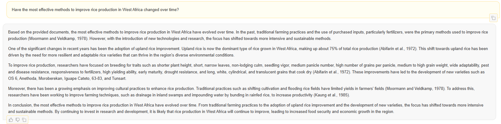"] tags=["figure-answer1-*"]
display(Image("media/q1.png"))
```

```python cell_type="markdown" jdh={"module": "object", "object": {"source": ["*What were the major scientific research projects on rice in Africa? Please list ten programs.* Answer referred to: Chandler, 1968 (chunk 1, score: 0.89); Zan, John and Alam, 1985 (chunk 22, score: 0.88); Brady, 1977 (chunk 13, score: 0.87); Brady, 1977 (chunk 26, score: 0.87); Zan, John and Alam, 1985 (chunk 1, score: 0.87). Default pre-query prompt used, question asked within a longer conversation."], "type": "image"}} metadata={"jdh": {"module": "object", "object": {"source": ["*What were the major scientific research projects on rice in Africa? Please list ten programs.* Answer referred to: Chandler, 1968 (chunk 1, score: 0.89); Zan, John and Alam, 1985 (chunk 22, score: 0.88); Brady, 1977 (chunk 13, score: 0.87); Brady, 1977 (chunk 26, score: 0.87); Zan, John and Alam, 1985 (chunk 1, score: 0.87). Default pre-query prompt used, question asked within a longer conversation."], "type": "image"}}, "tags": ["figure-answer2-*"]} source=["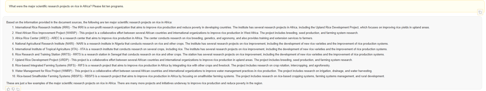"] tags=["figure-answer2-*"]
display(Image("media/q2.png"))
```

```python cell_type="markdown" jdh={"module": "object", "object": {"source": ["*What were the major development programs on rice in Africa? Please list ten programs.* Answer referred to: Brady, 1977 (chunk 26, score: 0.86); Chandler, 1968 (chunk 1, score: 0.86); Zan, John and Alam, 1985 (chunk 22, score: 0.86); Williams and Abifarin 1973 (chunk 2025-0, score: 0.86). Default pre-query prompt used, question asked within a longer conversation."], "type": "image"}} metadata={"jdh": {"module": "object", "object": {"source": ["*What were the major development programs on rice in Africa? Please list ten programs.* Answer referred to: Brady, 1977 (chunk 26, score: 0.86); Chandler, 1968 (chunk 1, score: 0.86); Zan, John and Alam, 1985 (chunk 22, score: 0.86); Williams and Abifarin 1973 (chunk 2025-0, score: 0.86). Default pre-query prompt used, question asked within a longer conversation."], "type": "image"}}, "tags": ["figure-answer3-*"]} source=["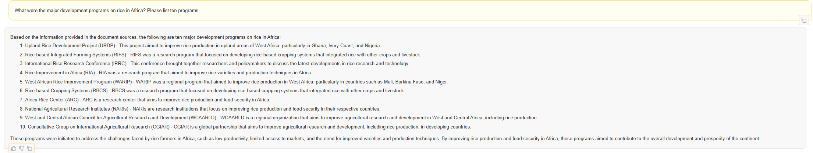"] tags=["figure-answer3-*"]
display(Image("media/q3.png"))
```

```python cell_type="markdown" jdh={"module": "object", "object": {"source": ["*Based on the provided text, does scientific research play a more dominant role than development programs in improving African rice production?* Answer referred to: Brady, 1977 (chunk 26, score: 0.89); Zan, John and Alam, 1985 (chunk 22, score: 0.88); Williams and Abifarin 1973 (chunk 1, score: 0.88). Default pre-query prompt used, question asked within a longer conversation."], "type": "image"}} metadata={"jdh": {"module": "object", "object": {"source": ["*Based on the provided text, does scientific research play a more dominant role than development programs in improving African rice production?* Answer referred to: Brady, 1977 (chunk 26, score: 0.89); Zan, John and Alam, 1985 (chunk 22, score: 0.88); Williams and Abifarin 1973 (chunk 1, score: 0.88). Default pre-query prompt used, question asked within a longer conversation."], "type": "image"}}, "tags": ["figure-answer4-*"]} source=["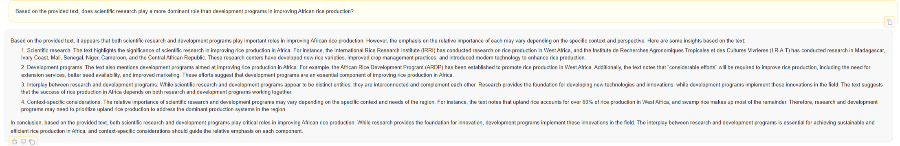"] tags=["figure-answer4-*"]
display(Image("media/q4.png"))
```

<!-- #region citation-manager={"citations": {"ij2cm": [{"id": "15179470/H2UJMXQY", "source": "zotero"}]}} -->
Historians must actively engage with LLMs using their subject knowledge, rather than asking general questions. Concretely, we tested how the LLM would respond to questions about gender and markets. Scholarly work on agricultural development policy between the 1960s and 1990s often points out that socio-economic contexts such as gender and markets tend to be marginalized in policy-making (<cite id="ij2cm"><a href="#zotero%7C15179470%2FH2UJMXQY">(Chauveau 1985)</a></cite>). We thus formulated our hypothesis that IRRI also overlooked socio-economic contexts in rice farming in West Africa, just as its contemporary organizations did. 

We tested analytical competencies, including retrieving, summarizing, analysing, and inferring ([Table 3](#anchor-analytical)). The manual reading of the corpus granted us insight into both the distribution of information within it and the capacity required to extract that information when attempting to answer our questions.
<!-- #endregion -->

<!-- #region jdh={"module": "object", "object": {"source": ["table 3: Analytical competences and levels of information availability in our corpus."]}} tags=["table-analytical-*", "anchor-analytical"] -->
| Analytical competence  | The distribution of information in our corpus                                                                                                    |
|------------------------|--------------------------------------------------------------------------------------------------------------------------------------------------|
| Retrieval              | The corpus contains a clear sentence that could answer the question. The LLM must identify the relevant passage.                                 |
| Summary                | Information is spread across different pages of the same or other documents. The LLM must summarize information from various relevant passages.  |
| Analysis               | The information is not explicitly stated within the text, but the LLM can still generate an answer through limited inference.                    |
| Inference              | The information is nowhere to be found in the corpus, and the answer generated requires more inference than analysis.                            |
<!-- #endregion -->

<!-- #region citation-manager={"citations": {"4ughu": [{"id": "15179470/PEPHXYQJ", "source": "zotero"}], "bugi7": [{"id": "15179470/4SULBHGF", "source": "zotero"}], "h962q": [{"id": "15179470/BAP4HEB7", "source": "zotero"}], "rb3dd": [{"id": "15179470/HUAT8DWW", "source": "zotero"}], "x7lkm": [{"id": "15179470/4SULBHGF", "source": "zotero"}]}} -->
Within our corpus, very few texts mentioned gender. The only one that focused clearly on gender was Jennie Dey’s 1979 article “Women farmers in the Gambia: the effects of irrigated rice development programs on their role in rice production” (<cite id="bugi7"><a href="#zotero%7C15179470%2F4SULBHGF">(Jennie Dey 1979)</a></cite>). An anthropological study, Dey discusses women’s roles in rice farming and land tenure in the Gambia. She then delved into changes in the technological systems when China, Taiwan, and the World Bank successively introduced irrigation programs. Gender was also mentioned in passing in some other articles. The LLM correctly answered factual questions drawing on Dey’s article, demonstrating its competence in retrieving and summarizing information. However, this exercise also exposed limitations in terms of analysis and inference. We asked about which technologies women mastered in West Africa and whether these differed from those used by men ([Figure 6](#figure-q2answer1-*) reffering to <cite id="rb3dd"><a href="#zotero%7C15179470%2FHUAT8DWW">(Zan, John, and Alam 1985)</a></cite>, <cite id="4ughu"><a href="#zotero%7C15179470%2FPEPHXYQJ">(Abifarin et al. 1972)</a></cite>, <cite id="x7lkm"><a href="#zotero%7C15179470%2F4SULBHGF">(Jennie Dey 1979)</a></cite> and <cite id="h962q"><a href="#zotero%7C15179470%2FBAP4HEB7">(Moormann and Greenland 1979)</a></cite>). The answer overemphasized women’s role in irrigated rice farming, stating that they were involved in every step, including mechanized farming. Dey, however, notes that irrigated rice farming was mainly men’s work and women were in charge only of weeding and transplanting. The tendency to overemphasise women’s presence in the corpus was also evident when asked whether our corpus marginalized women. The LLM replied negatively, stating that our corpus mentioned women extensively, disregarding the fact that, as stated above, there was only one article that discussed gender in a substantive way. The sanitation of our corpus’ marginalization of gender issue was a conspicuous blind-spot, and researchers must remain alert when using LLM for auditing international organizations’ perspectives as expressed through these kinds of documents. 
<!-- #endregion -->

```python cell_type="markdown" jdh={"module": "object", "object": {"source": ["*What rice farming technologies did women master in West Africa? Were these different from those used by men?* Answer referred to: Zan, John and Alam, 1985 (chunk 20, score: 0.87); Abifarin et al., 1972 (chunk 2025-0, score: 0.87); Jennie Dey, 1979 (chunk 2025-0, score: 0.87); Zan, John and Alam, 1985 (chunk 19, score: 0.86); Moormann and Greenland, 1979 (chunk 15, score: 0.86). Adapted pre-query prompt used in a single question dialog."], "type": "image"}} metadata={"jdh": {"module": "object", "object": {"source": ["*What rice farming technologies did women master in West Africa? Were these different from those used by men?* Answer referred to: Zan, John and Alam, 1985 (chunk 20, score: 0.87); Abifarin et al., 1972 (chunk 2025-0, score: 0.87); Jennie Dey, 1979 (chunk 2025-0, score: 0.87); Zan, John and Alam, 1985 (chunk 19, score: 0.86); Moormann and Greenland, 1979 (chunk 15, score: 0.86). Adapted pre-query prompt used in a single question dialog."], "type": "image"}}, "tags": ["figure-q2answer1-*"]} source=["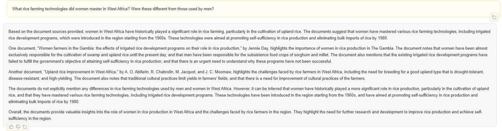"] tags=["figure-q2answer1-*"]
display(Image("media/s2q1.png"))
```

<!-- #region citation-manager={"citations": {"203vx": [{"id": "15179470/SMEFNCK2", "source": "zotero"}], "6s8dv": [{"id": "15179470/WY6NFBWN", "source": "zotero"}], "jfvys": [{"id": "15179470/GFDYH3RX", "source": "zotero"}], "u788w": [{"id": "15179470/WY6NFBWN", "source": "zotero"}], "yarkn": [{"id": "15179470/HUAT8DWW", "source": "zotero"}]}} -->
Information on rice marketing was much more complicated. Unlike gender, for which a limited number of keywords (e.g., women, female, wife, girls) could serve as direct identifiers, marketing would be expressed in a wide variety of keywords such as consumption, commerce, taste, trade, price, etc. The information was also more dispersed in our corpus, with only a small number of articles mentioning rice marketing and economies in West Africa. We observed that the closest answers contained a series of words that were repeatedly used. In responding to this set of questions, quantitative term frequency took precedence over textual meaning. For example, when asked whether rice is a food crop or a cash crop, the model replied that it was a food crop ([Figure 8](#figure-q2answer2-*) reffering to <cite id="u788w"><a href="#zotero%7C15179470%2FWY6NFBWN">(R. F. Jr. Chandler 1968)</a></cite>, <cite id="yarkn"><a href="#zotero%7C15179470%2FHUAT8DWW">(Zan, John, and Alam 1985)</a></cite> and <cite id="203vx"><a href="#zotero%7C15179470%2FSMEFNCK2">(Alam et al. 1985)</a></cite>). However, upon reading the texts, it was clear that this rice was mainly for commercial use (i.e., it was a cash crop) (<cite id="6s8dv"><a href="#zotero%7C15179470%2FWY6NFBWN">(R. F. Jr. Chandler 1968)</a></cite>, <cite id="jfvys"><a href="#zotero%7C15179470%2FGFDYH3RX">(Swaminathan 1986)</a></cite>). The model did not capture this undertone, as the word string “food crops” was used in the corpus rather than “cash crops.” Similarly, seldom-used words were replaced or missed in the answers. When asked, the LLM could not identify the specific passage that contained information on the research topics that IRRI pursued to address consumer preferences.
<!-- #endregion -->

```python cell_type="markdown" jdh={"module": "object", "object": {"source": ["*Was rice considered a food crop or a cash crop in West Africa?* Answer referred to: Chandler, 1968 (chunk 1, score: 0.89); Zan, John and Alam, 1985 (chunk 2025-0, score: 0.88); Alam et al, 1985 (chunk 2025-0, score: 0.88); Zan, John and Alam, 1985 (chunk 1, score: 0.88). Adapted pre-query prompt used in a single question dialog."], "type": "image"}} metadata={"jdh": {"module": "object", "object": {"source": ["*Was rice considered a food crop or a cash crop in West Africa?* Answer referred to: Chandler, 1968 (chunk 1, score: 0.89); Zan, John and Alam, 1985 (chunk 2025-0, score: 0.88); Alam et al, 1985 (chunk 2025-0, score: 0.88); Zan, John and Alam, 1985 (chunk 1, score: 0.88). Adapted pre-query prompt used in a single question dialog."], "type": "image"}}, "tags": ["figure-q2answer2-*"]} source=["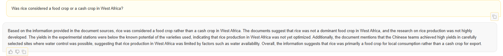"] tags=["figure-q2answer2-*"]
display(Image("media/s2q2.png"))
```

<!-- #region citation-manager={"citations": {"4db5p": [{"id": "15179470/HUAT8DWW", "source": "zotero"}], "9325e": [{"id": "15179470/HUAT8DWW", "source": "zotero"}], "9lhgt": [{"id": "15179470/BAP4HEB7", "source": "zotero"}], "b98ed": [{"id": "15179470/WY6NFBWN", "source": "zotero"}], "ck2hs": [{"id": "15179470/X39MRPDI", "source": "zotero"}], "e85ct": [{"id": "15179470/GFDYH3RX", "source": "zotero"}], "fe2zd": [{"id": "15179470/HUAT8DWW", "source": "zotero"}], "hl1wg": [{"id": "15179470/WY6NFBWN", "source": "zotero"}], "ko2dt": [{"id": "15179470/GFDYH3RX", "source": "zotero"}], "oa0gf": [{"id": "15179470/HUAT8DWW", "source": "zotero"}], "rbghf": [{"id": "15179470/8GVDEZZE", "source": "zotero"}], "rh95h": [{"id": "15179470/5UGT292T", "source": "zotero"}], "uqu2j": [{"id": "15179470/BCHXIPAY", "source": "zotero"}], "ybapi": [{"id": "15179470/8GVDEZZE", "source": "zotero"}], "yr2tx": [{"id": "15179470/5UGT292T", "source": "zotero"}], "zkukj": [{"id": "15179470/WY6NFBWN", "source": "zotero"}]}} -->
Marketing boards, widespread in West African countries to promote rice production by giving loans and mediating market prices, were mentioned only once in our corpus. When asked about marketing boards, the LLM drew on information outside our corpus to detail their functions ([Figure 9](#figure-q3answer1-*) reffering to <cite id="e85ct"><a href="#zotero%7C15179470%2FGFDYH3RX">(Swaminathan 1986)</a></cite> and <cite id="9lhgt"><a href="#zotero%7C15179470%2FBAP4HEB7">(Moormann and Greenland 1979)</a></cite>). Tellingly, it did not identify the single paragraph that mentioned marketing boards, showing some limitations in retrieving information. Interestingly, answers to questions about marketing  reflected the institutional bias of overlooking the market without sanitation ([Figure 10](#figure-q3answer5-*) reffering to <cite id="ybapi"><a href="#zotero%7C15179470%2F8GVDEZZE">(Williams and Abifarin 1973)</a></cite>, <cite id="b98ed"><a href="#zotero%7C15179470%2FWY6NFBWN">(R. F. Jr. Chandler 1968)</a></cite>, <cite id="fe2zd"><a href="#zotero%7C15179470%2FHUAT8DWW">(Zan, John, and Alam 1985)</a></cite> and <cite id="ck2hs"><a href="#zotero%7C15179470%2FX39MRPDI">(Ng et al. 1983)</a></cite>). When asked about the critical problems in rice trade in West Africa, the LLM answered that the problem lay in rice production itself ([Figure 11](#figure-q3answer6-*) citing <cite id="rh95h"><a href="#zotero%7C15179470%2F5UGT292T">(N. C. Brady 1977)</a></cite>, <cite id="hl1wg"><a href="#zotero%7C15179470%2FWY6NFBWN">(R. F. Jr. Chandler 1968)</a></cite> and <cite id="4db5p"><a href="#zotero%7C15179470%2FHUAT8DWW">(Zan, John, and Alam 1985)</a></cite>). Such an answer very much reflected IRRI’s focus on production rather than on marketing or consumption. In addition, the LLM managed to read the metadata. When asked about the potential bias of our corpus, it answered according to the metadata, indicating that the corpus was mainly published between 1973 and 85, with a few exceptions dating back to 1968, and mainly came from the IRRI and WARDA ([Figure 12](#figure-q3answer3-*) citing <cite id="9325e"><a href="#zotero%7C15179470%2FHUAT8DWW">(Zan, John, and Alam 1985)</a></cite>, <cite id="rbghf"><a href="#zotero%7C15179470%2F8GVDEZZE">(Williams and Abifarin 1973)</a></cite> and <cite id="yr2tx"><a href="#zotero%7C15179470%2F5UGT292T">(N. C. Brady 1977)</a></cite>, [Figure 13](#figure-q3answer4-*) citing <cite id="oa0gf"><a href="#zotero%7C15179470%2FHUAT8DWW">(Zan, John, and Alam 1985)</a></cite>, <cite id="ko2dt"><a href="#zotero%7C15179470%2FGFDYH3RX">(Swaminathan 1986)</a></cite>, <cite id="zkukj"><a href="#zotero%7C15179470%2FWY6NFBWN">(R. F. Jr. Chandler 1968)</a></cite> and <cite id="uqu2j"><a href="#zotero%7C15179470%2FBCHXIPAY">(Nichols 1975)</a></cite>). 
<!-- #endregion -->

```python cell_type="markdown" jdh={"module": "object", "object": {"source": ["*What were the functions of the marketing boards in West African countries?* Answer referred to: Swaminathan, 1968 (chunk 8, score: 0.80); Moorman and Greenland, 1979 (chunk 5, score: 0.79); Swaminathan, 1986 (chunk 3, score: 0.78). Adapted pre-query prompt used in a single question dialog."], "type": "image"}} metadata={"jdh": {"module": "object", "object": {"source": ["*What were the functions of the marketing boards in West African countries?* Answer referred to: Swaminathan, 1968 (chunk 8, score: 0.80); Moorman and Greenland, 1979 (chunk 5, score: 0.79); Swaminathan, 1986 (chunk 3, score: 0.78). Adapted pre-query prompt used in a single question dialog."], "type": "image"}}, "tags": ["figure-q3answer1-*"]} source=[""] tags=["figure-q3answer1-*"]
display(Image("media/s3q1.png"))
```

```python cell_type="markdown" jdh={"module": "object", "object": {"source": ["*What were the key reasons behind the evolution of rice demand in West Africa?* Answer referred to: Zan, John and Alam, 1985 (chunk 2, score: 0.88); Zan, John and Alam, 1985 (chunk 2025-0, score: 0.87); Williams and Abifarin, 1973 (chunk 2025-0, score: 0.87); Zan, John and Alam, 1985 (chunk 3, score: 0.87); Brady, 1977 (chunk 26, score: 0.87). Adapted pre-query prompt used in a single question dialog."], "type": "image"}} metadata={"jdh": {"module": "object", "object": {"source": ["*What were the key reasons behind the evolution of rice demand in West Africa?* Answer referred to: Zan, John and Alam, 1985 (chunk 2, score: 0.88); Zan, John and Alam, 1985 (chunk 2025-0, score: 0.87); Williams and Abifarin, 1973 (chunk 2025-0, score: 0.87); Zan, John and Alam, 1985 (chunk 3, score: 0.87); Brady, 1977 (chunk 26, score: 0.87). Adapted pre-query prompt used in a single question dialog."], "type": "image"}}, "tags": ["figure-q3answer3-*"]} source=["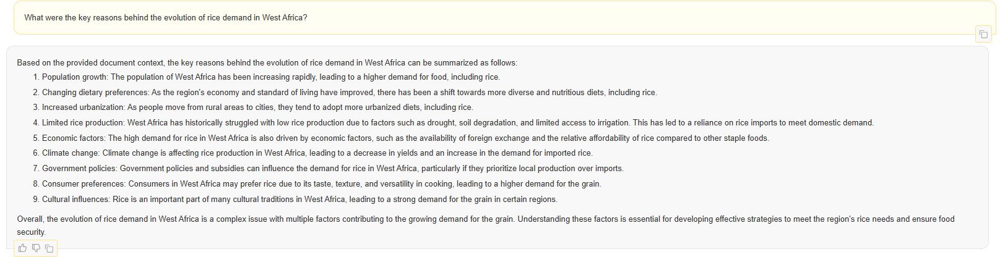"] tags=["figure-q3answer3-*"]
display(Image("media/s3q3.png"))
```

```python cell_type="markdown" jdh={"module": "object", "object": {"source": ["*Current scholarship suggests that consumers\u2019 preferences were sidelined within the organizations that produced our text corpus. Do you agree? Please provide evidence to demonstrate otherwise if possible.* Answer referred to: Zan, John and Alam, 1985 (chunk 23, score: 0.75); Swaminathan, 1986 (chunk 40, score: 0.75); Chandler, 1968 (chunk 6, score: 0.75); Nichols, 1975 (chunk 2, score: 0.75). Adapted pre-query prompt used in a single question dialog."], "type": "image"}} metadata={"jdh": {"module": "object", "object": {"source": ["*Current scholarship suggests that consumers\u2019 preferences were sidelined within the organizations that produced our text corpus. Do you agree? Please provide evidence to demonstrate otherwise if possible.* Answer referred to: Zan, John and Alam, 1985 (chunk 23, score: 0.75); Swaminathan, 1986 (chunk 40, score: 0.75); Chandler, 1968 (chunk 6, score: 0.75); Nichols, 1975 (chunk 2, score: 0.75). Adapted pre-query prompt used in a single question dialog."], "type": "image"}}, "tags": ["figure-q3answer4-*"]} source=["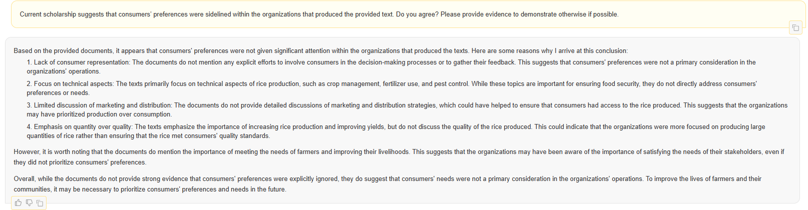"] tags=["figure-q3answer4-*"]
display(Image("media/s3q4.png"))
```

```python cell_type="markdown" jdh={"module": "object", "object": {"source": ["*What biases did our corpus have on the West African rice trade and marketing?* Answer referred to: Williams and Abifarin, 1973 (chunk 2025-0, score: 0.86); Williams and Abifarin, 1973 (chunk 2025-0, score: 0.86); Chandler, 1968 (chunk 1, score: 0.86); Zan, John and Alam, 1985 (chunk 7, score: 0.85); Ng, 1983 (chunk 2025-0, score: 0.86). Adapted pre-query prompt used in a single question dialog."], "type": "image"}} metadata={"jdh": {"module": "object", "object": {"source": ["*What biases did our corpus have on the West African rice trade and marketing?* Answer referred to: Williams and Abifarin, 1973 (chunk 2025-0, score: 0.86); Williams and Abifarin, 1973 (chunk 2025-0, score: 0.86); Chandler, 1968 (chunk 1, score: 0.86); Zan, John and Alam, 1985 (chunk 7, score: 0.85); Ng, 1983 (chunk 2025-0, score: 0.86). Adapted pre-query prompt used in a single question dialog."], "type": "image"}}, "tags": ["figure-q3answer5-*"]} source=["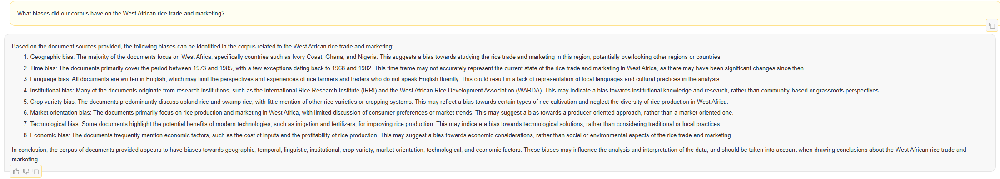"] tags=["figure-q3answer5-*"]
display(Image("media/s3q5.png"))
```

```python cell_type="markdown" jdh={"module": "object", "object": {"source": ["*Based on the experiences presented in our corpus, what were the critical problems in the rice trade in West Africa?* Answer referred to: Brady, 1977 (chunk 26, score: 0.87); Chandler, 1968 (chunk 2, score: 0.86); Chandler, 1968 (chunk 7, score: 0.86); Chandler, 1968 (chunk 5, score: 0.86); Zan, John and Alam, 1985 (chunk 22, score: 0.85); Chandler, 1968 (chunk 1, score: 0.85). Adapted pre-query prompt used in a single question dialog."], "type": "image"}} metadata={"jdh": {"module": "object", "object": {"source": ["*Based on the experiences presented in our corpus, what were the critical problems in the rice trade in West Africa?* Answer referred to: Brady, 1977 (chunk 26, score: 0.87); Chandler, 1968 (chunk 2, score: 0.86); Chandler, 1968 (chunk 7, score: 0.86); Chandler, 1968 (chunk 5, score: 0.86); Zan, John and Alam, 1985 (chunk 22, score: 0.85); Chandler, 1968 (chunk 1, score: 0.85). Adapted pre-query prompt used in a single question dialog."], "type": "image"}}, "tags": ["figure-q3answer6-*"]} source=["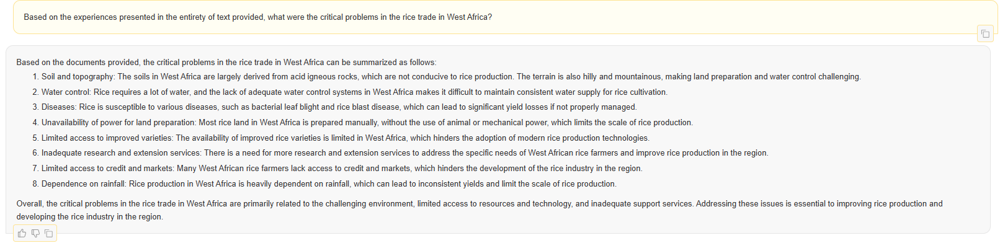"] tags=["figure-q3answer6-*"]
display(Image("media/s3q6.png"))
```

<!-- #region citation-manager={"citations": {"dy3c9": [{"id": "15179470/4SULBHGF", "source": "zotero"}], "qfm6x": [{"id": "15179470/2IT5P45P", "source": "zotero"}], "vxjxt": [{"id": "15179470/HUAT8DWW", "source": "zotero"}]}} -->
Despite its uneven performance in analytical competencies, the LLM proffered answers when asked to propose hypotheses as to why development programs in West Africa collaborated almost exclusively with men , despite rice being extensively farmed by women (<cite id="qfm6x"><a href="#zotero%7C15179470%2F2IT5P45P">(Carney 2010)</a></cite>). Although the answers were uneven in their precision and lacked logical coherence, they did suggest that women may be more likely to focus on subsistence farming, while men may prioritize commercial farming — a meaningful inference ([Figure 14](#figure-q3answer7-*) citing <cite id="dy3c9"><a href="#zotero%7C15179470%2F4SULBHGF">(Jennie Dey 1979)</a></cite> and <cite id="vxjxt"><a href="#zotero%7C15179470%2FHUAT8DWW">(Zan, John, and Alam 1985)</a></cite>). When asked how it inferred this, the model could not point to any relevant passages and answered that it was not directly mentioned in the uploaded texts, but rather from the pre-knowledge collected within the model itself (ollama). The cited chunks helped with tracking the origins of the passages that led to the answers. Tellingly, the mobilized text chunks were highly similar regardless of the order of the questions, indicating a certain level of reliability ([Table 4](#anchor-reproducibility)). However, the reliability of the selected cited sources should not overshadow the variety of response qualities in terms of analytical competencies and the unpredictable distance between the cited sources and the response. Such unevenness, likely dependent on the distribution of the information within the corpus, confirmed once again the importance of Open History in maximizing the transparency of LLMs’ reasoning process.
<!-- #endregion -->

```python cell_type="markdown" jdh={"module": "object", "object": {"source": ["*Most people consider rice is mostly farmed by women in West Africa. The development programs, however, collaborated almost exclusively with male farmers. Can you offer me some hypothesis regarding this discrepancy?* Answer referred to: Jennie Dey, 1979 (chunk 2025-0, score: 0.87); Zan, John and Alam, 1985 (chunk 20, score: 0.87); Zan, John and Alam, 1985 (chunk 19, score: 0.86); Jennie Dey, 1979 (chunk 10, score: 0.86). Default pre-query prompt used, question asked within a longer conversation."], "type": "image"}} metadata={"jdh": {"module": "object", "object": {"source": ["*Most people consider rice is mostly farmed by women in West Africa. The development programs, however, collaborated almost exclusively with male farmers. Can you offer me some hypothesis regarding this discrepancy?* Answer referred to: Jennie Dey, 1979 (chunk 2025-0, score: 0.87); Zan, John and Alam, 1985 (chunk 20, score: 0.87); Zan, John and Alam, 1985 (chunk 19, score: 0.86); Jennie Dey, 1979 (chunk 10, score: 0.86). Default pre-query prompt used, question asked within a longer conversation."], "type": "image"}}, "tags": ["figure-q3answer7-*"]} source=["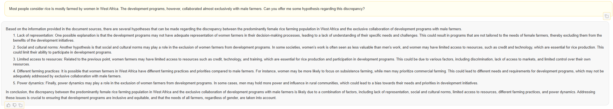"] tags=["figure-q3answer7-*"]
display(Image("media/s3q7.png"))
```

<!-- #region jdh={"module": "object", "object": {"source": ["table 4: *Was rice considered a food crop or a cash crop in West Africa?* This question has been asked in a single dialog, as well as part of several different conversations where the sequence of asked questions have been shuffled."]}} tags=["table-reproducibility-*", "anchor-reproducibility"] -->
| citation                                | single conversation | conversation 1 | conversation 2 | conversation 3 | conversation 4 | conversation 5 | conversation 6 | conversation 7 | conversation 8 | hit rate (%) |
|-----------------------------------------|---------------------|----------------|----------------|----------------|----------------|----------------|----------------|----------------|----------------|--------------|
| Chandler, 1968 (chunk 1)                | 1                   | 1              | 1              | 1              | 1              | 1              | 1              | 1              | 1              | 100          |
| Zan, John and Alam, 1985 (chunk 2025-0) | 1                   | 1              | 1              | 1              | 1              | 1              | 1              | 1              | 1              | 100          |
| Alam et al, 1985 (chunk 2025-0)         | 1                   | 1              | 1              | 1              | 0              | 1              | 0              | 1              | 0              | 66.7         |
| Zan, John and Alam, 1985 (chunk 1)      | 1                   | 1              | 0              | 1              | 0              | 1              | 0              | 1              | 0              | 55.6         |
<!-- #endregion -->

## The Need for Open History

<!-- #region citation-manager={"citations": {"4dw3a": [{"id": "15179470/TM7Q35JV", "source": "zotero"}], "9mvj9": [{"id": "15179470/DFL33AQD", "source": "zotero"}], "kauqm": [{"id": "15179470/FBLMEUB9", "source": "zotero"}], "ymsur": [{"id": "15179470/VCMPJTT3", "source": "zotero"}]}} -->
Having elucidated our methods, we now turn to the broader principles that guide our approach, what we call Open History. We believe that our proposed information framework could be a crucial way to maintain a level of openness, as the extensive dissemination of LLMs has increasingly resulted in “black boxes” in terms of source information. This non-traceable information is often utilized by LLMs to reply to researchers’ questions. In contrast, our framework adapts the values of open source, Open Science, and the FAIR principles (Findable, Accessible, Interoperable, Reusable) which all support an emphasis on openness, integrity, and reproducibility in historical research using LLMs (<cite id="9mvj9"><a href="#zotero%7C15179470%2FDFL33AQD">(Wilkinson et al. 2016)</a></cite>, <cite id="kauqm"><a href="#zotero%7C15179470%2FFBLMEUB9">(Foster and Deardorff 2017)</a></cite>). Our concept builds on earlier scholarship that argued for openness in historical practice. Roy Rosenzweig asked whether history might be democratized via open, collaborative resources like Wikipedia, showing how reflexivity, transparency, and communal contribution could reshape historical scholarship (<cite id="4dw3a"><a href="#zotero%7C15179470%2FTM7Q35JV">(Rosenzweig 2006)</a></cite>). Joseph L. Locke and Ben Wright extended this, advocating open access, digital resources, and participatory forms of historical inquiry where transparency is embedded alongside peer review (<cite id="ymsur"><a href="#zotero%7C15179470%2FVCMPJTT3">(Locke and Wright 2021)</a></cite>).
<!-- #endregion -->

What we now argue, building on the publications mentioned above, is that when historians use LLMs and other AI-driven tools, the methodology itself must also be open source: open code, open data, open workflows. In this sense, Open History is not only about accessibility and collaboration, but also about ensuring that the means of generation are transparent, verifiable, and amenable to scrutiny, replication, or improvement by the community. In keeping with these principles, we emphasize the following aspects of our workflow as the groundwork for Open History best practices: 

- We provide a template workflow for input textual data processing. Scholars must maintain full control over, and responsibility for, input textual data content and quality. 
- We chose an open-source framework that allows models to be downloaded locally and run on any available hardware. Containment (via Singularity) of research workflows furthermore ensures interoperability. 
- We implemented a retrieval augmented generation (RAG) workflow within the framework that returns the source citations used to generate every response; moreover, we recommend RAG (or an equivalent technique) as an analytical requirement for any/all conversational LLM interactions to ward against hallucinations as it allows researchers verify the sources generating the responses.

All essential aspects (i.e., code, input data files, model files, etc.) of this workflow can be accessed publicly as well as stored locally and run—without the need for commercial AI/LLM products or subscriptions—and on any available hardware (including personal laptops as well as university or institution based computing clusters). The long-term reproducibility of a workflow should be considered with regard to the ever-changing AI/LLM landscape (both in terms of hardware and software). 

<!-- #region citation-manager={"citations": {"sksux": [{"id": "15179470/LW6L9CXK", "source": "zotero"}], "yiftv": [{"id": "15179470/RMK3PY23", "source": "zotero"}]}} -->
These practices outline what we see as the technical foundation of Open History. Yet, methodology does not exist in isolation: the meaning and impact of openness depend on the broader research environment in which it is practiced. This is particularly important when considering differences between research infrastructures in high- and low-income countries. In recent years, there has been growing recognition that Open Science is not a one-size-fits-all model and Hu Chuan-Peng et al. emphasize that, thus far, the momentum in open science has largely benefited the Global North, and that researchers in more resource‐limited settings face structural challenges such as limited digital and physical infrastructure, funding constraints, lack of legal or policy support, unstable internet connectivity, and issues around incentive structures (<cite id="yiftv"><a href="#zotero%7C15179470%2FRMK3PY23">(Chuan-Peng et al. 2025)</a></cite>). Furthermore, Joseph Mwelwa et al. highlight issues with regional siloing of research. African scientific systems are currently defined by localized policies and data practices. Interoperable shared infrastructures could accelerate both scholarship and local capacity building (<cite id="sksux"><a href="#zotero%7C15179470%2FLW6L9CXK">(Mwelwa et al. 2020)</a></cite>). Finally, Chuan-Peng et al. further suggest a model for embracing open research in low-income countries based on building foundational capacity (using open resources already available), adopting low-cost, easily implementable practices, contributing to broader open science communities, and taking on leadership roles or forming local communities to foster cultural change.  
<!-- #endregion -->

The framework of Open History and workflow we designed responded directly to the suggestions mentioned above. The mobilized software was open source and required minimal coding, as shared in this article. In such a setting, researchers based in Low-Income countries could leverage LLMs without incurring high costs for data infrastructure or membership fees.


## Conclusion: *Open History* LLMs as Sparring Partners 


 LLMs have been a source of anxiety in many academic disciplines, particularly the humanities, for the mechanisms by which responses are generated remain unknown, and the responses are often unverifiable. This article proposes a modus operandi making LLMs and their reasoning more transparent to users. We use an open-source LLM framework (H2OGPT) to analyze a corpus digitized and uploaded by the International Rice Research Institute (IRRI), which is renowned for its leading role in global rice research since its establishment in the 1960s. The H2OGPT framework allows researchers to control the text input and the source citations used to generate each response through its retrieval-augmented generation (RAG) capability.


Based on such infrastructure, we interacted with the model to audit the perspectives expressed in IRRI’s corpus produced between the 1960s and 1991. According to current historiography, IRRI has been criticized for overlooking women and markets, two key elements of rice production in West Africa. We therefore asked questions about these two themes and verified whether the LLM critically engaged with these known blind spots. The interaction with the LLM illustrated uneven performance in analytical competencies across retrieval, summary, analysis, and inference between the two selected themes, and unpredictable distance between the cited sources and the response.  Some of these differences appear to be related to the distribution of relevant information within the corpus. The starkest contrast concerned sanitation issues. The model sanitized the corpus’s marginalization of women’s role, while, when asked about the critical problems in rice trade in West Africa, the LLM answered that the problem lay in rice production itself. Such an answer very much reflected IRRI’s focus on production rather than on marketing or consumption. Beneath the variety of response qualities, the mobilized text chunks were highly similar across question orders, indicating a certain level of reliability.  


Based on our findings, we argue that we must not compromise the critical analysis of source materials, which is the core of historical research. Instead, we need to interact with the LLMs using our methods of analyzing the corpus critically and continue to insist on the importance of the source’s verifiability. The verifiability is even more crucial given the unpredictability of LLMs’ responses, which fluctuates across topics and the distribution of information in the corpus. The modus operandi we propose here encapsulates our quest for Open History: it provides a method for controlling text input, ensuring that sources are verifiable, and ensuring that our work is reproducible by other researchers.
